# Glue opcodes report

Per-client NNLS fits of priced glue opcodes against their driver fixtures. Cycle-tier opcodes share one joint regression per client (shown once); pure-tier and mixed-tier opcodes each get a single-feature fit. Mixed-tier fits pre-adjust the LHS by subtracting the contribution of every priced upstream partner selected by the detector (pure ∪ cycle for `mixed_a`, plus `mixed_a` for `mixed_b`).

**Contents:** [besu](#besu) · [erigon](#erigon) · [ethrex](#ethrex) · [geth](#geth) · [nethermind](#nethermind) · [reth](#reth)

## besu

| glue_opcode | nobs | glue_runtime_ms | p_value | rsquared |
| --- | --- | --- | --- | --- |
| `ISZERO` | 3377 | 3.308e-06 | 1.00e-03 | 0.8239 |
| `JUMPDEST` | 3377 | 7.925e-07 | 1.00e-03 | 0.7528 |
| `SWAP` | 54032 | 2.787e-06 | 1.00e-03 | 0.416 |
| `CALLDATASIZE` | 199705 | 2.924e-06 | 1.00e-03 | 0.9285 |
| `DUP` | 199705 | 1.274e-06 | 1.00e-03 | 0.9285 |
| `GAS` | 199705 | 2.51e-06 | 1.00e-03 | 0.9285 |
| `MLOAD` | 199705 | 8.836e-06 | 1.00e-03 | 0.9285 |
| `PUSH` | 199705 | 1.914e-06 | 1.00e-03 | 0.9285 |
| `PUSH0` | 199705 | 1.021e-06 | 1.00e-03 | 0.9285 |
| `STATICCALL` | 199705 | 0.0007018 | 1.00e-03 | 0.9285 |
| `ADD` | 3377 | 8.608e-06 | 1.00e-03 | 0.8575 |
| `AND` | 3377 | 6.007e-06 | 1.00e-03 | 0.8552 |
| `CALLDATACOPY` | 81048 | 1.39e-05 | 1.00e-03 | 0.6427 |
| `CALLDATALOAD` | 13508 | 0 | 1.00e+00 | -2.22e-16 |
| `DIV` | 3377 | 1.354e-05 | 1.00e-03 | 0.7925 |
| `EXP` | 3377 | 0.001072 | 1.00e-03 | 0.74 |
| `GT` | 3377 | 1.946e-05 | 1.00e-03 | 0.1513 |
| `JUMPI` | 3377 | 5.038e-06 | 1.00e-03 | 0.7316 |
| `LT` | 3377 | 1.93e-05 | 1.00e-03 | 0.1456 |
| `MSTORE` | 16885 | 1.474e-05 | 1.00e-03 | 0.827 |
| `MSTORE8` | 16885 | 9.166e-06 | 1.00e-03 | 0.8567 |
| `MUL` | 3377 | 1.13e-05 | 1.00e-03 | 0.7958 |
| `PC` | 3377 | 2.886e-06 | 1.00e-03 | 0.8683 |
| `RETURNDATASIZE` | 13508 | 4.243e-06 | 1.00e-03 | 0.7874 |
| `SELFBALANCE` | 2763 | 1.024e-05 | 1.00e-03 | 0.6999 |
| `SUB` | 3377 | 9.027e-06 | 1.00e-03 | 0.8472 |
| `JUMP` | 3377 | 4.261e-05 | 1.00e-03 | 0.8504 |
| `KECCAK256` | 54032 | 3.792e-05 | 1.00e-03 | 0.161 |

### Cycle glue — joint fit · besu

<details><summary>Joint NNLS regression summary</summary>

```
==============================================================================
                           NNLS Regression Results                            
==============================================================================
Dep. Variable:          test_runtime_ms              R-squared:          0.929
Model:                  NNLS                    Adj. R-squared:          0.929
No. Observations:       199705                            RMSE:          27.00
Df Residuals:           199697                             MAE:          19.49
Df Model:               7      
==============================================================================
                      coef     std err     P-value      [0.025      0.975]
------------------------------------------------------------------------------
         const     44.4178      0.2016       0.001     44.0258     44.8055
  CALLDATASIZE      0.0000      0.0000       0.001      0.0000      0.0000
           DUP      0.0000      0.0000       0.001      0.0000      0.0000
           GAS      0.0000      0.0000       0.001      0.0000      0.0000
         MLOAD      0.0000      0.0000       0.001      0.0000      0.0000
          PUSH      0.0000      0.0000       0.001      0.0000      0.0000
         PUSH0      0.0000      0.0000       0.001      0.0000      0.0000
    STATICCALL      0.0007      0.0000       0.001      0.0007      0.0007
==============================================================================
Notes: Non-negative least squares with bootstrap inference (1000 iterations)
==============================================================================
```

</details>

<details><summary><code>CALLDATASIZE</code> · nobs=199705 · runtime_ms=2.924e-06 · p=1.00e-03 · R²=0.9285</summary>

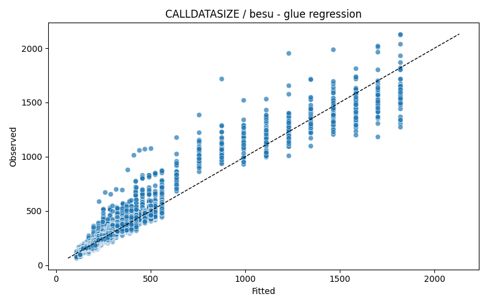

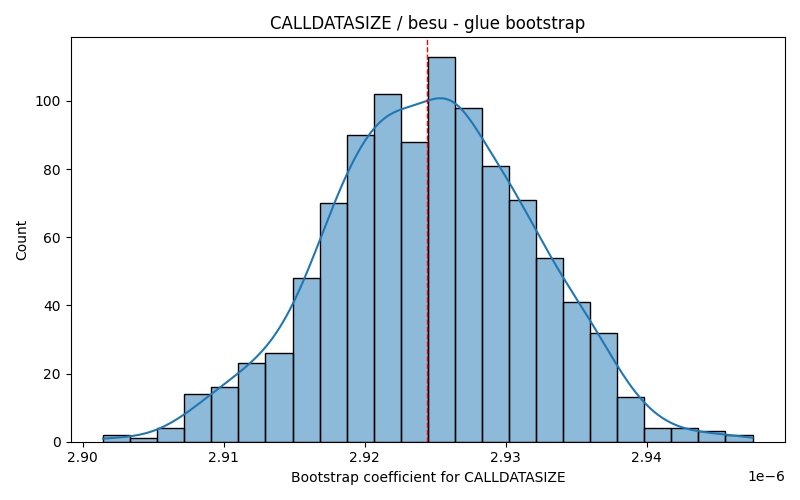

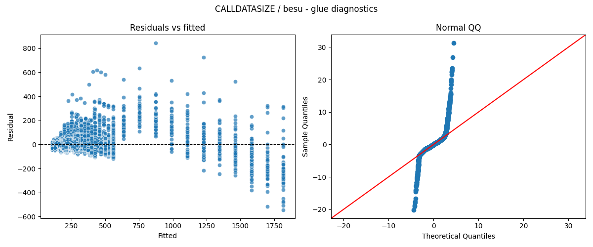

</details>

<details><summary><code>DUP</code> · nobs=199705 · runtime_ms=1.274e-06 · p=1.00e-03 · R²=0.9285</summary>


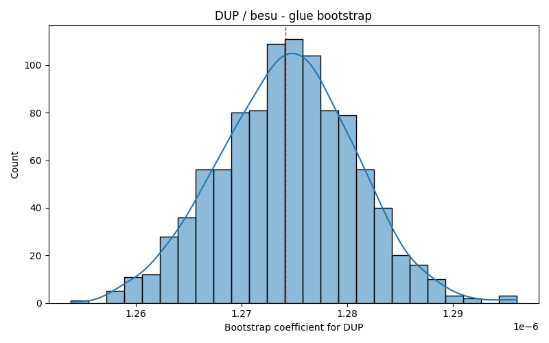


</details>

<details><summary><code>GAS</code> · nobs=199705 · runtime_ms=2.51e-06 · p=1.00e-03 · R²=0.9285</summary>


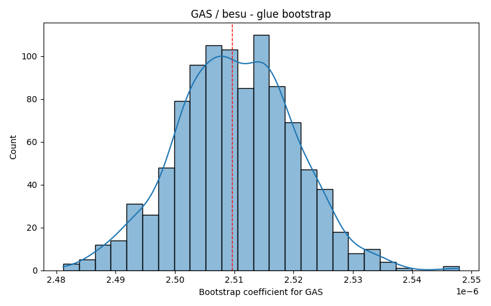

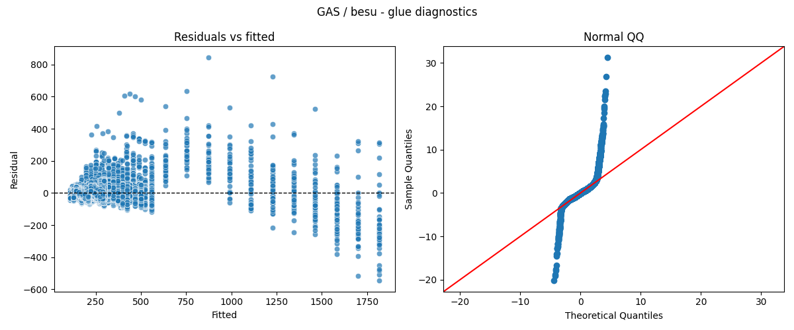

</details>

<details><summary><code>MLOAD</code> · nobs=199705 · runtime_ms=8.836e-06 · p=1.00e-03 · R²=0.9285</summary>


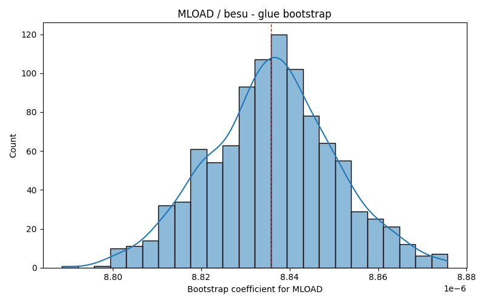

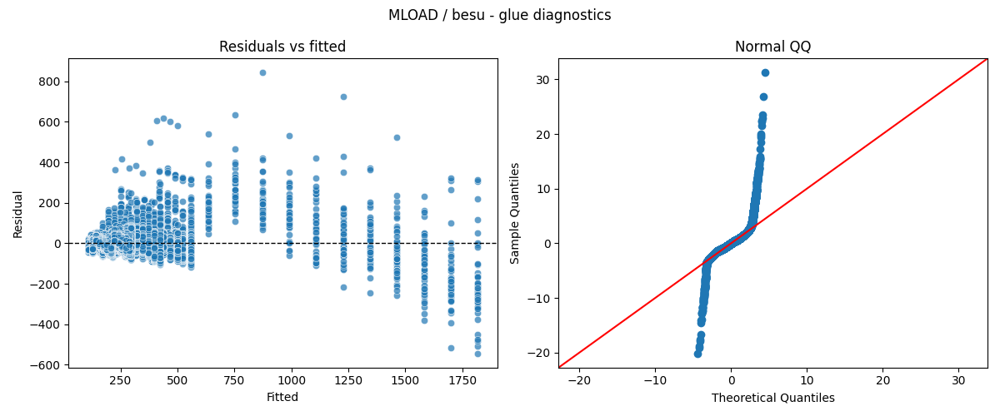

</details>

<details><summary><code>PUSH</code> · nobs=199705 · runtime_ms=1.914e-06 · p=1.00e-03 · R²=0.9285</summary>


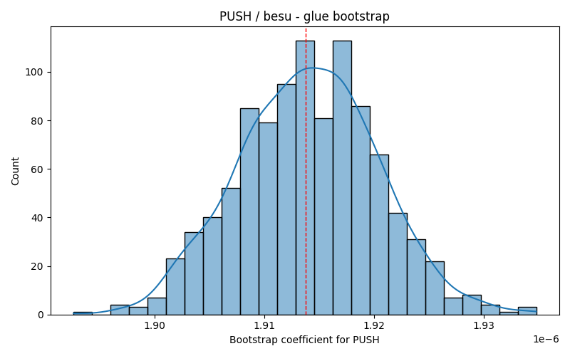


</details>

<details><summary><code>PUSH0</code> · nobs=199705 · runtime_ms=1.021e-06 · p=1.00e-03 · R²=0.9285</summary>

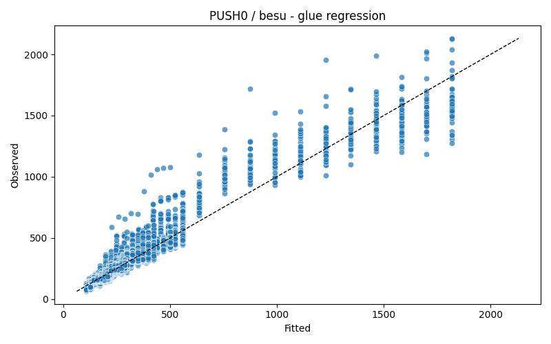

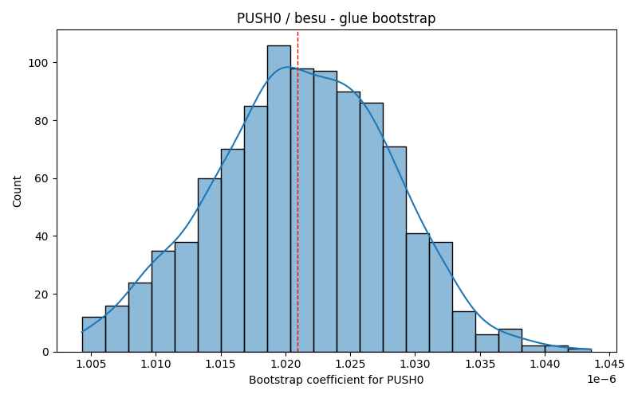


</details>

<details><summary><code>STATICCALL</code> · nobs=199705 · runtime_ms=0.0007018 · p=1.00e-03 · R²=0.9285</summary>

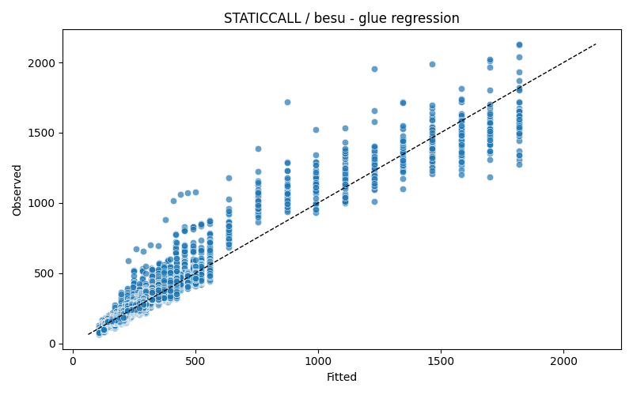

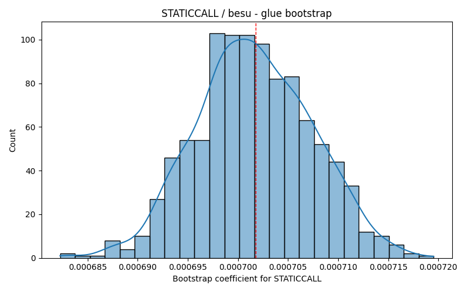


</details>

### Pure glue · besu

<details><summary><code>ISZERO</code> · nobs=3377 · runtime_ms=3.308e-06 · p=1.00e-03 · R²=0.8239</summary>

```
==============================================================================
                           NNLS Regression Results                            
==============================================================================
Dep. Variable:          test_runtime_ms              R-squared:          0.824
Model:                  NNLS                    Adj. R-squared:          0.824
No. Observations:       3377                              RMSE:          32.20
Df Residuals:           3375                               MAE:          25.41
Df Model:               1      
==============================================================================
                      coef     std err     P-value      [0.025      0.975]
------------------------------------------------------------------------------
         const     55.3797      1.7697       0.001     51.7172     58.7203
        ISZERO      0.0000      0.0000       0.001      0.0000      0.0000
==============================================================================
Notes: Non-negative least squares with bootstrap inference (1000 iterations)
==============================================================================
```

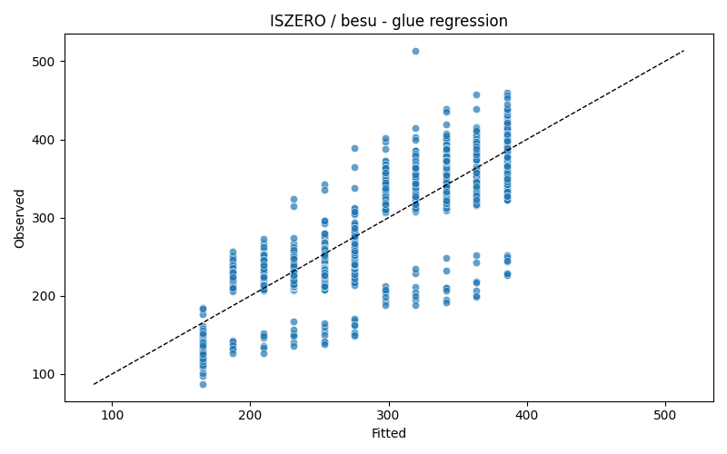

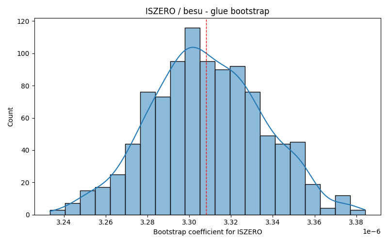

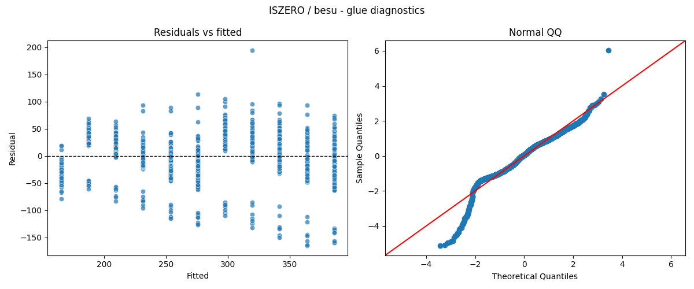

</details>

<details><summary><code>JUMPDEST</code> · nobs=3377 · runtime_ms=7.925e-07 · p=1.00e-03 · R²=0.7528</summary>

```
==============================================================================
                           NNLS Regression Results                            
==============================================================================
Dep. Variable:          test_runtime_ms              R-squared:          0.753
Model:                  NNLS                    Adj. R-squared:          0.753
No. Observations:       3377                              RMSE:          28.68
Df Residuals:           3375                               MAE:          18.31
Df Model:               1      
==============================================================================
                      coef     std err     P-value      [0.025      0.975]
------------------------------------------------------------------------------
         const     38.7970      1.6158       0.001     35.6067     42.0364
      JUMPDEST      0.0000      0.0000       0.001      0.0000      0.0000
==============================================================================
Notes: Non-negative least squares with bootstrap inference (1000 iterations)
==============================================================================
```

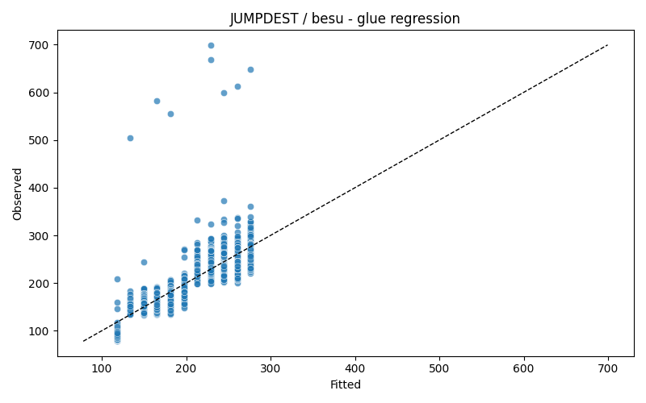

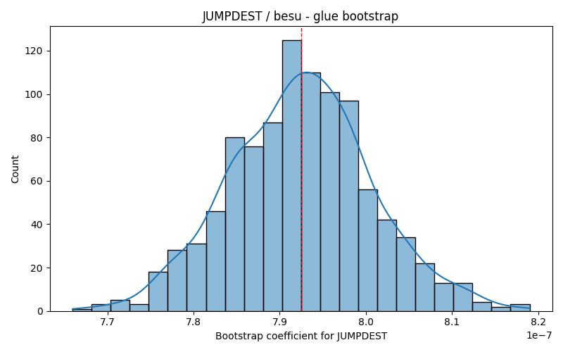

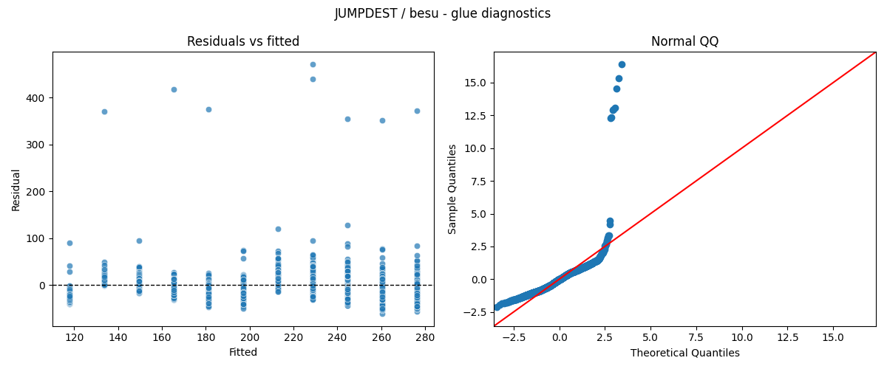

</details>

<details><summary><code>SWAP</code> · nobs=54032 · runtime_ms=2.787e-06 · p=1.00e-03 · R²=0.416</summary>

```
==============================================================================
                           NNLS Regression Results                            
==============================================================================
Dep. Variable:          test_runtime_ms              R-squared:          0.416
Model:                  NNLS                    Adj. R-squared:          0.416
No. Observations:       54032                             RMSE:          69.53
Df Residuals:           54030                              MAE:          63.55
Df Model:               1      
==============================================================================
                      coef     std err     P-value      [0.025      0.975]
------------------------------------------------------------------------------
         const     47.5306      0.8759       0.001     45.8686     49.2135
          SWAP      0.0000      0.0000       0.001      0.0000      0.0000
==============================================================================
Notes: Non-negative least squares with bootstrap inference (1000 iterations)
==============================================================================
```

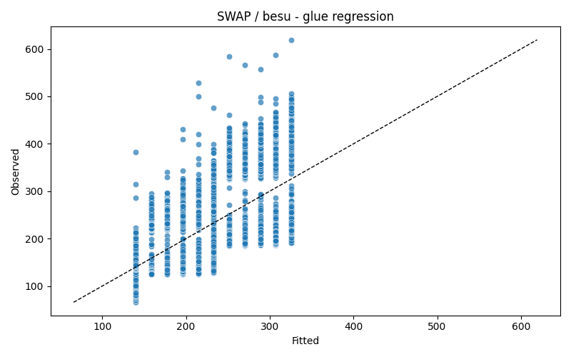

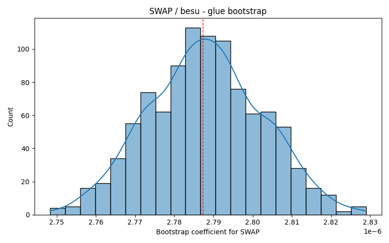

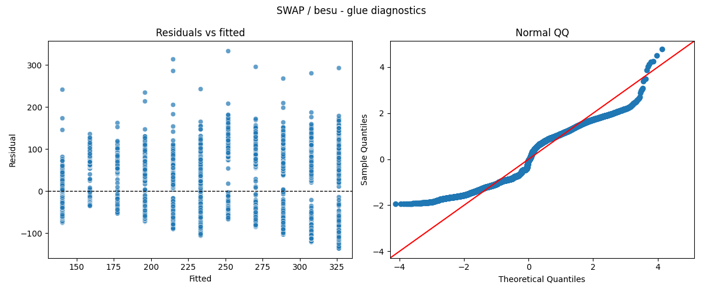

</details>

### Mixed glue (tier A) · besu

<details><summary><code>ADD</code> · nobs=3377 · runtime_ms=8.608e-06 · p=1.00e-03 · R²=0.8575</summary>

```
==============================================================================
                           NNLS Regression Results                            
==============================================================================
Dep. Variable:          test_runtime_ms              R-squared:          0.857
Model:                  NNLS                    Adj. R-squared:          0.857
No. Observations:       3377                              RMSE:          36.94
Df Residuals:           3375                               MAE:          30.60
Df Model:               1      
==============================================================================
                      coef     std err     P-value      [0.025      0.975]
------------------------------------------------------------------------------
         const     70.4750      2.1276       0.001     66.1910     74.8166
           ADD      0.0000      0.0000       0.001      0.0000      0.0000
==============================================================================
Notes: Non-negative least squares with bootstrap inference (1000 iterations)
==============================================================================
```

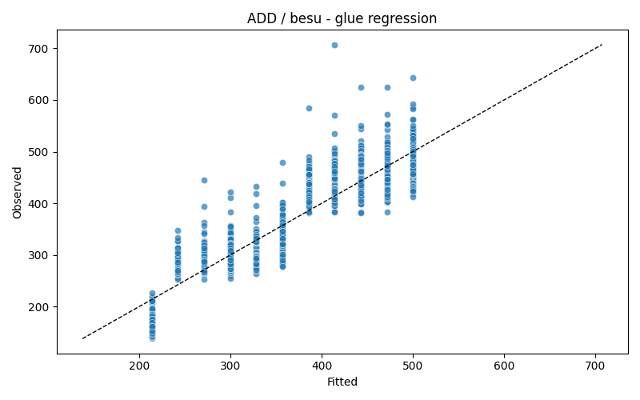

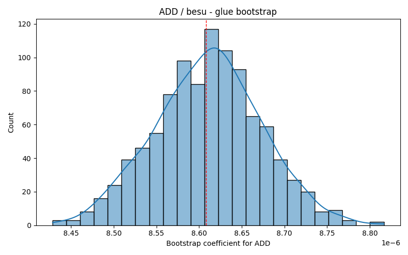

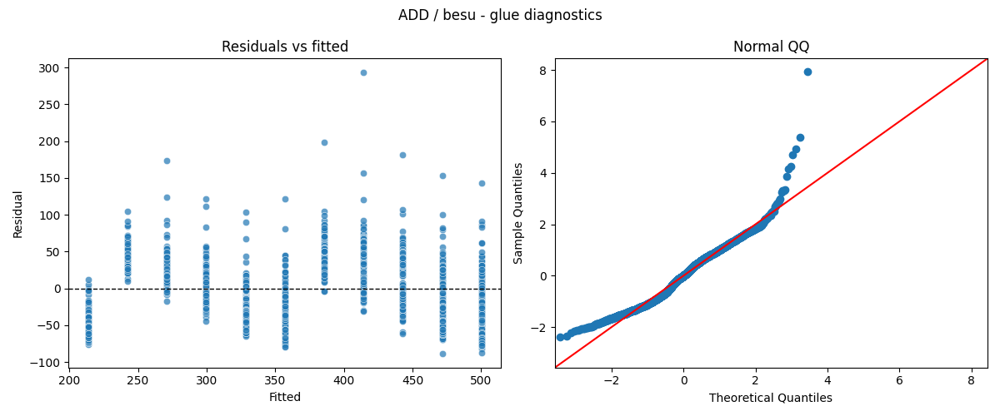

</details>

<details><summary><code>AND</code> · nobs=3377 · runtime_ms=6.007e-06 · p=1.00e-03 · R²=0.8552</summary>

```
==============================================================================
                           NNLS Regression Results                            
==============================================================================
Dep. Variable:          test_runtime_ms              R-squared:          0.855
Model:                  NNLS                    Adj. R-squared:          0.855
No. Observations:       3377                              RMSE:          26.02
Df Residuals:           3375                               MAE:          19.95
Df Model:               1      
==============================================================================
                      coef     std err     P-value      [0.025      0.975]
------------------------------------------------------------------------------
         const     57.4971      1.3821       0.001     54.7699     60.3204
           AND      0.0000      0.0000       0.001      0.0000      0.0000
==============================================================================
Notes: Non-negative least squares with bootstrap inference (1000 iterations)
==============================================================================
```

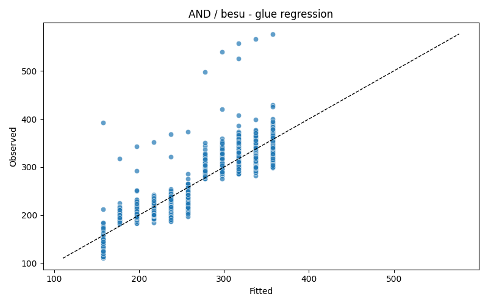

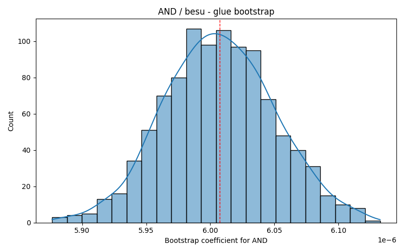

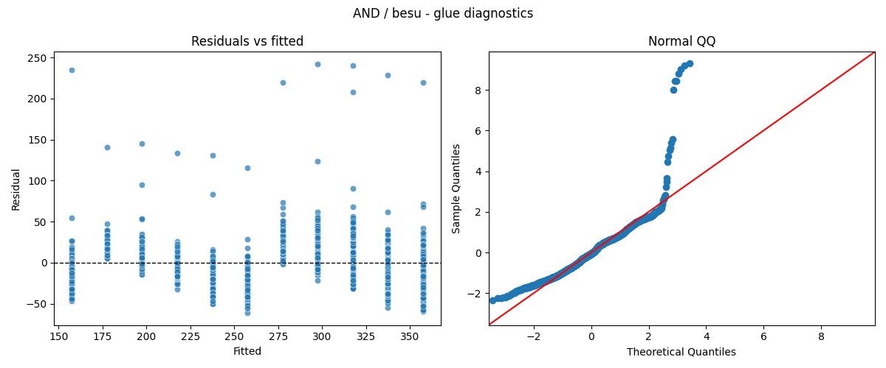

</details>

<details><summary><code>CALLDATACOPY</code> · nobs=81048 · runtime_ms=1.39e-05 · p=1.00e-03 · R²=0.6427</summary>

```
==============================================================================
                           NNLS Regression Results                            
==============================================================================
Dep. Variable:          test_runtime_ms              R-squared:          0.643
Model:                  NNLS                    Adj. R-squared:          0.643
No. Observations:       81048                             RMSE:          77.95
Df Residuals:           81046                              MAE:          60.47
Df Model:               1      
==============================================================================
                      coef     std err     P-value      [0.025      0.975]
------------------------------------------------------------------------------
         const    123.2495      0.3230       0.001    122.6144    123.8602
  CALLDATACOPY      0.0000      0.0000       0.001      0.0000      0.0000
==============================================================================
Notes: Non-negative least squares with bootstrap inference (1000 iterations)
==============================================================================
```

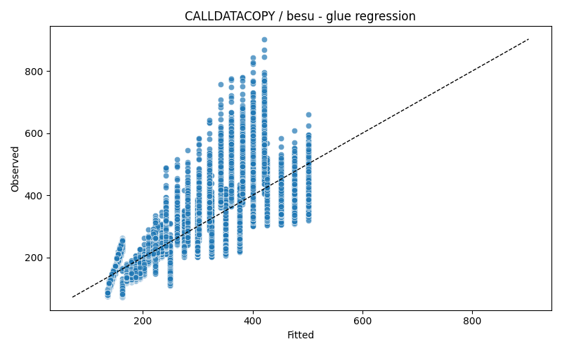

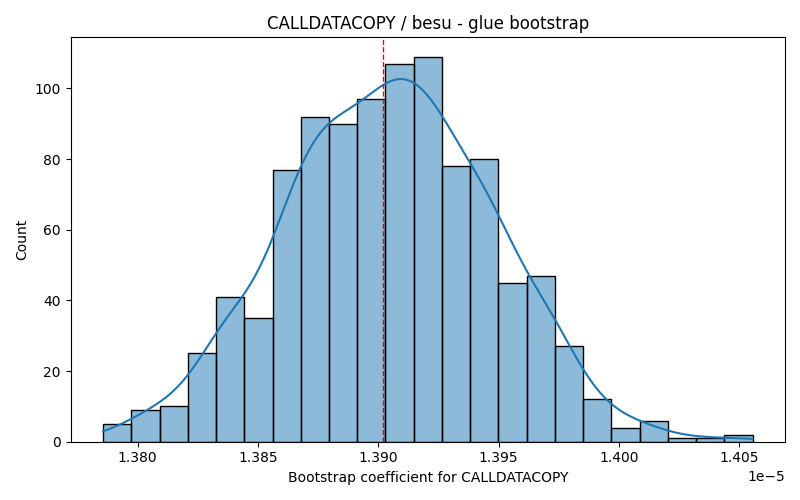

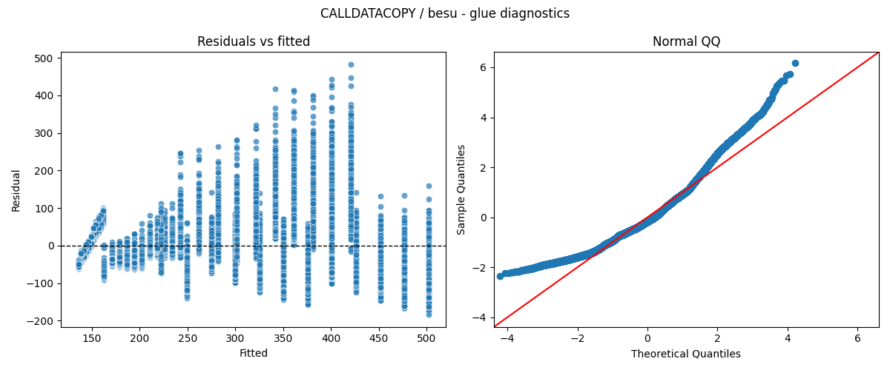

</details>

<details><summary><code>CALLDATALOAD</code> · nobs=13508 · runtime_ms=0 · p=1.00e+00 · R²=-2.22e-16</summary>

```
==============================================================================
                           NNLS Regression Results                            
==============================================================================
Dep. Variable:          test_runtime_ms              R-squared:         -0.000
Model:                  NNLS                    Adj. R-squared:         -0.000
No. Observations:       13508                             RMSE:           0.63
Df Residuals:           13506                              MAE:           0.42
Df Model:               1      
==============================================================================
                      coef     std err     P-value      [0.025      0.975]
------------------------------------------------------------------------------
         const      3.5137      0.0055       0.001      3.5025      3.5240
  CALLDATALOAD      0.0000      0.0000       1.000      0.0000      0.0000
==============================================================================
Notes: Non-negative least squares with bootstrap inference (1000 iterations)
==============================================================================
```

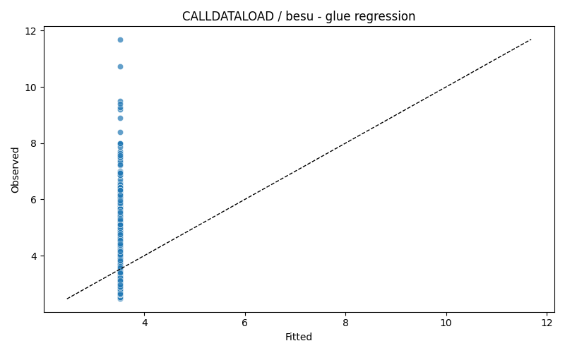


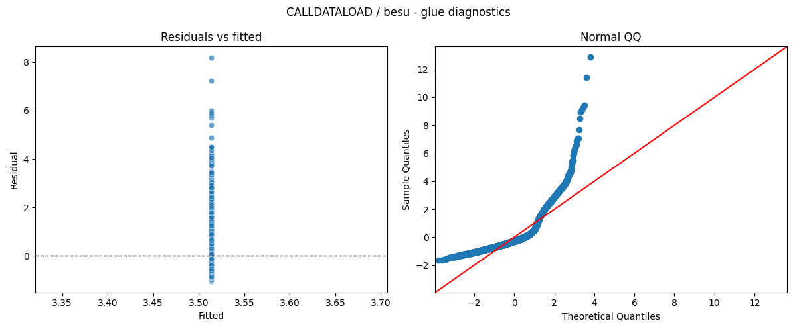

</details>

<details><summary><code>DIV</code> · nobs=3377 · runtime_ms=1.354e-05 · p=1.00e-03 · R²=0.7925</summary>

```
==============================================================================
                           NNLS Regression Results                            
==============================================================================
Dep. Variable:          test_runtime_ms              R-squared:          0.793
Model:                  NNLS                    Adj. R-squared:          0.792
No. Observations:       3377                              RMSE:          54.69
Df Residuals:           3375                               MAE:          44.48
Df Model:               1      
==============================================================================
                      coef     std err     P-value      [0.025      0.975]
------------------------------------------------------------------------------
         const    126.9868      2.7184       0.001    121.6025    132.4702
           DIV      0.0000      0.0000       0.001      0.0000      0.0000
==============================================================================
Notes: Non-negative least squares with bootstrap inference (1000 iterations)
==============================================================================
```

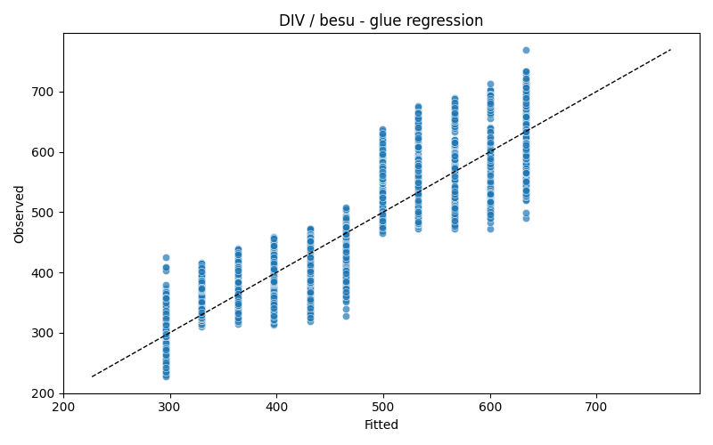

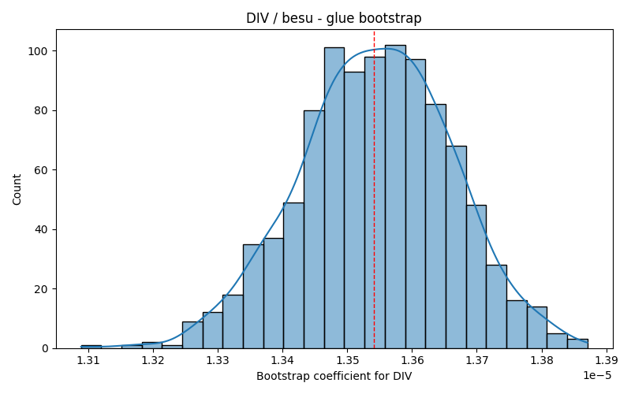

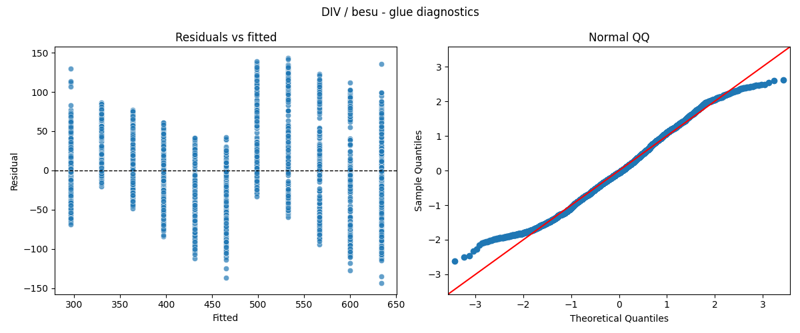

</details>

<details><summary><code>EXP</code> · nobs=3377 · runtime_ms=0.001072 · p=1.00e-03 · R²=0.74</summary>

```
==============================================================================
                           NNLS Regression Results                            
==============================================================================
Dep. Variable:          test_runtime_ms              R-squared:          0.740
Model:                  NNLS                    Adj. R-squared:          0.740
No. Observations:       3377                              RMSE:          24.88
Df Residuals:           3375                               MAE:          19.07
Df Model:               1      
==============================================================================
                      coef     std err     P-value      [0.025      0.975]
------------------------------------------------------------------------------
         const     90.3412      1.6827       0.001     87.0721     93.7779
           EXP      0.0011      0.0000       0.001      0.0010      0.0011
==============================================================================
Notes: Non-negative least squares with bootstrap inference (1000 iterations)
==============================================================================
```

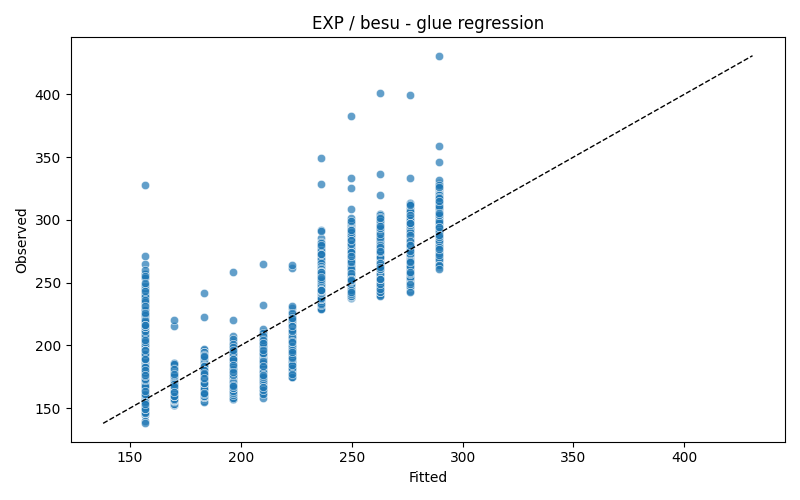

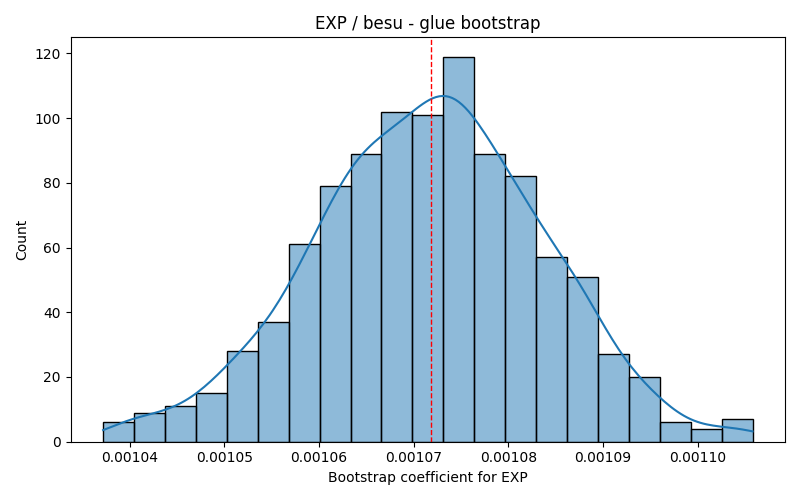

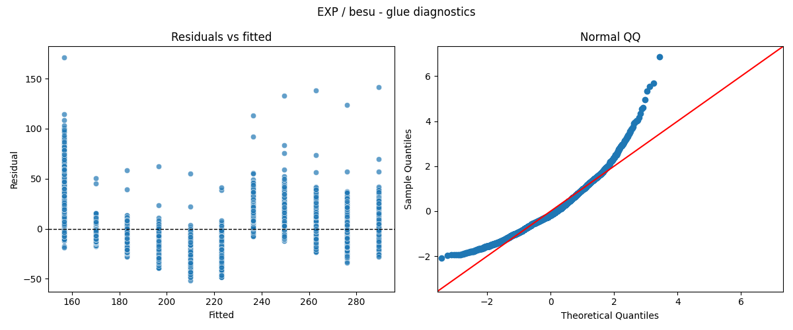

</details>

<details><summary><code>GT</code> · nobs=3377 · runtime_ms=1.946e-05 · p=1.00e-03 · R²=0.1513</summary>

```
==============================================================================
                           NNLS Regression Results                            
==============================================================================
Dep. Variable:          test_runtime_ms              R-squared:          0.151
Model:                  NNLS                    Adj. R-squared:          0.151
No. Observations:       3377                              RMSE:         484.98
Df Residuals:           3375                               MAE:         458.93
Df Model:               1      
==============================================================================
                      coef     std err     P-value      [0.025      0.975]
------------------------------------------------------------------------------
         const    124.7904     23.6286       0.001     79.8636    169.7831
            GT      0.0000      0.0000       0.001      0.0000      0.0000
==============================================================================
Notes: Non-negative least squares with bootstrap inference (1000 iterations)
==============================================================================
```

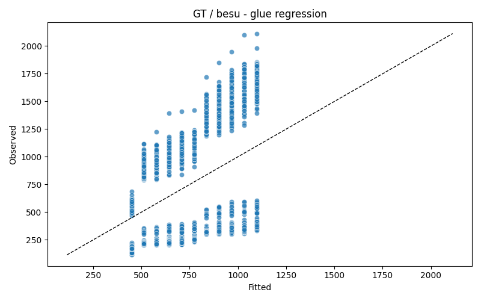

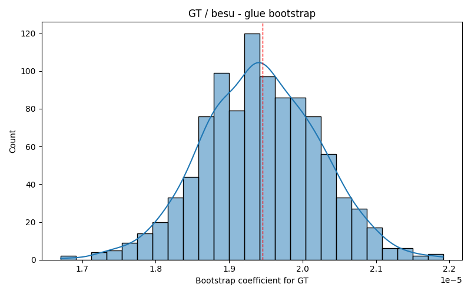

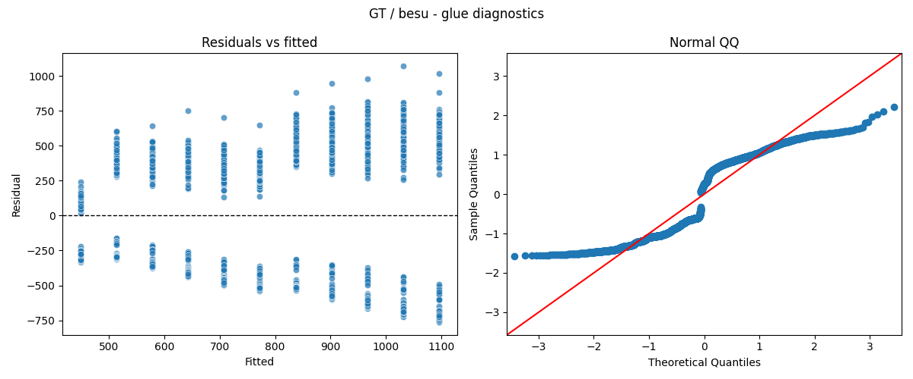

</details>

<details><summary><code>JUMPI</code> · nobs=3377 · runtime_ms=5.038e-06 · p=1.00e-03 · R²=0.7316</summary>

```
==============================================================================
                           NNLS Regression Results                            
==============================================================================
Dep. Variable:          test_runtime_ms              R-squared:          0.732
Model:                  NNLS                    Adj. R-squared:          0.732
No. Observations:       3377                              RMSE:          13.77
Df Residuals:           3375                               MAE:          10.56
Df Model:               1      
==============================================================================
                      coef     std err     P-value      [0.025      0.975]
------------------------------------------------------------------------------
         const     21.9761      0.7813       0.001     20.4203     23.4269
         JUMPI      0.0000      0.0000       0.001      0.0000      0.0000
==============================================================================
Notes: Non-negative least squares with bootstrap inference (1000 iterations)
==============================================================================
```

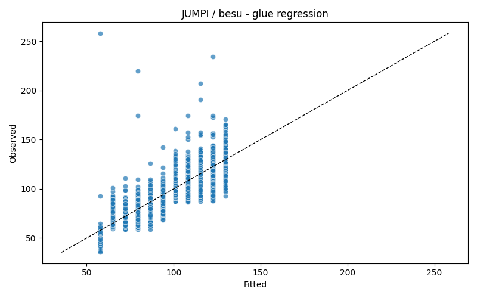

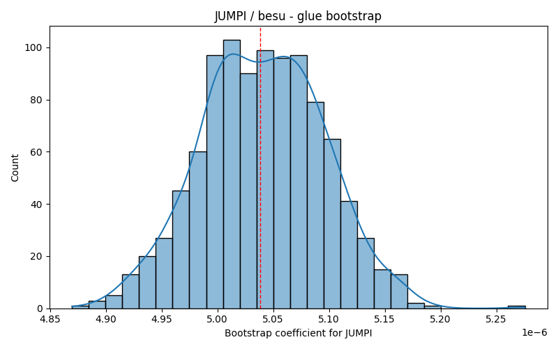

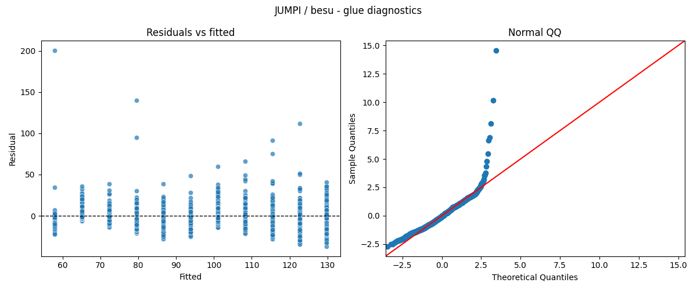

</details>

<details><summary><code>LT</code> · nobs=3377 · runtime_ms=1.93e-05 · p=1.00e-03 · R²=0.1456</summary>

```
==============================================================================
                           NNLS Regression Results                            
==============================================================================
Dep. Variable:          test_runtime_ms              R-squared:          0.146
Model:                  NNLS                    Adj. R-squared:          0.145
No. Observations:       3377                              RMSE:         492.20
Df Residuals:           3375                               MAE:         464.77
Df Model:               1      
==============================================================================
                      coef     std err     P-value      [0.025      0.975]
------------------------------------------------------------------------------
         const    156.1957     24.8752       0.001    106.4067    203.3385
            LT      0.0000      0.0000       0.001      0.0000      0.0000
==============================================================================
Notes: Non-negative least squares with bootstrap inference (1000 iterations)
==============================================================================
```

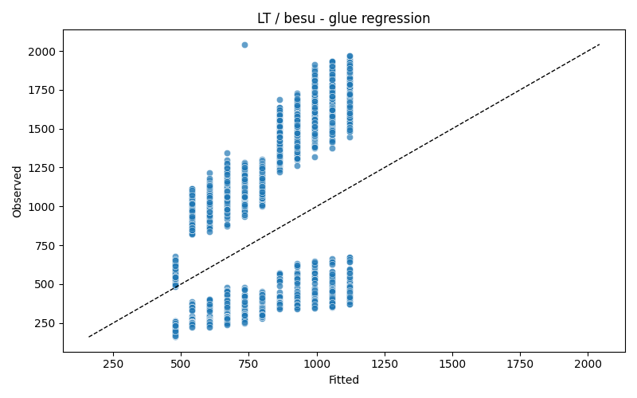

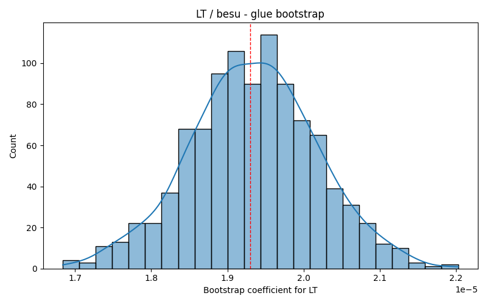

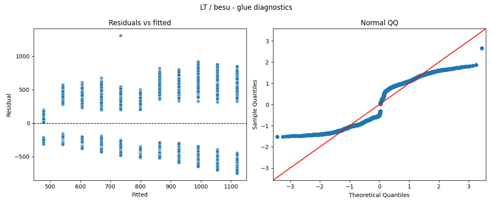

</details>

<details><summary><code>MSTORE</code> · nobs=16885 · runtime_ms=1.474e-05 · p=1.00e-03 · R²=0.827</summary>

```
==============================================================================
                           NNLS Regression Results                            
==============================================================================
Dep. Variable:          test_runtime_ms              R-squared:          0.827
Model:                  NNLS                    Adj. R-squared:          0.827
No. Observations:       16885                             RMSE:          47.29
Df Residuals:           16883                              MAE:          38.24
Df Model:               1      
==============================================================================
                      coef     std err     P-value      [0.025      0.975]
------------------------------------------------------------------------------
         const     80.8122      1.2077       0.001     78.4421     83.0014
        MSTORE      0.0000      0.0000       0.001      0.0000      0.0000
==============================================================================
Notes: Non-negative least squares with bootstrap inference (1000 iterations)
==============================================================================
```

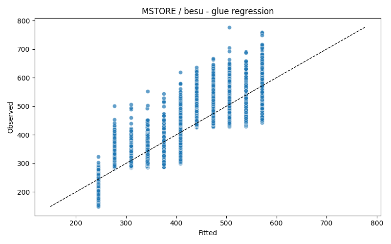

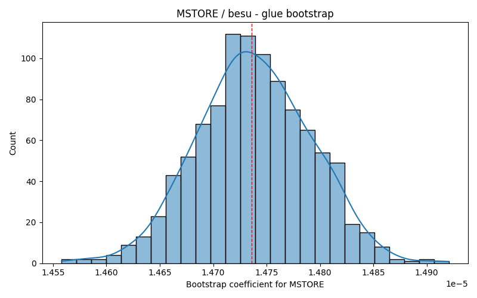

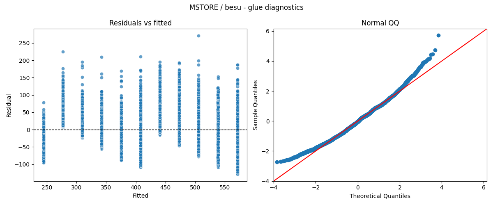

</details>

<details><summary><code>MSTORE8</code> · nobs=16885 · runtime_ms=9.166e-06 · p=1.00e-03 · R²=0.8567</summary>

```
==============================================================================
                           NNLS Regression Results                            
==============================================================================
Dep. Variable:          test_runtime_ms              R-squared:          0.857
Model:                  NNLS                    Adj. R-squared:          0.857
No. Observations:       16885                             RMSE:          26.31
Df Residuals:           16883                              MAE:          21.53
Df Model:               1      
==============================================================================
                      coef     std err     P-value      [0.025      0.975]
------------------------------------------------------------------------------
         const     49.2397      0.6558       0.001     47.9569     50.4952
       MSTORE8      0.0000      0.0000       0.001      0.0000      0.0000
==============================================================================
Notes: Non-negative least squares with bootstrap inference (1000 iterations)
==============================================================================
```

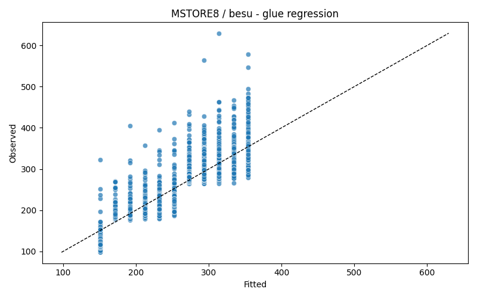

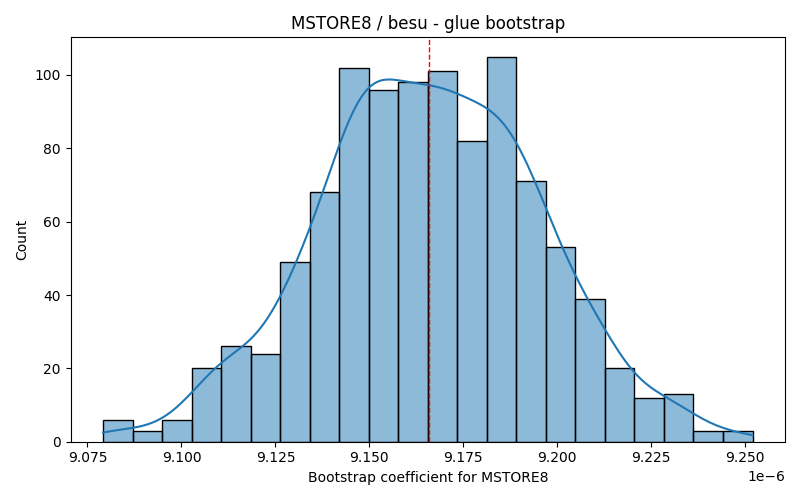

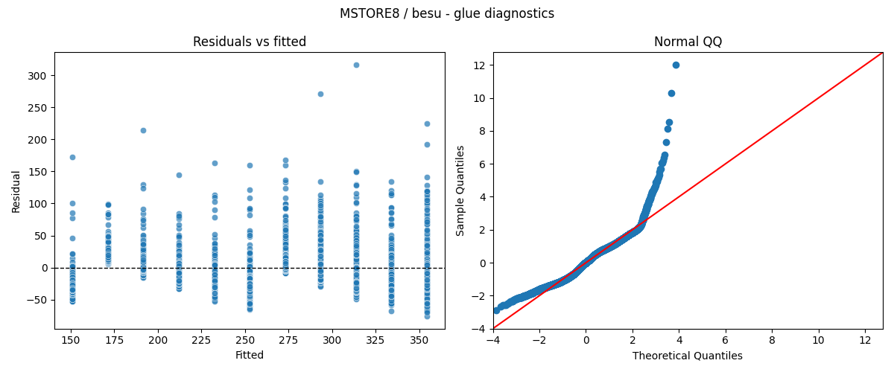

</details>

<details><summary><code>MUL</code> · nobs=3377 · runtime_ms=1.13e-05 · p=1.00e-03 · R²=0.7958</summary>

```
==============================================================================
                           NNLS Regression Results                            
==============================================================================
Dep. Variable:          test_runtime_ms              R-squared:          0.796
Model:                  NNLS                    Adj. R-squared:          0.796
No. Observations:       3377                              RMSE:          45.17
Df Residuals:           3375                               MAE:          35.79
Df Model:               1      
==============================================================================
                      coef     std err     P-value      [0.025      0.975]
------------------------------------------------------------------------------
         const     95.4957      2.2144       0.001     91.1942     99.9529
           MUL      0.0000      0.0000       0.001      0.0000      0.0000
==============================================================================
Notes: Non-negative least squares with bootstrap inference (1000 iterations)
==============================================================================
```

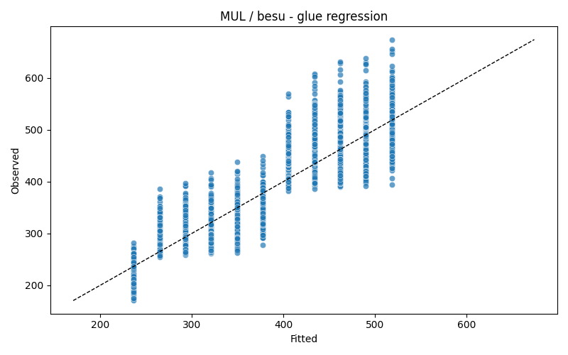

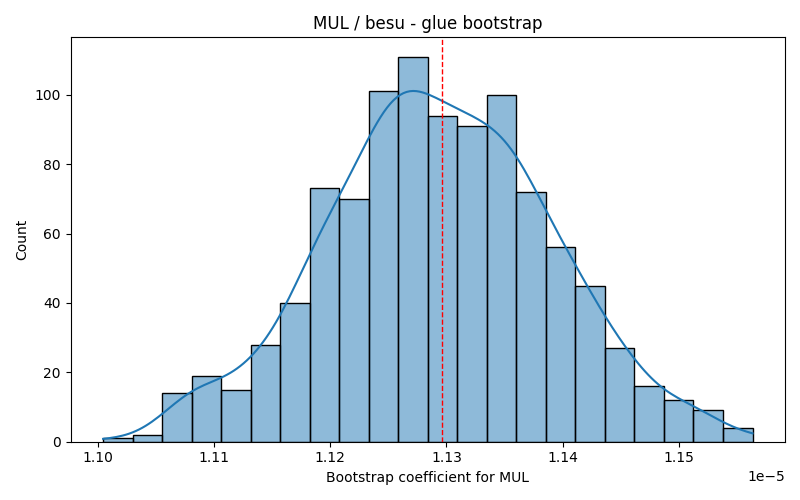

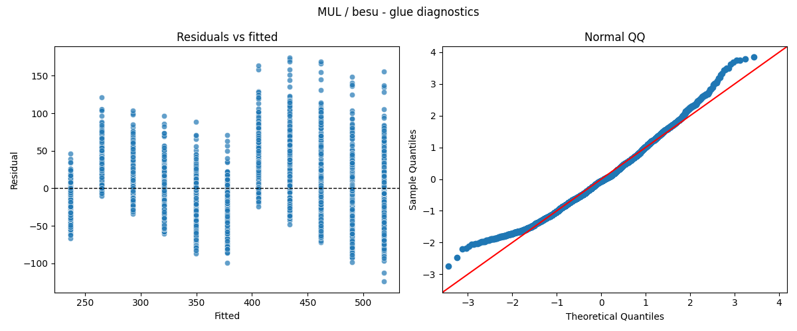

</details>

<details><summary><code>PC</code> · nobs=3377 · runtime_ms=2.886e-06 · p=1.00e-03 · R²=0.8683</summary>

```
==============================================================================
                           NNLS Regression Results                            
==============================================================================
Dep. Variable:          test_runtime_ms              R-squared:          0.868
Model:                  NNLS                    Adj. R-squared:          0.868
No. Observations:       3377                              RMSE:          33.61
Df Residuals:           3375                               MAE:          28.81
Df Model:               1      
==============================================================================
                      coef     std err     P-value      [0.025      0.975]
------------------------------------------------------------------------------
         const     68.3863      2.0424       0.001     64.5612     72.4325
            PC      0.0000      0.0000       0.001      0.0000      0.0000
==============================================================================
Notes: Non-negative least squares with bootstrap inference (1000 iterations)
==============================================================================
```

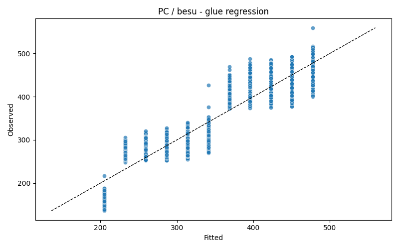

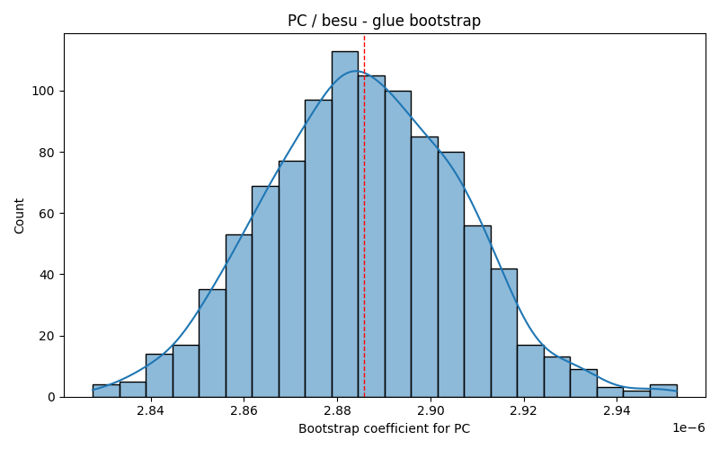

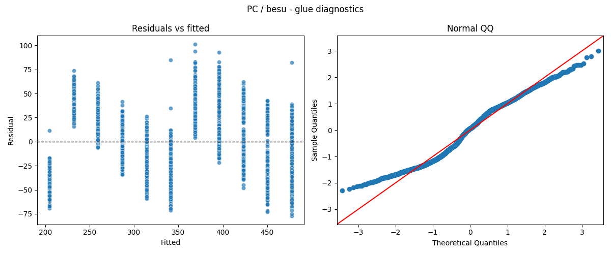

</details>

<details><summary><code>RETURNDATASIZE</code> · nobs=13508 · runtime_ms=4.243e-06 · p=1.00e-03 · R²=0.7874</summary>

```
==============================================================================
                           NNLS Regression Results                            
==============================================================================
Dep. Variable:          test_runtime_ms              R-squared:          0.787
Model:                  NNLS                    Adj. R-squared:          0.787
No. Observations:       13508                             RMSE:          34.81
Df Residuals:           13506                              MAE:          24.86
Df Model:               1      
==============================================================================
                      coef     std err     P-value      [0.025      0.975]
------------------------------------------------------------------------------
         const     51.9397      0.9694       0.001     50.1354     53.9651
RETURNDATASIZE      0.0000      0.0000       0.001      0.0000      0.0000
==============================================================================
Notes: Non-negative least squares with bootstrap inference (1000 iterations)
==============================================================================
```

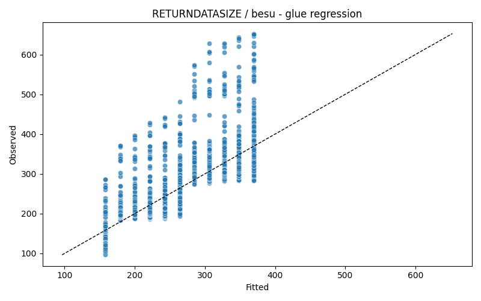

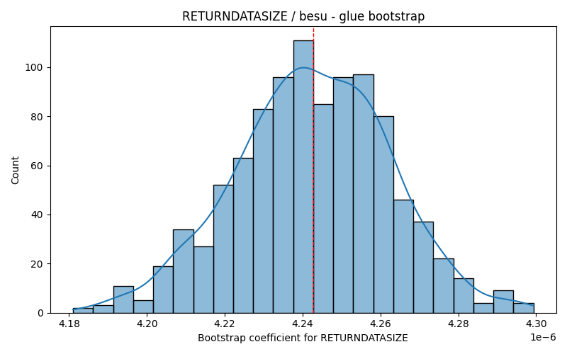

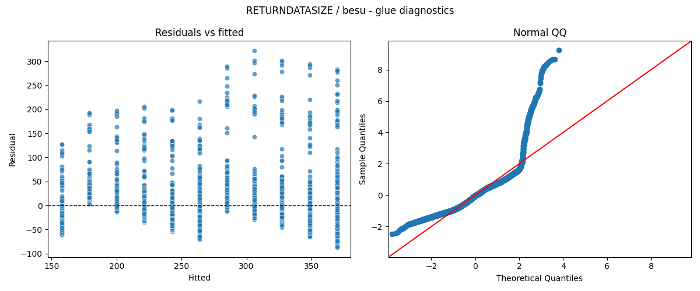

</details>

<details><summary><code>SELFBALANCE</code> · nobs=2763 · runtime_ms=1.024e-05 · p=1.00e-03 · R²=0.6999</summary>

```
==============================================================================
                           NNLS Regression Results                            
==============================================================================
Dep. Variable:          test_runtime_ms              R-squared:          0.700
Model:                  NNLS                    Adj. R-squared:          0.700
No. Observations:       2763                              RMSE:          67.66
Df Residuals:           2761                               MAE:          56.28
Df Model:               1      
==============================================================================
                      coef     std err     P-value      [0.025      0.975]
------------------------------------------------------------------------------
         const    235.9515      4.9038       0.001    226.2544    245.3541
   SELFBALANCE      0.0000      0.0000       0.001      0.0000      0.0000
==============================================================================
Notes: Non-negative least squares with bootstrap inference (1000 iterations)
==============================================================================
```

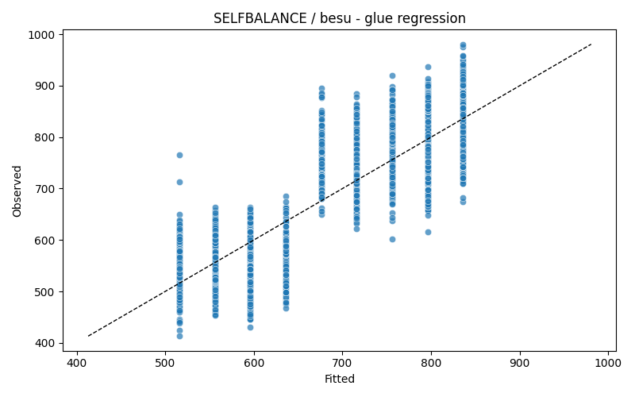

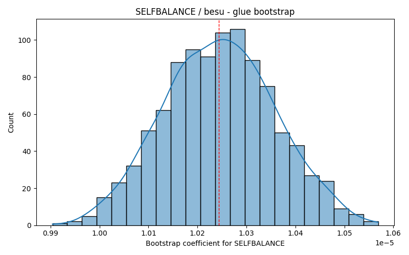

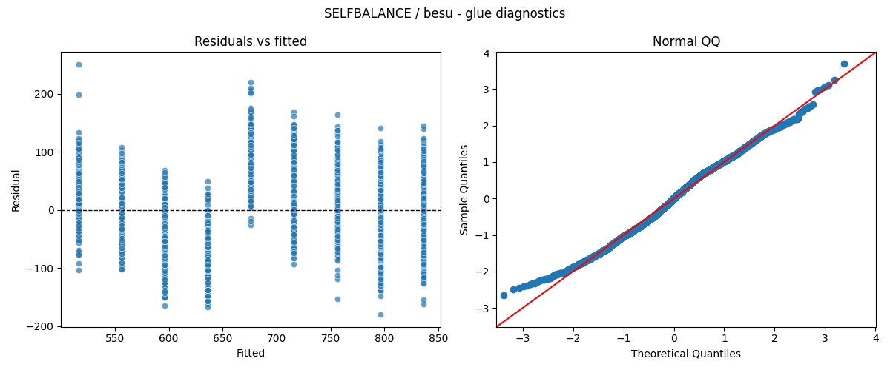

</details>

<details><summary><code>SUB</code> · nobs=3377 · runtime_ms=9.027e-06 · p=1.00e-03 · R²=0.8472</summary>

```
==============================================================================
                           NNLS Regression Results                            
==============================================================================
Dep. Variable:          test_runtime_ms              R-squared:          0.847
Model:                  NNLS                    Adj. R-squared:          0.847
No. Observations:       3377                              RMSE:          40.35
Df Residuals:           3375                               MAE:          33.91
Df Model:               1      
==============================================================================
                      coef     std err     P-value      [0.025      0.975]
------------------------------------------------------------------------------
         const     78.0125      2.2692       0.001     73.7439     82.6700
           SUB      0.0000      0.0000       0.001      0.0000      0.0000
==============================================================================
Notes: Non-negative least squares with bootstrap inference (1000 iterations)
==============================================================================
```

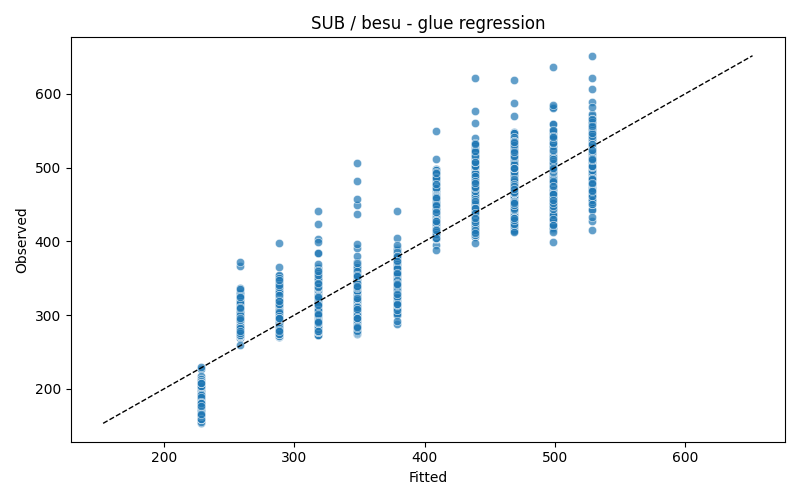

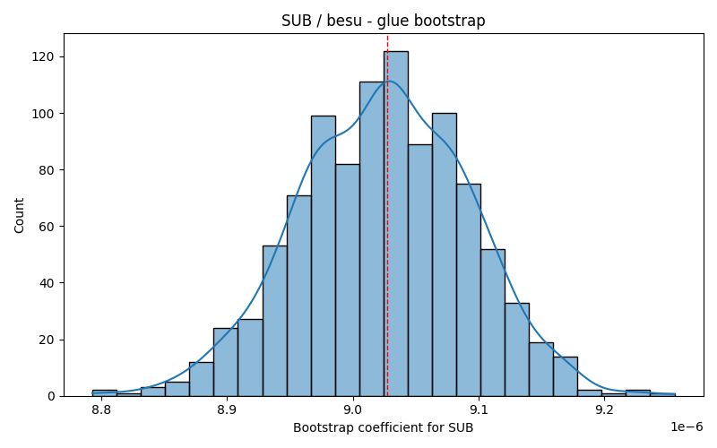

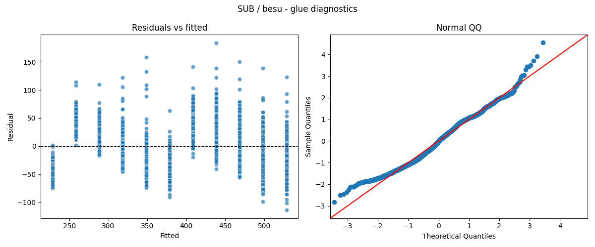

</details>

### Mixed glue (tier B) · besu

<details><summary><code>JUMP</code> · nobs=3377 · runtime_ms=4.261e-05 · p=1.00e-03 · R²=0.8504</summary>

```
==============================================================================
                           NNLS Regression Results                            
==============================================================================
Dep. Variable:          test_runtime_ms              R-squared:          0.850
Model:                  NNLS                    Adj. R-squared:          0.850
No. Observations:       3377                              RMSE:          66.43
Df Residuals:           3375                               MAE:          56.01
Df Model:               1      
==============================================================================
                      coef     std err     P-value      [0.025      0.975]
------------------------------------------------------------------------------
         const    123.7599      4.0405       0.001    116.1920    131.8919
          JUMP      0.0000      0.0000       0.001      0.0000      0.0000
==============================================================================
Notes: Non-negative least squares with bootstrap inference (1000 iterations)
==============================================================================
```

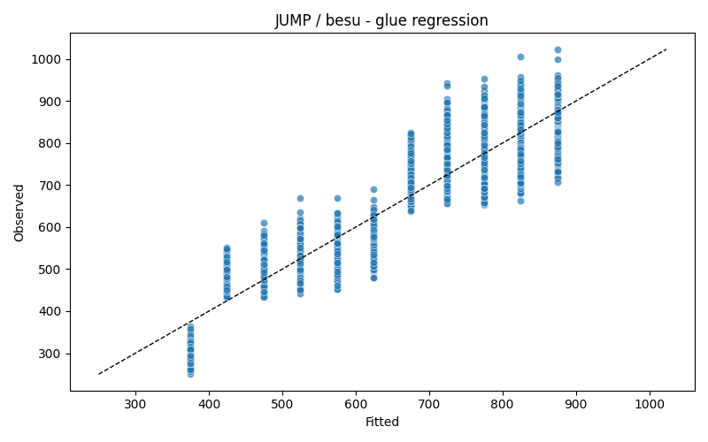

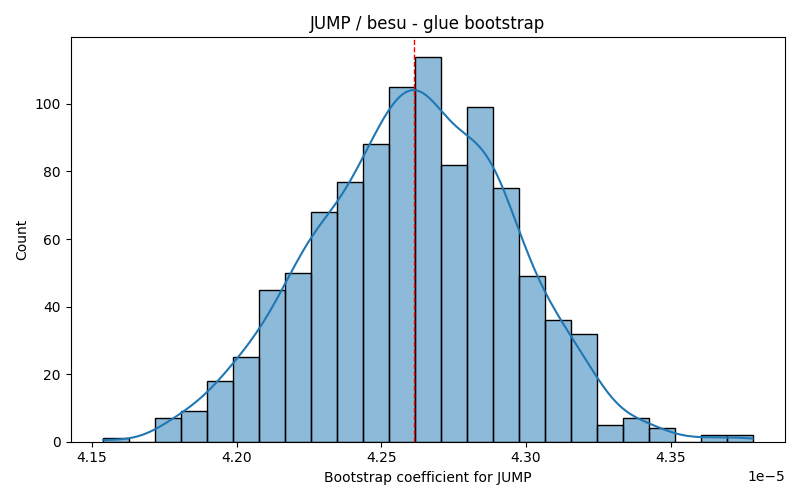

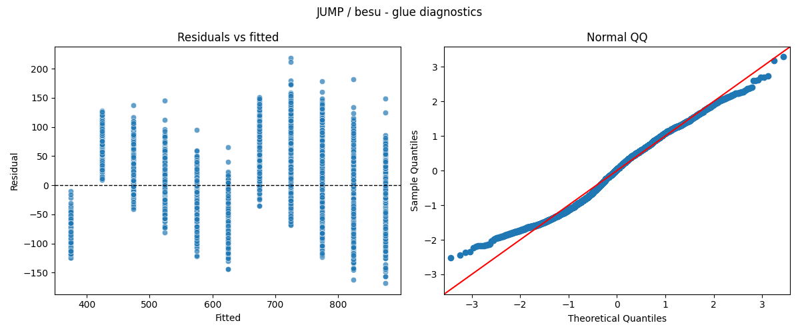

</details>

<details><summary><code>KECCAK256</code> · nobs=54032 · runtime_ms=3.792e-05 · p=1.00e-03 · R²=0.161</summary>

```
==============================================================================
                           NNLS Regression Results                            
==============================================================================
Dep. Variable:          test_runtime_ms              R-squared:          0.161
Model:                  NNLS                    Adj. R-squared:          0.161
No. Observations:       54032                             RMSE:         172.04
Df Residuals:           54030                              MAE:         135.61
Df Model:               1      
==============================================================================
                      coef     std err     P-value      [0.025      0.975]
------------------------------------------------------------------------------
         const    529.6619      1.6789       0.001    526.7428    532.8743
     KECCAK256      0.0000      0.0000       0.001      0.0000      0.0000
==============================================================================
Notes: Non-negative least squares with bootstrap inference (1000 iterations)
==============================================================================
```

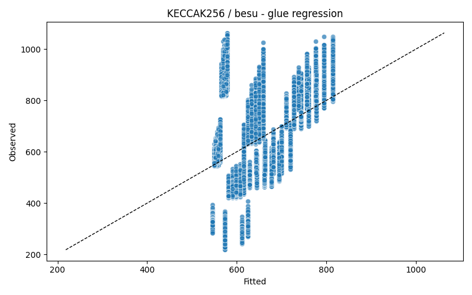

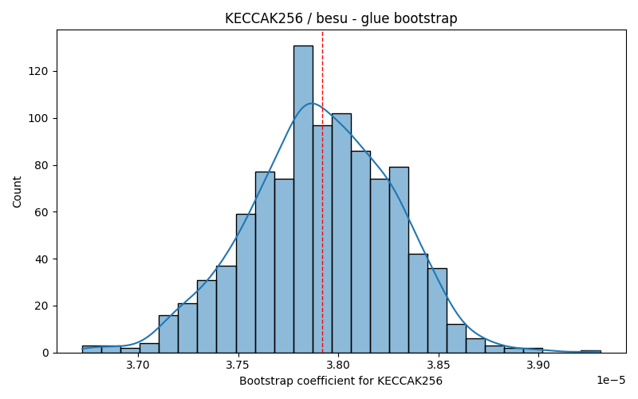

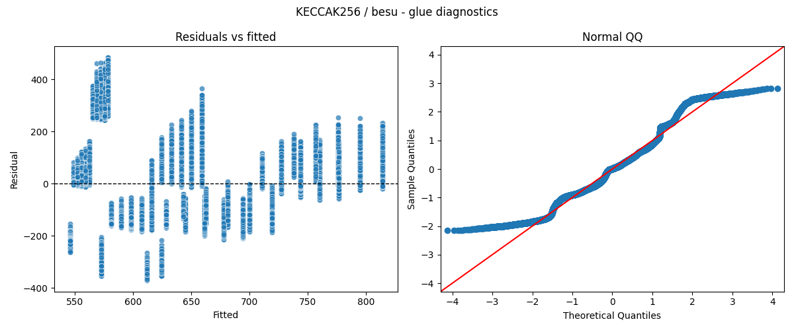

</details>

## erigon

| glue_opcode | nobs | glue_runtime_ms | p_value | rsquared |
| --- | --- | --- | --- | --- |
| `ISZERO` | 462 | 1.014e-06 | 1.00e-03 | 0.9272 |
| `JUMPDEST` | 462 | 7.849e-07 | 1.00e-03 | 0.8949 |
| `SWAP` | 7392 | 1.241e-06 | 1.00e-03 | 0.9037 |
| `CALLDATASIZE` | 27412 | 8.677e-07 | 1.00e-03 | 0.9113 |
| `DUP` | 27412 | 1.087e-06 | 1.00e-03 | 0.9113 |
| `GAS` | 27412 | 8.971e-07 | 1.00e-03 | 0.9113 |
| `MLOAD` | 27412 | 3.427e-06 | 1.00e-03 | 0.9113 |
| `PUSH` | 27412 | 2.734e-06 | 1.00e-03 | 0.9113 |
| `PUSH0` | 27412 | 8.91e-07 | 1.00e-03 | 0.9113 |
| `STATICCALL` | 27412 | 0.0004886 | 1.00e-03 | 0.9113 |
| `ADD` | 462 | 2.801e-06 | 1.00e-03 | 0.8902 |
| `AND` | 462 | 2.789e-06 | 1.00e-03 | 0.9196 |
| `CALLDATACOPY` | 11088 | 7.599e-06 | 1.00e-03 | 0.9659 |
| `CALLDATALOAD` | 1848 | 4.961e-05 | 1.00e-03 | 0.01602 |
| `DIV` | 462 | 9.809e-06 | 1.00e-03 | 0.8852 |
| `EXP` | 462 | 0.0003556 | 1.00e-03 | 0.9103 |
| `GT` | 462 | 2.757e-06 | 1.00e-03 | 0.858 |
| `JUMPI` | 462 | 3.482e-06 | 1.00e-03 | 0.7783 |
| `LT` | 462 | 2.807e-06 | 1.00e-03 | 0.9148 |
| `MSTORE` | 2310 | 5.702e-06 | 1.00e-03 | 0.8535 |
| `MSTORE8` | 2310 | 5.069e-06 | 1.00e-03 | 0.8018 |
| `MUL` | 462 | 3.495e-06 | 1.00e-03 | 0.9255 |
| `PC` | 462 | 1.398e-06 | 1.00e-03 | 0.9274 |
| `RETURNDATASIZE` | 1848 | 1.842e-06 | 1.00e-03 | 0.8943 |
| `SELFBALANCE` | 378 | 1.465e-06 | 1.00e-03 | 0.7949 |
| `SUB` | 462 | 2.787e-06 | 1.00e-03 | 0.9181 |
| `JUMP` | 462 | 7.26e-06 | 1.00e-03 | 0.9066 |
| `KECCAK256` | 7392 | 2.196e-05 | 1.00e-03 | 0.1014 |

### Cycle glue — joint fit · erigon

<details><summary>Joint NNLS regression summary</summary>

```
==============================================================================
                           NNLS Regression Results                            
==============================================================================
Dep. Variable:          test_runtime_ms              R-squared:          0.911
Model:                  NNLS                    Adj. R-squared:          0.911
No. Observations:       27412                             RMSE:          28.10
Df Residuals:           27404                              MAE:          16.27
Df Model:               7      
==============================================================================
                      coef     std err     P-value      [0.025      0.975]
------------------------------------------------------------------------------
         const     28.2082      0.5598       0.001     27.0360     29.2751
  CALLDATASIZE      0.0000      0.0000       0.001      0.0000      0.0000
           DUP      0.0000      0.0000       0.001      0.0000      0.0000
           GAS      0.0000      0.0000       0.001      0.0000      0.0000
         MLOAD      0.0000      0.0000       0.001      0.0000      0.0000
          PUSH      0.0000      0.0000       0.001      0.0000      0.0000
         PUSH0      0.0000      0.0000       0.001      0.0000      0.0000
    STATICCALL      0.0005      0.0000       0.001      0.0005      0.0005
==============================================================================
Notes: Non-negative least squares with bootstrap inference (1000 iterations)
==============================================================================
```

</details>

<details><summary><code>CALLDATASIZE</code> · nobs=27412 · runtime_ms=8.677e-07 · p=1.00e-03 · R²=0.9113</summary>

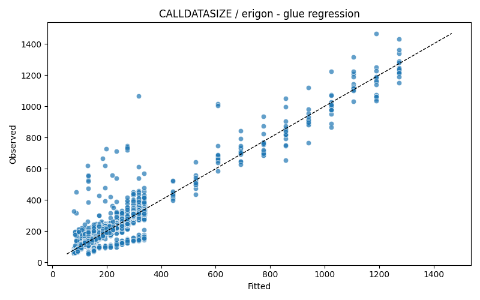

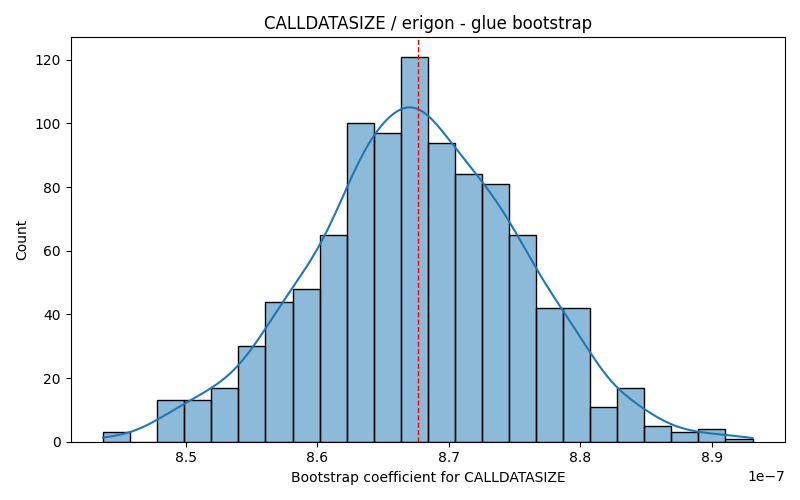


</details>

<details><summary><code>DUP</code> · nobs=27412 · runtime_ms=1.087e-06 · p=1.00e-03 · R²=0.9113</summary>


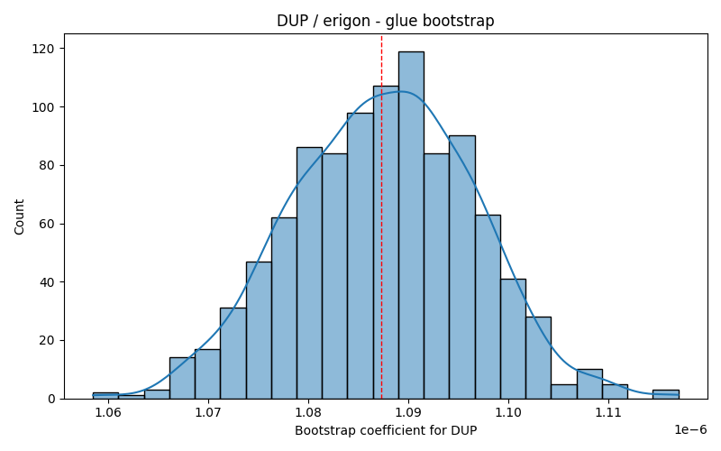


</details>

<details><summary><code>GAS</code> · nobs=27412 · runtime_ms=8.971e-07 · p=1.00e-03 · R²=0.9113</summary>

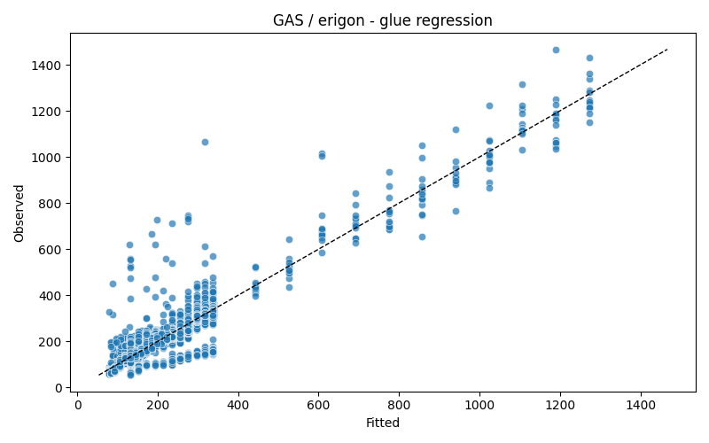

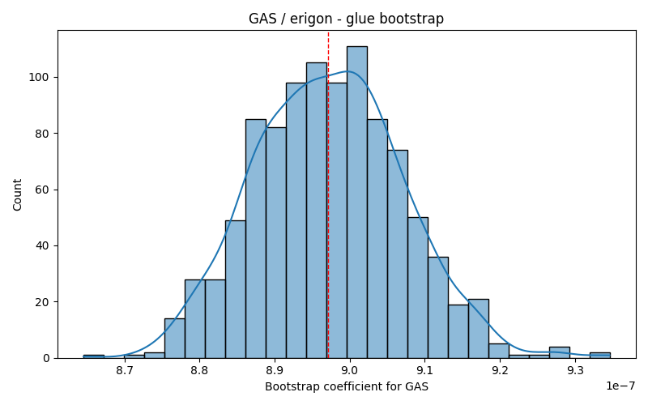


</details>

<details><summary><code>MLOAD</code> · nobs=27412 · runtime_ms=3.427e-06 · p=1.00e-03 · R²=0.9113</summary>


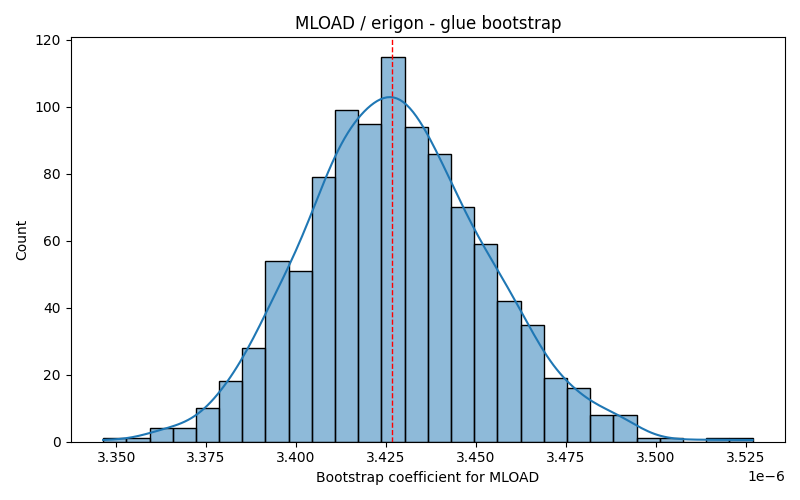


</details>

<details><summary><code>PUSH</code> · nobs=27412 · runtime_ms=2.734e-06 · p=1.00e-03 · R²=0.9113</summary>


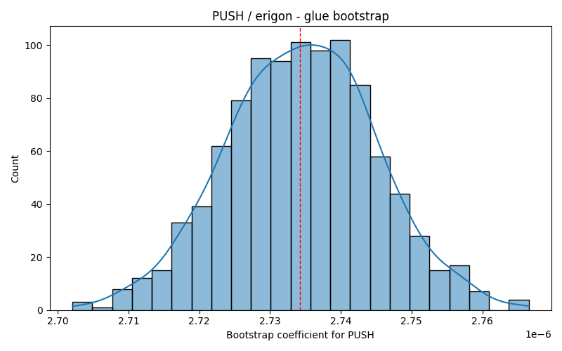

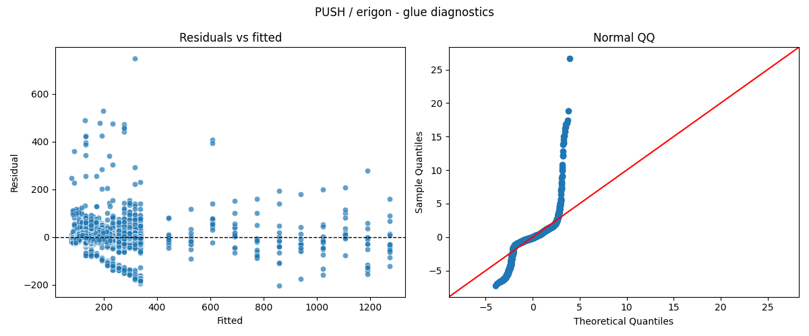

</details>

<details><summary><code>PUSH0</code> · nobs=27412 · runtime_ms=8.91e-07 · p=1.00e-03 · R²=0.9113</summary>


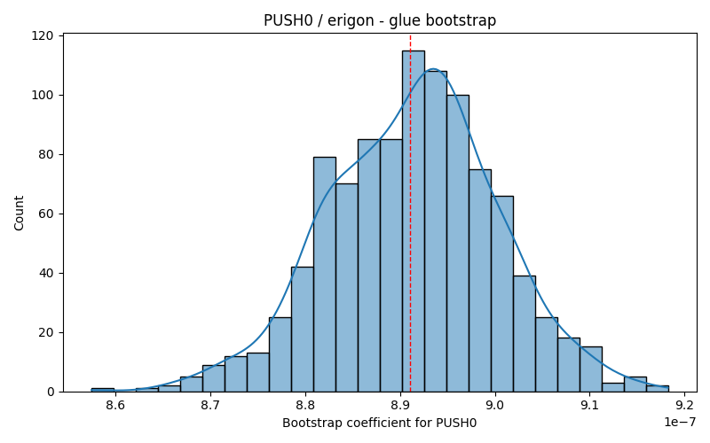


</details>

<details><summary><code>STATICCALL</code> · nobs=27412 · runtime_ms=0.0004886 · p=1.00e-03 · R²=0.9113</summary>

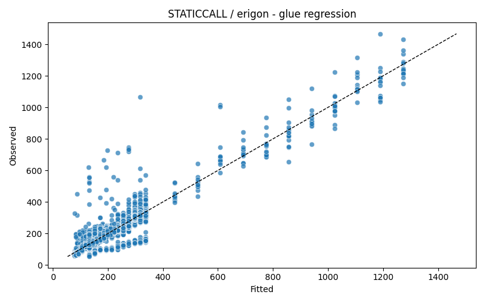

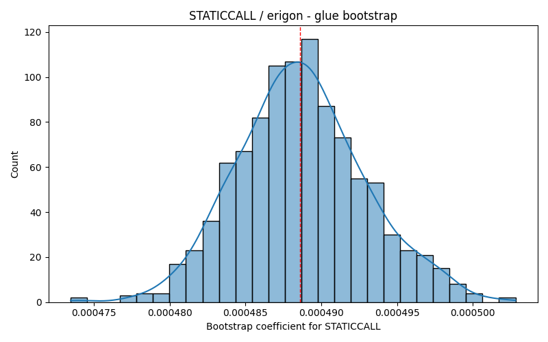


</details>

### Pure glue · erigon

<details><summary><code>ISZERO</code> · nobs=462 · runtime_ms=1.014e-06 · p=1.00e-03 · R²=0.9272</summary>

```
==============================================================================
                           NNLS Regression Results                            
==============================================================================
Dep. Variable:          test_runtime_ms              R-squared:          0.927
Model:                  NNLS                    Adj. R-squared:          0.927
No. Observations:       462                               RMSE:           5.98
Df Residuals:           460                                MAE:           5.06
Df Model:               1      
==============================================================================
                      coef     std err     P-value      [0.025      0.975]
------------------------------------------------------------------------------
         const     18.0874      1.0334       0.001     16.2320     20.1741
        ISZERO      0.0000      0.0000       0.001      0.0000      0.0000
==============================================================================
Notes: Non-negative least squares with bootstrap inference (1000 iterations)
==============================================================================
```

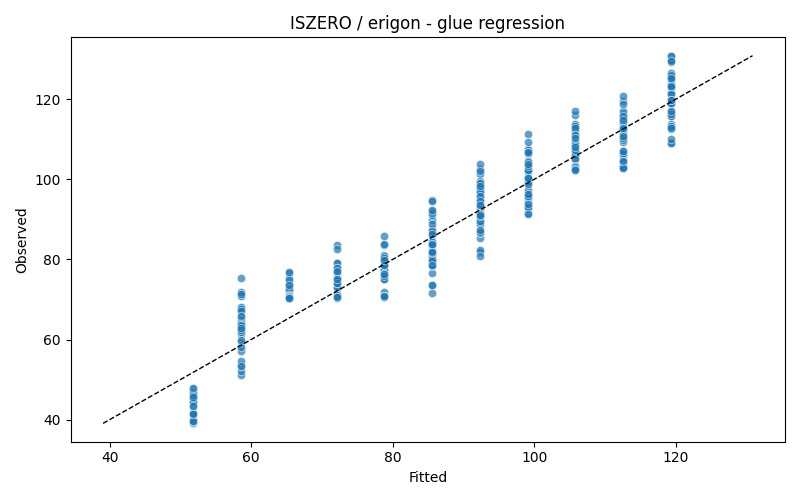

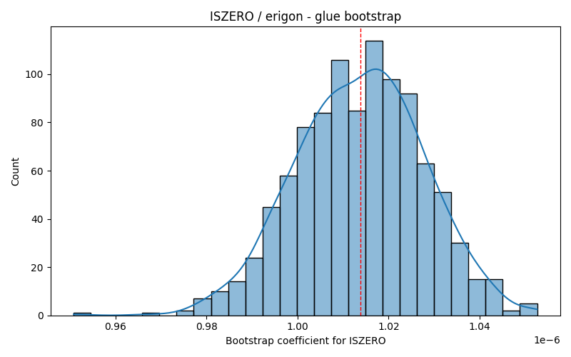

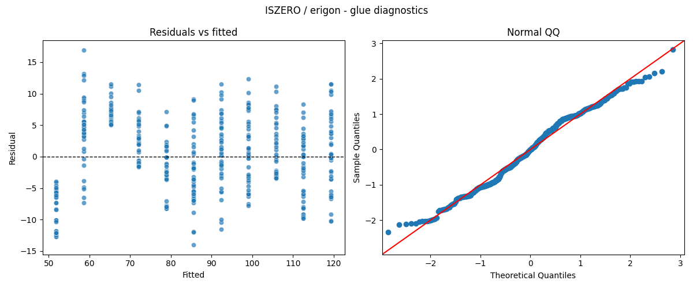

</details>

<details><summary><code>JUMPDEST</code> · nobs=462 · runtime_ms=7.849e-07 · p=1.00e-03 · R²=0.8949</summary>

```
==============================================================================
                           NNLS Regression Results                            
==============================================================================
Dep. Variable:          test_runtime_ms              R-squared:          0.895
Model:                  NNLS                    Adj. R-squared:          0.895
No. Observations:       462                               RMSE:          16.98
Df Residuals:           460                                MAE:          13.56
Df Model:               1      
==============================================================================
                      coef     std err     P-value      [0.025      0.975]
------------------------------------------------------------------------------
         const     24.5512      2.9927       0.001     19.0493     30.7361
      JUMPDEST      0.0000      0.0000       0.001      0.0000      0.0000
==============================================================================
Notes: Non-negative least squares with bootstrap inference (1000 iterations)
==============================================================================
```

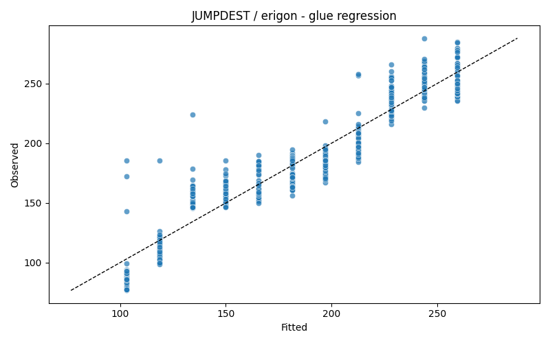

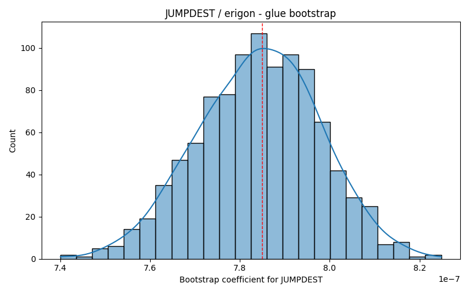

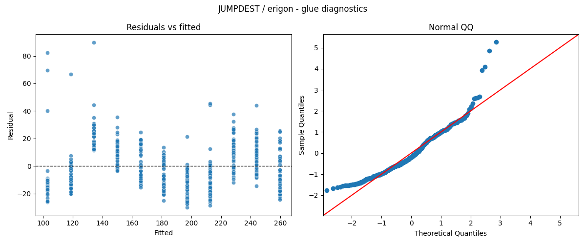

</details>

<details><summary><code>SWAP</code> · nobs=7392 · runtime_ms=1.241e-06 · p=1.00e-03 · R²=0.9037</summary>

```
==============================================================================
                           NNLS Regression Results                            
==============================================================================
Dep. Variable:          test_runtime_ms              R-squared:          0.904
Model:                  NNLS                    Adj. R-squared:          0.904
No. Observations:       7392                              RMSE:           8.53
Df Residuals:           7390                               MAE:           5.93
Df Model:               1      
==============================================================================
                      coef     std err     P-value      [0.025      0.975]
------------------------------------------------------------------------------
         const     22.8508      0.3324       0.001     22.2249     23.5095
          SWAP      0.0000      0.0000       0.001      0.0000      0.0000
==============================================================================
Notes: Non-negative least squares with bootstrap inference (1000 iterations)
==============================================================================
```

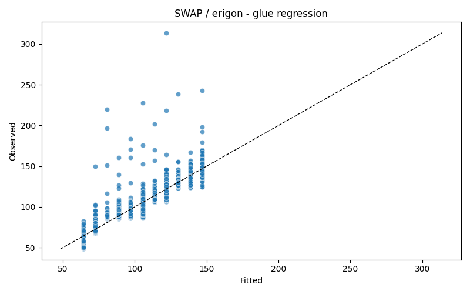

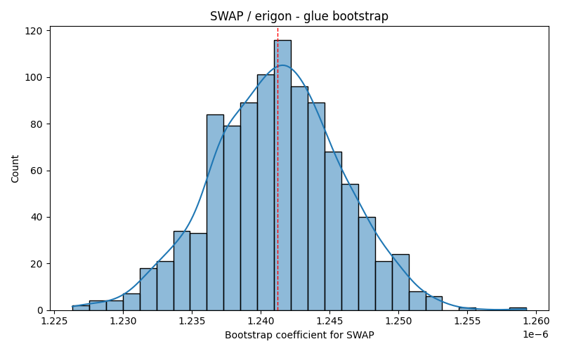

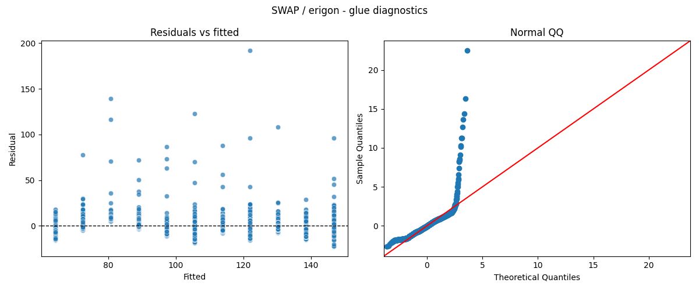

</details>

### Mixed glue (tier A) · erigon

<details><summary><code>ADD</code> · nobs=462 · runtime_ms=2.801e-06 · p=1.00e-03 · R²=0.8902</summary>

```
==============================================================================
                           NNLS Regression Results                            
==============================================================================
Dep. Variable:          test_runtime_ms              R-squared:          0.890
Model:                  NNLS                    Adj. R-squared:          0.890
No. Observations:       462                               RMSE:          10.35
Df Residuals:           460                                MAE:           7.28
Df Model:               1      
==============================================================================
                      coef     std err     P-value      [0.025      0.975]
------------------------------------------------------------------------------
         const     16.5336      2.2068       0.001     12.7192     21.2494
           ADD      0.0000      0.0000       0.001      0.0000      0.0000
==============================================================================
Notes: Non-negative least squares with bootstrap inference (1000 iterations)
==============================================================================
```

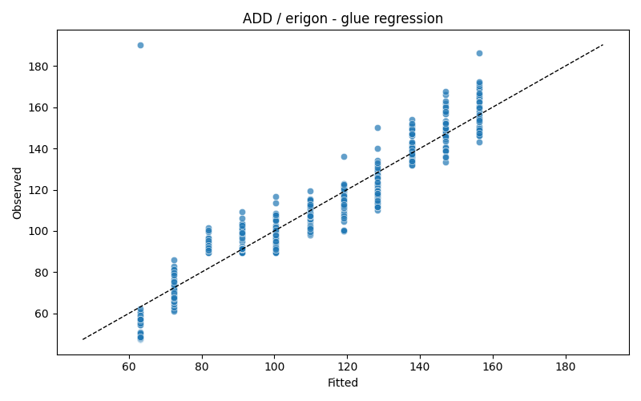

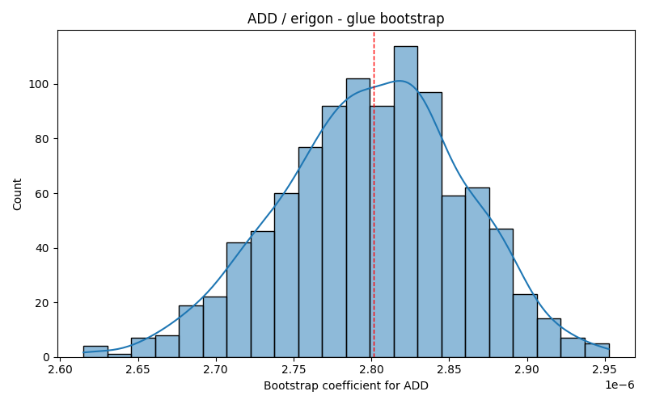

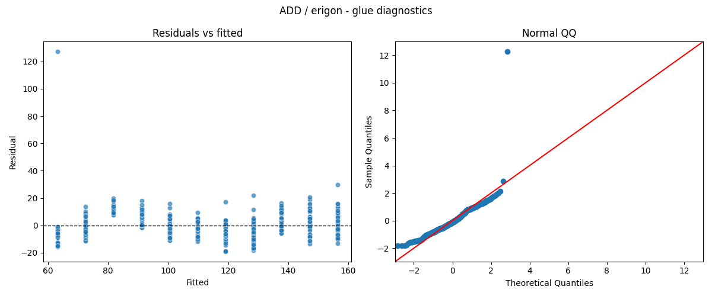

</details>

<details><summary><code>AND</code> · nobs=462 · runtime_ms=2.789e-06 · p=1.00e-03 · R²=0.9196</summary>

```
==============================================================================
                           NNLS Regression Results                            
==============================================================================
Dep. Variable:          test_runtime_ms              R-squared:          0.920
Model:                  NNLS                    Adj. R-squared:          0.919
No. Observations:       462                               RMSE:           8.68
Df Residuals:           460                                MAE:           7.16
Df Model:               1      
==============================================================================
                      coef     std err     P-value      [0.025      0.975]
------------------------------------------------------------------------------
         const     15.1124      1.4719       0.001     12.4193     18.0595
           AND      0.0000      0.0000       0.001      0.0000      0.0000
==============================================================================
Notes: Non-negative least squares with bootstrap inference (1000 iterations)
==============================================================================
```

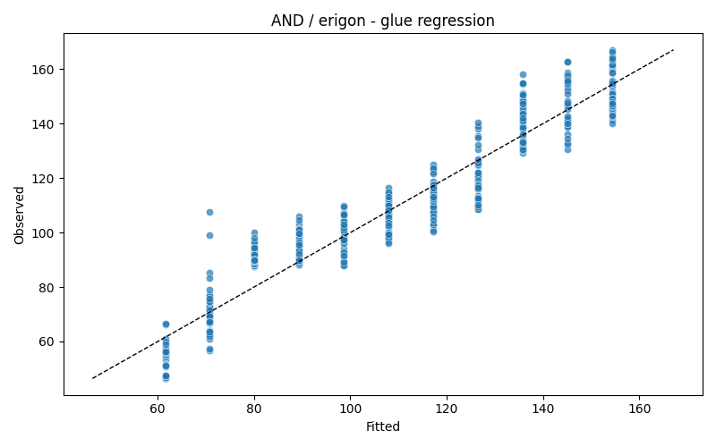

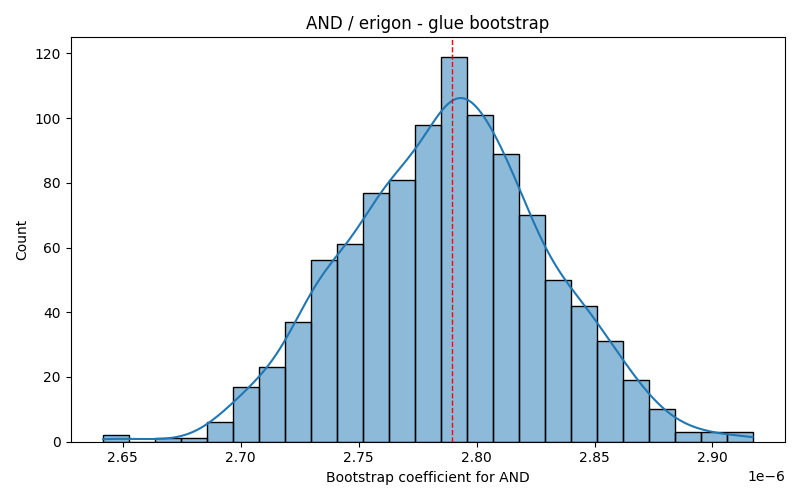

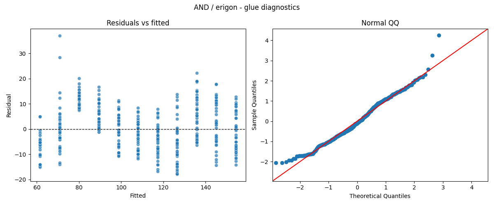

</details>

<details><summary><code>CALLDATACOPY</code> · nobs=11088 · runtime_ms=7.599e-06 · p=1.00e-03 · R²=0.9659</summary>

```
==============================================================================
                           NNLS Regression Results                            
==============================================================================
Dep. Variable:          test_runtime_ms              R-squared:          0.966
Model:                  NNLS                    Adj. R-squared:          0.966
No. Observations:       11088                             RMSE:          10.74
Df Residuals:           11086                              MAE:           7.72
Df Model:               1      
==============================================================================
                      coef     std err     P-value      [0.025      0.975]
------------------------------------------------------------------------------
         const     16.9458      0.1192       0.001     16.7212     17.1815
  CALLDATACOPY      0.0000      0.0000       0.001      0.0000      0.0000
==============================================================================
Notes: Non-negative least squares with bootstrap inference (1000 iterations)
==============================================================================
```

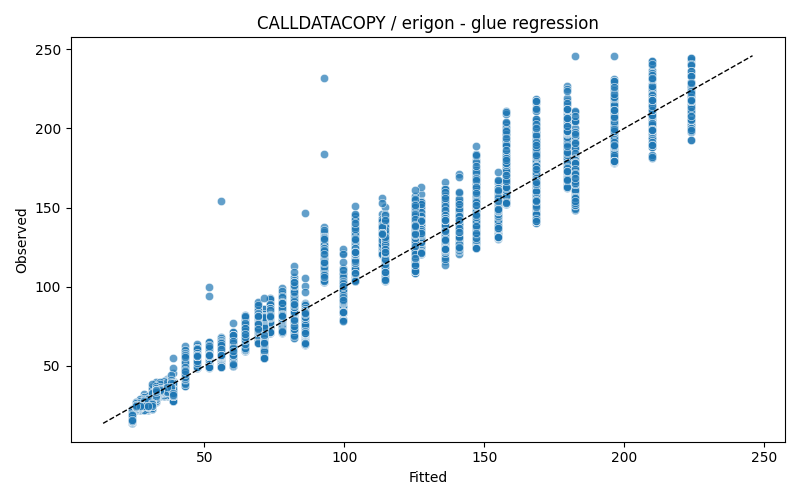

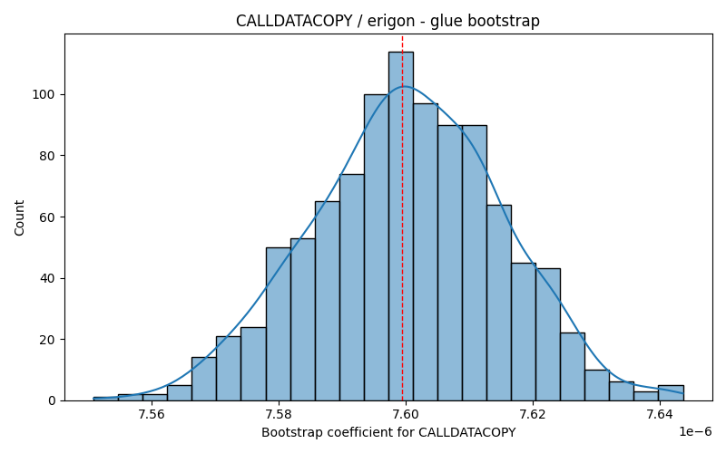

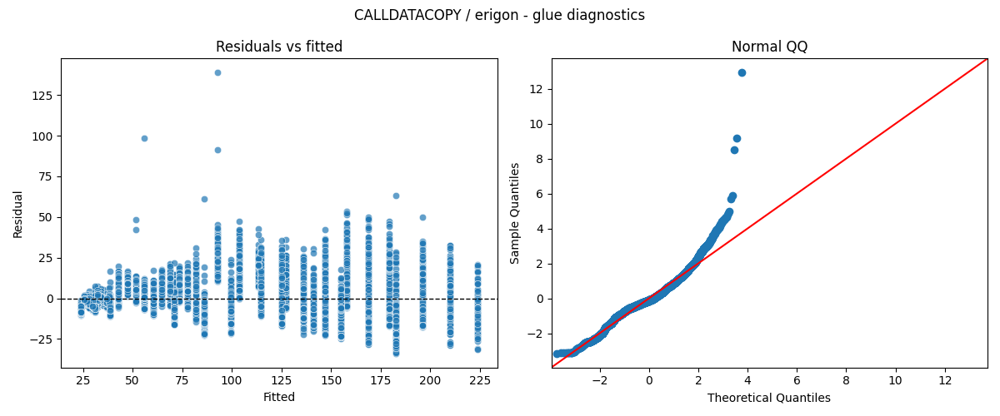

</details>

<details><summary><code>CALLDATALOAD</code> · nobs=1848 · runtime_ms=4.961e-05 · p=1.00e-03 · R²=0.01602</summary>

```
==============================================================================
                           NNLS Regression Results                            
==============================================================================
Dep. Variable:          test_runtime_ms              R-squared:          0.016
Model:                  NNLS                    Adj. R-squared:          0.015
No. Observations:       1848                              RMSE:           1.49
Df Residuals:           1846                               MAE:           0.42
Df Model:               1      
==============================================================================
                      coef     std err     P-value      [0.025      0.975]
------------------------------------------------------------------------------
         const      5.9010      0.0627       0.001      5.7654      6.0136
  CALLDATALOAD      0.0000      0.0000       0.001      0.0000      0.0001
==============================================================================
Notes: Non-negative least squares with bootstrap inference (1000 iterations)
==============================================================================
```

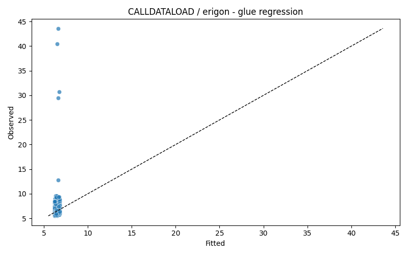

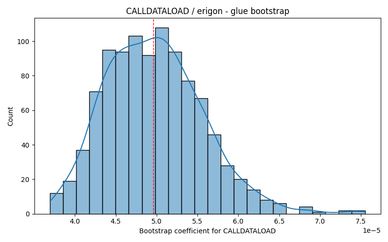

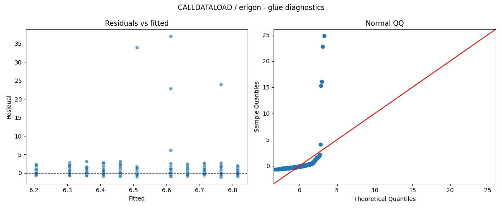

</details>

<details><summary><code>DIV</code> · nobs=462 · runtime_ms=9.809e-06 · p=1.00e-03 · R²=0.8852</summary>

```
==============================================================================
                           NNLS Regression Results                            
==============================================================================
Dep. Variable:          test_runtime_ms              R-squared:          0.885
Model:                  NNLS                    Adj. R-squared:          0.885
No. Observations:       462                               RMSE:          27.88
Df Residuals:           460                                MAE:          23.62
Df Model:               1      
==============================================================================
                      coef     std err     P-value      [0.025      0.975]
------------------------------------------------------------------------------
         const     21.6407      4.3906       0.001     13.5186     30.6501
           DIV      0.0000      0.0000       0.001      0.0000      0.0000
==============================================================================
Notes: Non-negative least squares with bootstrap inference (1000 iterations)
==============================================================================
```

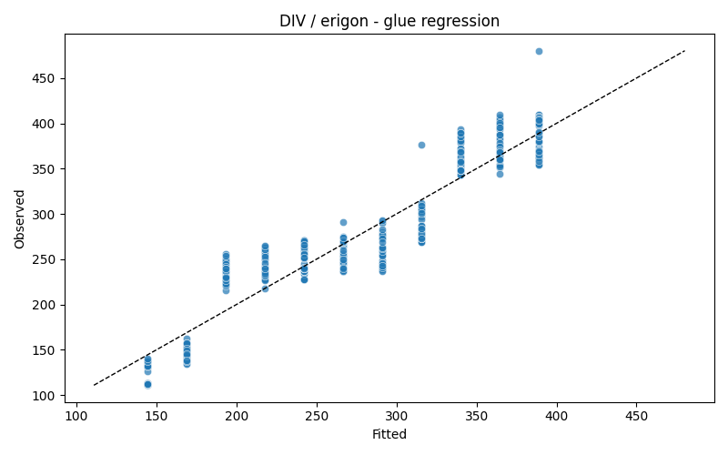

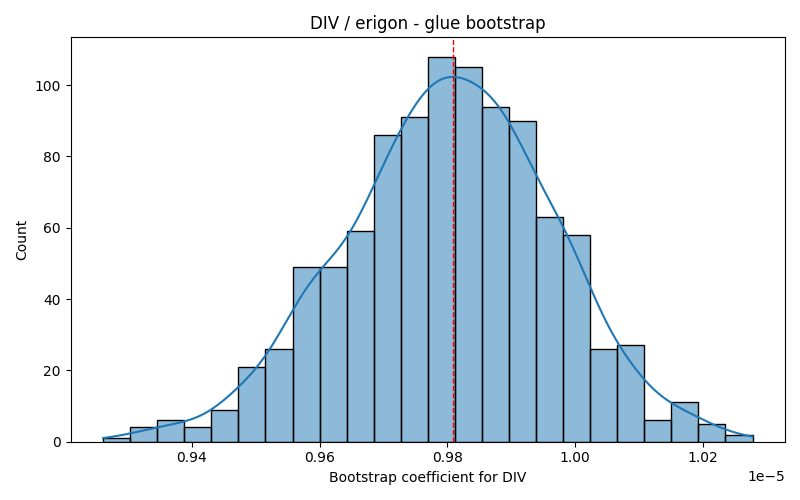

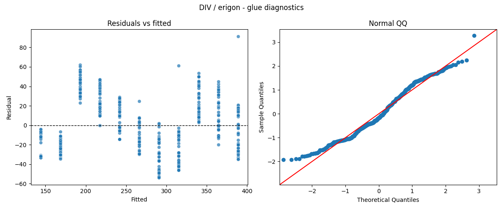

</details>

<details><summary><code>EXP</code> · nobs=462 · runtime_ms=0.0003556 · p=1.00e-03 · R²=0.9103</summary>

```
==============================================================================
                           NNLS Regression Results                            
==============================================================================
Dep. Variable:          test_runtime_ms              R-squared:          0.910
Model:                  NNLS                    Adj. R-squared:          0.910
No. Observations:       462                               RMSE:           4.37
Df Residuals:           460                                MAE:           3.62
Df Model:               1      
==============================================================================
                      coef     std err     P-value      [0.025      0.975]
------------------------------------------------------------------------------
         const     11.4640      0.7574       0.001     10.0635     12.9819
           EXP      0.0004      0.0000       0.001      0.0003      0.0004
==============================================================================
Notes: Non-negative least squares with bootstrap inference (1000 iterations)
==============================================================================
```

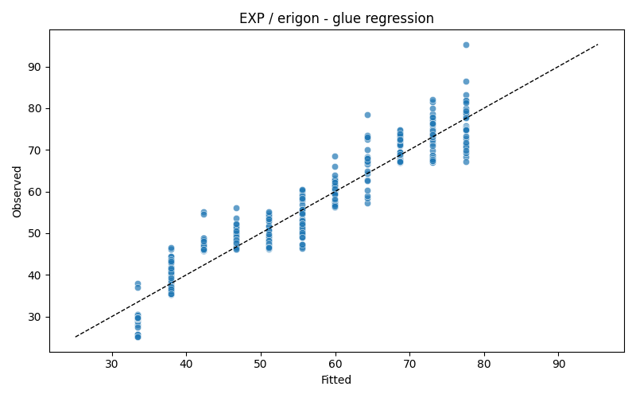

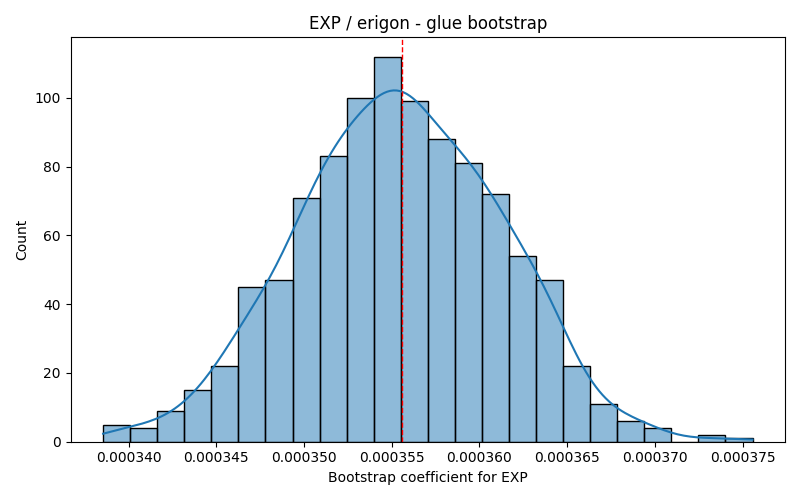

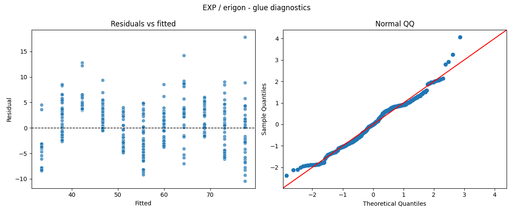

</details>

<details><summary><code>GT</code> · nobs=462 · runtime_ms=2.757e-06 · p=1.00e-03 · R²=0.858</summary>

```
==============================================================================
                           NNLS Regression Results                            
==============================================================================
Dep. Variable:          test_runtime_ms              R-squared:          0.858
Model:                  NNLS                    Adj. R-squared:          0.858
No. Observations:       462                               RMSE:          11.80
Df Residuals:           460                                MAE:           7.78
Df Model:               1      
==============================================================================
                      coef     std err     P-value      [0.025      0.975]
------------------------------------------------------------------------------
         const     22.1255      2.0662       0.001     18.3585     26.4781
            GT      0.0000      0.0000       0.001      0.0000      0.0000
==============================================================================
Notes: Non-negative least squares with bootstrap inference (1000 iterations)
==============================================================================
```

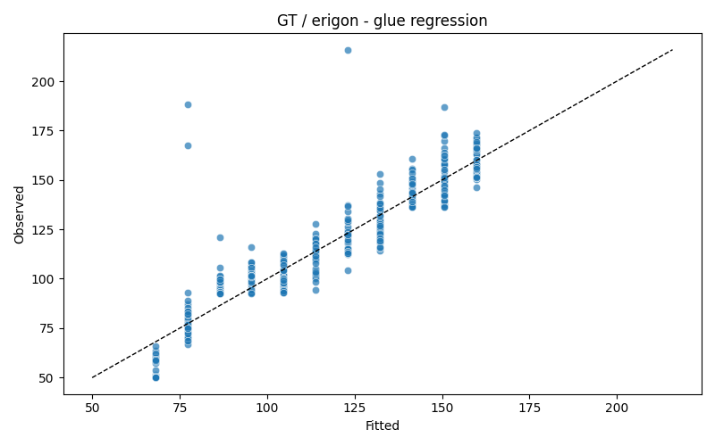

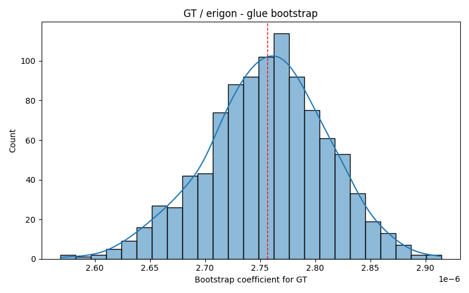

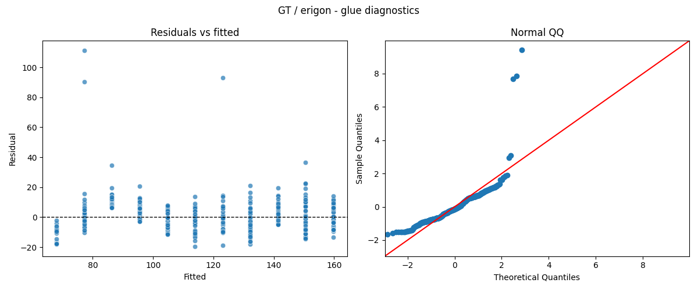

</details>

<details><summary><code>JUMPI</code> · nobs=462 · runtime_ms=3.482e-06 · p=1.00e-03 · R²=0.7783</summary>

```
==============================================================================
                           NNLS Regression Results                            
==============================================================================
Dep. Variable:          test_runtime_ms              R-squared:          0.778
Model:                  NNLS                    Adj. R-squared:          0.778
No. Observations:       462                               RMSE:           8.39
Df Residuals:           460                                MAE:           5.53
Df Model:               1      
==============================================================================
                      coef     std err     P-value      [0.025      0.975]
------------------------------------------------------------------------------
         const     19.3316      1.5582       0.001     16.4790     22.6484
         JUMPI      0.0000      0.0000       0.001      0.0000      0.0000
==============================================================================
Notes: Non-negative least squares with bootstrap inference (1000 iterations)
==============================================================================
```

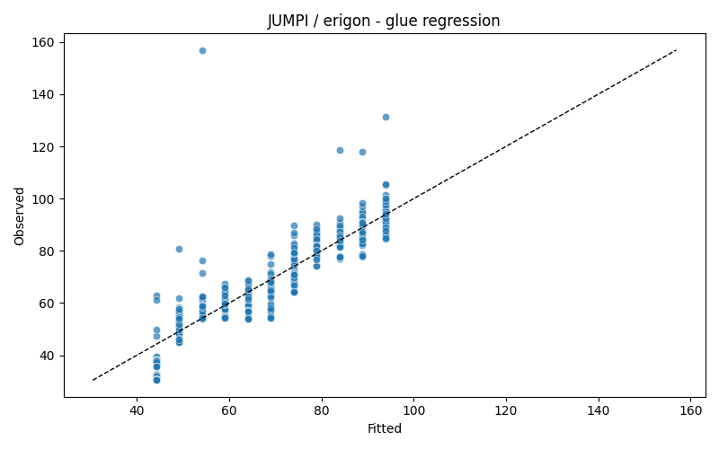

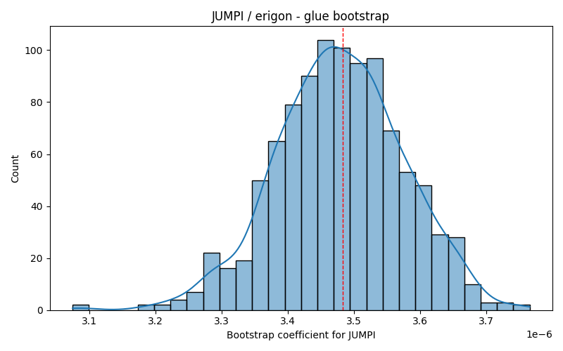

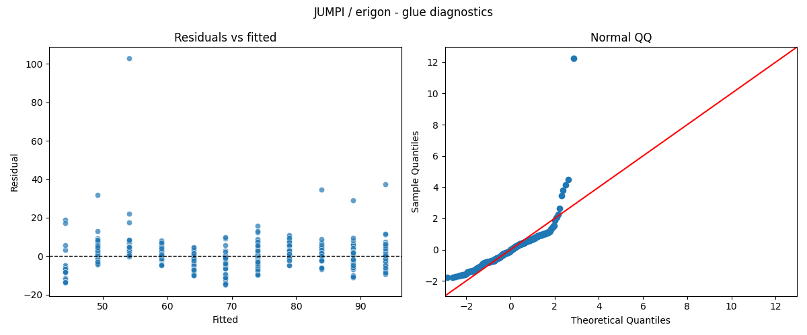

</details>

<details><summary><code>LT</code> · nobs=462 · runtime_ms=2.807e-06 · p=1.00e-03 · R²=0.9148</summary>

```
==============================================================================
                           NNLS Regression Results                            
==============================================================================
Dep. Variable:          test_runtime_ms              R-squared:          0.915
Model:                  NNLS                    Adj. R-squared:          0.915
No. Observations:       462                               RMSE:           9.02
Df Residuals:           460                                MAE:           6.98
Df Model:               1      
==============================================================================
                      coef     std err     P-value      [0.025      0.975]
------------------------------------------------------------------------------
         const     20.8018      1.5061       0.001     17.9984     23.7480
            LT      0.0000      0.0000       0.001      0.0000      0.0000
==============================================================================
Notes: Non-negative least squares with bootstrap inference (1000 iterations)
==============================================================================
```


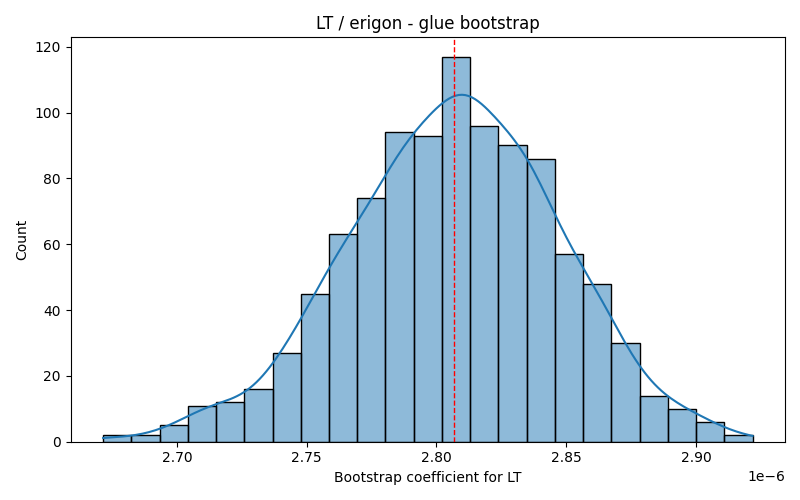

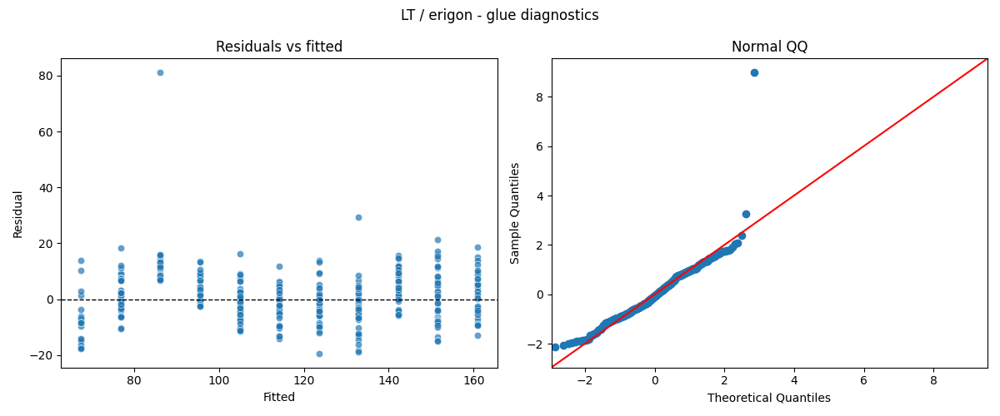

</details>

<details><summary><code>MSTORE</code> · nobs=2310 · runtime_ms=5.702e-06 · p=1.00e-03 · R²=0.8535</summary>

```
==============================================================================
                           NNLS Regression Results                            
==============================================================================
Dep. Variable:          test_runtime_ms              R-squared:          0.854
Model:                  NNLS                    Adj. R-squared:          0.853
No. Observations:       2310                              RMSE:          16.58
Df Residuals:           2308                               MAE:          10.92
Df Model:               1      
==============================================================================
                      coef     std err     P-value      [0.025      0.975]
------------------------------------------------------------------------------
         const     27.6650      1.2855       0.001     25.3042     30.1910
        MSTORE      0.0000      0.0000       0.001      0.0000      0.0000
==============================================================================
Notes: Non-negative least squares with bootstrap inference (1000 iterations)
==============================================================================
```

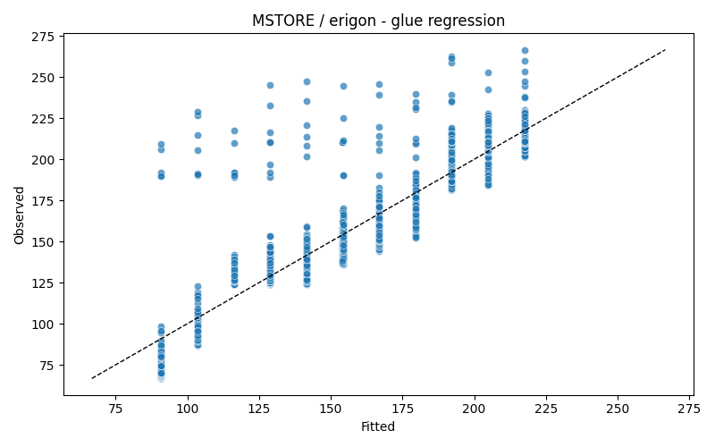

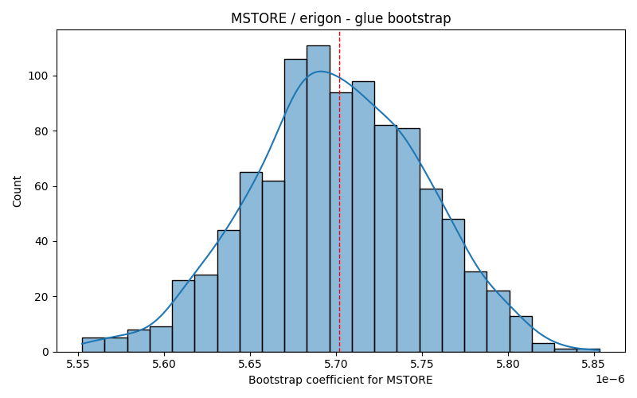

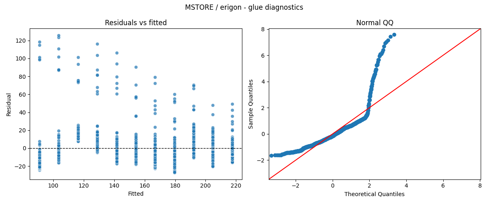

</details>

<details><summary><code>MSTORE8</code> · nobs=2310 · runtime_ms=5.069e-06 · p=1.00e-03 · R²=0.8018</summary>

```
==============================================================================
                           NNLS Regression Results                            
==============================================================================
Dep. Variable:          test_runtime_ms              R-squared:          0.802
Model:                  NNLS                    Adj. R-squared:          0.802
No. Observations:       2310                              RMSE:          17.69
Df Residuals:           2308                               MAE:          10.91
Df Model:               1      
==============================================================================
                      coef     std err     P-value      [0.025      0.975]
------------------------------------------------------------------------------
         const     28.2876      1.4045       0.001     25.7983     31.0251
       MSTORE8      0.0000      0.0000       0.001      0.0000      0.0000
==============================================================================
Notes: Non-negative least squares with bootstrap inference (1000 iterations)
==============================================================================
```

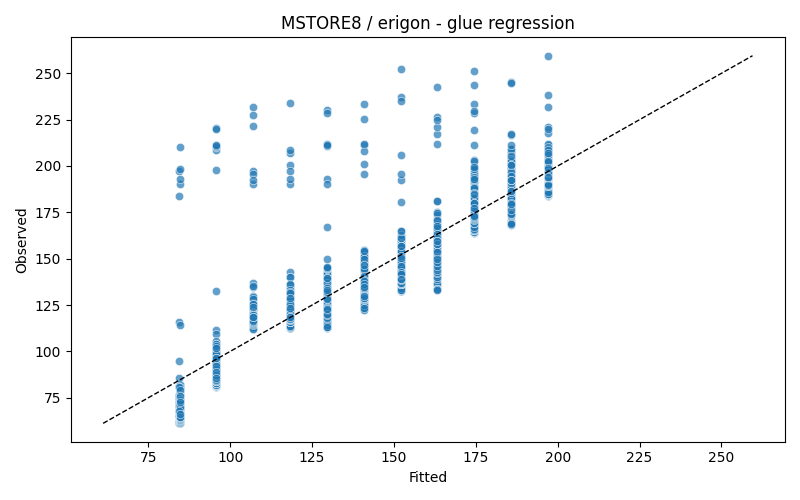

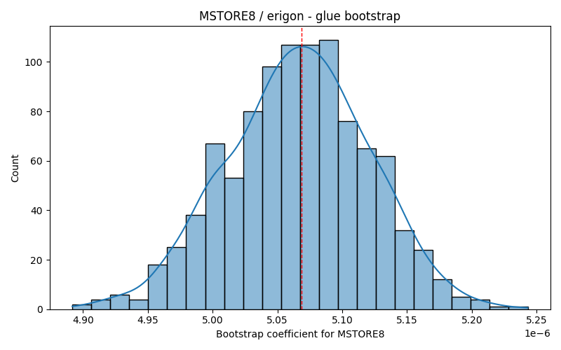

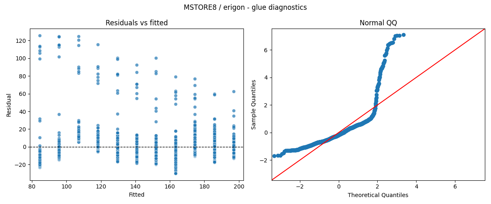

</details>

<details><summary><code>MUL</code> · nobs=462 · runtime_ms=3.495e-06 · p=1.00e-03 · R²=0.9255</summary>

```
==============================================================================
                           NNLS Regression Results                            
==============================================================================
Dep. Variable:          test_runtime_ms              R-squared:          0.925
Model:                  NNLS                    Adj. R-squared:          0.925
No. Observations:       462                               RMSE:           7.83
Df Residuals:           460                                MAE:           6.48
Df Model:               1      
==============================================================================
                      coef     std err     P-value      [0.025      0.975]
------------------------------------------------------------------------------
         const     13.7514      1.2328       0.001     11.2447     15.9847
           MUL      0.0000      0.0000       0.001      0.0000      0.0000
==============================================================================
Notes: Non-negative least squares with bootstrap inference (1000 iterations)
==============================================================================
```

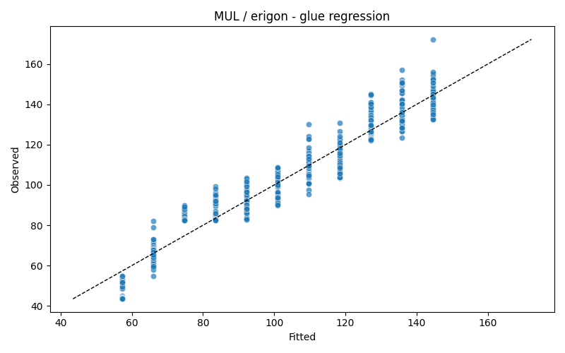

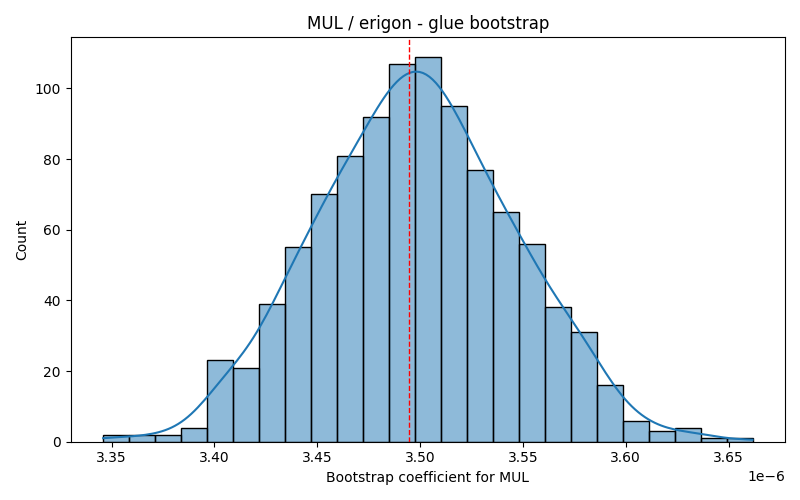

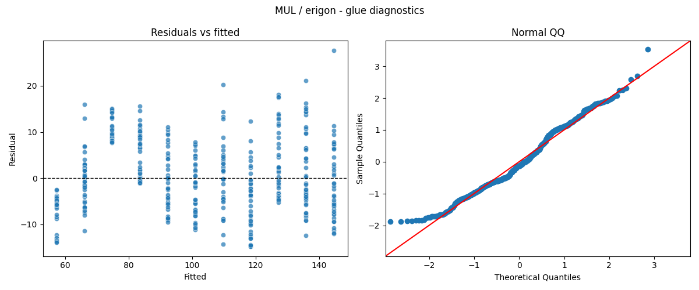

</details>

<details><summary><code>PC</code> · nobs=462 · runtime_ms=1.398e-06 · p=1.00e-03 · R²=0.9274</summary>

```
==============================================================================
                           NNLS Regression Results                            
==============================================================================
Dep. Variable:          test_runtime_ms              R-squared:          0.927
Model:                  NNLS                    Adj. R-squared:          0.927
No. Observations:       462                               RMSE:          11.69
Df Residuals:           460                                MAE:           9.67
Df Model:               1      
==============================================================================
                      coef     std err     P-value      [0.025      0.975]
------------------------------------------------------------------------------
         const     22.8058      1.9083       0.001     19.0905     26.7395
            PC      0.0000      0.0000       0.001      0.0000      0.0000
==============================================================================
Notes: Non-negative least squares with bootstrap inference (1000 iterations)
==============================================================================
```

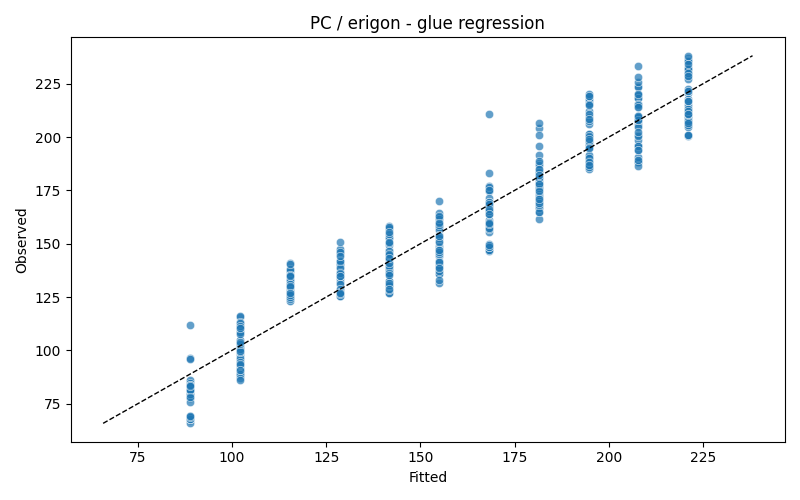

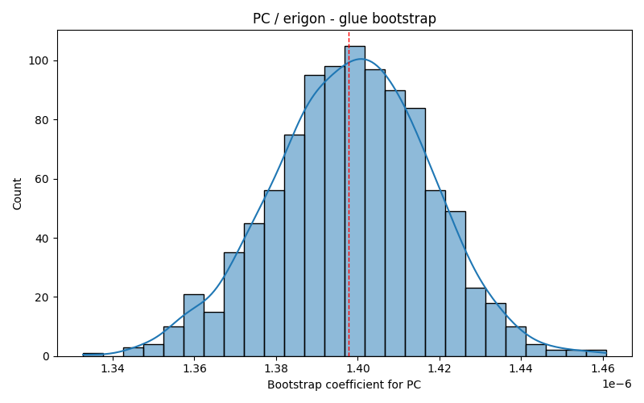

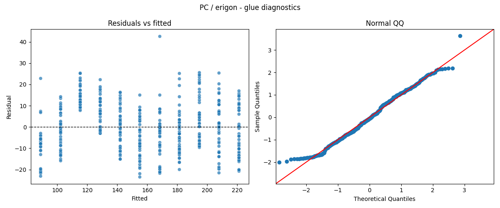

</details>

<details><summary><code>RETURNDATASIZE</code> · nobs=1848 · runtime_ms=1.842e-06 · p=1.00e-03 · R²=0.8943</summary>

```
==============================================================================
                           NNLS Regression Results                            
==============================================================================
Dep. Variable:          test_runtime_ms              R-squared:          0.894
Model:                  NNLS                    Adj. R-squared:          0.894
No. Observations:       1848                              RMSE:          10.00
Df Residuals:           1846                               MAE:           7.41
Df Model:               1      
==============================================================================
                      coef     std err     P-value      [0.025      0.975]
------------------------------------------------------------------------------
         const     18.6936      0.7762       0.001     17.1363     20.2107
RETURNDATASIZE      0.0000      0.0000       0.001      0.0000      0.0000
==============================================================================
Notes: Non-negative least squares with bootstrap inference (1000 iterations)
==============================================================================
```

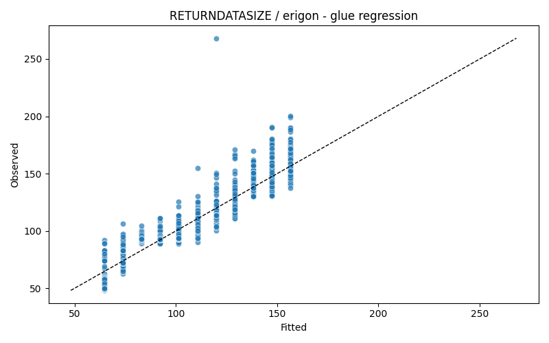

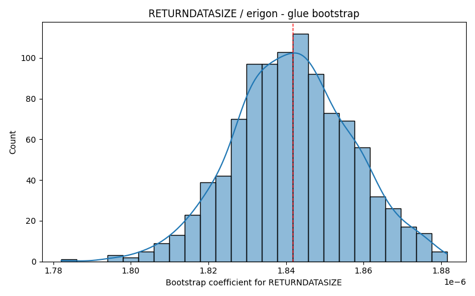

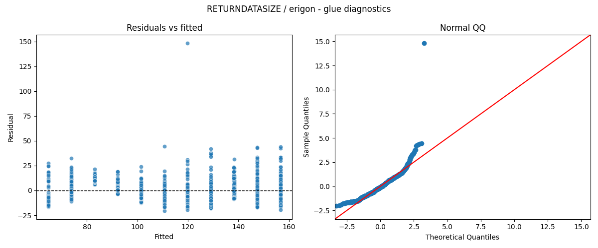

</details>

<details><summary><code>SELFBALANCE</code> · nobs=378 · runtime_ms=1.465e-06 · p=1.00e-03 · R²=0.7949</summary>

```
==============================================================================
                           NNLS Regression Results                            
==============================================================================
Dep. Variable:          test_runtime_ms              R-squared:          0.795
Model:                  NNLS                    Adj. R-squared:          0.794
No. Observations:       378                               RMSE:           7.50
Df Residuals:           376                                MAE:           4.96
Df Model:               1      
==============================================================================
                      coef     std err     P-value      [0.025      0.975]
------------------------------------------------------------------------------
         const     17.3014      1.8462       0.001     13.5463     20.8513
   SELFBALANCE      0.0000      0.0000       0.001      0.0000      0.0000
==============================================================================
Notes: Non-negative least squares with bootstrap inference (1000 iterations)
==============================================================================
```

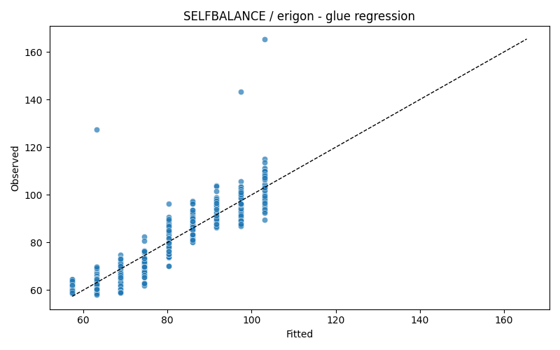

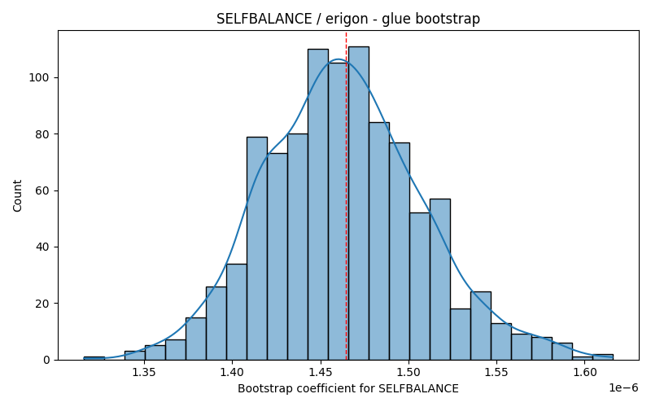

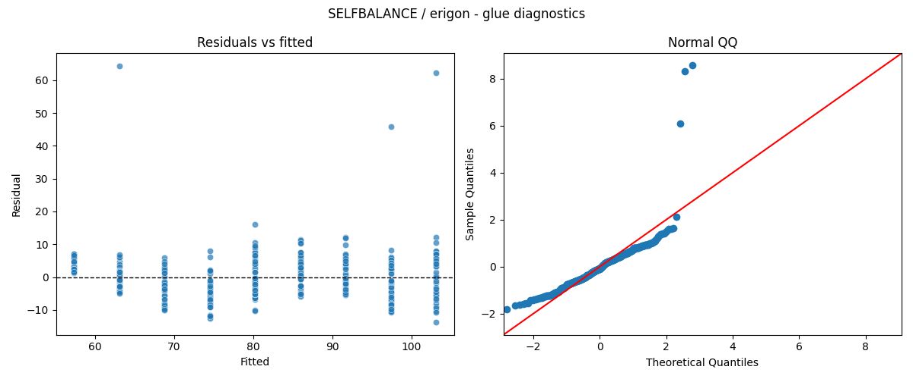

</details>

<details><summary><code>SUB</code> · nobs=462 · runtime_ms=2.787e-06 · p=1.00e-03 · R²=0.9181</summary>

```
==============================================================================
                           NNLS Regression Results                            
==============================================================================
Dep. Variable:          test_runtime_ms              R-squared:          0.918
Model:                  NNLS                    Adj. R-squared:          0.918
No. Observations:       462                               RMSE:           8.76
Df Residuals:           460                                MAE:           7.44
Df Model:               1      
==============================================================================
                      coef     std err     P-value      [0.025      0.975]
------------------------------------------------------------------------------
         const     17.8464      1.3711       0.001     15.2568     20.4098
           SUB      0.0000      0.0000       0.001      0.0000      0.0000
==============================================================================
Notes: Non-negative least squares with bootstrap inference (1000 iterations)
==============================================================================
```

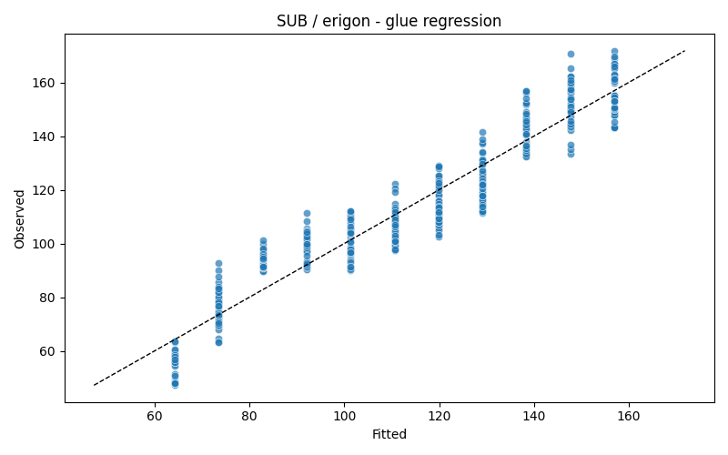

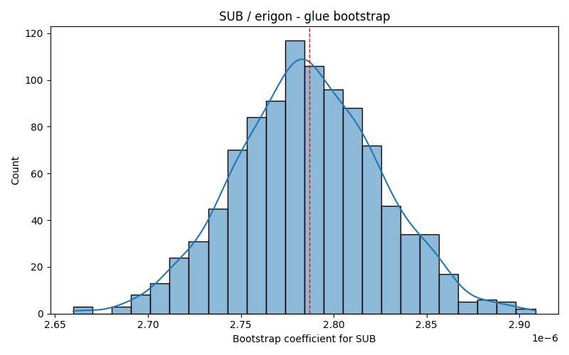

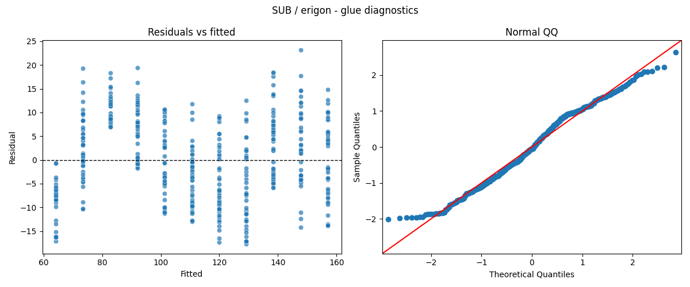

</details>

### Mixed glue (tier B) · erigon

<details><summary><code>JUMP</code> · nobs=462 · runtime_ms=7.26e-06 · p=1.00e-03 · R²=0.9066</summary>

```
==============================================================================
                           NNLS Regression Results                            
==============================================================================
Dep. Variable:          test_runtime_ms              R-squared:          0.907
Model:                  NNLS                    Adj. R-squared:          0.906
No. Observations:       462                               RMSE:           8.66
Df Residuals:           460                                MAE:           6.58
Df Model:               1      
==============================================================================
                      coef     std err     P-value      [0.025      0.975]
------------------------------------------------------------------------------
         const     19.0542      1.3864       0.001     16.2965     21.6294
          JUMP      0.0000      0.0000       0.001      0.0000      0.0000
==============================================================================
Notes: Non-negative least squares with bootstrap inference (1000 iterations)
==============================================================================
```

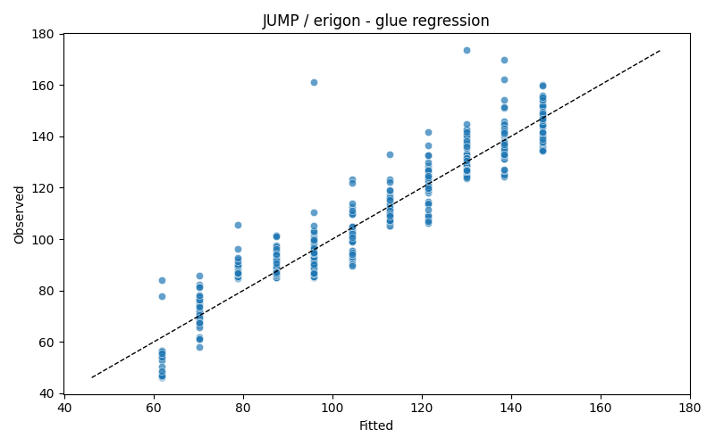

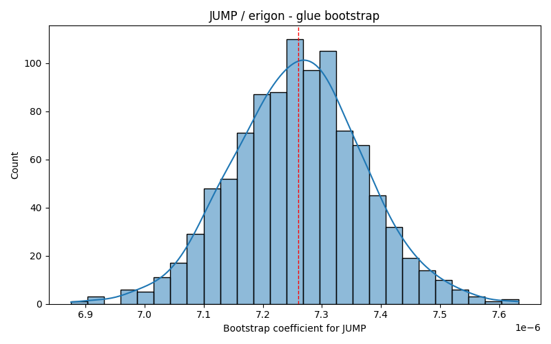

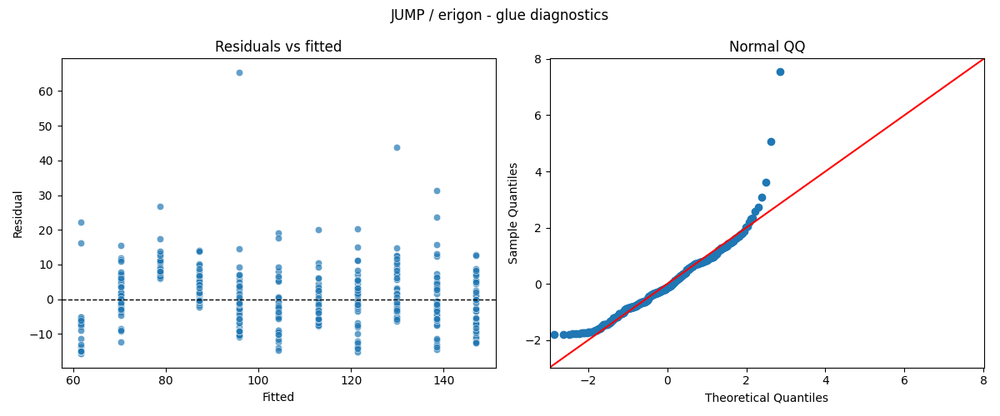

</details>

<details><summary><code>KECCAK256</code> · nobs=7392 · runtime_ms=2.196e-05 · p=1.00e-03 · R²=0.1014</summary>

```
==============================================================================
                           NNLS Regression Results                            
==============================================================================
Dep. Variable:          test_runtime_ms              R-squared:          0.101
Model:                  NNLS                    Adj. R-squared:          0.101
No. Observations:       7392                              RMSE:         129.89
Df Residuals:           7390                               MAE:         104.40
Df Model:               1      
==============================================================================
                      coef     std err     P-value      [0.025      0.975]
------------------------------------------------------------------------------
         const    357.5307      3.3193       0.001    350.8160    364.1419
     KECCAK256      0.0000      0.0000       0.001      0.0000      0.0000
==============================================================================
Notes: Non-negative least squares with bootstrap inference (1000 iterations)
==============================================================================
```

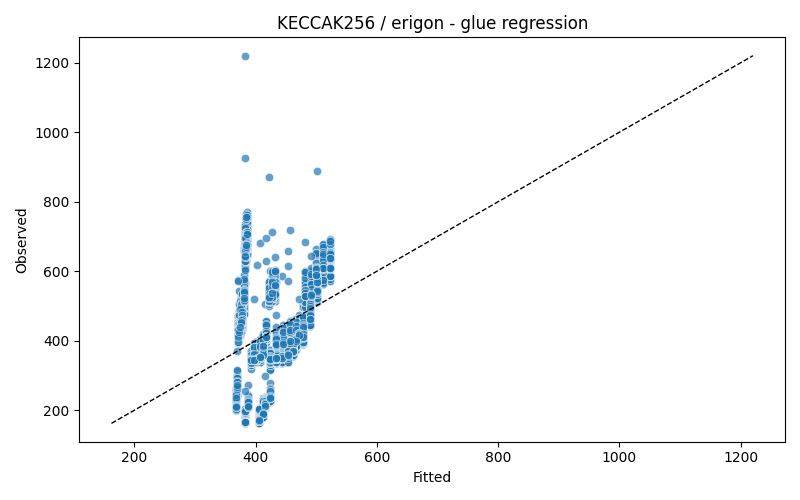

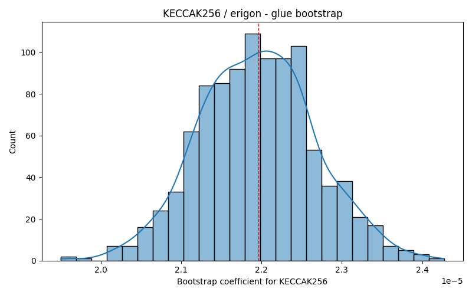

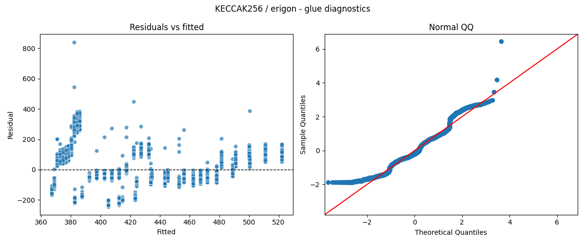

</details>

## ethrex

| glue_opcode | nobs | glue_runtime_ms | p_value | rsquared |
| --- | --- | --- | --- | --- |
| `ISZERO` | 451 | 5.129e-07 | 1.00e-03 | 0.8139 |
| `JUMPDEST` | 451 | 3.335e-07 | 1.00e-03 | 0.8516 |
| `SWAP` | 7216 | 7.136e-07 | 1.00e-03 | 0.8085 |
| `CALLDATASIZE` | 27049 | 4.657e-07 | 1.00e-03 | 0.9302 |
| `DUP` | 27049 | 4.721e-07 | 1.00e-03 | 0.9302 |
| `GAS` | 27049 | 4.665e-07 | 1.00e-03 | 0.9302 |
| `MLOAD` | 27049 | 1.151e-06 | 1.00e-03 | 0.9302 |
| `PUSH` | 27049 | 4.903e-07 | 1.00e-03 | 0.9302 |
| `PUSH0` | 27049 | 4.388e-07 | 1.00e-03 | 0.9302 |
| `STATICCALL` | 27049 | 0.0001108 | 1.00e-03 | 0.9302 |
| `ADD` | 451 | 1.194e-06 | 1.00e-03 | 0.8464 |
| `AND` | 451 | 1.135e-06 | 1.00e-03 | 0.8709 |
| `CALLDATACOPY` | 10824 | 2.418e-06 | 1.00e-03 | 0.8661 |
| `CALLDATALOAD` | 1804 | 2.324e-05 | 1.00e-03 | 0.1961 |
| `DIV` | 451 | 1.135e-05 | 1.00e-03 | 0.9425 |
| `EXP` | 451 | 0.001103 | 1.00e-03 | 0.924 |
| `GT` | 451 | 1.123e-06 | 1.00e-03 | 0.8378 |
| `JUMPI` | 451 | 1.454e-06 | 1.00e-03 | 0.7958 |
| `LT` | 451 | 9.281e-07 | 1.00e-03 | 0.8092 |
| `MSTORE` | 2255 | 1.688e-06 | 1.00e-03 | 0.7937 |
| `MSTORE8` | 2255 | 1.56e-06 | 1.00e-03 | 0.7358 |
| `MUL` | 451 | 1.558e-06 | 1.00e-03 | 0.8753 |
| `PC` | 451 | 5.609e-07 | 1.00e-03 | 0.8261 |
| `RETURNDATASIZE` | 1804 | 9.007e-07 | 1.00e-03 | 0.8359 |
| `SELFBALANCE` | 369 | 5.782e-06 | 1.00e-03 | 0.9055 |
| `SUB` | 451 | 1.179e-06 | 1.00e-03 | 0.8996 |
| `JUMP` | 451 | 4.275e-06 | 1.00e-03 | 0.8308 |
| `KECCAK256` | 7216 | 0 | 1.00e+00 | 0 |

### Cycle glue — joint fit · ethrex

<details><summary>Joint NNLS regression summary</summary>

```
==============================================================================
                           NNLS Regression Results                            
==============================================================================
Dep. Variable:          test_runtime_ms              R-squared:          0.930
Model:                  NNLS                    Adj. R-squared:          0.930
No. Observations:       27049                             RMSE:           6.66
Df Residuals:           27041                              MAE:           5.15
Df Model:               7      
==============================================================================
                      coef     std err     P-value      [0.025      0.975]
------------------------------------------------------------------------------
         const     12.7916      0.1402       0.001     12.5065     13.0545
  CALLDATASIZE      0.0000      0.0000       0.001      0.0000      0.0000
           DUP      0.0000      0.0000       0.001      0.0000      0.0000
           GAS      0.0000      0.0000       0.001      0.0000      0.0000
         MLOAD      0.0000      0.0000       0.001      0.0000      0.0000
          PUSH      0.0000      0.0000       0.001      0.0000      0.0000
         PUSH0      0.0000      0.0000       0.001      0.0000      0.0000
    STATICCALL      0.0001      0.0000       0.001      0.0001      0.0001
==============================================================================
Notes: Non-negative least squares with bootstrap inference (1000 iterations)
==============================================================================
```

</details>

<details><summary><code>CALLDATASIZE</code> · nobs=27049 · runtime_ms=4.657e-07 · p=1.00e-03 · R²=0.9302</summary>


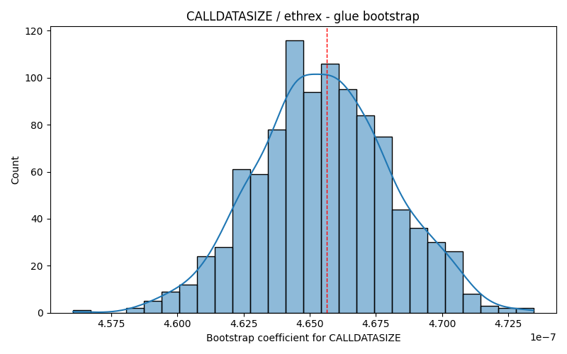


</details>

<details><summary><code>DUP</code> · nobs=27049 · runtime_ms=4.721e-07 · p=1.00e-03 · R²=0.9302</summary>

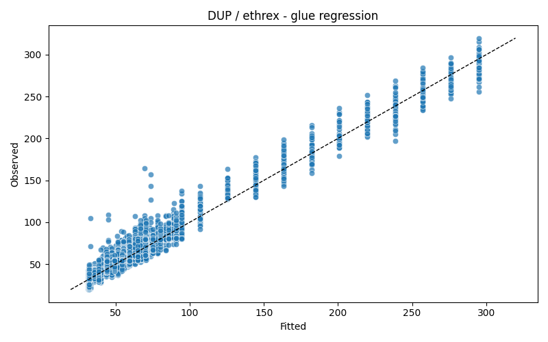

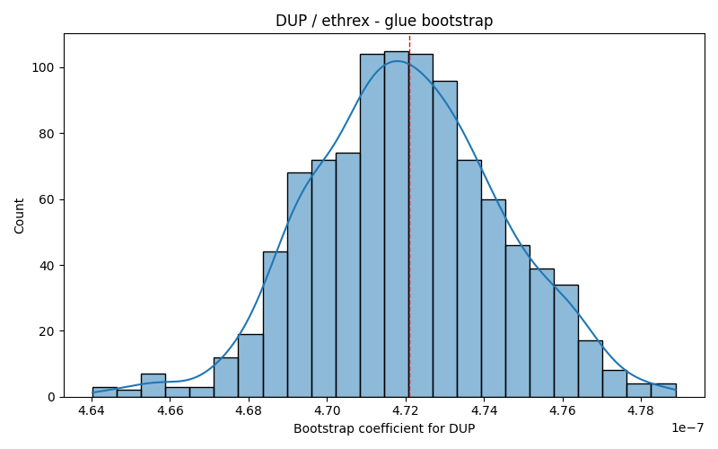


</details>

<details><summary><code>GAS</code> · nobs=27049 · runtime_ms=4.665e-07 · p=1.00e-03 · R²=0.9302</summary>


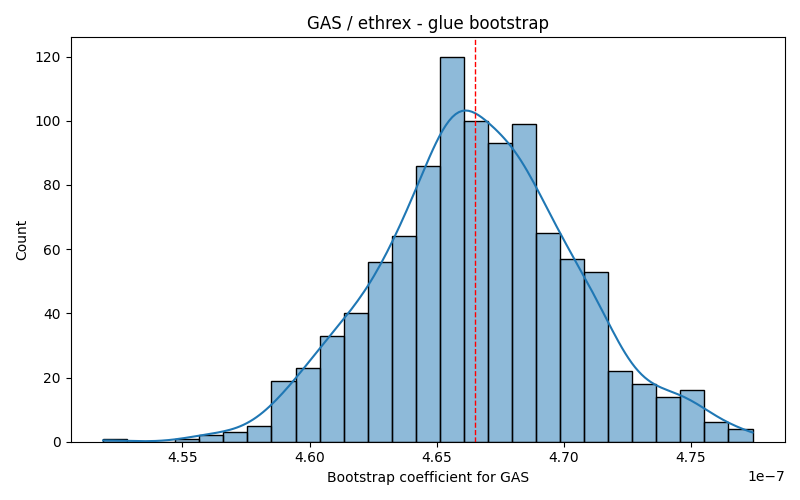

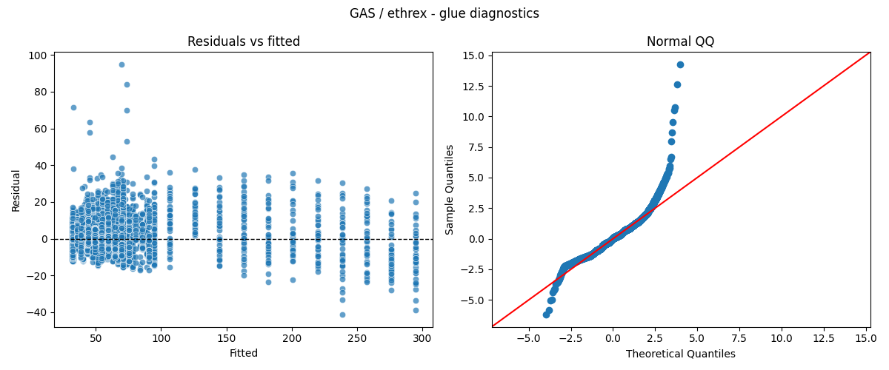

</details>

<details><summary><code>MLOAD</code> · nobs=27049 · runtime_ms=1.151e-06 · p=1.00e-03 · R²=0.9302</summary>


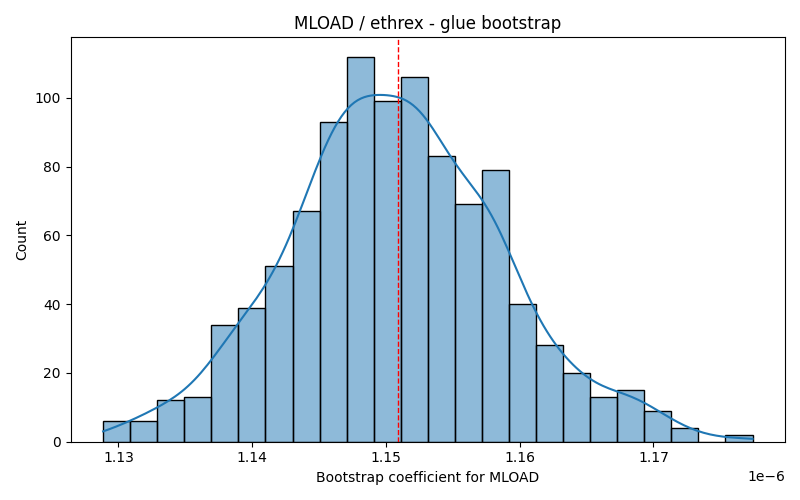


</details>

<details><summary><code>PUSH</code> · nobs=27049 · runtime_ms=4.903e-07 · p=1.00e-03 · R²=0.9302</summary>

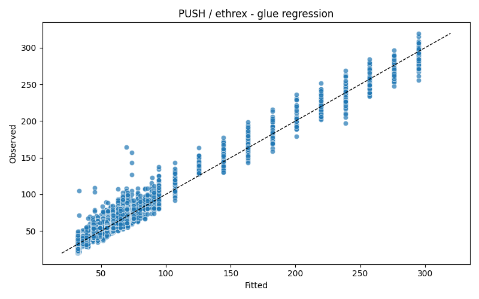

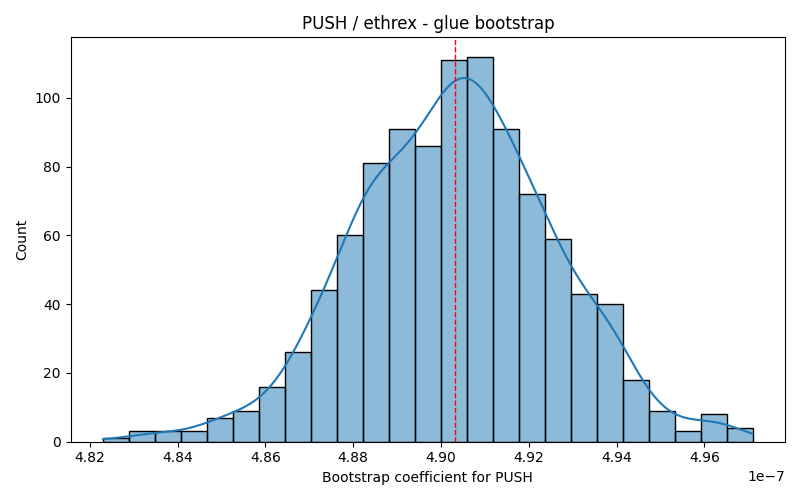


</details>

<details><summary><code>PUSH0</code> · nobs=27049 · runtime_ms=4.388e-07 · p=1.00e-03 · R²=0.9302</summary>

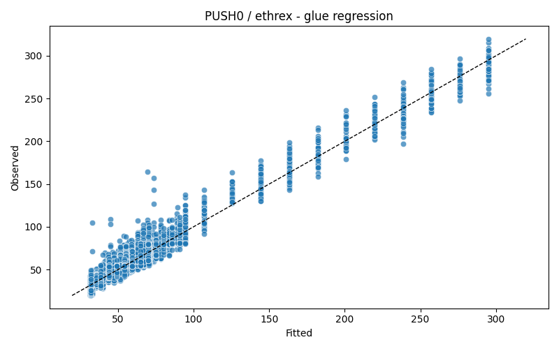

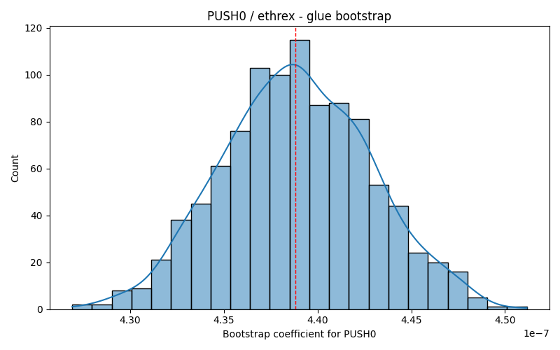

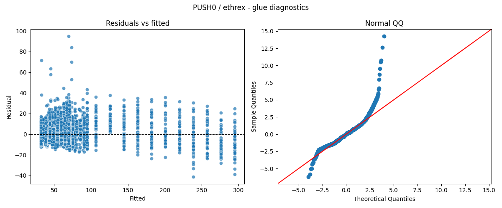

</details>

<details><summary><code>STATICCALL</code> · nobs=27049 · runtime_ms=0.0001108 · p=1.00e-03 · R²=0.9302</summary>

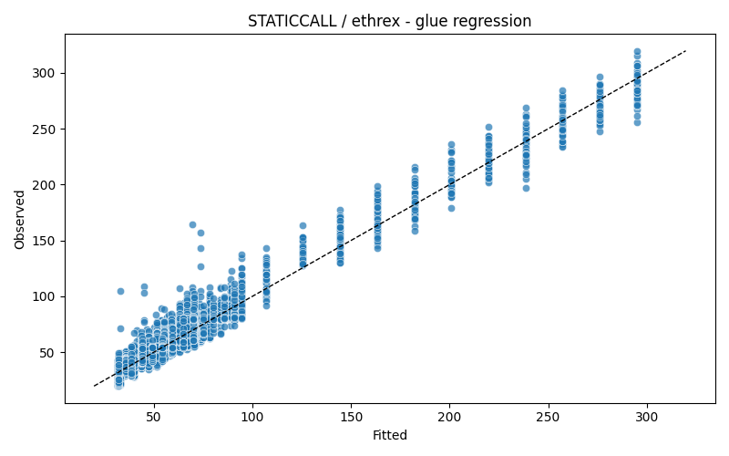

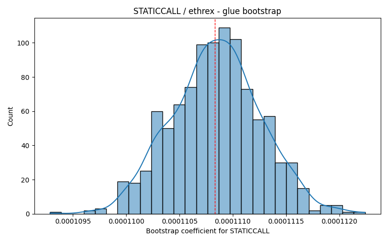


</details>

### Pure glue · ethrex

<details><summary><code>ISZERO</code> · nobs=451 · runtime_ms=5.129e-07 · p=1.00e-03 · R²=0.8139</summary>

```
==============================================================================
                           NNLS Regression Results                            
==============================================================================
Dep. Variable:          test_runtime_ms              R-squared:          0.814
Model:                  NNLS                    Adj. R-squared:          0.813
No. Observations:       451                               RMSE:           5.16
Df Residuals:           449                                MAE:           4.03
Df Model:               1      
==============================================================================
                      coef     std err     P-value      [0.025      0.975]
------------------------------------------------------------------------------
         const      9.3974      0.7741       0.001      7.9553     10.9374
        ISZERO      0.0000      0.0000       0.001      0.0000      0.0000
==============================================================================
Notes: Non-negative least squares with bootstrap inference (1000 iterations)
==============================================================================
```

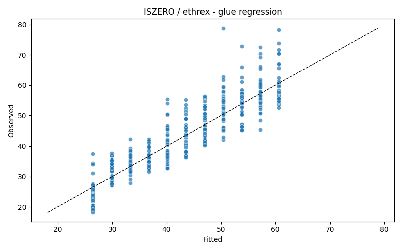

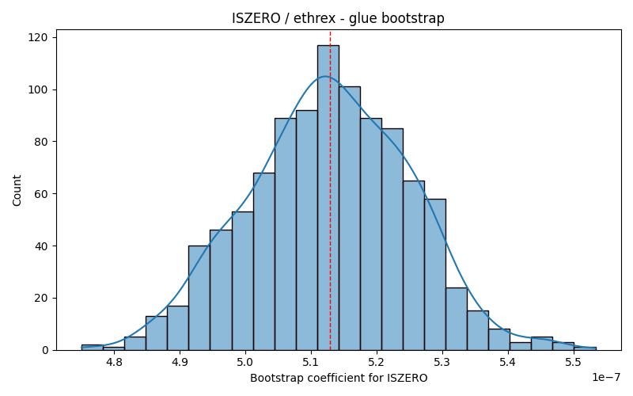

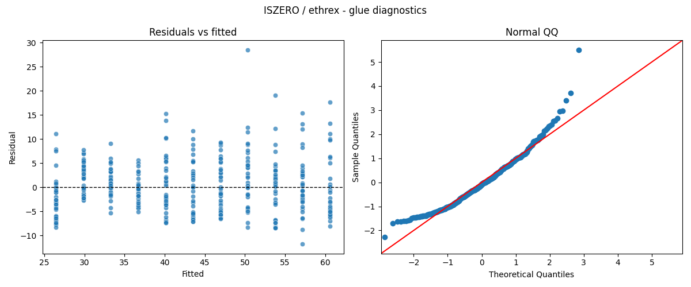

</details>

<details><summary><code>JUMPDEST</code> · nobs=451 · runtime_ms=3.335e-07 · p=1.00e-03 · R²=0.8516</summary>

```
==============================================================================
                           NNLS Regression Results                            
==============================================================================
Dep. Variable:          test_runtime_ms              R-squared:          0.852
Model:                  NNLS                    Adj. R-squared:          0.851
No. Observations:       451                               RMSE:           8.79
Df Residuals:           449                                MAE:           7.01
Df Model:               1      
==============================================================================
                      coef     std err     P-value      [0.025      0.975]
------------------------------------------------------------------------------
         const     18.2633      1.3369       0.001     15.5462     20.8569
      JUMPDEST      0.0000      0.0000       0.001      0.0000      0.0000
==============================================================================
Notes: Non-negative least squares with bootstrap inference (1000 iterations)
==============================================================================
```

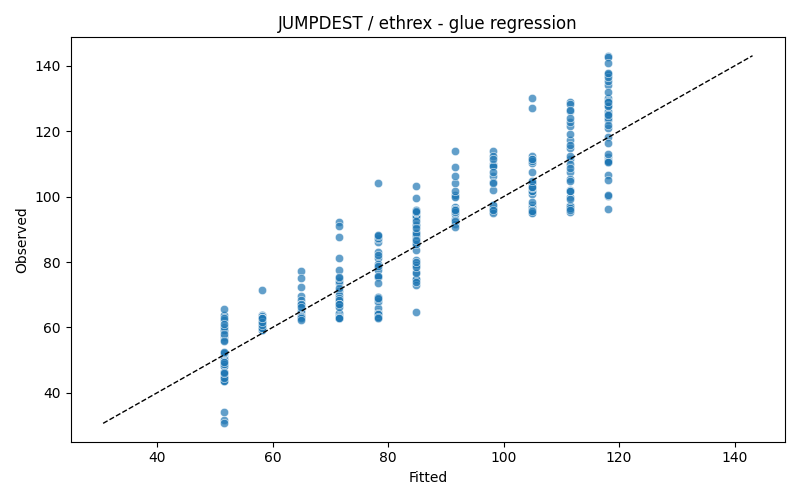

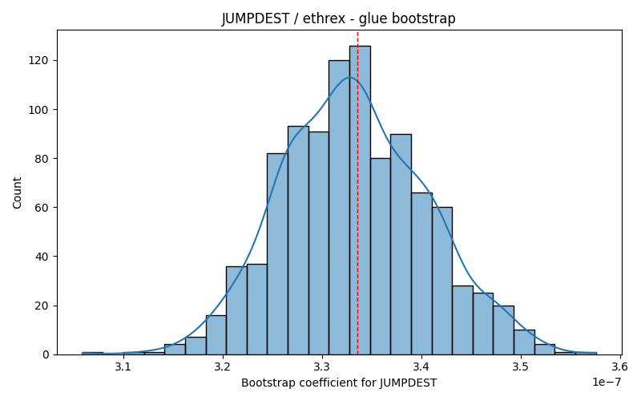

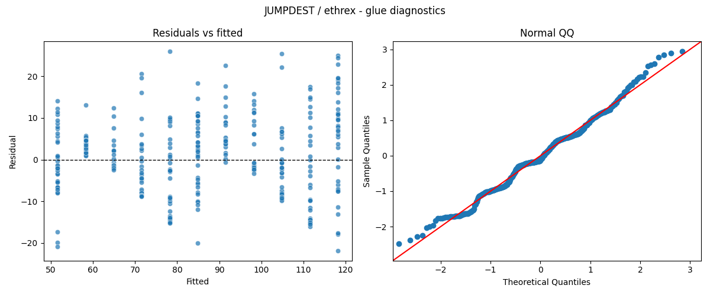

</details>

<details><summary><code>SWAP</code> · nobs=7216 · runtime_ms=7.136e-07 · p=1.00e-03 · R²=0.8085</summary>

```
==============================================================================
                           NNLS Regression Results                            
==============================================================================
Dep. Variable:          test_runtime_ms              R-squared:          0.809
Model:                  NNLS                    Adj. R-squared:          0.809
No. Observations:       7216                              RMSE:           7.31
Df Residuals:           7214                               MAE:           5.89
Df Model:               1      
==============================================================================
                      coef     std err     P-value      [0.025      0.975]
------------------------------------------------------------------------------
         const     15.4350      0.3093       0.001     14.8418     16.0656
          SWAP      0.0000      0.0000       0.001      0.0000      0.0000
==============================================================================
Notes: Non-negative least squares with bootstrap inference (1000 iterations)
==============================================================================
```

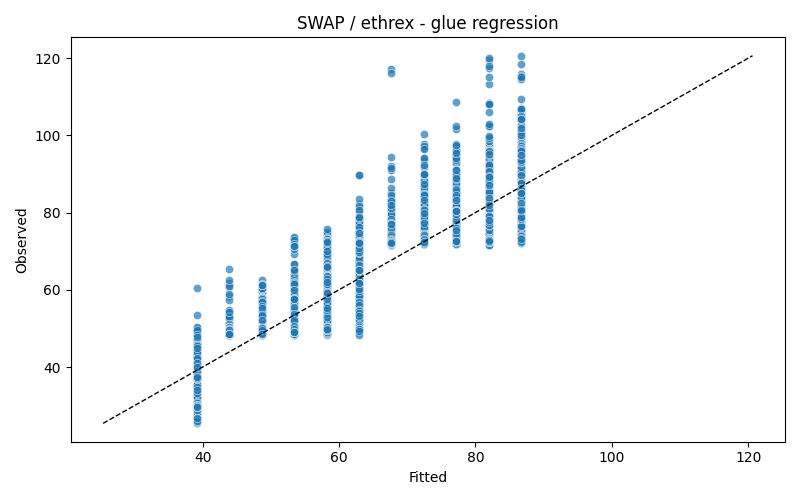

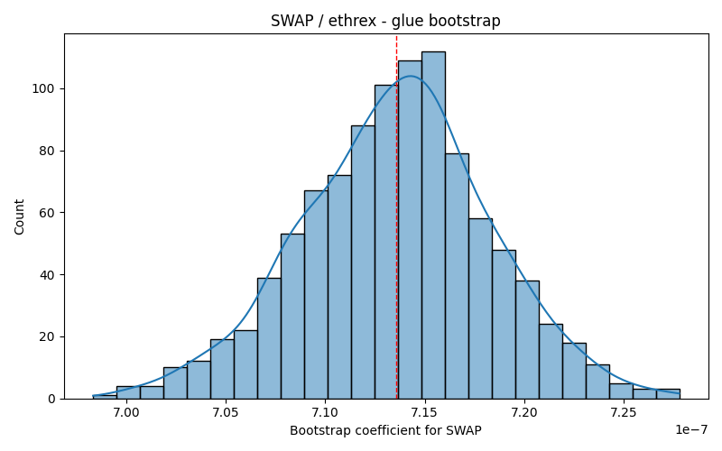

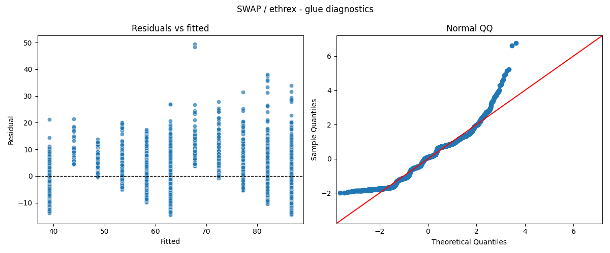

</details>

### Mixed glue (tier A) · ethrex

<details><summary><code>ADD</code> · nobs=451 · runtime_ms=1.194e-06 · p=1.00e-03 · R²=0.8464</summary>

```
==============================================================================
                           NNLS Regression Results                            
==============================================================================
Dep. Variable:          test_runtime_ms              R-squared:          0.846
Model:                  NNLS                    Adj. R-squared:          0.846
No. Observations:       451                               RMSE:           5.35
Df Residuals:           449                                MAE:           3.78
Df Model:               1      
==============================================================================
                      coef     std err     P-value      [0.025      0.975]
------------------------------------------------------------------------------
         const      9.4621      0.8752       0.001      7.7566     11.2138
           ADD      0.0000      0.0000       0.001      0.0000      0.0000
==============================================================================
Notes: Non-negative least squares with bootstrap inference (1000 iterations)
==============================================================================
```

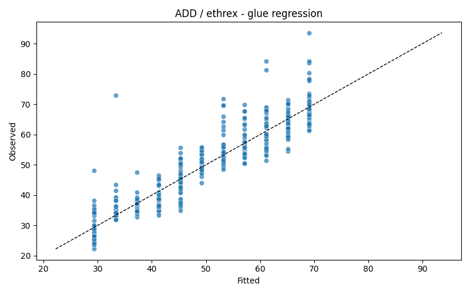

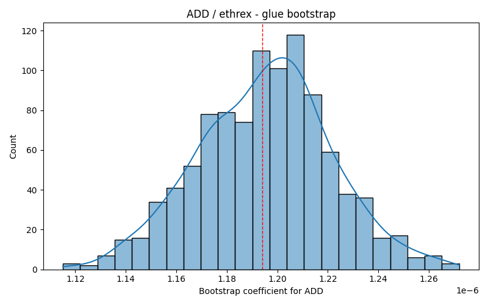

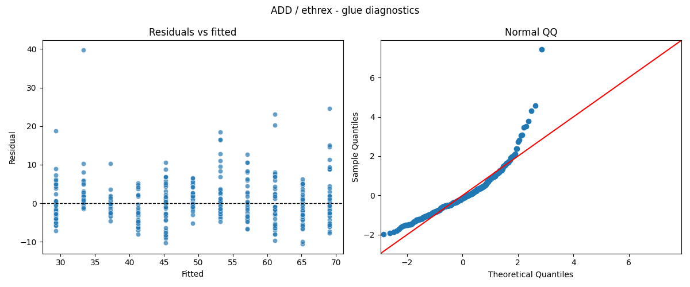

</details>

<details><summary><code>AND</code> · nobs=451 · runtime_ms=1.135e-06 · p=1.00e-03 · R²=0.8709</summary>

```
==============================================================================
                           NNLS Regression Results                            
==============================================================================
Dep. Variable:          test_runtime_ms              R-squared:          0.871
Model:                  NNLS                    Adj. R-squared:          0.871
No. Observations:       451                               RMSE:           4.60
Df Residuals:           449                                MAE:           3.25
Df Model:               1      
==============================================================================
                      coef     std err     P-value      [0.025      0.975]
------------------------------------------------------------------------------
         const      8.5968      0.6693       0.001      7.3576      9.9249
           AND      0.0000      0.0000       0.001      0.0000      0.0000
==============================================================================
Notes: Non-negative least squares with bootstrap inference (1000 iterations)
==============================================================================
```

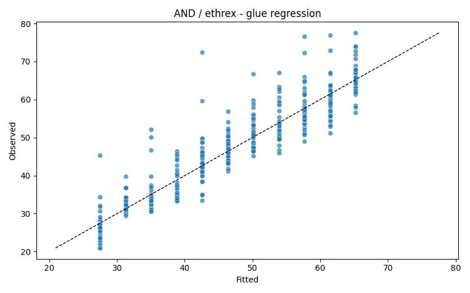

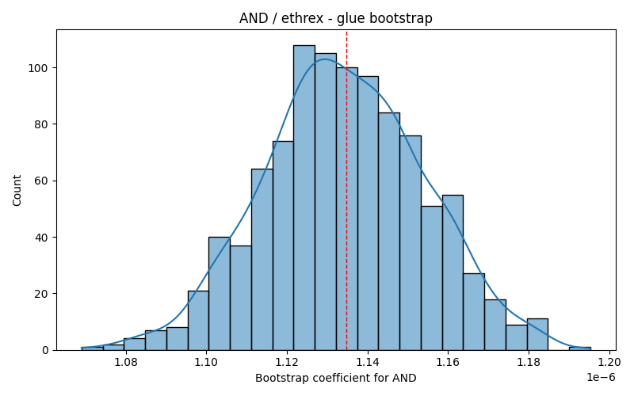

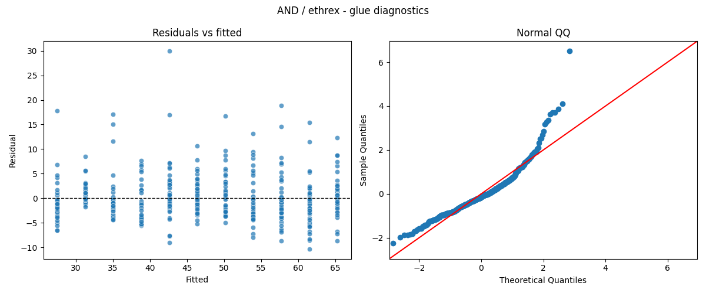

</details>

<details><summary><code>CALLDATACOPY</code> · nobs=10824 · runtime_ms=2.418e-06 · p=1.00e-03 · R²=0.8661</summary>

```
==============================================================================
                           NNLS Regression Results                            
==============================================================================
Dep. Variable:          test_runtime_ms              R-squared:          0.866
Model:                  NNLS                    Adj. R-squared:          0.866
No. Observations:       10824                             RMSE:           7.15
Df Residuals:           10822                              MAE:           5.33
Df Model:               1      
==============================================================================
                      coef     std err     P-value      [0.025      0.975]
------------------------------------------------------------------------------
         const     12.6968      0.0845       0.001     12.5302     12.8617
  CALLDATACOPY      0.0000      0.0000       0.001      0.0000      0.0000
==============================================================================
Notes: Non-negative least squares with bootstrap inference (1000 iterations)
==============================================================================
```

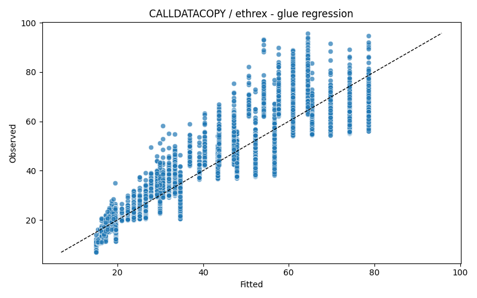

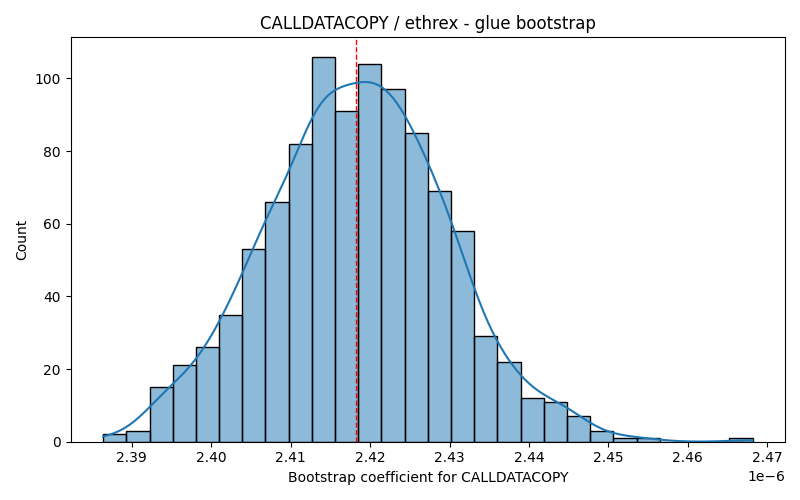

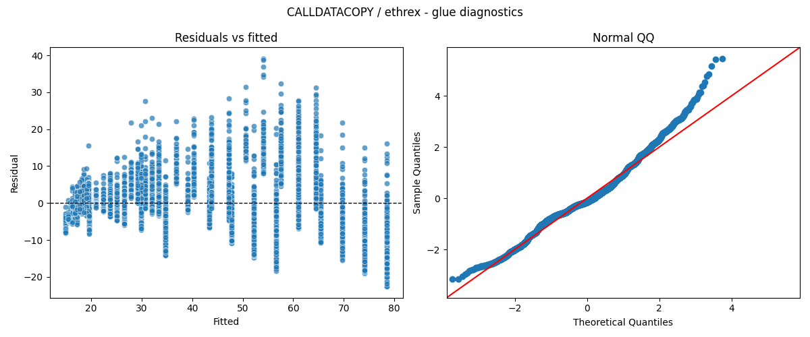

</details>

<details><summary><code>CALLDATALOAD</code> · nobs=1804 · runtime_ms=2.324e-05 · p=1.00e-03 · R²=0.1961</summary>

```
==============================================================================
                           NNLS Regression Results                            
==============================================================================
Dep. Variable:          test_runtime_ms              R-squared:          0.196
Model:                  NNLS                    Adj. R-squared:          0.196
No. Observations:       1804                              RMSE:           0.18
Df Residuals:           1802                               MAE:           0.14
Df Model:               1      
==============================================================================
                      coef     std err     P-value      [0.025      0.975]
------------------------------------------------------------------------------
         const      2.4506      0.0147       0.001      2.4239      2.4799
  CALLDATALOAD      0.0000      0.0000       0.001      0.0000      0.0000
==============================================================================
Notes: Non-negative least squares with bootstrap inference (1000 iterations)
==============================================================================
```

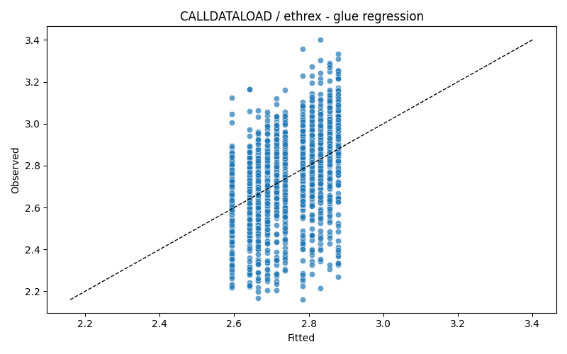

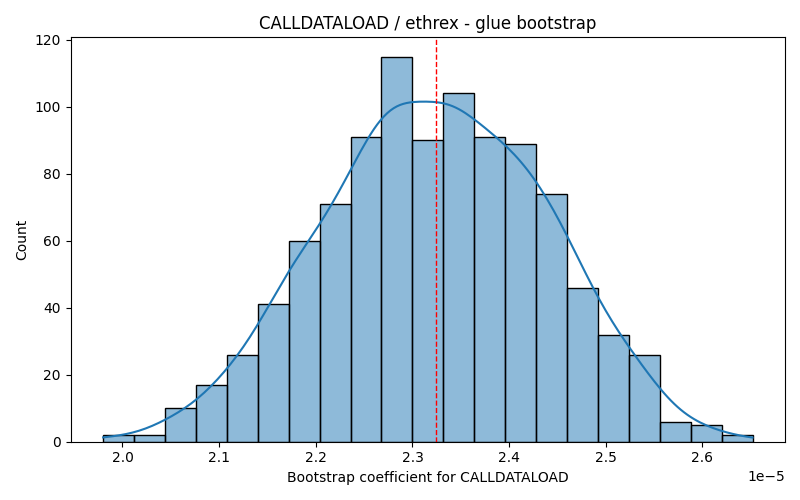

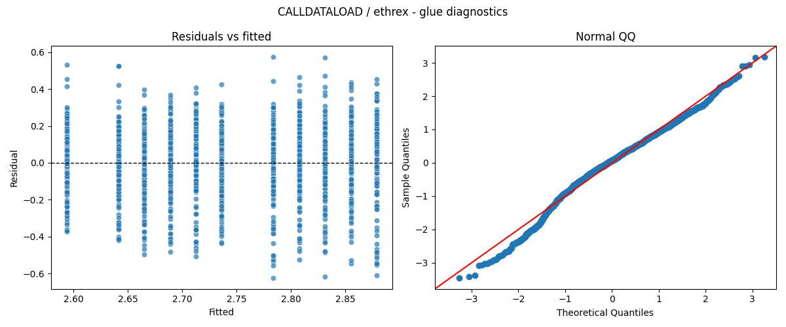

</details>

<details><summary><code>DIV</code> · nobs=451 · runtime_ms=1.135e-05 · p=1.00e-03 · R²=0.9425</summary>

```
==============================================================================
                           NNLS Regression Results                            
==============================================================================
Dep. Variable:          test_runtime_ms              R-squared:          0.942
Model:                  NNLS                    Adj. R-squared:          0.942
No. Observations:       451                               RMSE:          22.14
Df Residuals:           449                                MAE:          18.20
Df Model:               1      
==============================================================================
                      coef     std err     P-value      [0.025      0.975]
------------------------------------------------------------------------------
         const     65.7606      3.4911       0.001     59.1734     72.4160
           DIV      0.0000      0.0000       0.001      0.0000      0.0000
==============================================================================
Notes: Non-negative least squares with bootstrap inference (1000 iterations)
==============================================================================
```

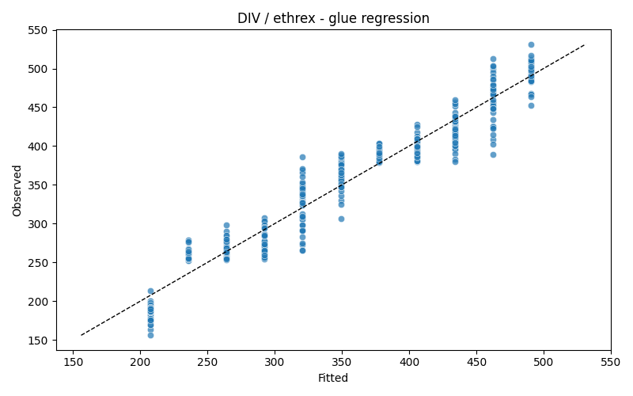

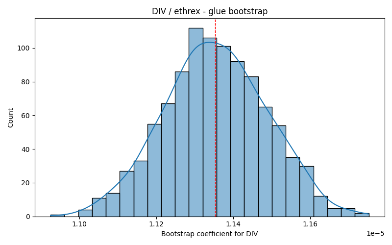

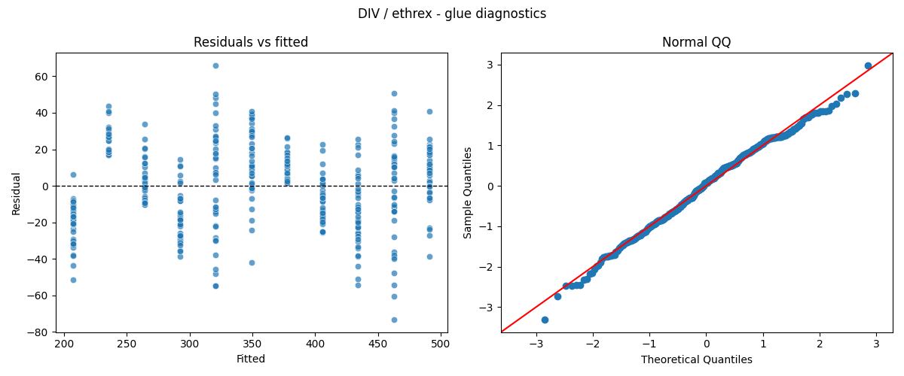

</details>

<details><summary><code>EXP</code> · nobs=451 · runtime_ms=0.001103 · p=1.00e-03 · R²=0.924</summary>

```
==============================================================================
                           NNLS Regression Results                            
==============================================================================
Dep. Variable:          test_runtime_ms              R-squared:          0.924
Model:                  NNLS                    Adj. R-squared:          0.924
No. Observations:       451                               RMSE:          12.39
Df Residuals:           449                                MAE:          10.29
Df Model:               1      
==============================================================================
                      coef     std err     P-value      [0.025      0.975]
------------------------------------------------------------------------------
         const     32.3515      1.9226       0.001     28.6525     35.9989
           EXP      0.0011      0.0000       0.001      0.0011      0.0011
==============================================================================
Notes: Non-negative least squares with bootstrap inference (1000 iterations)
==============================================================================
```

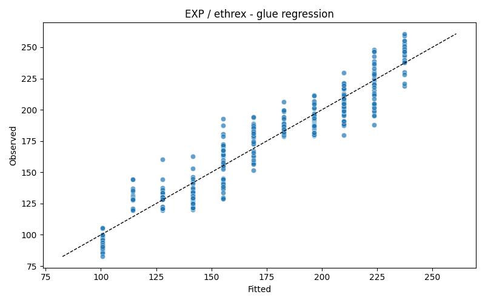

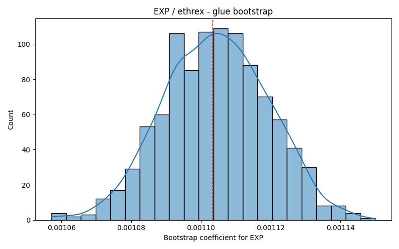

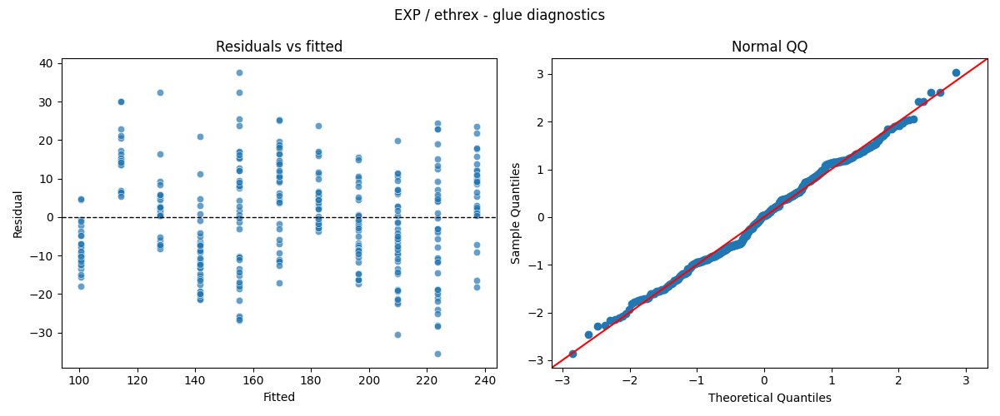

</details>

<details><summary><code>GT</code> · nobs=451 · runtime_ms=1.123e-06 · p=1.00e-03 · R²=0.8378</summary>

```
==============================================================================
                           NNLS Regression Results                            
==============================================================================
Dep. Variable:          test_runtime_ms              R-squared:          0.838
Model:                  NNLS                    Adj. R-squared:          0.837
No. Observations:       451                               RMSE:           5.20
Df Residuals:           449                                MAE:           4.11
Df Model:               1      
==============================================================================
                      coef     std err     P-value      [0.025      0.975]
------------------------------------------------------------------------------
         const     10.7840      0.8138       0.001      9.1952     12.3850
            GT      0.0000      0.0000       0.001      0.0000      0.0000
==============================================================================
Notes: Non-negative least squares with bootstrap inference (1000 iterations)
==============================================================================
```

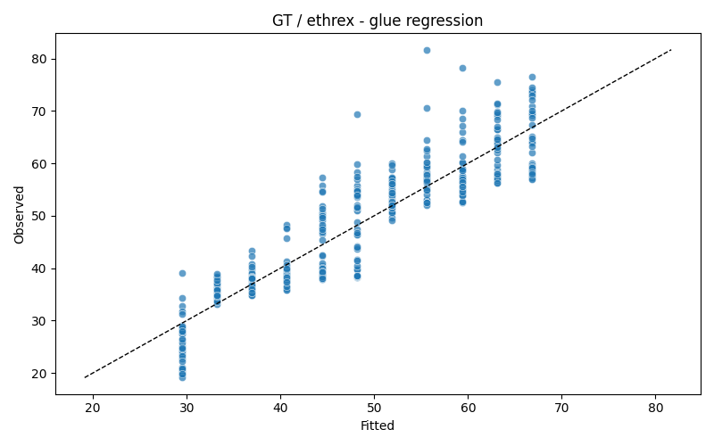

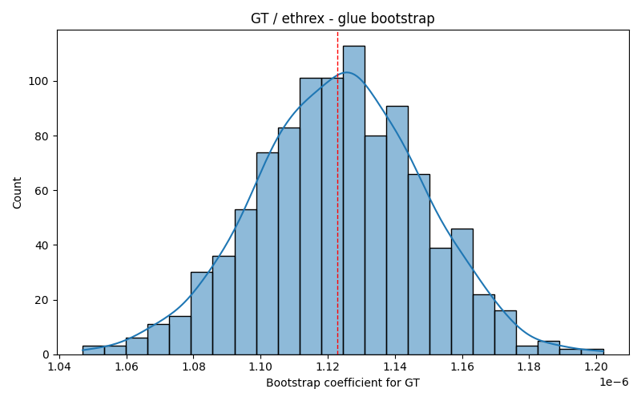

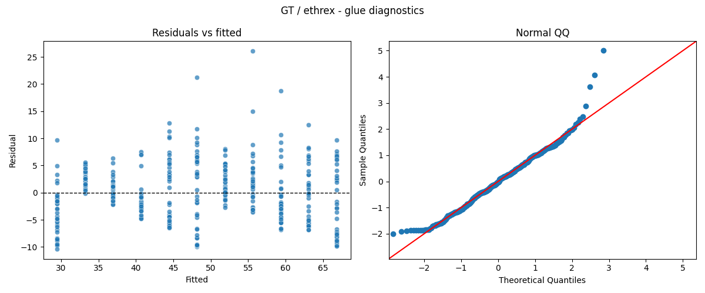

</details>

<details><summary><code>JUMPI</code> · nobs=451 · runtime_ms=1.454e-06 · p=1.00e-03 · R²=0.7958</summary>

```
==============================================================================
                           NNLS Regression Results                            
==============================================================================
Dep. Variable:          test_runtime_ms              R-squared:          0.796
Model:                  NNLS                    Adj. R-squared:          0.795
No. Observations:       451                               RMSE:           3.32
Df Residuals:           449                                MAE:           2.56
Df Model:               1      
==============================================================================
                      coef     std err     P-value      [0.025      0.975]
------------------------------------------------------------------------------
         const      6.4797      0.4809       0.001      5.4854      7.3877
         JUMPI      0.0000      0.0000       0.001      0.0000      0.0000
==============================================================================
Notes: Non-negative least squares with bootstrap inference (1000 iterations)
==============================================================================
```

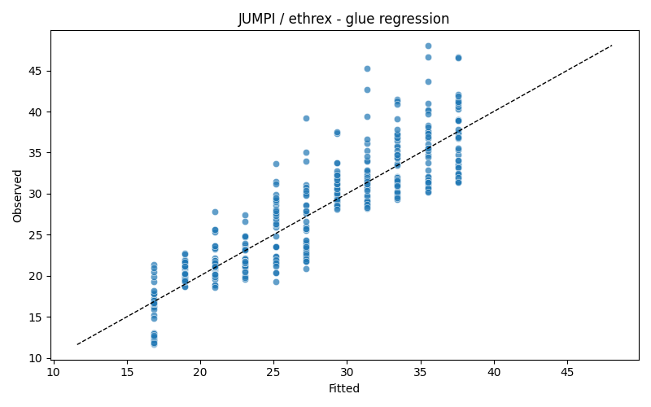

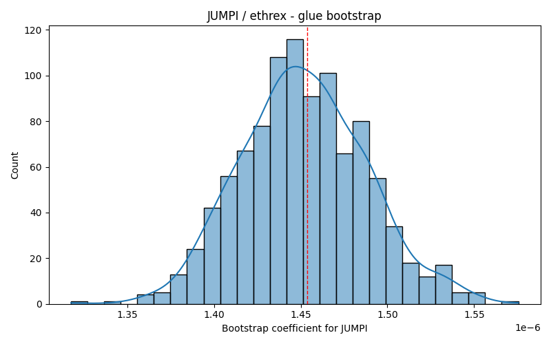

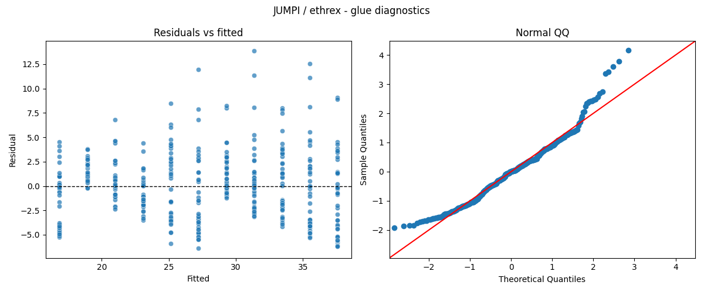

</details>

<details><summary><code>LT</code> · nobs=451 · runtime_ms=9.281e-07 · p=1.00e-03 · R²=0.8092</summary>

```
==============================================================================
                           NNLS Regression Results                            
==============================================================================
Dep. Variable:          test_runtime_ms              R-squared:          0.809
Model:                  NNLS                    Adj. R-squared:          0.809
No. Observations:       451                               RMSE:           4.74
Df Residuals:           449                                MAE:           3.68
Df Model:               1      
==============================================================================
                      coef     std err     P-value      [0.025      0.975]
------------------------------------------------------------------------------
         const     10.8670      0.7219       0.001      9.4836     12.2692
            LT      0.0000      0.0000       0.001      0.0000      0.0000
==============================================================================
Notes: Non-negative least squares with bootstrap inference (1000 iterations)
==============================================================================
```

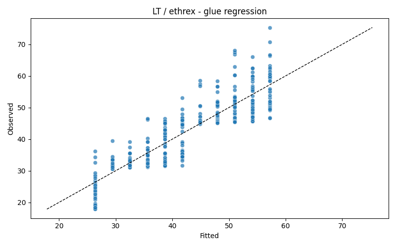

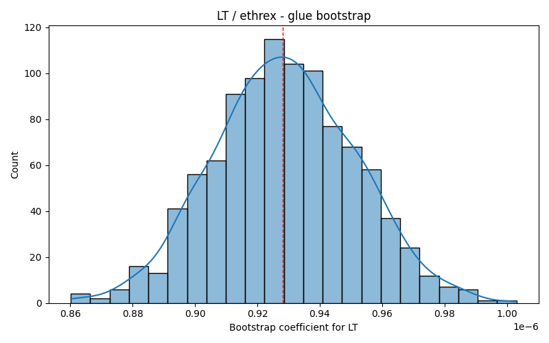

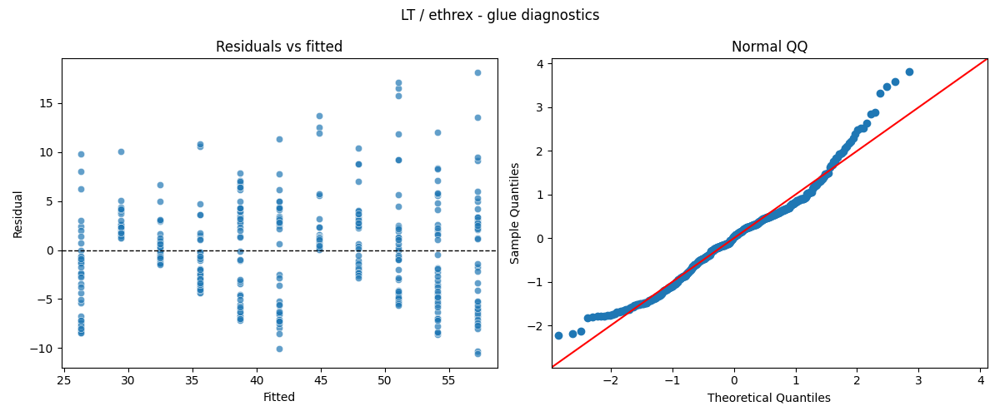

</details>

<details><summary><code>MSTORE</code> · nobs=2255 · runtime_ms=1.688e-06 · p=1.00e-03 · R²=0.7937</summary>

```
==============================================================================
                           NNLS Regression Results                            
==============================================================================
Dep. Variable:          test_runtime_ms              R-squared:          0.794
Model:                  NNLS                    Adj. R-squared:          0.794
No. Observations:       2255                              RMSE:           6.04
Df Residuals:           2253                               MAE:           4.34
Df Model:               1      
==============================================================================
                      coef     std err     P-value      [0.025      0.975]
------------------------------------------------------------------------------
         const     11.9778      0.3986       0.001     11.1936     12.7580
        MSTORE      0.0000      0.0000       0.001      0.0000      0.0000
==============================================================================
Notes: Non-negative least squares with bootstrap inference (1000 iterations)
==============================================================================
```

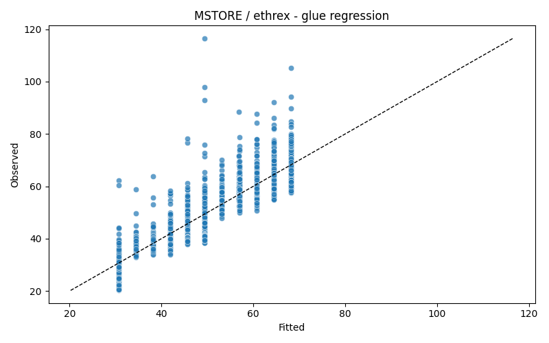

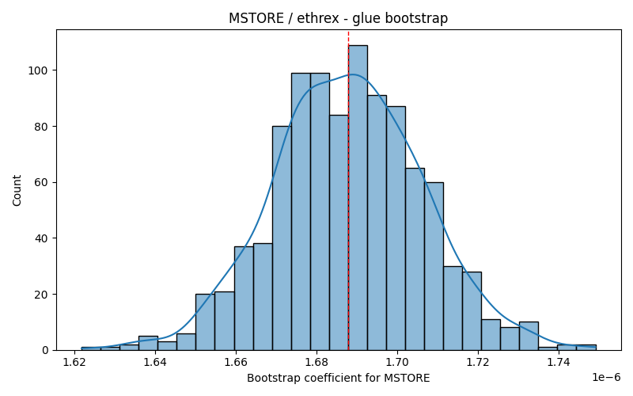

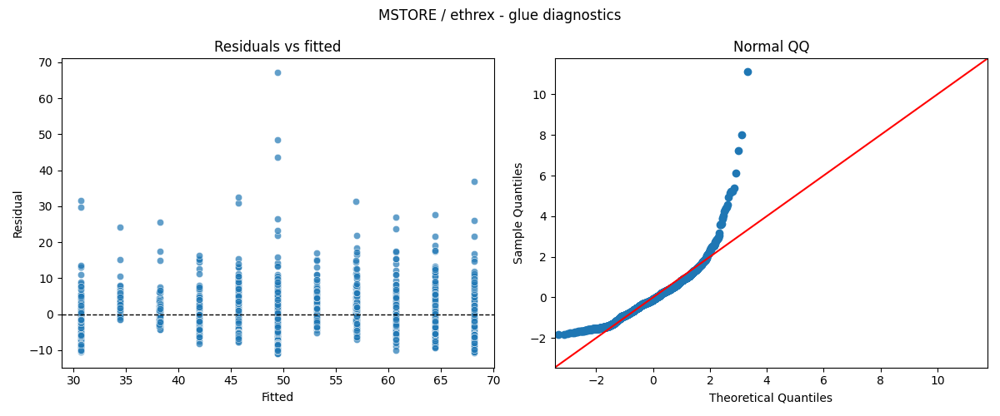

</details>

<details><summary><code>MSTORE8</code> · nobs=2255 · runtime_ms=1.56e-06 · p=1.00e-03 · R²=0.7358</summary>

```
==============================================================================
                           NNLS Regression Results                            
==============================================================================
Dep. Variable:          test_runtime_ms              R-squared:          0.736
Model:                  NNLS                    Adj. R-squared:          0.736
No. Observations:       2255                              RMSE:           6.56
Df Residuals:           2253                               MAE:           4.34
Df Model:               1      
==============================================================================
                      coef     std err     P-value      [0.025      0.975]
------------------------------------------------------------------------------
         const     11.3081      0.4713       0.001     10.3761     12.2178
       MSTORE8      0.0000      0.0000       0.001      0.0000      0.0000
==============================================================================
Notes: Non-negative least squares with bootstrap inference (1000 iterations)
==============================================================================
```

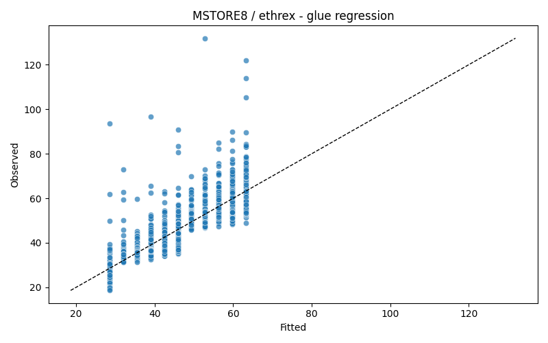

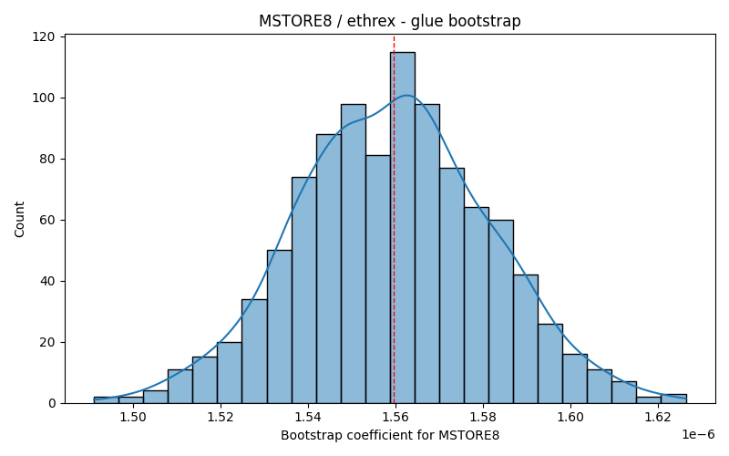

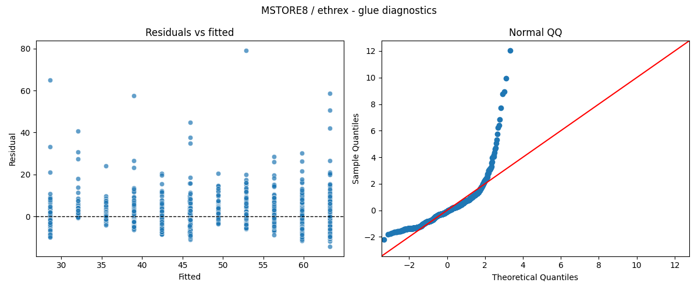

</details>

<details><summary><code>MUL</code> · nobs=451 · runtime_ms=1.558e-06 · p=1.00e-03 · R²=0.8753</summary>

```
==============================================================================
                           NNLS Regression Results                            
==============================================================================
Dep. Variable:          test_runtime_ms              R-squared:          0.875
Model:                  NNLS                    Adj. R-squared:          0.875
No. Observations:       451                               RMSE:           4.64
Df Residuals:           449                                MAE:           3.42
Df Model:               1      
==============================================================================
                      coef     std err     P-value      [0.025      0.975]
------------------------------------------------------------------------------
         const     12.1999      0.7680       0.001     10.8127     13.8777
           MUL      0.0000      0.0000       0.001      0.0000      0.0000
==============================================================================
Notes: Non-negative least squares with bootstrap inference (1000 iterations)
==============================================================================
```

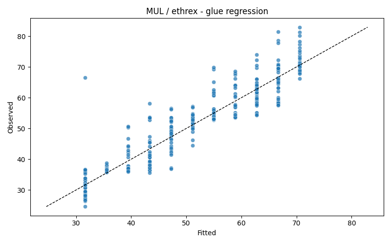

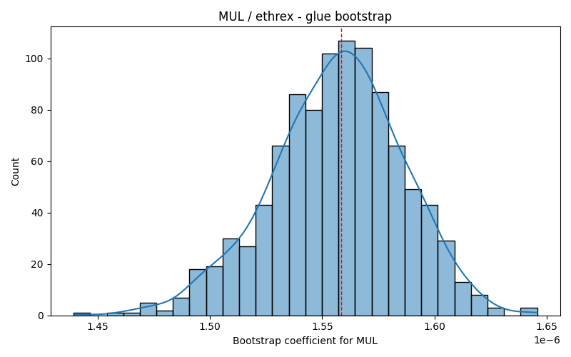

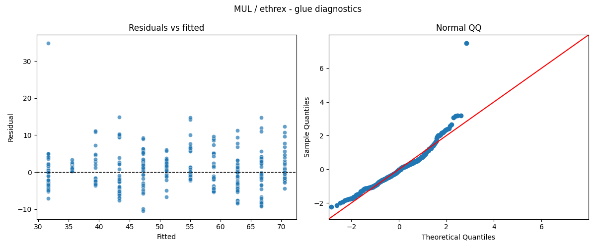

</details>

<details><summary><code>PC</code> · nobs=451 · runtime_ms=5.609e-07 · p=1.00e-03 · R²=0.8261</summary>

```
==============================================================================
                           NNLS Regression Results                            
==============================================================================
Dep. Variable:          test_runtime_ms              R-squared:          0.826
Model:                  NNLS                    Adj. R-squared:          0.826
No. Observations:       451                               RMSE:           7.69
Df Residuals:           449                                MAE:           6.38
Df Model:               1      
==============================================================================
                      coef     std err     P-value      [0.025      0.975]
------------------------------------------------------------------------------
         const     14.7751      1.2510       0.001     12.3795     17.4016
            PC      0.0000      0.0000       0.001      0.0000      0.0000
==============================================================================
Notes: Non-negative least squares with bootstrap inference (1000 iterations)
==============================================================================
```

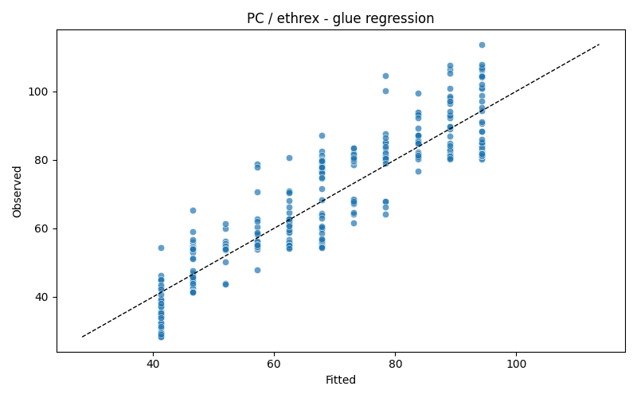

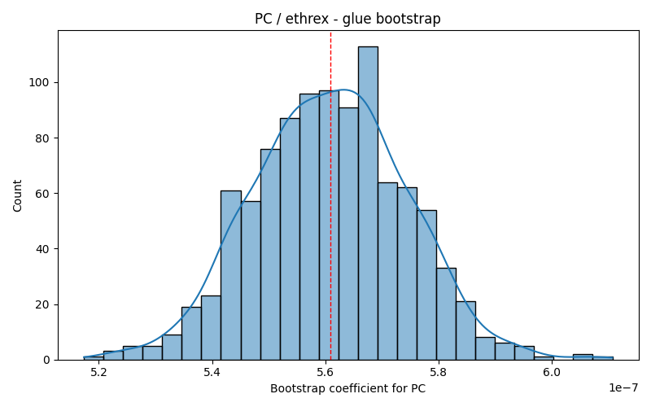

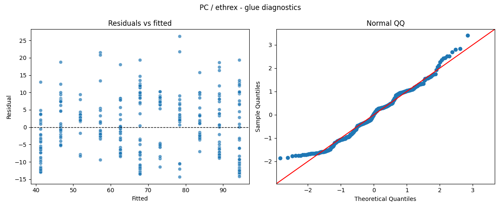

</details>

<details><summary><code>RETURNDATASIZE</code> · nobs=1804 · runtime_ms=9.007e-07 · p=1.00e-03 · R²=0.8359</summary>

```
==============================================================================
                           NNLS Regression Results                            
==============================================================================
Dep. Variable:          test_runtime_ms              R-squared:          0.836
Model:                  NNLS                    Adj. R-squared:          0.836
No. Observations:       1804                              RMSE:           6.30
Df Residuals:           1802                               MAE:           4.90
Df Model:               1      
==============================================================================
                      coef     std err     P-value      [0.025      0.975]
------------------------------------------------------------------------------
         const     12.0846      0.4824       0.001     11.2046     13.0265
RETURNDATASIZE      0.0000      0.0000       0.001      0.0000      0.0000
==============================================================================
Notes: Non-negative least squares with bootstrap inference (1000 iterations)
==============================================================================
```

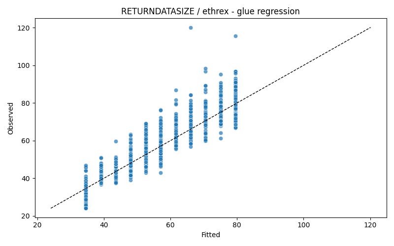

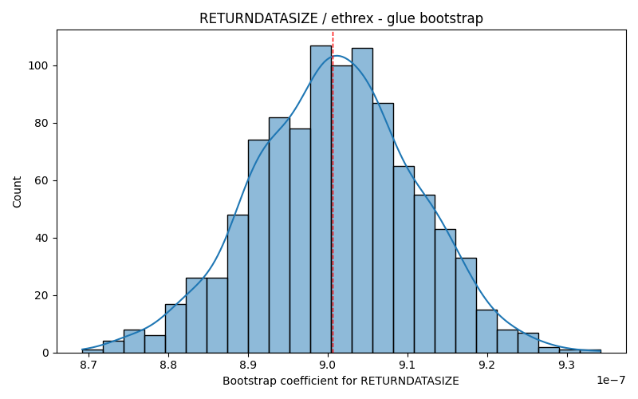

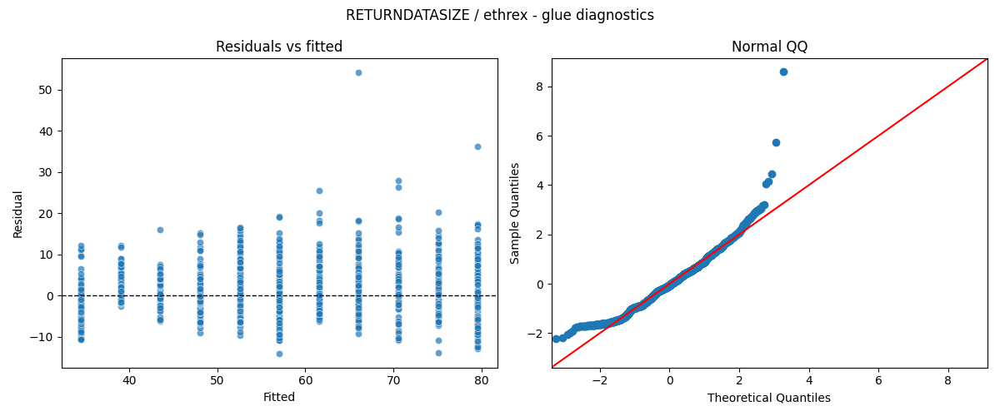

</details>

<details><summary><code>SELFBALANCE</code> · nobs=369 · runtime_ms=5.782e-06 · p=1.00e-03 · R²=0.9055</summary>

```
==============================================================================
                           NNLS Regression Results                            
==============================================================================
Dep. Variable:          test_runtime_ms              R-squared:          0.905
Model:                  NNLS                    Adj. R-squared:          0.905
No. Observations:       369                               RMSE:          18.84
Df Residuals:           367                                MAE:          15.26
Df Model:               1      
==============================================================================
                      coef     std err     P-value      [0.025      0.975]
------------------------------------------------------------------------------
         const     56.5539      3.9206       0.001     49.0310     64.6909
   SELFBALANCE      0.0000      0.0000       0.001      0.0000      0.0000
==============================================================================
Notes: Non-negative least squares with bootstrap inference (1000 iterations)
==============================================================================
```

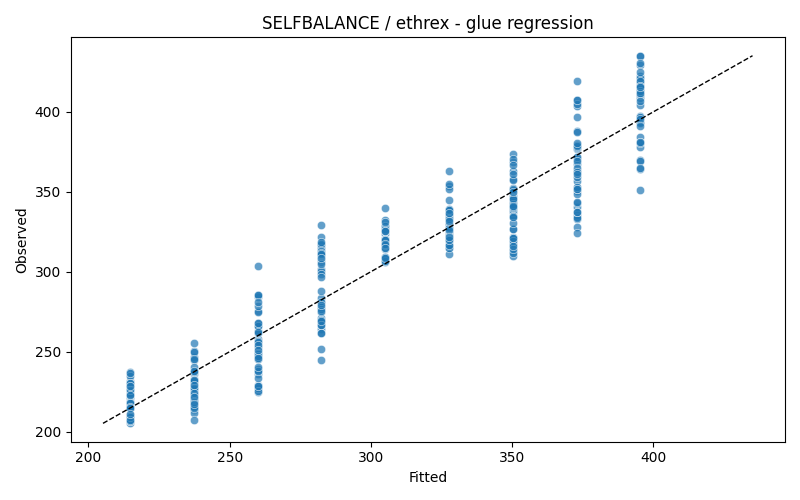

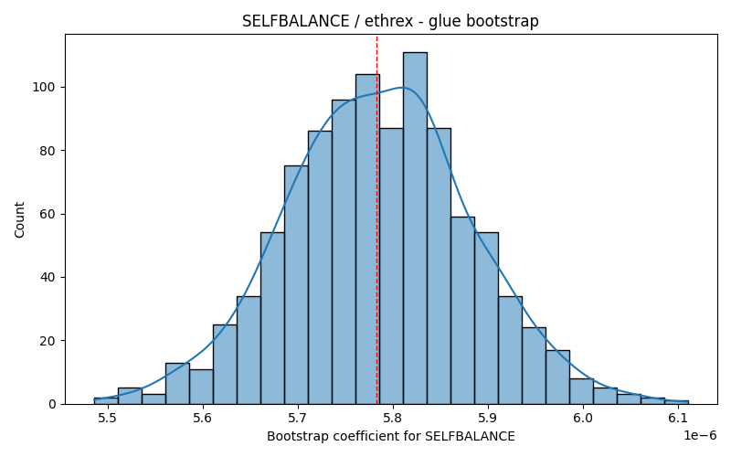

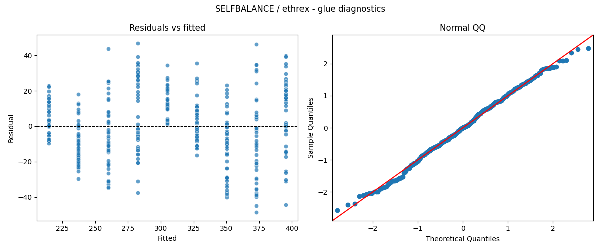

</details>

<details><summary><code>SUB</code> · nobs=451 · runtime_ms=1.179e-06 · p=1.00e-03 · R²=0.8996</summary>

```
==============================================================================
                           NNLS Regression Results                            
==============================================================================
Dep. Variable:          test_runtime_ms              R-squared:          0.900
Model:                  NNLS                    Adj. R-squared:          0.899
No. Observations:       451                               RMSE:           4.14
Df Residuals:           449                                MAE:           3.16
Df Model:               1      
==============================================================================
                      coef     std err     P-value      [0.025      0.975]
------------------------------------------------------------------------------
         const      9.4527      0.5876       0.001      8.3070     10.6404
           SUB      0.0000      0.0000       0.001      0.0000      0.0000
==============================================================================
Notes: Non-negative least squares with bootstrap inference (1000 iterations)
==============================================================================
```

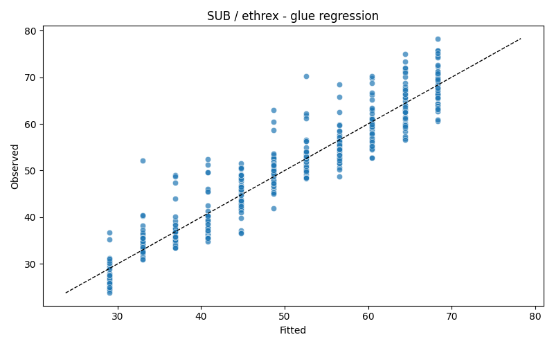

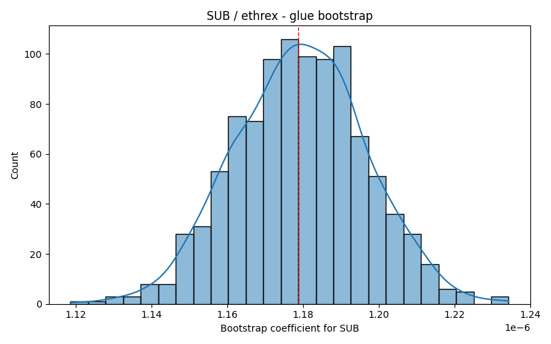

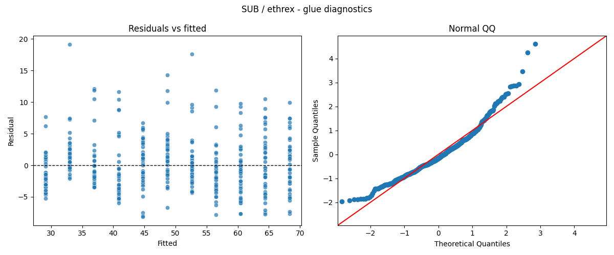

</details>

### Mixed glue (tier B) · ethrex

<details><summary><code>JUMP</code> · nobs=451 · runtime_ms=4.275e-06 · p=1.00e-03 · R²=0.8308</summary>

```
==============================================================================
                           NNLS Regression Results                            
==============================================================================
Dep. Variable:          test_runtime_ms              R-squared:          0.831
Model:                  NNLS                    Adj. R-squared:          0.830
No. Observations:       451                               RMSE:           7.17
Df Residuals:           449                                MAE:           5.87
Df Model:               1      
==============================================================================
                      coef     std err     P-value      [0.025      0.975]
------------------------------------------------------------------------------
         const     15.4229      1.0992       0.001     13.3073     17.6454
          JUMP      0.0000      0.0000       0.001      0.0000      0.0000
==============================================================================
Notes: Non-negative least squares with bootstrap inference (1000 iterations)
==============================================================================
```

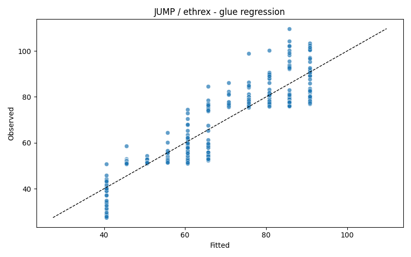

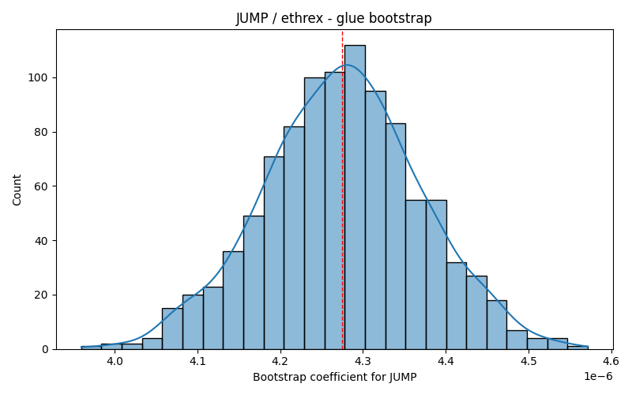

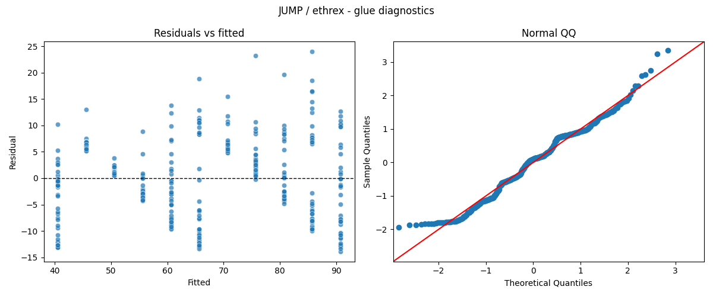

</details>

<details><summary><code>KECCAK256</code> · nobs=7216 · runtime_ms=0 · p=1.00e+00 · R²=0</summary>

```
==============================================================================
                           NNLS Regression Results                            
==============================================================================
Dep. Variable:          test_runtime_ms              R-squared:          0.000
Model:                  NNLS                    Adj. R-squared:         -0.000
No. Observations:       7216                              RMSE:         155.06
Df Residuals:           7214                               MAE:         128.23
Df Model:               1      
==============================================================================
                      coef     std err     P-value      [0.025      0.975]
------------------------------------------------------------------------------
         const    246.7557      1.8648       0.001    243.1831    250.3760
     KECCAK256      0.0000      0.0000       1.000      0.0000      0.0000
==============================================================================
Notes: Non-negative least squares with bootstrap inference (1000 iterations)
==============================================================================
```

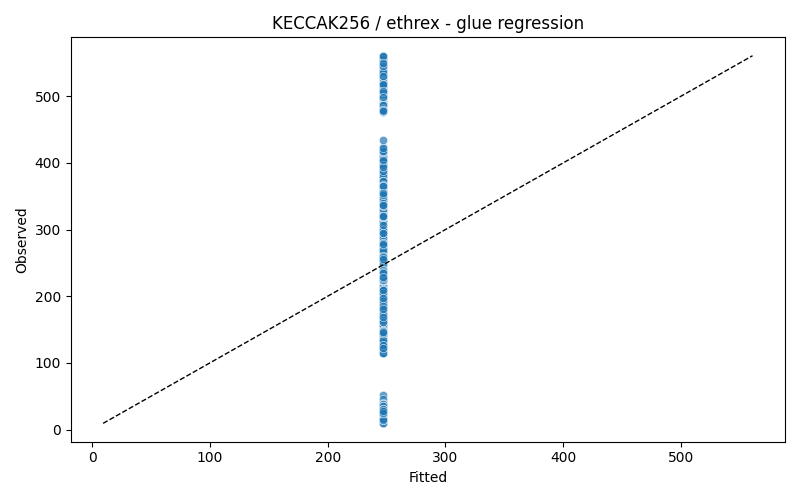


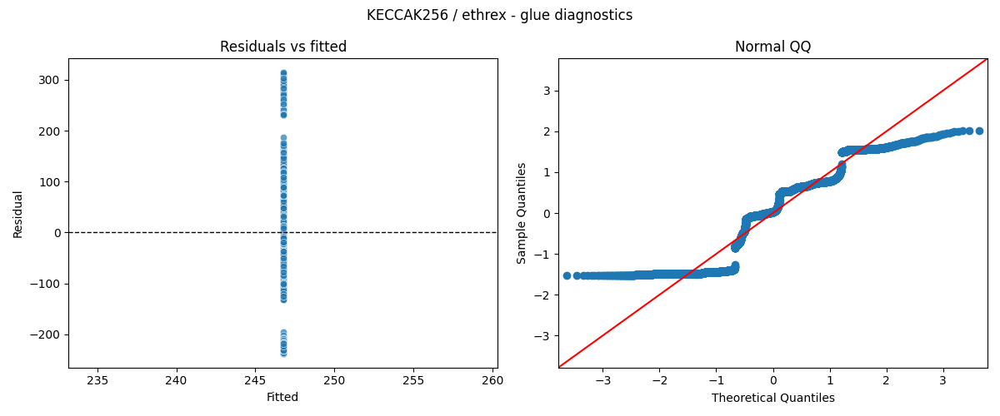

</details>

## geth

| glue_opcode | nobs | glue_runtime_ms | p_value | rsquared |
| --- | --- | --- | --- | --- |
| `ISZERO` | 3454 | 1.426e-06 | 1.00e-03 | 0.7731 |
| `JUMPDEST` | 3454 | 1.155e-06 | 1.00e-03 | 0.7873 |
| `SWAP` | 55264 | 1.531e-06 | 1.00e-03 | 0.7654 |
| `CALLDATASIZE` | 204226 | 1.425e-06 | 1.00e-03 | 0.822 |
| `DUP` | 204226 | 1.535e-06 | 1.00e-03 | 0.822 |
| `GAS` | 204226 | 1.502e-06 | 1.00e-03 | 0.822 |
| `MLOAD` | 204226 | 5.203e-06 | 1.00e-03 | 0.822 |
| `PUSH` | 204226 | 2.267e-06 | 1.00e-03 | 0.822 |
| `PUSH0` | 204226 | 1.445e-06 | 1.00e-03 | 0.822 |
| `STATICCALL` | 204226 | 0.0001686 | 1.00e-03 | 0.822 |
| `ADD` | 3454 | 4.459e-06 | 1.00e-03 | 0.8378 |
| `AND` | 3454 | 4.212e-06 | 1.00e-03 | 0.7931 |
| `CALLDATACOPY` | 82896 | 1.377e-05 | 1.00e-03 | 0.9538 |
| `CALLDATALOAD` | 13816 | 5.259e-05 | 1.00e-03 | 0.03355 |
| `DIV` | 3454 | 9.523e-06 | 1.00e-03 | 0.7915 |
| `EXP` | 3454 | 0.0003401 | 1.00e-03 | 0.8046 |
| `GT` | 3454 | 3.524e-06 | 1.00e-03 | 0.7596 |
| `JUMPI` | 3454 | 5.693e-06 | 1.00e-03 | 0.7566 |
| `LT` | 3454 | 4.447e-06 | 1.00e-03 | 0.8146 |
| `MSTORE` | 17270 | 8.019e-06 | 1.00e-03 | 0.8101 |
| `MSTORE8` | 17270 | 7.439e-06 | 1.00e-03 | 0.799 |
| `MUL` | 3454 | 4.937e-06 | 1.00e-03 | 0.8657 |
| `PC` | 3454 | 1.626e-06 | 1.00e-03 | 0.8435 |
| `RETURNDATASIZE` | 13816 | 3.133e-06 | 1.00e-03 | 0.6113 |
| `SELFBALANCE` | 2826 | 7.494e-06 | 1.00e-03 | 0.7973 |
| `SUB` | 3454 | 4.419e-06 | 1.00e-03 | 0.8229 |
| `JUMP` | 3454 | 9.117e-06 | 1.00e-03 | 0.769 |
| `KECCAK256` | 55264 | 3.673e-05 | 1.00e-03 | 0.2655 |

### Cycle glue — joint fit · geth

<details><summary>Joint NNLS regression summary</summary>

```
==============================================================================
                           NNLS Regression Results                            
==============================================================================
Dep. Variable:          test_runtime_ms              R-squared:          0.822
Model:                  NNLS                    Adj. R-squared:          0.822
No. Observations:       204226                            RMSE:          24.02
Df Residuals:           204218                             MAE:          18.59
Df Model:               7      
==============================================================================
                      coef     std err     P-value      [0.025      0.975]
------------------------------------------------------------------------------
         const     40.7381      0.1844       0.001     40.3765     41.0790
  CALLDATASIZE      0.0000      0.0000       0.001      0.0000      0.0000
           DUP      0.0000      0.0000       0.001      0.0000      0.0000
           GAS      0.0000      0.0000       0.001      0.0000      0.0000
         MLOAD      0.0000      0.0000       0.001      0.0000      0.0000
          PUSH      0.0000      0.0000       0.001      0.0000      0.0000
         PUSH0      0.0000      0.0000       0.001      0.0000      0.0000
    STATICCALL      0.0002      0.0000       0.001      0.0002      0.0002
==============================================================================
Notes: Non-negative least squares with bootstrap inference (1000 iterations)
==============================================================================
```

</details>

<details><summary><code>CALLDATASIZE</code> · nobs=204226 · runtime_ms=1.425e-06 · p=1.00e-03 · R²=0.822</summary>

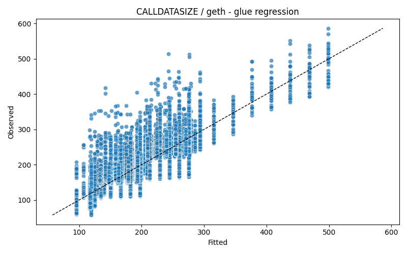

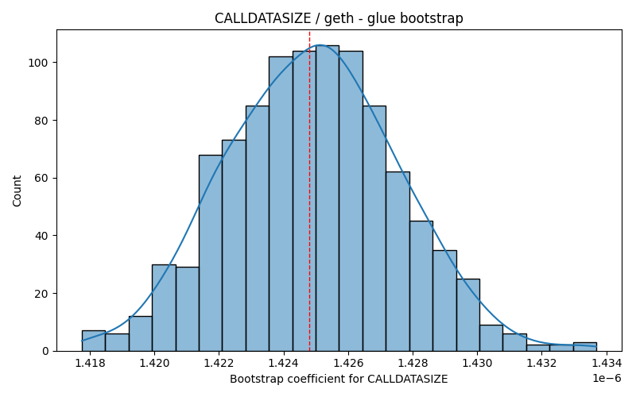

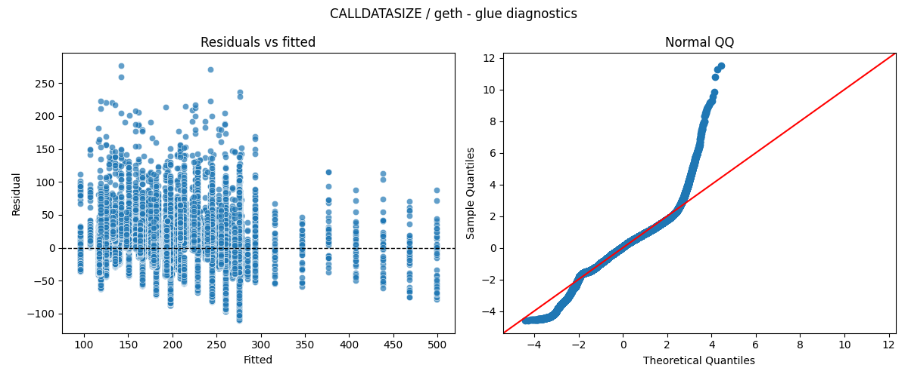

</details>

<details><summary><code>DUP</code> · nobs=204226 · runtime_ms=1.535e-06 · p=1.00e-03 · R²=0.822</summary>


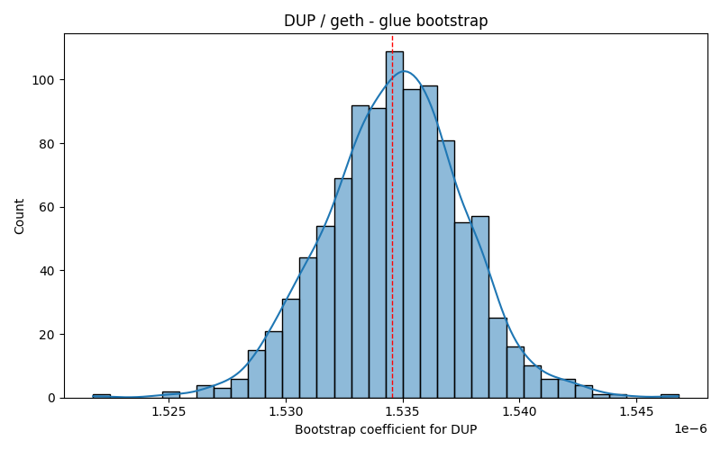


</details>

<details><summary><code>GAS</code> · nobs=204226 · runtime_ms=1.502e-06 · p=1.00e-03 · R²=0.822</summary>


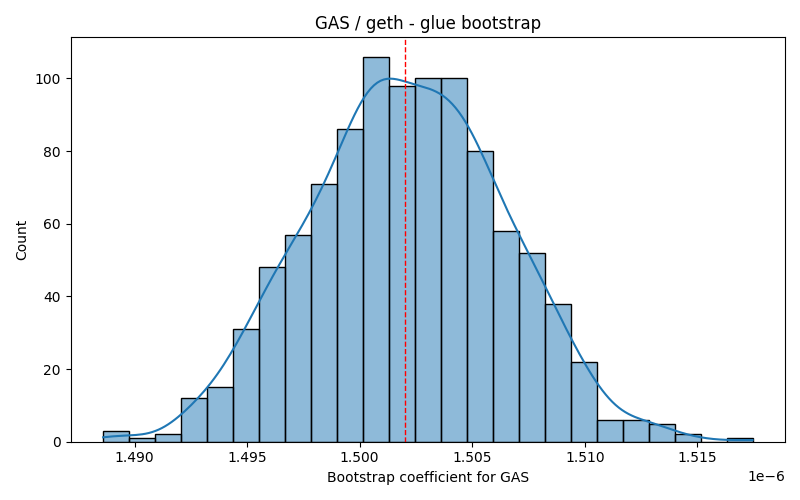


</details>

<details><summary><code>MLOAD</code> · nobs=204226 · runtime_ms=5.203e-06 · p=1.00e-03 · R²=0.822</summary>


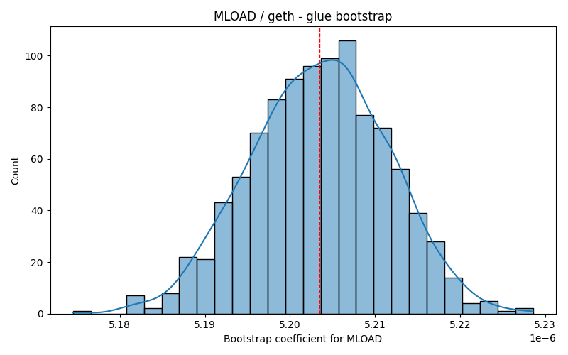

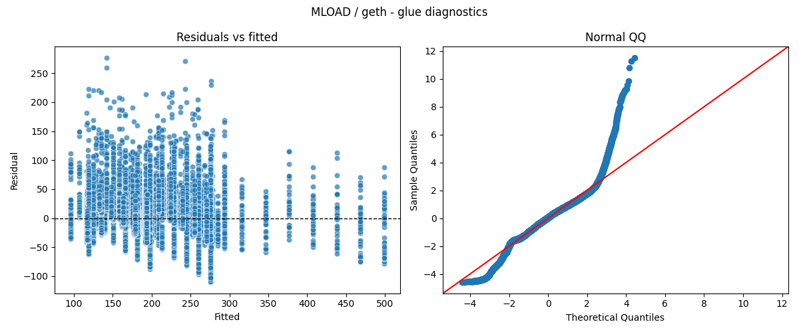

</details>

<details><summary><code>PUSH</code> · nobs=204226 · runtime_ms=2.267e-06 · p=1.00e-03 · R²=0.822</summary>

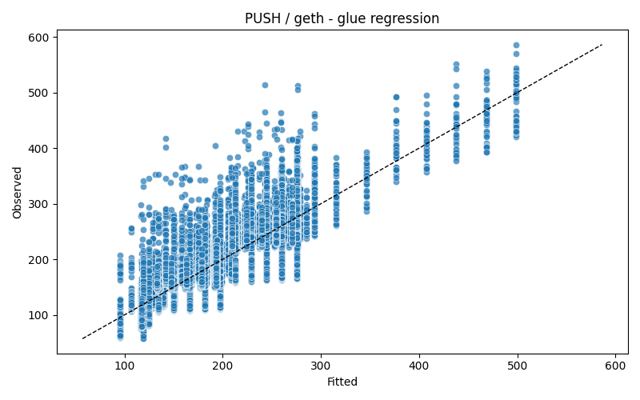

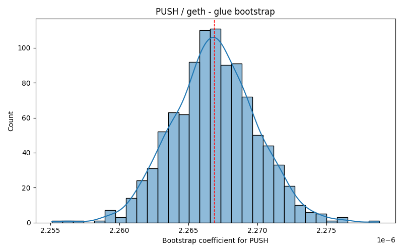


</details>

<details><summary><code>PUSH0</code> · nobs=204226 · runtime_ms=1.445e-06 · p=1.00e-03 · R²=0.822</summary>


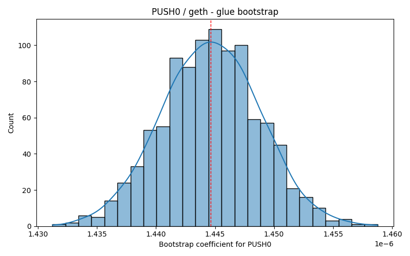


</details>

<details><summary><code>STATICCALL</code> · nobs=204226 · runtime_ms=0.0001686 · p=1.00e-03 · R²=0.822</summary>


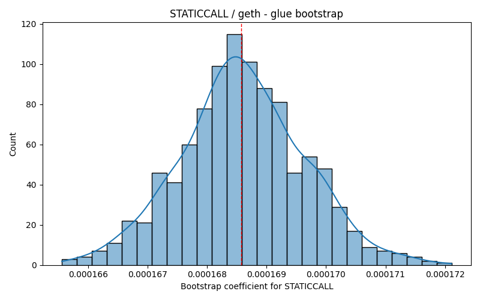

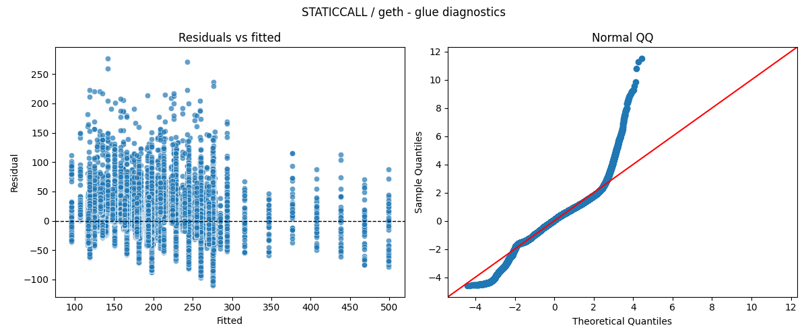

</details>

### Pure glue · geth

<details><summary><code>ISZERO</code> · nobs=3454 · runtime_ms=1.426e-06 · p=1.00e-03 · R²=0.7731</summary>

```
==============================================================================
                           NNLS Regression Results                            
==============================================================================
Dep. Variable:          test_runtime_ms              R-squared:          0.773
Model:                  NNLS                    Adj. R-squared:          0.773
No. Observations:       3454                              RMSE:          16.26
Df Residuals:           3452                               MAE:          11.82
Df Model:               1      
==============================================================================
                      coef     std err     P-value      [0.025      0.975]
------------------------------------------------------------------------------
         const     23.6818      0.9328       0.001     21.8381     25.3928
        ISZERO      0.0000      0.0000       0.001      0.0000      0.0000
==============================================================================
Notes: Non-negative least squares with bootstrap inference (1000 iterations)
==============================================================================
```

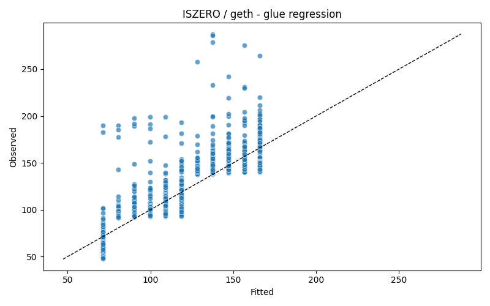

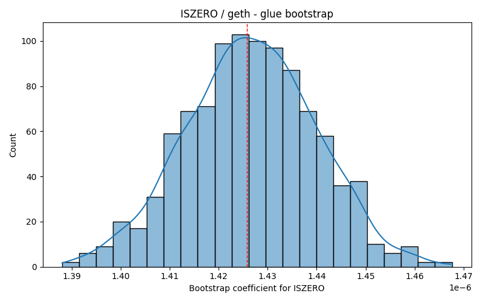

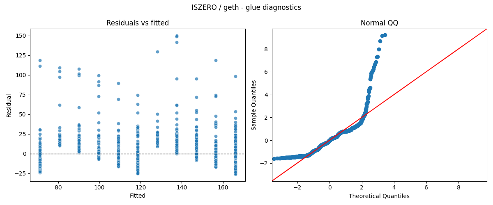

</details>

<details><summary><code>JUMPDEST</code> · nobs=3454 · runtime_ms=1.155e-06 · p=1.00e-03 · R²=0.7873</summary>

```
==============================================================================
                           NNLS Regression Results                            
==============================================================================
Dep. Variable:          test_runtime_ms              R-squared:          0.787
Model:                  NNLS                    Adj. R-squared:          0.787
No. Observations:       3454                              RMSE:          37.93
Df Residuals:           3452                               MAE:          26.76
Df Model:               1      
==============================================================================
                      coef     std err     P-value      [0.025      0.975]
------------------------------------------------------------------------------
         const     69.8745      2.2894       0.001     65.4539     74.2626
      JUMPDEST      0.0000      0.0000       0.001      0.0000      0.0000
==============================================================================
Notes: Non-negative least squares with bootstrap inference (1000 iterations)
==============================================================================
```

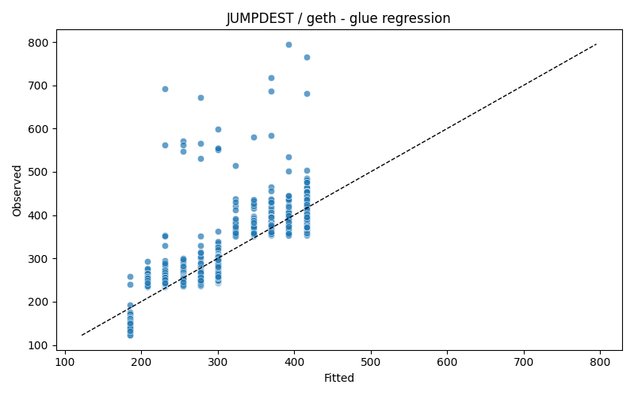

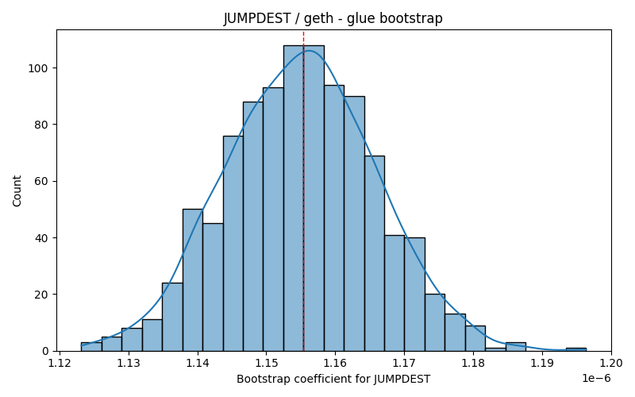

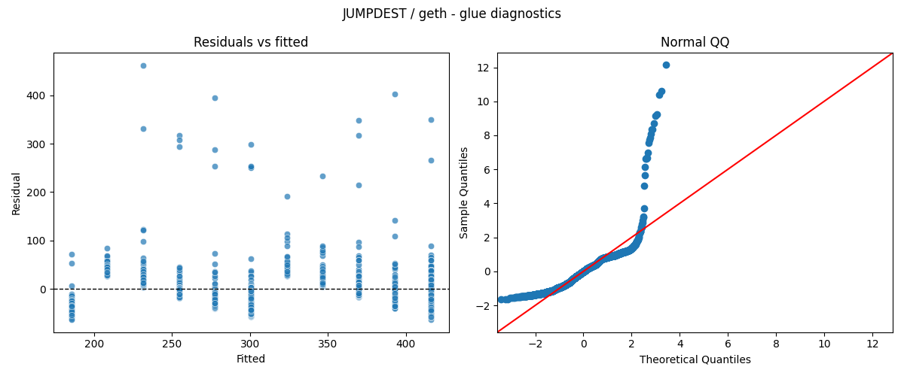

</details>

<details><summary><code>SWAP</code> · nobs=55264 · runtime_ms=1.531e-06 · p=1.00e-03 · R²=0.7654</summary>

```
==============================================================================
                           NNLS Regression Results                            
==============================================================================
Dep. Variable:          test_runtime_ms              R-squared:          0.765
Model:                  NNLS                    Adj. R-squared:          0.765
No. Observations:       55264                             RMSE:          17.84
Df Residuals:           55262                              MAE:          13.22
Df Model:               1      
==============================================================================
                      coef     std err     P-value      [0.025      0.975]
------------------------------------------------------------------------------
         const     30.8832      0.2714       0.001     30.3667     31.4132
          SWAP      0.0000      0.0000       0.001      0.0000      0.0000
==============================================================================
Notes: Non-negative least squares with bootstrap inference (1000 iterations)
==============================================================================
```

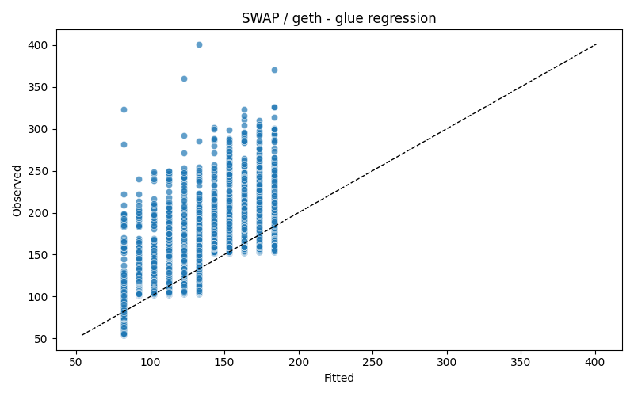

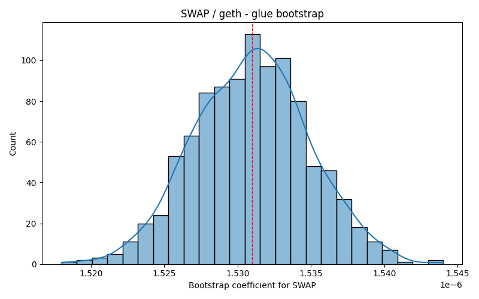

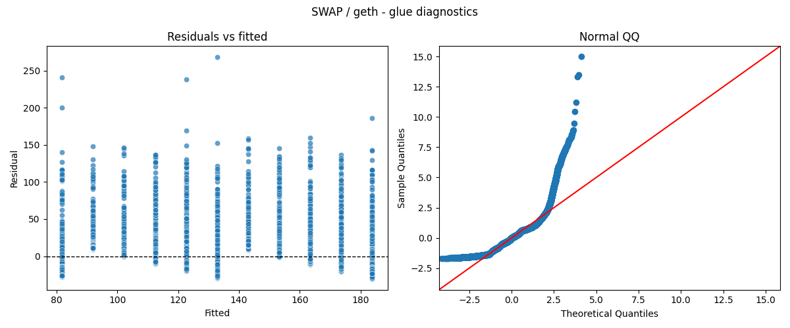

</details>

### Mixed glue (tier A) · geth

<details><summary><code>ADD</code> · nobs=3454 · runtime_ms=4.459e-06 · p=1.00e-03 · R²=0.8378</summary>

```
==============================================================================
                           NNLS Regression Results                            
==============================================================================
Dep. Variable:          test_runtime_ms              R-squared:          0.838
Model:                  NNLS                    Adj. R-squared:          0.838
No. Observations:       3454                              RMSE:          20.65
Df Residuals:           3452                               MAE:          15.42
Df Model:               1      
==============================================================================
                      coef     std err     P-value      [0.025      0.975]
------------------------------------------------------------------------------
         const     44.7808      1.1196       0.001     42.7130     47.0996
           ADD      0.0000      0.0000       0.001      0.0000      0.0000
==============================================================================
Notes: Non-negative least squares with bootstrap inference (1000 iterations)
==============================================================================
```

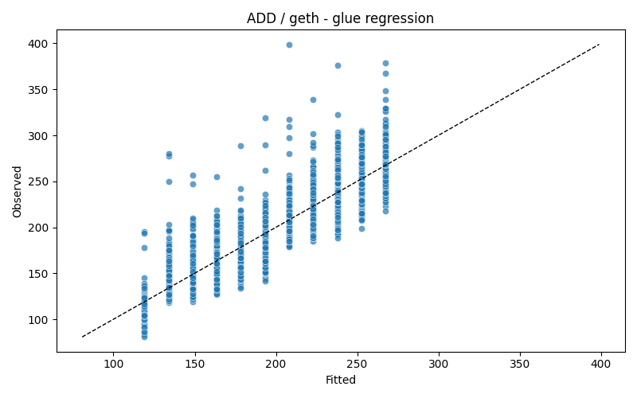

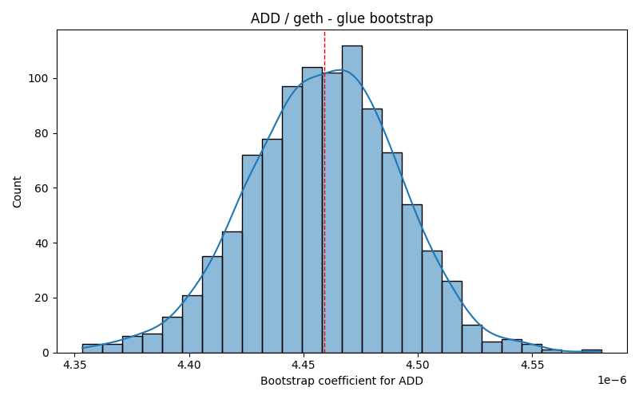

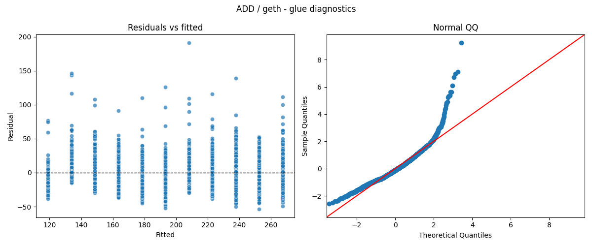

</details>

<details><summary><code>AND</code> · nobs=3454 · runtime_ms=4.212e-06 · p=1.00e-03 · R²=0.7931</summary>

```
==============================================================================
                           NNLS Regression Results                            
==============================================================================
Dep. Variable:          test_runtime_ms              R-squared:          0.793
Model:                  NNLS                    Adj. R-squared:          0.793
No. Observations:       3454                              RMSE:          22.64
Df Residuals:           3452                               MAE:          16.28
Df Model:               1      
==============================================================================
                      coef     std err     P-value      [0.025      0.975]
------------------------------------------------------------------------------
         const     46.6759      1.3122       0.001     44.2295     49.2854
           AND      0.0000      0.0000       0.001      0.0000      0.0000
==============================================================================
Notes: Non-negative least squares with bootstrap inference (1000 iterations)
==============================================================================
```

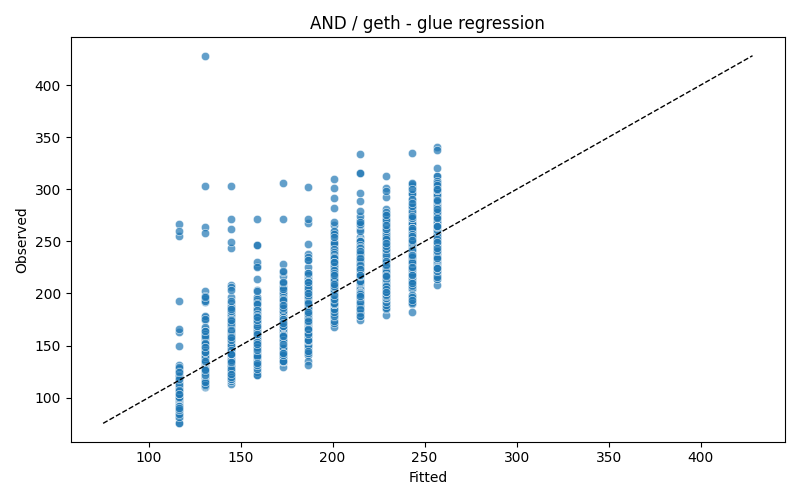

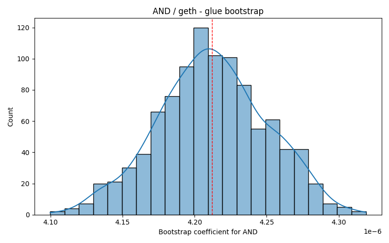

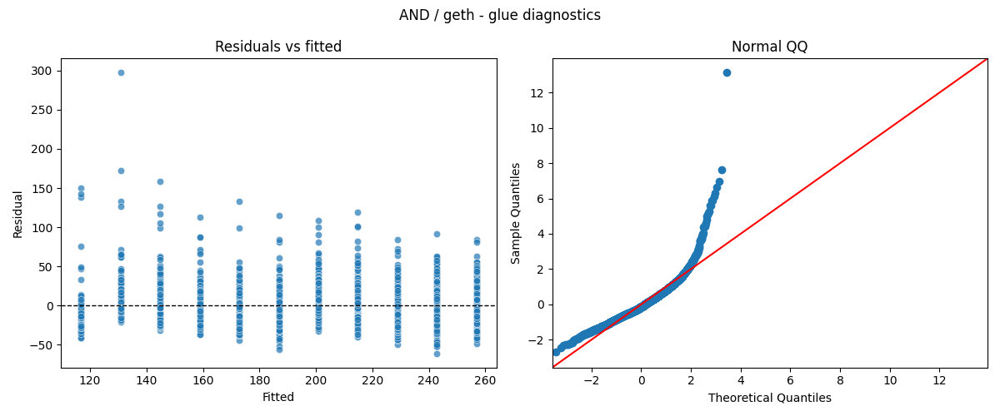

</details>

<details><summary><code>CALLDATACOPY</code> · nobs=82896 · runtime_ms=1.377e-05 · p=1.00e-03 · R²=0.9538</summary>

```
==============================================================================
                           NNLS Regression Results                            
==============================================================================
Dep. Variable:          test_runtime_ms              R-squared:          0.954
Model:                  NNLS                    Adj. R-squared:          0.954
No. Observations:       82896                             RMSE:          22.78
Df Residuals:           82894                              MAE:          16.34
Df Model:               1      
==============================================================================
                      coef     std err     P-value      [0.025      0.975]
------------------------------------------------------------------------------
         const     20.3465      0.0988       0.001     20.1475     20.5466
  CALLDATACOPY      0.0000      0.0000       0.001      0.0000      0.0000
==============================================================================
Notes: Non-negative least squares with bootstrap inference (1000 iterations)
==============================================================================
```

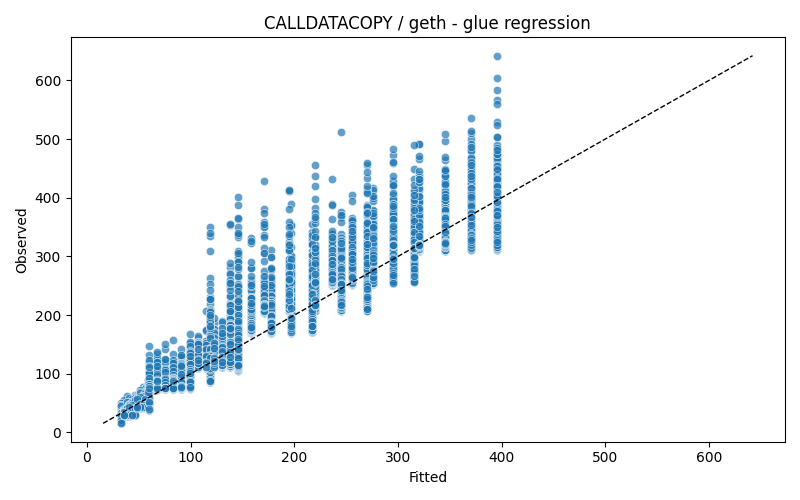

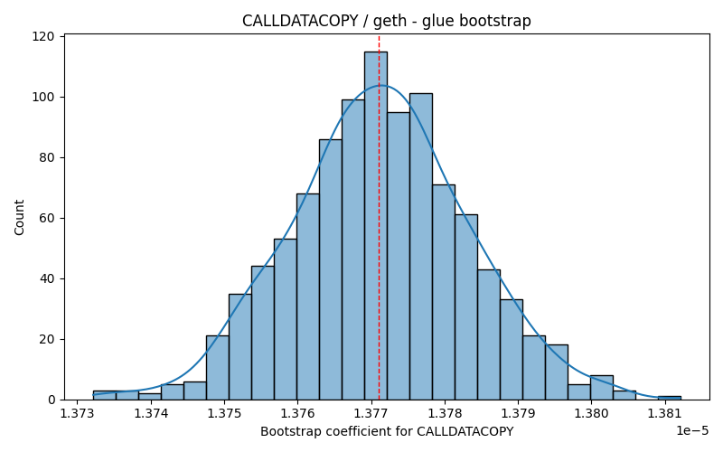

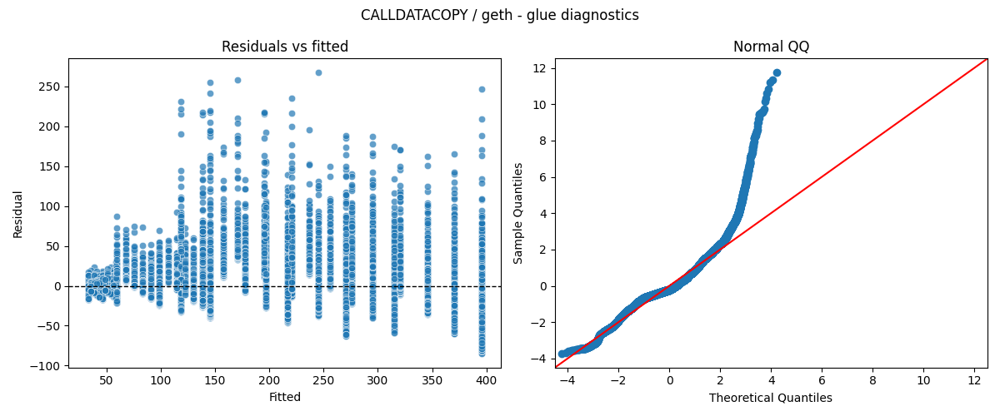

</details>

<details><summary><code>CALLDATALOAD</code> · nobs=13816 · runtime_ms=5.259e-05 · p=1.00e-03 · R²=0.03355</summary>

```
==============================================================================
                           NNLS Regression Results                            
==============================================================================
Dep. Variable:          test_runtime_ms              R-squared:          0.034
Model:                  NNLS                    Adj. R-squared:          0.033
No. Observations:       13816                             RMSE:           1.08
Df Residuals:           13814                              MAE:           0.55
Df Model:               1      
==============================================================================
                      coef     std err     P-value      [0.025      0.975]
------------------------------------------------------------------------------
         const      2.4442      0.0316       0.001      2.3852      2.5061
  CALLDATALOAD      0.0001      0.0000       0.001      0.0000      0.0001
==============================================================================
Notes: Non-negative least squares with bootstrap inference (1000 iterations)
==============================================================================
```

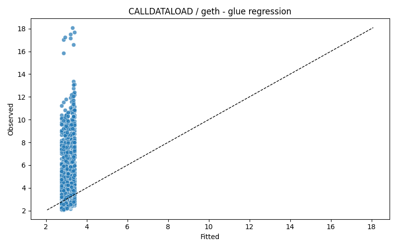

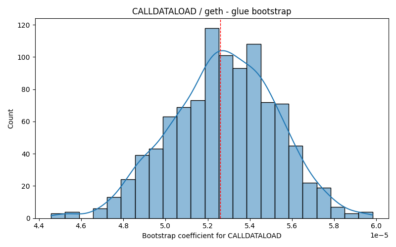

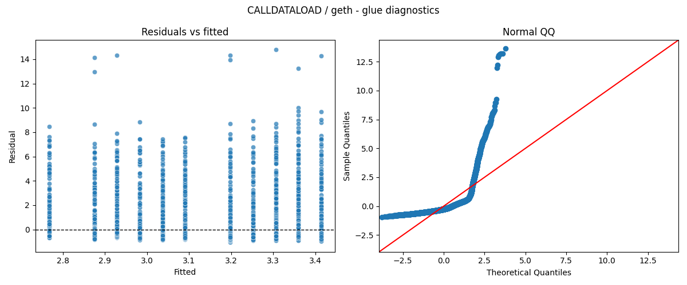

</details>

<details><summary><code>DIV</code> · nobs=3454 · runtime_ms=9.523e-06 · p=1.00e-03 · R²=0.7915</summary>

```
==============================================================================
                           NNLS Regression Results                            
==============================================================================
Dep. Variable:          test_runtime_ms              R-squared:          0.791
Model:                  NNLS                    Adj. R-squared:          0.791
No. Observations:       3454                              RMSE:          38.59
Df Residuals:           3452                               MAE:          31.74
Df Model:               1      
==============================================================================
                      coef     std err     P-value      [0.025      0.975]
------------------------------------------------------------------------------
         const     73.7047      2.3610       0.001     69.3757     78.6211
           DIV      0.0000      0.0000       0.001      0.0000      0.0000
==============================================================================
Notes: Non-negative least squares with bootstrap inference (1000 iterations)
==============================================================================
```

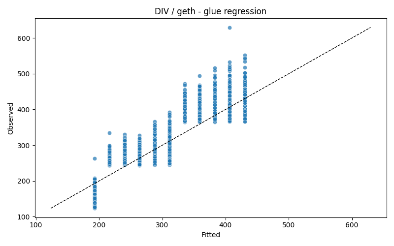

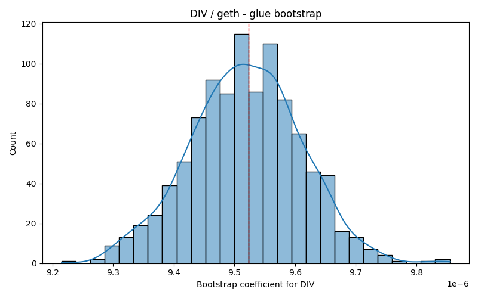

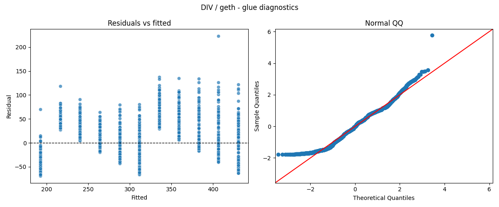

</details>

<details><summary><code>EXP</code> · nobs=3454 · runtime_ms=0.0003401 · p=1.00e-03 · R²=0.8046</summary>

```
==============================================================================
                           NNLS Regression Results                            
==============================================================================
Dep. Variable:          test_runtime_ms              R-squared:          0.805
Model:                  NNLS                    Adj. R-squared:          0.805
No. Observations:       3454                              RMSE:           6.56
Df Residuals:           3452                               MAE:           5.48
Df Model:               1      
==============================================================================
                      coef     std err     P-value      [0.025      0.975]
------------------------------------------------------------------------------
         const     12.9276      0.4002       0.001     12.1428     13.7322
           EXP      0.0003      0.0000       0.001      0.0003      0.0003
==============================================================================
Notes: Non-negative least squares with bootstrap inference (1000 iterations)
==============================================================================
```

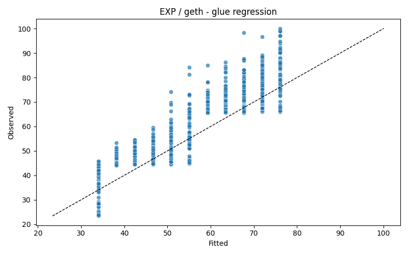

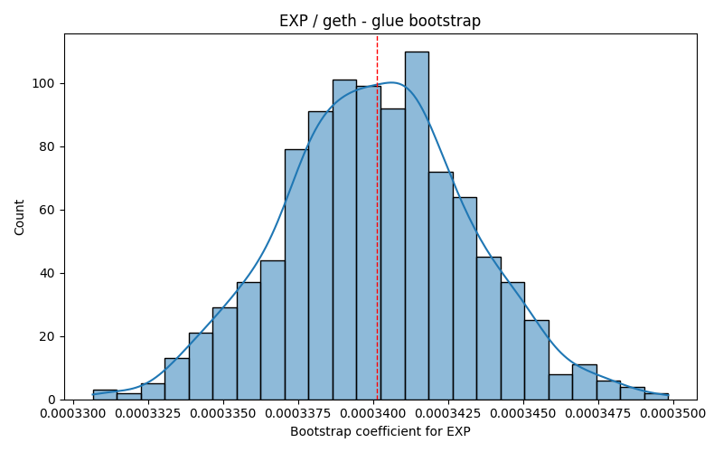


</details>

<details><summary><code>GT</code> · nobs=3454 · runtime_ms=3.524e-06 · p=1.00e-03 · R²=0.7596</summary>

```
==============================================================================
                           NNLS Regression Results                            
==============================================================================
Dep. Variable:          test_runtime_ms              R-squared:          0.760
Model:                  NNLS                    Adj. R-squared:          0.760
No. Observations:       3454                              RMSE:          20.87
Df Residuals:           3452                               MAE:          14.81
Df Model:               1      
==============================================================================
                      coef     std err     P-value      [0.025      0.975]
------------------------------------------------------------------------------
         const     38.7072      1.2633       0.001     36.2693     41.1581
            GT      0.0000      0.0000       0.001      0.0000      0.0000
==============================================================================
Notes: Non-negative least squares with bootstrap inference (1000 iterations)
==============================================================================
```

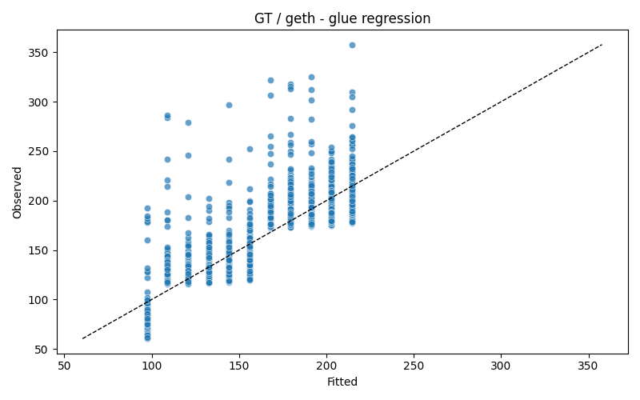

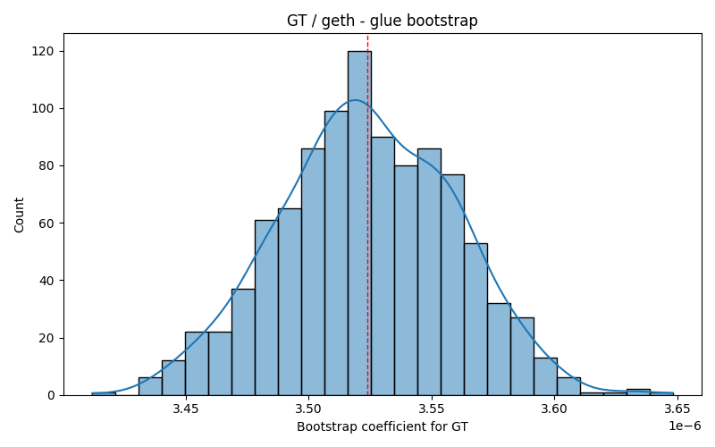

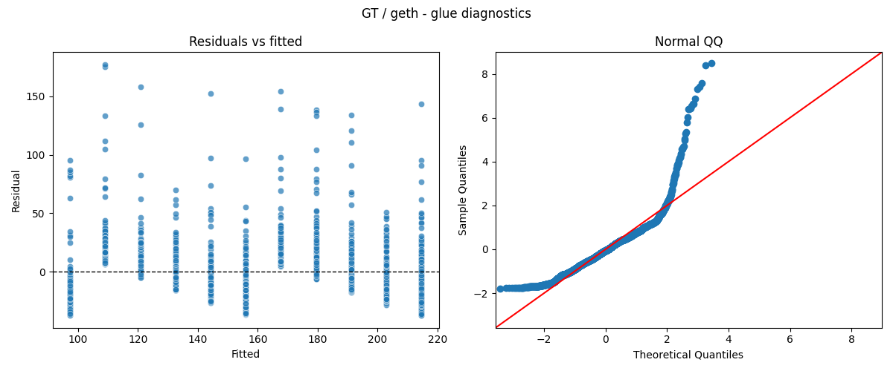

</details>

<details><summary><code>JUMPI</code> · nobs=3454 · runtime_ms=5.693e-06 · p=1.00e-03 · R²=0.7566</summary>

```
==============================================================================
                           NNLS Regression Results                            
==============================================================================
Dep. Variable:          test_runtime_ms              R-squared:          0.757
Model:                  NNLS                    Adj. R-squared:          0.757
No. Observations:       3454                              RMSE:          14.57
Df Residuals:           3452                               MAE:          10.71
Df Model:               1      
==============================================================================
                      coef     std err     P-value      [0.025      0.975]
------------------------------------------------------------------------------
         const     20.4723      0.8406       0.001     18.8710     22.0715
         JUMPI      0.0000      0.0000       0.001      0.0000      0.0000
==============================================================================
Notes: Non-negative least squares with bootstrap inference (1000 iterations)
==============================================================================
```

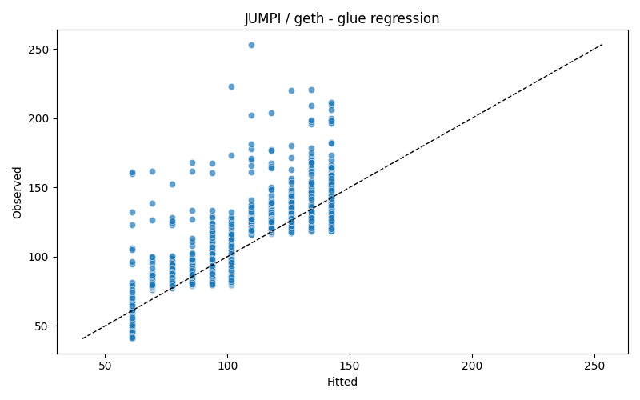

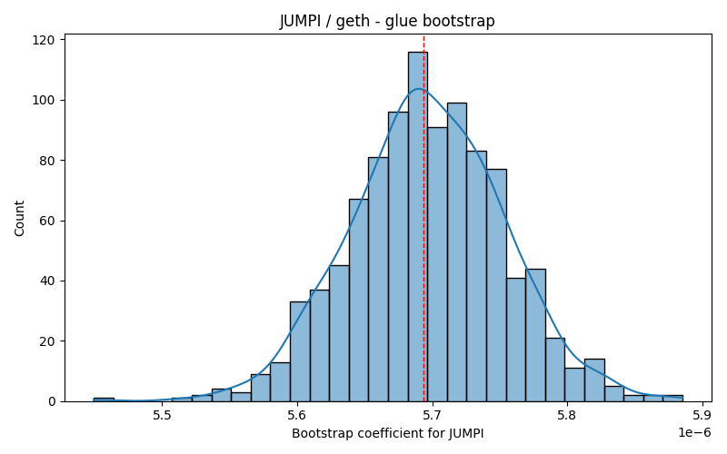

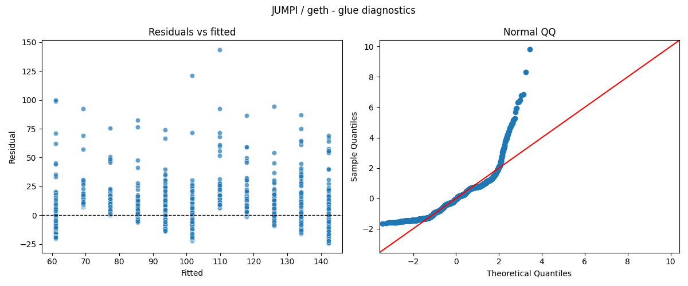

</details>

<details><summary><code>LT</code> · nobs=3454 · runtime_ms=4.447e-06 · p=1.00e-03 · R²=0.8146</summary>

```
==============================================================================
                           NNLS Regression Results                            
==============================================================================
Dep. Variable:          test_runtime_ms              R-squared:          0.815
Model:                  NNLS                    Adj. R-squared:          0.815
No. Observations:       3454                              RMSE:          22.33
Df Residuals:           3452                               MAE:          17.28
Df Model:               1      
==============================================================================
                      coef     std err     P-value      [0.025      0.975]
------------------------------------------------------------------------------
         const     38.4043      1.2494       0.001     36.1632     41.0471
            LT      0.0000      0.0000       0.001      0.0000      0.0000
==============================================================================
Notes: Non-negative least squares with bootstrap inference (1000 iterations)
==============================================================================
```

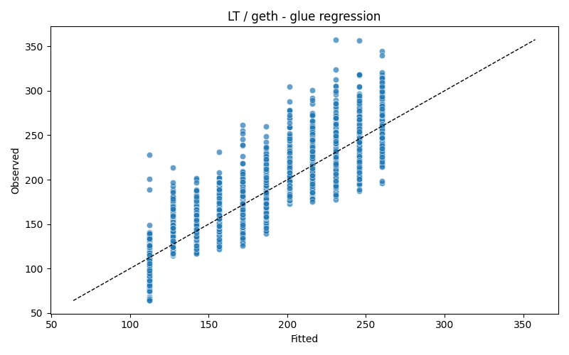

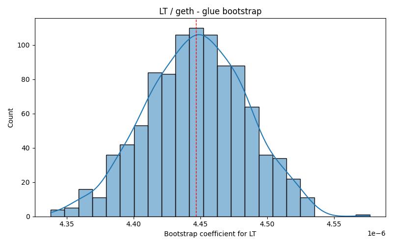

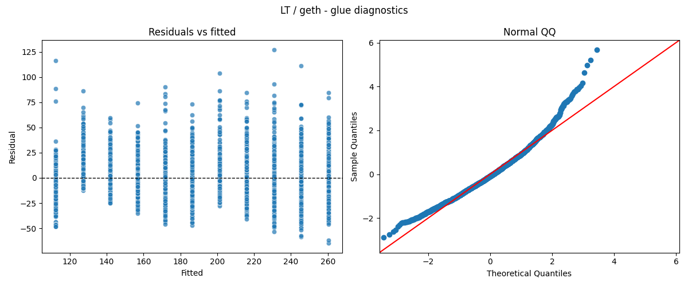

</details>

<details><summary><code>MSTORE</code> · nobs=17270 · runtime_ms=8.019e-06 · p=1.00e-03 · R²=0.8101</summary>

```
==============================================================================
                           NNLS Regression Results                            
==============================================================================
Dep. Variable:          test_runtime_ms              R-squared:          0.810
Model:                  NNLS                    Adj. R-squared:          0.810
No. Observations:       17270                             RMSE:          27.24
Df Residuals:           17268                              MAE:          20.96
Df Model:               1      
==============================================================================
                      coef     std err     P-value      [0.025      0.975]
------------------------------------------------------------------------------
         const     55.8193      0.7642       0.001     54.4033     57.3896
        MSTORE      0.0000      0.0000       0.001      0.0000      0.0000
==============================================================================
Notes: Non-negative least squares with bootstrap inference (1000 iterations)
==============================================================================
```

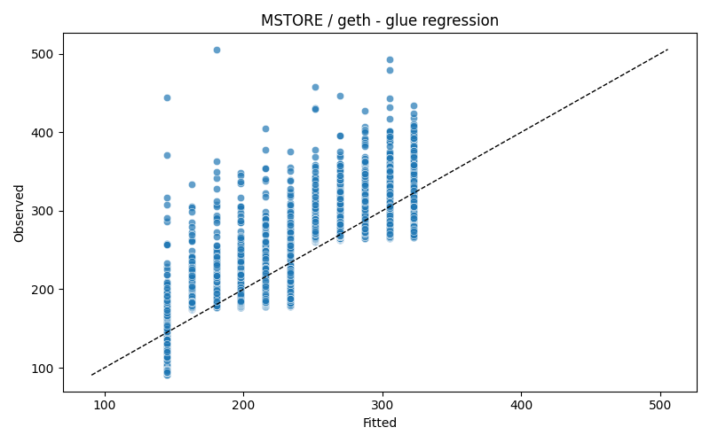

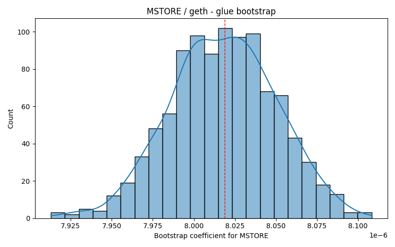

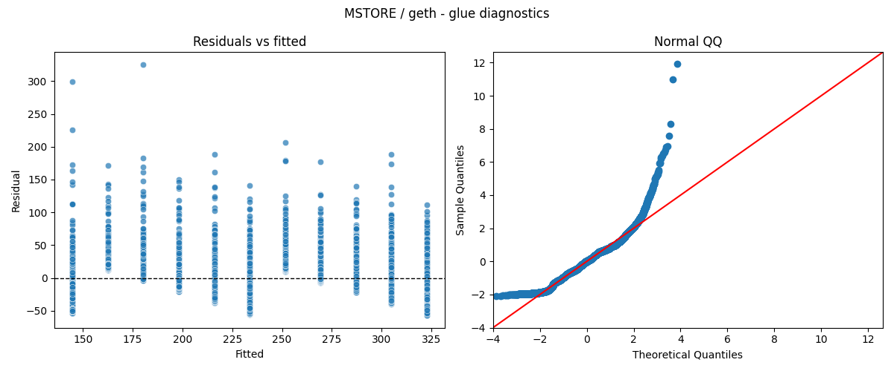

</details>

<details><summary><code>MSTORE8</code> · nobs=17270 · runtime_ms=7.439e-06 · p=1.00e-03 · R²=0.799</summary>

```
==============================================================================
                           NNLS Regression Results                            
==============================================================================
Dep. Variable:          test_runtime_ms              R-squared:          0.799
Model:                  NNLS                    Adj. R-squared:          0.799
No. Observations:       17270                             RMSE:          26.19
Df Residuals:           17268                              MAE:          19.53
Df Model:               1      
==============================================================================
                      coef     std err     P-value      [0.025      0.975]
------------------------------------------------------------------------------
         const     50.5663      0.7162       0.001     49.1669     52.0244
       MSTORE8      0.0000      0.0000       0.001      0.0000      0.0000
==============================================================================
Notes: Non-negative least squares with bootstrap inference (1000 iterations)
==============================================================================
```

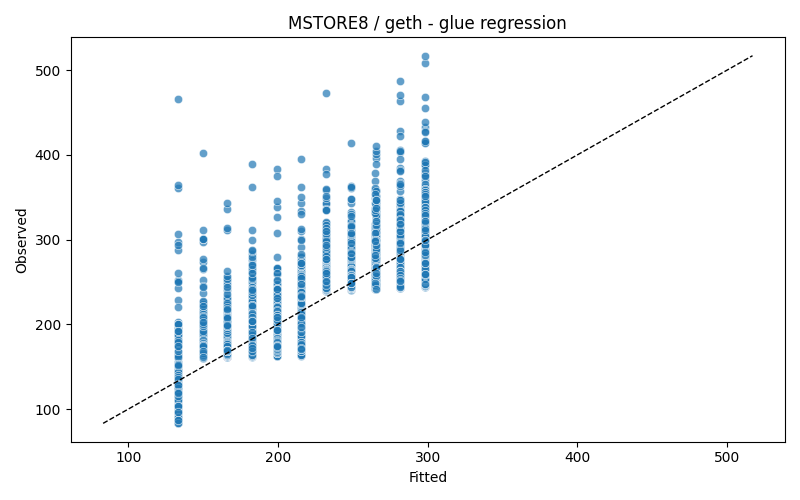

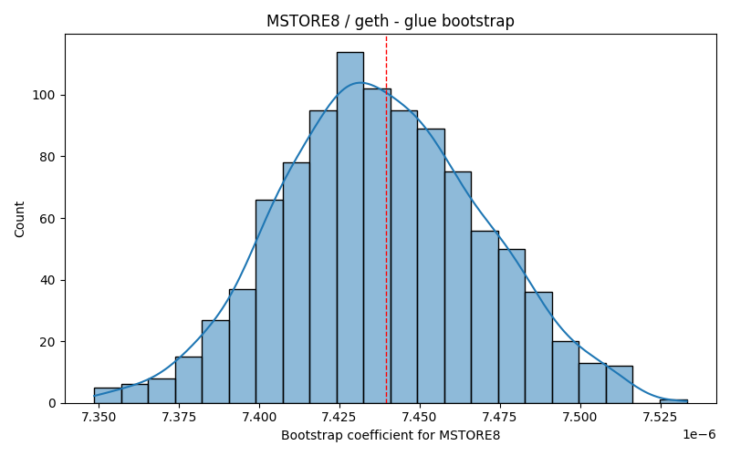

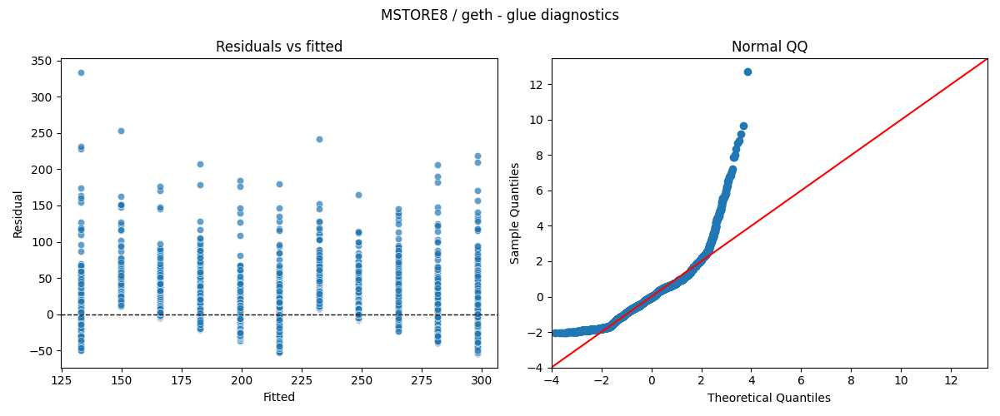

</details>

<details><summary><code>MUL</code> · nobs=3454 · runtime_ms=4.937e-06 · p=1.00e-03 · R²=0.8657</summary>

```
==============================================================================
                           NNLS Regression Results                            
==============================================================================
Dep. Variable:          test_runtime_ms              R-squared:          0.866
Model:                  NNLS                    Adj. R-squared:          0.866
No. Observations:       3454                              RMSE:          15.35
Df Residuals:           3452                               MAE:          11.56
Df Model:               1      
==============================================================================
                      coef     std err     P-value      [0.025      0.975]
------------------------------------------------------------------------------
         const     37.4480      0.9374       0.001     35.6068     39.2687
           MUL      0.0000      0.0000       0.001      0.0000      0.0000
==============================================================================
Notes: Non-negative least squares with bootstrap inference (1000 iterations)
==============================================================================
```

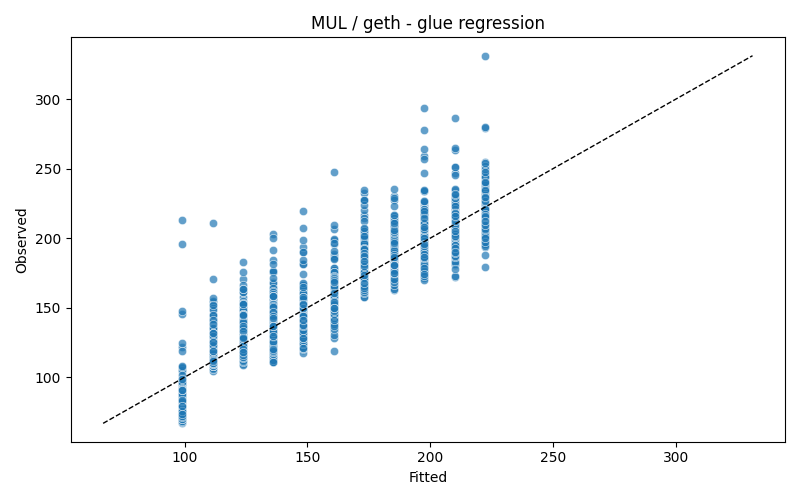

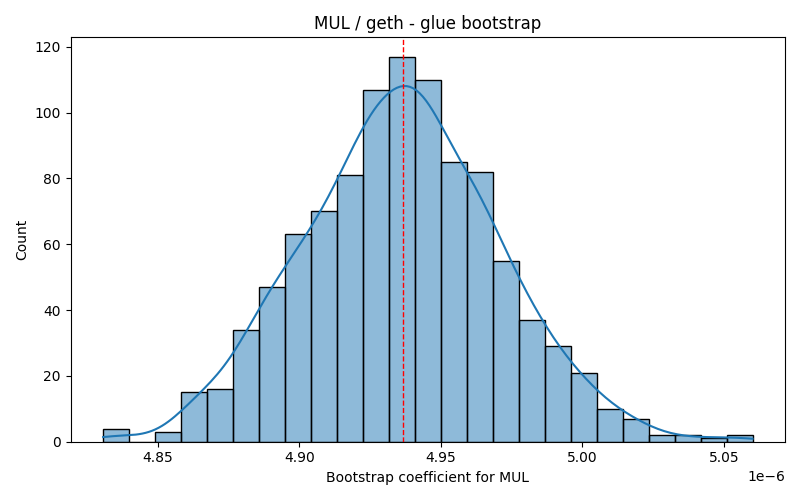

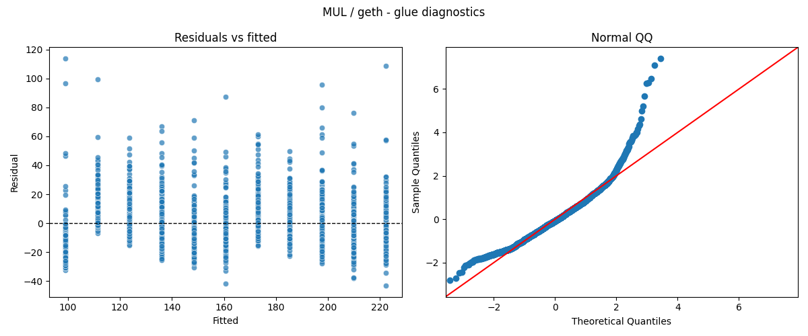

</details>

<details><summary><code>PC</code> · nobs=3454 · runtime_ms=1.626e-06 · p=1.00e-03 · R²=0.8435</summary>

```
==============================================================================
                           NNLS Regression Results                            
==============================================================================
Dep. Variable:          test_runtime_ms              R-squared:          0.843
Model:                  NNLS                    Adj. R-squared:          0.843
No. Observations:       3454                              RMSE:          20.94
Df Residuals:           3452                               MAE:          16.78
Df Model:               1      
==============================================================================
                      coef     std err     P-value      [0.025      0.975]
------------------------------------------------------------------------------
         const     41.6610      1.3325       0.001     39.0948     44.2874
            PC      0.0000      0.0000       0.001      0.0000      0.0000
==============================================================================
Notes: Non-negative least squares with bootstrap inference (1000 iterations)
==============================================================================
```

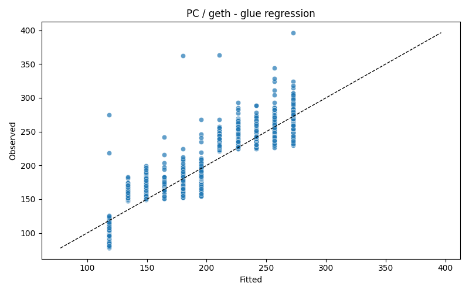

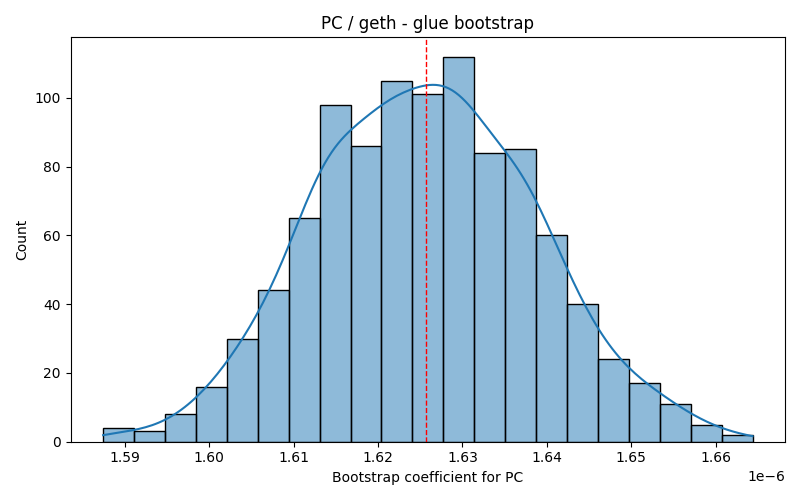

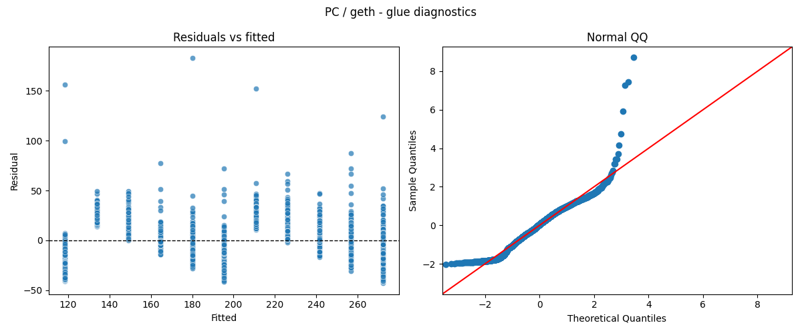

</details>

<details><summary><code>RETURNDATASIZE</code> · nobs=13816 · runtime_ms=3.133e-06 · p=1.00e-03 · R²=0.6113</summary>

```
==============================================================================
                           NNLS Regression Results                            
==============================================================================
Dep. Variable:          test_runtime_ms              R-squared:          0.611
Model:                  NNLS                    Adj. R-squared:          0.611
No. Observations:       13816                             RMSE:          39.45
Df Residuals:           13814                              MAE:          28.37
Df Model:               1      
==============================================================================
                      coef     std err     P-value      [0.025      0.975]
------------------------------------------------------------------------------
         const     49.7677      1.0397       0.001     47.7135     51.7534
RETURNDATASIZE      0.0000      0.0000       0.001      0.0000      0.0000
==============================================================================
Notes: Non-negative least squares with bootstrap inference (1000 iterations)
==============================================================================
```

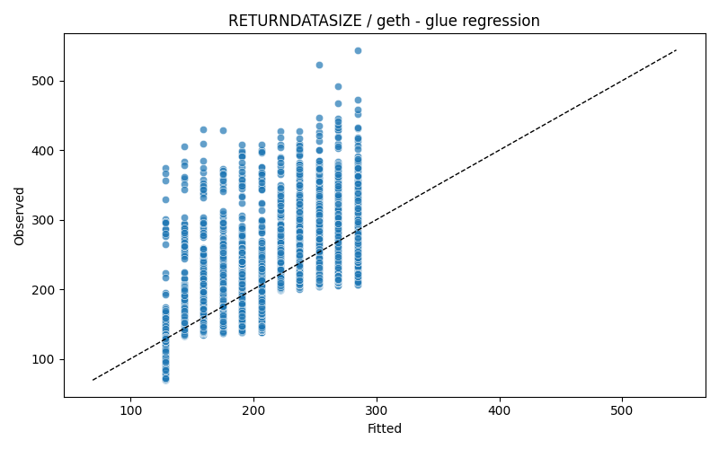

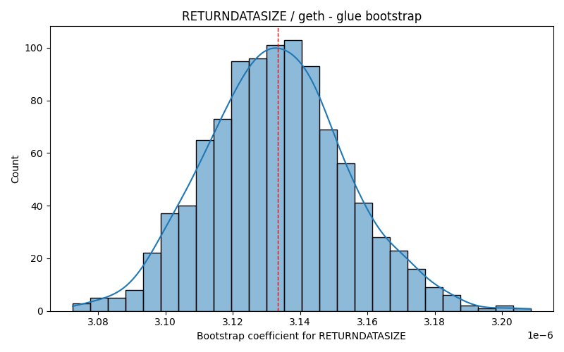

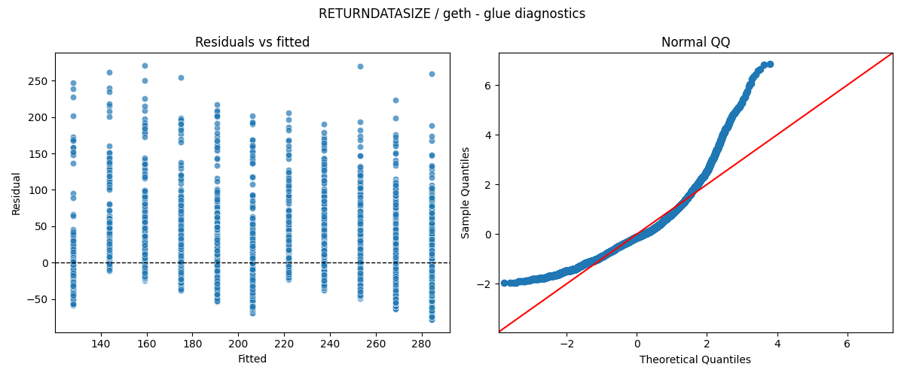

</details>

<details><summary><code>SELFBALANCE</code> · nobs=2826 · runtime_ms=7.494e-06 · p=1.00e-03 · R²=0.7973</summary>

```
==============================================================================
                           NNLS Regression Results                            
==============================================================================
Dep. Variable:          test_runtime_ms              R-squared:          0.797
Model:                  NNLS                    Adj. R-squared:          0.797
No. Observations:       2826                              RMSE:          38.12
Df Residuals:           2824                               MAE:          31.82
Df Model:               1      
==============================================================================
                      coef     std err     P-value      [0.025      0.975]
------------------------------------------------------------------------------
         const    118.6322      2.3650       0.001    114.2514    123.2271
   SELFBALANCE      0.0000      0.0000       0.001      0.0000      0.0000
==============================================================================
Notes: Non-negative least squares with bootstrap inference (1000 iterations)
==============================================================================
```

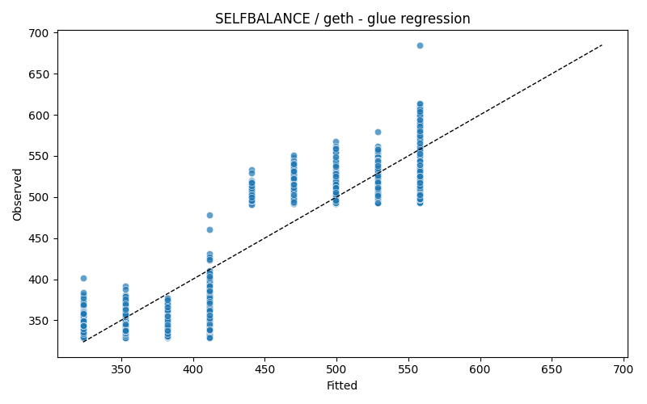

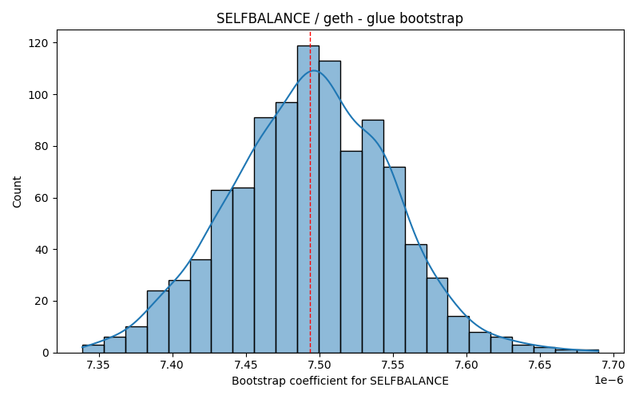

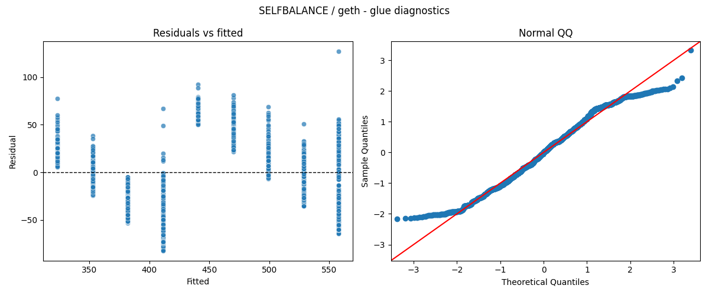

</details>

<details><summary><code>SUB</code> · nobs=3454 · runtime_ms=4.419e-06 · p=1.00e-03 · R²=0.8229</summary>

```
==============================================================================
                           NNLS Regression Results                            
==============================================================================
Dep. Variable:          test_runtime_ms              R-squared:          0.823
Model:                  NNLS                    Adj. R-squared:          0.823
No. Observations:       3454                              RMSE:          21.58
Df Residuals:           3452                               MAE:          16.45
Df Model:               1      
==============================================================================
                      coef     std err     P-value      [0.025      0.975]
------------------------------------------------------------------------------
         const     48.0038      1.2382       0.001     45.6316     50.5679
           SUB      0.0000      0.0000       0.001      0.0000      0.0000
==============================================================================
Notes: Non-negative least squares with bootstrap inference (1000 iterations)
==============================================================================
```

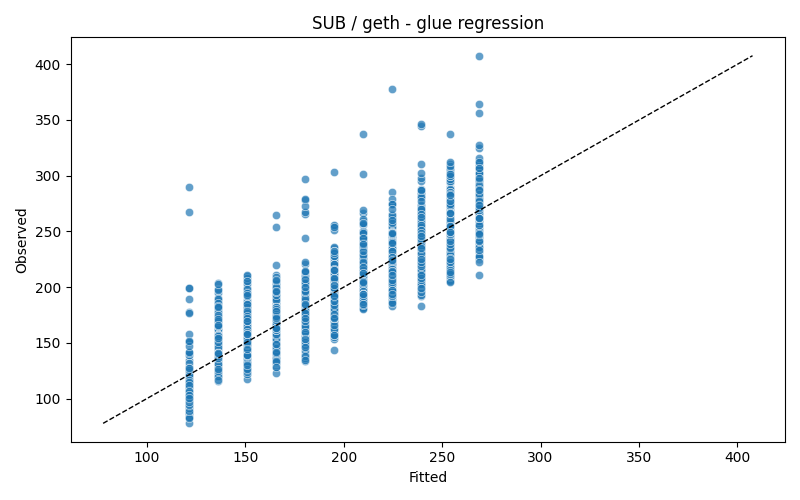

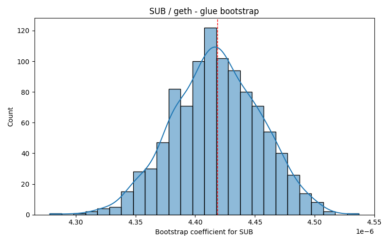

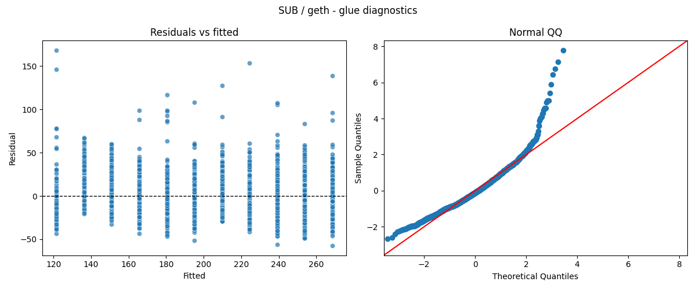

</details>

### Mixed glue (tier B) · geth

<details><summary><code>JUMP</code> · nobs=3454 · runtime_ms=9.117e-06 · p=1.00e-03 · R²=0.769</summary>

```
==============================================================================
                           NNLS Regression Results                            
==============================================================================
Dep. Variable:          test_runtime_ms              R-squared:          0.769
Model:                  NNLS                    Adj. R-squared:          0.769
No. Observations:       3454                              RMSE:          18.57
Df Residuals:           3452                               MAE:          13.76
Df Model:               1      
==============================================================================
                      coef     std err     P-value      [0.025      0.975]
------------------------------------------------------------------------------
         const     35.3992      1.2141       0.001     32.9890     37.7694
          JUMP      0.0000      0.0000       0.001      0.0000      0.0000
==============================================================================
Notes: Non-negative least squares with bootstrap inference (1000 iterations)
==============================================================================
```

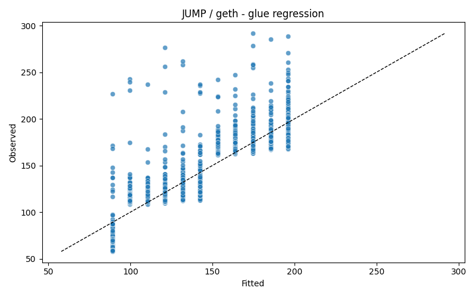

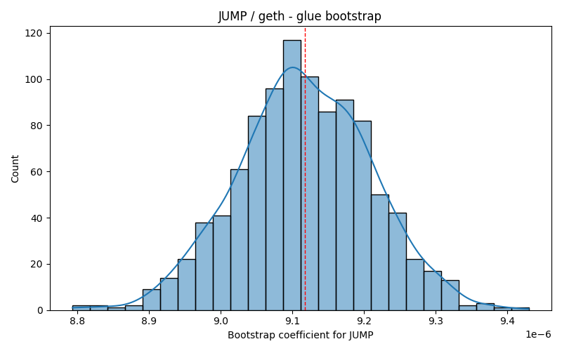

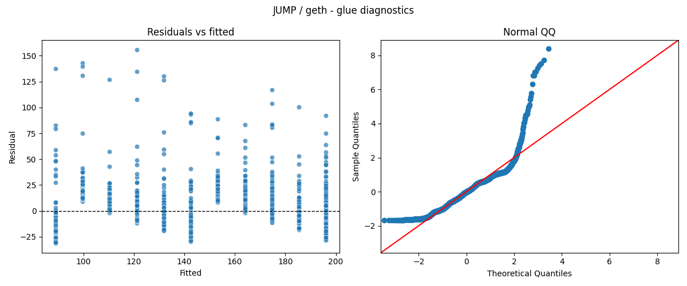

</details>

<details><summary><code>KECCAK256</code> · nobs=55264 · runtime_ms=3.673e-05 · p=1.00e-03 · R²=0.2655</summary>

```
==============================================================================
                           NNLS Regression Results                            
==============================================================================
Dep. Variable:          test_runtime_ms              R-squared:          0.265
Model:                  NNLS                    Adj. R-squared:          0.265
No. Observations:       55264                             RMSE:         121.41
Df Residuals:           55262                              MAE:          95.28
Df Model:               1      
==============================================================================
                      coef     std err     P-value      [0.025      0.975]
------------------------------------------------------------------------------
         const    379.1745      1.1265       0.001    376.9795    381.3345
     KECCAK256      0.0000      0.0000       0.001      0.0000      0.0000
==============================================================================
Notes: Non-negative least squares with bootstrap inference (1000 iterations)
==============================================================================
```

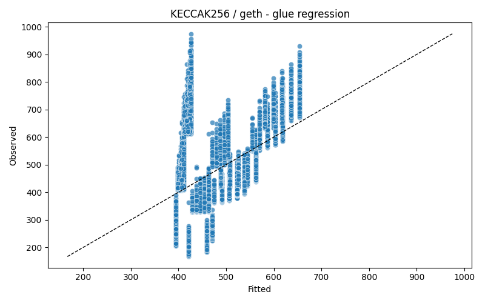

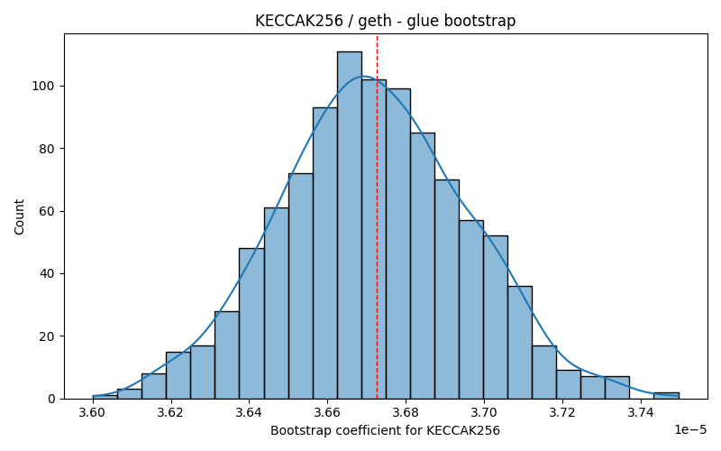

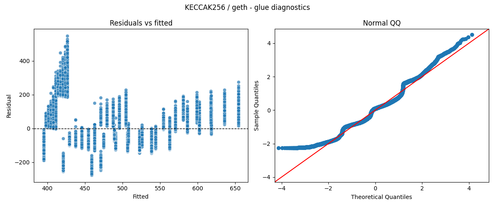

</details>

## nethermind

| glue_opcode | nobs | glue_runtime_ms | p_value | rsquared |
| --- | --- | --- | --- | --- |
| `ISZERO` | 3927 | 9.209e-07 | 1.00e-03 | 0.7681 |
| `JUMPDEST` | 3927 | 5.111e-07 | 1.00e-03 | 0.6447 |
| `SWAP` | 62832 | 5.381e-07 | 1.00e-03 | 0.5809 |
| `CALLDATASIZE` | 232056 | 4.885e-07 | 1.00e-03 | 0.9131 |
| `DUP` | 232056 | 3.396e-07 | 1.00e-03 | 0.9131 |
| `GAS` | 232056 | 4.551e-07 | 1.00e-03 | 0.9131 |
| `MLOAD` | 232056 | 1.428e-06 | 1.00e-03 | 0.9131 |
| `PUSH` | 232056 | 4.338e-07 | 1.00e-03 | 0.9131 |
| `PUSH0` | 232056 | 3.349e-07 | 1.00e-03 | 0.9131 |
| `STATICCALL` | 232056 | 0.0004393 | 1.00e-03 | 0.9131 |
| `ADD` | 3927 | 3.236e-06 | 1.00e-03 | 0.336 |
| `AND` | 3927 | 1.381e-06 | 1.00e-03 | 0.6255 |
| `CALLDATACOPY` | 94248 | 4.552e-06 | 1.00e-03 | 0.6865 |
| `CALLDATALOAD` | 15708 | 1.313e-05 | 1.23e-01 | 9.516e-05 |
| `DIV` | 3927 | 6.778e-06 | 1.00e-03 | 0.6111 |
| `EXP` | 3927 | 0 | 1.00e+00 | -2.22e-16 |
| `GT` | 3927 | 1.69e-06 | 1.00e-03 | 0.7764 |
| `JUMPI` | 3927 | 1.937e-06 | 1.00e-03 | 0.6547 |
| `LT` | 3927 | 1.583e-06 | 1.00e-03 | 0.7443 |
| `MSTORE` | 19635 | 2.222e-06 | 1.00e-03 | 0.7144 |
| `MSTORE8` | 19635 | 2.18e-06 | 1.00e-03 | 0.7722 |
| `MUL` | 3927 | 5.155e-06 | 1.00e-03 | 0.899 |
| `PC` | 3927 | 8.283e-07 | 1.00e-03 | 0.8434 |
| `RETURNDATASIZE` | 15708 | 9.203e-07 | 1.00e-03 | 0.6261 |
| `SELFBALANCE` | 3213 | 4.281e-06 | 1.00e-03 | 0.6174 |
| `SUB` | 3927 | 2.529e-06 | 1.00e-03 | 0.8354 |
| `JUMP` | 3927 | 5.665e-06 | 1.00e-03 | 0.825 |
| `KECCAK256` | 62832 | 0 | 1.00e+00 | 0 |

### Cycle glue — joint fit · nethermind

<details><summary>Joint NNLS regression summary</summary>

```
==============================================================================
                           NNLS Regression Results                            
==============================================================================
Dep. Variable:          test_runtime_ms              R-squared:          0.913
Model:                  NNLS                    Adj. R-squared:          0.913
No. Observations:       232056                            RMSE:          10.74
Df Residuals:           232048                             MAE:           5.87
Df Model:               7      
==============================================================================
                      coef     std err     P-value      [0.025      0.975]
------------------------------------------------------------------------------
         const     17.3424      0.0687       0.001     17.2134     17.4800
  CALLDATASIZE      0.0000      0.0000       0.001      0.0000      0.0000
           DUP      0.0000      0.0000       0.001      0.0000      0.0000
           GAS      0.0000      0.0000       0.001      0.0000      0.0000
         MLOAD      0.0000      0.0000       0.001      0.0000      0.0000
          PUSH      0.0000      0.0000       0.001      0.0000      0.0000
         PUSH0      0.0000      0.0000       0.001      0.0000      0.0000
    STATICCALL      0.0004      0.0000       0.001      0.0004      0.0004
==============================================================================
Notes: Non-negative least squares with bootstrap inference (1000 iterations)
==============================================================================
```

</details>

<details><summary><code>CALLDATASIZE</code> · nobs=232056 · runtime_ms=4.885e-07 · p=1.00e-03 · R²=0.9131</summary>

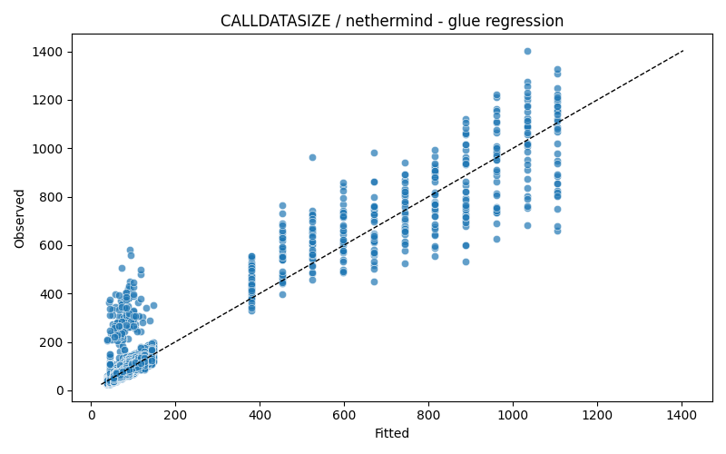

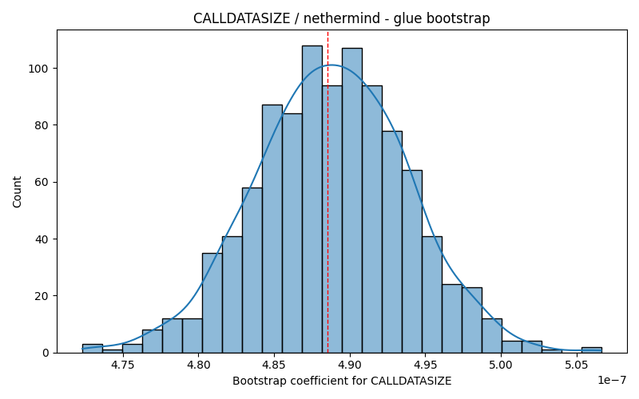

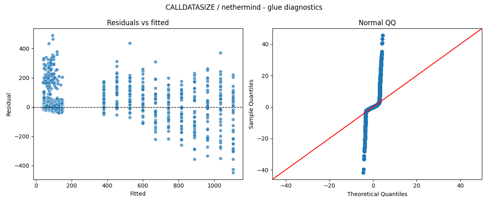

</details>

<details><summary><code>DUP</code> · nobs=232056 · runtime_ms=3.396e-07 · p=1.00e-03 · R²=0.9131</summary>

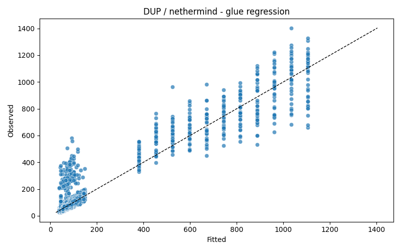

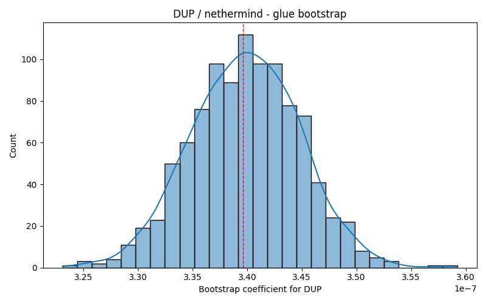


</details>

<details><summary><code>GAS</code> · nobs=232056 · runtime_ms=4.551e-07 · p=1.00e-03 · R²=0.9131</summary>


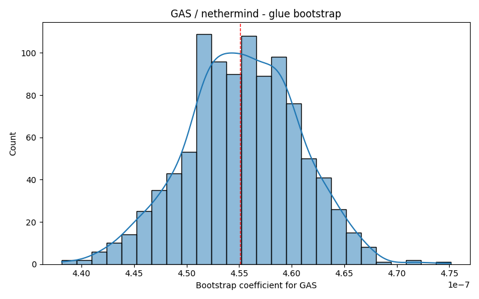


</details>

<details><summary><code>MLOAD</code> · nobs=232056 · runtime_ms=1.428e-06 · p=1.00e-03 · R²=0.9131</summary>


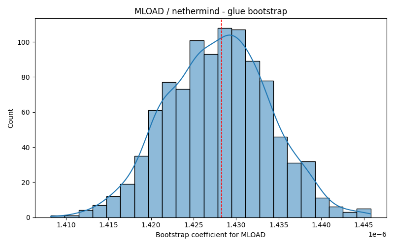


</details>

<details><summary><code>PUSH</code> · nobs=232056 · runtime_ms=4.338e-07 · p=1.00e-03 · R²=0.9131</summary>

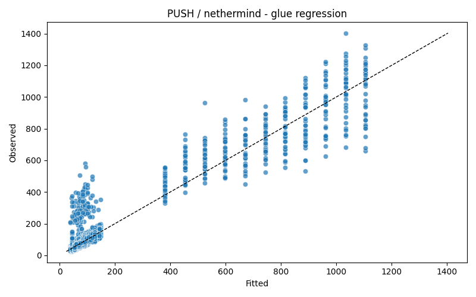

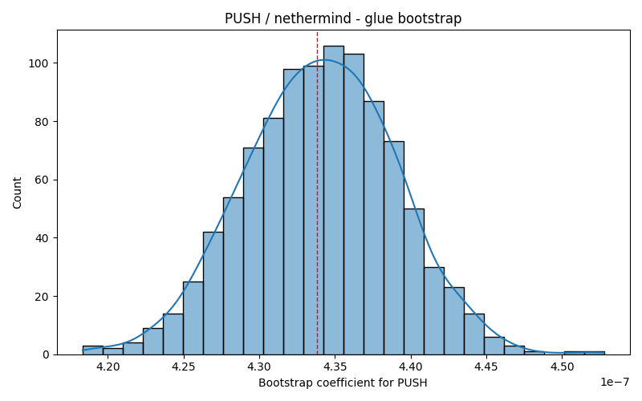


</details>

<details><summary><code>PUSH0</code> · nobs=232056 · runtime_ms=3.349e-07 · p=1.00e-03 · R²=0.9131</summary>


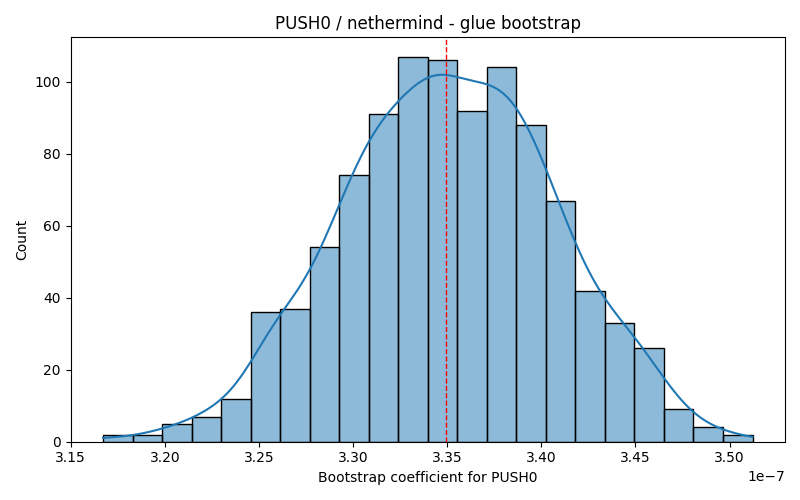

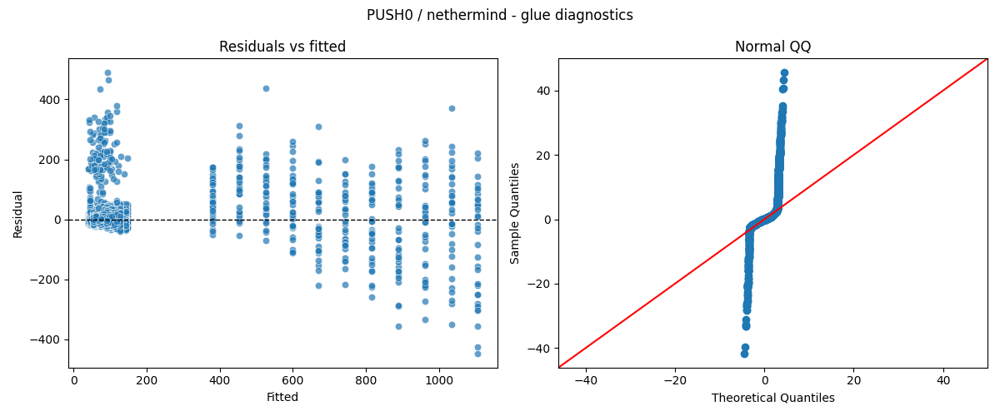

</details>

<details><summary><code>STATICCALL</code> · nobs=232056 · runtime_ms=0.0004393 · p=1.00e-03 · R²=0.9131</summary>


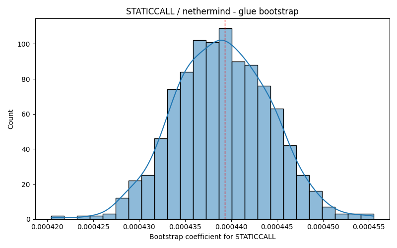

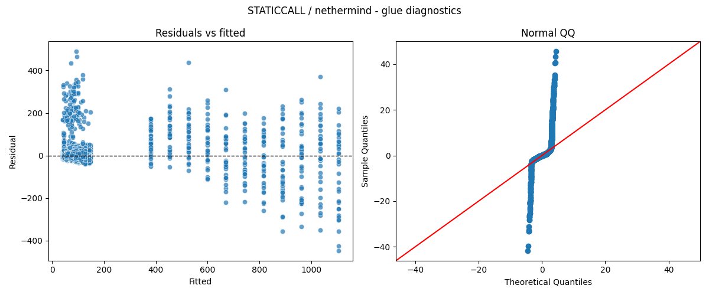

</details>

### Pure glue · nethermind

<details><summary><code>ISZERO</code> · nobs=3927 · runtime_ms=9.209e-07 · p=1.00e-03 · R²=0.7681</summary>

```
==============================================================================
                           NNLS Regression Results                            
==============================================================================
Dep. Variable:          test_runtime_ms              R-squared:          0.768
Model:                  NNLS                    Adj. R-squared:          0.768
No. Observations:       3927                              RMSE:          10.65
Df Residuals:           3925                               MAE:           6.51
Df Model:               1      
==============================================================================
                      coef     std err     P-value      [0.025      0.975]
------------------------------------------------------------------------------
         const     15.8224      0.5339       0.001     14.7894     16.9021
        ISZERO      0.0000      0.0000       0.001      0.0000      0.0000
==============================================================================
Notes: Non-negative least squares with bootstrap inference (1000 iterations)
==============================================================================
```

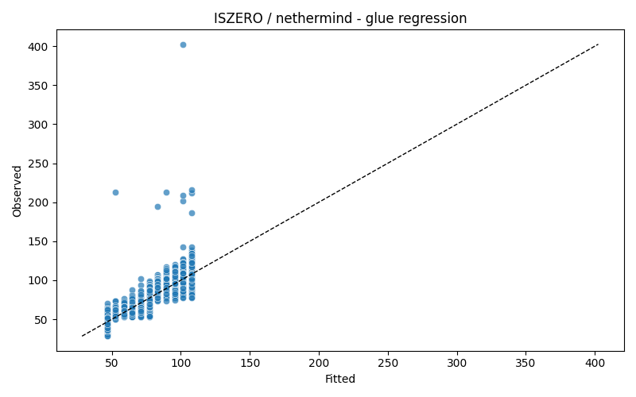

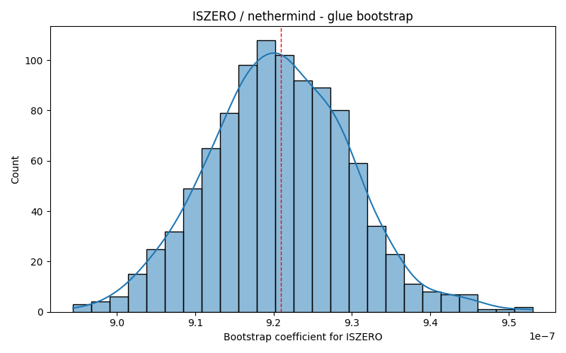

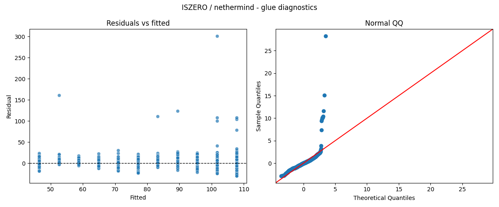

</details>

<details><summary><code>JUMPDEST</code> · nobs=3927 · runtime_ms=5.111e-07 · p=1.00e-03 · R²=0.6447</summary>

```
==============================================================================
                           NNLS Regression Results                            
==============================================================================
Dep. Variable:          test_runtime_ms              R-squared:          0.645
Model:                  NNLS                    Adj. R-squared:          0.645
No. Observations:       3927                              RMSE:          23.96
Df Residuals:           3925                               MAE:          18.03
Df Model:               1      
==============================================================================
                      coef     std err     P-value      [0.025      0.975]
------------------------------------------------------------------------------
         const     24.8664      1.1075       0.001     22.8693     27.1744
      JUMPDEST      0.0000      0.0000       0.001      0.0000      0.0000
==============================================================================
Notes: Non-negative least squares with bootstrap inference (1000 iterations)
==============================================================================
```

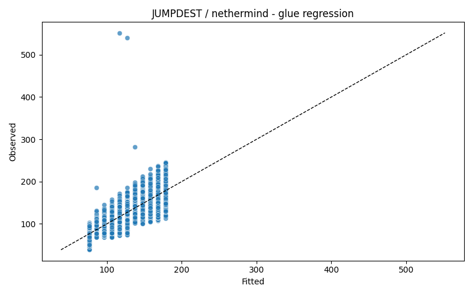

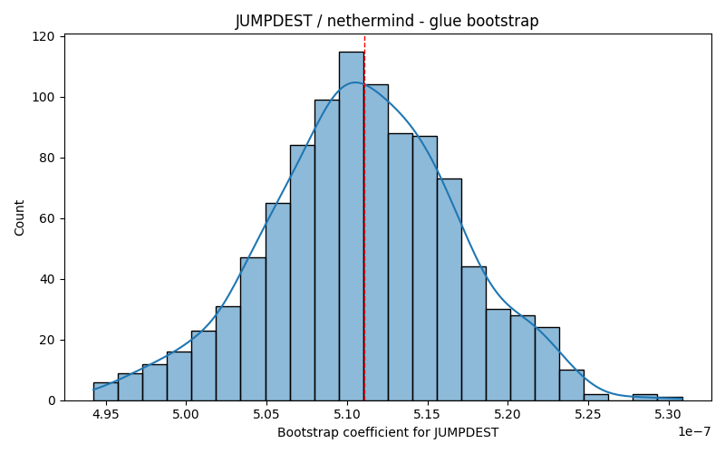

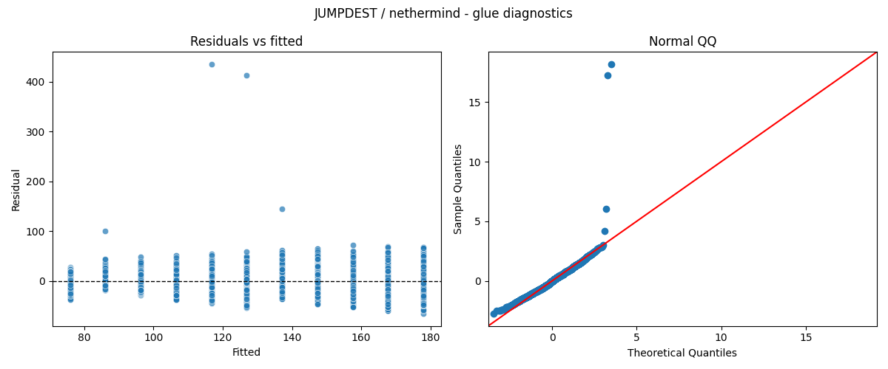

</details>

<details><summary><code>SWAP</code> · nobs=62832 · runtime_ms=5.381e-07 · p=1.00e-03 · R²=0.5809</summary>

```
==============================================================================
                           NNLS Regression Results                            
==============================================================================
Dep. Variable:          test_runtime_ms              R-squared:          0.581
Model:                  NNLS                    Adj. R-squared:          0.581
No. Observations:       62832                             RMSE:           9.62
Df Residuals:           62830                              MAE:           4.43
Df Model:               1      
==============================================================================
                      coef     std err     P-value      [0.025      0.975]
------------------------------------------------------------------------------
         const     17.0426      0.1416       0.001     16.7820     17.3344
          SWAP      0.0000      0.0000       0.001      0.0000      0.0000
==============================================================================
Notes: Non-negative least squares with bootstrap inference (1000 iterations)
==============================================================================
```

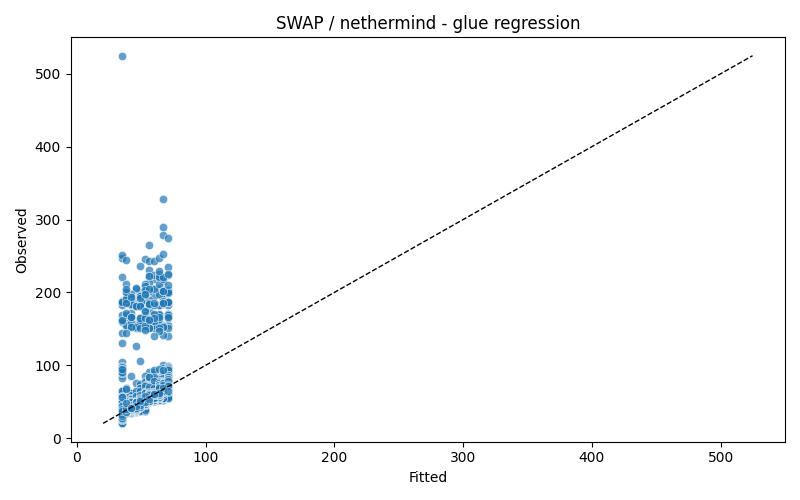

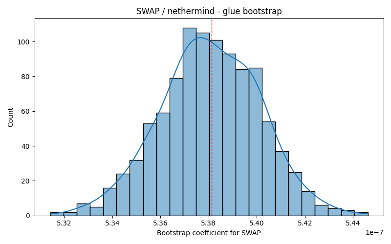

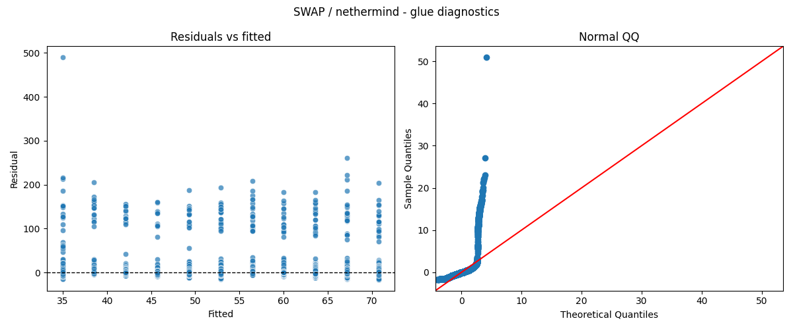

</details>

### Mixed glue (tier A) · nethermind

<details><summary><code>ADD</code> · nobs=3927 · runtime_ms=3.236e-06 · p=1.00e-03 · R²=0.336</summary>

```
==============================================================================
                           NNLS Regression Results                            
==============================================================================
Dep. Variable:          test_runtime_ms              R-squared:          0.336
Model:                  NNLS                    Adj. R-squared:          0.336
No. Observations:       3927                              RMSE:          47.88
Df Residuals:           3925                               MAE:          40.01
Df Model:               1      
==============================================================================
                      coef     std err     P-value      [0.025      0.975]
------------------------------------------------------------------------------
         const     29.7175      2.1618       0.001     25.3594     33.7464
           ADD      0.0000      0.0000       0.001      0.0000      0.0000
==============================================================================
Notes: Non-negative least squares with bootstrap inference (1000 iterations)
==============================================================================
```

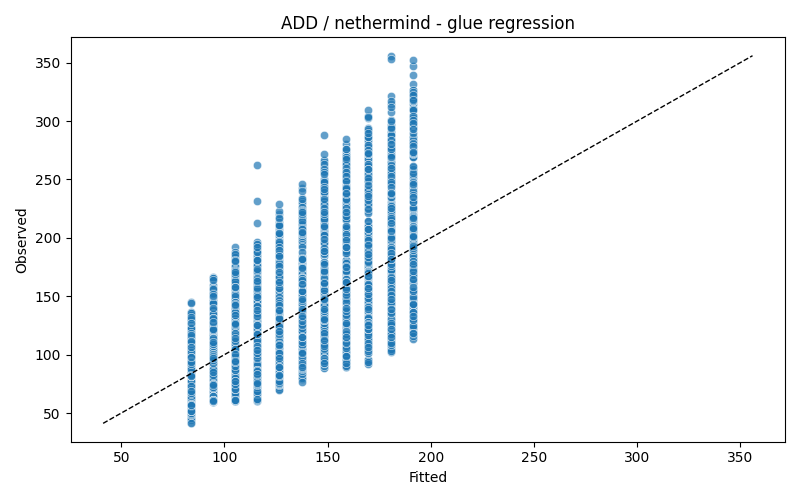

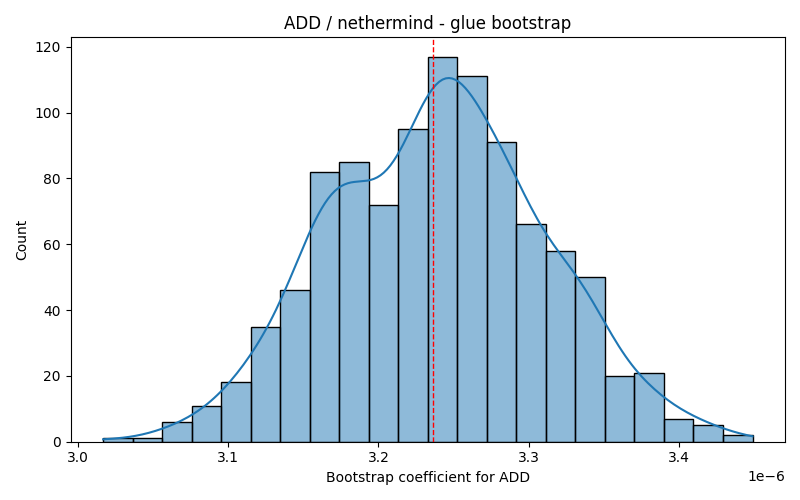

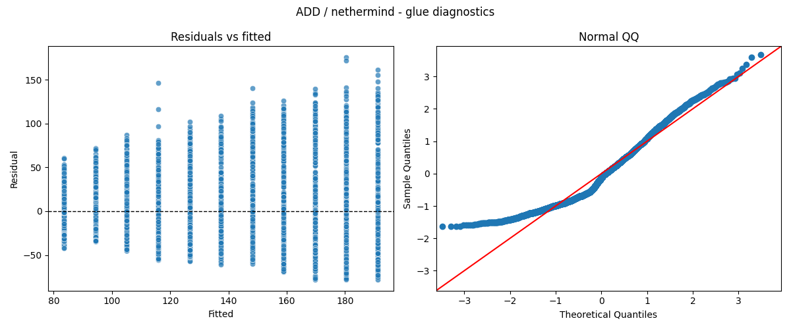

</details>

<details><summary><code>AND</code> · nobs=3927 · runtime_ms=1.381e-06 · p=1.00e-03 · R²=0.6255</summary>

```
==============================================================================
                           NNLS Regression Results                            
==============================================================================
Dep. Variable:          test_runtime_ms              R-squared:          0.626
Model:                  NNLS                    Adj. R-squared:          0.625
No. Observations:       3927                              RMSE:          11.25
Df Residuals:           3925                               MAE:           6.61
Df Model:               1      
==============================================================================
                      coef     std err     P-value      [0.025      0.975]
------------------------------------------------------------------------------
         const     15.3983      0.5377       0.001     14.3390     16.4702
           AND      0.0000      0.0000       0.001      0.0000      0.0000
==============================================================================
Notes: Non-negative least squares with bootstrap inference (1000 iterations)
==============================================================================
```

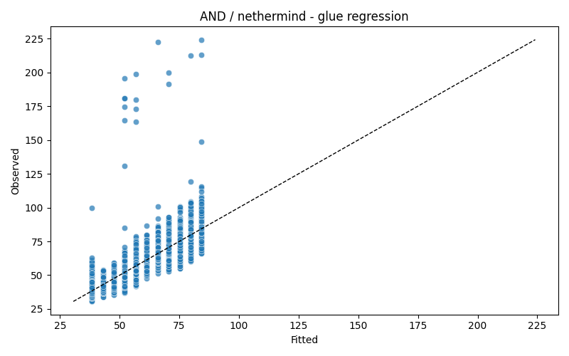

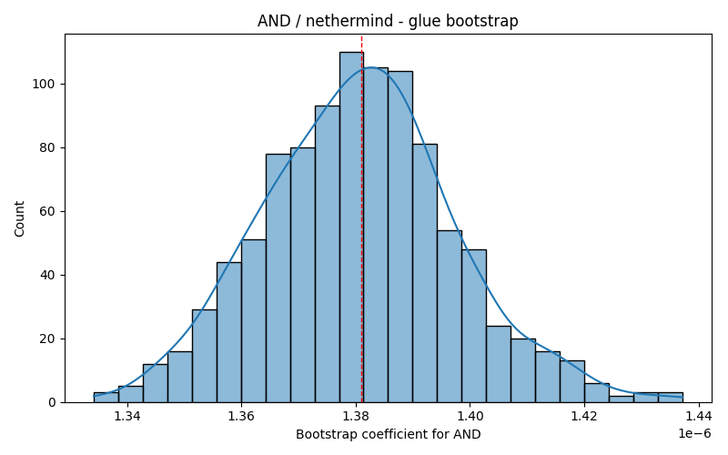

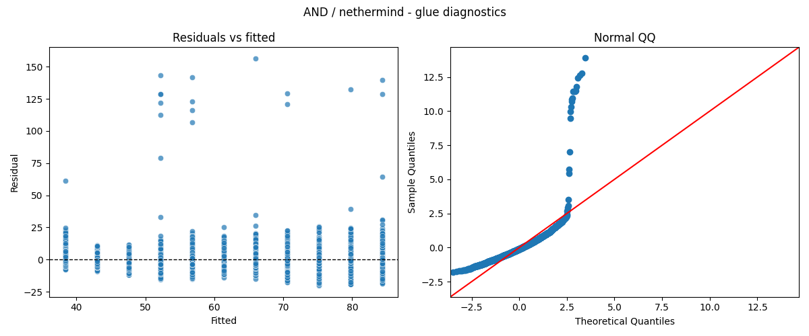

</details>

<details><summary><code>CALLDATACOPY</code> · nobs=94248 · runtime_ms=4.552e-06 · p=1.00e-03 · R²=0.6865</summary>

```
==============================================================================
                           NNLS Regression Results                            
==============================================================================
Dep. Variable:          test_runtime_ms              R-squared:          0.686
Model:                  NNLS                    Adj. R-squared:          0.686
No. Observations:       94248                             RMSE:          23.13
Df Residuals:           94246                              MAE:          18.06
Df Model:               1      
==============================================================================
                      coef     std err     P-value      [0.025      0.975]
------------------------------------------------------------------------------
         const     26.1241      0.0818       0.001     25.9611     26.2842
  CALLDATACOPY      0.0000      0.0000       0.001      0.0000      0.0000
==============================================================================
Notes: Non-negative least squares with bootstrap inference (1000 iterations)
==============================================================================
```

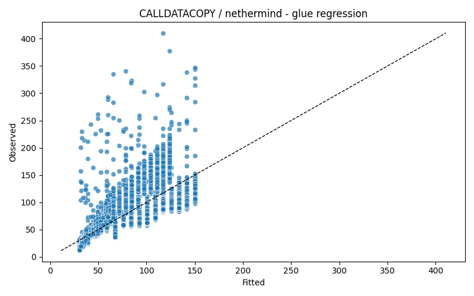

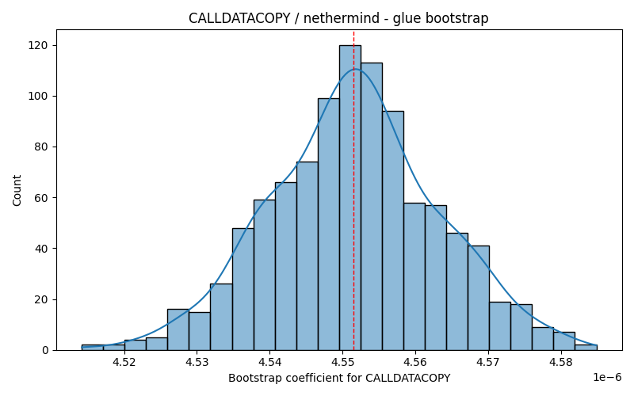

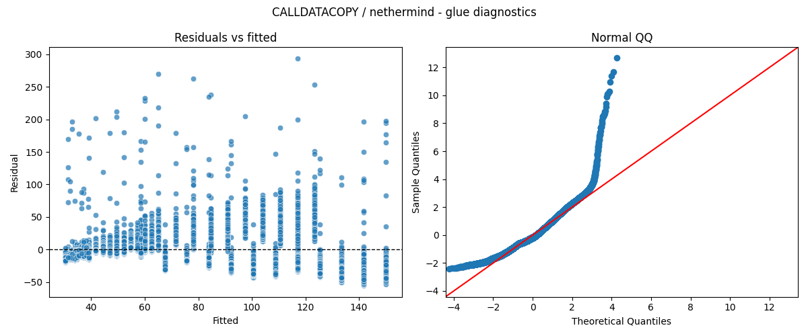

</details>

<details><summary><code>CALLDATALOAD</code> · nobs=15708 · runtime_ms=1.313e-05 · p=1.23e-01 · R²=9.516e-05</summary>

```
==============================================================================
                           NNLS Regression Results                            
==============================================================================
Dep. Variable:          test_runtime_ms              R-squared:          0.000
Model:                  NNLS                    Adj. R-squared:          0.000
No. Observations:       15708                             RMSE:           5.16
Df Residuals:           15706                              MAE:           0.59
Df Model:               1      
==============================================================================
                      coef     std err     P-value      [0.025      0.975]
------------------------------------------------------------------------------
         const      3.1870      0.1482       0.001      2.8789      3.4176
  CALLDATALOAD      0.0000      0.0000       0.123      0.0000      0.0000
==============================================================================
Notes: Non-negative least squares with bootstrap inference (1000 iterations)
==============================================================================
```

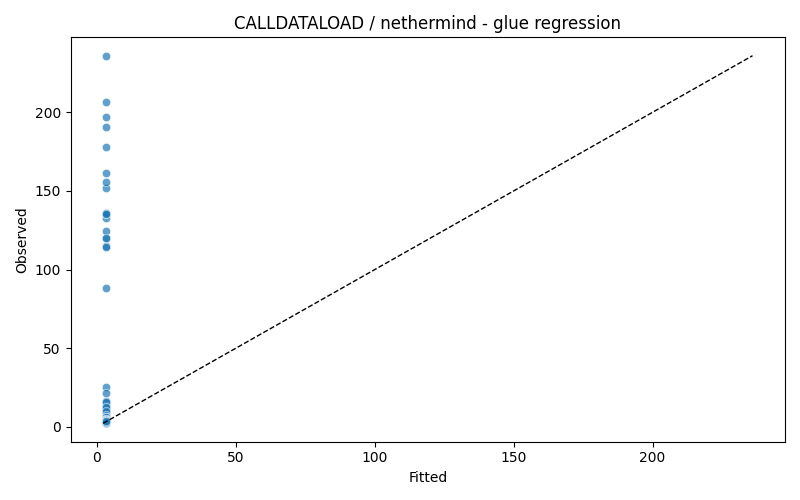

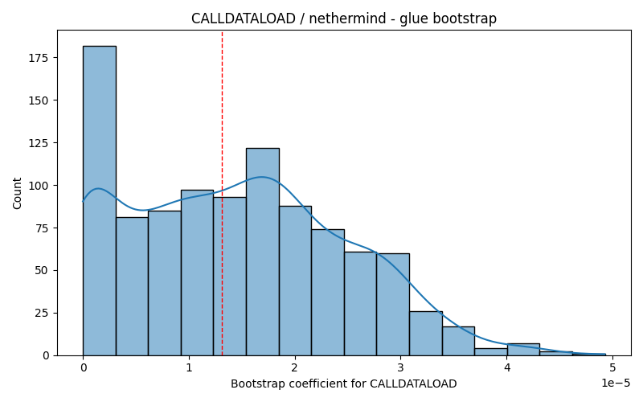

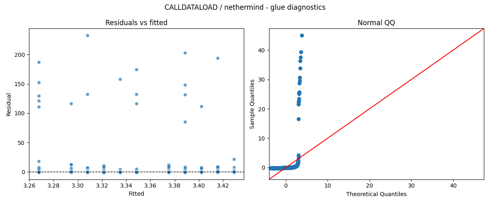

</details>

<details><summary><code>DIV</code> · nobs=3927 · runtime_ms=6.778e-06 · p=1.00e-03 · R²=0.6111</summary>

```
==============================================================================
                           NNLS Regression Results                            
==============================================================================
Dep. Variable:          test_runtime_ms              R-squared:          0.611
Model:                  NNLS                    Adj. R-squared:          0.611
No. Observations:       3927                              RMSE:          42.68
Df Residuals:           3925                               MAE:          33.13
Df Model:               1      
==============================================================================
                      coef     std err     P-value      [0.025      0.975]
------------------------------------------------------------------------------
         const    128.1281      3.3738       0.001    121.6231    134.8081
           DIV      0.0000      0.0000       0.001      0.0000      0.0000
==============================================================================
Notes: Non-negative least squares with bootstrap inference (1000 iterations)
==============================================================================
```

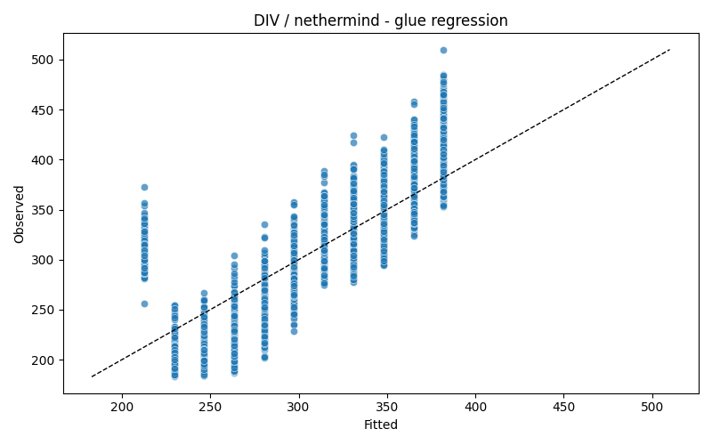

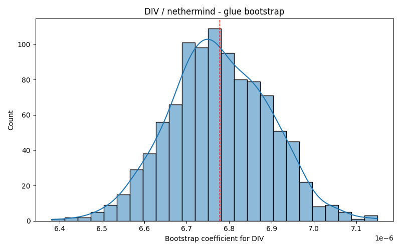

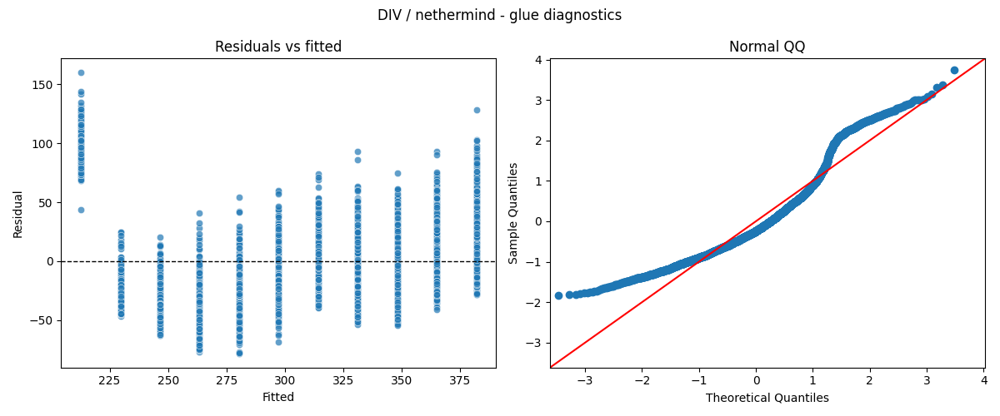

</details>

<details><summary><code>EXP</code> · nobs=3927 · runtime_ms=0 · p=1.00e+00 · R²=-2.22e-16</summary>

```
==============================================================================
                           NNLS Regression Results                            
==============================================================================
Dep. Variable:          test_runtime_ms              R-squared:         -0.000
Model:                  NNLS                    Adj. R-squared:         -0.000
No. Observations:       3927                              RMSE:          47.40
Df Residuals:           3925                               MAE:          31.39
Df Model:               1      
==============================================================================
                      coef     std err     P-value      [0.025      0.975]
------------------------------------------------------------------------------
         const    103.0309      0.7767       0.001    101.6198    104.5695
           EXP      0.0000      0.0000       1.000      0.0000      0.0000
==============================================================================
Notes: Non-negative least squares with bootstrap inference (1000 iterations)
==============================================================================
```

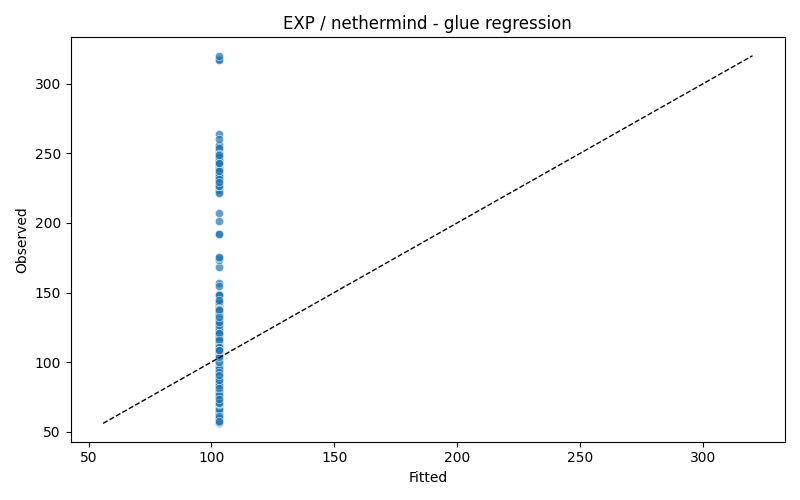


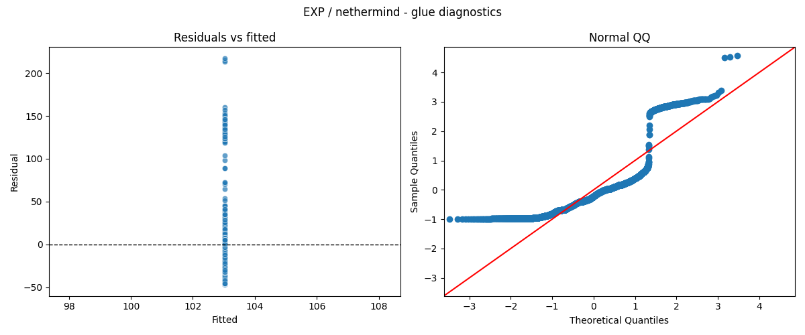

</details>

<details><summary><code>GT</code> · nobs=3927 · runtime_ms=1.69e-06 · p=1.00e-03 · R²=0.7764</summary>

```
==============================================================================
                           NNLS Regression Results                            
==============================================================================
Dep. Variable:          test_runtime_ms              R-squared:          0.776
Model:                  NNLS                    Adj. R-squared:          0.776
No. Observations:       3927                              RMSE:           9.54
Df Residuals:           3925                               MAE:           6.36
Df Model:               1      
==============================================================================
                      coef     std err     P-value      [0.025      0.975]
------------------------------------------------------------------------------
         const     14.6380      0.4253       0.001     13.8225     15.4649
            GT      0.0000      0.0000       0.001      0.0000      0.0000
==============================================================================
Notes: Non-negative least squares with bootstrap inference (1000 iterations)
==============================================================================
```

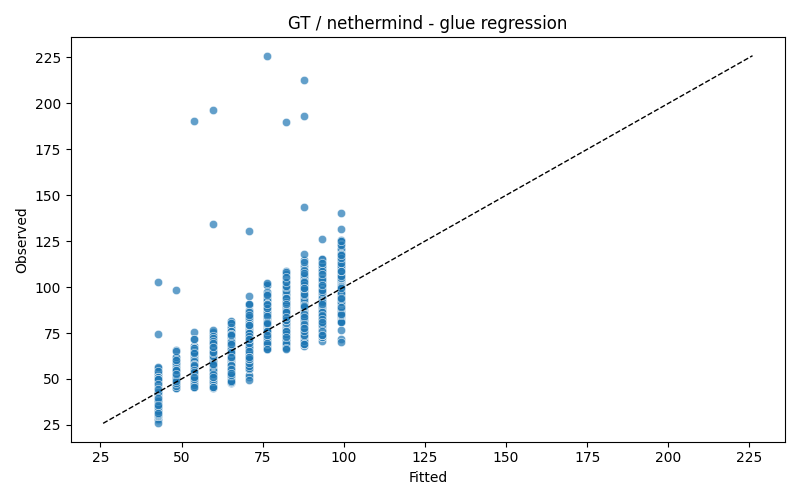

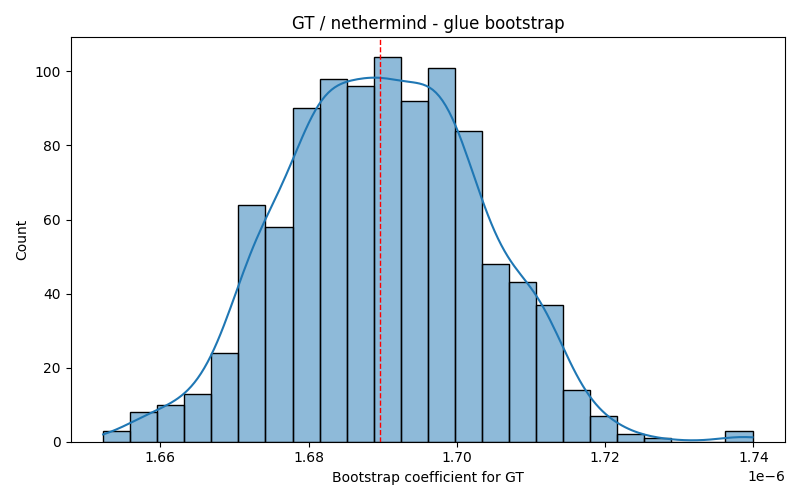


</details>

<details><summary><code>JUMPI</code> · nobs=3927 · runtime_ms=1.937e-06 · p=1.00e-03 · R²=0.6547</summary>

```
==============================================================================
                           NNLS Regression Results                            
==============================================================================
Dep. Variable:          test_runtime_ms              R-squared:          0.655
Model:                  NNLS                    Adj. R-squared:          0.655
No. Observations:       3927                              RMSE:           6.35
Df Residuals:           3925                               MAE:           3.56
Df Model:               1      
==============================================================================
                      coef     std err     P-value      [0.025      0.975]
------------------------------------------------------------------------------
         const      9.2318      0.3256       0.001      8.6451      9.9111
         JUMPI      0.0000      0.0000       0.001      0.0000      0.0000
==============================================================================
Notes: Non-negative least squares with bootstrap inference (1000 iterations)
==============================================================================
```

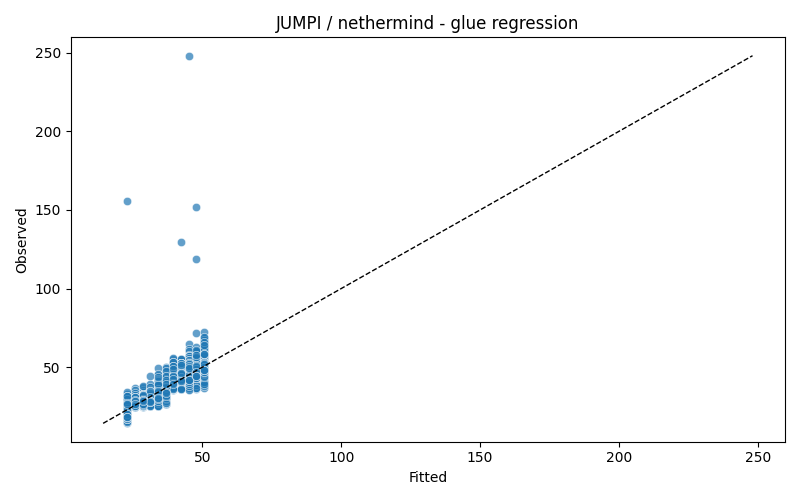

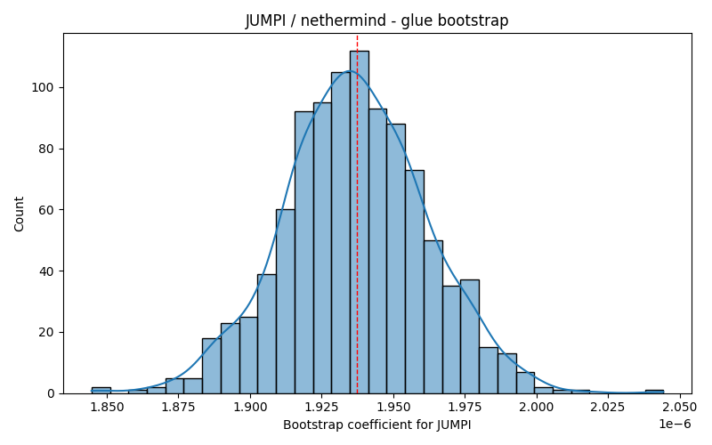

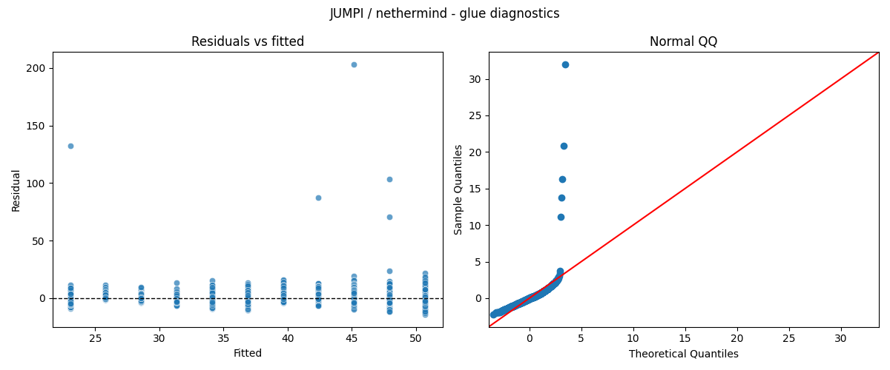

</details>

<details><summary><code>LT</code> · nobs=3927 · runtime_ms=1.583e-06 · p=1.00e-03 · R²=0.7443</summary>

```
==============================================================================
                           NNLS Regression Results                            
==============================================================================
Dep. Variable:          test_runtime_ms              R-squared:          0.744
Model:                  NNLS                    Adj. R-squared:          0.744
No. Observations:       3927                              RMSE:           9.77
Df Residuals:           3925                               MAE:           6.27
Df Model:               1      
==============================================================================
                      coef     std err     P-value      [0.025      0.975]
------------------------------------------------------------------------------
         const     19.5057      0.5433       0.001     18.4189     20.5308
            LT      0.0000      0.0000       0.001      0.0000      0.0000
==============================================================================
Notes: Non-negative least squares with bootstrap inference (1000 iterations)
==============================================================================
```

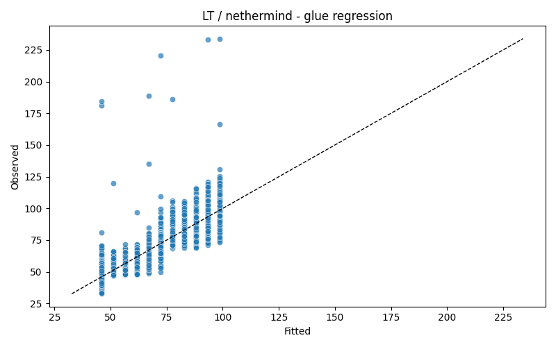

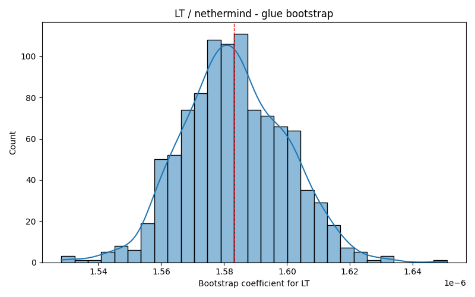

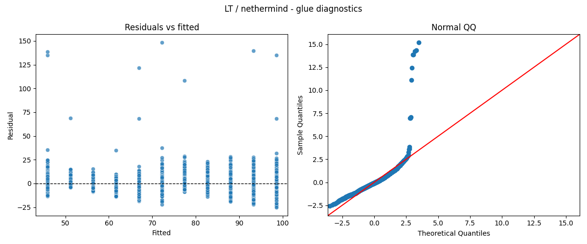

</details>

<details><summary><code>MSTORE</code> · nobs=19635 · runtime_ms=2.222e-06 · p=1.00e-03 · R²=0.7144</summary>

```
==============================================================================
                           NNLS Regression Results                            
==============================================================================
Dep. Variable:          test_runtime_ms              R-squared:          0.714
Model:                  NNLS                    Adj. R-squared:          0.714
No. Observations:       19635                             RMSE:           9.86
Df Residuals:           19633                              MAE:           5.15
Df Model:               1      
==============================================================================
                      coef     std err     P-value      [0.025      0.975]
------------------------------------------------------------------------------
         const     15.1387      0.2341       0.001     14.6806     15.5916
        MSTORE      0.0000      0.0000       0.001      0.0000      0.0000
==============================================================================
Notes: Non-negative least squares with bootstrap inference (1000 iterations)
==============================================================================
```

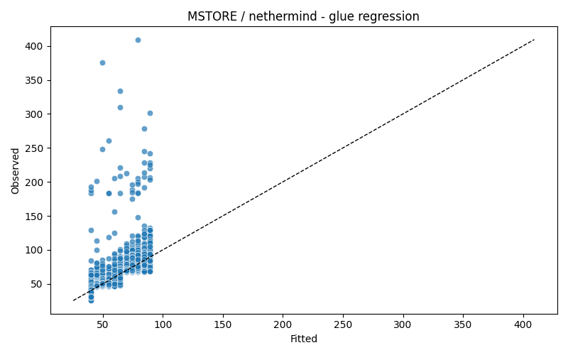

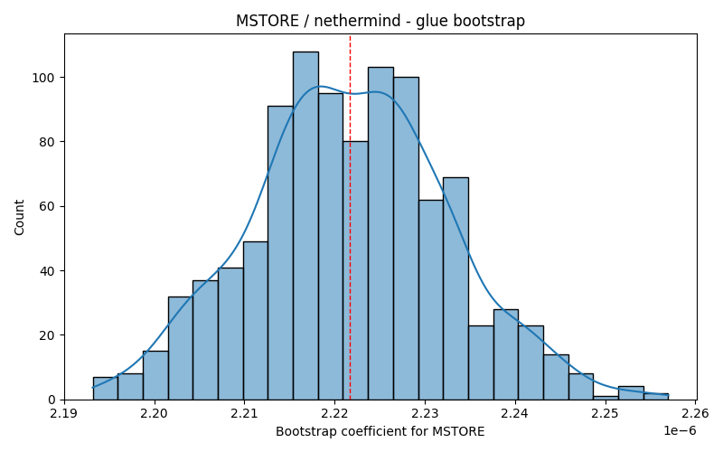

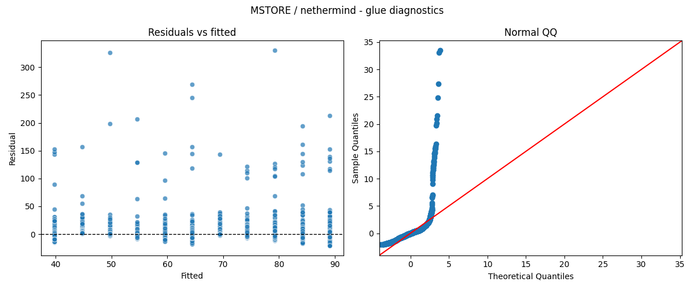

</details>

<details><summary><code>MSTORE8</code> · nobs=19635 · runtime_ms=2.18e-06 · p=1.00e-03 · R²=0.7722</summary>

```
==============================================================================
                           NNLS Regression Results                            
==============================================================================
Dep. Variable:          test_runtime_ms              R-squared:          0.772
Model:                  NNLS                    Adj. R-squared:          0.772
No. Observations:       19635                             RMSE:           8.31
Df Residuals:           19633                              MAE:           4.86
Df Model:               1      
==============================================================================
                      coef     std err     P-value      [0.025      0.975]
------------------------------------------------------------------------------
         const     15.0352      0.1973       0.001     14.6467     15.4469
       MSTORE8      0.0000      0.0000       0.001      0.0000      0.0000
==============================================================================
Notes: Non-negative least squares with bootstrap inference (1000 iterations)
==============================================================================
```

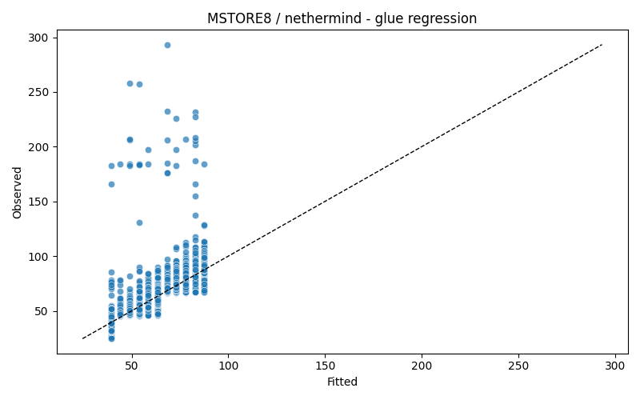

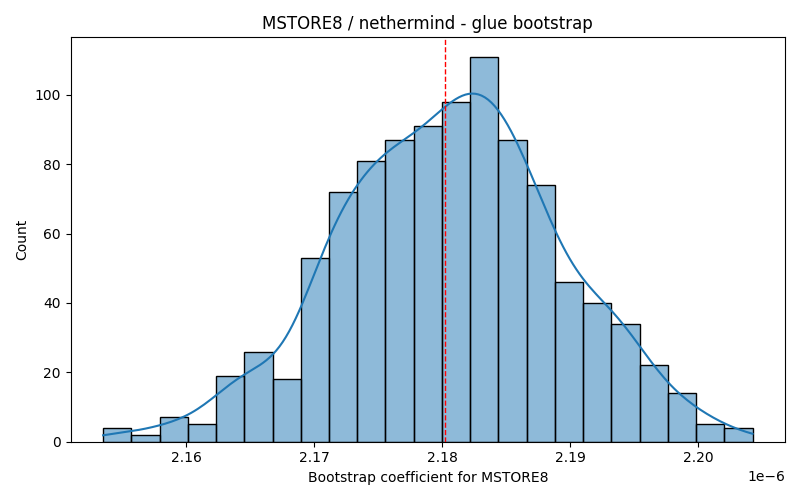

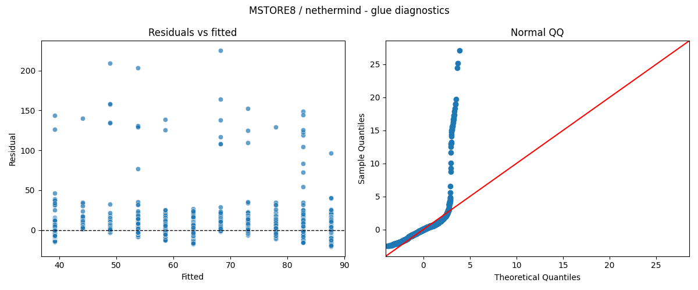

</details>

<details><summary><code>MUL</code> · nobs=3927 · runtime_ms=5.155e-06 · p=1.00e-03 · R²=0.899</summary>

```
==============================================================================
                           NNLS Regression Results                            
==============================================================================
Dep. Variable:          test_runtime_ms              R-squared:          0.899
Model:                  NNLS                    Adj. R-squared:          0.899
No. Observations:       3927                              RMSE:          13.64
Df Residuals:           3925                               MAE:          10.29
Df Model:               1      
==============================================================================
                      coef     std err     P-value      [0.025      0.975]
------------------------------------------------------------------------------
         const     25.9056      0.6733       0.001     24.6383     27.1840
           MUL      0.0000      0.0000       0.001      0.0000      0.0000
==============================================================================
Notes: Non-negative least squares with bootstrap inference (1000 iterations)
==============================================================================
```

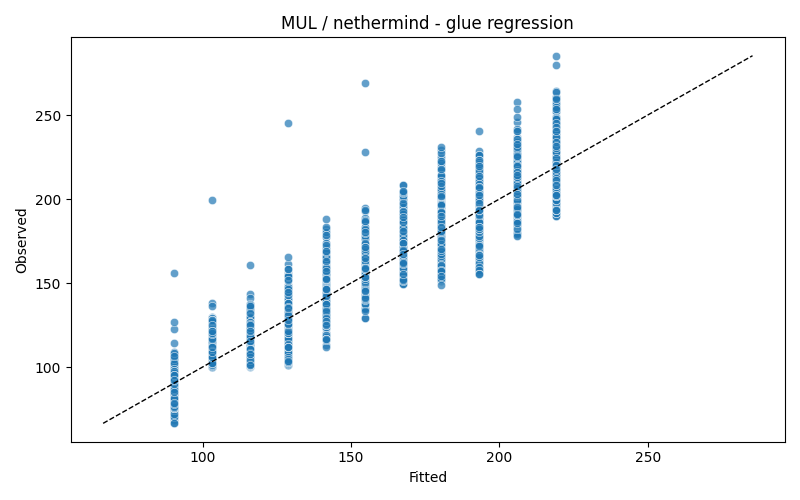

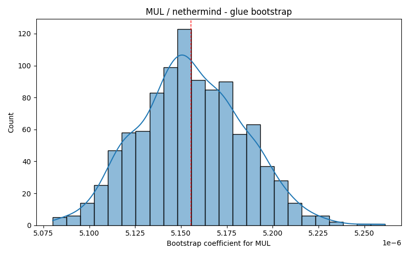

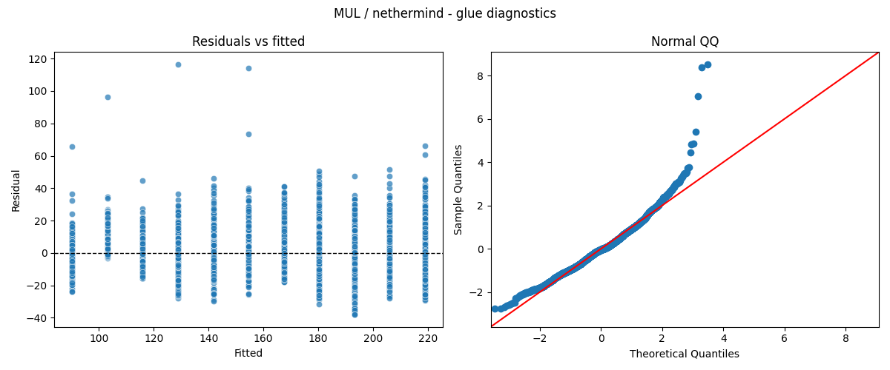

</details>

<details><summary><code>PC</code> · nobs=3927 · runtime_ms=8.283e-07 · p=1.00e-03 · R²=0.8434</summary>

```
==============================================================================
                           NNLS Regression Results                            
==============================================================================
Dep. Variable:          test_runtime_ms              R-squared:          0.843
Model:                  NNLS                    Adj. R-squared:          0.843
No. Observations:       3927                              RMSE:          10.67
Df Residuals:           3925                               MAE:           8.27
Df Model:               1      
==============================================================================
                      coef     std err     P-value      [0.025      0.975]
------------------------------------------------------------------------------
         const     18.8818      0.5375       0.001     17.8380     19.9186
            PC      0.0000      0.0000       0.001      0.0000      0.0000
==============================================================================
Notes: Non-negative least squares with bootstrap inference (1000 iterations)
==============================================================================
```

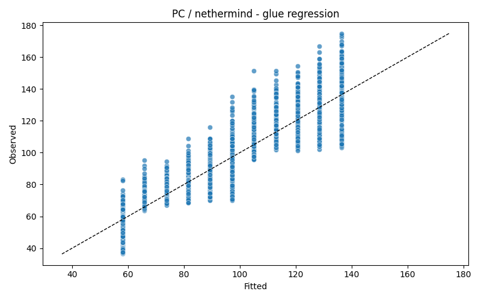

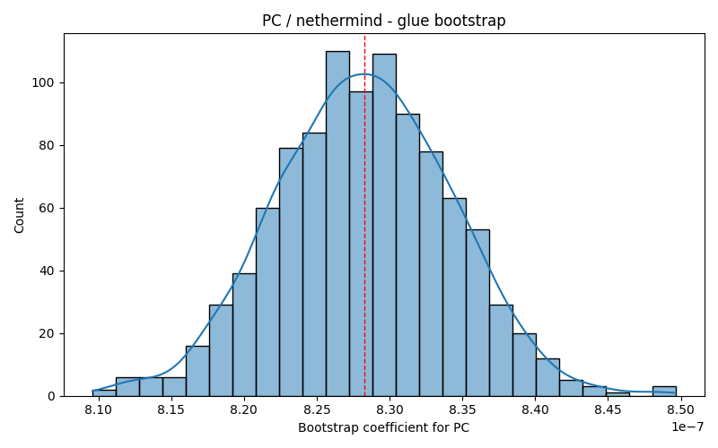

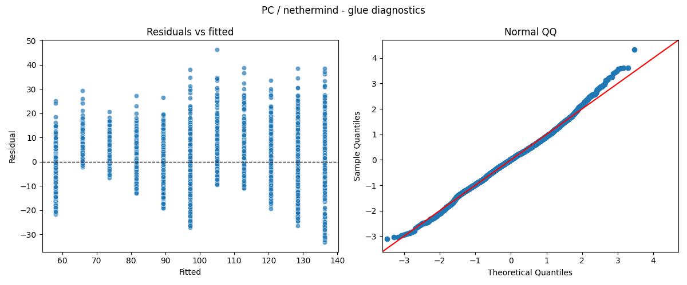

</details>

<details><summary><code>RETURNDATASIZE</code> · nobs=15708 · runtime_ms=9.203e-07 · p=1.00e-03 · R²=0.6261</summary>

```
==============================================================================
                           NNLS Regression Results                            
==============================================================================
Dep. Variable:          test_runtime_ms              R-squared:          0.626
Model:                  NNLS                    Adj. R-squared:          0.626
No. Observations:       15708                             RMSE:          11.23
Df Residuals:           15706                              MAE:           5.24
Df Model:               1      
==============================================================================
                      coef     std err     P-value      [0.025      0.975]
------------------------------------------------------------------------------
         const     13.0784      0.2789       0.001     12.5691     13.6203
RETURNDATASIZE      0.0000      0.0000       0.001      0.0000      0.0000
==============================================================================
Notes: Non-negative least squares with bootstrap inference (1000 iterations)
==============================================================================
```

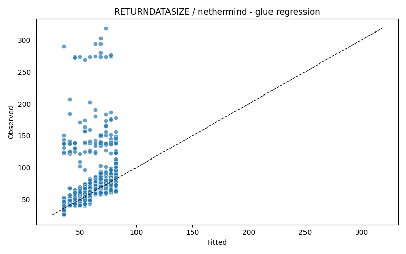

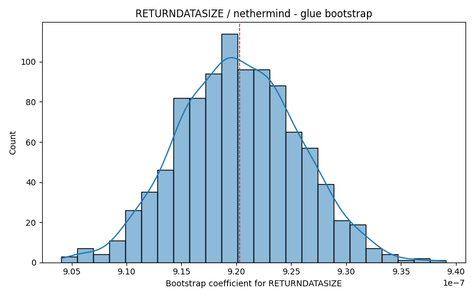

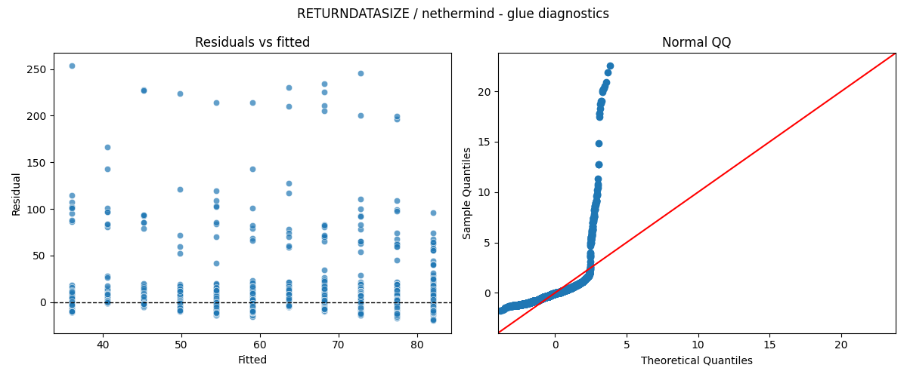

</details>

<details><summary><code>SELFBALANCE</code> · nobs=3213 · runtime_ms=4.281e-06 · p=1.00e-03 · R²=0.6174</summary>

```
==============================================================================
                           NNLS Regression Results                            
==============================================================================
Dep. Variable:          test_runtime_ms              R-squared:          0.617
Model:                  NNLS                    Adj. R-squared:          0.617
No. Observations:       3213                              RMSE:          34.00
Df Residuals:           3211                               MAE:          27.07
Df Model:               1      
==============================================================================
                      coef     std err     P-value      [0.025      0.975]
------------------------------------------------------------------------------
         const    114.6722      3.3043       0.001    108.2358    121.3026
   SELFBALANCE      0.0000      0.0000       0.001      0.0000      0.0000
==============================================================================
Notes: Non-negative least squares with bootstrap inference (1000 iterations)
==============================================================================
```

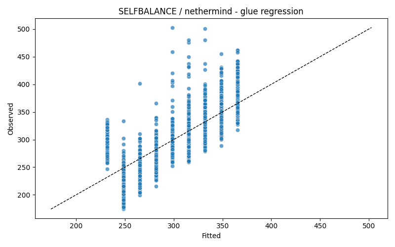

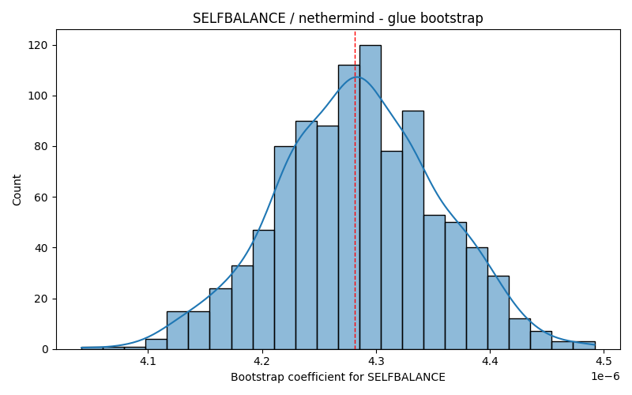

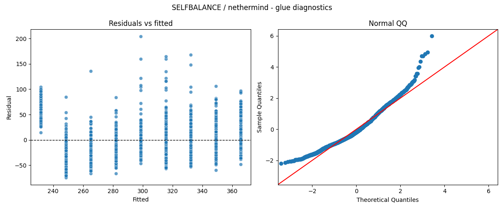

</details>

<details><summary><code>SUB</code> · nobs=3927 · runtime_ms=2.529e-06 · p=1.00e-03 · R²=0.8354</summary>

```
==============================================================================
                           NNLS Regression Results                            
==============================================================================
Dep. Variable:          test_runtime_ms              R-squared:          0.835
Model:                  NNLS                    Adj. R-squared:          0.835
No. Observations:       3927                              RMSE:          11.82
Df Residuals:           3925                               MAE:           7.96
Df Model:               1      
==============================================================================
                      coef     std err     P-value      [0.025      0.975]
------------------------------------------------------------------------------
         const     17.3249      0.5491       0.001     16.2651     18.4104
           SUB      0.0000      0.0000       0.001      0.0000      0.0000
==============================================================================
Notes: Non-negative least squares with bootstrap inference (1000 iterations)
==============================================================================
```

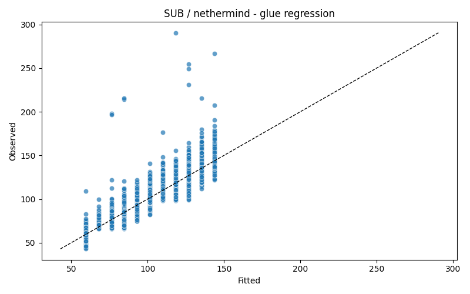

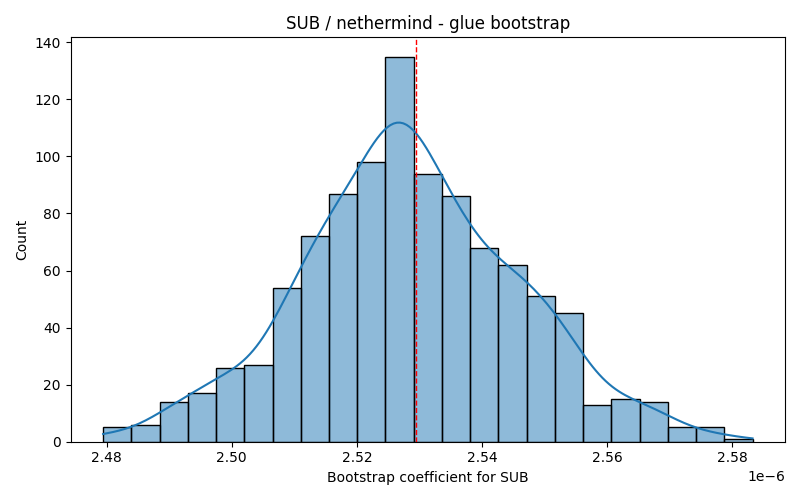

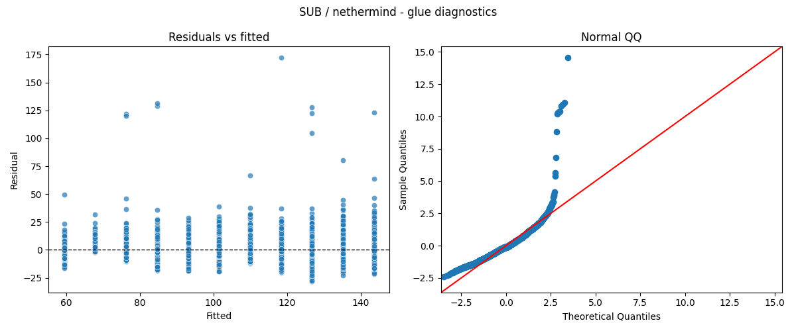

</details>

### Mixed glue (tier B) · nethermind

<details><summary><code>JUMP</code> · nobs=3927 · runtime_ms=5.665e-06 · p=1.00e-03 · R²=0.825</summary>

```
==============================================================================
                           NNLS Regression Results                            
==============================================================================
Dep. Variable:          test_runtime_ms              R-squared:          0.825
Model:                  NNLS                    Adj. R-squared:          0.825
No. Observations:       3927                              RMSE:           9.69
Df Residuals:           3925                               MAE:           7.02
Df Model:               1      
==============================================================================
                      coef     std err     P-value      [0.025      0.975]
------------------------------------------------------------------------------
         const     16.7107      0.5090       0.001     15.7321     17.7561
          JUMP      0.0000      0.0000       0.001      0.0000      0.0000
==============================================================================
Notes: Non-negative least squares with bootstrap inference (1000 iterations)
==============================================================================
```

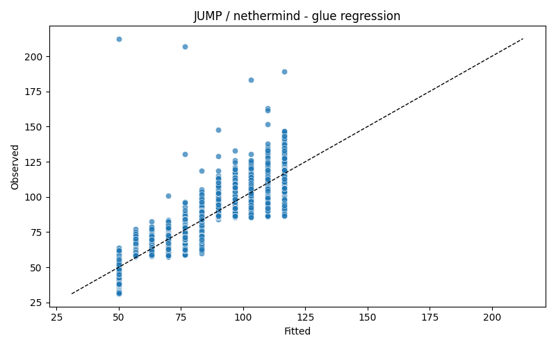

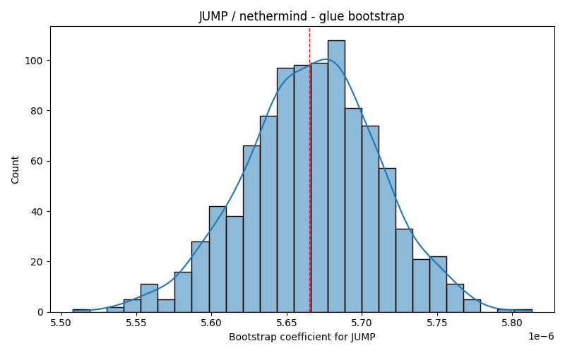

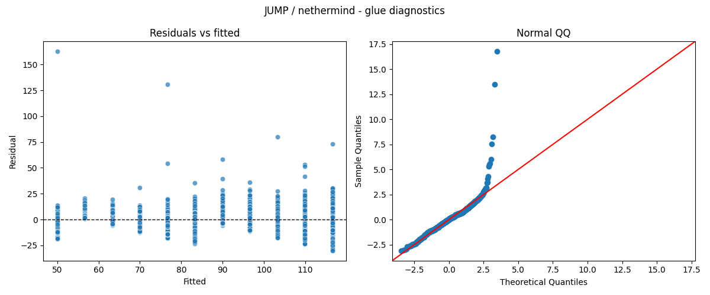

</details>

<details><summary><code>KECCAK256</code> · nobs=62832 · runtime_ms=0 · p=1.00e+00 · R²=0</summary>

```
==============================================================================
                           NNLS Regression Results                            
==============================================================================
Dep. Variable:          test_runtime_ms              R-squared:          0.000
Model:                  NNLS                    Adj. R-squared:         -0.000
No. Observations:       62832                             RMSE:         284.37
Df Residuals:           62830                              MAE:         231.54
Df Model:               1      
==============================================================================
                      coef     std err     P-value      [0.025      0.975]
------------------------------------------------------------------------------
         const    408.2655      1.1512       0.001    406.1537    410.5518
     KECCAK256      0.0000      0.0000       1.000      0.0000      0.0000
==============================================================================
Notes: Non-negative least squares with bootstrap inference (1000 iterations)
==============================================================================
```

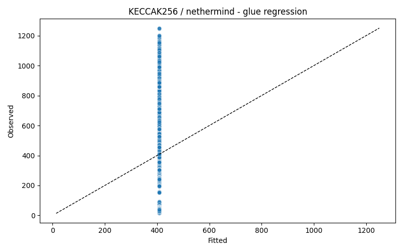


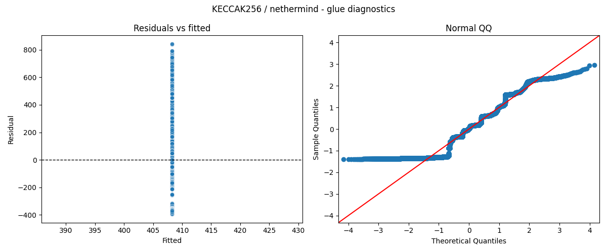

</details>

## reth

| glue_opcode | nobs | glue_runtime_ms | p_value | rsquared |
| --- | --- | --- | --- | --- |
| `ISZERO` | 935 | 1.313e-06 | 1.00e-03 | 0.8289 |
| `JUMPDEST` | 935 | 2.758e-07 | 1.00e-03 | 0.6846 |
| `SWAP` | 14960 | 4.85e-07 | 1.00e-03 | 0.5066 |
| `CALLDATASIZE` | 55704 | 4.491e-07 | 1.00e-03 | 0.3301 |
| `DUP` | 55704 | 3.893e-07 | 1.00e-03 | 0.3301 |
| `GAS` | 55704 | 4.276e-07 | 1.00e-03 | 0.3301 |
| `MLOAD` | 55704 | 1.266e-06 | 1.00e-03 | 0.3301 |
| `PUSH` | 55704 | 4.268e-07 | 1.00e-03 | 0.3301 |
| `PUSH0` | 55704 | 4.131e-07 | 1.00e-03 | 0.3301 |
| `STATICCALL` | 55704 | 5.466e-05 | 1.00e-03 | 0.3301 |
| `ADD` | 935 | 8.294e-07 | 1.00e-03 | 0.6217 |
| `AND` | 935 | 8.108e-07 | 1.00e-03 | 0.6936 |
| `CALLDATACOPY` | 22440 | 2.314e-06 | 1.00e-03 | 0.8084 |
| `CALLDATALOAD` | 3740 | 1.76e-05 | 1.00e-03 | 0.005023 |
| `DIV` | 935 | 6.925e-06 | 1.00e-03 | 0.8506 |
| `EXP` | 935 | 0.0005117 | 1.00e-03 | 0.8641 |
| `GT` | 935 | 9.392e-07 | 1.00e-03 | 0.7774 |
| `JUMPI` | 935 | 1.335e-06 | 1.00e-03 | 0.5114 |
| `LT` | 935 | 9.121e-07 | 1.00e-03 | 0.7447 |
| `MSTORE` | 4675 | 2.595e-06 | 1.00e-03 | 0.2894 |
| `MSTORE8` | 4675 | 1.343e-06 | 1.00e-03 | 0.6729 |
| `MUL` | 935 | 1.131e-06 | 1.00e-03 | 0.7089 |
| `PC` | 935 | 6.073e-07 | 1.00e-03 | 0.26 |
| `RETURNDATASIZE` | 3740 | 8.338e-07 | 1.00e-03 | 0.7425 |
| `SELFBALANCE` | 765 | 3.673e-06 | 1.00e-03 | 0.7719 |
| `SUB` | 935 | 8.637e-07 | 1.00e-03 | 0.7523 |
| `JUMP` | 935 | 2.205e-06 | 1.00e-03 | 0.7267 |
| `KECCAK256` | 14960 | 0 | 1.00e+00 | 0 |

### Cycle glue — joint fit · reth

<details><summary>Joint NNLS regression summary</summary>

```
==============================================================================
                           NNLS Regression Results                            
==============================================================================
Dep. Variable:          test_runtime_ms              R-squared:          0.330
Model:                  NNLS                    Adj. R-squared:          0.330
No. Observations:       55704                             RMSE:          19.60
Df Residuals:           55696                              MAE:           8.68
Df Model:               7      
==============================================================================
                      coef     std err     P-value      [0.025      0.975]
------------------------------------------------------------------------------
         const     18.8531      0.2711       0.001     18.3045     19.3634
  CALLDATASIZE      0.0000      0.0000       0.001      0.0000      0.0000
           DUP      0.0000      0.0000       0.001      0.0000      0.0000
           GAS      0.0000      0.0000       0.001      0.0000      0.0000
         MLOAD      0.0000      0.0000       0.001      0.0000      0.0000
          PUSH      0.0000      0.0000       0.001      0.0000      0.0000
         PUSH0      0.0000      0.0000       0.001      0.0000      0.0000
    STATICCALL      0.0001      0.0000       0.001      0.0001      0.0001
==============================================================================
Notes: Non-negative least squares with bootstrap inference (1000 iterations)
==============================================================================
```

</details>

<details><summary><code>CALLDATASIZE</code> · nobs=55704 · runtime_ms=4.491e-07 · p=1.00e-03 · R²=0.3301</summary>


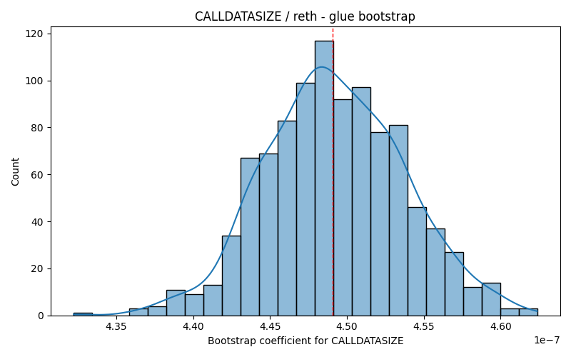


</details>

<details><summary><code>DUP</code> · nobs=55704 · runtime_ms=3.893e-07 · p=1.00e-03 · R²=0.3301</summary>

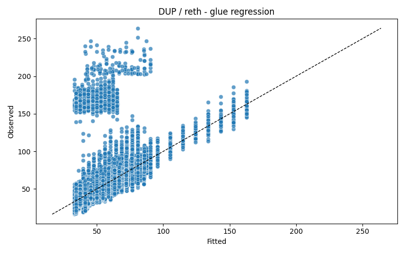

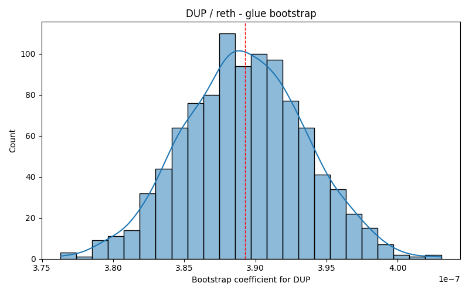

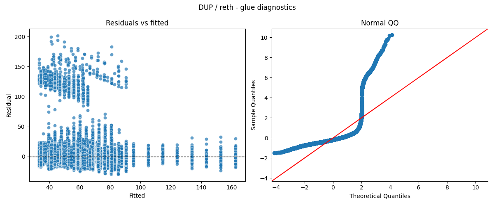

</details>

<details><summary><code>GAS</code> · nobs=55704 · runtime_ms=4.276e-07 · p=1.00e-03 · R²=0.3301</summary>


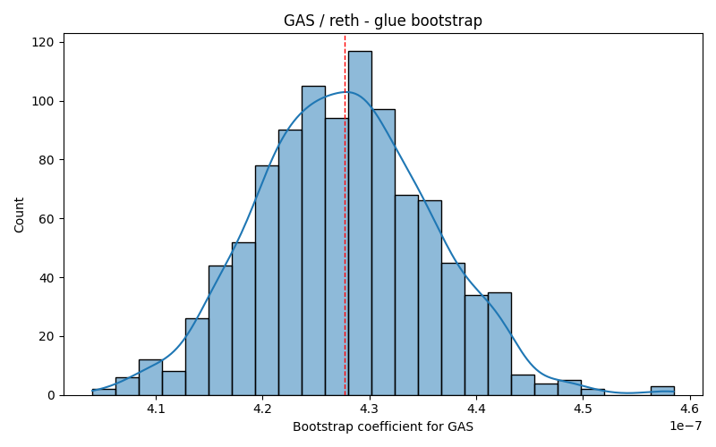


</details>

<details><summary><code>MLOAD</code> · nobs=55704 · runtime_ms=1.266e-06 · p=1.00e-03 · R²=0.3301</summary>


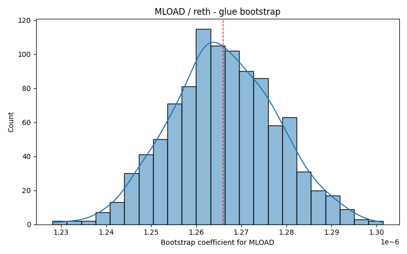


</details>

<details><summary><code>PUSH</code> · nobs=55704 · runtime_ms=4.268e-07 · p=1.00e-03 · R²=0.3301</summary>

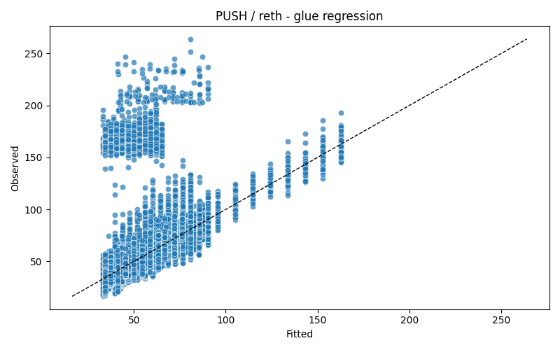

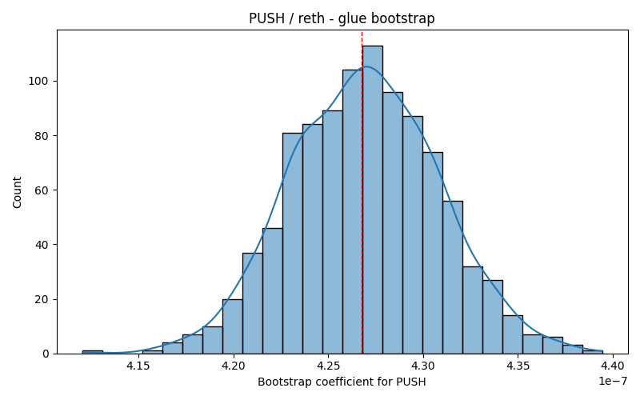


</details>

<details><summary><code>PUSH0</code> · nobs=55704 · runtime_ms=4.131e-07 · p=1.00e-03 · R²=0.3301</summary>


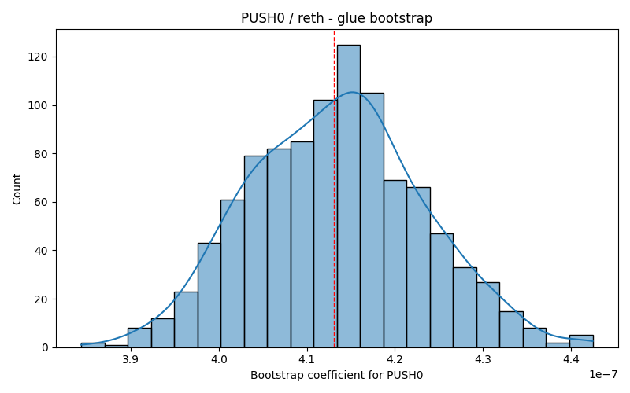


</details>

<details><summary><code>STATICCALL</code> · nobs=55704 · runtime_ms=5.466e-05 · p=1.00e-03 · R²=0.3301</summary>

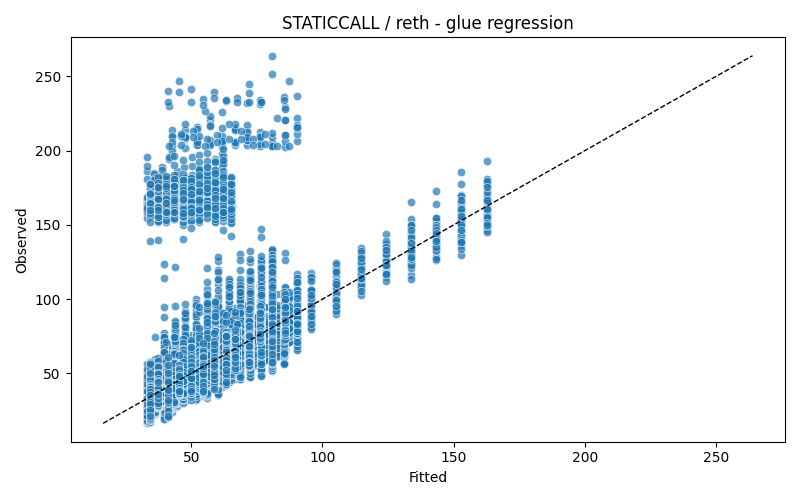

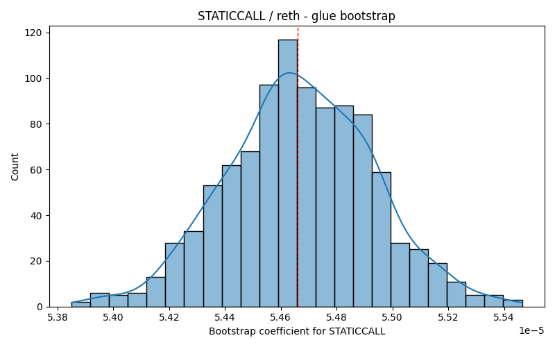


</details>

### Pure glue · reth

<details><summary><code>ISZERO</code> · nobs=935 · runtime_ms=1.313e-06 · p=1.00e-03 · R²=0.8289</summary>

```
==============================================================================
                           NNLS Regression Results                            
==============================================================================
Dep. Variable:          test_runtime_ms              R-squared:          0.829
Model:                  NNLS                    Adj. R-squared:          0.829
No. Observations:       935                               RMSE:          12.56
Df Residuals:           933                                MAE:           9.29
Df Model:               1      
==============================================================================
                      coef     std err     P-value      [0.025      0.975]
------------------------------------------------------------------------------
         const     35.4029      1.5276       0.001     32.6609     38.3645
        ISZERO      0.0000      0.0000       0.001      0.0000      0.0000
==============================================================================
Notes: Non-negative least squares with bootstrap inference (1000 iterations)
==============================================================================
```

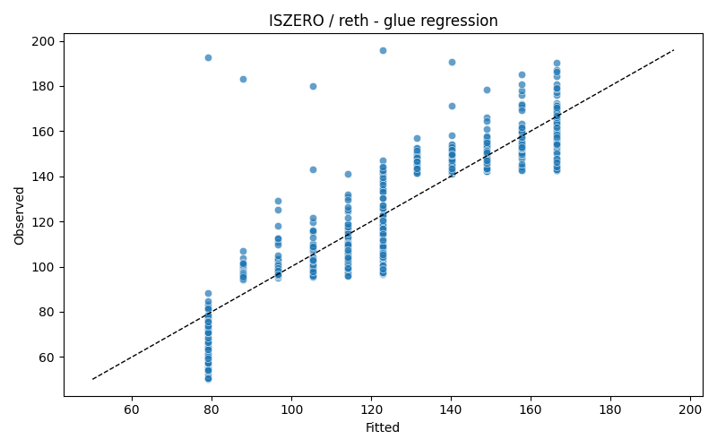

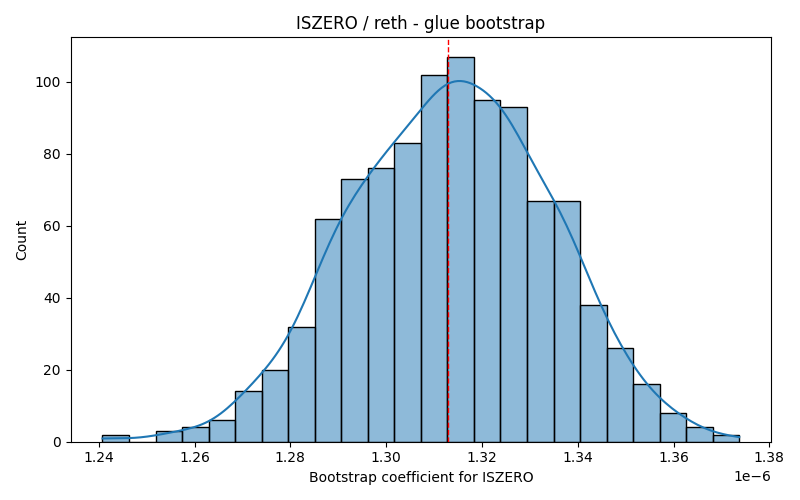

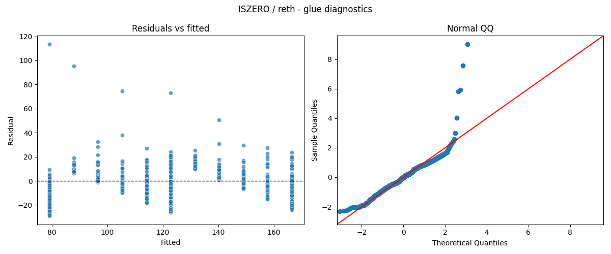

</details>

<details><summary><code>JUMPDEST</code> · nobs=935 · runtime_ms=2.758e-07 · p=1.00e-03 · R²=0.6846</summary>

```
==============================================================================
                           NNLS Regression Results                            
==============================================================================
Dep. Variable:          test_runtime_ms              R-squared:          0.685
Model:                  NNLS                    Adj. R-squared:          0.684
No. Observations:       935                               RMSE:          11.82
Df Residuals:           933                                MAE:           8.29
Df Model:               1      
==============================================================================
                      coef     std err     P-value      [0.025      0.975]
------------------------------------------------------------------------------
         const     21.0292      1.1488       0.001     18.7933     23.3319
      JUMPDEST      0.0000      0.0000       0.001      0.0000      0.0000
==============================================================================
Notes: Non-negative least squares with bootstrap inference (1000 iterations)
==============================================================================
```

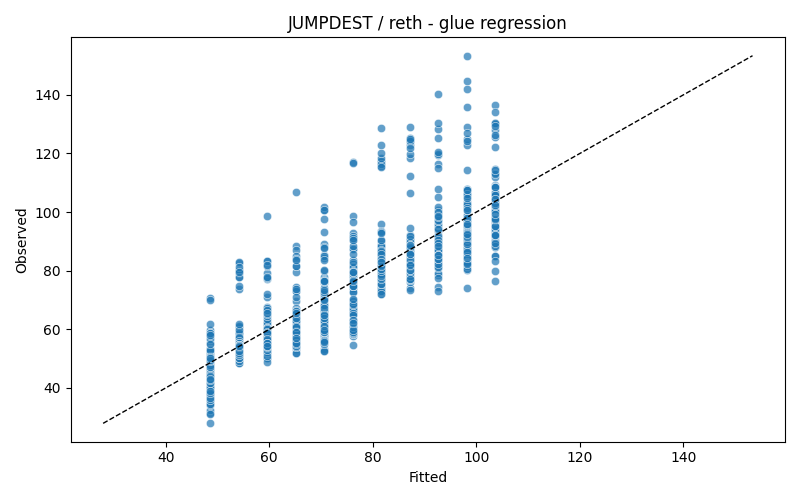

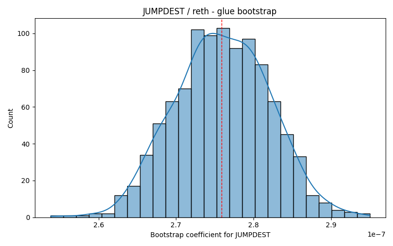

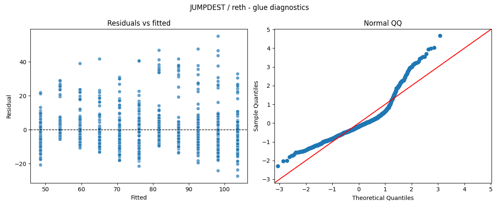

</details>

<details><summary><code>SWAP</code> · nobs=14960 · runtime_ms=4.85e-07 · p=1.00e-03 · R²=0.5066</summary>

```
==============================================================================
                           NNLS Regression Results                            
==============================================================================
Dep. Variable:          test_runtime_ms              R-squared:          0.507
Model:                  NNLS                    Adj. R-squared:          0.507
No. Observations:       14960                             RMSE:          10.08
Df Residuals:           14958                              MAE:           4.66
Df Model:               1      
==============================================================================
                      coef     std err     P-value      [0.025      0.975]
------------------------------------------------------------------------------
         const     14.9911      0.2673       0.001     14.4748     15.5062
          SWAP      0.0000      0.0000       0.001      0.0000      0.0000
==============================================================================
Notes: Non-negative least squares with bootstrap inference (1000 iterations)
==============================================================================
```

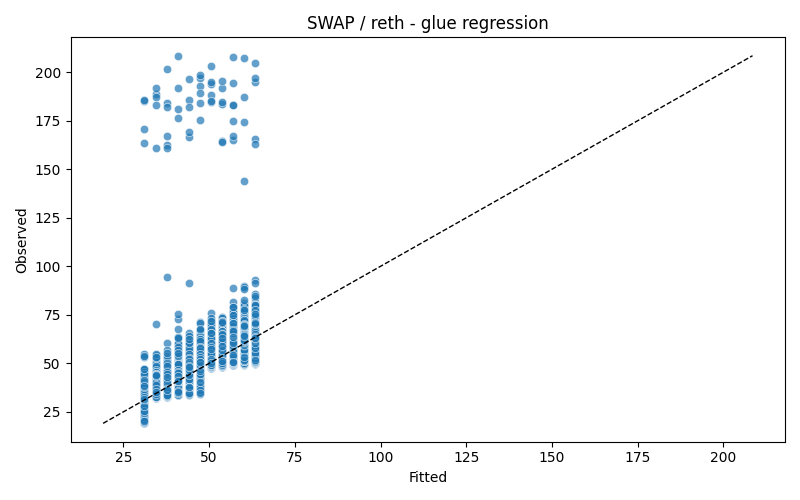

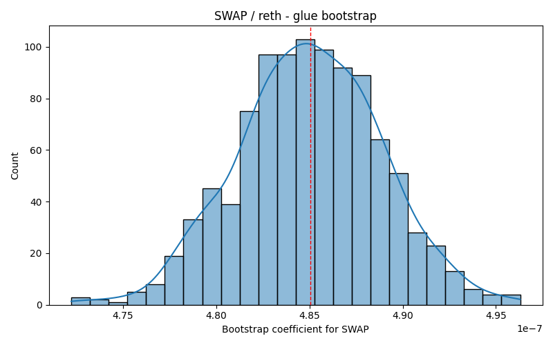

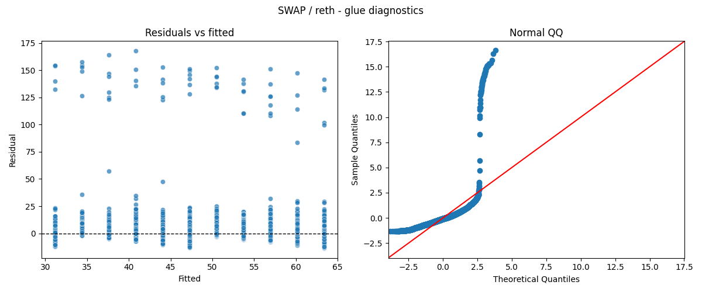

</details>

### Mixed glue (tier A) · reth

<details><summary><code>ADD</code> · nobs=935 · runtime_ms=8.294e-07 · p=1.00e-03 · R²=0.6217</summary>

```
==============================================================================
                           NNLS Regression Results                            
==============================================================================
Dep. Variable:          test_runtime_ms              R-squared:          0.622
Model:                  NNLS                    Adj. R-squared:          0.621
No. Observations:       935                               RMSE:           6.81
Df Residuals:           933                                MAE:           4.47
Df Model:               1      
==============================================================================
                      coef     std err     P-value      [0.025      0.975]
------------------------------------------------------------------------------
         const     13.7856      0.7288       0.001     12.3289     15.2472
           ADD      0.0000      0.0000       0.001      0.0000      0.0000
==============================================================================
Notes: Non-negative least squares with bootstrap inference (1000 iterations)
==============================================================================
```

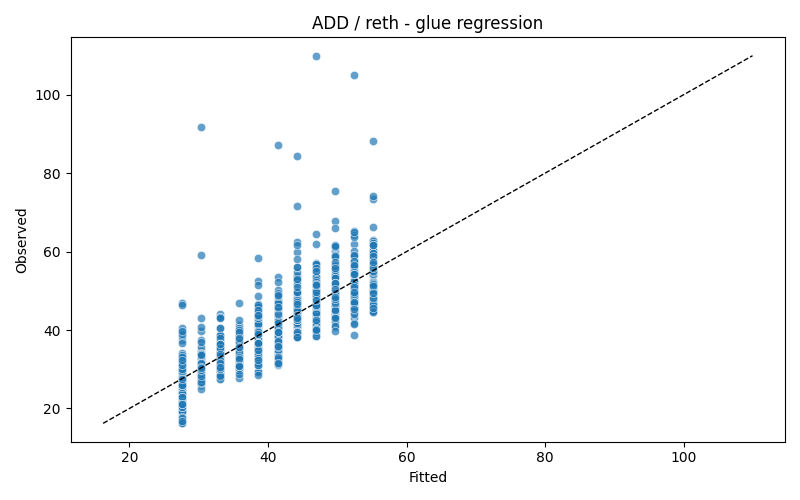

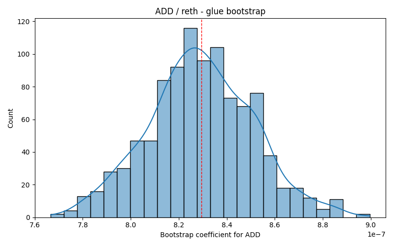

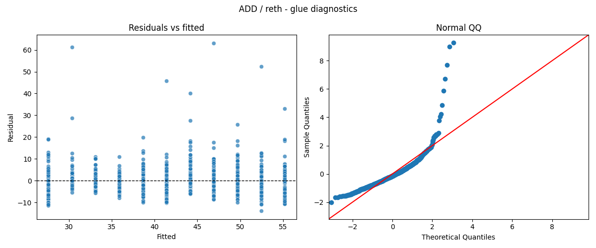

</details>

<details><summary><code>AND</code> · nobs=935 · runtime_ms=8.108e-07 · p=1.00e-03 · R²=0.6936</summary>

```
==============================================================================
                           NNLS Regression Results                            
==============================================================================
Dep. Variable:          test_runtime_ms              R-squared:          0.694
Model:                  NNLS                    Adj. R-squared:          0.693
No. Observations:       935                               RMSE:           5.67
Df Residuals:           933                                MAE:           4.21
Df Model:               1      
==============================================================================
                      coef     std err     P-value      [0.025      0.975]
------------------------------------------------------------------------------
         const     13.0959      0.5649       0.001     12.0209     14.2703
           AND      0.0000      0.0000       0.001      0.0000      0.0000
==============================================================================
Notes: Non-negative least squares with bootstrap inference (1000 iterations)
==============================================================================
```


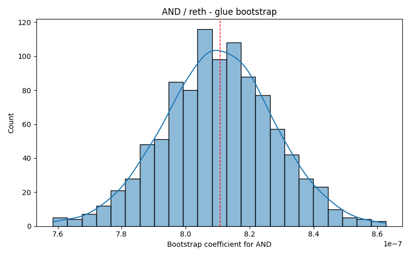

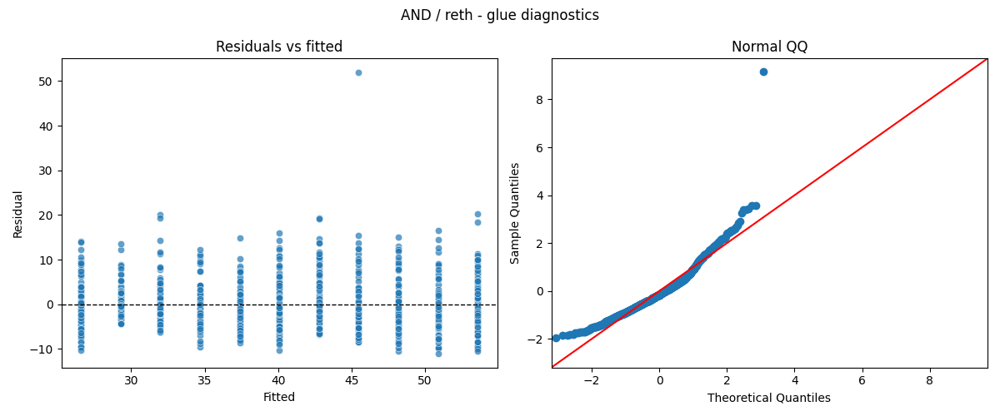

</details>

<details><summary><code>CALLDATACOPY</code> · nobs=22440 · runtime_ms=2.314e-06 · p=1.00e-03 · R²=0.8084</summary>

```
==============================================================================
                           NNLS Regression Results                            
==============================================================================
Dep. Variable:          test_runtime_ms              R-squared:          0.808
Model:                  NNLS                    Adj. R-squared:          0.808
No. Observations:       22440                             RMSE:           8.47
Df Residuals:           22438                              MAE:           6.57
Df Model:               1      
==============================================================================
                      coef     std err     P-value      [0.025      0.975]
------------------------------------------------------------------------------
         const     14.9236      0.0720       0.001     14.7751     15.0599
  CALLDATACOPY      0.0000      0.0000       0.001      0.0000      0.0000
==============================================================================
Notes: Non-negative least squares with bootstrap inference (1000 iterations)
==============================================================================
```

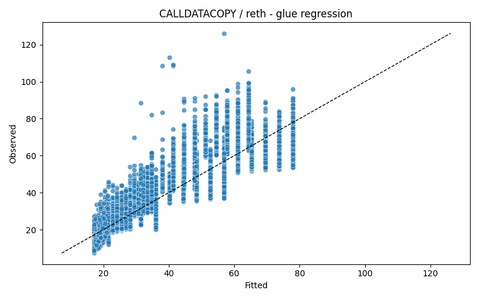

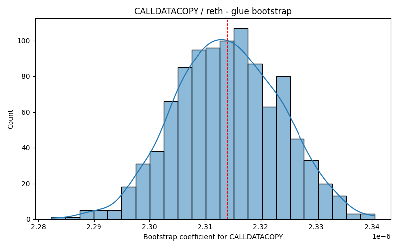

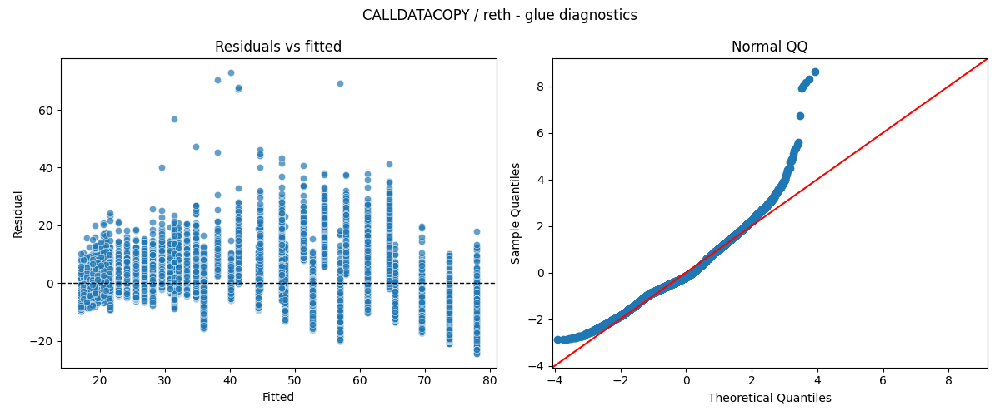

</details>

<details><summary><code>CALLDATALOAD</code> · nobs=3740 · runtime_ms=1.76e-05 · p=1.00e-03 · R²=0.005023</summary>

```
==============================================================================
                           NNLS Regression Results                            
==============================================================================
Dep. Variable:          test_runtime_ms              R-squared:          0.005
Model:                  NNLS                    Adj. R-squared:          0.005
No. Observations:       3740                              RMSE:           0.95
Df Residuals:           3738                               MAE:           0.77
Df Model:               1      
==============================================================================
                      coef     std err     P-value      [0.025      0.975]
------------------------------------------------------------------------------
         const      3.9953      0.0537       0.001      3.8869      4.0980
  CALLDATALOAD      0.0000      0.0000       0.001      0.0000      0.0000
==============================================================================
Notes: Non-negative least squares with bootstrap inference (1000 iterations)
==============================================================================
```

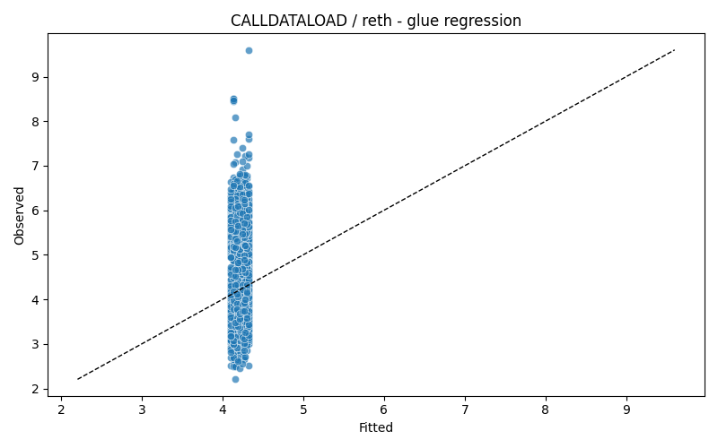

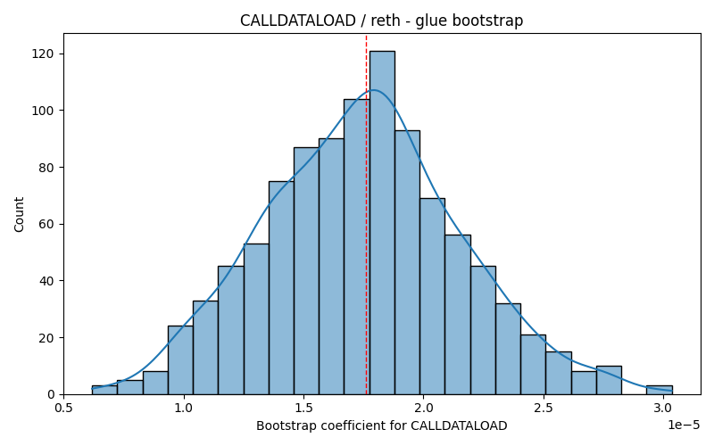

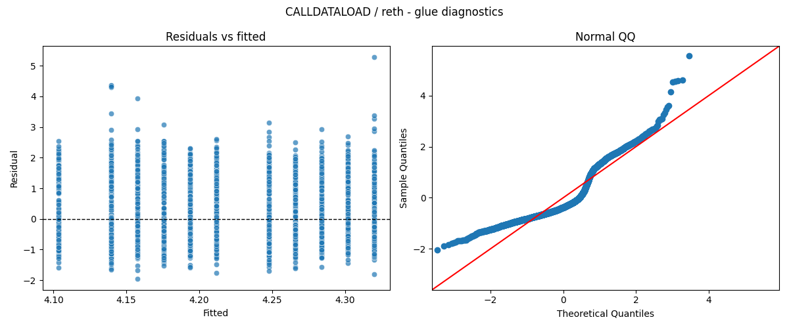

</details>

<details><summary><code>DIV</code> · nobs=935 · runtime_ms=6.925e-06 · p=1.00e-03 · R²=0.8506</summary>

```
==============================================================================
                           NNLS Regression Results                            
==============================================================================
Dep. Variable:          test_runtime_ms              R-squared:          0.851
Model:                  NNLS                    Adj. R-squared:          0.850
No. Observations:       935                               RMSE:          22.91
Df Residuals:           933                                MAE:          19.27
Df Model:               1      
==============================================================================
                      coef     std err     P-value      [0.025      0.975]
------------------------------------------------------------------------------
         const     62.2887      2.8588       0.001     56.7988     67.9357
           DIV      0.0000      0.0000       0.001      0.0000      0.0000
==============================================================================
Notes: Non-negative least squares with bootstrap inference (1000 iterations)
==============================================================================
```

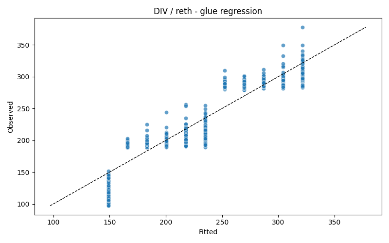


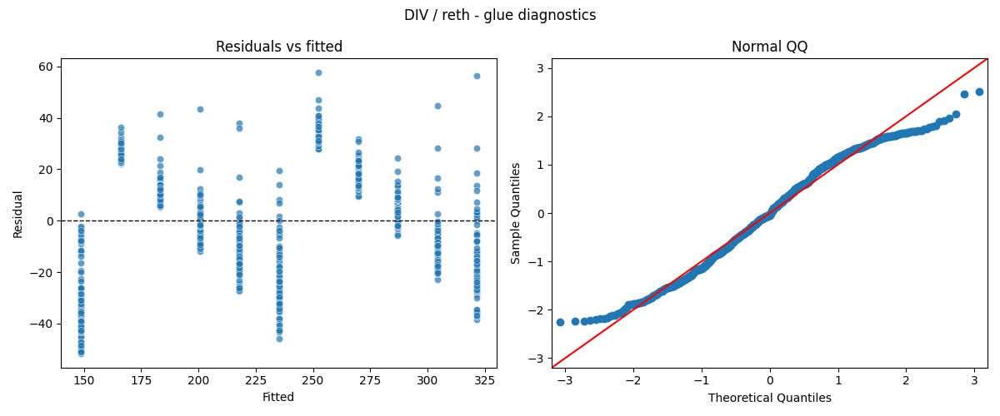

</details>

<details><summary><code>EXP</code> · nobs=935 · runtime_ms=0.0005117 · p=1.00e-03 · R²=0.8641</summary>

```
==============================================================================
                           NNLS Regression Results                            
==============================================================================
Dep. Variable:          test_runtime_ms              R-squared:          0.864
Model:                  NNLS                    Adj. R-squared:          0.864
No. Observations:       935                               RMSE:           7.95
Df Residuals:           933                                MAE:           6.38
Df Model:               1      
==============================================================================
                      coef     std err     P-value      [0.025      0.975]
------------------------------------------------------------------------------
         const     23.3658      0.9125       0.001     21.5754     25.1155
           EXP      0.0005      0.0000       0.001      0.0005      0.0005
==============================================================================
Notes: Non-negative least squares with bootstrap inference (1000 iterations)
==============================================================================
```

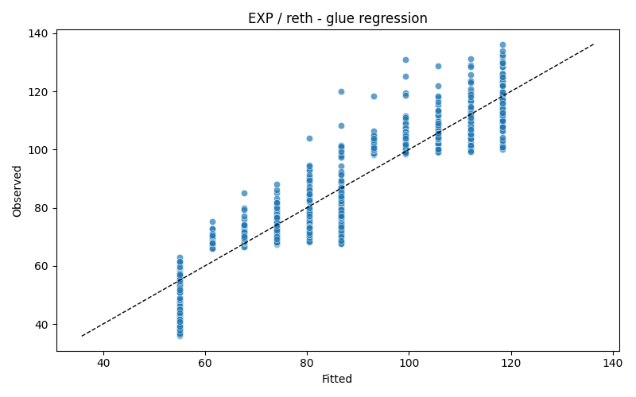

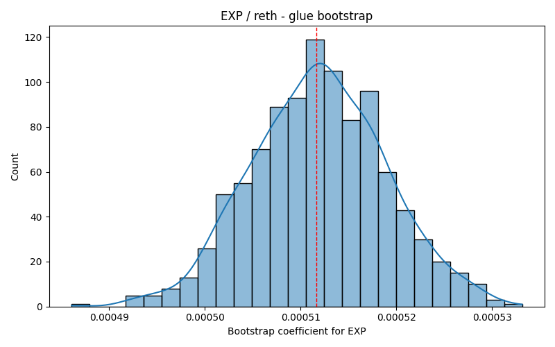

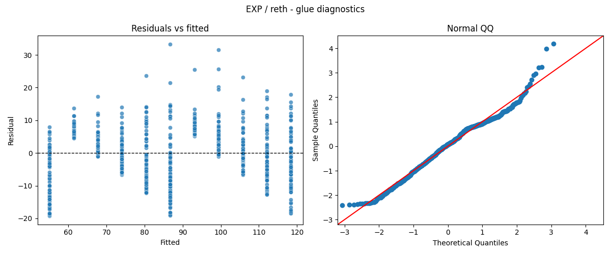

</details>

<details><summary><code>GT</code> · nobs=935 · runtime_ms=9.392e-07 · p=1.00e-03 · R²=0.7774</summary>

```
==============================================================================
                           NNLS Regression Results                            
==============================================================================
Dep. Variable:          test_runtime_ms              R-squared:          0.777
Model:                  NNLS                    Adj. R-squared:          0.777
No. Observations:       935                               RMSE:           5.29
Df Residuals:           933                                MAE:           4.14
Df Model:               1      
==============================================================================
                      coef     std err     P-value      [0.025      0.975]
------------------------------------------------------------------------------
         const     13.3091      0.5458       0.001     12.2412     14.3285
            GT      0.0000      0.0000       0.001      0.0000      0.0000
==============================================================================
Notes: Non-negative least squares with bootstrap inference (1000 iterations)
==============================================================================
```

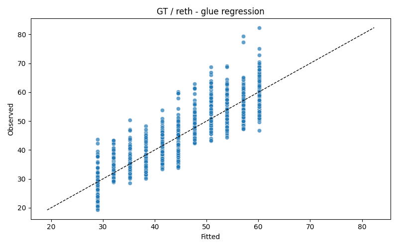

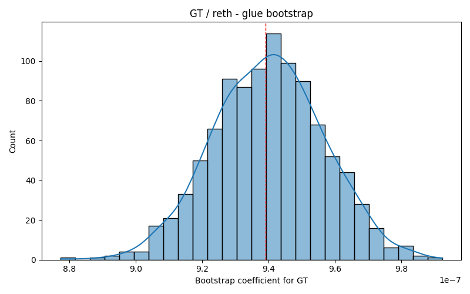

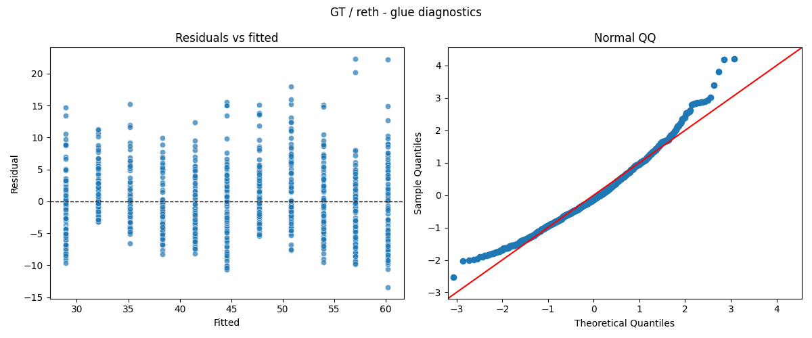

</details>

<details><summary><code>JUMPI</code> · nobs=935 · runtime_ms=1.335e-06 · p=1.00e-03 · R²=0.5114</summary>

```
==============================================================================
                           NNLS Regression Results                            
==============================================================================
Dep. Variable:          test_runtime_ms              R-squared:          0.511
Model:                  NNLS                    Adj. R-squared:          0.511
No. Observations:       935                               RMSE:           5.89
Df Residuals:           933                                MAE:           3.67
Df Model:               1      
==============================================================================
                      coef     std err     P-value      [0.025      0.975]
------------------------------------------------------------------------------
         const      9.9774      0.6791       0.001      8.7125     11.4252
         JUMPI      0.0000      0.0000       0.001      0.0000      0.0000
==============================================================================
Notes: Non-negative least squares with bootstrap inference (1000 iterations)
==============================================================================
```

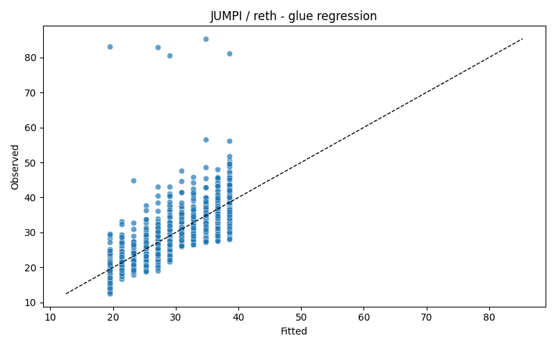

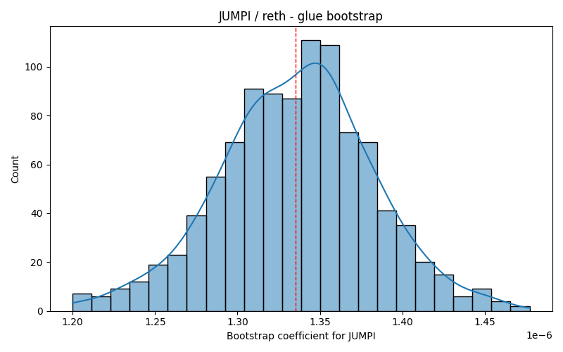

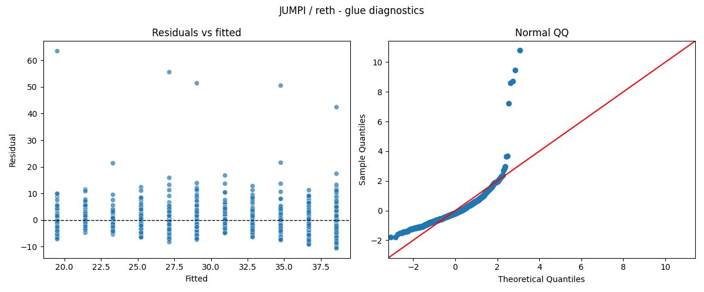

</details>

<details><summary><code>LT</code> · nobs=935 · runtime_ms=9.121e-07 · p=1.00e-03 · R²=0.7447</summary>

```
==============================================================================
                           NNLS Regression Results                            
==============================================================================
Dep. Variable:          test_runtime_ms              R-squared:          0.745
Model:                  NNLS                    Adj. R-squared:          0.744
No. Observations:       935                               RMSE:           5.62
Df Residuals:           933                                MAE:           4.16
Df Model:               1      
==============================================================================
                      coef     std err     P-value      [0.025      0.975]
------------------------------------------------------------------------------
         const     12.7176      0.5879       0.001     11.5271     13.8423
            LT      0.0000      0.0000       0.001      0.0000      0.0000
==============================================================================
Notes: Non-negative least squares with bootstrap inference (1000 iterations)
==============================================================================
```

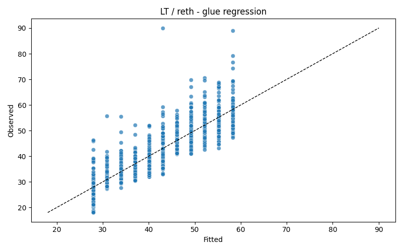

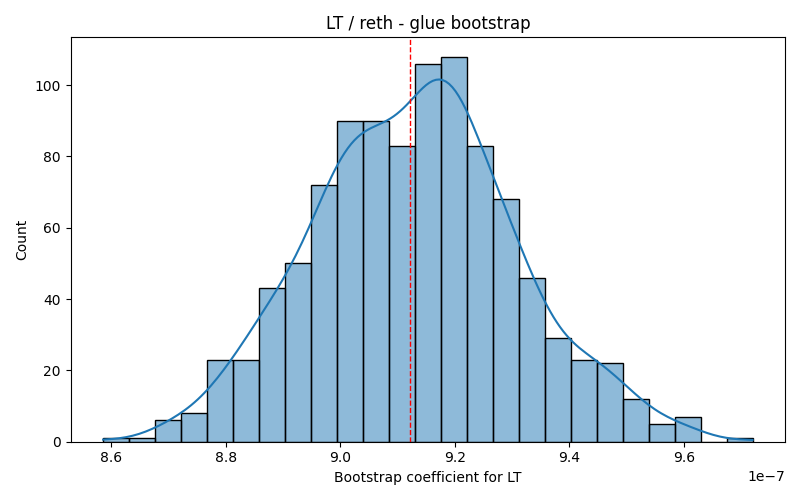

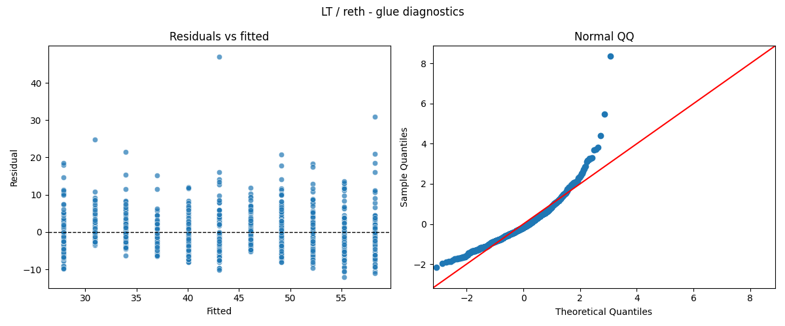

</details>

<details><summary><code>MSTORE</code> · nobs=4675 · runtime_ms=2.595e-06 · p=1.00e-03 · R²=0.2894</summary>

```
==============================================================================
                           NNLS Regression Results                            
==============================================================================
Dep. Variable:          test_runtime_ms              R-squared:          0.289
Model:                  NNLS                    Adj. R-squared:          0.289
No. Observations:       4675                              RMSE:          28.53
Df Residuals:           4673                               MAE:          25.55
Df Model:               1      
==============================================================================
                      coef     std err     P-value      [0.025      0.975]
------------------------------------------------------------------------------
         const     21.3676      1.2534       0.001     18.8264     23.7583
        MSTORE      0.0000      0.0000       0.001      0.0000      0.0000
==============================================================================
Notes: Non-negative least squares with bootstrap inference (1000 iterations)
==============================================================================
```

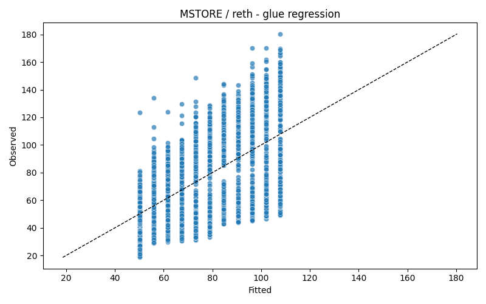

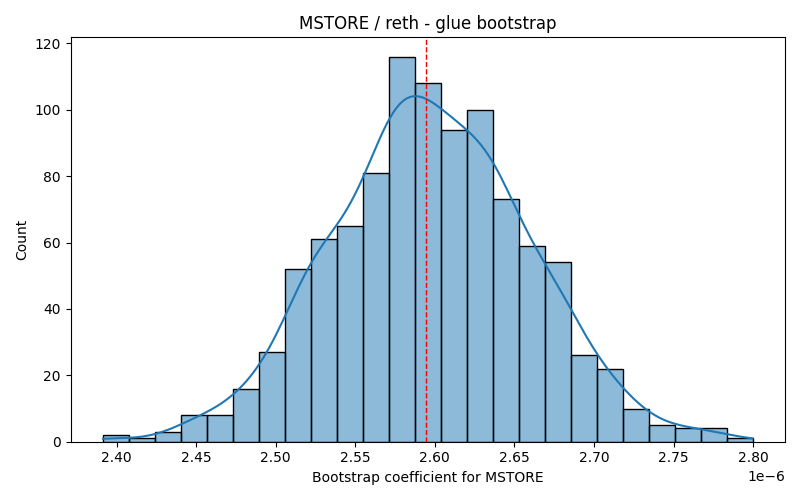

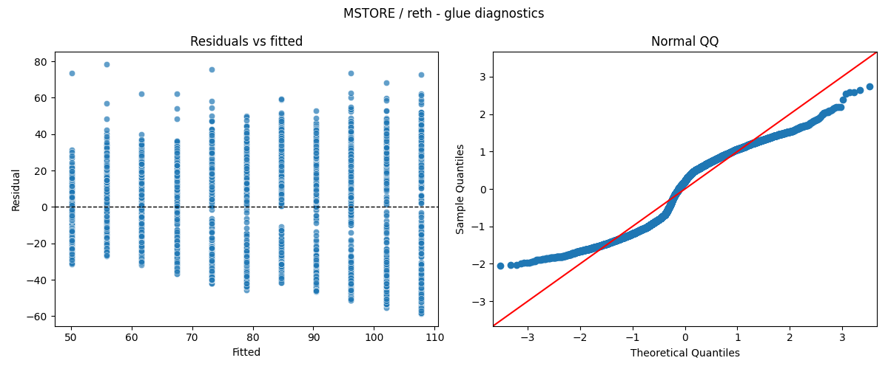

</details>

<details><summary><code>MSTORE8</code> · nobs=4675 · runtime_ms=1.343e-06 · p=1.00e-03 · R²=0.6729</summary>

```
==============================================================================
                           NNLS Regression Results                            
==============================================================================
Dep. Variable:          test_runtime_ms              R-squared:          0.673
Model:                  NNLS                    Adj. R-squared:          0.673
No. Observations:       4675                              RMSE:           6.57
Df Residuals:           4673                               MAE:           4.39
Df Model:               1      
==============================================================================
                      coef     std err     P-value      [0.025      0.975]
------------------------------------------------------------------------------
         const     13.9456      0.3030       0.001     13.3501     14.5306
       MSTORE8      0.0000      0.0000       0.001      0.0000      0.0000
==============================================================================
Notes: Non-negative least squares with bootstrap inference (1000 iterations)
==============================================================================
```

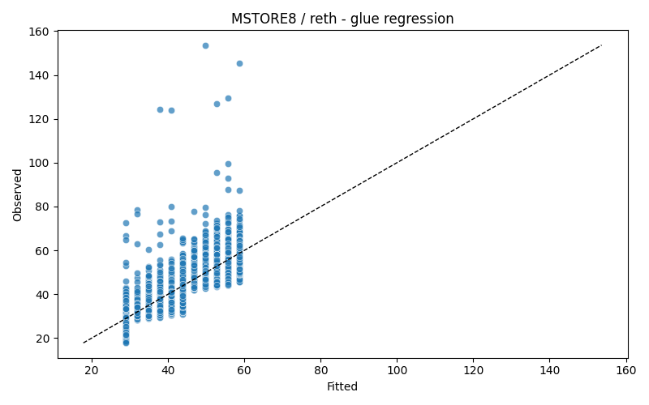

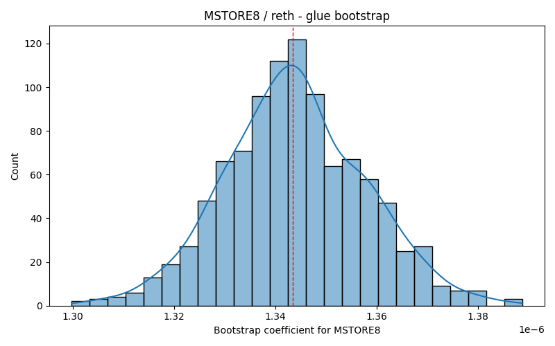

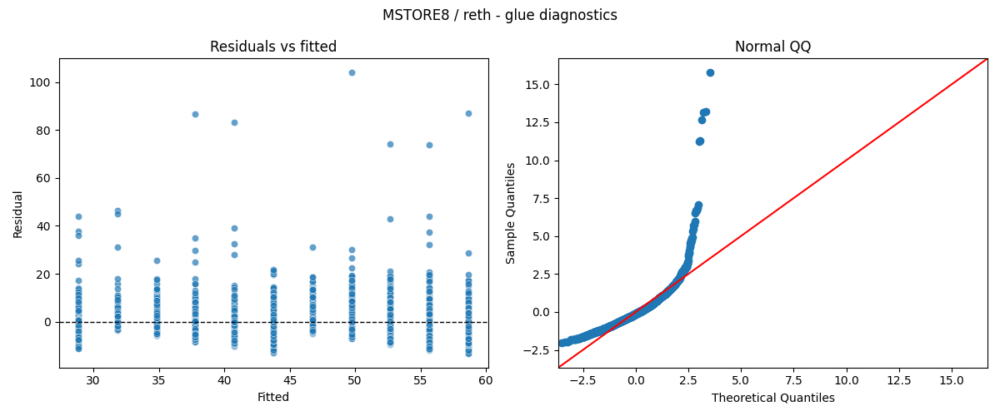

</details>

<details><summary><code>MUL</code> · nobs=935 · runtime_ms=1.131e-06 · p=1.00e-03 · R²=0.7089</summary>

```
==============================================================================
                           NNLS Regression Results                            
==============================================================================
Dep. Variable:          test_runtime_ms              R-squared:          0.709
Model:                  NNLS                    Adj. R-squared:          0.709
No. Observations:       935                               RMSE:           5.72
Df Residuals:           933                                MAE:           4.03
Df Model:               1      
==============================================================================
                      coef     std err     P-value      [0.025      0.975]
------------------------------------------------------------------------------
         const     13.3331      0.6338       0.001     12.1051     14.5830
           MUL      0.0000      0.0000       0.001      0.0000      0.0000
==============================================================================
Notes: Non-negative least squares with bootstrap inference (1000 iterations)
==============================================================================
```

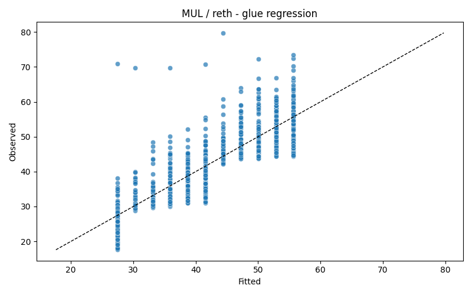

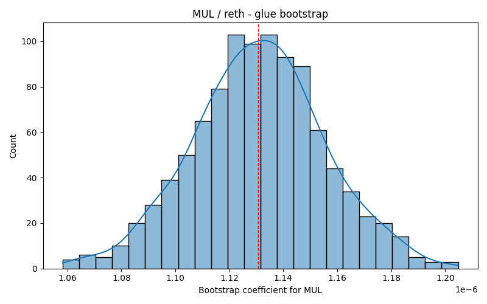

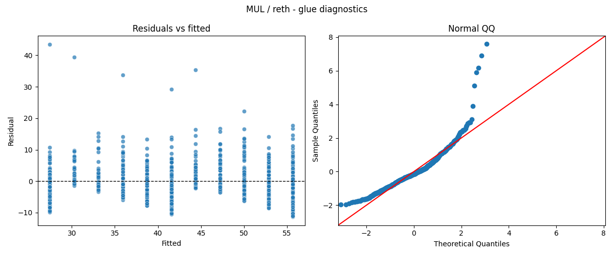

</details>

<details><summary><code>PC</code> · nobs=935 · runtime_ms=6.073e-07 · p=1.00e-03 · R²=0.26</summary>

```
==============================================================================
                           NNLS Regression Results                            
==============================================================================
Dep. Variable:          test_runtime_ms              R-squared:          0.260
Model:                  NNLS                    Adj. R-squared:          0.259
No. Observations:       935                               RMSE:          30.63
Df Residuals:           933                                MAE:          11.30
Df Model:               1      
==============================================================================
                      coef     std err     P-value      [0.025      0.975]
------------------------------------------------------------------------------
         const     21.8742      3.5298       0.001     15.0200     29.3763
            PC      0.0000      0.0000       0.001      0.0000      0.0000
==============================================================================
Notes: Non-negative least squares with bootstrap inference (1000 iterations)
==============================================================================
```

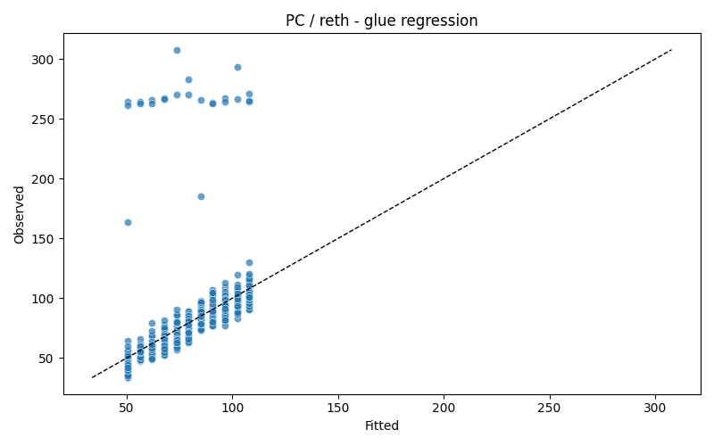

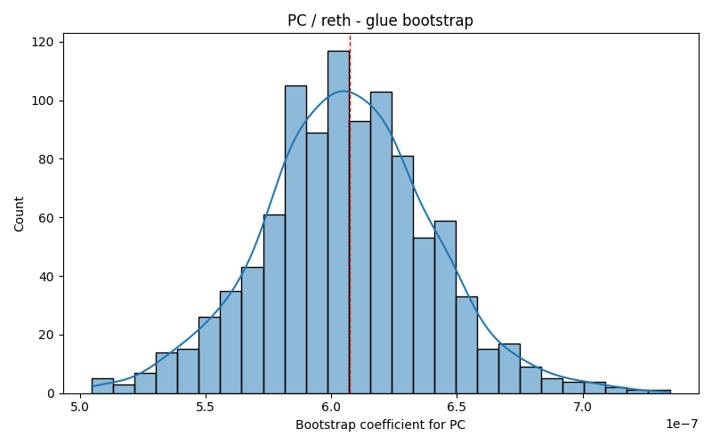

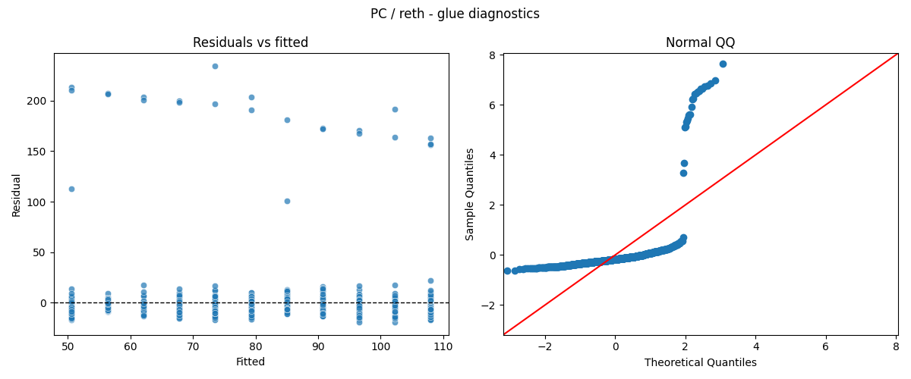

</details>

<details><summary><code>RETURNDATASIZE</code> · nobs=3740 · runtime_ms=8.338e-07 · p=1.00e-03 · R²=0.7425</summary>

```
==============================================================================
                           NNLS Regression Results                            
==============================================================================
Dep. Variable:          test_runtime_ms              R-squared:          0.742
Model:                  NNLS                    Adj. R-squared:          0.742
No. Observations:       3740                              RMSE:           7.75
Df Residuals:           3738                               MAE:           5.28
Df Model:               1      
==============================================================================
                      coef     std err     P-value      [0.025      0.975]
------------------------------------------------------------------------------
         const     16.3917      0.3846       0.001     15.6028     17.1061
RETURNDATASIZE      0.0000      0.0000       0.001      0.0000      0.0000
==============================================================================
Notes: Non-negative least squares with bootstrap inference (1000 iterations)
==============================================================================
```

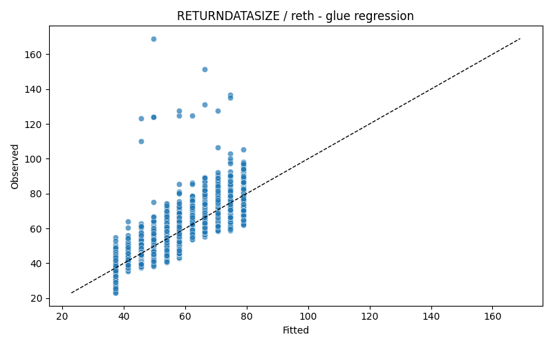

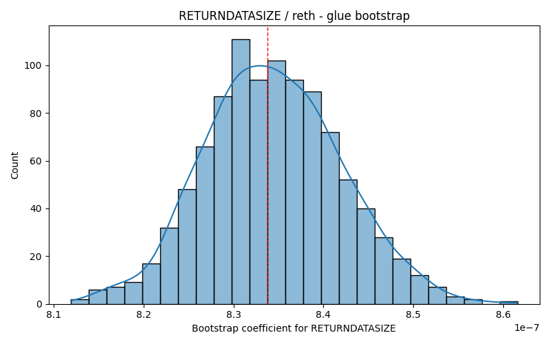

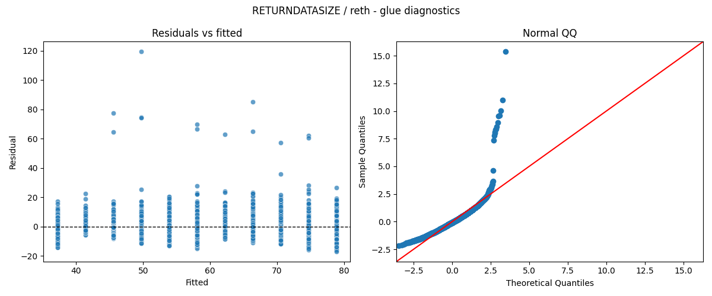

</details>

<details><summary><code>SELFBALANCE</code> · nobs=765 · runtime_ms=3.673e-06 · p=1.00e-03 · R²=0.7719</summary>

```
==============================================================================
                           NNLS Regression Results                            
==============================================================================
Dep. Variable:          test_runtime_ms              R-squared:          0.772
Model:                  NNLS                    Adj. R-squared:          0.772
No. Observations:       765                               RMSE:          20.14
Df Residuals:           763                                MAE:          15.71
Df Model:               1      
==============================================================================
                      coef     std err     P-value      [0.025      0.975]
------------------------------------------------------------------------------
         const     67.5923      2.9892       0.001     61.5794     73.3682
   SELFBALANCE      0.0000      0.0000       0.001      0.0000      0.0000
==============================================================================
Notes: Non-negative least squares with bootstrap inference (1000 iterations)
==============================================================================
```

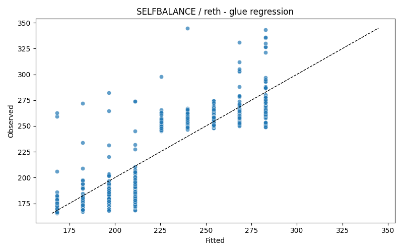

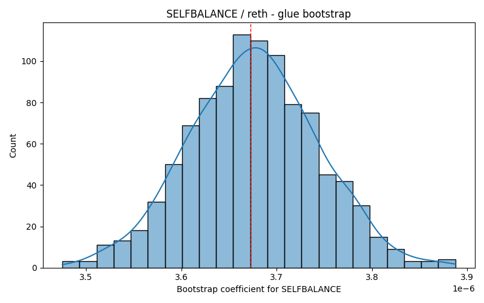

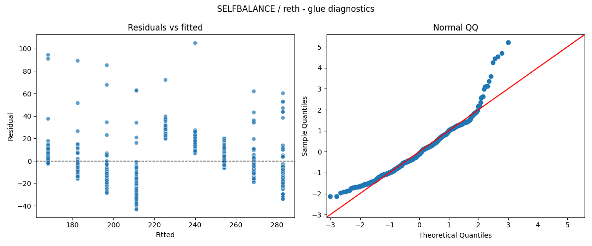

</details>

<details><summary><code>SUB</code> · nobs=935 · runtime_ms=8.637e-07 · p=1.00e-03 · R²=0.7523</summary>

```
==============================================================================
                           NNLS Regression Results                            
==============================================================================
Dep. Variable:          test_runtime_ms              R-squared:          0.752
Model:                  NNLS                    Adj. R-squared:          0.752
No. Observations:       935                               RMSE:           5.22
Df Residuals:           933                                MAE:           4.05
Df Model:               1      
==============================================================================
                      coef     std err     P-value      [0.025      0.975]
------------------------------------------------------------------------------
         const     12.7603      0.5381       0.001     11.7501     13.8774
           SUB      0.0000      0.0000       0.001      0.0000      0.0000
==============================================================================
Notes: Non-negative least squares with bootstrap inference (1000 iterations)
==============================================================================
```

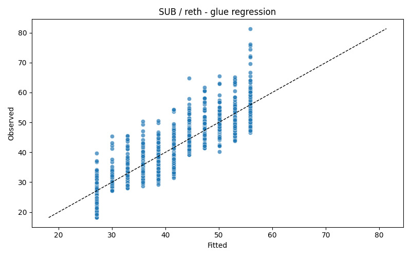

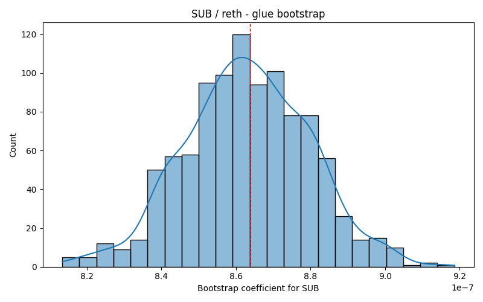

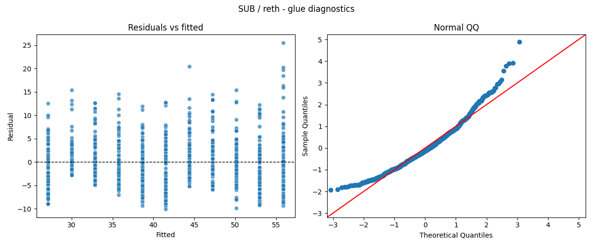

</details>

### Mixed glue (tier B) · reth

<details><summary><code>JUMP</code> · nobs=935 · runtime_ms=2.205e-06 · p=1.00e-03 · R²=0.7267</summary>

```
==============================================================================
                           NNLS Regression Results                            
==============================================================================
Dep. Variable:          test_runtime_ms              R-squared:          0.727
Model:                  NNLS                    Adj. R-squared:          0.726
No. Observations:       935                               RMSE:           5.02
Df Residuals:           933                                MAE:           3.87
Df Model:               1      
==============================================================================
                      coef     std err     P-value      [0.025      0.975]
------------------------------------------------------------------------------
         const     12.3187      0.5227       0.001     11.3561     13.3640
          JUMP      0.0000      0.0000       0.001      0.0000      0.0000
==============================================================================
Notes: Non-negative least squares with bootstrap inference (1000 iterations)
==============================================================================
```

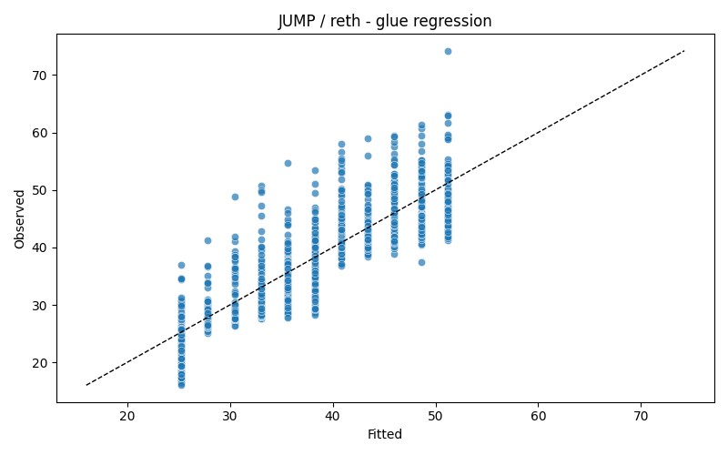

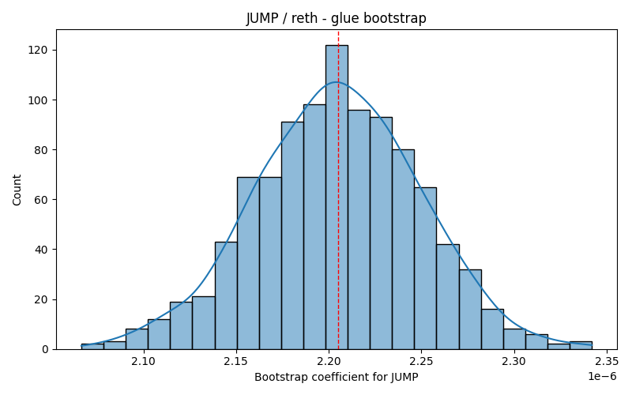

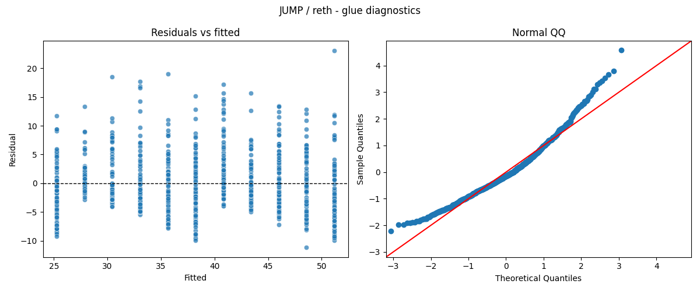

</details>

<details><summary><code>KECCAK256</code> · nobs=14960 · runtime_ms=0 · p=1.00e+00 · R²=0</summary>

```
==============================================================================
                           NNLS Regression Results                            
==============================================================================
Dep. Variable:          test_runtime_ms              R-squared:          0.000
Model:                  NNLS                    Adj. R-squared:         -0.000
No. Observations:       14960                             RMSE:         157.94
Df Residuals:           14958                              MAE:         133.24
Df Model:               1      
==============================================================================
                      coef     std err     P-value      [0.025      0.975]
------------------------------------------------------------------------------
         const    252.0597      1.2964       0.001    249.4883    254.6159
     KECCAK256      0.0000      0.0000       1.000      0.0000      0.0000
==============================================================================
Notes: Non-negative least squares with bootstrap inference (1000 iterations)
==============================================================================
```

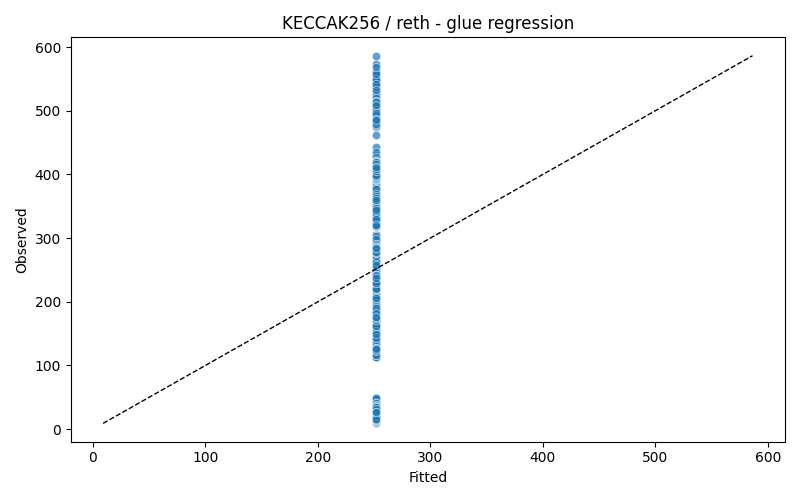


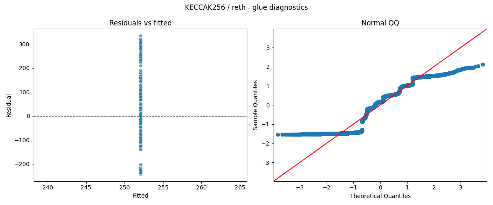

</details>
