# Runtime estimation report

Per-spec NNLS fits of `test_runtime_ms` against `opcount`, one row per (target opcode, test, model_by combo, client).

## Contents

- [SLOAD](#sload)
- [SSTORE](#sstore)
- [BALANCE](#balance)
- [CALL](#call)
- [CALLCODE](#callcode)
- [DELEGATECALL](#delegatecall)
- [EXTCODECOPY](#extcodecopy)
- [EXTCODEHASH](#extcodehash)
- [EXTCODESIZE](#extcodesize)
- [STATICCALL](#staticcall)

## SLOAD

### test_sload_bloated — combo `False`

| client | nobs | R² | target_coef (ms) | p-value | 95% CI |
| --- | --- | --- | --- | --- | --- |
| `besu` | 462 | 0.9222 | 0.007826 | 1.00e-03 | [0.007625, 0.008052] |
| `erigon` | 154 | 0.9775 | 0.006547 | 1.00e-03 | [0.006379, 0.006651] |
| `ethrex` | 440 | 0.8978 | 0.00981 | 1.00e-03 | [0.009681, 0.009939] |
| `geth` | 440 | 0.9679 | 0.0243 | 1.00e-03 | [0.02385, 0.02474] |
| `nethermind` | 363 | 0.8738 | 0.003355 | 1.00e-03 | [0.003217, 0.003493] |
| `reth` | 539 | 0.9484 | 0.001249 | 1.00e-03 | [0.001221, 0.001274] |

<details><summary>besu — NNLS regression summary</summary>

```
==============================================================================
                           NNLS Regression Results                            
==============================================================================
Dep. Variable:          test_runtime_ms              R-squared:          0.922
Model:                  NNLS                    Adj. R-squared:          0.922
No. Observations:       462                               RMSE:          66.89
Df Residuals:           460                                MAE:          53.81
Df Model:               1      
==============================================================================
                      coef     std err     P-value      [0.025      0.975]
------------------------------------------------------------------------------
         const    113.9338      9.7426       0.001     94.1738    131.9629
       opcount      0.0078      0.0001       0.001      0.0076      0.0081
==============================================================================
Notes: Non-negative least squares with bootstrap inference (1000 iterations)
==============================================================================
```

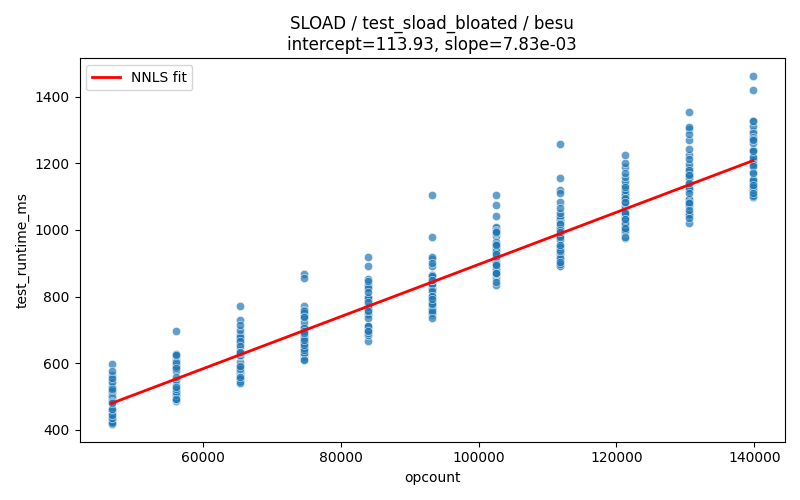

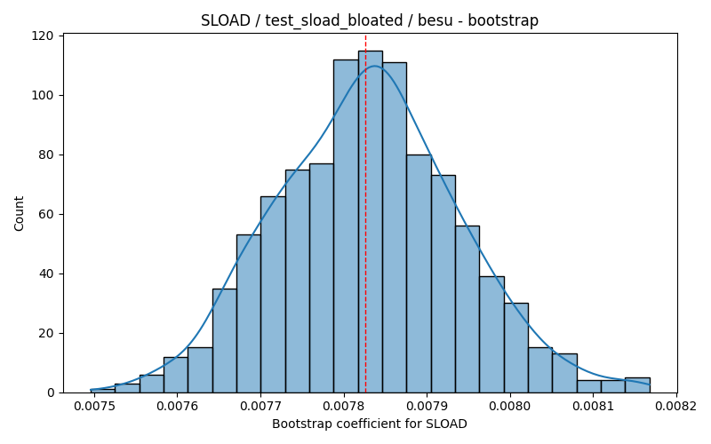

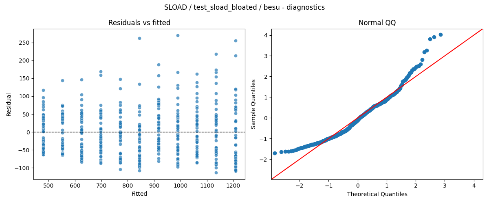

</details>

<details><summary>erigon — NNLS regression summary</summary>

```
==============================================================================
                           NNLS Regression Results                            
==============================================================================
Dep. Variable:          test_runtime_ms              R-squared:          0.977
Model:                  NNLS                    Adj. R-squared:          0.977
No. Observations:       154                               RMSE:          29.24
Df Residuals:           152                                MAE:          23.66
Df Model:               1      
==============================================================================
                      coef     std err     P-value      [0.025      0.975]
------------------------------------------------------------------------------
         const      6.6673      6.1213       0.176      0.0000     20.2994
       opcount      0.0065      0.0001       0.001      0.0064      0.0067
==============================================================================
Notes: Non-negative least squares with bootstrap inference (1000 iterations)
==============================================================================
```

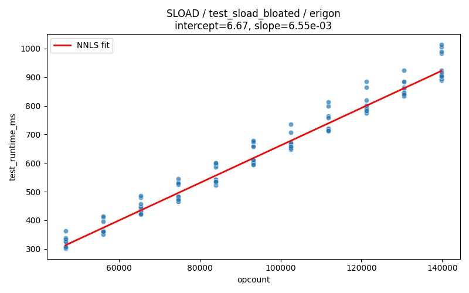

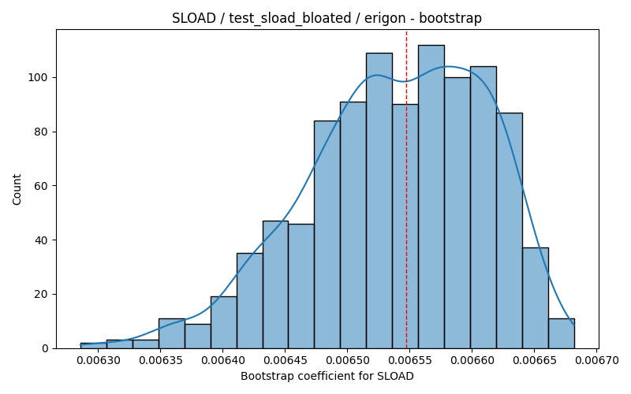

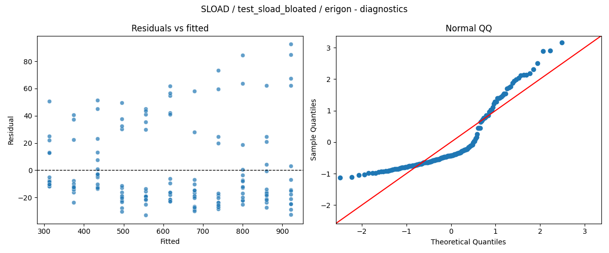

</details>

<details><summary>ethrex — NNLS regression summary</summary>

```
==============================================================================
                           NNLS Regression Results                            
==============================================================================
Dep. Variable:          test_runtime_ms              R-squared:          0.898
Model:                  NNLS                    Adj. R-squared:          0.898
No. Observations:       440                               RMSE:         126.49
Df Residuals:           438                                MAE:         107.28
Df Model:               1      
==============================================================================
                      coef     std err     P-value      [0.025      0.975]
------------------------------------------------------------------------------
         const      0.0000      0.0000       1.000      0.0000      0.0000
       opcount      0.0098      0.0001       0.001      0.0097      0.0099
==============================================================================
Notes: Non-negative least squares with bootstrap inference (1000 iterations)
==============================================================================
```

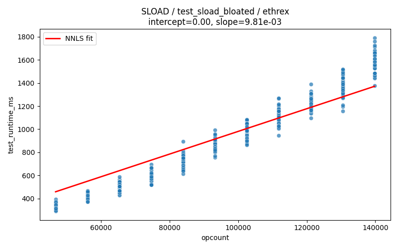

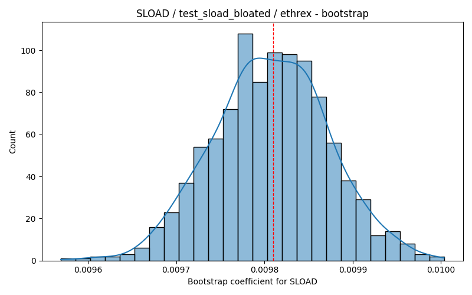

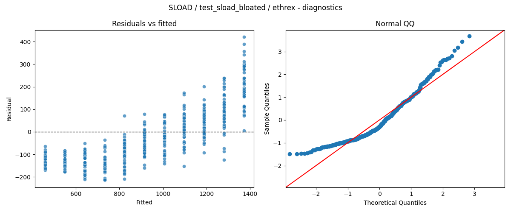

</details>

<details><summary>geth — NNLS regression summary</summary>

```
==============================================================================
                           NNLS Regression Results                            
==============================================================================
Dep. Variable:          test_runtime_ms              R-squared:          0.968
Model:                  NNLS                    Adj. R-squared:          0.968
No. Observations:       440                               RMSE:         130.30
Df Residuals:           438                                MAE:         106.06
Df Model:               1      
==============================================================================
                      coef     std err     P-value      [0.025      0.975]
------------------------------------------------------------------------------
         const    551.0256     19.2637       0.001    513.3694    591.5476
       opcount      0.0243      0.0002       0.001      0.0238      0.0247
==============================================================================
Notes: Non-negative least squares with bootstrap inference (1000 iterations)
==============================================================================
```

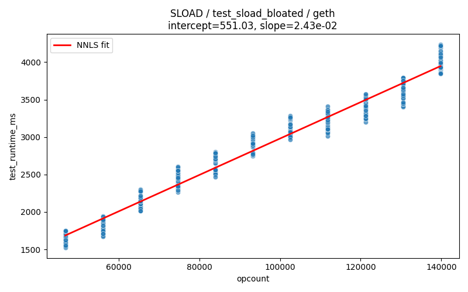

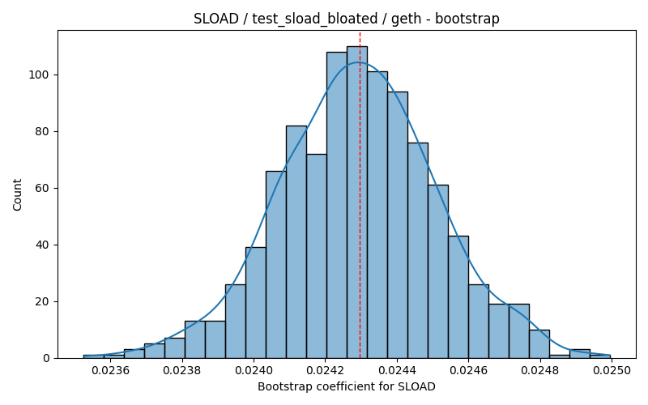

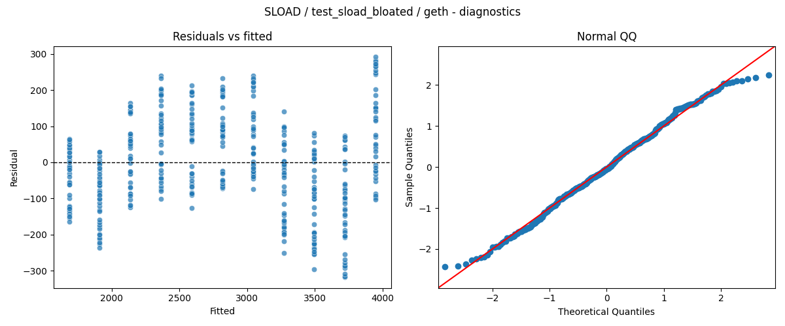

</details>

<details><summary>nethermind — NNLS regression summary</summary>

```
==============================================================================
                           NNLS Regression Results                            
==============================================================================
Dep. Variable:          test_runtime_ms              R-squared:          0.874
Model:                  NNLS                    Adj. R-squared:          0.873
No. Observations:       363                               RMSE:          37.52
Df Residuals:           361                                MAE:          27.30
Df Model:               1      
==============================================================================
                      coef     std err     P-value      [0.025      0.975]
------------------------------------------------------------------------------
         const     53.6762      5.7510       0.001     42.1965     64.8619
       opcount      0.0034      0.0001       0.001      0.0032      0.0035
==============================================================================
Notes: Non-negative least squares with bootstrap inference (1000 iterations)
==============================================================================
```

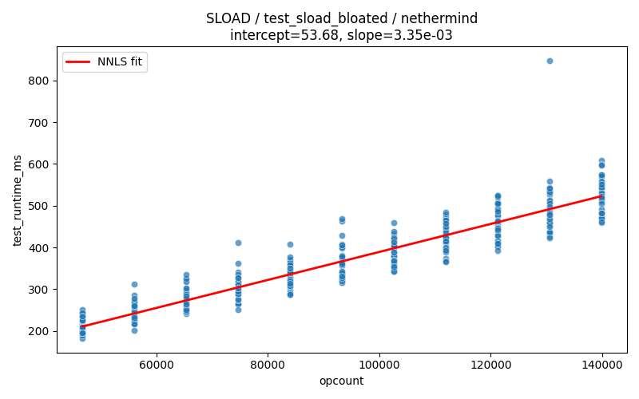

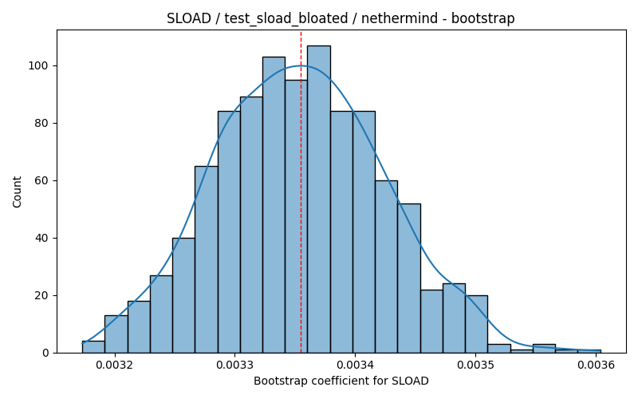

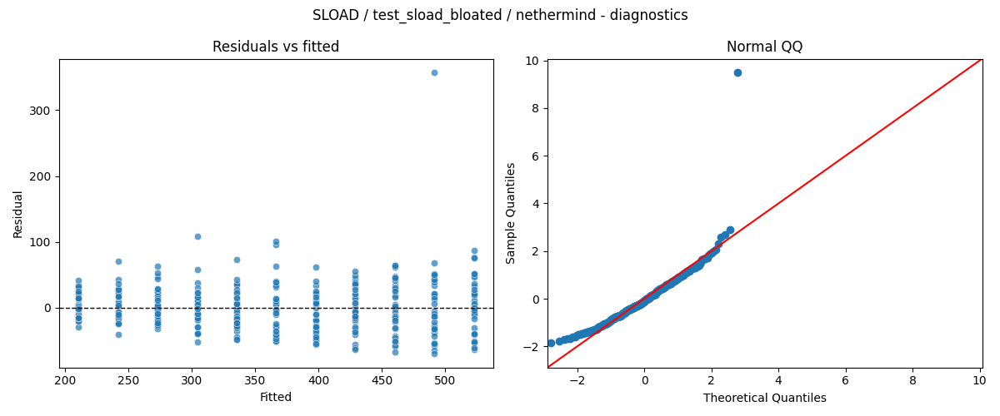

</details>

<details><summary>reth — NNLS regression summary</summary>

```
==============================================================================
                           NNLS Regression Results                            
==============================================================================
Dep. Variable:          test_runtime_ms              R-squared:          0.948
Model:                  NNLS                    Adj. R-squared:          0.948
No. Observations:       539                               RMSE:           8.57
Df Residuals:           537                                MAE:           6.77
Df Model:               1      
==============================================================================
                      coef     std err     P-value      [0.025      0.975]
------------------------------------------------------------------------------
         const     37.7878      1.2160       0.001     35.4498     40.3683
       opcount      0.0012      0.0000       0.001      0.0012      0.0013
==============================================================================
Notes: Non-negative least squares with bootstrap inference (1000 iterations)
==============================================================================
```

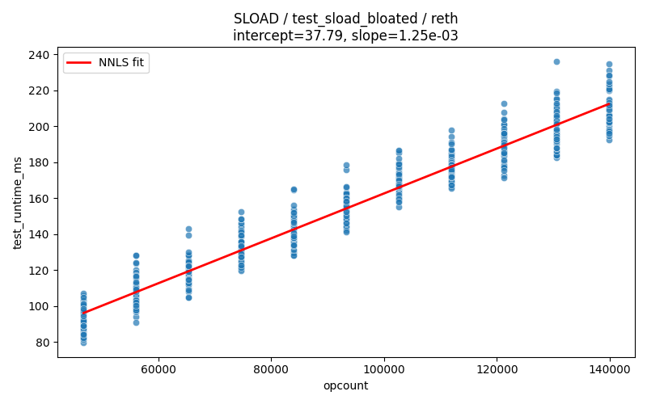

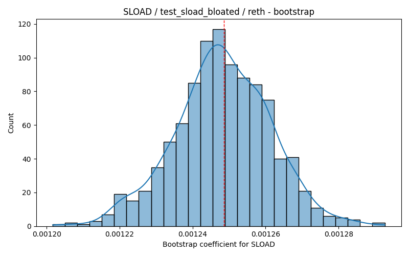

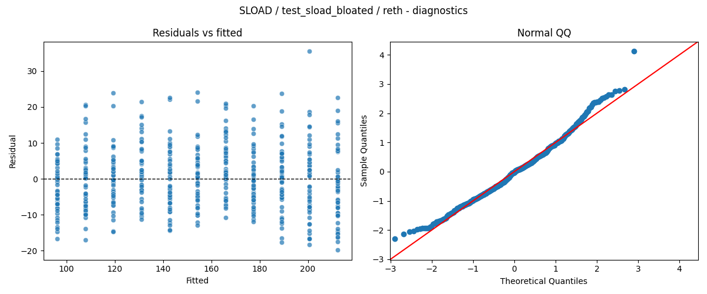

</details>

### test_sload_bloated — combo `True`

| client | nobs | R² | target_coef (ms) | p-value | 95% CI |
| --- | --- | --- | --- | --- | --- |
| `besu` | 462 | 0.9725 | 0.01485 | 1.00e-03 | [0.01464, 0.01508] |
| `erigon` | 154 | 0.9804 | 0.006427 | 1.00e-03 | [0.006361, 0.006476] |
| `ethrex` | 440 | 0.9423 | 0.01401 | 1.00e-03 | [0.01388, 0.01414] |
| `geth` | 440 | 0.9628 | 0.02377 | 1.00e-03 | [0.02334, 0.02423] |
| `nethermind` | 363 | 0.973 | 0.008893 | 1.00e-03 | [0.008729, 0.009047] |
| `reth` | 539 | 0.9521 | 0.001433 | 1.00e-03 | [0.001406, 0.001458] |

<details><summary>besu — NNLS regression summary</summary>

```
==============================================================================
                           NNLS Regression Results                            
==============================================================================
Dep. Variable:          test_runtime_ms              R-squared:          0.972
Model:                  NNLS                    Adj. R-squared:          0.972
No. Observations:       462                               RMSE:          73.51
Df Residuals:           460                                MAE:          51.00
Df Model:               1      
==============================================================================
                      coef     std err     P-value      [0.025      0.975]
------------------------------------------------------------------------------
         const    340.6043     10.0230       0.001    320.1931    360.5488
       opcount      0.0149      0.0001       0.001      0.0146      0.0151
==============================================================================
Notes: Non-negative least squares with bootstrap inference (1000 iterations)
==============================================================================
```

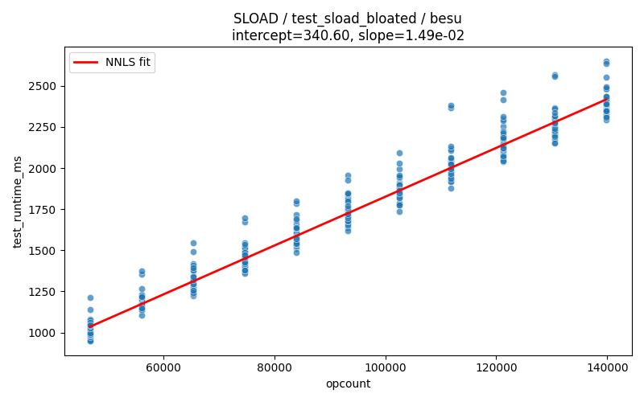

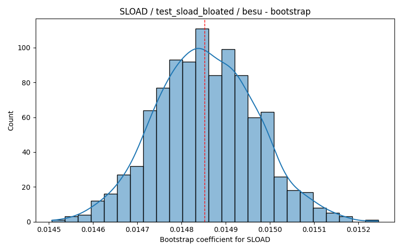

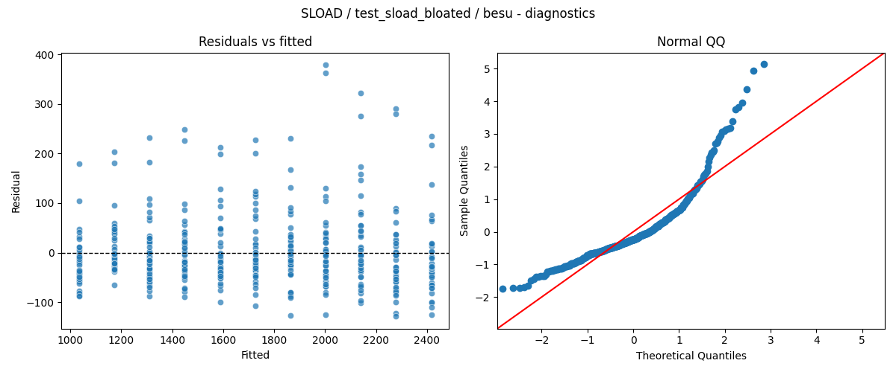

</details>

<details><summary>erigon — NNLS regression summary</summary>

```
==============================================================================
                           NNLS Regression Results                            
==============================================================================
Dep. Variable:          test_runtime_ms              R-squared:          0.980
Model:                  NNLS                    Adj. R-squared:          0.980
No. Observations:       154                               RMSE:          27.05
Df Residuals:           152                                MAE:          21.35
Df Model:               1      
==============================================================================
                      coef     std err     P-value      [0.025      0.975]
------------------------------------------------------------------------------
         const      0.0000      1.2697       1.000      0.0000      4.3827
       opcount      0.0064      0.0000       0.001      0.0064      0.0065
==============================================================================
Notes: Non-negative least squares with bootstrap inference (1000 iterations)
==============================================================================
```

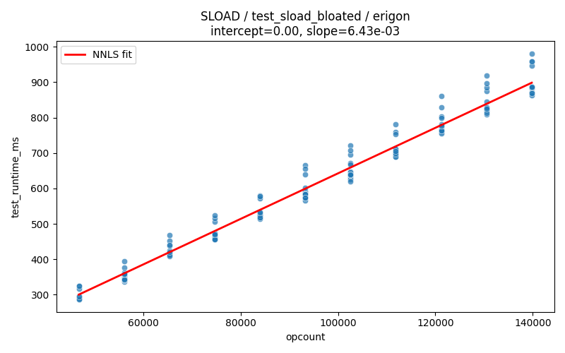

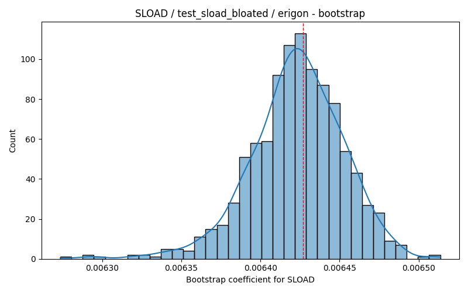

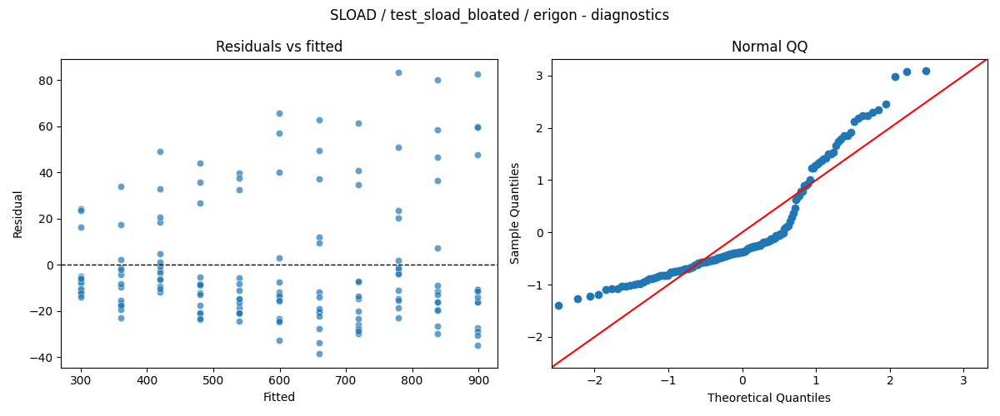

</details>

<details><summary>ethrex — NNLS regression summary</summary>

```
==============================================================================
                           NNLS Regression Results                            
==============================================================================
Dep. Variable:          test_runtime_ms              R-squared:          0.942
Model:                  NNLS                    Adj. R-squared:          0.942
No. Observations:       440                               RMSE:         123.29
Df Residuals:           438                                MAE:         107.02
Df Model:               1      
==============================================================================
                      coef     std err     P-value      [0.025      0.975]
------------------------------------------------------------------------------
         const      0.0000      0.0000       1.000      0.0000      0.0000
       opcount      0.0140      0.0001       0.001      0.0139      0.0141
==============================================================================
Notes: Non-negative least squares with bootstrap inference (1000 iterations)
==============================================================================
```

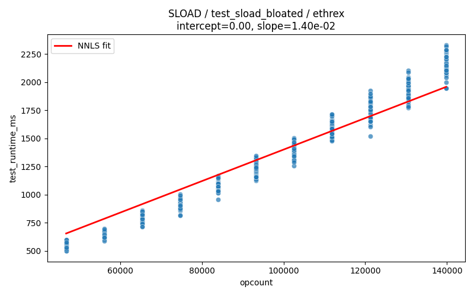

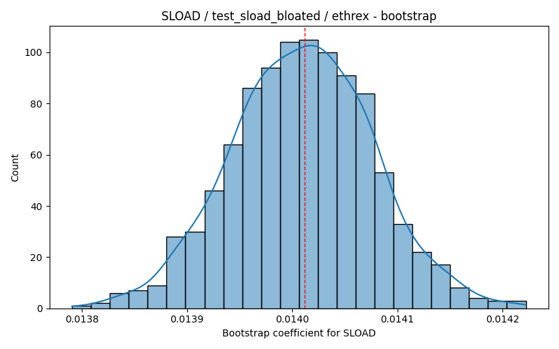

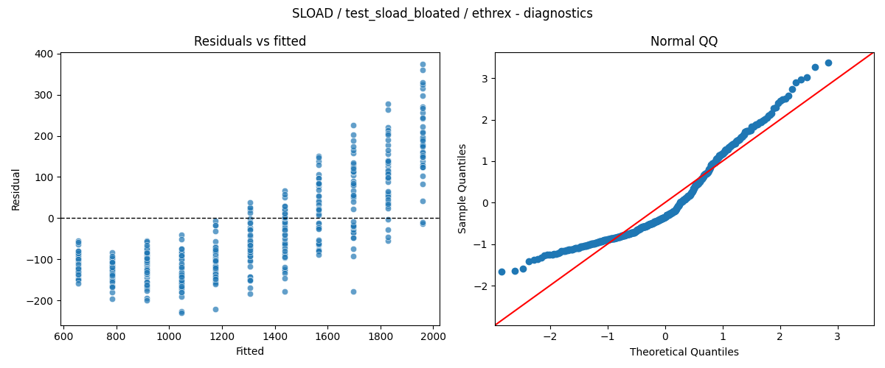

</details>

<details><summary>geth — NNLS regression summary</summary>

```
==============================================================================
                           NNLS Regression Results                            
==============================================================================
Dep. Variable:          test_runtime_ms              R-squared:          0.963
Model:                  NNLS                    Adj. R-squared:          0.963
No. Observations:       440                               RMSE:         137.40
Df Residuals:           438                                MAE:         111.58
Df Model:               1      
==============================================================================
                      coef     std err     P-value      [0.025      0.975]
------------------------------------------------------------------------------
         const    519.4431     20.3898       0.001    479.8456    558.7568
       opcount      0.0238      0.0002       0.001      0.0233      0.0242
==============================================================================
Notes: Non-negative least squares with bootstrap inference (1000 iterations)
==============================================================================
```

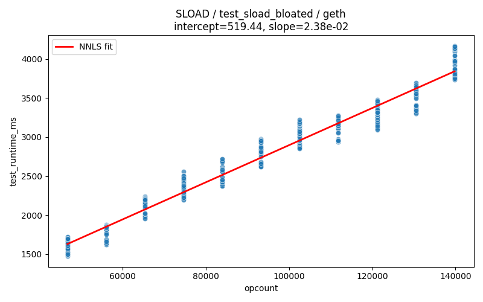

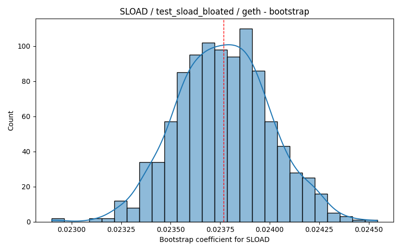

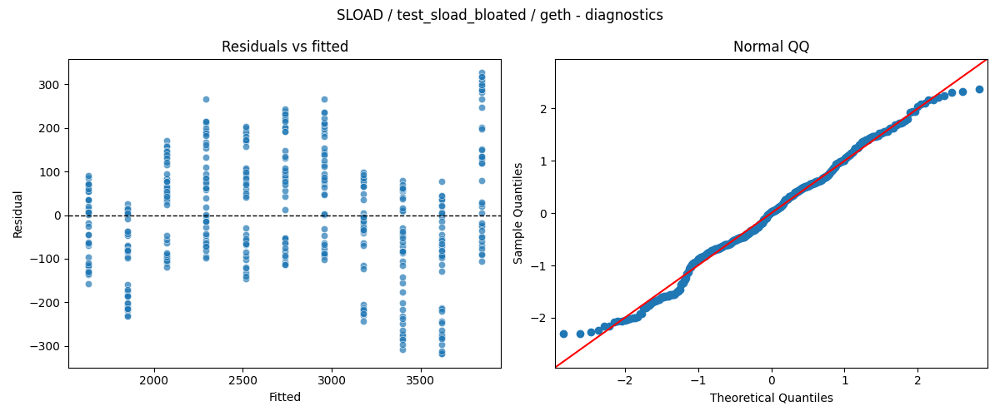

</details>

<details><summary>nethermind — NNLS regression summary</summary>

```
==============================================================================
                           NNLS Regression Results                            
==============================================================================
Dep. Variable:          test_runtime_ms              R-squared:          0.973
Model:                  NNLS                    Adj. R-squared:          0.973
No. Observations:       363                               RMSE:          43.60
Df Residuals:           361                                MAE:          34.43
Df Model:               1      
==============================================================================
                      coef     std err     P-value      [0.025      0.975]
------------------------------------------------------------------------------
         const    107.9859      7.1449       0.001     94.8735    122.2130
       opcount      0.0089      0.0001       0.001      0.0087      0.0090
==============================================================================
Notes: Non-negative least squares with bootstrap inference (1000 iterations)
==============================================================================
```

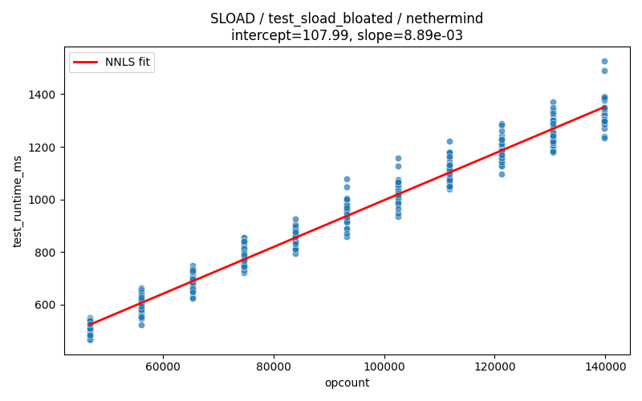

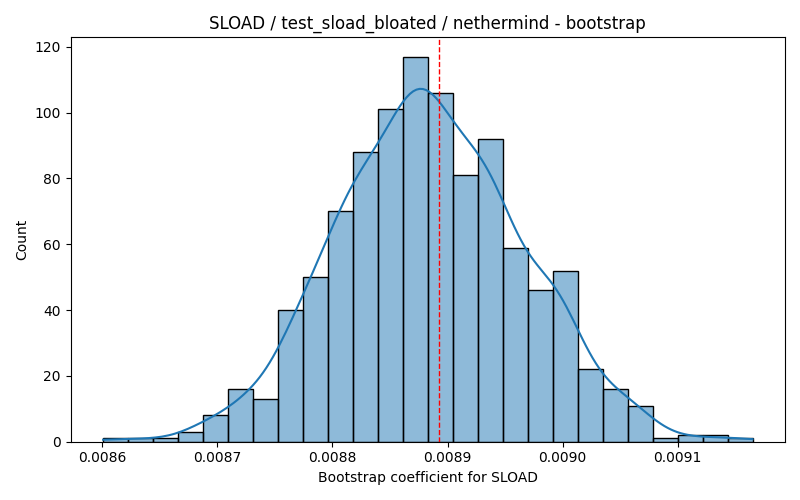

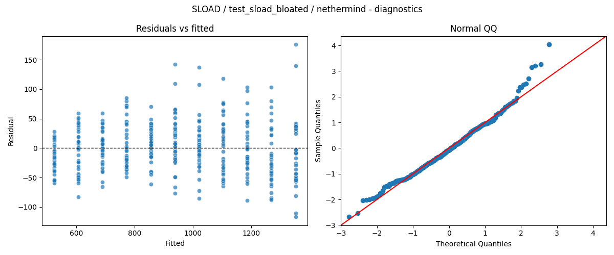

</details>

<details><summary>reth — NNLS regression summary</summary>

```
==============================================================================
                           NNLS Regression Results                            
==============================================================================
Dep. Variable:          test_runtime_ms              R-squared:          0.952
Model:                  NNLS                    Adj. R-squared:          0.952
No. Observations:       539                               RMSE:           9.46
Df Residuals:           537                                MAE:           7.68
Df Model:               1      
==============================================================================
                      coef     std err     P-value      [0.025      0.975]
------------------------------------------------------------------------------
         const     32.0230      1.2343       0.001     29.6044     34.4321
       opcount      0.0014      0.0000       0.001      0.0014      0.0015
==============================================================================
Notes: Non-negative least squares with bootstrap inference (1000 iterations)
==============================================================================
```

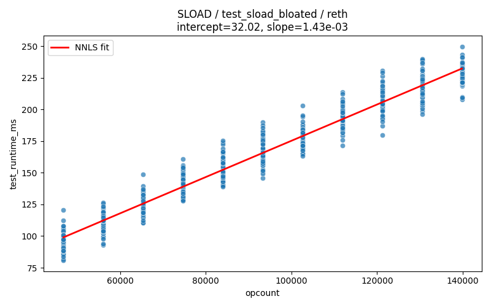

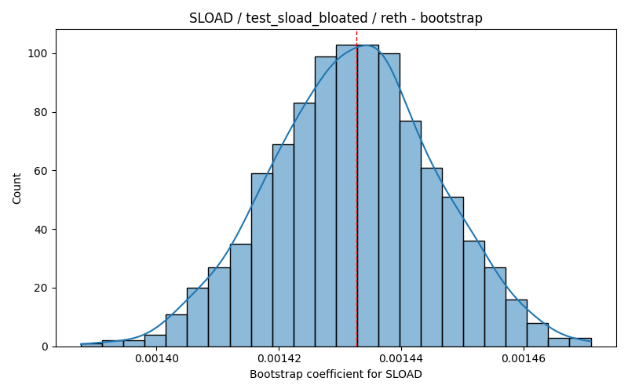

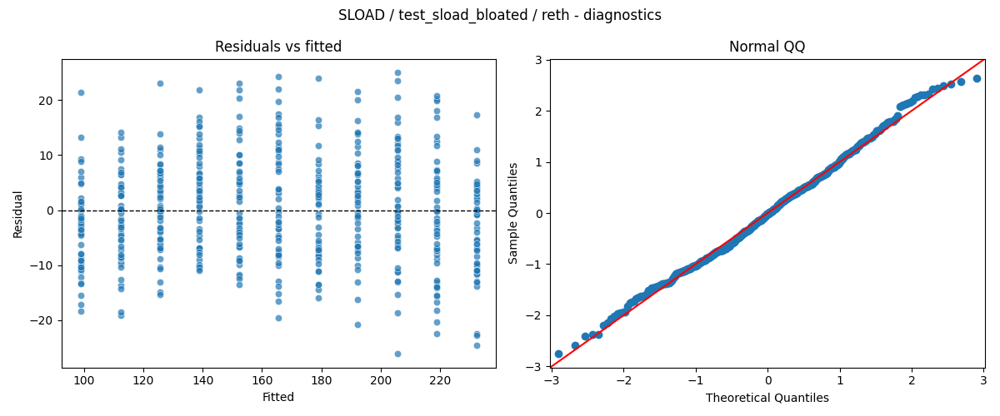

</details>

### test_storage_sload_same_key_benchmark

| client | nobs | R² | target_coef (ms) | p-value | 95% CI |
| --- | --- | --- | --- | --- | --- |
| `besu` | 924 | 0.6546 | 0.0002493 | 1.00e-03 | [0.0002377, 0.0002605] |
| `erigon` | 308 | 0.8851 | 4.727e-05 | 1.00e-03 | [4.548e-05, 4.914e-05] |
| `ethrex` | 880 | 0.6636 | 2.157e-05 | 1.00e-03 | [2.043e-05, 2.277e-05] |
| `geth` | 880 | 0.8165 | 4.36e-05 | 1.00e-03 | [4.209e-05, 4.505e-05] |
| `nethermind` | 726 | 0.7689 | 0.000151 | 1.00e-03 | [0.0001451, 0.0001567] |
| `reth` | 1078 | 0.4697 | 8.075e-06 | 1.00e-03 | [7.504e-06, 8.762e-06] |

<details><summary>besu — NNLS regression summary</summary>

```
==============================================================================
                           NNLS Regression Results                            
==============================================================================
Dep. Variable:          test_runtime_ms              R-squared:          0.655
Model:                  NNLS                    Adj. R-squared:          0.654
No. Observations:       924                               RMSE:         114.37
Df Residuals:           922                                MAE:          89.26
Df Model:               1      
==============================================================================
                      coef     std err     P-value      [0.025      0.975]
------------------------------------------------------------------------------
         const    332.6900     11.7337       0.001    309.7105    356.3283
       opcount      0.0002      0.0000       0.001      0.0002      0.0003
==============================================================================
Notes: Non-negative least squares with bootstrap inference (1000 iterations)
==============================================================================
```

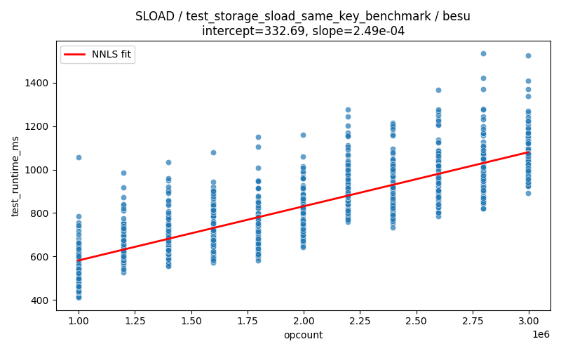

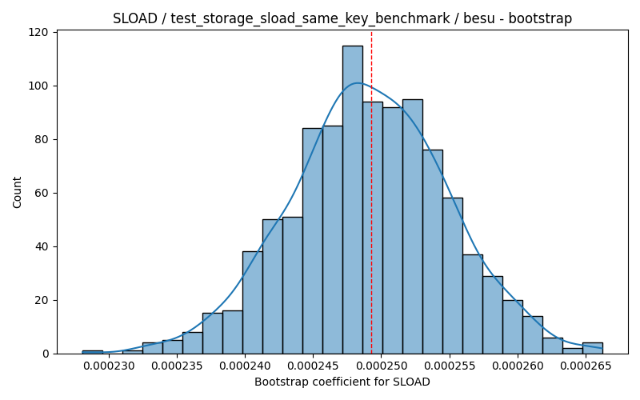

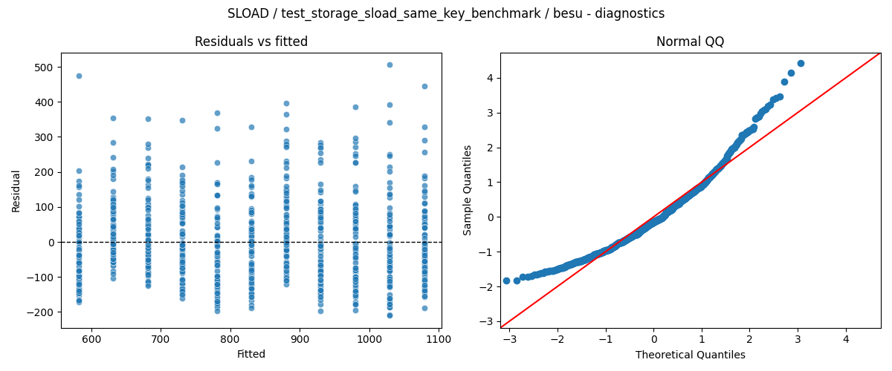

</details>

<details><summary>erigon — NNLS regression summary</summary>

```
==============================================================================
                           NNLS Regression Results                            
==============================================================================
Dep. Variable:          test_runtime_ms              R-squared:          0.885
Model:                  NNLS                    Adj. R-squared:          0.885
No. Observations:       308                               RMSE:          10.76
Df Residuals:           306                                MAE:           7.74
Df Model:               1      
==============================================================================
                      coef     std err     P-value      [0.025      0.975]
------------------------------------------------------------------------------
         const     21.4015      1.7329       0.001     17.6749     24.7378
       opcount      0.0000      0.0000       0.001      0.0000      0.0000
==============================================================================
Notes: Non-negative least squares with bootstrap inference (1000 iterations)
==============================================================================
```

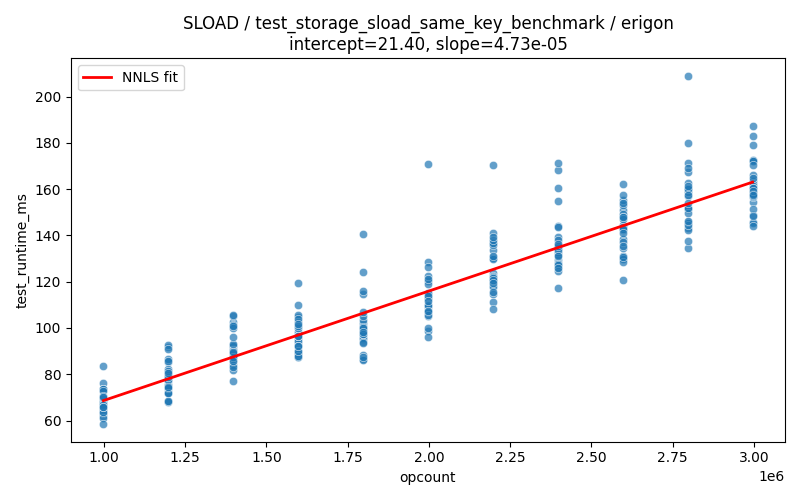

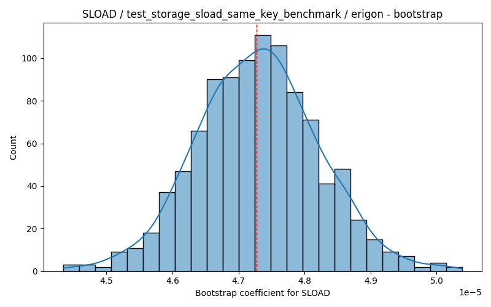

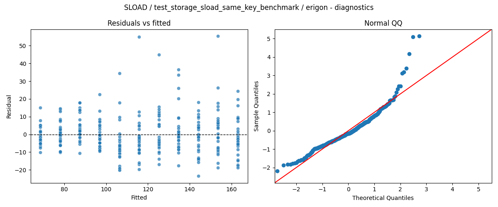

</details>

<details><summary>ethrex — NNLS regression summary</summary>

```
==============================================================================
                           NNLS Regression Results                            
==============================================================================
Dep. Variable:          test_runtime_ms              R-squared:          0.664
Model:                  NNLS                    Adj. R-squared:          0.663
No. Observations:       880                               RMSE:           9.70
Df Residuals:           878                                MAE:           7.28
Df Model:               1      
==============================================================================
                      coef     std err     P-value      [0.025      0.975]
------------------------------------------------------------------------------
         const     20.9752      1.3061       0.001     18.3208     23.5399
       opcount      0.0000      0.0000       0.001      0.0000      0.0000
==============================================================================
Notes: Non-negative least squares with bootstrap inference (1000 iterations)
==============================================================================
```

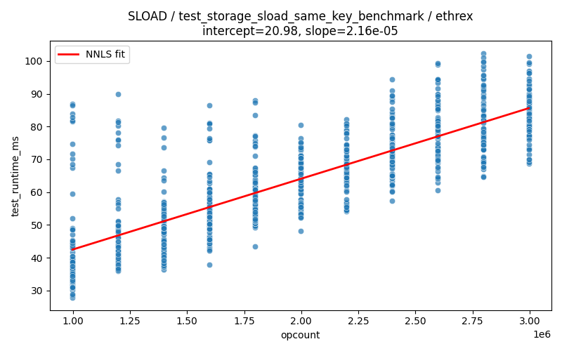

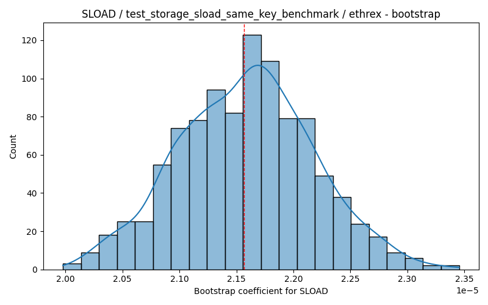

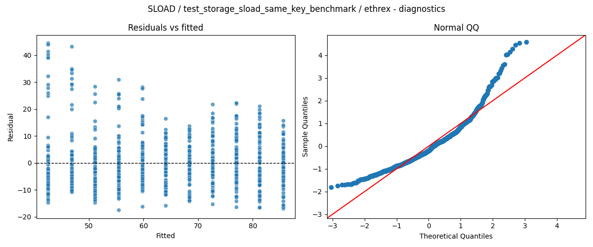

</details>

<details><summary>geth — NNLS regression summary</summary>

```
==============================================================================
                           NNLS Regression Results                            
==============================================================================
Dep. Variable:          test_runtime_ms              R-squared:          0.817
Model:                  NNLS                    Adj. R-squared:          0.816
No. Observations:       880                               RMSE:          13.05
Df Residuals:           878                                MAE:          10.17
Df Model:               1      
==============================================================================
                      coef     std err     P-value      [0.025      0.975]
------------------------------------------------------------------------------
         const     27.9731      1.3985       0.001     25.2500     30.8894
       opcount      0.0000      0.0000       0.001      0.0000      0.0000
==============================================================================
Notes: Non-negative least squares with bootstrap inference (1000 iterations)
==============================================================================
```

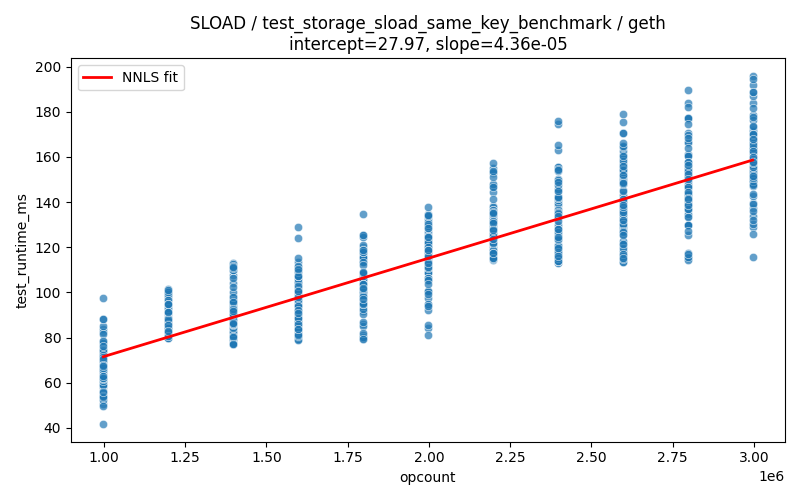

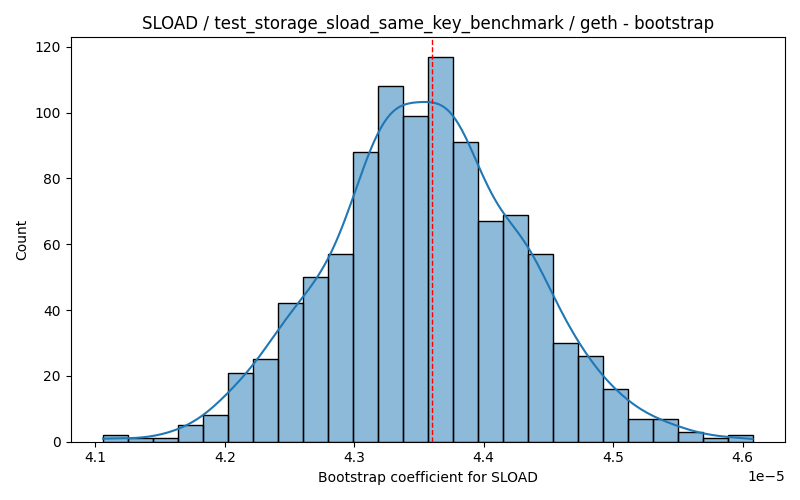

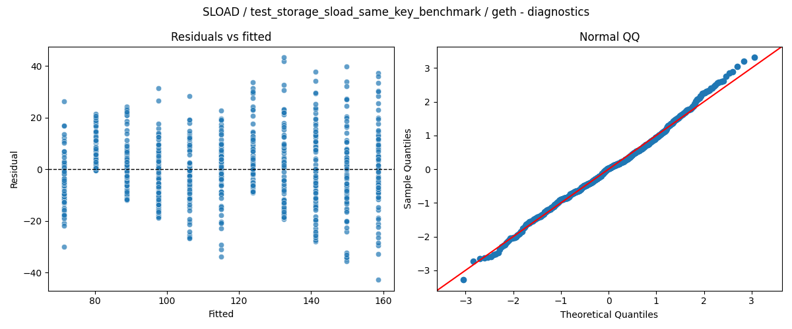

</details>

<details><summary>nethermind — NNLS regression summary</summary>

```
==============================================================================
                           NNLS Regression Results                            
==============================================================================
Dep. Variable:          test_runtime_ms              R-squared:          0.769
Model:                  NNLS                    Adj. R-squared:          0.769
No. Observations:       726                               RMSE:          52.28
Df Residuals:           724                                MAE:          39.67
Df Model:               1      
==============================================================================
                      coef     std err     P-value      [0.025      0.975]
------------------------------------------------------------------------------
         const    108.2032      5.9625       0.001     97.1129    120.3081
       opcount      0.0002      0.0000       0.001      0.0001      0.0002
==============================================================================
Notes: Non-negative least squares with bootstrap inference (1000 iterations)
==============================================================================
```

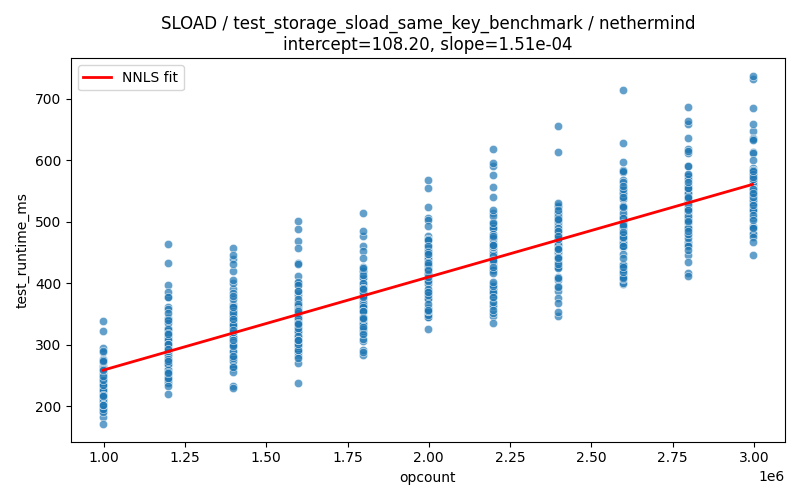

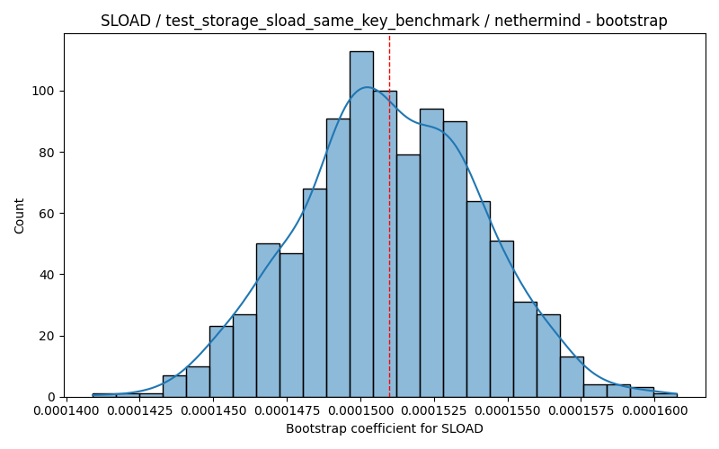

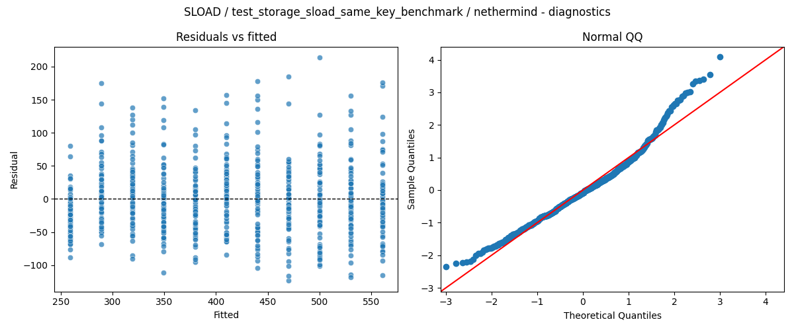

</details>

<details><summary>reth — NNLS regression summary</summary>

```
==============================================================================
                           NNLS Regression Results                            
==============================================================================
Dep. Variable:          test_runtime_ms              R-squared:          0.470
Model:                  NNLS                    Adj. R-squared:          0.469
No. Observations:       1078                              RMSE:           5.42
Df Residuals:           1076                               MAE:           3.49
Df Model:               1      
==============================================================================
                      coef     std err     P-value      [0.025      0.975]
------------------------------------------------------------------------------
         const      7.6678      0.5597       0.001      6.5047      8.6431
       opcount      0.0000      0.0000       0.001      0.0000      0.0000
==============================================================================
Notes: Non-negative least squares with bootstrap inference (1000 iterations)
==============================================================================
```

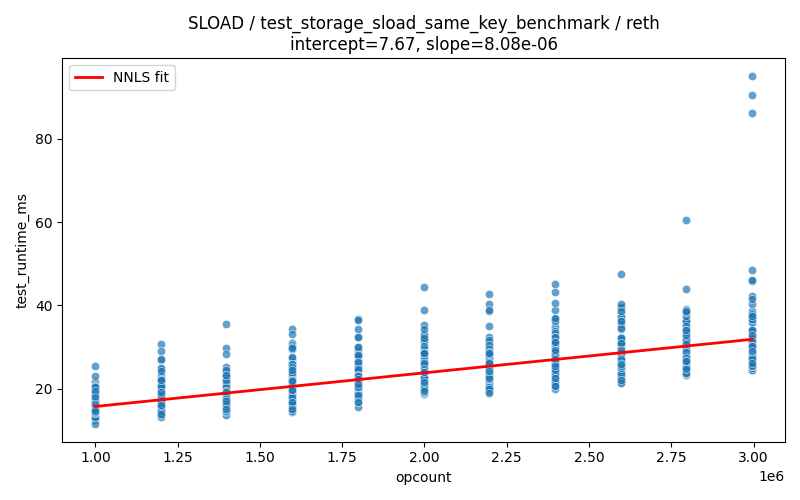

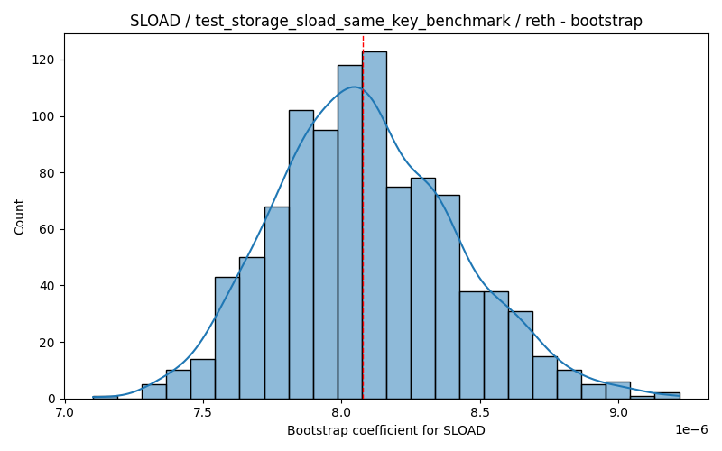

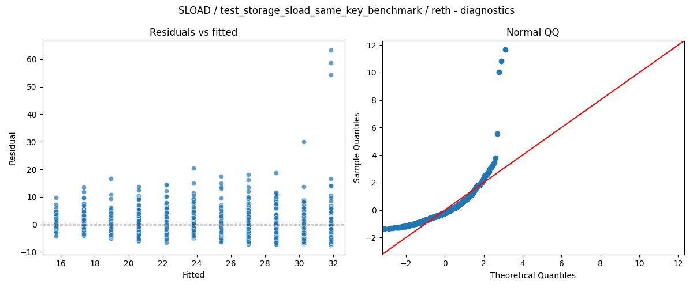

</details>

## SSTORE

### test_sstore_bloated — combo `False` — `presets[cold_storage_sstore_access]`

| client | nobs | R² | target_coef (ms) | p-value | 95% CI |
| --- | --- | --- | --- | --- | --- |
| `besu` | 462 | 0.663 | 0.007943 | 1.00e-03 | [0.007427, 0.008475] |
| `erigon` | 154 | 0.9735 | 0.006577 | 1.00e-03 | [0.006431, 0.006636] |
| `ethrex` | 440 | 0.9261 | 0.01034 | 1.00e-03 | [0.01022, 0.01044] |
| `geth` | 440 | 0.9709 | 0.02397 | 1.00e-03 | [0.02353, 0.02434] |
| `nethermind` | 363 | 0.9084 | 0.003296 | 1.00e-03 | [0.003183, 0.003409] |
| `reth` | 539 | 0.9516 | 0.001277 | 1.00e-03 | [0.001253, 0.001301] |

<details><summary>besu — NNLS regression summary</summary>

```
==============================================================================
                           NNLS Regression Results                            
==============================================================================
Dep. Variable:          test_runtime_ms              R-squared:          0.663
Model:                  NNLS                    Adj. R-squared:          0.662
No. Observations:       462                               RMSE:         160.03
Df Residuals:           460                                MAE:         128.69
Df Model:               1      
==============================================================================
                      coef     std err     P-value      [0.025      0.975]
------------------------------------------------------------------------------
         const    454.5109     24.7193       0.001    405.9785    505.2992
       opcount      0.0079      0.0003       0.001      0.0074      0.0085
==============================================================================
Notes: Non-negative least squares with bootstrap inference (1000 iterations)
==============================================================================
```

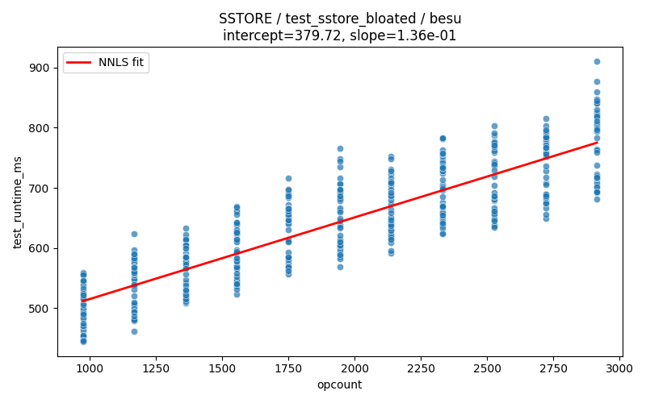

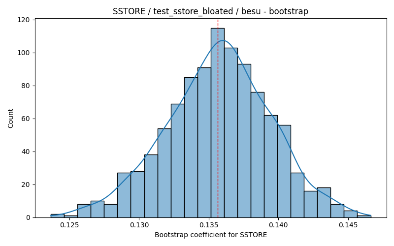

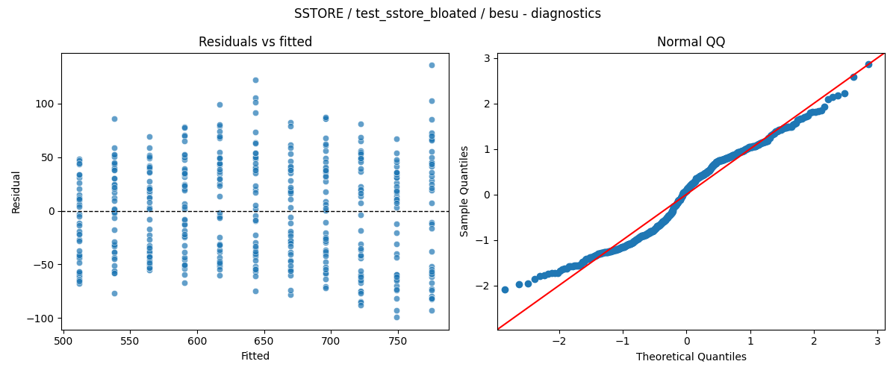

</details>

<details><summary>erigon — NNLS regression summary</summary>

```
==============================================================================
                           NNLS Regression Results                            
==============================================================================
Dep. Variable:          test_runtime_ms              R-squared:          0.973
Model:                  NNLS                    Adj. R-squared:          0.973
No. Observations:       154                               RMSE:          30.83
Df Residuals:           152                                MAE:          23.35
Df Model:               1      
==============================================================================
                      coef     std err     P-value      [0.025      0.975]
------------------------------------------------------------------------------
         const      0.0000      3.4371       1.000      0.0000     12.6302
       opcount      0.0066      0.0001       0.001      0.0064      0.0066
==============================================================================
Notes: Non-negative least squares with bootstrap inference (1000 iterations)
==============================================================================
```

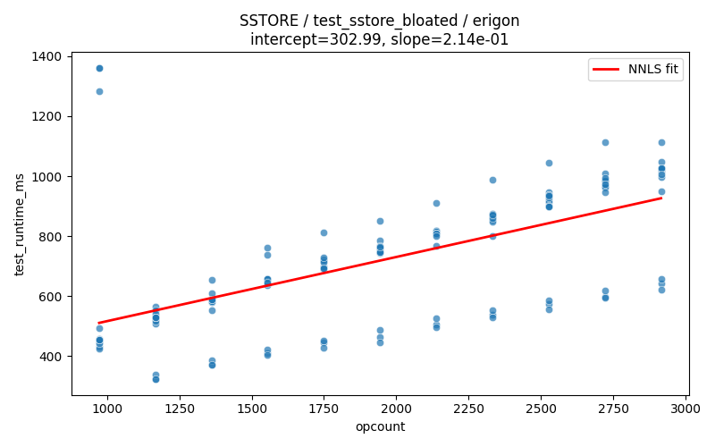

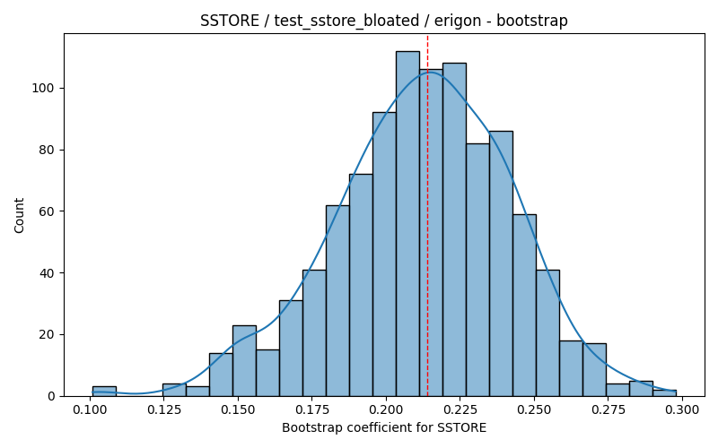

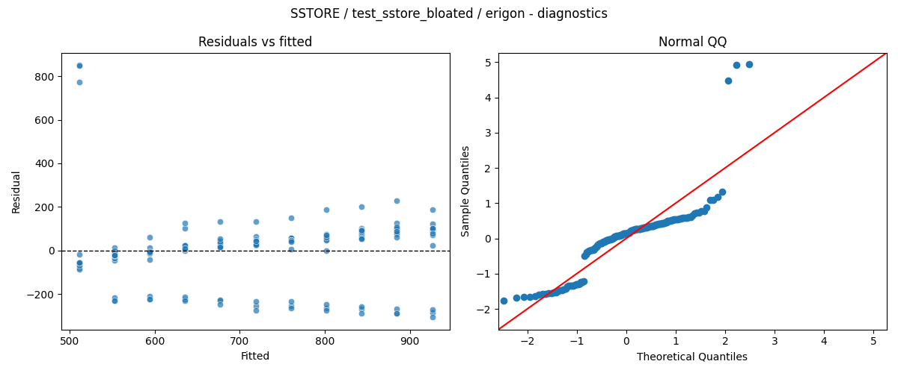

</details>

<details><summary>ethrex — NNLS regression summary</summary>

```
==============================================================================
                           NNLS Regression Results                            
==============================================================================
Dep. Variable:          test_runtime_ms              R-squared:          0.926
Model:                  NNLS                    Adj. R-squared:          0.926
No. Observations:       440                               RMSE:         100.95
Df Residuals:           438                                MAE:          86.60
Df Model:               1      
==============================================================================
                      coef     std err     P-value      [0.025      0.975]
------------------------------------------------------------------------------
         const      0.0000      0.0000       1.000      0.0000      0.0000
       opcount      0.0103      0.0001       0.001      0.0102      0.0104
==============================================================================
Notes: Non-negative least squares with bootstrap inference (1000 iterations)
==============================================================================
```

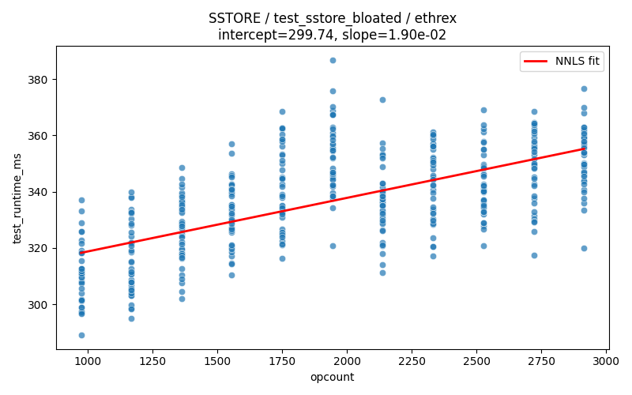

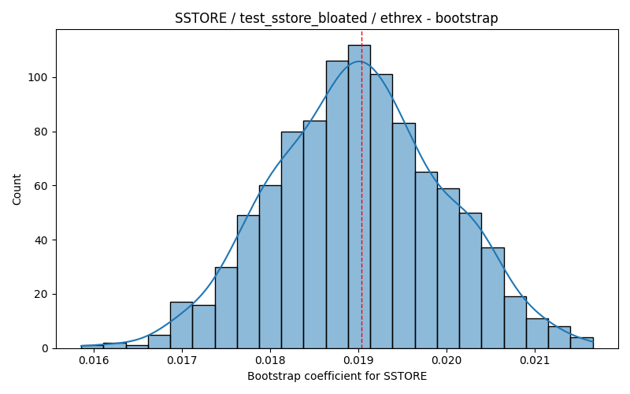


</details>

<details><summary>geth — NNLS regression summary</summary>

```
==============================================================================
                           NNLS Regression Results                            
==============================================================================
Dep. Variable:          test_runtime_ms              R-squared:          0.971
Model:                  NNLS                    Adj. R-squared:          0.971
No. Observations:       440                               RMSE:         117.33
Df Residuals:           438                                MAE:          95.22
Df Model:               1      
==============================================================================
                      coef     std err     P-value      [0.025      0.975]
------------------------------------------------------------------------------
         const    560.2784     18.1350       0.001    527.2000    598.0889
       opcount      0.0240      0.0002       0.001      0.0235      0.0243
==============================================================================
Notes: Non-negative least squares with bootstrap inference (1000 iterations)
==============================================================================
```

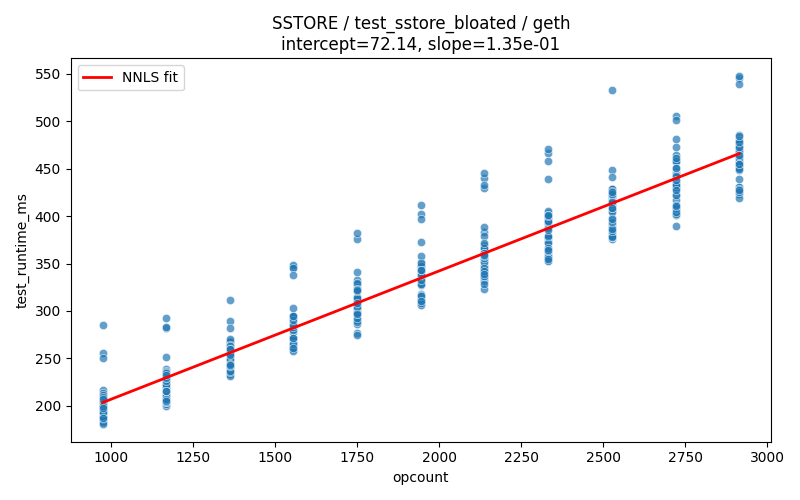

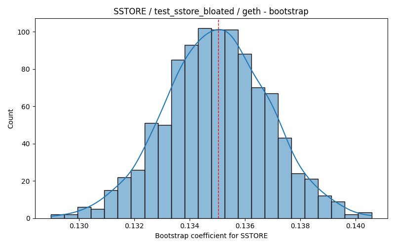

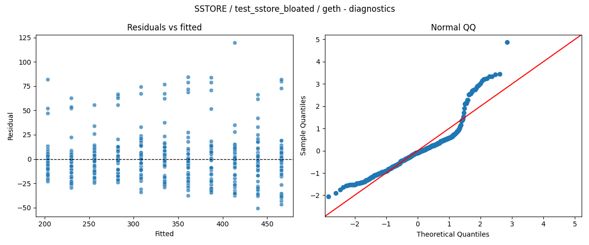

</details>

<details><summary>nethermind — NNLS regression summary</summary>

```
==============================================================================
                           NNLS Regression Results                            
==============================================================================
Dep. Variable:          test_runtime_ms              R-squared:          0.908
Model:                  NNLS                    Adj. R-squared:          0.908
No. Observations:       363                               RMSE:          29.59
Df Residuals:           361                                MAE:          22.81
Df Model:               1      
==============================================================================
                      coef     std err     P-value      [0.025      0.975]
------------------------------------------------------------------------------
         const     57.6768      4.7758       0.001     48.7712     66.9402
       opcount      0.0033      0.0001       0.001      0.0032      0.0034
==============================================================================
Notes: Non-negative least squares with bootstrap inference (1000 iterations)
==============================================================================
```

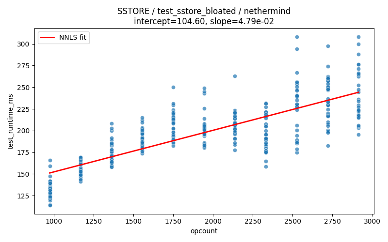

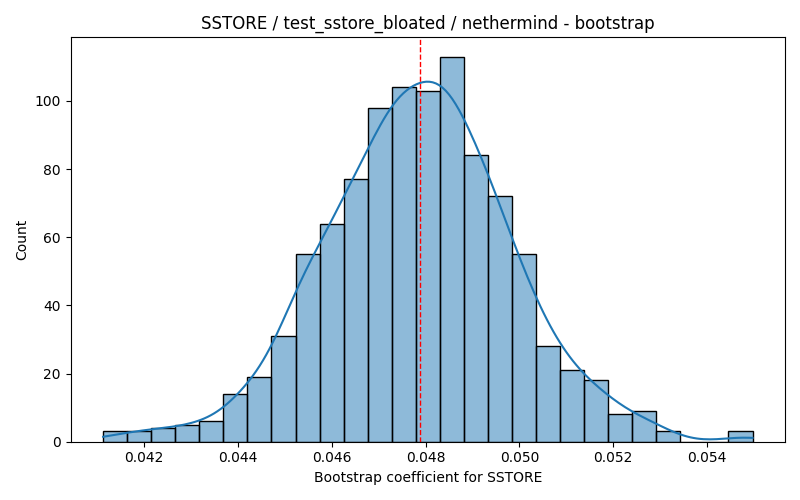

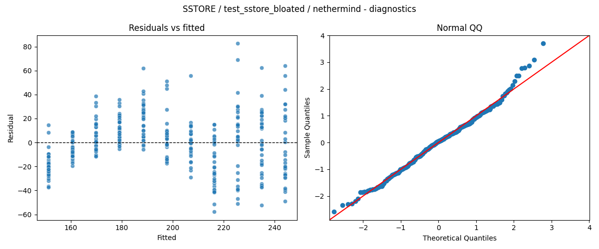

</details>

<details><summary>reth — NNLS regression summary</summary>

```
==============================================================================
                           NNLS Regression Results                            
==============================================================================
Dep. Variable:          test_runtime_ms              R-squared:          0.952
Model:                  NNLS                    Adj. R-squared:          0.952
No. Observations:       539                               RMSE:           8.13
Df Residuals:           537                                MAE:           6.42
Df Model:               1      
==============================================================================
                      coef     std err     P-value      [0.025      0.975]
------------------------------------------------------------------------------
         const     35.8972      1.0815       0.001     33.8599     38.0443
       opcount      0.0013      0.0000       0.001      0.0013      0.0013
==============================================================================
Notes: Non-negative least squares with bootstrap inference (1000 iterations)
==============================================================================
```

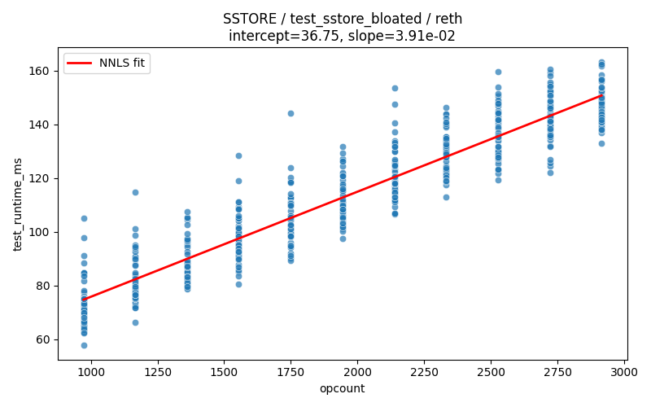

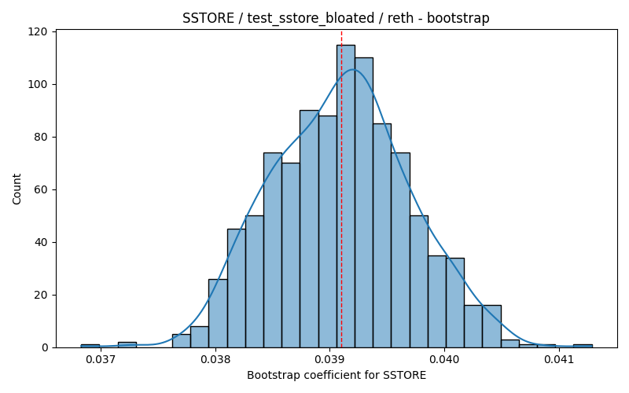

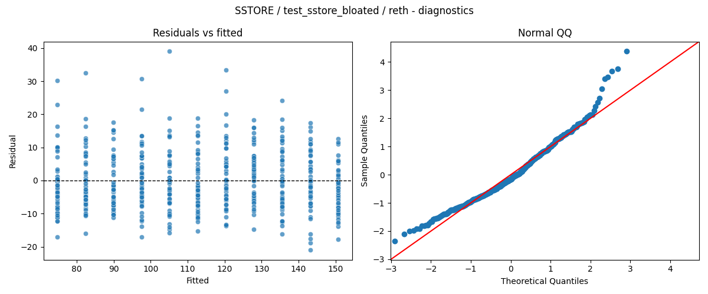

</details>

### test_sstore_bloated — combo `True` — `presets[cold_storage_sstore_access]`

| client | nobs | R² | target_coef (ms) | p-value | 95% CI |
| --- | --- | --- | --- | --- | --- |
| `besu` | 462 | 0.9256 | 0.01517 | 1.00e-03 | [0.01479, 0.01556] |
| `erigon` | 154 | 0.9727 | 0.006401 | 1.00e-03 | [0.006308, 0.006459] |
| `ethrex` | 440 | 0.9668 | 0.01463 | 1.00e-03 | [0.01453, 0.01472] |
| `geth` | 440 | 0.9658 | 0.02343 | 1.00e-03 | [0.02299, 0.02388] |
| `nethermind` | 363 | 0.9749 | 0.008983 | 1.00e-03 | [0.008836, 0.009137] |
| `reth` | 539 | 0.9544 | 0.001461 | 1.00e-03 | [0.001435, 0.00149] |

<details><summary>besu — NNLS regression summary</summary>

```
==============================================================================
                           NNLS Regression Results                            
==============================================================================
Dep. Variable:          test_runtime_ms              R-squared:          0.926
Model:                  NNLS                    Adj. R-squared:          0.925
No. Observations:       462                               RMSE:         121.59
Df Residuals:           460                                MAE:          95.15
Df Model:               1      
==============================================================================
                      coef     std err     P-value      [0.025      0.975]
------------------------------------------------------------------------------
         const    579.6483     17.7938       0.001    544.1499    613.1370
       opcount      0.0152      0.0002       0.001      0.0148      0.0156
==============================================================================
Notes: Non-negative least squares with bootstrap inference (1000 iterations)
==============================================================================
```

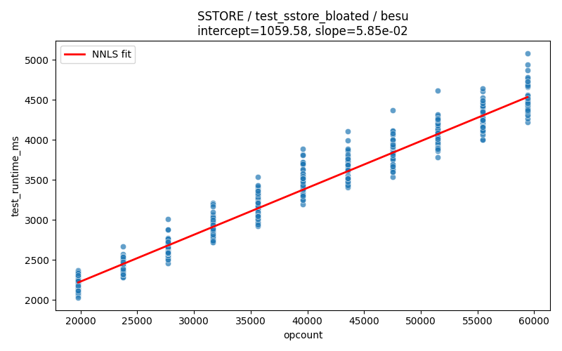

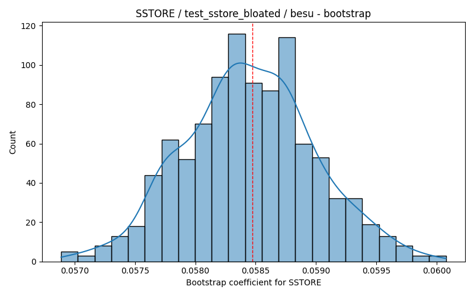

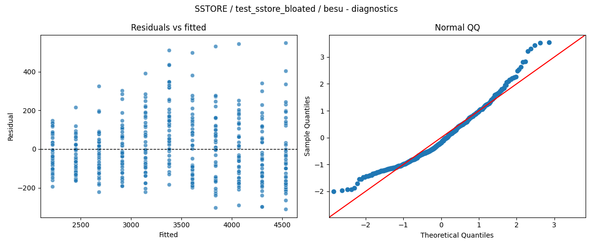

</details>

<details><summary>erigon — NNLS regression summary</summary>

```
==============================================================================
                           NNLS Regression Results                            
==============================================================================
Dep. Variable:          test_runtime_ms              R-squared:          0.973
Model:                  NNLS                    Adj. R-squared:          0.973
No. Observations:       154                               RMSE:          30.70
Df Residuals:           152                                MAE:          24.23
Df Model:               1      
==============================================================================
                      coef     std err     P-value      [0.025      0.975]
------------------------------------------------------------------------------
         const      0.0000      1.6297       1.000      0.0000      5.6001
       opcount      0.0064      0.0000       0.001      0.0063      0.0065
==============================================================================
Notes: Non-negative least squares with bootstrap inference (1000 iterations)
==============================================================================
```

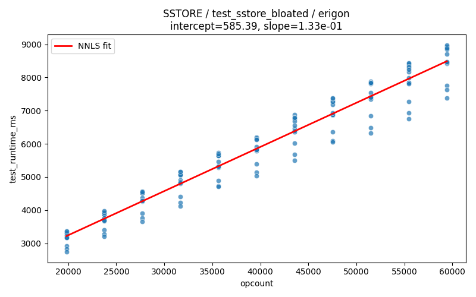

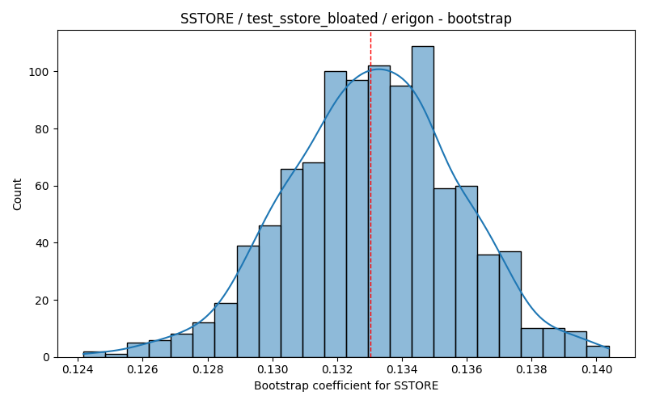

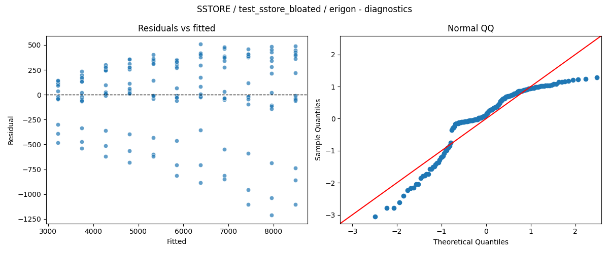

</details>

<details><summary>ethrex — NNLS regression summary</summary>

```
==============================================================================
                           NNLS Regression Results                            
==============================================================================
Dep. Variable:          test_runtime_ms              R-squared:          0.967
Model:                  NNLS                    Adj. R-squared:          0.967
No. Observations:       440                               RMSE:          86.72
Df Residuals:           438                                MAE:          70.32
Df Model:               1      
==============================================================================
                      coef     std err     P-value      [0.025      0.975]
------------------------------------------------------------------------------
         const      0.0000      0.0000       1.000      0.0000      0.0000
       opcount      0.0146      0.0000       0.001      0.0145      0.0147
==============================================================================
Notes: Non-negative least squares with bootstrap inference (1000 iterations)
==============================================================================
```

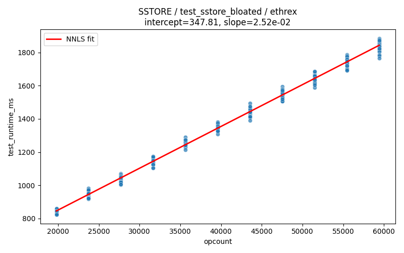

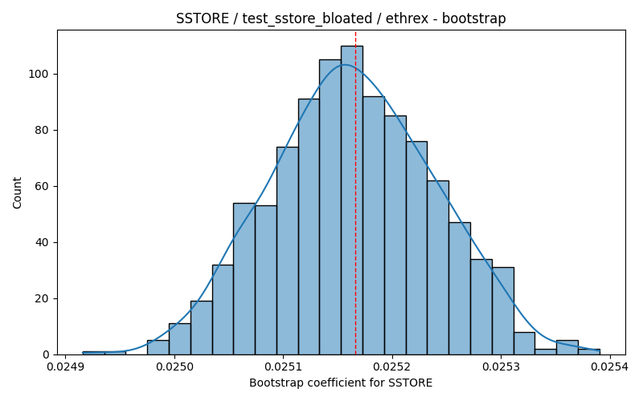

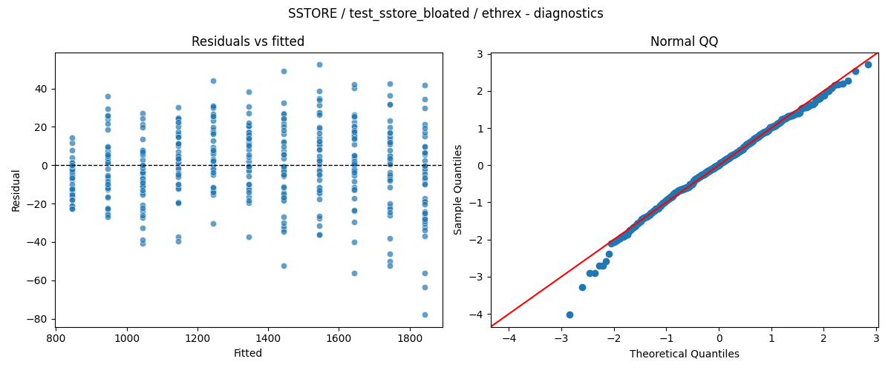

</details>

<details><summary>geth — NNLS regression summary</summary>

```
==============================================================================
                           NNLS Regression Results                            
==============================================================================
Dep. Variable:          test_runtime_ms              R-squared:          0.966
Model:                  NNLS                    Adj. R-squared:          0.966
No. Observations:       440                               RMSE:         124.54
Df Residuals:           438                                MAE:         100.88
Df Model:               1      
==============================================================================
                      coef     std err     P-value      [0.025      0.975]
------------------------------------------------------------------------------
         const    543.2005     19.2518       0.001    505.0698    581.0630
       opcount      0.0234      0.0002       0.001      0.0230      0.0239
==============================================================================
Notes: Non-negative least squares with bootstrap inference (1000 iterations)
==============================================================================
```

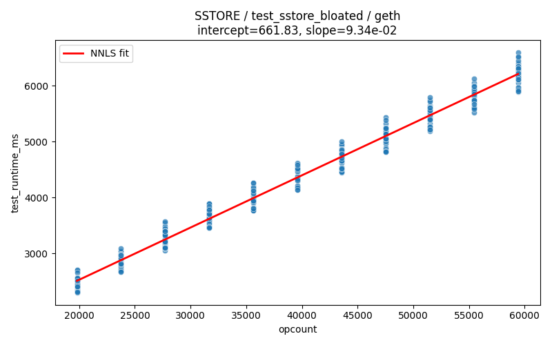

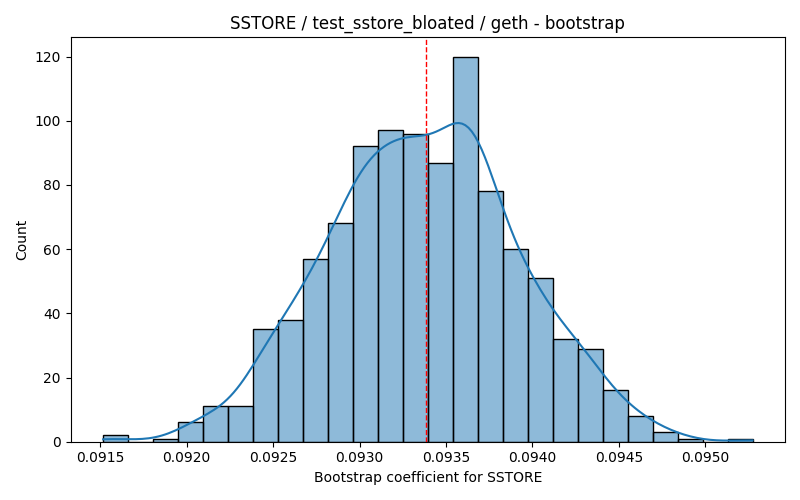

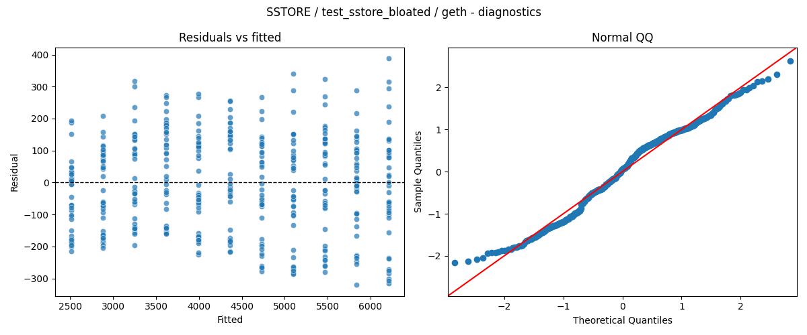

</details>

<details><summary>nethermind — NNLS regression summary</summary>

```
==============================================================================
                           NNLS Regression Results                            
==============================================================================
Dep. Variable:          test_runtime_ms              R-squared:          0.975
Model:                  NNLS                    Adj. R-squared:          0.975
No. Observations:       363                               RMSE:          40.73
Df Residuals:           361                                MAE:          31.91
Df Model:               1      
==============================================================================
                      coef     std err     P-value      [0.025      0.975]
------------------------------------------------------------------------------
         const    101.6496      6.4535       0.001     87.9284    113.5988
       opcount      0.0090      0.0001       0.001      0.0088      0.0091
==============================================================================
Notes: Non-negative least squares with bootstrap inference (1000 iterations)
==============================================================================
```

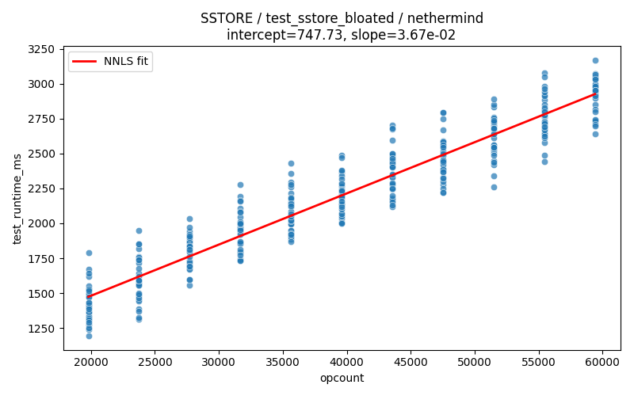

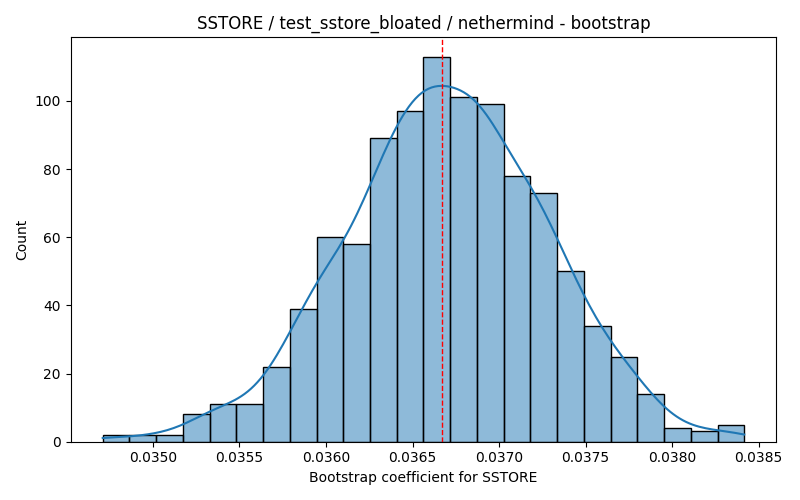

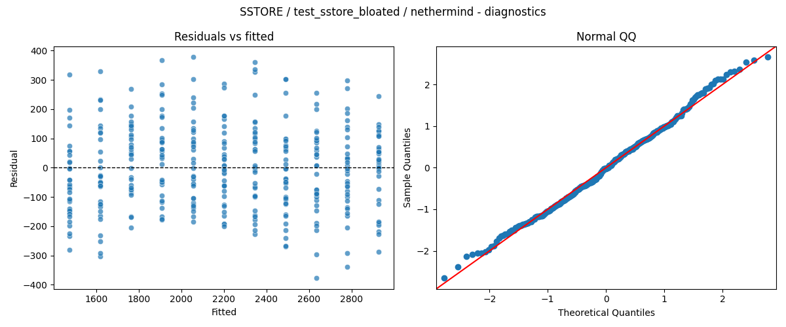

</details>

<details><summary>reth — NNLS regression summary</summary>

```
==============================================================================
                           NNLS Regression Results                            
==============================================================================
Dep. Variable:          test_runtime_ms              R-squared:          0.954
Model:                  NNLS                    Adj. R-squared:          0.954
No. Observations:       539                               RMSE:           9.03
Df Residuals:           537                                MAE:           7.23
Df Model:               1      
==============================================================================
                      coef     std err     P-value      [0.025      0.975]
------------------------------------------------------------------------------
         const     30.5039      1.2469       0.001     28.0116     33.0576
       opcount      0.0015      0.0000       0.001      0.0014      0.0015
==============================================================================
Notes: Non-negative least squares with bootstrap inference (1000 iterations)
==============================================================================
```

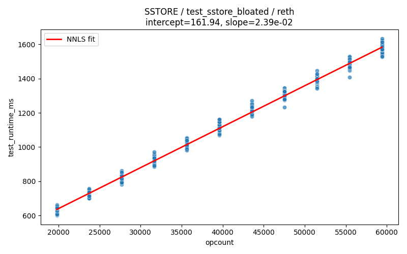


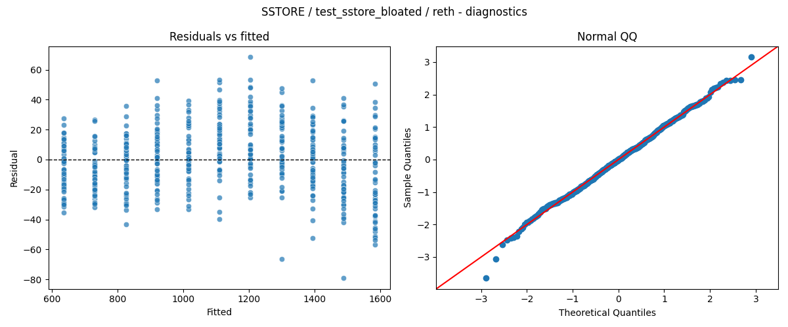

</details>

### test_sstore_bloated — combo `False` — `presets[cold_storage_sstore_write]`

| client | nobs | R² | target_coef (ms) | p-value | 95% CI |
| --- | --- | --- | --- | --- | --- |
| `besu` | 462 | 0.7558 | 0.1356 | 1.00e-03 | [0.1281, 0.1431] |
| `erigon` | 154 | 0.3676 | 0.2138 | 1.00e-03 | [0.1486, 0.2673] |
| `ethrex` | 440 | 0.4231 | 0.01903 | 1.00e-03 | [0.01711, 0.02084] |
| `geth` | 440 | 0.9196 | 0.135 | 1.00e-03 | [0.1312, 0.1387] |
| `nethermind` | 363 | 0.6345 | 0.04788 | 1.00e-03 | [0.04398, 0.05178] |
| `reth` | 539 | 0.8796 | 0.0391 | 1.00e-03 | [0.03802, 0.04025] |

<details><summary>besu — NNLS regression summary</summary>

```
==============================================================================
                           NNLS Regression Results                            
==============================================================================
Dep. Variable:          test_runtime_ms              R-squared:          0.756
Model:                  NNLS                    Adj. R-squared:          0.755
No. Observations:       462                               RMSE:          47.35
Df Residuals:           460                                MAE:          41.49
Df Model:               1      
==============================================================================
                      coef     std err     P-value      [0.025      0.975]
------------------------------------------------------------------------------
         const    379.7155      6.9992       0.001    366.3860    393.8479
       opcount      0.1356      0.0037       0.001      0.1281      0.1431
==============================================================================
Notes: Non-negative least squares with bootstrap inference (1000 iterations)
==============================================================================
```


</details>

<details><summary>erigon — NNLS regression summary</summary>

```
==============================================================================
                           NNLS Regression Results                            
==============================================================================
Dep. Variable:          test_runtime_ms              R-squared:          0.368
Model:                  NNLS                    Adj. R-squared:          0.363
No. Observations:       154                               RMSE:         172.24
Df Residuals:           152                                MAE:         110.39
Df Model:               1      
==============================================================================
                      coef     std err     P-value      [0.025      0.975]
------------------------------------------------------------------------------
         const    302.9861     63.5946       0.001    195.6660    444.1305
       opcount      0.2138      0.0298       0.001      0.1486      0.2673
==============================================================================
Notes: Non-negative least squares with bootstrap inference (1000 iterations)
==============================================================================
```


</details>

<details><summary>ethrex — NNLS regression summary</summary>

```
==============================================================================
                           NNLS Regression Results                            
==============================================================================
Dep. Variable:          test_runtime_ms              R-squared:          0.423
Model:                  NNLS                    Adj. R-squared:          0.422
No. Observations:       440                               RMSE:          13.65
Df Residuals:           438                                MAE:          11.04
Df Model:               1      
==============================================================================
                      coef     std err     P-value      [0.025      0.975]
------------------------------------------------------------------------------
         const    299.7418      2.0197       0.001    296.0051    303.6844
       opcount      0.0190      0.0010       0.001      0.0171      0.0208
==============================================================================
Notes: Non-negative least squares with bootstrap inference (1000 iterations)
==============================================================================
```


</details>

<details><summary>geth — NNLS regression summary</summary>

```
==============================================================================
                           NNLS Regression Results                            
==============================================================================
Dep. Variable:          test_runtime_ms              R-squared:          0.920
Model:                  NNLS                    Adj. R-squared:          0.919
No. Observations:       440                               RMSE:          24.53
Df Residuals:           438                                MAE:          17.01
Df Model:               1      
==============================================================================
                      coef     std err     P-value      [0.025      0.975]
------------------------------------------------------------------------------
         const     72.1403      3.4896       0.001     65.8928     79.5523
       opcount      0.1350      0.0019       0.001      0.1312      0.1387
==============================================================================
Notes: Non-negative least squares with bootstrap inference (1000 iterations)
==============================================================================
```


</details>

<details><summary>nethermind — NNLS regression summary</summary>

```
==============================================================================
                           NNLS Regression Results                            
==============================================================================
Dep. Variable:          test_runtime_ms              R-squared:          0.634
Model:                  NNLS                    Adj. R-squared:          0.633
No. Observations:       363                               RMSE:          22.32
Df Residuals:           361                                MAE:          17.43
Df Model:               1      
==============================================================================
                      coef     std err     P-value      [0.025      0.975]
------------------------------------------------------------------------------
         const    104.5998      3.6215       0.001     97.6809    111.6730
       opcount      0.0479      0.0020       0.001      0.0440      0.0518
==============================================================================
Notes: Non-negative least squares with bootstrap inference (1000 iterations)
==============================================================================
```


</details>

<details><summary>reth — NNLS regression summary</summary>

```
==============================================================================
                           NNLS Regression Results                            
==============================================================================
Dep. Variable:          test_runtime_ms              R-squared:          0.880
Model:                  NNLS                    Adj. R-squared:          0.879
No. Observations:       539                               RMSE:           8.88
Df Residuals:           537                                MAE:           7.06
Df Model:               1      
==============================================================================
                      coef     std err     P-value      [0.025      0.975]
------------------------------------------------------------------------------
         const     36.7529      1.2472       0.001     34.2598     38.9898
       opcount      0.0391      0.0006       0.001      0.0380      0.0402
==============================================================================
Notes: Non-negative least squares with bootstrap inference (1000 iterations)
==============================================================================
```


</details>

### test_sstore_bloated — combo `True` — `presets[cold_storage_sstore_write]`

| client | nobs | R² | target_coef (ms) | p-value | 95% CI |
| --- | --- | --- | --- | --- | --- |
| `besu` | 462 | 0.9575 | 0.05847 | 1.00e-03 | [0.05741, 0.05954] |
| `erigon` | 154 | 0.9465 | 0.133 | 1.00e-03 | [0.1278, 0.1382] |
| `ethrex` | 440 | 0.9962 | 0.02517 | 1.00e-03 | [0.02502, 0.0253] |
| `geth` | 440 | 0.9843 | 0.09338 | 1.00e-03 | [0.09234, 0.09443] |
| `nethermind` | 363 | 0.9124 | 0.03667 | 1.00e-03 | [0.03549, 0.03783] |
| `reth` | 539 | 0.9948 | 0.02392 | 1.00e-03 | [0.02377, 0.02408] |

<details><summary>besu — NNLS regression summary</summary>

```
==============================================================================
                           NNLS Regression Results                            
==============================================================================
Dep. Variable:          test_runtime_ms              R-squared:          0.957
Model:                  NNLS                    Adj. R-squared:          0.957
No. Observations:       462                               RMSE:         154.33
Df Residuals:           460                                MAE:         124.21
Df Model:               1      
==============================================================================
                      coef     std err     P-value      [0.025      0.975]
------------------------------------------------------------------------------
         const   1059.5827     19.6865       0.001   1021.4952   1097.4899
       opcount      0.0585      0.0005       0.001      0.0574      0.0595
==============================================================================
Notes: Non-negative least squares with bootstrap inference (1000 iterations)
==============================================================================
```


</details>

<details><summary>erigon — NNLS regression summary</summary>

```
==============================================================================
                           NNLS Regression Results                            
==============================================================================
Dep. Variable:          test_runtime_ms              R-squared:          0.947
Model:                  NNLS                    Adj. R-squared:          0.946
No. Observations:       154                               RMSE:         395.93
Df Residuals:           152                                MAE:         300.00
Df Model:               1      
==============================================================================
                      coef     std err     P-value      [0.025      0.975]
------------------------------------------------------------------------------
         const    585.3930     92.7667       0.001    399.5707    766.1776
       opcount      0.1330      0.0026       0.001      0.1278      0.1382
==============================================================================
Notes: Non-negative least squares with bootstrap inference (1000 iterations)
==============================================================================
```


</details>

<details><summary>ethrex — NNLS regression summary</summary>

```
==============================================================================
                           NNLS Regression Results                            
==============================================================================
Dep. Variable:          test_runtime_ms              R-squared:          0.996
Model:                  NNLS                    Adj. R-squared:          0.996
No. Observations:       440                               RMSE:          19.38
Df Residuals:           438                                MAE:          15.20
Df Model:               1      
==============================================================================
                      coef     std err     P-value      [0.025      0.975]
------------------------------------------------------------------------------
         const    347.8118      2.7548       0.001    342.8035    353.2070
       opcount      0.0252      0.0001       0.001      0.0250      0.0253
==============================================================================
Notes: Non-negative least squares with bootstrap inference (1000 iterations)
==============================================================================
```


</details>

<details><summary>geth — NNLS regression summary</summary>

```
==============================================================================
                           NNLS Regression Results                            
==============================================================================
Dep. Variable:          test_runtime_ms              R-squared:          0.984
Model:                  NNLS                    Adj. R-squared:          0.984
No. Observations:       440                               RMSE:         147.71
Df Residuals:           438                                MAE:         124.90
Df Model:               1      
==============================================================================
                      coef     std err     P-value      [0.025      0.975]
------------------------------------------------------------------------------
         const    661.8309     21.5805       0.001    621.1560    705.9905
       opcount      0.0934      0.0005       0.001      0.0923      0.0944
==============================================================================
Notes: Non-negative least squares with bootstrap inference (1000 iterations)
==============================================================================
```


</details>

<details><summary>nethermind — NNLS regression summary</summary>

```
==============================================================================
                           NNLS Regression Results                            
==============================================================================
Dep. Variable:          test_runtime_ms              R-squared:          0.912
Model:                  NNLS                    Adj. R-squared:          0.912
No. Observations:       363                               RMSE:         142.27
Df Residuals:           361                                MAE:         115.90
Df Model:               1      
==============================================================================
                      coef     std err     P-value      [0.025      0.975]
------------------------------------------------------------------------------
         const    747.7349     24.2281       0.001    701.6240    795.9356
       opcount      0.0367      0.0006       0.001      0.0355      0.0378
==============================================================================
Notes: Non-negative least squares with bootstrap inference (1000 iterations)
==============================================================================
```


</details>

<details><summary>reth — NNLS regression summary</summary>

```
==============================================================================
                           NNLS Regression Results                            
==============================================================================
Dep. Variable:          test_runtime_ms              R-squared:          0.995
Model:                  NNLS                    Adj. R-squared:          0.995
No. Observations:       539                               RMSE:          21.69
Df Residuals:           537                                MAE:          17.32
Df Model:               1      
==============================================================================
                      coef     std err     P-value      [0.025      0.975]
------------------------------------------------------------------------------
         const    161.9439      2.9035       0.001    156.1348    167.9636
       opcount      0.0239      0.0001       0.001      0.0238      0.0241
==============================================================================
Notes: Non-negative least squares with bootstrap inference (1000 iterations)
==============================================================================
```


</details>

## BALANCE

### test_account_access — combo `BALANCE_AccountMode.EXISTING_EOA`

| client | nobs | R² | target_coef (ms) | p-value | 95% CI |
| --- | --- | --- | --- | --- | --- |
| `besu` | 462 | 0.8468 | 0.0127 | 1.00e-03 | [0.01222, 0.0132] |
| `erigon` | 154 | 0.9729 | 0.009649 | 1.00e-03 | [0.009382, 0.009866] |
| `ethrex` | 440 | 0.9931 | 0.007179 | 1.00e-03 | [0.007118, 0.007236] |
| `geth` | 440 | 0.9084 | 0.01068 | 1.00e-03 | [0.0103, 0.01101] |
| `nethermind` | 363 | 0.8264 | 0.003985 | 1.00e-03 | [0.003797, 0.004184] |
| `reth` | 539 | 0.922 | 0.001053 | 1.00e-03 | [0.001026, 0.001078] |

<details><summary>besu — NNLS regression summary</summary>

```
==============================================================================
                           NNLS Regression Results                            
==============================================================================
Dep. Variable:          test_runtime_ms              R-squared:          0.847
Model:                  NNLS                    Adj. R-squared:          0.846
No. Observations:       462                               RMSE:         129.13
Df Residuals:           460                                MAE:         103.55
Df Model:               1      
==============================================================================
                      coef     std err     P-value      [0.025      0.975]
------------------------------------------------------------------------------
         const    506.5126     18.6458       0.001    472.7648    544.1835
       opcount      0.0127      0.0002       0.001      0.0122      0.0132
==============================================================================
Notes: Non-negative least squares with bootstrap inference (1000 iterations)
==============================================================================
```

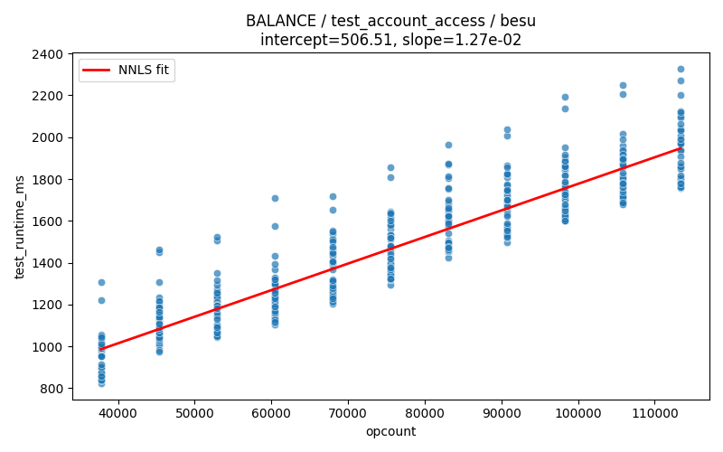

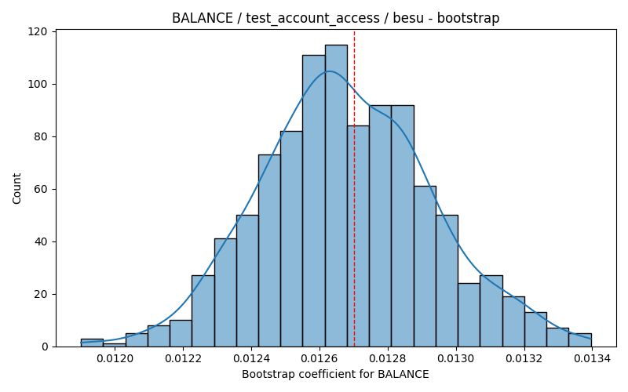

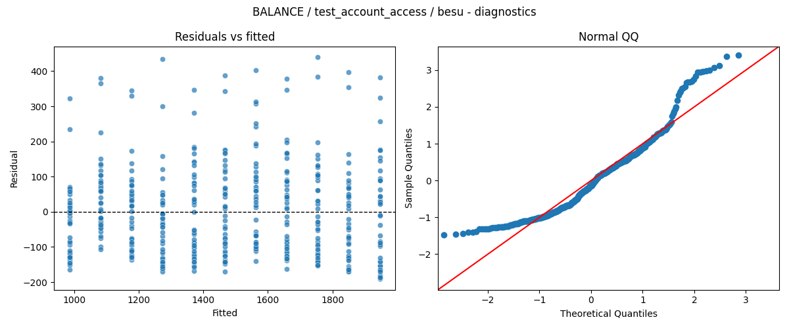

</details>

<details><summary>erigon — NNLS regression summary</summary>

```
==============================================================================
                           NNLS Regression Results                            
==============================================================================
Dep. Variable:          test_runtime_ms              R-squared:          0.973
Model:                  NNLS                    Adj. R-squared:          0.973
No. Observations:       154                               RMSE:          38.49
Df Residuals:           152                                MAE:          28.58
Df Model:               1      
==============================================================================
                      coef     std err     P-value      [0.025      0.975]
------------------------------------------------------------------------------
         const     15.0830      9.6490       0.060      0.0000     35.7123
       opcount      0.0096      0.0001       0.001      0.0094      0.0099
==============================================================================
Notes: Non-negative least squares with bootstrap inference (1000 iterations)
==============================================================================
```

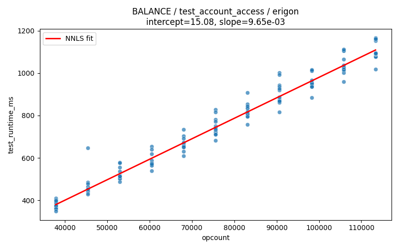

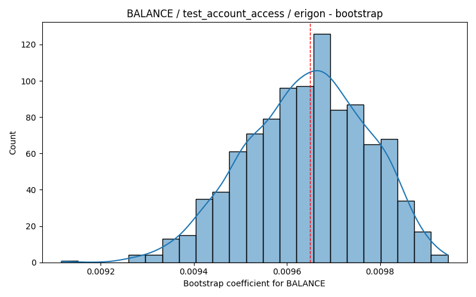

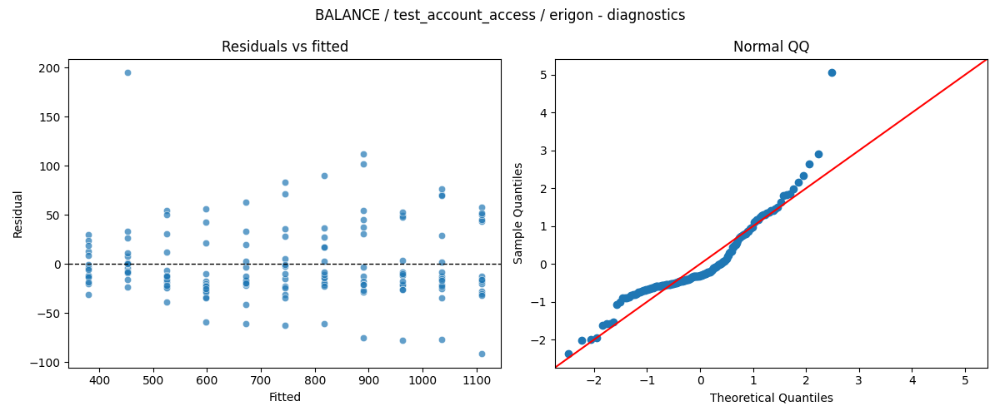

</details>

<details><summary>ethrex — NNLS regression summary</summary>

```
==============================================================================
                           NNLS Regression Results                            
==============================================================================
Dep. Variable:          test_runtime_ms              R-squared:          0.993
Model:                  NNLS                    Adj. R-squared:          0.993
No. Observations:       440                               RMSE:          14.30
Df Residuals:           438                                MAE:          11.16
Df Model:               1      
==============================================================================
                      coef     std err     P-value      [0.025      0.975]
------------------------------------------------------------------------------
         const     45.2627      2.0770       0.001     41.1742     49.3571
       opcount      0.0072      0.0000       0.001      0.0071      0.0072
==============================================================================
Notes: Non-negative least squares with bootstrap inference (1000 iterations)
==============================================================================
```

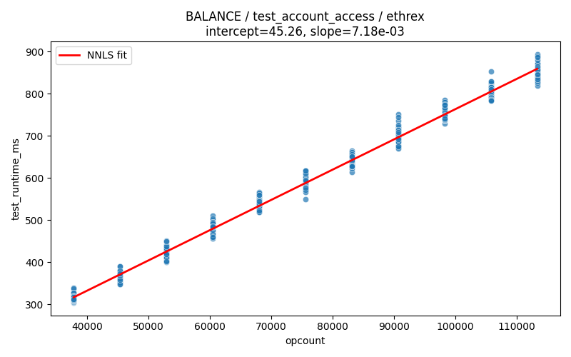

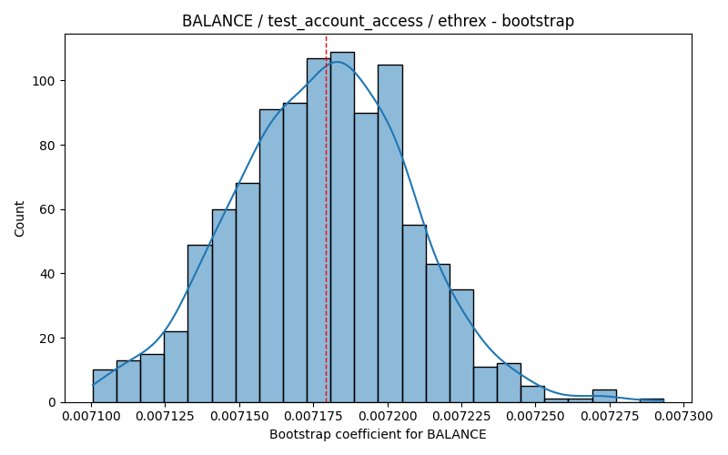


</details>

<details><summary>geth — NNLS regression summary</summary>

```
==============================================================================
                           NNLS Regression Results                            
==============================================================================
Dep. Variable:          test_runtime_ms              R-squared:          0.908
Model:                  NNLS                    Adj. R-squared:          0.908
No. Observations:       440                               RMSE:          81.05
Df Residuals:           438                                MAE:          66.22
Df Model:               1      
==============================================================================
                      coef     std err     P-value      [0.025      0.975]
------------------------------------------------------------------------------
         const    424.0258     15.3945       0.001    395.8721    456.1695
       opcount      0.0107      0.0002       0.001      0.0103      0.0110
==============================================================================
Notes: Non-negative least squares with bootstrap inference (1000 iterations)
==============================================================================
```

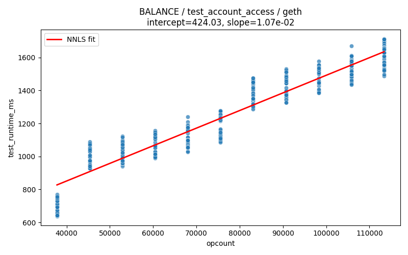

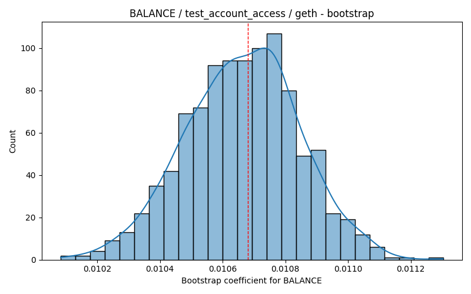

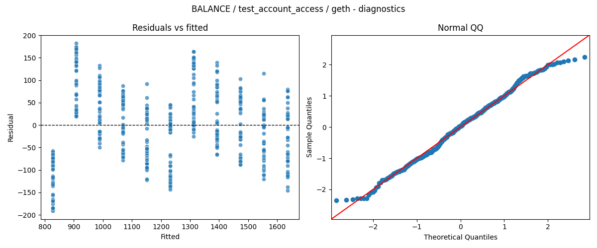

</details>

<details><summary>nethermind — NNLS regression summary</summary>

```
==============================================================================
                           NNLS Regression Results                            
==============================================================================
Dep. Variable:          test_runtime_ms              R-squared:          0.826
Model:                  NNLS                    Adj. R-squared:          0.826
No. Observations:       363                               RMSE:          43.65
Df Residuals:           361                                MAE:          34.30
Df Model:               1      
==============================================================================
                      coef     std err     P-value      [0.025      0.975]
------------------------------------------------------------------------------
         const     78.1788      7.0273       0.001     63.9646     91.7492
       opcount      0.0040      0.0001       0.001      0.0038      0.0042
==============================================================================
Notes: Non-negative least squares with bootstrap inference (1000 iterations)
==============================================================================
```

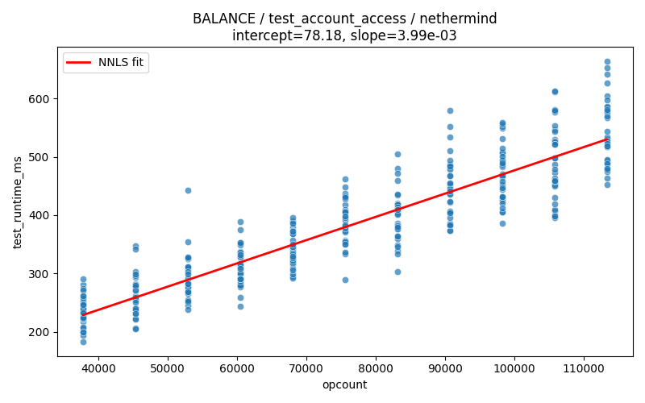

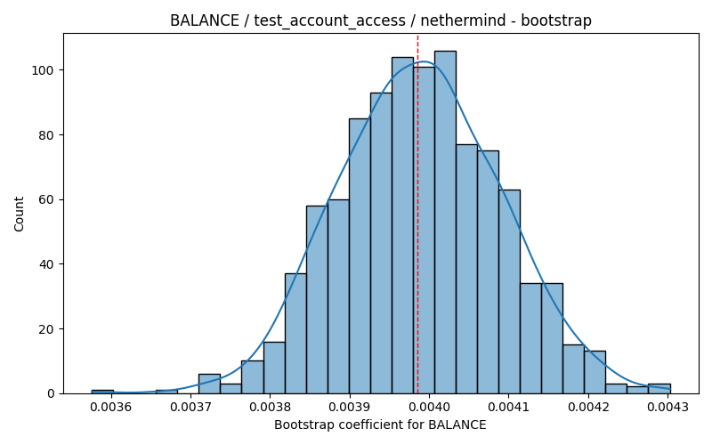

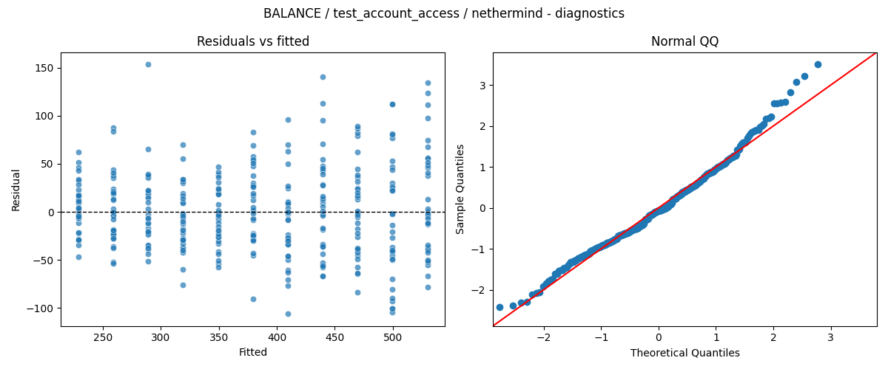

</details>

<details><summary>reth — NNLS regression summary</summary>

```
==============================================================================
                           NNLS Regression Results                            
==============================================================================
Dep. Variable:          test_runtime_ms              R-squared:          0.922
Model:                  NNLS                    Adj. R-squared:          0.922
No. Observations:       539                               RMSE:           7.32
Df Residuals:           537                                MAE:           5.81
Df Model:               1      
==============================================================================
                      coef     std err     P-value      [0.025      0.975]
------------------------------------------------------------------------------
         const     45.1382      1.0038       0.001     43.2410     47.1796
       opcount      0.0011      0.0000       0.001      0.0010      0.0011
==============================================================================
Notes: Non-negative least squares with bootstrap inference (1000 iterations)
==============================================================================
```

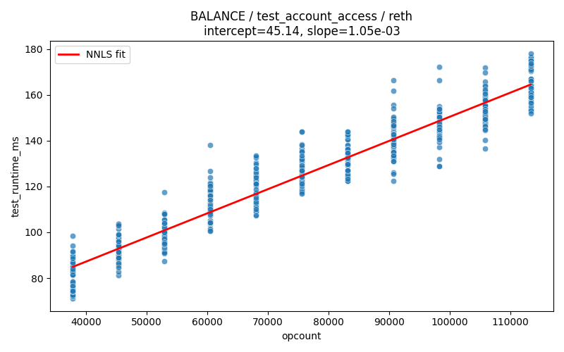

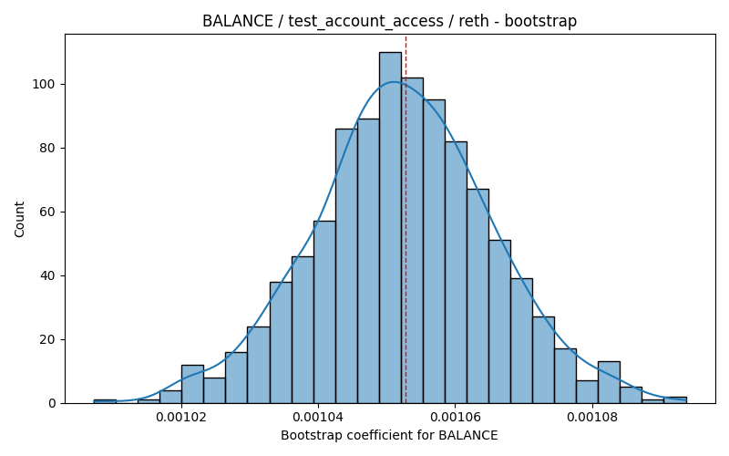

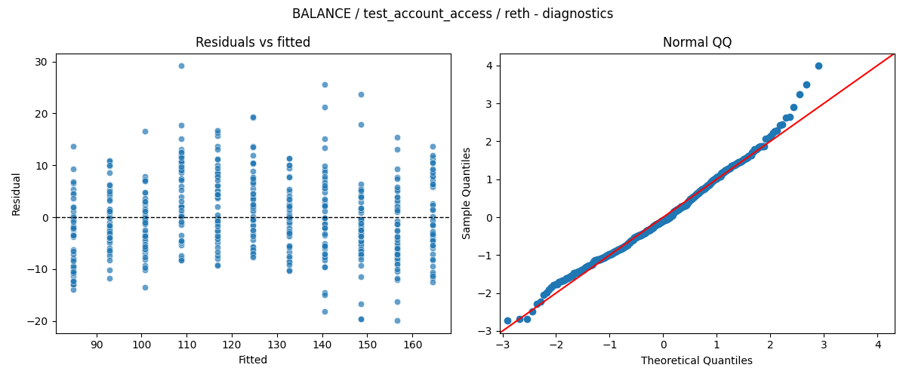

</details>

### test_account_access — combo `BALANCE_AccountMode.NON_EXISTING_ACCOUNT` — `presets[cold_account_nocode_access]`

| client | nobs | R² | target_coef (ms) | p-value | 95% CI |
| --- | --- | --- | --- | --- | --- |
| `besu` | 462 | 0.8307 | 0.01317 | 1.00e-03 | [0.01264, 0.0137] |
| `erigon` | 154 | 0.9812 | 0.00874 | 1.00e-03 | [0.008544, 0.008809] |
| `ethrex` | 440 | 0.9632 | 0.002003 | 1.00e-03 | [0.001966, 0.002037] |
| `geth` | 440 | 0.8572 | 0.02159 | 1.00e-03 | [0.02073, 0.02249] |
| `nethermind` | 363 | 0.8261 | 0.003538 | 1.00e-03 | [0.00337, 0.003697] |
| `reth` | 539 | 0.8706 | 0.0007428 | 1.00e-03 | [0.0007167, 0.0007688] |

<details><summary>besu — NNLS regression summary</summary>

```
==============================================================================
                           NNLS Regression Results                            
==============================================================================
Dep. Variable:          test_runtime_ms              R-squared:          0.831
Model:                  NNLS                    Adj. R-squared:          0.830
No. Observations:       462                               RMSE:         142.02
Df Residuals:           460                                MAE:         128.51
Df Model:               1      
==============================================================================
                      coef     std err     P-value      [0.025      0.975]
------------------------------------------------------------------------------
         const    494.2058     21.0444       0.001    452.9192    535.7793
       opcount      0.0132      0.0003       0.001      0.0126      0.0137
==============================================================================
Notes: Non-negative least squares with bootstrap inference (1000 iterations)
==============================================================================
```

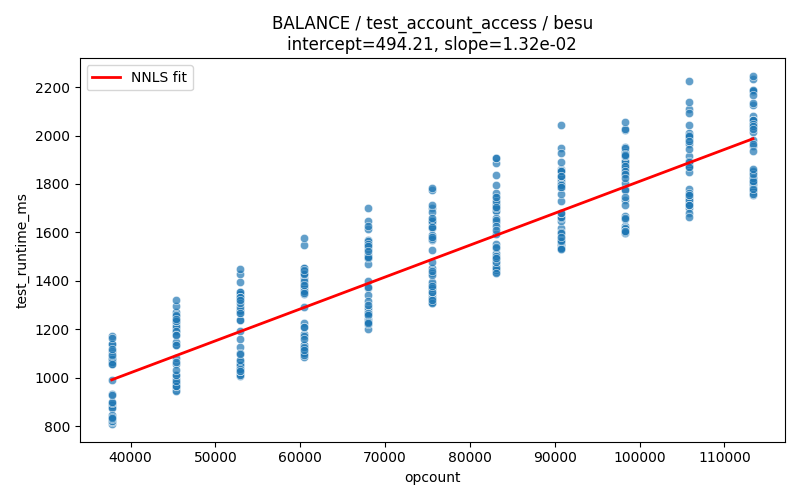

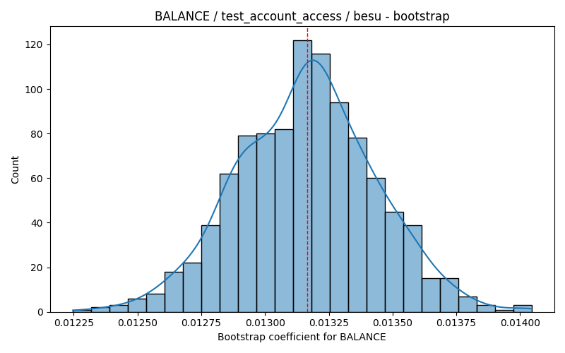

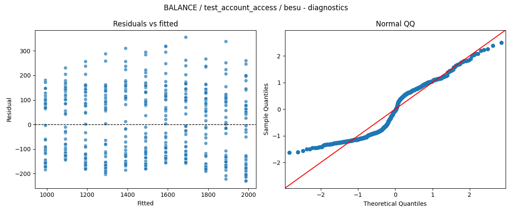

</details>

<details><summary>erigon — NNLS regression summary</summary>

```
==============================================================================
                           NNLS Regression Results                            
==============================================================================
Dep. Variable:          test_runtime_ms              R-squared:          0.981
Model:                  NNLS                    Adj. R-squared:          0.981
No. Observations:       154                               RMSE:          28.95
Df Residuals:           152                                MAE:          19.86
Df Model:               1      
==============================================================================
                      coef     std err     P-value      [0.025      0.975]
------------------------------------------------------------------------------
         const      0.0000      3.7498       1.000      0.0000     12.4731
       opcount      0.0087      0.0001       0.001      0.0085      0.0088
==============================================================================
Notes: Non-negative least squares with bootstrap inference (1000 iterations)
==============================================================================
```

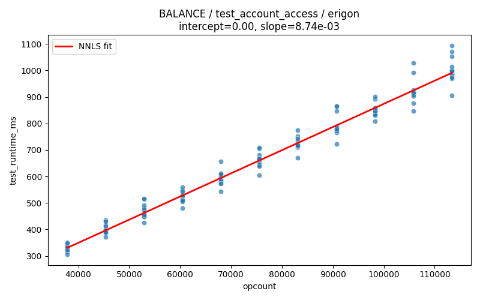

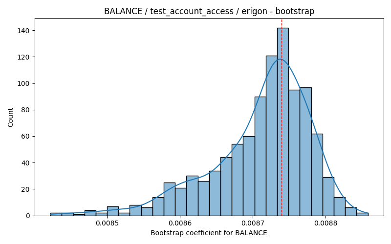

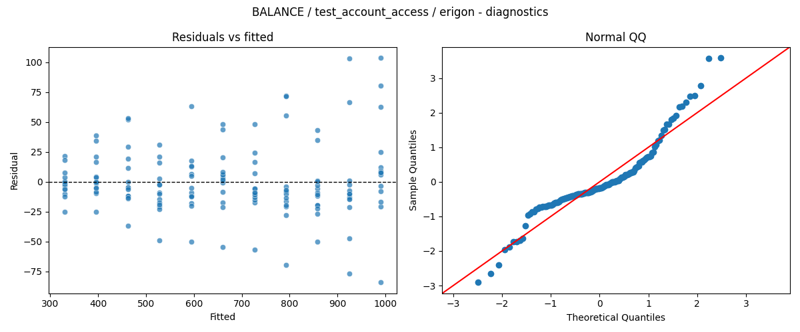

</details>

<details><summary>ethrex — NNLS regression summary</summary>

```
==============================================================================
                           NNLS Regression Results                            
==============================================================================
Dep. Variable:          test_runtime_ms              R-squared:          0.963
Model:                  NNLS                    Adj. R-squared:          0.963
No. Observations:       440                               RMSE:           9.36
Df Residuals:           438                                MAE:           7.49
Df Model:               1      
==============================================================================
                      coef     std err     P-value      [0.025      0.975]
------------------------------------------------------------------------------
         const     26.7235      1.4054       0.001     24.0782     29.7138
       opcount      0.0020      0.0000       0.001      0.0020      0.0020
==============================================================================
Notes: Non-negative least squares with bootstrap inference (1000 iterations)
==============================================================================
```

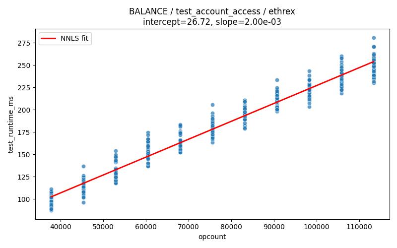

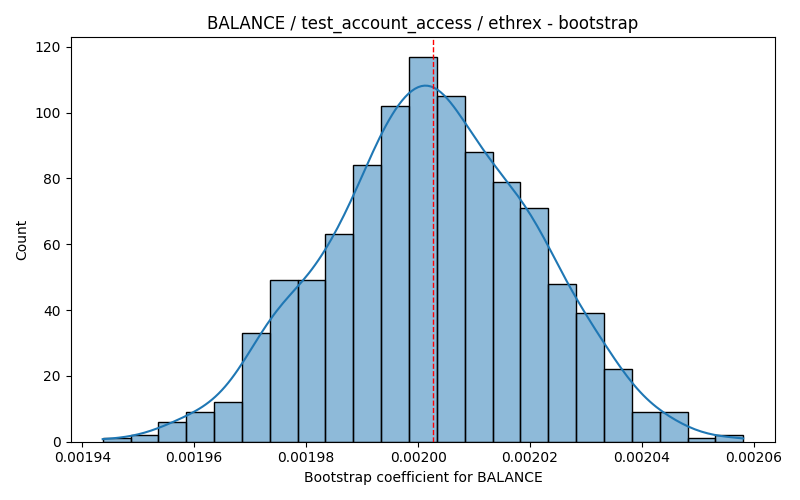

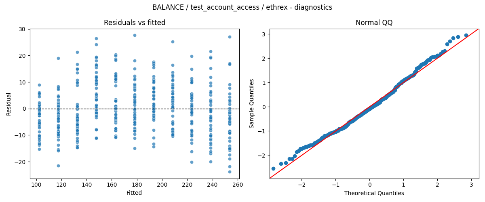

</details>

<details><summary>geth — NNLS regression summary</summary>

```
==============================================================================
                           NNLS Regression Results                            
==============================================================================
Dep. Variable:          test_runtime_ms              R-squared:          0.857
Model:                  NNLS                    Adj. R-squared:          0.857
No. Observations:       440                               RMSE:         210.66
Df Residuals:           438                                MAE:         178.22
Df Model:               1      
==============================================================================
                      coef     std err     P-value      [0.025      0.975]
------------------------------------------------------------------------------
         const    711.5268     37.5462       0.001    642.7250    783.5572
       opcount      0.0216      0.0004       0.001      0.0207      0.0225
==============================================================================
Notes: Non-negative least squares with bootstrap inference (1000 iterations)
==============================================================================
```

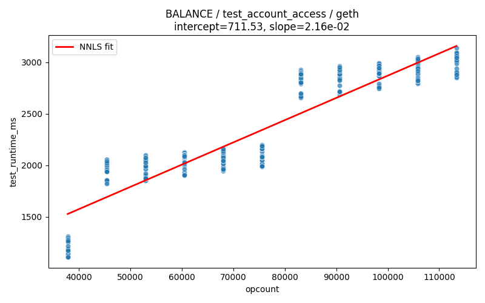

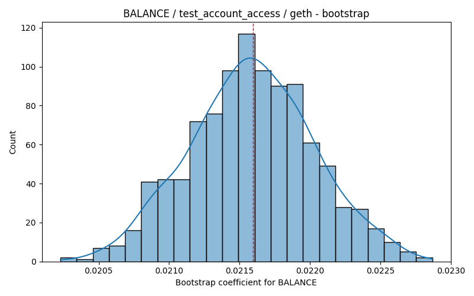

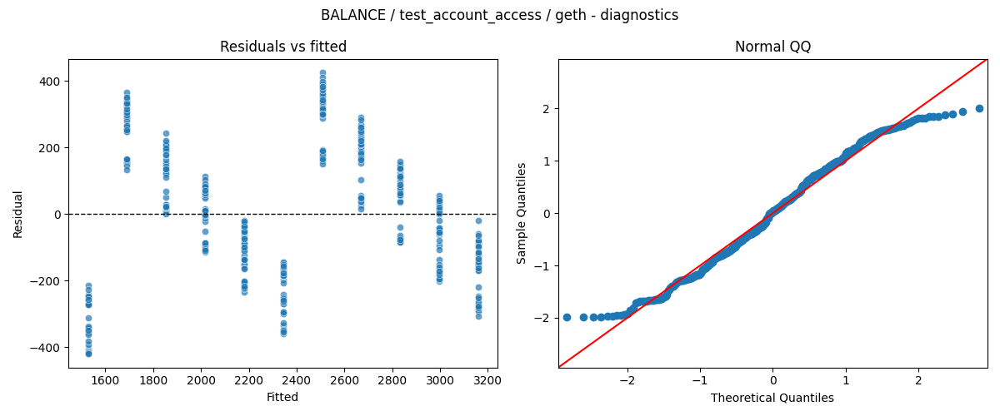

</details>

<details><summary>nethermind — NNLS regression summary</summary>

```
==============================================================================
                           NNLS Regression Results                            
==============================================================================
Dep. Variable:          test_runtime_ms              R-squared:          0.826
Model:                  NNLS                    Adj. R-squared:          0.826
No. Observations:       363                               RMSE:          38.80
Df Residuals:           361                                MAE:          30.75
Df Model:               1      
==============================================================================
                      coef     std err     P-value      [0.025      0.975]
------------------------------------------------------------------------------
         const     83.1026      5.6305       0.001     72.3548     94.0498
       opcount      0.0035      0.0001       0.001      0.0034      0.0037
==============================================================================
Notes: Non-negative least squares with bootstrap inference (1000 iterations)
==============================================================================
```

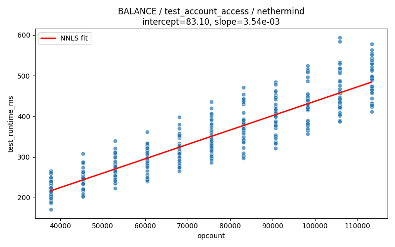

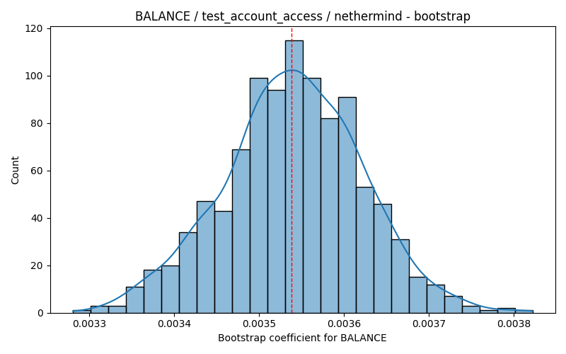

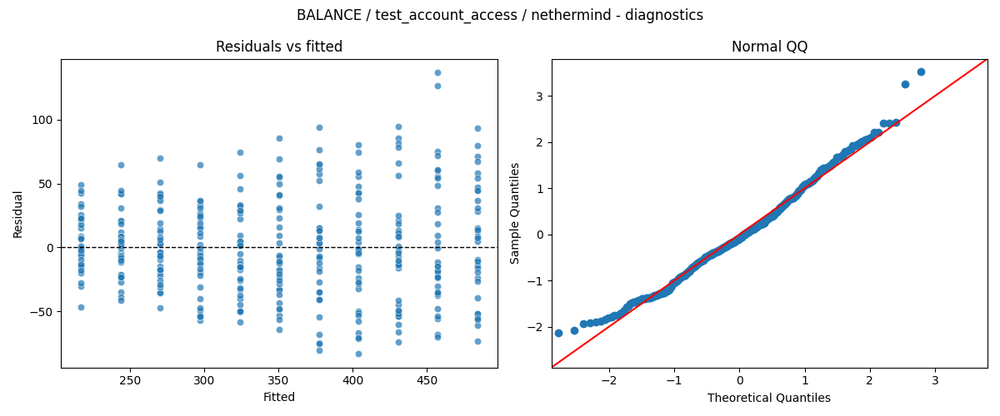

</details>

<details><summary>reth — NNLS regression summary</summary>

```
==============================================================================
                           NNLS Regression Results                            
==============================================================================
Dep. Variable:          test_runtime_ms              R-squared:          0.871
Model:                  NNLS                    Adj. R-squared:          0.870
No. Observations:       539                               RMSE:           6.84
Df Residuals:           537                                MAE:           5.50
Df Model:               1      
==============================================================================
                      coef     std err     P-value      [0.025      0.975]
------------------------------------------------------------------------------
         const     47.7746      0.9902       0.001     45.8457     49.7481
       opcount      0.0007      0.0000       0.001      0.0007      0.0008
==============================================================================
Notes: Non-negative least squares with bootstrap inference (1000 iterations)
==============================================================================
```

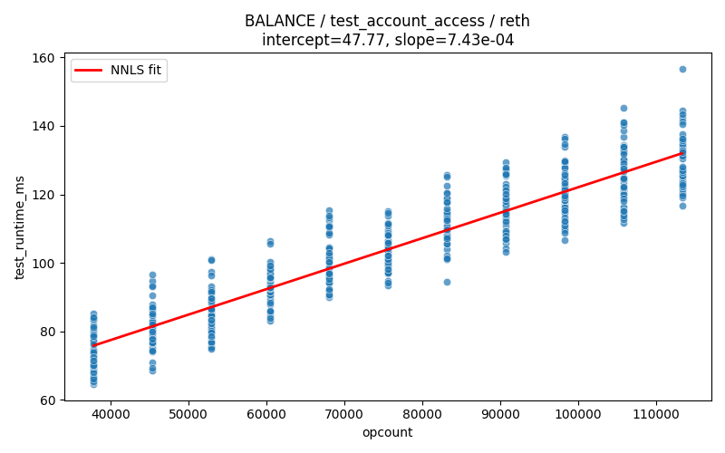

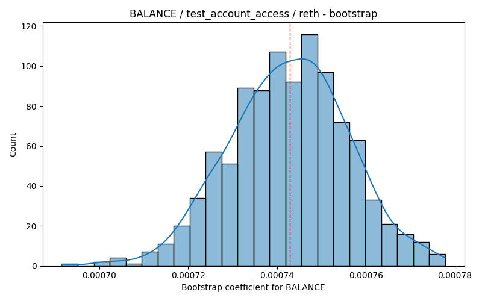

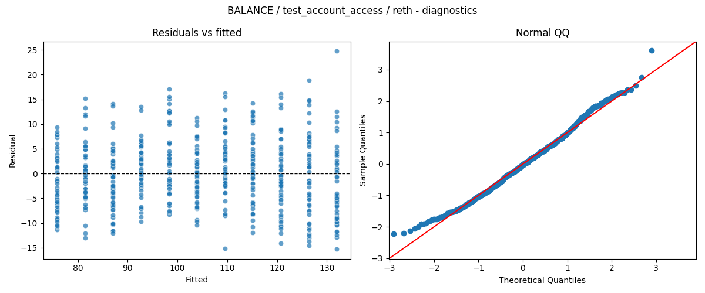

</details>

### test_account_access — combo `BALANCE_AccountMode.EXISTING_CONTRACT`

| client | nobs | R² | target_coef (ms) | p-value | 95% CI |
| --- | --- | --- | --- | --- | --- |
| `besu` | 462 | 0.89 | 0.02483 | 1.00e-03 | [0.02414, 0.02554] |
| `erigon` | 154 | 0.9319 | 0.02417 | 1.00e-03 | [0.0231, 0.02509] |
| `ethrex` | 440 | 0.9936 | 0.007705 | 1.00e-03 | [0.007652, 0.007762] |
| `geth` | 440 | 0.8536 | 0.02286 | 1.00e-03 | [0.02191, 0.02378] |
| `nethermind` | 363 | 0.5256 | 0.01281 | 1.00e-03 | [0.01158, 0.01417] |
| `reth` | 539 | 0.9714 | 0.003919 | 1.00e-03 | [0.003865, 0.003972] |

<details><summary>besu — NNLS regression summary</summary>

```
==============================================================================
                           NNLS Regression Results                            
==============================================================================
Dep. Variable:          test_runtime_ms              R-squared:          0.890
Model:                  NNLS                    Adj. R-squared:          0.890
No. Observations:       462                               RMSE:         181.59
Df Residuals:           460                                MAE:         145.67
Df Model:               1      
==============================================================================
                      coef     std err     P-value      [0.025      0.975]
------------------------------------------------------------------------------
         const    542.8650     24.6635       0.001    494.3818    590.4516
       opcount      0.0248      0.0004       0.001      0.0241      0.0255
==============================================================================
Notes: Non-negative least squares with bootstrap inference (1000 iterations)
==============================================================================
```

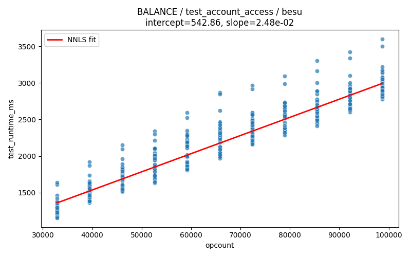

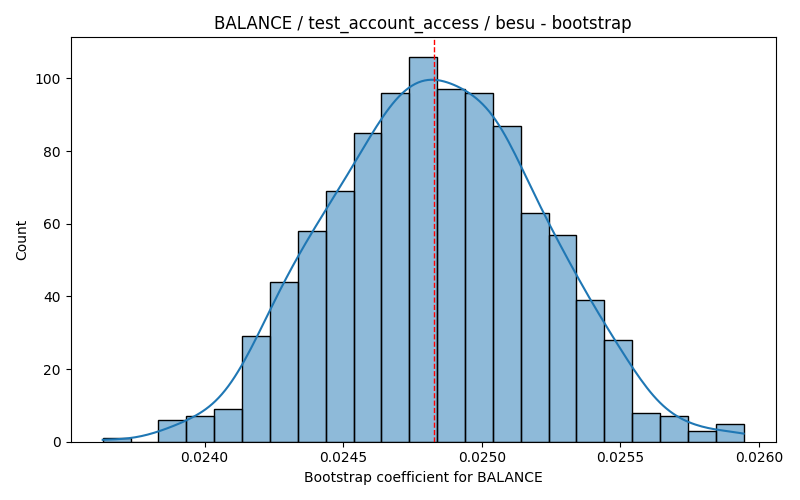

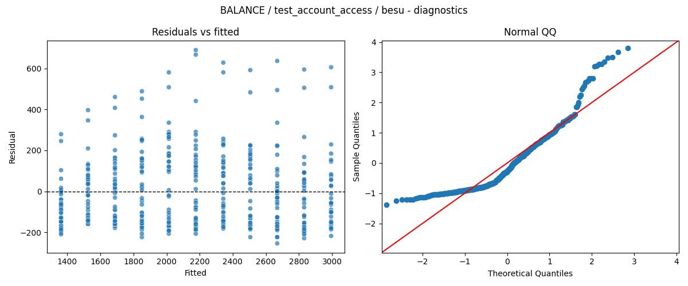

</details>

<details><summary>erigon — NNLS regression summary</summary>

```
==============================================================================
                           NNLS Regression Results                            
==============================================================================
Dep. Variable:          test_runtime_ms              R-squared:          0.932
Model:                  NNLS                    Adj. R-squared:          0.931
No. Observations:       154                               RMSE:         135.91
Df Residuals:           152                                MAE:         115.36
Df Model:               1      
==============================================================================
                      coef     std err     P-value      [0.025      0.975]
------------------------------------------------------------------------------
         const    300.9636     35.5246       0.001    236.9698    379.2595
       opcount      0.0242      0.0005       0.001      0.0231      0.0251
==============================================================================
Notes: Non-negative least squares with bootstrap inference (1000 iterations)
==============================================================================
```

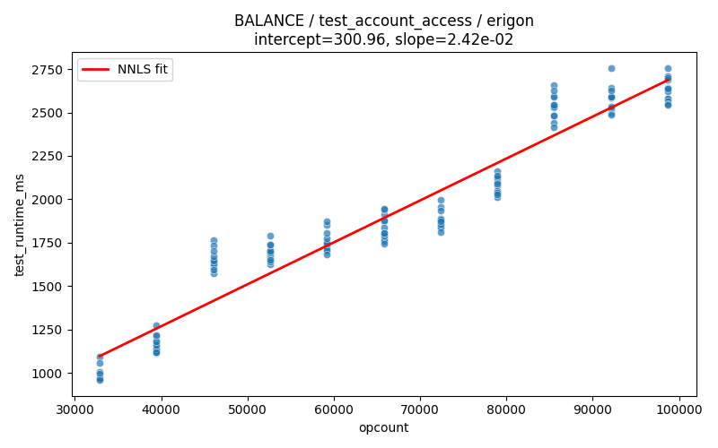

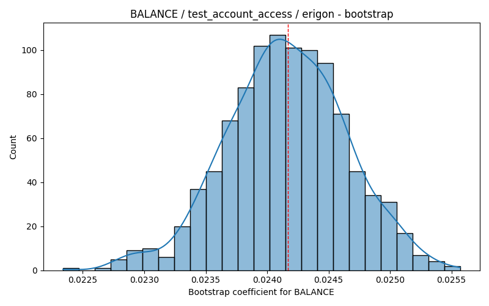

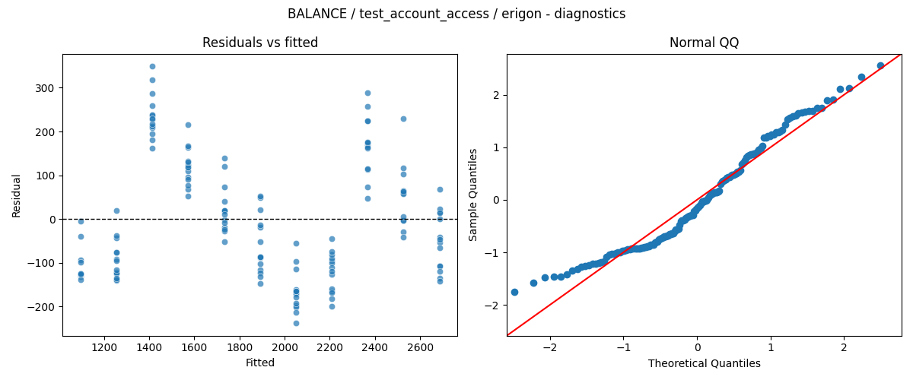

</details>

<details><summary>ethrex — NNLS regression summary</summary>

```
==============================================================================
                           NNLS Regression Results                            
==============================================================================
Dep. Variable:          test_runtime_ms              R-squared:          0.994
Model:                  NNLS                    Adj. R-squared:          0.994
No. Observations:       440                               RMSE:          12.86
Df Residuals:           438                                MAE:          10.18
Df Model:               1      
==============================================================================
                      coef     std err     P-value      [0.025      0.975]
------------------------------------------------------------------------------
         const     42.3265      1.8494       0.001     38.6427     45.8075
       opcount      0.0077      0.0000       0.001      0.0077      0.0078
==============================================================================
Notes: Non-negative least squares with bootstrap inference (1000 iterations)
==============================================================================
```

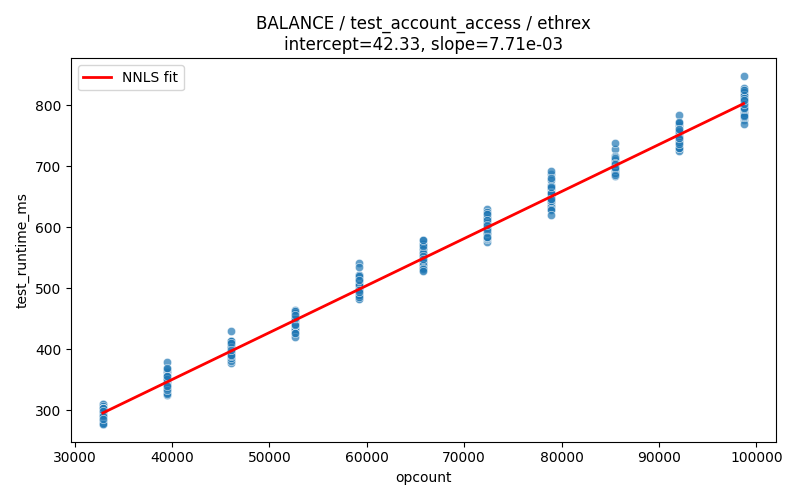

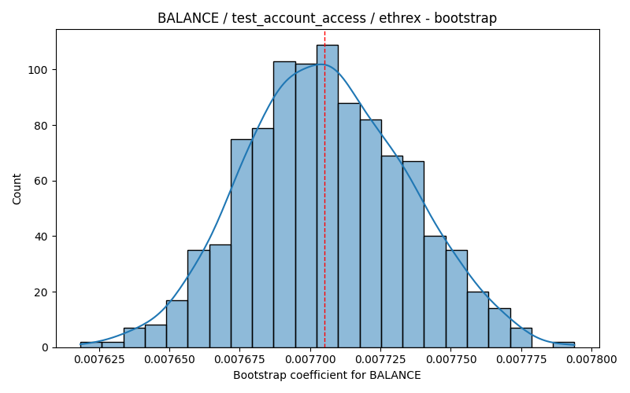

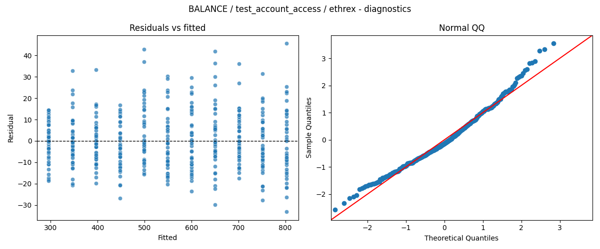

</details>

<details><summary>geth — NNLS regression summary</summary>

```
==============================================================================
                           NNLS Regression Results                            
==============================================================================
Dep. Variable:          test_runtime_ms              R-squared:          0.854
Model:                  NNLS                    Adj. R-squared:          0.853
No. Observations:       440                               RMSE:         196.96
Df Residuals:           438                                MAE:         165.97
Df Model:               1      
==============================================================================
                      coef     std err     P-value      [0.025      0.975]
------------------------------------------------------------------------------
         const    682.1049     36.0681       0.001    613.4506    754.7921
       opcount      0.0229      0.0005       0.001      0.0219      0.0238
==============================================================================
Notes: Non-negative least squares with bootstrap inference (1000 iterations)
==============================================================================
```

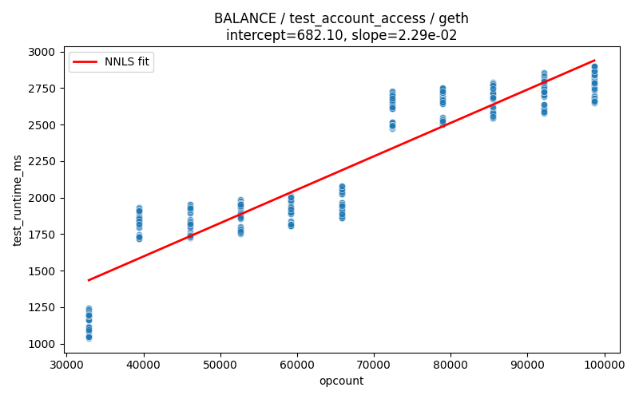

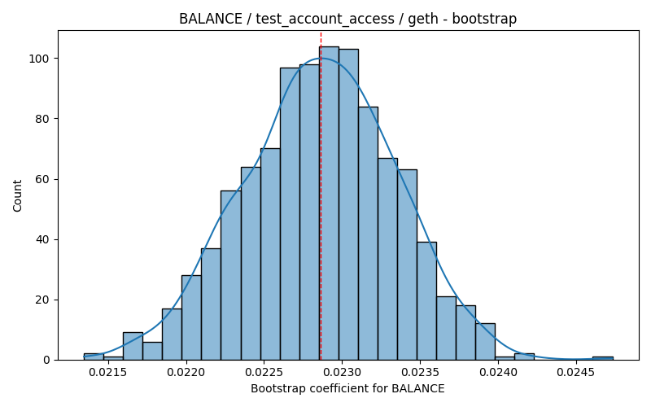

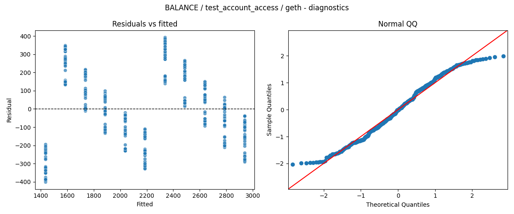

</details>

<details><summary>nethermind — NNLS regression summary</summary>

```
==============================================================================
                           NNLS Regression Results                            
==============================================================================
Dep. Variable:          test_runtime_ms              R-squared:          0.526
Model:                  NNLS                    Adj. R-squared:          0.524
No. Observations:       363                               RMSE:         253.18
Df Residuals:           361                                MAE:         190.62
Df Model:               1      
==============================================================================
                      coef     std err     P-value      [0.025      0.975]
------------------------------------------------------------------------------
         const    182.4353     37.8657       0.001    106.6227    254.3134
       opcount      0.0128      0.0007       0.001      0.0116      0.0142
==============================================================================
Notes: Non-negative least squares with bootstrap inference (1000 iterations)
==============================================================================
```

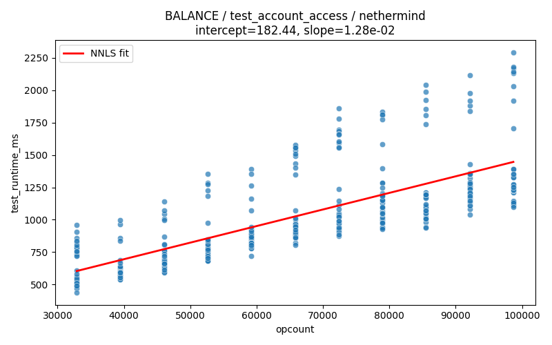

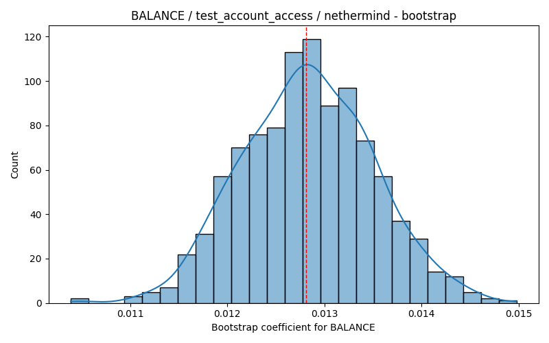

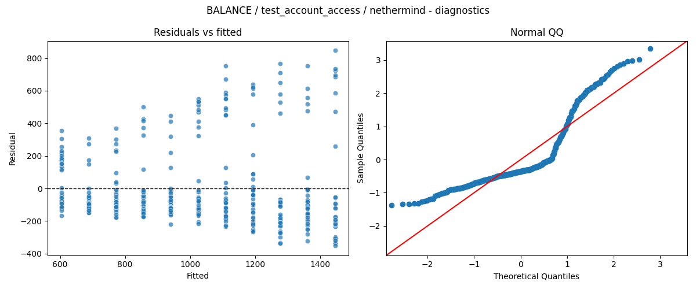

</details>

<details><summary>reth — NNLS regression summary</summary>

```
==============================================================================
                           NNLS Regression Results                            
==============================================================================
Dep. Variable:          test_runtime_ms              R-squared:          0.971
Model:                  NNLS                    Adj. R-squared:          0.971
No. Observations:       539                               RMSE:          13.98
Df Residuals:           537                                MAE:          11.24
Df Model:               1      
==============================================================================
                      coef     std err     P-value      [0.025      0.975]
------------------------------------------------------------------------------
         const    105.1930      1.8277       0.001    101.7341    108.7431
       opcount      0.0039      0.0000       0.001      0.0039      0.0040
==============================================================================
Notes: Non-negative least squares with bootstrap inference (1000 iterations)
==============================================================================
```

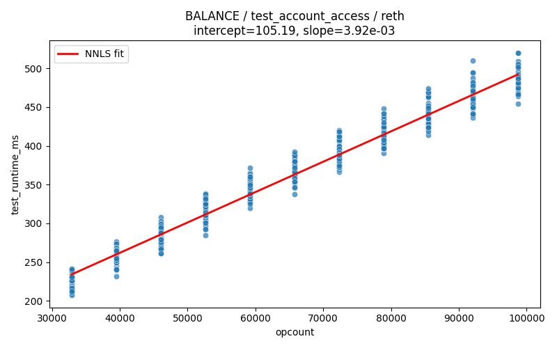

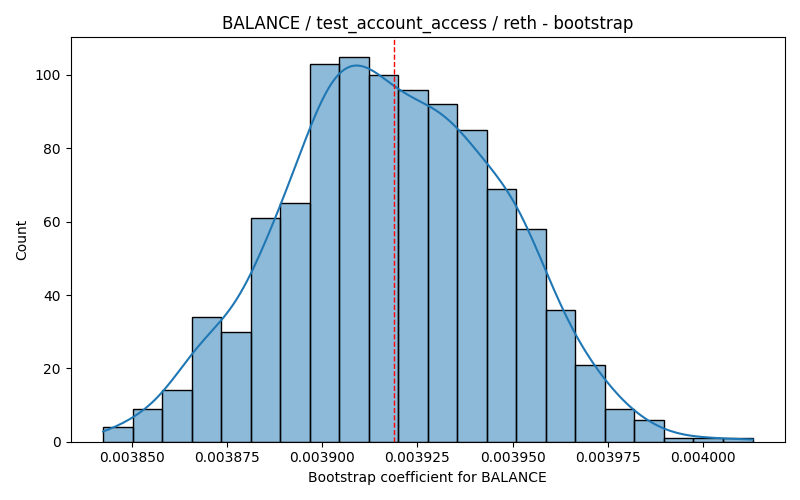

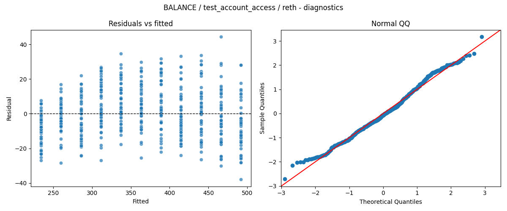

</details>

### test_account_access — combo `BALANCE_AccountMode.NON_EXISTING_ACCOUNT` — `presets[cold_account_code_access]`

| client | nobs | R² | target_coef (ms) | p-value | 95% CI |
| --- | --- | --- | --- | --- | --- |
| `besu` | 462 | 0.8307 | 0.01317 | 1.00e-03 | [0.01264, 0.0137] |
| `erigon` | 154 | 0.9812 | 0.00874 | 1.00e-03 | [0.008544, 0.008809] |
| `ethrex` | 440 | 0.9632 | 0.002003 | 1.00e-03 | [0.001966, 0.002037] |
| `geth` | 440 | 0.8572 | 0.02159 | 1.00e-03 | [0.02073, 0.02249] |
| `nethermind` | 363 | 0.8261 | 0.003538 | 1.00e-03 | [0.00337, 0.003697] |
| `reth` | 539 | 0.8706 | 0.0007428 | 1.00e-03 | [0.0007167, 0.0007688] |

<details><summary>besu — NNLS regression summary</summary>

```
==============================================================================
                           NNLS Regression Results                            
==============================================================================
Dep. Variable:          test_runtime_ms              R-squared:          0.831
Model:                  NNLS                    Adj. R-squared:          0.830
No. Observations:       462                               RMSE:         142.02
Df Residuals:           460                                MAE:         128.51
Df Model:               1      
==============================================================================
                      coef     std err     P-value      [0.025      0.975]
------------------------------------------------------------------------------
         const    494.2058     21.0444       0.001    452.9192    535.7793
       opcount      0.0132      0.0003       0.001      0.0126      0.0137
==============================================================================
Notes: Non-negative least squares with bootstrap inference (1000 iterations)
==============================================================================
```


</details>

<details><summary>erigon — NNLS regression summary</summary>

```
==============================================================================
                           NNLS Regression Results                            
==============================================================================
Dep. Variable:          test_runtime_ms              R-squared:          0.981
Model:                  NNLS                    Adj. R-squared:          0.981
No. Observations:       154                               RMSE:          28.95
Df Residuals:           152                                MAE:          19.86
Df Model:               1      
==============================================================================
                      coef     std err     P-value      [0.025      0.975]
------------------------------------------------------------------------------
         const      0.0000      3.7498       1.000      0.0000     12.4731
       opcount      0.0087      0.0001       0.001      0.0085      0.0088
==============================================================================
Notes: Non-negative least squares with bootstrap inference (1000 iterations)
==============================================================================
```


</details>

<details><summary>ethrex — NNLS regression summary</summary>

```
==============================================================================
                           NNLS Regression Results                            
==============================================================================
Dep. Variable:          test_runtime_ms              R-squared:          0.963
Model:                  NNLS                    Adj. R-squared:          0.963
No. Observations:       440                               RMSE:           9.36
Df Residuals:           438                                MAE:           7.49
Df Model:               1      
==============================================================================
                      coef     std err     P-value      [0.025      0.975]
------------------------------------------------------------------------------
         const     26.7235      1.4054       0.001     24.0782     29.7138
       opcount      0.0020      0.0000       0.001      0.0020      0.0020
==============================================================================
Notes: Non-negative least squares with bootstrap inference (1000 iterations)
==============================================================================
```


</details>

<details><summary>geth — NNLS regression summary</summary>

```
==============================================================================
                           NNLS Regression Results                            
==============================================================================
Dep. Variable:          test_runtime_ms              R-squared:          0.857
Model:                  NNLS                    Adj. R-squared:          0.857
No. Observations:       440                               RMSE:         210.66
Df Residuals:           438                                MAE:         178.22
Df Model:               1      
==============================================================================
                      coef     std err     P-value      [0.025      0.975]
------------------------------------------------------------------------------
         const    711.5268     37.5462       0.001    642.7250    783.5572
       opcount      0.0216      0.0004       0.001      0.0207      0.0225
==============================================================================
Notes: Non-negative least squares with bootstrap inference (1000 iterations)
==============================================================================
```


</details>

<details><summary>nethermind — NNLS regression summary</summary>

```
==============================================================================
                           NNLS Regression Results                            
==============================================================================
Dep. Variable:          test_runtime_ms              R-squared:          0.826
Model:                  NNLS                    Adj. R-squared:          0.826
No. Observations:       363                               RMSE:          38.80
Df Residuals:           361                                MAE:          30.75
Df Model:               1      
==============================================================================
                      coef     std err     P-value      [0.025      0.975]
------------------------------------------------------------------------------
         const     83.1026      5.6305       0.001     72.3548     94.0498
       opcount      0.0035      0.0001       0.001      0.0034      0.0037
==============================================================================
Notes: Non-negative least squares with bootstrap inference (1000 iterations)
==============================================================================
```


</details>

<details><summary>reth — NNLS regression summary</summary>

```
==============================================================================
                           NNLS Regression Results                            
==============================================================================
Dep. Variable:          test_runtime_ms              R-squared:          0.871
Model:                  NNLS                    Adj. R-squared:          0.870
No. Observations:       539                               RMSE:           6.84
Df Residuals:           537                                MAE:           5.50
Df Model:               1      
==============================================================================
                      coef     std err     P-value      [0.025      0.975]
------------------------------------------------------------------------------
         const     47.7746      0.9902       0.001     45.8457     49.7481
       opcount      0.0007      0.0000       0.001      0.0007      0.0008
==============================================================================
Notes: Non-negative least squares with bootstrap inference (1000 iterations)
==============================================================================
```


</details>

### test_ext_account_query_warm — combo `BALANCE`

| client | nobs | R² | target_coef (ms) | p-value | 95% CI |
| --- | --- | --- | --- | --- | --- |
| `besu` | 462 | 0.3044 | 0.0002201 | 1.00e-03 | [0.0001923, 0.0002475] |
| `erigon` | 154 | 0.8641 | 6.546e-05 | 1.00e-03 | [6.111e-05, 6.972e-05] |
| `ethrex` | 440 | 0.2548 | 1.407e-05 | 1.00e-03 | [1.203e-05, 1.602e-05] |
| `geth` | 440 | 0.7745 | 2.974e-05 | 1.00e-03 | [2.819e-05, 3.129e-05] |
| `nethermind` | 363 | 0.6703 | 0.000125 | 1.00e-03 | [0.0001163, 0.0001338] |
| `reth` | 539 | 0.6025 | 1.284e-05 | 1.00e-03 | [1.187e-05, 1.386e-05] |

<details><summary>besu — NNLS regression summary</summary>

```
==============================================================================
                           NNLS Regression Results                            
==============================================================================
Dep. Variable:          test_runtime_ms              R-squared:          0.304
Model:                  NNLS                    Adj. R-squared:          0.303
No. Observations:       462                               RMSE:         194.61
Df Residuals:           460                                MAE:         162.97
Df Model:               1      
==============================================================================
                      coef     std err     P-value      [0.025      0.975]
------------------------------------------------------------------------------
         const    422.6563     27.0671       0.001    371.0677    475.9605
       opcount      0.0002      0.0000       0.001      0.0002      0.0002
==============================================================================
Notes: Non-negative least squares with bootstrap inference (1000 iterations)
==============================================================================
```

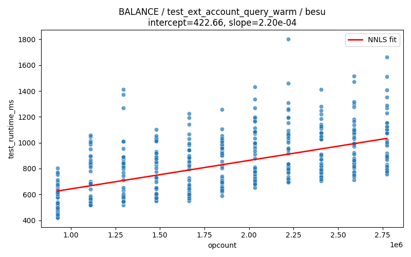

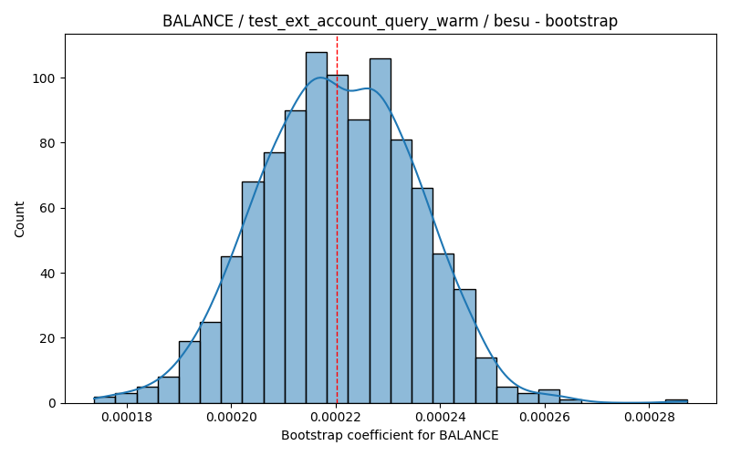

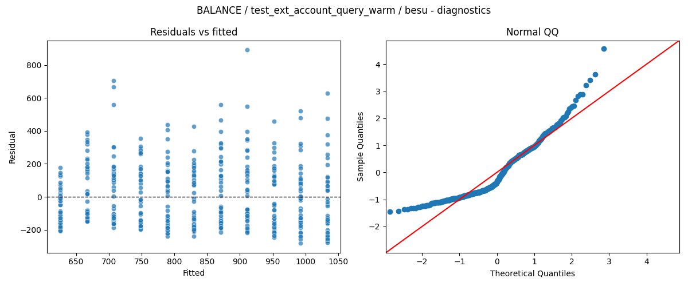

</details>

<details><summary>erigon — NNLS regression summary</summary>

```
==============================================================================
                           NNLS Regression Results                            
==============================================================================
Dep. Variable:          test_runtime_ms              R-squared:          0.864
Model:                  NNLS                    Adj. R-squared:          0.863
No. Observations:       154                               RMSE:          15.18
Df Residuals:           152                                MAE:           9.68
Df Model:               1      
==============================================================================
                      coef     std err     P-value      [0.025      0.975]
------------------------------------------------------------------------------
         const     23.0757      3.3383       0.001     16.3628     29.7296
       opcount      0.0001      0.0000       0.001      0.0001      0.0001
==============================================================================
Notes: Non-negative least squares with bootstrap inference (1000 iterations)
==============================================================================
```

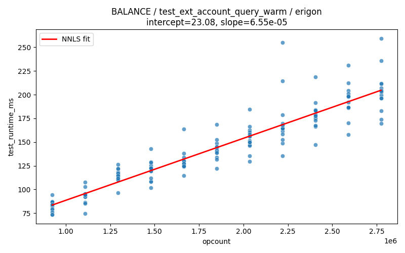

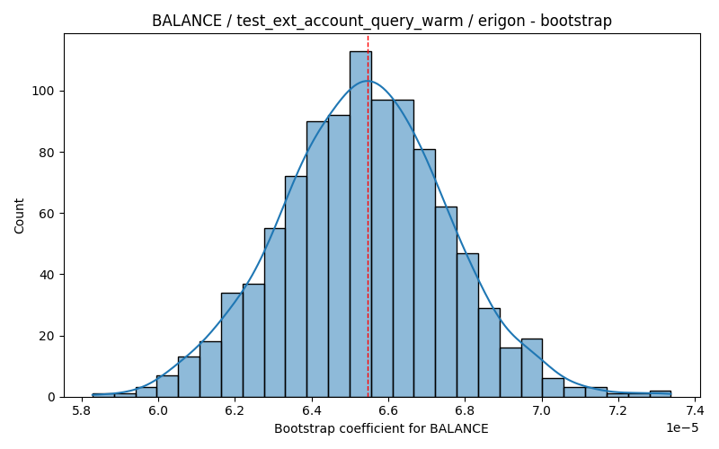

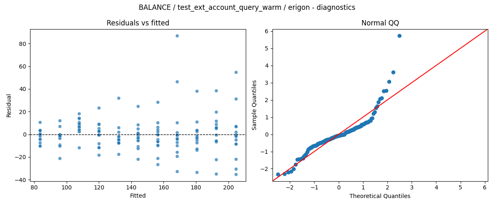

</details>

<details><summary>ethrex — NNLS regression summary</summary>

```
==============================================================================
                           NNLS Regression Results                            
==============================================================================
Dep. Variable:          test_runtime_ms              R-squared:          0.255
Model:                  NNLS                    Adj. R-squared:          0.253
No. Observations:       440                               RMSE:          14.07
Df Residuals:           438                                MAE:           9.15
Df Model:               1      
==============================================================================
                      coef     std err     P-value      [0.025      0.975]
------------------------------------------------------------------------------
         const     12.8982      2.1965       0.001      8.7555     17.1892
       opcount      0.0000      0.0000       0.001      0.0000      0.0000
==============================================================================
Notes: Non-negative least squares with bootstrap inference (1000 iterations)
==============================================================================
```

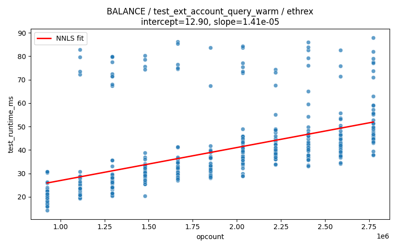

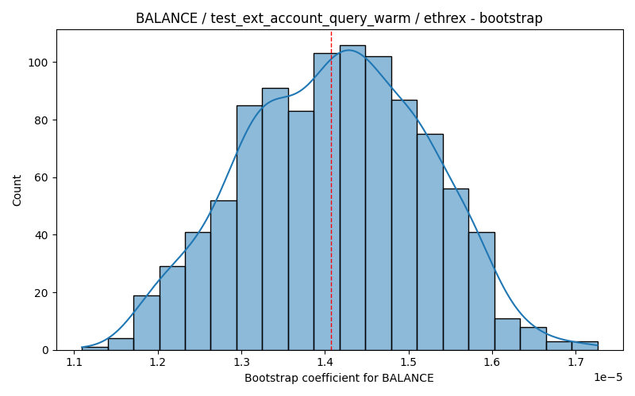

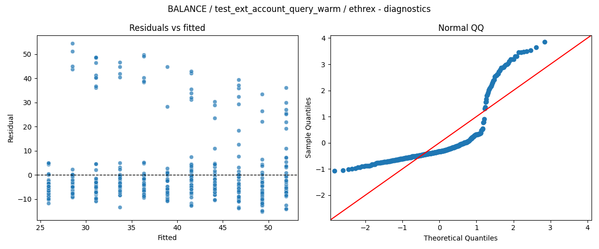

</details>

<details><summary>geth — NNLS regression summary</summary>

```
==============================================================================
                           NNLS Regression Results                            
==============================================================================
Dep. Variable:          test_runtime_ms              R-squared:          0.775
Model:                  NNLS                    Adj. R-squared:          0.774
No. Observations:       440                               RMSE:           9.38
Df Residuals:           438                                MAE:           7.32
Df Model:               1      
==============================================================================
                      coef     std err     P-value      [0.025      0.975]
------------------------------------------------------------------------------
         const     18.7449      1.4547       0.001     15.9769     21.7295
       opcount      0.0000      0.0000       0.001      0.0000      0.0000
==============================================================================
Notes: Non-negative least squares with bootstrap inference (1000 iterations)
==============================================================================
```

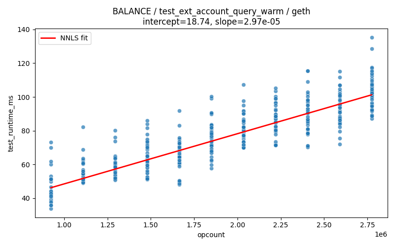

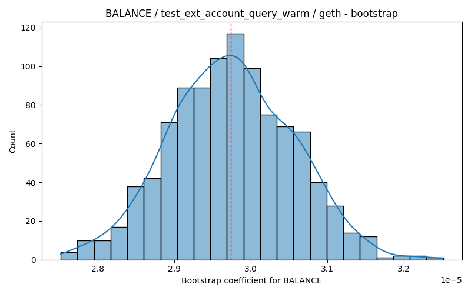

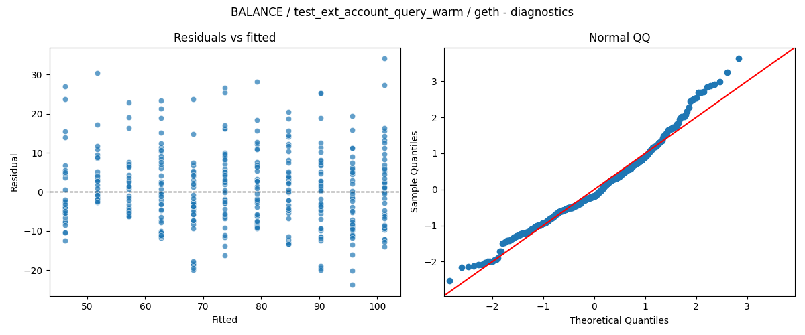

</details>

<details><summary>nethermind — NNLS regression summary</summary>

```
==============================================================================
                           NNLS Regression Results                            
==============================================================================
Dep. Variable:          test_runtime_ms              R-squared:          0.670
Model:                  NNLS                    Adj. R-squared:          0.669
No. Observations:       363                               RMSE:          51.25
Df Residuals:           361                                MAE:          39.91
Df Model:               1      
==============================================================================
                      coef     std err     P-value      [0.025      0.975]
------------------------------------------------------------------------------
         const    122.0191      8.4228       0.001    105.2683    138.4336
       opcount      0.0001      0.0000       0.001      0.0001      0.0001
==============================================================================
Notes: Non-negative least squares with bootstrap inference (1000 iterations)
==============================================================================
```

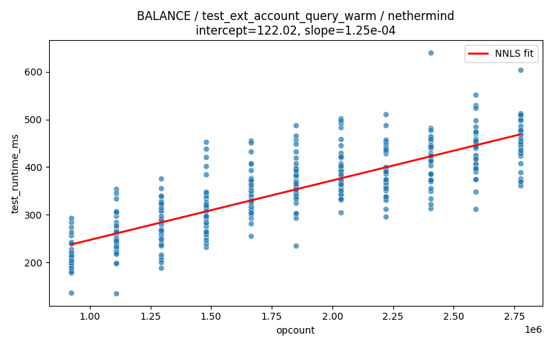

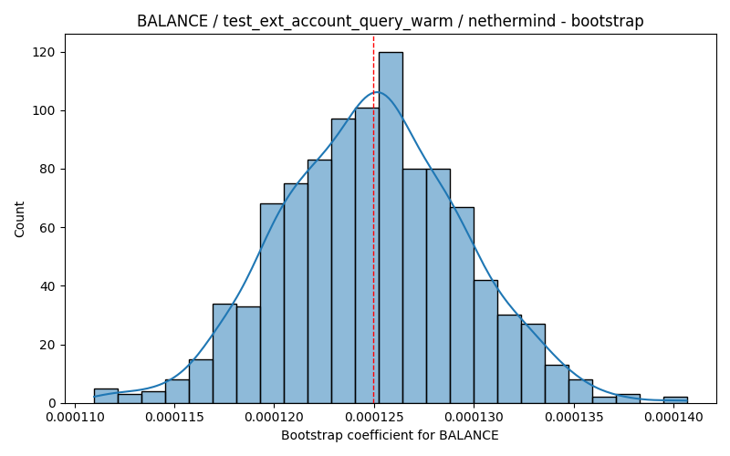

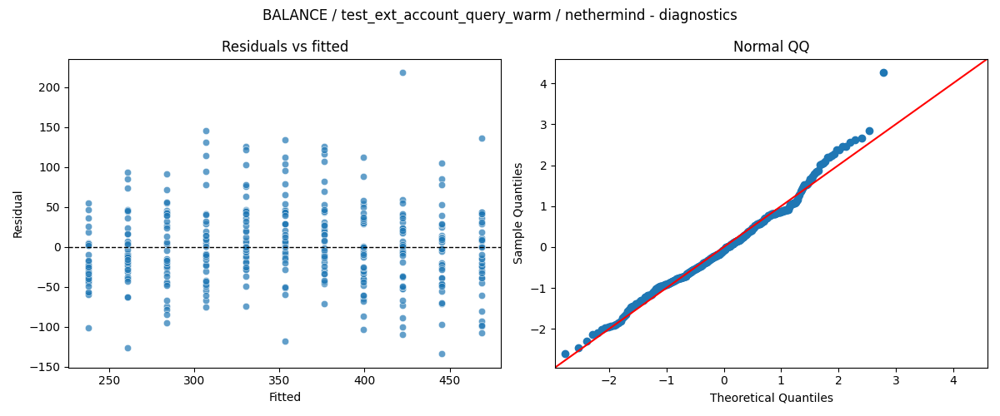

</details>

<details><summary>reth — NNLS regression summary</summary>

```
==============================================================================
                           NNLS Regression Results                            
==============================================================================
Dep. Variable:          test_runtime_ms              R-squared:          0.603
Model:                  NNLS                    Adj. R-squared:          0.602
No. Observations:       539                               RMSE:           6.10
Df Residuals:           537                                MAE:           4.52
Df Model:               1      
==============================================================================
                      coef     std err     P-value      [0.025      0.975]
------------------------------------------------------------------------------
         const      9.1529      0.9143       0.001      7.3718     10.9230
       opcount      0.0000      0.0000       0.001      0.0000      0.0000
==============================================================================
Notes: Non-negative least squares with bootstrap inference (1000 iterations)
==============================================================================
```

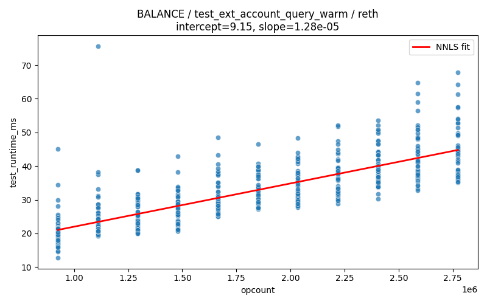

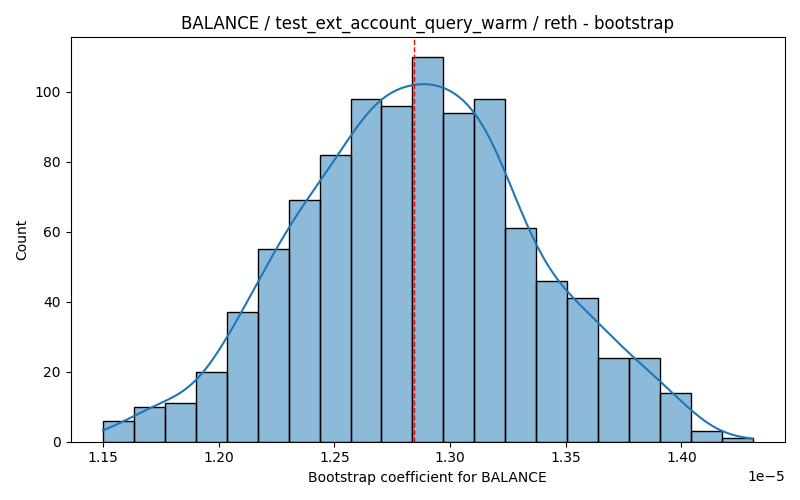

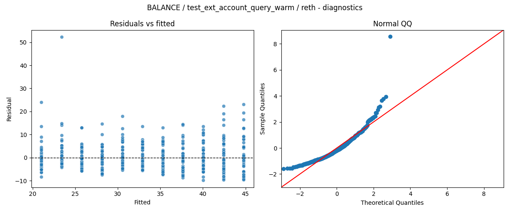

</details>

## CALL

### test_account_access — combo `CALL_AccountMode.EXISTING_EOA` — `presets[cold_account_nocode_access]`

| client | nobs | R² | target_coef (ms) | p-value | 95% CI |
| --- | --- | --- | --- | --- | --- |
| `besu` | 462 | 0.8508 | 0.01523 | 1.00e-03 | [0.01469, 0.01584] |
| `erigon` | 154 | 0.9757 | 0.01105 | 1.00e-03 | [0.01078, 0.01132] |
| `ethrex` | 440 | 0.9938 | 0.007264 | 1.00e-03 | [0.007203, 0.007324] |
| `geth` | 440 | 0.9083 | 0.01087 | 1.00e-03 | [0.01052, 0.01124] |
| `nethermind` | 363 | 0.8156 | 0.004146 | 1.00e-03 | [0.003958, 0.004323] |
| `reth` | 539 | 0.9184 | 0.001086 | 1.00e-03 | [0.001059, 0.001112] |

<details><summary>besu — NNLS regression summary</summary>

```
==============================================================================
                           NNLS Regression Results                            
==============================================================================
Dep. Variable:          test_runtime_ms              R-squared:          0.851
Model:                  NNLS                    Adj. R-squared:          0.850
No. Observations:       462                               RMSE:         151.49
Df Residuals:           460                                MAE:         122.00
Df Model:               1      
==============================================================================
                      coef     std err     P-value      [0.025      0.975]
------------------------------------------------------------------------------
         const    629.7788     22.3113       0.001    586.0476    671.9238
       opcount      0.0152      0.0003       0.001      0.0147      0.0158
==============================================================================
Notes: Non-negative least squares with bootstrap inference (1000 iterations)
==============================================================================
```

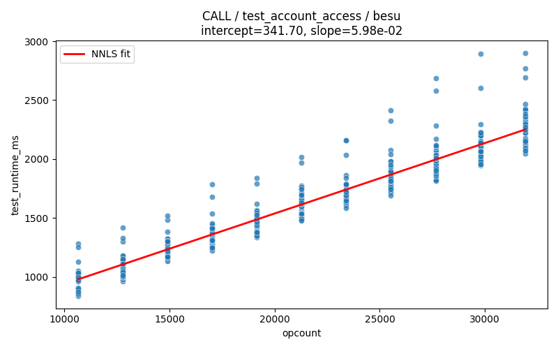

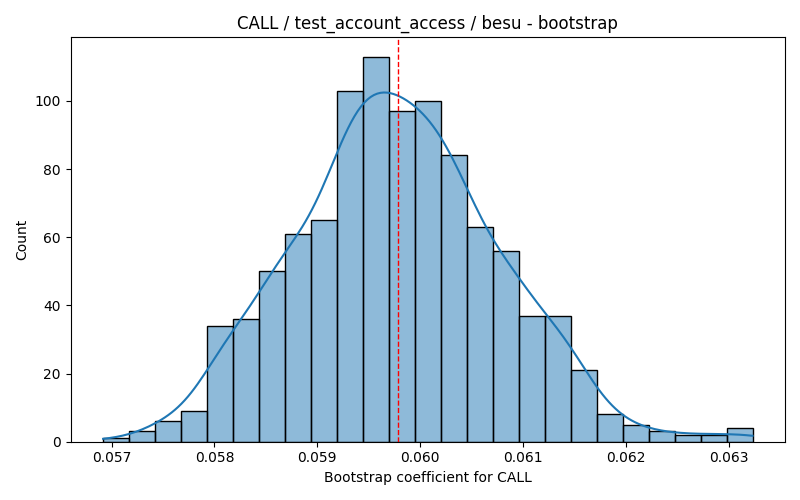

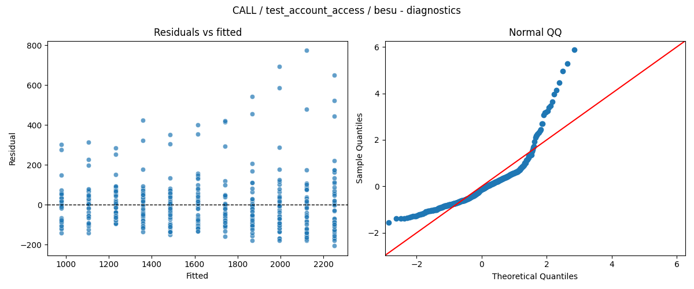

</details>

<details><summary>erigon — NNLS regression summary</summary>

```
==============================================================================
                           NNLS Regression Results                            
==============================================================================
Dep. Variable:          test_runtime_ms              R-squared:          0.976
Model:                  NNLS                    Adj. R-squared:          0.976
No. Observations:       154                               RMSE:          41.39
Df Residuals:           152                                MAE:          31.93
Df Model:               1      
==============================================================================
                      coef     std err     P-value      [0.025      0.975]
------------------------------------------------------------------------------
         const     22.4926      9.2781       0.009      3.3280     42.0623
       opcount      0.0111      0.0001       0.001      0.0108      0.0113
==============================================================================
Notes: Non-negative least squares with bootstrap inference (1000 iterations)
==============================================================================
```

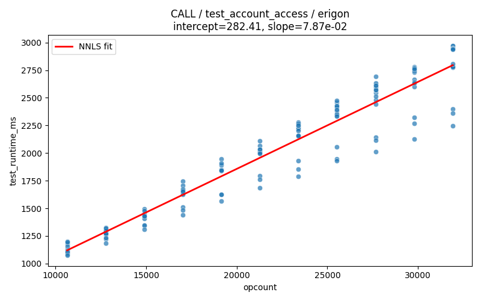

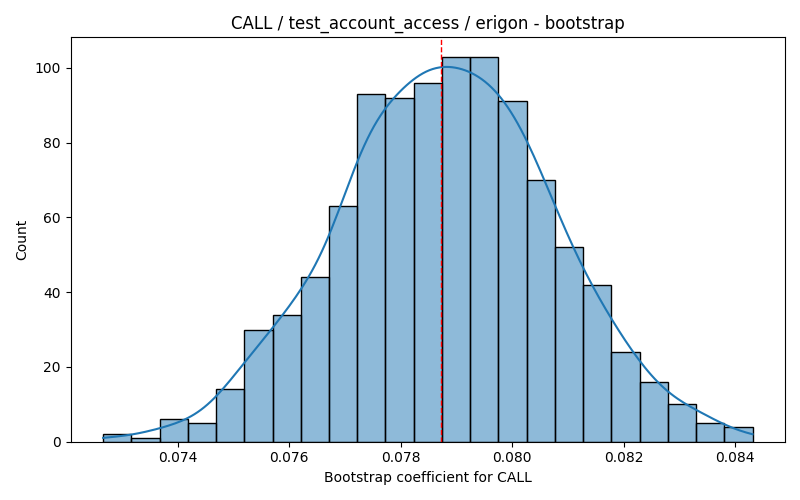

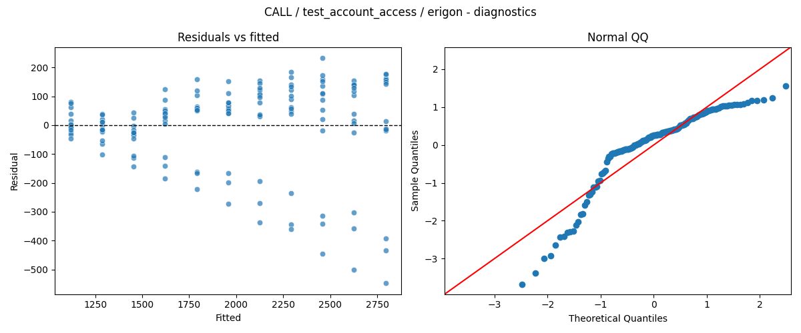

</details>

<details><summary>ethrex — NNLS regression summary</summary>

```
==============================================================================
                           NNLS Regression Results                            
==============================================================================
Dep. Variable:          test_runtime_ms              R-squared:          0.994
Model:                  NNLS                    Adj. R-squared:          0.994
No. Observations:       440                               RMSE:          13.63
Df Residuals:           438                                MAE:          10.55
Df Model:               1      
==============================================================================
                      coef     std err     P-value      [0.025      0.975]
------------------------------------------------------------------------------
         const     45.7451      2.1592       0.001     41.6139     50.1289
       opcount      0.0073      0.0000       0.001      0.0072      0.0073
==============================================================================
Notes: Non-negative least squares with bootstrap inference (1000 iterations)
==============================================================================
```

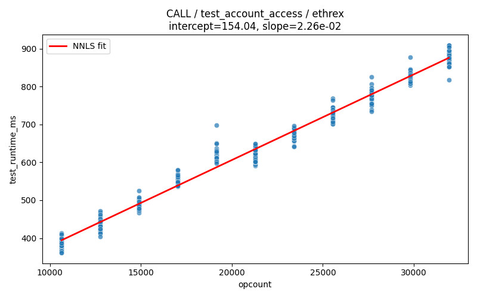

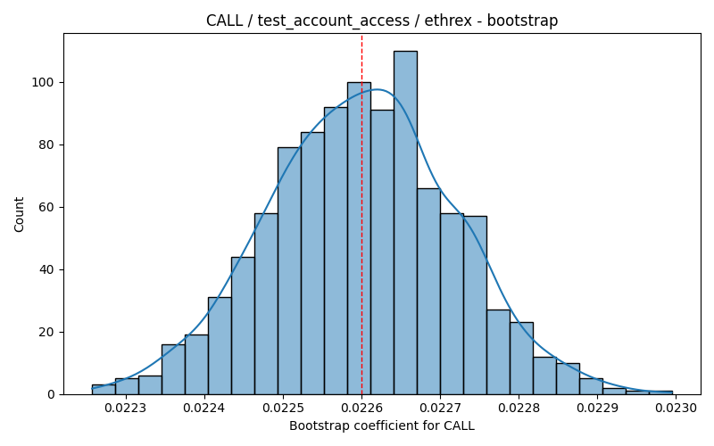

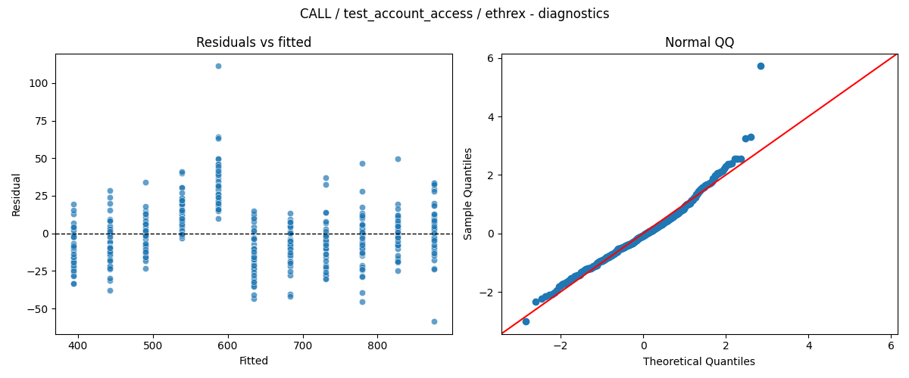

</details>

<details><summary>geth — NNLS regression summary</summary>

```
==============================================================================
                           NNLS Regression Results                            
==============================================================================
Dep. Variable:          test_runtime_ms              R-squared:          0.908
Model:                  NNLS                    Adj. R-squared:          0.908
No. Observations:       440                               RMSE:          82.01
Df Residuals:           438                                MAE:          67.88
Df Model:               1      
==============================================================================
                      coef     std err     P-value      [0.025      0.975]
------------------------------------------------------------------------------
         const    423.3211     15.5605       0.001    392.8122    452.8779
       opcount      0.0109      0.0002       0.001      0.0105      0.0112
==============================================================================
Notes: Non-negative least squares with bootstrap inference (1000 iterations)
==============================================================================
```

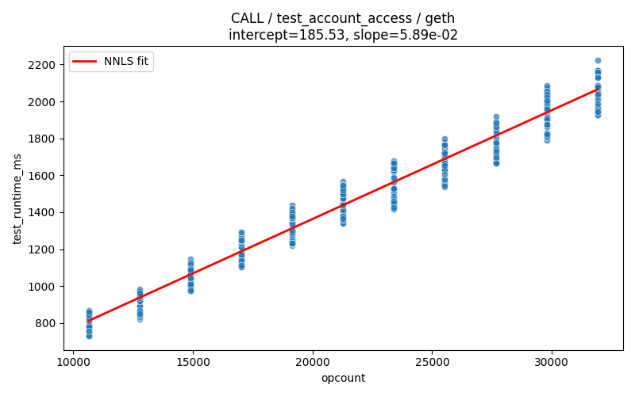

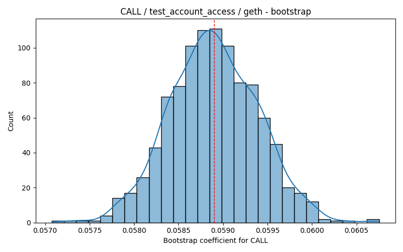

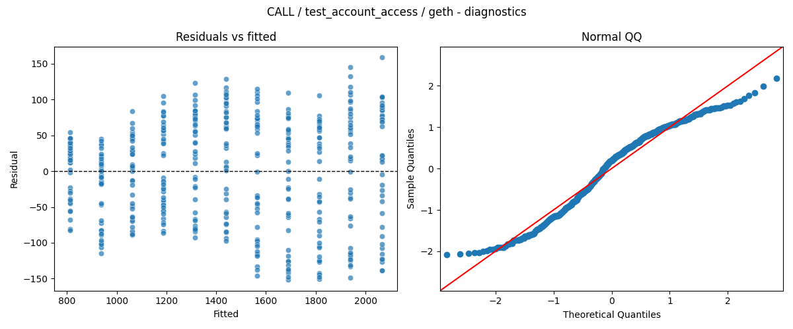

</details>

<details><summary>nethermind — NNLS regression summary</summary>

```
==============================================================================
                           NNLS Regression Results                            
==============================================================================
Dep. Variable:          test_runtime_ms              R-squared:          0.816
Model:                  NNLS                    Adj. R-squared:          0.815
No. Observations:       363                               RMSE:          46.81
Df Residuals:           361                                MAE:          36.37
Df Model:               1      
==============================================================================
                      coef     std err     P-value      [0.025      0.975]
------------------------------------------------------------------------------
         const     96.3344      6.4654       0.001     83.8542    108.4286
       opcount      0.0041      0.0001       0.001      0.0040      0.0043
==============================================================================
Notes: Non-negative least squares with bootstrap inference (1000 iterations)
==============================================================================
```

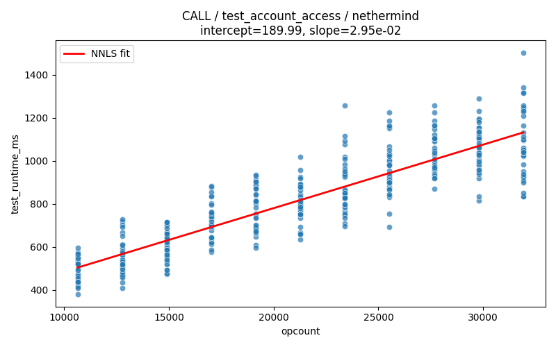

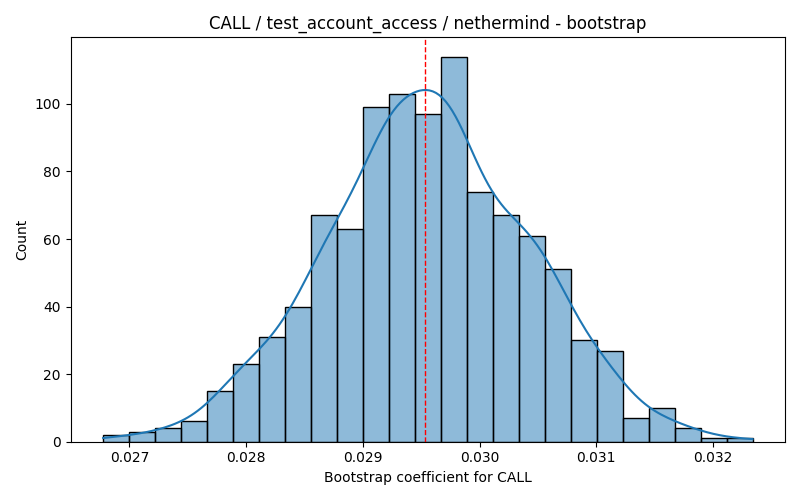

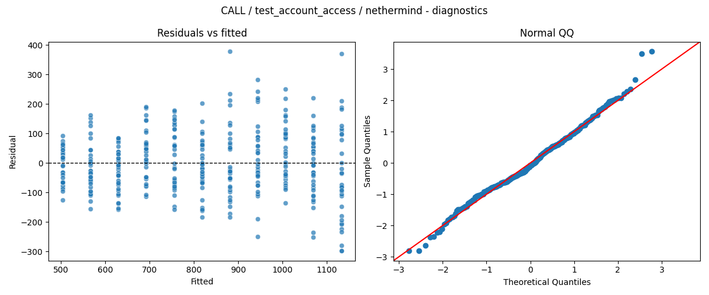

</details>

<details><summary>reth — NNLS regression summary</summary>

```
==============================================================================
                           NNLS Regression Results                            
==============================================================================
Dep. Variable:          test_runtime_ms              R-squared:          0.918
Model:                  NNLS                    Adj. R-squared:          0.918
No. Observations:       539                               RMSE:           7.69
Df Residuals:           537                                MAE:           6.03
Df Model:               1      
==============================================================================
                      coef     std err     P-value      [0.025      0.975]
------------------------------------------------------------------------------
         const     47.9989      1.0366       0.001     46.0762     49.9862
       opcount      0.0011      0.0000       0.001      0.0011      0.0011
==============================================================================
Notes: Non-negative least squares with bootstrap inference (1000 iterations)
==============================================================================
```

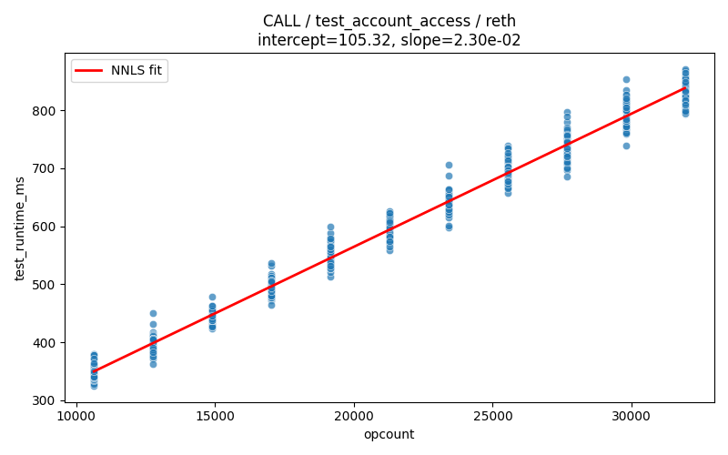

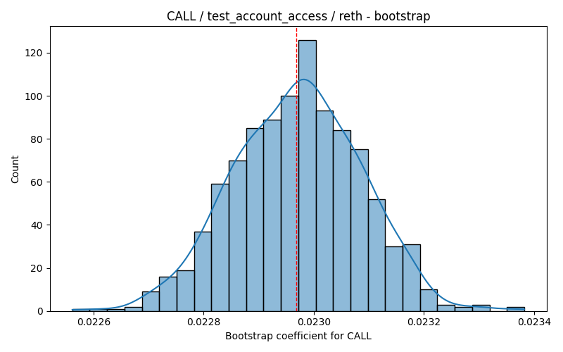

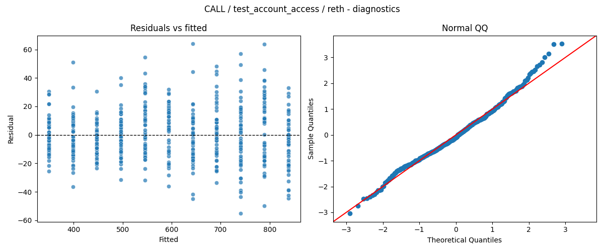

</details>

### test_account_access — combo `CALL_AccountMode.NON_EXISTING_ACCOUNT` — `presets[cold_account_nocode_access]`

| client | nobs | R² | target_coef (ms) | p-value | 95% CI |
| --- | --- | --- | --- | --- | --- |
| `besu` | 462 | 0.8201 | 0.01593 | 1.00e-03 | [0.01519, 0.01661] |
| `erigon` | 154 | 0.9786 | 0.0101 | 1.00e-03 | [0.009889, 0.01018] |
| `ethrex` | 440 | 0.9674 | 0.002048 | 1.00e-03 | [0.002014, 0.002085] |
| `geth` | 440 | 0.8605 | 0.02194 | 1.00e-03 | [0.02096, 0.02283] |
| `nethermind` | 363 | 0.8428 | 0.004061 | 1.00e-03 | [0.003864, 0.00426] |
| `reth` | 539 | 0.8804 | 0.0007622 | 1.00e-03 | [0.0007374, 0.0007864] |

<details><summary>besu — NNLS regression summary</summary>

```
==============================================================================
                           NNLS Regression Results                            
==============================================================================
Dep. Variable:          test_runtime_ms              R-squared:          0.820
Model:                  NNLS                    Adj. R-squared:          0.820
No. Observations:       462                               RMSE:         177.16
Df Residuals:           460                                MAE:         156.45
Df Model:               1      
==============================================================================
                      coef     std err     P-value      [0.025      0.975]
------------------------------------------------------------------------------
         const    547.5188     26.4261       0.001    497.0800    602.1120
       opcount      0.0159      0.0003       0.001      0.0152      0.0166
==============================================================================
Notes: Non-negative least squares with bootstrap inference (1000 iterations)
==============================================================================
```

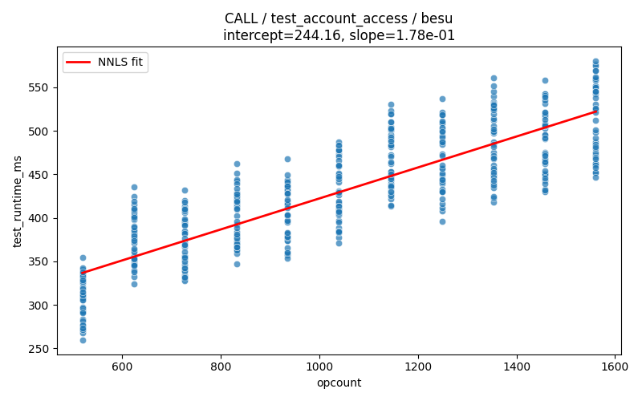

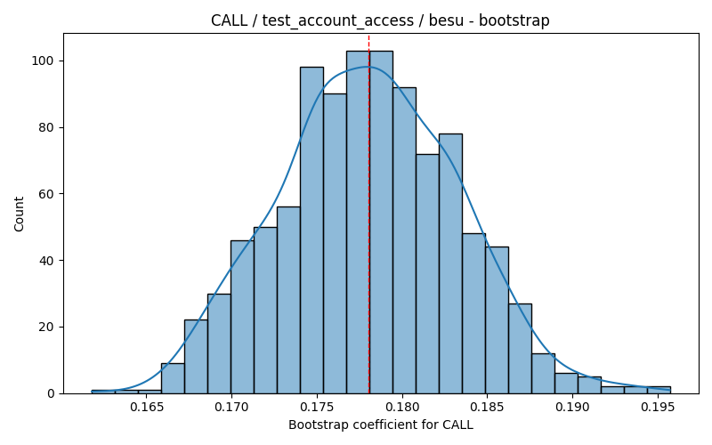

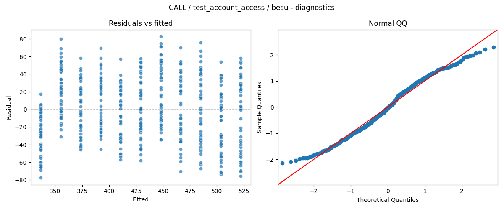

</details>

<details><summary>erigon — NNLS regression summary</summary>

```
==============================================================================
                           NNLS Regression Results                            
==============================================================================
Dep. Variable:          test_runtime_ms              R-squared:          0.979
Model:                  NNLS                    Adj. R-squared:          0.978
No. Observations:       154                               RMSE:          35.58
Df Residuals:           152                                MAE:          24.32
Df Model:               1      
==============================================================================
                      coef     std err     P-value      [0.025      0.975]
------------------------------------------------------------------------------
         const      0.0000      3.8410       1.000      0.0000     13.2523
       opcount      0.0101      0.0001       0.001      0.0099      0.0102
==============================================================================
Notes: Non-negative least squares with bootstrap inference (1000 iterations)
==============================================================================
```

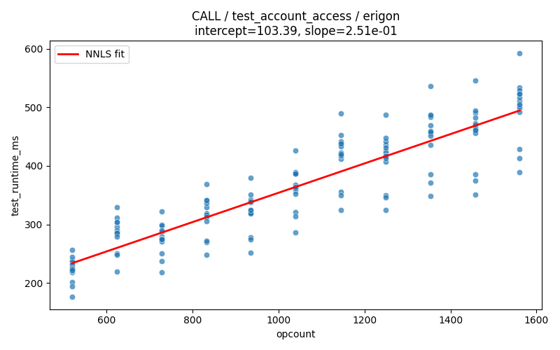

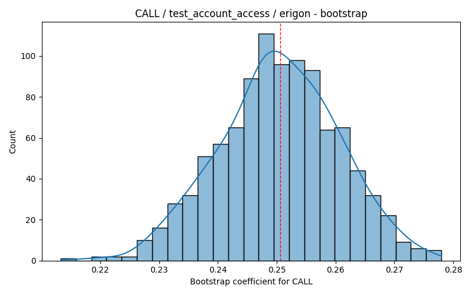

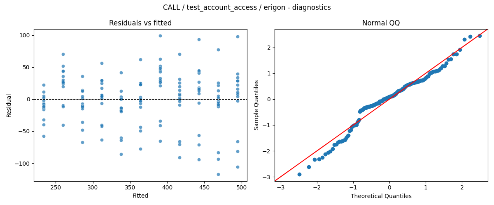

</details>

<details><summary>ethrex — NNLS regression summary</summary>

```
==============================================================================
                           NNLS Regression Results                            
==============================================================================
Dep. Variable:          test_runtime_ms              R-squared:          0.967
Model:                  NNLS                    Adj. R-squared:          0.967
No. Observations:       440                               RMSE:           8.93
Df Residuals:           438                                MAE:           7.04
Df Model:               1      
==============================================================================
                      coef     std err     P-value      [0.025      0.975]
------------------------------------------------------------------------------
         const     29.4053      1.3603       0.001     26.6834     32.0510
       opcount      0.0020      0.0000       0.001      0.0020      0.0021
==============================================================================
Notes: Non-negative least squares with bootstrap inference (1000 iterations)
==============================================================================
```

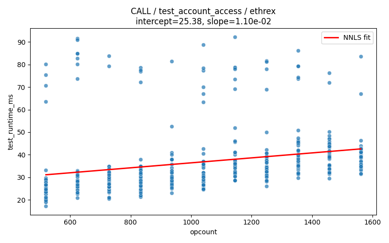

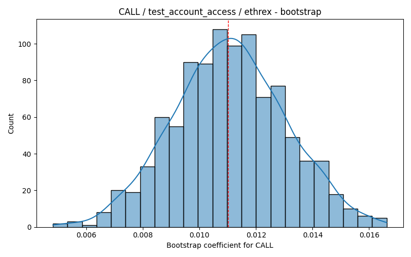

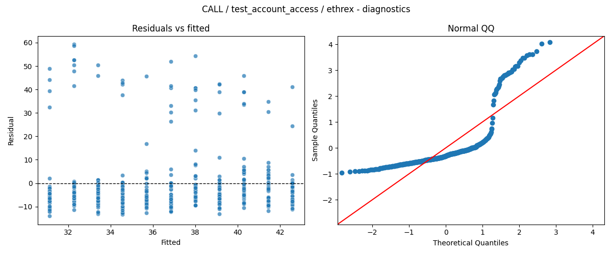

</details>

<details><summary>geth — NNLS regression summary</summary>

```
==============================================================================
                           NNLS Regression Results                            
==============================================================================
Dep. Variable:          test_runtime_ms              R-squared:          0.861
Model:                  NNLS                    Adj. R-squared:          0.860
No. Observations:       440                               RMSE:         209.76
Df Residuals:           438                                MAE:         177.63
Df Model:               1      
==============================================================================
                      coef     std err     P-value      [0.025      0.975]
------------------------------------------------------------------------------
         const    718.7649     39.5338       0.001    642.4309    799.1336
       opcount      0.0219      0.0005       0.001      0.0210      0.0228
==============================================================================
Notes: Non-negative least squares with bootstrap inference (1000 iterations)
==============================================================================
```

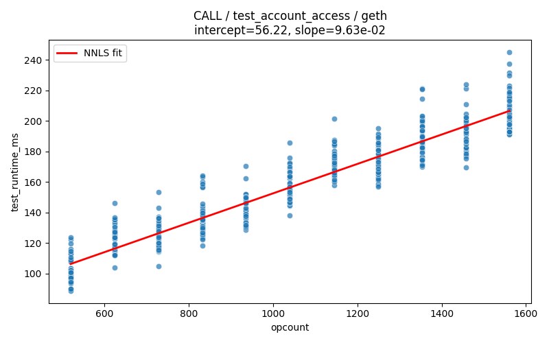

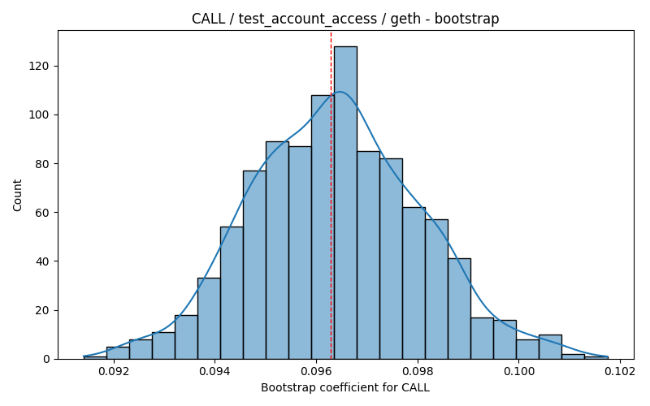

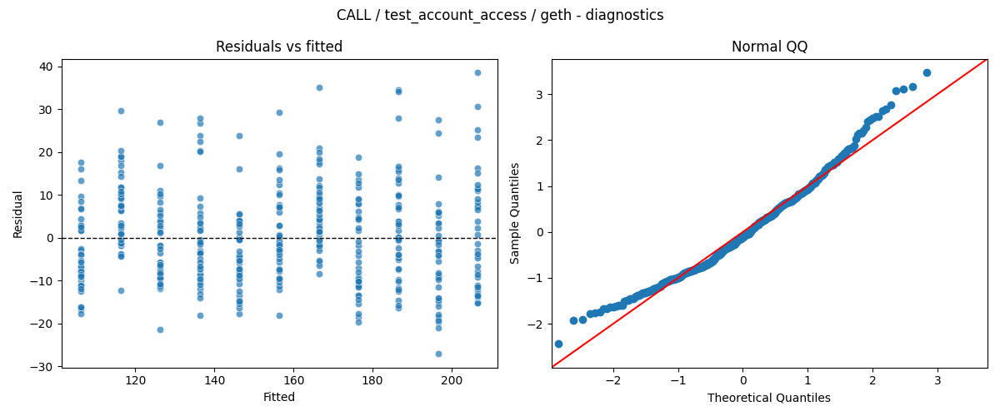

</details>

<details><summary>nethermind — NNLS regression summary</summary>

```
==============================================================================
                           NNLS Regression Results                            
==============================================================================
Dep. Variable:          test_runtime_ms              R-squared:          0.843
Model:                  NNLS                    Adj. R-squared:          0.842
No. Observations:       363                               RMSE:          41.65
Df Residuals:           361                                MAE:          31.37
Df Model:               1      
==============================================================================
                      coef     std err     P-value      [0.025      0.975]
------------------------------------------------------------------------------
         const     81.2687      6.7380       0.001     68.5181     94.6247
       opcount      0.0041      0.0001       0.001      0.0039      0.0043
==============================================================================
Notes: Non-negative least squares with bootstrap inference (1000 iterations)
==============================================================================
```

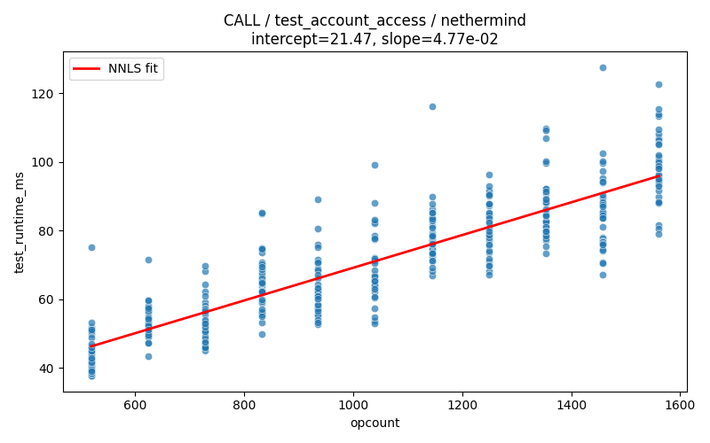

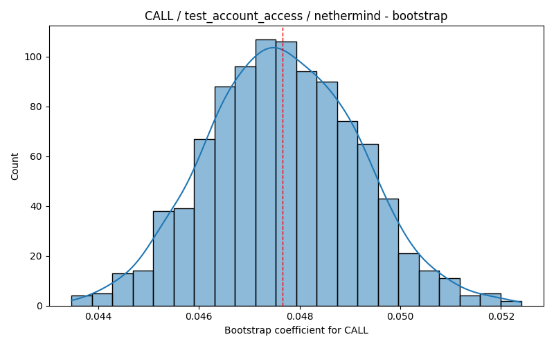

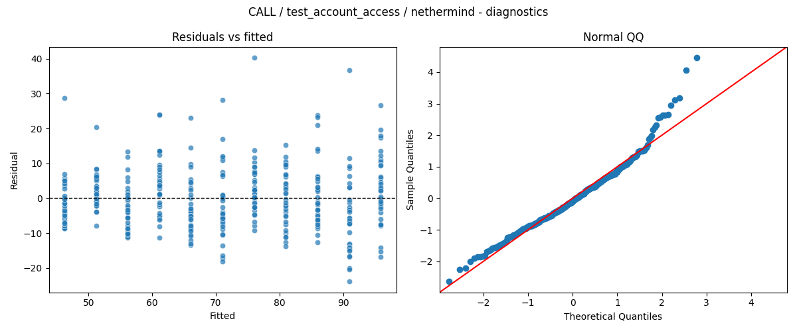

</details>

<details><summary>reth — NNLS regression summary</summary>

```
==============================================================================
                           NNLS Regression Results                            
==============================================================================
Dep. Variable:          test_runtime_ms              R-squared:          0.880
Model:                  NNLS                    Adj. R-squared:          0.880
No. Observations:       539                               RMSE:           6.67
Df Residuals:           537                                MAE:           5.18
Df Model:               1      
==============================================================================
                      coef     std err     P-value      [0.025      0.975]
------------------------------------------------------------------------------
         const     52.0058      0.9343       0.001     50.1612     53.8135
       opcount      0.0008      0.0000       0.001      0.0007      0.0008
==============================================================================
Notes: Non-negative least squares with bootstrap inference (1000 iterations)
==============================================================================
```

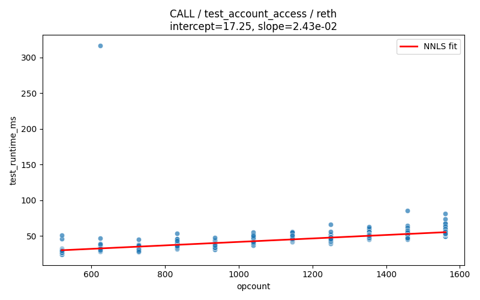

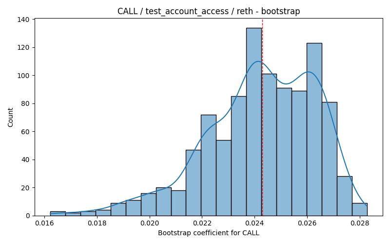

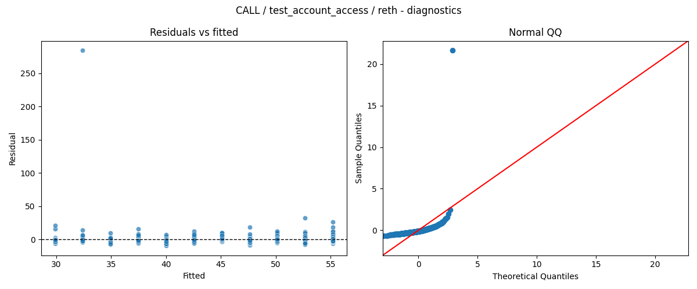

</details>

### test_account_access — combo `CALL_AccountMode.EXISTING_CONTRACT` — `presets[cold_account_code_access]`

| client | nobs | R² | target_coef (ms) | p-value | 95% CI |
| --- | --- | --- | --- | --- | --- |
| `besu` | 462 | 0.8936 | 0.02675 | 1.00e-03 | [0.02598, 0.02759] |
| `erigon` | 154 | 0.5885 | 0.04592 | 1.00e-03 | [0.03954, 0.05156] |
| `ethrex` | 440 | 0.9938 | 0.007936 | 1.00e-03 | [0.007881, 0.007994] |
| `geth` | 440 | 0.8592 | 0.02347 | 1.00e-03 | [0.02255, 0.02441] |
| `nethermind` | 363 | 0.5855 | 0.01498 | 1.00e-03 | [0.01362, 0.01638] |
| `reth` | 539 | 0.9717 | 0.004033 | 1.00e-03 | [0.003976, 0.004093] |

<details><summary>besu — NNLS regression summary</summary>

```
==============================================================================
                           NNLS Regression Results                            
==============================================================================
Dep. Variable:          test_runtime_ms              R-squared:          0.894
Model:                  NNLS                    Adj. R-squared:          0.893
No. Observations:       462                               RMSE:         187.84
Df Residuals:           460                                MAE:         146.15
Df Model:               1      
==============================================================================
                      coef     std err     P-value      [0.025      0.975]
------------------------------------------------------------------------------
         const    609.9442     26.1549       0.001    559.4553    660.0614
       opcount      0.0268      0.0004       0.001      0.0260      0.0276
==============================================================================
Notes: Non-negative least squares with bootstrap inference (1000 iterations)
==============================================================================
```

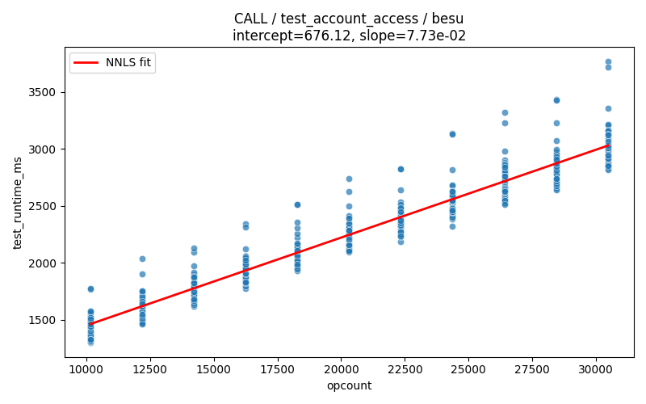

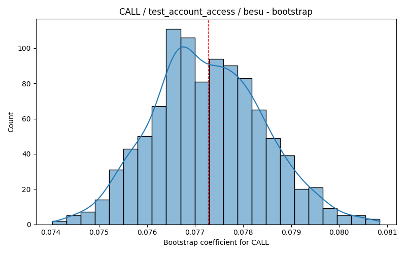

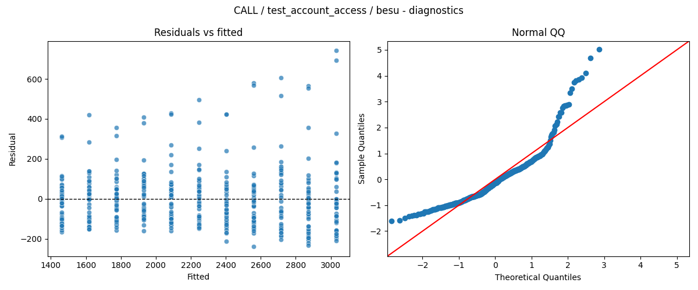

</details>

<details><summary>erigon — NNLS regression summary</summary>

```
==============================================================================
                           NNLS Regression Results                            
==============================================================================
Dep. Variable:          test_runtime_ms              R-squared:          0.588
Model:                  NNLS                    Adj. R-squared:          0.586
No. Observations:       154                               RMSE:         781.35
Df Residuals:           152                                MAE:         533.47
Df Model:               1      
==============================================================================
                      coef     std err     P-value      [0.025      0.975]
------------------------------------------------------------------------------
         const    759.9788    185.9835       0.001    404.2199   1126.2187
       opcount      0.0459      0.0031       0.001      0.0395      0.0516
==============================================================================
Notes: Non-negative least squares with bootstrap inference (1000 iterations)
==============================================================================
```

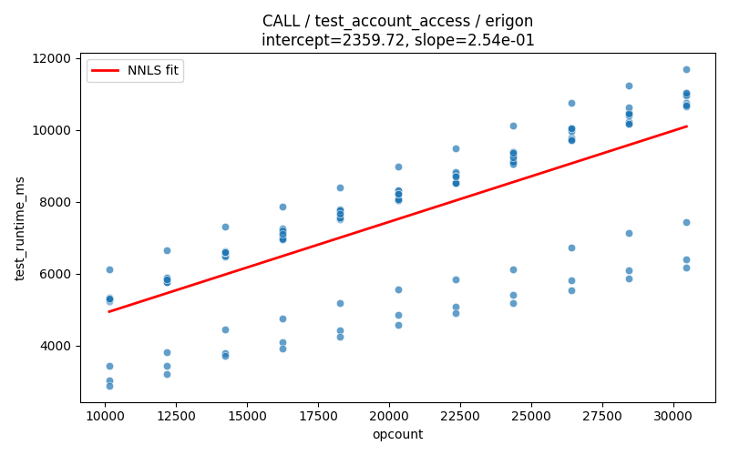

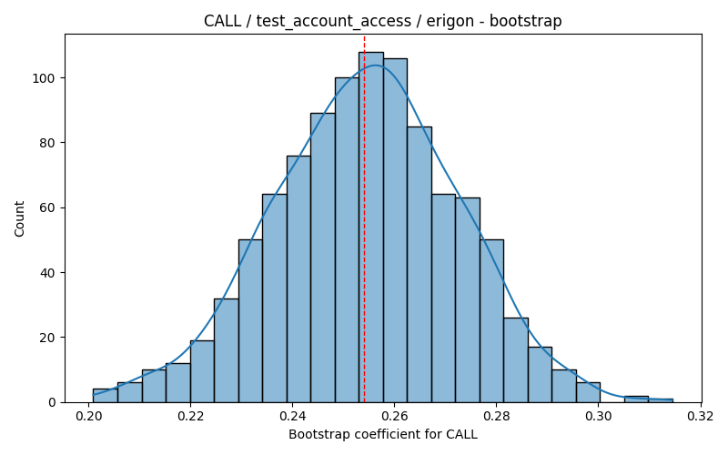

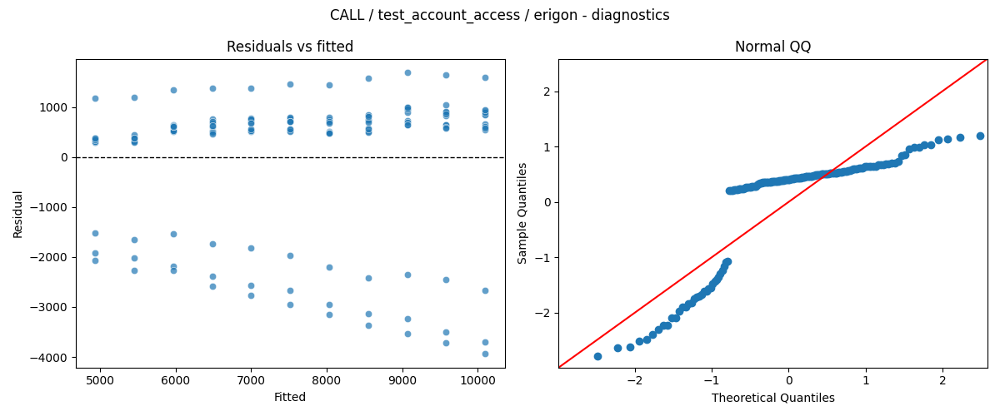

</details>

<details><summary>ethrex — NNLS regression summary</summary>

```
==============================================================================
                           NNLS Regression Results                            
==============================================================================
Dep. Variable:          test_runtime_ms              R-squared:          0.994
Model:                  NNLS                    Adj. R-squared:          0.994
No. Observations:       440                               RMSE:          12.76
Df Residuals:           438                                MAE:           9.92
Df Model:               1      
==============================================================================
                      coef     std err     P-value      [0.025      0.975]
------------------------------------------------------------------------------
         const     37.5897      1.7955       0.001     33.9459     40.9129
       opcount      0.0079      0.0000       0.001      0.0079      0.0080
==============================================================================
Notes: Non-negative least squares with bootstrap inference (1000 iterations)
==============================================================================
```

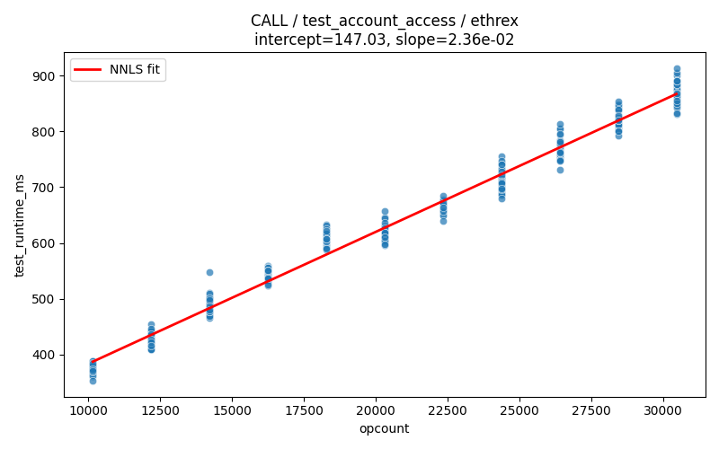

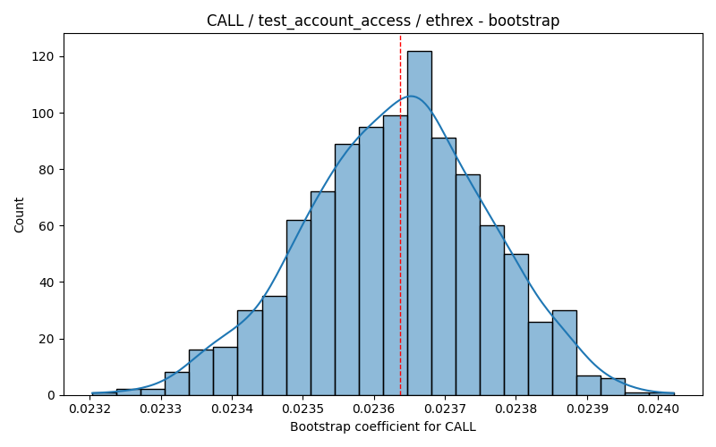

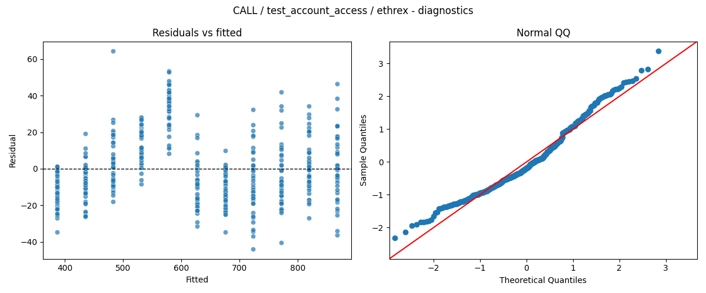

</details>

<details><summary>geth — NNLS regression summary</summary>

```
==============================================================================
                           NNLS Regression Results                            
==============================================================================
Dep. Variable:          test_runtime_ms              R-squared:          0.859
Model:                  NNLS                    Adj. R-squared:          0.859
No. Observations:       440                               RMSE:         193.34
Df Residuals:           438                                MAE:         162.60
Df Model:               1      
==============================================================================
                      coef     std err     P-value      [0.025      0.975]
------------------------------------------------------------------------------
         const    674.1841     34.2140       0.001    607.6980    743.3824
       opcount      0.0235      0.0005       0.001      0.0225      0.0244
==============================================================================
Notes: Non-negative least squares with bootstrap inference (1000 iterations)
==============================================================================
```


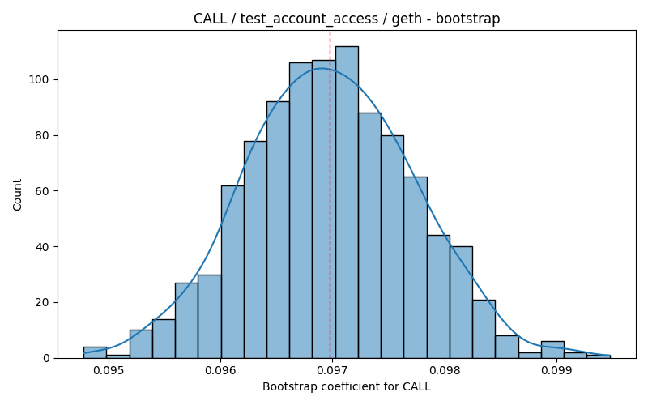

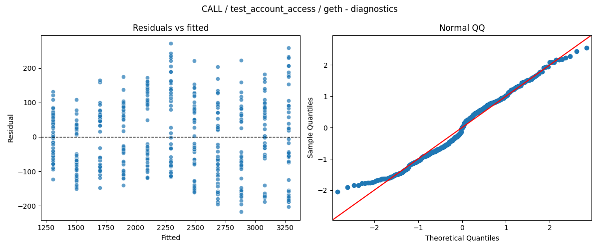

</details>

<details><summary>nethermind — NNLS regression summary</summary>

```
==============================================================================
                           NNLS Regression Results                            
==============================================================================
Dep. Variable:          test_runtime_ms              R-squared:          0.586
Model:                  NNLS                    Adj. R-squared:          0.584
No. Observations:       363                               RMSE:         256.50
Df Residuals:           361                                MAE:         196.84
Df Model:               1      
==============================================================================
                      coef     std err     P-value      [0.025      0.975]
------------------------------------------------------------------------------
         const    156.2336     40.1706       0.001     76.3970    234.4699
       opcount      0.0150      0.0007       0.001      0.0136      0.0164
==============================================================================
Notes: Non-negative least squares with bootstrap inference (1000 iterations)
==============================================================================
```

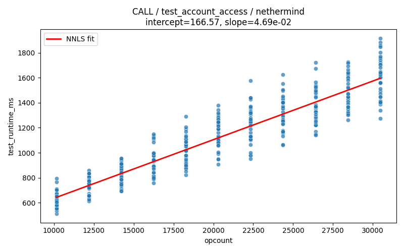

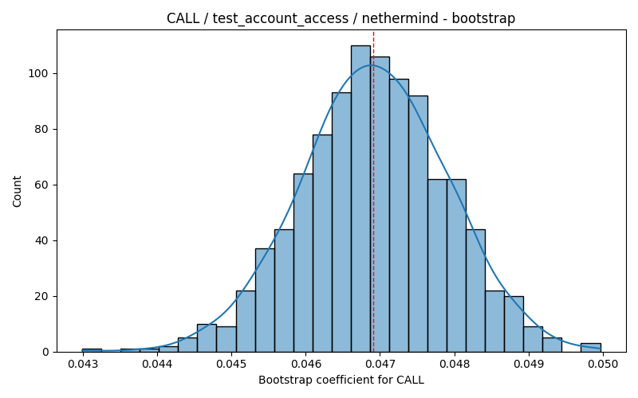

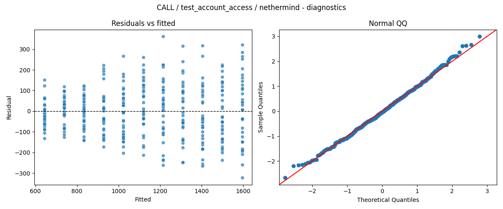

</details>

<details><summary>reth — NNLS regression summary</summary>

```
==============================================================================
                           NNLS Regression Results                            
==============================================================================
Dep. Variable:          test_runtime_ms              R-squared:          0.972
Model:                  NNLS                    Adj. R-squared:          0.972
No. Observations:       539                               RMSE:          14.01
Df Residuals:           537                                MAE:          11.07
Df Model:               1      
==============================================================================
                      coef     std err     P-value      [0.025      0.975]
------------------------------------------------------------------------------
         const    102.8625      1.8960       0.001     99.2756    106.5791
       opcount      0.0040      0.0000       0.001      0.0040      0.0041
==============================================================================
Notes: Non-negative least squares with bootstrap inference (1000 iterations)
==============================================================================
```


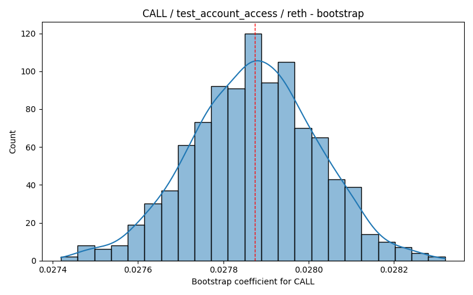

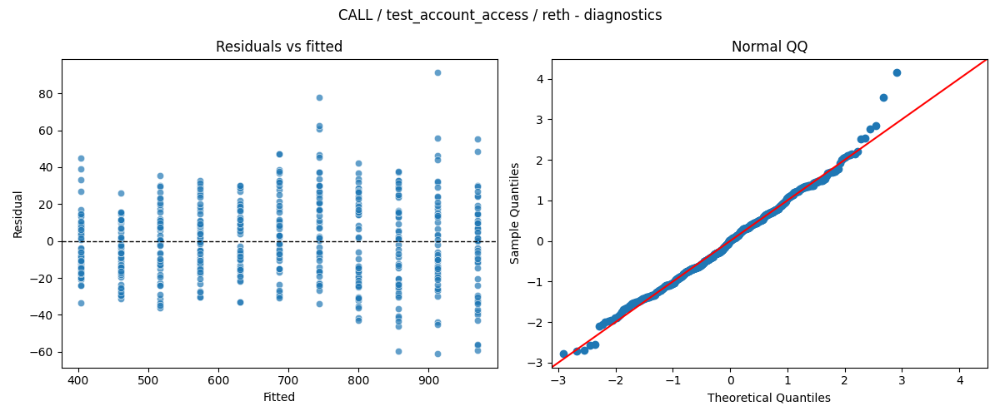

</details>

### test_account_access — combo `CALL_AccountMode.NON_EXISTING_ACCOUNT` — `presets[cold_account_code_access]`

| client | nobs | R² | target_coef (ms) | p-value | 95% CI |
| --- | --- | --- | --- | --- | --- |
| `besu` | 462 | 0.8201 | 0.01593 | 1.00e-03 | [0.01519, 0.01661] |
| `erigon` | 154 | 0.9786 | 0.0101 | 1.00e-03 | [0.009889, 0.01018] |
| `ethrex` | 440 | 0.9674 | 0.002048 | 1.00e-03 | [0.002014, 0.002085] |
| `geth` | 440 | 0.8605 | 0.02194 | 1.00e-03 | [0.02096, 0.02283] |
| `nethermind` | 363 | 0.8428 | 0.004061 | 1.00e-03 | [0.003864, 0.00426] |
| `reth` | 539 | 0.8804 | 0.0007622 | 1.00e-03 | [0.0007374, 0.0007864] |

<details><summary>besu — NNLS regression summary</summary>

```
==============================================================================
                           NNLS Regression Results                            
==============================================================================
Dep. Variable:          test_runtime_ms              R-squared:          0.820
Model:                  NNLS                    Adj. R-squared:          0.820
No. Observations:       462                               RMSE:         177.16
Df Residuals:           460                                MAE:         156.45
Df Model:               1      
==============================================================================
                      coef     std err     P-value      [0.025      0.975]
------------------------------------------------------------------------------
         const    547.5188     26.4261       0.001    497.0800    602.1120
       opcount      0.0159      0.0003       0.001      0.0152      0.0166
==============================================================================
Notes: Non-negative least squares with bootstrap inference (1000 iterations)
==============================================================================
```


</details>

<details><summary>erigon — NNLS regression summary</summary>

```
==============================================================================
                           NNLS Regression Results                            
==============================================================================
Dep. Variable:          test_runtime_ms              R-squared:          0.979
Model:                  NNLS                    Adj. R-squared:          0.978
No. Observations:       154                               RMSE:          35.58
Df Residuals:           152                                MAE:          24.32
Df Model:               1      
==============================================================================
                      coef     std err     P-value      [0.025      0.975]
------------------------------------------------------------------------------
         const      0.0000      3.8410       1.000      0.0000     13.2523
       opcount      0.0101      0.0001       0.001      0.0099      0.0102
==============================================================================
Notes: Non-negative least squares with bootstrap inference (1000 iterations)
==============================================================================
```


</details>

<details><summary>ethrex — NNLS regression summary</summary>

```
==============================================================================
                           NNLS Regression Results                            
==============================================================================
Dep. Variable:          test_runtime_ms              R-squared:          0.967
Model:                  NNLS                    Adj. R-squared:          0.967
No. Observations:       440                               RMSE:           8.93
Df Residuals:           438                                MAE:           7.04
Df Model:               1      
==============================================================================
                      coef     std err     P-value      [0.025      0.975]
------------------------------------------------------------------------------
         const     29.4053      1.3603       0.001     26.6834     32.0510
       opcount      0.0020      0.0000       0.001      0.0020      0.0021
==============================================================================
Notes: Non-negative least squares with bootstrap inference (1000 iterations)
==============================================================================
```


</details>

<details><summary>geth — NNLS regression summary</summary>

```
==============================================================================
                           NNLS Regression Results                            
==============================================================================
Dep. Variable:          test_runtime_ms              R-squared:          0.861
Model:                  NNLS                    Adj. R-squared:          0.860
No. Observations:       440                               RMSE:         209.76
Df Residuals:           438                                MAE:         177.63
Df Model:               1      
==============================================================================
                      coef     std err     P-value      [0.025      0.975]
------------------------------------------------------------------------------
         const    718.7649     39.5338       0.001    642.4309    799.1336
       opcount      0.0219      0.0005       0.001      0.0210      0.0228
==============================================================================
Notes: Non-negative least squares with bootstrap inference (1000 iterations)
==============================================================================
```


</details>

<details><summary>nethermind — NNLS regression summary</summary>

```
==============================================================================
                           NNLS Regression Results                            
==============================================================================
Dep. Variable:          test_runtime_ms              R-squared:          0.843
Model:                  NNLS                    Adj. R-squared:          0.842
No. Observations:       363                               RMSE:          41.65
Df Residuals:           361                                MAE:          31.37
Df Model:               1      
==============================================================================
                      coef     std err     P-value      [0.025      0.975]
------------------------------------------------------------------------------
         const     81.2687      6.7380       0.001     68.5181     94.6247
       opcount      0.0041      0.0001       0.001      0.0039      0.0043
==============================================================================
Notes: Non-negative least squares with bootstrap inference (1000 iterations)
==============================================================================
```


</details>

<details><summary>reth — NNLS regression summary</summary>

```
==============================================================================
                           NNLS Regression Results                            
==============================================================================
Dep. Variable:          test_runtime_ms              R-squared:          0.880
Model:                  NNLS                    Adj. R-squared:          0.880
No. Observations:       539                               RMSE:           6.67
Df Residuals:           537                                MAE:           5.18
Df Model:               1      
==============================================================================
                      coef     std err     P-value      [0.025      0.975]
------------------------------------------------------------------------------
         const     52.0058      0.9343       0.001     50.1612     53.8135
       opcount      0.0008      0.0000       0.001      0.0007      0.0008
==============================================================================
Notes: Non-negative least squares with bootstrap inference (1000 iterations)
==============================================================================
```


</details>

### test_account_access — combo `CALL_AccountMode.EXISTING_EOA` — `presets[cold_account_nocode_write]`

| client | nobs | R² | target_coef (ms) | p-value | 95% CI |
| --- | --- | --- | --- | --- | --- |
| `besu` | 462 | 0.9038 | 0.05979 | 1.00e-03 | [0.05799, 0.06167] |
| `erigon` | 154 | 0.927 | 0.07872 | 1.00e-03 | [0.07511, 0.08253] |
| `ethrex` | 440 | 0.9839 | 0.0226 | 1.00e-03 | [0.02237, 0.02283] |
| `geth` | 440 | 0.9674 | 0.0589 | 1.00e-03 | [0.05791, 0.05984] |
| `nethermind` | 363 | 0.7783 | 0.02953 | 1.00e-03 | [0.02783, 0.0312] |
| `reth` | 539 | 0.9864 | 0.02297 | 1.00e-03 | [0.02274, 0.02318] |

<details><summary>besu — NNLS regression summary</summary>

```
==============================================================================
                           NNLS Regression Results                            
==============================================================================
Dep. Variable:          test_runtime_ms              R-squared:          0.904
Model:                  NNLS                    Adj. R-squared:          0.904
No. Observations:       462                               RMSE:         131.27
Df Residuals:           460                                MAE:          89.42
Df Model:               1      
==============================================================================
                      coef     std err     P-value      [0.025      0.975]
------------------------------------------------------------------------------
         const    341.6989     18.8526       0.001    304.8883    377.3464
       opcount      0.0598      0.0010       0.001      0.0580      0.0617
==============================================================================
Notes: Non-negative least squares with bootstrap inference (1000 iterations)
==============================================================================
```


</details>

<details><summary>erigon — NNLS regression summary</summary>

```
==============================================================================
                           NNLS Regression Results                            
==============================================================================
Dep. Variable:          test_runtime_ms              R-squared:          0.927
Model:                  NNLS                    Adj. R-squared:          0.927
No. Observations:       154                               RMSE:         148.60
Df Residuals:           152                                MAE:         105.81
Df Model:               1      
==============================================================================
                      coef     std err     P-value      [0.025      0.975]
------------------------------------------------------------------------------
         const    282.4074     32.6055       0.001    214.8856    346.4280
       opcount      0.0787      0.0019       0.001      0.0751      0.0825
==============================================================================
Notes: Non-negative least squares with bootstrap inference (1000 iterations)
==============================================================================
```


</details>

<details><summary>ethrex — NNLS regression summary</summary>

```
==============================================================================
                           NNLS Regression Results                            
==============================================================================
Dep. Variable:          test_runtime_ms              R-squared:          0.984
Model:                  NNLS                    Adj. R-squared:          0.984
No. Observations:       440                               RMSE:          19.44
Df Residuals:           438                                MAE:          14.74
Df Model:               1      
==============================================================================
                      coef     std err     P-value      [0.025      0.975]
------------------------------------------------------------------------------
         const    154.0387      2.7615       0.001    148.9106    159.1354
       opcount      0.0226      0.0001       0.001      0.0224      0.0228
==============================================================================
Notes: Non-negative least squares with bootstrap inference (1000 iterations)
==============================================================================
```


</details>

<details><summary>geth — NNLS regression summary</summary>

```
==============================================================================
                           NNLS Regression Results                            
==============================================================================
Dep. Variable:          test_runtime_ms              R-squared:          0.967
Model:                  NNLS                    Adj. R-squared:          0.967
No. Observations:       440                               RMSE:          72.73
Df Residuals:           438                                MAE:          62.69
Df Model:               1      
==============================================================================
                      coef     std err     P-value      [0.025      0.975]
------------------------------------------------------------------------------
         const    185.5263      9.7785       0.001    166.2287    204.7268
       opcount      0.0589      0.0005       0.001      0.0579      0.0598
==============================================================================
Notes: Non-negative least squares with bootstrap inference (1000 iterations)
==============================================================================
```


</details>

<details><summary>nethermind — NNLS regression summary</summary>

```
==============================================================================
                           NNLS Regression Results                            
==============================================================================
Dep. Variable:          test_runtime_ms              R-squared:          0.778
Model:                  NNLS                    Adj. R-squared:          0.778
No. Observations:       363                               RMSE:         106.04
Df Residuals:           361                                MAE:          84.62
Df Model:               1      
==============================================================================
                      coef     std err     P-value      [0.025      0.975]
------------------------------------------------------------------------------
         const    189.9891     16.7659       0.001    157.8643    220.5736
       opcount      0.0295      0.0009       0.001      0.0278      0.0312
==============================================================================
Notes: Non-negative least squares with bootstrap inference (1000 iterations)
==============================================================================
```


</details>

<details><summary>reth — NNLS regression summary</summary>

```
==============================================================================
                           NNLS Regression Results                            
==============================================================================
Dep. Variable:          test_runtime_ms              R-squared:          0.986
Model:                  NNLS                    Adj. R-squared:          0.986
No. Observations:       539                               RMSE:          18.14
Df Residuals:           537                                MAE:          14.27
Df Model:               1      
==============================================================================
                      coef     std err     P-value      [0.025      0.975]
------------------------------------------------------------------------------
         const    105.3189      2.2518       0.001    101.1283    109.4865
       opcount      0.0230      0.0001       0.001      0.0227      0.0232
==============================================================================
Notes: Non-negative least squares with bootstrap inference (1000 iterations)
==============================================================================
```


</details>

### test_account_access — combo `CALL_AccountMode.NON_EXISTING_ACCOUNT` — `presets[cold_account_nocode_write]`

| client | nobs | R² | target_coef (ms) | p-value | 95% CI |
| --- | --- | --- | --- | --- | --- |
| `besu` | 462 | 0.7245 | 0.178 | 1.00e-03 | [0.1682, 0.1881] |
| `erigon` | 154 | 0.8066 | 0.2506 | 1.00e-03 | [0.2306, 0.2701] |
| `ethrex` | 440 | 0.05854 | 0.01102 | 1.00e-03 | [0.007157, 0.01486] |
| `geth` | 440 | 0.8909 | 0.09629 | 1.00e-03 | [0.09322, 0.09975] |
| `nethermind` | 363 | 0.7508 | 0.04766 | 1.00e-03 | [0.04487, 0.05064] |
| `reth` | 539 | 0.2713 | 0.0243 | 1.00e-03 | [0.01922, 0.02725] |

<details><summary>besu — NNLS regression summary</summary>

```
==============================================================================
                           NNLS Regression Results                            
==============================================================================
Dep. Variable:          test_runtime_ms              R-squared:          0.725
Model:                  NNLS                    Adj. R-squared:          0.724
No. Observations:       462                               RMSE:          36.14
Df Residuals:           460                                MAE:          30.79
Df Model:               1      
==============================================================================
                      coef     std err     P-value      [0.025      0.975]
------------------------------------------------------------------------------
         const    244.1562      5.5090       0.001    233.1201    254.3283
       opcount      0.1780      0.0052       0.001      0.1682      0.1881
==============================================================================
Notes: Non-negative least squares with bootstrap inference (1000 iterations)
==============================================================================
```


</details>

<details><summary>erigon — NNLS regression summary</summary>

```
==============================================================================
                           NNLS Regression Results                            
==============================================================================
Dep. Variable:          test_runtime_ms              R-squared:          0.807
Model:                  NNLS                    Adj. R-squared:          0.805
No. Observations:       154                               RMSE:          40.40
Df Residuals:           152                                MAE:          30.23
Df Model:               1      
==============================================================================
                      coef     std err     P-value      [0.025      0.975]
------------------------------------------------------------------------------
         const    103.3905      9.6472       0.001     85.0227    122.8316
       opcount      0.2506      0.0101       0.001      0.2306      0.2701
==============================================================================
Notes: Non-negative least squares with bootstrap inference (1000 iterations)
==============================================================================
```


</details>

<details><summary>ethrex — NNLS regression summary</summary>

```
==============================================================================
                           NNLS Regression Results                            
==============================================================================
Dep. Variable:          test_runtime_ms              R-squared:          0.059
Model:                  NNLS                    Adj. R-squared:          0.056
No. Observations:       440                               RMSE:          14.55
Df Residuals:           438                                MAE:           9.06
Df Model:               1      
==============================================================================
                      coef     std err     P-value      [0.025      0.975]
------------------------------------------------------------------------------
         const     25.3843      2.3443       0.001     20.8739     30.0734
       opcount      0.0110      0.0020       0.001      0.0072      0.0149
==============================================================================
Notes: Non-negative least squares with bootstrap inference (1000 iterations)
==============================================================================
```


</details>

<details><summary>geth — NNLS regression summary</summary>

```
==============================================================================
                           NNLS Regression Results                            
==============================================================================
Dep. Variable:          test_runtime_ms              R-squared:          0.891
Model:                  NNLS                    Adj. R-squared:          0.891
No. Observations:       440                               RMSE:          11.09
Df Residuals:           438                                MAE:           8.91
Df Model:               1      
==============================================================================
                      coef     std err     P-value      [0.025      0.975]
------------------------------------------------------------------------------
         const     56.2220      1.7047       0.001     52.7406     59.4092
       opcount      0.0963      0.0017       0.001      0.0932      0.0998
==============================================================================
Notes: Non-negative least squares with bootstrap inference (1000 iterations)
==============================================================================
```


</details>

<details><summary>nethermind — NNLS regression summary</summary>

```
==============================================================================
                           NNLS Regression Results                            
==============================================================================
Dep. Variable:          test_runtime_ms              R-squared:          0.751
Model:                  NNLS                    Adj. R-squared:          0.750
No. Observations:       363                               RMSE:           9.04
Df Residuals:           361                                MAE:           6.93
Df Model:               1      
==============================================================================
                      coef     std err     P-value      [0.025      0.975]
------------------------------------------------------------------------------
         const     21.4737      1.4680       0.001     18.5035     24.2784
       opcount      0.0477      0.0015       0.001      0.0449      0.0506
==============================================================================
Notes: Non-negative least squares with bootstrap inference (1000 iterations)
==============================================================================
```


</details>

<details><summary>reth — NNLS regression summary</summary>

```
==============================================================================
                           NNLS Regression Results                            
==============================================================================
Dep. Variable:          test_runtime_ms              R-squared:          0.271
Model:                  NNLS                    Adj. R-squared:          0.270
No. Observations:       539                               RMSE:          13.11
Df Residuals:           537                                MAE:           4.01
Df Model:               1      
==============================================================================
                      coef     std err     P-value      [0.025      0.975]
------------------------------------------------------------------------------
         const     17.2537      2.6547       0.001     13.6585     23.6433
       opcount      0.0243      0.0021       0.001      0.0192      0.0273
==============================================================================
Notes: Non-negative least squares with bootstrap inference (1000 iterations)
==============================================================================
```


</details>

### test_account_access — combo `CALL_AccountMode.EXISTING_CONTRACT` — `presets[cold_account_code_write]`

| client | nobs | R² | target_coef (ms) | p-value | 95% CI |
| --- | --- | --- | --- | --- | --- |
| `besu` | 462 | 0.9185 | 0.07727 | 1.00e-03 | [0.07515, 0.0796] |
| `erigon` | 154 | 0.5732 | 0.254 | 1.00e-03 | [0.2188, 0.2887] |
| `ethrex` | 440 | 0.9846 | 0.02364 | 1.00e-03 | [0.02337, 0.02387] |
| `geth` | 440 | 0.9718 | 0.09698 | 1.00e-03 | [0.09553, 0.0984] |
| `nethermind` | 363 | 0.8617 | 0.0469 | 1.00e-03 | [0.04498, 0.04883] |
| `reth` | 539 | 0.9851 | 0.02787 | 1.00e-03 | [0.02758, 0.02815] |

<details><summary>besu — NNLS regression summary</summary>

```
==============================================================================
                           NNLS Regression Results                            
==============================================================================
Dep. Variable:          test_runtime_ms              R-squared:          0.918
Model:                  NNLS                    Adj. R-squared:          0.918
No. Observations:       462                               RMSE:         147.84
Df Residuals:           460                                MAE:         107.39
Df Model:               1      
==============================================================================
                      coef     std err     P-value      [0.025      0.975]
------------------------------------------------------------------------------
         const    676.1225     21.5345       0.001    633.3528    717.5603
       opcount      0.0773      0.0012       0.001      0.0751      0.0796
==============================================================================
Notes: Non-negative least squares with bootstrap inference (1000 iterations)
==============================================================================
```


</details>

<details><summary>erigon — NNLS regression summary</summary>

```
==============================================================================
                           NNLS Regression Results                            
==============================================================================
Dep. Variable:          test_runtime_ms              R-squared:          0.573
Model:                  NNLS                    Adj. R-squared:          0.570
No. Observations:       154                               RMSE:        1407.65
Df Residuals:           152                                MAE:        1106.28
Df Model:               1      
==============================================================================
                      coef     std err     P-value      [0.025      0.975]
------------------------------------------------------------------------------
         const   2359.7224    337.5636       0.001   1682.5323   3026.5790
       opcount      0.2540      0.0180       0.001      0.2188      0.2887
==============================================================================
Notes: Non-negative least squares with bootstrap inference (1000 iterations)
==============================================================================
```


</details>

<details><summary>ethrex — NNLS regression summary</summary>

```
==============================================================================
                           NNLS Regression Results                            
==============================================================================
Dep. Variable:          test_runtime_ms              R-squared:          0.985
Model:                  NNLS                    Adj. R-squared:          0.985
No. Observations:       440                               RMSE:          18.97
Df Residuals:           438                                MAE:          15.17
Df Model:               1      
==============================================================================
                      coef     std err     P-value      [0.025      0.975]
------------------------------------------------------------------------------
         const    147.0341      2.7692       0.001    141.7195    152.7285
       opcount      0.0236      0.0001       0.001      0.0234      0.0239
==============================================================================
Notes: Non-negative least squares with bootstrap inference (1000 iterations)
==============================================================================
```


</details>

<details><summary>geth — NNLS regression summary</summary>

```
==============================================================================
                           NNLS Regression Results                            
==============================================================================
Dep. Variable:          test_runtime_ms              R-squared:          0.972
Model:                  NNLS                    Adj. R-squared:          0.972
No. Observations:       440                               RMSE:         106.11
Df Residuals:           438                                MAE:          91.63
Df Model:               1      
==============================================================================
                      coef     std err     P-value      [0.025      0.975]
------------------------------------------------------------------------------
         const    321.8190     14.3528       0.001    293.1584    349.9284
       opcount      0.0970      0.0007       0.001      0.0955      0.0984
==============================================================================
Notes: Non-negative least squares with bootstrap inference (1000 iterations)
==============================================================================
```


</details>

<details><summary>nethermind — NNLS regression summary</summary>

```
==============================================================================
                           NNLS Regression Results                            
==============================================================================
Dep. Variable:          test_runtime_ms              R-squared:          0.862
Model:                  NNLS                    Adj. R-squared:          0.861
No. Observations:       363                               RMSE:         120.69
Df Residuals:           361                                MAE:          96.88
Df Model:               1      
==============================================================================
                      coef     std err     P-value      [0.025      0.975]
------------------------------------------------------------------------------
         const    166.5696     17.6775       0.001    130.6357    200.7179
       opcount      0.0469      0.0010       0.001      0.0450      0.0488
==============================================================================
Notes: Non-negative least squares with bootstrap inference (1000 iterations)
==============================================================================
```


</details>

<details><summary>reth — NNLS regression summary</summary>

```
==============================================================================
                           NNLS Regression Results                            
==============================================================================
Dep. Variable:          test_runtime_ms              R-squared:          0.985
Model:                  NNLS                    Adj. R-squared:          0.985
No. Observations:       539                               RMSE:          21.99
Df Residuals:           537                                MAE:          17.80
Df Model:               1      
==============================================================================
                      coef     std err     P-value      [0.025      0.975]
------------------------------------------------------------------------------
         const    121.2455      2.8135       0.001    116.1452    127.3697
       opcount      0.0279      0.0001       0.001      0.0276      0.0282
==============================================================================
Notes: Non-negative least squares with bootstrap inference (1000 iterations)
==============================================================================
```


</details>

### test_account_access — combo `CALL_AccountMode.NON_EXISTING_ACCOUNT` — `presets[cold_account_code_write]`

| client | nobs | R² | target_coef (ms) | p-value | 95% CI |
| --- | --- | --- | --- | --- | --- |
| `besu` | 462 | 0.7245 | 0.178 | 1.00e-03 | [0.1682, 0.1881] |
| `erigon` | 154 | 0.8066 | 0.2506 | 1.00e-03 | [0.2306, 0.2701] |
| `ethrex` | 440 | 0.05854 | 0.01102 | 1.00e-03 | [0.007157, 0.01486] |
| `geth` | 440 | 0.8909 | 0.09629 | 1.00e-03 | [0.09322, 0.09975] |
| `nethermind` | 363 | 0.7508 | 0.04766 | 1.00e-03 | [0.04487, 0.05064] |
| `reth` | 539 | 0.2713 | 0.0243 | 1.00e-03 | [0.01922, 0.02725] |

<details><summary>besu — NNLS regression summary</summary>

```
==============================================================================
                           NNLS Regression Results                            
==============================================================================
Dep. Variable:          test_runtime_ms              R-squared:          0.725
Model:                  NNLS                    Adj. R-squared:          0.724
No. Observations:       462                               RMSE:          36.14
Df Residuals:           460                                MAE:          30.79
Df Model:               1      
==============================================================================
                      coef     std err     P-value      [0.025      0.975]
------------------------------------------------------------------------------
         const    244.1562      5.5090       0.001    233.1201    254.3283
       opcount      0.1780      0.0052       0.001      0.1682      0.1881
==============================================================================
Notes: Non-negative least squares with bootstrap inference (1000 iterations)
==============================================================================
```


</details>

<details><summary>erigon — NNLS regression summary</summary>

```
==============================================================================
                           NNLS Regression Results                            
==============================================================================
Dep. Variable:          test_runtime_ms              R-squared:          0.807
Model:                  NNLS                    Adj. R-squared:          0.805
No. Observations:       154                               RMSE:          40.40
Df Residuals:           152                                MAE:          30.23
Df Model:               1      
==============================================================================
                      coef     std err     P-value      [0.025      0.975]
------------------------------------------------------------------------------
         const    103.3905      9.6472       0.001     85.0227    122.8316
       opcount      0.2506      0.0101       0.001      0.2306      0.2701
==============================================================================
Notes: Non-negative least squares with bootstrap inference (1000 iterations)
==============================================================================
```


</details>

<details><summary>ethrex — NNLS regression summary</summary>

```
==============================================================================
                           NNLS Regression Results                            
==============================================================================
Dep. Variable:          test_runtime_ms              R-squared:          0.059
Model:                  NNLS                    Adj. R-squared:          0.056
No. Observations:       440                               RMSE:          14.55
Df Residuals:           438                                MAE:           9.06
Df Model:               1      
==============================================================================
                      coef     std err     P-value      [0.025      0.975]
------------------------------------------------------------------------------
         const     25.3843      2.3443       0.001     20.8739     30.0734
       opcount      0.0110      0.0020       0.001      0.0072      0.0149
==============================================================================
Notes: Non-negative least squares with bootstrap inference (1000 iterations)
==============================================================================
```


</details>

<details><summary>geth — NNLS regression summary</summary>

```
==============================================================================
                           NNLS Regression Results                            
==============================================================================
Dep. Variable:          test_runtime_ms              R-squared:          0.891
Model:                  NNLS                    Adj. R-squared:          0.891
No. Observations:       440                               RMSE:          11.09
Df Residuals:           438                                MAE:           8.91
Df Model:               1      
==============================================================================
                      coef     std err     P-value      [0.025      0.975]
------------------------------------------------------------------------------
         const     56.2220      1.7047       0.001     52.7406     59.4092
       opcount      0.0963      0.0017       0.001      0.0932      0.0998
==============================================================================
Notes: Non-negative least squares with bootstrap inference (1000 iterations)
==============================================================================
```


</details>

<details><summary>nethermind — NNLS regression summary</summary>

```
==============================================================================
                           NNLS Regression Results                            
==============================================================================
Dep. Variable:          test_runtime_ms              R-squared:          0.751
Model:                  NNLS                    Adj. R-squared:          0.750
No. Observations:       363                               RMSE:           9.04
Df Residuals:           361                                MAE:           6.93
Df Model:               1      
==============================================================================
                      coef     std err     P-value      [0.025      0.975]
------------------------------------------------------------------------------
         const     21.4737      1.4680       0.001     18.5035     24.2784
       opcount      0.0477      0.0015       0.001      0.0449      0.0506
==============================================================================
Notes: Non-negative least squares with bootstrap inference (1000 iterations)
==============================================================================
```


</details>

<details><summary>reth — NNLS regression summary</summary>

```
==============================================================================
                           NNLS Regression Results                            
==============================================================================
Dep. Variable:          test_runtime_ms              R-squared:          0.271
Model:                  NNLS                    Adj. R-squared:          0.270
No. Observations:       539                               RMSE:          13.11
Df Residuals:           537                                MAE:           4.01
Df Model:               1      
==============================================================================
                      coef     std err     P-value      [0.025      0.975]
------------------------------------------------------------------------------
         const     17.2537      2.6547       0.001     13.6585     23.6433
       opcount      0.0243      0.0021       0.001      0.0192      0.0273
==============================================================================
Notes: Non-negative least squares with bootstrap inference (1000 iterations)
==============================================================================
```


</details>

### test_ext_account_query_warm — combo `CALL`

| client | nobs | R² | target_coef (ms) | p-value | 95% CI |
| --- | --- | --- | --- | --- | --- |
| `besu` | 462 | 0.7603 | 0.0004768 | 1.00e-03 | [0.0004513, 0.0005033] |
| `erigon` | 154 | 0.9058 | 0.0004935 | 1.00e-03 | [0.0004661, 0.0005204] |
| `ethrex` | 440 | 0.9499 | 0.0001088 | 1.00e-03 | [0.0001065, 0.0001111] |
| `geth` | 440 | 0.8665 | 0.0001313 | 1.00e-03 | [0.000126, 0.0001367] |
| `nethermind` | 363 | 0.6596 | 0.0003635 | 1.00e-03 | [0.0003366, 0.0003907] |
| `reth` | 539 | 0.9273 | 5.777e-05 | 1.00e-03 | [5.641e-05, 5.908e-05] |

<details><summary>besu — NNLS regression summary</summary>

```
==============================================================================
                           NNLS Regression Results                            
==============================================================================
Dep. Variable:          test_runtime_ms              R-squared:          0.760
Model:                  NNLS                    Adj. R-squared:          0.760
No. Observations:       462                               RMSE:         135.27
Df Residuals:           460                                MAE:         103.40
Df Model:               1      
==============================================================================
                      coef     std err     P-value      [0.025      0.975]
------------------------------------------------------------------------------
         const    598.5299     21.9603       0.001    555.6024    642.7451
       opcount      0.0005      0.0000       0.001      0.0005      0.0005
==============================================================================
Notes: Non-negative least squares with bootstrap inference (1000 iterations)
==============================================================================
```

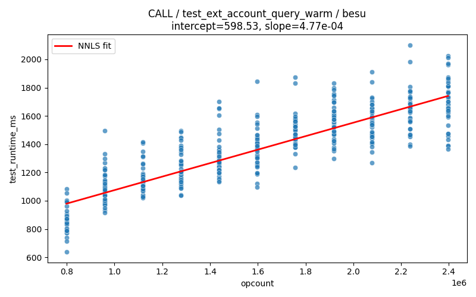

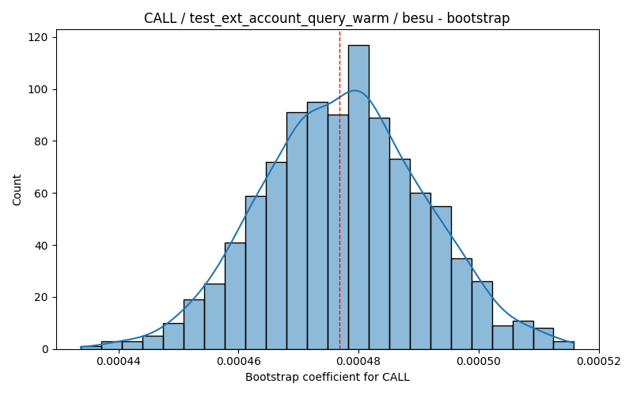


</details>

<details><summary>erigon — NNLS regression summary</summary>

```
==============================================================================
                           NNLS Regression Results                            
==============================================================================
Dep. Variable:          test_runtime_ms              R-squared:          0.906
Model:                  NNLS                    Adj. R-squared:          0.905
No. Observations:       154                               RMSE:          80.41
Df Residuals:           152                                MAE:          58.17
Df Model:               1      
==============================================================================
                      coef     std err     P-value      [0.025      0.975]
------------------------------------------------------------------------------
         const     56.8930     19.5367       0.001     19.2290     97.4192
       opcount      0.0005      0.0000       0.001      0.0005      0.0005
==============================================================================
Notes: Non-negative least squares with bootstrap inference (1000 iterations)
==============================================================================
```

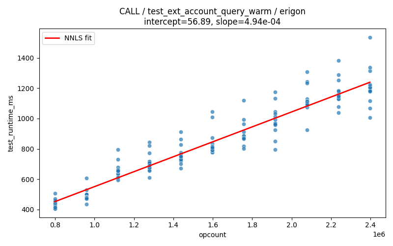

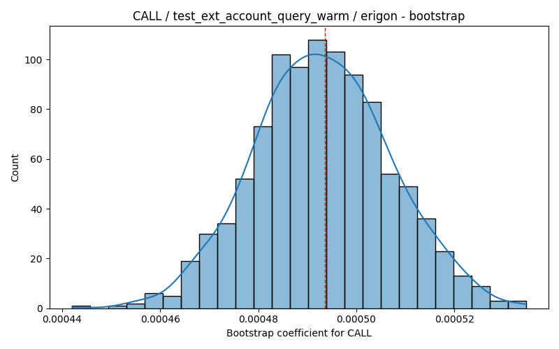

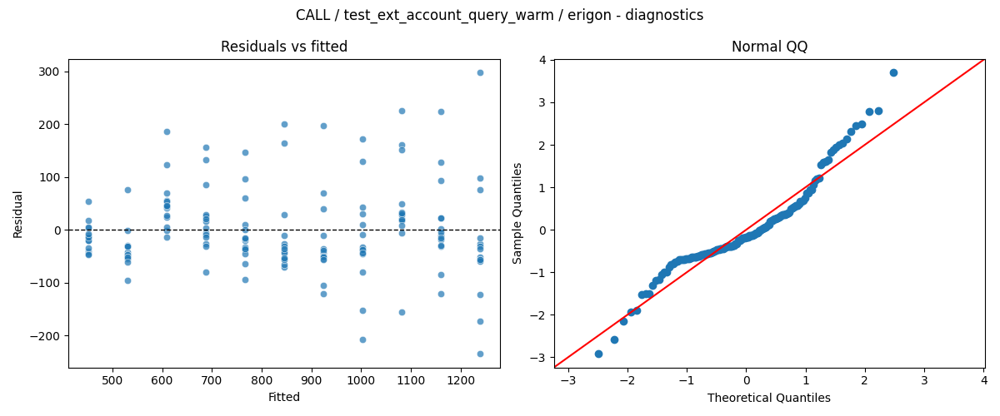

</details>

<details><summary>ethrex — NNLS regression summary</summary>

```
==============================================================================
                           NNLS Regression Results                            
==============================================================================
Dep. Variable:          test_runtime_ms              R-squared:          0.950
Model:                  NNLS                    Adj. R-squared:          0.950
No. Observations:       440                               RMSE:          12.63
Df Residuals:           438                                MAE:          10.06
Df Model:               1      
==============================================================================
                      coef     std err     P-value      [0.025      0.975]
------------------------------------------------------------------------------
         const     29.7798      1.8334       0.001     26.3738     33.4102
       opcount      0.0001      0.0000       0.001      0.0001      0.0001
==============================================================================
Notes: Non-negative least squares with bootstrap inference (1000 iterations)
==============================================================================
```

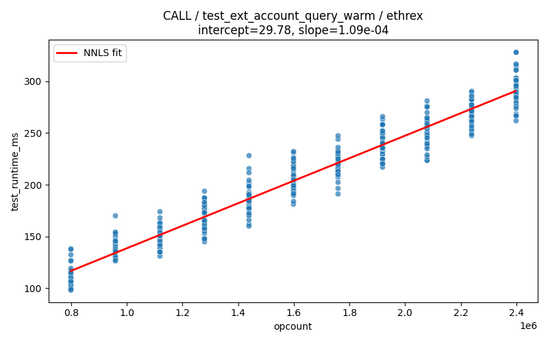

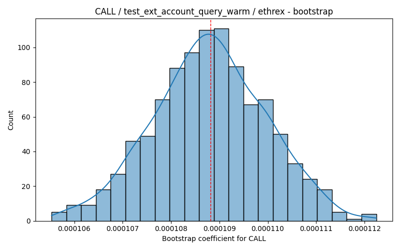

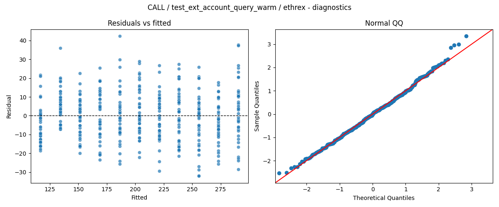

</details>

<details><summary>geth — NNLS regression summary</summary>

```
==============================================================================
                           NNLS Regression Results                            
==============================================================================
Dep. Variable:          test_runtime_ms              R-squared:          0.866
Model:                  NNLS                    Adj. R-squared:          0.866
No. Observations:       440                               RMSE:          26.05
Df Residuals:           438                                MAE:          20.64
Df Model:               1      
==============================================================================
                      coef     std err     P-value      [0.025      0.975]
------------------------------------------------------------------------------
         const     50.2972      4.0796       0.001     42.3518     58.1629
       opcount      0.0001      0.0000       0.001      0.0001      0.0001
==============================================================================
Notes: Non-negative least squares with bootstrap inference (1000 iterations)
==============================================================================
```

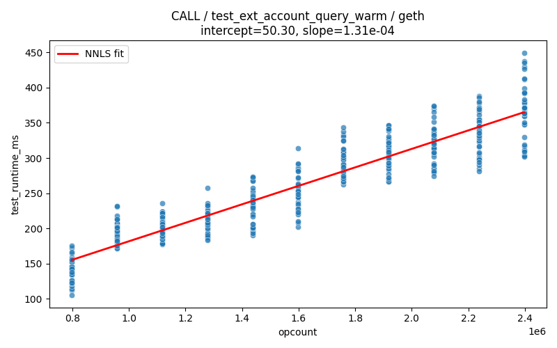

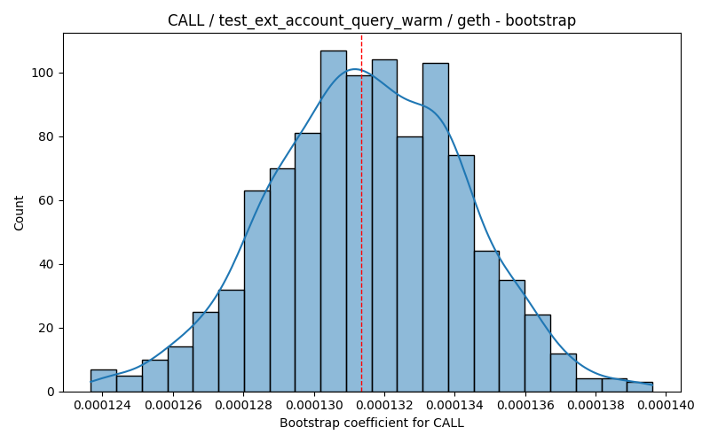

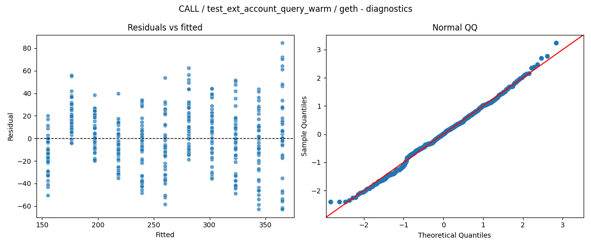

</details>

<details><summary>nethermind — NNLS regression summary</summary>

```
==============================================================================
                           NNLS Regression Results                            
==============================================================================
Dep. Variable:          test_runtime_ms              R-squared:          0.660
Model:                  NNLS                    Adj. R-squared:          0.659
No. Observations:       363                               RMSE:         131.94
Df Residuals:           361                                MAE:         108.71
Df Model:               1      
==============================================================================
                      coef     std err     P-value      [0.025      0.975]
------------------------------------------------------------------------------
         const    180.5239     19.8893       0.001    141.8901    218.4451
       opcount      0.0004      0.0000       0.001      0.0003      0.0004
==============================================================================
Notes: Non-negative least squares with bootstrap inference (1000 iterations)
==============================================================================
```

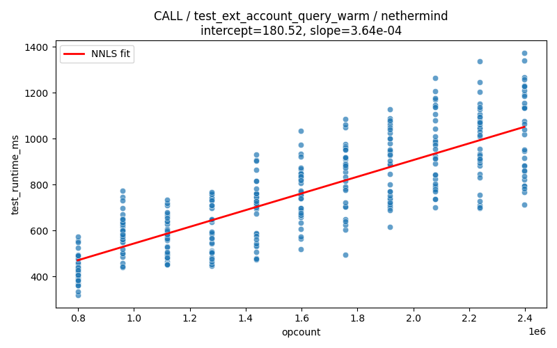

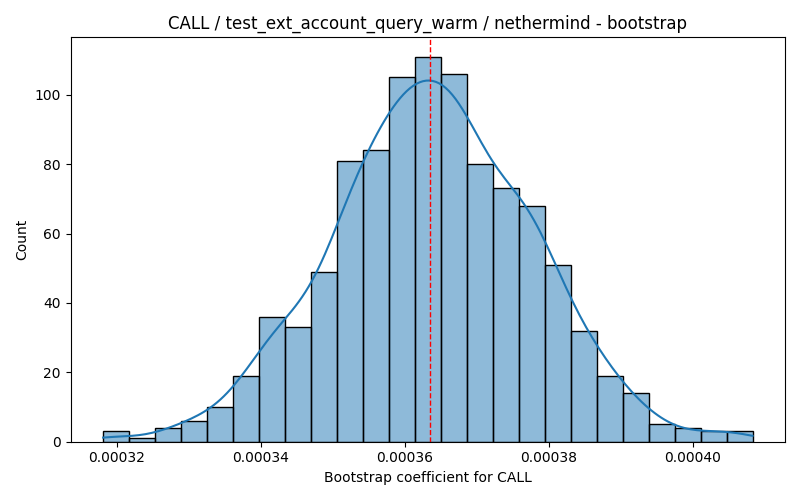

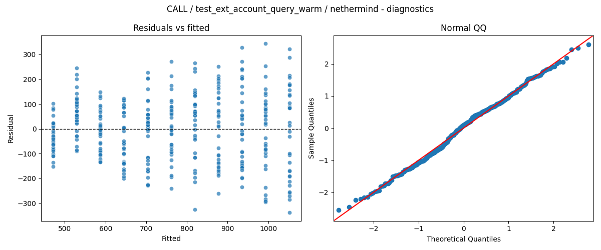

</details>

<details><summary>reth — NNLS regression summary</summary>

```
==============================================================================
                           NNLS Regression Results                            
==============================================================================
Dep. Variable:          test_runtime_ms              R-squared:          0.927
Model:                  NNLS                    Adj. R-squared:          0.927
No. Observations:       539                               RMSE:           8.17
Df Residuals:           537                                MAE:           6.25
Df Model:               1      
==============================================================================
                      coef     std err     P-value      [0.025      0.975]
------------------------------------------------------------------------------
         const     23.7710      1.1949       0.001     21.3919     26.1944
       opcount      0.0001      0.0000       0.001      0.0001      0.0001
==============================================================================
Notes: Non-negative least squares with bootstrap inference (1000 iterations)
==============================================================================
```

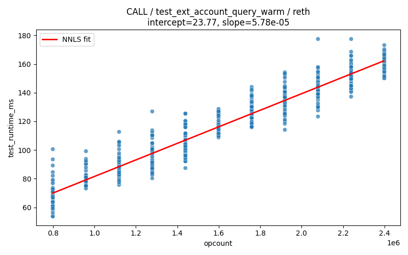

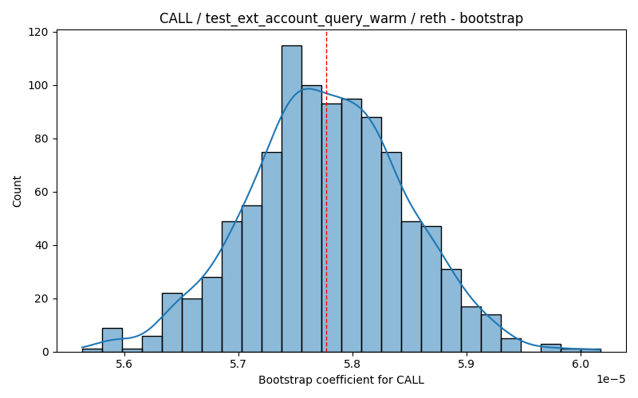

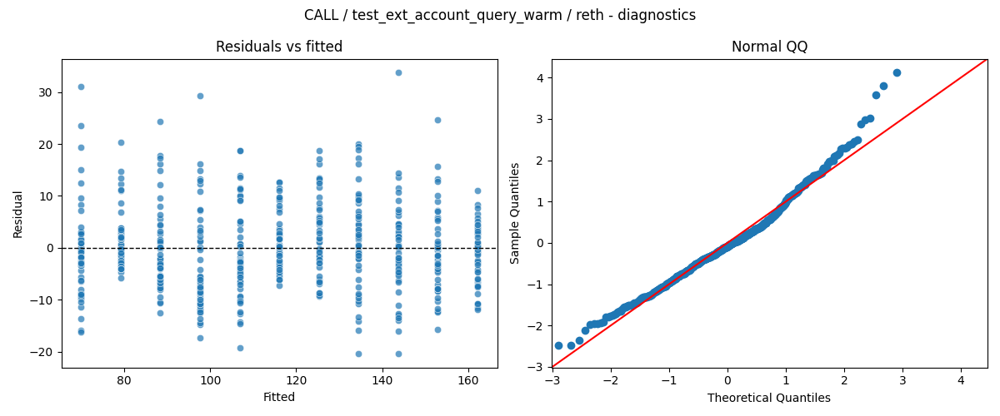

</details>

## CALLCODE

### test_account_access — combo `CALLCODE_AccountMode.EXISTING_EOA` — `presets[cold_account_nocode_access]`

| client | nobs | R² | target_coef (ms) | p-value | 95% CI |
| --- | --- | --- | --- | --- | --- |
| `besu` | 462 | 0.8523 | 0.01446 | 1.00e-03 | [0.01384, 0.01502] |
| `erigon` | 154 | 0.9761 | 0.009997 | 1.00e-03 | [0.009756, 0.01023] |
| `ethrex` | 440 | 0.9936 | 0.007277 | 1.00e-03 | [0.007222, 0.00733] |
| `geth` | 440 | 0.9101 | 0.01106 | 1.00e-03 | [0.0107, 0.01143] |
| `nethermind` | 363 | 0.8139 | 0.003885 | 1.00e-03 | [0.0037, 0.004086] |
| `reth` | 539 | 0.9196 | 0.001093 | 1.00e-03 | [0.001066, 0.001117] |

<details><summary>besu — NNLS regression summary</summary>

```
==============================================================================
                           NNLS Regression Results                            
==============================================================================
Dep. Variable:          test_runtime_ms              R-squared:          0.852
Model:                  NNLS                    Adj. R-squared:          0.852
No. Observations:       462                               RMSE:         142.98
Df Residuals:           460                                MAE:         112.47
Df Model:               1      
==============================================================================
                      coef     std err     P-value      [0.025      0.975]
------------------------------------------------------------------------------
         const    570.7166     22.0195       0.001    529.7073    615.3622
       opcount      0.0145      0.0003       0.001      0.0138      0.0150
==============================================================================
Notes: Non-negative least squares with bootstrap inference (1000 iterations)
==============================================================================
```

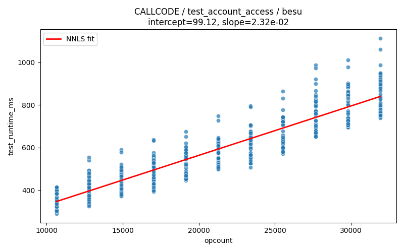

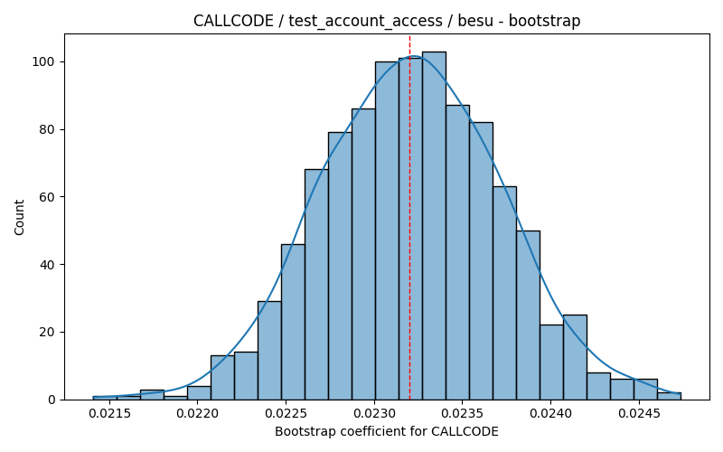

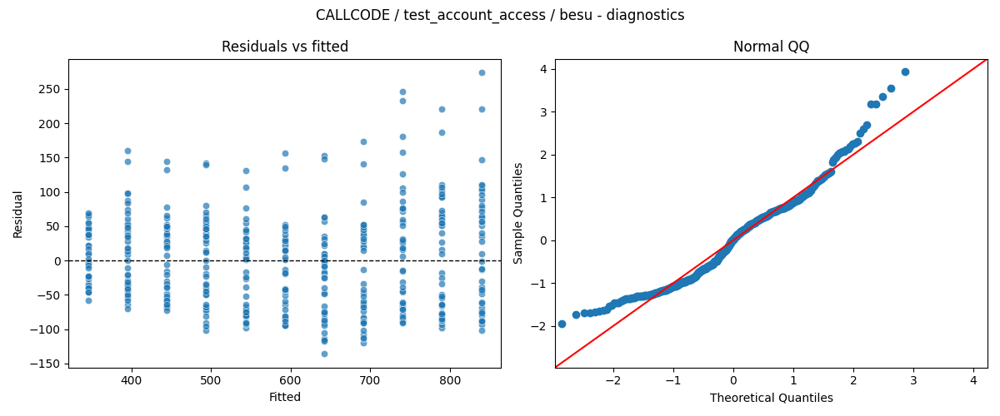

</details>

<details><summary>erigon — NNLS regression summary</summary>

```
==============================================================================
                           NNLS Regression Results                            
==============================================================================
Dep. Variable:          test_runtime_ms              R-squared:          0.976
Model:                  NNLS                    Adj. R-squared:          0.976
No. Observations:       154                               RMSE:          37.18
Df Residuals:           152                                MAE:          26.36
Df Model:               1      
==============================================================================
                      coef     std err     P-value      [0.025      0.975]
------------------------------------------------------------------------------
         const     20.7953      7.9300       0.006      5.1559     35.7905
       opcount      0.0100      0.0001       0.001      0.0098      0.0102
==============================================================================
Notes: Non-negative least squares with bootstrap inference (1000 iterations)
==============================================================================
```

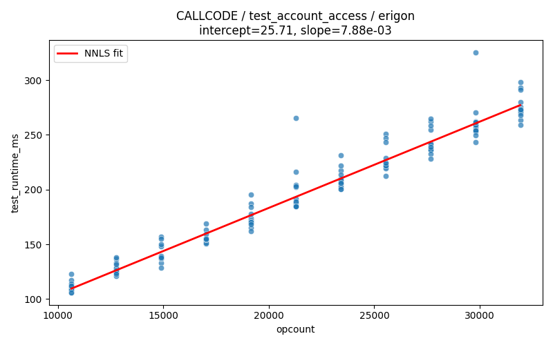

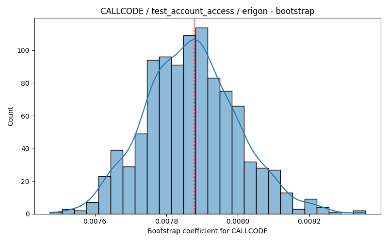

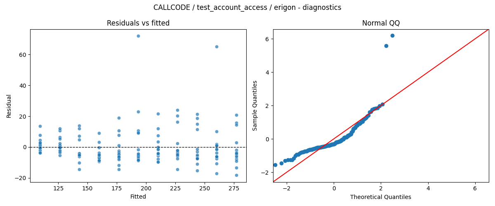

</details>

<details><summary>ethrex — NNLS regression summary</summary>

```
==============================================================================
                           NNLS Regression Results                            
==============================================================================
Dep. Variable:          test_runtime_ms              R-squared:          0.994
Model:                  NNLS                    Adj. R-squared:          0.994
No. Observations:       440                               RMSE:          13.83
Df Residuals:           438                                MAE:          10.83
Df Model:               1      
==============================================================================
                      coef     std err     P-value      [0.025      0.975]
------------------------------------------------------------------------------
         const     45.2210      2.0030       0.001     41.1577     49.1123
       opcount      0.0073      0.0000       0.001      0.0072      0.0073
==============================================================================
Notes: Non-negative least squares with bootstrap inference (1000 iterations)
==============================================================================
```

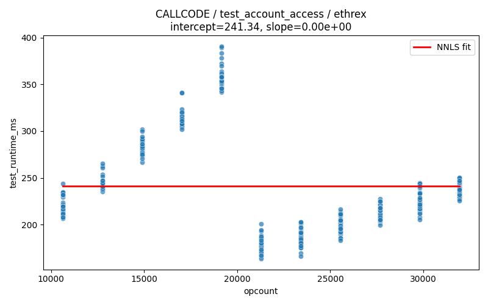

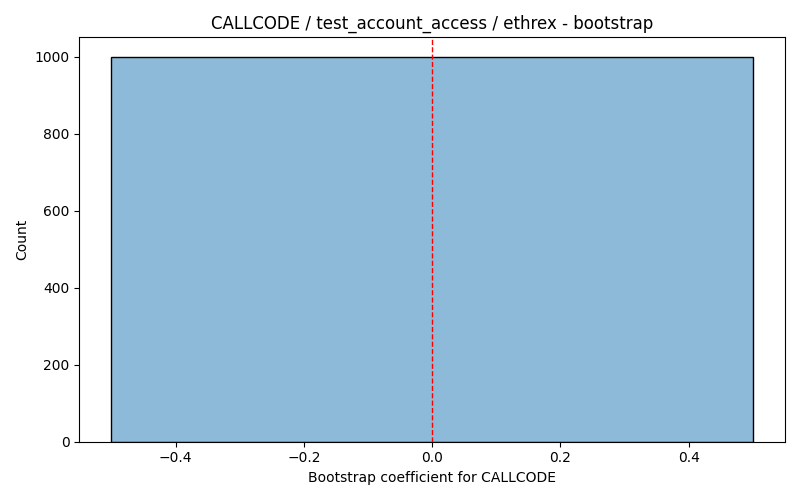


</details>

<details><summary>geth — NNLS regression summary</summary>

```
==============================================================================
                           NNLS Regression Results                            
==============================================================================
Dep. Variable:          test_runtime_ms              R-squared:          0.910
Model:                  NNLS                    Adj. R-squared:          0.910
No. Observations:       440                               RMSE:          82.49
Df Residuals:           438                                MAE:          67.93
Df Model:               1      
==============================================================================
                      coef     std err     P-value      [0.025      0.975]
------------------------------------------------------------------------------
         const    418.7152     16.1868       0.001    385.1966    449.7120
       opcount      0.0111      0.0002       0.001      0.0107      0.0114
==============================================================================
Notes: Non-negative least squares with bootstrap inference (1000 iterations)
==============================================================================
```

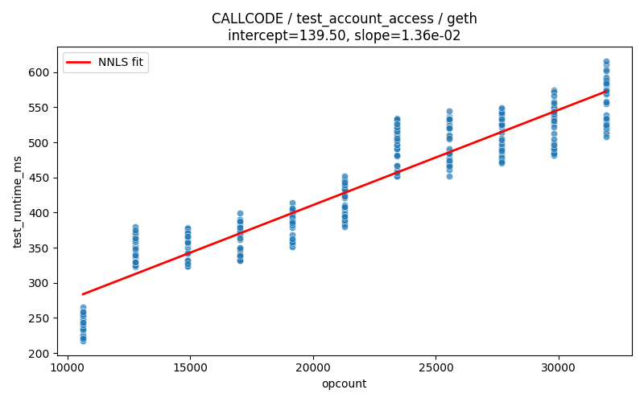

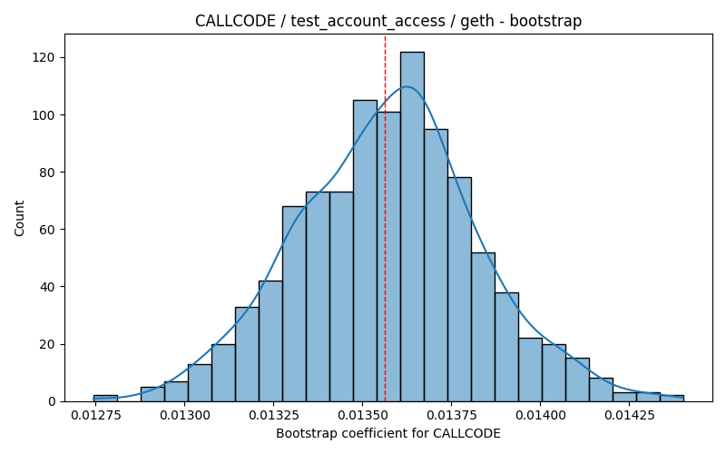

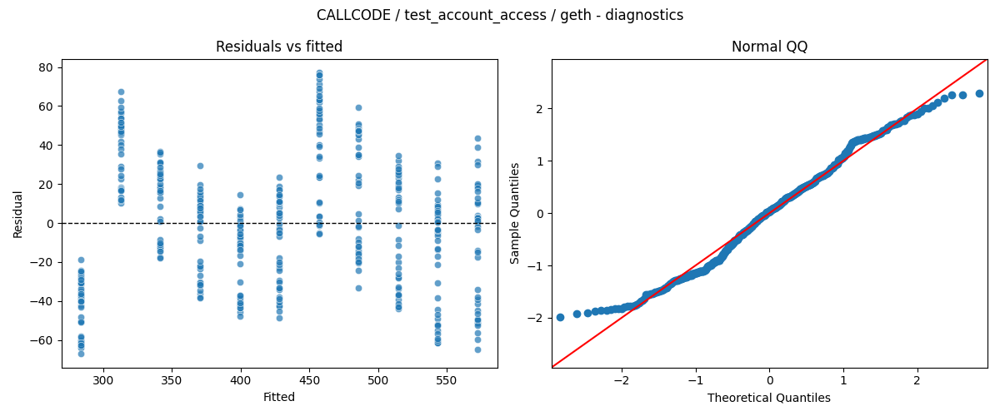

</details>

<details><summary>nethermind — NNLS regression summary</summary>

```
==============================================================================
                           NNLS Regression Results                            
==============================================================================
Dep. Variable:          test_runtime_ms              R-squared:          0.814
Model:                  NNLS                    Adj. R-squared:          0.813
No. Observations:       363                               RMSE:          44.11
Df Residuals:           361                                MAE:          34.20
Df Model:               1      
==============================================================================
                      coef     std err     P-value      [0.025      0.975]
------------------------------------------------------------------------------
         const     95.7736      6.9490       0.001     83.1489    109.8492
       opcount      0.0039      0.0001       0.001      0.0037      0.0041
==============================================================================
Notes: Non-negative least squares with bootstrap inference (1000 iterations)
==============================================================================
```

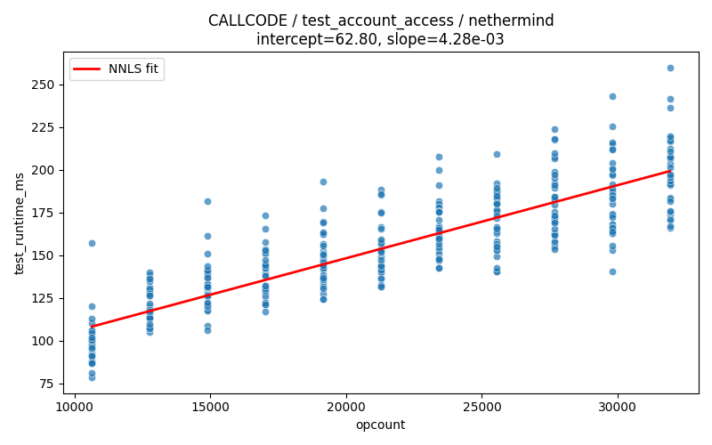

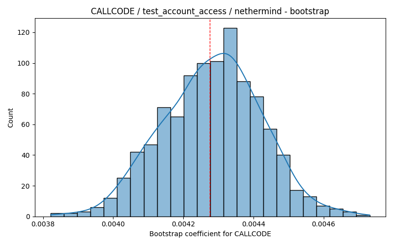

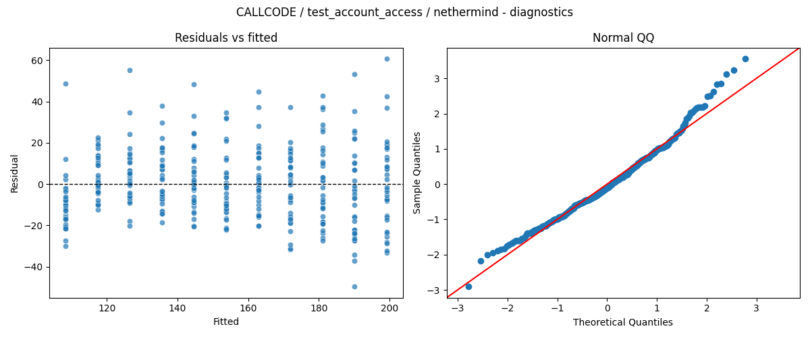

</details>

<details><summary>reth — NNLS regression summary</summary>

```
==============================================================================
                           NNLS Regression Results                            
==============================================================================
Dep. Variable:          test_runtime_ms              R-squared:          0.920
Model:                  NNLS                    Adj. R-squared:          0.919
No. Observations:       539                               RMSE:           7.67
Df Residuals:           537                                MAE:           6.03
Df Model:               1      
==============================================================================
                      coef     std err     P-value      [0.025      0.975]
------------------------------------------------------------------------------
         const     46.0211      1.0088       0.001     44.0619     48.0969
       opcount      0.0011      0.0000       0.001      0.0011      0.0011
==============================================================================
Notes: Non-negative least squares with bootstrap inference (1000 iterations)
==============================================================================
```

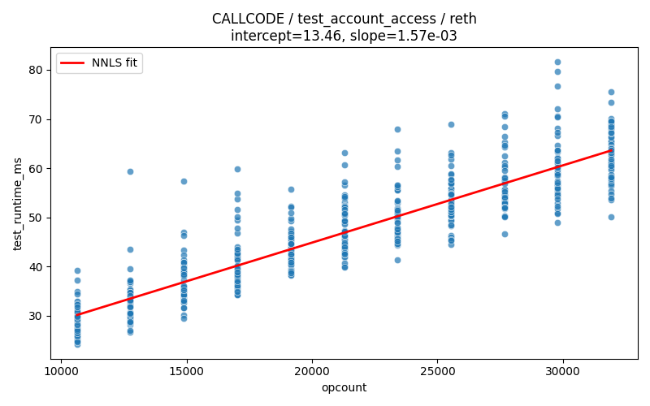

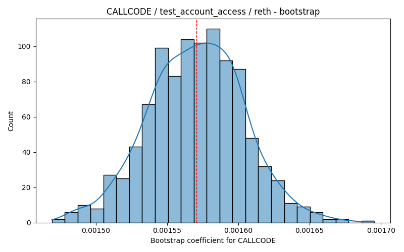

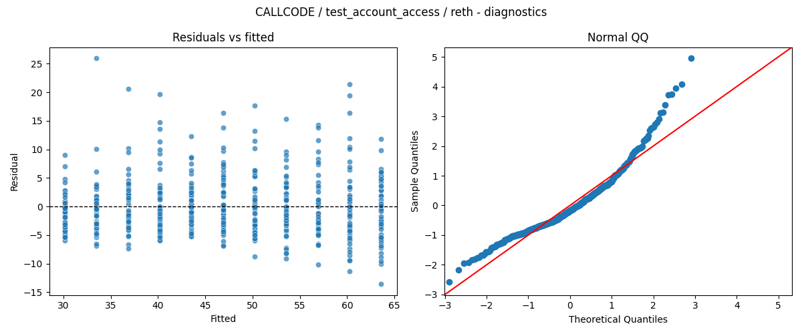

</details>

### test_account_access — combo `CALLCODE_AccountMode.NON_EXISTING_ACCOUNT` — `presets[cold_account_nocode_access]`

| client | nobs | R² | target_coef (ms) | p-value | 95% CI |
| --- | --- | --- | --- | --- | --- |
| `besu` | 462 | 0.8241 | 0.01467 | 1.00e-03 | [0.01404, 0.01529] |
| `erigon` | 154 | 0.9767 | 0.00917 | 1.00e-03 | [0.00894, 0.009378] |
| `ethrex` | 440 | 0.9644 | 0.00205 | 1.00e-03 | [0.002016, 0.002087] |
| `geth` | 440 | 0.8641 | 0.02263 | 1.00e-03 | [0.02182, 0.02359] |
| `nethermind` | 363 | 0.8622 | 0.003842 | 1.00e-03 | [0.003688, 0.004019] |
| `reth` | 539 | 0.8648 | 0.0007477 | 1.00e-03 | [0.0007215, 0.0007714] |

<details><summary>besu — NNLS regression summary</summary>

```
==============================================================================
                           NNLS Regression Results                            
==============================================================================
Dep. Variable:          test_runtime_ms              R-squared:          0.824
Model:                  NNLS                    Adj. R-squared:          0.824
No. Observations:       462                               RMSE:         160.92
Df Residuals:           460                                MAE:         143.70
Df Model:               1      
==============================================================================
                      coef     std err     P-value      [0.025      0.975]
------------------------------------------------------------------------------
         const    531.1143     23.7671       0.001    484.2063    577.0857
       opcount      0.0147      0.0003       0.001      0.0140      0.0153
==============================================================================
Notes: Non-negative least squares with bootstrap inference (1000 iterations)
==============================================================================
```

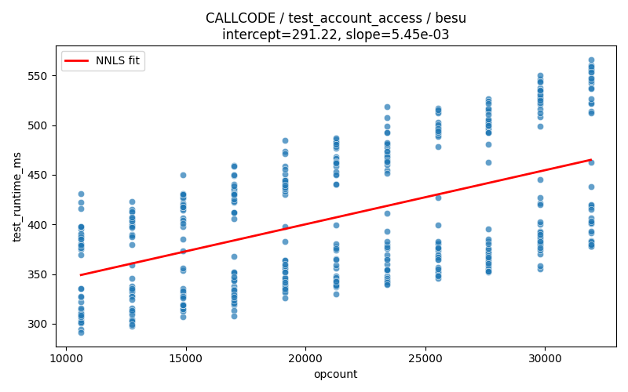

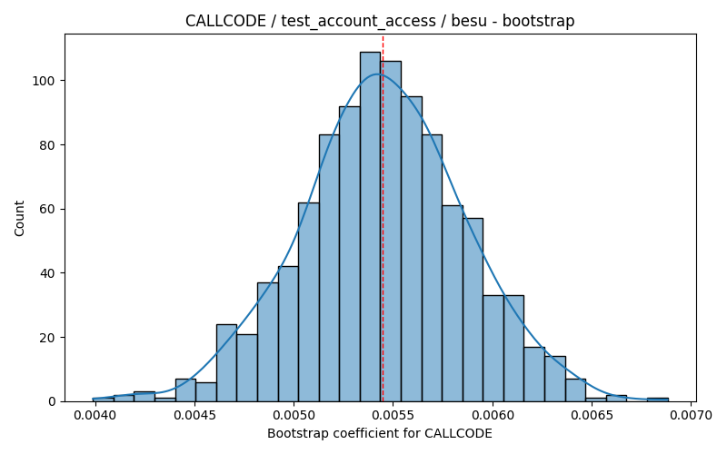

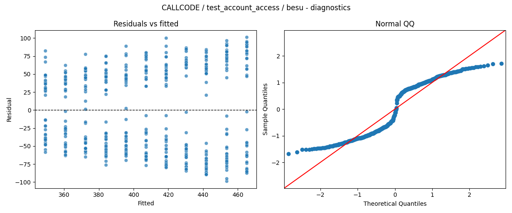

</details>

<details><summary>erigon — NNLS regression summary</summary>

```
==============================================================================
                           NNLS Regression Results                            
==============================================================================
Dep. Variable:          test_runtime_ms              R-squared:          0.977
Model:                  NNLS                    Adj. R-squared:          0.977
No. Observations:       154                               RMSE:          33.65
Df Residuals:           152                                MAE:          23.02
Df Model:               1      
==============================================================================
                      coef     std err     P-value      [0.025      0.975]
------------------------------------------------------------------------------
         const     18.4826      7.4696       0.007      4.5389     33.8484
       opcount      0.0092      0.0001       0.001      0.0089      0.0094
==============================================================================
Notes: Non-negative least squares with bootstrap inference (1000 iterations)
==============================================================================
```

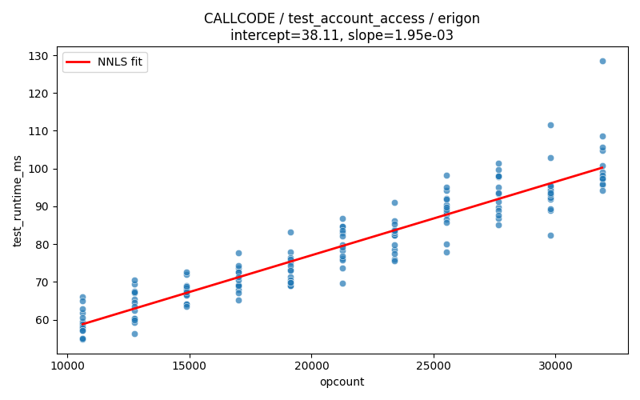

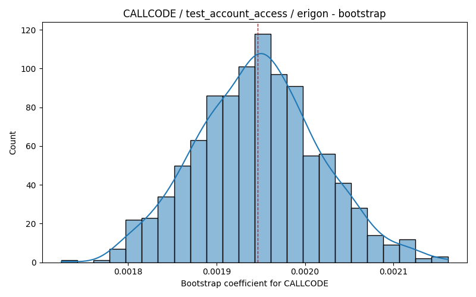

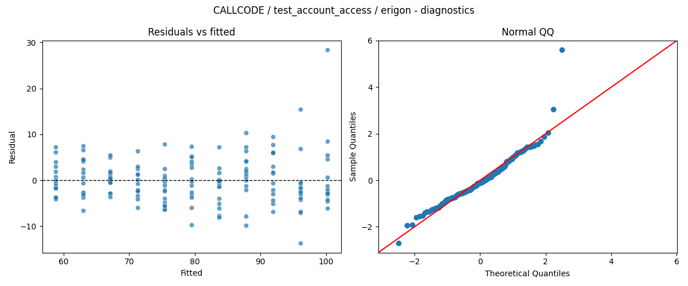

</details>

<details><summary>ethrex — NNLS regression summary</summary>

```
==============================================================================
                           NNLS Regression Results                            
==============================================================================
Dep. Variable:          test_runtime_ms              R-squared:          0.964
Model:                  NNLS                    Adj. R-squared:          0.964
No. Observations:       440                               RMSE:           9.35
Df Residuals:           438                                MAE:           7.38
Df Model:               1      
==============================================================================
                      coef     std err     P-value      [0.025      0.975]
------------------------------------------------------------------------------
         const     29.8065      1.4033       0.001     27.0724     32.4927
       opcount      0.0020      0.0000       0.001      0.0020      0.0021
==============================================================================
Notes: Non-negative least squares with bootstrap inference (1000 iterations)
==============================================================================
```

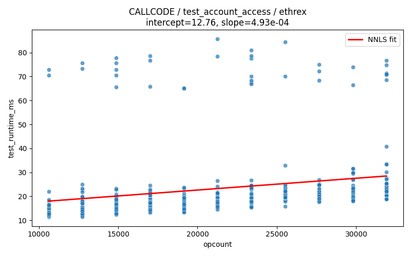

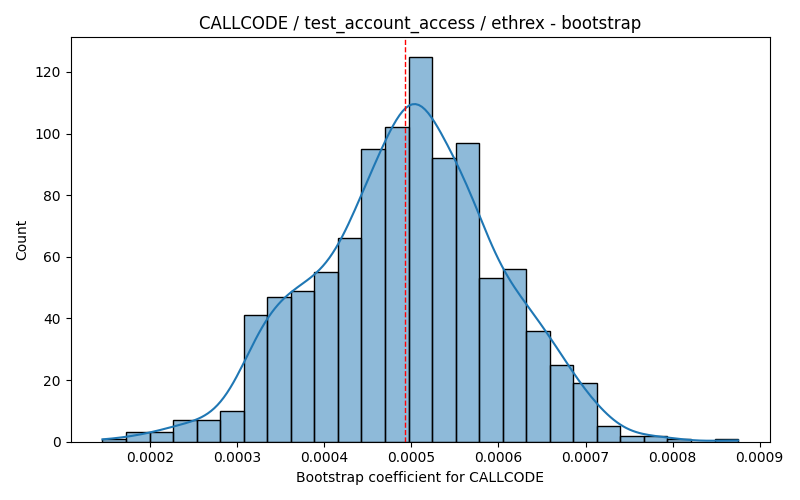

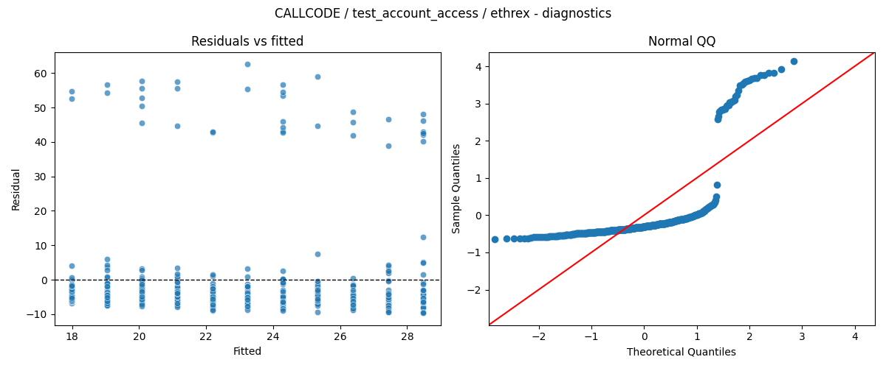

</details>

<details><summary>geth — NNLS regression summary</summary>

```
==============================================================================
                           NNLS Regression Results                            
==============================================================================
Dep. Variable:          test_runtime_ms              R-squared:          0.864
Model:                  NNLS                    Adj. R-squared:          0.864
No. Observations:       440                               RMSE:         213.06
Df Residuals:           438                                MAE:         180.71
Df Model:               1      
==============================================================================
                      coef     std err     P-value      [0.025      0.975]
------------------------------------------------------------------------------
         const    706.6188     38.3979       0.001    627.2822    777.2723
       opcount      0.0226      0.0005       0.001      0.0218      0.0236
==============================================================================
Notes: Non-negative least squares with bootstrap inference (1000 iterations)
==============================================================================
```

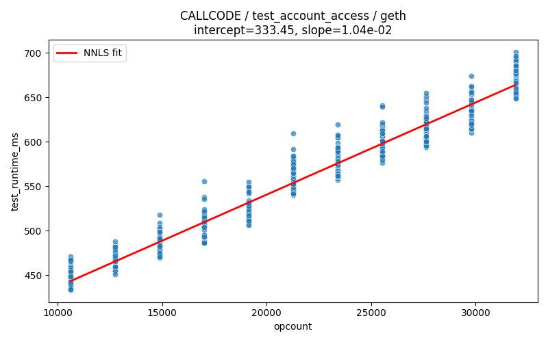

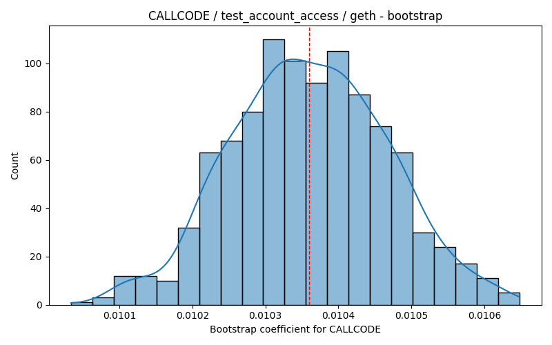

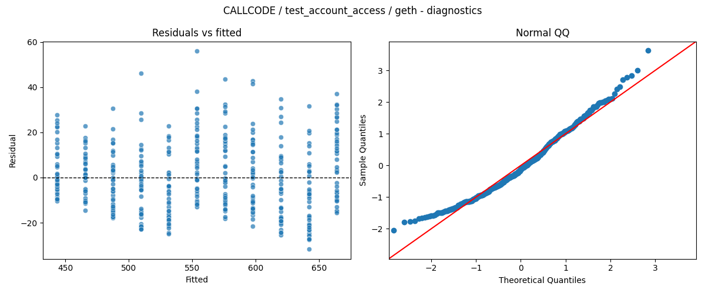

</details>

<details><summary>nethermind — NNLS regression summary</summary>

```
==============================================================================
                           NNLS Regression Results                            
==============================================================================
Dep. Variable:          test_runtime_ms              R-squared:          0.862
Model:                  NNLS                    Adj. R-squared:          0.862
No. Observations:       363                               RMSE:          36.48
Df Residuals:           361                                MAE:          28.39
Df Model:               1      
==============================================================================
                      coef     std err     P-value      [0.025      0.975]
------------------------------------------------------------------------------
         const     74.7986      5.9773       0.001     63.2236     85.6863
       opcount      0.0038      0.0001       0.001      0.0037      0.0040
==============================================================================
Notes: Non-negative least squares with bootstrap inference (1000 iterations)
==============================================================================
```

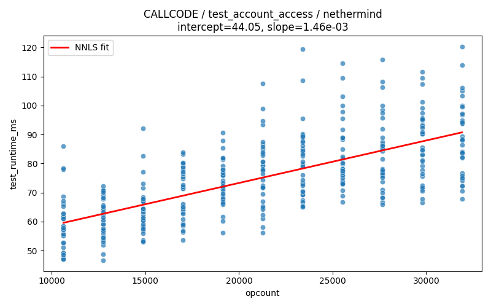

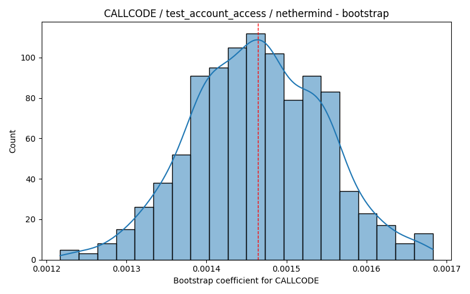

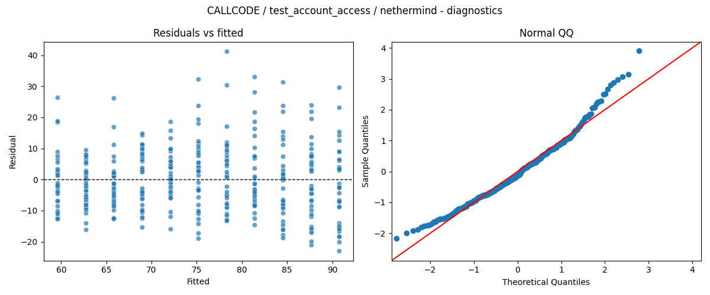

</details>

<details><summary>reth — NNLS regression summary</summary>

```
==============================================================================
                           NNLS Regression Results                            
==============================================================================
Dep. Variable:          test_runtime_ms              R-squared:          0.865
Model:                  NNLS                    Adj. R-squared:          0.865
No. Observations:       539                               RMSE:           7.02
Df Residuals:           537                                MAE:           5.37
Df Model:               1      
==============================================================================
                      coef     std err     P-value      [0.025      0.975]
------------------------------------------------------------------------------
         const     51.9222      1.0213       0.001     50.0529     54.0636
       opcount      0.0007      0.0000       0.001      0.0007      0.0008
==============================================================================
Notes: Non-negative least squares with bootstrap inference (1000 iterations)
==============================================================================
```

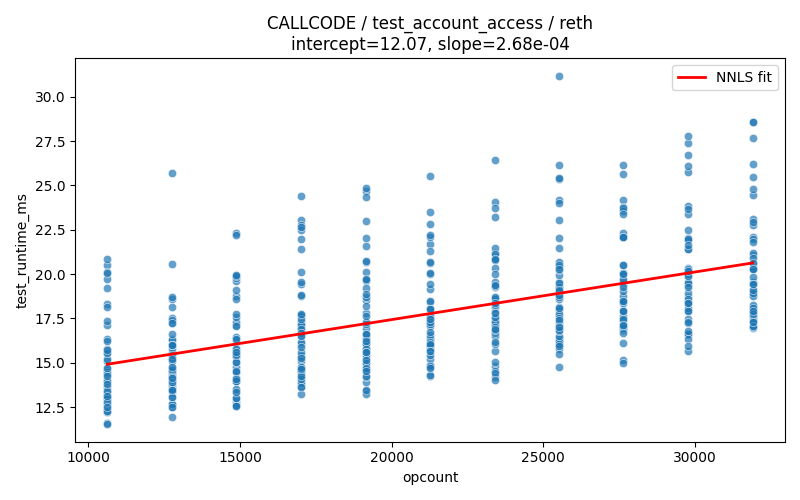

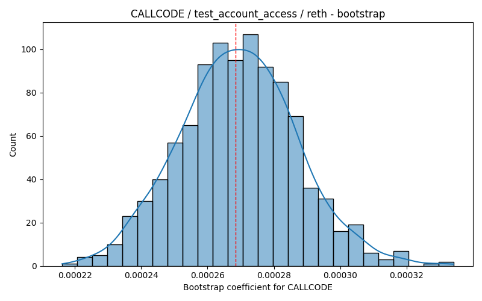

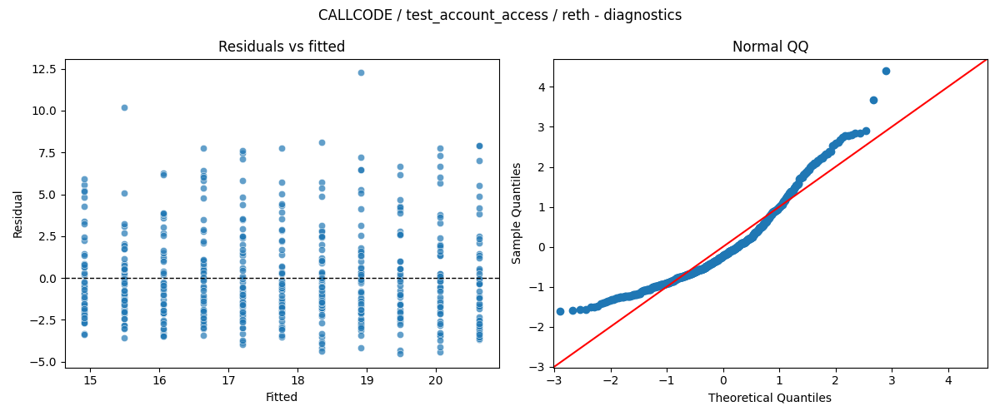

</details>

### test_account_access — combo `CALLCODE_AccountMode.EXISTING_CONTRACT` — `presets[cold_account_code_access]`

| client | nobs | R² | target_coef (ms) | p-value | 95% CI |
| --- | --- | --- | --- | --- | --- |
| `besu` | 462 | 0.8975 | 0.02663 | 1.00e-03 | [0.02588, 0.02737] |
| `erigon` | 154 | 0.5722 | 0.04573 | 1.00e-03 | [0.03884, 0.05196] |
| `ethrex` | 440 | 0.9932 | 0.007932 | 1.00e-03 | [0.007877, 0.007995] |
| `geth` | 440 | 0.8575 | 0.02341 | 1.00e-03 | [0.02245, 0.0244] |
| `nethermind` | 363 | 0.5697 | 0.01394 | 1.00e-03 | [0.01261, 0.01538] |
| `reth` | 539 | 0.9731 | 0.004029 | 1.00e-03 | [0.00397, 0.00409] |

<details><summary>besu — NNLS regression summary</summary>

```
==============================================================================
                           NNLS Regression Results                            
==============================================================================
Dep. Variable:          test_runtime_ms              R-squared:          0.897
Model:                  NNLS                    Adj. R-squared:          0.897
No. Observations:       462                               RMSE:         183.16
Df Residuals:           460                                MAE:         144.93
Df Model:               1      
==============================================================================
                      coef     std err     P-value      [0.025      0.975]
------------------------------------------------------------------------------
         const    578.7096     25.1116       0.001    534.6891    630.0360
       opcount      0.0266      0.0004       0.001      0.0259      0.0274
==============================================================================
Notes: Non-negative least squares with bootstrap inference (1000 iterations)
==============================================================================
```

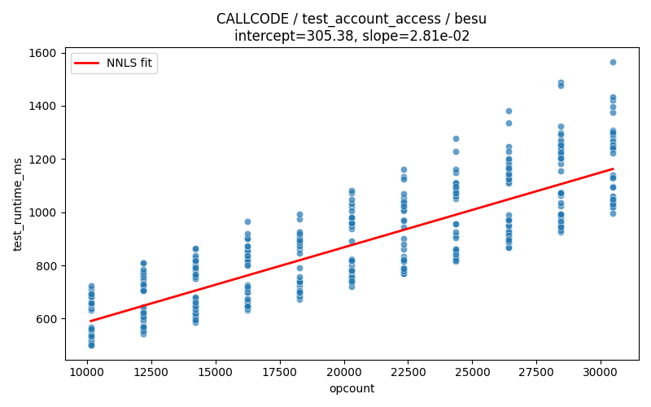

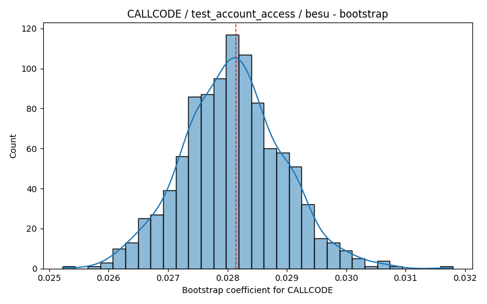

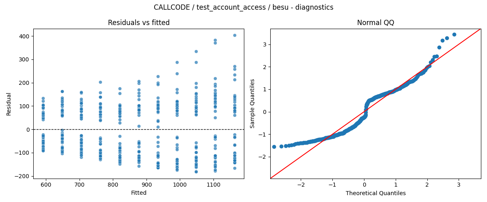

</details>

<details><summary>erigon — NNLS regression summary</summary>

```
==============================================================================
                           NNLS Regression Results                            
==============================================================================
Dep. Variable:          test_runtime_ms              R-squared:          0.572
Model:                  NNLS                    Adj. R-squared:          0.569
No. Observations:       154                               RMSE:         804.55
Df Residuals:           152                                MAE:         543.16
Df Model:               1      
==============================================================================
                      coef     std err     P-value      [0.025      0.975]
------------------------------------------------------------------------------
         const    745.4852    201.4931       0.001    373.3887   1143.5928
       opcount      0.0457      0.0033       0.001      0.0388      0.0520
==============================================================================
Notes: Non-negative least squares with bootstrap inference (1000 iterations)
==============================================================================
```

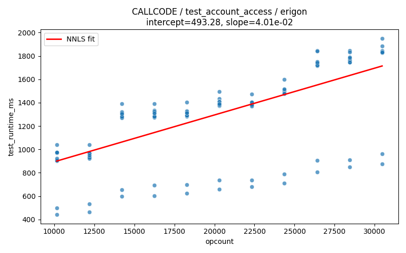

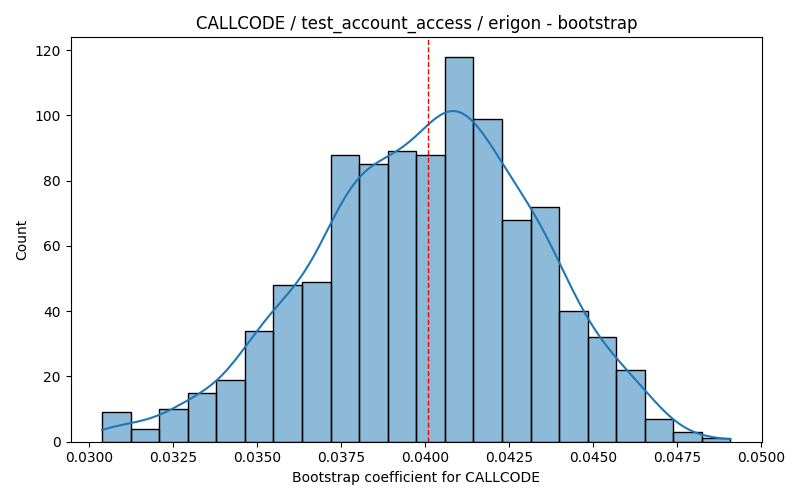

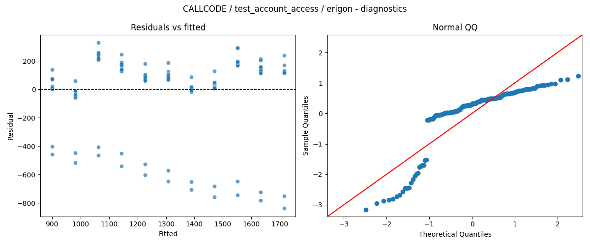

</details>

<details><summary>ethrex — NNLS regression summary</summary>

```
==============================================================================
                           NNLS Regression Results                            
==============================================================================
Dep. Variable:          test_runtime_ms              R-squared:          0.993
Model:                  NNLS                    Adj. R-squared:          0.993
No. Observations:       440                               RMSE:          13.36
Df Residuals:           438                                MAE:          10.16
Df Model:               1      
==============================================================================
                      coef     std err     P-value      [0.025      0.975]
------------------------------------------------------------------------------
         const     37.2756      1.9264       0.001     33.2996     40.8132
       opcount      0.0079      0.0000       0.001      0.0079      0.0080
==============================================================================
Notes: Non-negative least squares with bootstrap inference (1000 iterations)
==============================================================================
```

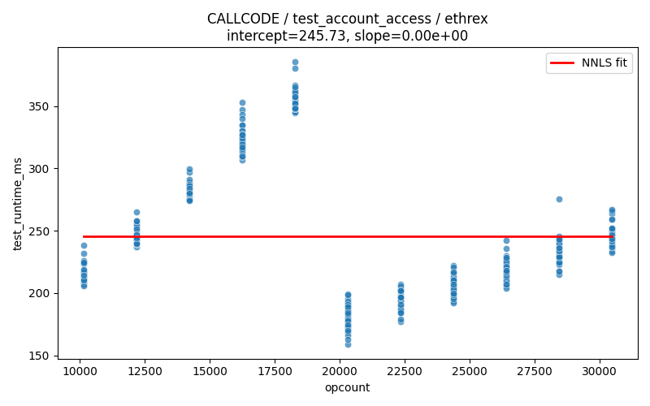


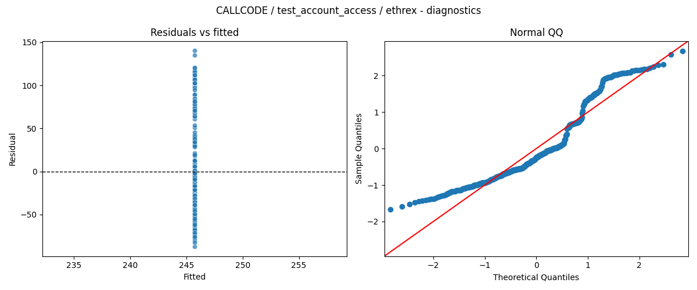

</details>

<details><summary>geth — NNLS regression summary</summary>

```
==============================================================================
                           NNLS Regression Results                            
==============================================================================
Dep. Variable:          test_runtime_ms              R-squared:          0.858
Model:                  NNLS                    Adj. R-squared:          0.857
No. Observations:       440                               RMSE:         194.14
Df Residuals:           438                                MAE:         162.23
Df Model:               1      
==============================================================================
                      coef     std err     P-value      [0.025      0.975]
------------------------------------------------------------------------------
         const    676.2837     36.4632       0.001    603.8654    747.9518
       opcount      0.0234      0.0005       0.001      0.0224      0.0244
==============================================================================
Notes: Non-negative least squares with bootstrap inference (1000 iterations)
==============================================================================
```

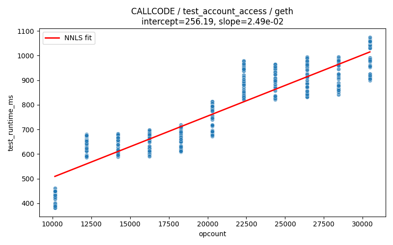

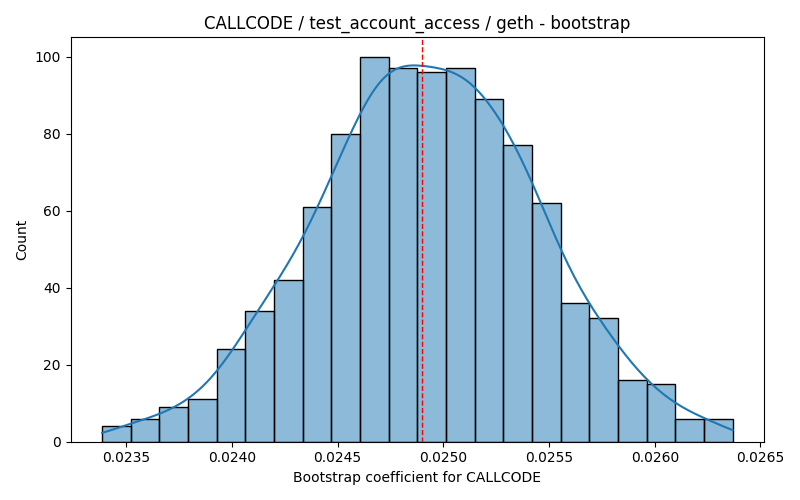

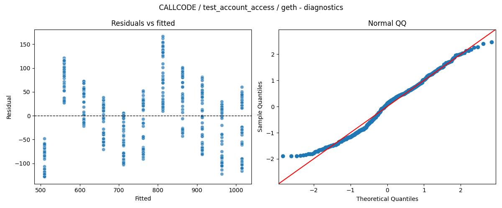

</details>

<details><summary>nethermind — NNLS regression summary</summary>

```
==============================================================================
                           NNLS Regression Results                            
==============================================================================
Dep. Variable:          test_runtime_ms              R-squared:          0.570
Model:                  NNLS                    Adj. R-squared:          0.569
No. Observations:       363                               RMSE:         246.53
Df Residuals:           361                                MAE:         184.79
Df Model:               1      
==============================================================================
                      coef     std err     P-value      [0.025      0.975]
------------------------------------------------------------------------------
         const    210.8629     40.0921       0.001    129.9905    289.8111
       opcount      0.0139      0.0007       0.001      0.0126      0.0154
==============================================================================
Notes: Non-negative least squares with bootstrap inference (1000 iterations)
==============================================================================
```

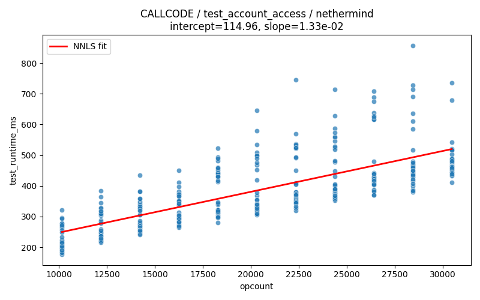

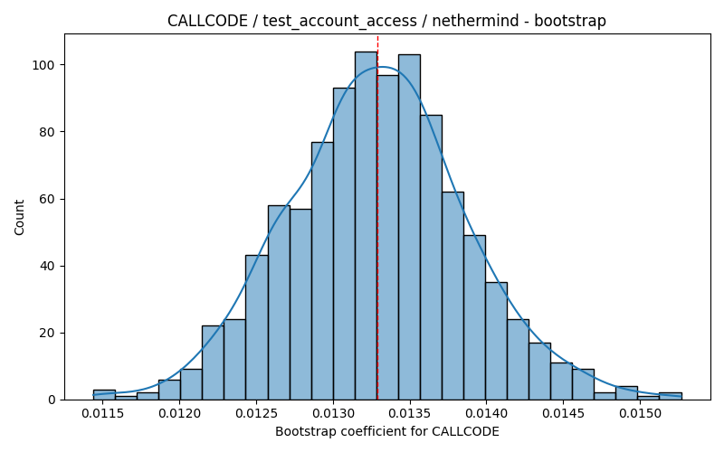

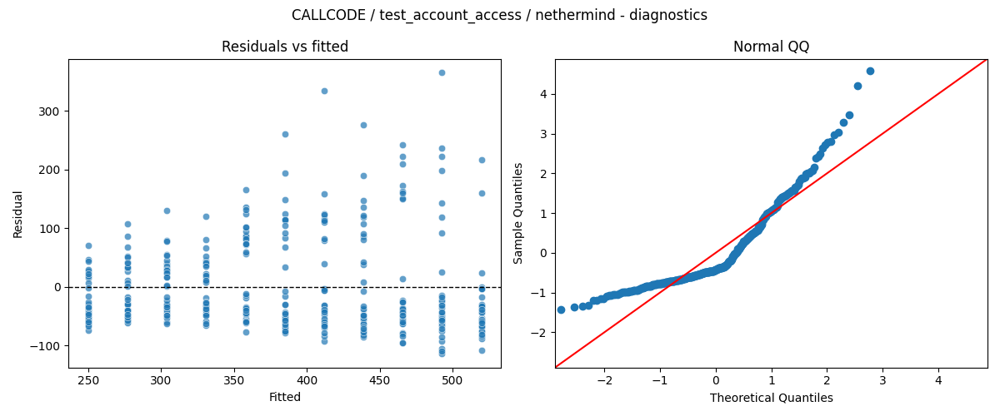

</details>

<details><summary>reth — NNLS regression summary</summary>

```
==============================================================================
                           NNLS Regression Results                            
==============================================================================
Dep. Variable:          test_runtime_ms              R-squared:          0.973
Model:                  NNLS                    Adj. R-squared:          0.973
No. Observations:       539                               RMSE:          13.64
Df Residuals:           537                                MAE:          10.96
Df Model:               1      
==============================================================================
                      coef     std err     P-value      [0.025      0.975]
------------------------------------------------------------------------------
         const    102.1686      1.8573       0.001     98.4035    105.8096
       opcount      0.0040      0.0000       0.001      0.0040      0.0041
==============================================================================
Notes: Non-negative least squares with bootstrap inference (1000 iterations)
==============================================================================
```

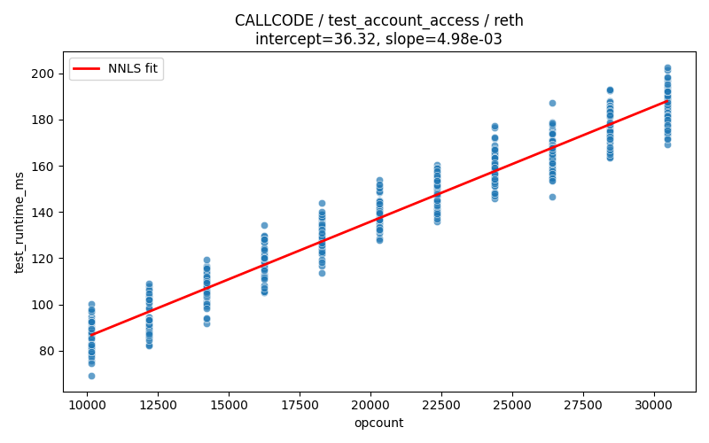

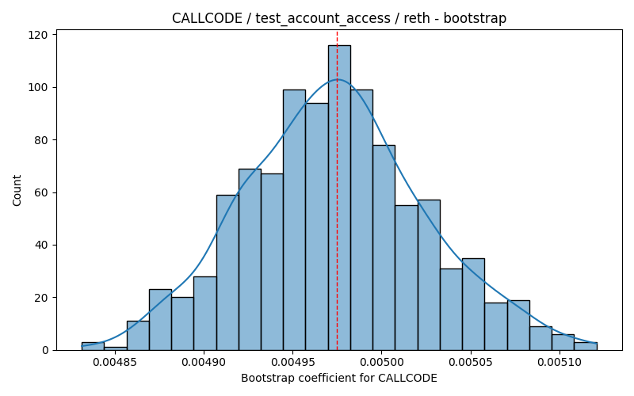

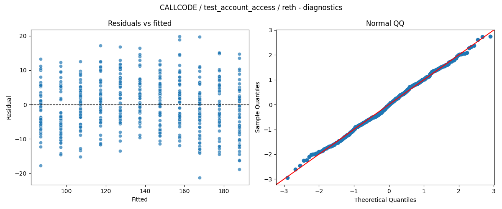

</details>

### test_account_access — combo `CALLCODE_AccountMode.NON_EXISTING_ACCOUNT` — `presets[cold_account_code_access]`

| client | nobs | R² | target_coef (ms) | p-value | 95% CI |
| --- | --- | --- | --- | --- | --- |
| `besu` | 462 | 0.8241 | 0.01467 | 1.00e-03 | [0.01404, 0.01529] |
| `erigon` | 154 | 0.9767 | 0.00917 | 1.00e-03 | [0.00894, 0.009378] |
| `ethrex` | 440 | 0.9644 | 0.00205 | 1.00e-03 | [0.002016, 0.002087] |
| `geth` | 440 | 0.8641 | 0.02263 | 1.00e-03 | [0.02182, 0.02359] |
| `nethermind` | 363 | 0.8622 | 0.003842 | 1.00e-03 | [0.003688, 0.004019] |
| `reth` | 539 | 0.8648 | 0.0007477 | 1.00e-03 | [0.0007215, 0.0007714] |

<details><summary>besu — NNLS regression summary</summary>

```
==============================================================================
                           NNLS Regression Results                            
==============================================================================
Dep. Variable:          test_runtime_ms              R-squared:          0.824
Model:                  NNLS                    Adj. R-squared:          0.824
No. Observations:       462                               RMSE:         160.92
Df Residuals:           460                                MAE:         143.70
Df Model:               1      
==============================================================================
                      coef     std err     P-value      [0.025      0.975]
------------------------------------------------------------------------------
         const    531.1143     23.7671       0.001    484.2063    577.0857
       opcount      0.0147      0.0003       0.001      0.0140      0.0153
==============================================================================
Notes: Non-negative least squares with bootstrap inference (1000 iterations)
==============================================================================
```


</details>

<details><summary>erigon — NNLS regression summary</summary>

```
==============================================================================
                           NNLS Regression Results                            
==============================================================================
Dep. Variable:          test_runtime_ms              R-squared:          0.977
Model:                  NNLS                    Adj. R-squared:          0.977
No. Observations:       154                               RMSE:          33.65
Df Residuals:           152                                MAE:          23.02
Df Model:               1      
==============================================================================
                      coef     std err     P-value      [0.025      0.975]
------------------------------------------------------------------------------
         const     18.4826      7.4696       0.007      4.5389     33.8484
       opcount      0.0092      0.0001       0.001      0.0089      0.0094
==============================================================================
Notes: Non-negative least squares with bootstrap inference (1000 iterations)
==============================================================================
```


</details>

<details><summary>ethrex — NNLS regression summary</summary>

```
==============================================================================
                           NNLS Regression Results                            
==============================================================================
Dep. Variable:          test_runtime_ms              R-squared:          0.964
Model:                  NNLS                    Adj. R-squared:          0.964
No. Observations:       440                               RMSE:           9.35
Df Residuals:           438                                MAE:           7.38
Df Model:               1      
==============================================================================
                      coef     std err     P-value      [0.025      0.975]
------------------------------------------------------------------------------
         const     29.8065      1.4033       0.001     27.0724     32.4927
       opcount      0.0020      0.0000       0.001      0.0020      0.0021
==============================================================================
Notes: Non-negative least squares with bootstrap inference (1000 iterations)
==============================================================================
```


</details>

<details><summary>geth — NNLS regression summary</summary>

```
==============================================================================
                           NNLS Regression Results                            
==============================================================================
Dep. Variable:          test_runtime_ms              R-squared:          0.864
Model:                  NNLS                    Adj. R-squared:          0.864
No. Observations:       440                               RMSE:         213.06
Df Residuals:           438                                MAE:         180.71
Df Model:               1      
==============================================================================
                      coef     std err     P-value      [0.025      0.975]
------------------------------------------------------------------------------
         const    706.6188     38.3979       0.001    627.2822    777.2723
       opcount      0.0226      0.0005       0.001      0.0218      0.0236
==============================================================================
Notes: Non-negative least squares with bootstrap inference (1000 iterations)
==============================================================================
```


</details>

<details><summary>nethermind — NNLS regression summary</summary>

```
==============================================================================
                           NNLS Regression Results                            
==============================================================================
Dep. Variable:          test_runtime_ms              R-squared:          0.862
Model:                  NNLS                    Adj. R-squared:          0.862
No. Observations:       363                               RMSE:          36.48
Df Residuals:           361                                MAE:          28.39
Df Model:               1      
==============================================================================
                      coef     std err     P-value      [0.025      0.975]
------------------------------------------------------------------------------
         const     74.7986      5.9773       0.001     63.2236     85.6863
       opcount      0.0038      0.0001       0.001      0.0037      0.0040
==============================================================================
Notes: Non-negative least squares with bootstrap inference (1000 iterations)
==============================================================================
```


</details>

<details><summary>reth — NNLS regression summary</summary>

```
==============================================================================
                           NNLS Regression Results                            
==============================================================================
Dep. Variable:          test_runtime_ms              R-squared:          0.865
Model:                  NNLS                    Adj. R-squared:          0.865
No. Observations:       539                               RMSE:           7.02
Df Residuals:           537                                MAE:           5.37
Df Model:               1      
==============================================================================
                      coef     std err     P-value      [0.025      0.975]
------------------------------------------------------------------------------
         const     51.9222      1.0213       0.001     50.0529     54.0636
       opcount      0.0007      0.0000       0.001      0.0007      0.0008
==============================================================================
Notes: Non-negative least squares with bootstrap inference (1000 iterations)
==============================================================================
```


</details>

### test_account_access — combo `CALLCODE_AccountMode.EXISTING_EOA` — `presets[cold_account_nocode_write]`

| client | nobs | R² | target_coef (ms) | p-value | 95% CI |
| --- | --- | --- | --- | --- | --- |
| `besu` | 462 | 0.8348 | 0.0232 | 1.00e-03 | [0.02222, 0.02418] |
| `erigon` | 154 | 0.9542 | 0.007877 | 1.00e-03 | [0.007634, 0.008136] |
| `ethrex` | 440 | 0 | 0 | 1.00e+00 | [0, 0] |
| `geth` | 440 | 0.8805 | 0.01356 | 1.00e-03 | [0.01306, 0.01408] |
| `nethermind` | 363 | 0.7393 | 0.004275 | 1.00e-03 | [0.004015, 0.00455] |
| `reth` | 539 | 0.803 | 0.001571 | 1.00e-03 | [0.001504, 0.001637] |

<details><summary>besu — NNLS regression summary</summary>

```
==============================================================================
                           NNLS Regression Results                            
==============================================================================
Dep. Variable:          test_runtime_ms              R-squared:          0.835
Model:                  NNLS                    Adj. R-squared:          0.834
No. Observations:       462                               RMSE:          69.45
Df Residuals:           460                                MAE:          57.45
Df Model:               1      
==============================================================================
                      coef     std err     P-value      [0.025      0.975]
------------------------------------------------------------------------------
         const     99.1213      9.9784       0.001     79.5877    117.5966
       opcount      0.0232      0.0005       0.001      0.0222      0.0242
==============================================================================
Notes: Non-negative least squares with bootstrap inference (1000 iterations)
==============================================================================
```


</details>

<details><summary>erigon — NNLS regression summary</summary>

```
==============================================================================
                           NNLS Regression Results                            
==============================================================================
Dep. Variable:          test_runtime_ms              R-squared:          0.954
Model:                  NNLS                    Adj. R-squared:          0.954
No. Observations:       154                               RMSE:          11.62
Df Residuals:           152                                MAE:           7.72
Df Model:               1      
==============================================================================
                      coef     std err     P-value      [0.025      0.975]
------------------------------------------------------------------------------
         const     25.7125      2.4415       0.001     20.8952     30.5618
       opcount      0.0079      0.0001       0.001      0.0076      0.0081
==============================================================================
Notes: Non-negative least squares with bootstrap inference (1000 iterations)
==============================================================================
```


</details>

<details><summary>ethrex — NNLS regression summary</summary>

```
==============================================================================
                           NNLS Regression Results                            
==============================================================================
Dep. Variable:          test_runtime_ms              R-squared:          0.000
Model:                  NNLS                    Adj. R-squared:         -0.002
No. Observations:       440                               RMSE:          53.93
Df Residuals:           438                                MAE:          43.11
Df Model:               1      
==============================================================================
                      coef     std err     P-value      [0.025      0.975]
------------------------------------------------------------------------------
         const    241.3438      2.6400       0.001    236.2917    246.5817
       opcount      0.0000      0.0000       1.000      0.0000      0.0000
==============================================================================
Notes: Non-negative least squares with bootstrap inference (1000 iterations)
==============================================================================
```


</details>

<details><summary>geth — NNLS regression summary</summary>

```
==============================================================================
                           NNLS Regression Results                            
==============================================================================
Dep. Variable:          test_runtime_ms              R-squared:          0.880
Model:                  NNLS                    Adj. R-squared:          0.880
No. Observations:       440                               RMSE:          33.63
Df Residuals:           438                                MAE:          27.87
Df Model:               1      
==============================================================================
                      coef     std err     P-value      [0.025      0.975]
------------------------------------------------------------------------------
         const    139.5017      5.7208       0.001    128.3586    150.8852
       opcount      0.0136      0.0003       0.001      0.0131      0.0141
==============================================================================
Notes: Non-negative least squares with bootstrap inference (1000 iterations)
==============================================================================
```


</details>

<details><summary>nethermind — NNLS regression summary</summary>

```
==============================================================================
                           NNLS Regression Results                            
==============================================================================
Dep. Variable:          test_runtime_ms              R-squared:          0.739
Model:                  NNLS                    Adj. R-squared:          0.739
No. Observations:       363                               RMSE:          17.09
Df Residuals:           361                                MAE:          13.42
Df Model:               1      
==============================================================================
                      coef     std err     P-value      [0.025      0.975]
------------------------------------------------------------------------------
         const     62.7970      2.8095       0.001     57.5994     68.3627
       opcount      0.0043      0.0001       0.001      0.0040      0.0045
==============================================================================
Notes: Non-negative least squares with bootstrap inference (1000 iterations)
==============================================================================
```


</details>

<details><summary>reth — NNLS regression summary</summary>

```
==============================================================================
                           NNLS Regression Results                            
==============================================================================
Dep. Variable:          test_runtime_ms              R-squared:          0.803
Model:                  NNLS                    Adj. R-squared:          0.803
No. Observations:       539                               RMSE:           5.24
Df Residuals:           537                                MAE:           3.94
Df Model:               1      
==============================================================================
                      coef     std err     P-value      [0.025      0.975]
------------------------------------------------------------------------------
         const     13.4623      0.6897       0.001     12.0877     14.8627
       opcount      0.0016      0.0000       0.001      0.0015      0.0016
==============================================================================
Notes: Non-negative least squares with bootstrap inference (1000 iterations)
==============================================================================
```


</details>

### test_account_access — combo `CALLCODE_AccountMode.NON_EXISTING_ACCOUNT` — `presets[cold_account_nocode_write]`

| client | nobs | R² | target_coef (ms) | p-value | 95% CI |
| --- | --- | --- | --- | --- | --- |
| `besu` | 462 | 0.2801 | 0.005448 | 1.00e-03 | [0.004636, 0.00624] |
| `erigon` | 154 | 0.8698 | 0.001947 | 1.00e-03 | [0.001813, 0.002089] |
| `ethrex` | 440 | 0.04611 | 0.0004927 | 1.00e-03 | [0.0002947, 0.0006879] |
| `geth` | 440 | 0.9536 | 0.01036 | 1.00e-03 | [0.01014, 0.01056] |
| `nethermind` | 363 | 0.466 | 0.001464 | 1.00e-03 | [0.001302, 0.001627] |
| `reth` | 539 | 0.2961 | 0.0002684 | 1.00e-03 | [0.0002367, 0.0003054] |

<details><summary>besu — NNLS regression summary</summary>

```
==============================================================================
                           NNLS Regression Results                            
==============================================================================
Dep. Variable:          test_runtime_ms              R-squared:          0.280
Model:                  NNLS                    Adj. R-squared:          0.279
No. Observations:       462                               RMSE:          58.78
Df Residuals:           460                                MAE:          55.40
Df Model:               1      
==============================================================================
                      coef     std err     P-value      [0.025      0.975]
------------------------------------------------------------------------------
         const    291.2179      8.0371       0.001    274.8244    305.7901
       opcount      0.0054      0.0004       0.001      0.0046      0.0062
==============================================================================
Notes: Non-negative least squares with bootstrap inference (1000 iterations)
==============================================================================
```


</details>

<details><summary>erigon — NNLS regression summary</summary>

```
==============================================================================
                           NNLS Regression Results                            
==============================================================================
Dep. Variable:          test_runtime_ms              R-squared:          0.870
Model:                  NNLS                    Adj. R-squared:          0.869
No. Observations:       154                               RMSE:           5.07
Df Residuals:           152                                MAE:           3.76
Df Model:               1      
==============================================================================
                      coef     std err     P-value      [0.025      0.975]
------------------------------------------------------------------------------
         const     38.1128      1.3205       0.001     35.4292     40.7602
       opcount      0.0019      0.0001       0.001      0.0018      0.0021
==============================================================================
Notes: Non-negative least squares with bootstrap inference (1000 iterations)
==============================================================================
```


</details>

<details><summary>ethrex — NNLS regression summary</summary>

```
==============================================================================
                           NNLS Regression Results                            
==============================================================================
Dep. Variable:          test_runtime_ms              R-squared:          0.046
Model:                  NNLS                    Adj. R-squared:          0.044
No. Observations:       440                               RMSE:          15.08
Df Residuals:           438                                MAE:           8.47
Df Model:               1      
==============================================================================
                      coef     std err     P-value      [0.025      0.975]
------------------------------------------------------------------------------
         const     12.7567      2.3363       0.001      8.2234     17.5120
       opcount      0.0005      0.0001       0.001      0.0003      0.0007
==============================================================================
Notes: Non-negative least squares with bootstrap inference (1000 iterations)
==============================================================================
```


</details>

<details><summary>geth — NNLS regression summary</summary>

```
==============================================================================
                           NNLS Regression Results                            
==============================================================================
Dep. Variable:          test_runtime_ms              R-squared:          0.954
Model:                  NNLS                    Adj. R-squared:          0.953
No. Observations:       440                               RMSE:          15.39
Df Residuals:           438                                MAE:          12.55
Df Model:               1      
==============================================================================
                      coef     std err     P-value      [0.025      0.975]
------------------------------------------------------------------------------
         const    333.4519      2.1701       0.001    329.3387    337.6571
       opcount      0.0104      0.0001       0.001      0.0101      0.0106
==============================================================================
Notes: Non-negative least squares with bootstrap inference (1000 iterations)
==============================================================================
```


</details>

<details><summary>nethermind — NNLS regression summary</summary>

```
==============================================================================
                           NNLS Regression Results                            
==============================================================================
Dep. Variable:          test_runtime_ms              R-squared:          0.466
Model:                  NNLS                    Adj. R-squared:          0.465
No. Observations:       363                               RMSE:          10.55
Df Residuals:           361                                MAE:           8.34
Df Model:               1      
==============================================================================
                      coef     std err     P-value      [0.025      0.975]
------------------------------------------------------------------------------
         const     44.0487      1.6707       0.001     40.8495     47.2295
       opcount      0.0015      0.0001       0.001      0.0013      0.0016
==============================================================================
Notes: Non-negative least squares with bootstrap inference (1000 iterations)
==============================================================================
```


</details>

<details><summary>reth — NNLS regression summary</summary>

```
==============================================================================
                           NNLS Regression Results                            
==============================================================================
Dep. Variable:          test_runtime_ms              R-squared:          0.296
Model:                  NNLS                    Adj. R-squared:          0.295
No. Observations:       539                               RMSE:           2.79
Df Residuals:           537                                MAE:           2.17
Df Model:               1      
==============================================================================
                      coef     std err     P-value      [0.025      0.975]
------------------------------------------------------------------------------
         const     12.0682      0.3806       0.001     11.2963     12.7680
       opcount      0.0003      0.0000       0.001      0.0002      0.0003
==============================================================================
Notes: Non-negative least squares with bootstrap inference (1000 iterations)
==============================================================================
```


</details>

### test_account_access — combo `CALLCODE_AccountMode.EXISTING_CONTRACT` — `presets[cold_account_code_write]`

| client | nobs | R² | target_coef (ms) | p-value | 95% CI |
| --- | --- | --- | --- | --- | --- |
| `besu` | 462 | 0.7052 | 0.02813 | 1.00e-03 | [0.02644, 0.02982] |
| `erigon` | 154 | 0.4863 | 0.04008 | 1.00e-03 | [0.03317, 0.04611] |
| `ethrex` | 440 | 2.22e-16 | 0 | 1.00e+00 | [0, 0] |
| `geth` | 440 | 0.8484 | 0.0249 | 1.00e-03 | [0.02387, 0.02596] |
| `nethermind` | 363 | 0.5354 | 0.01329 | 1.00e-03 | [0.01218, 0.01447] |
| `reth` | 539 | 0.9514 | 0.004975 | 1.00e-03 | [0.004879, 0.005077] |

<details><summary>besu — NNLS regression summary</summary>

```
==============================================================================
                           NNLS Regression Results                            
==============================================================================
Dep. Variable:          test_runtime_ms              R-squared:          0.705
Model:                  NNLS                    Adj. R-squared:          0.705
No. Observations:       462                               RMSE:         116.84
Df Residuals:           460                                MAE:         105.10
Df Model:               1      
==============================================================================
                      coef     std err     P-value      [0.025      0.975]
------------------------------------------------------------------------------
         const    305.3790     15.6394       0.001    275.5043    335.9313
       opcount      0.0281      0.0008       0.001      0.0264      0.0298
==============================================================================
Notes: Non-negative least squares with bootstrap inference (1000 iterations)
==============================================================================
```


</details>

<details><summary>erigon — NNLS regression summary</summary>

```
==============================================================================
                           NNLS Regression Results                            
==============================================================================
Dep. Variable:          test_runtime_ms              R-squared:          0.486
Model:                  NNLS                    Adj. R-squared:          0.483
No. Observations:       154                               RMSE:         264.60
Df Residuals:           152                                MAE:         179.21
Df Model:               1      
==============================================================================
                      coef     std err     P-value      [0.025      0.975]
------------------------------------------------------------------------------
         const    493.2754     62.8796       0.001    377.2533    627.4252
       opcount      0.0401      0.0033       0.001      0.0332      0.0461
==============================================================================
Notes: Non-negative least squares with bootstrap inference (1000 iterations)
==============================================================================
```


</details>

<details><summary>ethrex — NNLS regression summary</summary>

```
==============================================================================
                           NNLS Regression Results                            
==============================================================================
Dep. Variable:          test_runtime_ms              R-squared:          0.000
Model:                  NNLS                    Adj. R-squared:         -0.002
No. Observations:       440                               RMSE:          52.27
Df Residuals:           438                                MAE:          41.88
Df Model:               1      
==============================================================================
                      coef     std err     P-value      [0.025      0.975]
------------------------------------------------------------------------------
         const    245.7330      2.4971       0.001    240.7902    250.6235
       opcount      0.0000      0.0000       1.000      0.0000      0.0000
==============================================================================
Notes: Non-negative least squares with bootstrap inference (1000 iterations)
==============================================================================
```


</details>

<details><summary>geth — NNLS regression summary</summary>

```
==============================================================================
                           NNLS Regression Results                            
==============================================================================
Dep. Variable:          test_runtime_ms              R-squared:          0.848
Model:                  NNLS                    Adj. R-squared:          0.848
No. Observations:       440                               RMSE:          67.59
Df Residuals:           438                                MAE:          56.87
Df Model:               1      
==============================================================================
                      coef     std err     P-value      [0.025      0.975]
------------------------------------------------------------------------------
         const    256.1915     11.4215       0.001    234.0534    278.3539
       opcount      0.0249      0.0005       0.001      0.0239      0.0260
==============================================================================
Notes: Non-negative least squares with bootstrap inference (1000 iterations)
==============================================================================
```


</details>

<details><summary>nethermind — NNLS regression summary</summary>

```
==============================================================================
                           NNLS Regression Results                            
==============================================================================
Dep. Variable:          test_runtime_ms              R-squared:          0.535
Model:                  NNLS                    Adj. R-squared:          0.534
No. Observations:       363                               RMSE:          79.51
Df Residuals:           361                                MAE:          62.75
Df Model:               1      
==============================================================================
                      coef     std err     P-value      [0.025      0.975]
------------------------------------------------------------------------------
         const    114.9568     10.4251       0.001     94.8459    136.5789
       opcount      0.0133      0.0006       0.001      0.0122      0.0145
==============================================================================
Notes: Non-negative least squares with bootstrap inference (1000 iterations)
==============================================================================
```


</details>

<details><summary>reth — NNLS regression summary</summary>

```
==============================================================================
                           NNLS Regression Results                            
==============================================================================
Dep. Variable:          test_runtime_ms              R-squared:          0.951
Model:                  NNLS                    Adj. R-squared:          0.951
No. Observations:       539                               RMSE:           7.23
Df Residuals:           537                                MAE:           5.94
Df Model:               1      
==============================================================================
                      coef     std err     P-value      [0.025      0.975]
------------------------------------------------------------------------------
         const     36.3159      1.0277       0.001     34.2461     38.3019
       opcount      0.0050      0.0001       0.001      0.0049      0.0051
==============================================================================
Notes: Non-negative least squares with bootstrap inference (1000 iterations)
==============================================================================
```


</details>

### test_account_access — combo `CALLCODE_AccountMode.NON_EXISTING_ACCOUNT` — `presets[cold_account_code_write]`

| client | nobs | R² | target_coef (ms) | p-value | 95% CI |
| --- | --- | --- | --- | --- | --- |
| `besu` | 462 | 0.2801 | 0.005448 | 1.00e-03 | [0.004636, 0.00624] |
| `erigon` | 154 | 0.8698 | 0.001947 | 1.00e-03 | [0.001813, 0.002089] |
| `ethrex` | 440 | 0.04611 | 0.0004927 | 1.00e-03 | [0.0002947, 0.0006879] |
| `geth` | 440 | 0.9536 | 0.01036 | 1.00e-03 | [0.01014, 0.01056] |
| `nethermind` | 363 | 0.466 | 0.001464 | 1.00e-03 | [0.001302, 0.001627] |
| `reth` | 539 | 0.2961 | 0.0002684 | 1.00e-03 | [0.0002367, 0.0003054] |

<details><summary>besu — NNLS regression summary</summary>

```
==============================================================================
                           NNLS Regression Results                            
==============================================================================
Dep. Variable:          test_runtime_ms              R-squared:          0.280
Model:                  NNLS                    Adj. R-squared:          0.279
No. Observations:       462                               RMSE:          58.78
Df Residuals:           460                                MAE:          55.40
Df Model:               1      
==============================================================================
                      coef     std err     P-value      [0.025      0.975]
------------------------------------------------------------------------------
         const    291.2179      8.0371       0.001    274.8244    305.7901
       opcount      0.0054      0.0004       0.001      0.0046      0.0062
==============================================================================
Notes: Non-negative least squares with bootstrap inference (1000 iterations)
==============================================================================
```


</details>

<details><summary>erigon — NNLS regression summary</summary>

```
==============================================================================
                           NNLS Regression Results                            
==============================================================================
Dep. Variable:          test_runtime_ms              R-squared:          0.870
Model:                  NNLS                    Adj. R-squared:          0.869
No. Observations:       154                               RMSE:           5.07
Df Residuals:           152                                MAE:           3.76
Df Model:               1      
==============================================================================
                      coef     std err     P-value      [0.025      0.975]
------------------------------------------------------------------------------
         const     38.1128      1.3205       0.001     35.4292     40.7602
       opcount      0.0019      0.0001       0.001      0.0018      0.0021
==============================================================================
Notes: Non-negative least squares with bootstrap inference (1000 iterations)
==============================================================================
```


</details>

<details><summary>ethrex — NNLS regression summary</summary>

```
==============================================================================
                           NNLS Regression Results                            
==============================================================================
Dep. Variable:          test_runtime_ms              R-squared:          0.046
Model:                  NNLS                    Adj. R-squared:          0.044
No. Observations:       440                               RMSE:          15.08
Df Residuals:           438                                MAE:           8.47
Df Model:               1      
==============================================================================
                      coef     std err     P-value      [0.025      0.975]
------------------------------------------------------------------------------
         const     12.7567      2.3363       0.001      8.2234     17.5120
       opcount      0.0005      0.0001       0.001      0.0003      0.0007
==============================================================================
Notes: Non-negative least squares with bootstrap inference (1000 iterations)
==============================================================================
```


</details>

<details><summary>geth — NNLS regression summary</summary>

```
==============================================================================
                           NNLS Regression Results                            
==============================================================================
Dep. Variable:          test_runtime_ms              R-squared:          0.954
Model:                  NNLS                    Adj. R-squared:          0.953
No. Observations:       440                               RMSE:          15.39
Df Residuals:           438                                MAE:          12.55
Df Model:               1      
==============================================================================
                      coef     std err     P-value      [0.025      0.975]
------------------------------------------------------------------------------
         const    333.4519      2.1701       0.001    329.3387    337.6571
       opcount      0.0104      0.0001       0.001      0.0101      0.0106
==============================================================================
Notes: Non-negative least squares with bootstrap inference (1000 iterations)
==============================================================================
```


</details>

<details><summary>nethermind — NNLS regression summary</summary>

```
==============================================================================
                           NNLS Regression Results                            
==============================================================================
Dep. Variable:          test_runtime_ms              R-squared:          0.466
Model:                  NNLS                    Adj. R-squared:          0.465
No. Observations:       363                               RMSE:          10.55
Df Residuals:           361                                MAE:           8.34
Df Model:               1      
==============================================================================
                      coef     std err     P-value      [0.025      0.975]
------------------------------------------------------------------------------
         const     44.0487      1.6707       0.001     40.8495     47.2295
       opcount      0.0015      0.0001       0.001      0.0013      0.0016
==============================================================================
Notes: Non-negative least squares with bootstrap inference (1000 iterations)
==============================================================================
```


</details>

<details><summary>reth — NNLS regression summary</summary>

```
==============================================================================
                           NNLS Regression Results                            
==============================================================================
Dep. Variable:          test_runtime_ms              R-squared:          0.296
Model:                  NNLS                    Adj. R-squared:          0.295
No. Observations:       539                               RMSE:           2.79
Df Residuals:           537                                MAE:           2.17
Df Model:               1      
==============================================================================
                      coef     std err     P-value      [0.025      0.975]
------------------------------------------------------------------------------
         const     12.0682      0.3806       0.001     11.2963     12.7680
       opcount      0.0003      0.0000       0.001      0.0002      0.0003
==============================================================================
Notes: Non-negative least squares with bootstrap inference (1000 iterations)
==============================================================================
```


</details>

### test_ext_account_query_warm — combo `CALLCODE`

| client | nobs | R² | target_coef (ms) | p-value | 95% CI |
| --- | --- | --- | --- | --- | --- |
| `besu` | 462 | 0.697 | 0.0006317 | 1.00e-03 | [0.0005926, 0.0006692] |
| `erigon` | 154 | 0.7923 | 0.0003003 | 1.00e-03 | [0.0002724, 0.0003213] |
| `ethrex` | 440 | 0.9417 | 0.0001035 | 1.00e-03 | [0.0001011, 0.000106] |
| `geth` | 440 | 0.8886 | 0.0001831 | 1.00e-03 | [0.0001767, 0.0001894] |
| `nethermind` | 363 | 0.7065 | 0.0002024 | 1.00e-03 | [0.0001884, 0.0002155] |
| `reth` | 539 | 0.9095 | 5.688e-05 | 1.00e-03 | [5.549e-05, 5.83e-05] |

<details><summary>besu — NNLS regression summary</summary>

```
==============================================================================
                           NNLS Regression Results                            
==============================================================================
Dep. Variable:          test_runtime_ms              R-squared:          0.697
Model:                  NNLS                    Adj. R-squared:          0.696
No. Observations:       462                               RMSE:         210.46
Df Residuals:           460                                MAE:         159.67
Df Model:               1      
==============================================================================
                      coef     std err     P-value      [0.025      0.975]
------------------------------------------------------------------------------
         const    830.5132     31.3321       0.001    772.1476    893.7415
       opcount      0.0006      0.0000       0.001      0.0006      0.0007
==============================================================================
Notes: Non-negative least squares with bootstrap inference (1000 iterations)
==============================================================================
```

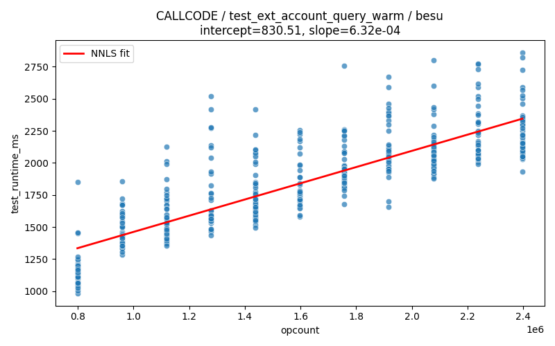

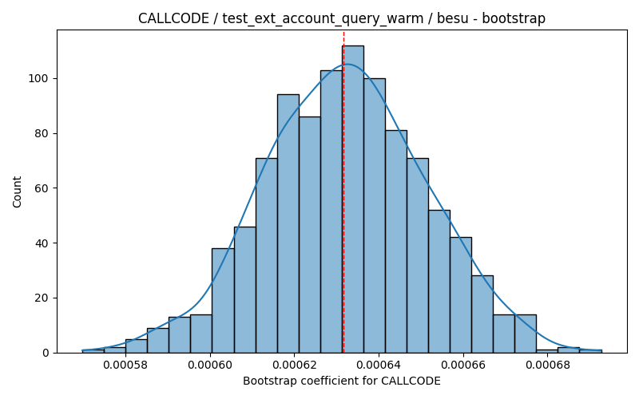

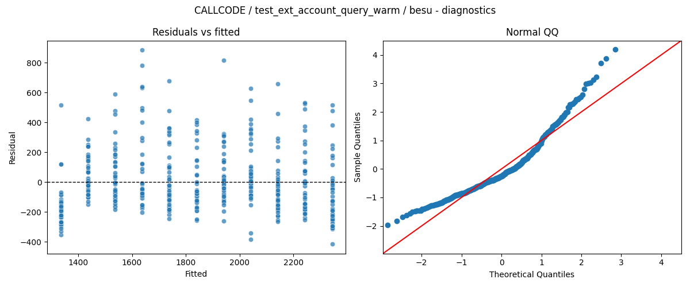

</details>

<details><summary>erigon — NNLS regression summary</summary>

```
==============================================================================
                           NNLS Regression Results                            
==============================================================================
Dep. Variable:          test_runtime_ms              R-squared:          0.792
Model:                  NNLS                    Adj. R-squared:          0.791
No. Observations:       154                               RMSE:          77.68
Df Residuals:           152                                MAE:          42.22
Df Model:               1      
==============================================================================
                      coef     std err     P-value      [0.025      0.975]
------------------------------------------------------------------------------
         const     19.7258     17.3469       0.160      0.0000     57.6512
       opcount      0.0003      0.0000       0.001      0.0003      0.0003
==============================================================================
Notes: Non-negative least squares with bootstrap inference (1000 iterations)
==============================================================================
```

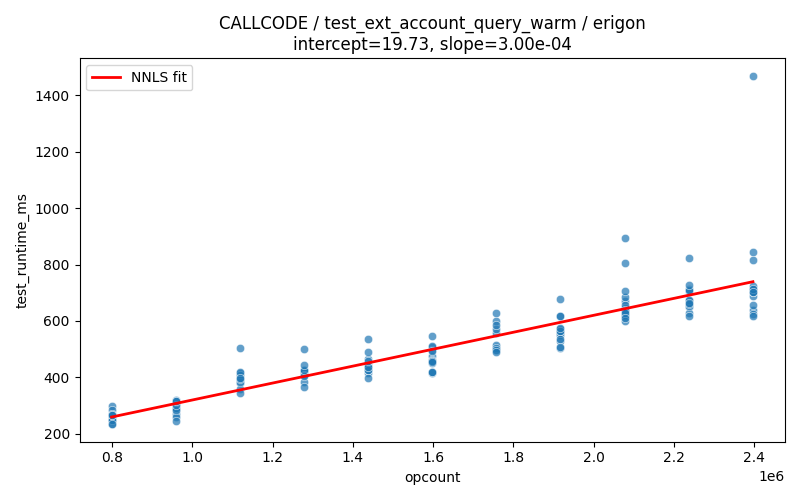

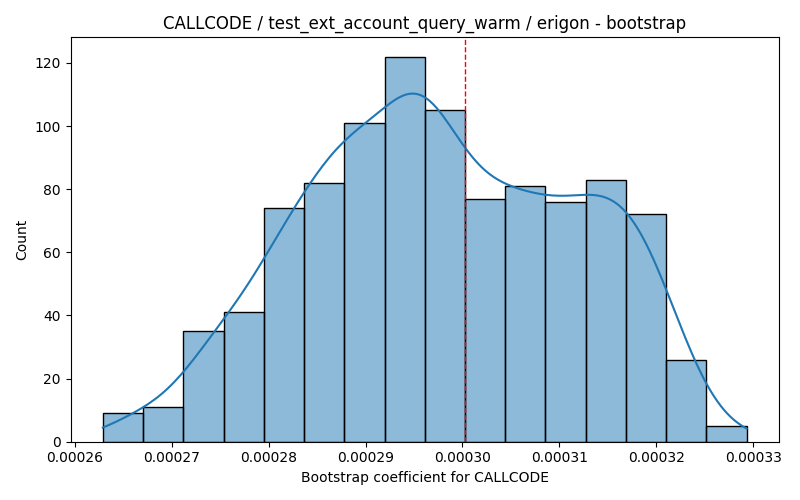

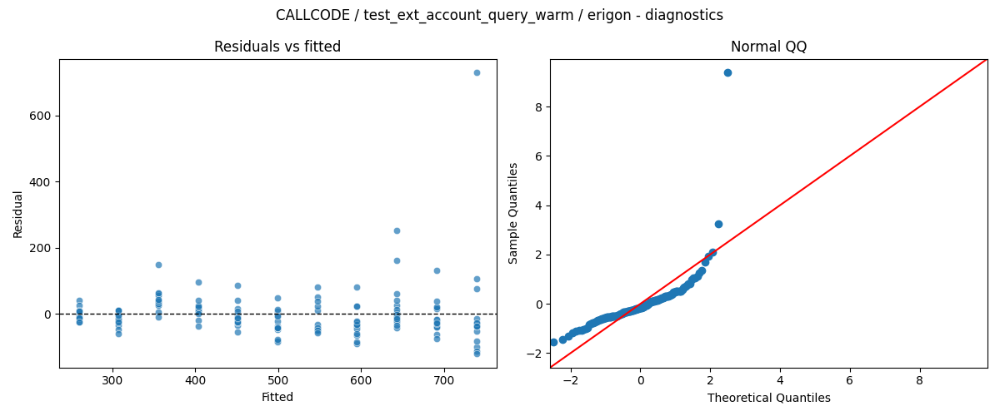

</details>

<details><summary>ethrex — NNLS regression summary</summary>

```
==============================================================================
                           NNLS Regression Results                            
==============================================================================
Dep. Variable:          test_runtime_ms              R-squared:          0.942
Model:                  NNLS                    Adj. R-squared:          0.942
No. Observations:       440                               RMSE:          13.02
Df Residuals:           438                                MAE:          10.37
Df Model:               1      
==============================================================================
                      coef     std err     P-value      [0.025      0.975]
------------------------------------------------------------------------------
         const     34.8785      1.9809       0.001     30.9777     38.6274
       opcount      0.0001      0.0000       0.001      0.0001      0.0001
==============================================================================
Notes: Non-negative least squares with bootstrap inference (1000 iterations)
==============================================================================
```

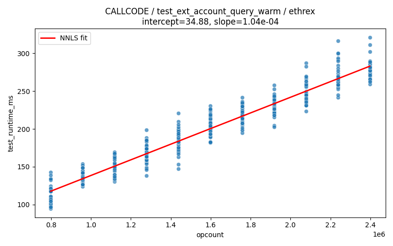

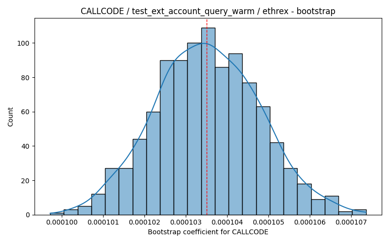

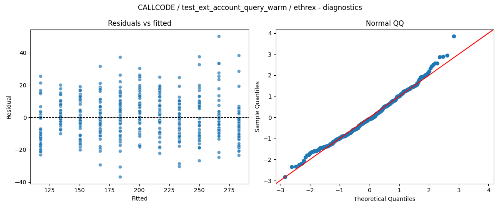

</details>

<details><summary>geth — NNLS regression summary</summary>

```
==============================================================================
                           NNLS Regression Results                            
==============================================================================
Dep. Variable:          test_runtime_ms              R-squared:          0.889
Model:                  NNLS                    Adj. R-squared:          0.888
No. Observations:       440                               RMSE:          32.75
Df Residuals:           438                                MAE:          25.06
Df Model:               1      
==============================================================================
                      coef     std err     P-value      [0.025      0.975]
------------------------------------------------------------------------------
         const     49.8082      4.8402       0.001     40.4877     59.6132
       opcount      0.0002      0.0000       0.001      0.0002      0.0002
==============================================================================
Notes: Non-negative least squares with bootstrap inference (1000 iterations)
==============================================================================
```

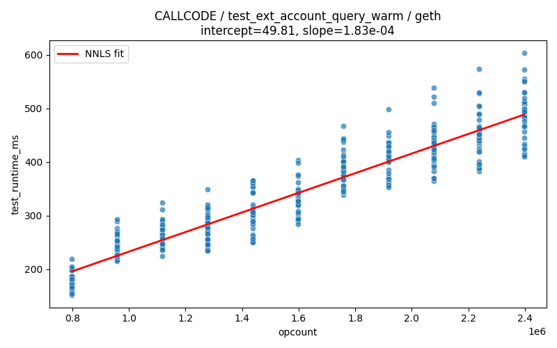

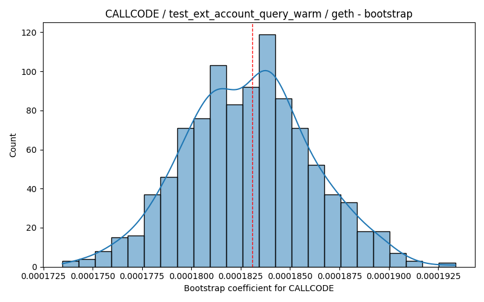

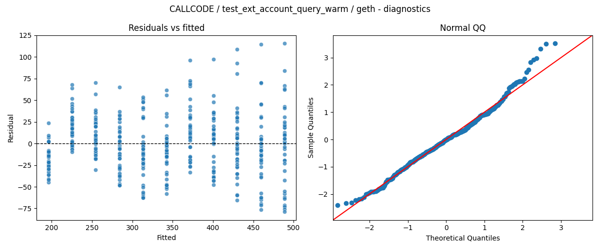

</details>

<details><summary>nethermind — NNLS regression summary</summary>

```
==============================================================================
                           NNLS Regression Results                            
==============================================================================
Dep. Variable:          test_runtime_ms              R-squared:          0.707
Model:                  NNLS                    Adj. R-squared:          0.706
No. Observations:       363                               RMSE:          65.91
Df Residuals:           361                                MAE:          52.01
Df Model:               1      
==============================================================================
                      coef     std err     P-value      [0.025      0.975]
------------------------------------------------------------------------------
         const    186.8426     10.7364       0.001    166.8011    208.3879
       opcount      0.0002      0.0000       0.001      0.0002      0.0002
==============================================================================
Notes: Non-negative least squares with bootstrap inference (1000 iterations)
==============================================================================
```

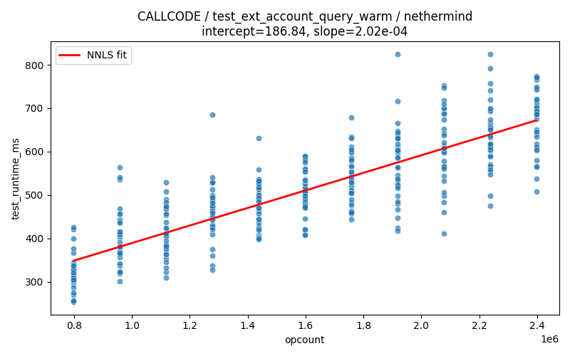

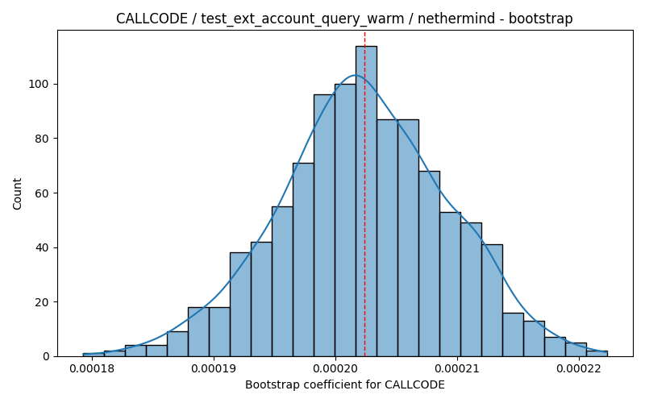

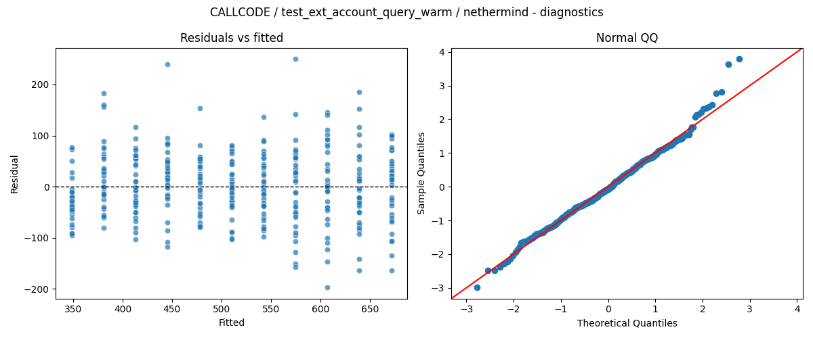

</details>

<details><summary>reth — NNLS regression summary</summary>

```
==============================================================================
                           NNLS Regression Results                            
==============================================================================
Dep. Variable:          test_runtime_ms              R-squared:          0.909
Model:                  NNLS                    Adj. R-squared:          0.909
No. Observations:       539                               RMSE:           9.07
Df Residuals:           537                                MAE:           7.07
Df Model:               1      
==============================================================================
                      coef     std err     P-value      [0.025      0.975]
------------------------------------------------------------------------------
         const     22.9480      1.2302       0.001     20.5213     25.3460
       opcount      0.0001      0.0000       0.001      0.0001      0.0001
==============================================================================
Notes: Non-negative least squares with bootstrap inference (1000 iterations)
==============================================================================
```

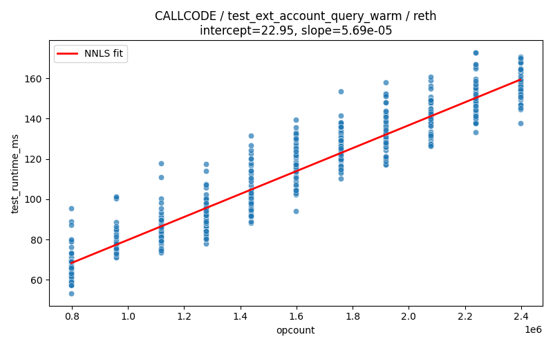

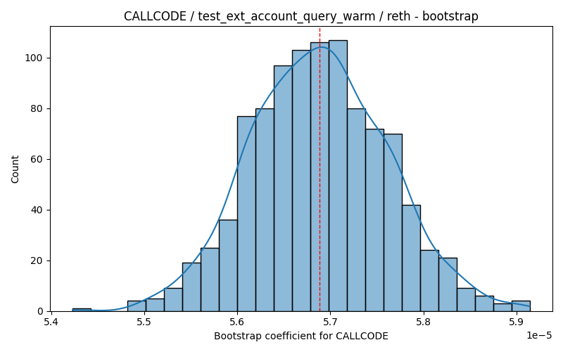

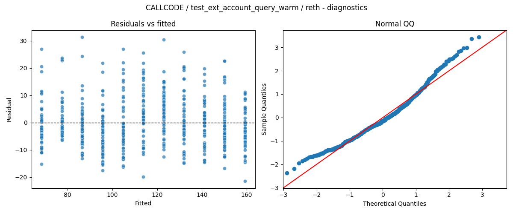

</details>

## DELEGATECALL

### test_account_access — combo `DELEGATECALL_AccountMode.EXISTING_EOA`

| client | nobs | R² | target_coef (ms) | p-value | 95% CI |
| --- | --- | --- | --- | --- | --- |
| `besu` | 462 | 0.8498 | 0.01433 | 1.00e-03 | [0.01378, 0.01489] |
| `erigon` | 154 | 0.9761 | 0.009991 | 1.00e-03 | [0.009753, 0.01026] |
| `ethrex` | 440 | 0.9938 | 0.00727 | 1.00e-03 | [0.007217, 0.007324] |
| `geth` | 440 | 0.9115 | 0.01104 | 1.00e-03 | [0.01067, 0.0114] |
| `nethermind` | 363 | 0.813 | 0.004322 | 1.00e-03 | [0.004111, 0.004533] |
| `reth` | 539 | 0.9198 | 0.00108 | 1.00e-03 | [0.001052, 0.00111] |

<details><summary>besu — NNLS regression summary</summary>

```
==============================================================================
                           NNLS Regression Results                            
==============================================================================
Dep. Variable:          test_runtime_ms              R-squared:          0.850
Model:                  NNLS                    Adj. R-squared:          0.849
No. Observations:       462                               RMSE:         143.19
Df Residuals:           460                                MAE:         113.01
Df Model:               1      
==============================================================================
                      coef     std err     P-value      [0.025      0.975]
------------------------------------------------------------------------------
         const    568.6712     20.8302       0.001    526.4417    610.5176
       opcount      0.0143      0.0003       0.001      0.0138      0.0149
==============================================================================
Notes: Non-negative least squares with bootstrap inference (1000 iterations)
==============================================================================
```

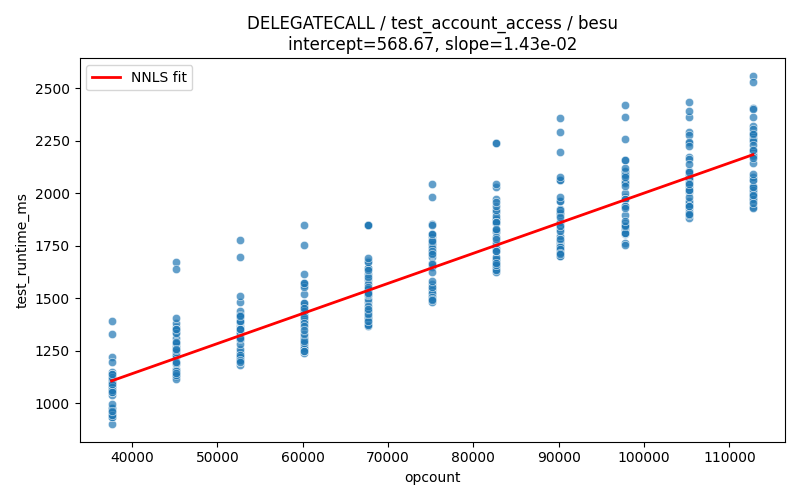

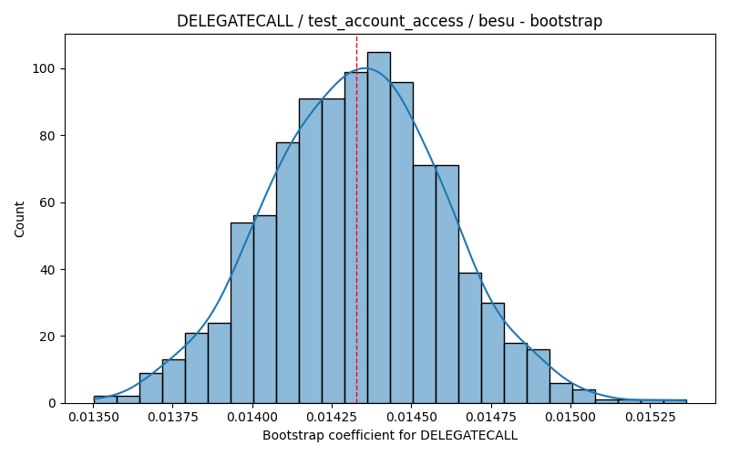

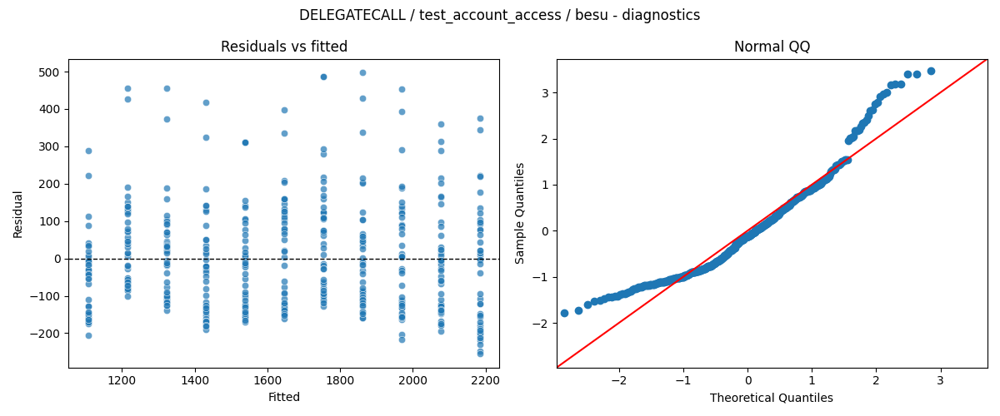

</details>

<details><summary>erigon — NNLS regression summary</summary>

```
==============================================================================
                           NNLS Regression Results                            
==============================================================================
Dep. Variable:          test_runtime_ms              R-squared:          0.976
Model:                  NNLS                    Adj. R-squared:          0.976
No. Observations:       154                               RMSE:          37.18
Df Residuals:           152                                MAE:          28.15
Df Model:               1      
==============================================================================
                      coef     std err     P-value      [0.025      0.975]
------------------------------------------------------------------------------
         const     22.4578      8.7326       0.005      4.8963     39.6987
       opcount      0.0100      0.0001       0.001      0.0098      0.0103
==============================================================================
Notes: Non-negative least squares with bootstrap inference (1000 iterations)
==============================================================================
```

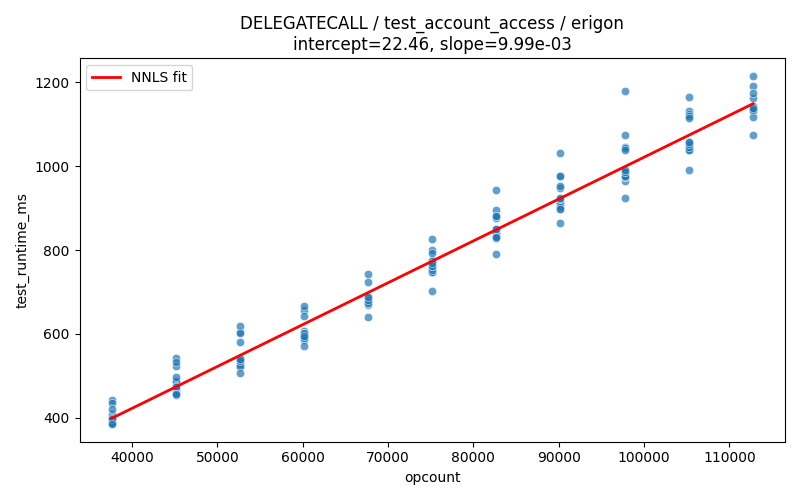

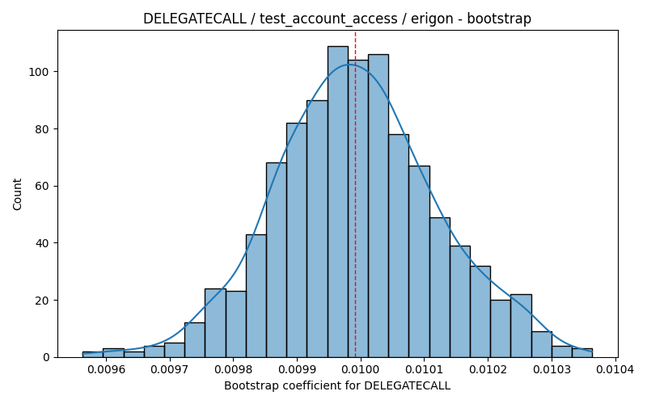

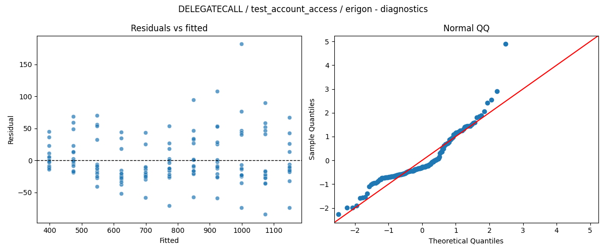

</details>

<details><summary>ethrex — NNLS regression summary</summary>

```
==============================================================================
                           NNLS Regression Results                            
==============================================================================
Dep. Variable:          test_runtime_ms              R-squared:          0.994
Model:                  NNLS                    Adj. R-squared:          0.994
No. Observations:       440                               RMSE:          13.69
Df Residuals:           438                                MAE:          10.67
Df Model:               1      
==============================================================================
                      coef     std err     P-value      [0.025      0.975]
------------------------------------------------------------------------------
         const     44.9440      2.0461       0.001     40.9028     48.9928
       opcount      0.0073      0.0000       0.001      0.0072      0.0073
==============================================================================
Notes: Non-negative least squares with bootstrap inference (1000 iterations)
==============================================================================
```

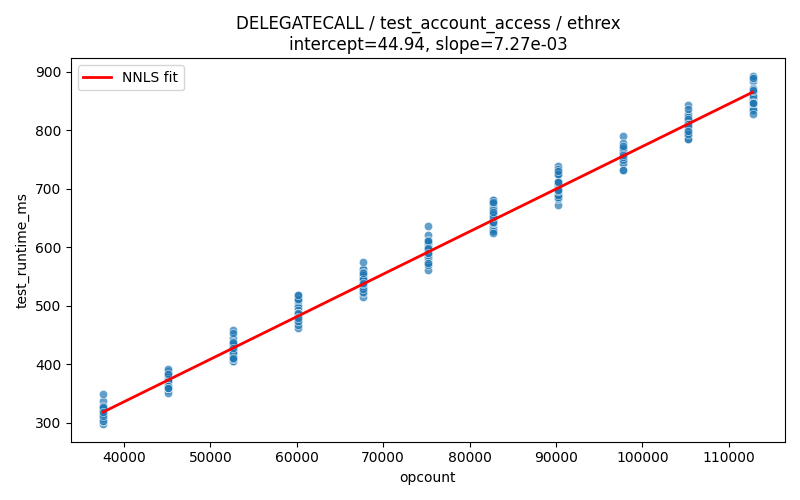

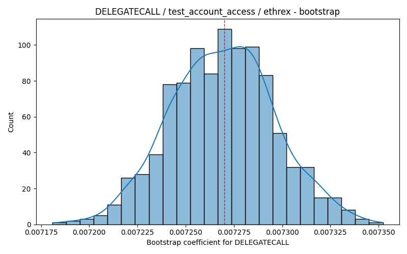

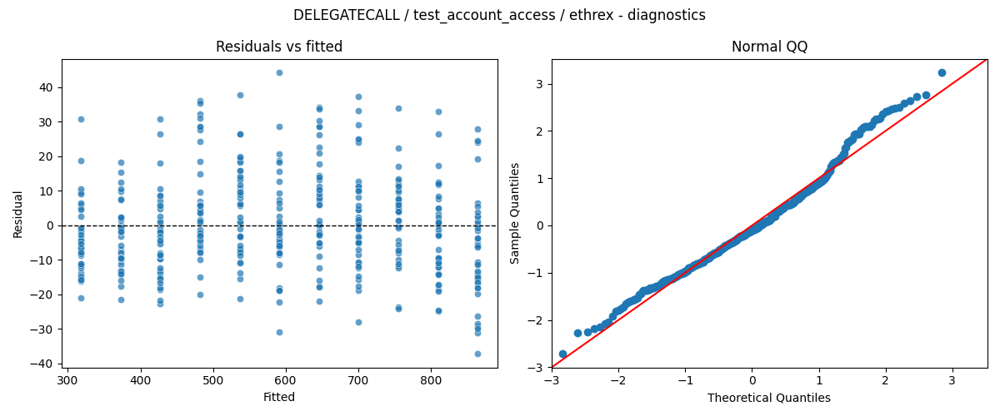

</details>

<details><summary>geth — NNLS regression summary</summary>

```
==============================================================================
                           NNLS Regression Results                            
==============================================================================
Dep. Variable:          test_runtime_ms              R-squared:          0.912
Model:                  NNLS                    Adj. R-squared:          0.911
No. Observations:       440                               RMSE:          81.79
Df Residuals:           438                                MAE:          67.42
Df Model:               1      
==============================================================================
                      coef     std err     P-value      [0.025      0.975]
------------------------------------------------------------------------------
         const    415.1395     15.5806       0.001    385.2335    446.8755
       opcount      0.0110      0.0002       0.001      0.0107      0.0114
==============================================================================
Notes: Non-negative least squares with bootstrap inference (1000 iterations)
==============================================================================
```

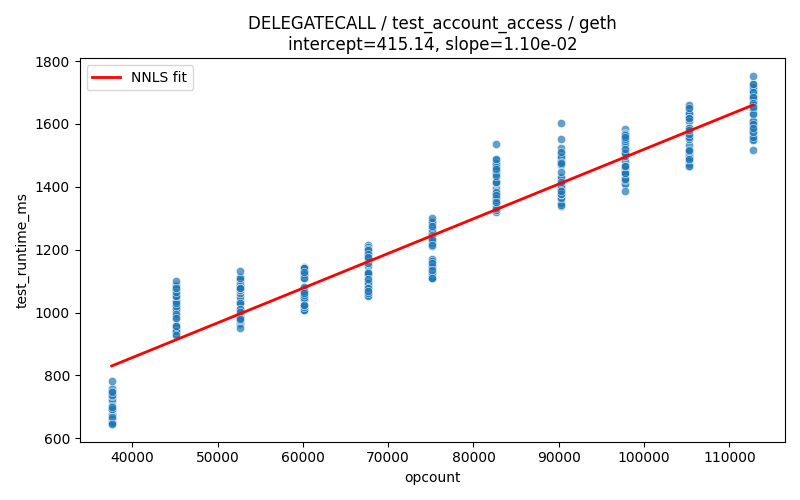

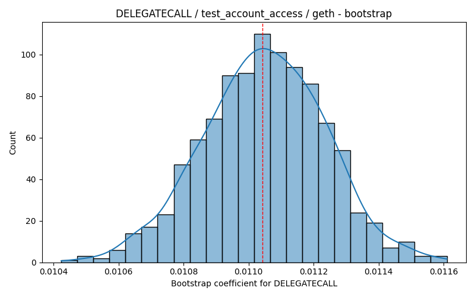

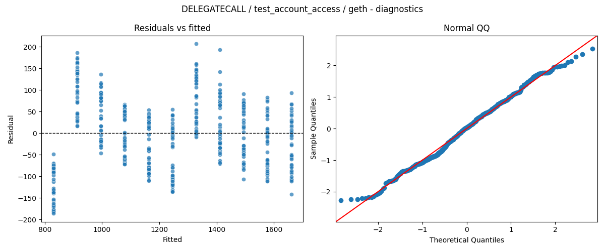

</details>

<details><summary>nethermind — NNLS regression summary</summary>

```
==============================================================================
                           NNLS Regression Results                            
==============================================================================
Dep. Variable:          test_runtime_ms              R-squared:          0.813
Model:                  NNLS                    Adj. R-squared:          0.813
No. Observations:       363                               RMSE:          49.27
Df Residuals:           361                                MAE:          37.52
Df Model:               1      
==============================================================================
                      coef     std err     P-value      [0.025      0.975]
------------------------------------------------------------------------------
         const     82.7612      7.4923       0.001     68.3559     97.1734
       opcount      0.0043      0.0001       0.001      0.0041      0.0045
==============================================================================
Notes: Non-negative least squares with bootstrap inference (1000 iterations)
==============================================================================
```

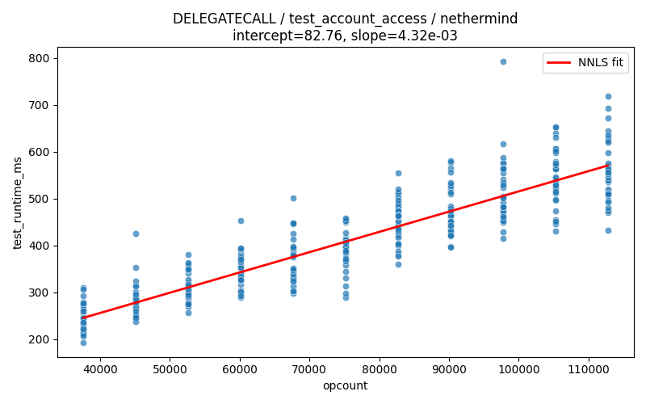

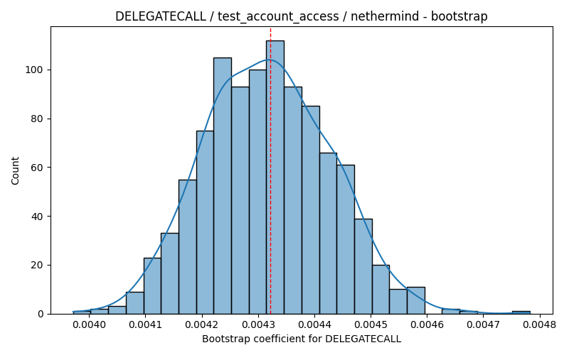

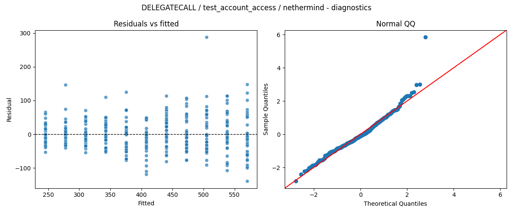

</details>

<details><summary>reth — NNLS regression summary</summary>

```
==============================================================================
                           NNLS Regression Results                            
==============================================================================
Dep. Variable:          test_runtime_ms              R-squared:          0.920
Model:                  NNLS                    Adj. R-squared:          0.920
No. Observations:       539                               RMSE:           7.58
Df Residuals:           537                                MAE:           6.06
Df Model:               1      
==============================================================================
                      coef     std err     P-value      [0.025      0.975]
------------------------------------------------------------------------------
         const     47.0468      1.0687       0.001     45.0101     49.1022
       opcount      0.0011      0.0000       0.001      0.0011      0.0011
==============================================================================
Notes: Non-negative least squares with bootstrap inference (1000 iterations)
==============================================================================
```

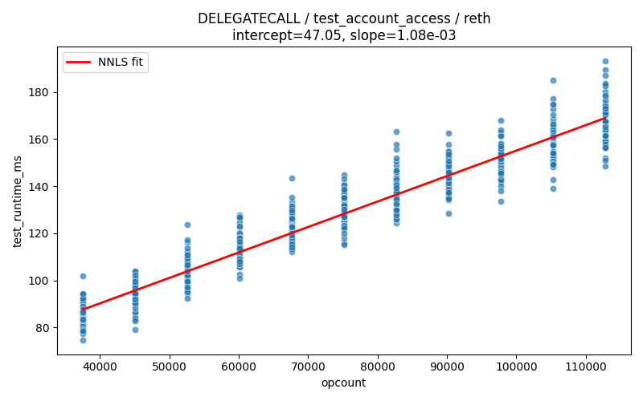

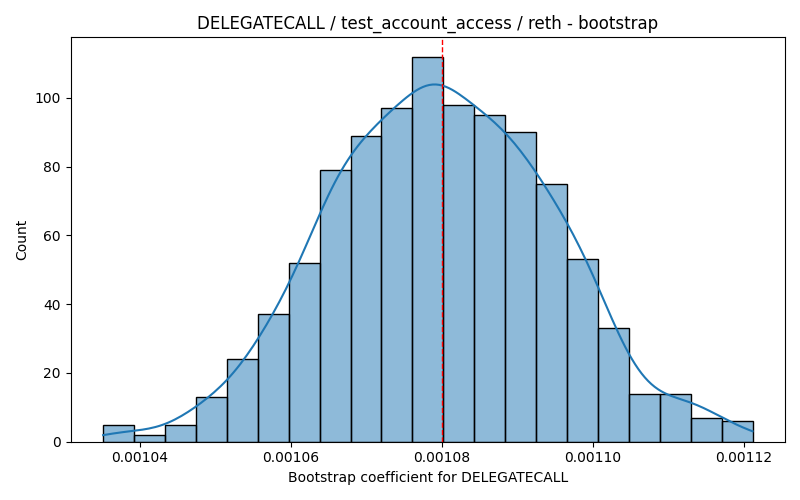

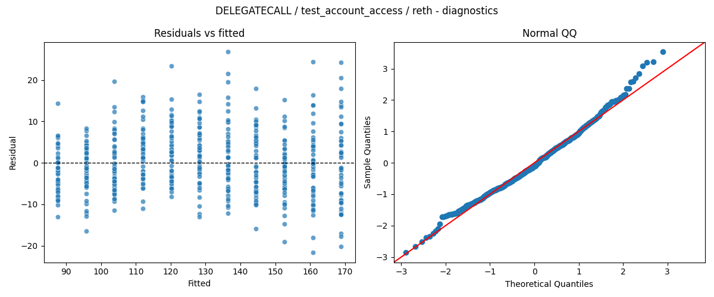

</details>

### test_account_access — combo `DELEGATECALL_AccountMode.NON_EXISTING_ACCOUNT` — `presets[cold_account_nocode_access]`

| client | nobs | R² | target_coef (ms) | p-value | 95% CI |
| --- | --- | --- | --- | --- | --- |
| `besu` | 462 | 0.8295 | 0.01478 | 1.00e-03 | [0.01418, 0.01536] |
| `erigon` | 154 | 0.9772 | 0.009407 | 1.00e-03 | [0.00914, 0.0095] |
| `ethrex` | 440 | 0.9624 | 0.00203 | 1.00e-03 | [0.001995, 0.002065] |
| `geth` | 440 | 0.8655 | 0.02236 | 1.00e-03 | [0.02151, 0.02327] |
| `nethermind` | 363 | 0.8527 | 0.004078 | 1.00e-03 | [0.003892, 0.004253] |
| `reth` | 539 | 0.8897 | 0.0007676 | 1.00e-03 | [0.0007441, 0.0007928] |

<details><summary>besu — NNLS regression summary</summary>

```
==============================================================================
                           NNLS Regression Results                            
==============================================================================
Dep. Variable:          test_runtime_ms              R-squared:          0.829
Model:                  NNLS                    Adj. R-squared:          0.829
No. Observations:       462                               RMSE:         159.27
Df Residuals:           460                                MAE:         141.69
Df Model:               1      
==============================================================================
                      coef     std err     P-value      [0.025      0.975]
------------------------------------------------------------------------------
         const    507.9478     23.5970       0.001    462.7061    554.0151
       opcount      0.0148      0.0003       0.001      0.0142      0.0154
==============================================================================
Notes: Non-negative least squares with bootstrap inference (1000 iterations)
==============================================================================
```


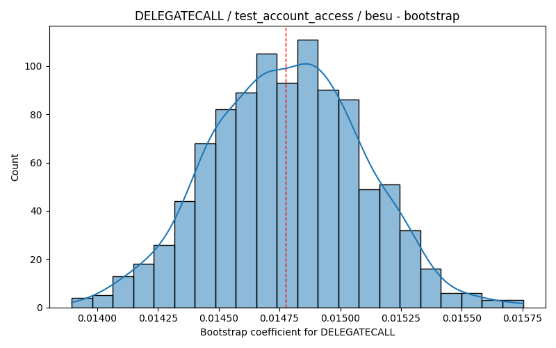

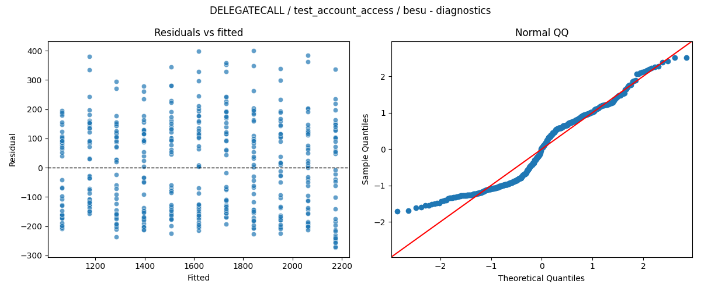

</details>

<details><summary>erigon — NNLS regression summary</summary>

```
==============================================================================
                           NNLS Regression Results                            
==============================================================================
Dep. Variable:          test_runtime_ms              R-squared:          0.977
Model:                  NNLS                    Adj. R-squared:          0.977
No. Observations:       154                               RMSE:          34.17
Df Residuals:           152                                MAE:          23.99
Df Model:               1      
==============================================================================
                      coef     std err     P-value      [0.025      0.975]
------------------------------------------------------------------------------
         const      1.7721      5.9001       0.421      0.0000     20.3396
       opcount      0.0094      0.0001       0.001      0.0091      0.0095
==============================================================================
Notes: Non-negative least squares with bootstrap inference (1000 iterations)
==============================================================================
```

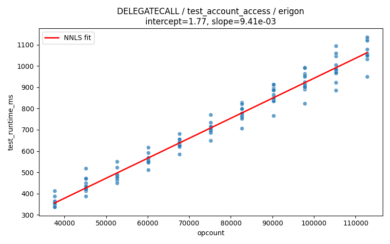

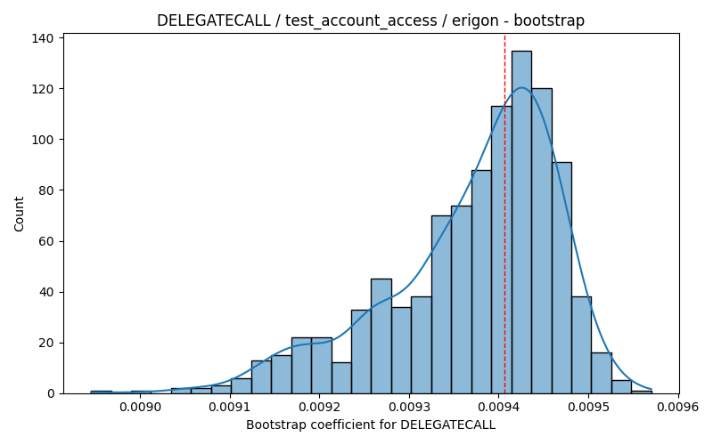

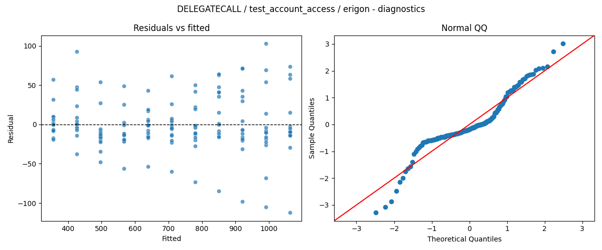

</details>

<details><summary>ethrex — NNLS regression summary</summary>

```
==============================================================================
                           NNLS Regression Results                            
==============================================================================
Dep. Variable:          test_runtime_ms              R-squared:          0.962
Model:                  NNLS                    Adj. R-squared:          0.962
No. Observations:       440                               RMSE:           9.53
Df Residuals:           438                                MAE:           7.75
Df Model:               1      
==============================================================================
                      coef     std err     P-value      [0.025      0.975]
------------------------------------------------------------------------------
         const     29.6759      1.4176       0.001     27.0081     32.5846
       opcount      0.0020      0.0000       0.001      0.0020      0.0021
==============================================================================
Notes: Non-negative least squares with bootstrap inference (1000 iterations)
==============================================================================
```

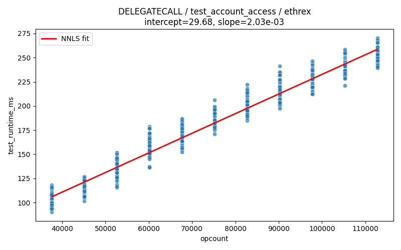

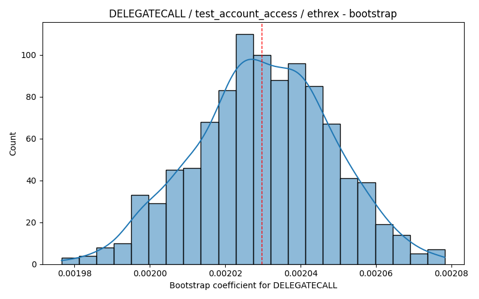

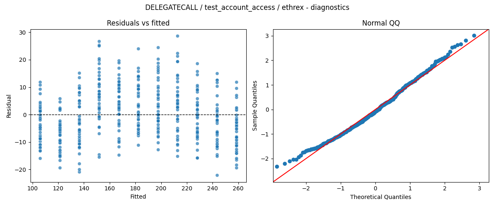

</details>

<details><summary>geth — NNLS regression summary</summary>

```
==============================================================================
                           NNLS Regression Results                            
==============================================================================
Dep. Variable:          test_runtime_ms              R-squared:          0.866
Model:                  NNLS                    Adj. R-squared:          0.865
No. Observations:       440                               RMSE:         209.50
Df Residuals:           438                                MAE:         176.97
Df Model:               1      
==============================================================================
                      coef     std err     P-value      [0.025      0.975]
------------------------------------------------------------------------------
         const    706.6148     38.8139       0.001    629.6692    777.0238
       opcount      0.0224      0.0005       0.001      0.0215      0.0233
==============================================================================
Notes: Non-negative least squares with bootstrap inference (1000 iterations)
==============================================================================
```

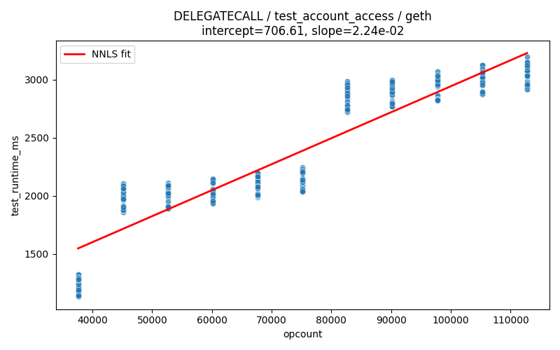

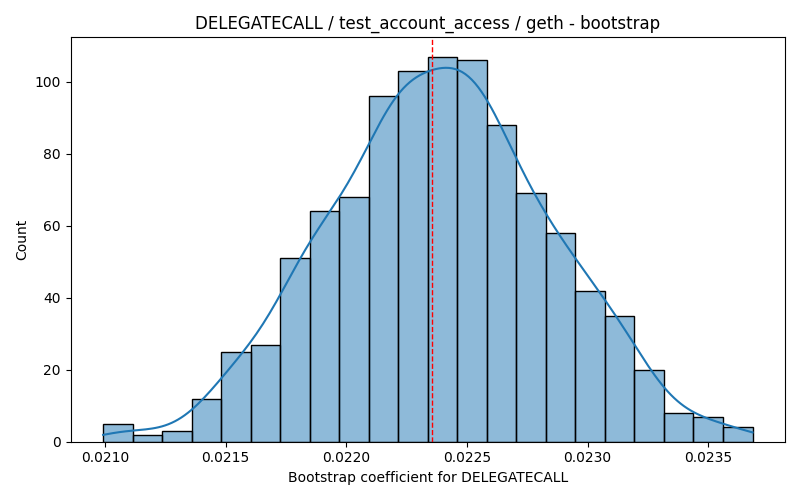

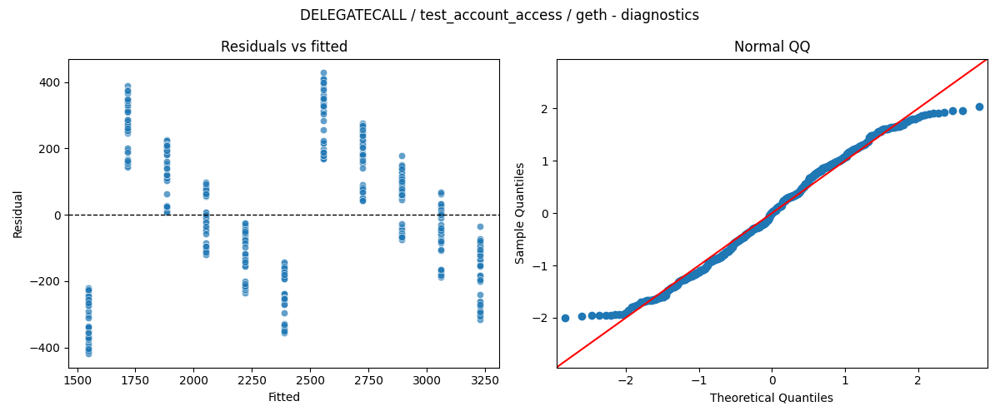

</details>

<details><summary>nethermind — NNLS regression summary</summary>

```
==============================================================================
                           NNLS Regression Results                            
==============================================================================
Dep. Variable:          test_runtime_ms              R-squared:          0.853
Model:                  NNLS                    Adj. R-squared:          0.852
No. Observations:       363                               RMSE:          40.29
Df Residuals:           361                                MAE:          30.57
Df Model:               1      
==============================================================================
                      coef     std err     P-value      [0.025      0.975]
------------------------------------------------------------------------------
         const     74.4522      6.3131       0.001     62.6057     86.2331
       opcount      0.0041      0.0001       0.001      0.0039      0.0043
==============================================================================
Notes: Non-negative least squares with bootstrap inference (1000 iterations)
==============================================================================
```

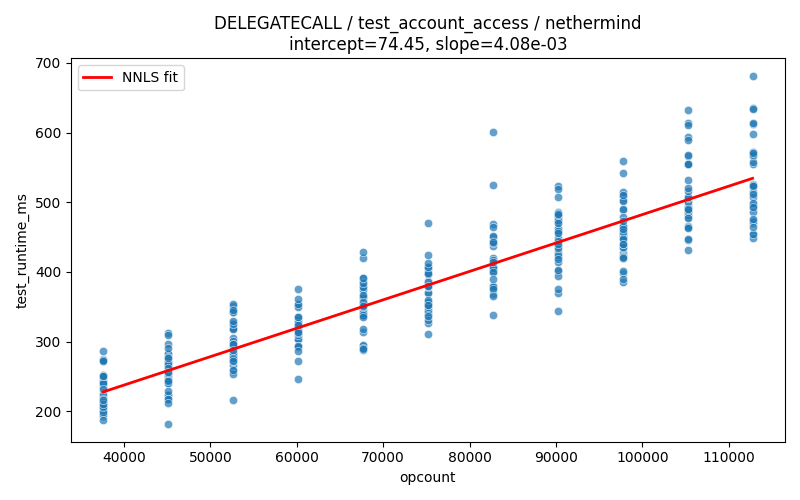

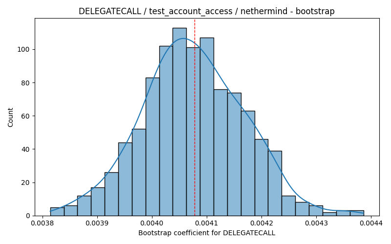

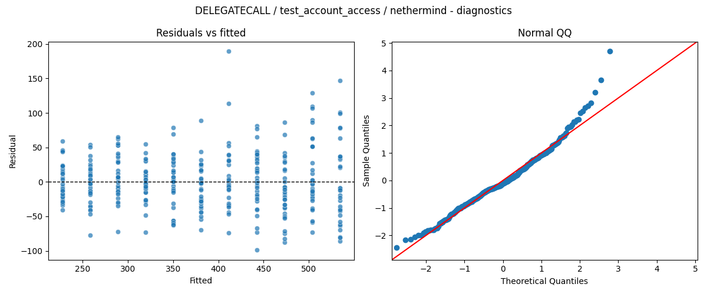

</details>

<details><summary>reth — NNLS regression summary</summary>

```
==============================================================================
                           NNLS Regression Results                            
==============================================================================
Dep. Variable:          test_runtime_ms              R-squared:          0.890
Model:                  NNLS                    Adj. R-squared:          0.890
No. Observations:       539                               RMSE:           6.42
Df Residuals:           537                                MAE:           5.10
Df Model:               1      
==============================================================================
                      coef     std err     P-value      [0.025      0.975]
------------------------------------------------------------------------------
         const     50.2902      0.9348       0.001     48.4429     52.0047
       opcount      0.0008      0.0000       0.001      0.0007      0.0008
==============================================================================
Notes: Non-negative least squares with bootstrap inference (1000 iterations)
==============================================================================
```

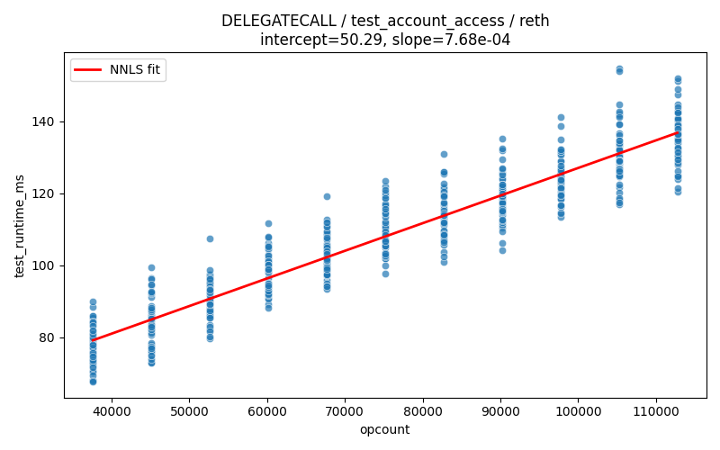

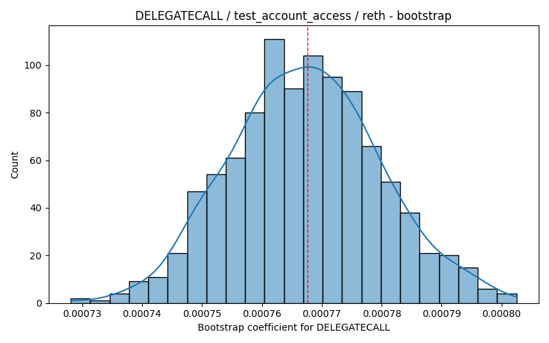

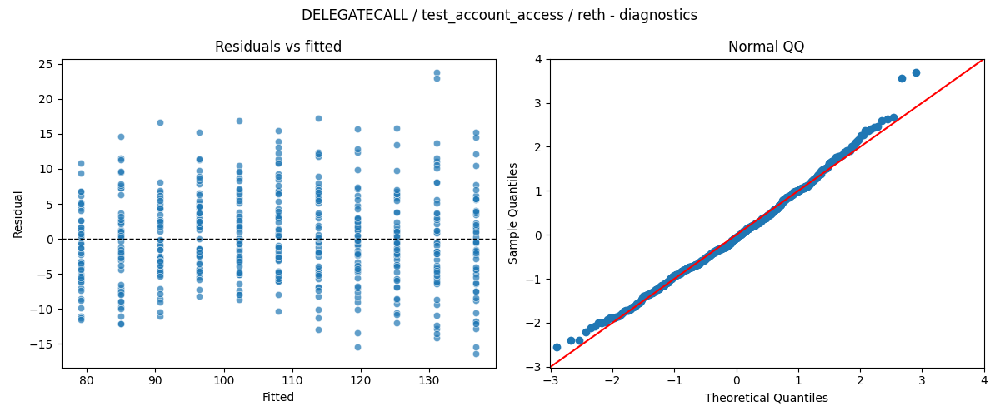

</details>

### test_account_access — combo `DELEGATECALL_AccountMode.EXISTING_CONTRACT`

| client | nobs | R² | target_coef (ms) | p-value | 95% CI |
| --- | --- | --- | --- | --- | --- |
| `besu` | 462 | 0.8923 | 0.02654 | 1.00e-03 | [0.02578, 0.02731] |
| `erigon` | 154 | 0.5692 | 0.04506 | 1.00e-03 | [0.03848, 0.05127] |
| `ethrex` | 440 | 0.9935 | 0.007859 | 1.00e-03 | [0.007801, 0.007924] |
| `geth` | 440 | 0.8584 | 0.02337 | 1.00e-03 | [0.02241, 0.02437] |
| `nethermind` | 363 | 0.5906 | 0.0139 | 1.00e-03 | [0.01275, 0.01512] |
| `reth` | 539 | 0.9719 | 0.004055 | 1.00e-03 | [0.003994, 0.004116] |

<details><summary>besu — NNLS regression summary</summary>

```
==============================================================================
                           NNLS Regression Results                            
==============================================================================
Dep. Variable:          test_runtime_ms              R-squared:          0.892
Model:                  NNLS                    Adj. R-squared:          0.892
No. Observations:       462                               RMSE:         187.77
Df Residuals:           460                                MAE:         149.86
Df Model:               1      
==============================================================================
                      coef     std err     P-value      [0.025      0.975]
------------------------------------------------------------------------------
         const    572.7333     25.5917       0.001    524.0891    622.4259
       opcount      0.0265      0.0004       0.001      0.0258      0.0273
==============================================================================
Notes: Non-negative least squares with bootstrap inference (1000 iterations)
==============================================================================
```

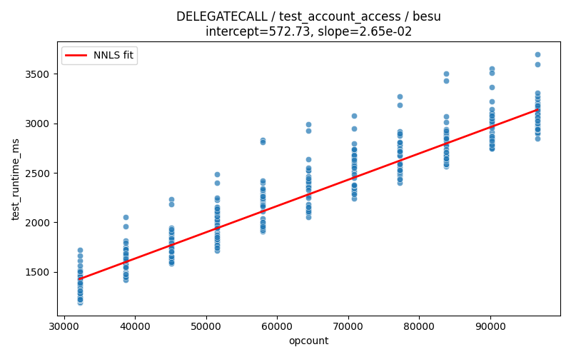

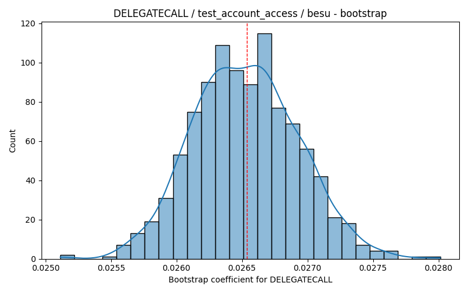

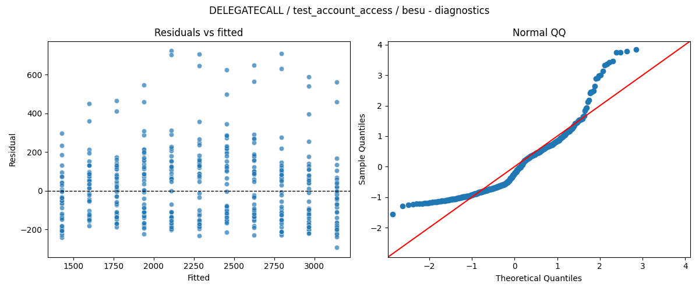

</details>

<details><summary>erigon — NNLS regression summary</summary>

```
==============================================================================
                           NNLS Regression Results                            
==============================================================================
Dep. Variable:          test_runtime_ms              R-squared:          0.569
Model:                  NNLS                    Adj. R-squared:          0.566
No. Observations:       154                               RMSE:         798.57
Df Residuals:           152                                MAE:         546.24
Df Model:               1      
==============================================================================
                      coef     std err     P-value      [0.025      0.975]
------------------------------------------------------------------------------
         const    774.8655    194.4416       0.001    385.5237   1165.9895
       opcount      0.0451      0.0032       0.001      0.0385      0.0513
==============================================================================
Notes: Non-negative least squares with bootstrap inference (1000 iterations)
==============================================================================
```

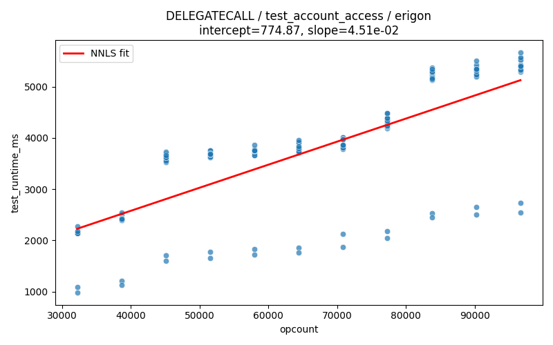

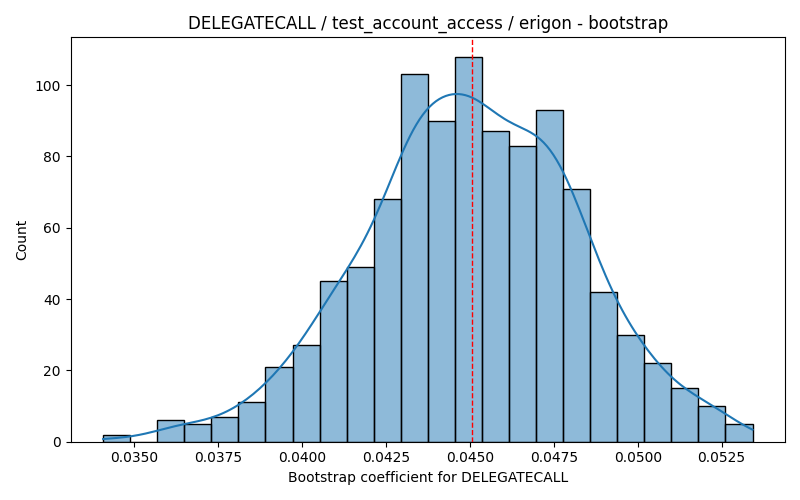

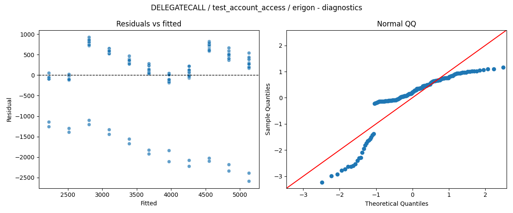

</details>

<details><summary>ethrex — NNLS regression summary</summary>

```
==============================================================================
                           NNLS Regression Results                            
==============================================================================
Dep. Variable:          test_runtime_ms              R-squared:          0.994
Model:                  NNLS                    Adj. R-squared:          0.994
No. Observations:       440                               RMSE:          12.92
Df Residuals:           438                                MAE:          10.32
Df Model:               1      
==============================================================================
                      coef     std err     P-value      [0.025      0.975]
------------------------------------------------------------------------------
         const     42.0303      1.8912       0.001     38.1337     45.6010
       opcount      0.0079      0.0000       0.001      0.0078      0.0079
==============================================================================
Notes: Non-negative least squares with bootstrap inference (1000 iterations)
==============================================================================
```

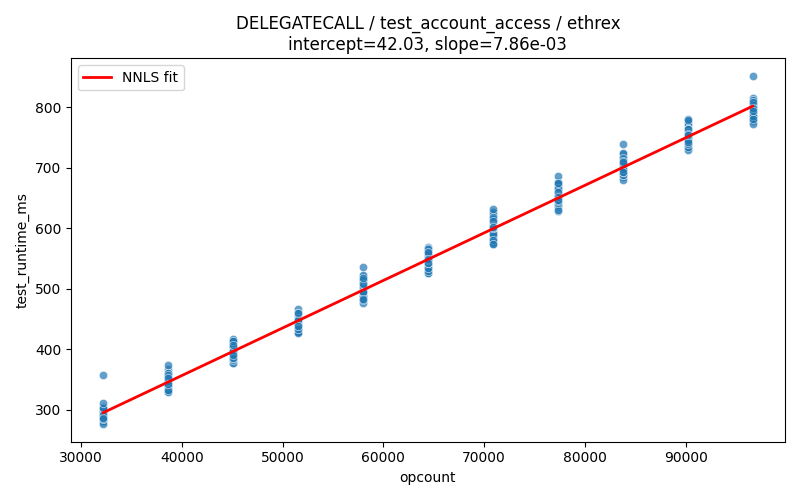

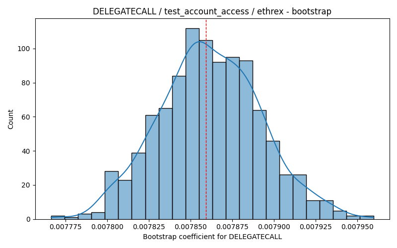

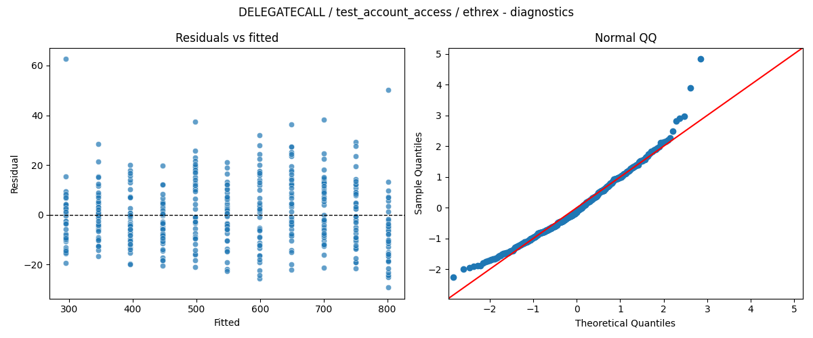

</details>

<details><summary>geth — NNLS regression summary</summary>

```
==============================================================================
                           NNLS Regression Results                            
==============================================================================
Dep. Variable:          test_runtime_ms              R-squared:          0.858
Model:                  NNLS                    Adj. R-squared:          0.858
No. Observations:       440                               RMSE:         193.32
Df Residuals:           438                                MAE:         162.60
Df Model:               1      
==============================================================================
                      coef     std err     P-value      [0.025      0.975]
------------------------------------------------------------------------------
         const    672.4904     35.8072       0.001    601.4871    741.1021
       opcount      0.0234      0.0005       0.001      0.0224      0.0244
==============================================================================
Notes: Non-negative least squares with bootstrap inference (1000 iterations)
==============================================================================
```


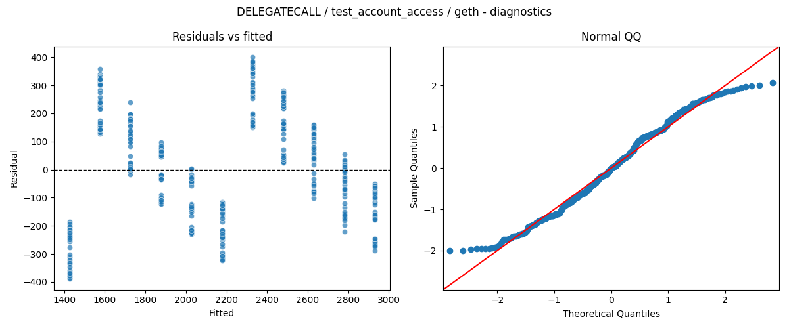

</details>

<details><summary>nethermind — NNLS regression summary</summary>

```
==============================================================================
                           NNLS Regression Results                            
==============================================================================
Dep. Variable:          test_runtime_ms              R-squared:          0.591
Model:                  NNLS                    Adj. R-squared:          0.590
No. Observations:       363                               RMSE:         235.69
Df Residuals:           361                                MAE:         168.16
Df Model:               1      
==============================================================================
                      coef     std err     P-value      [0.025      0.975]
------------------------------------------------------------------------------
         const    184.0690     35.0397       0.001    115.8204    251.9774
       opcount      0.0139      0.0006       0.001      0.0128      0.0151
==============================================================================
Notes: Non-negative least squares with bootstrap inference (1000 iterations)
==============================================================================
```

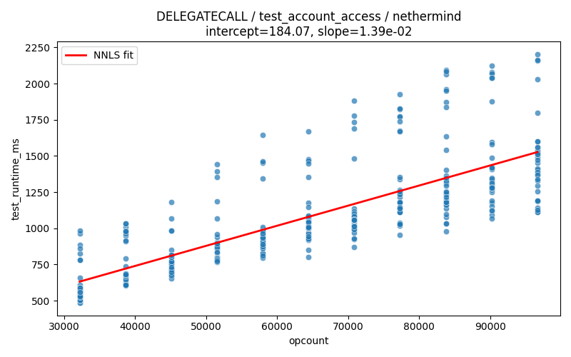

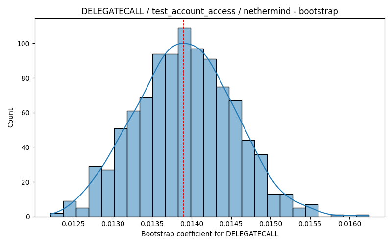

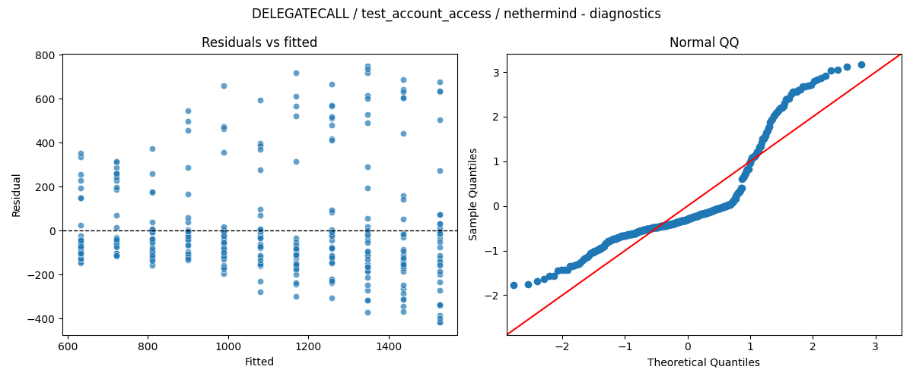

</details>

<details><summary>reth — NNLS regression summary</summary>

```
==============================================================================
                           NNLS Regression Results                            
==============================================================================
Dep. Variable:          test_runtime_ms              R-squared:          0.972
Model:                  NNLS                    Adj. R-squared:          0.972
No. Observations:       539                               RMSE:          14.04
Df Residuals:           537                                MAE:          10.99
Df Model:               1      
==============================================================================
                      coef     std err     P-value      [0.025      0.975]
------------------------------------------------------------------------------
         const    100.9761      1.9036       0.001     97.4292    104.6561
       opcount      0.0041      0.0000       0.001      0.0040      0.0041
==============================================================================
Notes: Non-negative least squares with bootstrap inference (1000 iterations)
==============================================================================
```

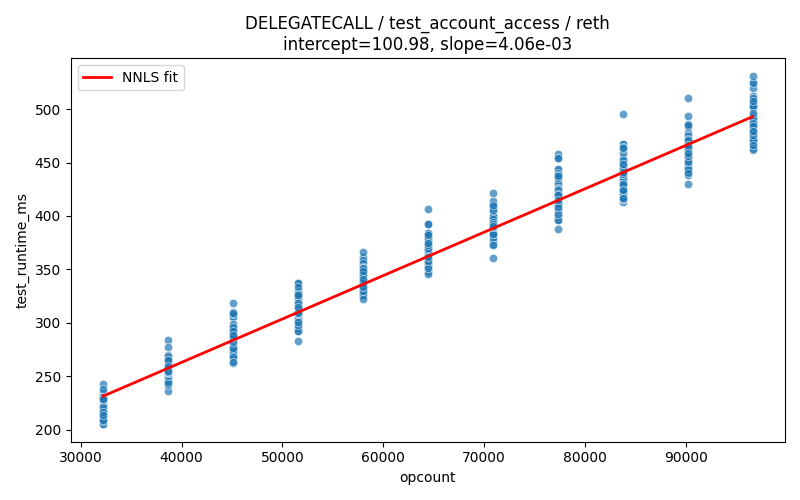

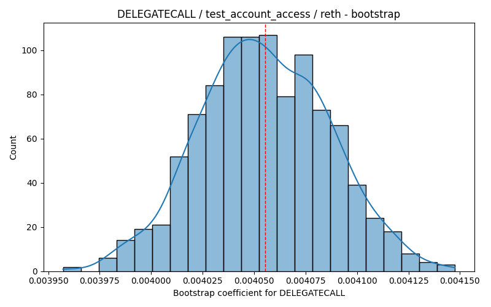

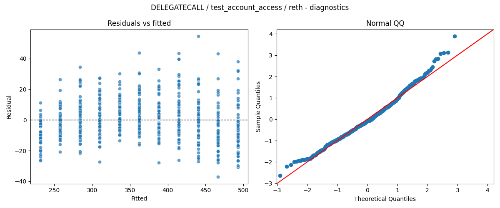

</details>

### test_account_access — combo `DELEGATECALL_AccountMode.NON_EXISTING_ACCOUNT` — `presets[cold_account_code_access]`

| client | nobs | R² | target_coef (ms) | p-value | 95% CI |
| --- | --- | --- | --- | --- | --- |
| `besu` | 462 | 0.8295 | 0.01478 | 1.00e-03 | [0.01418, 0.01536] |
| `erigon` | 154 | 0.9772 | 0.009407 | 1.00e-03 | [0.00914, 0.0095] |
| `ethrex` | 440 | 0.9624 | 0.00203 | 1.00e-03 | [0.001995, 0.002065] |
| `geth` | 440 | 0.8655 | 0.02236 | 1.00e-03 | [0.02151, 0.02327] |
| `nethermind` | 363 | 0.8527 | 0.004078 | 1.00e-03 | [0.003892, 0.004253] |
| `reth` | 539 | 0.8897 | 0.0007676 | 1.00e-03 | [0.0007441, 0.0007928] |

<details><summary>besu — NNLS regression summary</summary>

```
==============================================================================
                           NNLS Regression Results                            
==============================================================================
Dep. Variable:          test_runtime_ms              R-squared:          0.829
Model:                  NNLS                    Adj. R-squared:          0.829
No. Observations:       462                               RMSE:         159.27
Df Residuals:           460                                MAE:         141.69
Df Model:               1      
==============================================================================
                      coef     std err     P-value      [0.025      0.975]
------------------------------------------------------------------------------
         const    507.9478     23.5970       0.001    462.7061    554.0151
       opcount      0.0148      0.0003       0.001      0.0142      0.0154
==============================================================================
Notes: Non-negative least squares with bootstrap inference (1000 iterations)
==============================================================================
```


</details>

<details><summary>erigon — NNLS regression summary</summary>

```
==============================================================================
                           NNLS Regression Results                            
==============================================================================
Dep. Variable:          test_runtime_ms              R-squared:          0.977
Model:                  NNLS                    Adj. R-squared:          0.977
No. Observations:       154                               RMSE:          34.17
Df Residuals:           152                                MAE:          23.99
Df Model:               1      
==============================================================================
                      coef     std err     P-value      [0.025      0.975]
------------------------------------------------------------------------------
         const      1.7721      5.9001       0.421      0.0000     20.3396
       opcount      0.0094      0.0001       0.001      0.0091      0.0095
==============================================================================
Notes: Non-negative least squares with bootstrap inference (1000 iterations)
==============================================================================
```


</details>

<details><summary>ethrex — NNLS regression summary</summary>

```
==============================================================================
                           NNLS Regression Results                            
==============================================================================
Dep. Variable:          test_runtime_ms              R-squared:          0.962
Model:                  NNLS                    Adj. R-squared:          0.962
No. Observations:       440                               RMSE:           9.53
Df Residuals:           438                                MAE:           7.75
Df Model:               1      
==============================================================================
                      coef     std err     P-value      [0.025      0.975]
------------------------------------------------------------------------------
         const     29.6759      1.4176       0.001     27.0081     32.5846
       opcount      0.0020      0.0000       0.001      0.0020      0.0021
==============================================================================
Notes: Non-negative least squares with bootstrap inference (1000 iterations)
==============================================================================
```


</details>

<details><summary>geth — NNLS regression summary</summary>

```
==============================================================================
                           NNLS Regression Results                            
==============================================================================
Dep. Variable:          test_runtime_ms              R-squared:          0.866
Model:                  NNLS                    Adj. R-squared:          0.865
No. Observations:       440                               RMSE:         209.50
Df Residuals:           438                                MAE:         176.97
Df Model:               1      
==============================================================================
                      coef     std err     P-value      [0.025      0.975]
------------------------------------------------------------------------------
         const    706.6148     38.8139       0.001    629.6692    777.0238
       opcount      0.0224      0.0005       0.001      0.0215      0.0233
==============================================================================
Notes: Non-negative least squares with bootstrap inference (1000 iterations)
==============================================================================
```


</details>

<details><summary>nethermind — NNLS regression summary</summary>

```
==============================================================================
                           NNLS Regression Results                            
==============================================================================
Dep. Variable:          test_runtime_ms              R-squared:          0.853
Model:                  NNLS                    Adj. R-squared:          0.852
No. Observations:       363                               RMSE:          40.29
Df Residuals:           361                                MAE:          30.57
Df Model:               1      
==============================================================================
                      coef     std err     P-value      [0.025      0.975]
------------------------------------------------------------------------------
         const     74.4522      6.3131       0.001     62.6057     86.2331
       opcount      0.0041      0.0001       0.001      0.0039      0.0043
==============================================================================
Notes: Non-negative least squares with bootstrap inference (1000 iterations)
==============================================================================
```


</details>

<details><summary>reth — NNLS regression summary</summary>

```
==============================================================================
                           NNLS Regression Results                            
==============================================================================
Dep. Variable:          test_runtime_ms              R-squared:          0.890
Model:                  NNLS                    Adj. R-squared:          0.890
No. Observations:       539                               RMSE:           6.42
Df Residuals:           537                                MAE:           5.10
Df Model:               1      
==============================================================================
                      coef     std err     P-value      [0.025      0.975]
------------------------------------------------------------------------------
         const     50.2902      0.9348       0.001     48.4429     52.0047
       opcount      0.0008      0.0000       0.001      0.0007      0.0008
==============================================================================
Notes: Non-negative least squares with bootstrap inference (1000 iterations)
==============================================================================
```


</details>

### test_ext_account_query_warm — combo `DELEGATECALL`

| client | nobs | R² | target_coef (ms) | p-value | 95% CI |
| --- | --- | --- | --- | --- | --- |
| `besu` | 462 | 0.7032 | 0.0005997 | 1.00e-03 | [0.0005649, 0.0006311] |
| `erigon` | 154 | 0.9086 | 0.0002745 | 1.00e-03 | [0.0002623, 0.0002887] |
| `ethrex` | 440 | 0.9398 | 0.000102 | 1.00e-03 | [9.965e-05, 0.0001044] |
| `geth` | 440 | 0.9045 | 0.0001591 | 1.00e-03 | [0.0001539, 0.0001639] |
| `nethermind` | 363 | 0.6287 | 0.0003913 | 1.00e-03 | [0.0003577, 0.0004235] |
| `reth` | 539 | 0.9314 | 5.366e-05 | 1.00e-03 | [5.238e-05, 5.493e-05] |

<details><summary>besu — NNLS regression summary</summary>

```
==============================================================================
                           NNLS Regression Results                            
==============================================================================
Dep. Variable:          test_runtime_ms              R-squared:          0.703
Model:                  NNLS                    Adj. R-squared:          0.703
No. Observations:       462                               RMSE:         201.68
Df Residuals:           460                                MAE:         156.39
Df Model:               1      
==============================================================================
                      coef     std err     P-value      [0.025      0.975]
------------------------------------------------------------------------------
         const    772.9775     30.1270       0.001    717.6678    837.8294
       opcount      0.0006      0.0000       0.001      0.0006      0.0006
==============================================================================
Notes: Non-negative least squares with bootstrap inference (1000 iterations)
==============================================================================
```

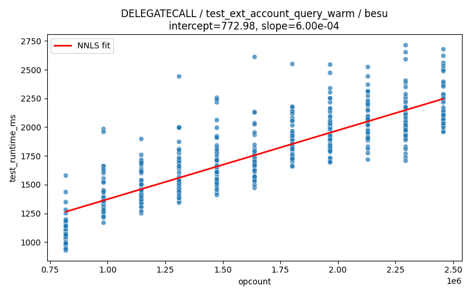

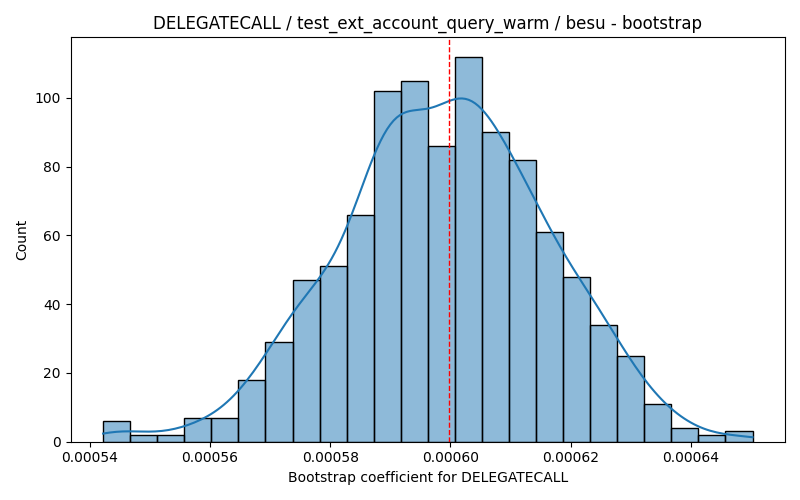

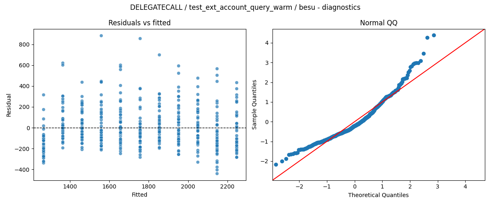

</details>

<details><summary>erigon — NNLS regression summary</summary>

```
==============================================================================
                           NNLS Regression Results                            
==============================================================================
Dep. Variable:          test_runtime_ms              R-squared:          0.909
Model:                  NNLS                    Adj. R-squared:          0.908
No. Observations:       154                               RMSE:          45.08
Df Residuals:           152                                MAE:          33.09
Df Model:               1      
==============================================================================
                      coef     std err     P-value      [0.025      0.975]
------------------------------------------------------------------------------
         const     48.6085     10.3806       0.001     27.1807     67.9869
       opcount      0.0003      0.0000       0.001      0.0003      0.0003
==============================================================================
Notes: Non-negative least squares with bootstrap inference (1000 iterations)
==============================================================================
```

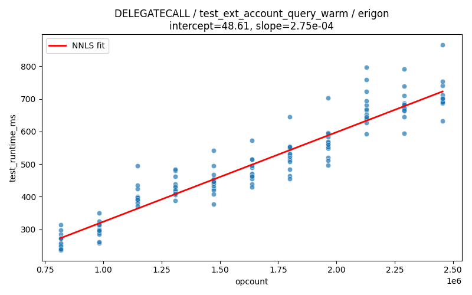

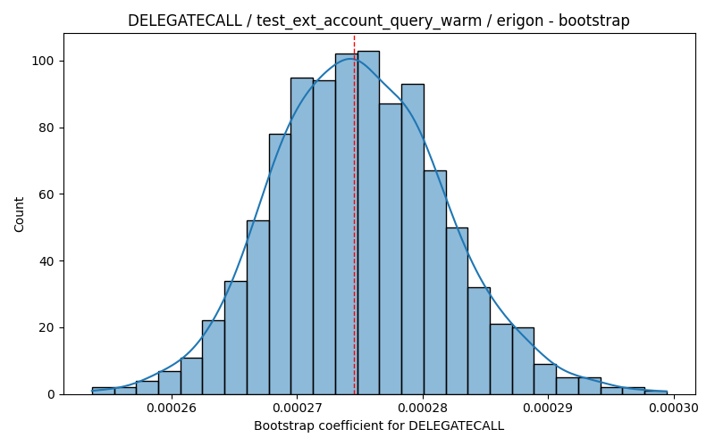

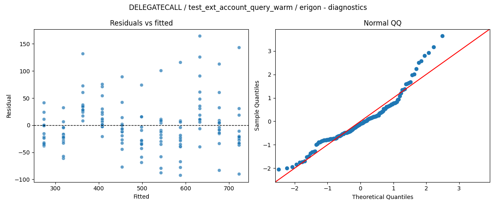

</details>

<details><summary>ethrex — NNLS regression summary</summary>

```
==============================================================================
                           NNLS Regression Results                            
==============================================================================
Dep. Variable:          test_runtime_ms              R-squared:          0.940
Model:                  NNLS                    Adj. R-squared:          0.940
No. Observations:       440                               RMSE:          13.38
Df Residuals:           438                                MAE:          10.42
Df Model:               1      
==============================================================================
                      coef     std err     P-value      [0.025      0.975]
------------------------------------------------------------------------------
         const     33.3538      2.0454       0.001     29.3399     37.4157
       opcount      0.0001      0.0000       0.001      0.0001      0.0001
==============================================================================
Notes: Non-negative least squares with bootstrap inference (1000 iterations)
==============================================================================
```

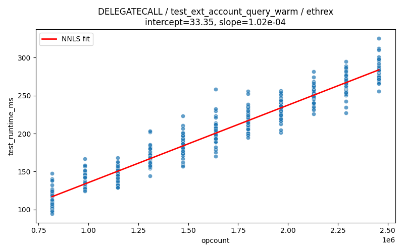

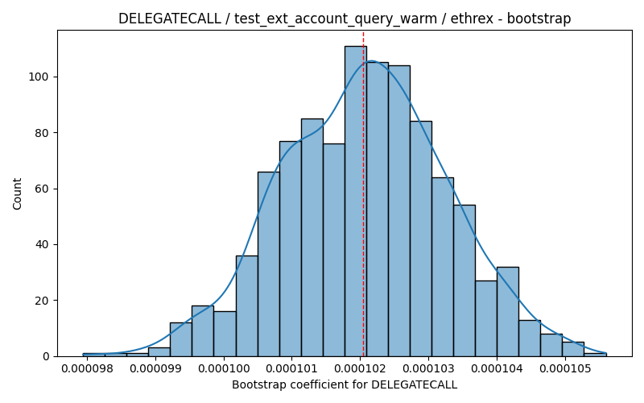

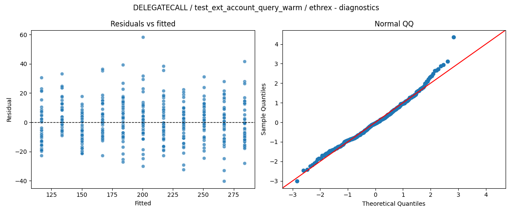

</details>

<details><summary>geth — NNLS regression summary</summary>

```
==============================================================================
                           NNLS Regression Results                            
==============================================================================
Dep. Variable:          test_runtime_ms              R-squared:          0.904
Model:                  NNLS                    Adj. R-squared:          0.904
No. Observations:       440                               RMSE:          26.76
Df Residuals:           438                                MAE:          19.82
Df Model:               1      
==============================================================================
                      coef     std err     P-value      [0.025      0.975]
------------------------------------------------------------------------------
         const     37.7970      4.0278       0.001     30.4376     45.9138
       opcount      0.0002      0.0000       0.001      0.0002      0.0002
==============================================================================
Notes: Non-negative least squares with bootstrap inference (1000 iterations)
==============================================================================
```

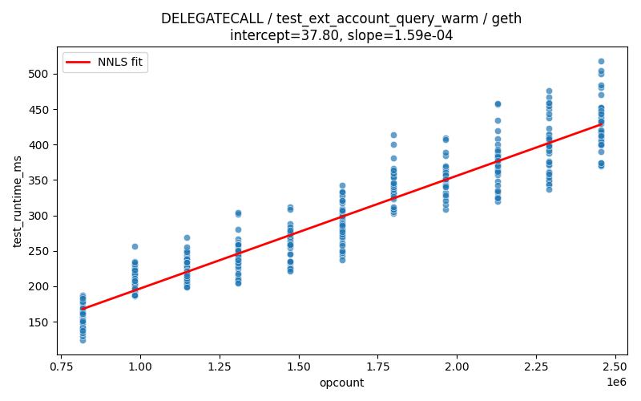

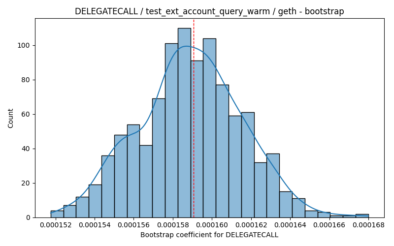

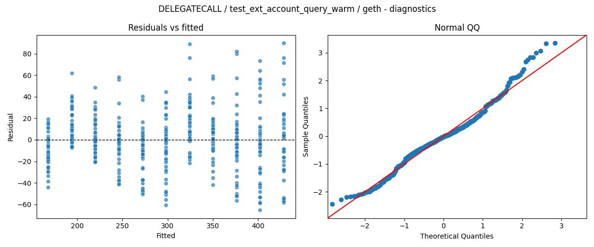

</details>

<details><summary>nethermind — NNLS regression summary</summary>

```
==============================================================================
                           NNLS Regression Results                            
==============================================================================
Dep. Variable:          test_runtime_ms              R-squared:          0.629
Model:                  NNLS                    Adj. R-squared:          0.628
No. Observations:       363                               RMSE:         155.68
Df Residuals:           361                                MAE:         129.11
Df Model:               1      
==============================================================================
                      coef     std err     P-value      [0.025      0.975]
------------------------------------------------------------------------------
         const    157.8896     24.0012       0.001    111.2677    206.4882
       opcount      0.0004      0.0000       0.001      0.0004      0.0004
==============================================================================
Notes: Non-negative least squares with bootstrap inference (1000 iterations)
==============================================================================
```

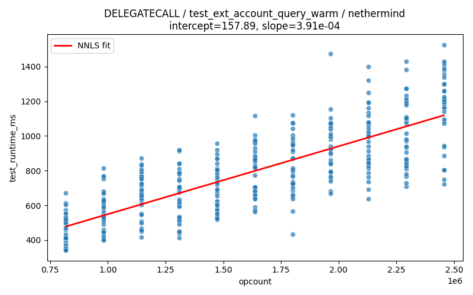

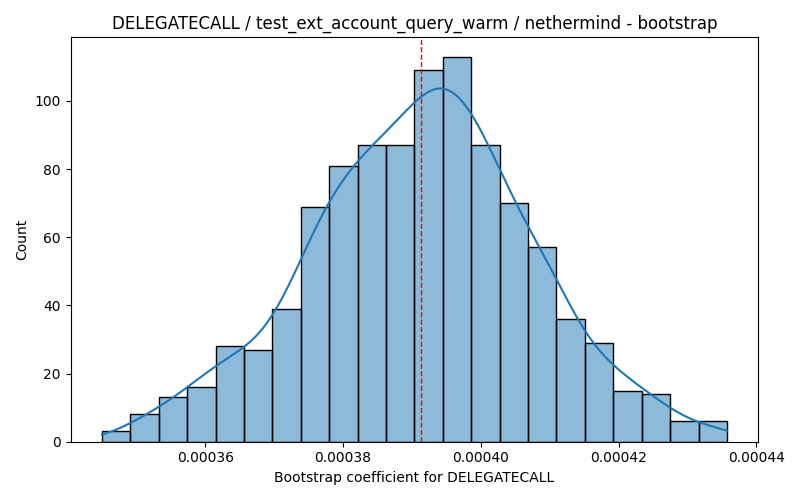

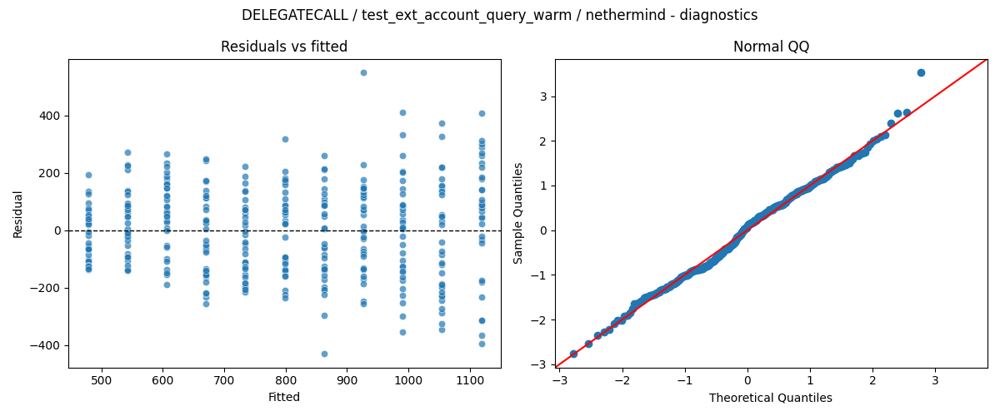

</details>

<details><summary>reth — NNLS regression summary</summary>

```
==============================================================================
                           NNLS Regression Results                            
==============================================================================
Dep. Variable:          test_runtime_ms              R-squared:          0.931
Model:                  NNLS                    Adj. R-squared:          0.931
No. Observations:       539                               RMSE:           7.54
Df Residuals:           537                                MAE:           5.80
Df Model:               1      
==============================================================================
                      coef     std err     P-value      [0.025      0.975]
------------------------------------------------------------------------------
         const     23.9548      1.1160       0.001     21.7646     26.2295
       opcount      0.0001      0.0000       0.001      0.0001      0.0001
==============================================================================
Notes: Non-negative least squares with bootstrap inference (1000 iterations)
==============================================================================
```

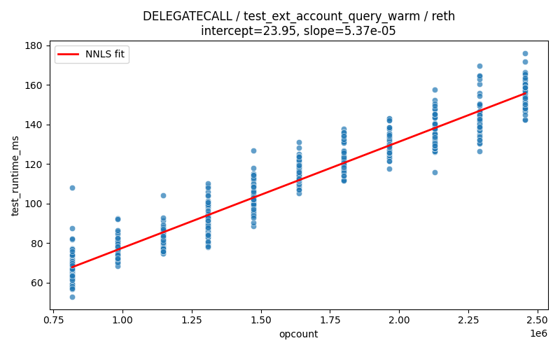

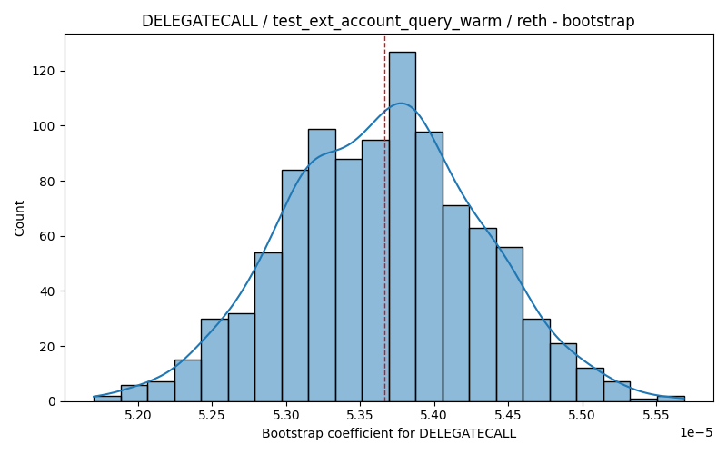

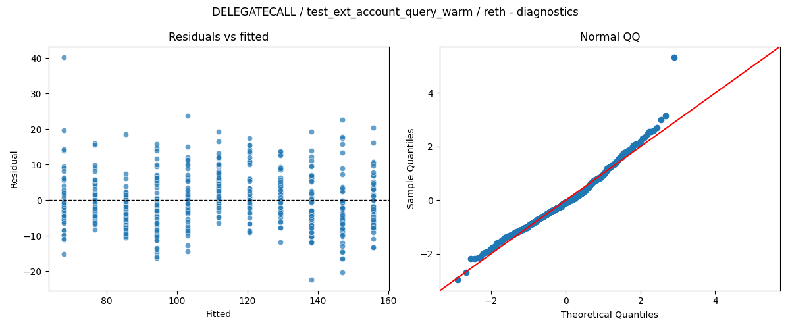

</details>

## EXTCODECOPY

### test_account_access — combo `EXTCODECOPY_AccountMode.NON_EXISTING_ACCOUNT` — `presets[cold_account_nocode_access]`

| client | nobs | R² | target_coef (ms) | p-value | 95% CI |
| --- | --- | --- | --- | --- | --- |
| `besu` | 462 | 0.2586 | 0.0005457 | 1.00e-03 | [0.0004629, 0.0006344] |
| `erigon` | 154 | 0.9027 | 8.488e-05 | 1.00e-03 | [8.014e-05, 8.951e-05] |
| `ethrex` | 440 | 0.3638 | 3.419e-05 | 1.00e-03 | [2.998e-05, 3.841e-05] |
| `geth` | 440 | 0.9305 | 0.0003415 | 1.00e-03 | [0.0003324, 0.0003508] |
| `nethermind` | 363 | 0.6643 | 0.00034 | 1.00e-03 | [0.0003142, 0.0003657] |
| `reth` | 539 | 0.4734 | 2.351e-05 | 1.00e-03 | [2.11e-05, 2.568e-05] |

<details><summary>besu — NNLS regression summary</summary>

```
==============================================================================
                           NNLS Regression Results                            
==============================================================================
Dep. Variable:          test_runtime_ms              R-squared:          0.259
Model:                  NNLS                    Adj. R-squared:          0.257
No. Observations:       462                               RMSE:         237.20
Df Residuals:           460                                MAE:         216.91
Df Model:               1      
==============================================================================
                      coef     std err     P-value      [0.025      0.975]
------------------------------------------------------------------------------
         const    379.3548     33.7307       0.001    314.4497    448.7353
       opcount      0.0005      0.0000       0.001      0.0005      0.0006
==============================================================================
Notes: Non-negative least squares with bootstrap inference (1000 iterations)
==============================================================================
```

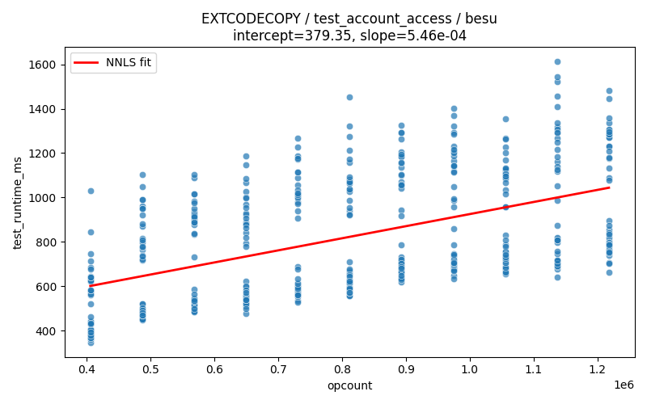

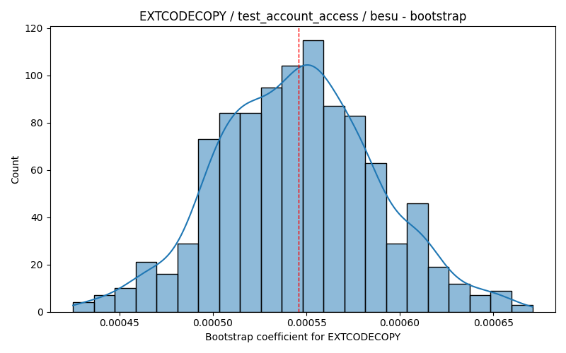

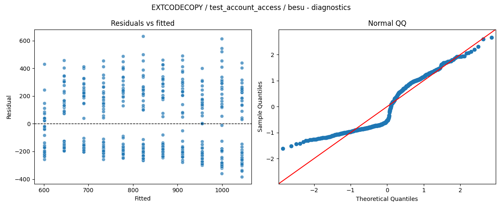

</details>

<details><summary>erigon — NNLS regression summary</summary>

```
==============================================================================
                           NNLS Regression Results                            
==============================================================================
Dep. Variable:          test_runtime_ms              R-squared:          0.903
Model:                  NNLS                    Adj. R-squared:          0.902
No. Observations:       154                               RMSE:           7.16
Df Residuals:           152                                MAE:           5.29
Df Model:               1      
==============================================================================
                      coef     std err     P-value      [0.025      0.975]
------------------------------------------------------------------------------
         const     23.9181      1.7761       0.001     20.4425     27.5337
       opcount      0.0001      0.0000       0.001      0.0001      0.0001
==============================================================================
Notes: Non-negative least squares with bootstrap inference (1000 iterations)
==============================================================================
```

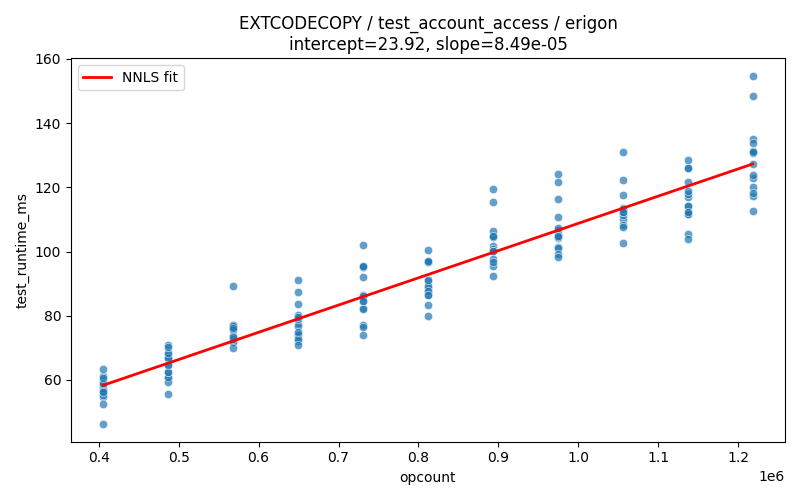

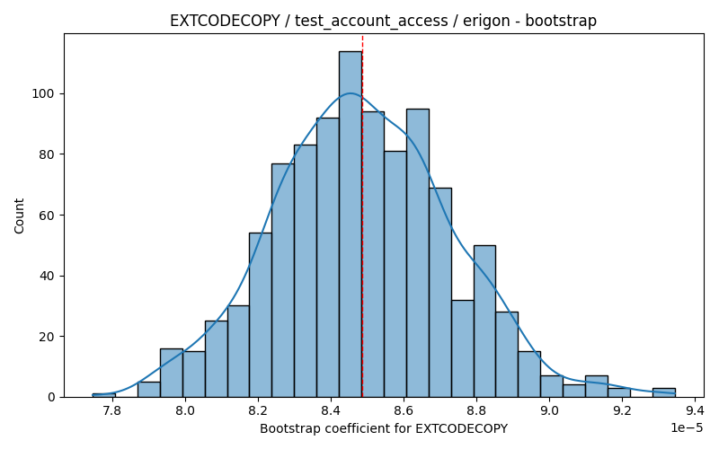

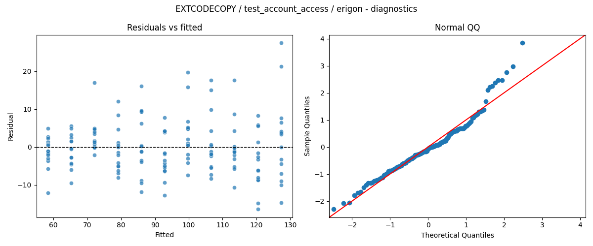

</details>

<details><summary>ethrex — NNLS regression summary</summary>

```
==============================================================================
                           NNLS Regression Results                            
==============================================================================
Dep. Variable:          test_runtime_ms              R-squared:          0.364
Model:                  NNLS                    Adj. R-squared:          0.362
No. Observations:       440                               RMSE:          11.61
Df Residuals:           438                                MAE:           7.54
Df Model:               1      
==============================================================================
                      coef     std err     P-value      [0.025      0.975]
------------------------------------------------------------------------------
         const     13.8170      1.9395       0.001     10.0757     17.7179
       opcount      0.0000      0.0000       0.001      0.0000      0.0000
==============================================================================
Notes: Non-negative least squares with bootstrap inference (1000 iterations)
==============================================================================
```

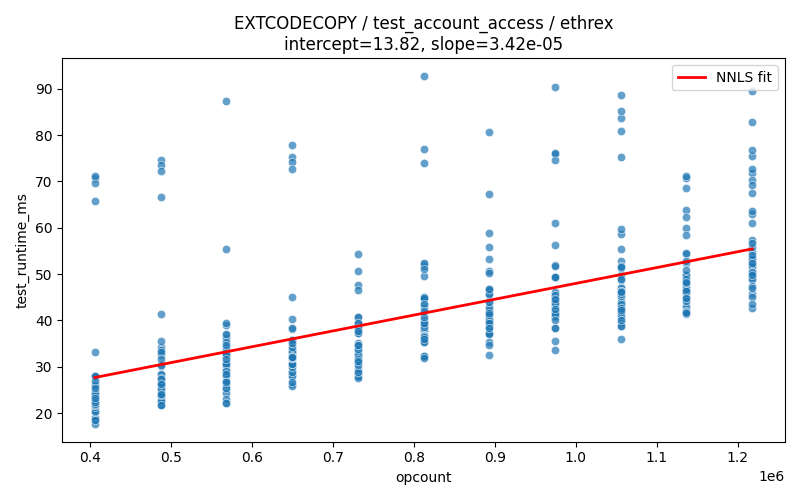

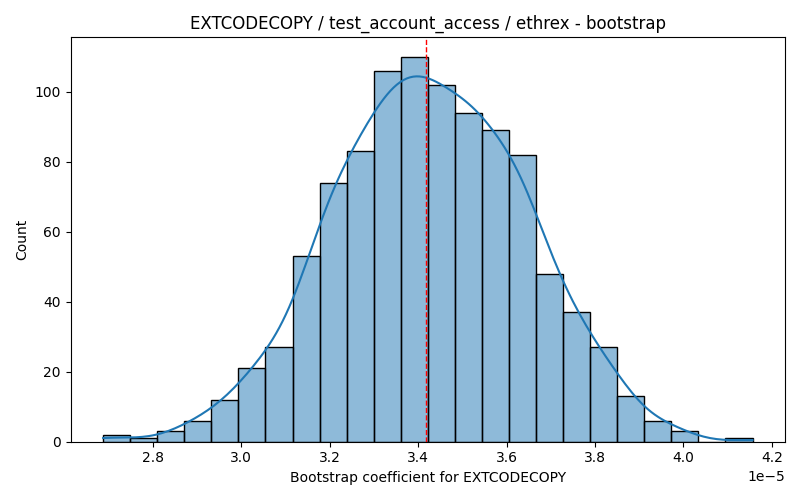

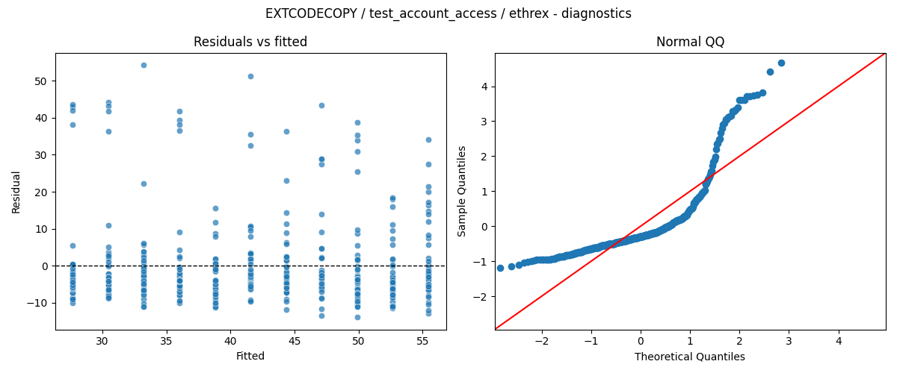

</details>

<details><summary>geth — NNLS regression summary</summary>

```
==============================================================================
                           NNLS Regression Results                            
==============================================================================
Dep. Variable:          test_runtime_ms              R-squared:          0.931
Model:                  NNLS                    Adj. R-squared:          0.930
No. Observations:       440                               RMSE:          23.95
Df Residuals:           438                                MAE:          18.14
Df Model:               1      
==============================================================================
                      coef     std err     P-value      [0.025      0.975]
------------------------------------------------------------------------------
         const     30.8899      3.5563       0.001     24.0562     37.8318
       opcount      0.0003      0.0000       0.001      0.0003      0.0004
==============================================================================
Notes: Non-negative least squares with bootstrap inference (1000 iterations)
==============================================================================
```

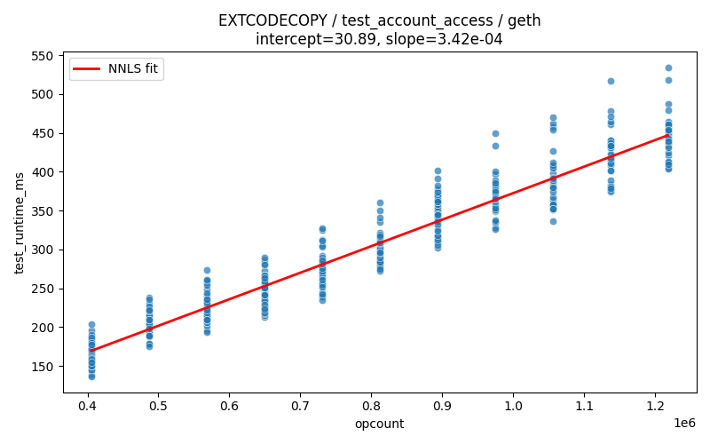

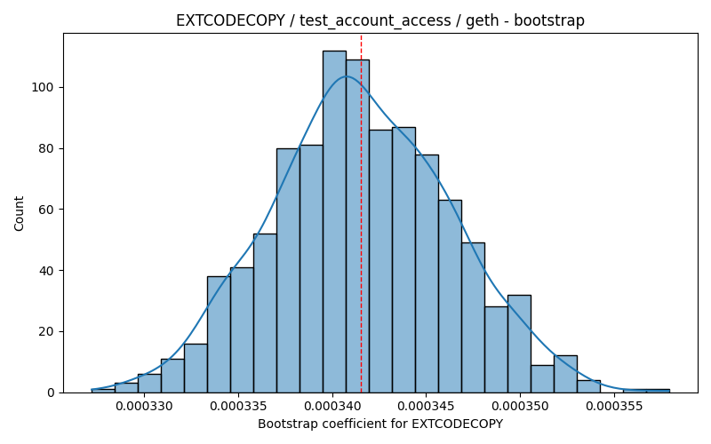

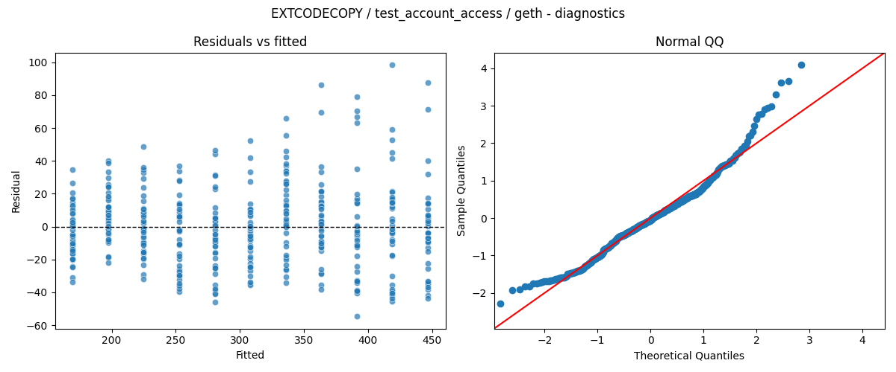

</details>

<details><summary>nethermind — NNLS regression summary</summary>

```
==============================================================================
                           NNLS Regression Results                            
==============================================================================
Dep. Variable:          test_runtime_ms              R-squared:          0.664
Model:                  NNLS                    Adj. R-squared:          0.663
No. Observations:       363                               RMSE:          62.05
Df Residuals:           361                                MAE:          41.37
Df Model:               1      
==============================================================================
                      coef     std err     P-value      [0.025      0.975]
------------------------------------------------------------------------------
         const    122.0481      9.8563       0.001    103.0925    141.7403
       opcount      0.0003      0.0000       0.001      0.0003      0.0004
==============================================================================
Notes: Non-negative least squares with bootstrap inference (1000 iterations)
==============================================================================
```

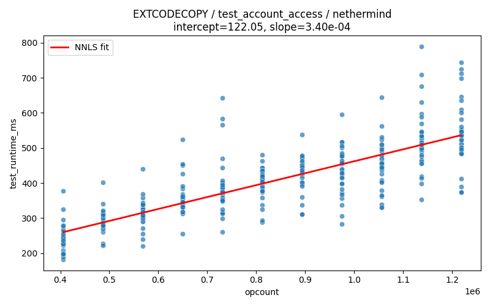

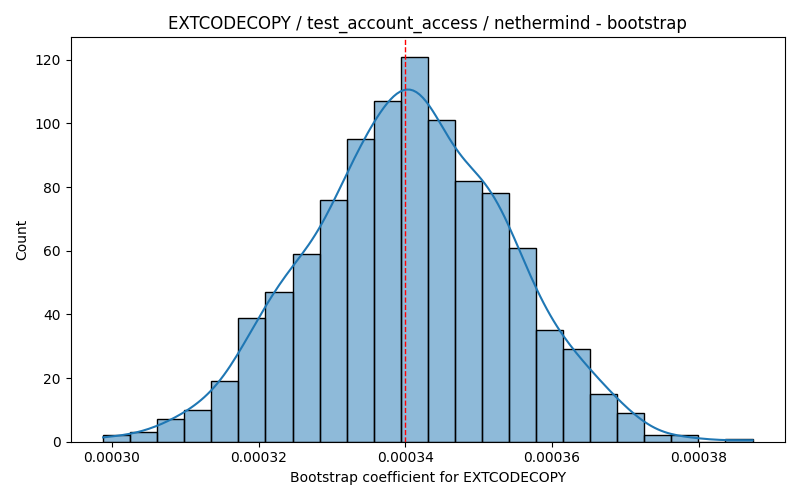

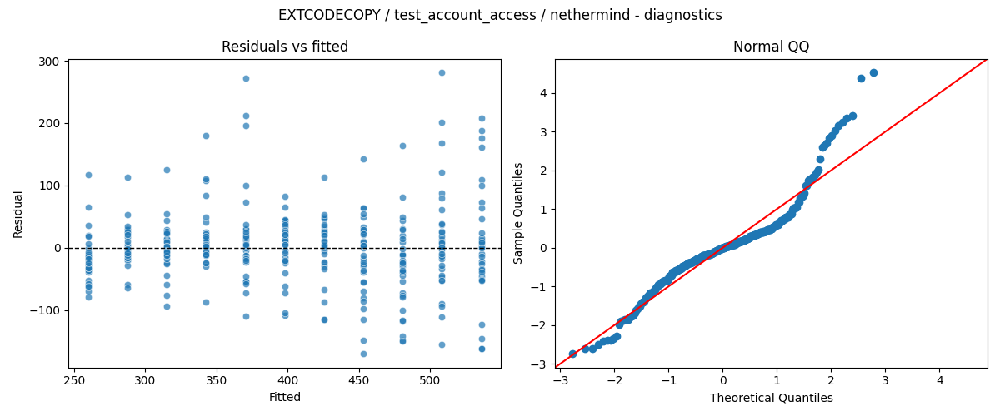

</details>

<details><summary>reth — NNLS regression summary</summary>

```
==============================================================================
                           NNLS Regression Results                            
==============================================================================
Dep. Variable:          test_runtime_ms              R-squared:          0.473
Model:                  NNLS                    Adj. R-squared:          0.472
No. Observations:       539                               RMSE:           6.37
Df Residuals:           537                                MAE:           4.42
Df Model:               1      
==============================================================================
                      coef     std err     P-value      [0.025      0.975]
------------------------------------------------------------------------------
         const      9.5837      0.9966       0.001      7.7450     11.7033
       opcount      0.0000      0.0000       0.001      0.0000      0.0000
==============================================================================
Notes: Non-negative least squares with bootstrap inference (1000 iterations)
==============================================================================
```

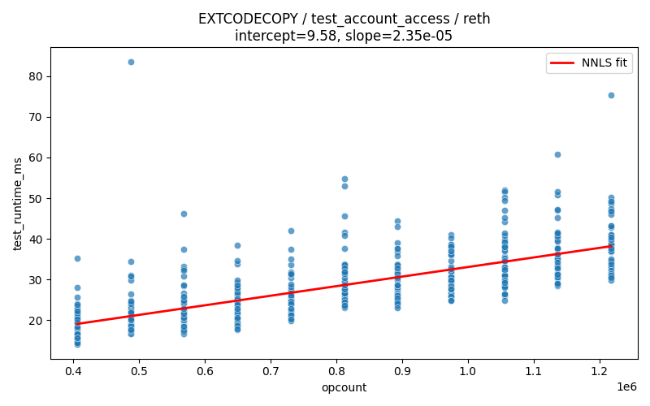

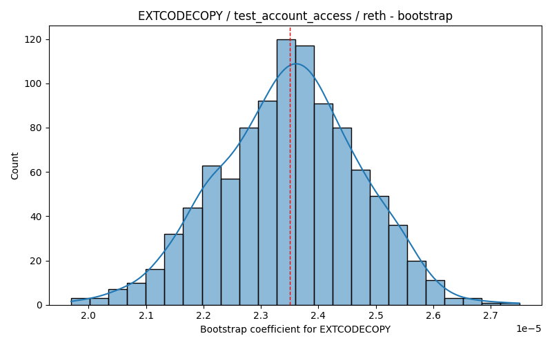

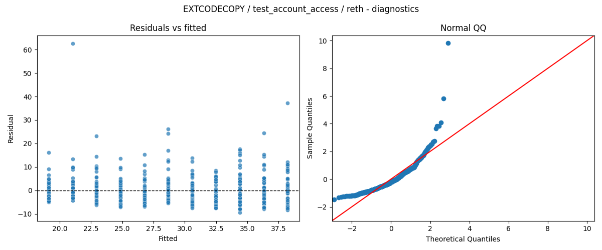

</details>

### test_account_access — combo `EXTCODECOPY_AccountMode.EXISTING_CONTRACT`

| client | nobs | R² | target_coef (ms) | p-value | 95% CI |
| --- | --- | --- | --- | --- | --- |
| `besu` | 462 | 0.3099 | 0.00188 | 1.00e-03 | [0.001626, 0.002101] |
| `erigon` | 154 | 0.8856 | 0.0003301 | 1.00e-03 | [0.0003099, 0.0003495] |
| `ethrex` | 440 | 0.7776 | 0.0002081 | 1.00e-03 | [0.0001965, 0.0002183] |
| `geth` | 440 | 0.8932 | 0.0007625 | 1.00e-03 | [0.0007387, 0.0007876] |
| `nethermind` | 363 | 0.7987 | 0.001342 | 1.00e-03 | [0.001268, 0.001407] |
| `reth` | 539 | 0.7396 | 0.0001104 | 1.00e-03 | [0.0001046, 0.0001161] |

<details><summary>besu — NNLS regression summary</summary>

```
==============================================================================
                           NNLS Regression Results                            
==============================================================================
Dep. Variable:          test_runtime_ms              R-squared:          0.310
Model:                  NNLS                    Adj. R-squared:          0.308
No. Observations:       462                               RMSE:         277.19
Df Residuals:           460                                MAE:         253.68
Df Model:               1      
==============================================================================
                      coef     std err     P-value      [0.025      0.975]
------------------------------------------------------------------------------
         const    456.4890     38.5196       0.001    385.5585    540.6307
       opcount      0.0019      0.0001       0.001      0.0016      0.0021
==============================================================================
Notes: Non-negative least squares with bootstrap inference (1000 iterations)
==============================================================================
```

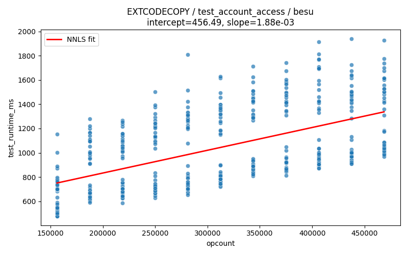

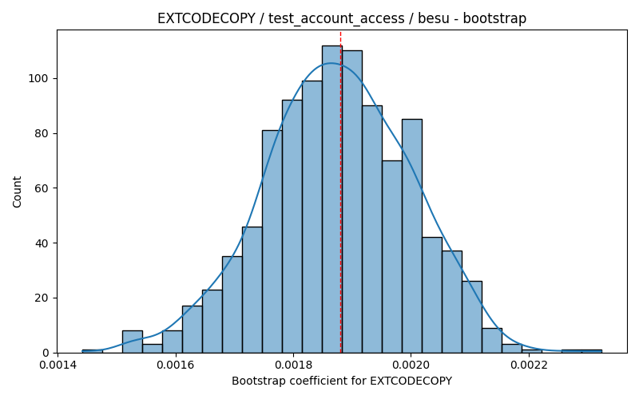

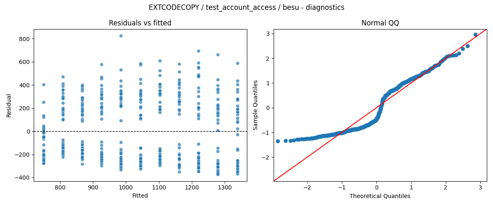

</details>

<details><summary>erigon — NNLS regression summary</summary>

```
==============================================================================
                           NNLS Regression Results                            
==============================================================================
Dep. Variable:          test_runtime_ms              R-squared:          0.886
Model:                  NNLS                    Adj. R-squared:          0.885
No. Observations:       154                               RMSE:          11.72
Df Residuals:           152                                MAE:           9.27
Df Model:               1      
==============================================================================
                      coef     std err     P-value      [0.025      0.975]
------------------------------------------------------------------------------
         const     39.2521      3.1668       0.001     33.3124     45.4742
       opcount      0.0003      0.0000       0.001      0.0003      0.0003
==============================================================================
Notes: Non-negative least squares with bootstrap inference (1000 iterations)
==============================================================================
```

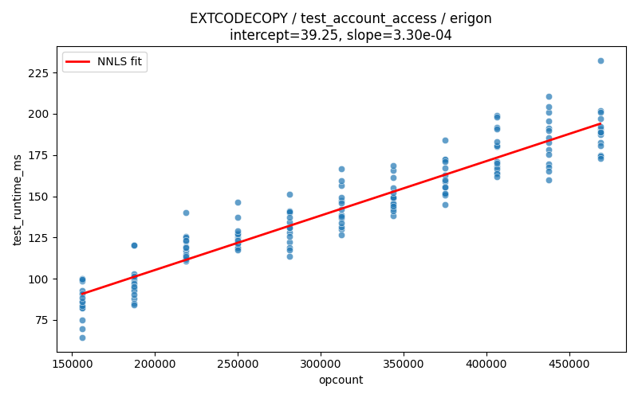

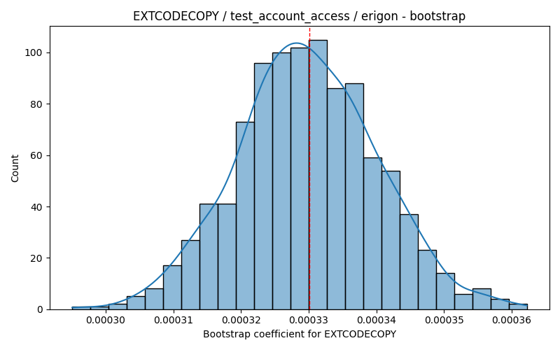

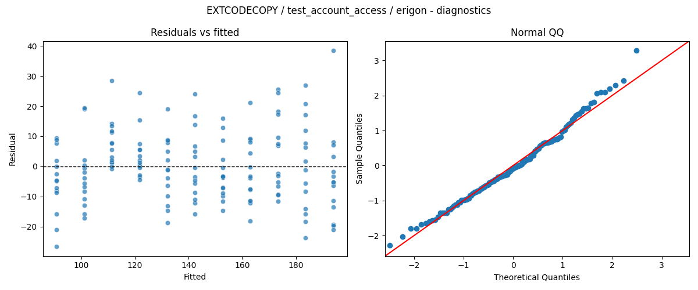

</details>

<details><summary>ethrex — NNLS regression summary</summary>

```
==============================================================================
                           NNLS Regression Results                            
==============================================================================
Dep. Variable:          test_runtime_ms              R-squared:          0.778
Model:                  NNLS                    Adj. R-squared:          0.777
No. Observations:       440                               RMSE:          11.00
Df Residuals:           438                                MAE:           8.73
Df Model:               1      
==============================================================================
                      coef     std err     P-value      [0.025      0.975]
------------------------------------------------------------------------------
         const     22.8065      1.7534       0.001     19.7365     26.3898
       opcount      0.0002      0.0000       0.001      0.0002      0.0002
==============================================================================
Notes: Non-negative least squares with bootstrap inference (1000 iterations)
==============================================================================
```

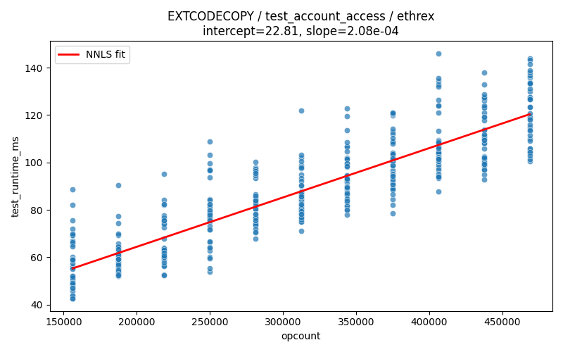

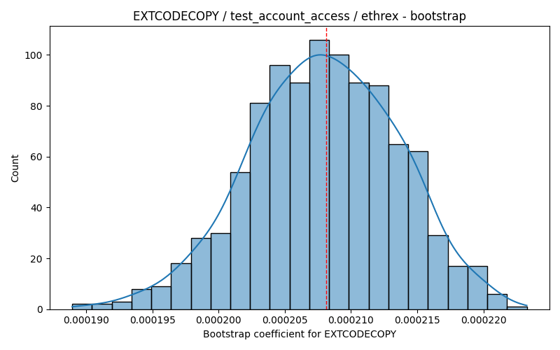

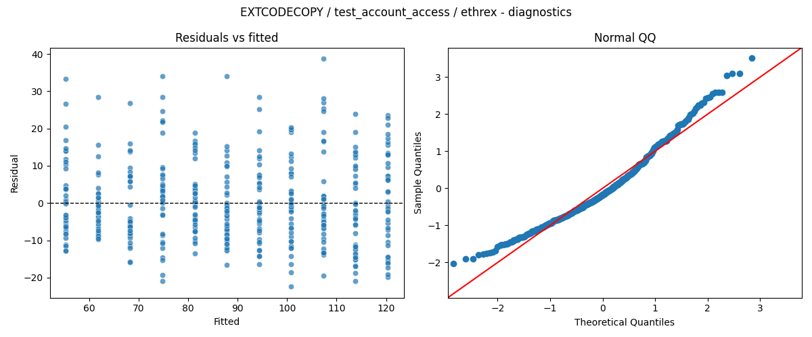

</details>

<details><summary>geth — NNLS regression summary</summary>

```
==============================================================================
                           NNLS Regression Results                            
==============================================================================
Dep. Variable:          test_runtime_ms              R-squared:          0.893
Model:                  NNLS                    Adj. R-squared:          0.893
No. Observations:       440                               RMSE:          26.05
Df Residuals:           438                                MAE:          20.42
Df Model:               1      
==============================================================================
                      coef     std err     P-value      [0.025      0.975]
------------------------------------------------------------------------------
         const     43.3106      3.5731       0.001     36.2147     50.0978
       opcount      0.0008      0.0000       0.001      0.0007      0.0008
==============================================================================
Notes: Non-negative least squares with bootstrap inference (1000 iterations)
==============================================================================
```

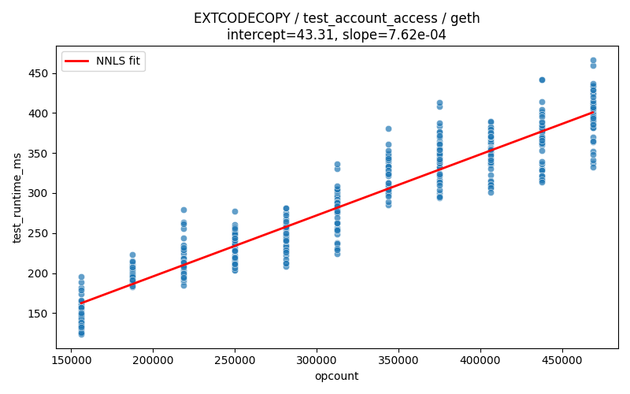

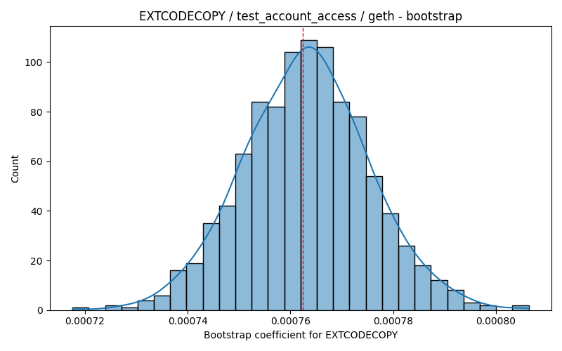

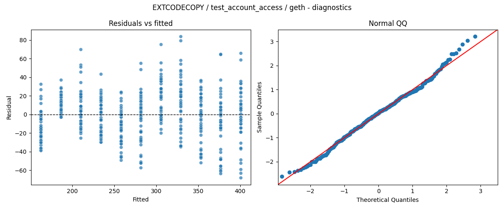

</details>

<details><summary>nethermind — NNLS regression summary</summary>

```
==============================================================================
                           NNLS Regression Results                            
==============================================================================
Dep. Variable:          test_runtime_ms              R-squared:          0.799
Model:                  NNLS                    Adj. R-squared:          0.798
No. Observations:       363                               RMSE:          66.54
Df Residuals:           361                                MAE:          52.56
Df Model:               1      
==============================================================================
                      coef     std err     P-value      [0.025      0.975]
------------------------------------------------------------------------------
         const    179.7626     10.2806       0.001    159.9784    201.5651
       opcount      0.0013      0.0000       0.001      0.0013      0.0014
==============================================================================
Notes: Non-negative least squares with bootstrap inference (1000 iterations)
==============================================================================
```

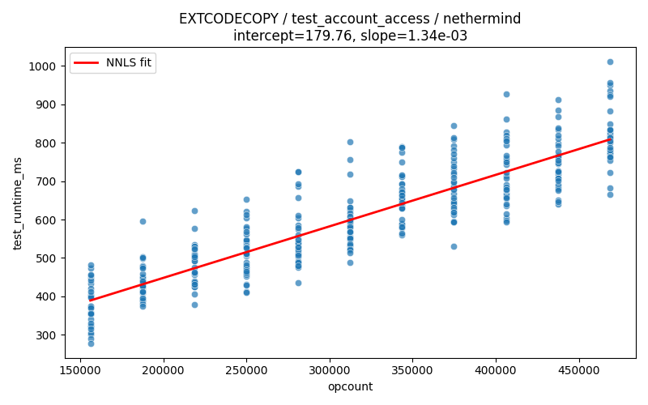

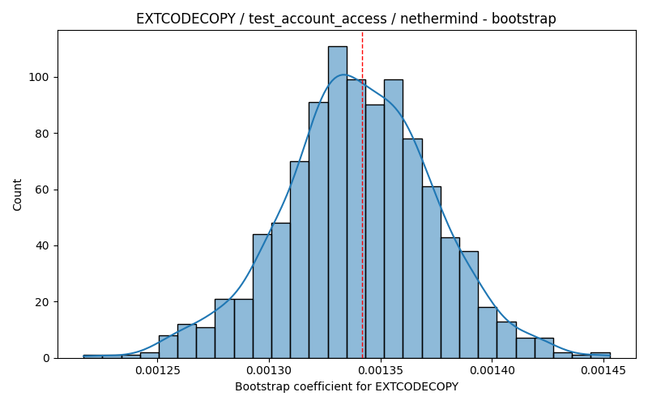

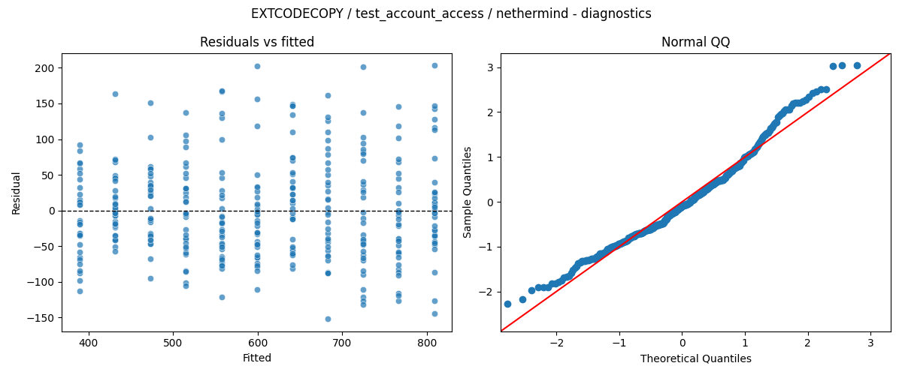

</details>

<details><summary>reth — NNLS regression summary</summary>

```
==============================================================================
                           NNLS Regression Results                            
==============================================================================
Dep. Variable:          test_runtime_ms              R-squared:          0.740
Model:                  NNLS                    Adj. R-squared:          0.739
No. Observations:       539                               RMSE:           6.47
Df Residuals:           537                                MAE:           4.96
Df Model:               1      
==============================================================================
                      coef     std err     P-value      [0.025      0.975]
------------------------------------------------------------------------------
         const     13.5367      0.9548       0.001     11.7847     15.4094
       opcount      0.0001      0.0000       0.001      0.0001      0.0001
==============================================================================
Notes: Non-negative least squares with bootstrap inference (1000 iterations)
==============================================================================
```

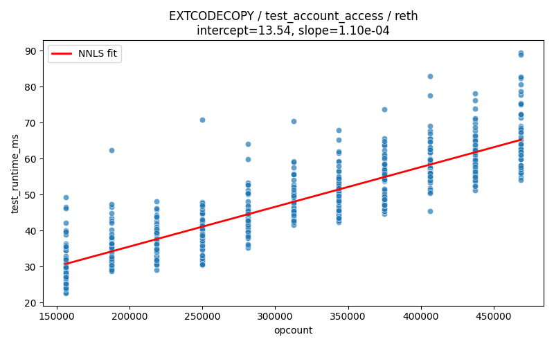

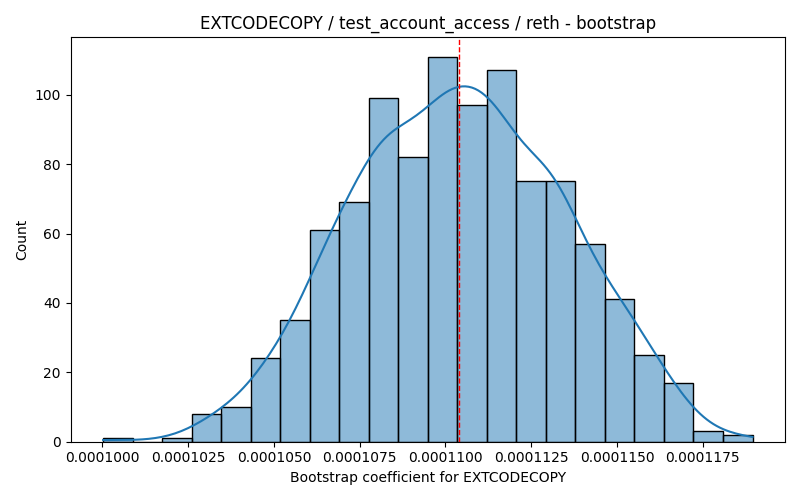

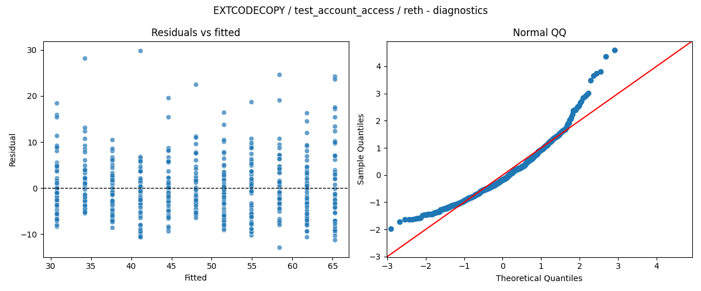

</details>

### test_account_access — combo `EXTCODECOPY_AccountMode.NON_EXISTING_ACCOUNT` — `presets[cold_account_code_access]`

| client | nobs | R² | target_coef (ms) | p-value | 95% CI |
| --- | --- | --- | --- | --- | --- |
| `besu` | 462 | 0.2586 | 0.0005457 | 1.00e-03 | [0.0004629, 0.0006344] |
| `erigon` | 154 | 0.9027 | 8.488e-05 | 1.00e-03 | [8.014e-05, 8.951e-05] |
| `ethrex` | 440 | 0.3638 | 3.419e-05 | 1.00e-03 | [2.998e-05, 3.841e-05] |
| `geth` | 440 | 0.9305 | 0.0003415 | 1.00e-03 | [0.0003324, 0.0003508] |
| `nethermind` | 363 | 0.6643 | 0.00034 | 1.00e-03 | [0.0003142, 0.0003657] |
| `reth` | 539 | 0.4734 | 2.351e-05 | 1.00e-03 | [2.11e-05, 2.568e-05] |

<details><summary>besu — NNLS regression summary</summary>

```
==============================================================================
                           NNLS Regression Results                            
==============================================================================
Dep. Variable:          test_runtime_ms              R-squared:          0.259
Model:                  NNLS                    Adj. R-squared:          0.257
No. Observations:       462                               RMSE:         237.20
Df Residuals:           460                                MAE:         216.91
Df Model:               1      
==============================================================================
                      coef     std err     P-value      [0.025      0.975]
------------------------------------------------------------------------------
         const    379.3548     33.7307       0.001    314.4497    448.7353
       opcount      0.0005      0.0000       0.001      0.0005      0.0006
==============================================================================
Notes: Non-negative least squares with bootstrap inference (1000 iterations)
==============================================================================
```


</details>

<details><summary>erigon — NNLS regression summary</summary>

```
==============================================================================
                           NNLS Regression Results                            
==============================================================================
Dep. Variable:          test_runtime_ms              R-squared:          0.903
Model:                  NNLS                    Adj. R-squared:          0.902
No. Observations:       154                               RMSE:           7.16
Df Residuals:           152                                MAE:           5.29
Df Model:               1      
==============================================================================
                      coef     std err     P-value      [0.025      0.975]
------------------------------------------------------------------------------
         const     23.9181      1.7761       0.001     20.4425     27.5337
       opcount      0.0001      0.0000       0.001      0.0001      0.0001
==============================================================================
Notes: Non-negative least squares with bootstrap inference (1000 iterations)
==============================================================================
```


</details>

<details><summary>ethrex — NNLS regression summary</summary>

```
==============================================================================
                           NNLS Regression Results                            
==============================================================================
Dep. Variable:          test_runtime_ms              R-squared:          0.364
Model:                  NNLS                    Adj. R-squared:          0.362
No. Observations:       440                               RMSE:          11.61
Df Residuals:           438                                MAE:           7.54
Df Model:               1      
==============================================================================
                      coef     std err     P-value      [0.025      0.975]
------------------------------------------------------------------------------
         const     13.8170      1.9395       0.001     10.0757     17.7179
       opcount      0.0000      0.0000       0.001      0.0000      0.0000
==============================================================================
Notes: Non-negative least squares with bootstrap inference (1000 iterations)
==============================================================================
```


</details>

<details><summary>geth — NNLS regression summary</summary>

```
==============================================================================
                           NNLS Regression Results                            
==============================================================================
Dep. Variable:          test_runtime_ms              R-squared:          0.931
Model:                  NNLS                    Adj. R-squared:          0.930
No. Observations:       440                               RMSE:          23.95
Df Residuals:           438                                MAE:          18.14
Df Model:               1      
==============================================================================
                      coef     std err     P-value      [0.025      0.975]
------------------------------------------------------------------------------
         const     30.8899      3.5563       0.001     24.0562     37.8318
       opcount      0.0003      0.0000       0.001      0.0003      0.0004
==============================================================================
Notes: Non-negative least squares with bootstrap inference (1000 iterations)
==============================================================================
```


</details>

<details><summary>nethermind — NNLS regression summary</summary>

```
==============================================================================
                           NNLS Regression Results                            
==============================================================================
Dep. Variable:          test_runtime_ms              R-squared:          0.664
Model:                  NNLS                    Adj. R-squared:          0.663
No. Observations:       363                               RMSE:          62.05
Df Residuals:           361                                MAE:          41.37
Df Model:               1      
==============================================================================
                      coef     std err     P-value      [0.025      0.975]
------------------------------------------------------------------------------
         const    122.0481      9.8563       0.001    103.0925    141.7403
       opcount      0.0003      0.0000       0.001      0.0003      0.0004
==============================================================================
Notes: Non-negative least squares with bootstrap inference (1000 iterations)
==============================================================================
```


</details>

<details><summary>reth — NNLS regression summary</summary>

```
==============================================================================
                           NNLS Regression Results                            
==============================================================================
Dep. Variable:          test_runtime_ms              R-squared:          0.473
Model:                  NNLS                    Adj. R-squared:          0.472
No. Observations:       539                               RMSE:           6.37
Df Residuals:           537                                MAE:           4.42
Df Model:               1      
==============================================================================
                      coef     std err     P-value      [0.025      0.975]
------------------------------------------------------------------------------
         const      9.5837      0.9966       0.001      7.7450     11.7033
       opcount      0.0000      0.0000       0.001      0.0000      0.0000
==============================================================================
Notes: Non-negative least squares with bootstrap inference (1000 iterations)
==============================================================================
```


</details>

## EXTCODEHASH

### test_account_access — combo `EXTCODEHASH_AccountMode.NON_EXISTING_ACCOUNT` — `presets[cold_account_nocode_access]`

| client | nobs | R² | target_coef (ms) | p-value | 95% CI |
| --- | --- | --- | --- | --- | --- |
| `besu` | 462 | 0.8323 | 0.01307 | 1.00e-03 | [0.01251, 0.01358] |
| `erigon` | 154 | 0.9752 | 0.008418 | 1.00e-03 | [0.008279, 0.008487] |
| `ethrex` | 440 | 0.9683 | 0.001999 | 1.00e-03 | [0.001964, 0.002036] |
| `geth` | 440 | 0.8595 | 0.02155 | 1.00e-03 | [0.02068, 0.02243] |
| `nethermind` | 363 | 0.8328 | 0.003774 | 1.00e-03 | [0.003597, 0.003938] |
| `reth` | 539 | 0.8818 | 0.000737 | 1.00e-03 | [0.0007144, 0.0007593] |

<details><summary>besu — NNLS regression summary</summary>

```
==============================================================================
                           NNLS Regression Results                            
==============================================================================
Dep. Variable:          test_runtime_ms              R-squared:          0.832
Model:                  NNLS                    Adj. R-squared:          0.832
No. Observations:       462                               RMSE:         140.23
Df Residuals:           460                                MAE:         126.27
Df Model:               1      
==============================================================================
                      coef     std err     P-value      [0.025      0.975]
------------------------------------------------------------------------------
         const    498.4659     21.1882       0.001    458.4194    539.9909
       opcount      0.0131      0.0003       0.001      0.0125      0.0136
==============================================================================
Notes: Non-negative least squares with bootstrap inference (1000 iterations)
==============================================================================
```

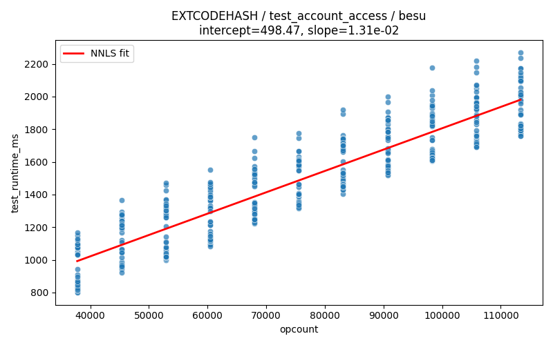

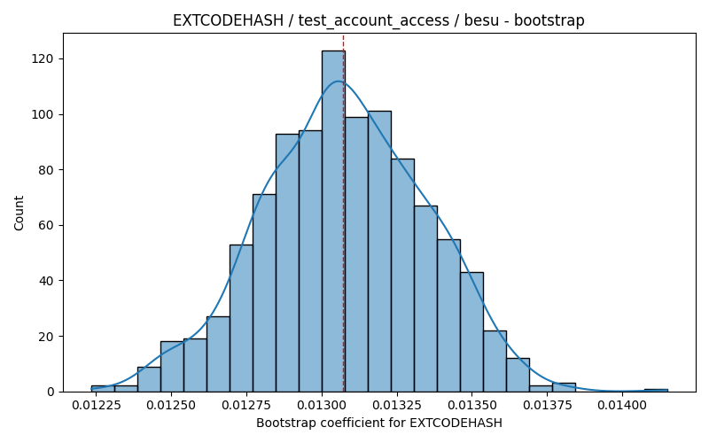

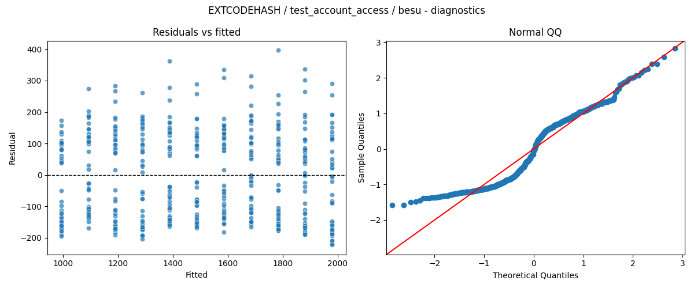

</details>

<details><summary>erigon — NNLS regression summary</summary>

```
==============================================================================
                           NNLS Regression Results                            
==============================================================================
Dep. Variable:          test_runtime_ms              R-squared:          0.975
Model:                  NNLS                    Adj. R-squared:          0.975
No. Observations:       154                               RMSE:          32.34
Df Residuals:           152                                MAE:          22.85
Df Model:               1      
==============================================================================
                      coef     std err     P-value      [0.025      0.975]
------------------------------------------------------------------------------
         const      0.0000      2.5254       1.000      0.0000      8.9989
       opcount      0.0084      0.0001       0.001      0.0083      0.0085
==============================================================================
Notes: Non-negative least squares with bootstrap inference (1000 iterations)
==============================================================================
```

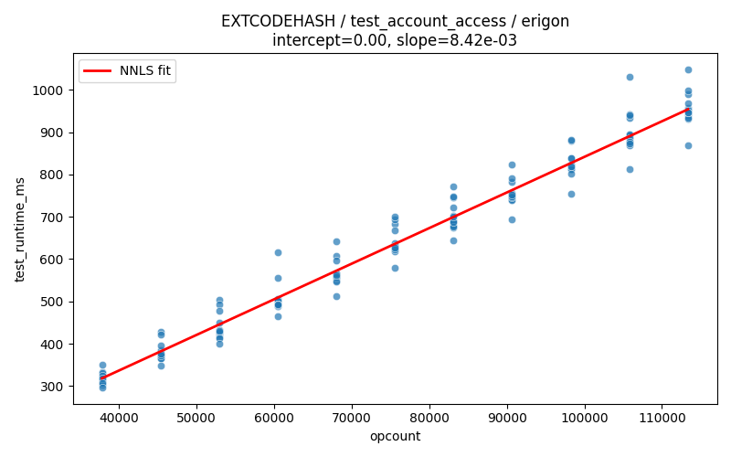

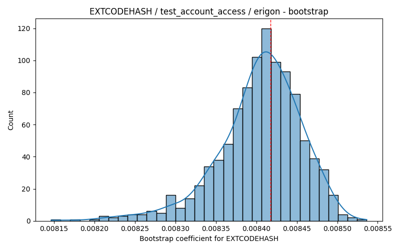

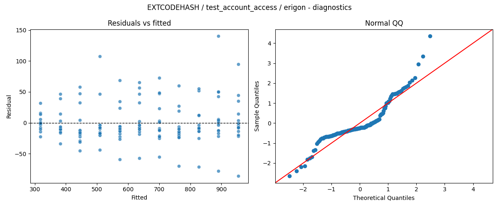

</details>

<details><summary>ethrex — NNLS regression summary</summary>

```
==============================================================================
                           NNLS Regression Results                            
==============================================================================
Dep. Variable:          test_runtime_ms              R-squared:          0.968
Model:                  NNLS                    Adj. R-squared:          0.968
No. Observations:       440                               RMSE:           8.65
Df Residuals:           438                                MAE:           6.91
Df Model:               1      
==============================================================================
                      coef     std err     P-value      [0.025      0.975]
------------------------------------------------------------------------------
         const     26.4842      1.3354       0.001     23.8024     29.0558
       opcount      0.0020      0.0000       0.001      0.0020      0.0020
==============================================================================
Notes: Non-negative least squares with bootstrap inference (1000 iterations)
==============================================================================
```

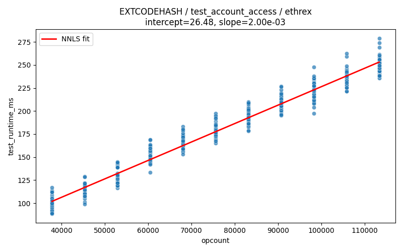

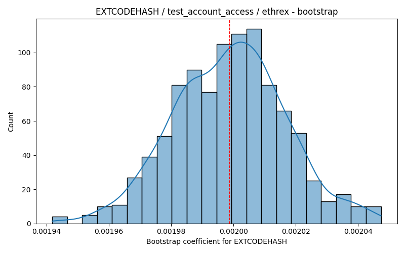

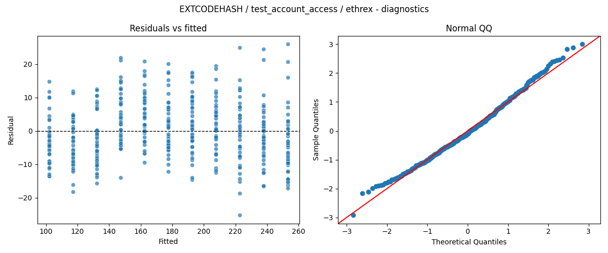

</details>

<details><summary>geth — NNLS regression summary</summary>

```
==============================================================================
                           NNLS Regression Results                            
==============================================================================
Dep. Variable:          test_runtime_ms              R-squared:          0.860
Model:                  NNLS                    Adj. R-squared:          0.859
No. Observations:       440                               RMSE:         208.23
Df Residuals:           438                                MAE:         176.40
Df Model:               1      
==============================================================================
                      coef     std err     P-value      [0.025      0.975]
------------------------------------------------------------------------------
         const    713.1892     38.8209       0.001    635.0039    786.5918
       opcount      0.0216      0.0005       0.001      0.0207      0.0224
==============================================================================
Notes: Non-negative least squares with bootstrap inference (1000 iterations)
==============================================================================
```


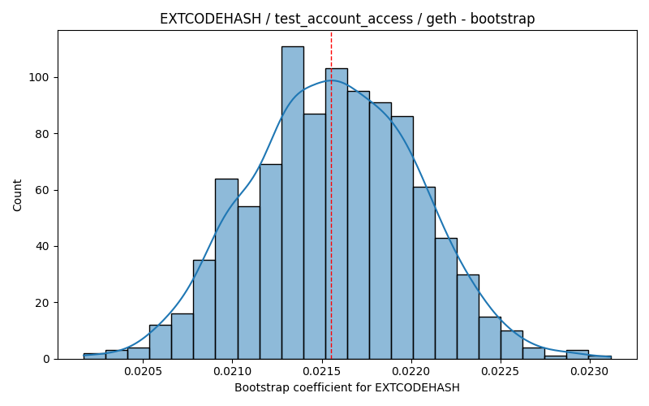

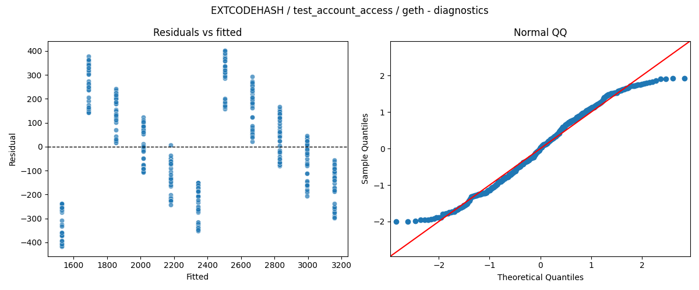

</details>

<details><summary>nethermind — NNLS regression summary</summary>

```
==============================================================================
                           NNLS Regression Results                            
==============================================================================
Dep. Variable:          test_runtime_ms              R-squared:          0.833
Model:                  NNLS                    Adj. R-squared:          0.832
No. Observations:       363                               RMSE:          40.41
Df Residuals:           361                                MAE:          32.55
Df Model:               1      
==============================================================================
                      coef     std err     P-value      [0.025      0.975]
------------------------------------------------------------------------------
         const     71.1244      5.9617       0.001     60.1631     83.3278
       opcount      0.0038      0.0001       0.001      0.0036      0.0039
==============================================================================
Notes: Non-negative least squares with bootstrap inference (1000 iterations)
==============================================================================
```

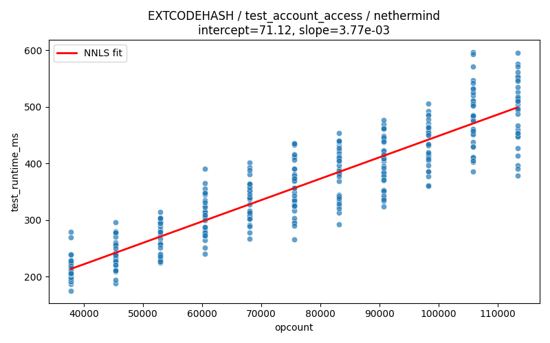

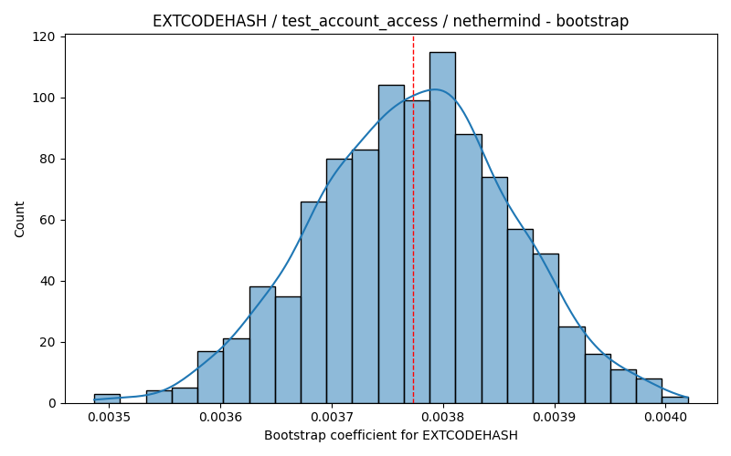

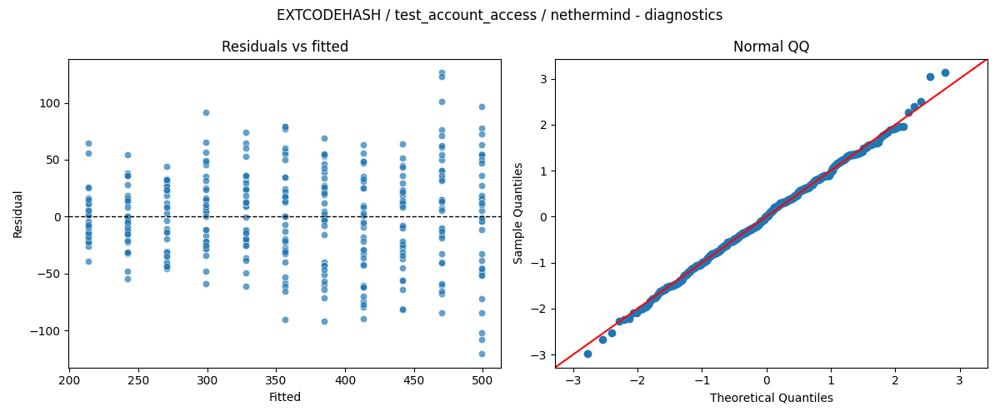

</details>

<details><summary>reth — NNLS regression summary</summary>

```
==============================================================================
                           NNLS Regression Results                            
==============================================================================
Dep. Variable:          test_runtime_ms              R-squared:          0.882
Model:                  NNLS                    Adj. R-squared:          0.882
No. Observations:       539                               RMSE:           6.45
Df Residuals:           537                                MAE:           5.15
Df Model:               1      
==============================================================================
                      coef     std err     P-value      [0.025      0.975]
------------------------------------------------------------------------------
         const     48.6213      0.8918       0.001     46.8738     50.3773
       opcount      0.0007      0.0000       0.001      0.0007      0.0008
==============================================================================
Notes: Non-negative least squares with bootstrap inference (1000 iterations)
==============================================================================
```

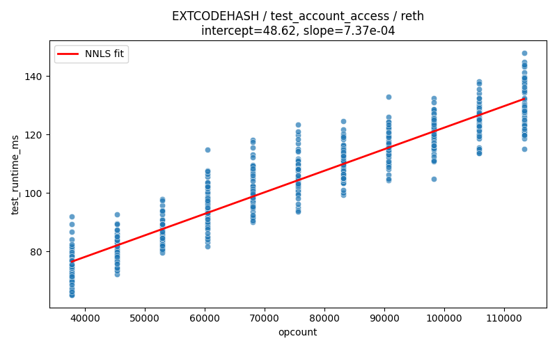

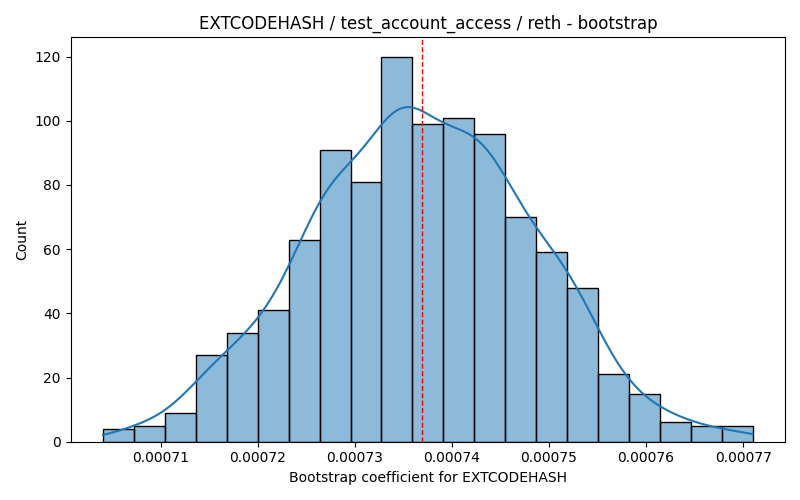

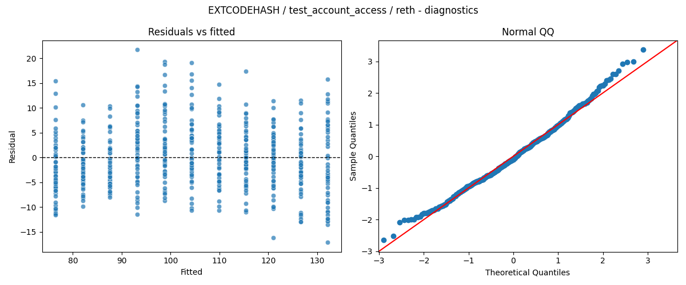

</details>

### test_account_access — combo `EXTCODEHASH_AccountMode.EXISTING_CONTRACT`

| client | nobs | R² | target_coef (ms) | p-value | 95% CI |
| --- | --- | --- | --- | --- | --- |
| `besu` | 462 | 0.8947 | 0.0247 | 1.00e-03 | [0.02399, 0.02542] |
| `erigon` | 154 | 0.9331 | 0.02399 | 1.00e-03 | [0.02301, 0.02498] |
| `ethrex` | 440 | 0.9932 | 0.007729 | 1.00e-03 | [0.007672, 0.007788] |
| `geth` | 440 | 0.8576 | 0.02302 | 1.00e-03 | [0.02204, 0.0239] |
| `nethermind` | 363 | 0.5704 | 0.01349 | 1.00e-03 | [0.01228, 0.01476] |
| `reth` | 539 | 0.9724 | 0.003979 | 1.00e-03 | [0.003915, 0.004037] |

<details><summary>besu — NNLS regression summary</summary>

```
==============================================================================
                           NNLS Regression Results                            
==============================================================================
Dep. Variable:          test_runtime_ms              R-squared:          0.895
Model:                  NNLS                    Adj. R-squared:          0.894
No. Observations:       462                               RMSE:         176.29
Df Residuals:           460                                MAE:         143.24
Df Model:               1      
==============================================================================
                      coef     std err     P-value      [0.025      0.975]
------------------------------------------------------------------------------
         const    552.4798     24.1101       0.001    504.2673    599.7685
       opcount      0.0247      0.0004       0.001      0.0240      0.0254
==============================================================================
Notes: Non-negative least squares with bootstrap inference (1000 iterations)
==============================================================================
```

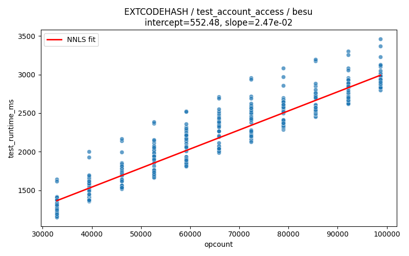

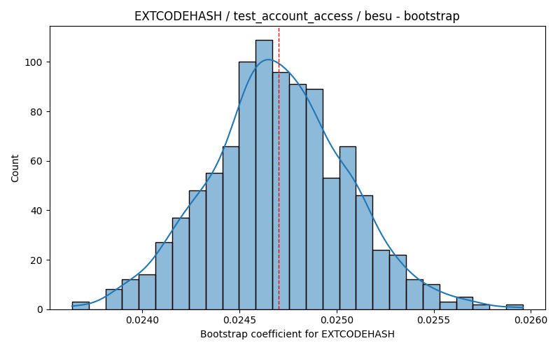

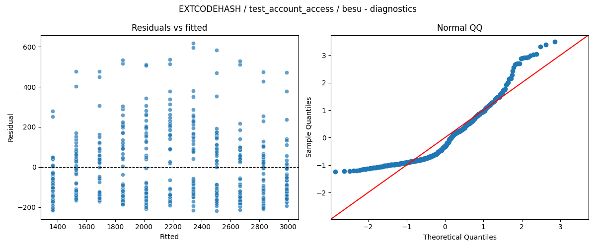

</details>

<details><summary>erigon — NNLS regression summary</summary>

```
==============================================================================
                           NNLS Regression Results                            
==============================================================================
Dep. Variable:          test_runtime_ms              R-squared:          0.933
Model:                  NNLS                    Adj. R-squared:          0.933
No. Observations:       154                               RMSE:         133.62
Df Residuals:           152                                MAE:         113.78
Df Model:               1      
==============================================================================
                      coef     std err     P-value      [0.025      0.975]
------------------------------------------------------------------------------
         const    293.8304     35.2101       0.001    227.0638    366.4171
       opcount      0.0240      0.0005       0.001      0.0230      0.0250
==============================================================================
Notes: Non-negative least squares with bootstrap inference (1000 iterations)
==============================================================================
```

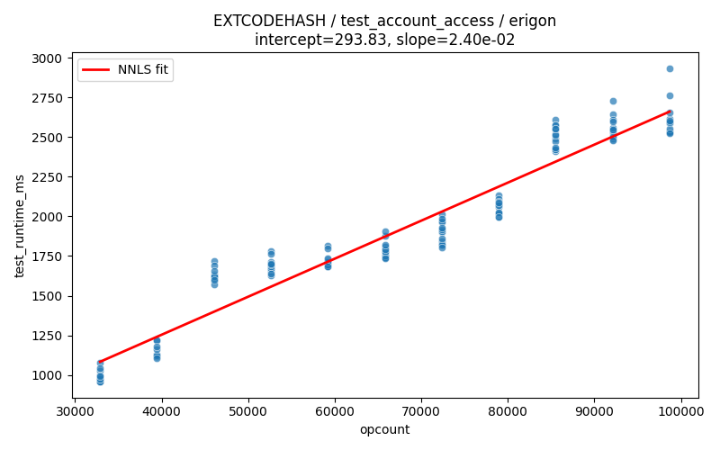

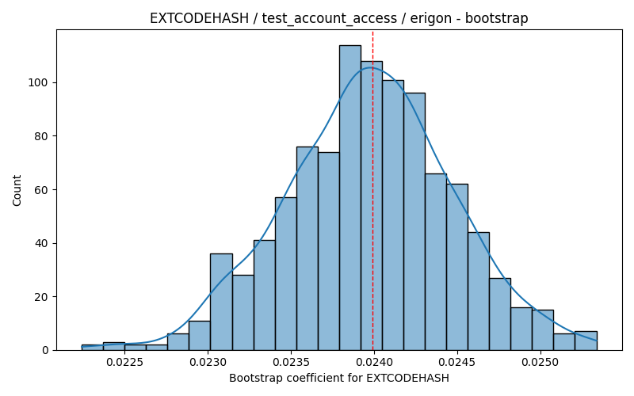

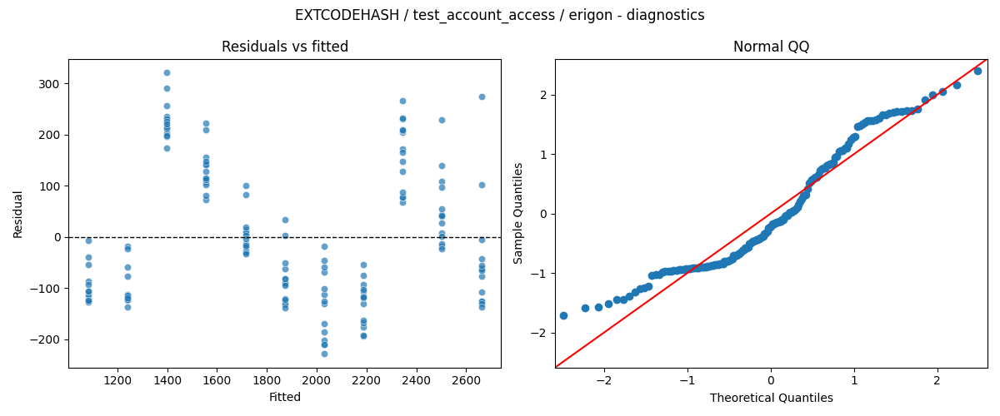

</details>

<details><summary>ethrex — NNLS regression summary</summary>

```
==============================================================================
                           NNLS Regression Results                            
==============================================================================
Dep. Variable:          test_runtime_ms              R-squared:          0.993
Model:                  NNLS                    Adj. R-squared:          0.993
No. Observations:       440                               RMSE:          13.32
Df Residuals:           438                                MAE:          10.58
Df Model:               1      
==============================================================================
                      coef     std err     P-value      [0.025      0.975]
------------------------------------------------------------------------------
         const     41.7237      1.8852       0.001     38.0418     45.3662
       opcount      0.0077      0.0000       0.001      0.0077      0.0078
==============================================================================
Notes: Non-negative least squares with bootstrap inference (1000 iterations)
==============================================================================
```


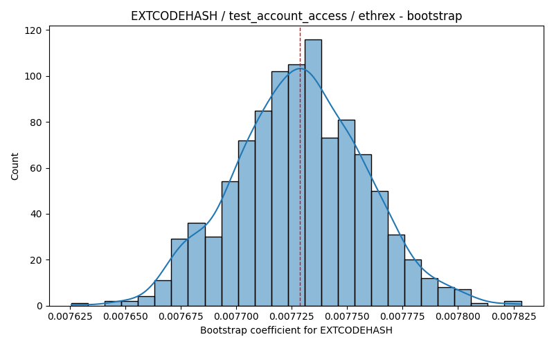

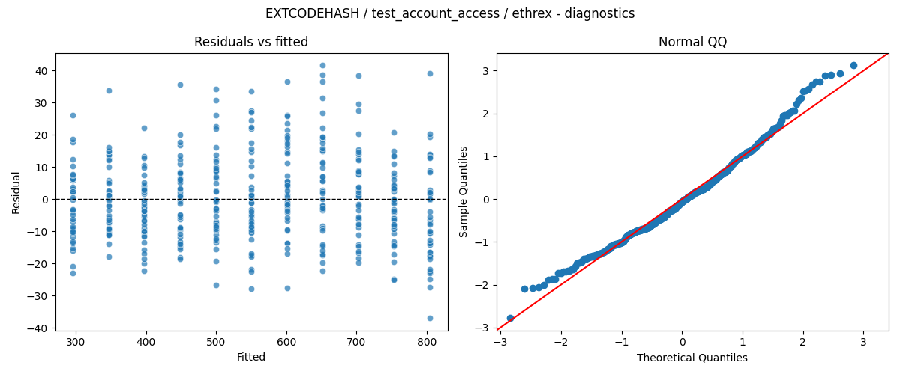

</details>

<details><summary>geth — NNLS regression summary</summary>

```
==============================================================================
                           NNLS Regression Results                            
==============================================================================
Dep. Variable:          test_runtime_ms              R-squared:          0.858
Model:                  NNLS                    Adj. R-squared:          0.857
No. Observations:       440                               RMSE:         195.14
Df Residuals:           438                                MAE:         164.96
Df Model:               1      
==============================================================================
                      coef     std err     P-value      [0.025      0.975]
------------------------------------------------------------------------------
         const    676.9951     34.9177       0.001    611.2961    748.4975
       opcount      0.0230      0.0005       0.001      0.0220      0.0239
==============================================================================
Notes: Non-negative least squares with bootstrap inference (1000 iterations)
==============================================================================
```

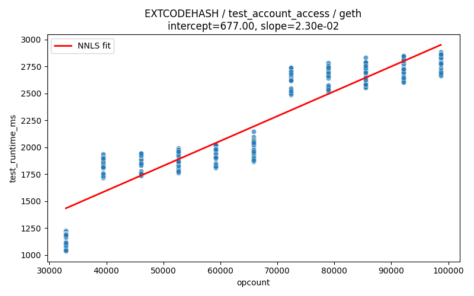

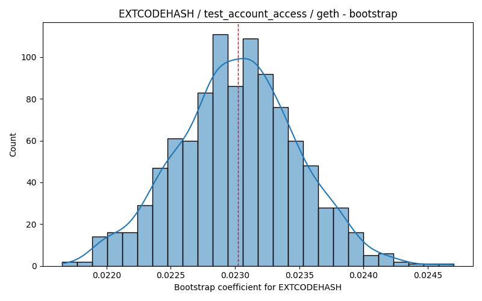

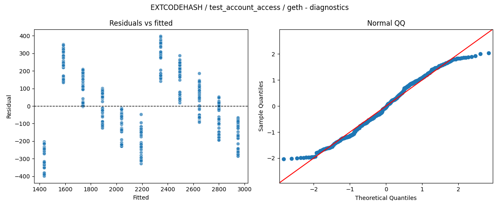

</details>

<details><summary>nethermind — NNLS regression summary</summary>

```
==============================================================================
                           NNLS Regression Results                            
==============================================================================
Dep. Variable:          test_runtime_ms              R-squared:          0.570
Model:                  NNLS                    Adj. R-squared:          0.569
No. Observations:       363                               RMSE:         243.55
Df Residuals:           361                                MAE:         179.14
Df Model:               1      
==============================================================================
                      coef     std err     P-value      [0.025      0.975]
------------------------------------------------------------------------------
         const    139.8388     36.1839       0.001     69.0872    210.6175
       opcount      0.0135      0.0006       0.001      0.0123      0.0148
==============================================================================
Notes: Non-negative least squares with bootstrap inference (1000 iterations)
==============================================================================
```

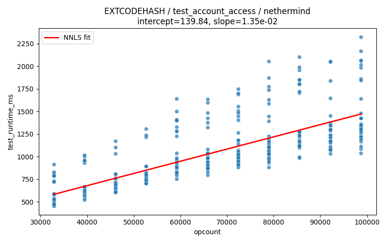

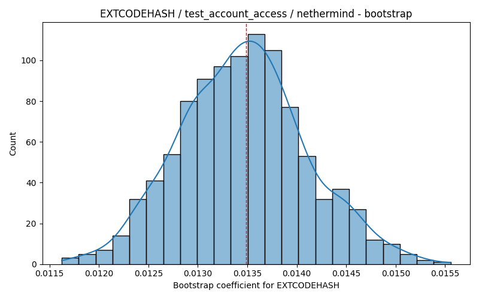

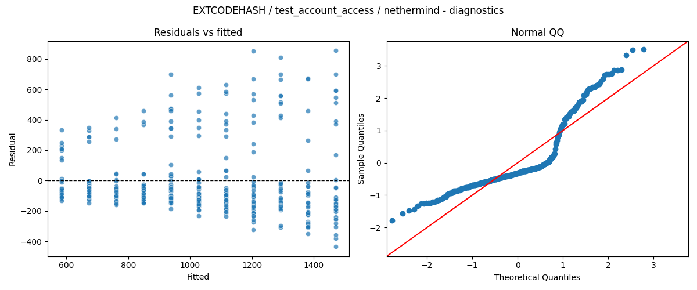

</details>

<details><summary>reth — NNLS regression summary</summary>

```
==============================================================================
                           NNLS Regression Results                            
==============================================================================
Dep. Variable:          test_runtime_ms              R-squared:          0.972
Model:                  NNLS                    Adj. R-squared:          0.972
No. Observations:       539                               RMSE:          13.94
Df Residuals:           537                                MAE:          11.05
Df Model:               1      
==============================================================================
                      coef     std err     P-value      [0.025      0.975]
------------------------------------------------------------------------------
         const    101.8926      1.8943       0.001     98.2907    105.8723
       opcount      0.0040      0.0000       0.001      0.0039      0.0040
==============================================================================
Notes: Non-negative least squares with bootstrap inference (1000 iterations)
==============================================================================
```

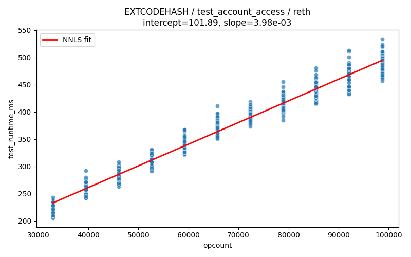

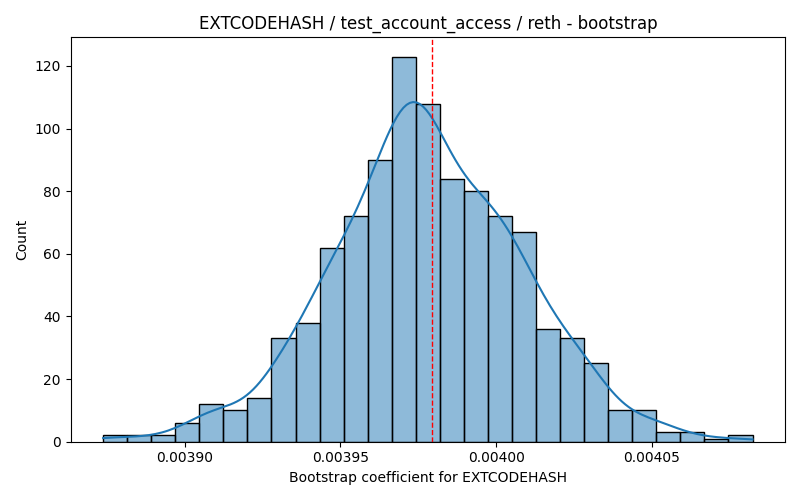

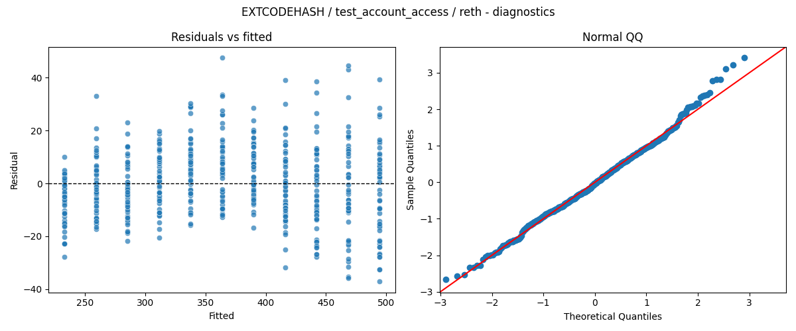

</details>

### test_account_access — combo `EXTCODEHASH_AccountMode.NON_EXISTING_ACCOUNT` — `presets[cold_account_code_access]`

| client | nobs | R² | target_coef (ms) | p-value | 95% CI |
| --- | --- | --- | --- | --- | --- |
| `besu` | 462 | 0.8323 | 0.01307 | 1.00e-03 | [0.01251, 0.01358] |
| `erigon` | 154 | 0.9752 | 0.008418 | 1.00e-03 | [0.008279, 0.008487] |
| `ethrex` | 440 | 0.9683 | 0.001999 | 1.00e-03 | [0.001964, 0.002036] |
| `geth` | 440 | 0.8595 | 0.02155 | 1.00e-03 | [0.02068, 0.02243] |
| `nethermind` | 363 | 0.8328 | 0.003774 | 1.00e-03 | [0.003597, 0.003938] |
| `reth` | 539 | 0.8818 | 0.000737 | 1.00e-03 | [0.0007144, 0.0007593] |

<details><summary>besu — NNLS regression summary</summary>

```
==============================================================================
                           NNLS Regression Results                            
==============================================================================
Dep. Variable:          test_runtime_ms              R-squared:          0.832
Model:                  NNLS                    Adj. R-squared:          0.832
No. Observations:       462                               RMSE:         140.23
Df Residuals:           460                                MAE:         126.27
Df Model:               1      
==============================================================================
                      coef     std err     P-value      [0.025      0.975]
------------------------------------------------------------------------------
         const    498.4659     21.1882       0.001    458.4194    539.9909
       opcount      0.0131      0.0003       0.001      0.0125      0.0136
==============================================================================
Notes: Non-negative least squares with bootstrap inference (1000 iterations)
==============================================================================
```


</details>

<details><summary>erigon — NNLS regression summary</summary>

```
==============================================================================
                           NNLS Regression Results                            
==============================================================================
Dep. Variable:          test_runtime_ms              R-squared:          0.975
Model:                  NNLS                    Adj. R-squared:          0.975
No. Observations:       154                               RMSE:          32.34
Df Residuals:           152                                MAE:          22.85
Df Model:               1      
==============================================================================
                      coef     std err     P-value      [0.025      0.975]
------------------------------------------------------------------------------
         const      0.0000      2.5254       1.000      0.0000      8.9989
       opcount      0.0084      0.0001       0.001      0.0083      0.0085
==============================================================================
Notes: Non-negative least squares with bootstrap inference (1000 iterations)
==============================================================================
```


</details>

<details><summary>ethrex — NNLS regression summary</summary>

```
==============================================================================
                           NNLS Regression Results                            
==============================================================================
Dep. Variable:          test_runtime_ms              R-squared:          0.968
Model:                  NNLS                    Adj. R-squared:          0.968
No. Observations:       440                               RMSE:           8.65
Df Residuals:           438                                MAE:           6.91
Df Model:               1      
==============================================================================
                      coef     std err     P-value      [0.025      0.975]
------------------------------------------------------------------------------
         const     26.4842      1.3354       0.001     23.8024     29.0558
       opcount      0.0020      0.0000       0.001      0.0020      0.0020
==============================================================================
Notes: Non-negative least squares with bootstrap inference (1000 iterations)
==============================================================================
```


</details>

<details><summary>geth — NNLS regression summary</summary>

```
==============================================================================
                           NNLS Regression Results                            
==============================================================================
Dep. Variable:          test_runtime_ms              R-squared:          0.860
Model:                  NNLS                    Adj. R-squared:          0.859
No. Observations:       440                               RMSE:         208.23
Df Residuals:           438                                MAE:         176.40
Df Model:               1      
==============================================================================
                      coef     std err     P-value      [0.025      0.975]
------------------------------------------------------------------------------
         const    713.1892     38.8209       0.001    635.0039    786.5918
       opcount      0.0216      0.0005       0.001      0.0207      0.0224
==============================================================================
Notes: Non-negative least squares with bootstrap inference (1000 iterations)
==============================================================================
```


</details>

<details><summary>nethermind — NNLS regression summary</summary>

```
==============================================================================
                           NNLS Regression Results                            
==============================================================================
Dep. Variable:          test_runtime_ms              R-squared:          0.833
Model:                  NNLS                    Adj. R-squared:          0.832
No. Observations:       363                               RMSE:          40.41
Df Residuals:           361                                MAE:          32.55
Df Model:               1      
==============================================================================
                      coef     std err     P-value      [0.025      0.975]
------------------------------------------------------------------------------
         const     71.1244      5.9617       0.001     60.1631     83.3278
       opcount      0.0038      0.0001       0.001      0.0036      0.0039
==============================================================================
Notes: Non-negative least squares with bootstrap inference (1000 iterations)
==============================================================================
```


</details>

<details><summary>reth — NNLS regression summary</summary>

```
==============================================================================
                           NNLS Regression Results                            
==============================================================================
Dep. Variable:          test_runtime_ms              R-squared:          0.882
Model:                  NNLS                    Adj. R-squared:          0.882
No. Observations:       539                               RMSE:           6.45
Df Residuals:           537                                MAE:           5.15
Df Model:               1      
==============================================================================
                      coef     std err     P-value      [0.025      0.975]
------------------------------------------------------------------------------
         const     48.6213      0.8918       0.001     46.8738     50.3773
       opcount      0.0007      0.0000       0.001      0.0007      0.0008
==============================================================================
Notes: Non-negative least squares with bootstrap inference (1000 iterations)
==============================================================================
```


</details>

### test_ext_account_query_warm — combo `EXTCODEHASH`

| client | nobs | R² | target_coef (ms) | p-value | 95% CI |
| --- | --- | --- | --- | --- | --- |
| `besu` | 462 | 0.2411 | 0.0001997 | 1.00e-03 | [0.0001682, 0.0002324] |
| `erigon` | 154 | 0.9211 | 0.0003132 | 1.00e-03 | [0.0002998, 0.0003274] |
| `ethrex` | 440 | 0.3462 | 1.516e-05 | 1.00e-03 | [1.33e-05, 1.702e-05] |
| `geth` | 440 | 0.8082 | 3.802e-05 | 1.00e-03 | [3.621e-05, 3.984e-05] |
| `nethermind` | 363 | 0.5995 | 0.0002332 | 1.00e-03 | [0.0002132, 0.0002525] |
| `reth` | 539 | 0.6195 | 1.326e-05 | 1.00e-03 | [1.241e-05, 1.414e-05] |

<details><summary>besu — NNLS regression summary</summary>

```
==============================================================================
                           NNLS Regression Results                            
==============================================================================
Dep. Variable:          test_runtime_ms              R-squared:          0.241
Model:                  NNLS                    Adj. R-squared:          0.239
No. Observations:       462                               RMSE:         207.19
Df Residuals:           460                                MAE:         173.47
Df Model:               1      
==============================================================================
                      coef     std err     P-value      [0.025      0.975]
------------------------------------------------------------------------------
         const    470.0884     32.2198       0.001    406.1959    532.4756
       opcount      0.0002      0.0000       0.001      0.0002      0.0002
==============================================================================
Notes: Non-negative least squares with bootstrap inference (1000 iterations)
==============================================================================
```

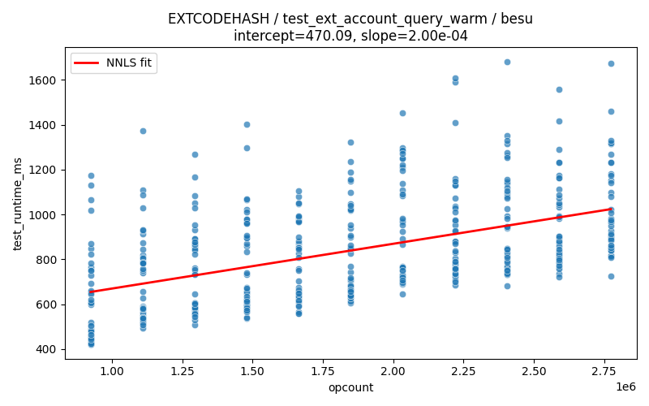

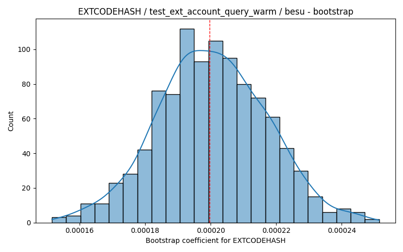

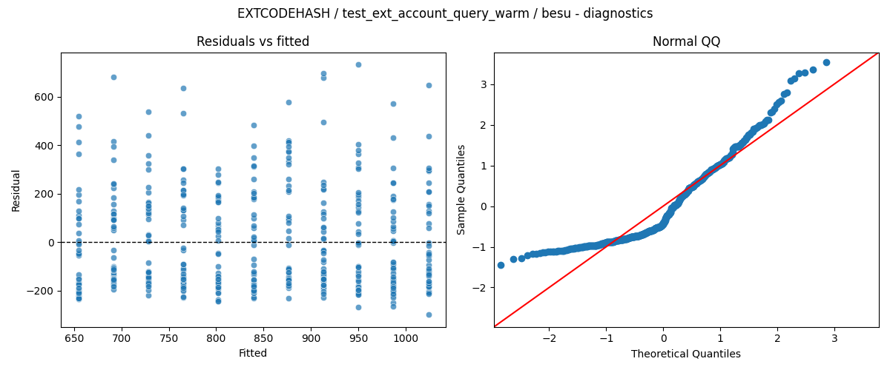

</details>

<details><summary>erigon — NNLS regression summary</summary>

```
==============================================================================
                           NNLS Regression Results                            
==============================================================================
Dep. Variable:          test_runtime_ms              R-squared:          0.921
Model:                  NNLS                    Adj. R-squared:          0.921
No. Observations:       154                               RMSE:          53.59
Df Residuals:           152                                MAE:          39.22
Df Model:               1      
==============================================================================
                      coef     std err     P-value      [0.025      0.975]
------------------------------------------------------------------------------
         const     31.1736     12.3836       0.005      7.9242     57.0047
       opcount      0.0003      0.0000       0.001      0.0003      0.0003
==============================================================================
Notes: Non-negative least squares with bootstrap inference (1000 iterations)
==============================================================================
```

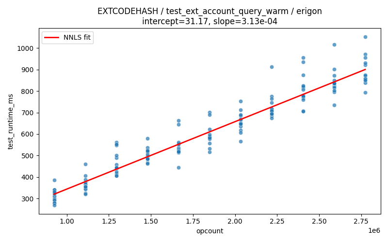

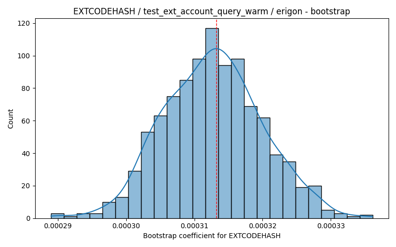

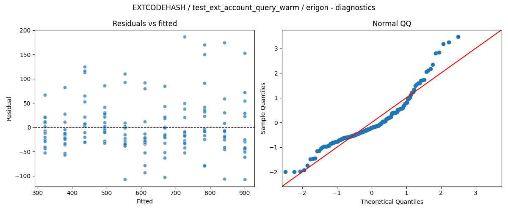

</details>

<details><summary>ethrex — NNLS regression summary</summary>

```
==============================================================================
                           NNLS Regression Results                            
==============================================================================
Dep. Variable:          test_runtime_ms              R-squared:          0.346
Model:                  NNLS                    Adj. R-squared:          0.345
No. Observations:       440                               RMSE:          12.19
Df Residuals:           438                                MAE:           7.82
Df Model:               1      
==============================================================================
                      coef     std err     P-value      [0.025      0.975]
------------------------------------------------------------------------------
         const      9.9900      1.7905       0.001      6.5255     13.5274
       opcount      0.0000      0.0000       0.001      0.0000      0.0000
==============================================================================
Notes: Non-negative least squares with bootstrap inference (1000 iterations)
==============================================================================
```

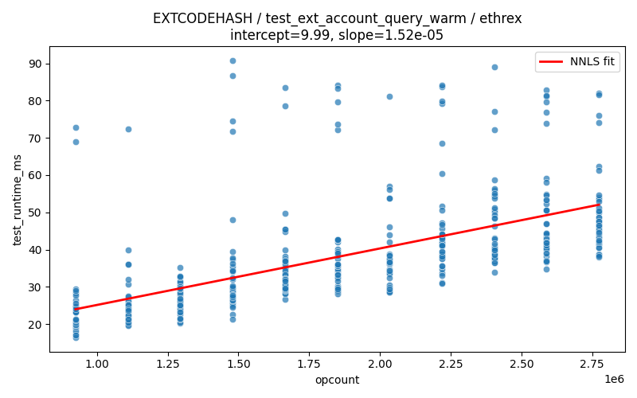


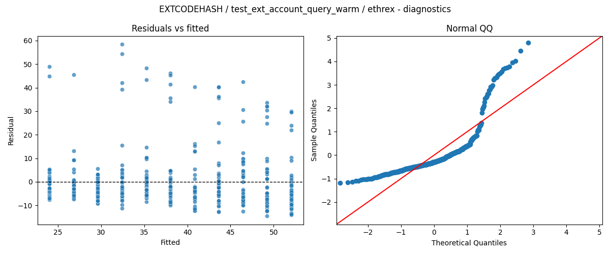

</details>

<details><summary>geth — NNLS regression summary</summary>

```
==============================================================================
                           NNLS Regression Results                            
==============================================================================
Dep. Variable:          test_runtime_ms              R-squared:          0.808
Model:                  NNLS                    Adj. R-squared:          0.808
No. Observations:       440                               RMSE:          10.83
Df Residuals:           438                                MAE:           8.39
Df Model:               1      
==============================================================================
                      coef     std err     P-value      [0.025      0.975]
------------------------------------------------------------------------------
         const     24.1421      1.6315       0.001     20.9906     27.2861
       opcount      0.0000      0.0000       0.001      0.0000      0.0000
==============================================================================
Notes: Non-negative least squares with bootstrap inference (1000 iterations)
==============================================================================
```

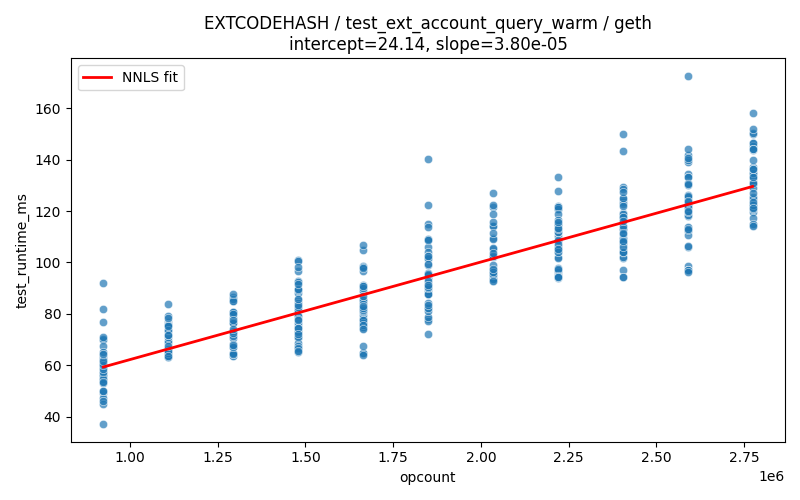

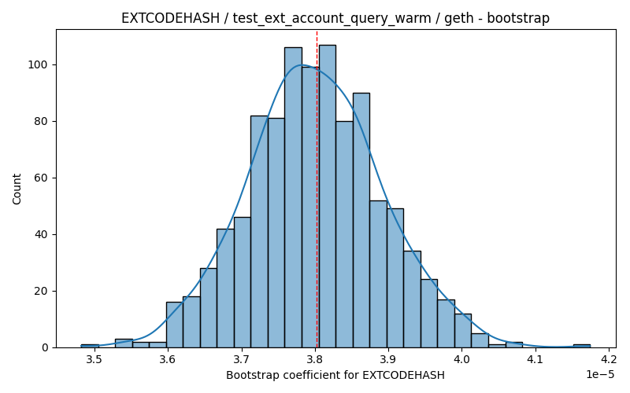

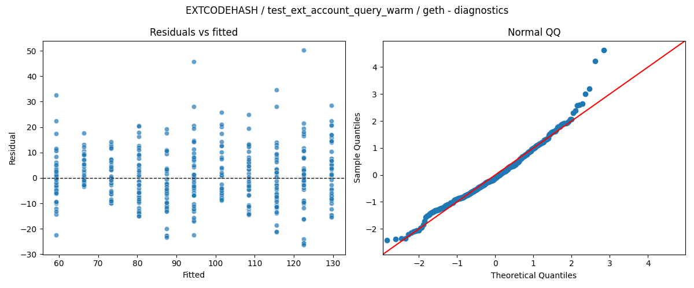

</details>

<details><summary>nethermind — NNLS regression summary</summary>

```
==============================================================================
                           NNLS Regression Results                            
==============================================================================
Dep. Variable:          test_runtime_ms              R-squared:          0.599
Model:                  NNLS                    Adj. R-squared:          0.598
No. Observations:       363                               RMSE:         111.46
Df Residuals:           361                                MAE:          90.72
Df Model:               1      
==============================================================================
                      coef     std err     P-value      [0.025      0.975]
------------------------------------------------------------------------------
         const    144.6850     15.9888       0.001    114.3249    177.0643
       opcount      0.0002      0.0000       0.001      0.0002      0.0003
==============================================================================
Notes: Non-negative least squares with bootstrap inference (1000 iterations)
==============================================================================
```

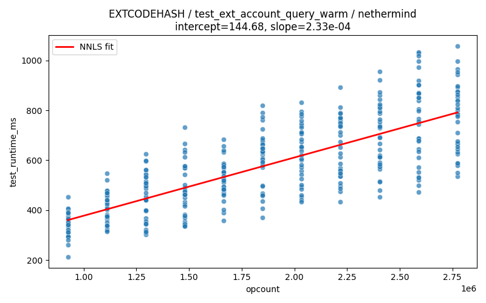

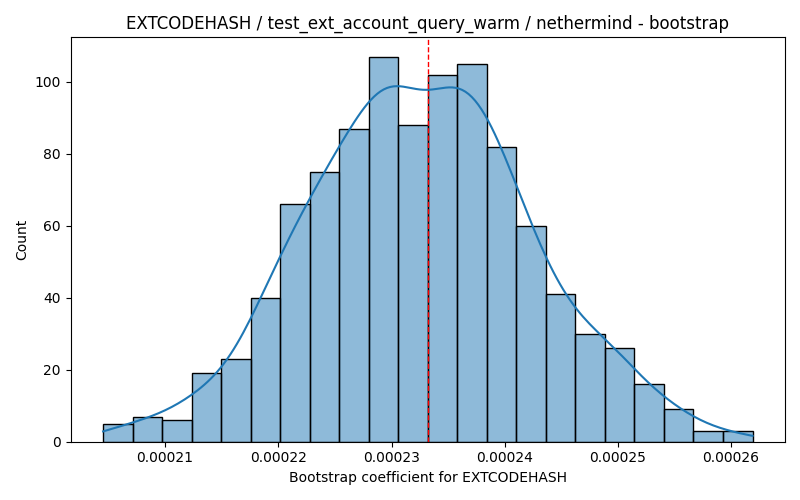


</details>

<details><summary>reth — NNLS regression summary</summary>

```
==============================================================================
                           NNLS Regression Results                            
==============================================================================
Dep. Variable:          test_runtime_ms              R-squared:          0.619
Model:                  NNLS                    Adj. R-squared:          0.619
No. Observations:       539                               RMSE:           6.08
Df Residuals:           537                                MAE:           4.33
Df Model:               1      
==============================================================================
                      coef     std err     P-value      [0.025      0.975]
------------------------------------------------------------------------------
         const      9.8673      0.8108       0.001      8.3095     11.3436
       opcount      0.0000      0.0000       0.001      0.0000      0.0000
==============================================================================
Notes: Non-negative least squares with bootstrap inference (1000 iterations)
==============================================================================
```

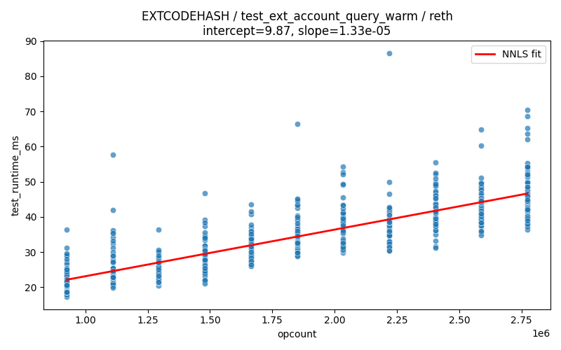

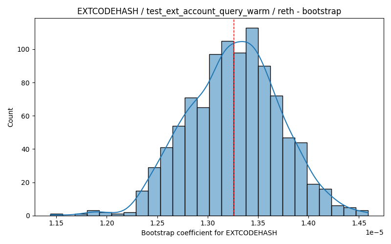

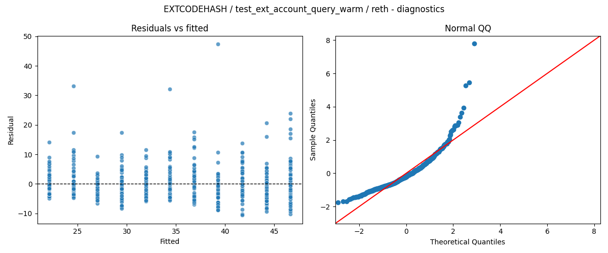

</details>

## EXTCODESIZE

### test_account_access — combo `EXTCODESIZE_AccountMode.NON_EXISTING_ACCOUNT` — `presets[cold_account_nocode_access]`

| client | nobs | R² | target_coef (ms) | p-value | 95% CI |
| --- | --- | --- | --- | --- | --- |
| `besu` | 462 | 0.8284 | 0.013 | 1.00e-03 | [0.01247, 0.01356] |
| `erigon` | 154 | 0.9705 | 0.008631 | 1.00e-03 | [0.0085, 0.008711] |
| `ethrex` | 440 | 0.9666 | 0.001964 | 1.00e-03 | [0.001931, 0.001998] |
| `geth` | 440 | 0.8607 | 0.02163 | 1.00e-03 | [0.02078, 0.02251] |
| `nethermind` | 363 | 0.8297 | 0.003886 | 1.00e-03 | [0.003695, 0.004086] |
| `reth` | 539 | 0.8664 | 0.0007039 | 1.00e-03 | [0.0006794, 0.0007279] |

<details><summary>besu — NNLS regression summary</summary>

```
==============================================================================
                           NNLS Regression Results                            
==============================================================================
Dep. Variable:          test_runtime_ms              R-squared:          0.828
Model:                  NNLS                    Adj. R-squared:          0.828
No. Observations:       462                               RMSE:         141.39
Df Residuals:           460                                MAE:         125.67
Df Model:               1      
==============================================================================
                      coef     std err     P-value      [0.025      0.975]
------------------------------------------------------------------------------
         const    499.7635     22.0395       0.001    455.6680    541.8655
       opcount      0.0130      0.0003       0.001      0.0125      0.0136
==============================================================================
Notes: Non-negative least squares with bootstrap inference (1000 iterations)
==============================================================================
```

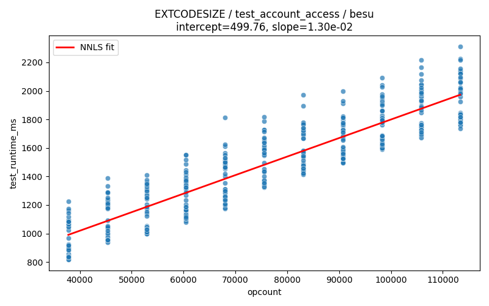

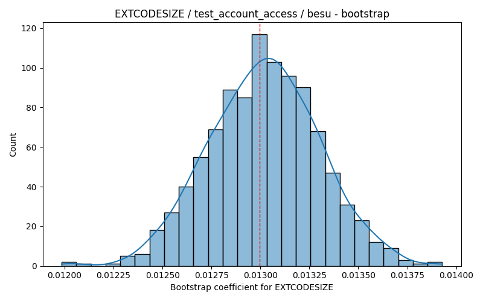

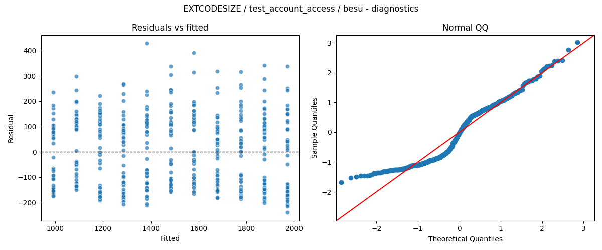

</details>

<details><summary>erigon — NNLS regression summary</summary>

```
==============================================================================
                           NNLS Regression Results                            
==============================================================================
Dep. Variable:          test_runtime_ms              R-squared:          0.971
Model:                  NNLS                    Adj. R-squared:          0.970
No. Observations:       154                               RMSE:          36.19
Df Residuals:           152                                MAE:          23.46
Df Model:               1      
==============================================================================
                      coef     std err     P-value      [0.025      0.975]
------------------------------------------------------------------------------
         const      0.0000      2.1954       1.000      0.0000      8.0747
       opcount      0.0086      0.0001       0.001      0.0085      0.0087
==============================================================================
Notes: Non-negative least squares with bootstrap inference (1000 iterations)
==============================================================================
```

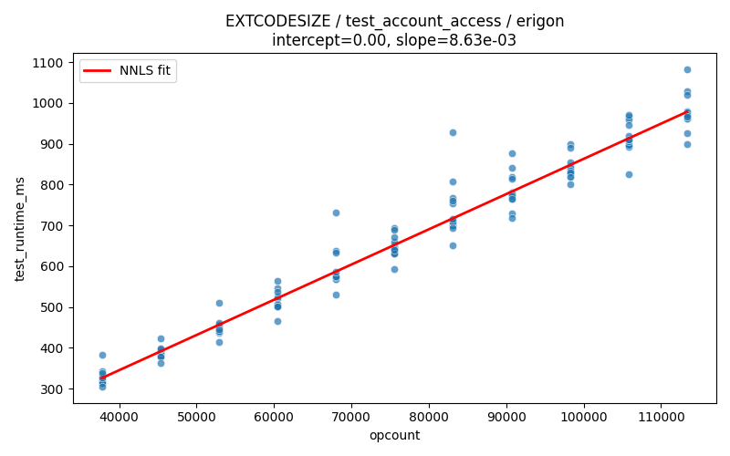

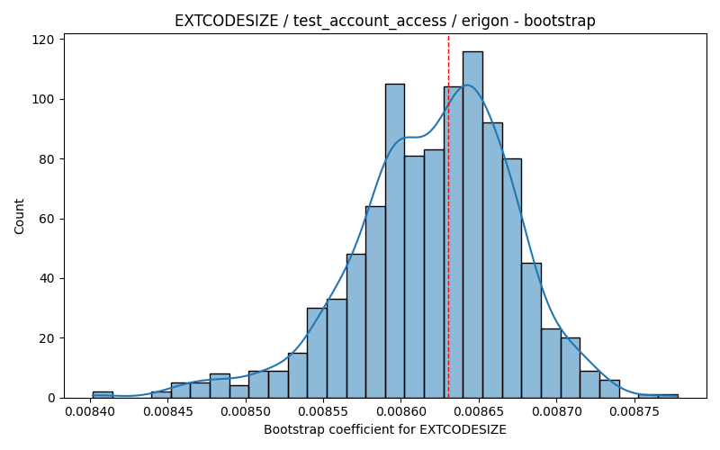

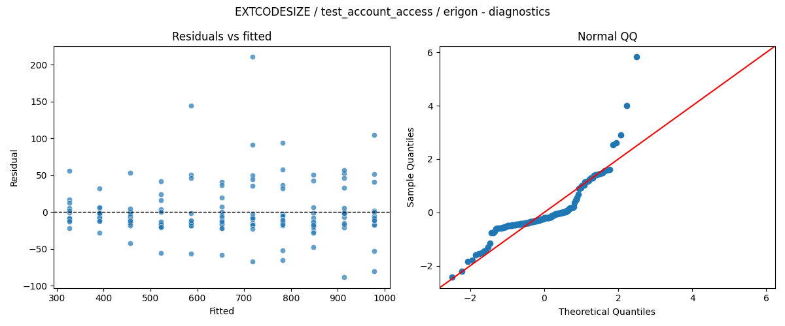

</details>

<details><summary>ethrex — NNLS regression summary</summary>

```
==============================================================================
                           NNLS Regression Results                            
==============================================================================
Dep. Variable:          test_runtime_ms              R-squared:          0.967
Model:                  NNLS                    Adj. R-squared:          0.967
No. Observations:       440                               RMSE:           8.73
Df Residuals:           438                                MAE:           6.92
Df Model:               1      
==============================================================================
                      coef     std err     P-value      [0.025      0.975]
------------------------------------------------------------------------------
         const     28.1826      1.3046       0.001     25.7035     30.7240
       opcount      0.0020      0.0000       0.001      0.0019      0.0020
==============================================================================
Notes: Non-negative least squares with bootstrap inference (1000 iterations)
==============================================================================
```

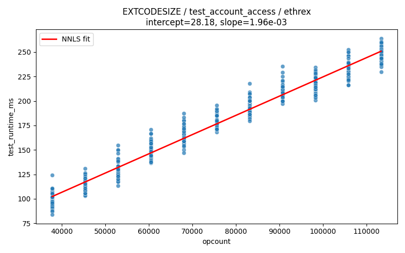

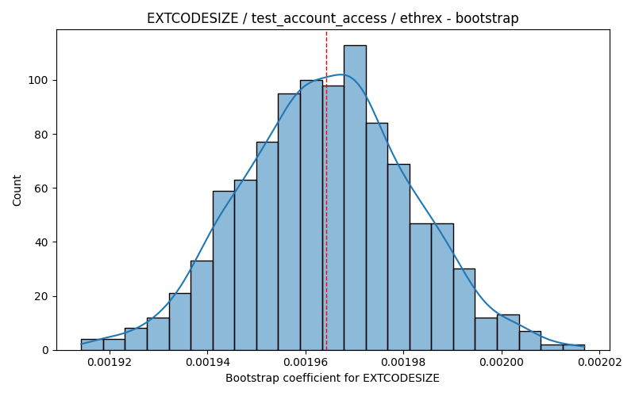


</details>

<details><summary>geth — NNLS regression summary</summary>

```
==============================================================================
                           NNLS Regression Results                            
==============================================================================
Dep. Variable:          test_runtime_ms              R-squared:          0.861
Model:                  NNLS                    Adj. R-squared:          0.860
No. Observations:       440                               RMSE:         207.98
Df Residuals:           438                                MAE:         175.77
Df Model:               1      
==============================================================================
                      coef     std err     P-value      [0.025      0.975]
------------------------------------------------------------------------------
         const    710.4148     38.4370       0.001    637.4818    788.0249
       opcount      0.0216      0.0004       0.001      0.0208      0.0225
==============================================================================
Notes: Non-negative least squares with bootstrap inference (1000 iterations)
==============================================================================
```


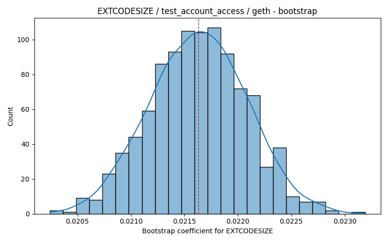

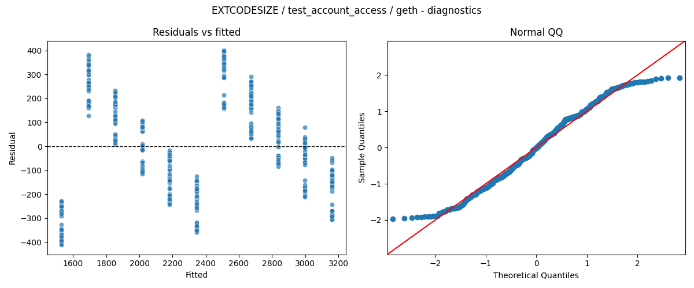

</details>

<details><summary>nethermind — NNLS regression summary</summary>

```
==============================================================================
                           NNLS Regression Results                            
==============================================================================
Dep. Variable:          test_runtime_ms              R-squared:          0.830
Model:                  NNLS                    Adj. R-squared:          0.829
No. Observations:       363                               RMSE:          42.08
Df Residuals:           361                                MAE:          32.03
Df Model:               1      
==============================================================================
                      coef     std err     P-value      [0.025      0.975]
------------------------------------------------------------------------------
         const     63.5222      6.7258       0.001     49.7278     76.8091
       opcount      0.0039      0.0001       0.001      0.0037      0.0041
==============================================================================
Notes: Non-negative least squares with bootstrap inference (1000 iterations)
==============================================================================
```

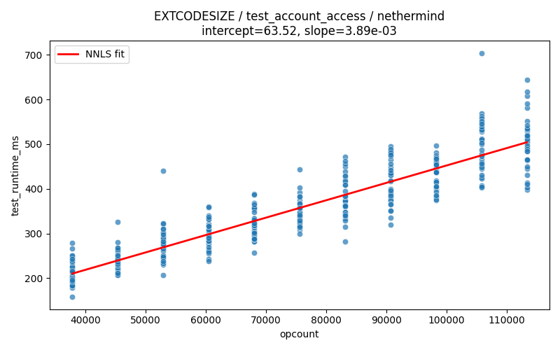

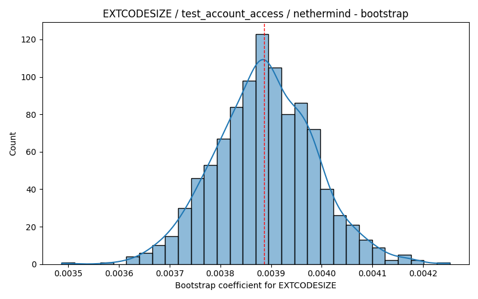

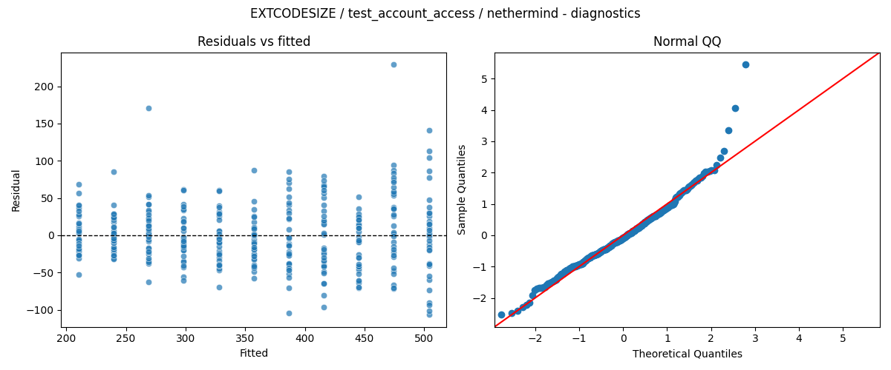

</details>

<details><summary>reth — NNLS regression summary</summary>

```
==============================================================================
                           NNLS Regression Results                            
==============================================================================
Dep. Variable:          test_runtime_ms              R-squared:          0.866
Model:                  NNLS                    Adj. R-squared:          0.866
No. Observations:       539                               RMSE:           6.61
Df Residuals:           537                                MAE:           5.16
Df Model:               1      
==============================================================================
                      coef     std err     P-value      [0.025      0.975]
------------------------------------------------------------------------------
         const     50.7216      0.9220       0.001     48.8841     52.5297
       opcount      0.0007      0.0000       0.001      0.0007      0.0007
==============================================================================
Notes: Non-negative least squares with bootstrap inference (1000 iterations)
==============================================================================
```

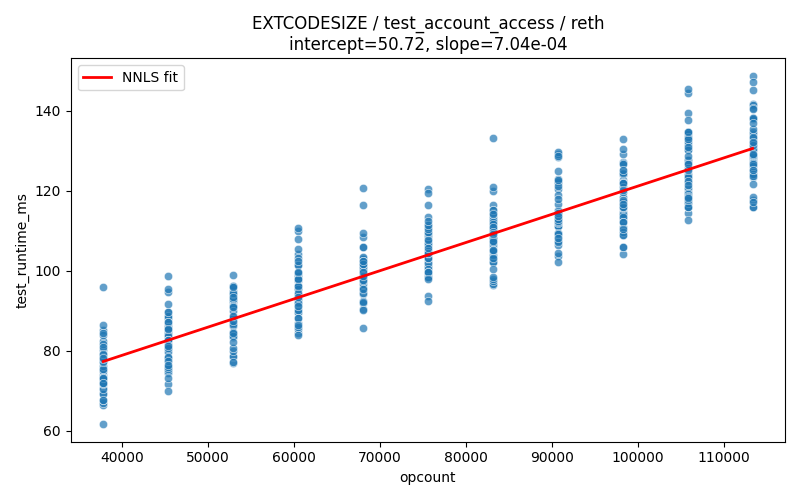

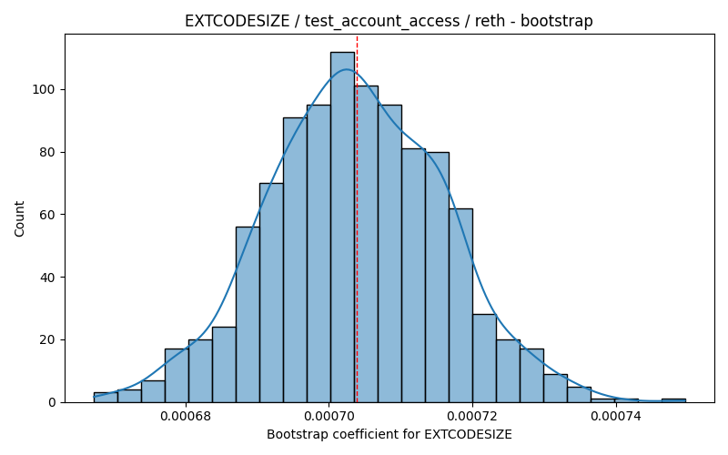

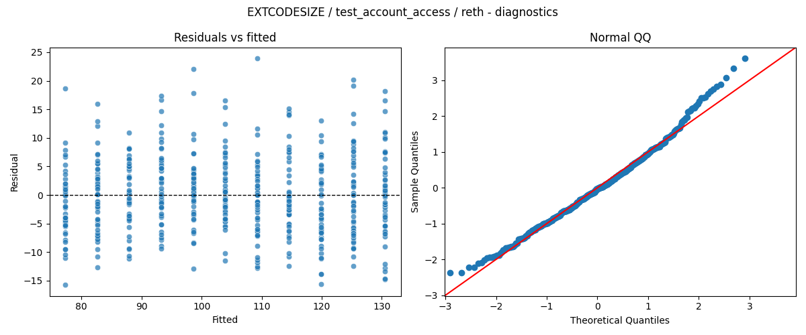

</details>

### test_account_access — combo `EXTCODESIZE_AccountMode.EXISTING_CONTRACT`

| client | nobs | R² | target_coef (ms) | p-value | 95% CI |
| --- | --- | --- | --- | --- | --- |
| `besu` | 462 | 0.8956 | 0.025 | 1.00e-03 | [0.0243, 0.02573] |
| `erigon` | 154 | 0.571 | 0.04476 | 1.00e-03 | [0.0384, 0.05106] |
| `ethrex` | 440 | 0.9934 | 0.007737 | 1.00e-03 | [0.007682, 0.007793] |
| `geth` | 440 | 0.8582 | 0.02304 | 1.00e-03 | [0.02212, 0.02399] |
| `nethermind` | 363 | 0.5514 | 0.01273 | 1.00e-03 | [0.01151, 0.0141] |
| `reth` | 539 | 0.9755 | 0.003991 | 1.00e-03 | [0.003937, 0.004047] |

<details><summary>besu — NNLS regression summary</summary>

```
==============================================================================
                           NNLS Regression Results                            
==============================================================================
Dep. Variable:          test_runtime_ms              R-squared:          0.896
Model:                  NNLS                    Adj. R-squared:          0.895
No. Observations:       462                               RMSE:         177.56
Df Residuals:           460                                MAE:         143.68
Df Model:               1      
==============================================================================
                      coef     std err     P-value      [0.025      0.975]
------------------------------------------------------------------------------
         const    535.0325     24.2544       0.001    487.9991    580.1956
       opcount      0.0250      0.0004       0.001      0.0243      0.0257
==============================================================================
Notes: Non-negative least squares with bootstrap inference (1000 iterations)
==============================================================================
```

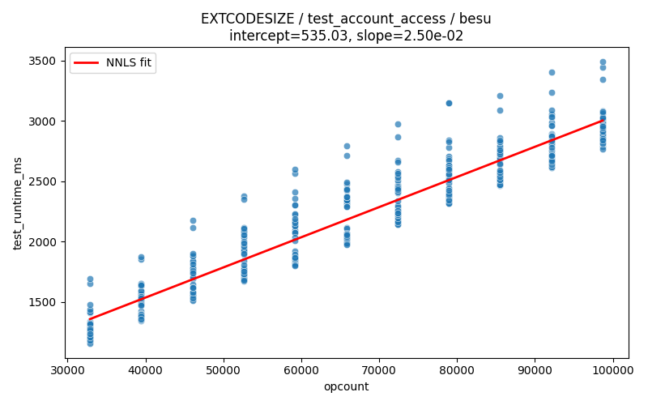

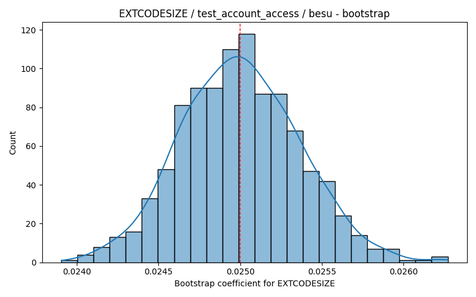

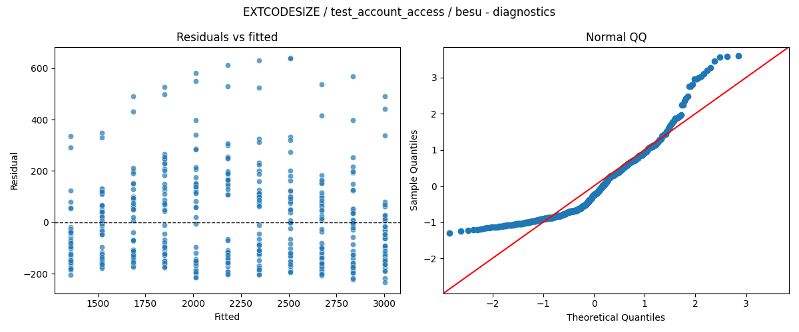

</details>

<details><summary>erigon — NNLS regression summary</summary>

```
==============================================================================
                           NNLS Regression Results                            
==============================================================================
Dep. Variable:          test_runtime_ms              R-squared:          0.571
Model:                  NNLS                    Adj. R-squared:          0.568
No. Observations:       154                               RMSE:         807.21
Df Residuals:           152                                MAE:         547.93
Df Model:               1      
==============================================================================
                      coef     std err     P-value      [0.025      0.975]
------------------------------------------------------------------------------
         const    765.7073    193.2428       0.001    375.4826   1149.7004
       opcount      0.0448      0.0031       0.001      0.0384      0.0511
==============================================================================
Notes: Non-negative least squares with bootstrap inference (1000 iterations)
==============================================================================
```

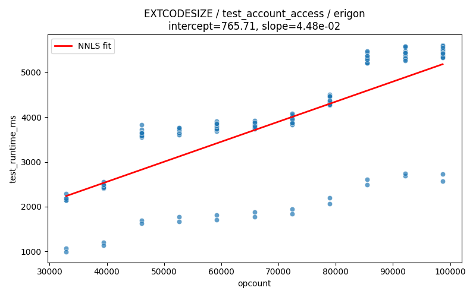

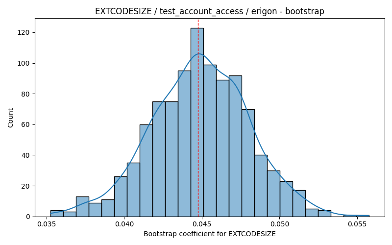

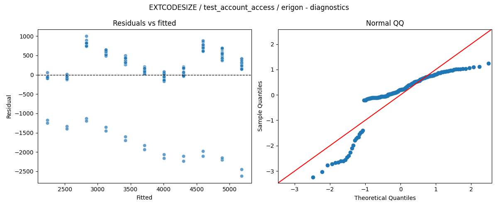

</details>

<details><summary>ethrex — NNLS regression summary</summary>

```
==============================================================================
                           NNLS Regression Results                            
==============================================================================
Dep. Variable:          test_runtime_ms              R-squared:          0.993
Model:                  NNLS                    Adj. R-squared:          0.993
No. Observations:       440                               RMSE:          13.15
Df Residuals:           438                                MAE:          10.57
Df Model:               1      
==============================================================================
                      coef     std err     P-value      [0.025      0.975]
------------------------------------------------------------------------------
         const     41.0960      1.9592       0.001     37.3413     44.7830
       opcount      0.0077      0.0000       0.001      0.0077      0.0078
==============================================================================
Notes: Non-negative least squares with bootstrap inference (1000 iterations)
==============================================================================
```

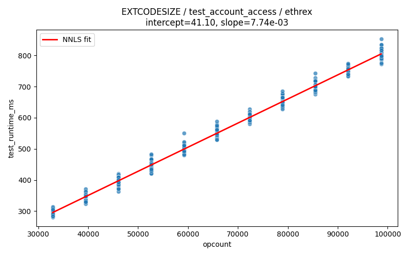

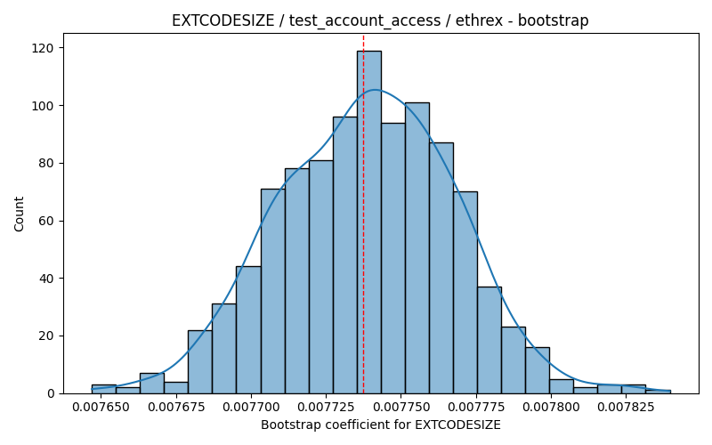

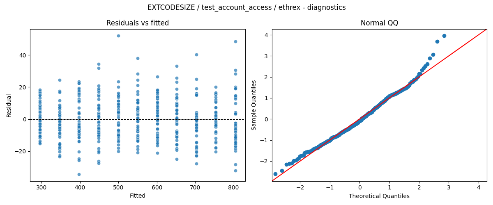

</details>

<details><summary>geth — NNLS regression summary</summary>

```
==============================================================================
                           NNLS Regression Results                            
==============================================================================
Dep. Variable:          test_runtime_ms              R-squared:          0.858
Model:                  NNLS                    Adj. R-squared:          0.858
No. Observations:       440                               RMSE:         194.90
Df Residuals:           438                                MAE:         163.50
Df Model:               1      
==============================================================================
                      coef     std err     P-value      [0.025      0.975]
------------------------------------------------------------------------------
         const    680.8953     35.1788       0.001    613.7106    749.0011
       opcount      0.0230      0.0005       0.001      0.0221      0.0240
==============================================================================
Notes: Non-negative least squares with bootstrap inference (1000 iterations)
==============================================================================
```

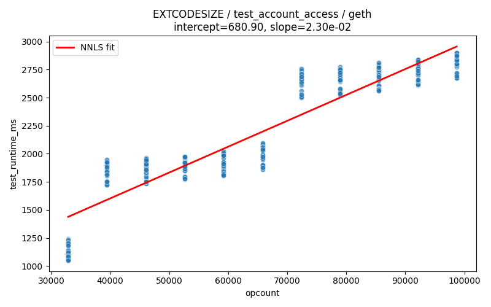

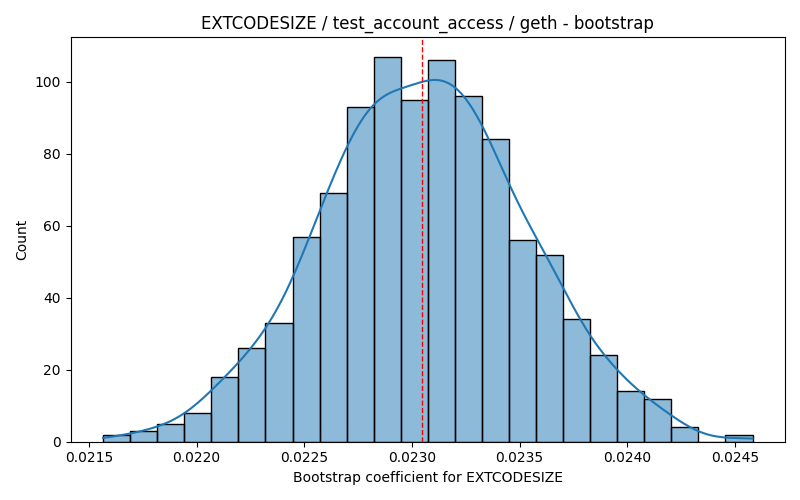

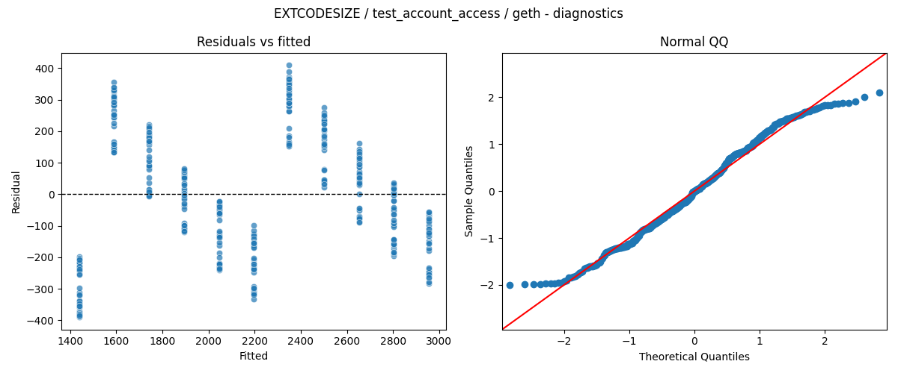

</details>

<details><summary>nethermind — NNLS regression summary</summary>

```
==============================================================================
                           NNLS Regression Results                            
==============================================================================
Dep. Variable:          test_runtime_ms              R-squared:          0.551
Model:                  NNLS                    Adj. R-squared:          0.550
No. Observations:       363                               RMSE:         238.94
Df Residuals:           361                                MAE:         173.47
Df Model:               1      
==============================================================================
                      coef     std err     P-value      [0.025      0.975]
------------------------------------------------------------------------------
         const    172.8147     37.8197       0.001     98.0049    245.9797
       opcount      0.0127      0.0007       0.001      0.0115      0.0141
==============================================================================
Notes: Non-negative least squares with bootstrap inference (1000 iterations)
==============================================================================
```

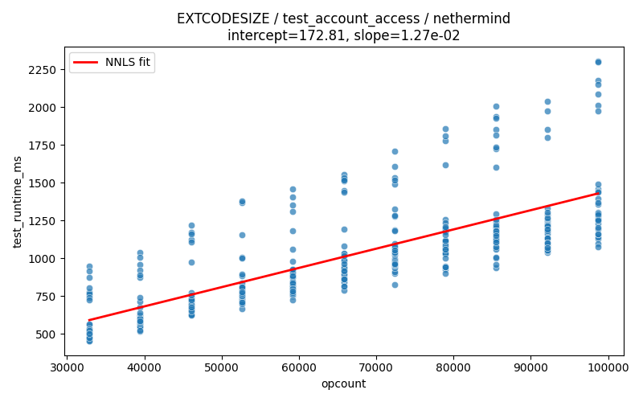

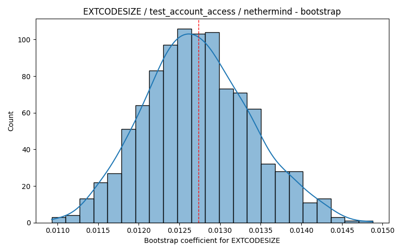

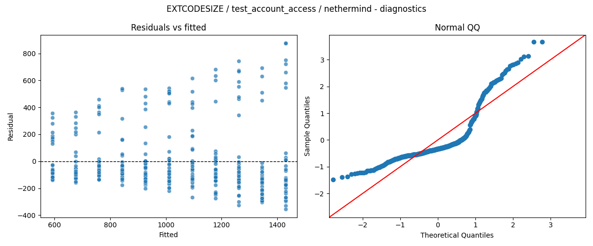

</details>

<details><summary>reth — NNLS regression summary</summary>

```
==============================================================================
                           NNLS Regression Results                            
==============================================================================
Dep. Variable:          test_runtime_ms              R-squared:          0.975
Model:                  NNLS                    Adj. R-squared:          0.975
No. Observations:       539                               RMSE:          13.17
Df Residuals:           537                                MAE:          10.47
Df Model:               1      
==============================================================================
                      coef     std err     P-value      [0.025      0.975]
------------------------------------------------------------------------------
         const    100.7666      1.7946       0.001     97.2241    104.3341
       opcount      0.0040      0.0000       0.001      0.0039      0.0040
==============================================================================
Notes: Non-negative least squares with bootstrap inference (1000 iterations)
==============================================================================
```

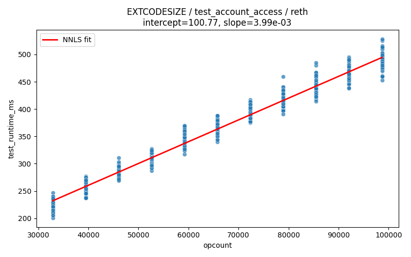

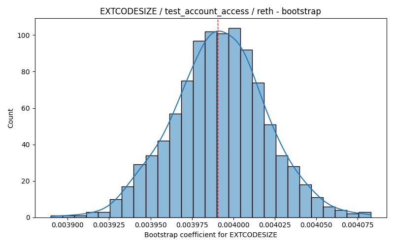

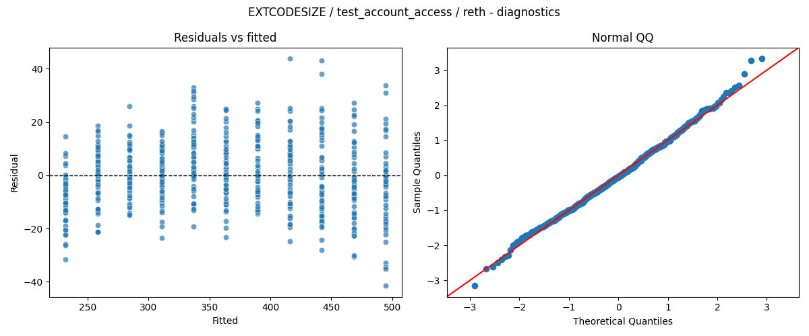

</details>

### test_account_access — combo `EXTCODESIZE_AccountMode.NON_EXISTING_ACCOUNT` — `presets[cold_account_code_access]`

| client | nobs | R² | target_coef (ms) | p-value | 95% CI |
| --- | --- | --- | --- | --- | --- |
| `besu` | 462 | 0.8284 | 0.013 | 1.00e-03 | [0.01247, 0.01356] |
| `erigon` | 154 | 0.9705 | 0.008631 | 1.00e-03 | [0.0085, 0.008711] |
| `ethrex` | 440 | 0.9666 | 0.001964 | 1.00e-03 | [0.001931, 0.001998] |
| `geth` | 440 | 0.8607 | 0.02163 | 1.00e-03 | [0.02078, 0.02251] |
| `nethermind` | 363 | 0.8297 | 0.003886 | 1.00e-03 | [0.003695, 0.004086] |
| `reth` | 539 | 0.8664 | 0.0007039 | 1.00e-03 | [0.0006794, 0.0007279] |

<details><summary>besu — NNLS regression summary</summary>

```
==============================================================================
                           NNLS Regression Results                            
==============================================================================
Dep. Variable:          test_runtime_ms              R-squared:          0.828
Model:                  NNLS                    Adj. R-squared:          0.828
No. Observations:       462                               RMSE:         141.39
Df Residuals:           460                                MAE:         125.67
Df Model:               1      
==============================================================================
                      coef     std err     P-value      [0.025      0.975]
------------------------------------------------------------------------------
         const    499.7635     22.0395       0.001    455.6680    541.8655
       opcount      0.0130      0.0003       0.001      0.0125      0.0136
==============================================================================
Notes: Non-negative least squares with bootstrap inference (1000 iterations)
==============================================================================
```


</details>

<details><summary>erigon — NNLS regression summary</summary>

```
==============================================================================
                           NNLS Regression Results                            
==============================================================================
Dep. Variable:          test_runtime_ms              R-squared:          0.971
Model:                  NNLS                    Adj. R-squared:          0.970
No. Observations:       154                               RMSE:          36.19
Df Residuals:           152                                MAE:          23.46
Df Model:               1      
==============================================================================
                      coef     std err     P-value      [0.025      0.975]
------------------------------------------------------------------------------
         const      0.0000      2.1954       1.000      0.0000      8.0747
       opcount      0.0086      0.0001       0.001      0.0085      0.0087
==============================================================================
Notes: Non-negative least squares with bootstrap inference (1000 iterations)
==============================================================================
```


</details>

<details><summary>ethrex — NNLS regression summary</summary>

```
==============================================================================
                           NNLS Regression Results                            
==============================================================================
Dep. Variable:          test_runtime_ms              R-squared:          0.967
Model:                  NNLS                    Adj. R-squared:          0.967
No. Observations:       440                               RMSE:           8.73
Df Residuals:           438                                MAE:           6.92
Df Model:               1      
==============================================================================
                      coef     std err     P-value      [0.025      0.975]
------------------------------------------------------------------------------
         const     28.1826      1.3046       0.001     25.7035     30.7240
       opcount      0.0020      0.0000       0.001      0.0019      0.0020
==============================================================================
Notes: Non-negative least squares with bootstrap inference (1000 iterations)
==============================================================================
```


</details>

<details><summary>geth — NNLS regression summary</summary>

```
==============================================================================
                           NNLS Regression Results                            
==============================================================================
Dep. Variable:          test_runtime_ms              R-squared:          0.861
Model:                  NNLS                    Adj. R-squared:          0.860
No. Observations:       440                               RMSE:         207.98
Df Residuals:           438                                MAE:         175.77
Df Model:               1      
==============================================================================
                      coef     std err     P-value      [0.025      0.975]
------------------------------------------------------------------------------
         const    710.4148     38.4370       0.001    637.4818    788.0249
       opcount      0.0216      0.0004       0.001      0.0208      0.0225
==============================================================================
Notes: Non-negative least squares with bootstrap inference (1000 iterations)
==============================================================================
```


</details>

<details><summary>nethermind — NNLS regression summary</summary>

```
==============================================================================
                           NNLS Regression Results                            
==============================================================================
Dep. Variable:          test_runtime_ms              R-squared:          0.830
Model:                  NNLS                    Adj. R-squared:          0.829
No. Observations:       363                               RMSE:          42.08
Df Residuals:           361                                MAE:          32.03
Df Model:               1      
==============================================================================
                      coef     std err     P-value      [0.025      0.975]
------------------------------------------------------------------------------
         const     63.5222      6.7258       0.001     49.7278     76.8091
       opcount      0.0039      0.0001       0.001      0.0037      0.0041
==============================================================================
Notes: Non-negative least squares with bootstrap inference (1000 iterations)
==============================================================================
```


</details>

<details><summary>reth — NNLS regression summary</summary>

```
==============================================================================
                           NNLS Regression Results                            
==============================================================================
Dep. Variable:          test_runtime_ms              R-squared:          0.866
Model:                  NNLS                    Adj. R-squared:          0.866
No. Observations:       539                               RMSE:           6.61
Df Residuals:           537                                MAE:           5.16
Df Model:               1      
==============================================================================
                      coef     std err     P-value      [0.025      0.975]
------------------------------------------------------------------------------
         const     50.7216      0.9220       0.001     48.8841     52.5297
       opcount      0.0007      0.0000       0.001      0.0007      0.0007
==============================================================================
Notes: Non-negative least squares with bootstrap inference (1000 iterations)
==============================================================================
```


</details>

### test_ext_account_query_warm — combo `EXTCODESIZE`

| client | nobs | R² | target_coef (ms) | p-value | 95% CI |
| --- | --- | --- | --- | --- | --- |
| `besu` | 462 | 0.2713 | 0.0002102 | 1.00e-03 | [0.0001785, 0.0002427] |
| `erigon` | 154 | 0.8643 | 6.301e-05 | 1.00e-03 | [5.909e-05, 6.677e-05] |
| `ethrex` | 440 | 0.1872 | 1.25e-05 | 1.00e-03 | [9.968e-06, 1.464e-05] |
| `geth` | 440 | 0.76 | 3.031e-05 | 1.00e-03 | [2.86e-05, 3.193e-05] |
| `nethermind` | 363 | 0.6543 | 0.0001627 | 1.00e-03 | [0.0001499, 0.000175] |
| `reth` | 539 | 0.5849 | 8.371e-06 | 1.00e-03 | [7.755e-06, 8.963e-06] |

<details><summary>besu — NNLS regression summary</summary>

```
==============================================================================
                           NNLS Regression Results                            
==============================================================================
Dep. Variable:          test_runtime_ms              R-squared:          0.271
Model:                  NNLS                    Adj. R-squared:          0.270
No. Observations:       462                               RMSE:         201.52
Df Residuals:           460                                MAE:         166.76
Df Model:               1      
==============================================================================
                      coef     std err     P-value      [0.025      0.975]
------------------------------------------------------------------------------
         const    439.2588     29.5402       0.001    381.8639    498.9665
       opcount      0.0002      0.0000       0.001      0.0002      0.0002
==============================================================================
Notes: Non-negative least squares with bootstrap inference (1000 iterations)
==============================================================================
```

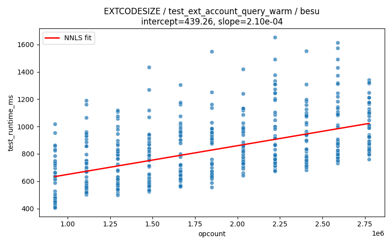

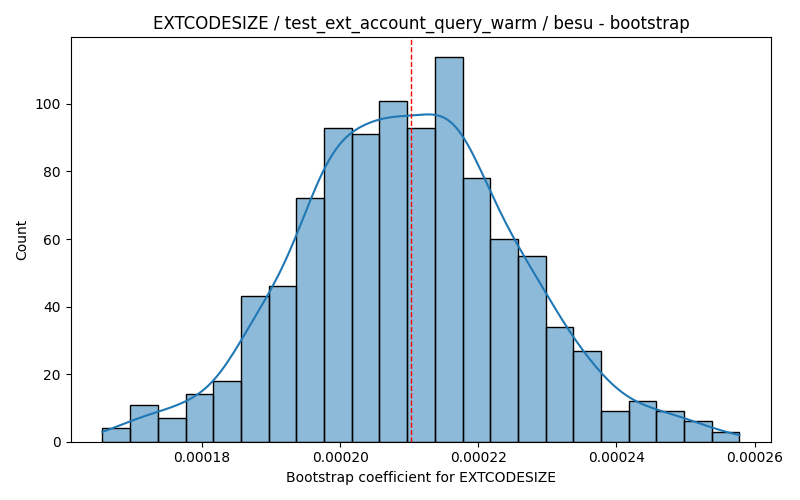

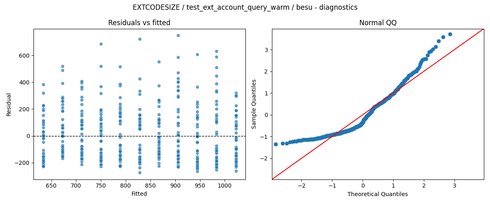

</details>

<details><summary>erigon — NNLS regression summary</summary>

```
==============================================================================
                           NNLS Regression Results                            
==============================================================================
Dep. Variable:          test_runtime_ms              R-squared:          0.864
Model:                  NNLS                    Adj. R-squared:          0.863
No. Observations:       154                               RMSE:          14.60
Df Residuals:           152                                MAE:           9.59
Df Model:               1      
==============================================================================
                      coef     std err     P-value      [0.025      0.975]
------------------------------------------------------------------------------
         const     24.1840      3.2177       0.001     17.9287     30.5385
       opcount      0.0001      0.0000       0.001      0.0001      0.0001
==============================================================================
Notes: Non-negative least squares with bootstrap inference (1000 iterations)
==============================================================================
```

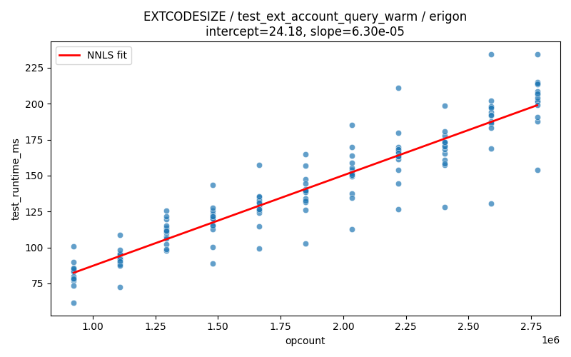

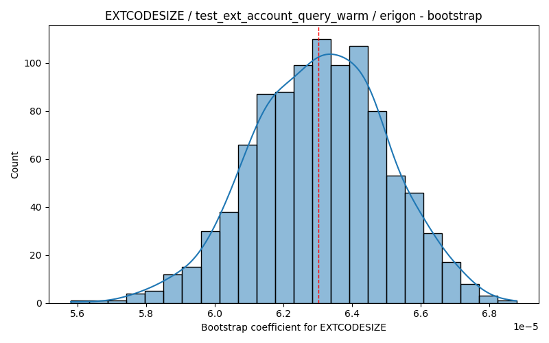

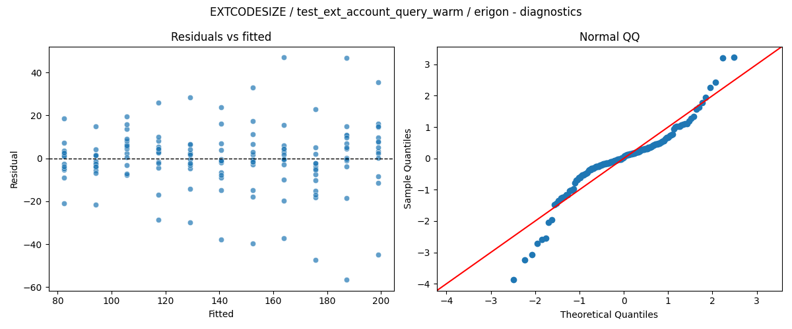

</details>

<details><summary>ethrex — NNLS regression summary</summary>

```
==============================================================================
                           NNLS Regression Results                            
==============================================================================
Dep. Variable:          test_runtime_ms              R-squared:          0.187
Model:                  NNLS                    Adj. R-squared:          0.185
No. Observations:       440                               RMSE:          15.23
Df Residuals:           438                                MAE:          10.48
Df Model:               1      
==============================================================================
                      coef     std err     P-value      [0.025      0.975]
------------------------------------------------------------------------------
         const     18.4976      2.4811       0.001     14.0048     23.7294
       opcount      0.0000      0.0000       0.001      0.0000      0.0000
==============================================================================
Notes: Non-negative least squares with bootstrap inference (1000 iterations)
==============================================================================
```

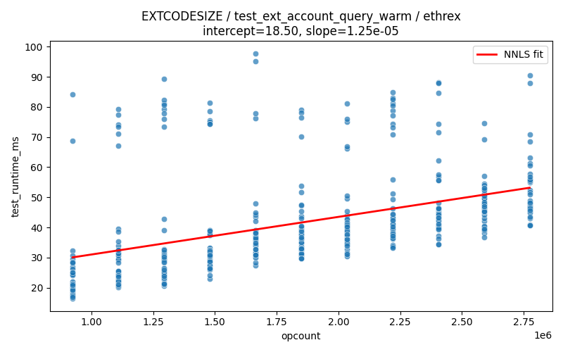

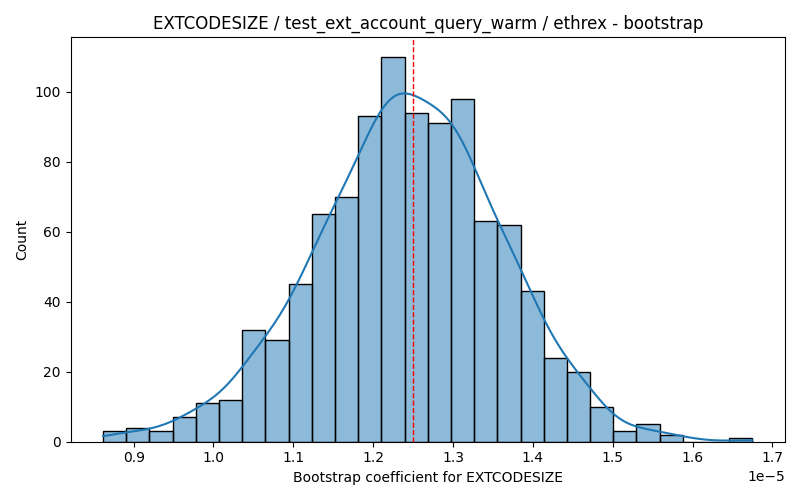

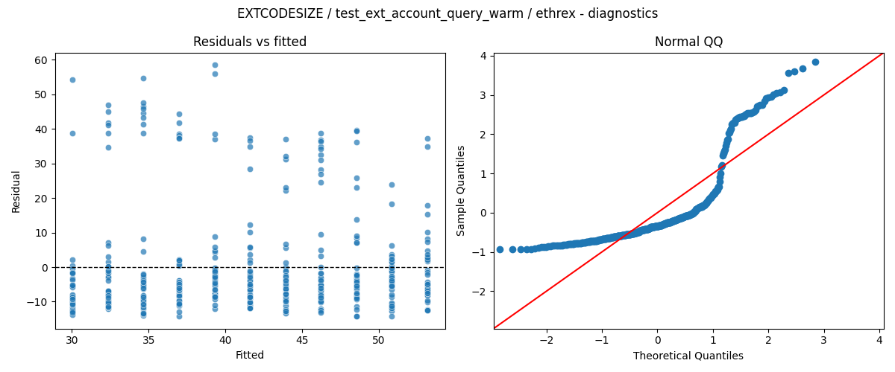

</details>

<details><summary>geth — NNLS regression summary</summary>

```
==============================================================================
                           NNLS Regression Results                            
==============================================================================
Dep. Variable:          test_runtime_ms              R-squared:          0.760
Model:                  NNLS                    Adj. R-squared:          0.759
No. Observations:       440                               RMSE:           9.96
Df Residuals:           438                                MAE:           7.71
Df Model:               1      
==============================================================================
                      coef     std err     P-value      [0.025      0.975]
------------------------------------------------------------------------------
         const     20.3956      1.5369       0.001     17.5155     23.4803
       opcount      0.0000      0.0000       0.001      0.0000      0.0000
==============================================================================
Notes: Non-negative least squares with bootstrap inference (1000 iterations)
==============================================================================
```

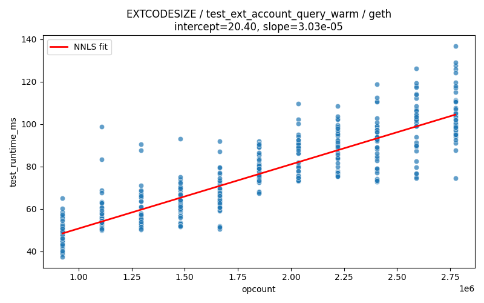

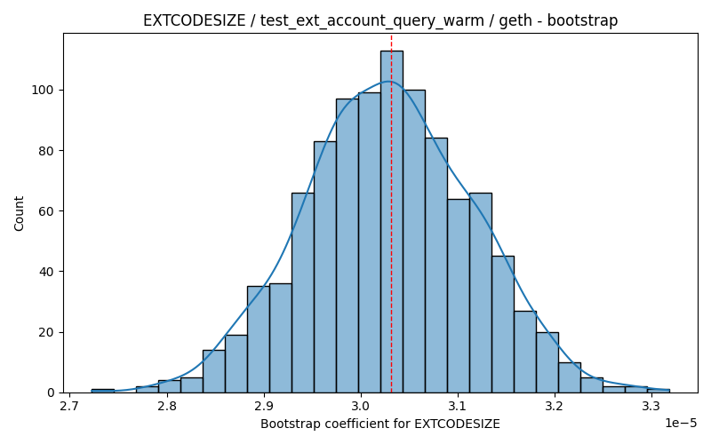

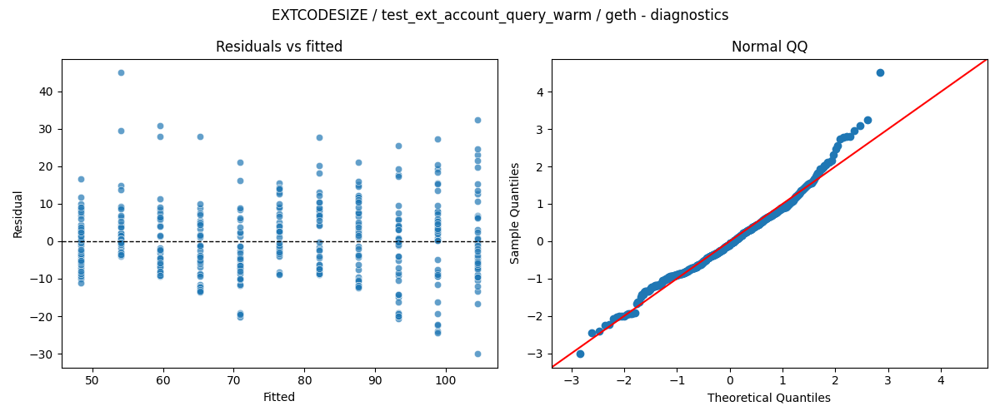

</details>

<details><summary>nethermind — NNLS regression summary</summary>

```
==============================================================================
                           NNLS Regression Results                            
==============================================================================
Dep. Variable:          test_runtime_ms              R-squared:          0.654
Model:                  NNLS                    Adj. R-squared:          0.653
No. Observations:       363                               RMSE:          69.15
Df Residuals:           361                                MAE:          53.34
Df Model:               1      
==============================================================================
                      coef     std err     P-value      [0.025      0.975]
------------------------------------------------------------------------------
         const    137.2519     10.8029       0.001    116.3141    159.1374
       opcount      0.0002      0.0000       0.001      0.0001      0.0002
==============================================================================
Notes: Non-negative least squares with bootstrap inference (1000 iterations)
==============================================================================
```

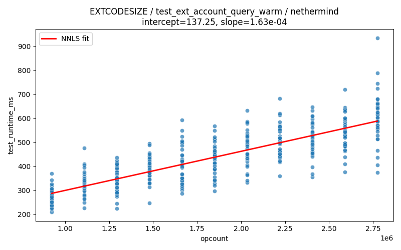

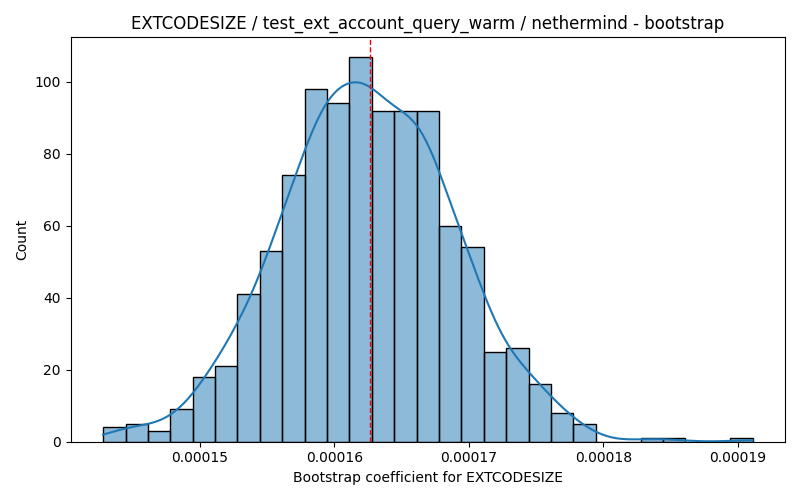

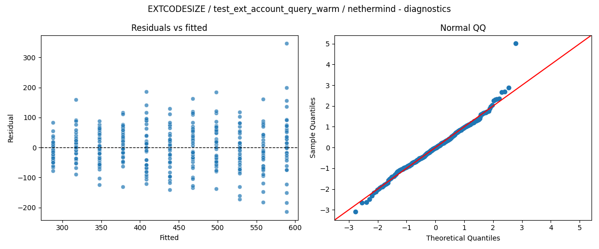

</details>

<details><summary>reth — NNLS regression summary</summary>

```
==============================================================================
                           NNLS Regression Results                            
==============================================================================
Dep. Variable:          test_runtime_ms              R-squared:          0.585
Model:                  NNLS                    Adj. R-squared:          0.584
No. Observations:       539                               RMSE:           4.12
Df Residuals:           537                                MAE:           3.07
Df Model:               1      
==============================================================================
                      coef     std err     P-value      [0.025      0.975]
------------------------------------------------------------------------------
         const      7.7437      0.5460       0.001      6.6477      8.8051
       opcount      0.0000      0.0000       0.001      0.0000      0.0000
==============================================================================
Notes: Non-negative least squares with bootstrap inference (1000 iterations)
==============================================================================
```

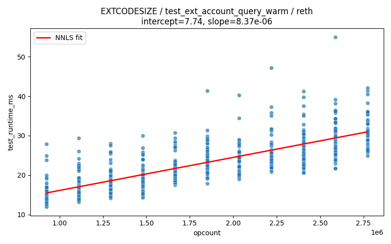

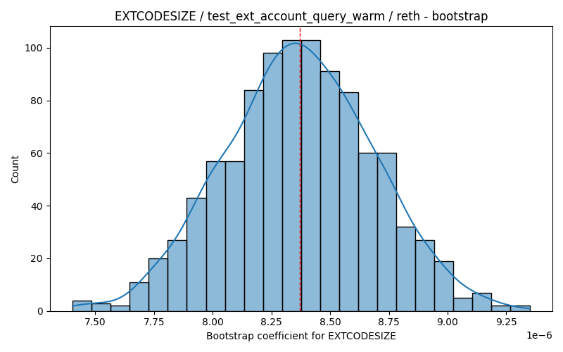

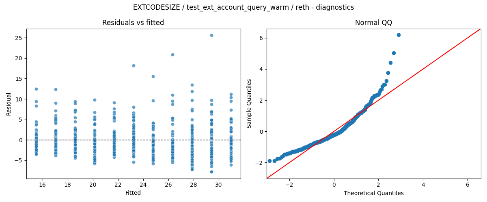

</details>

## STATICCALL

### test_account_access — combo `STATICCALL_AccountMode.EXISTING_EOA`

| client | nobs | R² | target_coef (ms) | p-value | 95% CI |
| --- | --- | --- | --- | --- | --- |
| `besu` | 462 | 0.8538 | 0.01513 | 1.00e-03 | [0.01458, 0.0157] |
| `erigon` | 154 | 0.9608 | 0.01038 | 1.00e-03 | [0.01002, 0.01063] |
| `ethrex` | 440 | 0.9938 | 0.007256 | 1.00e-03 | [0.007199, 0.007315] |
| `geth` | 440 | 0.9108 | 0.01105 | 1.00e-03 | [0.01069, 0.01137] |
| `nethermind` | 363 | 0.8375 | 0.004207 | 1.00e-03 | [0.004028, 0.004403] |
| `reth` | 539 | 0.9249 | 0.001086 | 1.00e-03 | [0.00106, 0.001113] |

<details><summary>besu — NNLS regression summary</summary>

```
==============================================================================
                           NNLS Regression Results                            
==============================================================================
Dep. Variable:          test_runtime_ms              R-squared:          0.854
Model:                  NNLS                    Adj. R-squared:          0.854
No. Observations:       462                               RMSE:         148.81
Df Residuals:           460                                MAE:         118.55
Df Model:               1      
==============================================================================
                      coef     std err     P-value      [0.025      0.975]
------------------------------------------------------------------------------
         const    622.4120     21.6836       0.001    580.4757    665.6600
       opcount      0.0151      0.0003       0.001      0.0146      0.0157
==============================================================================
Notes: Non-negative least squares with bootstrap inference (1000 iterations)
==============================================================================
```

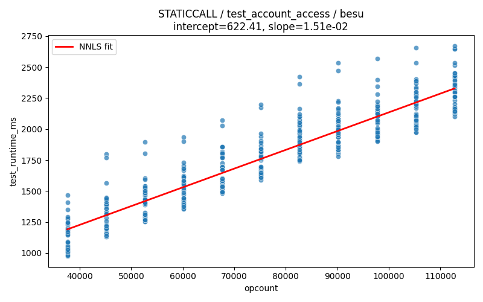

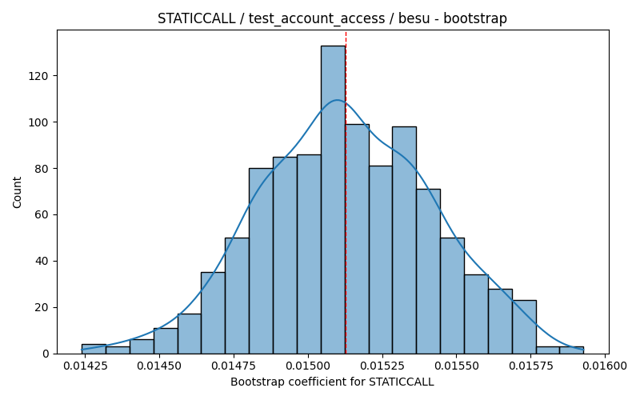

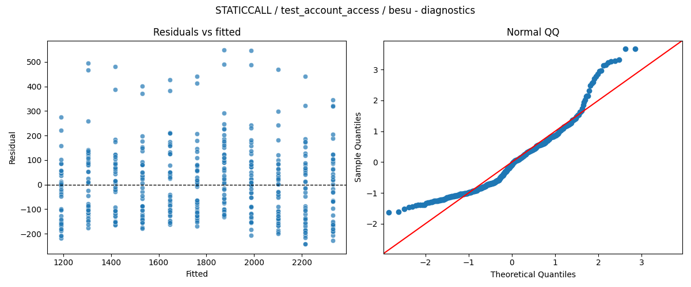

</details>

<details><summary>erigon — NNLS regression summary</summary>

```
==============================================================================
                           NNLS Regression Results                            
==============================================================================
Dep. Variable:          test_runtime_ms              R-squared:          0.961
Model:                  NNLS                    Adj. R-squared:          0.961
No. Observations:       154                               RMSE:          49.87
Df Residuals:           152                                MAE:          32.72
Df Model:               1      
==============================================================================
                      coef     std err     P-value      [0.025      0.975]
------------------------------------------------------------------------------
         const      9.0209     10.3319       0.257      0.0000     32.6311
       opcount      0.0104      0.0002       0.001      0.0100      0.0106
==============================================================================
Notes: Non-negative least squares with bootstrap inference (1000 iterations)
==============================================================================
```

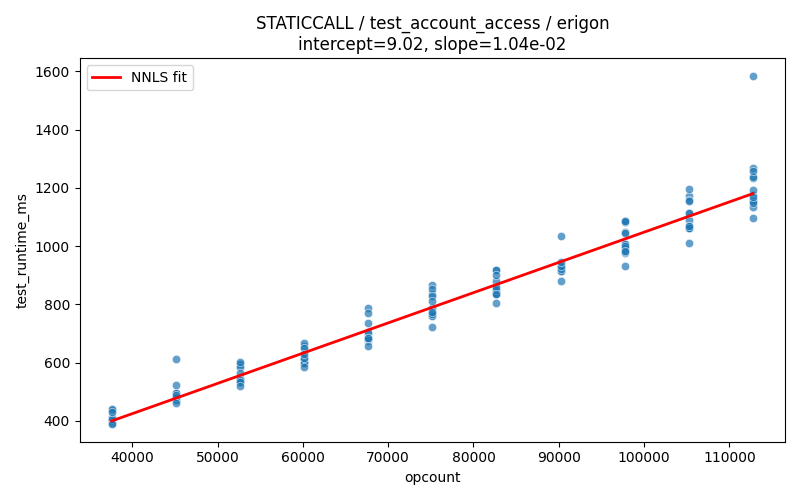

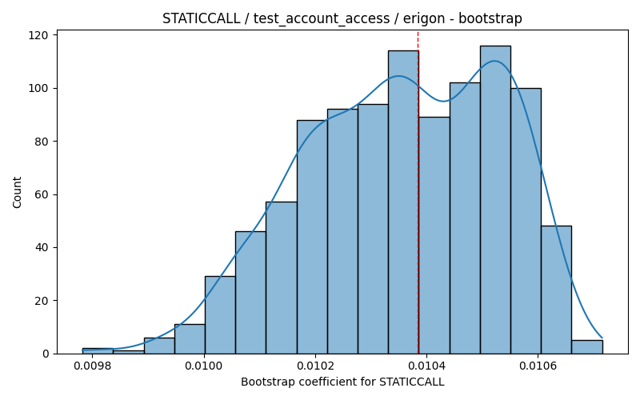

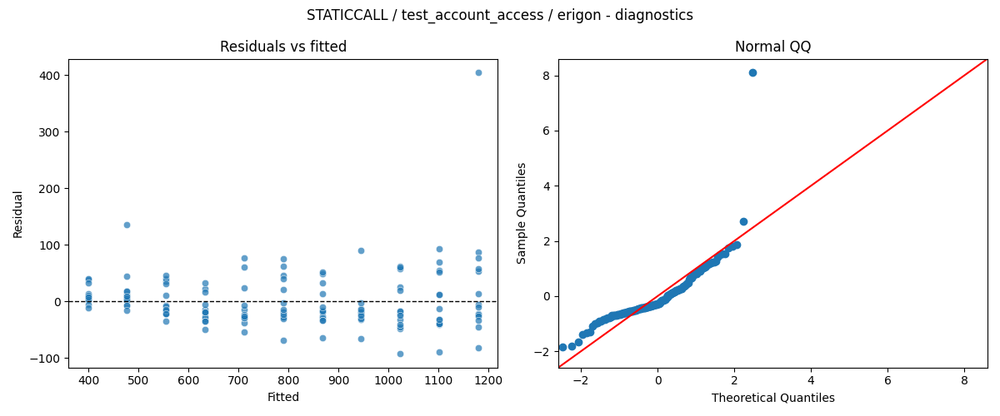

</details>

<details><summary>ethrex — NNLS regression summary</summary>

```
==============================================================================
                           NNLS Regression Results                            
==============================================================================
Dep. Variable:          test_runtime_ms              R-squared:          0.994
Model:                  NNLS                    Adj. R-squared:          0.994
No. Observations:       440                               RMSE:          13.67
Df Residuals:           438                                MAE:          10.61
Df Model:               1      
==============================================================================
                      coef     std err     P-value      [0.025      0.975]
------------------------------------------------------------------------------
         const     47.1729      2.1221       0.001     43.1681     51.4138
       opcount      0.0073      0.0000       0.001      0.0072      0.0073
==============================================================================
Notes: Non-negative least squares with bootstrap inference (1000 iterations)
==============================================================================
```

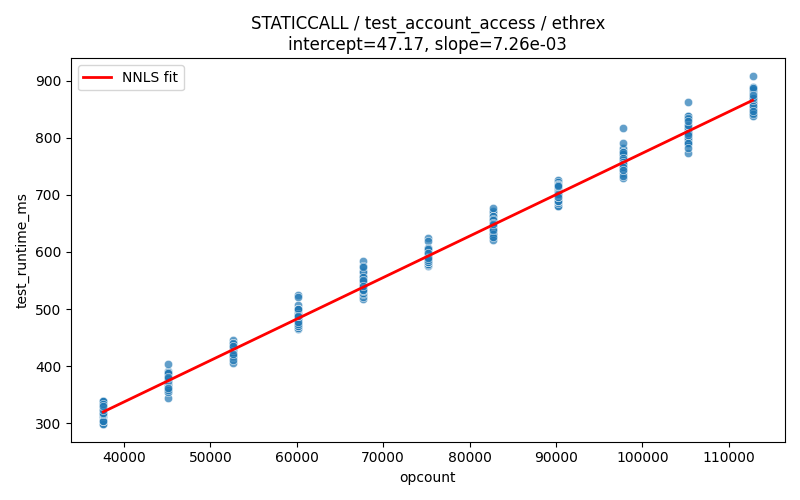

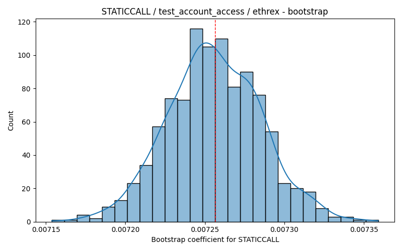

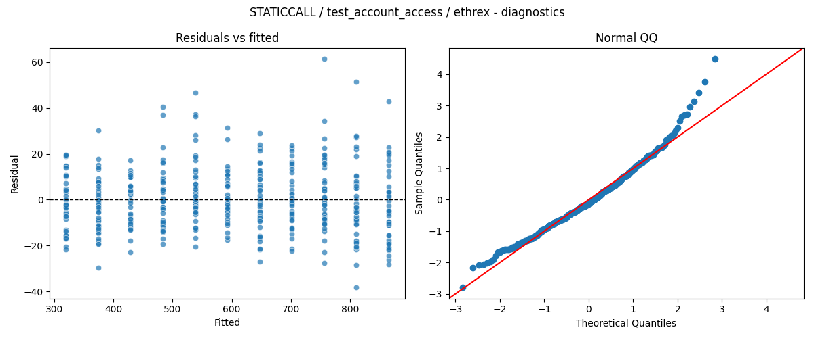

</details>

<details><summary>geth — NNLS regression summary</summary>

```
==============================================================================
                           NNLS Regression Results                            
==============================================================================
Dep. Variable:          test_runtime_ms              R-squared:          0.911
Model:                  NNLS                    Adj. R-squared:          0.911
No. Observations:       440                               RMSE:          82.18
Df Residuals:           438                                MAE:          68.55
Df Model:               1      
==============================================================================
                      coef     std err     P-value      [0.025      0.975]
------------------------------------------------------------------------------
         const    419.8445     15.0253       0.001    392.8272    449.7122
       opcount      0.0110      0.0002       0.001      0.0107      0.0114
==============================================================================
Notes: Non-negative least squares with bootstrap inference (1000 iterations)
==============================================================================
```

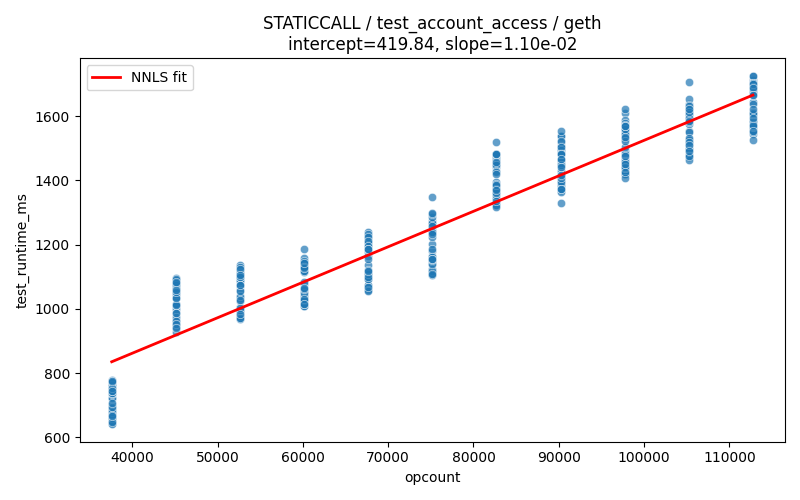

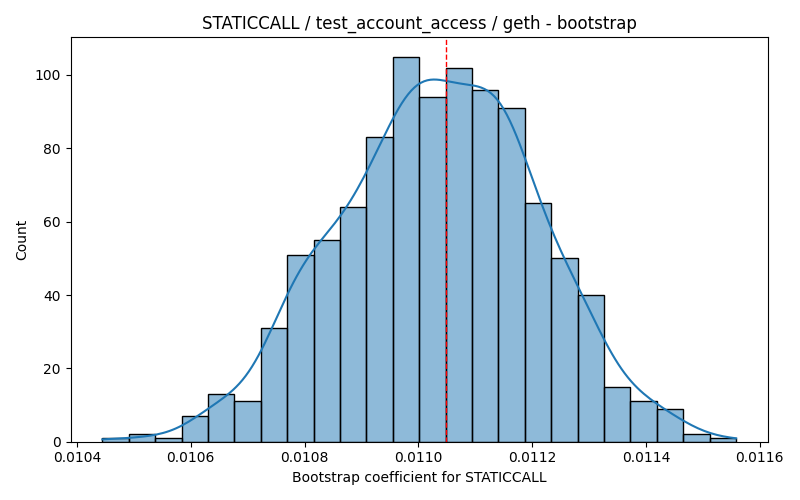

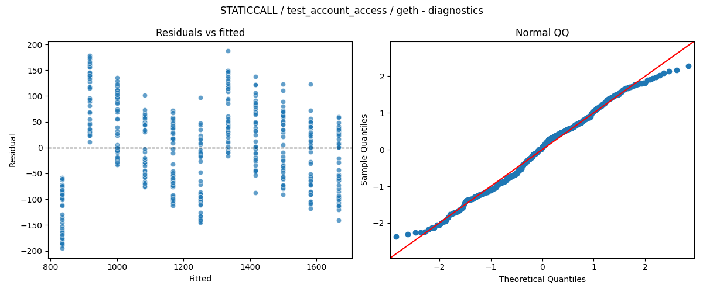

</details>

<details><summary>nethermind — NNLS regression summary</summary>

```
==============================================================================
                           NNLS Regression Results                            
==============================================================================
Dep. Variable:          test_runtime_ms              R-squared:          0.838
Model:                  NNLS                    Adj. R-squared:          0.837
No. Observations:       363                               RMSE:          44.05
Df Residuals:           361                                MAE:          34.22
Df Model:               1      
==============================================================================
                      coef     std err     P-value      [0.025      0.975]
------------------------------------------------------------------------------
         const     88.7085      6.4042       0.001     75.3801    100.9507
       opcount      0.0042      0.0001       0.001      0.0040      0.0044
==============================================================================
Notes: Non-negative least squares with bootstrap inference (1000 iterations)
==============================================================================
```

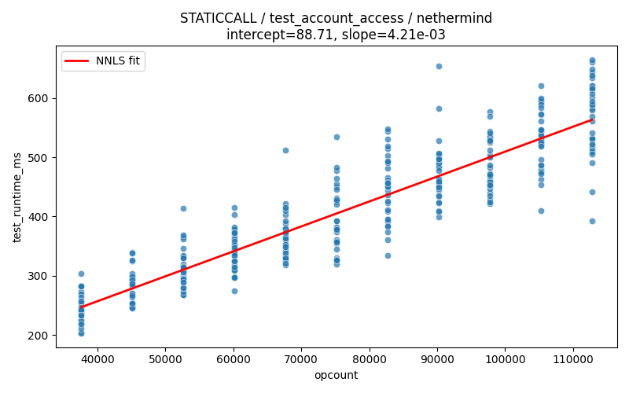

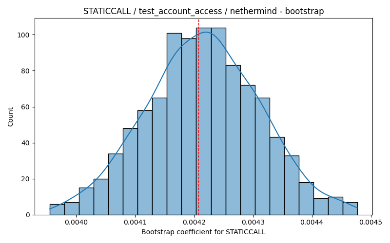

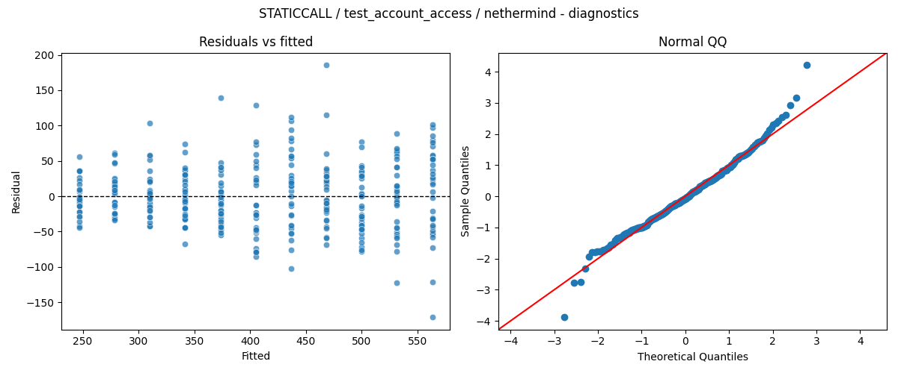

</details>

<details><summary>reth — NNLS regression summary</summary>

```
==============================================================================
                           NNLS Regression Results                            
==============================================================================
Dep. Variable:          test_runtime_ms              R-squared:          0.925
Model:                  NNLS                    Adj. R-squared:          0.925
No. Observations:       539                               RMSE:           7.35
Df Residuals:           537                                MAE:           5.84
Df Model:               1      
==============================================================================
                      coef     std err     P-value      [0.025      0.975]
------------------------------------------------------------------------------
         const     47.8605      1.0525       0.001     45.7823     49.9716
       opcount      0.0011      0.0000       0.001      0.0011      0.0011
==============================================================================
Notes: Non-negative least squares with bootstrap inference (1000 iterations)
==============================================================================
```

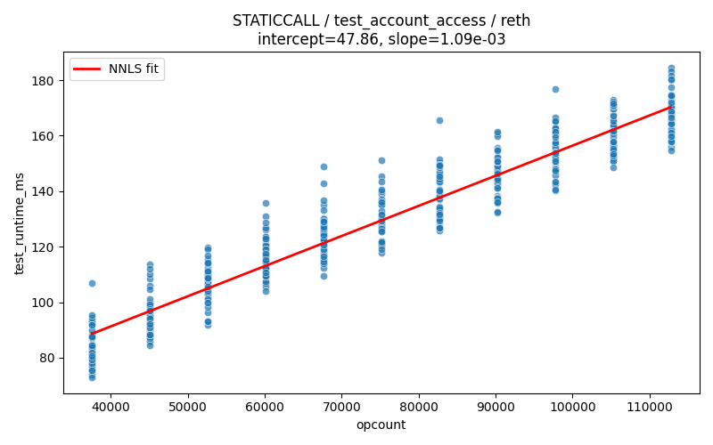

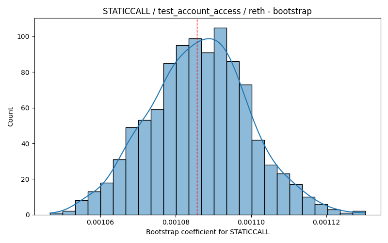

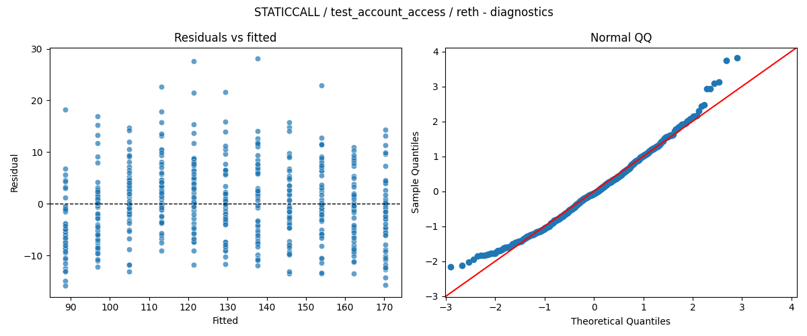

</details>

### test_account_access — combo `STATICCALL_AccountMode.NON_EXISTING_ACCOUNT` — `presets[cold_account_nocode_access]`

| client | nobs | R² | target_coef (ms) | p-value | 95% CI |
| --- | --- | --- | --- | --- | --- |
| `besu` | 462 | 0.8256 | 0.01581 | 1.00e-03 | [0.01517, 0.0164] |
| `erigon` | 154 | 0.9683 | 0.01151 | 1.00e-03 | [0.01112, 0.01165] |
| `ethrex` | 440 | 0.9636 | 0.002025 | 1.00e-03 | [0.00199, 0.002063] |
| `geth` | 440 | 0.8652 | 0.02264 | 1.00e-03 | [0.02179, 0.0235] |
| `nethermind` | 363 | 0.8388 | 0.003956 | 1.00e-03 | [0.003783, 0.004134] |
| `reth` | 539 | 0.8745 | 0.0007603 | 1.00e-03 | [0.0007342, 0.0007845] |

<details><summary>besu — NNLS regression summary</summary>

```
==============================================================================
                           NNLS Regression Results                            
==============================================================================
Dep. Variable:          test_runtime_ms              R-squared:          0.826
Model:                  NNLS                    Adj. R-squared:          0.825
No. Observations:       462                               RMSE:         172.74
Df Residuals:           460                                MAE:         154.64
Df Model:               1      
==============================================================================
                      coef     std err     P-value      [0.025      0.975]
------------------------------------------------------------------------------
         const    535.7511     25.1270       0.001    488.1770    587.1666
       opcount      0.0158      0.0003       0.001      0.0152      0.0164
==============================================================================
Notes: Non-negative least squares with bootstrap inference (1000 iterations)
==============================================================================
```

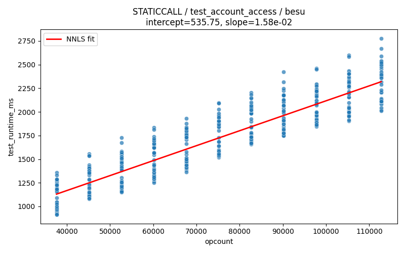

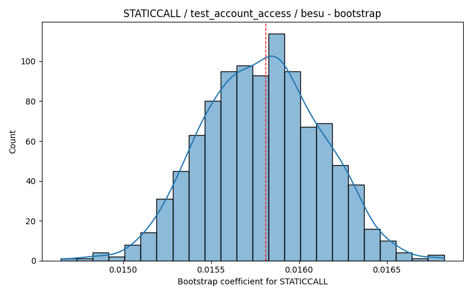

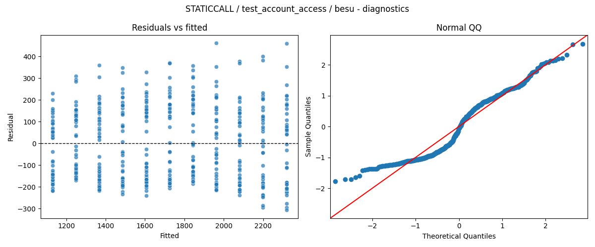

</details>

<details><summary>erigon — NNLS regression summary</summary>

```
==============================================================================
                           NNLS Regression Results                            
==============================================================================
Dep. Variable:          test_runtime_ms              R-squared:          0.968
Model:                  NNLS                    Adj. R-squared:          0.968
No. Observations:       154                               RMSE:          49.50
Df Residuals:           152                                MAE:          35.54
Df Model:               1      
==============================================================================
                      coef     std err     P-value      [0.025      0.975]
------------------------------------------------------------------------------
         const      3.7063      8.3533       0.394      0.0000     27.0973
       opcount      0.0115      0.0001       0.001      0.0111      0.0117
==============================================================================
Notes: Non-negative least squares with bootstrap inference (1000 iterations)
==============================================================================
```

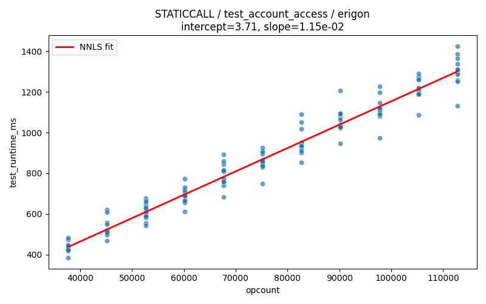

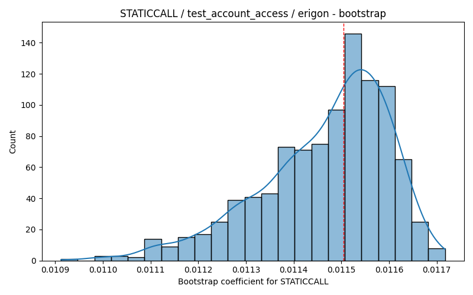

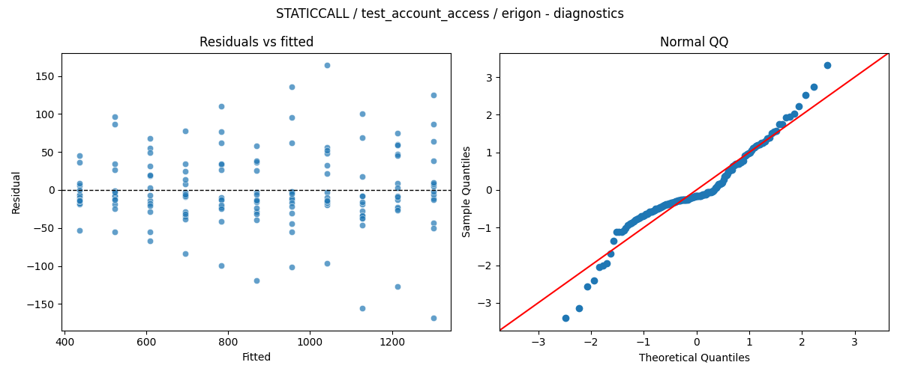

</details>

<details><summary>ethrex — NNLS regression summary</summary>

```
==============================================================================
                           NNLS Regression Results                            
==============================================================================
Dep. Variable:          test_runtime_ms              R-squared:          0.964
Model:                  NNLS                    Adj. R-squared:          0.964
No. Observations:       440                               RMSE:           9.35
Df Residuals:           438                                MAE:           7.53
Df Model:               1      
==============================================================================
                      coef     std err     P-value      [0.025      0.975]
------------------------------------------------------------------------------
         const     30.4527      1.4982       0.001     27.5388     33.2975
       opcount      0.0020      0.0000       0.001      0.0020      0.0021
==============================================================================
Notes: Non-negative least squares with bootstrap inference (1000 iterations)
==============================================================================
```

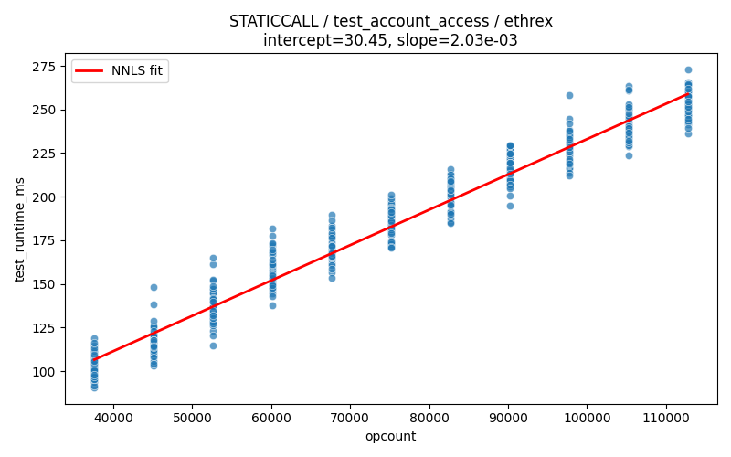

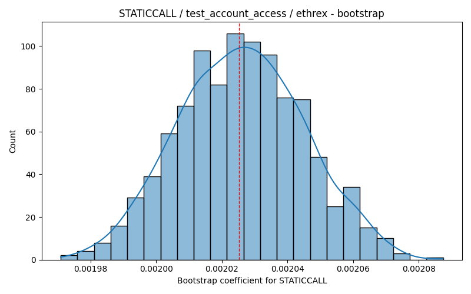


</details>

<details><summary>geth — NNLS regression summary</summary>

```
==============================================================================
                           NNLS Regression Results                            
==============================================================================
Dep. Variable:          test_runtime_ms              R-squared:          0.865
Model:                  NNLS                    Adj. R-squared:          0.865
No. Observations:       440                               RMSE:         212.41
Df Residuals:           438                                MAE:         178.58
Df Model:               1      
==============================================================================
                      coef     std err     P-value      [0.025      0.975]
------------------------------------------------------------------------------
         const    720.0373     37.6319       0.001    645.3186    791.4469
       opcount      0.0226      0.0004       0.001      0.0218      0.0235
==============================================================================
Notes: Non-negative least squares with bootstrap inference (1000 iterations)
==============================================================================
```


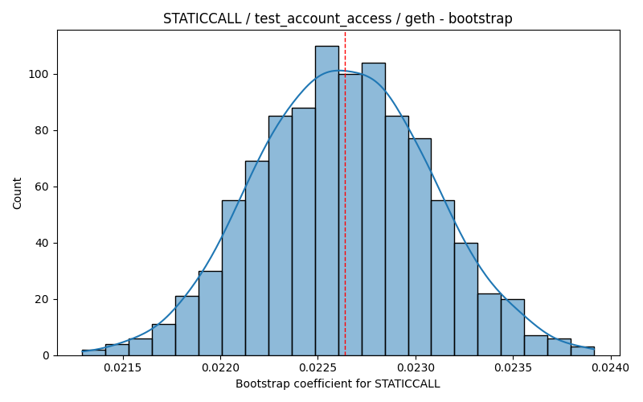

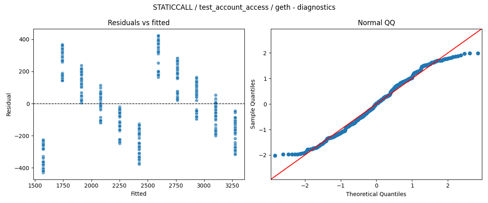

</details>

<details><summary>nethermind — NNLS regression summary</summary>

```
==============================================================================
                           NNLS Regression Results                            
==============================================================================
Dep. Variable:          test_runtime_ms              R-squared:          0.839
Model:                  NNLS                    Adj. R-squared:          0.838
No. Observations:       363                               RMSE:          41.23
Df Residuals:           361                                MAE:          31.76
Df Model:               1      
==============================================================================
                      coef     std err     P-value      [0.025      0.975]
------------------------------------------------------------------------------
         const     83.6348      6.5960       0.001     71.0351     96.9125
       opcount      0.0040      0.0001       0.001      0.0038      0.0041
==============================================================================
Notes: Non-negative least squares with bootstrap inference (1000 iterations)
==============================================================================
```

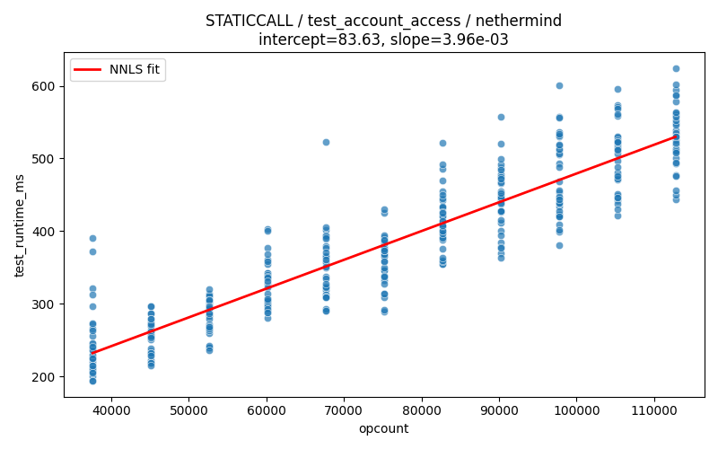

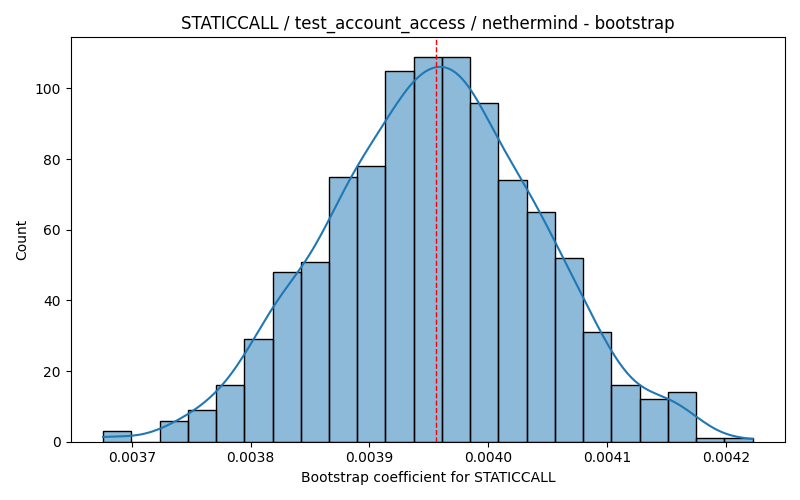


</details>

<details><summary>reth — NNLS regression summary</summary>

```
==============================================================================
                           NNLS Regression Results                            
==============================================================================
Dep. Variable:          test_runtime_ms              R-squared:          0.875
Model:                  NNLS                    Adj. R-squared:          0.874
No. Observations:       539                               RMSE:           6.85
Df Residuals:           537                                MAE:           5.49
Df Model:               1      
==============================================================================
                      coef     std err     P-value      [0.025      0.975]
------------------------------------------------------------------------------
         const     51.4685      0.9658       0.001     49.5961     53.3066
       opcount      0.0008      0.0000       0.001      0.0007      0.0008
==============================================================================
Notes: Non-negative least squares with bootstrap inference (1000 iterations)
==============================================================================
```

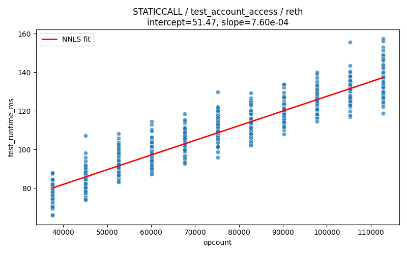

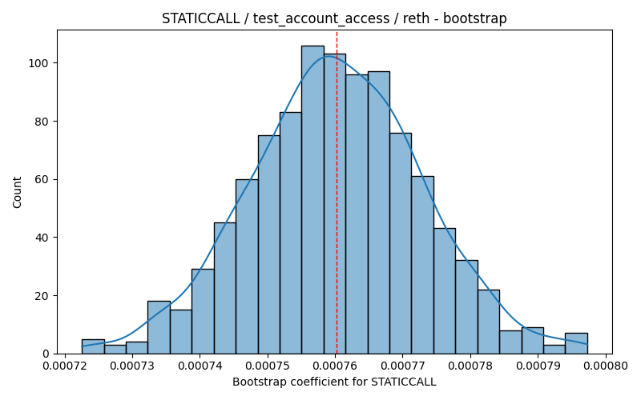

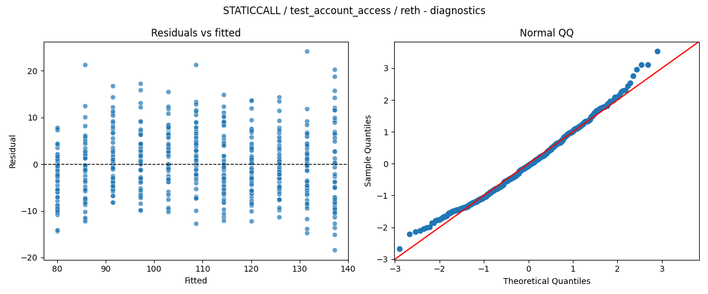

</details>

### test_account_access — combo `STATICCALL_AccountMode.EXISTING_CONTRACT`

| client | nobs | R² | target_coef (ms) | p-value | 95% CI |
| --- | --- | --- | --- | --- | --- |
| `besu` | 462 | 0.8912 | 0.02684 | 1.00e-03 | [0.02597, 0.02766] |
| `erigon` | 154 | 0.5652 | 0.04472 | 1.00e-03 | [0.03821, 0.0503] |
| `ethrex` | 440 | 0.993 | 0.007888 | 1.00e-03 | [0.00783, 0.007954] |
| `geth` | 440 | 0.8549 | 0.02337 | 1.00e-03 | [0.02238, 0.02433] |
| `nethermind` | 363 | 0.6068 | 0.01486 | 1.00e-03 | [0.01344, 0.01621] |
| `reth` | 539 | 0.9743 | 0.004054 | 1.00e-03 | [0.003995, 0.004106] |

<details><summary>besu — NNLS regression summary</summary>

```
==============================================================================
                           NNLS Regression Results                            
==============================================================================
Dep. Variable:          test_runtime_ms              R-squared:          0.891
Model:                  NNLS                    Adj. R-squared:          0.891
No. Observations:       462                               RMSE:         191.02
Df Residuals:           460                                MAE:         147.27
Df Model:               1      
==============================================================================
                      coef     std err     P-value      [0.025      0.975]
------------------------------------------------------------------------------
         const    594.7830     28.0955       0.001    543.7029    652.6846
       opcount      0.0268      0.0004       0.001      0.0260      0.0277
==============================================================================
Notes: Non-negative least squares with bootstrap inference (1000 iterations)
==============================================================================
```

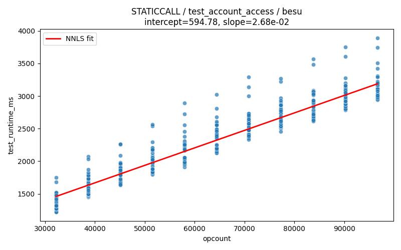

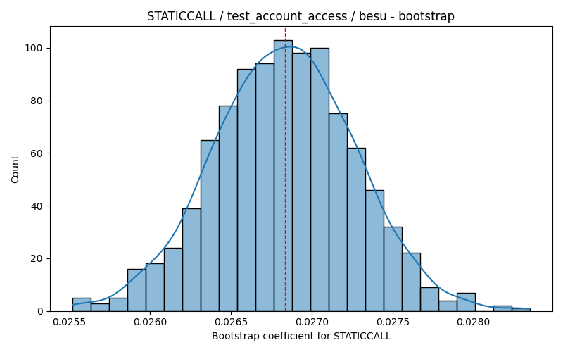

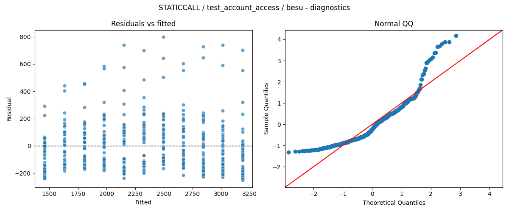

</details>

<details><summary>erigon — NNLS regression summary</summary>

```
==============================================================================
                           NNLS Regression Results                            
==============================================================================
Dep. Variable:          test_runtime_ms              R-squared:          0.565
Model:                  NNLS                    Adj. R-squared:          0.562
No. Observations:       154                               RMSE:         799.01
Df Residuals:           152                                MAE:         544.09
Df Model:               1      
==============================================================================
                      coef     std err     P-value      [0.025      0.975]
------------------------------------------------------------------------------
         const    805.8260    185.8361       0.001    446.7290   1196.8076
       opcount      0.0447      0.0031       0.001      0.0382      0.0503
==============================================================================
Notes: Non-negative least squares with bootstrap inference (1000 iterations)
==============================================================================
```

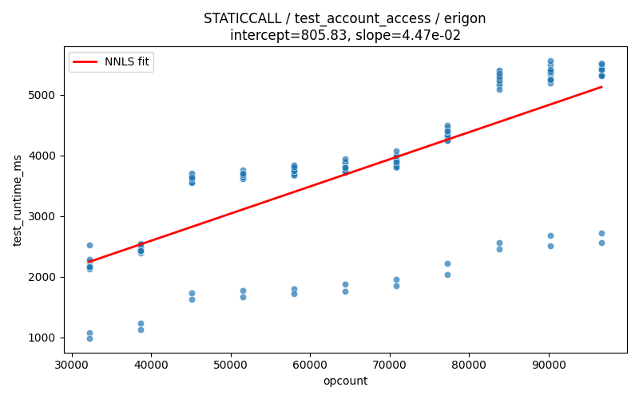

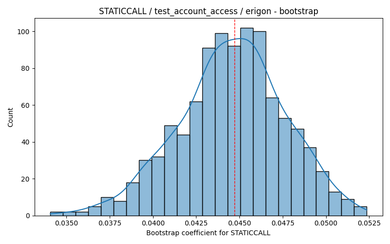

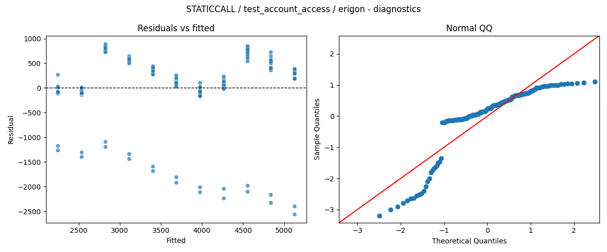

</details>

<details><summary>ethrex — NNLS regression summary</summary>

```
==============================================================================
                           NNLS Regression Results                            
==============================================================================
Dep. Variable:          test_runtime_ms              R-squared:          0.993
Model:                  NNLS                    Adj. R-squared:          0.993
No. Observations:       440                               RMSE:          13.52
Df Residuals:           438                                MAE:          10.55
Df Model:               1      
==============================================================================
                      coef     std err     P-value      [0.025      0.975]
------------------------------------------------------------------------------
         const     40.5968      1.9257       0.001     36.6382     44.3823
       opcount      0.0079      0.0000       0.001      0.0078      0.0080
==============================================================================
Notes: Non-negative least squares with bootstrap inference (1000 iterations)
==============================================================================
```

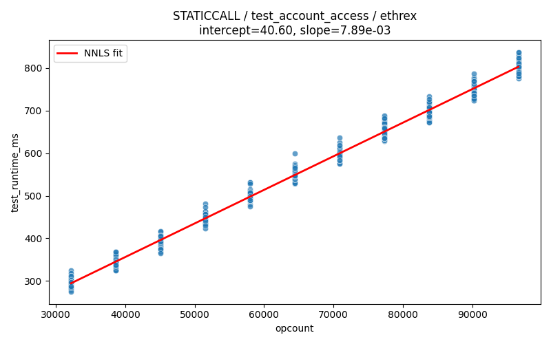

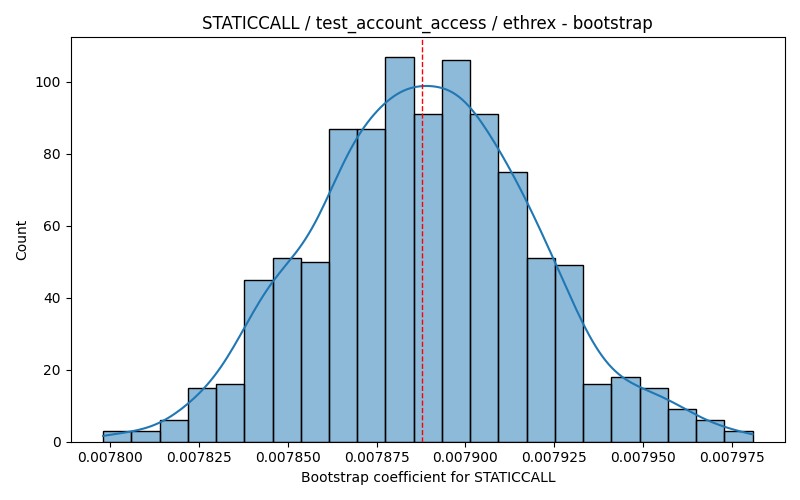

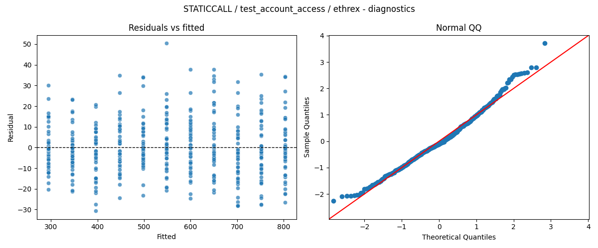

</details>

<details><summary>geth — NNLS regression summary</summary>

```
==============================================================================
                           NNLS Regression Results                            
==============================================================================
Dep. Variable:          test_runtime_ms              R-squared:          0.855
Model:                  NNLS                    Adj. R-squared:          0.855
No. Observations:       440                               RMSE:         196.19
Df Residuals:           438                                MAE:         166.25
Df Model:               1      
==============================================================================
                      coef     std err     P-value      [0.025      0.975]
------------------------------------------------------------------------------
         const    677.2858     36.5594       0.001    611.6846    749.0883
       opcount      0.0234      0.0005       0.001      0.0224      0.0243
==============================================================================
Notes: Non-negative least squares with bootstrap inference (1000 iterations)
==============================================================================
```


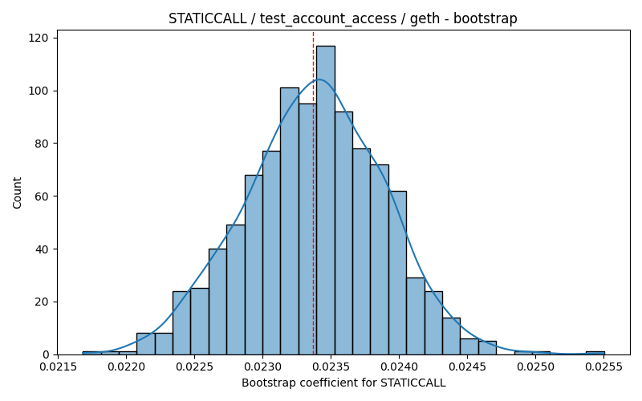

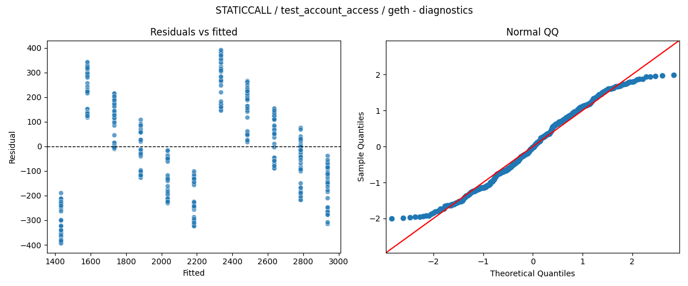

</details>

<details><summary>nethermind — NNLS regression summary</summary>

```
==============================================================================
                           NNLS Regression Results                            
==============================================================================
Dep. Variable:          test_runtime_ms              R-squared:          0.607
Model:                  NNLS                    Adj. R-squared:          0.606
No. Observations:       363                               RMSE:         243.69
Df Residuals:           361                                MAE:         178.18
Df Model:               1      
==============================================================================
                      coef     std err     P-value      [0.025      0.975]
------------------------------------------------------------------------------
         const    136.6742     39.5745       0.001     59.8869    215.3602
       opcount      0.0149      0.0007       0.001      0.0134      0.0162
==============================================================================
Notes: Non-negative least squares with bootstrap inference (1000 iterations)
==============================================================================
```

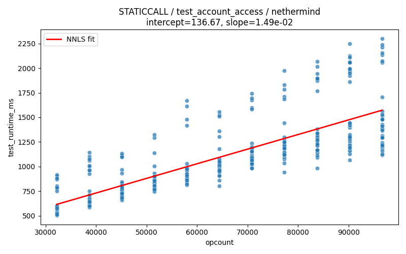

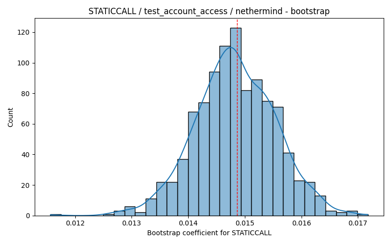

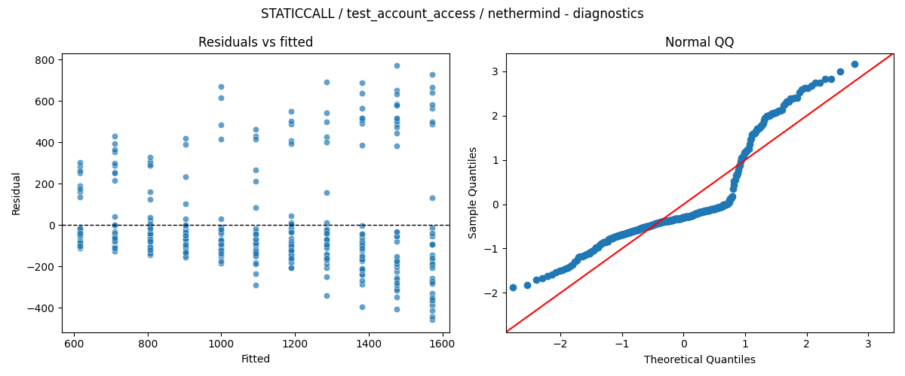

</details>

<details><summary>reth — NNLS regression summary</summary>

```
==============================================================================
                           NNLS Regression Results                            
==============================================================================
Dep. Variable:          test_runtime_ms              R-squared:          0.974
Model:                  NNLS                    Adj. R-squared:          0.974
No. Observations:       539                               RMSE:          13.43
Df Residuals:           537                                MAE:          10.71
Df Model:               1      
==============================================================================
                      coef     std err     P-value      [0.025      0.975]
------------------------------------------------------------------------------
         const    101.4463      1.7753       0.001     98.2124    105.2035
       opcount      0.0041      0.0000       0.001      0.0040      0.0041
==============================================================================
Notes: Non-negative least squares with bootstrap inference (1000 iterations)
==============================================================================
```

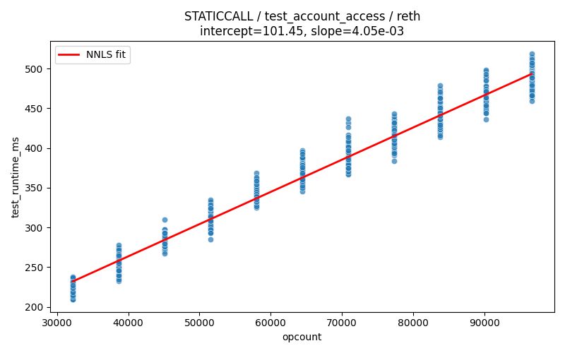

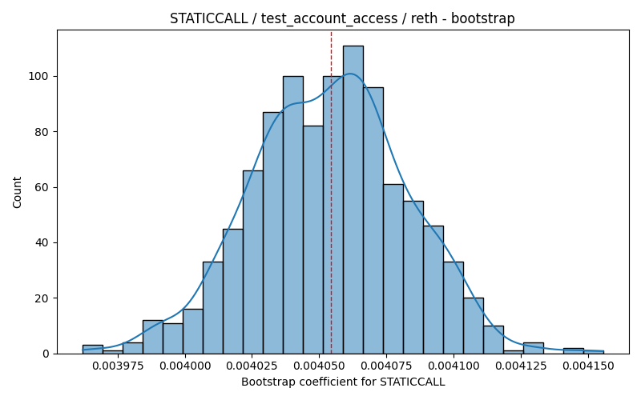

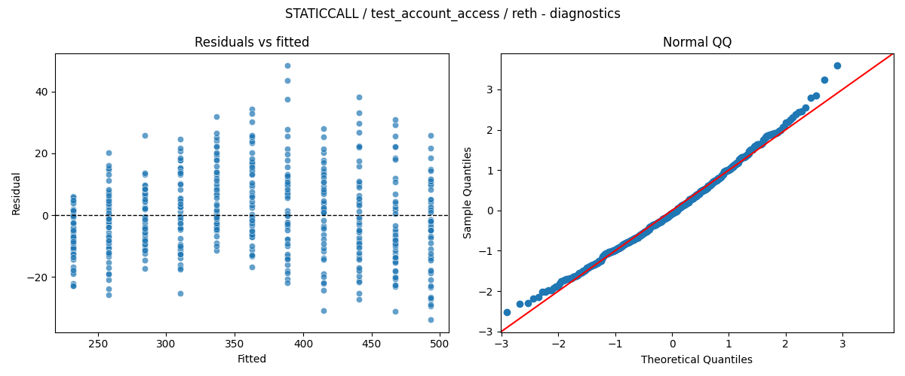

</details>

### test_account_access — combo `STATICCALL_AccountMode.NON_EXISTING_ACCOUNT` — `presets[cold_account_code_access]`

| client | nobs | R² | target_coef (ms) | p-value | 95% CI |
| --- | --- | --- | --- | --- | --- |
| `besu` | 462 | 0.8256 | 0.01581 | 1.00e-03 | [0.01517, 0.0164] |
| `erigon` | 154 | 0.9683 | 0.01151 | 1.00e-03 | [0.01112, 0.01165] |
| `ethrex` | 440 | 0.9636 | 0.002025 | 1.00e-03 | [0.00199, 0.002063] |
| `geth` | 440 | 0.8652 | 0.02264 | 1.00e-03 | [0.02179, 0.0235] |
| `nethermind` | 363 | 0.8388 | 0.003956 | 1.00e-03 | [0.003783, 0.004134] |
| `reth` | 539 | 0.8745 | 0.0007603 | 1.00e-03 | [0.0007342, 0.0007845] |

<details><summary>besu — NNLS regression summary</summary>

```
==============================================================================
                           NNLS Regression Results                            
==============================================================================
Dep. Variable:          test_runtime_ms              R-squared:          0.826
Model:                  NNLS                    Adj. R-squared:          0.825
No. Observations:       462                               RMSE:         172.74
Df Residuals:           460                                MAE:         154.64
Df Model:               1      
==============================================================================
                      coef     std err     P-value      [0.025      0.975]
------------------------------------------------------------------------------
         const    535.7511     25.1270       0.001    488.1770    587.1666
       opcount      0.0158      0.0003       0.001      0.0152      0.0164
==============================================================================
Notes: Non-negative least squares with bootstrap inference (1000 iterations)
==============================================================================
```


</details>

<details><summary>erigon — NNLS regression summary</summary>

```
==============================================================================
                           NNLS Regression Results                            
==============================================================================
Dep. Variable:          test_runtime_ms              R-squared:          0.968
Model:                  NNLS                    Adj. R-squared:          0.968
No. Observations:       154                               RMSE:          49.50
Df Residuals:           152                                MAE:          35.54
Df Model:               1      
==============================================================================
                      coef     std err     P-value      [0.025      0.975]
------------------------------------------------------------------------------
         const      3.7063      8.3533       0.394      0.0000     27.0973
       opcount      0.0115      0.0001       0.001      0.0111      0.0117
==============================================================================
Notes: Non-negative least squares with bootstrap inference (1000 iterations)
==============================================================================
```


</details>

<details><summary>ethrex — NNLS regression summary</summary>

```
==============================================================================
                           NNLS Regression Results                            
==============================================================================
Dep. Variable:          test_runtime_ms              R-squared:          0.964
Model:                  NNLS                    Adj. R-squared:          0.964
No. Observations:       440                               RMSE:           9.35
Df Residuals:           438                                MAE:           7.53
Df Model:               1      
==============================================================================
                      coef     std err     P-value      [0.025      0.975]
------------------------------------------------------------------------------
         const     30.4527      1.4982       0.001     27.5388     33.2975
       opcount      0.0020      0.0000       0.001      0.0020      0.0021
==============================================================================
Notes: Non-negative least squares with bootstrap inference (1000 iterations)
==============================================================================
```


</details>

<details><summary>geth — NNLS regression summary</summary>

```
==============================================================================
                           NNLS Regression Results                            
==============================================================================
Dep. Variable:          test_runtime_ms              R-squared:          0.865
Model:                  NNLS                    Adj. R-squared:          0.865
No. Observations:       440                               RMSE:         212.41
Df Residuals:           438                                MAE:         178.58
Df Model:               1      
==============================================================================
                      coef     std err     P-value      [0.025      0.975]
------------------------------------------------------------------------------
         const    720.0373     37.6319       0.001    645.3186    791.4469
       opcount      0.0226      0.0004       0.001      0.0218      0.0235
==============================================================================
Notes: Non-negative least squares with bootstrap inference (1000 iterations)
==============================================================================
```


</details>

<details><summary>nethermind — NNLS regression summary</summary>

```
==============================================================================
                           NNLS Regression Results                            
==============================================================================
Dep. Variable:          test_runtime_ms              R-squared:          0.839
Model:                  NNLS                    Adj. R-squared:          0.838
No. Observations:       363                               RMSE:          41.23
Df Residuals:           361                                MAE:          31.76
Df Model:               1      
==============================================================================
                      coef     std err     P-value      [0.025      0.975]
------------------------------------------------------------------------------
         const     83.6348      6.5960       0.001     71.0351     96.9125
       opcount      0.0040      0.0001       0.001      0.0038      0.0041
==============================================================================
Notes: Non-negative least squares with bootstrap inference (1000 iterations)
==============================================================================
```


</details>

<details><summary>reth — NNLS regression summary</summary>

```
==============================================================================
                           NNLS Regression Results                            
==============================================================================
Dep. Variable:          test_runtime_ms              R-squared:          0.875
Model:                  NNLS                    Adj. R-squared:          0.874
No. Observations:       539                               RMSE:           6.85
Df Residuals:           537                                MAE:           5.49
Df Model:               1      
==============================================================================
                      coef     std err     P-value      [0.025      0.975]
------------------------------------------------------------------------------
         const     51.4685      0.9658       0.001     49.5961     53.3066
       opcount      0.0008      0.0000       0.001      0.0007      0.0008
==============================================================================
Notes: Non-negative least squares with bootstrap inference (1000 iterations)
==============================================================================
```


</details>

### test_ext_account_query_warm — combo `STATICCALL`

| client | nobs | R² | target_coef (ms) | p-value | 95% CI |
| --- | --- | --- | --- | --- | --- |
| `besu` | 462 | 0.7238 | 0.000446 | 1.00e-03 | [0.0004177, 0.0004727] |
| `erigon` | 154 | 0.8914 | 0.0004814 | 1.00e-03 | [0.0004558, 0.0005055] |
| `ethrex` | 440 | 0.9429 | 0.0001034 | 1.00e-03 | [0.000101, 0.0001056] |
| `geth` | 440 | 0.891 | 0.0001813 | 1.00e-03 | [0.0001756, 0.0001873] |
| `nethermind` | 363 | 0.6493 | 0.0003449 | 1.00e-03 | [0.0003164, 0.0003723] |
| `reth` | 539 | 0.915 | 5.712e-05 | 1.00e-03 | [5.56e-05, 5.878e-05] |

<details><summary>besu — NNLS regression summary</summary>

```
==============================================================================
                           NNLS Regression Results                            
==============================================================================
Dep. Variable:          test_runtime_ms              R-squared:          0.724
Model:                  NNLS                    Adj. R-squared:          0.723
No. Observations:       462                               RMSE:         142.62
Df Residuals:           460                                MAE:         104.12
Df Model:               1      
==============================================================================
                      coef     std err     P-value      [0.025      0.975]
------------------------------------------------------------------------------
         const    542.5452     22.0848       0.001    501.5726    586.6451
       opcount      0.0004      0.0000       0.001      0.0004      0.0005
==============================================================================
Notes: Non-negative least squares with bootstrap inference (1000 iterations)
==============================================================================
```

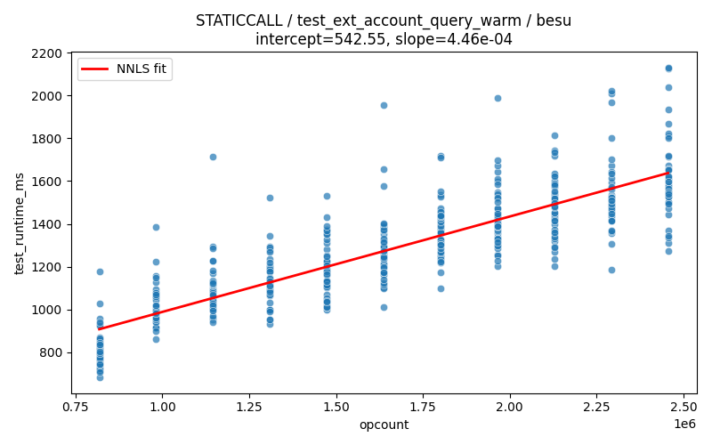

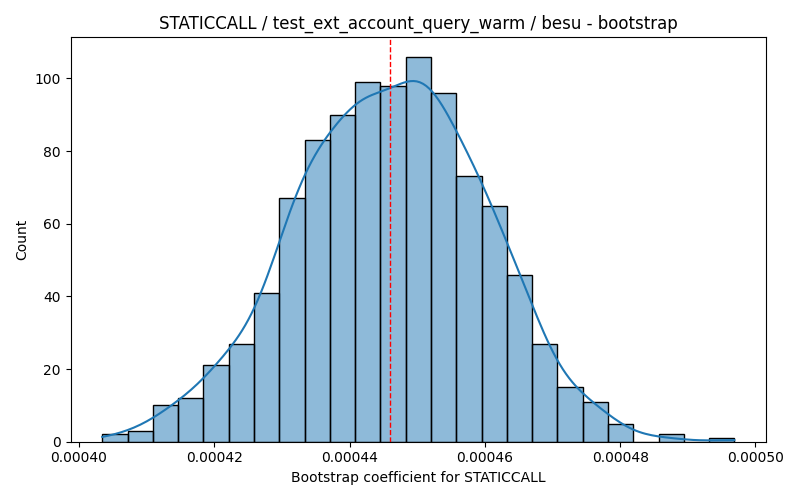

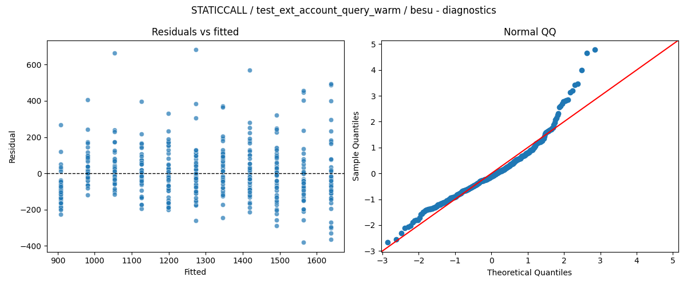

</details>

<details><summary>erigon — NNLS regression summary</summary>

```
==============================================================================
                           NNLS Regression Results                            
==============================================================================
Dep. Variable:          test_runtime_ms              R-squared:          0.891
Model:                  NNLS                    Adj. R-squared:          0.891
No. Observations:       154                               RMSE:          86.99
Df Residuals:           152                                MAE:          60.59
Df Model:               1      
==============================================================================
                      coef     std err     P-value      [0.025      0.975]
------------------------------------------------------------------------------
         const     73.6765     21.9238       0.001     33.8030    119.4234
       opcount      0.0005      0.0000       0.001      0.0005      0.0005
==============================================================================
Notes: Non-negative least squares with bootstrap inference (1000 iterations)
==============================================================================
```

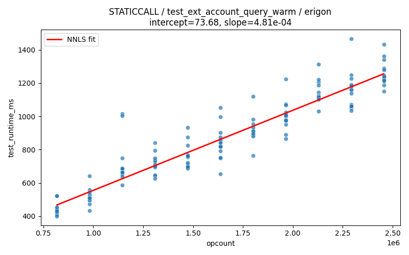

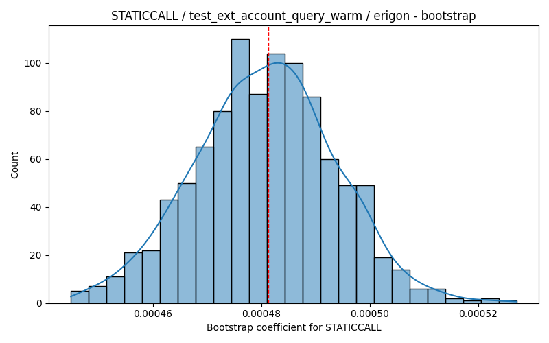

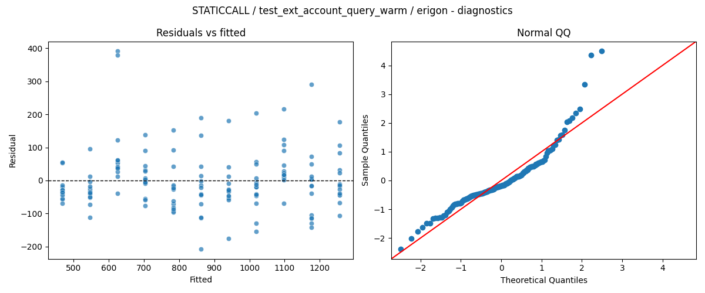

</details>

<details><summary>ethrex — NNLS regression summary</summary>

```
==============================================================================
                           NNLS Regression Results                            
==============================================================================
Dep. Variable:          test_runtime_ms              R-squared:          0.943
Model:                  NNLS                    Adj. R-squared:          0.943
No. Observations:       440                               RMSE:          13.17
Df Residuals:           438                                MAE:          10.56
Df Model:               1      
==============================================================================
                      coef     std err     P-value      [0.025      0.975]
------------------------------------------------------------------------------
         const     33.5097      1.9258       0.001     29.7727     37.3573
       opcount      0.0001      0.0000       0.001      0.0001      0.0001
==============================================================================
Notes: Non-negative least squares with bootstrap inference (1000 iterations)
==============================================================================
```

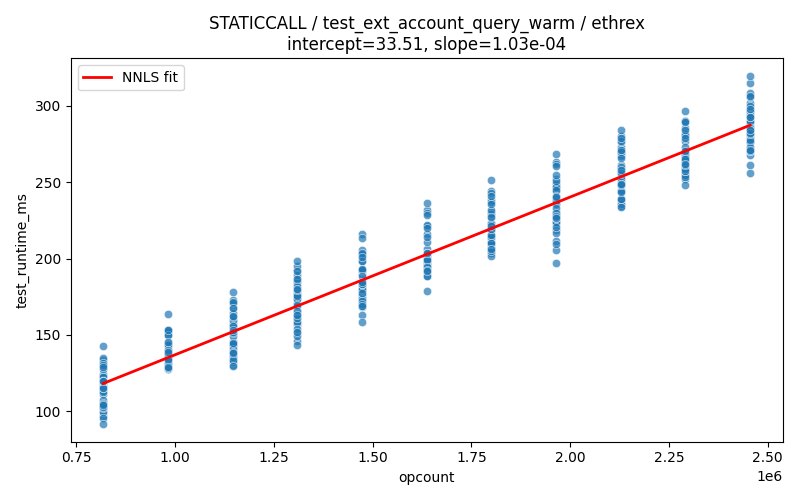

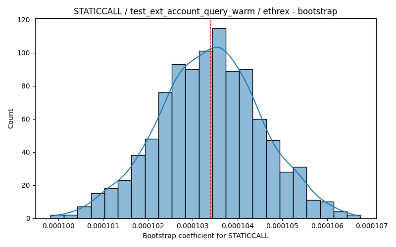

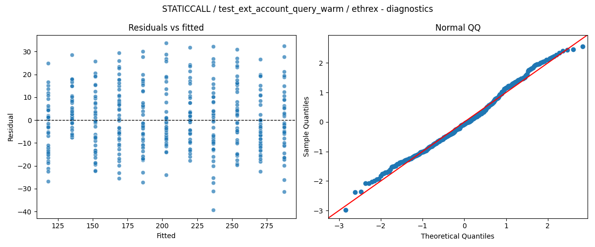

</details>

<details><summary>geth — NNLS regression summary</summary>

```
==============================================================================
                           NNLS Regression Results                            
==============================================================================
Dep. Variable:          test_runtime_ms              R-squared:          0.891
Model:                  NNLS                    Adj. R-squared:          0.891
No. Observations:       440                               RMSE:          32.83
Df Residuals:           438                                MAE:          25.18
Df Model:               1      
==============================================================================
                      coef     std err     P-value      [0.025      0.975]
------------------------------------------------------------------------------
         const     50.3388      4.5862       0.001     41.1637     58.9254
       opcount      0.0002      0.0000       0.001      0.0002      0.0002
==============================================================================
Notes: Non-negative least squares with bootstrap inference (1000 iterations)
==============================================================================
```

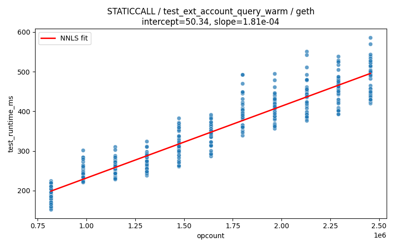

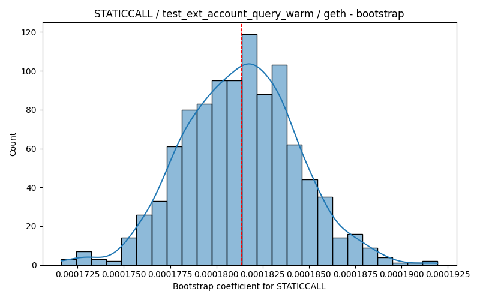

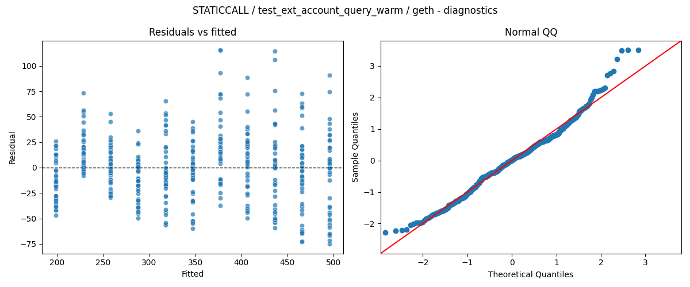

</details>

<details><summary>nethermind — NNLS regression summary</summary>

```
==============================================================================
                           NNLS Regression Results                            
==============================================================================
Dep. Variable:          test_runtime_ms              R-squared:          0.649
Model:                  NNLS                    Adj. R-squared:          0.648
No. Observations:       363                               RMSE:         131.22
Df Residuals:           361                                MAE:         106.20
Df Model:               1      
==============================================================================
                      coef     std err     P-value      [0.025      0.975]
------------------------------------------------------------------------------
         const    194.7113     20.9248       0.001    153.4539    234.0944
       opcount      0.0003      0.0000       0.001      0.0003      0.0004
==============================================================================
Notes: Non-negative least squares with bootstrap inference (1000 iterations)
==============================================================================
```

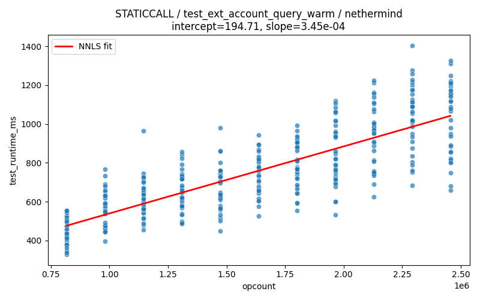

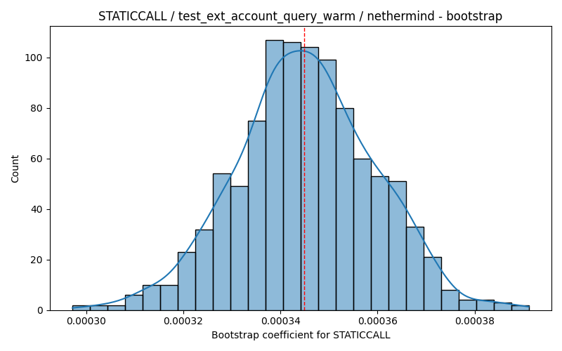

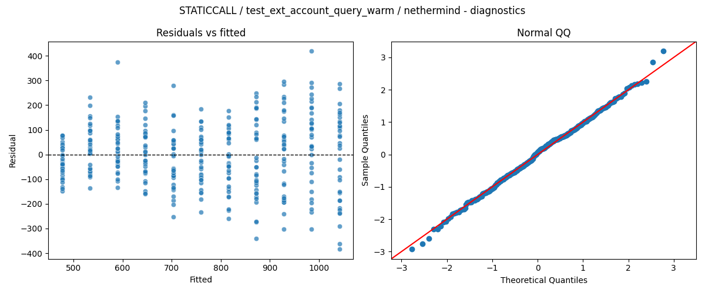

</details>

<details><summary>reth — NNLS regression summary</summary>

```
==============================================================================
                           NNLS Regression Results                            
==============================================================================
Dep. Variable:          test_runtime_ms              R-squared:          0.915
Model:                  NNLS                    Adj. R-squared:          0.915
No. Observations:       539                               RMSE:           9.01
Df Residuals:           537                                MAE:           6.93
Df Model:               1      
==============================================================================
                      coef     std err     P-value      [0.025      0.975]
------------------------------------------------------------------------------
         const     21.3265      1.3162       0.001     18.6311     23.8281
       opcount      0.0001      0.0000       0.001      0.0001      0.0001
==============================================================================
Notes: Non-negative least squares with bootstrap inference (1000 iterations)
==============================================================================
```

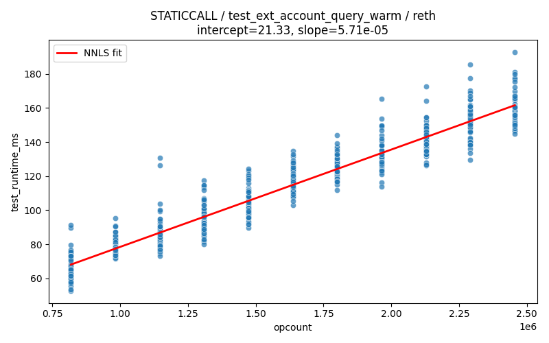

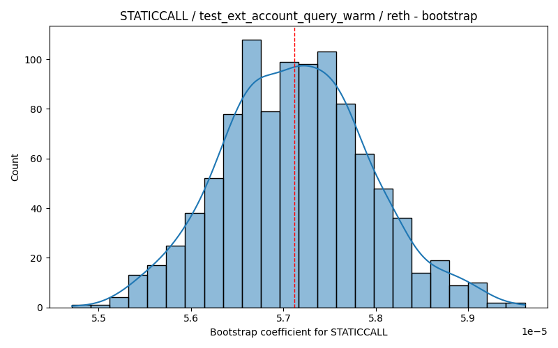

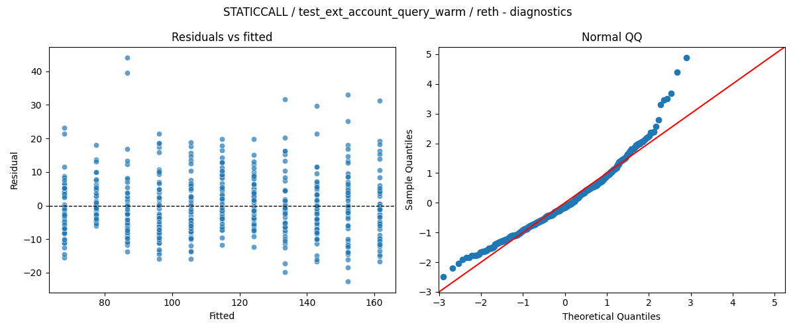

</details>
