# Glue opcodes report

Per-client NNLS fits of priced glue opcodes against their driver fixtures. Cycle-tier opcodes share one joint regression per client (shown once); pure-tier and mixed-tier opcodes each get a single-feature fit. Mixed-tier fits pre-adjust the LHS by subtracting the contribution of every priced upstream partner selected by the detector (pure ∪ cycle for `mixed_a`, plus `mixed_a` for `mixed_b`).

**Contents:** [besu](#besu) · [erigon](#erigon) · [ethrex](#ethrex) · [geth](#geth) · [nethermind](#nethermind) · [reth](#reth)

## besu

| glue_opcode | nobs | glue_runtime_ms | p_value | rsquared |
| --- | --- | --- | --- | --- |
| `ISZERO` | 2420 | 3.195e-06 | 1.00e-03 | 0.8246 |
| `JUMPDEST` | 2420 | 7.679e-07 | 1.00e-03 | 0.7944 |
| `SWAP` | 38720 | 2.715e-06 | 1.00e-03 | 0.3812 |
| `CALLDATASIZE` | 143297 | 2.8e-06 | 1.00e-03 | 0.9288 |
| `DUP` | 143297 | 1.166e-06 | 1.00e-03 | 0.9288 |
| `GAS` | 143297 | 2.401e-06 | 1.00e-03 | 0.9288 |
| `MLOAD` | 143297 | 8.653e-06 | 1.00e-03 | 0.9288 |
| `PUSH` | 143297 | 1.809e-06 | 1.00e-03 | 0.9288 |
| `PUSH0` | 143297 | 9.407e-07 | 1.00e-03 | 0.9288 |
| `STATICCALL` | 143297 | 0.0007204 | 1.00e-03 | 0.9288 |
| `ADD` | 2420 | 8.376e-06 | 1.00e-03 | 0.8318 |
| `AND` | 2420 | 5.793e-06 | 1.00e-03 | 0.8529 |
| `CALLDATACOPY` | 58080 | 1.306e-05 | 1.00e-03 | 0.6357 |
| `CALLDATALOAD` | 9680 | 0 | 1.00e+00 | 1.11e-16 |
| `DIV` | 2420 | 1.297e-05 | 1.00e-03 | 0.7805 |
| `EXP` | 2420 | 0.001032 | 1.00e-03 | 0.7305 |
| `GT` | 2420 | 2.014e-05 | 1.00e-03 | 0.2141 |
| `JUMPI` | 2420 | 4.937e-06 | 1.00e-03 | 0.7361 |
| `LT` | 2420 | 2.037e-05 | 1.00e-03 | 0.2119 |
| `MSTORE` | 12100 | 1.425e-05 | 1.00e-03 | 0.7949 |
| `MSTORE8` | 12100 | 8.834e-06 | 1.00e-03 | 0.8363 |
| `MUL` | 2420 | 1.084e-05 | 1.00e-03 | 0.749 |
| `PC` | 2420 | 2.799e-06 | 1.00e-03 | 0.8446 |
| `RETURNDATASIZE` | 9680 | 4.112e-06 | 1.00e-03 | 0.7827 |
| `SELFBALANCE` | 1980 | 9.978e-06 | 1.00e-03 | 0.686 |
| `SUB` | 2420 | 8.652e-06 | 1.00e-03 | 0.8231 |
| `JUMP` | 2420 | 4.139e-05 | 1.00e-03 | 0.8387 |
| `KECCAK256` | 38720 | 3.574e-05 | 1.00e-03 | 0.1436 |

### Cycle glue — joint fit · besu

<details><summary>Joint NNLS regression summary</summary>

```
==============================================================================
                           NNLS Regression Results                            
==============================================================================
Dep. Variable:          test_runtime_ms              R-squared:          0.929
Model:                  NNLS                    Adj. R-squared:          0.929
No. Observations:       143297                            RMSE:          28.88
Df Residuals:           143289                             MAE:          20.43
Df Model:               7      
==============================================================================
                      coef     std err     P-value      [0.025      0.975]
------------------------------------------------------------------------------
         const     46.5075      0.2717       0.001     45.9477     47.0456
  CALLDATASIZE      0.0000      0.0000       0.001      0.0000      0.0000
           DUP      0.0000      0.0000       0.001      0.0000      0.0000
           GAS      0.0000      0.0000       0.001      0.0000      0.0000
         MLOAD      0.0000      0.0000       0.001      0.0000      0.0000
          PUSH      0.0000      0.0000       0.001      0.0000      0.0000
         PUSH0      0.0000      0.0000       0.001      0.0000      0.0000
    STATICCALL      0.0007      0.0000       0.001      0.0007      0.0007
==============================================================================
Notes: Non-negative least squares with bootstrap inference (1000 iterations)
==============================================================================
```

</details>

<details><summary><code>CALLDATASIZE</code> · nobs=143297 · runtime_ms=2.8e-06 · p=1.00e-03 · R²=0.9288</summary>

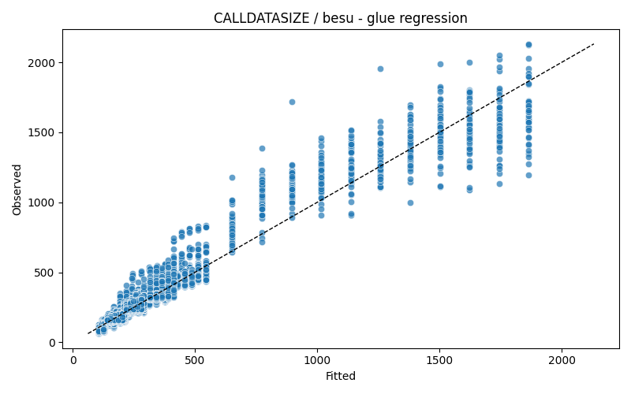

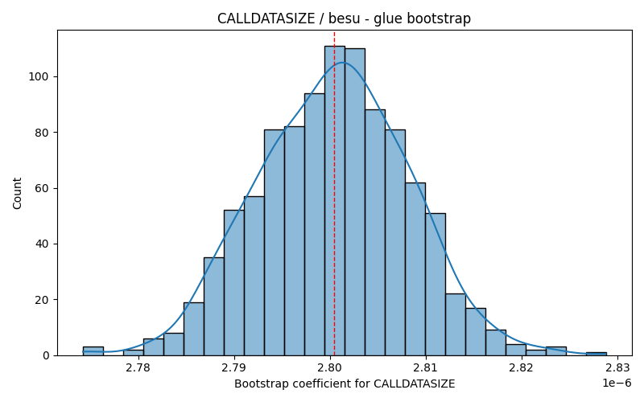


</details>

<details><summary><code>DUP</code> · nobs=143297 · runtime_ms=1.166e-06 · p=1.00e-03 · R²=0.9288</summary>

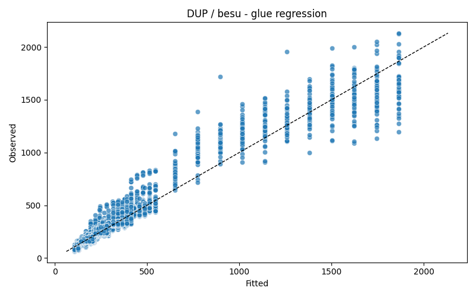

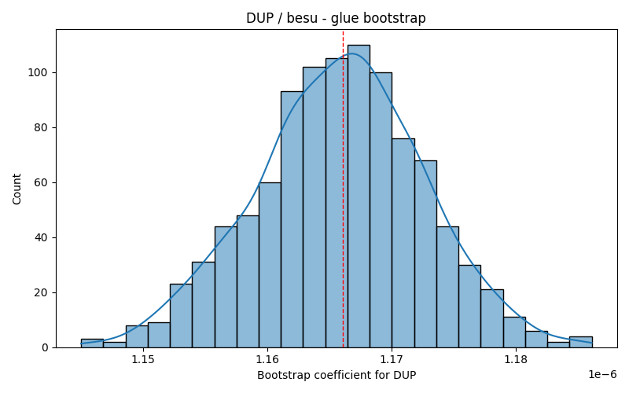


</details>

<details><summary><code>GAS</code> · nobs=143297 · runtime_ms=2.401e-06 · p=1.00e-03 · R²=0.9288</summary>


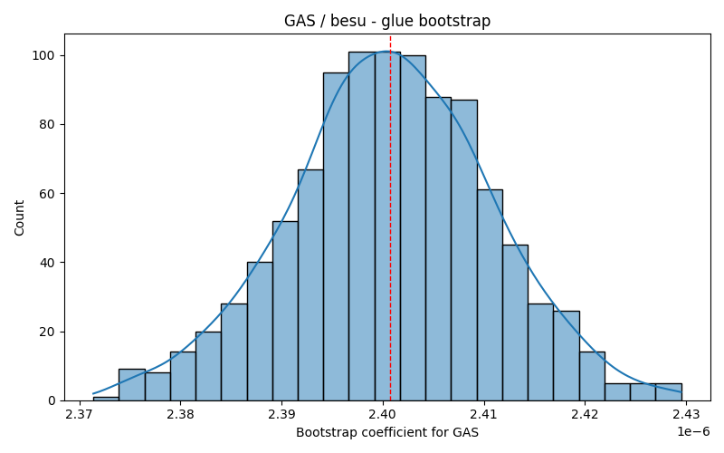


</details>

<details><summary><code>MLOAD</code> · nobs=143297 · runtime_ms=8.653e-06 · p=1.00e-03 · R²=0.9288</summary>


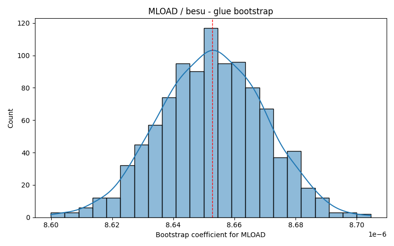


</details>

<details><summary><code>PUSH</code> · nobs=143297 · runtime_ms=1.809e-06 · p=1.00e-03 · R²=0.9288</summary>


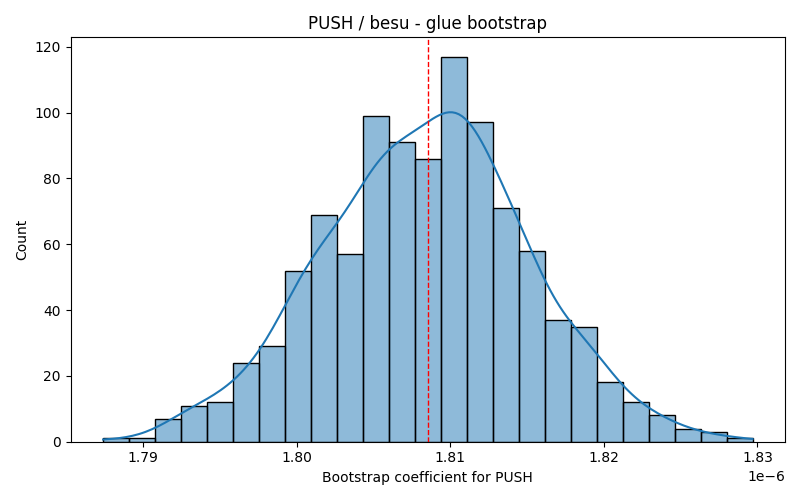

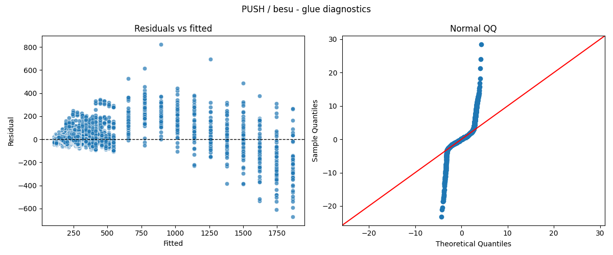

</details>

<details><summary><code>PUSH0</code> · nobs=143297 · runtime_ms=9.407e-07 · p=1.00e-03 · R²=0.9288</summary>


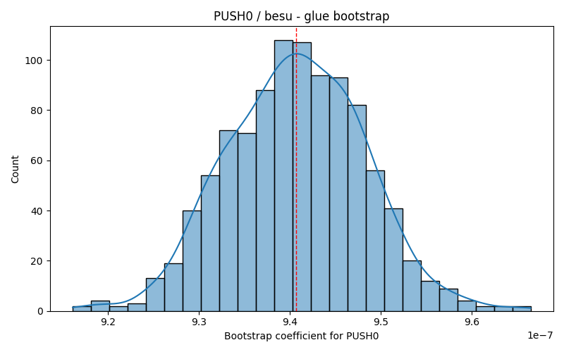


</details>

<details><summary><code>STATICCALL</code> · nobs=143297 · runtime_ms=0.0007204 · p=1.00e-03 · R²=0.9288</summary>


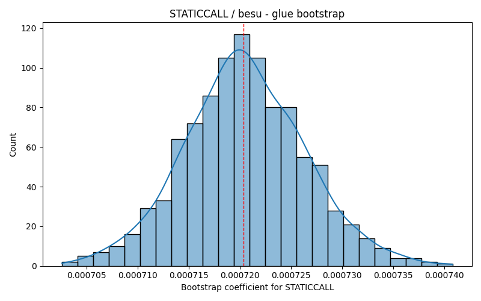


</details>

### Pure glue · besu

<details><summary><code>ISZERO</code> · nobs=2420 · runtime_ms=3.195e-06 · p=1.00e-03 · R²=0.8246</summary>

```
==============================================================================
                           NNLS Regression Results                            
==============================================================================
Dep. Variable:          test_runtime_ms              R-squared:          0.825
Model:                  NNLS                    Adj. R-squared:          0.825
No. Observations:       2420                              RMSE:          31.03
Df Residuals:           2418                               MAE:          25.23
Df Model:               1      
==============================================================================
                      coef     std err     P-value      [0.025      0.975]
------------------------------------------------------------------------------
         const     58.1327      2.1738       0.001     53.8101     62.3260
        ISZERO      0.0000      0.0000       0.001      0.0000      0.0000
==============================================================================
Notes: Non-negative least squares with bootstrap inference (1000 iterations)
==============================================================================
```

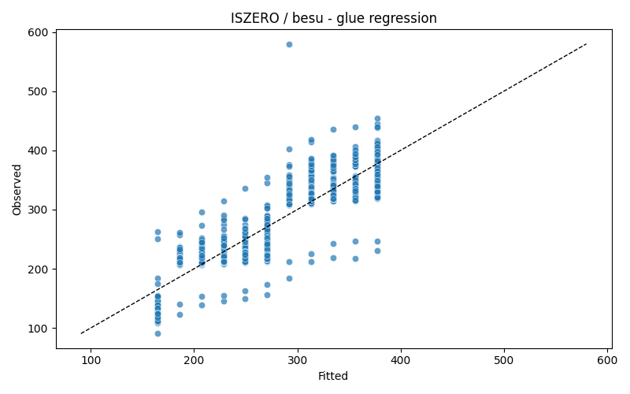

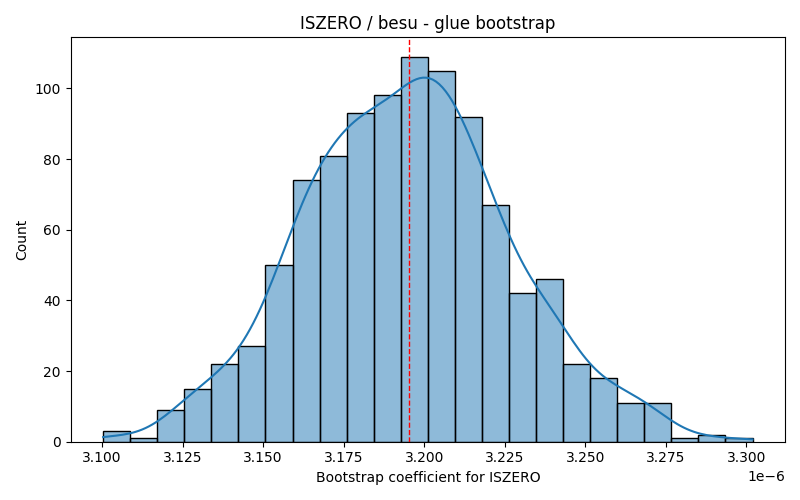

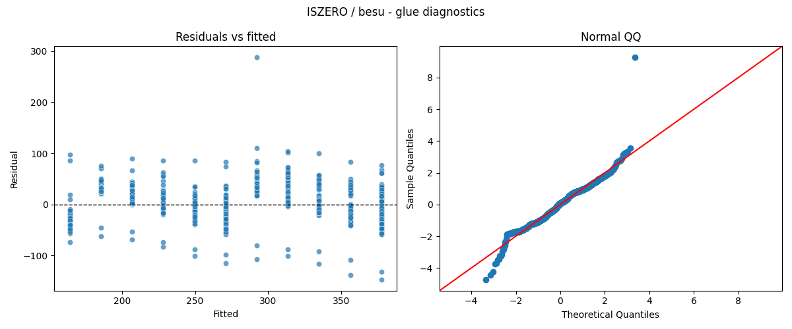

</details>

<details><summary><code>JUMPDEST</code> · nobs=2420 · runtime_ms=7.679e-07 · p=1.00e-03 · R²=0.7944</summary>

```
==============================================================================
                           NNLS Regression Results                            
==============================================================================
Dep. Variable:          test_runtime_ms              R-squared:          0.794
Model:                  NNLS                    Adj. R-squared:          0.794
No. Observations:       2420                              RMSE:          24.67
Df Residuals:           2418                               MAE:          18.23
Df Model:               1      
==============================================================================
                      coef     std err     P-value      [0.025      0.975]
------------------------------------------------------------------------------
         const     41.0965      1.6179       0.001     38.0942     44.4333
      JUMPDEST      0.0000      0.0000       0.001      0.0000      0.0000
==============================================================================
Notes: Non-negative least squares with bootstrap inference (1000 iterations)
==============================================================================
```

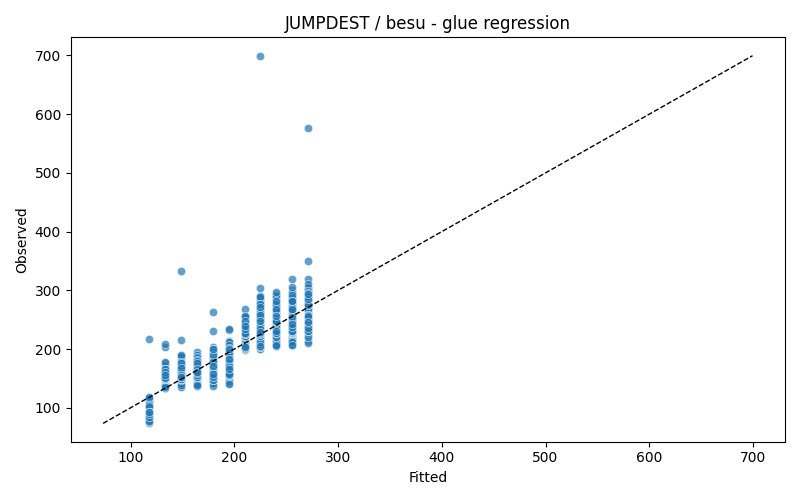

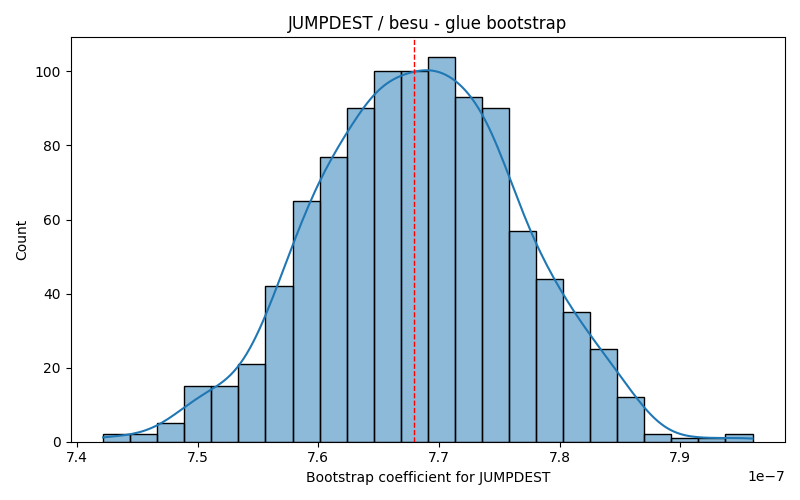

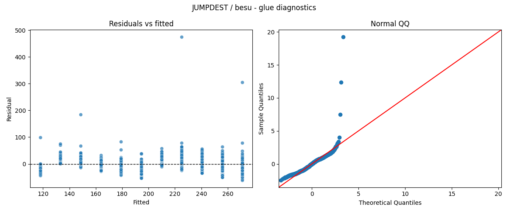

</details>

<details><summary><code>SWAP</code> · nobs=38720 · runtime_ms=2.715e-06 · p=1.00e-03 · R²=0.3812</summary>

```
==============================================================================
                           NNLS Regression Results                            
==============================================================================
Dep. Variable:          test_runtime_ms              R-squared:          0.381
Model:                  NNLS                    Adj. R-squared:          0.381
No. Observations:       38720                             RMSE:          72.82
Df Residuals:           38718                              MAE:          66.39
Df Model:               1      
==============================================================================
                      coef     std err     P-value      [0.025      0.975]
------------------------------------------------------------------------------
         const     49.3666      1.0680       0.001     47.1920     51.3657
          SWAP      0.0000      0.0000       0.001      0.0000      0.0000
==============================================================================
Notes: Non-negative least squares with bootstrap inference (1000 iterations)
==============================================================================
```

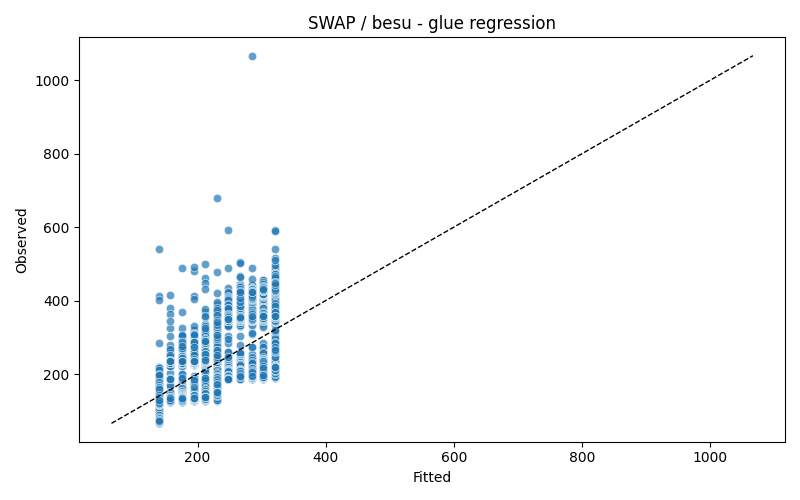

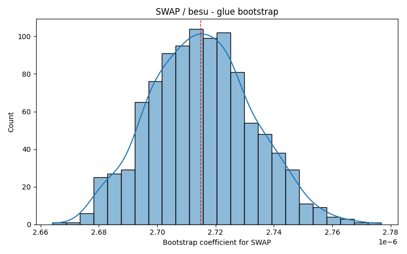

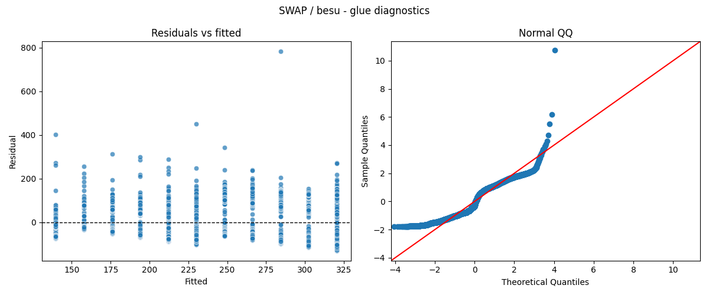

</details>

### Mixed glue (tier A) · besu

<details><summary><code>ADD</code> · nobs=2420 · runtime_ms=8.376e-06 · p=1.00e-03 · R²=0.8318</summary>

```
==============================================================================
                           NNLS Regression Results                            
==============================================================================
Dep. Variable:          test_runtime_ms              R-squared:          0.832
Model:                  NNLS                    Adj. R-squared:          0.832
No. Observations:       2420                              RMSE:          39.64
Df Residuals:           2418                               MAE:          32.54
Df Model:               1      
==============================================================================
                      coef     std err     P-value      [0.025      0.975]
------------------------------------------------------------------------------
         const     72.0914      2.8560       0.001     66.7401     77.7193
           ADD      0.0000      0.0000       0.001      0.0000      0.0000
==============================================================================
Notes: Non-negative least squares with bootstrap inference (1000 iterations)
==============================================================================
```

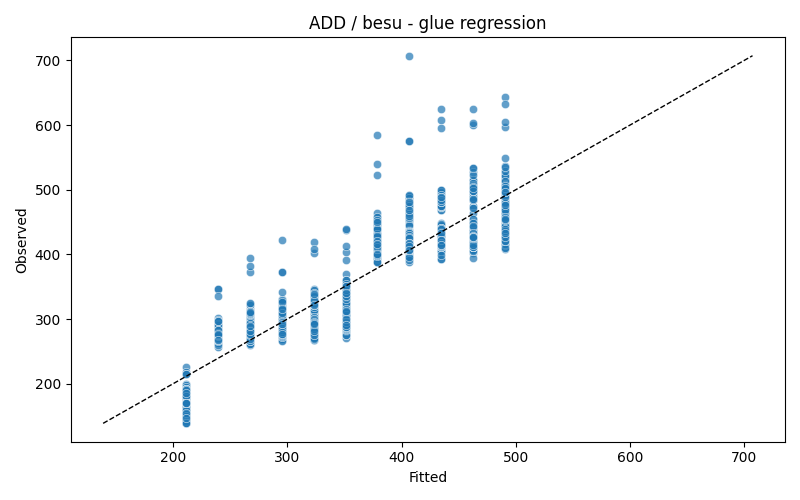

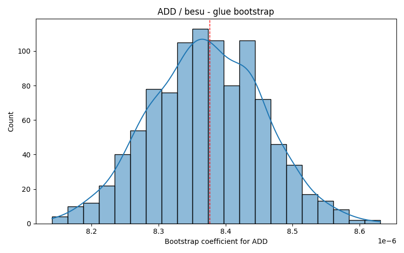

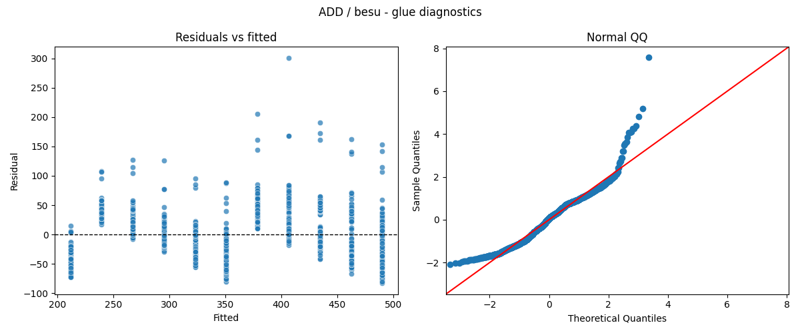

</details>

<details><summary><code>AND</code> · nobs=2420 · runtime_ms=5.793e-06 · p=1.00e-03 · R²=0.8529</summary>

```
==============================================================================
                           NNLS Regression Results                            
==============================================================================
Dep. Variable:          test_runtime_ms              R-squared:          0.853
Model:                  NNLS                    Adj. R-squared:          0.853
No. Observations:       2420                              RMSE:          25.32
Df Residuals:           2418                               MAE:          20.82
Df Model:               1      
==============================================================================
                      coef     std err     P-value      [0.025      0.975]
------------------------------------------------------------------------------
         const     60.4163      1.6189       0.001     57.2219     63.5335
           AND      0.0000      0.0000       0.001      0.0000      0.0000
==============================================================================
Notes: Non-negative least squares with bootstrap inference (1000 iterations)
==============================================================================
```

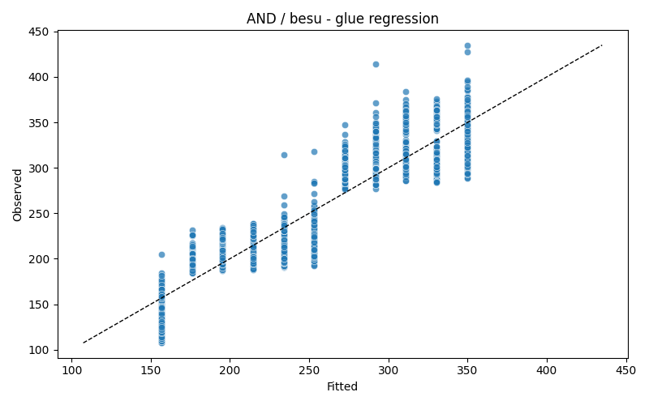

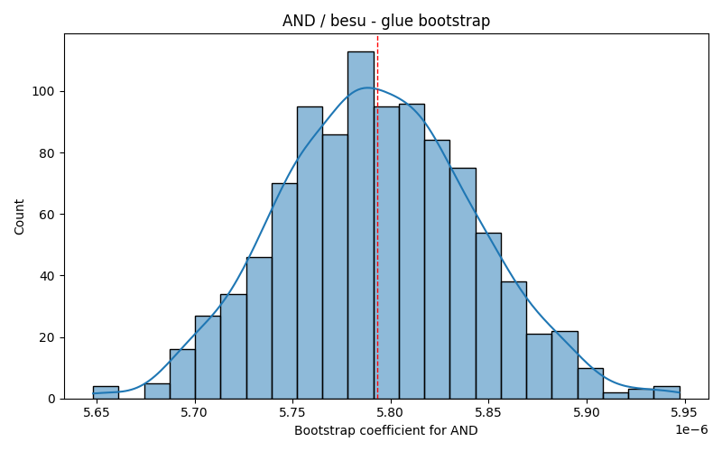

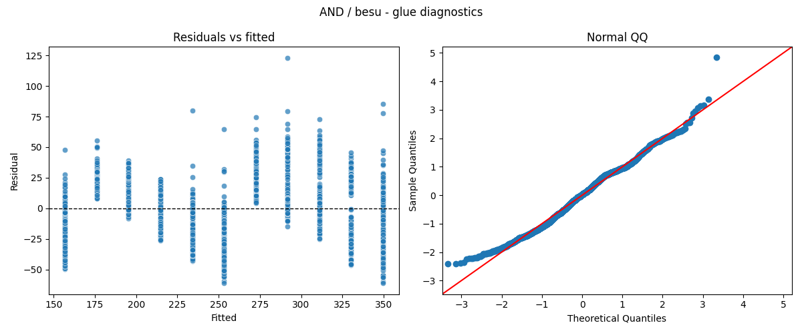

</details>

<details><summary><code>CALLDATACOPY</code> · nobs=58080 · runtime_ms=1.306e-05 · p=1.00e-03 · R²=0.6357</summary>

```
==============================================================================
                           NNLS Regression Results                            
==============================================================================
Dep. Variable:          test_runtime_ms              R-squared:          0.636
Model:                  NNLS                    Adj. R-squared:          0.636
No. Observations:       58080                             RMSE:          74.35
Df Residuals:           58078                              MAE:          57.39
Df Model:               1      
==============================================================================
                      coef     std err     P-value      [0.025      0.975]
------------------------------------------------------------------------------
         const    125.1232      0.3674       0.001    124.3945    125.8307
  CALLDATACOPY      0.0000      0.0000       0.001      0.0000      0.0000
==============================================================================
Notes: Non-negative least squares with bootstrap inference (1000 iterations)
==============================================================================
```

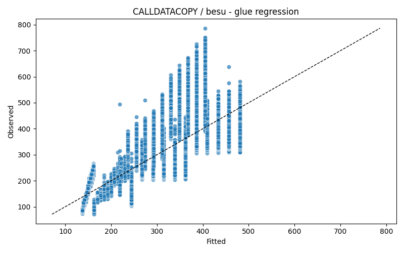

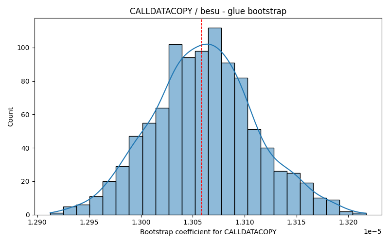

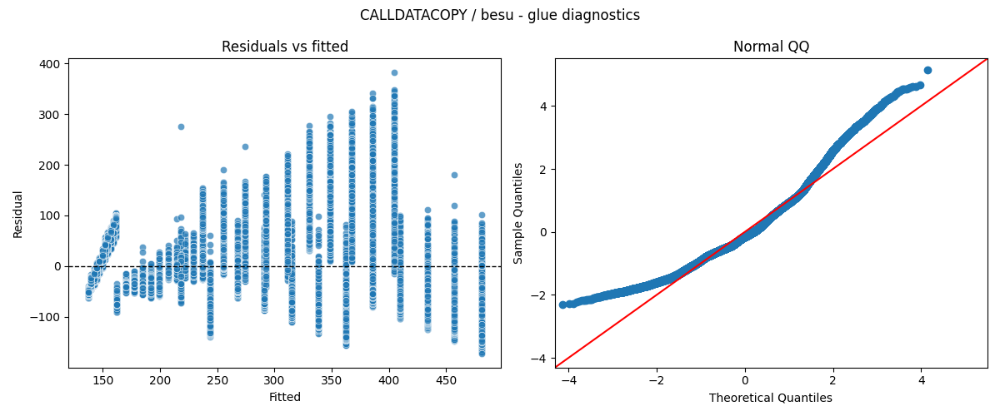

</details>

<details><summary><code>CALLDATALOAD</code> · nobs=9680 · runtime_ms=0 · p=1.00e+00 · R²=1.11e-16</summary>

```
==============================================================================
                           NNLS Regression Results                            
==============================================================================
Dep. Variable:          test_runtime_ms              R-squared:          0.000
Model:                  NNLS                    Adj. R-squared:         -0.000
No. Observations:       9680                              RMSE:           0.62
Df Residuals:           9678                               MAE:           0.41
Df Model:               1      
==============================================================================
                      coef     std err     P-value      [0.025      0.975]
------------------------------------------------------------------------------
         const      3.4148      0.0063       0.001      3.4022      3.4271
  CALLDATALOAD      0.0000      0.0000       1.000      0.0000      0.0000
==============================================================================
Notes: Non-negative least squares with bootstrap inference (1000 iterations)
==============================================================================
```

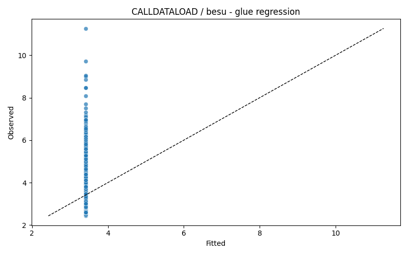


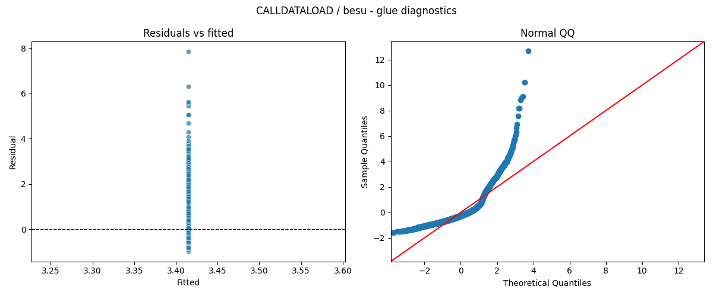

</details>

<details><summary><code>DIV</code> · nobs=2420 · runtime_ms=1.297e-05 · p=1.00e-03 · R²=0.7805</summary>

```
==============================================================================
                           NNLS Regression Results                            
==============================================================================
Dep. Variable:          test_runtime_ms              R-squared:          0.781
Model:                  NNLS                    Adj. R-squared:          0.780
No. Observations:       2420                              RMSE:          54.28
Df Residuals:           2418                               MAE:          43.68
Df Model:               1      
==============================================================================
                      coef     std err     P-value      [0.025      0.975]
------------------------------------------------------------------------------
         const    135.6892      3.1794       0.001    129.5322    142.1548
           DIV      0.0000      0.0000       0.001      0.0000      0.0000
==============================================================================
Notes: Non-negative least squares with bootstrap inference (1000 iterations)
==============================================================================
```

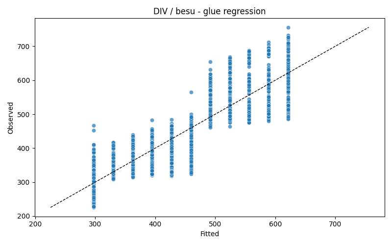

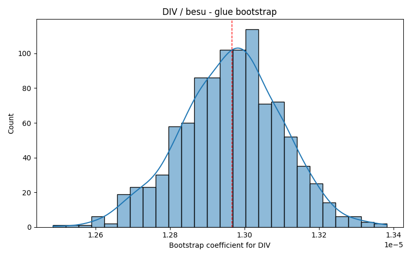

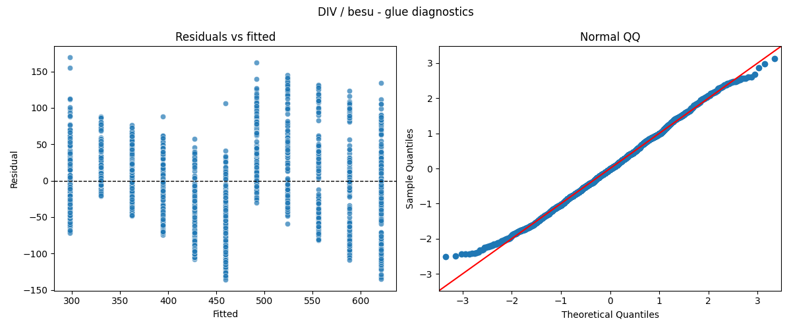

</details>

<details><summary><code>EXP</code> · nobs=2420 · runtime_ms=0.001032 · p=1.00e-03 · R²=0.7305</summary>

```
==============================================================================
                           NNLS Regression Results                            
==============================================================================
Dep. Variable:          test_runtime_ms              R-squared:          0.730
Model:                  NNLS                    Adj. R-squared:          0.730
No. Observations:       2420                              RMSE:          24.56
Df Residuals:           2418                               MAE:          19.12
Df Model:               1      
==============================================================================
                      coef     std err     P-value      [0.025      0.975]
------------------------------------------------------------------------------
         const     93.2461      2.0034       0.001     89.2330     96.9451
           EXP      0.0010      0.0000       0.001      0.0010      0.0011
==============================================================================
Notes: Non-negative least squares with bootstrap inference (1000 iterations)
==============================================================================
```

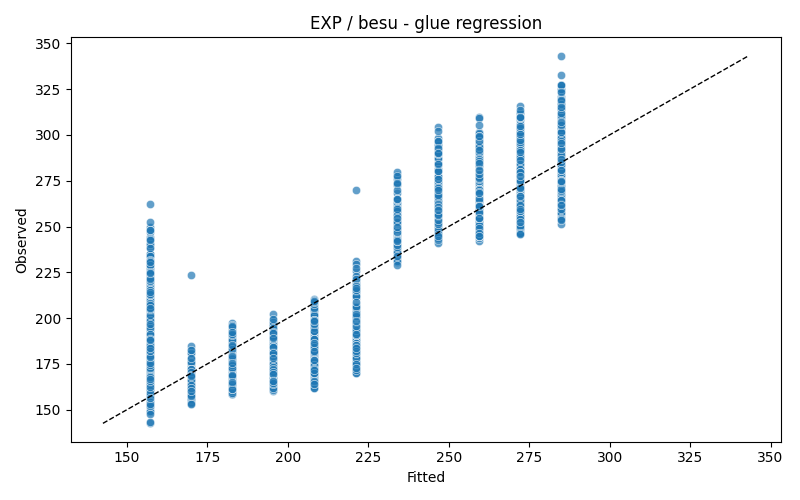

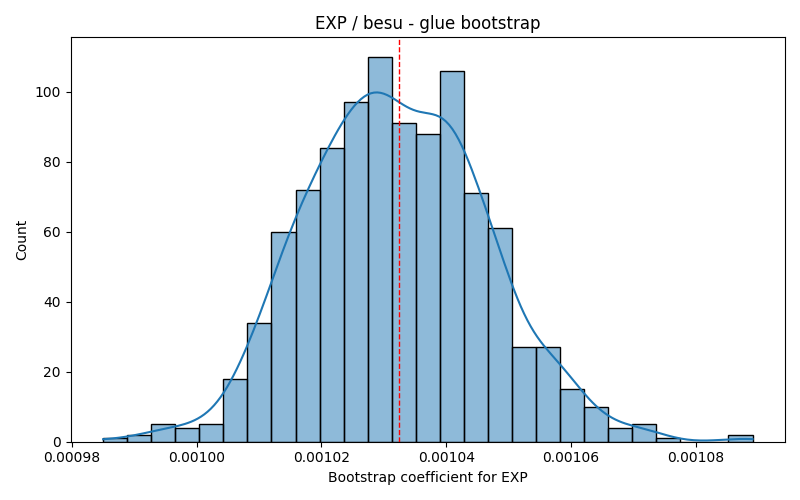

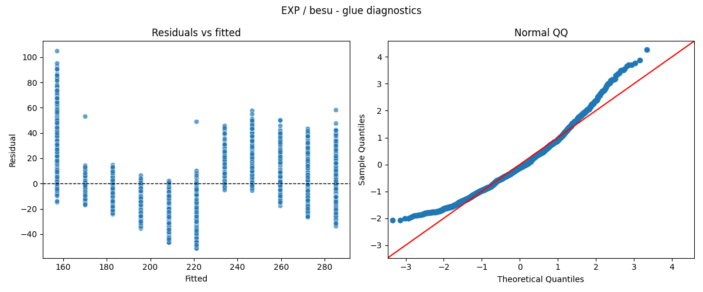

</details>

<details><summary><code>GT</code> · nobs=2420 · runtime_ms=2.014e-05 · p=1.00e-03 · R²=0.2141</summary>

```
==============================================================================
                           NNLS Regression Results                            
==============================================================================
Dep. Variable:          test_runtime_ms              R-squared:          0.214
Model:                  NNLS                    Adj. R-squared:          0.214
No. Observations:       2420                              RMSE:         406.08
Df Residuals:           2418                               MAE:         381.77
Df Model:               1      
==============================================================================
                      coef     std err     P-value      [0.025      0.975]
------------------------------------------------------------------------------
         const    136.7946     23.5676       0.001     91.0603    183.0369
            GT      0.0000      0.0000       0.001      0.0000      0.0000
==============================================================================
Notes: Non-negative least squares with bootstrap inference (1000 iterations)
==============================================================================
```

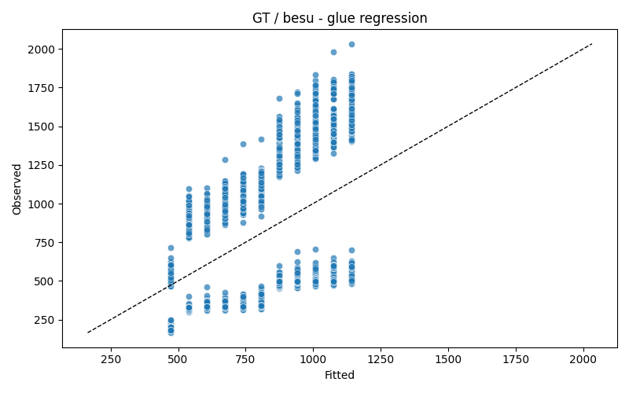

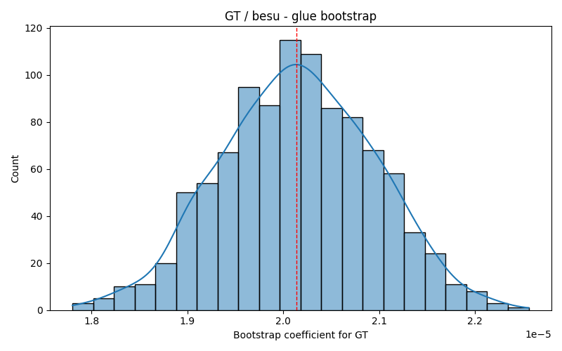

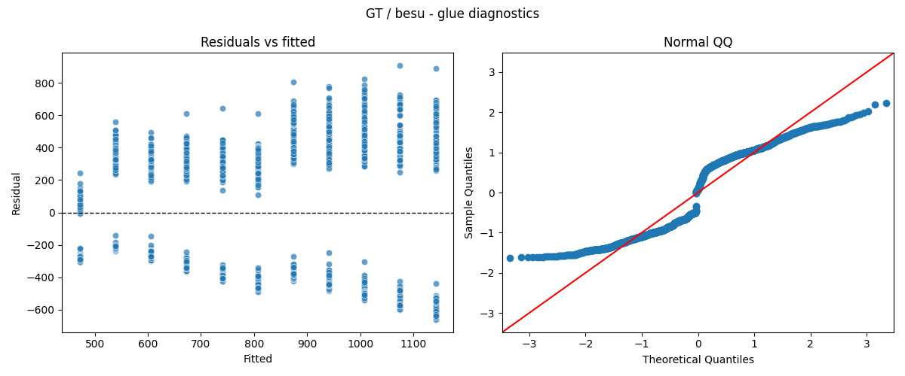

</details>

<details><summary><code>JUMPI</code> · nobs=2420 · runtime_ms=4.937e-06 · p=1.00e-03 · R²=0.7361</summary>

```
==============================================================================
                           NNLS Regression Results                            
==============================================================================
Dep. Variable:          test_runtime_ms              R-squared:          0.736
Model:                  NNLS                    Adj. R-squared:          0.736
No. Observations:       2420                              RMSE:          13.34
Df Residuals:           2418                               MAE:          10.09
Df Model:               1      
==============================================================================
                      coef     std err     P-value      [0.025      0.975]
------------------------------------------------------------------------------
         const     22.0169      0.8592       0.001     20.2844     23.7070
         JUMPI      0.0000      0.0000       0.001      0.0000      0.0000
==============================================================================
Notes: Non-negative least squares with bootstrap inference (1000 iterations)
==============================================================================
```

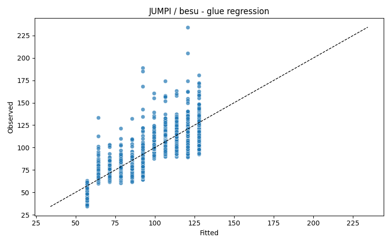

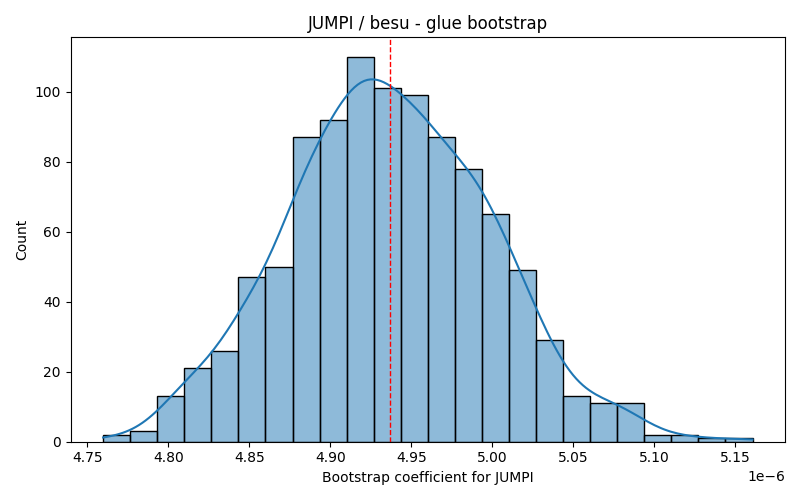

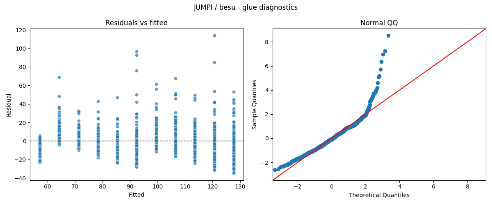

</details>

<details><summary><code>LT</code> · nobs=2420 · runtime_ms=2.037e-05 · p=1.00e-03 · R²=0.2119</summary>

```
==============================================================================
                           NNLS Regression Results                            
==============================================================================
Dep. Variable:          test_runtime_ms              R-squared:          0.212
Model:                  NNLS                    Adj. R-squared:          0.212
No. Observations:       2420                              RMSE:         413.43
Df Residuals:           2418                               MAE:         388.38
Df Model:               1      
==============================================================================
                      coef     std err     P-value      [0.025      0.975]
------------------------------------------------------------------------------
         const    172.2964     24.7918       0.001    123.9619    221.3820
            LT      0.0000      0.0000       0.001      0.0000      0.0000
==============================================================================
Notes: Non-negative least squares with bootstrap inference (1000 iterations)
==============================================================================
```

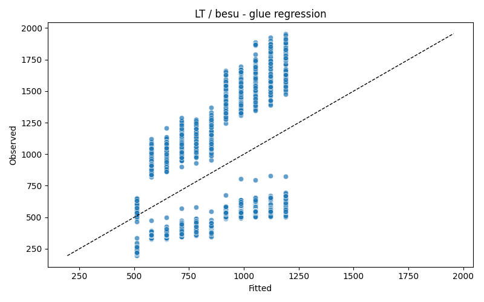

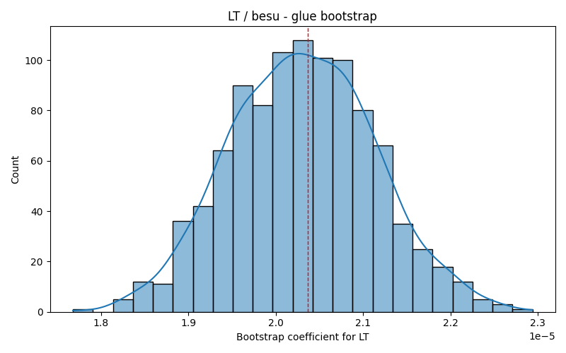

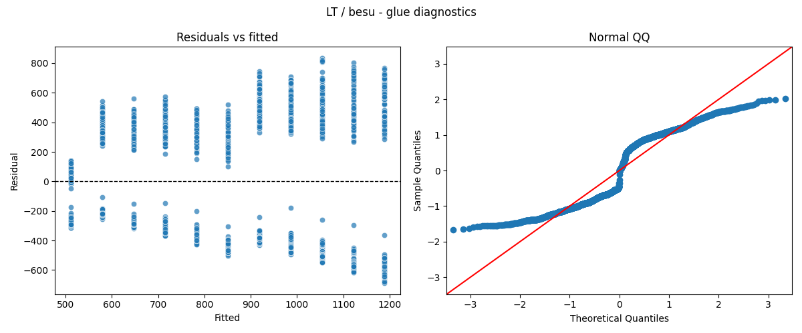

</details>

<details><summary><code>MSTORE</code> · nobs=12100 · runtime_ms=1.425e-05 · p=1.00e-03 · R²=0.7949</summary>

```
==============================================================================
                           NNLS Regression Results                            
==============================================================================
Dep. Variable:          test_runtime_ms              R-squared:          0.795
Model:                  NNLS                    Adj. R-squared:          0.795
No. Observations:       12100                             RMSE:          50.80
Df Residuals:           12098                              MAE:          41.40
Df Model:               1      
==============================================================================
                      coef     std err     P-value      [0.025      0.975]
------------------------------------------------------------------------------
         const     84.0588      1.6073       0.001     81.0117     87.2065
        MSTORE      0.0000      0.0000       0.001      0.0000      0.0000
==============================================================================
Notes: Non-negative least squares with bootstrap inference (1000 iterations)
==============================================================================
```

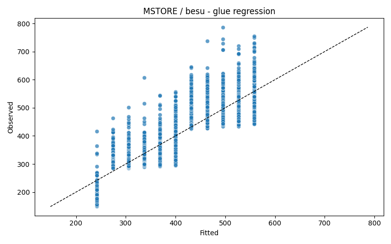

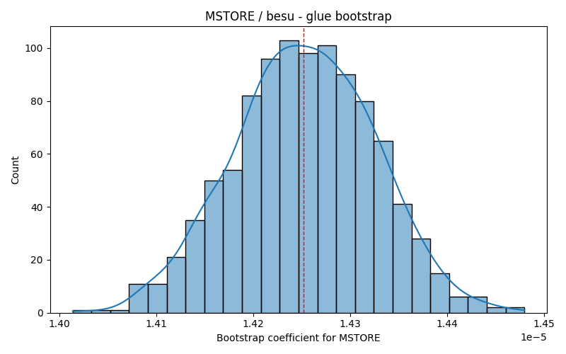

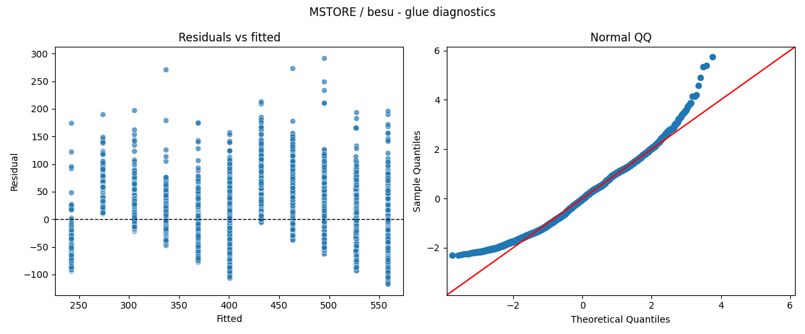

</details>

<details><summary><code>MSTORE8</code> · nobs=12100 · runtime_ms=8.834e-06 · p=1.00e-03 · R²=0.8363</summary>

```
==============================================================================
                           NNLS Regression Results                            
==============================================================================
Dep. Variable:          test_runtime_ms              R-squared:          0.836
Model:                  NNLS                    Adj. R-squared:          0.836
No. Observations:       12100                             RMSE:          27.43
Df Residuals:           12098                              MAE:          22.54
Df Model:               1      
==============================================================================
                      coef     std err     P-value      [0.025      0.975]
------------------------------------------------------------------------------
         const     51.7437      0.8674       0.001     50.0149     53.4127
       MSTORE8      0.0000      0.0000       0.001      0.0000      0.0000
==============================================================================
Notes: Non-negative least squares with bootstrap inference (1000 iterations)
==============================================================================
```

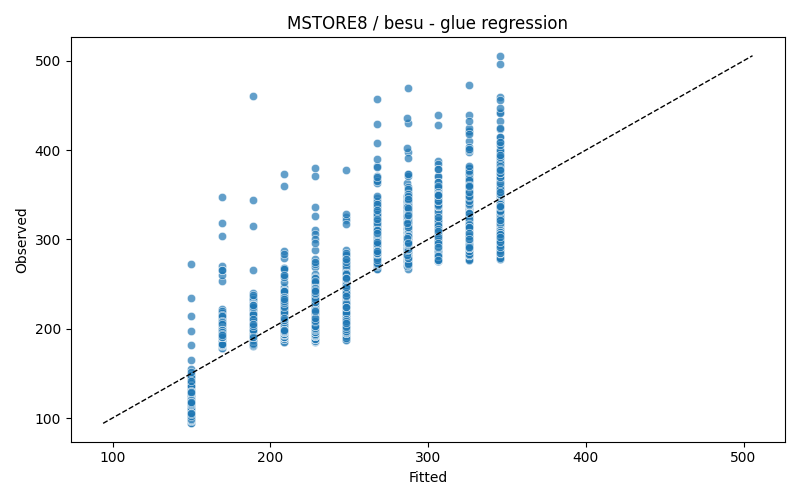

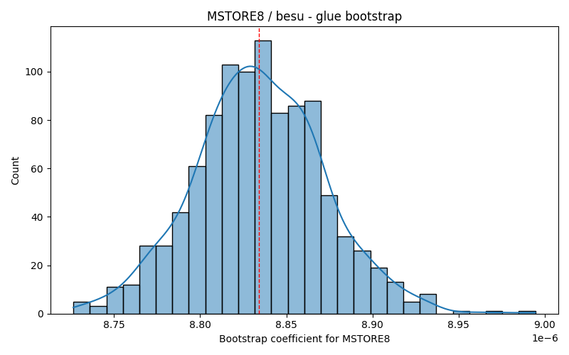

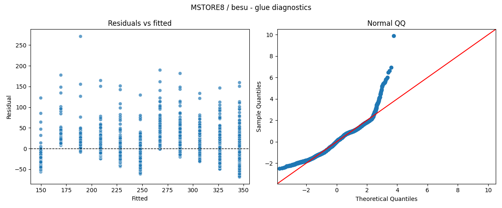

</details>

<details><summary><code>MUL</code> · nobs=2420 · runtime_ms=1.084e-05 · p=1.00e-03 · R²=0.749</summary>

```
==============================================================================
                           NNLS Regression Results                            
==============================================================================
Dep. Variable:          test_runtime_ms              R-squared:          0.749
Model:                  NNLS                    Adj. R-squared:          0.749
No. Observations:       2420                              RMSE:          49.53
Df Residuals:           2418                               MAE:          38.40
Df Model:               1      
==============================================================================
                      coef     std err     P-value      [0.025      0.975]
------------------------------------------------------------------------------
         const    103.8563      2.8043       0.001     98.1596    109.0939
           MUL      0.0000      0.0000       0.001      0.0000      0.0000
==============================================================================
Notes: Non-negative least squares with bootstrap inference (1000 iterations)
==============================================================================
```

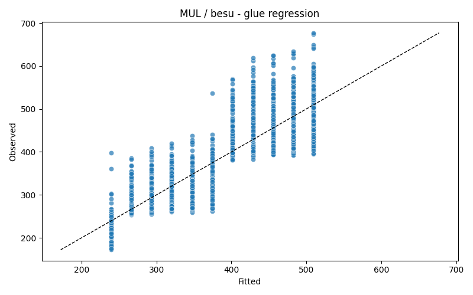


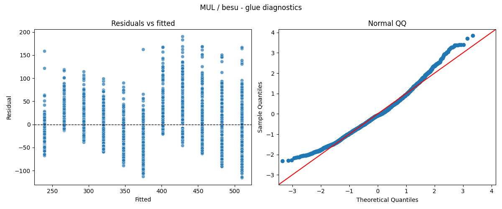

</details>

<details><summary><code>PC</code> · nobs=2420 · runtime_ms=2.799e-06 · p=1.00e-03 · R²=0.8446</summary>

```
==============================================================================
                           NNLS Regression Results                            
==============================================================================
Dep. Variable:          test_runtime_ms              R-squared:          0.845
Model:                  NNLS                    Adj. R-squared:          0.844
No. Observations:       2420                              RMSE:          35.90
Df Residuals:           2418                               MAE:          30.56
Df Model:               1      
==============================================================================
                      coef     std err     P-value      [0.025      0.975]
------------------------------------------------------------------------------
         const     70.7599      2.6736       0.001     65.7270     75.8029
            PC      0.0000      0.0000       0.001      0.0000      0.0000
==============================================================================
Notes: Non-negative least squares with bootstrap inference (1000 iterations)
==============================================================================
```

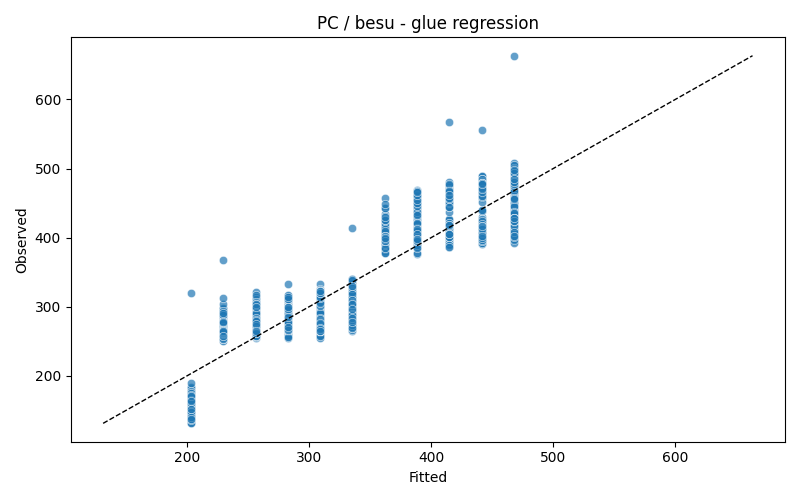

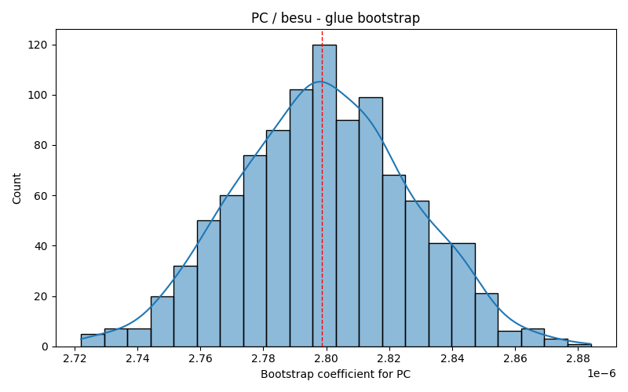

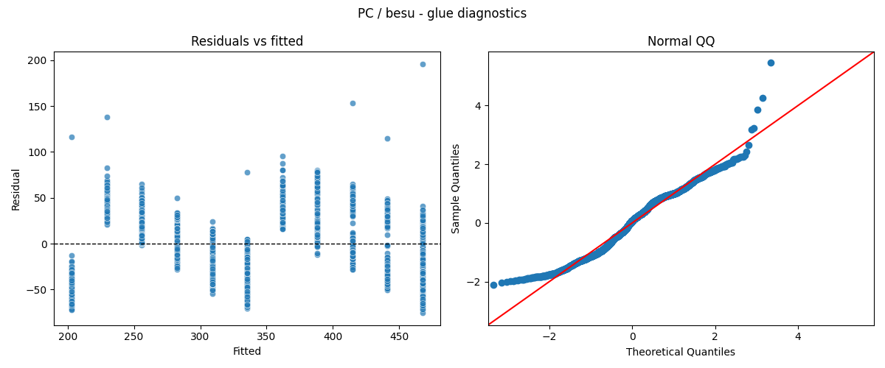

</details>

<details><summary><code>RETURNDATASIZE</code> · nobs=9680 · runtime_ms=4.112e-06 · p=1.00e-03 · R²=0.7827</summary>

```
==============================================================================
                           NNLS Regression Results                            
==============================================================================
Dep. Variable:          test_runtime_ms              R-squared:          0.783
Model:                  NNLS                    Adj. R-squared:          0.783
No. Observations:       9680                              RMSE:          34.21
Df Residuals:           9678                               MAE:          24.89
Df Model:               1      
==============================================================================
                      coef     std err     P-value      [0.025      0.975]
------------------------------------------------------------------------------
         const     53.4490      1.1451       0.001     51.2373     55.7919
RETURNDATASIZE      0.0000      0.0000       0.001      0.0000      0.0000
==============================================================================
Notes: Non-negative least squares with bootstrap inference (1000 iterations)
==============================================================================
```

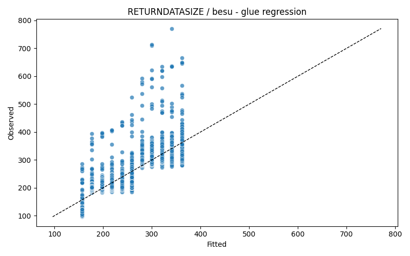

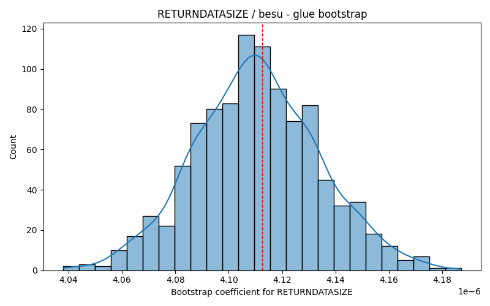

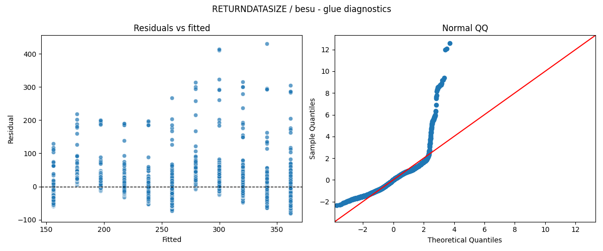

</details>

<details><summary><code>SELFBALANCE</code> · nobs=1980 · runtime_ms=9.978e-06 · p=1.00e-03 · R²=0.686</summary>

```
==============================================================================
                           NNLS Regression Results                            
==============================================================================
Dep. Variable:          test_runtime_ms              R-squared:          0.686
Model:                  NNLS                    Adj. R-squared:          0.686
No. Observations:       1980                              RMSE:          68.09
Df Residuals:           1978                               MAE:          56.66
Df Model:               1      
==============================================================================
                      coef     std err     P-value      [0.025      0.975]
------------------------------------------------------------------------------
         const    220.4222      5.9108       0.001    208.2867    230.6701
   SELFBALANCE      0.0000      0.0000       0.001      0.0000      0.0000
==============================================================================
Notes: Non-negative least squares with bootstrap inference (1000 iterations)
==============================================================================
```

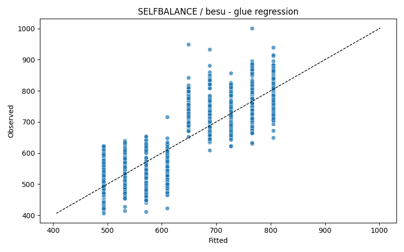

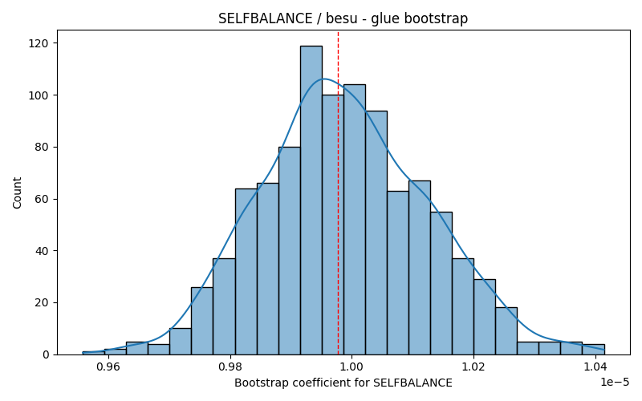

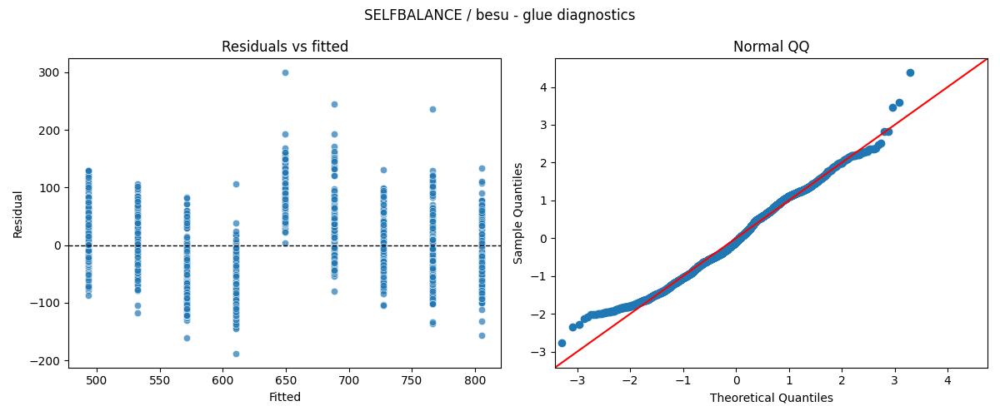

</details>

<details><summary><code>SUB</code> · nobs=2420 · runtime_ms=8.652e-06 · p=1.00e-03 · R²=0.8231</summary>

```
==============================================================================
                           NNLS Regression Results                            
==============================================================================
Dep. Variable:          test_runtime_ms              R-squared:          0.823
Model:                  NNLS                    Adj. R-squared:          0.823
No. Observations:       2420                              RMSE:          42.22
Df Residuals:           2418                               MAE:          34.76
Df Model:               1      
==============================================================================
                      coef     std err     P-value      [0.025      0.975]
------------------------------------------------------------------------------
         const     83.2856      2.9770       0.001     77.7705     89.0537
           SUB      0.0000      0.0000       0.001      0.0000      0.0000
==============================================================================
Notes: Non-negative least squares with bootstrap inference (1000 iterations)
==============================================================================
```

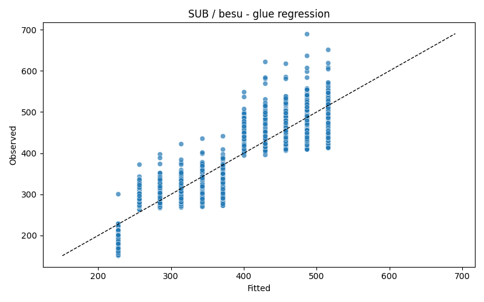

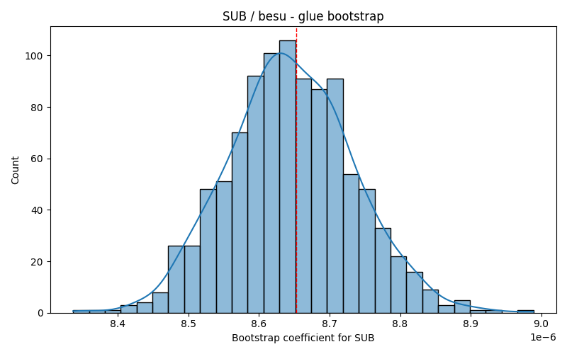

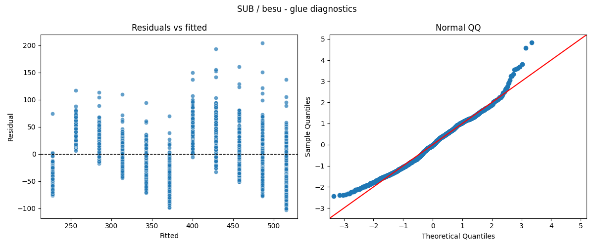

</details>

### Mixed glue (tier B) · besu

<details><summary><code>JUMP</code> · nobs=2420 · runtime_ms=4.139e-05 · p=1.00e-03 · R²=0.8387</summary>

```
==============================================================================
                           NNLS Regression Results                            
==============================================================================
Dep. Variable:          test_runtime_ms              R-squared:          0.839
Model:                  NNLS                    Adj. R-squared:          0.839
No. Observations:       2420                              RMSE:          67.45
Df Residuals:           2418                               MAE:          56.77
Df Model:               1      
==============================================================================
                      coef     std err     P-value      [0.025      0.975]
------------------------------------------------------------------------------
         const    126.2210      4.8386       0.001    116.9785    135.8611
          JUMP      0.0000      0.0000       0.001      0.0000      0.0000
==============================================================================
Notes: Non-negative least squares with bootstrap inference (1000 iterations)
==============================================================================
```

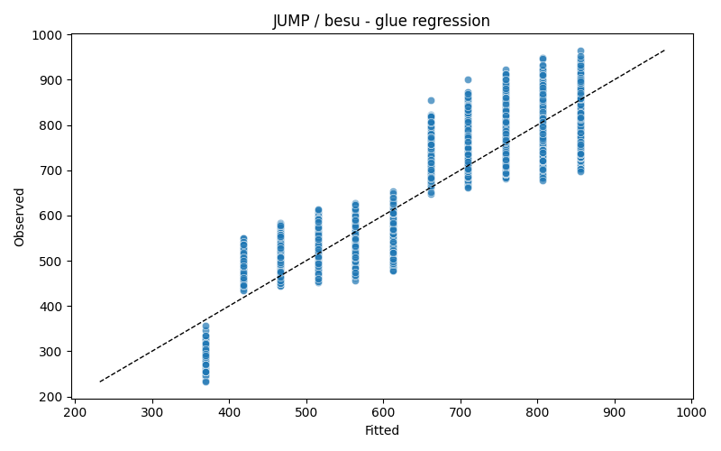

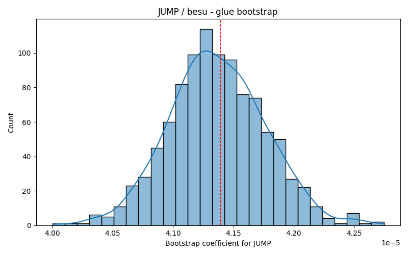

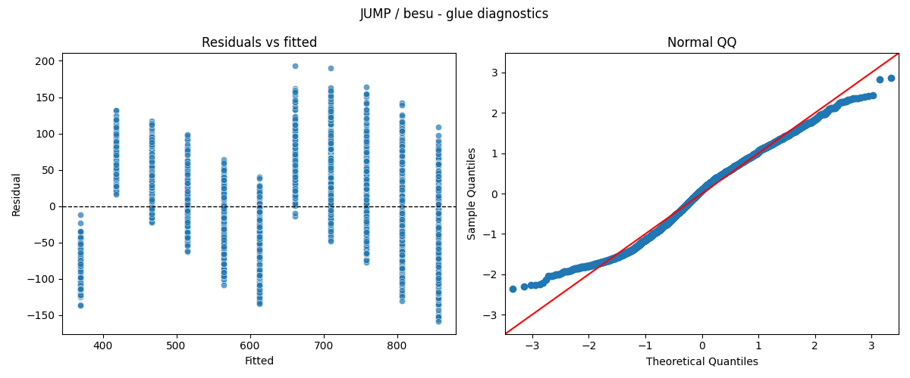

</details>

<details><summary><code>KECCAK256</code> · nobs=38720 · runtime_ms=3.574e-05 · p=1.00e-03 · R²=0.1436</summary>

```
==============================================================================
                           NNLS Regression Results                            
==============================================================================
Dep. Variable:          test_runtime_ms              R-squared:          0.144
Model:                  NNLS                    Adj. R-squared:          0.144
No. Observations:       38720                             RMSE:         173.45
Df Residuals:           38718                              MAE:         135.73
Df Model:               1      
==============================================================================
                      coef     std err     P-value      [0.025      0.975]
------------------------------------------------------------------------------
         const    532.0266      1.9627       0.001    528.1539    535.7604
     KECCAK256      0.0000      0.0000       0.001      0.0000      0.0000
==============================================================================
Notes: Non-negative least squares with bootstrap inference (1000 iterations)
==============================================================================
```

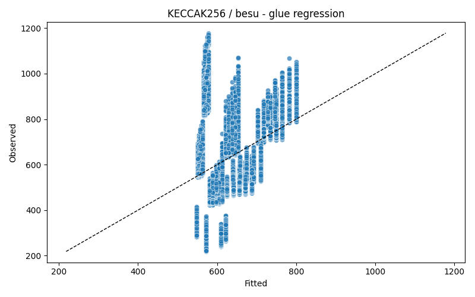

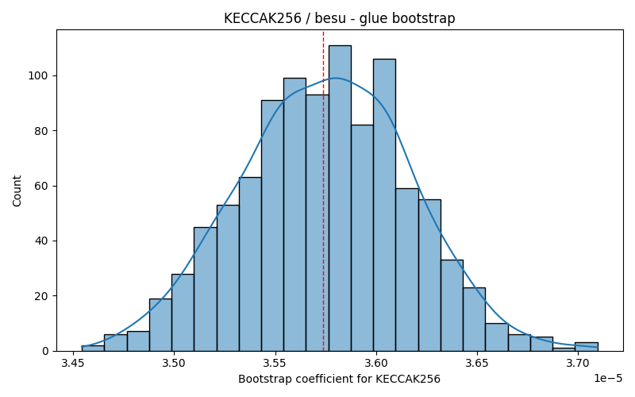

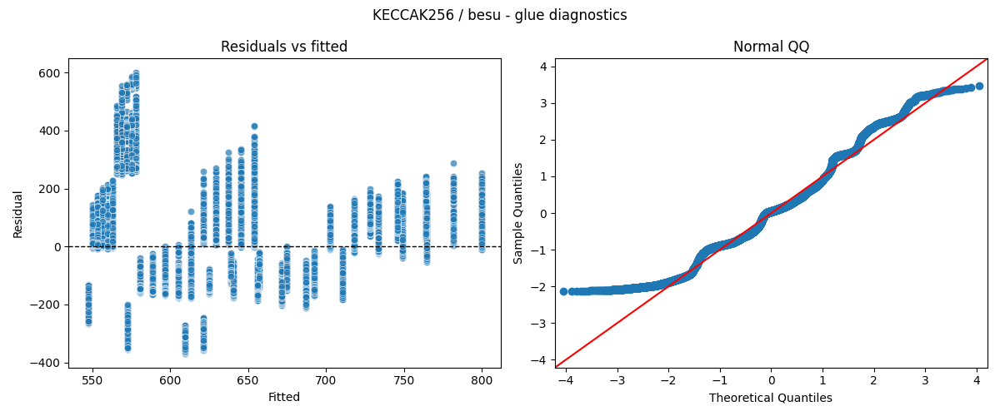

</details>

## erigon

| glue_opcode | nobs | glue_runtime_ms | p_value | rsquared |
| --- | --- | --- | --- | --- |
| `ISZERO` | 968 | 1.007e-06 | 1.00e-03 | 0.8171 |
| `JUMPDEST` | 968 | 7.807e-07 | 1.00e-03 | 0.8883 |
| `SWAP` | 15488 | 1.244e-06 | 1.00e-03 | 0.8424 |
| `CALLDATASIZE` | 57398 | 8.94e-07 | 1.00e-03 | 0.9109 |
| `DUP` | 57398 | 1.087e-06 | 1.00e-03 | 0.9109 |
| `GAS` | 57398 | 9.226e-07 | 1.00e-03 | 0.9109 |
| `MLOAD` | 57398 | 3.421e-06 | 1.00e-03 | 0.9109 |
| `PUSH` | 57398 | 2.788e-06 | 1.00e-03 | 0.9109 |
| `PUSH0` | 57398 | 9.409e-07 | 1.00e-03 | 0.9109 |
| `STATICCALL` | 57398 | 0.0004569 | 1.00e-03 | 0.9109 |
| `ADD` | 968 | 2.803e-06 | 1.00e-03 | 0.8035 |
| `AND` | 968 | 2.744e-06 | 1.00e-03 | 0.8216 |
| `CALLDATACOPY` | 23232 | 8.142e-06 | 1.00e-03 | 0.9578 |
| `CALLDATALOAD` | 3872 | 1.014e-06 | 4.06e-01 | 1.092e-07 |
| `DIV` | 968 | 9.768e-06 | 1.00e-03 | 0.8869 |
| `EXP` | 968 | 0.0003505 | 1.00e-03 | 0.9092 |
| `GT` | 968 | 2.764e-06 | 1.00e-03 | 0.8419 |
| `JUMPI` | 968 | 3.339e-06 | 1.00e-03 | 0.8571 |
| `LT` | 968 | 2.679e-06 | 1.00e-03 | 0.727 |
| `MSTORE` | 4840 | 5.828e-06 | 1.00e-03 | 0.9006 |
| `MSTORE8` | 4840 | 5.196e-06 | 1.00e-03 | 0.8697 |
| `MUL` | 968 | 3.364e-06 | 1.00e-03 | 0.9014 |
| `PC` | 968 | 1.396e-06 | 1.00e-03 | 0.8628 |
| `RETURNDATASIZE` | 3872 | 1.822e-06 | 1.00e-03 | 0.7195 |
| `SELFBALANCE` | 792 | 1.423e-06 | 1.00e-03 | 0.7207 |
| `SUB` | 968 | 2.763e-06 | 1.00e-03 | 0.8304 |
| `JUMP` | 968 | 7.138e-06 | 1.00e-03 | 0.8586 |
| `KECCAK256` | 15488 | 2.106e-05 | 1.00e-03 | 0.09359 |

### Cycle glue — joint fit · erigon

<details><summary>Joint NNLS regression summary</summary>

```
==============================================================================
                           NNLS Regression Results                            
==============================================================================
Dep. Variable:          test_runtime_ms              R-squared:          0.911
Model:                  NNLS                    Adj. R-squared:          0.911
No. Observations:       57398                             RMSE:          27.25
Df Residuals:           57390                              MAE:          16.26
Df Model:               7      
==============================================================================
                      coef     std err     P-value      [0.025      0.975]
------------------------------------------------------------------------------
         const     27.6034      0.3576       0.001     26.9307     28.3439
  CALLDATASIZE      0.0000      0.0000       0.001      0.0000      0.0000
           DUP      0.0000      0.0000       0.001      0.0000      0.0000
           GAS      0.0000      0.0000       0.001      0.0000      0.0000
         MLOAD      0.0000      0.0000       0.001      0.0000      0.0000
          PUSH      0.0000      0.0000       0.001      0.0000      0.0000
         PUSH0      0.0000      0.0000       0.001      0.0000      0.0000
    STATICCALL      0.0005      0.0000       0.001      0.0005      0.0005
==============================================================================
Notes: Non-negative least squares with bootstrap inference (1000 iterations)
==============================================================================
```

</details>

<details><summary><code>CALLDATASIZE</code> · nobs=57398 · runtime_ms=8.94e-07 · p=1.00e-03 · R²=0.9109</summary>

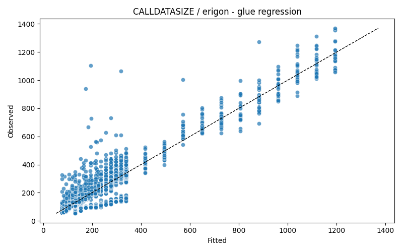

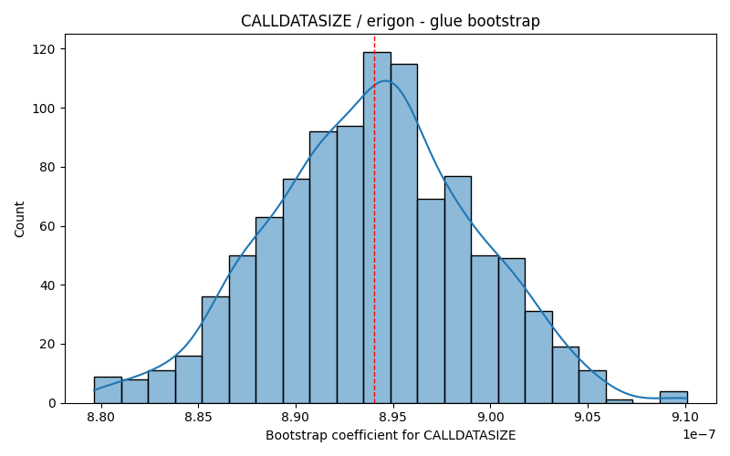

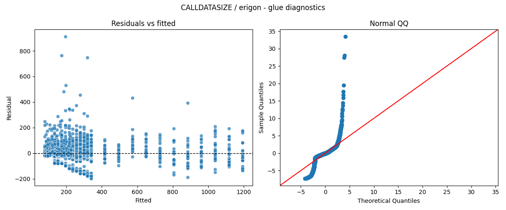

</details>

<details><summary><code>DUP</code> · nobs=57398 · runtime_ms=1.087e-06 · p=1.00e-03 · R²=0.9109</summary>


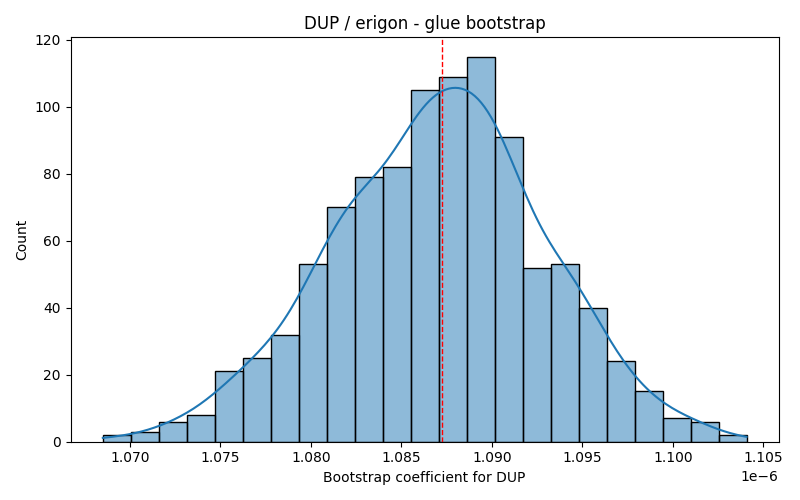


</details>

<details><summary><code>GAS</code> · nobs=57398 · runtime_ms=9.226e-07 · p=1.00e-03 · R²=0.9109</summary>


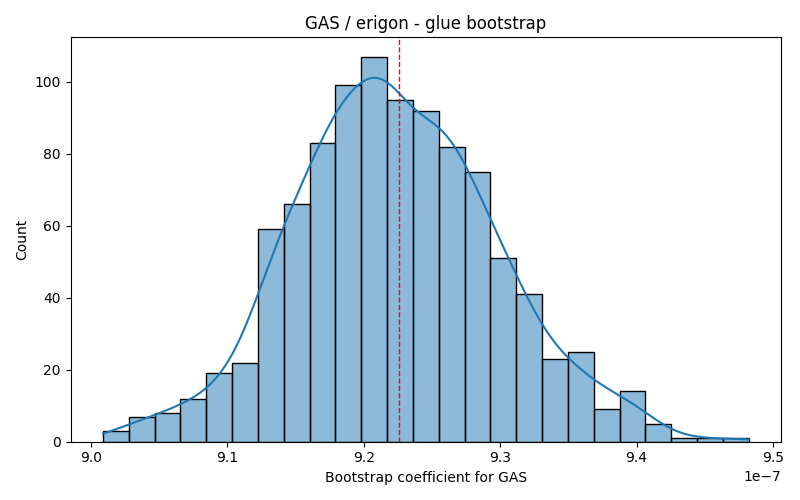


</details>

<details><summary><code>MLOAD</code> · nobs=57398 · runtime_ms=3.421e-06 · p=1.00e-03 · R²=0.9109</summary>


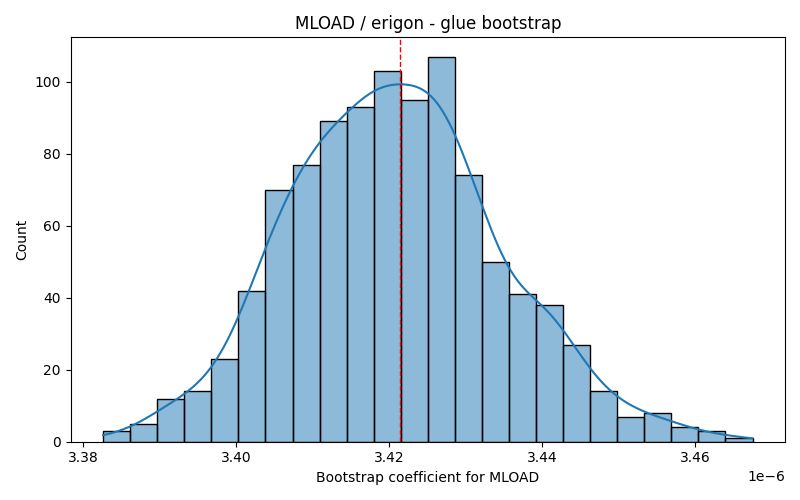


</details>

<details><summary><code>PUSH</code> · nobs=57398 · runtime_ms=2.788e-06 · p=1.00e-03 · R²=0.9109</summary>


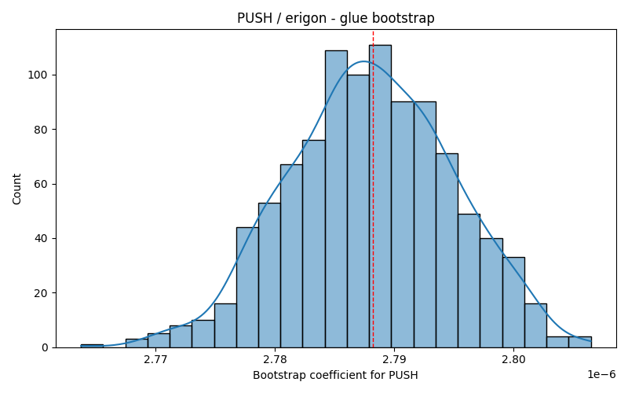


</details>

<details><summary><code>PUSH0</code> · nobs=57398 · runtime_ms=9.409e-07 · p=1.00e-03 · R²=0.9109</summary>

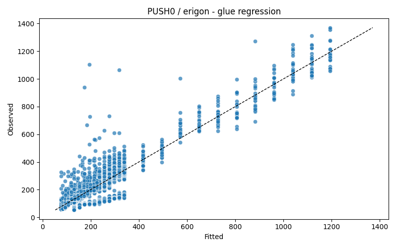

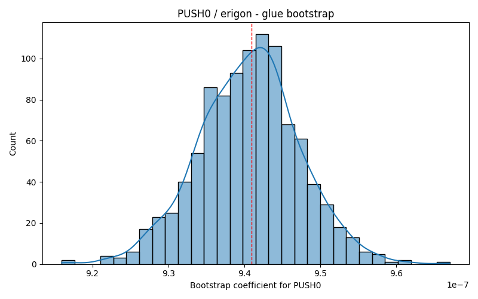

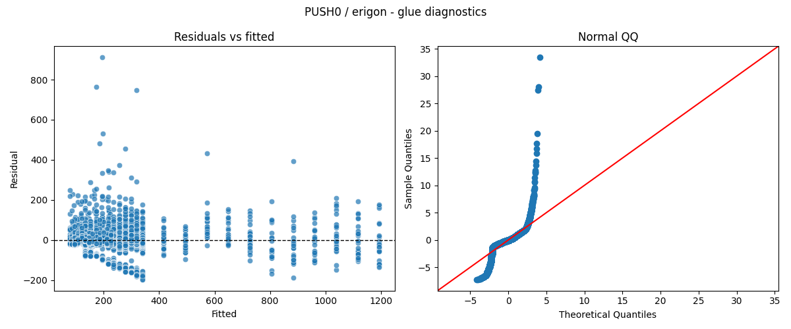

</details>

<details><summary><code>STATICCALL</code> · nobs=57398 · runtime_ms=0.0004569 · p=1.00e-03 · R²=0.9109</summary>


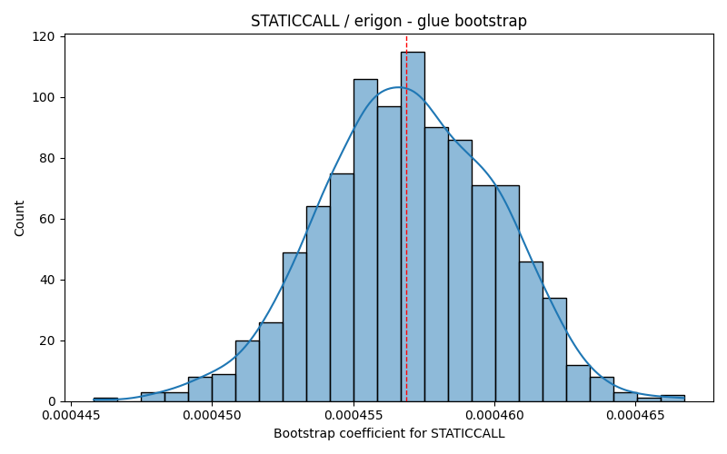

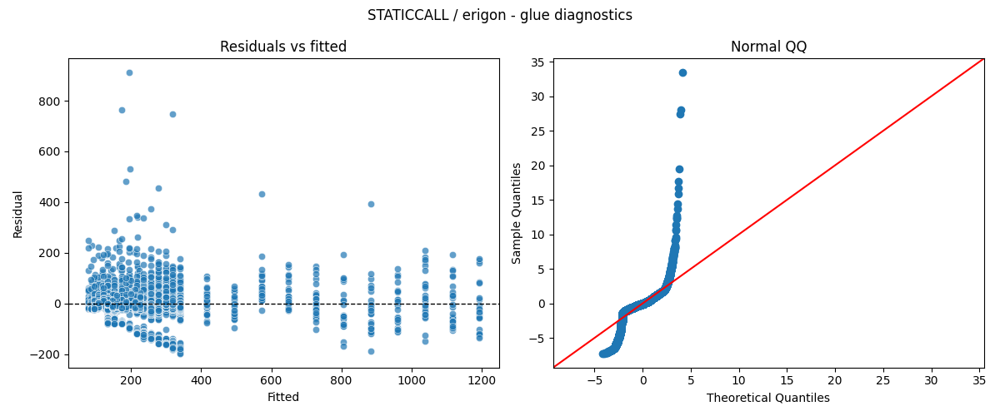

</details>

### Pure glue · erigon

<details><summary><code>ISZERO</code> · nobs=968 · runtime_ms=1.007e-06 · p=1.00e-03 · R²=0.8171</summary>

```
==============================================================================
                           NNLS Regression Results                            
==============================================================================
Dep. Variable:          test_runtime_ms              R-squared:          0.817
Model:                  NNLS                    Adj. R-squared:          0.817
No. Observations:       968                               RMSE:          10.03
Df Residuals:           966                                MAE:           5.57
Df Model:               1      
==============================================================================
                      coef     std err     P-value      [0.025      0.975]
------------------------------------------------------------------------------
         const     17.7474      0.8202       0.001     16.2455     19.2816
        ISZERO      0.0000      0.0000       0.001      0.0000      0.0000
==============================================================================
Notes: Non-negative least squares with bootstrap inference (1000 iterations)
==============================================================================
```

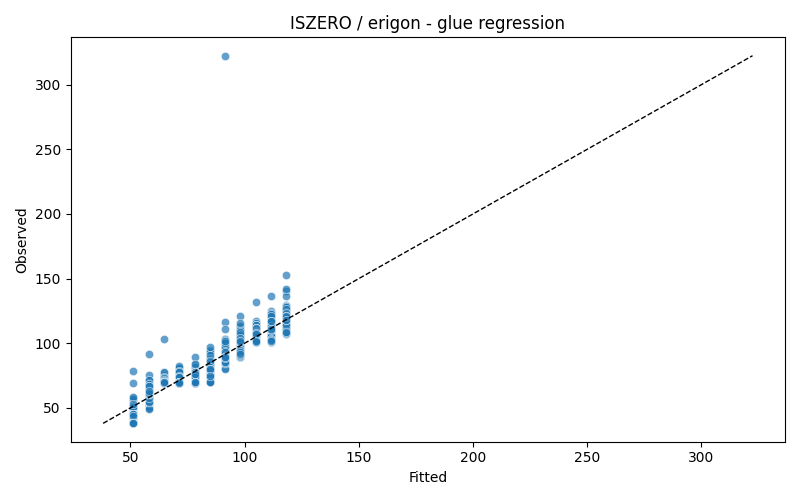

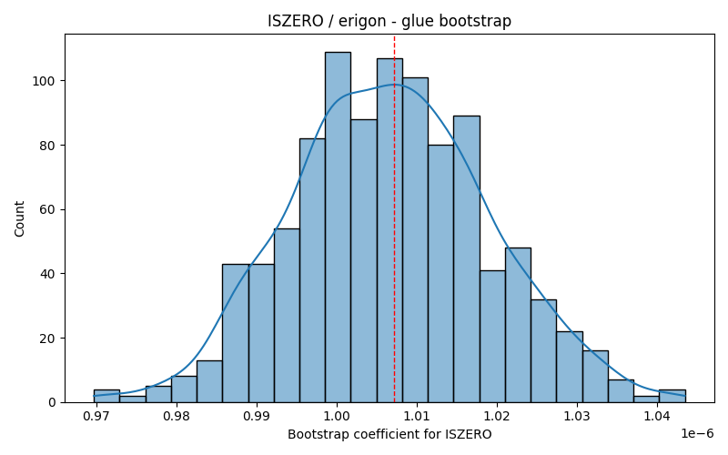

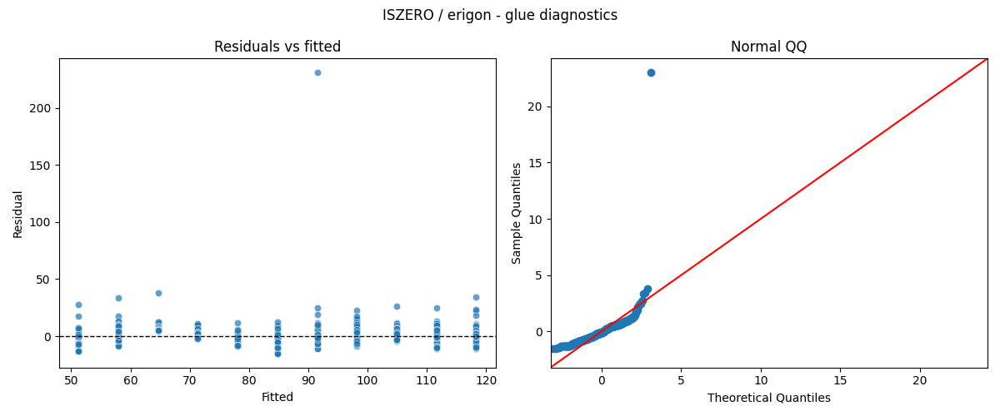

</details>

<details><summary><code>JUMPDEST</code> · nobs=968 · runtime_ms=7.807e-07 · p=1.00e-03 · R²=0.8883</summary>

```
==============================================================================
                           NNLS Regression Results                            
==============================================================================
Dep. Variable:          test_runtime_ms              R-squared:          0.888
Model:                  NNLS                    Adj. R-squared:          0.888
No. Observations:       968                               RMSE:          17.48
Df Residuals:           966                                MAE:          13.48
Df Model:               1      
==============================================================================
                      coef     std err     P-value      [0.025      0.975]
------------------------------------------------------------------------------
         const     22.5972      1.9285       0.001     18.9821     26.5348
      JUMPDEST      0.0000      0.0000       0.001      0.0000      0.0000
==============================================================================
Notes: Non-negative least squares with bootstrap inference (1000 iterations)
==============================================================================
```

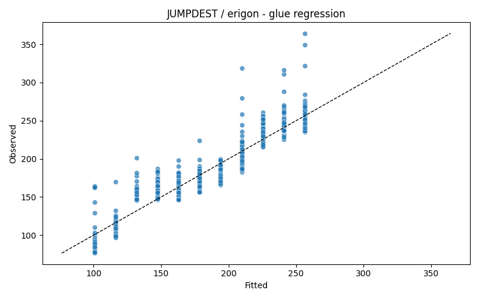

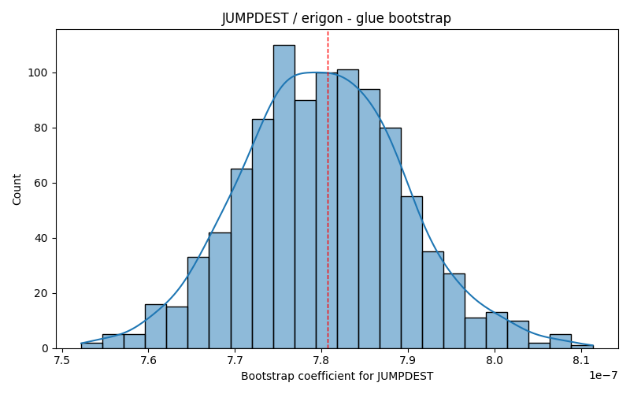

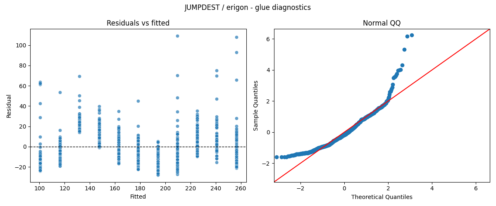

</details>

<details><summary><code>SWAP</code> · nobs=15488 · runtime_ms=1.244e-06 · p=1.00e-03 · R²=0.8424</summary>

```
==============================================================================
                           NNLS Regression Results                            
==============================================================================
Dep. Variable:          test_runtime_ms              R-squared:          0.842
Model:                  NNLS                    Adj. R-squared:          0.842
No. Observations:       15488                             RMSE:          11.33
Df Residuals:           15486                              MAE:           6.63
Df Model:               1      
==============================================================================
                      coef     std err     P-value      [0.025      0.975]
------------------------------------------------------------------------------
         const     23.7552      0.2996       0.001     23.1353     24.3564
          SWAP      0.0000      0.0000       0.001      0.0000      0.0000
==============================================================================
Notes: Non-negative least squares with bootstrap inference (1000 iterations)
==============================================================================
```

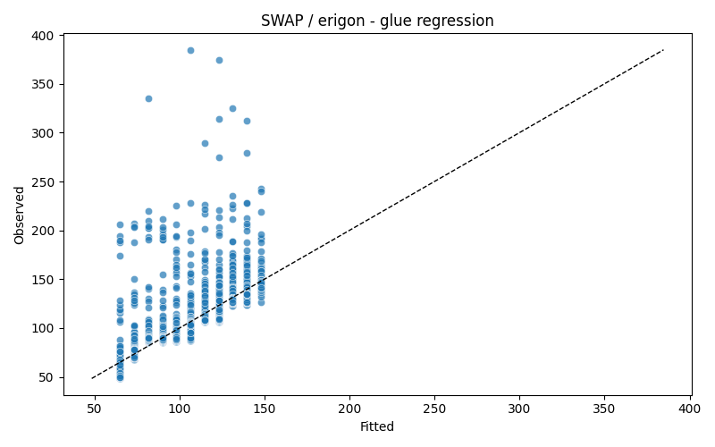

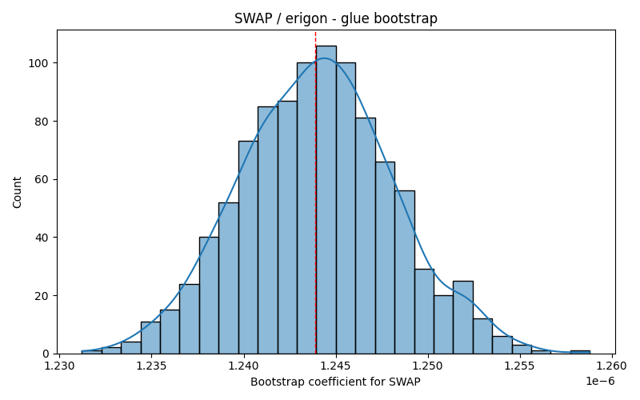

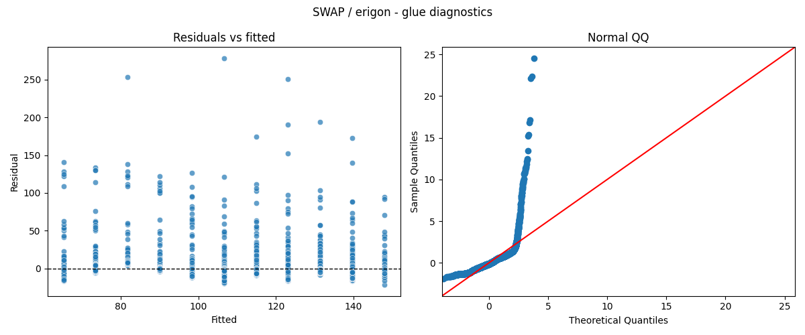

</details>

### Mixed glue (tier A) · erigon

<details><summary><code>ADD</code> · nobs=968 · runtime_ms=2.803e-06 · p=1.00e-03 · R²=0.8035</summary>

```
==============================================================================
                           NNLS Regression Results                            
==============================================================================
Dep. Variable:          test_runtime_ms              R-squared:          0.803
Model:                  NNLS                    Adj. R-squared:          0.803
No. Observations:       968                               RMSE:          14.59
Df Residuals:           966                                MAE:           8.97
Df Model:               1      
==============================================================================
                      coef     std err     P-value      [0.025      0.975]
------------------------------------------------------------------------------
         const     17.4928      1.8253       0.001     14.1085     21.1014
           ADD      0.0000      0.0000       0.001      0.0000      0.0000
==============================================================================
Notes: Non-negative least squares with bootstrap inference (1000 iterations)
==============================================================================
```

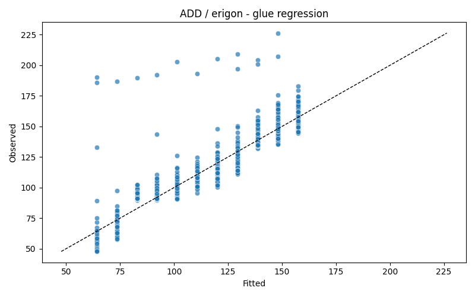

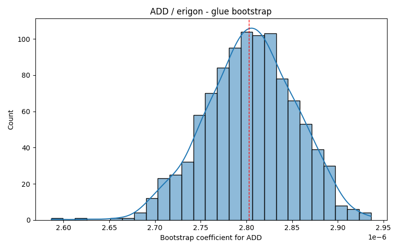

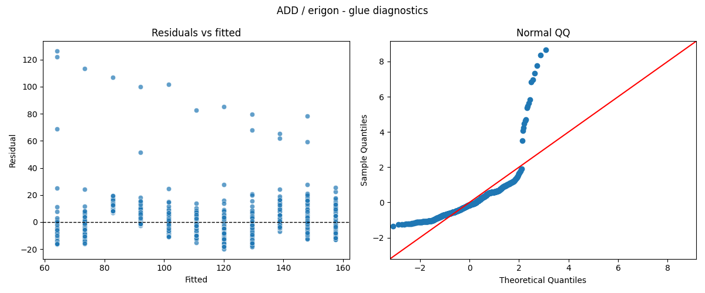

</details>

<details><summary><code>AND</code> · nobs=968 · runtime_ms=2.744e-06 · p=1.00e-03 · R²=0.8216</summary>

```
==============================================================================
                           NNLS Regression Results                            
==============================================================================
Dep. Variable:          test_runtime_ms              R-squared:          0.822
Model:                  NNLS                    Adj. R-squared:          0.821
No. Observations:       968                               RMSE:          13.46
Df Residuals:           966                                MAE:           8.37
Df Model:               1      
==============================================================================
                      coef     std err     P-value      [0.025      0.975]
------------------------------------------------------------------------------
         const     17.1301      1.5999       0.001     14.1608     20.5244
           AND      0.0000      0.0000       0.001      0.0000      0.0000
==============================================================================
Notes: Non-negative least squares with bootstrap inference (1000 iterations)
==============================================================================
```

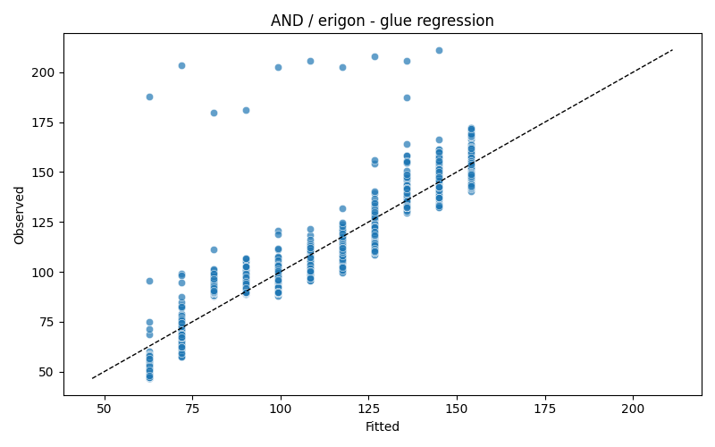

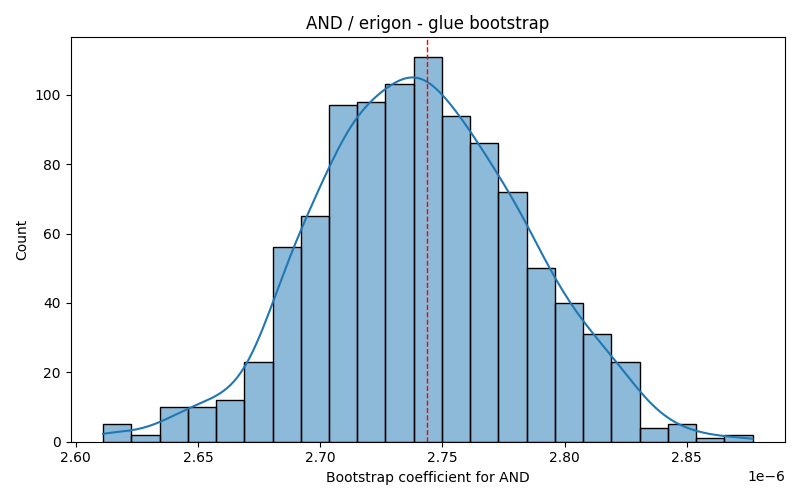

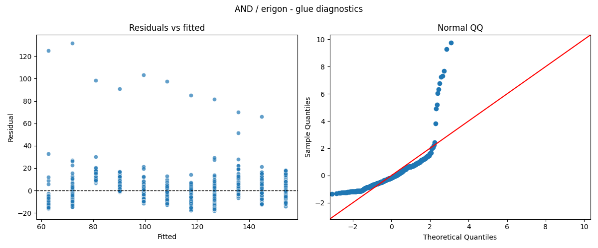

</details>

<details><summary><code>CALLDATACOPY</code> · nobs=23232 · runtime_ms=8.142e-06 · p=1.00e-03 · R²=0.9578</summary>

```
==============================================================================
                           NNLS Regression Results                            
==============================================================================
Dep. Variable:          test_runtime_ms              R-squared:          0.958
Model:                  NNLS                    Adj. R-squared:          0.958
No. Observations:       23232                             RMSE:          12.85
Df Residuals:           23230                              MAE:           9.33
Df Model:               1      
==============================================================================
                      coef     std err     P-value      [0.025      0.975]
------------------------------------------------------------------------------
         const     18.3354      0.0968       0.001     18.1436     18.5394
  CALLDATACOPY      0.0000      0.0000       0.001      0.0000      0.0000
==============================================================================
Notes: Non-negative least squares with bootstrap inference (1000 iterations)
==============================================================================
```

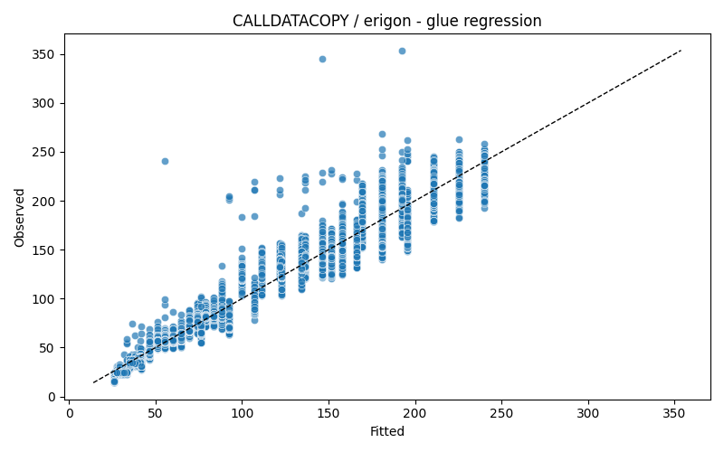

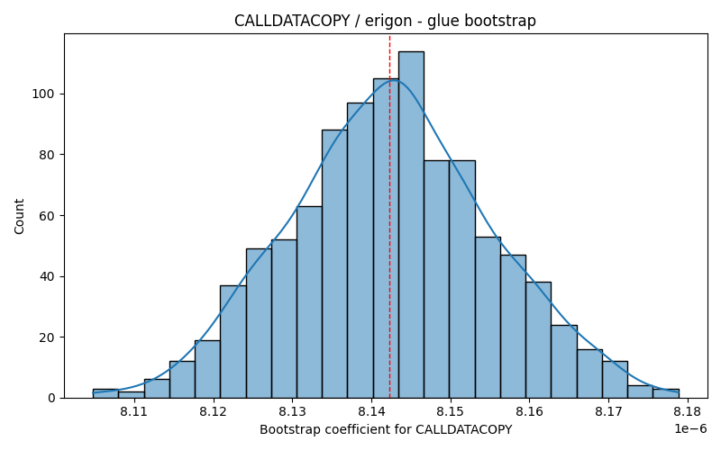

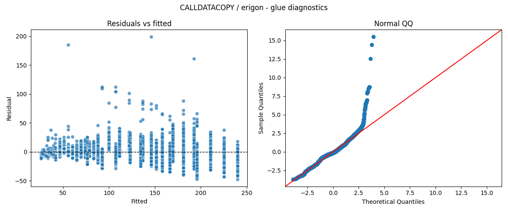

</details>

<details><summary><code>CALLDATALOAD</code> · nobs=3872 · runtime_ms=1.014e-06 · p=4.06e-01 · R²=1.092e-07</summary>

```
==============================================================================
                           NNLS Regression Results                            
==============================================================================
Dep. Variable:          test_runtime_ms              R-squared:          0.000
Model:                  NNLS                    Adj. R-squared:         -0.000
No. Observations:       3872                              RMSE:          11.78
Df Residuals:           3870                               MAE:           0.98
Df Model:               1      
==============================================================================
                      coef     std err     P-value      [0.025      0.975]
------------------------------------------------------------------------------
         const      6.8988      0.3562       0.001      6.1569      7.3340
  CALLDATALOAD      0.0000      0.0000       0.406      0.0000      0.0000
==============================================================================
Notes: Non-negative least squares with bootstrap inference (1000 iterations)
==============================================================================
```

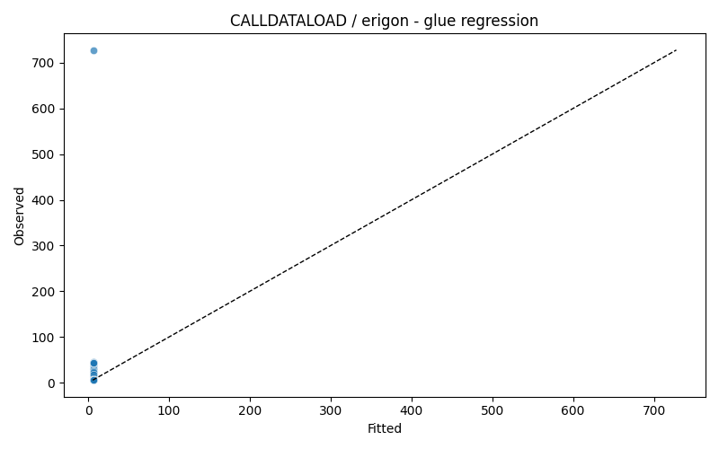

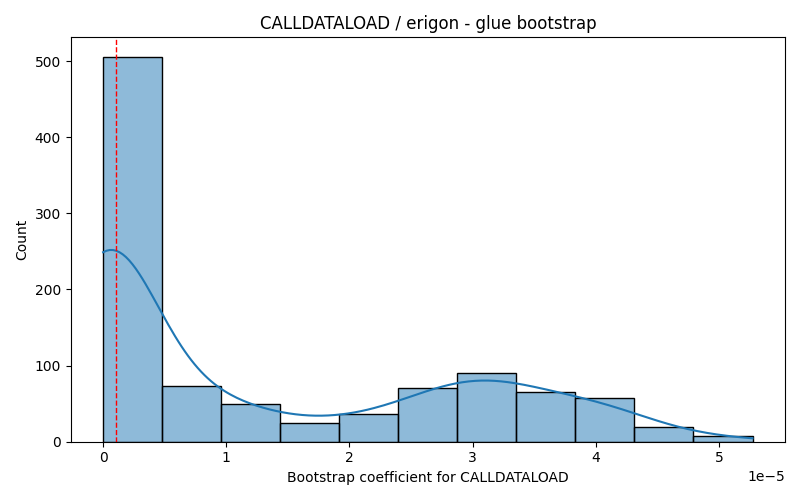

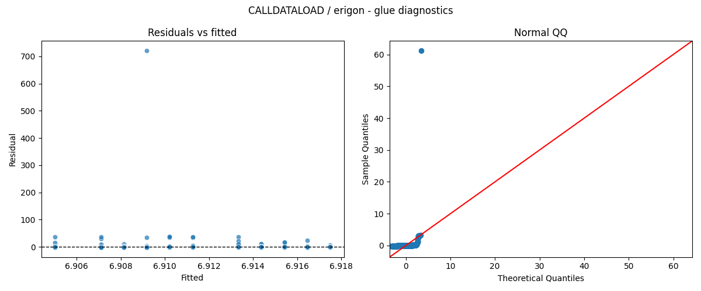

</details>

<details><summary><code>DIV</code> · nobs=968 · runtime_ms=9.768e-06 · p=1.00e-03 · R²=0.8869</summary>

```
==============================================================================
                           NNLS Regression Results                            
==============================================================================
Dep. Variable:          test_runtime_ms              R-squared:          0.887
Model:                  NNLS                    Adj. R-squared:          0.887
No. Observations:       968                               RMSE:          27.54
Df Residuals:           966                                MAE:          23.27
Df Model:               1      
==============================================================================
                      coef     std err     P-value      [0.025      0.975]
------------------------------------------------------------------------------
         const     22.2313      2.8266       0.001     16.6854     27.8044
           DIV      0.0000      0.0000       0.001      0.0000      0.0000
==============================================================================
Notes: Non-negative least squares with bootstrap inference (1000 iterations)
==============================================================================
```

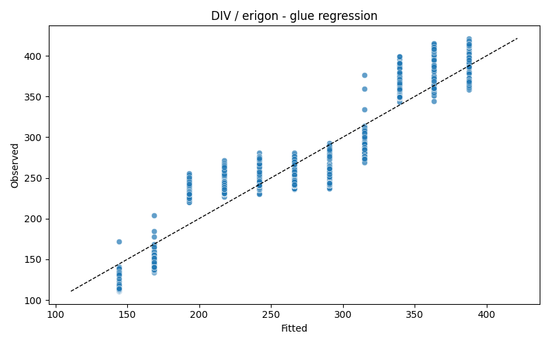

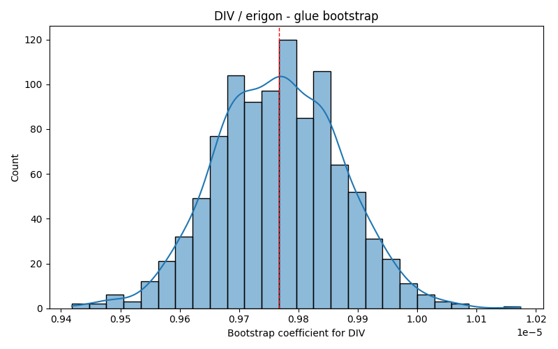

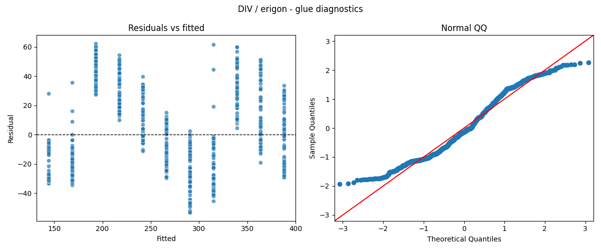

</details>

<details><summary><code>EXP</code> · nobs=968 · runtime_ms=0.0003505 · p=1.00e-03 · R²=0.9092</summary>

```
==============================================================================
                           NNLS Regression Results                            
==============================================================================
Dep. Variable:          test_runtime_ms              R-squared:          0.909
Model:                  NNLS                    Adj. R-squared:          0.909
No. Observations:       968                               RMSE:           4.34
Df Residuals:           966                                MAE:           3.63
Df Model:               1      
==============================================================================
                      coef     std err     P-value      [0.025      0.975]
------------------------------------------------------------------------------
         const     11.6211      0.5228       0.001     10.6456     12.6465
           EXP      0.0004      0.0000       0.001      0.0003      0.0004
==============================================================================
Notes: Non-negative least squares with bootstrap inference (1000 iterations)
==============================================================================
```

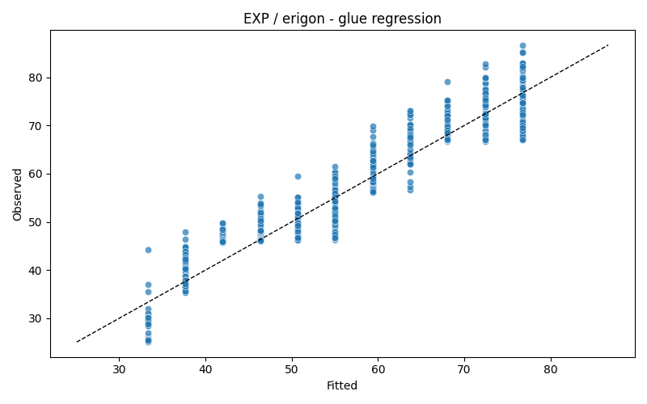


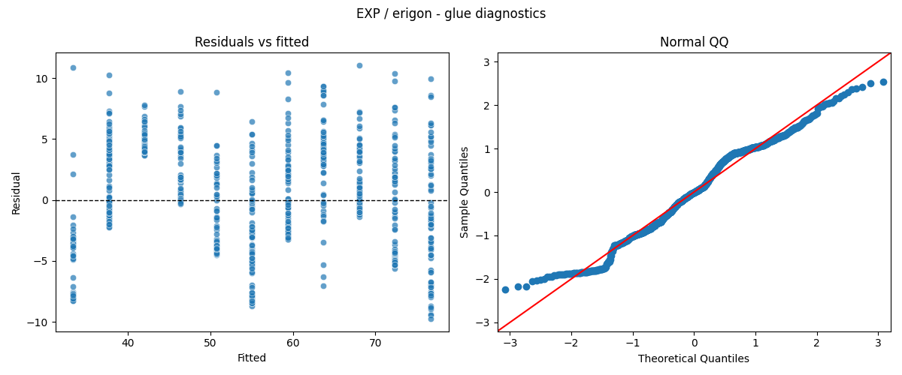

</details>

<details><summary><code>GT</code> · nobs=968 · runtime_ms=2.764e-06 · p=1.00e-03 · R²=0.8419</summary>

```
==============================================================================
                           NNLS Regression Results                            
==============================================================================
Dep. Variable:          test_runtime_ms              R-squared:          0.842
Model:                  NNLS                    Adj. R-squared:          0.842
No. Observations:       968                               RMSE:          12.61
Df Residuals:           966                                MAE:           8.00
Df Model:               1      
==============================================================================
                      coef     std err     P-value      [0.025      0.975]
------------------------------------------------------------------------------
         const     20.4330      1.4325       0.001     17.6851     23.4081
            GT      0.0000      0.0000       0.001      0.0000      0.0000
==============================================================================
Notes: Non-negative least squares with bootstrap inference (1000 iterations)
==============================================================================
```

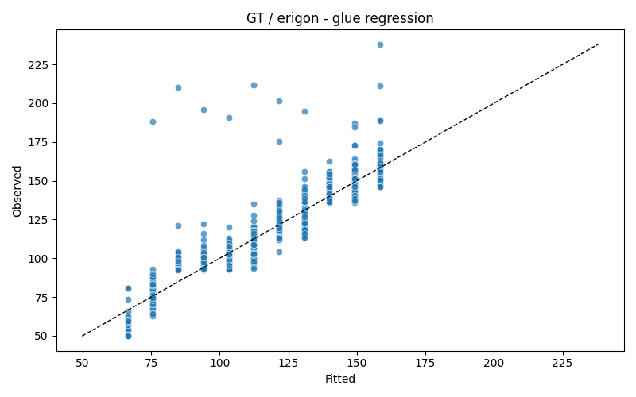

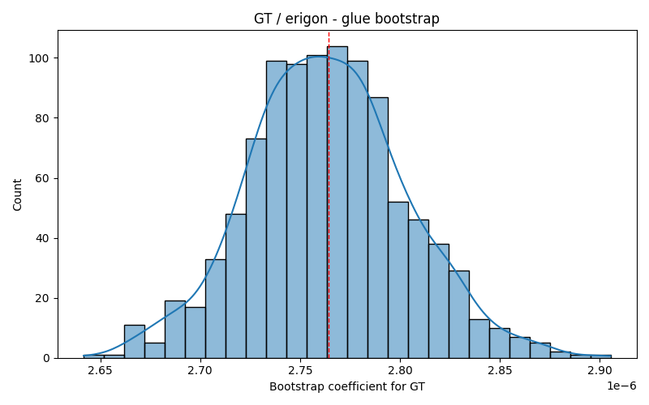

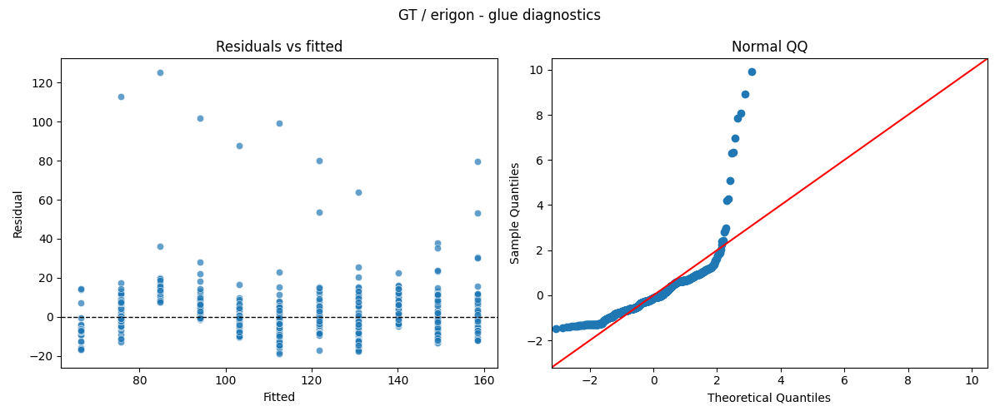

</details>

<details><summary><code>JUMPI</code> · nobs=968 · runtime_ms=3.339e-06 · p=1.00e-03 · R²=0.8571</summary>

```
==============================================================================
                           NNLS Regression Results                            
==============================================================================
Dep. Variable:          test_runtime_ms              R-squared:          0.857
Model:                  NNLS                    Adj. R-squared:          0.857
No. Observations:       968                               RMSE:           6.15
Df Residuals:           966                                MAE:           4.85
Df Model:               1      
==============================================================================
                      coef     std err     P-value      [0.025      0.975]
------------------------------------------------------------------------------
         const     17.8713      0.7035       0.001     16.4926     19.2101
         JUMPI      0.0000      0.0000       0.001      0.0000      0.0000
==============================================================================
Notes: Non-negative least squares with bootstrap inference (1000 iterations)
==============================================================================
```

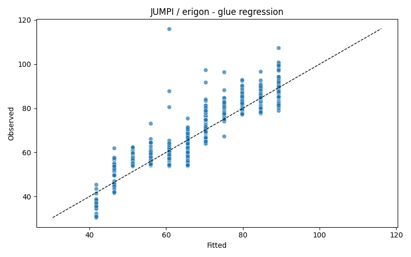

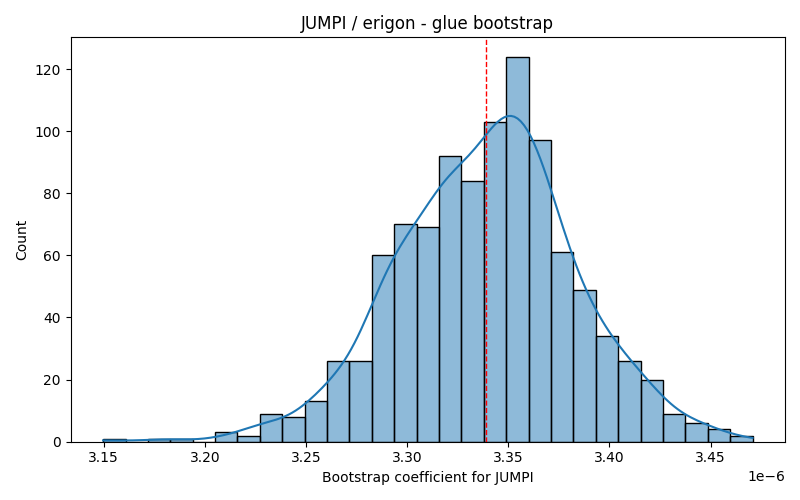

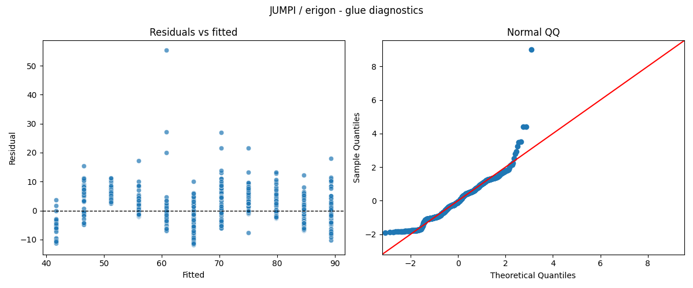

</details>

<details><summary><code>LT</code> · nobs=968 · runtime_ms=2.679e-06 · p=1.00e-03 · R²=0.727</summary>

```
==============================================================================
                           NNLS Regression Results                            
==============================================================================
Dep. Variable:          test_runtime_ms              R-squared:          0.727
Model:                  NNLS                    Adj. R-squared:          0.727
No. Observations:       968                               RMSE:          17.28
Df Residuals:           966                                MAE:           8.11
Df Model:               1      
==============================================================================
                      coef     std err     P-value      [0.025      0.975]
------------------------------------------------------------------------------
         const     24.0412      2.8144       0.001     19.7156     30.3273
            LT      0.0000      0.0000       0.001      0.0000      0.0000
==============================================================================
Notes: Non-negative least squares with bootstrap inference (1000 iterations)
==============================================================================
```

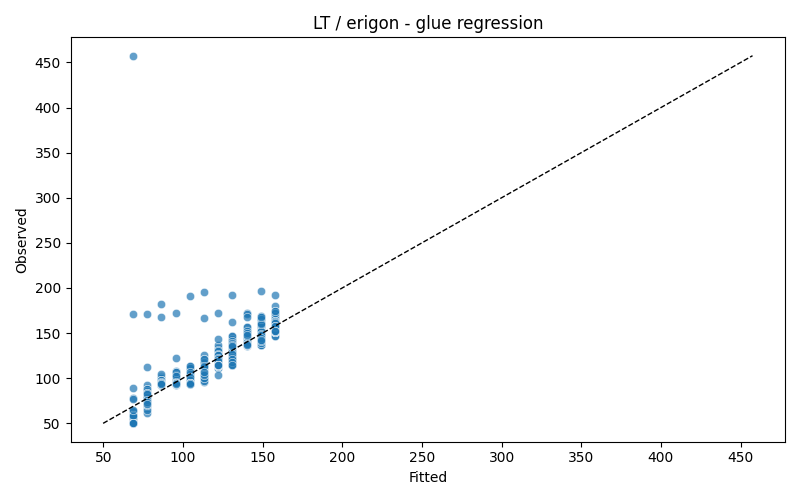

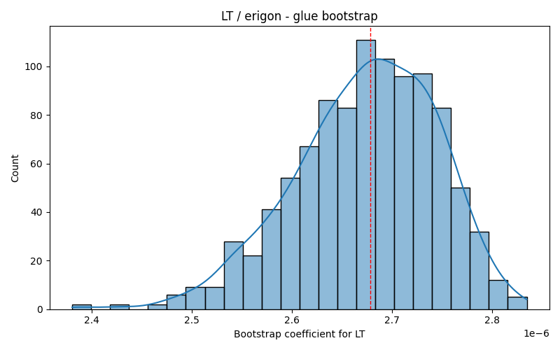

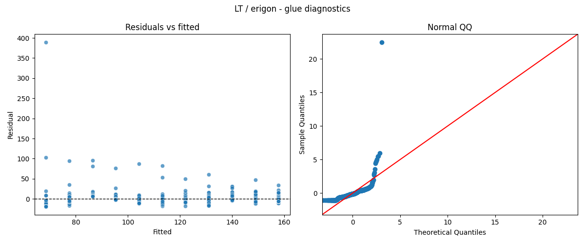

</details>

<details><summary><code>MSTORE</code> · nobs=4840 · runtime_ms=5.828e-06 · p=1.00e-03 · R²=0.9006</summary>

```
==============================================================================
                           NNLS Regression Results                            
==============================================================================
Dep. Variable:          test_runtime_ms              R-squared:          0.901
Model:                  NNLS                    Adj. R-squared:          0.901
No. Observations:       4840                              RMSE:          13.59
Df Residuals:           4838                               MAE:           9.99
Df Model:               1      
==============================================================================
                      coef     std err     P-value      [0.025      0.975]
------------------------------------------------------------------------------
         const     25.0330      0.6861       0.001     23.7350     26.3656
        MSTORE      0.0000      0.0000       0.001      0.0000      0.0000
==============================================================================
Notes: Non-negative least squares with bootstrap inference (1000 iterations)
==============================================================================
```

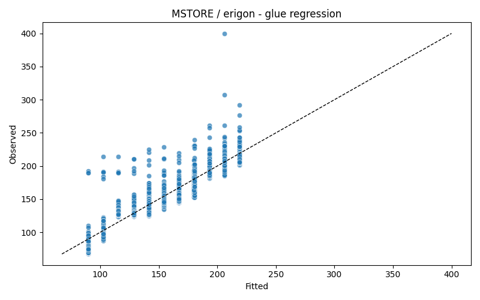

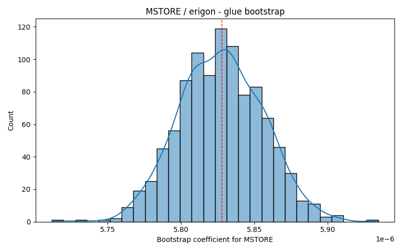

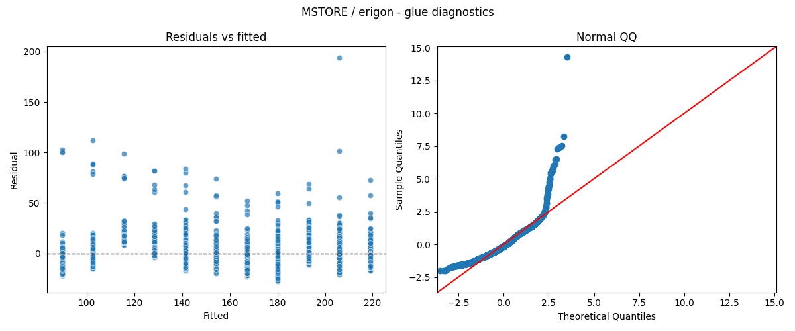

</details>

<details><summary><code>MSTORE8</code> · nobs=4840 · runtime_ms=5.196e-06 · p=1.00e-03 · R²=0.8697</summary>

```
==============================================================================
                           NNLS Regression Results                            
==============================================================================
Dep. Variable:          test_runtime_ms              R-squared:          0.870
Model:                  NNLS                    Adj. R-squared:          0.870
No. Observations:       4840                              RMSE:          14.11
Df Residuals:           4838                               MAE:           9.37
Df Model:               1      
==============================================================================
                      coef     std err     P-value      [0.025      0.975]
------------------------------------------------------------------------------
         const     26.0607      0.6534       0.001     24.8219     27.3008
       MSTORE8      0.0000      0.0000       0.001      0.0000      0.0000
==============================================================================
Notes: Non-negative least squares with bootstrap inference (1000 iterations)
==============================================================================
```

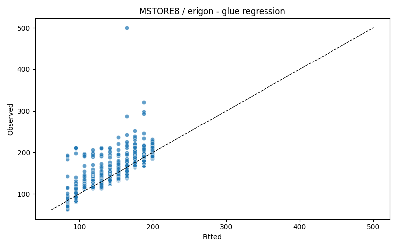

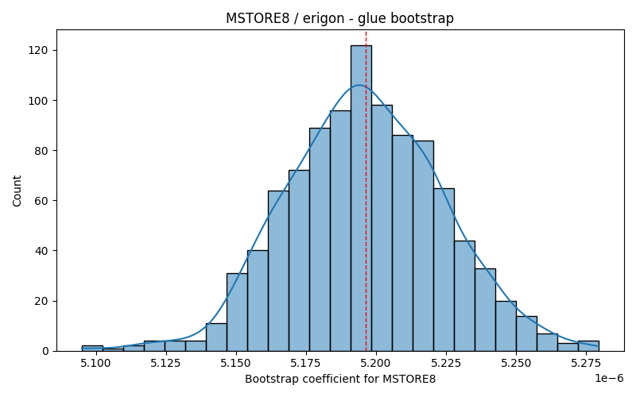

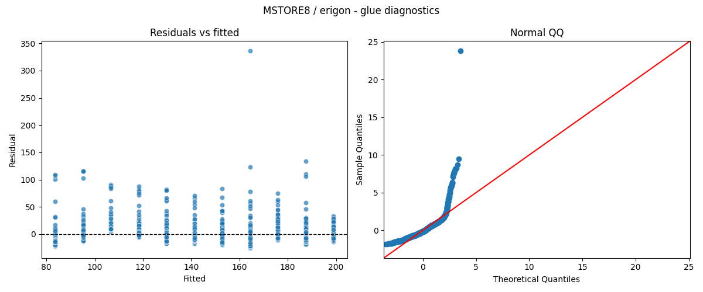

</details>

<details><summary><code>MUL</code> · nobs=968 · runtime_ms=3.364e-06 · p=1.00e-03 · R²=0.9014</summary>

```
==============================================================================
                           NNLS Regression Results                            
==============================================================================
Dep. Variable:          test_runtime_ms              R-squared:          0.901
Model:                  NNLS                    Adj. R-squared:          0.901
No. Observations:       968                               RMSE:           8.78
Df Residuals:           966                                MAE:           6.33
Df Model:               1      
==============================================================================
                      coef     std err     P-value      [0.025      0.975]
------------------------------------------------------------------------------
         const     15.3121      1.0780       0.001     13.3725     17.5340
           MUL      0.0000      0.0000       0.001      0.0000      0.0000
==============================================================================
Notes: Non-negative least squares with bootstrap inference (1000 iterations)
==============================================================================
```

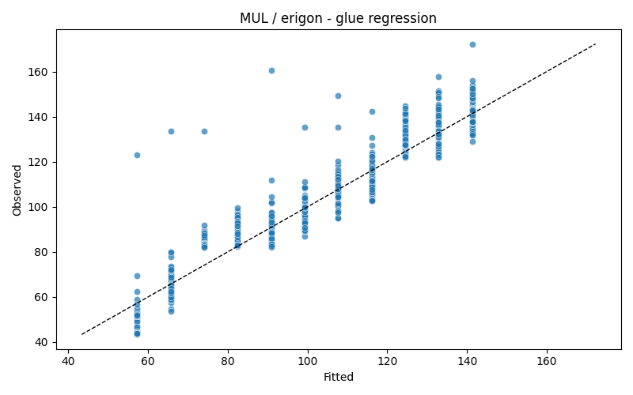

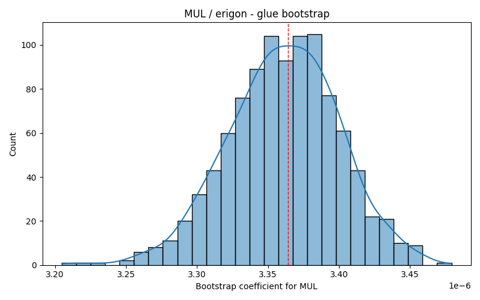

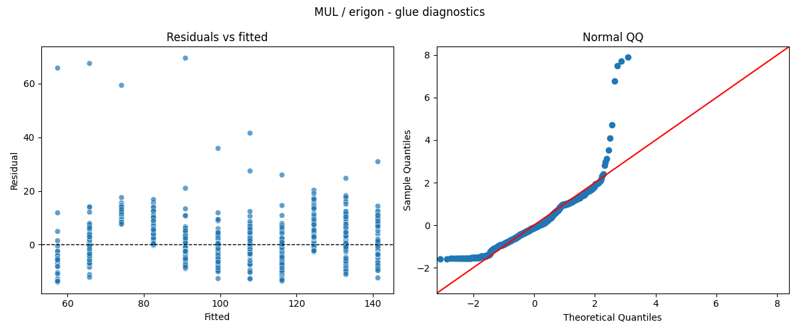

</details>

<details><summary><code>PC</code> · nobs=968 · runtime_ms=1.396e-06 · p=1.00e-03 · R²=0.8628</summary>

```
==============================================================================
                           NNLS Regression Results                            
==============================================================================
Dep. Variable:          test_runtime_ms              R-squared:          0.863
Model:                  NNLS                    Adj. R-squared:          0.863
No. Observations:       968                               RMSE:          16.64
Df Residuals:           966                                MAE:          10.69
Df Model:               1      
==============================================================================
                      coef     std err     P-value      [0.025      0.975]
------------------------------------------------------------------------------
         const     22.7015      1.9434       0.001     19.0064     26.5803
            PC      0.0000      0.0000       0.001      0.0000      0.0000
==============================================================================
Notes: Non-negative least squares with bootstrap inference (1000 iterations)
==============================================================================
```

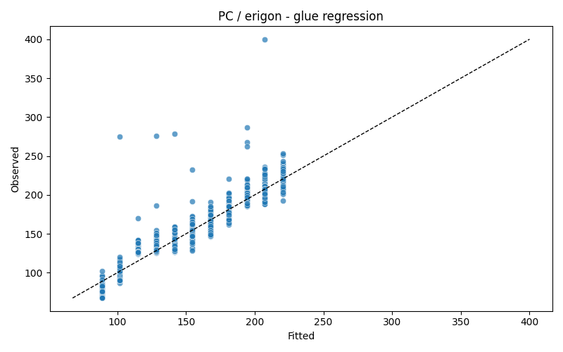

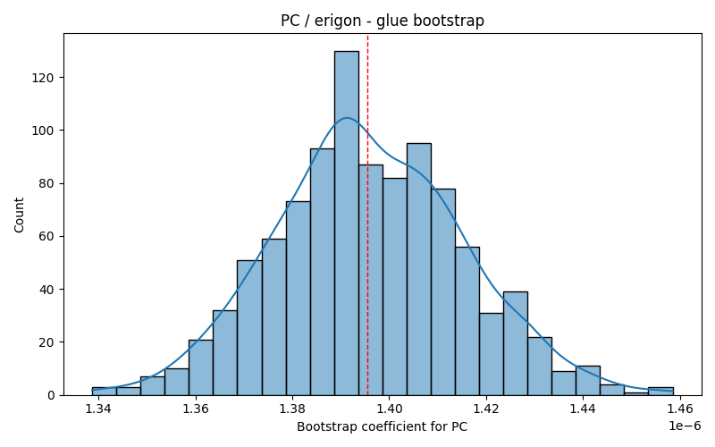

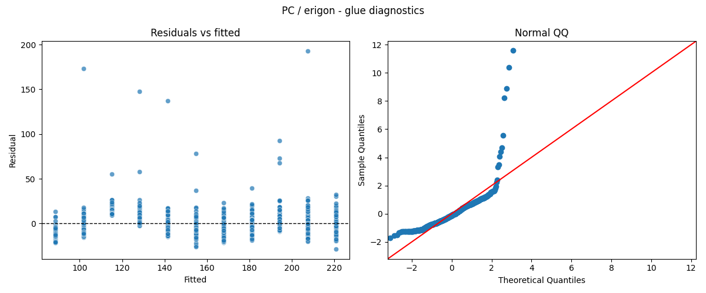

</details>

<details><summary><code>RETURNDATASIZE</code> · nobs=3872 · runtime_ms=1.822e-06 · p=1.00e-03 · R²=0.7195</summary>

```
==============================================================================
                           NNLS Regression Results                            
==============================================================================
Dep. Variable:          test_runtime_ms              R-squared:          0.720
Model:                  NNLS                    Adj. R-squared:          0.719
No. Observations:       3872                              RMSE:          17.96
Df Residuals:           3870                               MAE:           8.79
Df Model:               1      
==============================================================================
                      coef     std err     P-value      [0.025      0.975]
------------------------------------------------------------------------------
         const     20.9137      0.9158       0.001     19.2902     22.7322
RETURNDATASIZE      0.0000      0.0000       0.001      0.0000      0.0000
==============================================================================
Notes: Non-negative least squares with bootstrap inference (1000 iterations)
==============================================================================
```

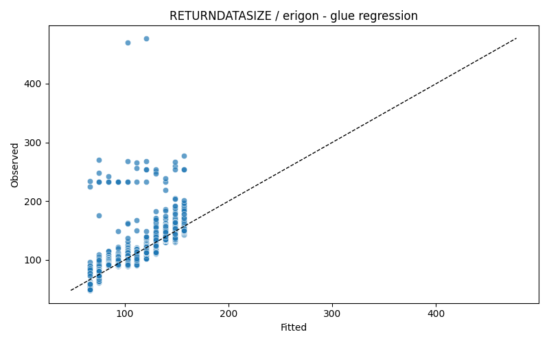

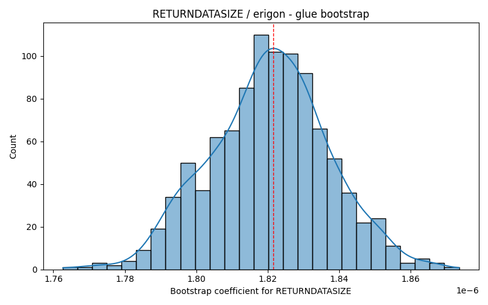

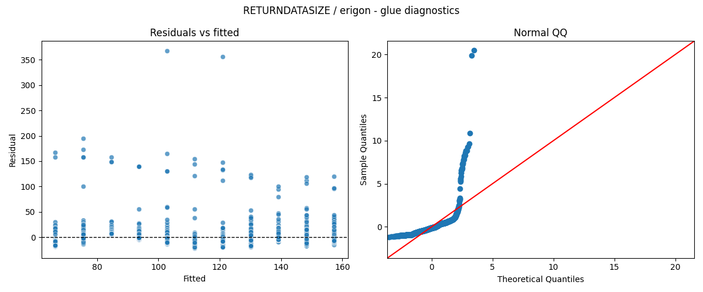

</details>

<details><summary><code>SELFBALANCE</code> · nobs=792 · runtime_ms=1.423e-06 · p=1.00e-03 · R²=0.7207</summary>

```
==============================================================================
                           NNLS Regression Results                            
==============================================================================
Dep. Variable:          test_runtime_ms              R-squared:          0.721
Model:                  NNLS                    Adj. R-squared:          0.720
No. Observations:       792                               RMSE:           8.94
Df Residuals:           790                                MAE:           5.38
Df Model:               1      
==============================================================================
                      coef     std err     P-value      [0.025      0.975]
------------------------------------------------------------------------------
         const     17.9979      1.2788       0.001     15.4190     20.4117
   SELFBALANCE      0.0000      0.0000       0.001      0.0000      0.0000
==============================================================================
Notes: Non-negative least squares with bootstrap inference (1000 iterations)
==============================================================================
```

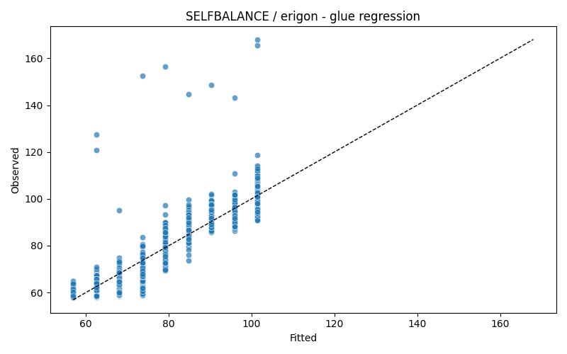

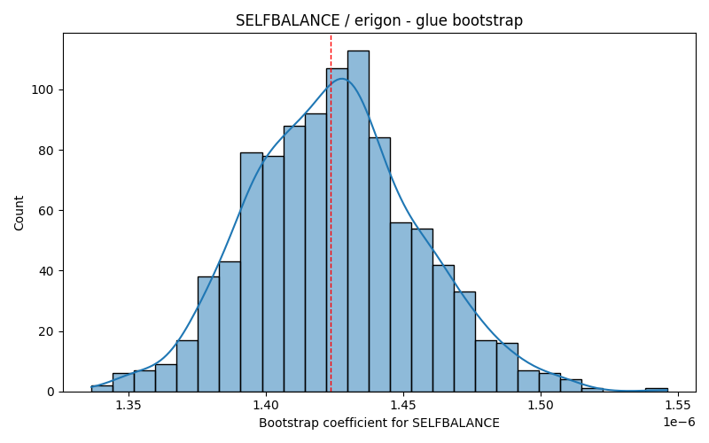

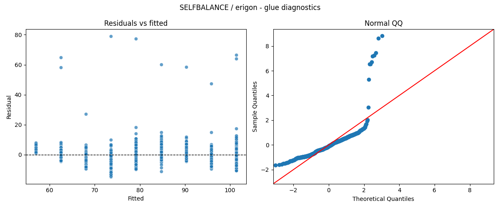

</details>

<details><summary><code>SUB</code> · nobs=968 · runtime_ms=2.763e-06 · p=1.00e-03 · R²=0.8304</summary>

```
==============================================================================
                           NNLS Regression Results                            
==============================================================================
Dep. Variable:          test_runtime_ms              R-squared:          0.830
Model:                  NNLS                    Adj. R-squared:          0.830
No. Observations:       968                               RMSE:          13.14
Df Residuals:           966                                MAE:           8.47
Df Model:               1      
==============================================================================
                      coef     std err     P-value      [0.025      0.975]
------------------------------------------------------------------------------
         const     18.7706      1.4892       0.001     15.9939     21.8673
           SUB      0.0000      0.0000       0.001      0.0000      0.0000
==============================================================================
Notes: Non-negative least squares with bootstrap inference (1000 iterations)
==============================================================================
```

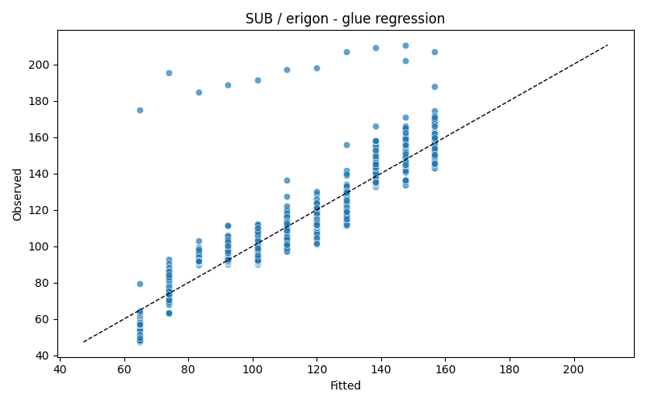

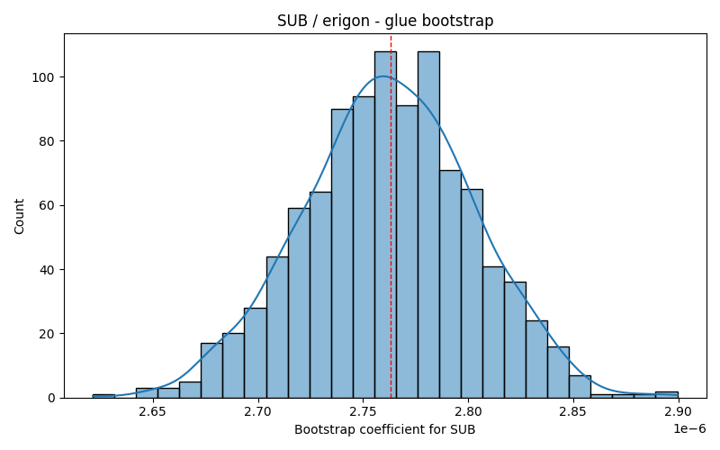

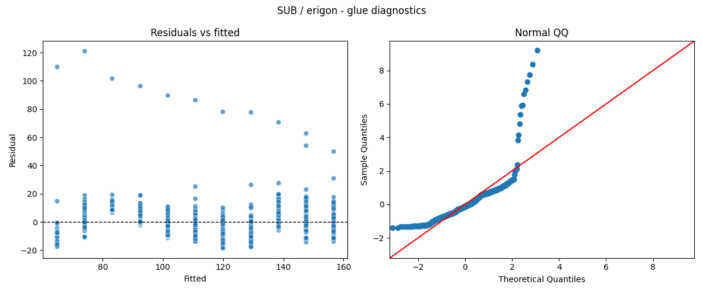

</details>

### Mixed glue (tier B) · erigon

<details><summary><code>JUMP</code> · nobs=968 · runtime_ms=7.138e-06 · p=1.00e-03 · R²=0.8586</summary>

```
==============================================================================
                           NNLS Regression Results                            
==============================================================================
Dep. Variable:          test_runtime_ms              R-squared:          0.859
Model:                  NNLS                    Adj. R-squared:          0.858
No. Observations:       968                               RMSE:          10.77
Df Residuals:           966                                MAE:           6.91
Df Model:               1      
==============================================================================
                      coef     std err     P-value      [0.025      0.975]
------------------------------------------------------------------------------
         const     20.7715      1.2778       0.001     18.3451     23.3801
          JUMP      0.0000      0.0000       0.001      0.0000      0.0000
==============================================================================
Notes: Non-negative least squares with bootstrap inference (1000 iterations)
==============================================================================
```

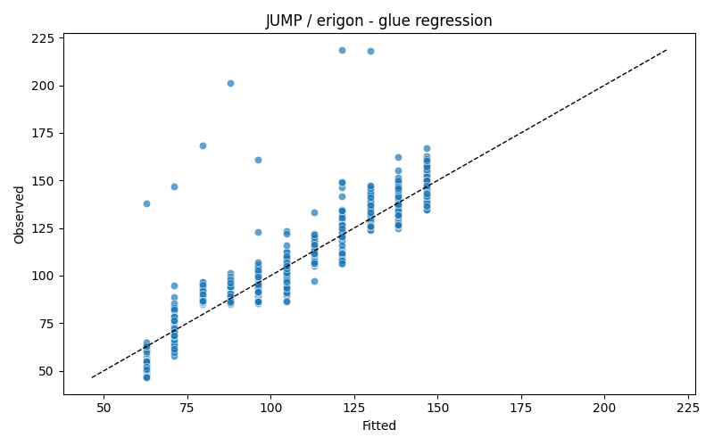

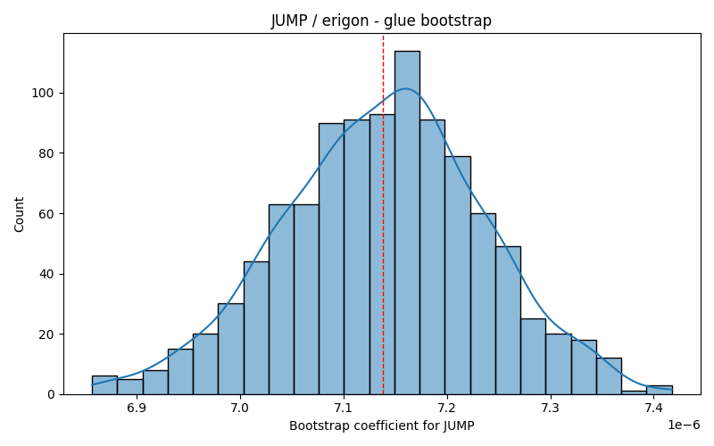

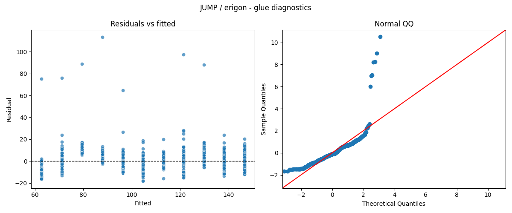

</details>

<details><summary><code>KECCAK256</code> · nobs=15488 · runtime_ms=2.106e-05 · p=1.00e-03 · R²=0.09359</summary>

```
==============================================================================
                           NNLS Regression Results                            
==============================================================================
Dep. Variable:          test_runtime_ms              R-squared:          0.094
Model:                  NNLS                    Adj. R-squared:          0.094
No. Observations:       15488                             RMSE:         130.24
Df Residuals:           15486                              MAE:         104.75
Df Model:               1      
==============================================================================
                      coef     std err     P-value      [0.025      0.975]
------------------------------------------------------------------------------
         const    357.1238      2.2315       0.001    352.5043    361.5234
     KECCAK256      0.0000      0.0000       0.001      0.0000      0.0000
==============================================================================
Notes: Non-negative least squares with bootstrap inference (1000 iterations)
==============================================================================
```

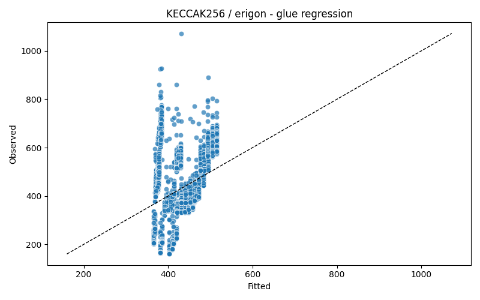

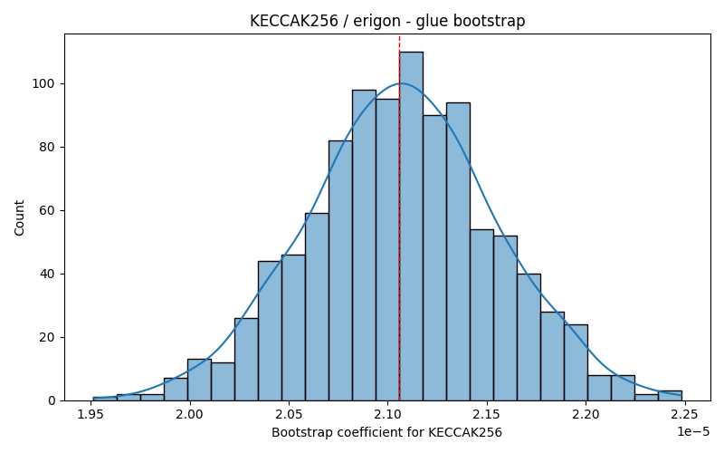

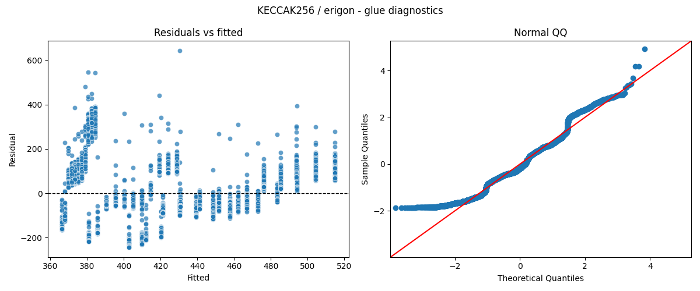

</details>

## ethrex

| glue_opcode | nobs | glue_runtime_ms | p_value | rsquared |
| --- | --- | --- | --- | --- |
| `ISZERO` | 407 | 5.158e-07 | 1.00e-03 | 0.5452 |
| `JUMPDEST` | 407 | 3.358e-07 | 1.00e-03 | 0.8452 |
| `SWAP` | 6512 | 7.079e-07 | 1.00e-03 | 0.8057 |
| `CALLDATASIZE` | 24409 | 4.643e-07 | 1.00e-03 | 0.9295 |
| `DUP` | 24409 | 4.659e-07 | 1.00e-03 | 0.9295 |
| `GAS` | 24409 | 4.624e-07 | 1.00e-03 | 0.9295 |
| `MLOAD` | 24409 | 1.135e-06 | 1.00e-03 | 0.9295 |
| `PUSH` | 24409 | 4.881e-07 | 1.00e-03 | 0.9295 |
| `PUSH0` | 24409 | 4.582e-07 | 1.00e-03 | 0.9295 |
| `STATICCALL` | 24409 | 0.00011 | 1.00e-03 | 0.9295 |
| `ADD` | 407 | 1.12e-06 | 1.00e-03 | 0.7923 |
| `AND` | 407 | 1.138e-06 | 1.00e-03 | 0.846 |
| `CALLDATACOPY` | 9768 | 2.408e-06 | 1.00e-03 | 0.8597 |
| `CALLDATALOAD` | 1628 | 2.029e-05 | 1.00e-03 | 0.229 |
| `DIV` | 407 | 1.141e-05 | 1.00e-03 | 0.9441 |
| `EXP` | 407 | 0.001093 | 1.00e-03 | 0.9266 |
| `GT` | 407 | 1.117e-06 | 1.00e-03 | 0.8388 |
| `JUMPI` | 407 | 1.347e-06 | 1.00e-03 | 0.8034 |
| `LT` | 407 | 9.821e-07 | 1.00e-03 | 0.8012 |
| `MSTORE` | 2035 | 1.666e-06 | 1.00e-03 | 0.8092 |
| `MSTORE8` | 2035 | 1.571e-06 | 1.00e-03 | 0.7931 |
| `MUL` | 407 | 1.637e-06 | 1.00e-03 | 0.8467 |
| `PC` | 407 | 5.233e-07 | 1.00e-03 | 0.7828 |
| `RETURNDATASIZE` | 1628 | 9.083e-07 | 1.00e-03 | 0.7612 |
| `SELFBALANCE` | 333 | 5.895e-06 | 1.00e-03 | 0.9108 |
| `SUB` | 407 | 1.162e-06 | 1.00e-03 | 0.7689 |
| `JUMP` | 407 | 4.137e-06 | 1.00e-03 | 0.8265 |
| `KECCAK256` | 6512 | 0 | 1.00e+00 | -2.22e-16 |

### Cycle glue — joint fit · ethrex

<details><summary>Joint NNLS regression summary</summary>

```
==============================================================================
                           NNLS Regression Results                            
==============================================================================
Dep. Variable:          test_runtime_ms              R-squared:          0.930
Model:                  NNLS                    Adj. R-squared:          0.930
No. Observations:       24409                             RMSE:           6.65
Df Residuals:           24401                              MAE:           5.22
Df Model:               7      
==============================================================================
                      coef     std err     P-value      [0.025      0.975]
------------------------------------------------------------------------------
         const     12.4331      0.1405       0.001     12.1578     12.7119
  CALLDATASIZE      0.0000      0.0000       0.001      0.0000      0.0000
           DUP      0.0000      0.0000       0.001      0.0000      0.0000
           GAS      0.0000      0.0000       0.001      0.0000      0.0000
         MLOAD      0.0000      0.0000       0.001      0.0000      0.0000
          PUSH      0.0000      0.0000       0.001      0.0000      0.0000
         PUSH0      0.0000      0.0000       0.001      0.0000      0.0000
    STATICCALL      0.0001      0.0000       0.001      0.0001      0.0001
==============================================================================
Notes: Non-negative least squares with bootstrap inference (1000 iterations)
==============================================================================
```

</details>

<details><summary><code>CALLDATASIZE</code> · nobs=24409 · runtime_ms=4.643e-07 · p=1.00e-03 · R²=0.9295</summary>


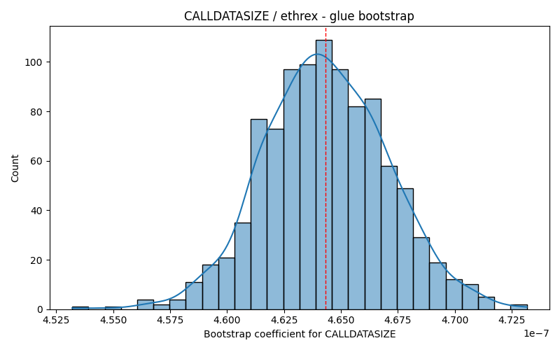


</details>

<details><summary><code>DUP</code> · nobs=24409 · runtime_ms=4.659e-07 · p=1.00e-03 · R²=0.9295</summary>


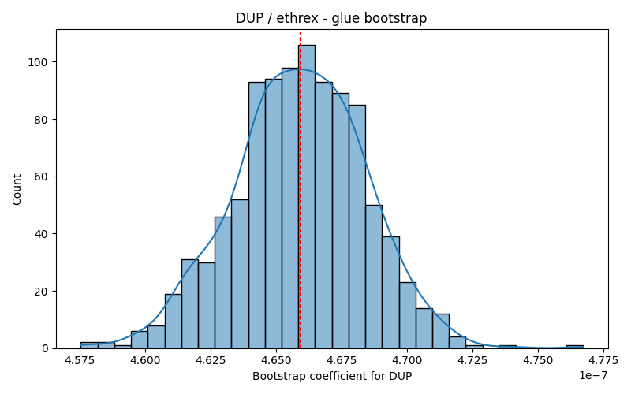


</details>

<details><summary><code>GAS</code> · nobs=24409 · runtime_ms=4.624e-07 · p=1.00e-03 · R²=0.9295</summary>


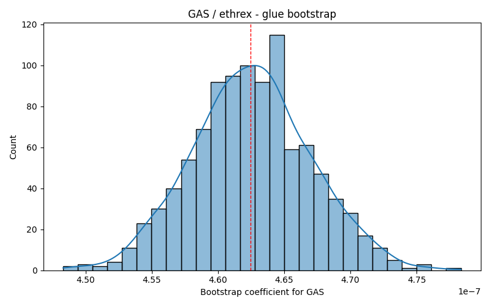


</details>

<details><summary><code>MLOAD</code> · nobs=24409 · runtime_ms=1.135e-06 · p=1.00e-03 · R²=0.9295</summary>


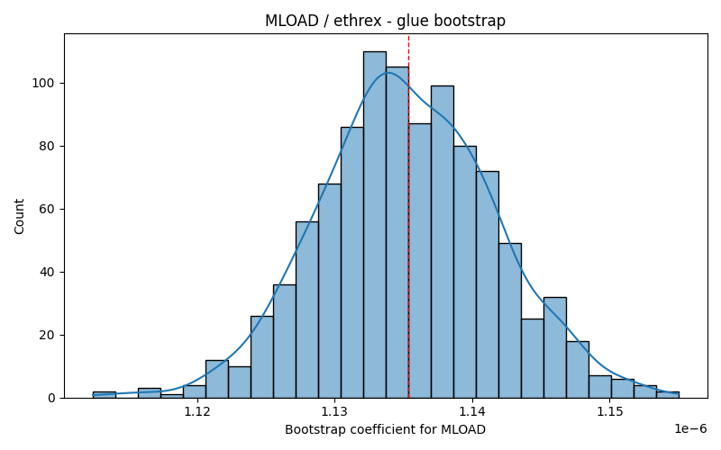

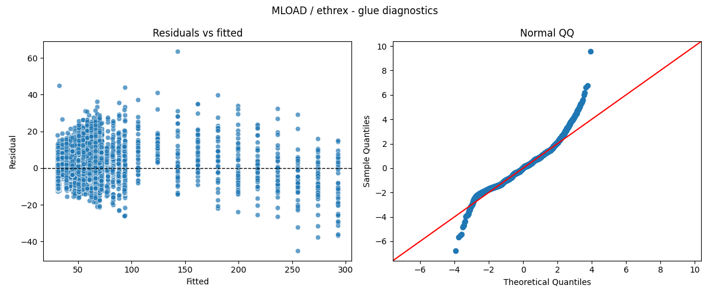

</details>

<details><summary><code>PUSH</code> · nobs=24409 · runtime_ms=4.881e-07 · p=1.00e-03 · R²=0.9295</summary>


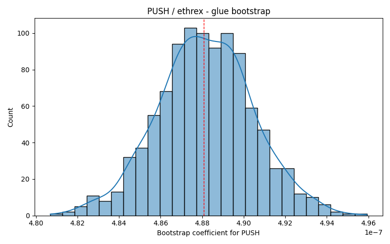


</details>

<details><summary><code>PUSH0</code> · nobs=24409 · runtime_ms=4.582e-07 · p=1.00e-03 · R²=0.9295</summary>


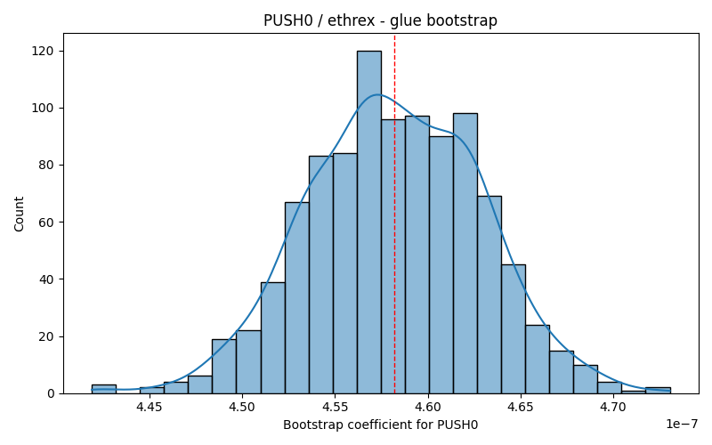


</details>

<details><summary><code>STATICCALL</code> · nobs=24409 · runtime_ms=0.00011 · p=1.00e-03 · R²=0.9295</summary>

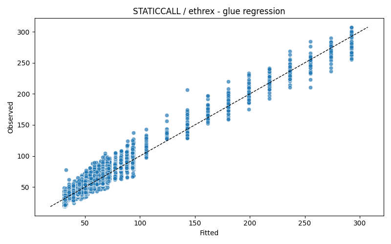

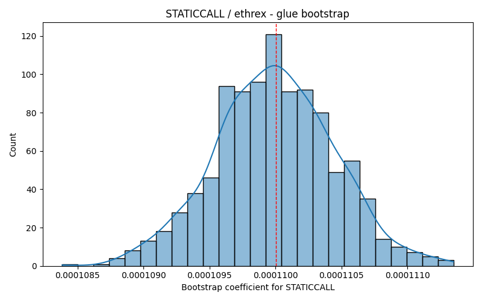


</details>

### Pure glue · ethrex

<details><summary><code>ISZERO</code> · nobs=407 · runtime_ms=5.158e-07 · p=1.00e-03 · R²=0.5452</summary>

```
==============================================================================
                           NNLS Regression Results                            
==============================================================================
Dep. Variable:          test_runtime_ms              R-squared:          0.545
Model:                  NNLS                    Adj. R-squared:          0.544
No. Observations:       407                               RMSE:           9.92
Df Residuals:           405                                MAE:           4.24
Df Model:               1      
==============================================================================
                      coef     std err     P-value      [0.025      0.975]
------------------------------------------------------------------------------
         const      9.1126      1.4351       0.001      6.0698     11.5187
        ISZERO      0.0000      0.0000       0.001      0.0000      0.0000
==============================================================================
Notes: Non-negative least squares with bootstrap inference (1000 iterations)
==============================================================================
```

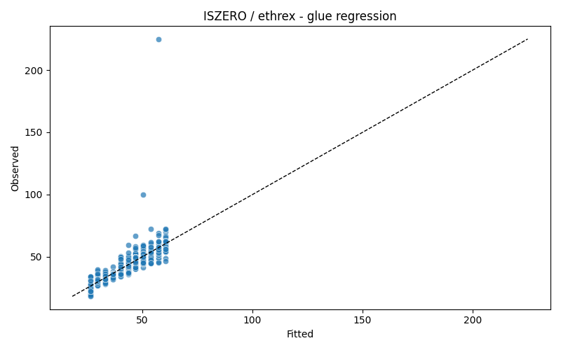

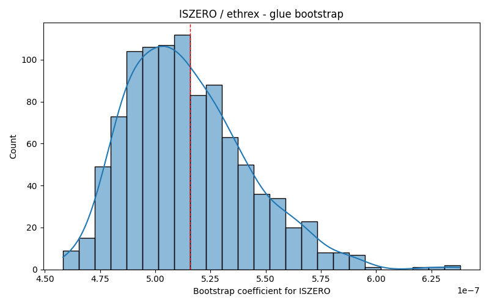

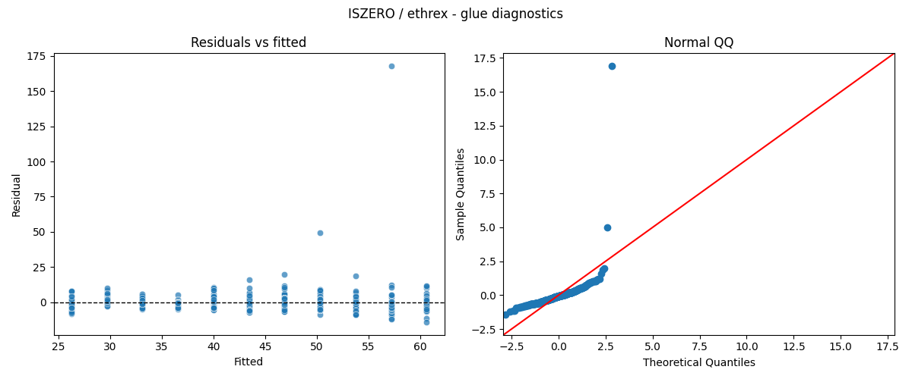

</details>

<details><summary><code>JUMPDEST</code> · nobs=407 · runtime_ms=3.358e-07 · p=1.00e-03 · R²=0.8452</summary>

```
==============================================================================
                           NNLS Regression Results                            
==============================================================================
Dep. Variable:          test_runtime_ms              R-squared:          0.845
Model:                  NNLS                    Adj. R-squared:          0.845
No. Observations:       407                               RMSE:           9.08
Df Residuals:           405                                MAE:           7.28
Df Model:               1      
==============================================================================
                      coef     std err     P-value      [0.025      0.975]
------------------------------------------------------------------------------
         const     16.7785      1.4201       0.001     13.9087     19.5185
      JUMPDEST      0.0000      0.0000       0.001      0.0000      0.0000
==============================================================================
Notes: Non-negative least squares with bootstrap inference (1000 iterations)
==============================================================================
```

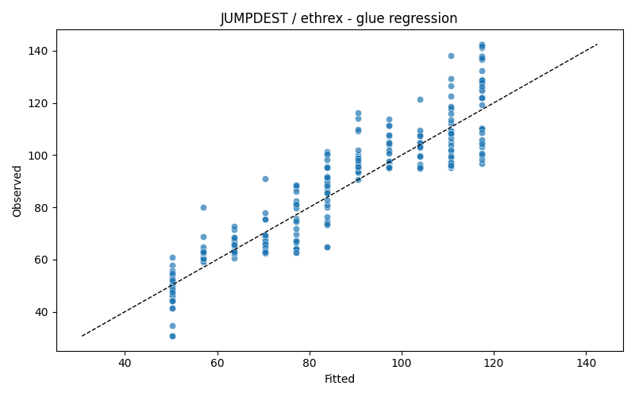

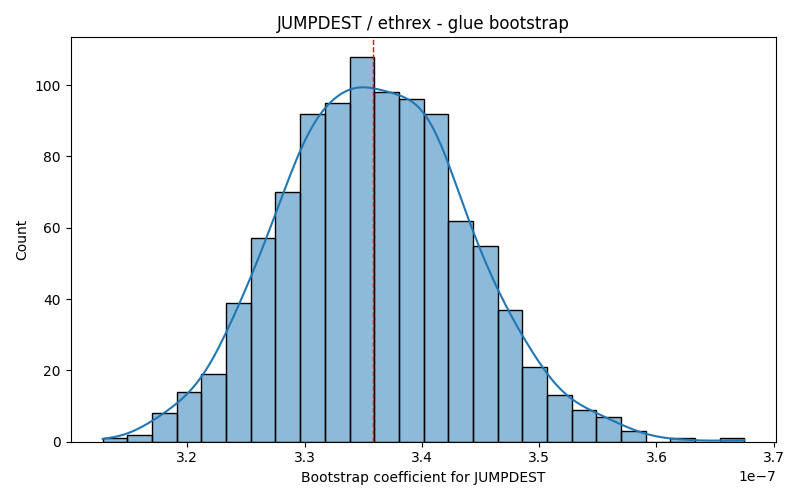

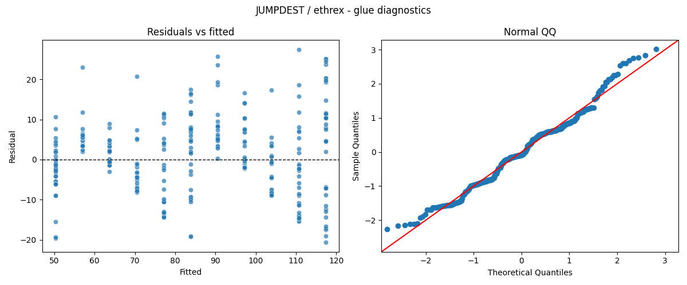

</details>

<details><summary><code>SWAP</code> · nobs=6512 · runtime_ms=7.079e-07 · p=1.00e-03 · R²=0.8057</summary>

```
==============================================================================
                           NNLS Regression Results                            
==============================================================================
Dep. Variable:          test_runtime_ms              R-squared:          0.806
Model:                  NNLS                    Adj. R-squared:          0.806
No. Observations:       6512                              RMSE:           7.32
Df Residuals:           6510                               MAE:           5.88
Df Model:               1      
==============================================================================
                      coef     std err     P-value      [0.025      0.975]
------------------------------------------------------------------------------
         const     15.1689      0.3121       0.001     14.5402     15.7701
          SWAP      0.0000      0.0000       0.001      0.0000      0.0000
==============================================================================
Notes: Non-negative least squares with bootstrap inference (1000 iterations)
==============================================================================
```

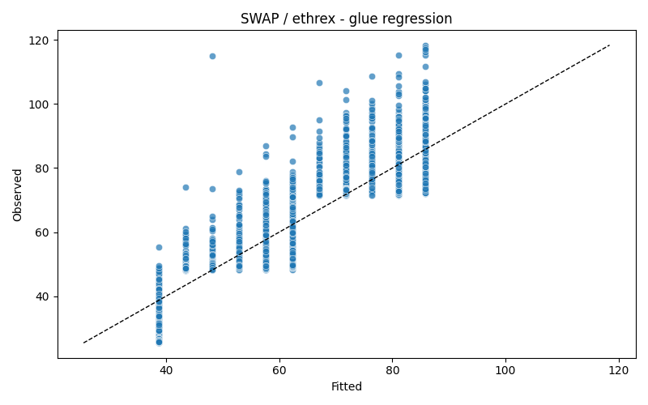

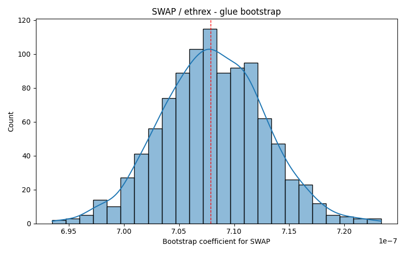

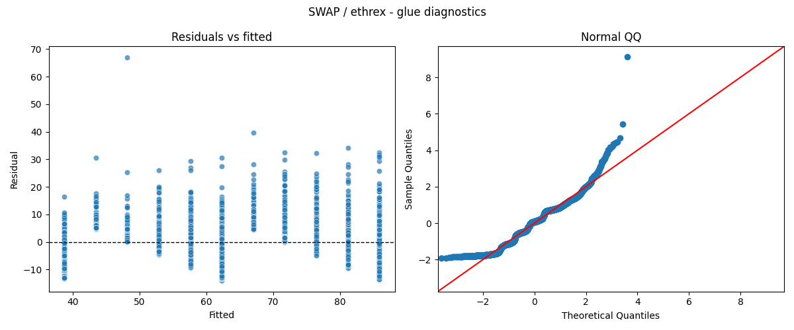

</details>

### Mixed glue (tier A) · ethrex

<details><summary><code>ADD</code> · nobs=407 · runtime_ms=1.12e-06 · p=1.00e-03 · R²=0.7923</summary>

```
==============================================================================
                           NNLS Regression Results                            
==============================================================================
Dep. Variable:          test_runtime_ms              R-squared:          0.792
Model:                  NNLS                    Adj. R-squared:          0.792
No. Observations:       407                               RMSE:           6.03
Df Residuals:           405                                MAE:           3.74
Df Model:               1      
==============================================================================
                      coef     std err     P-value      [0.025      0.975]
------------------------------------------------------------------------------
         const     11.5398      1.0700       0.001      9.5562     13.6747
           ADD      0.0000      0.0000       0.001      0.0000      0.0000
==============================================================================
Notes: Non-negative least squares with bootstrap inference (1000 iterations)
==============================================================================
```

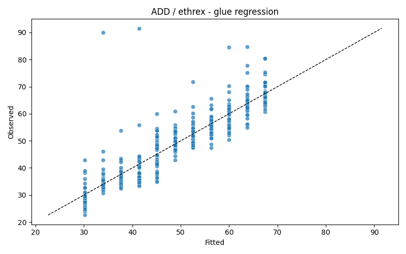

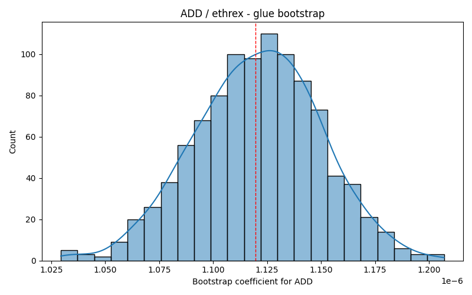


</details>

<details><summary><code>AND</code> · nobs=407 · runtime_ms=1.138e-06 · p=1.00e-03 · R²=0.846</summary>

```
==============================================================================
                           NNLS Regression Results                            
==============================================================================
Dep. Variable:          test_runtime_ms              R-squared:          0.846
Model:                  NNLS                    Adj. R-squared:          0.846
No. Observations:       407                               RMSE:           5.11
Df Residuals:           405                                MAE:           3.71
Df Model:               1      
==============================================================================
                      coef     std err     P-value      [0.025      0.975]
------------------------------------------------------------------------------
         const      8.5882      0.7330       0.001      7.0960      9.9837
           AND      0.0000      0.0000       0.001      0.0000      0.0000
==============================================================================
Notes: Non-negative least squares with bootstrap inference (1000 iterations)
==============================================================================
```

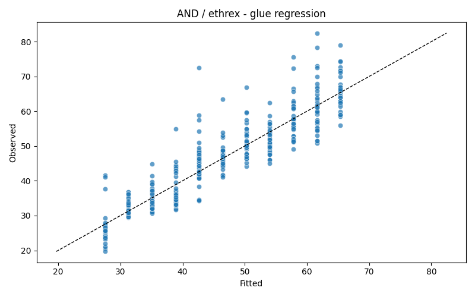

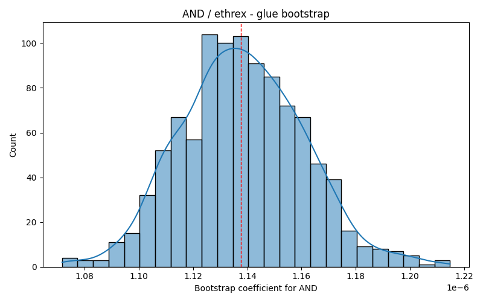

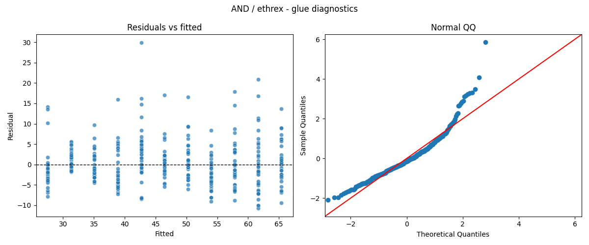

</details>

<details><summary><code>CALLDATACOPY</code> · nobs=9768 · runtime_ms=2.408e-06 · p=1.00e-03 · R²=0.8597</summary>

```
==============================================================================
                           NNLS Regression Results                            
==============================================================================
Dep. Variable:          test_runtime_ms              R-squared:          0.860
Model:                  NNLS                    Adj. R-squared:          0.860
No. Observations:       9768                              RMSE:           7.31
Df Residuals:           9766                               MAE:           5.42
Df Model:               1      
==============================================================================
                      coef     std err     P-value      [0.025      0.975]
------------------------------------------------------------------------------
         const     12.4644      0.0924       0.001     12.3017     12.6598
  CALLDATACOPY      0.0000      0.0000       0.001      0.0000      0.0000
==============================================================================
Notes: Non-negative least squares with bootstrap inference (1000 iterations)
==============================================================================
```

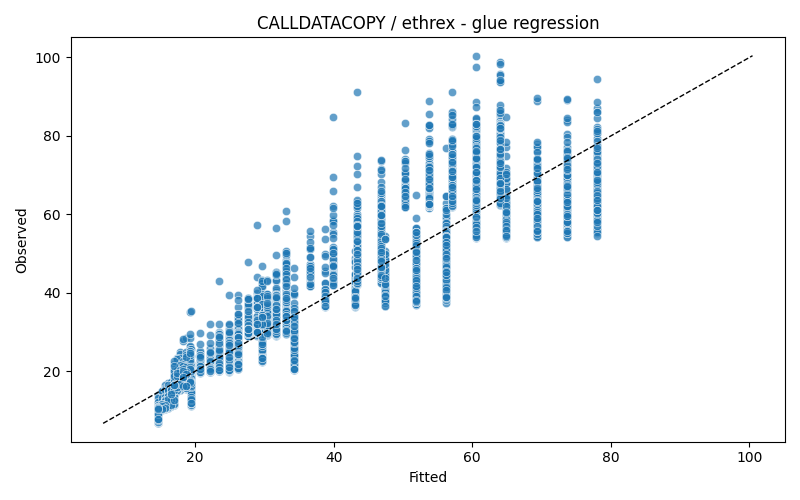

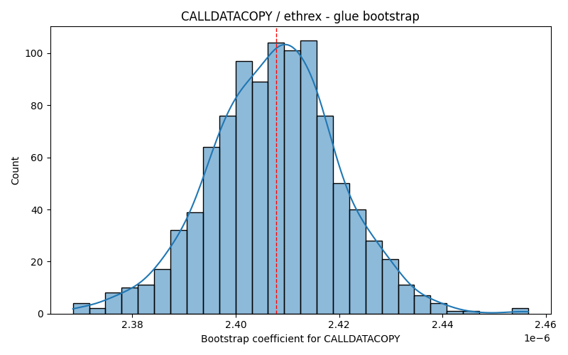

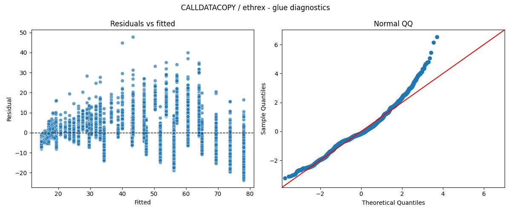

</details>

<details><summary><code>CALLDATALOAD</code> · nobs=1628 · runtime_ms=2.029e-05 · p=1.00e-03 · R²=0.229</summary>

```
==============================================================================
                           NNLS Regression Results                            
==============================================================================
Dep. Variable:          test_runtime_ms              R-squared:          0.229
Model:                  NNLS                    Adj. R-squared:          0.229
No. Observations:       1628                              RMSE:           0.14
Df Residuals:           1626                               MAE:           0.11
Df Model:               1      
==============================================================================
                      coef     std err     P-value      [0.025      0.975]
------------------------------------------------------------------------------
         const      2.1749      0.0114       0.001      2.1532      2.1968
  CALLDATALOAD      0.0000      0.0000       0.001      0.0000      0.0000
==============================================================================
Notes: Non-negative least squares with bootstrap inference (1000 iterations)
==============================================================================
```

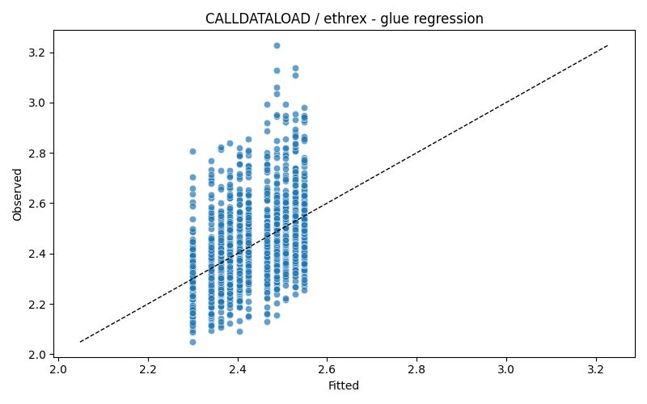

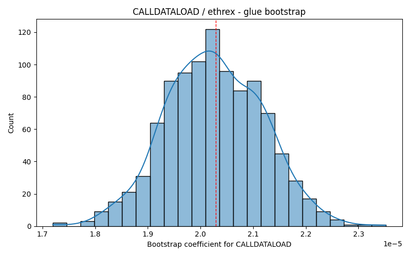

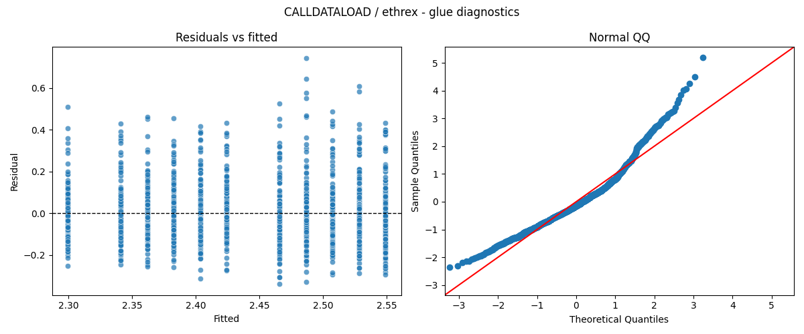

</details>

<details><summary><code>DIV</code> · nobs=407 · runtime_ms=1.141e-05 · p=1.00e-03 · R²=0.9441</summary>

```
==============================================================================
                           NNLS Regression Results                            
==============================================================================
Dep. Variable:          test_runtime_ms              R-squared:          0.944
Model:                  NNLS                    Adj. R-squared:          0.944
No. Observations:       407                               RMSE:          21.92
Df Residuals:           405                                MAE:          18.22
Df Model:               1      
==============================================================================
                      coef     std err     P-value      [0.025      0.975]
------------------------------------------------------------------------------
         const     62.3079      3.7435       0.001     55.1102     69.6783
           DIV      0.0000      0.0000       0.001      0.0000      0.0000
==============================================================================
Notes: Non-negative least squares with bootstrap inference (1000 iterations)
==============================================================================
```

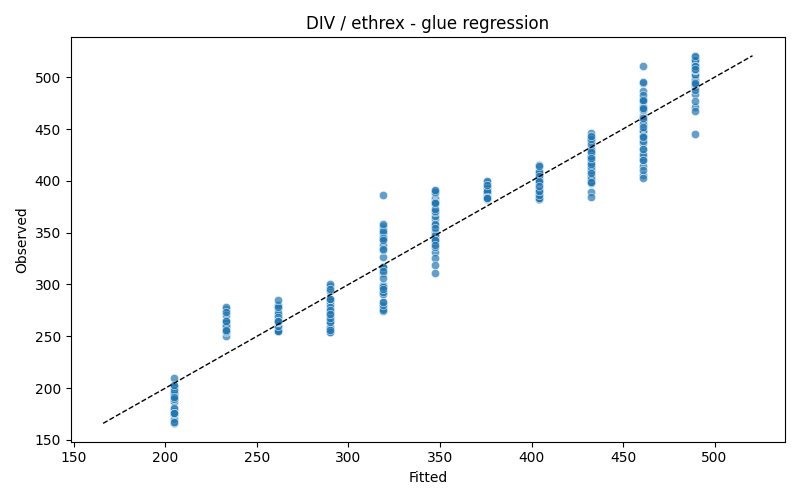

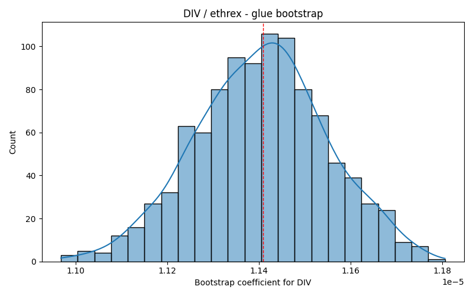

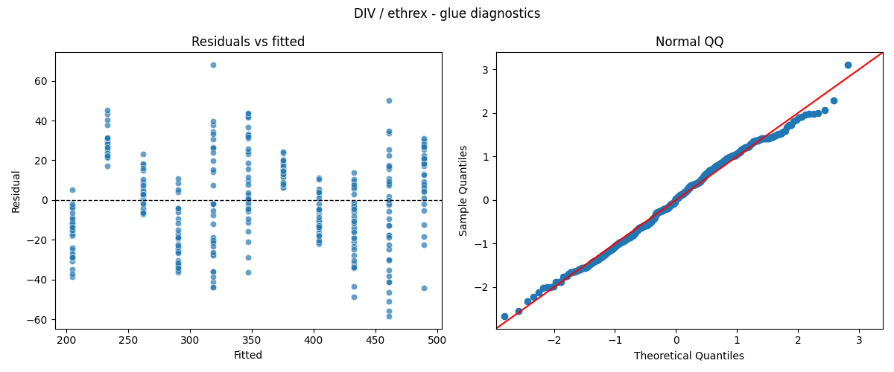

</details>

<details><summary><code>EXP</code> · nobs=407 · runtime_ms=0.001093 · p=1.00e-03 · R²=0.9266</summary>

```
==============================================================================
                           NNLS Regression Results                            
==============================================================================
Dep. Variable:          test_runtime_ms              R-squared:          0.927
Model:                  NNLS                    Adj. R-squared:          0.926
No. Observations:       407                               RMSE:          12.04
Df Residuals:           405                                MAE:          10.05
Df Model:               1      
==============================================================================
                      coef     std err     P-value      [0.025      0.975]
------------------------------------------------------------------------------
         const     31.6514      1.9109       0.001     28.0613     35.5152
           EXP      0.0011      0.0000       0.001      0.0011      0.0011
==============================================================================
Notes: Non-negative least squares with bootstrap inference (1000 iterations)
==============================================================================
```

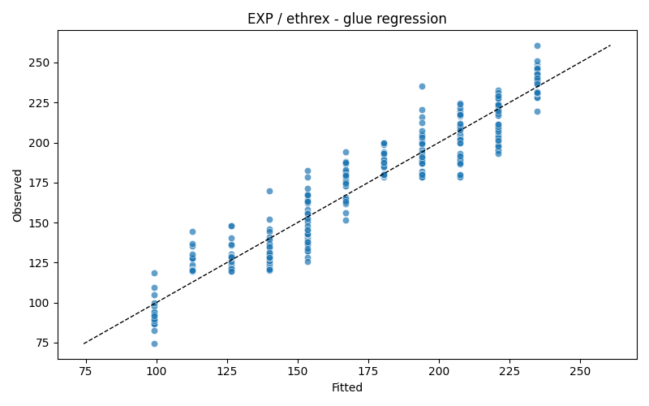

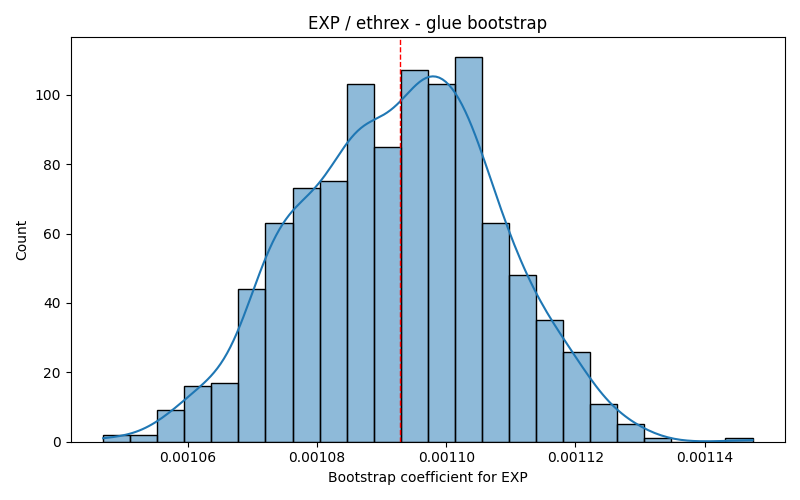

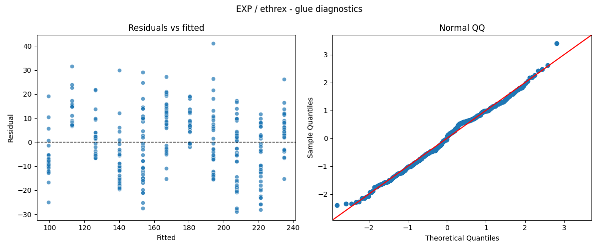

</details>

<details><summary><code>GT</code> · nobs=407 · runtime_ms=1.117e-06 · p=1.00e-03 · R²=0.8388</summary>

```
==============================================================================
                           NNLS Regression Results                            
==============================================================================
Dep. Variable:          test_runtime_ms              R-squared:          0.839
Model:                  NNLS                    Adj. R-squared:          0.838
No. Observations:       407                               RMSE:           5.15
Df Residuals:           405                                MAE:           3.98
Df Model:               1      
==============================================================================
                      coef     std err     P-value      [0.025      0.975]
------------------------------------------------------------------------------
         const     10.2756      0.8714       0.001      8.6589     11.9859
            GT      0.0000      0.0000       0.001      0.0000      0.0000
==============================================================================
Notes: Non-negative least squares with bootstrap inference (1000 iterations)
==============================================================================
```

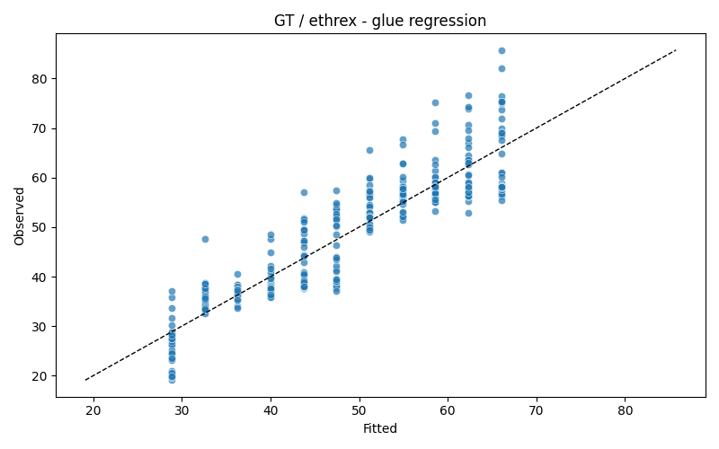

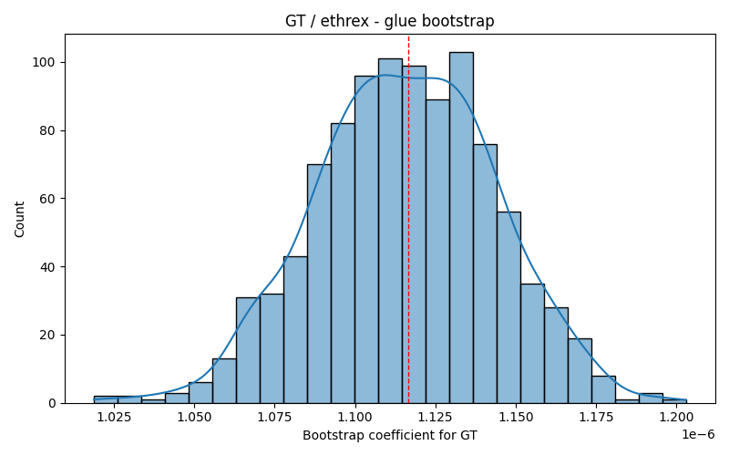


</details>

<details><summary><code>JUMPI</code> · nobs=407 · runtime_ms=1.347e-06 · p=1.00e-03 · R²=0.8034</summary>

```
==============================================================================
                           NNLS Regression Results                            
==============================================================================
Dep. Variable:          test_runtime_ms              R-squared:          0.803
Model:                  NNLS                    Adj. R-squared:          0.803
No. Observations:       407                               RMSE:           3.01
Df Residuals:           405                                MAE:           2.28
Df Model:               1      
==============================================================================
                      coef     std err     P-value      [0.025      0.975]
------------------------------------------------------------------------------
         const      7.1394      0.4461       0.001      6.3044      8.0390
         JUMPI      0.0000      0.0000       0.001      0.0000      0.0000
==============================================================================
Notes: Non-negative least squares with bootstrap inference (1000 iterations)
==============================================================================
```

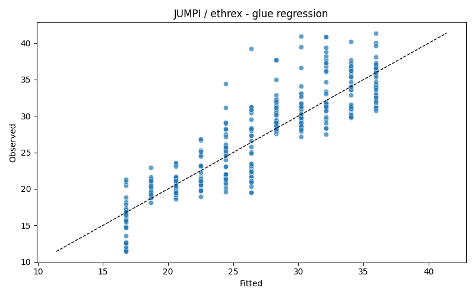

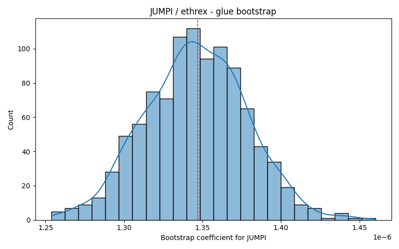

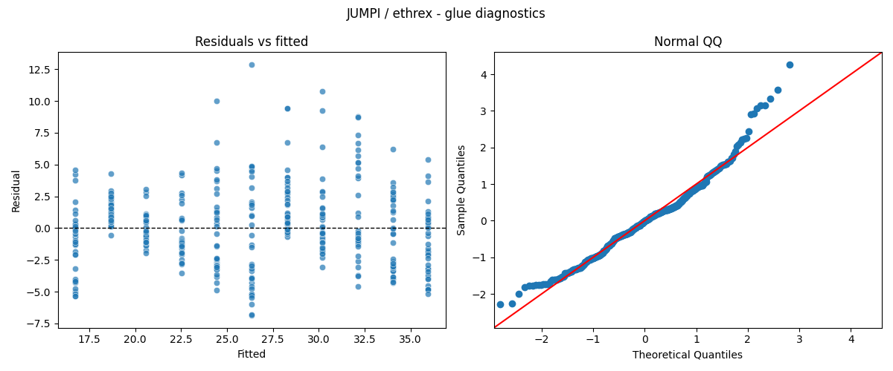

</details>

<details><summary><code>LT</code> · nobs=407 · runtime_ms=9.821e-07 · p=1.00e-03 · R²=0.8012</summary>

```
==============================================================================
                           NNLS Regression Results                            
==============================================================================
Dep. Variable:          test_runtime_ms              R-squared:          0.801
Model:                  NNLS                    Adj. R-squared:          0.801
No. Observations:       407                               RMSE:           5.15
Df Residuals:           405                                MAE:           3.64
Df Model:               1      
==============================================================================
                      coef     std err     P-value      [0.025      0.975]
------------------------------------------------------------------------------
         const      8.7605      0.7430       0.001      7.2700     10.1966
            LT      0.0000      0.0000       0.001      0.0000      0.0000
==============================================================================
Notes: Non-negative least squares with bootstrap inference (1000 iterations)
==============================================================================
```

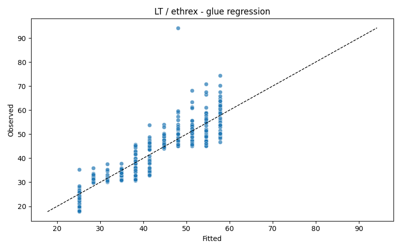

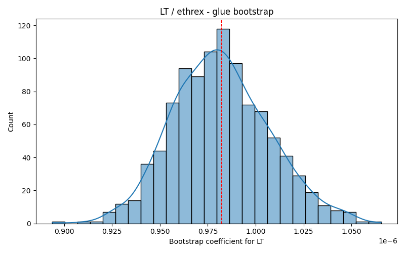

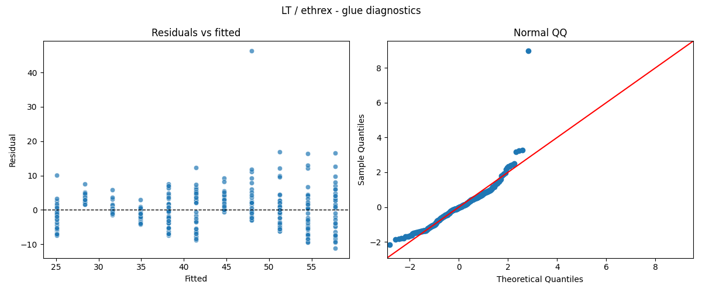

</details>

<details><summary><code>MSTORE</code> · nobs=2035 · runtime_ms=1.666e-06 · p=1.00e-03 · R²=0.8092</summary>

```
==============================================================================
                           NNLS Regression Results                            
==============================================================================
Dep. Variable:          test_runtime_ms              R-squared:          0.809
Model:                  NNLS                    Adj. R-squared:          0.809
No. Observations:       2035                              RMSE:           5.68
Df Residuals:           2033                               MAE:           4.28
Df Model:               1      
==============================================================================
                      coef     std err     P-value      [0.025      0.975]
------------------------------------------------------------------------------
         const     11.6981      0.4287       0.001     10.8638     12.5577
        MSTORE      0.0000      0.0000       0.001      0.0000      0.0000
==============================================================================
Notes: Non-negative least squares with bootstrap inference (1000 iterations)
==============================================================================
```

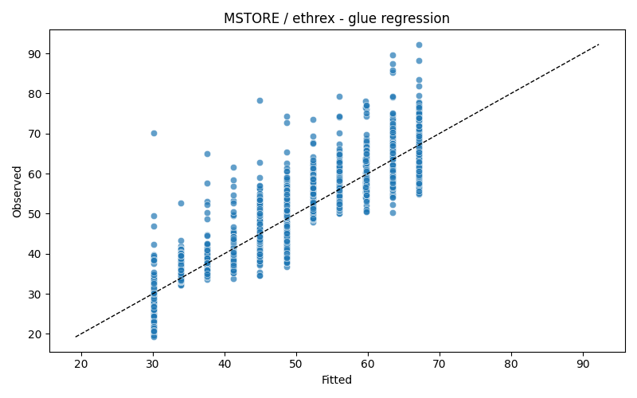

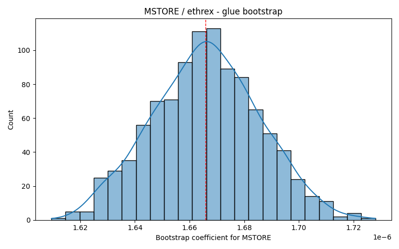

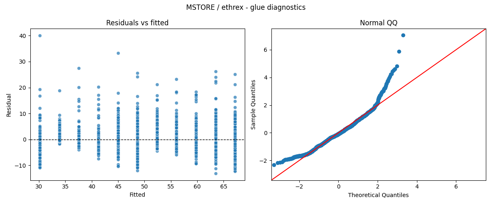

</details>

<details><summary><code>MSTORE8</code> · nobs=2035 · runtime_ms=1.571e-06 · p=1.00e-03 · R²=0.7931</summary>

```
==============================================================================
                           NNLS Regression Results                            
==============================================================================
Dep. Variable:          test_runtime_ms              R-squared:          0.793
Model:                  NNLS                    Adj. R-squared:          0.793
No. Observations:       2035                              RMSE:           5.63
Df Residuals:           2033                               MAE:           4.11
Df Model:               1      
==============================================================================
                      coef     std err     P-value      [0.025      0.975]
------------------------------------------------------------------------------
         const     10.1293      0.4144       0.001      9.3651     10.9335
       MSTORE8      0.0000      0.0000       0.001      0.0000      0.0000
==============================================================================
Notes: Non-negative least squares with bootstrap inference (1000 iterations)
==============================================================================
```

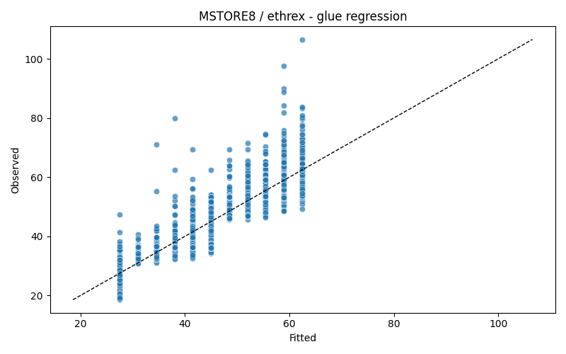

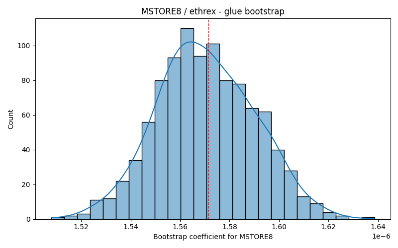

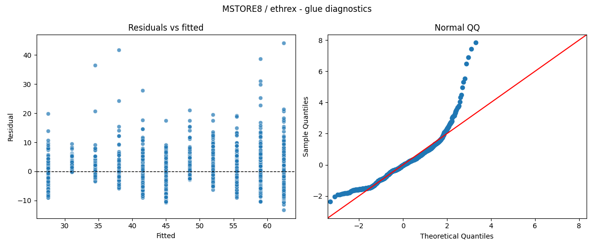

</details>

<details><summary><code>MUL</code> · nobs=407 · runtime_ms=1.637e-06 · p=1.00e-03 · R²=0.8467</summary>

```
==============================================================================
                           NNLS Regression Results                            
==============================================================================
Dep. Variable:          test_runtime_ms              R-squared:          0.847
Model:                  NNLS                    Adj. R-squared:          0.846
No. Observations:       407                               RMSE:           5.50
Df Residuals:           405                                MAE:           3.69
Df Model:               1      
==============================================================================
                      coef     std err     P-value      [0.025      0.975]
------------------------------------------------------------------------------
         const     10.3071      0.7329       0.001      8.9822     11.8212
           MUL      0.0000      0.0000       0.001      0.0000      0.0000
==============================================================================
Notes: Non-negative least squares with bootstrap inference (1000 iterations)
==============================================================================
```

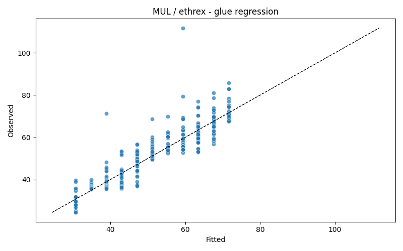

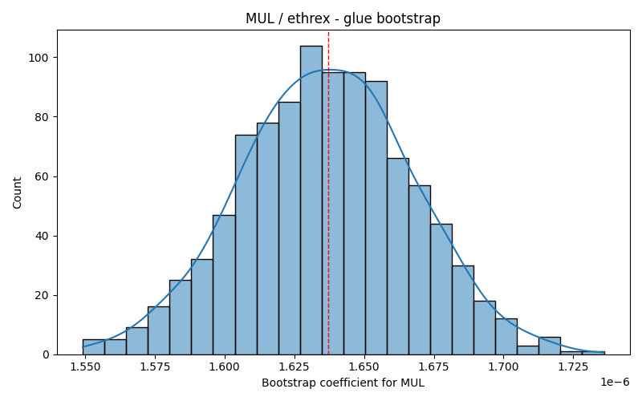

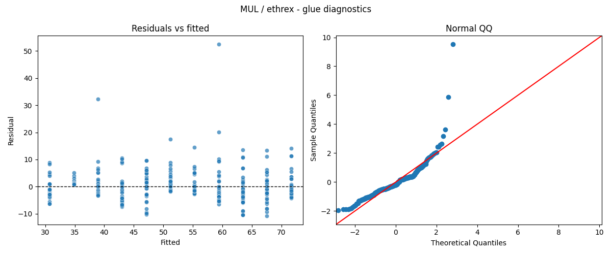

</details>

<details><summary><code>PC</code> · nobs=407 · runtime_ms=5.233e-07 · p=1.00e-03 · R²=0.7828</summary>

```
==============================================================================
                           NNLS Regression Results                            
==============================================================================
Dep. Variable:          test_runtime_ms              R-squared:          0.783
Model:                  NNLS                    Adj. R-squared:          0.782
No. Observations:       407                               RMSE:           8.24
Df Residuals:           405                                MAE:           6.63
Df Model:               1      
==============================================================================
                      coef     std err     P-value      [0.025      0.975]
------------------------------------------------------------------------------
         const     17.7347      1.3908       0.001     14.9522     20.5106
            PC      0.0000      0.0000       0.001      0.0000      0.0000
==============================================================================
Notes: Non-negative least squares with bootstrap inference (1000 iterations)
==============================================================================
```

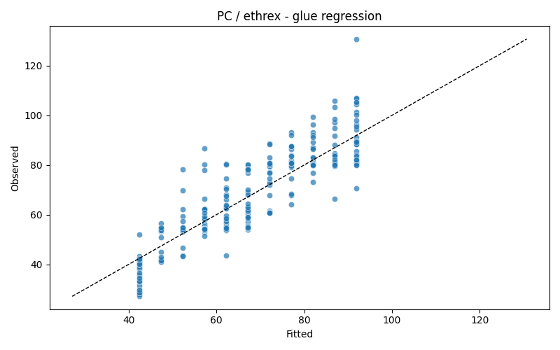

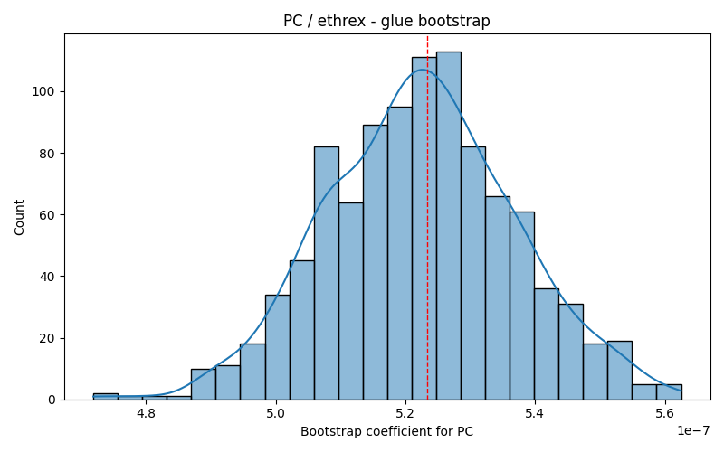

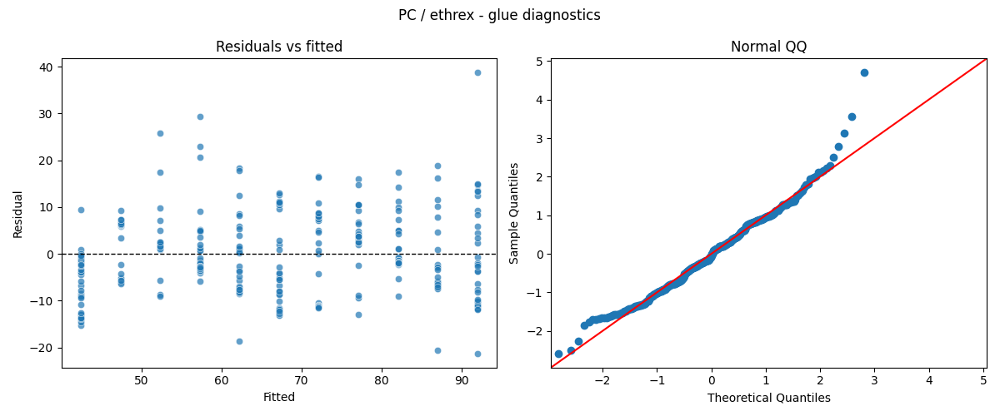

</details>

<details><summary><code>RETURNDATASIZE</code> · nobs=1628 · runtime_ms=9.083e-07 · p=1.00e-03 · R²=0.7612</summary>

```
==============================================================================
                           NNLS Regression Results                            
==============================================================================
Dep. Variable:          test_runtime_ms              R-squared:          0.761
Model:                  NNLS                    Adj. R-squared:          0.761
No. Observations:       1628                              RMSE:           8.03
Df Residuals:           1626                               MAE:           5.17
Df Model:               1      
==============================================================================
                      coef     std err     P-value      [0.025      0.975]
------------------------------------------------------------------------------
         const     11.6174      0.5939       0.001     10.4020     12.7954
RETURNDATASIZE      0.0000      0.0000       0.001      0.0000      0.0000
==============================================================================
Notes: Non-negative least squares with bootstrap inference (1000 iterations)
==============================================================================
```

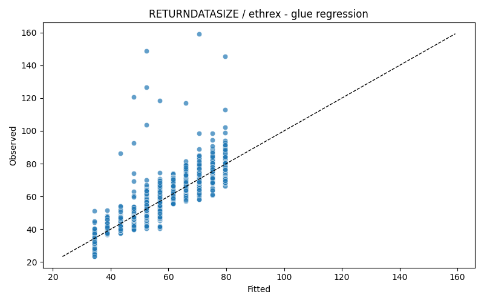

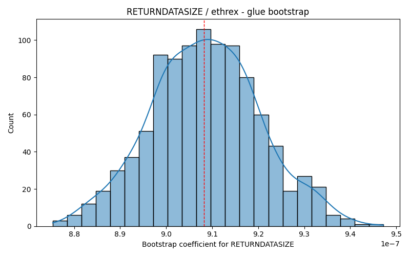

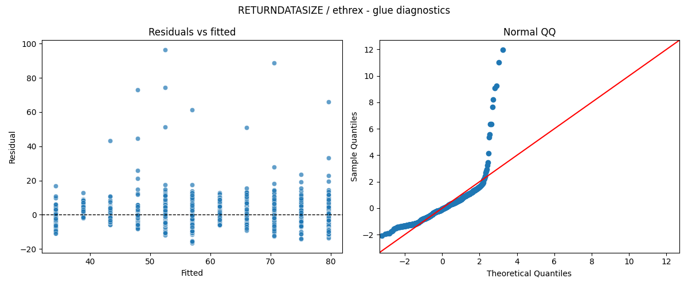

</details>

<details><summary><code>SELFBALANCE</code> · nobs=333 · runtime_ms=5.895e-06 · p=1.00e-03 · R²=0.9108</summary>

```
==============================================================================
                           NNLS Regression Results                            
==============================================================================
Dep. Variable:          test_runtime_ms              R-squared:          0.911
Model:                  NNLS                    Adj. R-squared:          0.911
No. Observations:       333                               RMSE:          18.61
Df Residuals:           331                                MAE:          14.98
Df Model:               1      
==============================================================================
                      coef     std err     P-value      [0.025      0.975]
------------------------------------------------------------------------------
         const     51.7932      4.1287       0.001     44.1106     59.9629
   SELFBALANCE      0.0000      0.0000       0.001      0.0000      0.0000
==============================================================================
Notes: Non-negative least squares with bootstrap inference (1000 iterations)
==============================================================================
```

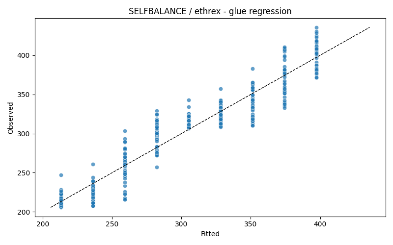

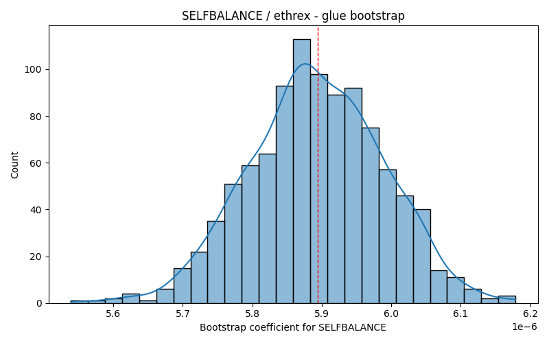

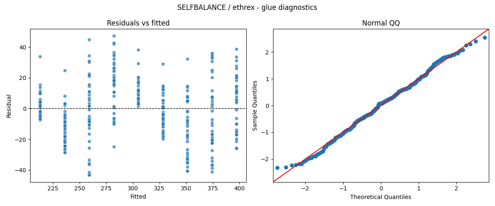

</details>

<details><summary><code>SUB</code> · nobs=407 · runtime_ms=1.162e-06 · p=1.00e-03 · R²=0.7689</summary>

```
==============================================================================
                           NNLS Regression Results                            
==============================================================================
Dep. Variable:          test_runtime_ms              R-squared:          0.769
Model:                  NNLS                    Adj. R-squared:          0.768
No. Observations:       407                               RMSE:           6.70
Df Residuals:           405                                MAE:           3.79
Df Model:               1      
==============================================================================
                      coef     std err     P-value      [0.025      0.975]
------------------------------------------------------------------------------
         const     10.3616      1.1431       0.001      8.3203     12.8659
           SUB      0.0000      0.0000       0.001      0.0000      0.0000
==============================================================================
Notes: Non-negative least squares with bootstrap inference (1000 iterations)
==============================================================================
```

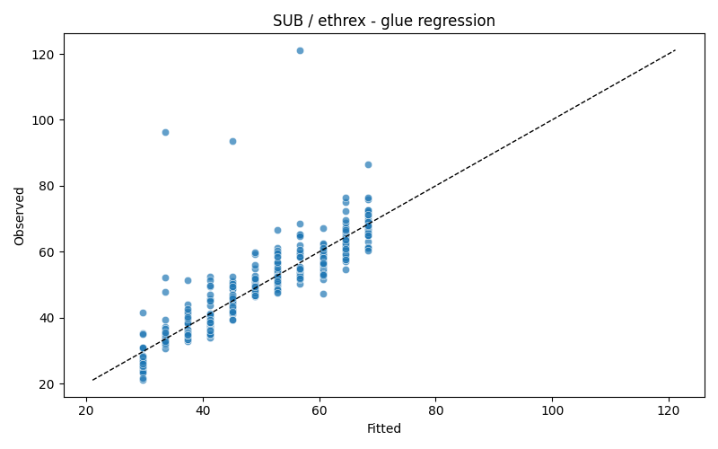

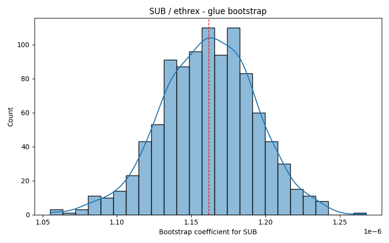

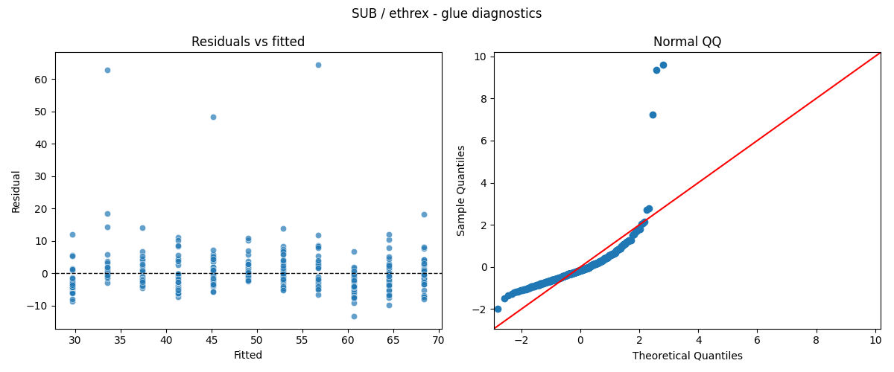

</details>

### Mixed glue (tier B) · ethrex

<details><summary><code>JUMP</code> · nobs=407 · runtime_ms=4.137e-06 · p=1.00e-03 · R²=0.8265</summary>

```
==============================================================================
                           NNLS Regression Results                            
==============================================================================
Dep. Variable:          test_runtime_ms              R-squared:          0.827
Model:                  NNLS                    Adj. R-squared:          0.826
No. Observations:       407                               RMSE:           7.04
Df Residuals:           405                                MAE:           5.74
Df Model:               1      
==============================================================================
                      coef     std err     P-value      [0.025      0.975]
------------------------------------------------------------------------------
         const     16.4874      1.2414       0.001     14.0596     18.9087
          JUMP      0.0000      0.0000       0.001      0.0000      0.0000
==============================================================================
Notes: Non-negative least squares with bootstrap inference (1000 iterations)
==============================================================================
```

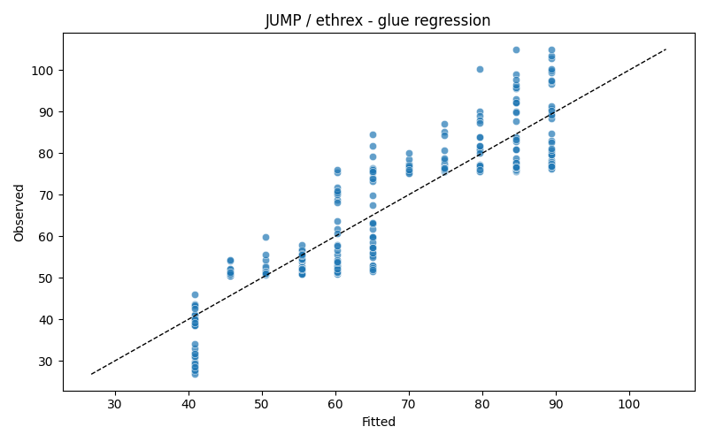

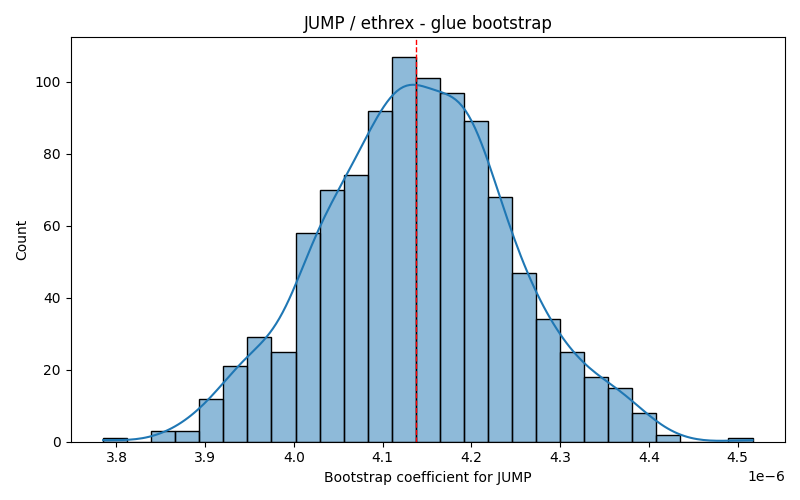

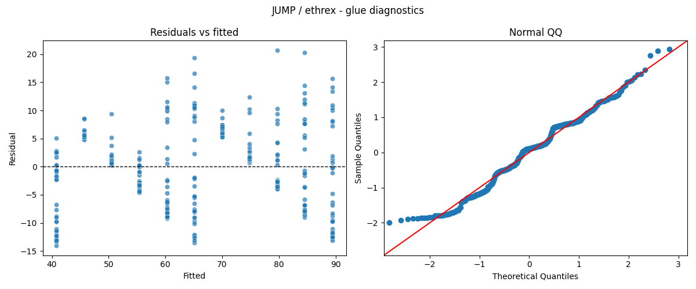

</details>

<details><summary><code>KECCAK256</code> · nobs=6512 · runtime_ms=0 · p=1.00e+00 · R²=-2.22e-16</summary>

```
==============================================================================
                           NNLS Regression Results                            
==============================================================================
Dep. Variable:          test_runtime_ms              R-squared:         -0.000
Model:                  NNLS                    Adj. R-squared:         -0.000
No. Observations:       6512                              RMSE:         153.50
Df Residuals:           6510                               MAE:         127.18
Df Model:               1      
==============================================================================
                      coef     std err     P-value      [0.025      0.975]
------------------------------------------------------------------------------
         const    242.6969      1.8938       0.001    238.9735    246.3801
     KECCAK256      0.0000      0.0000       1.000      0.0000      0.0000
==============================================================================
Notes: Non-negative least squares with bootstrap inference (1000 iterations)
==============================================================================
```

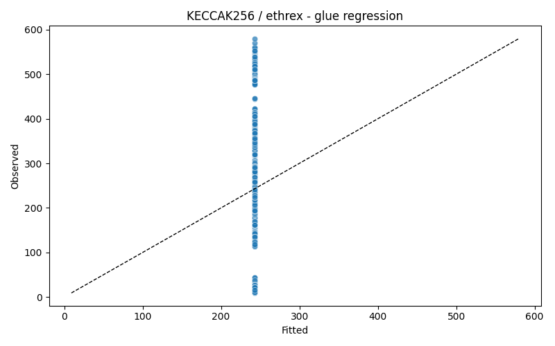


</details>

## geth

| glue_opcode | nobs | glue_runtime_ms | p_value | rsquared |
| --- | --- | --- | --- | --- |
| `ISZERO` | 3014 | 1.418e-06 | 1.00e-03 | 0.7822 |
| `JUMPDEST` | 3014 | 1.135e-06 | 1.00e-03 | 0.7413 |
| `SWAP` | 48224 | 1.523e-06 | 1.00e-03 | 0.7602 |
| `CALLDATASIZE` | 178200 | 1.415e-06 | 1.00e-03 | 0.8191 |
| `DUP` | 178200 | 1.523e-06 | 1.00e-03 | 0.8191 |
| `GAS` | 178200 | 1.491e-06 | 1.00e-03 | 0.8191 |
| `MLOAD` | 178200 | 5.193e-06 | 1.00e-03 | 0.8191 |
| `PUSH` | 178200 | 2.254e-06 | 1.00e-03 | 0.8191 |
| `PUSH0` | 178200 | 1.427e-06 | 1.00e-03 | 0.8191 |
| `STATICCALL` | 178200 | 0.0001733 | 1.00e-03 | 0.8191 |
| `ADD` | 3014 | 4.449e-06 | 1.00e-03 | 0.8327 |
| `AND` | 3014 | 4.331e-06 | 1.00e-03 | 0.81 |
| `CALLDATACOPY` | 72336 | 1.37e-05 | 1.00e-03 | 0.9524 |
| `CALLDATALOAD` | 12056 | 4.946e-05 | 1.00e-03 | 0.03203 |
| `DIV` | 3014 | 9.309e-06 | 1.00e-03 | 0.7899 |
| `EXP` | 3014 | 0.0003361 | 1.00e-03 | 0.8168 |
| `GT` | 3014 | 3.523e-06 | 1.00e-03 | 0.7426 |
| `JUMPI` | 3014 | 5.679e-06 | 1.00e-03 | 0.7653 |
| `LT` | 3014 | 4.31e-06 | 1.00e-03 | 0.7861 |
| `MSTORE` | 15070 | 8.012e-06 | 1.00e-03 | 0.807 |
| `MSTORE8` | 15070 | 7.355e-06 | 1.00e-03 | 0.7926 |
| `MUL` | 3014 | 4.896e-06 | 1.00e-03 | 0.8505 |
| `PC` | 3014 | 1.617e-06 | 1.00e-03 | 0.8264 |
| `RETURNDATASIZE` | 12056 | 3.123e-06 | 1.00e-03 | 0.6033 |
| `SELFBALANCE` | 2466 | 7.471e-06 | 1.00e-03 | 0.7944 |
| `SUB` | 3014 | 4.429e-06 | 1.00e-03 | 0.8128 |
| `JUMP` | 3014 | 9.171e-06 | 1.00e-03 | 0.7615 |
| `KECCAK256` | 48224 | 3.652e-05 | 1.00e-03 | 0.2628 |

### Cycle glue — joint fit · geth

<details><summary>Joint NNLS regression summary</summary>

```
==============================================================================
                           NNLS Regression Results                            
==============================================================================
Dep. Variable:          test_runtime_ms              R-squared:          0.819
Model:                  NNLS                    Adj. R-squared:          0.819
No. Observations:       178200                            RMSE:          24.21
Df Residuals:           178192                             MAE:          18.74
Df Model:               7      
==============================================================================
                      coef     std err     P-value      [0.025      0.975]
------------------------------------------------------------------------------
         const     40.7153      0.2073       0.001     40.3207     41.1141
  CALLDATASIZE      0.0000      0.0000       0.001      0.0000      0.0000
           DUP      0.0000      0.0000       0.001      0.0000      0.0000
           GAS      0.0000      0.0000       0.001      0.0000      0.0000
         MLOAD      0.0000      0.0000       0.001      0.0000      0.0000
          PUSH      0.0000      0.0000       0.001      0.0000      0.0000
         PUSH0      0.0000      0.0000       0.001      0.0000      0.0000
    STATICCALL      0.0002      0.0000       0.001      0.0002      0.0002
==============================================================================
Notes: Non-negative least squares with bootstrap inference (1000 iterations)
==============================================================================
```

</details>

<details><summary><code>CALLDATASIZE</code> · nobs=178200 · runtime_ms=1.415e-06 · p=1.00e-03 · R²=0.8191</summary>


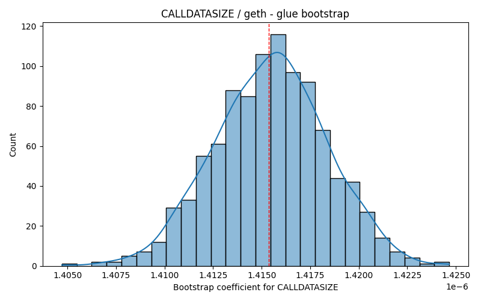

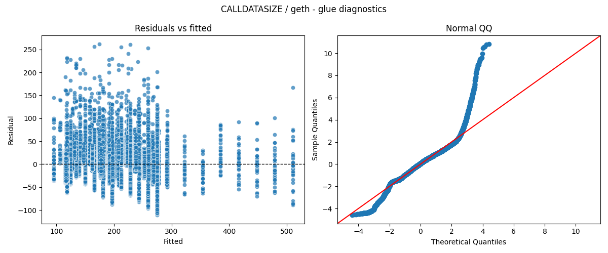

</details>

<details><summary><code>DUP</code> · nobs=178200 · runtime_ms=1.523e-06 · p=1.00e-03 · R²=0.8191</summary>

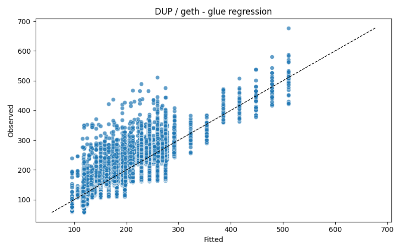

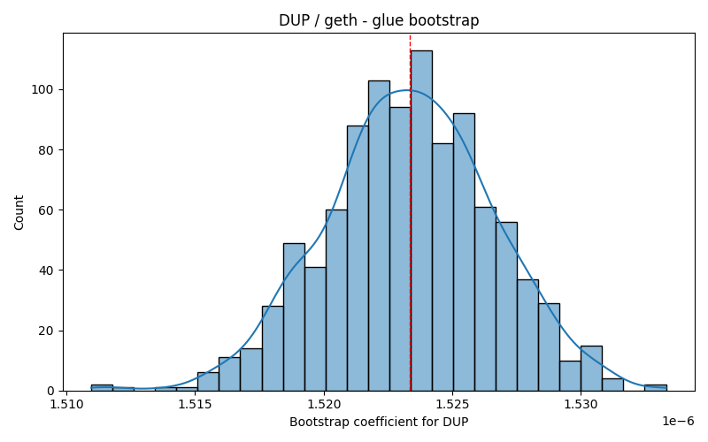


</details>

<details><summary><code>GAS</code> · nobs=178200 · runtime_ms=1.491e-06 · p=1.00e-03 · R²=0.8191</summary>


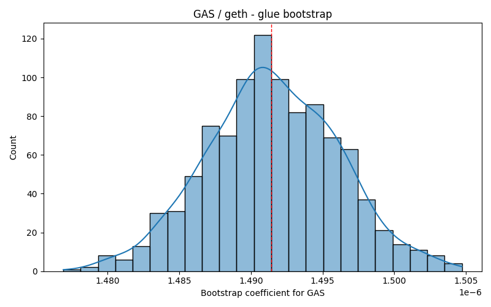

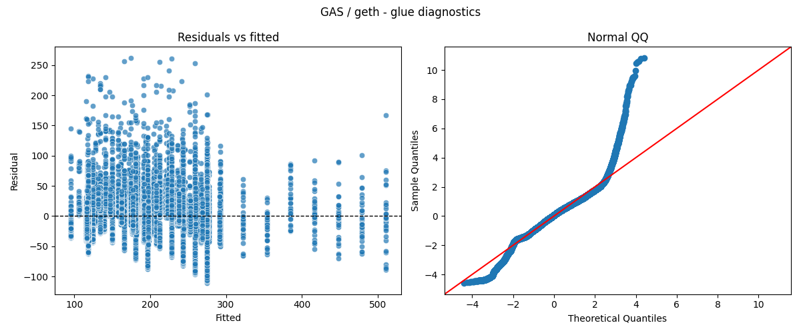

</details>

<details><summary><code>MLOAD</code> · nobs=178200 · runtime_ms=5.193e-06 · p=1.00e-03 · R²=0.8191</summary>


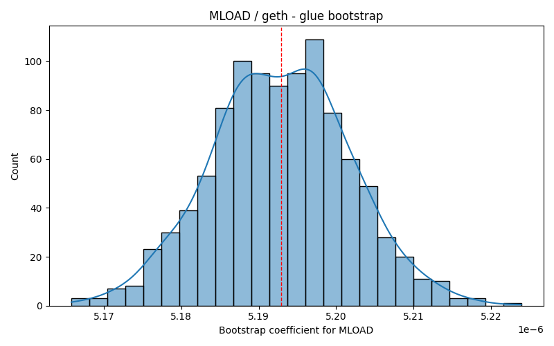


</details>

<details><summary><code>PUSH</code> · nobs=178200 · runtime_ms=2.254e-06 · p=1.00e-03 · R²=0.8191</summary>


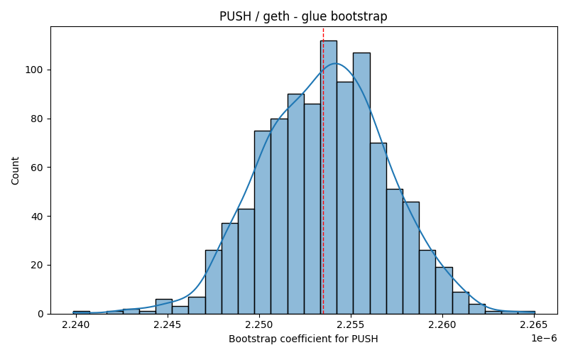


</details>

<details><summary><code>PUSH0</code> · nobs=178200 · runtime_ms=1.427e-06 · p=1.00e-03 · R²=0.8191</summary>


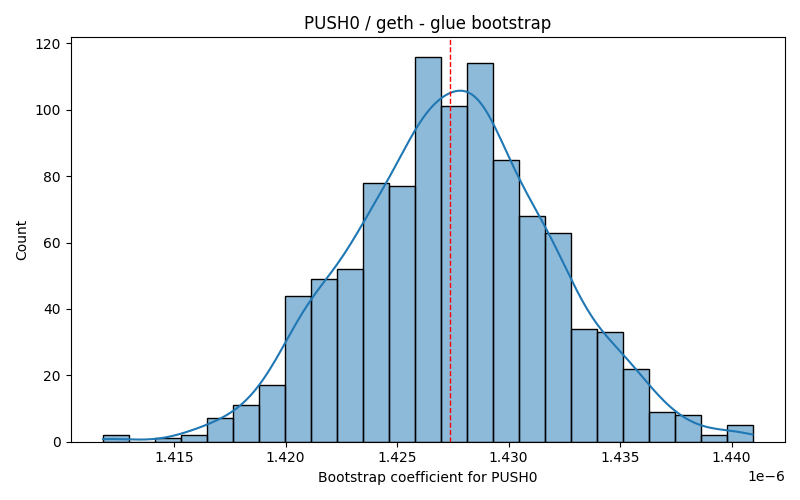


</details>

<details><summary><code>STATICCALL</code> · nobs=178200 · runtime_ms=0.0001733 · p=1.00e-03 · R²=0.8191</summary>


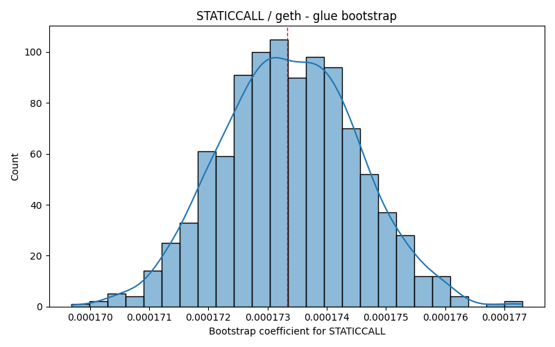

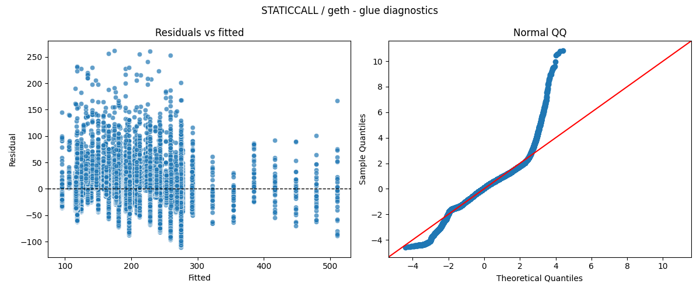

</details>

### Pure glue · geth

<details><summary><code>ISZERO</code> · nobs=3014 · runtime_ms=1.418e-06 · p=1.00e-03 · R²=0.7822</summary>

```
==============================================================================
                           NNLS Regression Results                            
==============================================================================
Dep. Variable:          test_runtime_ms              R-squared:          0.782
Model:                  NNLS                    Adj. R-squared:          0.782
No. Observations:       3014                              RMSE:          15.75
Df Residuals:           3012                               MAE:          11.89
Df Model:               1      
==============================================================================
                      coef     std err     P-value      [0.025      0.975]
------------------------------------------------------------------------------
         const     23.6119      1.0266       0.001     21.6179     25.6366
        ISZERO      0.0000      0.0000       0.001      0.0000      0.0000
==============================================================================
Notes: Non-negative least squares with bootstrap inference (1000 iterations)
==============================================================================
```

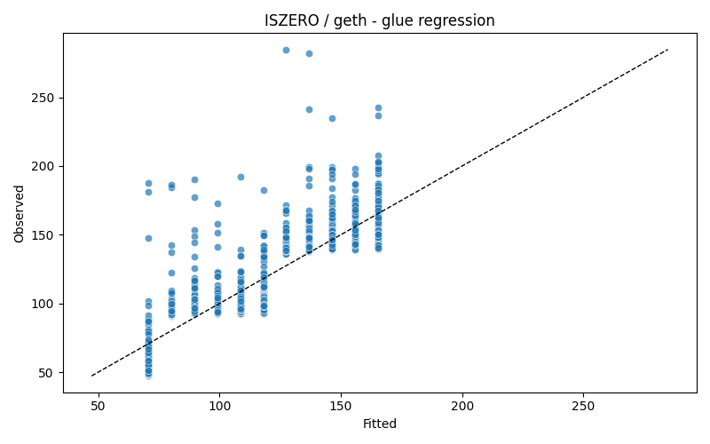

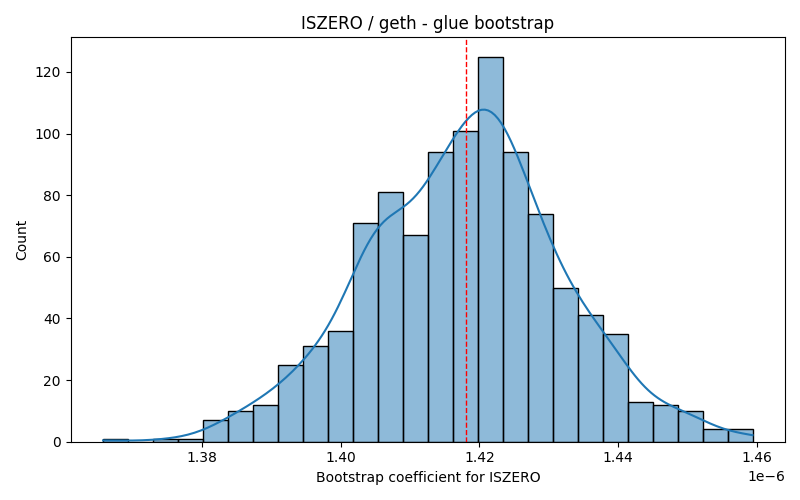

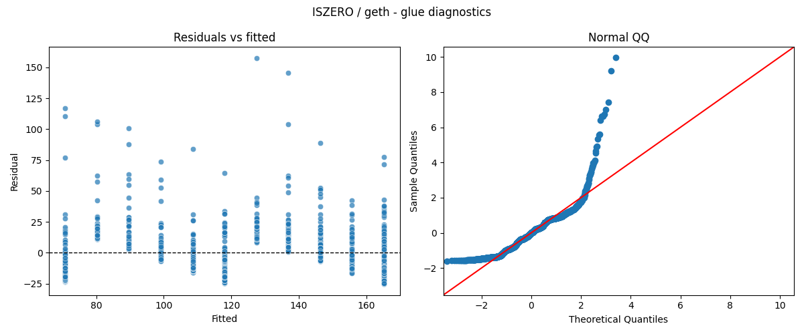

</details>

<details><summary><code>JUMPDEST</code> · nobs=3014 · runtime_ms=1.135e-06 · p=1.00e-03 · R²=0.7413</summary>

```
==============================================================================
                           NNLS Regression Results                            
==============================================================================
Dep. Variable:          test_runtime_ms              R-squared:          0.741
Model:                  NNLS                    Adj. R-squared:          0.741
No. Observations:       3014                              RMSE:          42.36
Df Residuals:           3012                               MAE:          27.99
Df Model:               1      
==============================================================================
                      coef     std err     P-value      [0.025      0.975]
------------------------------------------------------------------------------
         const     74.0449      2.6488       0.001     68.9873     79.3707
      JUMPDEST      0.0000      0.0000       0.001      0.0000      0.0000
==============================================================================
Notes: Non-negative least squares with bootstrap inference (1000 iterations)
==============================================================================
```

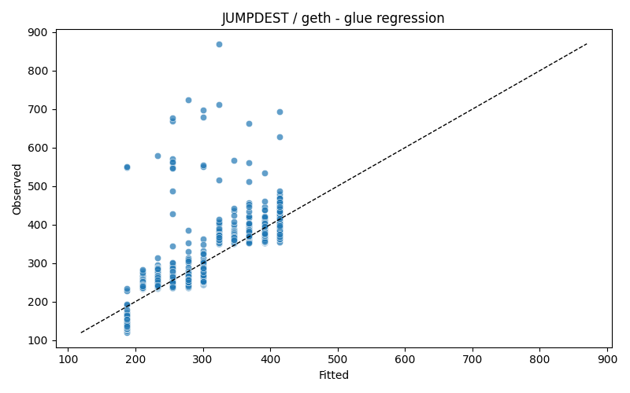

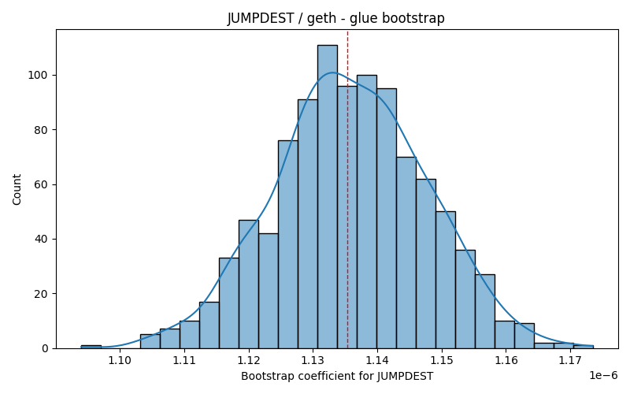

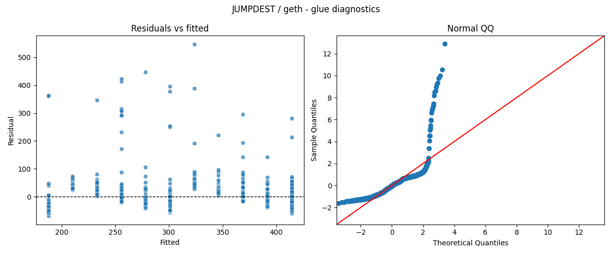

</details>

<details><summary><code>SWAP</code> · nobs=48224 · runtime_ms=1.523e-06 · p=1.00e-03 · R²=0.7602</summary>

```
==============================================================================
                           NNLS Regression Results                            
==============================================================================
Dep. Variable:          test_runtime_ms              R-squared:          0.760
Model:                  NNLS                    Adj. R-squared:          0.760
No. Observations:       48224                             RMSE:          18.01
Df Residuals:           48222                              MAE:          13.36
Df Model:               1      
==============================================================================
                      coef     std err     P-value      [0.025      0.975]
------------------------------------------------------------------------------
         const     31.0386      0.2917       0.001     30.4632     31.5782
          SWAP      0.0000      0.0000       0.001      0.0000      0.0000
==============================================================================
Notes: Non-negative least squares with bootstrap inference (1000 iterations)
==============================================================================
```

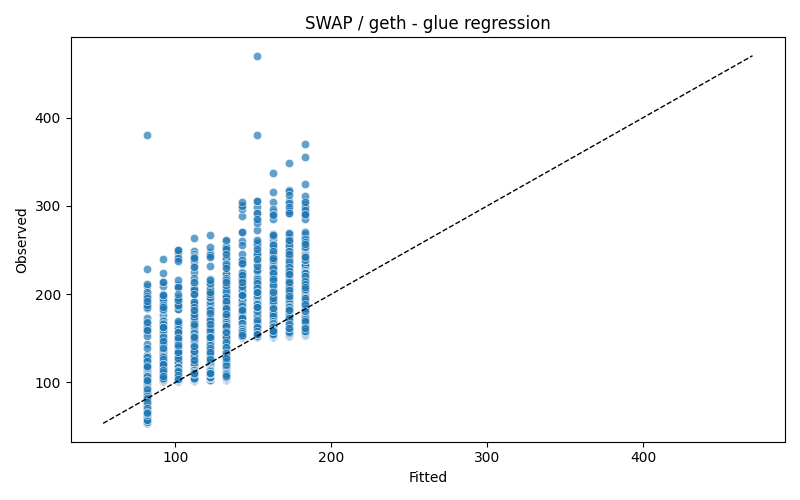

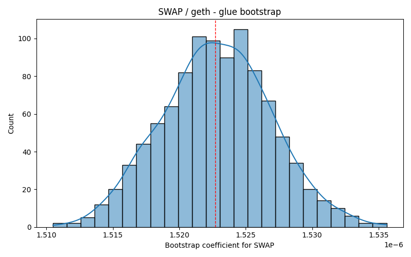

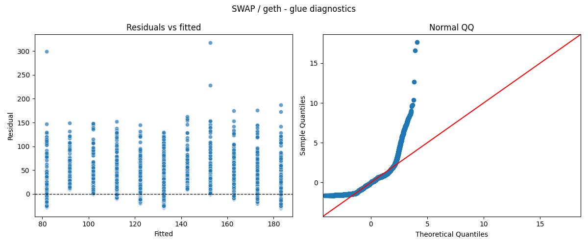

</details>

### Mixed glue (tier A) · geth

<details><summary><code>ADD</code> · nobs=3014 · runtime_ms=4.449e-06 · p=1.00e-03 · R²=0.8327</summary>

```
==============================================================================
                           NNLS Regression Results                            
==============================================================================
Dep. Variable:          test_runtime_ms              R-squared:          0.833
Model:                  NNLS                    Adj. R-squared:          0.833
No. Observations:       3014                              RMSE:          20.99
Df Residuals:           3012                               MAE:          15.71
Df Model:               1      
==============================================================================
                      coef     std err     P-value      [0.025      0.975]
------------------------------------------------------------------------------
         const     44.4958      1.2790       0.001     42.0072     47.0687
           ADD      0.0000      0.0000       0.001      0.0000      0.0000
==============================================================================
Notes: Non-negative least squares with bootstrap inference (1000 iterations)
==============================================================================
```

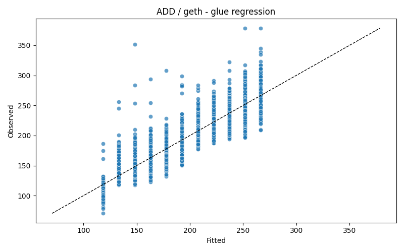

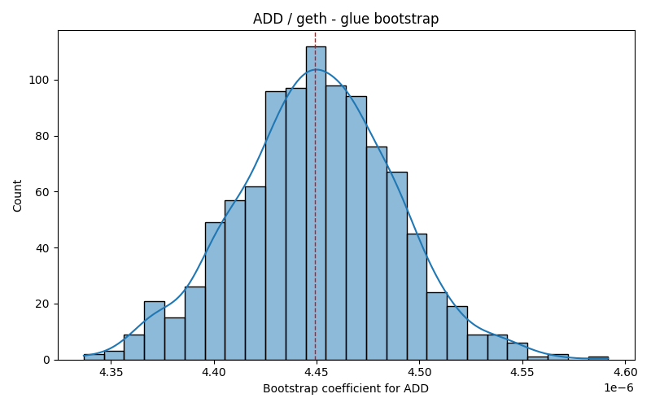

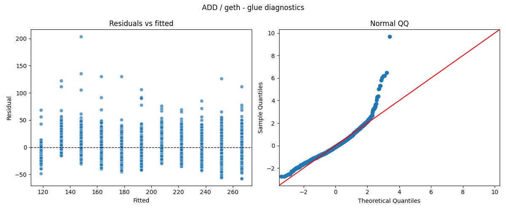

</details>

<details><summary><code>AND</code> · nobs=3014 · runtime_ms=4.331e-06 · p=1.00e-03 · R²=0.81</summary>

```
==============================================================================
                           NNLS Regression Results                            
==============================================================================
Dep. Variable:          test_runtime_ms              R-squared:          0.810
Model:                  NNLS                    Adj. R-squared:          0.810
No. Observations:       3014                              RMSE:          22.07
Df Residuals:           3012                               MAE:          16.40
Df Model:               1      
==============================================================================
                      coef     std err     P-value      [0.025      0.975]
------------------------------------------------------------------------------
         const     42.1443      1.2686       0.001     39.4578     44.5457
           AND      0.0000      0.0000       0.001      0.0000      0.0000
==============================================================================
Notes: Non-negative least squares with bootstrap inference (1000 iterations)
==============================================================================
```

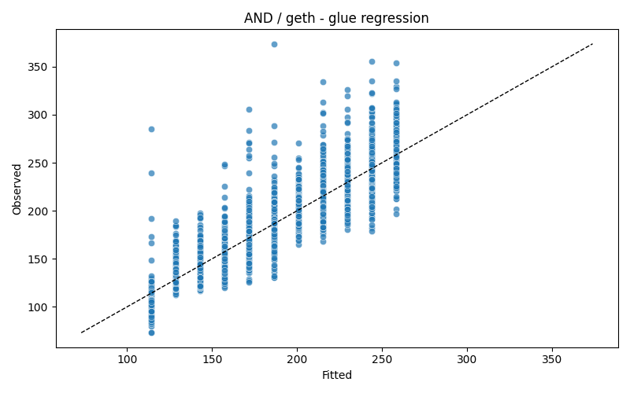

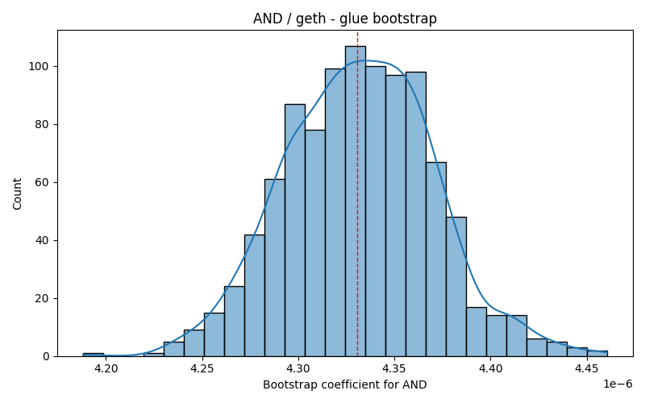

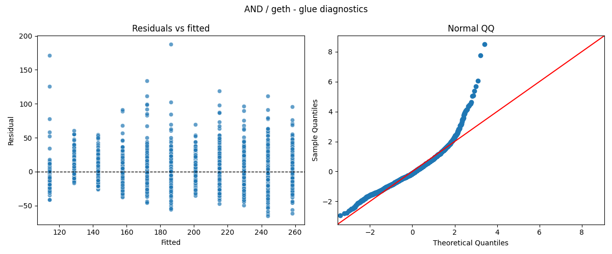

</details>

<details><summary><code>CALLDATACOPY</code> · nobs=72336 · runtime_ms=1.37e-05 · p=1.00e-03 · R²=0.9524</summary>

```
==============================================================================
                           NNLS Regression Results                            
==============================================================================
Dep. Variable:          test_runtime_ms              R-squared:          0.952
Model:                  NNLS                    Adj. R-squared:          0.952
No. Observations:       72336                             RMSE:          23.02
Df Residuals:           72334                              MAE:          16.40
Df Model:               1      
==============================================================================
                      coef     std err     P-value      [0.025      0.975]
------------------------------------------------------------------------------
         const     20.3662      0.1053       0.001     20.1631     20.5798
  CALLDATACOPY      0.0000      0.0000       0.001      0.0000      0.0000
==============================================================================
Notes: Non-negative least squares with bootstrap inference (1000 iterations)
==============================================================================
```

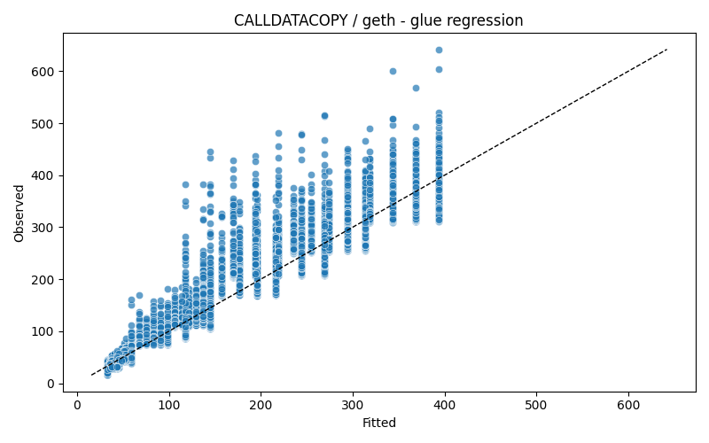

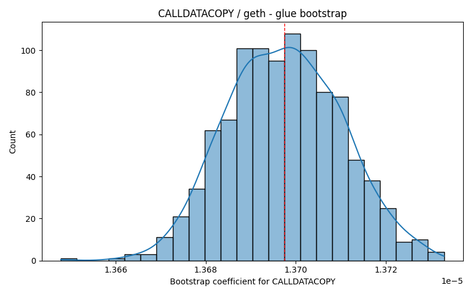

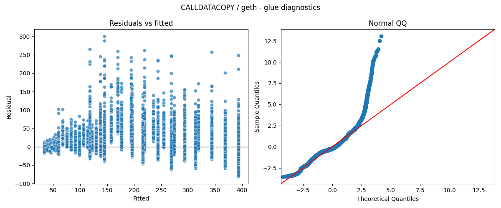

</details>

<details><summary><code>CALLDATALOAD</code> · nobs=12056 · runtime_ms=4.946e-05 · p=1.00e-03 · R²=0.03203</summary>

```
==============================================================================
                           NNLS Regression Results                            
==============================================================================
Dep. Variable:          test_runtime_ms              R-squared:          0.032
Model:                  NNLS                    Adj. R-squared:          0.032
No. Observations:       12056                             RMSE:           1.04
Df Residuals:           12054                              MAE:           0.53
Df Model:               1      
==============================================================================
                      coef     std err     P-value      [0.025      0.975]
------------------------------------------------------------------------------
         const      2.4085      0.0317       0.001      2.3508      2.4722
  CALLDATALOAD      0.0000      0.0000       0.001      0.0000      0.0001
==============================================================================
Notes: Non-negative least squares with bootstrap inference (1000 iterations)
==============================================================================
```

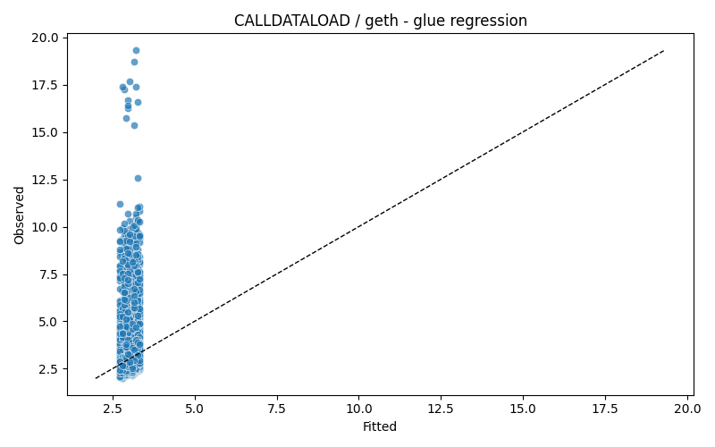

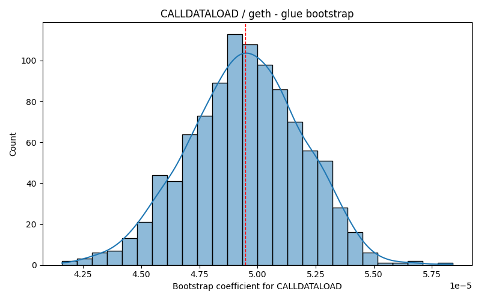

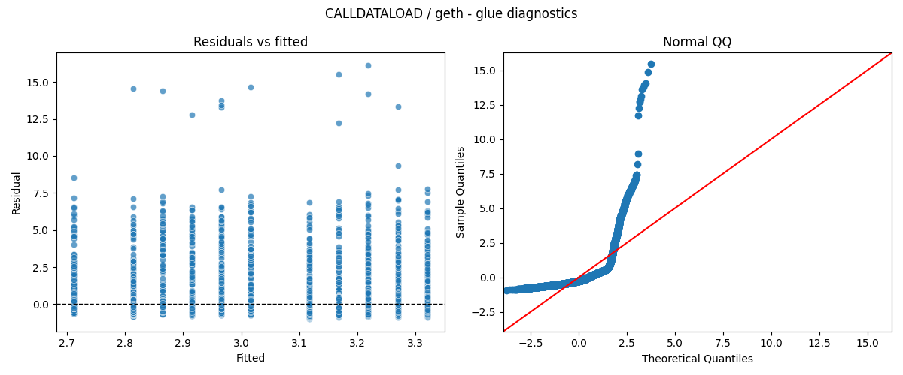

</details>

<details><summary><code>DIV</code> · nobs=3014 · runtime_ms=9.309e-06 · p=1.00e-03 · R²=0.7899</summary>

```
==============================================================================
                           NNLS Regression Results                            
==============================================================================
Dep. Variable:          test_runtime_ms              R-squared:          0.790
Model:                  NNLS                    Adj. R-squared:          0.790
No. Observations:       3014                              RMSE:          37.90
Df Residuals:           3012                               MAE:          31.18
Df Model:               1      
==============================================================================
                      coef     std err     P-value      [0.025      0.975]
------------------------------------------------------------------------------
         const     77.4080      2.5208       0.001     72.4887     82.0463
           DIV      0.0000      0.0000       0.001      0.0000      0.0000
==============================================================================
Notes: Non-negative least squares with bootstrap inference (1000 iterations)
==============================================================================
```

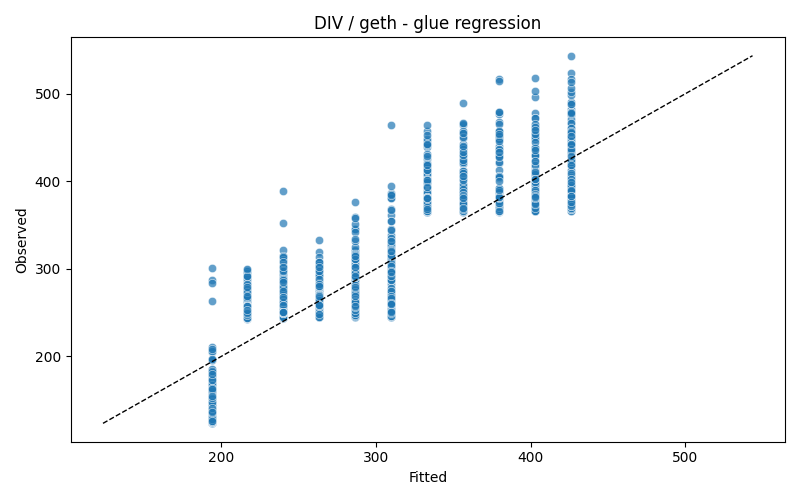

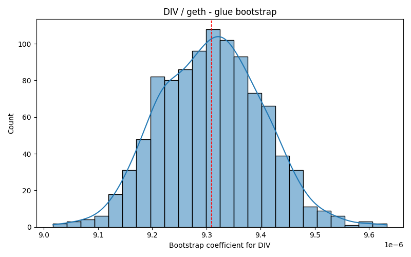

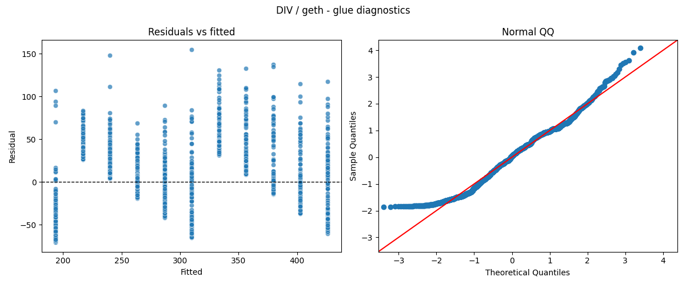

</details>

<details><summary><code>EXP</code> · nobs=3014 · runtime_ms=0.0003361 · p=1.00e-03 · R²=0.8168</summary>

```
==============================================================================
                           NNLS Regression Results                            
==============================================================================
Dep. Variable:          test_runtime_ms              R-squared:          0.817
Model:                  NNLS                    Adj. R-squared:          0.817
No. Observations:       3014                              RMSE:           6.23
Df Residuals:           3012                               MAE:           5.26
Df Model:               1      
==============================================================================
                      coef     std err     P-value      [0.025      0.975]
------------------------------------------------------------------------------
         const     12.8817      0.4118       0.001     12.0883     13.7172
           EXP      0.0003      0.0000       0.001      0.0003      0.0003
==============================================================================
Notes: Non-negative least squares with bootstrap inference (1000 iterations)
==============================================================================
```

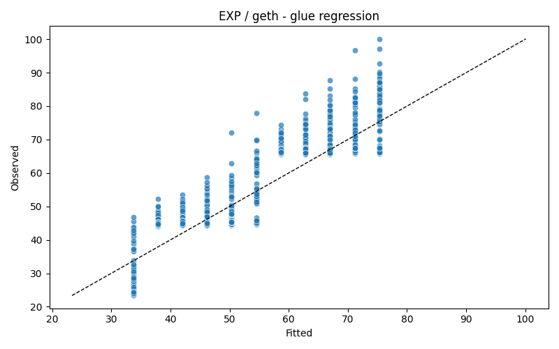

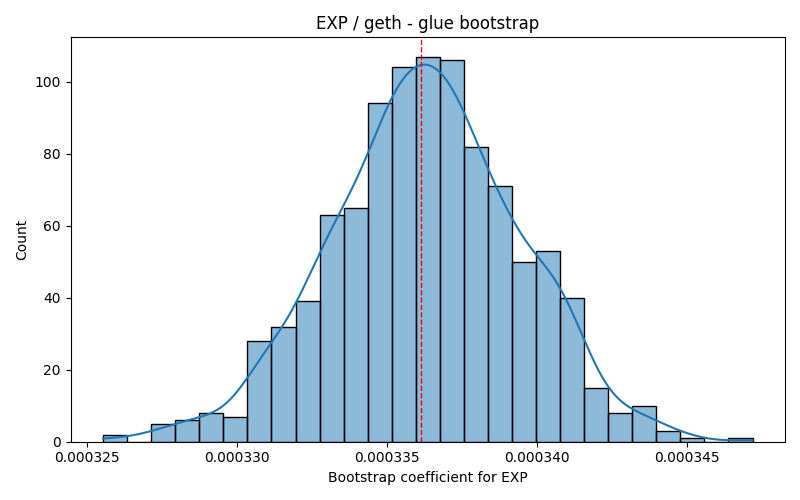

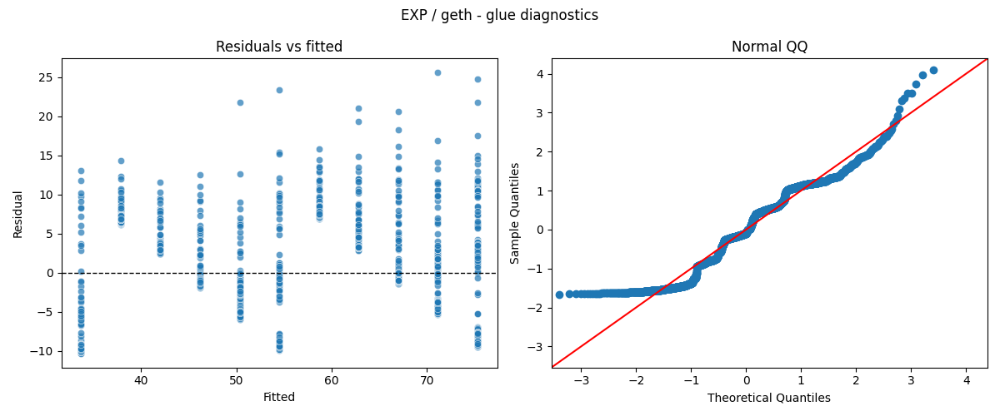

</details>

<details><summary><code>GT</code> · nobs=3014 · runtime_ms=3.523e-06 · p=1.00e-03 · R²=0.7426</summary>

```
==============================================================================
                           NNLS Regression Results                            
==============================================================================
Dep. Variable:          test_runtime_ms              R-squared:          0.743
Model:                  NNLS                    Adj. R-squared:          0.743
No. Observations:       3014                              RMSE:          21.83
Df Residuals:           3012                               MAE:          15.49
Df Model:               1      
==============================================================================
                      coef     std err     P-value      [0.025      0.975]
------------------------------------------------------------------------------
         const     39.7914      1.4891       0.001     36.8168     42.5547
            GT      0.0000      0.0000       0.001      0.0000      0.0000
==============================================================================
Notes: Non-negative least squares with bootstrap inference (1000 iterations)
==============================================================================
```

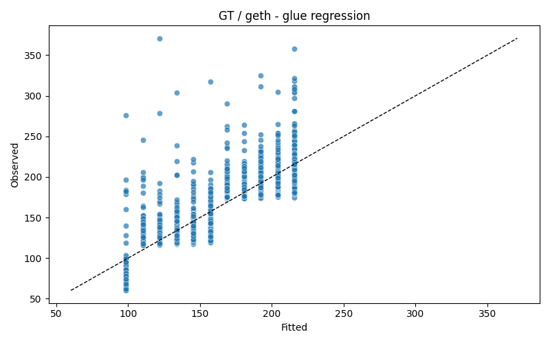

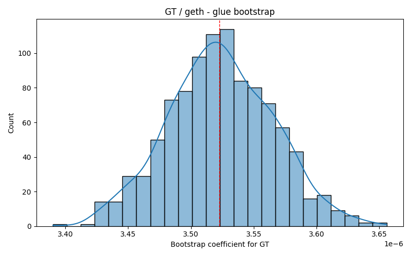

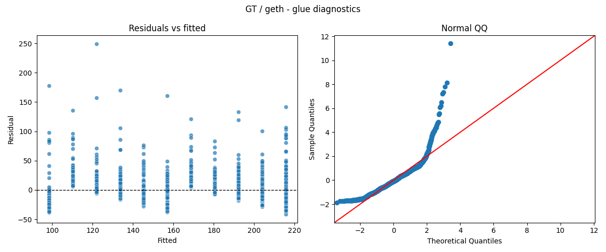

</details>

<details><summary><code>JUMPI</code> · nobs=3014 · runtime_ms=5.679e-06 · p=1.00e-03 · R²=0.7653</summary>

```
==============================================================================
                           NNLS Regression Results                            
==============================================================================
Dep. Variable:          test_runtime_ms              R-squared:          0.765
Model:                  NNLS                    Adj. R-squared:          0.765
No. Observations:       3014                              RMSE:          14.19
Df Residuals:           3012                               MAE:          10.50
Df Model:               1      
==============================================================================
                      coef     std err     P-value      [0.025      0.975]
------------------------------------------------------------------------------
         const     19.8738      0.8618       0.001     18.2109     21.5837
         JUMPI      0.0000      0.0000       0.001      0.0000      0.0000
==============================================================================
Notes: Non-negative least squares with bootstrap inference (1000 iterations)
==============================================================================
```

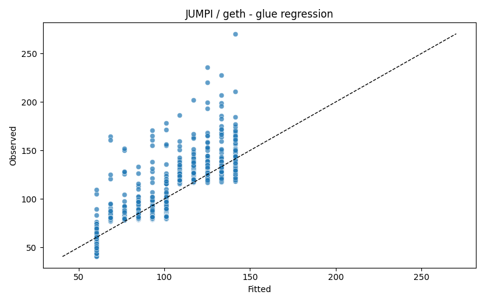

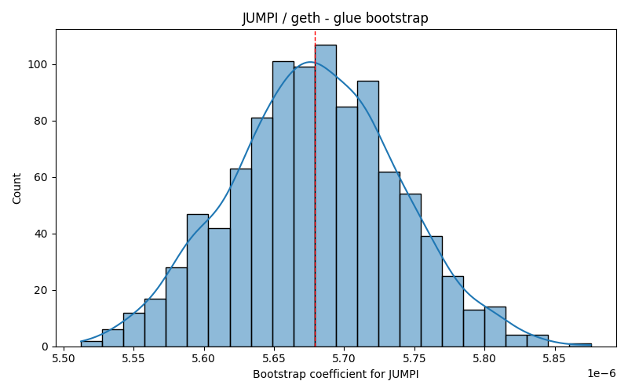

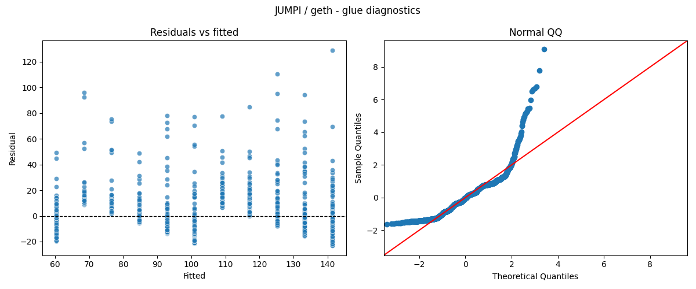

</details>

<details><summary><code>LT</code> · nobs=3014 · runtime_ms=4.31e-06 · p=1.00e-03 · R²=0.7861</summary>

```
==============================================================================
                           NNLS Regression Results                            
==============================================================================
Dep. Variable:          test_runtime_ms              R-squared:          0.786
Model:                  NNLS                    Adj. R-squared:          0.786
No. Observations:       3014                              RMSE:          23.66
Df Residuals:           3012                               MAE:          17.54
Df Model:               1      
==============================================================================
                      coef     std err     P-value      [0.025      0.975]
------------------------------------------------------------------------------
         const     42.6044      1.5215       0.001     39.7153     45.6213
            LT      0.0000      0.0000       0.001      0.0000      0.0000
==============================================================================
Notes: Non-negative least squares with bootstrap inference (1000 iterations)
==============================================================================
```

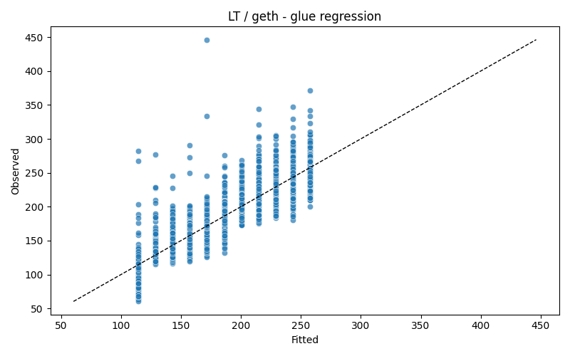


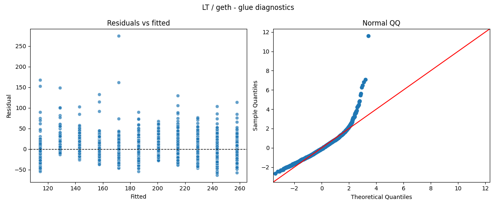

</details>

<details><summary><code>MSTORE</code> · nobs=15070 · runtime_ms=8.012e-06 · p=1.00e-03 · R²=0.807</summary>

```
==============================================================================
                           NNLS Regression Results                            
==============================================================================
Dep. Variable:          test_runtime_ms              R-squared:          0.807
Model:                  NNLS                    Adj. R-squared:          0.807
No. Observations:       15070                             RMSE:          27.49
Df Residuals:           15068                              MAE:          21.12
Df Model:               1      
==============================================================================
                      coef     std err     P-value      [0.025      0.975]
------------------------------------------------------------------------------
         const     54.9966      0.8180       0.001     53.4148     56.5726
        MSTORE      0.0000      0.0000       0.001      0.0000      0.0000
==============================================================================
Notes: Non-negative least squares with bootstrap inference (1000 iterations)
==============================================================================
```

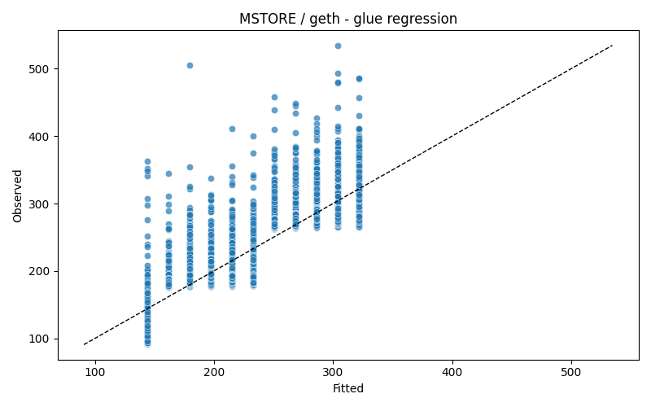

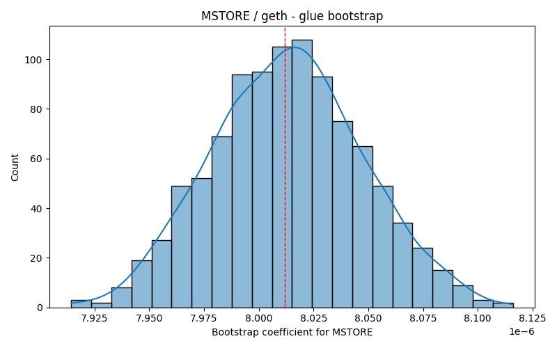

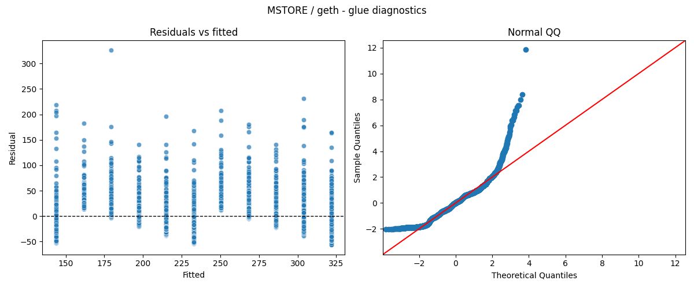

</details>

<details><summary><code>MSTORE8</code> · nobs=15070 · runtime_ms=7.355e-06 · p=1.00e-03 · R²=0.7926</summary>

```
==============================================================================
                           NNLS Regression Results                            
==============================================================================
Dep. Variable:          test_runtime_ms              R-squared:          0.793
Model:                  NNLS                    Adj. R-squared:          0.793
No. Observations:       15070                             RMSE:          26.40
Df Residuals:           15068                              MAE:          19.65
Df Model:               1      
==============================================================================
                      coef     std err     P-value      [0.025      0.975]
------------------------------------------------------------------------------
         const     51.6979      0.7947       0.001     50.2040     53.3131
       MSTORE8      0.0000      0.0000       0.001      0.0000      0.0000
==============================================================================
Notes: Non-negative least squares with bootstrap inference (1000 iterations)
==============================================================================
```

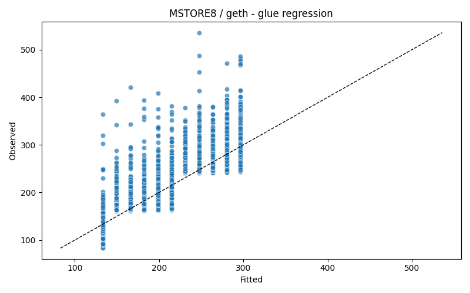

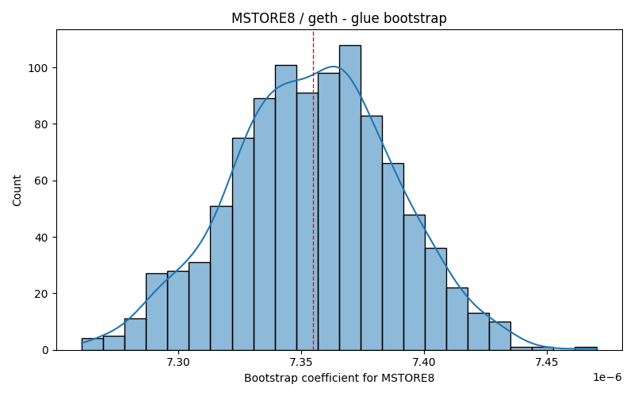

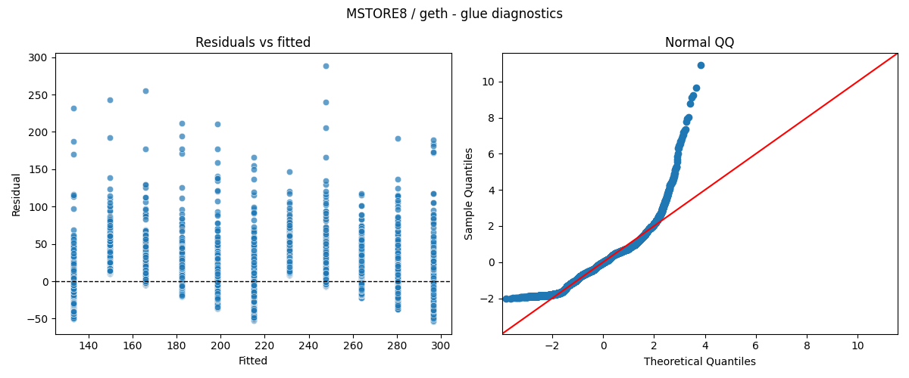

</details>

<details><summary><code>MUL</code> · nobs=3014 · runtime_ms=4.896e-06 · p=1.00e-03 · R²=0.8505</summary>

```
==============================================================================
                           NNLS Regression Results                            
==============================================================================
Dep. Variable:          test_runtime_ms              R-squared:          0.850
Model:                  NNLS                    Adj. R-squared:          0.850
No. Observations:       3014                              RMSE:          16.21
Df Residuals:           3012                               MAE:          11.85
Df Model:               1      
==============================================================================
                      coef     std err     P-value      [0.025      0.975]
------------------------------------------------------------------------------
         const     37.8376      1.0516       0.001     35.7669     39.9532
           MUL      0.0000      0.0000       0.001      0.0000      0.0000
==============================================================================
Notes: Non-negative least squares with bootstrap inference (1000 iterations)
==============================================================================
```

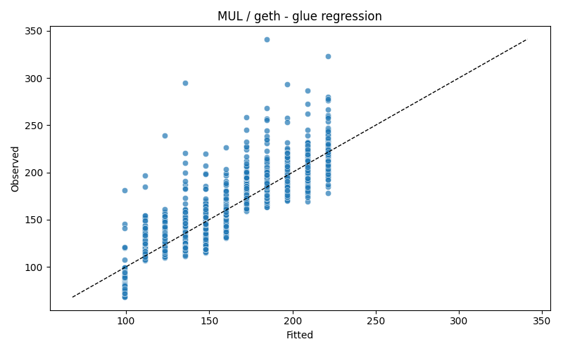

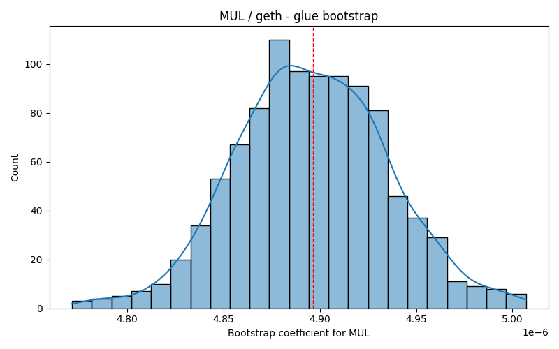

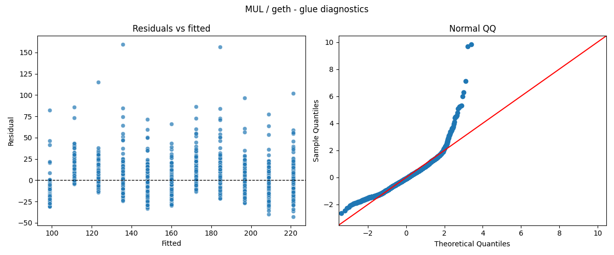

</details>

<details><summary><code>PC</code> · nobs=3014 · runtime_ms=1.617e-06 · p=1.00e-03 · R²=0.8264</summary>

```
==============================================================================
                           NNLS Regression Results                            
==============================================================================
Dep. Variable:          test_runtime_ms              R-squared:          0.826
Model:                  NNLS                    Adj. R-squared:          0.826
No. Observations:       3014                              RMSE:          22.16
Df Residuals:           3012                               MAE:          16.77
Df Model:               1      
==============================================================================
                      coef     std err     P-value      [0.025      0.975]
------------------------------------------------------------------------------
         const     42.3144      1.5202       0.001     39.3533     45.0288
            PC      0.0000      0.0000       0.001      0.0000      0.0000
==============================================================================
Notes: Non-negative least squares with bootstrap inference (1000 iterations)
==============================================================================
```

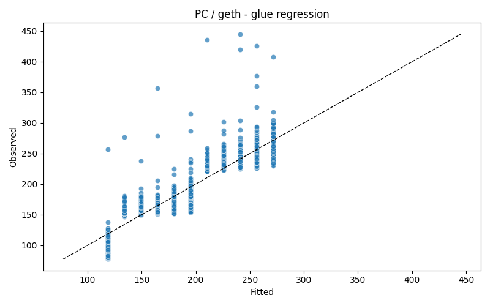

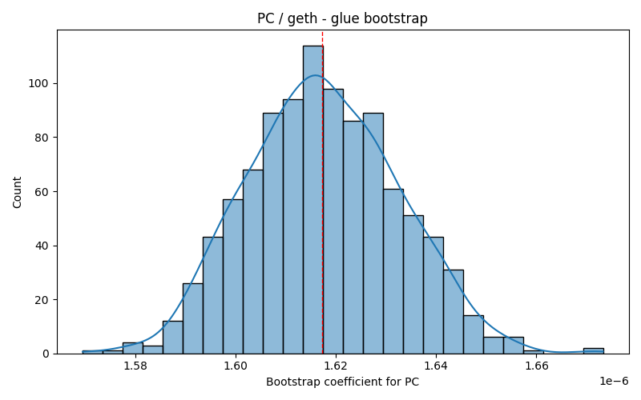

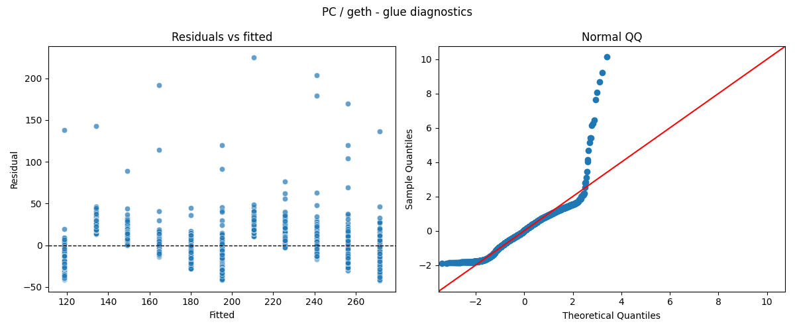

</details>

<details><summary><code>RETURNDATASIZE</code> · nobs=12056 · runtime_ms=3.123e-06 · p=1.00e-03 · R²=0.6033</summary>

```
==============================================================================
                           NNLS Regression Results                            
==============================================================================
Dep. Variable:          test_runtime_ms              R-squared:          0.603
Model:                  NNLS                    Adj. R-squared:          0.603
No. Observations:       12056                             RMSE:          39.98
Df Residuals:           12054                              MAE:          28.86
Df Model:               1      
==============================================================================
                      coef     std err     P-value      [0.025      0.975]
------------------------------------------------------------------------------
         const     50.7631      1.1818       0.001     48.3866     53.1106
RETURNDATASIZE      0.0000      0.0000       0.001      0.0000      0.0000
==============================================================================
Notes: Non-negative least squares with bootstrap inference (1000 iterations)
==============================================================================
```

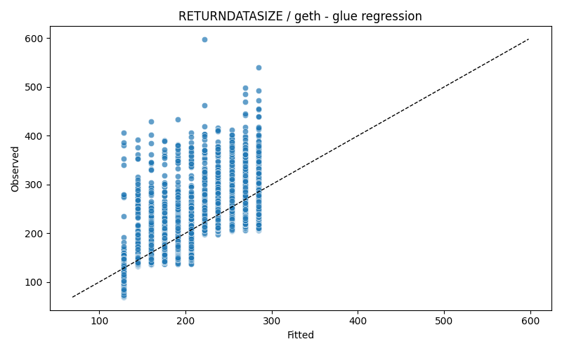

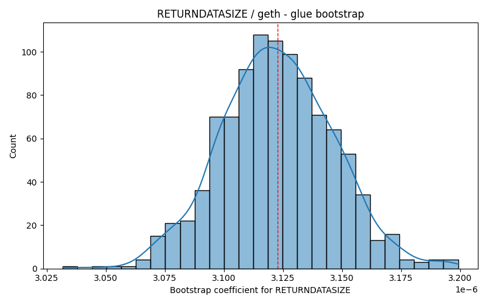

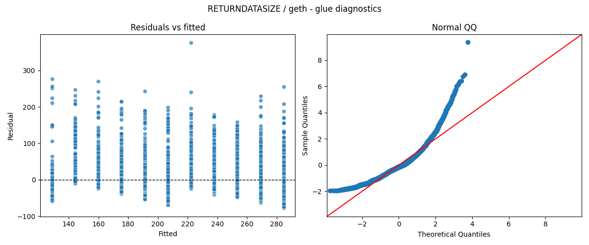

</details>

<details><summary><code>SELFBALANCE</code> · nobs=2466 · runtime_ms=7.471e-06 · p=1.00e-03 · R²=0.7944</summary>

```
==============================================================================
                           NNLS Regression Results                            
==============================================================================
Dep. Variable:          test_runtime_ms              R-squared:          0.794
Model:                  NNLS                    Adj. R-squared:          0.794
No. Observations:       2466                              RMSE:          38.34
Df Residuals:           2464                               MAE:          32.16
Df Model:               1      
==============================================================================
                      coef     std err     P-value      [0.025      0.975]
------------------------------------------------------------------------------
         const    118.0363      2.6262       0.001    113.0208    123.1521
   SELFBALANCE      0.0000      0.0000       0.001      0.0000      0.0000
==============================================================================
Notes: Non-negative least squares with bootstrap inference (1000 iterations)
==============================================================================
```

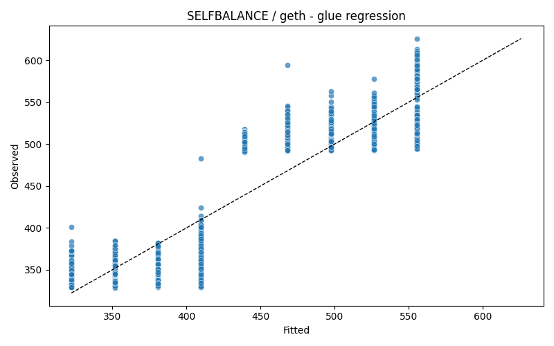

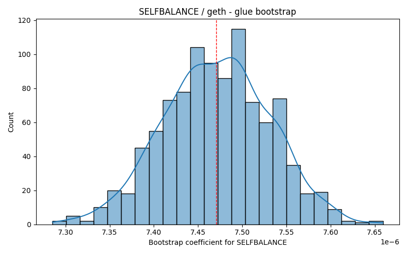

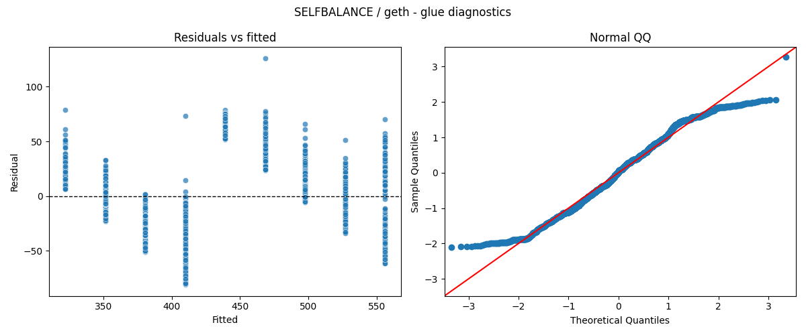

</details>

<details><summary><code>SUB</code> · nobs=3014 · runtime_ms=4.429e-06 · p=1.00e-03 · R²=0.8128</summary>

```
==============================================================================
                           NNLS Regression Results                            
==============================================================================
Dep. Variable:          test_runtime_ms              R-squared:          0.813
Model:                  NNLS                    Adj. R-squared:          0.813
No. Observations:       3014                              RMSE:          22.37
Df Residuals:           3012                               MAE:          16.76
Df Model:               1      
==============================================================================
                      coef     std err     P-value      [0.025      0.975]
------------------------------------------------------------------------------
         const     47.6045      1.4358       0.001     44.8172     50.5742
           SUB      0.0000      0.0000       0.001      0.0000      0.0000
==============================================================================
Notes: Non-negative least squares with bootstrap inference (1000 iterations)
==============================================================================
```

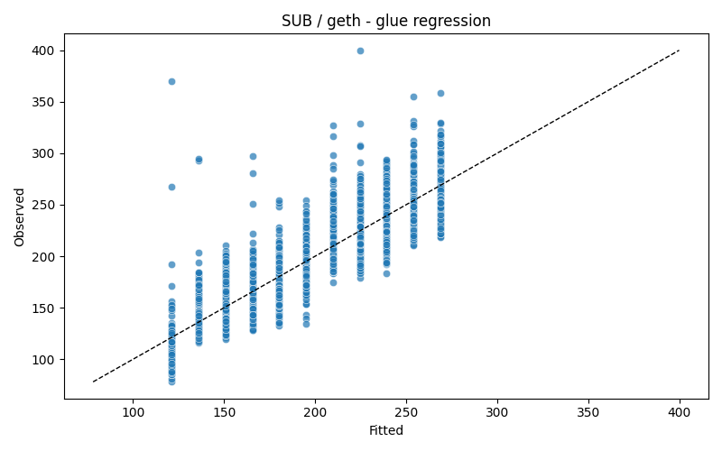

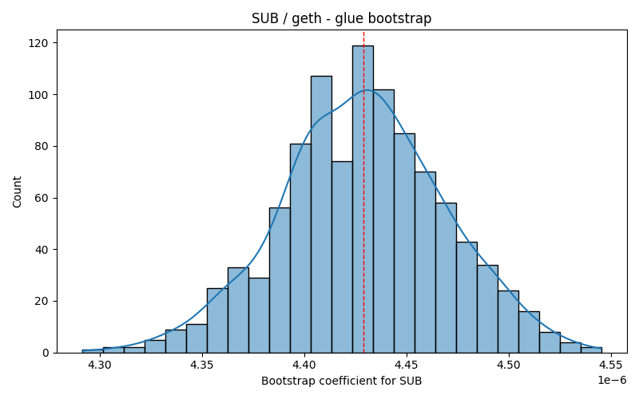

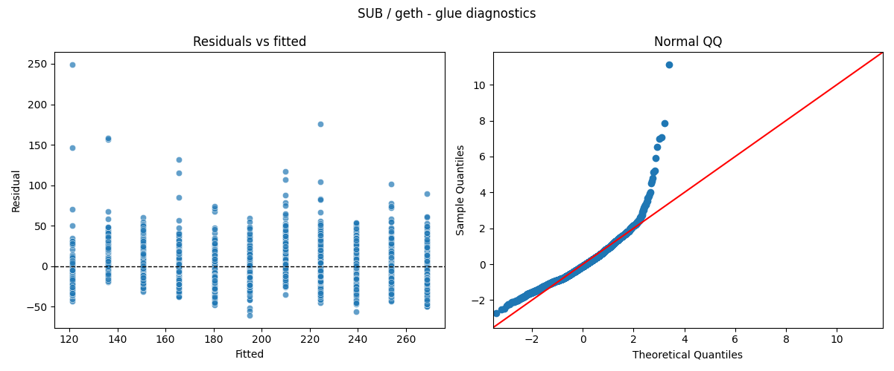

</details>

### Mixed glue (tier B) · geth

<details><summary><code>JUMP</code> · nobs=3014 · runtime_ms=9.171e-06 · p=1.00e-03 · R²=0.7615</summary>

```
==============================================================================
                           NNLS Regression Results                            
==============================================================================
Dep. Variable:          test_runtime_ms              R-squared:          0.761
Model:                  NNLS                    Adj. R-squared:          0.761
No. Observations:       3014                              RMSE:          19.07
Df Residuals:           3012                               MAE:          14.17
Df Model:               1      
==============================================================================
                      coef     std err     P-value      [0.025      0.975]
------------------------------------------------------------------------------
         const     34.9981      1.3343       0.001     32.3788     37.4533
          JUMP      0.0000      0.0000       0.001      0.0000      0.0000
==============================================================================
Notes: Non-negative least squares with bootstrap inference (1000 iterations)
==============================================================================
```

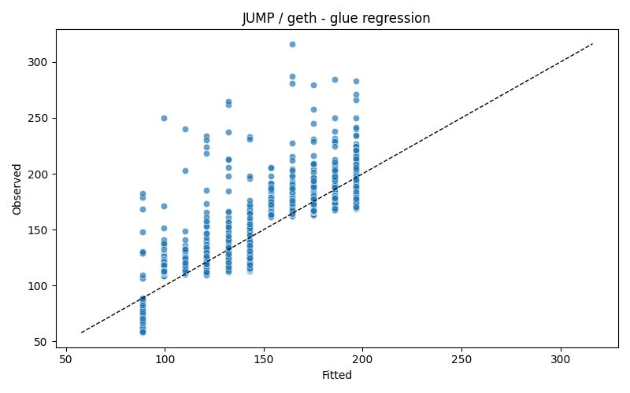


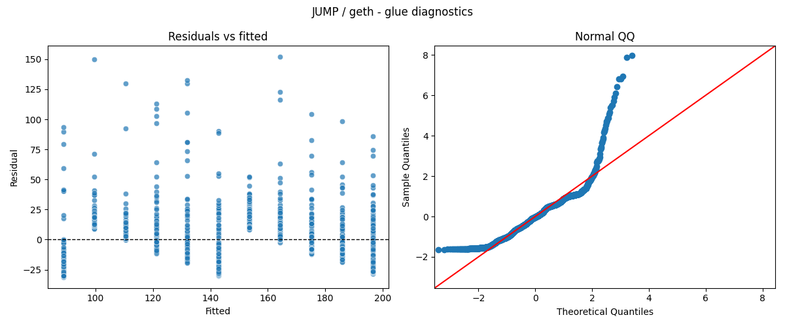

</details>

<details><summary><code>KECCAK256</code> · nobs=48224 · runtime_ms=3.652e-05 · p=1.00e-03 · R²=0.2628</summary>

```
==============================================================================
                           NNLS Regression Results                            
==============================================================================
Dep. Variable:          test_runtime_ms              R-squared:          0.263
Model:                  NNLS                    Adj. R-squared:          0.263
No. Observations:       48224                             RMSE:         121.55
Df Residuals:           48222                              MAE:          95.48
Df Model:               1      
==============================================================================
                      coef     std err     P-value      [0.025      0.975]
------------------------------------------------------------------------------
         const    378.3989      1.2166       0.001    376.0493    380.6874
     KECCAK256      0.0000      0.0000       0.001      0.0000      0.0000
==============================================================================
Notes: Non-negative least squares with bootstrap inference (1000 iterations)
==============================================================================
```

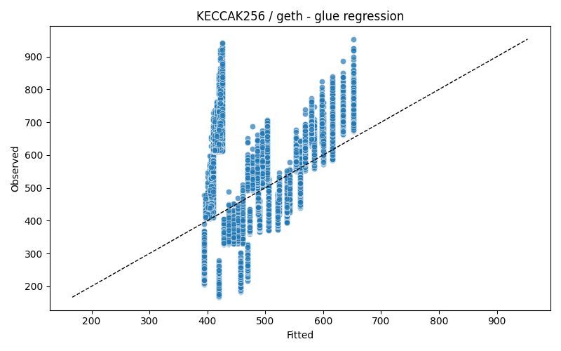

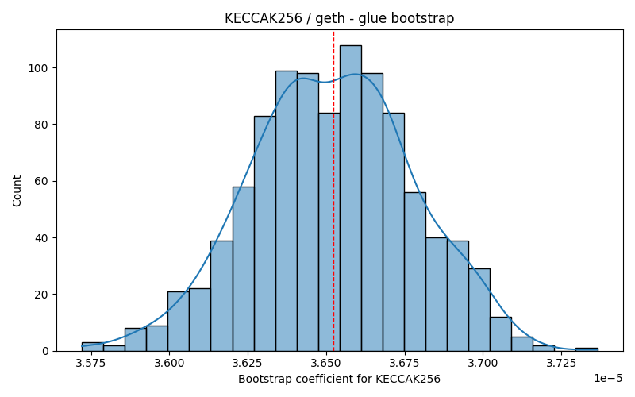

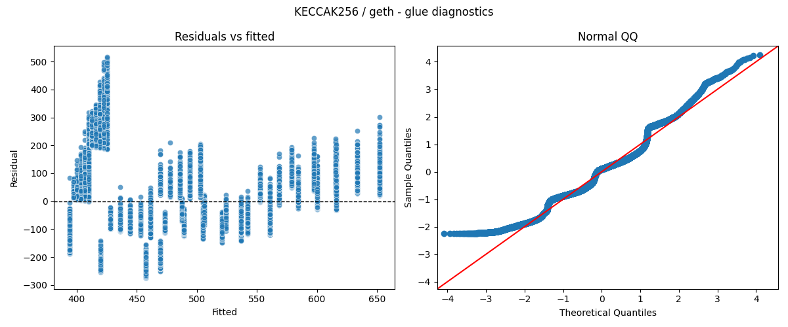

</details>

## nethermind

| glue_opcode | nobs | glue_runtime_ms | p_value | rsquared |
| --- | --- | --- | --- | --- |
| `ISZERO` | 3399 | 9.431e-07 | 1.00e-03 | 0.7379 |
| `JUMPDEST` | 3399 | 5.22e-07 | 1.00e-03 | 0.6384 |
| `SWAP` | 54384 | 5.578e-07 | 1.00e-03 | 0.6826 |
| `CALLDATASIZE` | 200860 | 4.629e-07 | 1.00e-03 | 0.9186 |
| `DUP` | 200860 | 3.245e-07 | 1.00e-03 | 0.9186 |
| `GAS` | 200860 | 4.351e-07 | 1.00e-03 | 0.9186 |
| `MLOAD` | 200860 | 1.429e-06 | 1.00e-03 | 0.9186 |
| `PUSH` | 200860 | 4.185e-07 | 1.00e-03 | 0.9186 |
| `PUSH0` | 200860 | 3.172e-07 | 1.00e-03 | 0.9186 |
| `STATICCALL` | 200860 | 0.0004656 | 1.00e-03 | 0.9186 |
| `ADD` | 3399 | 2.762e-06 | 1.00e-03 | 0.4584 |
| `AND` | 3399 | 1.418e-06 | 1.00e-03 | 0.6042 |
| `CALLDATACOPY` | 81576 | 4.326e-06 | 1.00e-03 | 0.6859 |
| `CALLDATALOAD` | 13596 | 2.698e-05 | 1.90e-02 | 0.000584 |
| `DIV` | 3399 | 6.643e-06 | 1.00e-03 | 0.5922 |
| `EXP` | 3399 | 0 | 1.00e+00 | 0 |
| `GT` | 3399 | 1.697e-06 | 1.00e-03 | 0.7189 |
| `JUMPI` | 3399 | 1.942e-06 | 1.00e-03 | 0.7538 |
| `LT` | 3399 | 1.601e-06 | 1.00e-03 | 0.6936 |
| `MSTORE` | 16995 | 2.248e-06 | 1.00e-03 | 0.7649 |
| `MSTORE8` | 16995 | 2.229e-06 | 1.00e-03 | 0.774 |
| `MUL` | 3399 | 5.236e-06 | 1.00e-03 | 0.8999 |
| `PC` | 3399 | 8.579e-07 | 1.00e-03 | 0.8672 |
| `RETURNDATASIZE` | 13596 | 9.105e-07 | 1.00e-03 | 0.6683 |
| `SELFBALANCE` | 2781 | 4.477e-06 | 1.00e-03 | 0.6367 |
| `SUB` | 3399 | 2.619e-06 | 1.00e-03 | 0.8539 |
| `JUMP` | 3399 | 5.649e-06 | 1.00e-03 | 0.8416 |
| `KECCAK256` | 54384 | 0 | 1.00e+00 | 0 |

### Cycle glue — joint fit · nethermind

<details><summary>Joint NNLS regression summary</summary>

```
==============================================================================
                           NNLS Regression Results                            
==============================================================================
Dep. Variable:          test_runtime_ms              R-squared:          0.919
Model:                  NNLS                    Adj. R-squared:          0.919
No. Observations:       200860                            RMSE:          10.86
Df Residuals:           200852                             MAE:           5.57
Df Model:               7      
==============================================================================
                      coef     std err     P-value      [0.025      0.975]
------------------------------------------------------------------------------
         const     17.1242      0.0797       0.001     16.9641     17.2842
  CALLDATASIZE      0.0000      0.0000       0.001      0.0000      0.0000
           DUP      0.0000      0.0000       0.001      0.0000      0.0000
           GAS      0.0000      0.0000       0.001      0.0000      0.0000
         MLOAD      0.0000      0.0000       0.001      0.0000      0.0000
          PUSH      0.0000      0.0000       0.001      0.0000      0.0000
         PUSH0      0.0000      0.0000       0.001      0.0000      0.0000
    STATICCALL      0.0005      0.0000       0.001      0.0005      0.0005
==============================================================================
Notes: Non-negative least squares with bootstrap inference (1000 iterations)
==============================================================================
```

</details>

<details><summary><code>CALLDATASIZE</code> · nobs=200860 · runtime_ms=4.629e-07 · p=1.00e-03 · R²=0.9186</summary>

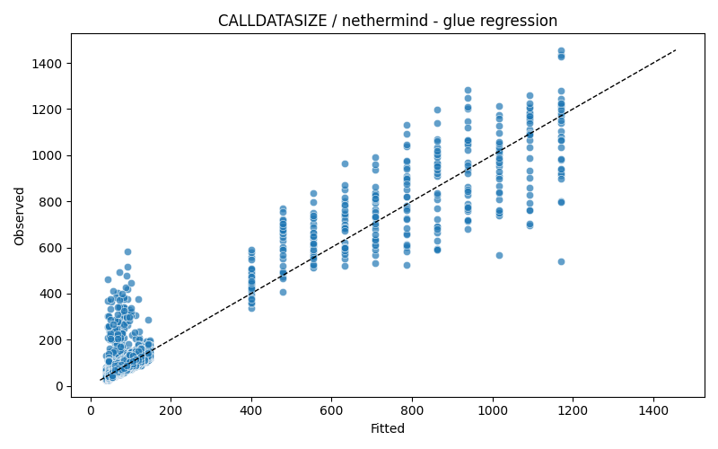

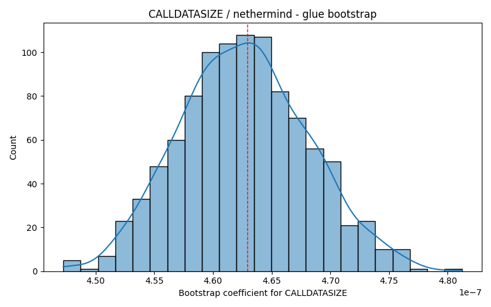

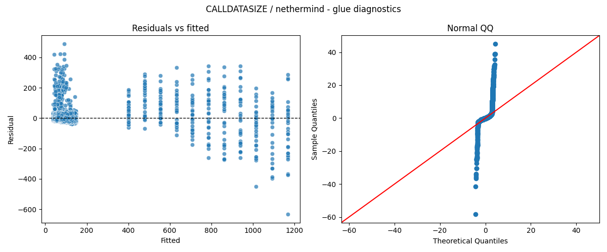

</details>

<details><summary><code>DUP</code> · nobs=200860 · runtime_ms=3.245e-07 · p=1.00e-03 · R²=0.9186</summary>


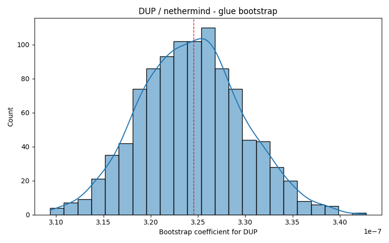

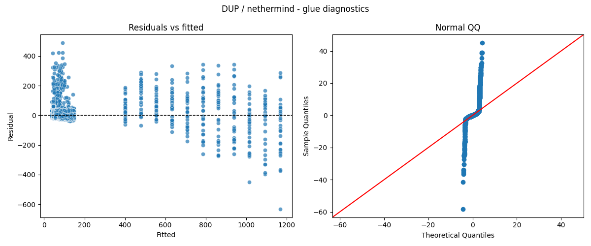

</details>

<details><summary><code>GAS</code> · nobs=200860 · runtime_ms=4.351e-07 · p=1.00e-03 · R²=0.9186</summary>

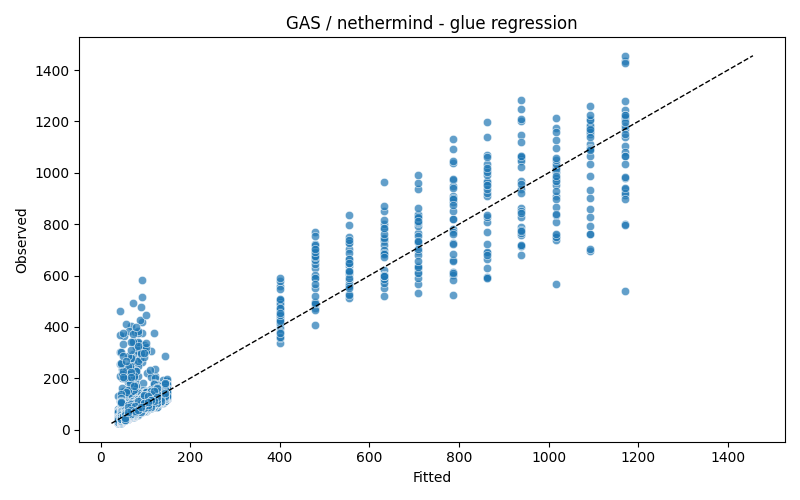

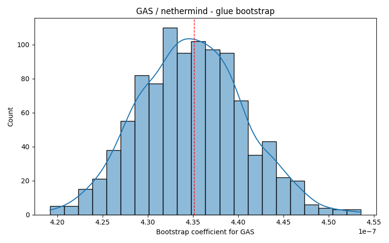


</details>

<details><summary><code>MLOAD</code> · nobs=200860 · runtime_ms=1.429e-06 · p=1.00e-03 · R²=0.9186</summary>


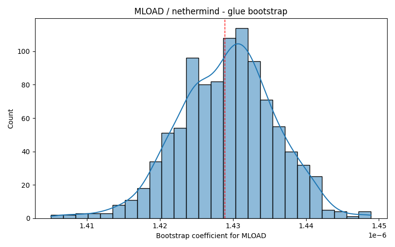


</details>

<details><summary><code>PUSH</code> · nobs=200860 · runtime_ms=4.185e-07 · p=1.00e-03 · R²=0.9186</summary>


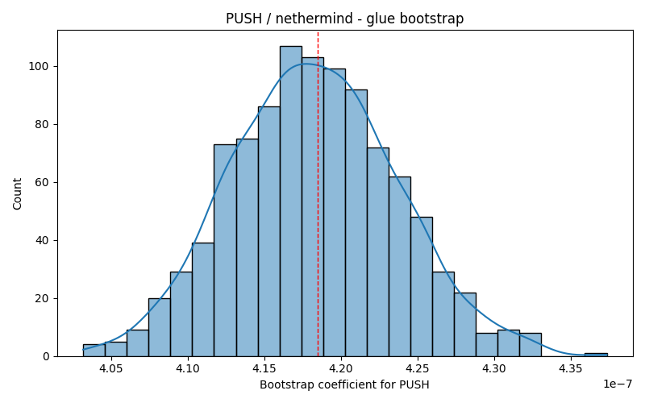


</details>

<details><summary><code>PUSH0</code> · nobs=200860 · runtime_ms=3.172e-07 · p=1.00e-03 · R²=0.9186</summary>

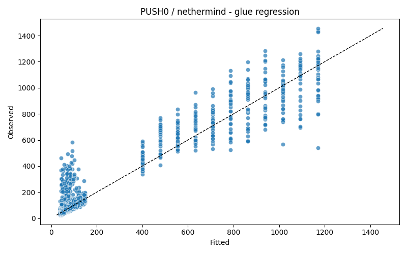

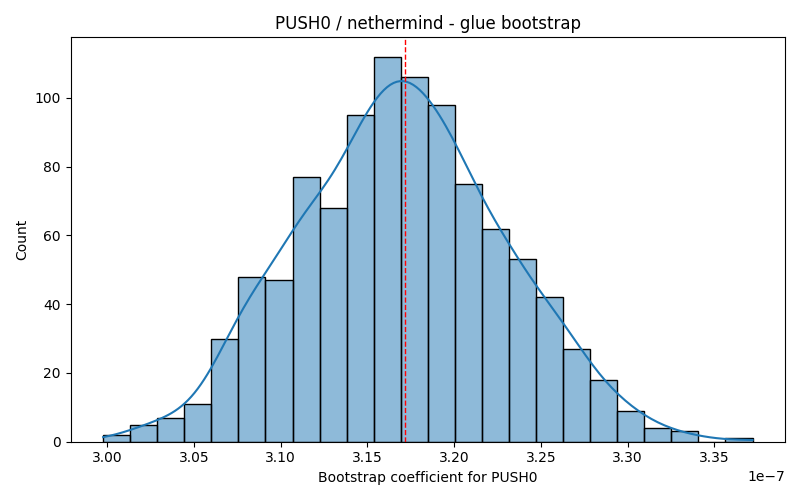

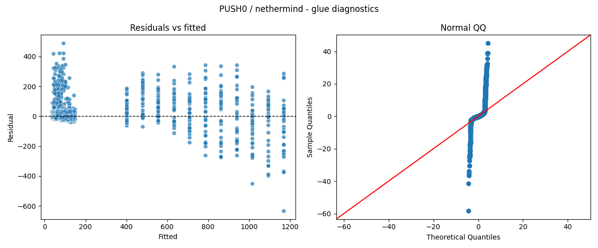

</details>

<details><summary><code>STATICCALL</code> · nobs=200860 · runtime_ms=0.0004656 · p=1.00e-03 · R²=0.9186</summary>

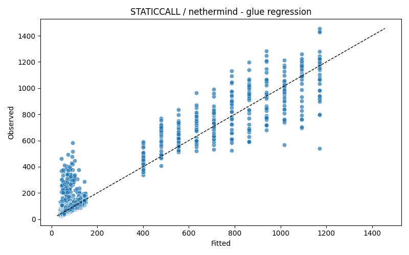

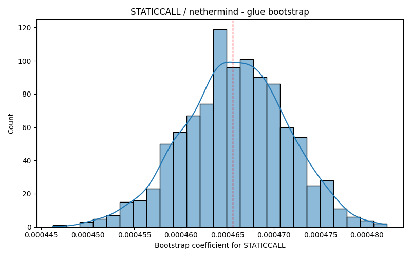

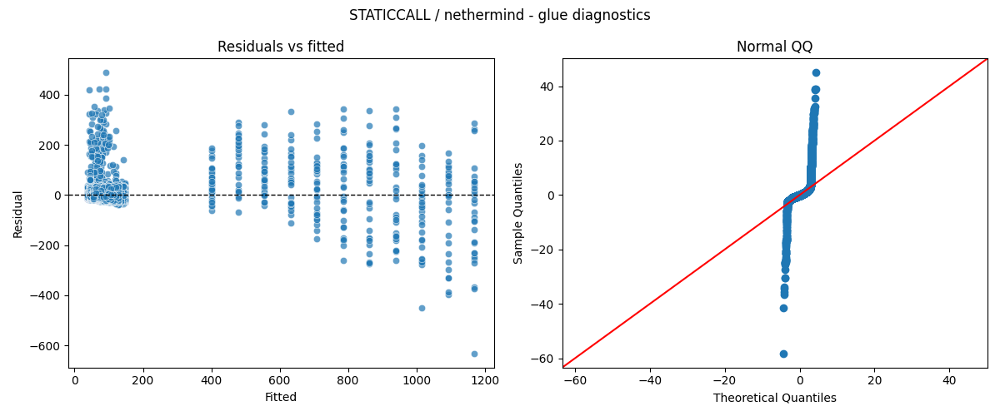

</details>

### Pure glue · nethermind

<details><summary><code>ISZERO</code> · nobs=3399 · runtime_ms=9.431e-07 · p=1.00e-03 · R²=0.7379</summary>

```
==============================================================================
                           NNLS Regression Results                            
==============================================================================
Dep. Variable:          test_runtime_ms              R-squared:          0.738
Model:                  NNLS                    Adj. R-squared:          0.738
No. Observations:       3399                              RMSE:          11.83
Df Residuals:           3397                               MAE:           7.16
Df Model:               1      
==============================================================================
                      coef     std err     P-value      [0.025      0.975]
------------------------------------------------------------------------------
         const     16.2545      0.6801       0.001     15.0051     17.6649
        ISZERO      0.0000      0.0000       0.001      0.0000      0.0000
==============================================================================
Notes: Non-negative least squares with bootstrap inference (1000 iterations)
==============================================================================
```

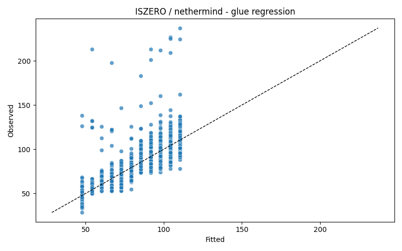

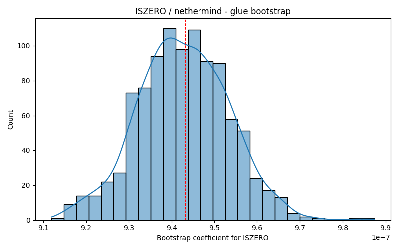

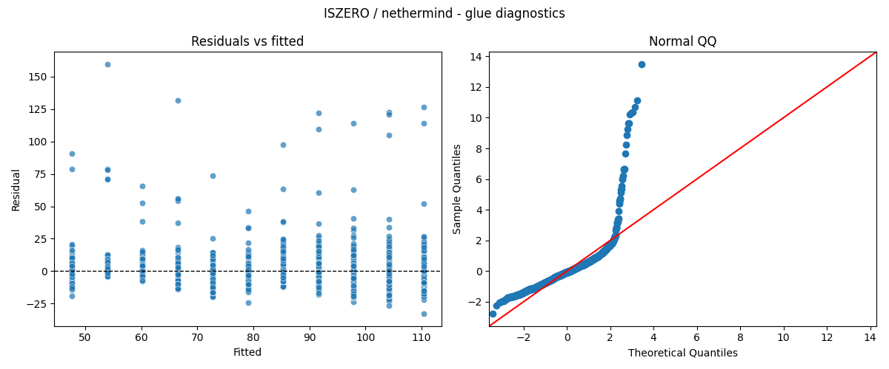

</details>

<details><summary><code>JUMPDEST</code> · nobs=3399 · runtime_ms=5.22e-07 · p=1.00e-03 · R²=0.6384</summary>

```
==============================================================================
                           NNLS Regression Results                            
==============================================================================
Dep. Variable:          test_runtime_ms              R-squared:          0.638
Model:                  NNLS                    Adj. R-squared:          0.638
No. Observations:       3399                              RMSE:          24.81
Df Residuals:           3397                               MAE:          18.48
Df Model:               1      
==============================================================================
                      coef     std err     P-value      [0.025      0.975]
------------------------------------------------------------------------------
         const     22.7088      1.4274       0.001     19.9342     25.5698
      JUMPDEST      0.0000      0.0000       0.001      0.0000      0.0000
==============================================================================
Notes: Non-negative least squares with bootstrap inference (1000 iterations)
==============================================================================
```

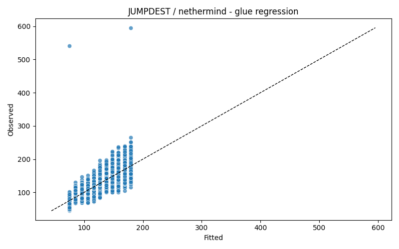

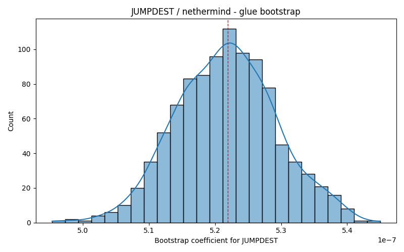

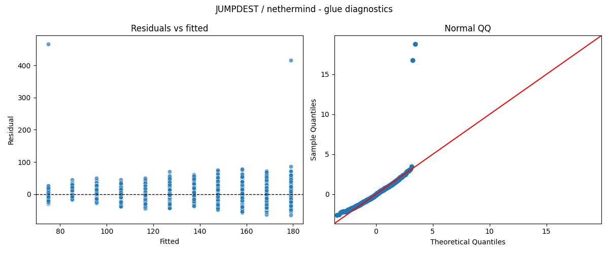

</details>

<details><summary><code>SWAP</code> · nobs=54384 · runtime_ms=5.578e-07 · p=1.00e-03 · R²=0.6826</summary>

```
==============================================================================
                           NNLS Regression Results                            
==============================================================================
Dep. Variable:          test_runtime_ms              R-squared:          0.683
Model:                  NNLS                    Adj. R-squared:          0.683
No. Observations:       54384                             RMSE:           8.01
Df Residuals:           54382                              MAE:           4.11
Df Model:               1      
==============================================================================
                      coef     std err     P-value      [0.025      0.975]
------------------------------------------------------------------------------
         const     16.4699      0.1069       0.001     16.2555     16.6776
          SWAP      0.0000      0.0000       0.001      0.0000      0.0000
==============================================================================
Notes: Non-negative least squares with bootstrap inference (1000 iterations)
==============================================================================
```

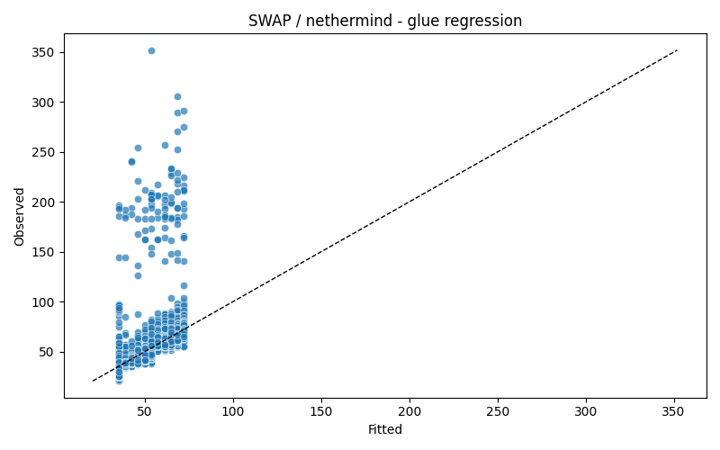

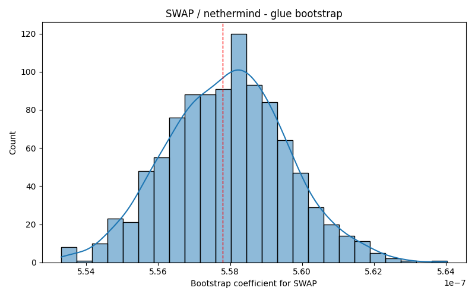

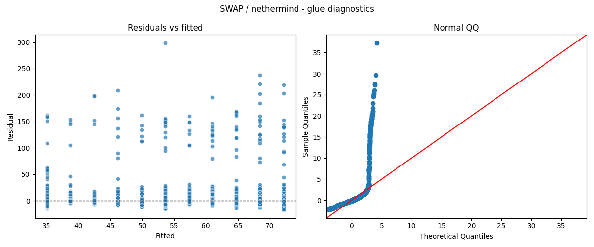

</details>

### Mixed glue (tier A) · nethermind

<details><summary><code>ADD</code> · nobs=3399 · runtime_ms=2.762e-06 · p=1.00e-03 · R²=0.4584</summary>

```
==============================================================================
                           NNLS Regression Results                            
==============================================================================
Dep. Variable:          test_runtime_ms              R-squared:          0.458
Model:                  NNLS                    Adj. R-squared:          0.458
No. Observations:       3399                              RMSE:          31.60
Df Residuals:           3397                               MAE:          26.82
Df Model:               1      
==============================================================================
                      coef     std err     P-value      [0.025      0.975]
------------------------------------------------------------------------------
         const     30.1301      1.6216       0.001     26.9222     33.3314
           ADD      0.0000      0.0000       0.001      0.0000      0.0000
==============================================================================
Notes: Non-negative least squares with bootstrap inference (1000 iterations)
==============================================================================
```

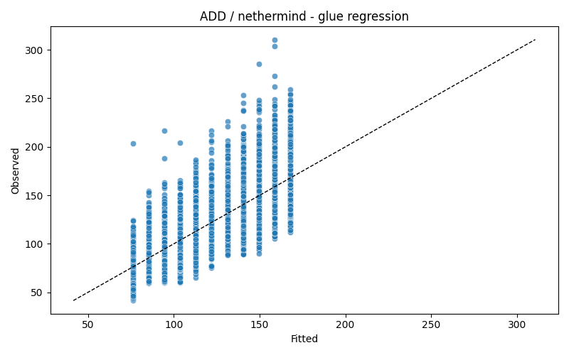

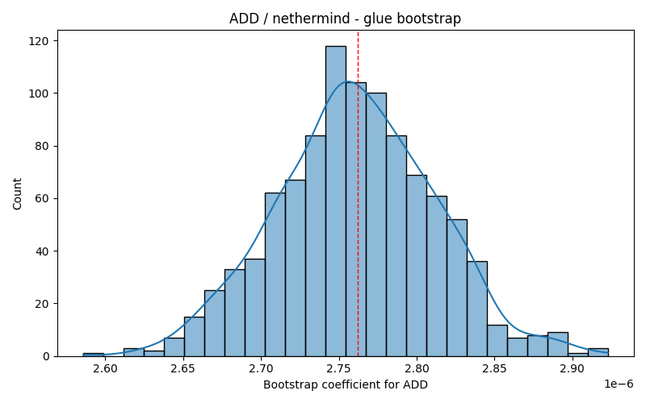

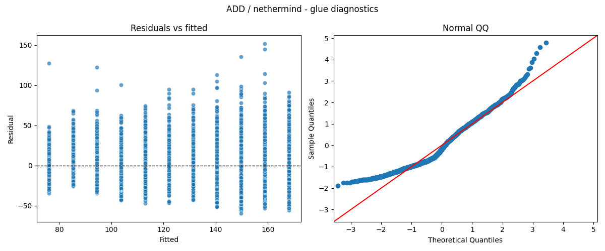

</details>

<details><summary><code>AND</code> · nobs=3399 · runtime_ms=1.418e-06 · p=1.00e-03 · R²=0.6042</summary>

```
==============================================================================
                           NNLS Regression Results                            
==============================================================================
Dep. Variable:          test_runtime_ms              R-squared:          0.604
Model:                  NNLS                    Adj. R-squared:          0.604
No. Observations:       3399                              RMSE:          12.08
Df Residuals:           3397                               MAE:           6.72
Df Model:               1      
==============================================================================
                      coef     std err     P-value      [0.025      0.975]
------------------------------------------------------------------------------
         const     15.3606      0.6200       0.001     14.1299     16.4665
           AND      0.0000      0.0000       0.001      0.0000      0.0000
==============================================================================
Notes: Non-negative least squares with bootstrap inference (1000 iterations)
==============================================================================
```

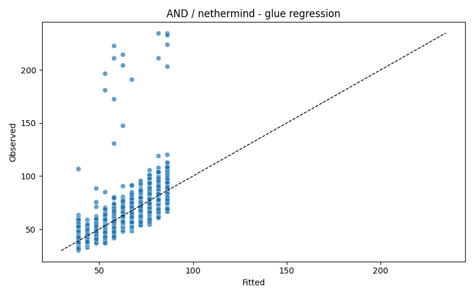

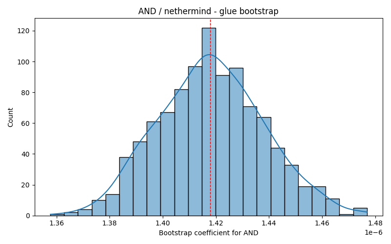

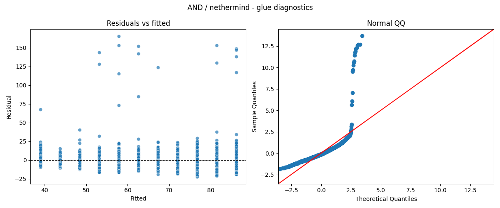

</details>

<details><summary><code>CALLDATACOPY</code> · nobs=81576 · runtime_ms=4.326e-06 · p=1.00e-03 · R²=0.6859</summary>

```
==============================================================================
                           NNLS Regression Results                            
==============================================================================
Dep. Variable:          test_runtime_ms              R-squared:          0.686
Model:                  NNLS                    Adj. R-squared:          0.686
No. Observations:       81576                             RMSE:          22.02
Df Residuals:           81574                              MAE:          17.25
Df Model:               1      
==============================================================================
                      coef     std err     P-value      [0.025      0.975]
------------------------------------------------------------------------------
         const     26.4981      0.0892       0.001     26.3154     26.6764
  CALLDATACOPY      0.0000      0.0000       0.001      0.0000      0.0000
==============================================================================
Notes: Non-negative least squares with bootstrap inference (1000 iterations)
==============================================================================
```

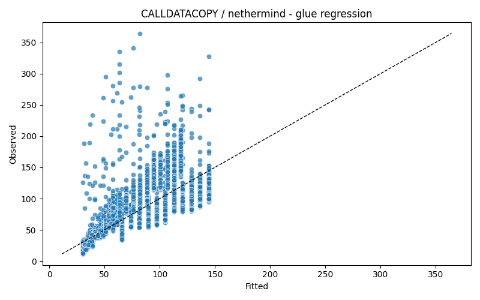

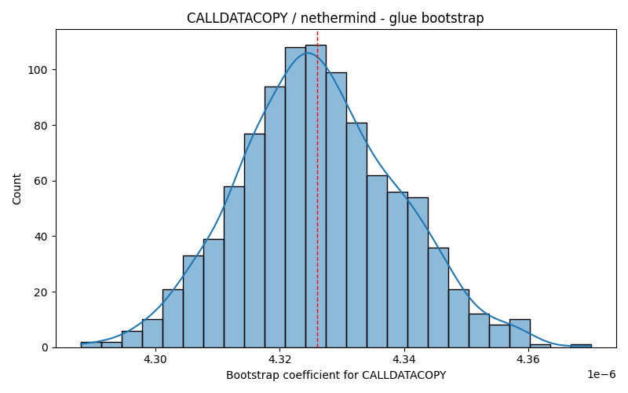

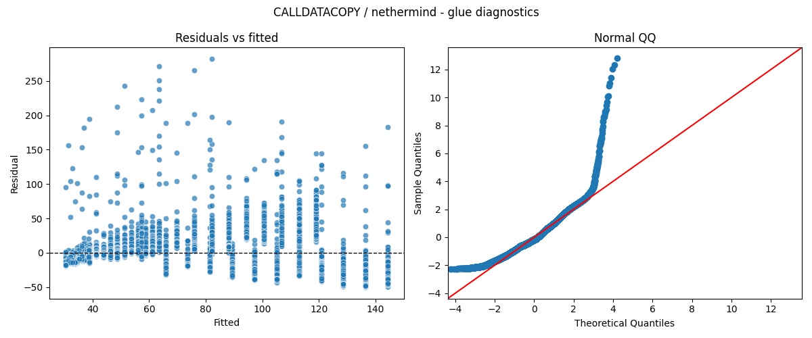

</details>

<details><summary><code>CALLDATALOAD</code> · nobs=13596 · runtime_ms=2.698e-05 · p=1.90e-02 · R²=0.000584</summary>

```
==============================================================================
                           NNLS Regression Results                            
==============================================================================
Dep. Variable:          test_runtime_ms              R-squared:          0.001
Model:                  NNLS                    Adj. R-squared:          0.001
No. Observations:       13596                             RMSE:           4.28
Df Residuals:           13594                              MAE:           0.49
Df Model:               1      
==============================================================================
                      coef     std err     P-value      [0.025      0.975]
------------------------------------------------------------------------------
         const      2.9051      0.1575       0.001      2.6164      3.2378
  CALLDATALOAD      0.0000      0.0000       0.019      0.0000      0.0001
==============================================================================
Notes: Non-negative least squares with bootstrap inference (1000 iterations)
==============================================================================
```

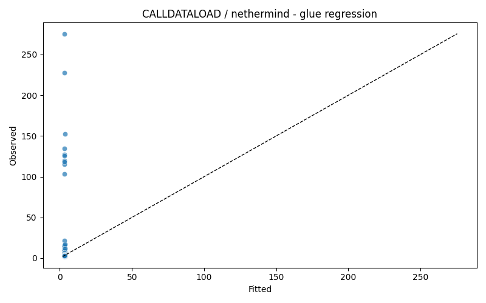

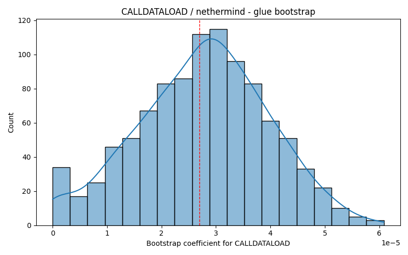

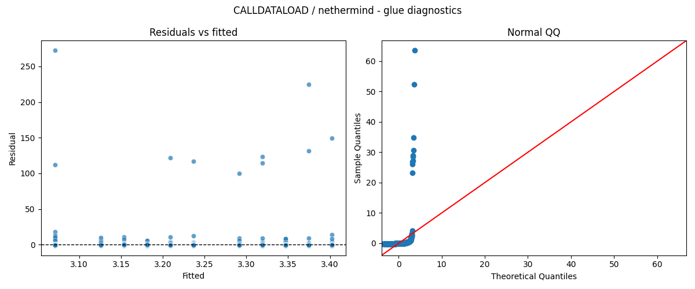

</details>

<details><summary><code>DIV</code> · nobs=3399 · runtime_ms=6.643e-06 · p=1.00e-03 · R²=0.5922</summary>

```
==============================================================================
                           NNLS Regression Results                            
==============================================================================
Dep. Variable:          test_runtime_ms              R-squared:          0.592
Model:                  NNLS                    Adj. R-squared:          0.592
No. Observations:       3399                              RMSE:          43.52
Df Residuals:           3397                               MAE:          33.31
Df Model:               1      
==============================================================================
                      coef     std err     P-value      [0.025      0.975]
------------------------------------------------------------------------------
         const    131.8312      3.6383       0.001    124.9978    139.0981
           DIV      0.0000      0.0000       0.001      0.0000      0.0000
==============================================================================
Notes: Non-negative least squares with bootstrap inference (1000 iterations)
==============================================================================
```

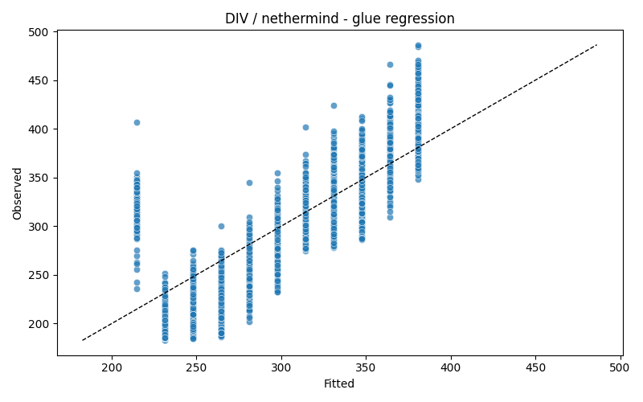

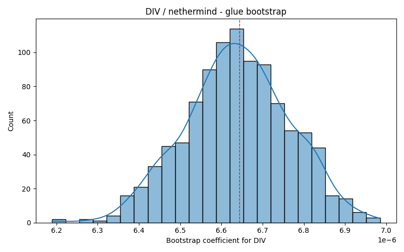

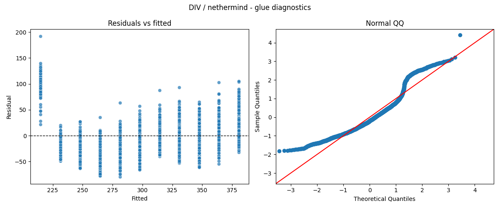

</details>

<details><summary><code>EXP</code> · nobs=3399 · runtime_ms=0 · p=1.00e+00 · R²=0</summary>

```
==============================================================================
                           NNLS Regression Results                            
==============================================================================
Dep. Variable:          test_runtime_ms              R-squared:          0.000
Model:                  NNLS                    Adj. R-squared:         -0.000
No. Observations:       3399                              RMSE:          47.44
Df Residuals:           3397                               MAE:          31.33
Df Model:               1      
==============================================================================
                      coef     std err     P-value      [0.025      0.975]
------------------------------------------------------------------------------
         const    104.5978      0.8394       0.001    102.9892    106.2199
           EXP      0.0000      0.0000       1.000      0.0000      0.0000
==============================================================================
Notes: Non-negative least squares with bootstrap inference (1000 iterations)
==============================================================================
```

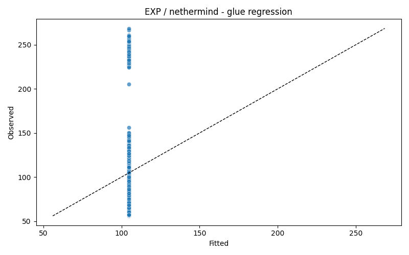


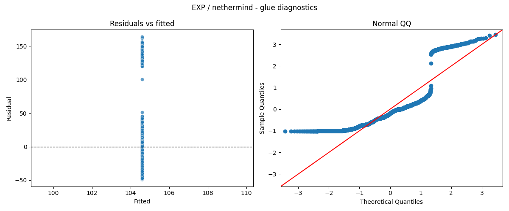

</details>

<details><summary><code>GT</code> · nobs=3399 · runtime_ms=1.697e-06 · p=1.00e-03 · R²=0.7189</summary>

```
==============================================================================
                           NNLS Regression Results                            
==============================================================================
Dep. Variable:          test_runtime_ms              R-squared:          0.719
Model:                  NNLS                    Adj. R-squared:          0.719
No. Observations:       3399                              RMSE:          11.17
Df Residuals:           3397                               MAE:           7.07
Df Model:               1      
==============================================================================
                      coef     std err     P-value      [0.025      0.975]
------------------------------------------------------------------------------
         const     16.0429      0.6034       0.001     14.9094     17.2648
            GT      0.0000      0.0000       0.001      0.0000      0.0000
==============================================================================
Notes: Non-negative least squares with bootstrap inference (1000 iterations)
==============================================================================
```

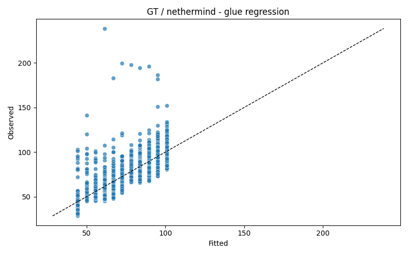

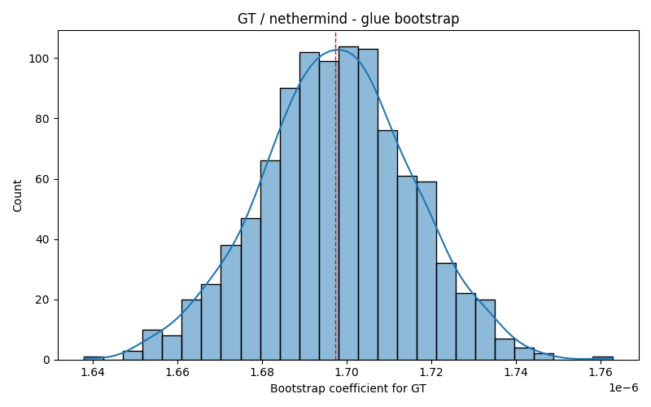

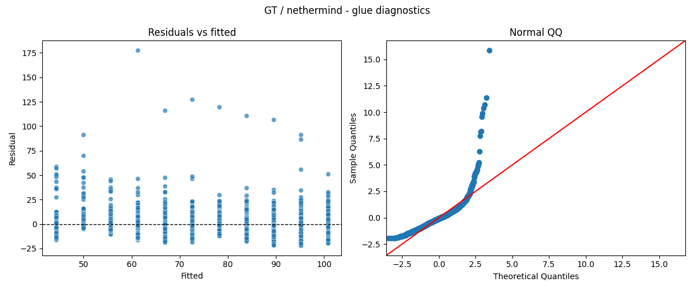

</details>

<details><summary><code>JUMPI</code> · nobs=3399 · runtime_ms=1.942e-06 · p=1.00e-03 · R²=0.7538</summary>

```
==============================================================================
                           NNLS Regression Results                            
==============================================================================
Dep. Variable:          test_runtime_ms              R-squared:          0.754
Model:                  NNLS                    Adj. R-squared:          0.754
No. Observations:       3399                              RMSE:           5.01
Df Residuals:           3397                               MAE:           3.54
Df Model:               1      
==============================================================================
                      coef     std err     P-value      [0.025      0.975]
------------------------------------------------------------------------------
         const      9.4540      0.2834       0.001      8.9382     10.0199
         JUMPI      0.0000      0.0000       0.001      0.0000      0.0000
==============================================================================
Notes: Non-negative least squares with bootstrap inference (1000 iterations)
==============================================================================
```

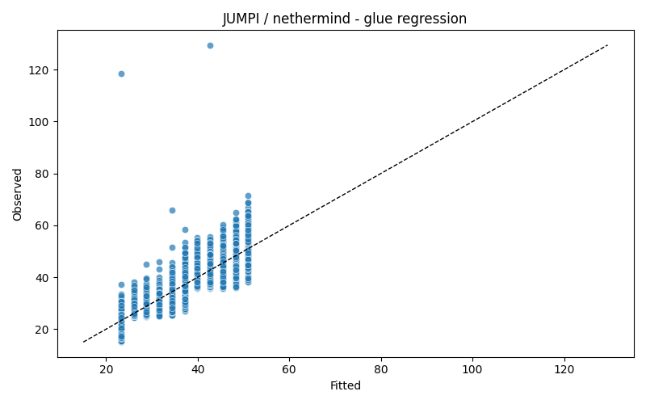

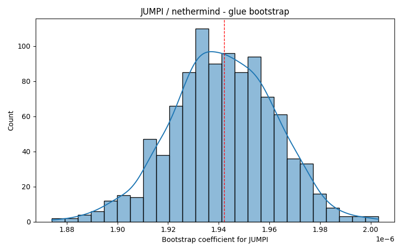

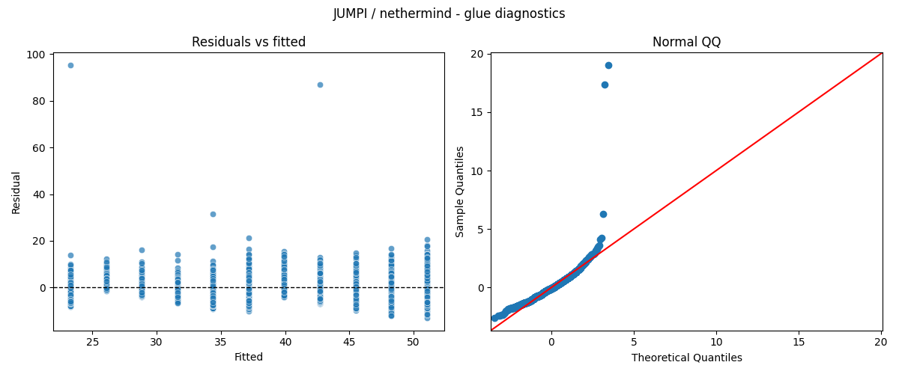

</details>

<details><summary><code>LT</code> · nobs=3399 · runtime_ms=1.601e-06 · p=1.00e-03 · R²=0.6936</summary>

```
==============================================================================
                           NNLS Regression Results                            
==============================================================================
Dep. Variable:          test_runtime_ms              R-squared:          0.694
Model:                  NNLS                    Adj. R-squared:          0.694
No. Observations:       3399                              RMSE:          11.20
Df Residuals:           3397                               MAE:           6.91
Df Model:               1      
==============================================================================
                      coef     std err     P-value      [0.025      0.975]
------------------------------------------------------------------------------
         const     20.1427      0.5964       0.001     18.9250     21.2486
            LT      0.0000      0.0000       0.001      0.0000      0.0000
==============================================================================
Notes: Non-negative least squares with bootstrap inference (1000 iterations)
==============================================================================
```

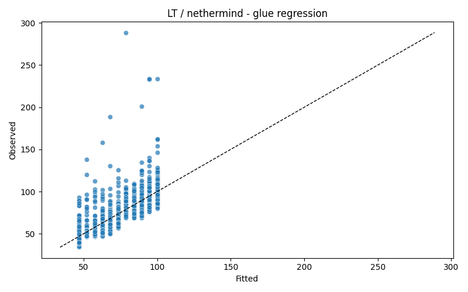

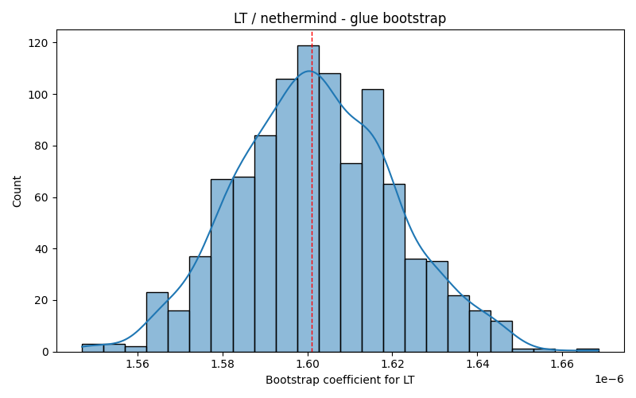

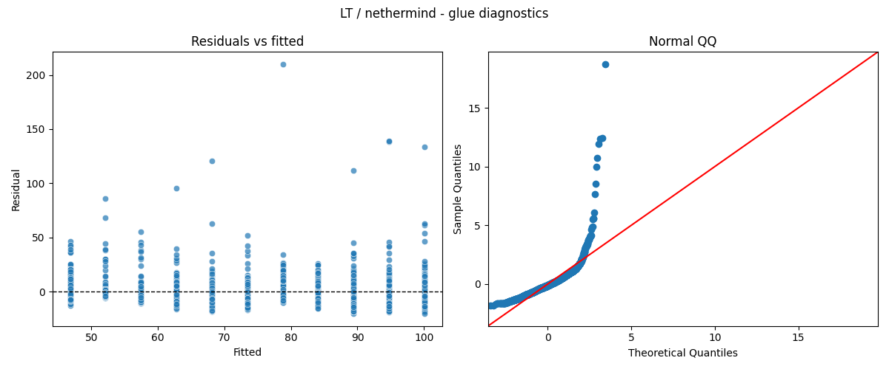

</details>

<details><summary><code>MSTORE</code> · nobs=16995 · runtime_ms=2.248e-06 · p=1.00e-03 · R²=0.7649</summary>

```
==============================================================================
                           NNLS Regression Results                            
==============================================================================
Dep. Variable:          test_runtime_ms              R-squared:          0.765
Model:                  NNLS                    Adj. R-squared:          0.765
No. Observations:       16995                             RMSE:           8.75
Df Residuals:           16993                              MAE:           4.78
Df Model:               1      
==============================================================================
                      coef     std err     P-value      [0.025      0.975]
------------------------------------------------------------------------------
         const     14.5037      0.2116       0.001     14.0898     14.9216
        MSTORE      0.0000      0.0000       0.001      0.0000      0.0000
==============================================================================
Notes: Non-negative least squares with bootstrap inference (1000 iterations)
==============================================================================
```

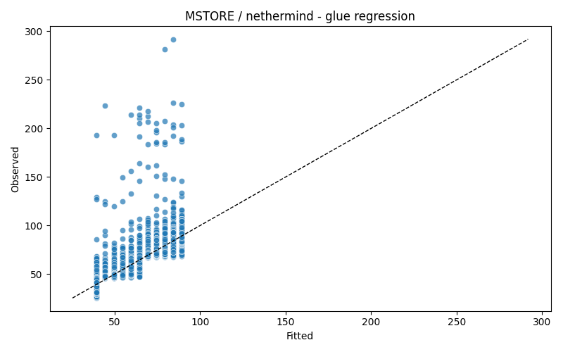

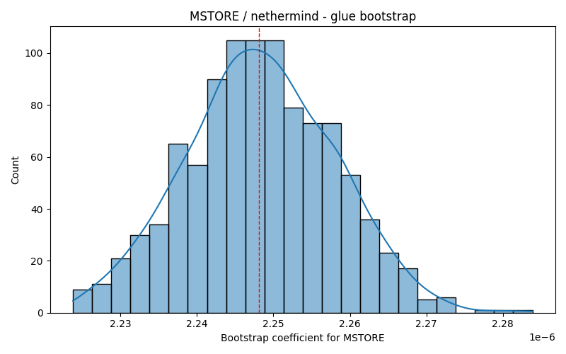

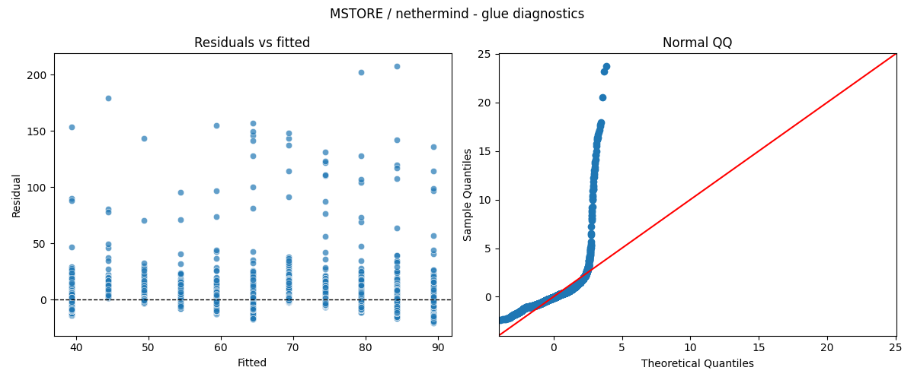

</details>

<details><summary><code>MSTORE8</code> · nobs=16995 · runtime_ms=2.229e-06 · p=1.00e-03 · R²=0.774</summary>

```
==============================================================================
                           NNLS Regression Results                            
==============================================================================
Dep. Variable:          test_runtime_ms              R-squared:          0.774
Model:                  NNLS                    Adj. R-squared:          0.774
No. Observations:       16995                             RMSE:           8.45
Df Residuals:           16993                              MAE:           4.68
Df Model:               1      
==============================================================================
                      coef     std err     P-value      [0.025      0.975]
------------------------------------------------------------------------------
         const     14.5880      0.1880       0.001     14.2135     14.9478
       MSTORE8      0.0000      0.0000       0.001      0.0000      0.0000
==============================================================================
Notes: Non-negative least squares with bootstrap inference (1000 iterations)
==============================================================================
```

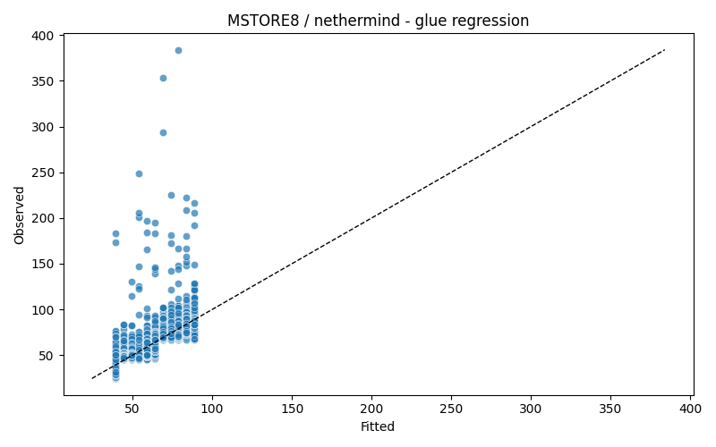

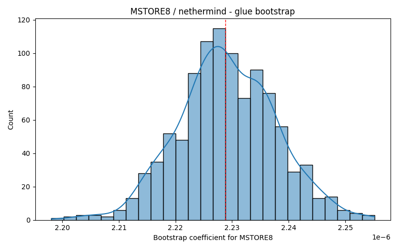

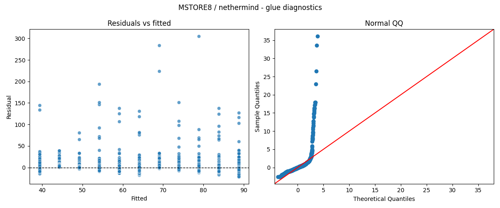

</details>

<details><summary><code>MUL</code> · nobs=3399 · runtime_ms=5.236e-06 · p=1.00e-03 · R²=0.8999</summary>

```
==============================================================================
                           NNLS Regression Results                            
==============================================================================
Dep. Variable:          test_runtime_ms              R-squared:          0.900
Model:                  NNLS                    Adj. R-squared:          0.900
No. Observations:       3399                              RMSE:          13.79
Df Residuals:           3397                               MAE:          10.14
Df Model:               1      
==============================================================================
                      coef     std err     P-value      [0.025      0.975]
------------------------------------------------------------------------------
         const     24.7602      0.6952       0.001     23.3570     26.1347
           MUL      0.0000      0.0000       0.001      0.0000      0.0000
==============================================================================
Notes: Non-negative least squares with bootstrap inference (1000 iterations)
==============================================================================
```

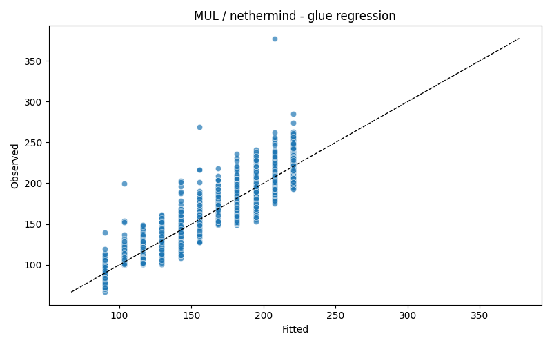

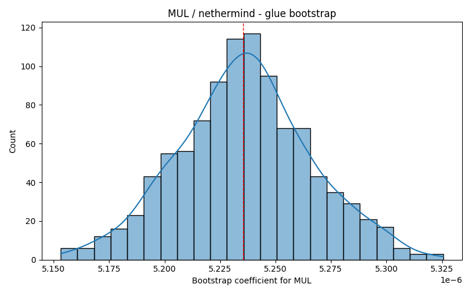

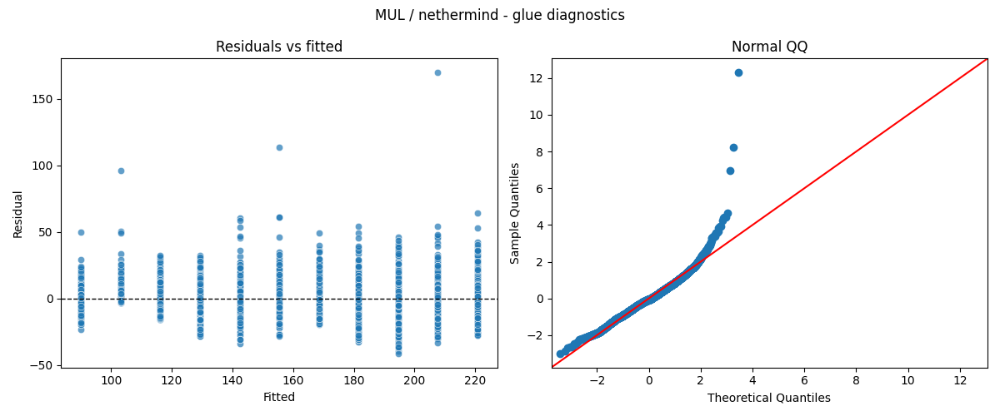

</details>

<details><summary><code>PC</code> · nobs=3399 · runtime_ms=8.579e-07 · p=1.00e-03 · R²=0.8672</summary>

```
==============================================================================
                           NNLS Regression Results                            
==============================================================================
Dep. Variable:          test_runtime_ms              R-squared:          0.867
Model:                  NNLS                    Adj. R-squared:          0.867
No. Observations:       3399                              RMSE:          10.04
Df Residuals:           3397                               MAE:           7.79
Df Model:               1      
==============================================================================
                      coef     std err     P-value      [0.025      0.975]
------------------------------------------------------------------------------
         const     18.0771      0.5277       0.001     17.0388     19.1331
            PC      0.0000      0.0000       0.001      0.0000      0.0000
==============================================================================
Notes: Non-negative least squares with bootstrap inference (1000 iterations)
==============================================================================
```

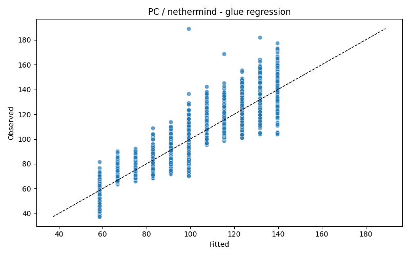

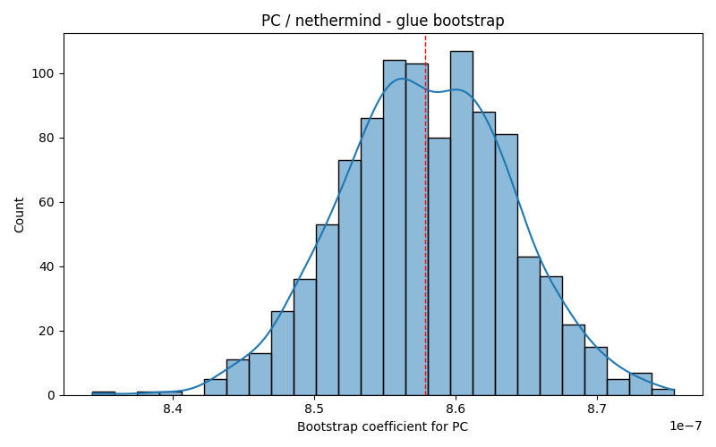

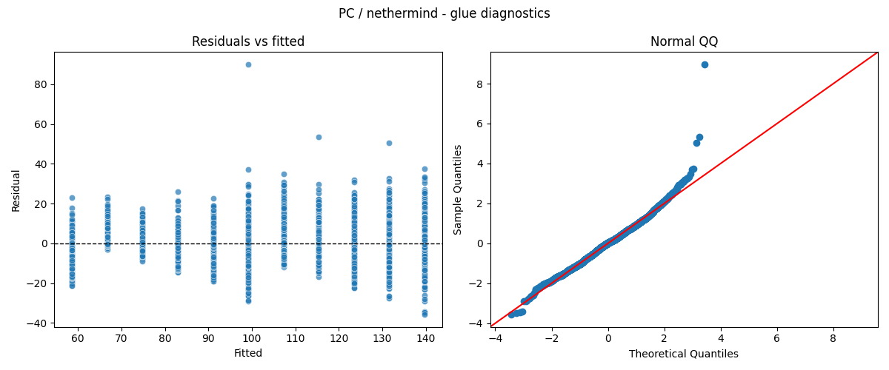

</details>

<details><summary><code>RETURNDATASIZE</code> · nobs=13596 · runtime_ms=9.105e-07 · p=1.00e-03 · R²=0.6683</summary>

```
==============================================================================
                           NNLS Regression Results                            
==============================================================================
Dep. Variable:          test_runtime_ms              R-squared:          0.668
Model:                  NNLS                    Adj. R-squared:          0.668
No. Observations:       13596                             RMSE:          10.13
Df Residuals:           13594                              MAE:           4.78
Df Model:               1      
==============================================================================
                      coef     std err     P-value      [0.025      0.975]
------------------------------------------------------------------------------
         const     12.9007      0.2953       0.001     12.3561     13.4920
RETURNDATASIZE      0.0000      0.0000       0.001      0.0000      0.0000
==============================================================================
Notes: Non-negative least squares with bootstrap inference (1000 iterations)
==============================================================================
```

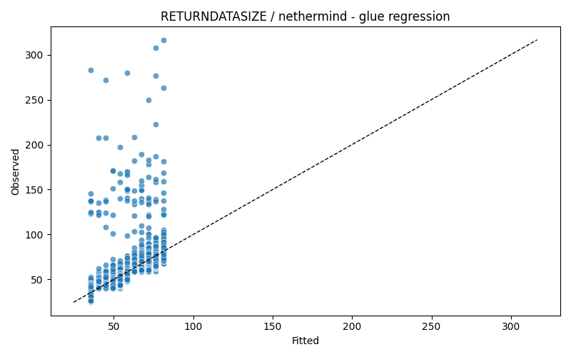

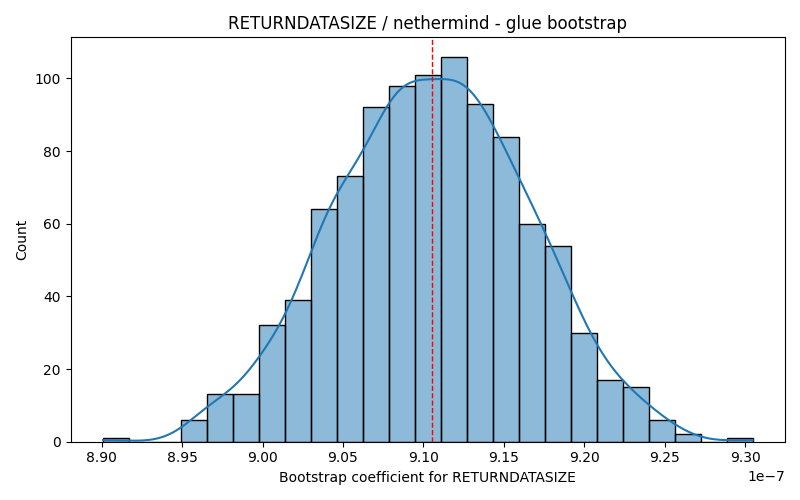

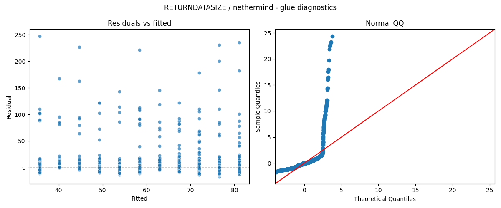

</details>

<details><summary><code>SELFBALANCE</code> · nobs=2781 · runtime_ms=4.477e-06 · p=1.00e-03 · R²=0.6367</summary>

```
==============================================================================
                           NNLS Regression Results                            
==============================================================================
Dep. Variable:          test_runtime_ms              R-squared:          0.637
Model:                  NNLS                    Adj. R-squared:          0.637
No. Observations:       2781                              RMSE:          34.12
Df Residuals:           2779                               MAE:          26.54
Df Model:               1      
==============================================================================
                      coef     std err     P-value      [0.025      0.975]
------------------------------------------------------------------------------
         const    117.0782      3.5459       0.001    110.3674    124.1328
   SELFBALANCE      0.0000      0.0000       0.001      0.0000      0.0000
==============================================================================
Notes: Non-negative least squares with bootstrap inference (1000 iterations)
==============================================================================
```

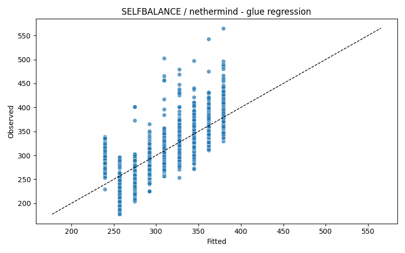

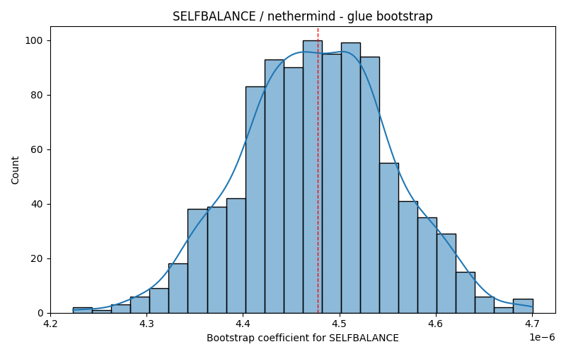

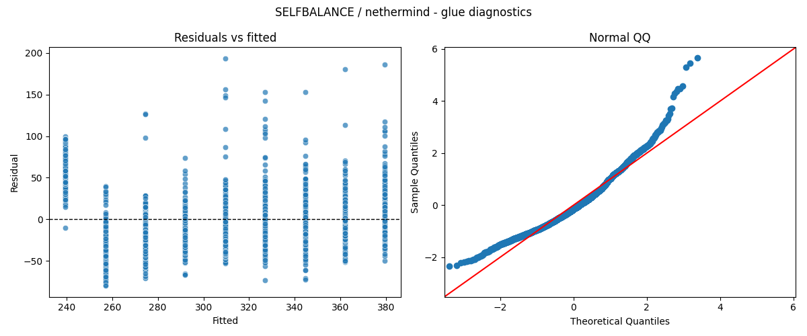

</details>

<details><summary><code>SUB</code> · nobs=3399 · runtime_ms=2.619e-06 · p=1.00e-03 · R²=0.8539</summary>

```
==============================================================================
                           NNLS Regression Results                            
==============================================================================
Dep. Variable:          test_runtime_ms              R-squared:          0.854
Model:                  NNLS                    Adj. R-squared:          0.854
No. Observations:       3399                              RMSE:          11.40
Df Residuals:           3397                               MAE:           8.11
Df Model:               1      
==============================================================================
                      coef     std err     P-value      [0.025      0.975]
------------------------------------------------------------------------------
         const     17.7860      0.5410       0.001     16.8214     18.8315
           SUB      0.0000      0.0000       0.001      0.0000      0.0000
==============================================================================
Notes: Non-negative least squares with bootstrap inference (1000 iterations)
==============================================================================
```

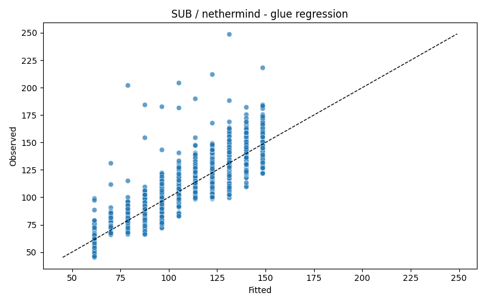

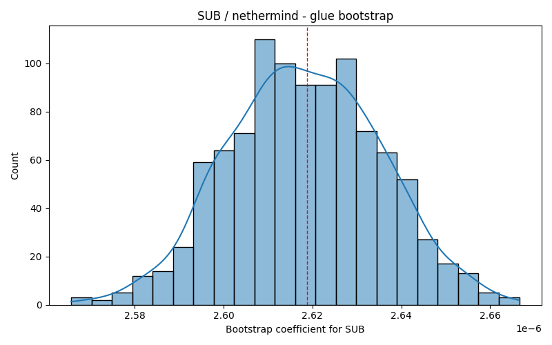

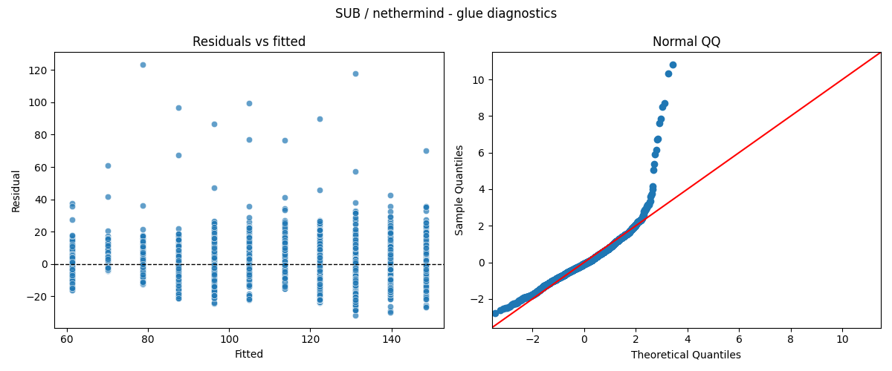

</details>

### Mixed glue (tier B) · nethermind

<details><summary><code>JUMP</code> · nobs=3399 · runtime_ms=5.649e-06 · p=1.00e-03 · R²=0.8416</summary>

```
==============================================================================
                           NNLS Regression Results                            
==============================================================================
Dep. Variable:          test_runtime_ms              R-squared:          0.842
Model:                  NNLS                    Adj. R-squared:          0.842
No. Observations:       3399                              RMSE:           9.11
Df Residuals:           3397                               MAE:           6.16
Df Model:               1      
==============================================================================
                      coef     std err     P-value      [0.025      0.975]
------------------------------------------------------------------------------
         const     15.5521      0.4272       0.001     14.7483     16.3379
          JUMP      0.0000      0.0000       0.001      0.0000      0.0000
==============================================================================
Notes: Non-negative least squares with bootstrap inference (1000 iterations)
==============================================================================
```

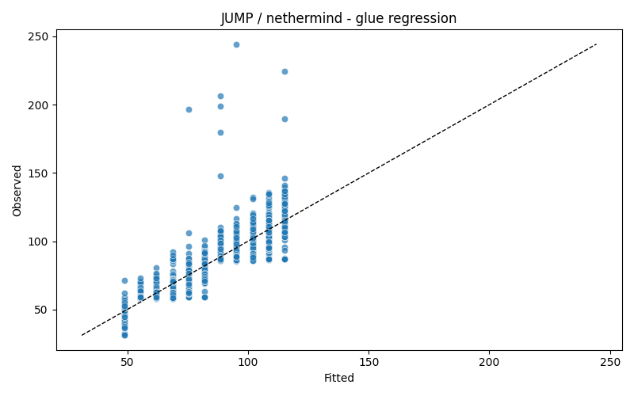

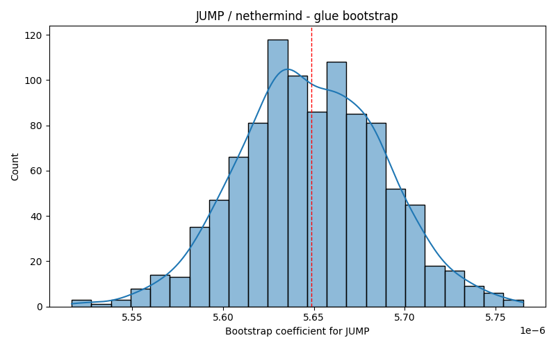

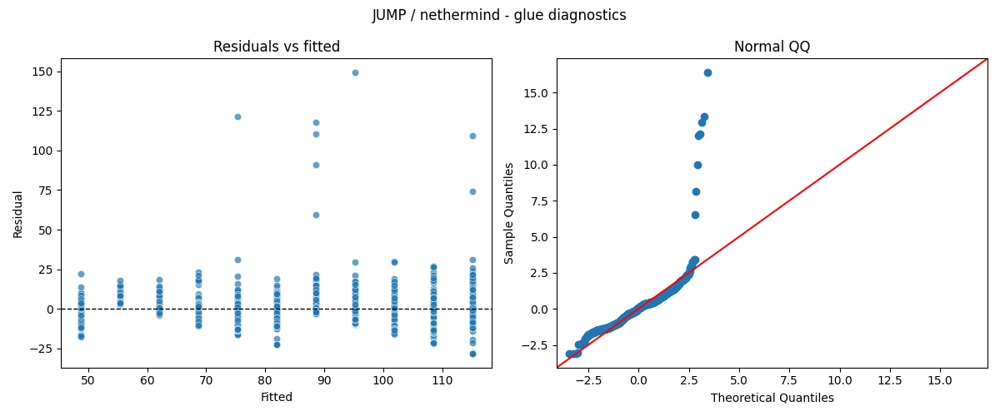

</details>

<details><summary><code>KECCAK256</code> · nobs=54384 · runtime_ms=0 · p=1.00e+00 · R²=0</summary>

```
==============================================================================
                           NNLS Regression Results                            
==============================================================================
Dep. Variable:          test_runtime_ms              R-squared:          0.000
Model:                  NNLS                    Adj. R-squared:         -0.000
No. Observations:       54384                             RMSE:         288.22
Df Residuals:           54382                              MAE:         234.42
Df Model:               1      
==============================================================================
                      coef     std err     P-value      [0.025      0.975]
------------------------------------------------------------------------------
         const    412.6080      1.2500       0.001    410.2799    415.1684
     KECCAK256      0.0000      0.0000       1.000      0.0000      0.0000
==============================================================================
Notes: Non-negative least squares with bootstrap inference (1000 iterations)
==============================================================================
```

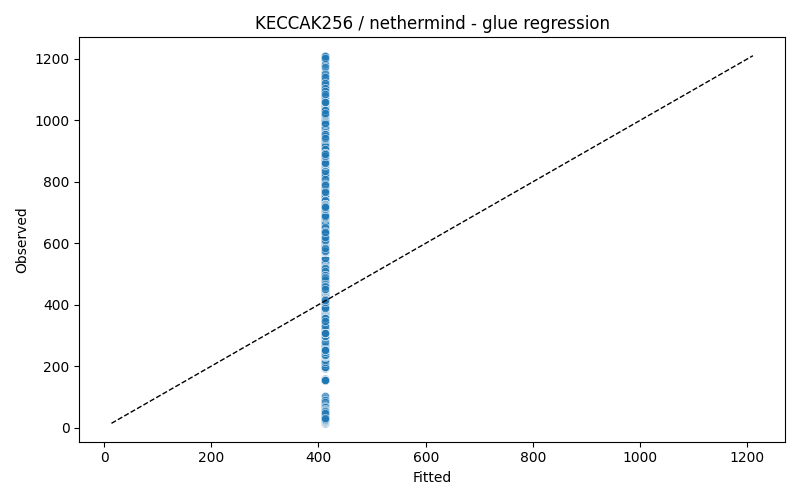


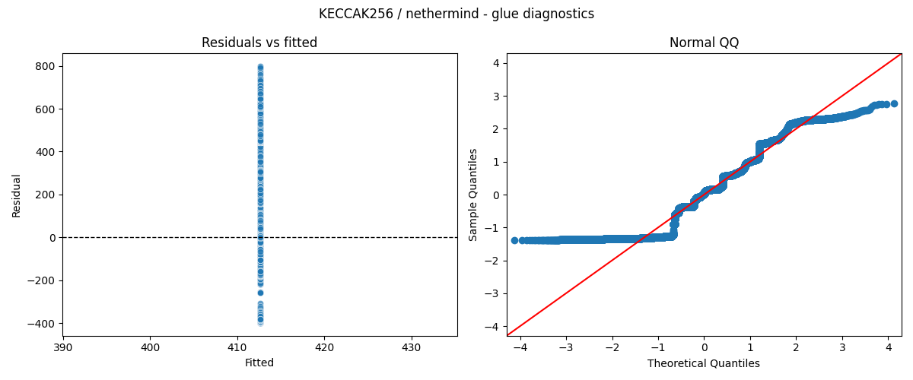

</details>

## reth

| glue_opcode | nobs | glue_runtime_ms | p_value | rsquared |
| --- | --- | --- | --- | --- |
| `ISZERO` | 803 | 1.336e-06 | 1.00e-03 | 0.8314 |
| `JUMPDEST` | 803 | 2.825e-07 | 1.00e-03 | 0.6928 |
| `SWAP` | 12848 | 4.825e-07 | 1.00e-03 | 0.3228 |
| `CALLDATASIZE` | 47850 | 4.75e-07 | 1.00e-03 | 0.3056 |
| `DUP` | 47850 | 4.035e-07 | 1.00e-03 | 0.3056 |
| `GAS` | 47850 | 4.235e-07 | 1.00e-03 | 0.3056 |
| `MLOAD` | 47850 | 1.152e-06 | 1.00e-03 | 0.3056 |
| `PUSH` | 47850 | 4.263e-07 | 1.00e-03 | 0.3056 |
| `PUSH0` | 47850 | 3.594e-07 | 1.00e-03 | 0.3056 |
| `STATICCALL` | 47850 | 5.454e-05 | 1.00e-03 | 0.3056 |
| `ADD` | 803 | 8.404e-07 | 1.00e-03 | 0.7174 |
| `AND` | 803 | 8.227e-07 | 1.00e-03 | 0.7324 |
| `CALLDATACOPY` | 19272 | 2.367e-06 | 1.00e-03 | 0.8049 |
| `CALLDATALOAD` | 3212 | 1.102e-05 | 1.00e-03 | 0.002813 |
| `DIV` | 803 | 6.891e-06 | 1.00e-03 | 0.8553 |
| `EXP` | 803 | 0.00051 | 1.00e-03 | 0.8531 |
| `GT` | 803 | 9.355e-07 | 1.00e-03 | 0.7483 |
| `JUMPI` | 803 | 1.308e-06 | 1.00e-03 | 0.5376 |
| `LT` | 803 | 8.934e-07 | 1.00e-03 | 0.7452 |
| `MSTORE` | 4015 | 2.622e-06 | 1.00e-03 | 0.2899 |
| `MSTORE8` | 4015 | 1.336e-06 | 1.00e-03 | 0.6917 |
| `MUL` | 803 | 1.112e-06 | 1.00e-03 | 0.7381 |
| `PC` | 803 | 6.032e-07 | 1.00e-03 | 0.2383 |
| `RETURNDATASIZE` | 3212 | 8.15e-07 | 1.00e-03 | 0.7455 |
| `SELFBALANCE` | 657 | 3.619e-06 | 1.00e-03 | 0.7669 |
| `SUB` | 803 | 8.634e-07 | 1.00e-03 | 0.7633 |
| `JUMP` | 803 | 2.359e-06 | 1.00e-03 | 0.543 |
| `KECCAK256` | 12848 | 0 | 1.00e+00 | -2.22e-16 |

### Cycle glue — joint fit · reth

<details><summary>Joint NNLS regression summary</summary>

```
==============================================================================
                           NNLS Regression Results                            
==============================================================================
Dep. Variable:          test_runtime_ms              R-squared:          0.306
Model:                  NNLS                    Adj. R-squared:          0.305
No. Observations:       47850                             RMSE:          20.72
Df Residuals:           47842                              MAE:           9.17
Df Model:               7      
==============================================================================
                      coef     std err     P-value      [0.025      0.975]
------------------------------------------------------------------------------
         const     17.8771      0.3152       0.001     17.2810     18.4840
  CALLDATASIZE      0.0000      0.0000       0.001      0.0000      0.0000
           DUP      0.0000      0.0000       0.001      0.0000      0.0000
           GAS      0.0000      0.0000       0.001      0.0000      0.0000
         MLOAD      0.0000      0.0000       0.001      0.0000      0.0000
          PUSH      0.0000      0.0000       0.001      0.0000      0.0000
         PUSH0      0.0000      0.0000       0.001      0.0000      0.0000
    STATICCALL      0.0001      0.0000       0.001      0.0001      0.0001
==============================================================================
Notes: Non-negative least squares with bootstrap inference (1000 iterations)
==============================================================================
```

</details>

<details><summary><code>CALLDATASIZE</code> · nobs=47850 · runtime_ms=4.75e-07 · p=1.00e-03 · R²=0.3056</summary>

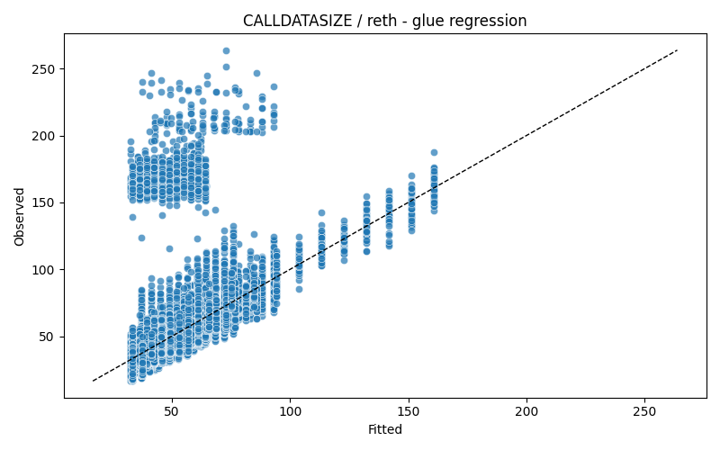

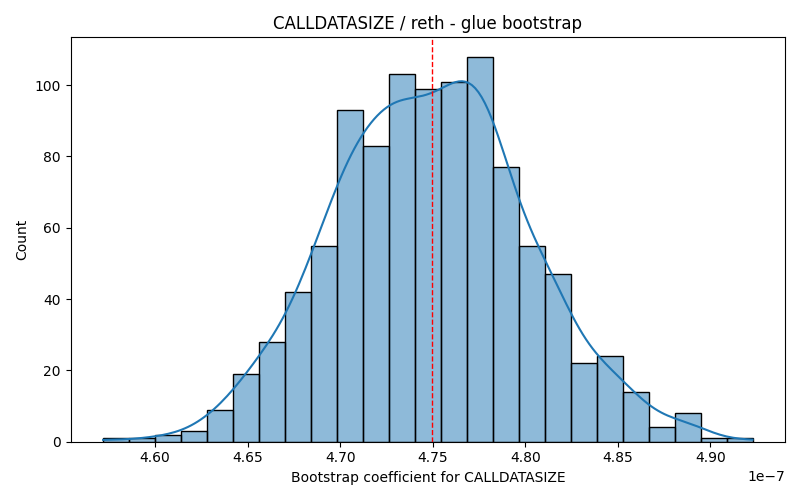


</details>

<details><summary><code>DUP</code> · nobs=47850 · runtime_ms=4.035e-07 · p=1.00e-03 · R²=0.3056</summary>


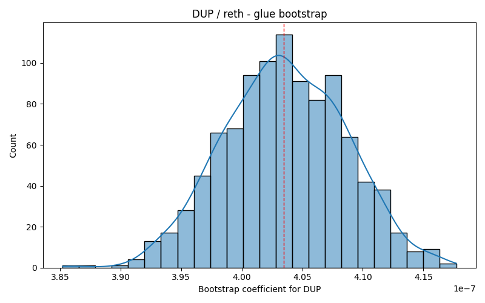


</details>

<details><summary><code>GAS</code> · nobs=47850 · runtime_ms=4.235e-07 · p=1.00e-03 · R²=0.3056</summary>

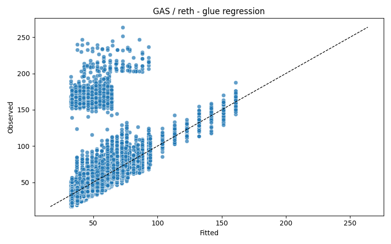

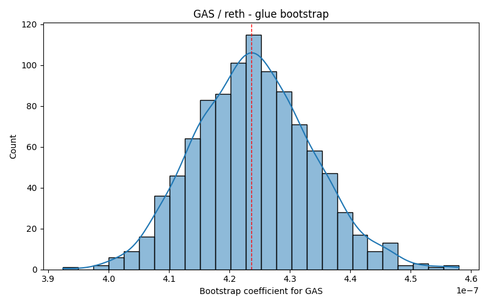


</details>

<details><summary><code>MLOAD</code> · nobs=47850 · runtime_ms=1.152e-06 · p=1.00e-03 · R²=0.3056</summary>


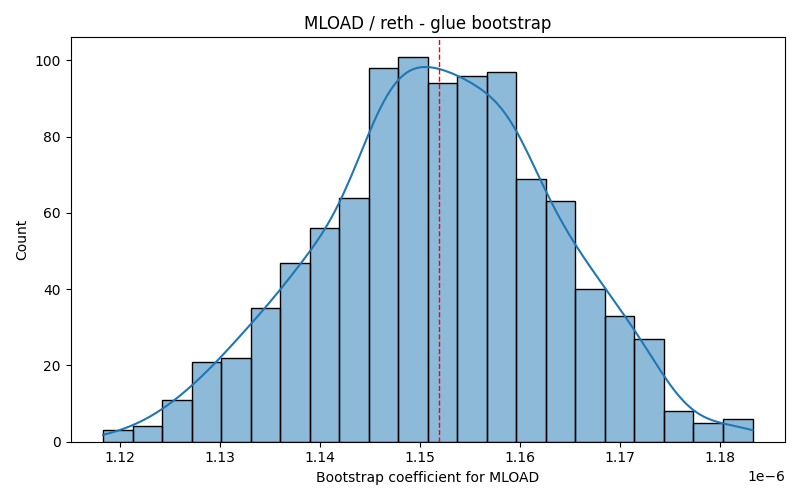

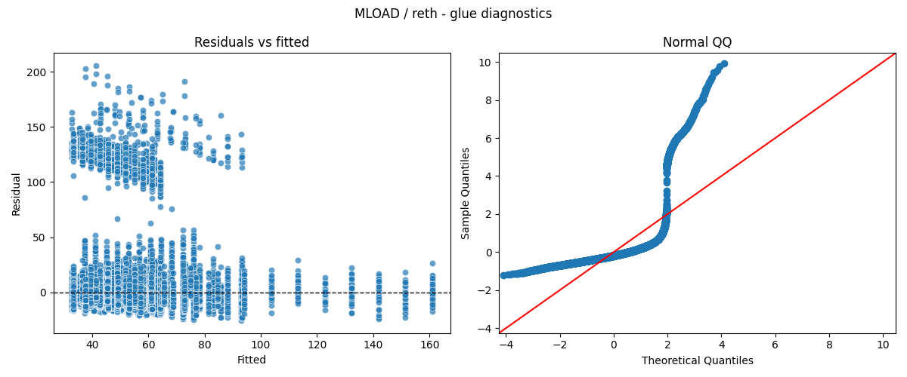

</details>

<details><summary><code>PUSH</code> · nobs=47850 · runtime_ms=4.263e-07 · p=1.00e-03 · R²=0.3056</summary>


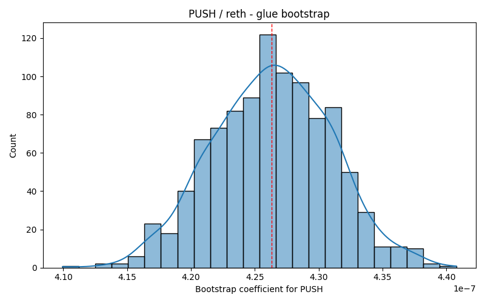

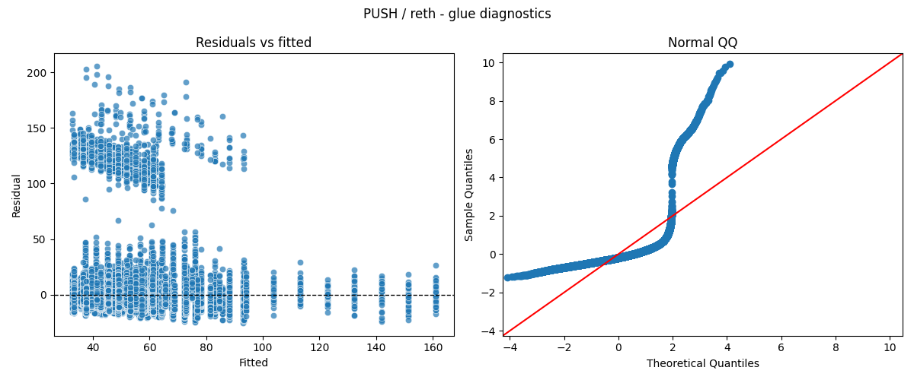

</details>

<details><summary><code>PUSH0</code> · nobs=47850 · runtime_ms=3.594e-07 · p=1.00e-03 · R²=0.3056</summary>


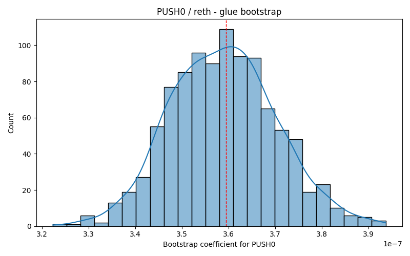


</details>

<details><summary><code>STATICCALL</code> · nobs=47850 · runtime_ms=5.454e-05 · p=1.00e-03 · R²=0.3056</summary>


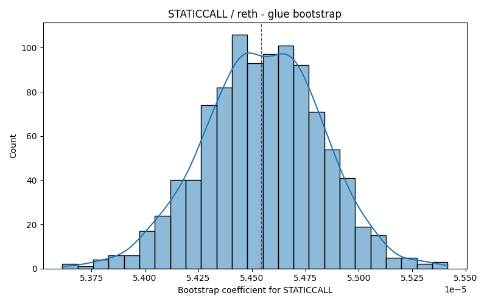


</details>

### Pure glue · reth

<details><summary><code>ISZERO</code> · nobs=803 · runtime_ms=1.336e-06 · p=1.00e-03 · R²=0.8314</summary>

```
==============================================================================
                           NNLS Regression Results                            
==============================================================================
Dep. Variable:          test_runtime_ms              R-squared:          0.831
Model:                  NNLS                    Adj. R-squared:          0.831
No. Observations:       803                               RMSE:          12.67
Df Residuals:           801                                MAE:           9.66
Df Model:               1      
==============================================================================
                      coef     std err     P-value      [0.025      0.975]
------------------------------------------------------------------------------
         const     33.5456      1.6335       0.001     30.4200     36.7754
        ISZERO      0.0000      0.0000       0.001      0.0000      0.0000
==============================================================================
Notes: Non-negative least squares with bootstrap inference (1000 iterations)
==============================================================================
```

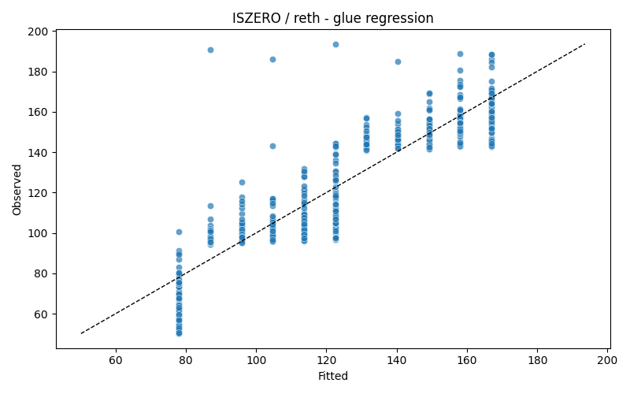

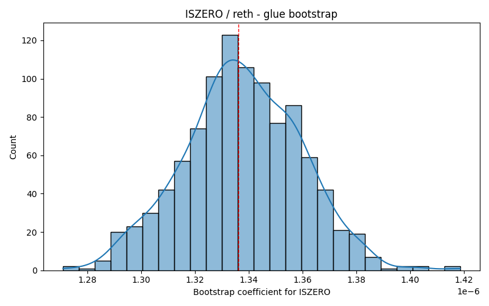

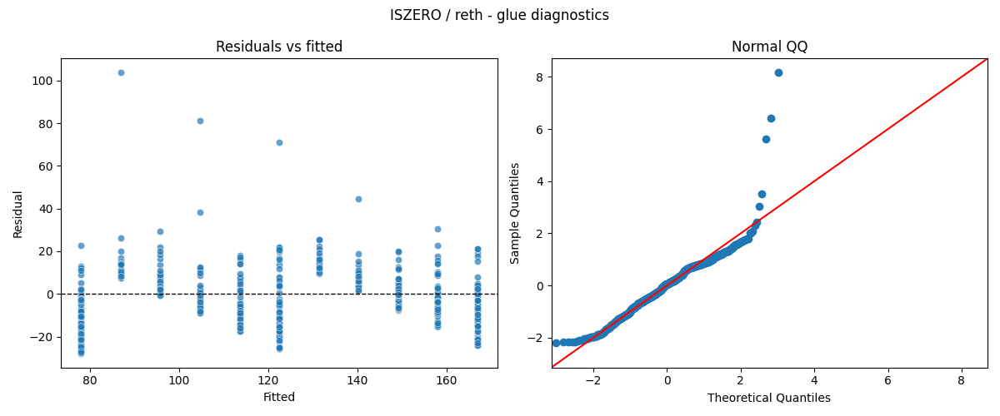

</details>

<details><summary><code>JUMPDEST</code> · nobs=803 · runtime_ms=2.825e-07 · p=1.00e-03 · R²=0.6928</summary>

```
==============================================================================
                           NNLS Regression Results                            
==============================================================================
Dep. Variable:          test_runtime_ms              R-squared:          0.693
Model:                  NNLS                    Adj. R-squared:          0.692
No. Observations:       803                               RMSE:          11.88
Df Residuals:           801                                MAE:           8.26
Df Model:               1      
==============================================================================
                      coef     std err     P-value      [0.025      0.975]
------------------------------------------------------------------------------
         const     18.6940      1.2546       0.001     16.3726     21.2887
      JUMPDEST      0.0000      0.0000       0.001      0.0000      0.0000
==============================================================================
Notes: Non-negative least squares with bootstrap inference (1000 iterations)
==============================================================================
```

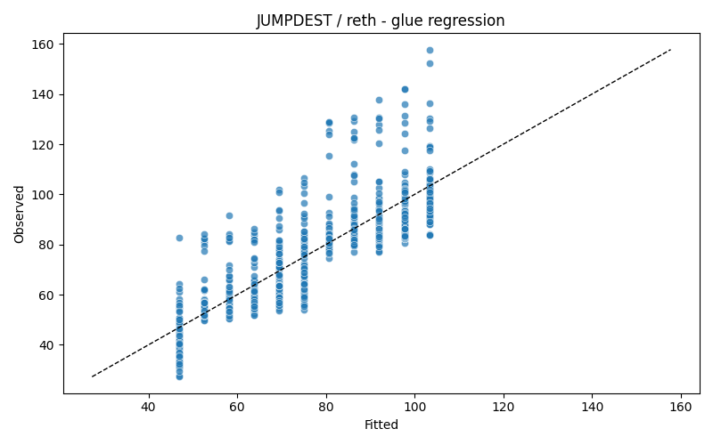

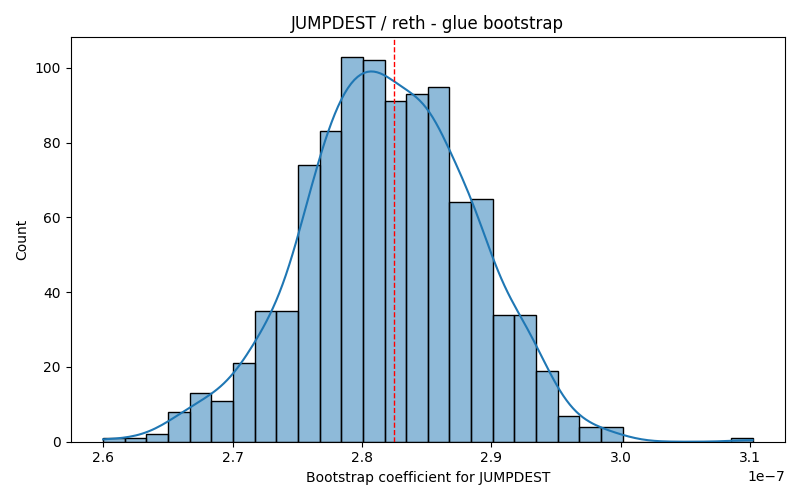

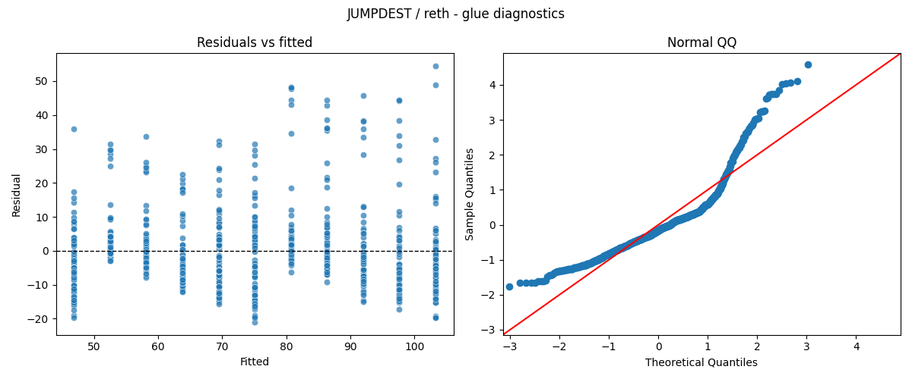

</details>

<details><summary><code>SWAP</code> · nobs=12848 · runtime_ms=4.825e-07 · p=1.00e-03 · R²=0.3228</summary>

```
==============================================================================
                           NNLS Regression Results                            
==============================================================================
Dep. Variable:          test_runtime_ms              R-squared:          0.323
Model:                  NNLS                    Adj. R-squared:          0.323
No. Observations:       12848                             RMSE:          14.71
Df Residuals:           12846                              MAE:           5.63
Df Model:               1      
==============================================================================
                      coef     std err     P-value      [0.025      0.975]
------------------------------------------------------------------------------
         const     15.5436      0.4349       0.001     14.7091     16.3823
          SWAP      0.0000      0.0000       0.001      0.0000      0.0000
==============================================================================
Notes: Non-negative least squares with bootstrap inference (1000 iterations)
==============================================================================
```

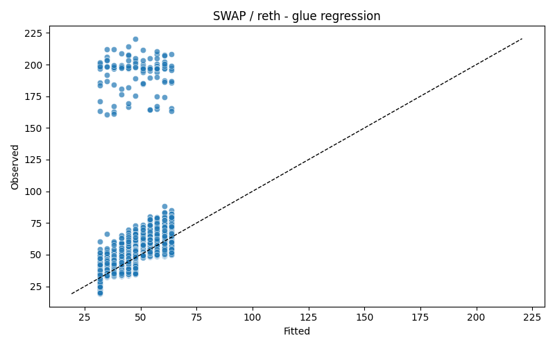

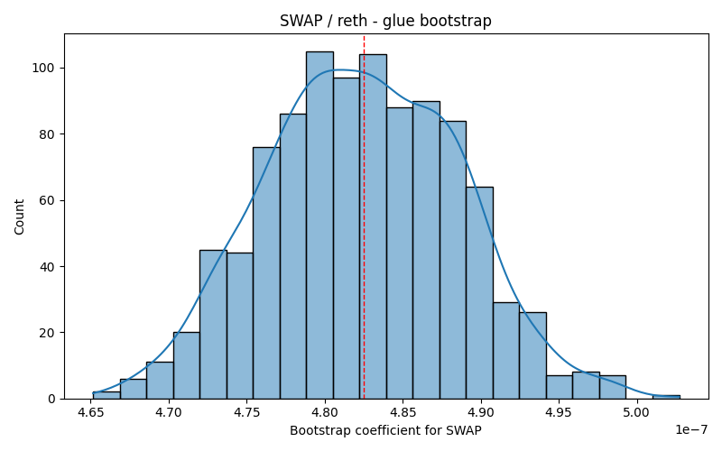

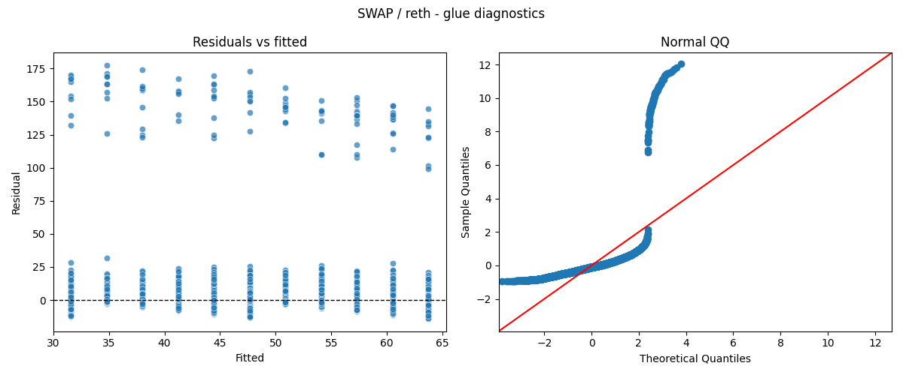

</details>

### Mixed glue (tier A) · reth

<details><summary><code>ADD</code> · nobs=803 · runtime_ms=8.404e-07 · p=1.00e-03 · R²=0.7174</summary>

```
==============================================================================
                           NNLS Regression Results                            
==============================================================================
Dep. Variable:          test_runtime_ms              R-squared:          0.717
Model:                  NNLS                    Adj. R-squared:          0.717
No. Observations:       803                               RMSE:           5.55
Df Residuals:           801                                MAE:           4.26
Df Model:               1      
==============================================================================
                      coef     std err     P-value      [0.025      0.975]
------------------------------------------------------------------------------
         const     13.1782      0.6696       0.001     11.9242     14.4955
           ADD      0.0000      0.0000       0.001      0.0000      0.0000
==============================================================================
Notes: Non-negative least squares with bootstrap inference (1000 iterations)
==============================================================================
```

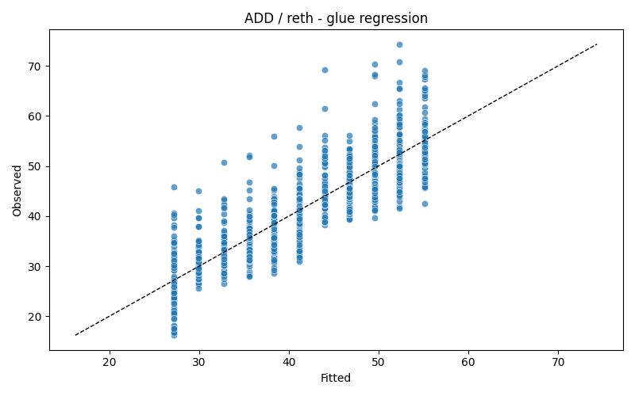

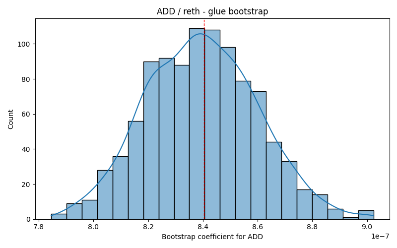

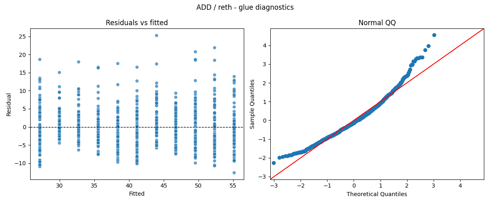

</details>

<details><summary><code>AND</code> · nobs=803 · runtime_ms=8.227e-07 · p=1.00e-03 · R²=0.7324</summary>

```
==============================================================================
                           NNLS Regression Results                            
==============================================================================
Dep. Variable:          test_runtime_ms              R-squared:          0.732
Model:                  NNLS                    Adj. R-squared:          0.732
No. Observations:       803                               RMSE:           5.23
Df Residuals:           801                                MAE:           4.00
Df Model:               1      
==============================================================================
                      coef     std err     P-value      [0.025      0.975]
------------------------------------------------------------------------------
         const     11.4484      0.5299       0.001     10.4263     12.4789
           AND      0.0000      0.0000       0.001      0.0000      0.0000
==============================================================================
Notes: Non-negative least squares with bootstrap inference (1000 iterations)
==============================================================================
```

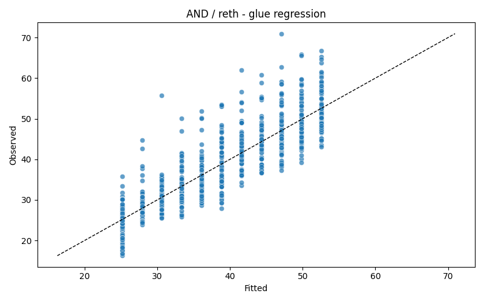

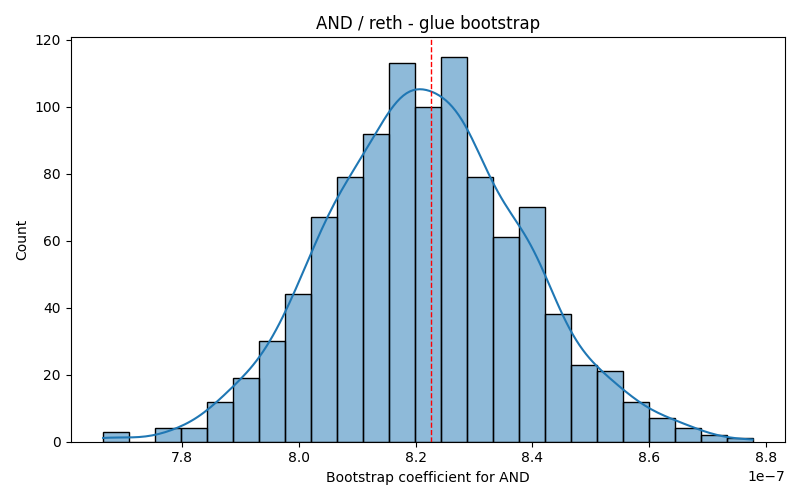

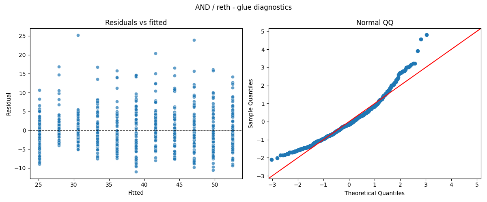

</details>

<details><summary><code>CALLDATACOPY</code> · nobs=19272 · runtime_ms=2.367e-06 · p=1.00e-03 · R²=0.8049</summary>

```
==============================================================================
                           NNLS Regression Results                            
==============================================================================
Dep. Variable:          test_runtime_ms              R-squared:          0.805
Model:                  NNLS                    Adj. R-squared:          0.805
No. Observations:       19272                             RMSE:           8.76
Df Residuals:           19270                              MAE:           6.63
Df Model:               1      
==============================================================================
                      coef     std err     P-value      [0.025      0.975]
------------------------------------------------------------------------------
         const     14.5859      0.0795       0.001     14.4318     14.7487
  CALLDATACOPY      0.0000      0.0000       0.001      0.0000      0.0000
==============================================================================
Notes: Non-negative least squares with bootstrap inference (1000 iterations)
==============================================================================
```

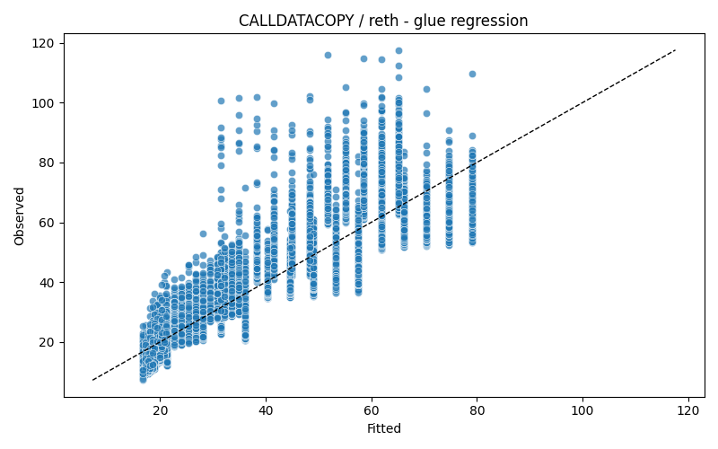

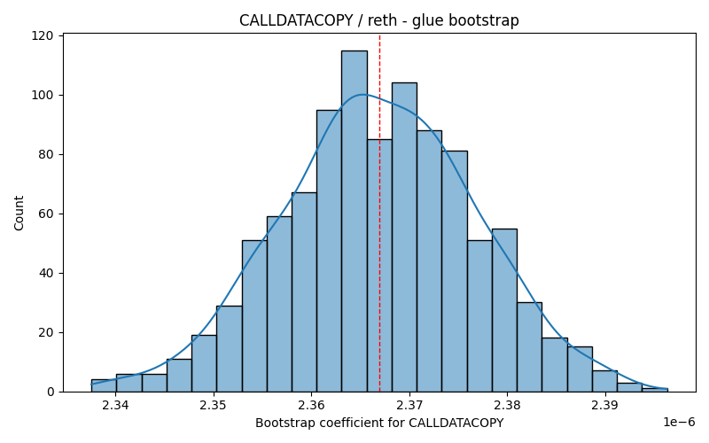

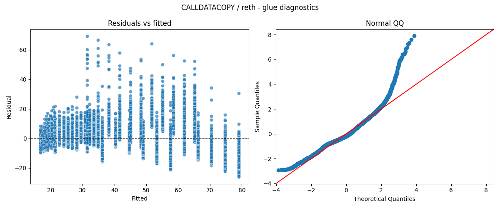

</details>

<details><summary><code>CALLDATALOAD</code> · nobs=3212 · runtime_ms=1.102e-05 · p=1.00e-03 · R²=0.002813</summary>

```
==============================================================================
                           NNLS Regression Results                            
==============================================================================
Dep. Variable:          test_runtime_ms              R-squared:          0.003
Model:                  NNLS                    Adj. R-squared:          0.003
No. Observations:       3212                              RMSE:           0.80
Df Residuals:           3210                               MAE:           0.54
Df Model:               1      
==============================================================================
                      coef     std err     P-value      [0.025      0.975]
------------------------------------------------------------------------------
         const      3.7523      0.0504       0.001      3.6581      3.8564
  CALLDATALOAD      0.0000      0.0000       0.001      0.0000      0.0000
==============================================================================
Notes: Non-negative least squares with bootstrap inference (1000 iterations)
==============================================================================
```

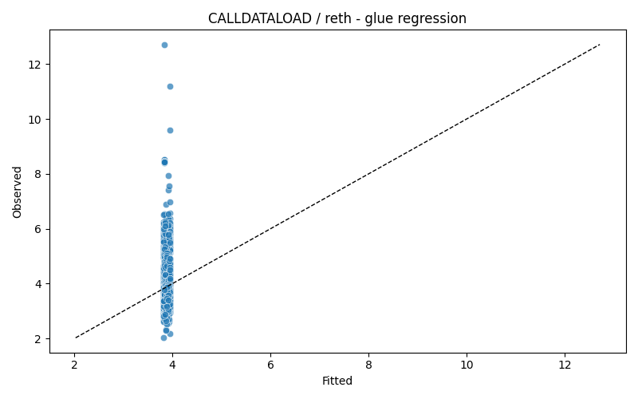

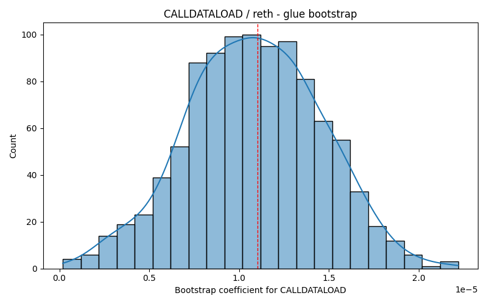

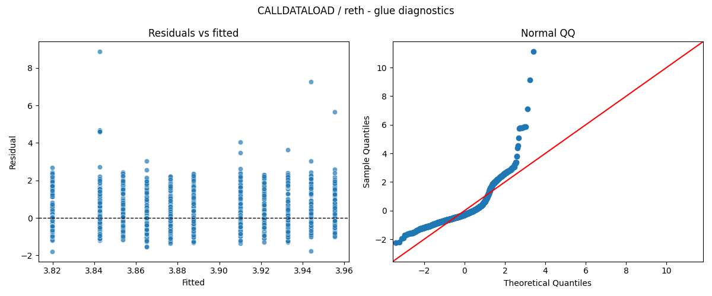

</details>

<details><summary><code>DIV</code> · nobs=803 · runtime_ms=6.891e-06 · p=1.00e-03 · R²=0.8553</summary>

```
==============================================================================
                           NNLS Regression Results                            
==============================================================================
Dep. Variable:          test_runtime_ms              R-squared:          0.855
Model:                  NNLS                    Adj. R-squared:          0.855
No. Observations:       803                               RMSE:          22.38
Df Residuals:           801                                MAE:          18.73
Df Model:               1      
==============================================================================
                      coef     std err     P-value      [0.025      0.975]
------------------------------------------------------------------------------
         const     63.3564      2.9367       0.001     57.7289     69.0585
           DIV      0.0000      0.0000       0.001      0.0000      0.0000
==============================================================================
Notes: Non-negative least squares with bootstrap inference (1000 iterations)
==============================================================================
```

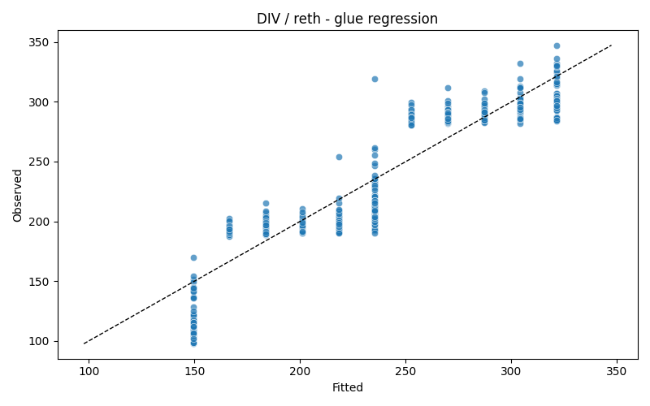

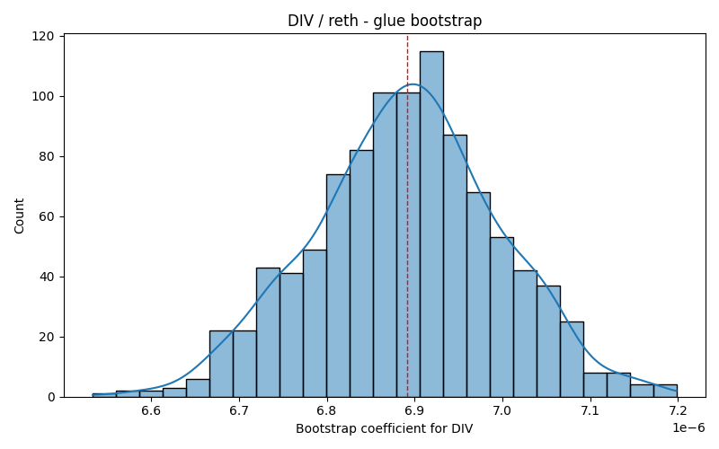

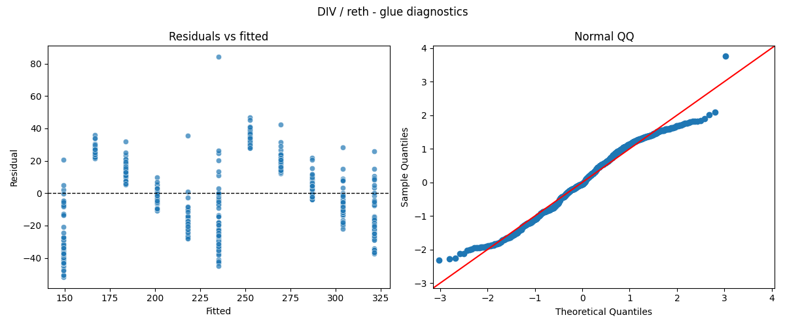

</details>

<details><summary><code>EXP</code> · nobs=803 · runtime_ms=0.00051 · p=1.00e-03 · R²=0.8531</summary>

```
==============================================================================
                           NNLS Regression Results                            
==============================================================================
Dep. Variable:          test_runtime_ms              R-squared:          0.853
Model:                  NNLS                    Adj. R-squared:          0.853
No. Observations:       803                               RMSE:           8.29
Df Residuals:           801                                MAE:           6.60
Df Model:               1      
==============================================================================
                      coef     std err     P-value      [0.025      0.975]
------------------------------------------------------------------------------
         const     23.8181      1.0106       0.001     21.9180     25.7904
           EXP      0.0005      0.0000       0.001      0.0005      0.0005
==============================================================================
Notes: Non-negative least squares with bootstrap inference (1000 iterations)
==============================================================================
```

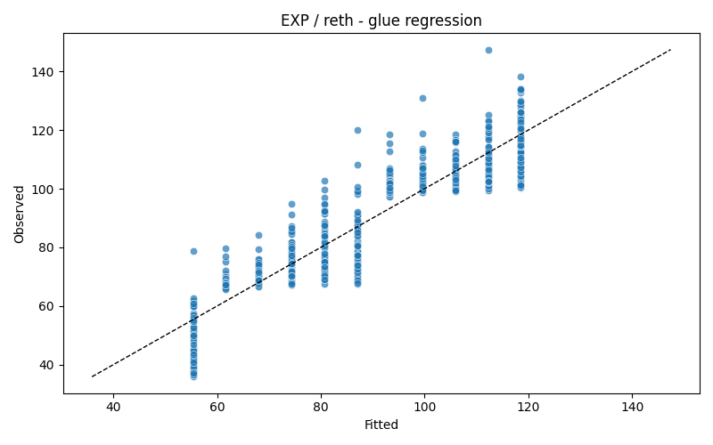

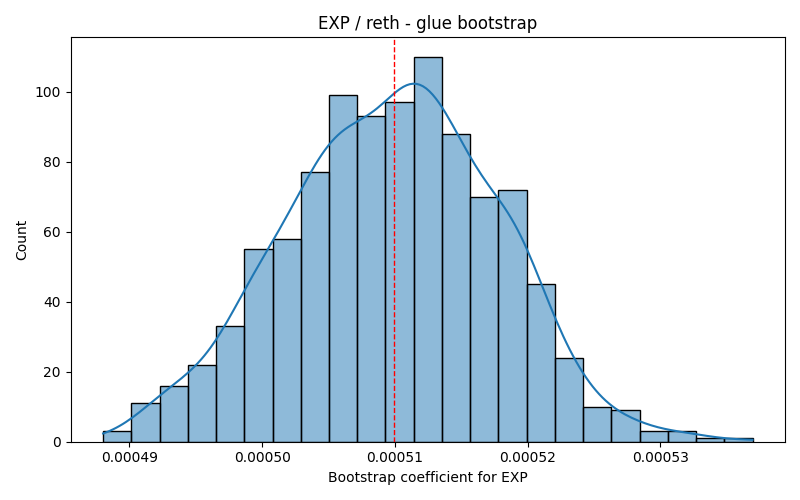

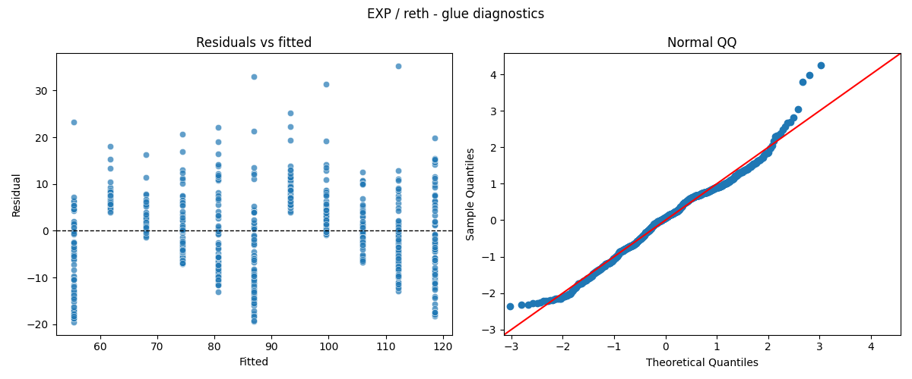

</details>

<details><summary><code>GT</code> · nobs=803 · runtime_ms=9.355e-07 · p=1.00e-03 · R²=0.7483</summary>

```
==============================================================================
                           NNLS Regression Results                            
==============================================================================
Dep. Variable:          test_runtime_ms              R-squared:          0.748
Model:                  NNLS                    Adj. R-squared:          0.748
No. Observations:       803                               RMSE:           5.71
Df Residuals:           801                                MAE:           4.47
Df Model:               1      
==============================================================================
                      coef     std err     P-value      [0.025      0.975]
------------------------------------------------------------------------------
         const     13.2047      0.6816       0.001     11.9251     14.5223
            GT      0.0000      0.0000       0.001      0.0000      0.0000
==============================================================================
Notes: Non-negative least squares with bootstrap inference (1000 iterations)
==============================================================================
```

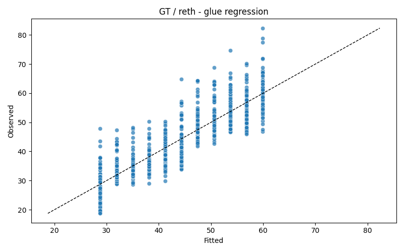

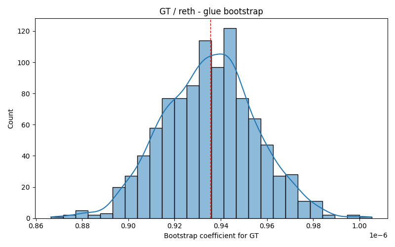

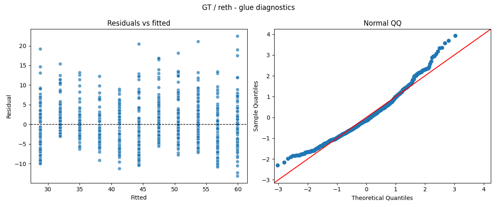

</details>

<details><summary><code>JUMPI</code> · nobs=803 · runtime_ms=1.308e-06 · p=1.00e-03 · R²=0.5376</summary>

```
==============================================================================
                           NNLS Regression Results                            
==============================================================================
Dep. Variable:          test_runtime_ms              R-squared:          0.538
Model:                  NNLS                    Adj. R-squared:          0.537
No. Observations:       803                               RMSE:           5.47
Df Residuals:           801                                MAE:           3.40
Df Model:               1      
==============================================================================
                      coef     std err     P-value      [0.025      0.975]
------------------------------------------------------------------------------
         const      9.0012      0.5581       0.001      7.9604     10.1349
         JUMPI      0.0000      0.0000       0.001      0.0000      0.0000
==============================================================================
Notes: Non-negative least squares with bootstrap inference (1000 iterations)
==============================================================================
```

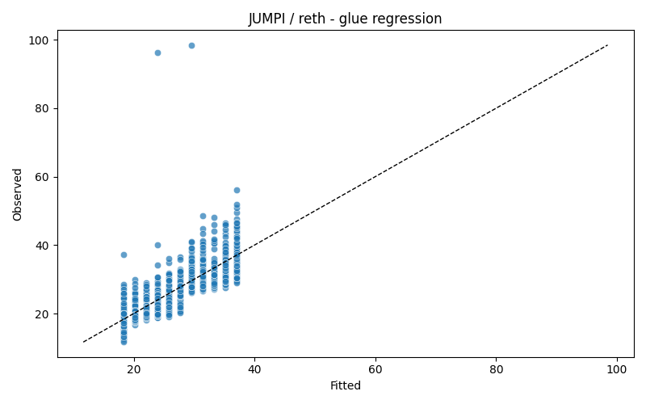

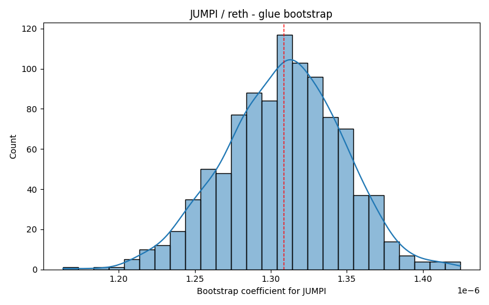

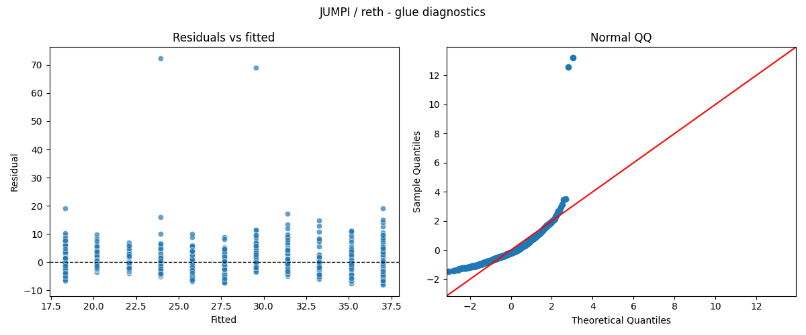

</details>

<details><summary><code>LT</code> · nobs=803 · runtime_ms=8.934e-07 · p=1.00e-03 · R²=0.7452</summary>

```
==============================================================================
                           NNLS Regression Results                            
==============================================================================
Dep. Variable:          test_runtime_ms              R-squared:          0.745
Model:                  NNLS                    Adj. R-squared:          0.745
No. Observations:       803                               RMSE:           5.50
Df Residuals:           801                                MAE:           4.29
Df Model:               1      
==============================================================================
                      coef     std err     P-value      [0.025      0.975]
------------------------------------------------------------------------------
         const     13.2280      0.6413       0.001     11.9395     14.4562
            LT      0.0000      0.0000       0.001      0.0000      0.0000
==============================================================================
Notes: Non-negative least squares with bootstrap inference (1000 iterations)
==============================================================================
```

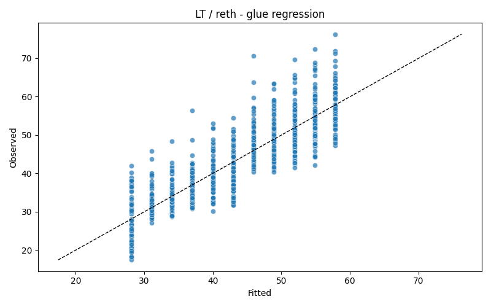

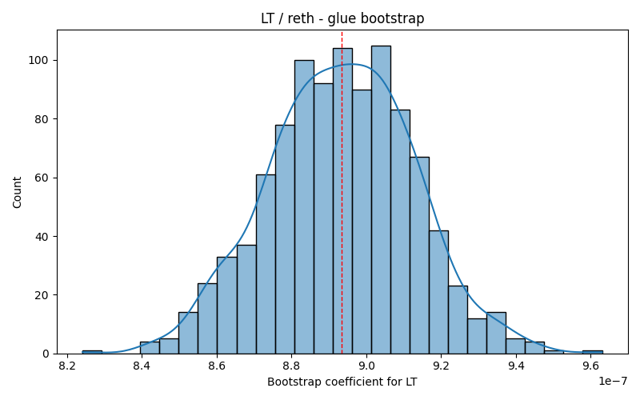

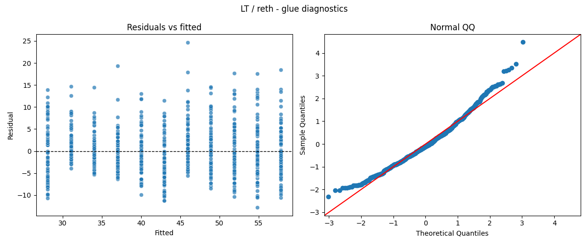

</details>

<details><summary><code>MSTORE</code> · nobs=4015 · runtime_ms=2.622e-06 · p=1.00e-03 · R²=0.2899</summary>

```
==============================================================================
                           NNLS Regression Results                            
==============================================================================
Dep. Variable:          test_runtime_ms              R-squared:          0.290
Model:                  NNLS                    Adj. R-squared:          0.290
No. Observations:       4015                              RMSE:          28.80
Df Residuals:           4013                               MAE:          25.99
Df Model:               1      
==============================================================================
                      coef     std err     P-value      [0.025      0.975]
------------------------------------------------------------------------------
         const     21.0401      1.3562       0.001     18.4830     23.6036
        MSTORE      0.0000      0.0000       0.001      0.0000      0.0000
==============================================================================
Notes: Non-negative least squares with bootstrap inference (1000 iterations)
==============================================================================
```

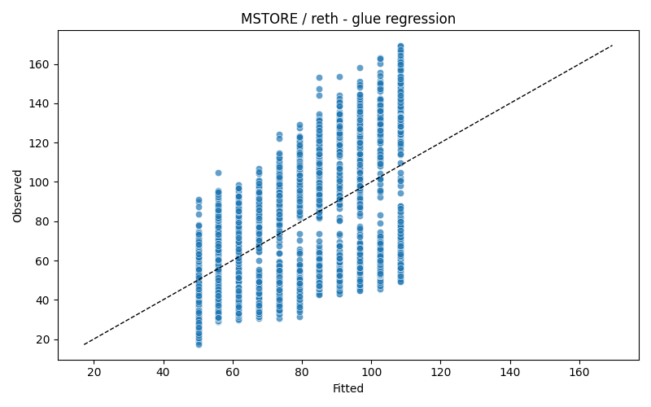

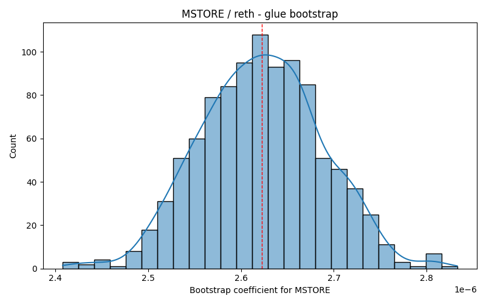

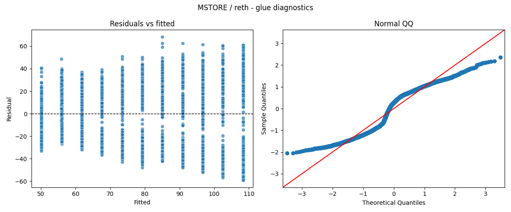

</details>

<details><summary><code>MSTORE8</code> · nobs=4015 · runtime_ms=1.336e-06 · p=1.00e-03 · R²=0.6917</summary>

```
==============================================================================
                           NNLS Regression Results                            
==============================================================================
Dep. Variable:          test_runtime_ms              R-squared:          0.692
Model:                  NNLS                    Adj. R-squared:          0.692
No. Observations:       4015                              RMSE:           6.26
Df Residuals:           4013                               MAE:           4.45
Df Model:               1      
==============================================================================
                      coef     std err     P-value      [0.025      0.975]
------------------------------------------------------------------------------
         const     13.5808      0.3270       0.001     12.9244     14.2353
       MSTORE8      0.0000      0.0000       0.001      0.0000      0.0000
==============================================================================
Notes: Non-negative least squares with bootstrap inference (1000 iterations)
==============================================================================
```

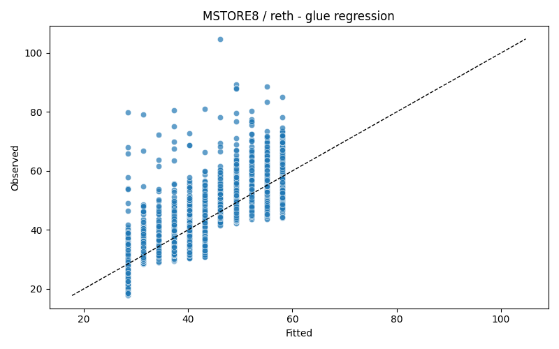

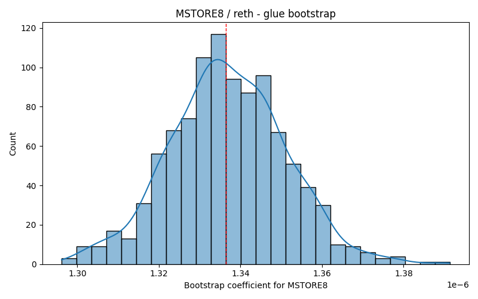

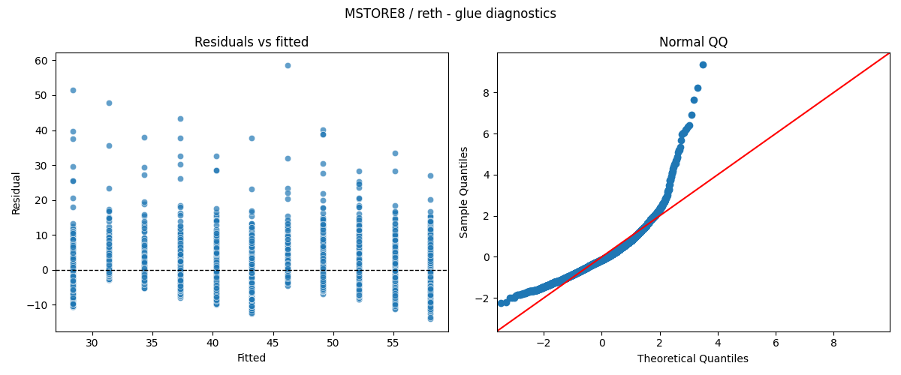

</details>

<details><summary><code>MUL</code> · nobs=803 · runtime_ms=1.112e-06 · p=1.00e-03 · R²=0.7381</summary>

```
==============================================================================
                           NNLS Regression Results                            
==============================================================================
Dep. Variable:          test_runtime_ms              R-squared:          0.738
Model:                  NNLS                    Adj. R-squared:          0.738
No. Observations:       803                               RMSE:           5.23
Df Residuals:           801                                MAE:           3.92
Df Model:               1      
==============================================================================
                      coef     std err     P-value      [0.025      0.975]
------------------------------------------------------------------------------
         const     13.5451      0.6096       0.001     12.3531     14.7264
           MUL      0.0000      0.0000       0.001      0.0000      0.0000
==============================================================================
Notes: Non-negative least squares with bootstrap inference (1000 iterations)
==============================================================================
```

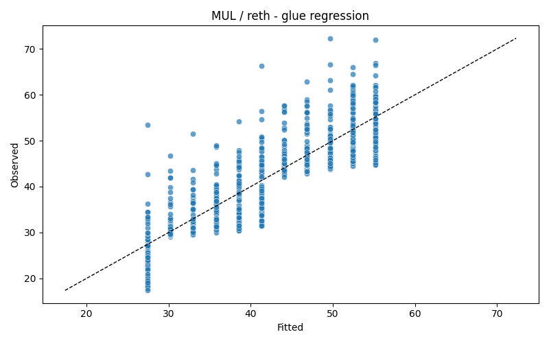

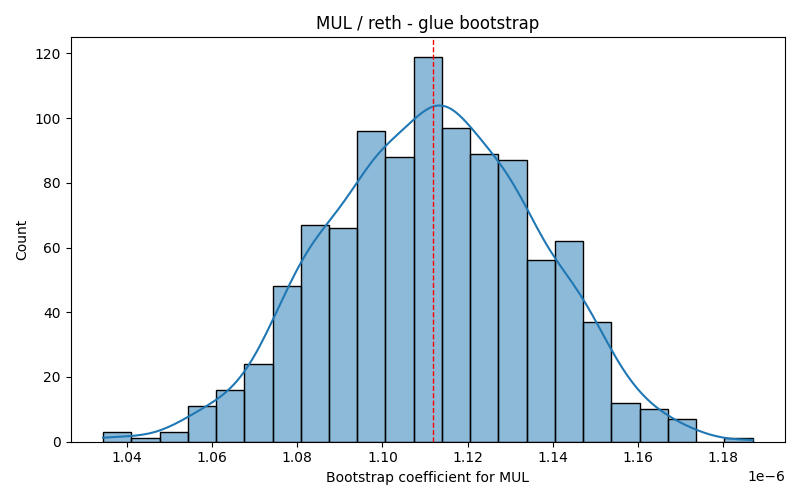

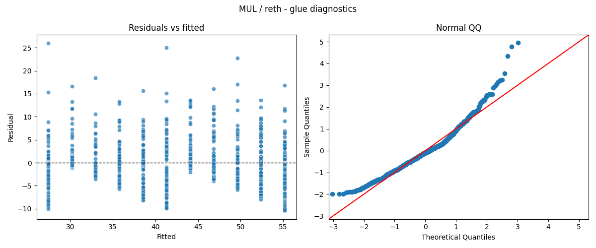

</details>

<details><summary><code>PC</code> · nobs=803 · runtime_ms=6.032e-07 · p=1.00e-03 · R²=0.2383</summary>

```
==============================================================================
                           NNLS Regression Results                            
==============================================================================
Dep. Variable:          test_runtime_ms              R-squared:          0.238
Model:                  NNLS                    Adj. R-squared:          0.237
No. Observations:       803                               RMSE:          32.25
Df Residuals:           801                                MAE:          11.78
Df Model:               1      
==============================================================================
                      coef     std err     P-value      [0.025      0.975]
------------------------------------------------------------------------------
         const     20.8571      3.9805       0.001     13.7070     29.6111
            PC      0.0000      0.0000       0.001      0.0000      0.0000
==============================================================================
Notes: Non-negative least squares with bootstrap inference (1000 iterations)
==============================================================================
```

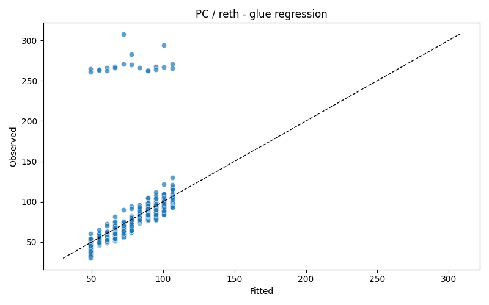

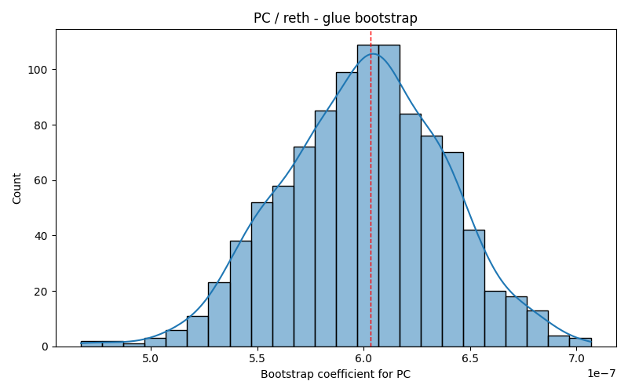

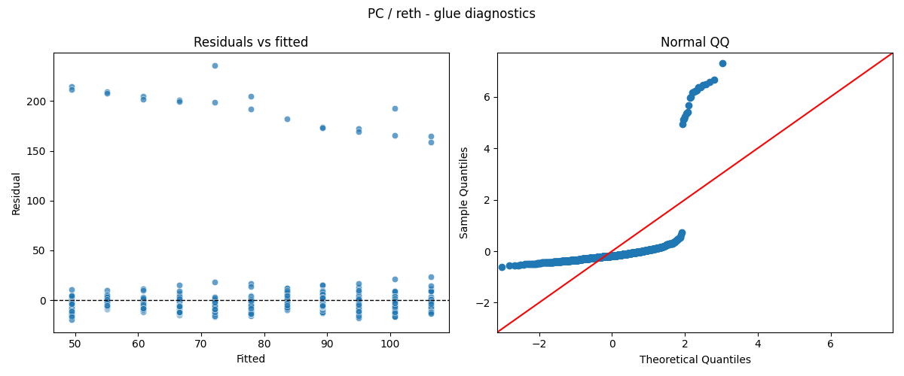

</details>

<details><summary><code>RETURNDATASIZE</code> · nobs=3212 · runtime_ms=8.15e-07 · p=1.00e-03 · R²=0.7455</summary>

```
==============================================================================
                           NNLS Regression Results                            
==============================================================================
Dep. Variable:          test_runtime_ms              R-squared:          0.746
Model:                  NNLS                    Adj. R-squared:          0.745
No. Observations:       3212                              RMSE:           7.52
Df Residuals:           3210                               MAE:           5.13
Df Model:               1      
==============================================================================
                      coef     std err     P-value      [0.025      0.975]
------------------------------------------------------------------------------
         const     15.5752      0.4809       0.001     14.6687     16.5583
RETURNDATASIZE      0.0000      0.0000       0.001      0.0000      0.0000
==============================================================================
Notes: Non-negative least squares with bootstrap inference (1000 iterations)
==============================================================================
```

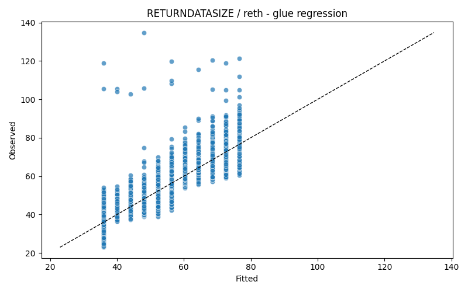

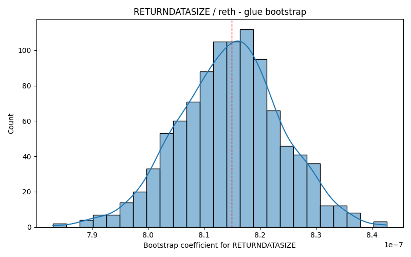

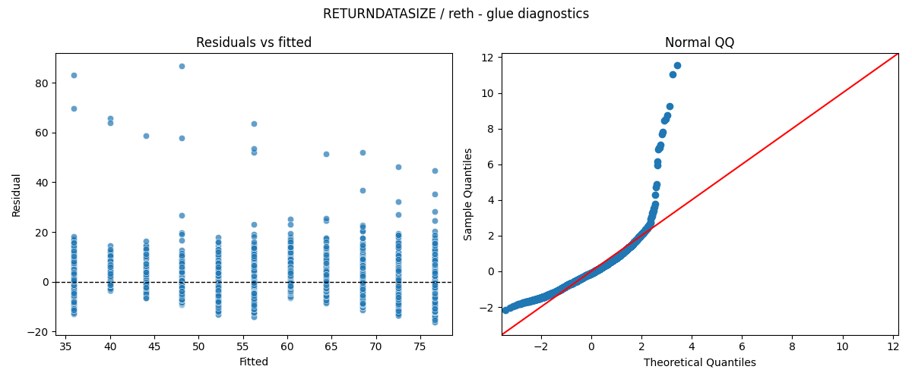

</details>

<details><summary><code>SELFBALANCE</code> · nobs=657 · runtime_ms=3.619e-06 · p=1.00e-03 · R²=0.7669</summary>

```
==============================================================================
                           NNLS Regression Results                            
==============================================================================
Dep. Variable:          test_runtime_ms              R-squared:          0.767
Model:                  NNLS                    Adj. R-squared:          0.767
No. Observations:       657                               RMSE:          20.13
Df Residuals:           655                                MAE:          15.67
Df Model:               1      
==============================================================================
                      coef     std err     P-value      [0.025      0.975]
------------------------------------------------------------------------------
         const     70.2099      3.1737       0.001     64.1168     76.4138
   SELFBALANCE      0.0000      0.0000       0.001      0.0000      0.0000
==============================================================================
Notes: Non-negative least squares with bootstrap inference (1000 iterations)
==============================================================================
```

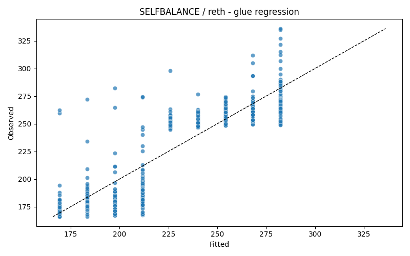

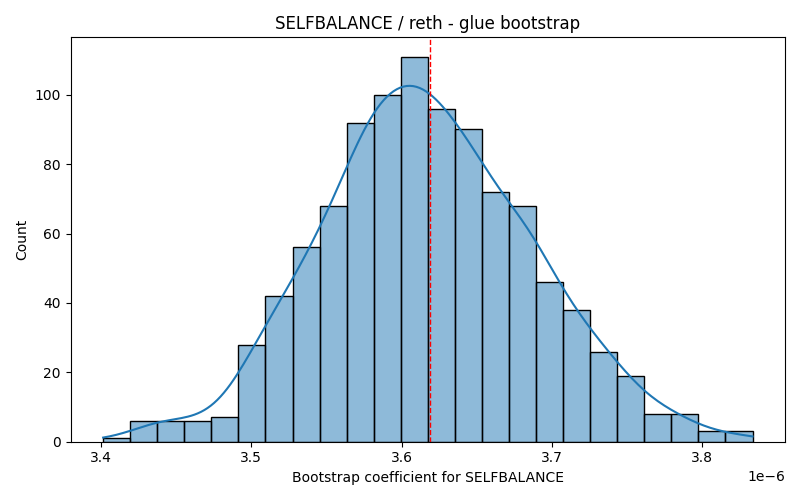

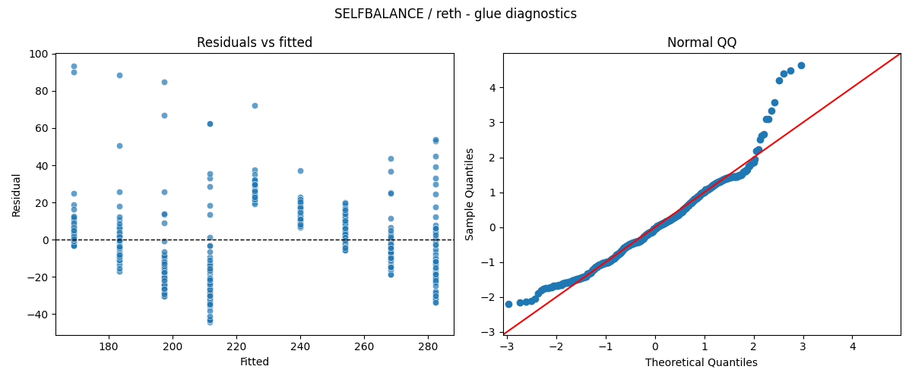

</details>

<details><summary><code>SUB</code> · nobs=803 · runtime_ms=8.634e-07 · p=1.00e-03 · R²=0.7633</summary>

```
==============================================================================
                           NNLS Regression Results                            
==============================================================================
Dep. Variable:          test_runtime_ms              R-squared:          0.763
Model:                  NNLS                    Adj. R-squared:          0.763
No. Observations:       803                               RMSE:           5.06
Df Residuals:           801                                MAE:           3.96
Df Model:               1      
==============================================================================
                      coef     std err     P-value      [0.025      0.975]
------------------------------------------------------------------------------
         const     12.8883      0.5428       0.001     11.9187     13.9872
           SUB      0.0000      0.0000       0.001      0.0000      0.0000
==============================================================================
Notes: Non-negative least squares with bootstrap inference (1000 iterations)
==============================================================================
```

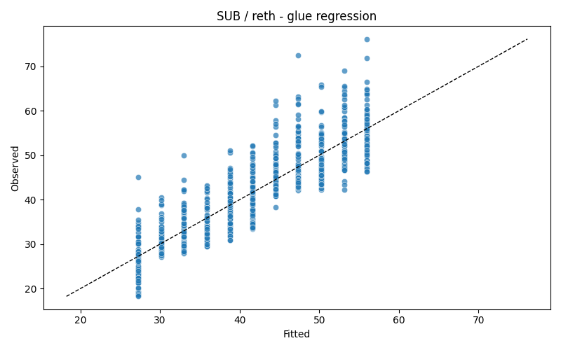

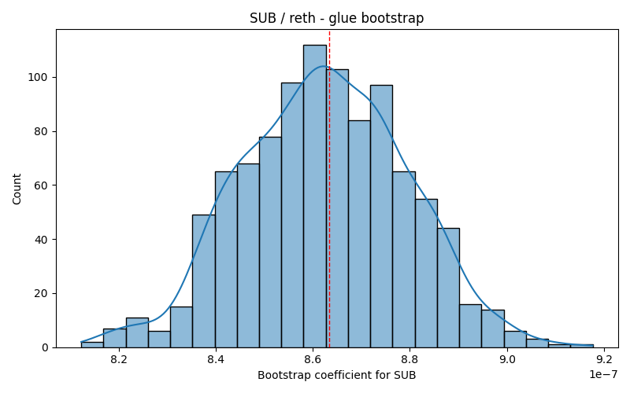

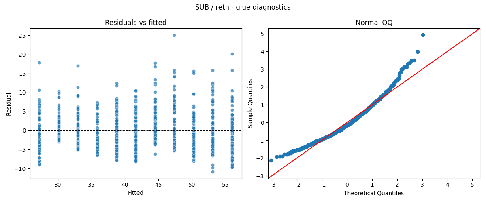

</details>

### Mixed glue (tier B) · reth

<details><summary><code>JUMP</code> · nobs=803 · runtime_ms=2.359e-06 · p=1.00e-03 · R²=0.543</summary>

```
==============================================================================
                           NNLS Regression Results                            
==============================================================================
Dep. Variable:          test_runtime_ms              R-squared:          0.543
Model:                  NNLS                    Adj. R-squared:          0.542
No. Observations:       803                               RMSE:           8.04
Df Residuals:           801                                MAE:           4.49
Df Model:               1      
==============================================================================
                      coef     std err     P-value      [0.025      0.975]
------------------------------------------------------------------------------
         const     12.0164      0.9453       0.001     10.2307     13.9034
          JUMP      0.0000      0.0000       0.001      0.0000      0.0000
==============================================================================
Notes: Non-negative least squares with bootstrap inference (1000 iterations)
==============================================================================
```

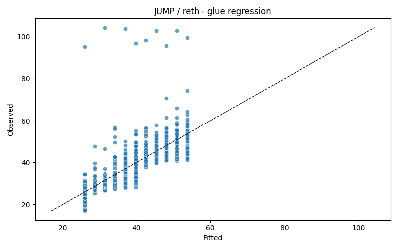

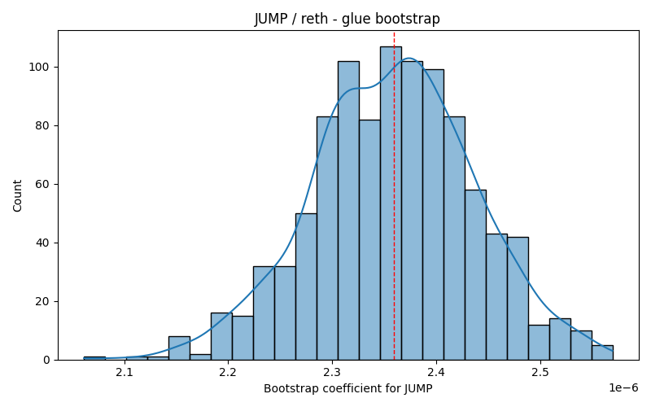

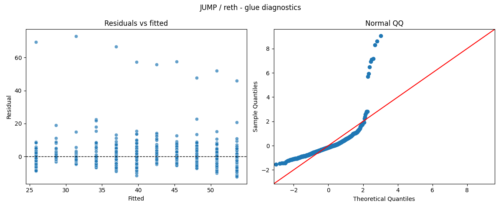

</details>

<details><summary><code>KECCAK256</code> · nobs=12848 · runtime_ms=0 · p=1.00e+00 · R²=-2.22e-16</summary>

```
==============================================================================
                           NNLS Regression Results                            
==============================================================================
Dep. Variable:          test_runtime_ms              R-squared:         -0.000
Model:                  NNLS                    Adj. R-squared:         -0.000
No. Observations:       12848                             RMSE:         157.80
Df Residuals:           12846                              MAE:         133.08
Df Model:               1      
==============================================================================
                      coef     std err     P-value      [0.025      0.975]
------------------------------------------------------------------------------
         const    251.8943      1.3754       0.001    249.2319    254.6940
     KECCAK256      0.0000      0.0000       1.000      0.0000      0.0000
==============================================================================
Notes: Non-negative least squares with bootstrap inference (1000 iterations)
==============================================================================
```

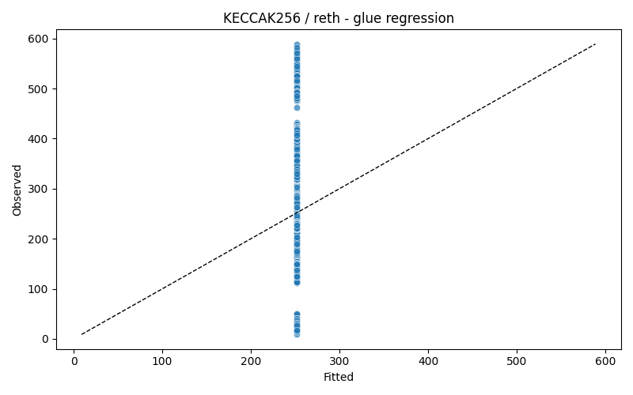


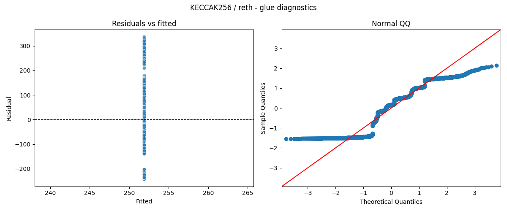

</details>
