# Glue opcodes report

Per-client NNLS fits of priced glue opcodes against their driver fixtures. Cycle-tier opcodes share one joint regression per client (shown once); pure-tier and mixed-tier opcodes each get a single-feature fit. Mixed-tier fits pre-adjust the LHS by subtracting the contribution of every priced upstream partner selected by the detector (pure ∪ cycle for `mixed_a`, plus `mixed_a` for `mixed_b`).

**Contents:** [besu](#besu) · [erigon](#erigon) · [ethrex](#ethrex) · [geth](#geth) · [nethermind](#nethermind) · [reth](#reth)

## besu

| glue_opcode | nobs | glue_runtime_ms | p_value | rsquared |
| --- | --- | --- | --- | --- |
| `ISZERO` | 2651 | 3.186e-06 | 1.00e-03 | 0.8212 |
| `JUMPDEST` | 2651 | 7.565e-07 | 1.00e-03 | 0.7601 |
| `SWAP` | 42416 | 2.72e-06 | 1.00e-03 | 0.3878 |
| `CALLDATASIZE` | 157069 | 2.807e-06 | 1.00e-03 | 0.9276 |
| `DUP` | 157069 | 1.184e-06 | 1.00e-03 | 0.9276 |
| `GAS` | 157069 | 2.407e-06 | 1.00e-03 | 0.9276 |
| `MLOAD` | 157069 | 8.626e-06 | 1.00e-03 | 0.9276 |
| `PUSH` | 157069 | 1.817e-06 | 1.00e-03 | 0.9276 |
| `PUSH0` | 157069 | 9.539e-07 | 1.00e-03 | 0.9276 |
| `STATICCALL` | 157069 | 0.0007009 | 1.00e-03 | 0.9276 |
| `ADD` | 2651 | 8.35e-06 | 1.00e-03 | 0.8329 |
| `AND` | 2651 | 5.78e-06 | 1.00e-03 | 0.8535 |
| `CALLDATACOPY` | 63624 | 1.302e-05 | 1.00e-03 | 0.636 |
| `CALLDATALOAD` | 10604 | 0 | 1.00e+00 | 0 |
| `DIV` | 2651 | 1.296e-05 | 1.00e-03 | 0.7831 |
| `EXP` | 2651 | 0.001037 | 1.00e-03 | 0.7325 |
| `GT` | 2651 | 2.001e-05 | 1.00e-03 | 0.2156 |
| `JUMPI` | 2651 | 4.93e-06 | 1.00e-03 | 0.7418 |
| `LT` | 2651 | 2.031e-05 | 1.00e-03 | 0.2147 |
| `MSTORE` | 13255 | 1.424e-05 | 1.00e-03 | 0.7961 |
| `MSTORE8` | 13255 | 8.842e-06 | 1.00e-03 | 0.8371 |
| `MUL` | 2651 | 1.068e-05 | 1.00e-03 | 0.7119 |
| `PC` | 2651 | 2.789e-06 | 1.00e-03 | 0.8439 |
| `RETURNDATASIZE` | 10604 | 4.106e-06 | 1.00e-03 | 0.7872 |
| `SELFBALANCE` | 2169 | 1.006e-05 | 1.00e-03 | 0.6912 |
| `SUB` | 2651 | 8.591e-06 | 1.00e-03 | 0.8185 |
| `JUMP` | 2651 | 4.127e-05 | 1.00e-03 | 0.8388 |
| `KECCAK256` | 42416 | 3.572e-05 | 1.00e-03 | 0.1443 |

### Cycle glue — joint fit · besu

<details><summary>Joint NNLS regression summary</summary>

```
==============================================================================
                           NNLS Regression Results                            
==============================================================================
Dep. Variable:          test_runtime_ms              R-squared:          0.928
Model:                  NNLS                    Adj. R-squared:          0.928
No. Observations:       157069                            RMSE:          29.65
Df Residuals:           157061                             MAE:          20.52
Df Model:               7      
==============================================================================
                      coef     std err     P-value      [0.025      0.975]
------------------------------------------------------------------------------
         const     46.8020      0.2559       0.001     46.2961     47.3164
  CALLDATASIZE      0.0000      0.0000       0.001      0.0000      0.0000
           DUP      0.0000      0.0000       0.001      0.0000      0.0000
           GAS      0.0000      0.0000       0.001      0.0000      0.0000
         MLOAD      0.0000      0.0000       0.001      0.0000      0.0000
          PUSH      0.0000      0.0000       0.001      0.0000      0.0000
         PUSH0      0.0000      0.0000       0.001      0.0000      0.0000
    STATICCALL      0.0007      0.0000       0.001      0.0007      0.0007
==============================================================================
Notes: Non-negative least squares with bootstrap inference (1000 iterations)
==============================================================================
```

</details>

<details><summary><code>CALLDATASIZE</code> · nobs=157069 · runtime_ms=2.807e-06 · p=1.00e-03 · R²=0.9276</summary>


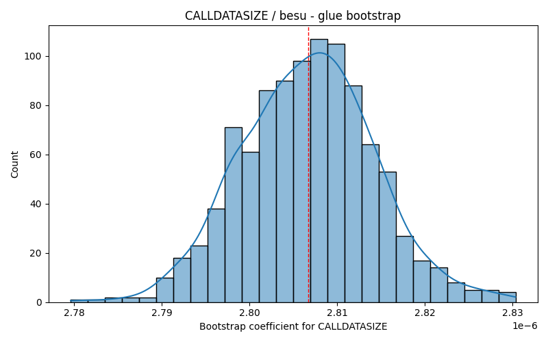

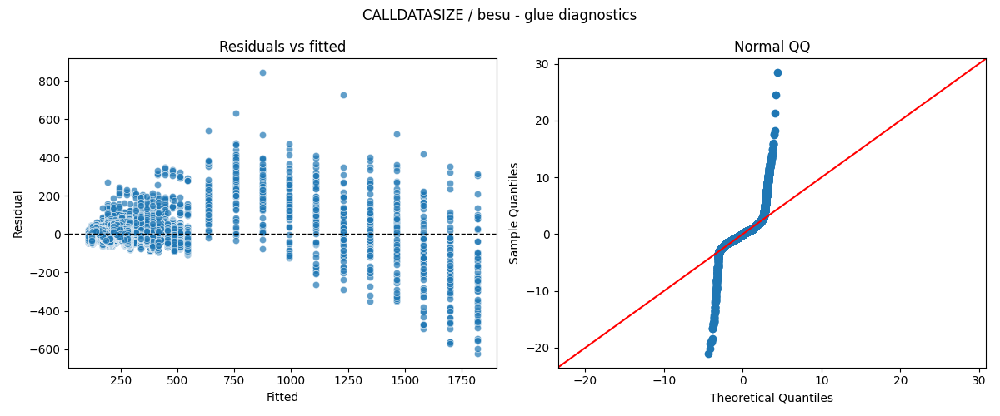

</details>

<details><summary><code>DUP</code> · nobs=157069 · runtime_ms=1.184e-06 · p=1.00e-03 · R²=0.9276</summary>

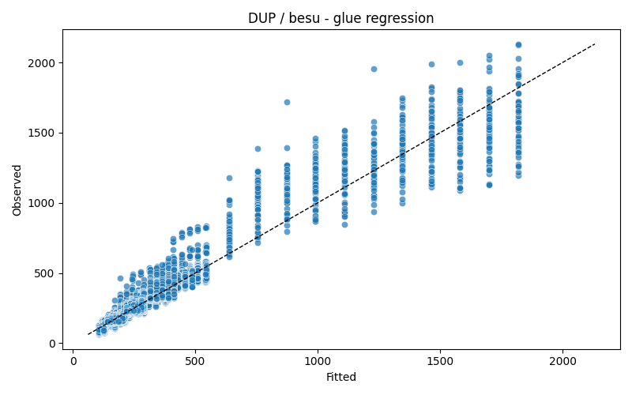

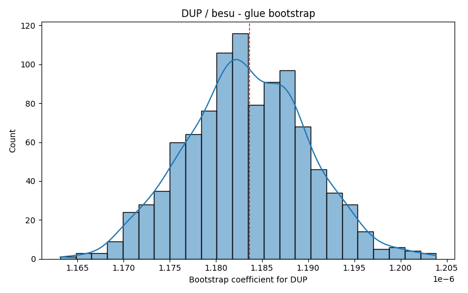


</details>

<details><summary><code>GAS</code> · nobs=157069 · runtime_ms=2.407e-06 · p=1.00e-03 · R²=0.9276</summary>


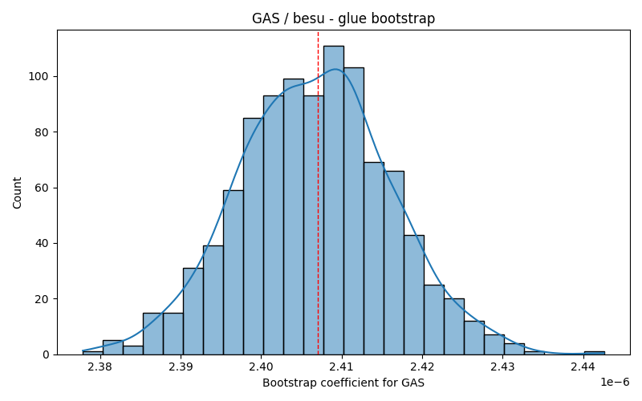

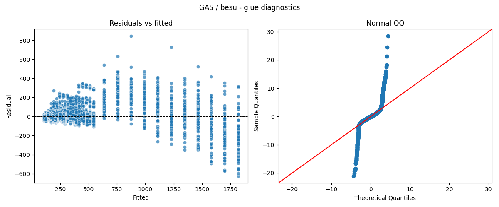

</details>

<details><summary><code>MLOAD</code> · nobs=157069 · runtime_ms=8.626e-06 · p=1.00e-03 · R²=0.9276</summary>

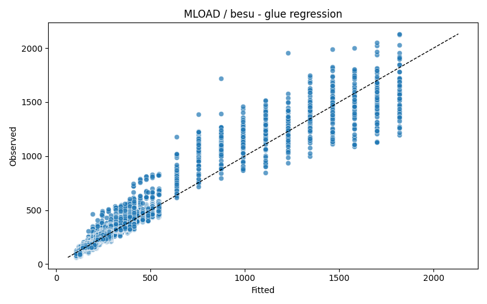

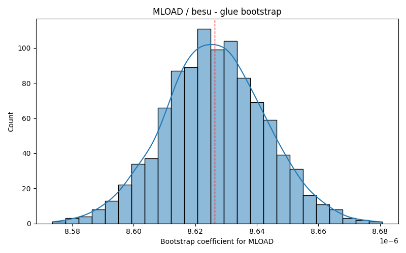


</details>

<details><summary><code>PUSH</code> · nobs=157069 · runtime_ms=1.817e-06 · p=1.00e-03 · R²=0.9276</summary>


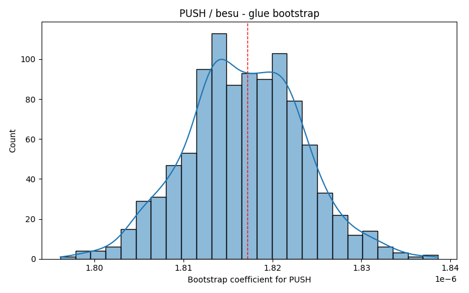


</details>

<details><summary><code>PUSH0</code> · nobs=157069 · runtime_ms=9.539e-07 · p=1.00e-03 · R²=0.9276</summary>


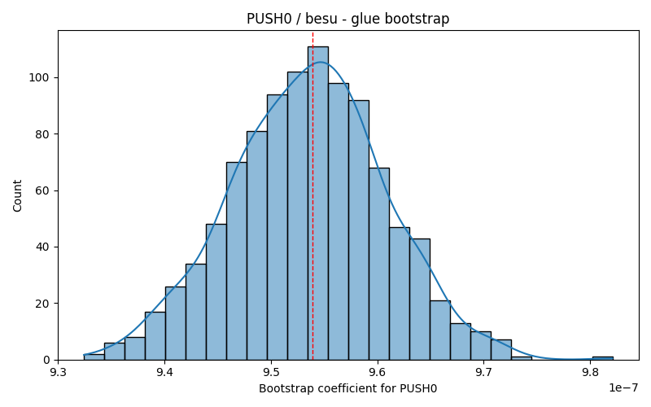


</details>

<details><summary><code>STATICCALL</code> · nobs=157069 · runtime_ms=0.0007009 · p=1.00e-03 · R²=0.9276</summary>


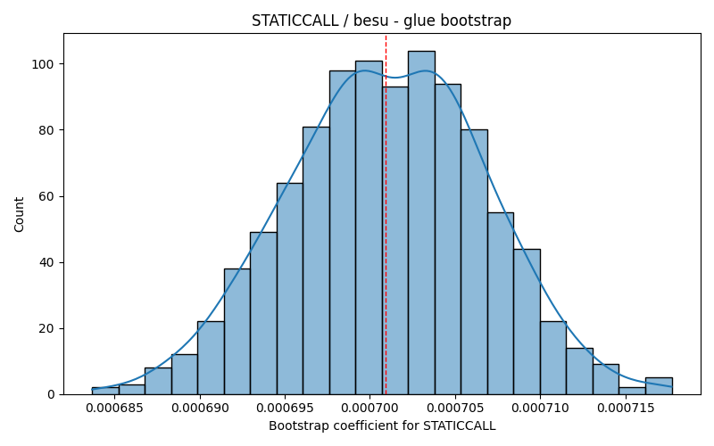


</details>

### Pure glue · besu

<details><summary><code>ISZERO</code> · nobs=2651 · runtime_ms=3.186e-06 · p=1.00e-03 · R²=0.8212</summary>

```
==============================================================================
                           NNLS Regression Results                            
==============================================================================
Dep. Variable:          test_runtime_ms              R-squared:          0.821
Model:                  NNLS                    Adj. R-squared:          0.821
No. Observations:       2651                              RMSE:          31.31
Df Residuals:           2649                               MAE:          25.14
Df Model:               1      
==============================================================================
                      coef     std err     P-value      [0.025      0.975]
------------------------------------------------------------------------------
         const     58.8674      2.1040       0.001     54.9453     62.9214
        ISZERO      0.0000      0.0000       0.001      0.0000      0.0000
==============================================================================
Notes: Non-negative least squares with bootstrap inference (1000 iterations)
==============================================================================
```

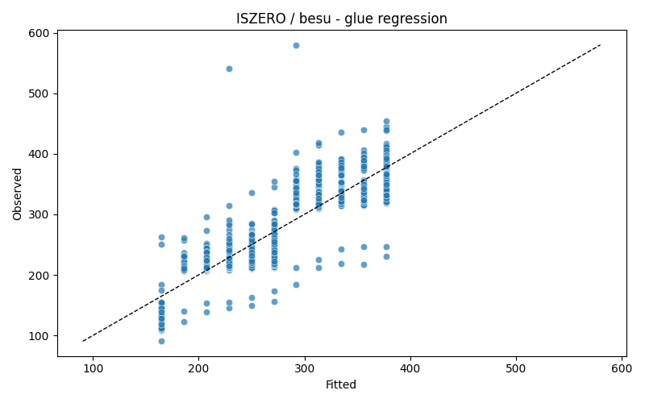

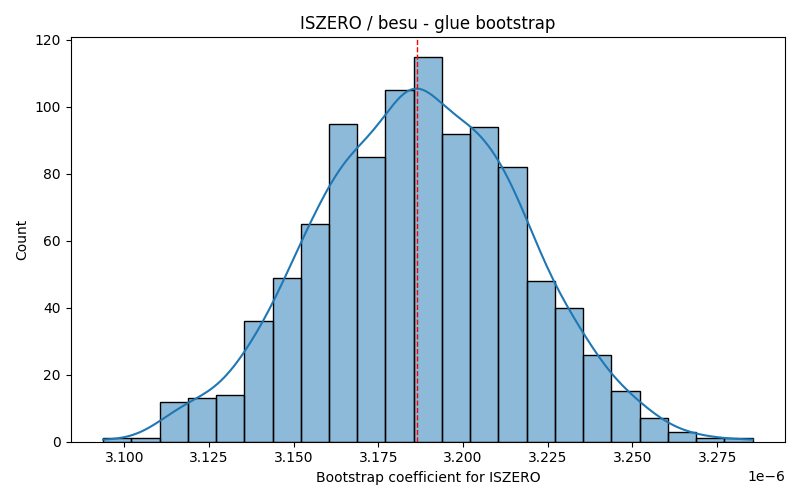

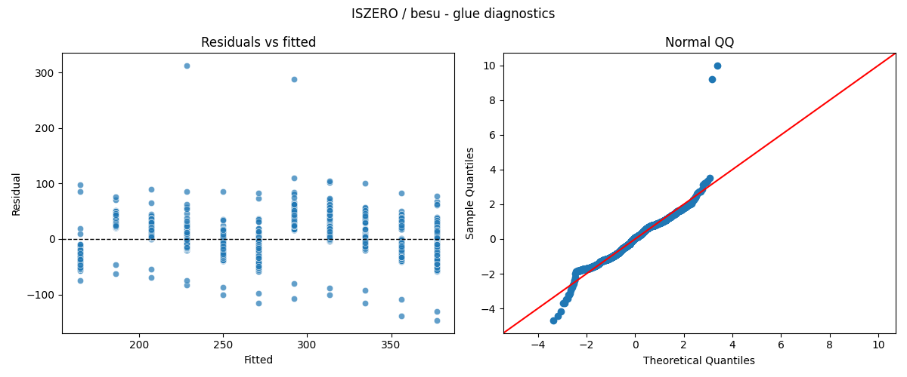

</details>

<details><summary><code>JUMPDEST</code> · nobs=2651 · runtime_ms=7.565e-07 · p=1.00e-03 · R²=0.7601</summary>

```
==============================================================================
                           NNLS Regression Results                            
==============================================================================
Dep. Variable:          test_runtime_ms              R-squared:          0.760
Model:                  NNLS                    Adj. R-squared:          0.760
No. Observations:       2651                              RMSE:          26.83
Df Residuals:           2649                               MAE:          19.83
Df Model:               1      
==============================================================================
                      coef     std err     P-value      [0.025      0.975]
------------------------------------------------------------------------------
         const     40.7082      1.5870       0.001     37.8402     44.1488
      JUMPDEST      0.0000      0.0000       0.001      0.0000      0.0000
==============================================================================
Notes: Non-negative least squares with bootstrap inference (1000 iterations)
==============================================================================
```

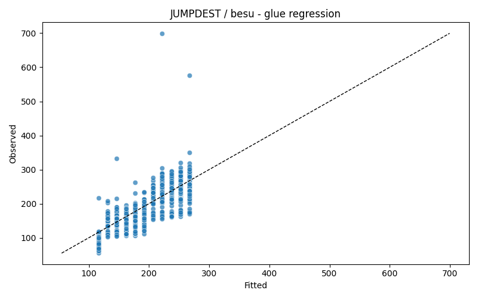

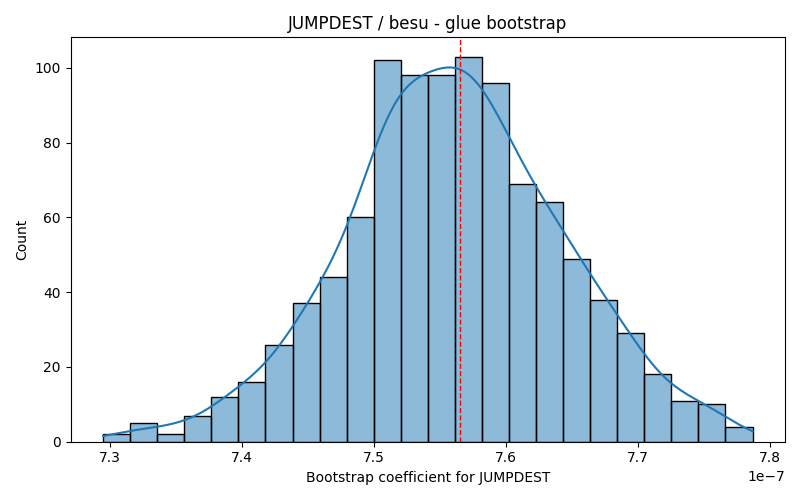

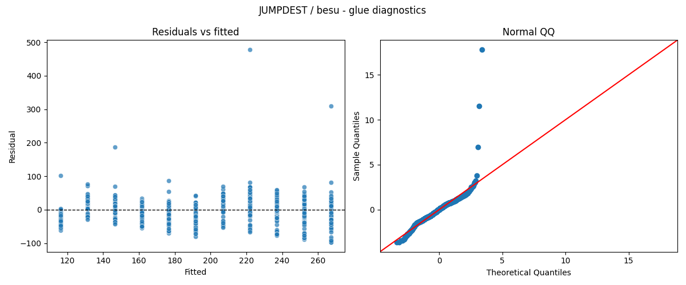

</details>

<details><summary><code>SWAP</code> · nobs=42416 · runtime_ms=2.72e-06 · p=1.00e-03 · R²=0.3878</summary>

```
==============================================================================
                           NNLS Regression Results                            
==============================================================================
Dep. Variable:          test_runtime_ms              R-squared:          0.388
Model:                  NNLS                    Adj. R-squared:          0.388
No. Observations:       42416                             RMSE:          71.96
Df Residuals:           42414                              MAE:          65.34
Df Model:               1      
==============================================================================
                      coef     std err     P-value      [0.025      0.975]
------------------------------------------------------------------------------
         const     49.5935      0.9979       0.001     47.7121     51.5588
          SWAP      0.0000      0.0000       0.001      0.0000      0.0000
==============================================================================
Notes: Non-negative least squares with bootstrap inference (1000 iterations)
==============================================================================
```

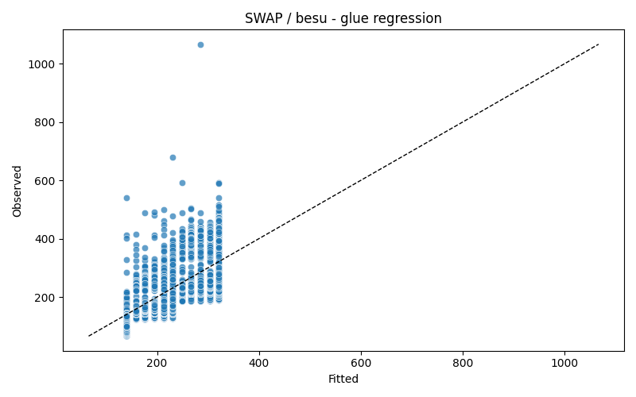

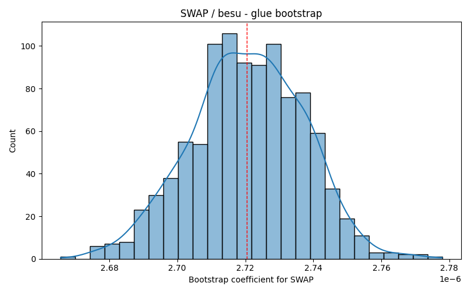

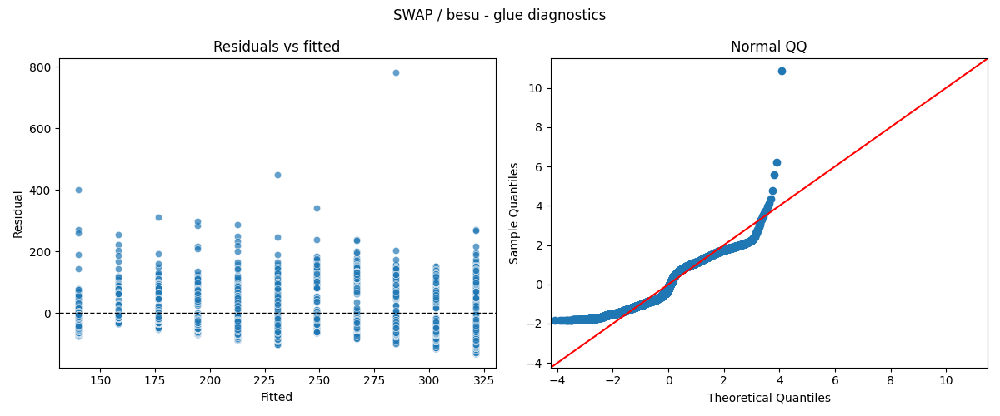

</details>

### Mixed glue (tier A) · besu

<details><summary><code>ADD</code> · nobs=2651 · runtime_ms=8.35e-06 · p=1.00e-03 · R²=0.8329</summary>

```
==============================================================================
                           NNLS Regression Results                            
==============================================================================
Dep. Variable:          test_runtime_ms              R-squared:          0.833
Model:                  NNLS                    Adj. R-squared:          0.833
No. Observations:       2651                              RMSE:          39.37
Df Residuals:           2649                               MAE:          32.42
Df Model:               1      
==============================================================================
                      coef     std err     P-value      [0.025      0.975]
------------------------------------------------------------------------------
         const     72.4613      2.5949       0.001     66.9146     77.2031
           ADD      0.0000      0.0000       0.001      0.0000      0.0000
==============================================================================
Notes: Non-negative least squares with bootstrap inference (1000 iterations)
==============================================================================
```

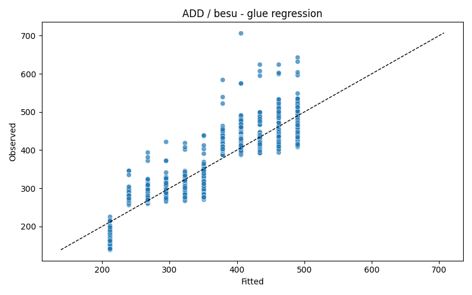

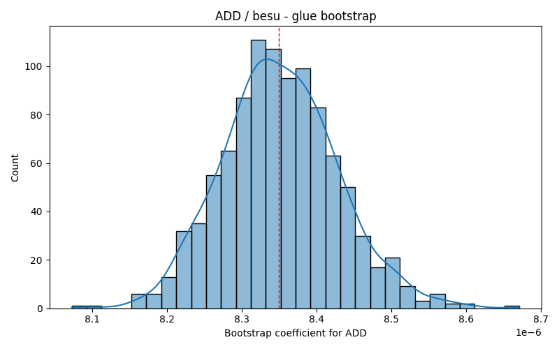

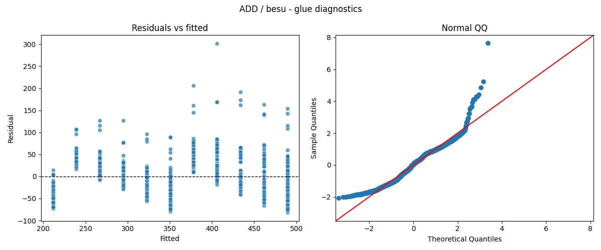

</details>

<details><summary><code>AND</code> · nobs=2651 · runtime_ms=5.78e-06 · p=1.00e-03 · R²=0.8535</summary>

```
==============================================================================
                           NNLS Regression Results                            
==============================================================================
Dep. Variable:          test_runtime_ms              R-squared:          0.854
Model:                  NNLS                    Adj. R-squared:          0.853
No. Observations:       2651                              RMSE:          25.20
Df Residuals:           2649                               MAE:          20.77
Df Model:               1      
==============================================================================
                      coef     std err     P-value      [0.025      0.975]
------------------------------------------------------------------------------
         const     60.4710      1.5355       0.001     57.5881     63.6097
           AND      0.0000      0.0000       0.001      0.0000      0.0000
==============================================================================
Notes: Non-negative least squares with bootstrap inference (1000 iterations)
==============================================================================
```

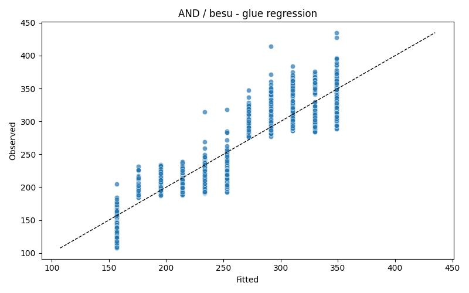

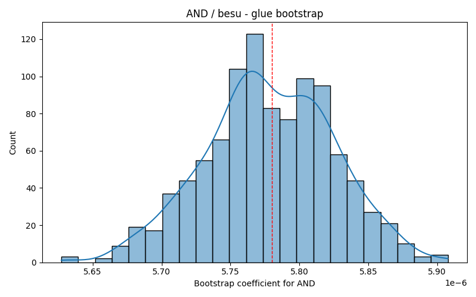

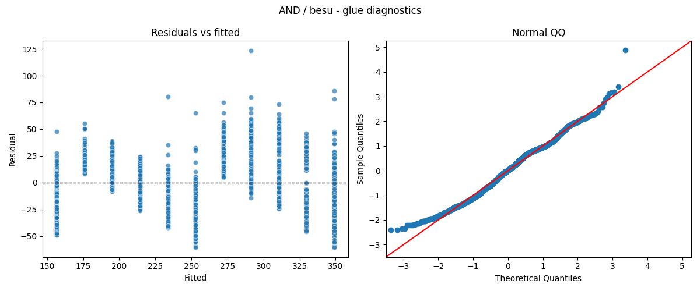

</details>

<details><summary><code>CALLDATACOPY</code> · nobs=63624 · runtime_ms=1.302e-05 · p=1.00e-03 · R²=0.636</summary>

```
==============================================================================
                           NNLS Regression Results                            
==============================================================================
Dep. Variable:          test_runtime_ms              R-squared:          0.636
Model:                  NNLS                    Adj. R-squared:          0.636
No. Observations:       63624                             RMSE:          74.08
Df Residuals:           63622                              MAE:          57.29
Df Model:               1      
==============================================================================
                      coef     std err     P-value      [0.025      0.975]
------------------------------------------------------------------------------
         const    125.2908      0.3519       0.001    124.6029    125.9862
  CALLDATACOPY      0.0000      0.0000       0.001      0.0000      0.0000
==============================================================================
Notes: Non-negative least squares with bootstrap inference (1000 iterations)
==============================================================================
```

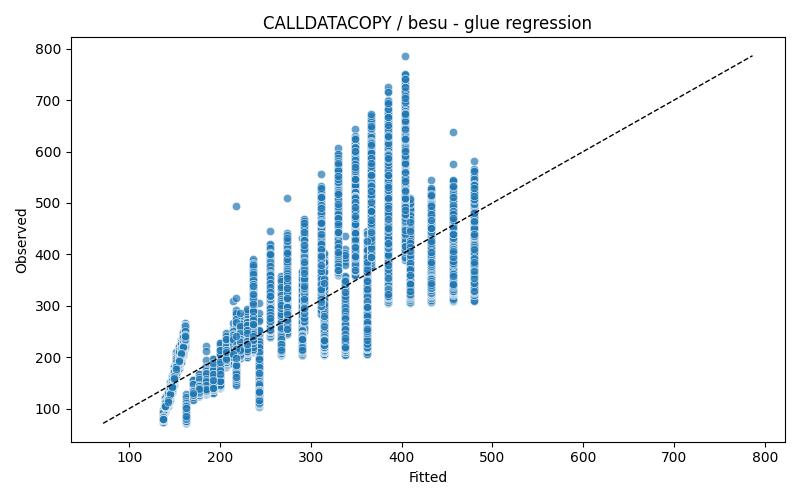

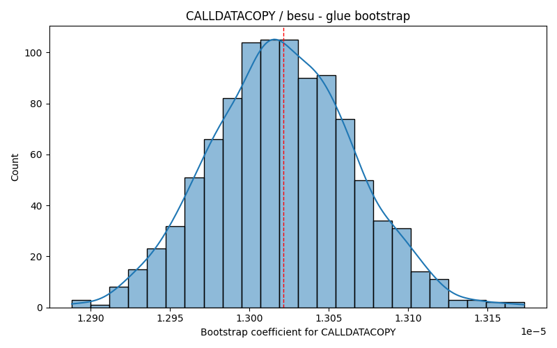

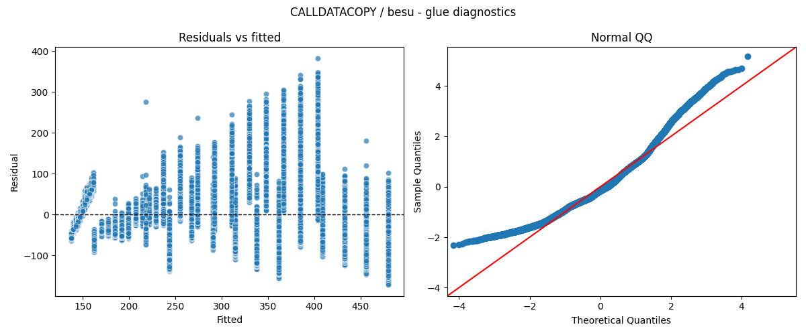

</details>

<details><summary><code>CALLDATALOAD</code> · nobs=10604 · runtime_ms=0 · p=1.00e+00 · R²=0</summary>

```
==============================================================================
                           NNLS Regression Results                            
==============================================================================
Dep. Variable:          test_runtime_ms              R-squared:          0.000
Model:                  NNLS                    Adj. R-squared:         -0.000
No. Observations:       10604                             RMSE:           0.62
Df Residuals:           10602                              MAE:           0.41
Df Model:               1      
==============================================================================
                      coef     std err     P-value      [0.025      0.975]
------------------------------------------------------------------------------
         const      3.4253      0.0060       0.001      3.4143      3.4378
  CALLDATALOAD      0.0000      0.0000       1.000      0.0000      0.0000
==============================================================================
Notes: Non-negative least squares with bootstrap inference (1000 iterations)
==============================================================================
```

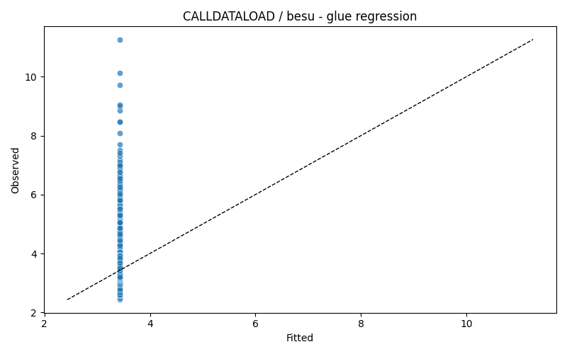


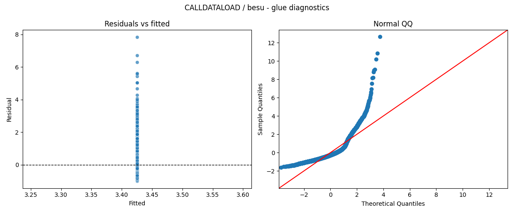

</details>

<details><summary><code>DIV</code> · nobs=2651 · runtime_ms=1.296e-05 · p=1.00e-03 · R²=0.7831</summary>

```
==============================================================================
                           NNLS Regression Results                            
==============================================================================
Dep. Variable:          test_runtime_ms              R-squared:          0.783
Model:                  NNLS                    Adj. R-squared:          0.783
No. Observations:       2651                              RMSE:          53.83
Df Residuals:           2649                               MAE:          43.34
Df Model:               1      
==============================================================================
                      coef     std err     P-value      [0.025      0.975]
------------------------------------------------------------------------------
         const    135.6236      3.1840       0.001    128.9251    141.9467
           DIV      0.0000      0.0000       0.001      0.0000      0.0000
==============================================================================
Notes: Non-negative least squares with bootstrap inference (1000 iterations)
==============================================================================
```

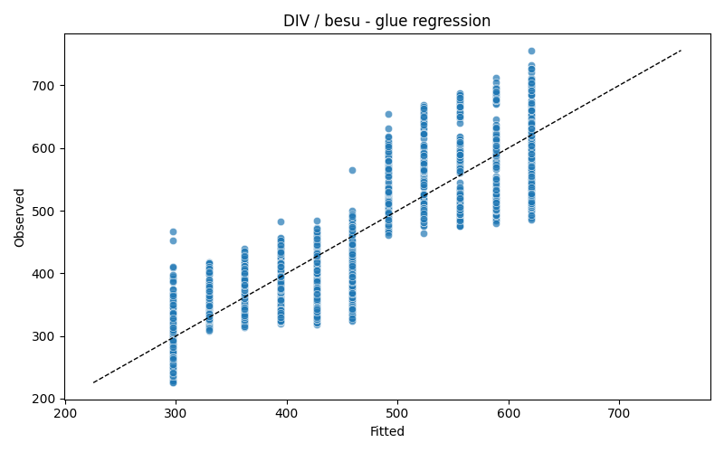

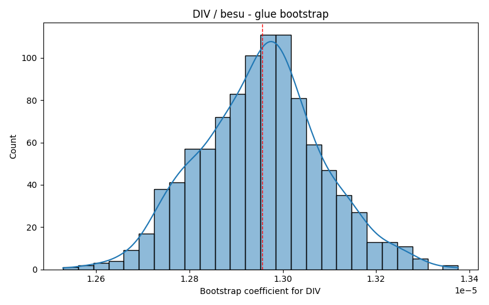

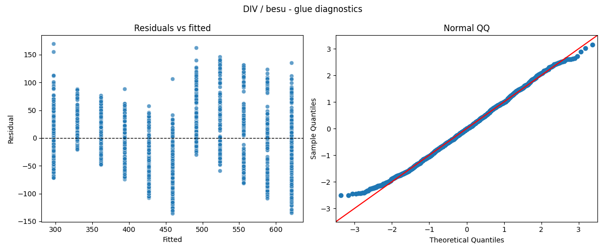

</details>

<details><summary><code>EXP</code> · nobs=2651 · runtime_ms=0.001037 · p=1.00e-03 · R²=0.7325</summary>

```
==============================================================================
                           NNLS Regression Results                            
==============================================================================
Dep. Variable:          test_runtime_ms              R-squared:          0.732
Model:                  NNLS                    Adj. R-squared:          0.732
No. Observations:       2651                              RMSE:          24.55
Df Residuals:           2649                               MAE:          19.11
Df Model:               1      
==============================================================================
                      coef     std err     P-value      [0.025      0.975]
------------------------------------------------------------------------------
         const     92.9176      1.9435       0.001     89.1947     96.9831
           EXP      0.0010      0.0000       0.001      0.0010      0.0011
==============================================================================
Notes: Non-negative least squares with bootstrap inference (1000 iterations)
==============================================================================
```

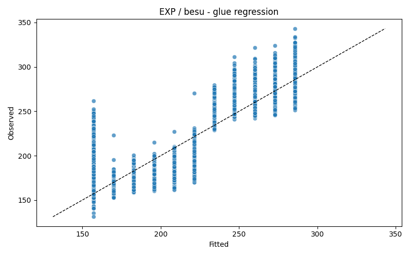

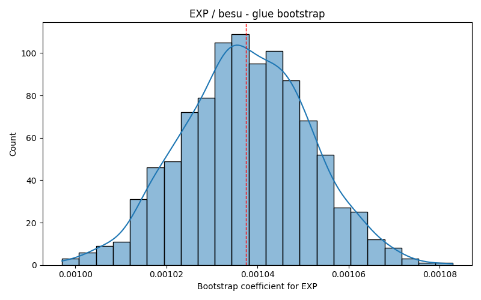

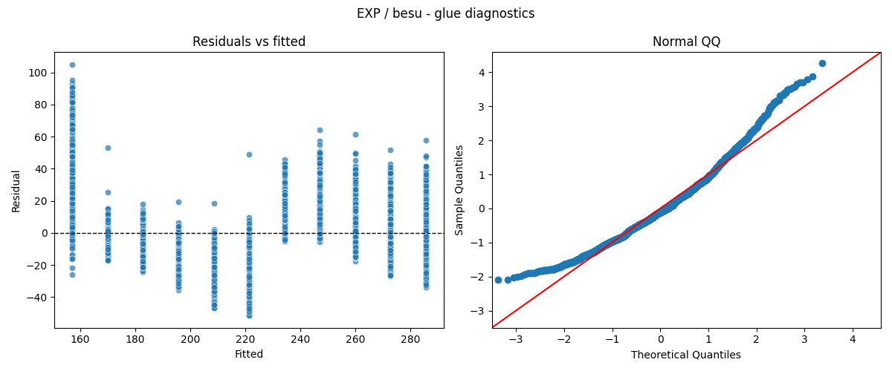

</details>

<details><summary><code>GT</code> · nobs=2651 · runtime_ms=2.001e-05 · p=1.00e-03 · R²=0.2156</summary>

```
==============================================================================
                           NNLS Regression Results                            
==============================================================================
Dep. Variable:          test_runtime_ms              R-squared:          0.216
Model:                  NNLS                    Adj. R-squared:          0.215
No. Observations:       2651                              RMSE:         401.66
Df Residuals:           2649                               MAE:         377.10
Df Model:               1      
==============================================================================
                      coef     std err     P-value      [0.025      0.975]
------------------------------------------------------------------------------
         const    137.3915     22.6704       0.001     93.8954    182.5720
            GT      0.0000      0.0000       0.001      0.0000      0.0000
==============================================================================
Notes: Non-negative least squares with bootstrap inference (1000 iterations)
==============================================================================
```

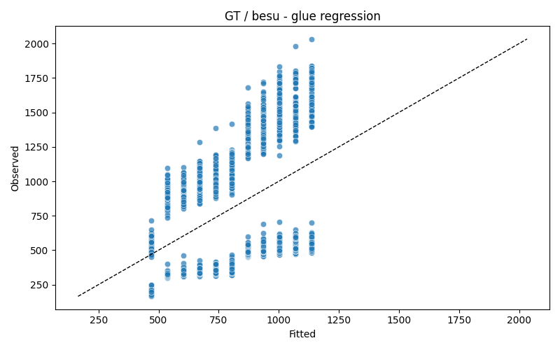

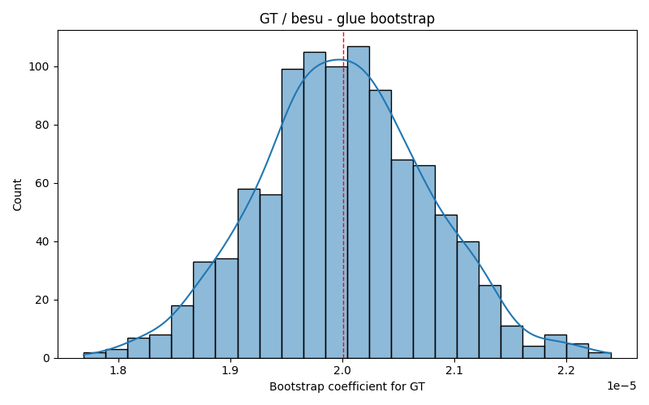

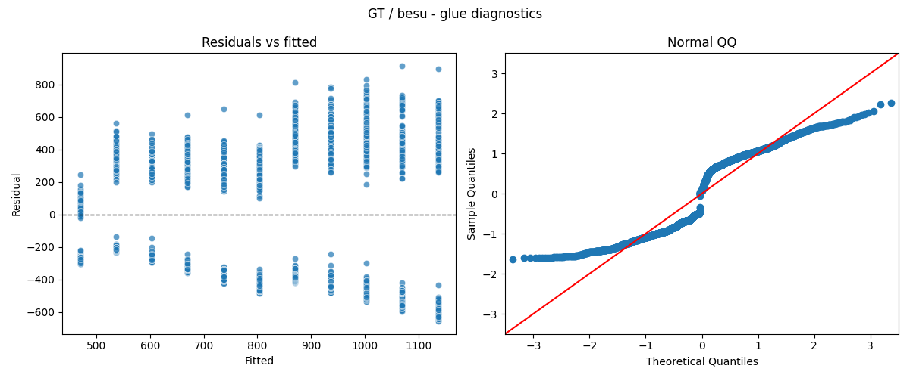

</details>

<details><summary><code>JUMPI</code> · nobs=2651 · runtime_ms=4.93e-06 · p=1.00e-03 · R²=0.7418</summary>

```
==============================================================================
                           NNLS Regression Results                            
==============================================================================
Dep. Variable:          test_runtime_ms              R-squared:          0.742
Model:                  NNLS                    Adj. R-squared:          0.742
No. Observations:       2651                              RMSE:          13.12
Df Residuals:           2649                               MAE:           9.97
Df Model:               1      
==============================================================================
                      coef     std err     P-value      [0.025      0.975]
------------------------------------------------------------------------------
         const     22.1581      0.8013       0.001     20.5760     23.8083
         JUMPI      0.0000      0.0000       0.001      0.0000      0.0000
==============================================================================
Notes: Non-negative least squares with bootstrap inference (1000 iterations)
==============================================================================
```

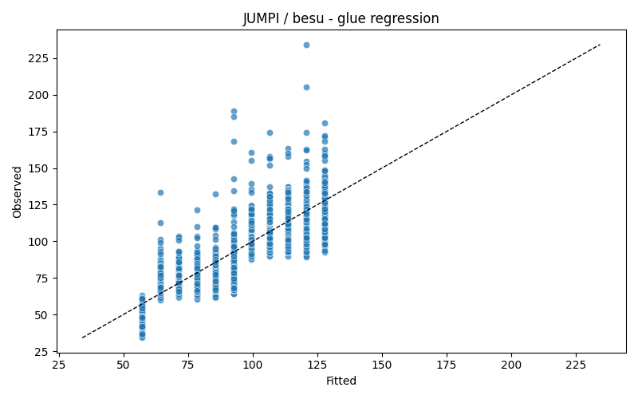

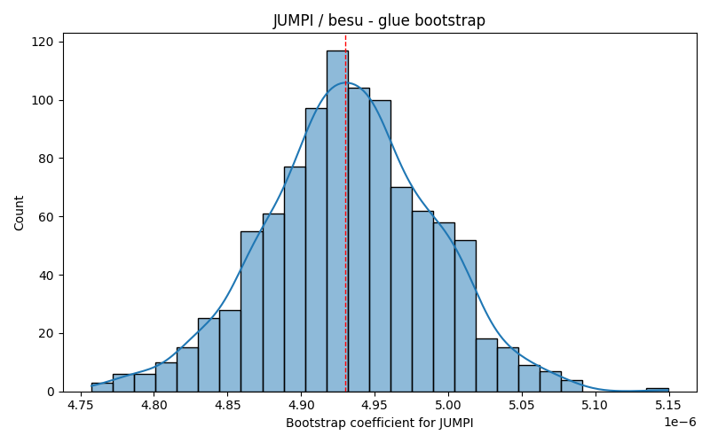

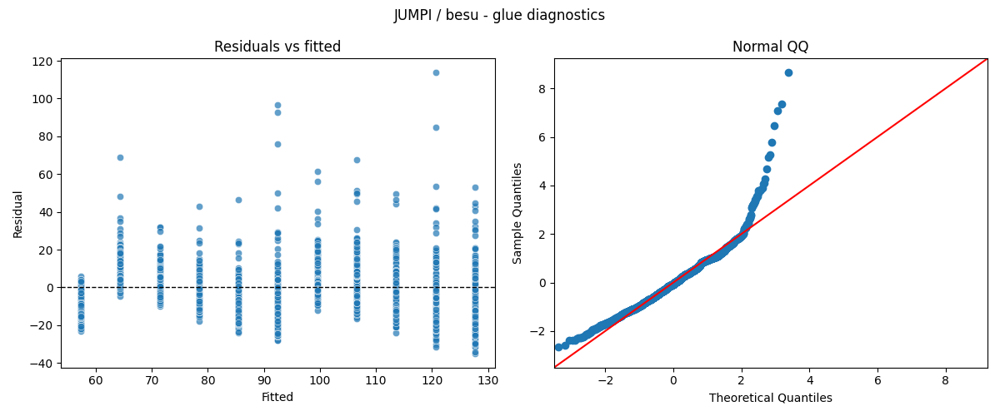

</details>

<details><summary><code>LT</code> · nobs=2651 · runtime_ms=2.031e-05 · p=1.00e-03 · R²=0.2147</summary>

```
==============================================================================
                           NNLS Regression Results                            
==============================================================================
Dep. Variable:          test_runtime_ms              R-squared:          0.215
Model:                  NNLS                    Adj. R-squared:          0.214
No. Observations:       2651                              RMSE:         408.80
Df Residuals:           2649                               MAE:         383.36
Df Model:               1      
==============================================================================
                      coef     std err     P-value      [0.025      0.975]
------------------------------------------------------------------------------
         const    171.1424     24.0474       0.001    124.2847    218.6915
            LT      0.0000      0.0000       0.001      0.0000      0.0000
==============================================================================
Notes: Non-negative least squares with bootstrap inference (1000 iterations)
==============================================================================
```

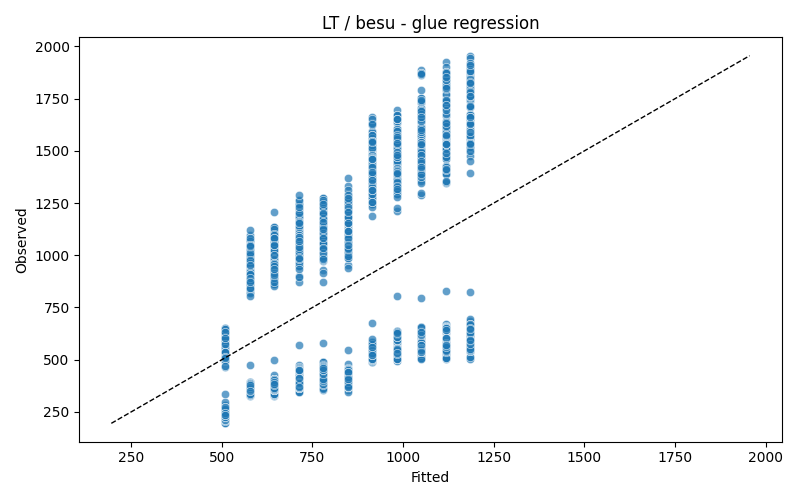

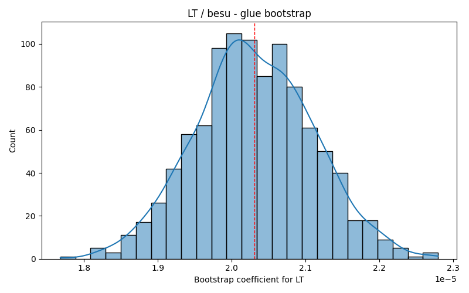

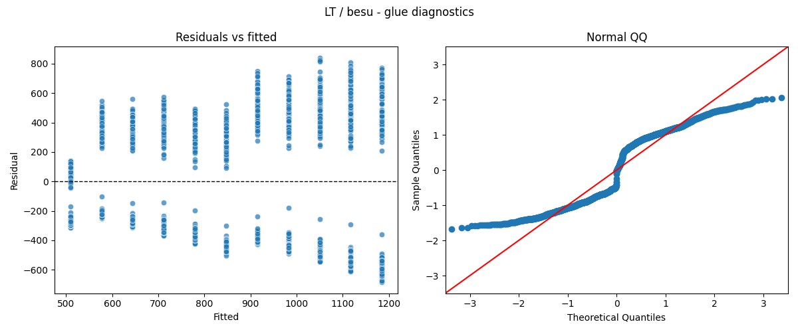

</details>

<details><summary><code>MSTORE</code> · nobs=13255 · runtime_ms=1.424e-05 · p=1.00e-03 · R²=0.7961</summary>

```
==============================================================================
                           NNLS Regression Results                            
==============================================================================
Dep. Variable:          test_runtime_ms              R-squared:          0.796
Model:                  NNLS                    Adj. R-squared:          0.796
No. Observations:       13255                             RMSE:          50.58
Df Residuals:           13253                              MAE:          41.24
Df Model:               1      
==============================================================================
                      coef     std err     P-value      [0.025      0.975]
------------------------------------------------------------------------------
         const     84.3056      1.4611       0.001     81.5375     87.3147
        MSTORE      0.0000      0.0000       0.001      0.0000      0.0000
==============================================================================
Notes: Non-negative least squares with bootstrap inference (1000 iterations)
==============================================================================
```

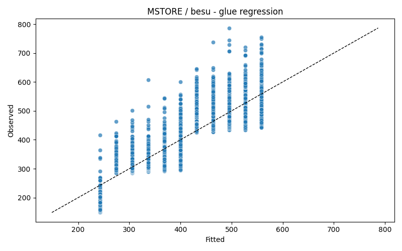

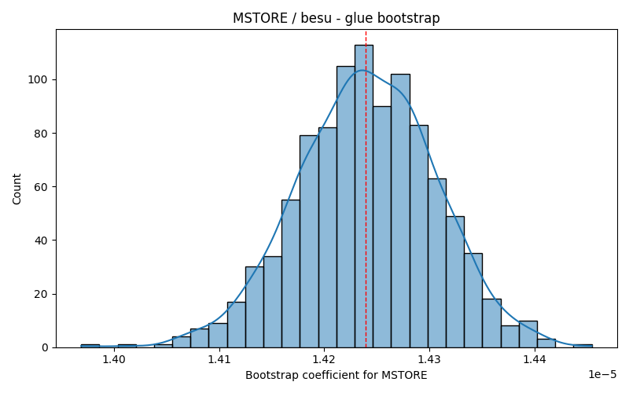

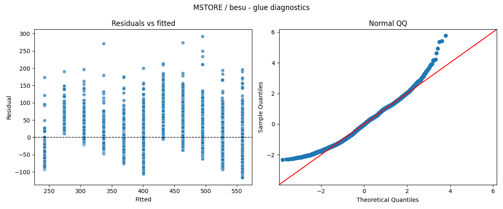

</details>

<details><summary><code>MSTORE8</code> · nobs=13255 · runtime_ms=8.842e-06 · p=1.00e-03 · R²=0.8371</summary>

```
==============================================================================
                           NNLS Regression Results                            
==============================================================================
Dep. Variable:          test_runtime_ms              R-squared:          0.837
Model:                  NNLS                    Adj. R-squared:          0.837
No. Observations:       13255                             RMSE:          27.37
Df Residuals:           13253                              MAE:          22.48
Df Model:               1      
==============================================================================
                      coef     std err     P-value      [0.025      0.975]
------------------------------------------------------------------------------
         const     51.9176      0.8258       0.001     50.2130     53.5202
       MSTORE8      0.0000      0.0000       0.001      0.0000      0.0000
==============================================================================
Notes: Non-negative least squares with bootstrap inference (1000 iterations)
==============================================================================
```

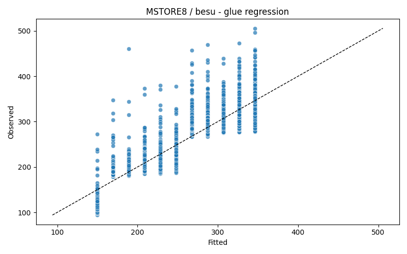

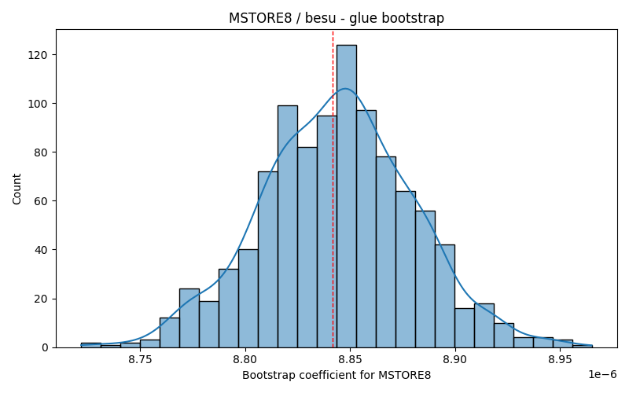

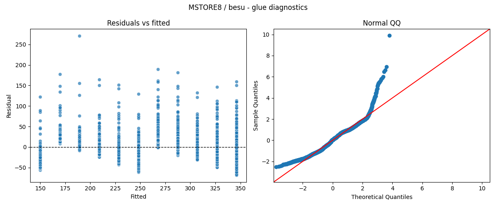

</details>

<details><summary><code>MUL</code> · nobs=2651 · runtime_ms=1.068e-05 · p=1.00e-03 · R²=0.7119</summary>

```
==============================================================================
                           NNLS Regression Results                            
==============================================================================
Dep. Variable:          test_runtime_ms              R-squared:          0.712
Model:                  NNLS                    Adj. R-squared:          0.712
No. Observations:       2651                              RMSE:          53.61
Df Residuals:           2649                               MAE:          40.42
Df Model:               1      
==============================================================================
                      coef     std err     P-value      [0.025      0.975]
------------------------------------------------------------------------------
         const    102.6501      2.8875       0.001     96.9684    108.3478
           MUL      0.0000      0.0000       0.001      0.0000      0.0000
==============================================================================
Notes: Non-negative least squares with bootstrap inference (1000 iterations)
==============================================================================
```

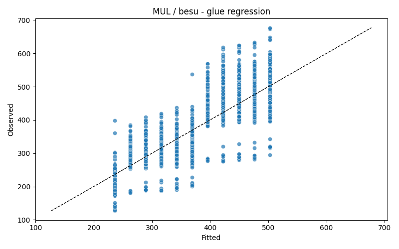

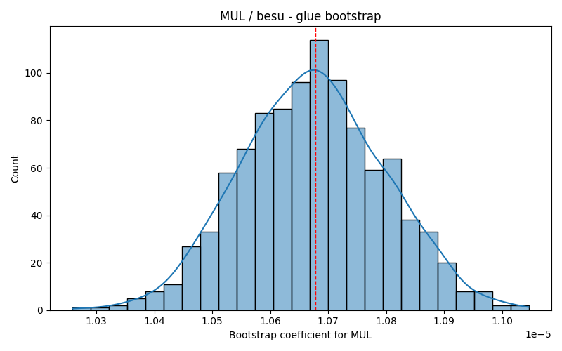

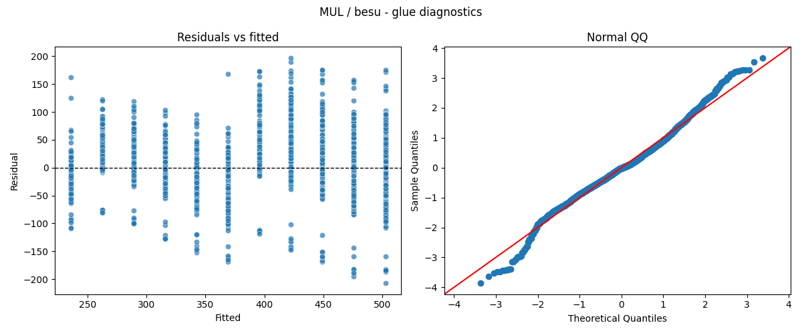

</details>

<details><summary><code>PC</code> · nobs=2651 · runtime_ms=2.789e-06 · p=1.00e-03 · R²=0.8439</summary>

```
==============================================================================
                           NNLS Regression Results                            
==============================================================================
Dep. Variable:          test_runtime_ms              R-squared:          0.844
Model:                  NNLS                    Adj. R-squared:          0.844
No. Observations:       2651                              RMSE:          35.87
Df Residuals:           2649                               MAE:          30.51
Df Model:               1      
==============================================================================
                      coef     std err     P-value      [0.025      0.975]
------------------------------------------------------------------------------
         const     70.7617      2.4933       0.001     65.6690     75.5165
            PC      0.0000      0.0000       0.001      0.0000      0.0000
==============================================================================
Notes: Non-negative least squares with bootstrap inference (1000 iterations)
==============================================================================
```

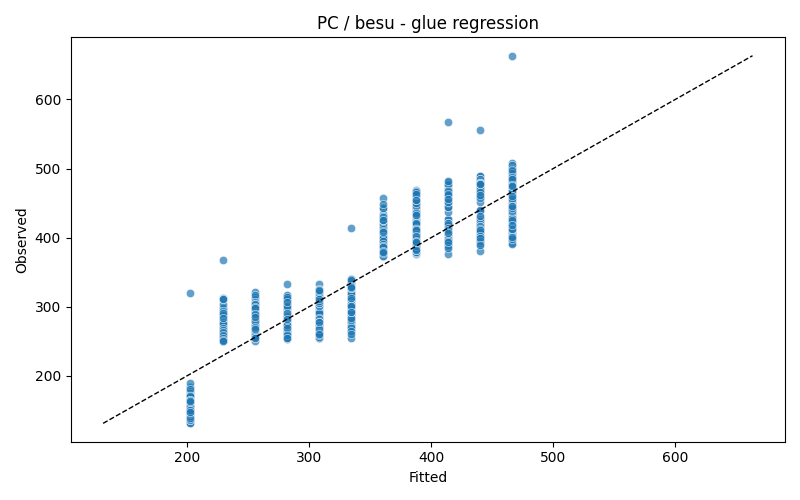

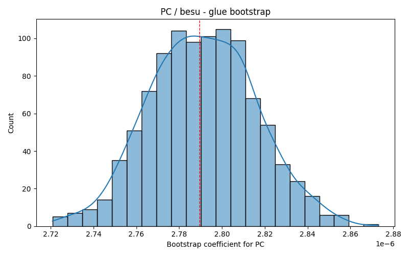

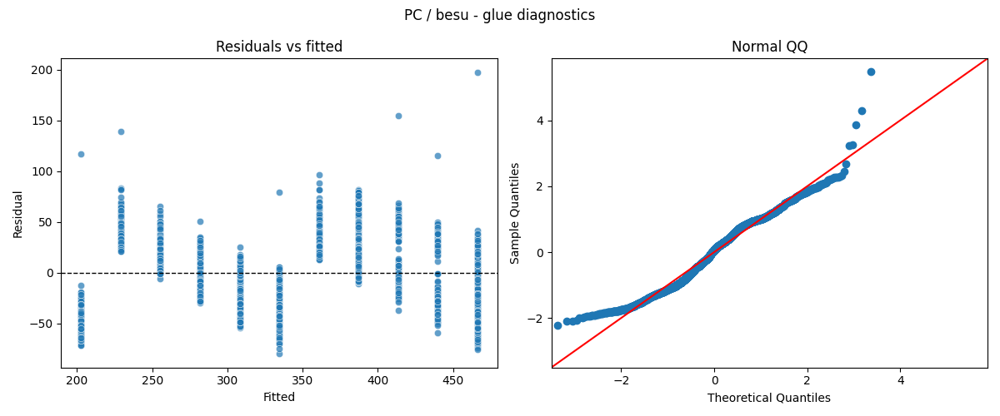

</details>

<details><summary><code>RETURNDATASIZE</code> · nobs=10604 · runtime_ms=4.106e-06 · p=1.00e-03 · R²=0.7872</summary>

```
==============================================================================
                           NNLS Regression Results                            
==============================================================================
Dep. Variable:          test_runtime_ms              R-squared:          0.787
Model:                  NNLS                    Adj. R-squared:          0.787
No. Observations:       10604                             RMSE:          33.70
Df Residuals:           10602                              MAE:          24.67
Df Model:               1      
==============================================================================
                      coef     std err     P-value      [0.025      0.975]
------------------------------------------------------------------------------
         const     53.4529      1.0195       0.001     51.4041     55.3994
RETURNDATASIZE      0.0000      0.0000       0.001      0.0000      0.0000
==============================================================================
Notes: Non-negative least squares with bootstrap inference (1000 iterations)
==============================================================================
```

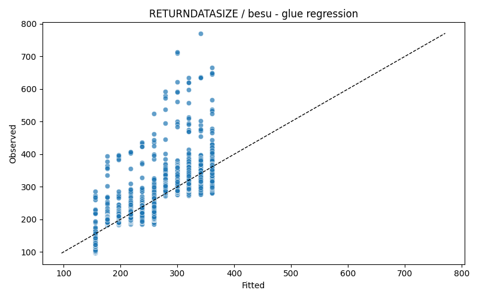

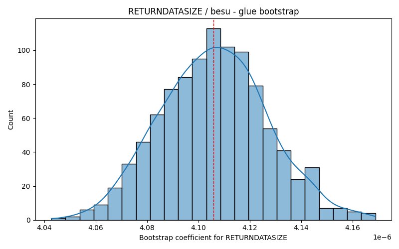

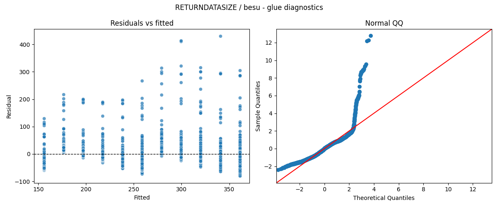

</details>

<details><summary><code>SELFBALANCE</code> · nobs=2169 · runtime_ms=1.006e-05 · p=1.00e-03 · R²=0.6912</summary>

```
==============================================================================
                           NNLS Regression Results                            
==============================================================================
Dep. Variable:          test_runtime_ms              R-squared:          0.691
Model:                  NNLS                    Adj. R-squared:          0.691
No. Observations:       2169                              RMSE:          67.80
Df Residuals:           2167                               MAE:          56.35
Df Model:               1      
==============================================================================
                      coef     std err     P-value      [0.025      0.975]
------------------------------------------------------------------------------
         const    217.7825      5.3704       0.001    206.6243    228.1741
   SELFBALANCE      0.0000      0.0000       0.001      0.0000      0.0000
==============================================================================
Notes: Non-negative least squares with bootstrap inference (1000 iterations)
==============================================================================
```

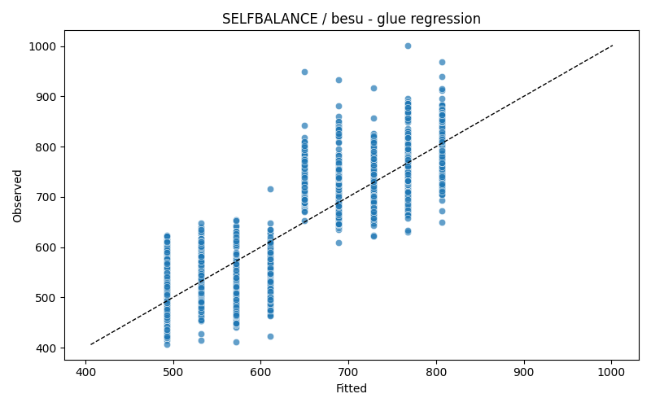

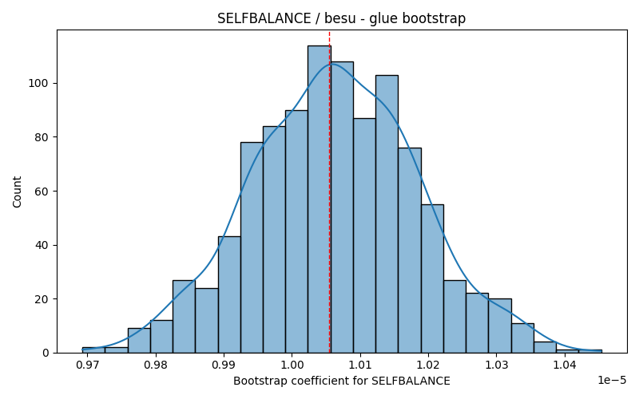

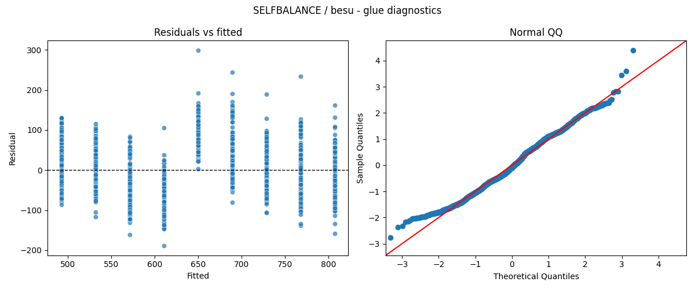

</details>

<details><summary><code>SUB</code> · nobs=2651 · runtime_ms=8.591e-06 · p=1.00e-03 · R²=0.8185</summary>

```
==============================================================================
                           NNLS Regression Results                            
==============================================================================
Dep. Variable:          test_runtime_ms              R-squared:          0.818
Model:                  NNLS                    Adj. R-squared:          0.818
No. Observations:       2651                              RMSE:          42.58
Df Residuals:           2649                               MAE:          34.93
Df Model:               1      
==============================================================================
                      coef     std err     P-value      [0.025      0.975]
------------------------------------------------------------------------------
         const     83.0429      2.7191       0.001     77.8293     88.3241
           SUB      0.0000      0.0000       0.001      0.0000      0.0000
==============================================================================
Notes: Non-negative least squares with bootstrap inference (1000 iterations)
==============================================================================
```

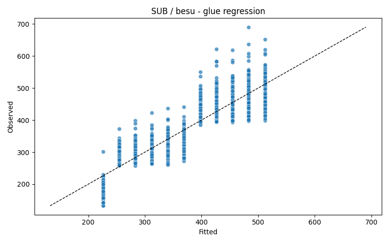

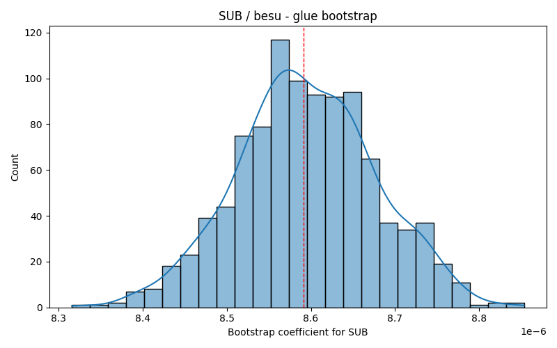

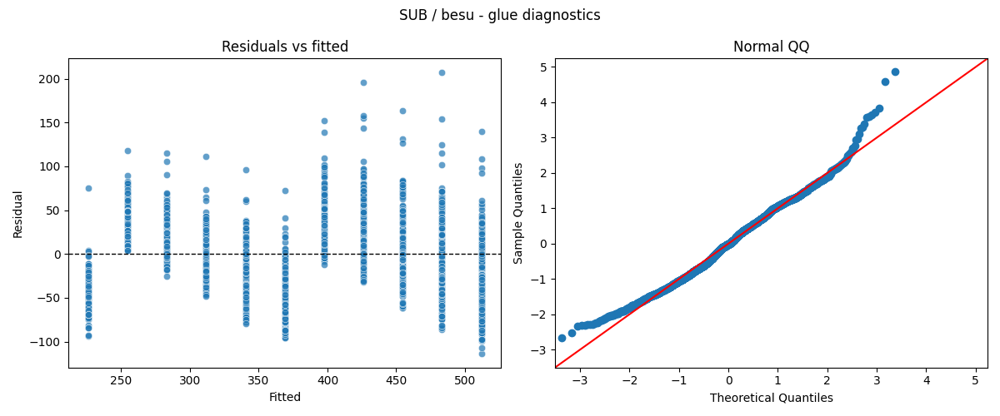

</details>

### Mixed glue (tier B) · besu

<details><summary><code>JUMP</code> · nobs=2651 · runtime_ms=4.127e-05 · p=1.00e-03 · R²=0.8388</summary>

```
==============================================================================
                           NNLS Regression Results                            
==============================================================================
Dep. Variable:          test_runtime_ms              R-squared:          0.839
Model:                  NNLS                    Adj. R-squared:          0.839
No. Observations:       2651                              RMSE:          67.23
Df Residuals:           2649                               MAE:          56.59
Df Model:               1      
==============================================================================
                      coef     std err     P-value      [0.025      0.975]
------------------------------------------------------------------------------
         const    126.3591      4.7664       0.001    117.0608    135.7323
          JUMP      0.0000      0.0000       0.001      0.0000      0.0000
==============================================================================
Notes: Non-negative least squares with bootstrap inference (1000 iterations)
==============================================================================
```

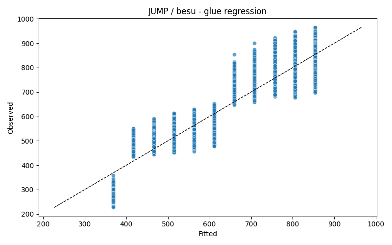

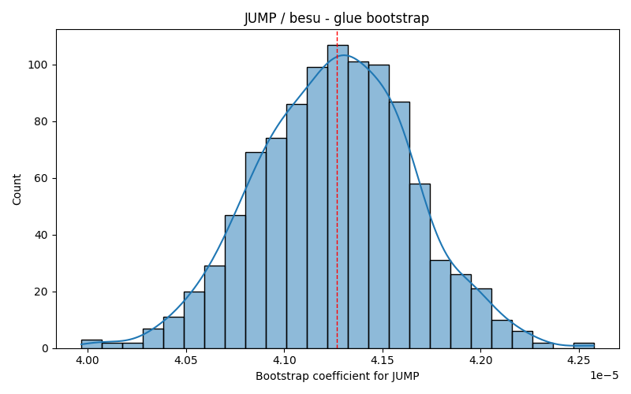

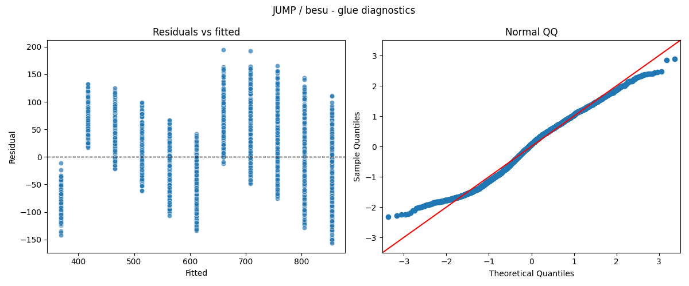

</details>

<details><summary><code>KECCAK256</code> · nobs=42416 · runtime_ms=3.572e-05 · p=1.00e-03 · R²=0.1443</summary>

```
==============================================================================
                           NNLS Regression Results                            
==============================================================================
Dep. Variable:          test_runtime_ms              R-squared:          0.144
Model:                  NNLS                    Adj. R-squared:          0.144
No. Observations:       42416                             RMSE:         172.84
Df Residuals:           42414                              MAE:         135.29
Df Model:               1      
==============================================================================
                      coef     std err     P-value      [0.025      0.975]
------------------------------------------------------------------------------
         const    530.8860      1.7999       0.001    527.0747    534.3921
     KECCAK256      0.0000      0.0000       0.001      0.0000      0.0000
==============================================================================
Notes: Non-negative least squares with bootstrap inference (1000 iterations)
==============================================================================
```

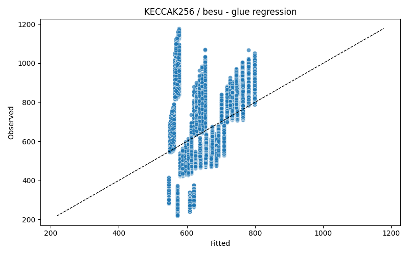

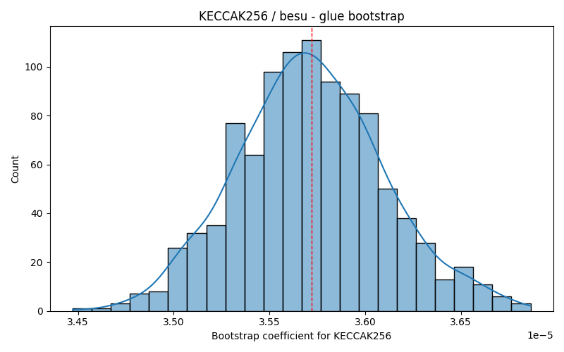

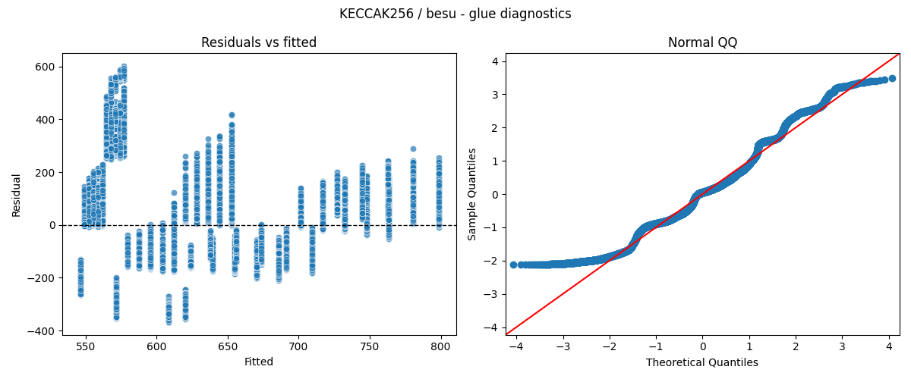

</details>

## erigon

| glue_opcode | nobs | glue_runtime_ms | p_value | rsquared |
| --- | --- | --- | --- | --- |
| `ISZERO` | 1188 | 1.008e-06 | 1.00e-03 | 0.8297 |
| `JUMPDEST` | 1188 | 7.855e-07 | 1.00e-03 | 0.8926 |
| `SWAP` | 19008 | 1.248e-06 | 1.00e-03 | 0.8416 |
| `CALLDATASIZE` | 70433 | 9.067e-07 | 1.00e-03 | 0.9094 |
| `DUP` | 70433 | 1.096e-06 | 1.00e-03 | 0.9094 |
| `GAS` | 70433 | 9.328e-07 | 1.00e-03 | 0.9094 |
| `MLOAD` | 70433 | 3.43e-06 | 1.00e-03 | 0.9094 |
| `PUSH` | 70433 | 2.808e-06 | 1.00e-03 | 0.9094 |
| `PUSH0` | 70433 | 9.491e-07 | 1.00e-03 | 0.9094 |
| `STATICCALL` | 70433 | 0.0004527 | 1.00e-03 | 0.9094 |
| `ADD` | 1188 | 2.822e-06 | 1.00e-03 | 0.8215 |
| `AND` | 1188 | 2.757e-06 | 1.00e-03 | 0.8366 |
| `CALLDATACOPY` | 28512 | 8.204e-06 | 1.00e-03 | 0.9579 |
| `CALLDATALOAD` | 4752 | 9.568e-06 | 2.84e-01 | 1.187e-05 |
| `DIV` | 1188 | 9.814e-06 | 1.00e-03 | 0.8849 |
| `EXP` | 1188 | 0.0003532 | 1.00e-03 | 0.9106 |
| `GT` | 1188 | 2.778e-06 | 1.00e-03 | 0.8563 |
| `JUMPI` | 1188 | 3.354e-06 | 1.00e-03 | 0.8591 |
| `LT` | 1188 | 2.699e-06 | 1.00e-03 | 0.758 |
| `MSTORE` | 5940 | 5.855e-06 | 1.00e-03 | 0.9019 |
| `MSTORE8` | 5940 | 5.235e-06 | 1.00e-03 | 0.8273 |
| `MUL` | 1188 | 3.389e-06 | 1.00e-03 | 0.9034 |
| `PC` | 1188 | 1.392e-06 | 1.00e-03 | 0.8633 |
| `RETURNDATASIZE` | 4752 | 1.831e-06 | 1.00e-03 | 0.7479 |
| `SELFBALANCE` | 972 | 1.425e-06 | 1.00e-03 | 0.7412 |
| `SUB` | 1188 | 2.782e-06 | 1.00e-03 | 0.8435 |
| `JUMP` | 1188 | 7.22e-06 | 1.00e-03 | 0.8707 |
| `KECCAK256` | 19008 | 2.119e-05 | 1.00e-03 | 0.09376 |

### Cycle glue — joint fit · erigon

<details><summary>Joint NNLS regression summary</summary>

```
==============================================================================
                           NNLS Regression Results                            
==============================================================================
Dep. Variable:          test_runtime_ms              R-squared:          0.909
Model:                  NNLS                    Adj. R-squared:          0.909
No. Observations:       70433                             RMSE:          27.40
Df Residuals:           70425                              MAE:          16.51
Df Model:               7      
==============================================================================
                      coef     std err     P-value      [0.025      0.975]
------------------------------------------------------------------------------
         const     27.6741      0.3249       0.001     27.0388     28.3318
  CALLDATASIZE      0.0000      0.0000       0.001      0.0000      0.0000
           DUP      0.0000      0.0000       0.001      0.0000      0.0000
           GAS      0.0000      0.0000       0.001      0.0000      0.0000
         MLOAD      0.0000      0.0000       0.001      0.0000      0.0000
          PUSH      0.0000      0.0000       0.001      0.0000      0.0000
         PUSH0      0.0000      0.0000       0.001      0.0000      0.0000
    STATICCALL      0.0005      0.0000       0.001      0.0004      0.0005
==============================================================================
Notes: Non-negative least squares with bootstrap inference (1000 iterations)
==============================================================================
```

</details>

<details><summary><code>CALLDATASIZE</code> · nobs=70433 · runtime_ms=9.067e-07 · p=1.00e-03 · R²=0.9094</summary>


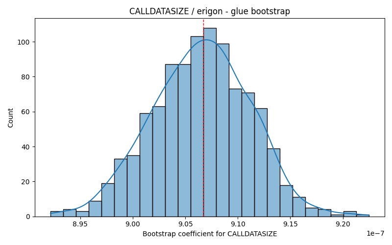

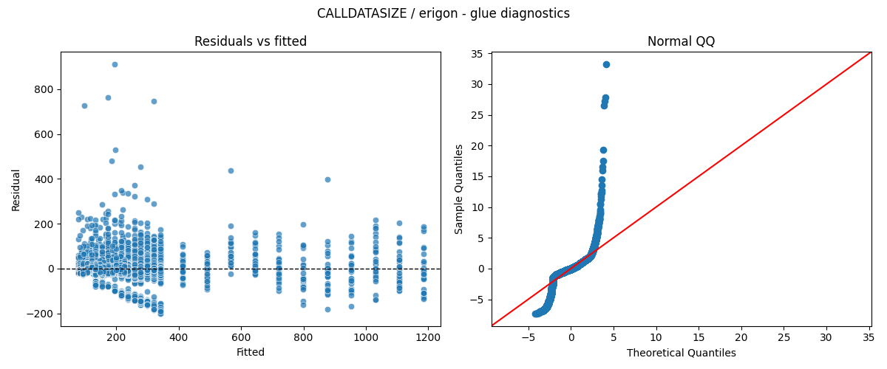

</details>

<details><summary><code>DUP</code> · nobs=70433 · runtime_ms=1.096e-06 · p=1.00e-03 · R²=0.9094</summary>


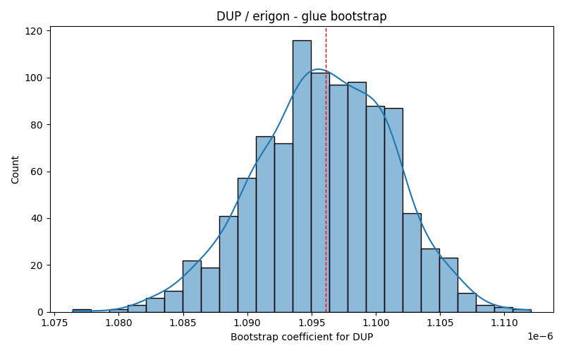


</details>

<details><summary><code>GAS</code> · nobs=70433 · runtime_ms=9.328e-07 · p=1.00e-03 · R²=0.9094</summary>

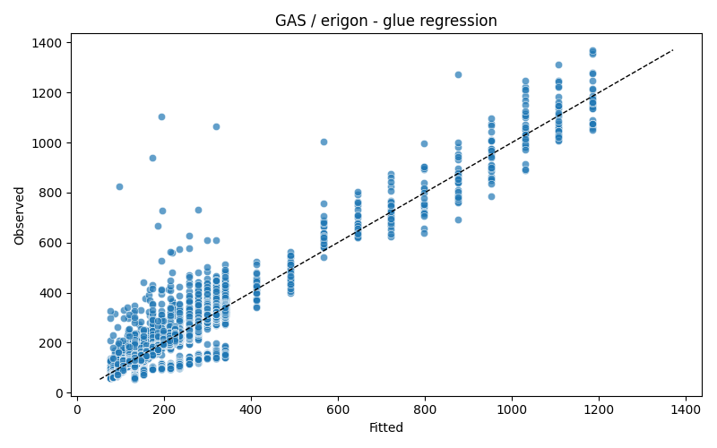

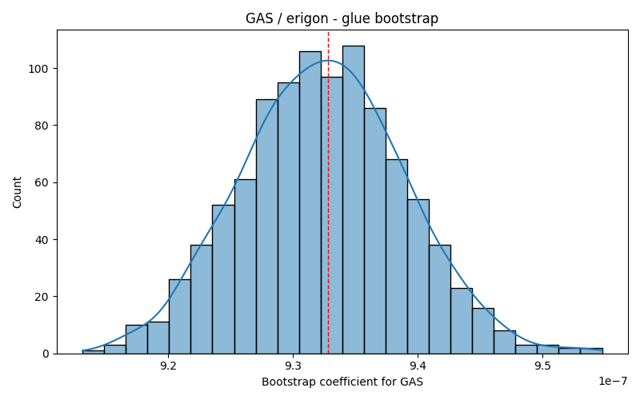


</details>

<details><summary><code>MLOAD</code> · nobs=70433 · runtime_ms=3.43e-06 · p=1.00e-03 · R²=0.9094</summary>


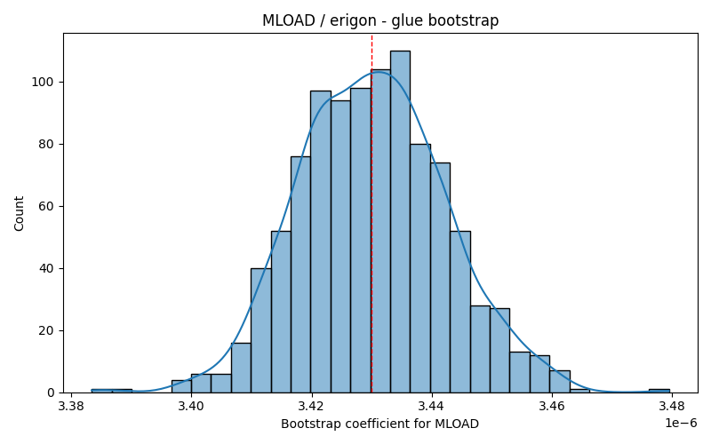


</details>

<details><summary><code>PUSH</code> · nobs=70433 · runtime_ms=2.808e-06 · p=1.00e-03 · R²=0.9094</summary>


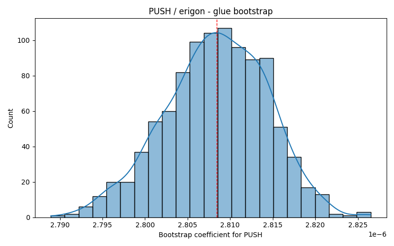


</details>

<details><summary><code>PUSH0</code> · nobs=70433 · runtime_ms=9.491e-07 · p=1.00e-03 · R²=0.9094</summary>

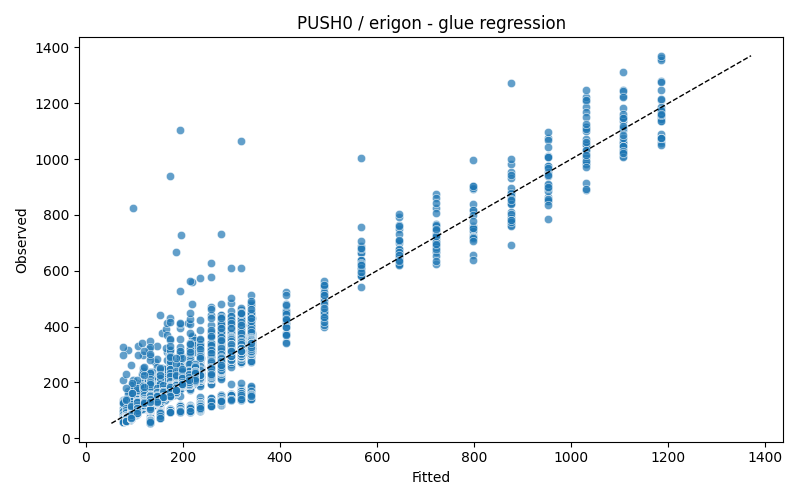

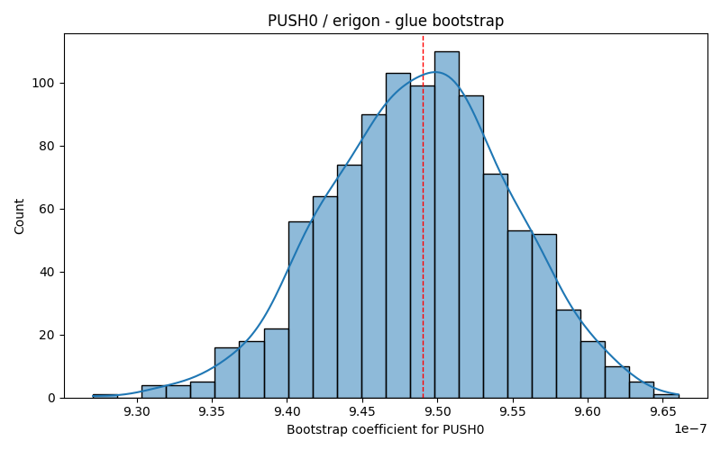


</details>

<details><summary><code>STATICCALL</code> · nobs=70433 · runtime_ms=0.0004527 · p=1.00e-03 · R²=0.9094</summary>

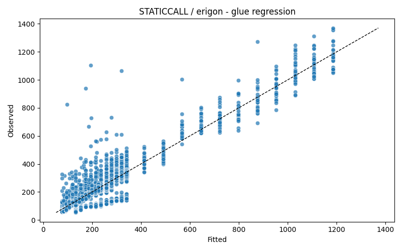

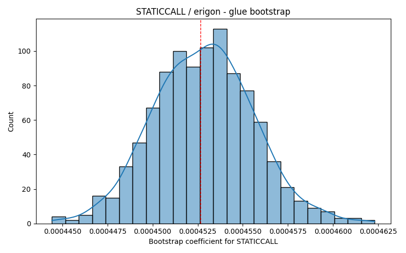


</details>

### Pure glue · erigon

<details><summary><code>ISZERO</code> · nobs=1188 · runtime_ms=1.008e-06 · p=1.00e-03 · R²=0.8297</summary>

```
==============================================================================
                           NNLS Regression Results                            
==============================================================================
Dep. Variable:          test_runtime_ms              R-squared:          0.830
Model:                  NNLS                    Adj. R-squared:          0.830
No. Observations:       1188                              RMSE:           9.61
Df Residuals:           1186                               MAE:           5.56
Df Model:               1      
==============================================================================
                      coef     std err     P-value      [0.025      0.975]
------------------------------------------------------------------------------
         const     17.8220      0.7851       0.001     16.2676     19.4095
        ISZERO      0.0000      0.0000       0.001      0.0000      0.0000
==============================================================================
Notes: Non-negative least squares with bootstrap inference (1000 iterations)
==============================================================================
```

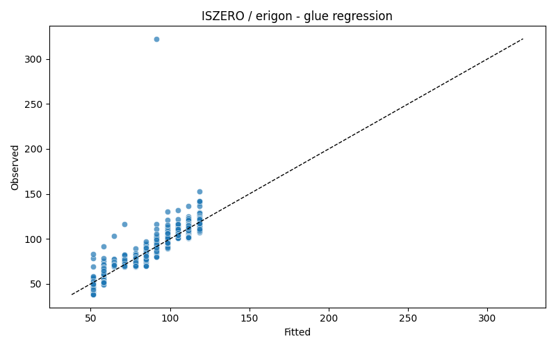

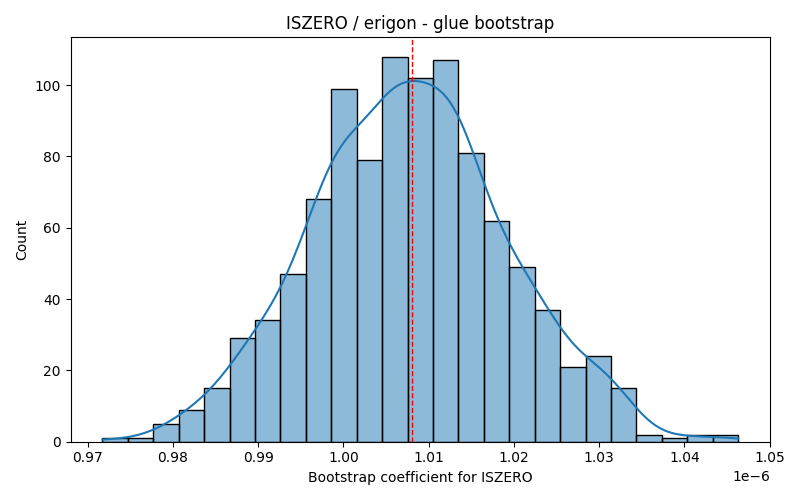

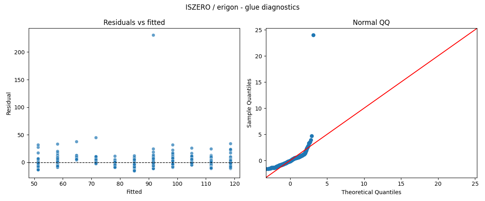

</details>

<details><summary><code>JUMPDEST</code> · nobs=1188 · runtime_ms=7.855e-07 · p=1.00e-03 · R²=0.8926</summary>

```
==============================================================================
                           NNLS Regression Results                            
==============================================================================
Dep. Variable:          test_runtime_ms              R-squared:          0.893
Model:                  NNLS                    Adj. R-squared:          0.892
No. Observations:       1188                              RMSE:          17.21
Df Residuals:           1186                               MAE:          13.49
Df Model:               1      
==============================================================================
                      coef     std err     P-value      [0.025      0.975]
------------------------------------------------------------------------------
         const     22.0449      1.6843       0.001     18.7929     25.4466
      JUMPDEST      0.0000      0.0000       0.001      0.0000      0.0000
==============================================================================
Notes: Non-negative least squares with bootstrap inference (1000 iterations)
==============================================================================
```

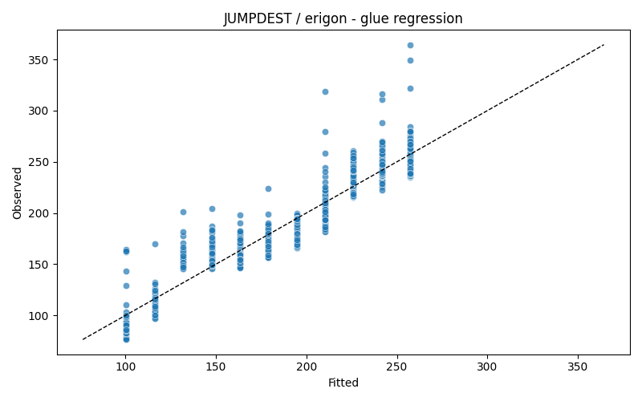

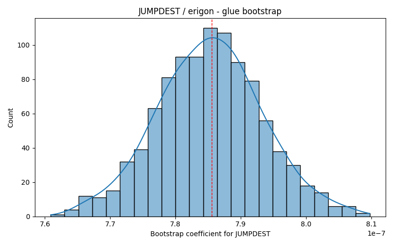

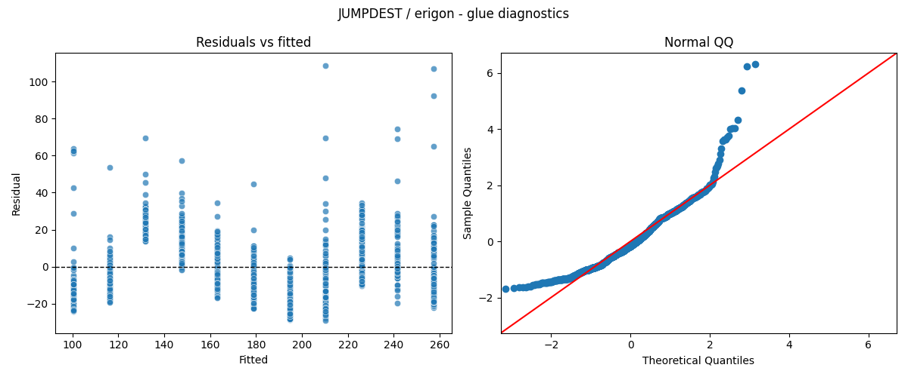

</details>

<details><summary><code>SWAP</code> · nobs=19008 · runtime_ms=1.248e-06 · p=1.00e-03 · R²=0.8416</summary>

```
==============================================================================
                           NNLS Regression Results                            
==============================================================================
Dep. Variable:          test_runtime_ms              R-squared:          0.842
Model:                  NNLS                    Adj. R-squared:          0.842
No. Observations:       19008                             RMSE:          11.40
Df Residuals:           19006                              MAE:           6.75
Df Model:               1      
==============================================================================
                      coef     std err     P-value      [0.025      0.975]
------------------------------------------------------------------------------
         const     23.8877      0.2907       0.001     23.3296     24.4603
          SWAP      0.0000      0.0000       0.001      0.0000      0.0000
==============================================================================
Notes: Non-negative least squares with bootstrap inference (1000 iterations)
==============================================================================
```

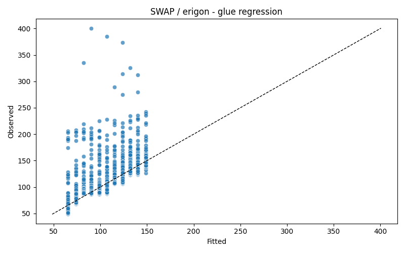

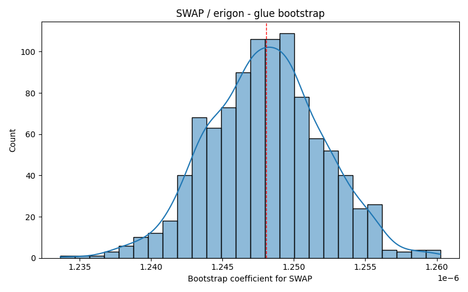

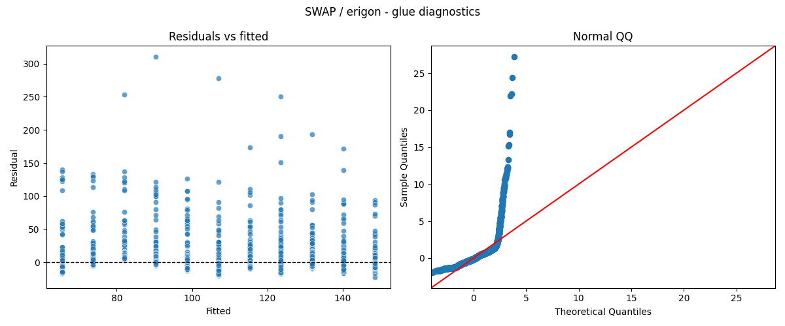

</details>

### Mixed glue (tier A) · erigon

<details><summary><code>ADD</code> · nobs=1188 · runtime_ms=2.822e-06 · p=1.00e-03 · R²=0.8215</summary>

```
==============================================================================
                           NNLS Regression Results                            
==============================================================================
Dep. Variable:          test_runtime_ms              R-squared:          0.821
Model:                  NNLS                    Adj. R-squared:          0.821
No. Observations:       1188                              RMSE:          13.84
Df Residuals:           1186                               MAE:           8.77
Df Model:               1      
==============================================================================
                      coef     std err     P-value      [0.025      0.975]
------------------------------------------------------------------------------
         const     16.9823      1.5105       0.001     14.0333     20.1034
           ADD      0.0000      0.0000       0.001      0.0000      0.0000
==============================================================================
Notes: Non-negative least squares with bootstrap inference (1000 iterations)
==============================================================================
```

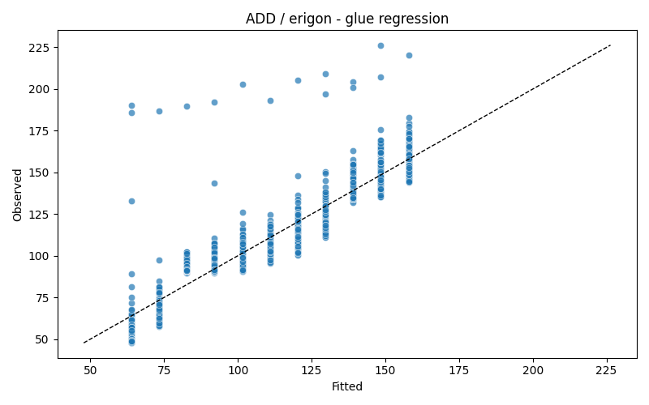

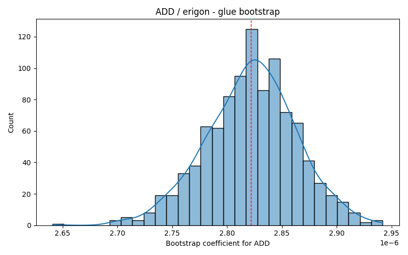

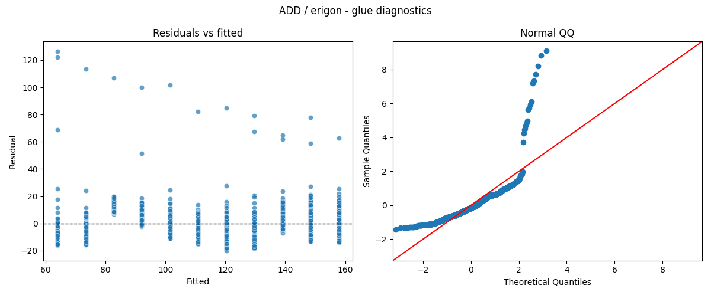

</details>

<details><summary><code>AND</code> · nobs=1188 · runtime_ms=2.757e-06 · p=1.00e-03 · R²=0.8366</summary>

```
==============================================================================
                           NNLS Regression Results                            
==============================================================================
Dep. Variable:          test_runtime_ms              R-squared:          0.837
Model:                  NNLS                    Adj. R-squared:          0.837
No. Observations:       1188                              RMSE:          12.82
Df Residuals:           1186                               MAE:           8.37
Df Model:               1      
==============================================================================
                      coef     std err     P-value      [0.025      0.975]
------------------------------------------------------------------------------
         const     16.9598      1.3089       0.001     14.4604     19.7236
           AND      0.0000      0.0000       0.001      0.0000      0.0000
==============================================================================
Notes: Non-negative least squares with bootstrap inference (1000 iterations)
==============================================================================
```

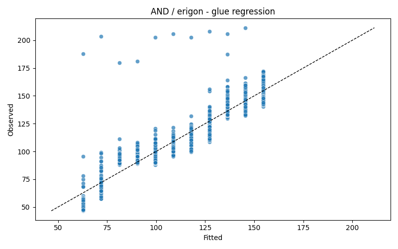

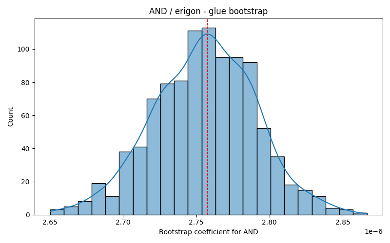

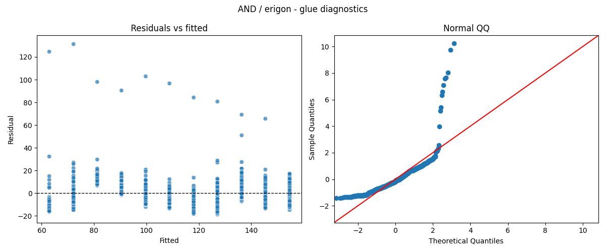

</details>

<details><summary><code>CALLDATACOPY</code> · nobs=28512 · runtime_ms=8.204e-06 · p=1.00e-03 · R²=0.9579</summary>

```
==============================================================================
                           NNLS Regression Results                            
==============================================================================
Dep. Variable:          test_runtime_ms              R-squared:          0.958
Model:                  NNLS                    Adj. R-squared:          0.958
No. Observations:       28512                             RMSE:          12.94
Df Residuals:           28510                              MAE:           9.41
Df Model:               1      
==============================================================================
                      coef     std err     P-value      [0.025      0.975]
------------------------------------------------------------------------------
         const     18.4445      0.0887       0.001     18.2642     18.6157
  CALLDATACOPY      0.0000      0.0000       0.001      0.0000      0.0000
==============================================================================
Notes: Non-negative least squares with bootstrap inference (1000 iterations)
==============================================================================
```

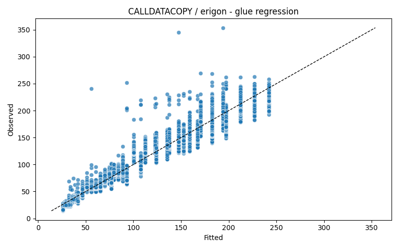

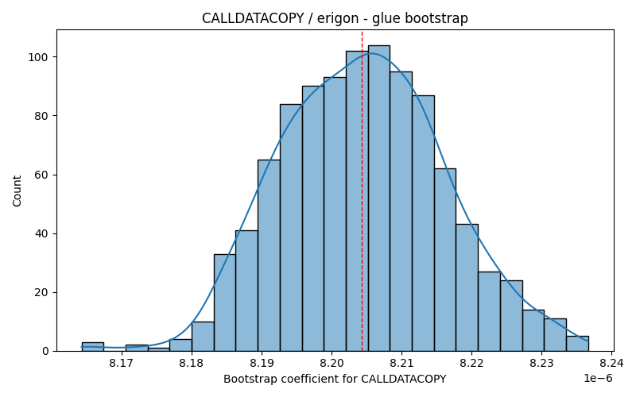

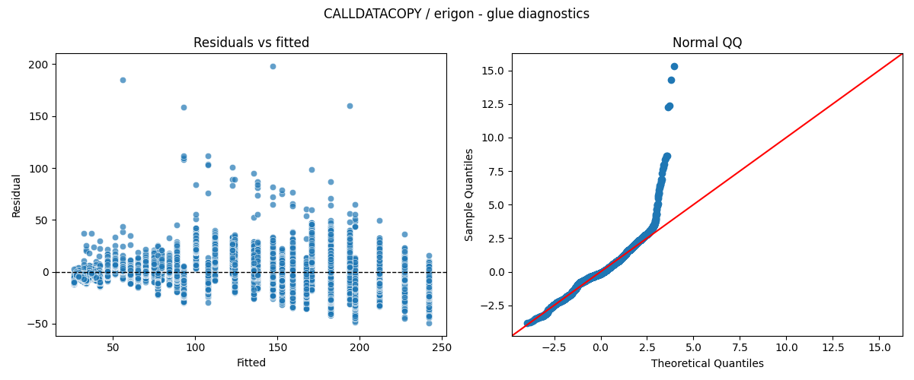

</details>

<details><summary><code>CALLDATALOAD</code> · nobs=4752 · runtime_ms=9.568e-06 · p=2.84e-01 · R²=1.187e-05</summary>

```
==============================================================================
                           NNLS Regression Results                            
==============================================================================
Dep. Variable:          test_runtime_ms              R-squared:          0.000
Model:                  NNLS                    Adj. R-squared:         -0.000
No. Observations:       4752                              RMSE:          10.66
Df Residuals:           4750                               MAE:           0.95
Df Model:               1      
==============================================================================
                      coef     std err     P-value      [0.025      0.975]
------------------------------------------------------------------------------
         const      6.7992      0.3364       0.001      6.1927      7.2699
  CALLDATALOAD      0.0000      0.0000       0.284      0.0000      0.0000
==============================================================================
Notes: Non-negative least squares with bootstrap inference (1000 iterations)
==============================================================================
```

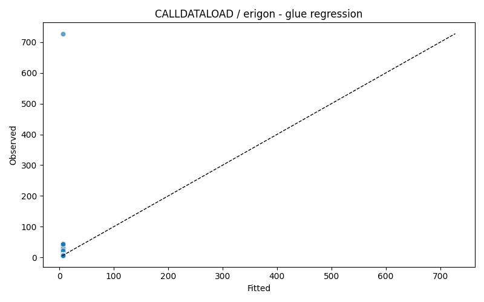

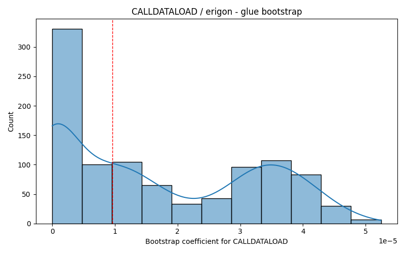

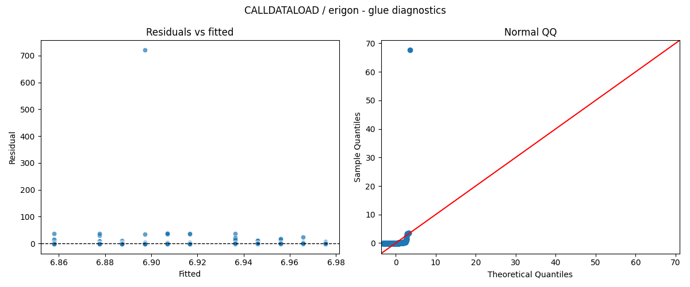

</details>

<details><summary><code>DIV</code> · nobs=1188 · runtime_ms=9.814e-06 · p=1.00e-03 · R²=0.8849</summary>

```
==============================================================================
                           NNLS Regression Results                            
==============================================================================
Dep. Variable:          test_runtime_ms              R-squared:          0.885
Model:                  NNLS                    Adj. R-squared:          0.885
No. Observations:       1188                              RMSE:          27.95
Df Residuals:           1186                               MAE:          23.62
Df Model:               1      
==============================================================================
                      coef     std err     P-value      [0.025      0.975]
------------------------------------------------------------------------------
         const     22.3944      2.6064       0.001     17.2695     27.2938
           DIV      0.0000      0.0000       0.001      0.0000      0.0000
==============================================================================
Notes: Non-negative least squares with bootstrap inference (1000 iterations)
==============================================================================
```

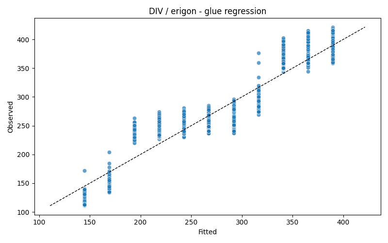

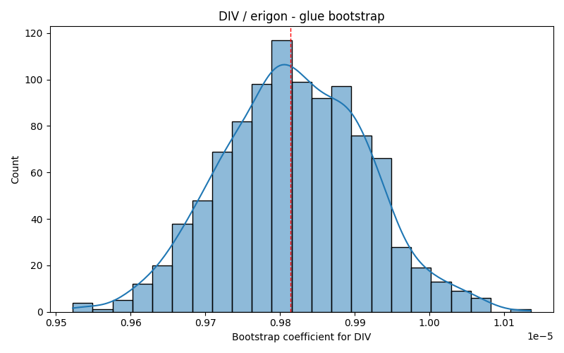

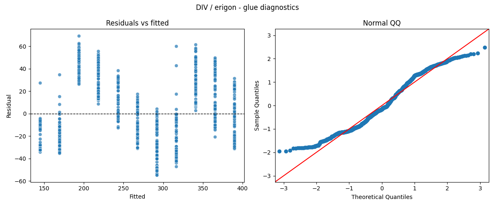

</details>

<details><summary><code>EXP</code> · nobs=1188 · runtime_ms=0.0003532 · p=1.00e-03 · R²=0.9106</summary>

```
==============================================================================
                           NNLS Regression Results                            
==============================================================================
Dep. Variable:          test_runtime_ms              R-squared:          0.911
Model:                  NNLS                    Adj. R-squared:          0.911
No. Observations:       1188                              RMSE:           4.33
Df Residuals:           1186                               MAE:           3.64
Df Model:               1      
==============================================================================
                      coef     std err     P-value      [0.025      0.975]
------------------------------------------------------------------------------
         const     11.4499      0.4654       0.001     10.5283     12.3260
           EXP      0.0004      0.0000       0.001      0.0003      0.0004
==============================================================================
Notes: Non-negative least squares with bootstrap inference (1000 iterations)
==============================================================================
```

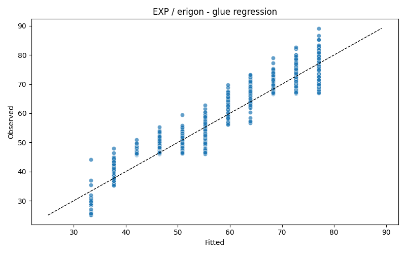

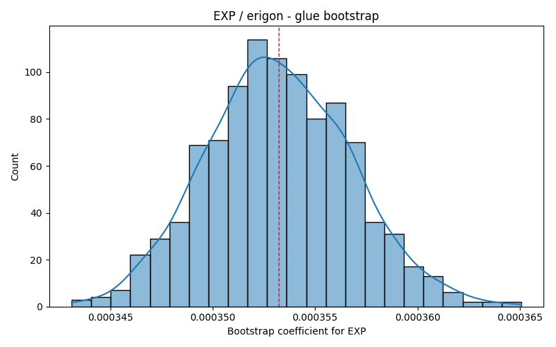

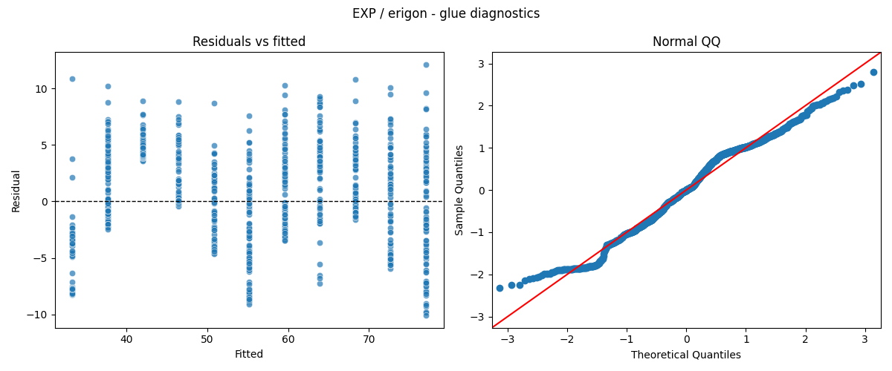

</details>

<details><summary><code>GT</code> · nobs=1188 · runtime_ms=2.778e-06 · p=1.00e-03 · R²=0.8563</summary>

```
==============================================================================
                           NNLS Regression Results                            
==============================================================================
Dep. Variable:          test_runtime_ms              R-squared:          0.856
Model:                  NNLS                    Adj. R-squared:          0.856
No. Observations:       1188                              RMSE:          11.98
Df Residuals:           1186                               MAE:           7.85
Df Model:               1      
==============================================================================
                      coef     std err     P-value      [0.025      0.975]
------------------------------------------------------------------------------
         const     19.9936      1.2141       0.001     17.8453     22.4499
            GT      0.0000      0.0000       0.001      0.0000      0.0000
==============================================================================
Notes: Non-negative least squares with bootstrap inference (1000 iterations)
==============================================================================
```

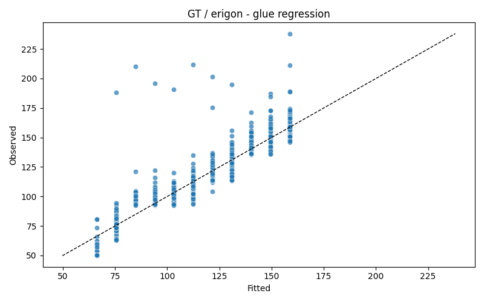

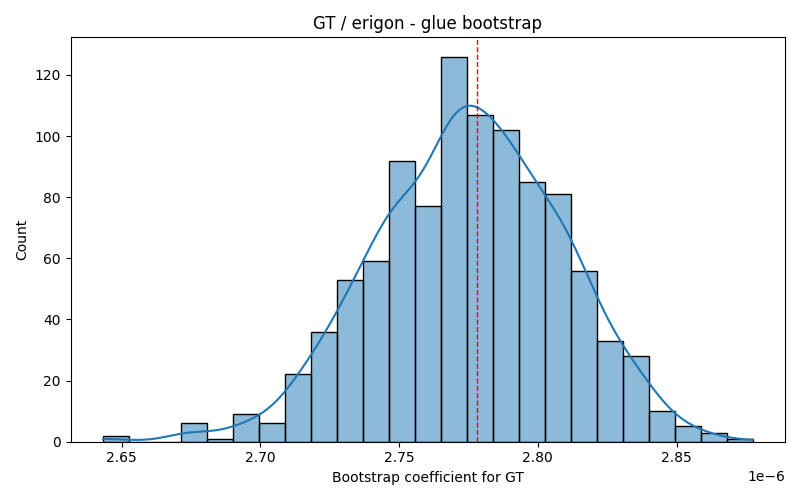

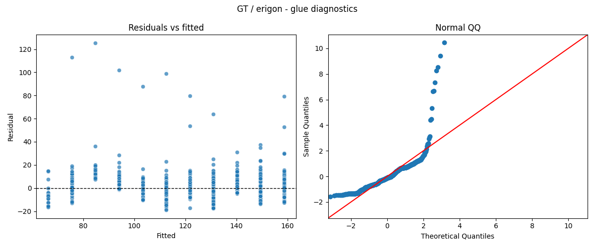

</details>

<details><summary><code>JUMPI</code> · nobs=1188 · runtime_ms=3.354e-06 · p=1.00e-03 · R²=0.8591</summary>

```
==============================================================================
                           NNLS Regression Results                            
==============================================================================
Dep. Variable:          test_runtime_ms              R-squared:          0.859
Model:                  NNLS                    Adj. R-squared:          0.859
No. Observations:       1188                              RMSE:           6.13
Df Residuals:           1186                               MAE:           4.87
Df Model:               1      
==============================================================================
                      coef     std err     P-value      [0.025      0.975]
------------------------------------------------------------------------------
         const     17.7956      0.6386       0.001     16.5961     19.0341
         JUMPI      0.0000      0.0000       0.001      0.0000      0.0000
==============================================================================
Notes: Non-negative least squares with bootstrap inference (1000 iterations)
==============================================================================
```

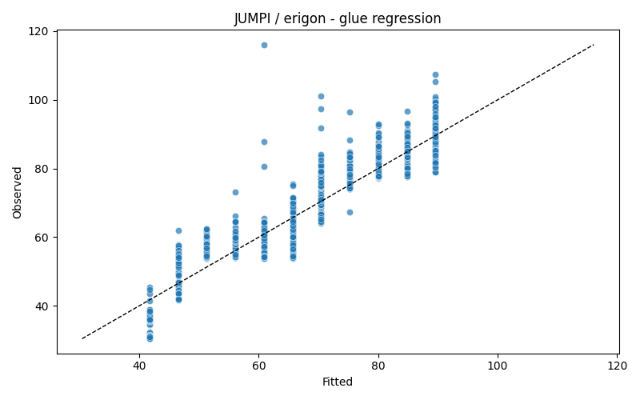

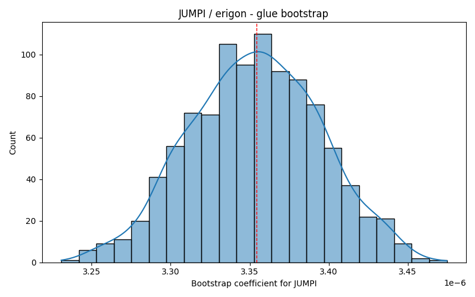

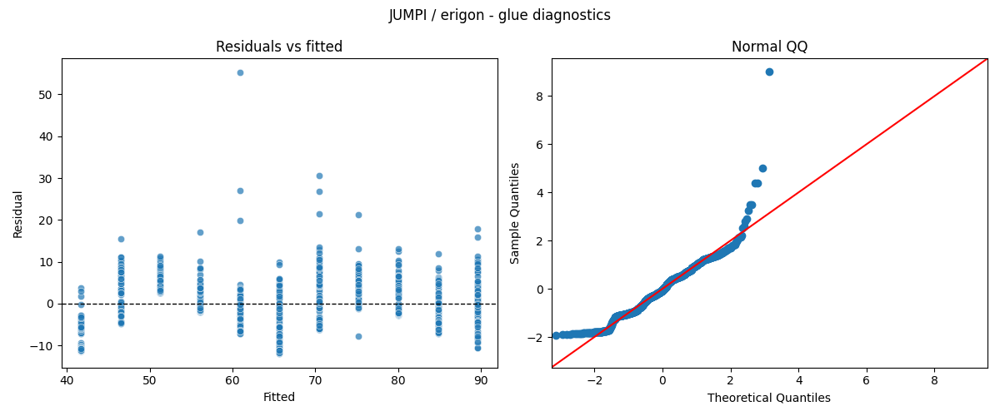

</details>

<details><summary><code>LT</code> · nobs=1188 · runtime_ms=2.699e-06 · p=1.00e-03 · R²=0.758</summary>

```
==============================================================================
                           NNLS Regression Results                            
==============================================================================
Dep. Variable:          test_runtime_ms              R-squared:          0.758
Model:                  NNLS                    Adj. R-squared:          0.758
No. Observations:       1188                              RMSE:          16.05
Df Residuals:           1186                               MAE:           8.00
Df Model:               1      
==============================================================================
                      coef     std err     P-value      [0.025      0.975]
------------------------------------------------------------------------------
         const     23.4145      2.2958       0.001     19.7654     28.6845
            LT      0.0000      0.0000       0.001      0.0000      0.0000
==============================================================================
Notes: Non-negative least squares with bootstrap inference (1000 iterations)
==============================================================================
```

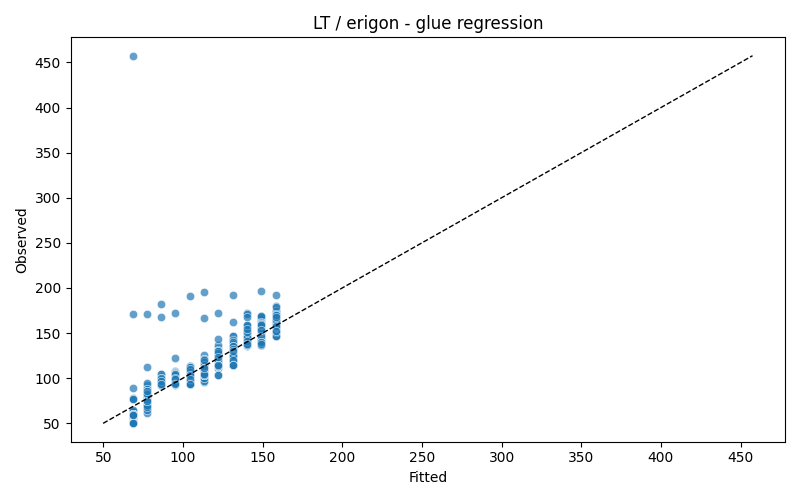

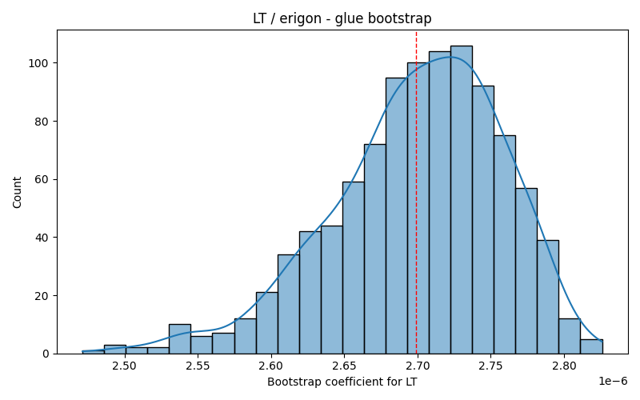

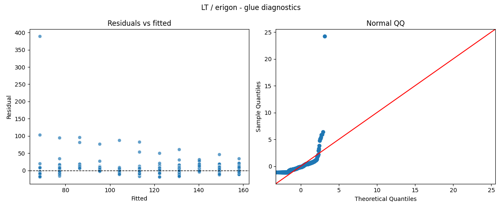

</details>

<details><summary><code>MSTORE</code> · nobs=5940 · runtime_ms=5.855e-06 · p=1.00e-03 · R²=0.9019</summary>

```
==============================================================================
                           NNLS Regression Results                            
==============================================================================
Dep. Variable:          test_runtime_ms              R-squared:          0.902
Model:                  NNLS                    Adj. R-squared:          0.902
No. Observations:       5940                              RMSE:          13.55
Df Residuals:           5938                               MAE:          10.15
Df Model:               1      
==============================================================================
                      coef     std err     P-value      [0.025      0.975]
------------------------------------------------------------------------------
         const     24.9060      0.6049       0.001     23.7945     26.1232
        MSTORE      0.0000      0.0000       0.001      0.0000      0.0000
==============================================================================
Notes: Non-negative least squares with bootstrap inference (1000 iterations)
==============================================================================
```

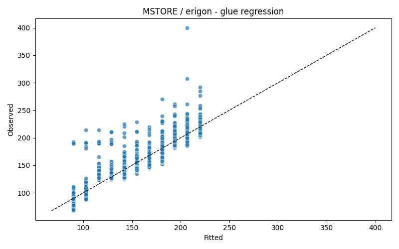

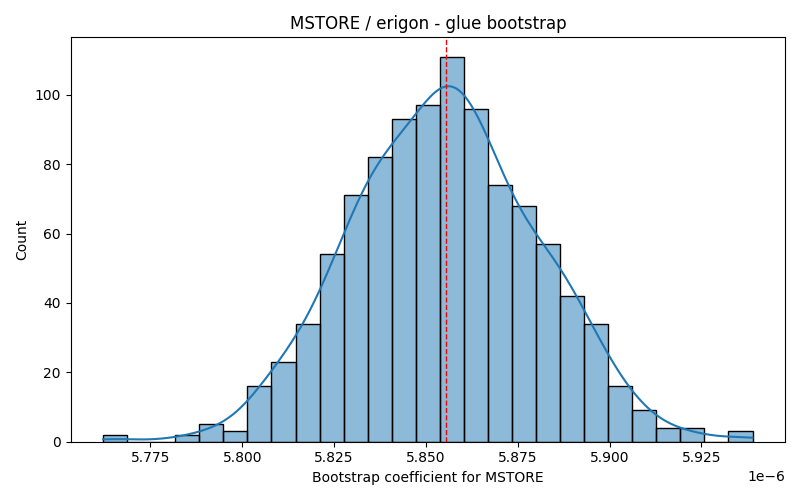

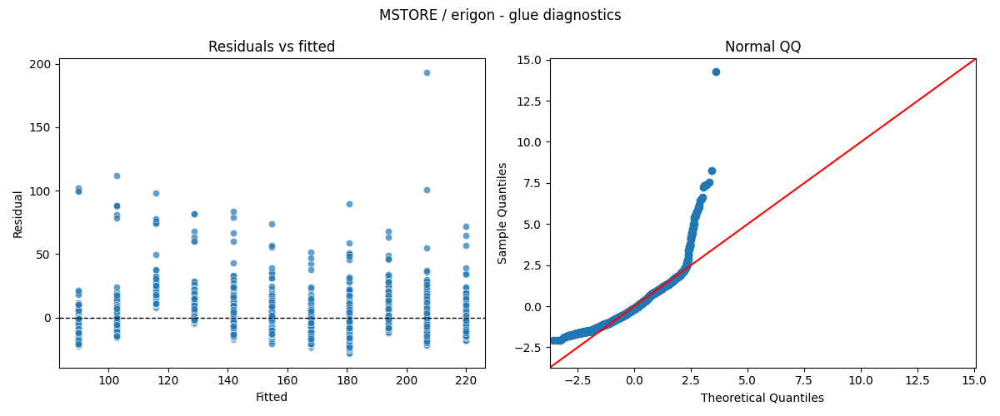

</details>

<details><summary><code>MSTORE8</code> · nobs=5940 · runtime_ms=5.235e-06 · p=1.00e-03 · R²=0.8273</summary>

```
==============================================================================
                           NNLS Regression Results                            
==============================================================================
Dep. Variable:          test_runtime_ms              R-squared:          0.827
Model:                  NNLS                    Adj. R-squared:          0.827
No. Observations:       5940                              RMSE:          16.79
Df Residuals:           5938                               MAE:           9.55
Df Model:               1      
==============================================================================
                      coef     std err     P-value      [0.025      0.975]
------------------------------------------------------------------------------
         const     25.7236      0.7781       0.001     24.1216     27.2338
       MSTORE8      0.0000      0.0000       0.001      0.0000      0.0000
==============================================================================
Notes: Non-negative least squares with bootstrap inference (1000 iterations)
==============================================================================
```

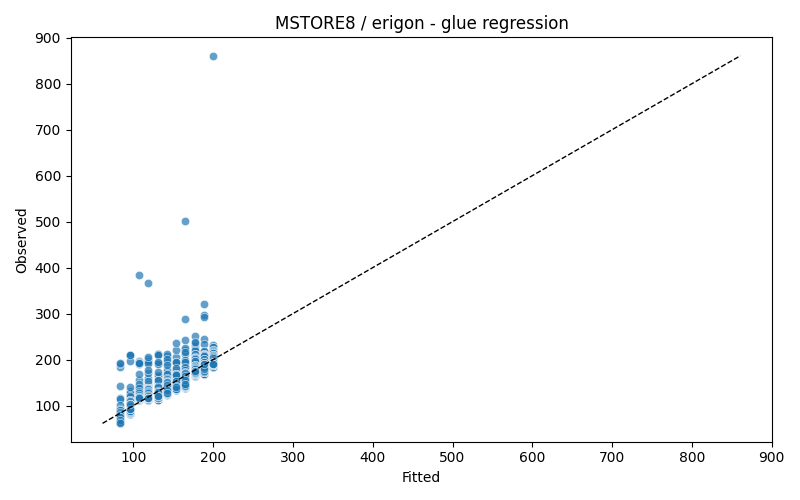

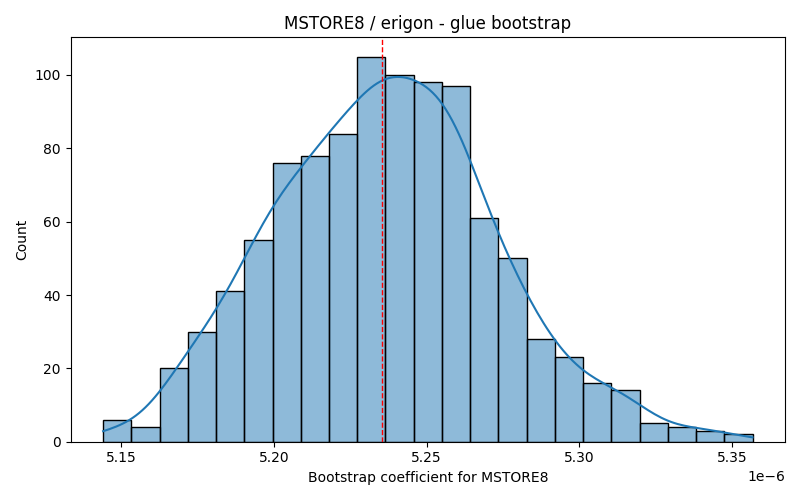

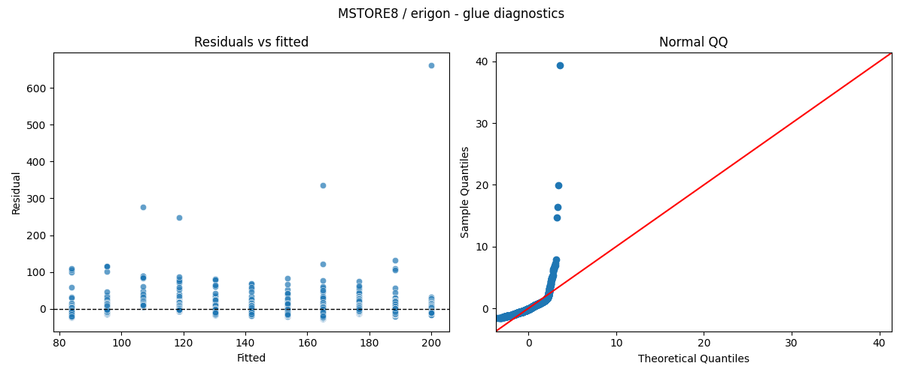

</details>

<details><summary><code>MUL</code> · nobs=1188 · runtime_ms=3.389e-06 · p=1.00e-03 · R²=0.9034</summary>

```
==============================================================================
                           NNLS Regression Results                            
==============================================================================
Dep. Variable:          test_runtime_ms              R-squared:          0.903
Model:                  NNLS                    Adj. R-squared:          0.903
No. Observations:       1188                              RMSE:           8.75
Df Residuals:           1186                               MAE:           6.53
Df Model:               1      
==============================================================================
                      coef     std err     P-value      [0.025      0.975]
------------------------------------------------------------------------------
         const     15.1298      0.9467       0.001     13.3623     17.0144
           MUL      0.0000      0.0000       0.001      0.0000      0.0000
==============================================================================
Notes: Non-negative least squares with bootstrap inference (1000 iterations)
==============================================================================
```

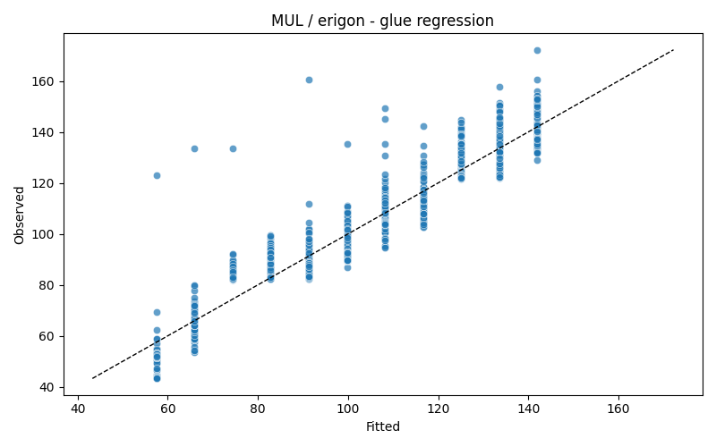

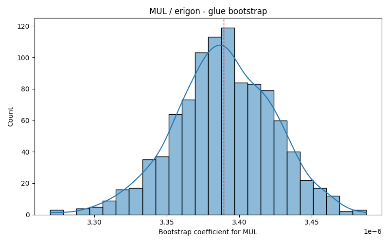

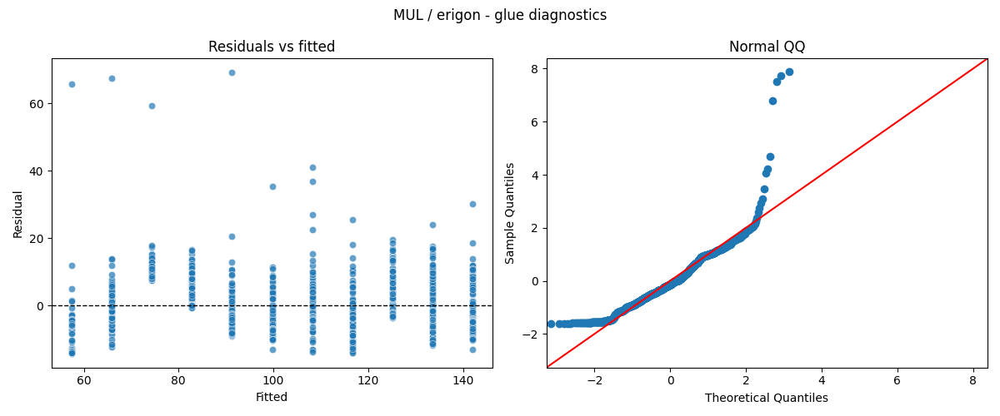

</details>

<details><summary><code>PC</code> · nobs=1188 · runtime_ms=1.392e-06 · p=1.00e-03 · R²=0.8633</summary>

```
==============================================================================
                           NNLS Regression Results                            
==============================================================================
Dep. Variable:          test_runtime_ms              R-squared:          0.863
Model:                  NNLS                    Adj. R-squared:          0.863
No. Observations:       1188                              RMSE:          16.56
Df Residuals:           1186                               MAE:          11.00
Df Model:               1      
==============================================================================
                      coef     std err     P-value      [0.025      0.975]
------------------------------------------------------------------------------
         const     23.8433      1.6817       0.001     20.6579     27.2806
            PC      0.0000      0.0000       0.001      0.0000      0.0000
==============================================================================
Notes: Non-negative least squares with bootstrap inference (1000 iterations)
==============================================================================
```

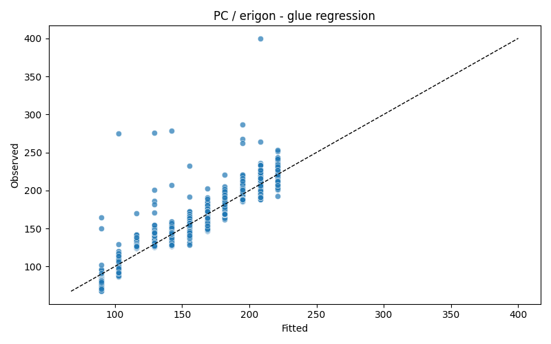

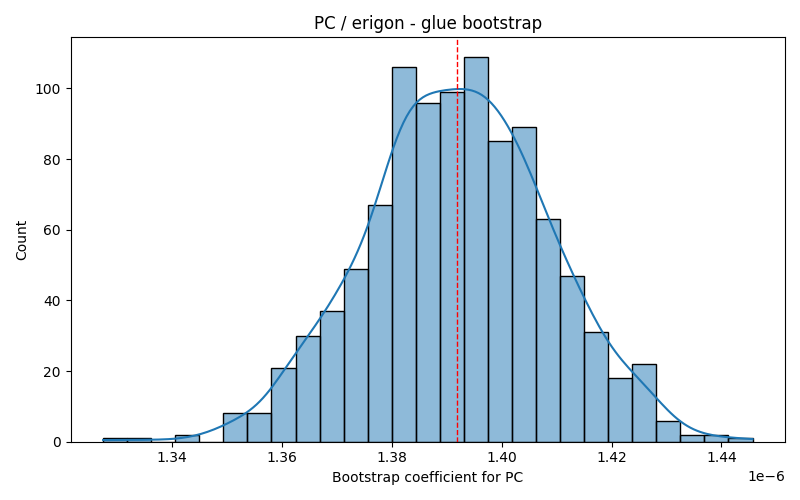


</details>

<details><summary><code>RETURNDATASIZE</code> · nobs=4752 · runtime_ms=1.831e-06 · p=1.00e-03 · R²=0.7479</summary>

```
==============================================================================
                           NNLS Regression Results                            
==============================================================================
Dep. Variable:          test_runtime_ms              R-squared:          0.748
Model:                  NNLS                    Adj. R-squared:          0.748
No. Observations:       4752                              RMSE:          16.79
Df Residuals:           4750                               MAE:           8.59
Df Model:               1      
==============================================================================
                      coef     std err     P-value      [0.025      0.975]
------------------------------------------------------------------------------
         const     20.5290      0.7985       0.001     19.0970     22.0755
RETURNDATASIZE      0.0000      0.0000       0.001      0.0000      0.0000
==============================================================================
Notes: Non-negative least squares with bootstrap inference (1000 iterations)
==============================================================================
```

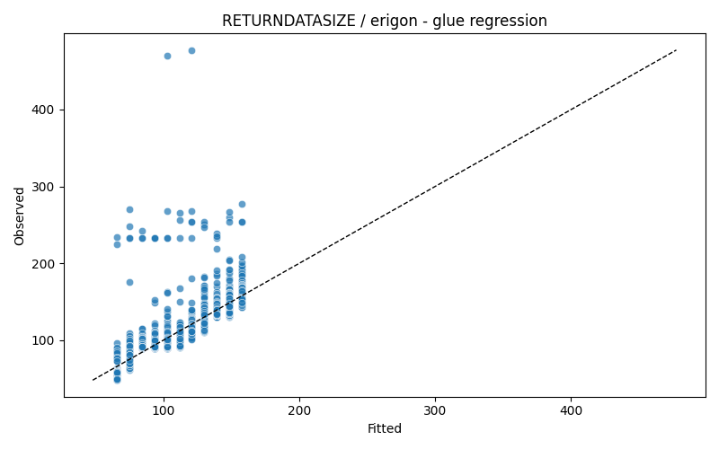

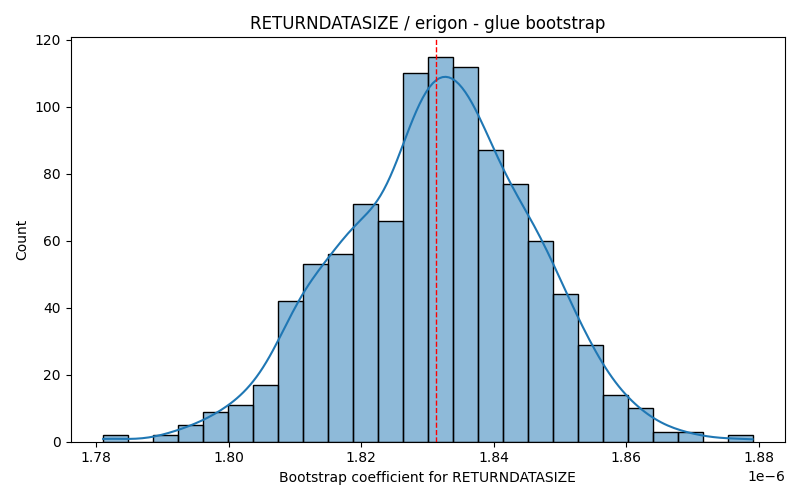

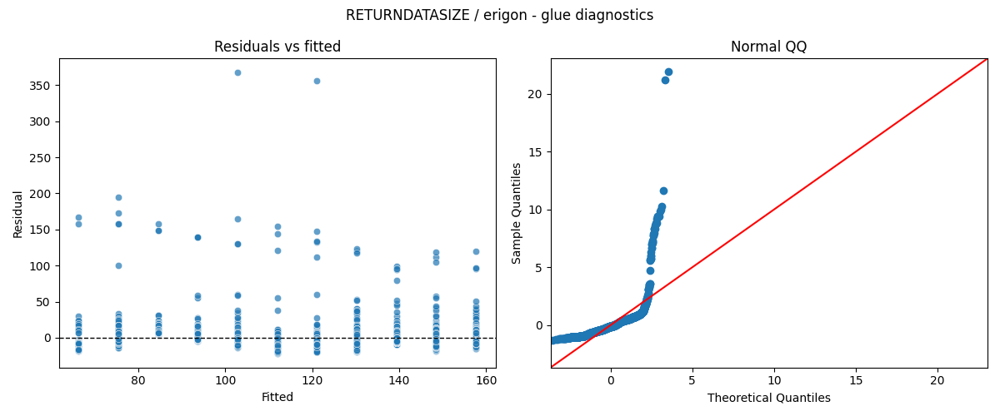

</details>

<details><summary><code>SELFBALANCE</code> · nobs=972 · runtime_ms=1.425e-06 · p=1.00e-03 · R²=0.7412</summary>

```
==============================================================================
                           NNLS Regression Results                            
==============================================================================
Dep. Variable:          test_runtime_ms              R-squared:          0.741
Model:                  NNLS                    Adj. R-squared:          0.741
No. Observations:       972                               RMSE:           8.49
Df Residuals:           970                                MAE:           5.32
Df Model:               1      
==============================================================================
                      coef     std err     P-value      [0.025      0.975]
------------------------------------------------------------------------------
         const     18.1820      1.1071       0.001     16.0988     20.3540
   SELFBALANCE      0.0000      0.0000       0.001      0.0000      0.0000
==============================================================================
Notes: Non-negative least squares with bootstrap inference (1000 iterations)
==============================================================================
```

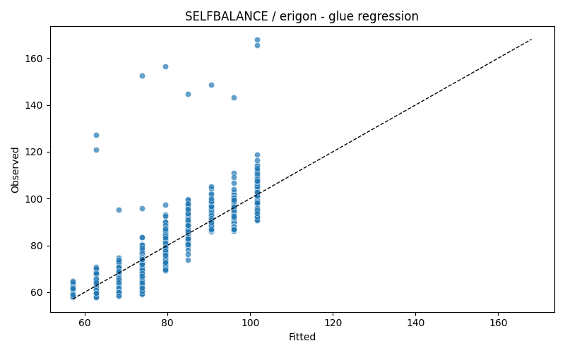

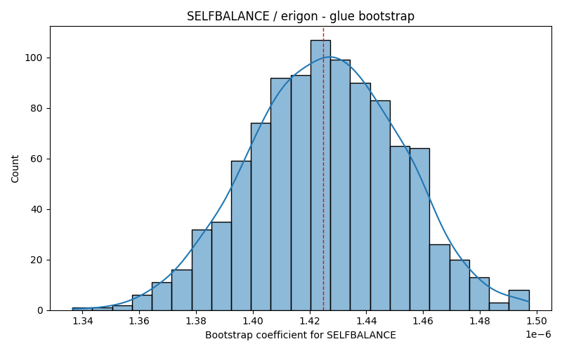

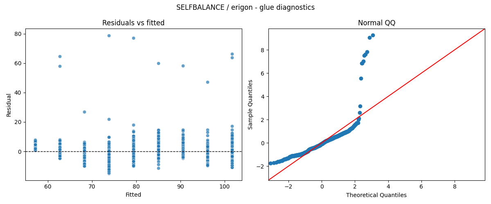

</details>

<details><summary><code>SUB</code> · nobs=1188 · runtime_ms=2.782e-06 · p=1.00e-03 · R²=0.8435</summary>

```
==============================================================================
                           NNLS Regression Results                            
==============================================================================
Dep. Variable:          test_runtime_ms              R-squared:          0.844
Model:                  NNLS                    Adj. R-squared:          0.843
No. Observations:       1188                              RMSE:          12.61
Df Residuals:           1186                               MAE:           8.50
Df Model:               1      
==============================================================================
                      coef     std err     P-value      [0.025      0.975]
------------------------------------------------------------------------------
         const     18.4549      1.3408       0.001     15.9051     21.3108
           SUB      0.0000      0.0000       0.001      0.0000      0.0000
==============================================================================
Notes: Non-negative least squares with bootstrap inference (1000 iterations)
==============================================================================
```

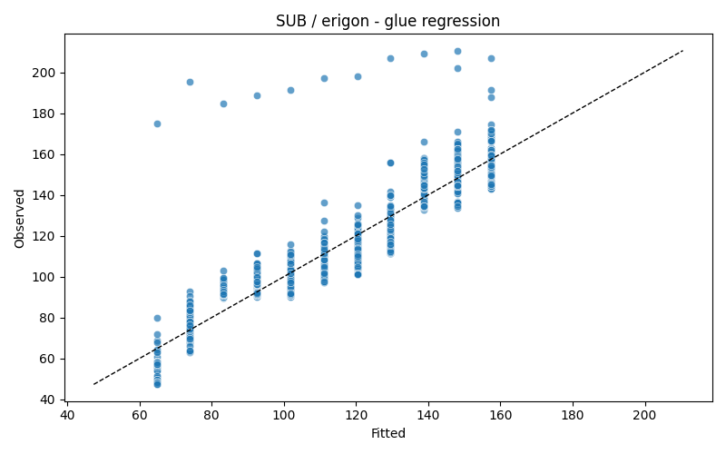

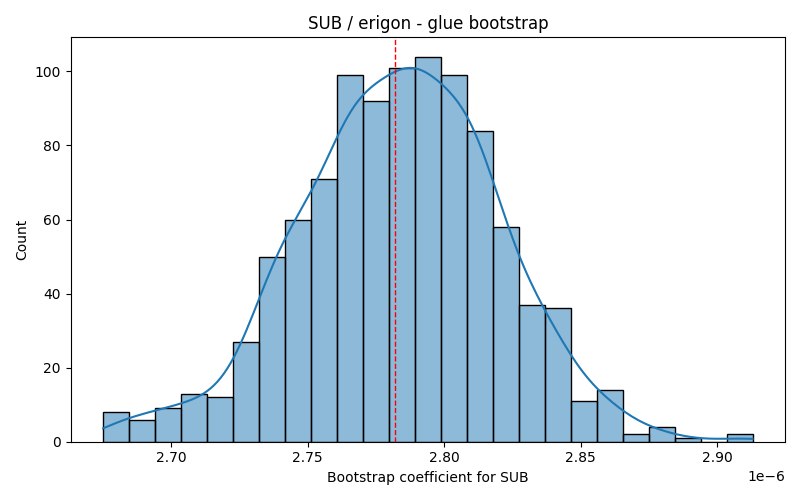

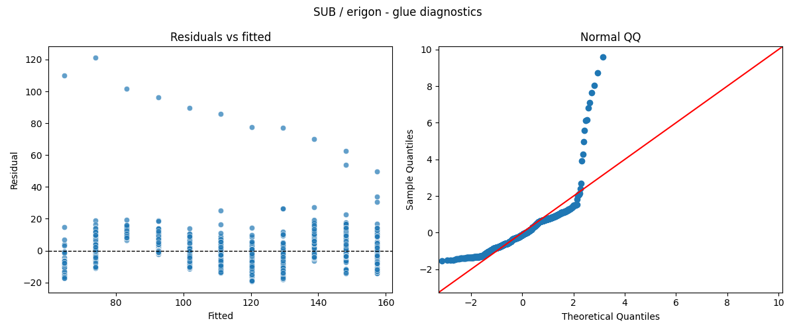

</details>

### Mixed glue (tier B) · erigon

<details><summary><code>JUMP</code> · nobs=1188 · runtime_ms=7.22e-06 · p=1.00e-03 · R²=0.8707</summary>

```
==============================================================================
                           NNLS Regression Results                            
==============================================================================
Dep. Variable:          test_runtime_ms              R-squared:          0.871
Model:                  NNLS                    Adj. R-squared:          0.871
No. Observations:       1188                              RMSE:          10.34
Df Residuals:           1186                               MAE:           6.91
Df Model:               1      
==============================================================================
                      coef     std err     P-value      [0.025      0.975]
------------------------------------------------------------------------------
         const     19.9479      1.0816       0.001     17.8321     22.1757
          JUMP      0.0000      0.0000       0.001      0.0000      0.0000
==============================================================================
Notes: Non-negative least squares with bootstrap inference (1000 iterations)
==============================================================================
```

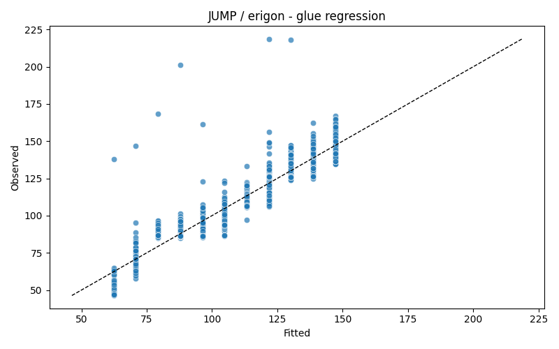

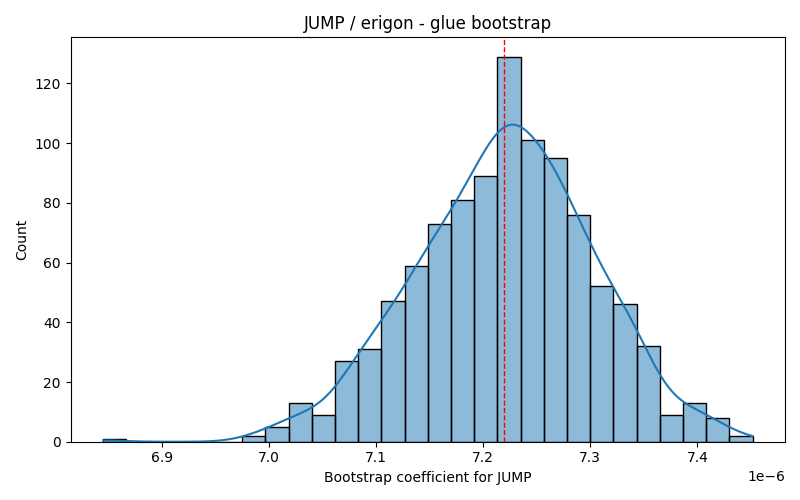

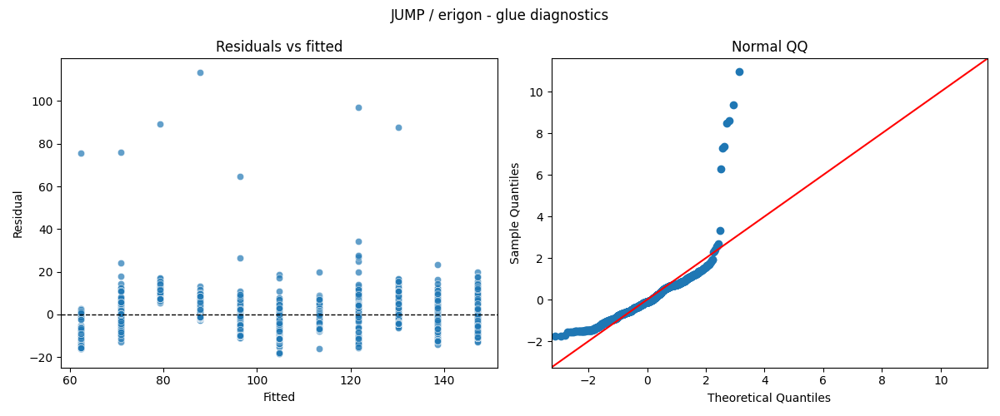

</details>

<details><summary><code>KECCAK256</code> · nobs=19008 · runtime_ms=2.119e-05 · p=1.00e-03 · R²=0.09376</summary>

```
==============================================================================
                           NNLS Regression Results                            
==============================================================================
Dep. Variable:          test_runtime_ms              R-squared:          0.094
Model:                  NNLS                    Adj. R-squared:          0.094
No. Observations:       19008                             RMSE:         130.94
Df Residuals:           19006                              MAE:         105.29
Df Model:               1      
==============================================================================
                      coef     std err     P-value      [0.025      0.975]
------------------------------------------------------------------------------
         const    358.5121      2.0334       0.001    354.5619    362.4710
     KECCAK256      0.0000      0.0000       0.001      0.0000      0.0000
==============================================================================
Notes: Non-negative least squares with bootstrap inference (1000 iterations)
==============================================================================
```

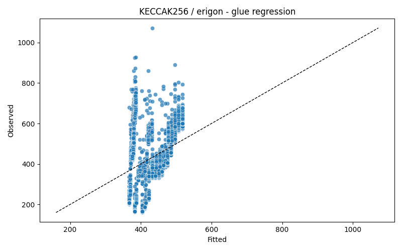

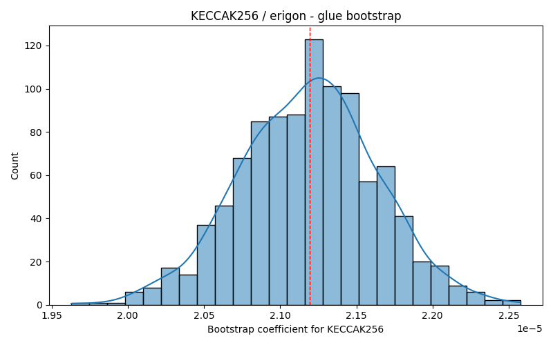

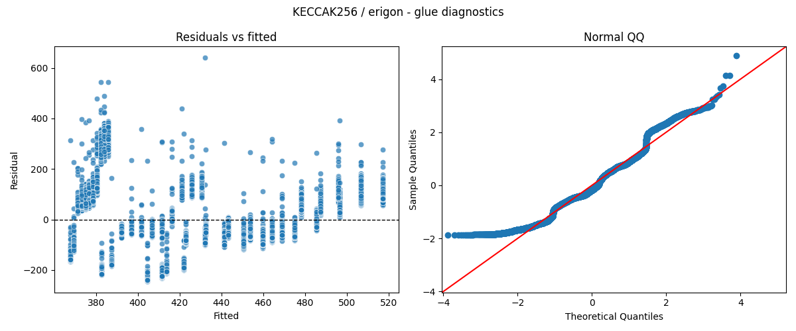

</details>

## ethrex

| glue_opcode | nobs | glue_runtime_ms | p_value | rsquared |
| --- | --- | --- | --- | --- |
| `ISZERO` | 495 | 5.144e-07 | 1.00e-03 | 0.5742 |
| `JUMPDEST` | 495 | 3.364e-07 | 1.00e-03 | 0.8452 |
| `SWAP` | 7920 | 7.099e-07 | 1.00e-03 | 0.8081 |
| `CALLDATASIZE` | 29689 | 4.649e-07 | 1.00e-03 | 0.93 |
| `DUP` | 29689 | 4.669e-07 | 1.00e-03 | 0.93 |
| `GAS` | 29689 | 4.636e-07 | 1.00e-03 | 0.93 |
| `MLOAD` | 29689 | 1.131e-06 | 1.00e-03 | 0.93 |
| `PUSH` | 29689 | 4.89e-07 | 1.00e-03 | 0.93 |
| `PUSH0` | 29689 | 4.565e-07 | 1.00e-03 | 0.93 |
| `STATICCALL` | 29689 | 0.0001101 | 1.00e-03 | 0.93 |
| `ADD` | 495 | 1.141e-06 | 1.00e-03 | 0.8122 |
| `AND` | 495 | 1.133e-06 | 1.00e-03 | 0.8529 |
| `CALLDATACOPY` | 11880 | 2.408e-06 | 1.00e-03 | 0.8607 |
| `CALLDATALOAD` | 1980 | 1.997e-05 | 1.00e-03 | 0.23 |
| `DIV` | 495 | 1.142e-05 | 1.00e-03 | 0.943 |
| `EXP` | 495 | 0.001093 | 1.00e-03 | 0.9276 |
| `GT` | 495 | 1.122e-06 | 1.00e-03 | 0.8396 |
| `JUMPI` | 495 | 1.374e-06 | 1.00e-03 | 0.8087 |
| `LT` | 495 | 9.777e-07 | 1.00e-03 | 0.8115 |
| `MSTORE` | 2475 | 1.684e-06 | 1.00e-03 | 0.812 |
| `MSTORE8` | 2475 | 1.565e-06 | 1.00e-03 | 0.7916 |
| `MUL` | 495 | 1.638e-06 | 1.00e-03 | 0.8566 |
| `PC` | 495 | 5.308e-07 | 1.00e-03 | 0.7836 |
| `RETURNDATASIZE` | 1980 | 9.08e-07 | 1.00e-03 | 0.776 |
| `SELFBALANCE` | 405 | 5.887e-06 | 1.00e-03 | 0.9066 |
| `SUB` | 495 | 1.164e-06 | 1.00e-03 | 0.7905 |
| `JUMP` | 495 | 4.143e-06 | 1.00e-03 | 0.8286 |
| `KECCAK256` | 7920 | 0 | 1.00e+00 | 0 |

### Cycle glue — joint fit · ethrex

<details><summary>Joint NNLS regression summary</summary>

```
==============================================================================
                           NNLS Regression Results                            
==============================================================================
Dep. Variable:          test_runtime_ms              R-squared:          0.930
Model:                  NNLS                    Adj. R-squared:          0.930
No. Observations:       29689                             RMSE:           6.64
Df Residuals:           29681                              MAE:           5.21
Df Model:               7      
==============================================================================
                      coef     std err     P-value      [0.025      0.975]
------------------------------------------------------------------------------
         const     12.4177      0.1239       0.001     12.1611     12.6524
  CALLDATASIZE      0.0000      0.0000       0.001      0.0000      0.0000
           DUP      0.0000      0.0000       0.001      0.0000      0.0000
           GAS      0.0000      0.0000       0.001      0.0000      0.0000
         MLOAD      0.0000      0.0000       0.001      0.0000      0.0000
          PUSH      0.0000      0.0000       0.001      0.0000      0.0000
         PUSH0      0.0000      0.0000       0.001      0.0000      0.0000
    STATICCALL      0.0001      0.0000       0.001      0.0001      0.0001
==============================================================================
Notes: Non-negative least squares with bootstrap inference (1000 iterations)
==============================================================================
```

</details>

<details><summary><code>CALLDATASIZE</code> · nobs=29689 · runtime_ms=4.649e-07 · p=1.00e-03 · R²=0.93</summary>

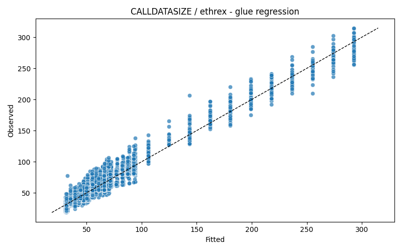

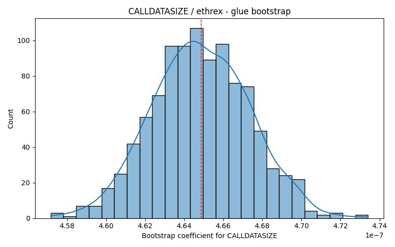

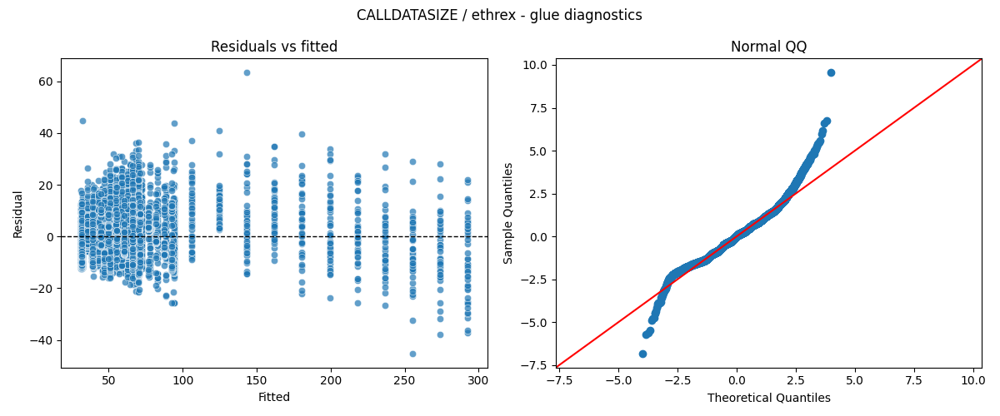

</details>

<details><summary><code>DUP</code> · nobs=29689 · runtime_ms=4.669e-07 · p=1.00e-03 · R²=0.93</summary>


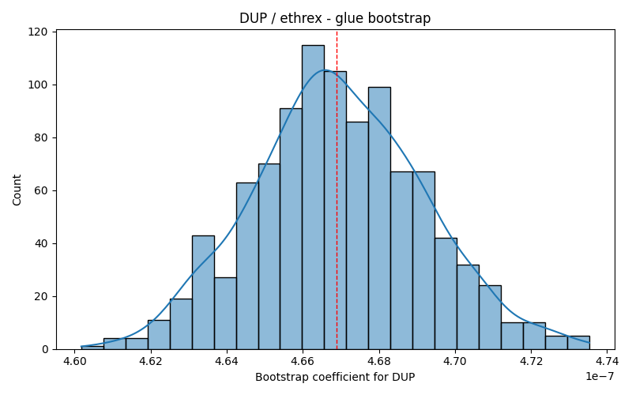


</details>

<details><summary><code>GAS</code> · nobs=29689 · runtime_ms=4.636e-07 · p=1.00e-03 · R²=0.93</summary>


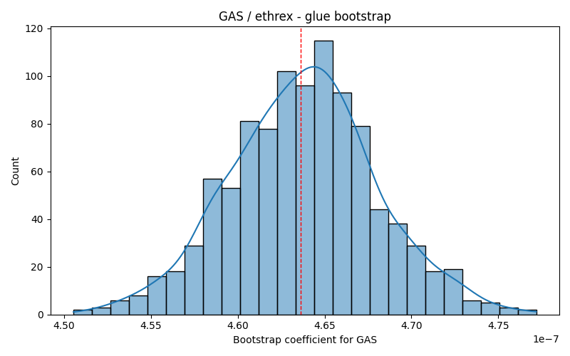

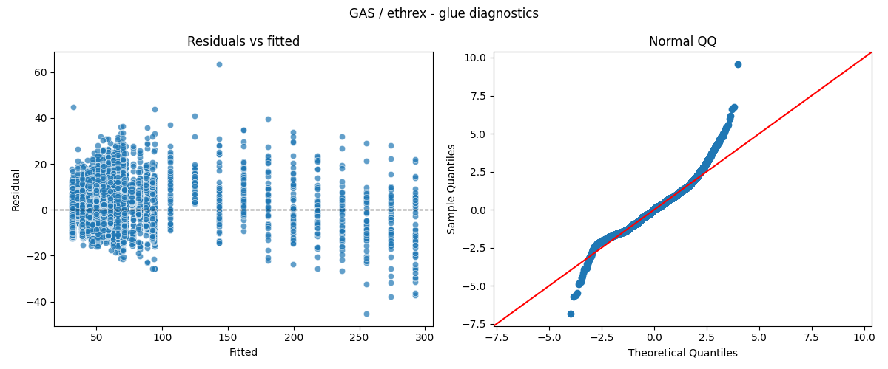

</details>

<details><summary><code>MLOAD</code> · nobs=29689 · runtime_ms=1.131e-06 · p=1.00e-03 · R²=0.93</summary>


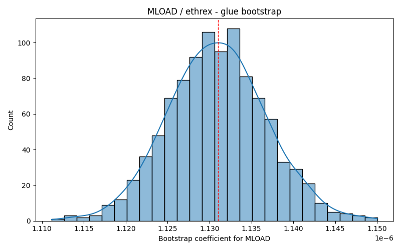

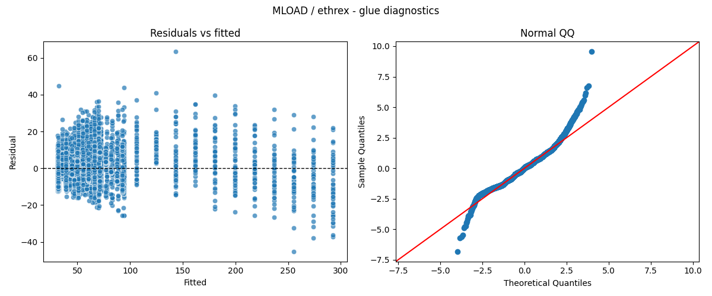

</details>

<details><summary><code>PUSH</code> · nobs=29689 · runtime_ms=4.89e-07 · p=1.00e-03 · R²=0.93</summary>


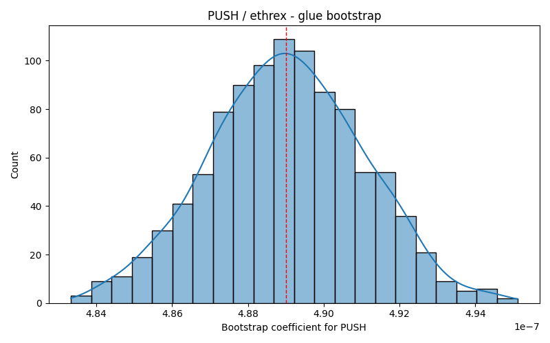

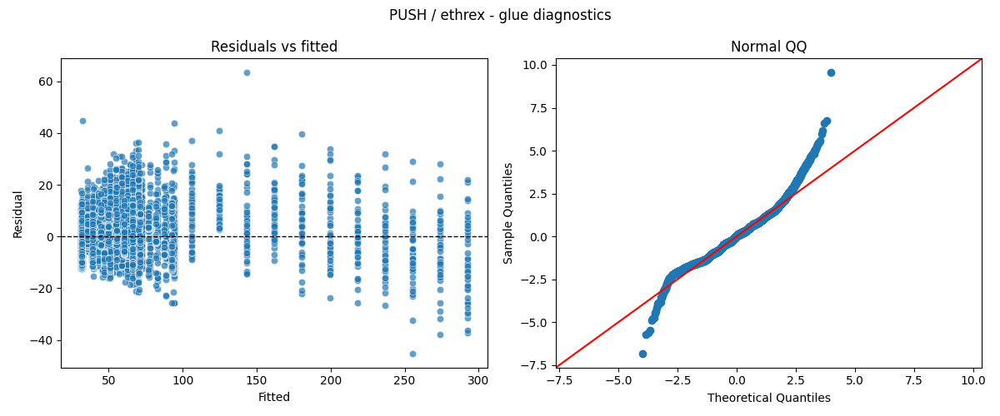

</details>

<details><summary><code>PUSH0</code> · nobs=29689 · runtime_ms=4.565e-07 · p=1.00e-03 · R²=0.93</summary>


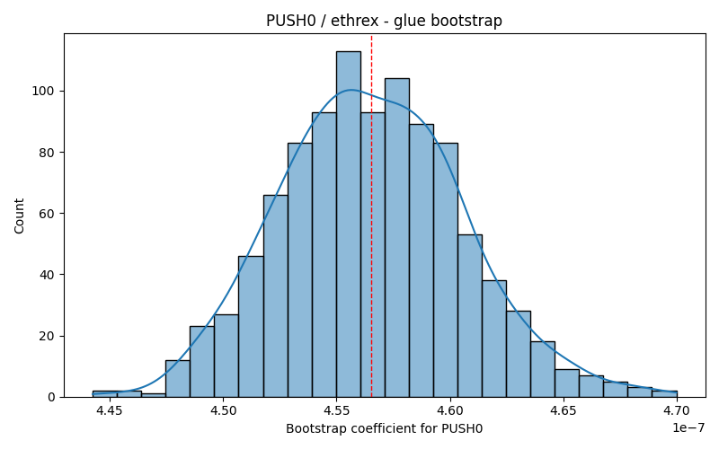


</details>

<details><summary><code>STATICCALL</code> · nobs=29689 · runtime_ms=0.0001101 · p=1.00e-03 · R²=0.93</summary>


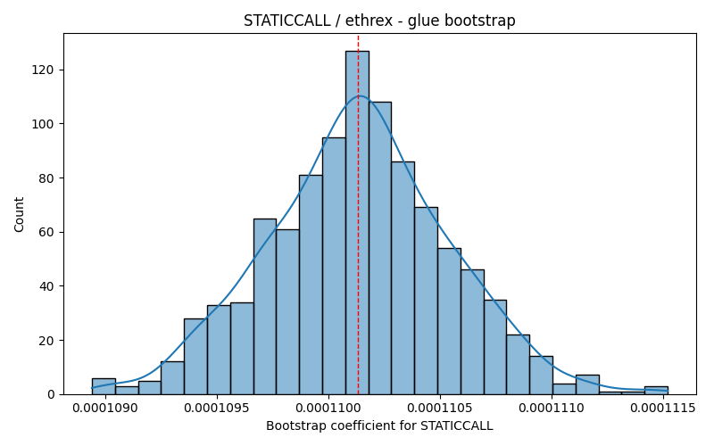

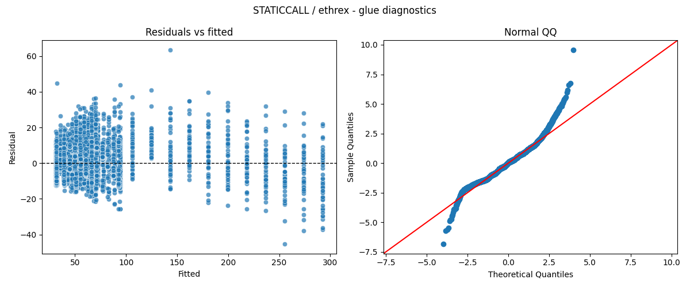

</details>

### Pure glue · ethrex

<details><summary><code>ISZERO</code> · nobs=495 · runtime_ms=5.144e-07 · p=1.00e-03 · R²=0.5742</summary>

```
==============================================================================
                           NNLS Regression Results                            
==============================================================================
Dep. Variable:          test_runtime_ms              R-squared:          0.574
Model:                  NNLS                    Adj. R-squared:          0.573
No. Observations:       495                               RMSE:           9.33
Df Residuals:           493                                MAE:           4.24
Df Model:               1      
==============================================================================
                      coef     std err     P-value      [0.025      0.975]
------------------------------------------------------------------------------
         const      9.1168      1.2970       0.001      6.2032     11.1380
        ISZERO      0.0000      0.0000       0.001      0.0000      0.0000
==============================================================================
Notes: Non-negative least squares with bootstrap inference (1000 iterations)
==============================================================================
```

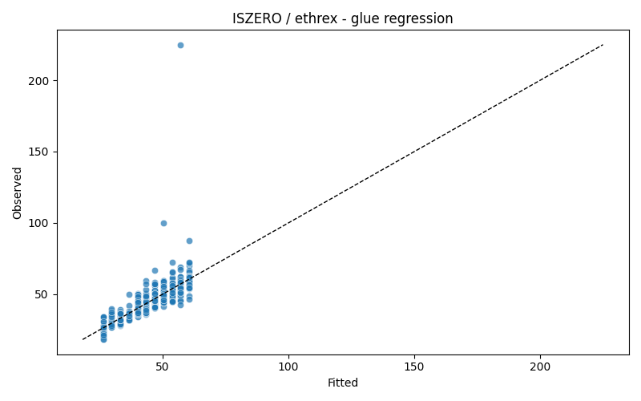

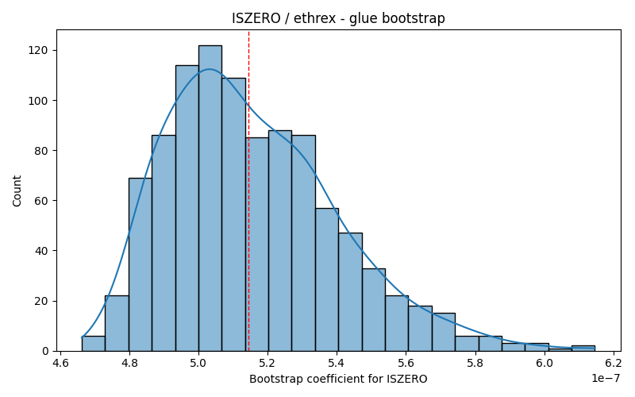

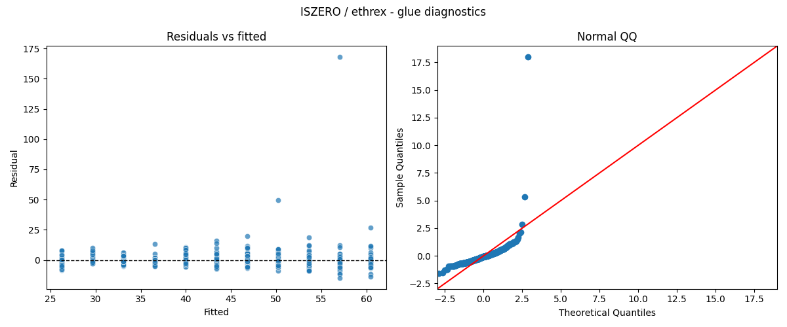

</details>

<details><summary><code>JUMPDEST</code> · nobs=495 · runtime_ms=3.364e-07 · p=1.00e-03 · R²=0.8452</summary>

```
==============================================================================
                           NNLS Regression Results                            
==============================================================================
Dep. Variable:          test_runtime_ms              R-squared:          0.845
Model:                  NNLS                    Adj. R-squared:          0.845
No. Observations:       495                               RMSE:           9.09
Df Residuals:           493                                MAE:           7.27
Df Model:               1      
==============================================================================
                      coef     std err     P-value      [0.025      0.975]
------------------------------------------------------------------------------
         const     16.2807      1.2798       0.001     13.8615     18.7882
      JUMPDEST      0.0000      0.0000       0.001      0.0000      0.0000
==============================================================================
Notes: Non-negative least squares with bootstrap inference (1000 iterations)
==============================================================================
```

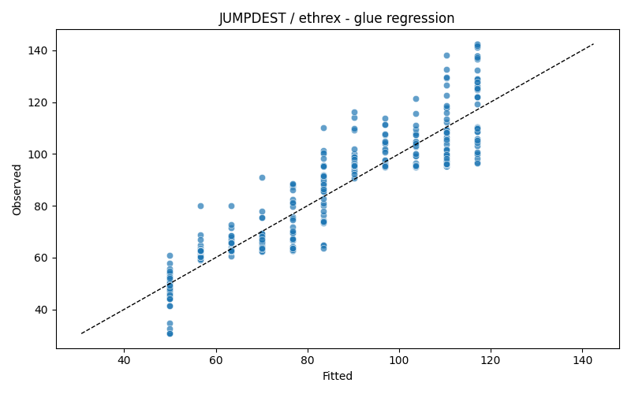

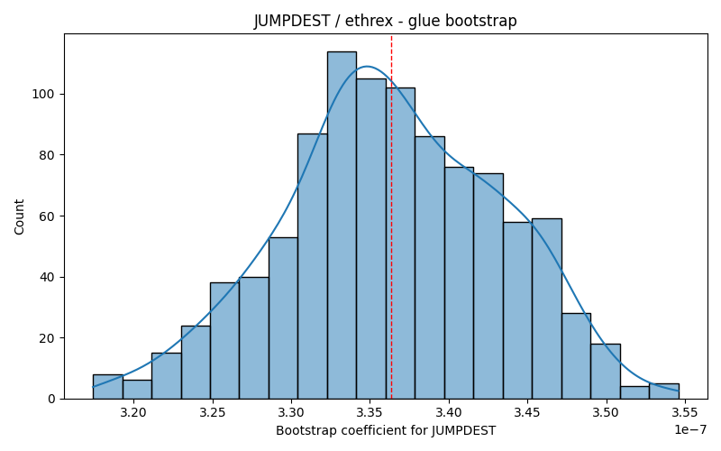

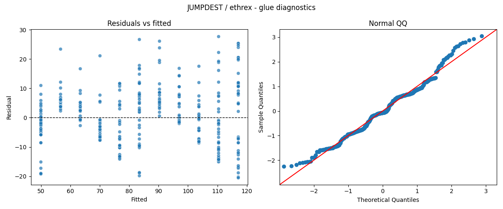

</details>

<details><summary><code>SWAP</code> · nobs=7920 · runtime_ms=7.099e-07 · p=1.00e-03 · R²=0.8081</summary>

```
==============================================================================
                           NNLS Regression Results                            
==============================================================================
Dep. Variable:          test_runtime_ms              R-squared:          0.808
Model:                  NNLS                    Adj. R-squared:          0.808
No. Observations:       7920                              RMSE:           7.28
Df Residuals:           7918                               MAE:           5.87
Df Model:               1      
==============================================================================
                      coef     std err     P-value      [0.025      0.975]
------------------------------------------------------------------------------
         const     15.0345      0.2868       0.001     14.4602     15.6201
          SWAP      0.0000      0.0000       0.001      0.0000      0.0000
==============================================================================
Notes: Non-negative least squares with bootstrap inference (1000 iterations)
==============================================================================
```

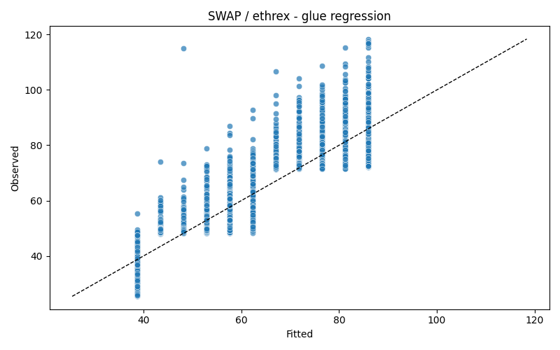

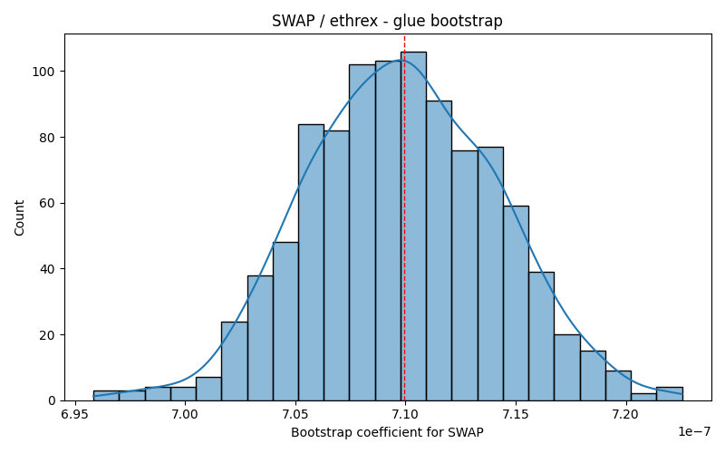

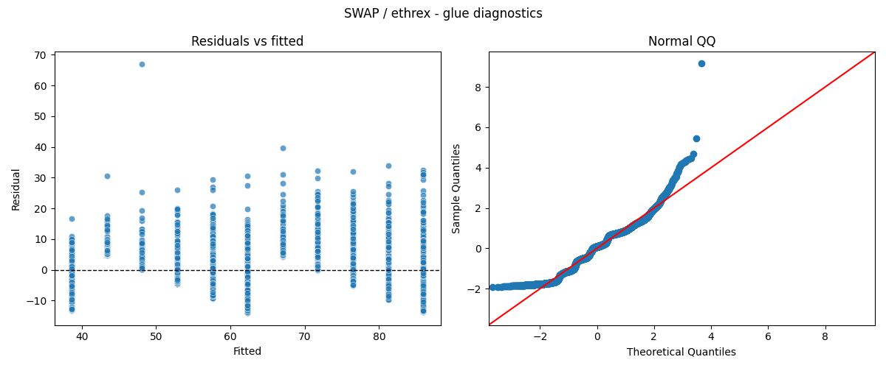

</details>

### Mixed glue (tier A) · ethrex

<details><summary><code>ADD</code> · nobs=495 · runtime_ms=1.141e-06 · p=1.00e-03 · R²=0.8122</summary>

```
==============================================================================
                           NNLS Regression Results                            
==============================================================================
Dep. Variable:          test_runtime_ms              R-squared:          0.812
Model:                  NNLS                    Adj. R-squared:          0.812
No. Observations:       495                               RMSE:           5.77
Df Residuals:           493                                MAE:           3.67
Df Model:               1      
==============================================================================
                      coef     std err     P-value      [0.025      0.975]
------------------------------------------------------------------------------
         const     10.8861      0.9416       0.001      9.1657     12.8463
           ADD      0.0000      0.0000       0.001      0.0000      0.0000
==============================================================================
Notes: Non-negative least squares with bootstrap inference (1000 iterations)
==============================================================================
```

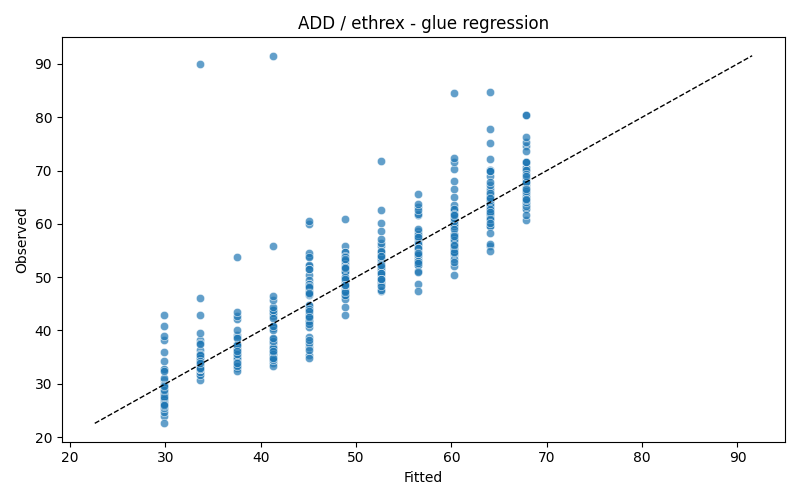

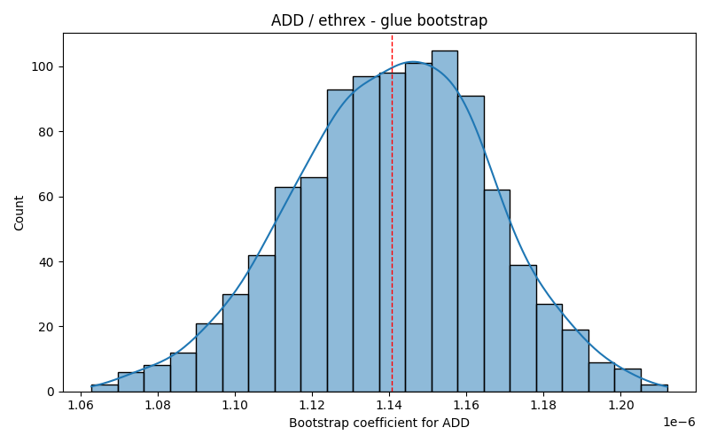

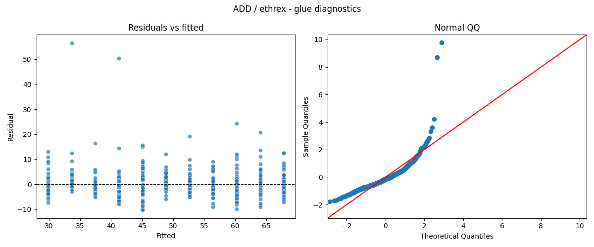

</details>

<details><summary><code>AND</code> · nobs=495 · runtime_ms=1.133e-06 · p=1.00e-03 · R²=0.8529</summary>

```
==============================================================================
                           NNLS Regression Results                            
==============================================================================
Dep. Variable:          test_runtime_ms              R-squared:          0.853
Model:                  NNLS                    Adj. R-squared:          0.853
No. Observations:       495                               RMSE:           4.95
Df Residuals:           493                                MAE:           3.59
Df Model:               1      
==============================================================================
                      coef     std err     P-value      [0.025      0.975]
------------------------------------------------------------------------------
         const      8.6387      0.6696       0.001      7.2972      9.9948
           AND      0.0000      0.0000       0.001      0.0000      0.0000
==============================================================================
Notes: Non-negative least squares with bootstrap inference (1000 iterations)
==============================================================================
```

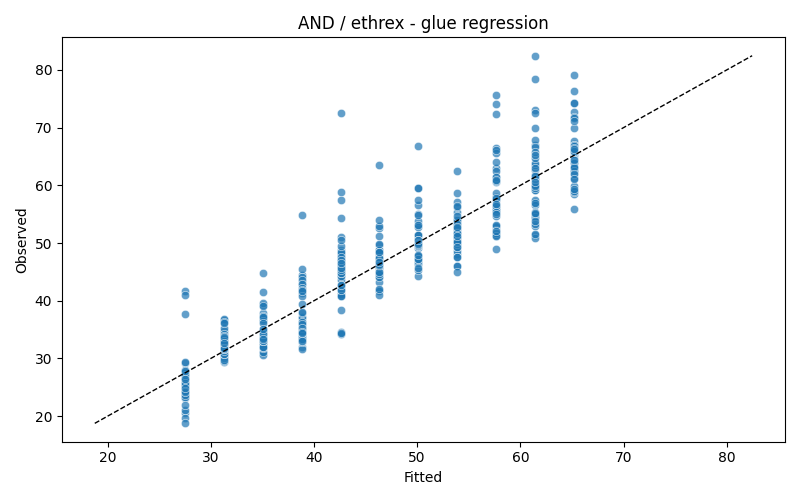

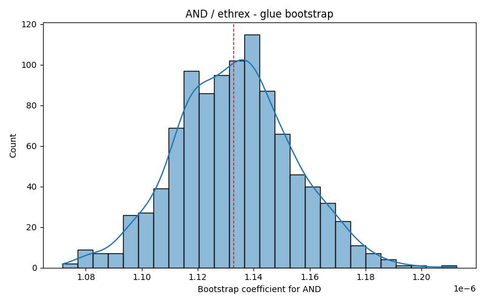

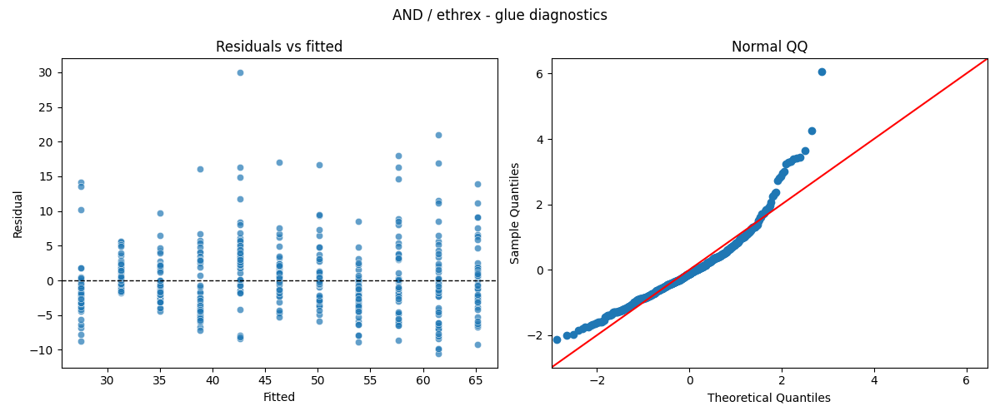

</details>

<details><summary><code>CALLDATACOPY</code> · nobs=11880 · runtime_ms=2.408e-06 · p=1.00e-03 · R²=0.8607</summary>

```
==============================================================================
                           NNLS Regression Results                            
==============================================================================
Dep. Variable:          test_runtime_ms              R-squared:          0.861
Model:                  NNLS                    Adj. R-squared:          0.861
No. Observations:       11880                             RMSE:           7.29
Df Residuals:           11878                              MAE:           5.41
Df Model:               1      
==============================================================================
                      coef     std err     P-value      [0.025      0.975]
------------------------------------------------------------------------------
         const     12.4287      0.0772       0.001     12.2663     12.5807
  CALLDATACOPY      0.0000      0.0000       0.001      0.0000      0.0000
==============================================================================
Notes: Non-negative least squares with bootstrap inference (1000 iterations)
==============================================================================
```

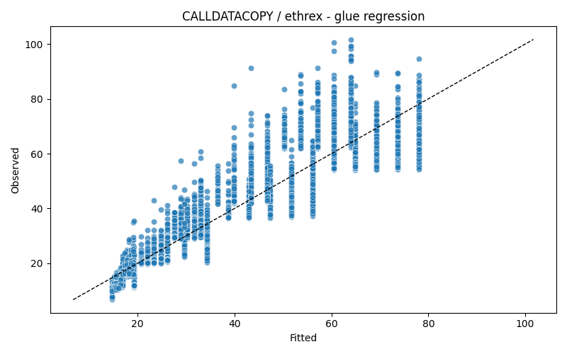

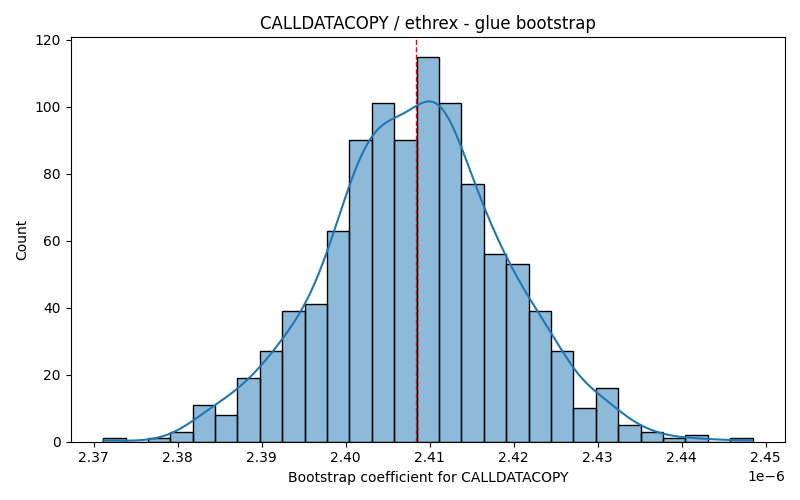

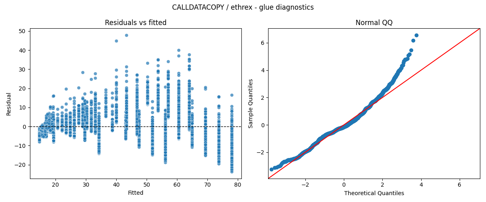

</details>

<details><summary><code>CALLDATALOAD</code> · nobs=1980 · runtime_ms=1.997e-05 · p=1.00e-03 · R²=0.23</summary>

```
==============================================================================
                           NNLS Regression Results                            
==============================================================================
Dep. Variable:          test_runtime_ms              R-squared:          0.230
Model:                  NNLS                    Adj. R-squared:          0.230
No. Observations:       1980                              RMSE:           0.14
Df Residuals:           1978                               MAE:           0.10
Df Model:               1      
==============================================================================
                      coef     std err     P-value      [0.025      0.975]
------------------------------------------------------------------------------
         const      2.1726      0.0108       0.001      2.1502      2.1933
  CALLDATALOAD      0.0000      0.0000       0.001      0.0000      0.0000
==============================================================================
Notes: Non-negative least squares with bootstrap inference (1000 iterations)
==============================================================================
```

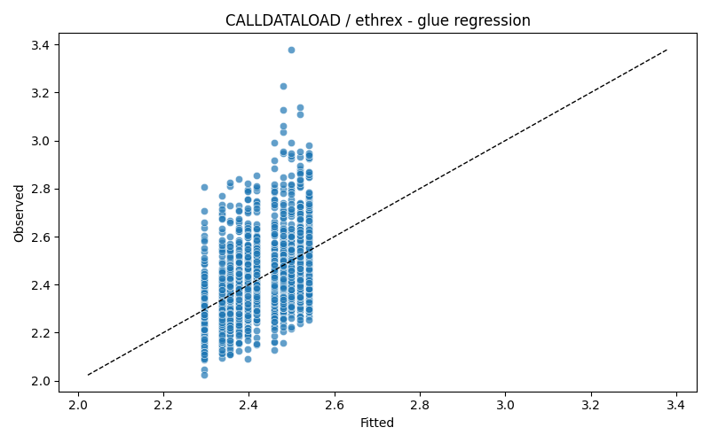

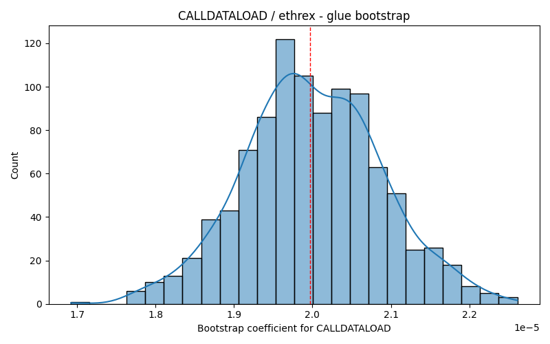

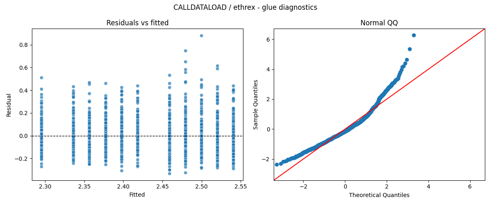

</details>

<details><summary><code>DIV</code> · nobs=495 · runtime_ms=1.142e-05 · p=1.00e-03 · R²=0.943</summary>

```
==============================================================================
                           NNLS Regression Results                            
==============================================================================
Dep. Variable:          test_runtime_ms              R-squared:          0.943
Model:                  NNLS                    Adj. R-squared:          0.943
No. Observations:       495                               RMSE:          22.17
Df Residuals:           493                                MAE:          18.35
Df Model:               1      
==============================================================================
                      coef     std err     P-value      [0.025      0.975]
------------------------------------------------------------------------------
         const     62.4529      3.4580       0.001     56.0681     69.5532
           DIV      0.0000      0.0000       0.001      0.0000      0.0000
==============================================================================
Notes: Non-negative least squares with bootstrap inference (1000 iterations)
==============================================================================
```

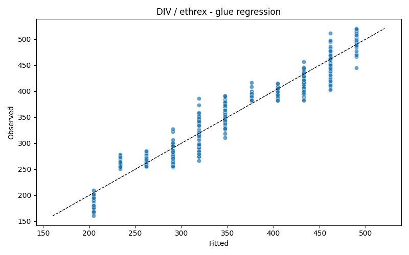

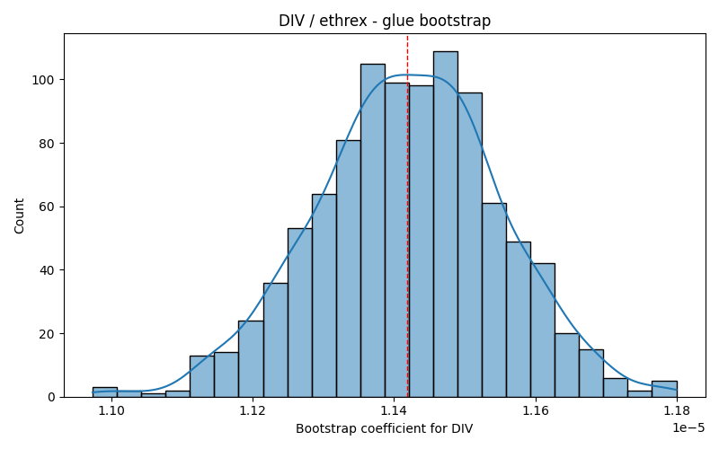

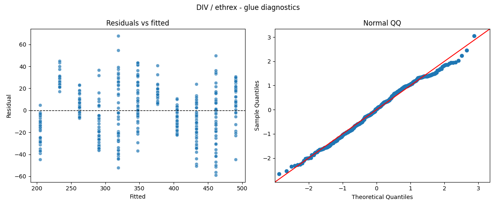

</details>

<details><summary><code>EXP</code> · nobs=495 · runtime_ms=0.001093 · p=1.00e-03 · R²=0.9276</summary>

```
==============================================================================
                           NNLS Regression Results                            
==============================================================================
Dep. Variable:          test_runtime_ms              R-squared:          0.928
Model:                  NNLS                    Adj. R-squared:          0.927
No. Observations:       495                               RMSE:          11.96
Df Residuals:           493                                MAE:           9.95
Df Model:               1      
==============================================================================
                      coef     std err     P-value      [0.025      0.975]
------------------------------------------------------------------------------
         const     31.6655      1.6192       0.001     28.4178     34.7660
           EXP      0.0011      0.0000       0.001      0.0011      0.0011
==============================================================================
Notes: Non-negative least squares with bootstrap inference (1000 iterations)
==============================================================================
```

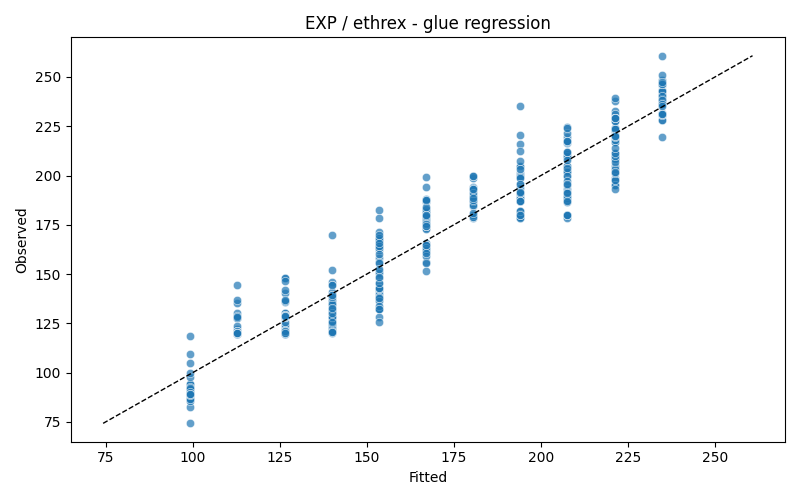

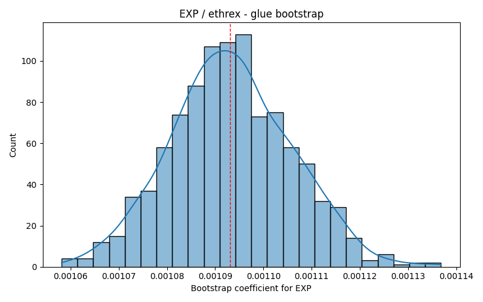

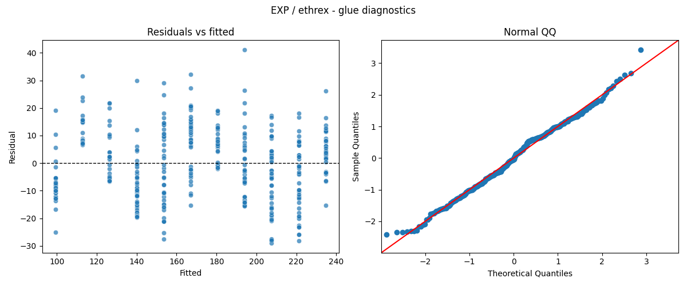

</details>

<details><summary><code>GT</code> · nobs=495 · runtime_ms=1.122e-06 · p=1.00e-03 · R²=0.8396</summary>

```
==============================================================================
                           NNLS Regression Results                            
==============================================================================
Dep. Variable:          test_runtime_ms              R-squared:          0.840
Model:                  NNLS                    Adj. R-squared:          0.839
No. Observations:       495                               RMSE:           5.16
Df Residuals:           493                                MAE:           4.02
Df Model:               1      
==============================================================================
                      coef     std err     P-value      [0.025      0.975]
------------------------------------------------------------------------------
         const     10.0258      0.7875       0.001      8.5215     11.5824
            GT      0.0000      0.0000       0.001      0.0000      0.0000
==============================================================================
Notes: Non-negative least squares with bootstrap inference (1000 iterations)
==============================================================================
```

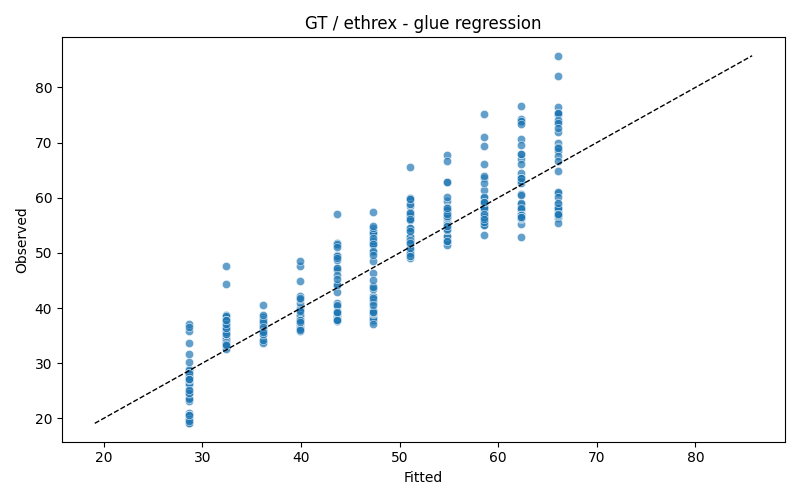

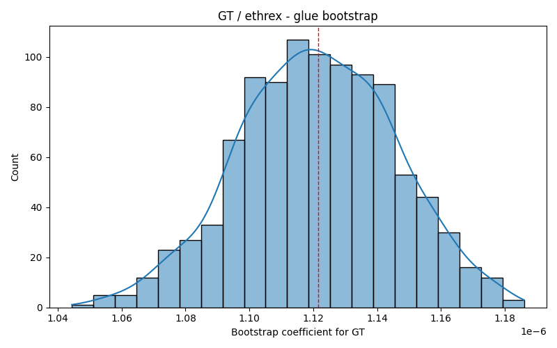

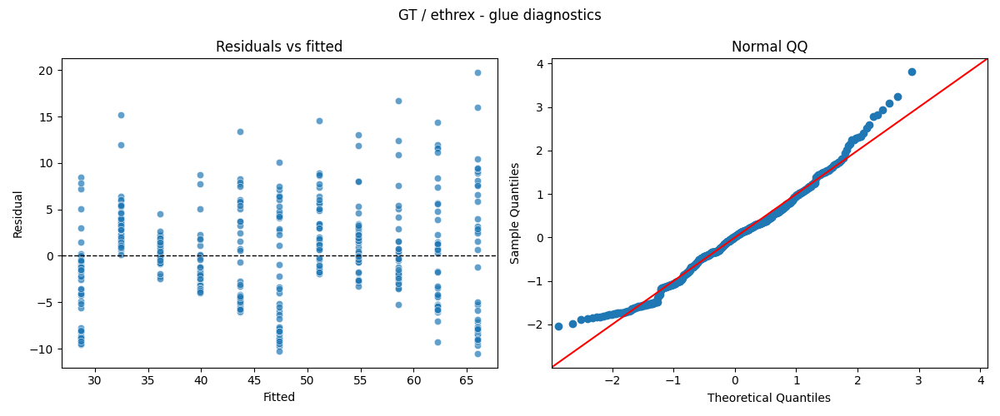

</details>

<details><summary><code>JUMPI</code> · nobs=495 · runtime_ms=1.374e-06 · p=1.00e-03 · R²=0.8087</summary>

```
==============================================================================
                           NNLS Regression Results                            
==============================================================================
Dep. Variable:          test_runtime_ms              R-squared:          0.809
Model:                  NNLS                    Adj. R-squared:          0.808
No. Observations:       495                               RMSE:           3.01
Df Residuals:           493                                MAE:           2.30
Df Model:               1      
==============================================================================
                      coef     std err     P-value      [0.025      0.975]
------------------------------------------------------------------------------
         const      6.7809      0.3944       0.001      6.0408      7.5935
         JUMPI      0.0000      0.0000       0.001      0.0000      0.0000
==============================================================================
Notes: Non-negative least squares with bootstrap inference (1000 iterations)
==============================================================================
```

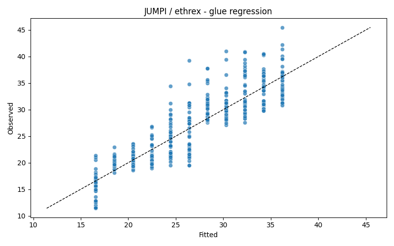

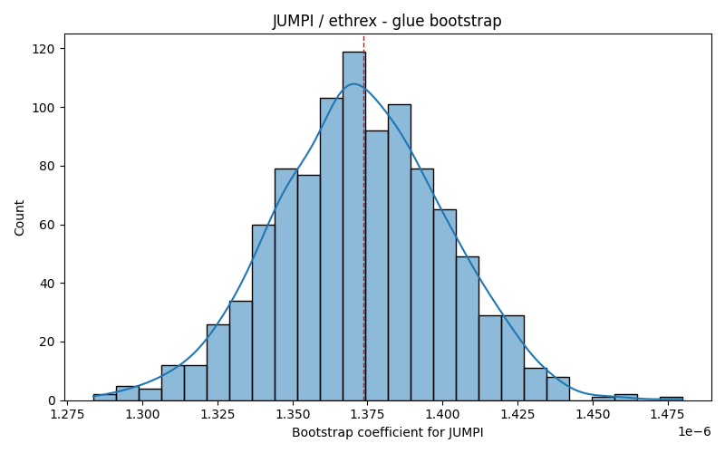

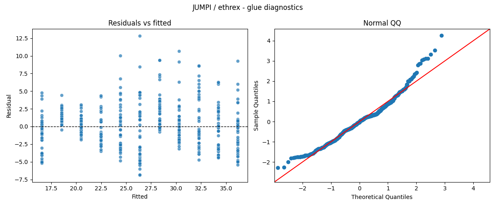

</details>

<details><summary><code>LT</code> · nobs=495 · runtime_ms=9.777e-07 · p=1.00e-03 · R²=0.8115</summary>

```
==============================================================================
                           NNLS Regression Results                            
==============================================================================
Dep. Variable:          test_runtime_ms              R-squared:          0.812
Model:                  NNLS                    Adj. R-squared:          0.811
No. Observations:       495                               RMSE:           4.96
Df Residuals:           493                                MAE:           3.55
Df Model:               1      
==============================================================================
                      coef     std err     P-value      [0.025      0.975]
------------------------------------------------------------------------------
         const      8.8257      0.6590       0.001      7.4812     10.1340
            LT      0.0000      0.0000       0.001      0.0000      0.0000
==============================================================================
Notes: Non-negative least squares with bootstrap inference (1000 iterations)
==============================================================================
```

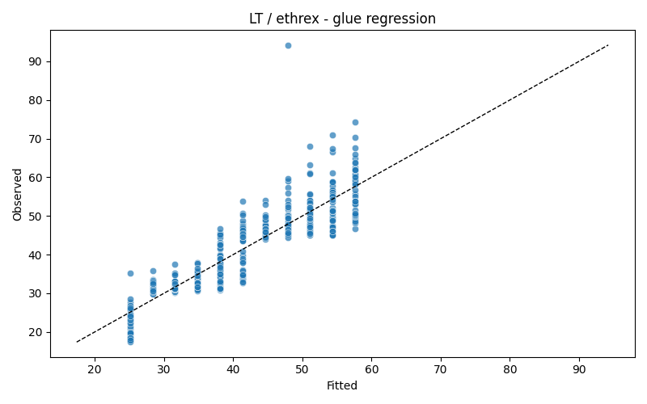

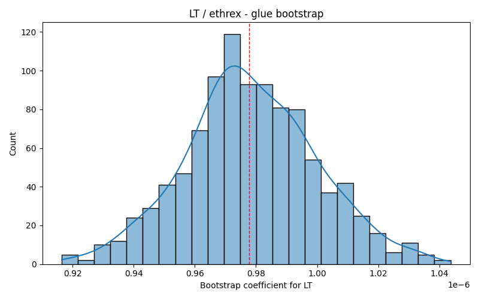

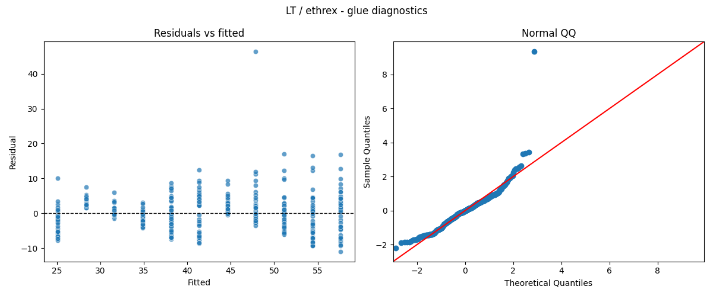

</details>

<details><summary><code>MSTORE</code> · nobs=2475 · runtime_ms=1.684e-06 · p=1.00e-03 · R²=0.812</summary>

```
==============================================================================
                           NNLS Regression Results                            
==============================================================================
Dep. Variable:          test_runtime_ms              R-squared:          0.812
Model:                  NNLS                    Adj. R-squared:          0.812
No. Observations:       2475                              RMSE:           5.69
Df Residuals:           2473                               MAE:           4.31
Df Model:               1      
==============================================================================
                      coef     std err     P-value      [0.025      0.975]
------------------------------------------------------------------------------
         const     11.2862      0.3859       0.001     10.5454     12.0525
        MSTORE      0.0000      0.0000       0.001      0.0000      0.0000
==============================================================================
Notes: Non-negative least squares with bootstrap inference (1000 iterations)
==============================================================================
```

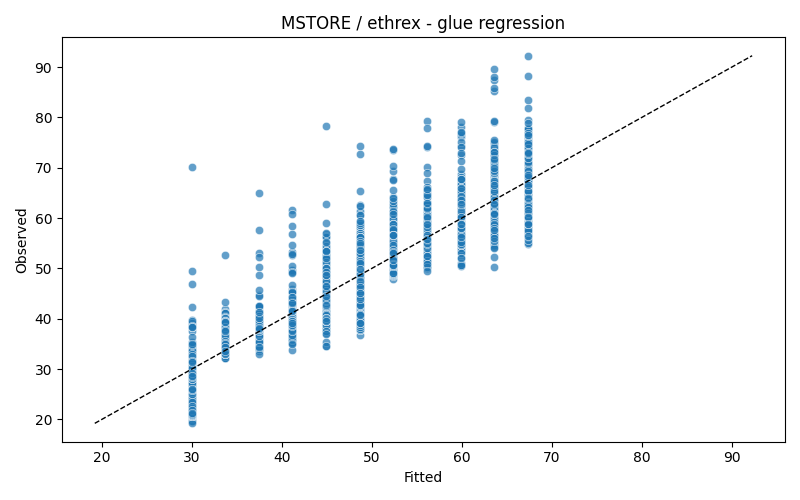

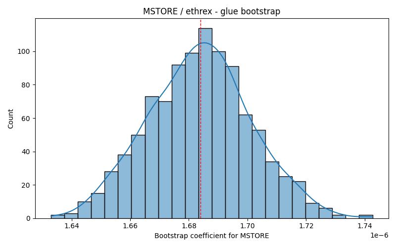

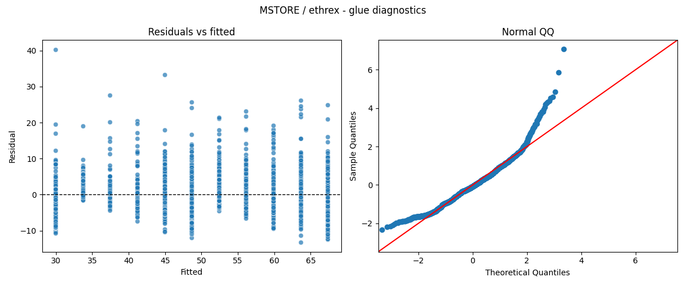

</details>

<details><summary><code>MSTORE8</code> · nobs=2475 · runtime_ms=1.565e-06 · p=1.00e-03 · R²=0.7916</summary>

```
==============================================================================
                           NNLS Regression Results                            
==============================================================================
Dep. Variable:          test_runtime_ms              R-squared:          0.792
Model:                  NNLS                    Adj. R-squared:          0.792
No. Observations:       2475                              RMSE:           5.64
Df Residuals:           2473                               MAE:           4.14
Df Model:               1      
==============================================================================
                      coef     std err     P-value      [0.025      0.975]
------------------------------------------------------------------------------
         const     10.2349      0.3788       0.001      9.4558     10.9101
       MSTORE8      0.0000      0.0000       0.001      0.0000      0.0000
==============================================================================
Notes: Non-negative least squares with bootstrap inference (1000 iterations)
==============================================================================
```

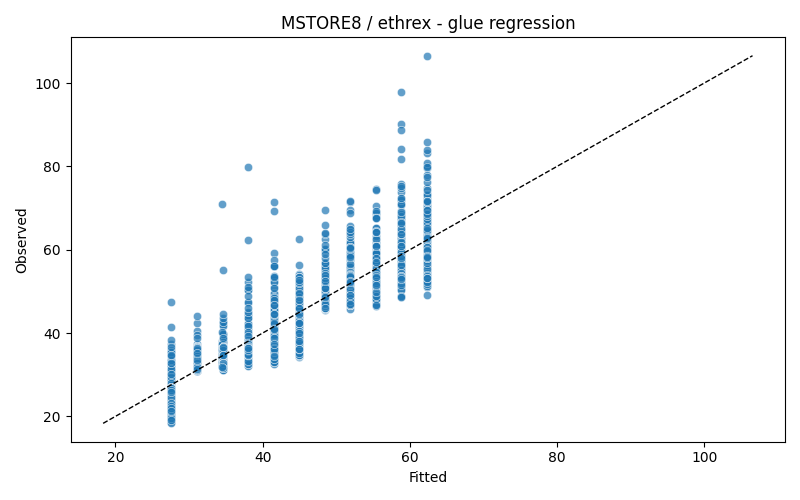

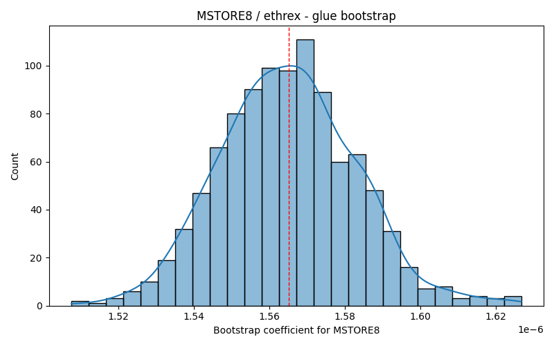

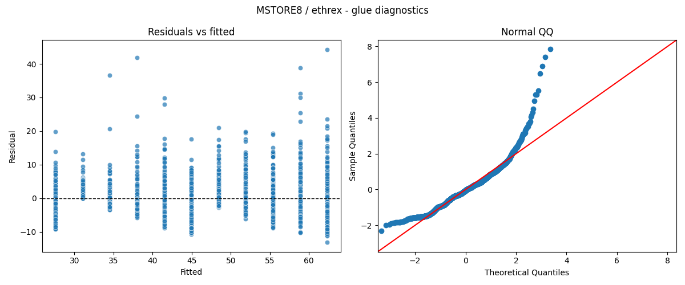

</details>

<details><summary><code>MUL</code> · nobs=495 · runtime_ms=1.638e-06 · p=1.00e-03 · R²=0.8566</summary>

```
==============================================================================
                           NNLS Regression Results                            
==============================================================================
Dep. Variable:          test_runtime_ms              R-squared:          0.857
Model:                  NNLS                    Adj. R-squared:          0.856
No. Observations:       495                               RMSE:           5.29
Df Residuals:           493                                MAE:           3.63
Df Model:               1      
==============================================================================
                      coef     std err     P-value      [0.025      0.975]
------------------------------------------------------------------------------
         const     10.2991      0.6601       0.001      9.0468     11.6061
           MUL      0.0000      0.0000       0.001      0.0000      0.0000
==============================================================================
Notes: Non-negative least squares with bootstrap inference (1000 iterations)
==============================================================================
```

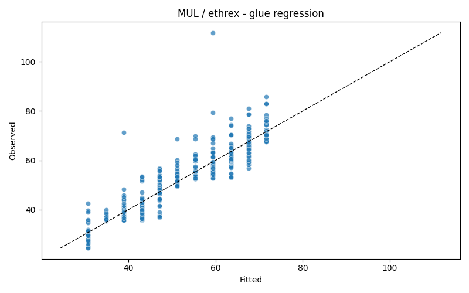

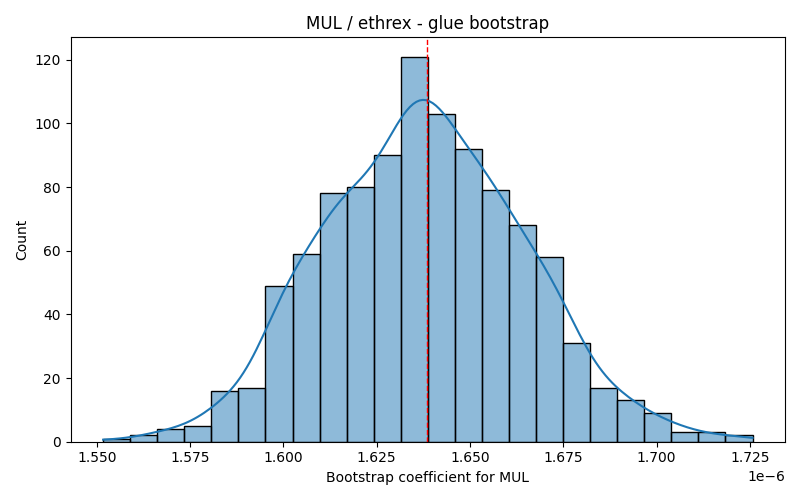

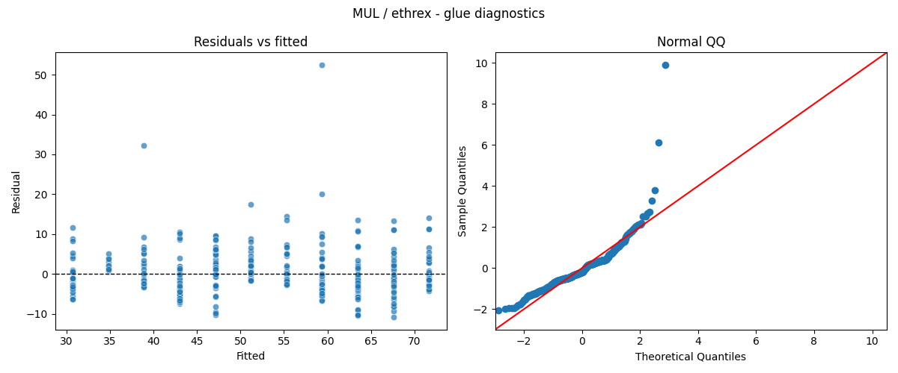

</details>

<details><summary><code>PC</code> · nobs=495 · runtime_ms=5.308e-07 · p=1.00e-03 · R²=0.7836</summary>

```
==============================================================================
                           NNLS Regression Results                            
==============================================================================
Dep. Variable:          test_runtime_ms              R-squared:          0.784
Model:                  NNLS                    Adj. R-squared:          0.783
No. Observations:       495                               RMSE:           8.34
Df Residuals:           493                                MAE:           6.72
Df Model:               1      
==============================================================================
                      coef     std err     P-value      [0.025      0.975]
------------------------------------------------------------------------------
         const     16.9762      1.2464       0.001     14.5489     19.4346
            PC      0.0000      0.0000       0.001      0.0000      0.0000
==============================================================================
Notes: Non-negative least squares with bootstrap inference (1000 iterations)
==============================================================================
```

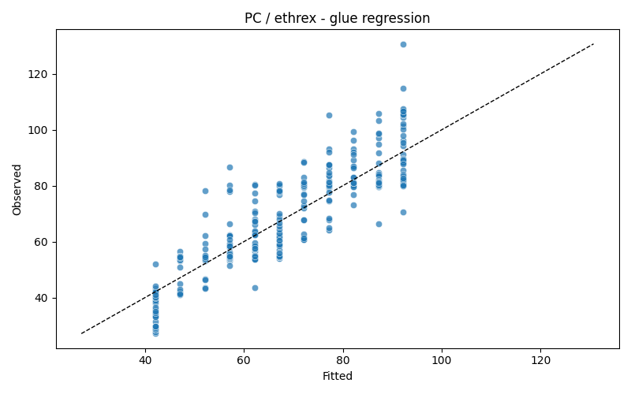

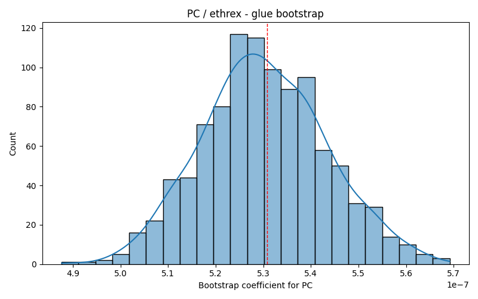

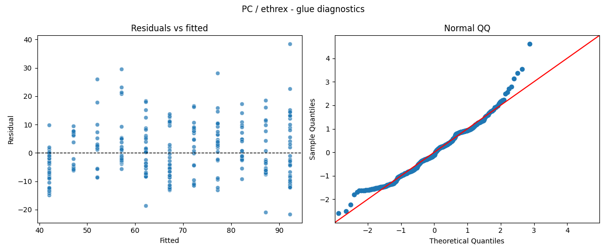

</details>

<details><summary><code>RETURNDATASIZE</code> · nobs=1980 · runtime_ms=9.08e-07 · p=1.00e-03 · R²=0.776</summary>

```
==============================================================================
                           NNLS Regression Results                            
==============================================================================
Dep. Variable:          test_runtime_ms              R-squared:          0.776
Model:                  NNLS                    Adj. R-squared:          0.776
No. Observations:       1980                              RMSE:           7.70
Df Residuals:           1978                               MAE:           5.08
Df Model:               1      
==============================================================================
                      coef     std err     P-value      [0.025      0.975]
------------------------------------------------------------------------------
         const     11.4658      0.5226       0.001     10.4329     12.4969
RETURNDATASIZE      0.0000      0.0000       0.001      0.0000      0.0000
==============================================================================
Notes: Non-negative least squares with bootstrap inference (1000 iterations)
==============================================================================
```

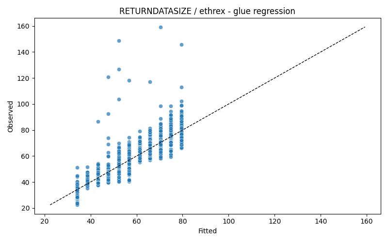

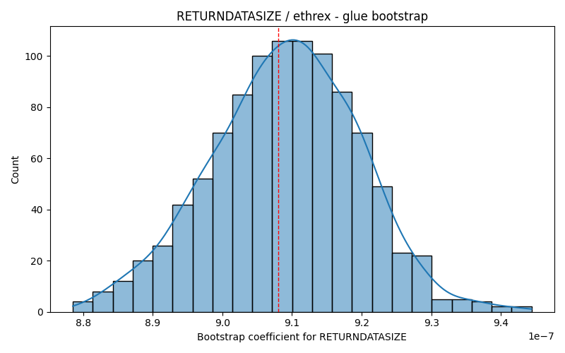

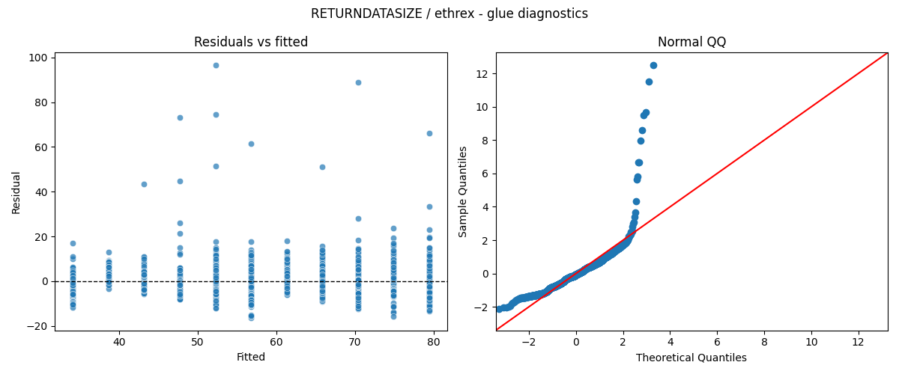

</details>

<details><summary><code>SELFBALANCE</code> · nobs=405 · runtime_ms=5.887e-06 · p=1.00e-03 · R²=0.9066</summary>

```
==============================================================================
                           NNLS Regression Results                            
==============================================================================
Dep. Variable:          test_runtime_ms              R-squared:          0.907
Model:                  NNLS                    Adj. R-squared:          0.906
No. Observations:       405                               RMSE:          19.06
Df Residuals:           403                                MAE:          15.29
Df Model:               1      
==============================================================================
                      coef     std err     P-value      [0.025      0.975]
------------------------------------------------------------------------------
         const     52.4530      3.9167       0.001     44.7991     60.6065
   SELFBALANCE      0.0000      0.0000       0.001      0.0000      0.0000
==============================================================================
Notes: Non-negative least squares with bootstrap inference (1000 iterations)
==============================================================================
```

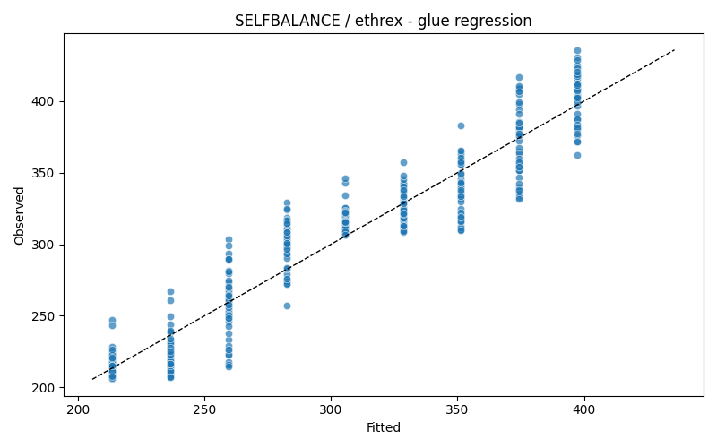

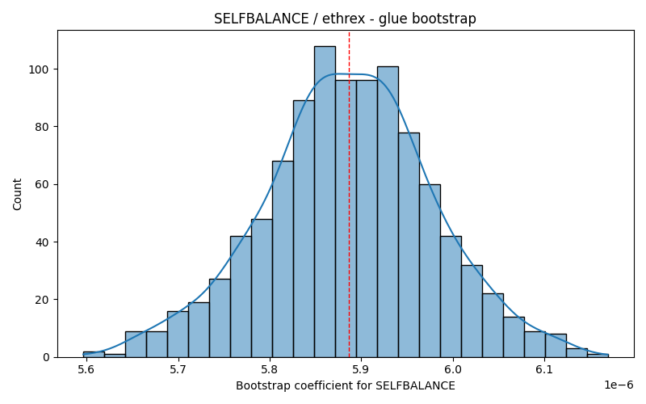

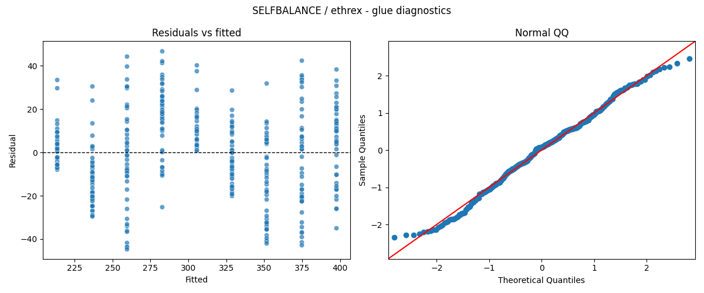

</details>

<details><summary><code>SUB</code> · nobs=495 · runtime_ms=1.164e-06 · p=1.00e-03 · R²=0.7905</summary>

```
==============================================================================
                           NNLS Regression Results                            
==============================================================================
Dep. Variable:          test_runtime_ms              R-squared:          0.791
Model:                  NNLS                    Adj. R-squared:          0.790
No. Observations:       495                               RMSE:           6.31
Df Residuals:           493                                MAE:           3.67
Df Model:               1      
==============================================================================
                      coef     std err     P-value      [0.025      0.975]
------------------------------------------------------------------------------
         const     10.2847      0.9292       0.001      8.5826     12.1911
           SUB      0.0000      0.0000       0.001      0.0000      0.0000
==============================================================================
Notes: Non-negative least squares with bootstrap inference (1000 iterations)
==============================================================================
```

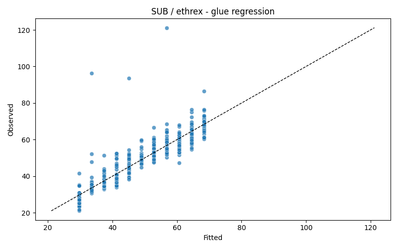

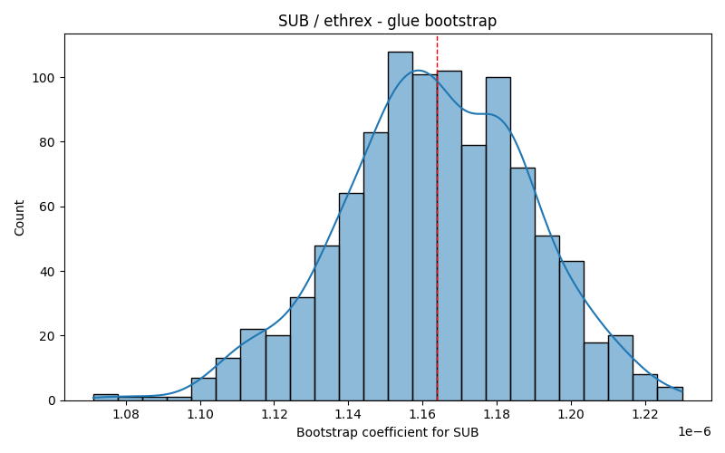

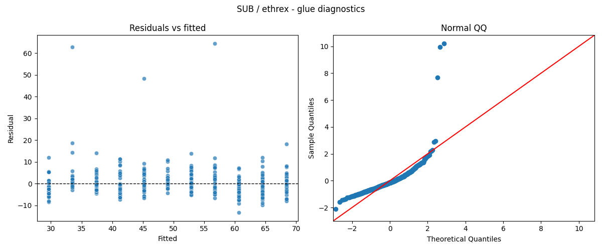

</details>

### Mixed glue (tier B) · ethrex

<details><summary><code>JUMP</code> · nobs=495 · runtime_ms=4.143e-06 · p=1.00e-03 · R²=0.8286</summary>

```
==============================================================================
                           NNLS Regression Results                            
==============================================================================
Dep. Variable:          test_runtime_ms              R-squared:          0.829
Model:                  NNLS                    Adj. R-squared:          0.828
No. Observations:       495                               RMSE:           7.00
Df Residuals:           493                                MAE:           5.70
Df Model:               1      
==============================================================================
                      coef     std err     P-value      [0.025      0.975]
------------------------------------------------------------------------------
         const     16.5026      1.0679       0.001     14.4839     18.5186
          JUMP      0.0000      0.0000       0.001      0.0000      0.0000
==============================================================================
Notes: Non-negative least squares with bootstrap inference (1000 iterations)
==============================================================================
```

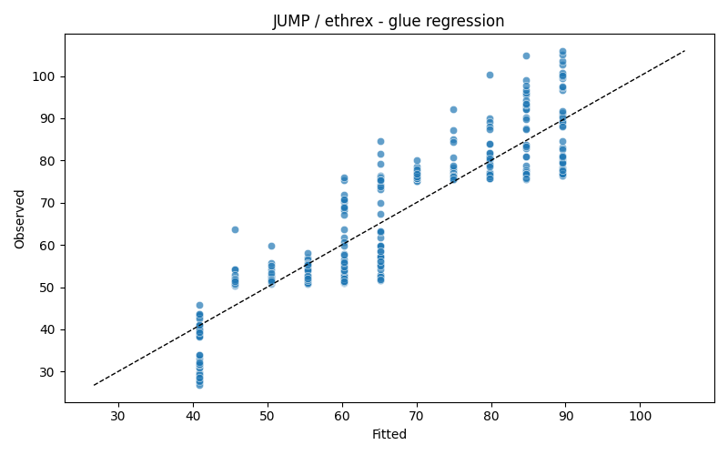

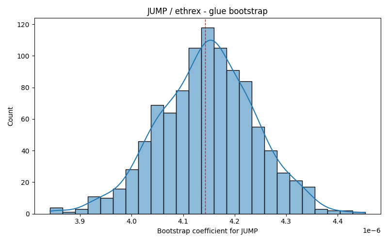

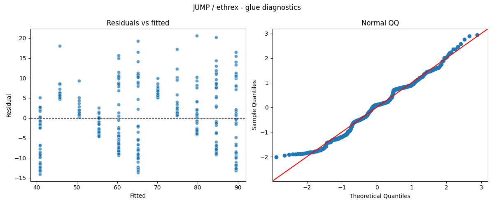

</details>

<details><summary><code>KECCAK256</code> · nobs=7920 · runtime_ms=0 · p=1.00e+00 · R²=0</summary>

```
==============================================================================
                           NNLS Regression Results                            
==============================================================================
Dep. Variable:          test_runtime_ms              R-squared:          0.000
Model:                  NNLS                    Adj. R-squared:         -0.000
No. Observations:       7920                              RMSE:         153.56
Df Residuals:           7918                               MAE:         127.24
Df Model:               1      
==============================================================================
                      coef     std err     P-value      [0.025      0.975]
------------------------------------------------------------------------------
         const    242.7107      1.7084       0.001    239.2837    245.8462
     KECCAK256      0.0000      0.0000       1.000      0.0000      0.0000
==============================================================================
Notes: Non-negative least squares with bootstrap inference (1000 iterations)
==============================================================================
```

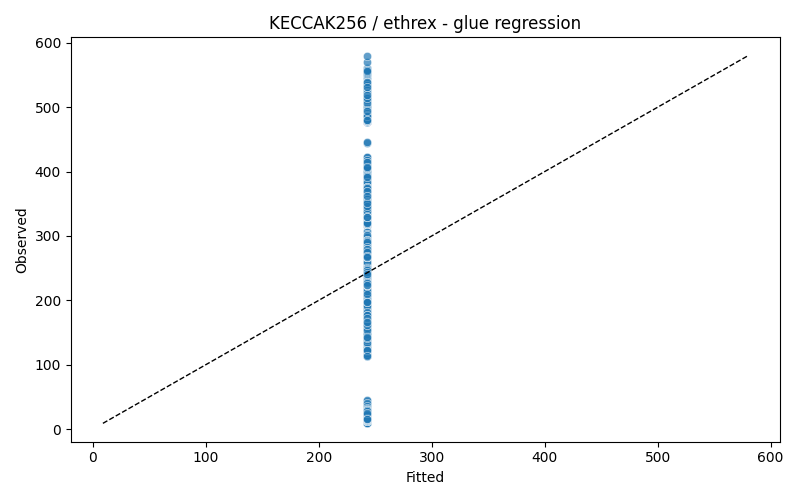

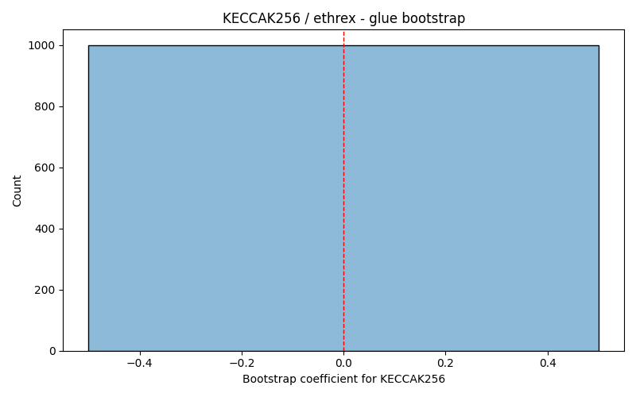

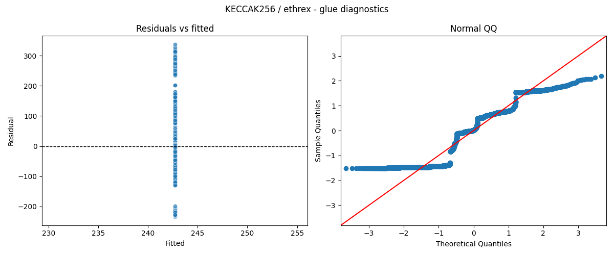

</details>

## geth

| glue_opcode | nobs | glue_runtime_ms | p_value | rsquared |
| --- | --- | --- | --- | --- |
| `ISZERO` | 3696 | 1.417e-06 | 1.00e-03 | 0.7845 |
| `JUMPDEST` | 3696 | 1.139e-06 | 1.00e-03 | 0.7519 |
| `SWAP` | 59136 | 1.522e-06 | 1.00e-03 | 0.7594 |
| `CALLDATASIZE` | 218526 | 1.417e-06 | 1.00e-03 | 0.8197 |
| `DUP` | 218526 | 1.524e-06 | 1.00e-03 | 0.8197 |
| `GAS` | 218526 | 1.493e-06 | 1.00e-03 | 0.8197 |
| `MLOAD` | 218526 | 5.194e-06 | 1.00e-03 | 0.8197 |
| `PUSH` | 218526 | 2.255e-06 | 1.00e-03 | 0.8197 |
| `PUSH0` | 218526 | 1.428e-06 | 1.00e-03 | 0.8197 |
| `STATICCALL` | 218526 | 0.0001732 | 1.00e-03 | 0.8197 |
| `ADD` | 3696 | 4.452e-06 | 1.00e-03 | 0.8342 |
| `AND` | 3696 | 4.316e-06 | 1.00e-03 | 0.8103 |
| `CALLDATACOPY` | 88704 | 1.369e-05 | 1.00e-03 | 0.9529 |
| `CALLDATALOAD` | 14784 | 5.055e-05 | 1.00e-03 | 0.03439 |
| `DIV` | 3696 | 9.248e-06 | 1.00e-03 | 0.7887 |
| `EXP` | 3696 | 0.0003354 | 1.00e-03 | 0.8198 |
| `GT` | 3696 | 3.533e-06 | 1.00e-03 | 0.7473 |
| `JUMPI` | 3696 | 5.655e-06 | 1.00e-03 | 0.7686 |
| `LT` | 3696 | 4.299e-06 | 1.00e-03 | 0.7877 |
| `MSTORE` | 18480 | 8.006e-06 | 1.00e-03 | 0.8078 |
| `MSTORE8` | 18480 | 7.353e-06 | 1.00e-03 | 0.7912 |
| `MUL` | 3696 | 4.889e-06 | 1.00e-03 | 0.8528 |
| `PC` | 3696 | 1.616e-06 | 1.00e-03 | 0.8313 |
| `RETURNDATASIZE` | 14784 | 3.113e-06 | 1.00e-03 | 0.6034 |
| `SELFBALANCE` | 3024 | 7.475e-06 | 1.00e-03 | 0.7941 |
| `SUB` | 3696 | 4.421e-06 | 1.00e-03 | 0.8093 |
| `JUMP` | 3696 | 9.199e-06 | 1.00e-03 | 0.7734 |
| `KECCAK256` | 59136 | 3.652e-05 | 1.00e-03 | 0.2629 |

### Cycle glue — joint fit · geth

<details><summary>Joint NNLS regression summary</summary>

```
==============================================================================
                           NNLS Regression Results                            
==============================================================================
Dep. Variable:          test_runtime_ms              R-squared:          0.820
Model:                  NNLS                    Adj. R-squared:          0.820
No. Observations:       218526                            RMSE:          24.17
Df Residuals:           218518                             MAE:          18.71
Df Model:               7      
==============================================================================
                      coef     std err     P-value      [0.025      0.975]
------------------------------------------------------------------------------
         const     40.6190      0.1799       0.001     40.2671     40.9635
  CALLDATASIZE      0.0000      0.0000       0.001      0.0000      0.0000
           DUP      0.0000      0.0000       0.001      0.0000      0.0000
           GAS      0.0000      0.0000       0.001      0.0000      0.0000
         MLOAD      0.0000      0.0000       0.001      0.0000      0.0000
          PUSH      0.0000      0.0000       0.001      0.0000      0.0000
         PUSH0      0.0000      0.0000       0.001      0.0000      0.0000
    STATICCALL      0.0002      0.0000       0.001      0.0002      0.0002
==============================================================================
Notes: Non-negative least squares with bootstrap inference (1000 iterations)
==============================================================================
```

</details>

<details><summary><code>CALLDATASIZE</code> · nobs=218526 · runtime_ms=1.417e-06 · p=1.00e-03 · R²=0.8197</summary>

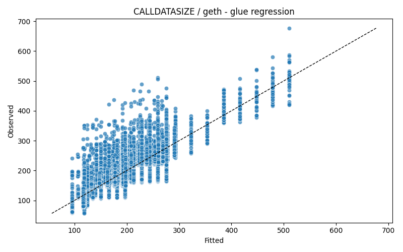

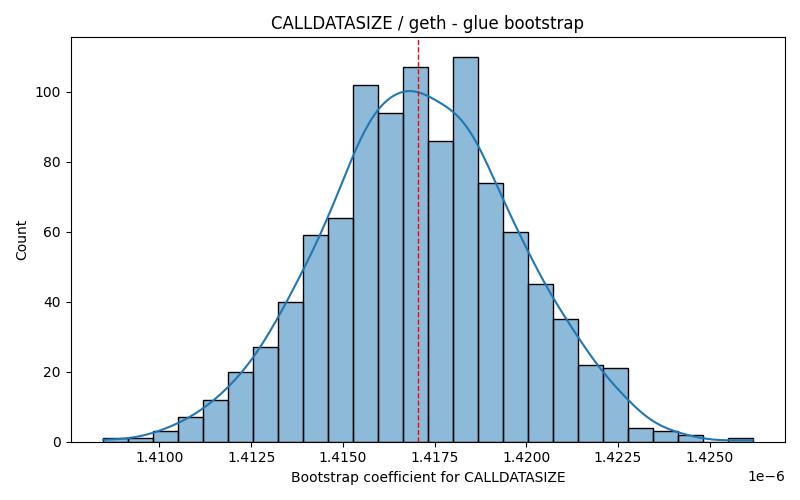

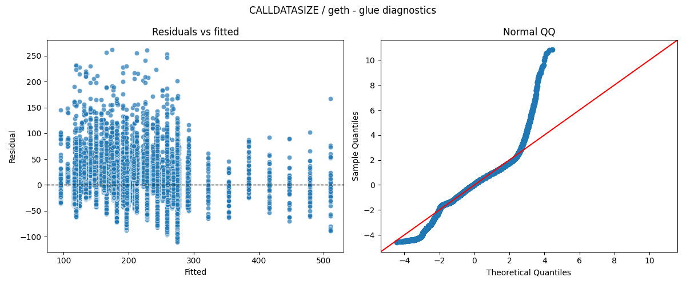

</details>

<details><summary><code>DUP</code> · nobs=218526 · runtime_ms=1.524e-06 · p=1.00e-03 · R²=0.8197</summary>


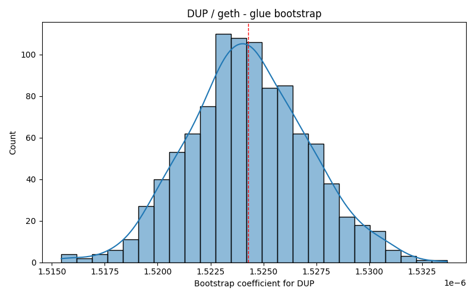

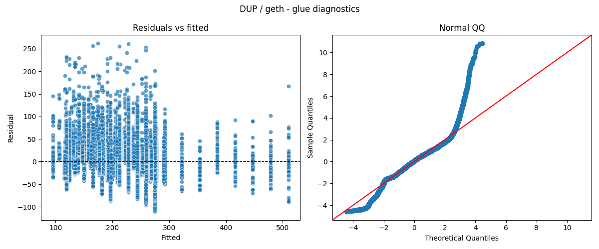

</details>

<details><summary><code>GAS</code> · nobs=218526 · runtime_ms=1.493e-06 · p=1.00e-03 · R²=0.8197</summary>

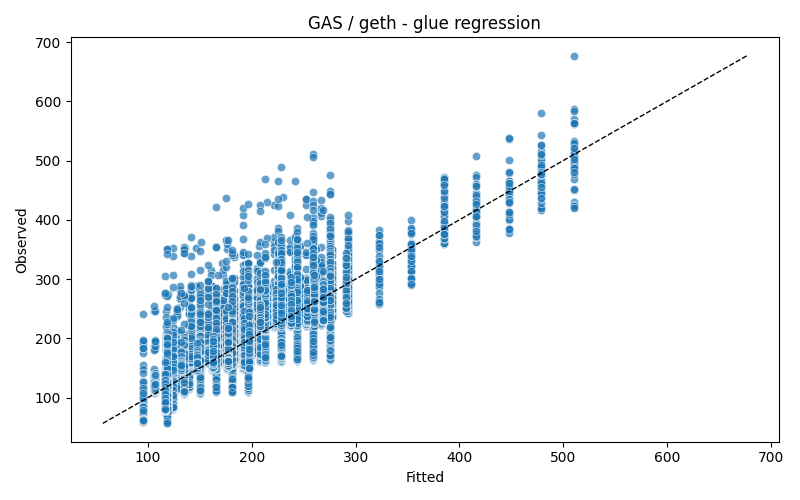

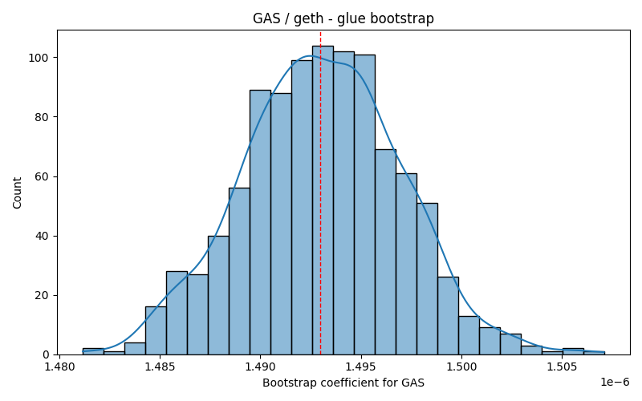


</details>

<details><summary><code>MLOAD</code> · nobs=218526 · runtime_ms=5.194e-06 · p=1.00e-03 · R²=0.8197</summary>


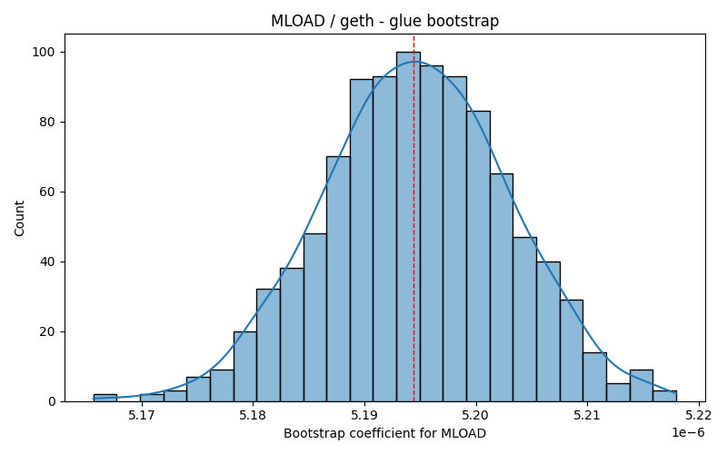


</details>

<details><summary><code>PUSH</code> · nobs=218526 · runtime_ms=2.255e-06 · p=1.00e-03 · R²=0.8197</summary>


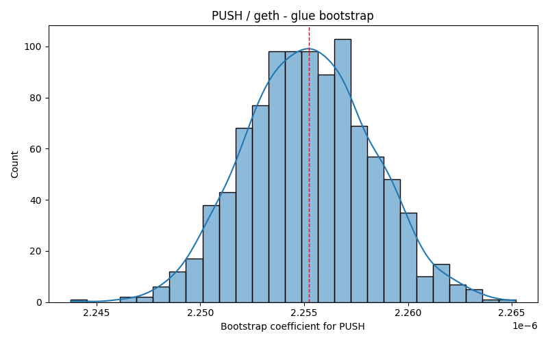


</details>

<details><summary><code>PUSH0</code> · nobs=218526 · runtime_ms=1.428e-06 · p=1.00e-03 · R²=0.8197</summary>


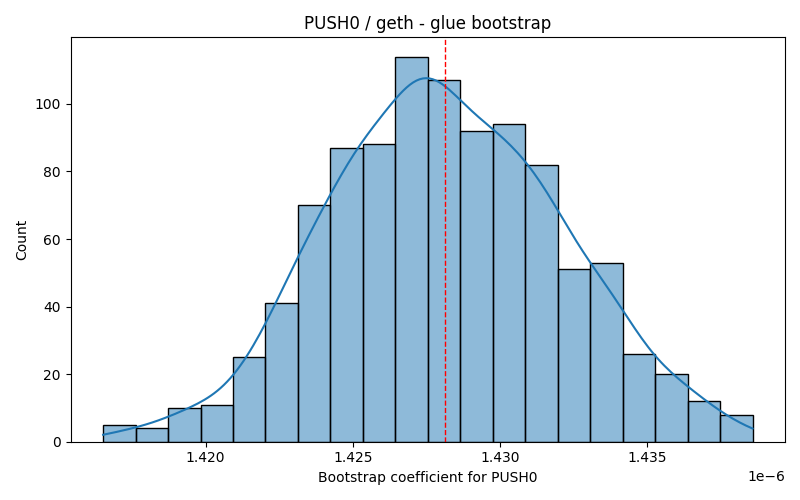


</details>

<details><summary><code>STATICCALL</code> · nobs=218526 · runtime_ms=0.0001732 · p=1.00e-03 · R²=0.8197</summary>


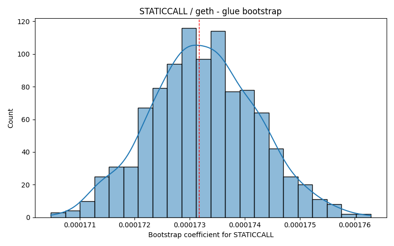

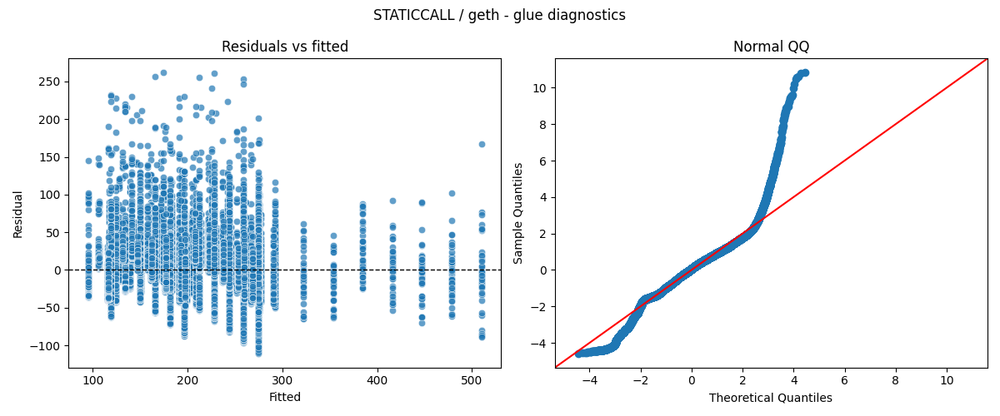

</details>

### Pure glue · geth

<details><summary><code>ISZERO</code> · nobs=3696 · runtime_ms=1.417e-06 · p=1.00e-03 · R²=0.7845</summary>

```
==============================================================================
                           NNLS Regression Results                            
==============================================================================
Dep. Variable:          test_runtime_ms              R-squared:          0.785
Model:                  NNLS                    Adj. R-squared:          0.784
No. Observations:       3696                              RMSE:          15.64
Df Residuals:           3694                               MAE:          11.77
Df Model:               1      
==============================================================================
                      coef     std err     P-value      [0.025      0.975]
------------------------------------------------------------------------------
         const     23.6826      0.9107       0.001     21.9616     25.6195
        ISZERO      0.0000      0.0000       0.001      0.0000      0.0000
==============================================================================
Notes: Non-negative least squares with bootstrap inference (1000 iterations)
==============================================================================
```

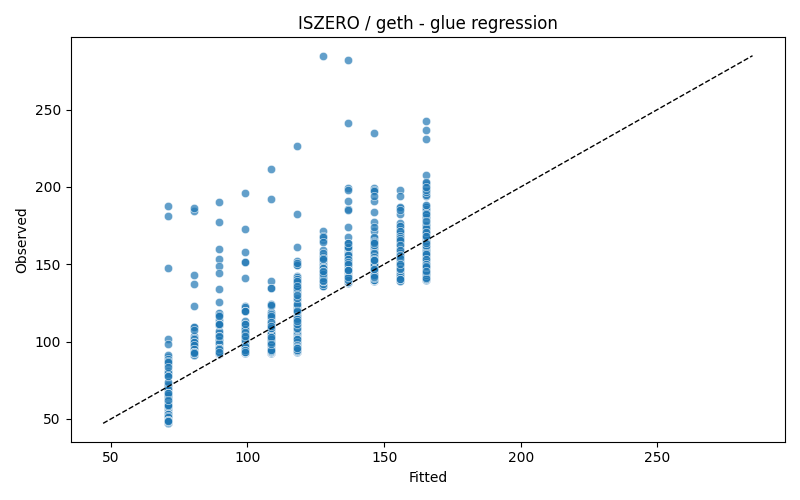

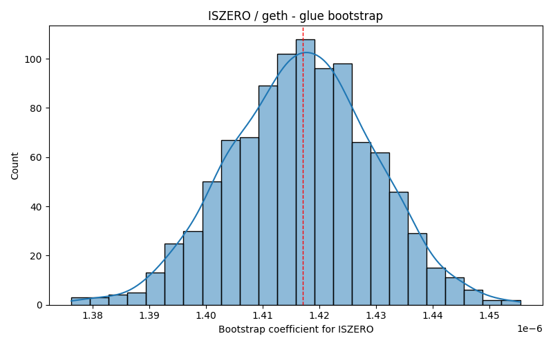

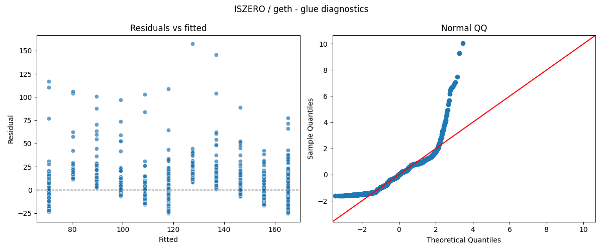

</details>

<details><summary><code>JUMPDEST</code> · nobs=3696 · runtime_ms=1.139e-06 · p=1.00e-03 · R²=0.7519</summary>

```
==============================================================================
                           NNLS Regression Results                            
==============================================================================
Dep. Variable:          test_runtime_ms              R-squared:          0.752
Model:                  NNLS                    Adj. R-squared:          0.752
No. Observations:       3696                              RMSE:          41.32
Df Residuals:           3694                               MAE:          27.65
Df Model:               1      
==============================================================================
                      coef     std err     P-value      [0.025      0.975]
------------------------------------------------------------------------------
         const     73.1663      2.2912       0.001     68.6685     77.5216
      JUMPDEST      0.0000      0.0000       0.001      0.0000      0.0000
==============================================================================
Notes: Non-negative least squares with bootstrap inference (1000 iterations)
==============================================================================
```

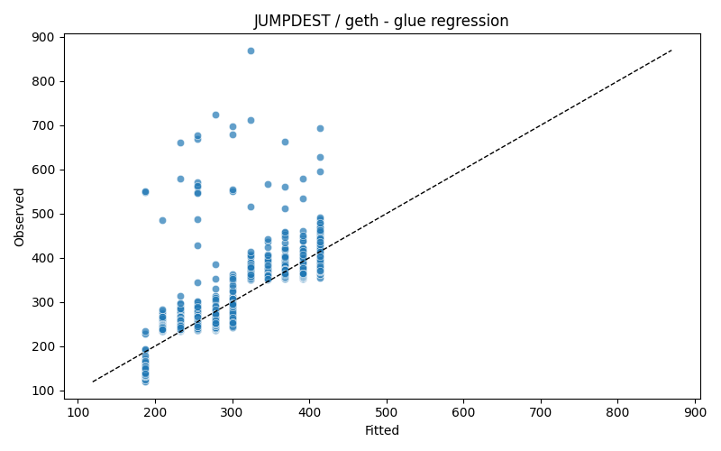

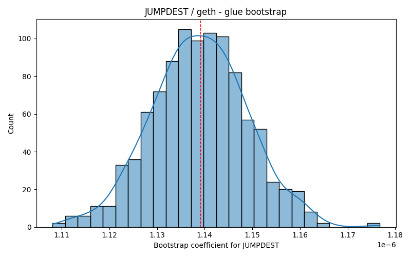

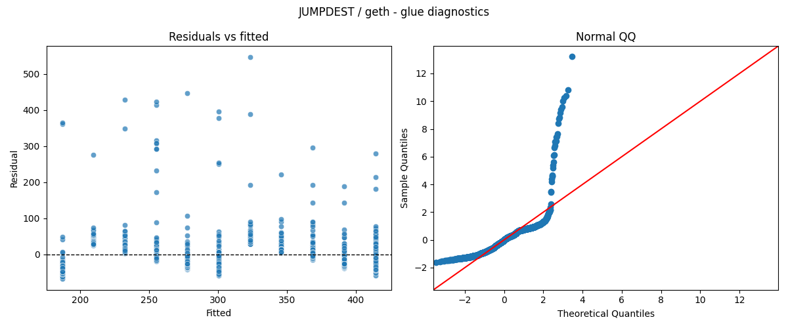

</details>

<details><summary><code>SWAP</code> · nobs=59136 · runtime_ms=1.522e-06 · p=1.00e-03 · R²=0.7594</summary>

```
==============================================================================
                           NNLS Regression Results                            
==============================================================================
Dep. Variable:          test_runtime_ms              R-squared:          0.759
Model:                  NNLS                    Adj. R-squared:          0.759
No. Observations:       59136                             RMSE:          18.04
Df Residuals:           59134                              MAE:          13.34
Df Model:               1      
==============================================================================
                      coef     std err     P-value      [0.025      0.975]
------------------------------------------------------------------------------
         const     31.1291      0.2681       0.001     30.6050     31.6898
          SWAP      0.0000      0.0000       0.001      0.0000      0.0000
==============================================================================
Notes: Non-negative least squares with bootstrap inference (1000 iterations)
==============================================================================
```

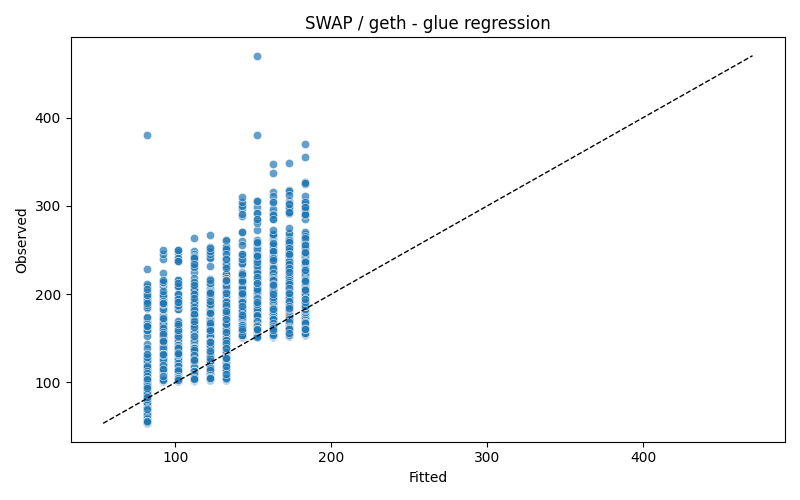

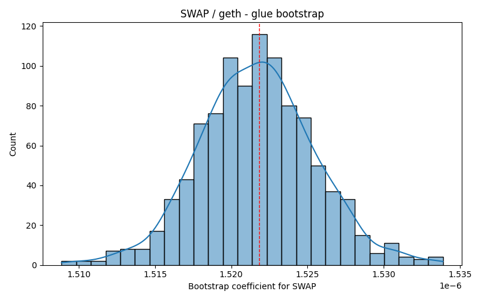

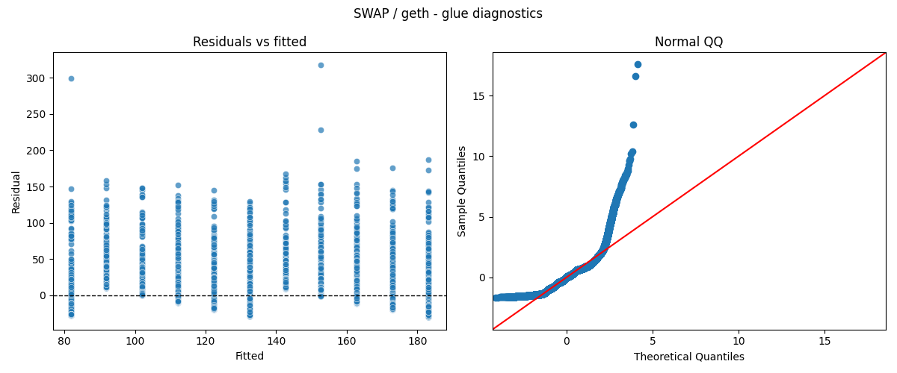

</details>

### Mixed glue (tier A) · geth

<details><summary><code>ADD</code> · nobs=3696 · runtime_ms=4.452e-06 · p=1.00e-03 · R²=0.8342</summary>

```
==============================================================================
                           NNLS Regression Results                            
==============================================================================
Dep. Variable:          test_runtime_ms              R-squared:          0.834
Model:                  NNLS                    Adj. R-squared:          0.834
No. Observations:       3696                              RMSE:          20.89
Df Residuals:           3694                               MAE:          15.61
Df Model:               1      
==============================================================================
                      coef     std err     P-value      [0.025      0.975]
------------------------------------------------------------------------------
         const     44.4758      1.0937       0.001     42.2521     46.5396
           ADD      0.0000      0.0000       0.001      0.0000      0.0000
==============================================================================
Notes: Non-negative least squares with bootstrap inference (1000 iterations)
==============================================================================
```

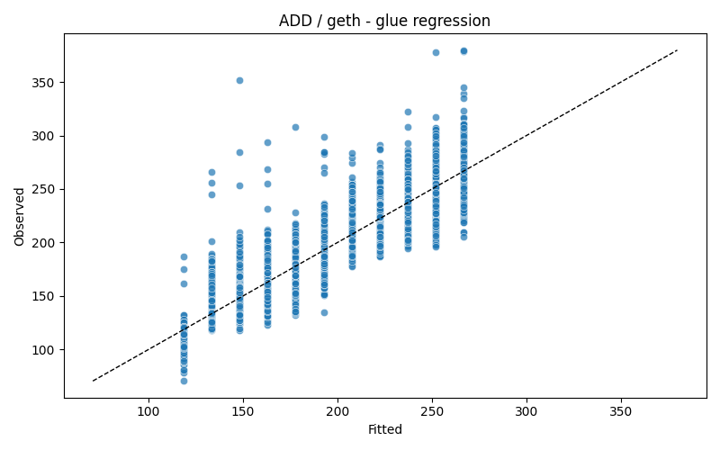

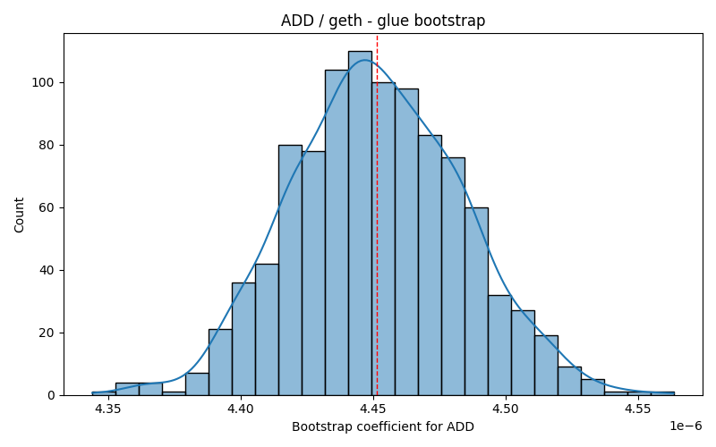

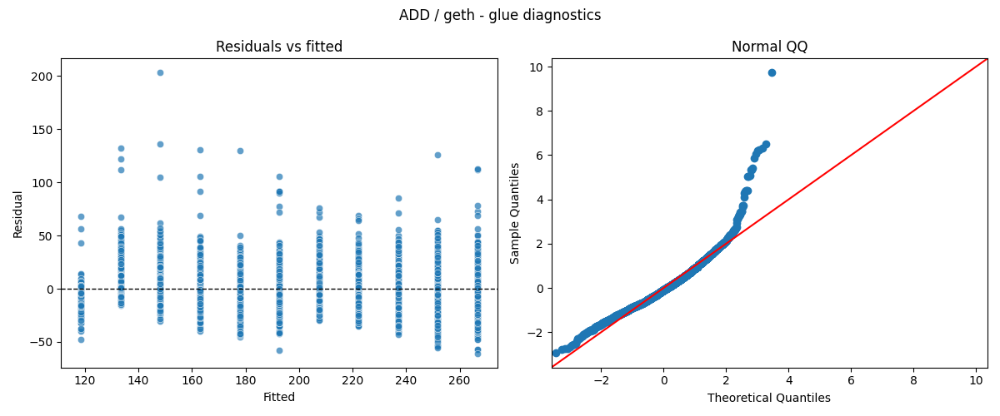

</details>

<details><summary><code>AND</code> · nobs=3696 · runtime_ms=4.316e-06 · p=1.00e-03 · R²=0.8103</summary>

```
==============================================================================
                           NNLS Regression Results                            
==============================================================================
Dep. Variable:          test_runtime_ms              R-squared:          0.810
Model:                  NNLS                    Adj. R-squared:          0.810
No. Observations:       3696                              RMSE:          21.98
Df Residuals:           3694                               MAE:          16.31
Df Model:               1      
==============================================================================
                      coef     std err     P-value      [0.025      0.975]
------------------------------------------------------------------------------
         const     42.6733      1.1220       0.001     40.4647     44.9707
           AND      0.0000      0.0000       0.001      0.0000      0.0000
==============================================================================
Notes: Non-negative least squares with bootstrap inference (1000 iterations)
==============================================================================
```

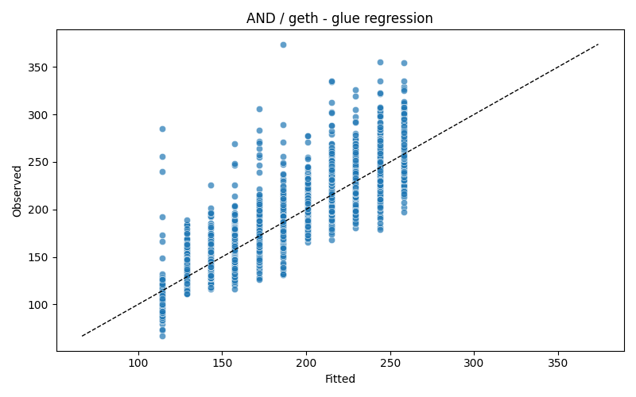

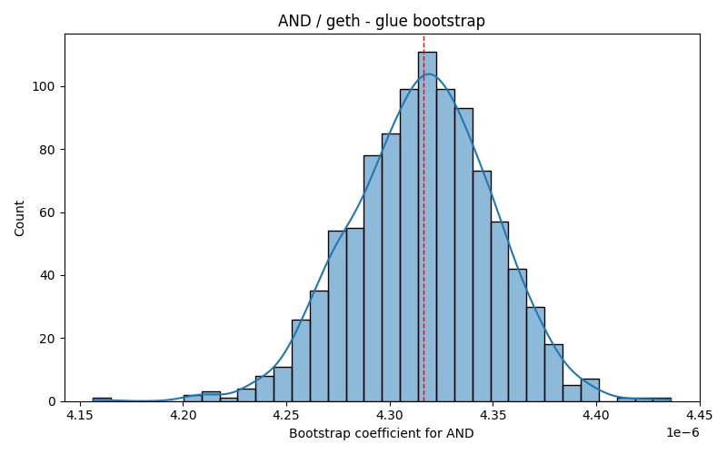

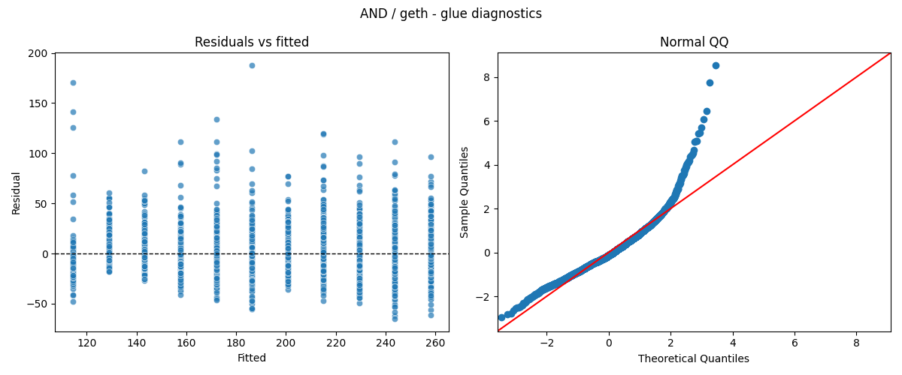

</details>

<details><summary><code>CALLDATACOPY</code> · nobs=88704 · runtime_ms=1.369e-05 · p=1.00e-03 · R²=0.9529</summary>

```
==============================================================================
                           NNLS Regression Results                            
==============================================================================
Dep. Variable:          test_runtime_ms              R-squared:          0.953
Model:                  NNLS                    Adj. R-squared:          0.953
No. Observations:       88704                             RMSE:          22.89
Df Residuals:           88702                              MAE:          16.34
Df Model:               1      
==============================================================================
                      coef     std err     P-value      [0.025      0.975]
------------------------------------------------------------------------------
         const     20.3500      0.0966       0.001     20.1626     20.5318
  CALLDATACOPY      0.0000      0.0000       0.001      0.0000      0.0000
==============================================================================
Notes: Non-negative least squares with bootstrap inference (1000 iterations)
==============================================================================
```

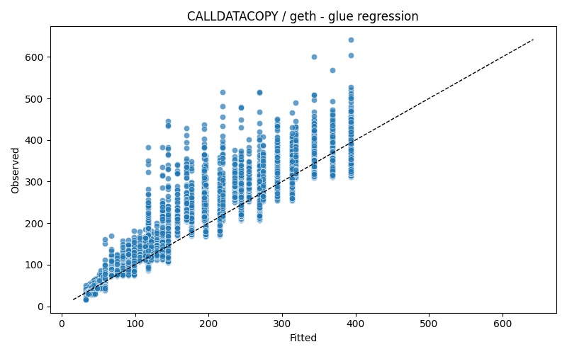

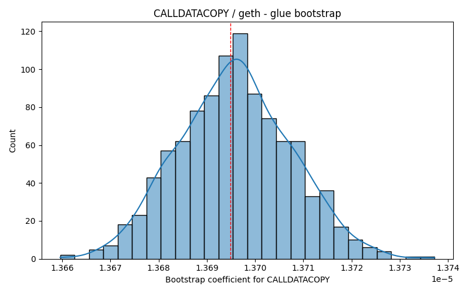

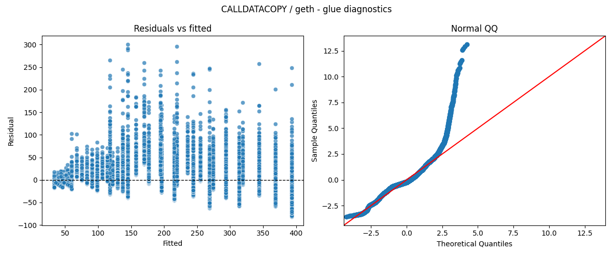

</details>

<details><summary><code>CALLDATALOAD</code> · nobs=14784 · runtime_ms=5.055e-05 · p=1.00e-03 · R²=0.03439</summary>

```
==============================================================================
                           NNLS Regression Results                            
==============================================================================
Dep. Variable:          test_runtime_ms              R-squared:          0.034
Model:                  NNLS                    Adj. R-squared:          0.034
No. Observations:       14784                             RMSE:           1.03
Df Residuals:           14782                              MAE:           0.53
Df Model:               1      
==============================================================================
                      coef     std err     P-value      [0.025      0.975]
------------------------------------------------------------------------------
         const      2.3971      0.0271       0.001      2.3465      2.4521
  CALLDATALOAD      0.0001      0.0000       0.001      0.0000      0.0001
==============================================================================
Notes: Non-negative least squares with bootstrap inference (1000 iterations)
==============================================================================
```

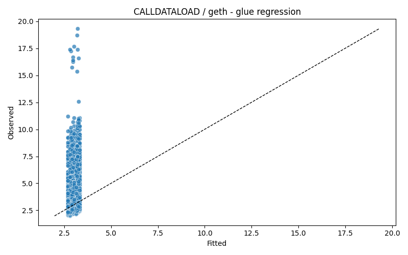

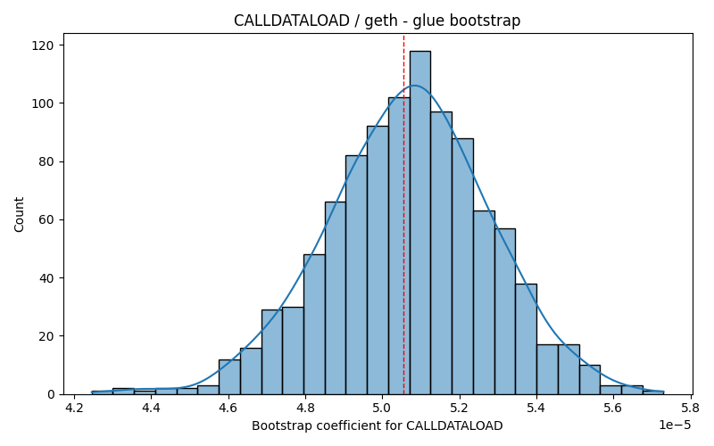

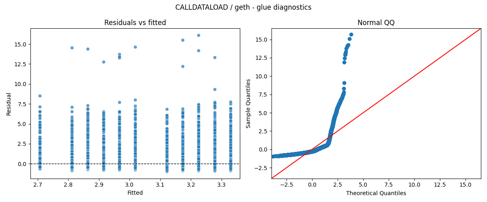

</details>

<details><summary><code>DIV</code> · nobs=3696 · runtime_ms=9.248e-06 · p=1.00e-03 · R²=0.7887</summary>

```
==============================================================================
                           NNLS Regression Results                            
==============================================================================
Dep. Variable:          test_runtime_ms              R-squared:          0.789
Model:                  NNLS                    Adj. R-squared:          0.789
No. Observations:       3696                              RMSE:          37.78
Df Residuals:           3694                               MAE:          31.03
Df Model:               1      
==============================================================================
                      coef     std err     P-value      [0.025      0.975]
------------------------------------------------------------------------------
         const     79.3195      2.3278       0.001     74.6551     84.0839
           DIV      0.0000      0.0000       0.001      0.0000      0.0000
==============================================================================
Notes: Non-negative least squares with bootstrap inference (1000 iterations)
==============================================================================
```

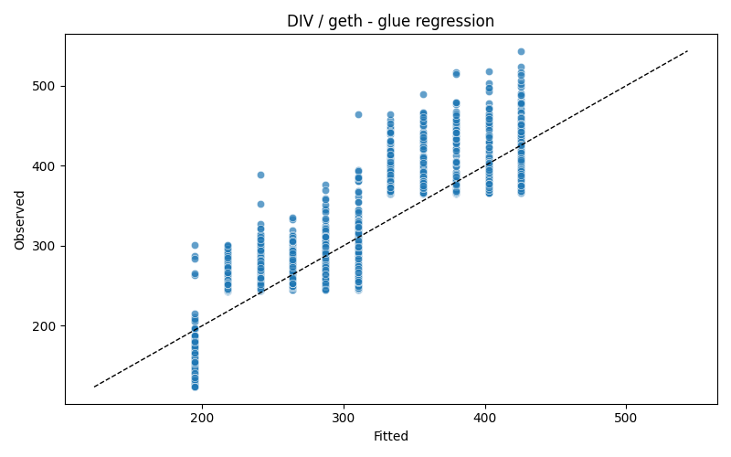

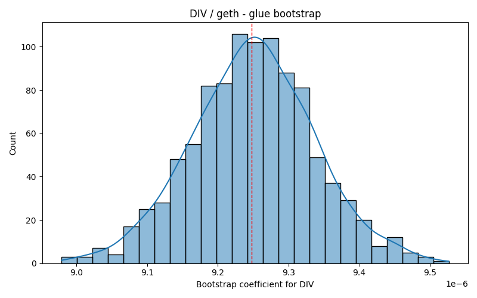

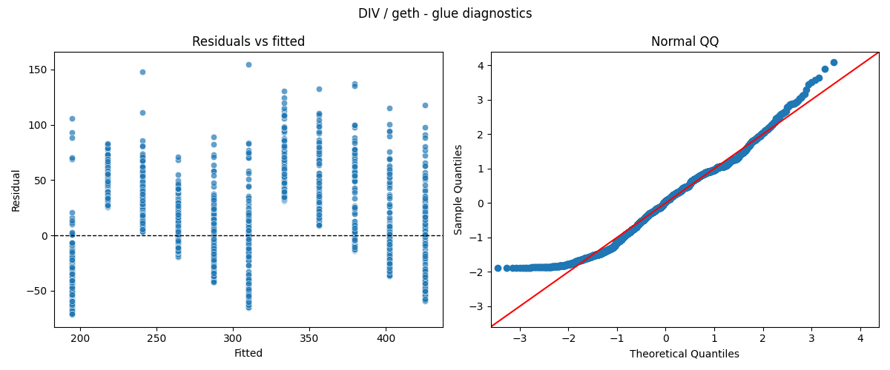

</details>

<details><summary><code>EXP</code> · nobs=3696 · runtime_ms=0.0003354 · p=1.00e-03 · R²=0.8198</summary>

```
==============================================================================
                           NNLS Regression Results                            
==============================================================================
Dep. Variable:          test_runtime_ms              R-squared:          0.820
Model:                  NNLS                    Adj. R-squared:          0.820
No. Observations:       3696                              RMSE:           6.16
Df Residuals:           3694                               MAE:           5.20
Df Model:               1      
==============================================================================
                      coef     std err     P-value      [0.025      0.975]
------------------------------------------------------------------------------
         const     12.9427      0.3699       0.001     12.2433     13.6651
           EXP      0.0003      0.0000       0.001      0.0003      0.0003
==============================================================================
Notes: Non-negative least squares with bootstrap inference (1000 iterations)
==============================================================================
```

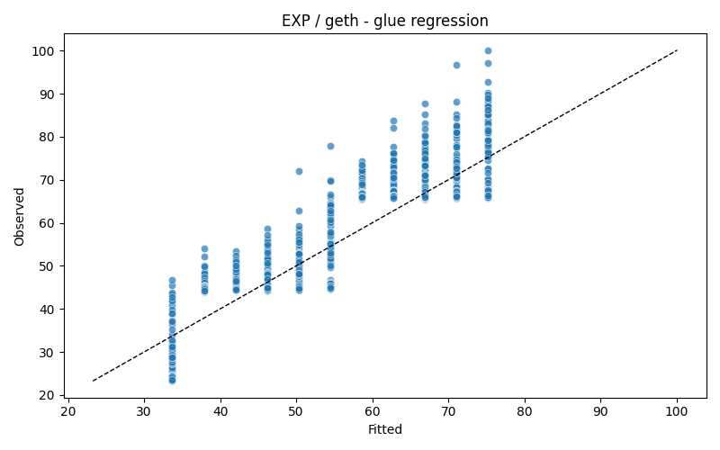

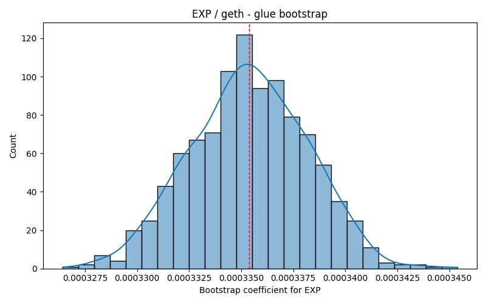


</details>

<details><summary><code>GT</code> · nobs=3696 · runtime_ms=3.533e-06 · p=1.00e-03 · R²=0.7473</summary>

```
==============================================================================
                           NNLS Regression Results                            
==============================================================================
Dep. Variable:          test_runtime_ms              R-squared:          0.747
Model:                  NNLS                    Adj. R-squared:          0.747
No. Observations:       3696                              RMSE:          21.62
Df Residuals:           3694                               MAE:          15.42
Df Model:               1      
==============================================================================
                      coef     std err     P-value      [0.025      0.975]
------------------------------------------------------------------------------
         const     39.2939      1.3562       0.001     36.8469     41.9825
            GT      0.0000      0.0000       0.001      0.0000      0.0000
==============================================================================
Notes: Non-negative least squares with bootstrap inference (1000 iterations)
==============================================================================
```

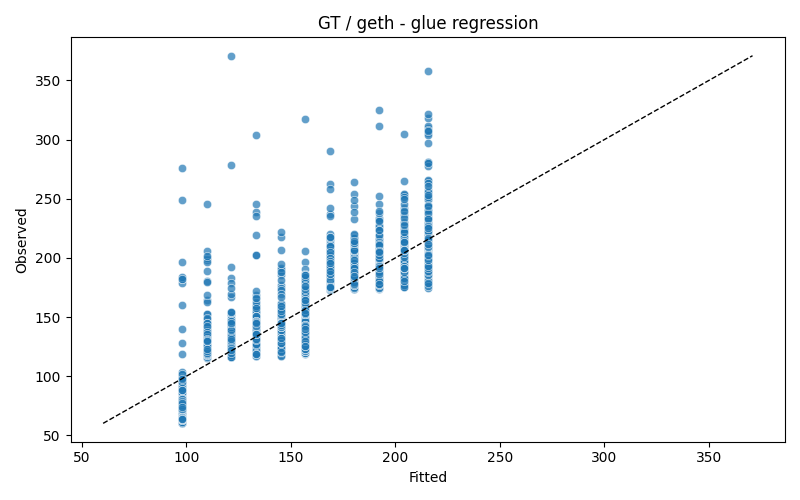

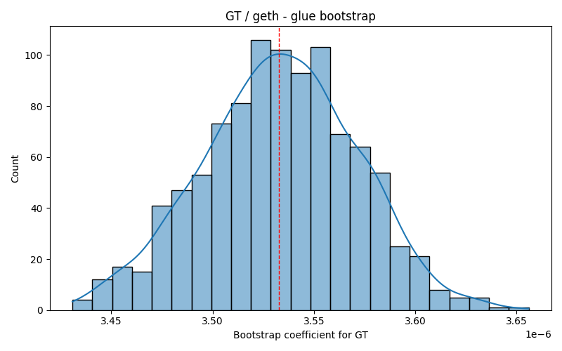

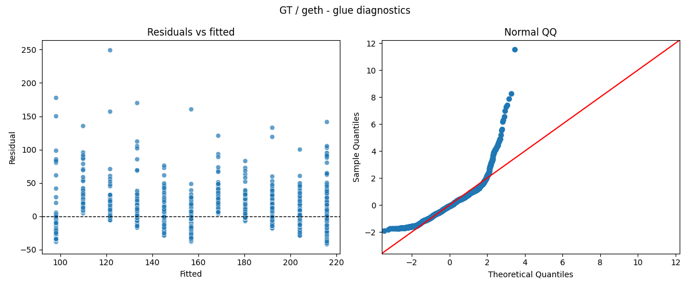

</details>

<details><summary><code>JUMPI</code> · nobs=3696 · runtime_ms=5.655e-06 · p=1.00e-03 · R²=0.7686</summary>

```
==============================================================================
                           NNLS Regression Results                            
==============================================================================
Dep. Variable:          test_runtime_ms              R-squared:          0.769
Model:                  NNLS                    Adj. R-squared:          0.769
No. Observations:       3696                              RMSE:          14.00
Df Residuals:           3694                               MAE:          10.39
Df Model:               1      
==============================================================================
                      coef     std err     P-value      [0.025      0.975]
------------------------------------------------------------------------------
         const     20.1409      0.7540       0.001     18.6861     21.6993
         JUMPI      0.0000      0.0000       0.001      0.0000      0.0000
==============================================================================
Notes: Non-negative least squares with bootstrap inference (1000 iterations)
==============================================================================
```

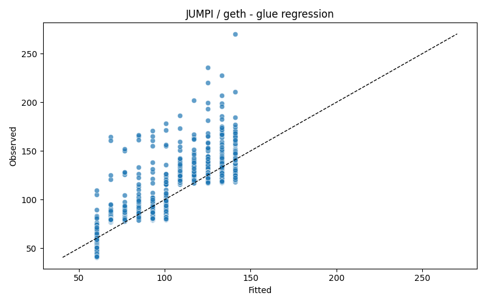

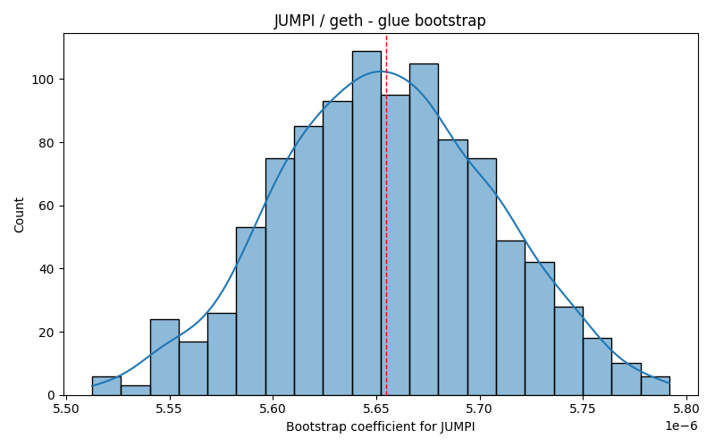

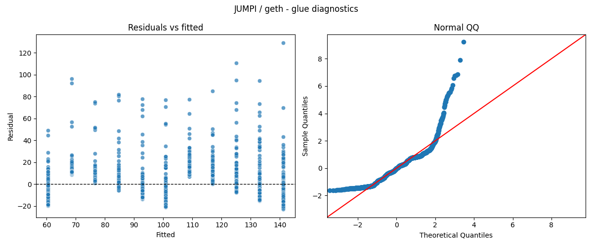

</details>

<details><summary><code>LT</code> · nobs=3696 · runtime_ms=4.299e-06 · p=1.00e-03 · R²=0.7877</summary>

```
==============================================================================
                           NNLS Regression Results                            
==============================================================================
Dep. Variable:          test_runtime_ms              R-squared:          0.788
Model:                  NNLS                    Adj. R-squared:          0.788
No. Observations:       3696                              RMSE:          23.49
Df Residuals:           3694                               MAE:          17.42
Df Model:               1      
==============================================================================
                      coef     std err     P-value      [0.025      0.975]
------------------------------------------------------------------------------
         const     42.8088      1.3236       0.001     40.1978     45.3464
            LT      0.0000      0.0000       0.001      0.0000      0.0000
==============================================================================
Notes: Non-negative least squares with bootstrap inference (1000 iterations)
==============================================================================
```

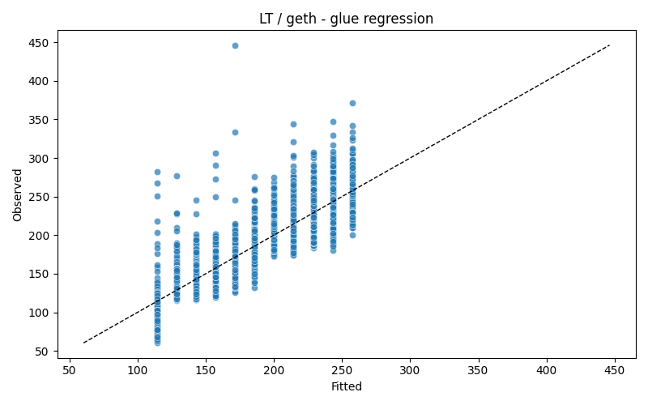

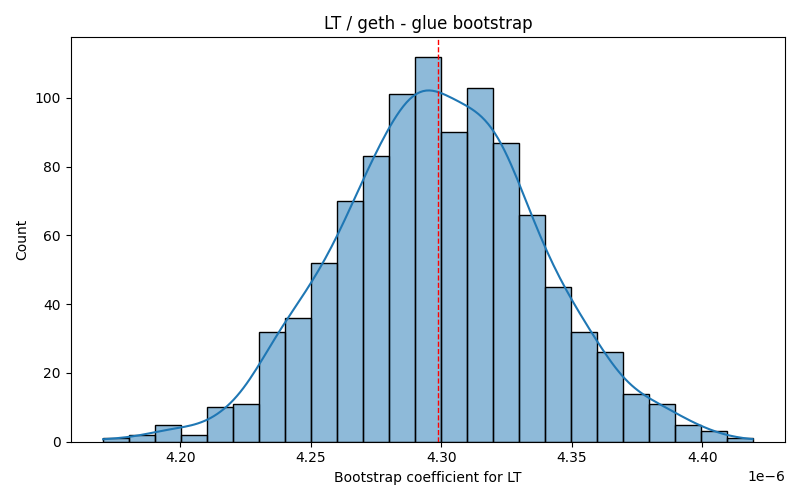

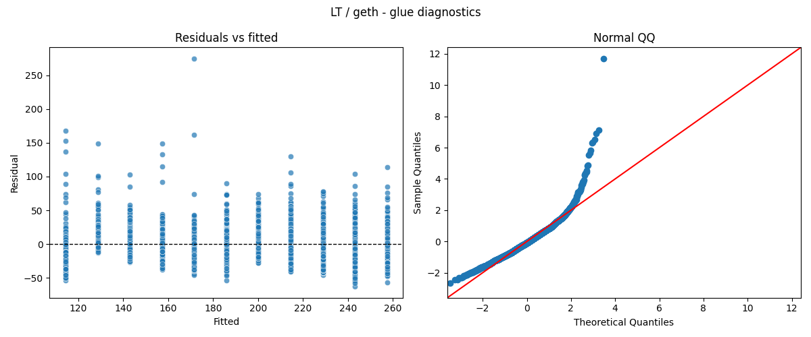

</details>

<details><summary><code>MSTORE</code> · nobs=18480 · runtime_ms=8.006e-06 · p=1.00e-03 · R²=0.8078</summary>

```
==============================================================================
                           NNLS Regression Results                            
==============================================================================
Dep. Variable:          test_runtime_ms              R-squared:          0.808
Model:                  NNLS                    Adj. R-squared:          0.808
No. Observations:       18480                             RMSE:          27.40
Df Residuals:           18478                              MAE:          21.03
Df Model:               1      
==============================================================================
                      coef     std err     P-value      [0.025      0.975]
------------------------------------------------------------------------------
         const     55.1732      0.7338       0.001     53.7245     56.5886
        MSTORE      0.0000      0.0000       0.001      0.0000      0.0000
==============================================================================
Notes: Non-negative least squares with bootstrap inference (1000 iterations)
==============================================================================
```

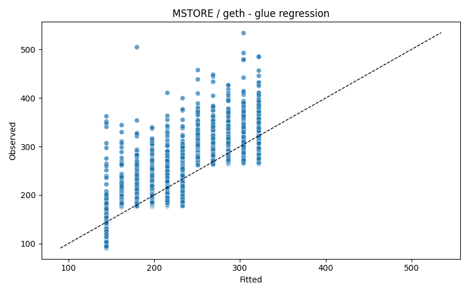

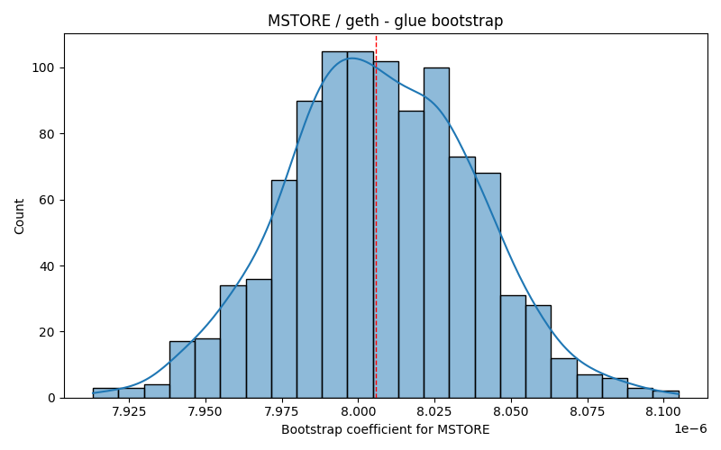

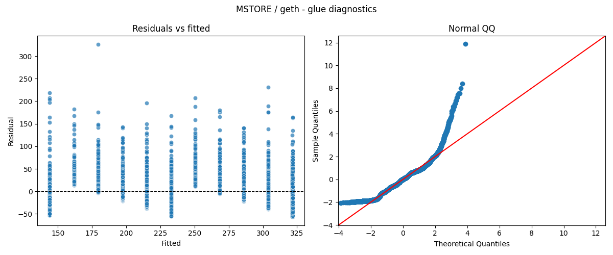

</details>

<details><summary><code>MSTORE8</code> · nobs=18480 · runtime_ms=7.353e-06 · p=1.00e-03 · R²=0.7912</summary>

```
==============================================================================
                           NNLS Regression Results                            
==============================================================================
Dep. Variable:          test_runtime_ms              R-squared:          0.791
Model:                  NNLS                    Adj. R-squared:          0.791
No. Observations:       18480                             RMSE:          26.51
Df Residuals:           18478                              MAE:          19.71
Df Model:               1      
==============================================================================
                      coef     std err     P-value      [0.025      0.975]
------------------------------------------------------------------------------
         const     51.7006      0.7144       0.001     50.3390     53.0598
       MSTORE8      0.0000      0.0000       0.001      0.0000      0.0000
==============================================================================
Notes: Non-negative least squares with bootstrap inference (1000 iterations)
==============================================================================
```

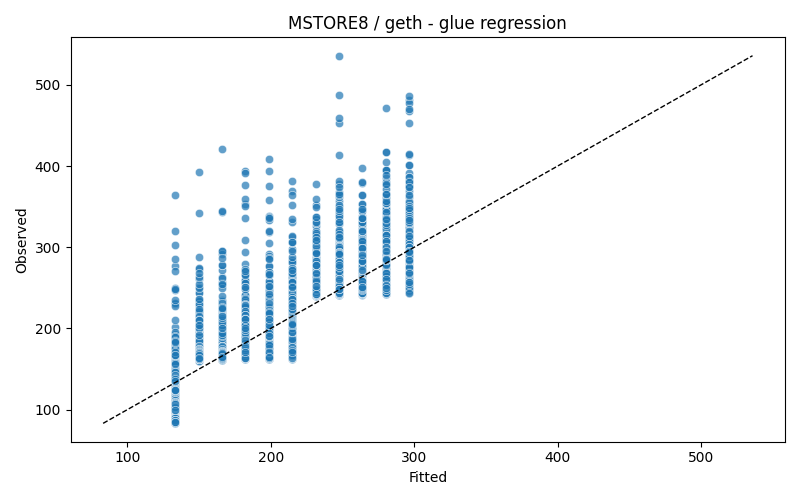

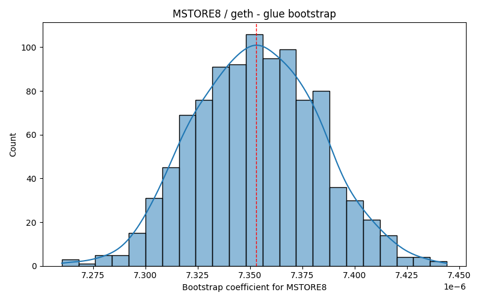

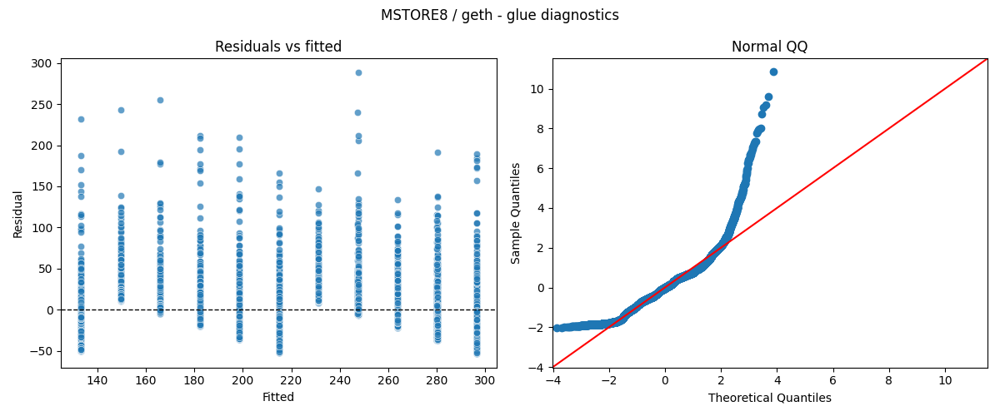

</details>

<details><summary><code>MUL</code> · nobs=3696 · runtime_ms=4.889e-06 · p=1.00e-03 · R²=0.8528</summary>

```
==============================================================================
                           NNLS Regression Results                            
==============================================================================
Dep. Variable:          test_runtime_ms              R-squared:          0.853
Model:                  NNLS                    Adj. R-squared:          0.853
No. Observations:       3696                              RMSE:          16.03
Df Residuals:           3694                               MAE:          11.75
Df Model:               1      
==============================================================================
                      coef     std err     P-value      [0.025      0.975]
------------------------------------------------------------------------------
         const     37.9905      0.9355       0.001     36.1910     39.9002
           MUL      0.0000      0.0000       0.001      0.0000      0.0000
==============================================================================
Notes: Non-negative least squares with bootstrap inference (1000 iterations)
==============================================================================
```

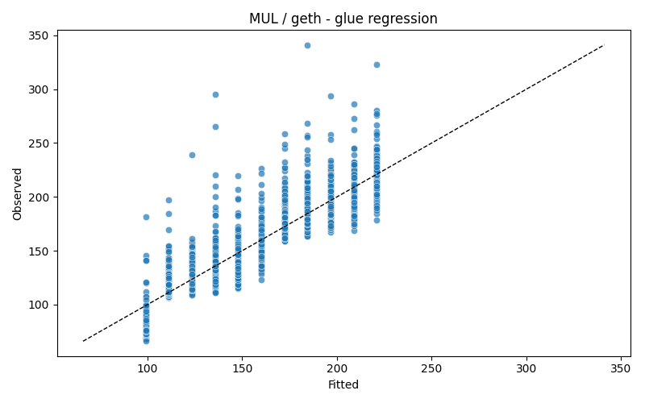

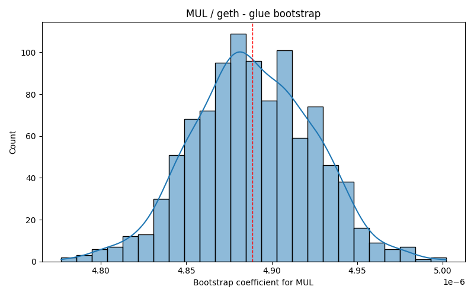

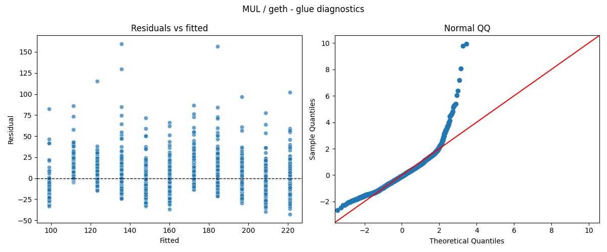

</details>

<details><summary><code>PC</code> · nobs=3696 · runtime_ms=1.616e-06 · p=1.00e-03 · R²=0.8313</summary>

```
==============================================================================
                           NNLS Regression Results                            
==============================================================================
Dep. Variable:          test_runtime_ms              R-squared:          0.831
Model:                  NNLS                    Adj. R-squared:          0.831
No. Observations:       3696                              RMSE:          21.77
Df Residuals:           3694                               MAE:          16.67
Df Model:               1      
==============================================================================
                      coef     std err     P-value      [0.025      0.975]
------------------------------------------------------------------------------
         const     42.2159      1.3623       0.001     39.5124     45.0253
            PC      0.0000      0.0000       0.001      0.0000      0.0000
==============================================================================
Notes: Non-negative least squares with bootstrap inference (1000 iterations)
==============================================================================
```

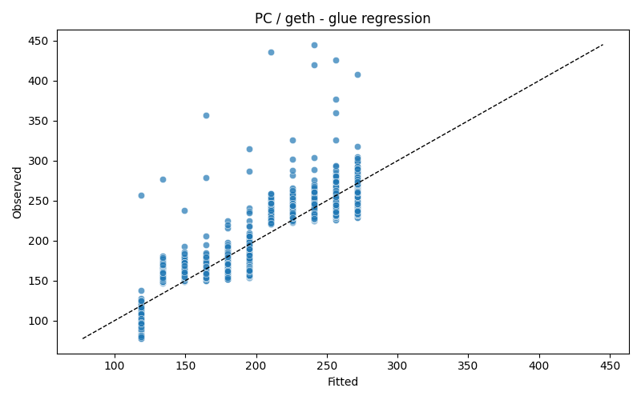

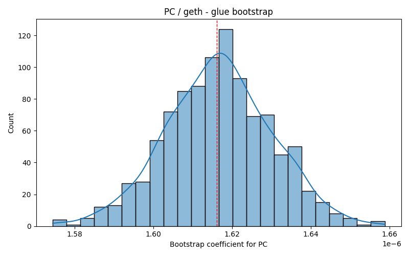

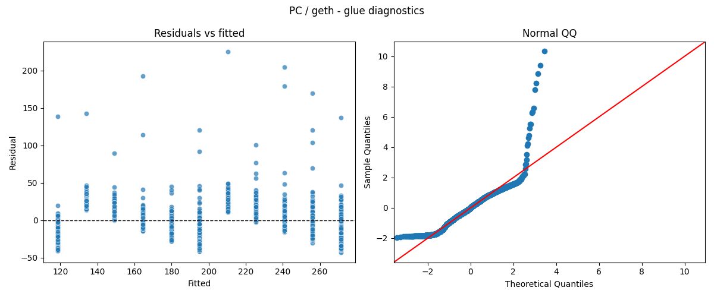

</details>

<details><summary><code>RETURNDATASIZE</code> · nobs=14784 · runtime_ms=3.113e-06 · p=1.00e-03 · R²=0.6034</summary>

```
==============================================================================
                           NNLS Regression Results                            
==============================================================================
Dep. Variable:          test_runtime_ms              R-squared:          0.603
Model:                  NNLS                    Adj. R-squared:          0.603
No. Observations:       14784                             RMSE:          39.84
Df Residuals:           14782                              MAE:          28.69
Df Model:               1      
==============================================================================
                      coef     std err     P-value      [0.025      0.975]
------------------------------------------------------------------------------
         const     51.1001      1.0642       0.001     49.0254     53.1428
RETURNDATASIZE      0.0000      0.0000       0.001      0.0000      0.0000
==============================================================================
Notes: Non-negative least squares with bootstrap inference (1000 iterations)
==============================================================================
```

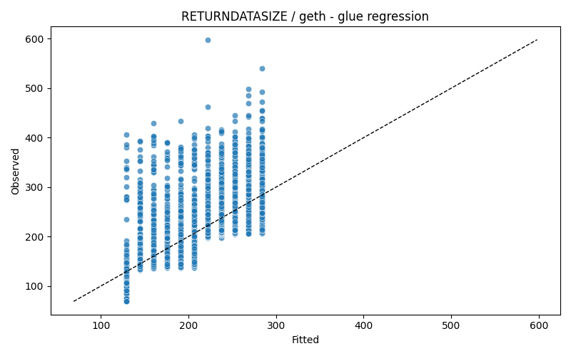

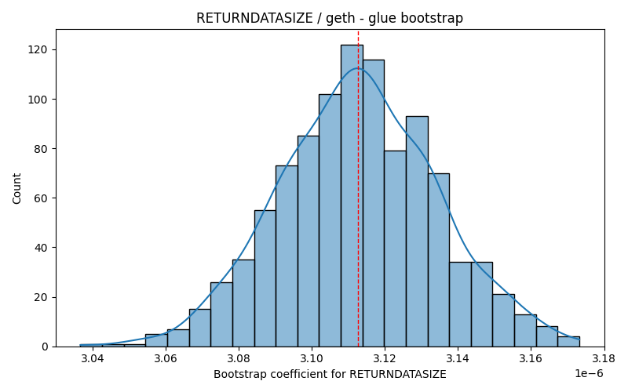

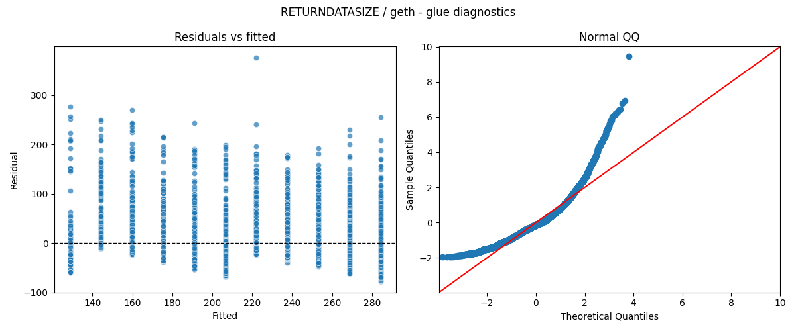

</details>

<details><summary><code>SELFBALANCE</code> · nobs=3024 · runtime_ms=7.475e-06 · p=1.00e-03 · R²=0.7941</summary>

```
==============================================================================
                           NNLS Regression Results                            
==============================================================================
Dep. Variable:          test_runtime_ms              R-squared:          0.794
Model:                  NNLS                    Adj. R-squared:          0.794
No. Observations:       3024                              RMSE:          38.40
Df Residuals:           3022                               MAE:          32.09
Df Model:               1      
==============================================================================
                      coef     std err     P-value      [0.025      0.975]
------------------------------------------------------------------------------
         const    117.7378      2.3645       0.001    112.8978    122.2817
   SELFBALANCE      0.0000      0.0000       0.001      0.0000      0.0000
==============================================================================
Notes: Non-negative least squares with bootstrap inference (1000 iterations)
==============================================================================
```

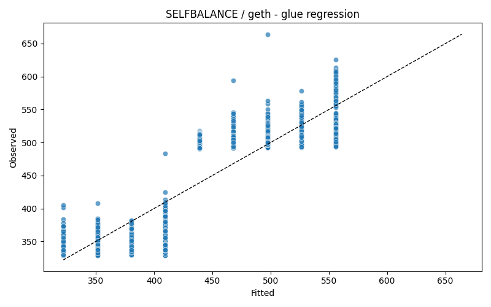

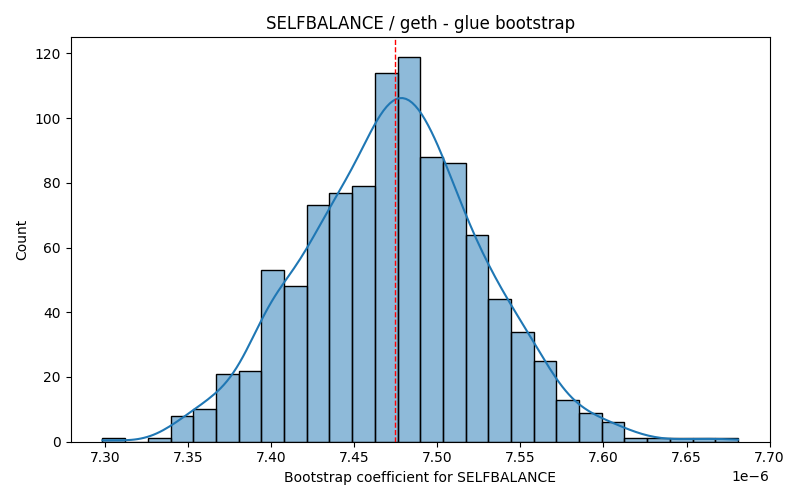

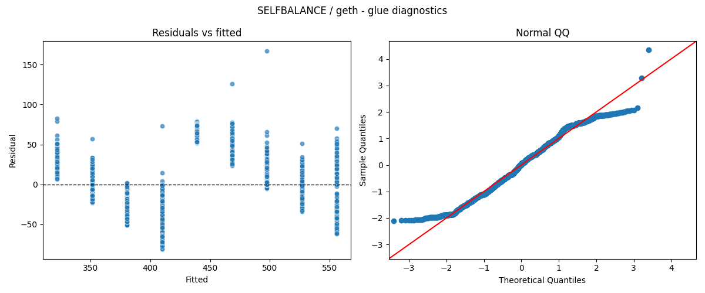

</details>

<details><summary><code>SUB</code> · nobs=3696 · runtime_ms=4.421e-06 · p=1.00e-03 · R²=0.8093</summary>

```
==============================================================================
                           NNLS Regression Results                            
==============================================================================
Dep. Variable:          test_runtime_ms              R-squared:          0.809
Model:                  NNLS                    Adj. R-squared:          0.809
No. Observations:       3696                              RMSE:          22.59
Df Residuals:           3694                               MAE:          16.87
Df Model:               1      
==============================================================================
                      coef     std err     P-value      [0.025      0.975]
------------------------------------------------------------------------------
         const     47.9147      1.2487       0.001     45.5134     50.2960
           SUB      0.0000      0.0000       0.001      0.0000      0.0000
==============================================================================
Notes: Non-negative least squares with bootstrap inference (1000 iterations)
==============================================================================
```

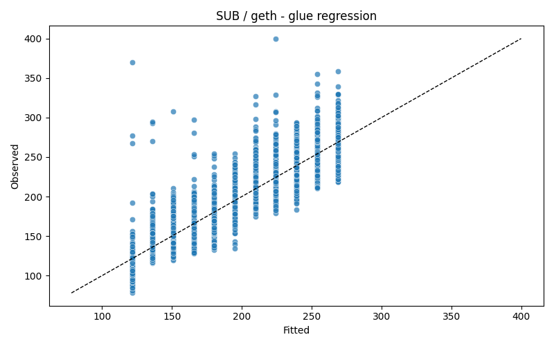

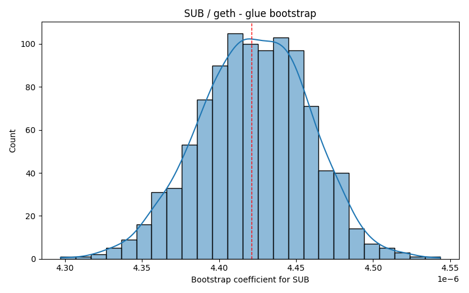

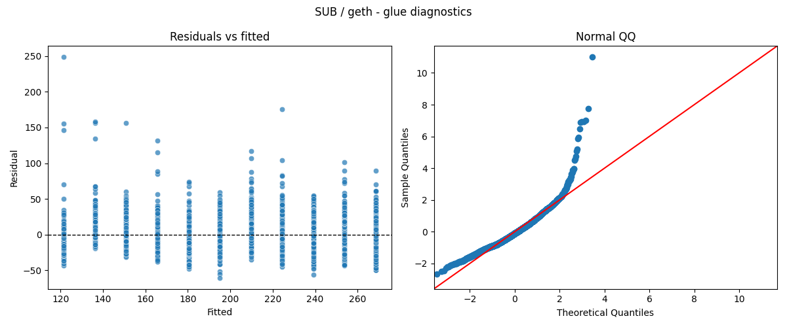

</details>

### Mixed glue (tier B) · geth

<details><summary><code>JUMP</code> · nobs=3696 · runtime_ms=9.199e-06 · p=1.00e-03 · R²=0.7734</summary>

```
==============================================================================
                           NNLS Regression Results                            
==============================================================================
Dep. Variable:          test_runtime_ms              R-squared:          0.773
Model:                  NNLS                    Adj. R-squared:          0.773
No. Observations:       3696                              RMSE:          18.50
Df Residuals:           3694                               MAE:          13.93
Df Model:               1      
==============================================================================
                      coef     std err     P-value      [0.025      0.975]
------------------------------------------------------------------------------
         const     34.4990      1.1195       0.001     32.2809     36.6540
          JUMP      0.0000      0.0000       0.001      0.0000      0.0000
==============================================================================
Notes: Non-negative least squares with bootstrap inference (1000 iterations)
==============================================================================
```

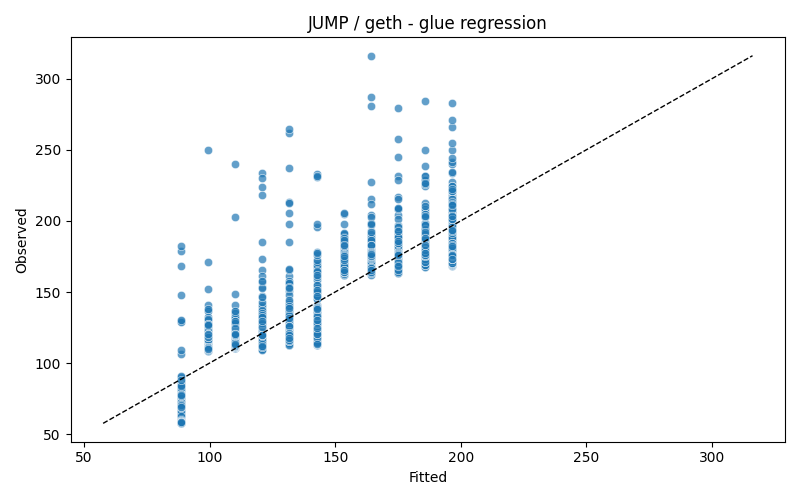

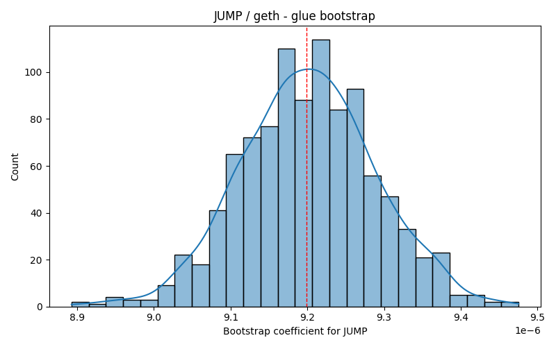

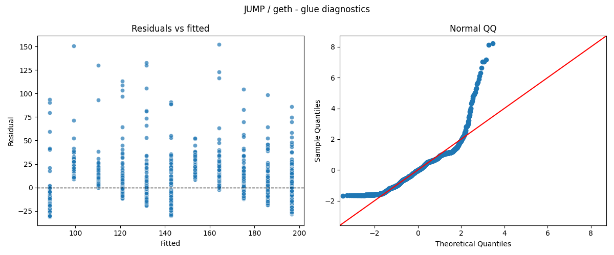

</details>

<details><summary><code>KECCAK256</code> · nobs=59136 · runtime_ms=3.652e-05 · p=1.00e-03 · R²=0.2629</summary>

```
==============================================================================
                           NNLS Regression Results                            
==============================================================================
Dep. Variable:          test_runtime_ms              R-squared:          0.263
Model:                  NNLS                    Adj. R-squared:          0.263
No. Observations:       59136                             RMSE:         121.50
Df Residuals:           59134                              MAE:          95.43
Df Model:               1      
==============================================================================
                      coef     std err     P-value      [0.025      0.975]
------------------------------------------------------------------------------
         const    378.5390      1.0942       0.001    376.4000    380.6606
     KECCAK256      0.0000      0.0000       0.001      0.0000      0.0000
==============================================================================
Notes: Non-negative least squares with bootstrap inference (1000 iterations)
==============================================================================
```

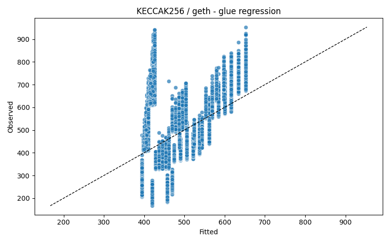

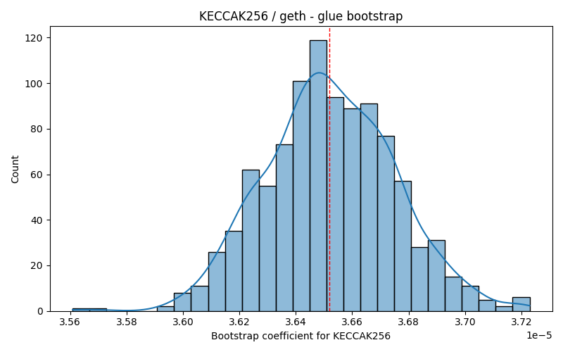

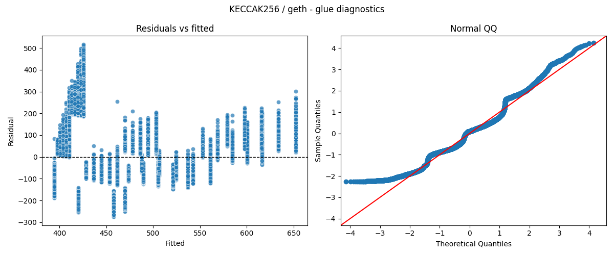

</details>

## nethermind

| glue_opcode | nobs | glue_runtime_ms | p_value | rsquared |
| --- | --- | --- | --- | --- |
| `ISZERO` | 4169 | 9.402e-07 | 1.00e-03 | 0.7325 |
| `JUMPDEST` | 4169 | 5.196e-07 | 1.00e-03 | 0.6453 |
| `SWAP` | 66704 | 5.565e-07 | 1.00e-03 | 0.7007 |
| `CALLDATASIZE` | 246367 | 4.584e-07 | 1.00e-03 | 0.921 |
| `DUP` | 246367 | 3.211e-07 | 1.00e-03 | 0.921 |
| `GAS` | 246367 | 4.293e-07 | 1.00e-03 | 0.921 |
| `MLOAD` | 246367 | 1.433e-06 | 1.00e-03 | 0.921 |
| `PUSH` | 246367 | 4.148e-07 | 1.00e-03 | 0.921 |
| `PUSH0` | 246367 | 3.124e-07 | 1.00e-03 | 0.921 |
| `STATICCALL` | 246367 | 0.0004665 | 1.00e-03 | 0.921 |
| `ADD` | 4169 | 2.77e-06 | 1.00e-03 | 0.4557 |
| `AND` | 4169 | 1.4e-06 | 1.00e-03 | 0.6022 |
| `CALLDATACOPY` | 100056 | 4.3e-06 | 1.00e-03 | 0.6828 |
| `CALLDATALOAD` | 16676 | 2.02e-05 | 3.10e-02 | 0.000304 |
| `DIV` | 4169 | 6.611e-06 | 1.00e-03 | 0.5889 |
| `EXP` | 4169 | 0 | 1.00e+00 | 0 |
| `GT` | 4169 | 1.684e-06 | 1.00e-03 | 0.7333 |
| `JUMPI` | 4169 | 1.93e-06 | 1.00e-03 | 0.7104 |
| `LT` | 4169 | 1.597e-06 | 1.00e-03 | 0.6919 |
| `MSTORE` | 20845 | 2.246e-06 | 1.00e-03 | 0.7315 |
| `MSTORE8` | 20845 | 2.232e-06 | 1.00e-03 | 0.7792 |
| `MUL` | 4169 | 5.211e-06 | 1.00e-03 | 0.8975 |
| `PC` | 4169 | 8.521e-07 | 1.00e-03 | 0.8545 |
| `RETURNDATASIZE` | 16676 | 9.107e-07 | 1.00e-03 | 0.6299 |
| `SELFBALANCE` | 3411 | 4.353e-06 | 1.00e-03 | 0.6053 |
| `SUB` | 4169 | 2.611e-06 | 1.00e-03 | 0.8533 |
| `JUMP` | 4169 | 5.628e-06 | 1.00e-03 | 0.8467 |
| `KECCAK256` | 66704 | 0 | 1.00e+00 | 0 |

### Cycle glue — joint fit · nethermind

<details><summary>Joint NNLS regression summary</summary>

```
==============================================================================
                           NNLS Regression Results                            
==============================================================================
Dep. Variable:          test_runtime_ms              R-squared:          0.921
Model:                  NNLS                    Adj. R-squared:          0.921
No. Observations:       246367                            RMSE:          10.73
Df Residuals:           246359                             MAE:           5.53
Df Model:               7      
==============================================================================
                      coef     std err     P-value      [0.025      0.975]
------------------------------------------------------------------------------
         const     17.0620      0.0689       0.001     16.9280     17.1870
  CALLDATASIZE      0.0000      0.0000       0.001      0.0000      0.0000
           DUP      0.0000      0.0000       0.001      0.0000      0.0000
           GAS      0.0000      0.0000       0.001      0.0000      0.0000
         MLOAD      0.0000      0.0000       0.001      0.0000      0.0000
          PUSH      0.0000      0.0000       0.001      0.0000      0.0000
         PUSH0      0.0000      0.0000       0.001      0.0000      0.0000
    STATICCALL      0.0005      0.0000       0.001      0.0005      0.0005
==============================================================================
Notes: Non-negative least squares with bootstrap inference (1000 iterations)
==============================================================================
```

</details>

<details><summary><code>CALLDATASIZE</code> · nobs=246367 · runtime_ms=4.584e-07 · p=1.00e-03 · R²=0.921</summary>

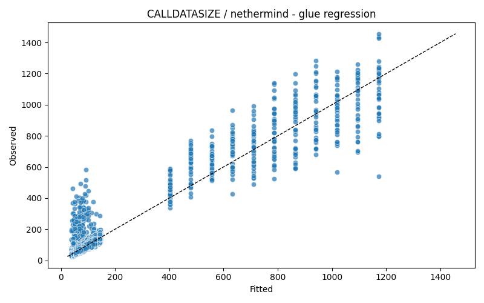

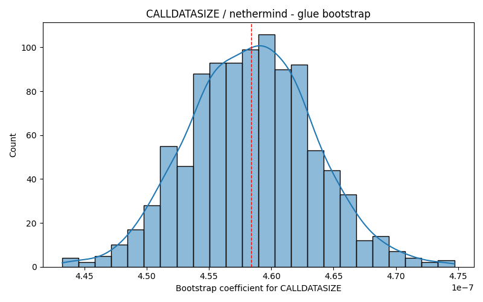

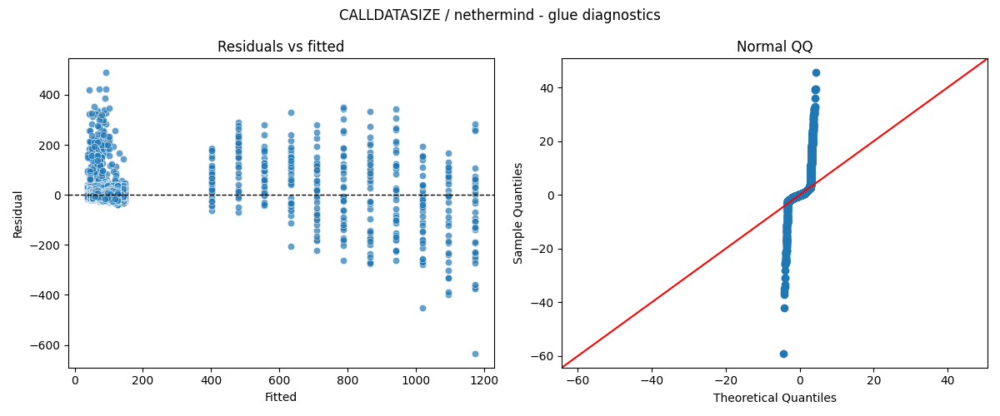

</details>

<details><summary><code>DUP</code> · nobs=246367 · runtime_ms=3.211e-07 · p=1.00e-03 · R²=0.921</summary>

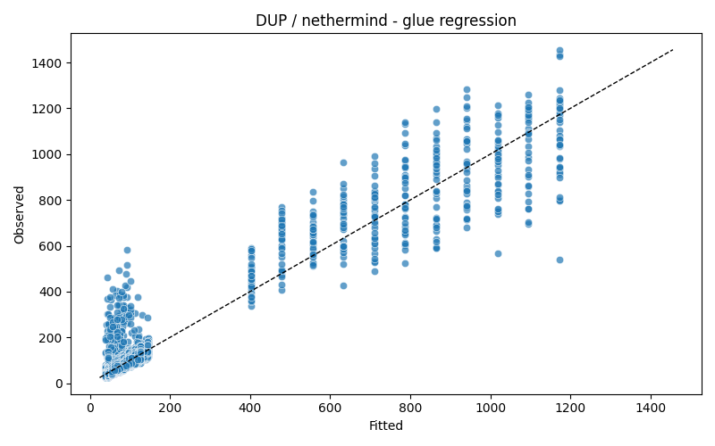

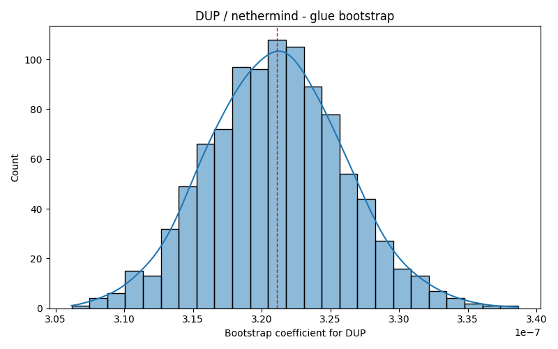


</details>

<details><summary><code>GAS</code> · nobs=246367 · runtime_ms=4.293e-07 · p=1.00e-03 · R²=0.921</summary>


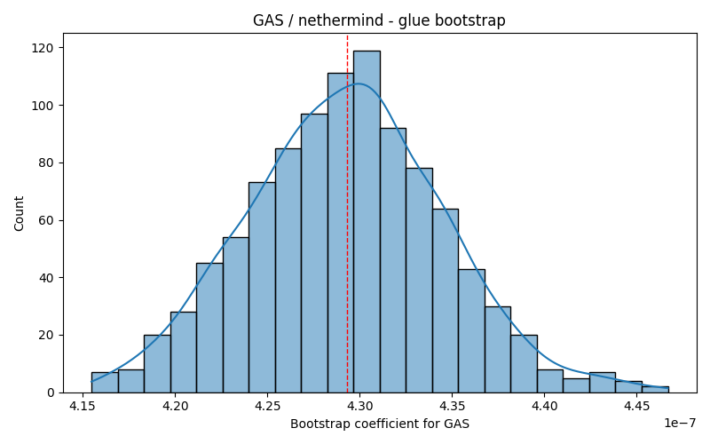


</details>

<details><summary><code>MLOAD</code> · nobs=246367 · runtime_ms=1.433e-06 · p=1.00e-03 · R²=0.921</summary>


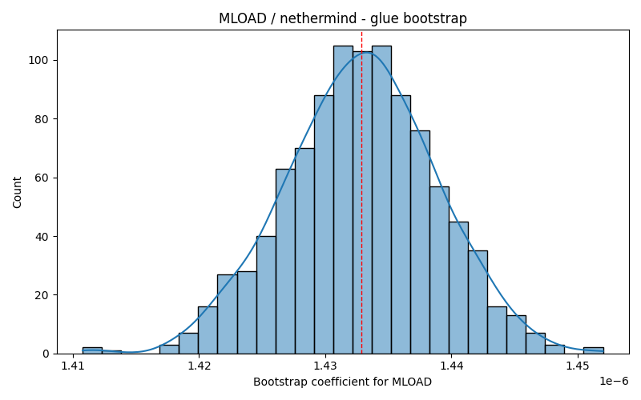

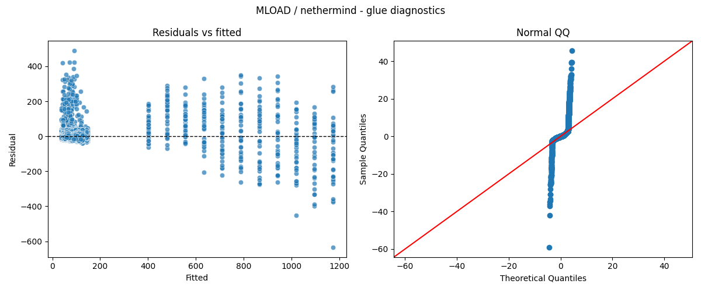

</details>

<details><summary><code>PUSH</code> · nobs=246367 · runtime_ms=4.148e-07 · p=1.00e-03 · R²=0.921</summary>


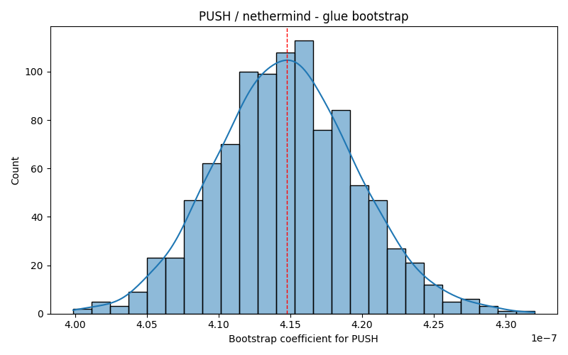

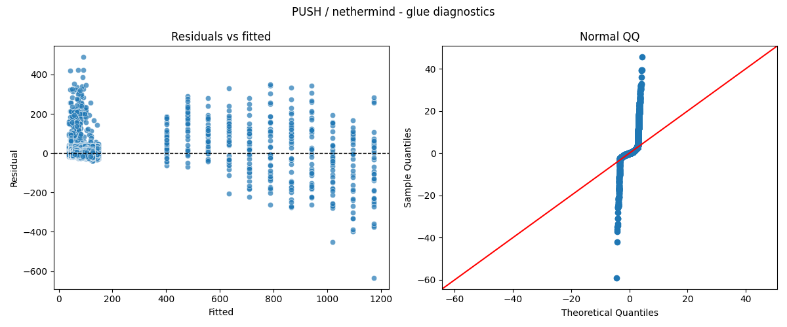

</details>

<details><summary><code>PUSH0</code> · nobs=246367 · runtime_ms=3.124e-07 · p=1.00e-03 · R²=0.921</summary>


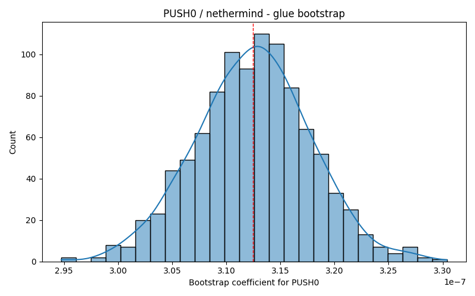


</details>

<details><summary><code>STATICCALL</code> · nobs=246367 · runtime_ms=0.0004665 · p=1.00e-03 · R²=0.921</summary>


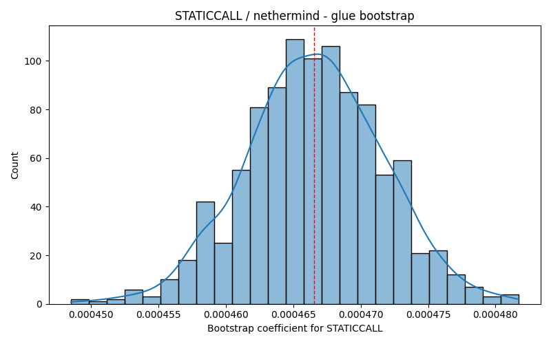

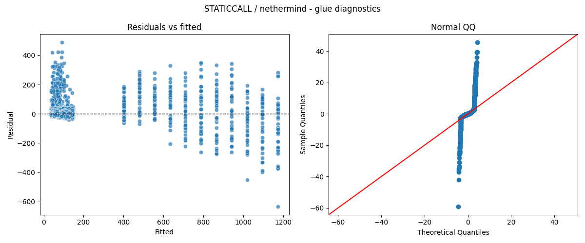

</details>

### Pure glue · nethermind

<details><summary><code>ISZERO</code> · nobs=4169 · runtime_ms=9.402e-07 · p=1.00e-03 · R²=0.7325</summary>

```
==============================================================================
                           NNLS Regression Results                            
==============================================================================
Dep. Variable:          test_runtime_ms              R-squared:          0.732
Model:                  NNLS                    Adj. R-squared:          0.732
No. Observations:       4169                              RMSE:          11.96
Df Residuals:           4167                               MAE:           7.17
Df Model:               1      
==============================================================================
                      coef     std err     P-value      [0.025      0.975]
------------------------------------------------------------------------------
         const     16.2694      0.6078       0.001     15.1389     17.4572
        ISZERO      0.0000      0.0000       0.001      0.0000      0.0000
==============================================================================
Notes: Non-negative least squares with bootstrap inference (1000 iterations)
==============================================================================
```

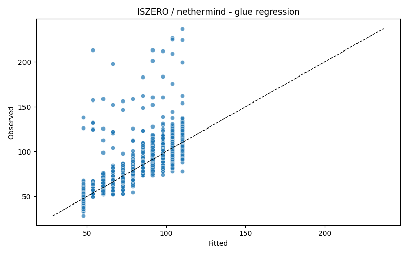

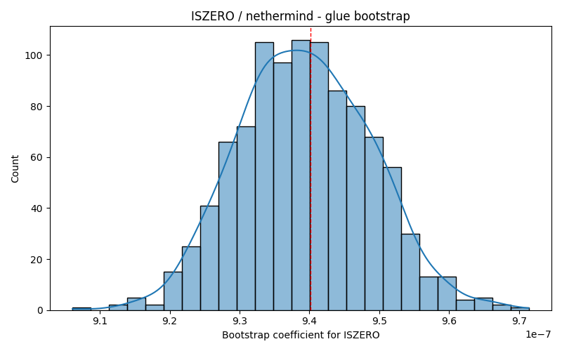

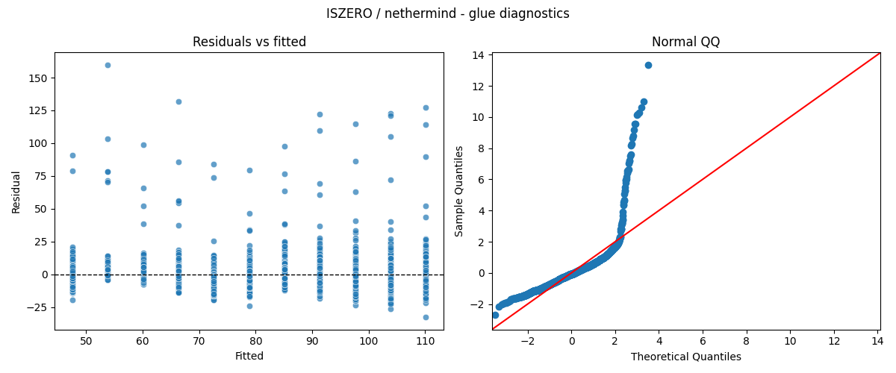

</details>

<details><summary><code>JUMPDEST</code> · nobs=4169 · runtime_ms=5.196e-07 · p=1.00e-03 · R²=0.6453</summary>

```
==============================================================================
                           NNLS Regression Results                            
==============================================================================
Dep. Variable:          test_runtime_ms              R-squared:          0.645
Model:                  NNLS                    Adj. R-squared:          0.645
No. Observations:       4169                              RMSE:          24.33
Df Residuals:           4167                               MAE:          18.39
Df Model:               1      
==============================================================================
                      coef     std err     P-value      [0.025      0.975]
------------------------------------------------------------------------------
         const     22.9474      1.3058       0.001     20.4792     25.4990
      JUMPDEST      0.0000      0.0000       0.001      0.0000      0.0000
==============================================================================
Notes: Non-negative least squares with bootstrap inference (1000 iterations)
==============================================================================
```

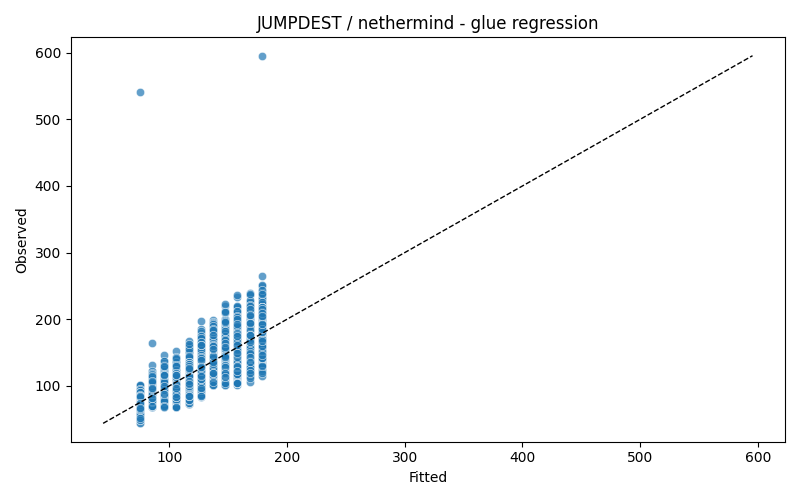

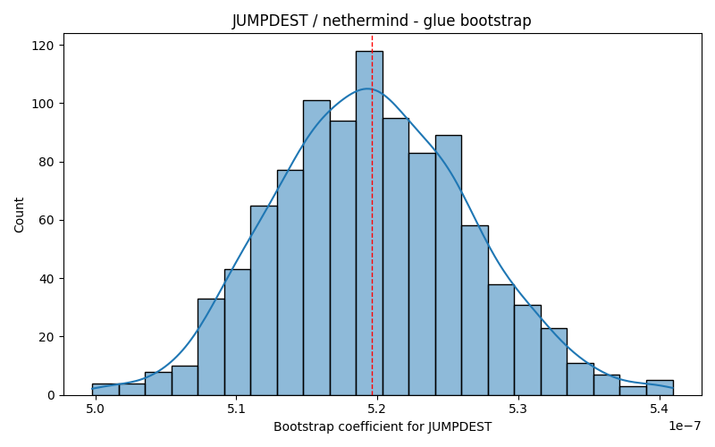

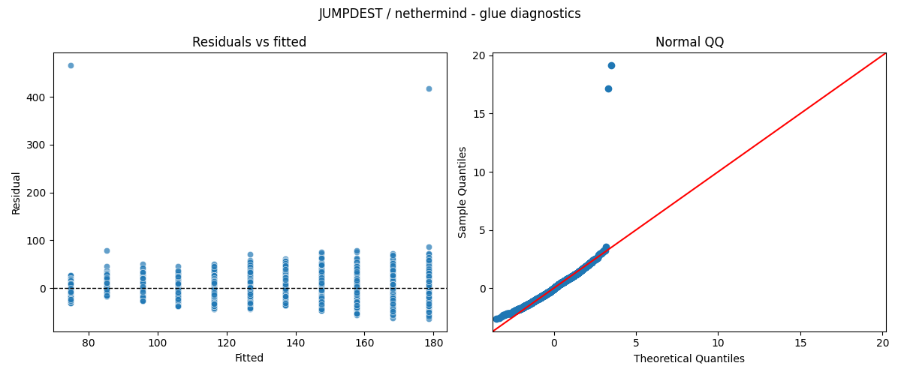

</details>

<details><summary><code>SWAP</code> · nobs=66704 · runtime_ms=5.565e-07 · p=1.00e-03 · R²=0.7007</summary>

```
==============================================================================
                           NNLS Regression Results                            
==============================================================================
Dep. Variable:          test_runtime_ms              R-squared:          0.701
Model:                  NNLS                    Adj. R-squared:          0.701
No. Observations:       66704                             RMSE:           7.66
Df Residuals:           66702                              MAE:           4.06
Df Model:               1      
==============================================================================
                      coef     std err     P-value      [0.025      0.975]
------------------------------------------------------------------------------
         const     16.4646      0.1013       0.001     16.2646     16.6654
          SWAP      0.0000      0.0000       0.001      0.0000      0.0000
==============================================================================
Notes: Non-negative least squares with bootstrap inference (1000 iterations)
==============================================================================
```

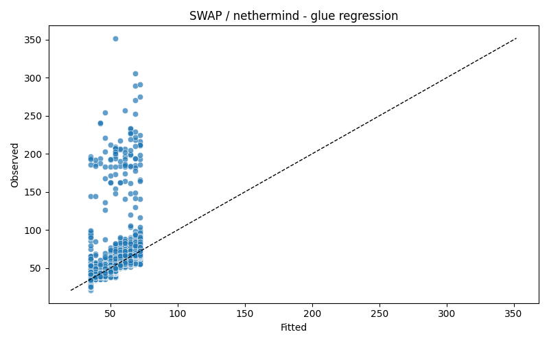

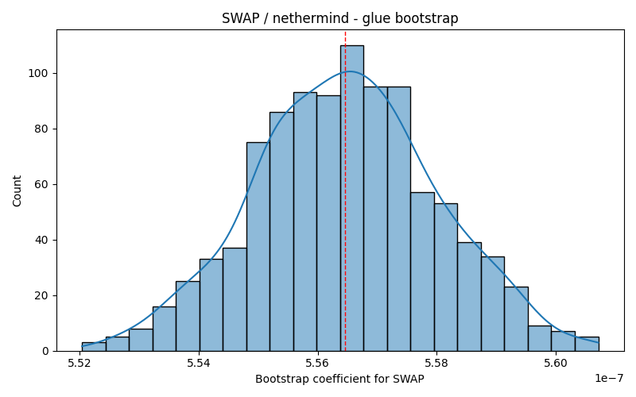

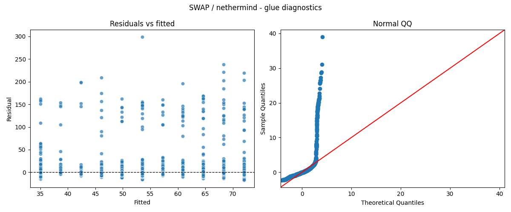

</details>

### Mixed glue (tier A) · nethermind

<details><summary><code>ADD</code> · nobs=4169 · runtime_ms=2.77e-06 · p=1.00e-03 · R²=0.4557</summary>

```
==============================================================================
                           NNLS Regression Results                            
==============================================================================
Dep. Variable:          test_runtime_ms              R-squared:          0.456
Model:                  NNLS                    Adj. R-squared:          0.456
No. Observations:       4169                              RMSE:          31.87
Df Residuals:           4167                               MAE:          27.14
Df Model:               1      
==============================================================================
                      coef     std err     P-value      [0.025      0.975]
------------------------------------------------------------------------------
         const     29.8945      1.4414       0.001     27.2150     32.8620
           ADD      0.0000      0.0000       0.001      0.0000      0.0000
==============================================================================
Notes: Non-negative least squares with bootstrap inference (1000 iterations)
==============================================================================
```

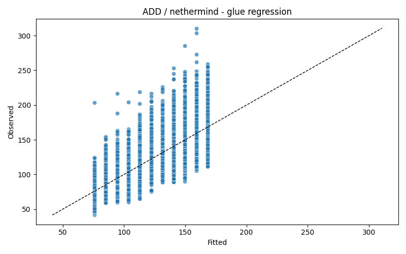

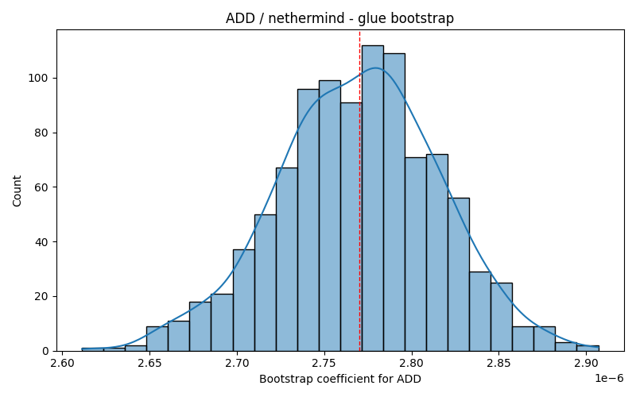

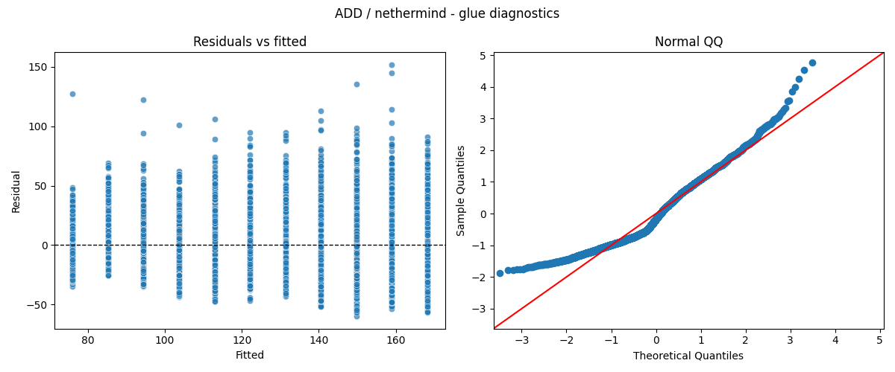

</details>

<details><summary><code>AND</code> · nobs=4169 · runtime_ms=1.4e-06 · p=1.00e-03 · R²=0.6022</summary>

```
==============================================================================
                           NNLS Regression Results                            
==============================================================================
Dep. Variable:          test_runtime_ms              R-squared:          0.602
Model:                  NNLS                    Adj. R-squared:          0.602
No. Observations:       4169                              RMSE:          11.98
Df Residuals:           4167                               MAE:           6.71
Df Model:               1      
==============================================================================
                      coef     std err     P-value      [0.025      0.975]
------------------------------------------------------------------------------
         const     15.7550      0.5822       0.001     14.7100     16.9196
           AND      0.0000      0.0000       0.001      0.0000      0.0000
==============================================================================
Notes: Non-negative least squares with bootstrap inference (1000 iterations)
==============================================================================
```

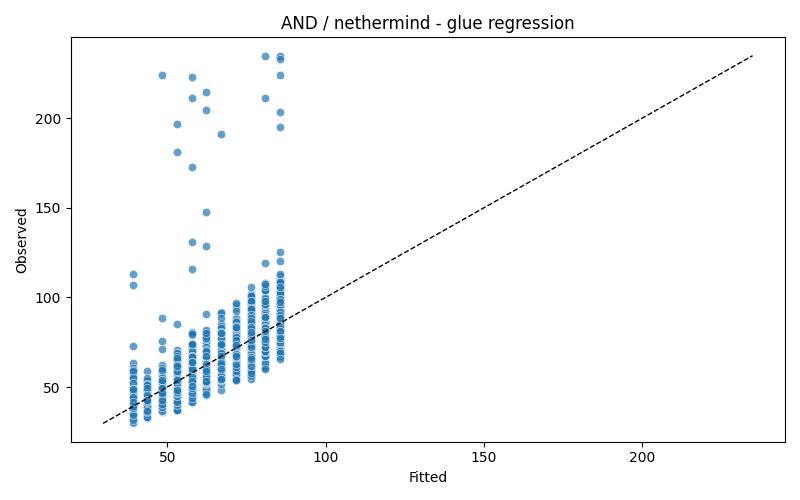

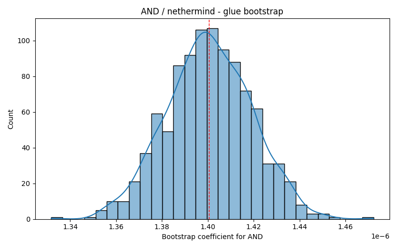

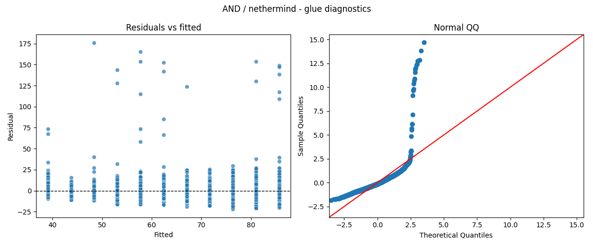

</details>

<details><summary><code>CALLDATACOPY</code> · nobs=100056 · runtime_ms=4.3e-06 · p=1.00e-03 · R²=0.6828</summary>

```
==============================================================================
                           NNLS Regression Results                            
==============================================================================
Dep. Variable:          test_runtime_ms              R-squared:          0.683
Model:                  NNLS                    Adj. R-squared:          0.683
No. Observations:       100056                            RMSE:          22.04
Df Residuals:           100054                             MAE:          17.25
Df Model:               1      
==============================================================================
                      coef     std err     P-value      [0.025      0.975]
------------------------------------------------------------------------------
         const     26.3951      0.0825       0.001     26.2213     26.5519
  CALLDATACOPY      0.0000      0.0000       0.001      0.0000      0.0000
==============================================================================
Notes: Non-negative least squares with bootstrap inference (1000 iterations)
==============================================================================
```

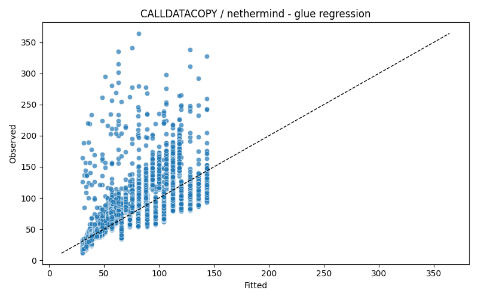

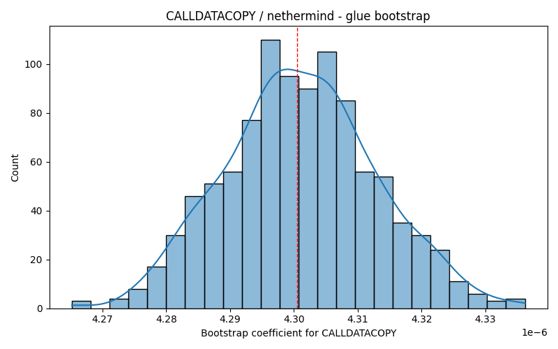

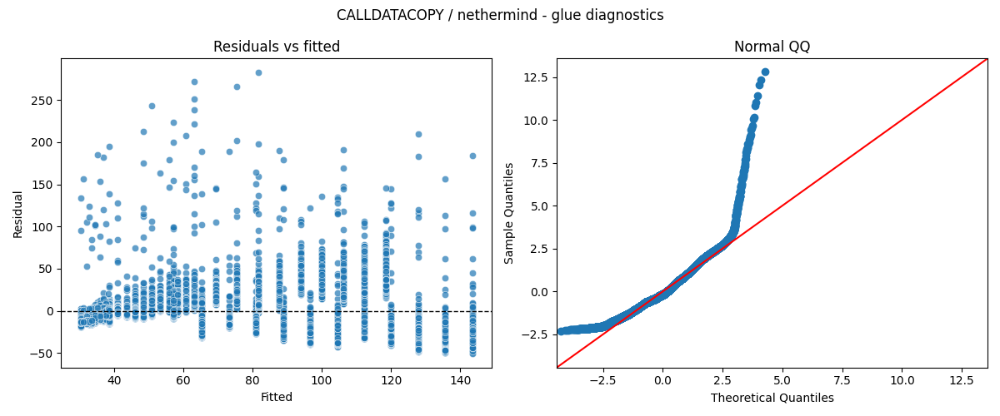

</details>

<details><summary><code>CALLDATALOAD</code> · nobs=16676 · runtime_ms=2.02e-05 · p=3.10e-02 · R²=0.000304</summary>

```
==============================================================================
                           NNLS Regression Results                            
==============================================================================
Dep. Variable:          test_runtime_ms              R-squared:          0.000
Model:                  NNLS                    Adj. R-squared:          0.000
No. Observations:       16676                             RMSE:           4.45
Df Residuals:           16674                              MAE:           0.51
Df Model:               1      
==============================================================================
                      coef     std err     P-value      [0.025      0.975]
------------------------------------------------------------------------------
         const      2.9730      0.1374       0.001      2.7248      3.2565
  CALLDATALOAD      0.0000      0.0000       0.031      0.0000      0.0000
==============================================================================
Notes: Non-negative least squares with bootstrap inference (1000 iterations)
==============================================================================
```

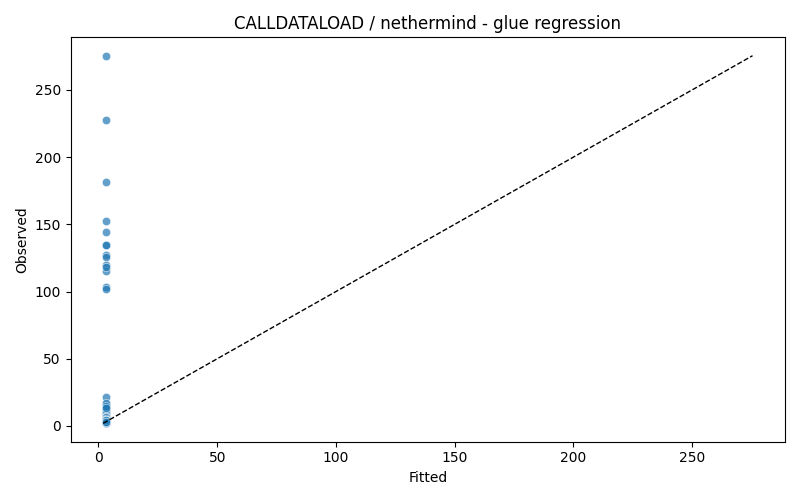

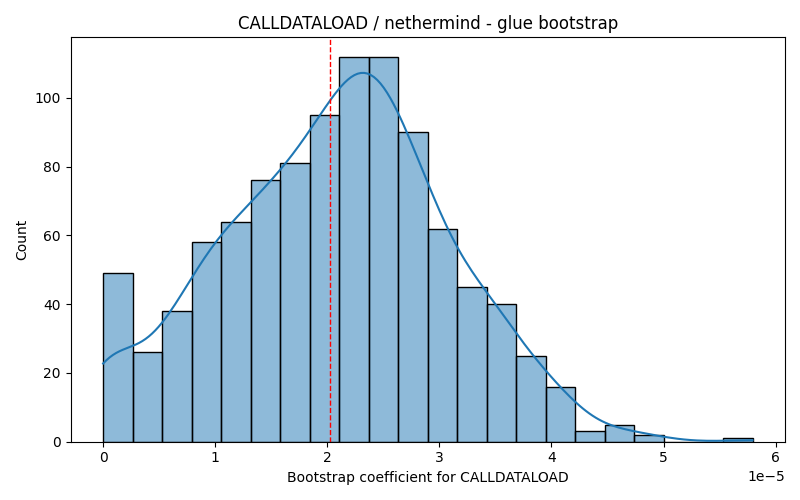

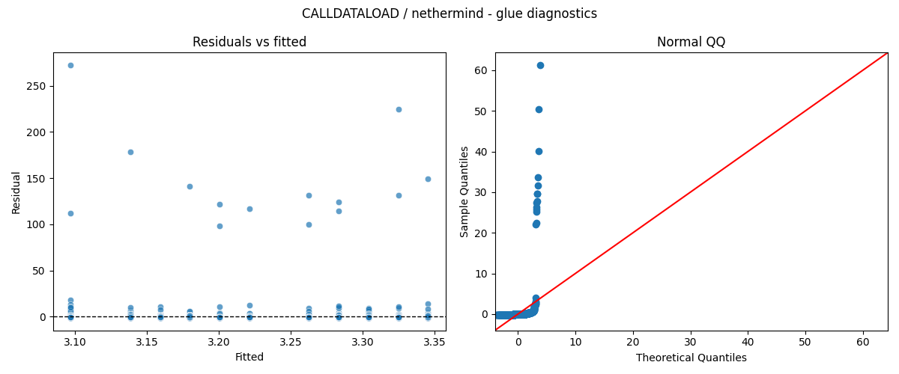

</details>

<details><summary><code>DIV</code> · nobs=4169 · runtime_ms=6.611e-06 · p=1.00e-03 · R²=0.5889</summary>

```
==============================================================================
                           NNLS Regression Results                            
==============================================================================
Dep. Variable:          test_runtime_ms              R-squared:          0.589
Model:                  NNLS                    Adj. R-squared:          0.589
No. Observations:       4169                              RMSE:          43.60
Df Residuals:           4167                               MAE:          33.39
Df Model:               1      
==============================================================================
                      coef     std err     P-value      [0.025      0.975]
------------------------------------------------------------------------------
         const    132.1932      3.3211       0.001    125.4642    138.8419
           DIV      0.0000      0.0000       0.001      0.0000      0.0000
==============================================================================
Notes: Non-negative least squares with bootstrap inference (1000 iterations)
==============================================================================
```

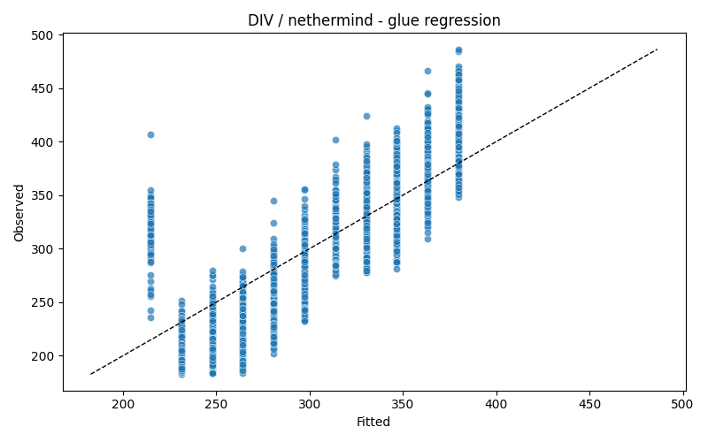


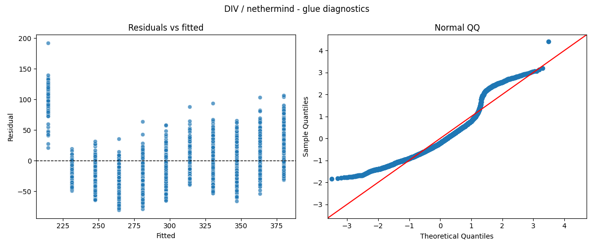

</details>

<details><summary><code>EXP</code> · nobs=4169 · runtime_ms=0 · p=1.00e+00 · R²=0</summary>

```
==============================================================================
                           NNLS Regression Results                            
==============================================================================
Dep. Variable:          test_runtime_ms              R-squared:          0.000
Model:                  NNLS                    Adj. R-squared:         -0.000
No. Observations:       4169                              RMSE:          47.46
Df Residuals:           4167                               MAE:          31.38
Df Model:               1      
==============================================================================
                      coef     std err     P-value      [0.025      0.975]
------------------------------------------------------------------------------
         const    104.4486      0.7403       0.001    102.9123    105.9408
           EXP      0.0000      0.0000       1.000      0.0000      0.0000
==============================================================================
Notes: Non-negative least squares with bootstrap inference (1000 iterations)
==============================================================================
```

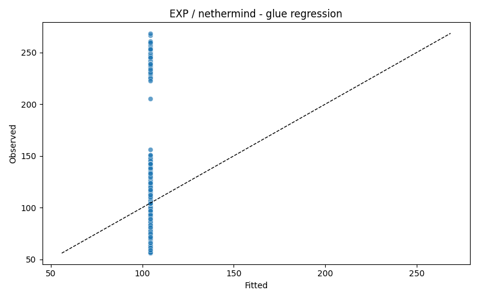


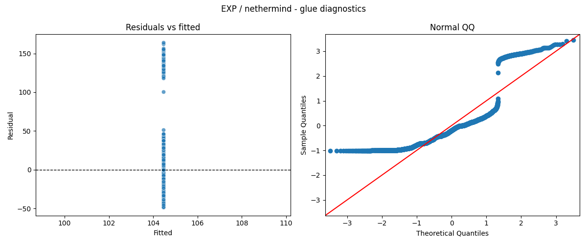

</details>

<details><summary><code>GT</code> · nobs=4169 · runtime_ms=1.684e-06 · p=1.00e-03 · R²=0.7333</summary>

```
==============================================================================
                           NNLS Regression Results                            
==============================================================================
Dep. Variable:          test_runtime_ms              R-squared:          0.733
Model:                  NNLS                    Adj. R-squared:          0.733
No. Observations:       4169                              RMSE:          10.69
Df Residuals:           4167                               MAE:           6.90
Df Model:               1      
==============================================================================
                      coef     std err     P-value      [0.025      0.975]
------------------------------------------------------------------------------
         const     16.0561      0.5472       0.001     15.0429     17.1199
            GT      0.0000      0.0000       0.001      0.0000      0.0000
==============================================================================
Notes: Non-negative least squares with bootstrap inference (1000 iterations)
==============================================================================
```

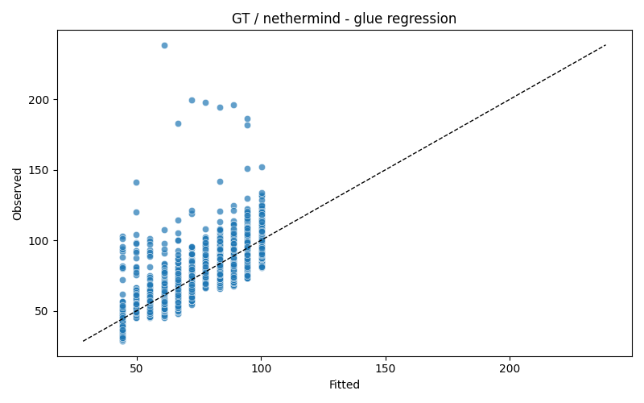

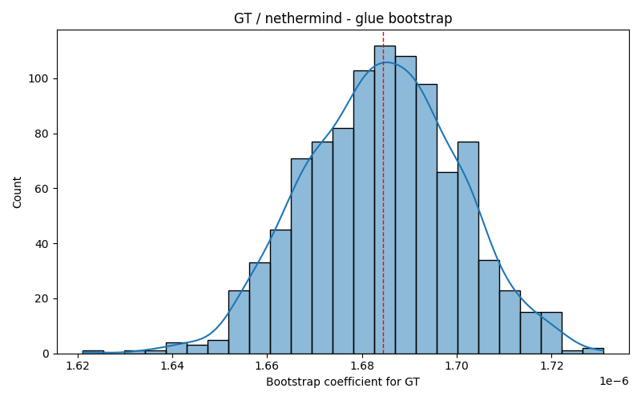

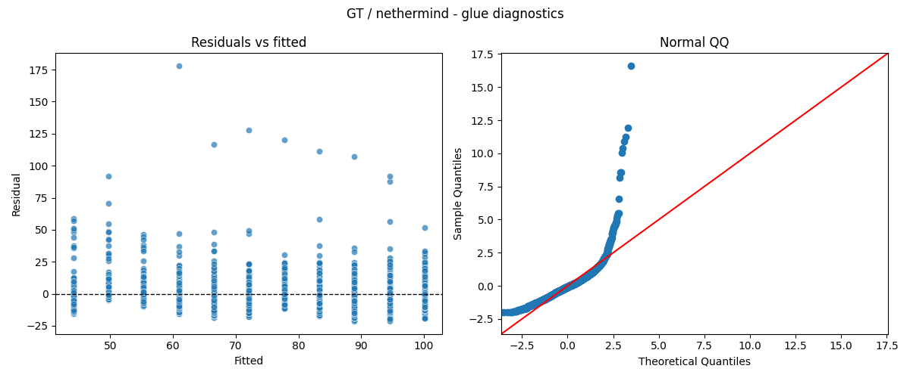

</details>

<details><summary><code>JUMPI</code> · nobs=4169 · runtime_ms=1.93e-06 · p=1.00e-03 · R²=0.7104</summary>

```
==============================================================================
                           NNLS Regression Results                            
==============================================================================
Dep. Variable:          test_runtime_ms              R-squared:          0.710
Model:                  NNLS                    Adj. R-squared:          0.710
No. Observations:       4169                              RMSE:           5.56
Df Residuals:           4167                               MAE:           3.57
Df Model:               1      
==============================================================================
                      coef     std err     P-value      [0.025      0.975]
------------------------------------------------------------------------------
         const      9.5810      0.3141       0.001      8.9702     10.2005
         JUMPI      0.0000      0.0000       0.001      0.0000      0.0000
==============================================================================
Notes: Non-negative least squares with bootstrap inference (1000 iterations)
==============================================================================
```

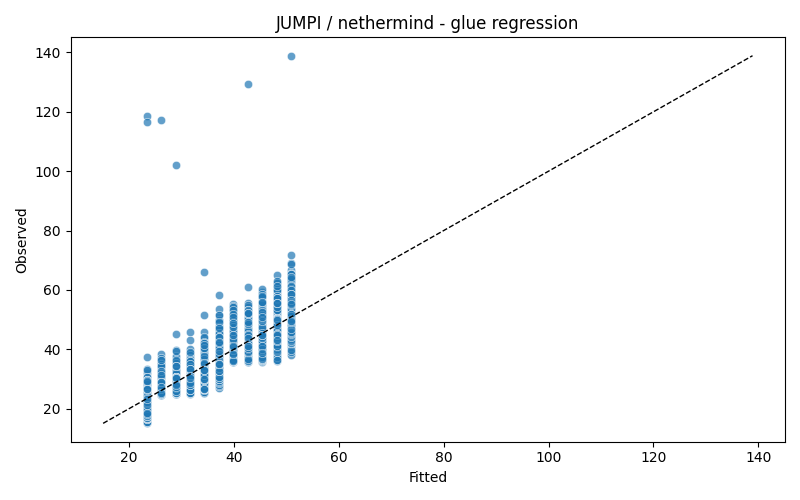

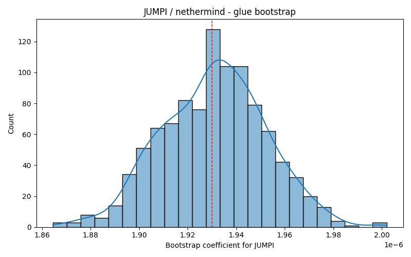

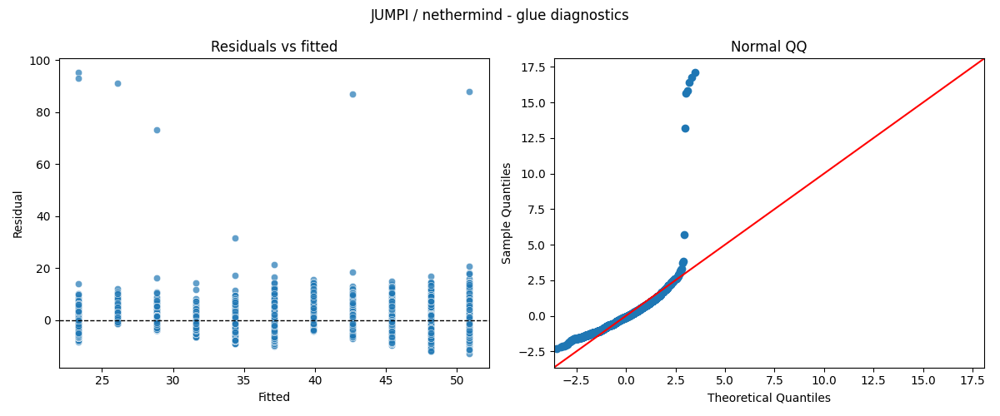

</details>

<details><summary><code>LT</code> · nobs=4169 · runtime_ms=1.597e-06 · p=1.00e-03 · R²=0.6919</summary>

```
==============================================================================
                           NNLS Regression Results                            
==============================================================================
Dep. Variable:          test_runtime_ms              R-squared:          0.692
Model:                  NNLS                    Adj. R-squared:          0.692
No. Observations:       4169                              RMSE:          11.22
Df Residuals:           4167                               MAE:           6.81
Df Model:               1      
==============================================================================
                      coef     std err     P-value      [0.025      0.975]
------------------------------------------------------------------------------
         const     19.8934      0.5402       0.001     18.8446     20.9197
            LT      0.0000      0.0000       0.001      0.0000      0.0000
==============================================================================
Notes: Non-negative least squares with bootstrap inference (1000 iterations)
==============================================================================
```

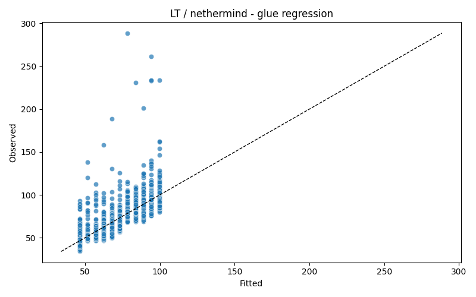

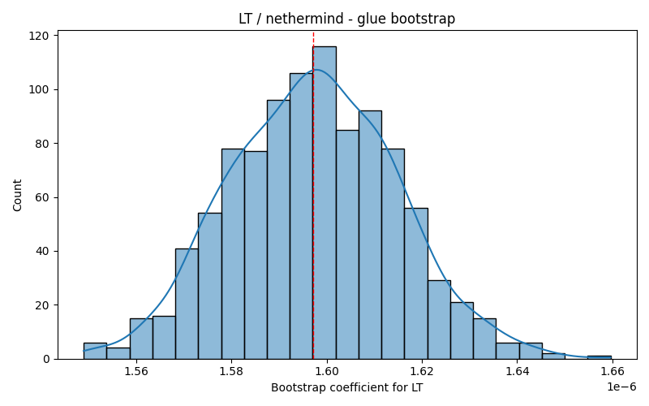

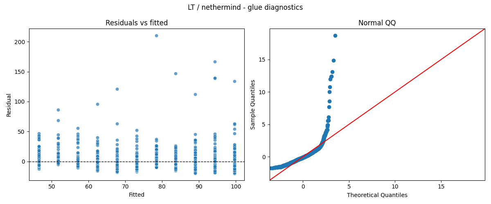

</details>

<details><summary><code>MSTORE</code> · nobs=20845 · runtime_ms=2.246e-06 · p=1.00e-03 · R²=0.7315</summary>

```
==============================================================================
                           NNLS Regression Results                            
==============================================================================
Dep. Variable:          test_runtime_ms              R-squared:          0.732
Model:                  NNLS                    Adj. R-squared:          0.732
No. Observations:       20845                             RMSE:           9.55
Df Residuals:           20843                              MAE:           4.84
Df Model:               1      
==============================================================================
                      coef     std err     P-value      [0.025      0.975]
------------------------------------------------------------------------------
         const     14.6117      0.1987       0.001     14.2228     15.0235
        MSTORE      0.0000      0.0000       0.001      0.0000      0.0000
==============================================================================
Notes: Non-negative least squares with bootstrap inference (1000 iterations)
==============================================================================
```

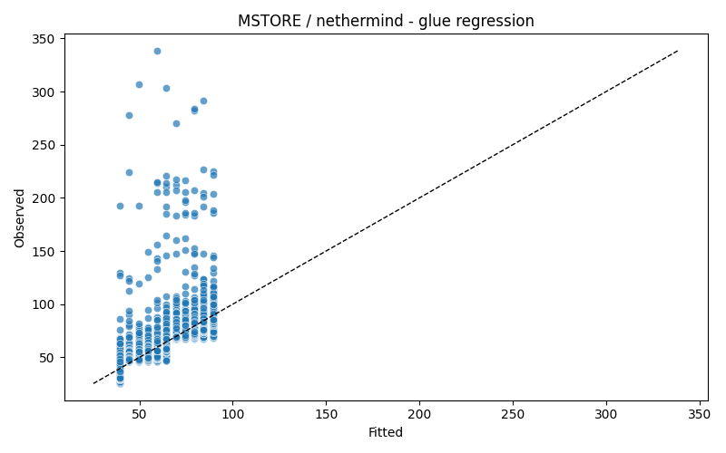

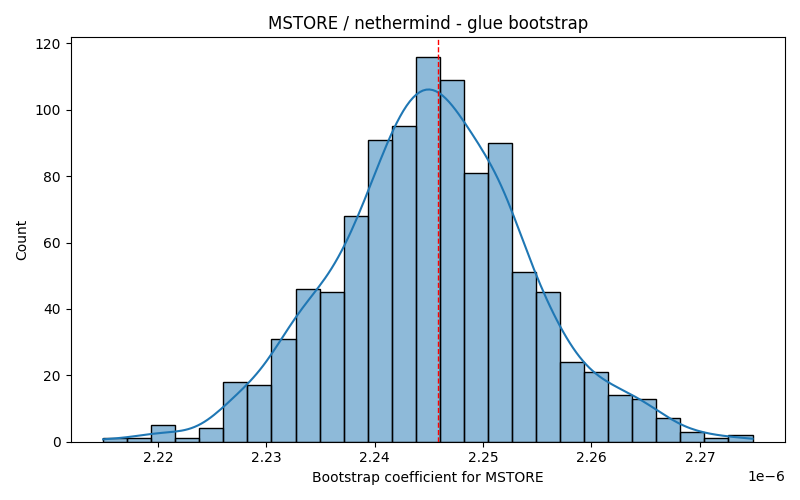

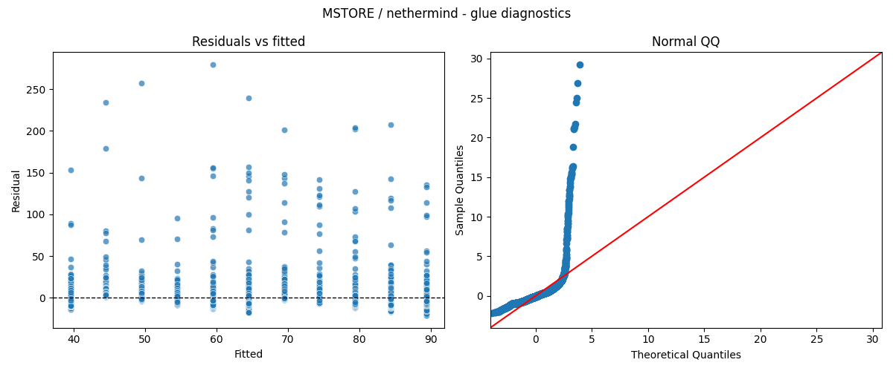

</details>

<details><summary><code>MSTORE8</code> · nobs=20845 · runtime_ms=2.232e-06 · p=1.00e-03 · R²=0.7792</summary>

```
==============================================================================
                           NNLS Regression Results                            
==============================================================================
Dep. Variable:          test_runtime_ms              R-squared:          0.779
Model:                  NNLS                    Adj. R-squared:          0.779
No. Observations:       20845                             RMSE:           8.34
Df Residuals:           20843                              MAE:           4.65
Df Model:               1      
==============================================================================
                      coef     std err     P-value      [0.025      0.975]
------------------------------------------------------------------------------
         const     14.4415      0.1739       0.001     14.0951     14.7817
       MSTORE8      0.0000      0.0000       0.001      0.0000      0.0000
==============================================================================
Notes: Non-negative least squares with bootstrap inference (1000 iterations)
==============================================================================
```

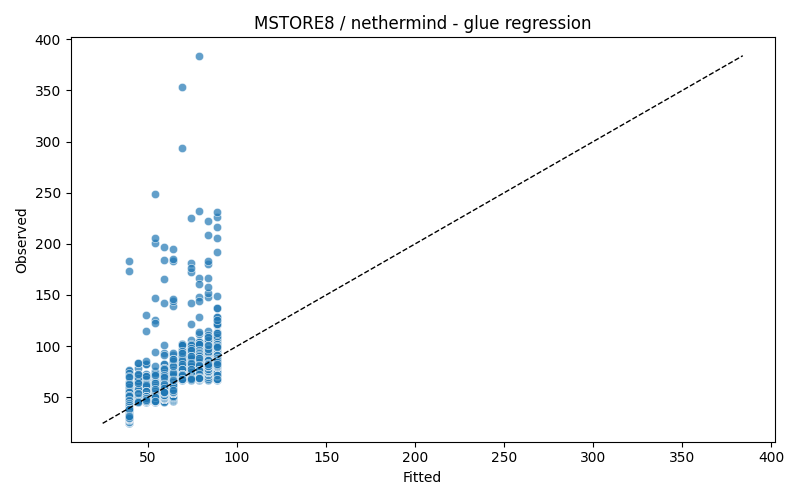

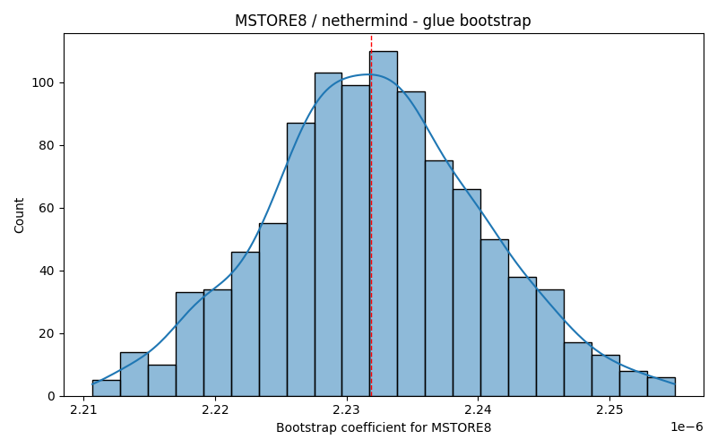

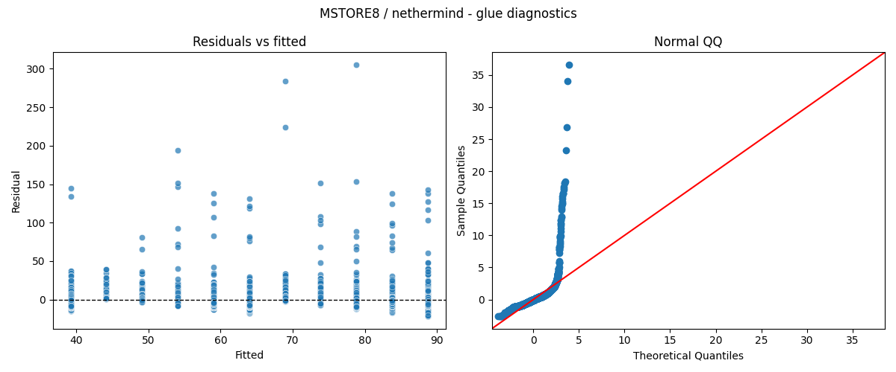

</details>

<details><summary><code>MUL</code> · nobs=4169 · runtime_ms=5.211e-06 · p=1.00e-03 · R²=0.8975</summary>

```
==============================================================================
                           NNLS Regression Results                            
==============================================================================
Dep. Variable:          test_runtime_ms              R-squared:          0.897
Model:                  NNLS                    Adj. R-squared:          0.897
No. Observations:       4169                              RMSE:          13.90
Df Residuals:           4167                               MAE:          10.32
Df Model:               1      
==============================================================================
                      coef     std err     P-value      [0.025      0.975]
------------------------------------------------------------------------------
         const     25.0985      0.6351       0.001     23.8337     26.2841
           MUL      0.0000      0.0000       0.001      0.0000      0.0000
==============================================================================
Notes: Non-negative least squares with bootstrap inference (1000 iterations)
==============================================================================
```

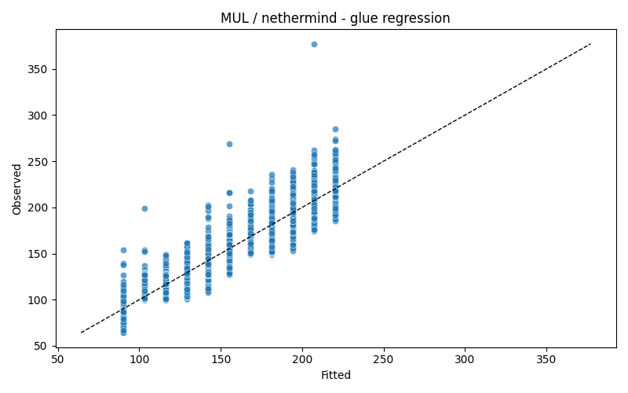

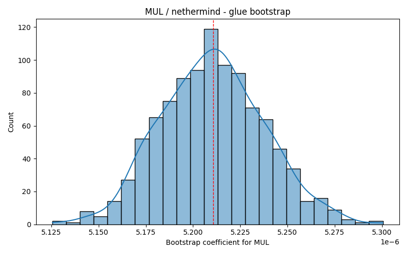

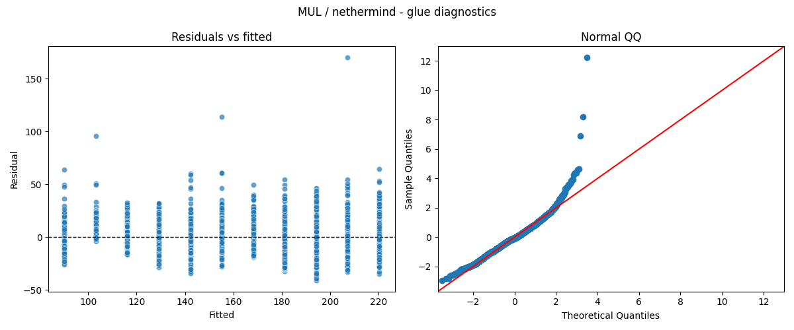

</details>

<details><summary><code>PC</code> · nobs=4169 · runtime_ms=8.521e-07 · p=1.00e-03 · R²=0.8545</summary>

```
==============================================================================
                           NNLS Regression Results                            
==============================================================================
Dep. Variable:          test_runtime_ms              R-squared:          0.855
Model:                  NNLS                    Adj. R-squared:          0.854
No. Observations:       4169                              RMSE:          10.51
Df Residuals:           4167                               MAE:           7.80
Df Model:               1      
==============================================================================
                      coef     std err     P-value      [0.025      0.975]
------------------------------------------------------------------------------
         const     18.2851      0.5049       0.001     17.3575     19.2652
            PC      0.0000      0.0000       0.001      0.0000      0.0000
==============================================================================
Notes: Non-negative least squares with bootstrap inference (1000 iterations)
==============================================================================
```

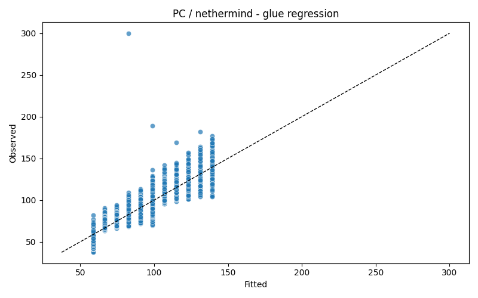

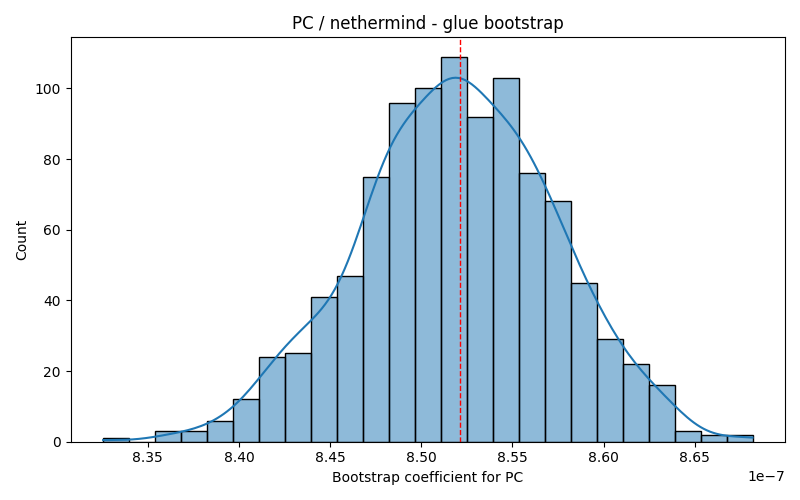

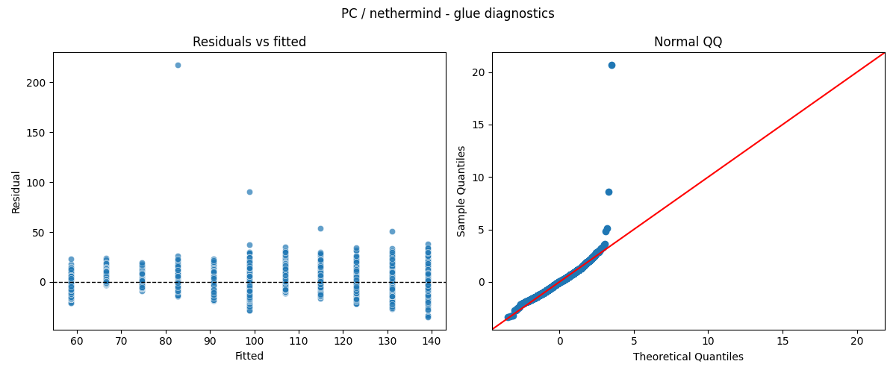

</details>

<details><summary><code>RETURNDATASIZE</code> · nobs=16676 · runtime_ms=9.107e-07 · p=1.00e-03 · R²=0.6299</summary>

```
==============================================================================
                           NNLS Regression Results                            
==============================================================================
Dep. Variable:          test_runtime_ms              R-squared:          0.630
Model:                  NNLS                    Adj. R-squared:          0.630
No. Observations:       16676                             RMSE:          11.02
Df Residuals:           16674                              MAE:           4.93
Df Model:               1      
==============================================================================
                      coef     std err     P-value      [0.025      0.975]
------------------------------------------------------------------------------
         const     12.8022      0.2918       0.001     12.2525     13.3838
RETURNDATASIZE      0.0000      0.0000       0.001      0.0000      0.0000
==============================================================================
Notes: Non-negative least squares with bootstrap inference (1000 iterations)
==============================================================================
```

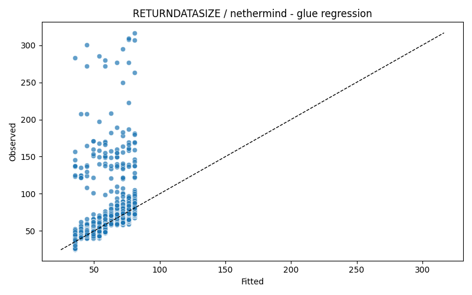

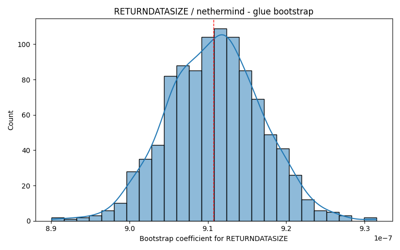

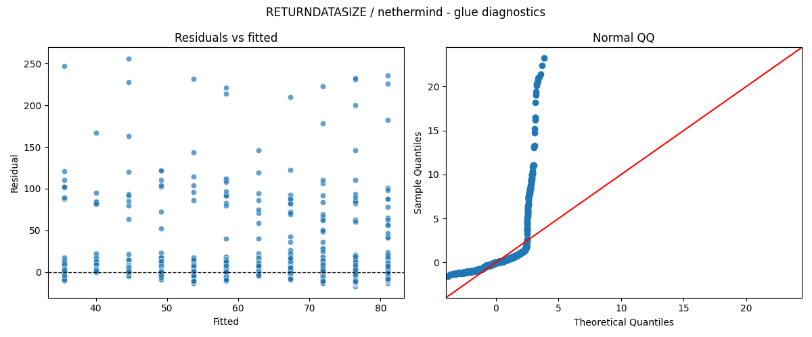

</details>

<details><summary><code>SELFBALANCE</code> · nobs=3411 · runtime_ms=4.353e-06 · p=1.00e-03 · R²=0.6053</summary>

```
==============================================================================
                           NNLS Regression Results                            
==============================================================================
Dep. Variable:          test_runtime_ms              R-squared:          0.605
Model:                  NNLS                    Adj. R-squared:          0.605
No. Observations:       3411                              RMSE:          35.46
Df Residuals:           3409                               MAE:          27.94
Df Model:               1      
==============================================================================
                      coef     std err     P-value      [0.025      0.975]
------------------------------------------------------------------------------
         const    118.0207      3.3122       0.001    111.7690    124.8017
   SELFBALANCE      0.0000      0.0000       0.001      0.0000      0.0000
==============================================================================
Notes: Non-negative least squares with bootstrap inference (1000 iterations)
==============================================================================
```

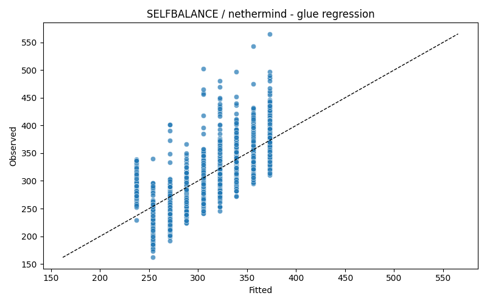

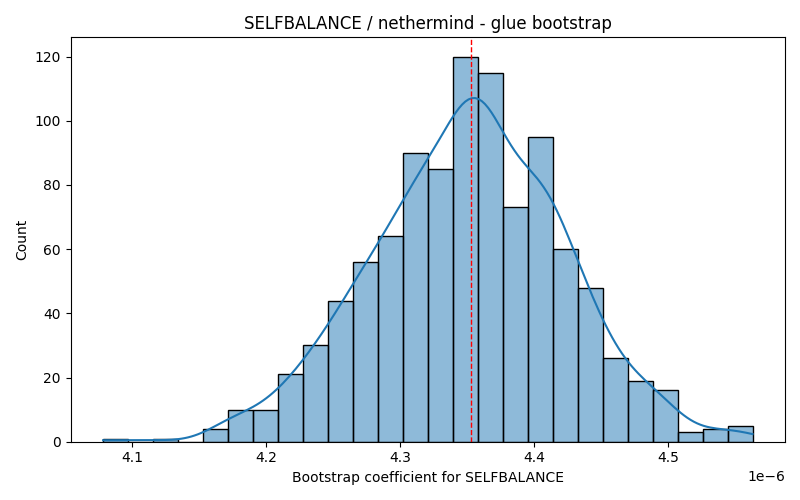

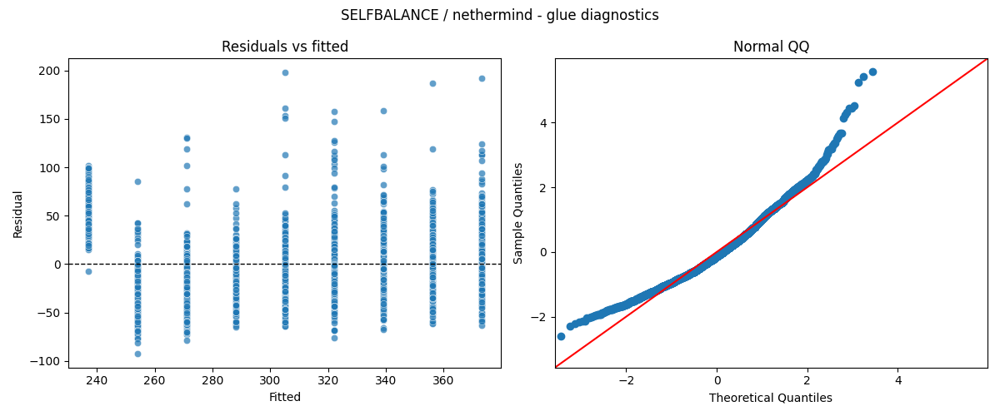

</details>

<details><summary><code>SUB</code> · nobs=4169 · runtime_ms=2.611e-06 · p=1.00e-03 · R²=0.8533</summary>

```
==============================================================================
                           NNLS Regression Results                            
==============================================================================
Dep. Variable:          test_runtime_ms              R-squared:          0.853
Model:                  NNLS                    Adj. R-squared:          0.853
No. Observations:       4169                              RMSE:          11.40
Df Residuals:           4167                               MAE:           8.10
Df Model:               1      
==============================================================================
                      coef     std err     P-value      [0.025      0.975]
------------------------------------------------------------------------------
         const     17.7745      0.4984       0.001     16.8052     18.7584
           SUB      0.0000      0.0000       0.001      0.0000      0.0000
==============================================================================
Notes: Non-negative least squares with bootstrap inference (1000 iterations)
==============================================================================
```

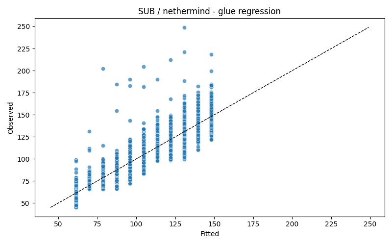

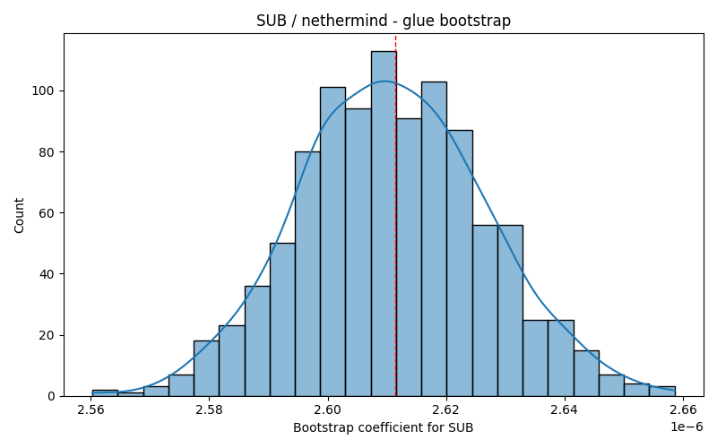

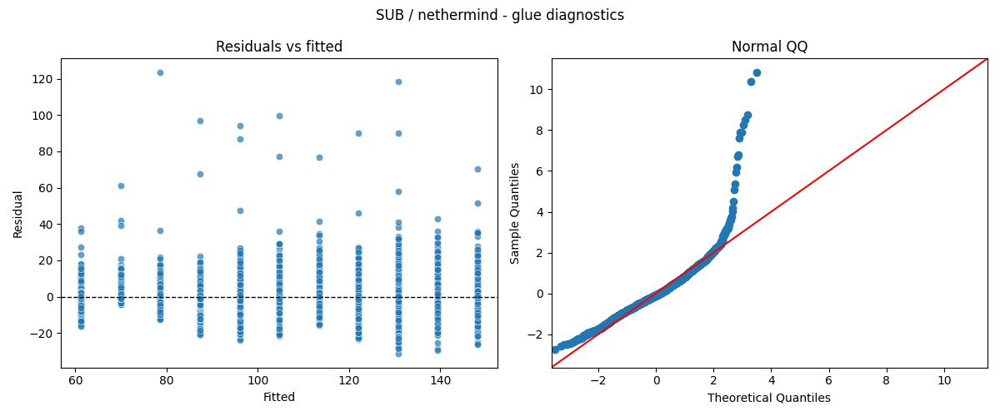

</details>

### Mixed glue (tier B) · nethermind

<details><summary><code>JUMP</code> · nobs=4169 · runtime_ms=5.628e-06 · p=1.00e-03 · R²=0.8467</summary>

```
==============================================================================
                           NNLS Regression Results                            
==============================================================================
Dep. Variable:          test_runtime_ms              R-squared:          0.847
Model:                  NNLS                    Adj. R-squared:          0.847
No. Observations:       4169                              RMSE:           8.90
Df Residuals:           4167                               MAE:           6.20
Df Model:               1      
==============================================================================
                      coef     std err     P-value      [0.025      0.975]
------------------------------------------------------------------------------
         const     15.5665      0.3987       0.001     14.7677     16.3000
          JUMP      0.0000      0.0000       0.001      0.0000      0.0000
==============================================================================
Notes: Non-negative least squares with bootstrap inference (1000 iterations)
==============================================================================
```

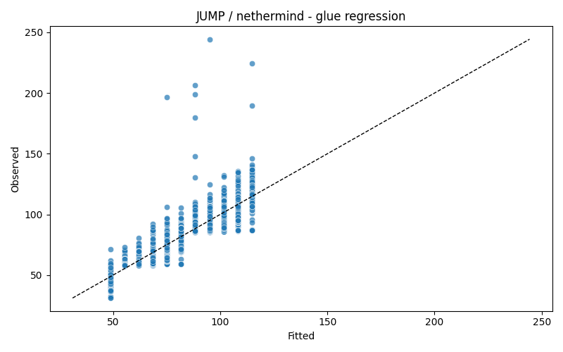

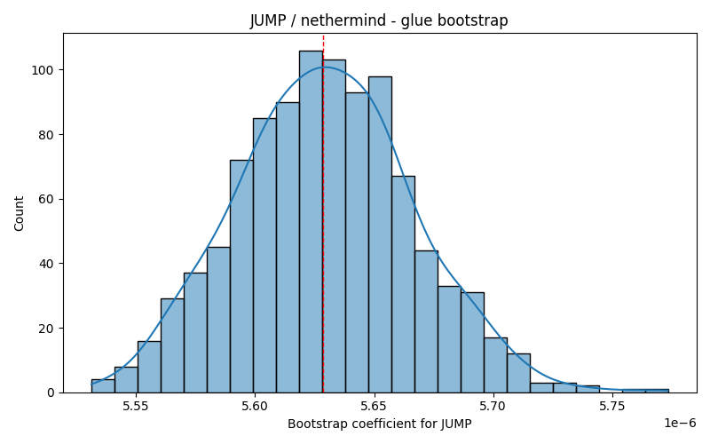

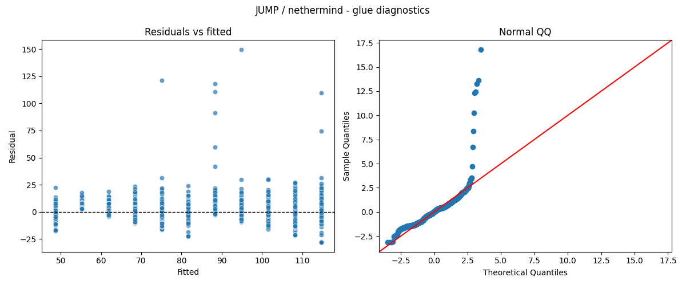

</details>

<details><summary><code>KECCAK256</code> · nobs=66704 · runtime_ms=0 · p=1.00e+00 · R²=0</summary>

```
==============================================================================
                           NNLS Regression Results                            
==============================================================================
Dep. Variable:          test_runtime_ms              R-squared:          0.000
Model:                  NNLS                    Adj. R-squared:         -0.000
No. Observations:       66704                             RMSE:         288.30
Df Residuals:           66702                              MAE:         234.49
Df Model:               1      
==============================================================================
                      coef     std err     P-value      [0.025      0.975]
------------------------------------------------------------------------------
         const    412.6964      1.1440       0.001    410.4853    414.7921
     KECCAK256      0.0000      0.0000       1.000      0.0000      0.0000
==============================================================================
Notes: Non-negative least squares with bootstrap inference (1000 iterations)
==============================================================================
```

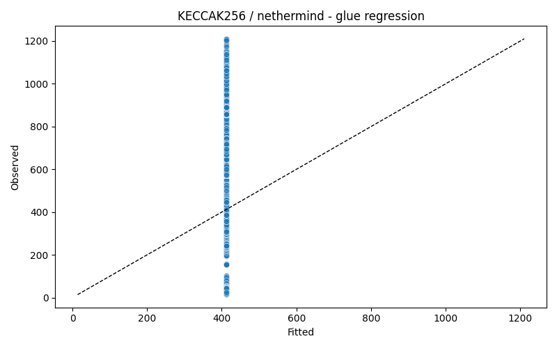


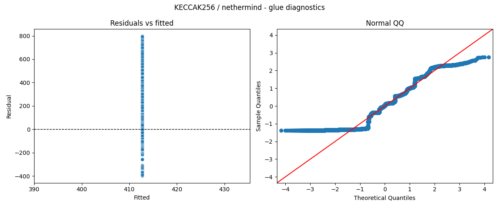

</details>

## reth

| glue_opcode | nobs | glue_runtime_ms | p_value | rsquared |
| --- | --- | --- | --- | --- |
| `ISZERO` | 990 | 1.354e-06 | 1.00e-03 | 0.8384 |
| `JUMPDEST` | 990 | 2.8e-07 | 1.00e-03 | 0.7101 |
| `SWAP` | 15840 | 4.826e-07 | 1.00e-03 | 0.3615 |
| `CALLDATASIZE` | 58993 | 4.753e-07 | 1.00e-03 | 0.3472 |
| `DUP` | 58993 | 4.127e-07 | 1.00e-03 | 0.3472 |
| `GAS` | 58993 | 4.218e-07 | 1.00e-03 | 0.3472 |
| `MLOAD` | 58993 | 1.197e-06 | 1.00e-03 | 0.3472 |
| `PUSH` | 58993 | 4.252e-07 | 1.00e-03 | 0.3472 |
| `PUSH0` | 58993 | 3.557e-07 | 1.00e-03 | 0.3472 |
| `STATICCALL` | 58993 | 5.484e-05 | 1.00e-03 | 0.3472 |
| `ADD` | 990 | 8.561e-07 | 1.00e-03 | 0.7312 |
| `AND` | 990 | 8.197e-07 | 1.00e-03 | 0.7191 |
| `CALLDATACOPY` | 23760 | 2.375e-06 | 1.00e-03 | 0.8088 |
| `CALLDATALOAD` | 3960 | 1.165e-05 | 1.00e-03 | 0.003413 |
| `DIV` | 990 | 6.857e-06 | 1.00e-03 | 0.8533 |
| `EXP` | 990 | 0.0005095 | 1.00e-03 | 0.8548 |
| `GT` | 990 | 9.349e-07 | 1.00e-03 | 0.7443 |
| `JUMPI` | 990 | 1.309e-06 | 1.00e-03 | 0.552 |
| `LT` | 990 | 9.019e-07 | 1.00e-03 | 0.7452 |
| `MSTORE` | 4950 | 2.629e-06 | 1.00e-03 | 0.2941 |
| `MSTORE8` | 4950 | 1.337e-06 | 1.00e-03 | 0.6935 |
| `MUL` | 990 | 1.113e-06 | 1.00e-03 | 0.7348 |
| `PC` | 990 | 6.039e-07 | 1.00e-03 | 0.276 |
| `RETURNDATASIZE` | 3960 | 8.157e-07 | 1.00e-03 | 0.7577 |
| `SELFBALANCE` | 810 | 3.641e-06 | 1.00e-03 | 0.7756 |
| `SUB` | 990 | 8.528e-07 | 1.00e-03 | 0.7496 |
| `JUMP` | 990 | 2.379e-06 | 1.00e-03 | 0.5781 |
| `KECCAK256` | 15840 | 0 | 1.00e+00 | 0 |

### Cycle glue — joint fit · reth

<details><summary>Joint NNLS regression summary</summary>

```
==============================================================================
                           NNLS Regression Results                            
==============================================================================
Dep. Variable:          test_runtime_ms              R-squared:          0.347
Model:                  NNLS                    Adj. R-squared:          0.347
No. Observations:       58993                             RMSE:          18.98
Df Residuals:           58985                              MAE:           8.39
Df Model:               7      
==============================================================================
                      coef     std err     P-value      [0.025      0.975]
------------------------------------------------------------------------------
         const     17.1731      0.2736       0.001     16.6471     17.7069
  CALLDATASIZE      0.0000      0.0000       0.001      0.0000      0.0000
           DUP      0.0000      0.0000       0.001      0.0000      0.0000
           GAS      0.0000      0.0000       0.001      0.0000      0.0000
         MLOAD      0.0000      0.0000       0.001      0.0000      0.0000
          PUSH      0.0000      0.0000       0.001      0.0000      0.0000
         PUSH0      0.0000      0.0000       0.001      0.0000      0.0000
    STATICCALL      0.0001      0.0000       0.001      0.0001      0.0001
==============================================================================
Notes: Non-negative least squares with bootstrap inference (1000 iterations)
==============================================================================
```

</details>

<details><summary><code>CALLDATASIZE</code> · nobs=58993 · runtime_ms=4.753e-07 · p=1.00e-03 · R²=0.3472</summary>

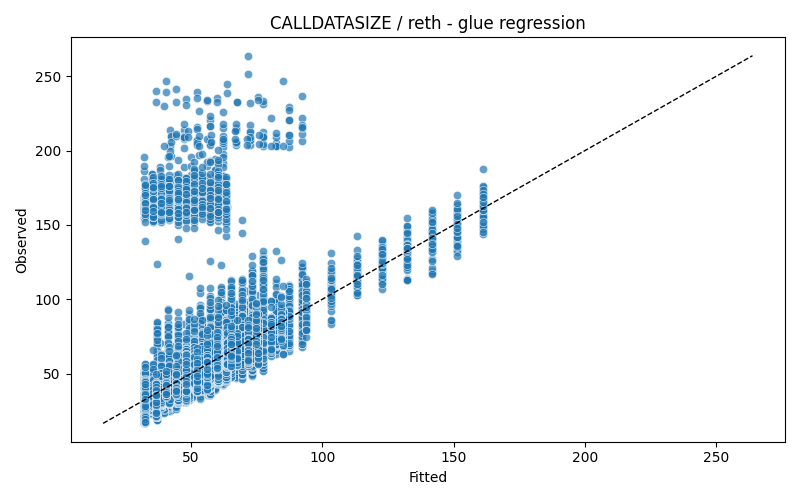

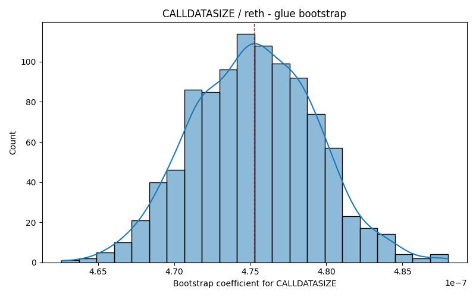


</details>

<details><summary><code>DUP</code> · nobs=58993 · runtime_ms=4.127e-07 · p=1.00e-03 · R²=0.3472</summary>

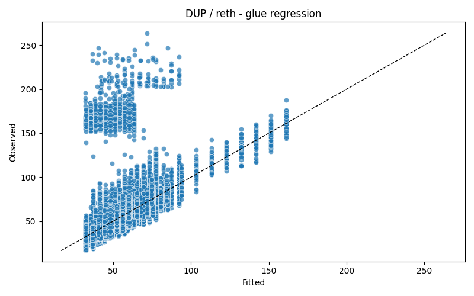

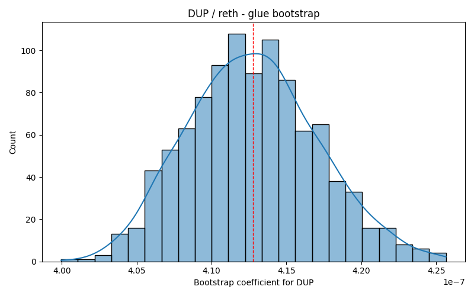


</details>

<details><summary><code>GAS</code> · nobs=58993 · runtime_ms=4.218e-07 · p=1.00e-03 · R²=0.3472</summary>


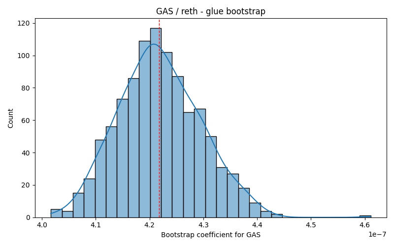


</details>

<details><summary><code>MLOAD</code> · nobs=58993 · runtime_ms=1.197e-06 · p=1.00e-03 · R²=0.3472</summary>


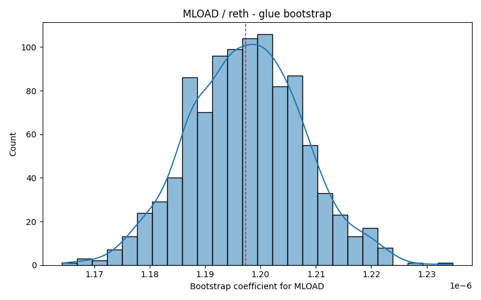


</details>

<details><summary><code>PUSH</code> · nobs=58993 · runtime_ms=4.252e-07 · p=1.00e-03 · R²=0.3472</summary>


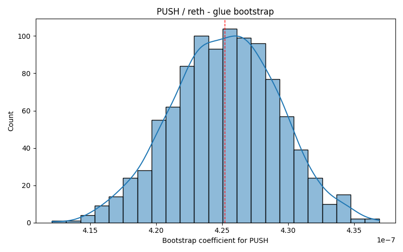

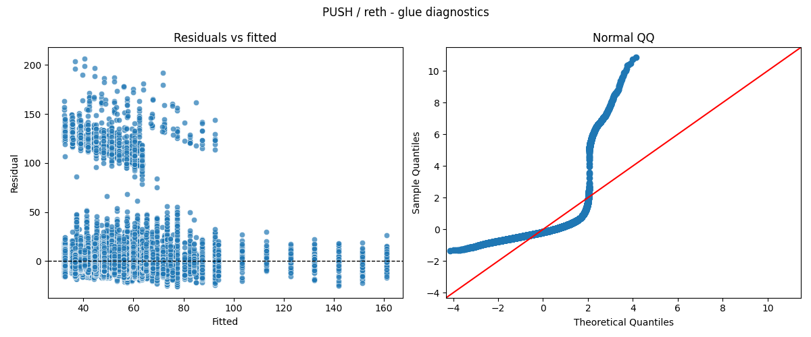

</details>

<details><summary><code>PUSH0</code> · nobs=58993 · runtime_ms=3.557e-07 · p=1.00e-03 · R²=0.3472</summary>


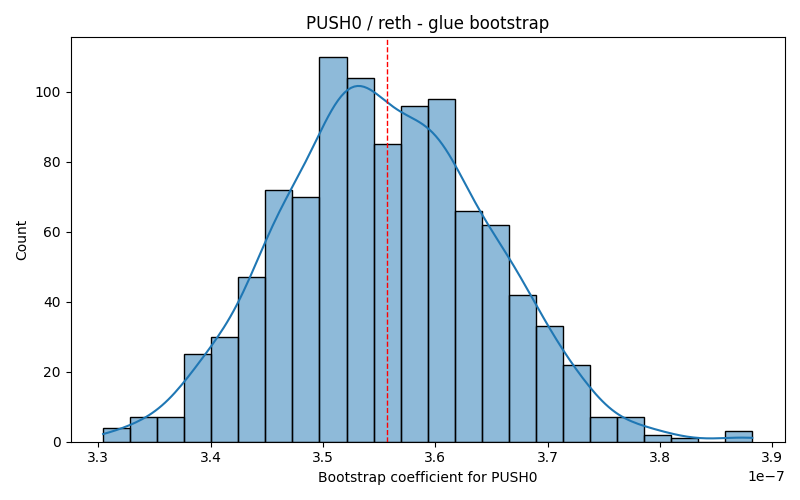


</details>

<details><summary><code>STATICCALL</code> · nobs=58993 · runtime_ms=5.484e-05 · p=1.00e-03 · R²=0.3472</summary>


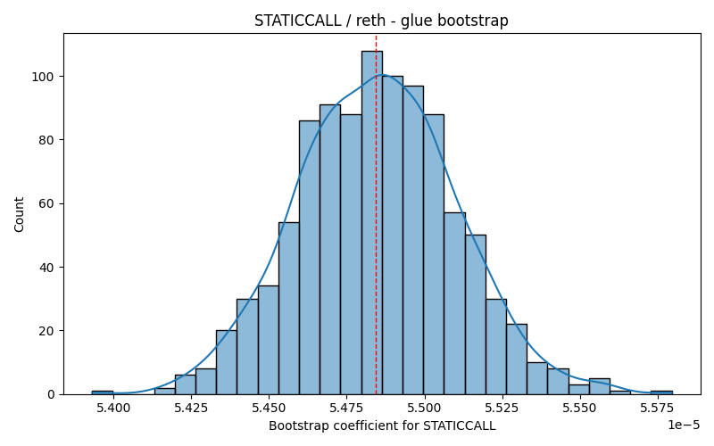

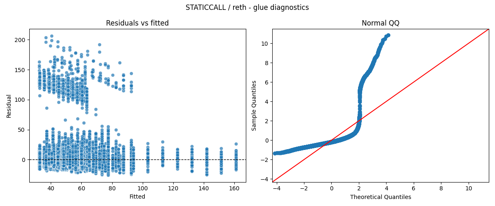

</details>

### Pure glue · reth

<details><summary><code>ISZERO</code> · nobs=990 · runtime_ms=1.354e-06 · p=1.00e-03 · R²=0.8384</summary>

```
==============================================================================
                           NNLS Regression Results                            
==============================================================================
Dep. Variable:          test_runtime_ms              R-squared:          0.838
Model:                  NNLS                    Adj. R-squared:          0.838
No. Observations:       990                               RMSE:          12.51
Df Residuals:           988                                MAE:           9.66
Df Model:               1      
==============================================================================
                      coef     std err     P-value      [0.025      0.975]
------------------------------------------------------------------------------
         const     32.4124      1.4885       0.001     29.6303     35.3207
        ISZERO      0.0000      0.0000       0.001      0.0000      0.0000
==============================================================================
Notes: Non-negative least squares with bootstrap inference (1000 iterations)
==============================================================================
```

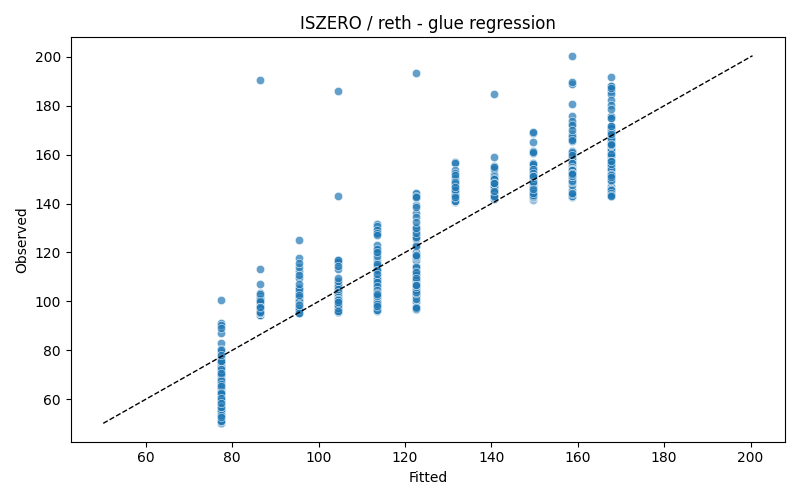

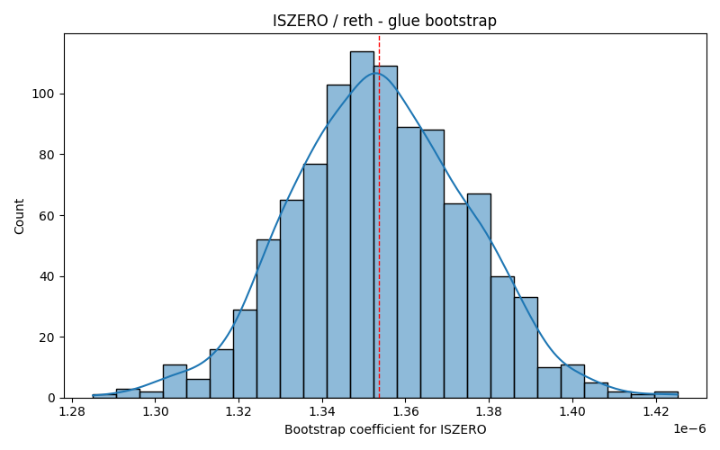

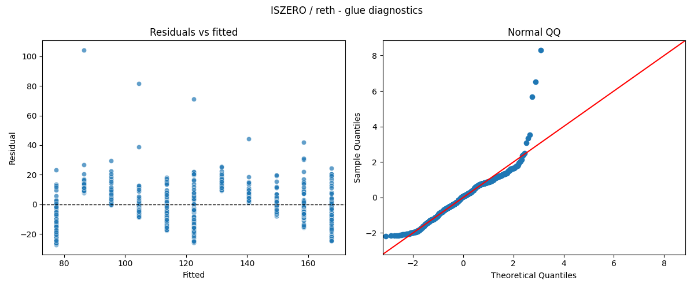

</details>

<details><summary><code>JUMPDEST</code> · nobs=990 · runtime_ms=2.8e-07 · p=1.00e-03 · R²=0.7101</summary>

```
==============================================================================
                           NNLS Regression Results                            
==============================================================================
Dep. Variable:          test_runtime_ms              R-squared:          0.710
Model:                  NNLS                    Adj. R-squared:          0.710
No. Observations:       990                               RMSE:          11.30
Df Residuals:           988                                MAE:           7.82
Df Model:               1      
==============================================================================
                      coef     std err     P-value      [0.025      0.975]
------------------------------------------------------------------------------
         const     18.5880      1.0666       0.001     16.3354     20.5531
      JUMPDEST      0.0000      0.0000       0.001      0.0000      0.0000
==============================================================================
Notes: Non-negative least squares with bootstrap inference (1000 iterations)
==============================================================================
```

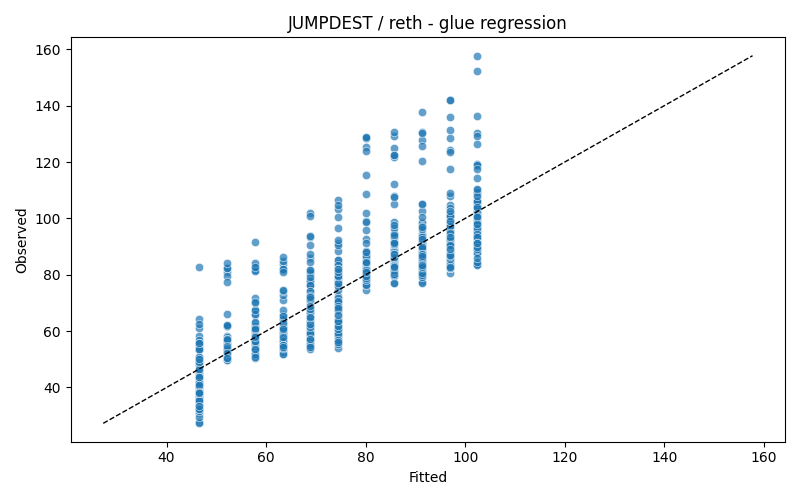

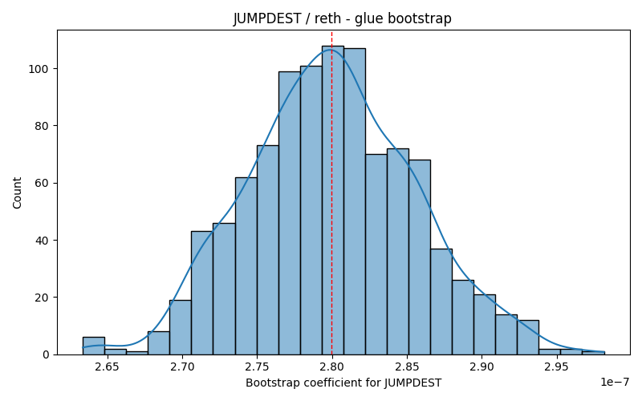

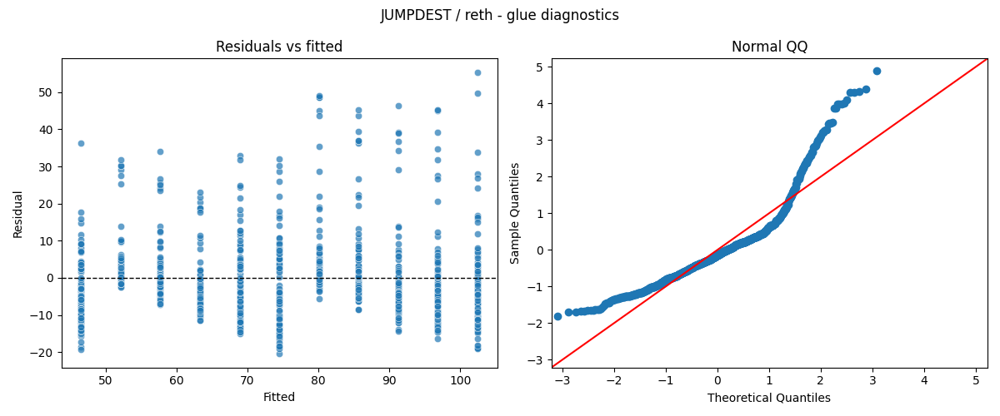

</details>

<details><summary><code>SWAP</code> · nobs=15840 · runtime_ms=4.826e-07 · p=1.00e-03 · R²=0.3615</summary>

```
==============================================================================
                           NNLS Regression Results                            
==============================================================================
Dep. Variable:          test_runtime_ms              R-squared:          0.361
Model:                  NNLS                    Adj. R-squared:          0.361
No. Observations:       15840                             RMSE:          13.50
Df Residuals:           15838                              MAE:           5.37
Df Model:               1      
==============================================================================
                      coef     std err     P-value      [0.025      0.975]
------------------------------------------------------------------------------
         const     15.2552      0.3563       0.001     14.6166     15.9873
          SWAP      0.0000      0.0000       0.001      0.0000      0.0000
==============================================================================
Notes: Non-negative least squares with bootstrap inference (1000 iterations)
==============================================================================
```

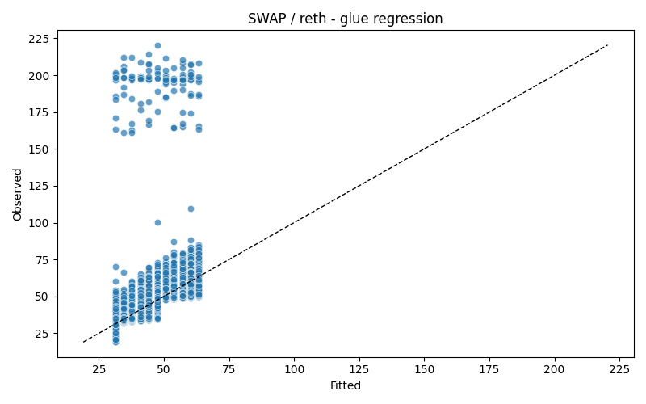

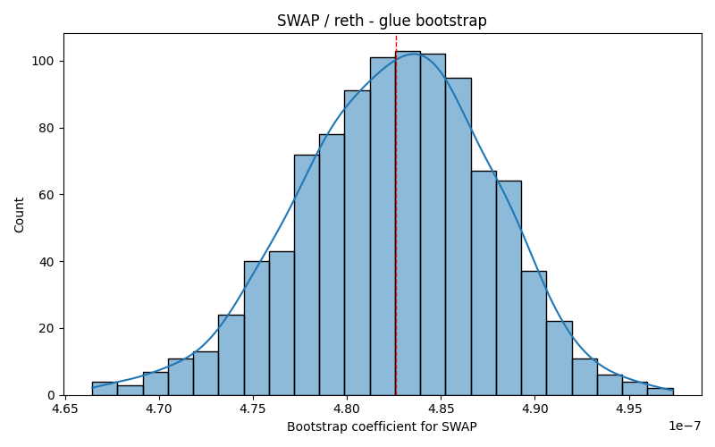

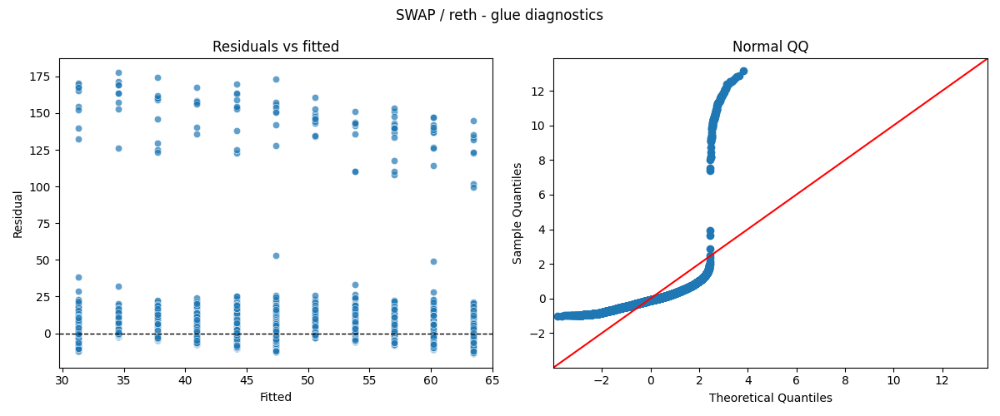

</details>

### Mixed glue (tier A) · reth

<details><summary><code>ADD</code> · nobs=990 · runtime_ms=8.561e-07 · p=1.00e-03 · R²=0.7312</summary>

```
==============================================================================
                           NNLS Regression Results                            
==============================================================================
Dep. Variable:          test_runtime_ms              R-squared:          0.731
Model:                  NNLS                    Adj. R-squared:          0.731
No. Observations:       990                               RMSE:           5.46
Df Residuals:           988                                MAE:           4.18
Df Model:               1      
==============================================================================
                      coef     std err     P-value      [0.025      0.975]
------------------------------------------------------------------------------
         const     12.8453      0.5820       0.001     11.6739     13.9757
           ADD      0.0000      0.0000       0.001      0.0000      0.0000
==============================================================================
Notes: Non-negative least squares with bootstrap inference (1000 iterations)
==============================================================================
```

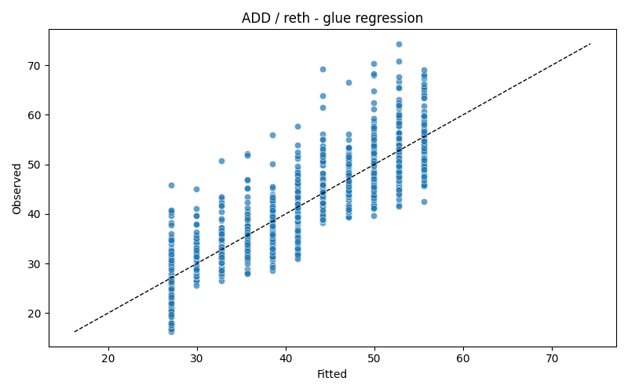

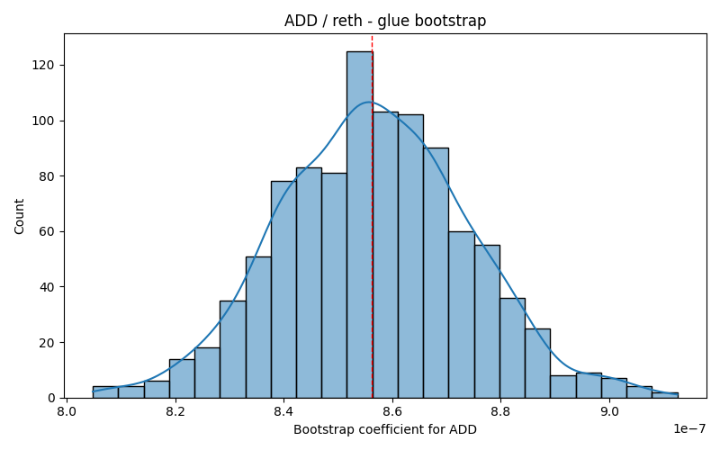

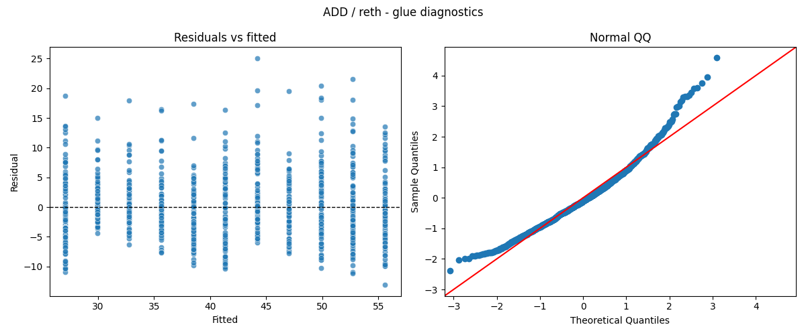

</details>

<details><summary><code>AND</code> · nobs=990 · runtime_ms=8.197e-07 · p=1.00e-03 · R²=0.7191</summary>

```
==============================================================================
                           NNLS Regression Results                            
==============================================================================
Dep. Variable:          test_runtime_ms              R-squared:          0.719
Model:                  NNLS                    Adj. R-squared:          0.719
No. Observations:       990                               RMSE:           5.39
Df Residuals:           988                                MAE:           4.09
Df Model:               1      
==============================================================================
                      coef     std err     P-value      [0.025      0.975]
------------------------------------------------------------------------------
         const     11.8956      0.5380       0.001     10.8342     12.8887
           AND      0.0000      0.0000       0.001      0.0000      0.0000
==============================================================================
Notes: Non-negative least squares with bootstrap inference (1000 iterations)
==============================================================================
```

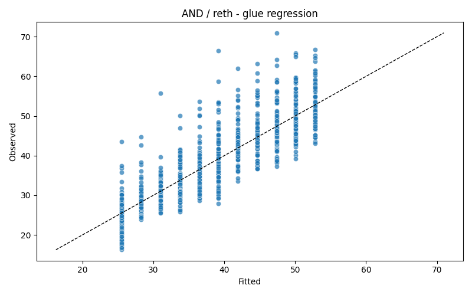

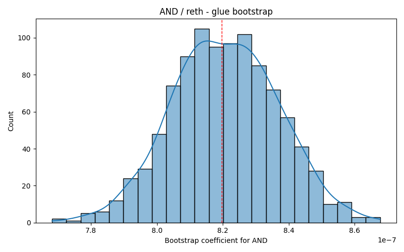

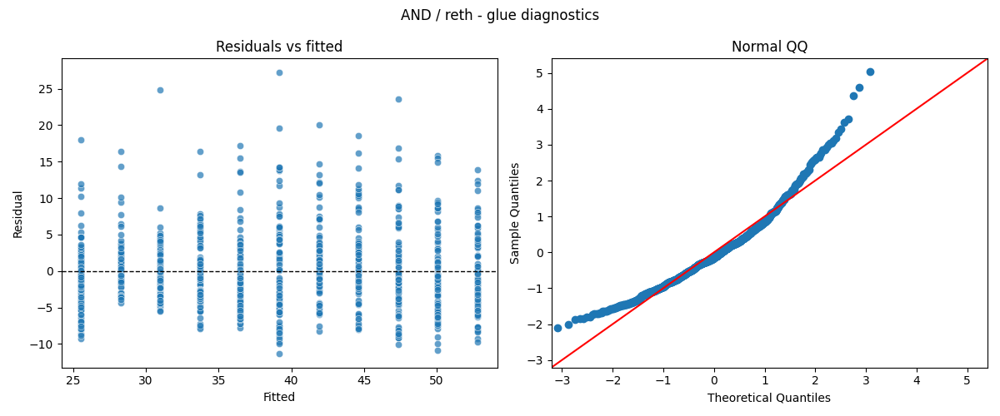

</details>

<details><summary><code>CALLDATACOPY</code> · nobs=23760 · runtime_ms=2.375e-06 · p=1.00e-03 · R²=0.8088</summary>

```
==============================================================================
                           NNLS Regression Results                            
==============================================================================
Dep. Variable:          test_runtime_ms              R-squared:          0.809
Model:                  NNLS                    Adj. R-squared:          0.809
No. Observations:       23760                             RMSE:           8.68
Df Residuals:           23758                              MAE:           6.60
Df Model:               1      
==============================================================================
                      coef     std err     P-value      [0.025      0.975]
------------------------------------------------------------------------------
         const     14.5297      0.0732       0.001     14.3871     14.6695
  CALLDATACOPY      0.0000      0.0000       0.001      0.0000      0.0000
==============================================================================
Notes: Non-negative least squares with bootstrap inference (1000 iterations)
==============================================================================
```

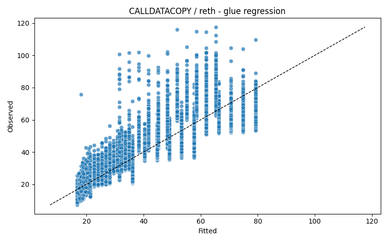

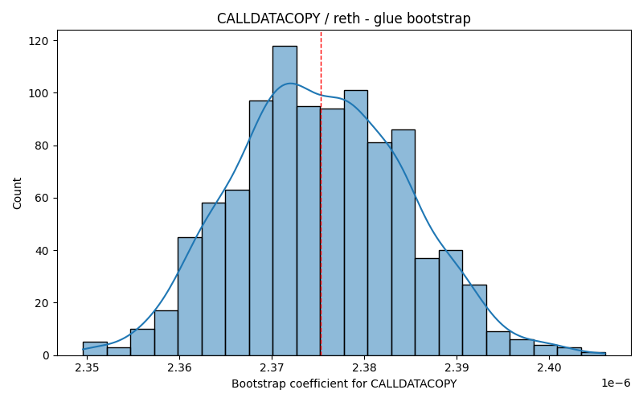

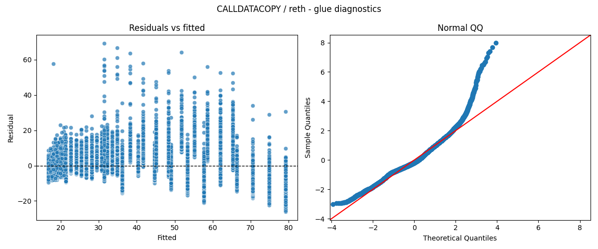

</details>

<details><summary><code>CALLDATALOAD</code> · nobs=3960 · runtime_ms=1.165e-05 · p=1.00e-03 · R²=0.003413</summary>

```
==============================================================================
                           NNLS Regression Results                            
==============================================================================
Dep. Variable:          test_runtime_ms              R-squared:          0.003
Model:                  NNLS                    Adj. R-squared:          0.003
No. Observations:       3960                              RMSE:           0.76
Df Residuals:           3958                               MAE:           0.51
Df Model:               1      
==============================================================================
                      coef     std err     P-value      [0.025      0.975]
------------------------------------------------------------------------------
         const      3.7060      0.0415       0.001      3.6222      3.7853
  CALLDATALOAD      0.0000      0.0000       0.001      0.0000      0.0000
==============================================================================
Notes: Non-negative least squares with bootstrap inference (1000 iterations)
==============================================================================
```

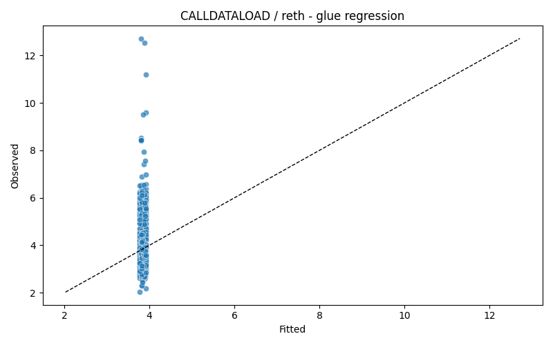

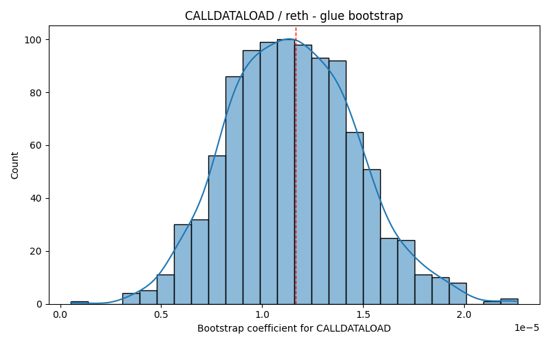

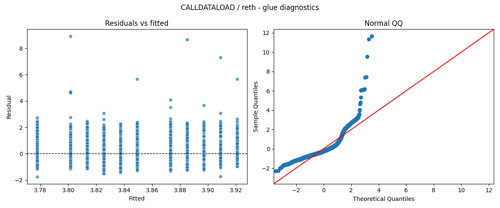

</details>

<details><summary><code>DIV</code> · nobs=990 · runtime_ms=6.857e-06 · p=1.00e-03 · R²=0.8533</summary>

```
==============================================================================
                           NNLS Regression Results                            
==============================================================================
Dep. Variable:          test_runtime_ms              R-squared:          0.853
Model:                  NNLS                    Adj. R-squared:          0.853
No. Observations:       990                               RMSE:          22.44
Df Residuals:           988                                MAE:          18.81
Df Model:               1      
==============================================================================
                      coef     std err     P-value      [0.025      0.975]
------------------------------------------------------------------------------
         const     64.0144      2.8414       0.001     58.5851     69.5683
           DIV      0.0000      0.0000       0.001      0.0000      0.0000
==============================================================================
Notes: Non-negative least squares with bootstrap inference (1000 iterations)
==============================================================================
```

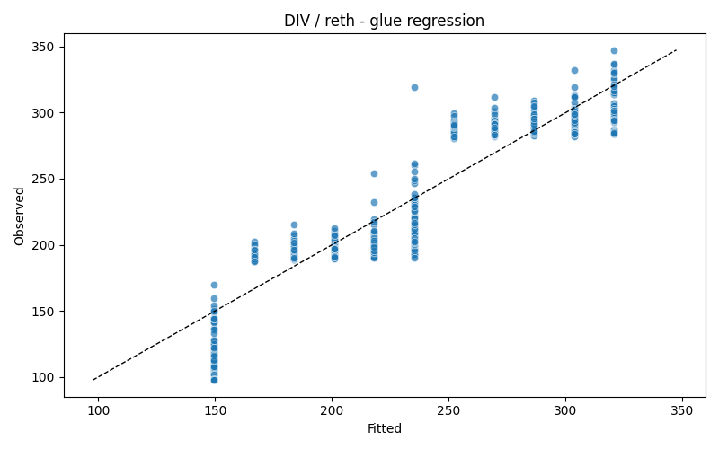

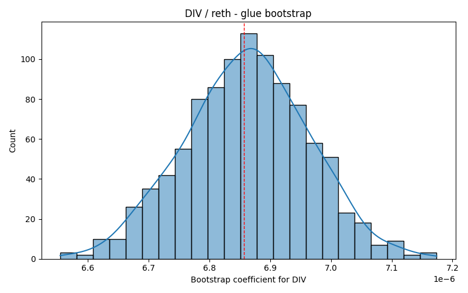

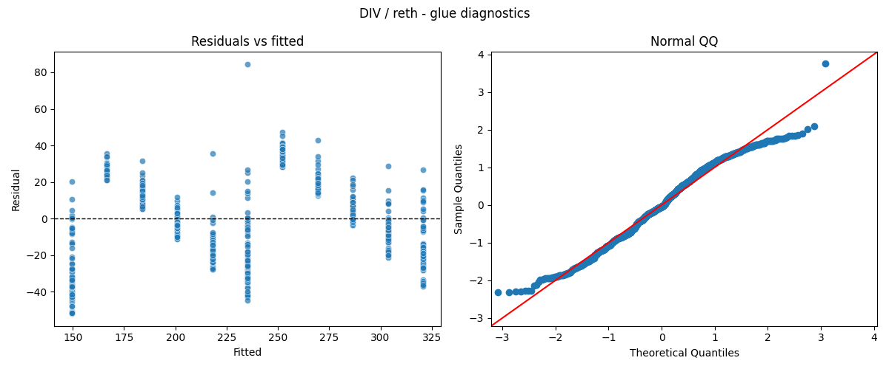

</details>

<details><summary><code>EXP</code> · nobs=990 · runtime_ms=0.0005095 · p=1.00e-03 · R²=0.8548</summary>

```
==============================================================================
                           NNLS Regression Results                            
==============================================================================
Dep. Variable:          test_runtime_ms              R-squared:          0.855
Model:                  NNLS                    Adj. R-squared:          0.855
No. Observations:       990                               RMSE:           8.22
Df Residuals:           988                                MAE:           6.57
Df Model:               1      
==============================================================================
                      coef     std err     P-value      [0.025      0.975]
------------------------------------------------------------------------------
         const     23.7572      0.9085       0.001     21.9713     25.4396
           EXP      0.0005      0.0000       0.001      0.0005      0.0005
==============================================================================
Notes: Non-negative least squares with bootstrap inference (1000 iterations)
==============================================================================
```

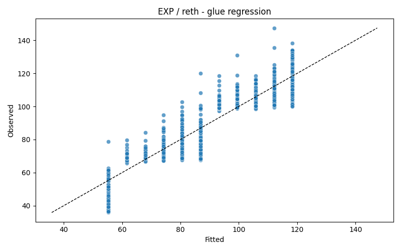

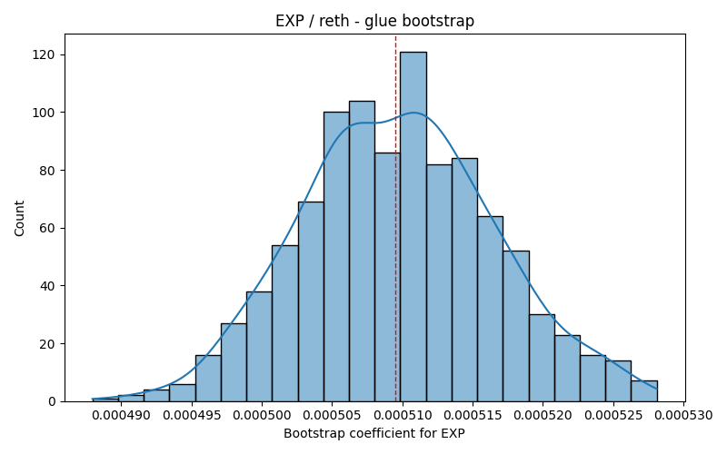

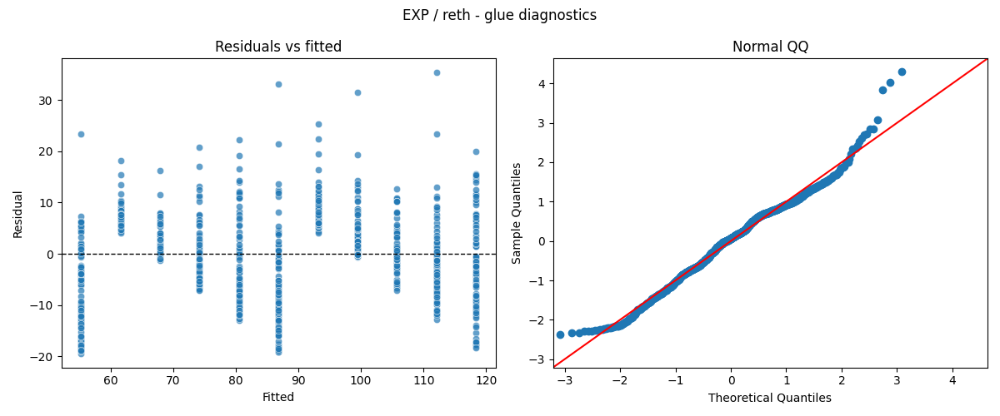

</details>

<details><summary><code>GT</code> · nobs=990 · runtime_ms=9.349e-07 · p=1.00e-03 · R²=0.7443</summary>

```
==============================================================================
                           NNLS Regression Results                            
==============================================================================
Dep. Variable:          test_runtime_ms              R-squared:          0.744
Model:                  NNLS                    Adj. R-squared:          0.744
No. Observations:       990                               RMSE:           5.77
Df Residuals:           988                                MAE:           4.46
Df Model:               1      
==============================================================================
                      coef     std err     P-value      [0.025      0.975]
------------------------------------------------------------------------------
         const     13.3559      0.5884       0.001     12.1514     14.4842
            GT      0.0000      0.0000       0.001      0.0000      0.0000
==============================================================================
Notes: Non-negative least squares with bootstrap inference (1000 iterations)
==============================================================================
```


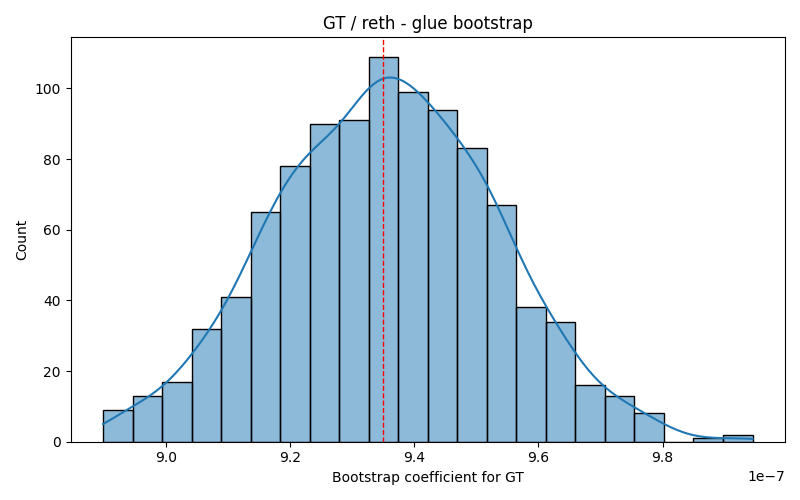

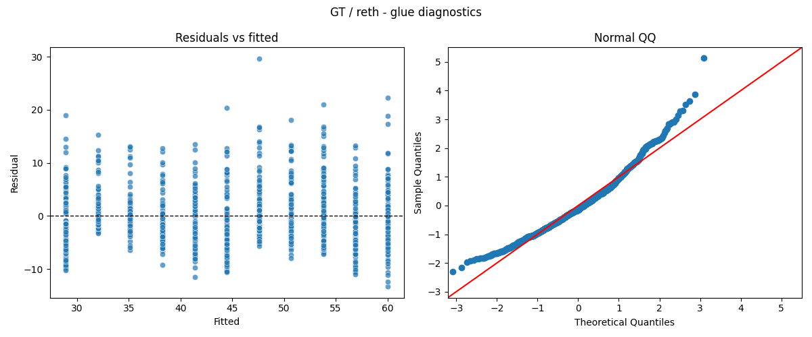

</details>

<details><summary><code>JUMPI</code> · nobs=990 · runtime_ms=1.309e-06 · p=1.00e-03 · R²=0.552</summary>

```
==============================================================================
                           NNLS Regression Results                            
==============================================================================
Dep. Variable:          test_runtime_ms              R-squared:          0.552
Model:                  NNLS                    Adj. R-squared:          0.551
No. Observations:       990                               RMSE:           5.32
Df Residuals:           988                                MAE:           3.42
Df Model:               1      
==============================================================================
                      coef     std err     P-value      [0.025      0.975]
------------------------------------------------------------------------------
         const      9.0837      0.4867       0.001      8.1020      9.9802
         JUMPI      0.0000      0.0000       0.001      0.0000      0.0000
==============================================================================
Notes: Non-negative least squares with bootstrap inference (1000 iterations)
==============================================================================
```

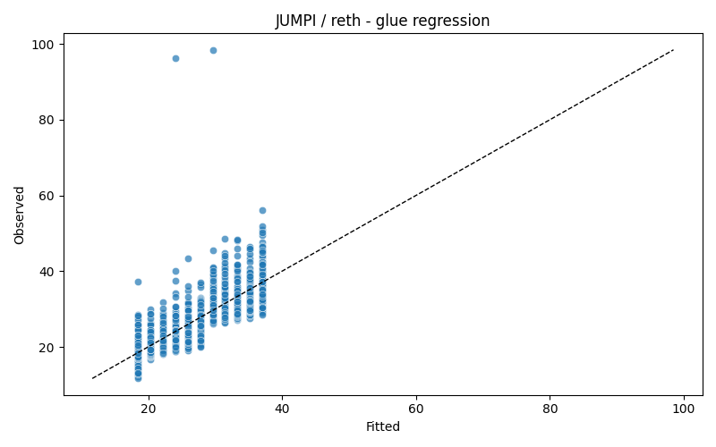

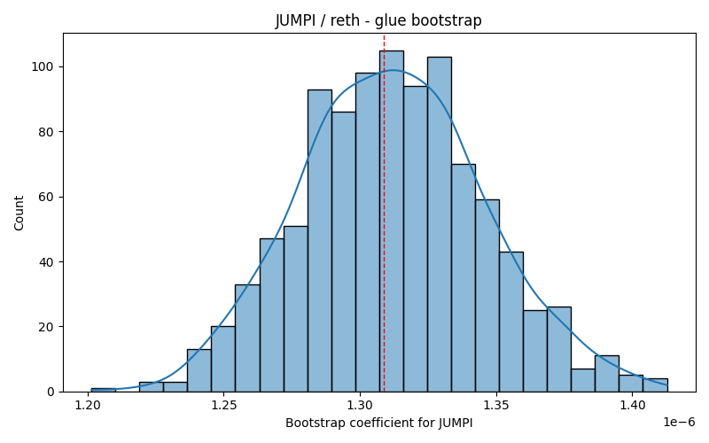

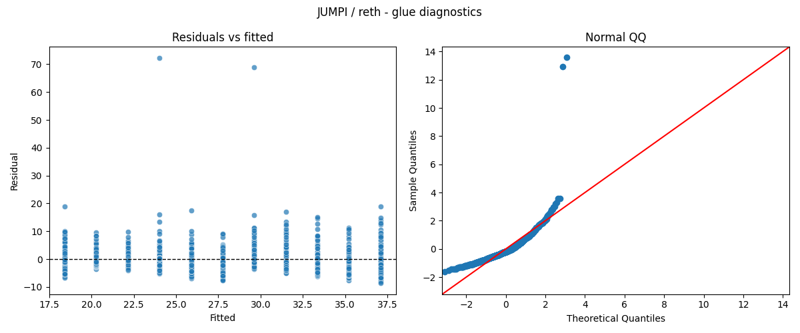

</details>

<details><summary><code>LT</code> · nobs=990 · runtime_ms=9.019e-07 · p=1.00e-03 · R²=0.7452</summary>

```
==============================================================================
                           NNLS Regression Results                            
==============================================================================
Dep. Variable:          test_runtime_ms              R-squared:          0.745
Model:                  NNLS                    Adj. R-squared:          0.745
No. Observations:       990                               RMSE:           5.55
Df Residuals:           988                                MAE:           4.30
Df Model:               1      
==============================================================================
                      coef     std err     P-value      [0.025      0.975]
------------------------------------------------------------------------------
         const     13.1113      0.5664       0.001     12.0053     14.2365
            LT      0.0000      0.0000       0.001      0.0000      0.0000
==============================================================================
Notes: Non-negative least squares with bootstrap inference (1000 iterations)
==============================================================================
```

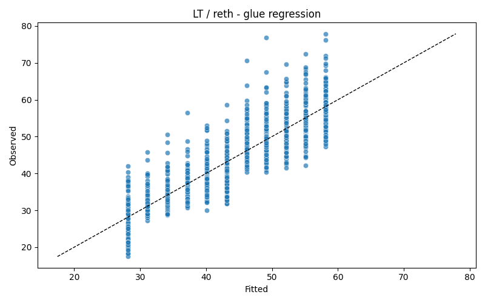

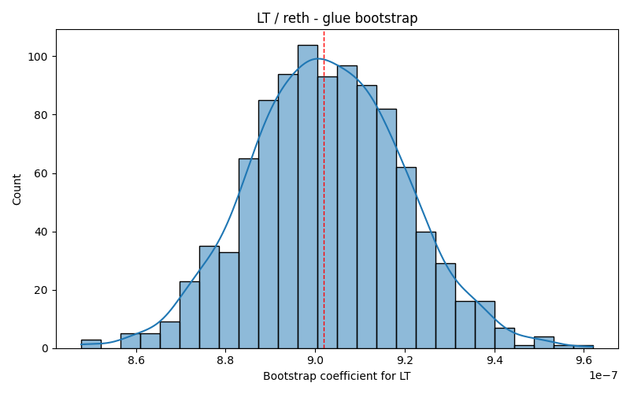

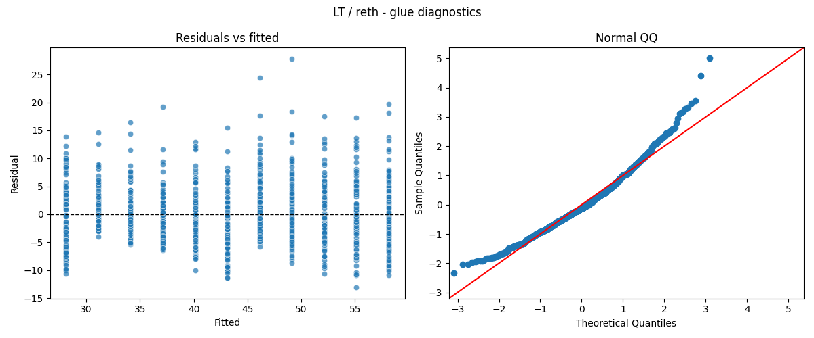

</details>

<details><summary><code>MSTORE</code> · nobs=4950 · runtime_ms=2.629e-06 · p=1.00e-03 · R²=0.2941</summary>

```
==============================================================================
                           NNLS Regression Results                            
==============================================================================
Dep. Variable:          test_runtime_ms              R-squared:          0.294
Model:                  NNLS                    Adj. R-squared:          0.294
No. Observations:       4950                              RMSE:          28.58
Df Residuals:           4948                               MAE:          25.77
Df Model:               1      
==============================================================================
                      coef     std err     P-value      [0.025      0.975]
------------------------------------------------------------------------------
         const     21.0241      1.1892       0.001     18.5856     23.3648
        MSTORE      0.0000      0.0000       0.001      0.0000      0.0000
==============================================================================
Notes: Non-negative least squares with bootstrap inference (1000 iterations)
==============================================================================
```

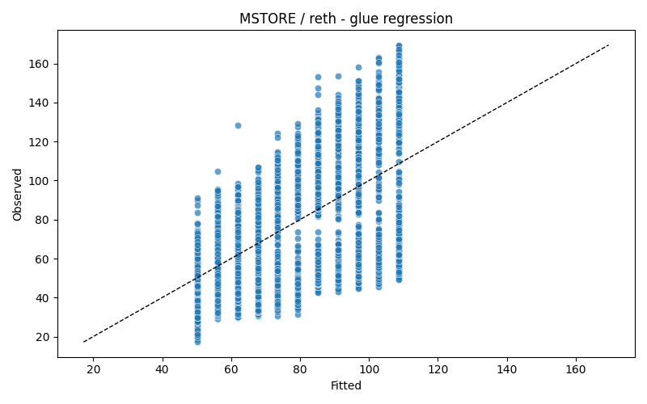

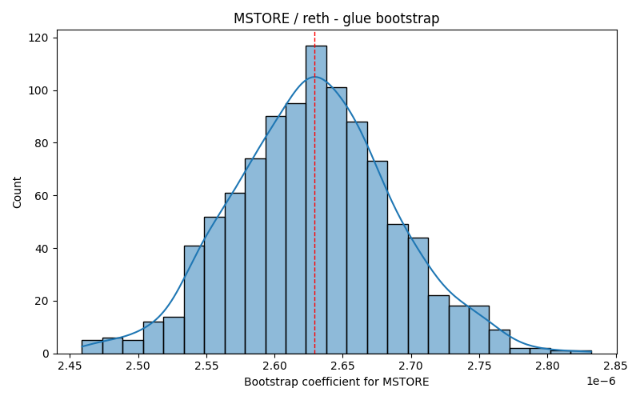

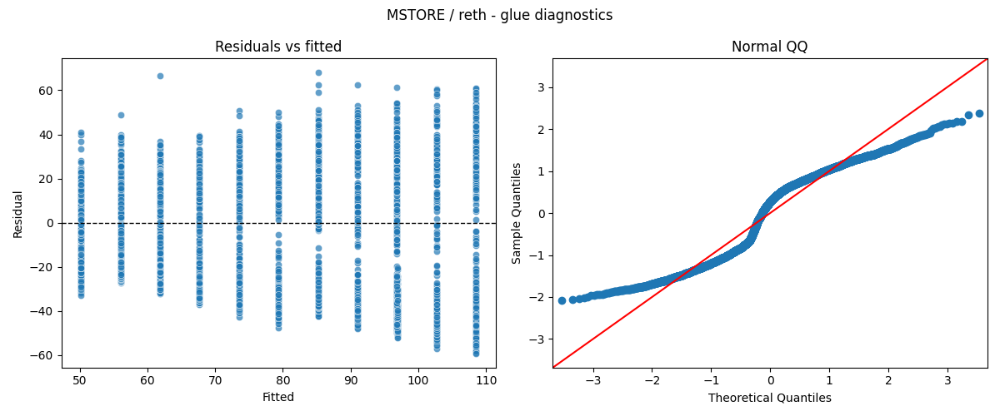

</details>

<details><summary><code>MSTORE8</code> · nobs=4950 · runtime_ms=1.337e-06 · p=1.00e-03 · R²=0.6935</summary>

```
==============================================================================
                           NNLS Regression Results                            
==============================================================================
Dep. Variable:          test_runtime_ms              R-squared:          0.694
Model:                  NNLS                    Adj. R-squared:          0.693
No. Observations:       4950                              RMSE:           6.24
Df Residuals:           4948                               MAE:           4.43
Df Model:               1      
==============================================================================
                      coef     std err     P-value      [0.025      0.975]
------------------------------------------------------------------------------
         const     13.6769      0.3003       0.001     13.1198     14.2757
       MSTORE8      0.0000      0.0000       0.001      0.0000      0.0000
==============================================================================
Notes: Non-negative least squares with bootstrap inference (1000 iterations)
==============================================================================
```

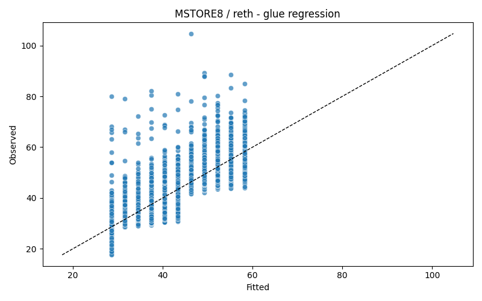

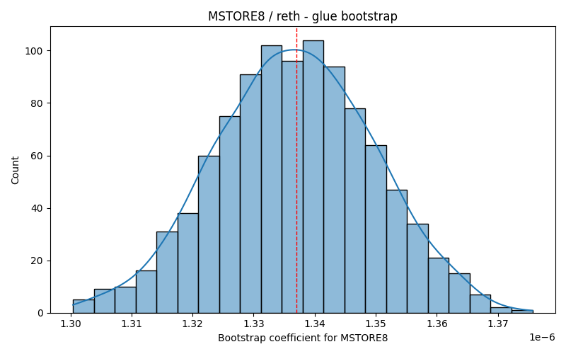

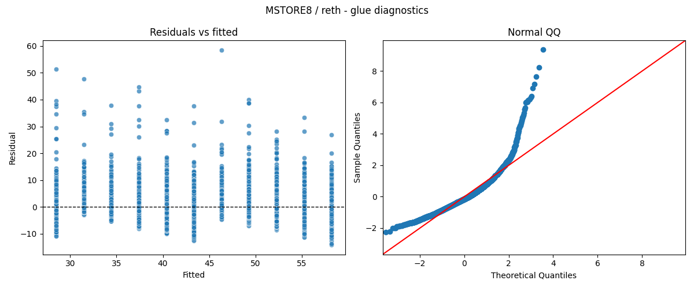

</details>

<details><summary><code>MUL</code> · nobs=990 · runtime_ms=1.113e-06 · p=1.00e-03 · R²=0.7348</summary>

```
==============================================================================
                           NNLS Regression Results                            
==============================================================================
Dep. Variable:          test_runtime_ms              R-squared:          0.735
Model:                  NNLS                    Adj. R-squared:          0.735
No. Observations:       990                               RMSE:           5.28
Df Residuals:           988                                MAE:           3.95
Df Model:               1      
==============================================================================
                      coef     std err     P-value      [0.025      0.975]
------------------------------------------------------------------------------
         const     13.4810      0.5488       0.001     12.3484     14.5546
           MUL      0.0000      0.0000       0.001      0.0000      0.0000
==============================================================================
Notes: Non-negative least squares with bootstrap inference (1000 iterations)
==============================================================================
```

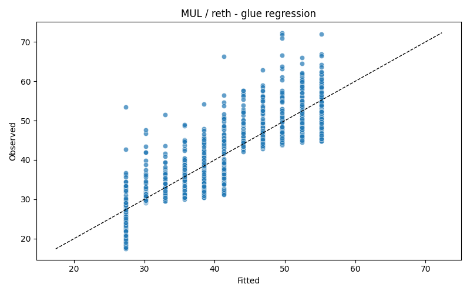

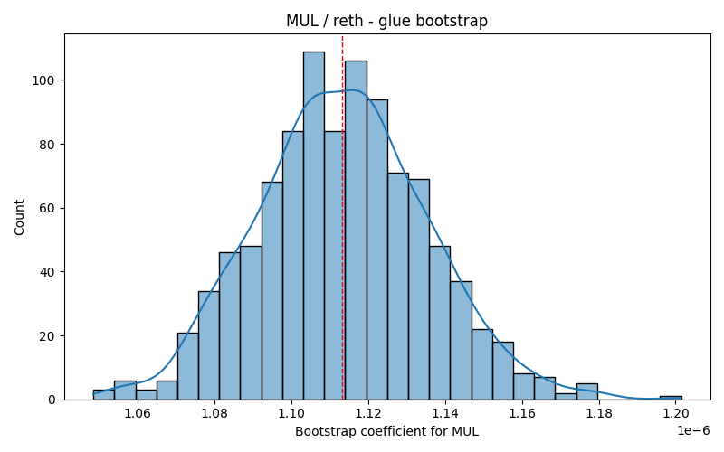


</details>

<details><summary><code>PC</code> · nobs=990 · runtime_ms=6.039e-07 · p=1.00e-03 · R²=0.276</summary>

```
==============================================================================
                           NNLS Regression Results                            
==============================================================================
Dep. Variable:          test_runtime_ms              R-squared:          0.276
Model:                  NNLS                    Adj. R-squared:          0.275
No. Observations:       990                               RMSE:          29.24
Df Residuals:           988                                MAE:          10.19
Df Model:               1      
==============================================================================
                      coef     std err     P-value      [0.025      0.975]
------------------------------------------------------------------------------
         const     19.5928      3.2466       0.001     13.4963     26.2032
            PC      0.0000      0.0000       0.001      0.0000      0.0000
==============================================================================
Notes: Non-negative least squares with bootstrap inference (1000 iterations)
==============================================================================
```

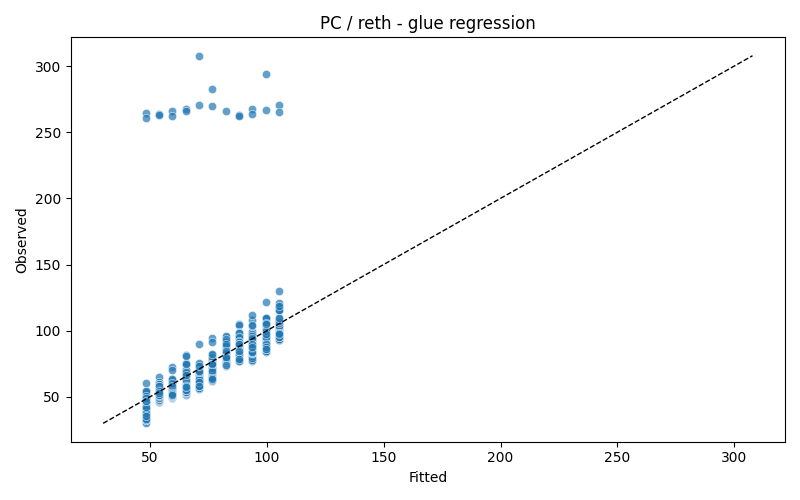


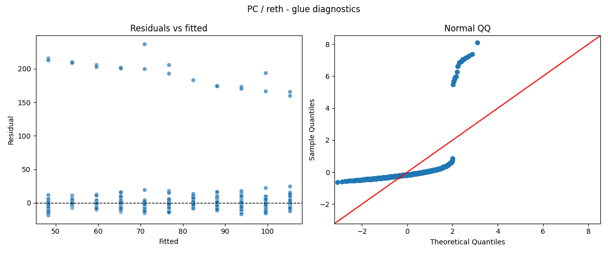

</details>

<details><summary><code>RETURNDATASIZE</code> · nobs=3960 · runtime_ms=8.157e-07 · p=1.00e-03 · R²=0.7577</summary>

```
==============================================================================
                           NNLS Regression Results                            
==============================================================================
Dep. Variable:          test_runtime_ms              R-squared:          0.758
Model:                  NNLS                    Adj. R-squared:          0.758
No. Observations:       3960                              RMSE:           7.28
Df Residuals:           3958                               MAE:           5.06
Df Model:               1      
==============================================================================
                      coef     std err     P-value      [0.025      0.975]
------------------------------------------------------------------------------
         const     15.4344      0.4158       0.001     14.6295     16.2858
RETURNDATASIZE      0.0000      0.0000       0.001      0.0000      0.0000
==============================================================================
Notes: Non-negative least squares with bootstrap inference (1000 iterations)
==============================================================================
```

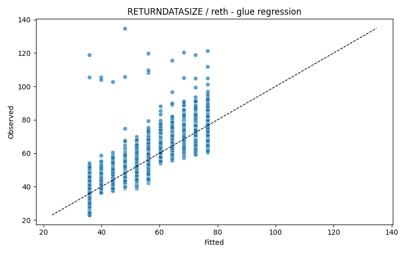

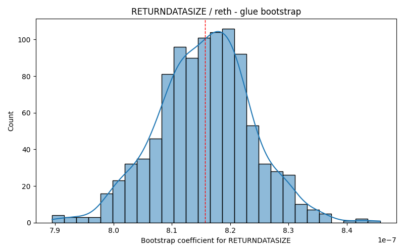

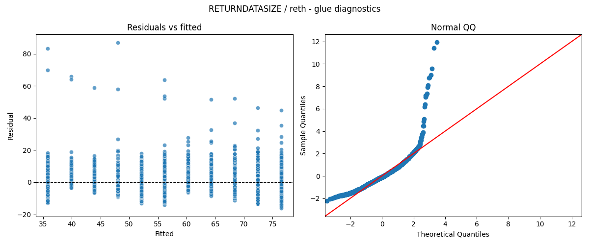

</details>

<details><summary><code>SELFBALANCE</code> · nobs=810 · runtime_ms=3.641e-06 · p=1.00e-03 · R²=0.7756</summary>

```
==============================================================================
                           NNLS Regression Results                            
==============================================================================
Dep. Variable:          test_runtime_ms              R-squared:          0.776
Model:                  NNLS                    Adj. R-squared:          0.775
No. Observations:       810                               RMSE:          19.75
Df Residuals:           808                                MAE:          15.52
Df Model:               1      
==============================================================================
                      coef     std err     P-value      [0.025      0.975]
------------------------------------------------------------------------------
         const     68.8492      2.6289       0.001     63.5906     74.3139
   SELFBALANCE      0.0000      0.0000       0.001      0.0000      0.0000
==============================================================================
Notes: Non-negative least squares with bootstrap inference (1000 iterations)
==============================================================================
```

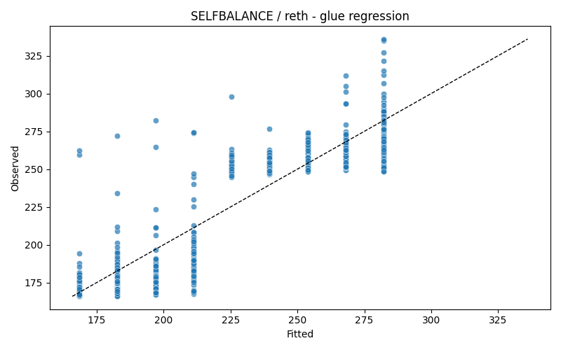

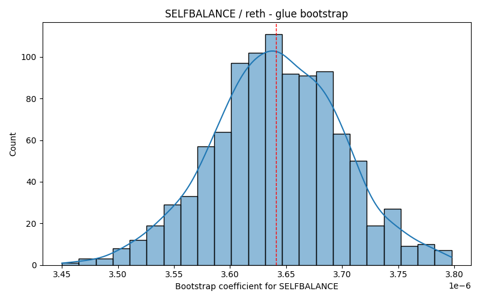

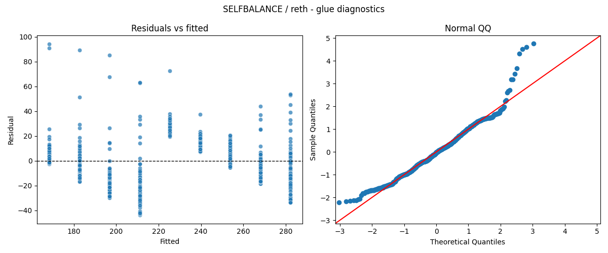

</details>

<details><summary><code>SUB</code> · nobs=990 · runtime_ms=8.528e-07 · p=1.00e-03 · R²=0.7496</summary>

```
==============================================================================
                           NNLS Regression Results                            
==============================================================================
Dep. Variable:          test_runtime_ms              R-squared:          0.750
Model:                  NNLS                    Adj. R-squared:          0.749
No. Observations:       990                               RMSE:           5.19
Df Residuals:           988                                MAE:           3.99
Df Model:               1      
==============================================================================
                      coef     std err     P-value      [0.025      0.975]
------------------------------------------------------------------------------
         const     13.3542      0.5064       0.001     12.3256     14.3007
           SUB      0.0000      0.0000       0.001      0.0000      0.0000
==============================================================================
Notes: Non-negative least squares with bootstrap inference (1000 iterations)
==============================================================================
```

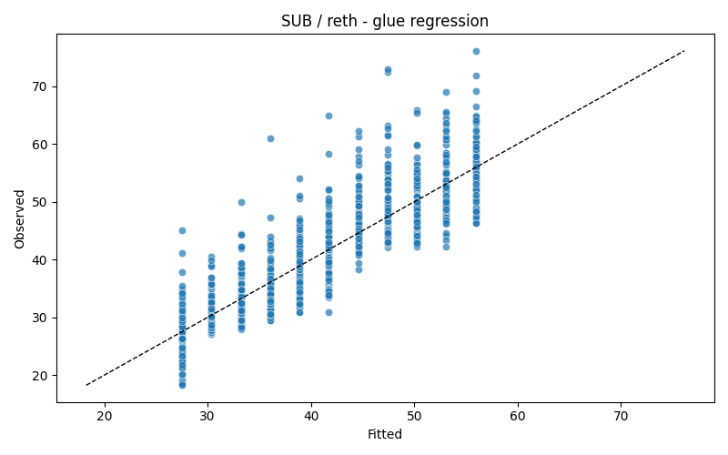

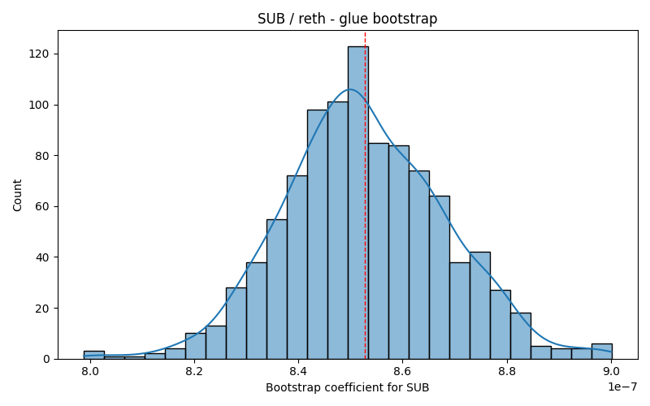

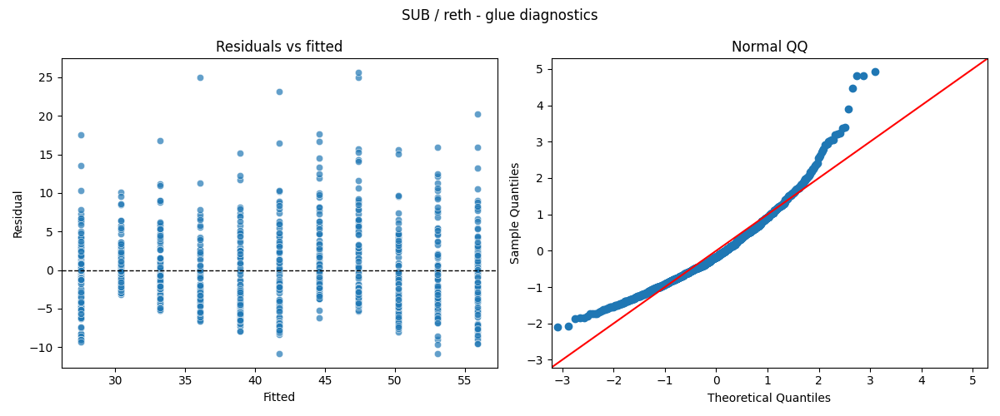

</details>

### Mixed glue (tier B) · reth

<details><summary><code>JUMP</code> · nobs=990 · runtime_ms=2.379e-06 · p=1.00e-03 · R²=0.5781</summary>

```
==============================================================================
                           NNLS Regression Results                            
==============================================================================
Dep. Variable:          test_runtime_ms              R-squared:          0.578
Model:                  NNLS                    Adj. R-squared:          0.578
No. Observations:       990                               RMSE:           7.55
Df Residuals:           988                                MAE:           4.37
Df Model:               1      
==============================================================================
                      coef     std err     P-value      [0.025      0.975]
------------------------------------------------------------------------------
         const     11.7754      0.8126       0.001     10.2971     13.4512
          JUMP      0.0000      0.0000       0.001      0.0000      0.0000
==============================================================================
Notes: Non-negative least squares with bootstrap inference (1000 iterations)
==============================================================================
```

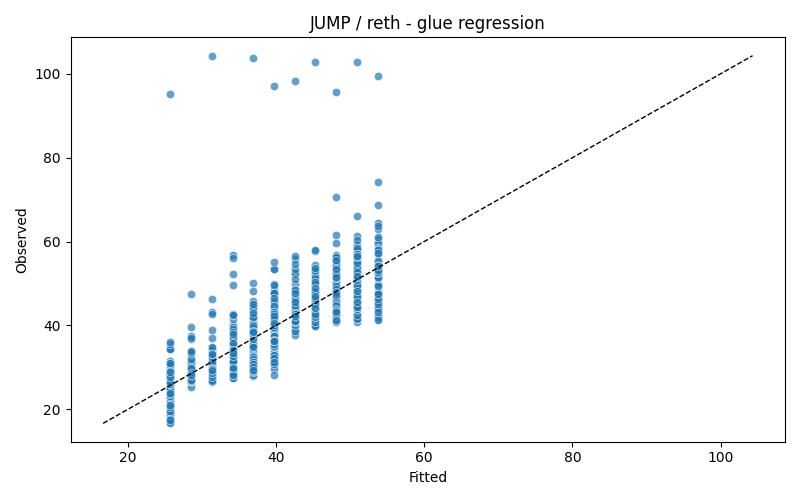

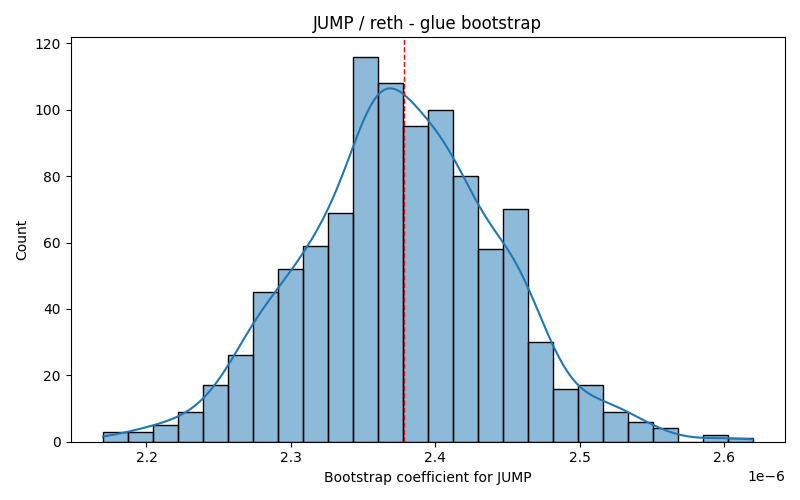

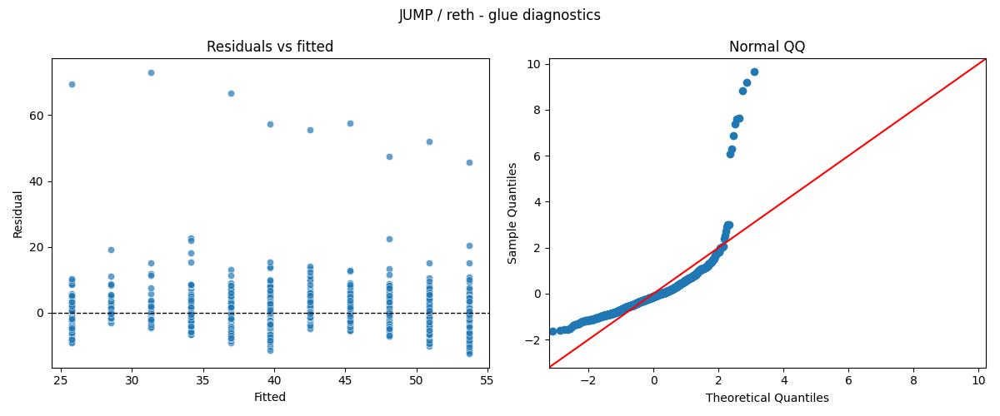

</details>

<details><summary><code>KECCAK256</code> · nobs=15840 · runtime_ms=0 · p=1.00e+00 · R²=0</summary>

```
==============================================================================
                           NNLS Regression Results                            
==============================================================================
Dep. Variable:          test_runtime_ms              R-squared:          0.000
Model:                  NNLS                    Adj. R-squared:         -0.000
No. Observations:       15840                             RMSE:         157.79
Df Residuals:           15838                              MAE:         133.08
Df Model:               1      
==============================================================================
                      coef     std err     P-value      [0.025      0.975]
------------------------------------------------------------------------------
         const    251.8357      1.2842       0.001    249.4496    254.3856
     KECCAK256      0.0000      0.0000       1.000      0.0000      0.0000
==============================================================================
Notes: Non-negative least squares with bootstrap inference (1000 iterations)
==============================================================================
```

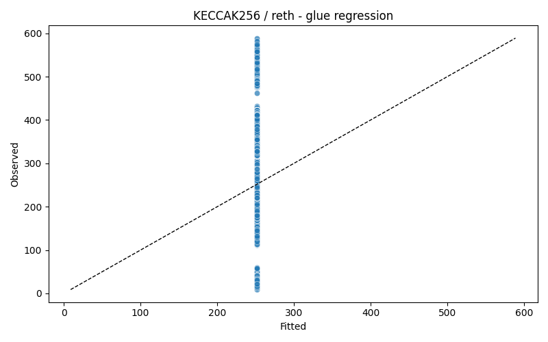


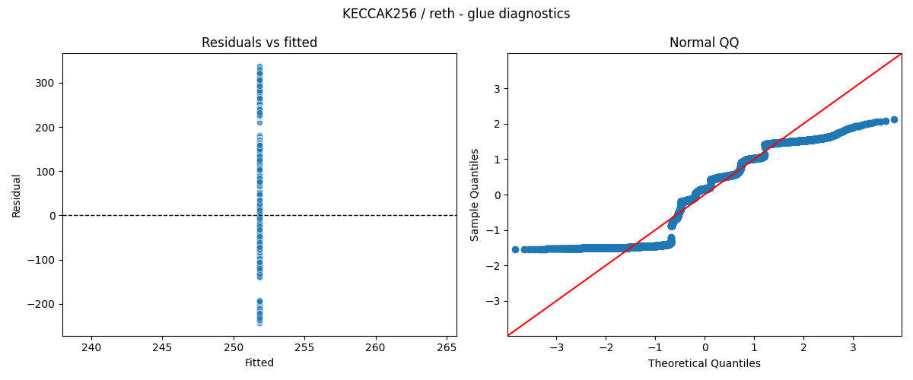

</details>
