# Glue opcodes report

Per-client NNLS fits of priced glue opcodes against their driver fixtures. Cycle-tier opcodes share one joint regression per client (shown once); pure-tier and mixed-tier opcodes each get a single-feature fit. Mixed-tier fits pre-adjust the LHS by subtracting the contribution of every priced upstream partner selected by the detector (pure ∪ cycle for `mixed_a`, plus `mixed_a` for `mixed_b`).

**Contents:** [besu](#besu) · [erigon](#erigon) · [ethrex](#ethrex) · [geth](#geth) · [nethermind](#nethermind)

## besu

| glue_opcode | nobs | glue_runtime_ms | p_value | rsquared |
| --- | --- | --- | --- | --- |
| `ISZERO` | 693 | 3.224e-06 | 1.00e-03 | 0.8406 |
| `JUMPDEST` | 693 | 6.696e-07 | 1.00e-03 | 0.5665 |
| `SWAP` | 11088 | 2.86e-06 | 1.00e-03 | 0.4863 |
| `CALLDATASIZE` | 41305 | 2.832e-06 | 1.00e-03 | 0.935 |
| `DUP` | 41305 | 1.286e-06 | 1.00e-03 | 0.935 |
| `GAS` | 41305 | 2.444e-06 | 1.00e-03 | 0.935 |
| `MLOAD` | 41305 | 8.491e-06 | 1.00e-03 | 0.935 |
| `PUSH` | 41305 | 1.839e-06 | 1.00e-03 | 0.935 |
| `PUSH0` | 41305 | 1.007e-06 | 1.00e-03 | 0.935 |
| `STATICCALL` | 41305 | 0.0006154 | 1.00e-03 | 0.935 |
| `ADD` | 693 | 8.265e-06 | 1.00e-03 | 0.8501 |
| `AND` | 693 | 5.676e-06 | 1.00e-03 | 0.8616 |
| `CALLDATACOPY` | 16632 | 1.288e-05 | 1.00e-03 | 0.6315 |
| `CALLDATALOAD` | 2772 | 0 | 1.00e+00 | 0 |
| `DIV` | 693 | 1.294e-05 | 1.00e-03 | 0.7834 |
| `EXP` | 693 | 0.001142 | 1.00e-03 | 0.744 |
| `GT` | 693 | 1.872e-05 | 1.00e-03 | 0.2279 |
| `JUMPI` | 693 | 4.95e-06 | 1.00e-03 | 0.7586 |
| `LT` | 693 | 1.941e-05 | 1.00e-03 | 0.2415 |
| `MSTORE` | 3465 | 1.46e-05 | 1.00e-03 | 0.7878 |
| `MSTORE8` | 3465 | 9.139e-06 | 1.00e-03 | 0.8203 |
| `MUL` | 693 | 8.943e-06 | 1.00e-03 | 0.5436 |
| `PC` | 693 | 2.793e-06 | 1.00e-03 | 0.8326 |
| `RETURNDATASIZE` | 2772 | 4.138e-06 | 1.00e-03 | 0.8408 |
| `SELFBALANCE` | 567 | 1.085e-05 | 1.00e-03 | 0.6744 |
| `SUB` | 693 | 8.121e-06 | 1.00e-03 | 0.8356 |
| `JUMP` | 693 | 4.096e-05 | 1.00e-03 | 0.852 |
| `KECCAK256` | 11088 | 3.645e-05 | 1.00e-03 | 0.1544 |

### Cycle glue — joint fit · besu

<details><summary>Joint NNLS regression summary</summary>

```
==============================================================================
                           NNLS Regression Results                            
==============================================================================
Dep. Variable:          test_runtime_ms              R-squared:          0.935
Model:                  NNLS                    Adj. R-squared:          0.935
No. Observations:       41305                             RMSE:          32.13
Df Residuals:           41297                              MAE:          21.23
Df Model:               7      
==============================================================================
                      coef     std err     P-value      [0.025      0.975]
------------------------------------------------------------------------------
         const     48.4489      0.5606       0.001     47.3611     49.5539
  CALLDATASIZE      0.0000      0.0000       0.001      0.0000      0.0000
           DUP      0.0000      0.0000       0.001      0.0000      0.0000
           GAS      0.0000      0.0000       0.001      0.0000      0.0000
         MLOAD      0.0000      0.0000       0.001      0.0000      0.0000
          PUSH      0.0000      0.0000       0.001      0.0000      0.0000
         PUSH0      0.0000      0.0000       0.001      0.0000      0.0000
    STATICCALL      0.0006      0.0000       0.001      0.0006      0.0006
==============================================================================
Notes: Non-negative least squares with bootstrap inference (1000 iterations)
==============================================================================
```

</details>

<details><summary><code>CALLDATASIZE</code> · nobs=41305 · runtime_ms=2.832e-06 · p=1.00e-03 · R²=0.935</summary>

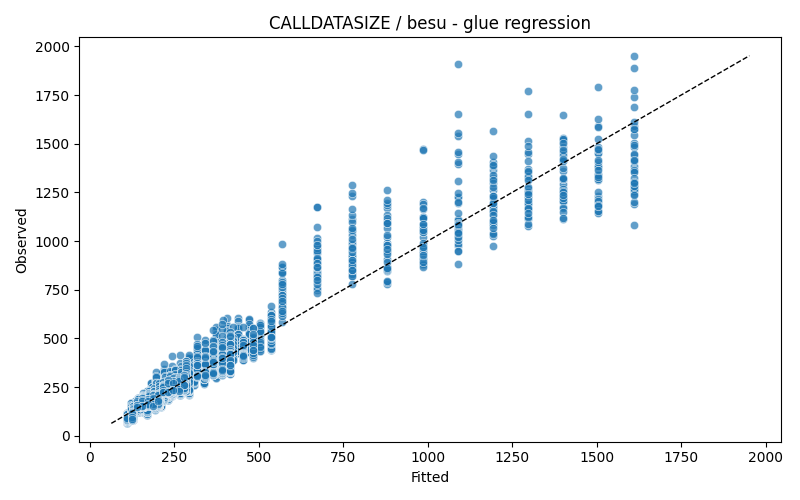

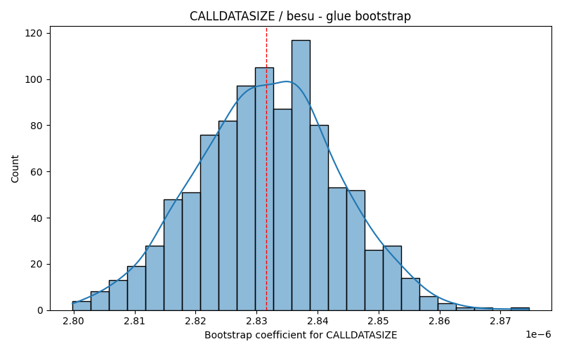

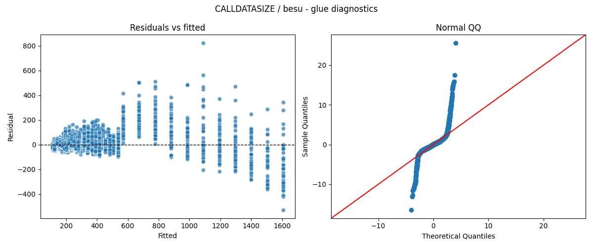

</details>

<details><summary><code>DUP</code> · nobs=41305 · runtime_ms=1.286e-06 · p=1.00e-03 · R²=0.935</summary>


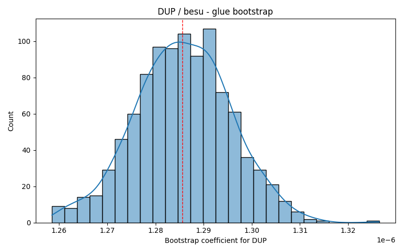

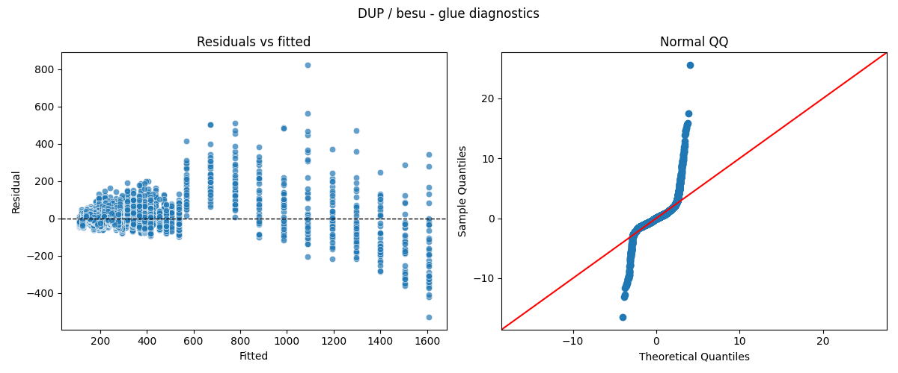

</details>

<details><summary><code>GAS</code> · nobs=41305 · runtime_ms=2.444e-06 · p=1.00e-03 · R²=0.935</summary>


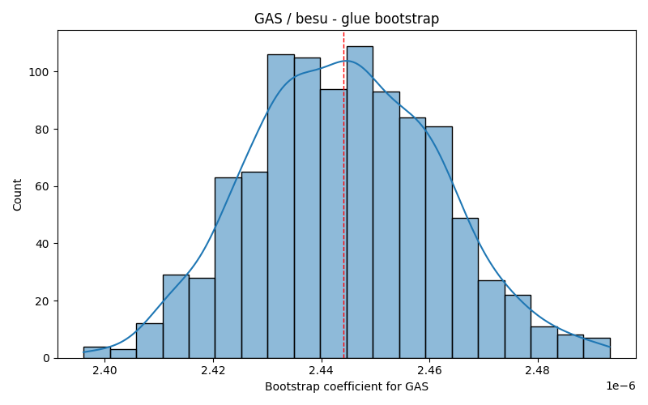


</details>

<details><summary><code>MLOAD</code> · nobs=41305 · runtime_ms=8.491e-06 · p=1.00e-03 · R²=0.935</summary>

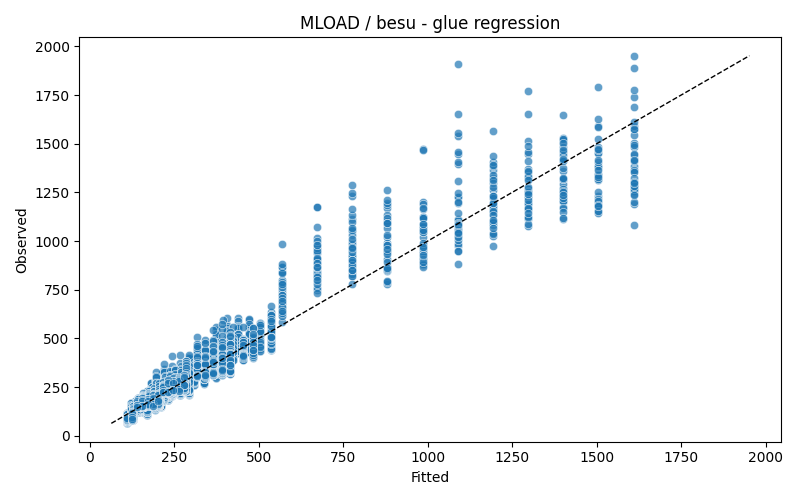

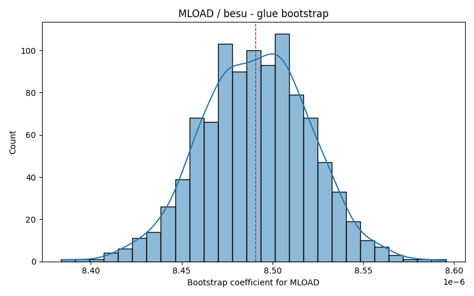


</details>

<details><summary><code>PUSH</code> · nobs=41305 · runtime_ms=1.839e-06 · p=1.00e-03 · R²=0.935</summary>

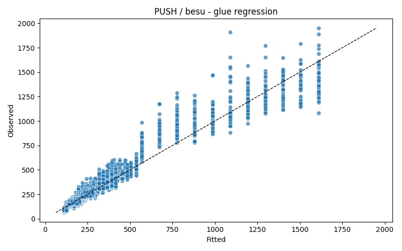

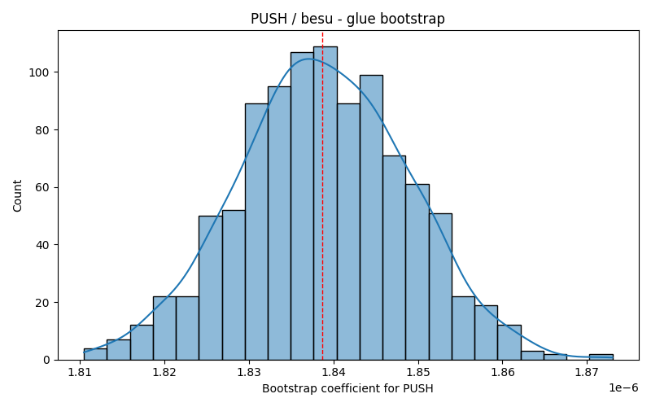


</details>

<details><summary><code>PUSH0</code> · nobs=41305 · runtime_ms=1.007e-06 · p=1.00e-03 · R²=0.935</summary>


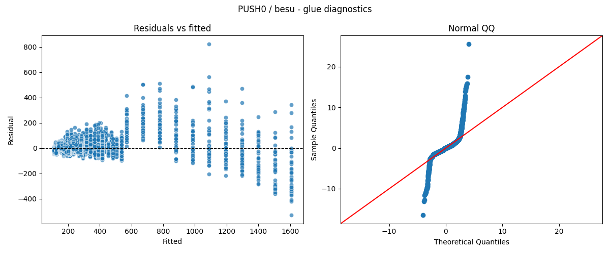

</details>

<details><summary><code>STATICCALL</code> · nobs=41305 · runtime_ms=0.0006154 · p=1.00e-03 · R²=0.935</summary>

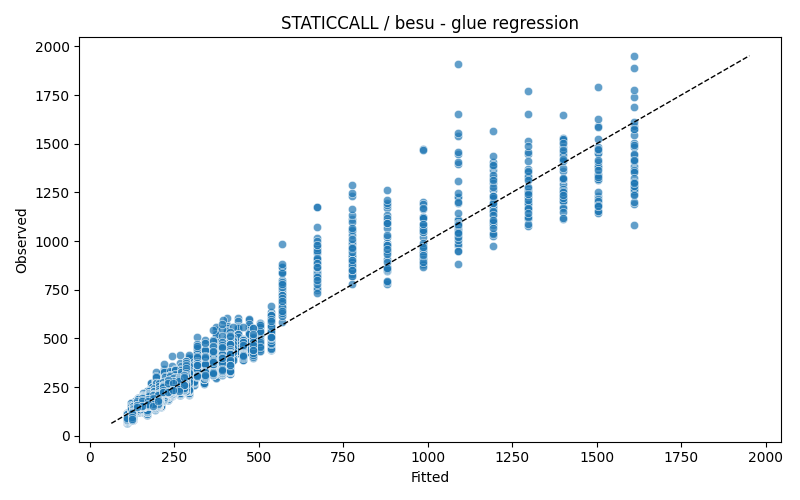

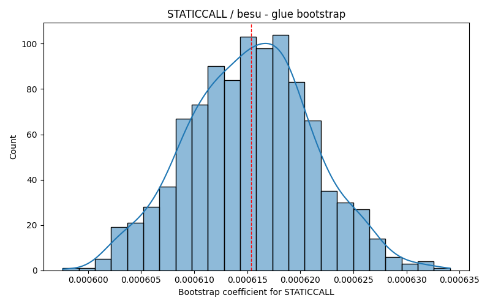


</details>

### Pure glue · besu

<details><summary><code>ISZERO</code> · nobs=693 · runtime_ms=3.224e-06 · p=1.00e-03 · R²=0.8406</summary>

```
==============================================================================
                           NNLS Regression Results                            
==============================================================================
Dep. Variable:          test_runtime_ms              R-squared:          0.841
Model:                  NNLS                    Adj. R-squared:          0.840
No. Observations:       693                               RMSE:          29.56
Df Residuals:           691                                MAE:          25.04
Df Model:               1      
==============================================================================
                      coef     std err     P-value      [0.025      0.975]
------------------------------------------------------------------------------
         const     58.3980      3.9812       0.001     50.2001     66.3133
        ISZERO      0.0000      0.0000       0.001      0.0000      0.0000
==============================================================================
Notes: Non-negative least squares with bootstrap inference (1000 iterations)
==============================================================================
```

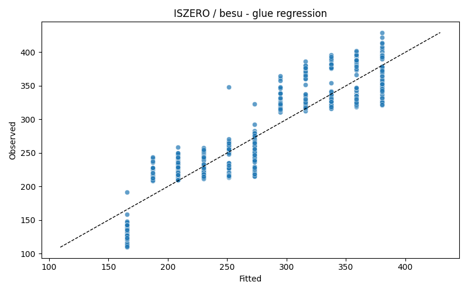

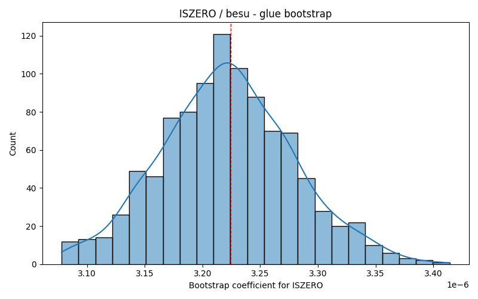

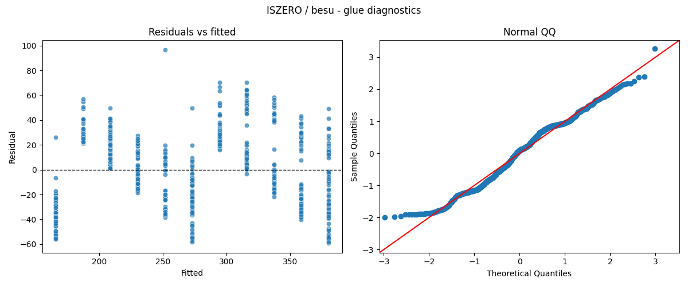

</details>

<details><summary><code>JUMPDEST</code> · nobs=693 · runtime_ms=6.696e-07 · p=1.00e-03 · R²=0.5665</summary>

```
==============================================================================
                           NNLS Regression Results                            
==============================================================================
Dep. Variable:          test_runtime_ms              R-squared:          0.566
Model:                  NNLS                    Adj. R-squared:          0.566
No. Observations:       693                               RMSE:          36.99
Df Residuals:           691                                MAE:          31.53
Df Model:               1      
==============================================================================
                      coef     std err     P-value      [0.025      0.975]
------------------------------------------------------------------------------
         const     34.1477      4.3607       0.001     25.1333     42.2313
      JUMPDEST      0.0000      0.0000       0.001      0.0000      0.0000
==============================================================================
Notes: Non-negative least squares with bootstrap inference (1000 iterations)
==============================================================================
```

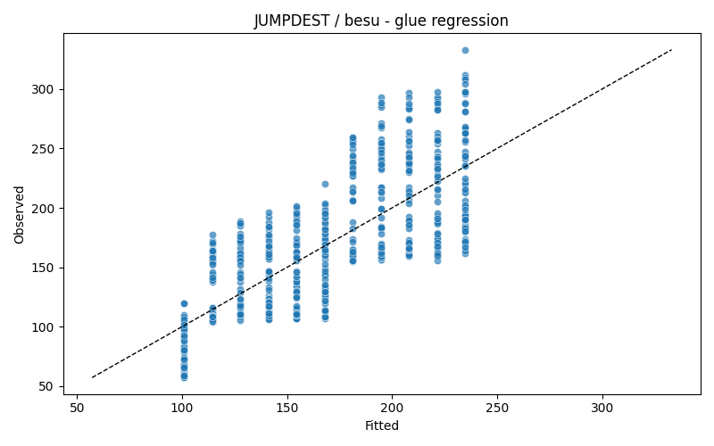

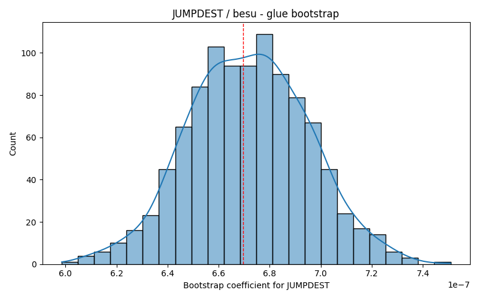

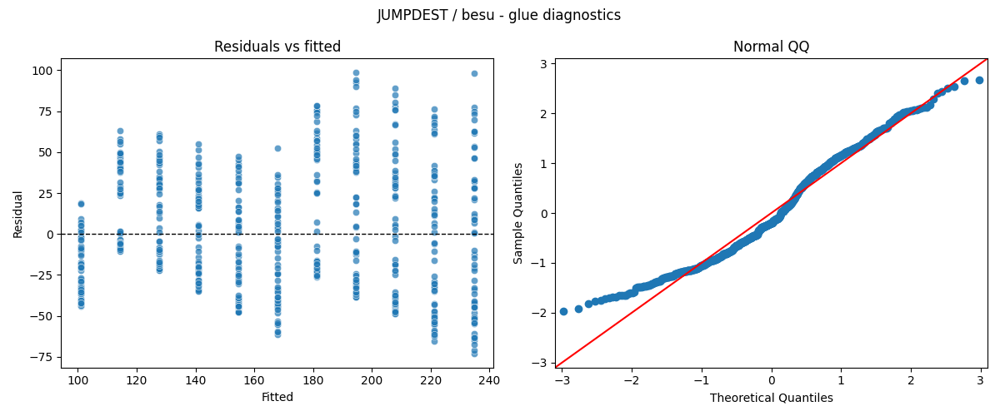

</details>

<details><summary><code>SWAP</code> · nobs=11088 · runtime_ms=2.86e-06 · p=1.00e-03 · R²=0.4863</summary>

```
==============================================================================
                           NNLS Regression Results                            
==============================================================================
Dep. Variable:          test_runtime_ms              R-squared:          0.486
Model:                  NNLS                    Adj. R-squared:          0.486
No. Observations:       11088                             RMSE:          61.88
Df Residuals:           11086                              MAE:          54.84
Df Model:               1      
==============================================================================
                      coef     std err     P-value      [0.025      0.975]
------------------------------------------------------------------------------
         const     51.6311      1.7425       0.001     48.2078     55.0724
          SWAP      0.0000      0.0000       0.001      0.0000      0.0000
==============================================================================
Notes: Non-negative least squares with bootstrap inference (1000 iterations)
==============================================================================
```

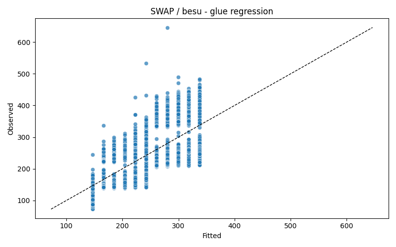

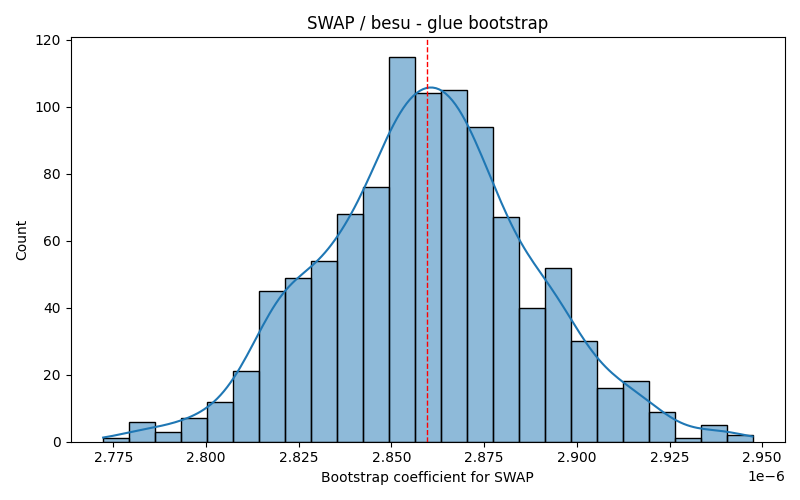

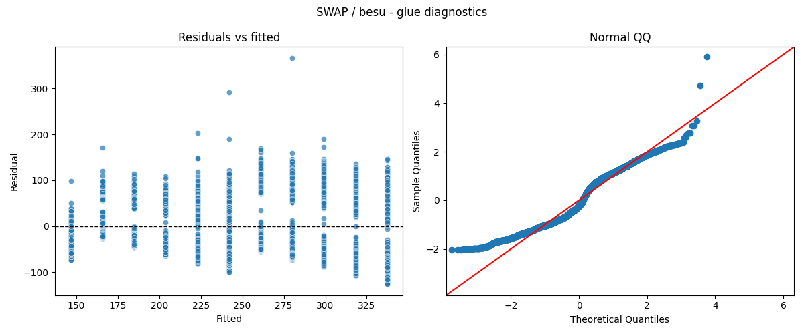

</details>

### Mixed glue (tier A) · besu

<details><summary><code>ADD</code> · nobs=693 · runtime_ms=8.265e-06 · p=1.00e-03 · R²=0.8501</summary>

```
==============================================================================
                           NNLS Regression Results                            
==============================================================================
Dep. Variable:          test_runtime_ms              R-squared:          0.850
Model:                  NNLS                    Adj. R-squared:          0.850
No. Observations:       693                               RMSE:          36.53
Df Residuals:           691                                MAE:          30.77
Df Model:               1      
==============================================================================
                      coef     std err     P-value      [0.025      0.975]
------------------------------------------------------------------------------
         const     73.9089      4.8679       0.001     64.0149     83.2725
           ADD      0.0000      0.0000       0.001      0.0000      0.0000
==============================================================================
Notes: Non-negative least squares with bootstrap inference (1000 iterations)
==============================================================================
```

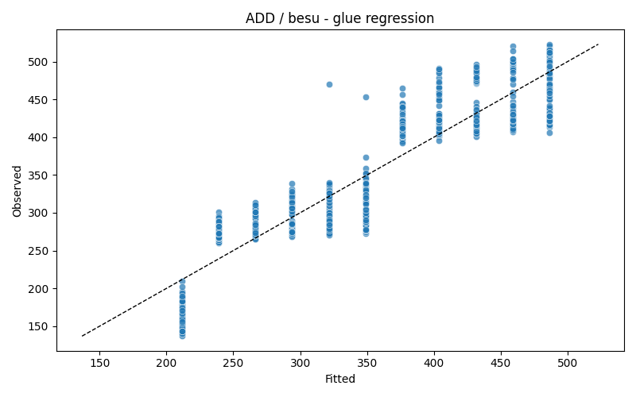

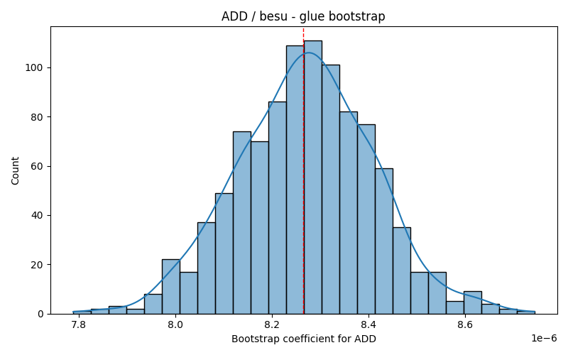

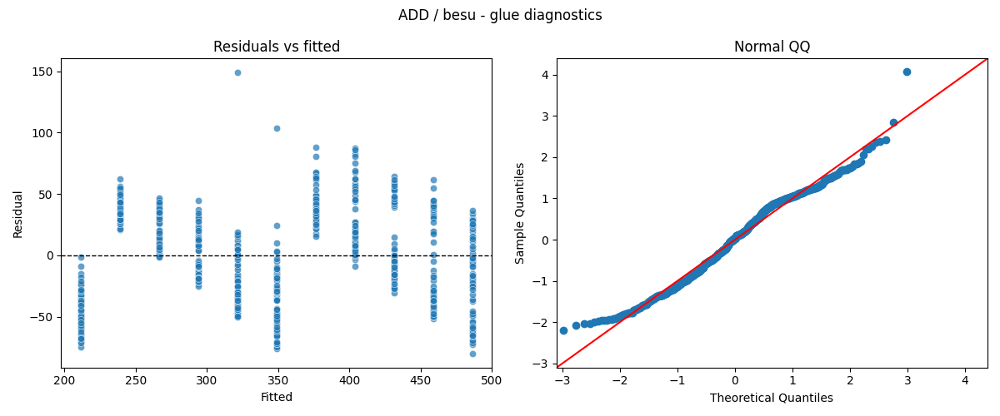

</details>

<details><summary><code>AND</code> · nobs=693 · runtime_ms=5.676e-06 · p=1.00e-03 · R²=0.8616</summary>

```
==============================================================================
                           NNLS Regression Results                            
==============================================================================
Dep. Variable:          test_runtime_ms              R-squared:          0.862
Model:                  NNLS                    Adj. R-squared:          0.861
No. Observations:       693                               RMSE:          23.94
Df Residuals:           691                                MAE:          19.87
Df Model:               1      
==============================================================================
                      coef     std err     P-value      [0.025      0.975]
------------------------------------------------------------------------------
         const     62.9738      2.6862       0.001     57.2983     68.1046
           AND      0.0000      0.0000       0.001      0.0000      0.0000
==============================================================================
Notes: Non-negative least squares with bootstrap inference (1000 iterations)
==============================================================================
```

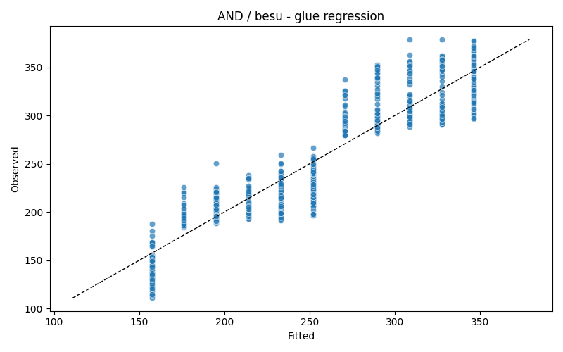

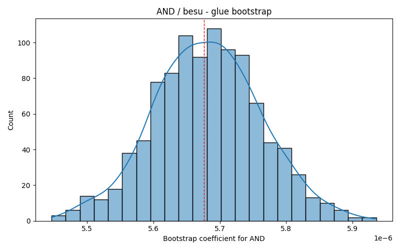

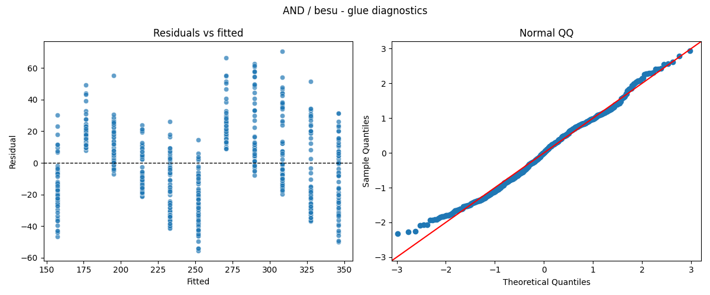

</details>

<details><summary><code>CALLDATACOPY</code> · nobs=16632 · runtime_ms=1.288e-05 · p=1.00e-03 · R²=0.6315</summary>

```
==============================================================================
                           NNLS Regression Results                            
==============================================================================
Dep. Variable:          test_runtime_ms              R-squared:          0.631
Model:                  NNLS                    Adj. R-squared:          0.631
No. Observations:       16632                             RMSE:          74.02
Df Residuals:           16630                              MAE:          57.50
Df Model:               1      
==============================================================================
                      coef     std err     P-value      [0.025      0.975]
------------------------------------------------------------------------------
         const    127.1123      0.6996       0.001    125.7908    128.4978
  CALLDATACOPY      0.0000      0.0000       0.001      0.0000      0.0000
==============================================================================
Notes: Non-negative least squares with bootstrap inference (1000 iterations)
==============================================================================
```

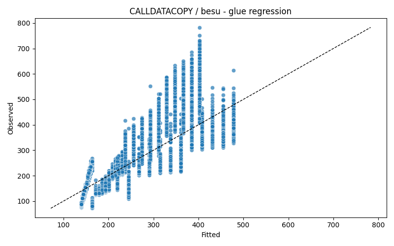

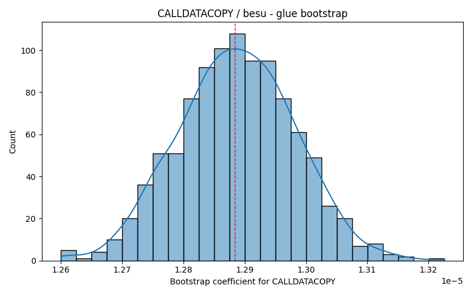

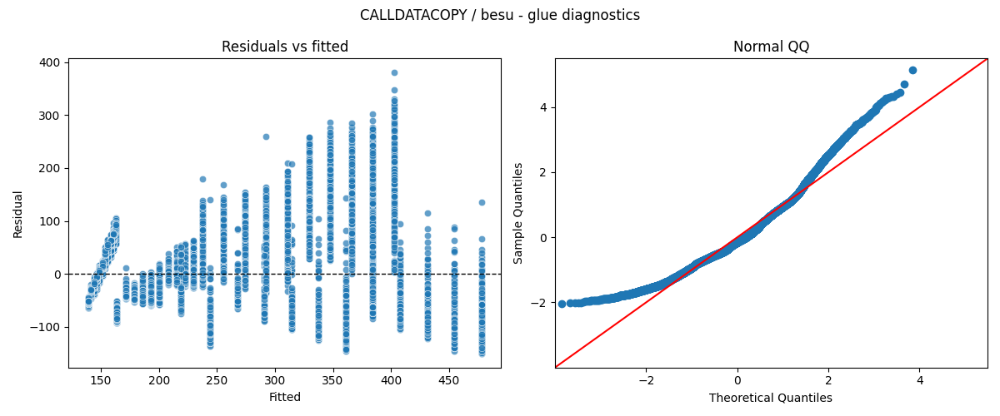

</details>

<details><summary><code>CALLDATALOAD</code> · nobs=2772 · runtime_ms=0 · p=1.00e+00 · R²=0</summary>

```
==============================================================================
                           NNLS Regression Results                            
==============================================================================
Dep. Variable:          test_runtime_ms              R-squared:          0.000
Model:                  NNLS                    Adj. R-squared:         -0.000
No. Observations:       2772                              RMSE:           0.58
Df Residuals:           2770                               MAE:           0.38
Df Model:               1      
==============================================================================
                      coef     std err     P-value      [0.025      0.975]
------------------------------------------------------------------------------
         const      3.5428      0.0110       0.001      3.5211      3.5649
  CALLDATALOAD      0.0000      0.0000       1.000      0.0000      0.0000
==============================================================================
Notes: Non-negative least squares with bootstrap inference (1000 iterations)
==============================================================================
```

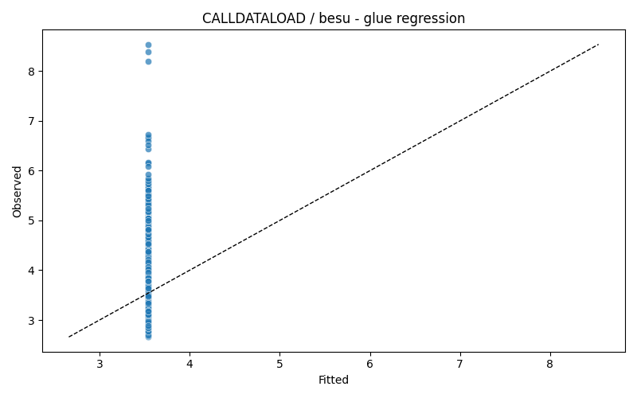

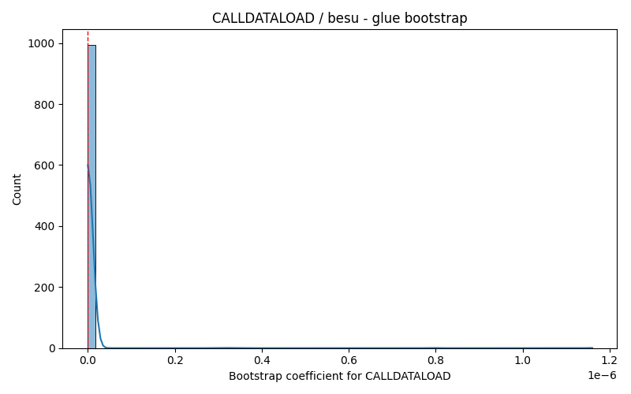

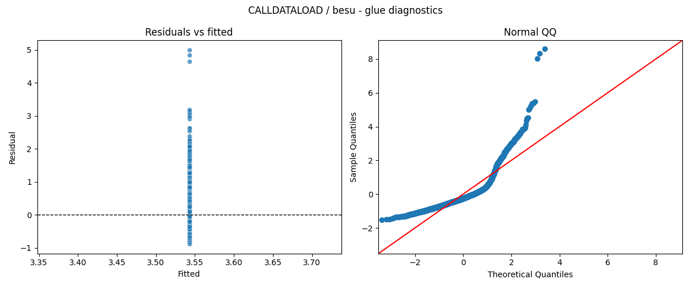

</details>

<details><summary><code>DIV</code> · nobs=693 · runtime_ms=1.294e-05 · p=1.00e-03 · R²=0.7834</summary>

```
==============================================================================
                           NNLS Regression Results                            
==============================================================================
Dep. Variable:          test_runtime_ms              R-squared:          0.783
Model:                  NNLS                    Adj. R-squared:          0.783
No. Observations:       693                               RMSE:          53.71
Df Residuals:           691                                MAE:          42.91
Df Model:               1      
==============================================================================
                      coef     std err     P-value      [0.025      0.975]
------------------------------------------------------------------------------
         const    138.2023      6.1561       0.001    126.0609    149.5373
           DIV      0.0000      0.0000       0.001      0.0000      0.0000
==============================================================================
Notes: Non-negative least squares with bootstrap inference (1000 iterations)
==============================================================================
```

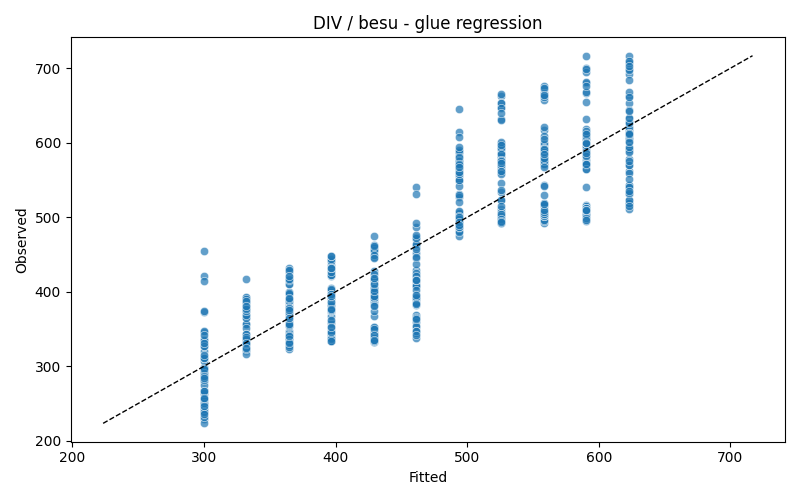

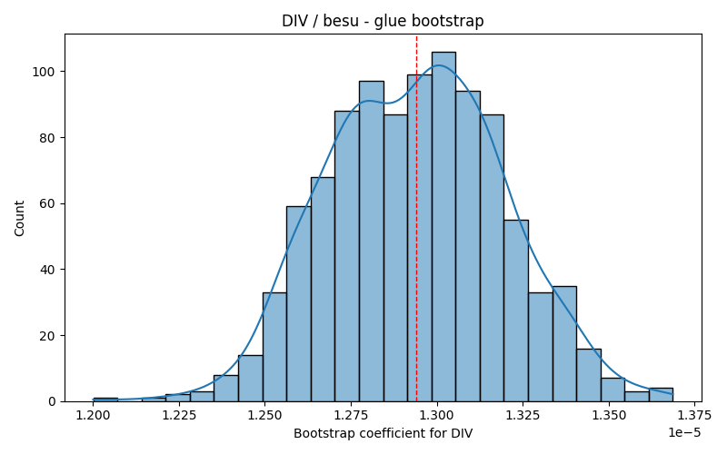

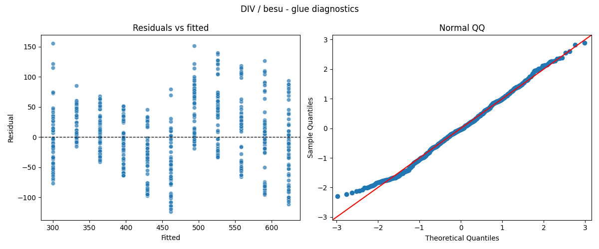

</details>

<details><summary><code>EXP</code> · nobs=693 · runtime_ms=0.001142 · p=1.00e-03 · R²=0.744</summary>

```
==============================================================================
                           NNLS Regression Results                            
==============================================================================
Dep. Variable:          test_runtime_ms              R-squared:          0.744
Model:                  NNLS                    Adj. R-squared:          0.744
No. Observations:       693                               RMSE:          26.23
Df Residuals:           691                                MAE:          20.75
Df Model:               1      
==============================================================================
                      coef     std err     P-value      [0.025      0.975]
------------------------------------------------------------------------------
         const     85.9183      3.4111       0.001     79.1542     92.3420
           EXP      0.0011      0.0000       0.001      0.0011      0.0012
==============================================================================
Notes: Non-negative least squares with bootstrap inference (1000 iterations)
==============================================================================
```

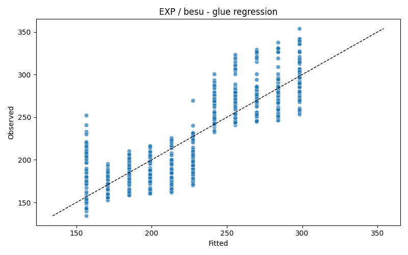

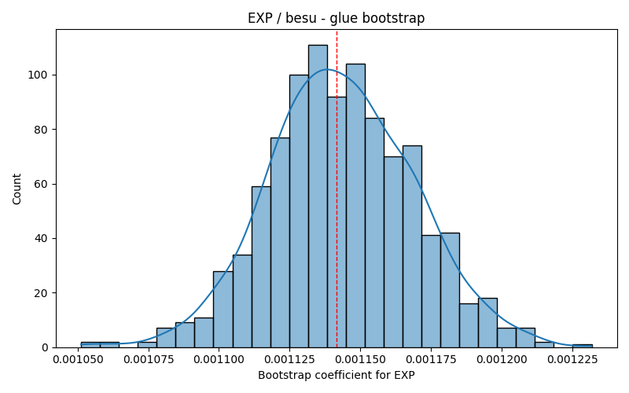

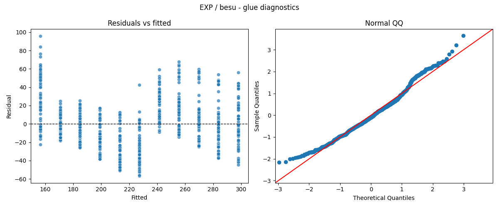

</details>

<details><summary><code>GT</code> · nobs=693 · runtime_ms=1.872e-05 · p=1.00e-03 · R²=0.2279</summary>

```
==============================================================================
                           NNLS Regression Results                            
==============================================================================
Dep. Variable:          test_runtime_ms              R-squared:          0.228
Model:                  NNLS                    Adj. R-squared:          0.227
No. Observations:       693                               RMSE:         362.70
Df Residuals:           691                                MAE:         341.28
Df Model:               1      
==============================================================================
                      coef     std err     P-value      [0.025      0.975]
------------------------------------------------------------------------------
         const    139.4677     40.7124       0.001     64.2004    221.0932
            GT      0.0000      0.0000       0.001      0.0000      0.0000
==============================================================================
Notes: Non-negative least squares with bootstrap inference (1000 iterations)
==============================================================================
```

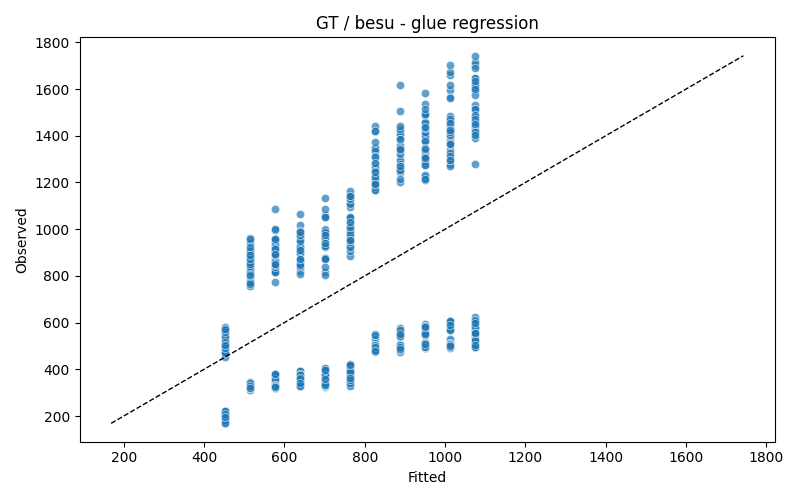

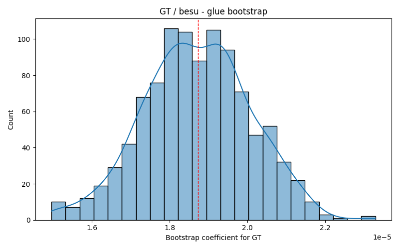

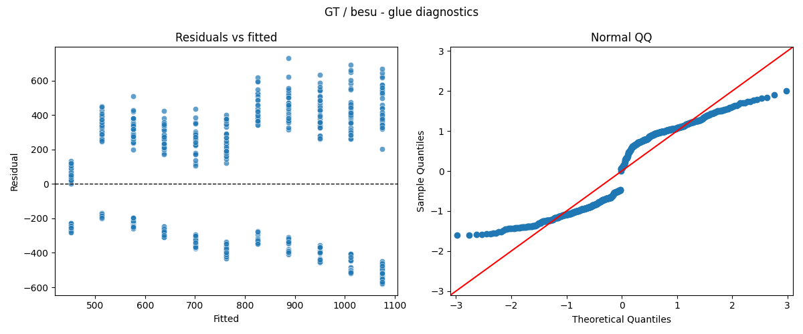

</details>

<details><summary><code>JUMPI</code> · nobs=693 · runtime_ms=4.95e-06 · p=1.00e-03 · R²=0.7586</summary>

```
==============================================================================
                           NNLS Regression Results                            
==============================================================================
Dep. Variable:          test_runtime_ms              R-squared:          0.759
Model:                  NNLS                    Adj. R-squared:          0.758
No. Observations:       693                               RMSE:          12.60
Df Residuals:           691                                MAE:           9.94
Df Model:               1      
==============================================================================
                      coef     std err     P-value      [0.025      0.975]
------------------------------------------------------------------------------
         const     22.1229      1.5155       0.001     19.2858     24.9772
         JUMPI      0.0000      0.0000       0.001      0.0000      0.0000
==============================================================================
Notes: Non-negative least squares with bootstrap inference (1000 iterations)
==============================================================================
```

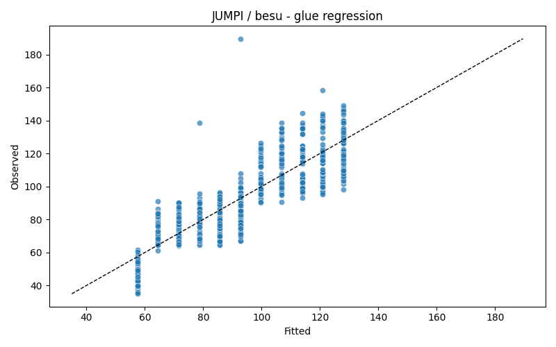

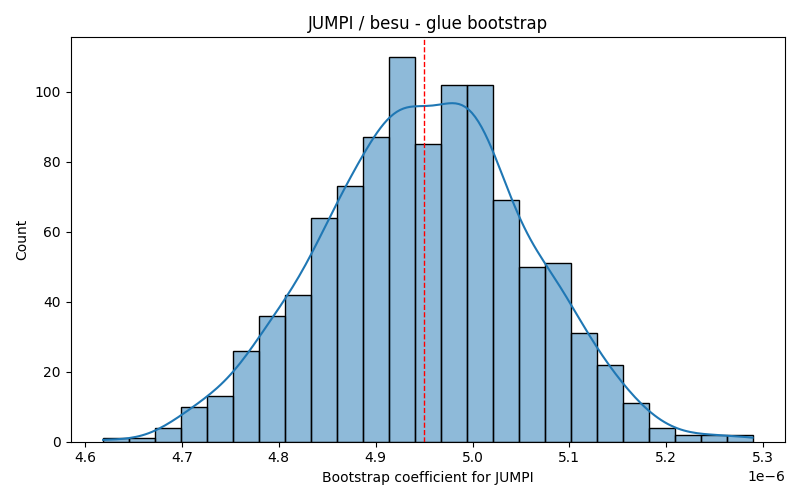

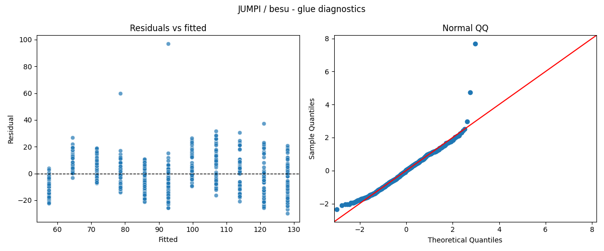

</details>

<details><summary><code>LT</code> · nobs=693 · runtime_ms=1.941e-05 · p=1.00e-03 · R²=0.2415</summary>

```
==============================================================================
                           NNLS Regression Results                            
==============================================================================
Dep. Variable:          test_runtime_ms              R-squared:          0.242
Model:                  NNLS                    Adj. R-squared:          0.240
No. Observations:       693                               RMSE:         361.98
Df Residuals:           691                                MAE:         338.95
Df Model:               1      
==============================================================================
                      coef     std err     P-value      [0.025      0.975]
------------------------------------------------------------------------------
         const    160.0389     39.7432       0.001     86.9257    241.4585
            LT      0.0000      0.0000       0.001      0.0000      0.0000
==============================================================================
Notes: Non-negative least squares with bootstrap inference (1000 iterations)
==============================================================================
```

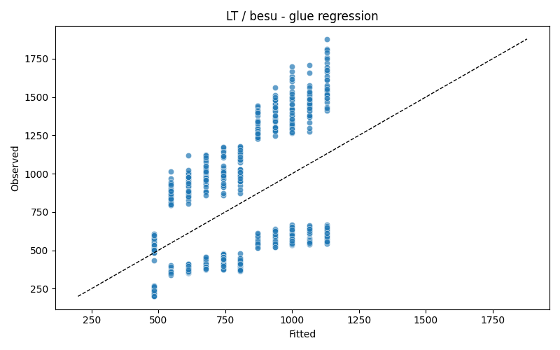

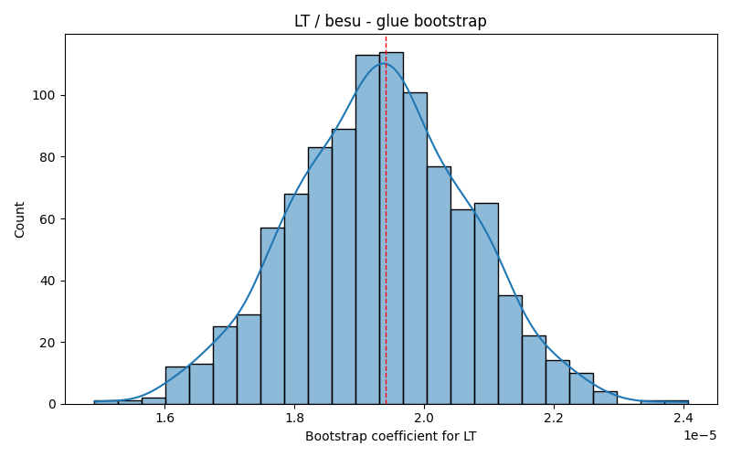

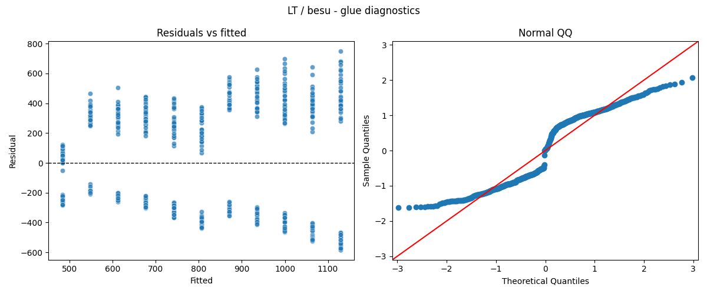

</details>

<details><summary><code>MSTORE</code> · nobs=3465 · runtime_ms=1.46e-05 · p=1.00e-03 · R²=0.7878</summary>

```
==============================================================================
                           NNLS Regression Results                            
==============================================================================
Dep. Variable:          test_runtime_ms              R-squared:          0.788
Model:                  NNLS                    Adj. R-squared:          0.788
No. Observations:       3465                              RMSE:          53.18
Df Residuals:           3463                               MAE:          42.55
Df Model:               1      
==============================================================================
                      coef     std err     P-value      [0.025      0.975]
------------------------------------------------------------------------------
         const     82.9540      2.9879       0.001     76.9515     88.7137
        MSTORE      0.0000      0.0000       0.001      0.0000      0.0000
==============================================================================
Notes: Non-negative least squares with bootstrap inference (1000 iterations)
==============================================================================
```

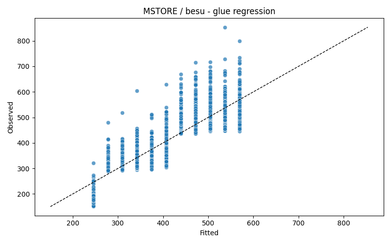

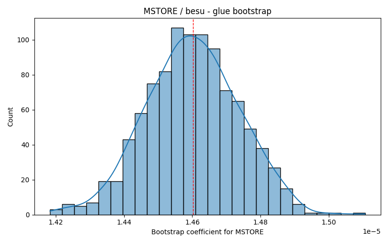

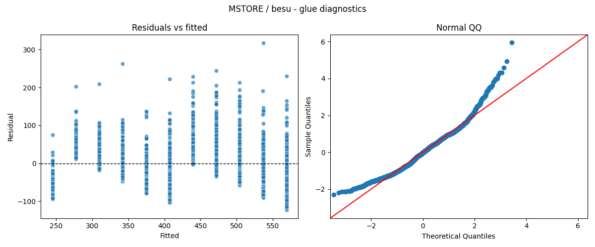

</details>

<details><summary><code>MSTORE8</code> · nobs=3465 · runtime_ms=9.139e-06 · p=1.00e-03 · R²=0.8203</summary>

```
==============================================================================
                           NNLS Regression Results                            
==============================================================================
Dep. Variable:          test_runtime_ms              R-squared:          0.820
Model:                  NNLS                    Adj. R-squared:          0.820
No. Observations:       3465                              RMSE:          30.02
Df Residuals:           3463                               MAE:          24.24
Df Model:               1      
==============================================================================
                      coef     std err     P-value      [0.025      0.975]
------------------------------------------------------------------------------
         const     52.7899      1.7913       0.001     49.0369     56.2159
       MSTORE8      0.0000      0.0000       0.001      0.0000      0.0000
==============================================================================
Notes: Non-negative least squares with bootstrap inference (1000 iterations)
==============================================================================
```

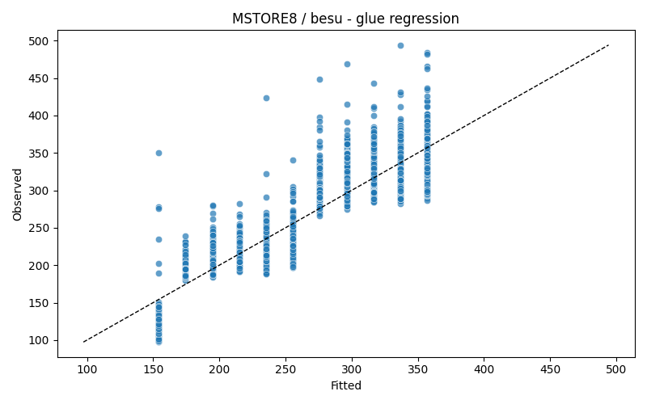

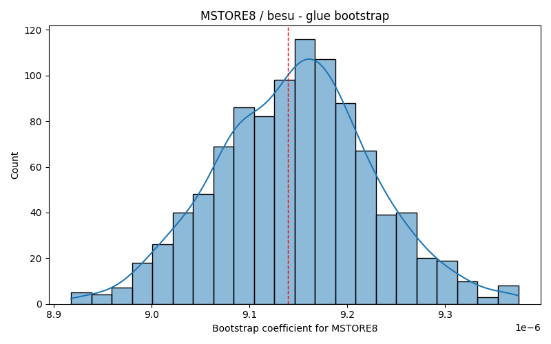

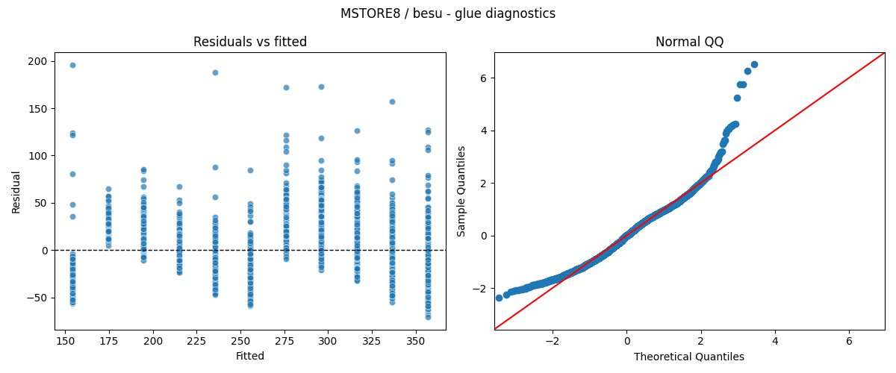

</details>

<details><summary><code>MUL</code> · nobs=693 · runtime_ms=8.943e-06 · p=1.00e-03 · R²=0.5436</summary>

```
==============================================================================
                           NNLS Regression Results                            
==============================================================================
Dep. Variable:          test_runtime_ms              R-squared:          0.544
Model:                  NNLS                    Adj. R-squared:          0.543
No. Observations:       693                               RMSE:          64.69
Df Residuals:           691                                MAE:          55.13
Df Model:               1      
==============================================================================
                      coef     std err     P-value      [0.025      0.975]
------------------------------------------------------------------------------
         const     89.6723      7.3466       0.001     75.8453    104.8564
           MUL      0.0000      0.0000       0.001      0.0000      0.0000
==============================================================================
Notes: Non-negative least squares with bootstrap inference (1000 iterations)
==============================================================================
```

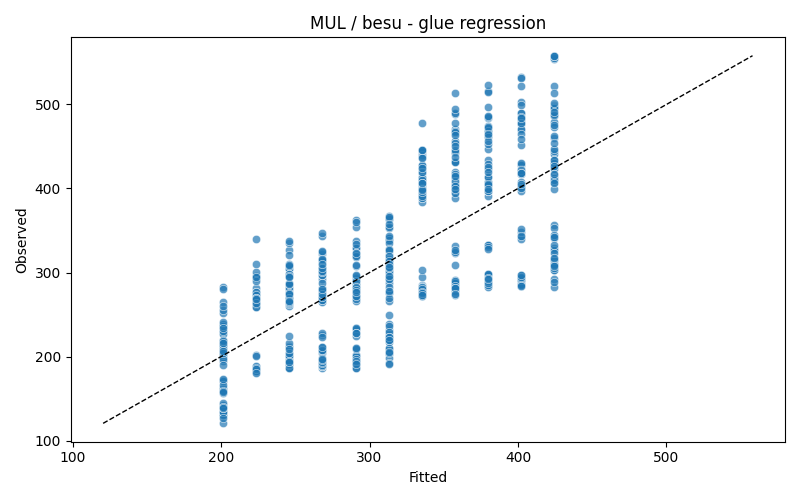

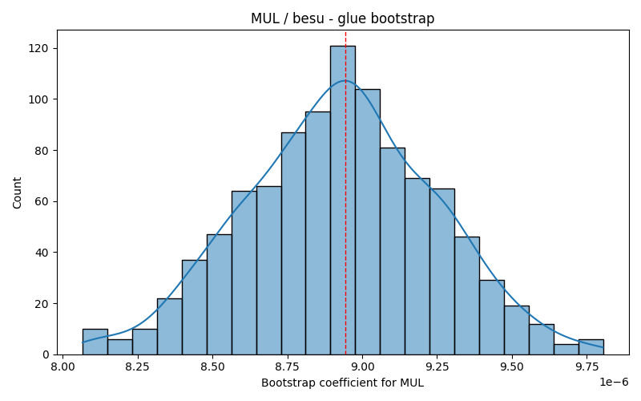

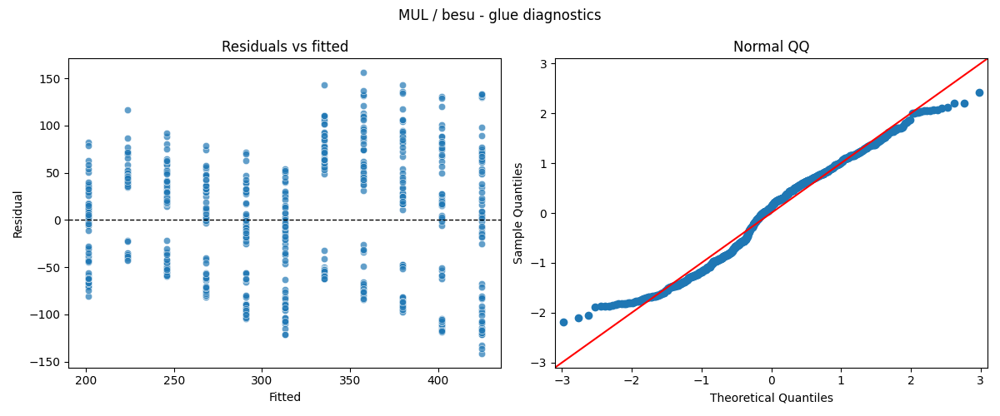

</details>

<details><summary><code>PC</code> · nobs=693 · runtime_ms=2.793e-06 · p=1.00e-03 · R²=0.8326</summary>

```
==============================================================================
                           NNLS Regression Results                            
==============================================================================
Dep. Variable:          test_runtime_ms              R-squared:          0.833
Model:                  NNLS                    Adj. R-squared:          0.832
No. Observations:       693                               RMSE:          37.43
Df Residuals:           691                                MAE:          31.14
Df Model:               1      
==============================================================================
                      coef     std err     P-value      [0.025      0.975]
------------------------------------------------------------------------------
         const     66.3322      5.0103       0.001     56.2556     76.3422
            PC      0.0000      0.0000       0.001      0.0000      0.0000
==============================================================================
Notes: Non-negative least squares with bootstrap inference (1000 iterations)
==============================================================================
```

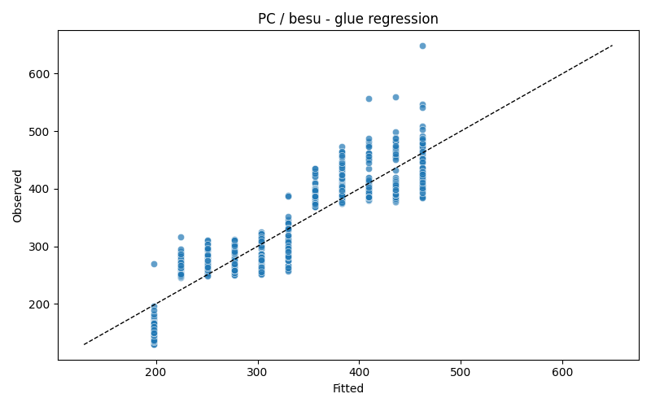

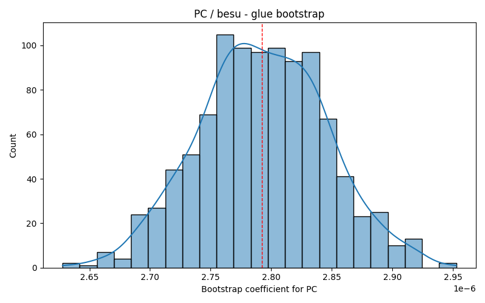

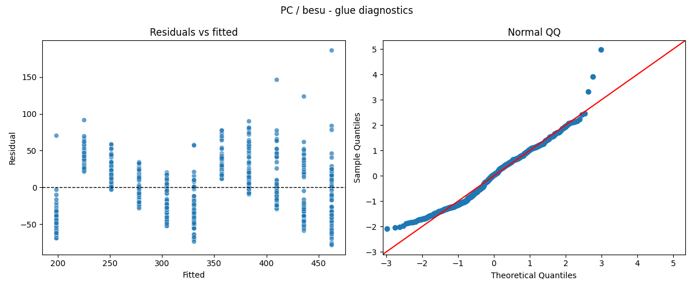

</details>

<details><summary><code>RETURNDATASIZE</code> · nobs=2772 · runtime_ms=4.138e-06 · p=1.00e-03 · R²=0.8408</summary>

```
==============================================================================
                           NNLS Regression Results                            
==============================================================================
Dep. Variable:          test_runtime_ms              R-squared:          0.841
Model:                  NNLS                    Adj. R-squared:          0.841
No. Observations:       2772                              RMSE:          28.43
Df Residuals:           2770                               MAE:          23.59
Df Model:               1      
==============================================================================
                      coef     std err     P-value      [0.025      0.975]
------------------------------------------------------------------------------
         const     51.6960      1.8489       0.001     48.2181     55.4730
RETURNDATASIZE      0.0000      0.0000       0.001      0.0000      0.0000
==============================================================================
Notes: Non-negative least squares with bootstrap inference (1000 iterations)
==============================================================================
```

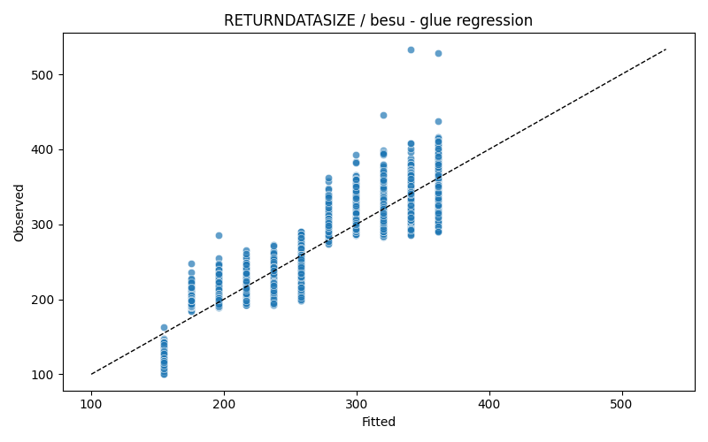

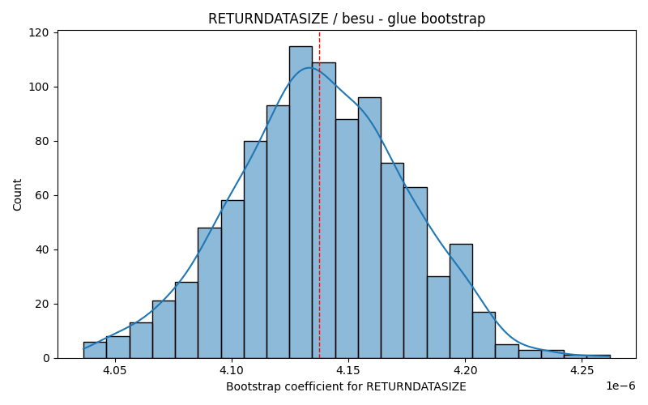

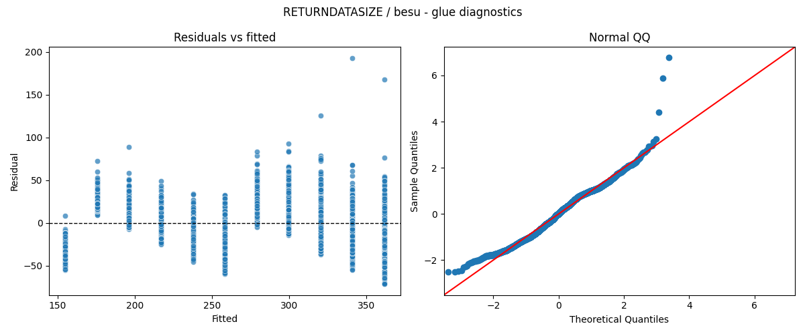

</details>

<details><summary><code>SELFBALANCE</code> · nobs=567 · runtime_ms=1.085e-05 · p=1.00e-03 · R²=0.6744</summary>

```
==============================================================================
                           NNLS Regression Results                            
==============================================================================
Dep. Variable:          test_runtime_ms              R-squared:          0.674
Model:                  NNLS                    Adj. R-squared:          0.674
No. Observations:       567                               RMSE:          76.03
Df Residuals:           565                                MAE:          62.35
Df Model:               1      
==============================================================================
                      coef     std err     P-value      [0.025      0.975]
------------------------------------------------------------------------------
         const    199.2871     11.4143       0.001    176.4917    221.5249
   SELFBALANCE      0.0000      0.0000       0.001      0.0000      0.0000
==============================================================================
Notes: Non-negative least squares with bootstrap inference (1000 iterations)
==============================================================================
```

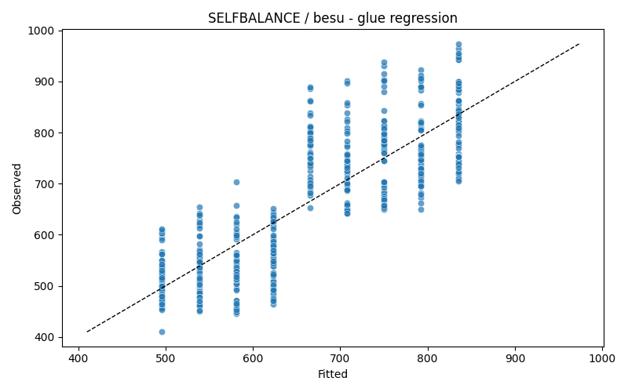

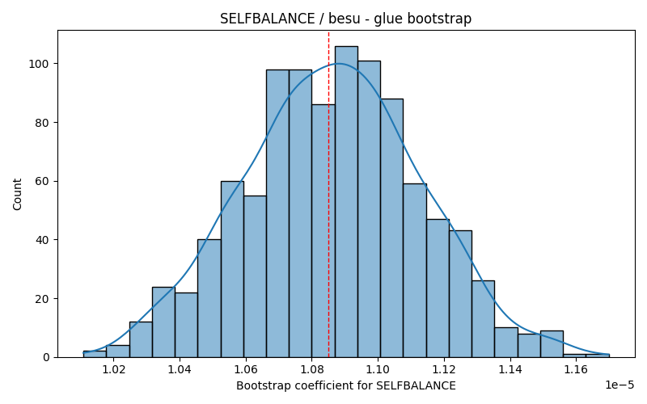

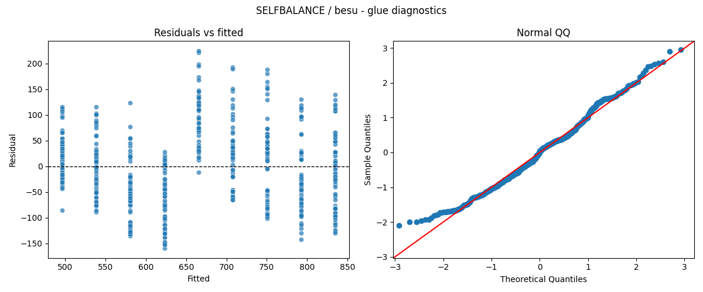

</details>

<details><summary><code>SUB</code> · nobs=693 · runtime_ms=8.121e-06 · p=1.00e-03 · R²=0.8356</summary>

```
==============================================================================
                           NNLS Regression Results                            
==============================================================================
Dep. Variable:          test_runtime_ms              R-squared:          0.836
Model:                  NNLS                    Adj. R-squared:          0.835
No. Observations:       693                               RMSE:          37.91
Df Residuals:           691                                MAE:          31.55
Df Model:               1      
==============================================================================
                      coef     std err     P-value      [0.025      0.975]
------------------------------------------------------------------------------
         const     77.0902      4.8176       0.001     67.8069     86.5713
           SUB      0.0000      0.0000       0.001      0.0000      0.0000
==============================================================================
Notes: Non-negative least squares with bootstrap inference (1000 iterations)
==============================================================================
```

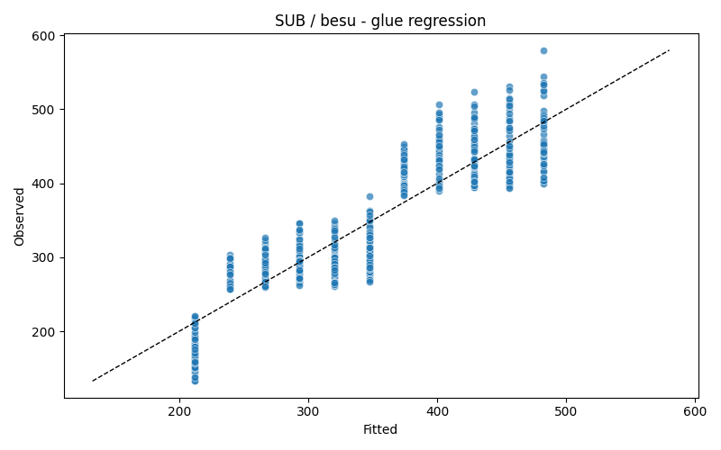

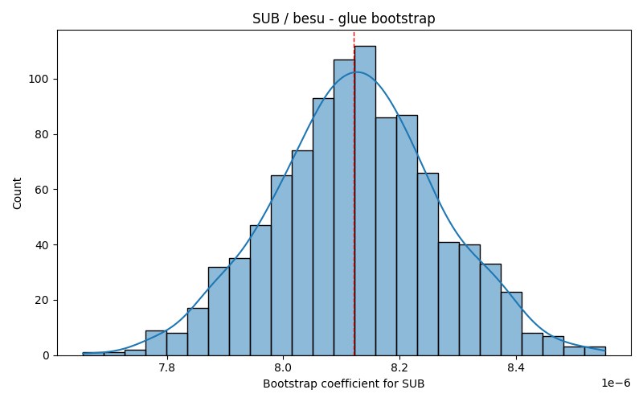

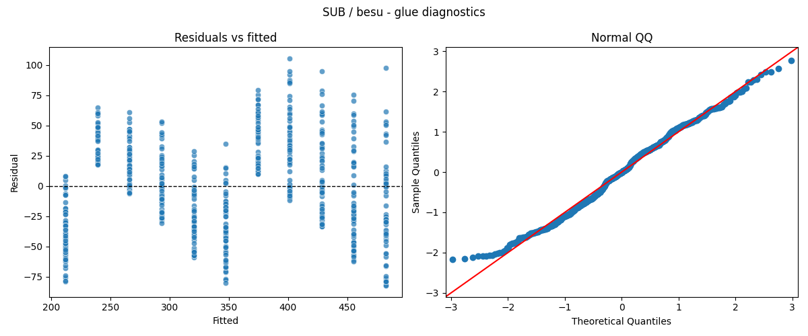

</details>

### Mixed glue (tier B) · besu

<details><summary><code>JUMP</code> · nobs=693 · runtime_ms=4.096e-05 · p=1.00e-03 · R²=0.852</summary>

```
==============================================================================
                           NNLS Regression Results                            
==============================================================================
Dep. Variable:          test_runtime_ms              R-squared:          0.852
Model:                  NNLS                    Adj. R-squared:          0.852
No. Observations:       693                               RMSE:          63.44
Df Residuals:           691                                MAE:          53.69
Df Model:               1      
==============================================================================
                      coef     std err     P-value      [0.025      0.975]
------------------------------------------------------------------------------
         const    121.9298      8.5872       0.001    104.9792    138.7108
          JUMP      0.0000      0.0000       0.001      0.0000      0.0000
==============================================================================
Notes: Non-negative least squares with bootstrap inference (1000 iterations)
==============================================================================
```

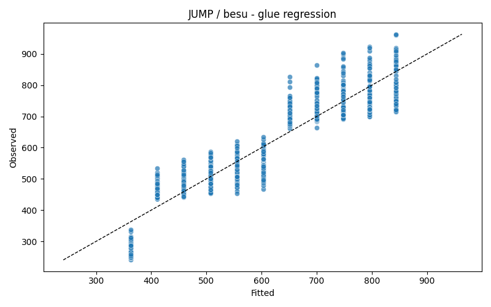

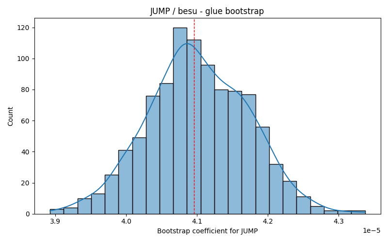

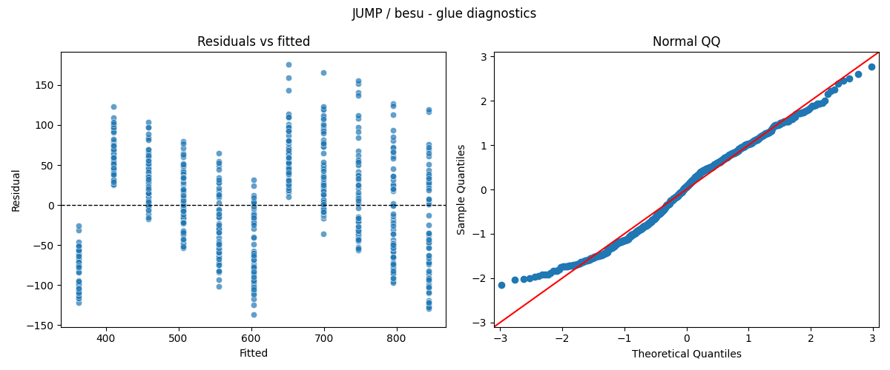

</details>

<details><summary><code>KECCAK256</code> · nobs=11088 · runtime_ms=3.645e-05 · p=1.00e-03 · R²=0.1544</summary>

```
==============================================================================
                           NNLS Regression Results                            
==============================================================================
Dep. Variable:          test_runtime_ms              R-squared:          0.154
Model:                  NNLS                    Adj. R-squared:          0.154
No. Observations:       11088                             RMSE:         169.47
Df Residuals:           11086                              MAE:         133.44
Df Model:               1      
==============================================================================
                      coef     std err     P-value      [0.025      0.975]
------------------------------------------------------------------------------
         const    524.1493      3.6050       0.001    516.8137    531.2041
     KECCAK256      0.0000      0.0000       0.001      0.0000      0.0000
==============================================================================
Notes: Non-negative least squares with bootstrap inference (1000 iterations)
==============================================================================
```

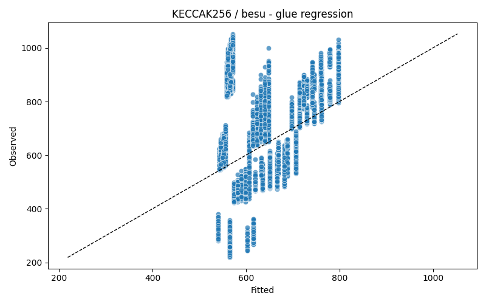

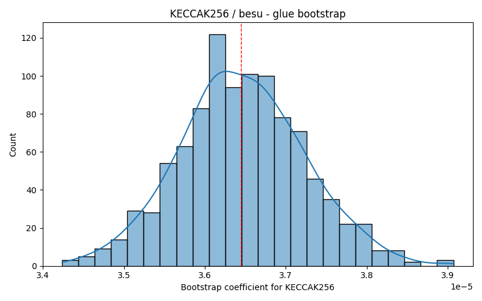

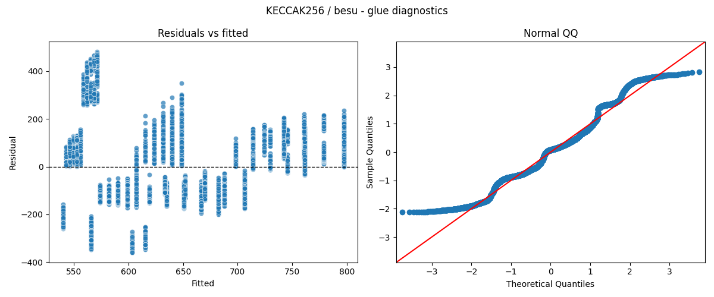

</details>

## erigon

| glue_opcode | nobs | glue_runtime_ms | p_value | rsquared |
| --- | --- | --- | --- | --- |
| `ISZERO` | 638 | 1.023e-06 | 1.00e-03 | 0.6848 |
| `JUMPDEST` | 638 | 7.845e-07 | 1.00e-03 | 0.8972 |
| `SWAP` | 10208 | 1.252e-06 | 1.00e-03 | 0.8535 |
| `CALLDATASIZE` | 37840 | 8.899e-07 | 1.00e-03 | 0.9231 |
| `DUP` | 37840 | 1.069e-06 | 1.00e-03 | 0.9231 |
| `GAS` | 37840 | 9.028e-07 | 1.00e-03 | 0.9231 |
| `MLOAD` | 37840 | 3.666e-06 | 1.00e-03 | 0.9231 |
| `PUSH` | 37840 | 2.679e-06 | 1.00e-03 | 0.9231 |
| `PUSH0` | 37840 | 9.246e-07 | 1.00e-03 | 0.9231 |
| `STATICCALL` | 37840 | 0.0005474 | 1.00e-03 | 0.9231 |
| `ADD` | 638 | 2.877e-06 | 1.00e-03 | 0.9267 |
| `AND` | 638 | 2.821e-06 | 1.00e-03 | 0.8008 |
| `CALLDATACOPY` | 15312 | 8.136e-06 | 1.00e-03 | 0.9558 |
| `CALLDATALOAD` | 2552 | 5.144e-05 | 1.00e-03 | 0.03243 |
| `DIV` | 638 | 9.756e-06 | 1.00e-03 | 0.8831 |
| `EXP` | 638 | 0.0003549 | 1.00e-03 | 0.918 |
| `GT` | 638 | 2.804e-06 | 1.00e-03 | 0.7208 |
| `JUMPI` | 638 | 3.302e-06 | 1.00e-03 | 0.8034 |
| `LT` | 638 | 2.745e-06 | 1.00e-03 | 0.7771 |
| `MSTORE` | 3190 | 5.98e-06 | 1.00e-03 | 0.887 |
| `MSTORE8` | 3190 | 5.357e-06 | 1.00e-03 | 0.8771 |
| `MUL` | 638 | 3.33e-06 | 1.00e-03 | 0.9267 |
| `PC` | 638 | 1.443e-06 | 1.00e-03 | 0.8321 |
| `RETURNDATASIZE` | 2552 | 1.836e-06 | 1.00e-03 | 0.8239 |
| `SELFBALANCE` | 522 | 1.53e-06 | 1.00e-03 | 0.7609 |
| `SUB` | 638 | 2.747e-06 | 1.00e-03 | 0.7962 |
| `JUMP` | 638 | 7.722e-06 | 1.00e-03 | 0.863 |
| `KECCAK256` | 10208 | 2.419e-05 | 1.00e-03 | 0.1114 |

### Cycle glue — joint fit · erigon

<details><summary>Joint NNLS regression summary</summary>

```
==============================================================================
                           NNLS Regression Results                            
==============================================================================
Dep. Variable:          test_runtime_ms              R-squared:          0.923
Model:                  NNLS                    Adj. R-squared:          0.923
No. Observations:       37840                             RMSE:          26.75
Df Residuals:           37832                              MAE:          15.88
Df Model:               7      
==============================================================================
                      coef     std err     P-value      [0.025      0.975]
------------------------------------------------------------------------------
         const     27.6723      0.4221       0.001     26.8133     28.5170
  CALLDATASIZE      0.0000      0.0000       0.001      0.0000      0.0000
           DUP      0.0000      0.0000       0.001      0.0000      0.0000
           GAS      0.0000      0.0000       0.001      0.0000      0.0000
         MLOAD      0.0000      0.0000       0.001      0.0000      0.0000
          PUSH      0.0000      0.0000       0.001      0.0000      0.0000
         PUSH0      0.0000      0.0000       0.001      0.0000      0.0000
    STATICCALL      0.0005      0.0000       0.001      0.0005      0.0006
==============================================================================
Notes: Non-negative least squares with bootstrap inference (1000 iterations)
==============================================================================
```

</details>

<details><summary><code>CALLDATASIZE</code> · nobs=37840 · runtime_ms=8.899e-07 · p=1.00e-03 · R²=0.9231</summary>

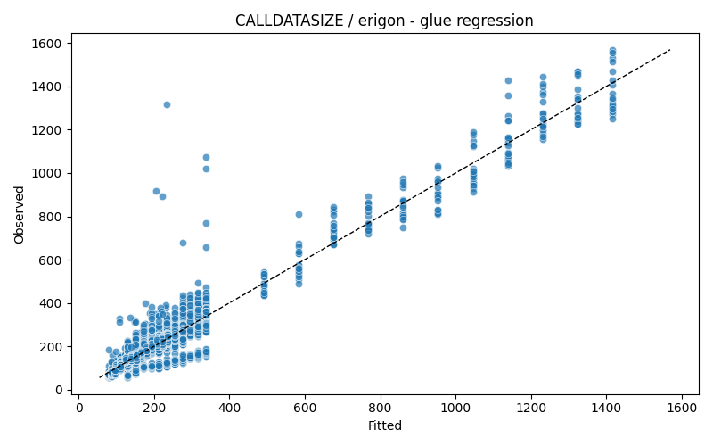

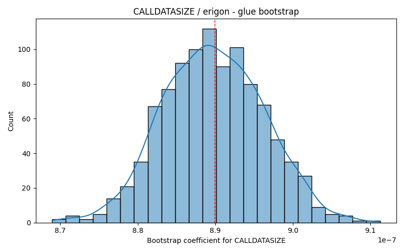


</details>

<details><summary><code>DUP</code> · nobs=37840 · runtime_ms=1.069e-06 · p=1.00e-03 · R²=0.9231</summary>


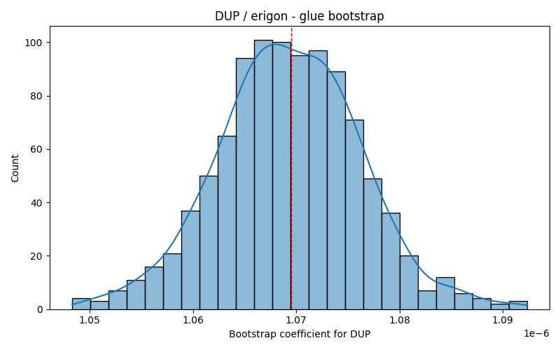

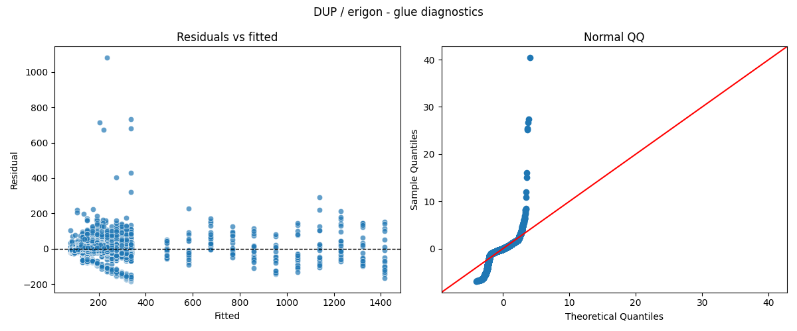

</details>

<details><summary><code>GAS</code> · nobs=37840 · runtime_ms=9.028e-07 · p=1.00e-03 · R²=0.9231</summary>


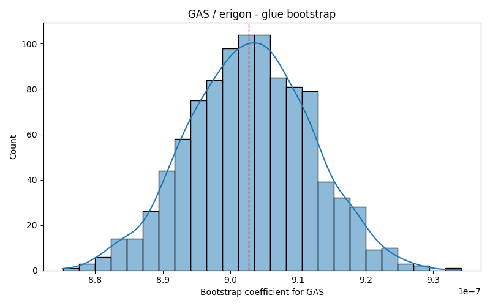


</details>

<details><summary><code>MLOAD</code> · nobs=37840 · runtime_ms=3.666e-06 · p=1.00e-03 · R²=0.9231</summary>

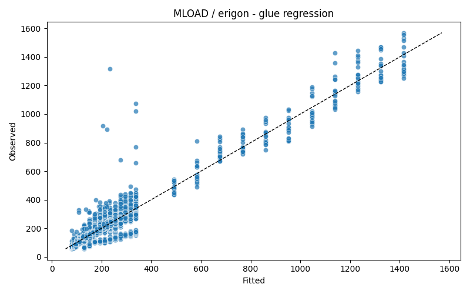

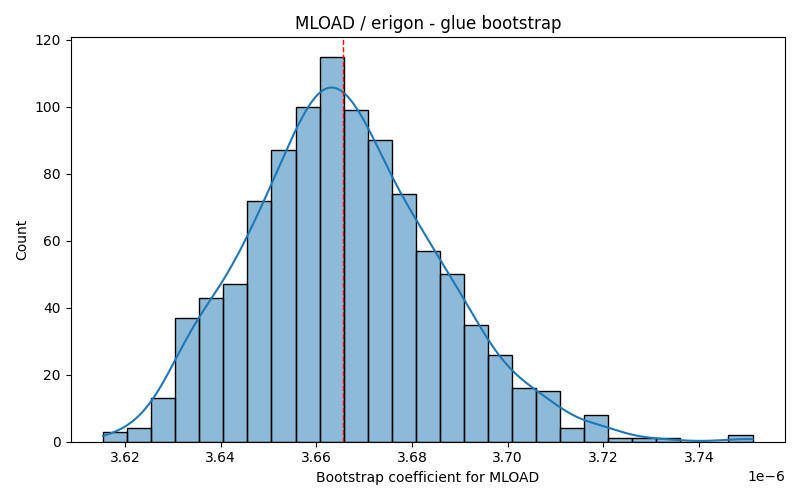


</details>

<details><summary><code>PUSH</code> · nobs=37840 · runtime_ms=2.679e-06 · p=1.00e-03 · R²=0.9231</summary>

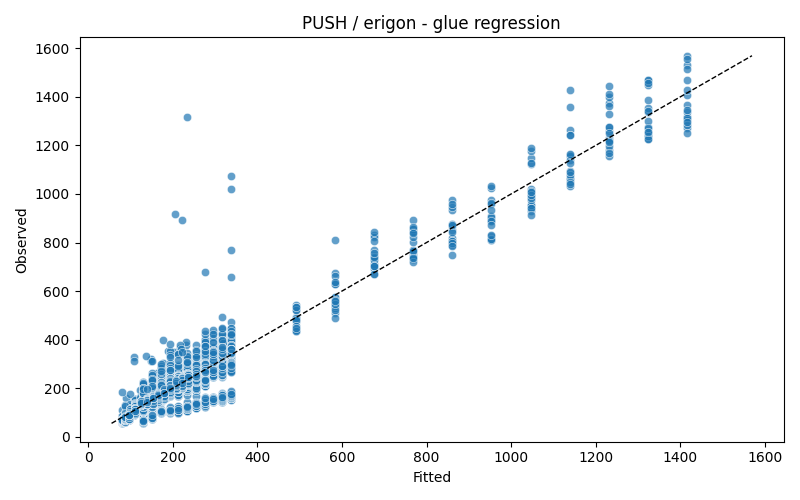

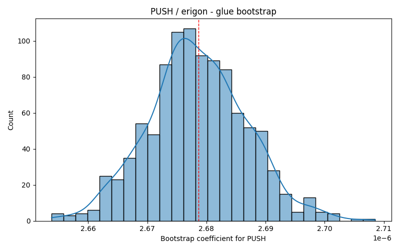


</details>

<details><summary><code>PUSH0</code> · nobs=37840 · runtime_ms=9.246e-07 · p=1.00e-03 · R²=0.9231</summary>

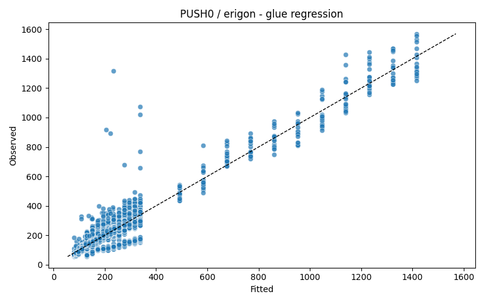

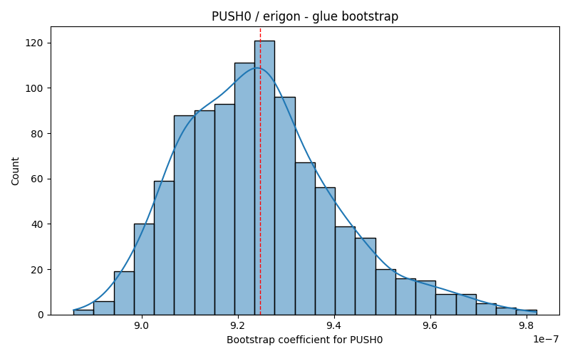


</details>

<details><summary><code>STATICCALL</code> · nobs=37840 · runtime_ms=0.0005474 · p=1.00e-03 · R²=0.9231</summary>


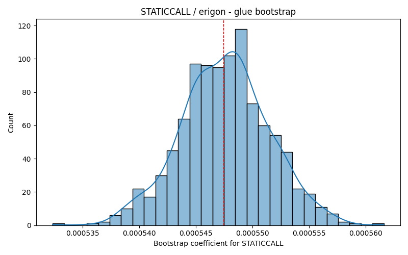


</details>

### Pure glue · erigon

<details><summary><code>ISZERO</code> · nobs=638 · runtime_ms=1.023e-06 · p=1.00e-03 · R²=0.6848</summary>

```
==============================================================================
                           NNLS Regression Results                            
==============================================================================
Dep. Variable:          test_runtime_ms              R-squared:          0.685
Model:                  NNLS                    Adj. R-squared:          0.684
No. Observations:       638                               RMSE:          14.61
Df Residuals:           636                                MAE:           7.03
Df Model:               1      
==============================================================================
                      coef     std err     P-value      [0.025      0.975]
------------------------------------------------------------------------------
         const     18.5080      2.3630       0.001     14.2920     23.4225
        ISZERO      0.0000      0.0000       0.001      0.0000      0.0000
==============================================================================
Notes: Non-negative least squares with bootstrap inference (1000 iterations)
==============================================================================
```

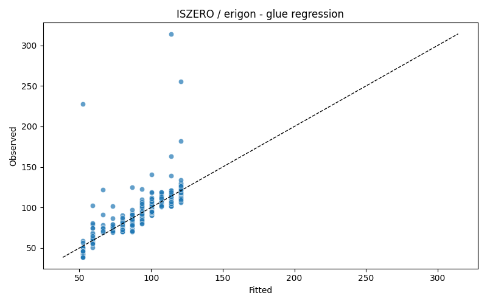

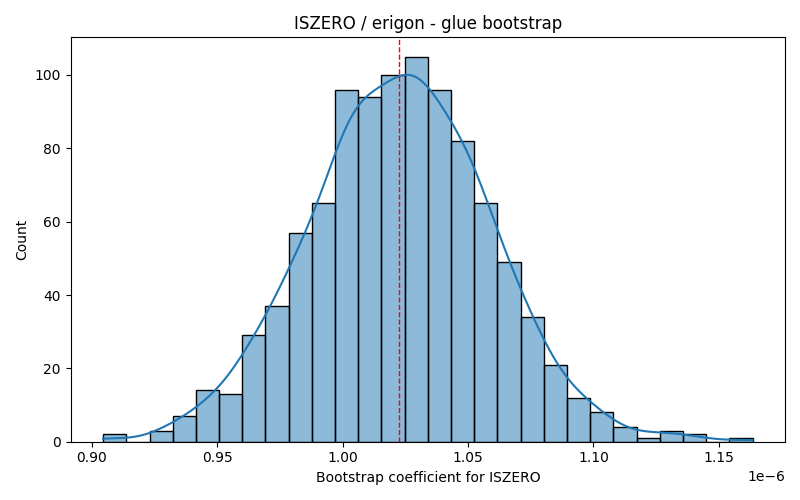

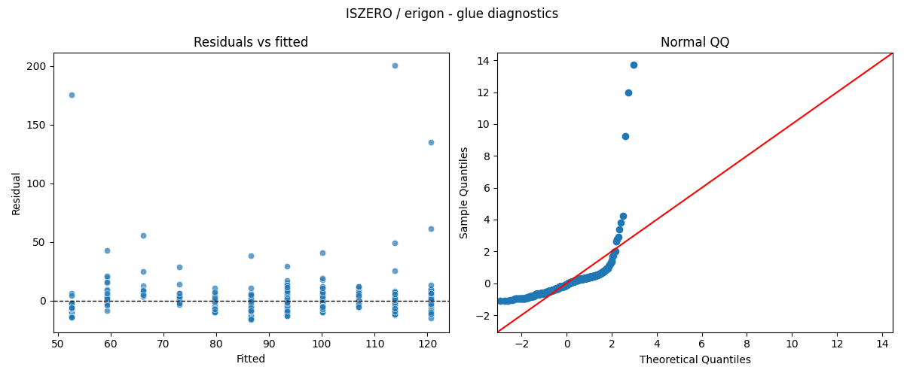

</details>

<details><summary><code>JUMPDEST</code> · nobs=638 · runtime_ms=7.845e-07 · p=1.00e-03 · R²=0.8972</summary>

```
==============================================================================
                           NNLS Regression Results                            
==============================================================================
Dep. Variable:          test_runtime_ms              R-squared:          0.897
Model:                  NNLS                    Adj. R-squared:          0.897
No. Observations:       638                               RMSE:          16.77
Df Residuals:           636                                MAE:          13.30
Df Model:               1      
==============================================================================
                      coef     std err     P-value      [0.025      0.975]
------------------------------------------------------------------------------
         const     24.7061      2.3560       0.001     20.5324     29.5157
      JUMPDEST      0.0000      0.0000       0.001      0.0000      0.0000
==============================================================================
Notes: Non-negative least squares with bootstrap inference (1000 iterations)
==============================================================================
```

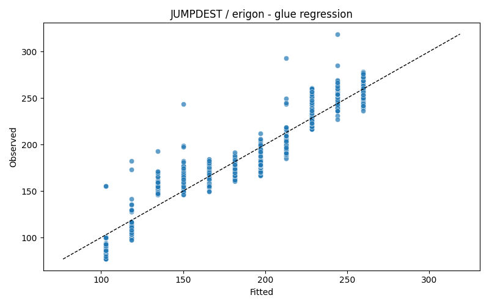

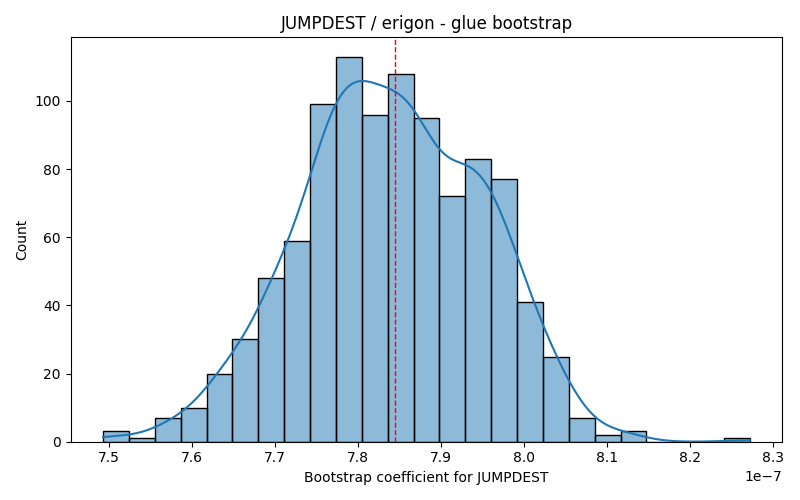

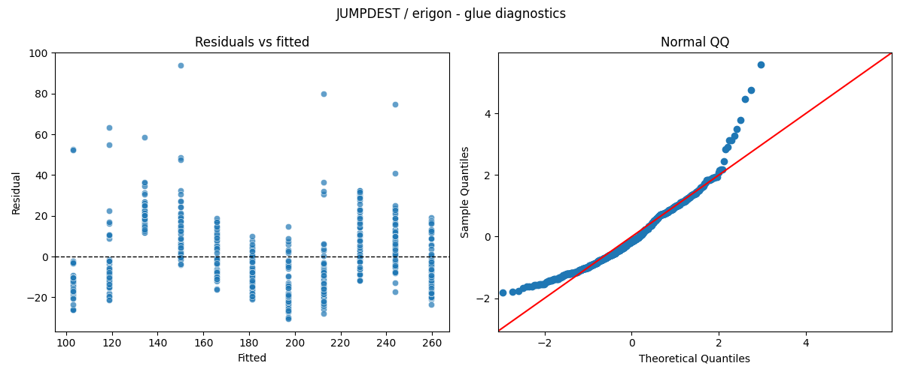

</details>

<details><summary><code>SWAP</code> · nobs=10208 · runtime_ms=1.252e-06 · p=1.00e-03 · R²=0.8535</summary>

```
==============================================================================
                           NNLS Regression Results                            
==============================================================================
Dep. Variable:          test_runtime_ms              R-squared:          0.853
Model:                  NNLS                    Adj. R-squared:          0.853
No. Observations:       10208                             RMSE:          10.93
Df Residuals:           10206                              MAE:           6.41
Df Model:               1      
==============================================================================
                      coef     std err     P-value      [0.025      0.975]
------------------------------------------------------------------------------
         const     24.1743      0.4094       0.001     23.4075     24.9775
          SWAP      0.0000      0.0000       0.001      0.0000      0.0000
==============================================================================
Notes: Non-negative least squares with bootstrap inference (1000 iterations)
==============================================================================
```

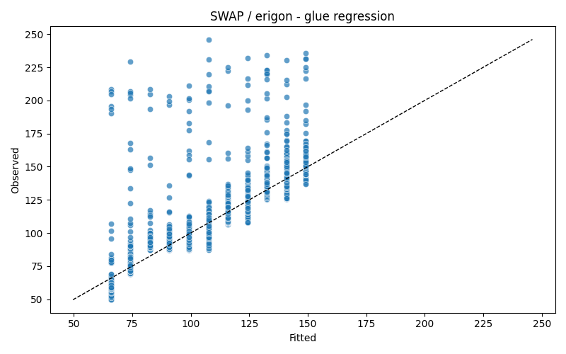

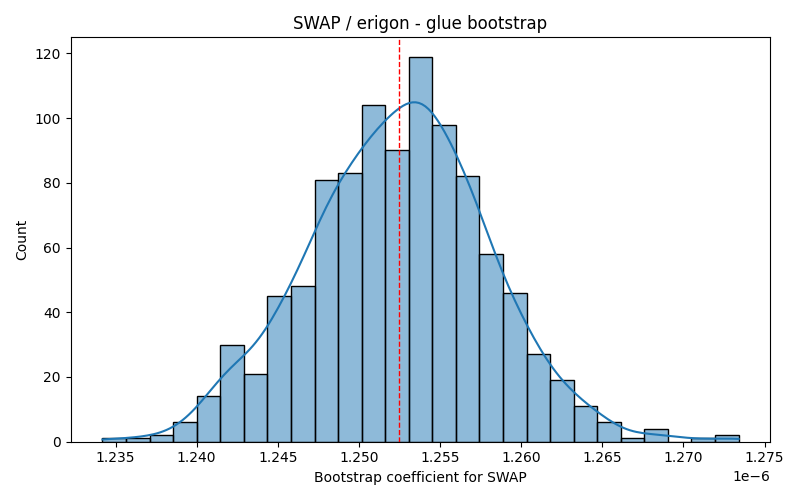

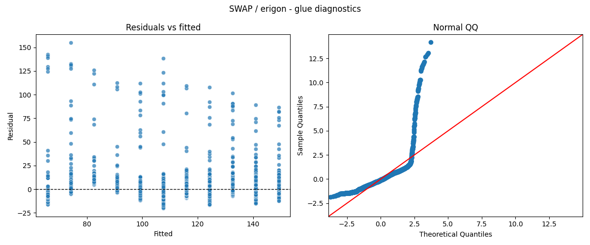

</details>

### Mixed glue (tier A) · erigon

<details><summary><code>ADD</code> · nobs=638 · runtime_ms=2.877e-06 · p=1.00e-03 · R²=0.9267</summary>

```
==============================================================================
                           NNLS Regression Results                            
==============================================================================
Dep. Variable:          test_runtime_ms              R-squared:          0.927
Model:                  NNLS                    Adj. R-squared:          0.927
No. Observations:       638                               RMSE:           8.52
Df Residuals:           636                                MAE:           7.07
Df Model:               1      
==============================================================================
                      coef     std err     P-value      [0.025      0.975]
------------------------------------------------------------------------------
         const     14.6416      1.1380       0.001     12.5081     16.8689
           ADD      0.0000      0.0000       0.001      0.0000      0.0000
==============================================================================
Notes: Non-negative least squares with bootstrap inference (1000 iterations)
==============================================================================
```

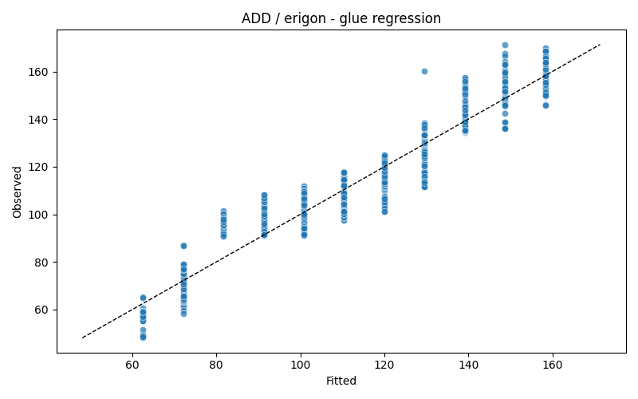

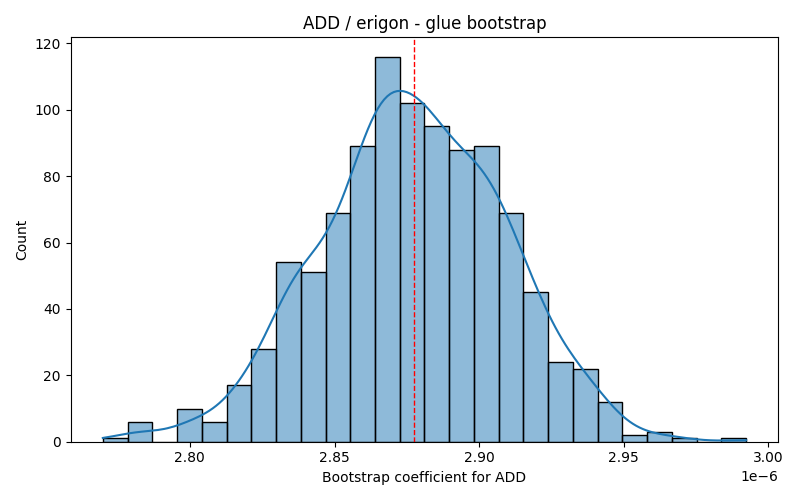

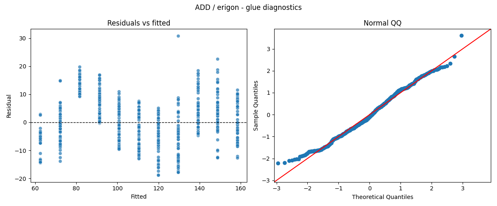

</details>

<details><summary><code>AND</code> · nobs=638 · runtime_ms=2.821e-06 · p=1.00e-03 · R²=0.8008</summary>

```
==============================================================================
                           NNLS Regression Results                            
==============================================================================
Dep. Variable:          test_runtime_ms              R-squared:          0.801
Model:                  NNLS                    Adj. R-squared:          0.800
No. Observations:       638                               RMSE:          14.81
Df Residuals:           636                                MAE:           8.64
Df Model:               1      
==============================================================================
                      coef     std err     P-value      [0.025      0.975]
------------------------------------------------------------------------------
         const     17.3743      2.0897       0.001     13.7700     21.7722
           AND      0.0000      0.0000       0.001      0.0000      0.0000
==============================================================================
Notes: Non-negative least squares with bootstrap inference (1000 iterations)
==============================================================================
```

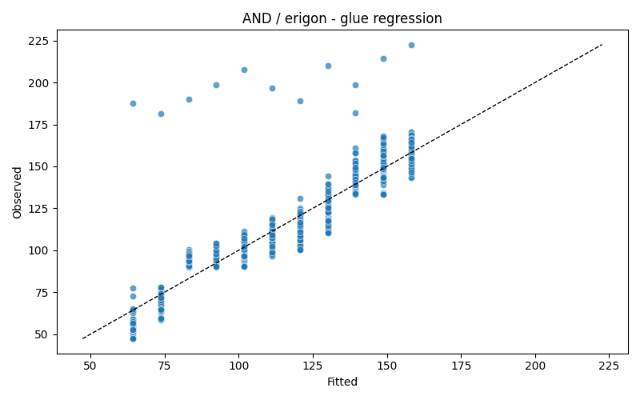

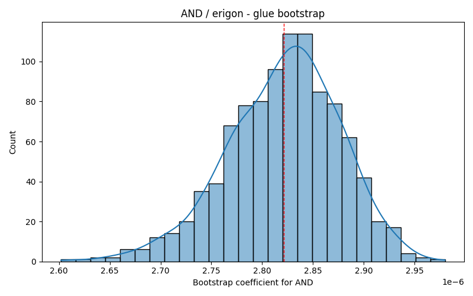

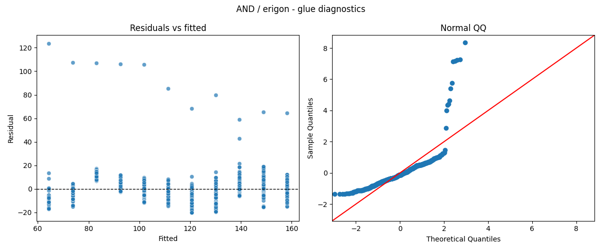

</details>

<details><summary><code>CALLDATACOPY</code> · nobs=15312 · runtime_ms=8.136e-06 · p=1.00e-03 · R²=0.9558</summary>

```
==============================================================================
                           NNLS Regression Results                            
==============================================================================
Dep. Variable:          test_runtime_ms              R-squared:          0.956
Model:                  NNLS                    Adj. R-squared:          0.956
No. Observations:       15312                             RMSE:          13.15
Df Residuals:           15310                              MAE:           9.53
Df Model:               1      
==============================================================================
                      coef     std err     P-value      [0.025      0.975]
------------------------------------------------------------------------------
         const     19.9054      0.1264       0.001     19.6526     20.1500
  CALLDATACOPY      0.0000      0.0000       0.001      0.0000      0.0000
==============================================================================
Notes: Non-negative least squares with bootstrap inference (1000 iterations)
==============================================================================
```

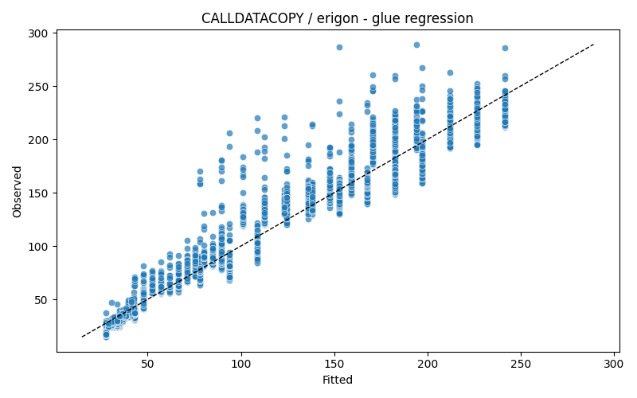

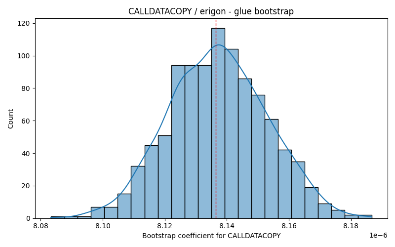

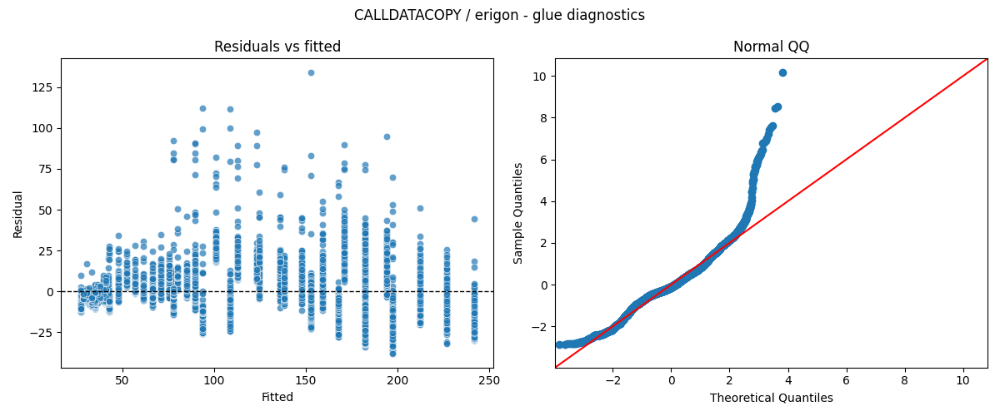

</details>

<details><summary><code>CALLDATALOAD</code> · nobs=2552 · runtime_ms=5.144e-05 · p=1.00e-03 · R²=0.03243</summary>

```
==============================================================================
                           NNLS Regression Results                            
==============================================================================
Dep. Variable:          test_runtime_ms              R-squared:          0.032
Model:                  NNLS                    Adj. R-squared:          0.032
No. Observations:       2552                              RMSE:           1.08
Df Residuals:           2550                               MAE:           0.87
Df Model:               1      
==============================================================================
                      coef     std err     P-value      [0.025      0.975]
------------------------------------------------------------------------------
         const      6.4371      0.0761       0.001      6.2925      6.5889
  CALLDATALOAD      0.0001      0.0000       0.001      0.0000      0.0001
==============================================================================
Notes: Non-negative least squares with bootstrap inference (1000 iterations)
==============================================================================
```

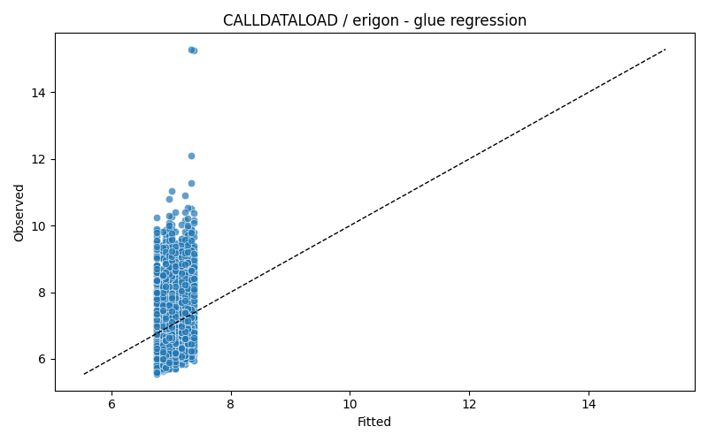

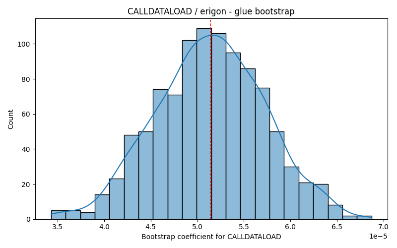

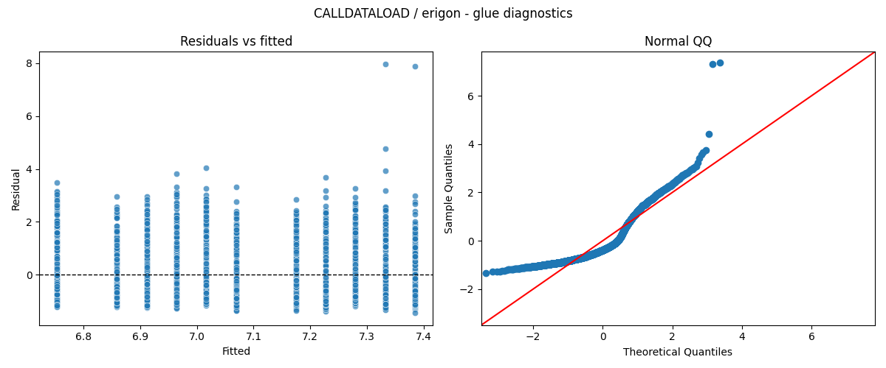

</details>

<details><summary><code>DIV</code> · nobs=638 · runtime_ms=9.756e-06 · p=1.00e-03 · R²=0.8831</summary>

```
==============================================================================
                           NNLS Regression Results                            
==============================================================================
Dep. Variable:          test_runtime_ms              R-squared:          0.883
Model:                  NNLS                    Adj. R-squared:          0.883
No. Observations:       638                               RMSE:          28.02
Df Residuals:           636                                MAE:          23.71
Df Model:               1      
==============================================================================
                      coef     std err     P-value      [0.025      0.975]
------------------------------------------------------------------------------
         const     23.4080      3.4587       0.001     16.5467     30.4456
           DIV      0.0000      0.0000       0.001      0.0000      0.0000
==============================================================================
Notes: Non-negative least squares with bootstrap inference (1000 iterations)
==============================================================================
```

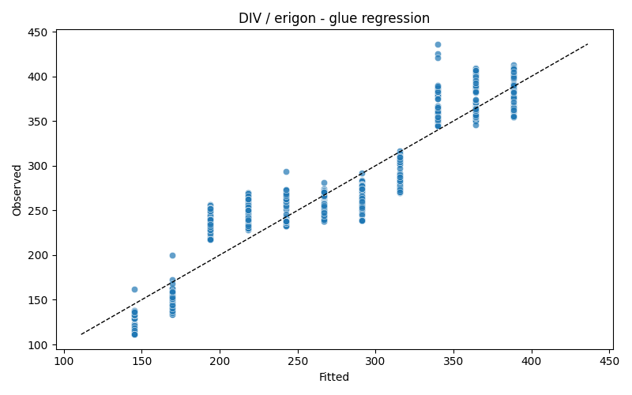

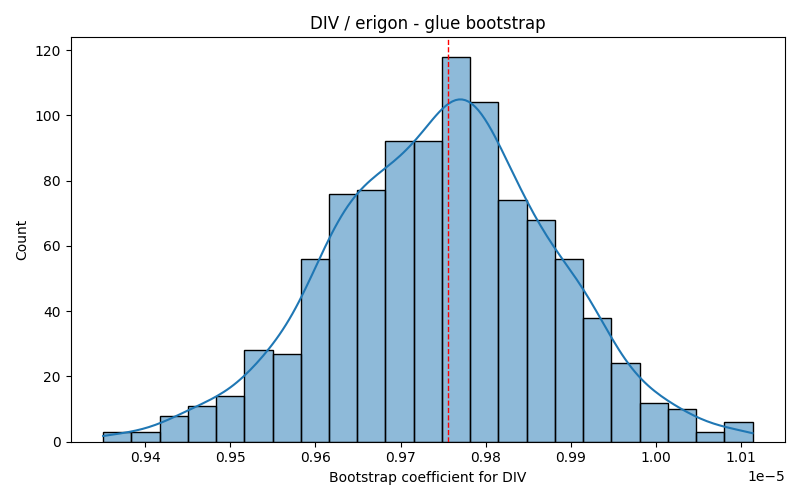

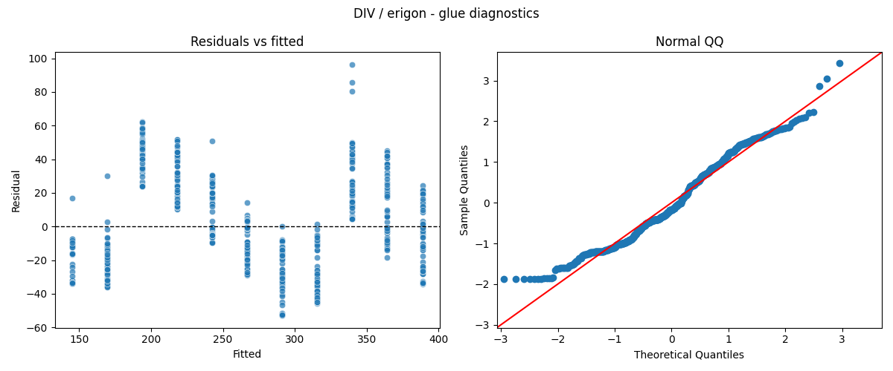

</details>

<details><summary><code>EXP</code> · nobs=638 · runtime_ms=0.0003549 · p=1.00e-03 · R²=0.918</summary>

```
==============================================================================
                           NNLS Regression Results                            
==============================================================================
Dep. Variable:          test_runtime_ms              R-squared:          0.918
Model:                  NNLS                    Adj. R-squared:          0.918
No. Observations:       638                               RMSE:           4.15
Df Residuals:           636                                MAE:           3.43
Df Model:               1      
==============================================================================
                      coef     std err     P-value      [0.025      0.975]
------------------------------------------------------------------------------
         const     11.6404      0.6001       0.001     10.5338     12.9031
           EXP      0.0004      0.0000       0.001      0.0003      0.0004
==============================================================================
Notes: Non-negative least squares with bootstrap inference (1000 iterations)
==============================================================================
```

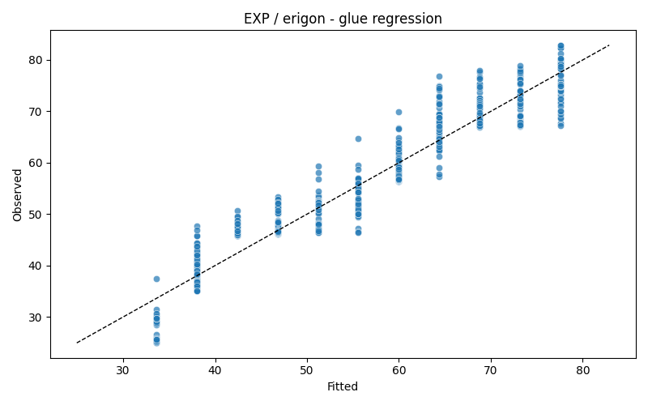

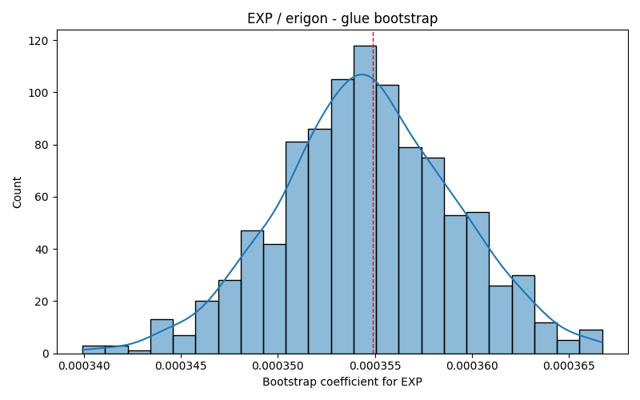

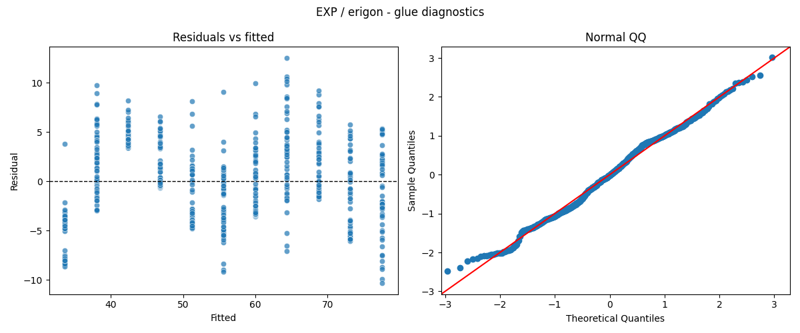

</details>

<details><summary><code>GT</code> · nobs=638 · runtime_ms=2.804e-06 · p=1.00e-03 · R²=0.7208</summary>

```
==============================================================================
                           NNLS Regression Results                            
==============================================================================
Dep. Variable:          test_runtime_ms              R-squared:          0.721
Model:                  NNLS                    Adj. R-squared:          0.720
No. Observations:       638                               RMSE:          18.37
Df Residuals:           636                                MAE:           9.52
Df Model:               1      
==============================================================================
                      coef     std err     P-value      [0.025      0.975]
------------------------------------------------------------------------------
         const     22.2600      2.4481       0.001     17.7171     27.1893
            GT      0.0000      0.0000       0.001      0.0000      0.0000
==============================================================================
Notes: Non-negative least squares with bootstrap inference (1000 iterations)
==============================================================================
```

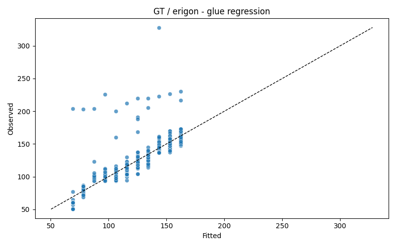

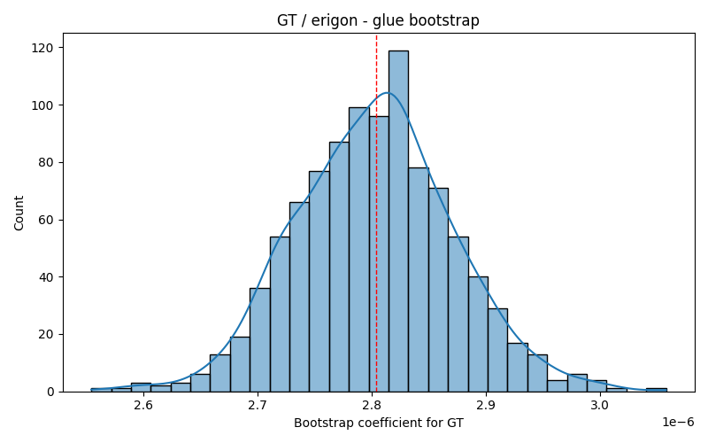

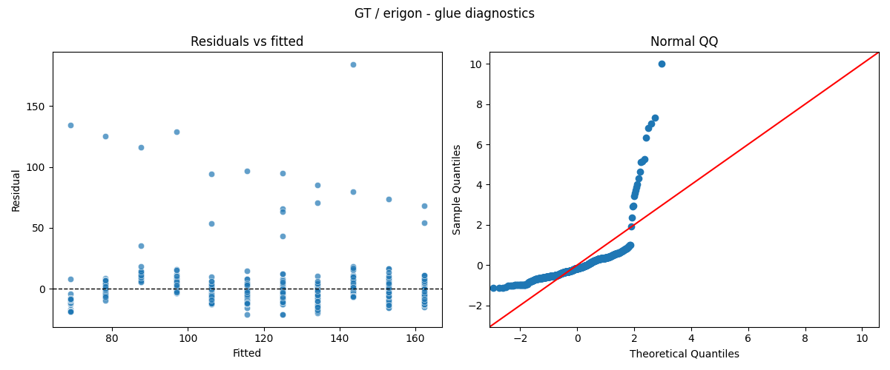

</details>

<details><summary><code>JUMPI</code> · nobs=638 · runtime_ms=3.302e-06 · p=1.00e-03 · R²=0.8034</summary>

```
==============================================================================
                           NNLS Regression Results                            
==============================================================================
Dep. Variable:          test_runtime_ms              R-squared:          0.803
Model:                  NNLS                    Adj. R-squared:          0.803
No. Observations:       638                               RMSE:           7.37
Df Residuals:           636                                MAE:           4.87
Df Model:               1      
==============================================================================
                      coef     std err     P-value      [0.025      0.975]
------------------------------------------------------------------------------
         const     19.1239      1.1371       0.001     17.0443     21.3767
         JUMPI      0.0000      0.0000       0.001      0.0000      0.0000
==============================================================================
Notes: Non-negative least squares with bootstrap inference (1000 iterations)
==============================================================================
```

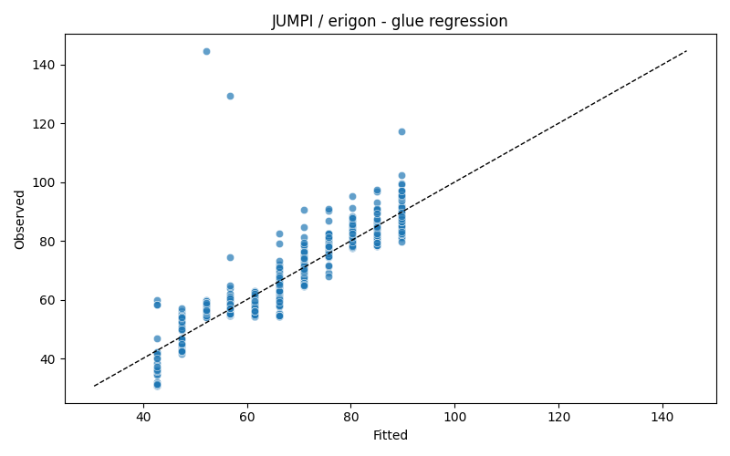

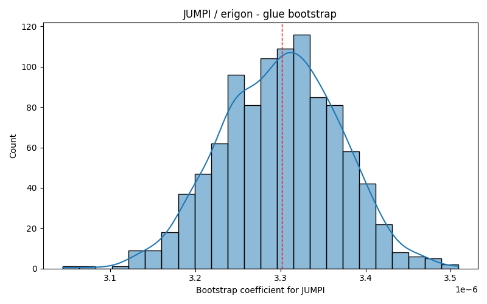

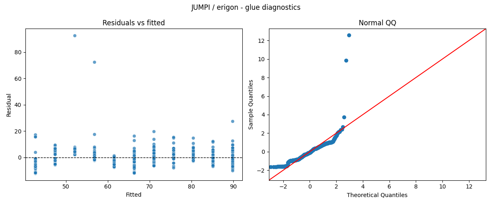

</details>

<details><summary><code>LT</code> · nobs=638 · runtime_ms=2.745e-06 · p=1.00e-03 · R²=0.7771</summary>

```
==============================================================================
                           NNLS Regression Results                            
==============================================================================
Dep. Variable:          test_runtime_ms              R-squared:          0.777
Model:                  NNLS                    Adj. R-squared:          0.777
No. Observations:       638                               RMSE:          15.47
Df Residuals:           636                                MAE:           8.52
Df Model:               1      
==============================================================================
                      coef     std err     P-value      [0.025      0.975]
------------------------------------------------------------------------------
         const     23.8337      2.3222       0.001     19.4512     28.6340
            LT      0.0000      0.0000       0.001      0.0000      0.0000
==============================================================================
Notes: Non-negative least squares with bootstrap inference (1000 iterations)
==============================================================================
```

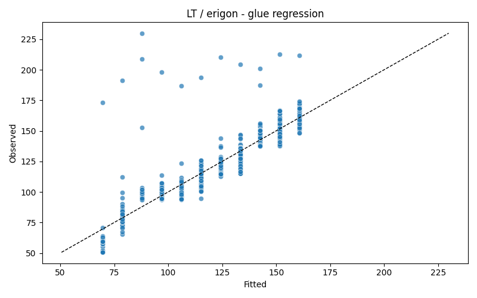

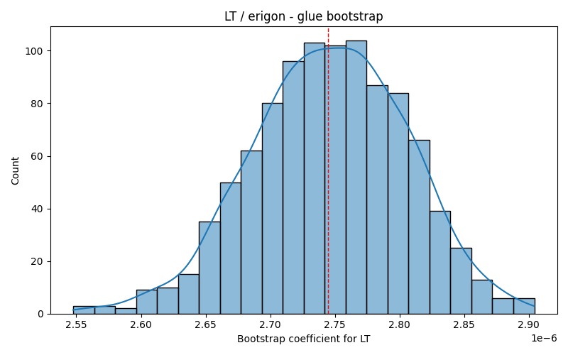

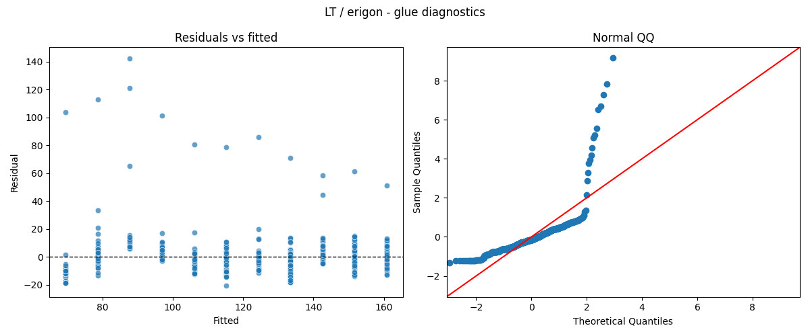

</details>

<details><summary><code>MSTORE</code> · nobs=3190 · runtime_ms=5.98e-06 · p=1.00e-03 · R²=0.887</summary>

```
==============================================================================
                           NNLS Regression Results                            
==============================================================================
Dep. Variable:          test_runtime_ms              R-squared:          0.887
Model:                  NNLS                    Adj. R-squared:          0.887
No. Observations:       3190                              RMSE:          14.98
Df Residuals:           3188                               MAE:          11.26
Df Model:               1      
==============================================================================
                      coef     std err     P-value      [0.025      0.975]
------------------------------------------------------------------------------
         const     27.2386      0.8431       0.001     25.5780     28.9663
        MSTORE      0.0000      0.0000       0.001      0.0000      0.0000
==============================================================================
Notes: Non-negative least squares with bootstrap inference (1000 iterations)
==============================================================================
```

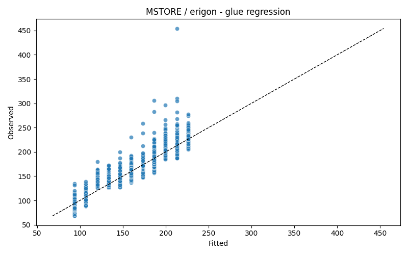

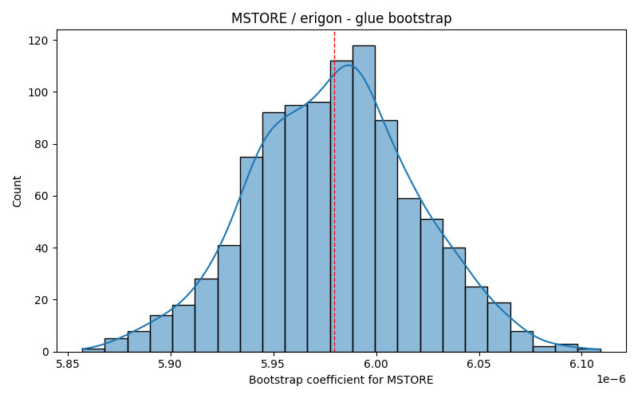

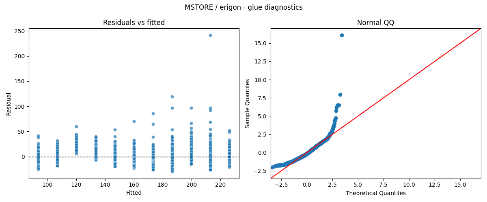

</details>

<details><summary><code>MSTORE8</code> · nobs=3190 · runtime_ms=5.357e-06 · p=1.00e-03 · R²=0.8771</summary>

```
==============================================================================
                           NNLS Regression Results                            
==============================================================================
Dep. Variable:          test_runtime_ms              R-squared:          0.877
Model:                  NNLS                    Adj. R-squared:          0.877
No. Observations:       3190                              RMSE:          14.07
Df Residuals:           3188                               MAE:          10.60
Df Model:               1      
==============================================================================
                      coef     std err     P-value      [0.025      0.975]
------------------------------------------------------------------------------
         const     28.8997      0.8015       0.001     27.3479     30.5312
       MSTORE8      0.0000      0.0000       0.001      0.0000      0.0000
==============================================================================
Notes: Non-negative least squares with bootstrap inference (1000 iterations)
==============================================================================
```

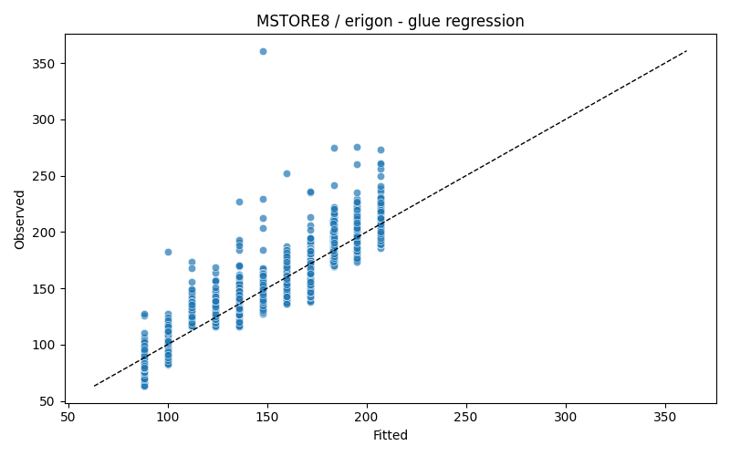

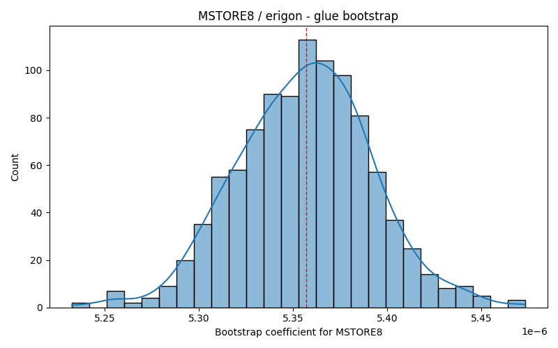

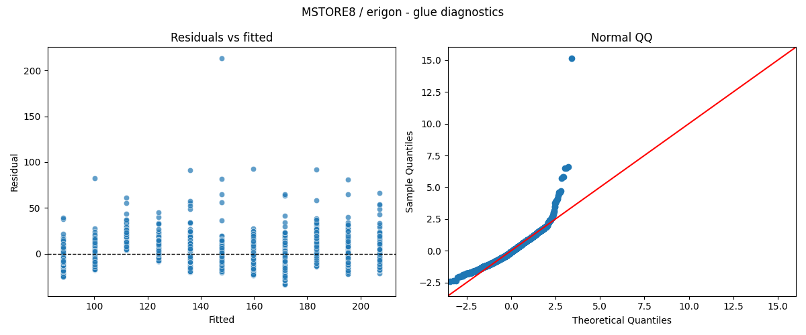

</details>

<details><summary><code>MUL</code> · nobs=638 · runtime_ms=3.33e-06 · p=1.00e-03 · R²=0.9267</summary>

```
==============================================================================
                           NNLS Regression Results                            
==============================================================================
Dep. Variable:          test_runtime_ms              R-squared:          0.927
Model:                  NNLS                    Adj. R-squared:          0.927
No. Observations:       638                               RMSE:           7.39
Df Residuals:           636                                MAE:           5.97
Df Model:               1      
==============================================================================
                      coef     std err     P-value      [0.025      0.975]
------------------------------------------------------------------------------
         const     14.8068      1.0226       0.001     12.9089     16.7954
           MUL      0.0000      0.0000       0.001      0.0000      0.0000
==============================================================================
Notes: Non-negative least squares with bootstrap inference (1000 iterations)
==============================================================================
```

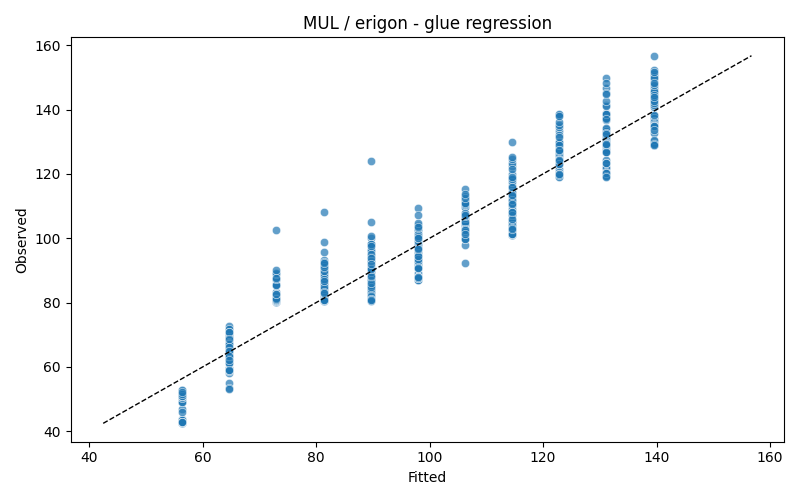

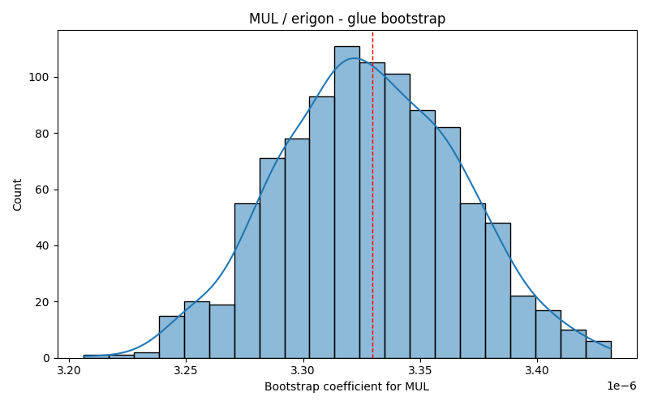

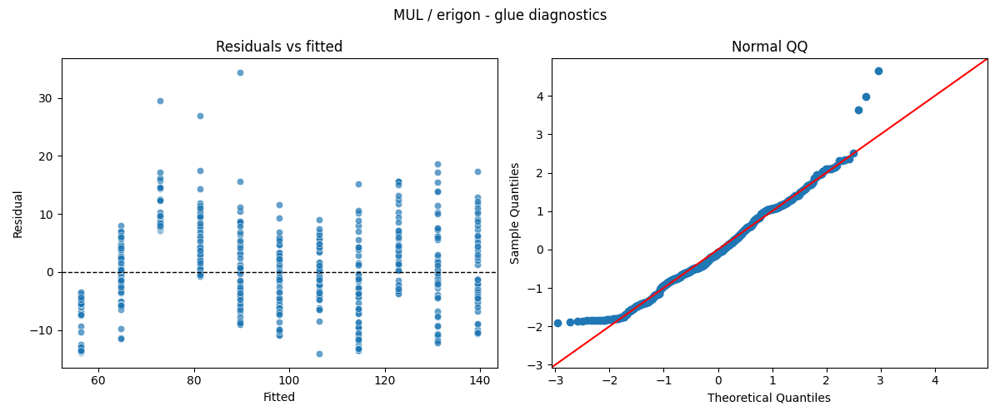

</details>

<details><summary><code>PC</code> · nobs=638 · runtime_ms=1.443e-06 · p=1.00e-03 · R²=0.8321</summary>

```
==============================================================================
                           NNLS Regression Results                            
==============================================================================
Dep. Variable:          test_runtime_ms              R-squared:          0.832
Model:                  NNLS                    Adj. R-squared:          0.832
No. Observations:       638                               RMSE:          19.37
Df Residuals:           636                                MAE:          11.44
Df Model:               1      
==============================================================================
                      coef     std err     P-value      [0.025      0.975]
------------------------------------------------------------------------------
         const     25.3077      2.8247       0.001     20.4230     31.5995
            PC      0.0000      0.0000       0.001      0.0000      0.0000
==============================================================================
Notes: Non-negative least squares with bootstrap inference (1000 iterations)
==============================================================================
```

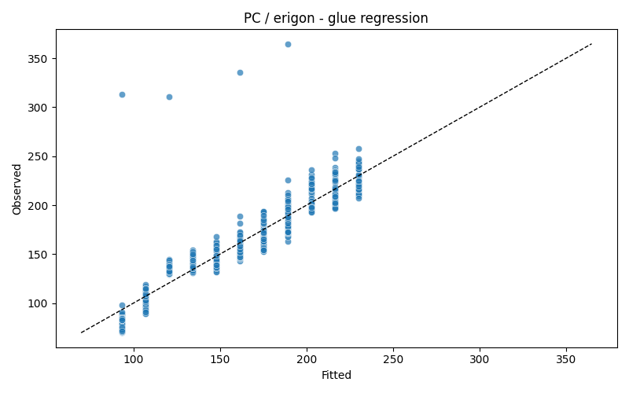

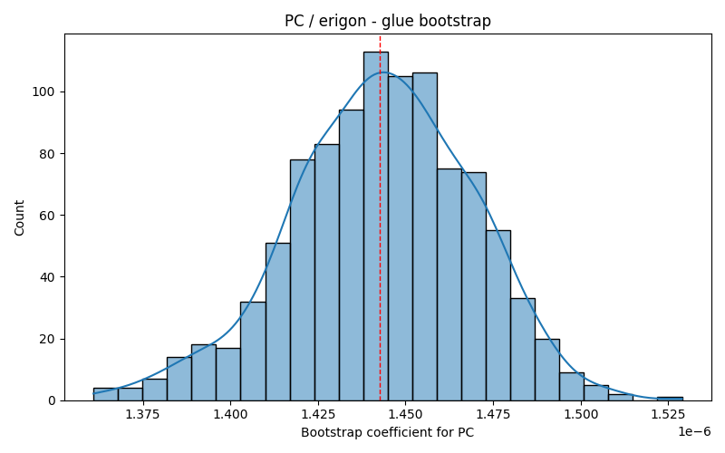

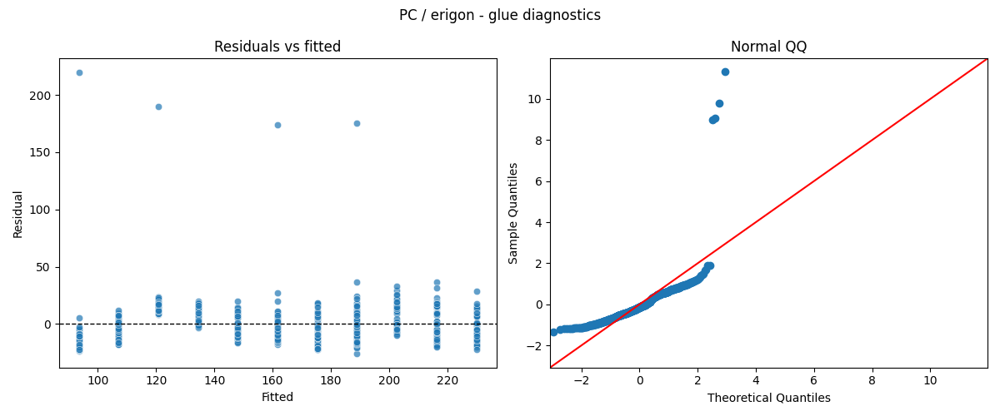

</details>

<details><summary><code>RETURNDATASIZE</code> · nobs=2552 · runtime_ms=1.836e-06 · p=1.00e-03 · R²=0.8239</summary>

```
==============================================================================
                           NNLS Regression Results                            
==============================================================================
Dep. Variable:          test_runtime_ms              R-squared:          0.824
Model:                  NNLS                    Adj. R-squared:          0.824
No. Observations:       2552                              RMSE:          13.40
Df Residuals:           2550                               MAE:           8.02
Df Model:               1      
==============================================================================
                      coef     std err     P-value      [0.025      0.975]
------------------------------------------------------------------------------
         const     20.4995      1.0173       0.001     18.5671     22.5453
RETURNDATASIZE      0.0000      0.0000       0.001      0.0000      0.0000
==============================================================================
Notes: Non-negative least squares with bootstrap inference (1000 iterations)
==============================================================================
```

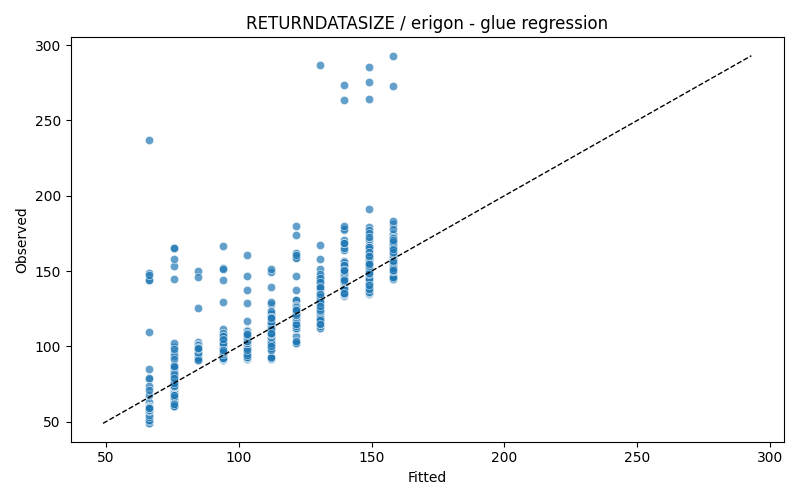

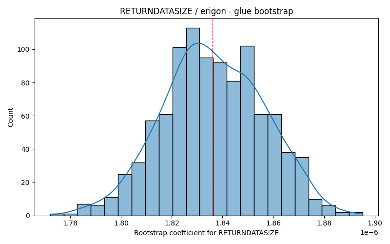

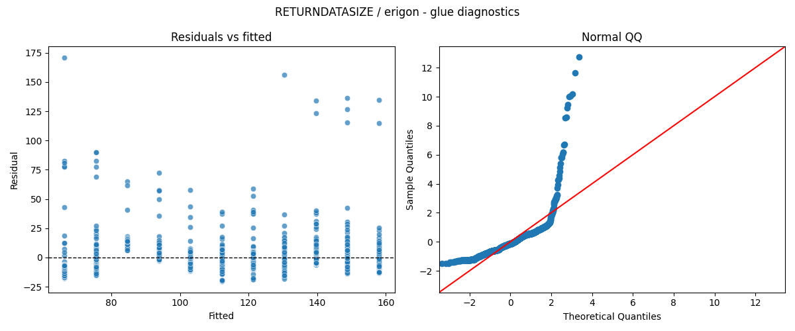

</details>

<details><summary><code>SELFBALANCE</code> · nobs=522 · runtime_ms=1.53e-06 · p=1.00e-03 · R²=0.7609</summary>

```
==============================================================================
                           NNLS Regression Results                            
==============================================================================
Dep. Variable:          test_runtime_ms              R-squared:          0.761
Model:                  NNLS                    Adj. R-squared:          0.760
No. Observations:       522                               RMSE:           8.65
Df Residuals:           520                                MAE:           5.44
Df Model:               1      
==============================================================================
                      coef     std err     P-value      [0.025      0.975]
------------------------------------------------------------------------------
         const     17.5646      1.8123       0.001     14.2293     21.3240
   SELFBALANCE      0.0000      0.0000       0.001      0.0000      0.0000
==============================================================================
Notes: Non-negative least squares with bootstrap inference (1000 iterations)
==============================================================================
```

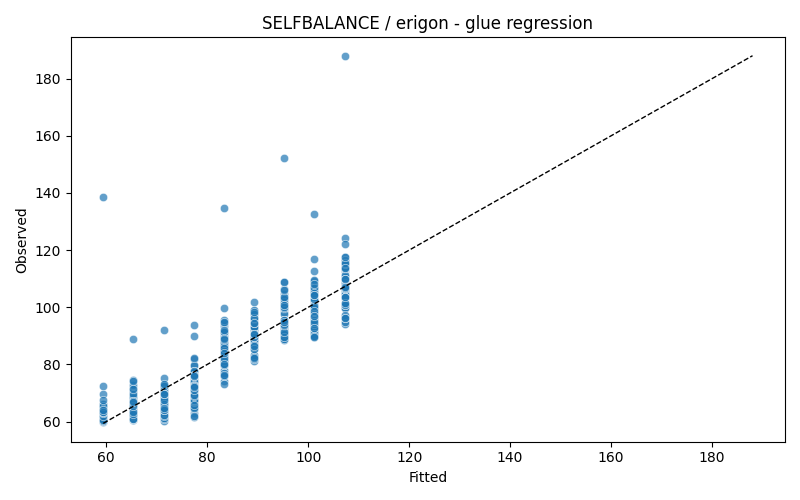

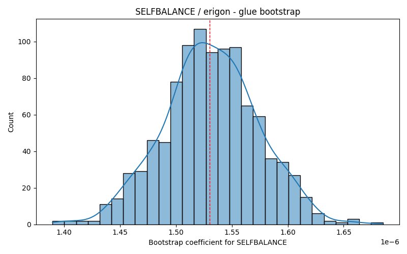

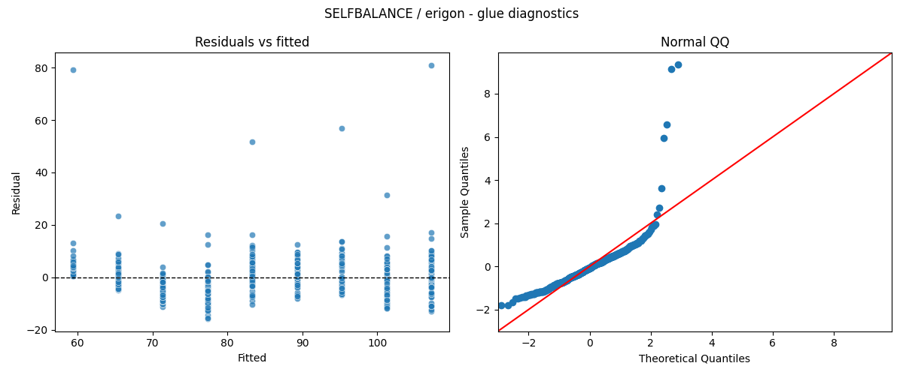

</details>

<details><summary><code>SUB</code> · nobs=638 · runtime_ms=2.747e-06 · p=1.00e-03 · R²=0.7962</summary>

```
==============================================================================
                           NNLS Regression Results                            
==============================================================================
Dep. Variable:          test_runtime_ms              R-squared:          0.796
Model:                  NNLS                    Adj. R-squared:          0.796
No. Observations:       638                               RMSE:          14.63
Df Residuals:           636                                MAE:           8.61
Df Model:               1      
==============================================================================
                      coef     std err     P-value      [0.025      0.975]
------------------------------------------------------------------------------
         const     21.1748      2.1761       0.001     17.3808     25.8156
           SUB      0.0000      0.0000       0.001      0.0000      0.0000
==============================================================================
Notes: Non-negative least squares with bootstrap inference (1000 iterations)
==============================================================================
```

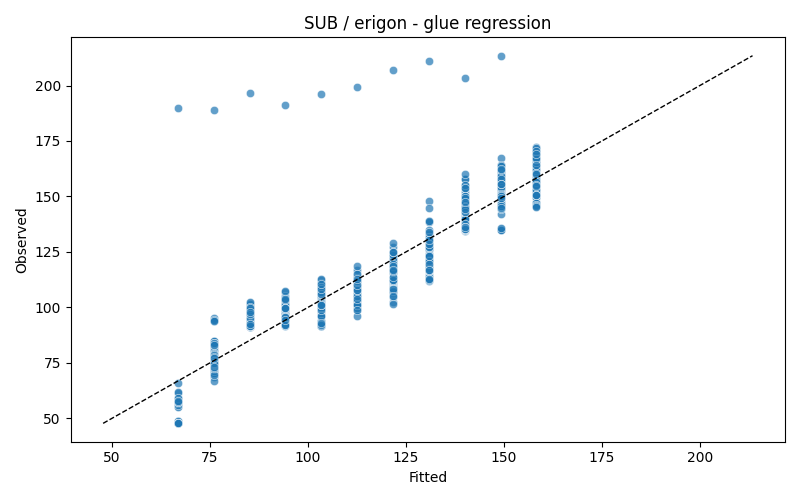

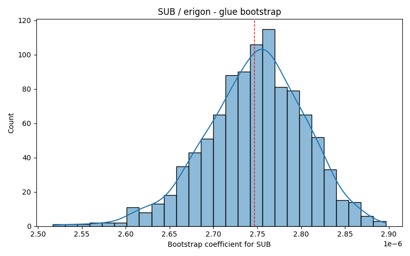

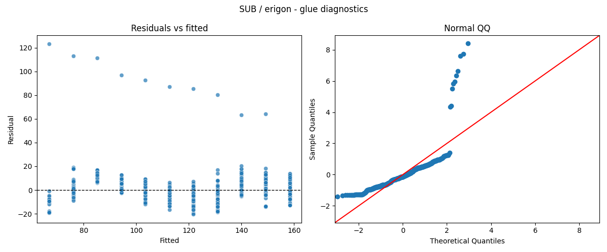

</details>

### Mixed glue (tier B) · erigon

<details><summary><code>JUMP</code> · nobs=638 · runtime_ms=7.722e-06 · p=1.00e-03 · R²=0.863</summary>

```
==============================================================================
                           NNLS Regression Results                            
==============================================================================
Dep. Variable:          test_runtime_ms              R-squared:          0.863
Model:                  NNLS                    Adj. R-squared:          0.863
No. Observations:       638                               RMSE:          11.43
Df Residuals:           636                                MAE:           7.49
Df Model:               1      
==============================================================================
                      coef     std err     P-value      [0.025      0.975]
------------------------------------------------------------------------------
         const     22.1028      1.6167       0.001     19.0971     25.3851
          JUMP      0.0000      0.0000       0.001      0.0000      0.0000
==============================================================================
Notes: Non-negative least squares with bootstrap inference (1000 iterations)
==============================================================================
```

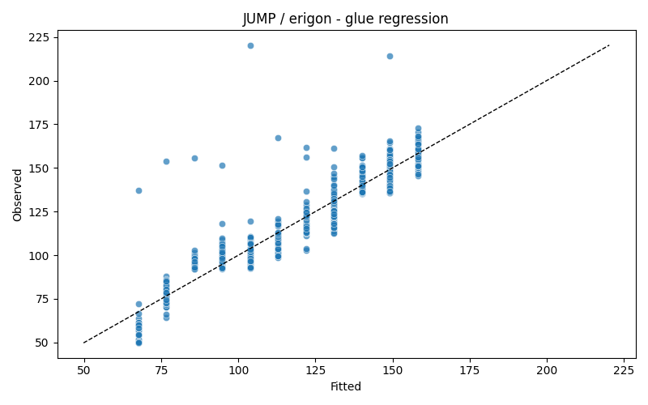

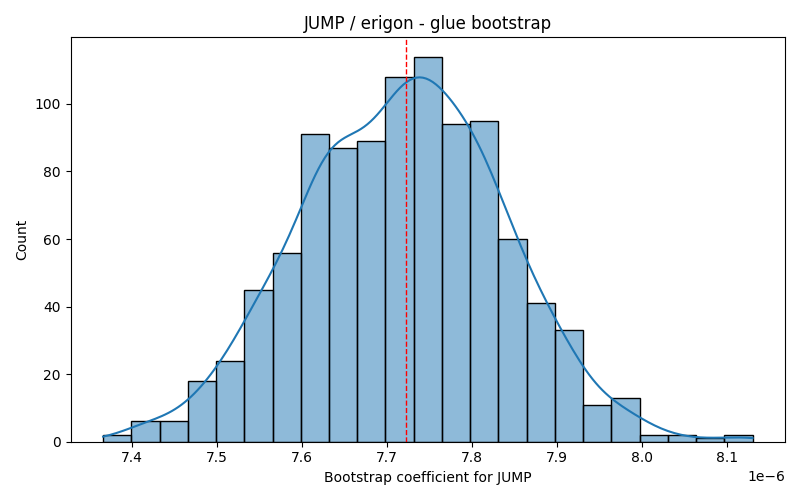

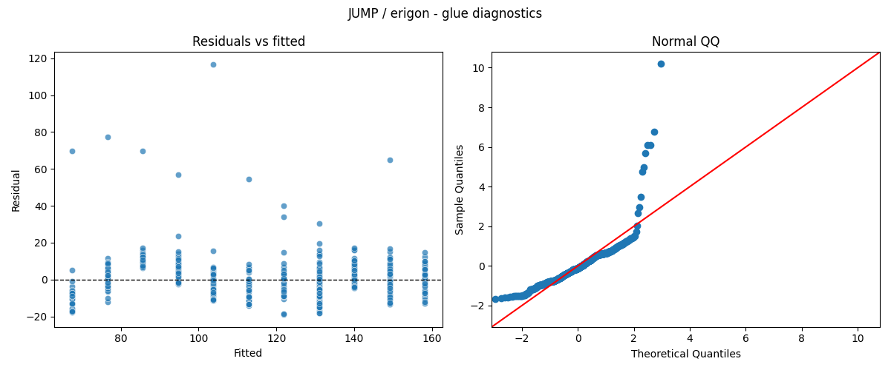

</details>

<details><summary><code>KECCAK256</code> · nobs=10208 · runtime_ms=2.419e-05 · p=1.00e-03 · R²=0.1114</summary>

```
==============================================================================
                           NNLS Regression Results                            
==============================================================================
Dep. Variable:          test_runtime_ms              R-squared:          0.111
Model:                  NNLS                    Adj. R-squared:          0.111
No. Observations:       10208                             RMSE:         135.78
Df Residuals:           10206                              MAE:         109.17
Df Model:               1      
==============================================================================
                      coef     std err     P-value      [0.025      0.975]
------------------------------------------------------------------------------
         const    366.4197      2.9762       0.001    360.4975    372.0432
     KECCAK256      0.0000      0.0000       0.001      0.0000      0.0000
==============================================================================
Notes: Non-negative least squares with bootstrap inference (1000 iterations)
==============================================================================
```

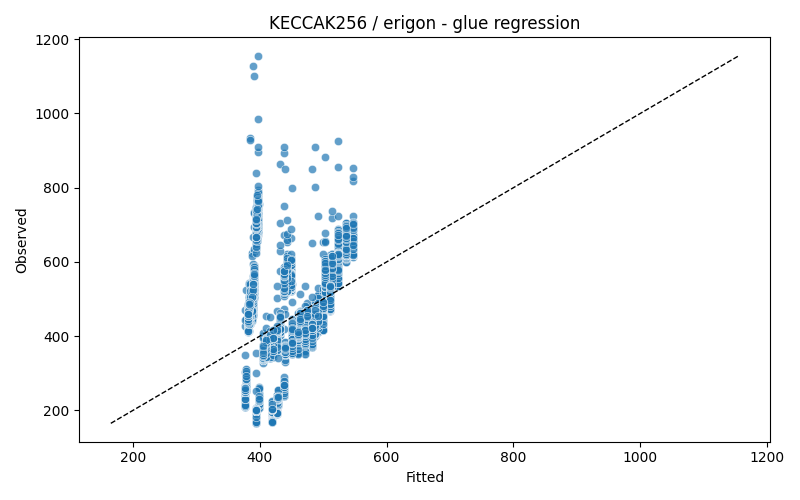

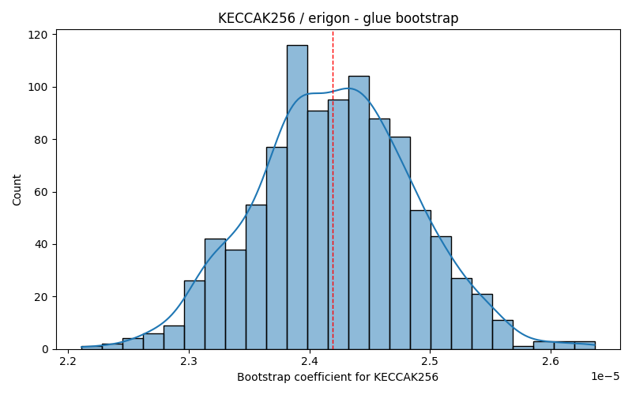

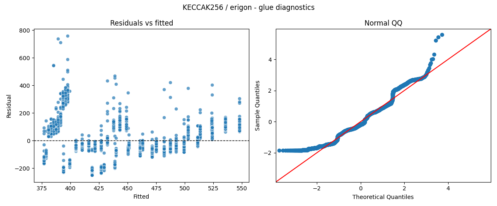

</details>

## ethrex

| glue_opcode | nobs | glue_runtime_ms | p_value | rsquared |
| --- | --- | --- | --- | --- |
| `ISZERO` | 286 | 4.846e-07 | 1.00e-03 | 0.8292 |
| `JUMPDEST` | 286 | 3.362e-07 | 1.00e-03 | 0.8502 |
| `SWAP` | 4576 | 7.131e-07 | 1.00e-03 | 0.7962 |
| `CALLDATASIZE` | 17149 | 4.676e-07 | 1.00e-03 | 0.9328 |
| `DUP` | 17149 | 4.714e-07 | 1.00e-03 | 0.9328 |
| `GAS` | 17149 | 4.723e-07 | 1.00e-03 | 0.9328 |
| `MLOAD` | 17149 | 1.117e-06 | 1.00e-03 | 0.9328 |
| `PUSH` | 17149 | 4.858e-07 | 1.00e-03 | 0.9328 |
| `PUSH0` | 17149 | 4.675e-07 | 1.00e-03 | 0.9328 |
| `STATICCALL` | 17149 | 0.0001104 | 1.00e-03 | 0.9328 |
| `ADD` | 286 | 1.197e-06 | 1.00e-03 | 0.8548 |
| `AND` | 286 | 1.166e-06 | 1.00e-03 | 0.8643 |
| `CALLDATACOPY` | 6864 | 2.418e-06 | 1.00e-03 | 0.8581 |
| `CALLDATALOAD` | 1144 | 1.889e-05 | 1.00e-03 | 0.1651 |
| `DIV` | 286 | 1.153e-05 | 1.00e-03 | 0.9412 |
| `EXP` | 286 | 0.001101 | 1.00e-03 | 0.9225 |
| `GT` | 286 | 1.102e-06 | 1.00e-03 | 0.847 |
| `JUMPI` | 286 | 1.438e-06 | 1.00e-03 | 0.8115 |
| `LT` | 286 | 9.776e-07 | 1.00e-03 | 0.8166 |
| `MSTORE` | 1430 | 1.707e-06 | 1.00e-03 | 0.8273 |
| `MSTORE8` | 1430 | 1.539e-06 | 1.00e-03 | 0.8113 |
| `MUL` | 286 | 1.579e-06 | 1.00e-03 | 0.8218 |
| `PC` | 286 | 5.606e-07 | 1.00e-03 | 0.8473 |
| `RETURNDATASIZE` | 1144 | 8.903e-07 | 1.00e-03 | 0.8376 |
| `SELFBALANCE` | 234 | 5.955e-06 | 1.00e-03 | 0.915 |
| `SUB` | 286 | 1.16e-06 | 1.00e-03 | 0.8584 |
| `JUMP` | 286 | 4.189e-06 | 1.00e-03 | 0.8112 |
| `KECCAK256` | 4576 | 0 | 1.00e+00 | 0 |

### Cycle glue — joint fit · ethrex

<details><summary>Joint NNLS regression summary</summary>

```
==============================================================================
                           NNLS Regression Results                            
==============================================================================
Dep. Variable:          test_runtime_ms              R-squared:          0.933
Model:                  NNLS                    Adj. R-squared:          0.933
No. Observations:       17149                             RMSE:           6.48
Df Residuals:           17141                              MAE:           5.10
Df Model:               7      
==============================================================================
                      coef     std err     P-value      [0.025      0.975]
------------------------------------------------------------------------------
         const     12.4358      0.1707       0.001     12.0933     12.7723
  CALLDATASIZE      0.0000      0.0000       0.001      0.0000      0.0000
           DUP      0.0000      0.0000       0.001      0.0000      0.0000
           GAS      0.0000      0.0000       0.001      0.0000      0.0000
         MLOAD      0.0000      0.0000       0.001      0.0000      0.0000
          PUSH      0.0000      0.0000       0.001      0.0000      0.0000
         PUSH0      0.0000      0.0000       0.001      0.0000      0.0000
    STATICCALL      0.0001      0.0000       0.001      0.0001      0.0001
==============================================================================
Notes: Non-negative least squares with bootstrap inference (1000 iterations)
==============================================================================
```

</details>

<details><summary><code>CALLDATASIZE</code> · nobs=17149 · runtime_ms=4.676e-07 · p=1.00e-03 · R²=0.9328</summary>

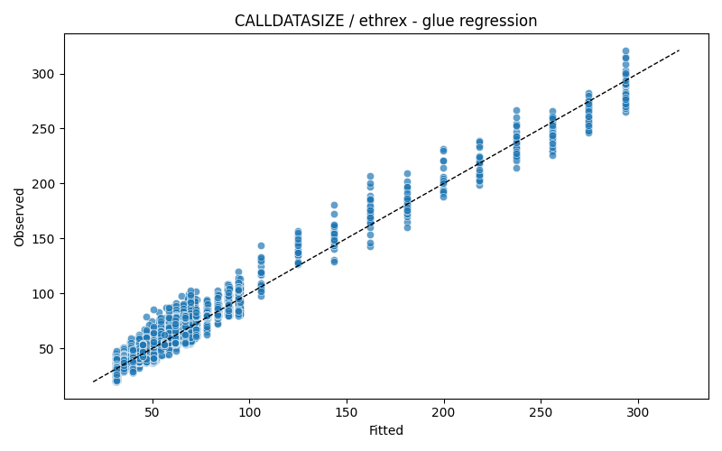

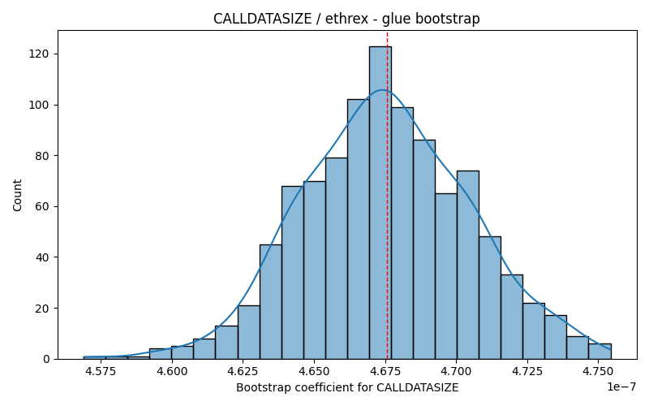


</details>

<details><summary><code>DUP</code> · nobs=17149 · runtime_ms=4.714e-07 · p=1.00e-03 · R²=0.9328</summary>


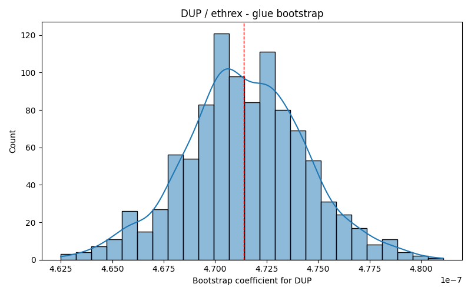

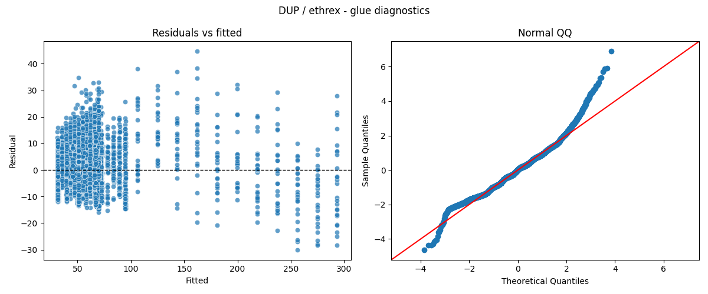

</details>

<details><summary><code>GAS</code> · nobs=17149 · runtime_ms=4.723e-07 · p=1.00e-03 · R²=0.9328</summary>

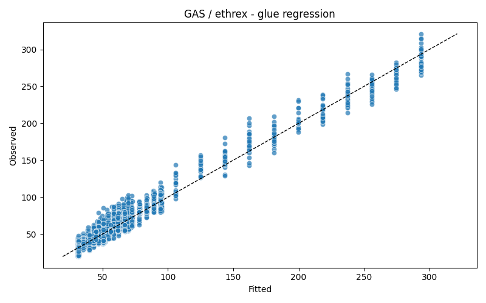

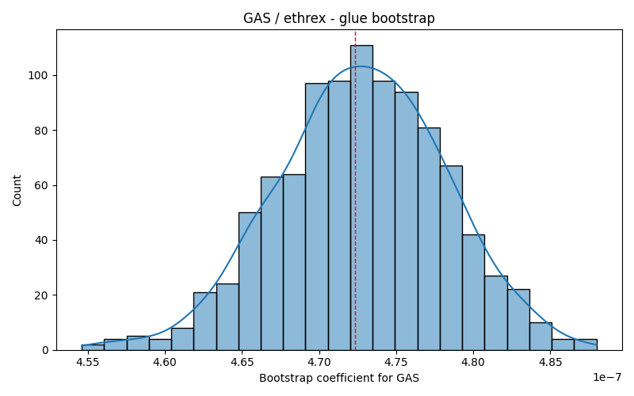


</details>

<details><summary><code>MLOAD</code> · nobs=17149 · runtime_ms=1.117e-06 · p=1.00e-03 · R²=0.9328</summary>


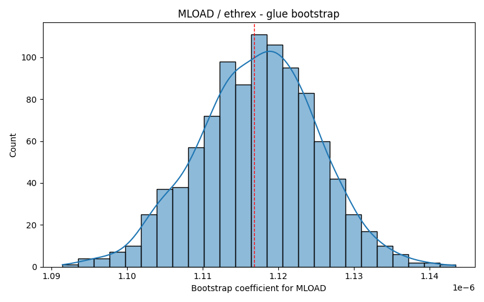


</details>

<details><summary><code>PUSH</code> · nobs=17149 · runtime_ms=4.858e-07 · p=1.00e-03 · R²=0.9328</summary>


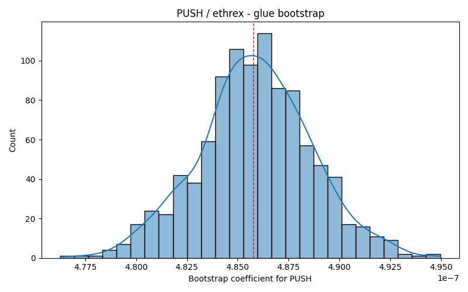

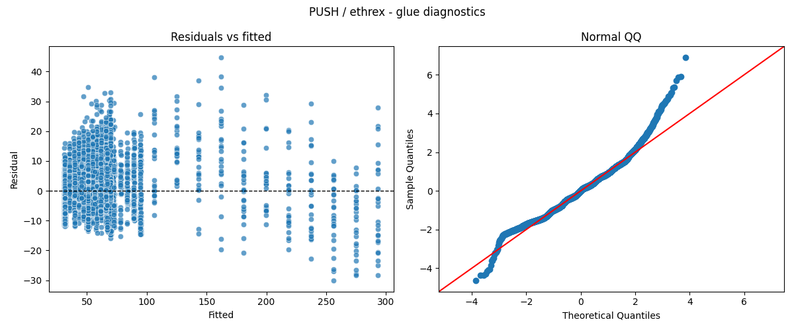

</details>

<details><summary><code>PUSH0</code> · nobs=17149 · runtime_ms=4.675e-07 · p=1.00e-03 · R²=0.9328</summary>


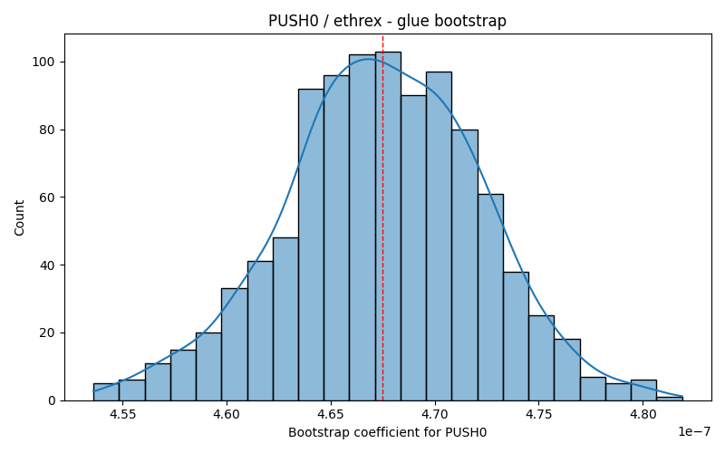


</details>

<details><summary><code>STATICCALL</code> · nobs=17149 · runtime_ms=0.0001104 · p=1.00e-03 · R²=0.9328</summary>


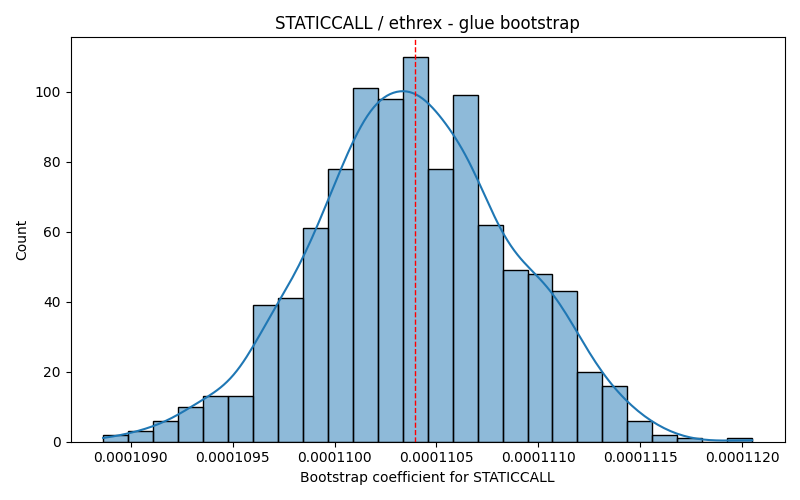


</details>

### Pure glue · ethrex

<details><summary><code>ISZERO</code> · nobs=286 · runtime_ms=4.846e-07 · p=1.00e-03 · R²=0.8292</summary>

```
==============================================================================
                           NNLS Regression Results                            
==============================================================================
Dep. Variable:          test_runtime_ms              R-squared:          0.829
Model:                  NNLS                    Adj. R-squared:          0.829
No. Observations:       286                               RMSE:           4.63
Df Residuals:           284                                MAE:           3.62
Df Model:               1      
==============================================================================
                      coef     std err     P-value      [0.025      0.975]
------------------------------------------------------------------------------
         const      9.6875      0.8627       0.001      8.0885     11.3977
        ISZERO      0.0000      0.0000       0.001      0.0000      0.0000
==============================================================================
Notes: Non-negative least squares with bootstrap inference (1000 iterations)
==============================================================================
```

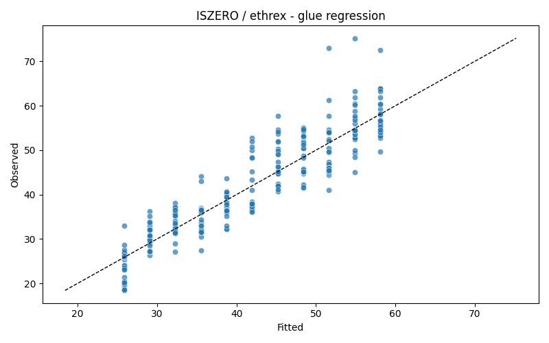

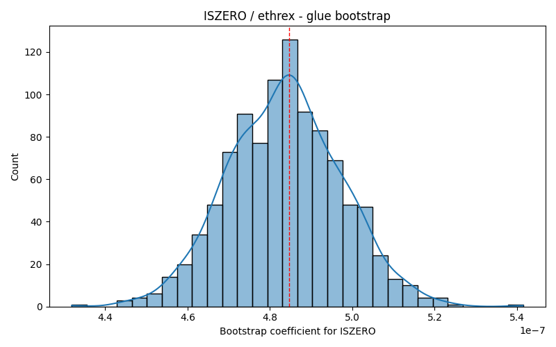

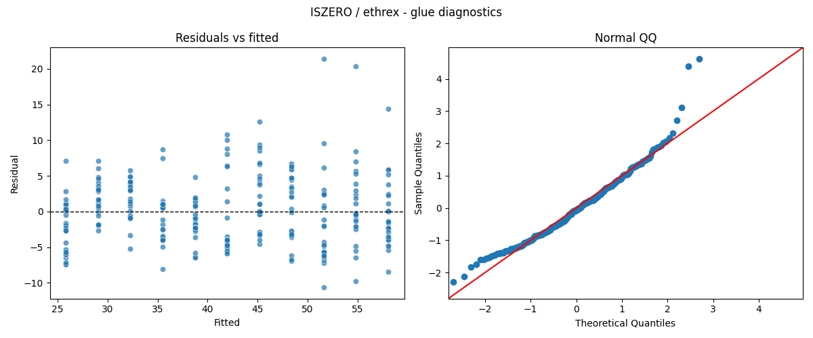

</details>

<details><summary><code>JUMPDEST</code> · nobs=286 · runtime_ms=3.362e-07 · p=1.00e-03 · R²=0.8502</summary>

```
==============================================================================
                           NNLS Regression Results                            
==============================================================================
Dep. Variable:          test_runtime_ms              R-squared:          0.850
Model:                  NNLS                    Adj. R-squared:          0.850
No. Observations:       286                               RMSE:           8.91
Df Residuals:           284                                MAE:           6.99
Df Model:               1      
==============================================================================
                      coef     std err     P-value      [0.025      0.975]
------------------------------------------------------------------------------
         const     16.6030      1.7529       0.001     13.3132     19.9531
      JUMPDEST      0.0000      0.0000       0.001      0.0000      0.0000
==============================================================================
Notes: Non-negative least squares with bootstrap inference (1000 iterations)
==============================================================================
```

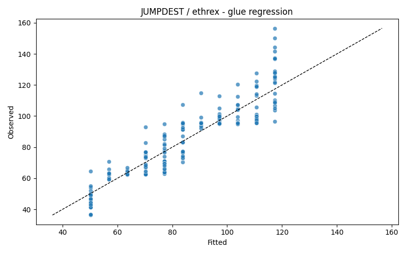

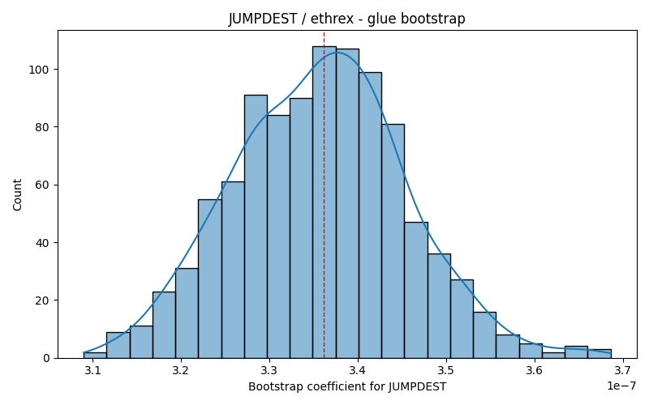

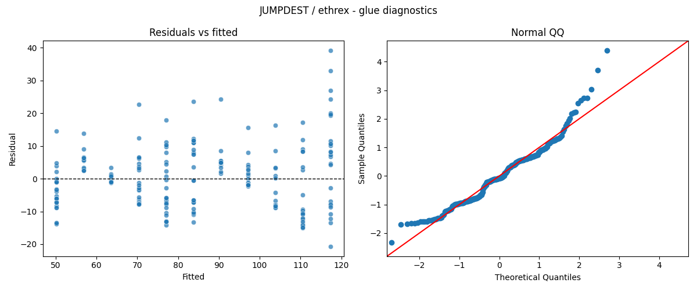

</details>

<details><summary><code>SWAP</code> · nobs=4576 · runtime_ms=7.131e-07 · p=1.00e-03 · R²=0.7962</summary>

```
==============================================================================
                           NNLS Regression Results                            
==============================================================================
Dep. Variable:          test_runtime_ms              R-squared:          0.796
Model:                  NNLS                    Adj. R-squared:          0.796
No. Observations:       4576                              RMSE:           7.60
Df Residuals:           4574                               MAE:           6.01
Df Model:               1      
==============================================================================
                      coef     std err     P-value      [0.025      0.975]
------------------------------------------------------------------------------
         const     14.7635      0.3974       0.001     13.9783     15.5684
          SWAP      0.0000      0.0000       0.001      0.0000      0.0000
==============================================================================
Notes: Non-negative least squares with bootstrap inference (1000 iterations)
==============================================================================
```

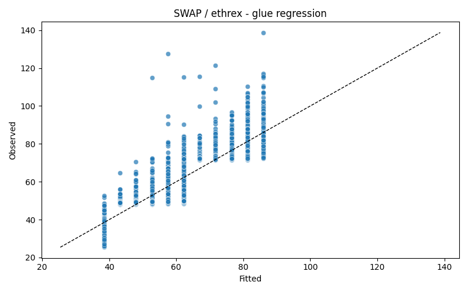

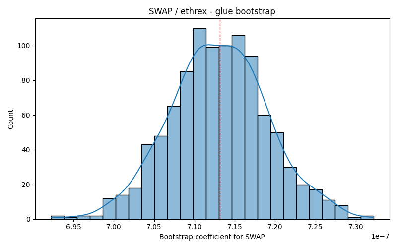

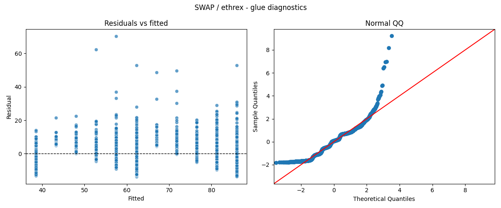

</details>

### Mixed glue (tier A) · ethrex

<details><summary><code>ADD</code> · nobs=286 · runtime_ms=1.197e-06 · p=1.00e-03 · R²=0.8548</summary>

```
==============================================================================
                           NNLS Regression Results                            
==============================================================================
Dep. Variable:          test_runtime_ms              R-squared:          0.855
Model:                  NNLS                    Adj. R-squared:          0.854
No. Observations:       286                               RMSE:           5.19
Df Residuals:           284                                MAE:           3.69
Df Model:               1      
==============================================================================
                      coef     std err     P-value      [0.025      0.975]
------------------------------------------------------------------------------
         const      9.3034      0.9999       0.001      7.4481     11.4289
           ADD      0.0000      0.0000       0.001      0.0000      0.0000
==============================================================================
Notes: Non-negative least squares with bootstrap inference (1000 iterations)
==============================================================================
```

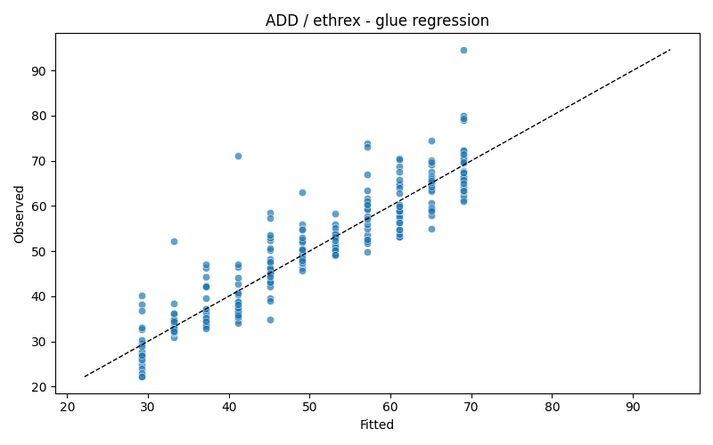

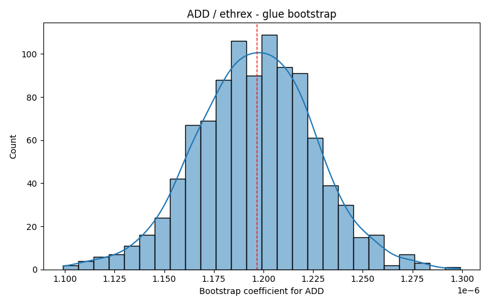

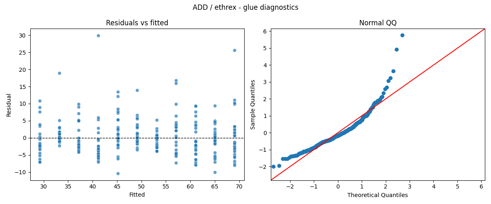

</details>

<details><summary><code>AND</code> · nobs=286 · runtime_ms=1.166e-06 · p=1.00e-03 · R²=0.8643</summary>

```
==============================================================================
                           NNLS Regression Results                            
==============================================================================
Dep. Variable:          test_runtime_ms              R-squared:          0.864
Model:                  NNLS                    Adj. R-squared:          0.864
No. Observations:       286                               RMSE:           4.86
Df Residuals:           284                                MAE:           3.58
Df Model:               1      
==============================================================================
                      coef     std err     P-value      [0.025      0.975]
------------------------------------------------------------------------------
         const      7.8005      0.8344       0.001      6.1727      9.4800
           AND      0.0000      0.0000       0.001      0.0000      0.0000
==============================================================================
Notes: Non-negative least squares with bootstrap inference (1000 iterations)
==============================================================================
```

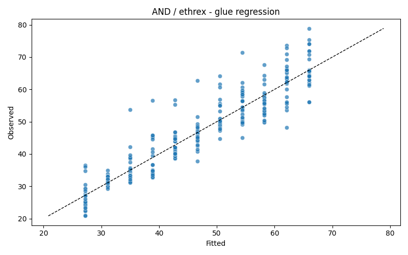

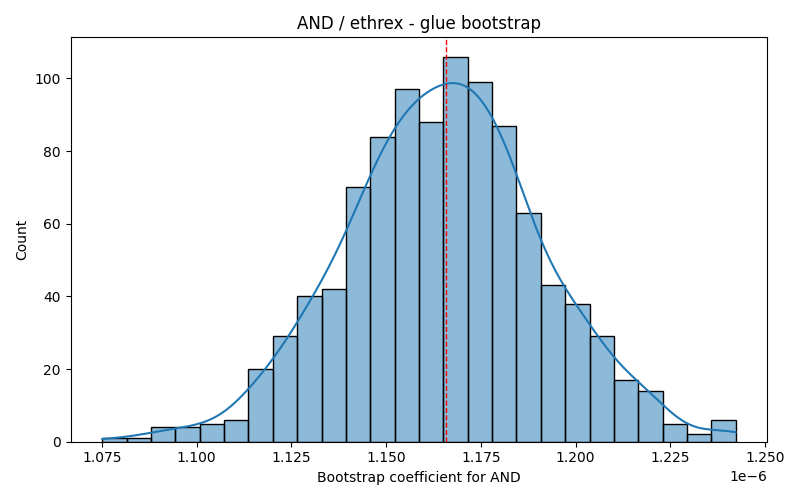

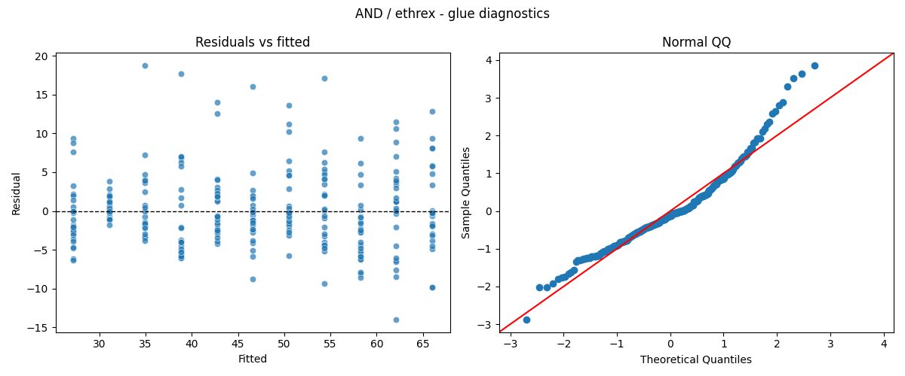

</details>

<details><summary><code>CALLDATACOPY</code> · nobs=6864 · runtime_ms=2.418e-06 · p=1.00e-03 · R²=0.8581</summary>

```
==============================================================================
                           NNLS Regression Results                            
==============================================================================
Dep. Variable:          test_runtime_ms              R-squared:          0.858
Model:                  NNLS                    Adj. R-squared:          0.858
No. Observations:       6864                              RMSE:           7.39
Df Residuals:           6862                               MAE:           5.51
Df Model:               1      
==============================================================================
                      coef     std err     P-value      [0.025      0.975]
------------------------------------------------------------------------------
         const     12.5565      0.1045       0.001     12.3540     12.7531
  CALLDATACOPY      0.0000      0.0000       0.001      0.0000      0.0000
==============================================================================
Notes: Non-negative least squares with bootstrap inference (1000 iterations)
==============================================================================
```

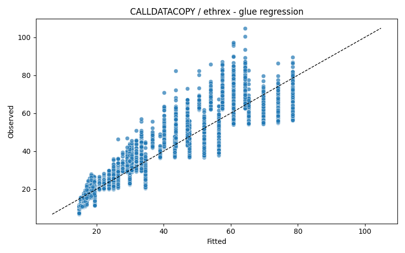

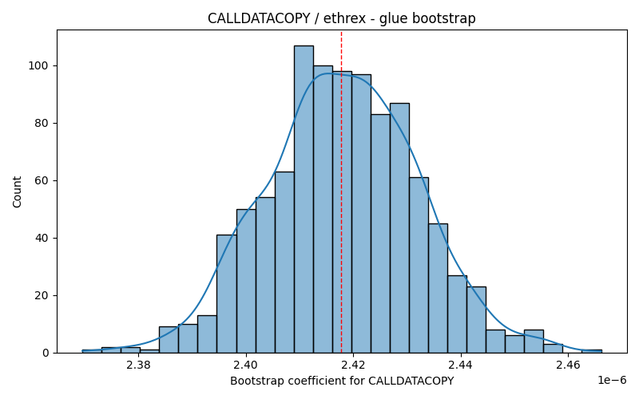

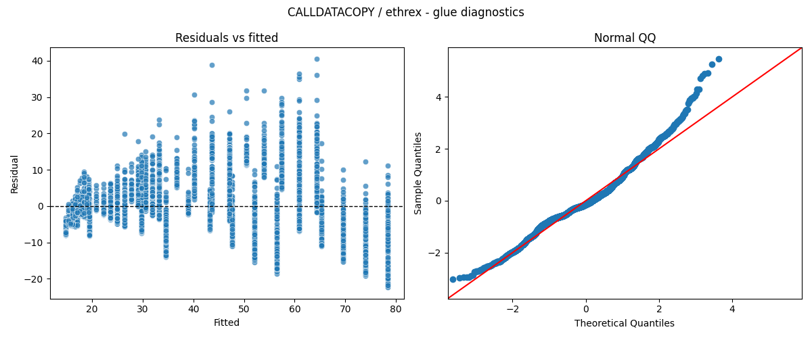

</details>

<details><summary><code>CALLDATALOAD</code> · nobs=1144 · runtime_ms=1.889e-05 · p=1.00e-03 · R²=0.1651</summary>

```
==============================================================================
                           NNLS Regression Results                            
==============================================================================
Dep. Variable:          test_runtime_ms              R-squared:          0.165
Model:                  NNLS                    Adj. R-squared:          0.164
No. Observations:       1144                              RMSE:           0.16
Df Residuals:           1142                               MAE:           0.10
Df Model:               1      
==============================================================================
                      coef     std err     P-value      [0.025      0.975]
------------------------------------------------------------------------------
         const      2.1709      0.0169       0.001      2.1389      2.2050
  CALLDATALOAD      0.0000      0.0000       0.001      0.0000      0.0000
==============================================================================
Notes: Non-negative least squares with bootstrap inference (1000 iterations)
==============================================================================
```

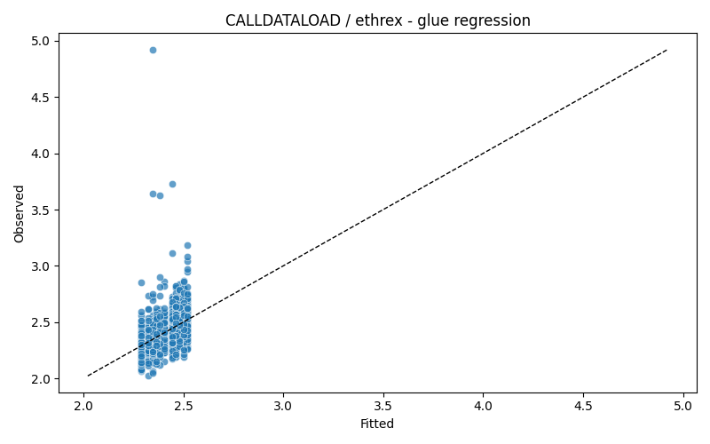

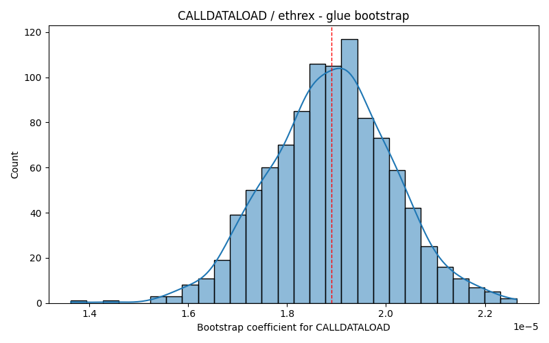

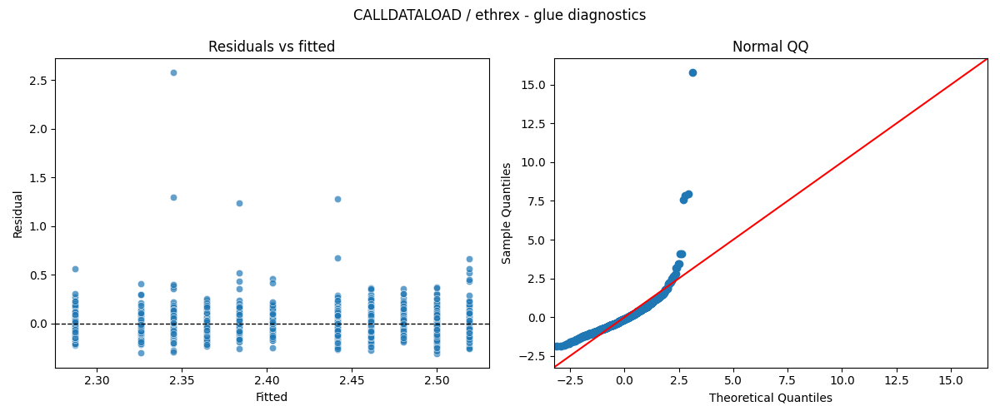

</details>

<details><summary><code>DIV</code> · nobs=286 · runtime_ms=1.153e-05 · p=1.00e-03 · R²=0.9412</summary>

```
==============================================================================
                           NNLS Regression Results                            
==============================================================================
Dep. Variable:          test_runtime_ms              R-squared:          0.941
Model:                  NNLS                    Adj. R-squared:          0.941
No. Observations:       286                               RMSE:          22.75
Df Residuals:           284                                MAE:          19.09
Df Model:               1      
==============================================================================
                      coef     std err     P-value      [0.025      0.975]
------------------------------------------------------------------------------
         const     61.0318      4.3930       0.001     52.1216     69.2994
           DIV      0.0000      0.0000       0.001      0.0000      0.0000
==============================================================================
Notes: Non-negative least squares with bootstrap inference (1000 iterations)
==============================================================================
```

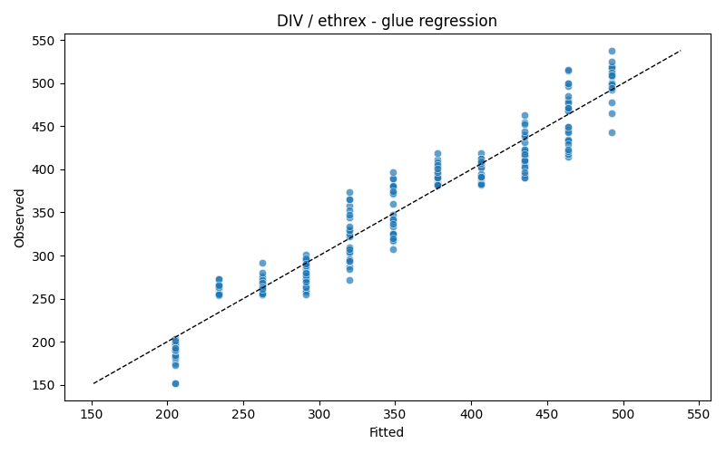

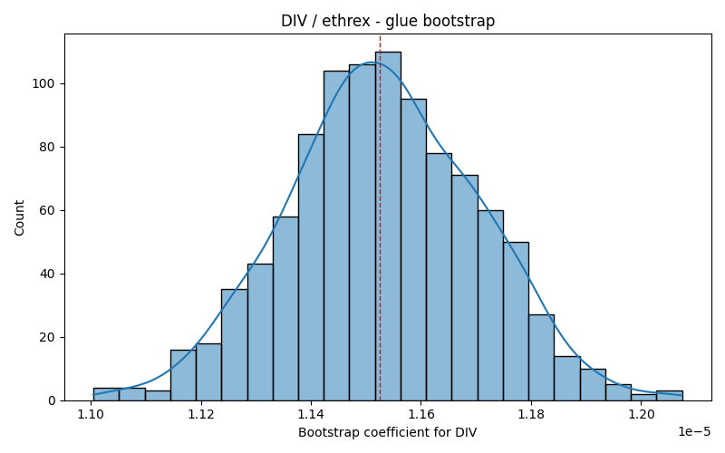

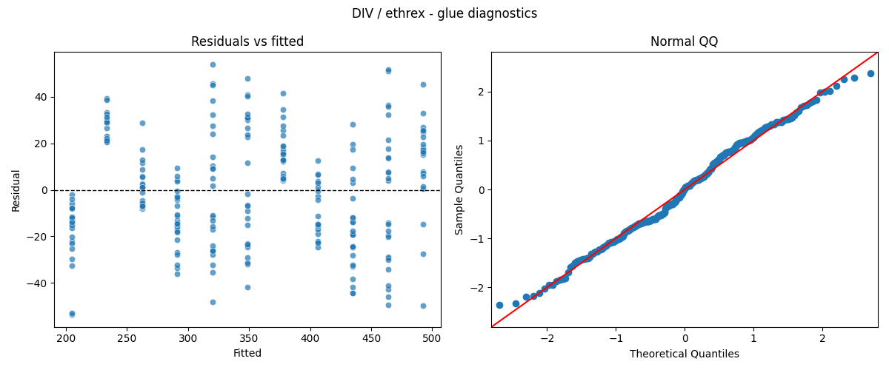

</details>

<details><summary><code>EXP</code> · nobs=286 · runtime_ms=0.001101 · p=1.00e-03 · R²=0.9225</summary>

```
==============================================================================
                           NNLS Regression Results                            
==============================================================================
Dep. Variable:          test_runtime_ms              R-squared:          0.923
Model:                  NNLS                    Adj. R-squared:          0.922
No. Observations:       286                               RMSE:          12.50
Df Residuals:           284                                MAE:          10.18
Df Model:               1      
==============================================================================
                      coef     std err     P-value      [0.025      0.975]
------------------------------------------------------------------------------
         const     28.9544      2.3755       0.001     24.3418     33.5952
           EXP      0.0011      0.0000       0.001      0.0011      0.0011
==============================================================================
Notes: Non-negative least squares with bootstrap inference (1000 iterations)
==============================================================================
```

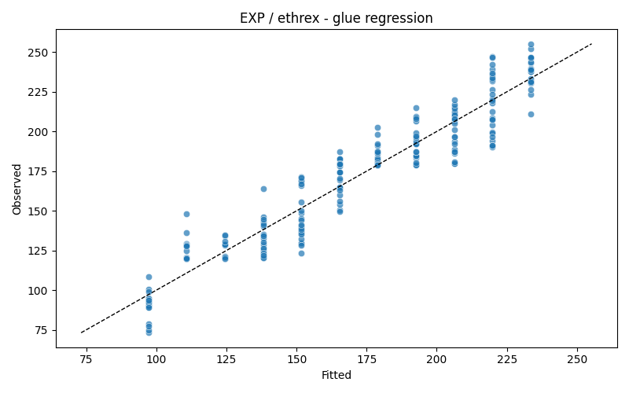

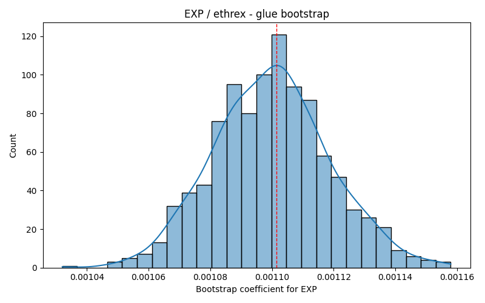

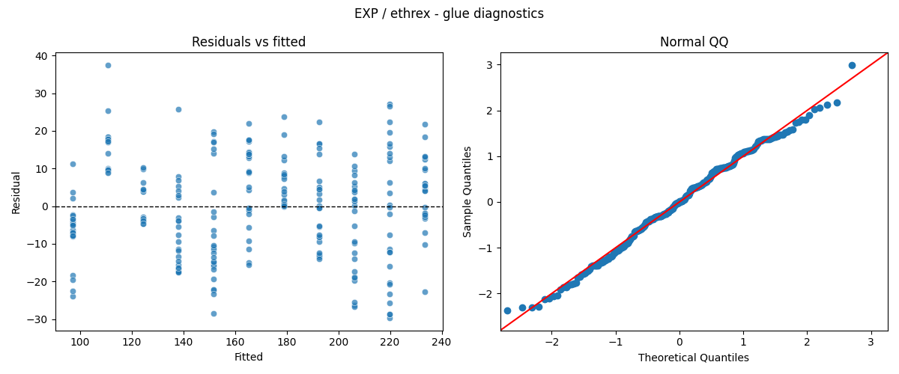

</details>

<details><summary><code>GT</code> · nobs=286 · runtime_ms=1.102e-06 · p=1.00e-03 · R²=0.847</summary>

```
==============================================================================
                           NNLS Regression Results                            
==============================================================================
Dep. Variable:          test_runtime_ms              R-squared:          0.847
Model:                  NNLS                    Adj. R-squared:          0.846
No. Observations:       286                               RMSE:           4.93
Df Residuals:           284                                MAE:           3.83
Df Model:               1      
==============================================================================
                      coef     std err     P-value      [0.025      0.975]
------------------------------------------------------------------------------
         const     10.5278      1.0105       0.001      8.5310     12.5402
            GT      0.0000      0.0000       0.001      0.0000      0.0000
==============================================================================
Notes: Non-negative least squares with bootstrap inference (1000 iterations)
==============================================================================
```

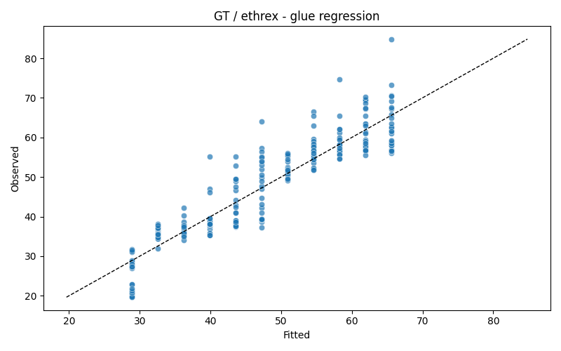

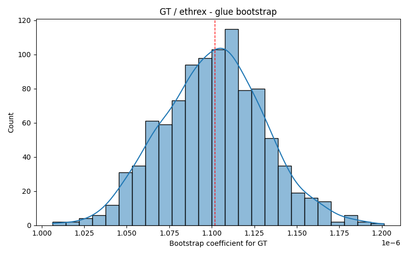

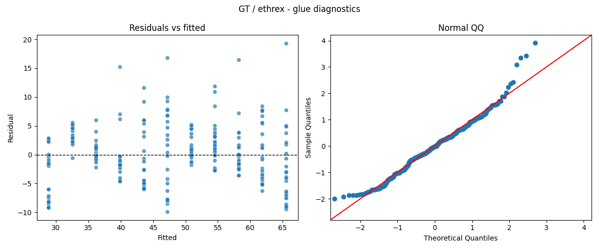

</details>

<details><summary><code>JUMPI</code> · nobs=286 · runtime_ms=1.438e-06 · p=1.00e-03 · R²=0.8115</summary>

```
==============================================================================
                           NNLS Regression Results                            
==============================================================================
Dep. Variable:          test_runtime_ms              R-squared:          0.811
Model:                  NNLS                    Adj. R-squared:          0.811
No. Observations:       286                               RMSE:           3.13
Df Residuals:           284                                MAE:           2.24
Df Model:               1      
==============================================================================
                      coef     std err     P-value      [0.025      0.975]
------------------------------------------------------------------------------
         const      6.2243      0.5678       0.001      5.0676      7.3194
         JUMPI      0.0000      0.0000       0.001      0.0000      0.0000
==============================================================================
Notes: Non-negative least squares with bootstrap inference (1000 iterations)
==============================================================================
```

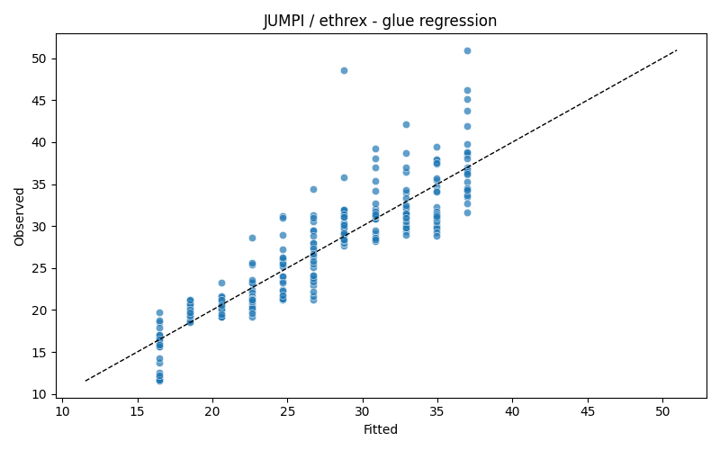

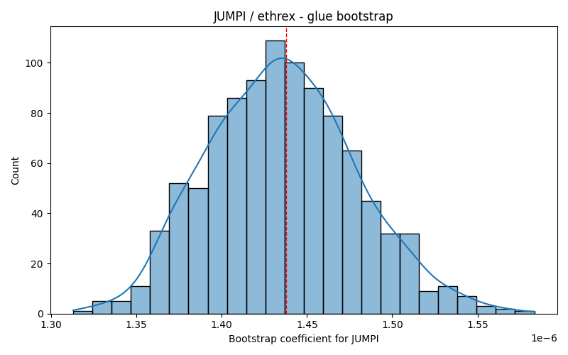

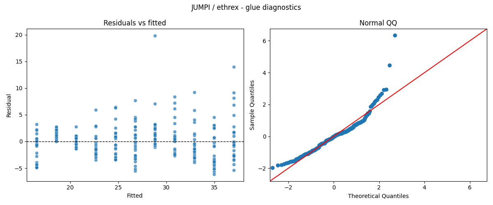

</details>

<details><summary><code>LT</code> · nobs=286 · runtime_ms=9.776e-07 · p=1.00e-03 · R²=0.8166</summary>

```
==============================================================================
                           NNLS Regression Results                            
==============================================================================
Dep. Variable:          test_runtime_ms              R-squared:          0.817
Model:                  NNLS                    Adj. R-squared:          0.816
No. Observations:       286                               RMSE:           4.88
Df Residuals:           284                                MAE:           3.72
Df Model:               1      
==============================================================================
                      coef     std err     P-value      [0.025      0.975]
------------------------------------------------------------------------------
         const      8.9425      0.9254       0.001      7.2098     10.8768
            LT      0.0000      0.0000       0.001      0.0000      0.0000
==============================================================================
Notes: Non-negative least squares with bootstrap inference (1000 iterations)
==============================================================================
```

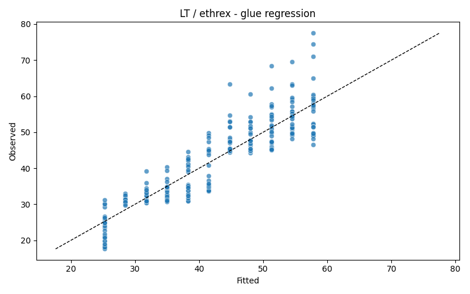

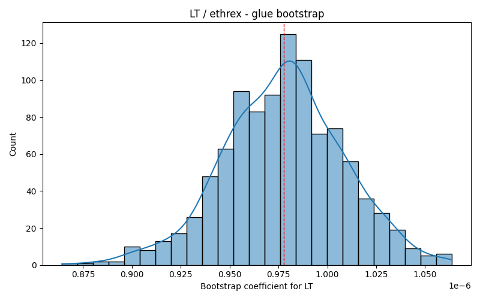

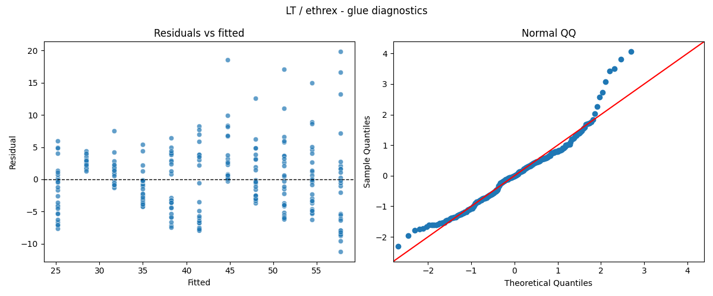

</details>

<details><summary><code>MSTORE</code> · nobs=1430 · runtime_ms=1.707e-06 · p=1.00e-03 · R²=0.8273</summary>

```
==============================================================================
                           NNLS Regression Results                            
==============================================================================
Dep. Variable:          test_runtime_ms              R-squared:          0.827
Model:                  NNLS                    Adj. R-squared:          0.827
No. Observations:       1430                              RMSE:           5.47
Df Residuals:           1428                               MAE:           4.26
Df Model:               1      
==============================================================================
                      coef     std err     P-value      [0.025      0.975]
------------------------------------------------------------------------------
         const     10.4412      0.4803       0.001      9.4515     11.3429
        MSTORE      0.0000      0.0000       0.001      0.0000      0.0000
==============================================================================
Notes: Non-negative least squares with bootstrap inference (1000 iterations)
==============================================================================
```

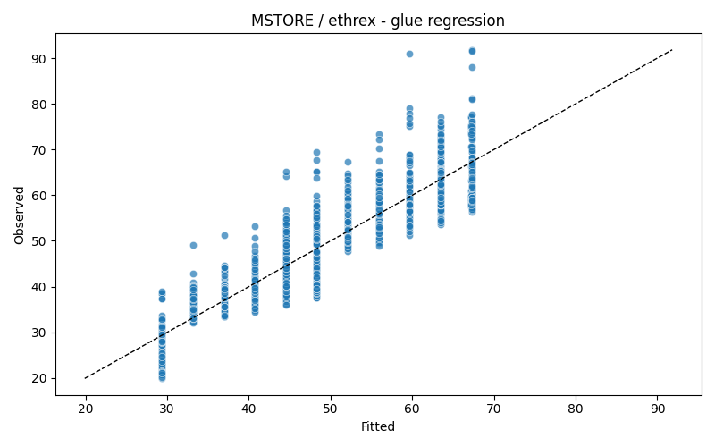

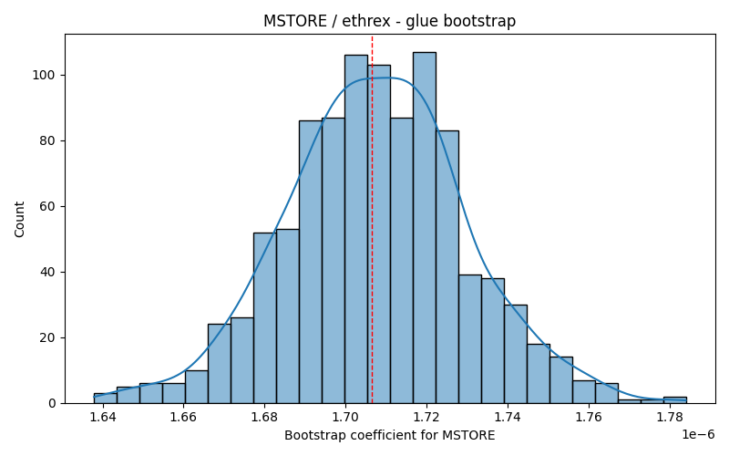

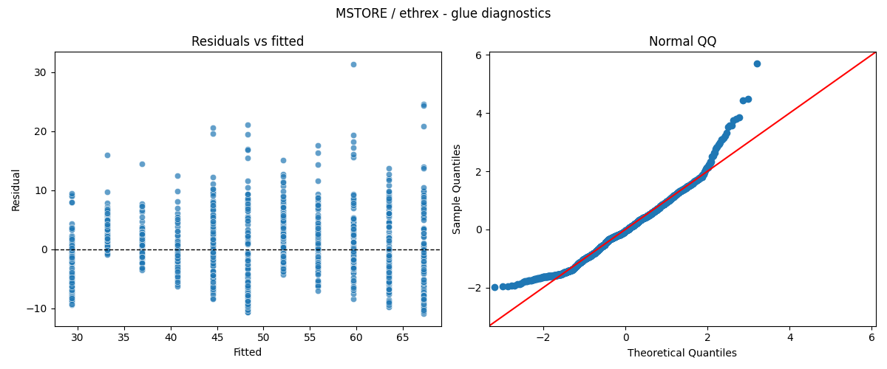

</details>

<details><summary><code>MSTORE8</code> · nobs=1430 · runtime_ms=1.539e-06 · p=1.00e-03 · R²=0.8113</summary>

```
==============================================================================
                           NNLS Regression Results                            
==============================================================================
Dep. Variable:          test_runtime_ms              R-squared:          0.811
Model:                  NNLS                    Adj. R-squared:          0.811
No. Observations:       1430                              RMSE:           5.21
Df Residuals:           1428                               MAE:           3.98
Df Model:               1      
==============================================================================
                      coef     std err     P-value      [0.025      0.975]
------------------------------------------------------------------------------
         const     10.5498      0.4662       0.001      9.6837     11.5164
       MSTORE8      0.0000      0.0000       0.001      0.0000      0.0000
==============================================================================
Notes: Non-negative least squares with bootstrap inference (1000 iterations)
==============================================================================
```

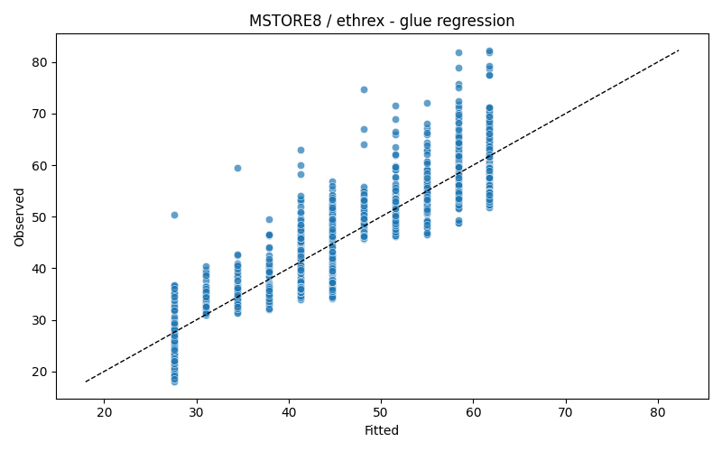

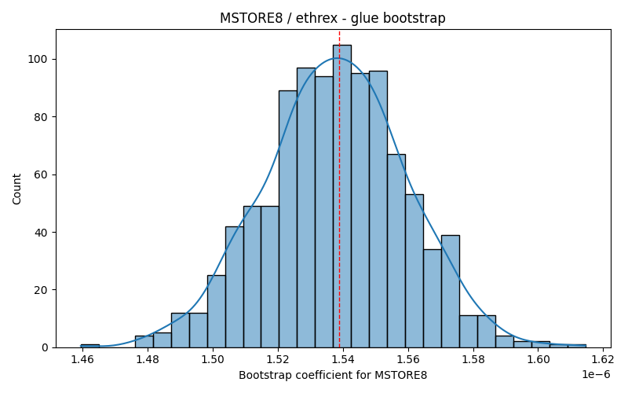

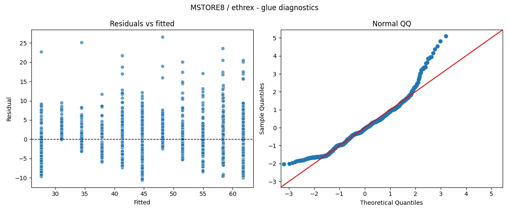

</details>

<details><summary><code>MUL</code> · nobs=286 · runtime_ms=1.579e-06 · p=1.00e-03 · R²=0.8218</summary>

```
==============================================================================
                           NNLS Regression Results                            
==============================================================================
Dep. Variable:          test_runtime_ms              R-squared:          0.822
Model:                  NNLS                    Adj. R-squared:          0.821
No. Observations:       286                               RMSE:           5.80
Df Residuals:           284                                MAE:           3.81
Df Model:               1      
==============================================================================
                      coef     std err     P-value      [0.025      0.975]
------------------------------------------------------------------------------
         const     12.1005      1.1097       0.001     10.0736     14.2970
           MUL      0.0000      0.0000       0.001      0.0000      0.0000
==============================================================================
Notes: Non-negative least squares with bootstrap inference (1000 iterations)
==============================================================================
```

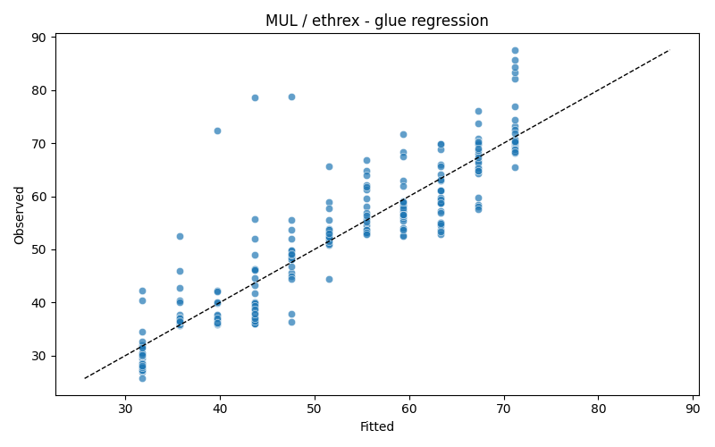

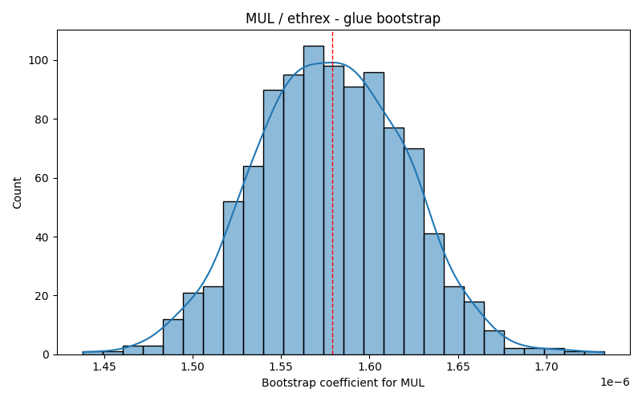

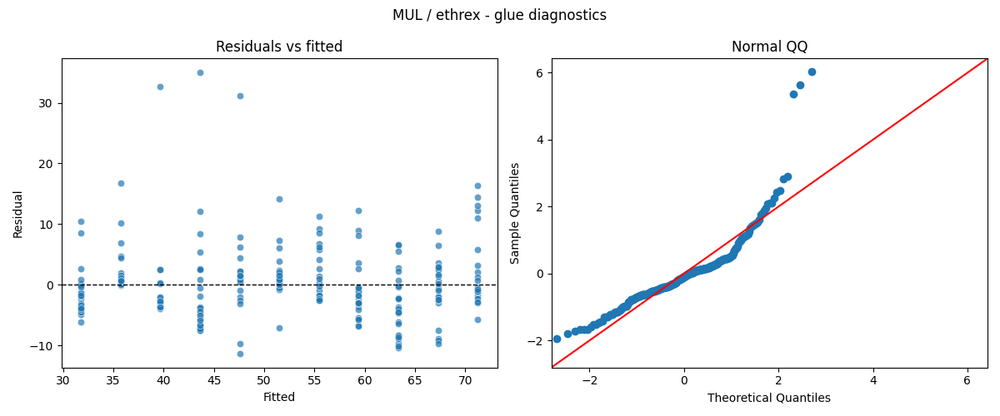

</details>

<details><summary><code>PC</code> · nobs=286 · runtime_ms=5.606e-07 · p=1.00e-03 · R²=0.8473</summary>

```
==============================================================================
                           NNLS Regression Results                            
==============================================================================
Dep. Variable:          test_runtime_ms              R-squared:          0.847
Model:                  NNLS                    Adj. R-squared:          0.847
No. Observations:       286                               RMSE:           7.12
Df Residuals:           284                                MAE:           5.80
Df Model:               1      
==============================================================================
                      coef     std err     P-value      [0.025      0.975]
------------------------------------------------------------------------------
         const     13.9779      1.3782       0.001     11.3597     16.7091
            PC      0.0000      0.0000       0.001      0.0000      0.0000
==============================================================================
Notes: Non-negative least squares with bootstrap inference (1000 iterations)
==============================================================================
```

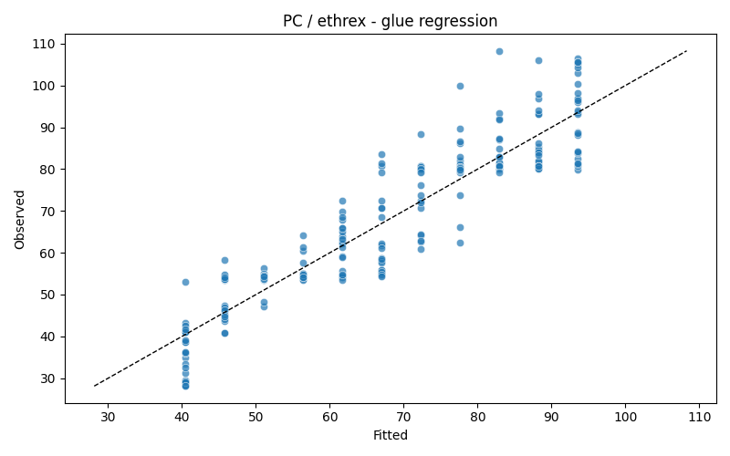

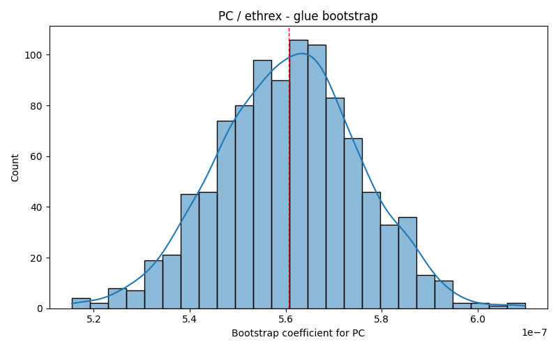

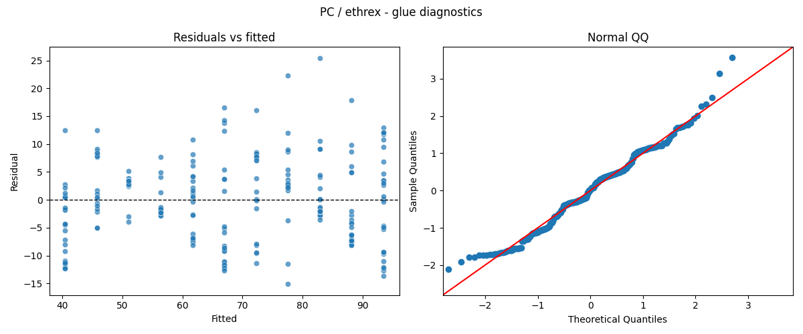

</details>

<details><summary><code>RETURNDATASIZE</code> · nobs=1144 · runtime_ms=8.903e-07 · p=1.00e-03 · R²=0.8376</summary>

```
==============================================================================
                           NNLS Regression Results                            
==============================================================================
Dep. Variable:          test_runtime_ms              R-squared:          0.838
Model:                  NNLS                    Adj. R-squared:          0.837
No. Observations:       1144                              RMSE:           6.19
Df Residuals:           1142                               MAE:           4.83
Df Model:               1      
==============================================================================
                      coef     std err     P-value      [0.025      0.975]
------------------------------------------------------------------------------
         const     12.0886      0.6091       0.001     10.8906     13.2781
RETURNDATASIZE      0.0000      0.0000       0.001      0.0000      0.0000
==============================================================================
Notes: Non-negative least squares with bootstrap inference (1000 iterations)
==============================================================================
```

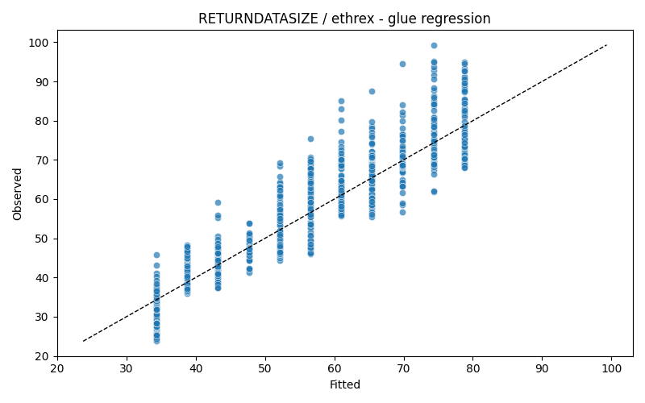

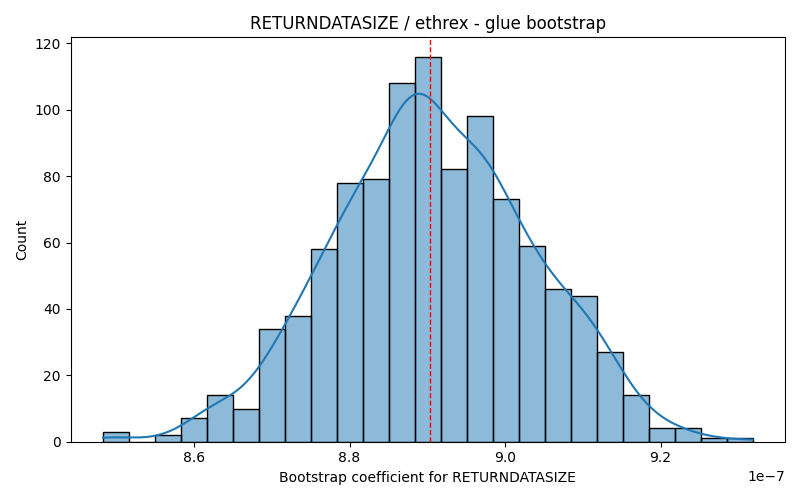

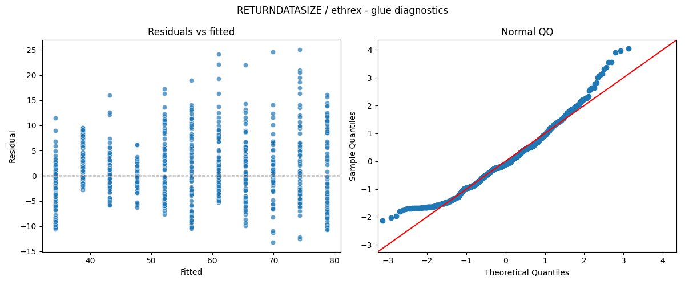

</details>

<details><summary><code>SELFBALANCE</code> · nobs=234 · runtime_ms=5.955e-06 · p=1.00e-03 · R²=0.915</summary>

```
==============================================================================
                           NNLS Regression Results                            
==============================================================================
Dep. Variable:          test_runtime_ms              R-squared:          0.915
Model:                  NNLS                    Adj. R-squared:          0.915
No. Observations:       234                               RMSE:          18.32
Df Residuals:           232                                MAE:          14.48
Df Model:               1      
==============================================================================
                      coef     std err     P-value      [0.025      0.975]
------------------------------------------------------------------------------
         const     48.5442      4.7914       0.001     39.6709     57.7022
   SELFBALANCE      0.0000      0.0000       0.001      0.0000      0.0000
==============================================================================
Notes: Non-negative least squares with bootstrap inference (1000 iterations)
==============================================================================
```

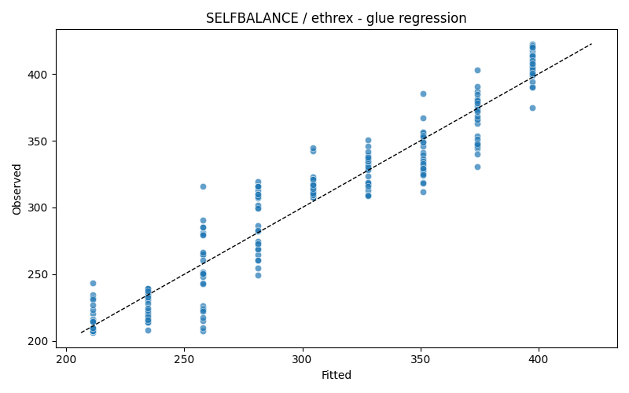

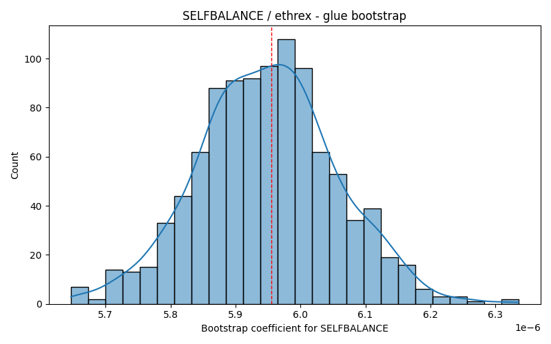

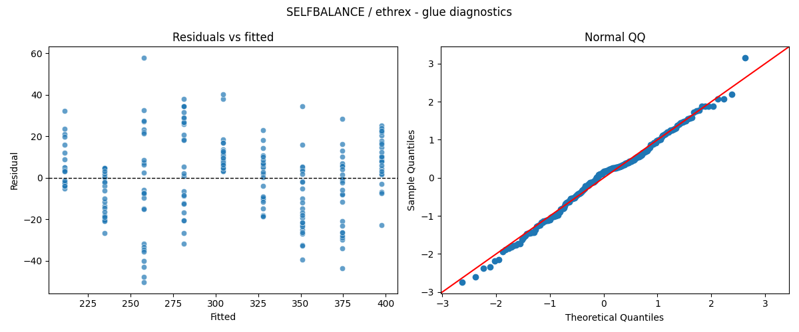

</details>

<details><summary><code>SUB</code> · nobs=286 · runtime_ms=1.16e-06 · p=1.00e-03 · R²=0.8584</summary>

```
==============================================================================
                           NNLS Regression Results                            
==============================================================================
Dep. Variable:          test_runtime_ms              R-squared:          0.858
Model:                  NNLS                    Adj. R-squared:          0.858
No. Observations:       286                               RMSE:           4.96
Df Residuals:           284                                MAE:           3.51
Df Model:               1      
==============================================================================
                      coef     std err     P-value      [0.025      0.975]
------------------------------------------------------------------------------
         const     10.0990      0.8478       0.001      8.5230     11.7960
           SUB      0.0000      0.0000       0.001      0.0000      0.0000
==============================================================================
Notes: Non-negative least squares with bootstrap inference (1000 iterations)
==============================================================================
```

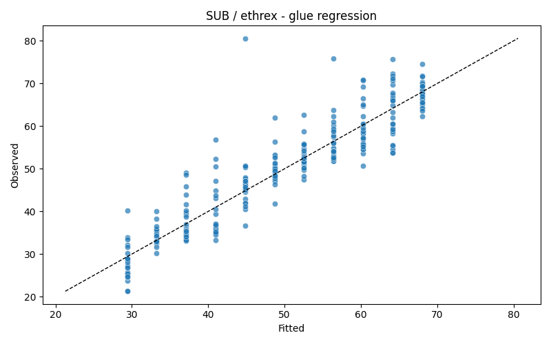

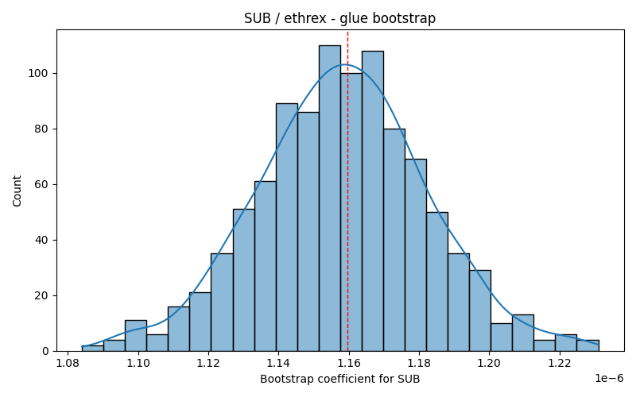

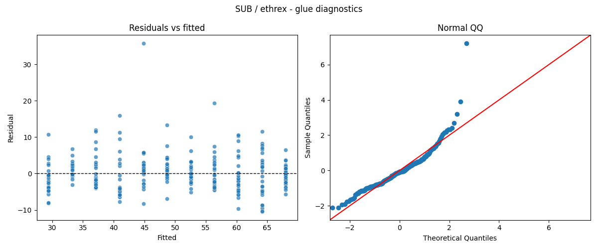

</details>

### Mixed glue (tier B) · ethrex

<details><summary><code>JUMP</code> · nobs=286 · runtime_ms=4.189e-06 · p=1.00e-03 · R²=0.8112</summary>

```
==============================================================================
                           NNLS Regression Results                            
==============================================================================
Dep. Variable:          test_runtime_ms              R-squared:          0.811
Model:                  NNLS                    Adj. R-squared:          0.811
No. Observations:       286                               RMSE:           7.51
Df Residuals:           284                                MAE:           6.00
Df Model:               1      
==============================================================================
                      coef     std err     P-value      [0.025      0.975]
------------------------------------------------------------------------------
         const     16.5323      1.5642       0.001     13.4400     19.5157
          JUMP      0.0000      0.0000       0.001      0.0000      0.0000
==============================================================================
Notes: Non-negative least squares with bootstrap inference (1000 iterations)
==============================================================================
```

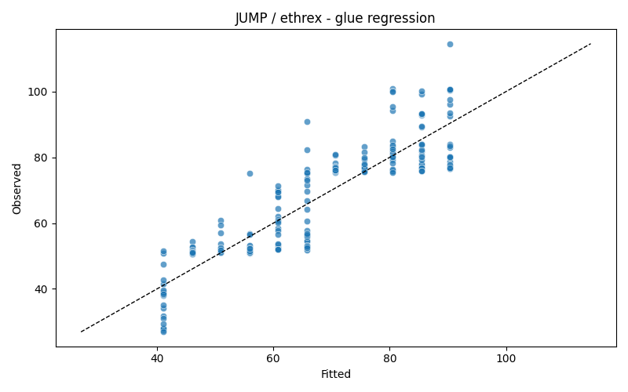

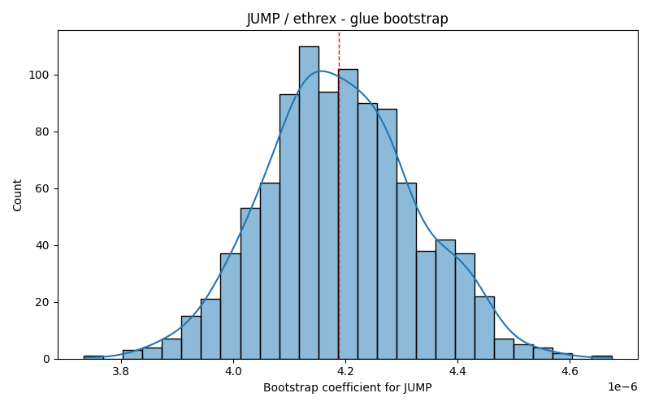

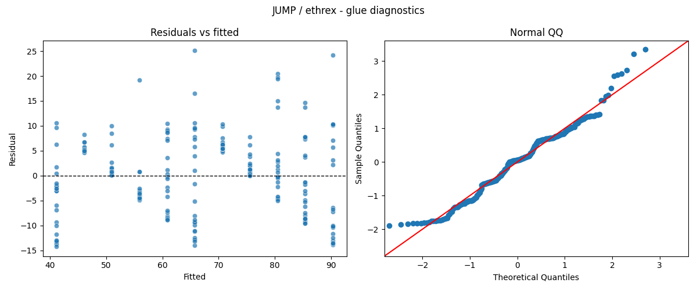

</details>

<details><summary><code>KECCAK256</code> · nobs=4576 · runtime_ms=0 · p=1.00e+00 · R²=0</summary>

```
==============================================================================
                           NNLS Regression Results                            
==============================================================================
Dep. Variable:          test_runtime_ms              R-squared:          0.000
Model:                  NNLS                    Adj. R-squared:         -0.000
No. Observations:       4576                              RMSE:         153.41
Df Residuals:           4574                               MAE:         127.19
Df Model:               1      
==============================================================================
                      coef     std err     P-value      [0.025      0.975]
------------------------------------------------------------------------------
         const    242.2715      2.3068       0.001    237.9670    246.7365
     KECCAK256      0.0000      0.0000       1.000      0.0000      0.0000
==============================================================================
Notes: Non-negative least squares with bootstrap inference (1000 iterations)
==============================================================================
```

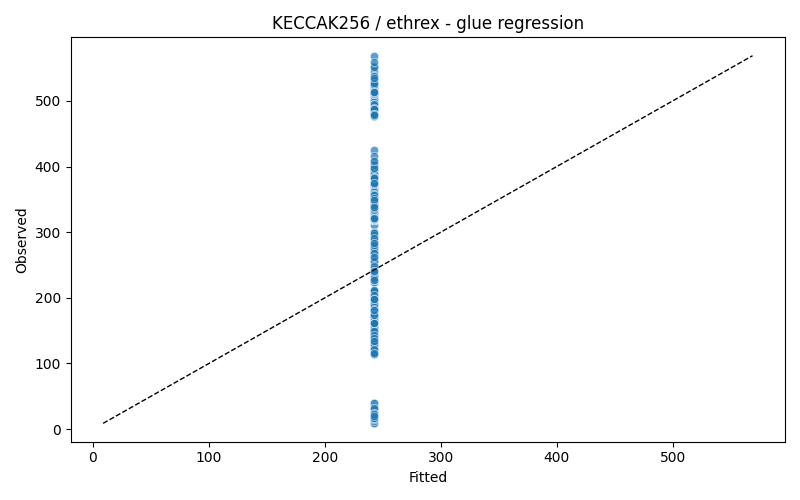


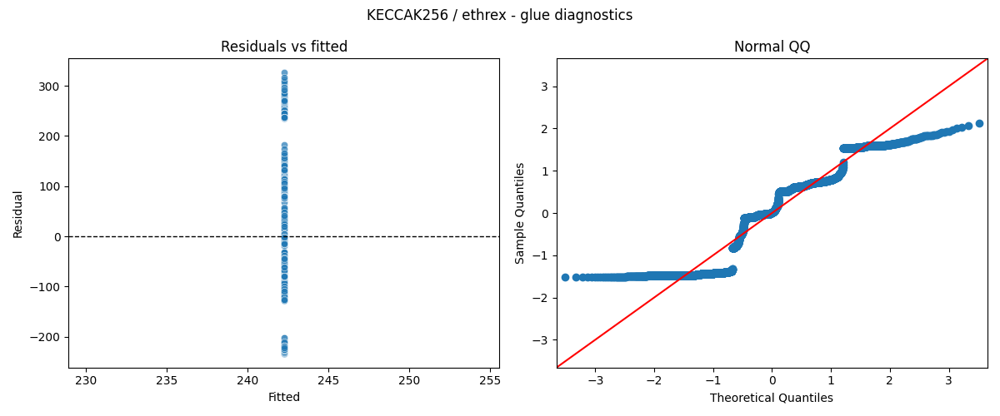

</details>

## geth

| glue_opcode | nobs | glue_runtime_ms | p_value | rsquared |
| --- | --- | --- | --- | --- |
| `ISZERO` | 2057 | 1.437e-06 | 1.00e-03 | 0.7749 |
| `JUMPDEST` | 2057 | 1.151e-06 | 1.00e-03 | 0.7752 |
| `SWAP` | 32912 | 1.513e-06 | 1.00e-03 | 0.765 |
| `CALLDATASIZE` | 121627 | 1.412e-06 | 1.00e-03 | 0.8219 |
| `DUP` | 121627 | 1.523e-06 | 1.00e-03 | 0.8219 |
| `GAS` | 121627 | 1.497e-06 | 1.00e-03 | 0.8219 |
| `MLOAD` | 121627 | 5.175e-06 | 1.00e-03 | 0.8219 |
| `PUSH` | 121627 | 2.253e-06 | 1.00e-03 | 0.8219 |
| `PUSH0` | 121627 | 1.442e-06 | 1.00e-03 | 0.8219 |
| `STATICCALL` | 121627 | 0.0001687 | 1.00e-03 | 0.8219 |
| `ADD` | 2057 | 4.517e-06 | 1.00e-03 | 0.8464 |
| `AND` | 2057 | 4.276e-06 | 1.00e-03 | 0.8051 |
| `CALLDATACOPY` | 49368 | 1.36e-05 | 1.00e-03 | 0.9543 |
| `CALLDATALOAD` | 8228 | 5.075e-05 | 1.00e-03 | 0.02865 |
| `DIV` | 2057 | 8.913e-06 | 1.00e-03 | 0.792 |
| `EXP` | 2057 | 0.0003463 | 1.00e-03 | 0.8215 |
| `GT` | 2057 | 3.53e-06 | 1.00e-03 | 0.7535 |
| `JUMPI` | 2057 | 5.495e-06 | 1.00e-03 | 0.7875 |
| `LT` | 2057 | 4.346e-06 | 1.00e-03 | 0.7882 |
| `MSTORE` | 10285 | 7.985e-06 | 1.00e-03 | 0.8171 |
| `MSTORE8` | 10285 | 7.317e-06 | 1.00e-03 | 0.7931 |
| `MUL` | 2057 | 4.898e-06 | 1.00e-03 | 0.866 |
| `PC` | 2057 | 1.617e-06 | 1.00e-03 | 0.8183 |
| `RETURNDATASIZE` | 8228 | 3.135e-06 | 1.00e-03 | 0.6168 |
| `SELFBALANCE` | 1683 | 7.45e-06 | 1.00e-03 | 0.7934 |
| `SUB` | 2057 | 4.309e-06 | 1.00e-03 | 0.8028 |
| `JUMP` | 2057 | 9.149e-06 | 1.00e-03 | 0.7932 |
| `KECCAK256` | 32912 | 3.647e-05 | 1.00e-03 | 0.2638 |

### Cycle glue — joint fit · geth

<details><summary>Joint NNLS regression summary</summary>

```
==============================================================================
                           NNLS Regression Results                            
==============================================================================
Dep. Variable:          test_runtime_ms              R-squared:          0.822
Model:                  NNLS                    Adj. R-squared:          0.822
No. Observations:       121627                            RMSE:          23.91
Df Residuals:           121619                             MAE:          18.53
Df Model:               7      
==============================================================================
                      coef     std err     P-value      [0.025      0.975]
------------------------------------------------------------------------------
         const     40.1842      0.2376       0.001     39.7019     40.6427
  CALLDATASIZE      0.0000      0.0000       0.001      0.0000      0.0000
           DUP      0.0000      0.0000       0.001      0.0000      0.0000
           GAS      0.0000      0.0000       0.001      0.0000      0.0000
         MLOAD      0.0000      0.0000       0.001      0.0000      0.0000
          PUSH      0.0000      0.0000       0.001      0.0000      0.0000
         PUSH0      0.0000      0.0000       0.001      0.0000      0.0000
    STATICCALL      0.0002      0.0000       0.001      0.0002      0.0002
==============================================================================
Notes: Non-negative least squares with bootstrap inference (1000 iterations)
==============================================================================
```

</details>

<details><summary><code>CALLDATASIZE</code> · nobs=121627 · runtime_ms=1.412e-06 · p=1.00e-03 · R²=0.8219</summary>

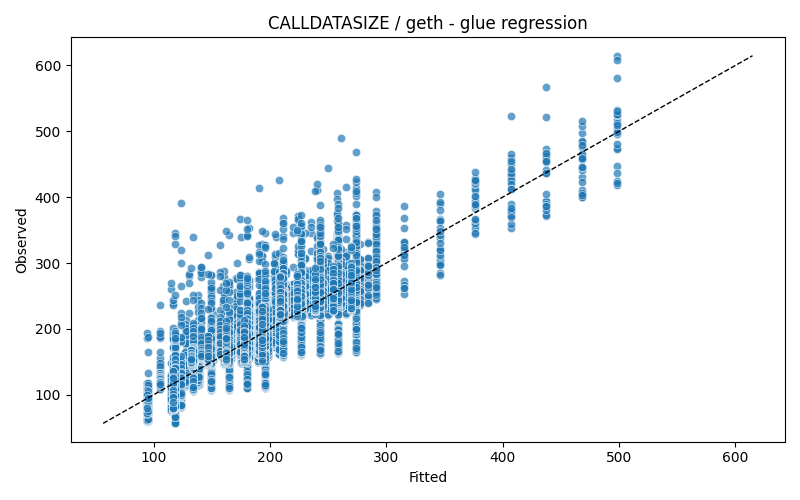

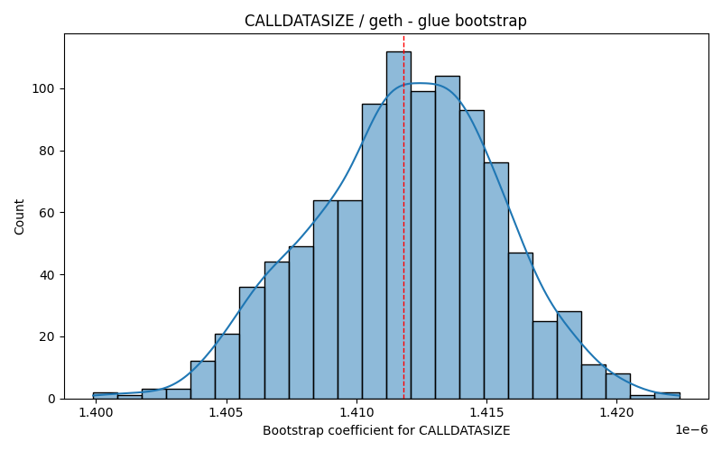


</details>

<details><summary><code>DUP</code> · nobs=121627 · runtime_ms=1.523e-06 · p=1.00e-03 · R²=0.8219</summary>

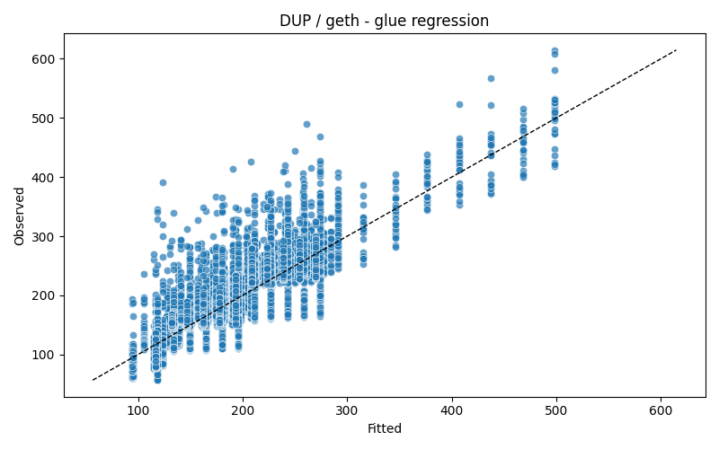

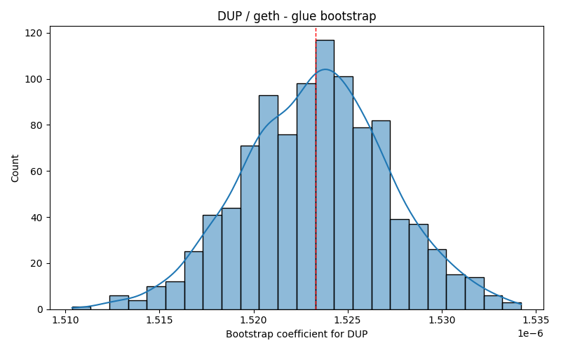


</details>

<details><summary><code>GAS</code> · nobs=121627 · runtime_ms=1.497e-06 · p=1.00e-03 · R²=0.8219</summary>


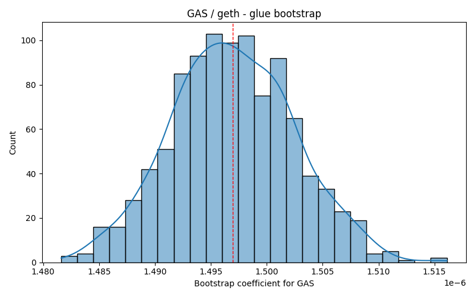


</details>

<details><summary><code>MLOAD</code> · nobs=121627 · runtime_ms=5.175e-06 · p=1.00e-03 · R²=0.8219</summary>


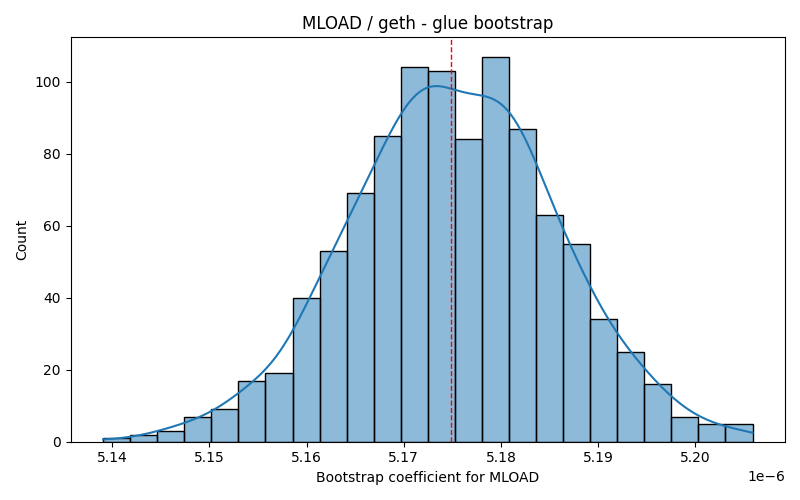

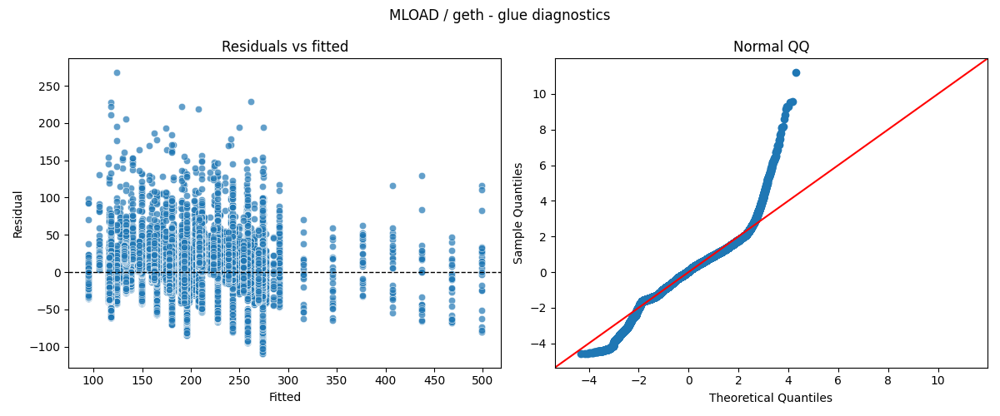

</details>

<details><summary><code>PUSH</code> · nobs=121627 · runtime_ms=2.253e-06 · p=1.00e-03 · R²=0.8219</summary>


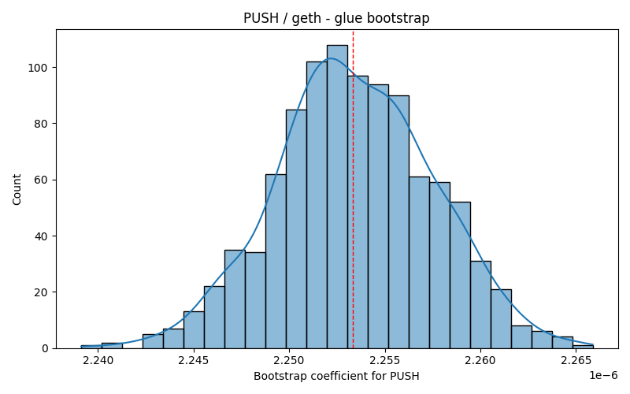


</details>

<details><summary><code>PUSH0</code> · nobs=121627 · runtime_ms=1.442e-06 · p=1.00e-03 · R²=0.8219</summary>


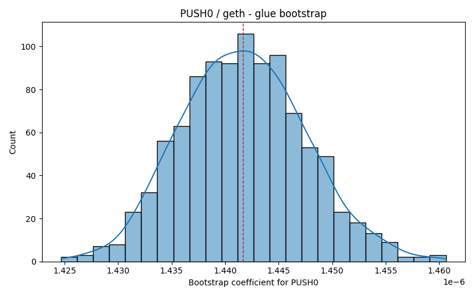

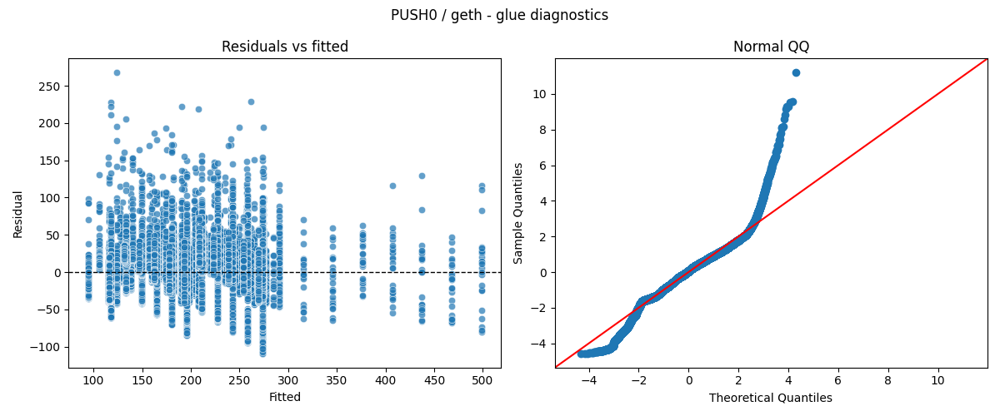

</details>

<details><summary><code>STATICCALL</code> · nobs=121627 · runtime_ms=0.0001687 · p=1.00e-03 · R²=0.8219</summary>


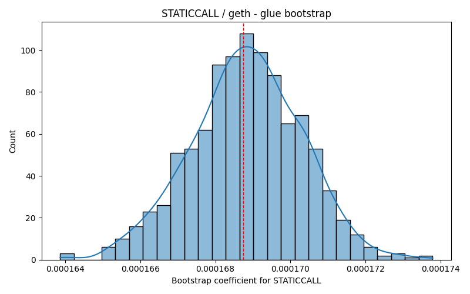


</details>

### Pure glue · geth

<details><summary><code>ISZERO</code> · nobs=2057 · runtime_ms=1.437e-06 · p=1.00e-03 · R²=0.7749</summary>

```
==============================================================================
                           NNLS Regression Results                            
==============================================================================
Dep. Variable:          test_runtime_ms              R-squared:          0.775
Model:                  NNLS                    Adj. R-squared:          0.775
No. Observations:       2057                              RMSE:          16.30
Df Residuals:           2055                               MAE:          11.94
Df Model:               1      
==============================================================================
                      coef     std err     P-value      [0.025      0.975]
------------------------------------------------------------------------------
         const     22.5153      1.2318       0.001     19.9902     24.8692
        ISZERO      0.0000      0.0000       0.001      0.0000      0.0000
==============================================================================
Notes: Non-negative least squares with bootstrap inference (1000 iterations)
==============================================================================
```

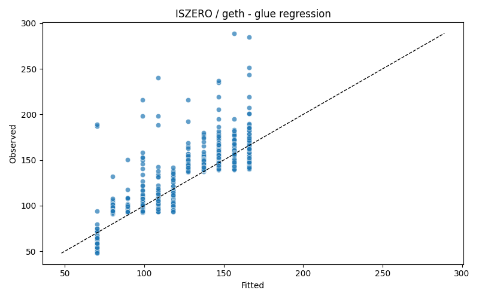

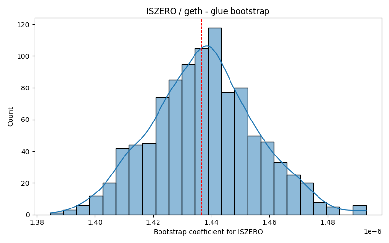

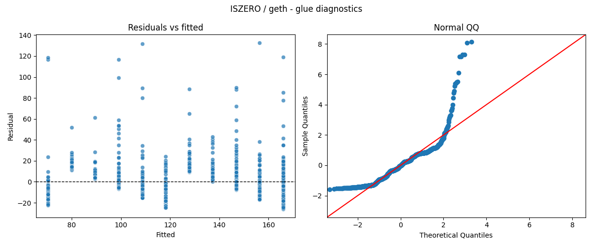

</details>

<details><summary><code>JUMPDEST</code> · nobs=2057 · runtime_ms=1.151e-06 · p=1.00e-03 · R²=0.7752</summary>

```
==============================================================================
                           NNLS Regression Results                            
==============================================================================
Dep. Variable:          test_runtime_ms              R-squared:          0.775
Model:                  NNLS                    Adj. R-squared:          0.775
No. Observations:       2057                              RMSE:          39.13
Df Residuals:           2055                               MAE:          26.61
Df Model:               1      
==============================================================================
                      coef     std err     P-value      [0.025      0.975]
------------------------------------------------------------------------------
         const     68.7408      2.8859       0.001     63.2140     74.3811
      JUMPDEST      0.0000      0.0000       0.001      0.0000      0.0000
==============================================================================
Notes: Non-negative least squares with bootstrap inference (1000 iterations)
==============================================================================
```

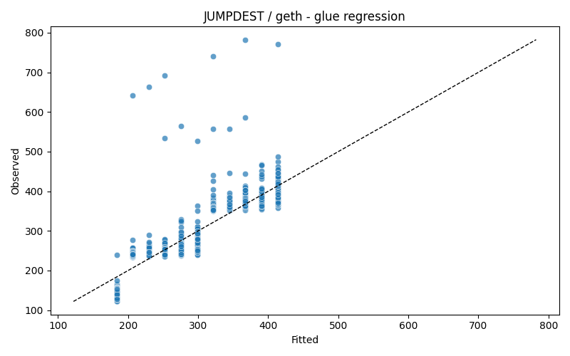

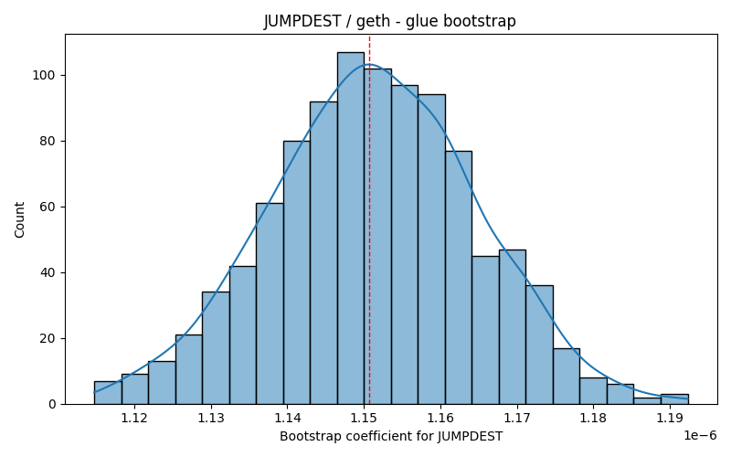

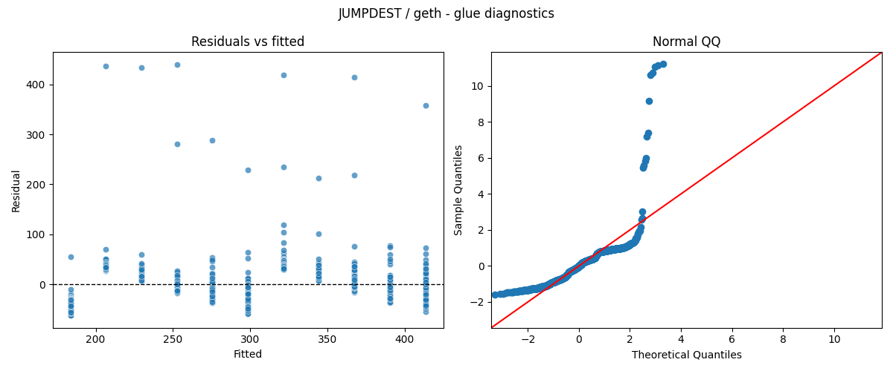

</details>

<details><summary><code>SWAP</code> · nobs=32912 · runtime_ms=1.513e-06 · p=1.00e-03 · R²=0.765</summary>

```
==============================================================================
                           NNLS Regression Results                            
==============================================================================
Dep. Variable:          test_runtime_ms              R-squared:          0.765
Model:                  NNLS                    Adj. R-squared:          0.765
No. Observations:       32912                             RMSE:          17.65
Df Residuals:           32910                              MAE:          13.21
Df Model:               1      
==============================================================================
                      coef     std err     P-value      [0.025      0.975]
------------------------------------------------------------------------------
         const     31.2046      0.3427       0.001     30.5313     31.8716
          SWAP      0.0000      0.0000       0.001      0.0000      0.0000
==============================================================================
Notes: Non-negative least squares with bootstrap inference (1000 iterations)
==============================================================================
```

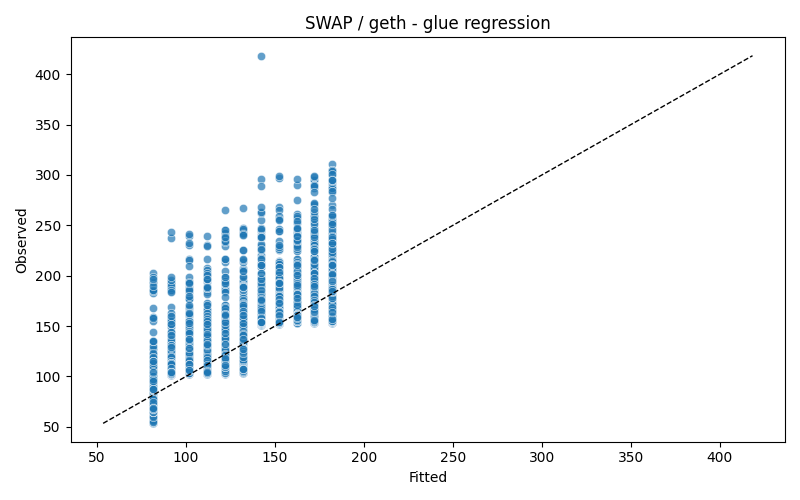

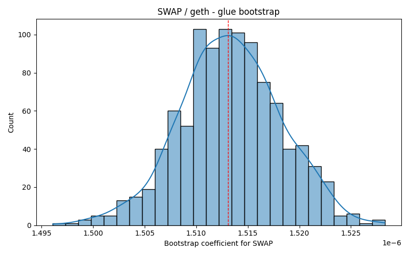

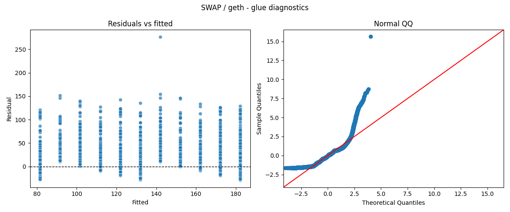

</details>

### Mixed glue (tier A) · geth

<details><summary><code>ADD</code> · nobs=2057 · runtime_ms=4.517e-06 · p=1.00e-03 · R²=0.8464</summary>

```
==============================================================================
                           NNLS Regression Results                            
==============================================================================
Dep. Variable:          test_runtime_ms              R-squared:          0.846
Model:                  NNLS                    Adj. R-squared:          0.846
No. Observations:       2057                              RMSE:          20.26
Df Residuals:           2055                               MAE:          15.07
Df Model:               1      
==============================================================================
                      coef     std err     P-value      [0.025      0.975]
------------------------------------------------------------------------------
         const     40.8311      1.3515       0.001     38.2009     43.2807
           ADD      0.0000      0.0000       0.001      0.0000      0.0000
==============================================================================
Notes: Non-negative least squares with bootstrap inference (1000 iterations)
==============================================================================
```

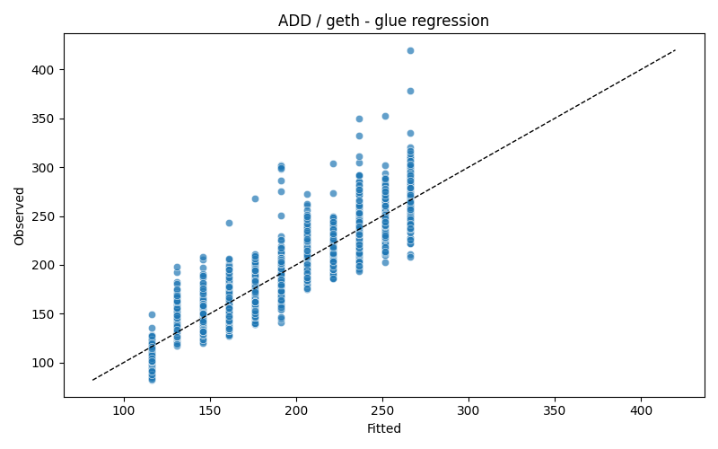

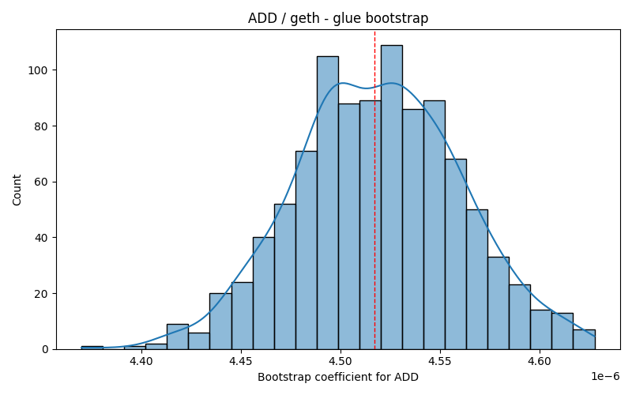

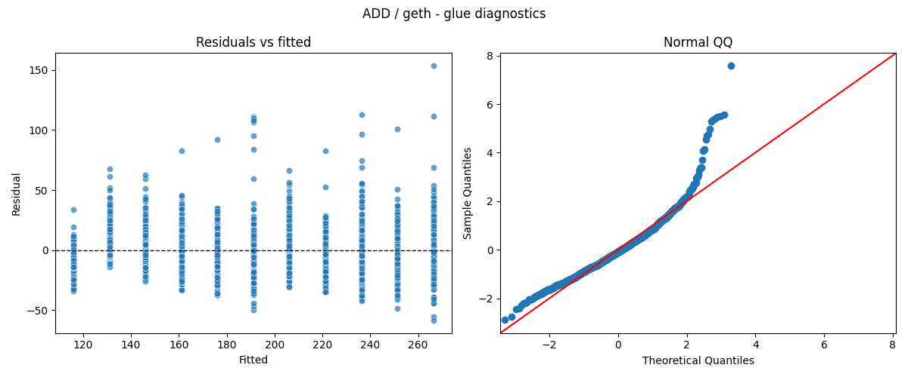

</details>

<details><summary><code>AND</code> · nobs=2057 · runtime_ms=4.276e-06 · p=1.00e-03 · R²=0.8051</summary>

```
==============================================================================
                           NNLS Regression Results                            
==============================================================================
Dep. Variable:          test_runtime_ms              R-squared:          0.805
Model:                  NNLS                    Adj. R-squared:          0.805
No. Observations:       2057                              RMSE:          22.14
Df Residuals:           2055                               MAE:          16.81
Df Model:               1      
==============================================================================
                      coef     std err     P-value      [0.025      0.975]
------------------------------------------------------------------------------
         const     44.1086      1.5904       0.001     41.1753     47.2575
           AND      0.0000      0.0000       0.001      0.0000      0.0000
==============================================================================
Notes: Non-negative least squares with bootstrap inference (1000 iterations)
==============================================================================
```

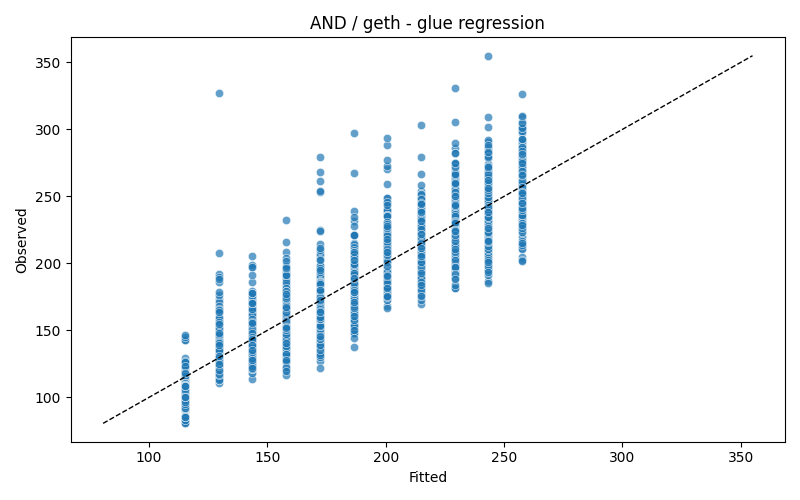

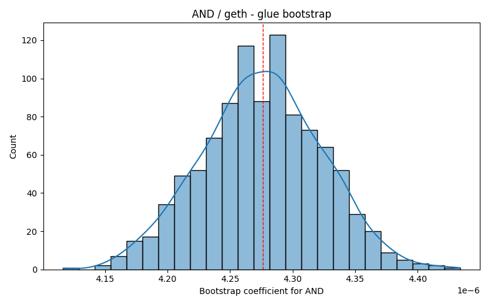

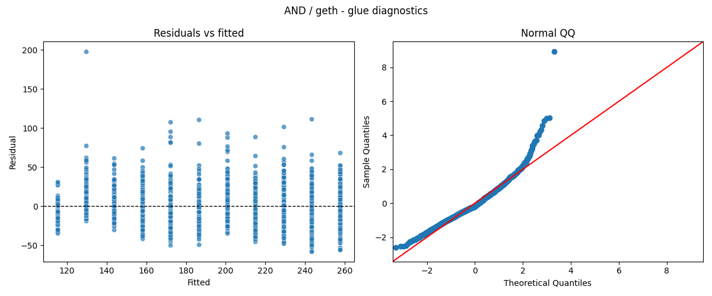

</details>

<details><summary><code>CALLDATACOPY</code> · nobs=49368 · runtime_ms=1.36e-05 · p=1.00e-03 · R²=0.9543</summary>

```
==============================================================================
                           NNLS Regression Results                            
==============================================================================
Dep. Variable:          test_runtime_ms              R-squared:          0.954
Model:                  NNLS                    Adj. R-squared:          0.954
No. Observations:       49368                             RMSE:          22.39
Df Residuals:           49366                              MAE:          16.04
Df Model:               1      
==============================================================================
                      coef     std err     P-value      [0.025      0.975]
------------------------------------------------------------------------------
         const     20.1601      0.1263       0.001     19.8977     20.4022
  CALLDATACOPY      0.0000      0.0000       0.001      0.0000      0.0000
==============================================================================
Notes: Non-negative least squares with bootstrap inference (1000 iterations)
==============================================================================
```

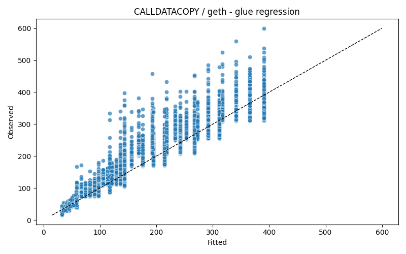

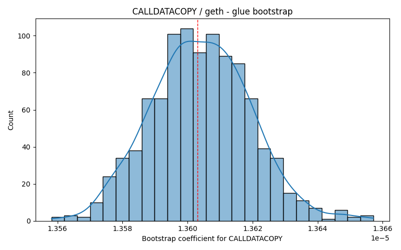

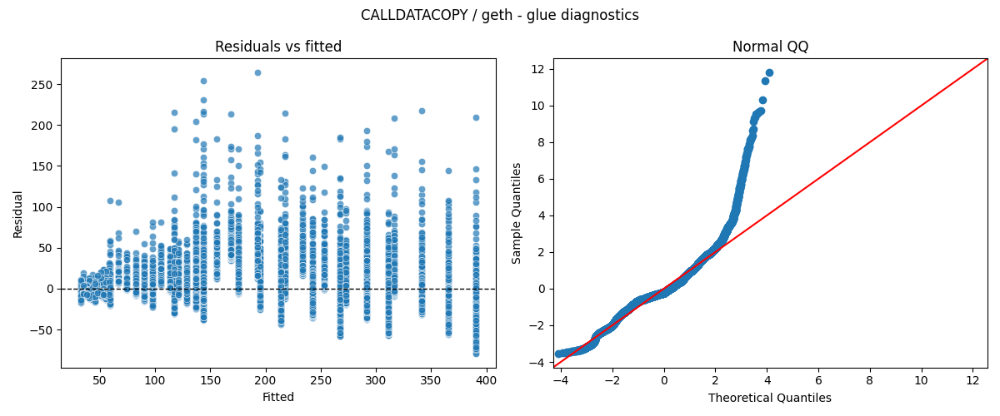

</details>

<details><summary><code>CALLDATALOAD</code> · nobs=8228 · runtime_ms=5.075e-05 · p=1.00e-03 · R²=0.02865</summary>

```
==============================================================================
                           NNLS Regression Results                            
==============================================================================
Dep. Variable:          test_runtime_ms              R-squared:          0.029
Model:                  NNLS                    Adj. R-squared:          0.029
No. Observations:       8228                              RMSE:           1.13
Df Residuals:           8226                               MAE:           0.58
Df Model:               1      
==============================================================================
                      coef     std err     P-value      [0.025      0.975]
------------------------------------------------------------------------------
         const      2.4642      0.0405       0.001      2.3856      2.5421
  CALLDATALOAD      0.0001      0.0000       0.001      0.0000      0.0001
==============================================================================
Notes: Non-negative least squares with bootstrap inference (1000 iterations)
==============================================================================
```

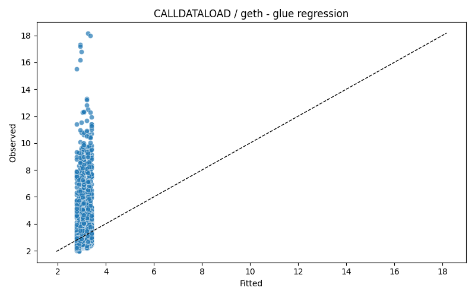


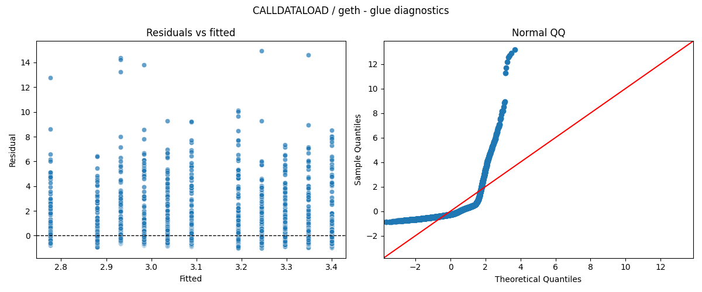

</details>

<details><summary><code>DIV</code> · nobs=2057 · runtime_ms=8.913e-06 · p=1.00e-03 · R²=0.792</summary>

```
==============================================================================
                           NNLS Regression Results                            
==============================================================================
Dep. Variable:          test_runtime_ms              R-squared:          0.792
Model:                  NNLS                    Adj. R-squared:          0.792
No. Observations:       2057                              RMSE:          36.06
Df Residuals:           2055                               MAE:          29.71
Df Model:               1      
==============================================================================
                      coef     std err     P-value      [0.025      0.975]
------------------------------------------------------------------------------
         const     87.5338      2.9037       0.001     81.9087     93.4144
           DIV      0.0000      0.0000       0.001      0.0000      0.0000
==============================================================================
Notes: Non-negative least squares with bootstrap inference (1000 iterations)
==============================================================================
```

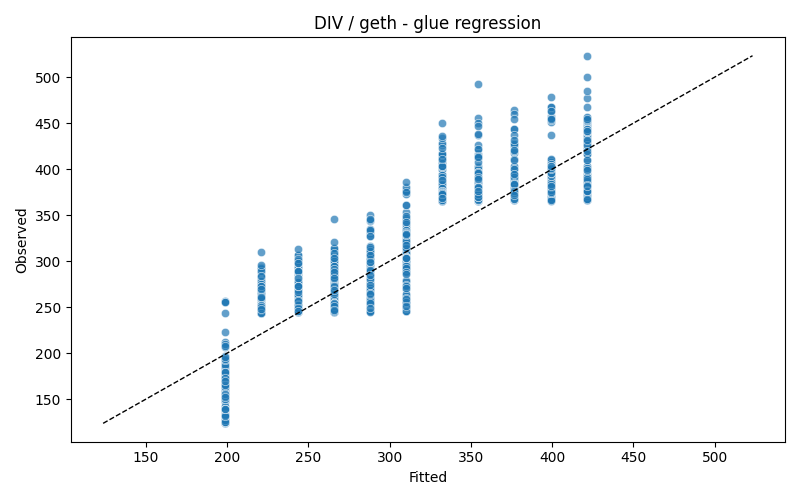

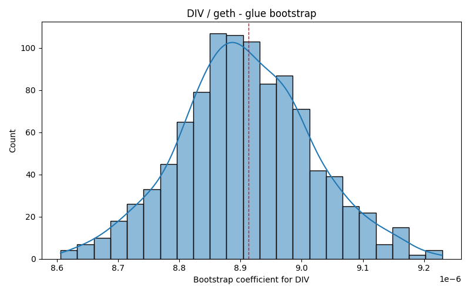

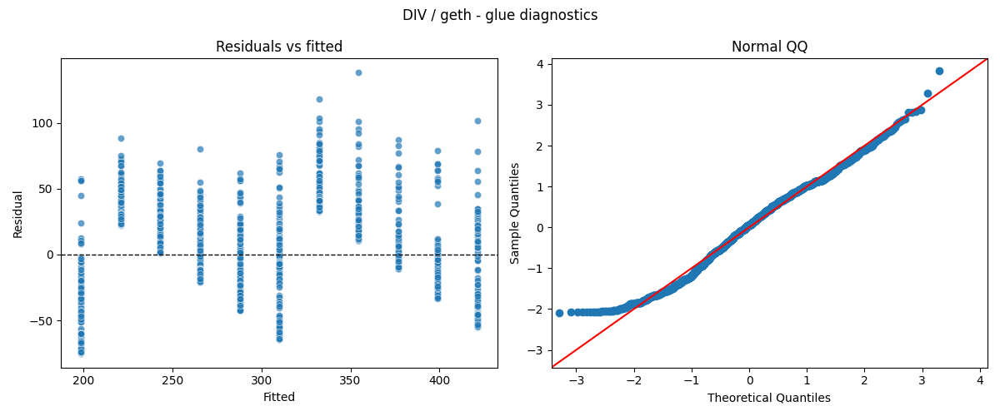

</details>

<details><summary><code>EXP</code> · nobs=2057 · runtime_ms=0.0003463 · p=1.00e-03 · R²=0.8215</summary>

```
==============================================================================
                           NNLS Regression Results                            
==============================================================================
Dep. Variable:          test_runtime_ms              R-squared:          0.822
Model:                  NNLS                    Adj. R-squared:          0.821
No. Observations:       2057                              RMSE:           6.32
Df Residuals:           2055                               MAE:           5.26
Df Model:               1      
==============================================================================
                      coef     std err     P-value      [0.025      0.975]
------------------------------------------------------------------------------
         const     11.7284      0.5131       0.001     10.7316     12.6894
           EXP      0.0003      0.0000       0.001      0.0003      0.0004
==============================================================================
Notes: Non-negative least squares with bootstrap inference (1000 iterations)
==============================================================================
```

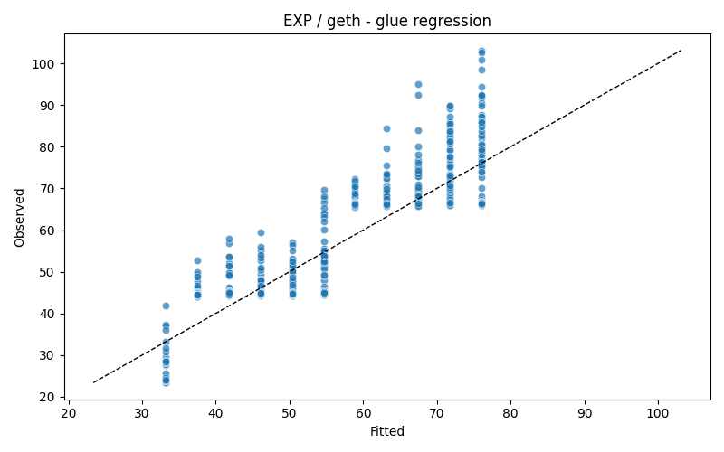

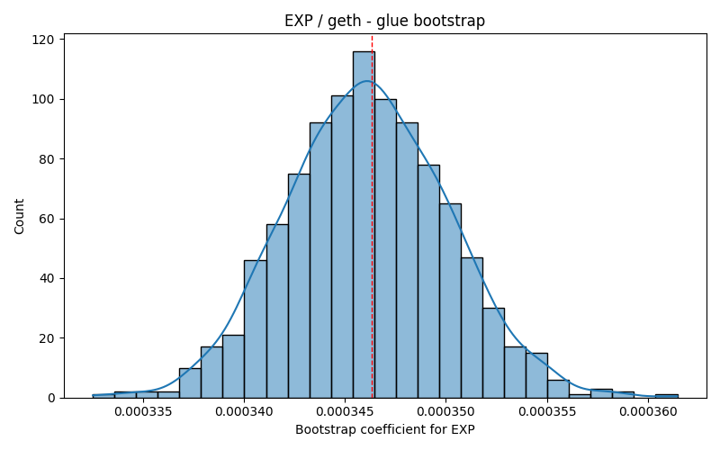

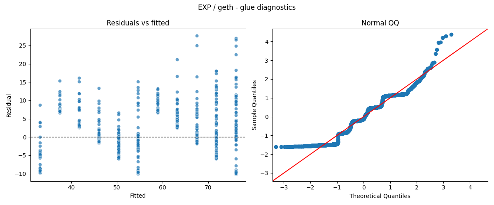

</details>

<details><summary><code>GT</code> · nobs=2057 · runtime_ms=3.53e-06 · p=1.00e-03 · R²=0.7535</summary>

```
==============================================================================
                           NNLS Regression Results                            
==============================================================================
Dep. Variable:          test_runtime_ms              R-squared:          0.754
Model:                  NNLS                    Adj. R-squared:          0.753
No. Observations:       2057                              RMSE:          21.25
Df Residuals:           2055                               MAE:          14.84
Df Model:               1      
==============================================================================
                      coef     std err     P-value      [0.025      0.975]
------------------------------------------------------------------------------
         const     38.2617      1.7261       0.001     35.0763     41.8366
            GT      0.0000      0.0000       0.001      0.0000      0.0000
==============================================================================
Notes: Non-negative least squares with bootstrap inference (1000 iterations)
==============================================================================
```

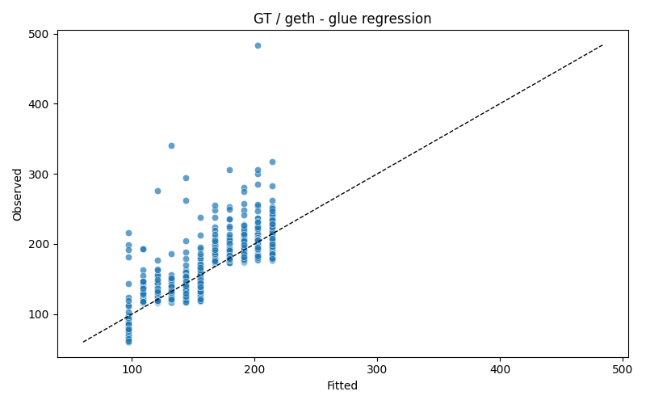

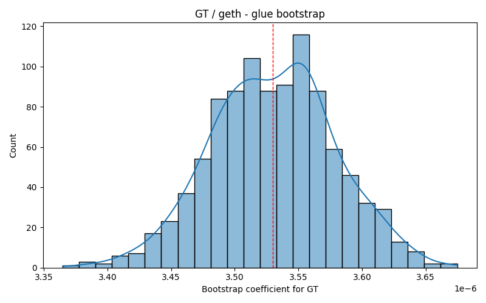

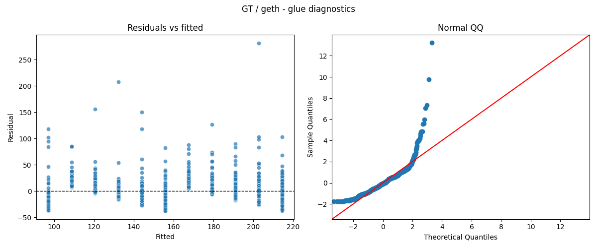

</details>

<details><summary><code>JUMPI</code> · nobs=2057 · runtime_ms=5.495e-06 · p=1.00e-03 · R²=0.7875</summary>

```
==============================================================================
                           NNLS Regression Results                            
==============================================================================
Dep. Variable:          test_runtime_ms              R-squared:          0.788
Model:                  NNLS                    Adj. R-squared:          0.787
No. Observations:       2057                              RMSE:          12.88
Df Residuals:           2055                               MAE:           9.93
Df Model:               1      
==============================================================================
                      coef     std err     P-value      [0.025      0.975]
------------------------------------------------------------------------------
         const     21.5877      0.9664       0.001     19.6994     23.5171
         JUMPI      0.0000      0.0000       0.001      0.0000      0.0000
==============================================================================
Notes: Non-negative least squares with bootstrap inference (1000 iterations)
==============================================================================
```

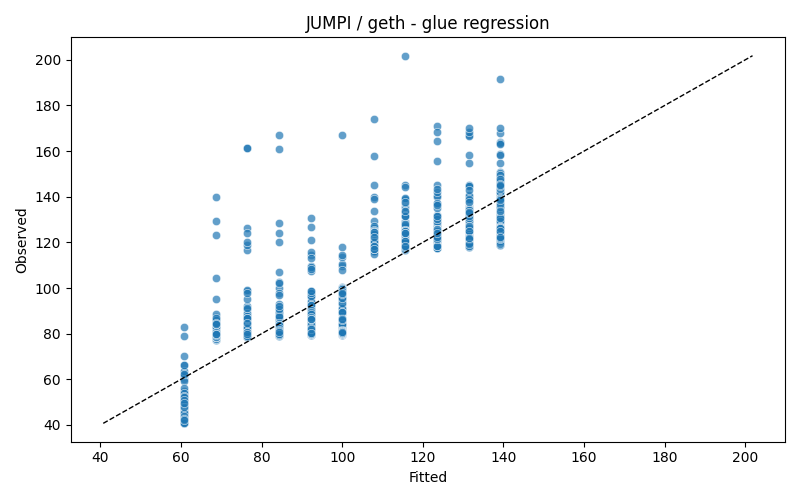

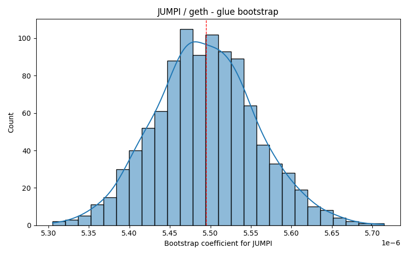

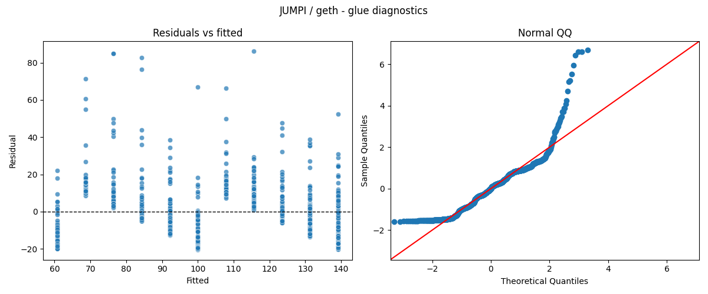

</details>

<details><summary><code>LT</code> · nobs=2057 · runtime_ms=4.346e-06 · p=1.00e-03 · R²=0.7882</summary>

```
==============================================================================
                           NNLS Regression Results                            
==============================================================================
Dep. Variable:          test_runtime_ms              R-squared:          0.788
Model:                  NNLS                    Adj. R-squared:          0.788
No. Observations:       2057                              RMSE:          23.71
Df Residuals:           2055                               MAE:          17.54
Df Model:               1      
==============================================================================
                      coef     std err     P-value      [0.025      0.975]
------------------------------------------------------------------------------
         const     40.7860      1.7778       0.001     37.2965     44.2006
            LT      0.0000      0.0000       0.001      0.0000      0.0000
==============================================================================
Notes: Non-negative least squares with bootstrap inference (1000 iterations)
==============================================================================
```

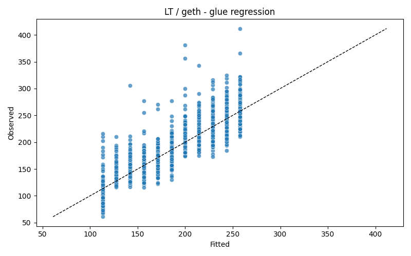

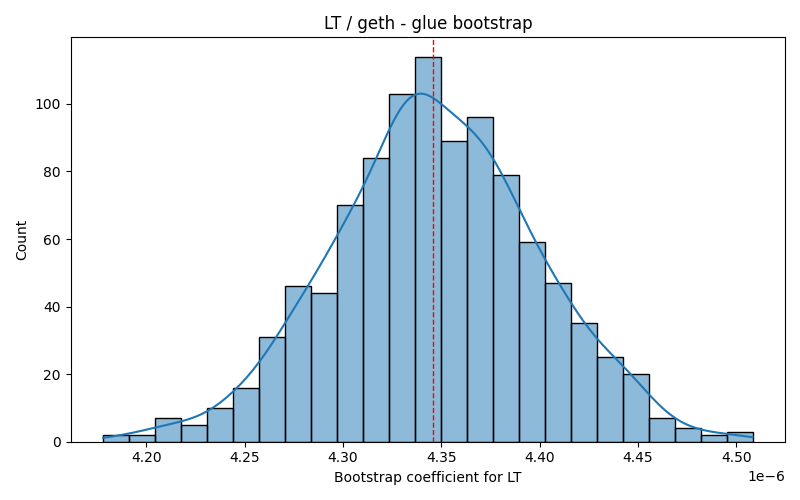

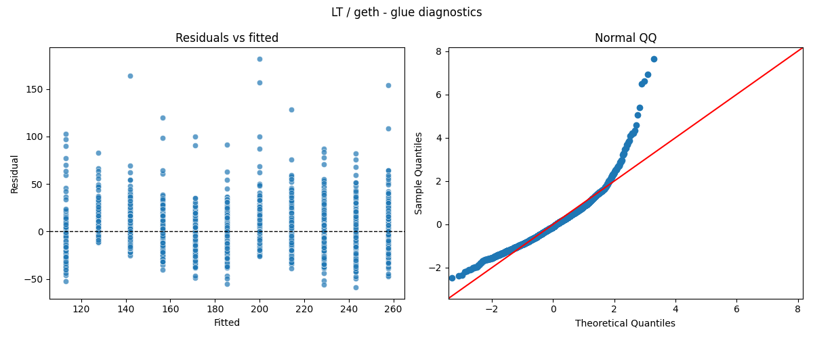

</details>

<details><summary><code>MSTORE</code> · nobs=10285 · runtime_ms=7.985e-06 · p=1.00e-03 · R²=0.8171</summary>

```
==============================================================================
                           NNLS Regression Results                            
==============================================================================
Dep. Variable:          test_runtime_ms              R-squared:          0.817
Model:                  NNLS                    Adj. R-squared:          0.817
No. Observations:       10285                             RMSE:          26.51
Df Residuals:           10283                              MAE:          20.67
Df Model:               1      
==============================================================================
                      coef     std err     P-value      [0.025      0.975]
------------------------------------------------------------------------------
         const     54.1545      0.9724       0.001     52.2055     56.0779
        MSTORE      0.0000      0.0000       0.001      0.0000      0.0000
==============================================================================
Notes: Non-negative least squares with bootstrap inference (1000 iterations)
==============================================================================
```

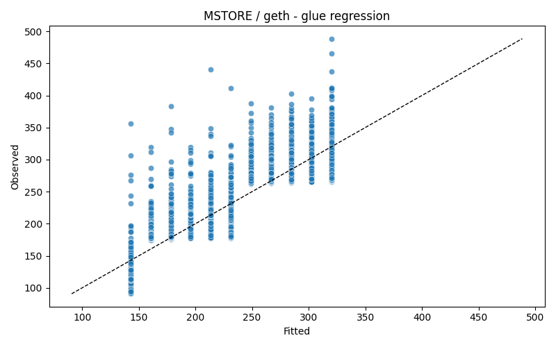

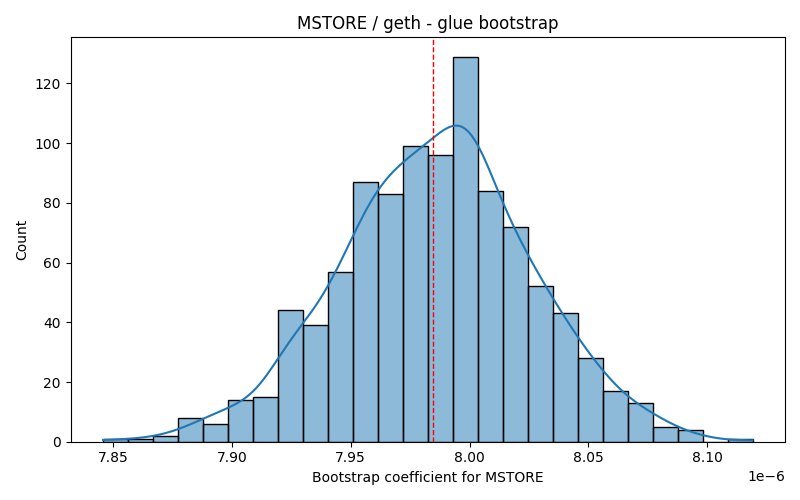

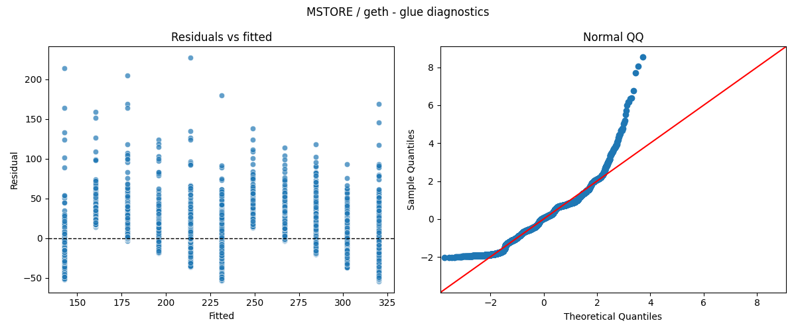

</details>

<details><summary><code>MSTORE8</code> · nobs=10285 · runtime_ms=7.317e-06 · p=1.00e-03 · R²=0.7931</summary>

```
==============================================================================
                           NNLS Regression Results                            
==============================================================================
Dep. Variable:          test_runtime_ms              R-squared:          0.793
Model:                  NNLS                    Adj. R-squared:          0.793
No. Observations:       10285                             RMSE:          26.23
Df Residuals:           10283                              MAE:          19.48
Df Model:               1      
==============================================================================
                      coef     std err     P-value      [0.025      0.975]
------------------------------------------------------------------------------
         const     51.2061      0.9752       0.001     49.3616     53.1708
       MSTORE8      0.0000      0.0000       0.001      0.0000      0.0000
==============================================================================
Notes: Non-negative least squares with bootstrap inference (1000 iterations)
==============================================================================
```

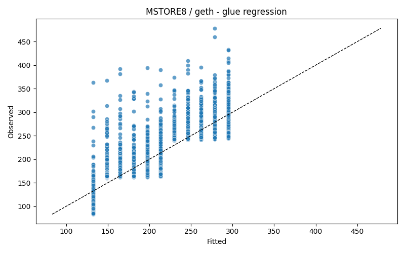


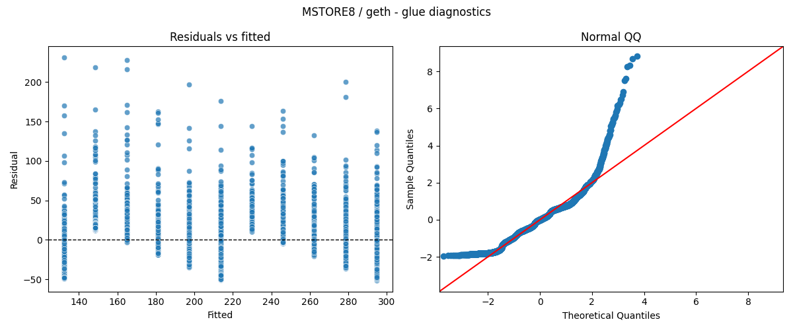

</details>

<details><summary><code>MUL</code> · nobs=2057 · runtime_ms=4.898e-06 · p=1.00e-03 · R²=0.866</summary>

```
==============================================================================
                           NNLS Regression Results                            
==============================================================================
Dep. Variable:          test_runtime_ms              R-squared:          0.866
Model:                  NNLS                    Adj. R-squared:          0.866
No. Observations:       2057                              RMSE:          15.21
Df Residuals:           2055                               MAE:          11.48
Df Model:               1      
==============================================================================
                      coef     std err     P-value      [0.025      0.975]
------------------------------------------------------------------------------
         const     36.9106      1.3343       0.001     34.2196     39.3598
           MUL      0.0000      0.0000       0.001      0.0000      0.0000
==============================================================================
Notes: Non-negative least squares with bootstrap inference (1000 iterations)
==============================================================================
```

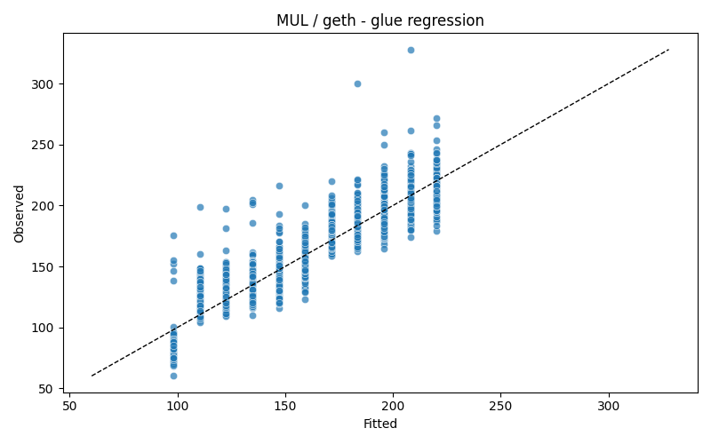

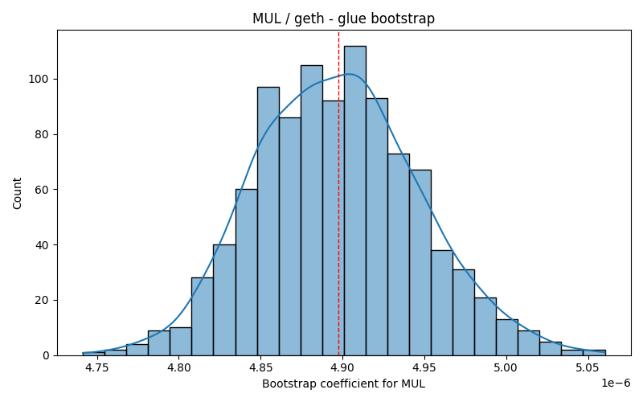

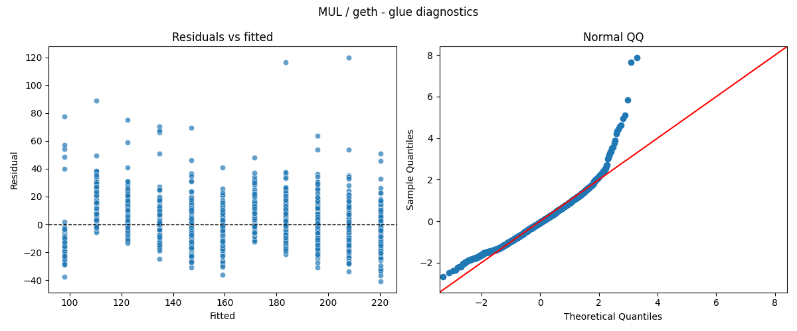

</details>

<details><summary><code>PC</code> · nobs=2057 · runtime_ms=1.617e-06 · p=1.00e-03 · R²=0.8183</summary>

```
==============================================================================
                           NNLS Regression Results                            
==============================================================================
Dep. Variable:          test_runtime_ms              R-squared:          0.818
Model:                  NNLS                    Adj. R-squared:          0.818
No. Observations:       2057                              RMSE:          22.78
Df Residuals:           2055                               MAE:          16.61
Df Model:               1      
==============================================================================
                      coef     std err     P-value      [0.025      0.975]
------------------------------------------------------------------------------
         const     41.7311      1.8121       0.001     38.3440     45.5484
            PC      0.0000      0.0000       0.001      0.0000      0.0000
==============================================================================
Notes: Non-negative least squares with bootstrap inference (1000 iterations)
==============================================================================
```

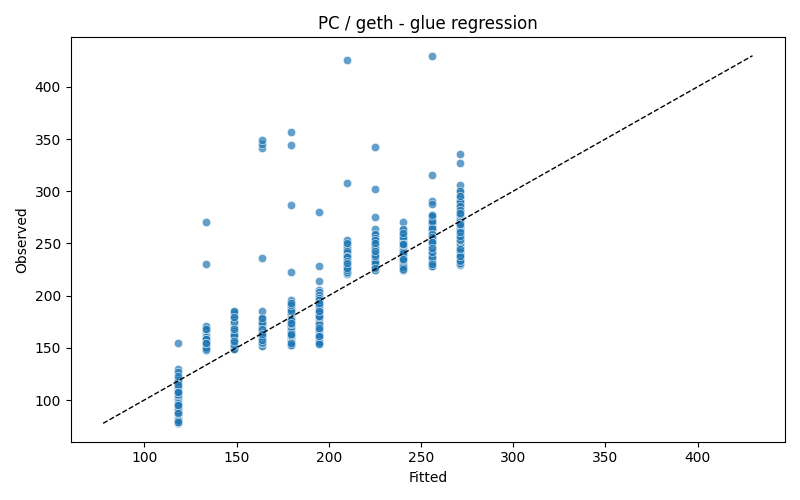

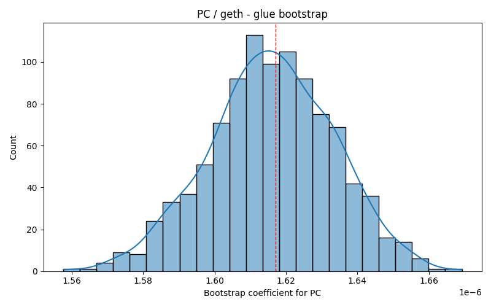

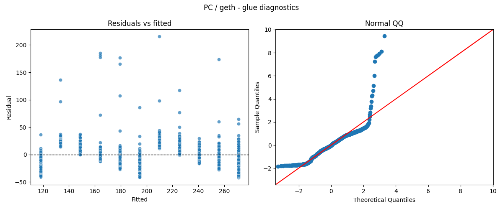

</details>

<details><summary><code>RETURNDATASIZE</code> · nobs=8228 · runtime_ms=3.135e-06 · p=1.00e-03 · R²=0.6168</summary>

```
==============================================================================
                           NNLS Regression Results                            
==============================================================================
Dep. Variable:          test_runtime_ms              R-squared:          0.617
Model:                  NNLS                    Adj. R-squared:          0.617
No. Observations:       8228                              RMSE:          39.02
Df Residuals:           8226                               MAE:          27.95
Df Model:               1      
==============================================================================
                      coef     std err     P-value      [0.025      0.975]
------------------------------------------------------------------------------
         const     49.8519      1.4145       0.001     47.0032     52.5471
RETURNDATASIZE      0.0000      0.0000       0.001      0.0000      0.0000
==============================================================================
Notes: Non-negative least squares with bootstrap inference (1000 iterations)
==============================================================================
```

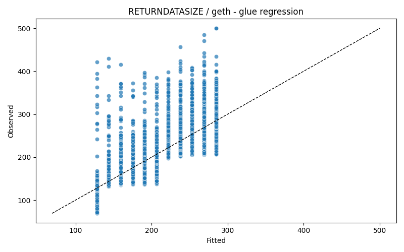

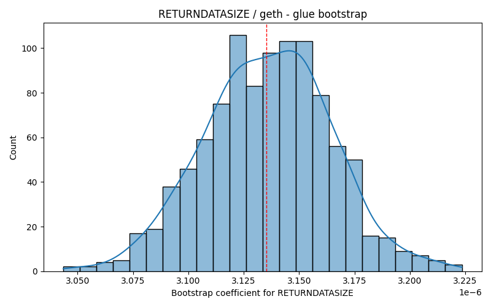

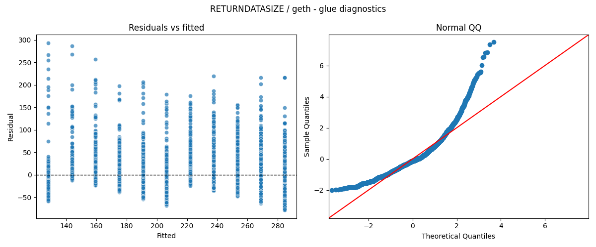

</details>

<details><summary><code>SELFBALANCE</code> · nobs=1683 · runtime_ms=7.45e-06 · p=1.00e-03 · R²=0.7934</summary>

```
==============================================================================
                           NNLS Regression Results                            
==============================================================================
Dep. Variable:          test_runtime_ms              R-squared:          0.793
Model:                  NNLS                    Adj. R-squared:          0.793
No. Observations:       1683                              RMSE:          38.35
Df Residuals:           1681                               MAE:          32.06
Df Model:               1      
==============================================================================
                      coef     std err     P-value      [0.025      0.975]
------------------------------------------------------------------------------
         const    117.1857      3.1997       0.001    111.0093    123.6256
   SELFBALANCE      0.0000      0.0000       0.001      0.0000      0.0000
==============================================================================
Notes: Non-negative least squares with bootstrap inference (1000 iterations)
==============================================================================
```

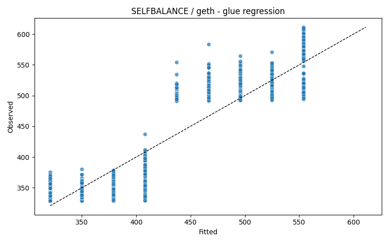

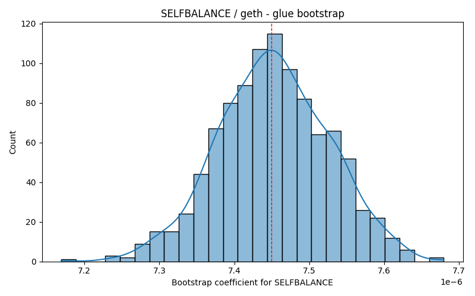

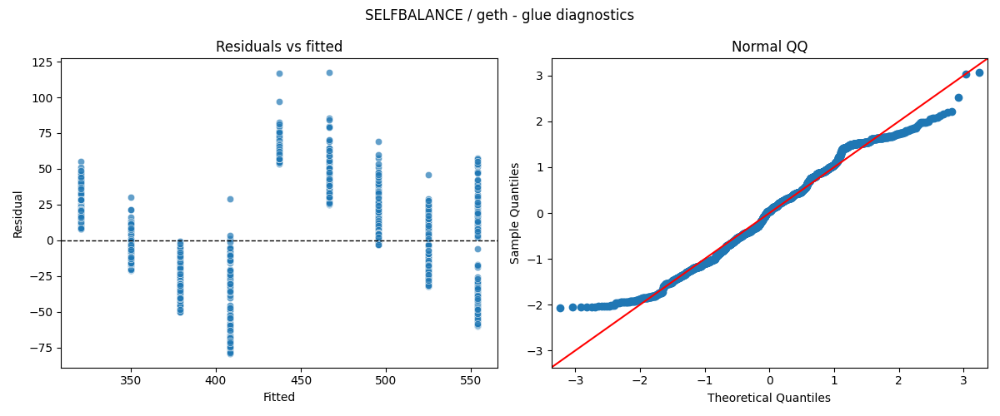

</details>

<details><summary><code>SUB</code> · nobs=2057 · runtime_ms=4.309e-06 · p=1.00e-03 · R²=0.8028</summary>

```
==============================================================================
                           NNLS Regression Results                            
==============================================================================
Dep. Variable:          test_runtime_ms              R-squared:          0.803
Model:                  NNLS                    Adj. R-squared:          0.803
No. Observations:       2057                              RMSE:          22.48
Df Residuals:           2055                               MAE:          16.47
Df Model:               1      
==============================================================================
                      coef     std err     P-value      [0.025      0.975]
------------------------------------------------------------------------------
         const     50.6359      1.7617       0.001     47.2998     54.3315
           SUB      0.0000      0.0000       0.001      0.0000      0.0000
==============================================================================
Notes: Non-negative least squares with bootstrap inference (1000 iterations)
==============================================================================
```

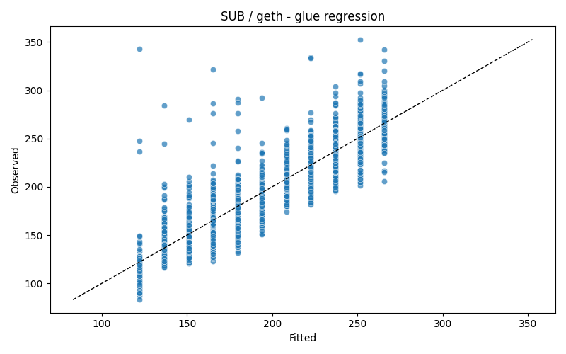

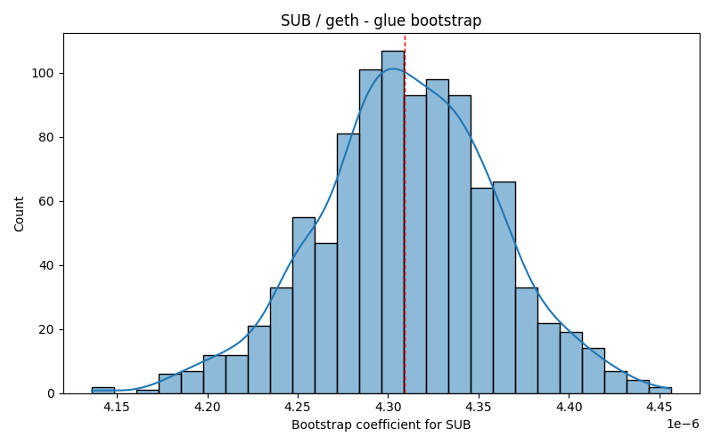

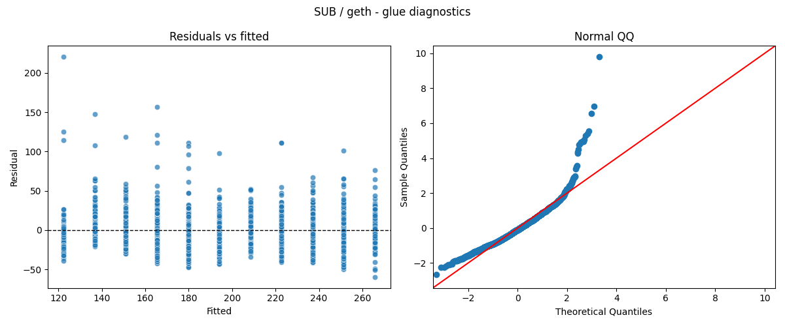

</details>

### Mixed glue (tier B) · geth

<details><summary><code>JUMP</code> · nobs=2057 · runtime_ms=9.149e-06 · p=1.00e-03 · R²=0.7932</summary>

```
==============================================================================
                           NNLS Regression Results                            
==============================================================================
Dep. Variable:          test_runtime_ms              R-squared:          0.793
Model:                  NNLS                    Adj. R-squared:          0.793
No. Observations:       2057                              RMSE:          17.36
Df Residuals:           2055                               MAE:          13.44
Df Model:               1      
==============================================================================
                      coef     std err     P-value      [0.025      0.975]
------------------------------------------------------------------------------
         const     34.4019      1.4817       0.001     31.5097     37.2493
          JUMP      0.0000      0.0000       0.001      0.0000      0.0000
==============================================================================
Notes: Non-negative least squares with bootstrap inference (1000 iterations)
==============================================================================
```

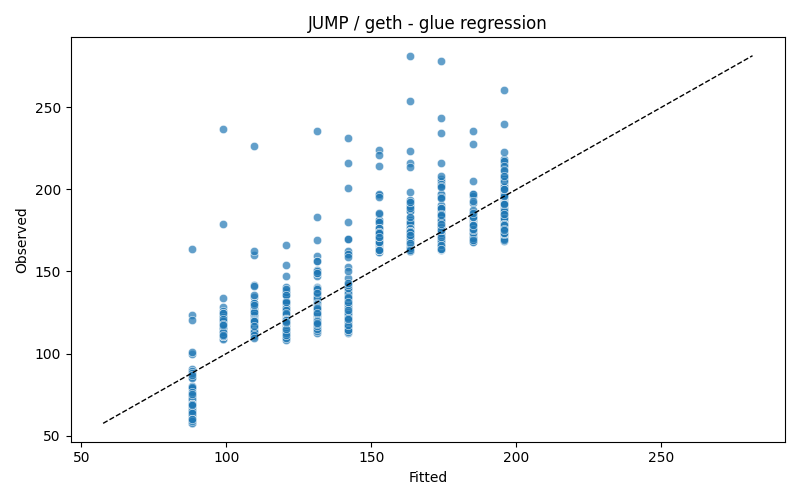

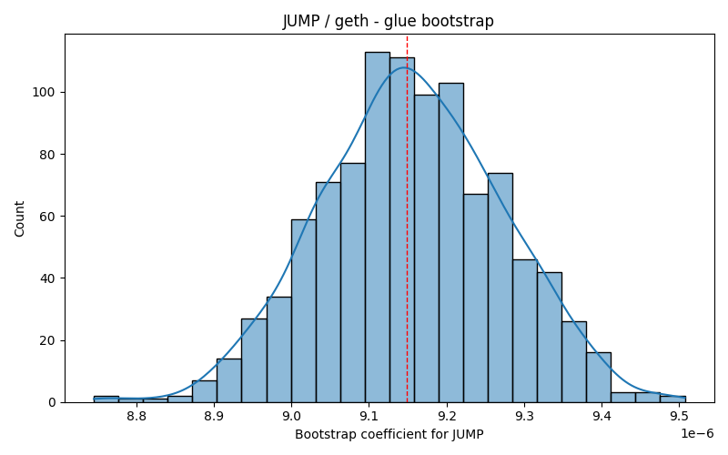

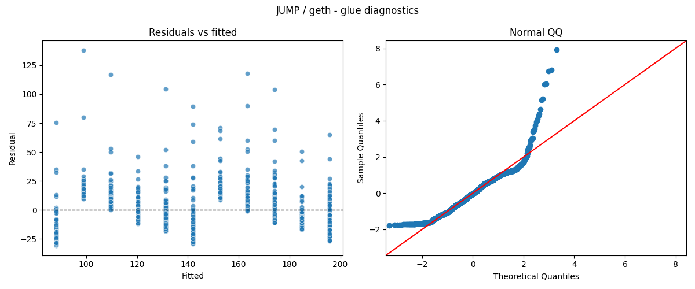

</details>

<details><summary><code>KECCAK256</code> · nobs=32912 · runtime_ms=3.647e-05 · p=1.00e-03 · R²=0.2638</summary>

```
==============================================================================
                           NNLS Regression Results                            
==============================================================================
Dep. Variable:          test_runtime_ms              R-squared:          0.264
Model:                  NNLS                    Adj. R-squared:          0.264
No. Observations:       32912                             RMSE:         121.08
Df Residuals:           32910                              MAE:          94.87
Df Model:               1      
==============================================================================
                      coef     std err     P-value      [0.025      0.975]
------------------------------------------------------------------------------
         const    376.9993      1.4455       0.001    374.1652    379.9304
     KECCAK256      0.0000      0.0000       0.001      0.0000      0.0000
==============================================================================
Notes: Non-negative least squares with bootstrap inference (1000 iterations)
==============================================================================
```

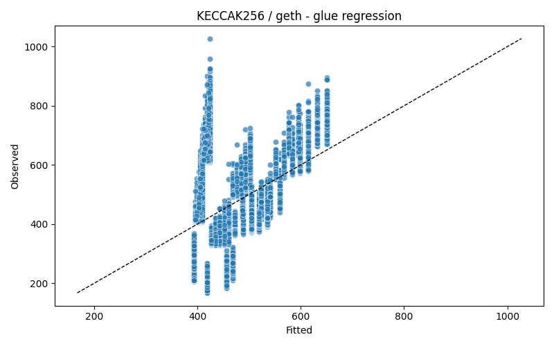

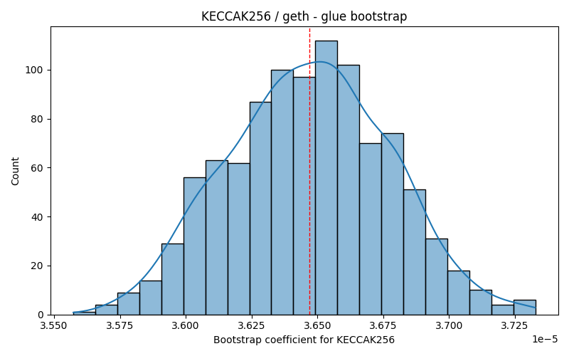

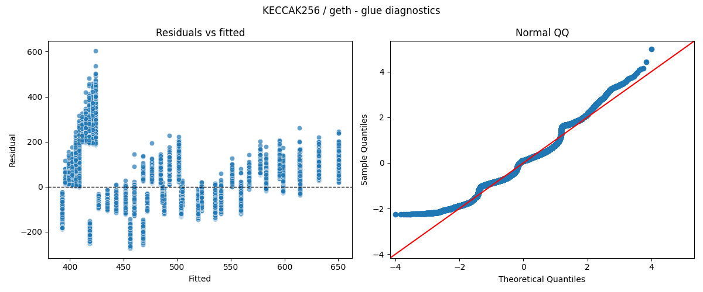

</details>

## nethermind

| glue_opcode | nobs | glue_runtime_ms | p_value | rsquared |
| --- | --- | --- | --- | --- |
| `ISZERO` | 2090 | 9.639e-07 | 1.00e-03 | 0.8637 |
| `JUMPDEST` | 2090 | 5.486e-07 | 1.00e-03 | 0.676 |
| `SWAP` | 33440 | 5.488e-07 | 1.00e-03 | 0.6325 |
| `CALLDATASIZE` | 123475 | 5.472e-07 | 1.00e-03 | 0.9386 |
| `DUP` | 123475 | 3.807e-07 | 1.00e-03 | 0.9386 |
| `GAS` | 123475 | 5.315e-07 | 1.00e-03 | 0.9386 |
| `MLOAD` | 123475 | 1.382e-06 | 1.00e-03 | 0.9386 |
| `PUSH` | 123475 | 4.77e-07 | 1.00e-03 | 0.9386 |
| `PUSH0` | 123475 | 3.787e-07 | 1.00e-03 | 0.9386 |
| `STATICCALL` | 123475 | 0.0003877 | 1.00e-03 | 0.9386 |
| `ADD` | 2090 | 2.904e-06 | 1.00e-03 | 0.4517 |
| `AND` | 2090 | 1.458e-06 | 1.00e-03 | 0.7079 |
| `CALLDATACOPY` | 50160 | 4.358e-06 | 1.00e-03 | 0.6836 |
| `CALLDATALOAD` | 8360 | 2.641e-05 | 2.00e-03 | 0.0009864 |
| `DIV` | 2090 | 6.957e-06 | 1.00e-03 | 0.6205 |
| `EXP` | 2090 | 0 | 1.00e+00 | 0 |
| `GT` | 2090 | 1.781e-06 | 1.00e-03 | 0.7947 |
| `JUMPI` | 2090 | 2.047e-06 | 1.00e-03 | 0.7229 |
| `LT` | 2090 | 1.613e-06 | 1.00e-03 | 0.7455 |
| `MSTORE` | 10450 | 2.21e-06 | 1.00e-03 | 0.8405 |
| `MSTORE8` | 10450 | 2.192e-06 | 1.00e-03 | 0.8351 |
| `MUL` | 2090 | 5.339e-06 | 1.00e-03 | 0.9152 |
| `PC` | 2090 | 9.149e-07 | 1.00e-03 | 0.9096 |
| `RETURNDATASIZE` | 8360 | 9.329e-07 | 1.00e-03 | 0.683 |
| `SELFBALANCE` | 1710 | 3.859e-06 | 1.00e-03 | 0.5866 |
| `SUB` | 2090 | 2.661e-06 | 1.00e-03 | 0.8635 |
| `JUMP` | 2090 | 5.816e-06 | 1.00e-03 | 0.9109 |
| `KECCAK256` | 33440 | 0 | 1.00e+00 | 1.11e-16 |

### Cycle glue — joint fit · nethermind

<details><summary>Joint NNLS regression summary</summary>

```
==============================================================================
                           NNLS Regression Results                            
==============================================================================
Dep. Variable:          test_runtime_ms              R-squared:          0.939
Model:                  NNLS                    Adj. R-squared:          0.939
No. Observations:       123475                            RMSE:           7.87
Df Residuals:           123467                             MAE:           5.05
Df Model:               7      
==============================================================================
                      coef     std err     P-value      [0.025      0.975]
------------------------------------------------------------------------------
         const     16.8262      0.0755       0.001     16.6718     16.9760
  CALLDATASIZE      0.0000      0.0000       0.001      0.0000      0.0000
           DUP      0.0000      0.0000       0.001      0.0000      0.0000
           GAS      0.0000      0.0000       0.001      0.0000      0.0000
         MLOAD      0.0000      0.0000       0.001      0.0000      0.0000
          PUSH      0.0000      0.0000       0.001      0.0000      0.0000
         PUSH0      0.0000      0.0000       0.001      0.0000      0.0000
    STATICCALL      0.0004      0.0000       0.001      0.0004      0.0004
==============================================================================
Notes: Non-negative least squares with bootstrap inference (1000 iterations)
==============================================================================
```

</details>

<details><summary><code>CALLDATASIZE</code> · nobs=123475 · runtime_ms=5.472e-07 · p=1.00e-03 · R²=0.9386</summary>

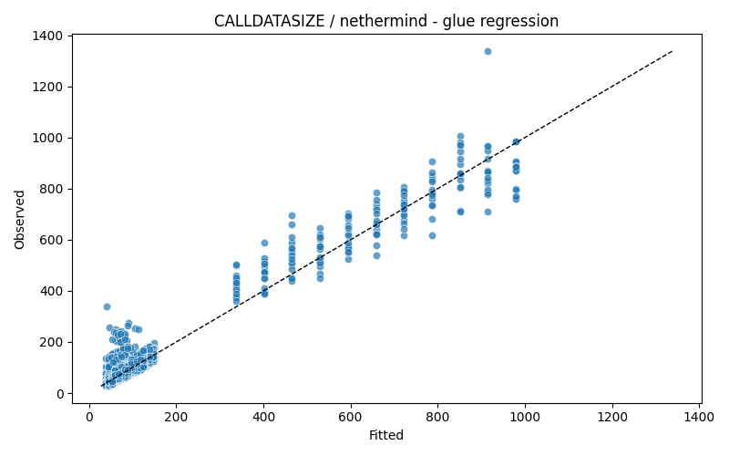

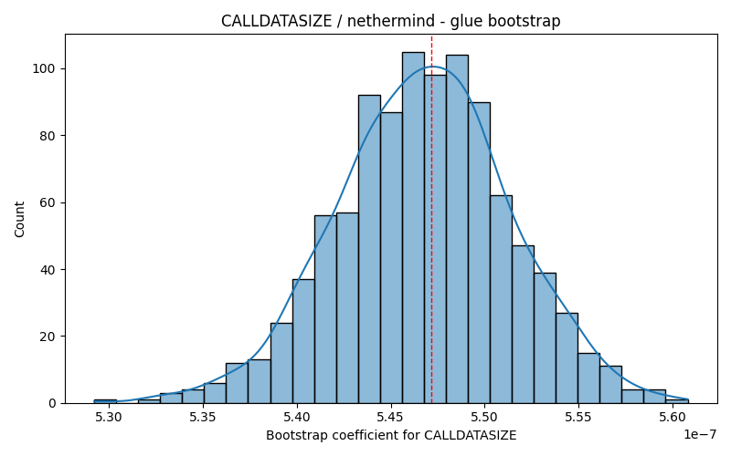

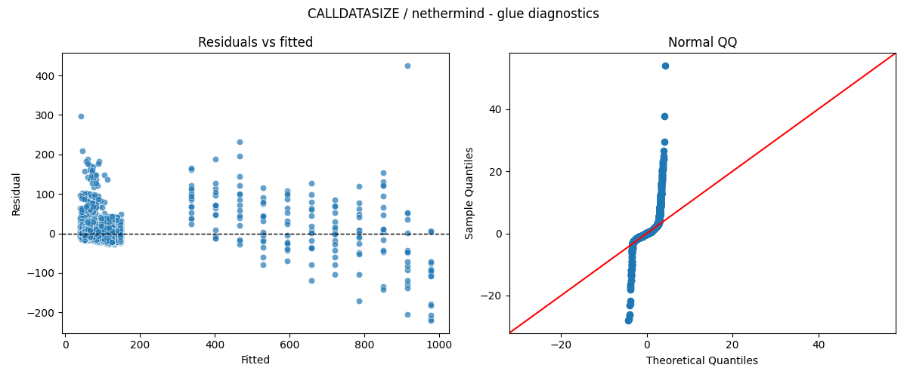

</details>

<details><summary><code>DUP</code> · nobs=123475 · runtime_ms=3.807e-07 · p=1.00e-03 · R²=0.9386</summary>


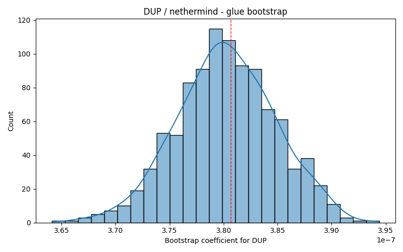

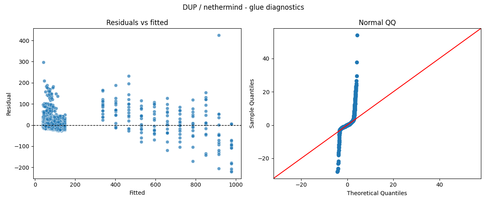

</details>

<details><summary><code>GAS</code> · nobs=123475 · runtime_ms=5.315e-07 · p=1.00e-03 · R²=0.9386</summary>


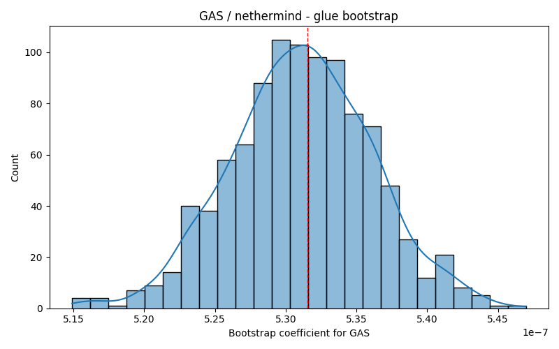

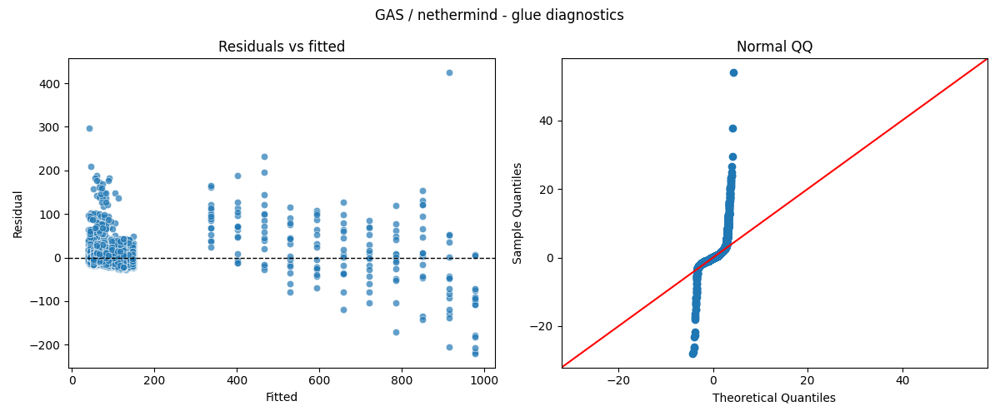

</details>

<details><summary><code>MLOAD</code> · nobs=123475 · runtime_ms=1.382e-06 · p=1.00e-03 · R²=0.9386</summary>


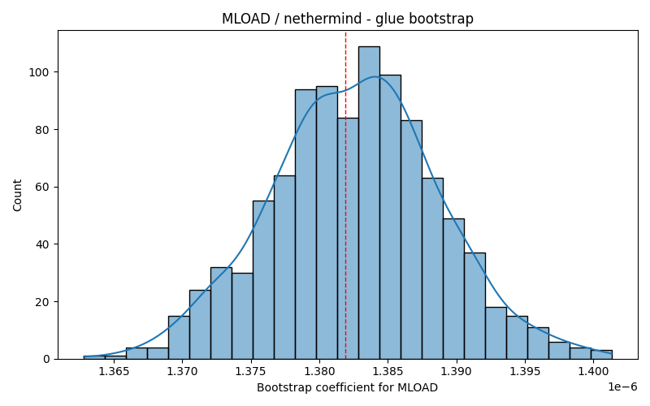

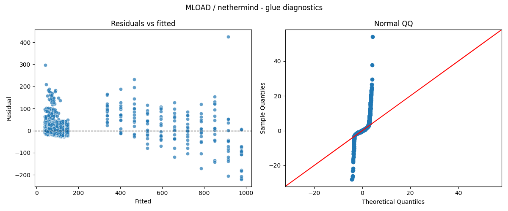

</details>

<details><summary><code>PUSH</code> · nobs=123475 · runtime_ms=4.77e-07 · p=1.00e-03 · R²=0.9386</summary>

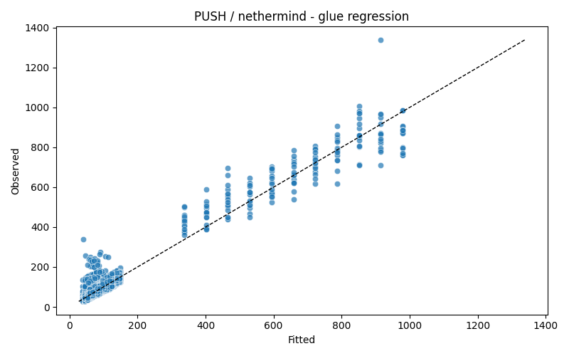

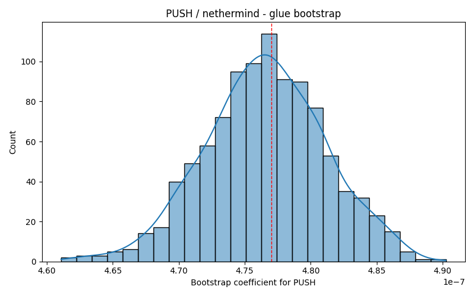

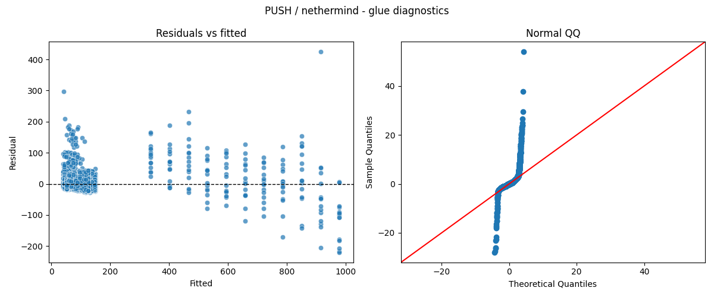

</details>

<details><summary><code>PUSH0</code> · nobs=123475 · runtime_ms=3.787e-07 · p=1.00e-03 · R²=0.9386</summary>


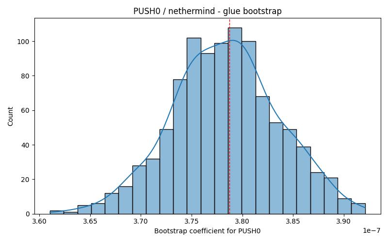

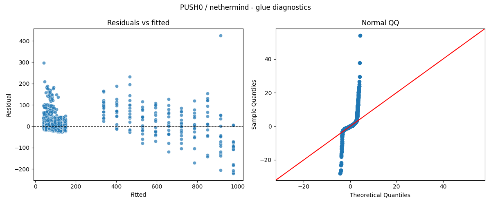

</details>

<details><summary><code>STATICCALL</code> · nobs=123475 · runtime_ms=0.0003877 · p=1.00e-03 · R²=0.9386</summary>

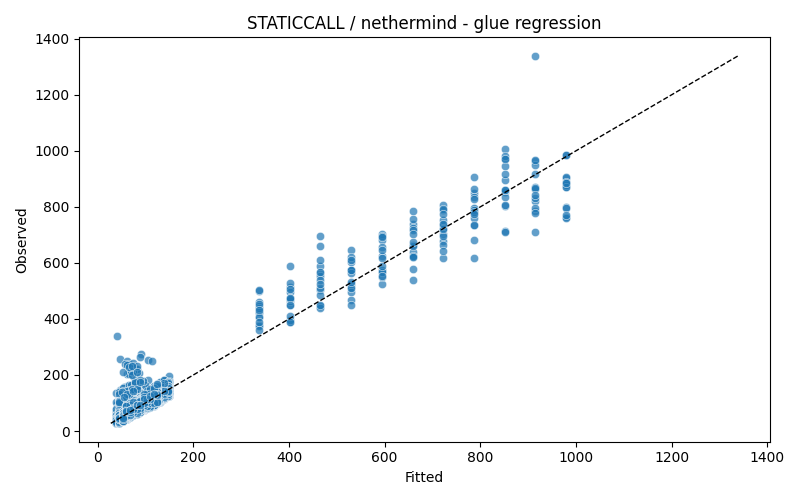

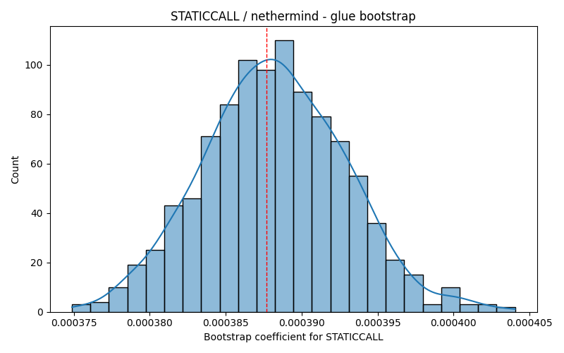

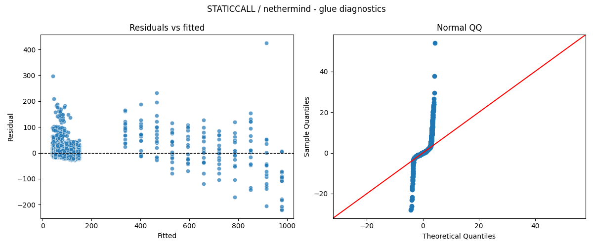

</details>

### Pure glue · nethermind

<details><summary><code>ISZERO</code> · nobs=2090 · runtime_ms=9.639e-07 · p=1.00e-03 · R²=0.8637</summary>

```
==============================================================================
                           NNLS Regression Results                            
==============================================================================
Dep. Variable:          test_runtime_ms              R-squared:          0.864
Model:                  NNLS                    Adj. R-squared:          0.864
No. Observations:       2090                              RMSE:           8.06
Df Residuals:           2088                               MAE:           5.47
Df Model:               1      
==============================================================================
                      coef     std err     P-value      [0.025      0.975]
------------------------------------------------------------------------------
         const     15.9619      0.5411       0.001     14.9256     17.0825
        ISZERO      0.0000      0.0000       0.001      0.0000      0.0000
==============================================================================
Notes: Non-negative least squares with bootstrap inference (1000 iterations)
==============================================================================
```

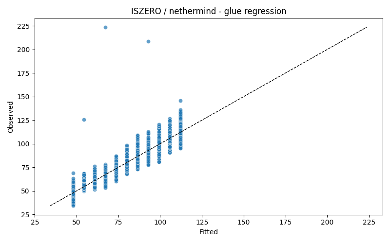

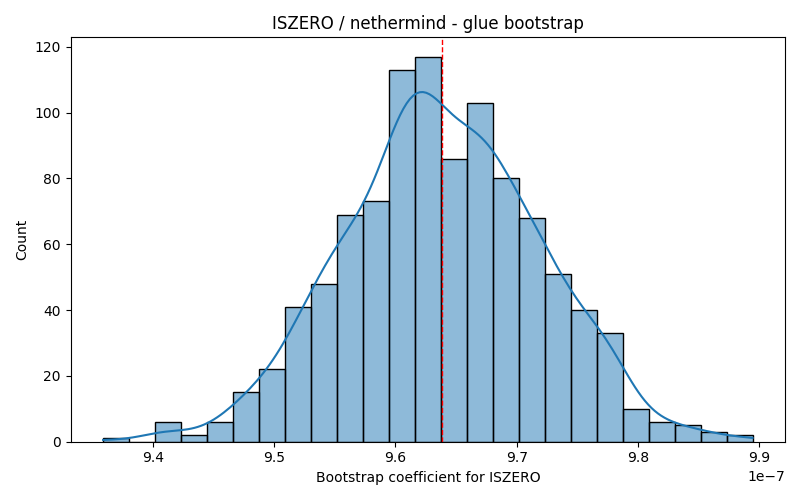

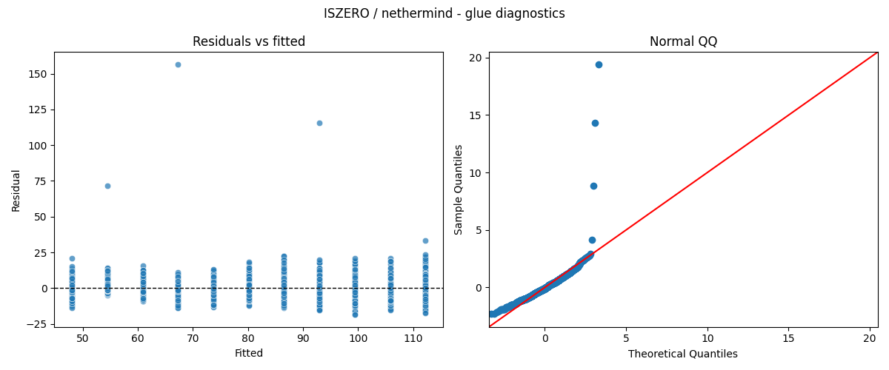

</details>

<details><summary><code>JUMPDEST</code> · nobs=2090 · runtime_ms=5.486e-07 · p=1.00e-03 · R²=0.676</summary>

```
==============================================================================
                           NNLS Regression Results                            
==============================================================================
Dep. Variable:          test_runtime_ms              R-squared:          0.676
Model:                  NNLS                    Adj. R-squared:          0.676
No. Observations:       2090                              RMSE:          23.98
Df Residuals:           2088                               MAE:          18.68
Df Model:               1      
==============================================================================
                      coef     std err     P-value      [0.025      0.975]
------------------------------------------------------------------------------
         const     21.4672      1.4902       0.001     18.3857     24.4357
      JUMPDEST      0.0000      0.0000       0.001      0.0000      0.0000
==============================================================================
Notes: Non-negative least squares with bootstrap inference (1000 iterations)
==============================================================================
```

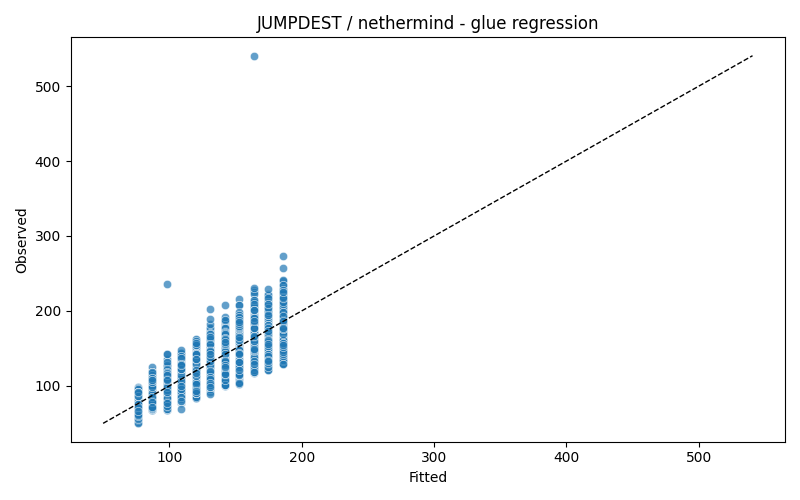

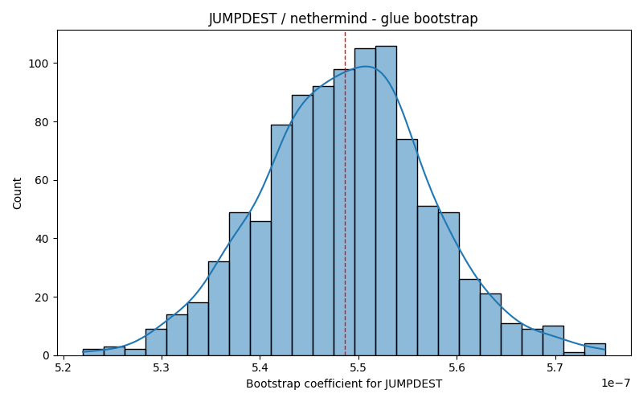

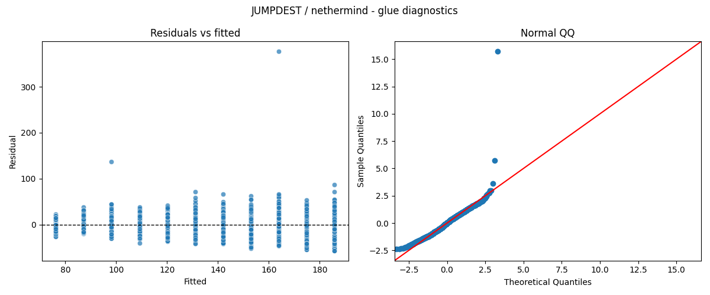

</details>

<details><summary><code>SWAP</code> · nobs=33440 · runtime_ms=5.488e-07 · p=1.00e-03 · R²=0.6325</summary>

```
==============================================================================
                           NNLS Regression Results                            
==============================================================================
Dep. Variable:          test_runtime_ms              R-squared:          0.632
Model:                  NNLS                    Adj. R-squared:          0.632
No. Observations:       33440                             RMSE:           8.81
Df Residuals:           33438                              MAE:           4.07
Df Model:               1      
==============================================================================
                      coef     std err     P-value      [0.025      0.975]
------------------------------------------------------------------------------
         const     16.6330      0.1698       0.001     16.3183     16.9742
          SWAP      0.0000      0.0000       0.001      0.0000      0.0000
==============================================================================
Notes: Non-negative least squares with bootstrap inference (1000 iterations)
==============================================================================
```

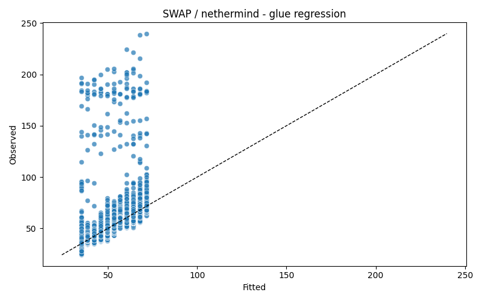

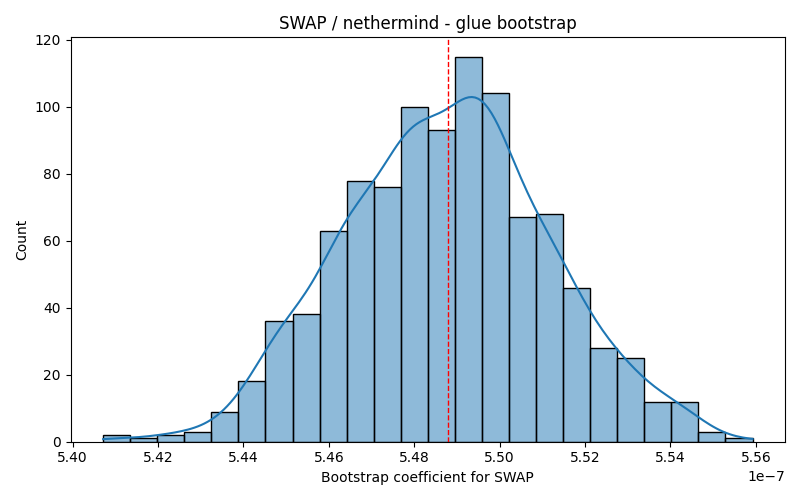

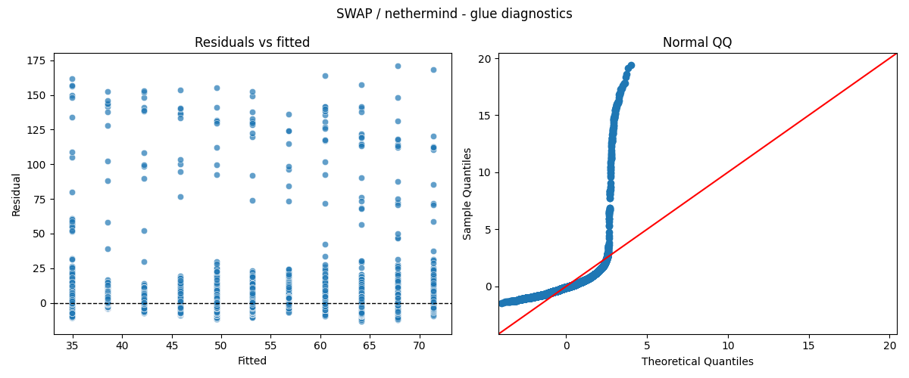

</details>

### Mixed glue (tier A) · nethermind

<details><summary><code>ADD</code> · nobs=2090 · runtime_ms=2.904e-06 · p=1.00e-03 · R²=0.4517</summary>

```
==============================================================================
                           NNLS Regression Results                            
==============================================================================
Dep. Variable:          test_runtime_ms              R-squared:          0.452
Model:                  NNLS                    Adj. R-squared:          0.451
No. Observations:       2090                              RMSE:          33.67
Df Residuals:           2088                               MAE:          28.78
Df Model:               1      
==============================================================================
                      coef     std err     P-value      [0.025      0.975]
------------------------------------------------------------------------------
         const     31.8015      2.3439       0.001     27.1776     36.3319
           ADD      0.0000      0.0000       0.001      0.0000      0.0000
==============================================================================
Notes: Non-negative least squares with bootstrap inference (1000 iterations)
==============================================================================
```

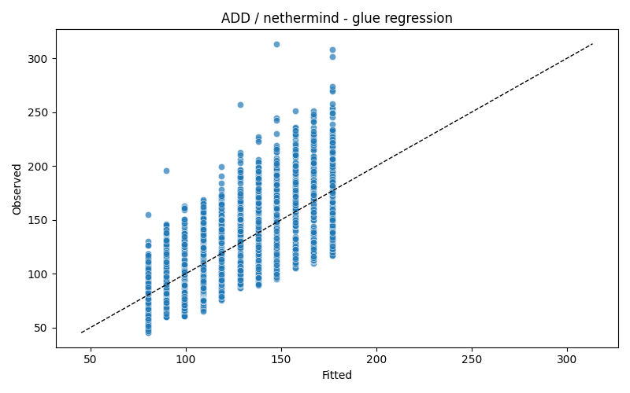

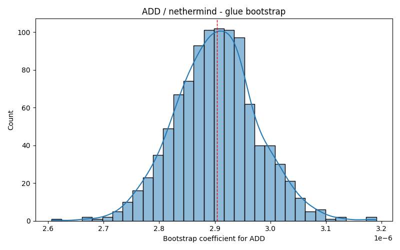

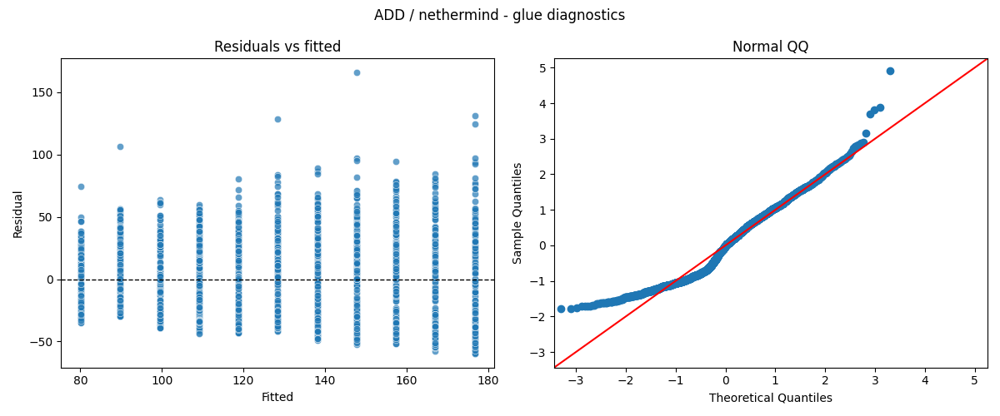

</details>

<details><summary><code>AND</code> · nobs=2090 · runtime_ms=1.458e-06 · p=1.00e-03 · R²=0.7079</summary>

```
==============================================================================
                           NNLS Regression Results                            
==============================================================================
Dep. Variable:          test_runtime_ms              R-squared:          0.708
Model:                  NNLS                    Adj. R-squared:          0.708
No. Observations:       2090                              RMSE:           9.86
Df Residuals:           2088                               MAE:           6.27
Df Model:               1      
==============================================================================
                      coef     std err     P-value      [0.025      0.975]
------------------------------------------------------------------------------
         const     14.5934      0.7663       0.001     13.1491     16.1531
           AND      0.0000      0.0000       0.001      0.0000      0.0000
==============================================================================
Notes: Non-negative least squares with bootstrap inference (1000 iterations)
==============================================================================
```

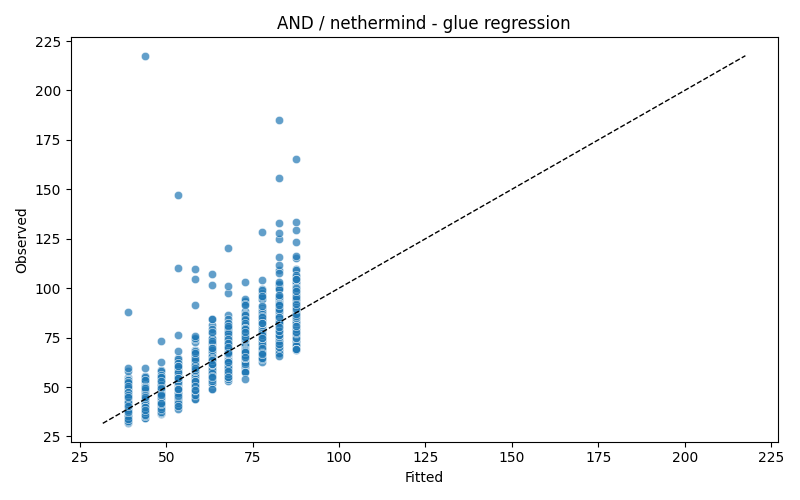

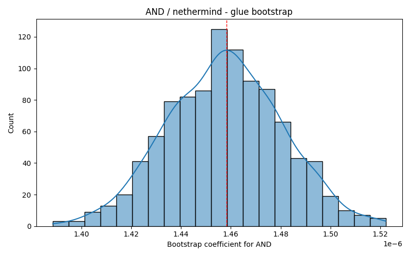

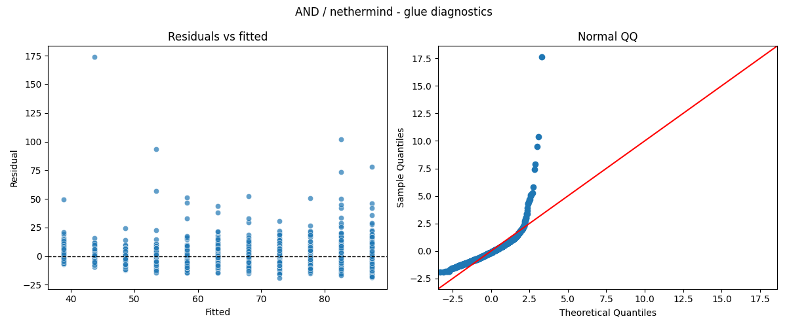

</details>

<details><summary><code>CALLDATACOPY</code> · nobs=50160 · runtime_ms=4.358e-06 · p=1.00e-03 · R²=0.6836</summary>

```
==============================================================================
                           NNLS Regression Results                            
==============================================================================
Dep. Variable:          test_runtime_ms              R-squared:          0.684
Model:                  NNLS                    Adj. R-squared:          0.684
No. Observations:       50160                             RMSE:          22.29
Df Residuals:           50158                              MAE:          17.84
Df Model:               1      
==============================================================================
                      coef     std err     P-value      [0.025      0.975]
------------------------------------------------------------------------------
         const     26.9300      0.1123       0.001     26.7236     27.1485
  CALLDATACOPY      0.0000      0.0000       0.001      0.0000      0.0000
==============================================================================
Notes: Non-negative least squares with bootstrap inference (1000 iterations)
==============================================================================
```

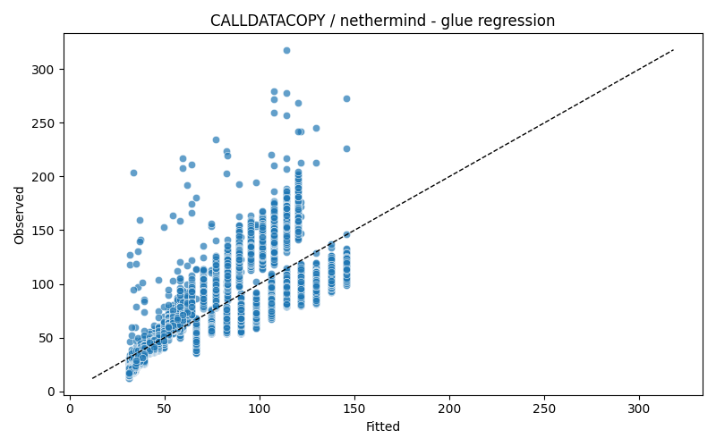

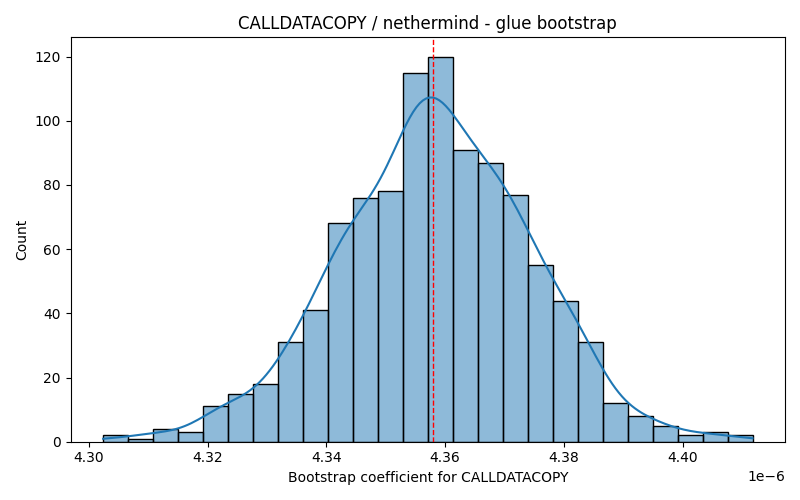

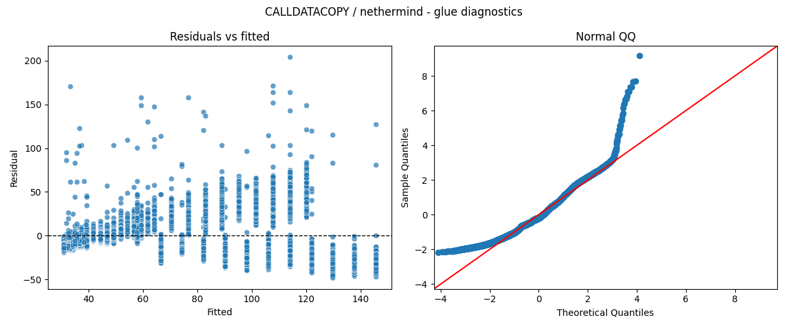

</details>

<details><summary><code>CALLDATALOAD</code> · nobs=8360 · runtime_ms=2.641e-05 · p=2.00e-03 · R²=0.0009864</summary>

```
==============================================================================
                           NNLS Regression Results                            
==============================================================================
Dep. Variable:          test_runtime_ms              R-squared:          0.001
Model:                  NNLS                    Adj. R-squared:          0.001
No. Observations:       8360                              RMSE:           3.23
Df Residuals:           8358                               MAE:           0.56
Df Model:               1      
==============================================================================
                      coef     std err     P-value      [0.025      0.975]
------------------------------------------------------------------------------
         const      3.0866      0.1256       0.001      2.8520      3.3533
  CALLDATALOAD      0.0000      0.0000       0.002      0.0000      0.0000
==============================================================================
Notes: Non-negative least squares with bootstrap inference (1000 iterations)
==============================================================================
```

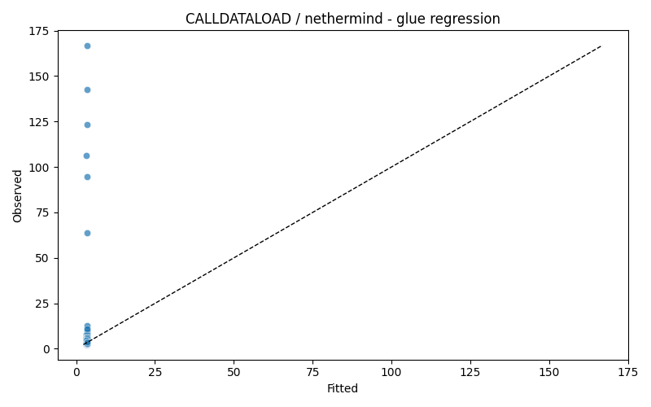

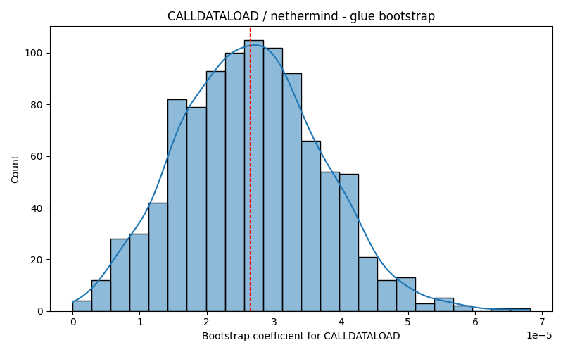

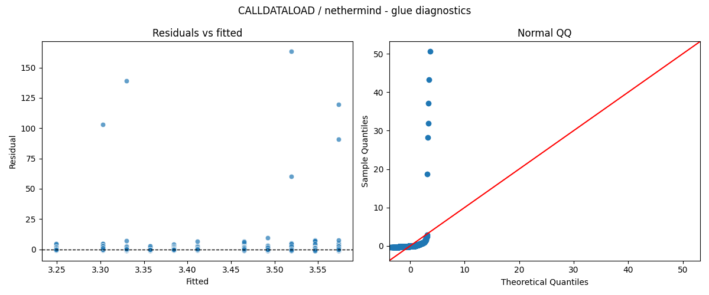

</details>

<details><summary><code>DIV</code> · nobs=2090 · runtime_ms=6.957e-06 · p=1.00e-03 · R²=0.6205</summary>

```
==============================================================================
                           NNLS Regression Results                            
==============================================================================
Dep. Variable:          test_runtime_ms              R-squared:          0.620
Model:                  NNLS                    Adj. R-squared:          0.620
No. Observations:       2090                              RMSE:          42.95
Df Residuals:           2088                               MAE:          32.20
Df Model:               1      
==============================================================================
                      coef     std err     P-value      [0.025      0.975]
------------------------------------------------------------------------------
         const    129.3142      4.8107       0.001    119.1215    138.2045
           DIV      0.0000      0.0000       0.001      0.0000      0.0000
==============================================================================
Notes: Non-negative least squares with bootstrap inference (1000 iterations)
==============================================================================
```

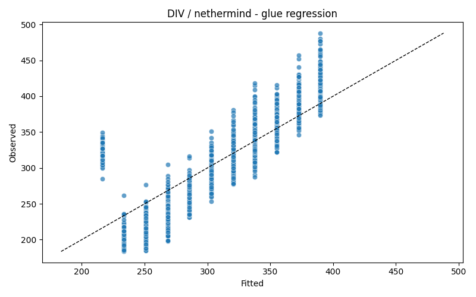

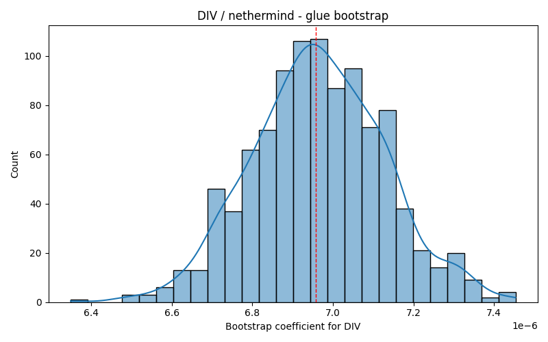

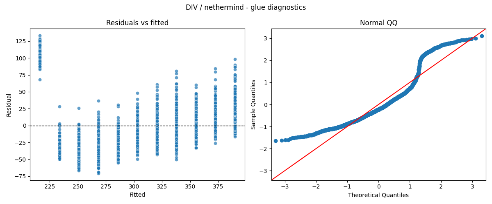

</details>

<details><summary><code>EXP</code> · nobs=2090 · runtime_ms=0 · p=1.00e+00 · R²=0</summary>

```
==============================================================================
                           NNLS Regression Results                            
==============================================================================
Dep. Variable:          test_runtime_ms              R-squared:          0.000
Model:                  NNLS                    Adj. R-squared:         -0.000
No. Observations:       2090                              RMSE:          47.75
Df Residuals:           2088                               MAE:          31.69
Df Model:               1      
==============================================================================
                      coef     std err     P-value      [0.025      0.975]
------------------------------------------------------------------------------
         const    106.7435      1.0601       0.001    104.7640    108.7336
           EXP      0.0000      0.0000       1.000      0.0000      0.0000
==============================================================================
Notes: Non-negative least squares with bootstrap inference (1000 iterations)
==============================================================================
```

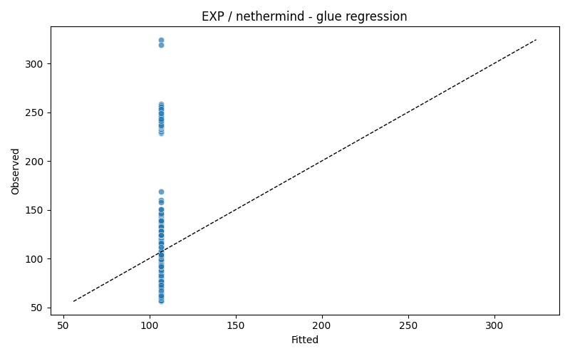

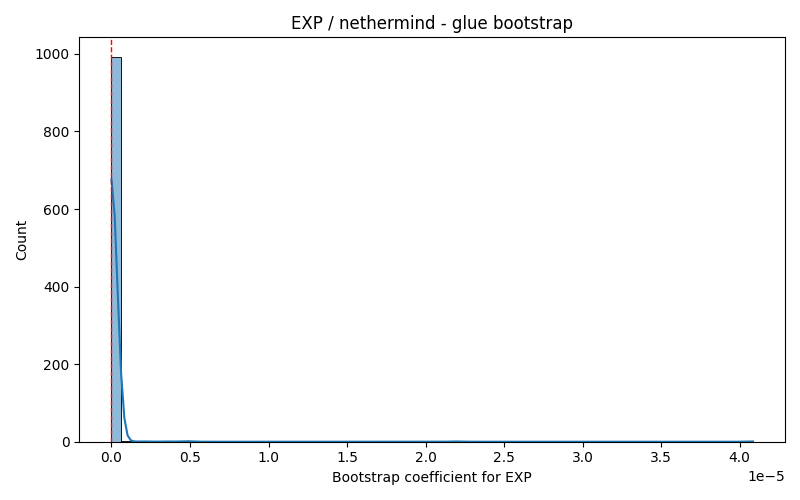

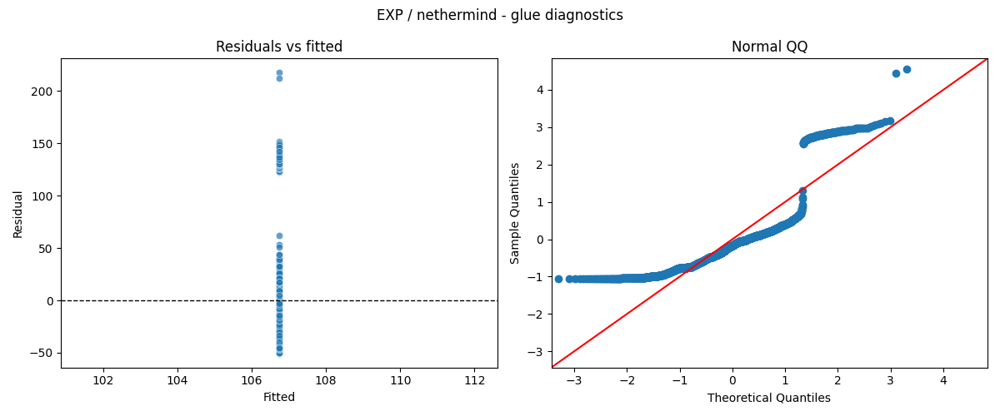

</details>

<details><summary><code>GT</code> · nobs=2090 · runtime_ms=1.781e-06 · p=1.00e-03 · R²=0.7947</summary>

```
==============================================================================
                           NNLS Regression Results                            
==============================================================================
Dep. Variable:          test_runtime_ms              R-squared:          0.795
Model:                  NNLS                    Adj. R-squared:          0.795
No. Observations:       2090                              RMSE:           9.53
Df Residuals:           2088                               MAE:           5.93
Df Model:               1      
==============================================================================
                      coef     std err     P-value      [0.025      0.975]
------------------------------------------------------------------------------
         const     14.2888      0.5116       0.001     13.2839     15.2568
            GT      0.0000      0.0000       0.001      0.0000      0.0000
==============================================================================
Notes: Non-negative least squares with bootstrap inference (1000 iterations)
==============================================================================
```

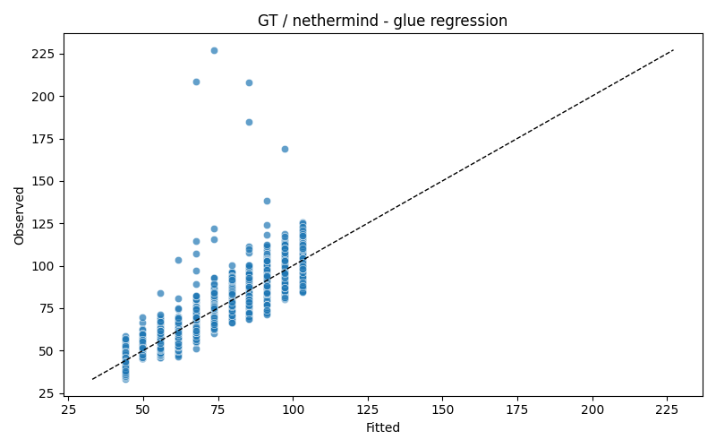

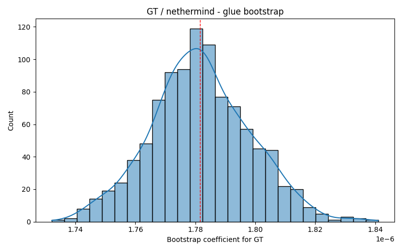

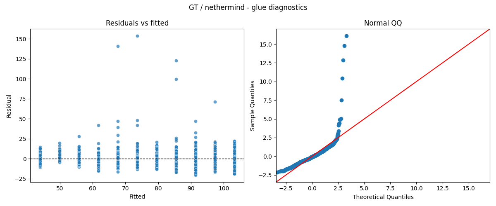

</details>

<details><summary><code>JUMPI</code> · nobs=2090 · runtime_ms=2.047e-06 · p=1.00e-03 · R²=0.7229</summary>

```
==============================================================================
                           NNLS Regression Results                            
==============================================================================
Dep. Variable:          test_runtime_ms              R-squared:          0.723
Model:                  NNLS                    Adj. R-squared:          0.723
No. Observations:       2090                              RMSE:           5.72
Df Residuals:           2088                               MAE:           3.08
Df Model:               1      
==============================================================================
                      coef     std err     P-value      [0.025      0.975]
------------------------------------------------------------------------------
         const      9.8810      0.3327       0.001      9.2649     10.5310
         JUMPI      0.0000      0.0000       0.001      0.0000      0.0000
==============================================================================
Notes: Non-negative least squares with bootstrap inference (1000 iterations)
==============================================================================
```

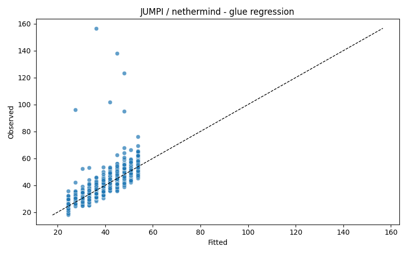

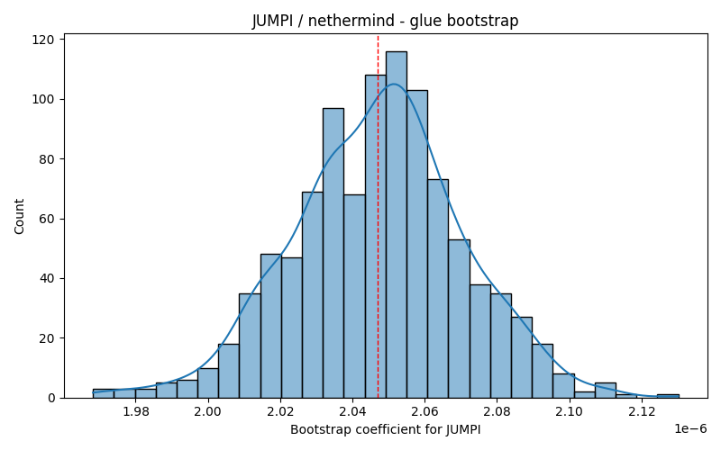

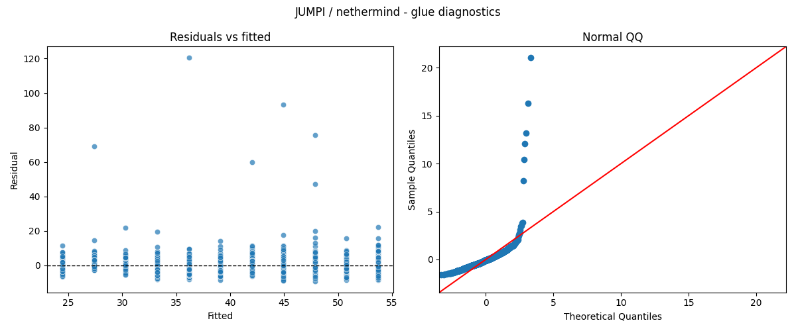

</details>

<details><summary><code>LT</code> · nobs=2090 · runtime_ms=1.613e-06 · p=1.00e-03 · R²=0.7455</summary>

```
==============================================================================
                           NNLS Regression Results                            
==============================================================================
Dep. Variable:          test_runtime_ms              R-squared:          0.746
Model:                  NNLS                    Adj. R-squared:          0.745
No. Observations:       2090                              RMSE:           9.92
Df Residuals:           2088                               MAE:           5.91
Df Model:               1      
==============================================================================
                      coef     std err     P-value      [0.025      0.975]
------------------------------------------------------------------------------
         const     20.5025      0.8111       0.001     19.0047     22.0883
            LT      0.0000      0.0000       0.001      0.0000      0.0000
==============================================================================
Notes: Non-negative least squares with bootstrap inference (1000 iterations)
==============================================================================
```

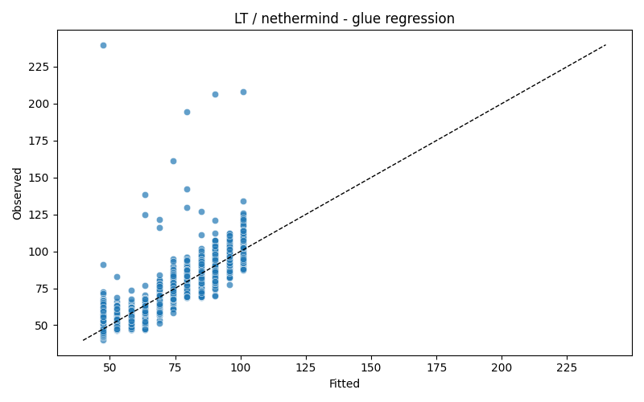

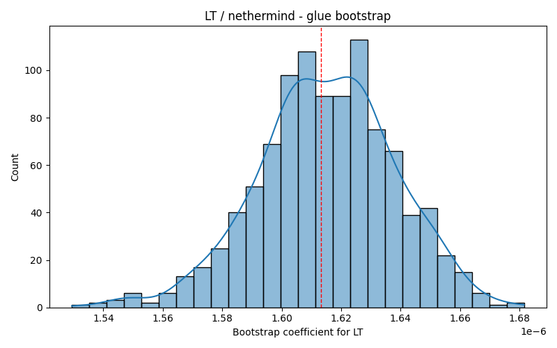

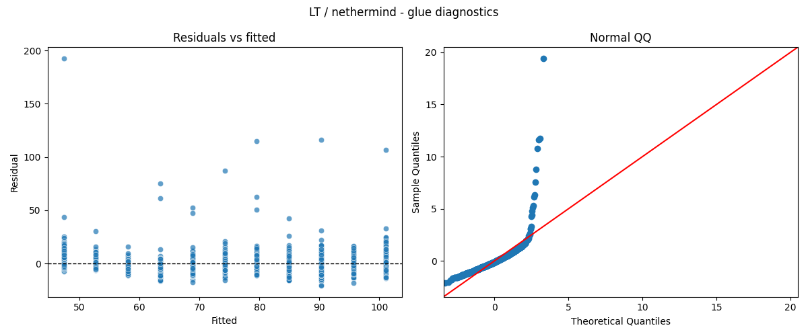

</details>

<details><summary><code>MSTORE</code> · nobs=10450 · runtime_ms=2.21e-06 · p=1.00e-03 · R²=0.8405</summary>

```
==============================================================================
                           NNLS Regression Results                            
==============================================================================
Dep. Variable:          test_runtime_ms              R-squared:          0.840
Model:                  NNLS                    Adj. R-squared:          0.840
No. Observations:       10450                             RMSE:           6.76
Df Residuals:           10448                              MAE:           4.31
Df Model:               1      
==============================================================================
                      coef     std err     P-value      [0.025      0.975]
------------------------------------------------------------------------------
         const     14.8905      0.2283       0.001     14.4468     15.3488
        MSTORE      0.0000      0.0000       0.001      0.0000      0.0000
==============================================================================
Notes: Non-negative least squares with bootstrap inference (1000 iterations)
==============================================================================
```

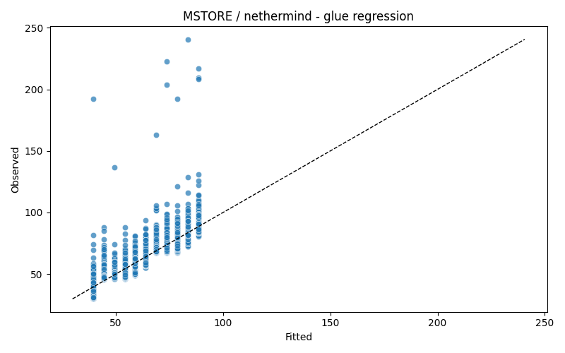

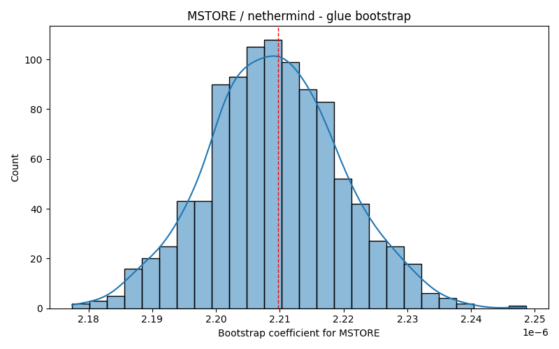

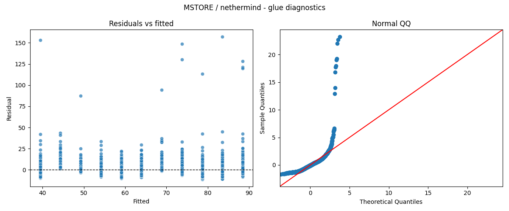

</details>

<details><summary><code>MSTORE8</code> · nobs=10450 · runtime_ms=2.192e-06 · p=1.00e-03 · R²=0.8351</summary>

```
==============================================================================
                           NNLS Regression Results                            
==============================================================================
Dep. Variable:          test_runtime_ms              R-squared:          0.835
Model:                  NNLS                    Adj. R-squared:          0.835
No. Observations:       10450                             RMSE:           6.84
Df Residuals:           10448                              MAE:           4.26
Df Model:               1      
==============================================================================
                      coef     std err     P-value      [0.025      0.975]
------------------------------------------------------------------------------
         const     14.7326      0.2223       0.001     14.3051     15.1763
       MSTORE8      0.0000      0.0000       0.001      0.0000      0.0000
==============================================================================
Notes: Non-negative least squares with bootstrap inference (1000 iterations)
==============================================================================
```

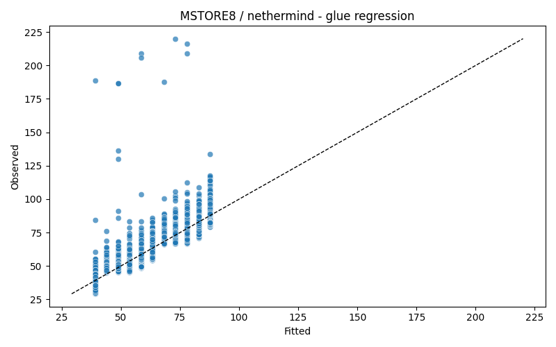

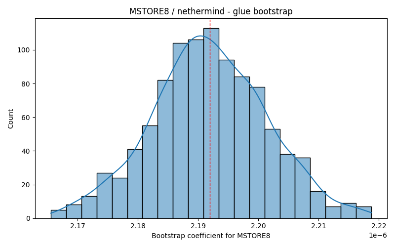

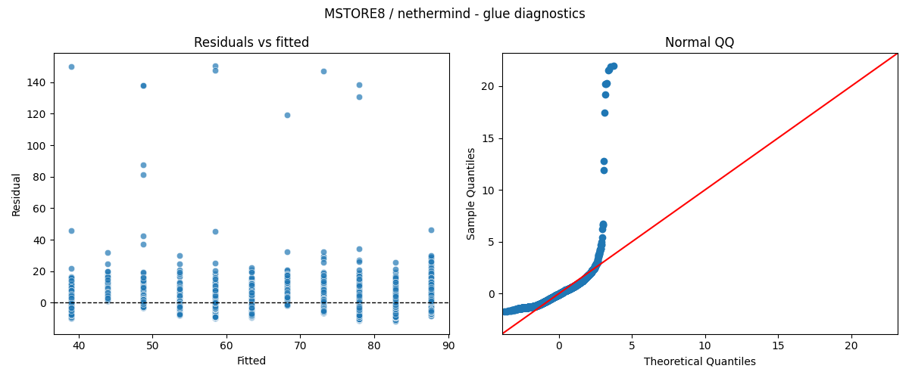

</details>

<details><summary><code>MUL</code> · nobs=2090 · runtime_ms=5.339e-06 · p=1.00e-03 · R²=0.9152</summary>

```
==============================================================================
                           NNLS Regression Results                            
==============================================================================
Dep. Variable:          test_runtime_ms              R-squared:          0.915
Model:                  NNLS                    Adj. R-squared:          0.915
No. Observations:       2090                              RMSE:          12.83
Df Residuals:           2088                               MAE:           9.55
Df Model:               1      
==============================================================================
                      coef     std err     P-value      [0.025      0.975]
------------------------------------------------------------------------------
         const     25.3062      0.8815       0.001     23.5816     27.0870
           MUL      0.0000      0.0000       0.001      0.0000      0.0000
==============================================================================
Notes: Non-negative least squares with bootstrap inference (1000 iterations)
==============================================================================
```

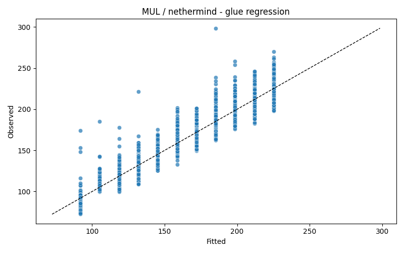

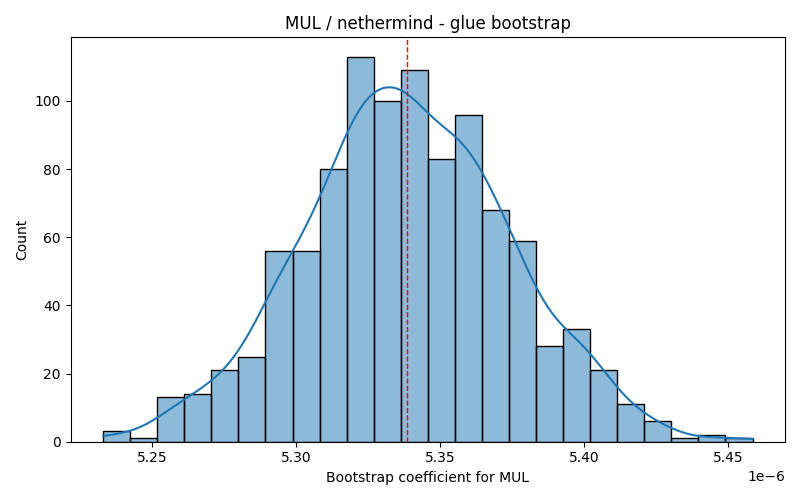

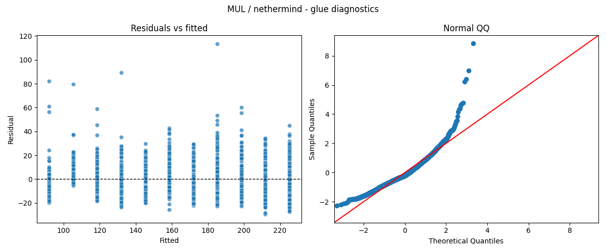

</details>

<details><summary><code>PC</code> · nobs=2090 · runtime_ms=9.149e-07 · p=1.00e-03 · R²=0.9096</summary>

```
==============================================================================
                           NNLS Regression Results                            
==============================================================================
Dep. Variable:          test_runtime_ms              R-squared:          0.910
Model:                  NNLS                    Adj. R-squared:          0.910
No. Observations:       2090                              RMSE:           8.62
Df Residuals:           2088                               MAE:           6.66
Df Model:               1      
==============================================================================
                      coef     std err     P-value      [0.025      0.975]
------------------------------------------------------------------------------
         const     18.4843      0.5421       0.001     17.4058     19.6527
            PC      0.0000      0.0000       0.001      0.0000      0.0000
==============================================================================
Notes: Non-negative least squares with bootstrap inference (1000 iterations)
==============================================================================
```

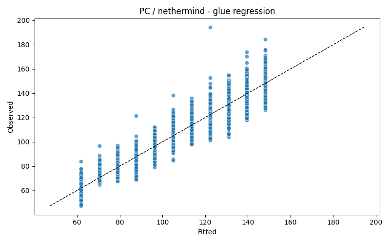

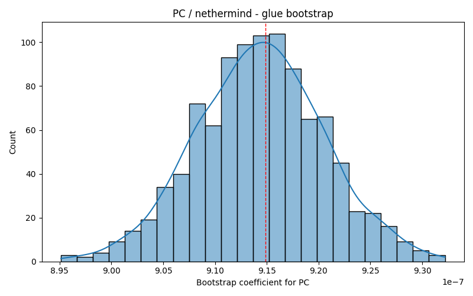

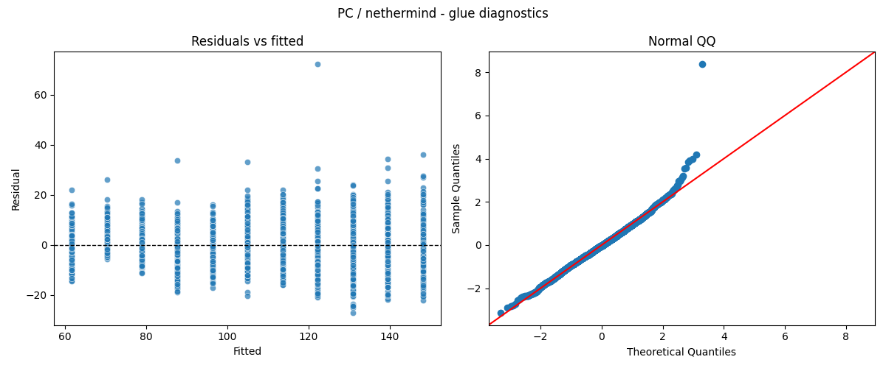

</details>

<details><summary><code>RETURNDATASIZE</code> · nobs=8360 · runtime_ms=9.329e-07 · p=1.00e-03 · R²=0.683</summary>

```
==============================================================================
                           NNLS Regression Results                            
==============================================================================
Dep. Variable:          test_runtime_ms              R-squared:          0.683
Model:                  NNLS                    Adj. R-squared:          0.683
No. Observations:       8360                              RMSE:          10.04
Df Residuals:           8358                               MAE:           3.69
Df Model:               1      
==============================================================================
                      coef     std err     P-value      [0.025      0.975]
------------------------------------------------------------------------------
         const     13.0785      0.2994       0.001     12.4543     13.6438
RETURNDATASIZE      0.0000      0.0000       0.001      0.0000      0.0000
==============================================================================
Notes: Non-negative least squares with bootstrap inference (1000 iterations)
==============================================================================
```

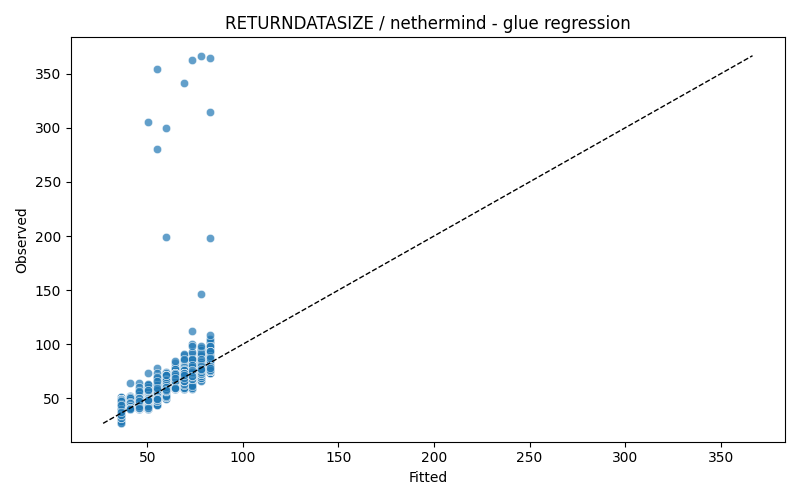

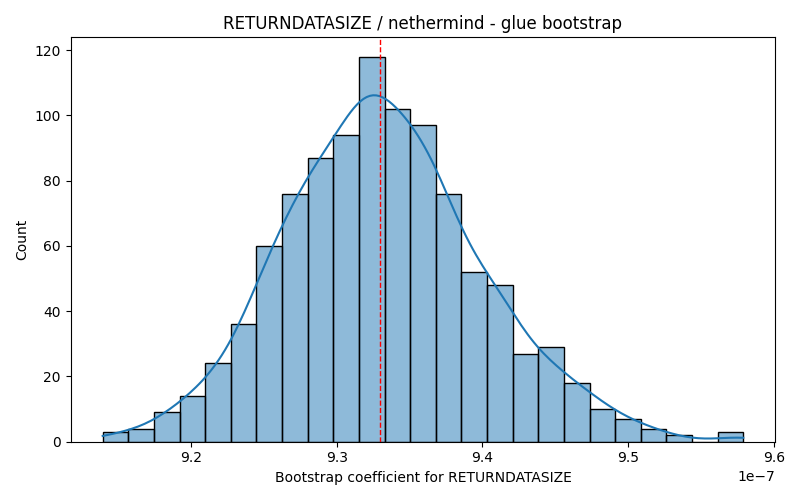

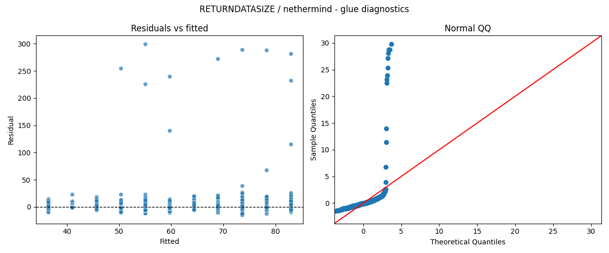

</details>

<details><summary><code>SELFBALANCE</code> · nobs=1710 · runtime_ms=3.859e-06 · p=1.00e-03 · R²=0.5866</summary>

```
==============================================================================
                           NNLS Regression Results                            
==============================================================================
Dep. Variable:          test_runtime_ms              R-squared:          0.587
Model:                  NNLS                    Adj. R-squared:          0.586
No. Observations:       1710                              RMSE:          32.68
Df Residuals:           1708                               MAE:          25.00
Df Model:               1      
==============================================================================
                      coef     std err     P-value      [0.025      0.975]
------------------------------------------------------------------------------
         const    115.8311      4.2567       0.001    107.0180    123.8449
   SELFBALANCE      0.0000      0.0000       0.001      0.0000      0.0000
==============================================================================
Notes: Non-negative least squares with bootstrap inference (1000 iterations)
==============================================================================
```

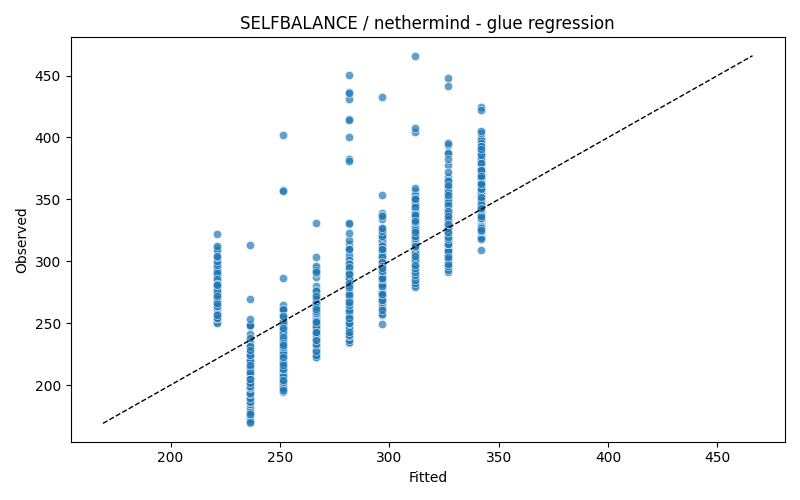

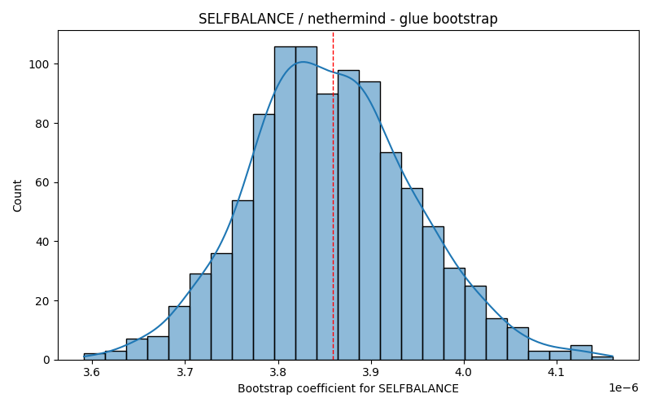

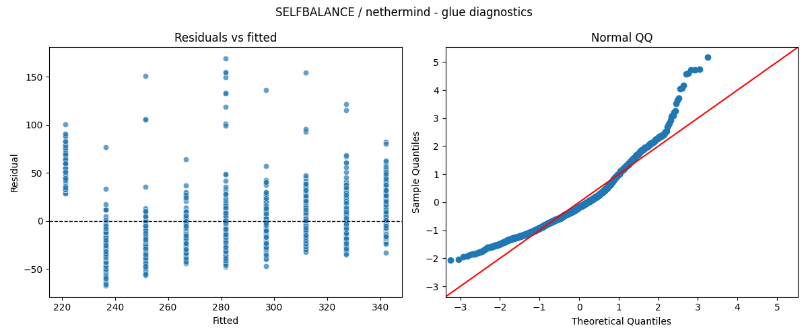

</details>

<details><summary><code>SUB</code> · nobs=2090 · runtime_ms=2.661e-06 · p=1.00e-03 · R²=0.8635</summary>

```
==============================================================================
                           NNLS Regression Results                            
==============================================================================
Dep. Variable:          test_runtime_ms              R-squared:          0.863
Model:                  NNLS                    Adj. R-squared:          0.863
No. Observations:       2090                              RMSE:          11.14
Df Residuals:           2088                               MAE:           7.47
Df Model:               1      
==============================================================================
                      coef     std err     P-value      [0.025      0.975]
------------------------------------------------------------------------------
         const     18.5688      0.7738       0.001     17.2045     20.2170
           SUB      0.0000      0.0000       0.001      0.0000      0.0000
==============================================================================
Notes: Non-negative least squares with bootstrap inference (1000 iterations)
==============================================================================
```

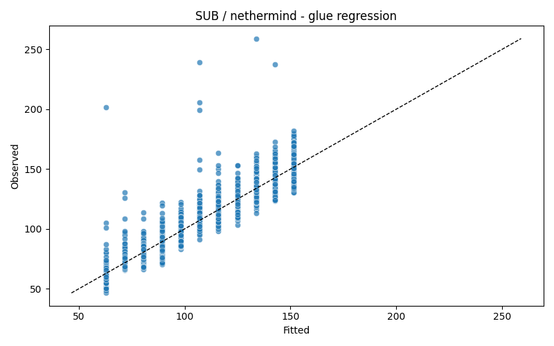

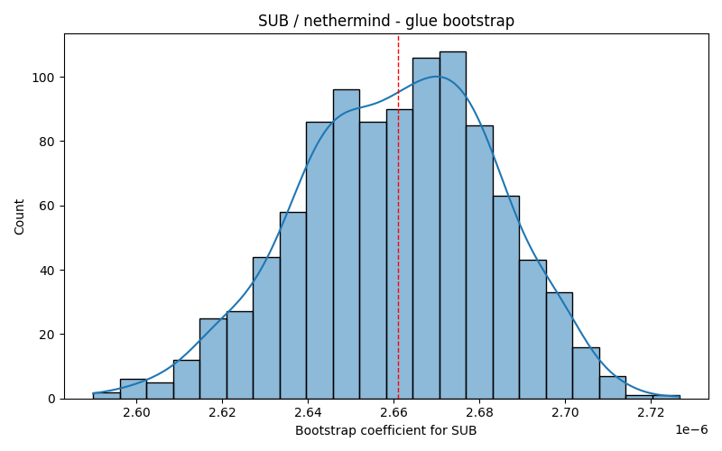

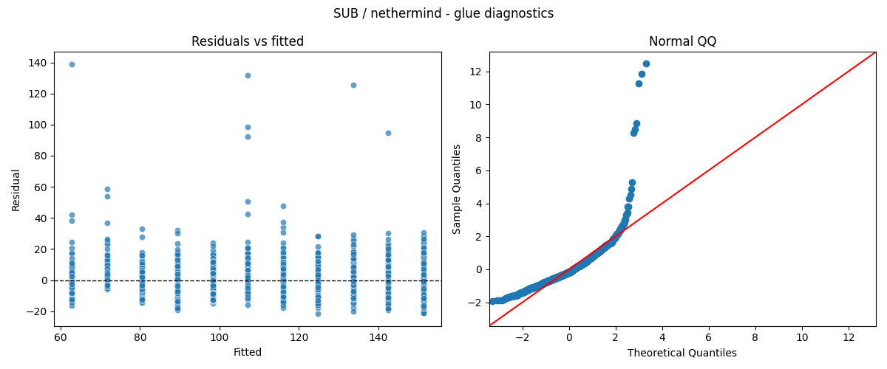

</details>

### Mixed glue (tier B) · nethermind

<details><summary><code>JUMP</code> · nobs=2090 · runtime_ms=5.816e-06 · p=1.00e-03 · R²=0.9109</summary>

```
==============================================================================
                           NNLS Regression Results                            
==============================================================================
Dep. Variable:          test_runtime_ms              R-squared:          0.911
Model:                  NNLS                    Adj. R-squared:          0.911
No. Observations:       2090                              RMSE:           6.76
Df Residuals:           2088                               MAE:           4.58
Df Model:               1      
==============================================================================
                      coef     std err     P-value      [0.025      0.975]
------------------------------------------------------------------------------
         const     16.6719      0.4672       0.001     15.7571     17.5586
          JUMP      0.0000      0.0000       0.001      0.0000      0.0000
==============================================================================
Notes: Non-negative least squares with bootstrap inference (1000 iterations)
==============================================================================
```

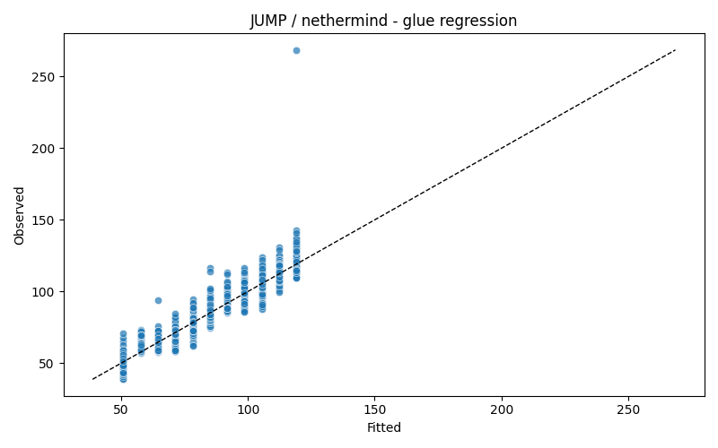

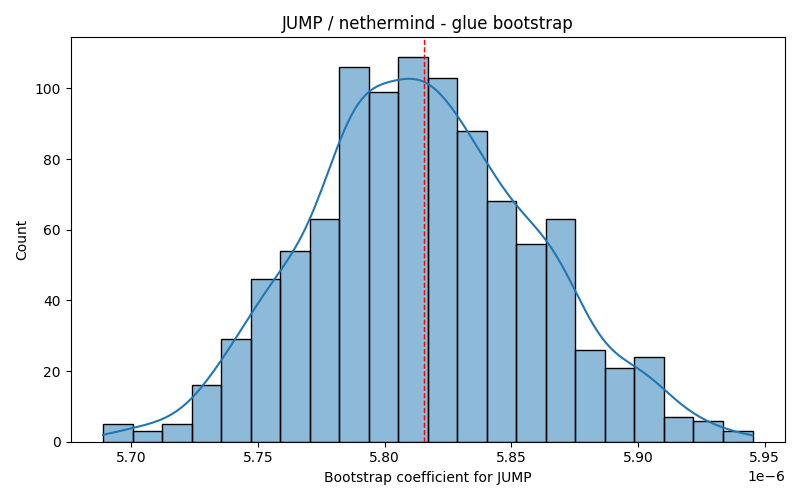

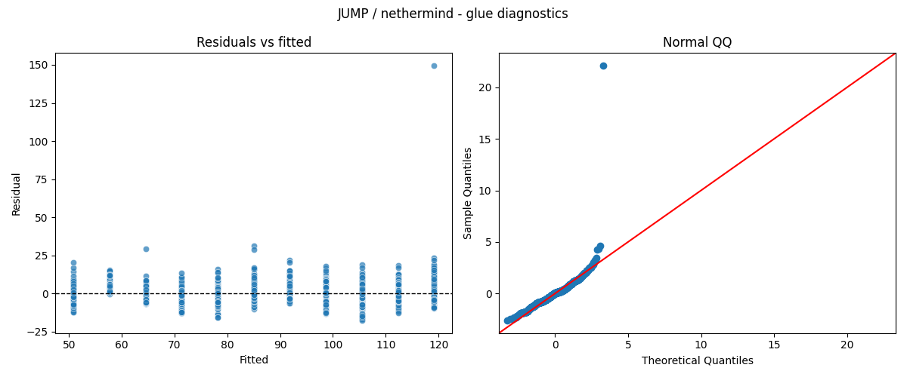

</details>

<details><summary><code>KECCAK256</code> · nobs=33440 · runtime_ms=0 · p=1.00e+00 · R²=1.11e-16</summary>

```
==============================================================================
                           NNLS Regression Results                            
==============================================================================
Dep. Variable:          test_runtime_ms              R-squared:          0.000
Model:                  NNLS                    Adj. R-squared:         -0.000
No. Observations:       33440                             RMSE:         296.93
Df Residuals:           33438                              MAE:         239.74
Df Model:               1      
==============================================================================
                      coef     std err     P-value      [0.025      0.975]
------------------------------------------------------------------------------
         const    420.2310      1.6111       0.001    416.9967    423.4535
     KECCAK256      0.0000      0.0000       1.000      0.0000      0.0000
==============================================================================
Notes: Non-negative least squares with bootstrap inference (1000 iterations)
==============================================================================
```

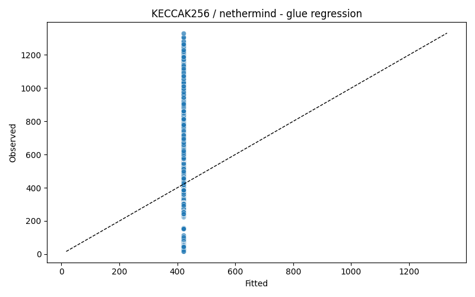


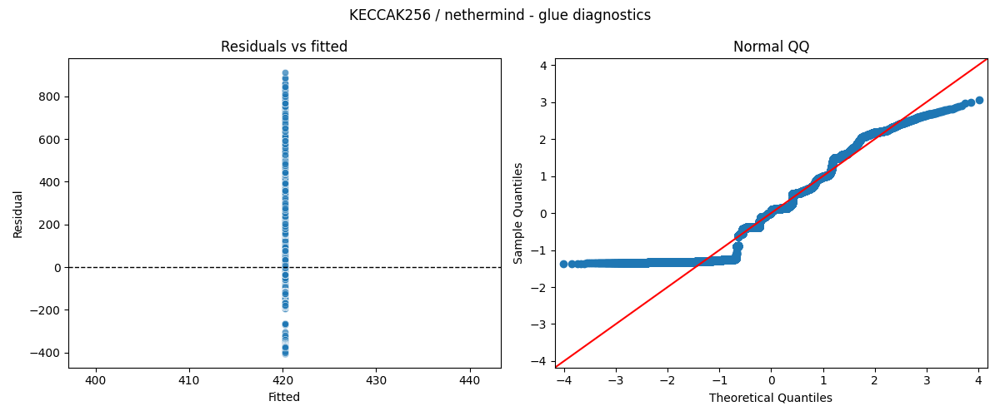

</details>
