# Runtime estimation report

Per-spec NNLS fits of `test_runtime_ms` against `opcount`, one row per (target opcode, test, model_by combo, client).

## Contents

- [SLOAD](#sload)
- [SSTORE](#sstore)
- [BALANCE](#balance)
- [CALL](#call)
- [CALLCODE](#callcode)
- [DELEGATECALL](#delegatecall)
- [EXTCODECOPY](#extcodecopy)
- [EXTCODEHASH](#extcodehash)
- [EXTCODESIZE](#extcodesize)
- [STATICCALL](#staticcall)

## SLOAD

### test_sload_bloated — combo `False`

| client | nobs | R² | target_coef (ms) | p-value | 95% CI |
| --- | --- | --- | --- | --- | --- |
| `besu` | 418 | 0.8773 | 0.007467 | 1.00e-03 | [0.007212, 0.007728] |
| `erigon` | 198 | 0.9613 | 0.007472 | 1.00e-03 | [0.007394, 0.007543] |
| `ethrex` | 275 | 0.9102 | 0.008898 | 1.00e-03 | [0.008763, 0.009027] |
| `geth` | 264 | 0.9761 | 0.02429 | 1.00e-03 | [0.02379, 0.02476] |
| `nethermind` | 165 | 0.9374 | 0.003145 | 1.00e-03 | [0.003034, 0.003257] |

<details><summary>besu — NNLS regression summary</summary>

```
==============================================================================
                           NNLS Regression Results                            
==============================================================================
Dep. Variable:          test_runtime_ms              R-squared:          0.877
Model:                  NNLS                    Adj. R-squared:          0.877
No. Observations:       418                               RMSE:          82.20
Df Residuals:           416                                MAE:          67.42
Df Model:               1      
==============================================================================
                      coef     std err     P-value      [0.025      0.975]
------------------------------------------------------------------------------
         const    138.3946     11.4055       0.001    116.0730    160.8161
       opcount      0.0075      0.0001       0.001      0.0072      0.0077
==============================================================================
Notes: Non-negative least squares with bootstrap inference (1000 iterations)
==============================================================================
```

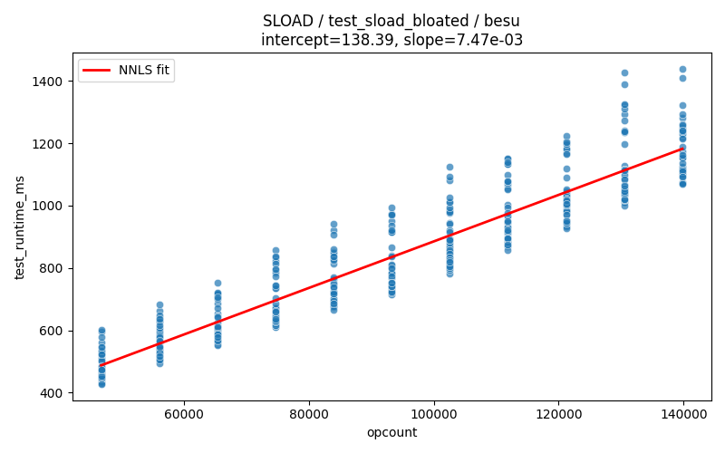

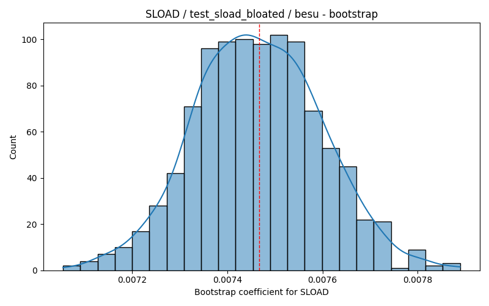

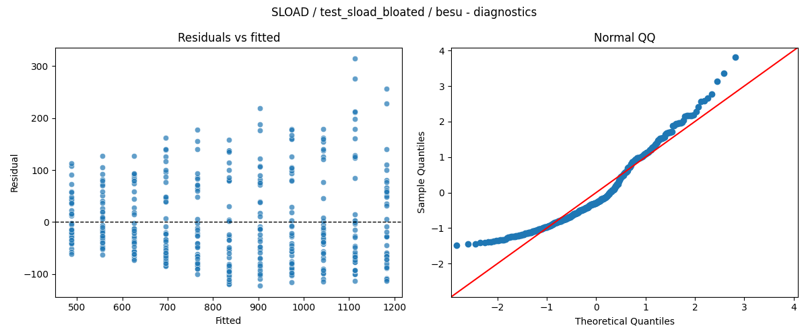

</details>

<details><summary>erigon — NNLS regression summary</summary>

```
==============================================================================
                           NNLS Regression Results                            
==============================================================================
Dep. Variable:          test_runtime_ms              R-squared:          0.961
Model:                  NNLS                    Adj. R-squared:          0.961
No. Observations:       198                               RMSE:          45.07
Df Residuals:           196                                MAE:          36.46
Df Model:               1      
==============================================================================
                      coef     std err     P-value      [0.025      0.975]
------------------------------------------------------------------------------
         const      0.0000      0.9182       1.000      0.0000      2.3324
       opcount      0.0075      0.0000       0.001      0.0074      0.0075
==============================================================================
Notes: Non-negative least squares with bootstrap inference (1000 iterations)
==============================================================================
```

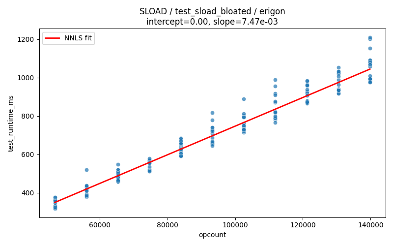

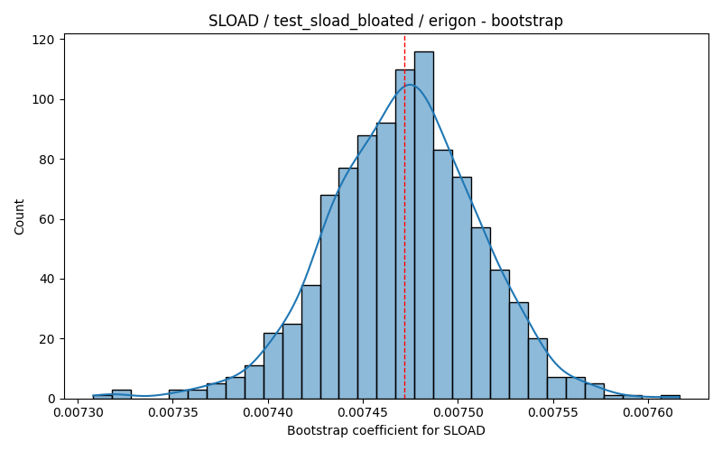

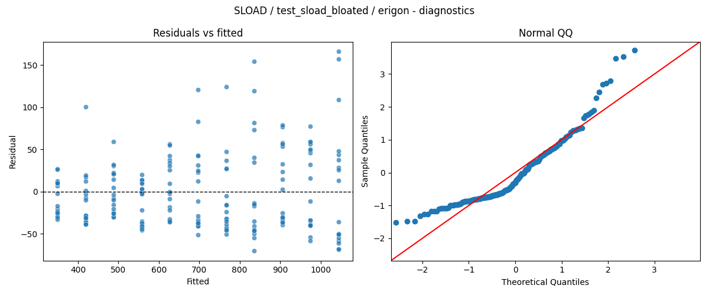

</details>

<details><summary>ethrex — NNLS regression summary</summary>

```
==============================================================================
                           NNLS Regression Results                            
==============================================================================
Dep. Variable:          test_runtime_ms              R-squared:          0.910
Model:                  NNLS                    Adj. R-squared:          0.910
No. Observations:       275                               RMSE:         105.86
Df Residuals:           273                                MAE:          91.67
Df Model:               1      
==============================================================================
                      coef     std err     P-value      [0.025      0.975]
------------------------------------------------------------------------------
         const      0.0000      0.0000       1.000      0.0000      0.0000
       opcount      0.0089      0.0001       0.001      0.0088      0.0090
==============================================================================
Notes: Non-negative least squares with bootstrap inference (1000 iterations)
==============================================================================
```

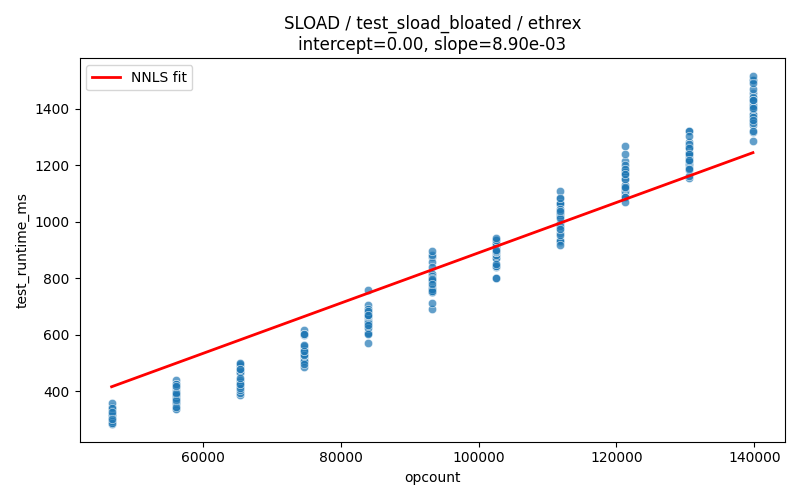

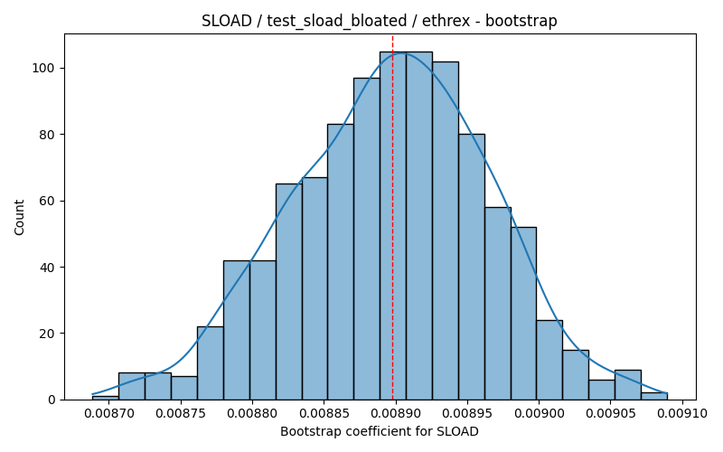

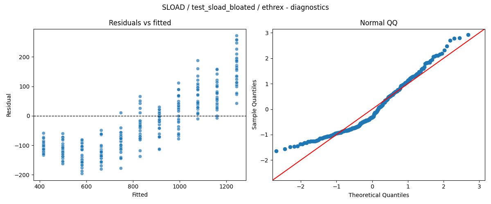

</details>

<details><summary>geth — NNLS regression summary</summary>

```
==============================================================================
                           NNLS Regression Results                            
==============================================================================
Dep. Variable:          test_runtime_ms              R-squared:          0.976
Model:                  NNLS                    Adj. R-squared:          0.976
No. Observations:       264                               RMSE:         111.95
Df Residuals:           262                                MAE:          89.54
Df Model:               1      
==============================================================================
                      coef     std err     P-value      [0.025      0.975]
------------------------------------------------------------------------------
         const    512.5797     22.1662       0.001    471.2553    558.6151
       opcount      0.0243      0.0003       0.001      0.0238      0.0248
==============================================================================
Notes: Non-negative least squares with bootstrap inference (1000 iterations)
==============================================================================
```

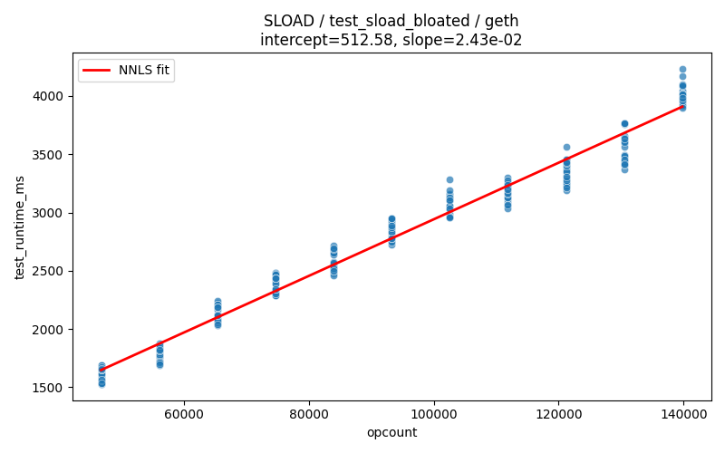

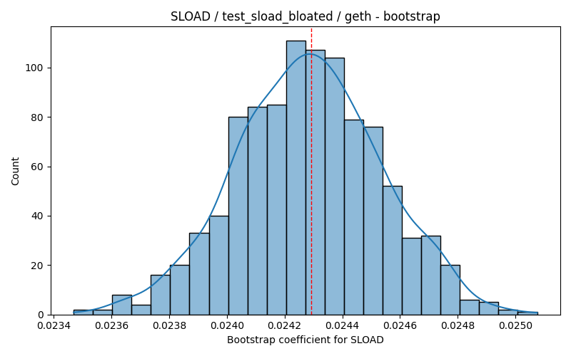

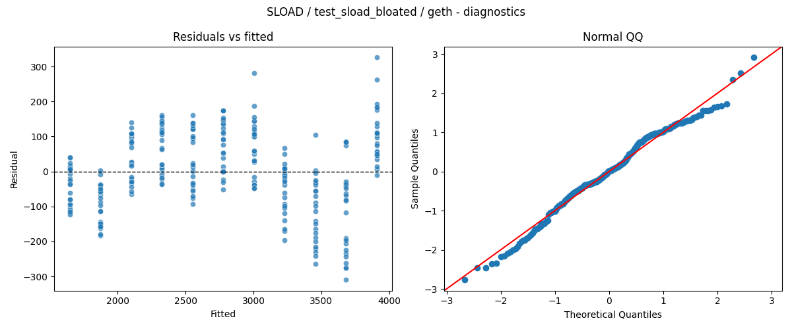

</details>

<details><summary>nethermind — NNLS regression summary</summary>

```
==============================================================================
                           NNLS Regression Results                            
==============================================================================
Dep. Variable:          test_runtime_ms              R-squared:          0.937
Model:                  NNLS                    Adj. R-squared:          0.937
No. Observations:       165                               RMSE:          23.91
Df Residuals:           163                                MAE:          17.68
Df Model:               1      
==============================================================================
                      coef     std err     P-value      [0.025      0.975]
------------------------------------------------------------------------------
         const     74.7378      5.3166       0.001     63.6594     85.1918
       opcount      0.0031      0.0001       0.001      0.0030      0.0033
==============================================================================
Notes: Non-negative least squares with bootstrap inference (1000 iterations)
==============================================================================
```

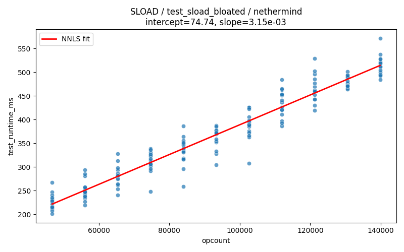

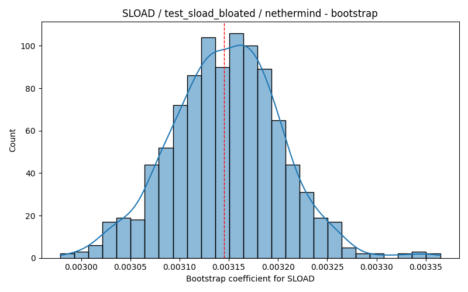

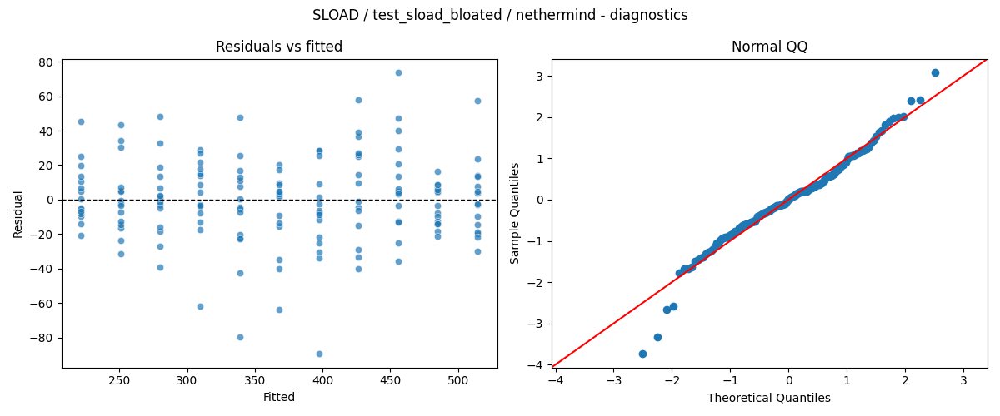

</details>

### test_sload_bloated — combo `True`

| client | nobs | R² | target_coef (ms) | p-value | 95% CI |
| --- | --- | --- | --- | --- | --- |
| `besu` | 418 | 0.9588 | 0.01441 | 1.00e-03 | [0.0141, 0.0147] |
| `erigon` | 198 | 0.9714 | 0.007144 | 1.00e-03 | [0.00708, 0.007205] |
| `ethrex` | 275 | 0.9521 | 0.01316 | 1.00e-03 | [0.01302, 0.01328] |
| `geth` | 264 | 0.9733 | 0.02335 | 1.00e-03 | [0.02288, 0.02381] |
| `nethermind` | 165 | 0.902 | 0.008605 | 1.00e-03 | [0.008222, 0.009] |

<details><summary>besu — NNLS regression summary</summary>

```
==============================================================================
                           NNLS Regression Results                            
==============================================================================
Dep. Variable:          test_runtime_ms              R-squared:          0.959
Model:                  NNLS                    Adj. R-squared:          0.959
No. Observations:       418                               RMSE:          87.97
Df Residuals:           416                                MAE:          70.55
Df Model:               1      
==============================================================================
                      coef     std err     P-value      [0.025      0.975]
------------------------------------------------------------------------------
         const    332.8525     12.8372       0.001    309.2996    359.1470
       opcount      0.0144      0.0002       0.001      0.0141      0.0147
==============================================================================
Notes: Non-negative least squares with bootstrap inference (1000 iterations)
==============================================================================
```

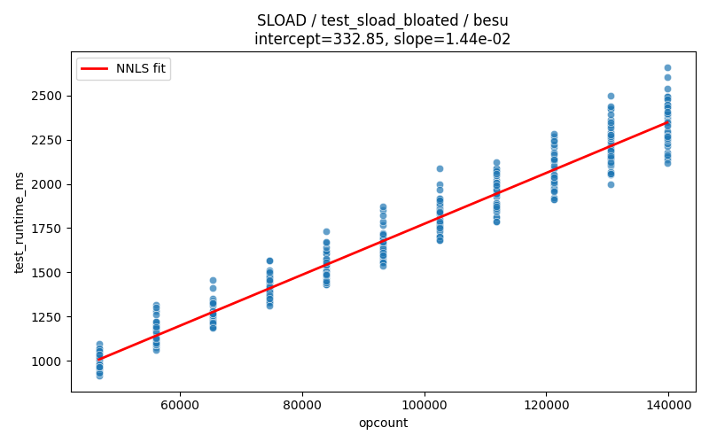

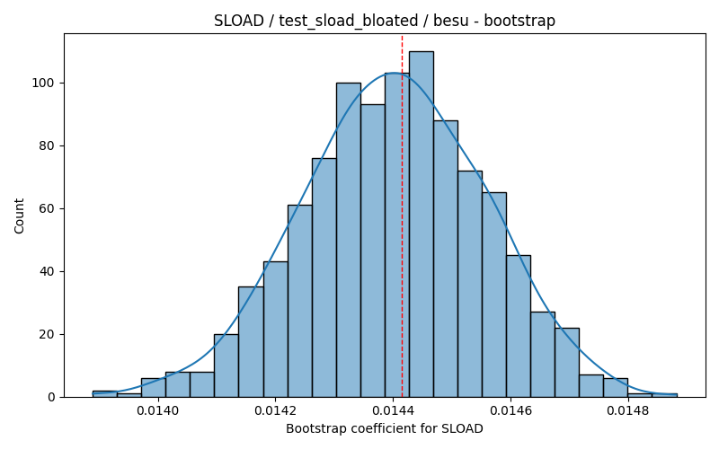

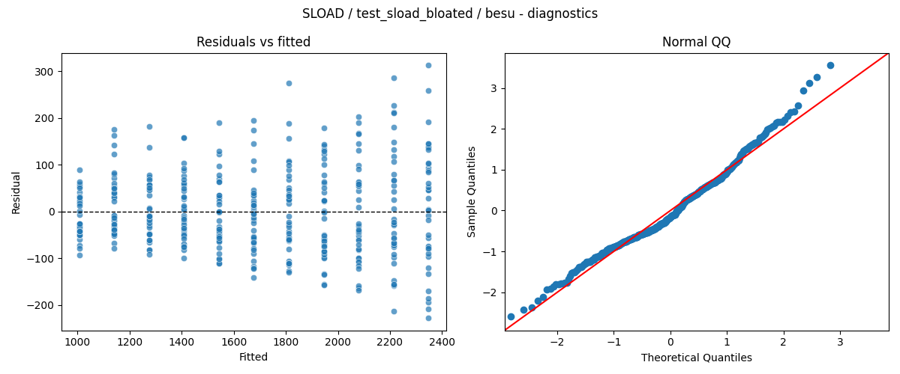

</details>

<details><summary>erigon — NNLS regression summary</summary>

```
==============================================================================
                           NNLS Regression Results                            
==============================================================================
Dep. Variable:          test_runtime_ms              R-squared:          0.971
Model:                  NNLS                    Adj. R-squared:          0.971
No. Observations:       198                               RMSE:          37.20
Df Residuals:           196                                MAE:          31.25
Df Model:               1      
==============================================================================
                      coef     std err     P-value      [0.025      0.975]
------------------------------------------------------------------------------
         const      0.0000      0.1873       1.000      0.0000      0.0000
       opcount      0.0071      0.0000       0.001      0.0071      0.0072
==============================================================================
Notes: Non-negative least squares with bootstrap inference (1000 iterations)
==============================================================================
```

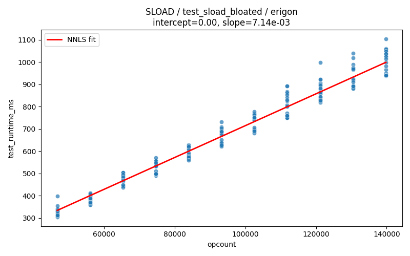

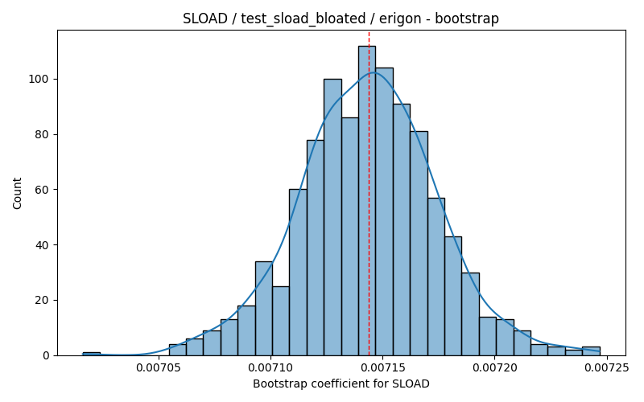

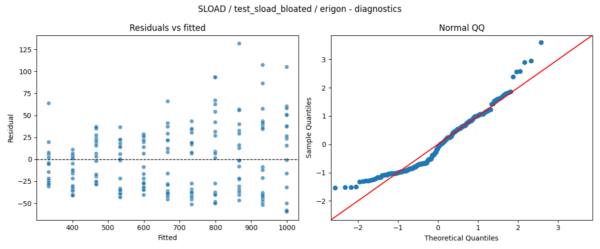

</details>

<details><summary>ethrex — NNLS regression summary</summary>

```
==============================================================================
                           NNLS Regression Results                            
==============================================================================
Dep. Variable:          test_runtime_ms              R-squared:          0.952
Model:                  NNLS                    Adj. R-squared:          0.952
No. Observations:       275                               RMSE:         103.68
Df Residuals:           273                                MAE:          89.45
Df Model:               1      
==============================================================================
                      coef     std err     P-value      [0.025      0.975]
------------------------------------------------------------------------------
         const      0.0000      0.0000       1.000      0.0000      0.0000
       opcount      0.0132      0.0001       0.001      0.0130      0.0133
==============================================================================
Notes: Non-negative least squares with bootstrap inference (1000 iterations)
==============================================================================
```

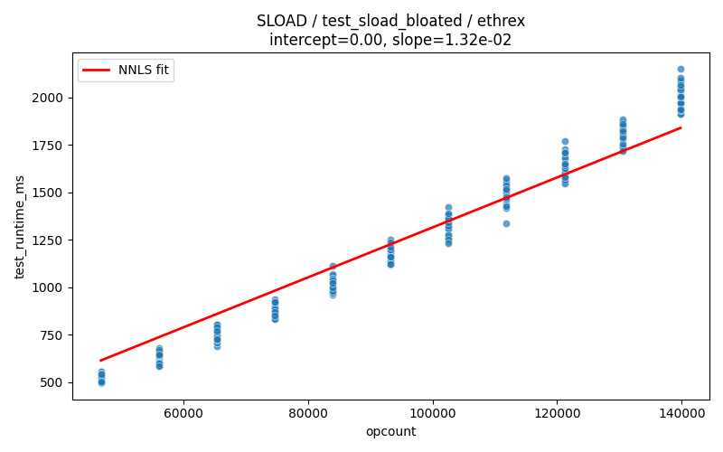

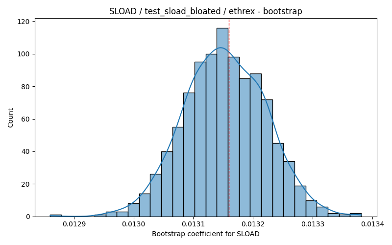

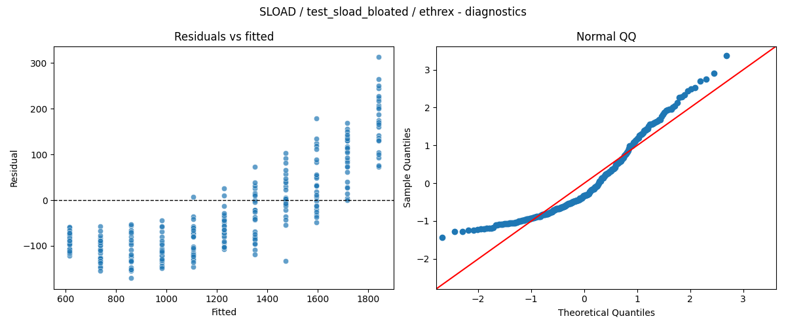

</details>

<details><summary>geth — NNLS regression summary</summary>

```
==============================================================================
                           NNLS Regression Results                            
==============================================================================
Dep. Variable:          test_runtime_ms              R-squared:          0.973
Model:                  NNLS                    Adj. R-squared:          0.973
No. Observations:       264                               RMSE:         113.79
Df Residuals:           262                                MAE:          92.09
Df Model:               1      
==============================================================================
                      coef     std err     P-value      [0.025      0.975]
------------------------------------------------------------------------------
         const    512.1936     20.9232       0.001    472.7463    554.1709
       opcount      0.0233      0.0002       0.001      0.0229      0.0238
==============================================================================
Notes: Non-negative least squares with bootstrap inference (1000 iterations)
==============================================================================
```

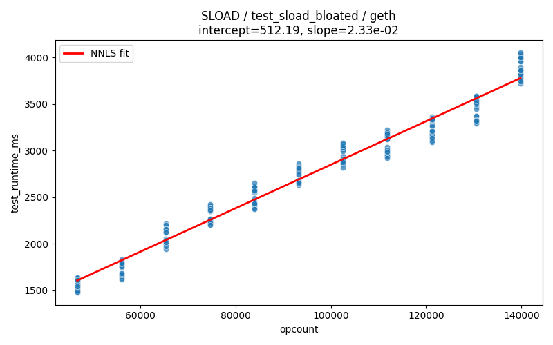

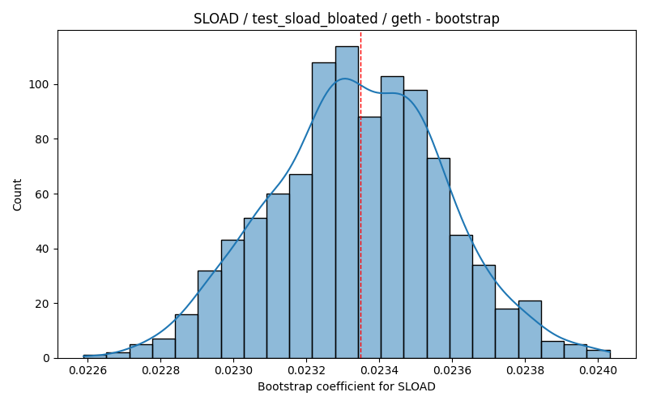

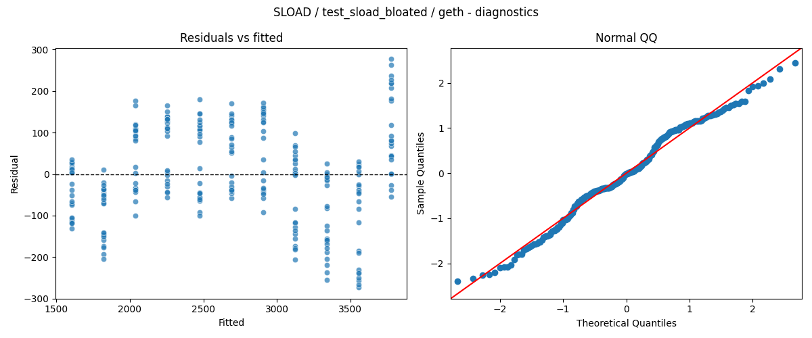

</details>

<details><summary>nethermind — NNLS regression summary</summary>

```
==============================================================================
                           NNLS Regression Results                            
==============================================================================
Dep. Variable:          test_runtime_ms              R-squared:          0.902
Model:                  NNLS                    Adj. R-squared:          0.901
No. Observations:       165                               RMSE:          83.47
Df Residuals:           163                                MAE:          56.06
Df Model:               1      
==============================================================================
                      coef     std err     P-value      [0.025      0.975]
------------------------------------------------------------------------------
         const    127.9320     18.1187       0.001     91.8148    163.7466
       opcount      0.0086      0.0002       0.001      0.0082      0.0090
==============================================================================
Notes: Non-negative least squares with bootstrap inference (1000 iterations)
==============================================================================
```

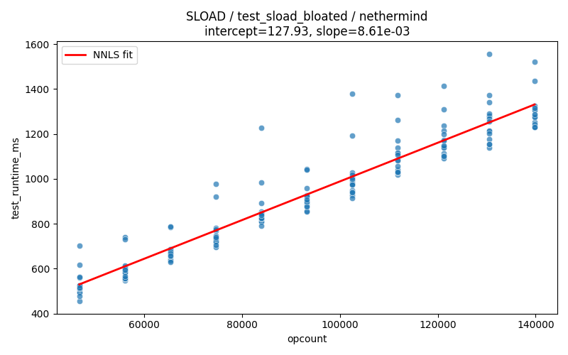

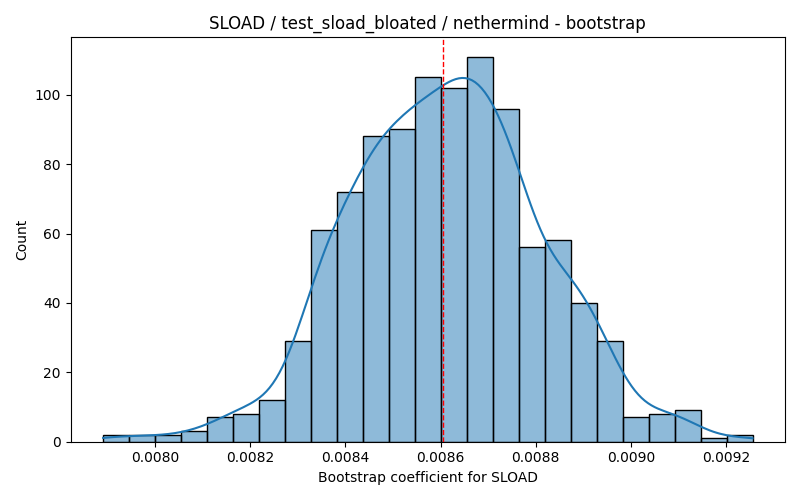

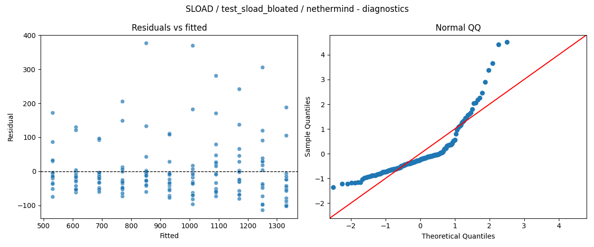

</details>

### test_storage_sload_same_key_benchmark

| client | nobs | R² | target_coef (ms) | p-value | 95% CI |
| --- | --- | --- | --- | --- | --- |
| `besu` | 836 | 0.295 | 6.589e-05 | 1.00e-03 | [5.972e-05, 7.274e-05] |
| `erigon` | 396 | 0.907 | 5.456e-05 | 1.00e-03 | [5.281e-05, 5.628e-05] |
| `ethrex` | 550 | 0.6801 | 2.162e-05 | 1.00e-03 | [2.03e-05, 2.302e-05] |
| `geth` | 528 | 0.7984 | 4.305e-05 | 1.00e-03 | [4.121e-05, 4.494e-05] |
| `nethermind` | 330 | 0.6757 | 0.0001583 | 1.00e-03 | [0.0001466, 0.0001709] |

<details><summary>besu — NNLS regression summary</summary>

```
==============================================================================
                           NNLS Regression Results                            
==============================================================================
Dep. Variable:          test_runtime_ms              R-squared:          0.295
Model:                  NNLS                    Adj. R-squared:          0.294
No. Observations:       836                               RMSE:          64.33
Df Residuals:           834                                MAE:          48.51
Df Model:               1      
==============================================================================
                      coef     std err     P-value      [0.025      0.975]
------------------------------------------------------------------------------
         const    134.8648      6.6666       0.001    121.6675    147.2847
       opcount      0.0001      0.0000       0.001      0.0001      0.0001
==============================================================================
Notes: Non-negative least squares with bootstrap inference (1000 iterations)
==============================================================================
```

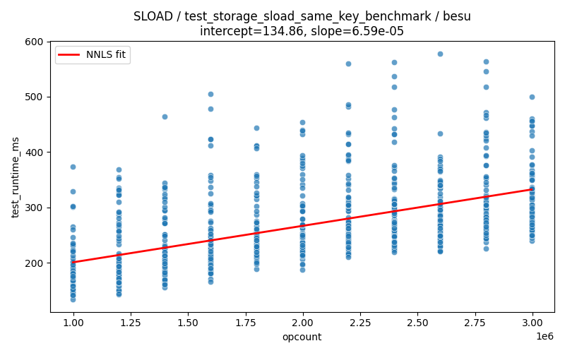

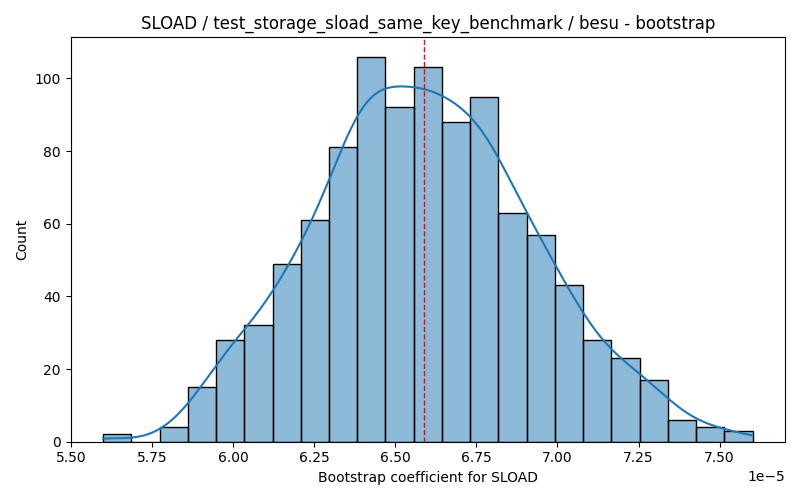

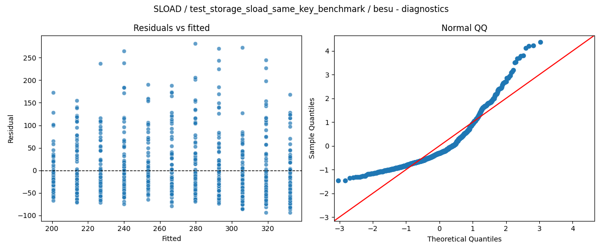

</details>

<details><summary>erigon — NNLS regression summary</summary>

```
==============================================================================
                           NNLS Regression Results                            
==============================================================================
Dep. Variable:          test_runtime_ms              R-squared:          0.907
Model:                  NNLS                    Adj. R-squared:          0.907
No. Observations:       396                               RMSE:          11.04
Df Residuals:           394                                MAE:           8.60
Df Model:               1      
==============================================================================
                      coef     std err     P-value      [0.025      0.975]
------------------------------------------------------------------------------
         const     24.5493      1.5591       0.001     21.6377     27.8983
       opcount      0.0001      0.0000       0.001      0.0001      0.0001
==============================================================================
Notes: Non-negative least squares with bootstrap inference (1000 iterations)
==============================================================================
```

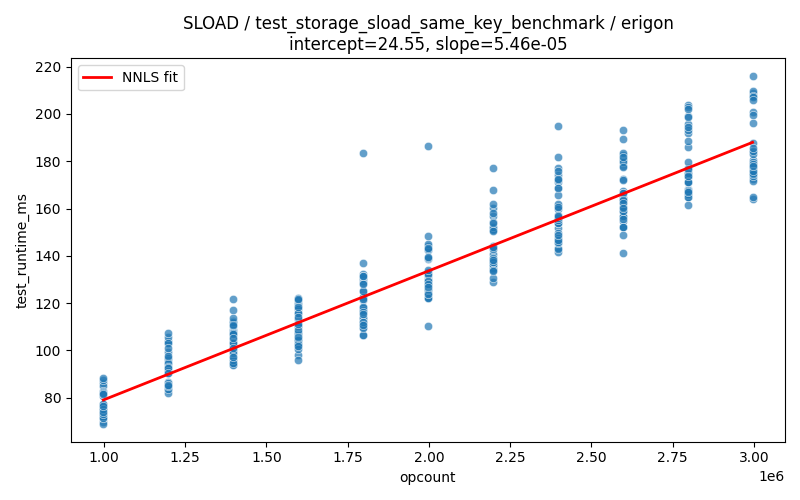

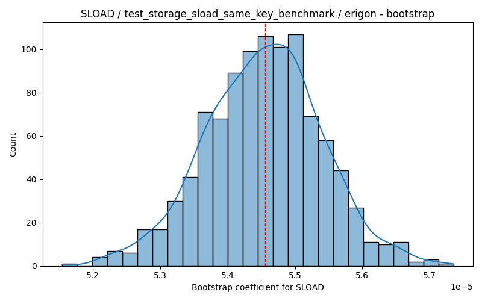

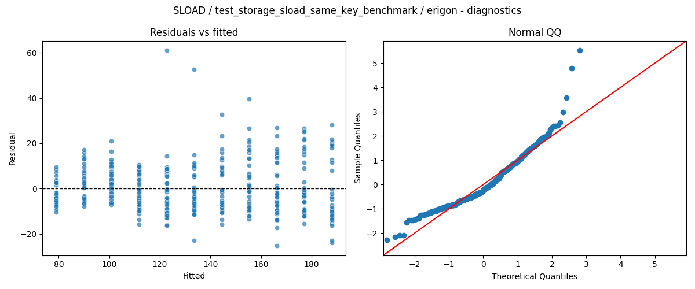

</details>

<details><summary>ethrex — NNLS regression summary</summary>

```
==============================================================================
                           NNLS Regression Results                            
==============================================================================
Dep. Variable:          test_runtime_ms              R-squared:          0.680
Model:                  NNLS                    Adj. R-squared:          0.679
No. Observations:       550                               RMSE:           9.37
Df Residuals:           548                                MAE:           6.94
Df Model:               1      
==============================================================================
                      coef     std err     P-value      [0.025      0.975]
------------------------------------------------------------------------------
         const     20.1915      1.5434       0.001     17.1487     23.3354
       opcount      0.0000      0.0000       0.001      0.0000      0.0000
==============================================================================
Notes: Non-negative least squares with bootstrap inference (1000 iterations)
==============================================================================
```

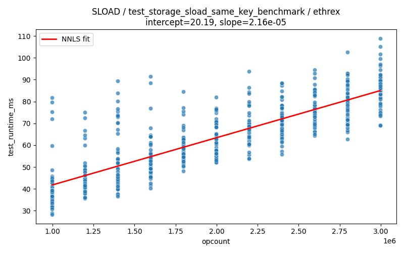

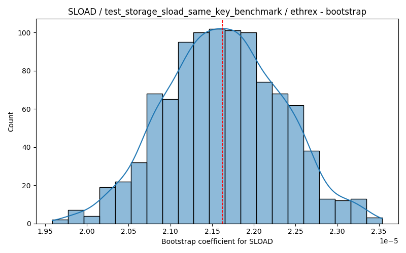

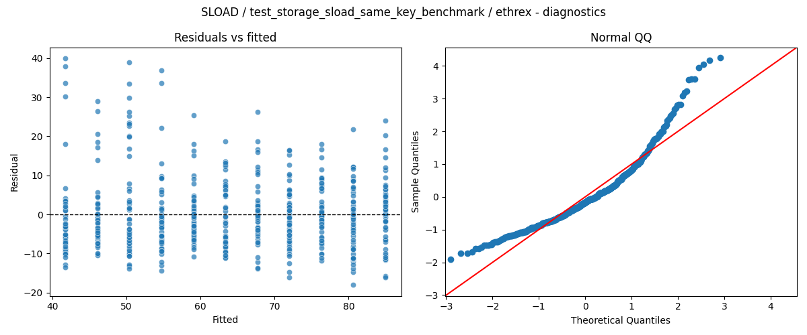

</details>

<details><summary>geth — NNLS regression summary</summary>

```
==============================================================================
                           NNLS Regression Results                            
==============================================================================
Dep. Variable:          test_runtime_ms              R-squared:          0.798
Model:                  NNLS                    Adj. R-squared:          0.798
No. Observations:       528                               RMSE:          13.66
Df Residuals:           526                                MAE:          10.78
Df Model:               1      
==============================================================================
                      coef     std err     P-value      [0.025      0.975]
------------------------------------------------------------------------------
         const     29.6852      1.7338       0.001     26.3077     33.0795
       opcount      0.0000      0.0000       0.001      0.0000      0.0000
==============================================================================
Notes: Non-negative least squares with bootstrap inference (1000 iterations)
==============================================================================
```

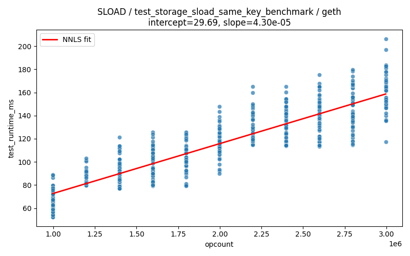

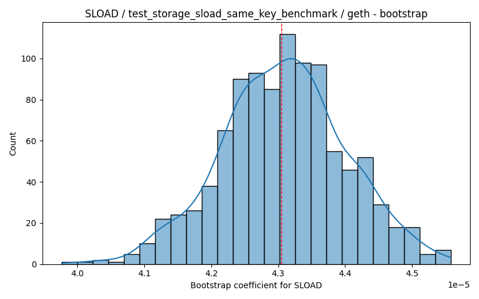

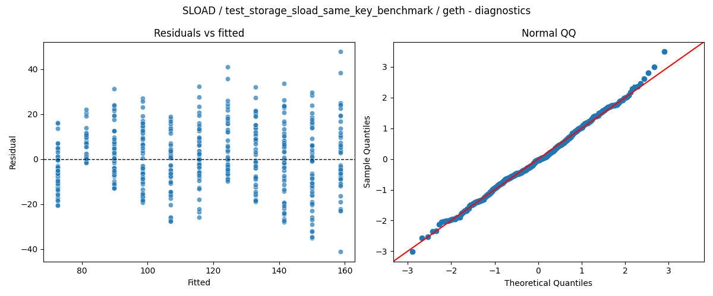

</details>

<details><summary>nethermind — NNLS regression summary</summary>

```
==============================================================================
                           NNLS Regression Results                            
==============================================================================
Dep. Variable:          test_runtime_ms              R-squared:          0.676
Model:                  NNLS                    Adj. R-squared:          0.675
No. Observations:       330                               RMSE:          69.26
Df Residuals:           328                                MAE:          50.60
Df Model:               1      
==============================================================================
                      coef     std err     P-value      [0.025      0.975]
------------------------------------------------------------------------------
         const    159.3762     12.4574       0.001    133.5492    183.0661
       opcount      0.0002      0.0000       0.001      0.0001      0.0002
==============================================================================
Notes: Non-negative least squares with bootstrap inference (1000 iterations)
==============================================================================
```

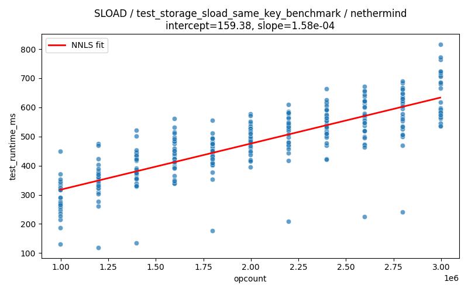

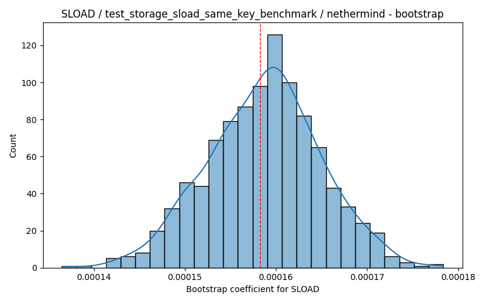

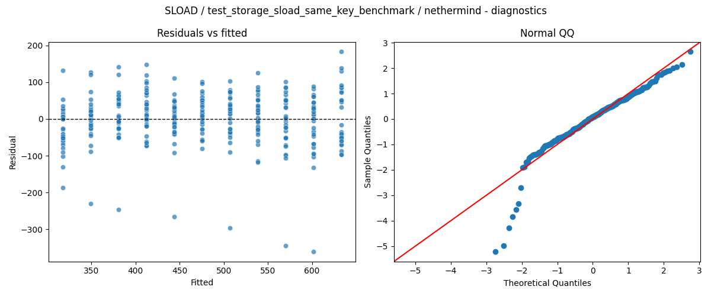

</details>

## SSTORE

### test_sstore_bloated — combo `False` — `presets[cold_storage_sstore_access]`

| client | nobs | R² | target_coef (ms) | p-value | 95% CI |
| --- | --- | --- | --- | --- | --- |
| `besu` | 418 | 0.743 | 0.008261 | 1.00e-03 | [0.007827, 0.008682] |
| `erigon` | 198 | 0.9703 | 0.007512 | 1.00e-03 | [0.007434, 0.00757] |
| `ethrex` | 275 | 0.9398 | 0.009459 | 1.00e-03 | [0.009343, 0.009568] |
| `geth` | 264 | 0.9766 | 0.02368 | 1.00e-03 | [0.02321, 0.02413] |
| `nethermind` | 165 | 0.9173 | 0.00312 | 1.00e-03 | [0.002948, 0.003268] |

<details><summary>besu — NNLS regression summary</summary>

```
==============================================================================
                           NNLS Regression Results                            
==============================================================================
Dep. Variable:          test_runtime_ms              R-squared:          0.743
Model:                  NNLS                    Adj. R-squared:          0.742
No. Observations:       418                               RMSE:         137.29
Df Residuals:           416                                MAE:         107.45
Df Model:               1      
==============================================================================
                      coef     std err     P-value      [0.025      0.975]
------------------------------------------------------------------------------
         const    317.3321     17.7711       0.001    285.3510    350.5218
       opcount      0.0083      0.0002       0.001      0.0078      0.0087
==============================================================================
Notes: Non-negative least squares with bootstrap inference (1000 iterations)
==============================================================================
```

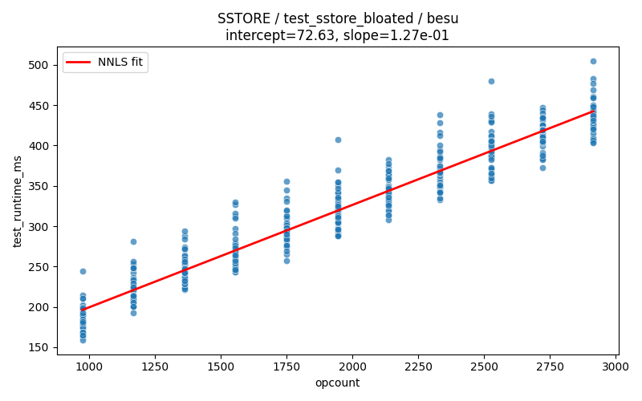

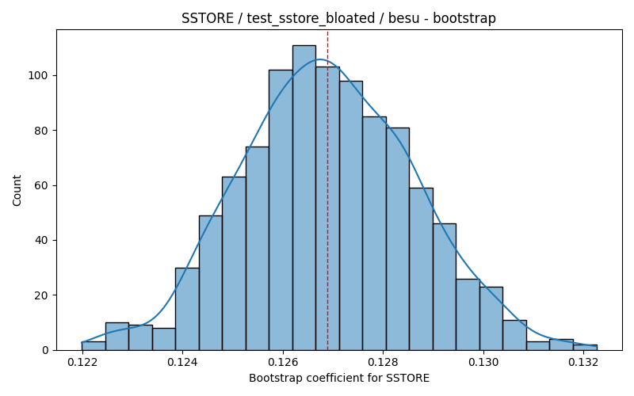

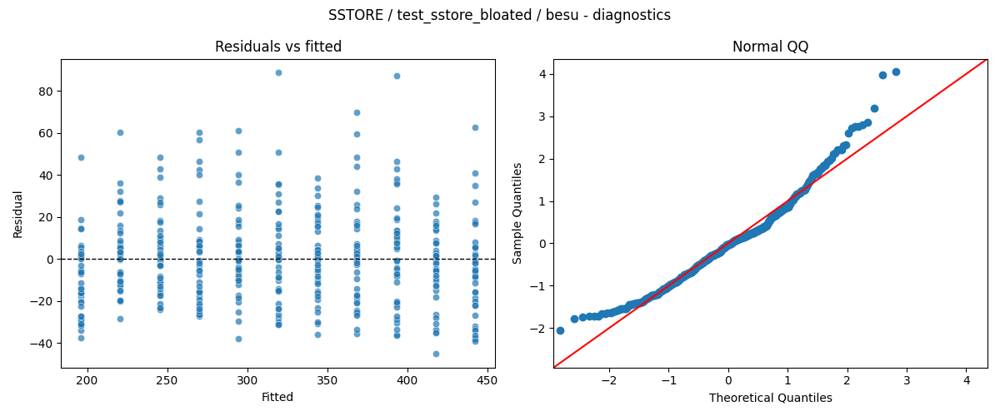

</details>

<details><summary>erigon — NNLS regression summary</summary>

```
==============================================================================
                           NNLS Regression Results                            
==============================================================================
Dep. Variable:          test_runtime_ms              R-squared:          0.970
Model:                  NNLS                    Adj. R-squared:          0.970
No. Observations:       198                               RMSE:          37.68
Df Residuals:           196                                MAE:          31.46
Df Model:               1      
==============================================================================
                      coef     std err     P-value      [0.025      0.975]
------------------------------------------------------------------------------
         const      0.0000      0.9727       1.000      0.0000      3.1537
       opcount      0.0075      0.0000       0.001      0.0074      0.0076
==============================================================================
Notes: Non-negative least squares with bootstrap inference (1000 iterations)
==============================================================================
```

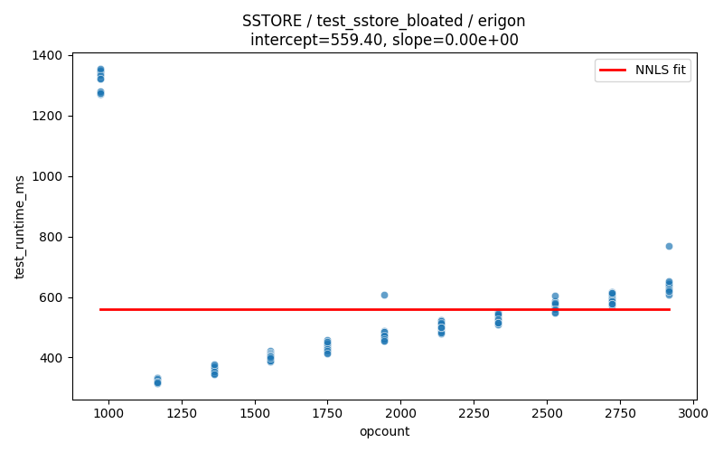

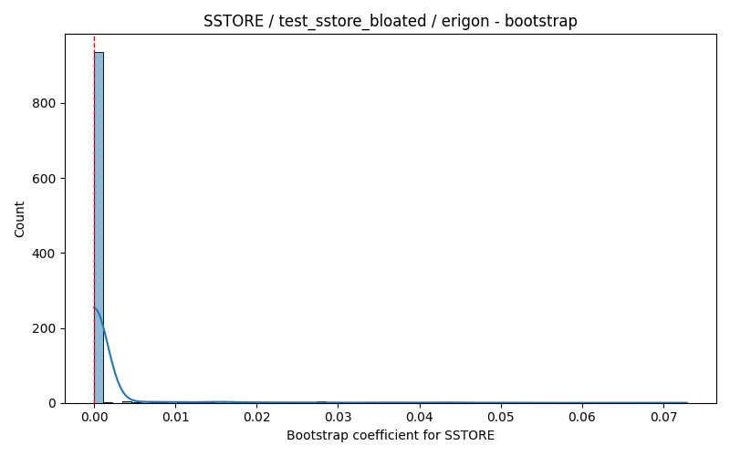

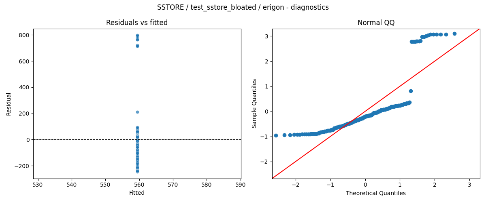

</details>

<details><summary>ethrex — NNLS regression summary</summary>

```
==============================================================================
                           NNLS Regression Results                            
==============================================================================
Dep. Variable:          test_runtime_ms              R-squared:          0.940
Model:                  NNLS                    Adj. R-squared:          0.940
No. Observations:       275                               RMSE:          81.62
Df Residuals:           273                                MAE:          70.47
Df Model:               1      
==============================================================================
                      coef     std err     P-value      [0.025      0.975]
------------------------------------------------------------------------------
         const      0.0000      0.0000       1.000      0.0000      0.0000
       opcount      0.0095      0.0001       0.001      0.0093      0.0096
==============================================================================
Notes: Non-negative least squares with bootstrap inference (1000 iterations)
==============================================================================
```

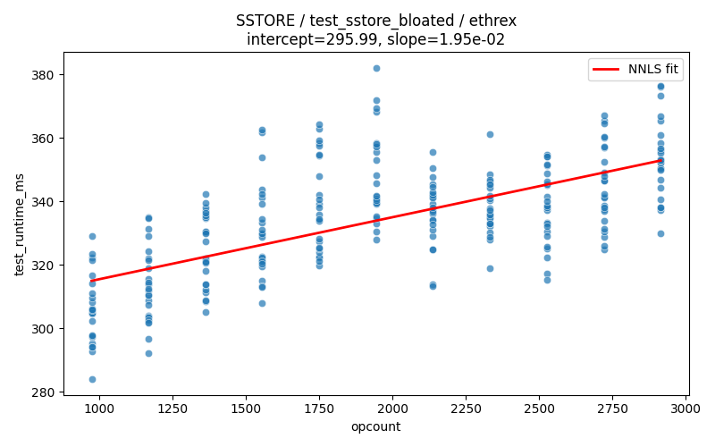

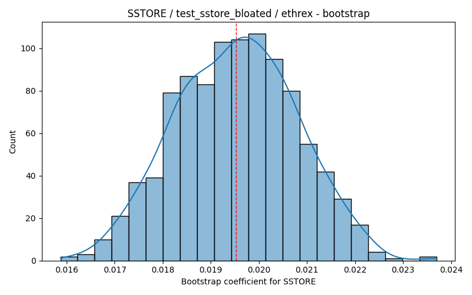

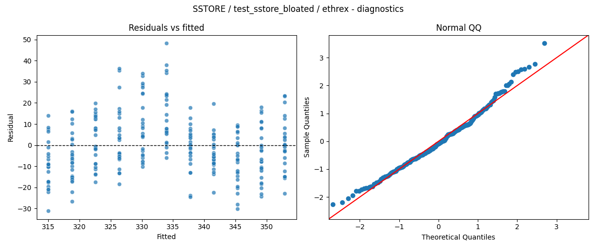

</details>

<details><summary>geth — NNLS regression summary</summary>

```
==============================================================================
                           NNLS Regression Results                            
==============================================================================
Dep. Variable:          test_runtime_ms              R-squared:          0.977
Model:                  NNLS                    Adj. R-squared:          0.976
No. Observations:       264                               RMSE:         103.60
Df Residuals:           262                                MAE:          84.63
Df Model:               1      
==============================================================================
                      coef     std err     P-value      [0.025      0.975]
------------------------------------------------------------------------------
         const    555.8028     21.0061       0.001    514.7575    594.3530
       opcount      0.0237      0.0002       0.001      0.0232      0.0241
==============================================================================
Notes: Non-negative least squares with bootstrap inference (1000 iterations)
==============================================================================
```

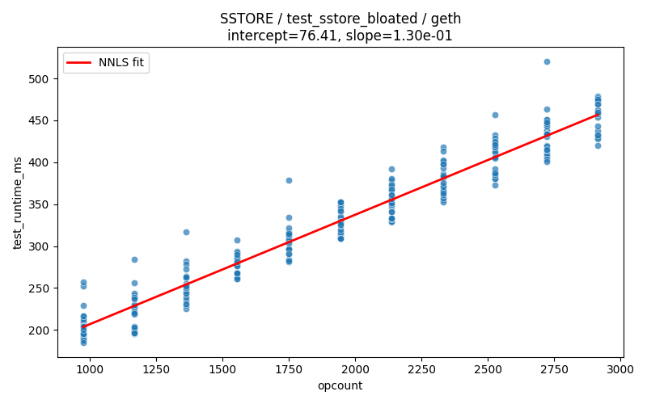

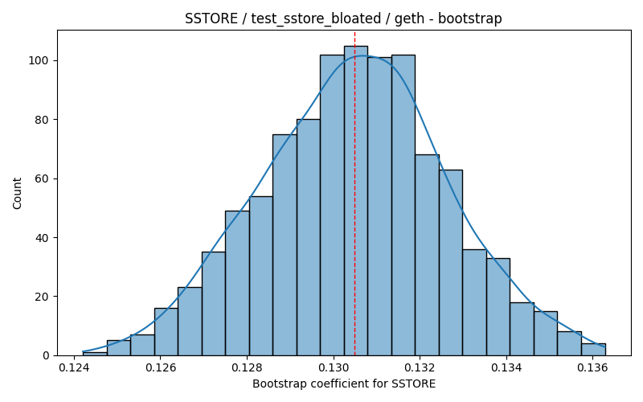

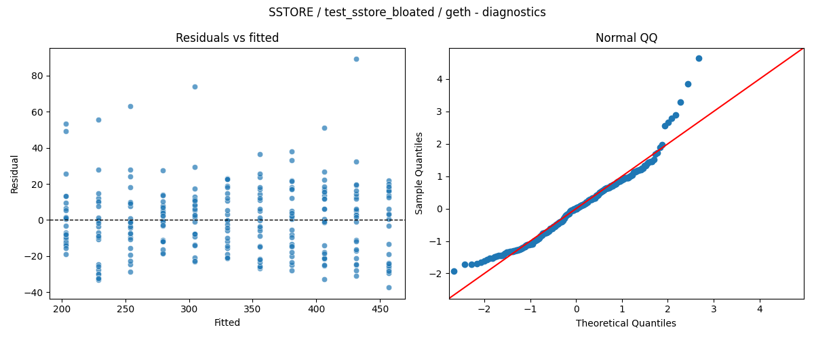

</details>

<details><summary>nethermind — NNLS regression summary</summary>

```
==============================================================================
                           NNLS Regression Results                            
==============================================================================
Dep. Variable:          test_runtime_ms              R-squared:          0.917
Model:                  NNLS                    Adj. R-squared:          0.917
No. Observations:       165                               RMSE:          26.48
Df Residuals:           163                                MAE:          20.25
Df Model:               1      
==============================================================================
                      coef     std err     P-value      [0.025      0.975]
------------------------------------------------------------------------------
         const     69.3565      6.6703       0.001     57.6191     83.7958
       opcount      0.0031      0.0001       0.001      0.0029      0.0033
==============================================================================
Notes: Non-negative least squares with bootstrap inference (1000 iterations)
==============================================================================
```

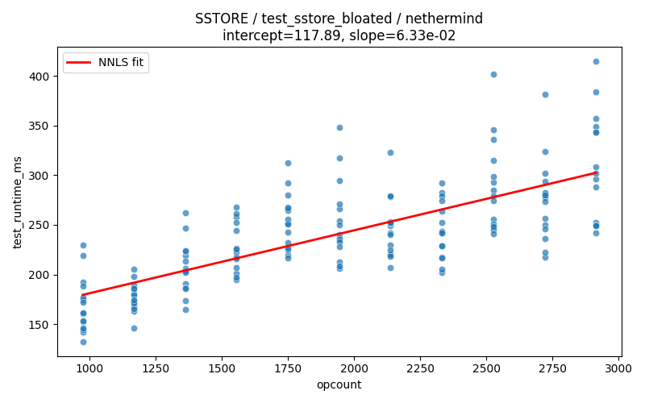

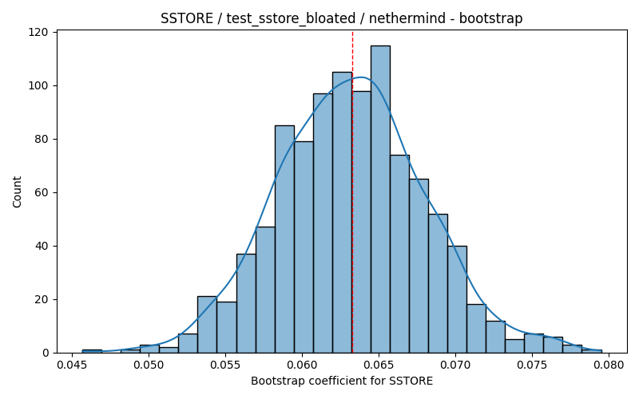

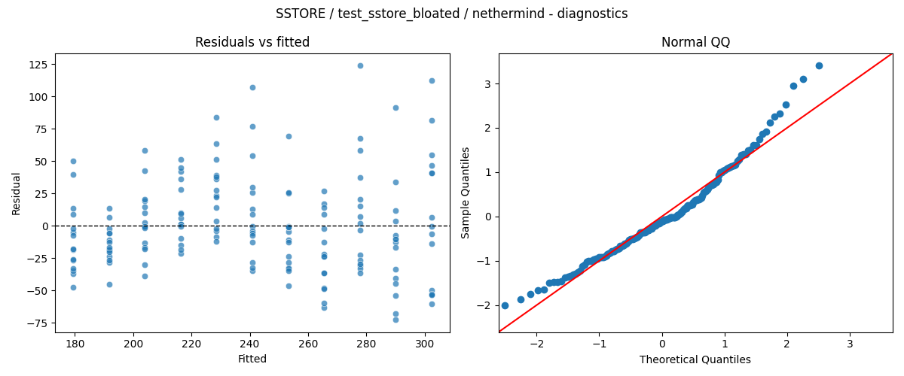

</details>

### test_sstore_bloated — combo `True` — `presets[cold_storage_sstore_access]`

| client | nobs | R² | target_coef (ms) | p-value | 95% CI |
| --- | --- | --- | --- | --- | --- |
| `besu` | 418 | 0.9138 | 0.01522 | 1.00e-03 | [0.01469, 0.01566] |
| `erigon` | 198 | 0.9727 | 0.007243 | 1.00e-03 | [0.007188, 0.007299] |
| `ethrex` | 275 | 0.9718 | 0.01388 | 1.00e-03 | [0.01377, 0.01399] |
| `geth` | 264 | 0.9734 | 0.02334 | 1.00e-03 | [0.02289, 0.02381] |
| `nethermind` | 165 | 0.8905 | 0.008914 | 1.00e-03 | [0.00847, 0.009417] |

<details><summary>besu — NNLS regression summary</summary>

```
==============================================================================
                           NNLS Regression Results                            
==============================================================================
Dep. Variable:          test_runtime_ms              R-squared:          0.914
Model:                  NNLS                    Adj. R-squared:          0.914
No. Observations:       418                               RMSE:         132.11
Df Residuals:           416                                MAE:         103.62
Df Model:               1      
==============================================================================
                      coef     std err     P-value      [0.025      0.975]
------------------------------------------------------------------------------
         const    409.9494     19.2954       0.001    374.0797    449.9140
       opcount      0.0152      0.0002       0.001      0.0147      0.0157
==============================================================================
Notes: Non-negative least squares with bootstrap inference (1000 iterations)
==============================================================================
```

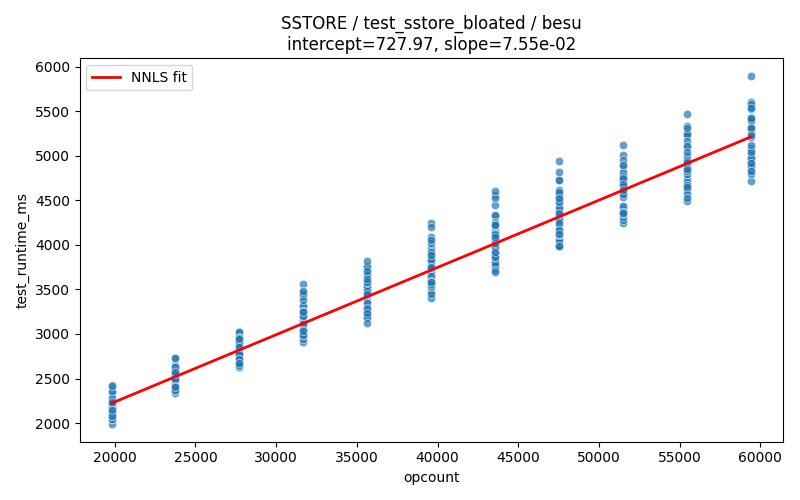

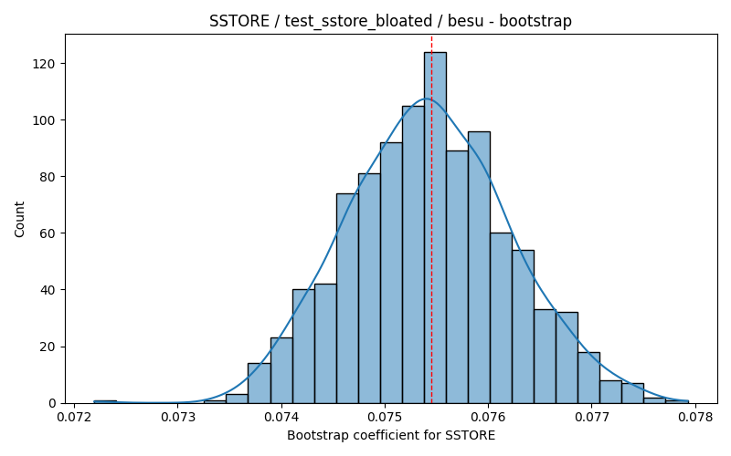

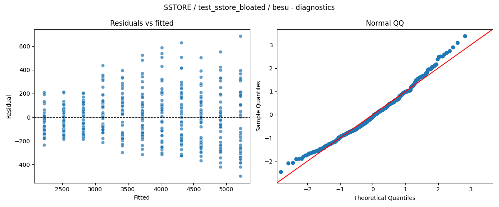

</details>

<details><summary>erigon — NNLS regression summary</summary>

```
==============================================================================
                           NNLS Regression Results                            
==============================================================================
Dep. Variable:          test_runtime_ms              R-squared:          0.973
Model:                  NNLS                    Adj. R-squared:          0.973
No. Observations:       198                               RMSE:          35.05
Df Residuals:           196                                MAE:          29.09
Df Model:               1      
==============================================================================
                      coef     std err     P-value      [0.025      0.975]
------------------------------------------------------------------------------
         const      0.0000      0.6466       1.000      0.0000      0.0000
       opcount      0.0072      0.0000       0.001      0.0072      0.0073
==============================================================================
Notes: Non-negative least squares with bootstrap inference (1000 iterations)
==============================================================================
```

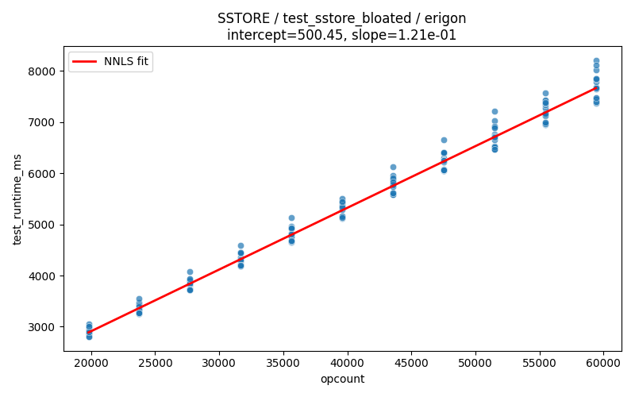

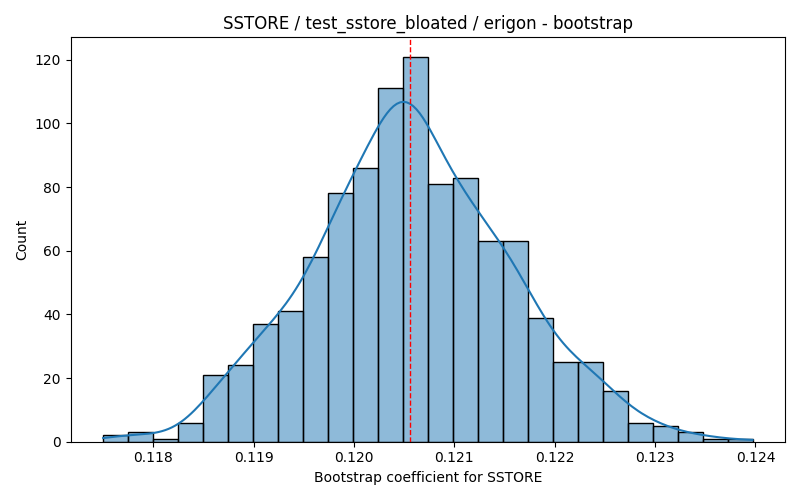

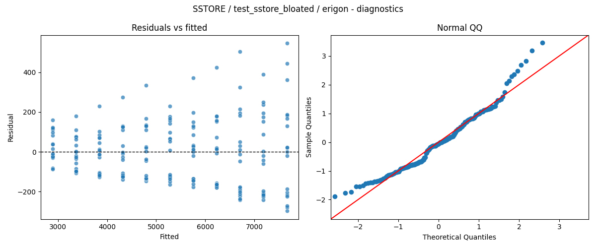

</details>

<details><summary>ethrex — NNLS regression summary</summary>

```
==============================================================================
                           NNLS Regression Results                            
==============================================================================
Dep. Variable:          test_runtime_ms              R-squared:          0.972
Model:                  NNLS                    Adj. R-squared:          0.972
No. Observations:       275                               RMSE:          75.56
Df Residuals:           273                                MAE:          63.30
Df Model:               1      
==============================================================================
                      coef     std err     P-value      [0.025      0.975]
------------------------------------------------------------------------------
         const      0.0000      0.0000       1.000      0.0000      0.0000
       opcount      0.0139      0.0001       0.001      0.0138      0.0140
==============================================================================
Notes: Non-negative least squares with bootstrap inference (1000 iterations)
==============================================================================
```

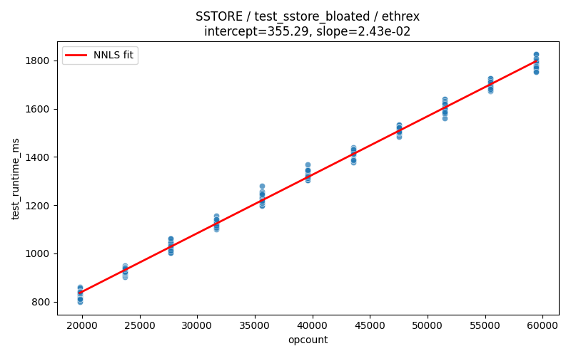

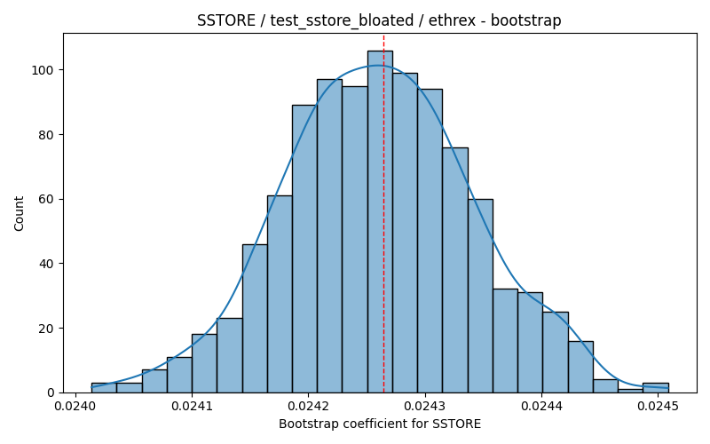

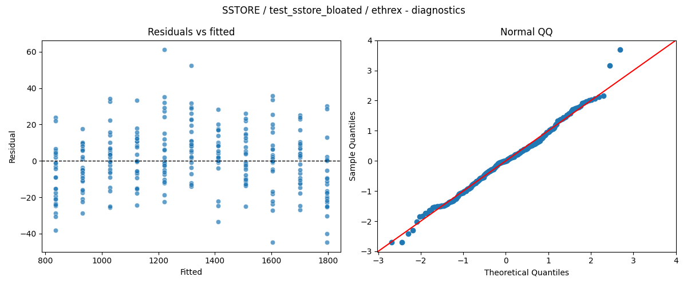

</details>

<details><summary>geth — NNLS regression summary</summary>

```
==============================================================================
                           NNLS Regression Results                            
==============================================================================
Dep. Variable:          test_runtime_ms              R-squared:          0.973
Model:                  NNLS                    Adj. R-squared:          0.973
No. Observations:       264                               RMSE:         108.99
Df Residuals:           262                                MAE:          88.84
Df Model:               1      
==============================================================================
                      coef     std err     P-value      [0.025      0.975]
------------------------------------------------------------------------------
         const    515.8015     21.2005       0.001    476.1640    555.9186
       opcount      0.0233      0.0002       0.001      0.0229      0.0238
==============================================================================
Notes: Non-negative least squares with bootstrap inference (1000 iterations)
==============================================================================
```

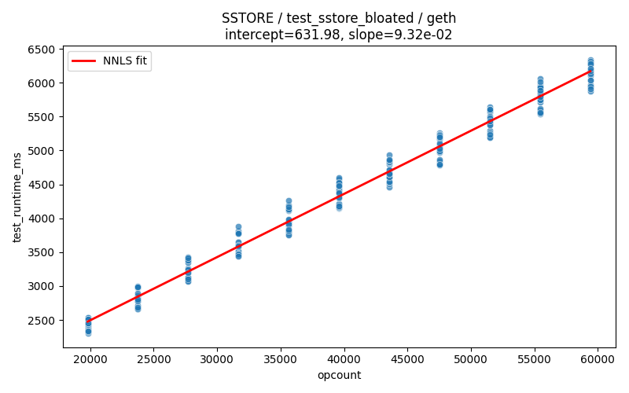

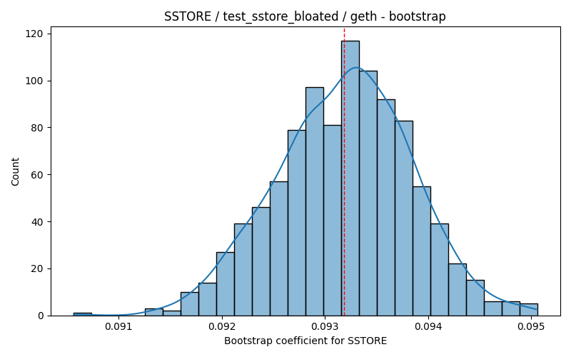

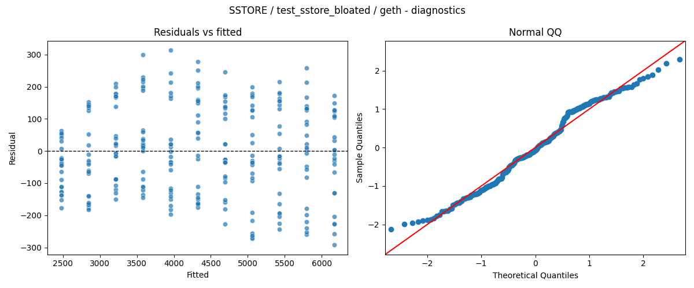

</details>

<details><summary>nethermind — NNLS regression summary</summary>

```
==============================================================================
                           NNLS Regression Results                            
==============================================================================
Dep. Variable:          test_runtime_ms              R-squared:          0.890
Model:                  NNLS                    Adj. R-squared:          0.890
No. Observations:       165                               RMSE:          88.35
Df Residuals:           163                                MAE:          55.77
Df Model:               1      
==============================================================================
                      coef     std err     P-value      [0.025      0.975]
------------------------------------------------------------------------------
         const     96.0900     19.6233       0.001     55.1629    131.7742
       opcount      0.0089      0.0002       0.001      0.0085      0.0094
==============================================================================
Notes: Non-negative least squares with bootstrap inference (1000 iterations)
==============================================================================
```

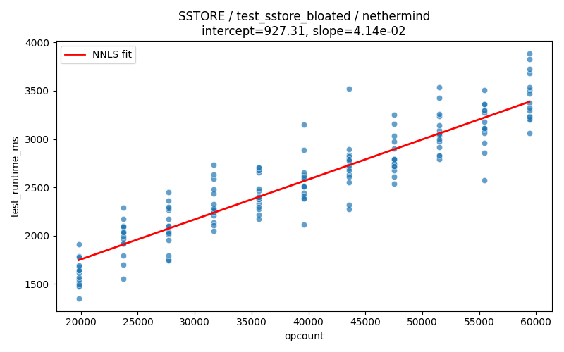

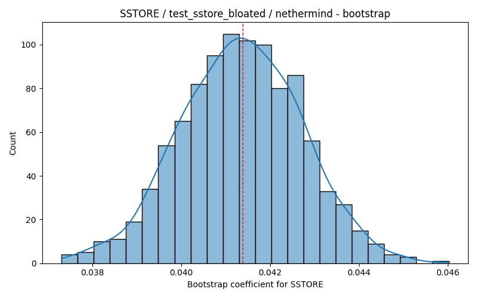

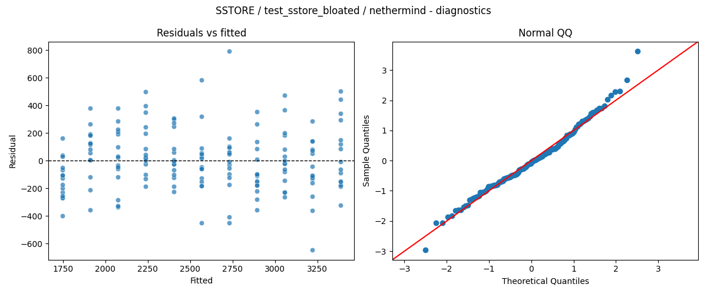

</details>

### test_sstore_bloated — combo `False` — `presets[cold_storage_sstore_write]`

| client | nobs | R² | target_coef (ms) | p-value | 95% CI |
| --- | --- | --- | --- | --- | --- |
| `besu` | 418 | 0.9271 | 0.1269 | 1.00e-03 | [0.1238, 0.1303] |
| `erigon` | 198 | 0 | 0 | 1.00e+00 | [0, 0.02119] |
| `ethrex` | 275 | 0.4345 | 0.01953 | 1.00e-03 | [0.01713, 0.02188] |
| `geth` | 264 | 0.9458 | 0.1305 | 1.00e-03 | [0.1263, 0.1347] |
| `nethermind` | 165 | 0.5354 | 0.06329 | 1.00e-03 | [0.05413, 0.07298] |

<details><summary>besu — NNLS regression summary</summary>

```
==============================================================================
                           NNLS Regression Results                            
==============================================================================
Dep. Variable:          test_runtime_ms              R-squared:          0.927
Model:                  NNLS                    Adj. R-squared:          0.927
No. Observations:       418                               RMSE:          21.85
Df Residuals:           416                                MAE:          16.69
Df Model:               1      
==============================================================================
                      coef     std err     P-value      [0.025      0.975]
------------------------------------------------------------------------------
         const     72.6349      3.3672       0.001     66.2052     78.8460
       opcount      0.1269      0.0017       0.001      0.1238      0.1303
==============================================================================
Notes: Non-negative least squares with bootstrap inference (1000 iterations)
==============================================================================
```


</details>

<details><summary>erigon — NNLS regression summary</summary>

```
==============================================================================
                           NNLS Regression Results                            
==============================================================================
Dep. Variable:          test_runtime_ms              R-squared:          0.000
Model:                  NNLS                    Adj. R-squared:         -0.005
No. Observations:       198                               RMSE:         256.74
Df Residuals:           196                                MAE:         160.90
Df Model:               1      
==============================================================================
                      coef     std err     P-value      [0.025      0.975]
------------------------------------------------------------------------------
         const    559.4027     26.3020       0.001    484.3403    596.1349
       opcount      0.0000      0.0067       1.000      0.0000      0.0212
==============================================================================
Notes: Non-negative least squares with bootstrap inference (1000 iterations)
==============================================================================
```


</details>

<details><summary>ethrex — NNLS regression summary</summary>

```
==============================================================================
                           NNLS Regression Results                            
==============================================================================
Dep. Variable:          test_runtime_ms              R-squared:          0.434
Model:                  NNLS                    Adj. R-squared:          0.432
No. Observations:       275                               RMSE:          13.68
Df Residuals:           273                                MAE:          10.79
Df Model:               1      
==============================================================================
                      coef     std err     P-value      [0.025      0.975]
------------------------------------------------------------------------------
         const    295.9868      2.6233       0.001    291.1597    301.2986
       opcount      0.0195      0.0013       0.001      0.0171      0.0219
==============================================================================
Notes: Non-negative least squares with bootstrap inference (1000 iterations)
==============================================================================
```


</details>

<details><summary>geth — NNLS regression summary</summary>

```
==============================================================================
                           NNLS Regression Results                            
==============================================================================
Dep. Variable:          test_runtime_ms              R-squared:          0.946
Model:                  NNLS                    Adj. R-squared:          0.946
No. Observations:       264                               RMSE:          19.20
Df Residuals:           262                                MAE:          14.89
Df Model:               1      
==============================================================================
                      coef     std err     P-value      [0.025      0.975]
------------------------------------------------------------------------------
         const     76.4086      4.1312       0.001     68.2323     84.6000
       opcount      0.1305      0.0021       0.001      0.1263      0.1347
==============================================================================
Notes: Non-negative least squares with bootstrap inference (1000 iterations)
==============================================================================
```


</details>

<details><summary>nethermind — NNLS regression summary</summary>

```
==============================================================================
                           NNLS Regression Results                            
==============================================================================
Dep. Variable:          test_runtime_ms              R-squared:          0.535
Model:                  NNLS                    Adj. R-squared:          0.533
No. Observations:       165                               RMSE:          36.21
Df Residuals:           163                                MAE:          27.71
Df Model:               1      
==============================================================================
                      coef     std err     P-value      [0.025      0.975]
------------------------------------------------------------------------------
         const    117.8893      8.5517       0.001    100.2387    134.6215
       opcount      0.0633      0.0048       0.001      0.0541      0.0730
==============================================================================
Notes: Non-negative least squares with bootstrap inference (1000 iterations)
==============================================================================
```


</details>

### test_sstore_bloated — combo `True` — `presets[cold_storage_sstore_write]`

| client | nobs | R² | target_coef (ms) | p-value | 95% CI |
| --- | --- | --- | --- | --- | --- |
| `besu` | 418 | 0.956 | 0.07545 | 1.00e-03 | [0.07397, 0.077] |
| `erigon` | 198 | 0.9892 | 0.1206 | 1.00e-03 | [0.1187, 0.1226] |
| `ethrex` | 275 | 0.997 | 0.02426 | 1.00e-03 | [0.0241, 0.02442] |
| `geth` | 264 | 0.9864 | 0.09319 | 1.00e-03 | [0.09188, 0.09443] |
| `nethermind` | 165 | 0.849 | 0.04138 | 1.00e-03 | [0.03862, 0.04392] |

<details><summary>besu — NNLS regression summary</summary>

```
==============================================================================
                           NNLS Regression Results                            
==============================================================================
Dep. Variable:          test_runtime_ms              R-squared:          0.956
Model:                  NNLS                    Adj. R-squared:          0.956
No. Observations:       418                               RMSE:         202.72
Df Residuals:           416                                MAE:         161.94
Df Model:               1      
==============================================================================
                      coef     std err     P-value      [0.025      0.975]
------------------------------------------------------------------------------
         const    727.9736     27.3407       0.001    674.6410    780.3158
       opcount      0.0755      0.0008       0.001      0.0740      0.0770
==============================================================================
Notes: Non-negative least squares with bootstrap inference (1000 iterations)
==============================================================================
```


</details>

<details><summary>erigon — NNLS regression summary</summary>

```
==============================================================================
                           NNLS Regression Results                            
==============================================================================
Dep. Variable:          test_runtime_ms              R-squared:          0.989
Model:                  NNLS                    Adj. R-squared:          0.989
No. Observations:       198                               RMSE:         157.51
Df Residuals:           196                                MAE:         124.96
Df Model:               1      
==============================================================================
                      coef     std err     P-value      [0.025      0.975]
------------------------------------------------------------------------------
         const    500.4452     33.6872       0.001    430.5505    561.9392
       opcount      0.1206      0.0010       0.001      0.1187      0.1226
==============================================================================
Notes: Non-negative least squares with bootstrap inference (1000 iterations)
==============================================================================
```


</details>

<details><summary>ethrex — NNLS regression summary</summary>

```
==============================================================================
                           NNLS Regression Results                            
==============================================================================
Dep. Variable:          test_runtime_ms              R-squared:          0.997
Model:                  NNLS                    Adj. R-squared:          0.997
No. Observations:       275                               RMSE:          16.59
Df Residuals:           273                                MAE:          12.86
Df Model:               1      
==============================================================================
                      coef     std err     P-value      [0.025      0.975]
------------------------------------------------------------------------------
         const    355.2889      3.2988       0.001    349.1763    361.9491
       opcount      0.0243      0.0001       0.001      0.0241      0.0244
==============================================================================
Notes: Non-negative least squares with bootstrap inference (1000 iterations)
==============================================================================
```


</details>

<details><summary>geth — NNLS regression summary</summary>

```
==============================================================================
                           NNLS Regression Results                            
==============================================================================
Dep. Variable:          test_runtime_ms              R-squared:          0.986
Model:                  NNLS                    Adj. R-squared:          0.986
No. Observations:       264                               RMSE:         136.87
Df Residuals:           262                                MAE:         114.19
Df Model:               1      
==============================================================================
                      coef     std err     P-value      [0.025      0.975]
------------------------------------------------------------------------------
         const    631.9758     25.7023       0.001    583.8803    682.2950
       opcount      0.0932      0.0007       0.001      0.0919      0.0944
==============================================================================
Notes: Non-negative least squares with bootstrap inference (1000 iterations)
==============================================================================
```


</details>

<details><summary>nethermind — NNLS regression summary</summary>

```
==============================================================================
                           NNLS Regression Results                            
==============================================================================
Dep. Variable:          test_runtime_ms              R-squared:          0.849
Model:                  NNLS                    Adj. R-squared:          0.848
No. Observations:       165                               RMSE:         218.56
Df Residuals:           163                                MAE:         168.80
Df Model:               1      
==============================================================================
                      coef     std err     P-value      [0.025      0.975]
------------------------------------------------------------------------------
         const    927.3129     54.1781       0.001    823.6438   1036.6882
       opcount      0.0414      0.0014       0.001      0.0386      0.0439
==============================================================================
Notes: Non-negative least squares with bootstrap inference (1000 iterations)
==============================================================================
```


</details>

## BALANCE

### test_account_access — combo `BALANCE_AccountMode.EXISTING_EOA`

| client | nobs | R² | target_coef (ms) | p-value | 95% CI |
| --- | --- | --- | --- | --- | --- |
| `besu` | 418 | 0.8176 | 0.01246 | 1.00e-03 | [0.01189, 0.01306] |
| `erigon` | 198 | 0.9658 | 0.009994 | 1.00e-03 | [0.009728, 0.0101] |
| `ethrex` | 275 | 0.9934 | 0.00722 | 1.00e-03 | [0.007145, 0.007298] |
| `geth` | 264 | 0.9025 | 0.0107 | 1.00e-03 | [0.01019, 0.01116] |
| `nethermind` | 165 | 0.9218 | 0.003603 | 1.00e-03 | [0.003445, 0.003755] |

<details><summary>besu — NNLS regression summary</summary>

```
==============================================================================
                           NNLS Regression Results                            
==============================================================================
Dep. Variable:          test_runtime_ms              R-squared:          0.818
Model:                  NNLS                    Adj. R-squared:          0.817
No. Observations:       418                               RMSE:         140.69
Df Residuals:           416                                MAE:         120.32
Df Model:               1      
==============================================================================
                      coef     std err     P-value      [0.025      0.975]
------------------------------------------------------------------------------
         const    552.2281     21.1333       0.001    509.2783    593.0690
       opcount      0.0125      0.0003       0.001      0.0119      0.0131
==============================================================================
Notes: Non-negative least squares with bootstrap inference (1000 iterations)
==============================================================================
```

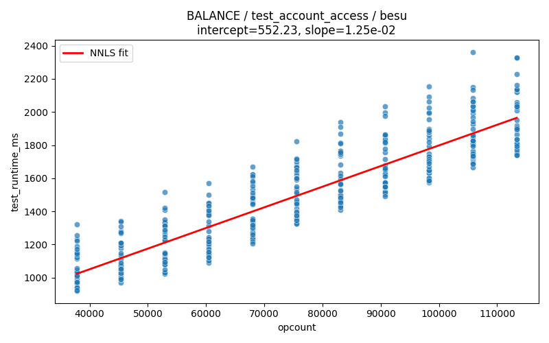

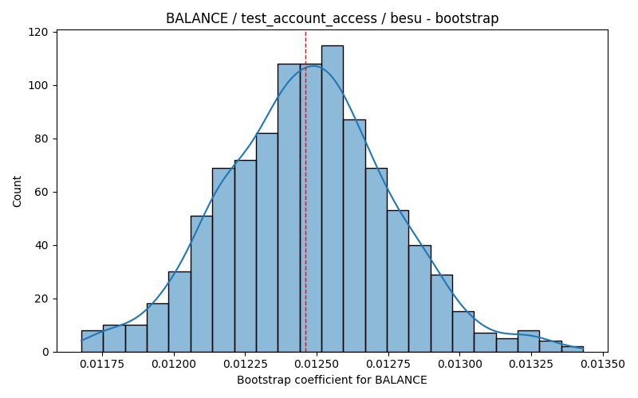

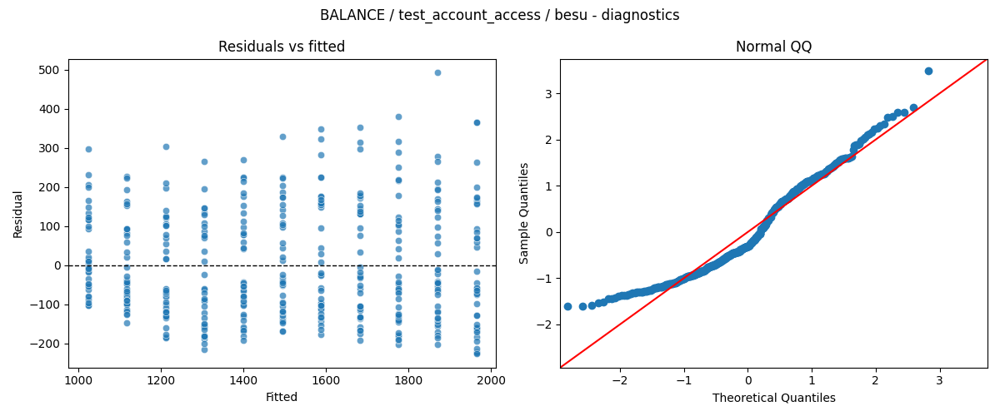

</details>

<details><summary>erigon — NNLS regression summary</summary>

```
==============================================================================
                           NNLS Regression Results                            
==============================================================================
Dep. Variable:          test_runtime_ms              R-squared:          0.966
Model:                  NNLS                    Adj. R-squared:          0.966
No. Observations:       198                               RMSE:          44.93
Df Residuals:           196                                MAE:          38.12
Df Model:               1      
==============================================================================
                      coef     std err     P-value      [0.025      0.975]
------------------------------------------------------------------------------
         const      3.2359      6.9018       0.372      0.0000     23.2032
       opcount      0.0100      0.0001       0.001      0.0097      0.0101
==============================================================================
Notes: Non-negative least squares with bootstrap inference (1000 iterations)
==============================================================================
```

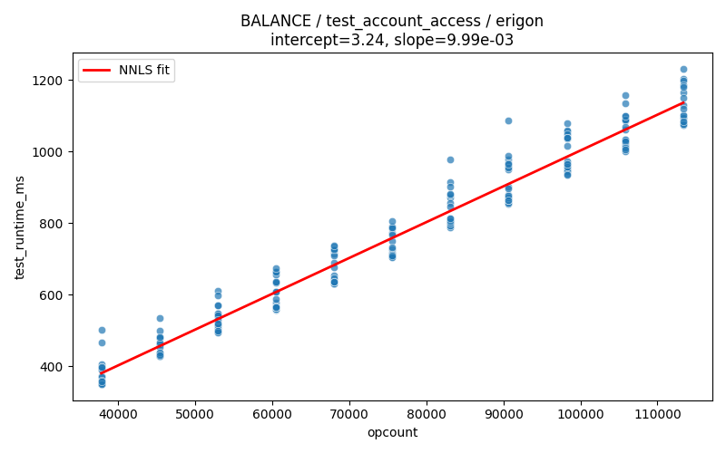

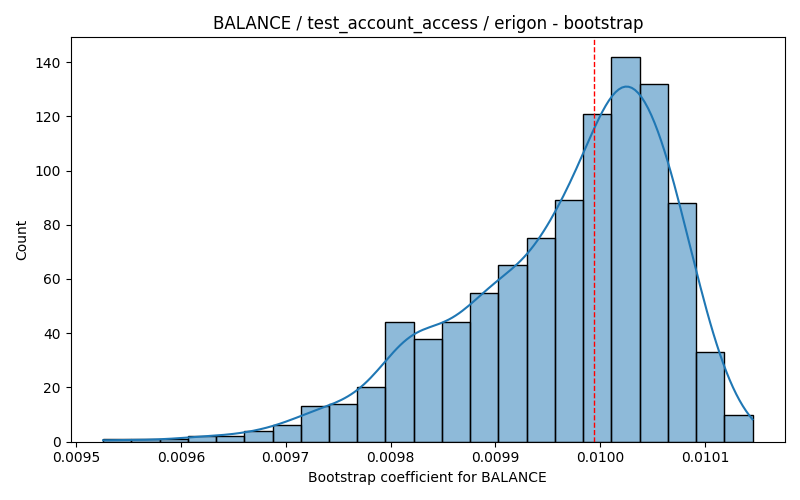

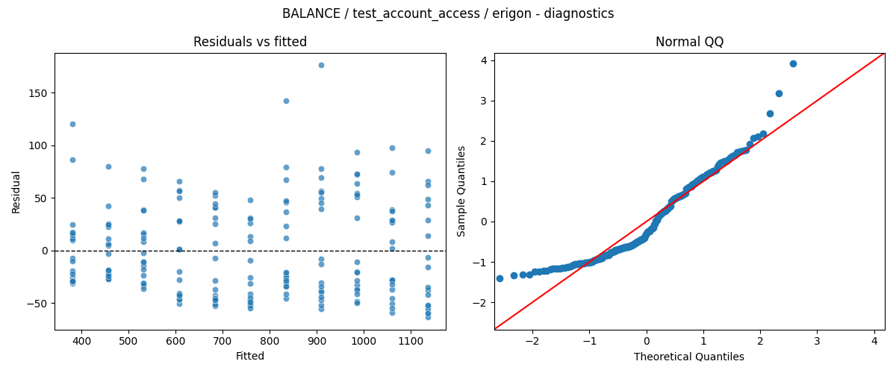

</details>

<details><summary>ethrex — NNLS regression summary</summary>

```
==============================================================================
                           NNLS Regression Results                            
==============================================================================
Dep. Variable:          test_runtime_ms              R-squared:          0.993
Model:                  NNLS                    Adj. R-squared:          0.993
No. Observations:       275                               RMSE:          14.08
Df Residuals:           273                                MAE:          10.50
Df Model:               1      
==============================================================================
                      coef     std err     P-value      [0.025      0.975]
------------------------------------------------------------------------------
         const     42.7432      2.7581       0.001     37.2714     48.3094
       opcount      0.0072      0.0000       0.001      0.0071      0.0073
==============================================================================
Notes: Non-negative least squares with bootstrap inference (1000 iterations)
==============================================================================
```

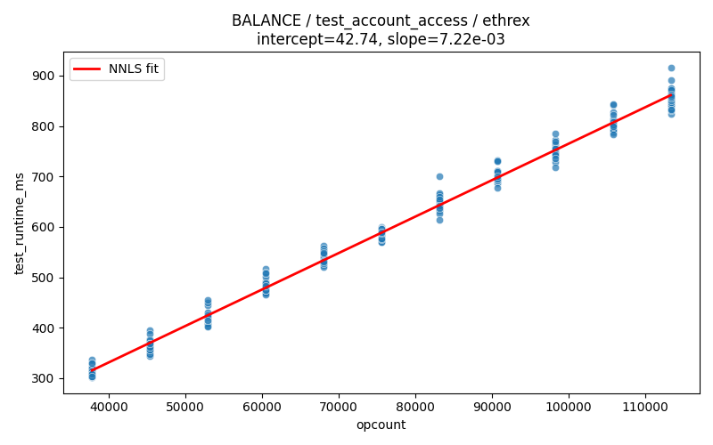

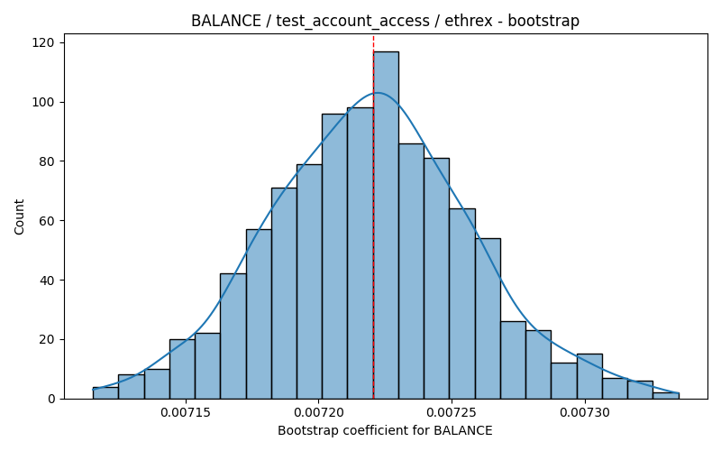

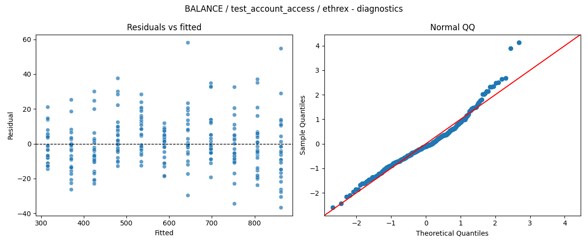

</details>

<details><summary>geth — NNLS regression summary</summary>

```
==============================================================================
                           NNLS Regression Results                            
==============================================================================
Dep. Variable:          test_runtime_ms              R-squared:          0.902
Model:                  NNLS                    Adj. R-squared:          0.902
No. Observations:       264                               RMSE:          84.09
Df Residuals:           262                                MAE:          70.21
Df Model:               1      
==============================================================================
                      coef     std err     P-value      [0.025      0.975]
------------------------------------------------------------------------------
         const    408.1318     20.6228       0.001    368.7555    451.0042
       opcount      0.0107      0.0002       0.001      0.0102      0.0112
==============================================================================
Notes: Non-negative least squares with bootstrap inference (1000 iterations)
==============================================================================
```

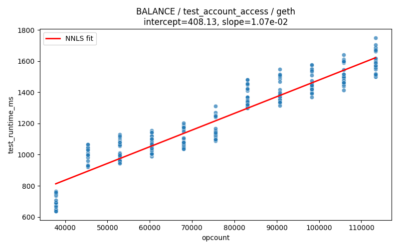

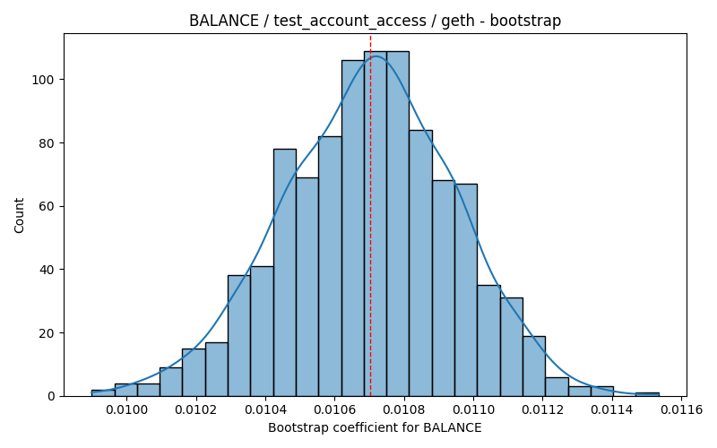

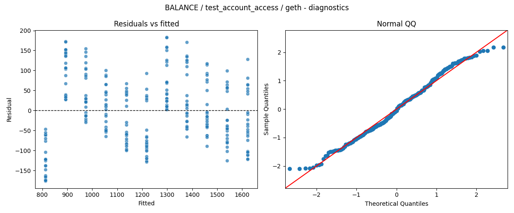

</details>

<details><summary>nethermind — NNLS regression summary</summary>

```
==============================================================================
                           NNLS Regression Results                            
==============================================================================
Dep. Variable:          test_runtime_ms              R-squared:          0.922
Model:                  NNLS                    Adj. R-squared:          0.921
No. Observations:       165                               RMSE:          25.08
Df Residuals:           163                                MAE:          19.38
Df Model:               1      
==============================================================================
                      coef     std err     P-value      [0.025      0.975]
------------------------------------------------------------------------------
         const    104.0648      5.5917       0.001     93.2279    115.3614
       opcount      0.0036      0.0001       0.001      0.0034      0.0038
==============================================================================
Notes: Non-negative least squares with bootstrap inference (1000 iterations)
==============================================================================
```

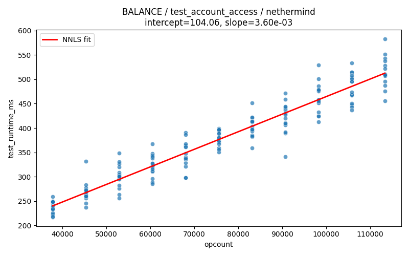

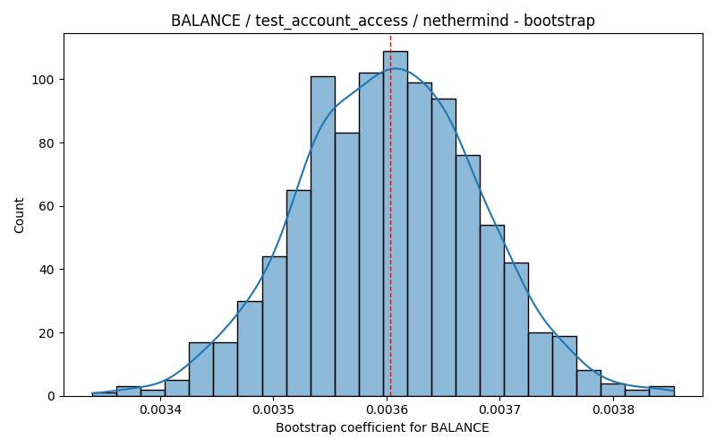

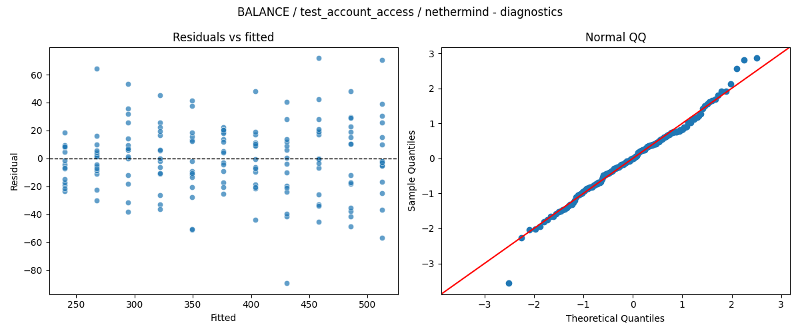

</details>

### test_account_access — combo `BALANCE_AccountMode.NON_EXISTING_ACCOUNT` — `presets[cold_account_nocode_access]`

| client | nobs | R² | target_coef (ms) | p-value | 95% CI |
| --- | --- | --- | --- | --- | --- |
| `besu` | 418 | 0.8476 | 0.01284 | 1.00e-03 | [0.01234, 0.01336] |
| `erigon` | 198 | 0.9603 | 0.008939 | 1.00e-03 | [0.008844, 0.009035] |
| `ethrex` | 275 | 0.9668 | 0.002006 | 1.00e-03 | [0.001965, 0.002047] |
| `geth` | 264 | 0.8673 | 0.02147 | 1.00e-03 | [0.0203, 0.02251] |
| `nethermind` | 165 | 0.9317 | 0.0032 | 1.00e-03 | [0.003061, 0.003345] |

<details><summary>besu — NNLS regression summary</summary>

```
==============================================================================
                           NNLS Regression Results                            
==============================================================================
Dep. Variable:          test_runtime_ms              R-squared:          0.848
Model:                  NNLS                    Adj. R-squared:          0.847
No. Observations:       418                               RMSE:         130.11
Df Residuals:           416                                MAE:         111.07
Df Model:               1      
==============================================================================
                      coef     std err     P-value      [0.025      0.975]
------------------------------------------------------------------------------
         const    219.5646     18.1529       0.001    183.6296    256.3769
       opcount      0.0128      0.0003       0.001      0.0123      0.0134
==============================================================================
Notes: Non-negative least squares with bootstrap inference (1000 iterations)
==============================================================================
```

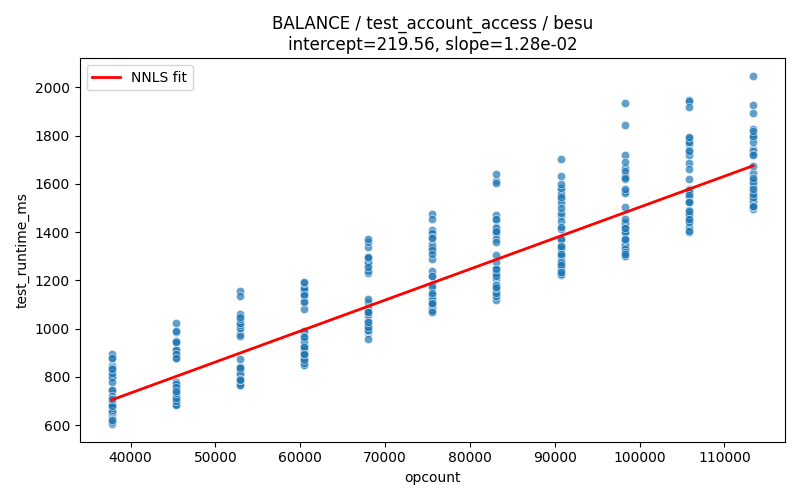

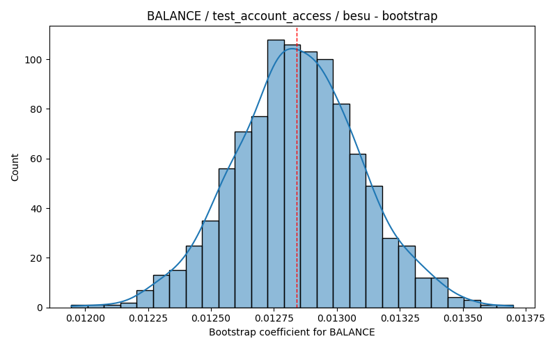

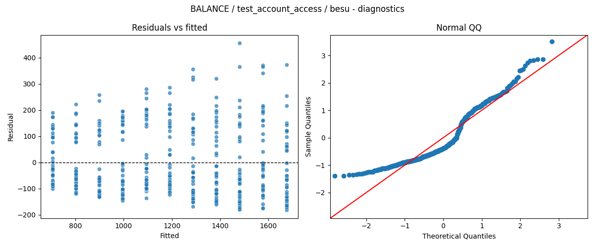

</details>

<details><summary>erigon — NNLS regression summary</summary>

```
==============================================================================
                           NNLS Regression Results                            
==============================================================================
Dep. Variable:          test_runtime_ms              R-squared:          0.960
Model:                  NNLS                    Adj. R-squared:          0.960
No. Observations:       198                               RMSE:          44.27
Df Residuals:           196                                MAE:          35.28
Df Model:               1      
==============================================================================
                      coef     std err     P-value      [0.025      0.975]
------------------------------------------------------------------------------
         const      0.0000      0.7002       1.000      0.0000      1.6436
       opcount      0.0089      0.0000       0.001      0.0088      0.0090
==============================================================================
Notes: Non-negative least squares with bootstrap inference (1000 iterations)
==============================================================================
```

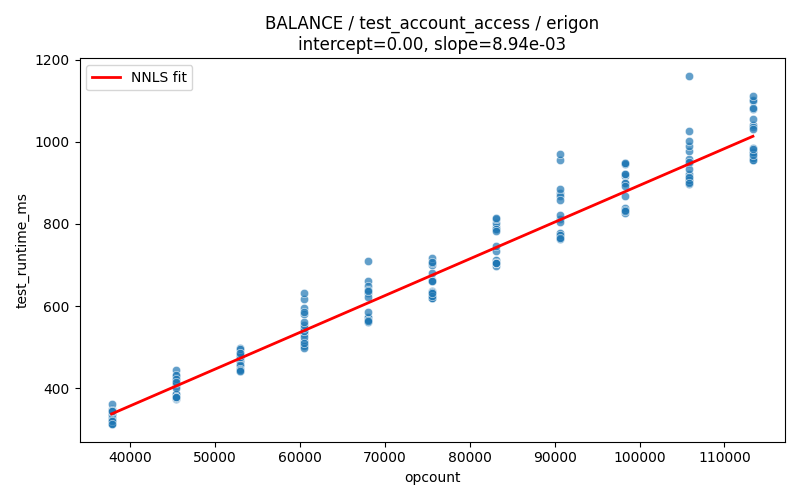

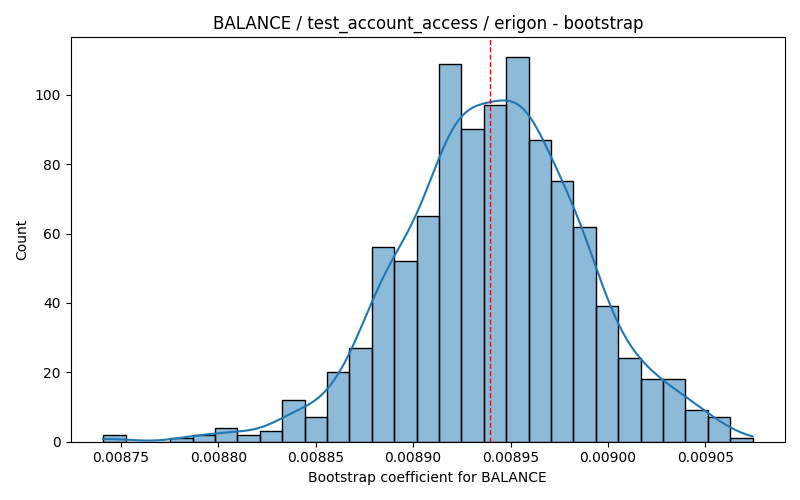

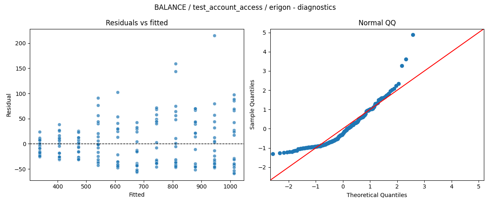

</details>

<details><summary>ethrex — NNLS regression summary</summary>

```
==============================================================================
                           NNLS Regression Results                            
==============================================================================
Dep. Variable:          test_runtime_ms              R-squared:          0.967
Model:                  NNLS                    Adj. R-squared:          0.967
No. Observations:       275                               RMSE:           8.88
Df Residuals:           273                                MAE:           7.16
Df Model:               1      
==============================================================================
                      coef     std err     P-value      [0.025      0.975]
------------------------------------------------------------------------------
         const     26.6459      1.6632       0.001     23.4555     30.0075
       opcount      0.0020      0.0000       0.001      0.0020      0.0020
==============================================================================
Notes: Non-negative least squares with bootstrap inference (1000 iterations)
==============================================================================
```

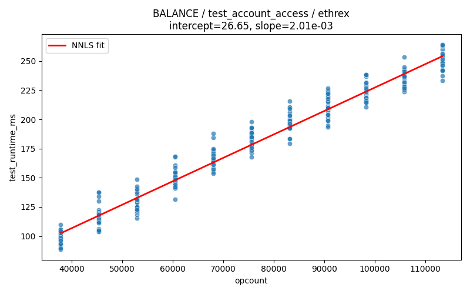

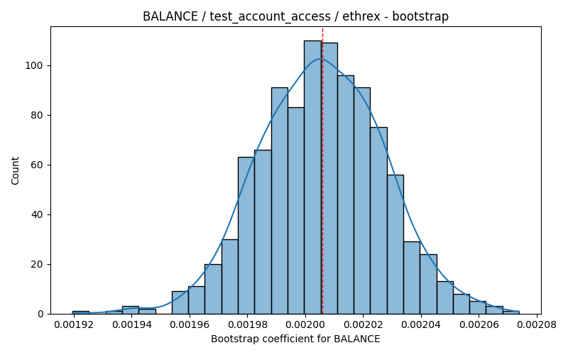

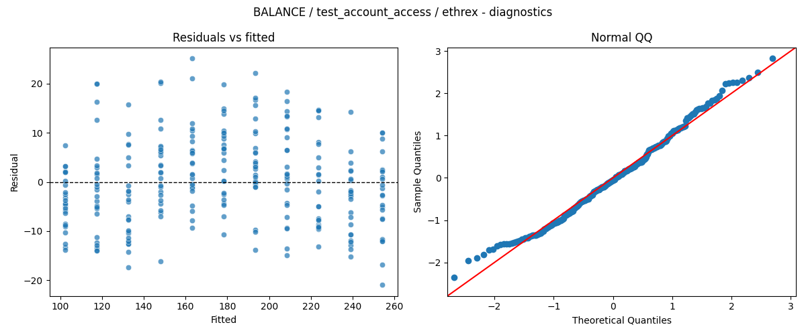

</details>

<details><summary>geth — NNLS regression summary</summary>

```
==============================================================================
                           NNLS Regression Results                            
==============================================================================
Dep. Variable:          test_runtime_ms              R-squared:          0.867
Model:                  NNLS                    Adj. R-squared:          0.867
No. Observations:       264                               RMSE:         200.70
Df Residuals:           262                                MAE:         171.24
Df Model:               1      
==============================================================================
                      coef     std err     P-value      [0.025      0.975]
------------------------------------------------------------------------------
         const    691.9282     49.3549       0.001    599.5712    790.3568
       opcount      0.0215      0.0006       0.001      0.0203      0.0225
==============================================================================
Notes: Non-negative least squares with bootstrap inference (1000 iterations)
==============================================================================
```

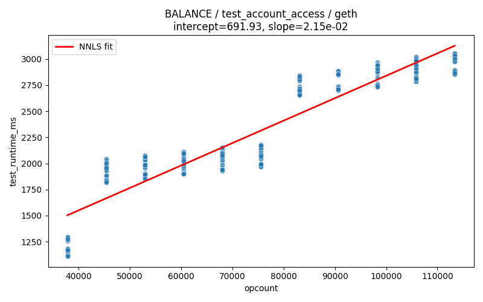

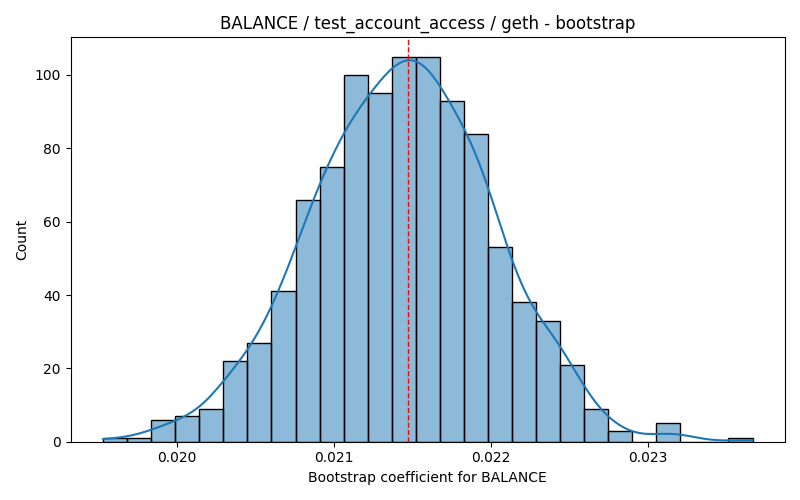

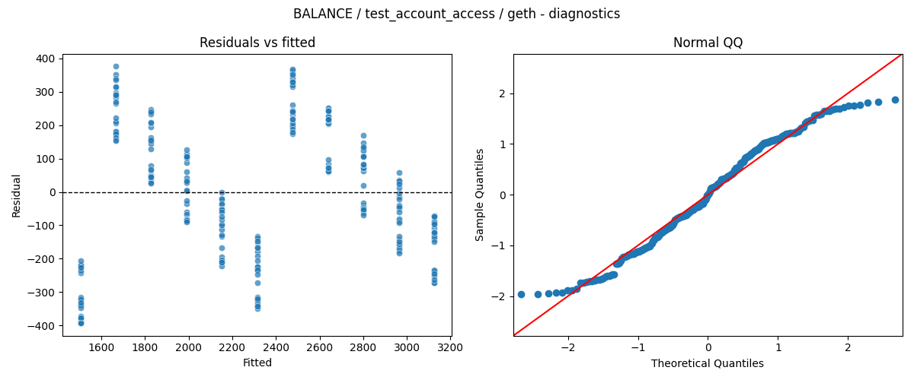

</details>

<details><summary>nethermind — NNLS regression summary</summary>

```
==============================================================================
                           NNLS Regression Results                            
==============================================================================
Dep. Variable:          test_runtime_ms              R-squared:          0.932
Model:                  NNLS                    Adj. R-squared:          0.931
No. Observations:       165                               RMSE:          20.71
Df Residuals:           163                                MAE:          16.67
Df Model:               1      
==============================================================================
                      coef     std err     P-value      [0.025      0.975]
------------------------------------------------------------------------------
         const     92.7288      5.3014       0.001     82.3145    102.3969
       opcount      0.0032      0.0001       0.001      0.0031      0.0033
==============================================================================
Notes: Non-negative least squares with bootstrap inference (1000 iterations)
==============================================================================
```

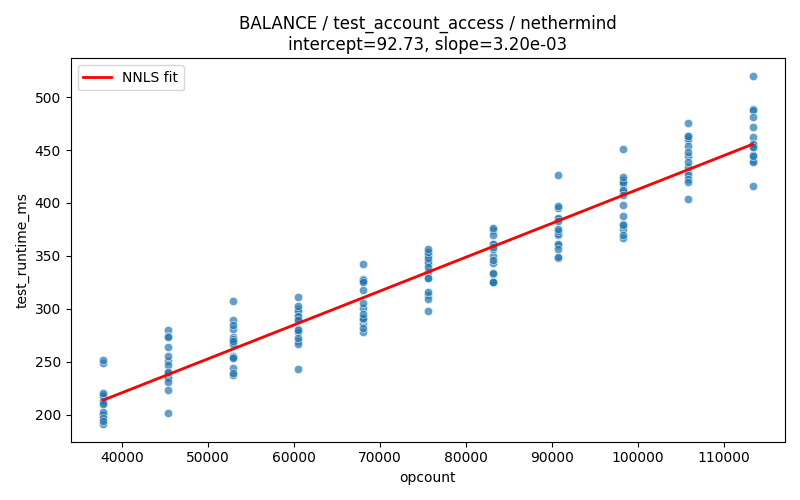

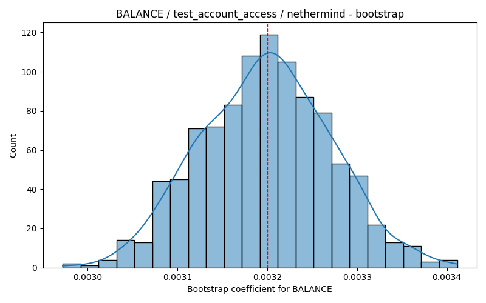

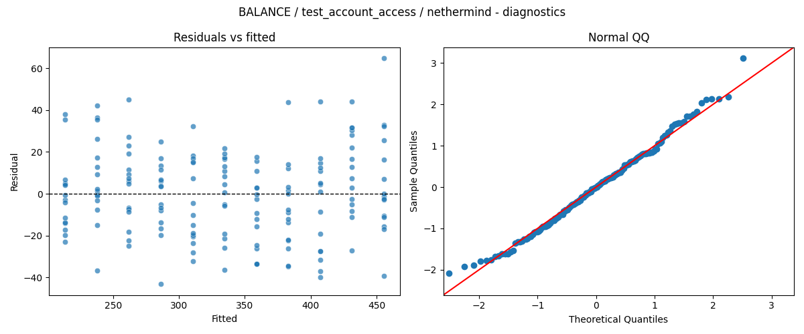

</details>

### test_account_access — combo `BALANCE_AccountMode.EXISTING_CONTRACT`

| client | nobs | R² | target_coef (ms) | p-value | 95% CI |
| --- | --- | --- | --- | --- | --- |
| `besu` | 418 | 0.8822 | 0.02577 | 1.00e-03 | [0.02498, 0.02661] |
| `erigon` | 198 | 0.929 | 0.02457 | 1.00e-03 | [0.02359, 0.02547] |
| `ethrex` | 275 | 0.9932 | 0.007722 | 1.00e-03 | [0.007646, 0.0078] |
| `geth` | 264 | 0.859 | 0.02287 | 1.00e-03 | [0.02161, 0.02404] |
| `nethermind` | 165 | 0.8137 | 0.009887 | 1.00e-03 | [0.009199, 0.01059] |

<details><summary>besu — NNLS regression summary</summary>

```
==============================================================================
                           NNLS Regression Results                            
==============================================================================
Dep. Variable:          test_runtime_ms              R-squared:          0.882
Model:                  NNLS                    Adj. R-squared:          0.882
No. Observations:       418                               RMSE:         195.87
Df Residuals:           416                                MAE:         160.96
Df Model:               1      
==============================================================================
                      coef     std err     P-value      [0.025      0.975]
------------------------------------------------------------------------------
         const    401.6141     28.8817       0.001    342.6719    456.3507
       opcount      0.0258      0.0004       0.001      0.0250      0.0266
==============================================================================
Notes: Non-negative least squares with bootstrap inference (1000 iterations)
==============================================================================
```

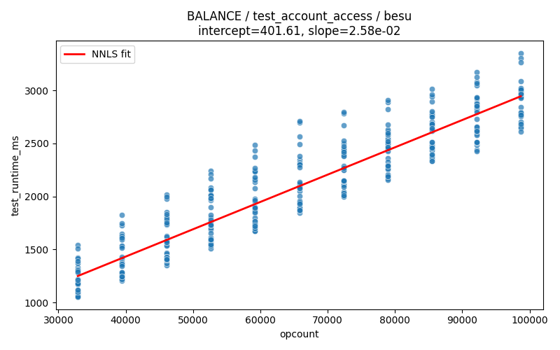

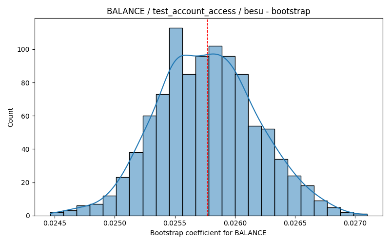

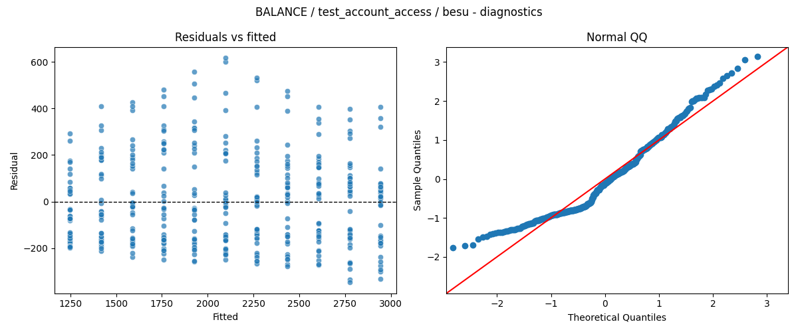

</details>

<details><summary>erigon — NNLS regression summary</summary>

```
==============================================================================
                           NNLS Regression Results                            
==============================================================================
Dep. Variable:          test_runtime_ms              R-squared:          0.929
Model:                  NNLS                    Adj. R-squared:          0.929
No. Observations:       198                               RMSE:         141.29
Df Residuals:           196                                MAE:         119.81
Df Model:               1      
==============================================================================
                      coef     std err     P-value      [0.025      0.975]
------------------------------------------------------------------------------
         const    304.9134     34.6261       0.001    238.5566    378.4428
       opcount      0.0246      0.0005       0.001      0.0236      0.0255
==============================================================================
Notes: Non-negative least squares with bootstrap inference (1000 iterations)
==============================================================================
```

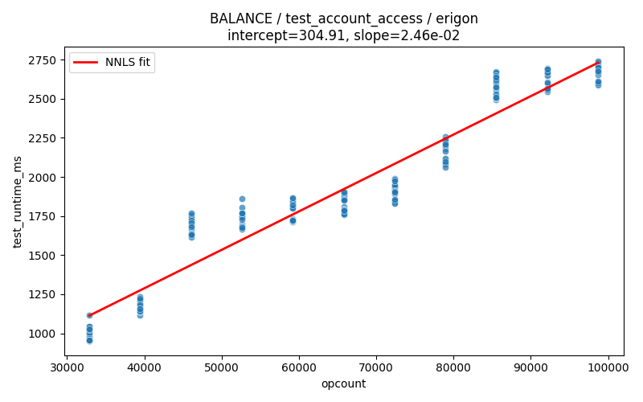

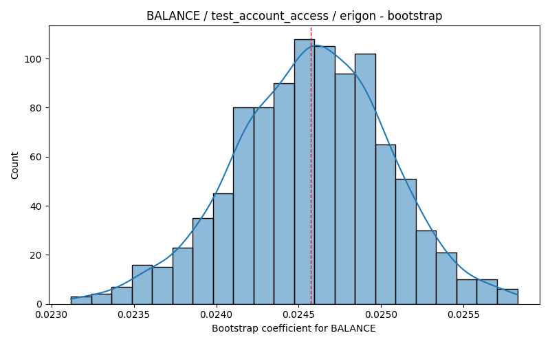

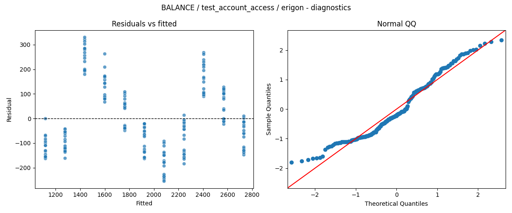

</details>

<details><summary>ethrex — NNLS regression summary</summary>

```
==============================================================================
                           NNLS Regression Results                            
==============================================================================
Dep. Variable:          test_runtime_ms              R-squared:          0.993
Model:                  NNLS                    Adj. R-squared:          0.993
No. Observations:       275                               RMSE:          13.31
Df Residuals:           273                                MAE:          10.37
Df Model:               1      
==============================================================================
                      coef     std err     P-value      [0.025      0.975]
------------------------------------------------------------------------------
         const     41.5131      2.4168       0.001     36.6624     46.1833
       opcount      0.0077      0.0000       0.001      0.0076      0.0078
==============================================================================
Notes: Non-negative least squares with bootstrap inference (1000 iterations)
==============================================================================
```

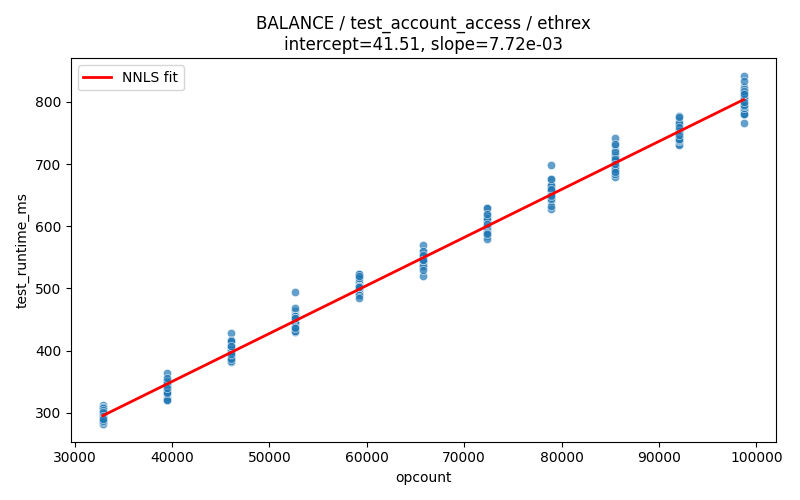

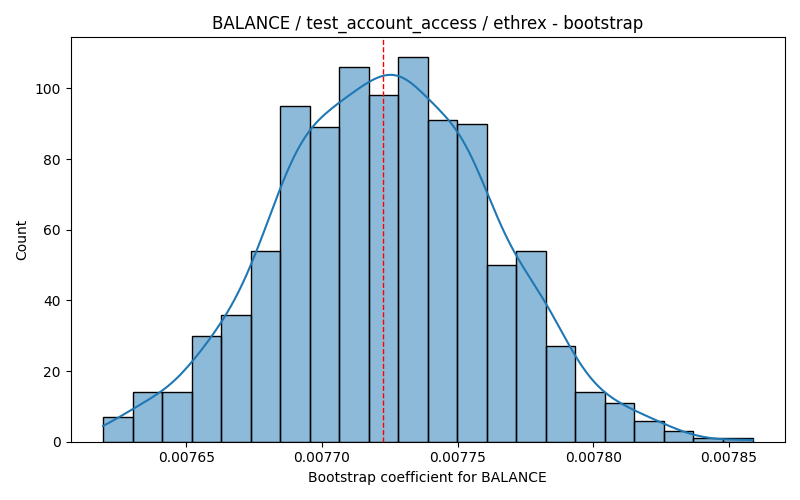

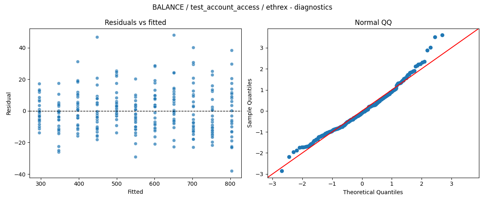

</details>

<details><summary>geth — NNLS regression summary</summary>

```
==============================================================================
                           NNLS Regression Results                            
==============================================================================
Dep. Variable:          test_runtime_ms              R-squared:          0.859
Model:                  NNLS                    Adj. R-squared:          0.858
No. Observations:       264                               RMSE:         192.73
Df Residuals:           262                                MAE:         163.35
Df Model:               1      
==============================================================================
                      coef     std err     P-value      [0.025      0.975]
------------------------------------------------------------------------------
         const    660.2784     45.7120       0.001    574.0598    751.4863
       opcount      0.0229      0.0006       0.001      0.0216      0.0240
==============================================================================
Notes: Non-negative least squares with bootstrap inference (1000 iterations)
==============================================================================
```

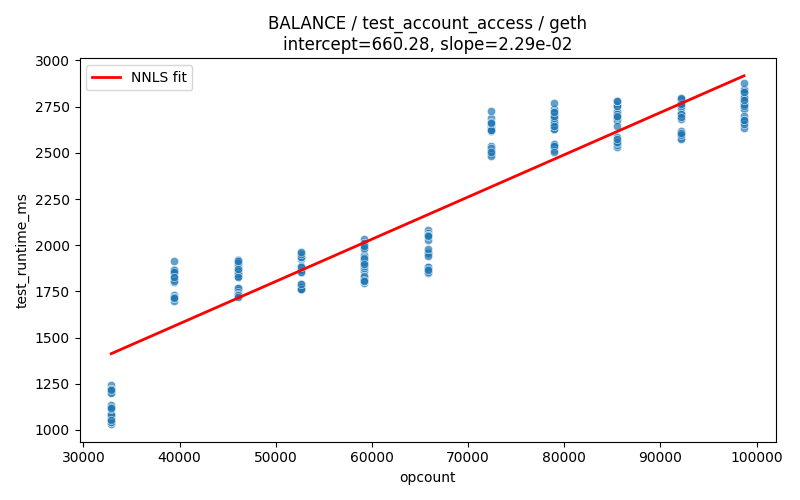

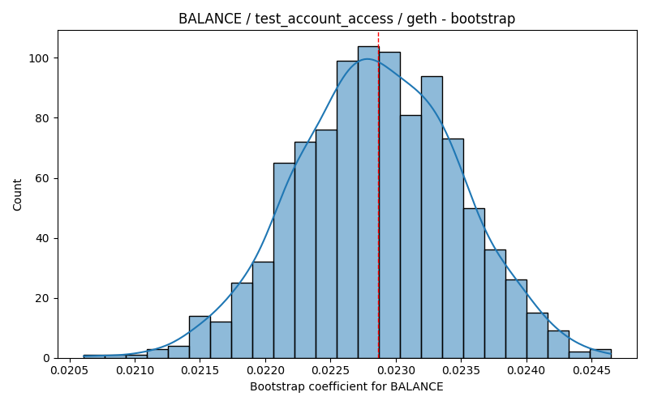

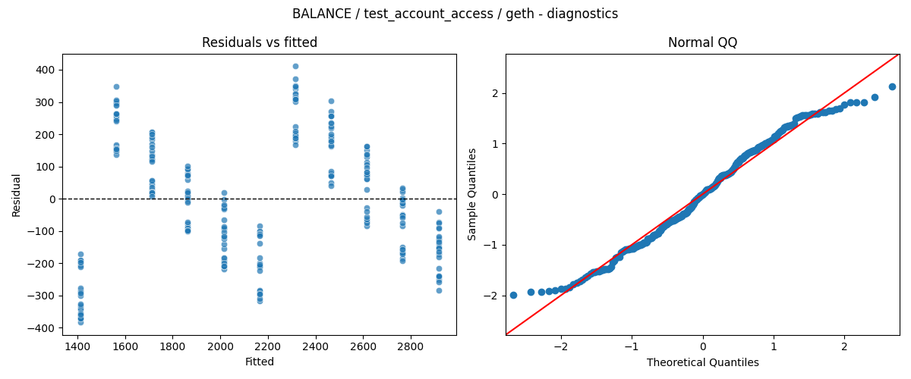

</details>

<details><summary>nethermind — NNLS regression summary</summary>

```
==============================================================================
                           NNLS Regression Results                            
==============================================================================
Dep. Variable:          test_runtime_ms              R-squared:          0.814
Model:                  NNLS                    Adj. R-squared:          0.813
No. Observations:       165                               RMSE:          98.43
Df Residuals:           163                                MAE:          62.11
Df Model:               1      
==============================================================================
                      coef     std err     P-value      [0.025      0.975]
------------------------------------------------------------------------------
         const    140.8909     20.8273       0.001    101.0218    181.0383
       opcount      0.0099      0.0004       0.001      0.0092      0.0106
==============================================================================
Notes: Non-negative least squares with bootstrap inference (1000 iterations)
==============================================================================
```

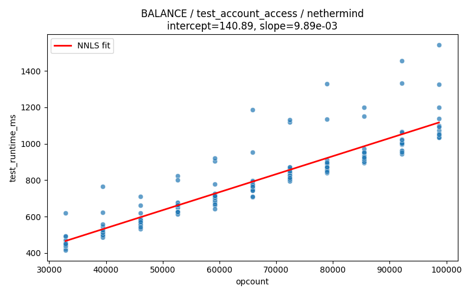

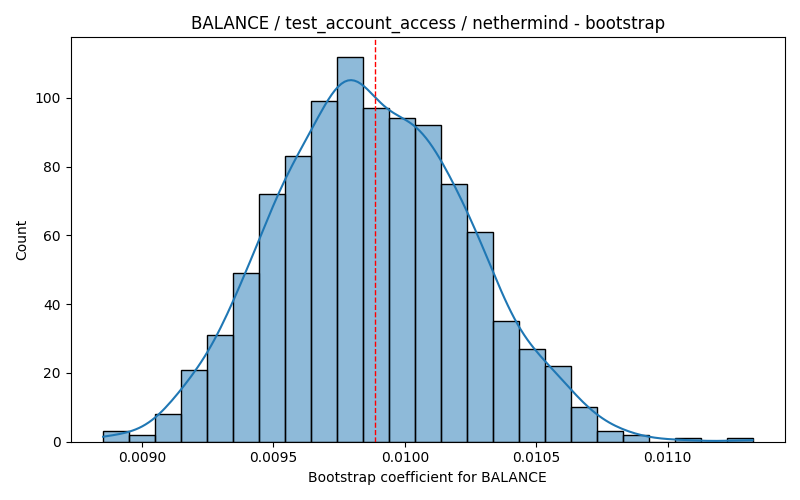

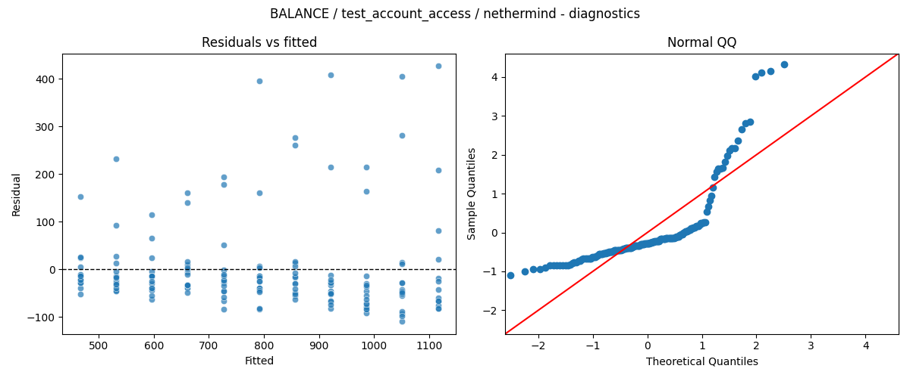

</details>

### test_account_access — combo `BALANCE_AccountMode.NON_EXISTING_ACCOUNT` — `presets[cold_account_code_access]`

| client | nobs | R² | target_coef (ms) | p-value | 95% CI |
| --- | --- | --- | --- | --- | --- |
| `besu` | 418 | 0.8476 | 0.01284 | 1.00e-03 | [0.01234, 0.01336] |
| `erigon` | 198 | 0.9603 | 0.008939 | 1.00e-03 | [0.008844, 0.009035] |
| `ethrex` | 275 | 0.9668 | 0.002006 | 1.00e-03 | [0.001965, 0.002047] |
| `geth` | 264 | 0.8673 | 0.02147 | 1.00e-03 | [0.0203, 0.02251] |
| `nethermind` | 165 | 0.9317 | 0.0032 | 1.00e-03 | [0.003061, 0.003345] |

<details><summary>besu — NNLS regression summary</summary>

```
==============================================================================
                           NNLS Regression Results                            
==============================================================================
Dep. Variable:          test_runtime_ms              R-squared:          0.848
Model:                  NNLS                    Adj. R-squared:          0.847
No. Observations:       418                               RMSE:         130.11
Df Residuals:           416                                MAE:         111.07
Df Model:               1      
==============================================================================
                      coef     std err     P-value      [0.025      0.975]
------------------------------------------------------------------------------
         const    219.5646     18.1529       0.001    183.6296    256.3769
       opcount      0.0128      0.0003       0.001      0.0123      0.0134
==============================================================================
Notes: Non-negative least squares with bootstrap inference (1000 iterations)
==============================================================================
```


</details>

<details><summary>erigon — NNLS regression summary</summary>

```
==============================================================================
                           NNLS Regression Results                            
==============================================================================
Dep. Variable:          test_runtime_ms              R-squared:          0.960
Model:                  NNLS                    Adj. R-squared:          0.960
No. Observations:       198                               RMSE:          44.27
Df Residuals:           196                                MAE:          35.28
Df Model:               1      
==============================================================================
                      coef     std err     P-value      [0.025      0.975]
------------------------------------------------------------------------------
         const      0.0000      0.7002       1.000      0.0000      1.6436
       opcount      0.0089      0.0000       0.001      0.0088      0.0090
==============================================================================
Notes: Non-negative least squares with bootstrap inference (1000 iterations)
==============================================================================
```


</details>

<details><summary>ethrex — NNLS regression summary</summary>

```
==============================================================================
                           NNLS Regression Results                            
==============================================================================
Dep. Variable:          test_runtime_ms              R-squared:          0.967
Model:                  NNLS                    Adj. R-squared:          0.967
No. Observations:       275                               RMSE:           8.88
Df Residuals:           273                                MAE:           7.16
Df Model:               1      
==============================================================================
                      coef     std err     P-value      [0.025      0.975]
------------------------------------------------------------------------------
         const     26.6459      1.6632       0.001     23.4555     30.0075
       opcount      0.0020      0.0000       0.001      0.0020      0.0020
==============================================================================
Notes: Non-negative least squares with bootstrap inference (1000 iterations)
==============================================================================
```


</details>

<details><summary>geth — NNLS regression summary</summary>

```
==============================================================================
                           NNLS Regression Results                            
==============================================================================
Dep. Variable:          test_runtime_ms              R-squared:          0.867
Model:                  NNLS                    Adj. R-squared:          0.867
No. Observations:       264                               RMSE:         200.70
Df Residuals:           262                                MAE:         171.24
Df Model:               1      
==============================================================================
                      coef     std err     P-value      [0.025      0.975]
------------------------------------------------------------------------------
         const    691.9282     49.3549       0.001    599.5712    790.3568
       opcount      0.0215      0.0006       0.001      0.0203      0.0225
==============================================================================
Notes: Non-negative least squares with bootstrap inference (1000 iterations)
==============================================================================
```


</details>

<details><summary>nethermind — NNLS regression summary</summary>

```
==============================================================================
                           NNLS Regression Results                            
==============================================================================
Dep. Variable:          test_runtime_ms              R-squared:          0.932
Model:                  NNLS                    Adj. R-squared:          0.931
No. Observations:       165                               RMSE:          20.71
Df Residuals:           163                                MAE:          16.67
Df Model:               1      
==============================================================================
                      coef     std err     P-value      [0.025      0.975]
------------------------------------------------------------------------------
         const     92.7288      5.3014       0.001     82.3145    102.3969
       opcount      0.0032      0.0001       0.001      0.0031      0.0033
==============================================================================
Notes: Non-negative least squares with bootstrap inference (1000 iterations)
==============================================================================
```


</details>

### test_ext_account_query_warm — combo `BALANCE`

| client | nobs | R² | target_coef (ms) | p-value | 95% CI |
| --- | --- | --- | --- | --- | --- |
| `besu` | 418 | 0.2539 | 7.537e-05 | 1.00e-03 | [6.143e-05, 8.773e-05] |
| `erigon` | 198 | 0.9118 | 5.267e-05 | 1.00e-03 | [5.045e-05, 5.503e-05] |
| `ethrex` | 275 | 0.3033 | 1.327e-05 | 1.00e-03 | [1.1e-05, 1.535e-05] |
| `geth` | 264 | 0.6738 | 2.791e-05 | 1.00e-03 | [2.535e-05, 3.023e-05] |
| `nethermind` | 165 | 0.6554 | 0.0001286 | 1.00e-03 | [0.0001138, 0.0001433] |

<details><summary>besu — NNLS regression summary</summary>

```
==============================================================================
                           NNLS Regression Results                            
==============================================================================
Dep. Variable:          test_runtime_ms              R-squared:          0.254
Model:                  NNLS                    Adj. R-squared:          0.252
No. Observations:       418                               RMSE:          75.55
Df Residuals:           416                                MAE:          57.30
Df Model:               1      
==============================================================================
                      coef     std err     P-value      [0.025      0.975]
------------------------------------------------------------------------------
         const    187.3683     12.8366       0.001    163.6901    213.1700
       opcount      0.0001      0.0000       0.001      0.0001      0.0001
==============================================================================
Notes: Non-negative least squares with bootstrap inference (1000 iterations)
==============================================================================
```

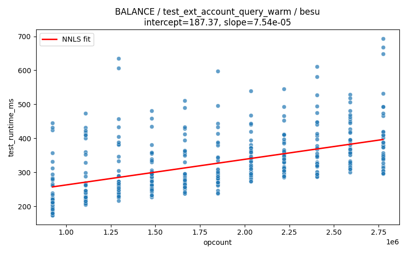

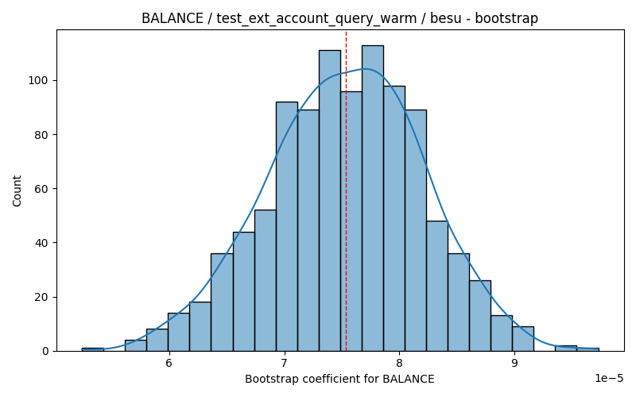

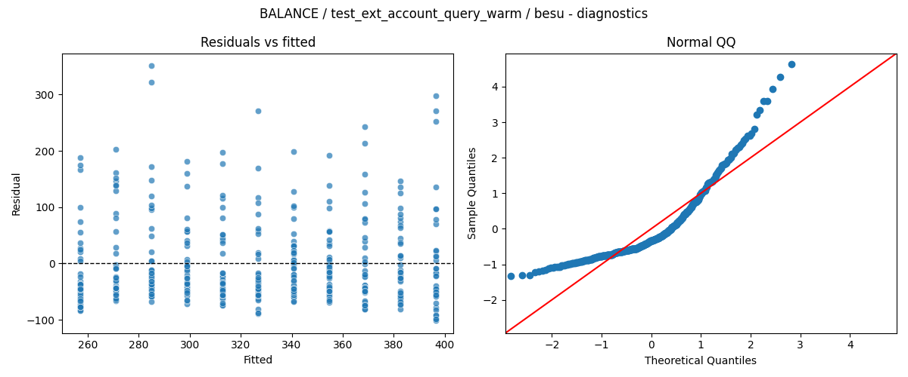

</details>

<details><summary>erigon — NNLS regression summary</summary>

```
==============================================================================
                           NNLS Regression Results                            
==============================================================================
Dep. Variable:          test_runtime_ms              R-squared:          0.912
Model:                  NNLS                    Adj. R-squared:          0.911
No. Observations:       198                               RMSE:           9.58
Df Residuals:           196                                MAE:           7.47
Df Model:               1      
==============================================================================
                      coef     std err     P-value      [0.025      0.975]
------------------------------------------------------------------------------
         const     27.4685      1.9898       0.001     23.6630     31.2859
       opcount      0.0001      0.0000       0.001      0.0001      0.0001
==============================================================================
Notes: Non-negative least squares with bootstrap inference (1000 iterations)
==============================================================================
```


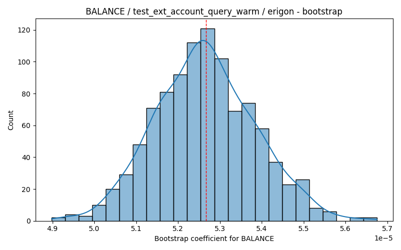

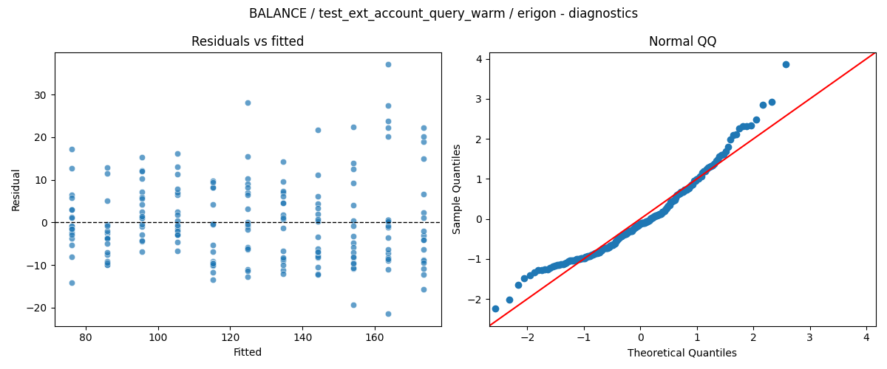

</details>

<details><summary>ethrex — NNLS regression summary</summary>

```
==============================================================================
                           NNLS Regression Results                            
==============================================================================
Dep. Variable:          test_runtime_ms              R-squared:          0.303
Model:                  NNLS                    Adj. R-squared:          0.301
No. Observations:       275                               RMSE:          11.77
Df Residuals:           273                                MAE:           7.16
Df Model:               1      
==============================================================================
                      coef     std err     P-value      [0.025      0.975]
------------------------------------------------------------------------------
         const     12.2695      2.3798       0.001      7.7847     16.8494
       opcount      0.0000      0.0000       0.001      0.0000      0.0000
==============================================================================
Notes: Non-negative least squares with bootstrap inference (1000 iterations)
==============================================================================
```

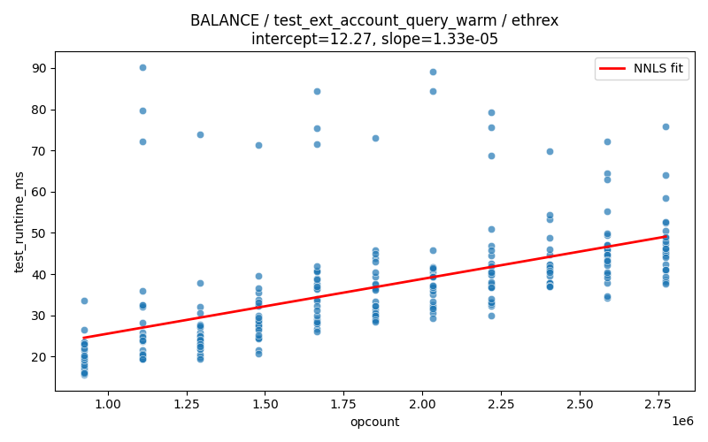

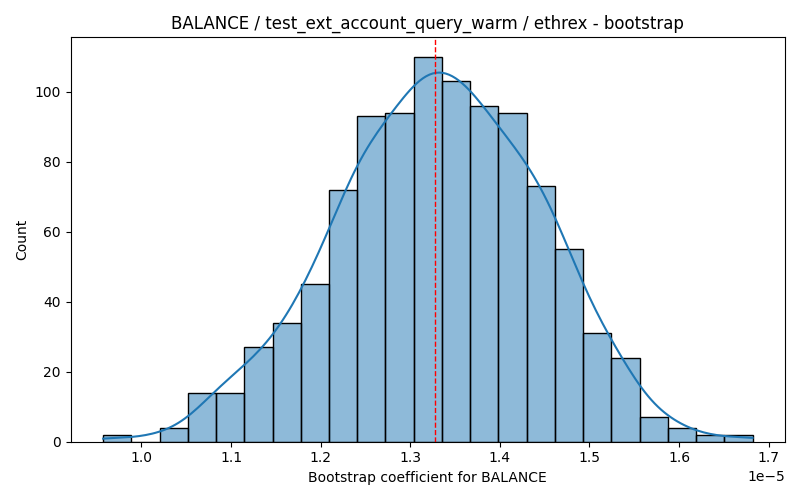

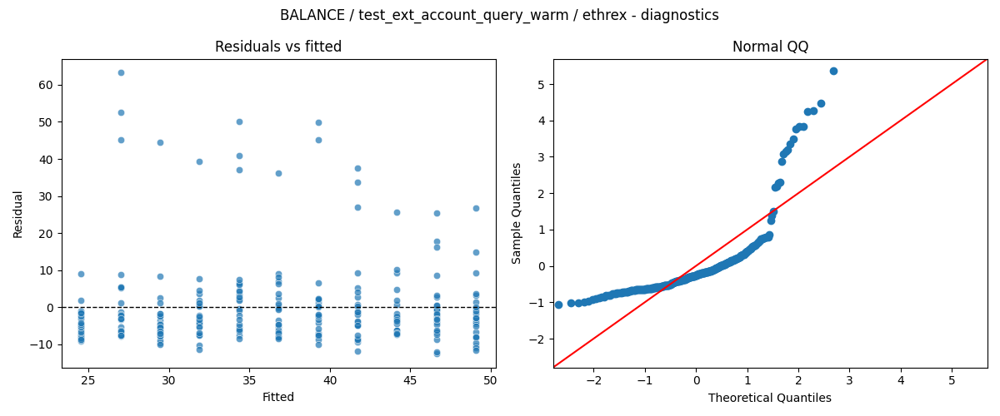

</details>

<details><summary>geth — NNLS regression summary</summary>

```
==============================================================================
                           NNLS Regression Results                            
==============================================================================
Dep. Variable:          test_runtime_ms              R-squared:          0.674
Model:                  NNLS                    Adj. R-squared:          0.673
No. Observations:       264                               RMSE:          11.35
Df Residuals:           262                                MAE:           8.88
Df Model:               1      
==============================================================================
                      coef     std err     P-value      [0.025      0.975]
------------------------------------------------------------------------------
         const     22.2160      2.3117       0.001     18.0540     26.8197
       opcount      0.0000      0.0000       0.001      0.0000      0.0000
==============================================================================
Notes: Non-negative least squares with bootstrap inference (1000 iterations)
==============================================================================
```

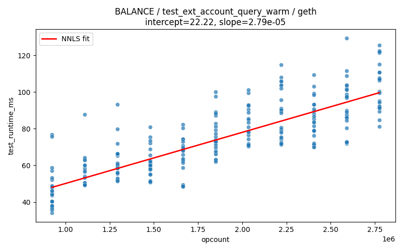

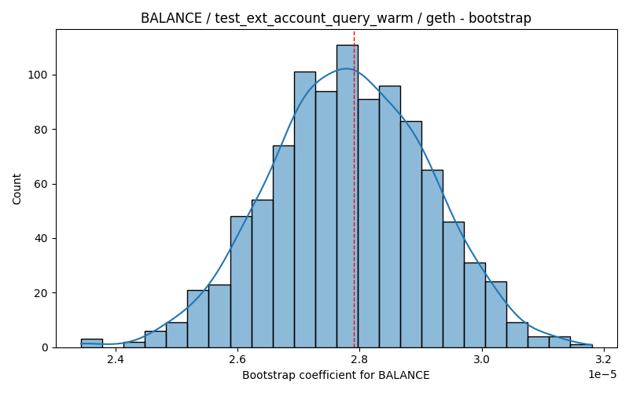

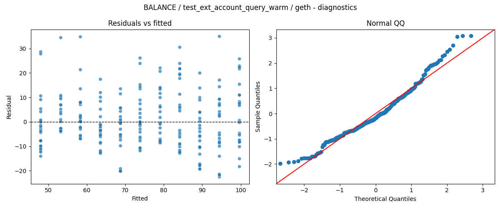

</details>

<details><summary>nethermind — NNLS regression summary</summary>

```
==============================================================================
                           NNLS Regression Results                            
==============================================================================
Dep. Variable:          test_runtime_ms              R-squared:          0.655
Model:                  NNLS                    Adj. R-squared:          0.653
No. Observations:       165                               RMSE:          54.52
Df Residuals:           163                                MAE:          38.83
Df Model:               1      
==============================================================================
                      coef     std err     P-value      [0.025      0.975]
------------------------------------------------------------------------------
         const    145.9506     12.9591       0.001    120.9705    173.0195
       opcount      0.0001      0.0000       0.001      0.0001      0.0001
==============================================================================
Notes: Non-negative least squares with bootstrap inference (1000 iterations)
==============================================================================
```

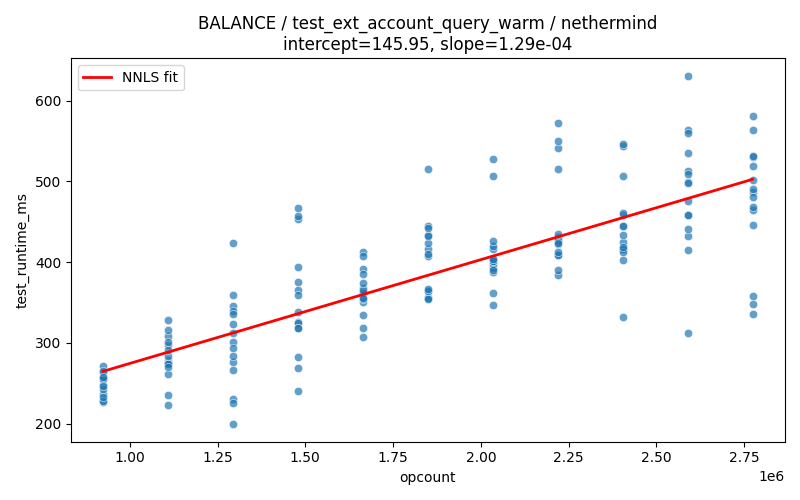


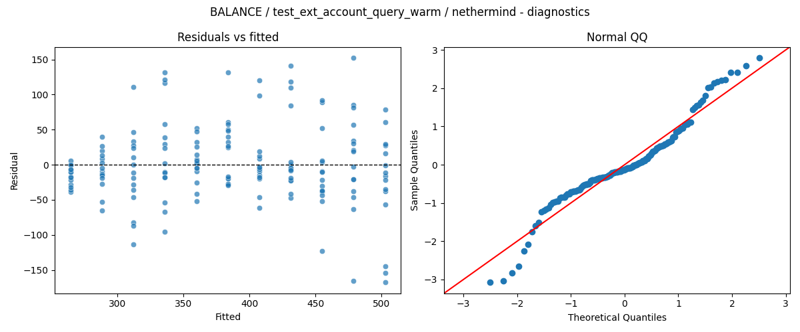

</details>

## CALL

### test_account_access — combo `CALL_AccountMode.EXISTING_EOA` — `presets[cold_account_nocode_access]`

| client | nobs | R² | target_coef (ms) | p-value | 95% CI |
| --- | --- | --- | --- | --- | --- |
| `besu` | 418 | 0.7866 | 0.01472 | 1.00e-03 | [0.01398, 0.01548] |
| `erigon` | 198 | 0.9713 | 0.01114 | 1.00e-03 | [0.01088, 0.01136] |
| `ethrex` | 275 | 0.9943 | 0.007329 | 1.00e-03 | [0.007259, 0.007393] |
| `geth` | 264 | 0.9144 | 0.01107 | 1.00e-03 | [0.01062, 0.01151] |
| `nethermind` | 165 | 0.8992 | 0.003806 | 1.00e-03 | [0.00362, 0.004002] |

<details><summary>besu — NNLS regression summary</summary>

```
==============================================================================
                           NNLS Regression Results                            
==============================================================================
Dep. Variable:          test_runtime_ms              R-squared:          0.787
Model:                  NNLS                    Adj. R-squared:          0.786
No. Observations:       418                               RMSE:         182.09
Df Residuals:           416                                MAE:         155.10
Df Model:               1      
==============================================================================
                      coef     std err     P-value      [0.025      0.975]
------------------------------------------------------------------------------
         const    636.7950     27.2083       0.001    584.6259    689.9347
       opcount      0.0147      0.0004       0.001      0.0140      0.0155
==============================================================================
Notes: Non-negative least squares with bootstrap inference (1000 iterations)
==============================================================================
```

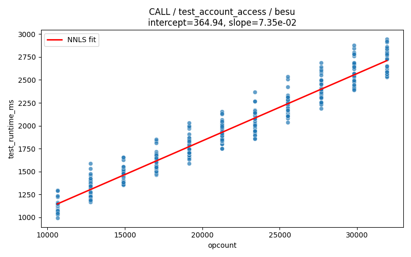

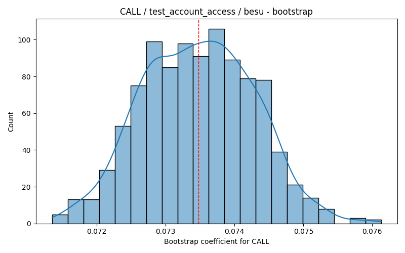

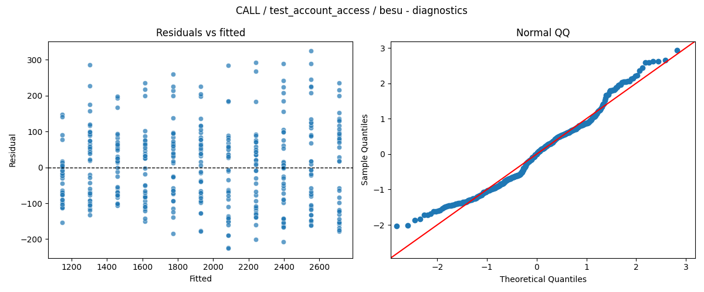

</details>

<details><summary>erigon — NNLS regression summary</summary>

```
==============================================================================
                           NNLS Regression Results                            
==============================================================================
Dep. Variable:          test_runtime_ms              R-squared:          0.971
Model:                  NNLS                    Adj. R-squared:          0.971
No. Observations:       198                               RMSE:          45.45
Df Residuals:           196                                MAE:          39.15
Df Model:               1      
==============================================================================
                      coef     std err     P-value      [0.025      0.975]
------------------------------------------------------------------------------
         const     13.4026      8.3861       0.051      0.0000     30.9857
       opcount      0.0111      0.0001       0.001      0.0109      0.0114
==============================================================================
Notes: Non-negative least squares with bootstrap inference (1000 iterations)
==============================================================================
```

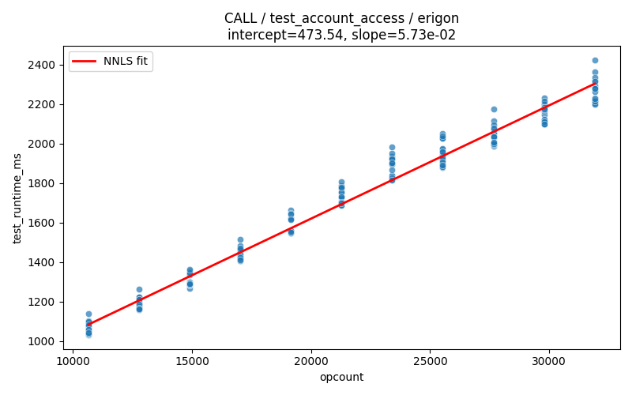

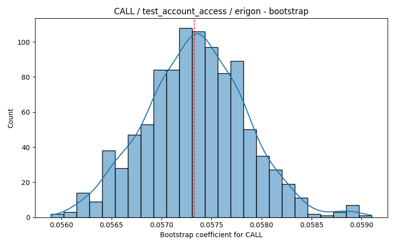

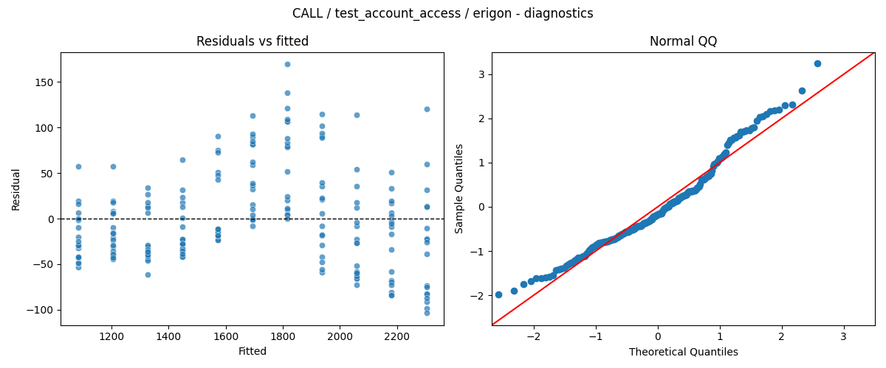

</details>

<details><summary>ethrex — NNLS regression summary</summary>

```
==============================================================================
                           NNLS Regression Results                            
==============================================================================
Dep. Variable:          test_runtime_ms              R-squared:          0.994
Model:                  NNLS                    Adj. R-squared:          0.994
No. Observations:       275                               RMSE:          13.22
Df Residuals:           273                                MAE:          10.46
Df Model:               1      
==============================================================================
                      coef     std err     P-value      [0.025      0.975]
------------------------------------------------------------------------------
         const     43.0234      2.4895       0.001     38.2140     48.0913
       opcount      0.0073      0.0000       0.001      0.0073      0.0074
==============================================================================
Notes: Non-negative least squares with bootstrap inference (1000 iterations)
==============================================================================
```

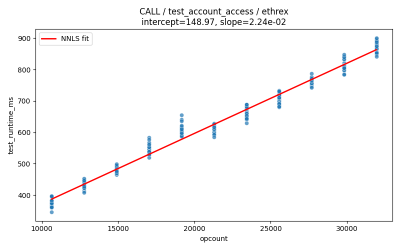

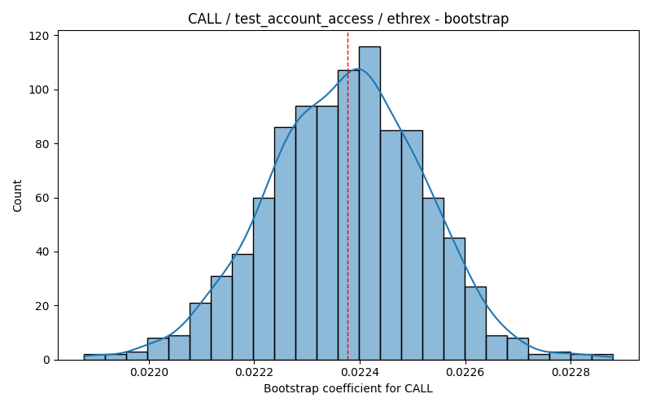

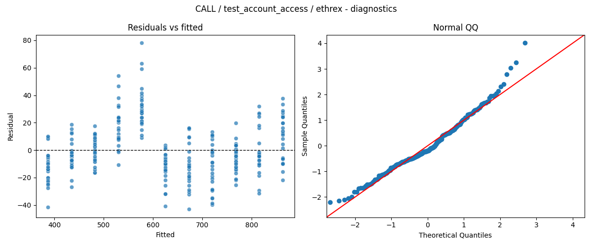

</details>

<details><summary>geth — NNLS regression summary</summary>

```
==============================================================================
                           NNLS Regression Results                            
==============================================================================
Dep. Variable:          test_runtime_ms              R-squared:          0.914
Model:                  NNLS                    Adj. R-squared:          0.914
No. Observations:       264                               RMSE:          80.39
Df Residuals:           262                                MAE:          66.60
Df Model:               1      
==============================================================================
                      coef     std err     P-value      [0.025      0.975]
------------------------------------------------------------------------------
         const    393.3204     19.2483       0.001    355.1385    430.3761
       opcount      0.0111      0.0002       0.001      0.0106      0.0115
==============================================================================
Notes: Non-negative least squares with bootstrap inference (1000 iterations)
==============================================================================
```


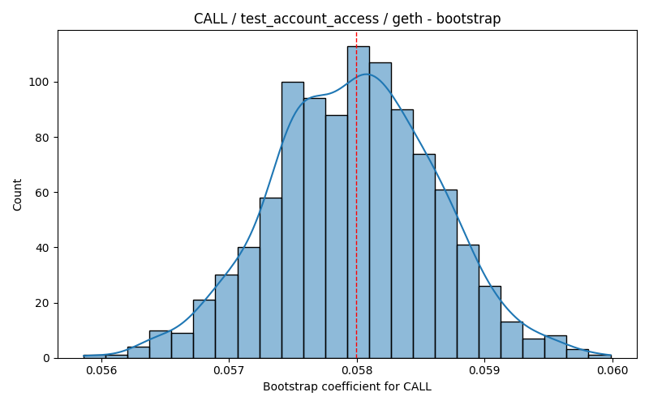

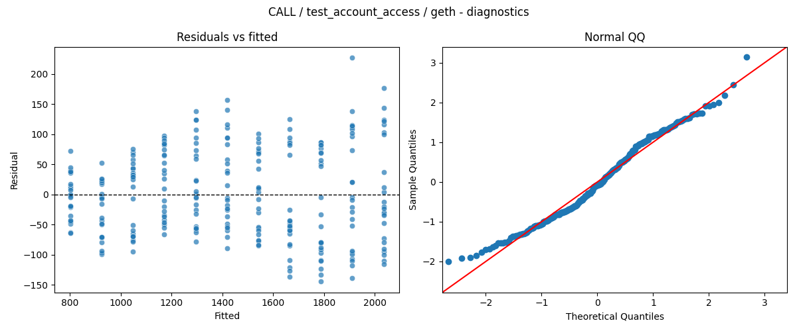

</details>

<details><summary>nethermind — NNLS regression summary</summary>

```
==============================================================================
                           NNLS Regression Results                            
==============================================================================
Dep. Variable:          test_runtime_ms              R-squared:          0.899
Model:                  NNLS                    Adj. R-squared:          0.899
No. Observations:       165                               RMSE:          30.26
Df Residuals:           163                                MAE:          24.66
Df Model:               1      
==============================================================================
                      coef     std err     P-value      [0.025      0.975]
------------------------------------------------------------------------------
         const    116.7062      7.3910       0.001    101.6874    130.6472
       opcount      0.0038      0.0001       0.001      0.0036      0.0040
==============================================================================
Notes: Non-negative least squares with bootstrap inference (1000 iterations)
==============================================================================
```

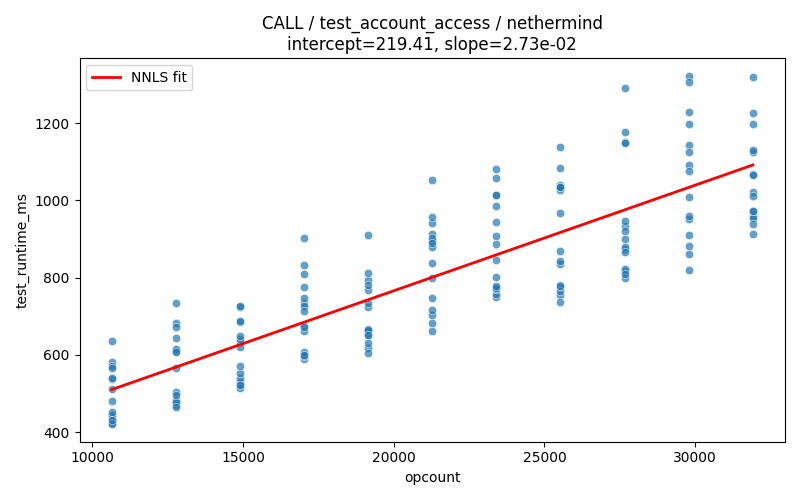

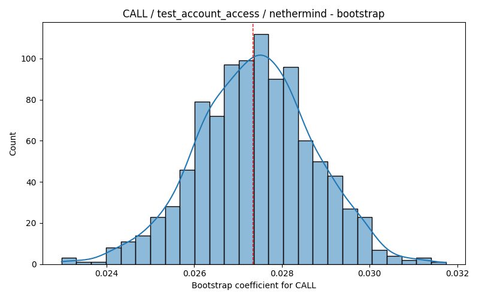

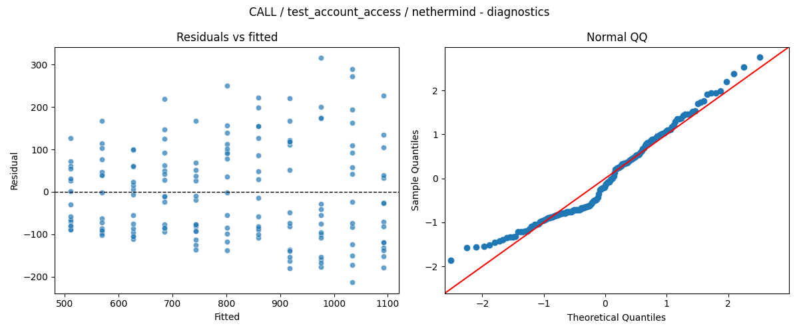

</details>

### test_account_access — combo `CALL_AccountMode.NON_EXISTING_ACCOUNT` — `presets[cold_account_nocode_access]`

| client | nobs | R² | target_coef (ms) | p-value | 95% CI |
| --- | --- | --- | --- | --- | --- |
| `besu` | 418 | 0.8502 | 0.01515 | 1.00e-03 | [0.01451, 0.01576] |
| `erigon` | 198 | 0.972 | 0.01015 | 1.00e-03 | [0.009982, 0.01024] |
| `ethrex` | 275 | 0.9678 | 0.002055 | 1.00e-03 | [0.002011, 0.002098] |
| `geth` | 264 | 0.8687 | 0.02194 | 1.00e-03 | [0.02092, 0.02302] |
| `nethermind` | 165 | 0.9143 | 0.003716 | 1.00e-03 | [0.003545, 0.003897] |

<details><summary>besu — NNLS regression summary</summary>

```
==============================================================================
                           NNLS Regression Results                            
==============================================================================
Dep. Variable:          test_runtime_ms              R-squared:          0.850
Model:                  NNLS                    Adj. R-squared:          0.850
No. Observations:       418                               RMSE:         151.03
Df Residuals:           416                                MAE:         129.18
Df Model:               1      
==============================================================================
                      coef     std err     P-value      [0.025      0.975]
------------------------------------------------------------------------------
         const    327.7236     23.4209       0.001    282.4132    373.9329
       opcount      0.0152      0.0003       0.001      0.0145      0.0158
==============================================================================
Notes: Non-negative least squares with bootstrap inference (1000 iterations)
==============================================================================
```

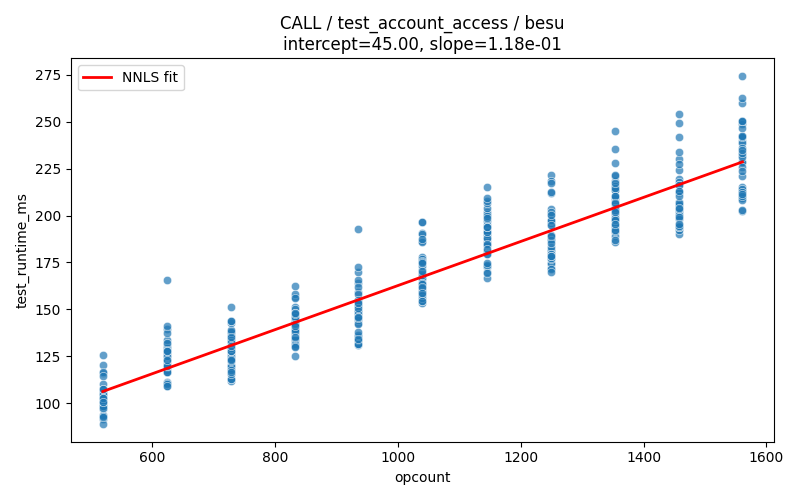

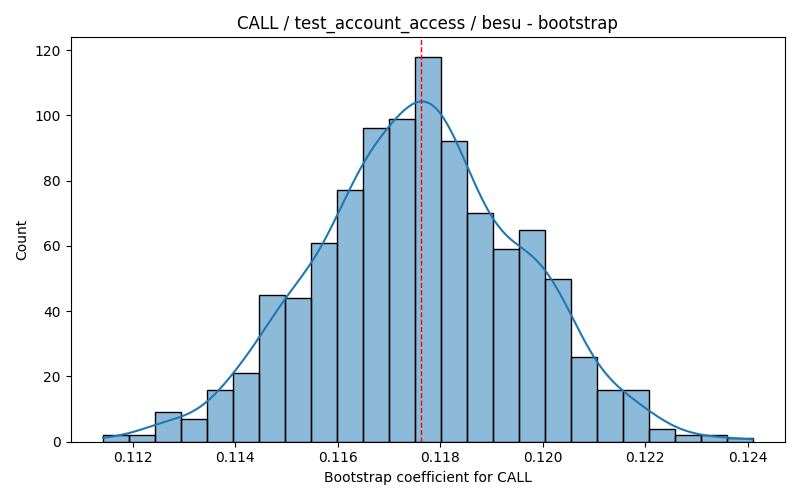

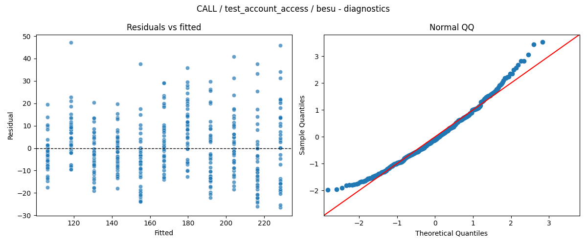

</details>

<details><summary>erigon — NNLS regression summary</summary>

```
==============================================================================
                           NNLS Regression Results                            
==============================================================================
Dep. Variable:          test_runtime_ms              R-squared:          0.972
Model:                  NNLS                    Adj. R-squared:          0.972
No. Observations:       198                               RMSE:          41.20
Df Residuals:           196                                MAE:          34.73
Df Model:               1      
==============================================================================
                      coef     std err     P-value      [0.025      0.975]
------------------------------------------------------------------------------
         const      0.0000      2.8529       1.000      0.0000     10.6646
       opcount      0.0102      0.0001       0.001      0.0100      0.0102
==============================================================================
Notes: Non-negative least squares with bootstrap inference (1000 iterations)
==============================================================================
```


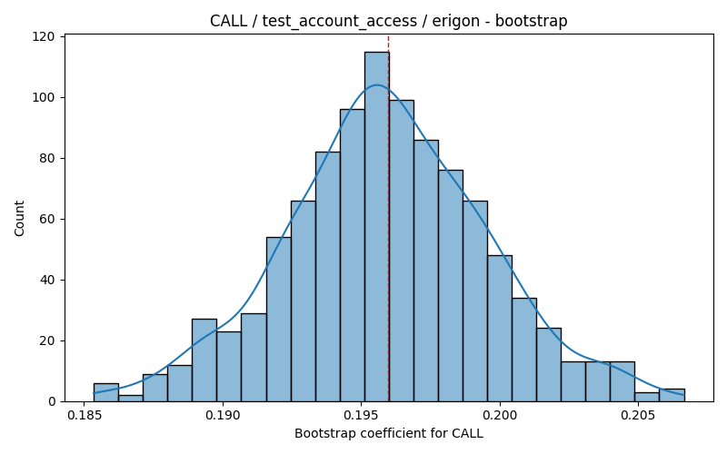

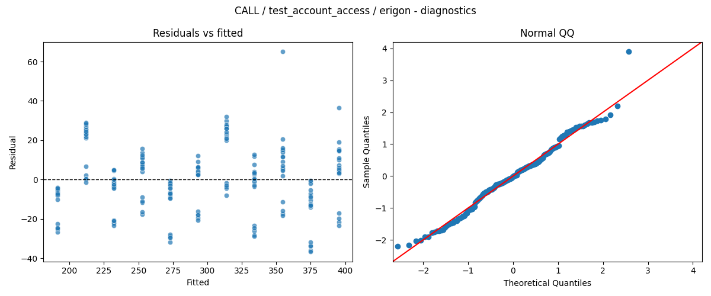

</details>

<details><summary>ethrex — NNLS regression summary</summary>

```
==============================================================================
                           NNLS Regression Results                            
==============================================================================
Dep. Variable:          test_runtime_ms              R-squared:          0.968
Model:                  NNLS                    Adj. R-squared:          0.968
No. Observations:       275                               RMSE:           8.90
Df Residuals:           273                                MAE:           7.12
Df Model:               1      
==============================================================================
                      coef     std err     P-value      [0.025      0.975]
------------------------------------------------------------------------------
         const     28.9255      1.7699       0.001     25.5890     32.3701
       opcount      0.0021      0.0000       0.001      0.0020      0.0021
==============================================================================
Notes: Non-negative least squares with bootstrap inference (1000 iterations)
==============================================================================
```

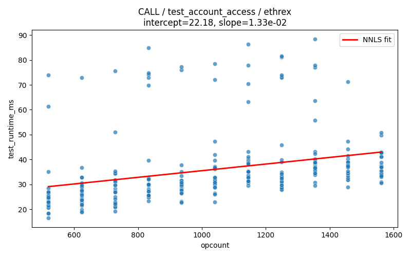

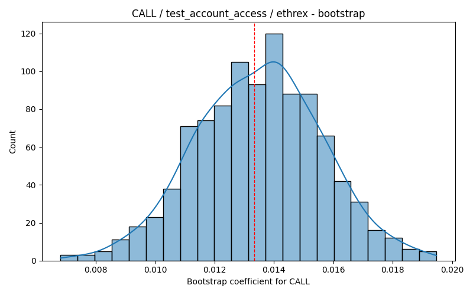

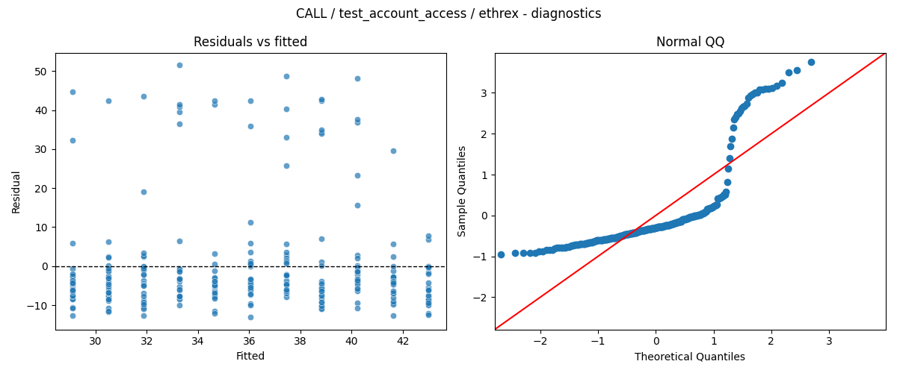

</details>

<details><summary>geth — NNLS regression summary</summary>

```
==============================================================================
                           NNLS Regression Results                            
==============================================================================
Dep. Variable:          test_runtime_ms              R-squared:          0.869
Model:                  NNLS                    Adj. R-squared:          0.868
No. Observations:       264                               RMSE:         202.64
Df Residuals:           262                                MAE:         172.57
Df Model:               1      
==============================================================================
                      coef     std err     P-value      [0.025      0.975]
------------------------------------------------------------------------------
         const    694.6479     47.2791       0.001    597.4696    785.0893
       opcount      0.0219      0.0006       0.001      0.0209      0.0230
==============================================================================
Notes: Non-negative least squares with bootstrap inference (1000 iterations)
==============================================================================
```

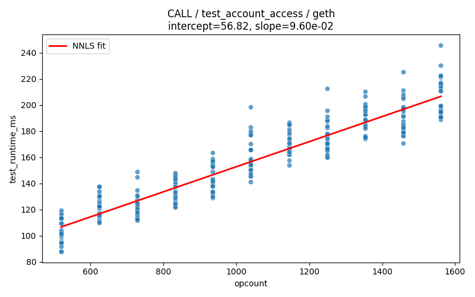

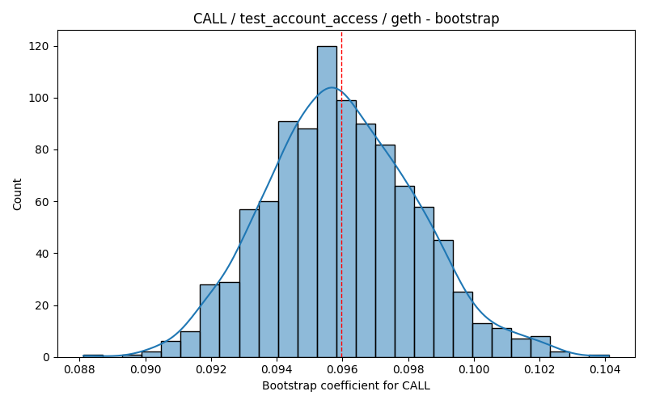

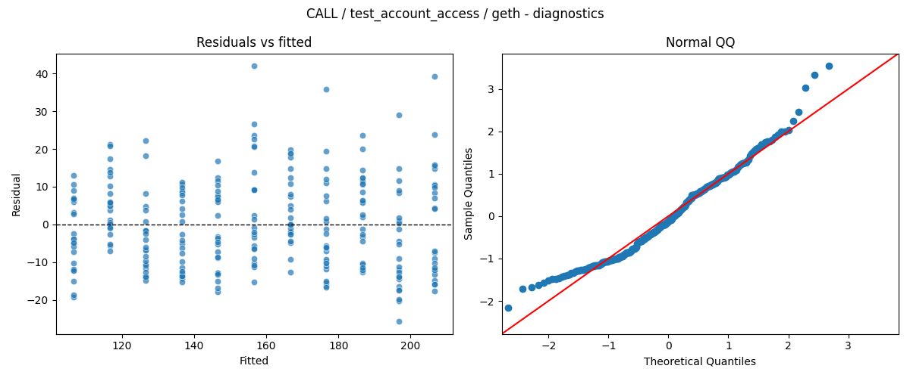

</details>

<details><summary>nethermind — NNLS regression summary</summary>

```
==============================================================================
                           NNLS Regression Results                            
==============================================================================
Dep. Variable:          test_runtime_ms              R-squared:          0.914
Model:                  NNLS                    Adj. R-squared:          0.914
No. Observations:       165                               RMSE:          27.01
Df Residuals:           163                                MAE:          21.50
Df Model:               1      
==============================================================================
                      coef     std err     P-value      [0.025      0.975]
------------------------------------------------------------------------------
         const     88.1273      6.4114       0.001     75.8954    100.4219
       opcount      0.0037      0.0001       0.001      0.0035      0.0039
==============================================================================
Notes: Non-negative least squares with bootstrap inference (1000 iterations)
==============================================================================
```

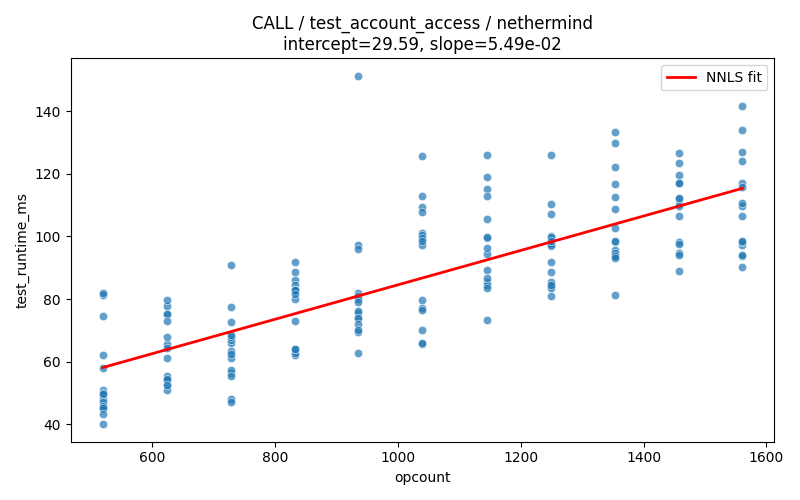

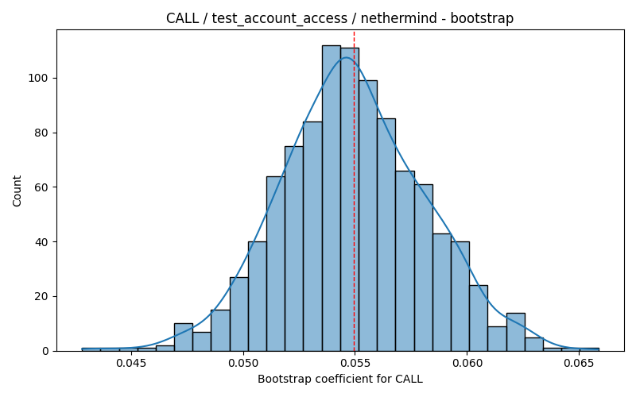

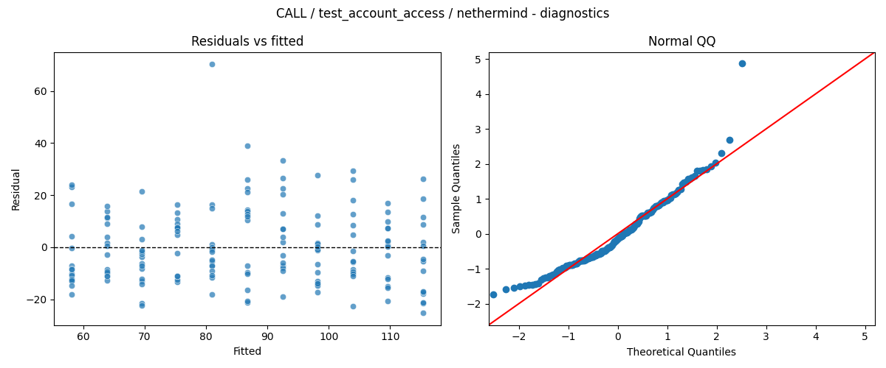

</details>

### test_account_access — combo `CALL_AccountMode.EXISTING_CONTRACT` — `presets[cold_account_code_access]`

| client | nobs | R² | target_coef (ms) | p-value | 95% CI |
| --- | --- | --- | --- | --- | --- |
| `besu` | 418 | 0.8814 | 0.02765 | 1.00e-03 | [0.02677, 0.02857] |
| `erigon` | 198 | 0.9229 | 0.02638 | 1.00e-03 | [0.02534, 0.02729] |
| `ethrex` | 275 | 0.9943 | 0.007907 | 1.00e-03 | [0.007842, 0.007974] |
| `geth` | 264 | 0.8681 | 0.02345 | 1.00e-03 | [0.02221, 0.02464] |
| `nethermind` | 165 | 0.8349 | 0.01054 | 1.00e-03 | [0.009895, 0.01114] |

<details><summary>besu — NNLS regression summary</summary>

```
==============================================================================
                           NNLS Regression Results                            
==============================================================================
Dep. Variable:          test_runtime_ms              R-squared:          0.881
Model:                  NNLS                    Adj. R-squared:          0.881
No. Observations:       418                               RMSE:         206.41
Df Residuals:           416                                MAE:         173.71
Df Model:               1      
==============================================================================
                      coef     std err     P-value      [0.025      0.975]
------------------------------------------------------------------------------
         const    474.0256     31.8437       0.001    415.0507    534.8284
       opcount      0.0276      0.0005       0.001      0.0268      0.0286
==============================================================================
Notes: Non-negative least squares with bootstrap inference (1000 iterations)
==============================================================================
```

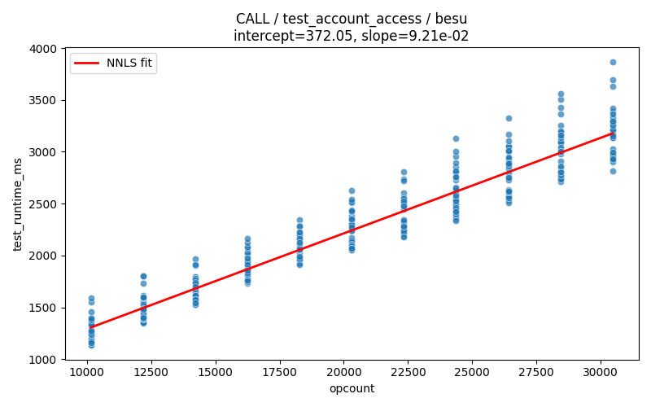

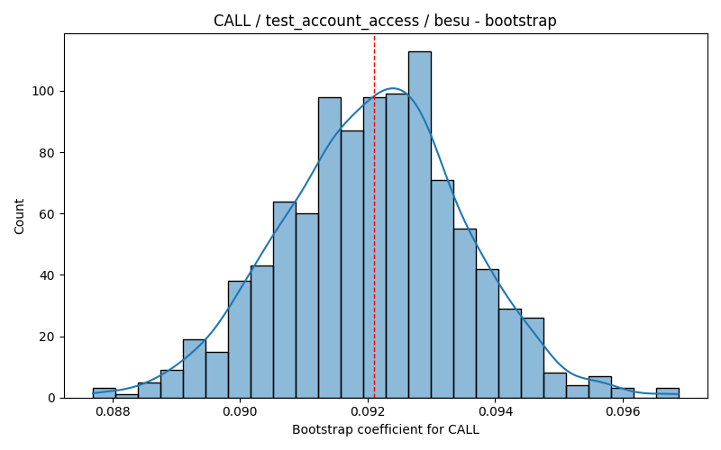

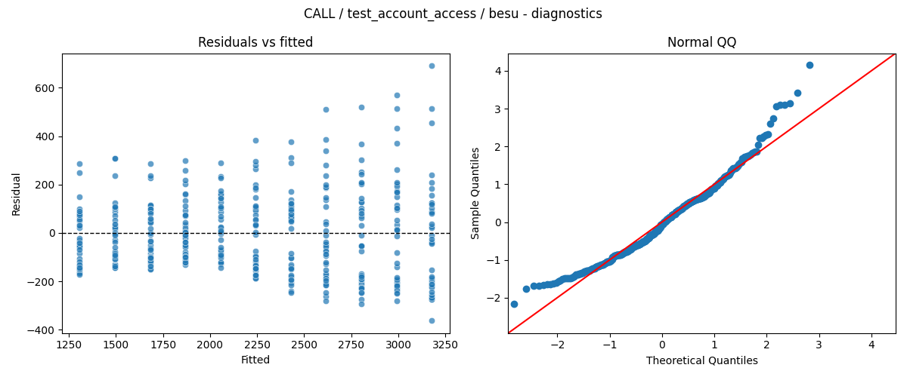

</details>

<details><summary>erigon — NNLS regression summary</summary>

```
==============================================================================
                           NNLS Regression Results                            
==============================================================================
Dep. Variable:          test_runtime_ms              R-squared:          0.923
Model:                  NNLS                    Adj. R-squared:          0.923
No. Observations:       198                               RMSE:         155.14
Df Residuals:           196                                MAE:         131.70
Df Model:               1      
==============================================================================
                      coef     std err     P-value      [0.025      0.975]
------------------------------------------------------------------------------
         const    304.0277     36.6902       0.001    237.4995    379.8237
       opcount      0.0264      0.0005       0.001      0.0253      0.0273
==============================================================================
Notes: Non-negative least squares with bootstrap inference (1000 iterations)
==============================================================================
```

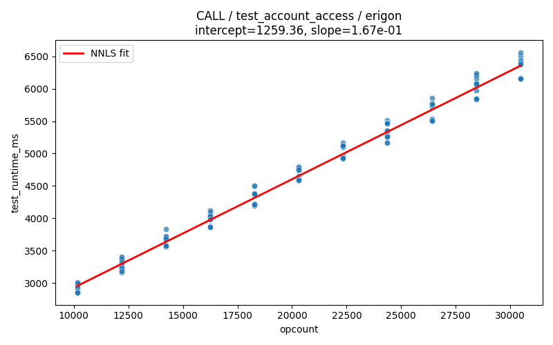

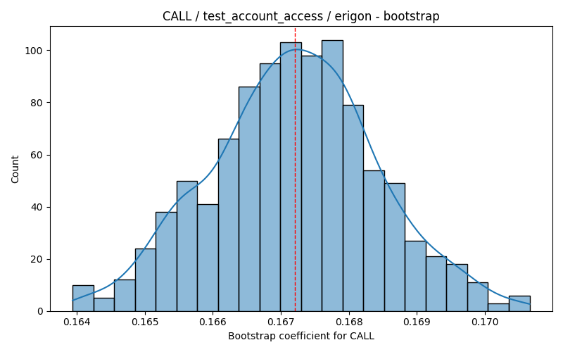

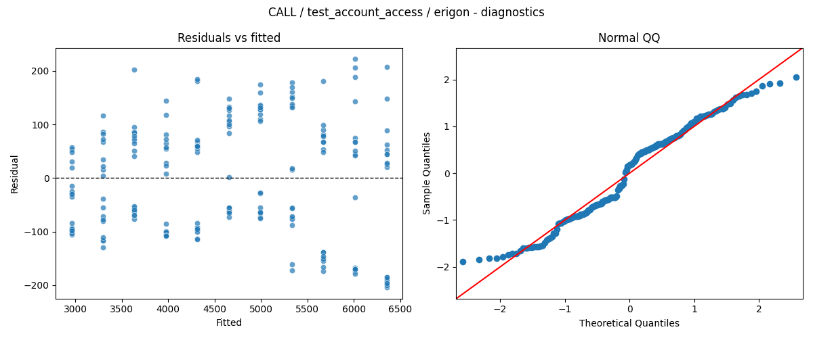

</details>

<details><summary>ethrex — NNLS regression summary</summary>

```
==============================================================================
                           NNLS Regression Results                            
==============================================================================
Dep. Variable:          test_runtime_ms              R-squared:          0.994
Model:                  NNLS                    Adj. R-squared:          0.994
No. Observations:       275                               RMSE:          12.19
Df Residuals:           273                                MAE:           9.30
Df Model:               1      
==============================================================================
                      coef     std err     P-value      [0.025      0.975]
------------------------------------------------------------------------------
         const     37.6297      2.0888       0.001     33.4655     41.7016
       opcount      0.0079      0.0000       0.001      0.0078      0.0080
==============================================================================
Notes: Non-negative least squares with bootstrap inference (1000 iterations)
==============================================================================
```

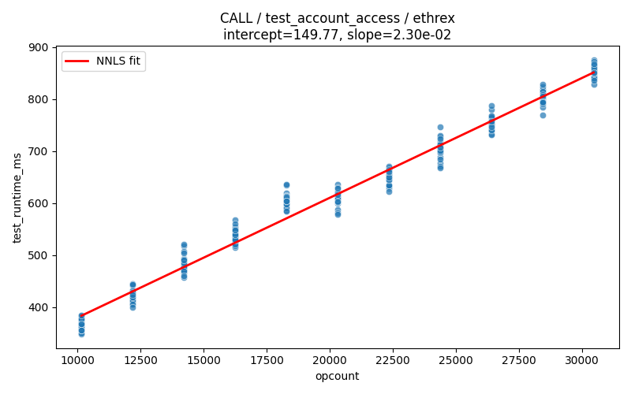

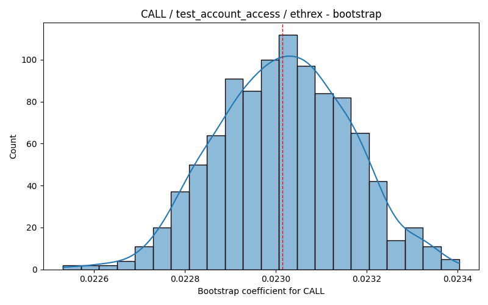

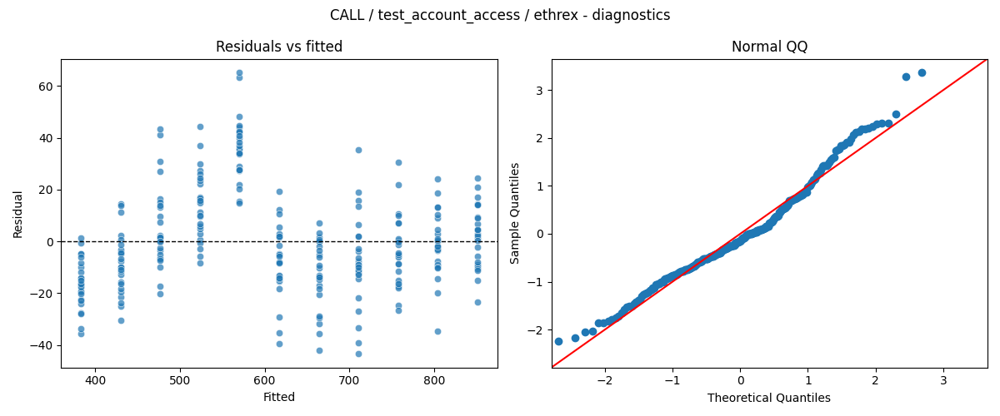

</details>

<details><summary>geth — NNLS regression summary</summary>

```
==============================================================================
                           NNLS Regression Results                            
==============================================================================
Dep. Variable:          test_runtime_ms              R-squared:          0.868
Model:                  NNLS                    Adj. R-squared:          0.868
No. Observations:       264                               RMSE:         185.96
Df Residuals:           262                                MAE:         155.50
Df Model:               1      
==============================================================================
                      coef     std err     P-value      [0.025      0.975]
------------------------------------------------------------------------------
         const    650.8085     43.5620       0.001    565.4067    736.8641
       opcount      0.0234      0.0006       0.001      0.0222      0.0246
==============================================================================
Notes: Non-negative least squares with bootstrap inference (1000 iterations)
==============================================================================
```

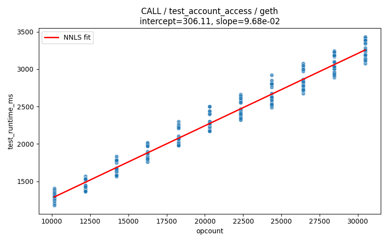

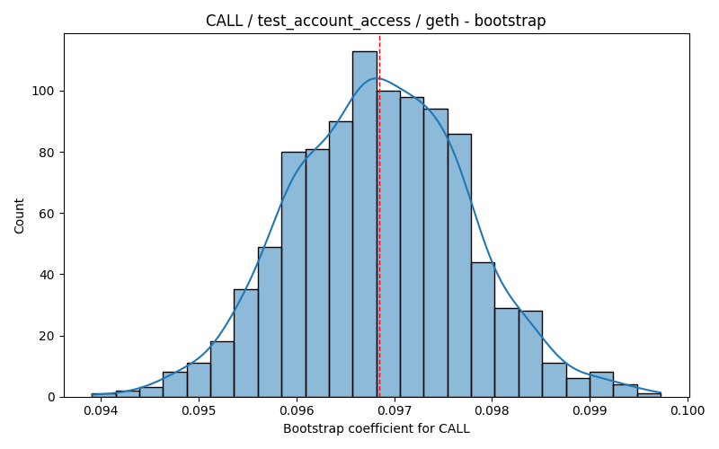

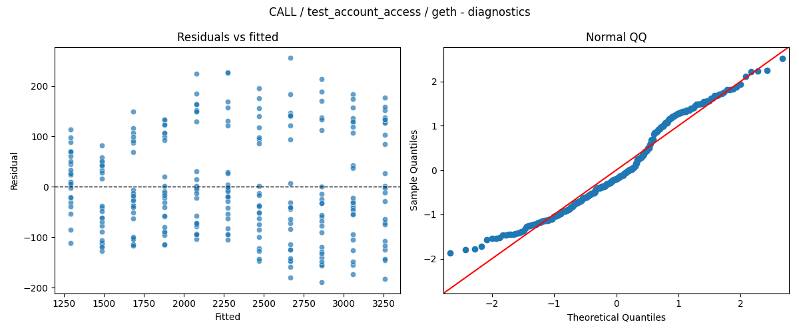

</details>

<details><summary>nethermind — NNLS regression summary</summary>

```
==============================================================================
                           NNLS Regression Results                            
==============================================================================
Dep. Variable:          test_runtime_ms              R-squared:          0.835
Model:                  NNLS                    Adj. R-squared:          0.834
No. Observations:       165                               RMSE:          95.34
Df Residuals:           163                                MAE:          64.29
Df Model:               1      
==============================================================================
                      coef     std err     P-value      [0.025      0.975]
------------------------------------------------------------------------------
         const    196.4960     21.4871       0.001    156.2275    239.9317
       opcount      0.0105      0.0003       0.001      0.0099      0.0111
==============================================================================
Notes: Non-negative least squares with bootstrap inference (1000 iterations)
==============================================================================
```

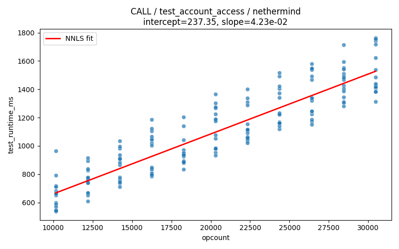

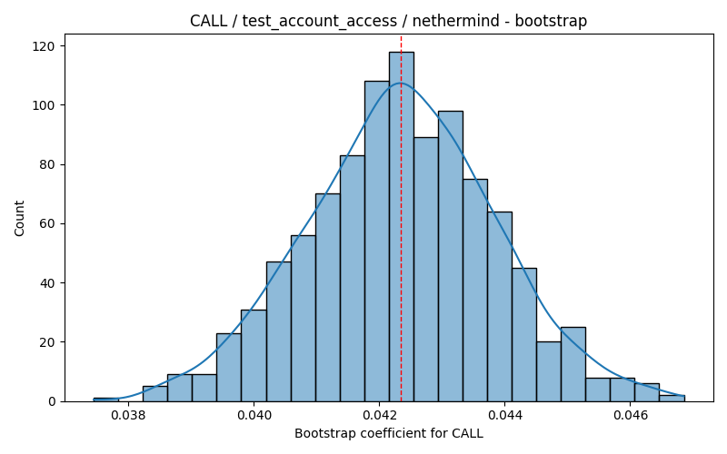

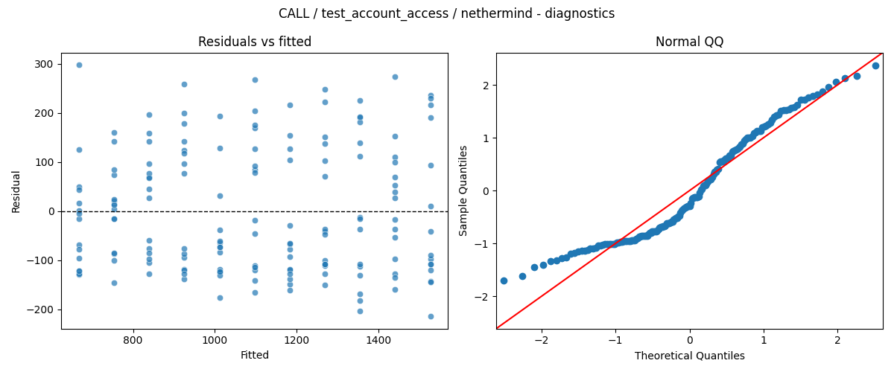

</details>

### test_account_access — combo `CALL_AccountMode.NON_EXISTING_ACCOUNT` — `presets[cold_account_code_access]`

| client | nobs | R² | target_coef (ms) | p-value | 95% CI |
| --- | --- | --- | --- | --- | --- |
| `besu` | 418 | 0.8502 | 0.01515 | 1.00e-03 | [0.01451, 0.01576] |
| `erigon` | 198 | 0.972 | 0.01015 | 1.00e-03 | [0.009982, 0.01024] |
| `ethrex` | 275 | 0.9678 | 0.002055 | 1.00e-03 | [0.002011, 0.002098] |
| `geth` | 264 | 0.8687 | 0.02194 | 1.00e-03 | [0.02092, 0.02302] |
| `nethermind` | 165 | 0.9143 | 0.003716 | 1.00e-03 | [0.003545, 0.003897] |

<details><summary>besu — NNLS regression summary</summary>

```
==============================================================================
                           NNLS Regression Results                            
==============================================================================
Dep. Variable:          test_runtime_ms              R-squared:          0.850
Model:                  NNLS                    Adj. R-squared:          0.850
No. Observations:       418                               RMSE:         151.03
Df Residuals:           416                                MAE:         129.18
Df Model:               1      
==============================================================================
                      coef     std err     P-value      [0.025      0.975]
------------------------------------------------------------------------------
         const    327.7236     23.4209       0.001    282.4132    373.9329
       opcount      0.0152      0.0003       0.001      0.0145      0.0158
==============================================================================
Notes: Non-negative least squares with bootstrap inference (1000 iterations)
==============================================================================
```


</details>

<details><summary>erigon — NNLS regression summary</summary>

```
==============================================================================
                           NNLS Regression Results                            
==============================================================================
Dep. Variable:          test_runtime_ms              R-squared:          0.972
Model:                  NNLS                    Adj. R-squared:          0.972
No. Observations:       198                               RMSE:          41.20
Df Residuals:           196                                MAE:          34.73
Df Model:               1      
==============================================================================
                      coef     std err     P-value      [0.025      0.975]
------------------------------------------------------------------------------
         const      0.0000      2.8529       1.000      0.0000     10.6646
       opcount      0.0102      0.0001       0.001      0.0100      0.0102
==============================================================================
Notes: Non-negative least squares with bootstrap inference (1000 iterations)
==============================================================================
```


</details>

<details><summary>ethrex — NNLS regression summary</summary>

```
==============================================================================
                           NNLS Regression Results                            
==============================================================================
Dep. Variable:          test_runtime_ms              R-squared:          0.968
Model:                  NNLS                    Adj. R-squared:          0.968
No. Observations:       275                               RMSE:           8.90
Df Residuals:           273                                MAE:           7.12
Df Model:               1      
==============================================================================
                      coef     std err     P-value      [0.025      0.975]
------------------------------------------------------------------------------
         const     28.9255      1.7699       0.001     25.5890     32.3701
       opcount      0.0021      0.0000       0.001      0.0020      0.0021
==============================================================================
Notes: Non-negative least squares with bootstrap inference (1000 iterations)
==============================================================================
```


</details>

<details><summary>geth — NNLS regression summary</summary>

```
==============================================================================
                           NNLS Regression Results                            
==============================================================================
Dep. Variable:          test_runtime_ms              R-squared:          0.869
Model:                  NNLS                    Adj. R-squared:          0.868
No. Observations:       264                               RMSE:         202.64
Df Residuals:           262                                MAE:         172.57
Df Model:               1      
==============================================================================
                      coef     std err     P-value      [0.025      0.975]
------------------------------------------------------------------------------
         const    694.6479     47.2791       0.001    597.4696    785.0893
       opcount      0.0219      0.0006       0.001      0.0209      0.0230
==============================================================================
Notes: Non-negative least squares with bootstrap inference (1000 iterations)
==============================================================================
```


</details>

<details><summary>nethermind — NNLS regression summary</summary>

```
==============================================================================
                           NNLS Regression Results                            
==============================================================================
Dep. Variable:          test_runtime_ms              R-squared:          0.914
Model:                  NNLS                    Adj. R-squared:          0.914
No. Observations:       165                               RMSE:          27.01
Df Residuals:           163                                MAE:          21.50
Df Model:               1      
==============================================================================
                      coef     std err     P-value      [0.025      0.975]
------------------------------------------------------------------------------
         const     88.1273      6.4114       0.001     75.8954    100.4219
       opcount      0.0037      0.0001       0.001      0.0035      0.0039
==============================================================================
Notes: Non-negative least squares with bootstrap inference (1000 iterations)
==============================================================================
```


</details>

### test_account_access — combo `CALL_AccountMode.EXISTING_EOA` — `presets[cold_account_nocode_write]`

| client | nobs | R² | target_coef (ms) | p-value | 95% CI |
| --- | --- | --- | --- | --- | --- |
| `besu` | 418 | 0.9525 | 0.07347 | 1.00e-03 | [0.07194, 0.07504] |
| `erigon` | 198 | 0.982 | 0.05732 | 1.00e-03 | [0.05635, 0.05833] |
| `ethrex` | 275 | 0.9837 | 0.02238 | 1.00e-03 | [0.02209, 0.02264] |
| `geth` | 264 | 0.967 | 0.05799 | 1.00e-03 | [0.05674, 0.05922] |
| `nethermind` | 165 | 0.7216 | 0.02734 | 1.00e-03 | [0.02474, 0.02989] |

<details><summary>besu — NNLS regression summary</summary>

```
==============================================================================
                           NNLS Regression Results                            
==============================================================================
Dep. Variable:          test_runtime_ms              R-squared:          0.953
Model:                  NNLS                    Adj. R-squared:          0.952
No. Observations:       418                               RMSE:         110.38
Df Residuals:           416                                MAE:          91.13
Df Model:               1      
==============================================================================
                      coef     std err     P-value      [0.025      0.975]
------------------------------------------------------------------------------
         const    364.9375     16.0483       0.001    334.8084    396.5175
       opcount      0.0735      0.0008       0.001      0.0719      0.0750
==============================================================================
Notes: Non-negative least squares with bootstrap inference (1000 iterations)
==============================================================================
```


</details>

<details><summary>erigon — NNLS regression summary</summary>

```
==============================================================================
                           NNLS Regression Results                            
==============================================================================
Dep. Variable:          test_runtime_ms              R-squared:          0.982
Model:                  NNLS                    Adj. R-squared:          0.982
No. Observations:       198                               RMSE:          52.16
Df Residuals:           196                                MAE:          41.19
Df Model:               1      
==============================================================================
                      coef     std err     P-value      [0.025      0.975]
------------------------------------------------------------------------------
         const    473.5390      9.7735       0.001    455.1202    492.9456
       opcount      0.0573      0.0005       0.001      0.0563      0.0583
==============================================================================
Notes: Non-negative least squares with bootstrap inference (1000 iterations)
==============================================================================
```


</details>

<details><summary>ethrex — NNLS regression summary</summary>

```
==============================================================================
                           NNLS Regression Results                            
==============================================================================
Dep. Variable:          test_runtime_ms              R-squared:          0.984
Model:                  NNLS                    Adj. R-squared:          0.984
No. Observations:       275                               RMSE:          19.40
Df Residuals:           273                                MAE:          15.28
Df Model:               1      
==============================================================================
                      coef     std err     P-value      [0.025      0.975]
------------------------------------------------------------------------------
         const    148.9693      3.3942       0.001    142.5957    155.8633
       opcount      0.0224      0.0001       0.001      0.0221      0.0226
==============================================================================
Notes: Non-negative least squares with bootstrap inference (1000 iterations)
==============================================================================
```


</details>

<details><summary>geth — NNLS regression summary</summary>

```
==============================================================================
                           NNLS Regression Results                            
==============================================================================
Dep. Variable:          test_runtime_ms              R-squared:          0.967
Model:                  NNLS                    Adj. R-squared:          0.967
No. Observations:       264                               RMSE:          72.12
Df Residuals:           262                                MAE:          61.04
Df Model:               1      
==============================================================================
                      coef     std err     P-value      [0.025      0.975]
------------------------------------------------------------------------------
         const    184.6219     12.3014       0.001    161.9313    208.9613
       opcount      0.0580      0.0006       0.001      0.0567      0.0592
==============================================================================
Notes: Non-negative least squares with bootstrap inference (1000 iterations)
==============================================================================
```


</details>

<details><summary>nethermind — NNLS regression summary</summary>

```
==============================================================================
                           NNLS Regression Results                            
==============================================================================
Dep. Variable:          test_runtime_ms              R-squared:          0.722
Model:                  NNLS                    Adj. R-squared:          0.720
No. Observations:       165                               RMSE:         114.28
Df Residuals:           163                                MAE:          97.67
Df Model:               1      
==============================================================================
                      coef     std err     P-value      [0.025      0.975]
------------------------------------------------------------------------------
         const    219.4055     25.7296       0.001    169.3163    273.8399
       opcount      0.0273      0.0013       0.001      0.0247      0.0299
==============================================================================
Notes: Non-negative least squares with bootstrap inference (1000 iterations)
==============================================================================
```


</details>

### test_account_access — combo `CALL_AccountMode.NON_EXISTING_ACCOUNT` — `presets[cold_account_nocode_write]`

| client | nobs | R² | target_coef (ms) | p-value | 95% CI |
| --- | --- | --- | --- | --- | --- |
| `besu` | 418 | 0.8941 | 0.1176 | 1.00e-03 | [0.1138, 0.1215] |
| `erigon` | 198 | 0.9375 | 0.196 | 1.00e-03 | [0.1886, 0.2036] |
| `ethrex` | 275 | 0.09258 | 0.01333 | 1.00e-03 | [0.009355, 0.01768] |
| `geth` | 264 | 0.8777 | 0.09598 | 1.00e-03 | [0.09176, 0.1007] |
| `nethermind` | 165 | 0.6111 | 0.05495 | 1.00e-03 | [0.04882, 0.06153] |

<details><summary>besu — NNLS regression summary</summary>

```
==============================================================================
                           NNLS Regression Results                            
==============================================================================
Dep. Variable:          test_runtime_ms              R-squared:          0.894
Model:                  NNLS                    Adj. R-squared:          0.894
No. Observations:       418                               RMSE:          13.33
Df Residuals:           416                                MAE:          10.58
Df Model:               1      
==============================================================================
                      coef     std err     P-value      [0.025      0.975]
------------------------------------------------------------------------------
         const     44.9991      1.9461       0.001     41.3873     48.9986
       opcount      0.1176      0.0020       0.001      0.1138      0.1215
==============================================================================
Notes: Non-negative least squares with bootstrap inference (1000 iterations)
==============================================================================
```


</details>

<details><summary>erigon — NNLS regression summary</summary>

```
==============================================================================
                           NNLS Regression Results                            
==============================================================================
Dep. Variable:          test_runtime_ms              R-squared:          0.938
Model:                  NNLS                    Adj. R-squared:          0.937
No. Observations:       198                               RMSE:          16.66
Df Residuals:           196                                MAE:          13.03
Df Model:               1      
==============================================================================
                      coef     std err     P-value      [0.025      0.975]
------------------------------------------------------------------------------
         const     89.4081      3.8443       0.001     81.7262     97.3724
       opcount      0.1960      0.0036       0.001      0.1886      0.2036
==============================================================================
Notes: Non-negative least squares with bootstrap inference (1000 iterations)
==============================================================================
```


</details>

<details><summary>ethrex — NNLS regression summary</summary>

```
==============================================================================
                           NNLS Regression Results                            
==============================================================================
Dep. Variable:          test_runtime_ms              R-squared:          0.093
Model:                  NNLS                    Adj. R-squared:          0.089
No. Observations:       275                               RMSE:          13.74
Df Residuals:           273                                MAE:           8.70
Df Model:               1      
==============================================================================
                      coef     std err     P-value      [0.025      0.975]
------------------------------------------------------------------------------
         const     22.1831      2.3786       0.001     17.6407     26.8320
       opcount      0.0133      0.0021       0.001      0.0094      0.0177
==============================================================================
Notes: Non-negative least squares with bootstrap inference (1000 iterations)
==============================================================================
```


</details>

<details><summary>geth — NNLS regression summary</summary>

```
==============================================================================
                           NNLS Regression Results                            
==============================================================================
Dep. Variable:          test_runtime_ms              R-squared:          0.878
Model:                  NNLS                    Adj. R-squared:          0.877
No. Observations:       264                               RMSE:          11.80
Df Residuals:           262                                MAE:           9.74
Df Model:               1      
==============================================================================
                      coef     std err     P-value      [0.025      0.975]
------------------------------------------------------------------------------
         const     56.8194      2.2953       0.001     52.2246     61.1473
       opcount      0.0960      0.0023       0.001      0.0918      0.1007
==============================================================================
Notes: Non-negative least squares with bootstrap inference (1000 iterations)
==============================================================================
```


</details>

<details><summary>nethermind — NNLS regression summary</summary>

```
==============================================================================
                           NNLS Regression Results                            
==============================================================================
Dep. Variable:          test_runtime_ms              R-squared:          0.611
Model:                  NNLS                    Adj. R-squared:          0.609
No. Observations:       165                               RMSE:          14.43
Df Residuals:           163                                MAE:          11.52
Df Model:               1      
==============================================================================
                      coef     std err     P-value      [0.025      0.975]
------------------------------------------------------------------------------
         const     29.5867      3.3922       0.001     23.0713     36.4221
       opcount      0.0549      0.0032       0.001      0.0488      0.0615
==============================================================================
Notes: Non-negative least squares with bootstrap inference (1000 iterations)
==============================================================================
```


</details>

### test_account_access — combo `CALL_AccountMode.EXISTING_CONTRACT` — `presets[cold_account_code_write]`

| client | nobs | R² | target_coef (ms) | p-value | 95% CI |
| --- | --- | --- | --- | --- | --- |
| `besu` | 418 | 0.9267 | 0.09211 | 1.00e-03 | [0.08933, 0.09473] |
| `erigon` | 198 | 0.9899 | 0.1672 | 1.00e-03 | [0.1648, 0.1696] |
| `ethrex` | 275 | 0.9833 | 0.02301 | 1.00e-03 | [0.02274, 0.02331] |
| `geth` | 264 | 0.9742 | 0.09685 | 1.00e-03 | [0.09516, 0.0986] |
| `nethermind` | 165 | 0.8233 | 0.04234 | 1.00e-03 | [0.03947, 0.04525] |

<details><summary>besu — NNLS regression summary</summary>

```
==============================================================================
                           NNLS Regression Results                            
==============================================================================
Dep. Variable:          test_runtime_ms              R-squared:          0.927
Model:                  NNLS                    Adj. R-squared:          0.927
No. Observations:       418                               RMSE:         166.36
Df Residuals:           416                                MAE:         134.21
Df Model:               1      
==============================================================================
                      coef     std err     P-value      [0.025      0.975]
------------------------------------------------------------------------------
         const    372.0484     25.4311       0.001    322.7727    421.7581
       opcount      0.0921      0.0014       0.001      0.0893      0.0947
==============================================================================
Notes: Non-negative least squares with bootstrap inference (1000 iterations)
==============================================================================
```


</details>

<details><summary>erigon — NNLS regression summary</summary>

```
==============================================================================
                           NNLS Regression Results                            
==============================================================================
Dep. Variable:          test_runtime_ms              R-squared:          0.990
Model:                  NNLS                    Adj. R-squared:          0.990
No. Observations:       198                               RMSE:         108.28
Df Residuals:           196                                MAE:          95.51
Df Model:               1      
==============================================================================
                      coef     std err     P-value      [0.025      0.975]
------------------------------------------------------------------------------
         const   1259.3628     22.6422       0.001   1215.4657   1306.0396
       opcount      0.1672      0.0012       0.001      0.1648      0.1696
==============================================================================
Notes: Non-negative least squares with bootstrap inference (1000 iterations)
==============================================================================
```


</details>

<details><summary>ethrex — NNLS regression summary</summary>

```
==============================================================================
                           NNLS Regression Results                            
==============================================================================
Dep. Variable:          test_runtime_ms              R-squared:          0.983
Model:                  NNLS                    Adj. R-squared:          0.983
No. Observations:       275                               RMSE:          19.28
Df Residuals:           273                                MAE:          14.82
Df Model:               1      
==============================================================================
                      coef     std err     P-value      [0.025      0.975]
------------------------------------------------------------------------------
         const    149.7679      3.3469       0.001    143.3203    156.4646
       opcount      0.0230      0.0001       0.001      0.0227      0.0233
==============================================================================
Notes: Non-negative least squares with bootstrap inference (1000 iterations)
==============================================================================
```


</details>

<details><summary>geth — NNLS regression summary</summary>

```
==============================================================================
                           NNLS Regression Results                            
==============================================================================
Dep. Variable:          test_runtime_ms              R-squared:          0.974
Model:                  NNLS                    Adj. R-squared:          0.974
No. Observations:       264                               RMSE:         101.21
Df Residuals:           262                                MAE:          84.86
Df Model:               1      
==============================================================================
                      coef     std err     P-value      [0.025      0.975]
------------------------------------------------------------------------------
         const    306.1119     16.8743       0.001    273.5587    339.5797
       opcount      0.0968      0.0009       0.001      0.0952      0.0986
==============================================================================
Notes: Non-negative least squares with bootstrap inference (1000 iterations)
==============================================================================
```


</details>

<details><summary>nethermind — NNLS regression summary</summary>

```
==============================================================================
                           NNLS Regression Results                            
==============================================================================
Dep. Variable:          test_runtime_ms              R-squared:          0.823
Model:                  NNLS                    Adj. R-squared:          0.822
No. Observations:       165                               RMSE:         125.99
Df Residuals:           163                                MAE:         109.98
Df Model:               1      
==============================================================================
                      coef     std err     P-value      [0.025      0.975]
------------------------------------------------------------------------------
         const    237.3516     30.0930       0.001    179.8975    294.9121
       opcount      0.0423      0.0015       0.001      0.0395      0.0453
==============================================================================
Notes: Non-negative least squares with bootstrap inference (1000 iterations)
==============================================================================
```


</details>

### test_account_access — combo `CALL_AccountMode.NON_EXISTING_ACCOUNT` — `presets[cold_account_code_write]`

| client | nobs | R² | target_coef (ms) | p-value | 95% CI |
| --- | --- | --- | --- | --- | --- |
| `besu` | 418 | 0.8941 | 0.1176 | 1.00e-03 | [0.1138, 0.1215] |
| `erigon` | 198 | 0.9375 | 0.196 | 1.00e-03 | [0.1886, 0.2036] |
| `ethrex` | 275 | 0.09258 | 0.01333 | 1.00e-03 | [0.009355, 0.01768] |
| `geth` | 264 | 0.8777 | 0.09598 | 1.00e-03 | [0.09176, 0.1007] |
| `nethermind` | 165 | 0.6111 | 0.05495 | 1.00e-03 | [0.04882, 0.06153] |

<details><summary>besu — NNLS regression summary</summary>

```
==============================================================================
                           NNLS Regression Results                            
==============================================================================
Dep. Variable:          test_runtime_ms              R-squared:          0.894
Model:                  NNLS                    Adj. R-squared:          0.894
No. Observations:       418                               RMSE:          13.33
Df Residuals:           416                                MAE:          10.58
Df Model:               1      
==============================================================================
                      coef     std err     P-value      [0.025      0.975]
------------------------------------------------------------------------------
         const     44.9991      1.9461       0.001     41.3873     48.9986
       opcount      0.1176      0.0020       0.001      0.1138      0.1215
==============================================================================
Notes: Non-negative least squares with bootstrap inference (1000 iterations)
==============================================================================
```


</details>

<details><summary>erigon — NNLS regression summary</summary>

```
==============================================================================
                           NNLS Regression Results                            
==============================================================================
Dep. Variable:          test_runtime_ms              R-squared:          0.938
Model:                  NNLS                    Adj. R-squared:          0.937
No. Observations:       198                               RMSE:          16.66
Df Residuals:           196                                MAE:          13.03
Df Model:               1      
==============================================================================
                      coef     std err     P-value      [0.025      0.975]
------------------------------------------------------------------------------
         const     89.4081      3.8443       0.001     81.7262     97.3724
       opcount      0.1960      0.0036       0.001      0.1886      0.2036
==============================================================================
Notes: Non-negative least squares with bootstrap inference (1000 iterations)
==============================================================================
```


</details>

<details><summary>ethrex — NNLS regression summary</summary>

```
==============================================================================
                           NNLS Regression Results                            
==============================================================================
Dep. Variable:          test_runtime_ms              R-squared:          0.093
Model:                  NNLS                    Adj. R-squared:          0.089
No. Observations:       275                               RMSE:          13.74
Df Residuals:           273                                MAE:           8.70
Df Model:               1      
==============================================================================
                      coef     std err     P-value      [0.025      0.975]
------------------------------------------------------------------------------
         const     22.1831      2.3786       0.001     17.6407     26.8320
       opcount      0.0133      0.0021       0.001      0.0094      0.0177
==============================================================================
Notes: Non-negative least squares with bootstrap inference (1000 iterations)
==============================================================================
```


</details>

<details><summary>geth — NNLS regression summary</summary>

```
==============================================================================
                           NNLS Regression Results                            
==============================================================================
Dep. Variable:          test_runtime_ms              R-squared:          0.878
Model:                  NNLS                    Adj. R-squared:          0.877
No. Observations:       264                               RMSE:          11.80
Df Residuals:           262                                MAE:           9.74
Df Model:               1      
==============================================================================
                      coef     std err     P-value      [0.025      0.975]
------------------------------------------------------------------------------
         const     56.8194      2.2953       0.001     52.2246     61.1473
       opcount      0.0960      0.0023       0.001      0.0918      0.1007
==============================================================================
Notes: Non-negative least squares with bootstrap inference (1000 iterations)
==============================================================================
```


</details>

<details><summary>nethermind — NNLS regression summary</summary>

```
==============================================================================
                           NNLS Regression Results                            
==============================================================================
Dep. Variable:          test_runtime_ms              R-squared:          0.611
Model:                  NNLS                    Adj. R-squared:          0.609
No. Observations:       165                               RMSE:          14.43
Df Residuals:           163                                MAE:          11.52
Df Model:               1      
==============================================================================
                      coef     std err     P-value      [0.025      0.975]
------------------------------------------------------------------------------
         const     29.5867      3.3922       0.001     23.0713     36.4221
       opcount      0.0549      0.0032       0.001      0.0488      0.0615
==============================================================================
Notes: Non-negative least squares with bootstrap inference (1000 iterations)
==============================================================================
```


</details>

### test_ext_account_query_warm — combo `CALL`

| client | nobs | R² | target_coef (ms) | p-value | 95% CI |
| --- | --- | --- | --- | --- | --- |
| `besu` | 418 | 0.7025 | 0.0004283 | 1.00e-03 | [0.0003981, 0.0004578] |
| `erigon` | 198 | 0.9191 | 0.0005503 | 1.00e-03 | [0.0005289, 0.0005733] |
| `ethrex` | 275 | 0.9476 | 0.0001073 | 1.00e-03 | [0.0001045, 0.0001104] |
| `geth` | 264 | 0.8647 | 0.0001292 | 1.00e-03 | [0.000122, 0.0001365] |
| `nethermind` | 165 | 0.7942 | 0.0002652 | 1.00e-03 | [0.0002445, 0.0002845] |

<details><summary>besu — NNLS regression summary</summary>

```
==============================================================================
                           NNLS Regression Results                            
==============================================================================
Dep. Variable:          test_runtime_ms              R-squared:          0.703
Model:                  NNLS                    Adj. R-squared:          0.702
No. Observations:       418                               RMSE:         140.83
Df Residuals:           416                                MAE:         112.45
Df Model:               1      
==============================================================================
                      coef     std err     P-value      [0.025      0.975]
------------------------------------------------------------------------------
         const    533.8948     22.3416       0.001    489.8391    579.7232
       opcount      0.0004      0.0000       0.001      0.0004      0.0005
==============================================================================
Notes: Non-negative least squares with bootstrap inference (1000 iterations)
==============================================================================
```

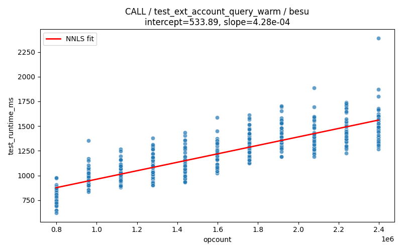

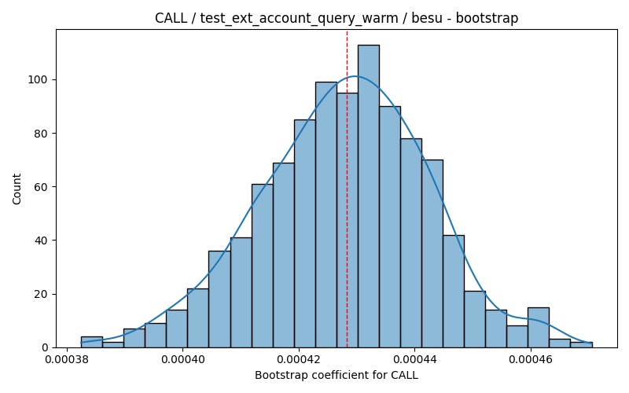

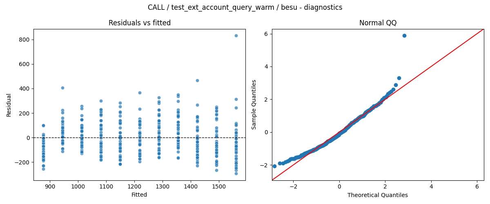

</details>

<details><summary>erigon — NNLS regression summary</summary>

```
==============================================================================
                           NNLS Regression Results                            
==============================================================================
Dep. Variable:          test_runtime_ms              R-squared:          0.919
Model:                  NNLS                    Adj. R-squared:          0.919
No. Observations:       198                               RMSE:          82.50
Df Residuals:           196                                MAE:          67.97
Df Model:               1      
==============================================================================
                      coef     std err     P-value      [0.025      0.975]
------------------------------------------------------------------------------
         const     59.9333     17.2053       0.001     26.8514     91.3810
       opcount      0.0006      0.0000       0.001      0.0005      0.0006
==============================================================================
Notes: Non-negative least squares with bootstrap inference (1000 iterations)
==============================================================================
```

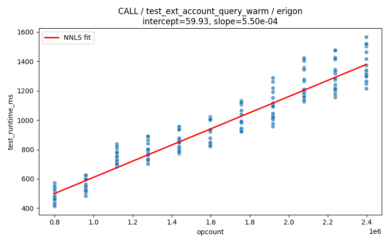

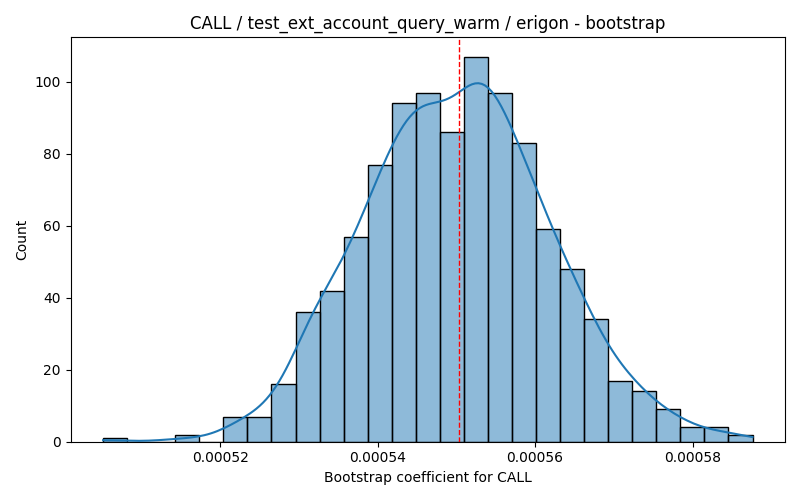

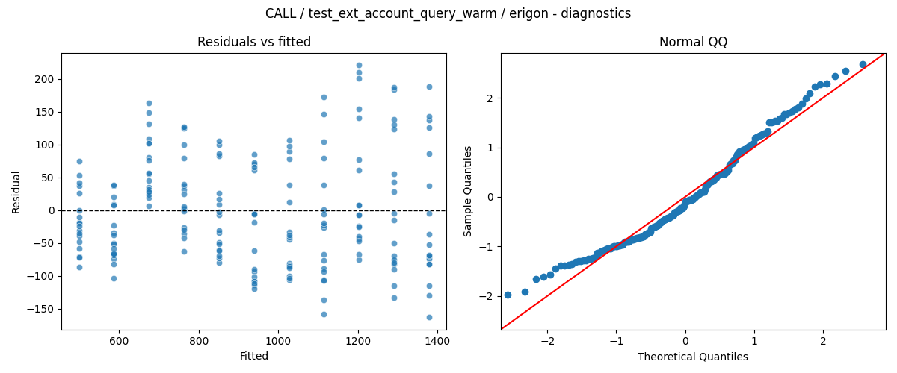

</details>

<details><summary>ethrex — NNLS regression summary</summary>

```
==============================================================================
                           NNLS Regression Results                            
==============================================================================
Dep. Variable:          test_runtime_ms              R-squared:          0.948
Model:                  NNLS                    Adj. R-squared:          0.947
No. Observations:       275                               RMSE:          12.74
Df Residuals:           273                                MAE:          10.10
Df Model:               1      
==============================================================================
                      coef     std err     P-value      [0.025      0.975]
------------------------------------------------------------------------------
         const     33.6948      2.4927       0.001     28.6298     38.2630
       opcount      0.0001      0.0000       0.001      0.0001      0.0001
==============================================================================
Notes: Non-negative least squares with bootstrap inference (1000 iterations)
==============================================================================
```

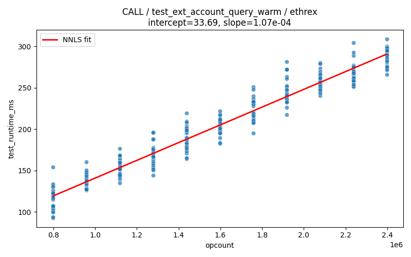

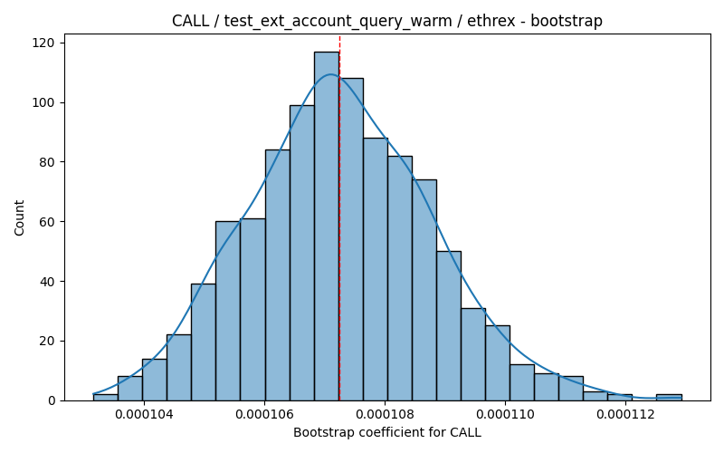

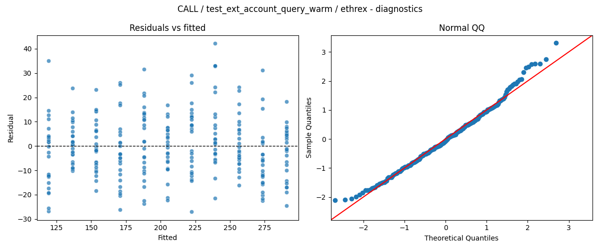

</details>

<details><summary>geth — NNLS regression summary</summary>

```
==============================================================================
                           NNLS Regression Results                            
==============================================================================
Dep. Variable:          test_runtime_ms              R-squared:          0.865
Model:                  NNLS                    Adj. R-squared:          0.864
No. Observations:       264                               RMSE:          25.82
Df Residuals:           262                                MAE:          20.05
Df Model:               1      
==============================================================================
                      coef     std err     P-value      [0.025      0.975]
------------------------------------------------------------------------------
         const     52.8124      5.5817       0.001     42.1519     64.0914
       opcount      0.0001      0.0000       0.001      0.0001      0.0001
==============================================================================
Notes: Non-negative least squares with bootstrap inference (1000 iterations)
==============================================================================
```

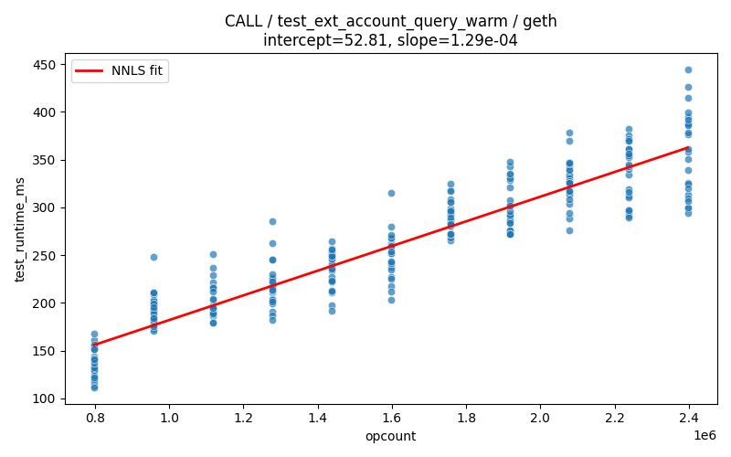

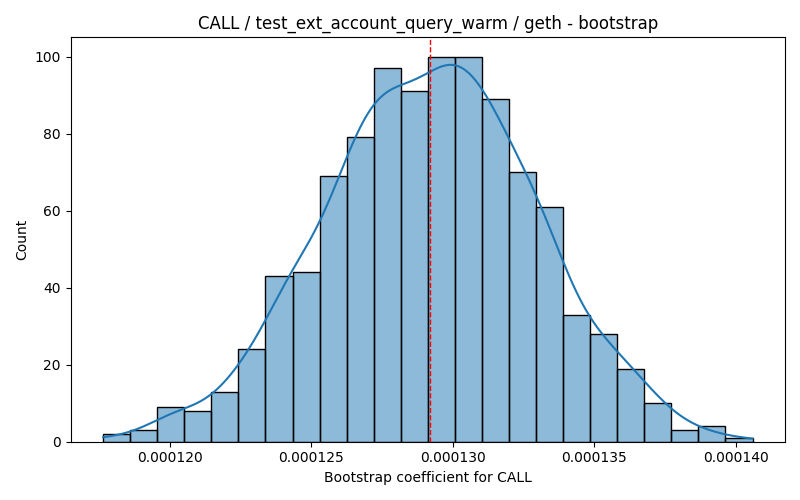

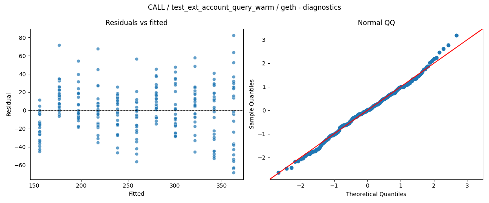

</details>

<details><summary>nethermind — NNLS regression summary</summary>

```
==============================================================================
                           NNLS Regression Results                            
==============================================================================
Dep. Variable:          test_runtime_ms              R-squared:          0.794
Model:                  NNLS                    Adj. R-squared:          0.793
No. Observations:       165                               RMSE:          68.22
Df Residuals:           163                                MAE:          54.30
Df Model:               1      
==============================================================================
                      coef     std err     P-value      [0.025      0.975]
------------------------------------------------------------------------------
         const    237.1532     16.7041       0.001    204.3179    271.9464
       opcount      0.0003      0.0000       0.001      0.0002      0.0003
==============================================================================
Notes: Non-negative least squares with bootstrap inference (1000 iterations)
==============================================================================
```

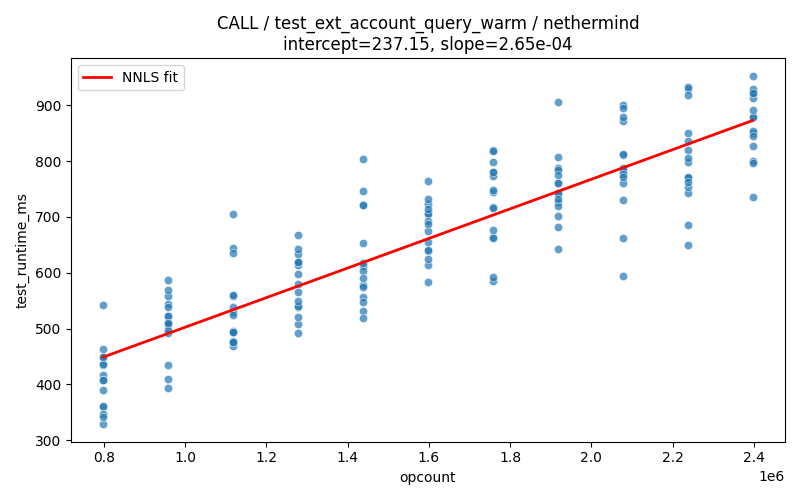

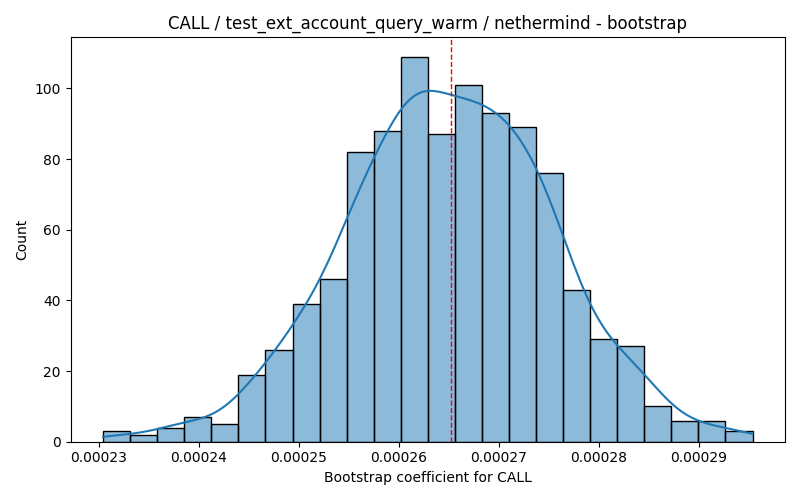

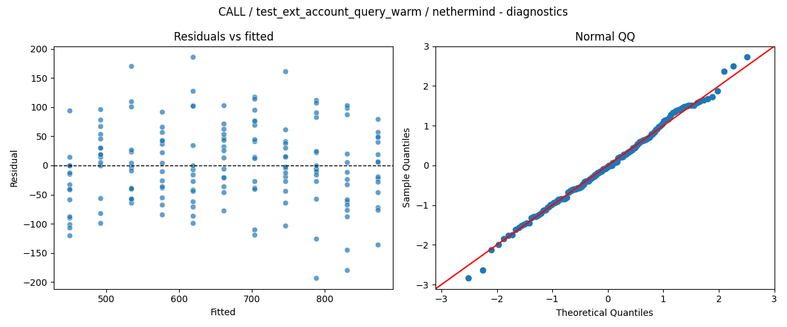

</details>

## CALLCODE

### test_account_access — combo `CALLCODE_AccountMode.EXISTING_EOA` — `presets[cold_account_nocode_access]`

| client | nobs | R² | target_coef (ms) | p-value | 95% CI |
| --- | --- | --- | --- | --- | --- |
| `besu` | 418 | 0.7933 | 0.0141 | 1.00e-03 | [0.01347, 0.01475] |
| `erigon` | 198 | 0.9618 | 0.01027 | 1.00e-03 | [0.01001, 0.01044] |
| `ethrex` | 275 | 0.9936 | 0.007307 | 1.00e-03 | [0.007243, 0.007372] |
| `geth` | 264 | 0.9098 | 0.01103 | 1.00e-03 | [0.01053, 0.01151] |
| `nethermind` | 165 | 0.9171 | 0.003751 | 1.00e-03 | [0.00357, 0.003923] |

<details><summary>besu — NNLS regression summary</summary>

```
==============================================================================
                           NNLS Regression Results                            
==============================================================================
Dep. Variable:          test_runtime_ms              R-squared:          0.793
Model:                  NNLS                    Adj. R-squared:          0.793
No. Observations:       418                               RMSE:         170.92
Df Residuals:           416                                MAE:         143.64
Df Model:               1      
==============================================================================
                      coef     std err     P-value      [0.025      0.975]
------------------------------------------------------------------------------
         const    624.1963     25.2048       0.001    572.0569    674.1031
       opcount      0.0141      0.0003       0.001      0.0135      0.0148
==============================================================================
Notes: Non-negative least squares with bootstrap inference (1000 iterations)
==============================================================================
```

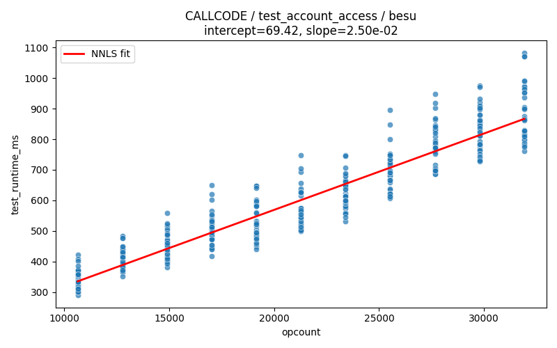

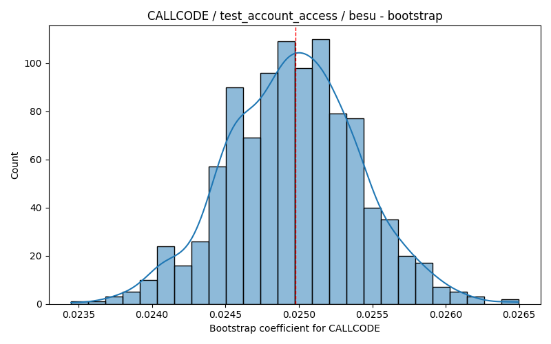

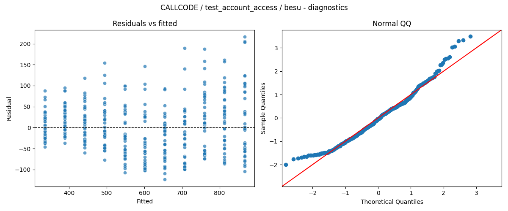

</details>

<details><summary>erigon — NNLS regression summary</summary>

```
==============================================================================
                           NNLS Regression Results                            
==============================================================================
Dep. Variable:          test_runtime_ms              R-squared:          0.962
Model:                  NNLS                    Adj. R-squared:          0.962
No. Observations:       198                               RMSE:          48.64
Df Residuals:           196                                MAE:          40.05
Df Model:               1      
==============================================================================
                      coef     std err     P-value      [0.025      0.975]
------------------------------------------------------------------------------
         const      7.6194      7.8519       0.209      0.0000     26.1086
       opcount      0.0103      0.0001       0.001      0.0100      0.0104
==============================================================================
Notes: Non-negative least squares with bootstrap inference (1000 iterations)
==============================================================================
```

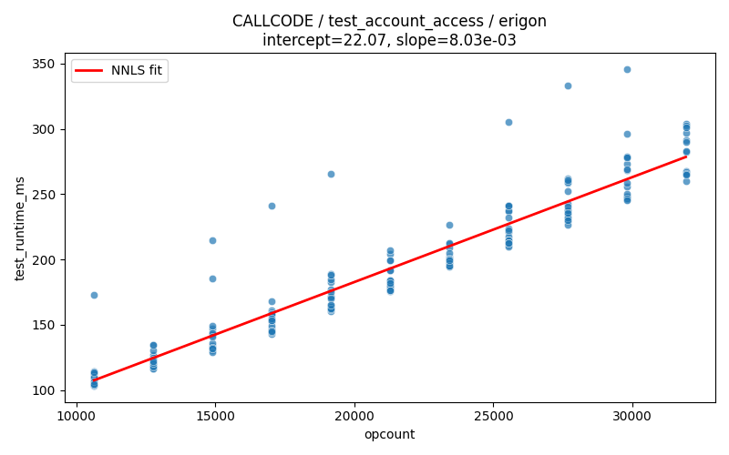

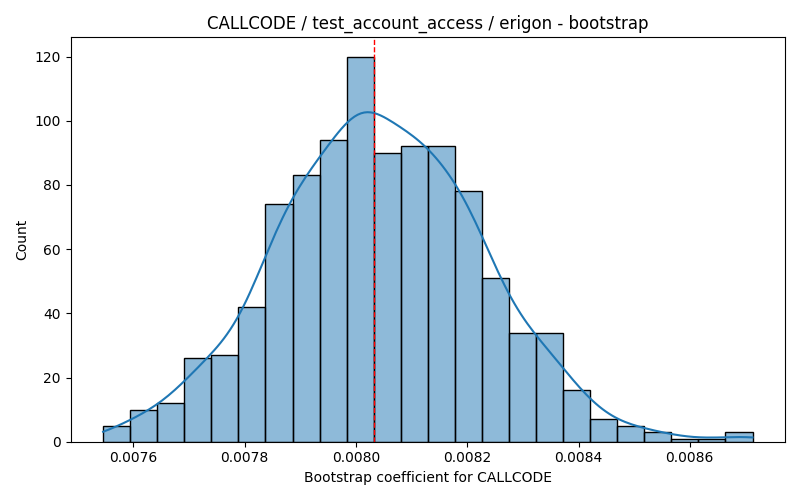

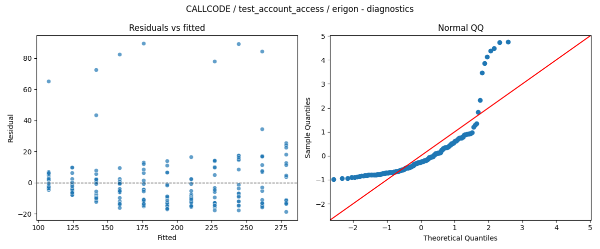

</details>

<details><summary>ethrex — NNLS regression summary</summary>

```
==============================================================================
                           NNLS Regression Results                            
==============================================================================
Dep. Variable:          test_runtime_ms              R-squared:          0.994
Model:                  NNLS                    Adj. R-squared:          0.994
No. Observations:       275                               RMSE:          13.96
Df Residuals:           273                                MAE:          10.44
Df Model:               1      
==============================================================================
                      coef     std err     P-value      [0.025      0.975]
------------------------------------------------------------------------------
         const     43.8478      2.5565       0.001     39.2363     48.8470
       opcount      0.0073      0.0000       0.001      0.0072      0.0074
==============================================================================
Notes: Non-negative least squares with bootstrap inference (1000 iterations)
==============================================================================
```

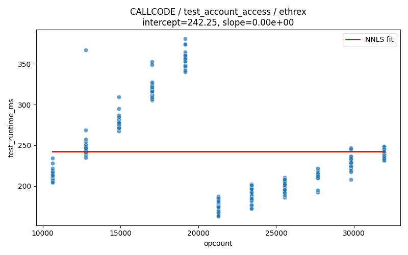


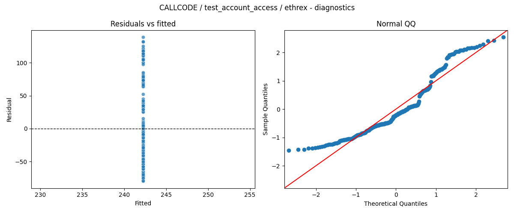

</details>

<details><summary>geth — NNLS regression summary</summary>

```
==============================================================================
                           NNLS Regression Results                            
==============================================================================
Dep. Variable:          test_runtime_ms              R-squared:          0.910
Model:                  NNLS                    Adj. R-squared:          0.909
No. Observations:       264                               RMSE:          82.47
Df Residuals:           262                                MAE:          68.40
Df Model:               1      
==============================================================================
                      coef     std err     P-value      [0.025      0.975]
------------------------------------------------------------------------------
         const    408.0374     20.4635       0.001    367.7471    449.0626
       opcount      0.0110      0.0002       0.001      0.0105      0.0115
==============================================================================
Notes: Non-negative least squares with bootstrap inference (1000 iterations)
==============================================================================
```

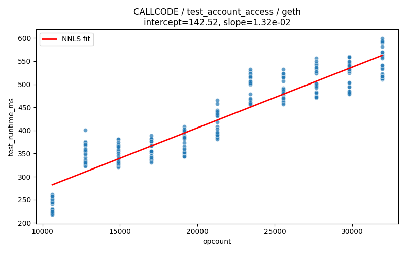

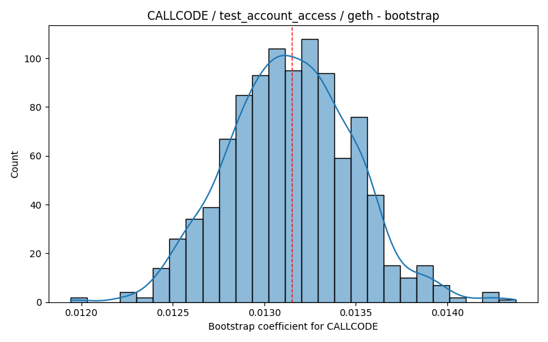

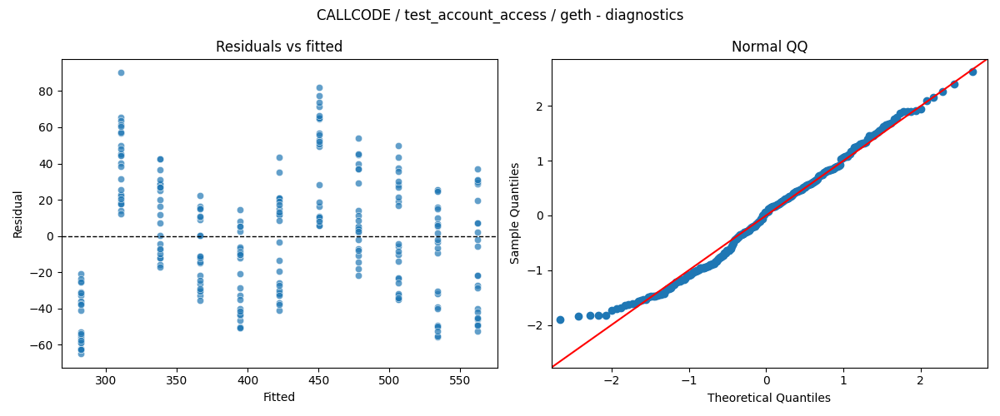

</details>

<details><summary>nethermind — NNLS regression summary</summary>

```
==============================================================================
                           NNLS Regression Results                            
==============================================================================
Dep. Variable:          test_runtime_ms              R-squared:          0.917
Model:                  NNLS                    Adj. R-squared:          0.917
No. Observations:       165                               RMSE:          26.78
Df Residuals:           163                                MAE:          20.46
Df Model:               1      
==============================================================================
                      coef     std err     P-value      [0.025      0.975]
------------------------------------------------------------------------------
         const    107.0732      6.7746       0.001     94.2788    120.4832
       opcount      0.0038      0.0001       0.001      0.0036      0.0039
==============================================================================
Notes: Non-negative least squares with bootstrap inference (1000 iterations)
==============================================================================
```

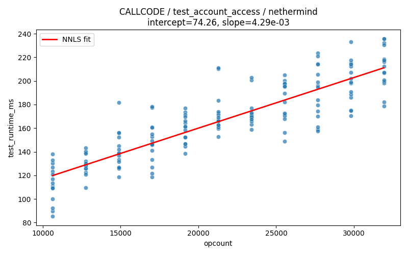

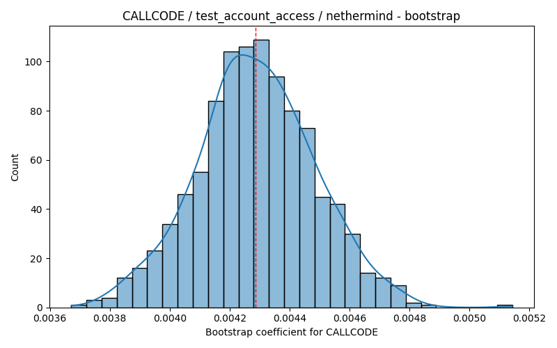


</details>

### test_account_access — combo `CALLCODE_AccountMode.NON_EXISTING_ACCOUNT` — `presets[cold_account_nocode_access]`

| client | nobs | R² | target_coef (ms) | p-value | 95% CI |
| --- | --- | --- | --- | --- | --- |
| `besu` | 418 | 0.8444 | 0.01429 | 1.00e-03 | [0.01366, 0.01487] |
| `erigon` | 198 | 0.9648 | 0.009481 | 1.00e-03 | [0.009261, 0.009563] |
| `ethrex` | 275 | 0.9647 | 0.002057 | 1.00e-03 | [0.002012, 0.002105] |
| `geth` | 264 | 0.8681 | 0.02243 | 1.00e-03 | [0.02124, 0.02357] |
| `nethermind` | 165 | 0.9259 | 0.0036 | 1.00e-03 | [0.003468, 0.003737] |

<details><summary>besu — NNLS regression summary</summary>

```
==============================================================================
                           NNLS Regression Results                            
==============================================================================
Dep. Variable:          test_runtime_ms              R-squared:          0.844
Model:                  NNLS                    Adj. R-squared:          0.844
No. Observations:       418                               RMSE:         145.63
Df Residuals:           416                                MAE:         126.31
Df Model:               1      
==============================================================================
                      coef     std err     P-value      [0.025      0.975]
------------------------------------------------------------------------------
         const    314.3148     23.1003       0.001    270.4593    360.4382
       opcount      0.0143      0.0003       0.001      0.0137      0.0149
==============================================================================
Notes: Non-negative least squares with bootstrap inference (1000 iterations)
==============================================================================
```

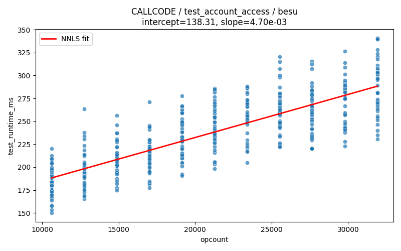

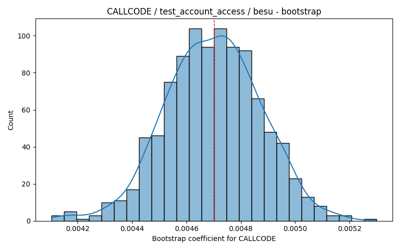

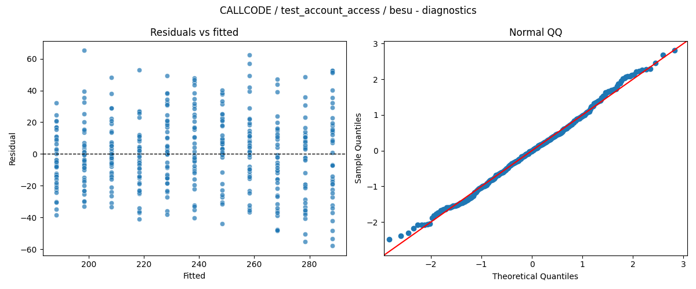

</details>

<details><summary>erigon — NNLS regression summary</summary>

```
==============================================================================
                           NNLS Regression Results                            
==============================================================================
Dep. Variable:          test_runtime_ms              R-squared:          0.965
Model:                  NNLS                    Adj. R-squared:          0.965
No. Observations:       198                               RMSE:          43.10
Df Residuals:           196                                MAE:          36.38
Df Model:               1      
==============================================================================
                      coef     std err     P-value      [0.025      0.975]
------------------------------------------------------------------------------
         const      0.0000      4.3028       1.000      0.0000     14.4356
       opcount      0.0095      0.0001       0.001      0.0093      0.0096
==============================================================================
Notes: Non-negative least squares with bootstrap inference (1000 iterations)
==============================================================================
```

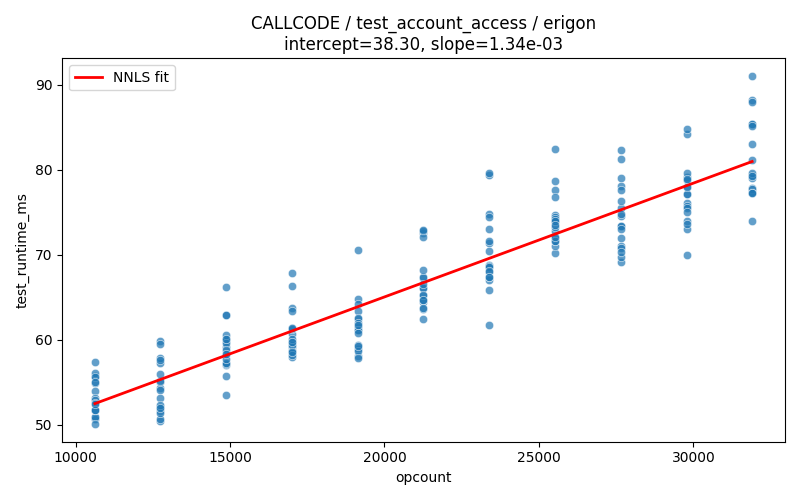

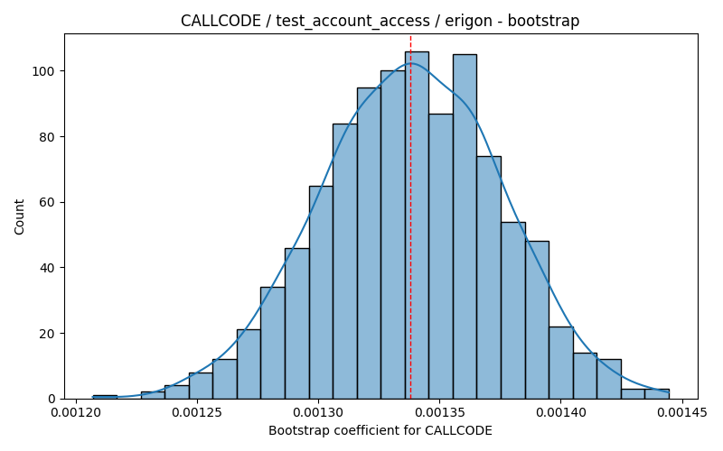

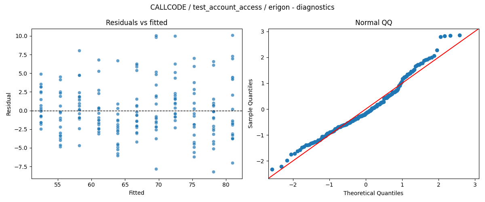

</details>

<details><summary>ethrex — NNLS regression summary</summary>

```
==============================================================================
                           NNLS Regression Results                            
==============================================================================
Dep. Variable:          test_runtime_ms              R-squared:          0.965
Model:                  NNLS                    Adj. R-squared:          0.965
No. Observations:       275                               RMSE:           9.34
Df Residuals:           273                                MAE:           7.39
Df Model:               1      
==============================================================================
                      coef     std err     P-value      [0.025      0.975]
------------------------------------------------------------------------------
         const     29.1528      1.8894       0.001     25.5023     33.1356
       opcount      0.0021      0.0000       0.001      0.0020      0.0021
==============================================================================
Notes: Non-negative least squares with bootstrap inference (1000 iterations)
==============================================================================
```

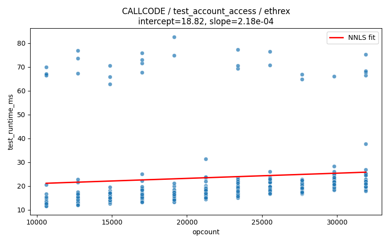

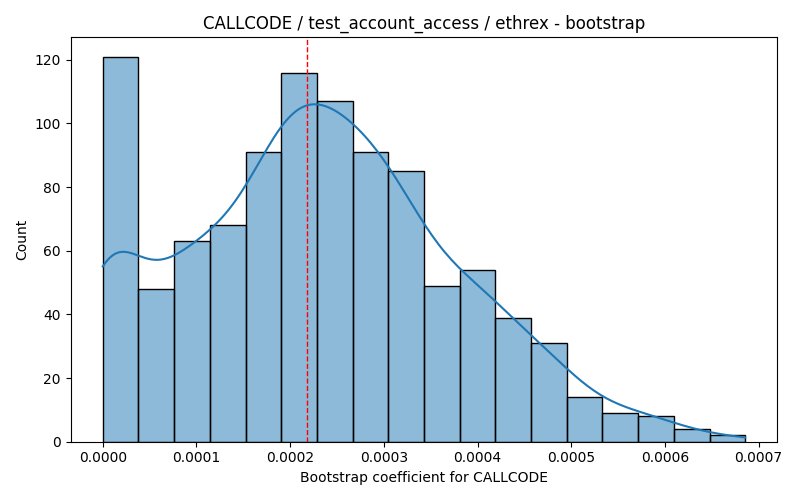

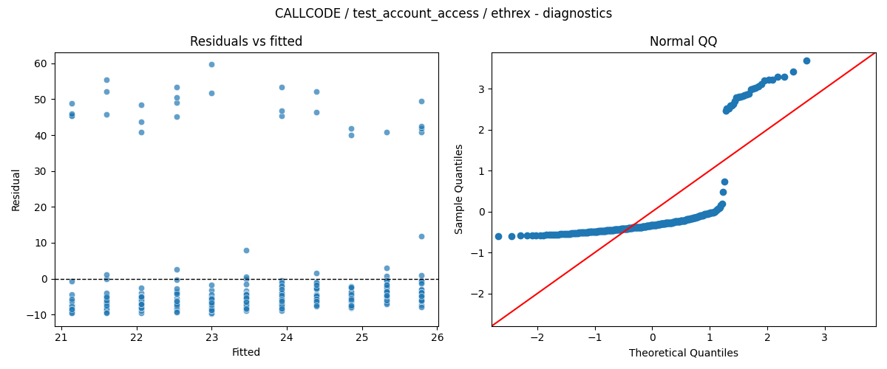

</details>

<details><summary>geth — NNLS regression summary</summary>

```
==============================================================================
                           NNLS Regression Results                            
==============================================================================
Dep. Variable:          test_runtime_ms              R-squared:          0.868
Model:                  NNLS                    Adj. R-squared:          0.868
No. Observations:       264                               RMSE:         207.57
Df Residuals:           262                                MAE:         177.95
Df Model:               1      
==============================================================================
                      coef     std err     P-value      [0.025      0.975]
------------------------------------------------------------------------------
         const    694.0404     48.1595       0.001    602.3851    790.1323
       opcount      0.0224      0.0006       0.001      0.0212      0.0236
==============================================================================
Notes: Non-negative least squares with bootstrap inference (1000 iterations)
==============================================================================
```

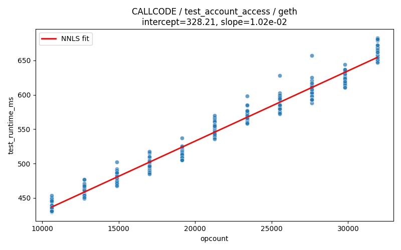

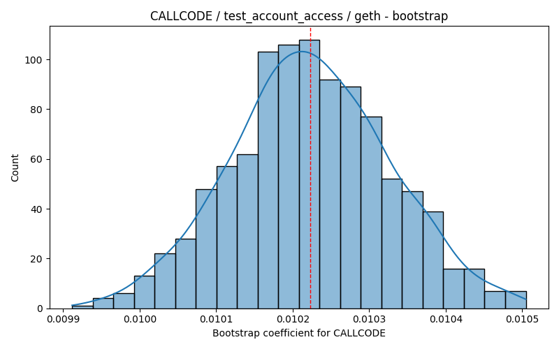

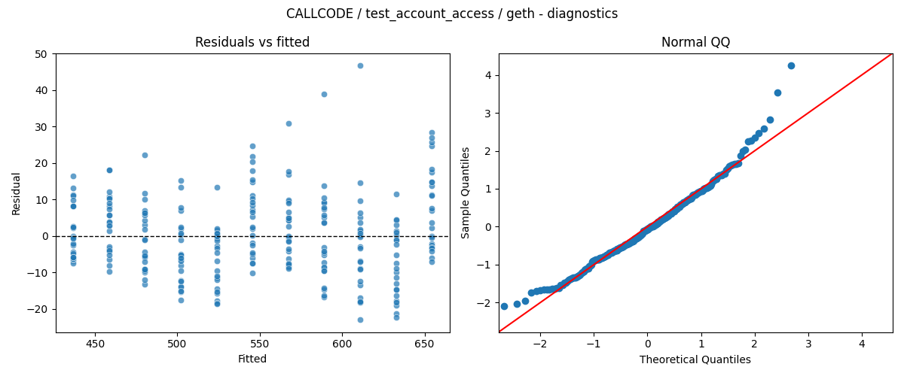

</details>

<details><summary>nethermind — NNLS regression summary</summary>

```
==============================================================================
                           NNLS Regression Results                            
==============================================================================
Dep. Variable:          test_runtime_ms              R-squared:          0.926
Model:                  NNLS                    Adj. R-squared:          0.925
No. Observations:       165                               RMSE:          24.17
Df Residuals:           163                                MAE:          18.69
Df Model:               1      
==============================================================================
                      coef     std err     P-value      [0.025      0.975]
------------------------------------------------------------------------------
         const     79.4352      5.2984       0.001     68.9723     89.7292
       opcount      0.0036      0.0001       0.001      0.0035      0.0037
==============================================================================
Notes: Non-negative least squares with bootstrap inference (1000 iterations)
==============================================================================
```

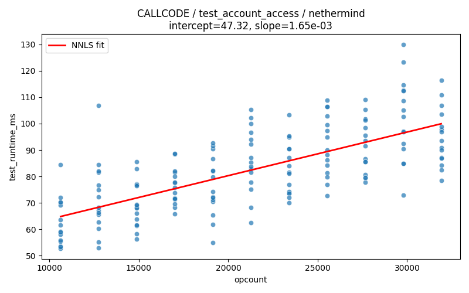

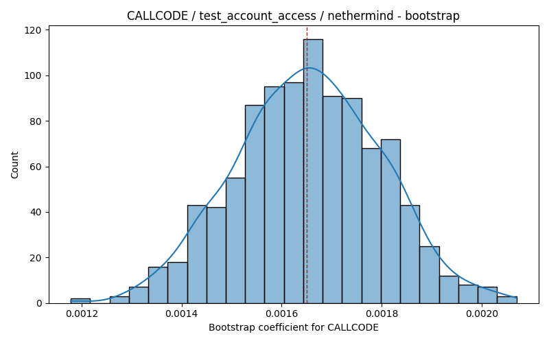

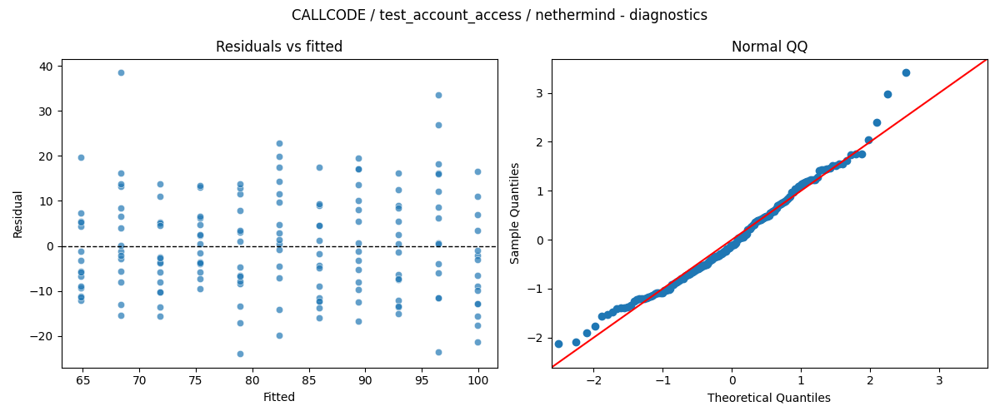

</details>

### test_account_access — combo `CALLCODE_AccountMode.EXISTING_CONTRACT` — `presets[cold_account_code_access]`

| client | nobs | R² | target_coef (ms) | p-value | 95% CI |
| --- | --- | --- | --- | --- | --- |
| `besu` | 418 | 0.8794 | 0.02745 | 1.00e-03 | [0.02651, 0.02832] |
| `erigon` | 198 | 0.923 | 0.02505 | 1.00e-03 | [0.02408, 0.02607] |
| `ethrex` | 275 | 0.9923 | 0.007815 | 1.00e-03 | [0.00774, 0.00789] |
| `geth` | 264 | 0.8632 | 0.02348 | 1.00e-03 | [0.02229, 0.02471] |
| `nethermind` | 165 | 0.8124 | 0.01104 | 1.00e-03 | [0.01032, 0.01176] |

<details><summary>besu — NNLS regression summary</summary>

```
==============================================================================
                           NNLS Regression Results                            
==============================================================================
Dep. Variable:          test_runtime_ms              R-squared:          0.879
Model:                  NNLS                    Adj. R-squared:          0.879
No. Observations:       418                               RMSE:         206.83
Df Residuals:           416                                MAE:         171.02
Df Model:               1      
==============================================================================
                      coef     std err     P-value      [0.025      0.975]
------------------------------------------------------------------------------
         const    463.3940     30.4732       0.001    402.1213    525.6671
       opcount      0.0274      0.0005       0.001      0.0265      0.0283
==============================================================================
Notes: Non-negative least squares with bootstrap inference (1000 iterations)
==============================================================================
```

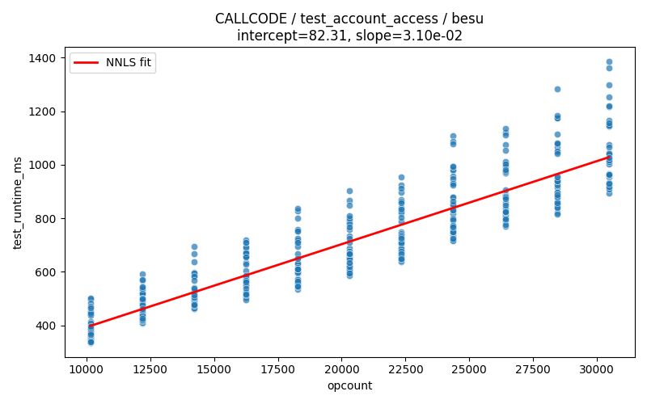

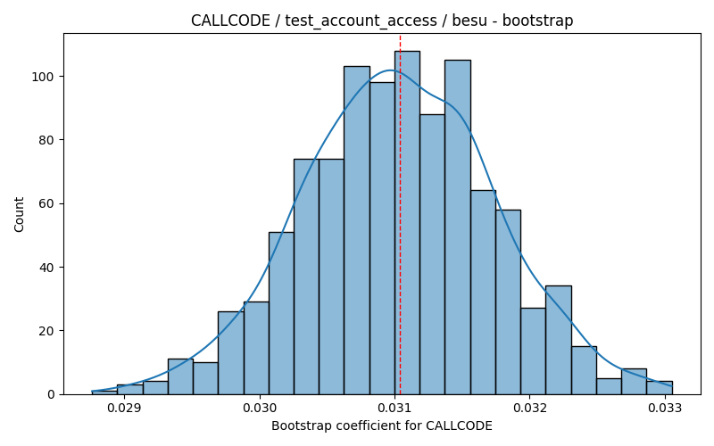

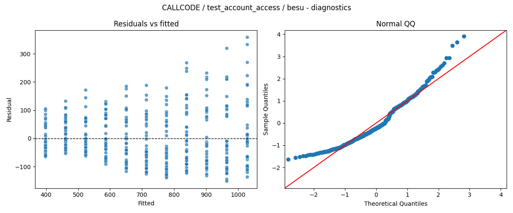

</details>

<details><summary>erigon — NNLS regression summary</summary>

```
==============================================================================
                           NNLS Regression Results                            
==============================================================================
Dep. Variable:          test_runtime_ms              R-squared:          0.923
Model:                  NNLS                    Adj. R-squared:          0.923
No. Observations:       198                               RMSE:         147.27
Df Residuals:           196                                MAE:         124.77
Df Model:               1      
==============================================================================
                      coef     std err     P-value      [0.025      0.975]
------------------------------------------------------------------------------
         const    318.6799     35.0890       0.001    249.6042    390.2459
       opcount      0.0251      0.0005       0.001      0.0241      0.0261
==============================================================================
Notes: Non-negative least squares with bootstrap inference (1000 iterations)
==============================================================================
```

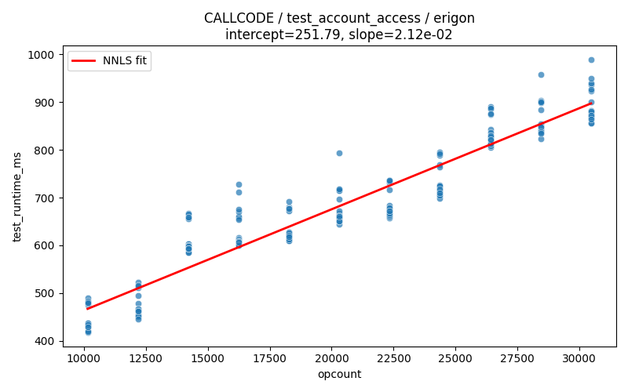

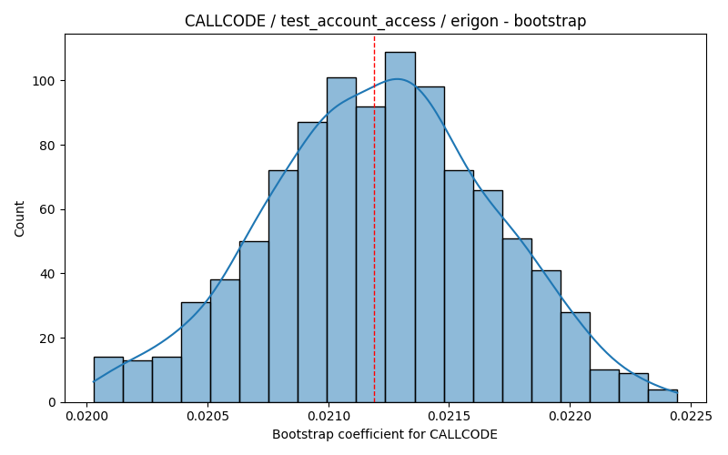

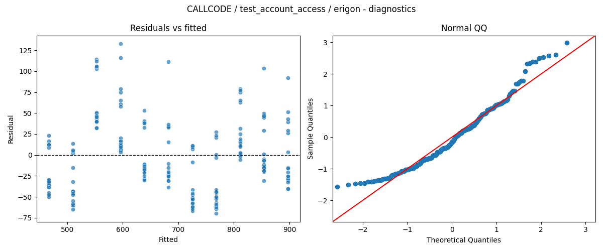

</details>

<details><summary>ethrex — NNLS regression summary</summary>

```
==============================================================================
                           NNLS Regression Results                            
==============================================================================
Dep. Variable:          test_runtime_ms              R-squared:          0.992
Model:                  NNLS                    Adj. R-squared:          0.992
No. Observations:       275                               RMSE:          13.98
Df Residuals:           273                                MAE:          10.89
Df Model:               1      
==============================================================================
                      coef     std err     P-value      [0.025      0.975]
------------------------------------------------------------------------------
         const     43.8593      2.2385       0.001     39.6698     48.2924
       opcount      0.0078      0.0000       0.001      0.0077      0.0079
==============================================================================
Notes: Non-negative least squares with bootstrap inference (1000 iterations)
==============================================================================
```

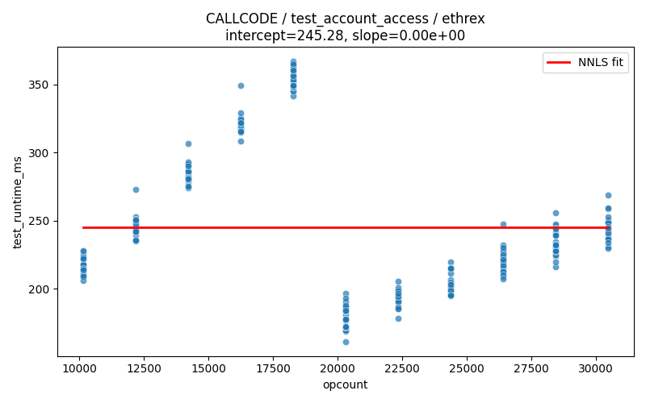


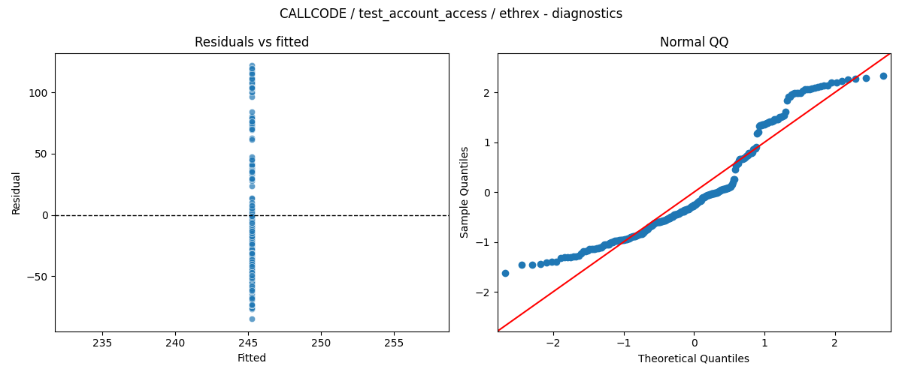

</details>

<details><summary>geth — NNLS regression summary</summary>

```
==============================================================================
                           NNLS Regression Results                            
==============================================================================
Dep. Variable:          test_runtime_ms              R-squared:          0.863
Model:                  NNLS                    Adj. R-squared:          0.863
No. Observations:       264                               RMSE:         190.17
Df Residuals:           262                                MAE:         160.29
Df Model:               1      
==============================================================================
                      coef     std err     P-value      [0.025      0.975]
------------------------------------------------------------------------------
         const    653.7642     44.9038       0.001    564.9816    741.5129
       opcount      0.0235      0.0006       0.001      0.0223      0.0247
==============================================================================
Notes: Non-negative least squares with bootstrap inference (1000 iterations)
==============================================================================
```

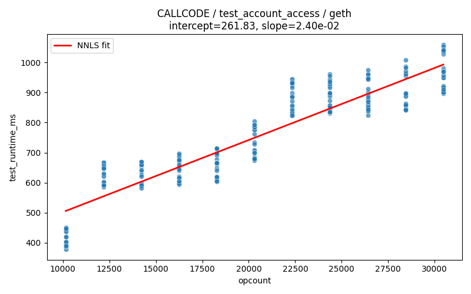

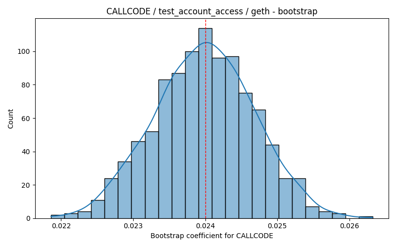

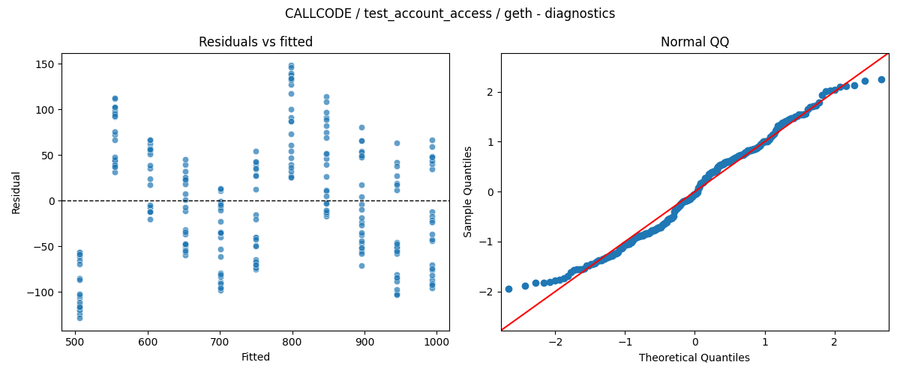

</details>

<details><summary>nethermind — NNLS regression summary</summary>

```
==============================================================================
                           NNLS Regression Results                            
==============================================================================
Dep. Variable:          test_runtime_ms              R-squared:          0.812
Model:                  NNLS                    Adj. R-squared:          0.811
No. Observations:       165                               RMSE:         107.98
Df Residuals:           163                                MAE:          71.44
Df Model:               1      
==============================================================================
                      coef     std err     P-value      [0.025      0.975]
------------------------------------------------------------------------------
         const    172.8916     23.1869       0.001    127.8377    221.1708
       opcount      0.0110      0.0004       0.001      0.0103      0.0118
==============================================================================
Notes: Non-negative least squares with bootstrap inference (1000 iterations)
==============================================================================
```

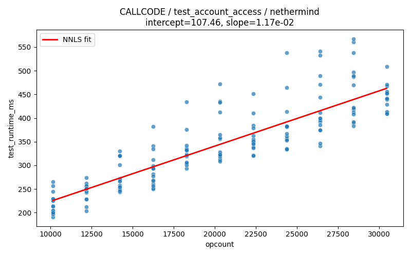

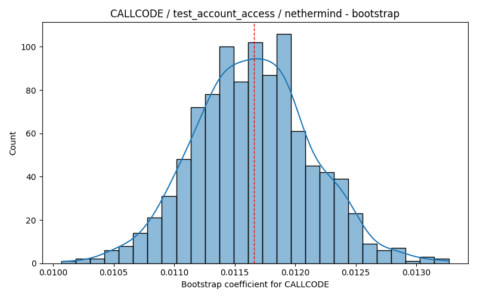

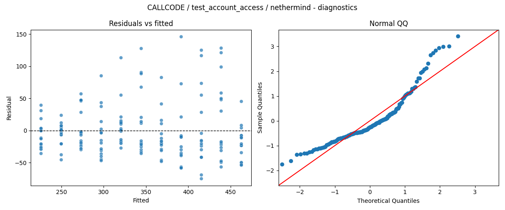

</details>

### test_account_access — combo `CALLCODE_AccountMode.NON_EXISTING_ACCOUNT` — `presets[cold_account_code_access]`

| client | nobs | R² | target_coef (ms) | p-value | 95% CI |
| --- | --- | --- | --- | --- | --- |
| `besu` | 418 | 0.8444 | 0.01429 | 1.00e-03 | [0.01366, 0.01487] |
| `erigon` | 198 | 0.9648 | 0.009481 | 1.00e-03 | [0.009261, 0.009563] |
| `ethrex` | 275 | 0.9647 | 0.002057 | 1.00e-03 | [0.002012, 0.002105] |
| `geth` | 264 | 0.8681 | 0.02243 | 1.00e-03 | [0.02124, 0.02357] |
| `nethermind` | 165 | 0.9259 | 0.0036 | 1.00e-03 | [0.003468, 0.003737] |

<details><summary>besu — NNLS regression summary</summary>

```
==============================================================================
                           NNLS Regression Results                            
==============================================================================
Dep. Variable:          test_runtime_ms              R-squared:          0.844
Model:                  NNLS                    Adj. R-squared:          0.844
No. Observations:       418                               RMSE:         145.63
Df Residuals:           416                                MAE:         126.31
Df Model:               1      
==============================================================================
                      coef     std err     P-value      [0.025      0.975]
------------------------------------------------------------------------------
         const    314.3148     23.1003       0.001    270.4593    360.4382
       opcount      0.0143      0.0003       0.001      0.0137      0.0149
==============================================================================
Notes: Non-negative least squares with bootstrap inference (1000 iterations)
==============================================================================
```


</details>

<details><summary>erigon — NNLS regression summary</summary>

```
==============================================================================
                           NNLS Regression Results                            
==============================================================================
Dep. Variable:          test_runtime_ms              R-squared:          0.965
Model:                  NNLS                    Adj. R-squared:          0.965
No. Observations:       198                               RMSE:          43.10
Df Residuals:           196                                MAE:          36.38
Df Model:               1      
==============================================================================
                      coef     std err     P-value      [0.025      0.975]
------------------------------------------------------------------------------
         const      0.0000      4.3028       1.000      0.0000     14.4356
       opcount      0.0095      0.0001       0.001      0.0093      0.0096
==============================================================================
Notes: Non-negative least squares with bootstrap inference (1000 iterations)
==============================================================================
```


</details>

<details><summary>ethrex — NNLS regression summary</summary>

```
==============================================================================
                           NNLS Regression Results                            
==============================================================================
Dep. Variable:          test_runtime_ms              R-squared:          0.965
Model:                  NNLS                    Adj. R-squared:          0.965
No. Observations:       275                               RMSE:           9.34
Df Residuals:           273                                MAE:           7.39
Df Model:               1      
==============================================================================
                      coef     std err     P-value      [0.025      0.975]
------------------------------------------------------------------------------
         const     29.1528      1.8894       0.001     25.5023     33.1356
       opcount      0.0021      0.0000       0.001      0.0020      0.0021
==============================================================================
Notes: Non-negative least squares with bootstrap inference (1000 iterations)
==============================================================================
```


</details>

<details><summary>geth — NNLS regression summary</summary>

```
==============================================================================
                           NNLS Regression Results                            
==============================================================================
Dep. Variable:          test_runtime_ms              R-squared:          0.868
Model:                  NNLS                    Adj. R-squared:          0.868
No. Observations:       264                               RMSE:         207.57
Df Residuals:           262                                MAE:         177.95
Df Model:               1      
==============================================================================
                      coef     std err     P-value      [0.025      0.975]
------------------------------------------------------------------------------
         const    694.0404     48.1595       0.001    602.3851    790.1323
       opcount      0.0224      0.0006       0.001      0.0212      0.0236
==============================================================================
Notes: Non-negative least squares with bootstrap inference (1000 iterations)
==============================================================================
```


</details>

<details><summary>nethermind — NNLS regression summary</summary>

```
==============================================================================
                           NNLS Regression Results                            
==============================================================================
Dep. Variable:          test_runtime_ms              R-squared:          0.926
Model:                  NNLS                    Adj. R-squared:          0.925
No. Observations:       165                               RMSE:          24.17
Df Residuals:           163                                MAE:          18.69
Df Model:               1      
==============================================================================
                      coef     std err     P-value      [0.025      0.975]
------------------------------------------------------------------------------
         const     79.4352      5.2984       0.001     68.9723     89.7292
       opcount      0.0036      0.0001       0.001      0.0035      0.0037
==============================================================================
Notes: Non-negative least squares with bootstrap inference (1000 iterations)
==============================================================================
```


</details>

### test_account_access — combo `CALLCODE_AccountMode.EXISTING_EOA` — `presets[cold_account_nocode_write]`

| client | nobs | R² | target_coef (ms) | p-value | 95% CI |
| --- | --- | --- | --- | --- | --- |
| `besu` | 418 | 0.8809 | 0.02498 | 1.00e-03 | [0.02406, 0.02585] |
| `erigon` | 198 | 0.8917 | 0.008032 | 1.00e-03 | [0.007687, 0.008409] |
| `ethrex` | 275 | -2.22e-16 | 0 | 1.00e+00 | [0, 0] |
| `geth` | 264 | 0.8705 | 0.01315 | 1.00e-03 | [0.0125, 0.01384] |
| `nethermind` | 165 | 0.7601 | 0.004287 | 1.00e-03 | [0.003888, 0.004679] |

<details><summary>besu — NNLS regression summary</summary>

```
==============================================================================
                           NNLS Regression Results                            
==============================================================================
Dep. Variable:          test_runtime_ms              R-squared:          0.881
Model:                  NNLS                    Adj. R-squared:          0.881
No. Observations:       418                               RMSE:          61.81
Df Residuals:           416                                MAE:          49.33
Df Model:               1      
==============================================================================
                      coef     std err     P-value      [0.025      0.975]
------------------------------------------------------------------------------
         const     69.4236      8.7182       0.001     52.0624     86.3553
       opcount      0.0250      0.0004       0.001      0.0241      0.0259
==============================================================================
Notes: Non-negative least squares with bootstrap inference (1000 iterations)
==============================================================================
```


</details>

<details><summary>erigon — NNLS regression summary</summary>

```
==============================================================================
                           NNLS Regression Results                            
==============================================================================
Dep. Variable:          test_runtime_ms              R-squared:          0.892
Model:                  NNLS                    Adj. R-squared:          0.891
No. Observations:       198                               RMSE:          18.84
Df Residuals:           196                                MAE:          12.11
Df Model:               1      
==============================================================================
                      coef     std err     P-value      [0.025      0.975]
------------------------------------------------------------------------------
         const     22.0728      3.9137       0.001     14.5066     29.8093
       opcount      0.0080      0.0002       0.001      0.0077      0.0084
==============================================================================
Notes: Non-negative least squares with bootstrap inference (1000 iterations)
==============================================================================
```


</details>

<details><summary>ethrex — NNLS regression summary</summary>

```
==============================================================================
                           NNLS Regression Results                            
==============================================================================
Dep. Variable:          test_runtime_ms              R-squared:         -0.000
Model:                  NNLS                    Adj. R-squared:         -0.004
No. Observations:       275                               RMSE:          54.58
Df Residuals:           273                                MAE:          43.71
Df Model:               1      
==============================================================================
                      coef     std err     P-value      [0.025      0.975]
------------------------------------------------------------------------------
         const    242.2512      3.3771       0.001    235.8175    249.0868
       opcount      0.0000      0.0000       1.000      0.0000      0.0000
==============================================================================
Notes: Non-negative least squares with bootstrap inference (1000 iterations)
==============================================================================
```


</details>

<details><summary>geth — NNLS regression summary</summary>

```
==============================================================================
                           NNLS Regression Results                            
==============================================================================
Dep. Variable:          test_runtime_ms              R-squared:          0.870
Model:                  NNLS                    Adj. R-squared:          0.870
No. Observations:       264                               RMSE:          34.14
Df Residuals:           262                                MAE:          28.44
Df Model:               1      
==============================================================================
                      coef     std err     P-value      [0.025      0.975]
------------------------------------------------------------------------------
         const    142.5225      7.7842       0.001    128.0128    157.6754
       opcount      0.0132      0.0003       0.001      0.0125      0.0138
==============================================================================
Notes: Non-negative least squares with bootstrap inference (1000 iterations)
==============================================================================
```


</details>

<details><summary>nethermind — NNLS regression summary</summary>

```
==============================================================================
                           NNLS Regression Results                            
==============================================================================
Dep. Variable:          test_runtime_ms              R-squared:          0.760
Model:                  NNLS                    Adj. R-squared:          0.759
No. Observations:       165                               RMSE:          16.21
Df Residuals:           163                                MAE:          12.55
Df Model:               1      
==============================================================================
                      coef     std err     P-value      [0.025      0.975]
------------------------------------------------------------------------------
         const     74.2577      4.1683       0.001     65.7929     82.7699
       opcount      0.0043      0.0002       0.001      0.0039      0.0047
==============================================================================
Notes: Non-negative least squares with bootstrap inference (1000 iterations)
==============================================================================
```


</details>

### test_account_access — combo `CALLCODE_AccountMode.NON_EXISTING_ACCOUNT` — `presets[cold_account_nocode_write]`

| client | nobs | R² | target_coef (ms) | p-value | 95% CI |
| --- | --- | --- | --- | --- | --- |
| `besu` | 418 | 0.6516 | 0.004701 | 1.00e-03 | [0.004352, 0.005026] |
| `erigon` | 198 | 0.8667 | 0.001338 | 1.00e-03 | [0.001265, 0.001407] |
| `ethrex` | 275 | 0.008143 | 0.0002184 | 8.40e-02 | [0, 0.0005266] |
| `geth` | 264 | 0.9752 | 0.01022 | 1.00e-03 | [0.01002, 0.01043] |
| `nethermind` | 165 | 0.4933 | 0.001649 | 1.00e-03 | [0.001369, 0.001936] |

<details><summary>besu — NNLS regression summary</summary>

```
==============================================================================
                           NNLS Regression Results                            
==============================================================================
Dep. Variable:          test_runtime_ms              R-squared:          0.652
Model:                  NNLS                    Adj. R-squared:          0.651
No. Observations:       418                               RMSE:          23.14
Df Residuals:           416                                MAE:          18.38
Df Model:               1      
==============================================================================
                      coef     std err     P-value      [0.025      0.975]
------------------------------------------------------------------------------
         const    138.3111      3.5164       0.001    131.4154    145.3520
       opcount      0.0047      0.0002       0.001      0.0044      0.0050
==============================================================================
Notes: Non-negative least squares with bootstrap inference (1000 iterations)
==============================================================================
```


</details>

<details><summary>erigon — NNLS regression summary</summary>

```
==============================================================================
                           NNLS Regression Results                            
==============================================================================
Dep. Variable:          test_runtime_ms              R-squared:          0.867
Model:                  NNLS                    Adj. R-squared:          0.866
No. Observations:       198                               RMSE:           3.53
Df Residuals:           196                                MAE:           2.77
Df Model:               1      
==============================================================================
                      coef     std err     P-value      [0.025      0.975]
------------------------------------------------------------------------------
         const     38.2961      0.7478       0.001     36.8835     39.7358
       opcount      0.0013      0.0000       0.001      0.0013      0.0014
==============================================================================
Notes: Non-negative least squares with bootstrap inference (1000 iterations)
==============================================================================
```


</details>

<details><summary>ethrex — NNLS regression summary</summary>

```
==============================================================================
                           NNLS Regression Results                            
==============================================================================
Dep. Variable:          test_runtime_ms              R-squared:          0.008
Model:                  NNLS                    Adj. R-squared:          0.005
No. Observations:       275                               RMSE:          16.23
Df Residuals:           273                                MAE:           9.84
Df Model:               1      
==============================================================================
                      coef     std err     P-value      [0.025      0.975]
------------------------------------------------------------------------------
         const     18.8172      3.4357       0.001     11.9200     24.6618
       opcount      0.0002      0.0001       0.084      0.0000      0.0005
==============================================================================
Notes: Non-negative least squares with bootstrap inference (1000 iterations)
==============================================================================
```


</details>

<details><summary>geth — NNLS regression summary</summary>

```
==============================================================================
                           NNLS Regression Results                            
==============================================================================
Dep. Variable:          test_runtime_ms              R-squared:          0.975
Model:                  NNLS                    Adj. R-squared:          0.975
No. Observations:       264                               RMSE:          10.97
Df Residuals:           262                                MAE:           8.58
Df Model:               1      
==============================================================================
                      coef     std err     P-value      [0.025      0.975]
------------------------------------------------------------------------------
         const    328.2134      2.0580       0.001    324.2765    332.2763
       opcount      0.0102      0.0001       0.001      0.0100      0.0104
==============================================================================
Notes: Non-negative least squares with bootstrap inference (1000 iterations)
==============================================================================
```


</details>

<details><summary>nethermind — NNLS regression summary</summary>

```
==============================================================================
                           NNLS Regression Results                            
==============================================================================
Dep. Variable:          test_runtime_ms              R-squared:          0.493
Model:                  NNLS                    Adj. R-squared:          0.490
No. Observations:       165                               RMSE:          11.25
Df Residuals:           163                                MAE:           9.20
Df Model:               1      
==============================================================================
                      coef     std err     P-value      [0.025      0.975]
------------------------------------------------------------------------------
         const     47.3171      3.0321       0.001     41.4548     53.3308
       opcount      0.0016      0.0001       0.001      0.0014      0.0019
==============================================================================
Notes: Non-negative least squares with bootstrap inference (1000 iterations)
==============================================================================
```


</details>

### test_account_access — combo `CALLCODE_AccountMode.EXISTING_CONTRACT` — `presets[cold_account_code_write]`

| client | nobs | R² | target_coef (ms) | p-value | 95% CI |
| --- | --- | --- | --- | --- | --- |
| `besu` | 418 | 0.8256 | 0.03104 | 1.00e-03 | [0.02961, 0.03241] |
| `erigon` | 198 | 0.9041 | 0.02119 | 1.00e-03 | [0.02026, 0.02207] |
| `ethrex` | 275 | 0 | 0 | 1.00e+00 | [0, 0] |
| `geth` | 264 | 0.8455 | 0.024 | 1.00e-03 | [0.02264, 0.02531] |
| `nethermind` | 165 | 0.755 | 0.01166 | 1.00e-03 | [0.01073, 0.01256] |

<details><summary>besu — NNLS regression summary</summary>

```
==============================================================================
                           NNLS Regression Results                            
==============================================================================
Dep. Variable:          test_runtime_ms              R-squared:          0.826
Model:                  NNLS                    Adj. R-squared:          0.825
No. Observations:       418                               RMSE:          91.65
Df Residuals:           416                                MAE:          74.26
Df Model:               1      
==============================================================================
                      coef     std err     P-value      [0.025      0.975]
------------------------------------------------------------------------------
         const     82.3059     12.5117       0.001     58.2294    107.7066
       opcount      0.0310      0.0007       0.001      0.0296      0.0324
==============================================================================
Notes: Non-negative least squares with bootstrap inference (1000 iterations)
==============================================================================
```


</details>

<details><summary>erigon — NNLS regression summary</summary>

```
==============================================================================
                           NNLS Regression Results                            
==============================================================================
Dep. Variable:          test_runtime_ms              R-squared:          0.904
Model:                  NNLS                    Adj. R-squared:          0.904
No. Observations:       198                               RMSE:          44.33
Df Residuals:           196                                MAE:          36.26
Df Model:               1      
==============================================================================
                      coef     std err     P-value      [0.025      0.975]
------------------------------------------------------------------------------
         const    251.7935     10.4400       0.001    231.7972    272.1526
       opcount      0.0212      0.0005       0.001      0.0203      0.0221
==============================================================================
Notes: Non-negative least squares with bootstrap inference (1000 iterations)
==============================================================================
```


</details>

<details><summary>ethrex — NNLS regression summary</summary>

```
==============================================================================
                           NNLS Regression Results                            
==============================================================================
Dep. Variable:          test_runtime_ms              R-squared:          0.000
Model:                  NNLS                    Adj. R-squared:         -0.004
No. Observations:       275                               RMSE:          52.27
Df Residuals:           273                                MAE:          41.87
Df Model:               1      
==============================================================================
                      coef     std err     P-value      [0.025      0.975]
------------------------------------------------------------------------------
         const    245.2797      3.1503       0.001    239.4587    251.5758
       opcount      0.0000      0.0000       1.000      0.0000      0.0000
==============================================================================
Notes: Non-negative least squares with bootstrap inference (1000 iterations)
==============================================================================
```


</details>

<details><summary>geth — NNLS regression summary</summary>

```
==============================================================================
                           NNLS Regression Results                            
==============================================================================
Dep. Variable:          test_runtime_ms              R-squared:          0.845
Model:                  NNLS                    Adj. R-squared:          0.845
No. Observations:       264                               RMSE:          65.92
Df Residuals:           262                                MAE:          56.31
Df Model:               1      
==============================================================================
                      coef     std err     P-value      [0.025      0.975]
------------------------------------------------------------------------------
         const    261.8282     15.1548       0.001    234.1680    290.8098
       opcount      0.0240      0.0007       0.001      0.0226      0.0253
==============================================================================
Notes: Non-negative least squares with bootstrap inference (1000 iterations)
==============================================================================
```


</details>

<details><summary>nethermind — NNLS regression summary</summary>

```
==============================================================================
                           NNLS Regression Results                            
==============================================================================
Dep. Variable:          test_runtime_ms              R-squared:          0.755
Model:                  NNLS                    Adj. R-squared:          0.753
No. Observations:       165                               RMSE:          42.67
Df Residuals:           163                                MAE:          31.78
Df Model:               1      
==============================================================================
                      coef     std err     P-value      [0.025      0.975]
------------------------------------------------------------------------------
         const    107.4597      8.6230       0.001     90.6907    124.9578
       opcount      0.0117      0.0005       0.001      0.0107      0.0126
==============================================================================
Notes: Non-negative least squares with bootstrap inference (1000 iterations)
==============================================================================
```


</details>

### test_account_access — combo `CALLCODE_AccountMode.NON_EXISTING_ACCOUNT` — `presets[cold_account_code_write]`

| client | nobs | R² | target_coef (ms) | p-value | 95% CI |
| --- | --- | --- | --- | --- | --- |
| `besu` | 418 | 0.6516 | 0.004701 | 1.00e-03 | [0.004352, 0.005026] |
| `erigon` | 198 | 0.8667 | 0.001338 | 1.00e-03 | [0.001265, 0.001407] |
| `ethrex` | 275 | 0.008143 | 0.0002184 | 8.40e-02 | [0, 0.0005266] |
| `geth` | 264 | 0.9752 | 0.01022 | 1.00e-03 | [0.01002, 0.01043] |
| `nethermind` | 165 | 0.4933 | 0.001649 | 1.00e-03 | [0.001369, 0.001936] |

<details><summary>besu — NNLS regression summary</summary>

```
==============================================================================
                           NNLS Regression Results                            
==============================================================================
Dep. Variable:          test_runtime_ms              R-squared:          0.652
Model:                  NNLS                    Adj. R-squared:          0.651
No. Observations:       418                               RMSE:          23.14
Df Residuals:           416                                MAE:          18.38
Df Model:               1      
==============================================================================
                      coef     std err     P-value      [0.025      0.975]
------------------------------------------------------------------------------
         const    138.3111      3.5164       0.001    131.4154    145.3520
       opcount      0.0047      0.0002       0.001      0.0044      0.0050
==============================================================================
Notes: Non-negative least squares with bootstrap inference (1000 iterations)
==============================================================================
```


</details>

<details><summary>erigon — NNLS regression summary</summary>

```
==============================================================================
                           NNLS Regression Results                            
==============================================================================
Dep. Variable:          test_runtime_ms              R-squared:          0.867
Model:                  NNLS                    Adj. R-squared:          0.866
No. Observations:       198                               RMSE:           3.53
Df Residuals:           196                                MAE:           2.77
Df Model:               1      
==============================================================================
                      coef     std err     P-value      [0.025      0.975]
------------------------------------------------------------------------------
         const     38.2961      0.7478       0.001     36.8835     39.7358
       opcount      0.0013      0.0000       0.001      0.0013      0.0014
==============================================================================
Notes: Non-negative least squares with bootstrap inference (1000 iterations)
==============================================================================
```


</details>

<details><summary>ethrex — NNLS regression summary</summary>

```
==============================================================================
                           NNLS Regression Results                            
==============================================================================
Dep. Variable:          test_runtime_ms              R-squared:          0.008
Model:                  NNLS                    Adj. R-squared:          0.005
No. Observations:       275                               RMSE:          16.23
Df Residuals:           273                                MAE:           9.84
Df Model:               1      
==============================================================================
                      coef     std err     P-value      [0.025      0.975]
------------------------------------------------------------------------------
         const     18.8172      3.4357       0.001     11.9200     24.6618
       opcount      0.0002      0.0001       0.084      0.0000      0.0005
==============================================================================
Notes: Non-negative least squares with bootstrap inference (1000 iterations)
==============================================================================
```


</details>

<details><summary>geth — NNLS regression summary</summary>

```
==============================================================================
                           NNLS Regression Results                            
==============================================================================
Dep. Variable:          test_runtime_ms              R-squared:          0.975
Model:                  NNLS                    Adj. R-squared:          0.975
No. Observations:       264                               RMSE:          10.97
Df Residuals:           262                                MAE:           8.58
Df Model:               1      
==============================================================================
                      coef     std err     P-value      [0.025      0.975]
------------------------------------------------------------------------------
         const    328.2134      2.0580       0.001    324.2765    332.2763
       opcount      0.0102      0.0001       0.001      0.0100      0.0104
==============================================================================
Notes: Non-negative least squares with bootstrap inference (1000 iterations)
==============================================================================
```


</details>

<details><summary>nethermind — NNLS regression summary</summary>

```
==============================================================================
                           NNLS Regression Results                            
==============================================================================
Dep. Variable:          test_runtime_ms              R-squared:          0.493
Model:                  NNLS                    Adj. R-squared:          0.490
No. Observations:       165                               RMSE:          11.25
Df Residuals:           163                                MAE:           9.20
Df Model:               1      
==============================================================================
                      coef     std err     P-value      [0.025      0.975]
------------------------------------------------------------------------------
         const     47.3171      3.0321       0.001     41.4548     53.3308
       opcount      0.0016      0.0001       0.001      0.0014      0.0019
==============================================================================
Notes: Non-negative least squares with bootstrap inference (1000 iterations)
==============================================================================
```


</details>

### test_ext_account_query_warm — combo `CALLCODE`

| client | nobs | R² | target_coef (ms) | p-value | 95% CI |
| --- | --- | --- | --- | --- | --- |
| `besu` | 418 | 0.6987 | 0.0004215 | 1.00e-03 | [0.0003967, 0.0004474] |
| `erigon` | 198 | 0.9197 | 0.0002997 | 1.00e-03 | [0.0002879, 0.0003116] |
| `ethrex` | 275 | 0.9421 | 0.000106 | 1.00e-03 | [0.0001026, 0.0001092] |
| `geth` | 264 | 0.8559 | 0.0001828 | 1.00e-03 | [0.0001731, 0.0001931] |
| `nethermind` | 165 | 0.7033 | 0.0002105 | 1.00e-03 | [0.0001914, 0.0002315] |

<details><summary>besu — NNLS regression summary</summary>

```
==============================================================================
                           NNLS Regression Results                            
==============================================================================
Dep. Variable:          test_runtime_ms              R-squared:          0.699
Model:                  NNLS                    Adj. R-squared:          0.698
No. Observations:       418                               RMSE:         139.83
Df Residuals:           416                                MAE:         111.45
Df Model:               1      
==============================================================================
                      coef     std err     P-value      [0.025      0.975]
------------------------------------------------------------------------------
         const    536.2003     21.1790       0.001    496.7466    580.2665
       opcount      0.0004      0.0000       0.001      0.0004      0.0004
==============================================================================
Notes: Non-negative least squares with bootstrap inference (1000 iterations)
==============================================================================
```

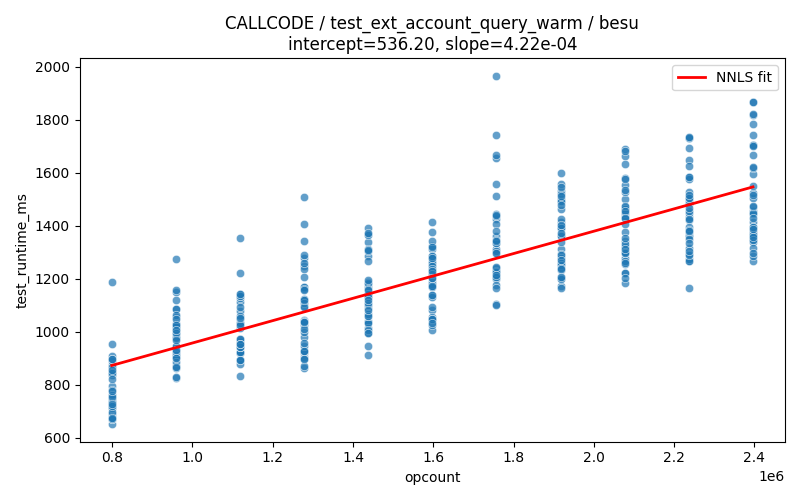

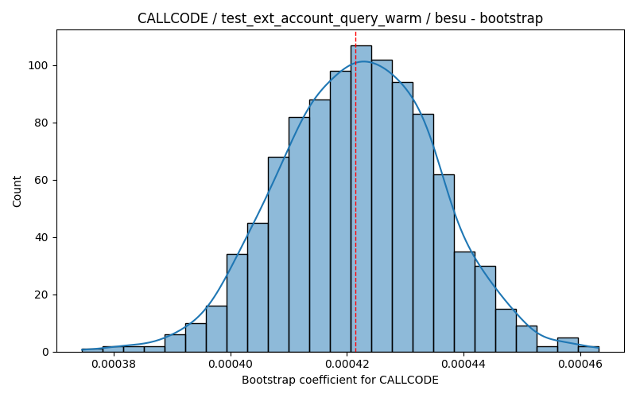

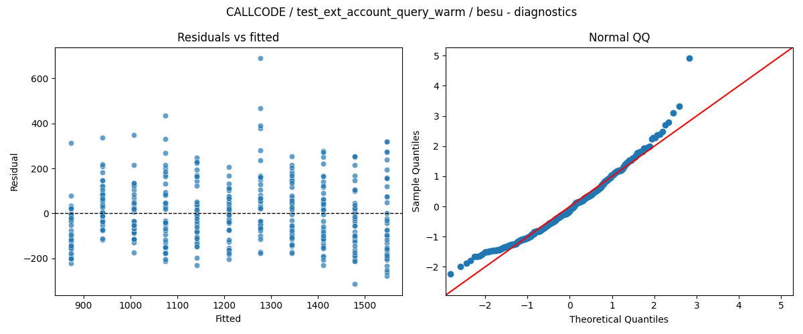

</details>

<details><summary>erigon — NNLS regression summary</summary>

```
==============================================================================
                           NNLS Regression Results                            
==============================================================================
Dep. Variable:          test_runtime_ms              R-squared:          0.920
Model:                  NNLS                    Adj. R-squared:          0.919
No. Observations:       198                               RMSE:          44.73
Df Residuals:           196                                MAE:          37.05
Df Model:               1      
==============================================================================
                      coef     std err     P-value      [0.025      0.975]
------------------------------------------------------------------------------
         const     51.6582      9.8492       0.001     32.6258     71.5499
       opcount      0.0003      0.0000       0.001      0.0003      0.0003
==============================================================================
Notes: Non-negative least squares with bootstrap inference (1000 iterations)
==============================================================================
```


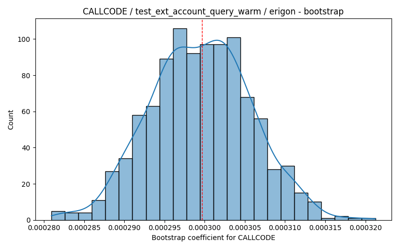

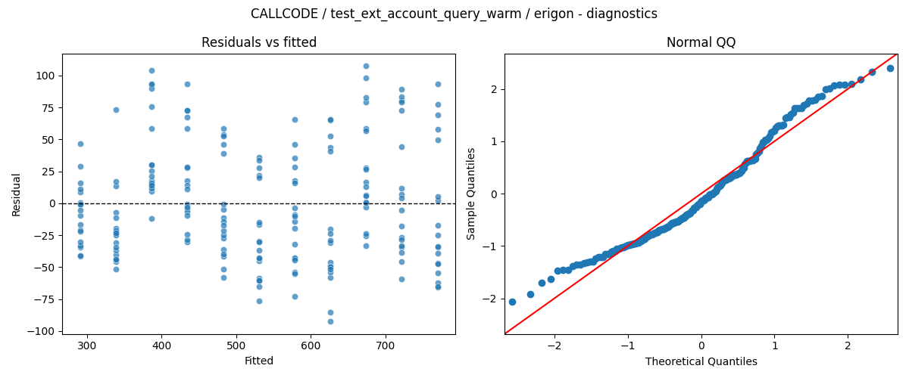

</details>

<details><summary>ethrex — NNLS regression summary</summary>

```
==============================================================================
                           NNLS Regression Results                            
==============================================================================
Dep. Variable:          test_runtime_ms              R-squared:          0.942
Model:                  NNLS                    Adj. R-squared:          0.942
No. Observations:       275                               RMSE:          13.27
Df Residuals:           273                                MAE:          10.86
Df Model:               1      
==============================================================================
                      coef     std err     P-value      [0.025      0.975]
------------------------------------------------------------------------------
         const     34.6578      2.7620       0.001     29.3576     40.3118
       opcount      0.0001      0.0000       0.001      0.0001      0.0001
==============================================================================
Notes: Non-negative least squares with bootstrap inference (1000 iterations)
==============================================================================
```

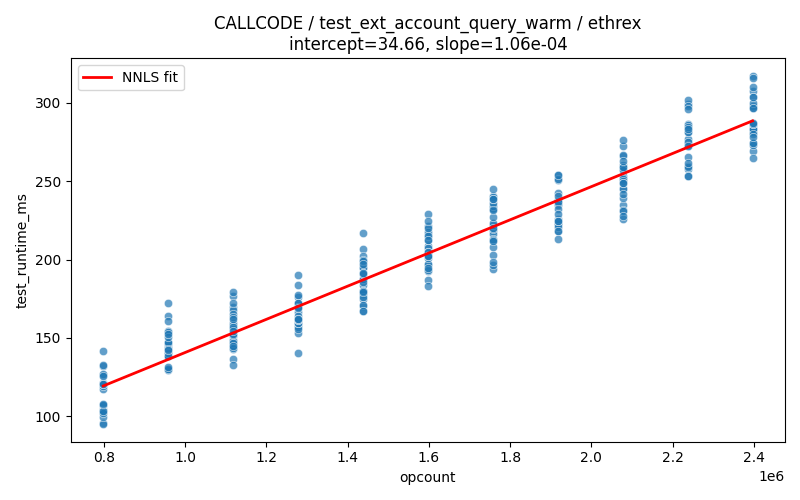

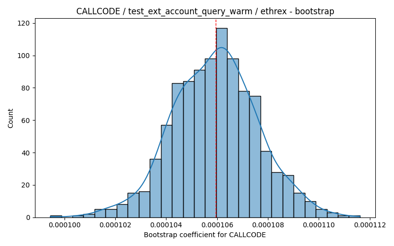

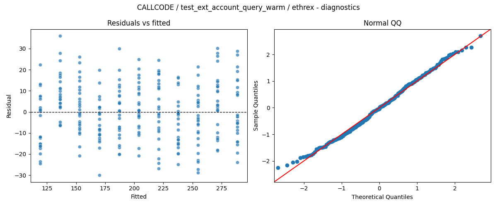

</details>

<details><summary>geth — NNLS regression summary</summary>

```
==============================================================================
                           NNLS Regression Results                            
==============================================================================
Dep. Variable:          test_runtime_ms              R-squared:          0.856
Model:                  NNLS                    Adj. R-squared:          0.855
No. Observations:       264                               RMSE:          37.91
Df Residuals:           262                                MAE:          29.47
Df Model:               1      
==============================================================================
                      coef     std err     P-value      [0.025      0.975]
------------------------------------------------------------------------------
         const     50.6045      7.4298       0.001     35.3915     64.9950
       opcount      0.0002      0.0000       0.001      0.0002      0.0002
==============================================================================
Notes: Non-negative least squares with bootstrap inference (1000 iterations)
==============================================================================
```

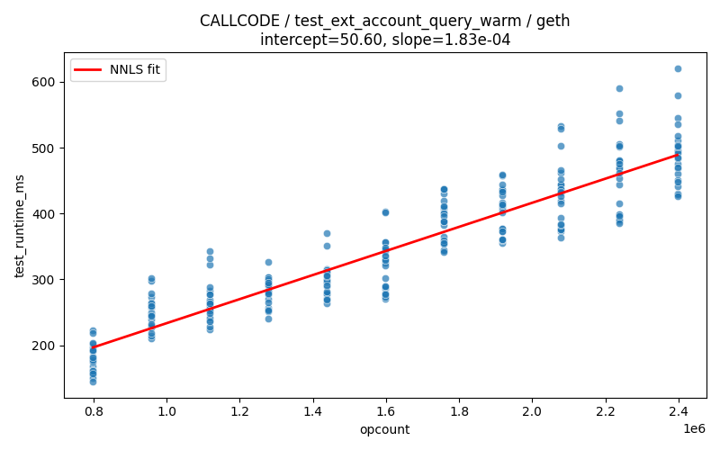

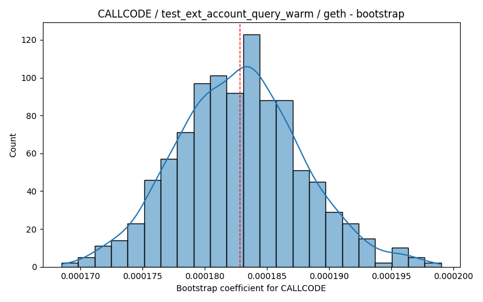

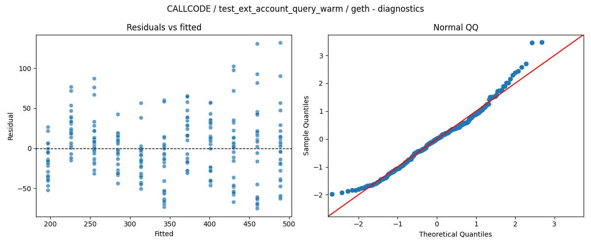

</details>

<details><summary>nethermind — NNLS regression summary</summary>

```
==============================================================================
                           NNLS Regression Results                            
==============================================================================
Dep. Variable:          test_runtime_ms              R-squared:          0.703
Model:                  NNLS                    Adj. R-squared:          0.701
No. Observations:       165                               RMSE:          69.07
Df Residuals:           163                                MAE:          56.69
Df Model:               1      
==============================================================================
                      coef     std err     P-value      [0.025      0.975]
------------------------------------------------------------------------------
         const    196.8449     16.3069       0.001    164.2133    229.4002
       opcount      0.0002      0.0000       0.001      0.0002      0.0002
==============================================================================
Notes: Non-negative least squares with bootstrap inference (1000 iterations)
==============================================================================
```

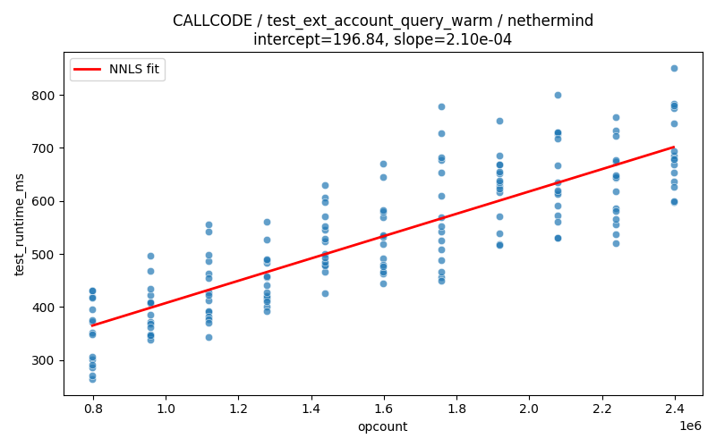

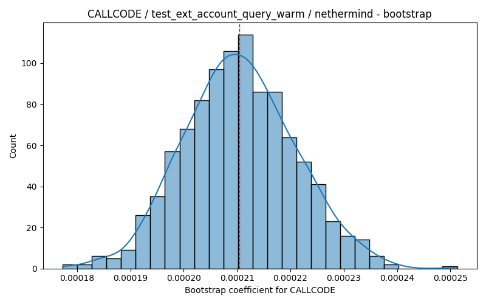

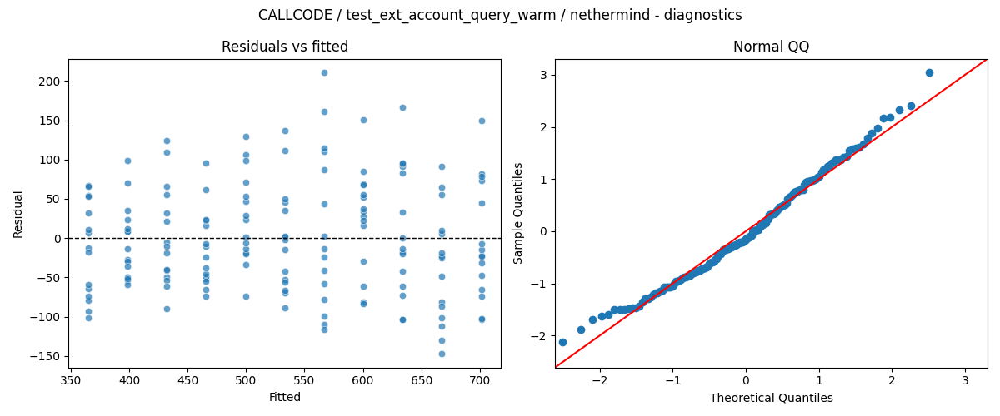

</details>

## DELEGATECALL

### test_account_access — combo `DELEGATECALL_AccountMode.EXISTING_EOA`

| client | nobs | R² | target_coef (ms) | p-value | 95% CI |
| --- | --- | --- | --- | --- | --- |
| `besu` | 418 | 0.7896 | 0.01418 | 1.00e-03 | [0.01352, 0.0149] |
| `erigon` | 198 | 0.9674 | 0.01038 | 1.00e-03 | [0.01015, 0.01046] |
| `ethrex` | 275 | 0.9938 | 0.007307 | 1.00e-03 | [0.007237, 0.00738] |
| `geth` | 264 | 0.9076 | 0.01113 | 1.00e-03 | [0.01065, 0.01159] |
| `nethermind` | 165 | 0.9245 | 0.003971 | 1.00e-03 | [0.003796, 0.004152] |

<details><summary>besu — NNLS regression summary</summary>

```
==============================================================================
                           NNLS Regression Results                            
==============================================================================
Dep. Variable:          test_runtime_ms              R-squared:          0.790
Model:                  NNLS                    Adj. R-squared:          0.789
No. Observations:       418                               RMSE:         173.98
Df Residuals:           416                                MAE:         149.72
Df Model:               1      
==============================================================================
                      coef     std err     P-value      [0.025      0.975]
------------------------------------------------------------------------------
         const    612.8766     26.1330       0.001    558.9338    661.3291
       opcount      0.0142      0.0004       0.001      0.0135      0.0149
==============================================================================
Notes: Non-negative least squares with bootstrap inference (1000 iterations)
==============================================================================
```

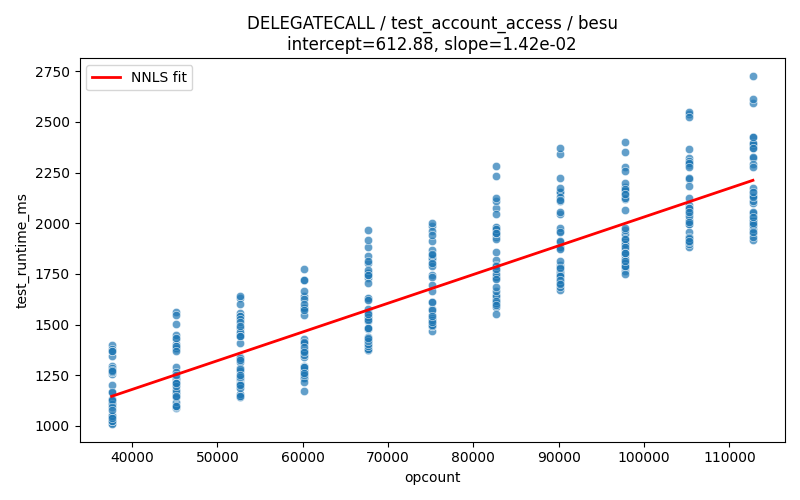

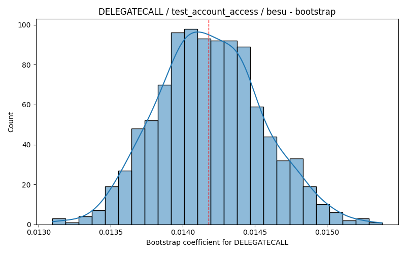

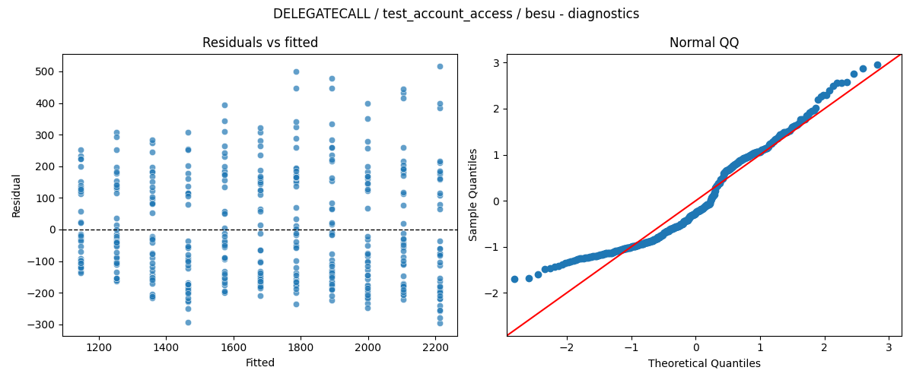

</details>

<details><summary>erigon — NNLS regression summary</summary>

```
==============================================================================
                           NNLS Regression Results                            
==============================================================================
Dep. Variable:          test_runtime_ms              R-squared:          0.967
Model:                  NNLS                    Adj. R-squared:          0.967
No. Observations:       198                               RMSE:          45.56
Df Residuals:           196                                MAE:          38.49
Df Model:               1      
==============================================================================
                      coef     std err     P-value      [0.025      0.975]
------------------------------------------------------------------------------
         const      0.0000      4.3071       1.000      0.0000     15.5026
       opcount      0.0104      0.0001       0.001      0.0102      0.0105
==============================================================================
Notes: Non-negative least squares with bootstrap inference (1000 iterations)
==============================================================================
```

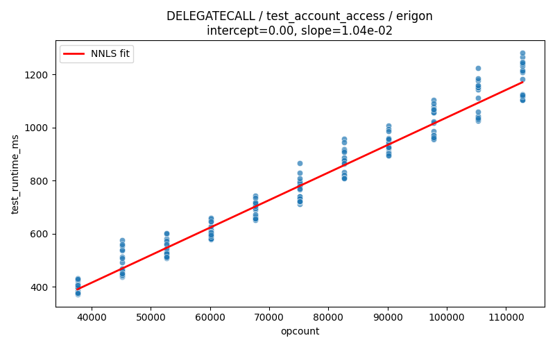

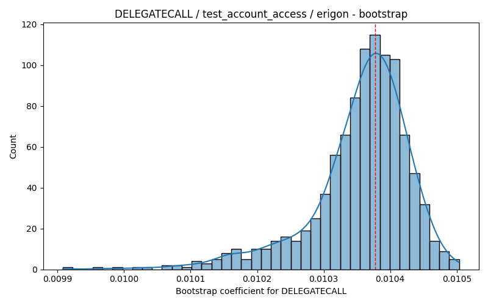

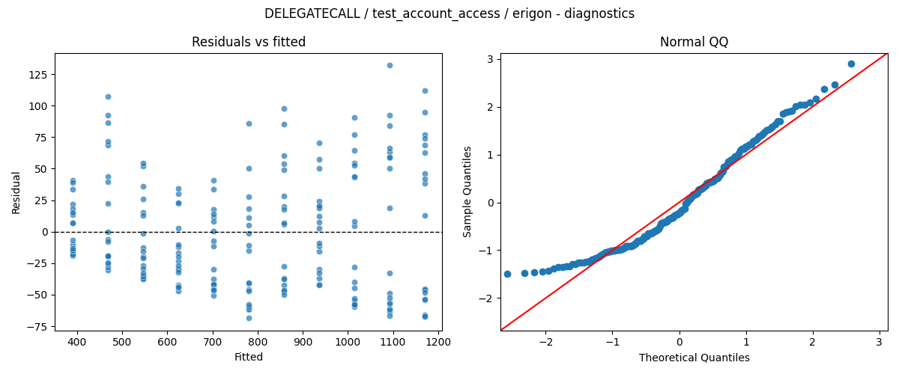

</details>

<details><summary>ethrex — NNLS regression summary</summary>

```
==============================================================================
                           NNLS Regression Results                            
==============================================================================
Dep. Variable:          test_runtime_ms              R-squared:          0.994
Model:                  NNLS                    Adj. R-squared:          0.994
No. Observations:       275                               RMSE:          13.73
Df Residuals:           273                                MAE:          10.80
Df Model:               1      
==============================================================================
                      coef     std err     P-value      [0.025      0.975]
------------------------------------------------------------------------------
         const     44.0497      2.6192       0.001     38.8704     49.2103
       opcount      0.0073      0.0000       0.001      0.0072      0.0074
==============================================================================
Notes: Non-negative least squares with bootstrap inference (1000 iterations)
==============================================================================
```

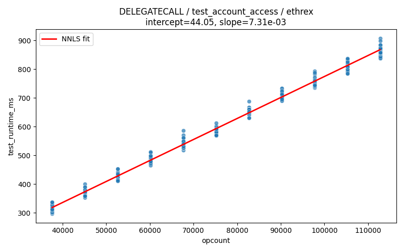

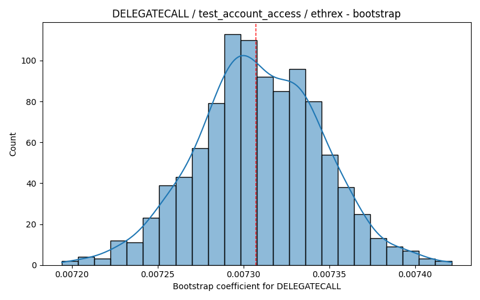

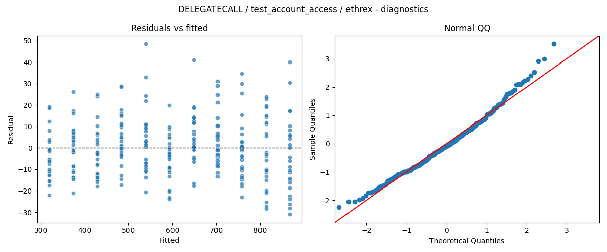

</details>

<details><summary>geth — NNLS regression summary</summary>

```
==============================================================================
                           NNLS Regression Results                            
==============================================================================
Dep. Variable:          test_runtime_ms              R-squared:          0.908
Model:                  NNLS                    Adj. R-squared:          0.907
No. Observations:       264                               RMSE:          84.41
Df Residuals:           262                                MAE:          71.55
Df Model:               1      
==============================================================================
                      coef     std err     P-value      [0.025      0.975]
------------------------------------------------------------------------------
         const    398.3130     19.8601       0.001    360.4880    438.3506
       opcount      0.0111      0.0002       0.001      0.0107      0.0116
==============================================================================
Notes: Non-negative least squares with bootstrap inference (1000 iterations)
==============================================================================
```

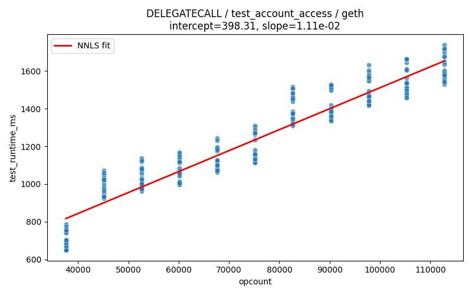

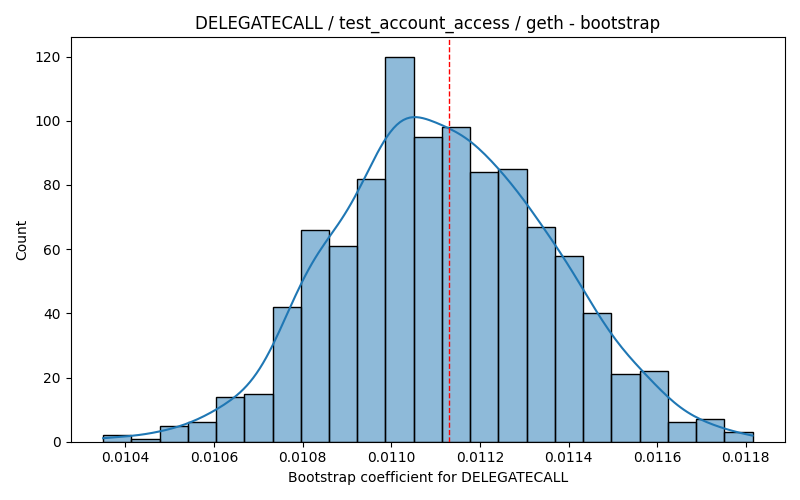

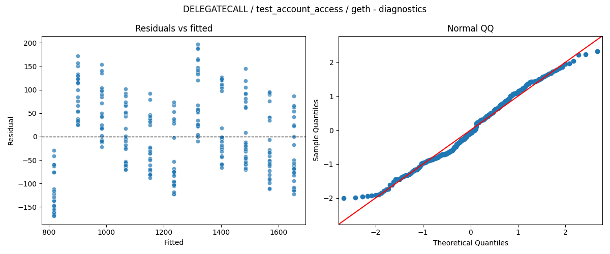

</details>

<details><summary>nethermind — NNLS regression summary</summary>

```
==============================================================================
                           NNLS Regression Results                            
==============================================================================
Dep. Variable:          test_runtime_ms              R-squared:          0.925
Model:                  NNLS                    Adj. R-squared:          0.924
No. Observations:       165                               RMSE:          26.98
Df Residuals:           163                                MAE:          22.04
Df Model:               1      
==============================================================================
                      coef     std err     P-value      [0.025      0.975]
------------------------------------------------------------------------------
         const    101.9994      6.5121       0.001     88.7902    114.2030
       opcount      0.0040      0.0001       0.001      0.0038      0.0042
==============================================================================
Notes: Non-negative least squares with bootstrap inference (1000 iterations)
==============================================================================
```

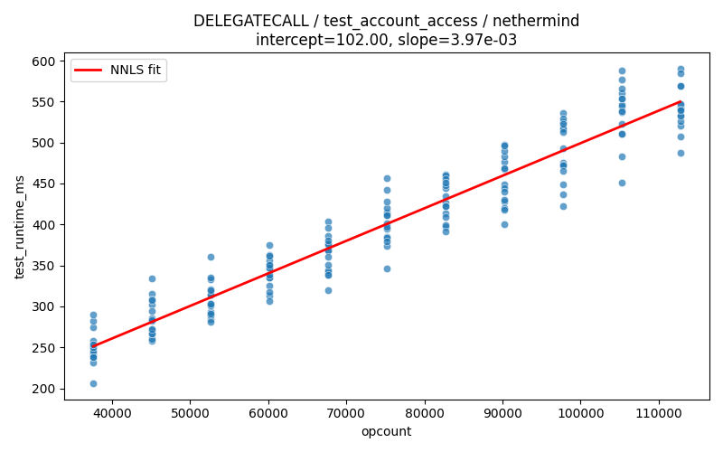

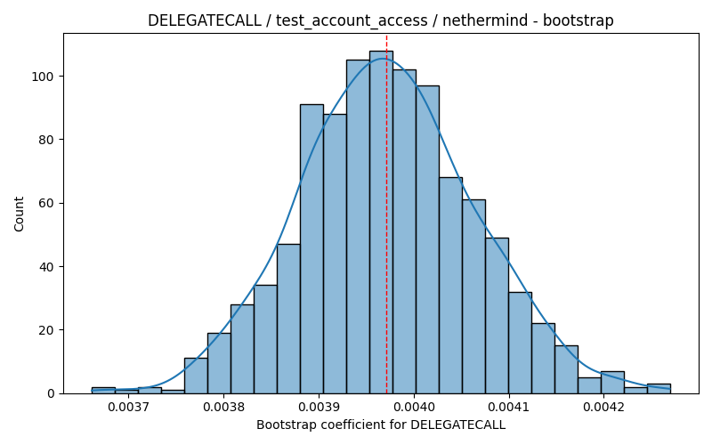

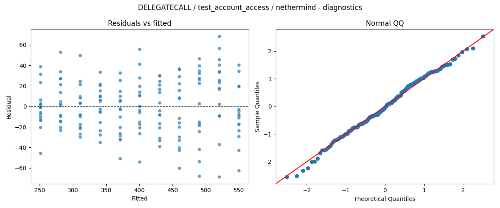

</details>

### test_account_access — combo `DELEGATECALL_AccountMode.NON_EXISTING_ACCOUNT` — `presets[cold_account_nocode_access]`

| client | nobs | R² | target_coef (ms) | p-value | 95% CI |
| --- | --- | --- | --- | --- | --- |
| `besu` | 418 | 0.8589 | 0.01447 | 1.00e-03 | [0.0139, 0.01504] |
| `erigon` | 198 | 0.9692 | 0.009518 | 1.00e-03 | [0.009405, 0.0096] |
| `ethrex` | 275 | 0.9645 | 0.002074 | 1.00e-03 | [0.002025, 0.002124] |
| `geth` | 264 | 0.8709 | 0.02219 | 1.00e-03 | [0.02107, 0.02327] |
| `nethermind` | 165 | 0.9052 | 0.003512 | 1.00e-03 | [0.003336, 0.003683] |

<details><summary>besu — NNLS regression summary</summary>

```
==============================================================================
                           NNLS Regression Results                            
==============================================================================
Dep. Variable:          test_runtime_ms              R-squared:          0.859
Model:                  NNLS                    Adj. R-squared:          0.859
No. Observations:       418                               RMSE:         139.41
Df Residuals:           416                                MAE:         119.13
Df Model:               1      
==============================================================================
                      coef     std err     P-value      [0.025      0.975]
------------------------------------------------------------------------------
         const    290.7376     21.2455       0.001    248.4816    332.7733
       opcount      0.0145      0.0003       0.001      0.0139      0.0150
==============================================================================
Notes: Non-negative least squares with bootstrap inference (1000 iterations)
==============================================================================
```

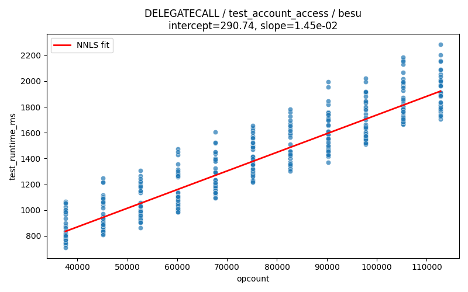

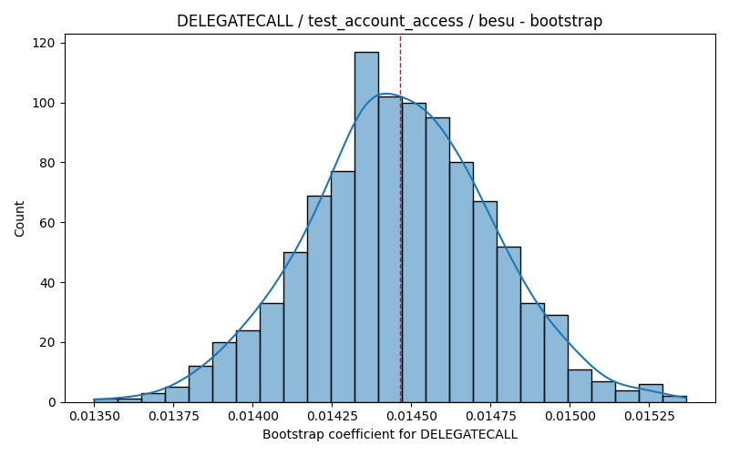

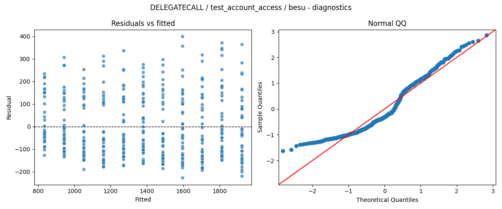

</details>

<details><summary>erigon — NNLS regression summary</summary>

```
==============================================================================
                           NNLS Regression Results                            
==============================================================================
Dep. Variable:          test_runtime_ms              R-squared:          0.969
Model:                  NNLS                    Adj. R-squared:          0.969
No. Observations:       198                               RMSE:          40.89
Df Residuals:           196                                MAE:          34.03
Df Model:               1      
==============================================================================
                      coef     std err     P-value      [0.025      0.975]
------------------------------------------------------------------------------
         const      0.0000      1.3757       1.000      0.0000      5.0561
       opcount      0.0095      0.0000       0.001      0.0094      0.0096
==============================================================================
Notes: Non-negative least squares with bootstrap inference (1000 iterations)
==============================================================================
```


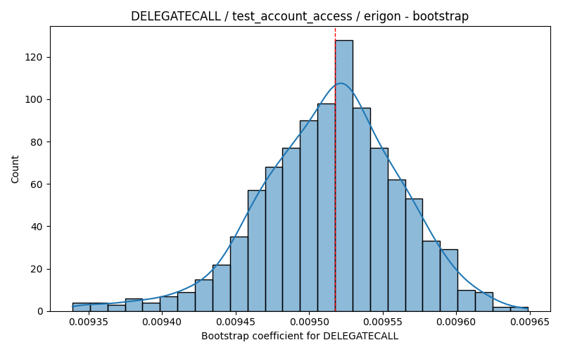

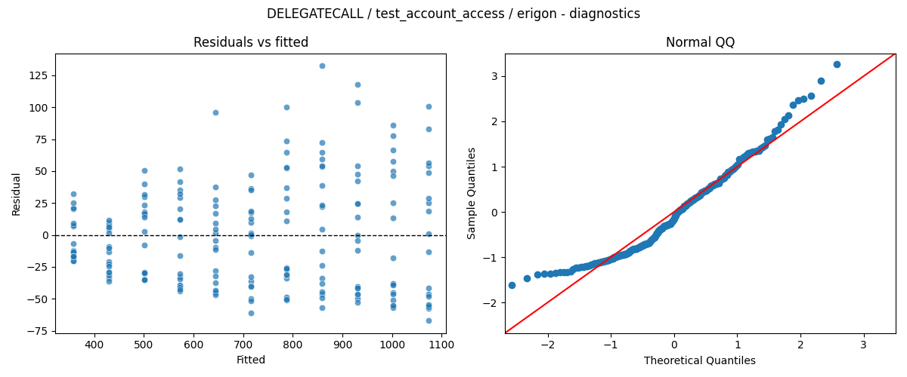

</details>

<details><summary>ethrex — NNLS regression summary</summary>

```
==============================================================================
                           NNLS Regression Results                            
==============================================================================
Dep. Variable:          test_runtime_ms              R-squared:          0.964
Model:                  NNLS                    Adj. R-squared:          0.964
No. Observations:       275                               RMSE:           9.46
Df Residuals:           273                                MAE:           7.45
Df Model:               1      
==============================================================================
                      coef     std err     P-value      [0.025      0.975]
------------------------------------------------------------------------------
         const     26.7119      1.8160       0.001     23.2048     30.6046
       opcount      0.0021      0.0000       0.001      0.0020      0.0021
==============================================================================
Notes: Non-negative least squares with bootstrap inference (1000 iterations)
==============================================================================
```

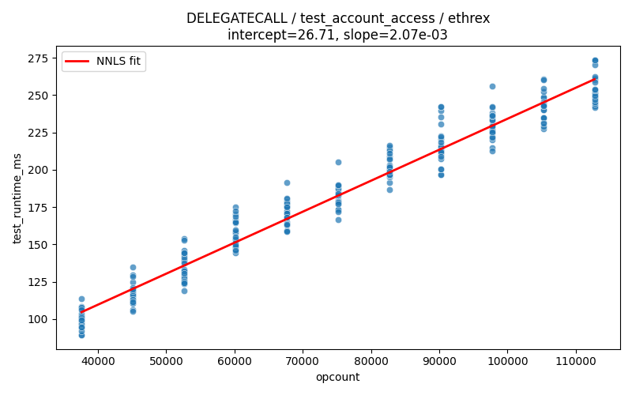

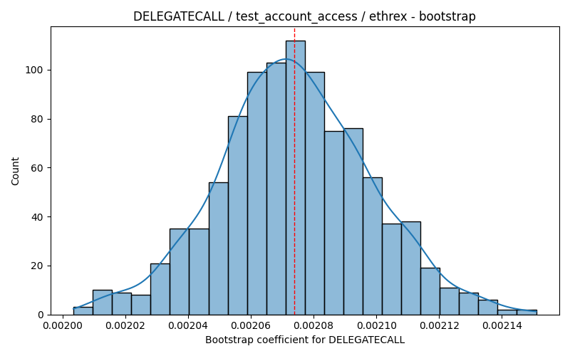

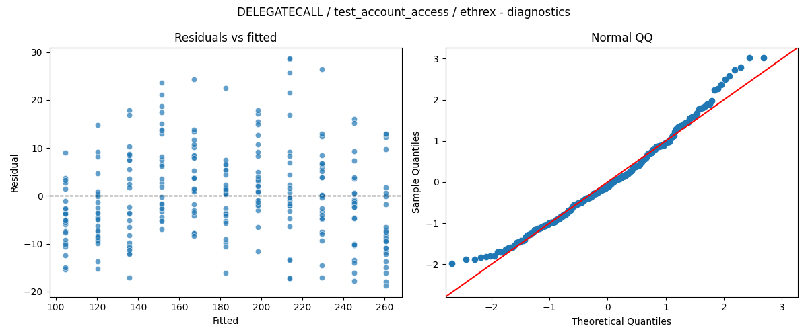

</details>

<details><summary>geth — NNLS regression summary</summary>

```
==============================================================================
                           NNLS Regression Results                            
==============================================================================
Dep. Variable:          test_runtime_ms              R-squared:          0.871
Model:                  NNLS                    Adj. R-squared:          0.870
No. Observations:       264                               RMSE:         203.18
Df Residuals:           262                                MAE:         172.41
Df Model:               1      
==============================================================================
                      coef     std err     P-value      [0.025      0.975]
------------------------------------------------------------------------------
         const    695.5042     47.1423       0.001    604.9578    789.5954
       opcount      0.0222      0.0005       0.001      0.0211      0.0233
==============================================================================
Notes: Non-negative least squares with bootstrap inference (1000 iterations)
==============================================================================
```

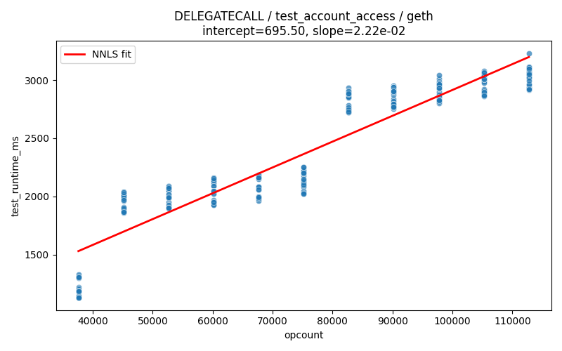

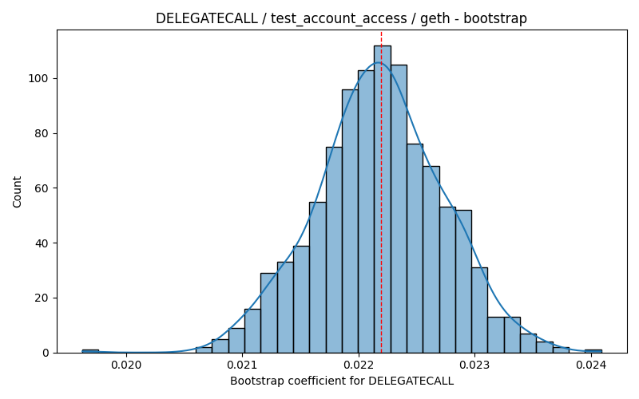

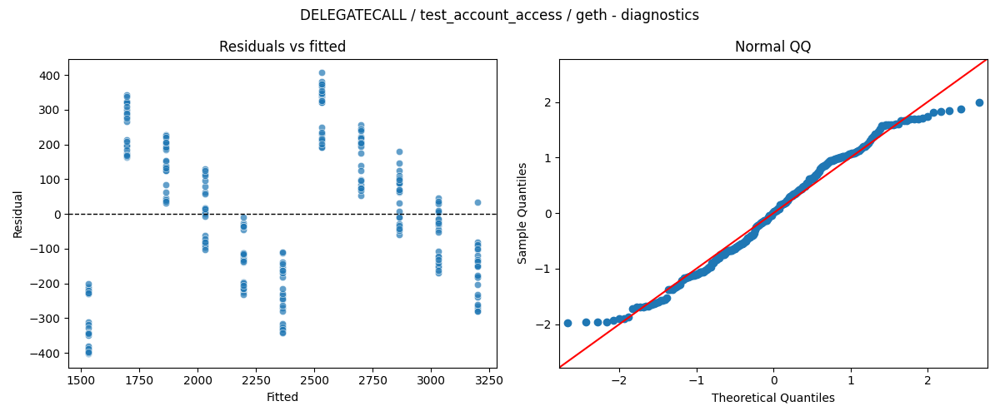

</details>

<details><summary>nethermind — NNLS regression summary</summary>

```
==============================================================================
                           NNLS Regression Results                            
==============================================================================
Dep. Variable:          test_runtime_ms              R-squared:          0.905
Model:                  NNLS                    Adj. R-squared:          0.905
No. Observations:       165                               RMSE:          27.02
Df Residuals:           163                                MAE:          21.78
Df Model:               1      
==============================================================================
                      coef     std err     P-value      [0.025      0.975]
------------------------------------------------------------------------------
         const     96.2445      6.4017       0.001     83.6715    108.8511
       opcount      0.0035      0.0001       0.001      0.0033      0.0037
==============================================================================
Notes: Non-negative least squares with bootstrap inference (1000 iterations)
==============================================================================
```

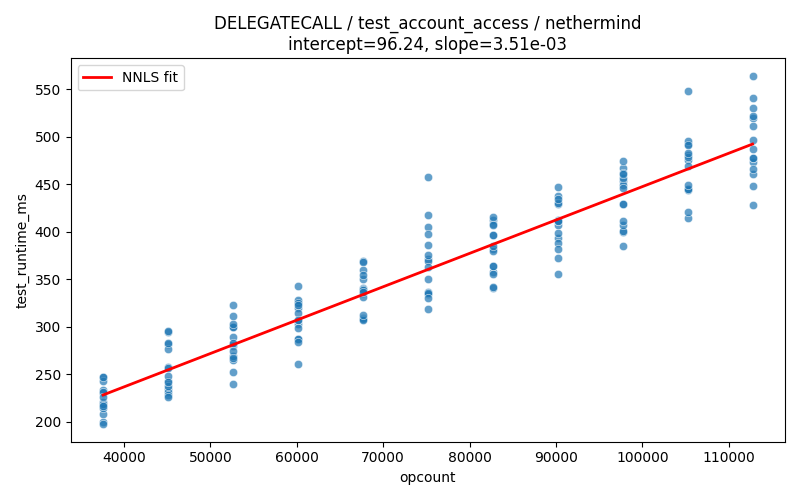

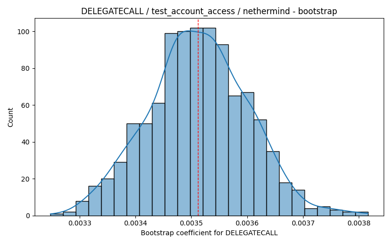

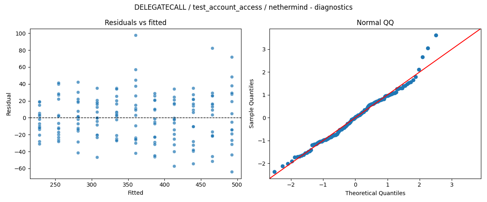

</details>

### test_account_access — combo `DELEGATECALL_AccountMode.EXISTING_CONTRACT`

| client | nobs | R² | target_coef (ms) | p-value | 95% CI |
| --- | --- | --- | --- | --- | --- |
| `besu` | 418 | 0.8715 | 0.02706 | 1.00e-03 | [0.02617, 0.0279] |
| `erigon` | 198 | 0.9235 | 0.02525 | 1.00e-03 | [0.02427, 0.0261] |
| `ethrex` | 275 | 0.9936 | 0.007902 | 1.00e-03 | [0.007822, 0.00798] |
| `geth` | 264 | 0.8626 | 0.02342 | 1.00e-03 | [0.02226, 0.02455] |
| `nethermind` | 165 | 0.8616 | 0.01102 | 1.00e-03 | [0.01041, 0.01169] |

<details><summary>besu — NNLS regression summary</summary>

```
==============================================================================
                           NNLS Regression Results                            
==============================================================================
Dep. Variable:          test_runtime_ms              R-squared:          0.871
Model:                  NNLS                    Adj. R-squared:          0.871
No. Observations:       418                               RMSE:         211.73
Df Residuals:           416                                MAE:         176.15
Df Model:               1      
==============================================================================
                      coef     std err     P-value      [0.025      0.975]
------------------------------------------------------------------------------
         const    478.2820     29.9671       0.001    423.2064    539.3494
       opcount      0.0271      0.0004       0.001      0.0262      0.0279
==============================================================================
Notes: Non-negative least squares with bootstrap inference (1000 iterations)
==============================================================================
```

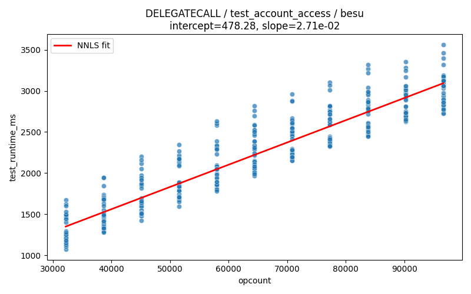

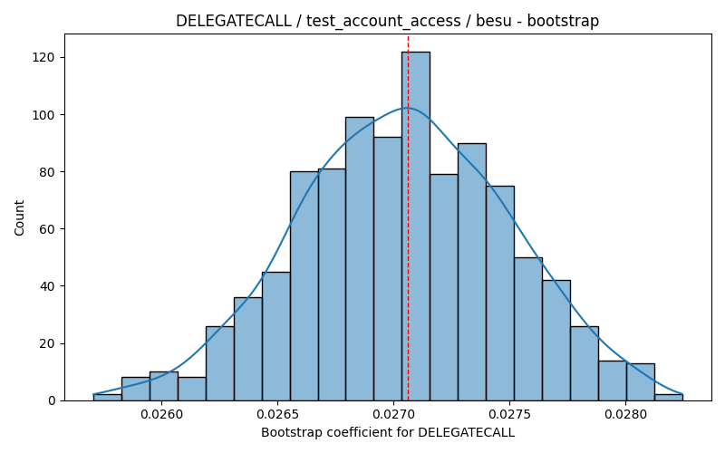

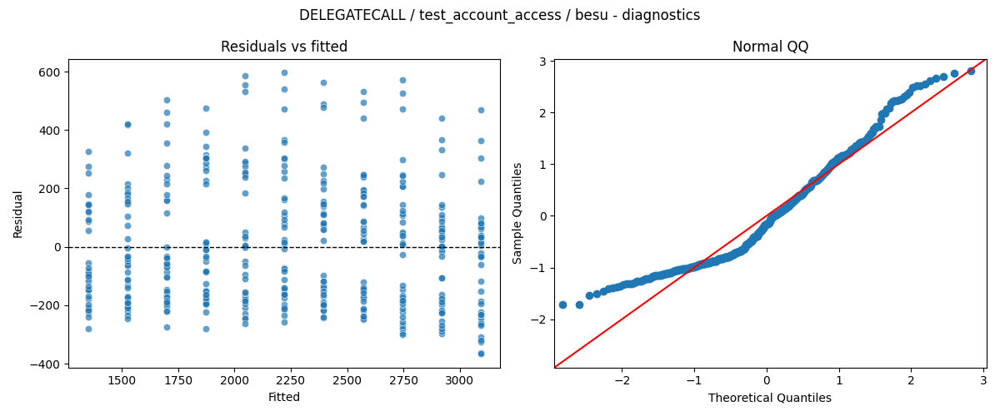

</details>

<details><summary>erigon — NNLS regression summary</summary>

```
==============================================================================
                           NNLS Regression Results                            
==============================================================================
Dep. Variable:          test_runtime_ms              R-squared:          0.924
Model:                  NNLS                    Adj. R-squared:          0.923
No. Observations:       198                               RMSE:         148.04
Df Residuals:           196                                MAE:         125.34
Df Model:               1      
==============================================================================
                      coef     std err     P-value      [0.025      0.975]
------------------------------------------------------------------------------
         const    311.5800     33.7466       0.001    252.3328    383.3151
       opcount      0.0253      0.0005       0.001      0.0243      0.0261
==============================================================================
Notes: Non-negative least squares with bootstrap inference (1000 iterations)
==============================================================================
```

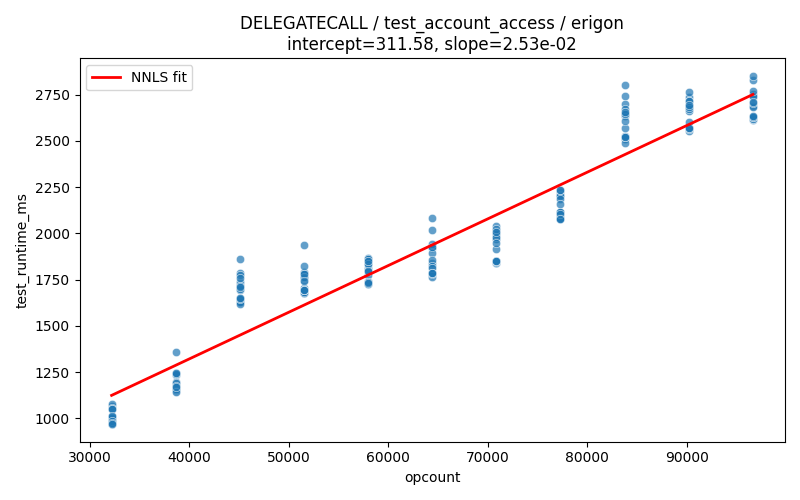

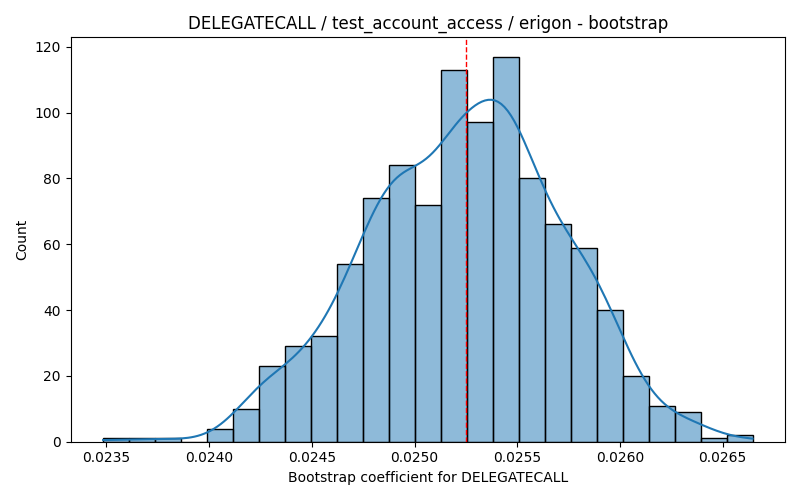

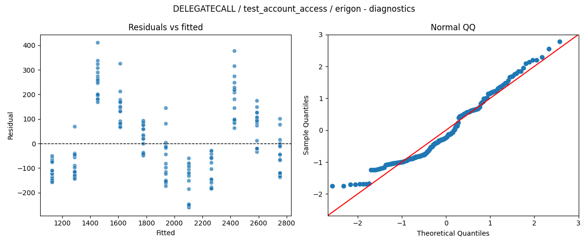

</details>

<details><summary>ethrex — NNLS regression summary</summary>

```
==============================================================================
                           NNLS Regression Results                            
==============================================================================
Dep. Variable:          test_runtime_ms              R-squared:          0.994
Model:                  NNLS                    Adj. R-squared:          0.994
No. Observations:       275                               RMSE:          12.90
Df Residuals:           273                                MAE:          10.23
Df Model:               1      
==============================================================================
                      coef     std err     P-value      [0.025      0.975]
------------------------------------------------------------------------------
         const     39.7592      2.4844       0.001     35.1110     44.5984
       opcount      0.0079      0.0000       0.001      0.0078      0.0080
==============================================================================
Notes: Non-negative least squares with bootstrap inference (1000 iterations)
==============================================================================
```

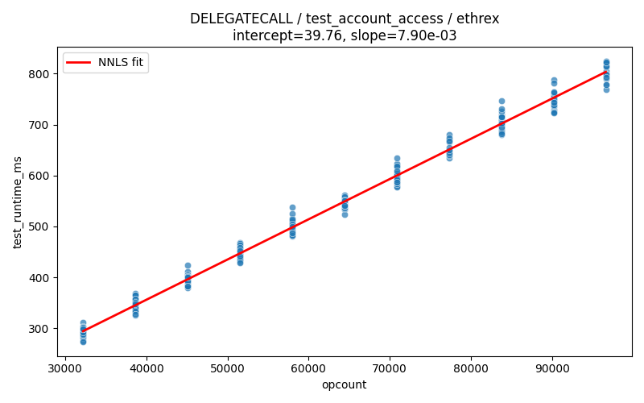

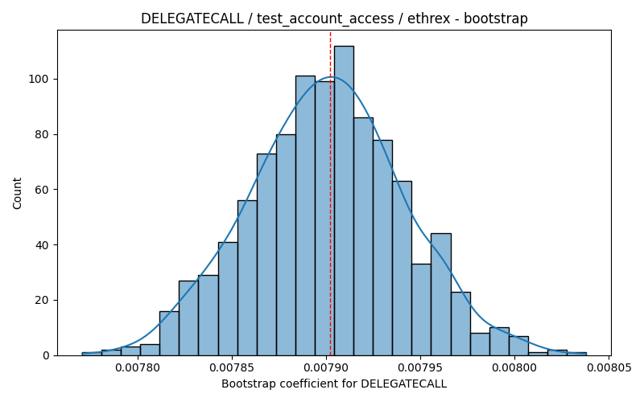

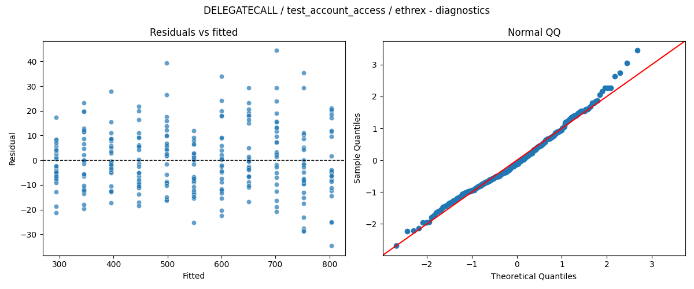

</details>

<details><summary>geth — NNLS regression summary</summary>

```
==============================================================================
                           NNLS Regression Results                            
==============================================================================
Dep. Variable:          test_runtime_ms              R-squared:          0.863
Model:                  NNLS                    Adj. R-squared:          0.862
No. Observations:       264                               RMSE:         190.38
Df Residuals:           262                                MAE:         160.10
Df Model:               1      
==============================================================================
                      coef     std err     P-value      [0.025      0.975]
------------------------------------------------------------------------------
         const    648.6146     43.2089       0.001    563.5283    731.1236
       opcount      0.0234      0.0006       0.001      0.0223      0.0245
==============================================================================
Notes: Non-negative least squares with bootstrap inference (1000 iterations)
==============================================================================
```

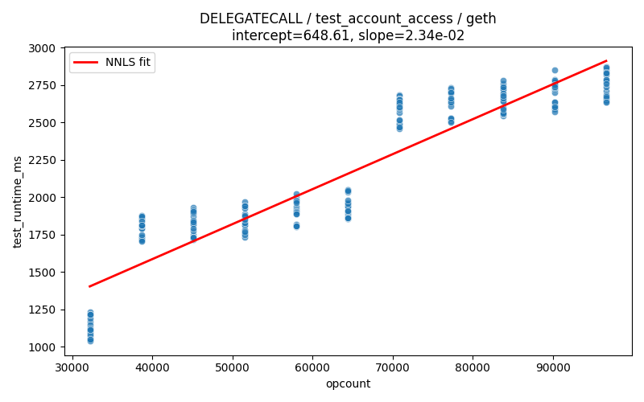

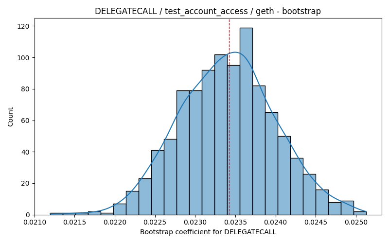

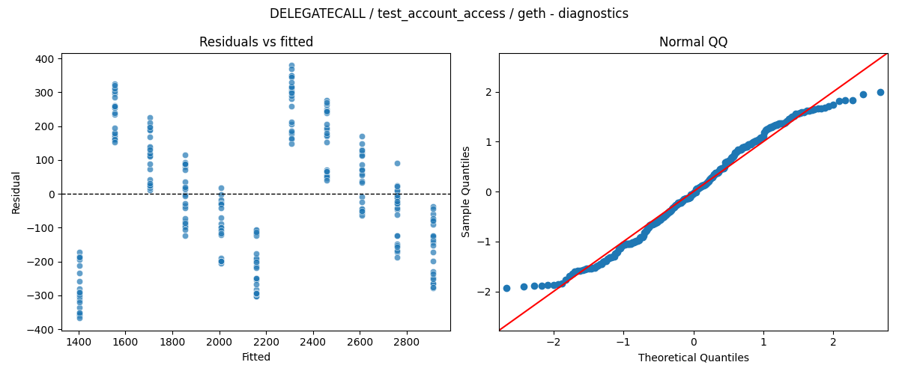

</details>

<details><summary>nethermind — NNLS regression summary</summary>

```
==============================================================================
                           NNLS Regression Results                            
==============================================================================
Dep. Variable:          test_runtime_ms              R-squared:          0.862
Model:                  NNLS                    Adj. R-squared:          0.861
No. Observations:       165                               RMSE:          89.99
Df Residuals:           163                                MAE:          60.22
Df Model:               1      
==============================================================================
                      coef     std err     P-value      [0.025      0.975]
------------------------------------------------------------------------------
         const    164.6169     19.9558       0.001    126.7161    204.7251
       opcount      0.0110      0.0003       0.001      0.0104      0.0117
==============================================================================
Notes: Non-negative least squares with bootstrap inference (1000 iterations)
==============================================================================
```


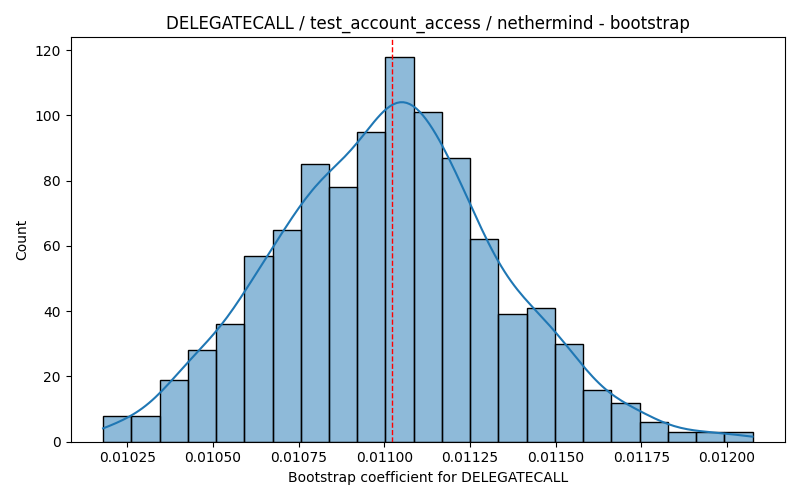

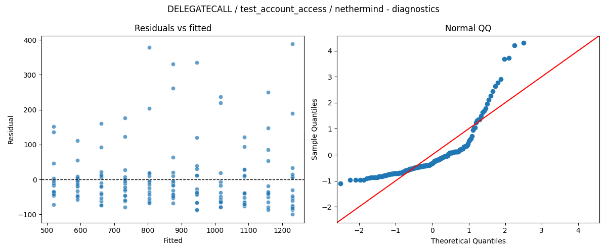

</details>

### test_account_access — combo `DELEGATECALL_AccountMode.NON_EXISTING_ACCOUNT` — `presets[cold_account_code_access]`

| client | nobs | R² | target_coef (ms) | p-value | 95% CI |
| --- | --- | --- | --- | --- | --- |
| `besu` | 418 | 0.8589 | 0.01447 | 1.00e-03 | [0.0139, 0.01504] |
| `erigon` | 198 | 0.9692 | 0.009518 | 1.00e-03 | [0.009405, 0.0096] |
| `ethrex` | 275 | 0.9645 | 0.002074 | 1.00e-03 | [0.002025, 0.002124] |
| `geth` | 264 | 0.8709 | 0.02219 | 1.00e-03 | [0.02107, 0.02327] |
| `nethermind` | 165 | 0.9052 | 0.003512 | 1.00e-03 | [0.003336, 0.003683] |

<details><summary>besu — NNLS regression summary</summary>

```
==============================================================================
                           NNLS Regression Results                            
==============================================================================
Dep. Variable:          test_runtime_ms              R-squared:          0.859
Model:                  NNLS                    Adj. R-squared:          0.859
No. Observations:       418                               RMSE:         139.41
Df Residuals:           416                                MAE:         119.13
Df Model:               1      
==============================================================================
                      coef     std err     P-value      [0.025      0.975]
------------------------------------------------------------------------------
         const    290.7376     21.2455       0.001    248.4816    332.7733
       opcount      0.0145      0.0003       0.001      0.0139      0.0150
==============================================================================
Notes: Non-negative least squares with bootstrap inference (1000 iterations)
==============================================================================
```


</details>

<details><summary>erigon — NNLS regression summary</summary>

```
==============================================================================
                           NNLS Regression Results                            
==============================================================================
Dep. Variable:          test_runtime_ms              R-squared:          0.969
Model:                  NNLS                    Adj. R-squared:          0.969
No. Observations:       198                               RMSE:          40.89
Df Residuals:           196                                MAE:          34.03
Df Model:               1      
==============================================================================
                      coef     std err     P-value      [0.025      0.975]
------------------------------------------------------------------------------
         const      0.0000      1.3757       1.000      0.0000      5.0561
       opcount      0.0095      0.0000       0.001      0.0094      0.0096
==============================================================================
Notes: Non-negative least squares with bootstrap inference (1000 iterations)
==============================================================================
```


</details>

<details><summary>ethrex — NNLS regression summary</summary>

```
==============================================================================
                           NNLS Regression Results                            
==============================================================================
Dep. Variable:          test_runtime_ms              R-squared:          0.964
Model:                  NNLS                    Adj. R-squared:          0.964
No. Observations:       275                               RMSE:           9.46
Df Residuals:           273                                MAE:           7.45
Df Model:               1      
==============================================================================
                      coef     std err     P-value      [0.025      0.975]
------------------------------------------------------------------------------
         const     26.7119      1.8160       0.001     23.2048     30.6046
       opcount      0.0021      0.0000       0.001      0.0020      0.0021
==============================================================================
Notes: Non-negative least squares with bootstrap inference (1000 iterations)
==============================================================================
```


</details>

<details><summary>geth — NNLS regression summary</summary>

```
==============================================================================
                           NNLS Regression Results                            
==============================================================================
Dep. Variable:          test_runtime_ms              R-squared:          0.871
Model:                  NNLS                    Adj. R-squared:          0.870
No. Observations:       264                               RMSE:         203.18
Df Residuals:           262                                MAE:         172.41
Df Model:               1      
==============================================================================
                      coef     std err     P-value      [0.025      0.975]
------------------------------------------------------------------------------
         const    695.5042     47.1423       0.001    604.9578    789.5954
       opcount      0.0222      0.0005       0.001      0.0211      0.0233
==============================================================================
Notes: Non-negative least squares with bootstrap inference (1000 iterations)
==============================================================================
```


</details>

<details><summary>nethermind — NNLS regression summary</summary>

```
==============================================================================
                           NNLS Regression Results                            
==============================================================================
Dep. Variable:          test_runtime_ms              R-squared:          0.905
Model:                  NNLS                    Adj. R-squared:          0.905
No. Observations:       165                               RMSE:          27.02
Df Residuals:           163                                MAE:          21.78
Df Model:               1      
==============================================================================
                      coef     std err     P-value      [0.025      0.975]
------------------------------------------------------------------------------
         const     96.2445      6.4017       0.001     83.6715    108.8511
       opcount      0.0035      0.0001       0.001      0.0033      0.0037
==============================================================================
Notes: Non-negative least squares with bootstrap inference (1000 iterations)
==============================================================================
```


</details>

### test_ext_account_query_warm — combo `DELEGATECALL`

| client | nobs | R² | target_coef (ms) | p-value | 95% CI |
| --- | --- | --- | --- | --- | --- |
| `besu` | 418 | 0.6433 | 0.0003839 | 1.00e-03 | [0.0003599, 0.0004071] |
| `erigon` | 198 | 0.9232 | 0.0003045 | 1.00e-03 | [0.0002918, 0.0003176] |
| `ethrex` | 275 | 0.9481 | 0.0001035 | 1.00e-03 | [0.0001007, 0.0001065] |
| `geth` | 264 | 0.8698 | 0.0001614 | 1.00e-03 | [0.0001541, 0.0001693] |
| `nethermind` | 165 | 0.7412 | 0.000295 | 1.00e-03 | [0.0002691, 0.0003233] |

<details><summary>besu — NNLS regression summary</summary>

```
==============================================================================
                           NNLS Regression Results                            
==============================================================================
Dep. Variable:          test_runtime_ms              R-squared:          0.643
Model:                  NNLS                    Adj. R-squared:          0.642
No. Observations:       418                               RMSE:         147.97
Df Residuals:           416                                MAE:         114.27
Df Model:               1      
==============================================================================
                      coef     std err     P-value      [0.025      0.975]
------------------------------------------------------------------------------
         const    501.8219     19.2656       0.001    465.4889    541.7204
       opcount      0.0004      0.0000       0.001      0.0004      0.0004
==============================================================================
Notes: Non-negative least squares with bootstrap inference (1000 iterations)
==============================================================================
```

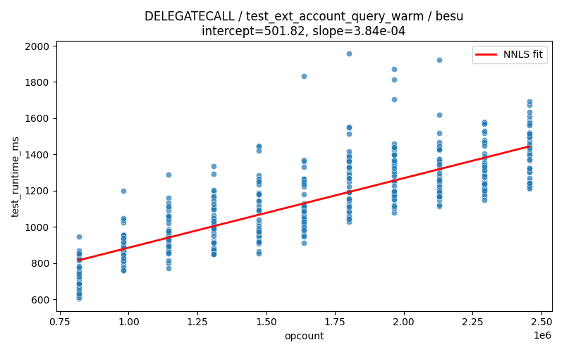

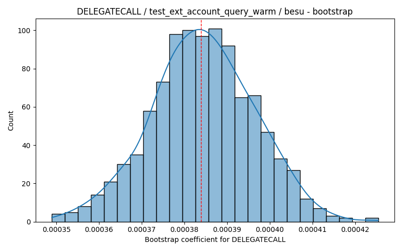

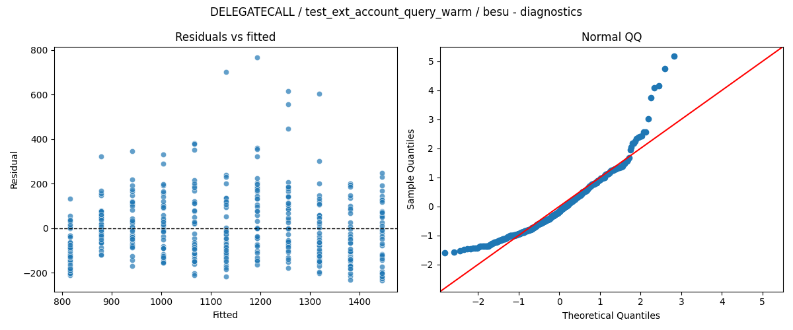

</details>

<details><summary>erigon — NNLS regression summary</summary>

```
==============================================================================
                           NNLS Regression Results                            
==============================================================================
Dep. Variable:          test_runtime_ms              R-squared:          0.923
Model:                  NNLS                    Adj. R-squared:          0.923
No. Observations:       198                               RMSE:          45.45
Df Residuals:           196                                MAE:          36.14
Df Model:               1      
==============================================================================
                      coef     std err     P-value      [0.025      0.975]
------------------------------------------------------------------------------
         const     45.4836      9.8424       0.001     25.4314     64.3845
       opcount      0.0003      0.0000       0.001      0.0003      0.0003
==============================================================================
Notes: Non-negative least squares with bootstrap inference (1000 iterations)
==============================================================================
```

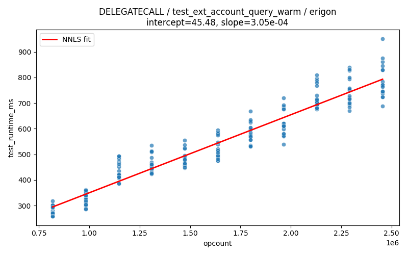

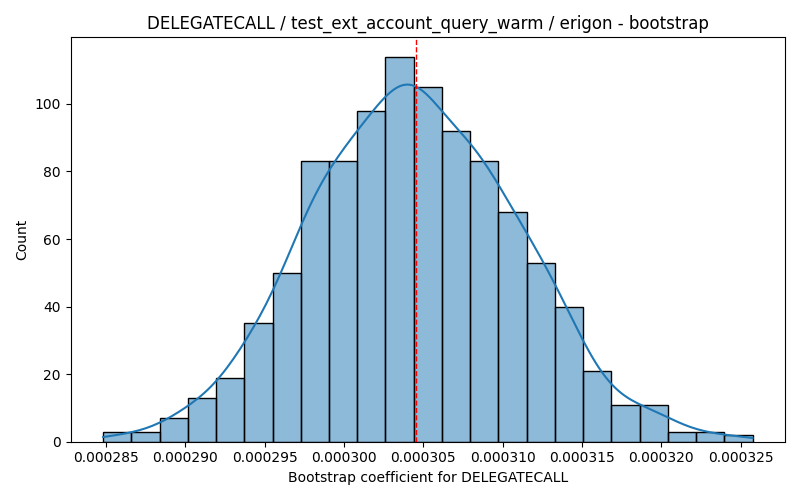

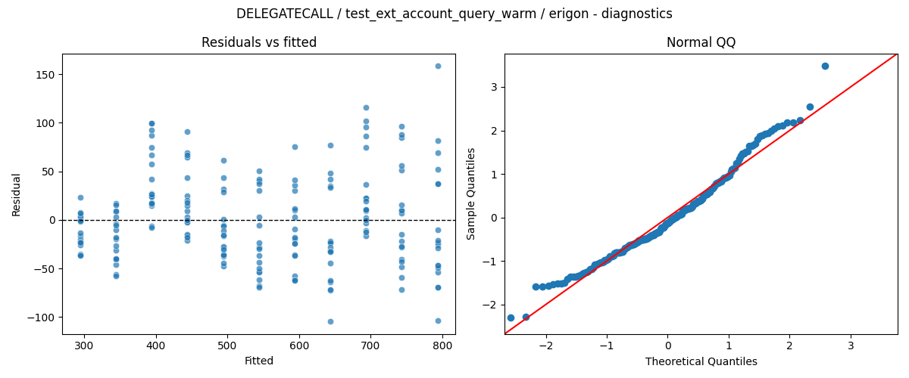

</details>

<details><summary>ethrex — NNLS regression summary</summary>

```
==============================================================================
                           NNLS Regression Results                            
==============================================================================
Dep. Variable:          test_runtime_ms              R-squared:          0.948
Model:                  NNLS                    Adj. R-squared:          0.948
No. Observations:       275                               RMSE:          12.53
Df Residuals:           273                                MAE:           9.89
Df Model:               1      
==============================================================================
                      coef     std err     P-value      [0.025      0.975]
------------------------------------------------------------------------------
         const     31.5682      2.4368       0.001     26.7004     36.2324
       opcount      0.0001      0.0000       0.001      0.0001      0.0001
==============================================================================
Notes: Non-negative least squares with bootstrap inference (1000 iterations)
==============================================================================
```

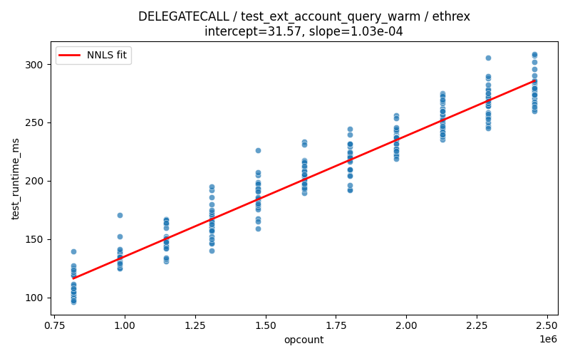

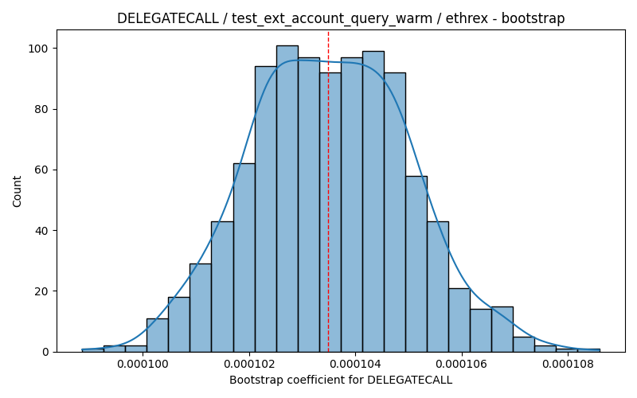

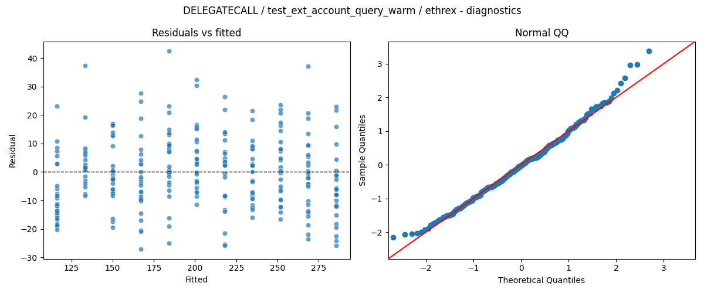

</details>

<details><summary>geth — NNLS regression summary</summary>

```
==============================================================================
                           NNLS Regression Results                            
==============================================================================
Dep. Variable:          test_runtime_ms              R-squared:          0.870
Model:                  NNLS                    Adj. R-squared:          0.869
No. Observations:       264                               RMSE:          32.33
Df Residuals:           262                                MAE:          24.66
Df Model:               1      
==============================================================================
                      coef     std err     P-value      [0.025      0.975]
------------------------------------------------------------------------------
         const     31.4062      5.9156       0.001     19.7476     42.7265
       opcount      0.0002      0.0000       0.001      0.0002      0.0002
==============================================================================
Notes: Non-negative least squares with bootstrap inference (1000 iterations)
==============================================================================
```

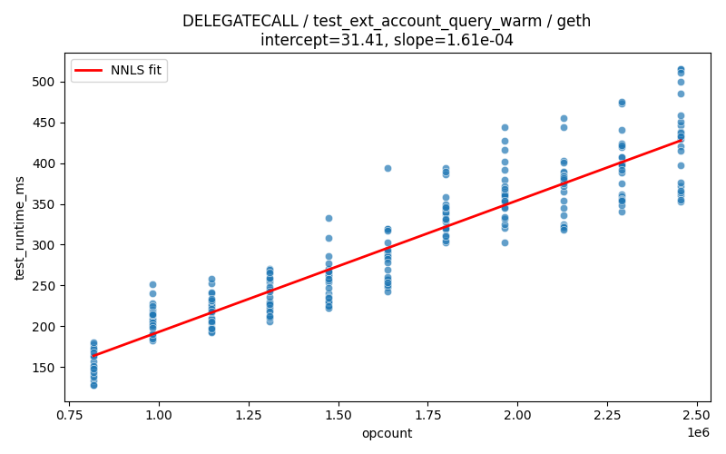

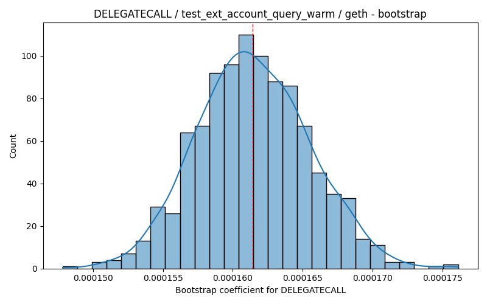

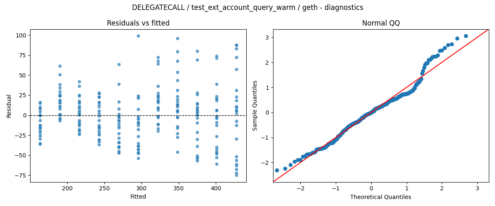

</details>

<details><summary>nethermind — NNLS regression summary</summary>

```
==============================================================================
                           NNLS Regression Results                            
==============================================================================
Dep. Variable:          test_runtime_ms              R-squared:          0.741
Model:                  NNLS                    Adj. R-squared:          0.740
No. Observations:       165                               RMSE:          90.23
Df Residuals:           163                                MAE:          67.46
Df Model:               1      
==============================================================================
                      coef     std err     P-value      [0.025      0.975]
------------------------------------------------------------------------------
         const    211.2670     21.2485       0.001    168.4594    250.5486
       opcount      0.0003      0.0000       0.001      0.0003      0.0003
==============================================================================
Notes: Non-negative least squares with bootstrap inference (1000 iterations)
==============================================================================
```

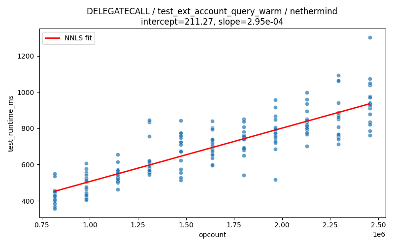

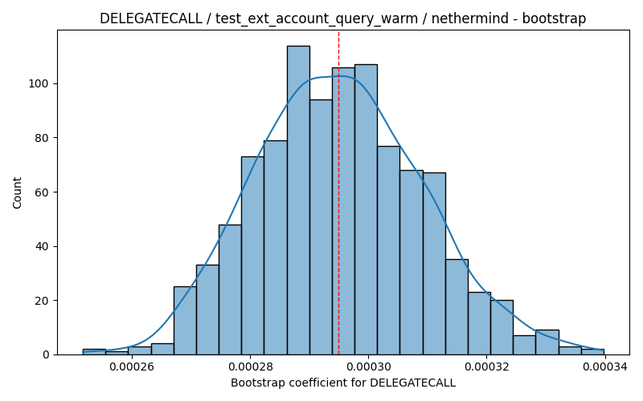

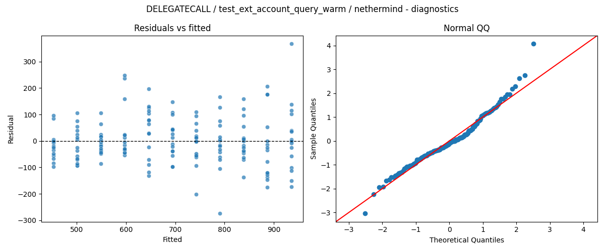

</details>

## EXTCODECOPY

### test_account_access — combo `EXTCODECOPY_AccountMode.NON_EXISTING_ACCOUNT` — `presets[cold_account_nocode_access]`

| client | nobs | R² | target_coef (ms) | p-value | 95% CI |
| --- | --- | --- | --- | --- | --- |
| `besu` | 418 | 0.2445 | 0.000243 | 1.00e-03 | [0.0002031, 0.0002805] |
| `erigon` | 198 | 0.8608 | 8.099e-05 | 1.00e-03 | [7.629e-05, 8.608e-05] |
| `ethrex` | 275 | 0.319 | 3.707e-05 | 1.00e-03 | [3.129e-05, 4.302e-05] |
| `geth` | 264 | 0.933 | 0.0003482 | 1.00e-03 | [0.000336, 0.000361] |
| `nethermind` | 165 | 0.6748 | 0.0003458 | 1.00e-03 | [0.0003105, 0.0003812] |

<details><summary>besu — NNLS regression summary</summary>

```
==============================================================================
                           NNLS Regression Results                            
==============================================================================
Dep. Variable:          test_runtime_ms              R-squared:          0.244
Model:                  NNLS                    Adj. R-squared:          0.243
No. Observations:       418                               RMSE:         109.65
Df Residuals:           416                                MAE:          87.74
Df Model:               1      
==============================================================================
                      coef     std err     P-value      [0.025      0.975]
------------------------------------------------------------------------------
         const    211.9447     16.0432       0.001    181.8692    242.3609
       opcount      0.0002      0.0000       0.001      0.0002      0.0003
==============================================================================
Notes: Non-negative least squares with bootstrap inference (1000 iterations)
==============================================================================
```

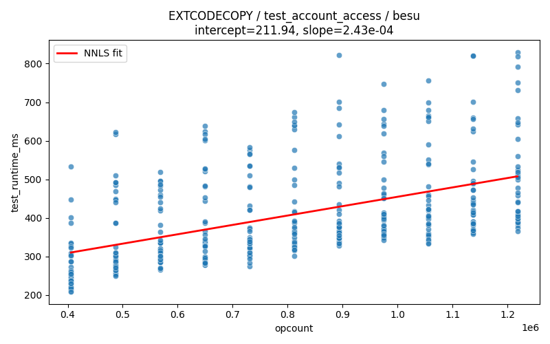

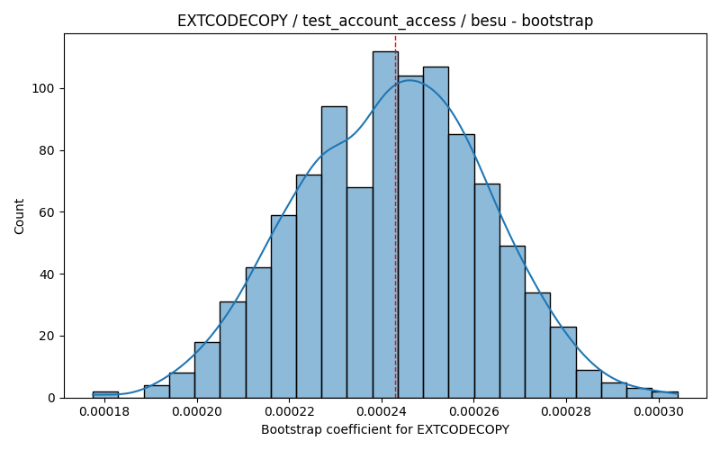

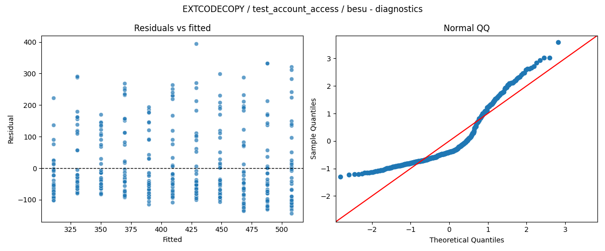

</details>

<details><summary>erigon — NNLS regression summary</summary>

```
==============================================================================
                           NNLS Regression Results                            
==============================================================================
Dep. Variable:          test_runtime_ms              R-squared:          0.861
Model:                  NNLS                    Adj. R-squared:          0.860
No. Observations:       198                               RMSE:           8.36
Df Residuals:           196                                MAE:           6.35
Df Model:               1      
==============================================================================
                      coef     std err     P-value      [0.025      0.975]
------------------------------------------------------------------------------
         const     26.7953      1.8321       0.001     23.1230     30.4755
       opcount      0.0001      0.0000       0.001      0.0001      0.0001
==============================================================================
Notes: Non-negative least squares with bootstrap inference (1000 iterations)
==============================================================================
```

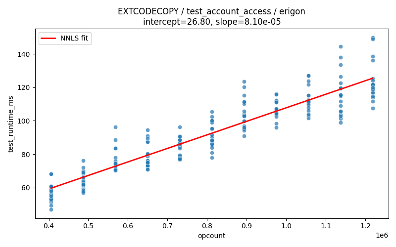

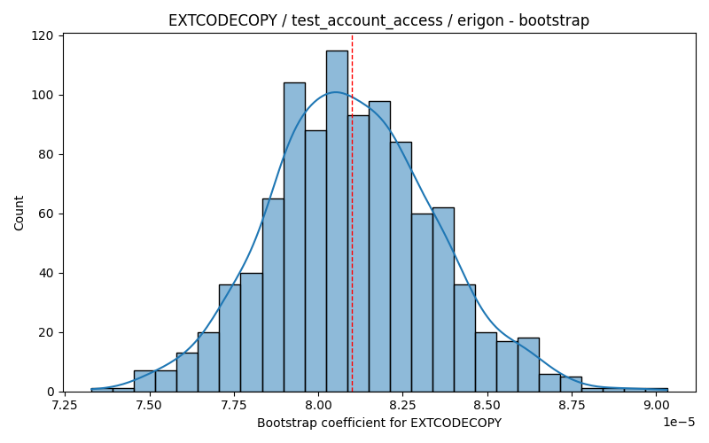

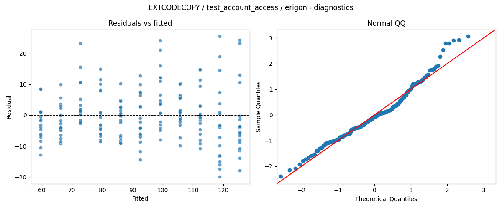

</details>

<details><summary>ethrex — NNLS regression summary</summary>

```
==============================================================================
                           NNLS Regression Results                            
==============================================================================
Dep. Variable:          test_runtime_ms              R-squared:          0.319
Model:                  NNLS                    Adj. R-squared:          0.316
No. Observations:       275                               RMSE:          13.91
Df Residuals:           273                                MAE:          10.15
Df Model:               1      
==============================================================================
                      coef     std err     P-value      [0.025      0.975]
------------------------------------------------------------------------------
         const     14.1064      2.6913       0.001      9.4232     19.5782
       opcount      0.0000      0.0000       0.001      0.0000      0.0000
==============================================================================
Notes: Non-negative least squares with bootstrap inference (1000 iterations)
==============================================================================
```

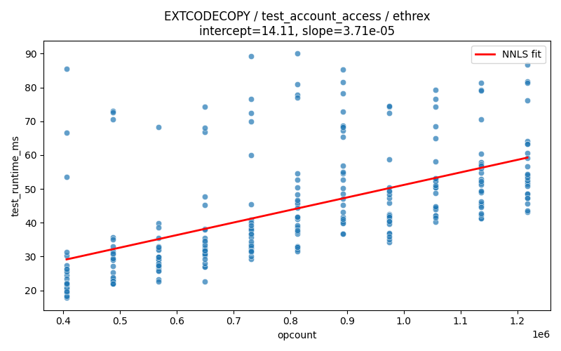

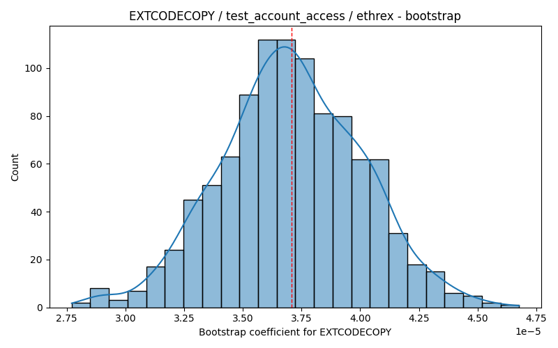

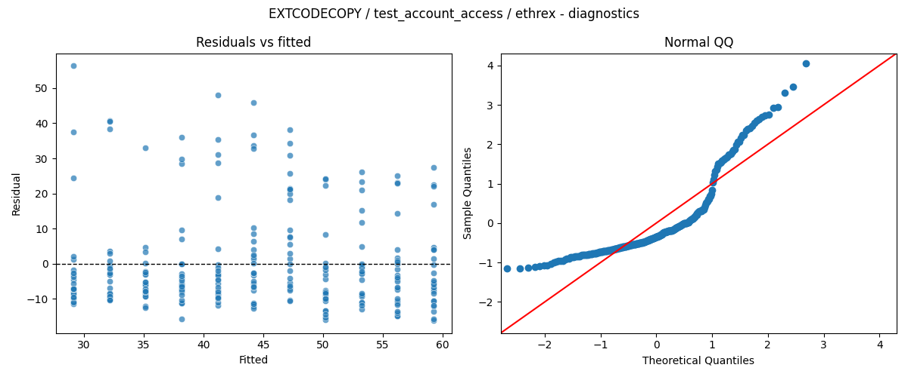

</details>

<details><summary>geth — NNLS regression summary</summary>

```
==============================================================================
                           NNLS Regression Results                            
==============================================================================
Dep. Variable:          test_runtime_ms              R-squared:          0.933
Model:                  NNLS                    Adj. R-squared:          0.933
No. Observations:       264                               RMSE:          23.97
Df Residuals:           262                                MAE:          17.97
Df Model:               1      
==============================================================================
                      coef     std err     P-value      [0.025      0.975]
------------------------------------------------------------------------------
         const     24.9073      4.4025       0.001     15.8368     33.3928
       opcount      0.0003      0.0000       0.001      0.0003      0.0004
==============================================================================
Notes: Non-negative least squares with bootstrap inference (1000 iterations)
==============================================================================
```

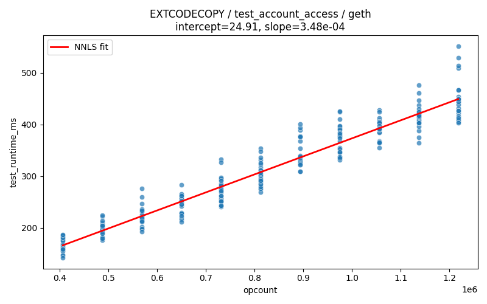

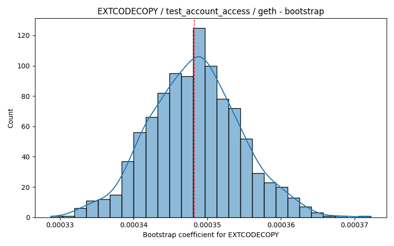

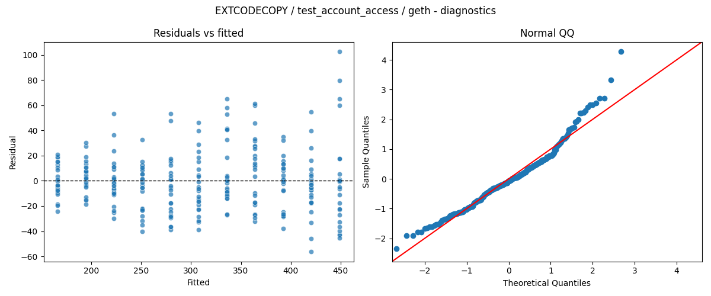

</details>

<details><summary>nethermind — NNLS regression summary</summary>

```
==============================================================================
                           NNLS Regression Results                            
==============================================================================
Dep. Variable:          test_runtime_ms              R-squared:          0.675
Model:                  NNLS                    Adj. R-squared:          0.673
No. Observations:       165                               RMSE:          61.65
Df Residuals:           163                                MAE:          45.41
Df Model:               1      
==============================================================================
                      coef     std err     P-value      [0.025      0.975]
------------------------------------------------------------------------------
         const    165.2294     14.8906       0.001    137.9395    194.4885
       opcount      0.0003      0.0000       0.001      0.0003      0.0004
==============================================================================
Notes: Non-negative least squares with bootstrap inference (1000 iterations)
==============================================================================
```

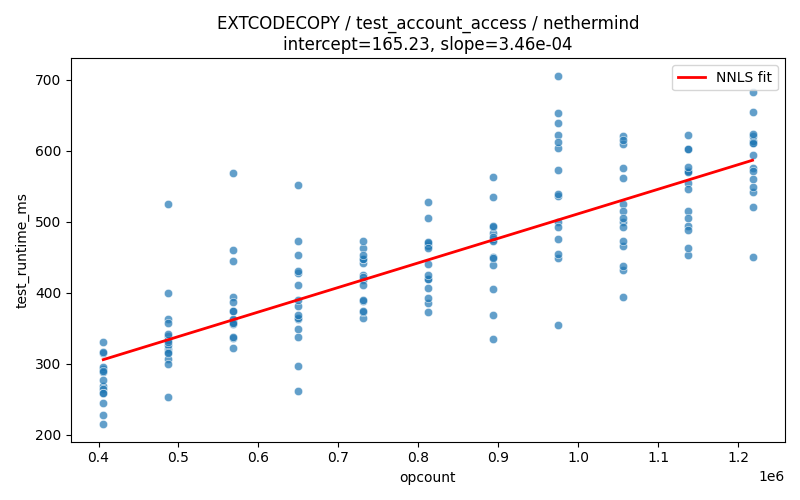

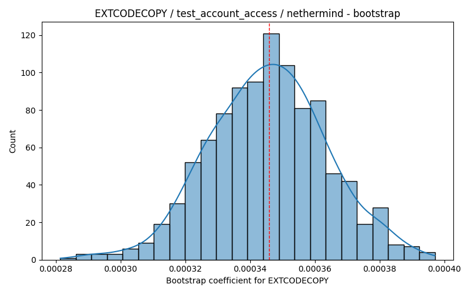

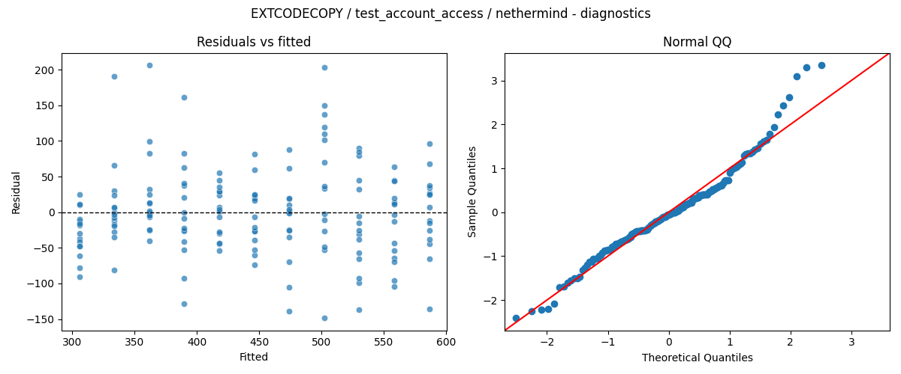

</details>

### test_account_access — combo `EXTCODECOPY_AccountMode.EXISTING_CONTRACT`

| client | nobs | R² | target_coef (ms) | p-value | 95% CI |
| --- | --- | --- | --- | --- | --- |
| `besu` | 418 | 0.288 | 0.001485 | 1.00e-03 | [0.001283, 0.001701] |
| `erigon` | 198 | 0.8318 | 0.0003487 | 1.00e-03 | [0.0003318, 0.0003658] |
| `ethrex` | 275 | 0.7706 | 0.0001941 | 1.00e-03 | [0.0001814, 0.0002082] |
| `geth` | 264 | 0.8844 | 0.0007536 | 1.00e-03 | [0.000722, 0.0007887] |
| `nethermind` | 165 | 0.81 | 0.001389 | 1.00e-03 | [0.001276, 0.001505] |

<details><summary>besu — NNLS regression summary</summary>

```
==============================================================================
                           NNLS Regression Results                            
==============================================================================
Dep. Variable:          test_runtime_ms              R-squared:          0.288
Model:                  NNLS                    Adj. R-squared:          0.286
No. Observations:       418                               RMSE:         230.71
Df Residuals:           416                                MAE:         194.55
Df Model:               1      
==============================================================================
                      coef     std err     P-value      [0.025      0.975]
------------------------------------------------------------------------------
         const    359.8119     32.4822       0.001    295.8351    422.5262
       opcount      0.0015      0.0001       0.001      0.0013      0.0017
==============================================================================
Notes: Non-negative least squares with bootstrap inference (1000 iterations)
==============================================================================
```

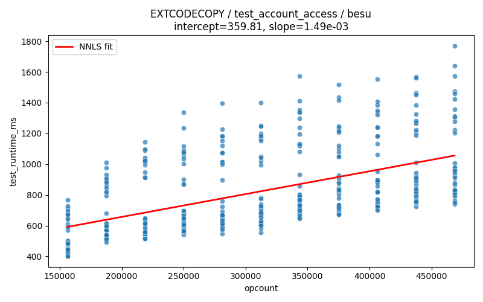

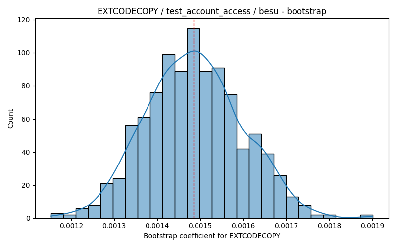


</details>

<details><summary>erigon — NNLS regression summary</summary>

```
==============================================================================
                           NNLS Regression Results                            
==============================================================================
Dep. Variable:          test_runtime_ms              R-squared:          0.832
Model:                  NNLS                    Adj. R-squared:          0.831
No. Observations:       198                               RMSE:          15.49
Df Residuals:           196                                MAE:          10.60
Df Model:               1      
==============================================================================
                      coef     std err     P-value      [0.025      0.975]
------------------------------------------------------------------------------
         const     41.1176      2.9692       0.001     35.3668     47.2307
       opcount      0.0003      0.0000       0.001      0.0003      0.0004
==============================================================================
Notes: Non-negative least squares with bootstrap inference (1000 iterations)
==============================================================================
```

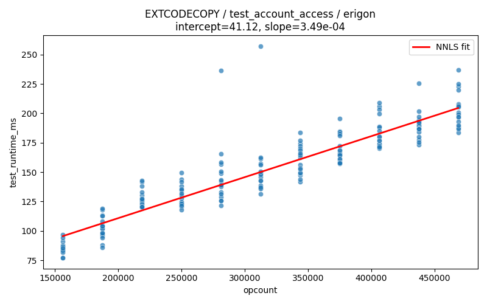

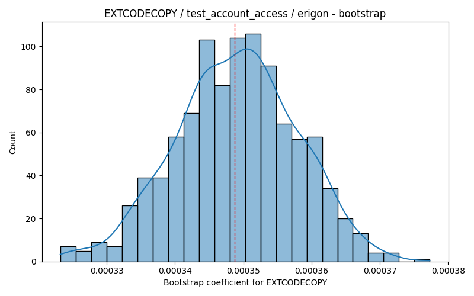

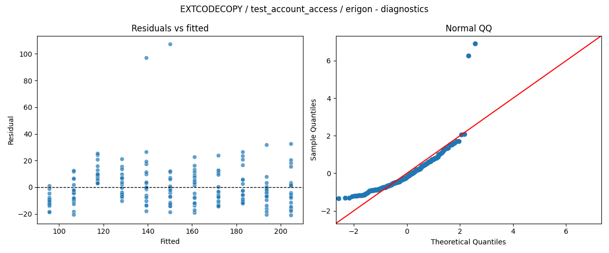

</details>

<details><summary>ethrex — NNLS regression summary</summary>

```
==============================================================================
                           NNLS Regression Results                            
==============================================================================
Dep. Variable:          test_runtime_ms              R-squared:          0.771
Model:                  NNLS                    Adj. R-squared:          0.770
No. Observations:       275                               RMSE:          10.46
Df Residuals:           273                                MAE:           8.58
Df Model:               1      
==============================================================================
                      coef     std err     P-value      [0.025      0.975]
------------------------------------------------------------------------------
         const     26.2704      2.1761       0.001     21.7837     30.3919
       opcount      0.0002      0.0000       0.001      0.0002      0.0002
==============================================================================
Notes: Non-negative least squares with bootstrap inference (1000 iterations)
==============================================================================
```

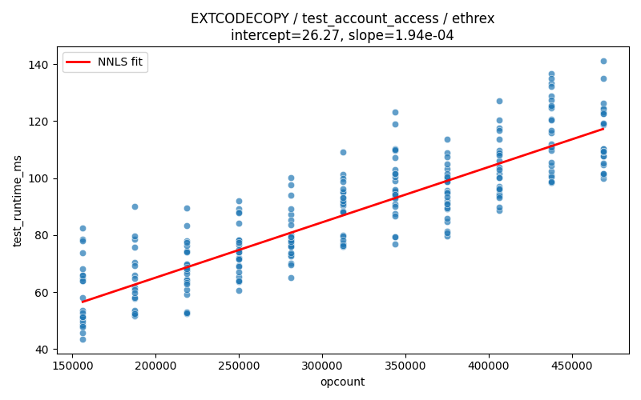

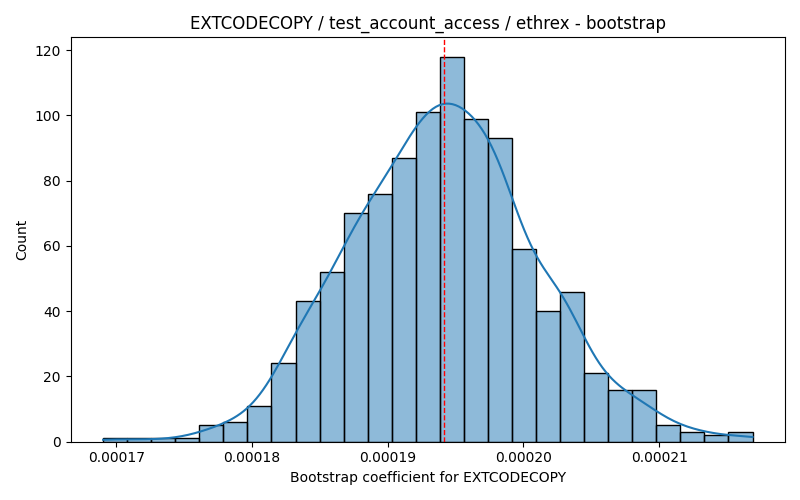

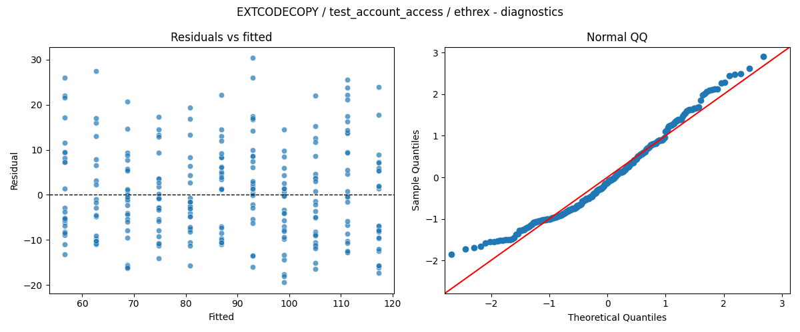

</details>

<details><summary>geth — NNLS regression summary</summary>

```
==============================================================================
                           NNLS Regression Results                            
==============================================================================
Dep. Variable:          test_runtime_ms              R-squared:          0.884
Model:                  NNLS                    Adj. R-squared:          0.884
No. Observations:       264                               RMSE:          26.92
Df Residuals:           262                                MAE:          21.02
Df Model:               1      
==============================================================================
                      coef     std err     P-value      [0.025      0.975]
------------------------------------------------------------------------------
         const     46.1657      4.9754       0.001     36.2409     55.4510
       opcount      0.0008      0.0000       0.001      0.0007      0.0008
==============================================================================
Notes: Non-negative least squares with bootstrap inference (1000 iterations)
==============================================================================
```

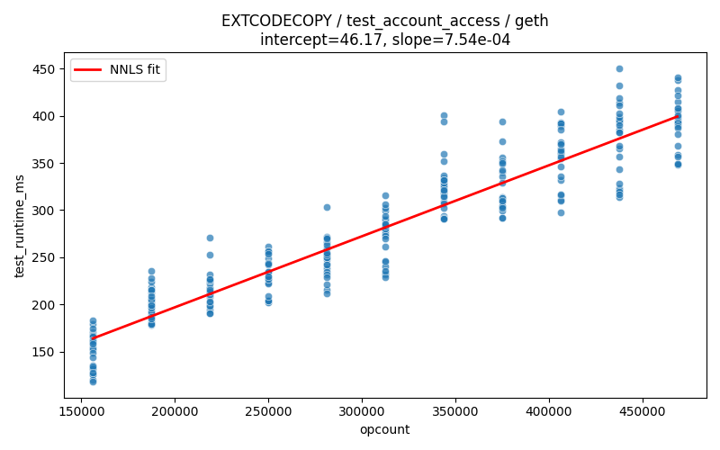

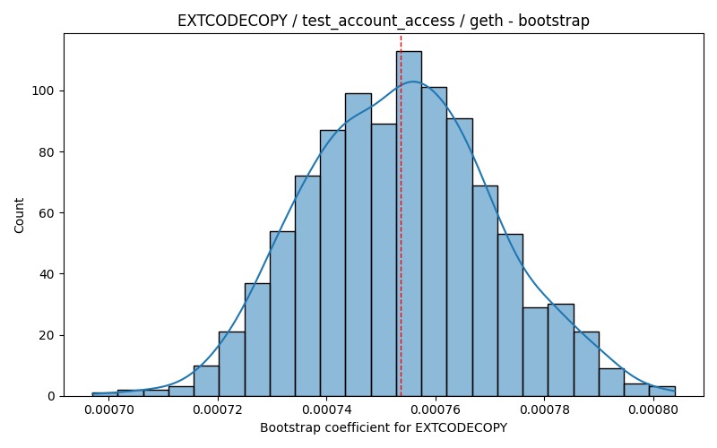

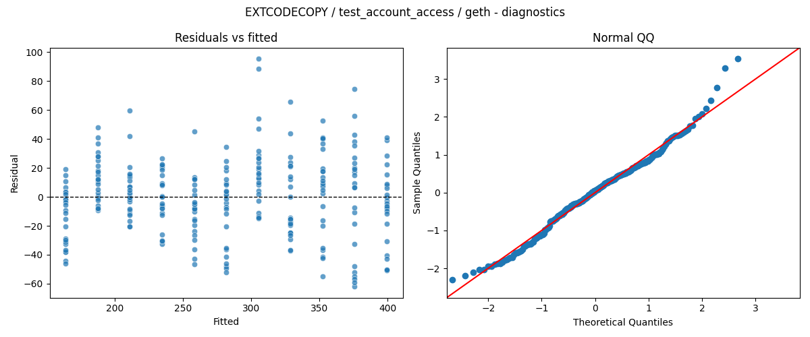

</details>

<details><summary>nethermind — NNLS regression summary</summary>

```
==============================================================================
                           NNLS Regression Results                            
==============================================================================
Dep. Variable:          test_runtime_ms              R-squared:          0.810
Model:                  NNLS                    Adj. R-squared:          0.809
No. Observations:       165                               RMSE:          66.45
Df Residuals:           163                                MAE:          53.15
Df Model:               1      
==============================================================================
                      coef     std err     P-value      [0.025      0.975]
------------------------------------------------------------------------------
         const    226.4942     17.3620       0.001    193.0877    261.5934
       opcount      0.0014      0.0001       0.001      0.0013      0.0015
==============================================================================
Notes: Non-negative least squares with bootstrap inference (1000 iterations)
==============================================================================
```

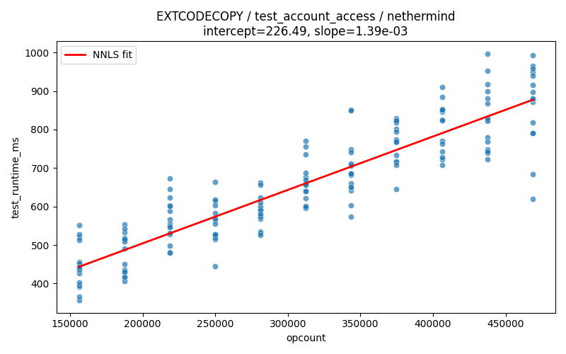

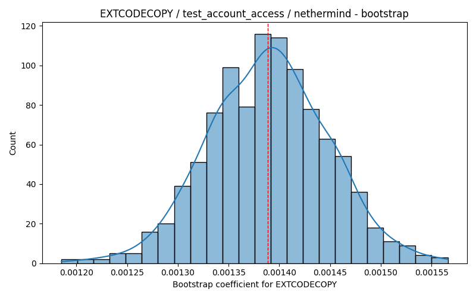

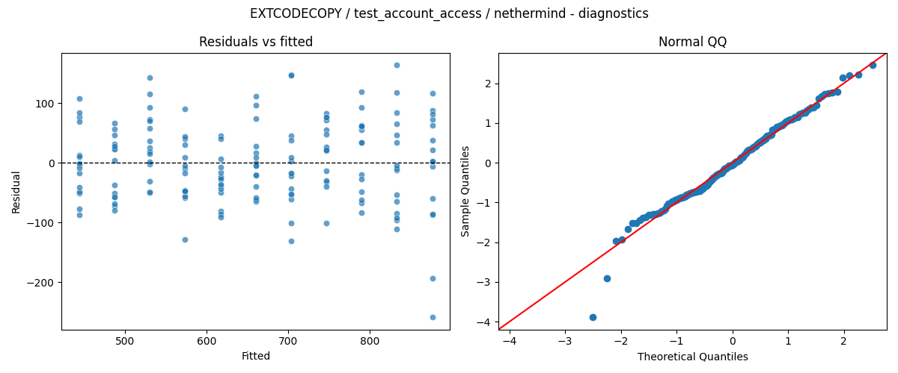

</details>

### test_account_access — combo `EXTCODECOPY_AccountMode.NON_EXISTING_ACCOUNT` — `presets[cold_account_code_access]`

| client | nobs | R² | target_coef (ms) | p-value | 95% CI |
| --- | --- | --- | --- | --- | --- |
| `besu` | 418 | 0.2445 | 0.000243 | 1.00e-03 | [0.0002031, 0.0002805] |
| `erigon` | 198 | 0.8608 | 8.099e-05 | 1.00e-03 | [7.629e-05, 8.608e-05] |
| `ethrex` | 275 | 0.319 | 3.707e-05 | 1.00e-03 | [3.129e-05, 4.302e-05] |
| `geth` | 264 | 0.933 | 0.0003482 | 1.00e-03 | [0.000336, 0.000361] |
| `nethermind` | 165 | 0.6748 | 0.0003458 | 1.00e-03 | [0.0003105, 0.0003812] |

<details><summary>besu — NNLS regression summary</summary>

```
==============================================================================
                           NNLS Regression Results                            
==============================================================================
Dep. Variable:          test_runtime_ms              R-squared:          0.244
Model:                  NNLS                    Adj. R-squared:          0.243
No. Observations:       418                               RMSE:         109.65
Df Residuals:           416                                MAE:          87.74
Df Model:               1      
==============================================================================
                      coef     std err     P-value      [0.025      0.975]
------------------------------------------------------------------------------
         const    211.9447     16.0432       0.001    181.8692    242.3609
       opcount      0.0002      0.0000       0.001      0.0002      0.0003
==============================================================================
Notes: Non-negative least squares with bootstrap inference (1000 iterations)
==============================================================================
```


</details>

<details><summary>erigon — NNLS regression summary</summary>

```
==============================================================================
                           NNLS Regression Results                            
==============================================================================
Dep. Variable:          test_runtime_ms              R-squared:          0.861
Model:                  NNLS                    Adj. R-squared:          0.860
No. Observations:       198                               RMSE:           8.36
Df Residuals:           196                                MAE:           6.35
Df Model:               1      
==============================================================================
                      coef     std err     P-value      [0.025      0.975]
------------------------------------------------------------------------------
         const     26.7953      1.8321       0.001     23.1230     30.4755
       opcount      0.0001      0.0000       0.001      0.0001      0.0001
==============================================================================
Notes: Non-negative least squares with bootstrap inference (1000 iterations)
==============================================================================
```


</details>

<details><summary>ethrex — NNLS regression summary</summary>

```
==============================================================================
                           NNLS Regression Results                            
==============================================================================
Dep. Variable:          test_runtime_ms              R-squared:          0.319
Model:                  NNLS                    Adj. R-squared:          0.316
No. Observations:       275                               RMSE:          13.91
Df Residuals:           273                                MAE:          10.15
Df Model:               1      
==============================================================================
                      coef     std err     P-value      [0.025      0.975]
------------------------------------------------------------------------------
         const     14.1064      2.6913       0.001      9.4232     19.5782
       opcount      0.0000      0.0000       0.001      0.0000      0.0000
==============================================================================
Notes: Non-negative least squares with bootstrap inference (1000 iterations)
==============================================================================
```


</details>

<details><summary>geth — NNLS regression summary</summary>

```
==============================================================================
                           NNLS Regression Results                            
==============================================================================
Dep. Variable:          test_runtime_ms              R-squared:          0.933
Model:                  NNLS                    Adj. R-squared:          0.933
No. Observations:       264                               RMSE:          23.97
Df Residuals:           262                                MAE:          17.97
Df Model:               1      
==============================================================================
                      coef     std err     P-value      [0.025      0.975]
------------------------------------------------------------------------------
         const     24.9073      4.4025       0.001     15.8368     33.3928
       opcount      0.0003      0.0000       0.001      0.0003      0.0004
==============================================================================
Notes: Non-negative least squares with bootstrap inference (1000 iterations)
==============================================================================
```


</details>

<details><summary>nethermind — NNLS regression summary</summary>

```
==============================================================================
                           NNLS Regression Results                            
==============================================================================
Dep. Variable:          test_runtime_ms              R-squared:          0.675
Model:                  NNLS                    Adj. R-squared:          0.673
No. Observations:       165                               RMSE:          61.65
Df Residuals:           163                                MAE:          45.41
Df Model:               1      
==============================================================================
                      coef     std err     P-value      [0.025      0.975]
------------------------------------------------------------------------------
         const    165.2294     14.8906       0.001    137.9395    194.4885
       opcount      0.0003      0.0000       0.001      0.0003      0.0004
==============================================================================
Notes: Non-negative least squares with bootstrap inference (1000 iterations)
==============================================================================
```


</details>

## EXTCODEHASH

### test_account_access — combo `EXTCODEHASH_AccountMode.NON_EXISTING_ACCOUNT` — `presets[cold_account_nocode_access]`

| client | nobs | R² | target_coef (ms) | p-value | 95% CI |
| --- | --- | --- | --- | --- | --- |
| `besu` | 418 | 0.8548 | 0.01268 | 1.00e-03 | [0.01224, 0.01316] |
| `erigon` | 198 | 0.9682 | 0.008554 | 1.00e-03 | [0.00848, 0.008631] |
| `ethrex` | 275 | 0.9666 | 0.001997 | 1.00e-03 | [0.001956, 0.002045] |
| `geth` | 264 | 0.8707 | 0.02166 | 1.00e-03 | [0.02057, 0.0228] |
| `nethermind` | 165 | 0.92 | 0.003414 | 1.00e-03 | [0.003257, 0.003587] |

<details><summary>besu — NNLS regression summary</summary>

```
==============================================================================
                           NNLS Regression Results                            
==============================================================================
Dep. Variable:          test_runtime_ms              R-squared:          0.855
Model:                  NNLS                    Adj. R-squared:          0.854
No. Observations:       418                               RMSE:         124.88
Df Residuals:           416                                MAE:         106.44
Df Model:               1      
==============================================================================
                      coef     std err     P-value      [0.025      0.975]
------------------------------------------------------------------------------
         const    234.8429     18.1565       0.001    199.1383    268.3032
       opcount      0.0127      0.0002       0.001      0.0122      0.0132
==============================================================================
Notes: Non-negative least squares with bootstrap inference (1000 iterations)
==============================================================================
```

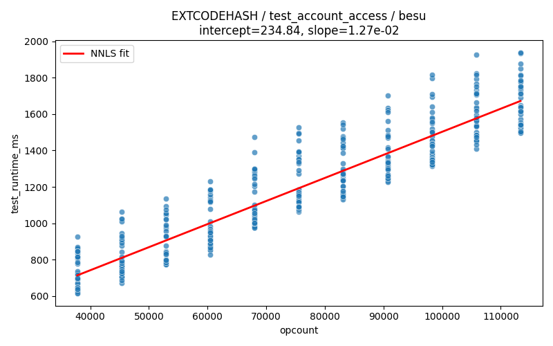

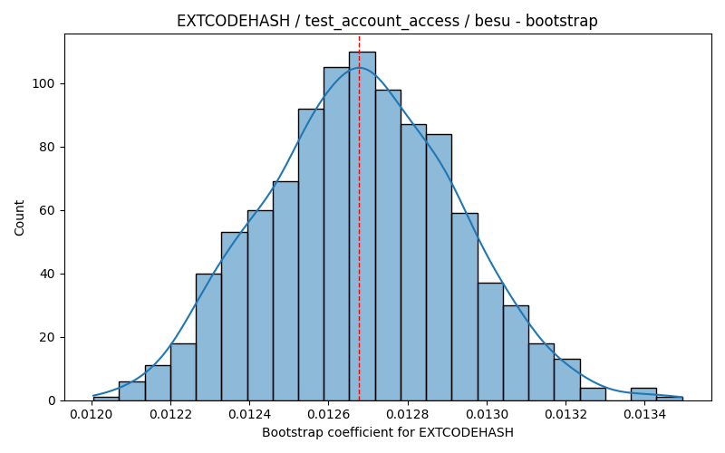

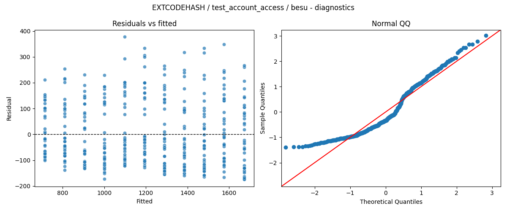

</details>

<details><summary>erigon — NNLS regression summary</summary>

```
==============================================================================
                           NNLS Regression Results                            
==============================================================================
Dep. Variable:          test_runtime_ms              R-squared:          0.968
Model:                  NNLS                    Adj. R-squared:          0.968
No. Observations:       198                               RMSE:          38.20
Df Residuals:           196                                MAE:          31.61
Df Model:               1      
==============================================================================
                      coef     std err     P-value      [0.025      0.975]
------------------------------------------------------------------------------
         const      0.0000      0.0827       1.000      0.0000      0.0000
       opcount      0.0086      0.0000       0.001      0.0085      0.0086
==============================================================================
Notes: Non-negative least squares with bootstrap inference (1000 iterations)
==============================================================================
```

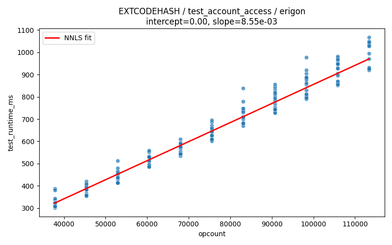

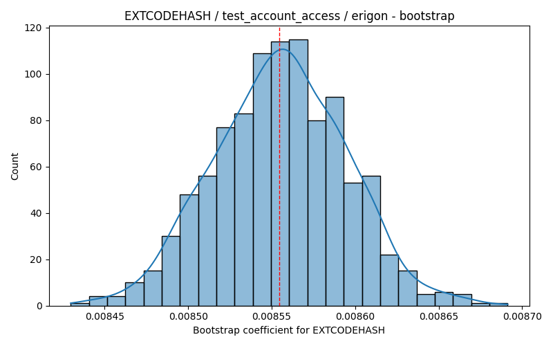

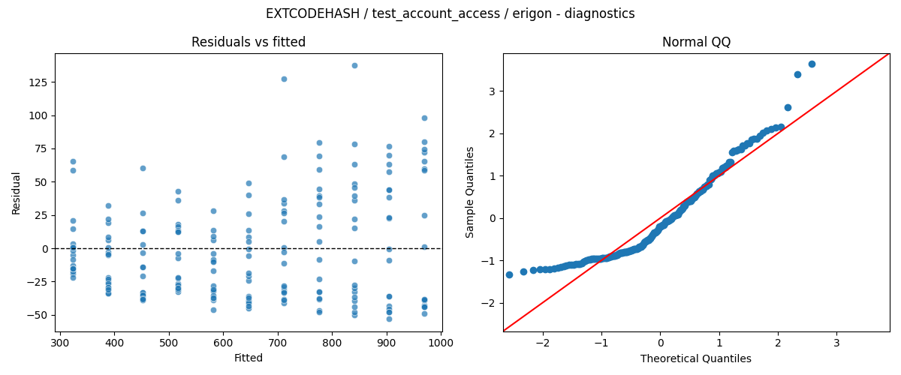

</details>

<details><summary>ethrex — NNLS regression summary</summary>

```
==============================================================================
                           NNLS Regression Results                            
==============================================================================
Dep. Variable:          test_runtime_ms              R-squared:          0.967
Model:                  NNLS                    Adj. R-squared:          0.966
No. Observations:       275                               RMSE:           8.87
Df Residuals:           273                                MAE:           7.17
Df Model:               1      
==============================================================================
                      coef     std err     P-value      [0.025      0.975]
------------------------------------------------------------------------------
         const     27.8240      1.7108       0.001     24.4121     31.0586
       opcount      0.0020      0.0000       0.001      0.0020      0.0020
==============================================================================
Notes: Non-negative least squares with bootstrap inference (1000 iterations)
==============================================================================
```

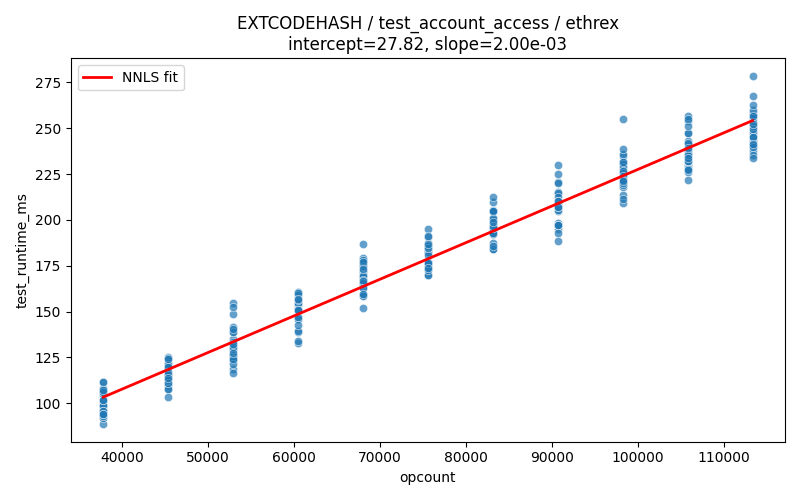

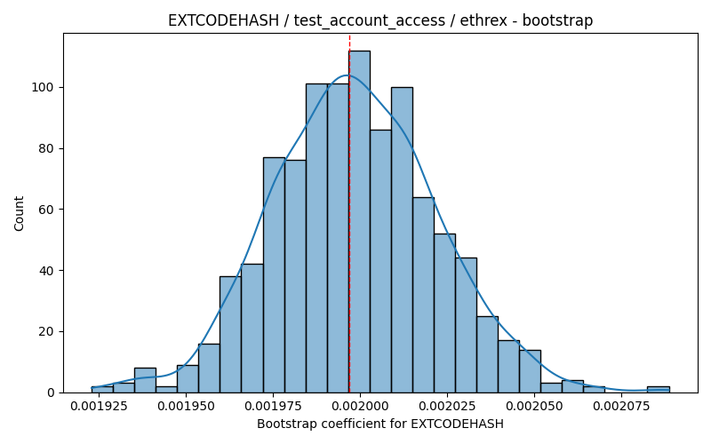

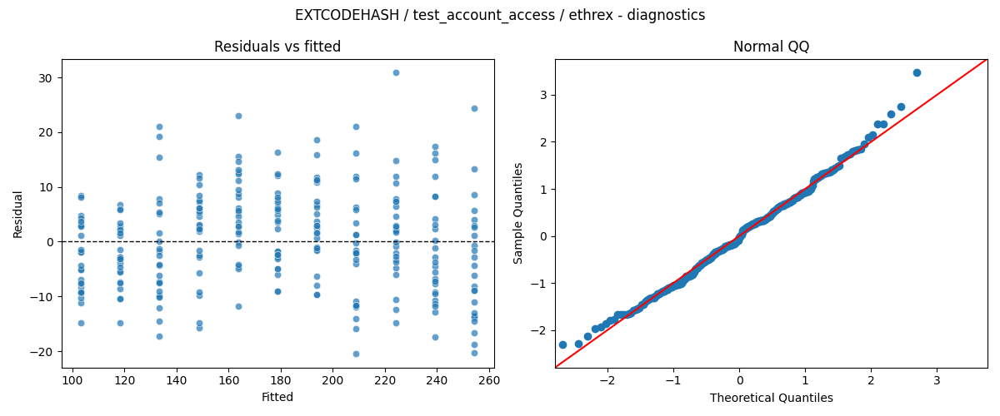

</details>

<details><summary>geth — NNLS regression summary</summary>

```
==============================================================================
                           NNLS Regression Results                            
==============================================================================
Dep. Variable:          test_runtime_ms              R-squared:          0.871
Model:                  NNLS                    Adj. R-squared:          0.870
No. Observations:       264                               RMSE:         199.53
Df Residuals:           262                                MAE:         169.44
Df Model:               1      
==============================================================================
                      coef     std err     P-value      [0.025      0.975]
------------------------------------------------------------------------------
         const    683.2234     48.4711       0.001    586.5956    780.4799
       opcount      0.0217      0.0006       0.001      0.0206      0.0228
==============================================================================
Notes: Non-negative least squares with bootstrap inference (1000 iterations)
==============================================================================
```

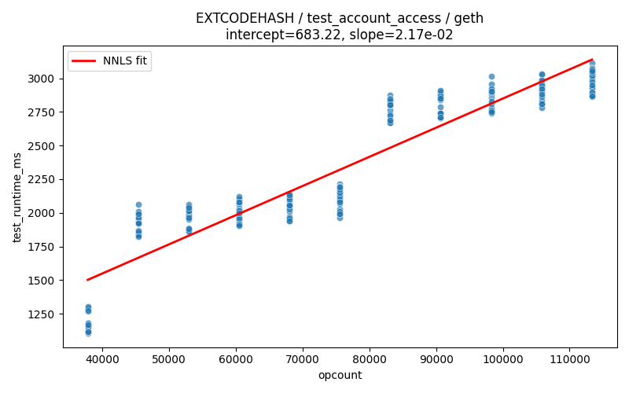

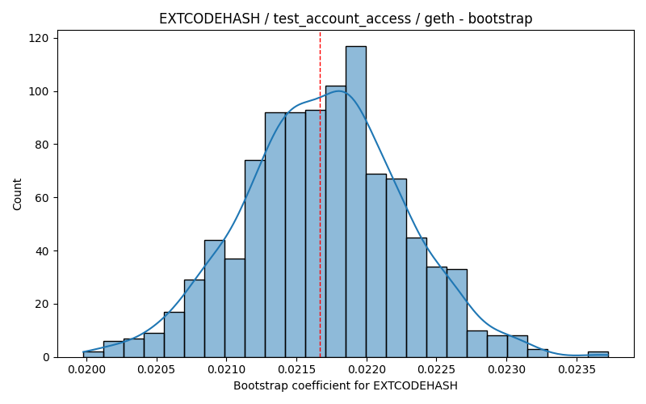

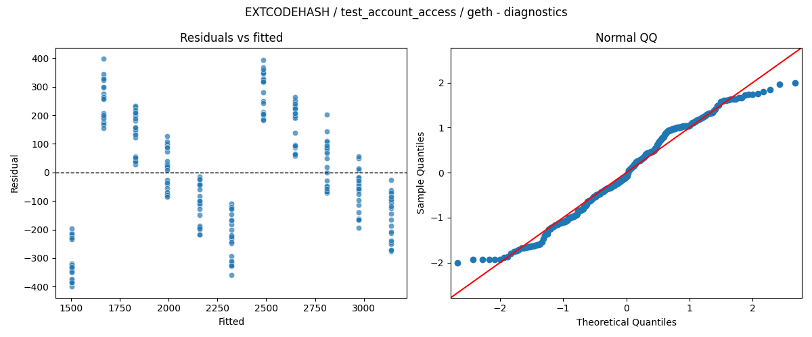

</details>

<details><summary>nethermind — NNLS regression summary</summary>

```
==============================================================================
                           NNLS Regression Results                            
==============================================================================
Dep. Variable:          test_runtime_ms              R-squared:          0.920
Model:                  NNLS                    Adj. R-squared:          0.919
No. Observations:       165                               RMSE:          24.07
Df Residuals:           163                                MAE:          18.56
Df Model:               1      
==============================================================================
                      coef     std err     P-value      [0.025      0.975]
------------------------------------------------------------------------------
         const     83.9639      5.5501       0.001     72.2480     94.2339
       opcount      0.0034      0.0001       0.001      0.0033      0.0036
==============================================================================
Notes: Non-negative least squares with bootstrap inference (1000 iterations)
==============================================================================
```

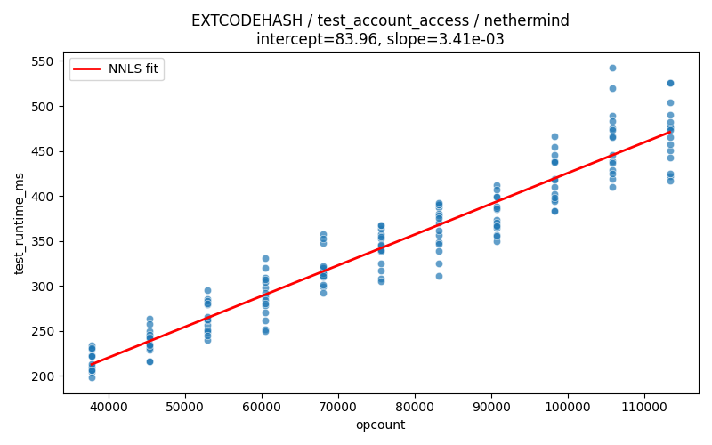

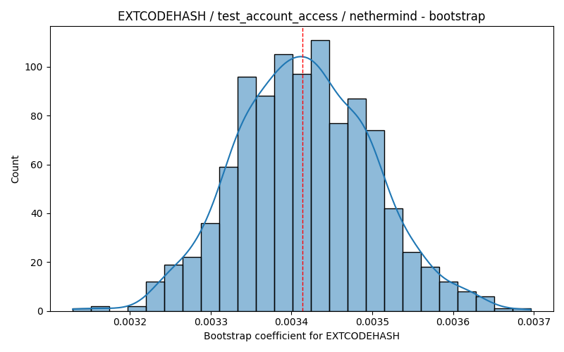

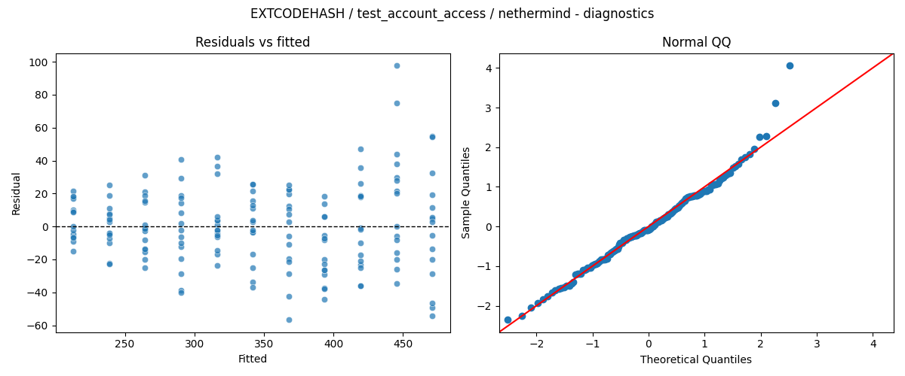

</details>

### test_account_access — combo `EXTCODEHASH_AccountMode.EXISTING_CONTRACT`

| client | nobs | R² | target_coef (ms) | p-value | 95% CI |
| --- | --- | --- | --- | --- | --- |
| `besu` | 418 | 0.8876 | 0.02589 | 1.00e-03 | [0.02506, 0.02678] |
| `erigon` | 198 | 0.9258 | 0.02439 | 1.00e-03 | [0.02347, 0.02529] |
| `ethrex` | 275 | 0.9938 | 0.007754 | 1.00e-03 | [0.007683, 0.007825] |
| `geth` | 264 | 0.8614 | 0.02305 | 1.00e-03 | [0.02187, 0.02425] |
| `nethermind` | 165 | 0.8318 | 0.009928 | 1.00e-03 | [0.009373, 0.01057] |

<details><summary>besu — NNLS regression summary</summary>

```
==============================================================================
                           NNLS Regression Results                            
==============================================================================
Dep. Variable:          test_runtime_ms              R-squared:          0.888
Model:                  NNLS                    Adj. R-squared:          0.887
No. Observations:       418                               RMSE:         191.67
Df Residuals:           416                                MAE:         156.87
Df Model:               1      
==============================================================================
                      coef     std err     P-value      [0.025      0.975]
------------------------------------------------------------------------------
         const    391.4834     28.7027       0.001    334.0638    447.8835
       opcount      0.0259      0.0004       0.001      0.0251      0.0268
==============================================================================
Notes: Non-negative least squares with bootstrap inference (1000 iterations)
==============================================================================
```

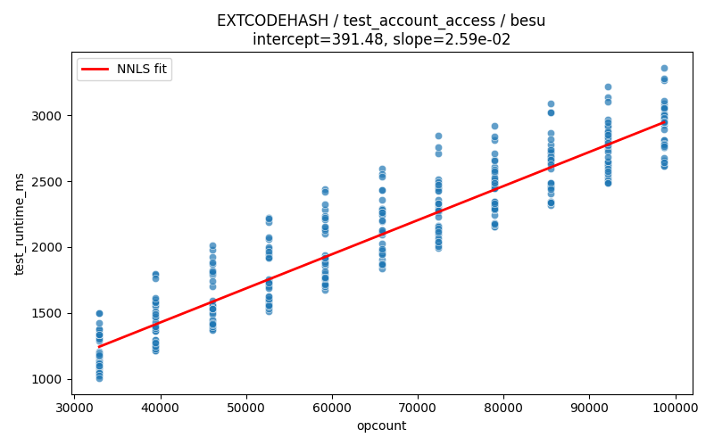

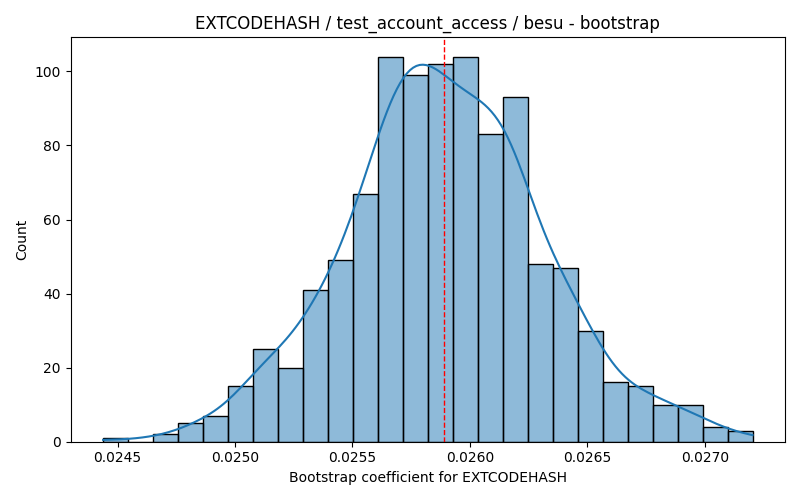

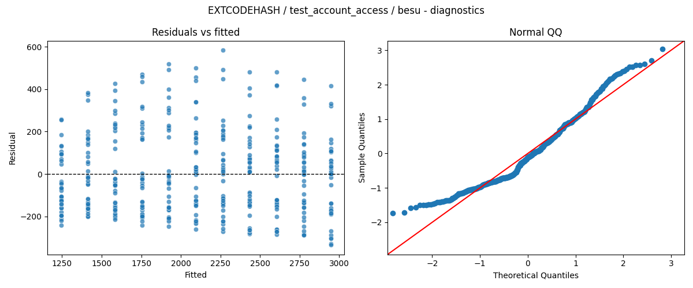

</details>

<details><summary>erigon — NNLS regression summary</summary>

```
==============================================================================
                           NNLS Regression Results                            
==============================================================================
Dep. Variable:          test_runtime_ms              R-squared:          0.926
Model:                  NNLS                    Adj. R-squared:          0.925
No. Observations:       198                               RMSE:         143.67
Df Residuals:           196                                MAE:         120.81
Df Model:               1      
==============================================================================
                      coef     std err     P-value      [0.025      0.975]
------------------------------------------------------------------------------
         const    293.4555     33.8122       0.001    224.7482    361.9880
       opcount      0.0244      0.0005       0.001      0.0235      0.0253
==============================================================================
Notes: Non-negative least squares with bootstrap inference (1000 iterations)
==============================================================================
```

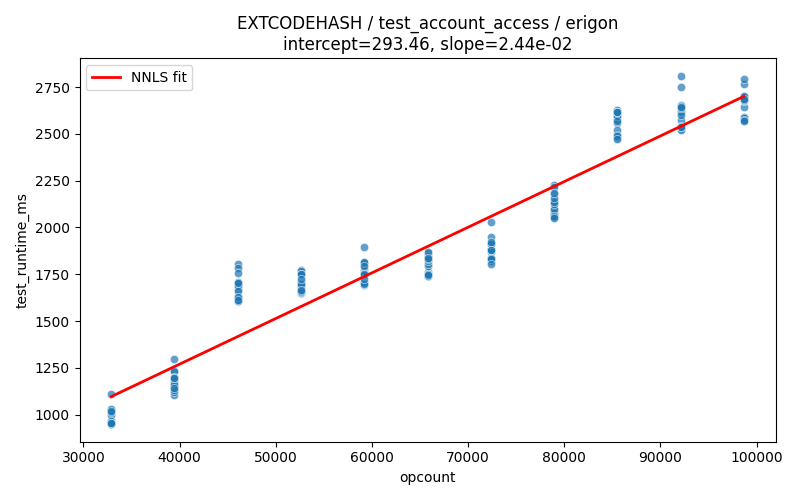

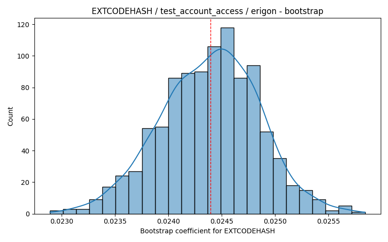

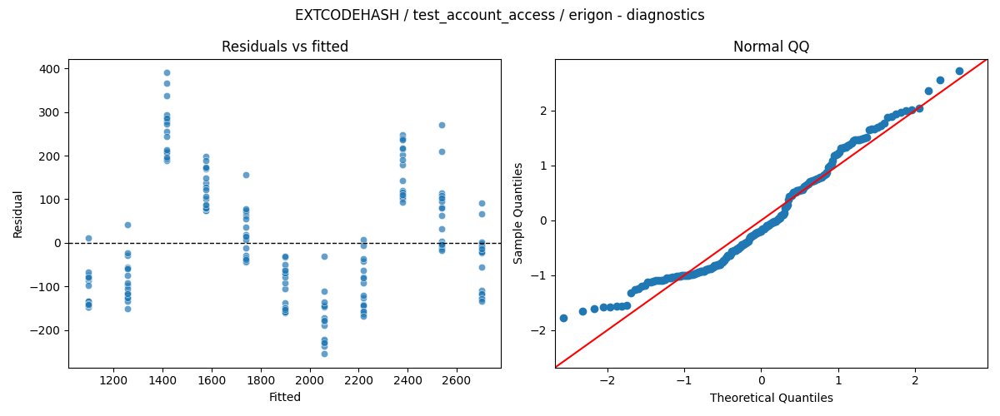

</details>

<details><summary>ethrex — NNLS regression summary</summary>

```
==============================================================================
                           NNLS Regression Results                            
==============================================================================
Dep. Variable:          test_runtime_ms              R-squared:          0.994
Model:                  NNLS                    Adj. R-squared:          0.994
No. Observations:       275                               RMSE:          12.72
Df Residuals:           273                                MAE:           9.60
Df Model:               1      
==============================================================================
                      coef     std err     P-value      [0.025      0.975]
------------------------------------------------------------------------------
         const     41.3429      2.3737       0.001     36.4692     46.0529
       opcount      0.0078      0.0000       0.001      0.0077      0.0078
==============================================================================
Notes: Non-negative least squares with bootstrap inference (1000 iterations)
==============================================================================
```

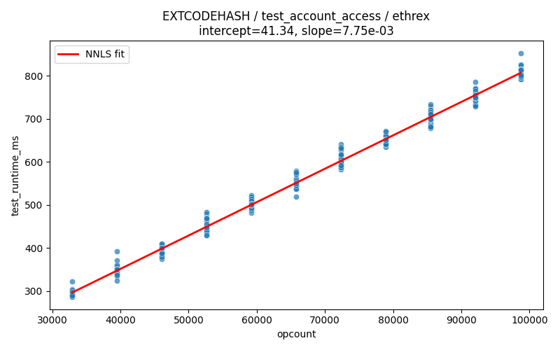

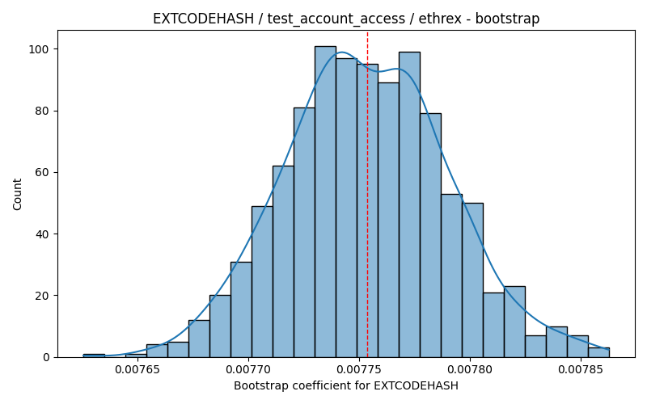

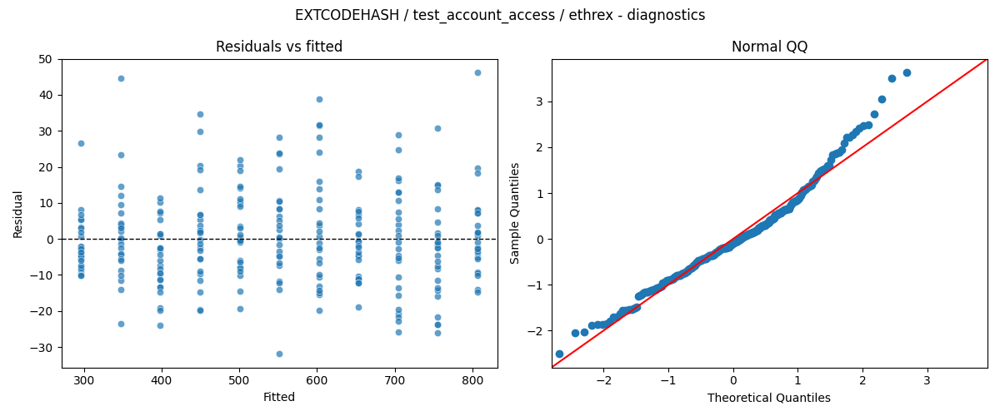

</details>

<details><summary>geth — NNLS regression summary</summary>

```
==============================================================================
                           NNLS Regression Results                            
==============================================================================
Dep. Variable:          test_runtime_ms              R-squared:          0.861
Model:                  NNLS                    Adj. R-squared:          0.861
No. Observations:       264                               RMSE:         192.42
Df Residuals:           262                                MAE:         162.57
Df Model:               1      
==============================================================================
                      coef     std err     P-value      [0.025      0.975]
------------------------------------------------------------------------------
         const    654.7623     46.1604       0.001    566.1407    743.7781
       opcount      0.0231      0.0006       0.001      0.0219      0.0242
==============================================================================
Notes: Non-negative least squares with bootstrap inference (1000 iterations)
==============================================================================
```

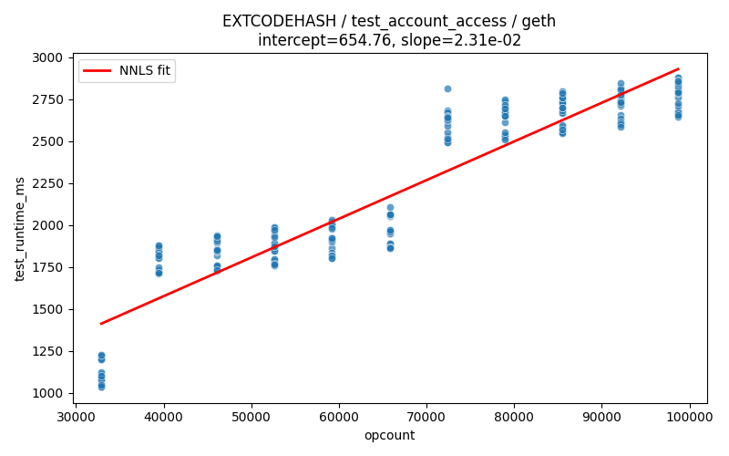

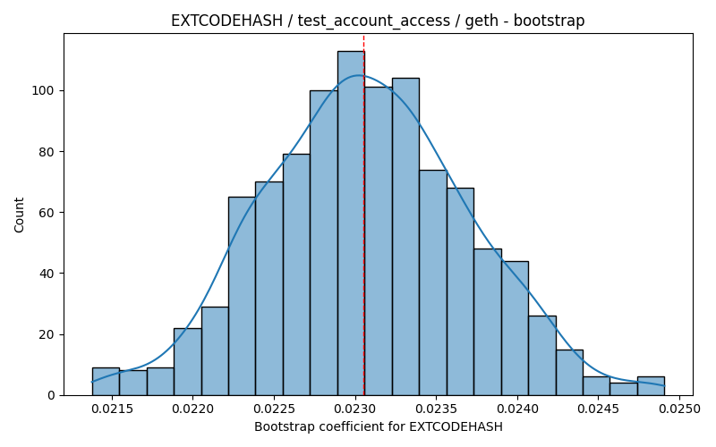

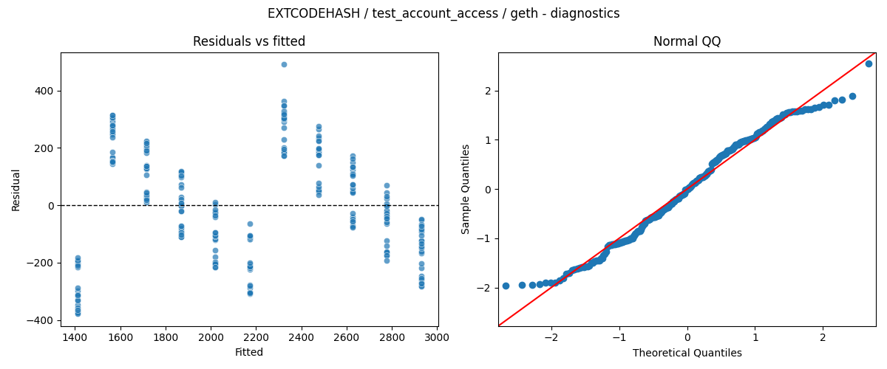

</details>

<details><summary>nethermind — NNLS regression summary</summary>

```
==============================================================================
                           NNLS Regression Results                            
==============================================================================
Dep. Variable:          test_runtime_ms              R-squared:          0.832
Model:                  NNLS                    Adj. R-squared:          0.831
No. Observations:       165                               RMSE:          92.88
Df Residuals:           163                                MAE:          60.80
Df Model:               1      
==============================================================================
                      coef     std err     P-value      [0.025      0.975]
------------------------------------------------------------------------------
         const    150.8512     19.7703       0.001    110.8331    187.8401
       opcount      0.0099      0.0003       0.001      0.0094      0.0106
==============================================================================
Notes: Non-negative least squares with bootstrap inference (1000 iterations)
==============================================================================
```

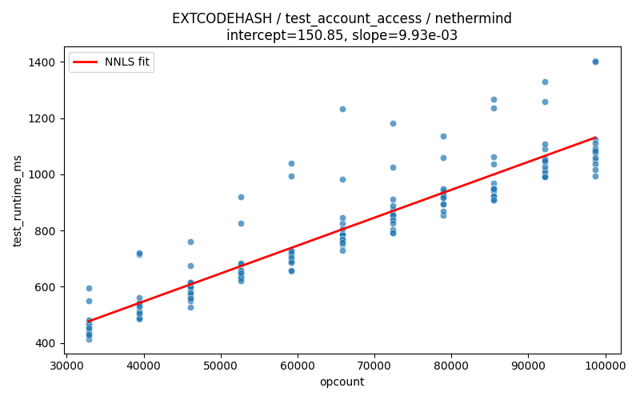

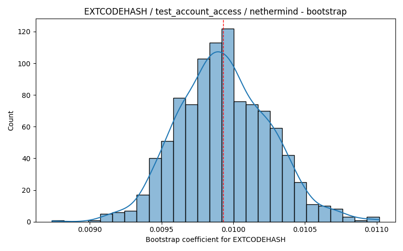

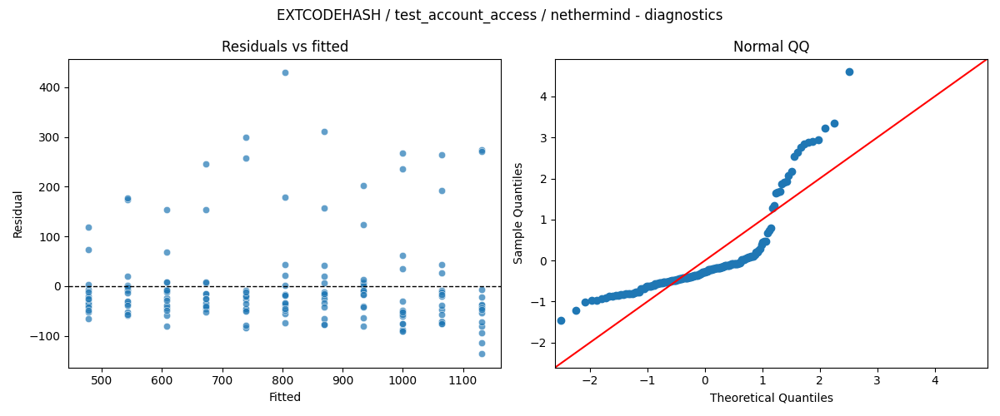

</details>

### test_account_access — combo `EXTCODEHASH_AccountMode.NON_EXISTING_ACCOUNT` — `presets[cold_account_code_access]`

| client | nobs | R² | target_coef (ms) | p-value | 95% CI |
| --- | --- | --- | --- | --- | --- |
| `besu` | 418 | 0.8548 | 0.01268 | 1.00e-03 | [0.01224, 0.01316] |
| `erigon` | 198 | 0.9682 | 0.008554 | 1.00e-03 | [0.00848, 0.008631] |
| `ethrex` | 275 | 0.9666 | 0.001997 | 1.00e-03 | [0.001956, 0.002045] |
| `geth` | 264 | 0.8707 | 0.02166 | 1.00e-03 | [0.02057, 0.0228] |
| `nethermind` | 165 | 0.92 | 0.003414 | 1.00e-03 | [0.003257, 0.003587] |

<details><summary>besu — NNLS regression summary</summary>

```
==============================================================================
                           NNLS Regression Results                            
==============================================================================
Dep. Variable:          test_runtime_ms              R-squared:          0.855
Model:                  NNLS                    Adj. R-squared:          0.854
No. Observations:       418                               RMSE:         124.88
Df Residuals:           416                                MAE:         106.44
Df Model:               1      
==============================================================================
                      coef     std err     P-value      [0.025      0.975]
------------------------------------------------------------------------------
         const    234.8429     18.1565       0.001    199.1383    268.3032
       opcount      0.0127      0.0002       0.001      0.0122      0.0132
==============================================================================
Notes: Non-negative least squares with bootstrap inference (1000 iterations)
==============================================================================
```


</details>

<details><summary>erigon — NNLS regression summary</summary>

```
==============================================================================
                           NNLS Regression Results                            
==============================================================================
Dep. Variable:          test_runtime_ms              R-squared:          0.968
Model:                  NNLS                    Adj. R-squared:          0.968
No. Observations:       198                               RMSE:          38.20
Df Residuals:           196                                MAE:          31.61
Df Model:               1      
==============================================================================
                      coef     std err     P-value      [0.025      0.975]
------------------------------------------------------------------------------
         const      0.0000      0.0827       1.000      0.0000      0.0000
       opcount      0.0086      0.0000       0.001      0.0085      0.0086
==============================================================================
Notes: Non-negative least squares with bootstrap inference (1000 iterations)
==============================================================================
```


</details>

<details><summary>ethrex — NNLS regression summary</summary>

```
==============================================================================
                           NNLS Regression Results                            
==============================================================================
Dep. Variable:          test_runtime_ms              R-squared:          0.967
Model:                  NNLS                    Adj. R-squared:          0.966
No. Observations:       275                               RMSE:           8.87
Df Residuals:           273                                MAE:           7.17
Df Model:               1      
==============================================================================
                      coef     std err     P-value      [0.025      0.975]
------------------------------------------------------------------------------
         const     27.8240      1.7108       0.001     24.4121     31.0586
       opcount      0.0020      0.0000       0.001      0.0020      0.0020
==============================================================================
Notes: Non-negative least squares with bootstrap inference (1000 iterations)
==============================================================================
```


</details>

<details><summary>geth — NNLS regression summary</summary>

```
==============================================================================
                           NNLS Regression Results                            
==============================================================================
Dep. Variable:          test_runtime_ms              R-squared:          0.871
Model:                  NNLS                    Adj. R-squared:          0.870
No. Observations:       264                               RMSE:         199.53
Df Residuals:           262                                MAE:         169.44
Df Model:               1      
==============================================================================
                      coef     std err     P-value      [0.025      0.975]
------------------------------------------------------------------------------
         const    683.2234     48.4711       0.001    586.5956    780.4799
       opcount      0.0217      0.0006       0.001      0.0206      0.0228
==============================================================================
Notes: Non-negative least squares with bootstrap inference (1000 iterations)
==============================================================================
```


</details>

<details><summary>nethermind — NNLS regression summary</summary>

```
==============================================================================
                           NNLS Regression Results                            
==============================================================================
Dep. Variable:          test_runtime_ms              R-squared:          0.920
Model:                  NNLS                    Adj. R-squared:          0.919
No. Observations:       165                               RMSE:          24.07
Df Residuals:           163                                MAE:          18.56
Df Model:               1      
==============================================================================
                      coef     std err     P-value      [0.025      0.975]
------------------------------------------------------------------------------
         const     83.9639      5.5501       0.001     72.2480     94.2339
       opcount      0.0034      0.0001       0.001      0.0033      0.0036
==============================================================================
Notes: Non-negative least squares with bootstrap inference (1000 iterations)
==============================================================================
```


</details>

### test_ext_account_query_warm — combo `EXTCODEHASH`

| client | nobs | R² | target_coef (ms) | p-value | 95% CI |
| --- | --- | --- | --- | --- | --- |
| `besu` | 418 | 0.2227 | 7.644e-05 | 1.00e-03 | [6.233e-05, 9.034e-05] |
| `erigon` | 198 | 0.919 | 0.0003271 | 1.00e-03 | [0.0003147, 0.0003401] |
| `ethrex` | 275 | 0.1747 | 1.079e-05 | 1.00e-03 | [7.709e-06, 1.379e-05] |
| `geth` | 264 | 0.8054 | 3.981e-05 | 1.00e-03 | [3.733e-05, 4.216e-05] |
| `nethermind` | 165 | 0.6667 | 0.0001827 | 1.00e-03 | [0.000164, 0.000204] |

<details><summary>besu — NNLS regression summary</summary>

```
==============================================================================
                           NNLS Regression Results                            
==============================================================================
Dep. Variable:          test_runtime_ms              R-squared:          0.223
Model:                  NNLS                    Adj. R-squared:          0.221
No. Observations:       418                               RMSE:          83.51
Df Residuals:           416                                MAE:          62.49
Df Model:               1      
==============================================================================
                      coef     std err     P-value      [0.025      0.975]
------------------------------------------------------------------------------
         const    189.7868     12.8642       0.001    164.7834    216.6984
       opcount      0.0001      0.0000       0.001      0.0001      0.0001
==============================================================================
Notes: Non-negative least squares with bootstrap inference (1000 iterations)
==============================================================================
```

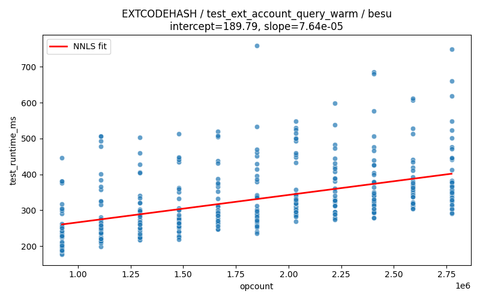

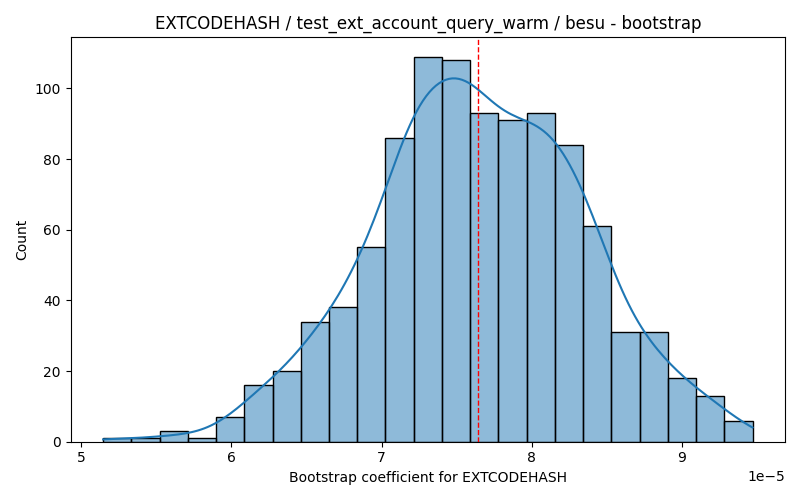

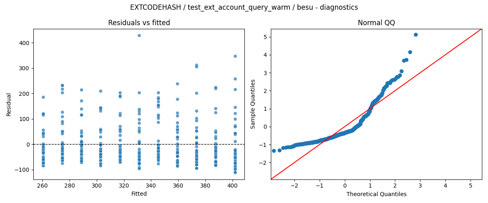

</details>

<details><summary>erigon — NNLS regression summary</summary>

```
==============================================================================
                           NNLS Regression Results                            
==============================================================================
Dep. Variable:          test_runtime_ms              R-squared:          0.919
Model:                  NNLS                    Adj. R-squared:          0.919
No. Observations:       198                               RMSE:          56.81
Df Residuals:           196                                MAE:          46.59
Df Model:               1      
==============================================================================
                      coef     std err     P-value      [0.025      0.975]
------------------------------------------------------------------------------
         const     33.7957     10.7391       0.001     11.1566     54.7670
       opcount      0.0003      0.0000       0.001      0.0003      0.0003
==============================================================================
Notes: Non-negative least squares with bootstrap inference (1000 iterations)
==============================================================================
```

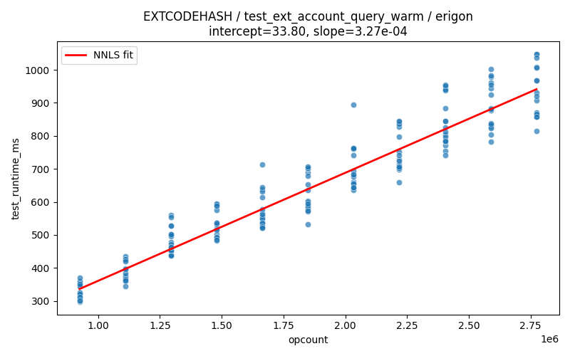

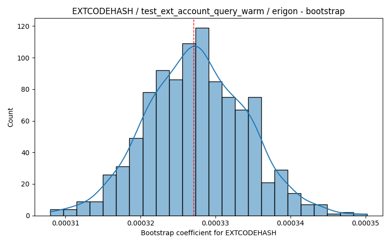

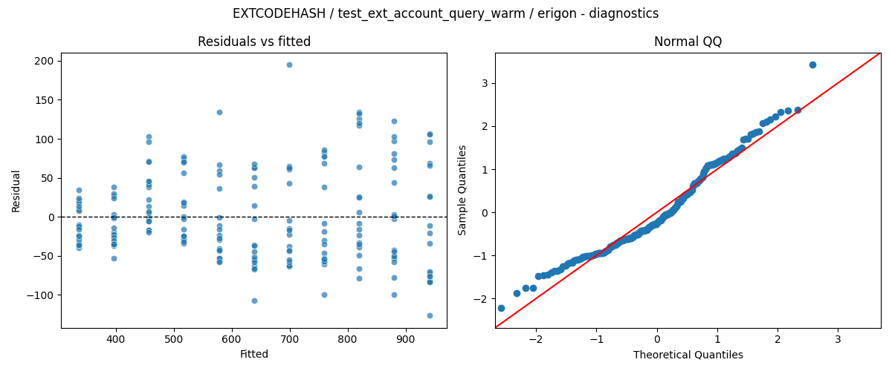

</details>

<details><summary>ethrex — NNLS regression summary</summary>

```
==============================================================================
                           NNLS Regression Results                            
==============================================================================
Dep. Variable:          test_runtime_ms              R-squared:          0.175
Model:                  NNLS                    Adj. R-squared:          0.172
No. Observations:       275                               RMSE:          13.71
Df Residuals:           273                                MAE:           8.68
Df Model:               1      
==============================================================================
                      coef     std err     P-value      [0.025      0.975]
------------------------------------------------------------------------------
         const     18.2337      3.2270       0.001     11.9039     24.8535
       opcount      0.0000      0.0000       0.001      0.0000      0.0000
==============================================================================
Notes: Non-negative least squares with bootstrap inference (1000 iterations)
==============================================================================
```

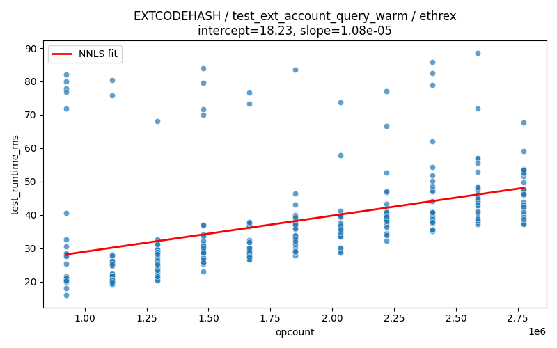

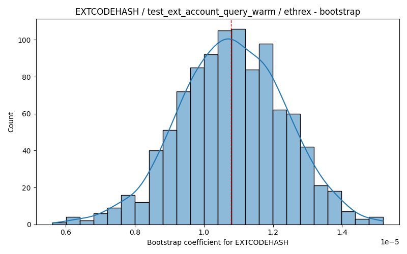

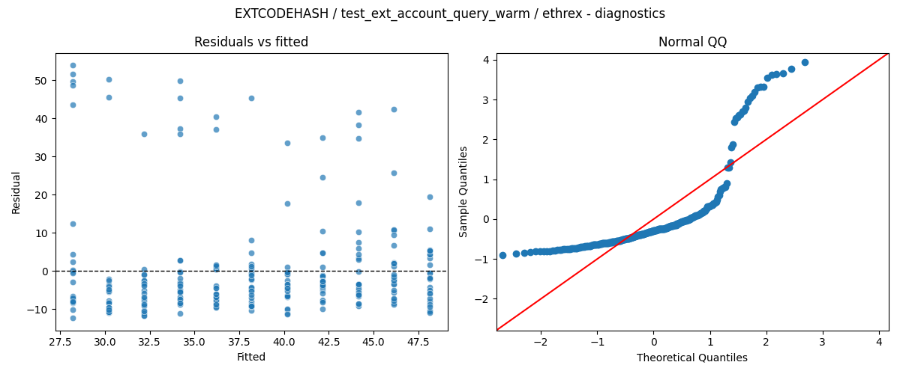

</details>

<details><summary>geth — NNLS regression summary</summary>

```
==============================================================================
                           NNLS Regression Results                            
==============================================================================
Dep. Variable:          test_runtime_ms              R-squared:          0.805
Model:                  NNLS                    Adj. R-squared:          0.805
No. Observations:       264                               RMSE:          11.44
Df Residuals:           262                                MAE:           9.02
Df Model:               1      
==============================================================================
                      coef     std err     P-value      [0.025      0.975]
------------------------------------------------------------------------------
         const     21.4389      2.1534       0.001     17.1959     25.6209
       opcount      0.0000      0.0000       0.001      0.0000      0.0000
==============================================================================
Notes: Non-negative least squares with bootstrap inference (1000 iterations)
==============================================================================
```

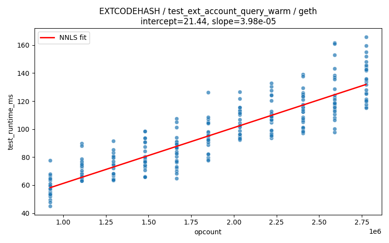

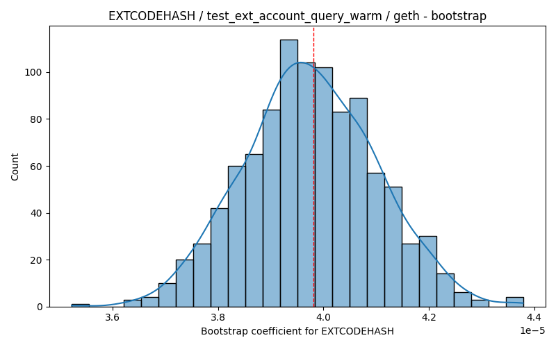

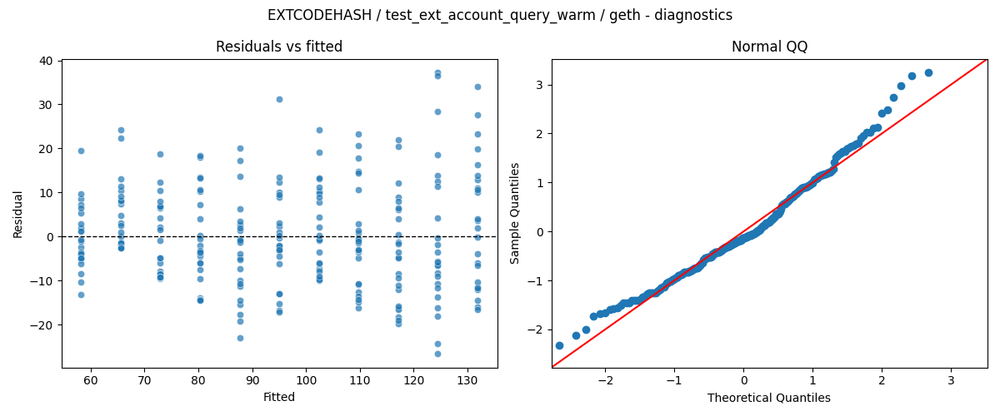

</details>

<details><summary>nethermind — NNLS regression summary</summary>

```
==============================================================================
                           NNLS Regression Results                            
==============================================================================
Dep. Variable:          test_runtime_ms              R-squared:          0.667
Model:                  NNLS                    Adj. R-squared:          0.665
No. Observations:       165                               RMSE:          75.52
Df Residuals:           163                                MAE:          57.70
Df Model:               1      
==============================================================================
                      coef     std err     P-value      [0.025      0.975]
------------------------------------------------------------------------------
         const    173.2199     18.1798       0.001    136.5357    208.5642
       opcount      0.0002      0.0000       0.001      0.0002      0.0002
==============================================================================
Notes: Non-negative least squares with bootstrap inference (1000 iterations)
==============================================================================
```

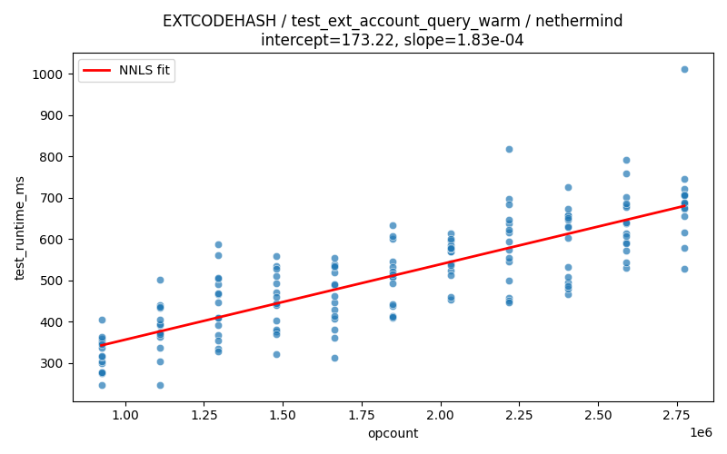

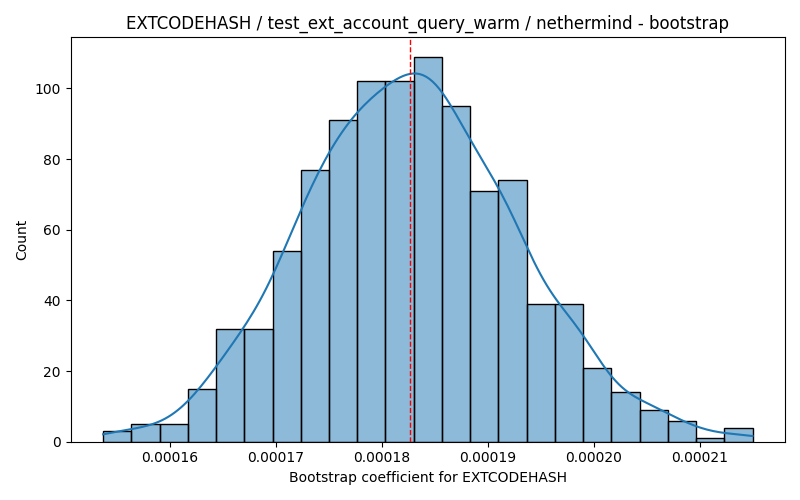

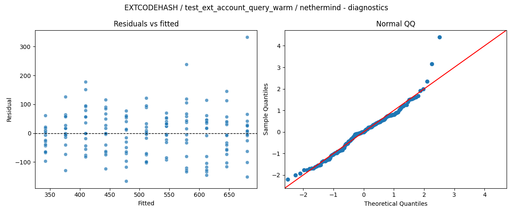

</details>

## EXTCODESIZE

### test_account_access — combo `EXTCODESIZE_AccountMode.NON_EXISTING_ACCOUNT` — `presets[cold_account_nocode_access]`

| client | nobs | R² | target_coef (ms) | p-value | 95% CI |
| --- | --- | --- | --- | --- | --- |
| `besu` | 418 | 0.8592 | 0.01279 | 1.00e-03 | [0.01231, 0.01323] |
| `erigon` | 198 | 0.9637 | 0.00868 | 1.00e-03 | [0.008597, 0.008768] |
| `ethrex` | 275 | 0.9639 | 0.001962 | 1.00e-03 | [0.00192, 0.002007] |
| `geth` | 264 | 0.864 | 0.02162 | 1.00e-03 | [0.02056, 0.02271] |
| `nethermind` | 165 | 0.9296 | 0.003561 | 1.00e-03 | [0.003407, 0.003725] |

<details><summary>besu — NNLS regression summary</summary>

```
==============================================================================
                           NNLS Regression Results                            
==============================================================================
Dep. Variable:          test_runtime_ms              R-squared:          0.859
Model:                  NNLS                    Adj. R-squared:          0.859
No. Observations:       418                               RMSE:         123.78
Df Residuals:           416                                MAE:         107.84
Df Model:               1      
==============================================================================
                      coef     std err     P-value      [0.025      0.975]
------------------------------------------------------------------------------
         const    225.1738     18.0327       0.001    192.5616    261.1569
       opcount      0.0128      0.0002       0.001      0.0123      0.0132
==============================================================================
Notes: Non-negative least squares with bootstrap inference (1000 iterations)
==============================================================================
```

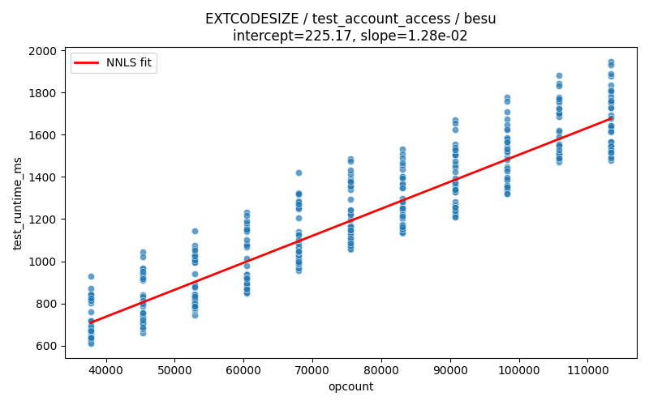

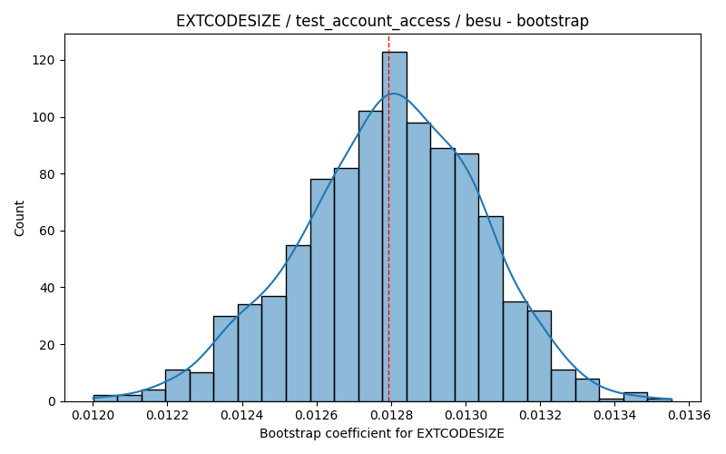

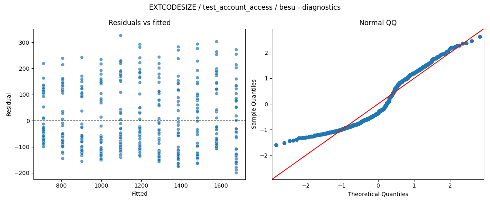

</details>

<details><summary>erigon — NNLS regression summary</summary>

```
==============================================================================
                           NNLS Regression Results                            
==============================================================================
Dep. Variable:          test_runtime_ms              R-squared:          0.964
Model:                  NNLS                    Adj. R-squared:          0.963
No. Observations:       198                               RMSE:          41.17
Df Residuals:           196                                MAE:          33.51
Df Model:               1      
==============================================================================
                      coef     std err     P-value      [0.025      0.975]
------------------------------------------------------------------------------
         const      0.0000      0.3611       1.000      0.0000      0.0000
       opcount      0.0087      0.0000       0.001      0.0086      0.0088
==============================================================================
Notes: Non-negative least squares with bootstrap inference (1000 iterations)
==============================================================================
```

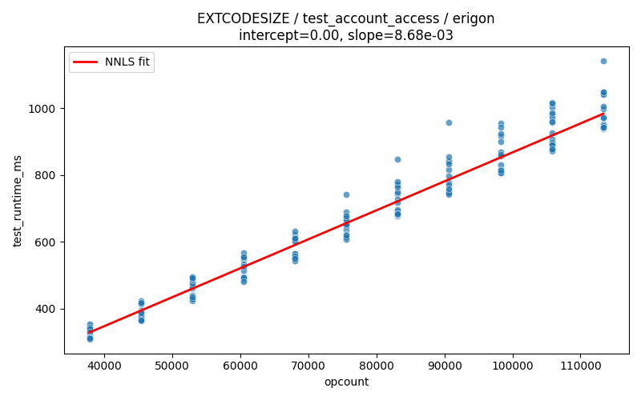

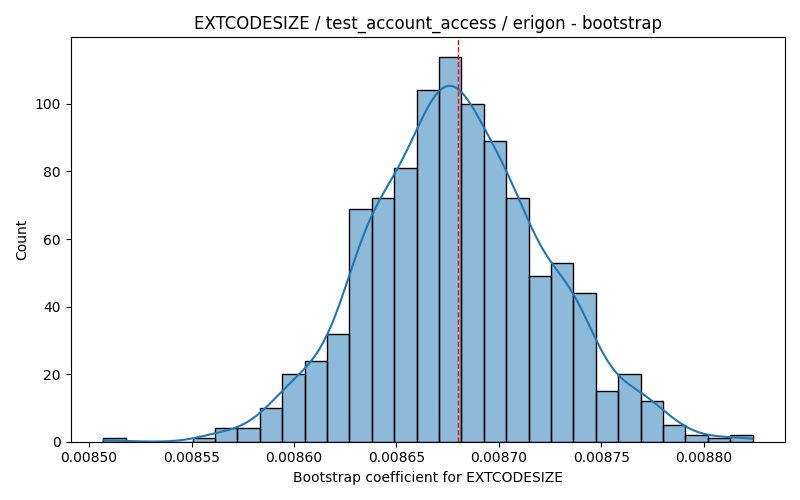

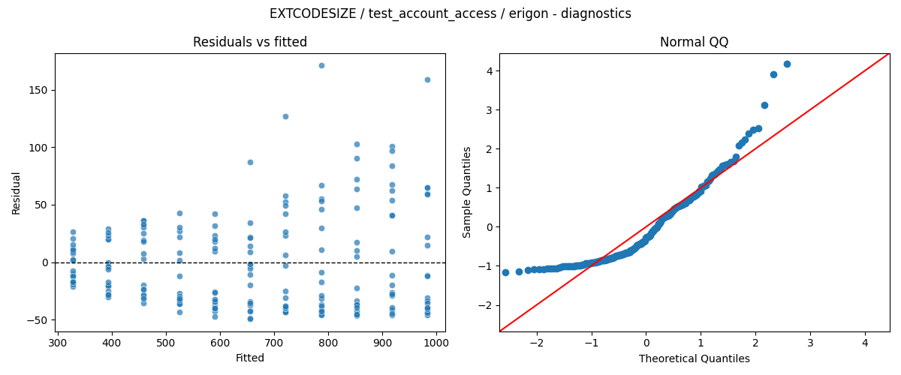

</details>

<details><summary>ethrex — NNLS regression summary</summary>

```
==============================================================================
                           NNLS Regression Results                            
==============================================================================
Dep. Variable:          test_runtime_ms              R-squared:          0.964
Model:                  NNLS                    Adj. R-squared:          0.964
No. Observations:       275                               RMSE:           9.08
Df Residuals:           273                                MAE:           7.14
Df Model:               1      
==============================================================================
                      coef     std err     P-value      [0.025      0.975]
------------------------------------------------------------------------------
         const     28.7338      1.7567       0.001     25.1003     32.0048
       opcount      0.0020      0.0000       0.001      0.0019      0.0020
==============================================================================
Notes: Non-negative least squares with bootstrap inference (1000 iterations)
==============================================================================
```

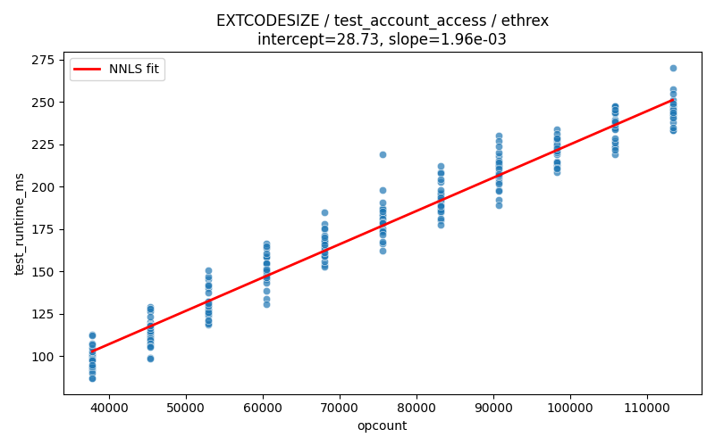

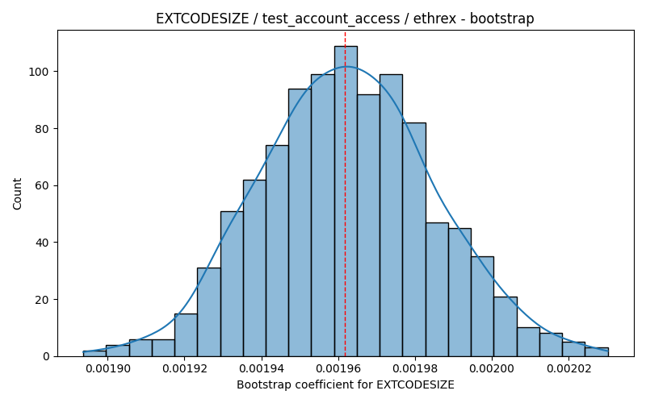

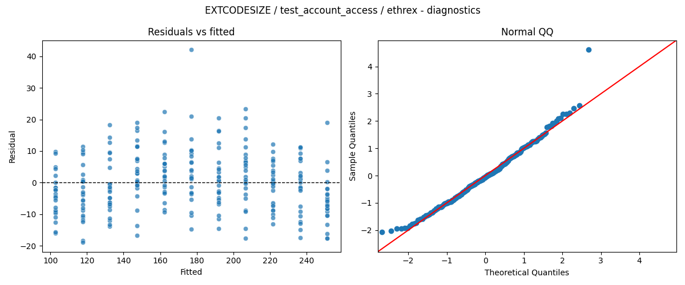

</details>

<details><summary>geth — NNLS regression summary</summary>

```
==============================================================================
                           NNLS Regression Results                            
==============================================================================
Dep. Variable:          test_runtime_ms              R-squared:          0.864
Model:                  NNLS                    Adj. R-squared:          0.863
No. Observations:       264                               RMSE:         205.05
Df Residuals:           262                                MAE:         173.84
Df Model:               1      
==============================================================================
                      coef     std err     P-value      [0.025      0.975]
------------------------------------------------------------------------------
         const    684.8575     46.4451       0.001    593.4647    777.0107
       opcount      0.0216      0.0005       0.001      0.0206      0.0227
==============================================================================
Notes: Non-negative least squares with bootstrap inference (1000 iterations)
==============================================================================
```

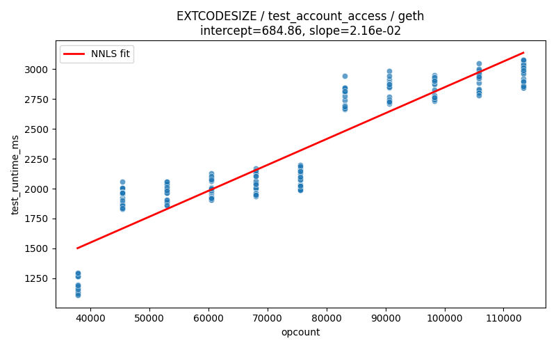

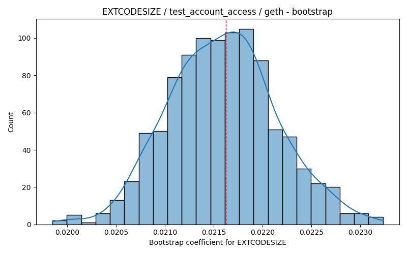

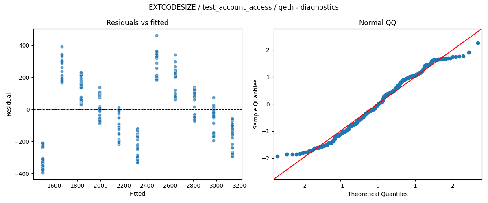

</details>

<details><summary>nethermind — NNLS regression summary</summary>

```
==============================================================================
                           NNLS Regression Results                            
==============================================================================
Dep. Variable:          test_runtime_ms              R-squared:          0.930
Model:                  NNLS                    Adj. R-squared:          0.929
No. Observations:       165                               RMSE:          23.42
Df Residuals:           163                                MAE:          17.91
Df Model:               1      
==============================================================================
                      coef     std err     P-value      [0.025      0.975]
------------------------------------------------------------------------------
         const     72.5644      5.4831       0.001     61.6689     83.3293
       opcount      0.0036      0.0001       0.001      0.0034      0.0037
==============================================================================
Notes: Non-negative least squares with bootstrap inference (1000 iterations)
==============================================================================
```

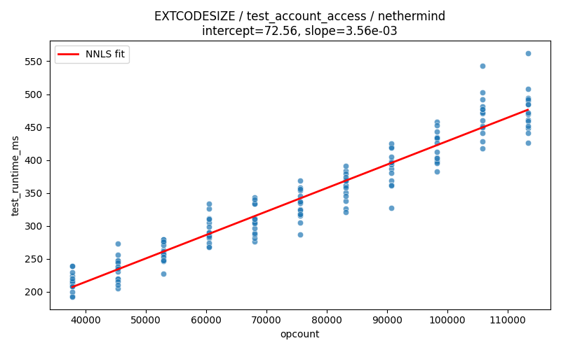

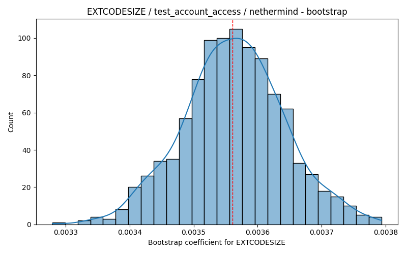

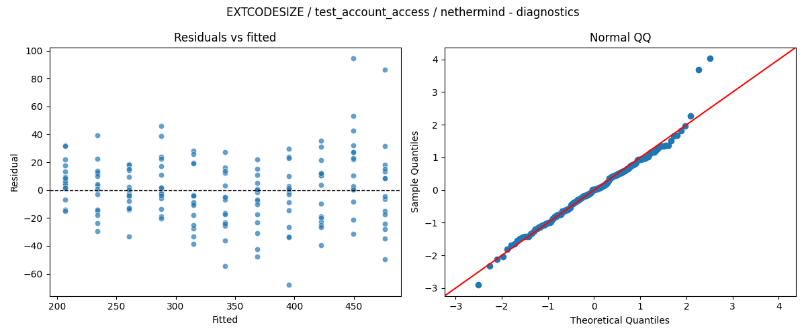

</details>

### test_account_access — combo `EXTCODESIZE_AccountMode.EXISTING_CONTRACT`

| client | nobs | R² | target_coef (ms) | p-value | 95% CI |
| --- | --- | --- | --- | --- | --- |
| `besu` | 418 | 0.8793 | 0.02574 | 1.00e-03 | [0.02488, 0.02658] |
| `erigon` | 198 | 0.9282 | 0.02494 | 1.00e-03 | [0.02388, 0.02581] |
| `ethrex` | 275 | 0.9934 | 0.007704 | 1.00e-03 | [0.007633, 0.007782] |
| `geth` | 264 | 0.86 | 0.02285 | 1.00e-03 | [0.02163, 0.02408] |
| `nethermind` | 165 | 0.8504 | 0.01006 | 1.00e-03 | [0.009439, 0.01066] |

<details><summary>besu — NNLS regression summary</summary>

```
==============================================================================
                           NNLS Regression Results                            
==============================================================================
Dep. Variable:          test_runtime_ms              R-squared:          0.879
Model:                  NNLS                    Adj. R-squared:          0.879
No. Observations:       418                               RMSE:         198.45
Df Residuals:           416                                MAE:         162.20
Df Model:               1      
==============================================================================
                      coef     std err     P-value      [0.025      0.975]
------------------------------------------------------------------------------
         const    402.1491     29.4502       0.001    344.2901    460.1134
       opcount      0.0257      0.0004       0.001      0.0249      0.0266
==============================================================================
Notes: Non-negative least squares with bootstrap inference (1000 iterations)
==============================================================================
```

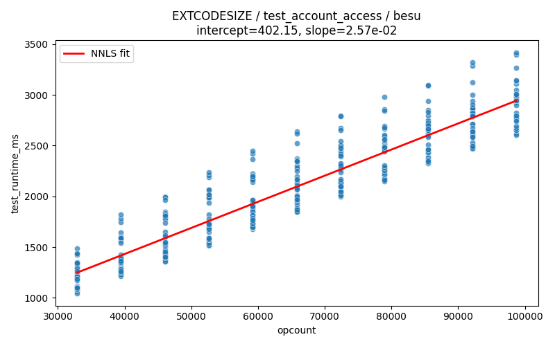

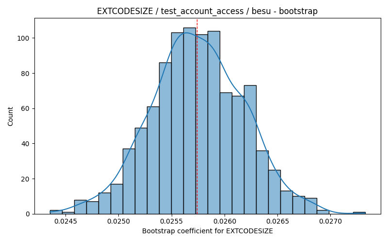

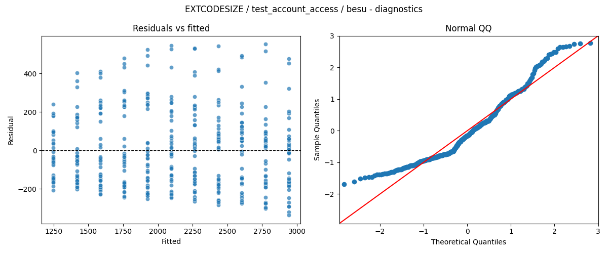

</details>

<details><summary>erigon — NNLS regression summary</summary>

```
==============================================================================
                           NNLS Regression Results                            
==============================================================================
Dep. Variable:          test_runtime_ms              R-squared:          0.928
Model:                  NNLS                    Adj. R-squared:          0.928
No. Observations:       198                               RMSE:         144.34
Df Residuals:           196                                MAE:         120.93
Df Model:               1      
==============================================================================
                      coef     std err     P-value      [0.025      0.975]
------------------------------------------------------------------------------
         const    305.3607     36.5516       0.001    239.4140    381.3157
       opcount      0.0249      0.0005       0.001      0.0239      0.0258
==============================================================================
Notes: Non-negative least squares with bootstrap inference (1000 iterations)
==============================================================================
```

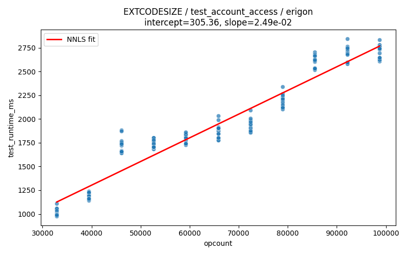

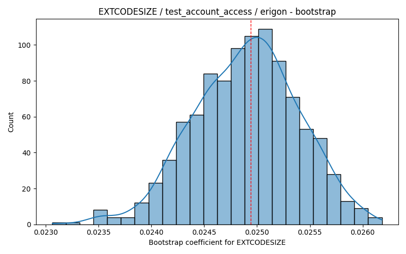

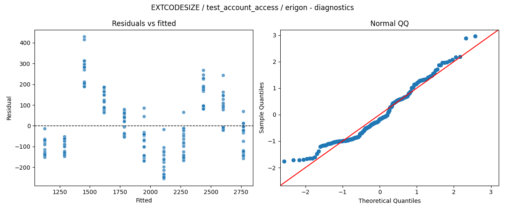

</details>

<details><summary>ethrex — NNLS regression summary</summary>

```
==============================================================================
                           NNLS Regression Results                            
==============================================================================
Dep. Variable:          test_runtime_ms              R-squared:          0.993
Model:                  NNLS                    Adj. R-squared:          0.993
No. Observations:       275                               RMSE:          13.07
Df Residuals:           273                                MAE:          10.09
Df Model:               1      
==============================================================================
                      coef     std err     P-value      [0.025      0.975]
------------------------------------------------------------------------------
         const     44.1905      2.3936       0.001     39.0620     48.6056
       opcount      0.0077      0.0000       0.001      0.0076      0.0078
==============================================================================
Notes: Non-negative least squares with bootstrap inference (1000 iterations)
==============================================================================
```

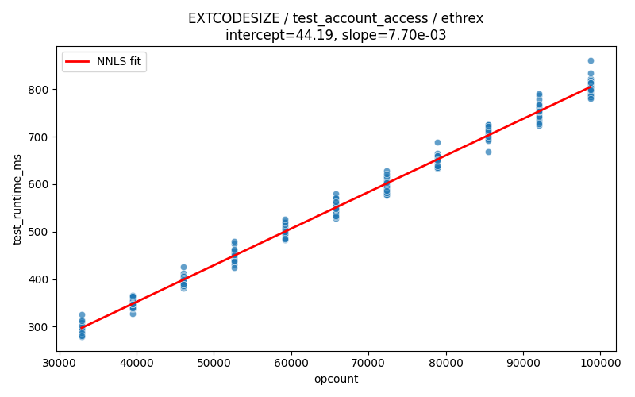

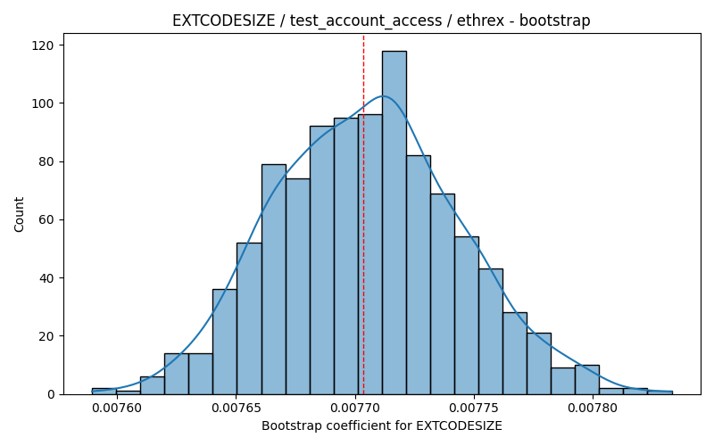

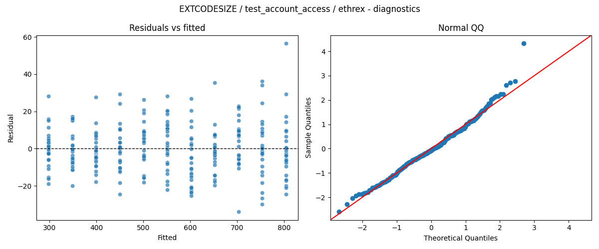

</details>

<details><summary>geth — NNLS regression summary</summary>

```
==============================================================================
                           NNLS Regression Results                            
==============================================================================
Dep. Variable:          test_runtime_ms              R-squared:          0.860
Model:                  NNLS                    Adj. R-squared:          0.859
No. Observations:       264                               RMSE:         191.86
Df Residuals:           262                                MAE:         159.95
Df Model:               1      
==============================================================================
                      coef     std err     P-value      [0.025      0.975]
------------------------------------------------------------------------------
         const    672.8867     46.7871       0.001    579.6960    762.7510
       opcount      0.0229      0.0006       0.001      0.0216      0.0241
==============================================================================
Notes: Non-negative least squares with bootstrap inference (1000 iterations)
==============================================================================
```

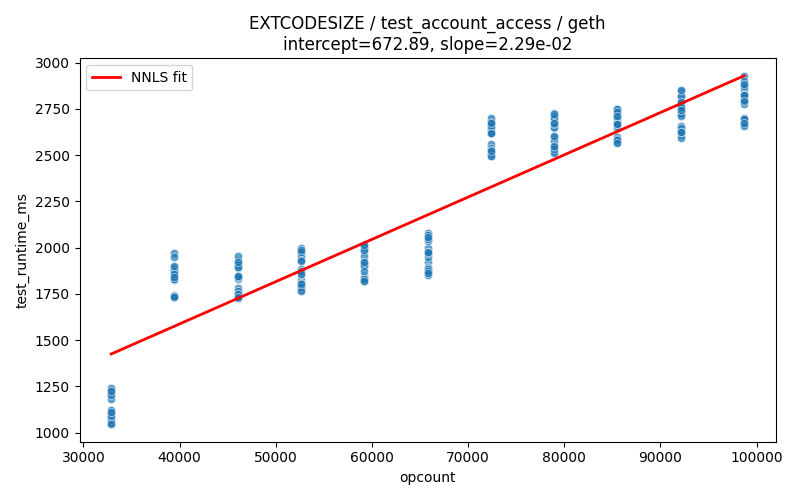


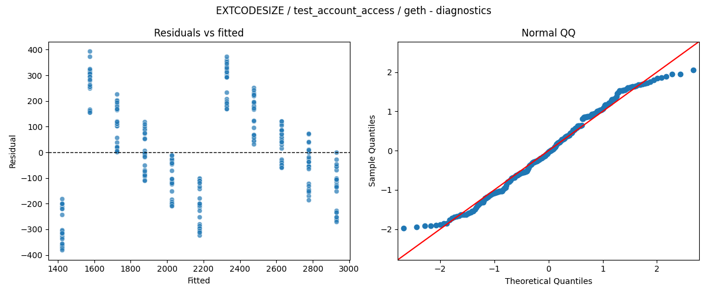

</details>

<details><summary>nethermind — NNLS regression summary</summary>

```
==============================================================================
                           NNLS Regression Results                            
==============================================================================
Dep. Variable:          test_runtime_ms              R-squared:          0.850
Model:                  NNLS                    Adj. R-squared:          0.849
No. Observations:       165                               RMSE:          87.74
Df Residuals:           163                                MAE:          59.27
Df Model:               1      
==============================================================================
                      coef     std err     P-value      [0.025      0.975]
------------------------------------------------------------------------------
         const    137.5965     19.9862       0.001     99.1946    178.2512
       opcount      0.0101      0.0003       0.001      0.0094      0.0107
==============================================================================
Notes: Non-negative least squares with bootstrap inference (1000 iterations)
==============================================================================
```


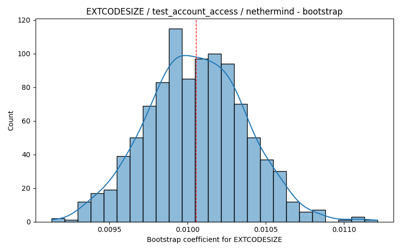

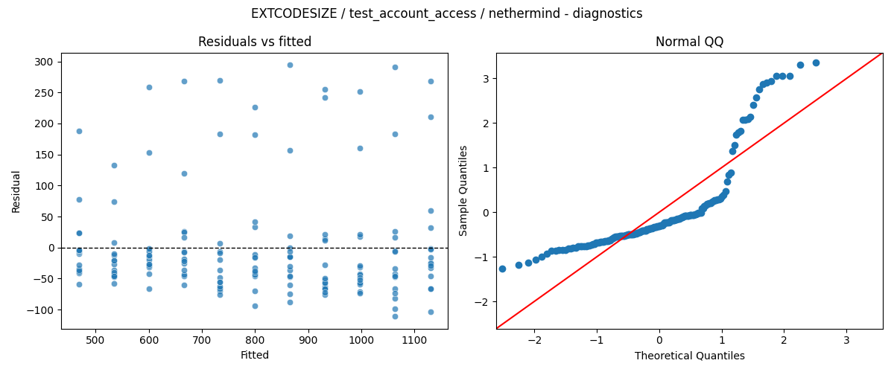

</details>

### test_account_access — combo `EXTCODESIZE_AccountMode.NON_EXISTING_ACCOUNT` — `presets[cold_account_code_access]`

| client | nobs | R² | target_coef (ms) | p-value | 95% CI |
| --- | --- | --- | --- | --- | --- |
| `besu` | 418 | 0.8592 | 0.01279 | 1.00e-03 | [0.01231, 0.01323] |
| `erigon` | 198 | 0.9637 | 0.00868 | 1.00e-03 | [0.008597, 0.008768] |
| `ethrex` | 275 | 0.9639 | 0.001962 | 1.00e-03 | [0.00192, 0.002007] |
| `geth` | 264 | 0.864 | 0.02162 | 1.00e-03 | [0.02056, 0.02271] |
| `nethermind` | 165 | 0.9296 | 0.003561 | 1.00e-03 | [0.003407, 0.003725] |

<details><summary>besu — NNLS regression summary</summary>

```
==============================================================================
                           NNLS Regression Results                            
==============================================================================
Dep. Variable:          test_runtime_ms              R-squared:          0.859
Model:                  NNLS                    Adj. R-squared:          0.859
No. Observations:       418                               RMSE:         123.78
Df Residuals:           416                                MAE:         107.84
Df Model:               1      
==============================================================================
                      coef     std err     P-value      [0.025      0.975]
------------------------------------------------------------------------------
         const    225.1738     18.0327       0.001    192.5616    261.1569
       opcount      0.0128      0.0002       0.001      0.0123      0.0132
==============================================================================
Notes: Non-negative least squares with bootstrap inference (1000 iterations)
==============================================================================
```


</details>

<details><summary>erigon — NNLS regression summary</summary>

```
==============================================================================
                           NNLS Regression Results                            
==============================================================================
Dep. Variable:          test_runtime_ms              R-squared:          0.964
Model:                  NNLS                    Adj. R-squared:          0.963
No. Observations:       198                               RMSE:          41.17
Df Residuals:           196                                MAE:          33.51
Df Model:               1      
==============================================================================
                      coef     std err     P-value      [0.025      0.975]
------------------------------------------------------------------------------
         const      0.0000      0.3611       1.000      0.0000      0.0000
       opcount      0.0087      0.0000       0.001      0.0086      0.0088
==============================================================================
Notes: Non-negative least squares with bootstrap inference (1000 iterations)
==============================================================================
```


</details>

<details><summary>ethrex — NNLS regression summary</summary>

```
==============================================================================
                           NNLS Regression Results                            
==============================================================================
Dep. Variable:          test_runtime_ms              R-squared:          0.964
Model:                  NNLS                    Adj. R-squared:          0.964
No. Observations:       275                               RMSE:           9.08
Df Residuals:           273                                MAE:           7.14
Df Model:               1      
==============================================================================
                      coef     std err     P-value      [0.025      0.975]
------------------------------------------------------------------------------
         const     28.7338      1.7567       0.001     25.1003     32.0048
       opcount      0.0020      0.0000       0.001      0.0019      0.0020
==============================================================================
Notes: Non-negative least squares with bootstrap inference (1000 iterations)
==============================================================================
```


</details>

<details><summary>geth — NNLS regression summary</summary>

```
==============================================================================
                           NNLS Regression Results                            
==============================================================================
Dep. Variable:          test_runtime_ms              R-squared:          0.864
Model:                  NNLS                    Adj. R-squared:          0.863
No. Observations:       264                               RMSE:         205.05
Df Residuals:           262                                MAE:         173.84
Df Model:               1      
==============================================================================
                      coef     std err     P-value      [0.025      0.975]
------------------------------------------------------------------------------
         const    684.8575     46.4451       0.001    593.4647    777.0107
       opcount      0.0216      0.0005       0.001      0.0206      0.0227
==============================================================================
Notes: Non-negative least squares with bootstrap inference (1000 iterations)
==============================================================================
```


</details>

<details><summary>nethermind — NNLS regression summary</summary>

```
==============================================================================
                           NNLS Regression Results                            
==============================================================================
Dep. Variable:          test_runtime_ms              R-squared:          0.930
Model:                  NNLS                    Adj. R-squared:          0.929
No. Observations:       165                               RMSE:          23.42
Df Residuals:           163                                MAE:          17.91
Df Model:               1      
==============================================================================
                      coef     std err     P-value      [0.025      0.975]
------------------------------------------------------------------------------
         const     72.5644      5.4831       0.001     61.6689     83.3293
       opcount      0.0036      0.0001       0.001      0.0034      0.0037
==============================================================================
Notes: Non-negative least squares with bootstrap inference (1000 iterations)
==============================================================================
```


</details>

### test_ext_account_query_warm — combo `EXTCODESIZE`

| client | nobs | R² | target_coef (ms) | p-value | 95% CI |
| --- | --- | --- | --- | --- | --- |
| `besu` | 418 | 0.2081 | 7.36e-05 | 1.00e-03 | [5.854e-05, 8.622e-05] |
| `erigon` | 198 | 0.8926 | 4.826e-05 | 1.00e-03 | [4.592e-05, 5.058e-05] |
| `ethrex` | 275 | 0.2632 | 1.322e-05 | 1.00e-03 | [1.067e-05, 1.584e-05] |
| `geth` | 264 | 0.7718 | 3.176e-05 | 1.00e-03 | [2.979e-05, 3.373e-05] |
| `nethermind` | 165 | 0.7068 | 0.0001492 | 1.00e-03 | [0.0001357, 0.0001633] |

<details><summary>besu — NNLS regression summary</summary>

```
==============================================================================
                           NNLS Regression Results                            
==============================================================================
Dep. Variable:          test_runtime_ms              R-squared:          0.208
Model:                  NNLS                    Adj. R-squared:          0.206
No. Observations:       418                               RMSE:          83.97
Df Residuals:           416                                MAE:          63.41
Df Model:               1      
==============================================================================
                      coef     std err     P-value      [0.025      0.975]
------------------------------------------------------------------------------
         const    194.8540     12.9466       0.001    171.2924    221.4060
       opcount      0.0001      0.0000       0.001      0.0001      0.0001
==============================================================================
Notes: Non-negative least squares with bootstrap inference (1000 iterations)
==============================================================================
```

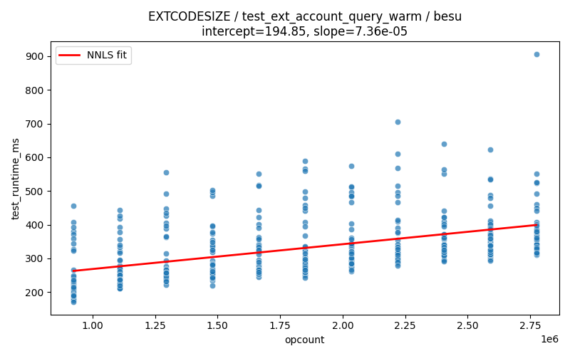

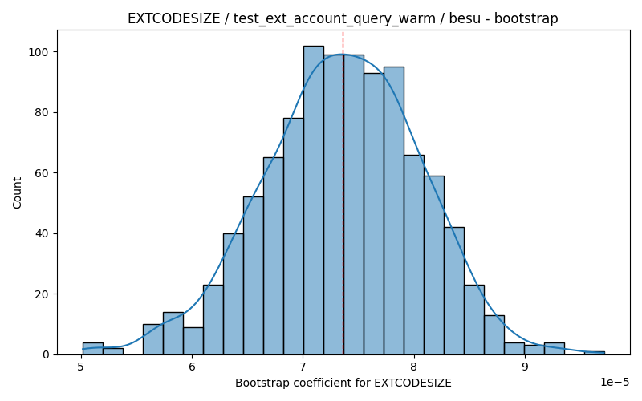

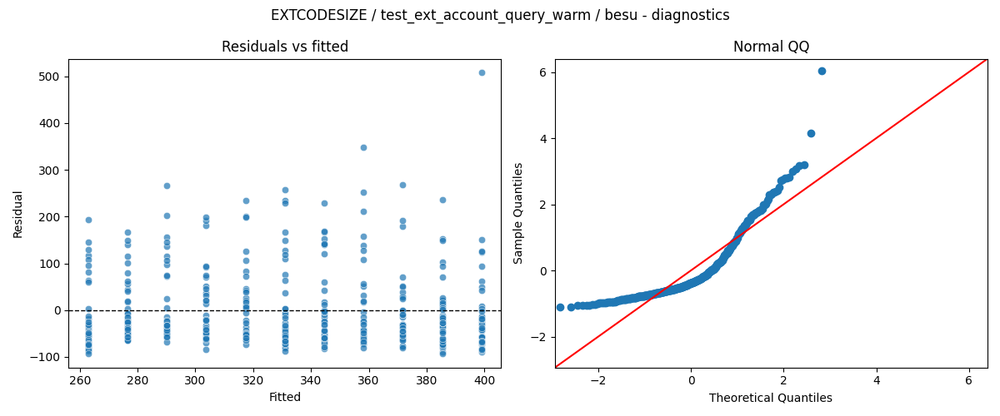

</details>

<details><summary>erigon — NNLS regression summary</summary>

```
==============================================================================
                           NNLS Regression Results                            
==============================================================================
Dep. Variable:          test_runtime_ms              R-squared:          0.893
Model:                  NNLS                    Adj. R-squared:          0.892
No. Observations:       198                               RMSE:           9.79
Df Residuals:           196                                MAE:           7.71
Df Model:               1      
==============================================================================
                      coef     std err     P-value      [0.025      0.975]
------------------------------------------------------------------------------
         const     27.2571      2.0212       0.001     23.4577     31.1660
       opcount      0.0000      0.0000       0.001      0.0000      0.0001
==============================================================================
Notes: Non-negative least squares with bootstrap inference (1000 iterations)
==============================================================================
```

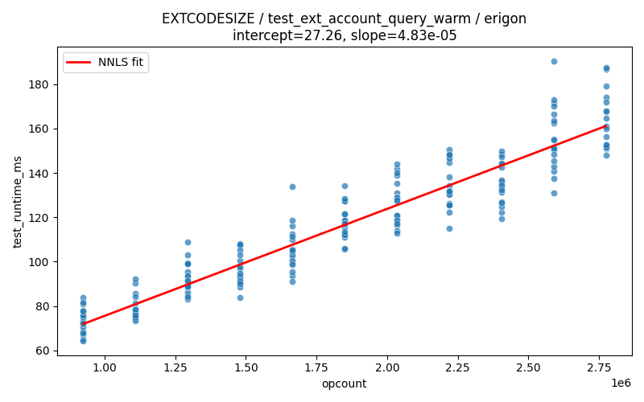

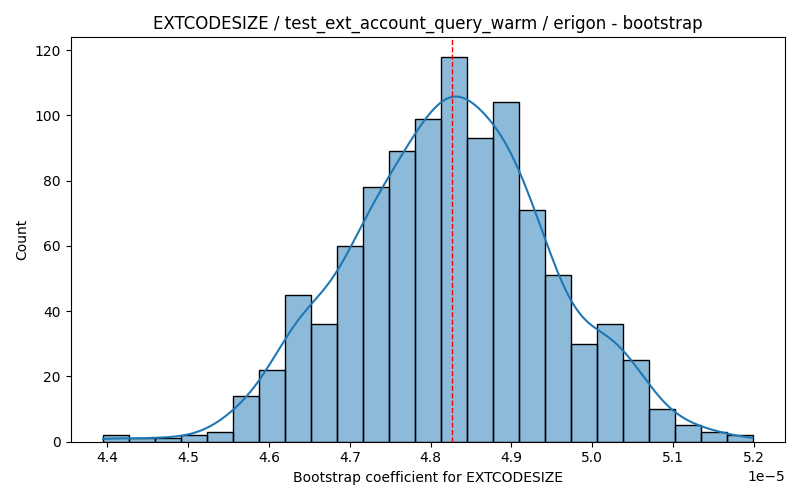

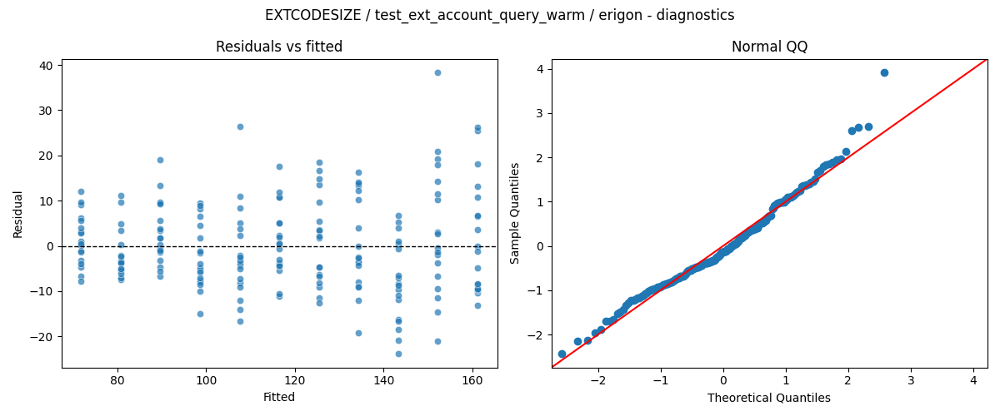

</details>

<details><summary>ethrex — NNLS regression summary</summary>

```
==============================================================================
                           NNLS Regression Results                            
==============================================================================
Dep. Variable:          test_runtime_ms              R-squared:          0.263
Model:                  NNLS                    Adj. R-squared:          0.260
No. Observations:       275                               RMSE:          12.93
Df Residuals:           273                                MAE:           8.27
Df Model:               1      
==============================================================================
                      coef     std err     P-value      [0.025      0.975]
------------------------------------------------------------------------------
         const     15.0092      2.6841       0.001      9.8074     20.1367
       opcount      0.0000      0.0000       0.001      0.0000      0.0000
==============================================================================
Notes: Non-negative least squares with bootstrap inference (1000 iterations)
==============================================================================
```

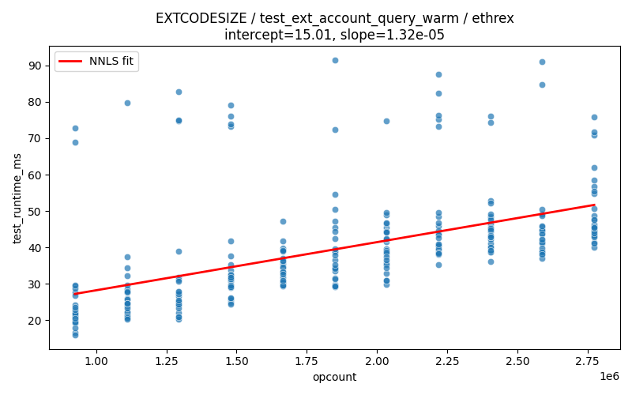

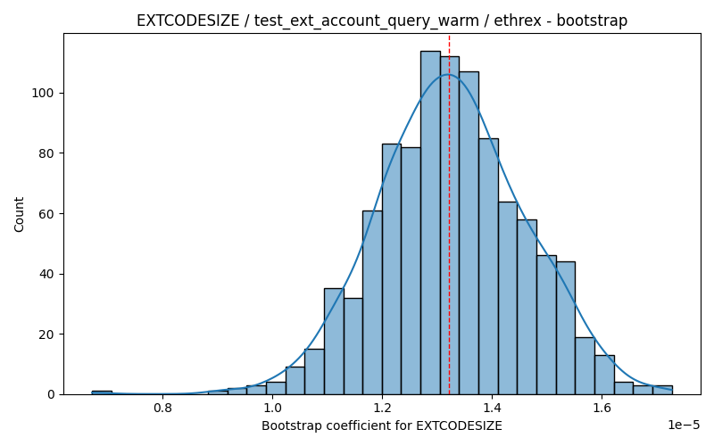

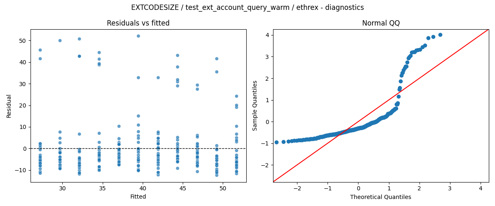

</details>

<details><summary>geth — NNLS regression summary</summary>

```
==============================================================================
                           NNLS Regression Results                            
==============================================================================
Dep. Variable:          test_runtime_ms              R-squared:          0.772
Model:                  NNLS                    Adj. R-squared:          0.771
No. Observations:       264                               RMSE:          10.10
Df Residuals:           262                                MAE:           8.02
Df Model:               1      
==============================================================================
                      coef     std err     P-value      [0.025      0.975]
------------------------------------------------------------------------------
         const     16.9632      1.6778       0.001     13.7101     20.4288
       opcount      0.0000      0.0000       0.001      0.0000      0.0000
==============================================================================
Notes: Non-negative least squares with bootstrap inference (1000 iterations)
==============================================================================
```

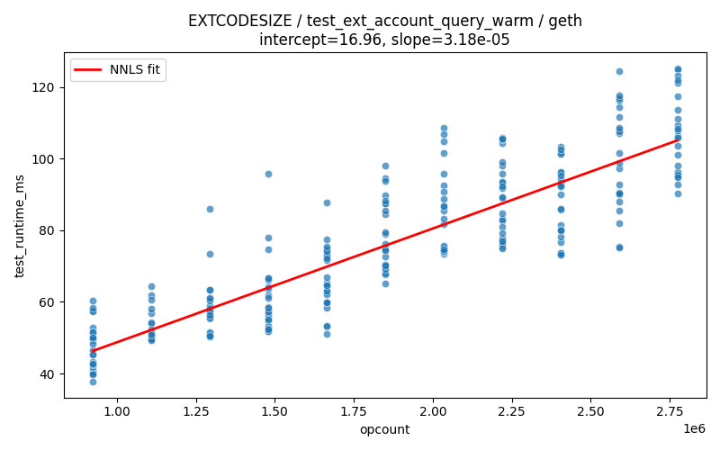

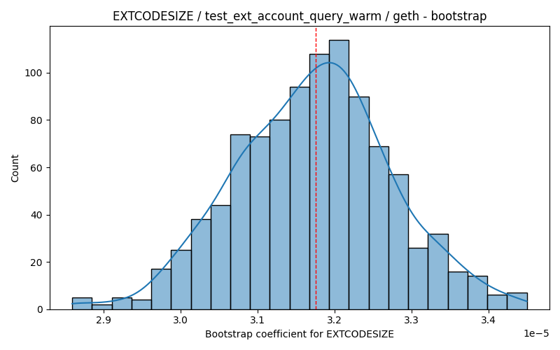

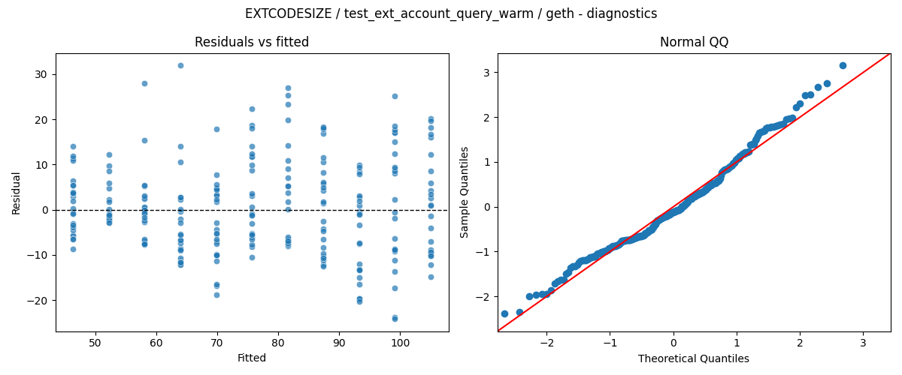

</details>

<details><summary>nethermind — NNLS regression summary</summary>

```
==============================================================================
                           NNLS Regression Results                            
==============================================================================
Dep. Variable:          test_runtime_ms              R-squared:          0.707
Model:                  NNLS                    Adj. R-squared:          0.705
No. Observations:       165                               RMSE:          56.21
Df Residuals:           163                                MAE:          45.29
Df Model:               1      
==============================================================================
                      coef     std err     P-value      [0.025      0.975]
------------------------------------------------------------------------------
         const    174.6640     12.2634       0.001    150.3644    197.9232
       opcount      0.0001      0.0000       0.001      0.0001      0.0002
==============================================================================
Notes: Non-negative least squares with bootstrap inference (1000 iterations)
==============================================================================
```

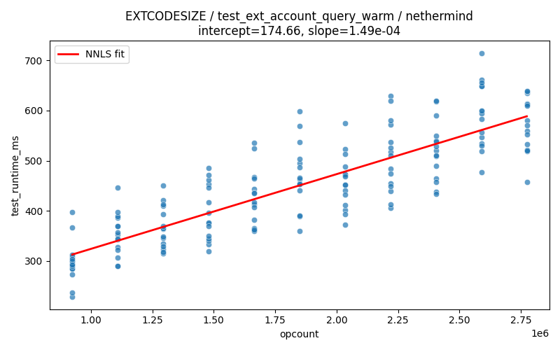

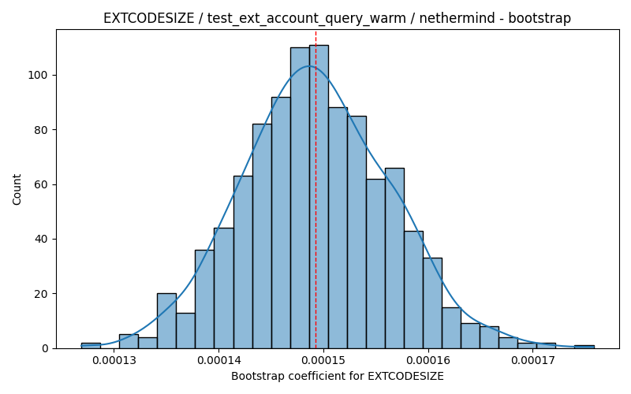

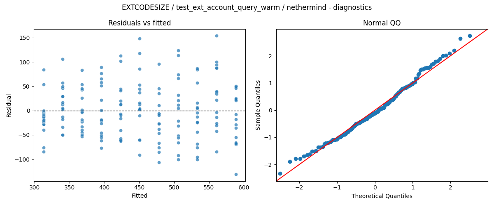

</details>

## STATICCALL

### test_account_access — combo `STATICCALL_AccountMode.EXISTING_EOA`

| client | nobs | R² | target_coef (ms) | p-value | 95% CI |
| --- | --- | --- | --- | --- | --- |
| `besu` | 418 | 0.7818 | 0.01451 | 1.00e-03 | [0.01376, 0.01519] |
| `erigon` | 198 | 0.9672 | 0.01054 | 1.00e-03 | [0.01025, 0.01071] |
| `ethrex` | 275 | 0.994 | 0.007237 | 1.00e-03 | [0.007162, 0.007307] |
| `geth` | 264 | 0.9007 | 0.0111 | 1.00e-03 | [0.0106, 0.01155] |
| `nethermind` | 165 | 0.9099 | 0.003866 | 1.00e-03 | [0.003669, 0.004047] |

<details><summary>besu — NNLS regression summary</summary>

```
==============================================================================
                           NNLS Regression Results                            
==============================================================================
Dep. Variable:          test_runtime_ms              R-squared:          0.782
Model:                  NNLS                    Adj. R-squared:          0.781
No. Observations:       418                               RMSE:         182.23
Df Residuals:           416                                MAE:         155.51
Df Model:               1      
==============================================================================
                      coef     std err     P-value      [0.025      0.975]
------------------------------------------------------------------------------
         const    633.9301     27.3681       0.001    581.7581    690.8664
       opcount      0.0145      0.0004       0.001      0.0138      0.0152
==============================================================================
Notes: Non-negative least squares with bootstrap inference (1000 iterations)
==============================================================================
```

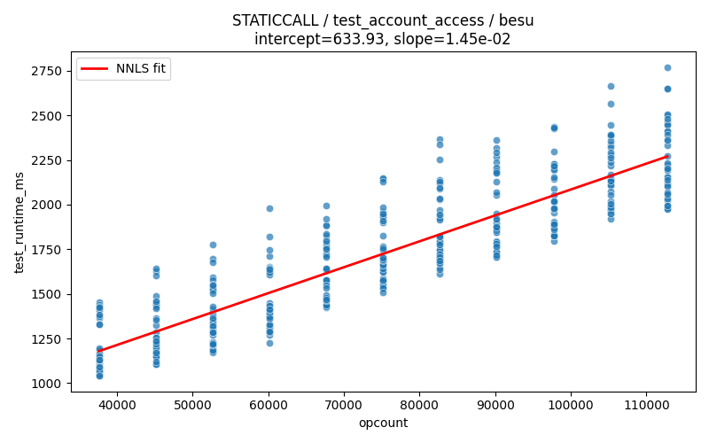

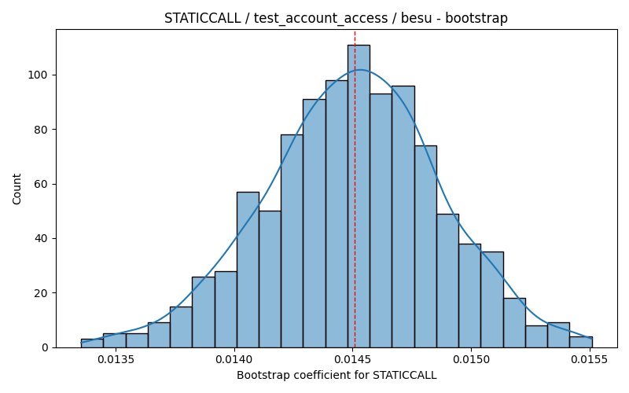

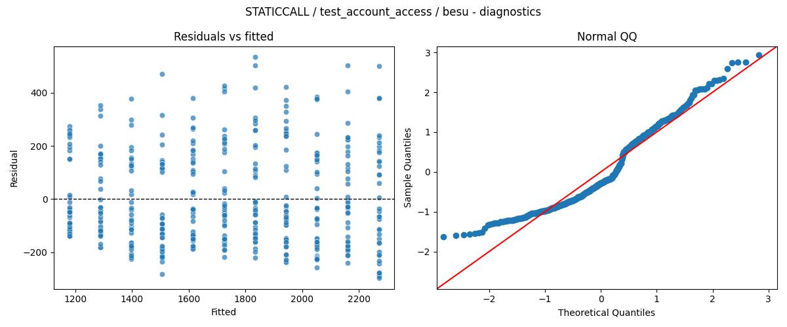

</details>

<details><summary>erigon — NNLS regression summary</summary>

```
==============================================================================
                           NNLS Regression Results                            
==============================================================================
Dep. Variable:          test_runtime_ms              R-squared:          0.967
Model:                  NNLS                    Adj. R-squared:          0.967
No. Observations:       198                               RMSE:          46.18
Df Residuals:           196                                MAE:          38.97
Df Model:               1      
==============================================================================
                      coef     std err     P-value      [0.025      0.975]
------------------------------------------------------------------------------
         const      7.0238      7.8971       0.234      0.0000     27.6078
       opcount      0.0105      0.0001       0.001      0.0103      0.0107
==============================================================================
Notes: Non-negative least squares with bootstrap inference (1000 iterations)
==============================================================================
```

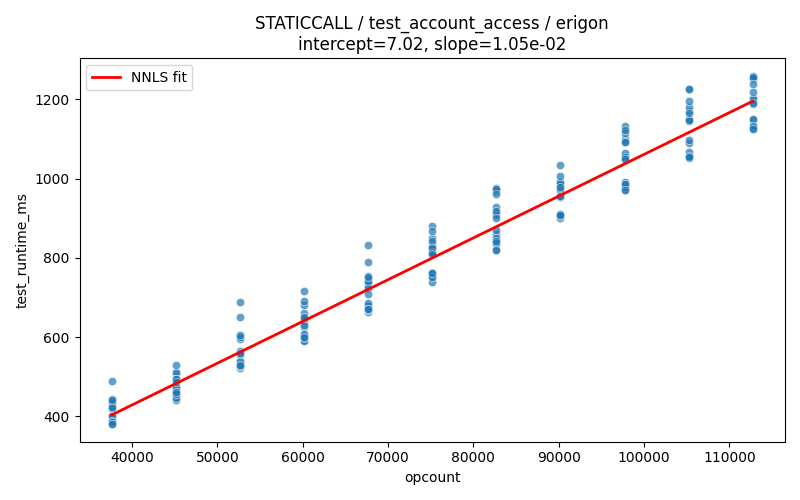

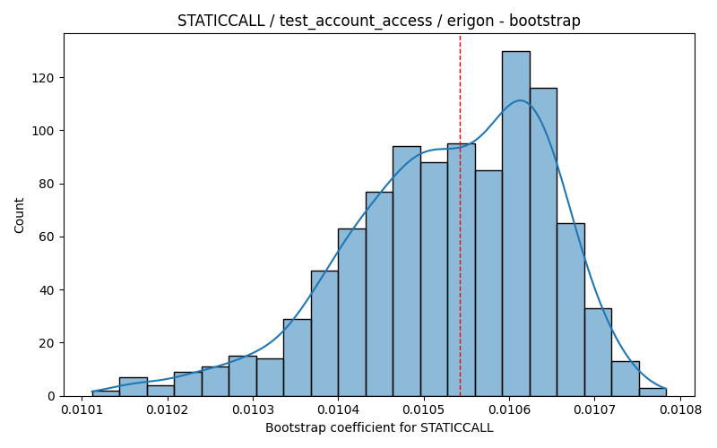

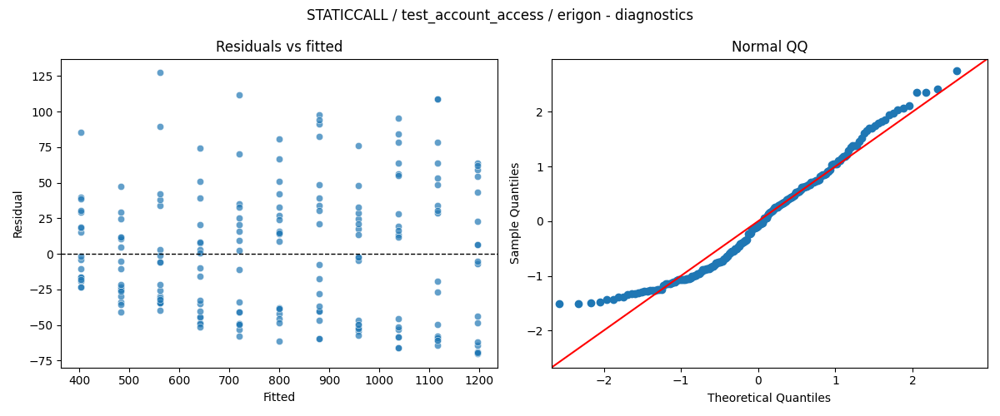

</details>

<details><summary>ethrex — NNLS regression summary</summary>

```
==============================================================================
                           NNLS Regression Results                            
==============================================================================
Dep. Variable:          test_runtime_ms              R-squared:          0.994
Model:                  NNLS                    Adj. R-squared:          0.994
No. Observations:       275                               RMSE:          13.37
Df Residuals:           273                                MAE:          10.41
Df Model:               1      
==============================================================================
                      coef     std err     P-value      [0.025      0.975]
------------------------------------------------------------------------------
         const     48.2165      2.7080       0.001     43.3136     53.7902
       opcount      0.0072      0.0000       0.001      0.0072      0.0073
==============================================================================
Notes: Non-negative least squares with bootstrap inference (1000 iterations)
==============================================================================
```

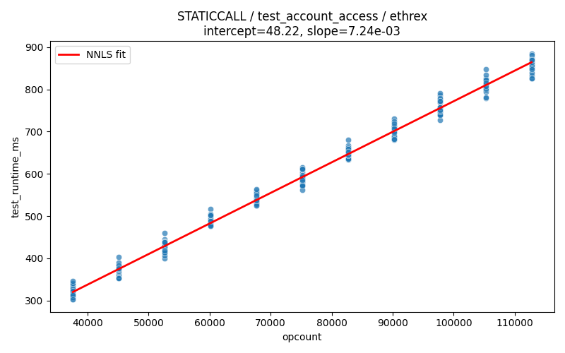

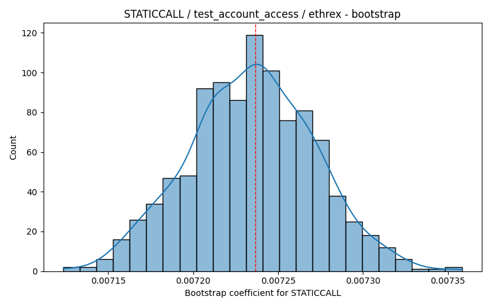

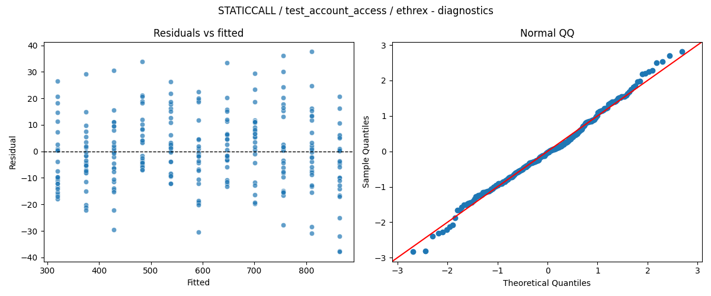

</details>

<details><summary>geth — NNLS regression summary</summary>

```
==============================================================================
                           NNLS Regression Results                            
==============================================================================
Dep. Variable:          test_runtime_ms              R-squared:          0.901
Model:                  NNLS                    Adj. R-squared:          0.900
No. Observations:       264                               RMSE:          87.59
Df Residuals:           262                                MAE:          73.24
Df Model:               1      
==============================================================================
                      coef     std err     P-value      [0.025      0.975]
------------------------------------------------------------------------------
         const    402.9466     20.9368       0.001    364.8757    445.1857
       opcount      0.0111      0.0002       0.001      0.0106      0.0115
==============================================================================
Notes: Non-negative least squares with bootstrap inference (1000 iterations)
==============================================================================
```

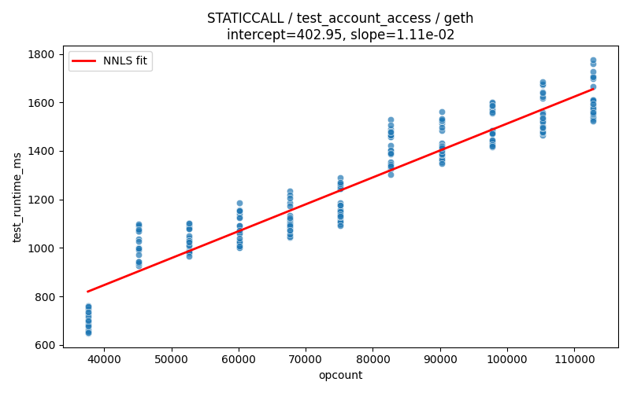

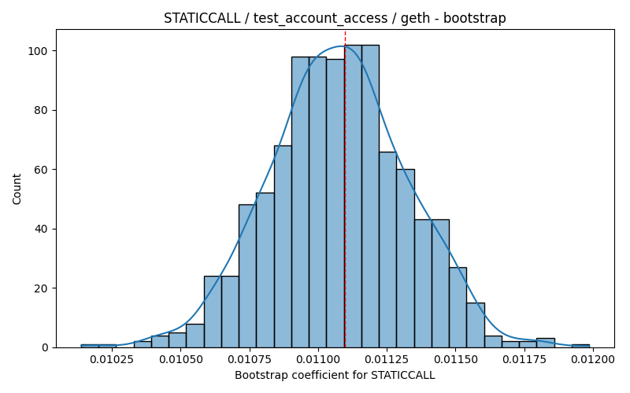

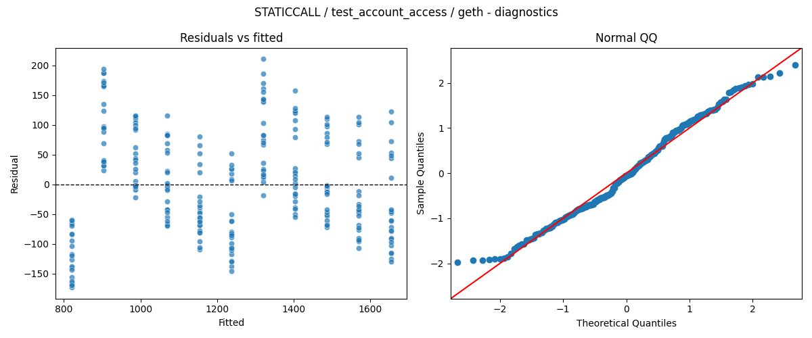

</details>

<details><summary>nethermind — NNLS regression summary</summary>

```
==============================================================================
                           NNLS Regression Results                            
==============================================================================
Dep. Variable:          test_runtime_ms              R-squared:          0.910
Model:                  NNLS                    Adj. R-squared:          0.909
No. Observations:       165                               RMSE:          28.92
Df Residuals:           163                                MAE:          22.59
Df Model:               1      
==============================================================================
                      coef     std err     P-value      [0.025      0.975]
------------------------------------------------------------------------------
         const    110.1135      6.5081       0.001     97.4787    123.7003
       opcount      0.0039      0.0001       0.001      0.0037      0.0040
==============================================================================
Notes: Non-negative least squares with bootstrap inference (1000 iterations)
==============================================================================
```

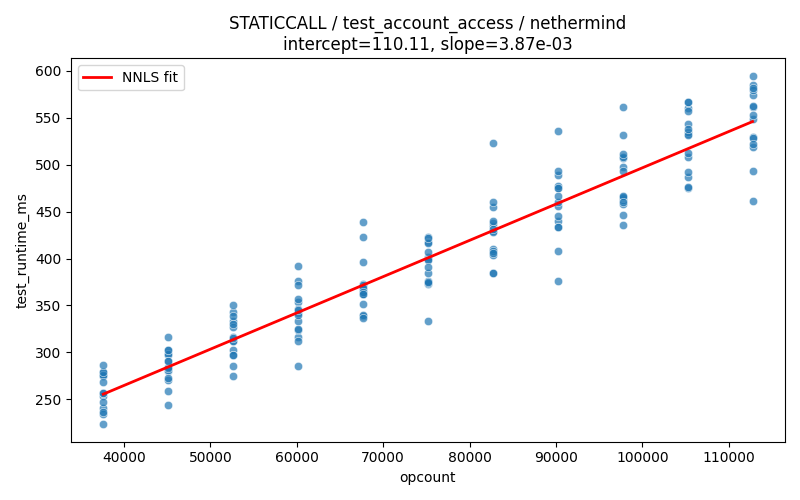

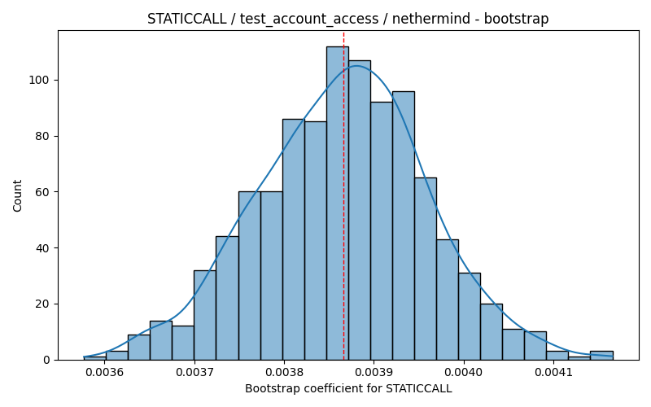

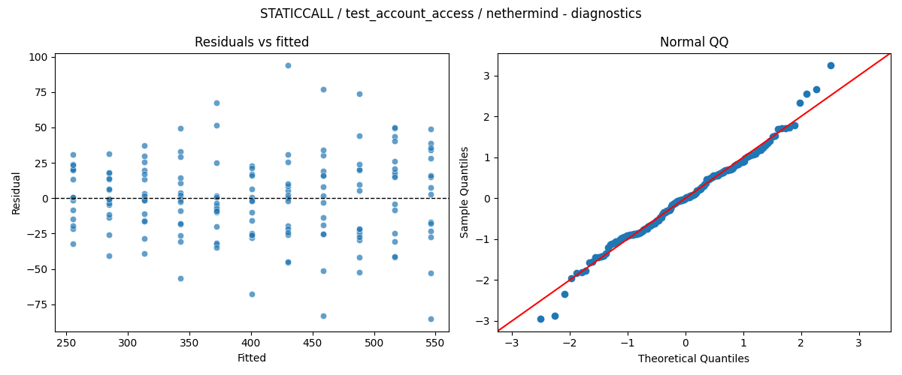

</details>

### test_account_access — combo `STATICCALL_AccountMode.NON_EXISTING_ACCOUNT` — `presets[cold_account_nocode_access]`

| client | nobs | R² | target_coef (ms) | p-value | 95% CI |
| --- | --- | --- | --- | --- | --- |
| `besu` | 418 | 0.8526 | 0.01499 | 1.00e-03 | [0.01438, 0.0156] |
| `erigon` | 198 | 0.9574 | 0.01213 | 1.00e-03 | [0.01199, 0.01226] |
| `ethrex` | 275 | 0.962 | 0.002017 | 1.00e-03 | [0.001966, 0.002063] |
| `geth` | 264 | 0.868 | 0.02253 | 1.00e-03 | [0.0214, 0.02367] |
| `nethermind` | 165 | 0.9161 | 0.003722 | 1.00e-03 | [0.003553, 0.003893] |

<details><summary>besu — NNLS regression summary</summary>

```
==============================================================================
                           NNLS Regression Results                            
==============================================================================
Dep. Variable:          test_runtime_ms              R-squared:          0.853
Model:                  NNLS                    Adj. R-squared:          0.852
No. Observations:       418                               RMSE:         148.12
Df Residuals:           416                                MAE:         124.24
Df Model:               1      
==============================================================================
                      coef     std err     P-value      [0.025      0.975]
------------------------------------------------------------------------------
         const    324.3908     23.5607       0.001    275.1557    369.3840
       opcount      0.0150      0.0003       0.001      0.0144      0.0156
==============================================================================
Notes: Non-negative least squares with bootstrap inference (1000 iterations)
==============================================================================
```

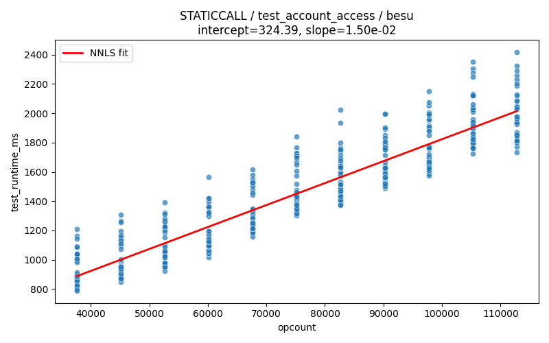

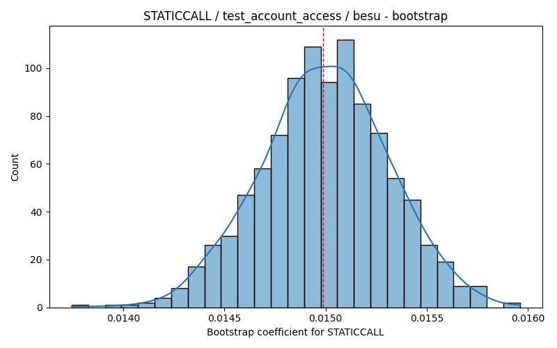

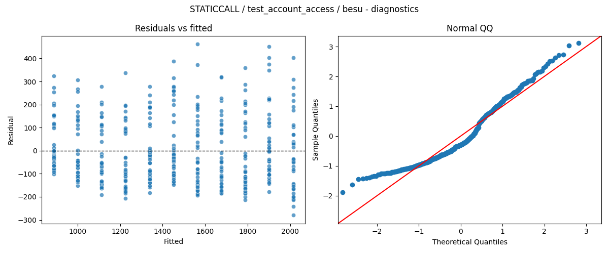

</details>

<details><summary>erigon — NNLS regression summary</summary>

```
==============================================================================
                           NNLS Regression Results                            
==============================================================================
Dep. Variable:          test_runtime_ms              R-squared:          0.957
Model:                  NNLS                    Adj. R-squared:          0.957
No. Observations:       198                               RMSE:          65.39
Df Residuals:           196                                MAE:          53.00
Df Model:               1      
==============================================================================
                      coef     std err     P-value      [0.025      0.975]
------------------------------------------------------------------------------
         const      0.0000      0.0000       1.000      0.0000      0.0000
       opcount      0.0121      0.0001       0.001      0.0120      0.0123
==============================================================================
Notes: Non-negative least squares with bootstrap inference (1000 iterations)
==============================================================================
```

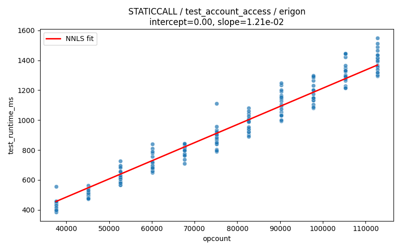

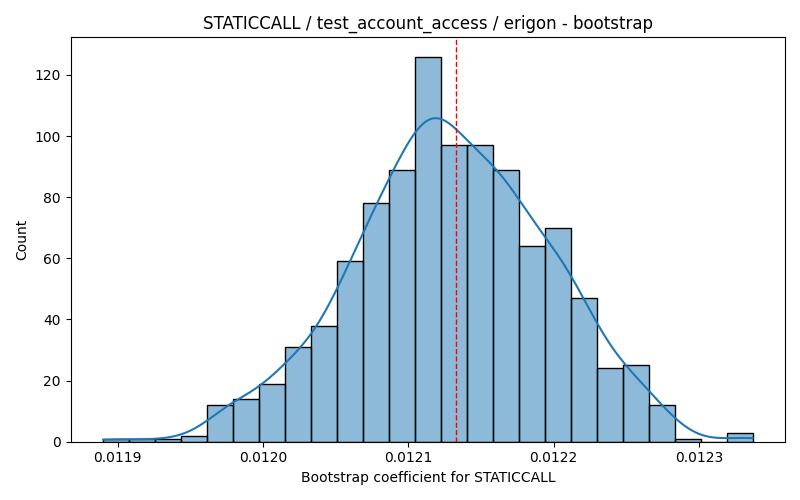

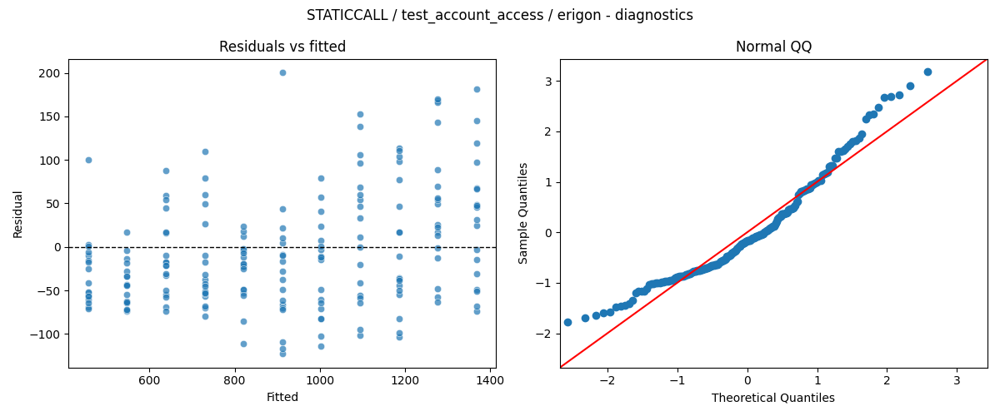

</details>

<details><summary>ethrex — NNLS regression summary</summary>

```
==============================================================================
                           NNLS Regression Results                            
==============================================================================
Dep. Variable:          test_runtime_ms              R-squared:          0.962
Model:                  NNLS                    Adj. R-squared:          0.962
No. Observations:       275                               RMSE:           9.53
Df Residuals:           273                                MAE:           7.62
Df Model:               1      
==============================================================================
                      coef     std err     P-value      [0.025      0.975]
------------------------------------------------------------------------------
         const     31.4661      2.0144       0.001     27.9270     35.6720
       opcount      0.0020      0.0000       0.001      0.0020      0.0021
==============================================================================
Notes: Non-negative least squares with bootstrap inference (1000 iterations)
==============================================================================
```

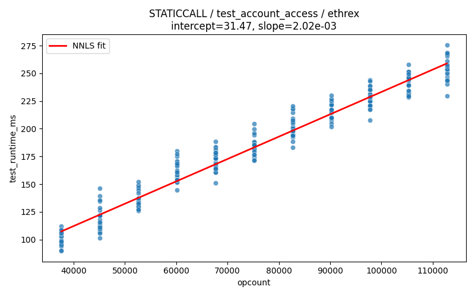

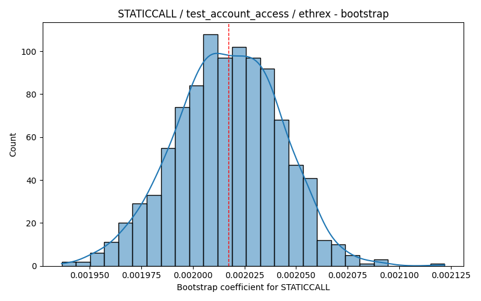

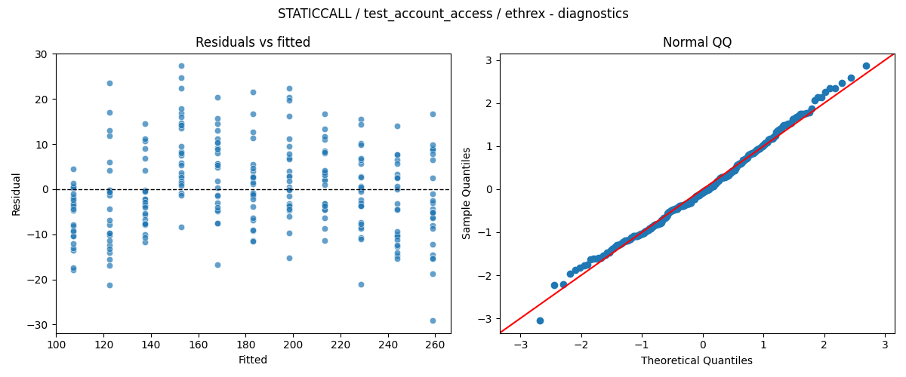

</details>

<details><summary>geth — NNLS regression summary</summary>

```
==============================================================================
                           NNLS Regression Results                            
==============================================================================
Dep. Variable:          test_runtime_ms              R-squared:          0.868
Model:                  NNLS                    Adj. R-squared:          0.867
No. Observations:       264                               RMSE:         208.88
Df Residuals:           262                                MAE:         177.91
Df Model:               1      
==============================================================================
                      coef     std err     P-value      [0.025      0.975]
------------------------------------------------------------------------------
         const    706.6052     48.4932       0.001    610.6142    799.8592
       opcount      0.0225      0.0006       0.001      0.0214      0.0237
==============================================================================
Notes: Non-negative least squares with bootstrap inference (1000 iterations)
==============================================================================
```

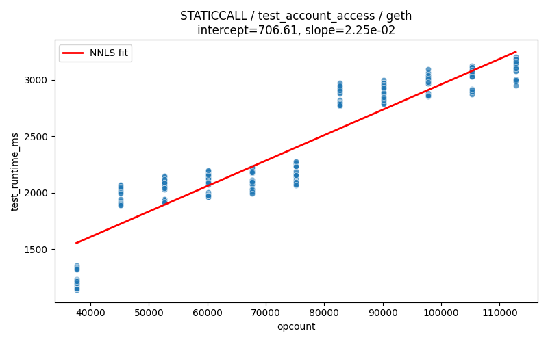

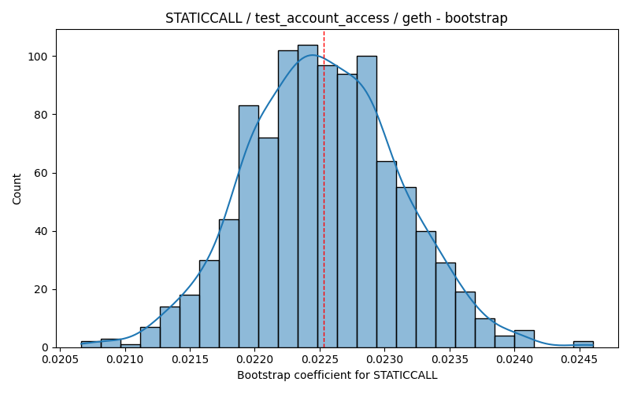

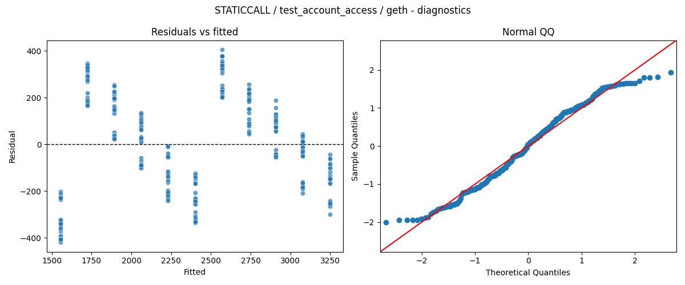

</details>

<details><summary>nethermind — NNLS regression summary</summary>

```
==============================================================================
                           NNLS Regression Results                            
==============================================================================
Dep. Variable:          test_runtime_ms              R-squared:          0.916
Model:                  NNLS                    Adj. R-squared:          0.916
No. Observations:       165                               RMSE:          26.78
Df Residuals:           163                                MAE:          21.71
Df Model:               1      
==============================================================================
                      coef     std err     P-value      [0.025      0.975]
------------------------------------------------------------------------------
         const     86.1543      6.4287       0.001     73.6111     98.5193
       opcount      0.0037      0.0001       0.001      0.0036      0.0039
==============================================================================
Notes: Non-negative least squares with bootstrap inference (1000 iterations)
==============================================================================
```

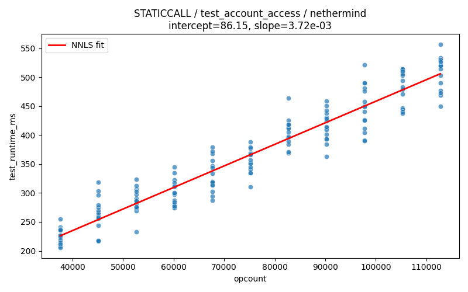

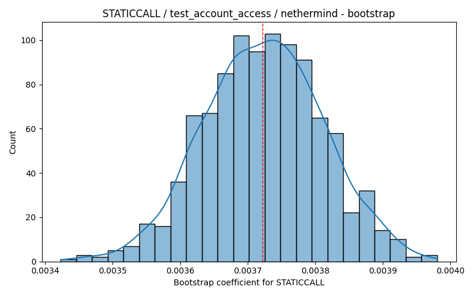

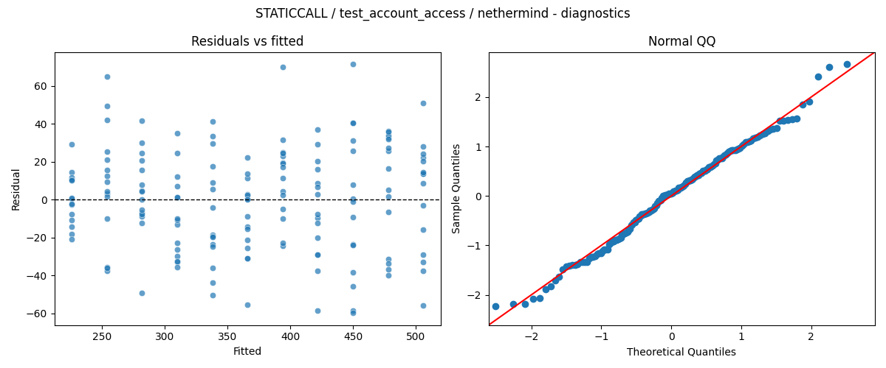

</details>

### test_account_access — combo `STATICCALL_AccountMode.EXISTING_CONTRACT`

| client | nobs | R² | target_coef (ms) | p-value | 95% CI |
| --- | --- | --- | --- | --- | --- |
| `besu` | 418 | 0.8811 | 0.02764 | 1.00e-03 | [0.02664, 0.02858] |
| `erigon` | 198 | 0.9236 | 0.02549 | 1.00e-03 | [0.02447, 0.02634] |
| `ethrex` | 275 | 0.993 | 0.007904 | 1.00e-03 | [0.007832, 0.007973] |
| `geth` | 264 | 0.8655 | 0.02356 | 1.00e-03 | [0.02231, 0.02475] |
| `nethermind` | 165 | 0.8476 | 0.01072 | 1.00e-03 | [0.01012, 0.0113] |

<details><summary>besu — NNLS regression summary</summary>

```
==============================================================================
                           NNLS Regression Results                            
==============================================================================
Dep. Variable:          test_runtime_ms              R-squared:          0.881
Model:                  NNLS                    Adj. R-squared:          0.881
No. Observations:       418                               RMSE:         206.84
Df Residuals:           416                                MAE:         172.85
Df Model:               1      
==============================================================================
                      coef     std err     P-value      [0.025      0.975]
------------------------------------------------------------------------------
         const    460.4429     32.4046       0.001    398.9471    526.5538
       opcount      0.0276      0.0005       0.001      0.0266      0.0286
==============================================================================
Notes: Non-negative least squares with bootstrap inference (1000 iterations)
==============================================================================
```

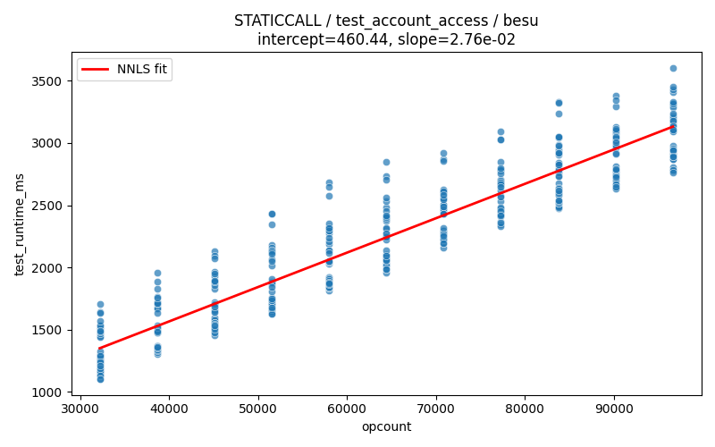

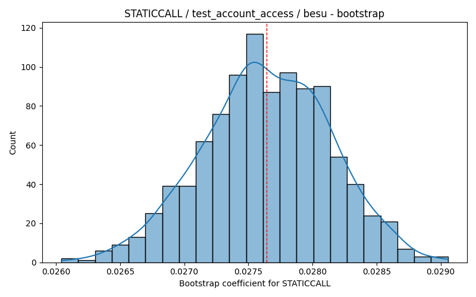

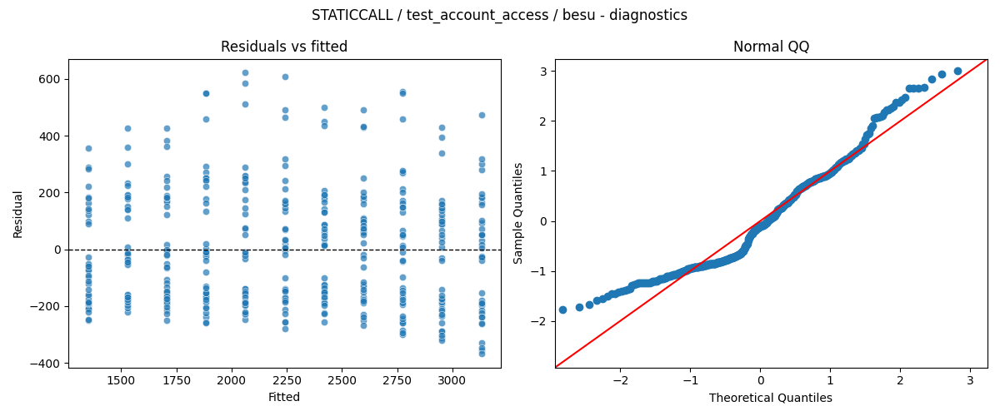

</details>

<details><summary>erigon — NNLS regression summary</summary>

```
==============================================================================
                           NNLS Regression Results                            
==============================================================================
Dep. Variable:          test_runtime_ms              R-squared:          0.924
Model:                  NNLS                    Adj. R-squared:          0.923
No. Observations:       198                               RMSE:         149.34
Df Residuals:           196                                MAE:         125.21
Df Model:               1      
==============================================================================
                      coef     std err     P-value      [0.025      0.975]
------------------------------------------------------------------------------
         const    309.0285     34.4653       0.001    249.5175    382.0230
       opcount      0.0255      0.0005       0.001      0.0245      0.0263
==============================================================================
Notes: Non-negative least squares with bootstrap inference (1000 iterations)
==============================================================================
```

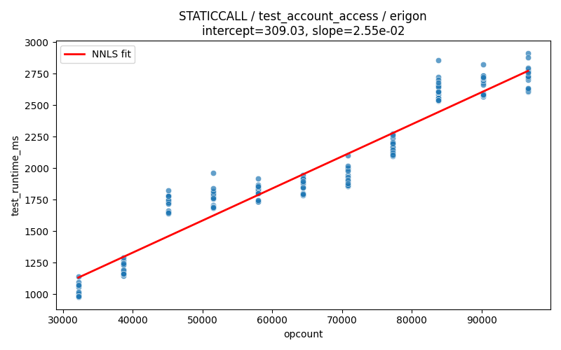

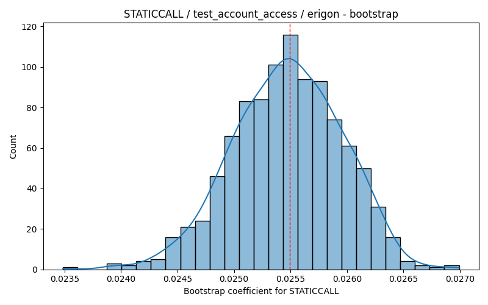

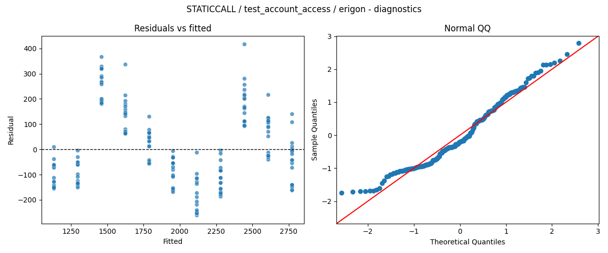

</details>

<details><summary>ethrex — NNLS regression summary</summary>

```
==============================================================================
                           NNLS Regression Results                            
==============================================================================
Dep. Variable:          test_runtime_ms              R-squared:          0.993
Model:                  NNLS                    Adj. R-squared:          0.993
No. Observations:       275                               RMSE:          13.54
Df Residuals:           273                                MAE:          10.65
Df Model:               1      
==============================================================================
                      coef     std err     P-value      [0.025      0.975]
------------------------------------------------------------------------------
         const     39.7153      2.3223       0.001     35.2849     44.1533
       opcount      0.0079      0.0000       0.001      0.0078      0.0080
==============================================================================
Notes: Non-negative least squares with bootstrap inference (1000 iterations)
==============================================================================
```

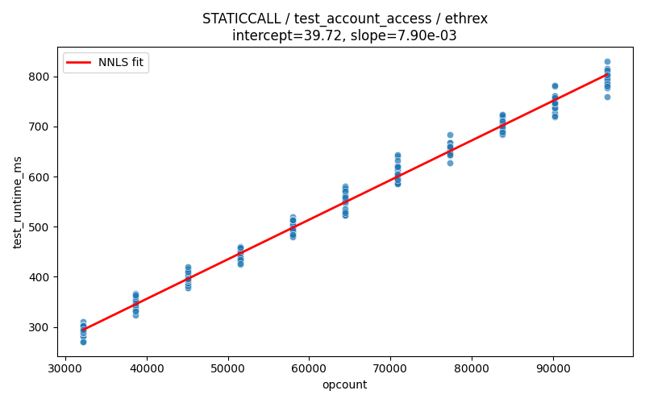

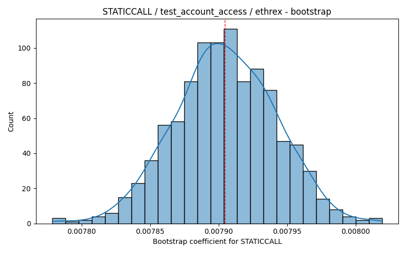

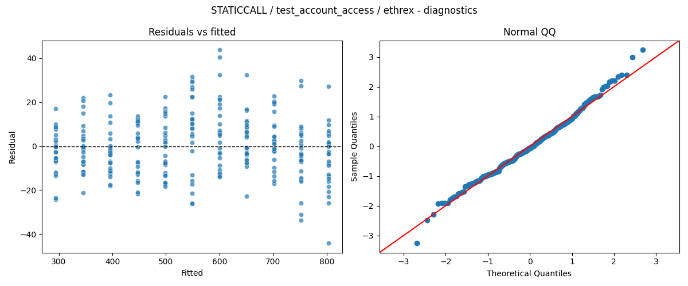

</details>

<details><summary>geth — NNLS regression summary</summary>

```
==============================================================================
                           NNLS Regression Results                            
==============================================================================
Dep. Variable:          test_runtime_ms              R-squared:          0.866
Model:                  NNLS                    Adj. R-squared:          0.865
No. Observations:       264                               RMSE:         189.20
Df Residuals:           262                                MAE:         159.86
Df Model:               1      
==============================================================================
                      coef     std err     P-value      [0.025      0.975]
------------------------------------------------------------------------------
         const    644.3366     45.9527       0.001    559.3431    738.5432
       opcount      0.0236      0.0006       0.001      0.0223      0.0247
==============================================================================
Notes: Non-negative least squares with bootstrap inference (1000 iterations)
==============================================================================
```


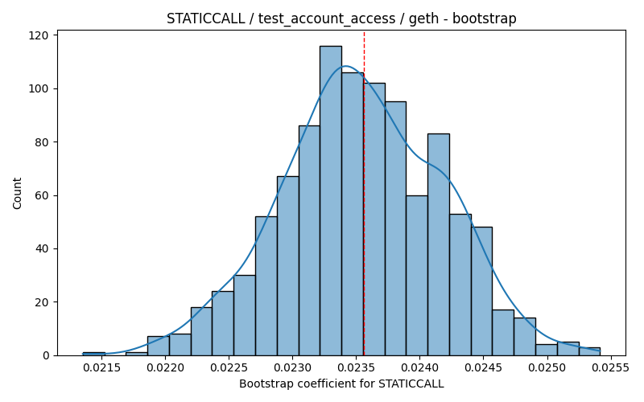

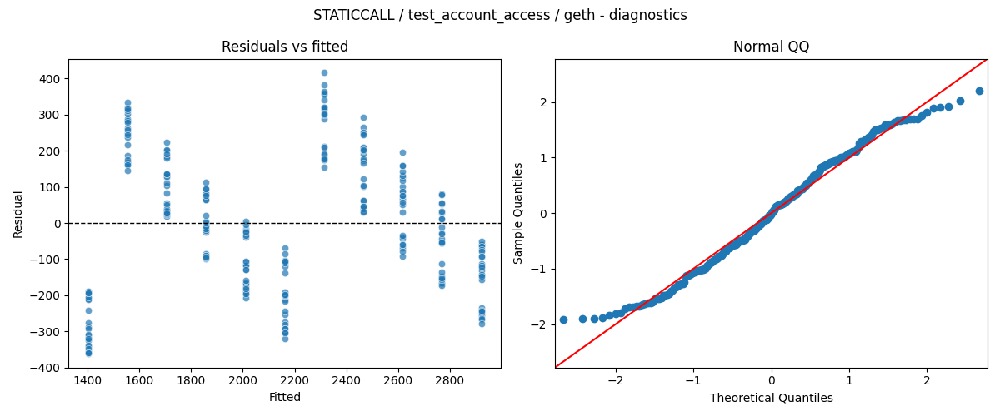

</details>

<details><summary>nethermind — NNLS regression summary</summary>

```
==============================================================================
                           NNLS Regression Results                            
==============================================================================
Dep. Variable:          test_runtime_ms              R-squared:          0.848
Model:                  NNLS                    Adj. R-squared:          0.847
No. Observations:       165                               RMSE:          92.61
Df Residuals:           163                                MAE:          63.56
Df Model:               1      
==============================================================================
                      coef     std err     P-value      [0.025      0.975]
------------------------------------------------------------------------------
         const    188.7540     21.3937       0.001    150.7151    230.0020
       opcount      0.0107      0.0003       0.001      0.0101      0.0113
==============================================================================
Notes: Non-negative least squares with bootstrap inference (1000 iterations)
==============================================================================
```


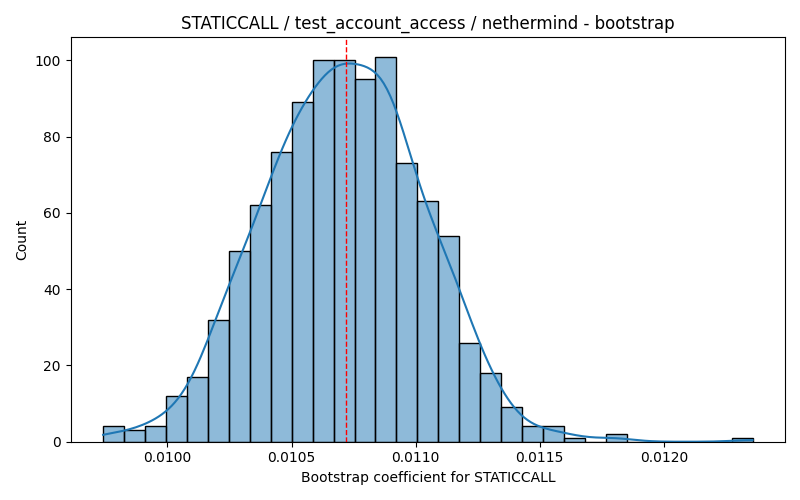

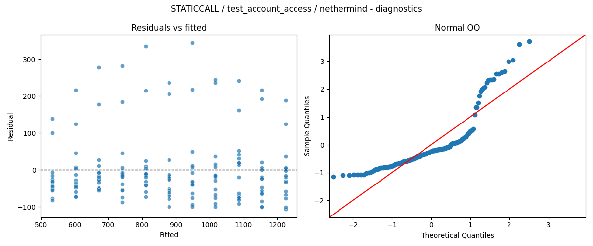

</details>

### test_account_access — combo `STATICCALL_AccountMode.NON_EXISTING_ACCOUNT` — `presets[cold_account_code_access]`

| client | nobs | R² | target_coef (ms) | p-value | 95% CI |
| --- | --- | --- | --- | --- | --- |
| `besu` | 418 | 0.8526 | 0.01499 | 1.00e-03 | [0.01438, 0.0156] |
| `erigon` | 198 | 0.9574 | 0.01213 | 1.00e-03 | [0.01199, 0.01226] |
| `ethrex` | 275 | 0.962 | 0.002017 | 1.00e-03 | [0.001966, 0.002063] |
| `geth` | 264 | 0.868 | 0.02253 | 1.00e-03 | [0.0214, 0.02367] |
| `nethermind` | 165 | 0.9161 | 0.003722 | 1.00e-03 | [0.003553, 0.003893] |

<details><summary>besu — NNLS regression summary</summary>

```
==============================================================================
                           NNLS Regression Results                            
==============================================================================
Dep. Variable:          test_runtime_ms              R-squared:          0.853
Model:                  NNLS                    Adj. R-squared:          0.852
No. Observations:       418                               RMSE:         148.12
Df Residuals:           416                                MAE:         124.24
Df Model:               1      
==============================================================================
                      coef     std err     P-value      [0.025      0.975]
------------------------------------------------------------------------------
         const    324.3908     23.5607       0.001    275.1557    369.3840
       opcount      0.0150      0.0003       0.001      0.0144      0.0156
==============================================================================
Notes: Non-negative least squares with bootstrap inference (1000 iterations)
==============================================================================
```


</details>

<details><summary>erigon — NNLS regression summary</summary>

```
==============================================================================
                           NNLS Regression Results                            
==============================================================================
Dep. Variable:          test_runtime_ms              R-squared:          0.957
Model:                  NNLS                    Adj. R-squared:          0.957
No. Observations:       198                               RMSE:          65.39
Df Residuals:           196                                MAE:          53.00
Df Model:               1      
==============================================================================
                      coef     std err     P-value      [0.025      0.975]
------------------------------------------------------------------------------
         const      0.0000      0.0000       1.000      0.0000      0.0000
       opcount      0.0121      0.0001       0.001      0.0120      0.0123
==============================================================================
Notes: Non-negative least squares with bootstrap inference (1000 iterations)
==============================================================================
```


</details>

<details><summary>ethrex — NNLS regression summary</summary>

```
==============================================================================
                           NNLS Regression Results                            
==============================================================================
Dep. Variable:          test_runtime_ms              R-squared:          0.962
Model:                  NNLS                    Adj. R-squared:          0.962
No. Observations:       275                               RMSE:           9.53
Df Residuals:           273                                MAE:           7.62
Df Model:               1      
==============================================================================
                      coef     std err     P-value      [0.025      0.975]
------------------------------------------------------------------------------
         const     31.4661      2.0144       0.001     27.9270     35.6720
       opcount      0.0020      0.0000       0.001      0.0020      0.0021
==============================================================================
Notes: Non-negative least squares with bootstrap inference (1000 iterations)
==============================================================================
```


</details>

<details><summary>geth — NNLS regression summary</summary>

```
==============================================================================
                           NNLS Regression Results                            
==============================================================================
Dep. Variable:          test_runtime_ms              R-squared:          0.868
Model:                  NNLS                    Adj. R-squared:          0.867
No. Observations:       264                               RMSE:         208.88
Df Residuals:           262                                MAE:         177.91
Df Model:               1      
==============================================================================
                      coef     std err     P-value      [0.025      0.975]
------------------------------------------------------------------------------
         const    706.6052     48.4932       0.001    610.6142    799.8592
       opcount      0.0225      0.0006       0.001      0.0214      0.0237
==============================================================================
Notes: Non-negative least squares with bootstrap inference (1000 iterations)
==============================================================================
```


</details>

<details><summary>nethermind — NNLS regression summary</summary>

```
==============================================================================
                           NNLS Regression Results                            
==============================================================================
Dep. Variable:          test_runtime_ms              R-squared:          0.916
Model:                  NNLS                    Adj. R-squared:          0.916
No. Observations:       165                               RMSE:          26.78
Df Residuals:           163                                MAE:          21.71
Df Model:               1      
==============================================================================
                      coef     std err     P-value      [0.025      0.975]
------------------------------------------------------------------------------
         const     86.1543      6.4287       0.001     73.6111     98.5193
       opcount      0.0037      0.0001       0.001      0.0036      0.0039
==============================================================================
Notes: Non-negative least squares with bootstrap inference (1000 iterations)
==============================================================================
```


</details>

### test_ext_account_query_warm — combo `STATICCALL`

| client | nobs | R² | target_coef (ms) | p-value | 95% CI |
| --- | --- | --- | --- | --- | --- |
| `besu` | 418 | 0.6555 | 0.0004019 | 1.00e-03 | [0.0003744, 0.0004322] |
| `erigon` | 198 | 0.9208 | 0.0005519 | 1.00e-03 | [0.0005305, 0.0005739] |
| `ethrex` | 275 | 0.9449 | 0.0001002 | 1.00e-03 | [9.752e-05, 0.000103] |
| `geth` | 264 | 0.8764 | 0.0001829 | 1.00e-03 | [0.0001739, 0.0001913] |
| `nethermind` | 165 | 0.7963 | 0.0003019 | 1.00e-03 | [0.0002779, 0.0003297] |

<details><summary>besu — NNLS regression summary</summary>

```
==============================================================================
                           NNLS Regression Results                            
==============================================================================
Dep. Variable:          test_runtime_ms              R-squared:          0.656
Model:                  NNLS                    Adj. R-squared:          0.655
No. Observations:       418                               RMSE:         150.83
Df Residuals:           416                                MAE:         115.10
Df Model:               1      
==============================================================================
                      coef     std err     P-value      [0.025      0.975]
------------------------------------------------------------------------------
         const    468.9577     22.6049       0.001    423.3236    511.7253
       opcount      0.0004      0.0000       0.001      0.0004      0.0004
==============================================================================
Notes: Non-negative least squares with bootstrap inference (1000 iterations)
==============================================================================
```

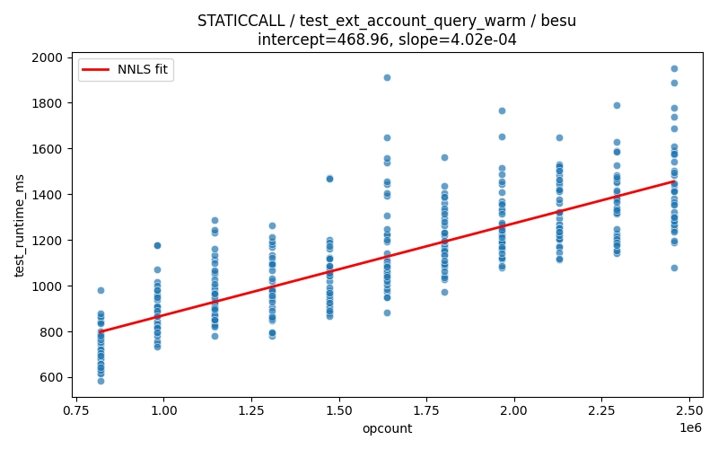

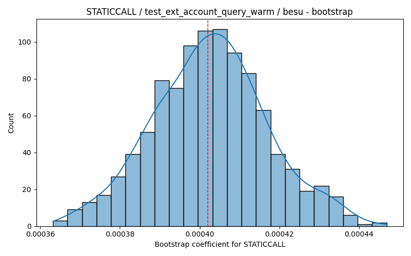

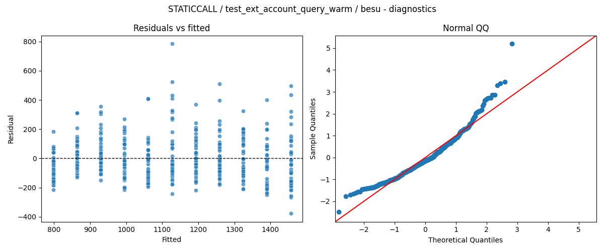

</details>

<details><summary>erigon — NNLS regression summary</summary>

```
==============================================================================
                           NNLS Regression Results                            
==============================================================================
Dep. Variable:          test_runtime_ms              R-squared:          0.921
Model:                  NNLS                    Adj. R-squared:          0.920
No. Observations:       198                               RMSE:          83.78
Df Residuals:           196                                MAE:          68.06
Df Model:               1      
==============================================================================
                      coef     std err     P-value      [0.025      0.975]
------------------------------------------------------------------------------
         const     51.9588     17.1292       0.001     18.5449     85.7128
       opcount      0.0006      0.0000       0.001      0.0005      0.0006
==============================================================================
Notes: Non-negative least squares with bootstrap inference (1000 iterations)
==============================================================================
```

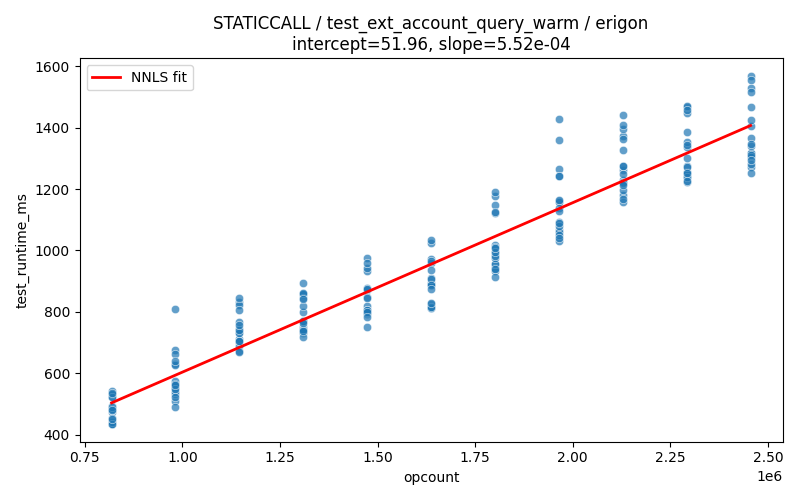

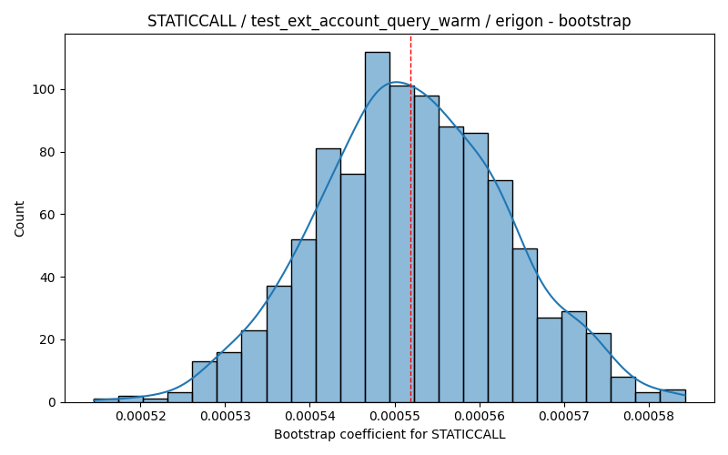

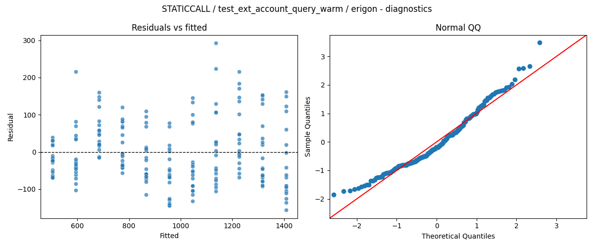

</details>

<details><summary>ethrex — NNLS regression summary</summary>

```
==============================================================================
                           NNLS Regression Results                            
==============================================================================
Dep. Variable:          test_runtime_ms              R-squared:          0.945
Model:                  NNLS                    Adj. R-squared:          0.945
No. Observations:       275                               RMSE:          12.53
Df Residuals:           273                                MAE:           9.90
Df Model:               1      
==============================================================================
                      coef     std err     P-value      [0.025      0.975]
------------------------------------------------------------------------------
         const     38.0223      2.4478       0.001     33.3590     42.8581
       opcount      0.0001      0.0000       0.001      0.0001      0.0001
==============================================================================
Notes: Non-negative least squares with bootstrap inference (1000 iterations)
==============================================================================
```

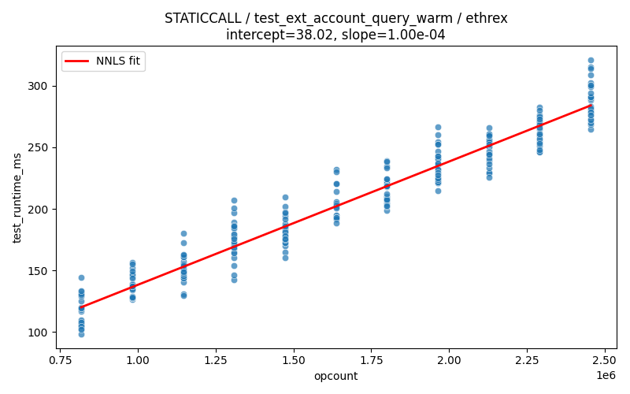

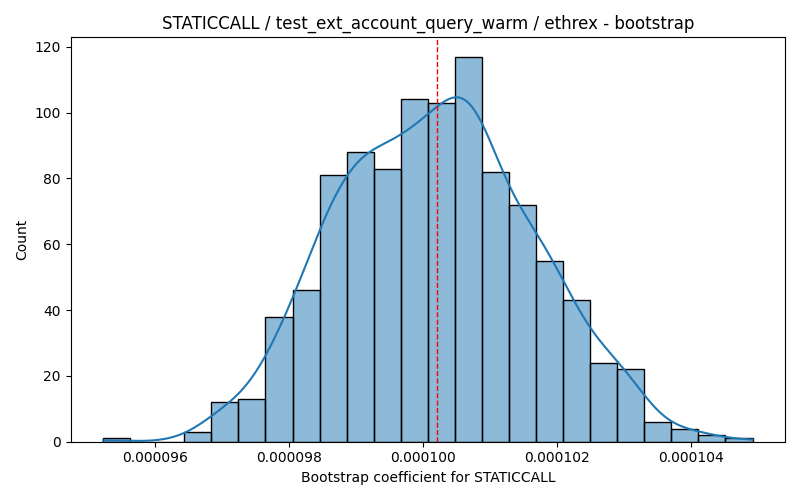

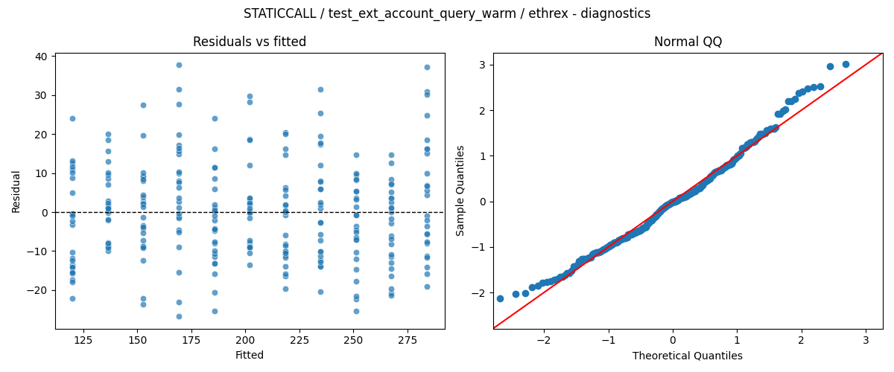

</details>

<details><summary>geth — NNLS regression summary</summary>

```
==============================================================================
                           NNLS Regression Results                            
==============================================================================
Dep. Variable:          test_runtime_ms              R-squared:          0.876
Model:                  NNLS                    Adj. R-squared:          0.876
No. Observations:       264                               RMSE:          35.55
Df Residuals:           262                                MAE:          27.73
Df Model:               1      
==============================================================================
                      coef     std err     P-value      [0.025      0.975]
------------------------------------------------------------------------------
         const     47.1298      6.3295       0.001     34.9717     59.7947
       opcount      0.0002      0.0000       0.001      0.0002      0.0002
==============================================================================
Notes: Non-negative least squares with bootstrap inference (1000 iterations)
==============================================================================
```

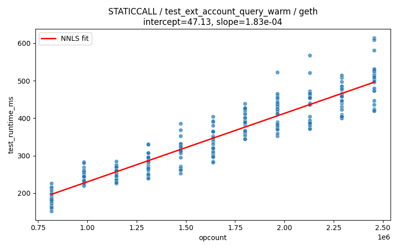

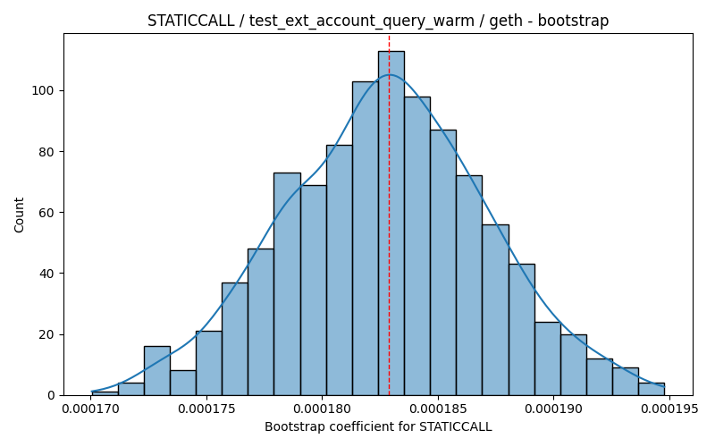

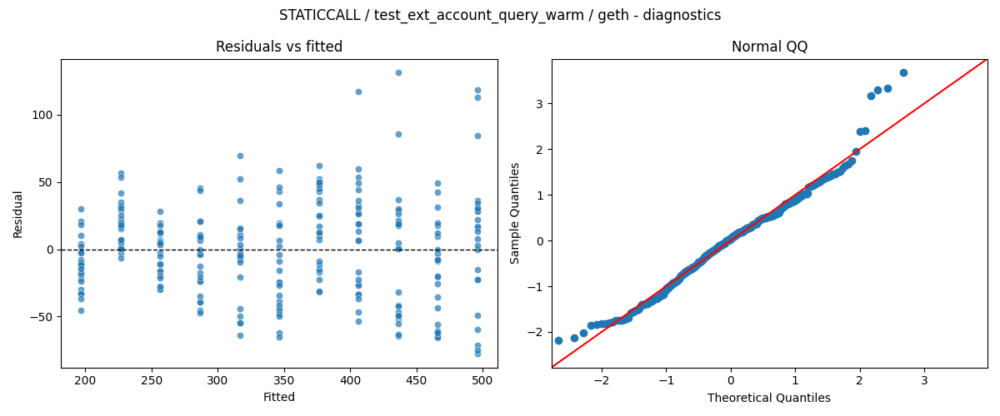

</details>

<details><summary>nethermind — NNLS regression summary</summary>

```
==============================================================================
                           NNLS Regression Results                            
==============================================================================
Dep. Variable:          test_runtime_ms              R-squared:          0.796
Model:                  NNLS                    Adj. R-squared:          0.795
No. Observations:       165                               RMSE:          79.05
Df Residuals:           163                                MAE:          58.22
Df Model:               1      
==============================================================================
                      coef     std err     P-value      [0.025      0.975]
------------------------------------------------------------------------------
         const    179.0532     18.8229       0.001    139.7870    213.3079
       opcount      0.0003      0.0000       0.001      0.0003      0.0003
==============================================================================
Notes: Non-negative least squares with bootstrap inference (1000 iterations)
==============================================================================
```

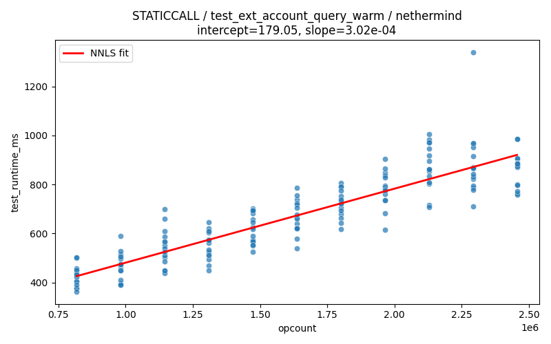

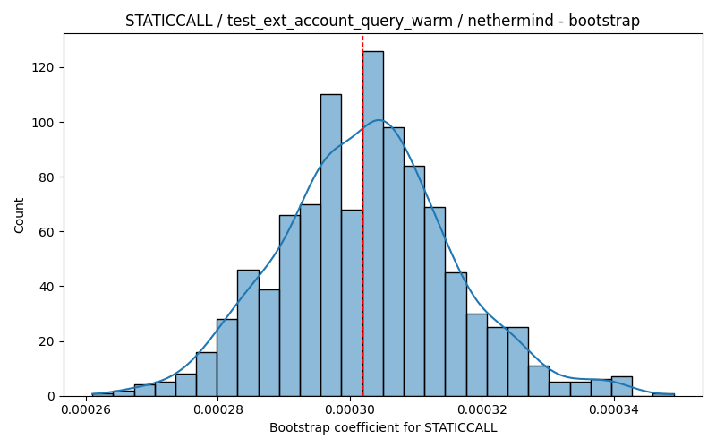

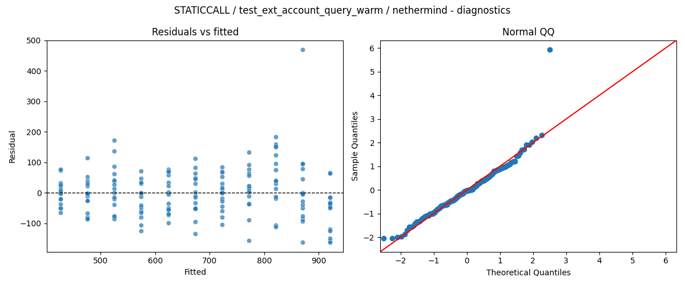

</details>
