# Glue opcodes report

Per-client NNLS fits of priced glue opcodes against their driver fixtures. Cycle-tier opcodes share one joint regression per client (shown once); pure-tier and mixed-tier opcodes each get a single-feature fit. Mixed-tier fits pre-adjust the LHS by subtracting the contribution of every priced upstream partner selected by the detector (pure ∪ cycle for `mixed_a`, plus `mixed_a` for `mixed_b`).

**Contents:** [besu](#besu) · [erigon](#erigon) · [ethrex](#ethrex) · [geth](#geth) · [nethermind](#nethermind) · [reth](#reth)

## besu

| glue_opcode | nobs | glue_runtime_ms | p_value | rsquared |
| --- | --- | --- | --- | --- |
| `ISZERO` | 296 | 0 | 1.00e+00 | 0 |
| `JUMPDEST` | 74 | 0 | 1.00e+00 | 0 |
| `SWAP` | 5292 | 0 | 1.00e+00 | 0 |
| `CALLDATASIZE` | 18607 | 5.632e-05 | 1.00e-03 | 0.502 |
| `DUP` | 18607 | 0 | 1.00e+00 | 0.502 |
| `GAS` | 18607 | 4.794e-05 | 1.00e-03 | 0.502 |
| `MLOAD` | 18607 | 7.58e-05 | 1.00e-03 | 0.502 |
| `PUSH` | 18607 | 0 | 1.00e+00 | 0.502 |
| `PUSH0` | 18607 | 0 | 1.00e+00 | 0.502 |
| `STATICCALL` | 18607 | 0.0004163 | 1.00e-03 | 0.502 |
| `ADD` | 360 | 0 | 1.00e+00 | 0 |
| `AND` | 320 | 0 | 1.00e+00 | 0 |
| `CALLDATACOPY` | 8698 | 0 | 1.00e+00 | 0 |
| `CALLDATALOAD` | 1628 | 0 | 1.00e+00 | 0 |
| `DIV` | 440 | 0 | 1.00e+00 | 0 |
| `EXP` | 440 | 0.0009682 | 1.00e-03 | 0.6417 |
| `GT` | 296 | 0 | 1.00e+00 | 0 |
| `JUMPI` | 407 | 0 | 1.00e+00 | -2.22e-16 |
| `LT` | 296 | 0 | 1.00e+00 | 1.11e-16 |
| `MSTORE` | 1665 | 0 | 1.00e+00 | 0 |
| `MSTORE8` | 1665 | 0 | 1.00e+00 | -2.22e-16 |
| `MUL` | 400 | 0 | 1.00e+00 | 0 |
| `PC` | 222 | 2.516e-05 | 1.00e-03 | 0.4242 |
| `RETURNDATASIZE` | 889 | 3.623e-05 | 1.00e-03 | 0.4178 |
| `SELFBALANCE` | 440 | 0 | 1.00e+00 | 0 |
| `SUB` | 320 | 0 | 1.00e+00 | 0 |
| `JUMP` | 370 | 0 | 1.00e+00 | 0 |
| `KECCAK256` | 0 | n/a | n/a | n/a |

### Cycle glue — joint fit · besu

<details><summary>Joint NNLS regression summary</summary>

```
==============================================================================
                           NNLS Regression Results                            
==============================================================================
Dep. Variable:          test_runtime_ms              R-squared:          0.502
Model:                  NNLS                    Adj. R-squared:          0.502
No. Observations:       18607                             RMSE:          71.07
Df Residuals:           18599                              MAE:          58.97
Df Model:               7      
==============================================================================
                      coef     std err     P-value      [0.025      0.975]
------------------------------------------------------------------------------
         const    212.5140      0.5291       0.001    211.4653    213.5568
  CALLDATASIZE      0.0001      0.0000       0.001      0.0001      0.0001
           DUP      0.0000      0.0000       1.000      0.0000      0.0000
           GAS      0.0000      0.0000       0.001      0.0000      0.0000
         MLOAD      0.0001      0.0000       0.001      0.0001      0.0001
          PUSH      0.0000      0.0000       1.000      0.0000      0.0000
         PUSH0      0.0000      0.0000       1.000      0.0000      0.0000
    STATICCALL      0.0004      0.0000       0.001      0.0004      0.0004
==============================================================================
Notes: Non-negative least squares with bootstrap inference (1000 iterations)
==============================================================================
```

</details>

<details><summary><code>CALLDATASIZE</code> · nobs=18607 · runtime_ms=5.632e-05 · p=1.00e-03 · R²=0.502</summary>

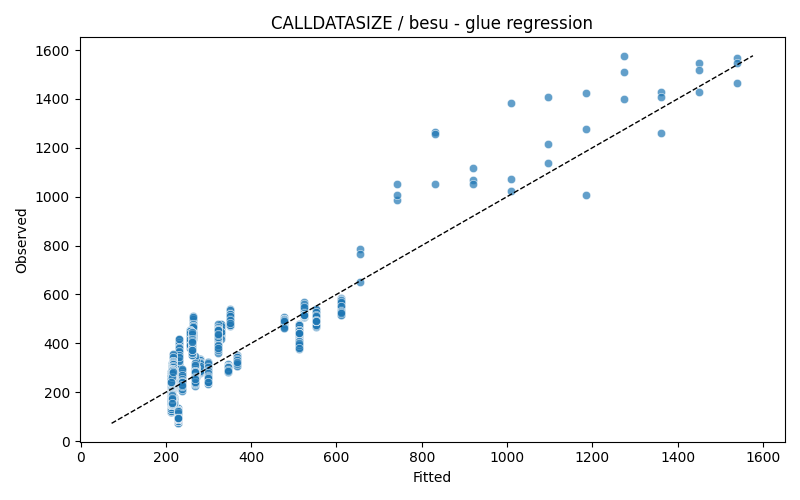

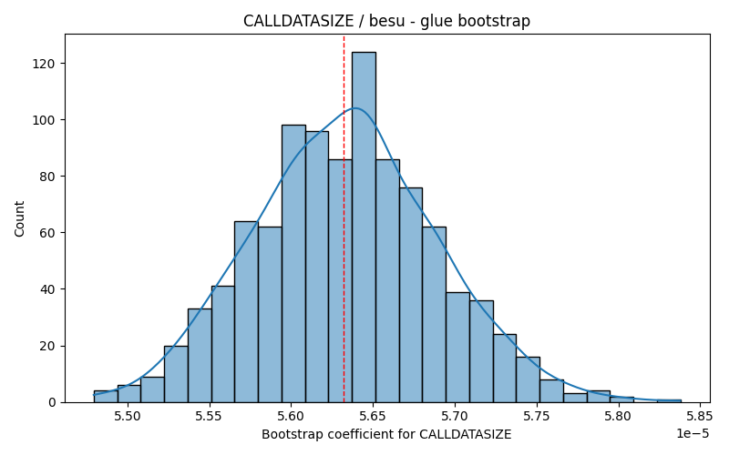

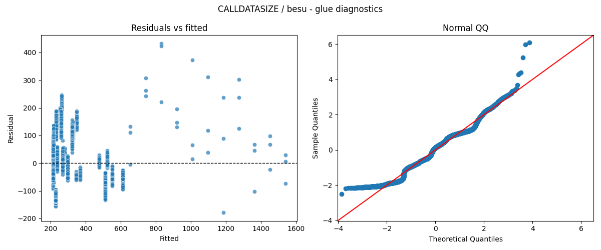

</details>

<details><summary><code>DUP</code> · nobs=18607 · runtime_ms=0 · p=1.00e+00 · R²=0.502</summary>


</details>

<details><summary><code>GAS</code> · nobs=18607 · runtime_ms=4.794e-05 · p=1.00e-03 · R²=0.502</summary>

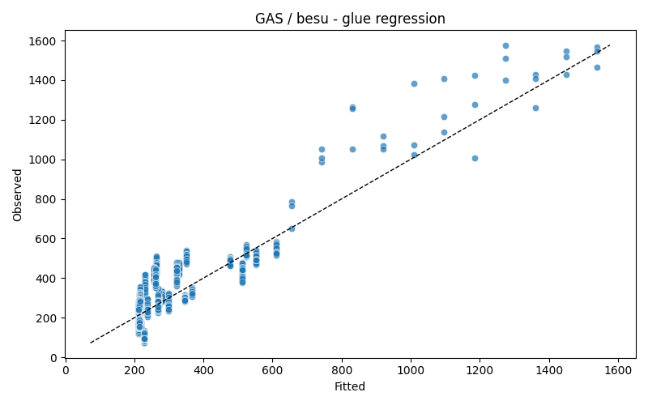

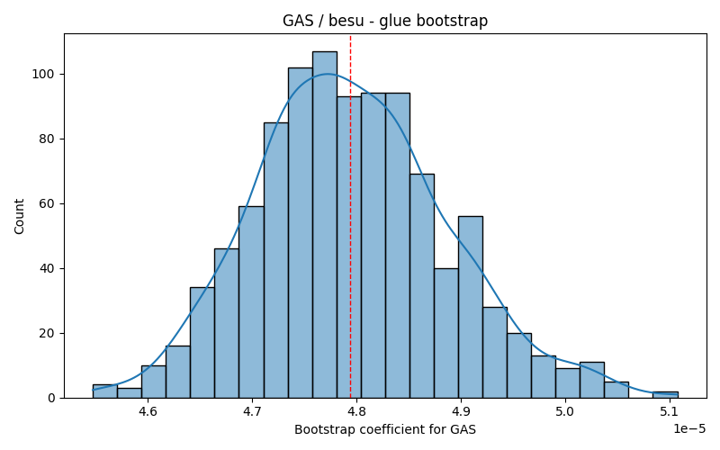

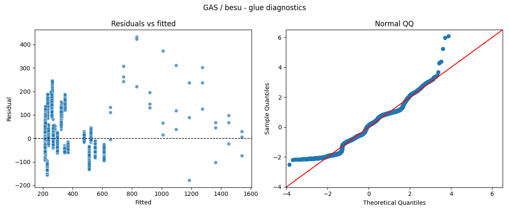

</details>

<details><summary><code>MLOAD</code> · nobs=18607 · runtime_ms=7.58e-05 · p=1.00e-03 · R²=0.502</summary>

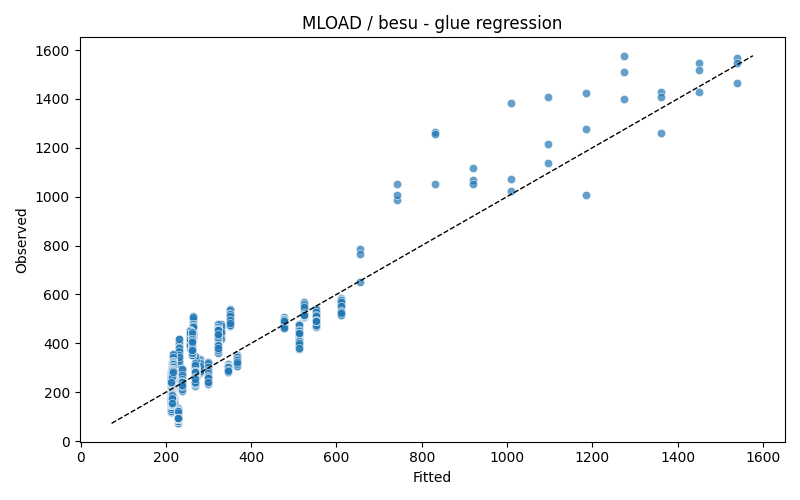

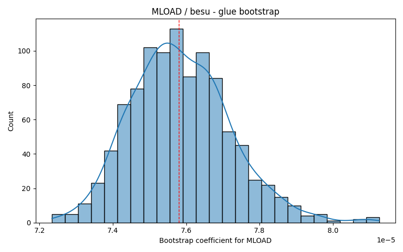


</details>

<details><summary><code>PUSH</code> · nobs=18607 · runtime_ms=0 · p=1.00e+00 · R²=0.502</summary>


</details>

<details><summary><code>PUSH0</code> · nobs=18607 · runtime_ms=0 · p=1.00e+00 · R²=0.502</summary>


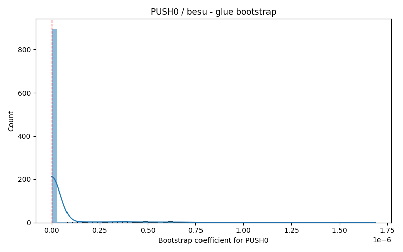

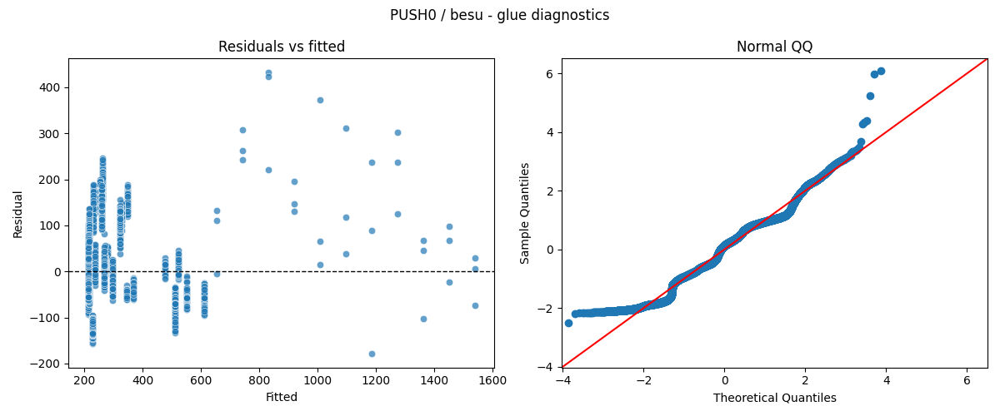

</details>

<details><summary><code>STATICCALL</code> · nobs=18607 · runtime_ms=0.0004163 · p=1.00e-03 · R²=0.502</summary>

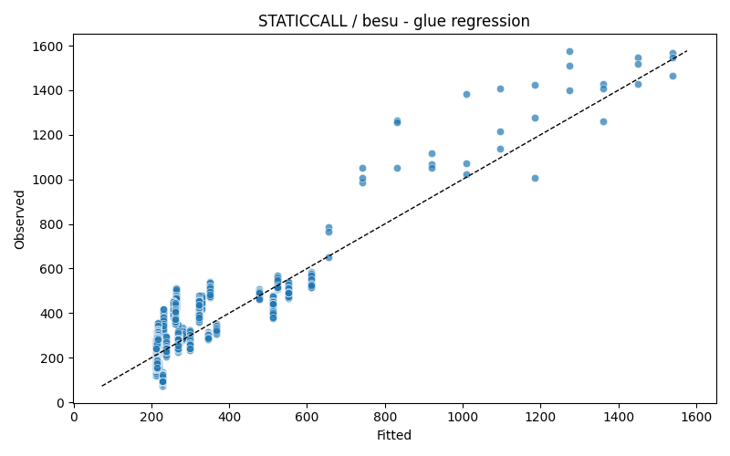

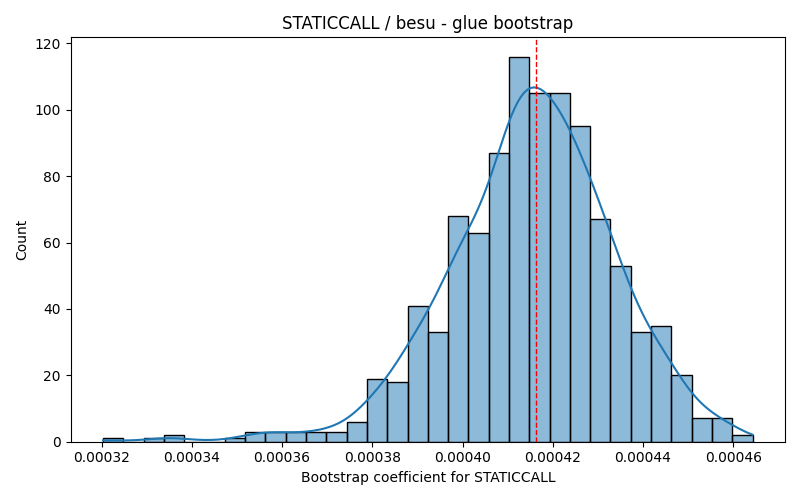

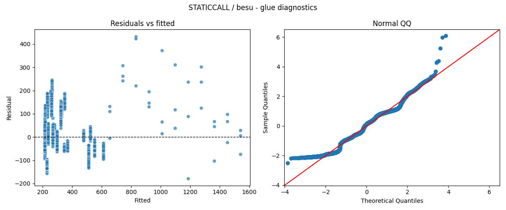

</details>

### Pure glue · besu

<details><summary><code>ISZERO</code> · nobs=296 · runtime_ms=0 · p=1.00e+00 · R²=0</summary>

```
==============================================================================
                           NNLS Regression Results                            
==============================================================================
Dep. Variable:          test_runtime_ms              R-squared:          0.000
Model:                  NNLS                    Adj. R-squared:         -0.003
No. Observations:       296                               RMSE:          91.34
Df Residuals:           294                                MAE:          80.63
Df Model:               1      
==============================================================================
                      coef     std err     P-value      [0.025      0.975]
------------------------------------------------------------------------------
         const    291.6225      5.2935       0.001    280.7774    301.9011
        ISZERO      0.0000      0.0000       1.000      0.0000      0.0000
==============================================================================
Notes: Non-negative least squares with bootstrap inference (1000 iterations)
==============================================================================
```

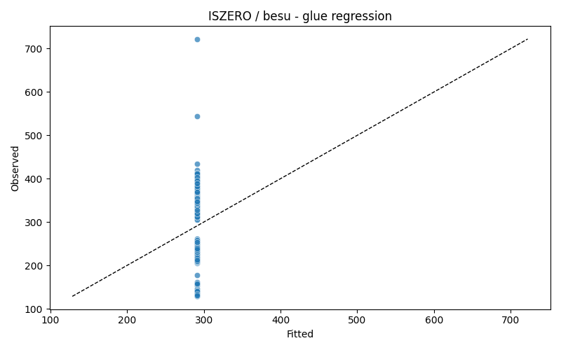


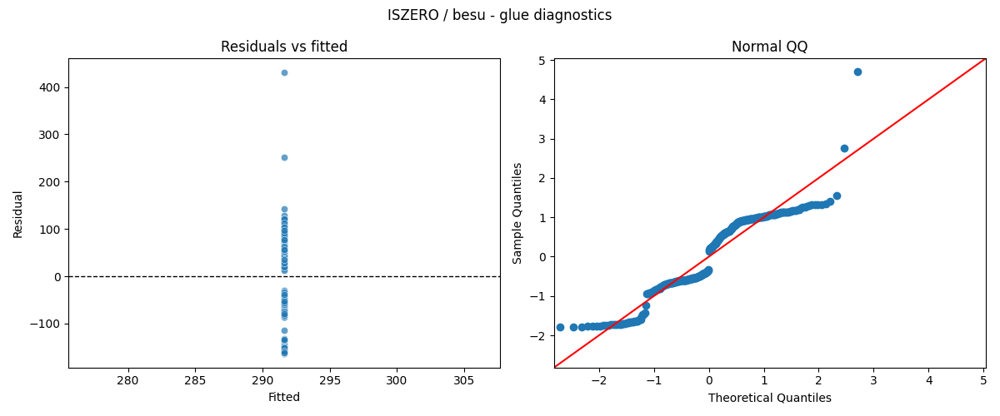

</details>

<details><summary><code>JUMPDEST</code> · nobs=74 · runtime_ms=0 · p=1.00e+00 · R²=0</summary>

```
==============================================================================
                           NNLS Regression Results                            
==============================================================================
Dep. Variable:          test_runtime_ms              R-squared:          0.000
Model:                  NNLS                    Adj. R-squared:         -0.014
No. Observations:       74                                RMSE:          62.74
Df Residuals:           72                                 MAE:          44.76
Df Model:               1      
==============================================================================
                      coef     std err     P-value      [0.025      0.975]
------------------------------------------------------------------------------
         const    200.0338      7.4060       0.001    186.9246    215.6032
      JUMPDEST      0.0000      0.0000       1.000      0.0000      0.0000
==============================================================================
Notes: Non-negative least squares with bootstrap inference (1000 iterations)
==============================================================================
```

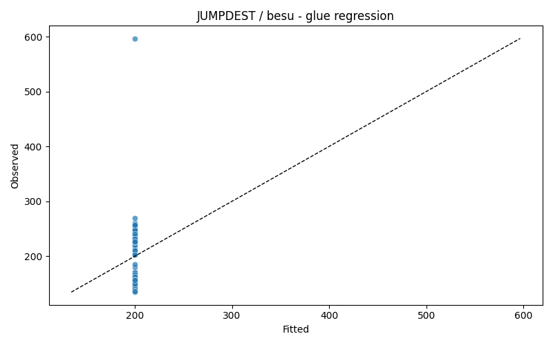


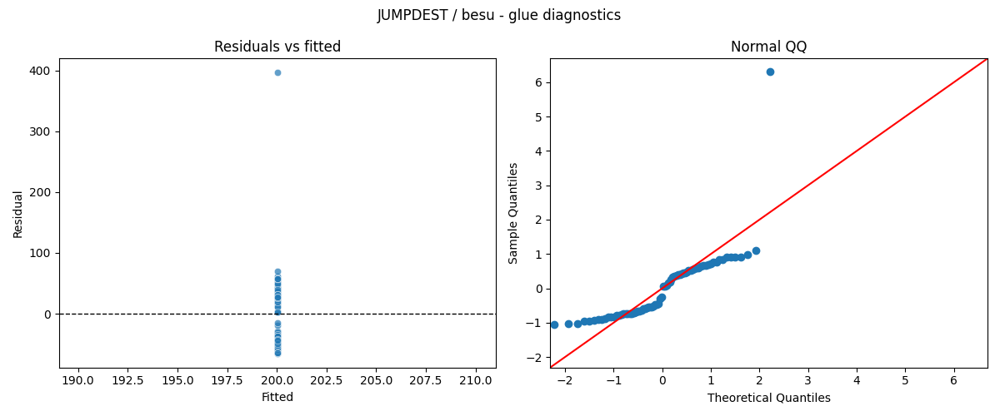

</details>

<details><summary><code>SWAP</code> · nobs=5292 · runtime_ms=0 · p=1.00e+00 · R²=0</summary>

```
==============================================================================
                           NNLS Regression Results                            
==============================================================================
Dep. Variable:          test_runtime_ms              R-squared:          0.000
Model:                  NNLS                    Adj. R-squared:         -0.000
No. Observations:       5292                              RMSE:          94.30
Df Residuals:           5290                               MAE:          85.72
Df Model:               1      
==============================================================================
                      coef     std err     P-value      [0.025      0.975]
------------------------------------------------------------------------------
         const    324.0813      1.2622       0.001    321.6868    326.5403
          SWAP      0.0000      0.0000       1.000      0.0000      0.0000
==============================================================================
Notes: Non-negative least squares with bootstrap inference (1000 iterations)
==============================================================================
```

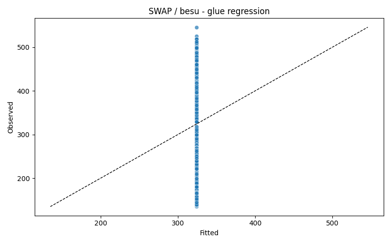


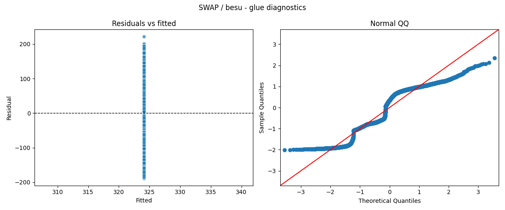

</details>

### Mixed glue (tier A) · besu

<details><summary><code>ADD</code> · nobs=360 · runtime_ms=0 · p=1.00e+00 · R²=0</summary>

```
==============================================================================
                           NNLS Regression Results                            
==============================================================================
Dep. Variable:          test_runtime_ms              R-squared:          0.000
Model:                  NNLS                    Adj. R-squared:         -0.003
No. Observations:       360                               RMSE:         121.68
Df Residuals:           358                                MAE:         105.14
Df Model:               1      
==============================================================================
                      coef     std err     P-value      [0.025      0.975]
------------------------------------------------------------------------------
         const    431.3373      6.4786       0.001    418.1931    443.2738
           ADD      0.0000      0.0000       1.000      0.0000      0.0000
==============================================================================
Notes: Non-negative least squares with bootstrap inference (1000 iterations)
==============================================================================
```

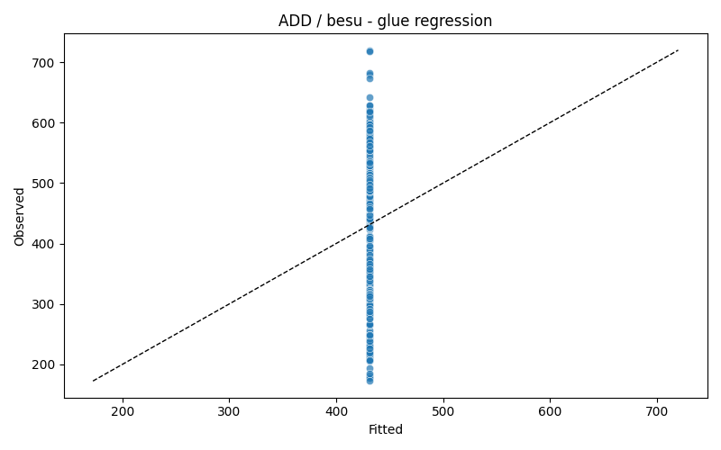


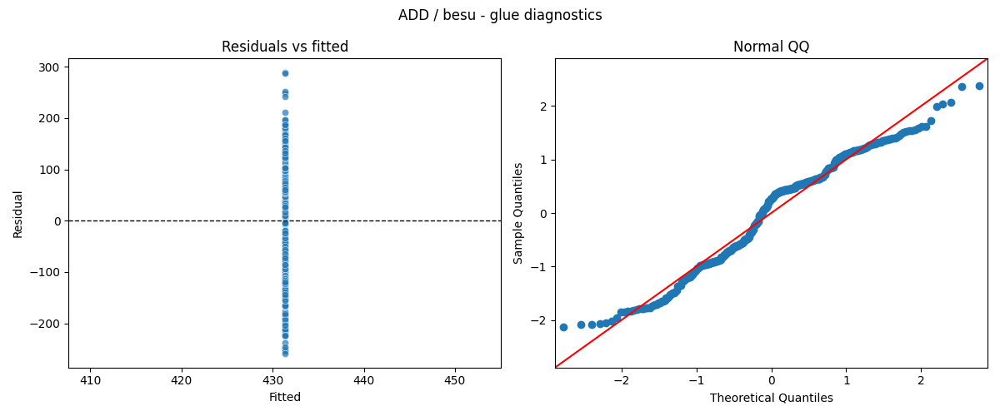

</details>

<details><summary><code>AND</code> · nobs=320 · runtime_ms=0 · p=1.00e+00 · R²=0</summary>

```
==============================================================================
                           NNLS Regression Results                            
==============================================================================
Dep. Variable:          test_runtime_ms              R-squared:          0.000
Model:                  NNLS                    Adj. R-squared:         -0.003
No. Observations:       320                               RMSE:          76.97
Df Residuals:           318                                MAE:          71.50
Df Model:               1      
==============================================================================
                      coef     std err     P-value      [0.025      0.975]
------------------------------------------------------------------------------
         const    272.6079      4.2938       0.001    264.0792    281.2249
           AND      0.0000      0.0000       1.000      0.0000      0.0000
==============================================================================
Notes: Non-negative least squares with bootstrap inference (1000 iterations)
==============================================================================
```

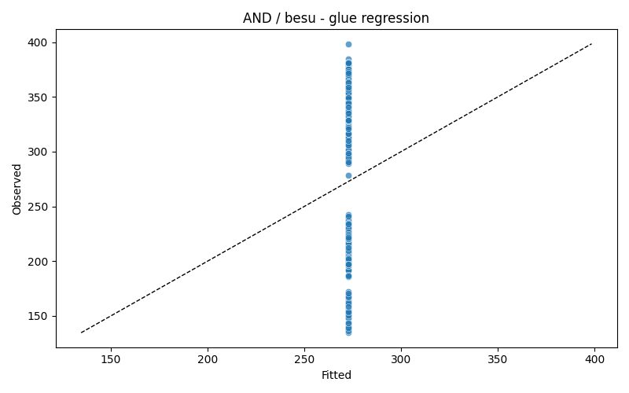


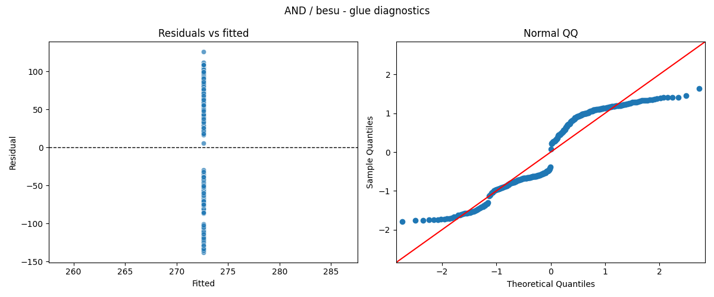

</details>

<details><summary><code>CALLDATACOPY</code> · nobs=8698 · runtime_ms=0 · p=1.00e+00 · R²=0</summary>

```
==============================================================================
                           NNLS Regression Results                            
==============================================================================
Dep. Variable:          test_runtime_ms              R-squared:          0.000
Model:                  NNLS                    Adj. R-squared:         -0.000
No. Observations:       8698                              RMSE:         108.21
Df Residuals:           8696                               MAE:          86.93
Df Model:               1      
==============================================================================
                      coef     std err     P-value      [0.025      0.975]
------------------------------------------------------------------------------
         const    242.2269      1.1783       0.001    239.9118    244.4254
  CALLDATACOPY      0.0000      0.0000       1.000      0.0000      0.0000
==============================================================================
Notes: Non-negative least squares with bootstrap inference (1000 iterations)
==============================================================================
```

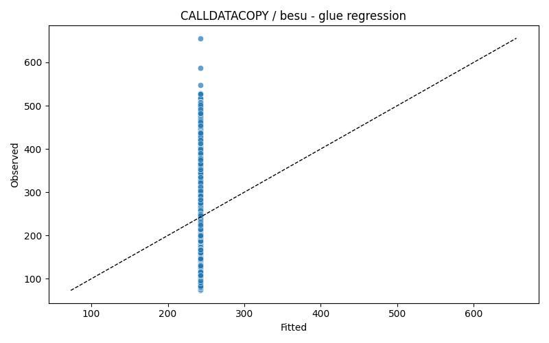

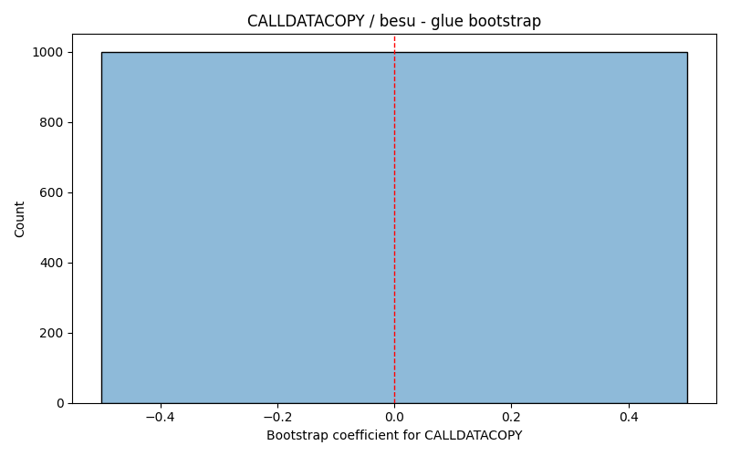

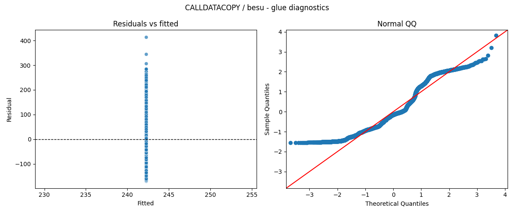

</details>

<details><summary><code>CALLDATALOAD</code> · nobs=1628 · runtime_ms=0 · p=1.00e+00 · R²=0</summary>

```
==============================================================================
                           NNLS Regression Results                            
==============================================================================
Dep. Variable:          test_runtime_ms              R-squared:          0.000
Model:                  NNLS                    Adj. R-squared:         -0.001
No. Observations:       1628                              RMSE:           0.78
Df Residuals:           1626                               MAE:           0.50
Df Model:               1      
==============================================================================
                      coef     std err     P-value      [0.025      0.975]
------------------------------------------------------------------------------
         const      2.9447      0.0195       0.001      2.9075      2.9799
  CALLDATALOAD      0.0000      0.0000       1.000      0.0000      0.0000
==============================================================================
Notes: Non-negative least squares with bootstrap inference (1000 iterations)
==============================================================================
```

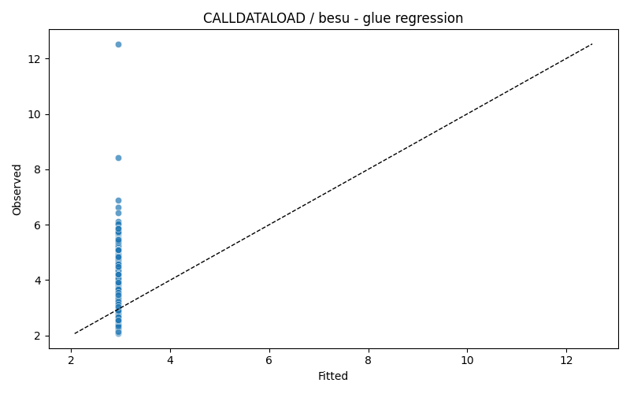

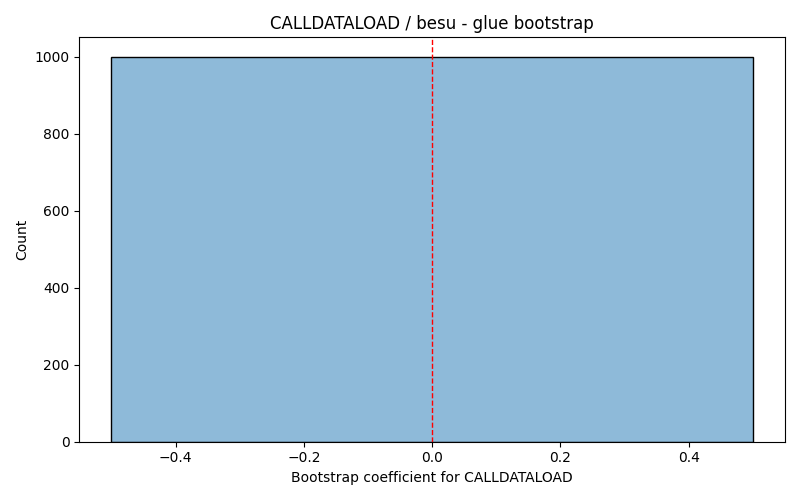

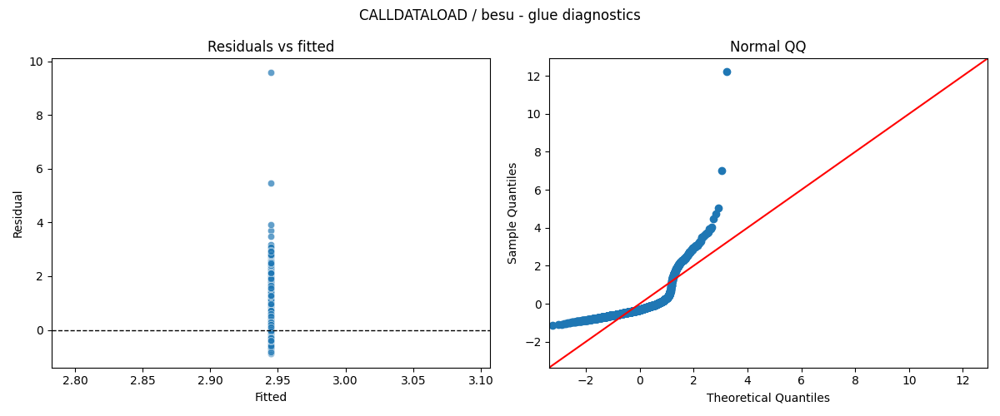

</details>

<details><summary><code>DIV</code> · nobs=440 · runtime_ms=0 · p=1.00e+00 · R²=0</summary>

```
==============================================================================
                           NNLS Regression Results                            
==============================================================================
Dep. Variable:          test_runtime_ms              R-squared:          0.000
Model:                  NNLS                    Adj. R-squared:         -0.002
No. Observations:       440                               RMSE:          93.89
Df Residuals:           438                                MAE:          87.63
Df Model:               1      
==============================================================================
                      coef     std err     P-value      [0.025      0.975]
------------------------------------------------------------------------------
         const    427.0822      4.5762       0.001    418.0423    436.0596
           DIV      0.0000      0.0000       1.000      0.0000      0.0000
==============================================================================
Notes: Non-negative least squares with bootstrap inference (1000 iterations)
==============================================================================
```


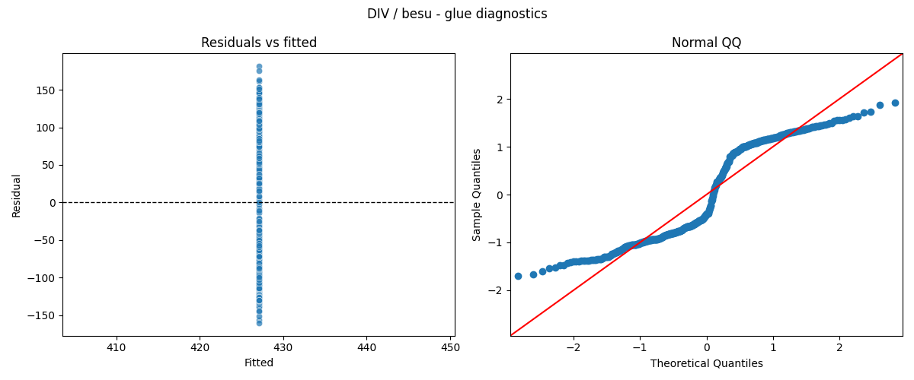

</details>

<details><summary><code>EXP</code> · nobs=440 · runtime_ms=0.0009682 · p=1.00e-03 · R²=0.6417</summary>

```
==============================================================================
                           NNLS Regression Results                            
==============================================================================
Dep. Variable:          test_runtime_ms              R-squared:          0.642
Model:                  NNLS                    Adj. R-squared:          0.641
No. Observations:       440                               RMSE:          28.34
Df Residuals:           438                                MAE:          21.85
Df Model:               1      
==============================================================================
                      coef     std err     P-value      [0.025      0.975]
------------------------------------------------------------------------------
         const    109.7309      6.7373       0.001     95.7705    121.6983
           EXP      0.0010      0.0000       0.001      0.0009      0.0011
==============================================================================
Notes: Non-negative least squares with bootstrap inference (1000 iterations)
==============================================================================
```

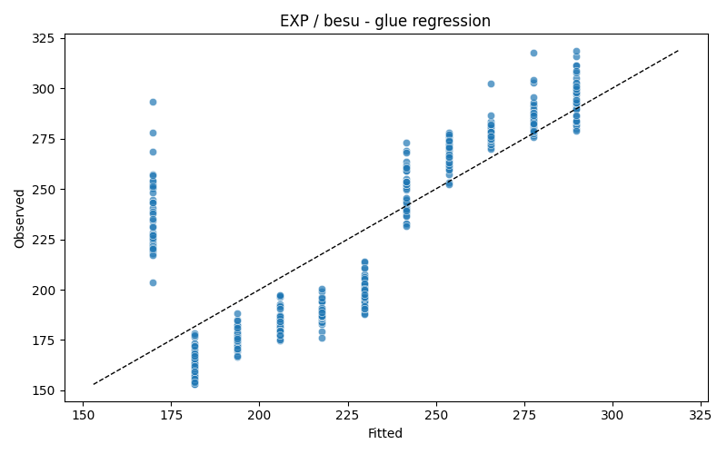

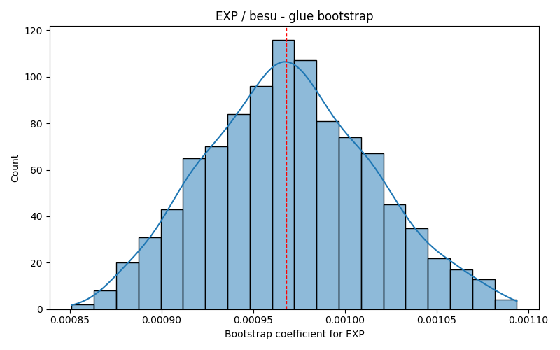

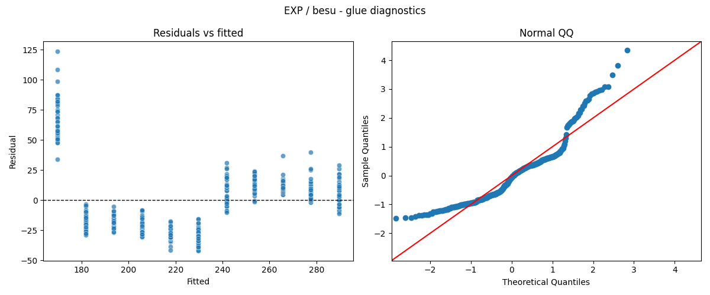

</details>

<details><summary><code>GT</code> · nobs=296 · runtime_ms=0 · p=1.00e+00 · R²=0</summary>

```
==============================================================================
                           NNLS Regression Results                            
==============================================================================
Dep. Variable:          test_runtime_ms              R-squared:          0.000
Model:                  NNLS                    Adj. R-squared:         -0.003
No. Observations:       296                               RMSE:         553.40
Df Residuals:           294                                MAE:         495.64
Df Model:               1      
==============================================================================
                      coef     std err     P-value      [0.025      0.975]
------------------------------------------------------------------------------
         const    725.1289     33.4322       0.001    661.6470    791.0616
            GT      0.0000      0.0000       1.000      0.0000      0.0000
==============================================================================
Notes: Non-negative least squares with bootstrap inference (1000 iterations)
==============================================================================
```

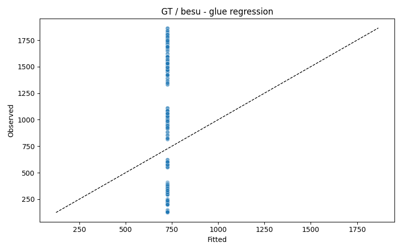

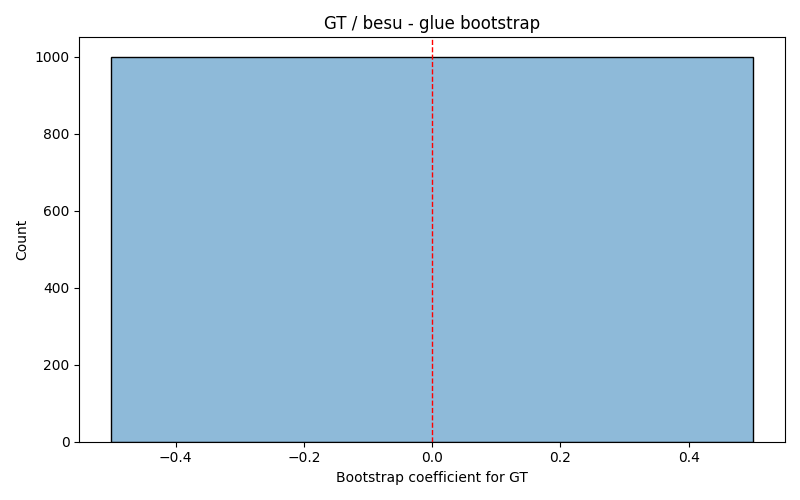

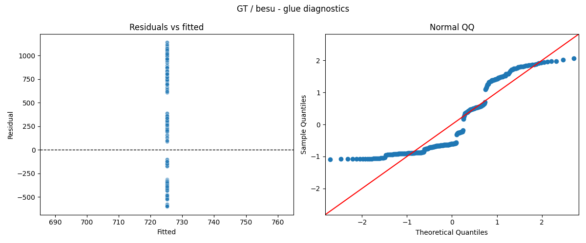

</details>

<details><summary><code>JUMPI</code> · nobs=407 · runtime_ms=0 · p=1.00e+00 · R²=-2.22e-16</summary>

```
==============================================================================
                           NNLS Regression Results                            
==============================================================================
Dep. Variable:          test_runtime_ms              R-squared:         -0.000
Model:                  NNLS                    Adj. R-squared:         -0.002
No. Observations:       407                               RMSE:          34.74
Df Residuals:           405                                MAE:          27.64
Df Model:               1      
==============================================================================
                      coef     std err     P-value      [0.025      0.975]
------------------------------------------------------------------------------
         const    106.1133      1.7579       0.001    102.7640    109.5438
         JUMPI      0.0000      0.0000       1.000      0.0000      0.0000
==============================================================================
Notes: Non-negative least squares with bootstrap inference (1000 iterations)
==============================================================================
```

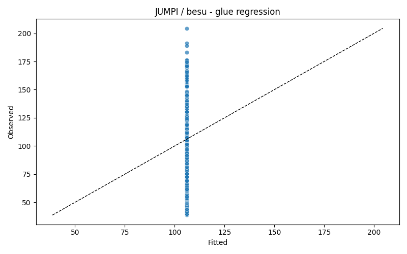

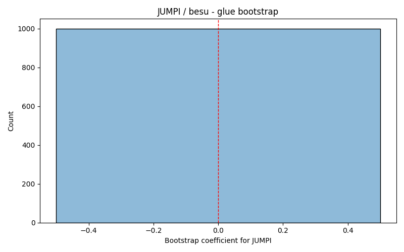

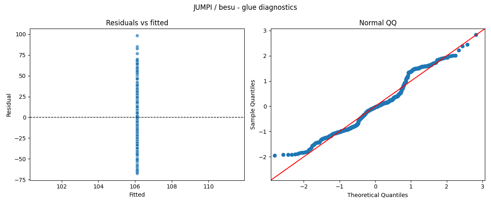

</details>

<details><summary><code>LT</code> · nobs=296 · runtime_ms=0 · p=1.00e+00 · R²=1.11e-16</summary>

```
==============================================================================
                           NNLS Regression Results                            
==============================================================================
Dep. Variable:          test_runtime_ms              R-squared:          0.000
Model:                  NNLS                    Adj. R-squared:         -0.003
No. Observations:       296                               RMSE:          83.35
Df Residuals:           294                                MAE:          78.03
Df Model:               1      
==============================================================================
                      coef     std err     P-value      [0.025      0.975]
------------------------------------------------------------------------------
         const    305.1281      4.9150       0.001    296.0164    314.7469
            LT      0.0000      0.0000       1.000      0.0000      0.0000
==============================================================================
Notes: Non-negative least squares with bootstrap inference (1000 iterations)
==============================================================================
```

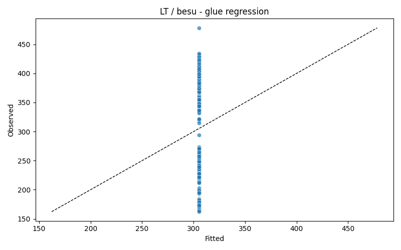


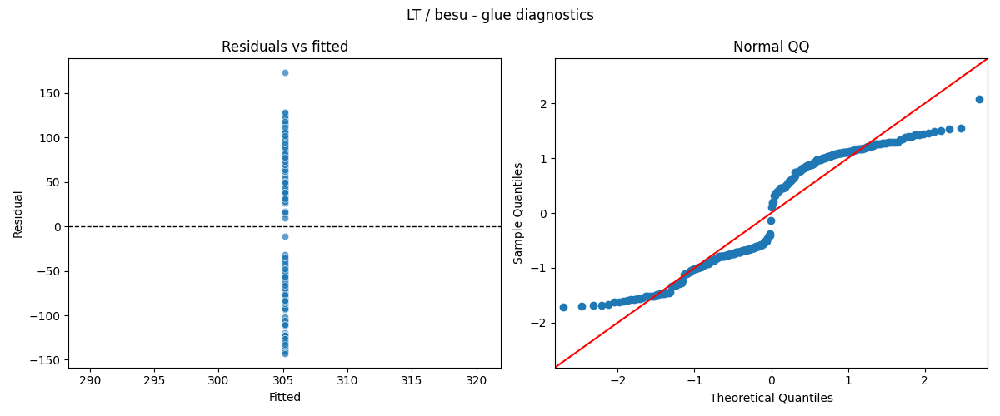

</details>

<details><summary><code>MSTORE</code> · nobs=1665 · runtime_ms=0 · p=1.00e+00 · R²=0</summary>

```
==============================================================================
                           NNLS Regression Results                            
==============================================================================
Dep. Variable:          test_runtime_ms              R-squared:          0.000
Model:                  NNLS                    Adj. R-squared:         -0.001
No. Observations:       1665                              RMSE:         133.94
Df Residuals:           1663                               MAE:         121.84
Df Model:               1      
==============================================================================
                      coef     std err     P-value      [0.025      0.975]
------------------------------------------------------------------------------
         const    462.4268      3.3044       0.001    455.7606    468.6784
        MSTORE      0.0000      0.0000       1.000      0.0000      0.0000
==============================================================================
Notes: Non-negative least squares with bootstrap inference (1000 iterations)
==============================================================================
```

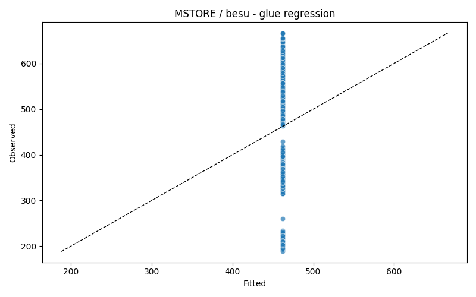


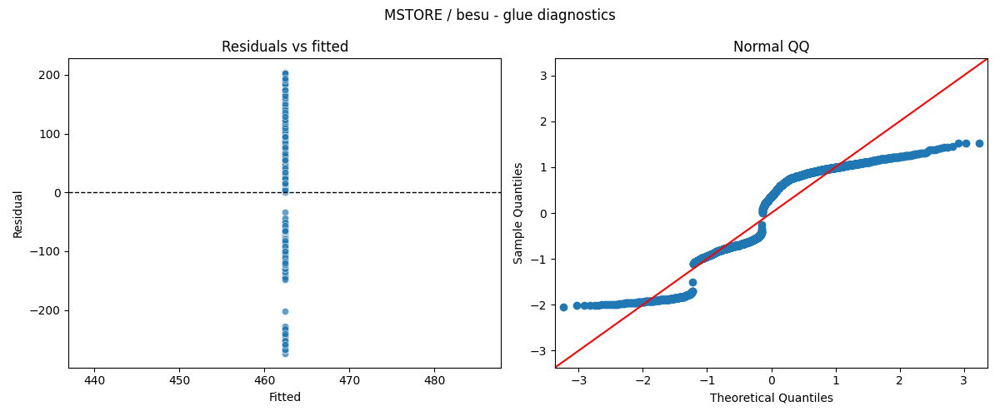

</details>

<details><summary><code>MSTORE8</code> · nobs=1665 · runtime_ms=0 · p=1.00e+00 · R²=-2.22e-16</summary>

```
==============================================================================
                           NNLS Regression Results                            
==============================================================================
Dep. Variable:          test_runtime_ms              R-squared:         -0.000
Model:                  NNLS                    Adj. R-squared:         -0.001
No. Observations:       1665                              RMSE:          77.52
Df Residuals:           1663                               MAE:          70.70
Df Model:               1      
==============================================================================
                      coef     std err     P-value      [0.025      0.975]
------------------------------------------------------------------------------
         const    267.0275      1.8655       0.001    263.5284    270.8658
       MSTORE8      0.0000      0.0000       1.000      0.0000      0.0000
==============================================================================
Notes: Non-negative least squares with bootstrap inference (1000 iterations)
==============================================================================
```

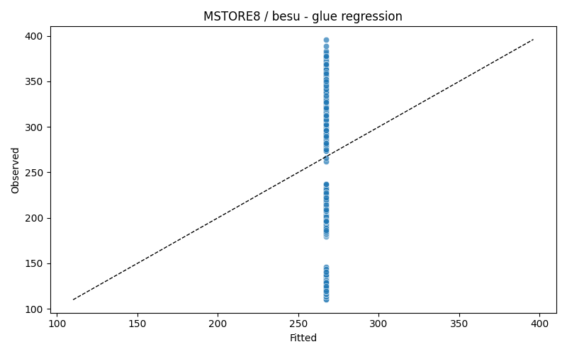


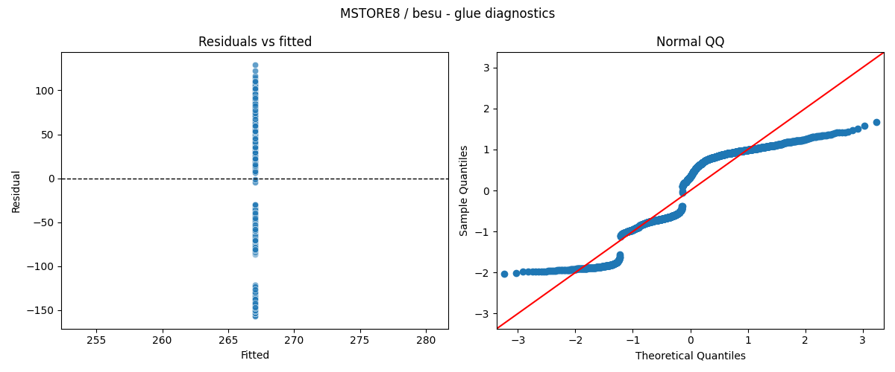

</details>

<details><summary><code>MUL</code> · nobs=400 · runtime_ms=0 · p=1.00e+00 · R²=0</summary>

```
==============================================================================
                           NNLS Regression Results                            
==============================================================================
Dep. Variable:          test_runtime_ms              R-squared:          0.000
Model:                  NNLS                    Adj. R-squared:         -0.003
No. Observations:       400                               RMSE:         124.14
Df Residuals:           398                                MAE:         106.00
Df Model:               1      
==============================================================================
                      coef     std err     P-value      [0.025      0.975]
------------------------------------------------------------------------------
         const    427.5785      6.3015       0.001    415.5846    439.3162
           MUL      0.0000      0.0000       1.000      0.0000      0.0000
==============================================================================
Notes: Non-negative least squares with bootstrap inference (1000 iterations)
==============================================================================
```

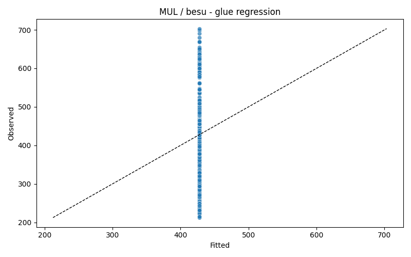


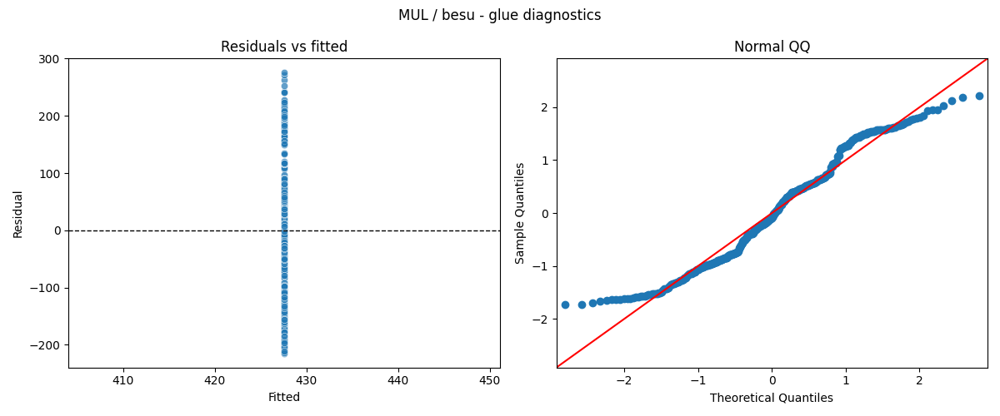

</details>

<details><summary><code>PC</code> · nobs=222 · runtime_ms=2.516e-05 · p=1.00e-03 · R²=0.4242</summary>

```
==============================================================================
                           NNLS Regression Results                            
==============================================================================
Dep. Variable:          test_runtime_ms              R-squared:          0.424
Model:                  NNLS                    Adj. R-squared:          0.422
No. Observations:       222                               RMSE:          65.16
Df Residuals:           220                                MAE:          57.26
Df Model:               1      
==============================================================================
                      coef     std err     P-value      [0.025      0.975]
------------------------------------------------------------------------------
         const    313.6625      8.7171       0.001    295.1276    330.4467
            PC      0.0000      0.0000       0.001      0.0000      0.0000
==============================================================================
Notes: Non-negative least squares with bootstrap inference (1000 iterations)
==============================================================================
```

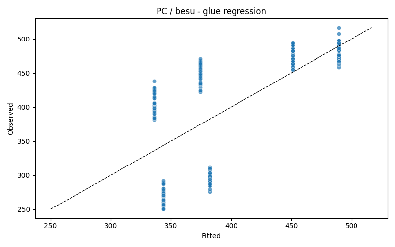

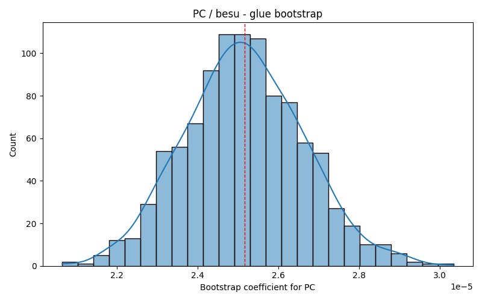

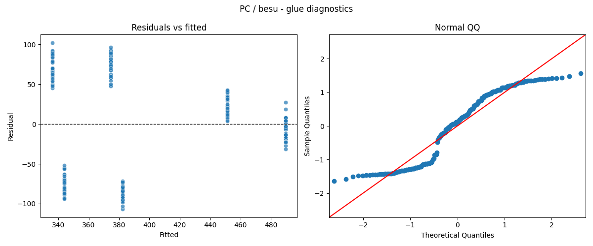

</details>

<details><summary><code>RETURNDATASIZE</code> · nobs=889 · runtime_ms=3.623e-05 · p=1.00e-03 · R²=0.4178</summary>

```
==============================================================================
                           NNLS Regression Results                            
==============================================================================
Dep. Variable:          test_runtime_ms              R-squared:          0.418
Model:                  NNLS                    Adj. R-squared:          0.417
No. Observations:       889                               RMSE:          50.18
Df Residuals:           887                                MAE:          43.96
Df Model:               1      
==============================================================================
                      coef     std err     P-value      [0.025      0.975]
------------------------------------------------------------------------------
         const    237.1194      3.2820       0.001    230.5822    243.3268
RETURNDATASIZE      0.0000      0.0000       0.001      0.0000      0.0000
==============================================================================
Notes: Non-negative least squares with bootstrap inference (1000 iterations)
==============================================================================
```

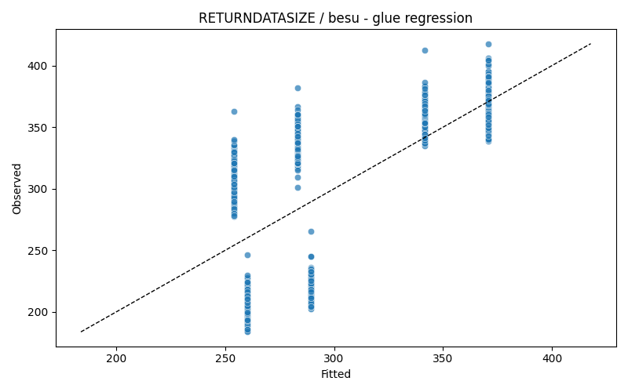

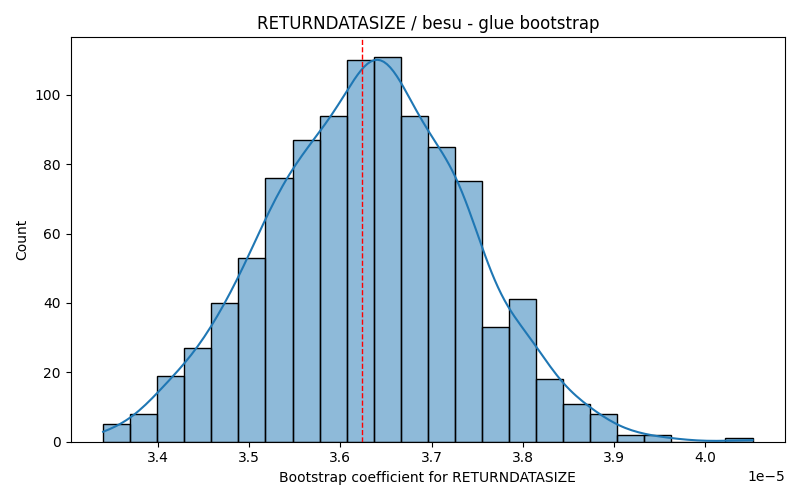

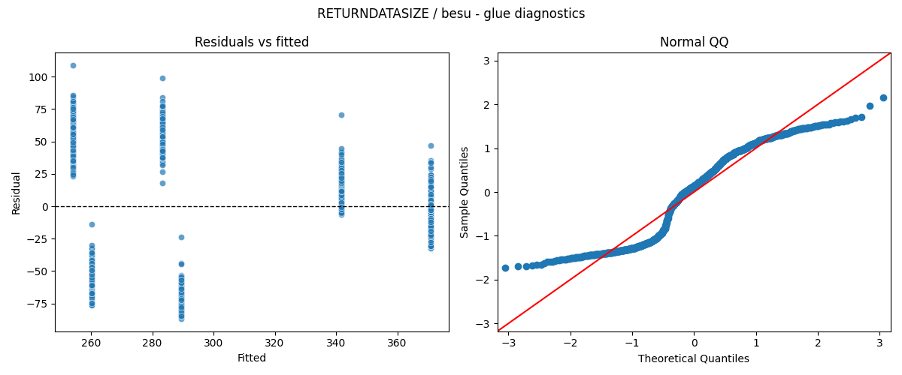

</details>

<details><summary><code>SELFBALANCE</code> · nobs=440 · runtime_ms=0 · p=1.00e+00 · R²=0</summary>

```
==============================================================================
                           NNLS Regression Results                            
==============================================================================
Dep. Variable:          test_runtime_ms              R-squared:          0.000
Model:                  NNLS                    Adj. R-squared:         -0.002
No. Observations:       440                               RMSE:         200.13
Df Residuals:           438                                MAE:         170.61
Df Model:               1      
==============================================================================
                      coef     std err     P-value      [0.025      0.975]
------------------------------------------------------------------------------
         const    706.6457      9.6313       0.001    688.0580    725.1389
   SELFBALANCE      0.0000      0.0000       1.000      0.0000      0.0000
==============================================================================
Notes: Non-negative least squares with bootstrap inference (1000 iterations)
==============================================================================
```

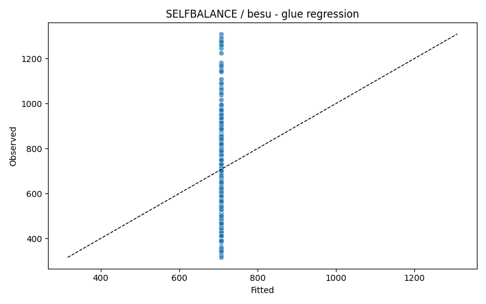


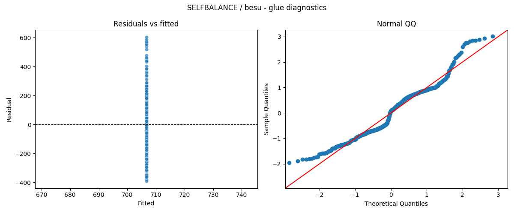

</details>

<details><summary><code>SUB</code> · nobs=320 · runtime_ms=0 · p=1.00e+00 · R²=0</summary>

```
==============================================================================
                           NNLS Regression Results                            
==============================================================================
Dep. Variable:          test_runtime_ms              R-squared:          0.000
Model:                  NNLS                    Adj. R-squared:         -0.003
No. Observations:       320                               RMSE:         127.71
Df Residuals:           318                                MAE:         112.39
Df Model:               1      
==============================================================================
                      coef     std err     P-value      [0.025      0.975]
------------------------------------------------------------------------------
         const    416.5437      7.2669       0.001    402.9622    430.9975
           SUB      0.0000      0.0000       1.000      0.0000      0.0000
==============================================================================
Notes: Non-negative least squares with bootstrap inference (1000 iterations)
==============================================================================
```

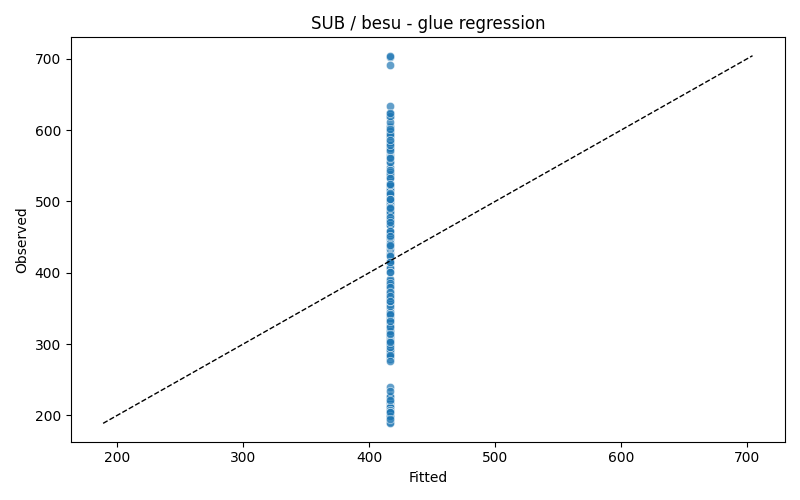


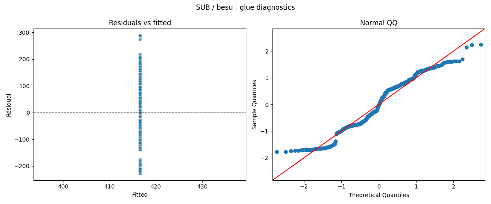

</details>

### Mixed glue (tier B) · besu

<details><summary><code>JUMP</code> · nobs=370 · runtime_ms=0 · p=1.00e+00 · R²=0</summary>

```
==============================================================================
                           NNLS Regression Results                            
==============================================================================
Dep. Variable:          test_runtime_ms              R-squared:          0.000
Model:                  NNLS                    Adj. R-squared:         -0.003
No. Observations:       370                               RMSE:         183.19
Df Residuals:           368                                MAE:         166.22
Df Model:               1      
==============================================================================
                      coef     std err     P-value      [0.025      0.975]
------------------------------------------------------------------------------
         const    653.4157      9.7160       0.001    633.6764    671.1950
          JUMP      0.0000      0.0000       1.000      0.0000      0.0000
==============================================================================
Notes: Non-negative least squares with bootstrap inference (1000 iterations)
==============================================================================
```

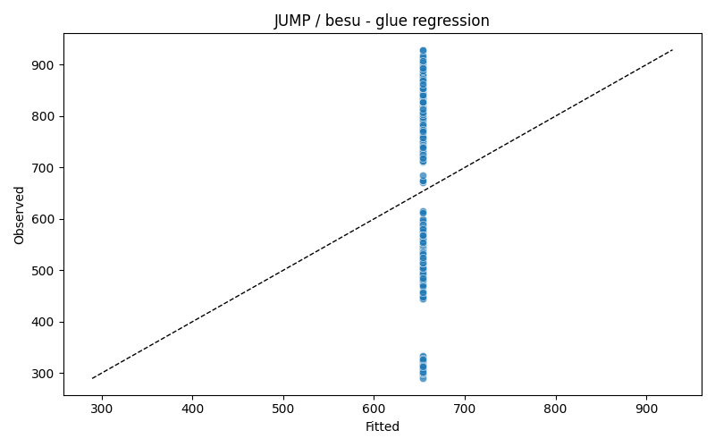


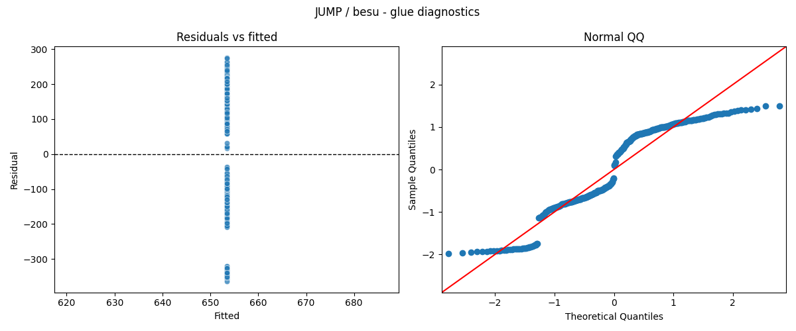

</details>

<details><summary><code>KECCAK256</code> · nobs=0 · runtime_ms=n/a · p=n/a · R²=n/a</summary>

</details>

## erigon

| glue_opcode | nobs | glue_runtime_ms | p_value | rsquared |
| --- | --- | --- | --- | --- |
| `ISZERO` | 200 | 0 | 1.00e+00 | 0 |
| `JUMPDEST` | 50 | 0 | 1.00e+00 | 0 |
| `SWAP` | 3575 | 0 | 1.00e+00 | 0 |
| `CALLDATASIZE` | 12572 | 0 | 1.00e+00 | 0.03786 |
| `DUP` | 12572 | 0 | 1.00e+00 | 0.03786 |
| `GAS` | 12572 | 0 | 1.00e+00 | 0.03786 |
| `MLOAD` | 12572 | 0 | 1.00e+00 | 0.03786 |
| `PUSH` | 12572 | 0 | 1.00e+00 | 0.03786 |
| `PUSH0` | 12572 | 0 | 1.00e+00 | 0.03786 |
| `STATICCALL` | 12572 | 0.00023 | 1.00e-03 | 0.03786 |
| `ADD` | 225 | 0 | 1.00e+00 | 0 |
| `AND` | 200 | 0 | 1.00e+00 | 0 |
| `CALLDATACOPY` | 5875 | 0 | 1.00e+00 | 0 |
| `CALLDATALOAD` | 1100 | 4.771e-05 | 1.00e-03 | 0.1723 |
| `DIV` | 275 | 0 | 1.00e+00 | 0 |
| `EXP` | 275 | 0.000361 | 1.00e-03 | 0.8947 |
| `GT` | 200 | 0 | 1.00e+00 | 0 |
| `JUMPI` | 275 | 0 | 1.00e+00 | 2.22e-16 |
| `LT` | 200 | 0 | 1.00e+00 | 0 |
| `MSTORE` | 1125 | 0 | 1.00e+00 | 0 |
| `MSTORE8` | 1125 | 0 | 1.00e+00 | 0 |
| `MUL` | 250 | 0 | 1.00e+00 | 0 |
| `PC` | 150 | 1.365e-05 | 1.00e-03 | 0.5592 |
| `RETURNDATASIZE` | 600 | 2.055e-05 | 1.00e-03 | 0.619 |
| `SELFBALANCE` | 275 | 0 | 1.00e+00 | 0 |
| `SUB` | 200 | 0 | 1.00e+00 | 0 |
| `JUMP` | 250 | 0 | 1.00e+00 | 0 |
| `KECCAK256` | 0 | n/a | n/a | n/a |

### Cycle glue — joint fit · erigon

<details><summary>Joint NNLS regression summary</summary>

```
==============================================================================
                           NNLS Regression Results                            
==============================================================================
Dep. Variable:          test_runtime_ms              R-squared:          0.038
Model:                  NNLS                    Adj. R-squared:          0.037
No. Observations:       12572                             RMSE:          83.60
Df Residuals:           12564                              MAE:          70.86
Df Model:               7      
==============================================================================
                      coef     std err     P-value      [0.025      0.975]
------------------------------------------------------------------------------
         const    187.7040      0.7743       0.001    186.2743    189.2988
  CALLDATASIZE      0.0000      0.0000       1.000      0.0000      0.0000
           DUP      0.0000      0.0000       1.000      0.0000      0.0000
           GAS      0.0000      0.0000       1.000      0.0000      0.0000
         MLOAD      0.0000      0.0000       1.000      0.0000      0.0000
          PUSH      0.0000      0.0000       1.000      0.0000      0.0000
         PUSH0      0.0000      0.0000       1.000      0.0000      0.0000
    STATICCALL      0.0002      0.0000       0.001      0.0002      0.0002
==============================================================================
Notes: Non-negative least squares with bootstrap inference (1000 iterations)
==============================================================================
```

</details>

<details><summary><code>CALLDATASIZE</code> · nobs=12572 · runtime_ms=0 · p=1.00e+00 · R²=0.03786</summary>

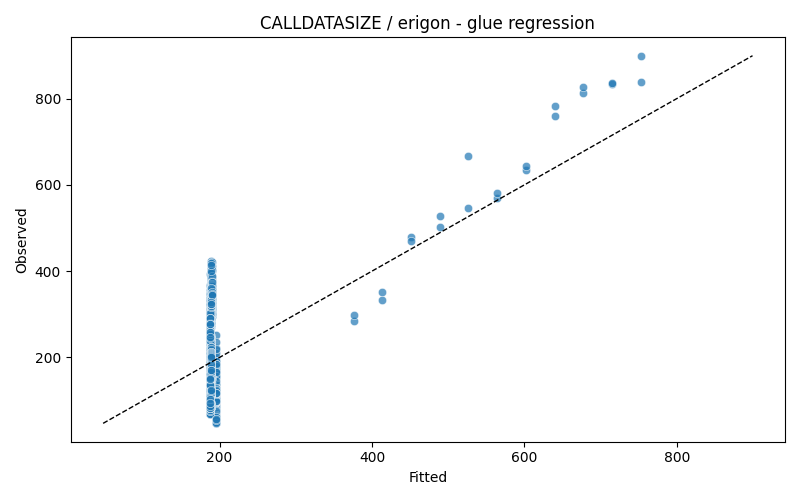


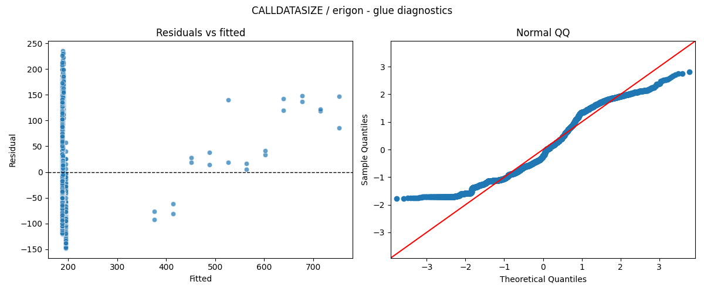

</details>

<details><summary><code>DUP</code> · nobs=12572 · runtime_ms=0 · p=1.00e+00 · R²=0.03786</summary>


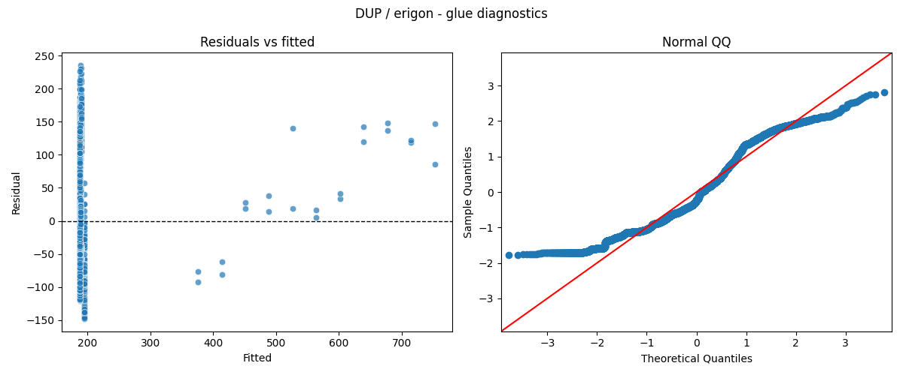

</details>

<details><summary><code>GAS</code> · nobs=12572 · runtime_ms=0 · p=1.00e+00 · R²=0.03786</summary>


</details>

<details><summary><code>MLOAD</code> · nobs=12572 · runtime_ms=0 · p=1.00e+00 · R²=0.03786</summary>

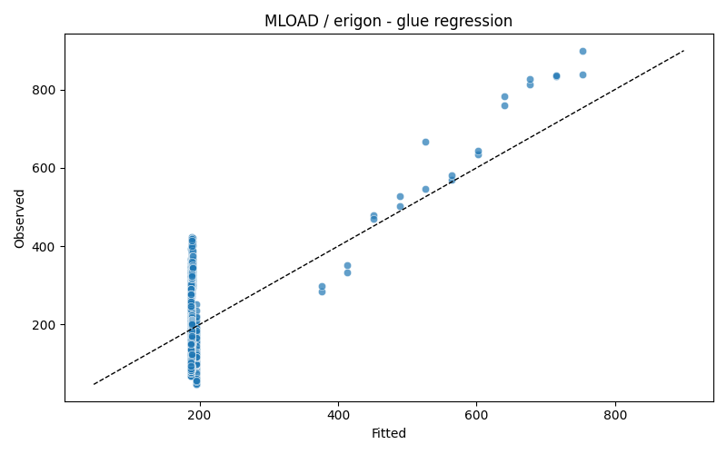

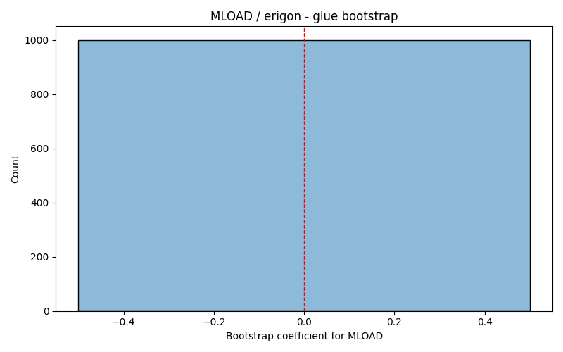

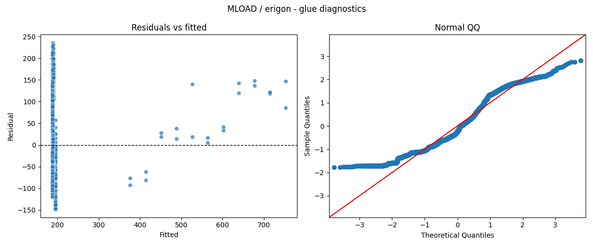

</details>

<details><summary><code>PUSH</code> · nobs=12572 · runtime_ms=0 · p=1.00e+00 · R²=0.03786</summary>

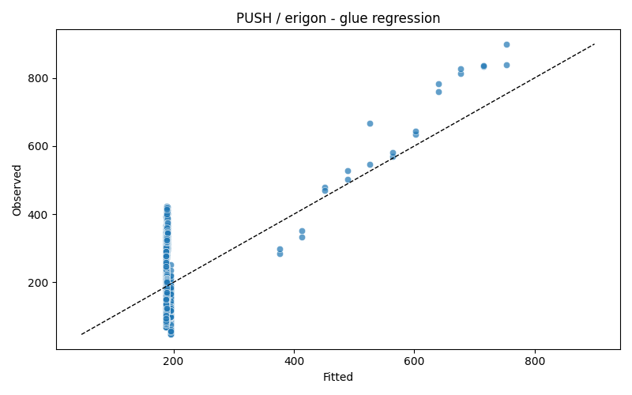


</details>

<details><summary><code>PUSH0</code> · nobs=12572 · runtime_ms=0 · p=1.00e+00 · R²=0.03786</summary>


</details>

<details><summary><code>STATICCALL</code> · nobs=12572 · runtime_ms=0.00023 · p=1.00e-03 · R²=0.03786</summary>

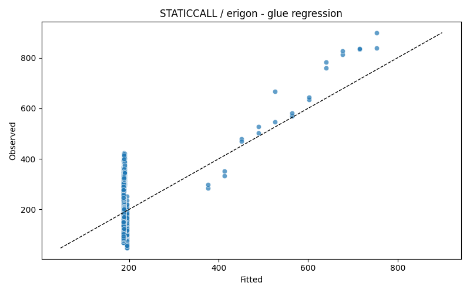

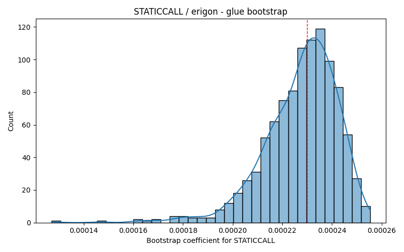

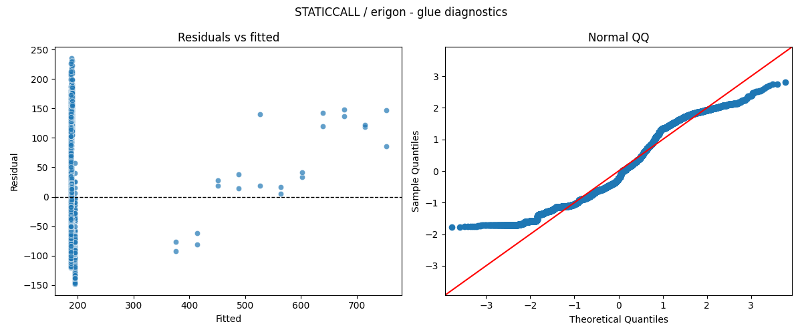

</details>

### Pure glue · erigon

<details><summary><code>ISZERO</code> · nobs=200 · runtime_ms=0 · p=1.00e+00 · R²=0</summary>

```
==============================================================================
                           NNLS Regression Results                            
==============================================================================
Dep. Variable:          test_runtime_ms              R-squared:          0.000
Model:                  NNLS                    Adj. R-squared:         -0.005
No. Observations:       200                               RMSE:          24.89
Df Residuals:           198                                MAE:          21.53
Df Model:               1      
==============================================================================
                      coef     std err     P-value      [0.025      0.975]
------------------------------------------------------------------------------
         const     81.6483      1.7423       0.001     78.2228     85.1789
        ISZERO      0.0000      0.0000       1.000      0.0000      0.0000
==============================================================================
Notes: Non-negative least squares with bootstrap inference (1000 iterations)
==============================================================================
```

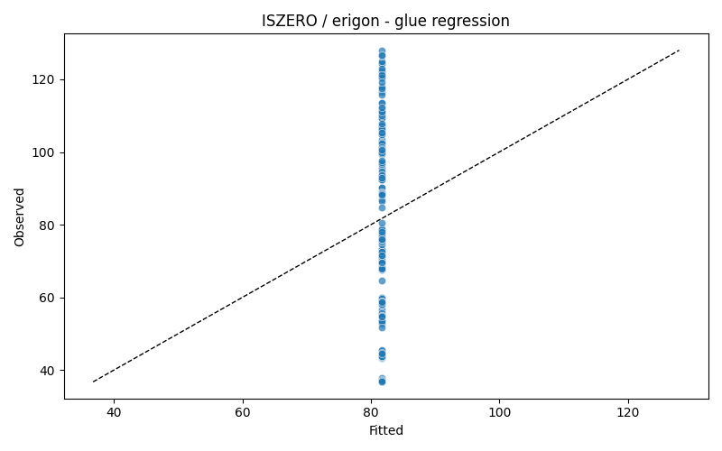


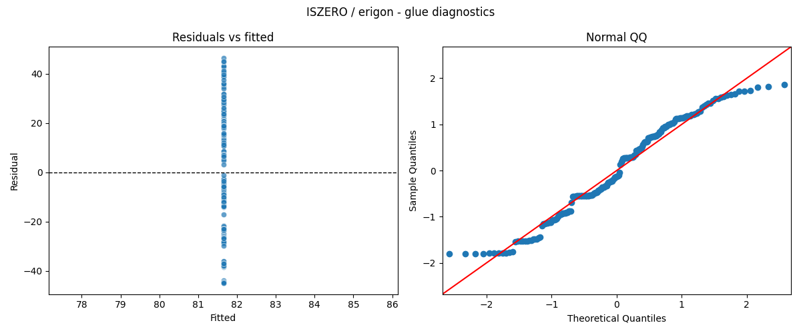

</details>

<details><summary><code>JUMPDEST</code> · nobs=50 · runtime_ms=0 · p=1.00e+00 · R²=0</summary>

```
==============================================================================
                           NNLS Regression Results                            
==============================================================================
Dep. Variable:          test_runtime_ms              R-squared:          0.000
Model:                  NNLS                    Adj. R-squared:         -0.021
No. Observations:       50                                RMSE:          38.10
Df Residuals:           48                                 MAE:          36.54
Df Model:               1      
==============================================================================
                      coef     std err     P-value      [0.025      0.975]
------------------------------------------------------------------------------
         const    141.2526      5.5039       0.001    129.1648    151.6055
      JUMPDEST      0.0000      0.0000       1.000      0.0000      0.0000
==============================================================================
Notes: Non-negative least squares with bootstrap inference (1000 iterations)
==============================================================================
```

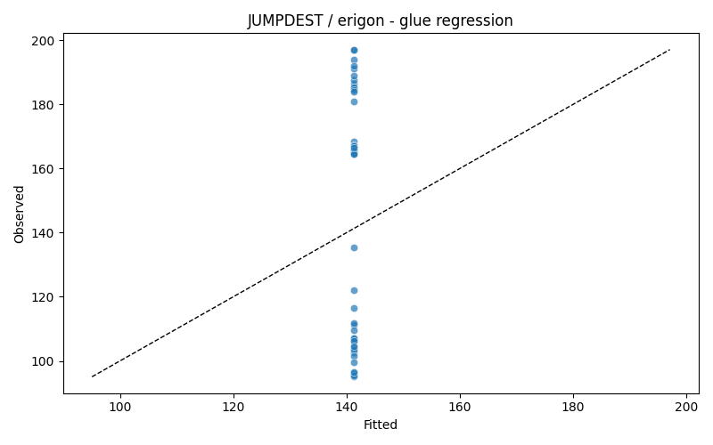


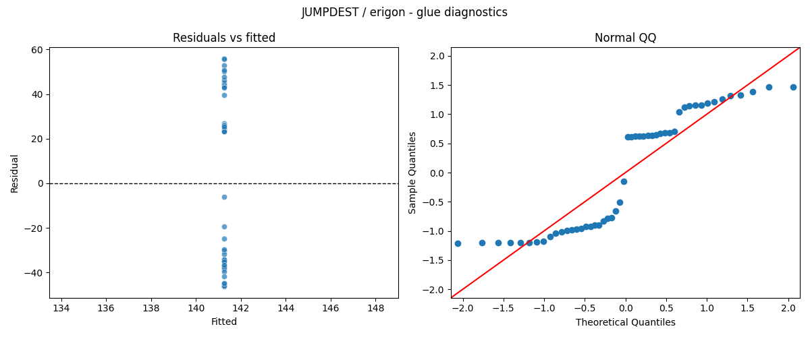

</details>

<details><summary><code>SWAP</code> · nobs=3575 · runtime_ms=0 · p=1.00e+00 · R²=0</summary>

```
==============================================================================
                           NNLS Regression Results                            
==============================================================================
Dep. Variable:          test_runtime_ms              R-squared:          0.000
Model:                  NNLS                    Adj. R-squared:         -0.000
No. Observations:       3575                              RMSE:          32.63
Df Residuals:           3573                               MAE:          27.38
Df Model:               1      
==============================================================================
                      coef     std err     P-value      [0.025      0.975]
------------------------------------------------------------------------------
         const    106.9108      0.5597       0.001    105.8290    107.9655
          SWAP      0.0000      0.0000       1.000      0.0000      0.0000
==============================================================================
Notes: Non-negative least squares with bootstrap inference (1000 iterations)
==============================================================================
```

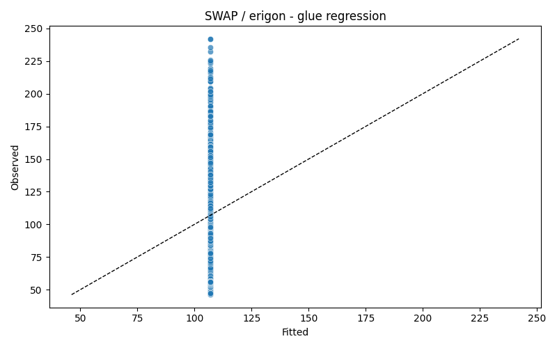

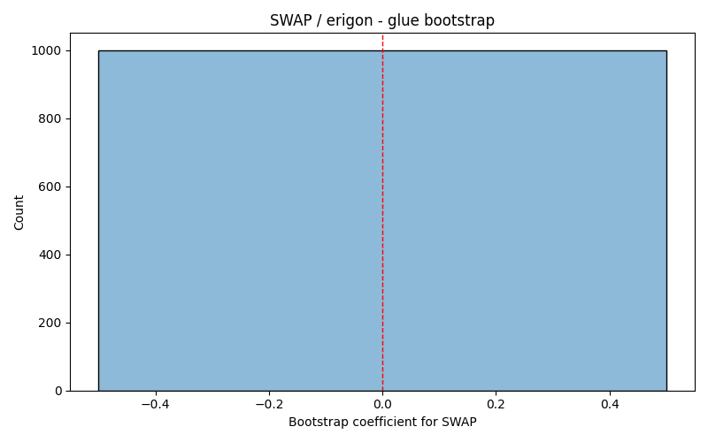

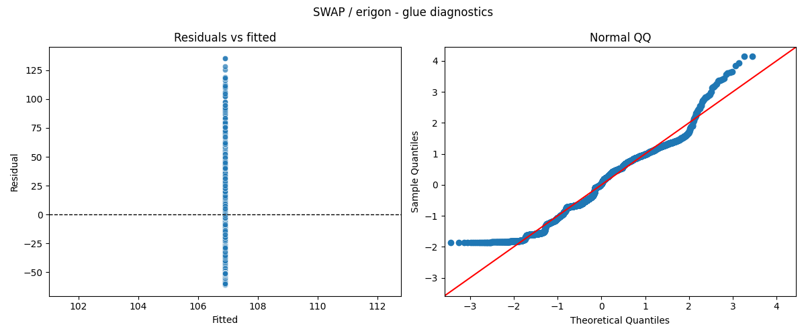

</details>

### Mixed glue (tier A) · erigon

<details><summary><code>ADD</code> · nobs=225 · runtime_ms=0 · p=1.00e+00 · R²=0</summary>

```
==============================================================================
                           NNLS Regression Results                            
==============================================================================
Dep. Variable:          test_runtime_ms              R-squared:          0.000
Model:                  NNLS                    Adj. R-squared:         -0.004
No. Observations:       225                               RMSE:          35.01
Df Residuals:           223                                MAE:          29.60
Df Model:               1      
==============================================================================
                      coef     std err     P-value      [0.025      0.975]
------------------------------------------------------------------------------
         const    110.4293      2.3117       0.001    105.7842    114.9397
           ADD      0.0000      0.0000       1.000      0.0000      0.0000
==============================================================================
Notes: Non-negative least squares with bootstrap inference (1000 iterations)
==============================================================================
```

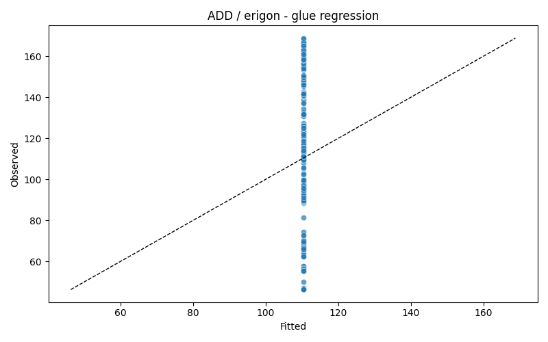


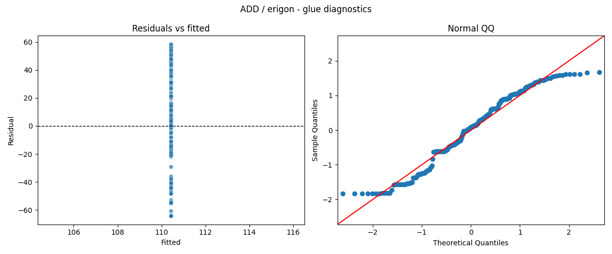

</details>

<details><summary><code>AND</code> · nobs=200 · runtime_ms=0 · p=1.00e+00 · R²=0</summary>

```
==============================================================================
                           NNLS Regression Results                            
==============================================================================
Dep. Variable:          test_runtime_ms              R-squared:          0.000
Model:                  NNLS                    Adj. R-squared:         -0.005
No. Observations:       200                               RMSE:          34.36
Df Residuals:           198                                MAE:          28.88
Df Model:               1      
==============================================================================
                      coef     std err     P-value      [0.025      0.975]
------------------------------------------------------------------------------
         const    104.5594      2.4359       0.001     99.5726    109.0840
           AND      0.0000      0.0000       1.000      0.0000      0.0000
==============================================================================
Notes: Non-negative least squares with bootstrap inference (1000 iterations)
==============================================================================
```

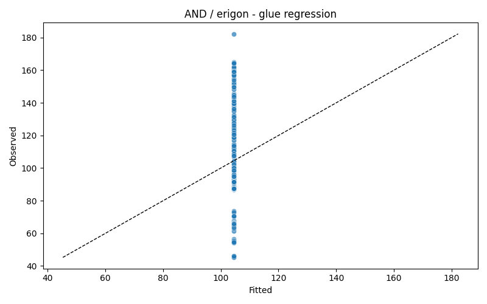


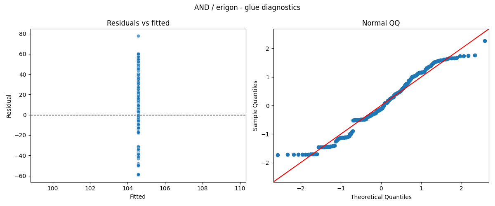

</details>

<details><summary><code>CALLDATACOPY</code> · nobs=5875 · runtime_ms=0 · p=1.00e+00 · R²=0</summary>

```
==============================================================================
                           NNLS Regression Results                            
==============================================================================
Dep. Variable:          test_runtime_ms              R-squared:          0.000
Model:                  NNLS                    Adj. R-squared:         -0.000
No. Observations:       5875                              RMSE:          66.08
Df Residuals:           5873                               MAE:          56.25
Df Model:               1      
==============================================================================
                      coef     std err     P-value      [0.025      0.975]
------------------------------------------------------------------------------
         const     97.5393      0.8883       0.001     95.7726     99.2273
  CALLDATACOPY      0.0000      0.0000       1.000      0.0000      0.0000
==============================================================================
Notes: Non-negative least squares with bootstrap inference (1000 iterations)
==============================================================================
```

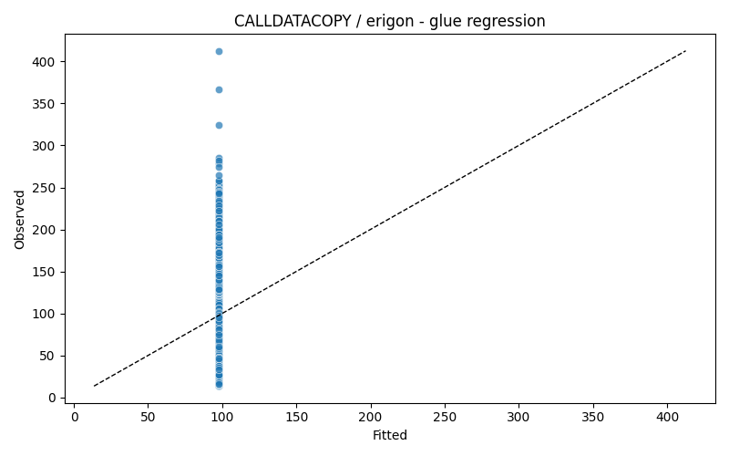


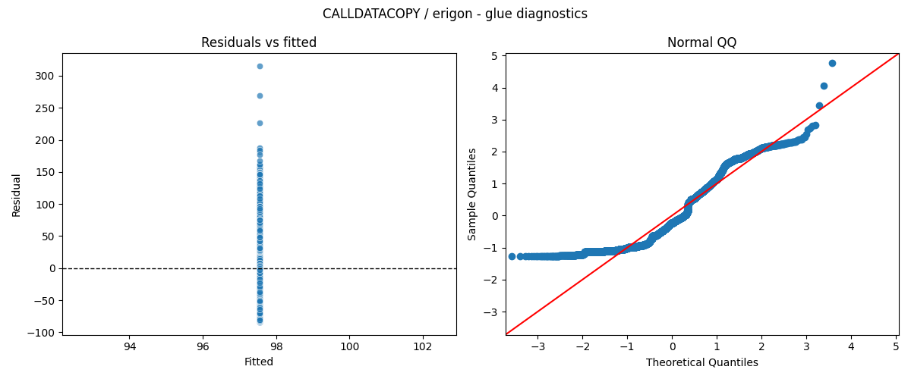

</details>

<details><summary><code>CALLDATALOAD</code> · nobs=1100 · runtime_ms=4.771e-05 · p=1.00e-03 · R²=0.1723</summary>

```
==============================================================================
                           NNLS Regression Results                            
==============================================================================
Dep. Variable:          test_runtime_ms              R-squared:          0.172
Model:                  NNLS                    Adj. R-squared:          0.172
No. Observations:       1100                              RMSE:           0.40
Df Residuals:           1098                               MAE:           0.26
Df Model:               1      
==============================================================================
                      coef     std err     P-value      [0.025      0.975]
------------------------------------------------------------------------------
         const      4.1657      0.0441       0.001      4.0853      4.2568
  CALLDATALOAD      0.0000      0.0000       0.001      0.0000      0.0001
==============================================================================
Notes: Non-negative least squares with bootstrap inference (1000 iterations)
==============================================================================
```

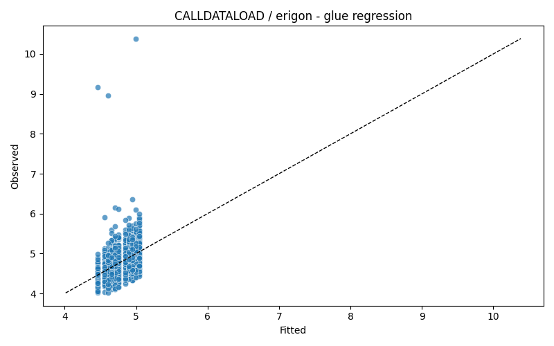

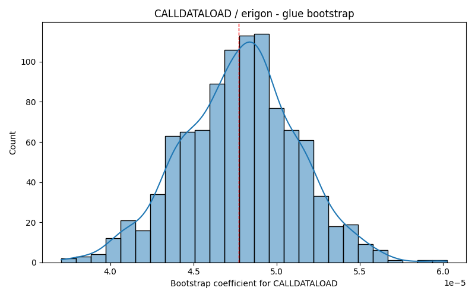

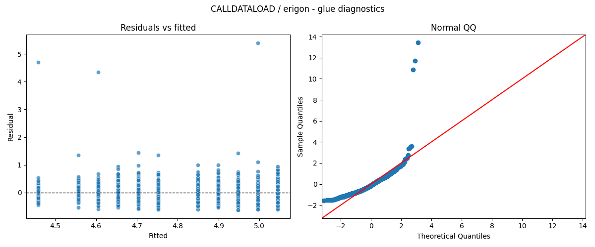

</details>

<details><summary><code>DIV</code> · nobs=275 · runtime_ms=0 · p=1.00e+00 · R²=0</summary>

```
==============================================================================
                           NNLS Regression Results                            
==============================================================================
Dep. Variable:          test_runtime_ms              R-squared:          0.000
Model:                  NNLS                    Adj. R-squared:         -0.004
No. Observations:       275                               RMSE:          84.62
Df Residuals:           273                                MAE:          66.03
Df Model:               1      
==============================================================================
                      coef     std err     P-value      [0.025      0.975]
------------------------------------------------------------------------------
         const    272.8092      4.9703       0.001    263.7410    282.8691
           DIV      0.0000      0.0000       1.000      0.0000      0.0000
==============================================================================
Notes: Non-negative least squares with bootstrap inference (1000 iterations)
==============================================================================
```

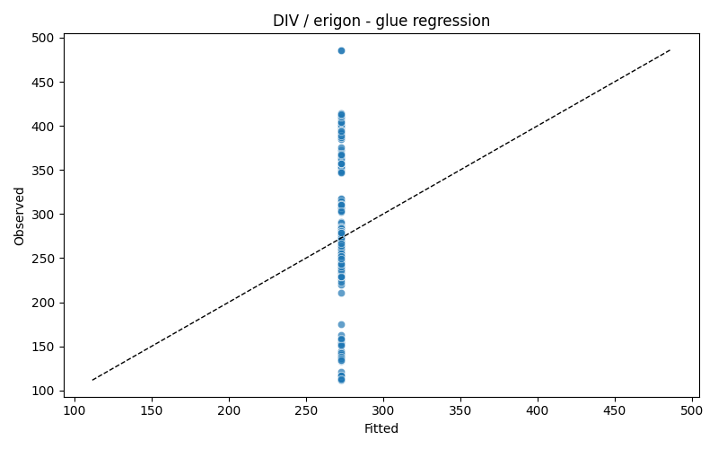


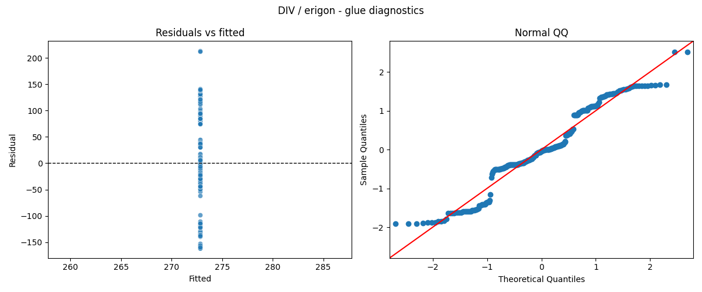

</details>

<details><summary><code>EXP</code> · nobs=275 · runtime_ms=0.000361 · p=1.00e-03 · R²=0.8947</summary>

```
==============================================================================
                           NNLS Regression Results                            
==============================================================================
Dep. Variable:          test_runtime_ms              R-squared:          0.895
Model:                  NNLS                    Adj. R-squared:          0.894
No. Observations:       275                               RMSE:           4.85
Df Residuals:           273                                MAE:           4.06
Df Model:               1      
==============================================================================
                      coef     std err     P-value      [0.025      0.975]
------------------------------------------------------------------------------
         const     11.2453      1.0121       0.001      9.5369     13.3704
           EXP      0.0004      0.0000       0.001      0.0003      0.0004
==============================================================================
Notes: Non-negative least squares with bootstrap inference (1000 iterations)
==============================================================================
```

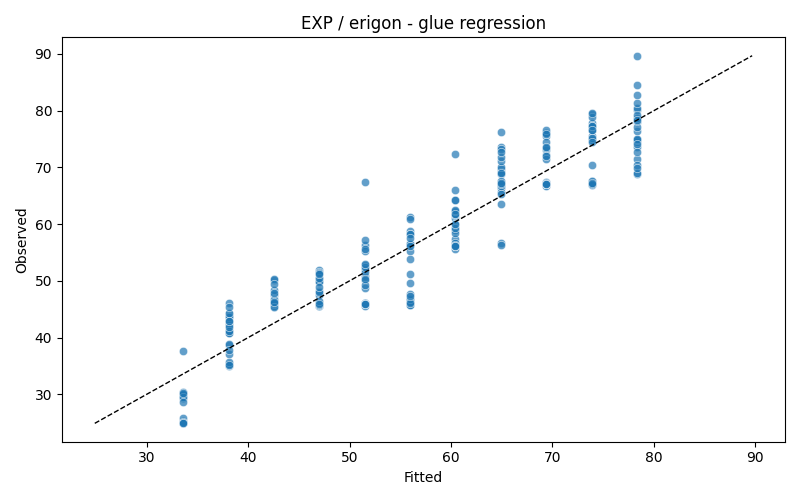

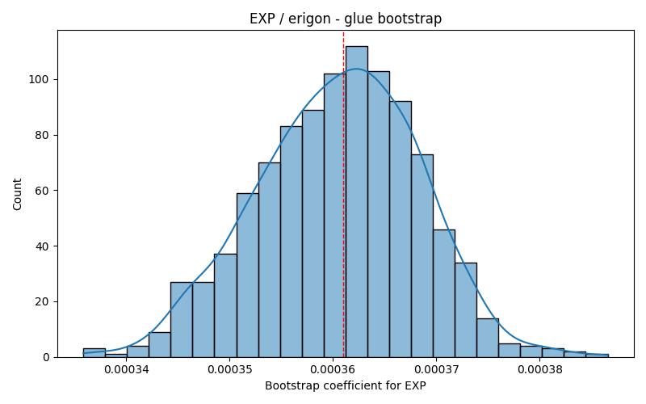

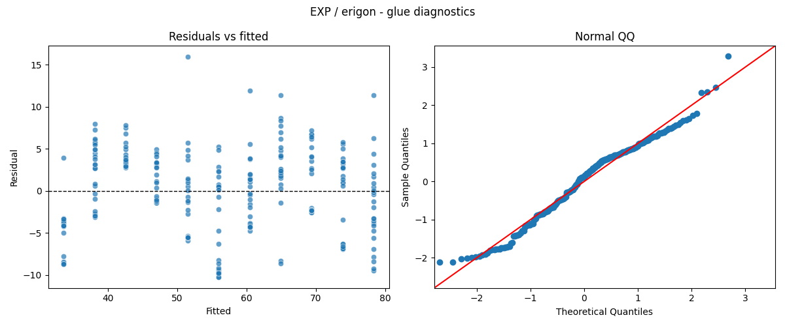

</details>

<details><summary><code>GT</code> · nobs=200 · runtime_ms=0 · p=1.00e+00 · R²=0</summary>

```
==============================================================================
                           NNLS Regression Results                            
==============================================================================
Dep. Variable:          test_runtime_ms              R-squared:          0.000
Model:                  NNLS                    Adj. R-squared:         -0.005
No. Observations:       200                               RMSE:          34.41
Df Residuals:           198                                MAE:          28.69
Df Model:               1      
==============================================================================
                      coef     std err     P-value      [0.025      0.975]
------------------------------------------------------------------------------
         const    106.7617      2.4754       0.001    101.9372    111.3962
            GT      0.0000      0.0000       1.000      0.0000      0.0000
==============================================================================
Notes: Non-negative least squares with bootstrap inference (1000 iterations)
==============================================================================
```

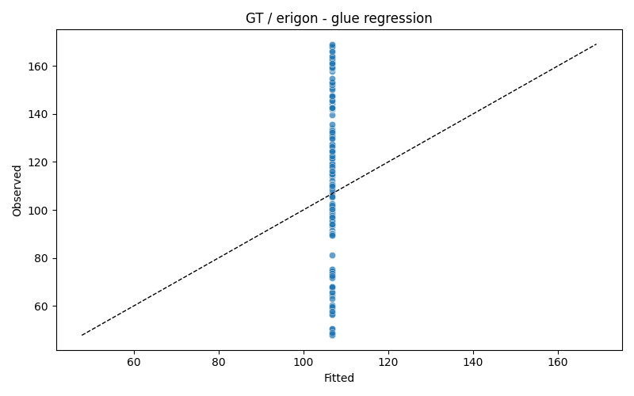


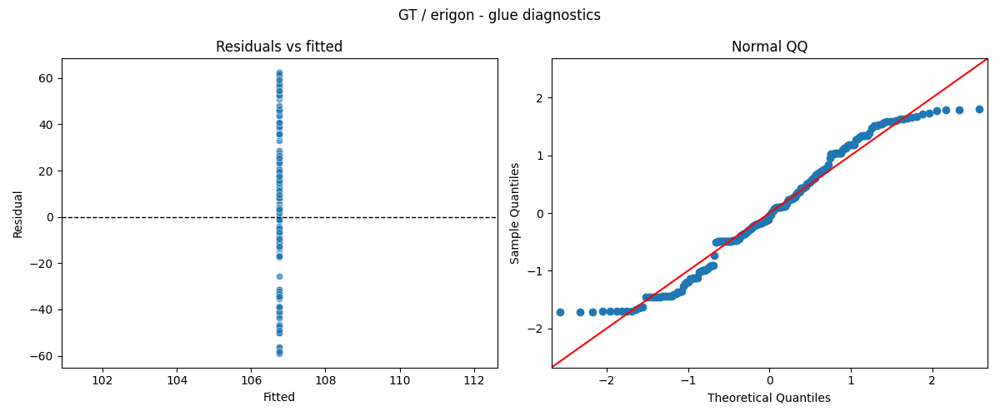

</details>

<details><summary><code>JUMPI</code> · nobs=275 · runtime_ms=0 · p=1.00e+00 · R²=2.22e-16</summary>

```
==============================================================================
                           NNLS Regression Results                            
==============================================================================
Dep. Variable:          test_runtime_ms              R-squared:          0.000
Model:                  NNLS                    Adj. R-squared:         -0.004
No. Observations:       275                               RMSE:          17.05
Df Residuals:           273                                MAE:          14.42
Df Model:               1      
==============================================================================
                      coef     std err     P-value      [0.025      0.975]
------------------------------------------------------------------------------
         const     64.2087      1.0371       0.001     62.1283     66.1642
         JUMPI      0.0000      0.0000       1.000      0.0000      0.0000
==============================================================================
Notes: Non-negative least squares with bootstrap inference (1000 iterations)
==============================================================================
```

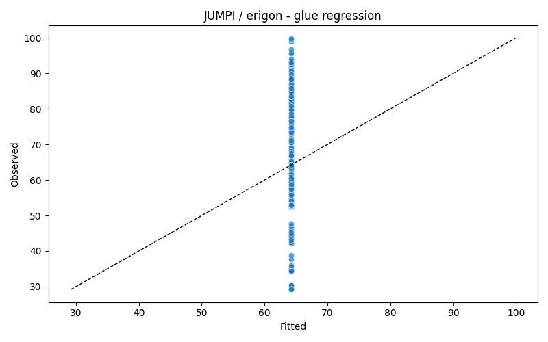


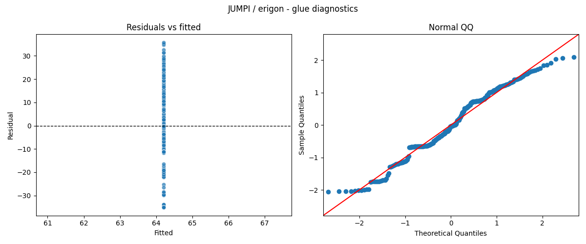

</details>

<details><summary><code>LT</code> · nobs=200 · runtime_ms=0 · p=1.00e+00 · R²=0</summary>

```
==============================================================================
                           NNLS Regression Results                            
==============================================================================
Dep. Variable:          test_runtime_ms              R-squared:          0.000
Model:                  NNLS                    Adj. R-squared:         -0.005
No. Observations:       200                               RMSE:          34.72
Df Residuals:           198                                MAE:          29.06
Df Model:               1      
==============================================================================
                      coef     std err     P-value      [0.025      0.975]
------------------------------------------------------------------------------
         const    108.6207      2.4670       0.001    103.9815    113.5072
            LT      0.0000      0.0000       1.000      0.0000      0.0000
==============================================================================
Notes: Non-negative least squares with bootstrap inference (1000 iterations)
==============================================================================
```

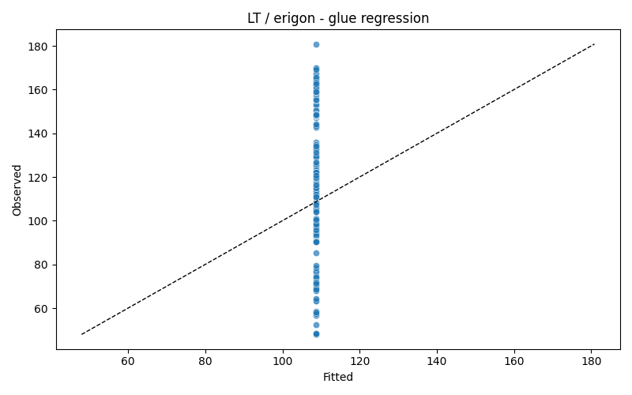


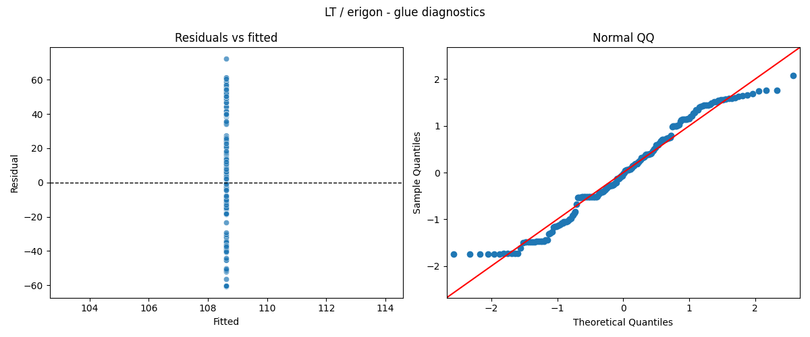

</details>

<details><summary><code>MSTORE</code> · nobs=1125 · runtime_ms=0 · p=1.00e+00 · R²=0</summary>

```
==============================================================================
                           NNLS Regression Results                            
==============================================================================
Dep. Variable:          test_runtime_ms              R-squared:          0.000
Model:                  NNLS                    Adj. R-squared:         -0.001
No. Observations:       1125                              RMSE:          47.70
Df Residuals:           1123                               MAE:          41.01
Df Model:               1      
==============================================================================
                      coef     std err     P-value      [0.025      0.975]
------------------------------------------------------------------------------
         const    155.2811      1.5056       0.001    152.5349    158.3256
        MSTORE      0.0000      0.0000       1.000      0.0000      0.0000
==============================================================================
Notes: Non-negative least squares with bootstrap inference (1000 iterations)
==============================================================================
```

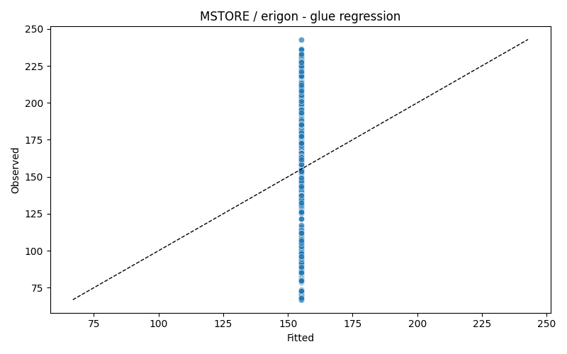


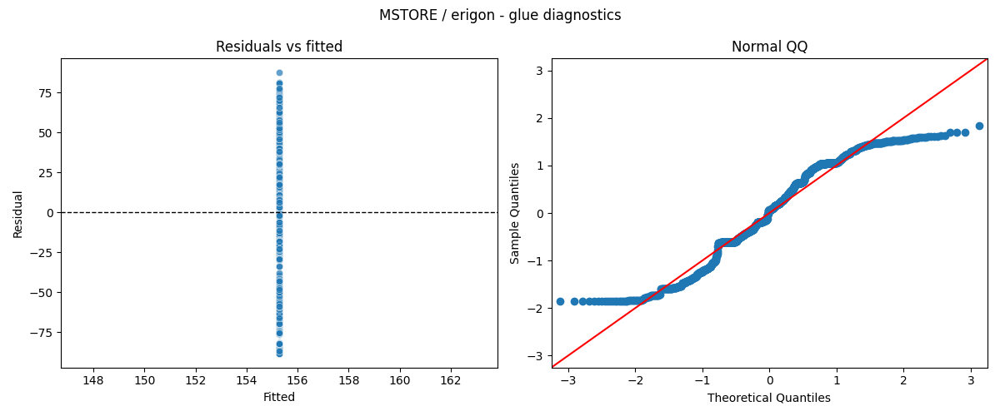

</details>

<details><summary><code>MSTORE8</code> · nobs=1125 · runtime_ms=0 · p=1.00e+00 · R²=0</summary>

```
==============================================================================
                           NNLS Regression Results                            
==============================================================================
Dep. Variable:          test_runtime_ms              R-squared:          0.000
Model:                  NNLS                    Adj. R-squared:         -0.001
No. Observations:       1125                              RMSE:          43.50
Df Residuals:           1123                               MAE:          37.44
Df Model:               1      
==============================================================================
                      coef     std err     P-value      [0.025      0.975]
------------------------------------------------------------------------------
         const    142.3179      1.3077       0.001    139.8609    145.0298
       MSTORE8      0.0000      0.0000       1.000      0.0000      0.0000
==============================================================================
Notes: Non-negative least squares with bootstrap inference (1000 iterations)
==============================================================================
```

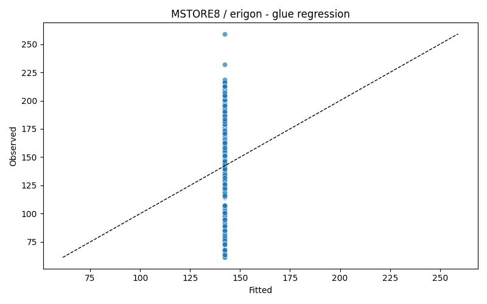


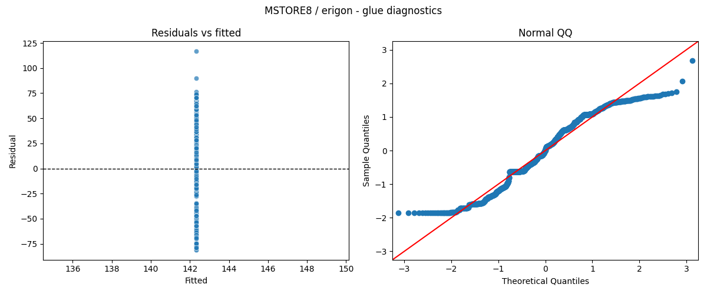

</details>

<details><summary><code>MUL</code> · nobs=250 · runtime_ms=0 · p=1.00e+00 · R²=0</summary>

```
==============================================================================
                           NNLS Regression Results                            
==============================================================================
Dep. Variable:          test_runtime_ms              R-squared:          0.000
Model:                  NNLS                    Adj. R-squared:         -0.004
No. Observations:       250                               RMSE:          31.61
Df Residuals:           248                                MAE:          26.41
Df Model:               1      
==============================================================================
                      coef     std err     P-value      [0.025      0.975]
------------------------------------------------------------------------------
         const    101.8645      1.9886       0.001     98.0733    105.6186
           MUL      0.0000      0.0000       1.000      0.0000      0.0000
==============================================================================
Notes: Non-negative least squares with bootstrap inference (1000 iterations)
==============================================================================
```

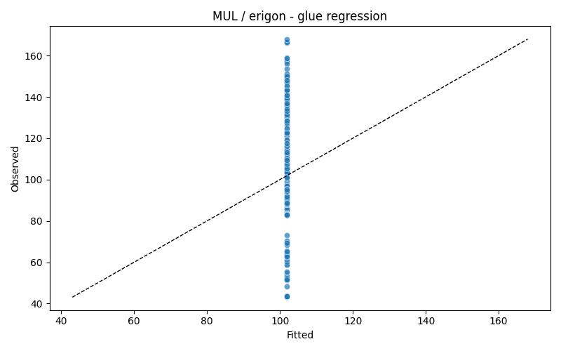


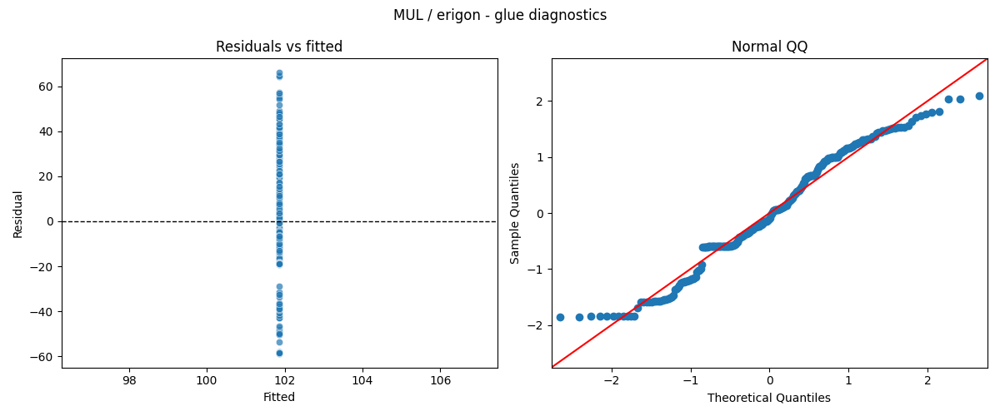

</details>

<details><summary><code>PC</code> · nobs=150 · runtime_ms=1.365e-05 · p=1.00e-03 · R²=0.5592</summary>

```
==============================================================================
                           NNLS Regression Results                            
==============================================================================
Dep. Variable:          test_runtime_ms              R-squared:          0.559
Model:                  NNLS                    Adj. R-squared:          0.556
No. Observations:       150                               RMSE:          26.94
Df Residuals:           148                                MAE:          23.42
Df Model:               1      
==============================================================================
                      coef     std err     P-value      [0.025      0.975]
------------------------------------------------------------------------------
         const    108.1430      4.4519       0.001     98.7793    116.3949
            PC      0.0000      0.0000       0.001      0.0000      0.0000
==============================================================================
Notes: Non-negative least squares with bootstrap inference (1000 iterations)
==============================================================================
```

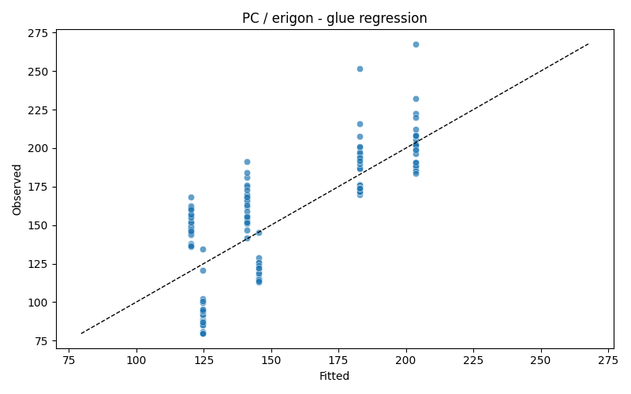

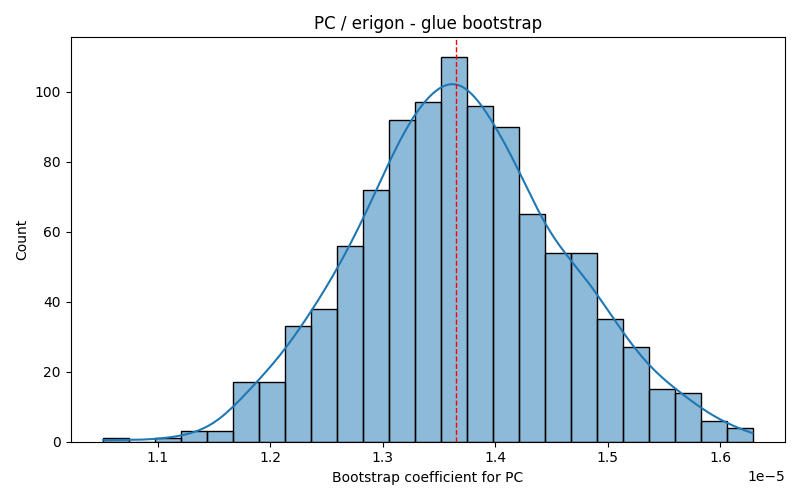

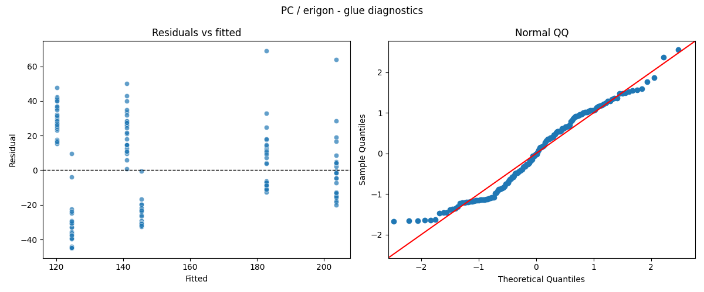

</details>

<details><summary><code>RETURNDATASIZE</code> · nobs=600 · runtime_ms=2.055e-05 · p=1.00e-03 · R²=0.619</summary>

```
==============================================================================
                           NNLS Regression Results                            
==============================================================================
Dep. Variable:          test_runtime_ms              R-squared:          0.619
Model:                  NNLS                    Adj. R-squared:          0.618
No. Observations:       600                               RMSE:          18.92
Df Residuals:           598                                MAE:          16.63
Df Model:               1      
==============================================================================
                      coef     std err     P-value      [0.025      0.975]
------------------------------------------------------------------------------
         const     82.8176      1.6417       0.001     79.5950     85.9507
RETURNDATASIZE      0.0000      0.0000       0.001      0.0000      0.0000
==============================================================================
Notes: Non-negative least squares with bootstrap inference (1000 iterations)
==============================================================================
```

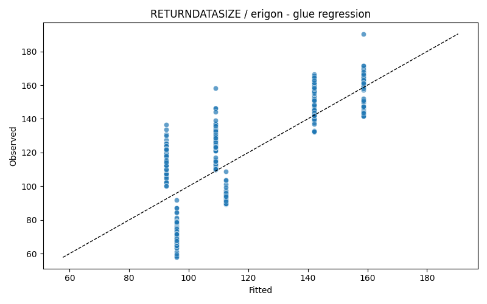

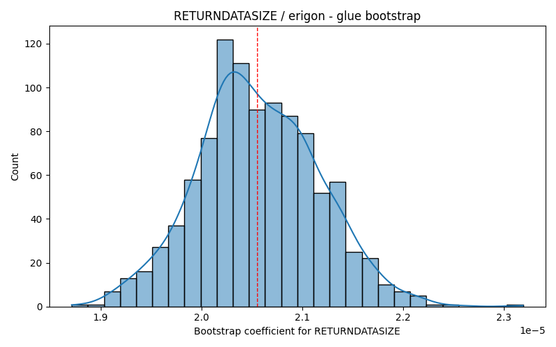

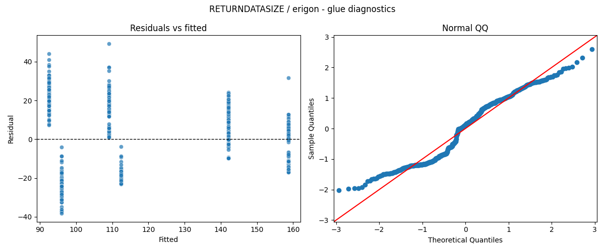

</details>

<details><summary><code>SELFBALANCE</code> · nobs=275 · runtime_ms=0 · p=1.00e+00 · R²=0</summary>

```
==============================================================================
                           NNLS Regression Results                            
==============================================================================
Dep. Variable:          test_runtime_ms              R-squared:          0.000
Model:                  NNLS                    Adj. R-squared:         -0.004
No. Observations:       275                               RMSE:          18.02
Df Residuals:           273                                MAE:          15.35
Df Model:               1      
==============================================================================
                      coef     std err     P-value      [0.025      0.975]
------------------------------------------------------------------------------
         const     67.6070      1.1143       0.001     65.3949     69.7944
   SELFBALANCE      0.0000      0.0000       1.000      0.0000      0.0000
==============================================================================
Notes: Non-negative least squares with bootstrap inference (1000 iterations)
==============================================================================
```

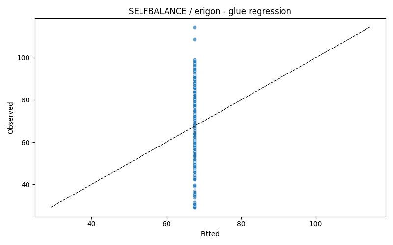


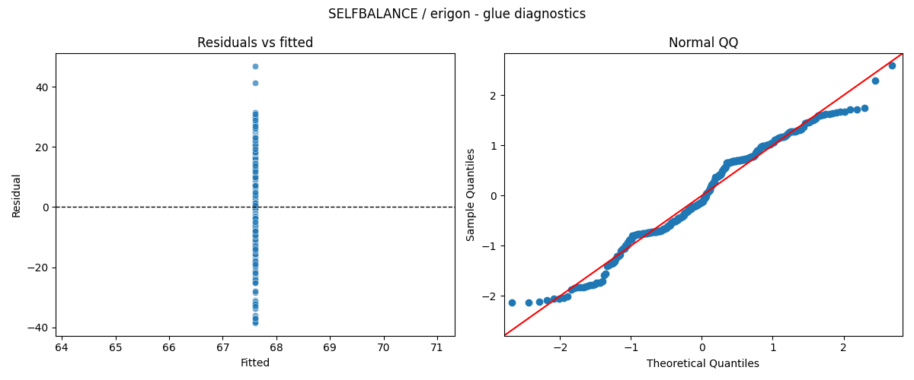

</details>

<details><summary><code>SUB</code> · nobs=200 · runtime_ms=0 · p=1.00e+00 · R²=0</summary>

```
==============================================================================
                           NNLS Regression Results                            
==============================================================================
Dep. Variable:          test_runtime_ms              R-squared:          0.000
Model:                  NNLS                    Adj. R-squared:         -0.005
No. Observations:       200                               RMSE:          34.40
Df Residuals:           198                                MAE:          28.67
Df Model:               1      
==============================================================================
                      coef     std err     P-value      [0.025      0.975]
------------------------------------------------------------------------------
         const    106.8307      2.4792       0.001    102.1790    111.7093
           SUB      0.0000      0.0000       1.000      0.0000      0.0000
==============================================================================
Notes: Non-negative least squares with bootstrap inference (1000 iterations)
==============================================================================
```

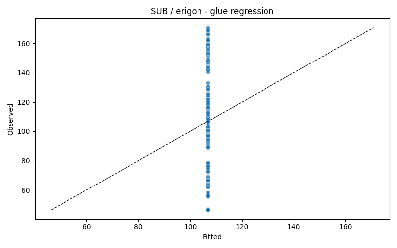


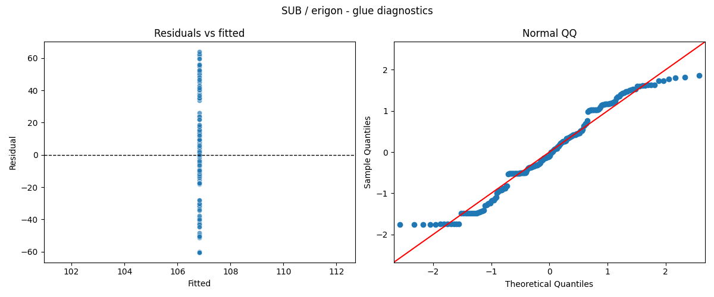

</details>

### Mixed glue (tier B) · erigon

<details><summary><code>JUMP</code> · nobs=250 · runtime_ms=0 · p=1.00e+00 · R²=0</summary>

```
==============================================================================
                           NNLS Regression Results                            
==============================================================================
Dep. Variable:          test_runtime_ms              R-squared:          0.000
Model:                  NNLS                    Adj. R-squared:         -0.004
No. Observations:       250                               RMSE:          32.18
Df Residuals:           248                                MAE:          26.93
Df Model:               1      
==============================================================================
                      coef     std err     P-value      [0.025      0.975]
------------------------------------------------------------------------------
         const    108.2037      2.0332       0.001    104.4305    112.3266
          JUMP      0.0000      0.0000       1.000      0.0000      0.0000
==============================================================================
Notes: Non-negative least squares with bootstrap inference (1000 iterations)
==============================================================================
```

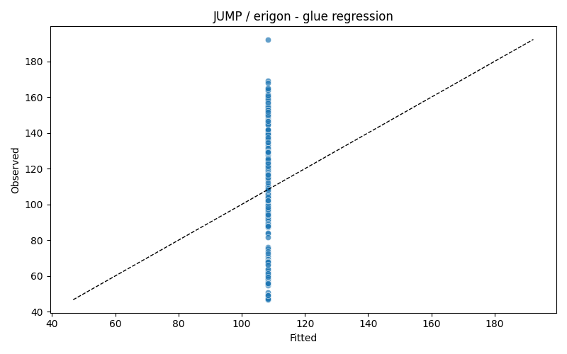


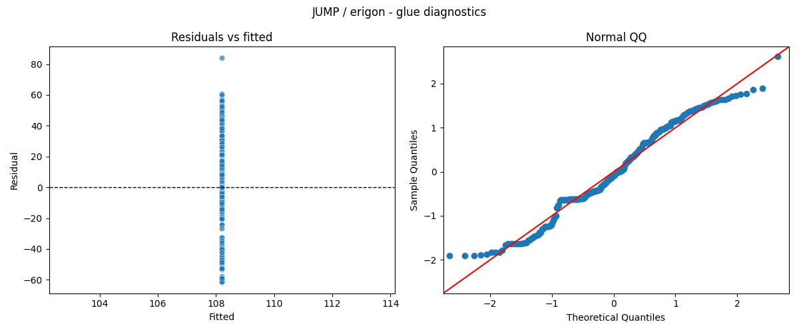

</details>

<details><summary><code>KECCAK256</code> · nobs=0 · runtime_ms=n/a · p=n/a · R²=n/a</summary>

</details>

## ethrex

| glue_opcode | nobs | glue_runtime_ms | p_value | rsquared |
| --- | --- | --- | --- | --- |
| `ISZERO` | 32 | 0 | 1.00e+00 | 0 |
| `JUMPDEST` | 8 | 0 | 1.00e+00 | 0 |
| `SWAP` | 572 | 0 | 1.00e+00 | 0 |
| `CALLDATASIZE` | 2052 | 5.5e-06 | 1.00e-03 | 0.707 |
| `DUP` | 2052 | 0 | 1.00e+00 | 0.707 |
| `GAS` | 2052 | 6.928e-06 | 1.00e-03 | 0.707 |
| `MLOAD` | 2052 | 5.476e-06 | 1.00e-03 | 0.707 |
| `PUSH` | 2052 | 0 | 1.00e+00 | 0.707 |
| `PUSH0` | 2052 | 1.298e-06 | 1.64e-01 | 0.707 |
| `STATICCALL` | 2052 | 7.763e-05 | 1.00e-03 | 0.707 |
| `ADD` | 36 | 0 | 1.00e+00 | 0 |
| `AND` | 32 | 0 | 1.00e+00 | 0 |
| `CALLDATACOPY` | 940 | 0 | 1.00e+00 | 0 |
| `CALLDATALOAD` | 176 | 1.686e-05 | 1.00e-03 | 0.2252 |
| `DIV` | 44 | 0 | 1.00e+00 | 0 |
| `EXP` | 44 | 0.0008824 | 1.00e-03 | 0.8208 |
| `GT` | 32 | 0 | 1.00e+00 | 0 |
| `JUMPI` | 44 | 0 | 1.00e+00 | -2.22e-16 |
| `LT` | 32 | 0 | 1.00e+00 | 0 |
| `MSTORE` | 180 | 0 | 1.00e+00 | 0 |
| `MSTORE8` | 180 | 0 | 1.00e+00 | 2.22e-16 |
| `MUL` | 40 | 0 | 1.00e+00 | 0 |
| `PC` | 24 | 4.206e-06 | 1.00e-03 | 0.3428 |
| `RETURNDATASIZE` | 96 | 6.28e-06 | 1.00e-03 | 0.3164 |
| `SELFBALANCE` | 44 | 0 | 1.00e+00 | 1.11e-16 |
| `SUB` | 32 | 0 | 1.00e+00 | 0 |
| `JUMP` | 40 | 0 | 1.00e+00 | 0 |
| `KECCAK256` | 0 | n/a | n/a | n/a |

### Cycle glue — joint fit · ethrex

<details><summary>Joint NNLS regression summary</summary>

```
==============================================================================
                           NNLS Regression Results                            
==============================================================================
Dep. Variable:          test_runtime_ms              R-squared:          0.707
Model:                  NNLS                    Adj. R-squared:          0.706
No. Observations:       2052                              RMSE:          14.73
Df Residuals:           2044                               MAE:          12.74
Df Model:               7      
==============================================================================
                      coef     std err     P-value      [0.025      0.975]
------------------------------------------------------------------------------
         const     50.2599      0.3646       0.001     49.5461     50.9513
  CALLDATASIZE      0.0000      0.0000       0.001      0.0000      0.0000
           DUP      0.0000      0.0000       1.000      0.0000      0.0000
           GAS      0.0000      0.0000       0.001      0.0000      0.0000
         MLOAD      0.0000      0.0000       0.001      0.0000      0.0000
          PUSH      0.0000      0.0000       1.000      0.0000      0.0000
         PUSH0      0.0000      0.0000       0.164      0.0000      0.0000
    STATICCALL      0.0001      0.0000       0.001      0.0001      0.0001
==============================================================================
Notes: Non-negative least squares with bootstrap inference (1000 iterations)
==============================================================================
```

</details>

<details><summary><code>CALLDATASIZE</code> · nobs=2052 · runtime_ms=5.5e-06 · p=1.00e-03 · R²=0.707</summary>

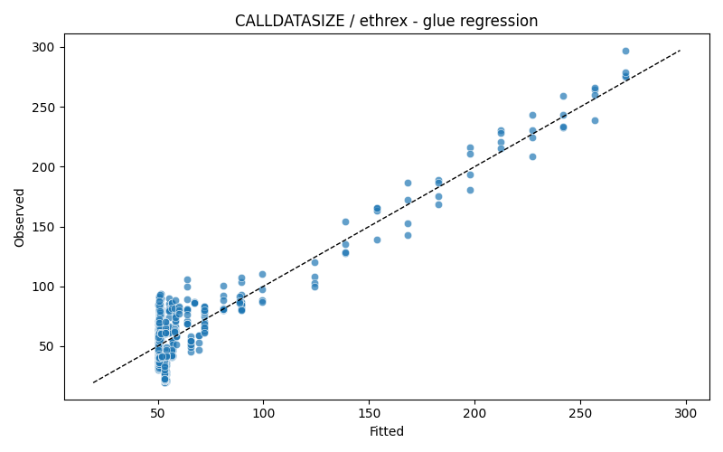

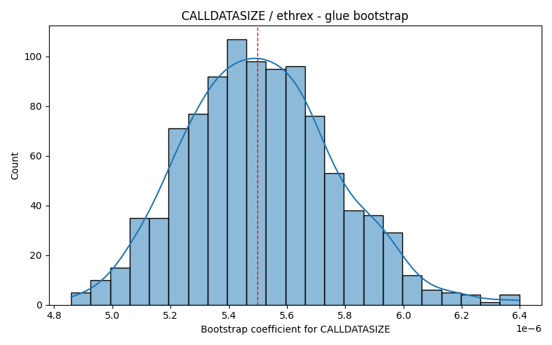


</details>

<details><summary><code>DUP</code> · nobs=2052 · runtime_ms=0 · p=1.00e+00 · R²=0.707</summary>


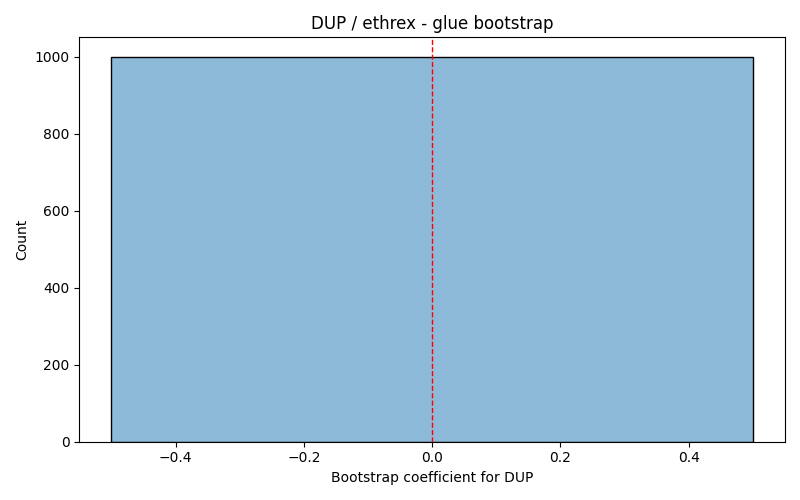

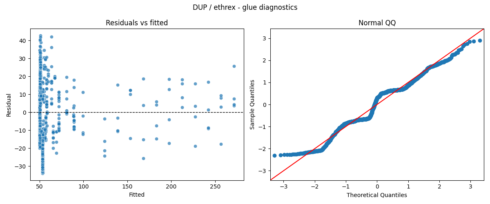

</details>

<details><summary><code>GAS</code> · nobs=2052 · runtime_ms=6.928e-06 · p=1.00e-03 · R²=0.707</summary>


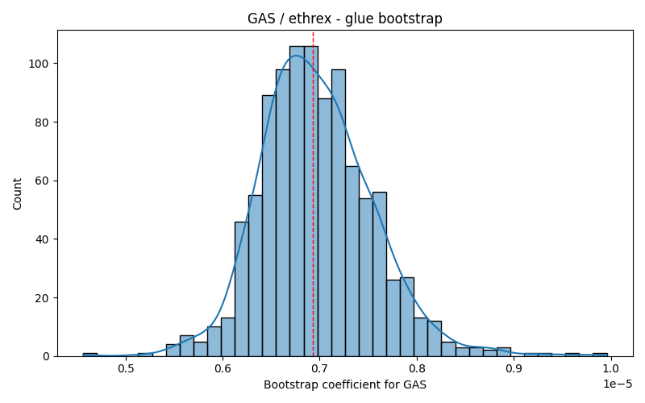


</details>

<details><summary><code>MLOAD</code> · nobs=2052 · runtime_ms=5.476e-06 · p=1.00e-03 · R²=0.707</summary>

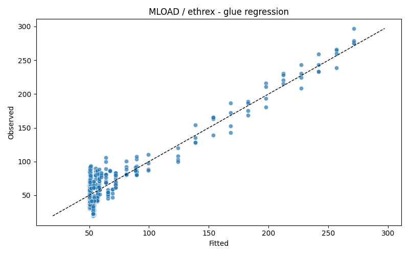

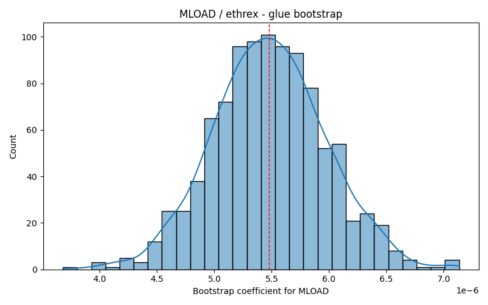


</details>

<details><summary><code>PUSH</code> · nobs=2052 · runtime_ms=0 · p=1.00e+00 · R²=0.707</summary>


</details>

<details><summary><code>PUSH0</code> · nobs=2052 · runtime_ms=1.298e-06 · p=1.64e-01 · R²=0.707</summary>


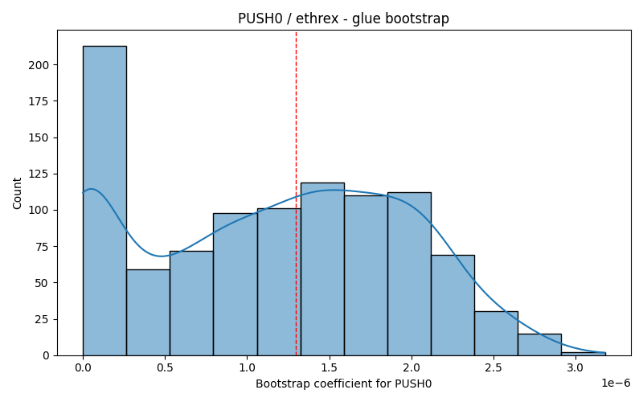


</details>

<details><summary><code>STATICCALL</code> · nobs=2052 · runtime_ms=7.763e-05 · p=1.00e-03 · R²=0.707</summary>

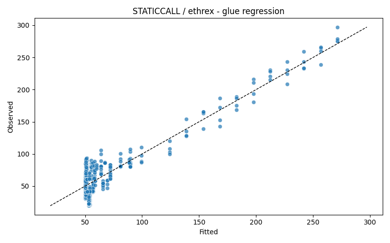

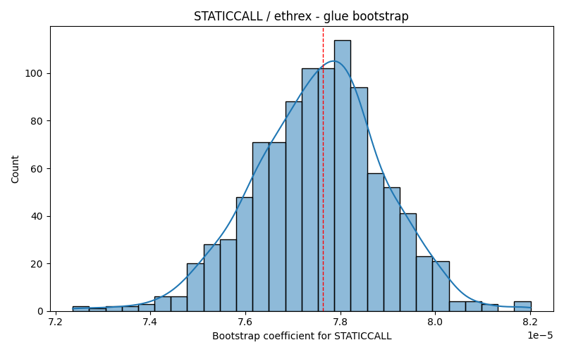


</details>

### Pure glue · ethrex

<details><summary><code>ISZERO</code> · nobs=32 · runtime_ms=0 · p=1.00e+00 · R²=0</summary>

```
==============================================================================
                           NNLS Regression Results                            
==============================================================================
Dep. Variable:          test_runtime_ms              R-squared:          0.000
Model:                  NNLS                    Adj. R-squared:         -0.033
No. Observations:       32                                RMSE:          13.47
Df Residuals:           30                                 MAE:          11.85
Df Model:               1      
==============================================================================
                      coef     std err     P-value      [0.025      0.975]
------------------------------------------------------------------------------
         const     44.5256      2.4346       0.001     39.5950     49.2348
        ISZERO      0.0000      0.0000       1.000      0.0000      0.0000
==============================================================================
Notes: Non-negative least squares with bootstrap inference (1000 iterations)
==============================================================================
```

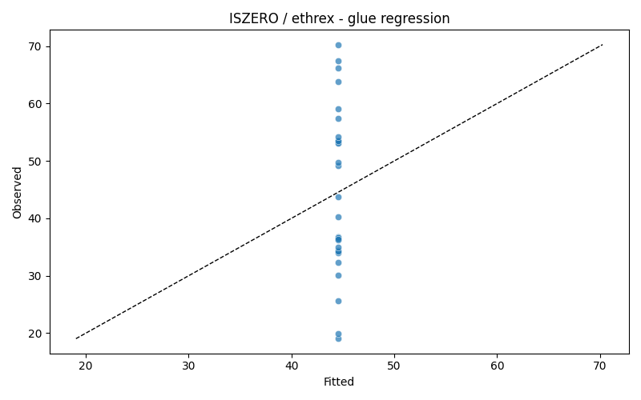

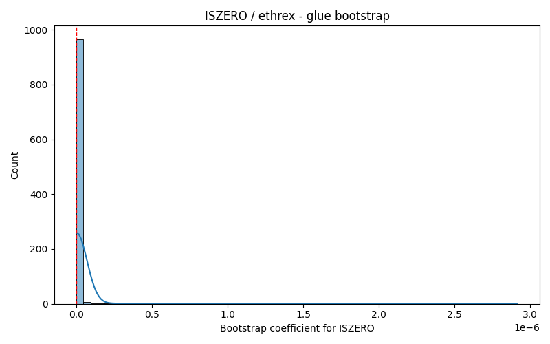

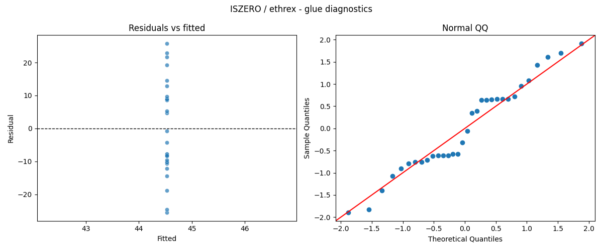

</details>

<details><summary><code>JUMPDEST</code> · nobs=8 · runtime_ms=0 · p=1.00e+00 · R²=0</summary>

```
==============================================================================
                           NNLS Regression Results                            
==============================================================================
Dep. Variable:          test_runtime_ms              R-squared:          0.000
Model:                  NNLS                    Adj. R-squared:         -0.167
No. Observations:       8                                 RMSE:          15.57
Df Residuals:           6                                  MAE:          14.62
Df Model:               1      
==============================================================================
                      coef     std err     P-value      [0.025      0.975]
------------------------------------------------------------------------------
         const     82.2928      7.9709       0.005     70.9480     92.2112
      JUMPDEST      0.0000      0.0000       1.000      0.0000      0.0000
==============================================================================
Notes: Non-negative least squares with bootstrap inference (1000 iterations)
==============================================================================
```

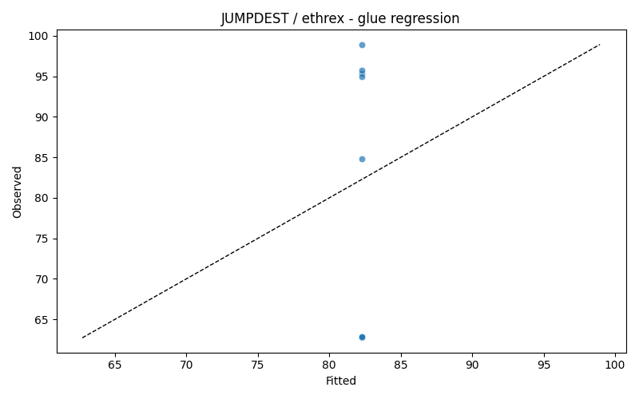

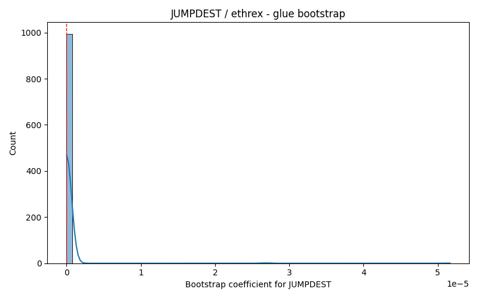

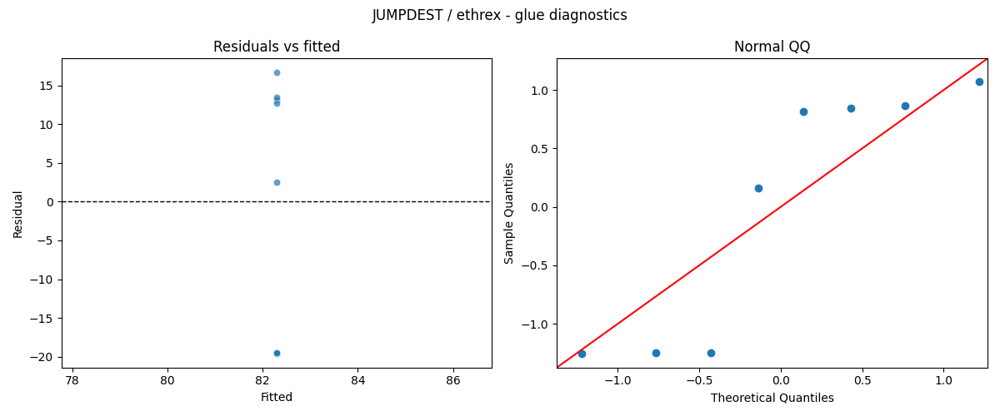

</details>

<details><summary><code>SWAP</code> · nobs=572 · runtime_ms=0 · p=1.00e+00 · R²=0</summary>

```
==============================================================================
                           NNLS Regression Results                            
==============================================================================
Dep. Variable:          test_runtime_ms              R-squared:          0.000
Model:                  NNLS                    Adj. R-squared:         -0.002
No. Observations:       572                               RMSE:          17.85
Df Residuals:           570                                MAE:          15.77
Df Model:               1      
==============================================================================
                      coef     std err     P-value      [0.025      0.975]
------------------------------------------------------------------------------
         const     63.1658      0.7844       0.001     61.6466     64.7196
          SWAP      0.0000      0.0000       1.000      0.0000      0.0000
==============================================================================
Notes: Non-negative least squares with bootstrap inference (1000 iterations)
==============================================================================
```

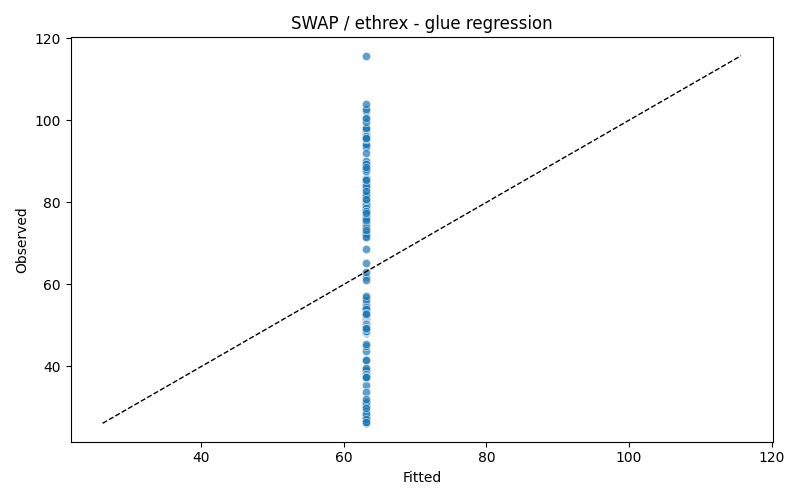


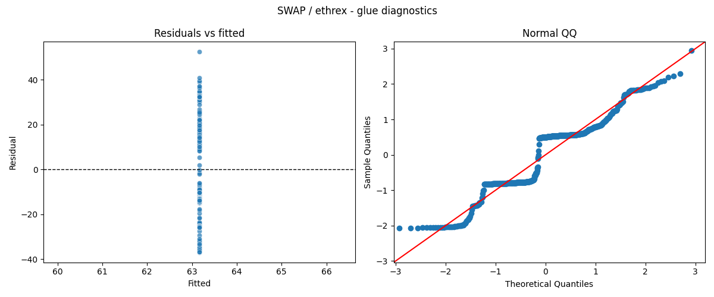

</details>

### Mixed glue (tier A) · ethrex

<details><summary><code>ADD</code> · nobs=36 · runtime_ms=0 · p=1.00e+00 · R²=0</summary>

```
==============================================================================
                           NNLS Regression Results                            
==============================================================================
Dep. Variable:          test_runtime_ms              R-squared:          0.000
Model:                  NNLS                    Adj. R-squared:         -0.029
No. Observations:       36                                RMSE:          14.89
Df Residuals:           34                                 MAE:          12.93
Df Model:               1      
==============================================================================
                      coef     std err     P-value      [0.025      0.975]
------------------------------------------------------------------------------
         const     47.4195      2.4683       0.001     42.6718     52.3285
           ADD      0.0000      0.0000       1.000      0.0000      0.0000
==============================================================================
Notes: Non-negative least squares with bootstrap inference (1000 iterations)
==============================================================================
```

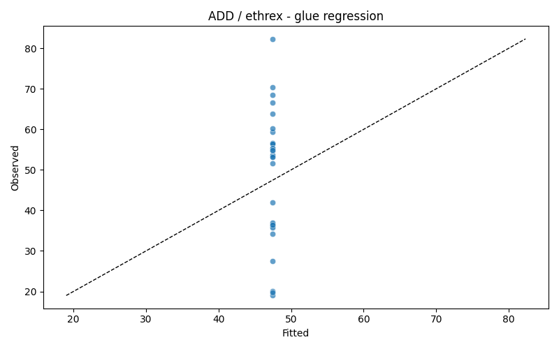

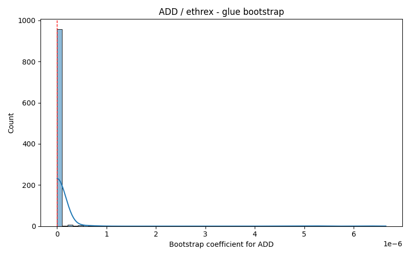

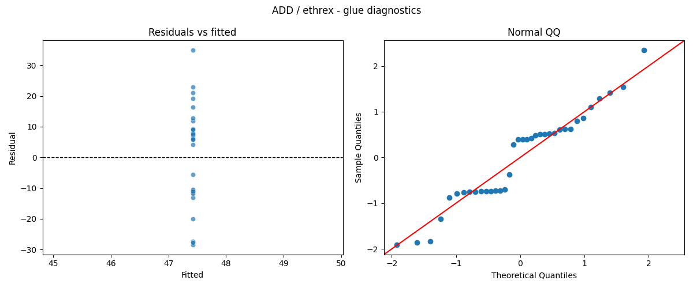

</details>

<details><summary><code>AND</code> · nobs=32 · runtime_ms=0 · p=1.00e+00 · R²=0</summary>

```
==============================================================================
                           NNLS Regression Results                            
==============================================================================
Dep. Variable:          test_runtime_ms              R-squared:          0.000
Model:                  NNLS                    Adj. R-squared:         -0.033
No. Observations:       32                                RMSE:          12.67
Df Residuals:           30                                 MAE:          11.15
Df Model:               1      
==============================================================================
                      coef     std err     P-value      [0.025      0.975]
------------------------------------------------------------------------------
         const     43.6702      2.2830       0.001     39.0467     48.0358
           AND      0.0000      0.0000       1.000      0.0000      0.0000
==============================================================================
Notes: Non-negative least squares with bootstrap inference (1000 iterations)
==============================================================================
```

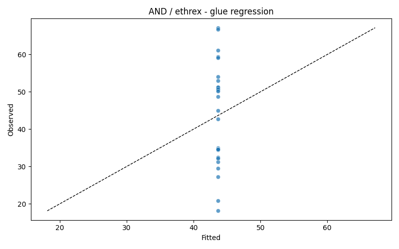

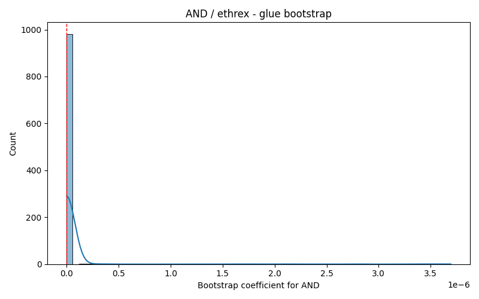

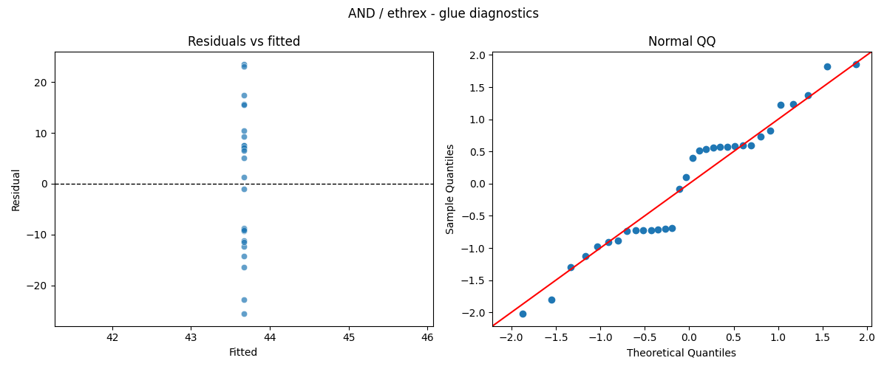

</details>

<details><summary><code>CALLDATACOPY</code> · nobs=940 · runtime_ms=0 · p=1.00e+00 · R²=0</summary>

```
==============================================================================
                           NNLS Regression Results                            
==============================================================================
Dep. Variable:          test_runtime_ms              R-squared:          0.000
Model:                  NNLS                    Adj. R-squared:         -0.001
No. Observations:       940                               RMSE:          21.13
Df Residuals:           938                                MAE:          17.91
Df Model:               1      
==============================================================================
                      coef     std err     P-value      [0.025      0.975]
------------------------------------------------------------------------------
         const     36.0916      0.7104       0.001     34.6642     37.4824
  CALLDATACOPY      0.0000      0.0000       1.000      0.0000      0.0000
==============================================================================
Notes: Non-negative least squares with bootstrap inference (1000 iterations)
==============================================================================
```

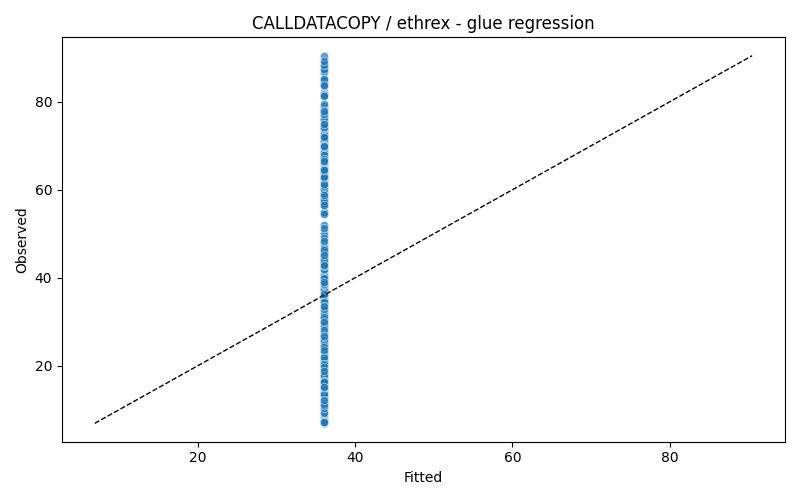


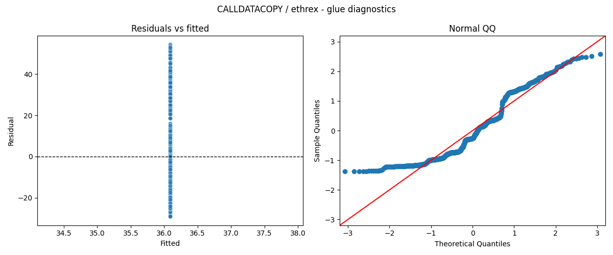

</details>

<details><summary><code>CALLDATALOAD</code> · nobs=176 · runtime_ms=1.686e-05 · p=1.00e-03 · R²=0.2252</summary>

```
==============================================================================
                           NNLS Regression Results                            
==============================================================================
Dep. Variable:          test_runtime_ms              R-squared:          0.225
Model:                  NNLS                    Adj. R-squared:          0.221
No. Observations:       176                               RMSE:           0.12
Df Residuals:           174                                MAE:           0.09
Df Model:               1      
==============================================================================
                      coef     std err     P-value      [0.025      0.975]
------------------------------------------------------------------------------
         const      2.1450      0.0246       0.001      2.0966      2.1949
  CALLDATALOAD      0.0000      0.0000       0.001      0.0000      0.0000
==============================================================================
Notes: Non-negative least squares with bootstrap inference (1000 iterations)
==============================================================================
```

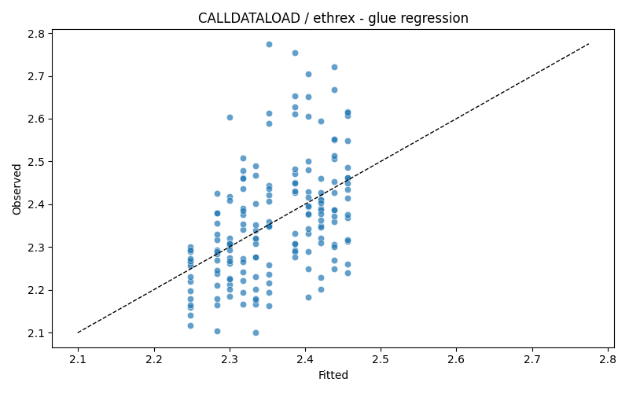

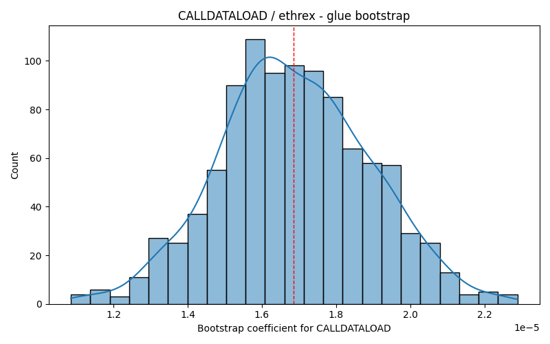

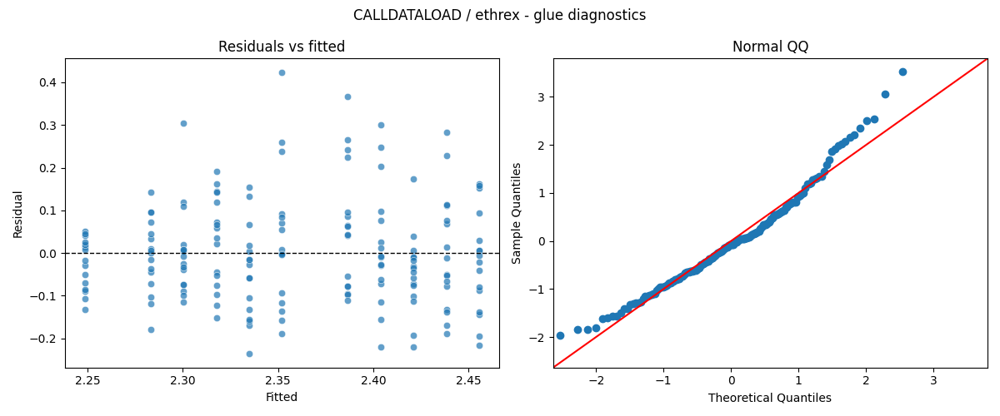

</details>

<details><summary><code>DIV</code> · nobs=44 · runtime_ms=0 · p=1.00e+00 · R²=0</summary>

```
==============================================================================
                           NNLS Regression Results                            
==============================================================================
Dep. Variable:          test_runtime_ms              R-squared:          0.000
Model:                  NNLS                    Adj. R-squared:         -0.024
No. Observations:       44                                RMSE:          77.97
Df Residuals:           42                                 MAE:          71.68
Df Model:               1      
==============================================================================
                      coef     std err     P-value      [0.025      0.975]
------------------------------------------------------------------------------
         const    309.6394     11.5560       0.001    286.6128    330.9276
           DIV      0.0000      0.0000       1.000      0.0000      0.0000
==============================================================================
Notes: Non-negative least squares with bootstrap inference (1000 iterations)
==============================================================================
```

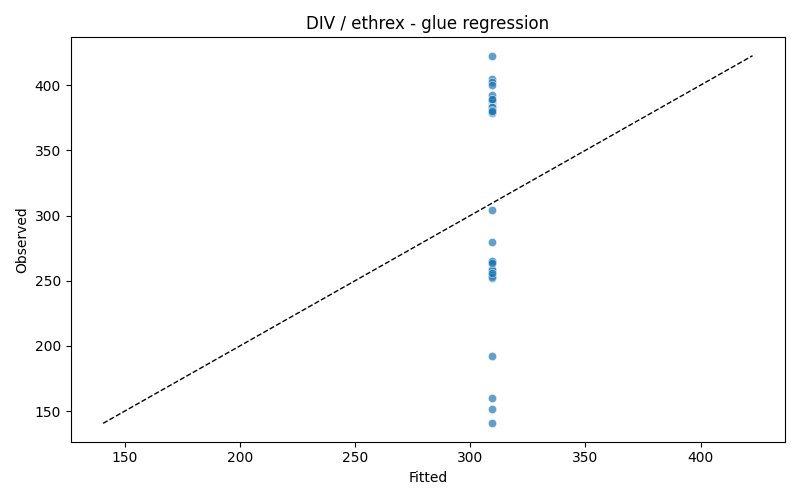


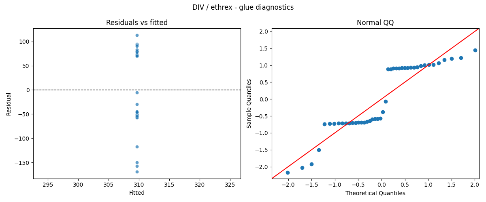

</details>

<details><summary><code>EXP</code> · nobs=44 · runtime_ms=0.0008824 · p=1.00e-03 · R²=0.8208</summary>

```
==============================================================================
                           NNLS Regression Results                            
==============================================================================
Dep. Variable:          test_runtime_ms              R-squared:          0.821
Model:                  NNLS                    Adj. R-squared:          0.816
No. Observations:       44                                RMSE:          16.16
Df Residuals:           42                                 MAE:          13.46
Df Model:               1      
==============================================================================
                      coef     std err     P-value      [0.025      0.975]
------------------------------------------------------------------------------
         const     36.2836      8.8316       0.001     18.0877     53.3678
           EXP      0.0009      0.0001       0.001      0.0008      0.0010
==============================================================================
Notes: Non-negative least squares with bootstrap inference (1000 iterations)
==============================================================================
```

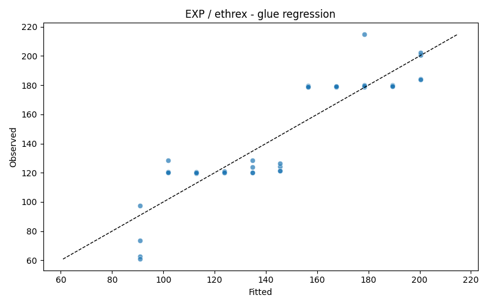

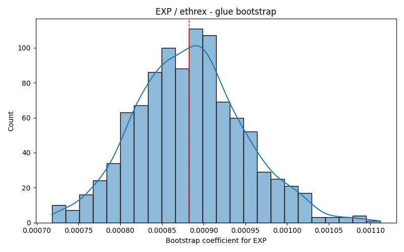

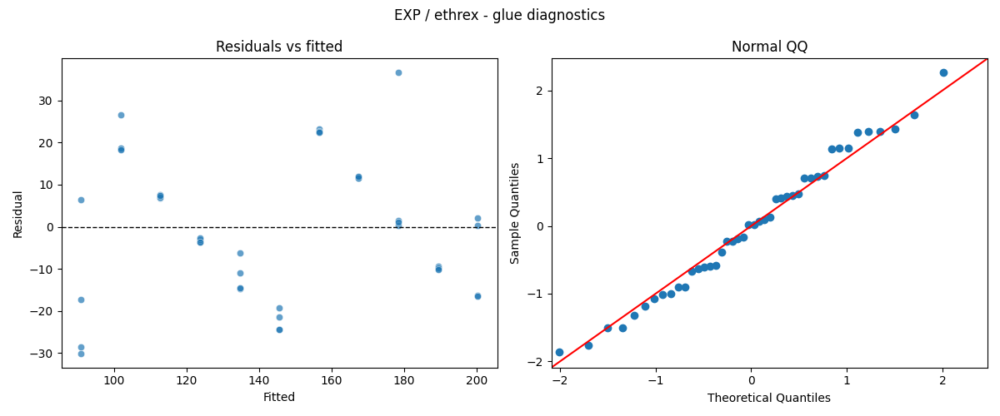

</details>

<details><summary><code>GT</code> · nobs=32 · runtime_ms=0 · p=1.00e+00 · R²=0</summary>

```
==============================================================================
                           NNLS Regression Results                            
==============================================================================
Dep. Variable:          test_runtime_ms              R-squared:          0.000
Model:                  NNLS                    Adj. R-squared:         -0.033
No. Observations:       32                                RMSE:          12.46
Df Residuals:           30                                 MAE:          11.27
Df Model:               1      
==============================================================================
                      coef     std err     P-value      [0.025      0.975]
------------------------------------------------------------------------------
         const     44.7232      2.1855       0.001     40.6141     48.9694
            GT      0.0000      0.0000       1.000      0.0000      0.0000
==============================================================================
Notes: Non-negative least squares with bootstrap inference (1000 iterations)
==============================================================================
```

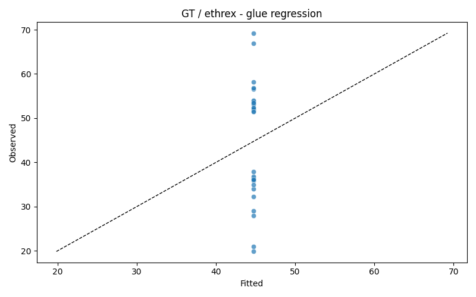

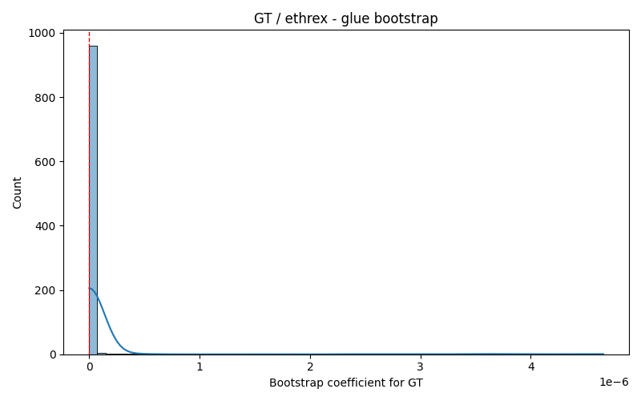

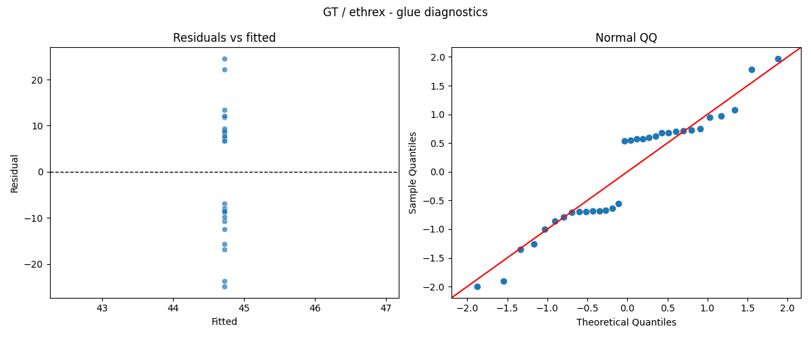

</details>

<details><summary><code>JUMPI</code> · nobs=44 · runtime_ms=0 · p=1.00e+00 · R²=-2.22e-16</summary>

```
==============================================================================
                           NNLS Regression Results                            
==============================================================================
Dep. Variable:          test_runtime_ms              R-squared:         -0.000
Model:                  NNLS                    Adj. R-squared:         -0.024
No. Observations:       44                                RMSE:           7.81
Df Residuals:           42                                 MAE:           6.66
Df Model:               1      
==============================================================================
                      coef     std err     P-value      [0.025      0.975]
------------------------------------------------------------------------------
         const     28.0065      1.1991       0.001     25.5204     30.4054
         JUMPI      0.0000      0.0000       1.000      0.0000      0.0000
==============================================================================
Notes: Non-negative least squares with bootstrap inference (1000 iterations)
==============================================================================
```

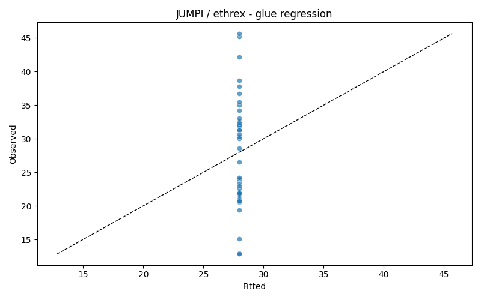


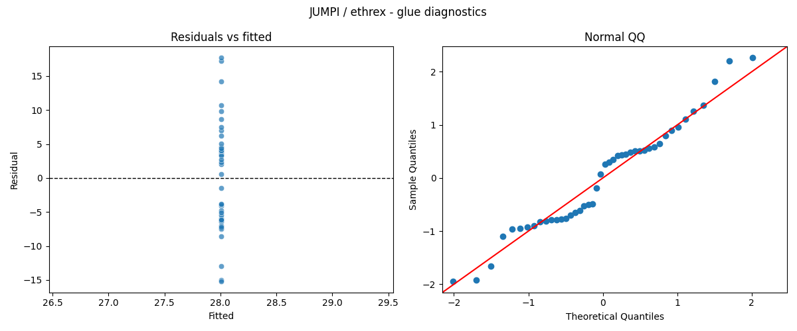

</details>

<details><summary><code>LT</code> · nobs=32 · runtime_ms=0 · p=1.00e+00 · R²=0</summary>

```
==============================================================================
                           NNLS Regression Results                            
==============================================================================
Dep. Variable:          test_runtime_ms              R-squared:          0.000
Model:                  NNLS                    Adj. R-squared:         -0.033
No. Observations:       32                                RMSE:          13.84
Df Residuals:           30                                 MAE:          12.08
Df Model:               1      
==============================================================================
                      coef     std err     P-value      [0.025      0.975]
------------------------------------------------------------------------------
         const     42.8596      2.4819       0.001     37.7143     47.4052
            LT      0.0000      0.0000       1.000      0.0000      0.0000
==============================================================================
Notes: Non-negative least squares with bootstrap inference (1000 iterations)
==============================================================================
```

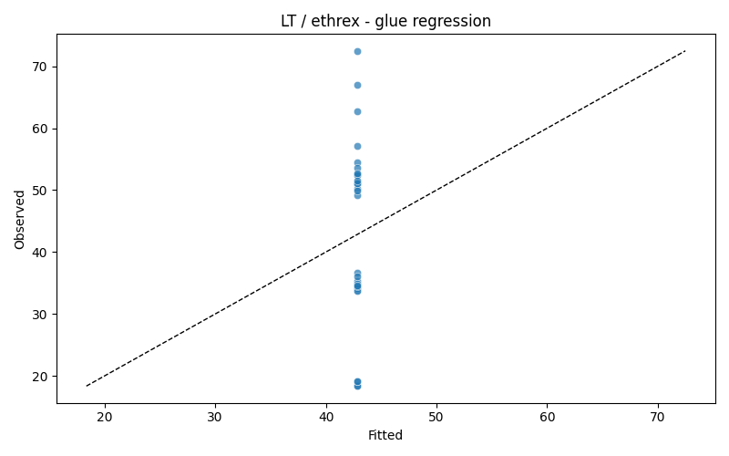

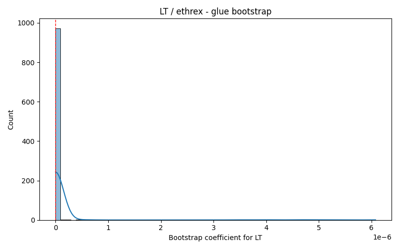

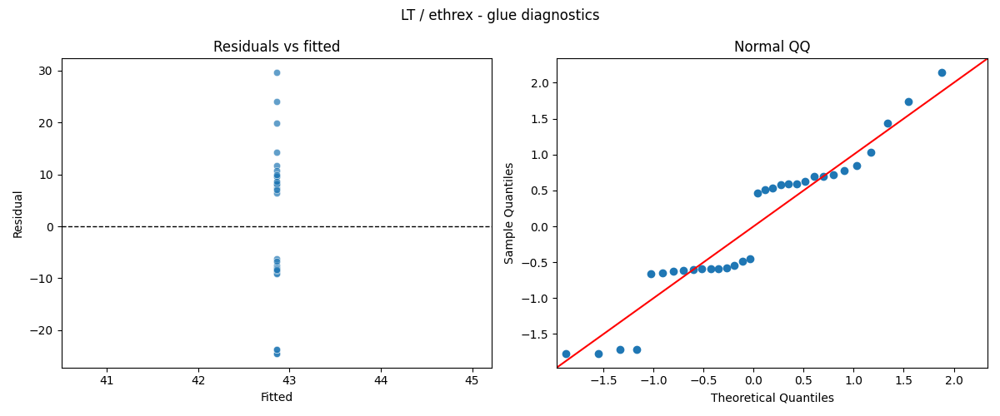

</details>

<details><summary><code>MSTORE</code> · nobs=180 · runtime_ms=0 · p=1.00e+00 · R²=0</summary>

```
==============================================================================
                           NNLS Regression Results                            
==============================================================================
Dep. Variable:          test_runtime_ms              R-squared:          0.000
Model:                  NNLS                    Adj. R-squared:         -0.006
No. Observations:       180                               RMSE:          14.81
Df Residuals:           178                                MAE:          13.00
Df Model:               1      
==============================================================================
                      coef     std err     P-value      [0.025      0.975]
------------------------------------------------------------------------------
         const     50.0495      1.0690       0.001     47.9297     52.0110
        MSTORE      0.0000      0.0000       1.000      0.0000      0.0000
==============================================================================
Notes: Non-negative least squares with bootstrap inference (1000 iterations)
==============================================================================
```

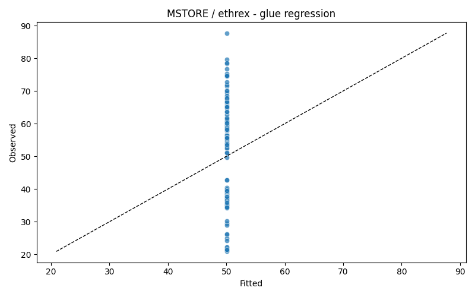


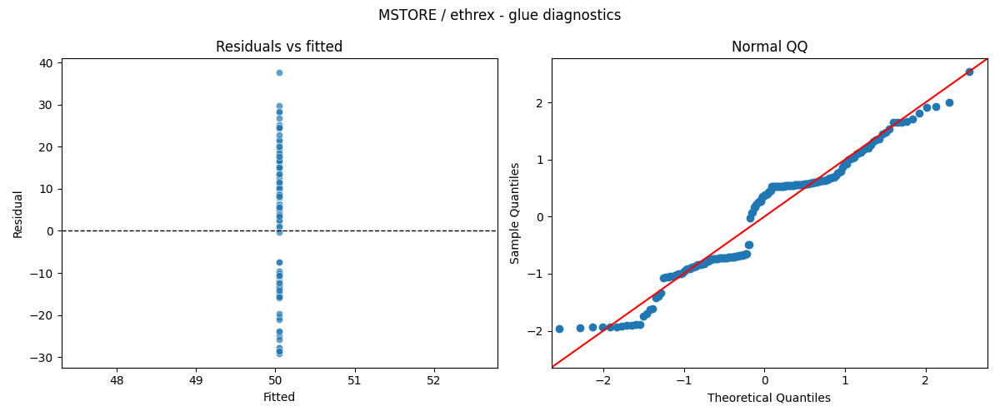

</details>

<details><summary><code>MSTORE8</code> · nobs=180 · runtime_ms=0 · p=1.00e+00 · R²=2.22e-16</summary>

```
==============================================================================
                           NNLS Regression Results                            
==============================================================================
Dep. Variable:          test_runtime_ms              R-squared:          0.000
Model:                  NNLS                    Adj. R-squared:         -0.006
No. Observations:       180                               RMSE:          13.73
Df Residuals:           178                                MAE:          12.01
Df Model:               1      
==============================================================================
                      coef     std err     P-value      [0.025      0.975]
------------------------------------------------------------------------------
         const     46.5010      1.0138       0.001     44.6402     48.4961
       MSTORE8      0.0000      0.0000       1.000      0.0000      0.0000
==============================================================================
Notes: Non-negative least squares with bootstrap inference (1000 iterations)
==============================================================================
```

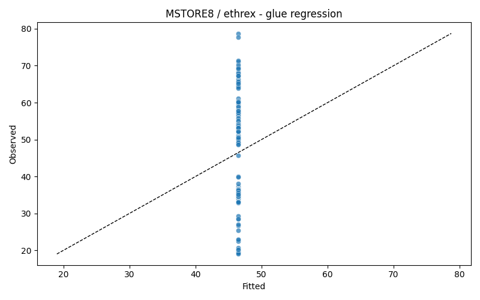


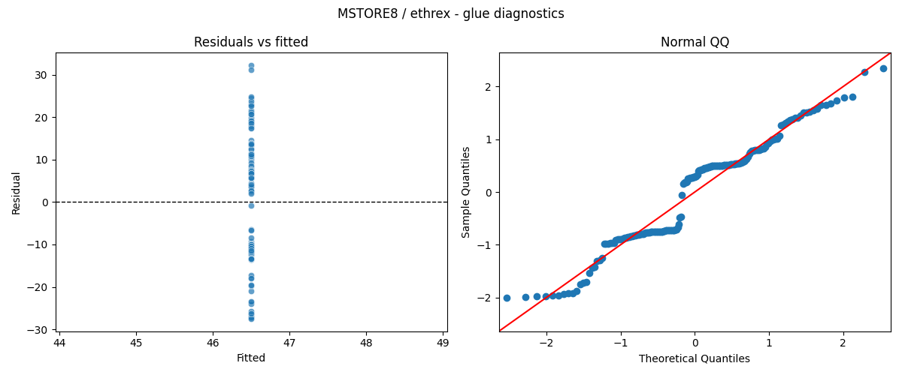

</details>

<details><summary><code>MUL</code> · nobs=40 · runtime_ms=0 · p=1.00e+00 · R²=0</summary>

```
==============================================================================
                           NNLS Regression Results                            
==============================================================================
Dep. Variable:          test_runtime_ms              R-squared:          0.000
Model:                  NNLS                    Adj. R-squared:         -0.026
No. Observations:       40                                RMSE:          20.75
Df Residuals:           38                                 MAE:          17.00
Df Model:               1      
==============================================================================
                      coef     std err     P-value      [0.025      0.975]
------------------------------------------------------------------------------
         const     82.2653      3.4049       0.001     75.8322     89.2850
           MUL      0.0000      0.0000       1.000      0.0000      0.0000
==============================================================================
Notes: Non-negative least squares with bootstrap inference (1000 iterations)
==============================================================================
```


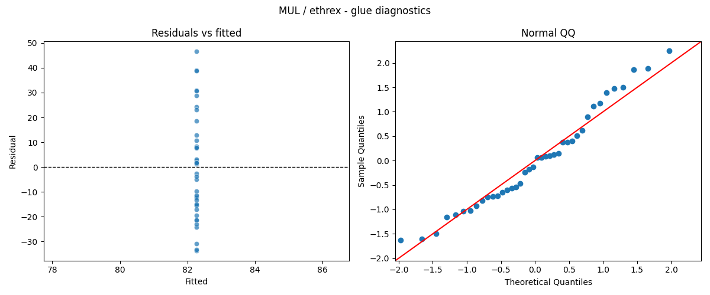

</details>

<details><summary><code>PC</code> · nobs=24 · runtime_ms=4.206e-06 · p=1.00e-03 · R²=0.3428</summary>

```
==============================================================================
                           NNLS Regression Results                            
==============================================================================
Dep. Variable:          test_runtime_ms              R-squared:          0.343
Model:                  NNLS                    Adj. R-squared:          0.313
No. Observations:       24                                RMSE:          12.94
Df Residuals:           22                                 MAE:          11.64
Df Model:               1      
==============================================================================
                      coef     std err     P-value      [0.025      0.975]
------------------------------------------------------------------------------
         const     58.2651      5.1983       0.001     47.4535     67.8854
            PC      0.0000      0.0000       0.001      0.0000      0.0000
==============================================================================
Notes: Non-negative least squares with bootstrap inference (1000 iterations)
==============================================================================
```

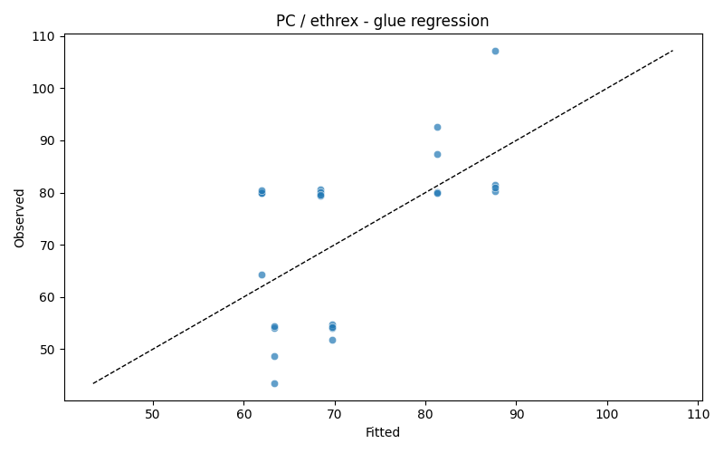

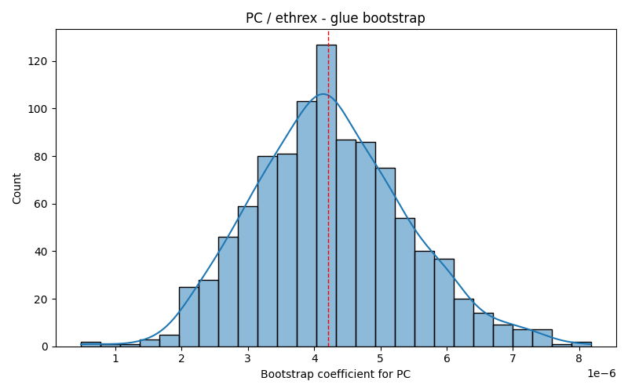

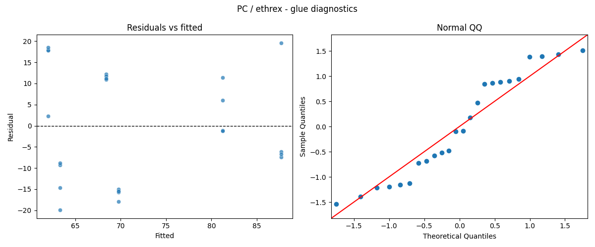

</details>

<details><summary><code>RETURNDATASIZE</code> · nobs=96 · runtime_ms=6.28e-06 · p=1.00e-03 · R²=0.3164</summary>

```
==============================================================================
                           NNLS Regression Results                            
==============================================================================
Dep. Variable:          test_runtime_ms              R-squared:          0.316
Model:                  NNLS                    Adj. R-squared:          0.309
No. Observations:       96                                RMSE:          10.83
Df Residuals:           94                                 MAE:           9.19
Df Model:               1      
==============================================================================
                      coef     std err     P-value      [0.025      0.975]
------------------------------------------------------------------------------
         const     50.8330      2.1216       0.001     46.8735     55.0264
RETURNDATASIZE      0.0000      0.0000       0.001      0.0000      0.0000
==============================================================================
Notes: Non-negative least squares with bootstrap inference (1000 iterations)
==============================================================================
```

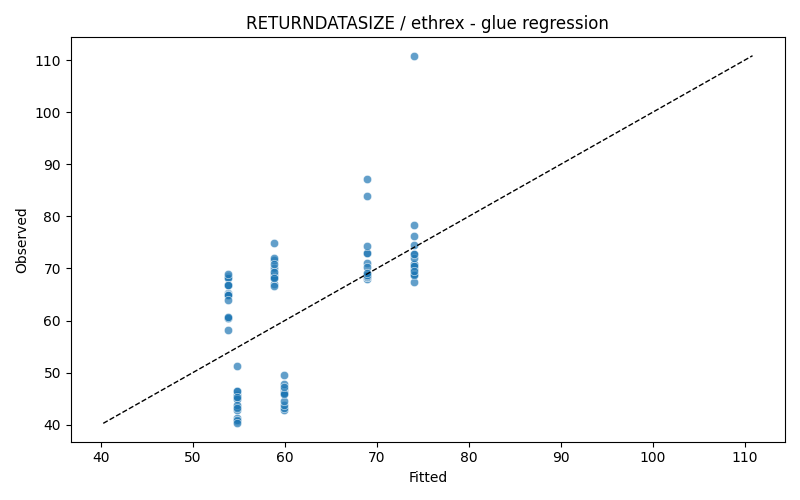

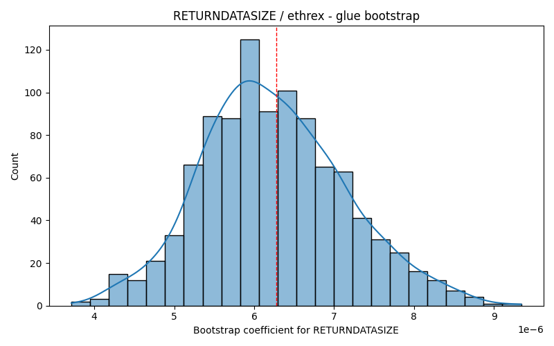

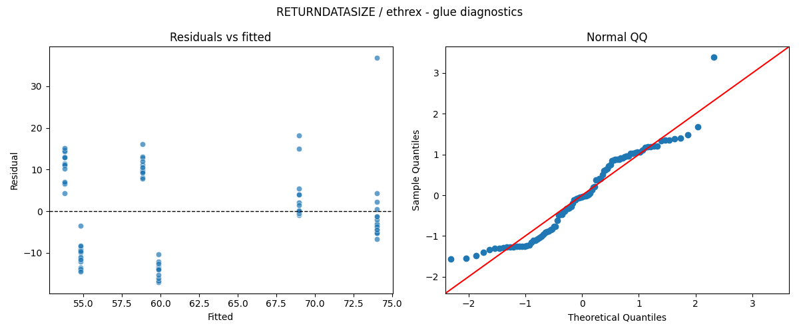

</details>

<details><summary><code>SELFBALANCE</code> · nobs=44 · runtime_ms=0 · p=1.00e+00 · R²=1.11e-16</summary>

```
==============================================================================
                           NNLS Regression Results                            
==============================================================================
Dep. Variable:          test_runtime_ms              R-squared:          0.000
Model:                  NNLS                    Adj. R-squared:         -0.024
No. Observations:       44                                RMSE:          67.57
Df Residuals:           42                                 MAE:          60.45
Df Model:               1      
==============================================================================
                      coef     std err     P-value      [0.025      0.975]
------------------------------------------------------------------------------
         const    255.2496     13.0926       0.001    224.7281    274.8512
   SELFBALANCE      0.0000      0.0000       1.000      0.0000      0.0000
==============================================================================
Notes: Non-negative least squares with bootstrap inference (1000 iterations)
==============================================================================
```

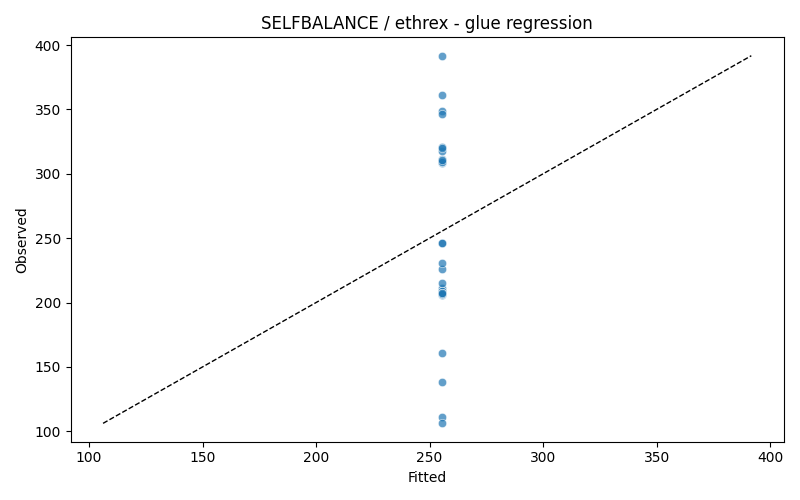

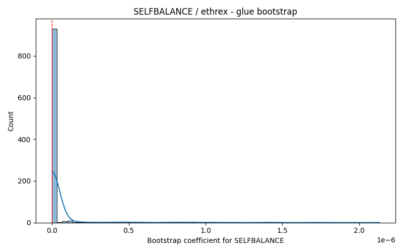

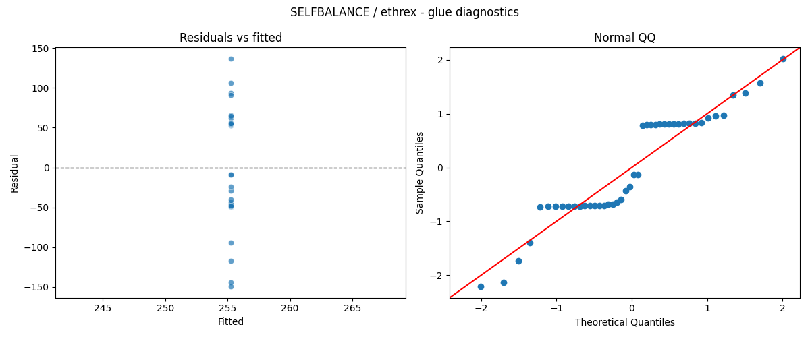

</details>

<details><summary><code>SUB</code> · nobs=32 · runtime_ms=0 · p=1.00e+00 · R²=0</summary>

```
==============================================================================
                           NNLS Regression Results                            
==============================================================================
Dep. Variable:          test_runtime_ms              R-squared:          0.000
Model:                  NNLS                    Adj. R-squared:         -0.033
No. Observations:       32                                RMSE:          14.31
Df Residuals:           30                                 MAE:          12.73
Df Model:               1      
==============================================================================
                      coef     std err     P-value      [0.025      0.975]
------------------------------------------------------------------------------
         const     45.4400      2.4957       0.001     40.4133     50.3652
           SUB      0.0000      0.0000       1.000      0.0000      0.0000
==============================================================================
Notes: Non-negative least squares with bootstrap inference (1000 iterations)
==============================================================================
```

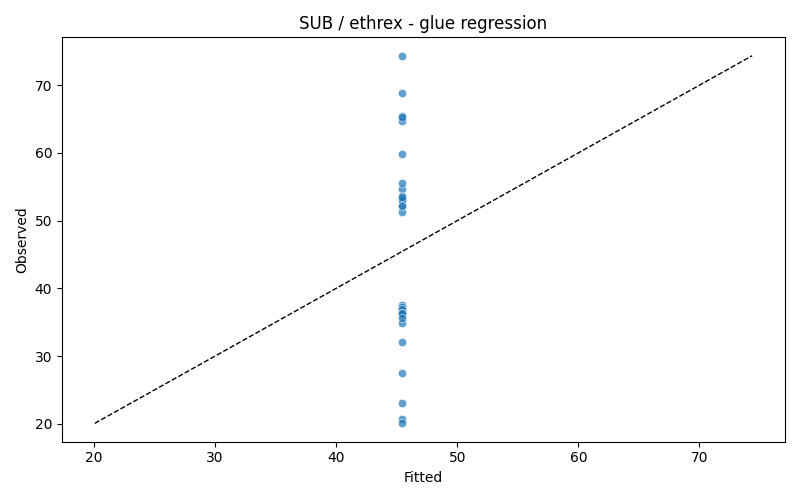

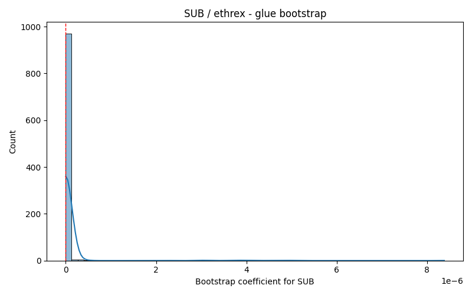

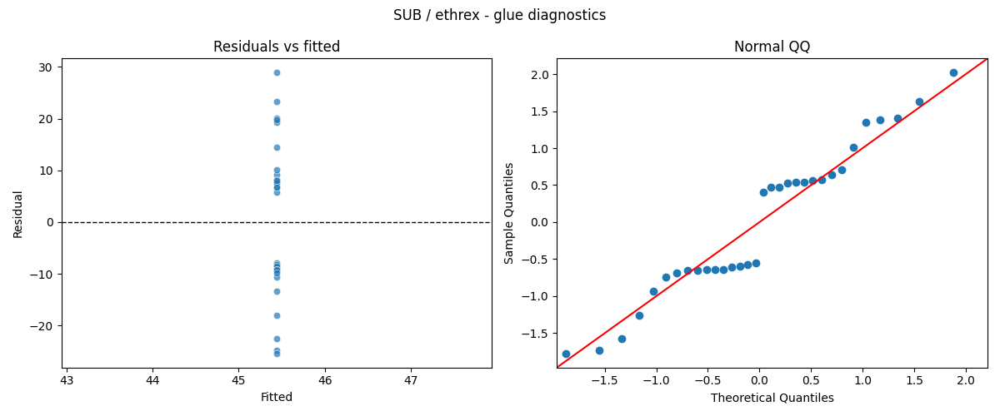

</details>

### Mixed glue (tier B) · ethrex

<details><summary><code>JUMP</code> · nobs=40 · runtime_ms=0 · p=1.00e+00 · R²=0</summary>

```
==============================================================================
                           NNLS Regression Results                            
==============================================================================
Dep. Variable:          test_runtime_ms              R-squared:          0.000
Model:                  NNLS                    Adj. R-squared:         -0.026
No. Observations:       40                                RMSE:          19.16
Df Residuals:           38                                 MAE:          17.26
Df Model:               1      
==============================================================================
                      coef     std err     P-value      [0.025      0.975]
------------------------------------------------------------------------------
         const     70.7862      3.0279       0.001     64.5052     76.5624
          JUMP      0.0000      0.0000       1.000      0.0000      0.0000
==============================================================================
Notes: Non-negative least squares with bootstrap inference (1000 iterations)
==============================================================================
```

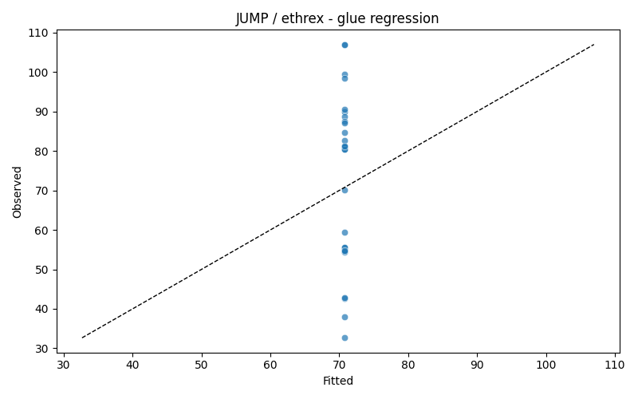

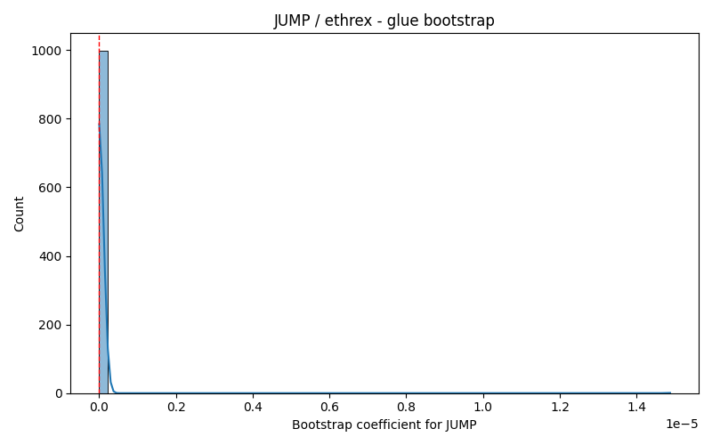

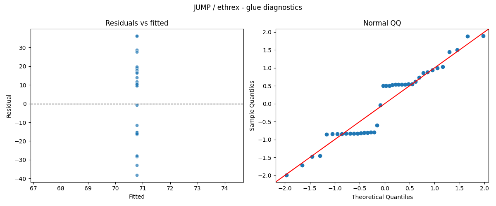

</details>

<details><summary><code>KECCAK256</code> · nobs=0 · runtime_ms=n/a · p=n/a · R²=n/a</summary>

</details>

## geth

| glue_opcode | nobs | glue_runtime_ms | p_value | rsquared |
| --- | --- | --- | --- | --- |
| `ISZERO` | 680 | 0 | 1.00e+00 | 1.11e-16 |
| `JUMPDEST` | 170 | 0 | 1.00e+00 | 1.11e-16 |
| `SWAP` | 12155 | 0 | 1.00e+00 | 0 |
| `CALLDATASIZE` | 42714 | 4.86e-06 | 1.00e-03 | 0.008021 |
| `DUP` | 42714 | 0 | 1.00e+00 | 0.008021 |
| `GAS` | 42714 | 6.088e-06 | 1.00e-03 | 0.008021 |
| `MLOAD` | 42714 | 9.322e-06 | 1.00e-03 | 0.008021 |
| `PUSH` | 42714 | 0 | 1.00e+00 | 0.008021 |
| `PUSH0` | 42714 | 0 | 1.00e+00 | 0.008021 |
| `STATICCALL` | 42714 | 4.791e-05 | 6.00e-03 | 0.008021 |
| `ADD` | 765 | 0 | 1.00e+00 | 2.22e-16 |
| `AND` | 680 | 0 | 1.00e+00 | 0 |
| `CALLDATACOPY` | 19975 | 0 | 1.00e+00 | 0 |
| `CALLDATALOAD` | 3740 | 3.691e-05 | 1.00e-03 | 0.1047 |
| `DIV` | 935 | 0 | 1.00e+00 | -2.22e-16 |
| `EXP` | 935 | 0.0003319 | 1.00e-03 | 0.221 |
| `GT` | 680 | 0 | 1.00e+00 | 0 |
| `JUMPI` | 935 | 0 | 1.00e+00 | 0 |
| `LT` | 680 | 0 | 1.00e+00 | 1.11e-16 |
| `MSTORE` | 3825 | 0 | 1.00e+00 | 0 |
| `MSTORE8` | 3825 | 0 | 1.00e+00 | 2.22e-16 |
| `MUL` | 850 | 0 | 1.00e+00 | 2.22e-16 |
| `PC` | 510 | 7.872e-06 | 1.00e-03 | 0.0663 |
| `RETURNDATASIZE` | 2040 | 1.326e-05 | 1.00e-03 | 0.06101 |
| `SELFBALANCE` | 935 | 0 | 1.00e+00 | 2.22e-16 |
| `SUB` | 680 | 0 | 1.00e+00 | 0 |
| `JUMP` | 850 | 0 | 1.00e+00 | 1.11e-16 |
| `KECCAK256` | 0 | n/a | n/a | n/a |

### Cycle glue — joint fit · geth

<details><summary>Joint NNLS regression summary</summary>

```
==============================================================================
                           NNLS Regression Results                            
==============================================================================
Dep. Variable:          test_runtime_ms              R-squared:          0.008
Model:                  NNLS                    Adj. R-squared:          0.008
No. Observations:       42714                             RMSE:          78.74
Df Residuals:           42706                              MAE:          44.49
Df Model:               7      
==============================================================================
                      coef     std err     P-value      [0.025      0.975]
------------------------------------------------------------------------------
         const    142.9038      0.4417       0.001    142.1202    143.8380
  CALLDATASIZE      0.0000      0.0000       0.001      0.0000      0.0000
           DUP      0.0000      0.0000       1.000      0.0000      0.0000
           GAS      0.0000      0.0000       0.001      0.0000      0.0000
         MLOAD      0.0000      0.0000       0.001      0.0000      0.0000
          PUSH      0.0000      0.0000       1.000      0.0000      0.0000
         PUSH0      0.0000      0.0000       1.000      0.0000      0.0000
    STATICCALL      0.0000      0.0000       0.006      0.0000      0.0001
==============================================================================
Notes: Non-negative least squares with bootstrap inference (1000 iterations)
==============================================================================
```

</details>

<details><summary><code>CALLDATASIZE</code> · nobs=42714 · runtime_ms=4.86e-06 · p=1.00e-03 · R²=0.008021</summary>

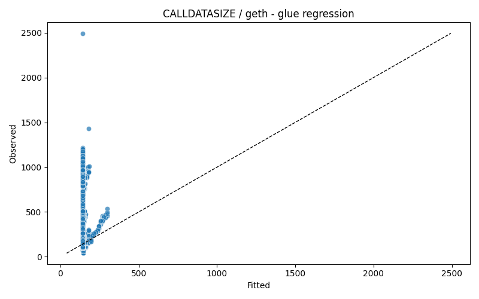

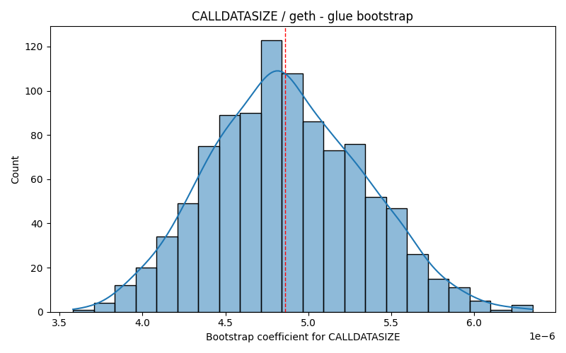

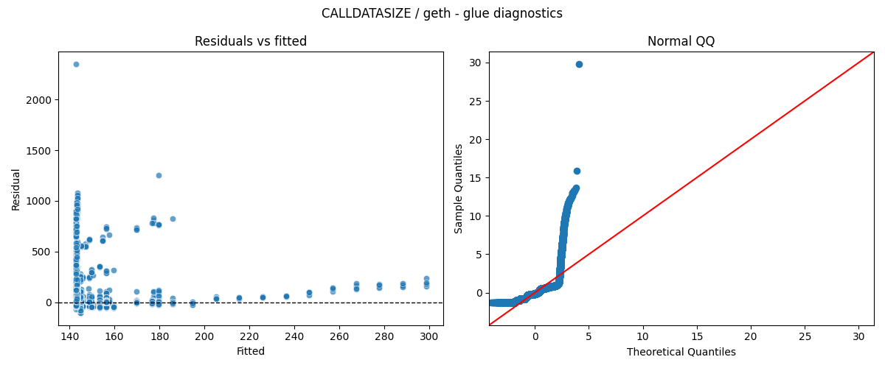

</details>

<details><summary><code>DUP</code> · nobs=42714 · runtime_ms=0 · p=1.00e+00 · R²=0.008021</summary>


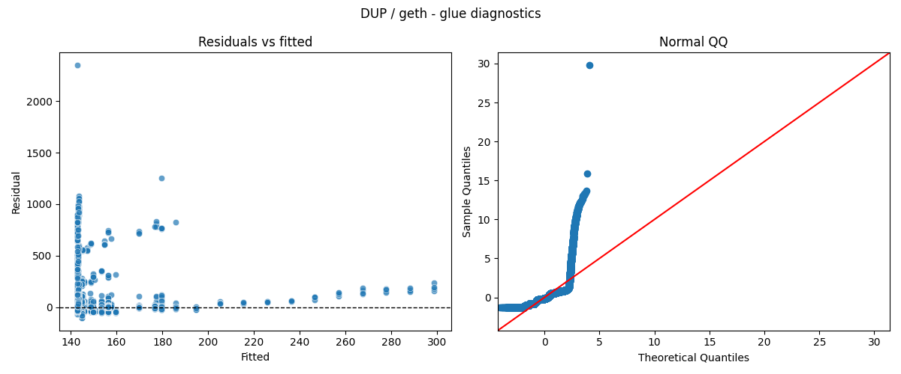

</details>

<details><summary><code>GAS</code> · nobs=42714 · runtime_ms=6.088e-06 · p=1.00e-03 · R²=0.008021</summary>

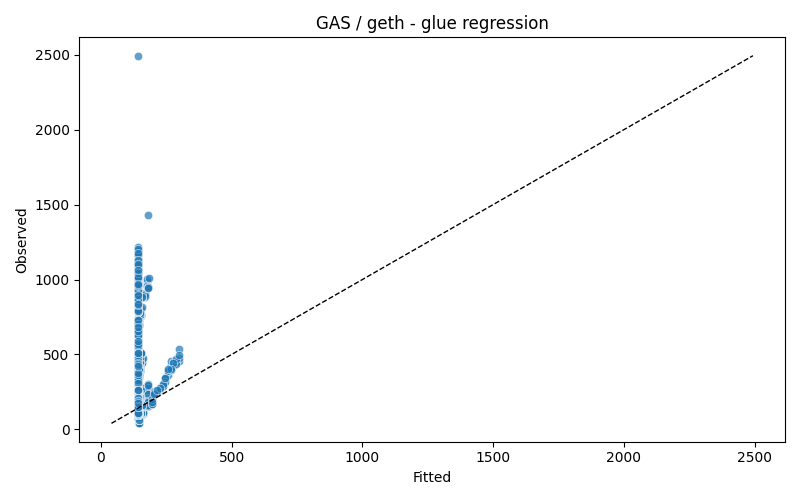

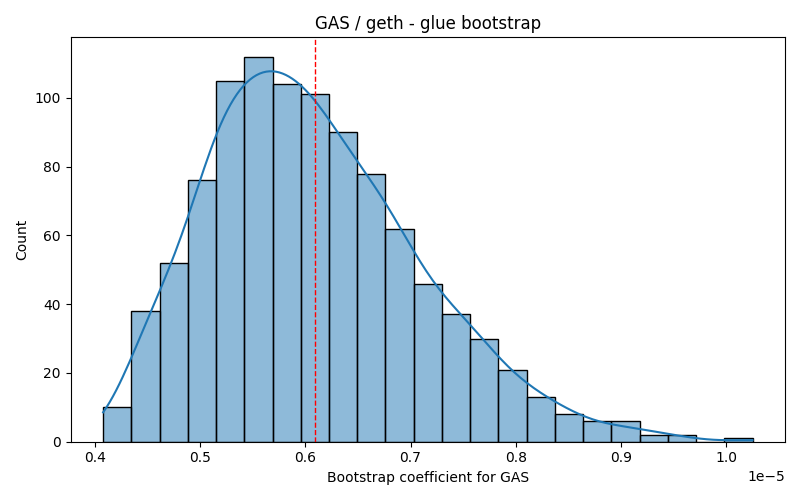


</details>

<details><summary><code>MLOAD</code> · nobs=42714 · runtime_ms=9.322e-06 · p=1.00e-03 · R²=0.008021</summary>


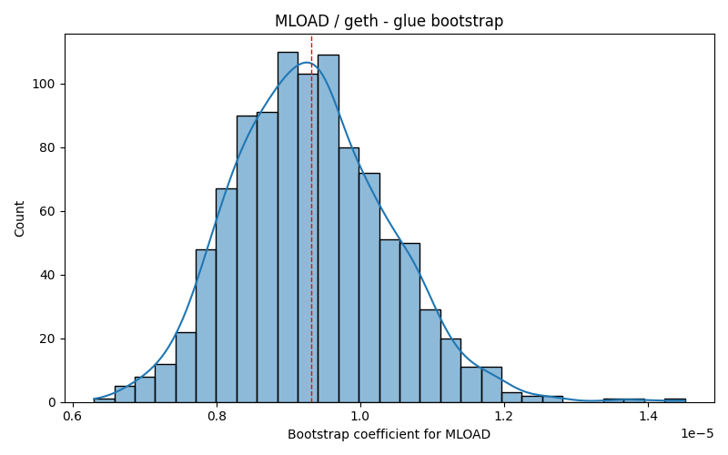


</details>

<details><summary><code>PUSH</code> · nobs=42714 · runtime_ms=0 · p=1.00e+00 · R²=0.008021</summary>


</details>

<details><summary><code>PUSH0</code> · nobs=42714 · runtime_ms=0 · p=1.00e+00 · R²=0.008021</summary>


</details>

<details><summary><code>STATICCALL</code> · nobs=42714 · runtime_ms=4.791e-05 · p=6.00e-03 · R²=0.008021</summary>

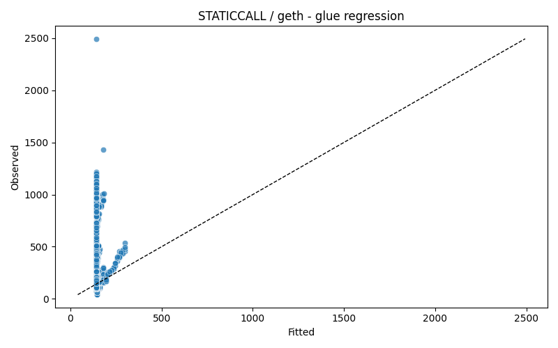

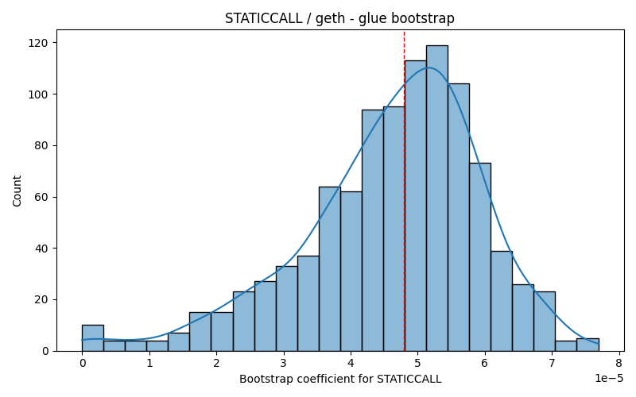


</details>

### Pure glue · geth

<details><summary><code>ISZERO</code> · nobs=680 · runtime_ms=0 · p=1.00e+00 · R²=1.11e-16</summary>

```
==============================================================================
                           NNLS Regression Results                            
==============================================================================
Dep. Variable:          test_runtime_ms              R-squared:          0.000
Model:                  NNLS                    Adj. R-squared:         -0.001
No. Observations:       680                               RMSE:          46.51
Df Residuals:           678                                MAE:          28.31
Df Model:               1      
==============================================================================
                      coef     std err     P-value      [0.025      0.975]
------------------------------------------------------------------------------
         const     88.1585      1.8032       0.001     84.7425     92.0471
        ISZERO      0.0000      0.0000       1.000      0.0000      0.0000
==============================================================================
Notes: Non-negative least squares with bootstrap inference (1000 iterations)
==============================================================================
```

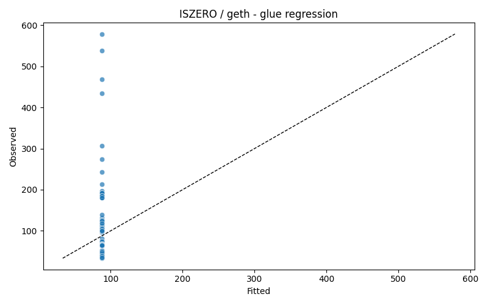


</details>

<details><summary><code>JUMPDEST</code> · nobs=170 · runtime_ms=0 · p=1.00e+00 · R²=1.11e-16</summary>

```
==============================================================================
                           NNLS Regression Results                            
==============================================================================
Dep. Variable:          test_runtime_ms              R-squared:          0.000
Model:                  NNLS                    Adj. R-squared:         -0.006
No. Observations:       170                               RMSE:          68.60
Df Residuals:           168                                MAE:          41.28
Df Model:               1      
==============================================================================
                      coef     std err     P-value      [0.025      0.975]
------------------------------------------------------------------------------
         const    188.0913      5.0870       0.001    179.6341    199.2813
      JUMPDEST      0.0000      0.0000       1.000      0.0000      0.0000
==============================================================================
Notes: Non-negative least squares with bootstrap inference (1000 iterations)
==============================================================================
```

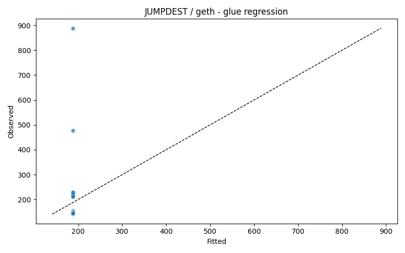


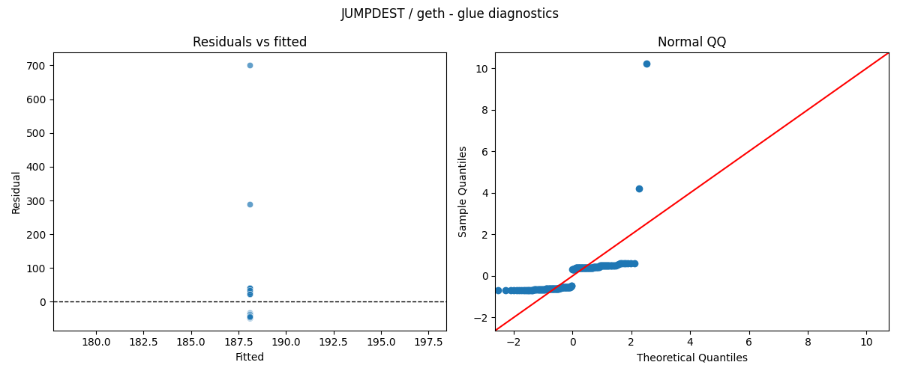

</details>

<details><summary><code>SWAP</code> · nobs=12155 · runtime_ms=0 · p=1.00e+00 · R²=0</summary>

```
==============================================================================
                           NNLS Regression Results                            
==============================================================================
Dep. Variable:          test_runtime_ms              R-squared:          0.000
Model:                  NNLS                    Adj. R-squared:         -0.000
No. Observations:       12155                             RMSE:          55.64
Df Residuals:           12153                              MAE:          32.31
Df Model:               1      
==============================================================================
                      coef     std err     P-value      [0.025      0.975]
------------------------------------------------------------------------------
         const    111.4137      0.4970       0.001    110.4670    112.3365
          SWAP      0.0000      0.0000       1.000      0.0000      0.0000
==============================================================================
Notes: Non-negative least squares with bootstrap inference (1000 iterations)
==============================================================================
```

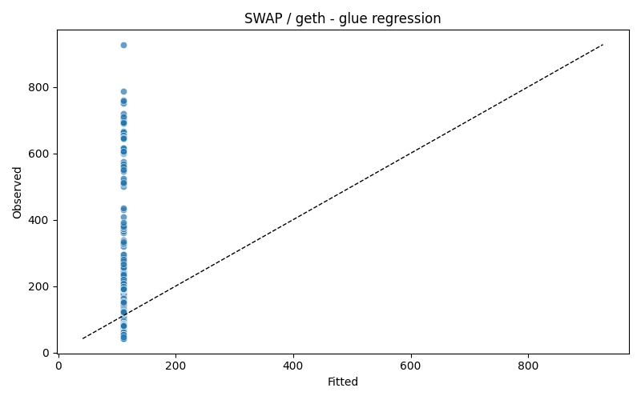


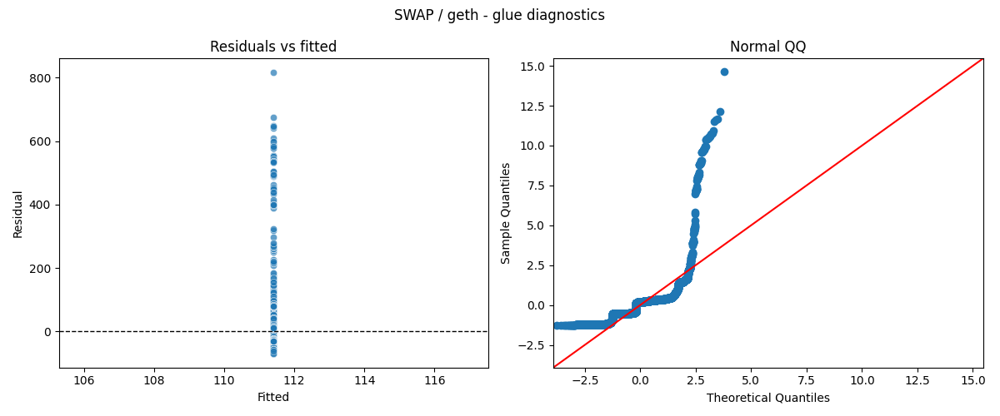

</details>

### Mixed glue (tier A) · geth

<details><summary><code>ADD</code> · nobs=765 · runtime_ms=0 · p=1.00e+00 · R²=2.22e-16</summary>

```
==============================================================================
                           NNLS Regression Results                            
==============================================================================
Dep. Variable:          test_runtime_ms              R-squared:          0.000
Model:                  NNLS                    Adj. R-squared:         -0.001
No. Observations:       765                               RMSE:          55.94
Df Residuals:           763                                MAE:          29.51
Df Model:               1      
==============================================================================
                      coef     std err     P-value      [0.025      0.975]
------------------------------------------------------------------------------
         const     99.8279      2.0507       0.001     96.0460    103.9737
           ADD      0.0000      0.0000       1.000      0.0000      0.0000
==============================================================================
Notes: Non-negative least squares with bootstrap inference (1000 iterations)
==============================================================================
```

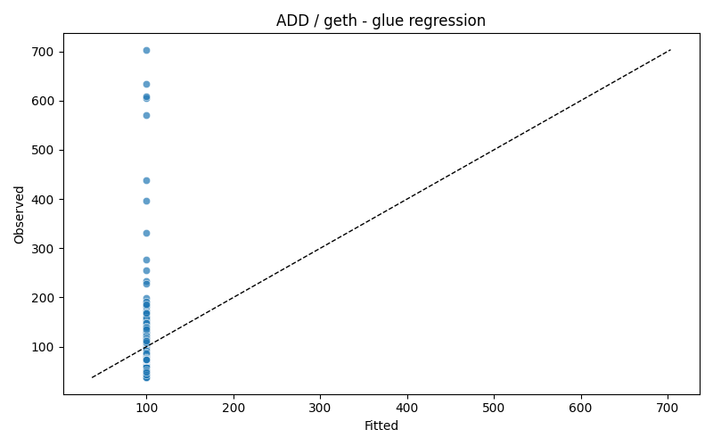


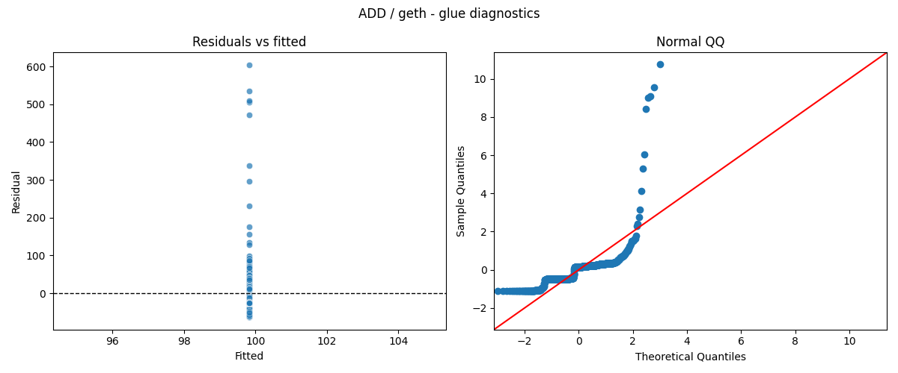

</details>

<details><summary><code>AND</code> · nobs=680 · runtime_ms=0 · p=1.00e+00 · R²=0</summary>

```
==============================================================================
                           NNLS Regression Results                            
==============================================================================
Dep. Variable:          test_runtime_ms              R-squared:          0.000
Model:                  NNLS                    Adj. R-squared:         -0.001
No. Observations:       680                               RMSE:          57.34
Df Residuals:           678                                MAE:          28.83
Df Model:               1      
==============================================================================
                      coef     std err     P-value      [0.025      0.975]
------------------------------------------------------------------------------
         const     93.0459      2.2187       0.001     88.9483     97.6001
           AND      0.0000      0.0000       1.000      0.0000      0.0000
==============================================================================
Notes: Non-negative least squares with bootstrap inference (1000 iterations)
==============================================================================
```


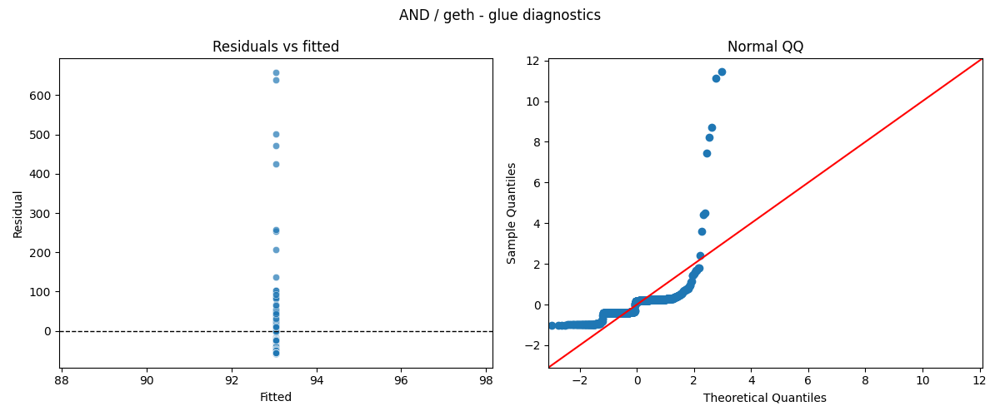

</details>

<details><summary><code>CALLDATACOPY</code> · nobs=19975 · runtime_ms=0 · p=1.00e+00 · R²=0</summary>

```
==============================================================================
                           NNLS Regression Results                            
==============================================================================
Dep. Variable:          test_runtime_ms              R-squared:          0.000
Model:                  NNLS                    Adj. R-squared:         -0.000
No. Observations:       19975                             RMSE:          72.52
Df Residuals:           19973                              MAE:          49.66
Df Model:               1      
==============================================================================
                      coef     std err     P-value      [0.025      0.975]
------------------------------------------------------------------------------
         const     81.2891      0.5083       0.001     80.3182     82.2855
  CALLDATACOPY      0.0000      0.0000       1.000      0.0000      0.0000
==============================================================================
Notes: Non-negative least squares with bootstrap inference (1000 iterations)
==============================================================================
```

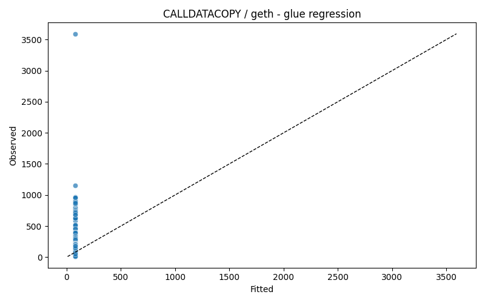


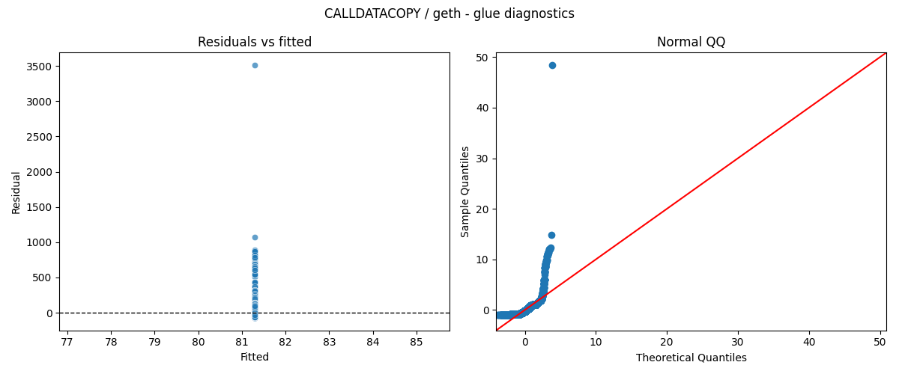

</details>

<details><summary><code>CALLDATALOAD</code> · nobs=3740 · runtime_ms=3.691e-05 · p=1.00e-03 · R²=0.1047</summary>

```
==============================================================================
                           NNLS Regression Results                            
==============================================================================
Dep. Variable:          test_runtime_ms              R-squared:          0.105
Model:                  NNLS                    Adj. R-squared:          0.104
No. Observations:       3740                              RMSE:           0.41
Df Residuals:           3738                               MAE:           0.27
Df Model:               1      
==============================================================================
                      coef     std err     P-value      [0.025      0.975]
------------------------------------------------------------------------------
         const      1.4403      0.0183       0.001      1.4042      1.4742
  CALLDATALOAD      0.0000      0.0000       0.001      0.0000      0.0000
==============================================================================
Notes: Non-negative least squares with bootstrap inference (1000 iterations)
==============================================================================
```

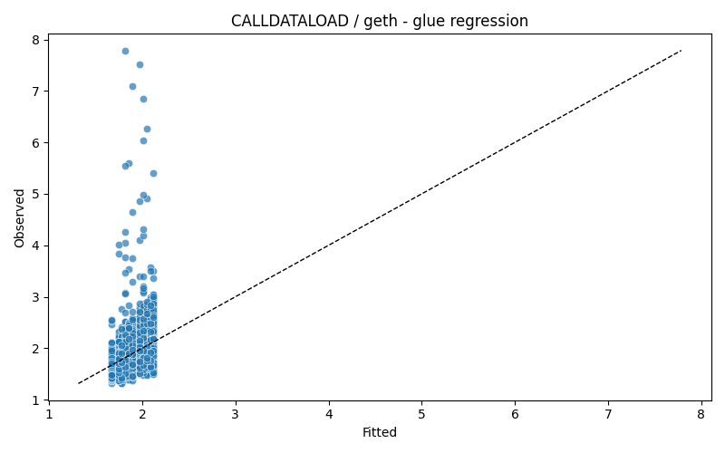

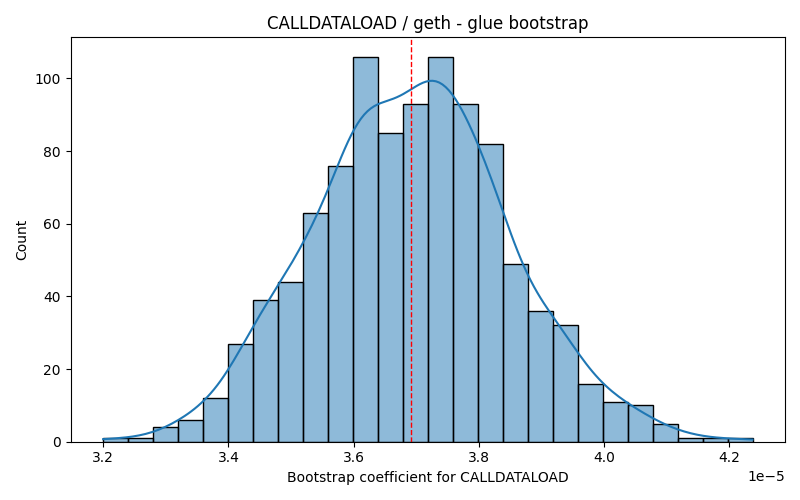

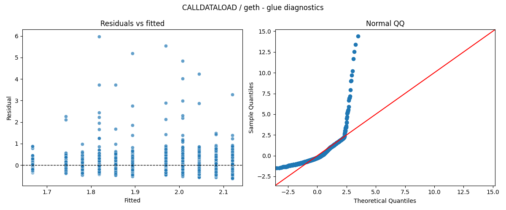

</details>

<details><summary><code>DIV</code> · nobs=935 · runtime_ms=0 · p=1.00e+00 · R²=-2.22e-16</summary>

```
==============================================================================
                           NNLS Regression Results                            
==============================================================================
Dep. Variable:          test_runtime_ms              R-squared:         -0.000
Model:                  NNLS                    Adj. R-squared:         -0.001
No. Observations:       935                               RMSE:         132.98
Df Residuals:           933                                MAE:          71.78
Df Model:               1      
==============================================================================
                      coef     std err     P-value      [0.025      0.975]
------------------------------------------------------------------------------
         const    259.7033      4.3810       0.001    251.8651    269.5435
           DIV      0.0000      0.0000       1.000      0.0000      0.0000
==============================================================================
Notes: Non-negative least squares with bootstrap inference (1000 iterations)
==============================================================================
```

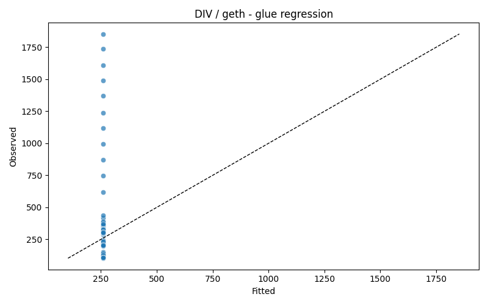


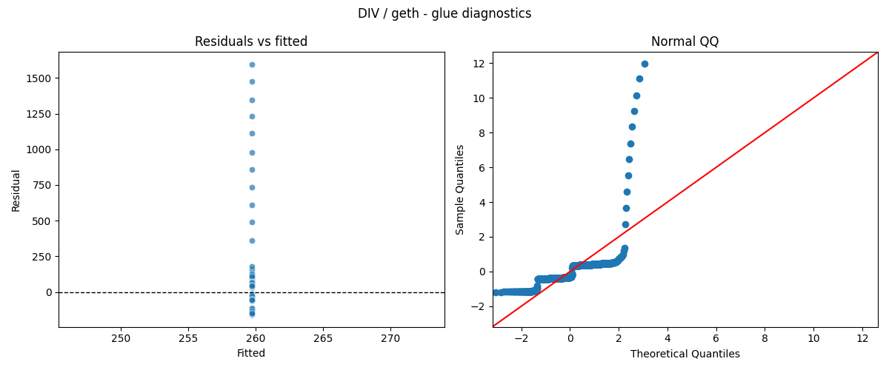

</details>

<details><summary><code>EXP</code> · nobs=935 · runtime_ms=0.0003319 · p=1.00e-03 · R²=0.221</summary>

```
==============================================================================
                           NNLS Regression Results                            
==============================================================================
Dep. Variable:          test_runtime_ms              R-squared:          0.221
Model:                  NNLS                    Adj. R-squared:          0.220
No. Observations:       935                               RMSE:          24.41
Df Residuals:           933                                MAE:           7.93
Df Model:               1      
==============================================================================
                      coef     std err     P-value      [0.025      0.975]
------------------------------------------------------------------------------
         const     13.2928      2.3758       0.001      8.6079     18.0112
           EXP      0.0003      0.0000       0.001      0.0003      0.0004
==============================================================================
Notes: Non-negative least squares with bootstrap inference (1000 iterations)
==============================================================================
```

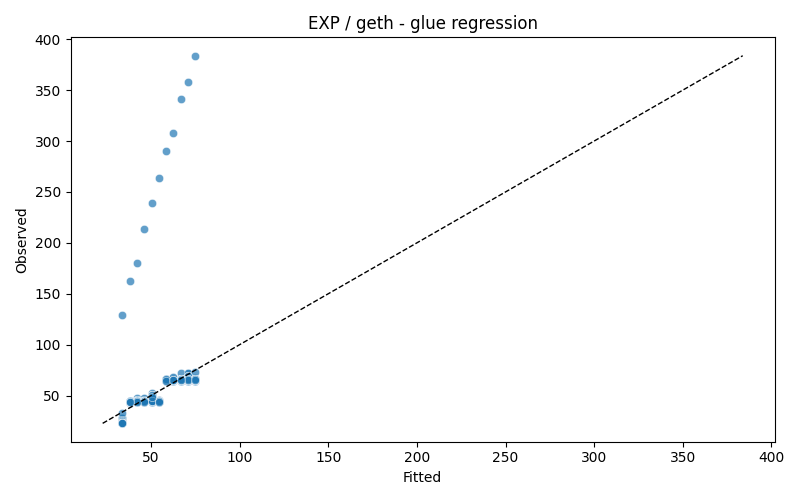

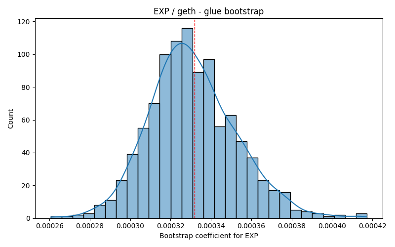

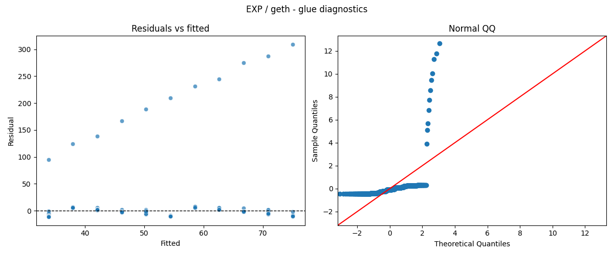

</details>

<details><summary><code>GT</code> · nobs=680 · runtime_ms=0 · p=1.00e+00 · R²=0</summary>

```
==============================================================================
                           NNLS Regression Results                            
==============================================================================
Dep. Variable:          test_runtime_ms              R-squared:          0.000
Model:                  NNLS                    Adj. R-squared:         -0.001
No. Observations:       680                               RMSE:          49.21
Df Residuals:           678                                MAE:          28.96
Df Model:               1      
==============================================================================
                      coef     std err     P-value      [0.025      0.975]
------------------------------------------------------------------------------
         const     93.0067      1.8553       0.001     89.6338     96.8200
            GT      0.0000      0.0000       1.000      0.0000      0.0000
==============================================================================
Notes: Non-negative least squares with bootstrap inference (1000 iterations)
==============================================================================
```

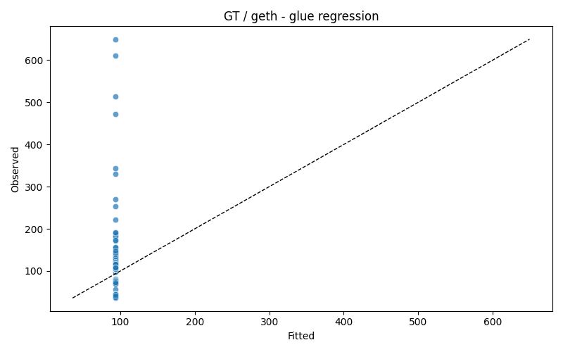


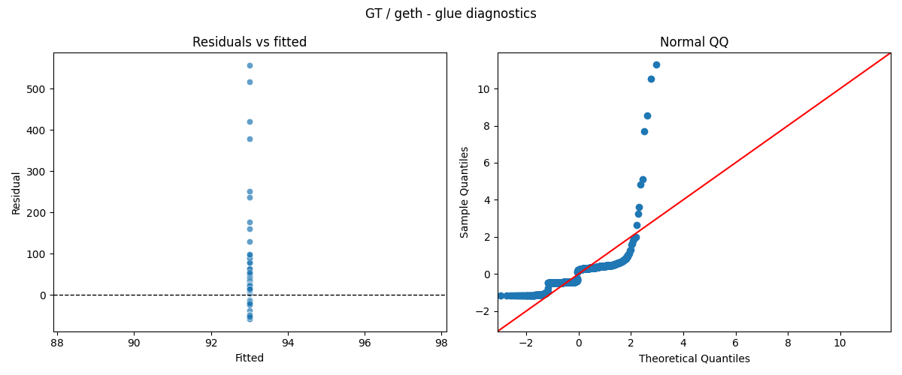

</details>

<details><summary><code>JUMPI</code> · nobs=935 · runtime_ms=0 · p=1.00e+00 · R²=0</summary>

```
==============================================================================
                           NNLS Regression Results                            
==============================================================================
Dep. Variable:          test_runtime_ms              R-squared:          0.000
Model:                  NNLS                    Adj. R-squared:         -0.001
No. Observations:       935                               RMSE:          27.68
Df Residuals:           933                                MAE:          14.97
Df Model:               1      
==============================================================================
                      coef     std err     P-value      [0.025      0.975]
------------------------------------------------------------------------------
         const     52.6038      0.9121       0.001     50.9812     54.4766
         JUMPI      0.0000      0.0000       1.000      0.0000      0.0000
==============================================================================
Notes: Non-negative least squares with bootstrap inference (1000 iterations)
==============================================================================
```

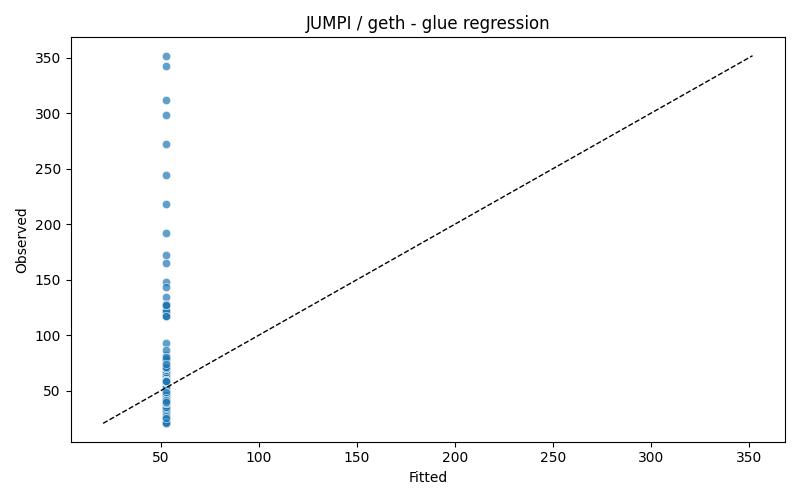

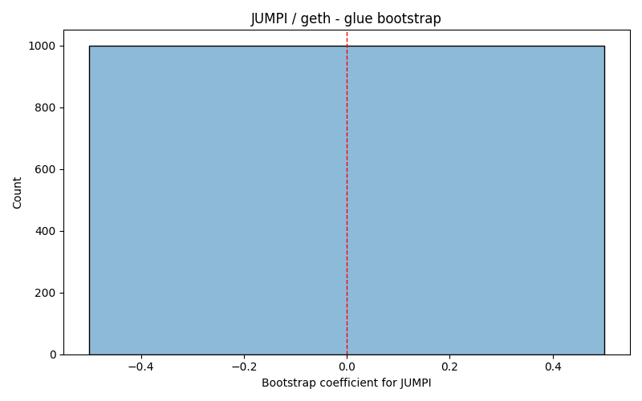

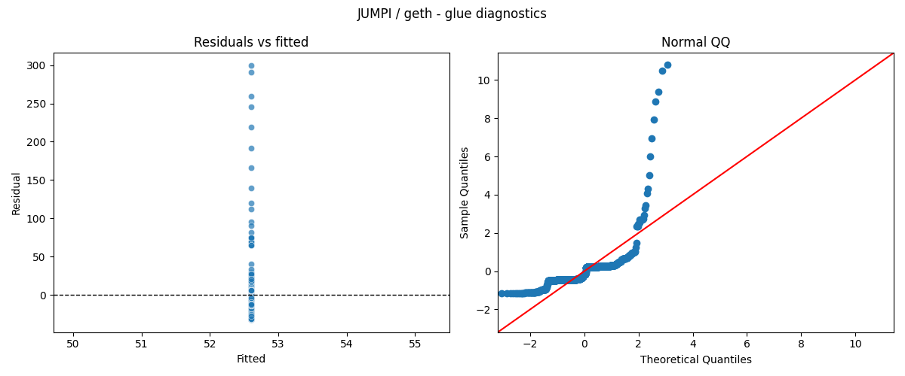

</details>

<details><summary><code>LT</code> · nobs=680 · runtime_ms=0 · p=1.00e+00 · R²=1.11e-16</summary>

```
==============================================================================
                           NNLS Regression Results                            
==============================================================================
Dep. Variable:          test_runtime_ms              R-squared:          0.000
Model:                  NNLS                    Adj. R-squared:         -0.001
No. Observations:       680                               RMSE:          51.09
Df Residuals:           678                                MAE:          30.13
Df Model:               1      
==============================================================================
                      coef     std err     P-value      [0.025      0.975]
------------------------------------------------------------------------------
         const     96.1499      1.8382       0.001     92.7278     99.8407
            LT      0.0000      0.0000       1.000      0.0000      0.0000
==============================================================================
Notes: Non-negative least squares with bootstrap inference (1000 iterations)
==============================================================================
```

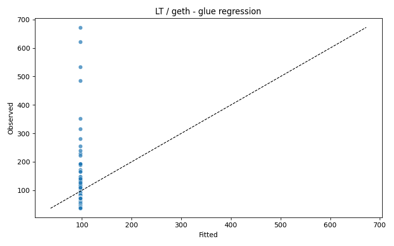


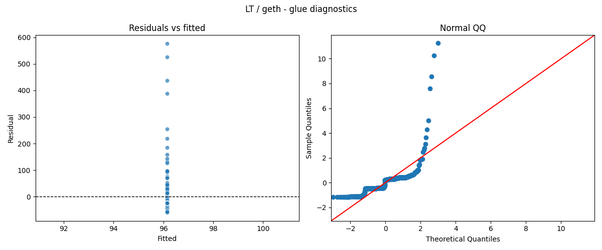

</details>

<details><summary><code>MSTORE</code> · nobs=3825 · runtime_ms=0 · p=1.00e+00 · R²=0</summary>

```
==============================================================================
                           NNLS Regression Results                            
==============================================================================
Dep. Variable:          test_runtime_ms              R-squared:          0.000
Model:                  NNLS                    Adj. R-squared:         -0.000
No. Observations:       3825                              RMSE:          68.19
Df Residuals:           3823                               MAE:          38.43
Df Model:               1      
==============================================================================
                      coef     std err     P-value      [0.025      0.975]
------------------------------------------------------------------------------
         const    135.6613      1.1074       0.001    133.6078    137.9937
        MSTORE      0.0000      0.0000       1.000      0.0000      0.0000
==============================================================================
Notes: Non-negative least squares with bootstrap inference (1000 iterations)
==============================================================================
```

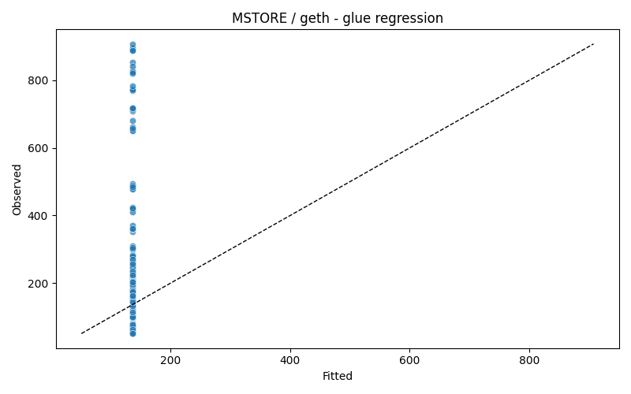


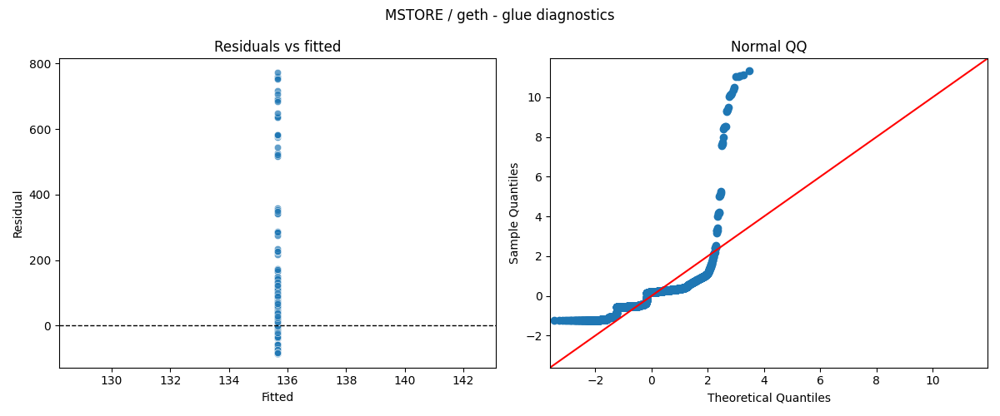

</details>

<details><summary><code>MSTORE8</code> · nobs=3825 · runtime_ms=0 · p=1.00e+00 · R²=2.22e-16</summary>

```
==============================================================================
                           NNLS Regression Results                            
==============================================================================
Dep. Variable:          test_runtime_ms              R-squared:          0.000
Model:                  NNLS                    Adj. R-squared:         -0.000
No. Observations:       3825                              RMSE:          67.24
Df Residuals:           3823                               MAE:          36.49
Df Model:               1      
==============================================================================
                      coef     std err     P-value      [0.025      0.975]
------------------------------------------------------------------------------
         const    128.8893      1.0845       0.001    126.8894    131.1365
       MSTORE8      0.0000      0.0000       1.000      0.0000      0.0000
==============================================================================
Notes: Non-negative least squares with bootstrap inference (1000 iterations)
==============================================================================
```

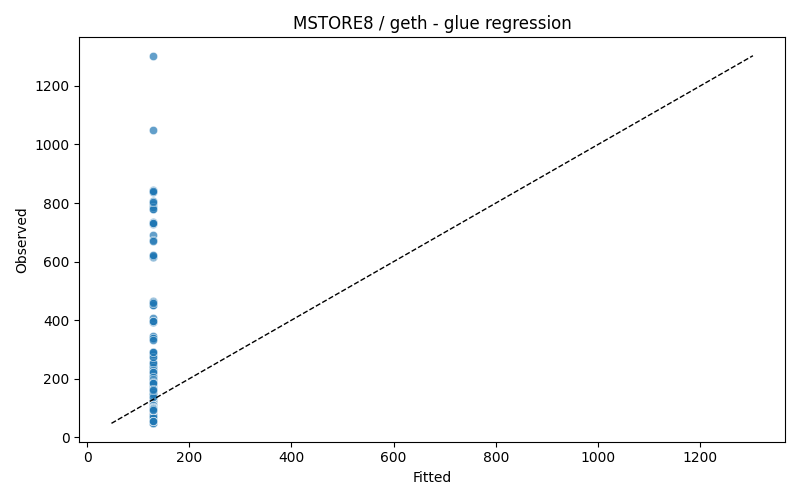


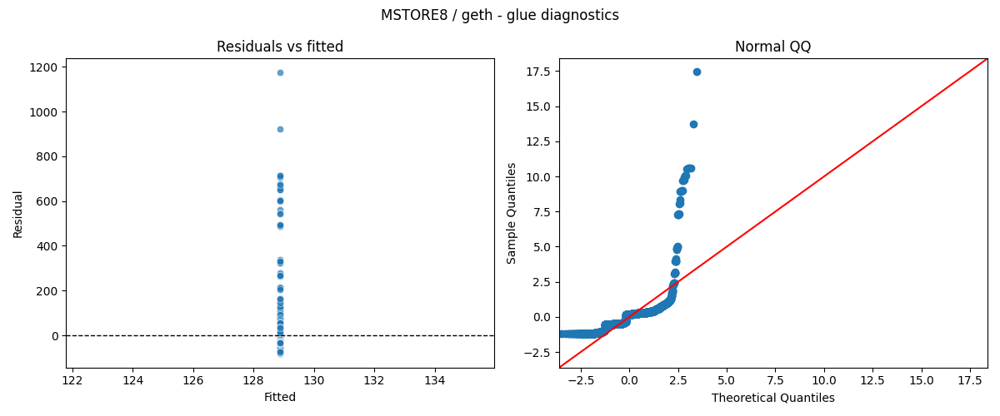

</details>

<details><summary><code>MUL</code> · nobs=850 · runtime_ms=0 · p=1.00e+00 · R²=2.22e-16</summary>

```
==============================================================================
                           NNLS Regression Results                            
==============================================================================
Dep. Variable:          test_runtime_ms              R-squared:          0.000
Model:                  NNLS                    Adj. R-squared:         -0.001
No. Observations:       850                               RMSE:          50.60
Df Residuals:           848                                MAE:          27.96
Df Model:               1      
==============================================================================
                      coef     std err     P-value      [0.025      0.975]
------------------------------------------------------------------------------
         const     96.0113      1.7046       0.001     92.6883     99.5797
           MUL      0.0000      0.0000       1.000      0.0000      0.0000
==============================================================================
Notes: Non-negative least squares with bootstrap inference (1000 iterations)
==============================================================================
```


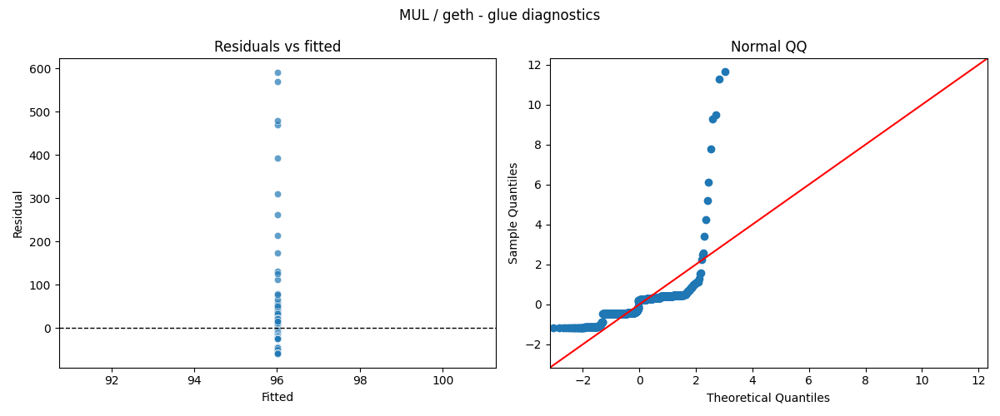

</details>

<details><summary><code>PC</code> · nobs=510 · runtime_ms=7.872e-06 · p=1.00e-03 · R²=0.0663</summary>

```
==============================================================================
                           NNLS Regression Results                            
==============================================================================
Dep. Variable:          test_runtime_ms              R-squared:          0.066
Model:                  NNLS                    Adj. R-squared:          0.064
No. Observations:       510                               RMSE:          65.66
Df Residuals:           508                                MAE:          27.79
Df Model:               1      
==============================================================================
                      coef     std err     P-value      [0.025      0.975]
------------------------------------------------------------------------------
         const    125.9282      4.8000       0.001    116.8744    136.4879
            PC      0.0000      0.0000       0.001      0.0000      0.0000
==============================================================================
Notes: Non-negative least squares with bootstrap inference (1000 iterations)
==============================================================================
```

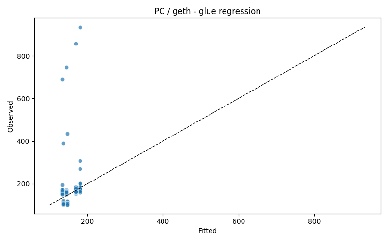

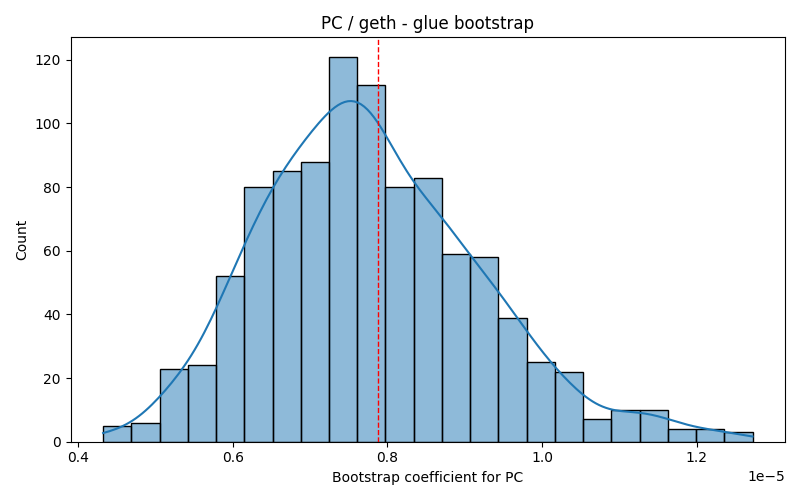

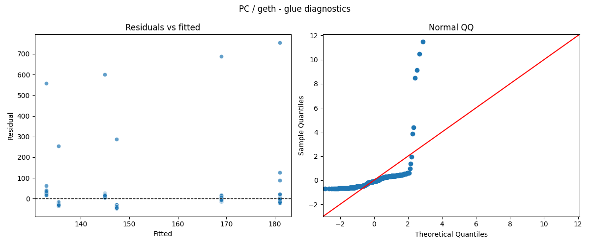

</details>

<details><summary><code>RETURNDATASIZE</code> · nobs=2040 · runtime_ms=1.326e-05 · p=1.00e-03 · R²=0.06101</summary>

```
==============================================================================
                           NNLS Regression Results                            
==============================================================================
Dep. Variable:          test_runtime_ms              R-squared:          0.061
Model:                  NNLS                    Adj. R-squared:          0.061
No. Observations:       2040                              RMSE:          61.05
Df Residuals:           2038                               MAE:          29.53
Df Model:               1      
==============================================================================
                      coef     std err     P-value      [0.025      0.975]
------------------------------------------------------------------------------
         const    105.9894      2.2759       0.001    101.9032    110.5742
RETURNDATASIZE      0.0000      0.0000       0.001      0.0000      0.0000
==============================================================================
Notes: Non-negative least squares with bootstrap inference (1000 iterations)
==============================================================================
```

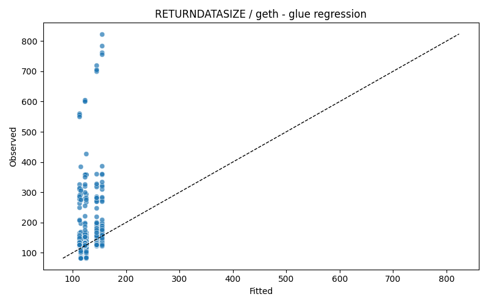

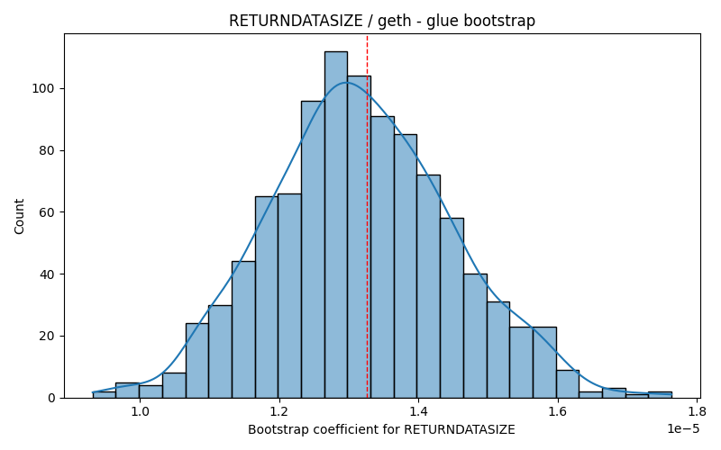

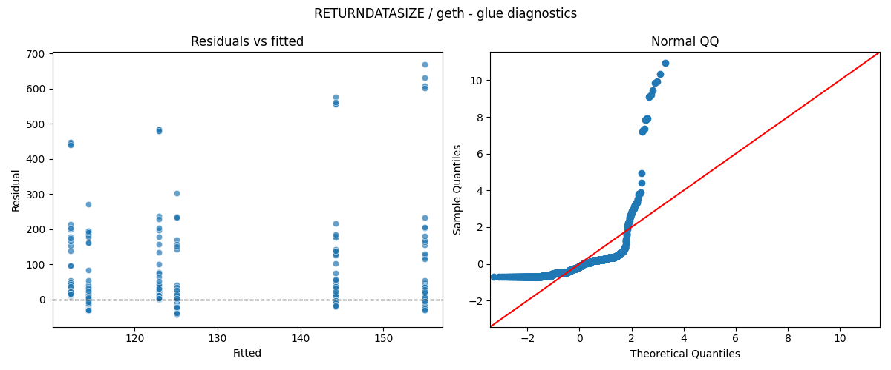

</details>

<details><summary><code>SELFBALANCE</code> · nobs=935 · runtime_ms=0 · p=1.00e+00 · R²=2.22e-16</summary>

```
==============================================================================
                           NNLS Regression Results                            
==============================================================================
Dep. Variable:          test_runtime_ms              R-squared:          0.000
Model:                  NNLS                    Adj. R-squared:         -0.001
No. Observations:       935                               RMSE:         214.64
Df Residuals:           933                                MAE:         112.76
Df Model:               1      
==============================================================================
                      coef     std err     P-value      [0.025      0.975]
------------------------------------------------------------------------------
         const    407.5577      7.0087       0.001    394.5721    421.9127
   SELFBALANCE      0.0000      0.0000       1.000      0.0000      0.0000
==============================================================================
Notes: Non-negative least squares with bootstrap inference (1000 iterations)
==============================================================================
```

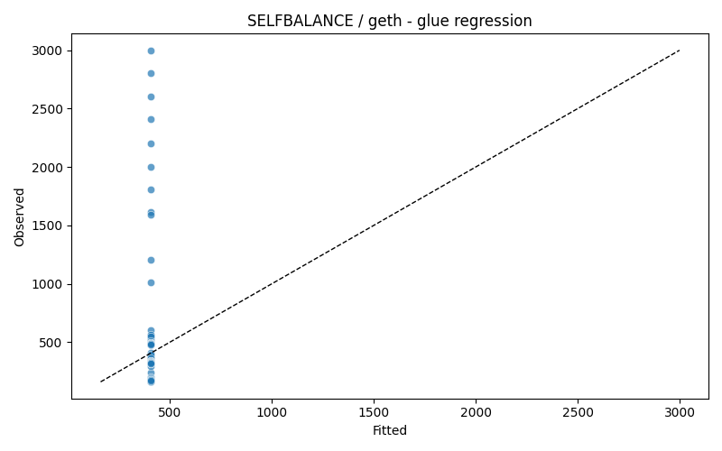

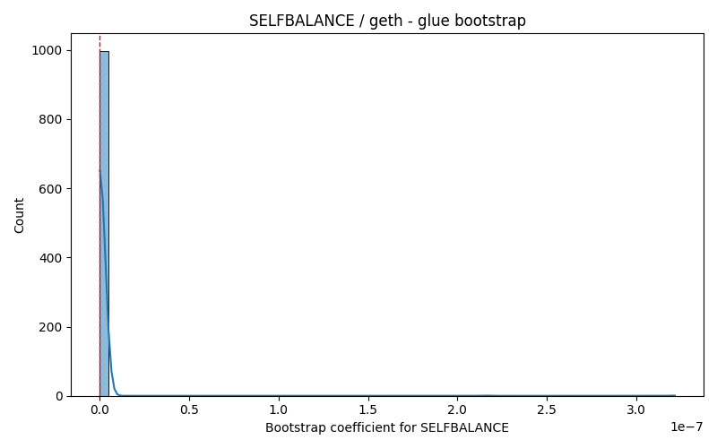

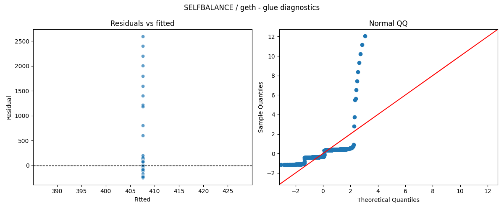

</details>

<details><summary><code>SUB</code> · nobs=680 · runtime_ms=0 · p=1.00e+00 · R²=0</summary>

```
==============================================================================
                           NNLS Regression Results                            
==============================================================================
Dep. Variable:          test_runtime_ms              R-squared:          0.000
Model:                  NNLS                    Adj. R-squared:         -0.001
No. Observations:       680                               RMSE:          63.07
Df Residuals:           678                                MAE:          30.39
Df Model:               1      
==============================================================================
                      coef     std err     P-value      [0.025      0.975]
------------------------------------------------------------------------------
         const     96.7427      2.4040       0.001     92.6488    101.9990
           SUB      0.0000      0.0000       1.000      0.0000      0.0000
==============================================================================
Notes: Non-negative least squares with bootstrap inference (1000 iterations)
==============================================================================
```

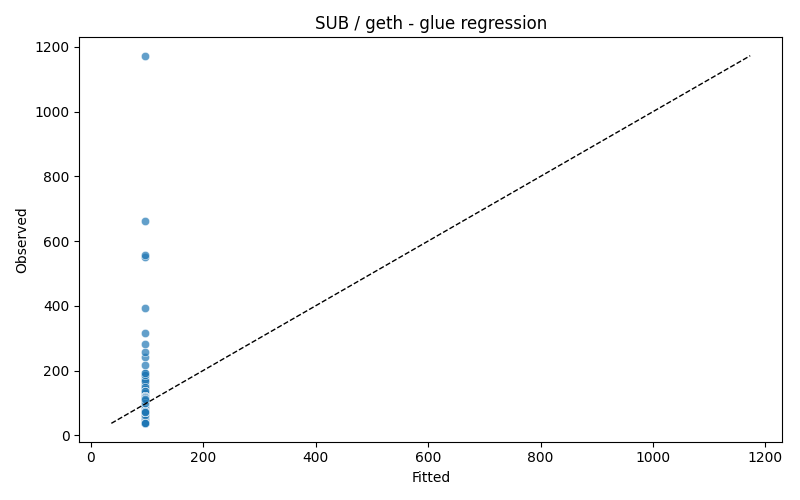


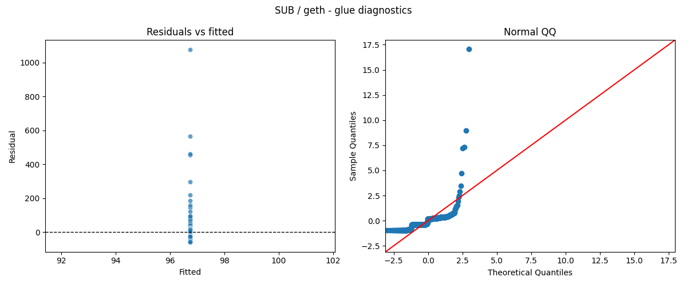

</details>

### Mixed glue (tier B) · geth

<details><summary><code>JUMP</code> · nobs=850 · runtime_ms=0 · p=1.00e+00 · R²=1.11e-16</summary>

```
==============================================================================
                           NNLS Regression Results                            
==============================================================================
Dep. Variable:          test_runtime_ms              R-squared:          0.000
Model:                  NNLS                    Adj. R-squared:         -0.001
No. Observations:       850                               RMSE:          43.91
Df Residuals:           848                                MAE:          24.75
Df Model:               1      
==============================================================================
                      coef     std err     P-value      [0.025      0.975]
------------------------------------------------------------------------------
         const     85.1096      1.4744       0.001     82.3697     88.1010
          JUMP      0.0000      0.0000       1.000      0.0000      0.0000
==============================================================================
Notes: Non-negative least squares with bootstrap inference (1000 iterations)
==============================================================================
```

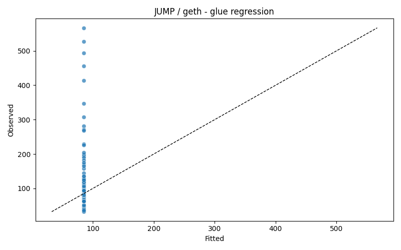


</details>

<details><summary><code>KECCAK256</code> · nobs=0 · runtime_ms=n/a · p=n/a · R²=n/a</summary>

</details>

## nethermind

| glue_opcode | nobs | glue_runtime_ms | p_value | rsquared |
| --- | --- | --- | --- | --- |
| `ISZERO` | 760 | 0 | 1.00e+00 | 0 |
| `JUMPDEST` | 190 | 0 | 1.00e+00 | 0 |
| `SWAP` | 13585 | 0 | 1.00e+00 | 0 |
| `CALLDATASIZE` | 47723 | 8.898e-06 | 1.00e-03 | 0.4797 |
| `DUP` | 47723 | 0 | 1.00e+00 | 0.4797 |
| `GAS` | 47723 | 8.624e-06 | 1.00e-03 | 0.4797 |
| `MLOAD` | 47723 | 2.747e-06 | 1.00e-03 | 0.4797 |
| `PUSH` | 47723 | 0 | 1.00e+00 | 0.4797 |
| `PUSH0` | 47723 | 3.784e-06 | 1.00e-03 | 0.4797 |
| `STATICCALL` | 47723 | 0.000381 | 1.00e-03 | 0.4797 |
| `ADD` | 855 | 0 | 1.00e+00 | 0 |
| `AND` | 760 | 0 | 1.00e+00 | 0 |
| `CALLDATACOPY` | 22325 | 0 | 1.00e+00 | 0 |
| `CALLDATALOAD` | 4180 | 3.341e-05 | 1.00e-03 | 0.004007 |
| `DIV` | 1045 | 0 | 1.00e+00 | 0 |
| `EXP` | 1045 | 0 | 1.00e+00 | 2.22e-16 |
| `GT` | 760 | 0 | 1.00e+00 | -2.22e-16 |
| `JUMPI` | 1045 | 0 | 1.00e+00 | 0 |
| `LT` | 760 | 0 | 1.00e+00 | 0 |
| `MSTORE` | 4275 | 0 | 1.00e+00 | -2.22e-16 |
| `MSTORE8` | 4275 | 0 | 1.00e+00 | 0 |
| `MUL` | 950 | 0 | 1.00e+00 | 3.331e-16 |
| `PC` | 570 | 6.508e-06 | 1.00e-03 | 0.4149 |
| `RETURNDATASIZE` | 2280 | 6.476e-06 | 1.00e-03 | 0.2039 |
| `SELFBALANCE` | 1045 | 0 | 1.00e+00 | 0 |
| `SUB` | 760 | 0 | 1.00e+00 | 0 |
| `JUMP` | 950 | 0 | 1.00e+00 | 0 |
| `KECCAK256` | 0 | n/a | n/a | n/a |

### Cycle glue — joint fit · nethermind

<details><summary>Joint NNLS regression summary</summary>

```
==============================================================================
                           NNLS Regression Results                            
==============================================================================
Dep. Variable:          test_runtime_ms              R-squared:          0.480
Model:                  NNLS                    Adj. R-squared:          0.480
No. Observations:       47723                             RMSE:          20.67
Df Residuals:           47715                              MAE:          17.23
Df Model:               7      
==============================================================================
                      coef     std err     P-value      [0.025      0.975]
------------------------------------------------------------------------------
         const     64.9958      0.1094       0.001     64.7949     65.2094
  CALLDATASIZE      0.0000      0.0000       0.001      0.0000      0.0000
           DUP      0.0000      0.0000       1.000      0.0000      0.0000
           GAS      0.0000      0.0000       0.001      0.0000      0.0000
         MLOAD      0.0000      0.0000       0.001      0.0000      0.0000
          PUSH      0.0000      0.0000       1.000      0.0000      0.0000
         PUSH0      0.0000      0.0000       0.001      0.0000      0.0000
    STATICCALL      0.0004      0.0000       0.001      0.0004      0.0004
==============================================================================
Notes: Non-negative least squares with bootstrap inference (1000 iterations)
==============================================================================
```

</details>

<details><summary><code>CALLDATASIZE</code> · nobs=47723 · runtime_ms=8.898e-06 · p=1.00e-03 · R²=0.4797</summary>

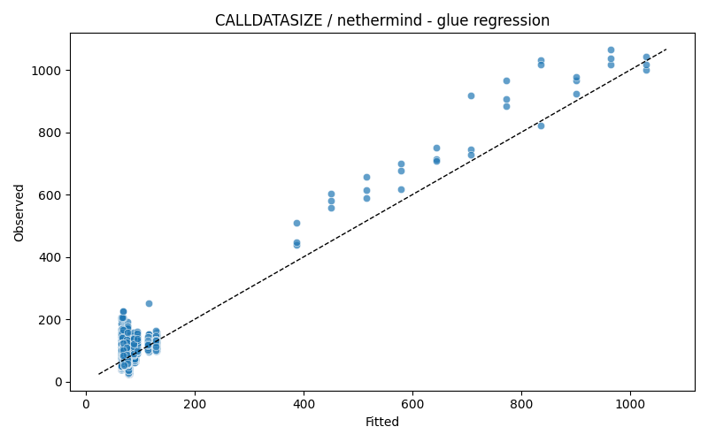

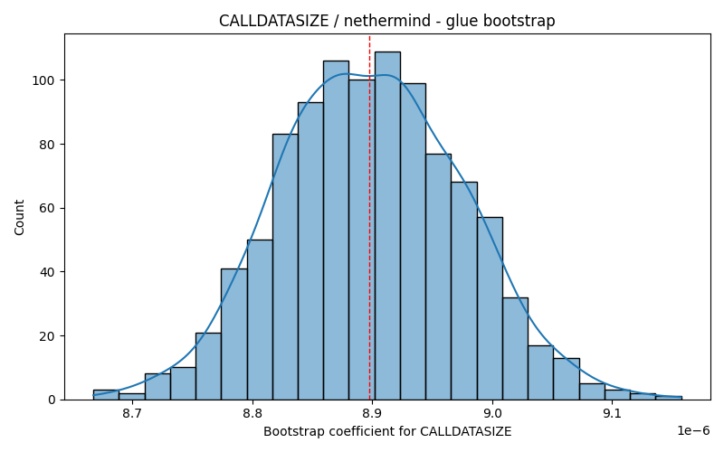


</details>

<details><summary><code>DUP</code> · nobs=47723 · runtime_ms=0 · p=1.00e+00 · R²=0.4797</summary>


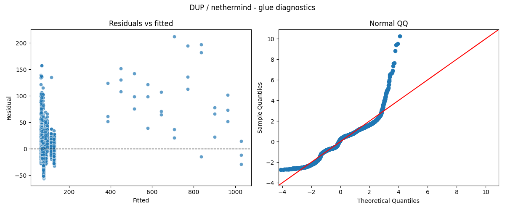

</details>

<details><summary><code>GAS</code> · nobs=47723 · runtime_ms=8.624e-06 · p=1.00e-03 · R²=0.4797</summary>

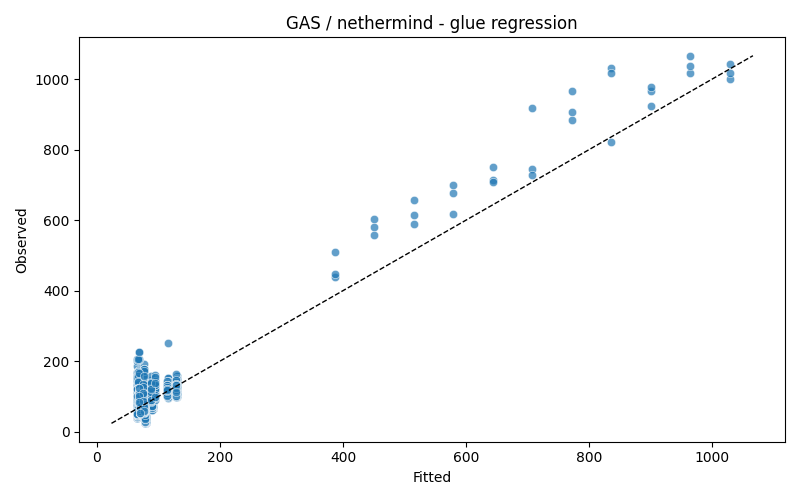

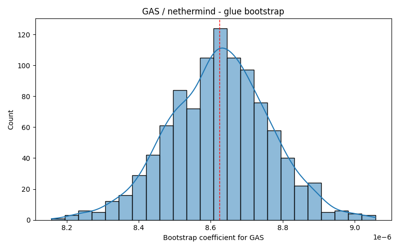


</details>

<details><summary><code>MLOAD</code> · nobs=47723 · runtime_ms=2.747e-06 · p=1.00e-03 · R²=0.4797</summary>


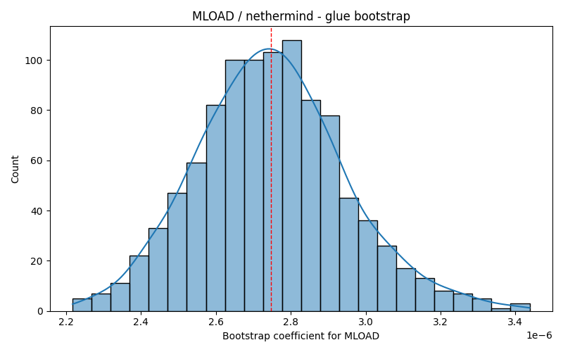


</details>

<details><summary><code>PUSH</code> · nobs=47723 · runtime_ms=0 · p=1.00e+00 · R²=0.4797</summary>


</details>

<details><summary><code>PUSH0</code> · nobs=47723 · runtime_ms=3.784e-06 · p=1.00e-03 · R²=0.4797</summary>


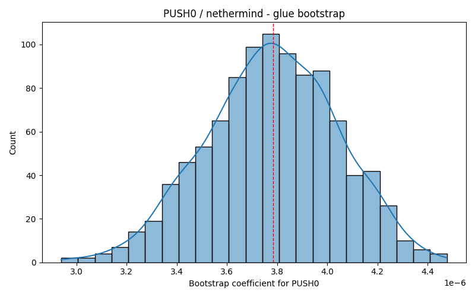


</details>

<details><summary><code>STATICCALL</code> · nobs=47723 · runtime_ms=0.000381 · p=1.00e-03 · R²=0.4797</summary>

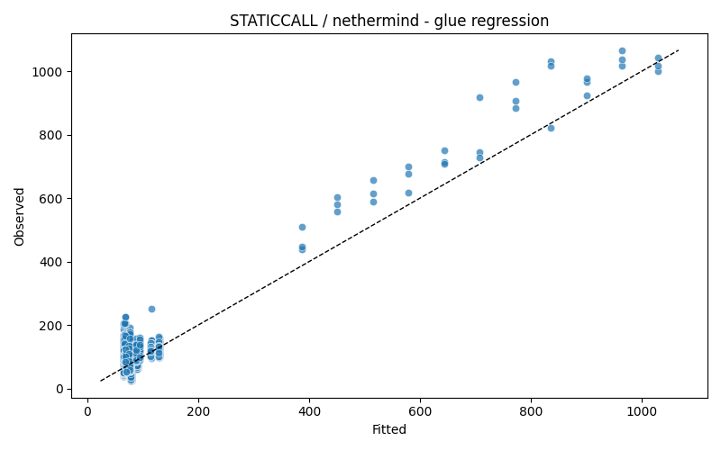

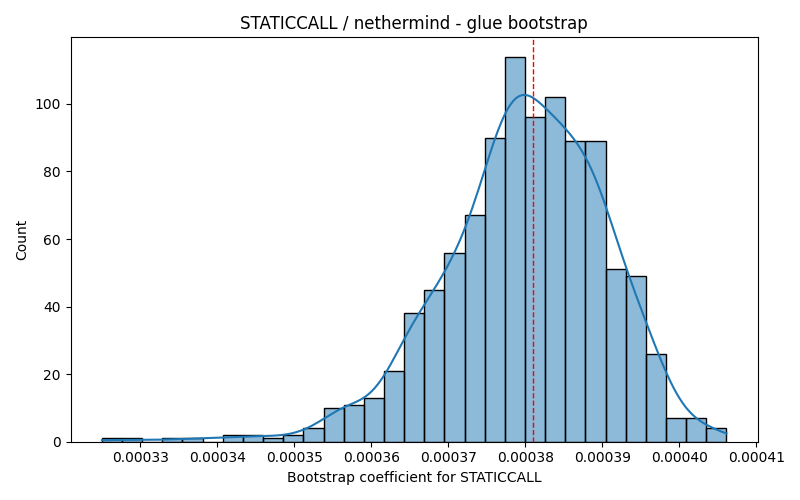

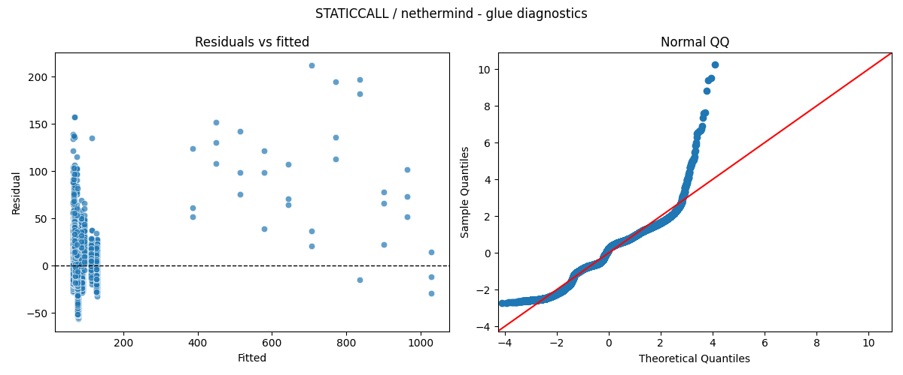

</details>

### Pure glue · nethermind

<details><summary><code>ISZERO</code> · nobs=760 · runtime_ms=0 · p=1.00e+00 · R²=0</summary>

```
==============================================================================
                           NNLS Regression Results                            
==============================================================================
Dep. Variable:          test_runtime_ms              R-squared:          0.000
Model:                  NNLS                    Adj. R-squared:         -0.001
No. Observations:       760                               RMSE:          21.19
Df Residuals:           758                                MAE:          18.14
Df Model:               1      
==============================================================================
                      coef     std err     P-value      [0.025      0.975]
------------------------------------------------------------------------------
         const     69.0723      0.7319       0.001     67.7162     70.5981
        ISZERO      0.0000      0.0000       1.000      0.0000      0.0000
==============================================================================
Notes: Non-negative least squares with bootstrap inference (1000 iterations)
==============================================================================
```

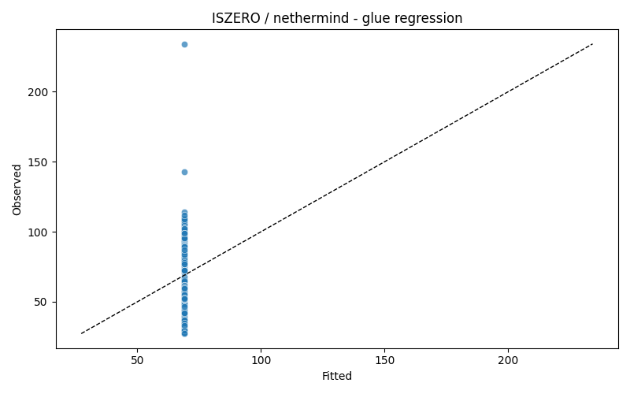


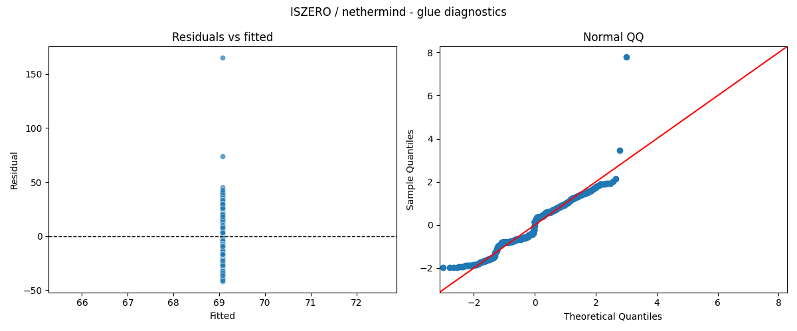

</details>

<details><summary><code>JUMPDEST</code> · nobs=190 · runtime_ms=0 · p=1.00e+00 · R²=0</summary>

```
==============================================================================
                           NNLS Regression Results                            
==============================================================================
Dep. Variable:          test_runtime_ms              R-squared:          0.000
Model:                  NNLS                    Adj. R-squared:         -0.005
No. Observations:       190                               RMSE:          28.22
Df Residuals:           188                                MAE:          23.47
Df Model:               1      
==============================================================================
                      coef     std err     P-value      [0.025      0.975]
------------------------------------------------------------------------------
         const    111.4838      2.0092       0.001    107.5694    115.4179
      JUMPDEST      0.0000      0.0000       1.000      0.0000      0.0000
==============================================================================
Notes: Non-negative least squares with bootstrap inference (1000 iterations)
==============================================================================
```

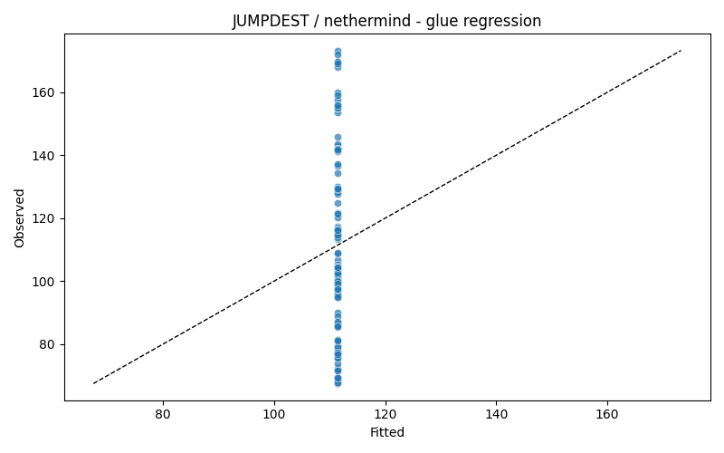


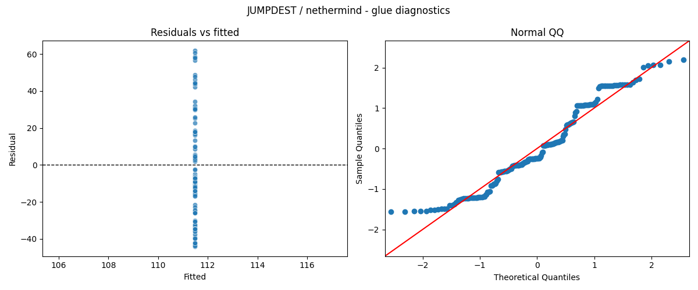

</details>

<details><summary><code>SWAP</code> · nobs=13585 · runtime_ms=0 · p=1.00e+00 · R²=0</summary>

```
==============================================================================
                           NNLS Regression Results                            
==============================================================================
Dep. Variable:          test_runtime_ms              R-squared:          0.000
Model:                  NNLS                    Adj. R-squared:         -0.000
No. Observations:       13585                             RMSE:          18.67
Df Residuals:           13583                              MAE:          12.44
Df Model:               1      
==============================================================================
                      coef     std err     P-value      [0.025      0.975]
------------------------------------------------------------------------------
         const     52.1831      0.1589       0.001     51.8861     52.5175
          SWAP      0.0000      0.0000       1.000      0.0000      0.0000
==============================================================================
Notes: Non-negative least squares with bootstrap inference (1000 iterations)
==============================================================================
```

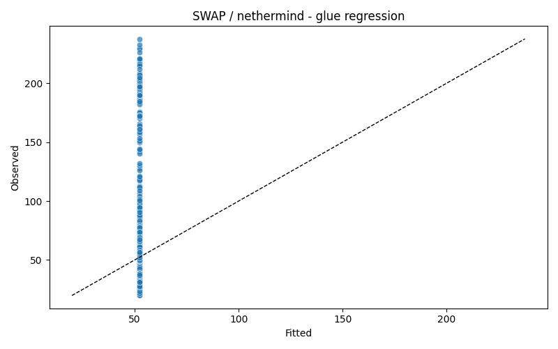


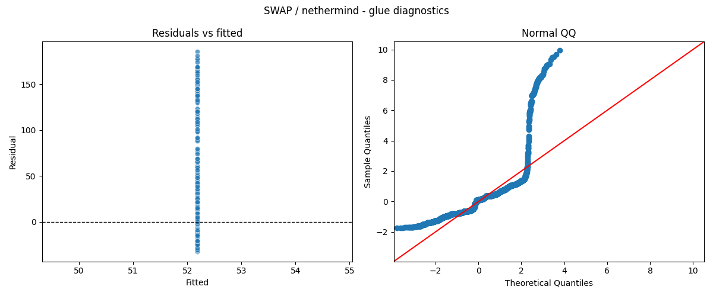

</details>

### Mixed glue (tier A) · nethermind

<details><summary><code>ADD</code> · nobs=855 · runtime_ms=0 · p=1.00e+00 · R²=0</summary>

```
==============================================================================
                           NNLS Regression Results                            
==============================================================================
Dep. Variable:          test_runtime_ms              R-squared:          0.000
Model:                  NNLS                    Adj. R-squared:         -0.001
No. Observations:       855                               RMSE:          34.71
Df Residuals:           853                                MAE:          26.81
Df Model:               1      
==============================================================================
                      coef     std err     P-value      [0.025      0.975]
------------------------------------------------------------------------------
         const     96.3297      1.1689       0.001     94.0698     98.6844
           ADD      0.0000      0.0000       1.000      0.0000      0.0000
==============================================================================
Notes: Non-negative least squares with bootstrap inference (1000 iterations)
==============================================================================
```

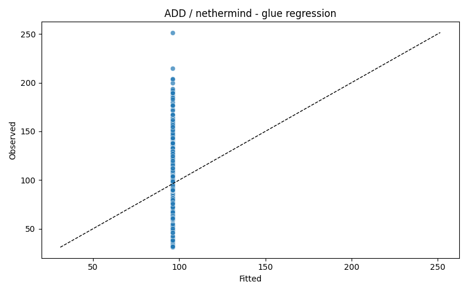


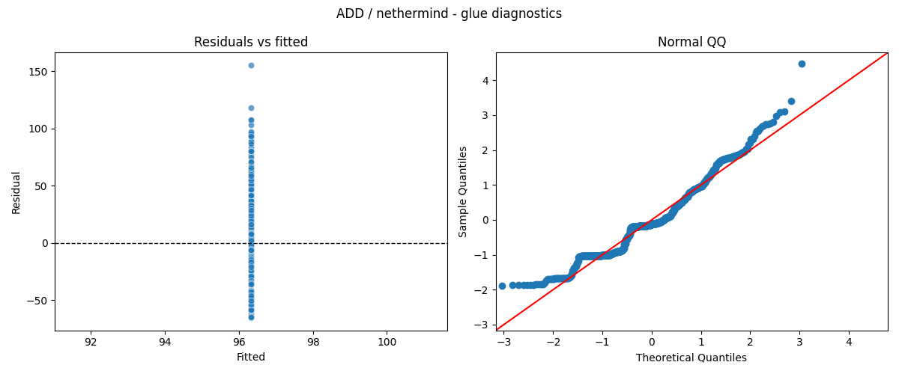

</details>

<details><summary><code>AND</code> · nobs=760 · runtime_ms=0 · p=1.00e+00 · R²=0</summary>

```
==============================================================================
                           NNLS Regression Results                            
==============================================================================
Dep. Variable:          test_runtime_ms              R-squared:          0.000
Model:                  NNLS                    Adj. R-squared:         -0.001
No. Observations:       760                               RMSE:          20.38
Df Residuals:           758                                MAE:          14.25
Df Model:               1      
==============================================================================
                      coef     std err     P-value      [0.025      0.975]
------------------------------------------------------------------------------
         const     52.0267      0.7401       0.001     50.5588     53.4836
           AND      0.0000      0.0000       1.000      0.0000      0.0000
==============================================================================
Notes: Non-negative least squares with bootstrap inference (1000 iterations)
==============================================================================
```

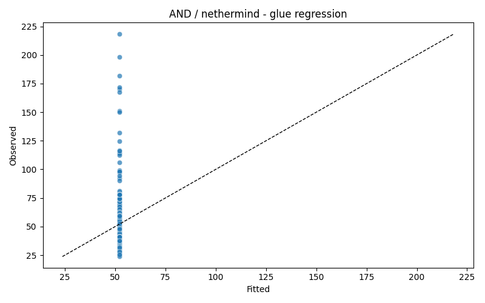


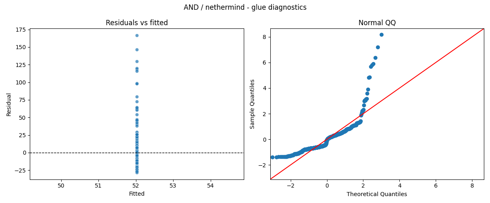

</details>

<details><summary><code>CALLDATACOPY</code> · nobs=22325 · runtime_ms=0 · p=1.00e+00 · R²=0</summary>

```
==============================================================================
                           NNLS Regression Results                            
==============================================================================
Dep. Variable:          test_runtime_ms              R-squared:          0.000
Model:                  NNLS                    Adj. R-squared:         -0.000
No. Observations:       22325                             RMSE:          35.24
Df Residuals:           22323                              MAE:          28.94
Df Model:               1      
==============================================================================
                      coef     std err     P-value      [0.025      0.975]
------------------------------------------------------------------------------
         const     58.8030      0.2399       0.001     58.3248     59.2450
  CALLDATACOPY      0.0000      0.0000       1.000      0.0000      0.0000
==============================================================================
Notes: Non-negative least squares with bootstrap inference (1000 iterations)
==============================================================================
```

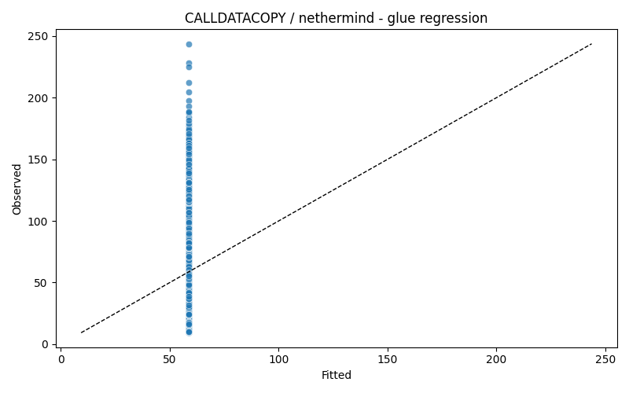


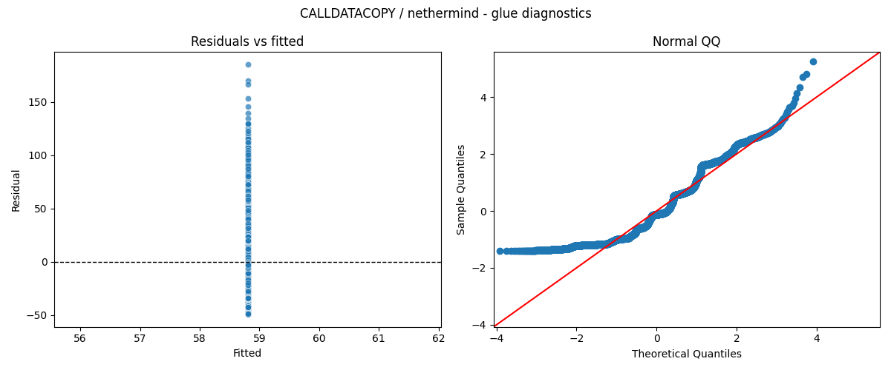

</details>

<details><summary><code>CALLDATALOAD</code> · nobs=4180 · runtime_ms=3.341e-05 · p=1.00e-03 · R²=0.004007</summary>

```
==============================================================================
                           NNLS Regression Results                            
==============================================================================
Dep. Variable:          test_runtime_ms              R-squared:          0.004
Model:                  NNLS                    Adj. R-squared:          0.004
No. Observations:       4180                              RMSE:           2.02
Df Residuals:           4178                               MAE:           0.26
Df Model:               1      
==============================================================================
                      coef     std err     P-value      [0.025      0.975]
------------------------------------------------------------------------------
         const      1.9249      0.0802       0.001      1.7566      2.0641
  CALLDATALOAD      0.0000      0.0000       0.001      0.0000      0.0001
==============================================================================
Notes: Non-negative least squares with bootstrap inference (1000 iterations)
==============================================================================
```

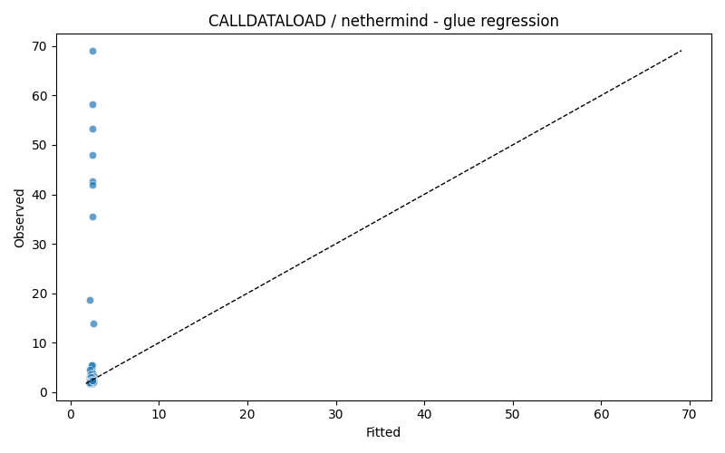

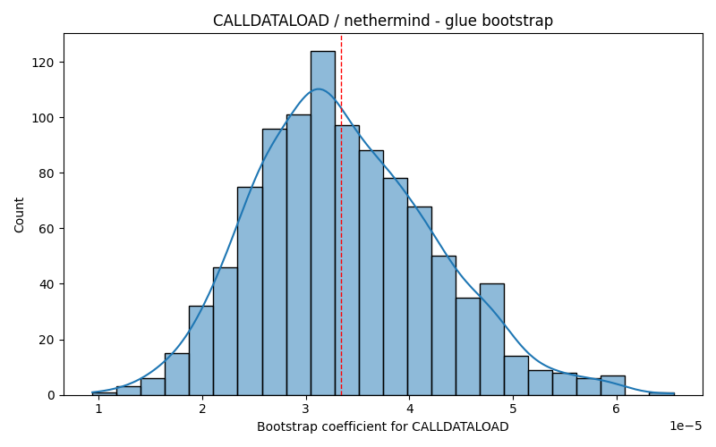

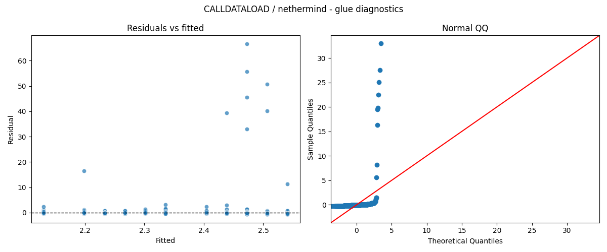

</details>

<details><summary><code>DIV</code> · nobs=1045 · runtime_ms=0 · p=1.00e+00 · R²=0</summary>

```
==============================================================================
                           NNLS Regression Results                            
==============================================================================
Dep. Variable:          test_runtime_ms              R-squared:          0.000
Model:                  NNLS                    Adj. R-squared:         -0.001
No. Observations:       1045                              RMSE:          51.83
Df Residuals:           1043                               MAE:          47.08
Df Model:               1      
==============================================================================
                      coef     std err     P-value      [0.025      0.975]
------------------------------------------------------------------------------
         const    252.1848      1.6208       0.001    249.1800    255.5405
           DIV      0.0000      0.0000       1.000      0.0000      0.0000
==============================================================================
Notes: Non-negative least squares with bootstrap inference (1000 iterations)
==============================================================================
```

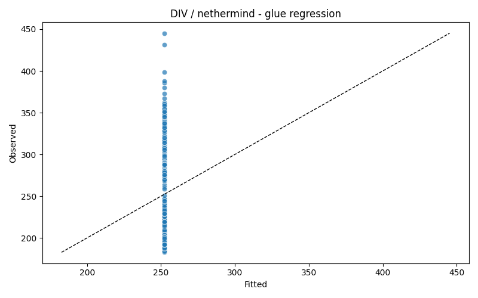


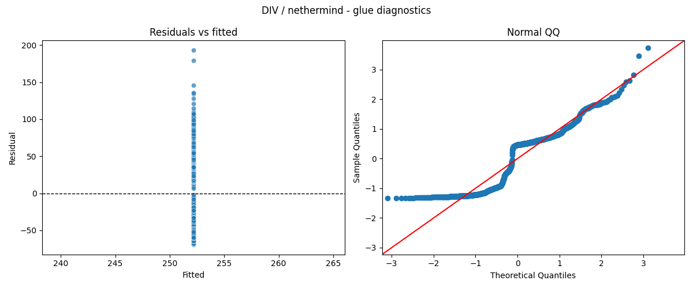

</details>

<details><summary><code>EXP</code> · nobs=1045 · runtime_ms=0 · p=1.00e+00 · R²=2.22e-16</summary>

```
==============================================================================
                           NNLS Regression Results                            
==============================================================================
Dep. Variable:          test_runtime_ms              R-squared:          0.000
Model:                  NNLS                    Adj. R-squared:         -0.001
No. Observations:       1045                              RMSE:          46.20
Df Residuals:           1043                               MAE:          28.24
Df Model:               1      
==============================================================================
                      coef     std err     P-value      [0.025      0.975]
------------------------------------------------------------------------------
         const     88.4157      1.4065       0.001     85.6186     91.1865
           EXP      0.0000      0.0000       1.000      0.0000      0.0000
==============================================================================
Notes: Non-negative least squares with bootstrap inference (1000 iterations)
==============================================================================
```

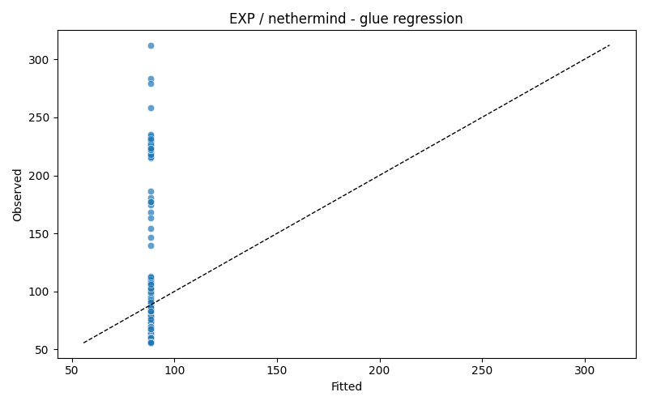


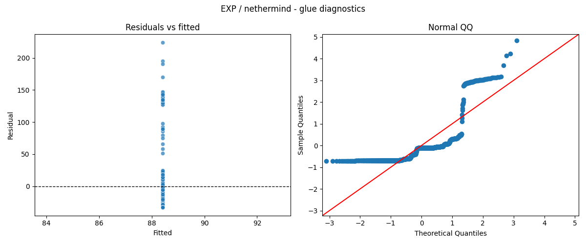

</details>

<details><summary><code>GT</code> · nobs=760 · runtime_ms=0 · p=1.00e+00 · R²=-2.22e-16</summary>

```
==============================================================================
                           NNLS Regression Results                            
==============================================================================
Dep. Variable:          test_runtime_ms              R-squared:         -0.000
Model:                  NNLS                    Adj. R-squared:         -0.001
No. Observations:       760                               RMSE:          22.36
Df Residuals:           758                                MAE:          17.90
Df Model:               1      
==============================================================================
                      coef     std err     P-value      [0.025      0.975]
------------------------------------------------------------------------------
         const     64.1965      0.8173       0.001     62.6271     65.7822
            GT      0.0000      0.0000       1.000      0.0000      0.0000
==============================================================================
Notes: Non-negative least squares with bootstrap inference (1000 iterations)
==============================================================================
```

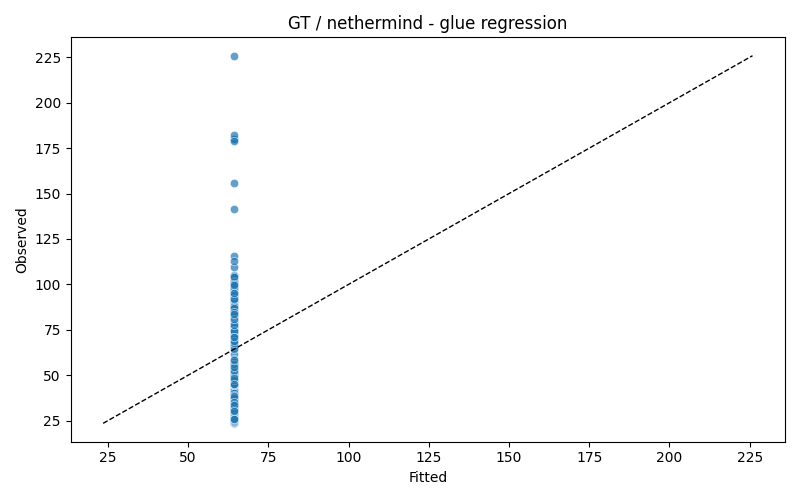


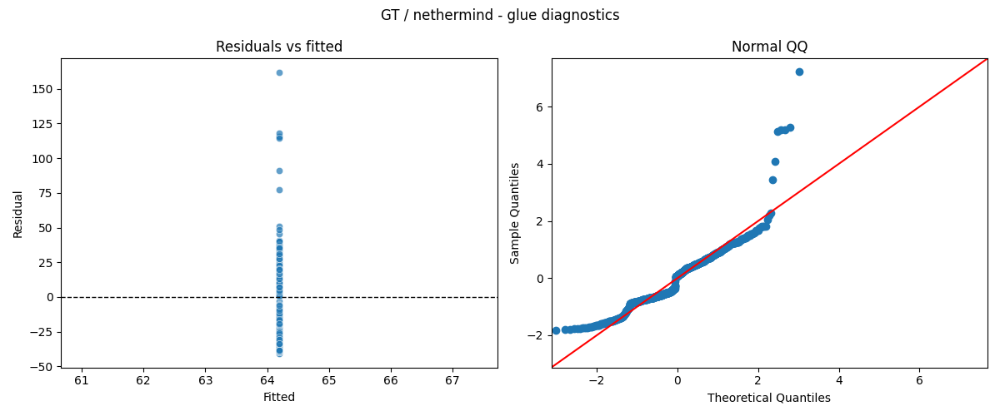

</details>

<details><summary><code>JUMPI</code> · nobs=1045 · runtime_ms=0 · p=1.00e+00 · R²=0</summary>

```
==============================================================================
                           NNLS Regression Results                            
==============================================================================
Dep. Variable:          test_runtime_ms              R-squared:          0.000
Model:                  NNLS                    Adj. R-squared:         -0.001
No. Observations:       1045                              RMSE:           9.77
Df Residuals:           1043                               MAE:           7.49
Df Model:               1      
==============================================================================
                      coef     std err     P-value      [0.025      0.975]
------------------------------------------------------------------------------
         const     32.9438      0.3021       0.001     32.3649     33.5549
         JUMPI      0.0000      0.0000       1.000      0.0000      0.0000
==============================================================================
Notes: Non-negative least squares with bootstrap inference (1000 iterations)
==============================================================================
```

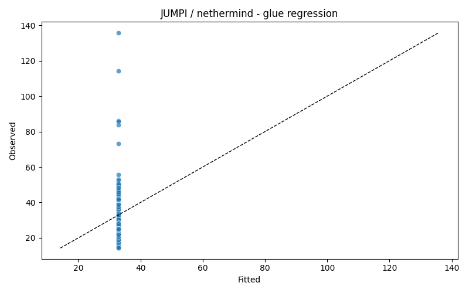


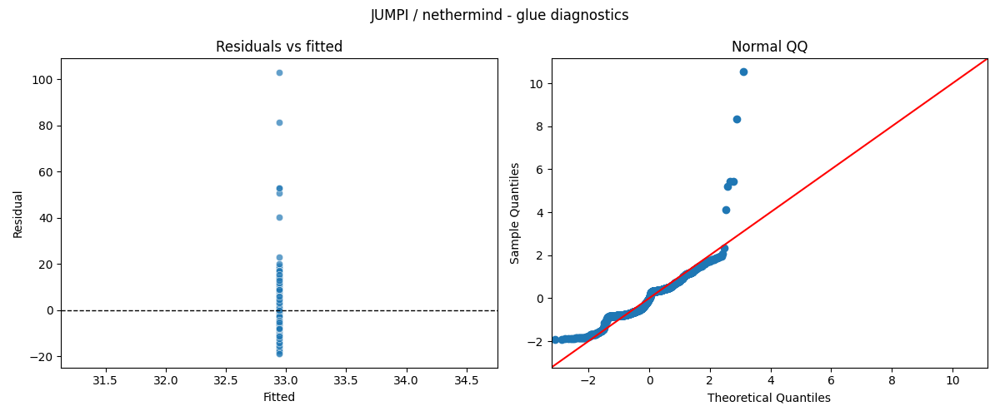

</details>

<details><summary><code>LT</code> · nobs=760 · runtime_ms=0 · p=1.00e+00 · R²=0</summary>

```
==============================================================================
                           NNLS Regression Results                            
==============================================================================
Dep. Variable:          test_runtime_ms              R-squared:          0.000
Model:                  NNLS                    Adj. R-squared:         -0.001
No. Observations:       760                               RMSE:          21.83
Df Residuals:           758                                MAE:          17.19
Df Model:               1      
==============================================================================
                      coef     std err     P-value      [0.025      0.975]
------------------------------------------------------------------------------
         const     66.3980      0.8010       0.001     64.8649     67.9763
            LT      0.0000      0.0000       1.000      0.0000      0.0000
==============================================================================
Notes: Non-negative least squares with bootstrap inference (1000 iterations)
==============================================================================
```

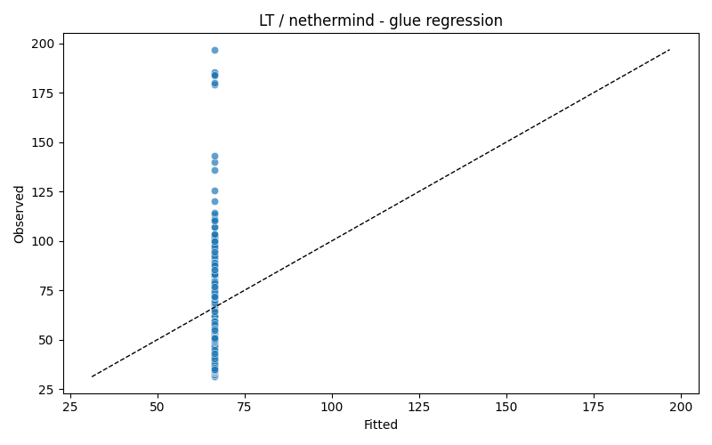


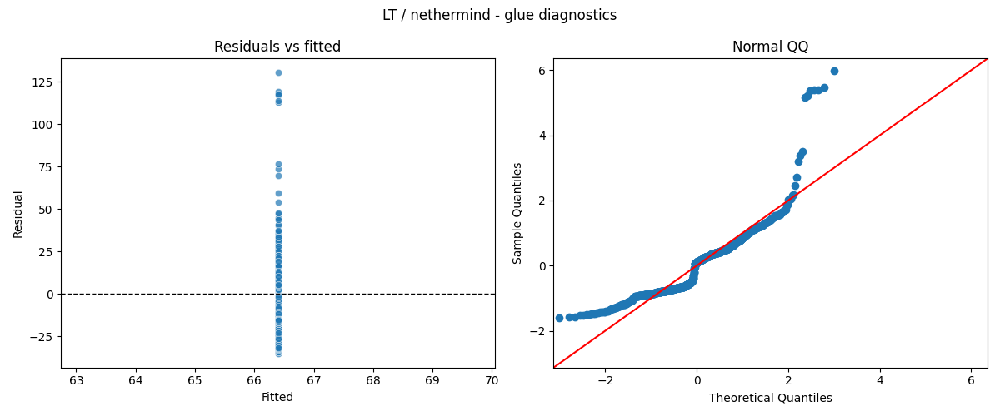

</details>

<details><summary><code>MSTORE</code> · nobs=4275 · runtime_ms=0 · p=1.00e+00 · R²=-2.22e-16</summary>

```
==============================================================================
                           NNLS Regression Results                            
==============================================================================
Dep. Variable:          test_runtime_ms              R-squared:         -0.000
Model:                  NNLS                    Adj. R-squared:         -0.000
No. Observations:       4275                              RMSE:          21.15
Df Residuals:           4273                               MAE:          16.12
Df Model:               1      
==============================================================================
                      coef     std err     P-value      [0.025      0.975]
------------------------------------------------------------------------------
         const     63.1922      0.3149       0.001     62.6014     63.8424
        MSTORE      0.0000      0.0000       1.000      0.0000      0.0000
==============================================================================
Notes: Non-negative least squares with bootstrap inference (1000 iterations)
==============================================================================
```

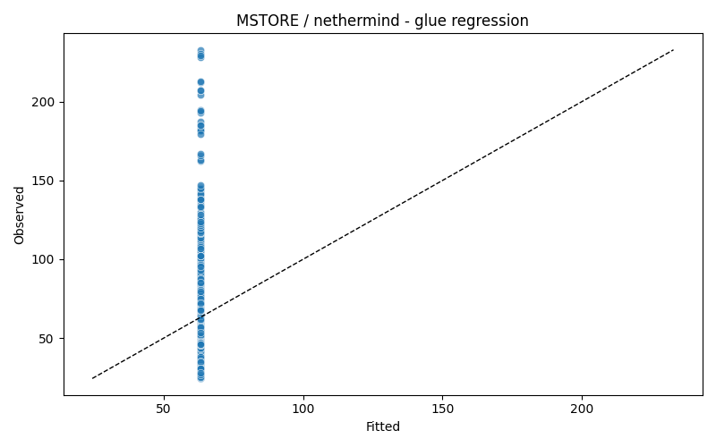


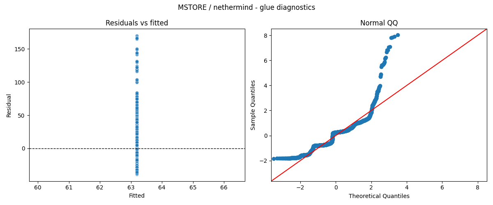

</details>

<details><summary><code>MSTORE8</code> · nobs=4275 · runtime_ms=0 · p=1.00e+00 · R²=0</summary>

```
==============================================================================
                           NNLS Regression Results                            
==============================================================================
Dep. Variable:          test_runtime_ms              R-squared:          0.000
Model:                  NNLS                    Adj. R-squared:         -0.000
No. Observations:       4275                              RMSE:          20.41
Df Residuals:           4273                               MAE:          15.84
Df Model:               1      
==============================================================================
                      coef     std err     P-value      [0.025      0.975]
------------------------------------------------------------------------------
         const     62.4884      0.3221       0.001     61.8264     63.1169
       MSTORE8      0.0000      0.0000       1.000      0.0000      0.0000
==============================================================================
Notes: Non-negative least squares with bootstrap inference (1000 iterations)
==============================================================================
```

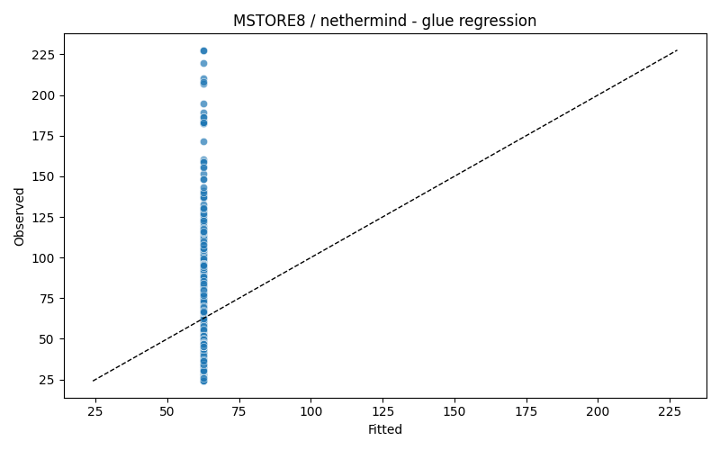


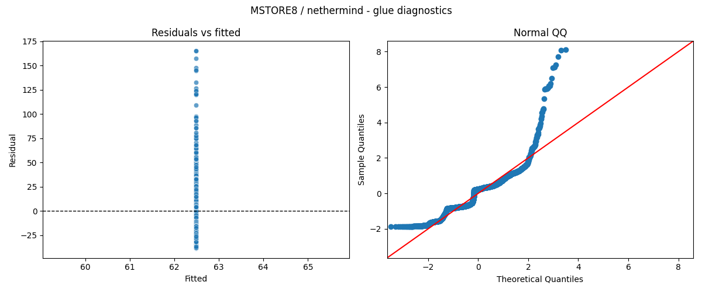

</details>

<details><summary><code>MUL</code> · nobs=950 · runtime_ms=0 · p=1.00e+00 · R²=3.331e-16</summary>

```
==============================================================================
                           NNLS Regression Results                            
==============================================================================
Dep. Variable:          test_runtime_ms              R-squared:          0.000
Model:                  NNLS                    Adj. R-squared:         -0.001
No. Observations:       950                               RMSE:          37.30
Df Residuals:           948                                MAE:          32.53
Df Model:               1      
==============================================================================
                      coef     std err     P-value      [0.025      0.975]
------------------------------------------------------------------------------
         const    130.0799      1.1831       0.001    127.9231    132.4584
           MUL      0.0000      0.0000       1.000      0.0000      0.0000
==============================================================================
Notes: Non-negative least squares with bootstrap inference (1000 iterations)
==============================================================================
```


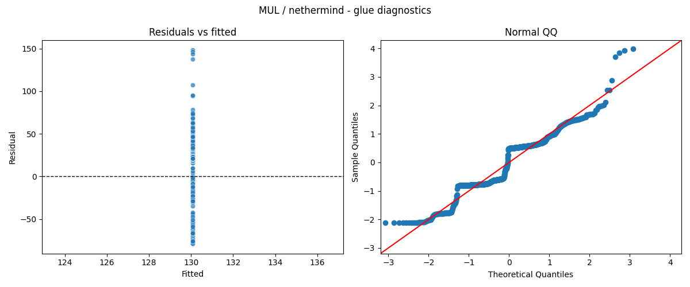

</details>

<details><summary><code>PC</code> · nobs=570 · runtime_ms=6.508e-06 · p=1.00e-03 · R²=0.4149</summary>

```
==============================================================================
                           NNLS Regression Results                            
==============================================================================
Dep. Variable:          test_runtime_ms              R-squared:          0.415
Model:                  NNLS                    Adj. R-squared:          0.414
No. Observations:       570                               RMSE:          17.18
Df Residuals:           568                                MAE:          15.25
Df Model:               1      
==============================================================================
                      coef     std err     P-value      [0.025      0.975]
------------------------------------------------------------------------------
         const     77.5433      1.3616       0.001     74.9936     80.2498
            PC      0.0000      0.0000       0.001      0.0000      0.0000
==============================================================================
Notes: Non-negative least squares with bootstrap inference (1000 iterations)
==============================================================================
```

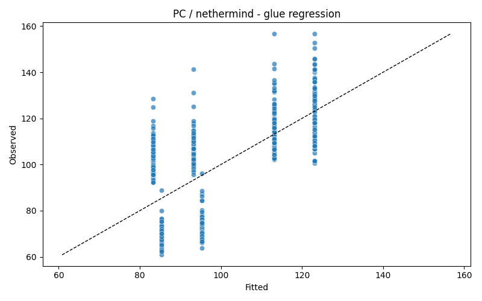

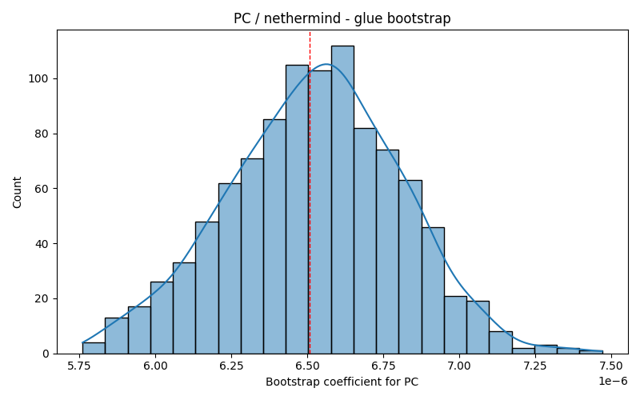

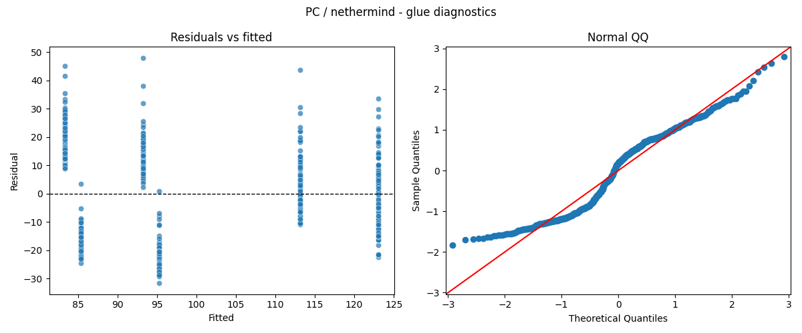

</details>

<details><summary><code>RETURNDATASIZE</code> · nobs=2280 · runtime_ms=6.476e-06 · p=1.00e-03 · R²=0.2039</summary>

```
==============================================================================
                           NNLS Regression Results                            
==============================================================================
Dep. Variable:          test_runtime_ms              R-squared:          0.204
Model:                  NNLS                    Adj. R-squared:          0.204
No. Observations:       2280                              RMSE:          15.02
Df Residuals:           2278                               MAE:           9.71
Df Model:               1      
==============================================================================
                      coef     std err     P-value      [0.025      0.975]
------------------------------------------------------------------------------
         const     47.0007      0.6211       0.001     45.7903     48.1718
RETURNDATASIZE      0.0000      0.0000       0.001      0.0000      0.0000
==============================================================================
Notes: Non-negative least squares with bootstrap inference (1000 iterations)
==============================================================================
```

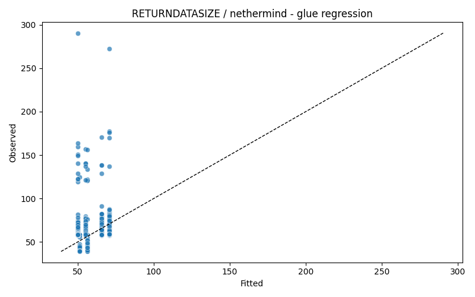

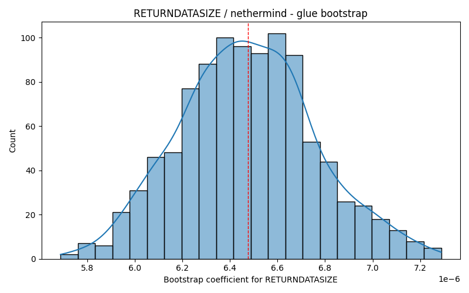

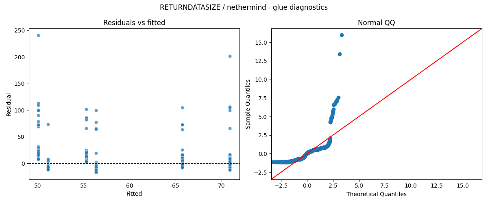

</details>

<details><summary><code>SELFBALANCE</code> · nobs=1045 · runtime_ms=0 · p=1.00e+00 · R²=0</summary>

```
==============================================================================
                           NNLS Regression Results                            
==============================================================================
Dep. Variable:          test_runtime_ms              R-squared:          0.000
Model:                  NNLS                    Adj. R-squared:         -0.001
No. Observations:       1045                              RMSE:          41.84
Df Residuals:           1043                               MAE:          37.32
Df Model:               1      
==============================================================================
                      coef     std err     P-value      [0.025      0.975]
------------------------------------------------------------------------------
         const    190.6107      1.3641       0.001    187.9534    193.3906
   SELFBALANCE      0.0000      0.0000       1.000      0.0000      0.0000
==============================================================================
Notes: Non-negative least squares with bootstrap inference (1000 iterations)
==============================================================================
```

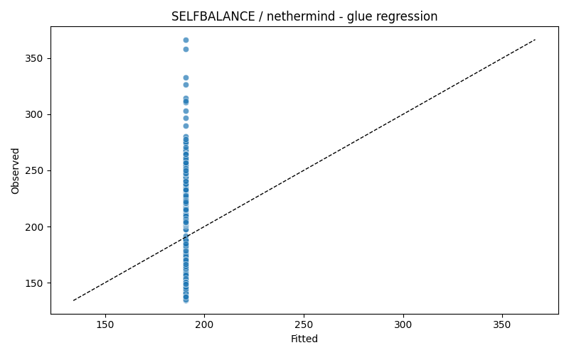

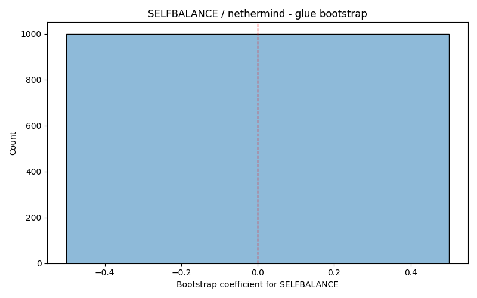

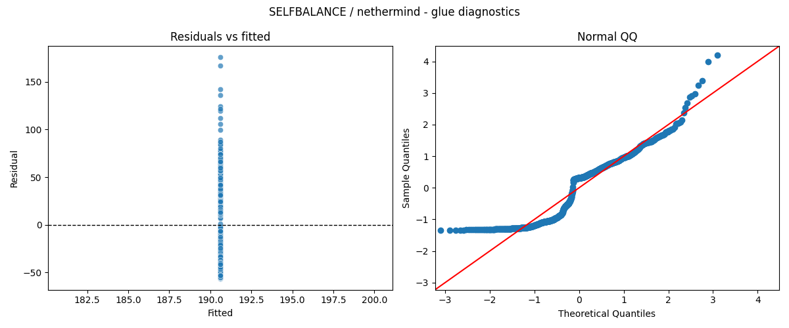

</details>

<details><summary><code>SUB</code> · nobs=760 · runtime_ms=0 · p=1.00e+00 · R²=0</summary>

```
==============================================================================
                           NNLS Regression Results                            
==============================================================================
Dep. Variable:          test_runtime_ms              R-squared:          0.000
Model:                  NNLS                    Adj. R-squared:         -0.001
No. Observations:       760                               RMSE:          28.74
Df Residuals:           758                                MAE:          23.87
Df Model:               1      
==============================================================================
                      coef     std err     P-value      [0.025      0.975]
------------------------------------------------------------------------------
         const     87.1763      1.0642       0.001     85.0812     89.3042
           SUB      0.0000      0.0000       1.000      0.0000      0.0000
==============================================================================
Notes: Non-negative least squares with bootstrap inference (1000 iterations)
==============================================================================
```

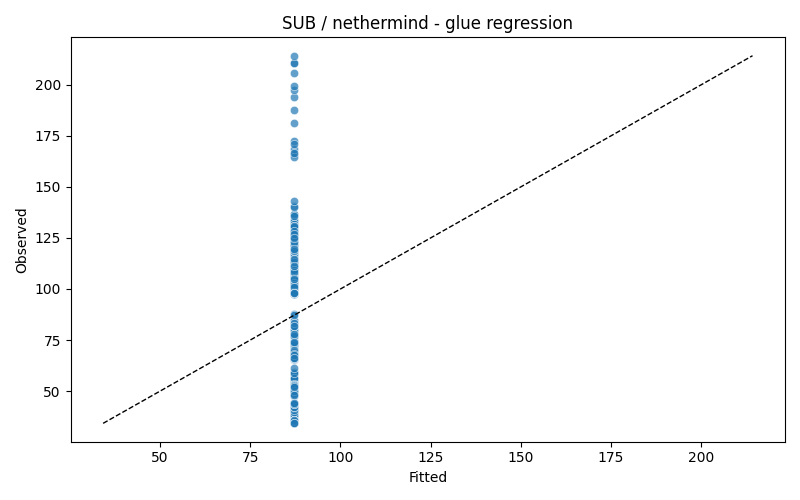


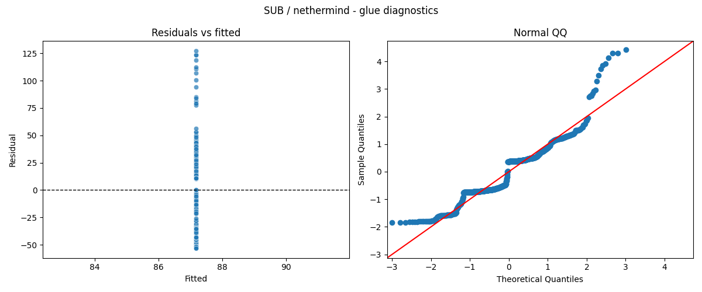

</details>

### Mixed glue (tier B) · nethermind

<details><summary><code>JUMP</code> · nobs=950 · runtime_ms=0 · p=1.00e+00 · R²=0</summary>

```
==============================================================================
                           NNLS Regression Results                            
==============================================================================
Dep. Variable:          test_runtime_ms              R-squared:          0.000
Model:                  NNLS                    Adj. R-squared:         -0.001
No. Observations:       950                               RMSE:          19.19
Df Residuals:           948                                MAE:          16.96
Df Model:               1      
==============================================================================
                      coef     std err     P-value      [0.025      0.975]
------------------------------------------------------------------------------
         const     68.9674      0.6272       0.001     67.7760     70.2124
          JUMP      0.0000      0.0000       1.000      0.0000      0.0000
==============================================================================
Notes: Non-negative least squares with bootstrap inference (1000 iterations)
==============================================================================
```

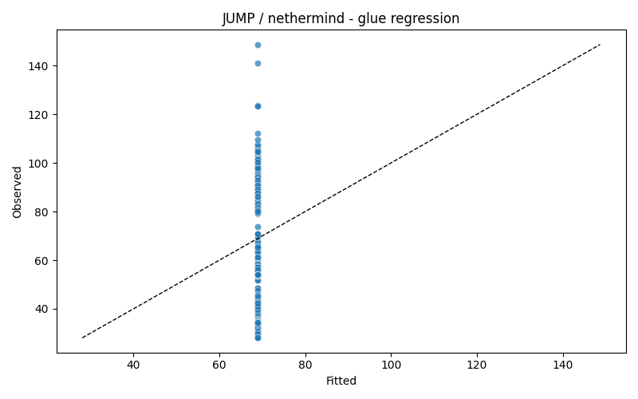


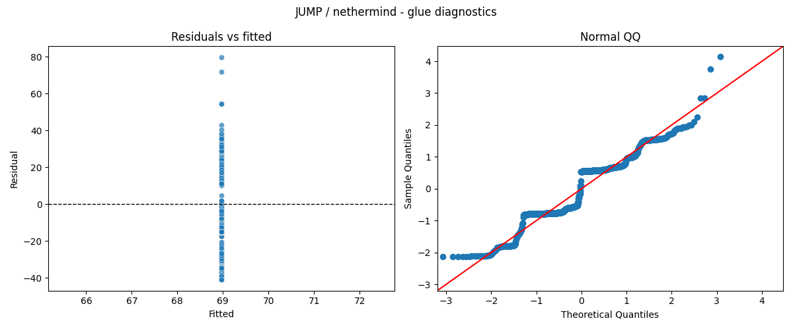

</details>

<details><summary><code>KECCAK256</code> · nobs=0 · runtime_ms=n/a · p=n/a · R²=n/a</summary>

</details>

## reth

| glue_opcode | nobs | glue_runtime_ms | p_value | rsquared |
| --- | --- | --- | --- | --- |
| `ISZERO` | 248 | 0 | 1.00e+00 | 0 |
| `JUMPDEST` | 62 | 0 | 1.00e+00 | 3.331e-16 |
| `SWAP` | 4433 | 0 | 1.00e+00 | 0 |
| `CALLDATASIZE` | 15606 | 6.388e-06 | 1.00e-03 | 0.2808 |
| `DUP` | 15606 | 0 | 1.00e+00 | 0.2808 |
| `GAS` | 15606 | 4.969e-06 | 1.00e-03 | 0.2808 |
| `MLOAD` | 15606 | 1.231e-05 | 1.00e-03 | 0.2808 |
| `PUSH` | 15606 | 0 | 1.00e+00 | 0.2808 |
| `PUSH0` | 15606 | 1.759e-06 | 1.00e-03 | 0.2808 |
| `STATICCALL` | 15606 | 2.288e-05 | 1.00e-03 | 0.2808 |
| `ADD` | 279 | 0 | 1.00e+00 | 2.22e-16 |
| `AND` | 248 | 0 | 1.00e+00 | -2.22e-16 |
| `CALLDATACOPY` | 7285 | 0 | 1.00e+00 | 0 |
| `CALLDATALOAD` | 1364 | 2.059e-05 | 9.00e-03 | 0.004347 |
| `DIV` | 341 | 0 | 1.00e+00 | -2.22e-16 |
| `EXP` | 341 | 0.0004906 | 1.00e-03 | 0.8466 |
| `GT` | 248 | 0 | 1.00e+00 | 2.22e-16 |
| `JUMPI` | 341 | 0 | 1.00e+00 | 0 |
| `LT` | 248 | 0 | 1.00e+00 | 0 |
| `MSTORE` | 1395 | 0 | 1.00e+00 | 0 |
| `MSTORE8` | 1395 | 0 | 1.00e+00 | 0 |
| `MUL` | 310 | 0 | 1.00e+00 | 0 |
| `PC` | 186 | 6.179e-06 | 1.00e-03 | 0.4883 |
| `RETURNDATASIZE` | 744 | 7.373e-06 | 1.00e-03 | 0.4116 |
| `SELFBALANCE` | 341 | 0 | 1.00e+00 | 0 |
| `SUB` | 248 | 0 | 1.00e+00 | 1.11e-16 |
| `JUMP` | 310 | 0 | 1.00e+00 | 2.22e-16 |
| `KECCAK256` | 0 | n/a | n/a | n/a |

### Cycle glue — joint fit · reth

<details><summary>Joint NNLS regression summary</summary>

```
==============================================================================
                           NNLS Regression Results                            
==============================================================================
Dep. Variable:          test_runtime_ms              R-squared:          0.281
Model:                  NNLS                    Adj. R-squared:          0.281
No. Observations:       15606                             RMSE:          13.62
Df Residuals:           15598                              MAE:          11.16
Df Model:               7      
==============================================================================
                      coef     std err     P-value      [0.025      0.975]
------------------------------------------------------------------------------
         const     45.1382      0.1127       0.001     44.9255     45.3647
  CALLDATASIZE      0.0000      0.0000       0.001      0.0000      0.0000
           DUP      0.0000      0.0000       1.000      0.0000      0.0000
           GAS      0.0000      0.0000       0.001      0.0000      0.0000
         MLOAD      0.0000      0.0000       0.001      0.0000      0.0000
          PUSH      0.0000      0.0000       1.000      0.0000      0.0000
         PUSH0      0.0000      0.0000       0.001      0.0000      0.0000
    STATICCALL      0.0000      0.0000       0.001      0.0000      0.0000
==============================================================================
Notes: Non-negative least squares with bootstrap inference (1000 iterations)
==============================================================================
```

</details>

<details><summary><code>CALLDATASIZE</code> · nobs=15606 · runtime_ms=6.388e-06 · p=1.00e-03 · R²=0.2808</summary>

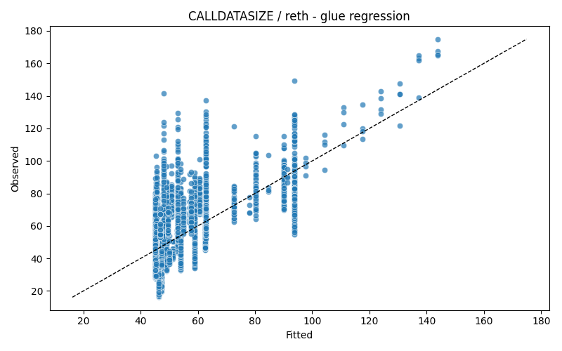

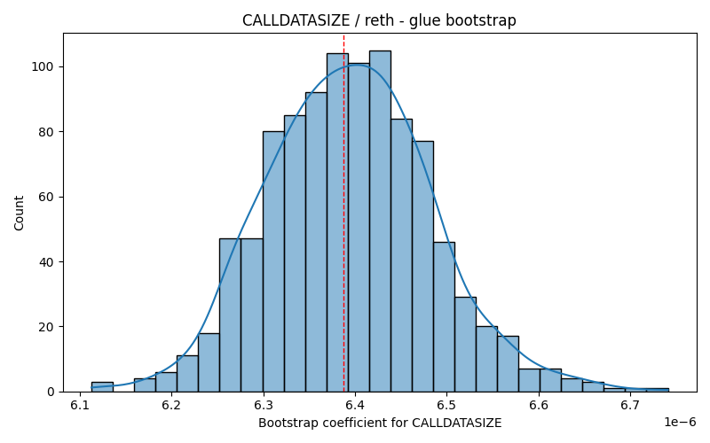

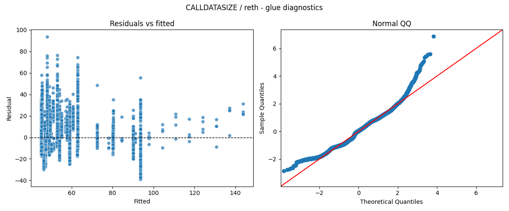

</details>

<details><summary><code>DUP</code> · nobs=15606 · runtime_ms=0 · p=1.00e+00 · R²=0.2808</summary>


</details>

<details><summary><code>GAS</code> · nobs=15606 · runtime_ms=4.969e-06 · p=1.00e-03 · R²=0.2808</summary>


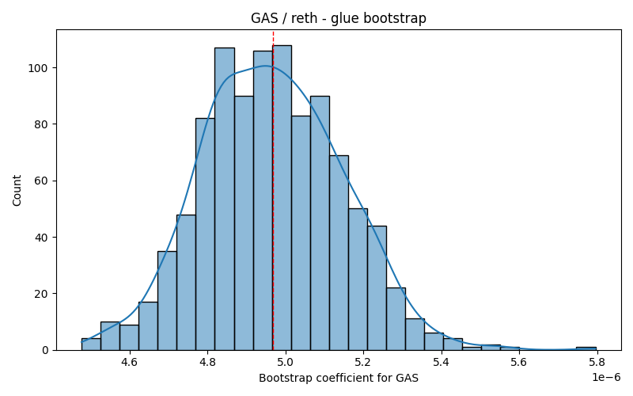


</details>

<details><summary><code>MLOAD</code> · nobs=15606 · runtime_ms=1.231e-05 · p=1.00e-03 · R²=0.2808</summary>


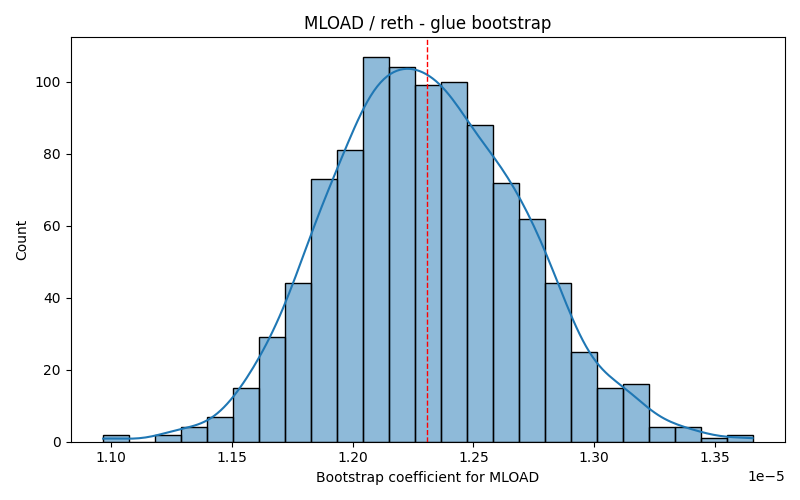

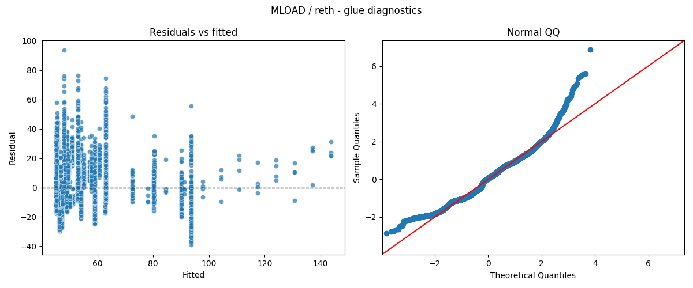

</details>

<details><summary><code>PUSH</code> · nobs=15606 · runtime_ms=0 · p=1.00e+00 · R²=0.2808</summary>


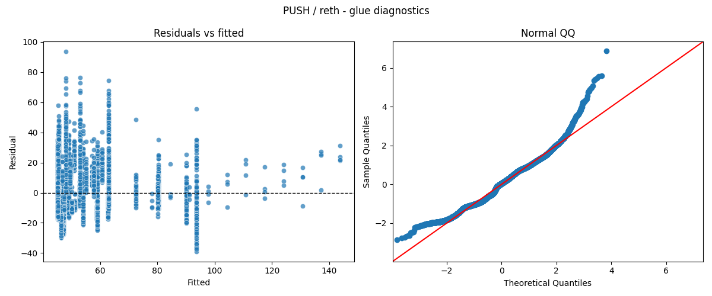

</details>

<details><summary><code>PUSH0</code> · nobs=15606 · runtime_ms=1.759e-06 · p=1.00e-03 · R²=0.2808</summary>

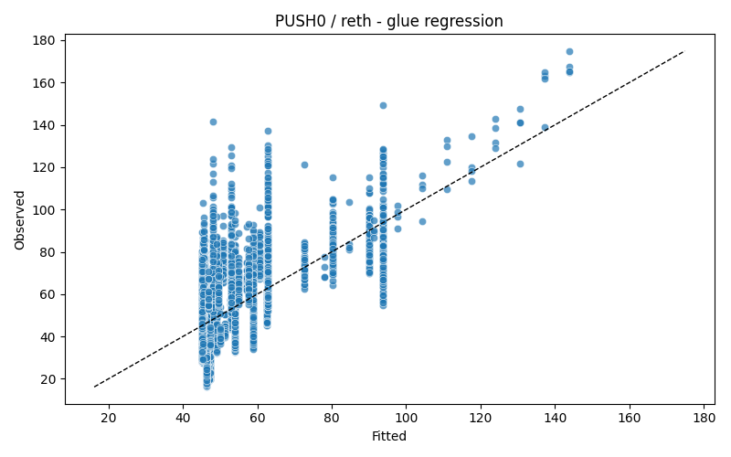

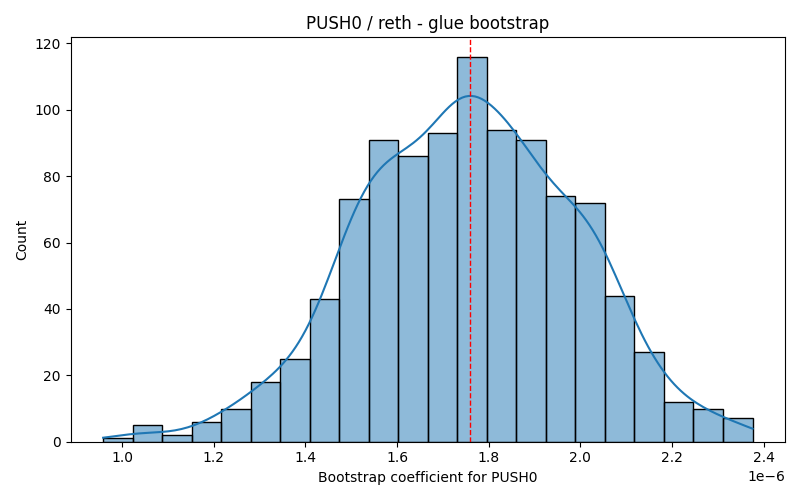


</details>

<details><summary><code>STATICCALL</code> · nobs=15606 · runtime_ms=2.288e-05 · p=1.00e-03 · R²=0.2808</summary>

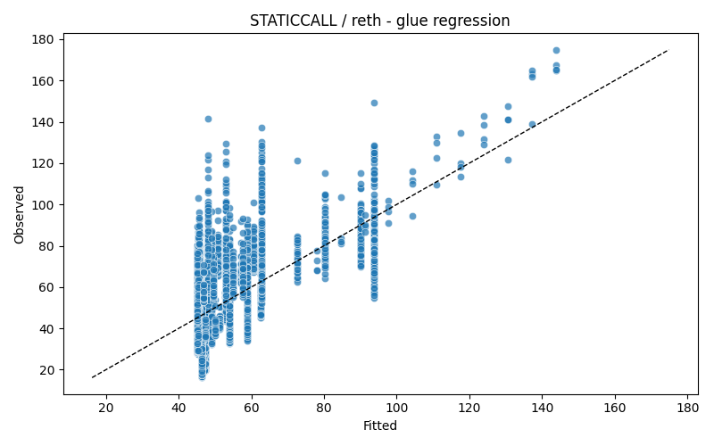

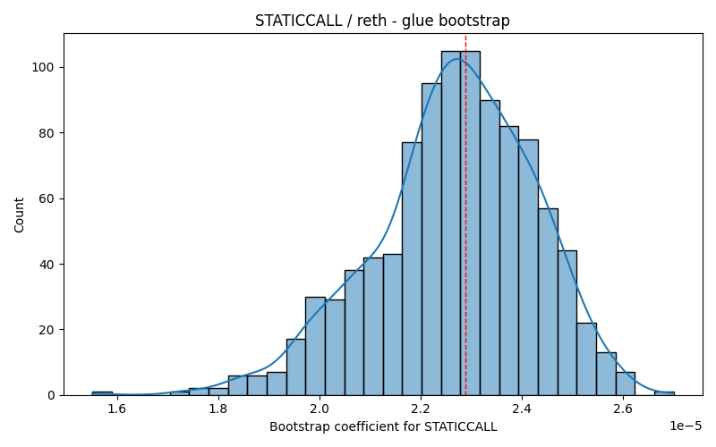

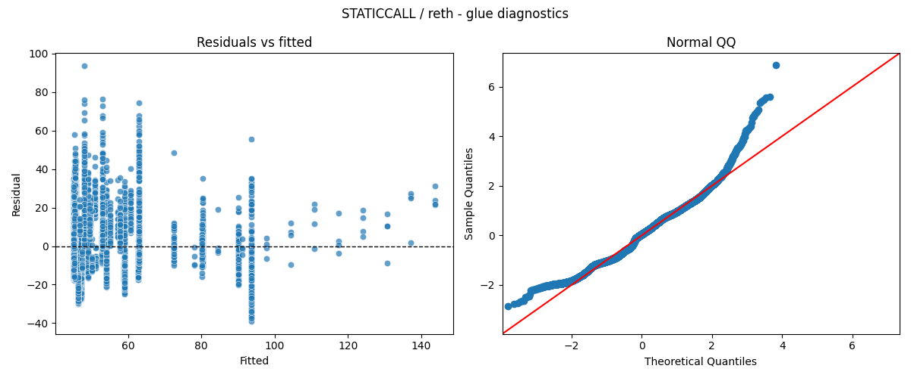

</details>

### Pure glue · reth

<details><summary><code>ISZERO</code> · nobs=248 · runtime_ms=0 · p=1.00e+00 · R²=0</summary>

```
==============================================================================
                           NNLS Regression Results                            
==============================================================================
Dep. Variable:          test_runtime_ms              R-squared:          0.000
Model:                  NNLS                    Adj. R-squared:         -0.004
No. Observations:       248                               RMSE:          33.15
Df Residuals:           246                                MAE:          30.33
Df Model:               1      
==============================================================================
                      coef     std err     P-value      [0.025      0.975]
------------------------------------------------------------------------------
         const    119.3646      2.0700       0.001    115.3386    123.3358
        ISZERO      0.0000      0.0000       1.000      0.0000      0.0000
==============================================================================
Notes: Non-negative least squares with bootstrap inference (1000 iterations)
==============================================================================
```

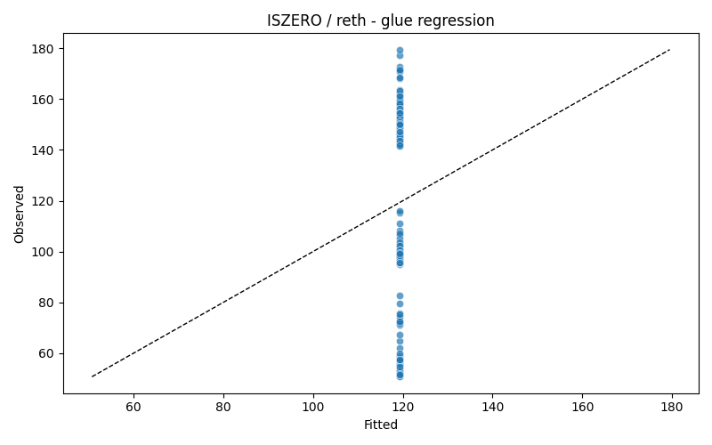


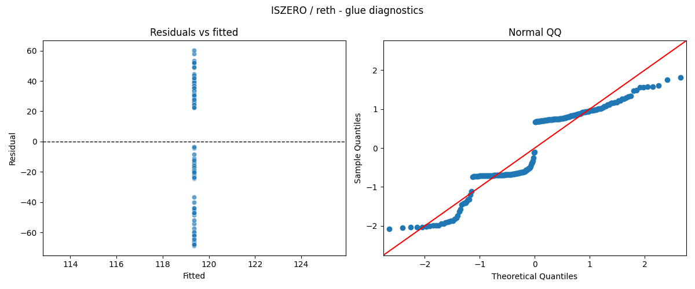

</details>

<details><summary><code>JUMPDEST</code> · nobs=62 · runtime_ms=0 · p=1.00e+00 · R²=3.331e-16</summary>

```
==============================================================================
                           NNLS Regression Results                            
==============================================================================
Dep. Variable:          test_runtime_ms              R-squared:          0.000
Model:                  NNLS                    Adj. R-squared:         -0.017
No. Observations:       62                                RMSE:          14.34
Df Residuals:           60                                 MAE:          13.50
Df Model:               1      
==============================================================================
                      coef     std err     P-value      [0.025      0.975]
------------------------------------------------------------------------------
         const     68.9444      1.8075       0.001     65.6047     72.7121
      JUMPDEST      0.0000      0.0000       1.000      0.0000      0.0000
==============================================================================
Notes: Non-negative least squares with bootstrap inference (1000 iterations)
==============================================================================
```

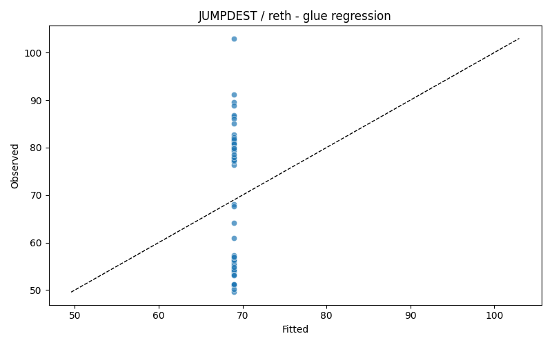

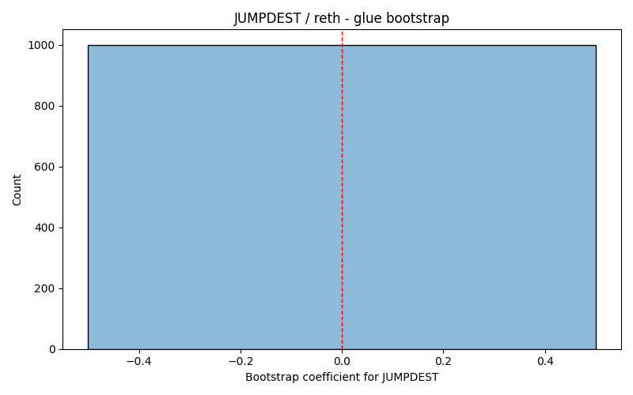

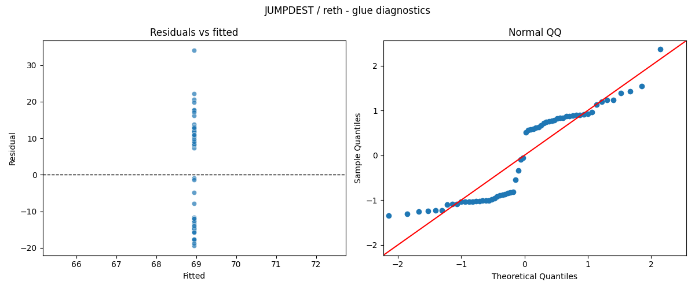

</details>

<details><summary><code>SWAP</code> · nobs=4433 · runtime_ms=0 · p=1.00e+00 · R²=0</summary>

```
==============================================================================
                           NNLS Regression Results                            
==============================================================================
Dep. Variable:          test_runtime_ms              R-squared:          0.000
Model:                  NNLS                    Adj. R-squared:         -0.000
No. Observations:       4433                              RMSE:          13.14
Df Residuals:           4431                               MAE:          10.82
Df Model:               1      
==============================================================================
                      coef     std err     P-value      [0.025      0.975]
------------------------------------------------------------------------------
         const     45.9841      0.2078       0.001     45.5704     46.3823
          SWAP      0.0000      0.0000       1.000      0.0000      0.0000
==============================================================================
Notes: Non-negative least squares with bootstrap inference (1000 iterations)
==============================================================================
```

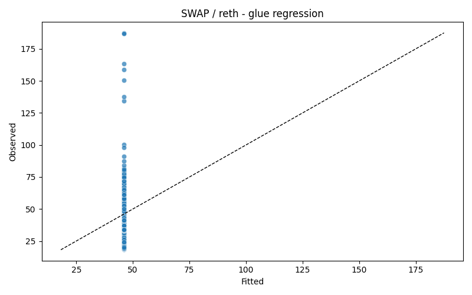


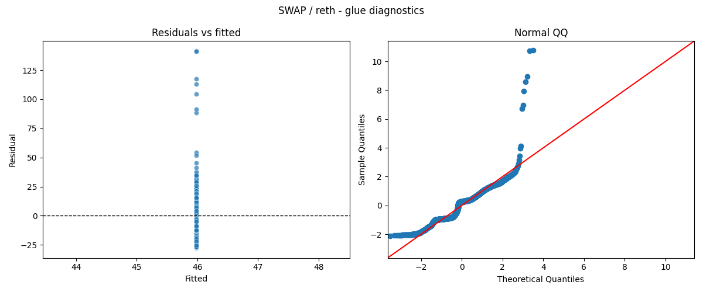

</details>

### Mixed glue (tier A) · reth

<details><summary><code>ADD</code> · nobs=279 · runtime_ms=0 · p=1.00e+00 · R²=2.22e-16</summary>

```
==============================================================================
                           NNLS Regression Results                            
==============================================================================
Dep. Variable:          test_runtime_ms              R-squared:          0.000
Model:                  NNLS                    Adj. R-squared:         -0.004
No. Observations:       279                               RMSE:          11.52
Df Residuals:           277                                MAE:          10.06
Df Model:               1      
==============================================================================
                      coef     std err     P-value      [0.025      0.975]
------------------------------------------------------------------------------
         const     41.7605      0.6949       0.001     40.4770     43.2335
           ADD      0.0000      0.0000       1.000      0.0000      0.0000
==============================================================================
Notes: Non-negative least squares with bootstrap inference (1000 iterations)
==============================================================================
```

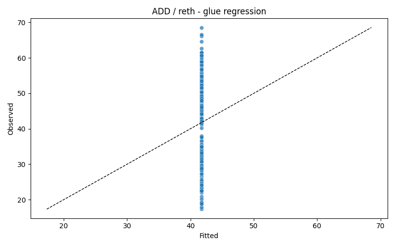


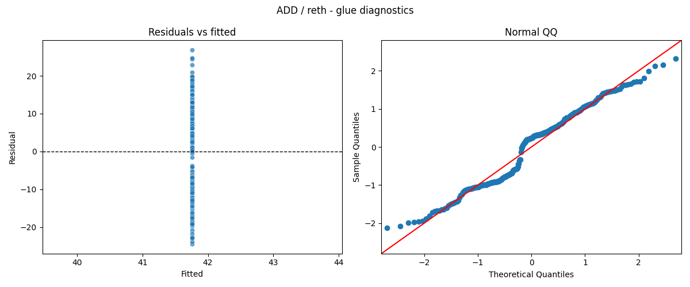

</details>

<details><summary><code>AND</code> · nobs=248 · runtime_ms=0 · p=1.00e+00 · R²=-2.22e-16</summary>

```
==============================================================================
                           NNLS Regression Results                            
==============================================================================
Dep. Variable:          test_runtime_ms              R-squared:         -0.000
Model:                  NNLS                    Adj. R-squared:         -0.004
No. Observations:       248                               RMSE:          10.98
Df Residuals:           246                                MAE:           9.59
Df Model:               1      
==============================================================================
                      coef     std err     P-value      [0.025      0.975]
------------------------------------------------------------------------------
         const     38.6374      0.7204       0.001     37.2978     40.0478
           AND      0.0000      0.0000       1.000      0.0000      0.0000
==============================================================================
Notes: Non-negative least squares with bootstrap inference (1000 iterations)
==============================================================================
```

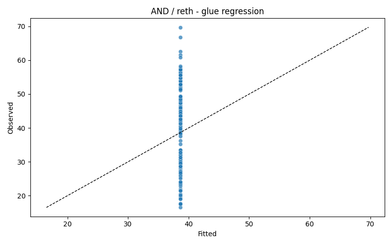


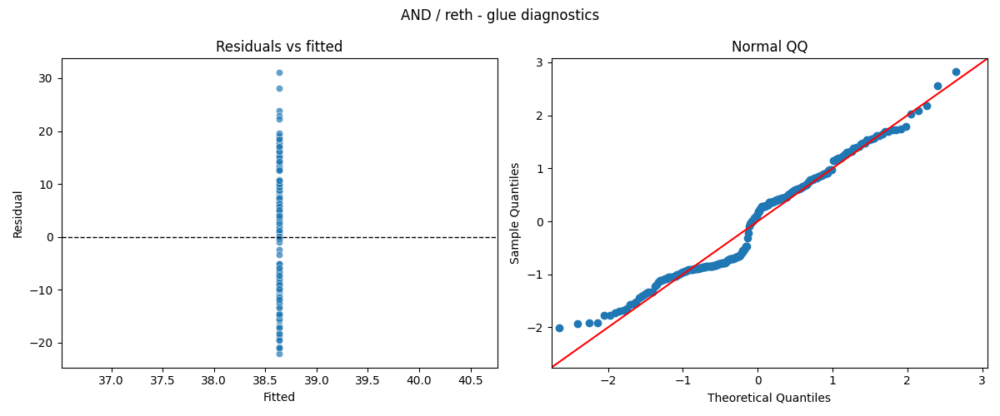

</details>

<details><summary><code>CALLDATACOPY</code> · nobs=7285 · runtime_ms=0 · p=1.00e+00 · R²=0</summary>

```
==============================================================================
                           NNLS Regression Results                            
==============================================================================
Dep. Variable:          test_runtime_ms              R-squared:          0.000
Model:                  NNLS                    Adj. R-squared:         -0.000
No. Observations:       7285                              RMSE:          20.19
Df Residuals:           7283                               MAE:          17.02
Df Model:               1      
==============================================================================
                      coef     std err     P-value      [0.025      0.975]
------------------------------------------------------------------------------
         const     36.0696      0.2399       0.001     35.5889     36.5332
  CALLDATACOPY      0.0000      0.0000       1.000      0.0000      0.0000
==============================================================================
Notes: Non-negative least squares with bootstrap inference (1000 iterations)
==============================================================================
```

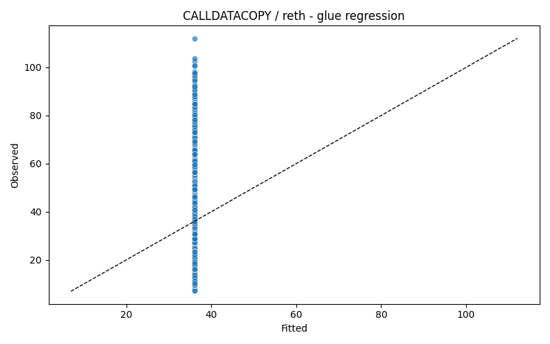


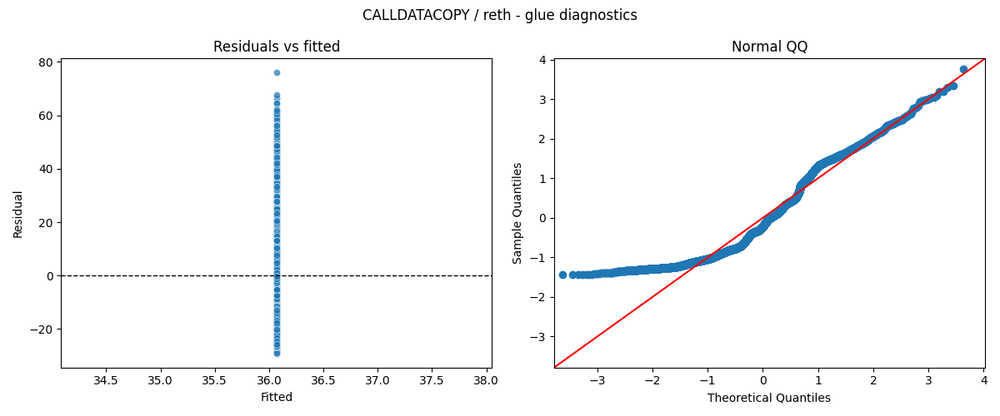

</details>

<details><summary><code>CALLDATALOAD</code> · nobs=1364 · runtime_ms=2.059e-05 · p=9.00e-03 · R²=0.004347</summary>

```
==============================================================================
                           NNLS Regression Results                            
==============================================================================
Dep. Variable:          test_runtime_ms              R-squared:          0.004
Model:                  NNLS                    Adj. R-squared:          0.004
No. Observations:       1364                              RMSE:           1.20
Df Residuals:           1362                               MAE:           0.69
Df Model:               1      
==============================================================================
                      coef     std err     P-value      [0.025      0.975]
------------------------------------------------------------------------------
         const      3.2142      0.1125       0.001      2.9990      3.4404
  CALLDATALOAD      0.0000      0.0000       0.009      0.0000      0.0000
==============================================================================
Notes: Non-negative least squares with bootstrap inference (1000 iterations)
==============================================================================
```

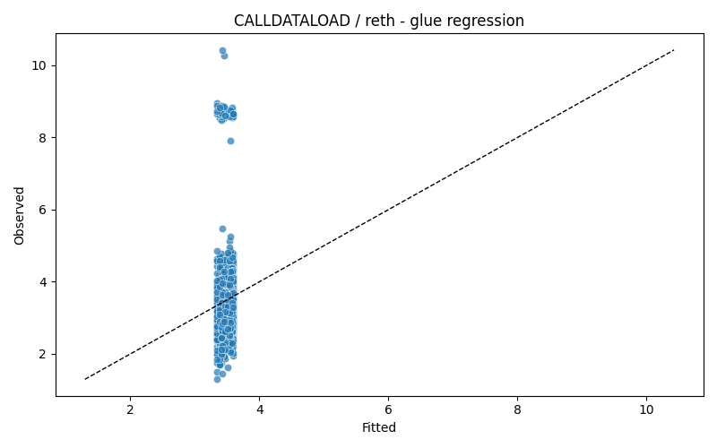

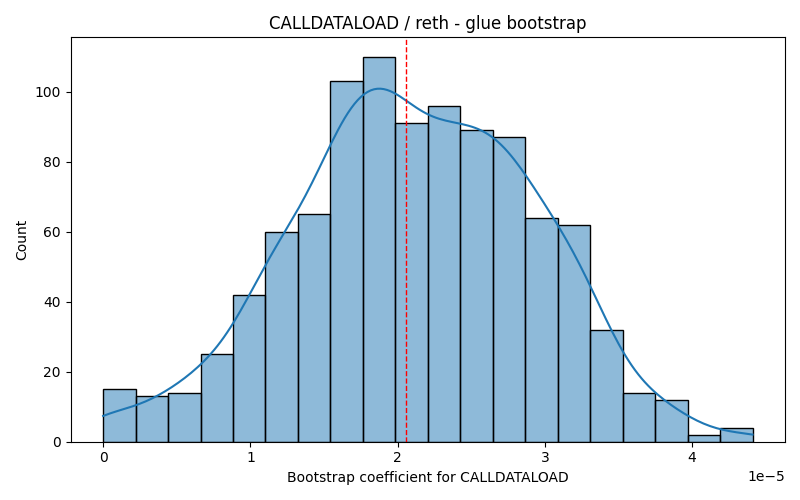

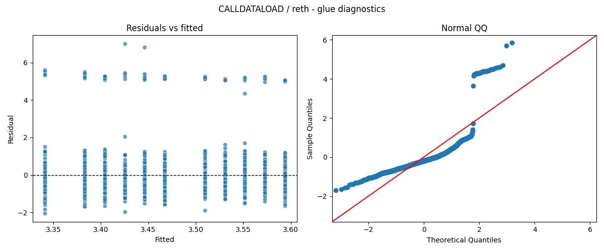

</details>

<details><summary><code>DIV</code> · nobs=341 · runtime_ms=0 · p=1.00e+00 · R²=-2.22e-16</summary>

```
==============================================================================
                           NNLS Regression Results                            
==============================================================================
Dep. Variable:          test_runtime_ms              R-squared:         -0.000
Model:                  NNLS                    Adj. R-squared:         -0.003
No. Observations:       341                               RMSE:          59.79
Df Residuals:           339                                MAE:          54.14
Df Model:               1      
==============================================================================
                      coef     std err     P-value      [0.025      0.975]
------------------------------------------------------------------------------
         const    232.9874      3.2376       0.001    226.9106    239.4154
           DIV      0.0000      0.0000       1.000      0.0000      0.0000
==============================================================================
Notes: Non-negative least squares with bootstrap inference (1000 iterations)
==============================================================================
```

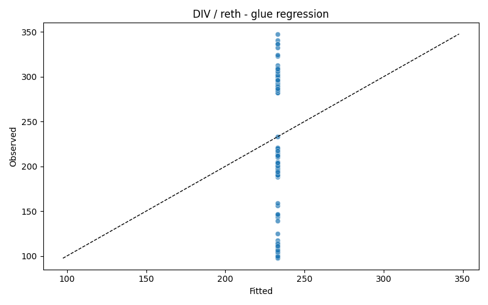


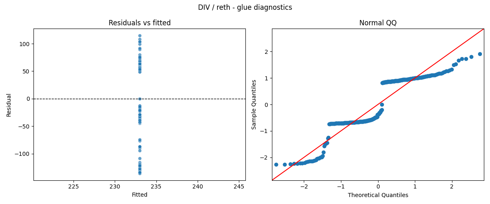

</details>

<details><summary><code>EXP</code> · nobs=341 · runtime_ms=0.0004906 · p=1.00e-03 · R²=0.8466</summary>

```
==============================================================================
                           NNLS Regression Results                            
==============================================================================
Dep. Variable:          test_runtime_ms              R-squared:          0.847
Model:                  NNLS                    Adj. R-squared:          0.846
No. Observations:       341                               RMSE:           8.18
Df Residuals:           339                                MAE:           6.50
Df Model:               1      
==============================================================================
                      coef     std err     P-value      [0.025      0.975]
------------------------------------------------------------------------------
         const     21.6012      1.6187       0.001     18.3999     24.7607
           EXP      0.0005      0.0000       0.001      0.0005      0.0005
==============================================================================
Notes: Non-negative least squares with bootstrap inference (1000 iterations)
==============================================================================
```

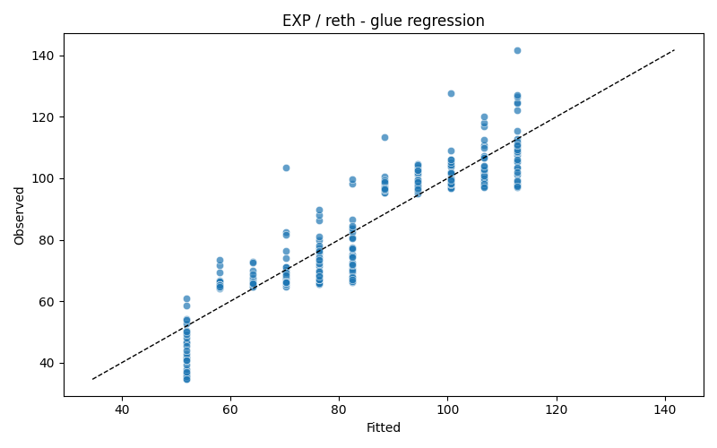

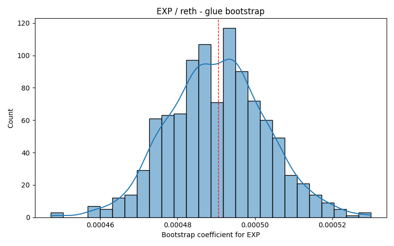

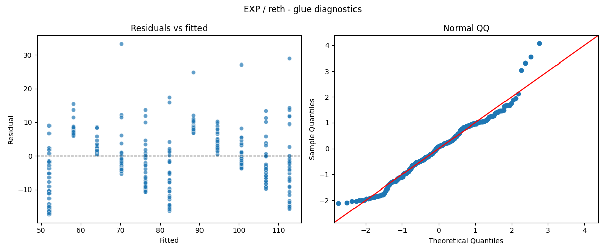

</details>

<details><summary><code>GT</code> · nobs=248 · runtime_ms=0 · p=1.00e+00 · R²=2.22e-16</summary>

```
==============================================================================
                           NNLS Regression Results                            
==============================================================================
Dep. Variable:          test_runtime_ms              R-squared:          0.000
Model:                  NNLS                    Adj. R-squared:         -0.004
No. Observations:       248                               RMSE:          12.95
Df Residuals:           246                                MAE:          11.03
Df Model:               1      
==============================================================================
                      coef     std err     P-value      [0.025      0.975]
------------------------------------------------------------------------------
         const     44.0014      0.8055       0.001     42.4207     45.5491
            GT      0.0000      0.0000       1.000      0.0000      0.0000
==============================================================================
Notes: Non-negative least squares with bootstrap inference (1000 iterations)
==============================================================================
```

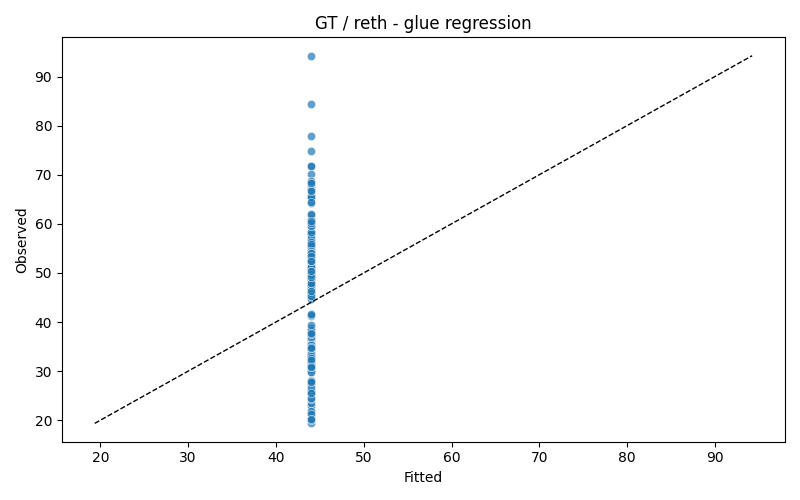


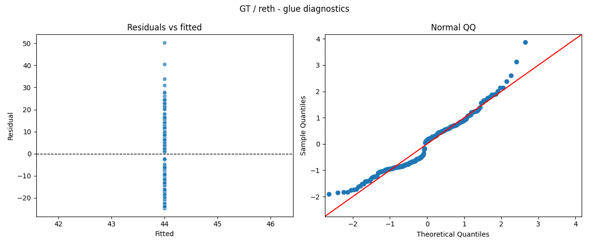

</details>

<details><summary><code>JUMPI</code> · nobs=341 · runtime_ms=0 · p=1.00e+00 · R²=0</summary>

```
==============================================================================
                           NNLS Regression Results                            
==============================================================================
Dep. Variable:          test_runtime_ms              R-squared:          0.000
Model:                  NNLS                    Adj. R-squared:         -0.003
No. Observations:       341                               RMSE:           8.27
Df Residuals:           339                                MAE:           6.33
Df Model:               1      
==============================================================================
                      coef     std err     P-value      [0.025      0.975]
------------------------------------------------------------------------------
         const     27.0969      0.4440       0.001     26.2325     27.9454
         JUMPI      0.0000      0.0000       1.000      0.0000      0.0000
==============================================================================
Notes: Non-negative least squares with bootstrap inference (1000 iterations)
==============================================================================
```

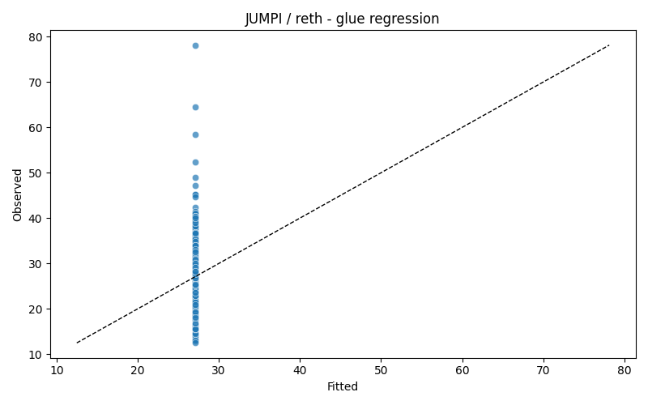


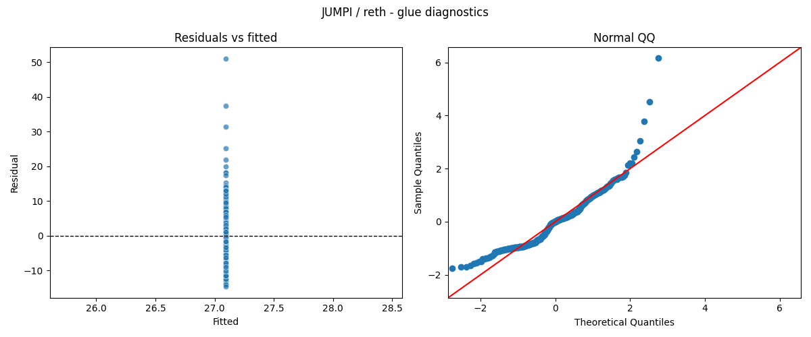

</details>

<details><summary><code>LT</code> · nobs=248 · runtime_ms=0 · p=1.00e+00 · R²=0</summary>

```
==============================================================================
                           NNLS Regression Results                            
==============================================================================
Dep. Variable:          test_runtime_ms              R-squared:          0.000
Model:                  NNLS                    Adj. R-squared:         -0.004
No. Observations:       248                               RMSE:          11.89
Df Residuals:           246                                MAE:          10.42
Df Model:               1      
==============================================================================
                      coef     std err     P-value      [0.025      0.975]
------------------------------------------------------------------------------
         const     42.0331      0.7350       0.001     40.4448     43.3764
            LT      0.0000      0.0000       1.000      0.0000      0.0000
==============================================================================
Notes: Non-negative least squares with bootstrap inference (1000 iterations)
==============================================================================
```

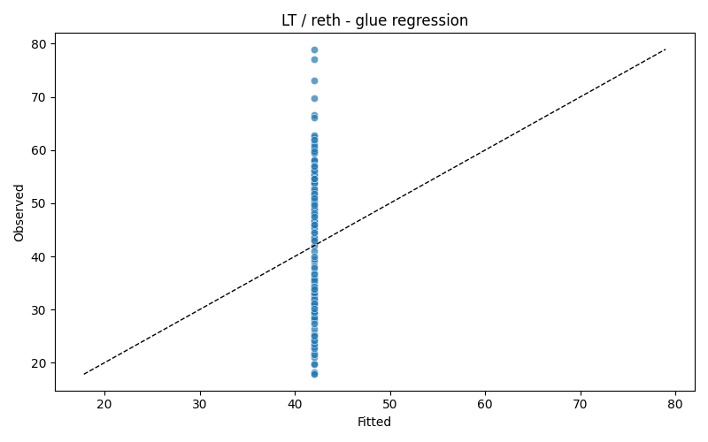


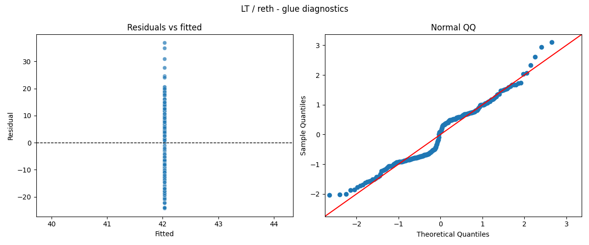

</details>

<details><summary><code>MSTORE</code> · nobs=1395 · runtime_ms=0 · p=1.00e+00 · R²=0</summary>

```
==============================================================================
                           NNLS Regression Results                            
==============================================================================
Dep. Variable:          test_runtime_ms              R-squared:          0.000
Model:                  NNLS                    Adj. R-squared:         -0.001
No. Observations:       1395                              RMSE:          34.43
Df Residuals:           1393                               MAE:          29.50
Df Model:               1      
==============================================================================
                      coef     std err     P-value      [0.025      0.975]
------------------------------------------------------------------------------
         const     77.2953      0.9171       0.001     75.6154     79.0555
        MSTORE      0.0000      0.0000       1.000      0.0000      0.0000
==============================================================================
Notes: Non-negative least squares with bootstrap inference (1000 iterations)
==============================================================================
```

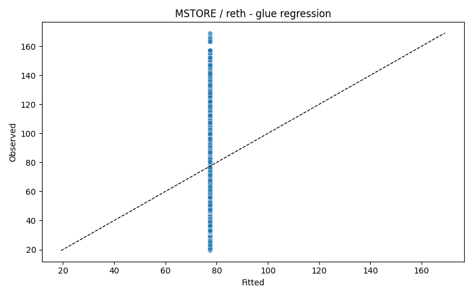


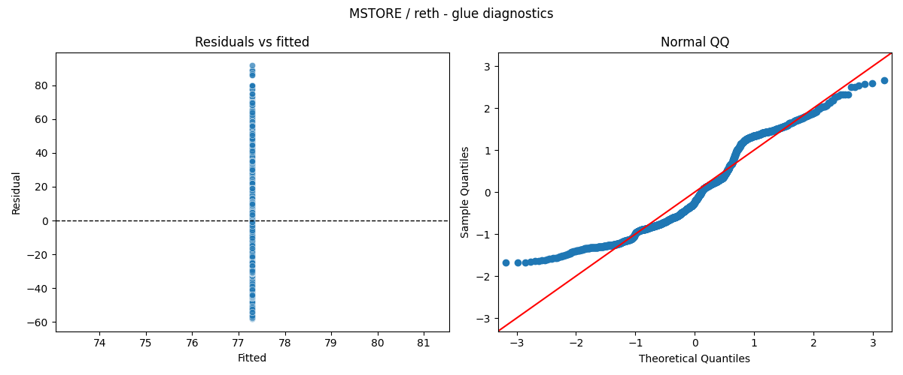

</details>

<details><summary><code>MSTORE8</code> · nobs=1395 · runtime_ms=0 · p=1.00e+00 · R²=0</summary>

```
==============================================================================
                           NNLS Regression Results                            
==============================================================================
Dep. Variable:          test_runtime_ms              R-squared:          0.000
Model:                  NNLS                    Adj. R-squared:         -0.001
No. Observations:       1395                              RMSE:          12.60
Df Residuals:           1393                               MAE:          10.67
Df Model:               1      
==============================================================================
                      coef     std err     P-value      [0.025      0.975]
------------------------------------------------------------------------------
         const     44.0135      0.3411       0.001     43.3521     44.6733
       MSTORE8      0.0000      0.0000       1.000      0.0000      0.0000
==============================================================================
Notes: Non-negative least squares with bootstrap inference (1000 iterations)
==============================================================================
```

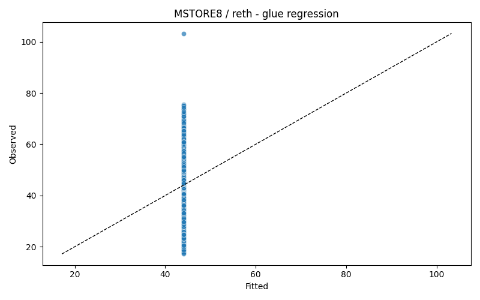

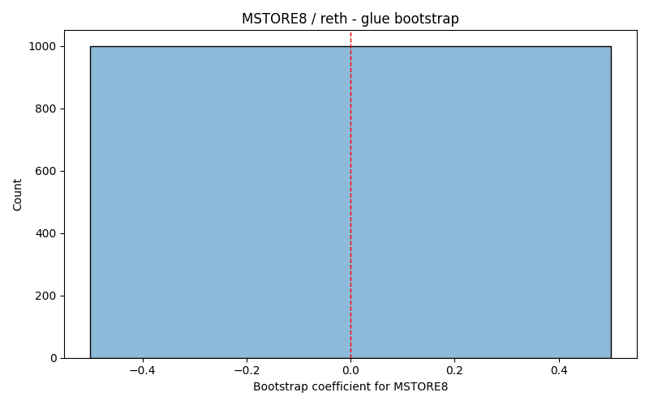

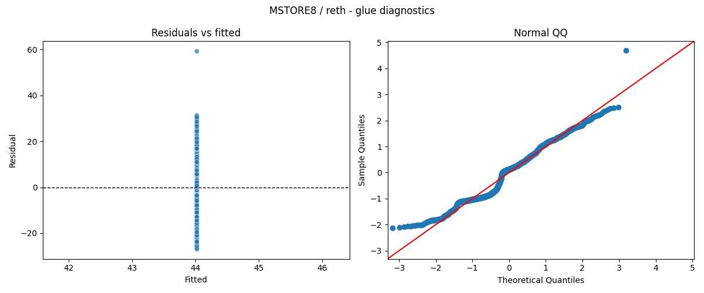

</details>

<details><summary><code>MUL</code> · nobs=310 · runtime_ms=0 · p=1.00e+00 · R²=0</summary>

```
==============================================================================
                           NNLS Regression Results                            
==============================================================================
Dep. Variable:          test_runtime_ms              R-squared:          0.000
Model:                  NNLS                    Adj. R-squared:         -0.003
No. Observations:       310                               RMSE:          10.30
Df Residuals:           308                                MAE:           8.90
Df Model:               1      
==============================================================================
                      coef     std err     P-value      [0.025      0.975]
------------------------------------------------------------------------------
         const     40.1372      0.5878       0.001     38.9826     41.2508
           MUL      0.0000      0.0000       1.000      0.0000      0.0000
==============================================================================
Notes: Non-negative least squares with bootstrap inference (1000 iterations)
==============================================================================
```

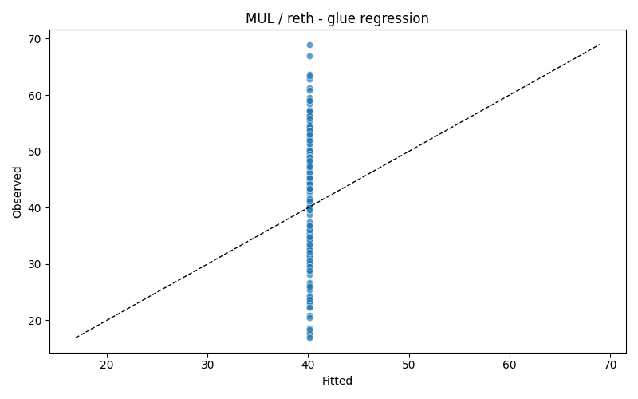


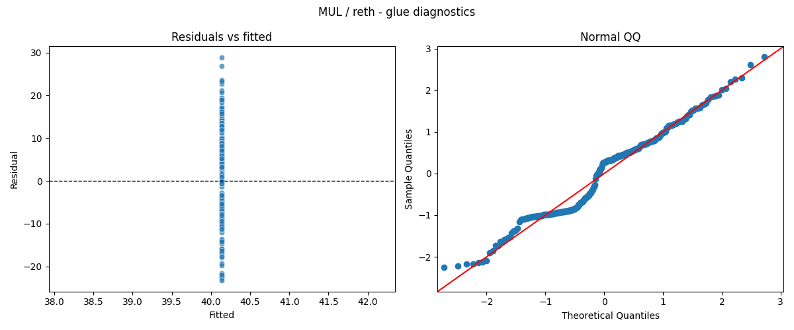

</details>

<details><summary><code>PC</code> · nobs=186 · runtime_ms=6.179e-06 · p=1.00e-03 · R²=0.4883</summary>

```
==============================================================================
                           NNLS Regression Results                            
==============================================================================
Dep. Variable:          test_runtime_ms              R-squared:          0.488
Model:                  NNLS                    Adj. R-squared:          0.486
No. Observations:       186                               RMSE:          14.06
Df Residuals:           184                                MAE:          12.27
Df Model:               1      
==============================================================================
                      coef     std err     P-value      [0.025      0.975]
------------------------------------------------------------------------------
         const     57.4181      1.9573       0.001     53.4842     61.1197
            PC      0.0000      0.0000       0.001      0.0000      0.0000
==============================================================================
Notes: Non-negative least squares with bootstrap inference (1000 iterations)
==============================================================================
```

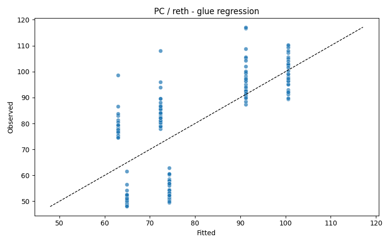

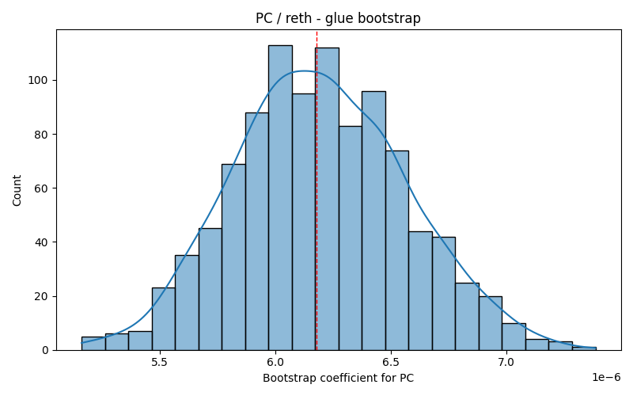

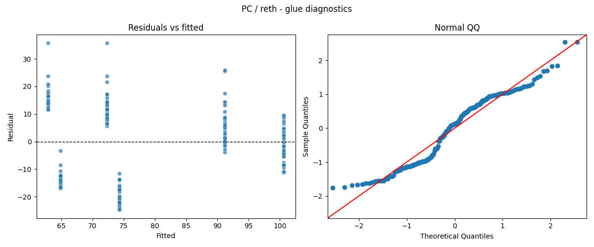

</details>

<details><summary><code>RETURNDATASIZE</code> · nobs=744 · runtime_ms=7.373e-06 · p=1.00e-03 · R²=0.4116</summary>

```
==============================================================================
                           NNLS Regression Results                            
==============================================================================
Dep. Variable:          test_runtime_ms              R-squared:          0.412
Model:                  NNLS                    Adj. R-squared:          0.411
No. Observations:       744                               RMSE:          10.35
Df Residuals:           742                                MAE:           9.09
Df Model:               1      
==============================================================================
                      coef     std err     P-value      [0.025      0.975]
------------------------------------------------------------------------------
         const     46.3557      0.7216       0.001     44.9457     47.7577
RETURNDATASIZE      0.0000      0.0000       0.001      0.0000      0.0000
==============================================================================
Notes: Non-negative least squares with bootstrap inference (1000 iterations)
==============================================================================
```

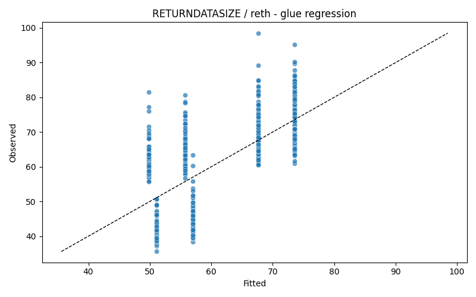

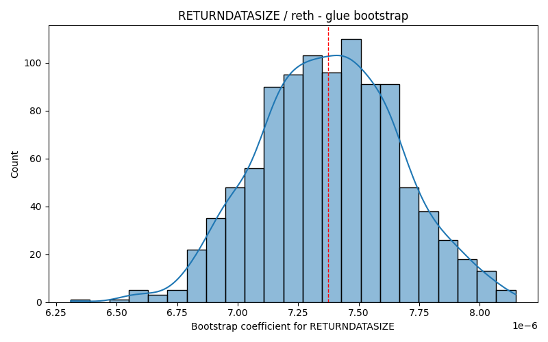

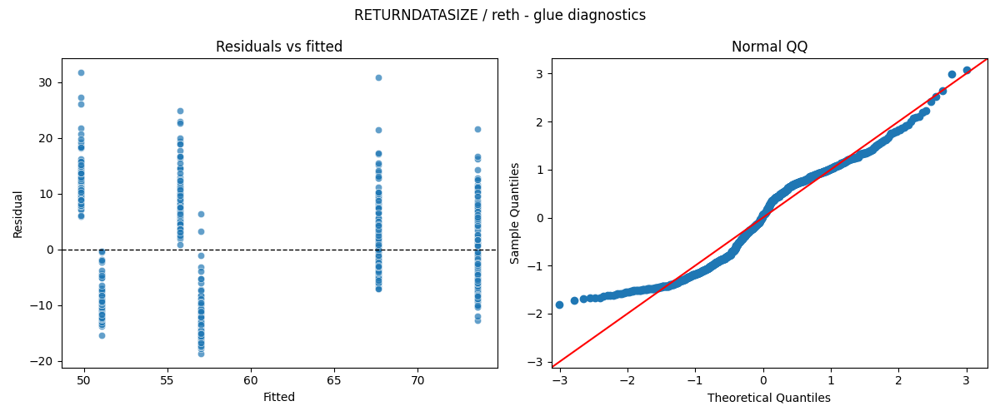

</details>

<details><summary><code>SELFBALANCE</code> · nobs=341 · runtime_ms=0 · p=1.00e+00 · R²=0</summary>

```
==============================================================================
                           NNLS Regression Results                            
==============================================================================
Dep. Variable:          test_runtime_ms              R-squared:          0.000
Model:                  NNLS                    Adj. R-squared:         -0.003
No. Observations:       341                               RMSE:          52.85
Df Residuals:           339                                MAE:          47.52
Df Model:               1      
==============================================================================
                      coef     std err     P-value      [0.025      0.975]
------------------------------------------------------------------------------
         const    207.4172      2.9301       0.001    201.4203    212.8590
   SELFBALANCE      0.0000      0.0000       1.000      0.0000      0.0000
==============================================================================
Notes: Non-negative least squares with bootstrap inference (1000 iterations)
==============================================================================
```

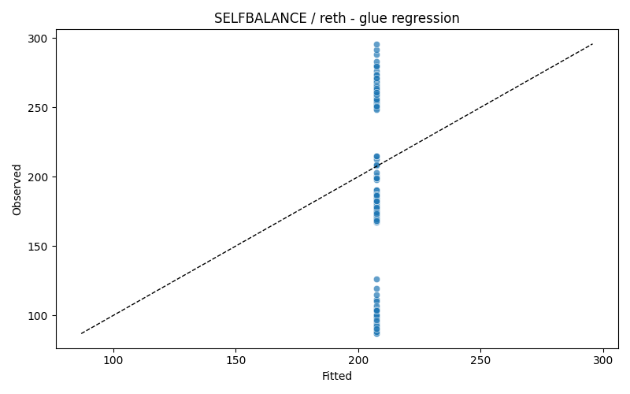


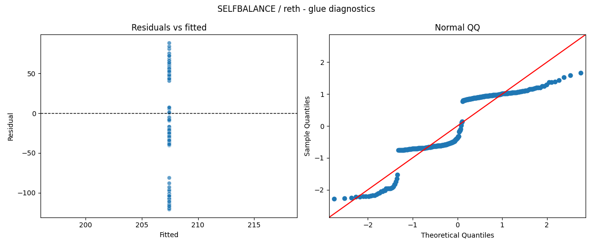

</details>

<details><summary><code>SUB</code> · nobs=248 · runtime_ms=0 · p=1.00e+00 · R²=1.11e-16</summary>

```
==============================================================================
                           NNLS Regression Results                            
==============================================================================
Dep. Variable:          test_runtime_ms              R-squared:          0.000
Model:                  NNLS                    Adj. R-squared:         -0.004
No. Observations:       248                               RMSE:          11.23
Df Residuals:           246                                MAE:           9.61
Df Model:               1      
==============================================================================
                      coef     std err     P-value      [0.025      0.975]
------------------------------------------------------------------------------
         const     40.0489      0.7184       0.001     38.6637     41.5248
           SUB      0.0000      0.0000       1.000      0.0000      0.0000
==============================================================================
Notes: Non-negative least squares with bootstrap inference (1000 iterations)
==============================================================================
```

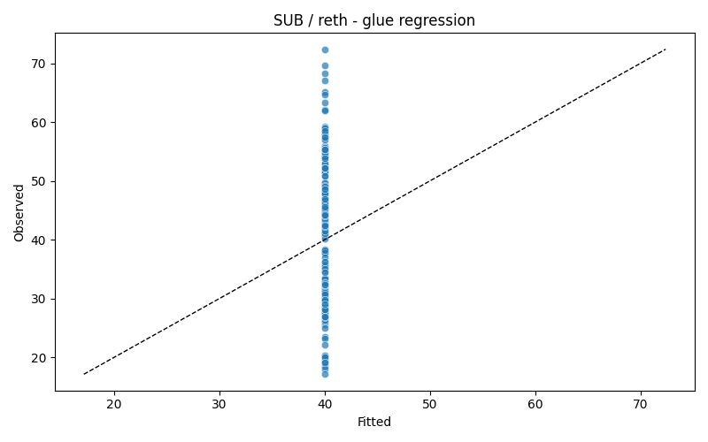


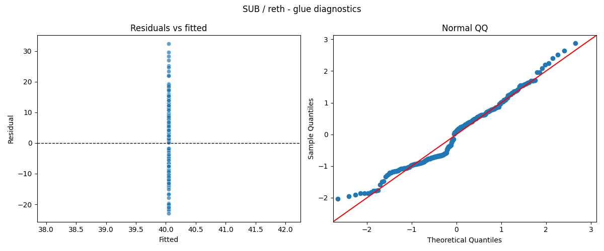

</details>

### Mixed glue (tier B) · reth

<details><summary><code>JUMP</code> · nobs=310 · runtime_ms=0 · p=1.00e+00 · R²=2.22e-16</summary>

```
==============================================================================
                           NNLS Regression Results                            
==============================================================================
Dep. Variable:          test_runtime_ms              R-squared:          0.000
Model:                  NNLS                    Adj. R-squared:         -0.003
No. Observations:       310                               RMSE:          10.90
Df Residuals:           308                                MAE:           9.36
Df Model:               1      
==============================================================================
                      coef     std err     P-value      [0.025      0.975]
------------------------------------------------------------------------------
         const     38.7206      0.6110       0.001     37.5705     39.8988
          JUMP      0.0000      0.0000       1.000      0.0000      0.0000
==============================================================================
Notes: Non-negative least squares with bootstrap inference (1000 iterations)
==============================================================================
```

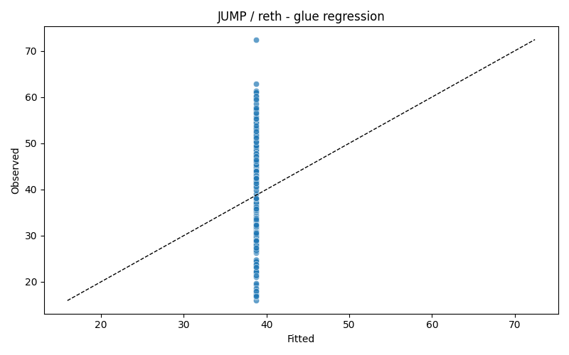


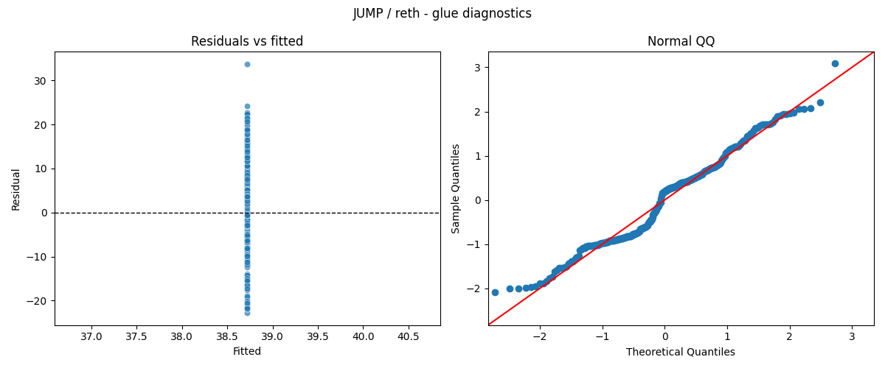

</details>

<details><summary><code>KECCAK256</code> · nobs=0 · runtime_ms=n/a · p=n/a · R²=n/a</summary>

</details>
