# Glue opcodes report

Per-client NNLS fits of priced glue opcodes against their driver fixtures. Cycle-tier opcodes share one joint regression per client (shown once); pure-tier and mixed-tier opcodes each get a single-feature fit. Mixed-tier fits pre-adjust the LHS by subtracting the contribution of every priced upstream partner selected by the detector (pure ∪ cycle for `mixed_a`, plus `mixed_a` for `mixed_b`).

**Contents:** [besu](#besu) · [erigon](#erigon) · [ethrex](#ethrex) · [geth](#geth) · [nethermind](#nethermind) · [reth](#reth)

## besu

| glue_opcode | nobs | glue_runtime_ms | p_value | rsquared |
| --- | --- | --- | --- | --- |
| `ISZERO` | 632 | 0 | 1.00e+00 | 2.22e-16 |
| `JUMPDEST` | 158 | 0 | 1.00e+00 | -2.22e-16 |
| `SWAP` | 11298 | 0 | 1.00e+00 | 0 |
| `CALLDATASIZE` | 39757 | 5.647e-05 | 1.00e-03 | 0.5324 |
| `DUP` | 39757 | 0 | 1.00e+00 | 0.5324 |
| `GAS` | 39757 | 4.793e-05 | 1.00e-03 | 0.5324 |
| `MLOAD` | 39757 | 7.497e-05 | 1.00e-03 | 0.5324 |
| `PUSH` | 39757 | 0 | 1.00e+00 | 0.5324 |
| `PUSH0` | 39757 | 0 | 1.00e+00 | 0.5324 |
| `STATICCALL` | 39757 | 0.0004306 | 1.00e-03 | 0.5324 |
| `ADD` | 738 | 0 | 1.00e+00 | 0 |
| `AND` | 656 | 0 | 1.00e+00 | 0 |
| `CALLDATACOPY` | 18568 | 0 | 1.00e+00 | 0 |
| `CALLDATALOAD` | 3476 | 0 | 1.00e+00 | 0 |
| `DIV` | 902 | 0 | 1.00e+00 | 0 |
| `EXP` | 902 | 0.0009685 | 1.00e-03 | 0.6378 |
| `GT` | 632 | 0 | 1.00e+00 | 0 |
| `JUMPI` | 869 | 0 | 1.00e+00 | 0 |
| `LT` | 632 | 0 | 1.00e+00 | 0 |
| `MSTORE` | 3555 | 0 | 1.00e+00 | 0 |
| `MSTORE8` | 3555 | 0 | 1.00e+00 | 0 |
| `MUL` | 820 | 0 | 1.00e+00 | 0 |
| `PC` | 474 | 2.554e-05 | 1.00e-03 | 0.4264 |
| `RETURNDATASIZE` | 1897 | 3.689e-05 | 1.00e-03 | 0.4177 |
| `SELFBALANCE` | 902 | 0 | 1.00e+00 | 0 |
| `SUB` | 656 | 0 | 1.00e+00 | 0 |
| `JUMP` | 790 | 0 | 1.00e+00 | 1.11e-16 |
| `KECCAK256` | 0 | n/a | n/a | n/a |

### Cycle glue — joint fit · besu

<details><summary>Joint NNLS regression summary</summary>

```
==============================================================================
                           NNLS Regression Results                            
==============================================================================
Dep. Variable:          test_runtime_ms              R-squared:          0.532
Model:                  NNLS                    Adj. R-squared:          0.532
No. Observations:       39757                             RMSE:          71.21
Df Residuals:           39749                              MAE:          59.01
Df Model:               7      
==============================================================================
                      coef     std err     P-value      [0.025      0.975]
------------------------------------------------------------------------------
         const    211.9929      0.3554       0.001    211.2948    212.6871
  CALLDATASIZE      0.0001      0.0000       0.001      0.0001      0.0001
           DUP      0.0000      0.0000       1.000      0.0000      0.0000
           GAS      0.0000      0.0000       0.001      0.0000      0.0000
         MLOAD      0.0001      0.0000       0.001      0.0001      0.0001
          PUSH      0.0000      0.0000       1.000      0.0000      0.0000
         PUSH0      0.0000      0.0000       1.000      0.0000      0.0000
    STATICCALL      0.0004      0.0000       0.001      0.0004      0.0004
==============================================================================
Notes: Non-negative least squares with bootstrap inference (1000 iterations)
==============================================================================
```

</details>

<details><summary><code>CALLDATASIZE</code> · nobs=39757 · runtime_ms=5.647e-05 · p=1.00e-03 · R²=0.5324</summary>

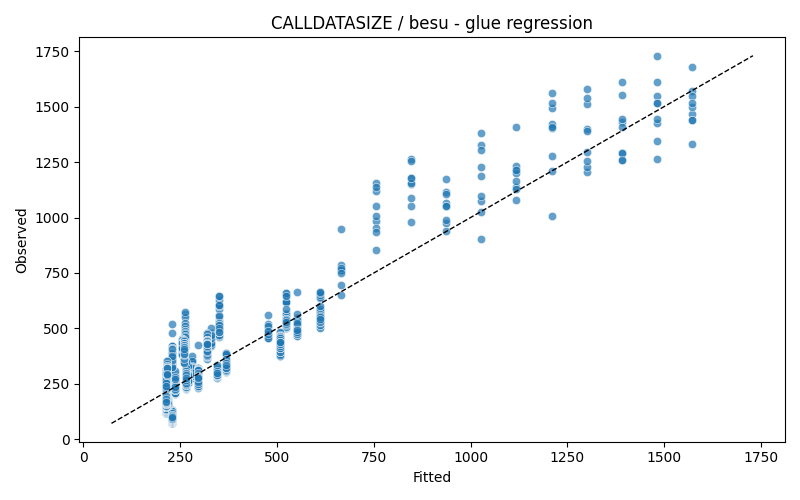

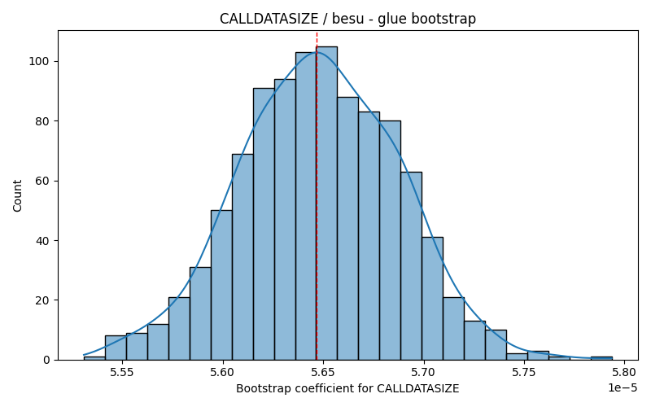

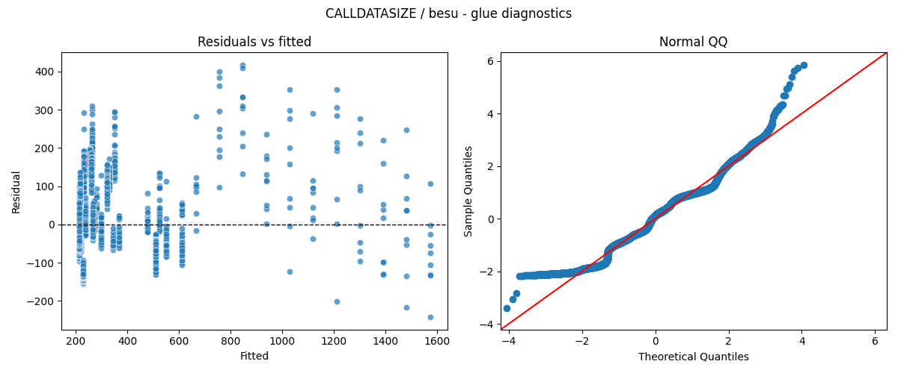

</details>

<details><summary><code>DUP</code> · nobs=39757 · runtime_ms=0 · p=1.00e+00 · R²=0.5324</summary>


</details>

<details><summary><code>GAS</code> · nobs=39757 · runtime_ms=4.793e-05 · p=1.00e-03 · R²=0.5324</summary>


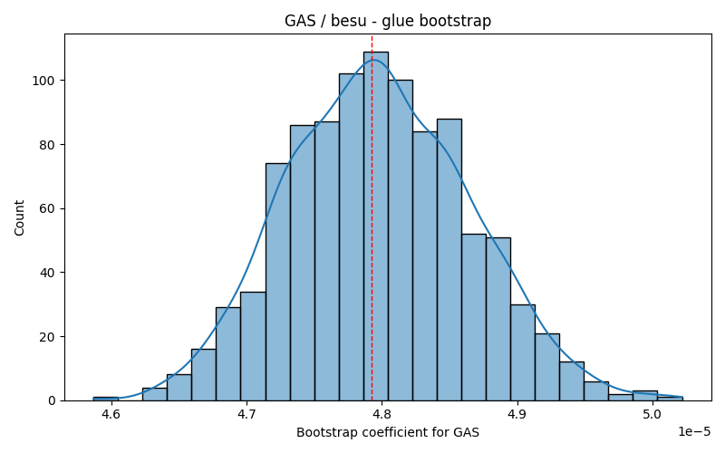


</details>

<details><summary><code>MLOAD</code> · nobs=39757 · runtime_ms=7.497e-05 · p=1.00e-03 · R²=0.5324</summary>


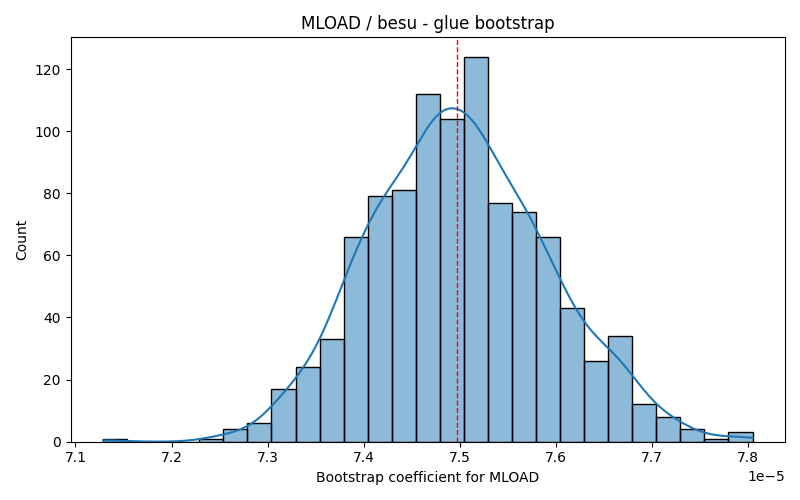


</details>

<details><summary><code>PUSH</code> · nobs=39757 · runtime_ms=0 · p=1.00e+00 · R²=0.5324</summary>

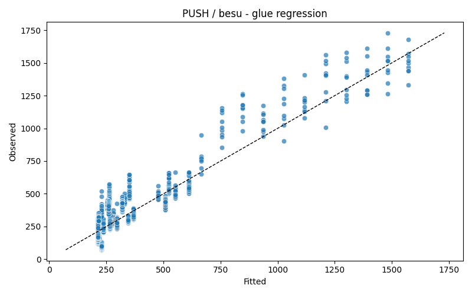


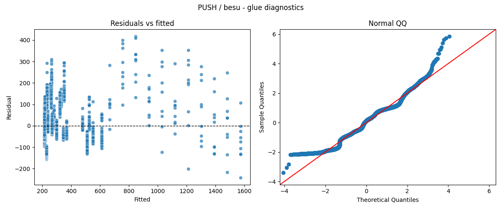

</details>

<details><summary><code>PUSH0</code> · nobs=39757 · runtime_ms=0 · p=1.00e+00 · R²=0.5324</summary>

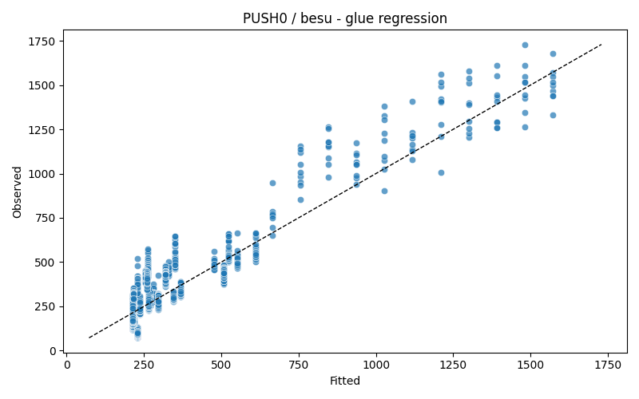

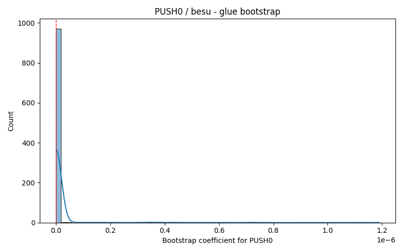


</details>

<details><summary><code>STATICCALL</code> · nobs=39757 · runtime_ms=0.0004306 · p=1.00e-03 · R²=0.5324</summary>

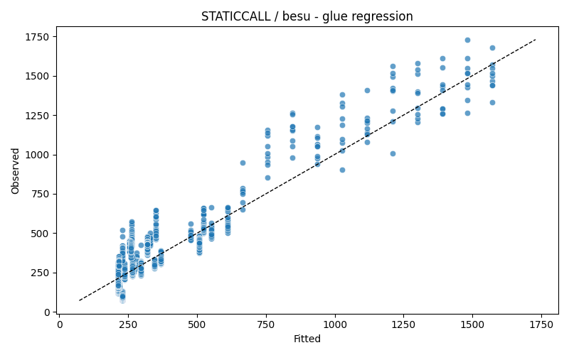

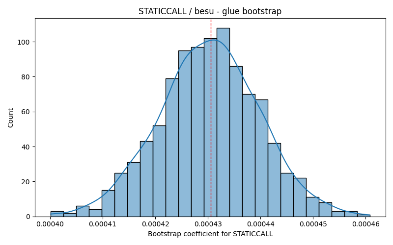


</details>

### Pure glue · besu

<details><summary><code>ISZERO</code> · nobs=632 · runtime_ms=0 · p=1.00e+00 · R²=2.22e-16</summary>

```
==============================================================================
                           NNLS Regression Results                            
==============================================================================
Dep. Variable:          test_runtime_ms              R-squared:          0.000
Model:                  NNLS                    Adj. R-squared:         -0.002
No. Observations:       632                               RMSE:          89.10
Df Residuals:           630                                MAE:          79.93
Df Model:               1      
==============================================================================
                      coef     std err     P-value      [0.025      0.975]
------------------------------------------------------------------------------
         const    290.5004      3.6358       0.001    283.0574    297.4925
        ISZERO      0.0000      0.0000       1.000      0.0000      0.0000
==============================================================================
Notes: Non-negative least squares with bootstrap inference (1000 iterations)
==============================================================================
```

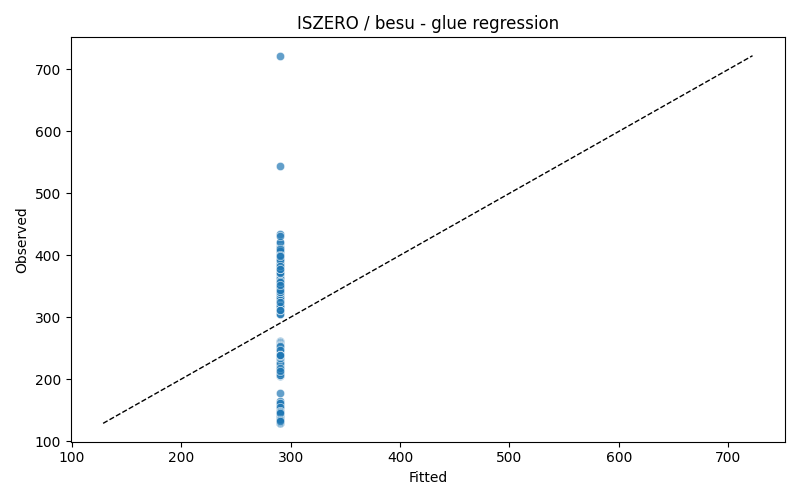


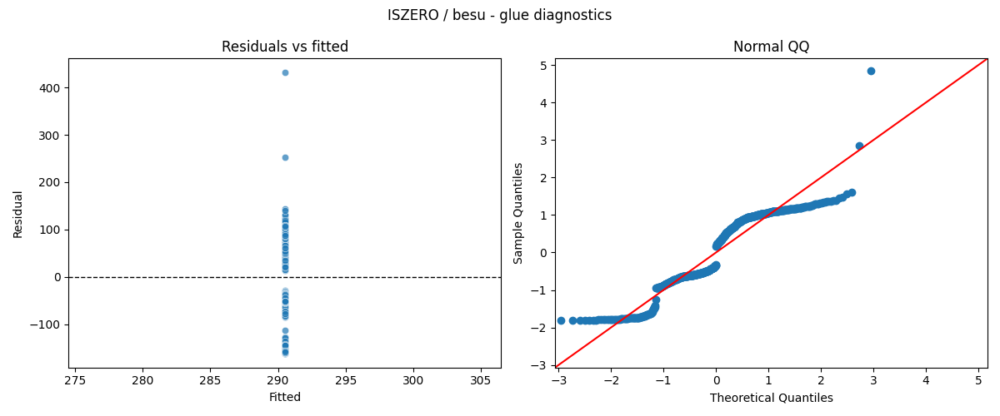

</details>

<details><summary><code>JUMPDEST</code> · nobs=158 · runtime_ms=0 · p=1.00e+00 · R²=-2.22e-16</summary>

```
==============================================================================
                           NNLS Regression Results                            
==============================================================================
Dep. Variable:          test_runtime_ms              R-squared:         -0.000
Model:                  NNLS                    Adj. R-squared:         -0.006
No. Observations:       158                               RMSE:          61.18
Df Residuals:           156                                MAE:          44.57
Df Model:               1      
==============================================================================
                      coef     std err     P-value      [0.025      0.975]
------------------------------------------------------------------------------
         const    200.8988      4.9505       0.001    191.9121    210.9642
      JUMPDEST      0.0000      0.0000       1.000      0.0000      0.0000
==============================================================================
Notes: Non-negative least squares with bootstrap inference (1000 iterations)
==============================================================================
```

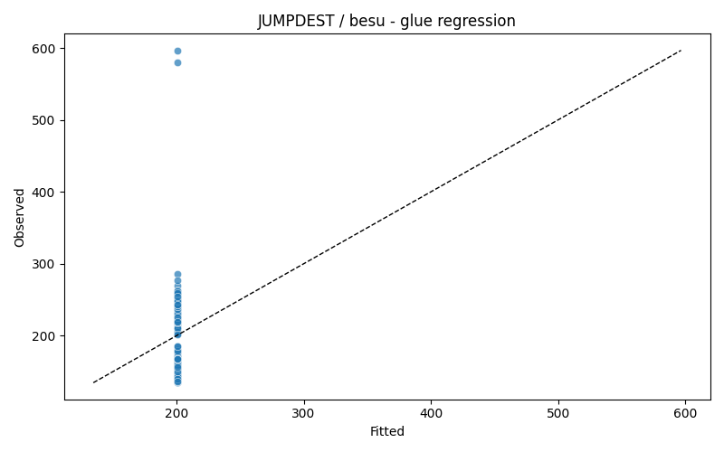

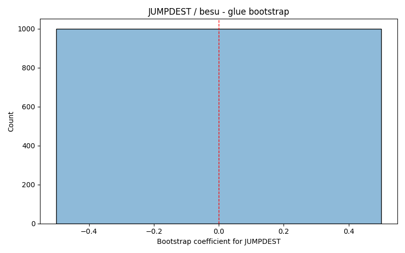

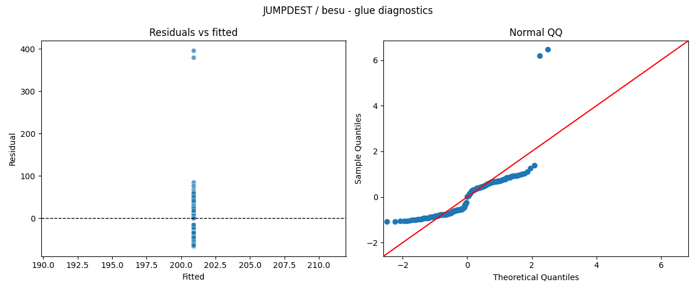

</details>

<details><summary><code>SWAP</code> · nobs=11298 · runtime_ms=0 · p=1.00e+00 · R²=0</summary>

```
==============================================================================
                           NNLS Regression Results                            
==============================================================================
Dep. Variable:          test_runtime_ms              R-squared:          0.000
Model:                  NNLS                    Adj. R-squared:         -0.000
No. Observations:       11298                             RMSE:          94.30
Df Residuals:           11296                              MAE:          85.75
Df Model:               1      
==============================================================================
                      coef     std err     P-value      [0.025      0.975]
------------------------------------------------------------------------------
         const    323.9183      0.9056       0.001    322.1570    325.6453
          SWAP      0.0000      0.0000       1.000      0.0000      0.0000
==============================================================================
Notes: Non-negative least squares with bootstrap inference (1000 iterations)
==============================================================================
```

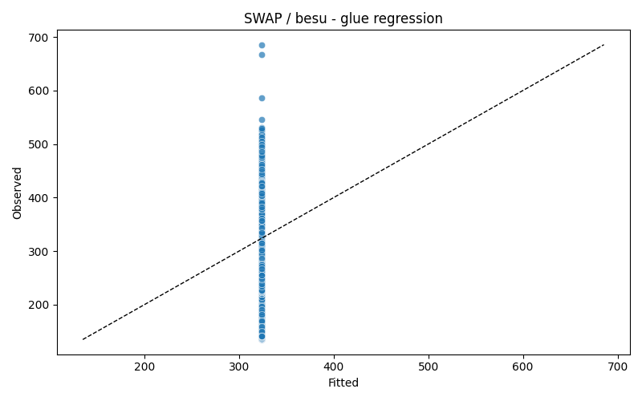


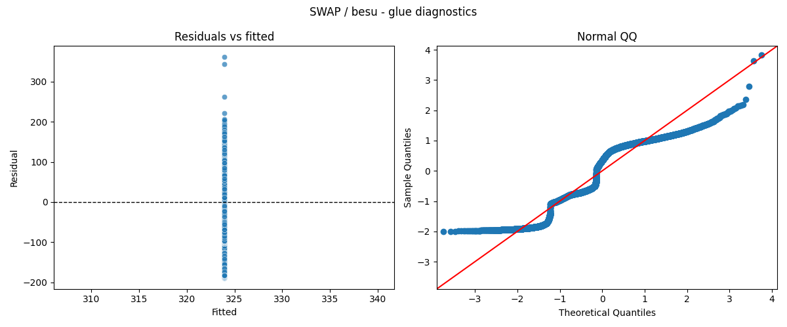

</details>

### Mixed glue (tier A) · besu

<details><summary><code>ADD</code> · nobs=738 · runtime_ms=0 · p=1.00e+00 · R²=0</summary>

```
==============================================================================
                           NNLS Regression Results                            
==============================================================================
Dep. Variable:          test_runtime_ms              R-squared:          0.000
Model:                  NNLS                    Adj. R-squared:         -0.001
No. Observations:       738                               RMSE:         119.36
Df Residuals:           736                                MAE:         104.12
Df Model:               1      
==============================================================================
                      coef     std err     P-value      [0.025      0.975]
------------------------------------------------------------------------------
         const    423.4012      4.3178       0.001    414.8009    432.0513
           ADD      0.0000      0.0000       1.000      0.0000      0.0000
==============================================================================
Notes: Non-negative least squares with bootstrap inference (1000 iterations)
==============================================================================
```

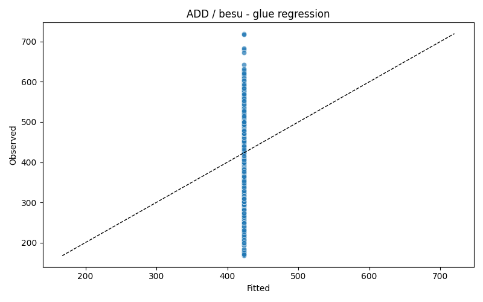


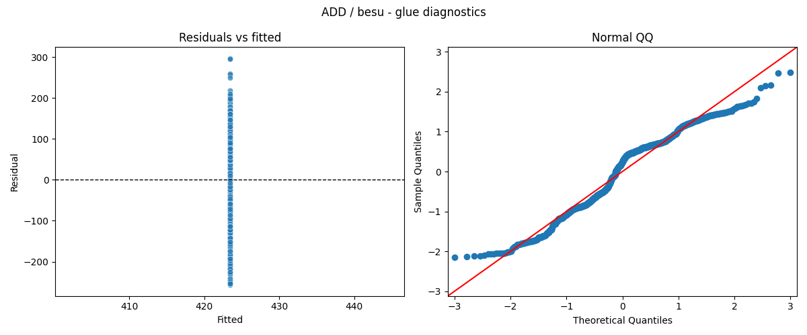

</details>

<details><summary><code>AND</code> · nobs=656 · runtime_ms=0 · p=1.00e+00 · R²=0</summary>

```
==============================================================================
                           NNLS Regression Results                            
==============================================================================
Dep. Variable:          test_runtime_ms              R-squared:          0.000
Model:                  NNLS                    Adj. R-squared:         -0.002
No. Observations:       656                               RMSE:          77.01
Df Residuals:           654                                MAE:          71.34
Df Model:               1      
==============================================================================
                      coef     std err     P-value      [0.025      0.975]
------------------------------------------------------------------------------
         const    272.7332      2.9814       0.001    267.0161    278.5474
           AND      0.0000      0.0000       1.000      0.0000      0.0000
==============================================================================
Notes: Non-negative least squares with bootstrap inference (1000 iterations)
==============================================================================
```

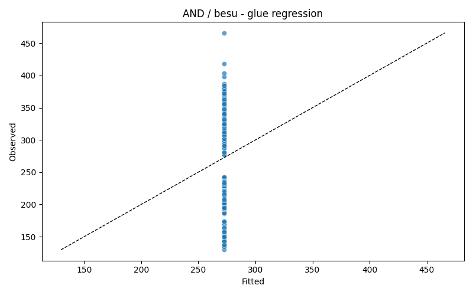


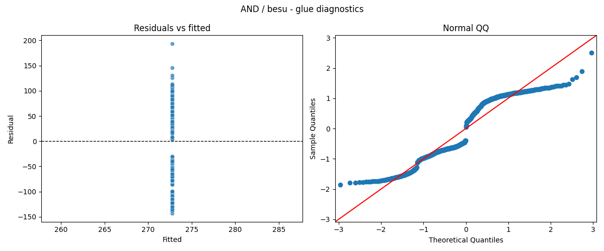

</details>

<details><summary><code>CALLDATACOPY</code> · nobs=18568 · runtime_ms=0 · p=1.00e+00 · R²=0</summary>

```
==============================================================================
                           NNLS Regression Results                            
==============================================================================
Dep. Variable:          test_runtime_ms              R-squared:          0.000
Model:                  NNLS                    Adj. R-squared:         -0.000
No. Observations:       18568                             RMSE:         108.09
Df Residuals:           18566                              MAE:          86.85
Df Model:               1      
==============================================================================
                      coef     std err     P-value      [0.025      0.975]
------------------------------------------------------------------------------
         const    242.2320      0.7749       0.001    240.7899    243.8092
  CALLDATACOPY      0.0000      0.0000       1.000      0.0000      0.0000
==============================================================================
Notes: Non-negative least squares with bootstrap inference (1000 iterations)
==============================================================================
```

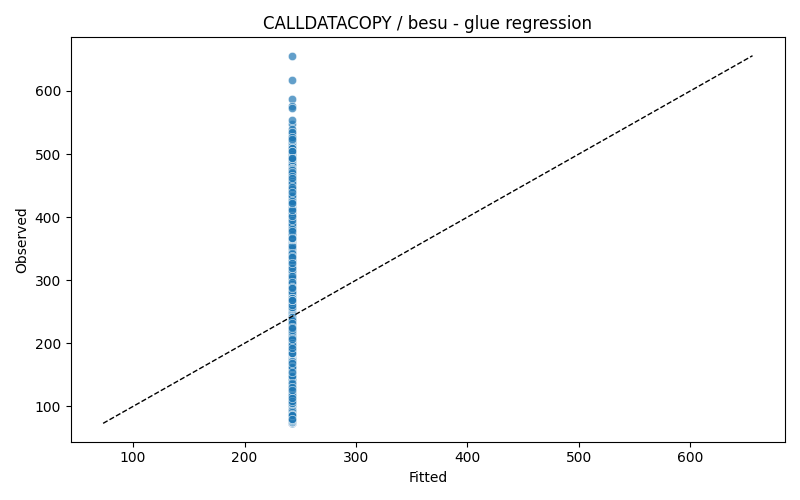


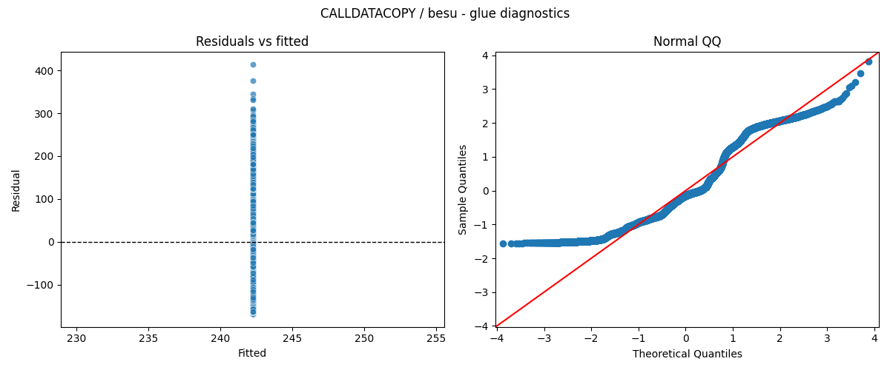

</details>

<details><summary><code>CALLDATALOAD</code> · nobs=3476 · runtime_ms=0 · p=1.00e+00 · R²=0</summary>

```
==============================================================================
                           NNLS Regression Results                            
==============================================================================
Dep. Variable:          test_runtime_ms              R-squared:          0.000
Model:                  NNLS                    Adj. R-squared:         -0.000
No. Observations:       3476                              RMSE:           0.77
Df Residuals:           3474                               MAE:           0.49
Df Model:               1      
==============================================================================
                      coef     std err     P-value      [0.025      0.975]
------------------------------------------------------------------------------
         const      2.9406      0.0130       0.001      2.9163      2.9665
  CALLDATALOAD      0.0000      0.0000       1.000      0.0000      0.0000
==============================================================================
Notes: Non-negative least squares with bootstrap inference (1000 iterations)
==============================================================================
```

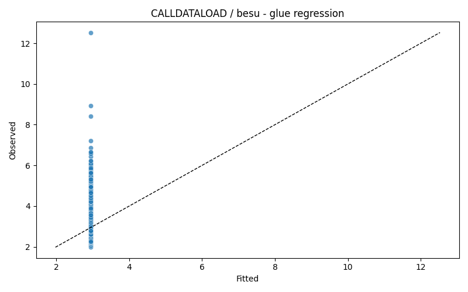


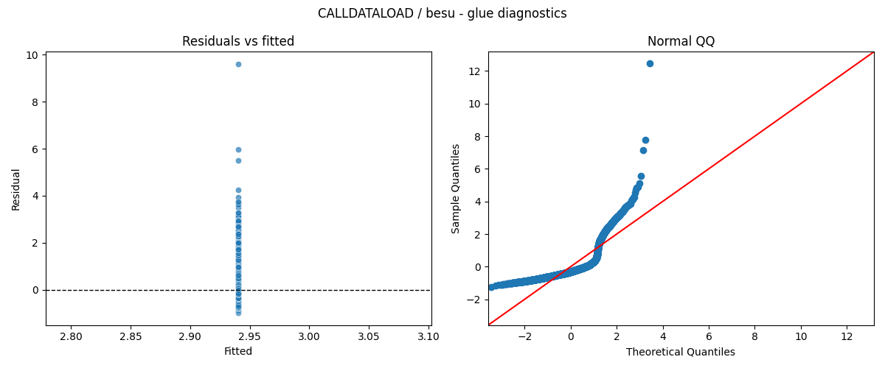

</details>

<details><summary><code>DIV</code> · nobs=902 · runtime_ms=0 · p=1.00e+00 · R²=0</summary>

```
==============================================================================
                           NNLS Regression Results                            
==============================================================================
Dep. Variable:          test_runtime_ms              R-squared:          0.000
Model:                  NNLS                    Adj. R-squared:         -0.001
No. Observations:       902                               RMSE:          94.95
Df Residuals:           900                                MAE:          88.38
Df Model:               1      
==============================================================================
                      coef     std err     P-value      [0.025      0.975]
------------------------------------------------------------------------------
         const    428.5473      3.1076       0.001    422.5047    434.6996
           DIV      0.0000      0.0000       1.000      0.0000      0.0000
==============================================================================
Notes: Non-negative least squares with bootstrap inference (1000 iterations)
==============================================================================
```

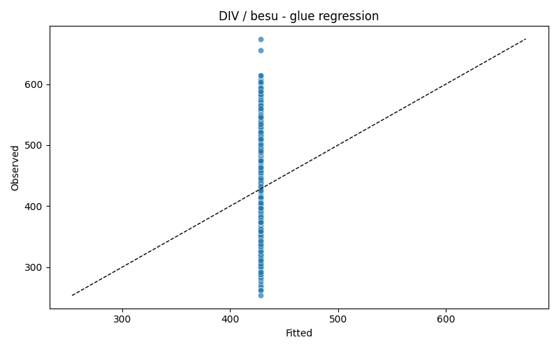

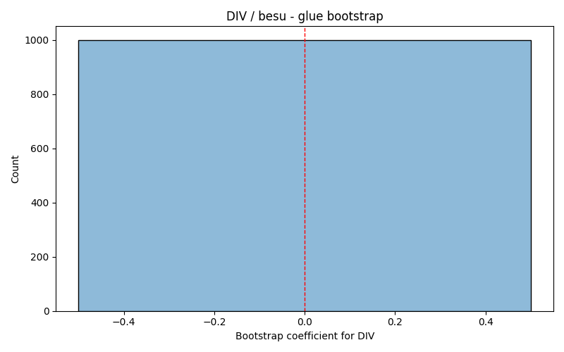

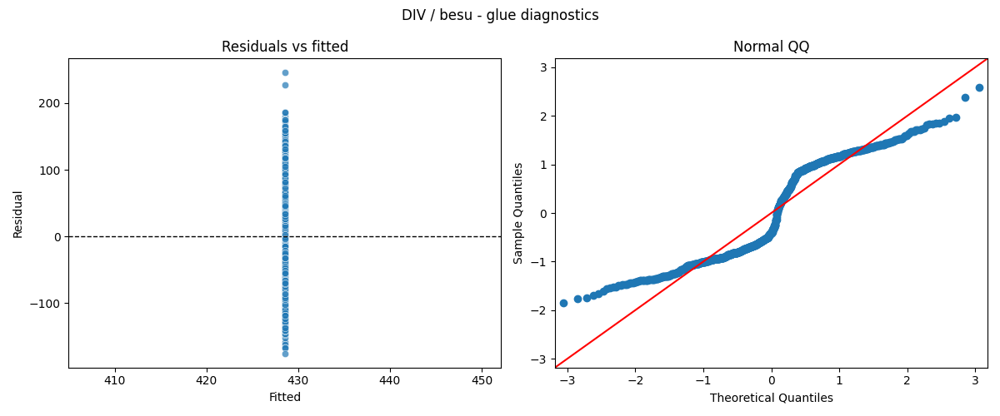

</details>

<details><summary><code>EXP</code> · nobs=902 · runtime_ms=0.0009685 · p=1.00e-03 · R²=0.6378</summary>

```
==============================================================================
                           NNLS Regression Results                            
==============================================================================
Dep. Variable:          test_runtime_ms              R-squared:          0.638
Model:                  NNLS                    Adj. R-squared:          0.637
No. Observations:       902                               RMSE:          28.59
Df Residuals:           900                                MAE:          22.08
Df Model:               1      
==============================================================================
                      coef     std err     P-value      [0.025      0.975]
------------------------------------------------------------------------------
         const    109.5722      4.7254       0.001    100.5228    118.3996
           EXP      0.0010      0.0000       0.001      0.0009      0.0010
==============================================================================
Notes: Non-negative least squares with bootstrap inference (1000 iterations)
==============================================================================
```

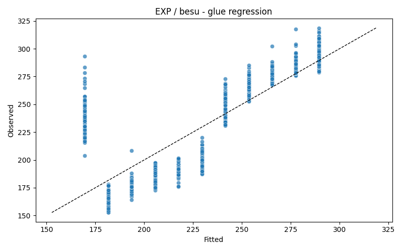

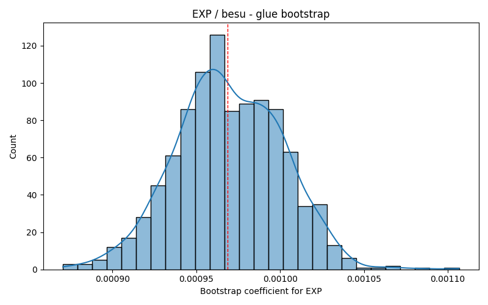

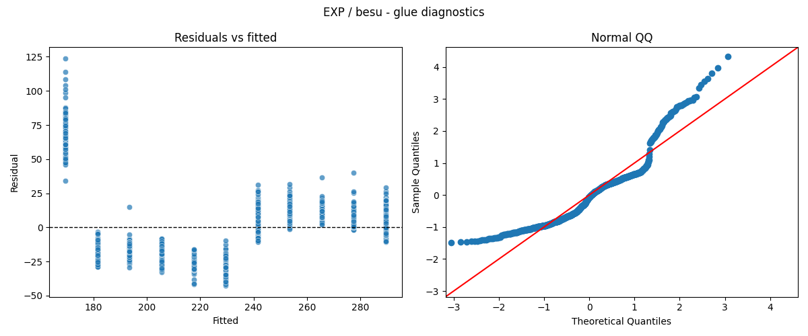

</details>

<details><summary><code>GT</code> · nobs=632 · runtime_ms=0 · p=1.00e+00 · R²=0</summary>

```
==============================================================================
                           NNLS Regression Results                            
==============================================================================
Dep. Variable:          test_runtime_ms              R-squared:          0.000
Model:                  NNLS                    Adj. R-squared:         -0.002
No. Observations:       632                               RMSE:         531.34
Df Residuals:           630                                MAE:         457.28
Df Model:               1      
==============================================================================
                      coef     std err     P-value      [0.025      0.975]
------------------------------------------------------------------------------
         const    636.5828     20.4736       0.001    598.1486    677.3912
            GT      0.0000      0.0000       1.000      0.0000      0.0000
==============================================================================
Notes: Non-negative least squares with bootstrap inference (1000 iterations)
==============================================================================
```

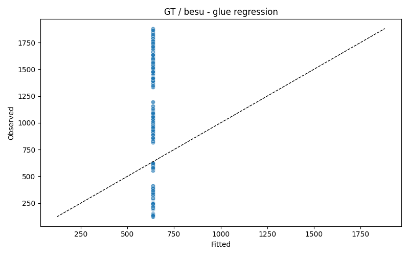


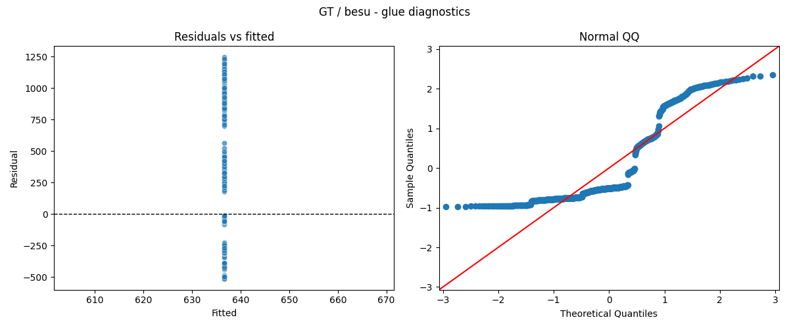

</details>

<details><summary><code>JUMPI</code> · nobs=869 · runtime_ms=0 · p=1.00e+00 · R²=0</summary>

```
==============================================================================
                           NNLS Regression Results                            
==============================================================================
Dep. Variable:          test_runtime_ms              R-squared:          0.000
Model:                  NNLS                    Adj. R-squared:         -0.001
No. Observations:       869                               RMSE:          33.37
Df Residuals:           867                                MAE:          26.61
Df Model:               1      
==============================================================================
                      coef     std err     P-value      [0.025      0.975]
------------------------------------------------------------------------------
         const    101.9132      1.1641       0.001     99.6955    104.1461
         JUMPI      0.0000      0.0000       1.000      0.0000      0.0000
==============================================================================
Notes: Non-negative least squares with bootstrap inference (1000 iterations)
==============================================================================
```

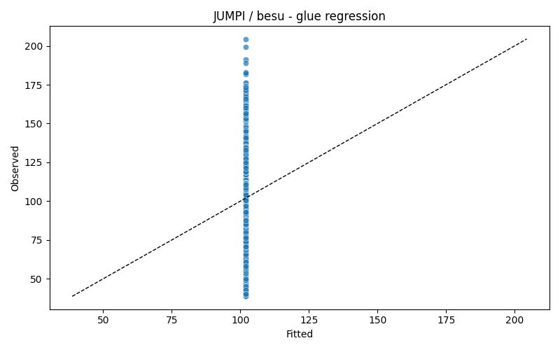


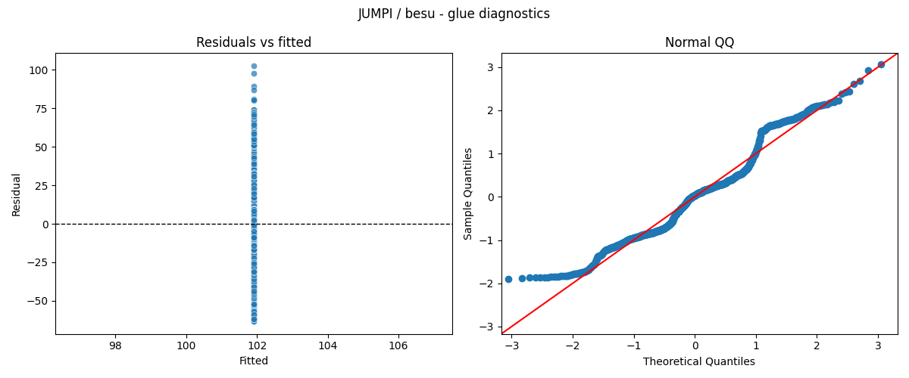

</details>

<details><summary><code>LT</code> · nobs=632 · runtime_ms=0 · p=1.00e+00 · R²=0</summary>

```
==============================================================================
                           NNLS Regression Results                            
==============================================================================
Dep. Variable:          test_runtime_ms              R-squared:          0.000
Model:                  NNLS                    Adj. R-squared:         -0.002
No. Observations:       632                               RMSE:          82.93
Df Residuals:           630                                MAE:          77.50
Df Model:               1      
==============================================================================
                      coef     std err     P-value      [0.025      0.975]
------------------------------------------------------------------------------
         const    304.2360      3.2925       0.001    297.7802    311.1071
            LT      0.0000      0.0000       1.000      0.0000      0.0000
==============================================================================
Notes: Non-negative least squares with bootstrap inference (1000 iterations)
==============================================================================
```

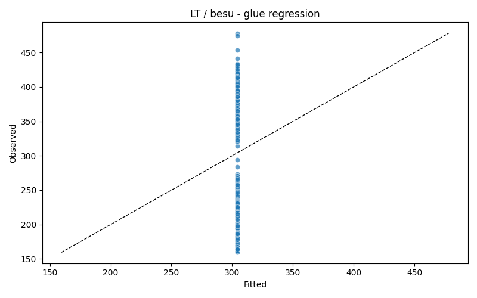

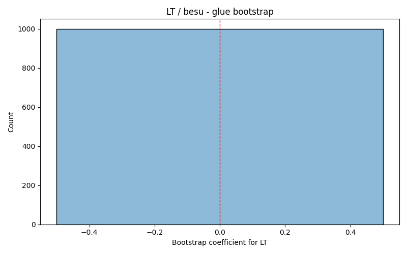

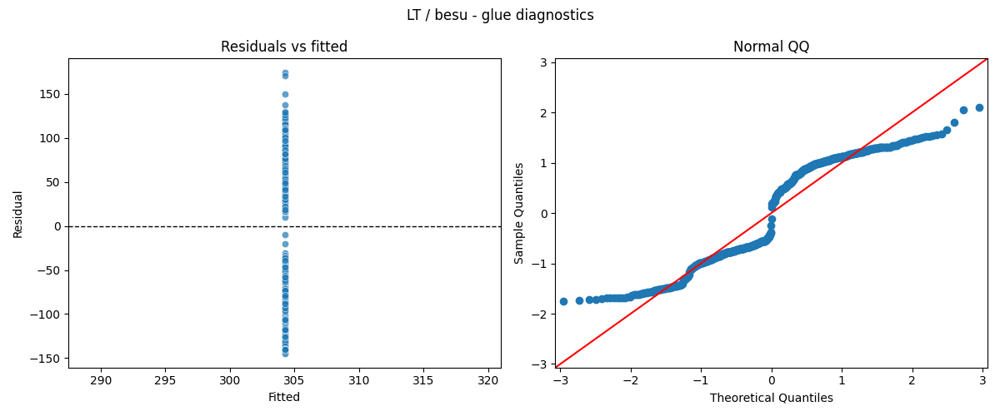

</details>

<details><summary><code>MSTORE</code> · nobs=3555 · runtime_ms=0 · p=1.00e+00 · R²=0</summary>

```
==============================================================================
                           NNLS Regression Results                            
==============================================================================
Dep. Variable:          test_runtime_ms              R-squared:          0.000
Model:                  NNLS                    Adj. R-squared:         -0.000
No. Observations:       3555                              RMSE:         134.62
Df Residuals:           3553                               MAE:         122.48
Df Model:               1      
==============================================================================
                      coef     std err     P-value      [0.025      0.975]
------------------------------------------------------------------------------
         const    463.4776      2.3024       0.001    458.8358    467.7333
        MSTORE      0.0000      0.0000       1.000      0.0000      0.0000
==============================================================================
Notes: Non-negative least squares with bootstrap inference (1000 iterations)
==============================================================================
```

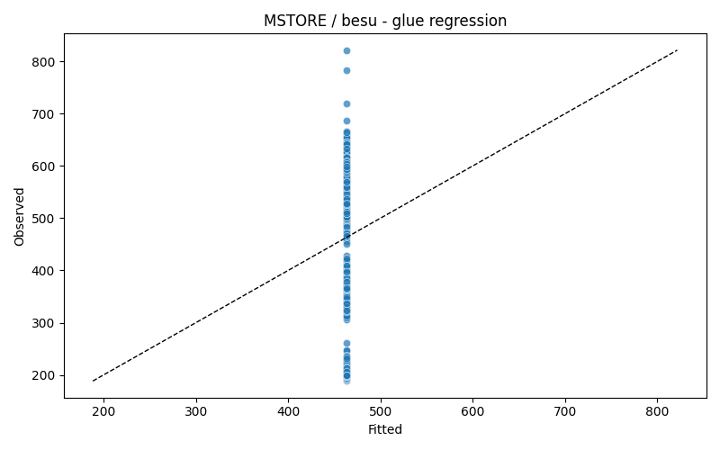


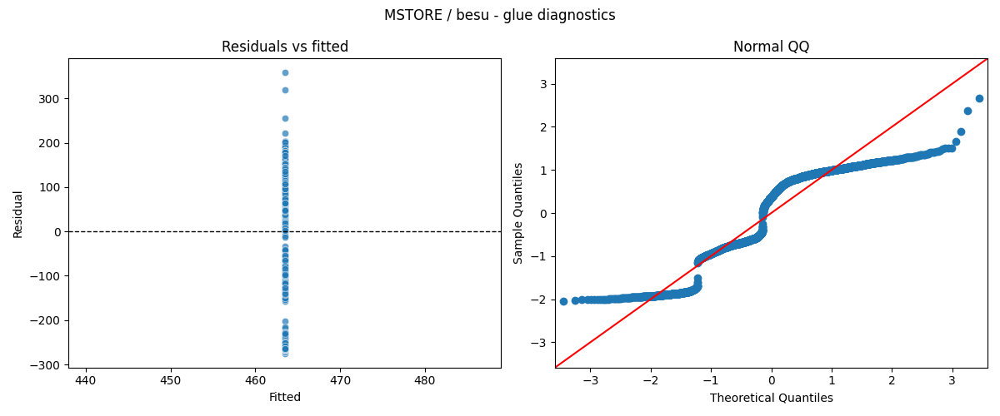

</details>

<details><summary><code>MSTORE8</code> · nobs=3555 · runtime_ms=0 · p=1.00e+00 · R²=0</summary>

```
==============================================================================
                           NNLS Regression Results                            
==============================================================================
Dep. Variable:          test_runtime_ms              R-squared:          0.000
Model:                  NNLS                    Adj. R-squared:         -0.000
No. Observations:       3555                              RMSE:          77.57
Df Residuals:           3553                               MAE:          70.58
Df Model:               1      
==============================================================================
                      coef     std err     P-value      [0.025      0.975]
------------------------------------------------------------------------------
         const    266.3088      1.3001       0.001    263.9099    268.9700
       MSTORE8      0.0000      0.0000       1.000      0.0000      0.0000
==============================================================================
Notes: Non-negative least squares with bootstrap inference (1000 iterations)
==============================================================================
```

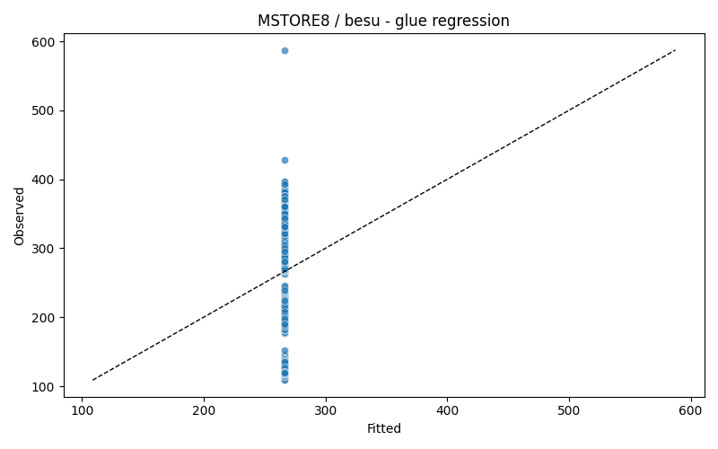


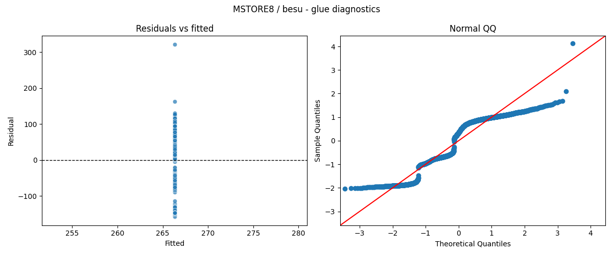

</details>

<details><summary><code>MUL</code> · nobs=820 · runtime_ms=0 · p=1.00e+00 · R²=0</summary>

```
==============================================================================
                           NNLS Regression Results                            
==============================================================================
Dep. Variable:          test_runtime_ms              R-squared:          0.000
Model:                  NNLS                    Adj. R-squared:         -0.001
No. Observations:       820                               RMSE:         119.44
Df Residuals:           818                                MAE:         102.29
Df Model:               1      
==============================================================================
                      coef     std err     P-value      [0.025      0.975]
------------------------------------------------------------------------------
         const    418.7763      4.2361       0.001    410.5691    427.5720
           MUL      0.0000      0.0000       1.000      0.0000      0.0000
==============================================================================
Notes: Non-negative least squares with bootstrap inference (1000 iterations)
==============================================================================
```

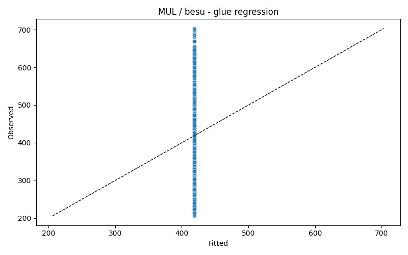


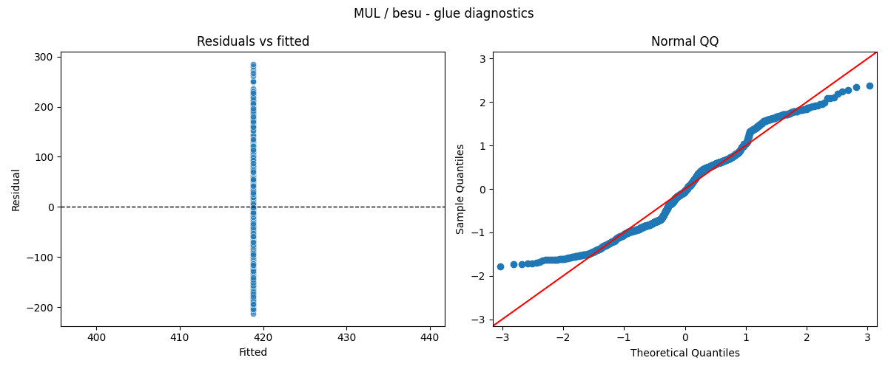

</details>

<details><summary><code>PC</code> · nobs=474 · runtime_ms=2.554e-05 · p=1.00e-03 · R²=0.4264</summary>

```
==============================================================================
                           NNLS Regression Results                            
==============================================================================
Dep. Variable:          test_runtime_ms              R-squared:          0.426
Model:                  NNLS                    Adj. R-squared:          0.425
No. Observations:       474                               RMSE:          65.84
Df Residuals:           472                                MAE:          57.86
Df Model:               1      
==============================================================================
                      coef     std err     P-value      [0.025      0.975]
------------------------------------------------------------------------------
         const    312.8139      5.8534       0.001    300.6870    324.1742
            PC      0.0000      0.0000       0.001      0.0000      0.0000
==============================================================================
Notes: Non-negative least squares with bootstrap inference (1000 iterations)
==============================================================================
```

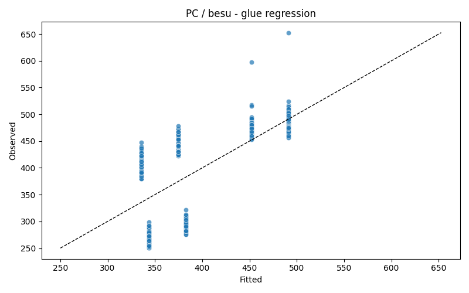

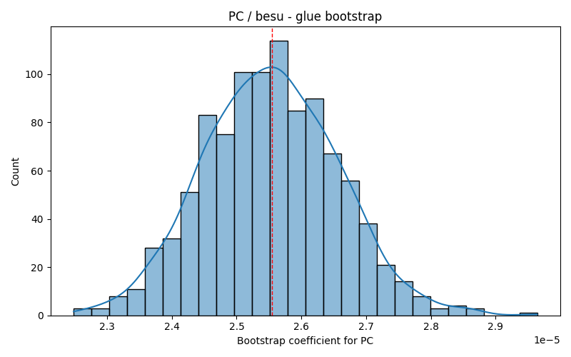

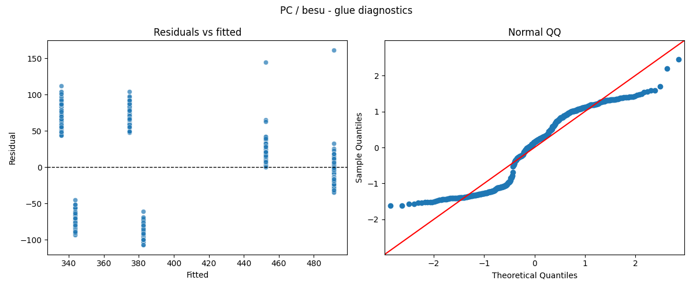

</details>

<details><summary><code>RETURNDATASIZE</code> · nobs=1897 · runtime_ms=3.689e-05 · p=1.00e-03 · R²=0.4177</summary>

```
==============================================================================
                           NNLS Regression Results                            
==============================================================================
Dep. Variable:          test_runtime_ms              R-squared:          0.418
Model:                  NNLS                    Adj. R-squared:          0.417
No. Observations:       1897                              RMSE:          51.10
Df Residuals:           1895                               MAE:          44.68
Df Model:               1      
==============================================================================
                      coef     std err     P-value      [0.025      0.975]
------------------------------------------------------------------------------
         const    235.3292      2.3181       0.001    230.5527    239.9393
RETURNDATASIZE      0.0000      0.0000       0.001      0.0000      0.0000
==============================================================================
Notes: Non-negative least squares with bootstrap inference (1000 iterations)
==============================================================================
```

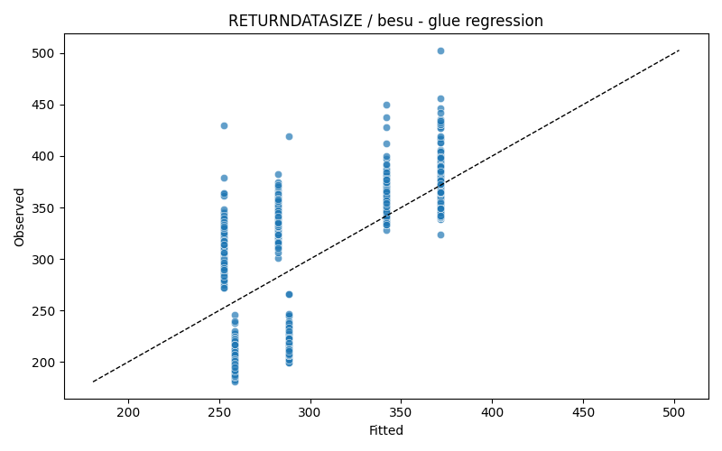

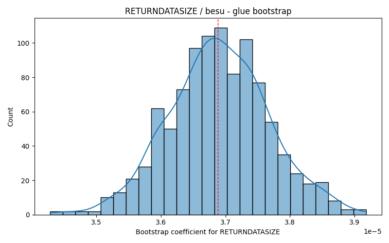

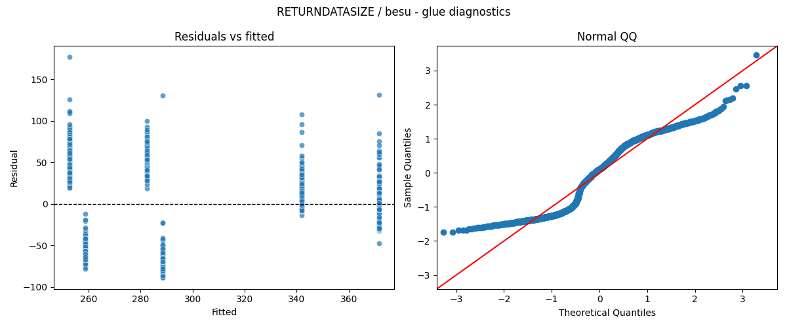

</details>

<details><summary><code>SELFBALANCE</code> · nobs=902 · runtime_ms=0 · p=1.00e+00 · R²=0</summary>

```
==============================================================================
                           NNLS Regression Results                            
==============================================================================
Dep. Variable:          test_runtime_ms              R-squared:          0.000
Model:                  NNLS                    Adj. R-squared:         -0.001
No. Observations:       902                               RMSE:         201.63
Df Residuals:           900                                MAE:         172.48
Df Model:               1      
==============================================================================
                      coef     std err     P-value      [0.025      0.975]
------------------------------------------------------------------------------
         const    703.5736      6.8100       0.001    690.6248    716.8422
   SELFBALANCE      0.0000      0.0000       1.000      0.0000      0.0000
==============================================================================
Notes: Non-negative least squares with bootstrap inference (1000 iterations)
==============================================================================
```

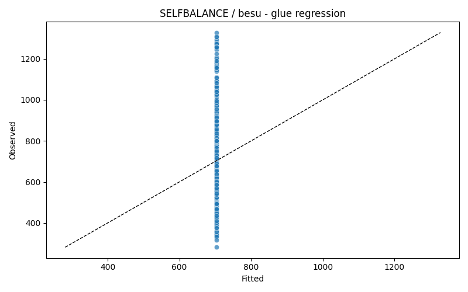


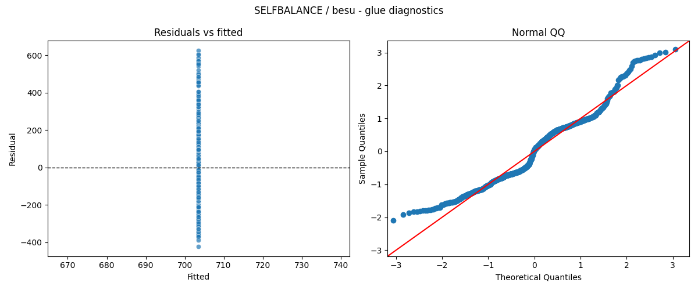

</details>

<details><summary><code>SUB</code> · nobs=656 · runtime_ms=0 · p=1.00e+00 · R²=0</summary>

```
==============================================================================
                           NNLS Regression Results                            
==============================================================================
Dep. Variable:          test_runtime_ms              R-squared:          0.000
Model:                  NNLS                    Adj. R-squared:         -0.002
No. Observations:       656                               RMSE:         124.12
Df Residuals:           654                                MAE:         109.86
Df Model:               1      
==============================================================================
                      coef     std err     P-value      [0.025      0.975]
------------------------------------------------------------------------------
         const    408.4225      4.8512       0.001    399.3800    418.2773
           SUB      0.0000      0.0000       1.000      0.0000      0.0000
==============================================================================
Notes: Non-negative least squares with bootstrap inference (1000 iterations)
==============================================================================
```

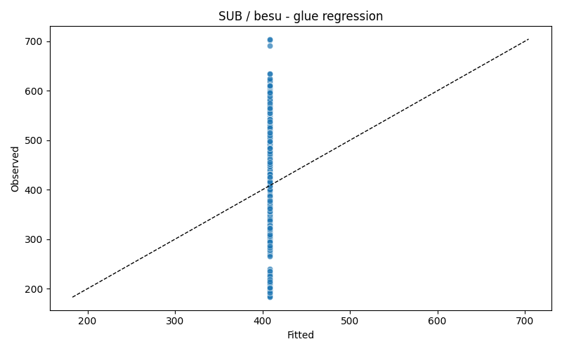


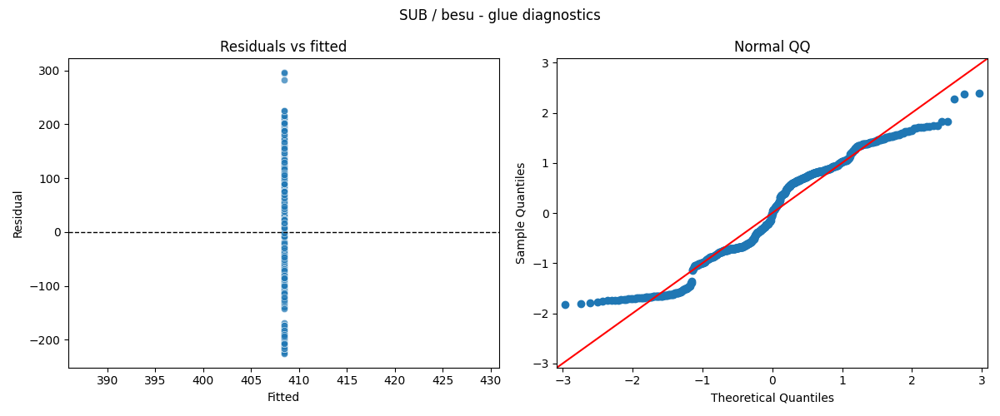

</details>

### Mixed glue (tier B) · besu

<details><summary><code>JUMP</code> · nobs=790 · runtime_ms=0 · p=1.00e+00 · R²=1.11e-16</summary>

```
==============================================================================
                           NNLS Regression Results                            
==============================================================================
Dep. Variable:          test_runtime_ms              R-squared:          0.000
Model:                  NNLS                    Adj. R-squared:         -0.001
No. Observations:       790                               RMSE:         184.57
Df Residuals:           788                                MAE:         167.12
Df Model:               1      
==============================================================================
                      coef     std err     P-value      [0.025      0.975]
------------------------------------------------------------------------------
         const    657.6422      6.7398       0.001    644.1478    670.7572
          JUMP      0.0000      0.0000       1.000      0.0000      0.0000
==============================================================================
Notes: Non-negative least squares with bootstrap inference (1000 iterations)
==============================================================================
```

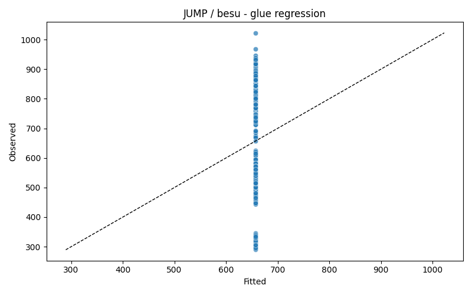


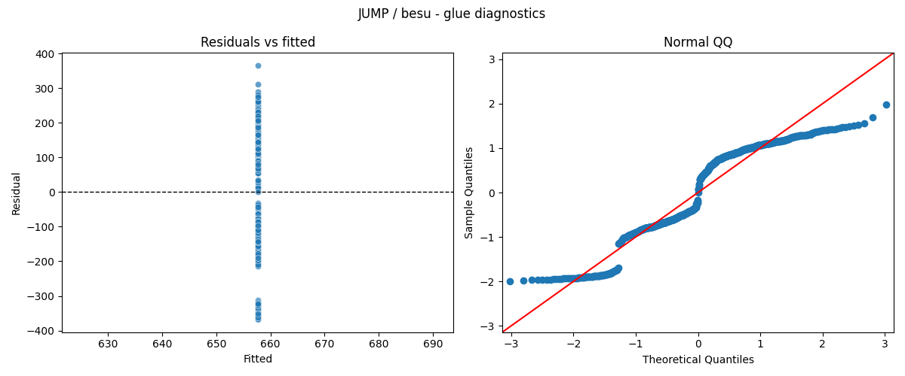

</details>

<details><summary><code>KECCAK256</code> · nobs=0 · runtime_ms=n/a · p=n/a · R²=n/a</summary>

</details>

## erigon

| glue_opcode | nobs | glue_runtime_ms | p_value | rsquared |
| --- | --- | --- | --- | --- |
| `ISZERO` | 352 | 0 | 1.00e+00 | -2.22e-16 |
| `JUMPDEST` | 88 | 0 | 1.00e+00 | 0 |
| `SWAP` | 6292 | 0 | 1.00e+00 | -2.22e-16 |
| `CALLDATASIZE` | 22143 | 0 | 1.00e+00 | 0.04501 |
| `DUP` | 22143 | 0 | 1.00e+00 | 0.04501 |
| `GAS` | 22143 | 0 | 1.00e+00 | 0.04501 |
| `MLOAD` | 22143 | 5.893e-07 | 1.20e-01 | 0.04501 |
| `PUSH` | 22143 | 0 | 1.00e+00 | 0.04501 |
| `PUSH0` | 22143 | 0 | 1.00e+00 | 0.04501 |
| `STATICCALL` | 22143 | 0.0001997 | 1.00e-03 | 0.04501 |
| `ADD` | 396 | 0 | 1.00e+00 | -2.22e-16 |
| `AND` | 352 | 0 | 1.00e+00 | 0 |
| `CALLDATACOPY` | 10340 | 0 | 1.00e+00 | -2.22e-16 |
| `CALLDATALOAD` | 1936 | 5.662e-05 | 1.00e-03 | 0.1304 |
| `DIV` | 484 | 0 | 1.00e+00 | 0 |
| `EXP` | 484 | 0.0003631 | 1.00e-03 | 0.902 |
| `GT` | 352 | 0 | 1.00e+00 | 0 |
| `JUMPI` | 484 | 0 | 1.00e+00 | 0 |
| `LT` | 352 | 0 | 1.00e+00 | 1.11e-16 |
| `MSTORE` | 1980 | 0 | 1.00e+00 | 0 |
| `MSTORE8` | 1980 | 0 | 1.00e+00 | 0 |
| `MUL` | 440 | 0 | 1.00e+00 | 0 |
| `PC` | 264 | 1.265e-05 | 1.00e-03 | 0.4597 |
| `RETURNDATASIZE` | 1056 | 1.832e-05 | 1.00e-03 | 0.4037 |
| `SELFBALANCE` | 484 | 0 | 1.00e+00 | 0 |
| `SUB` | 352 | 0 | 1.00e+00 | 0 |
| `JUMP` | 440 | 0 | 1.00e+00 | 0 |
| `KECCAK256` | 0 | n/a | n/a | n/a |

### Cycle glue — joint fit · erigon

<details><summary>Joint NNLS regression summary</summary>

```
==============================================================================
                           NNLS Regression Results                            
==============================================================================
Dep. Variable:          test_runtime_ms              R-squared:          0.045
Model:                  NNLS                    Adj. R-squared:          0.045
No. Observations:       22143                             RMSE:          79.05
Df Residuals:           22135                              MAE:          63.96
Df Model:               7      
==============================================================================
                      coef     std err     P-value      [0.025      0.975]
------------------------------------------------------------------------------
         const    164.9873      0.5485       0.001    163.8611    166.0347
  CALLDATASIZE      0.0000      0.0000       1.000      0.0000      0.0000
           DUP      0.0000      0.0000       1.000      0.0000      0.0000
           GAS      0.0000      0.0000       1.000      0.0000      0.0000
         MLOAD      0.0000      0.0000       0.120      0.0000      0.0000
          PUSH      0.0000      0.0000       1.000      0.0000      0.0000
         PUSH0      0.0000      0.0000       1.000      0.0000      0.0000
    STATICCALL      0.0002      0.0000       0.001      0.0002      0.0002
==============================================================================
Notes: Non-negative least squares with bootstrap inference (1000 iterations)
==============================================================================
```

</details>

<details><summary><code>CALLDATASIZE</code> · nobs=22143 · runtime_ms=0 · p=1.00e+00 · R²=0.04501</summary>

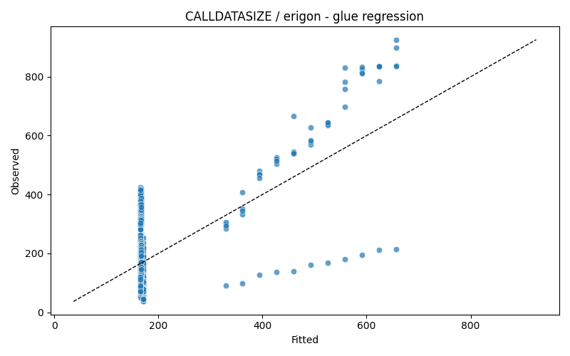


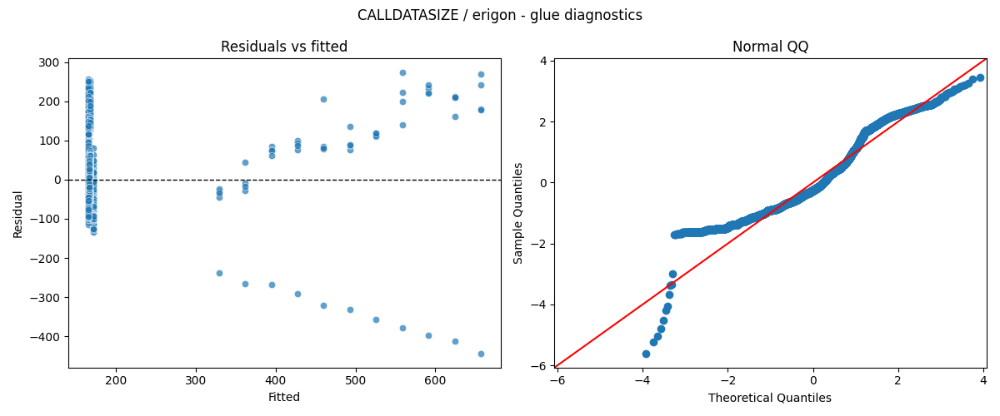

</details>

<details><summary><code>DUP</code> · nobs=22143 · runtime_ms=0 · p=1.00e+00 · R²=0.04501</summary>


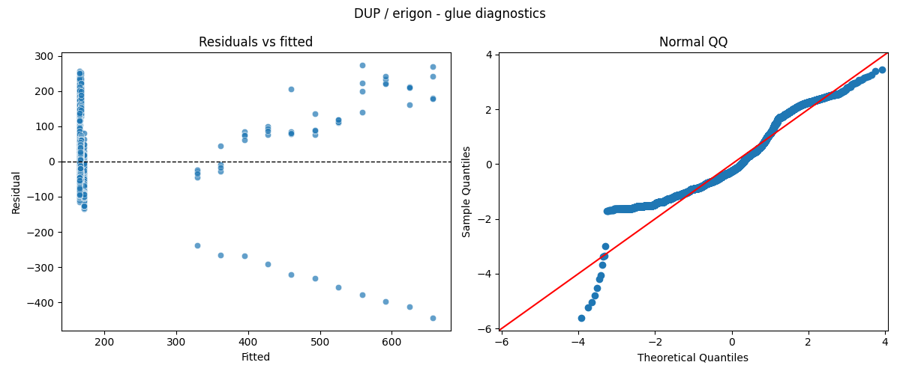

</details>

<details><summary><code>GAS</code> · nobs=22143 · runtime_ms=0 · p=1.00e+00 · R²=0.04501</summary>

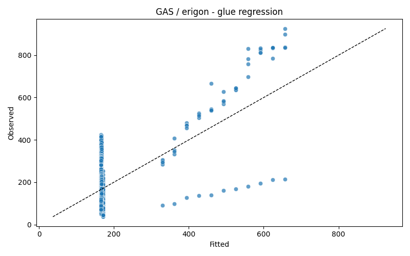

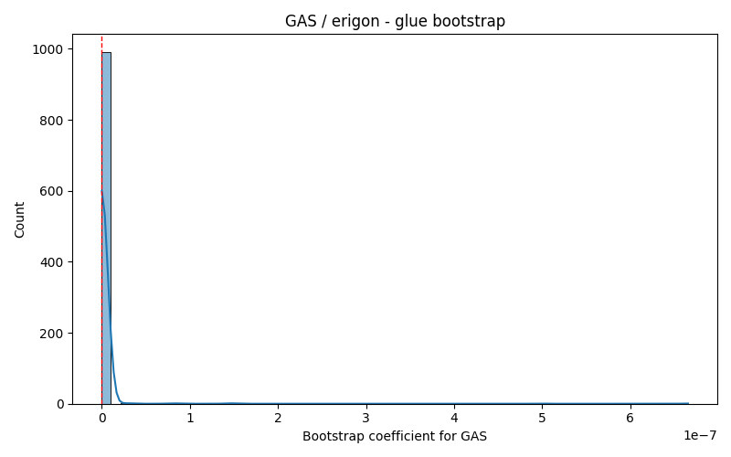


</details>

<details><summary><code>MLOAD</code> · nobs=22143 · runtime_ms=5.893e-07 · p=1.20e-01 · R²=0.04501</summary>

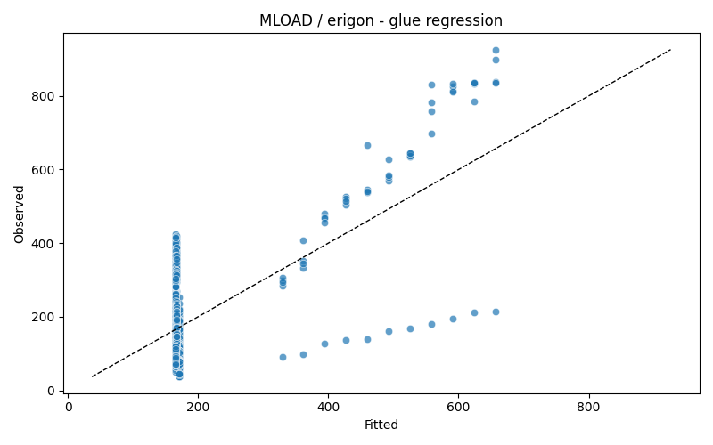

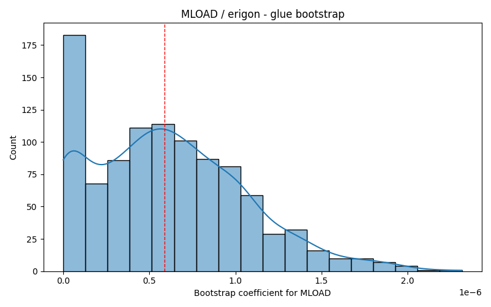

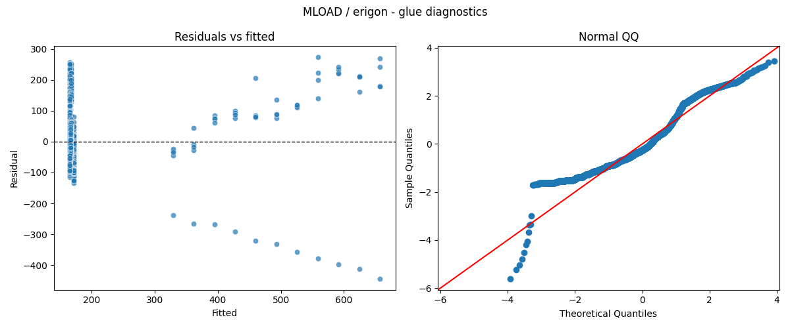

</details>

<details><summary><code>PUSH</code> · nobs=22143 · runtime_ms=0 · p=1.00e+00 · R²=0.04501</summary>

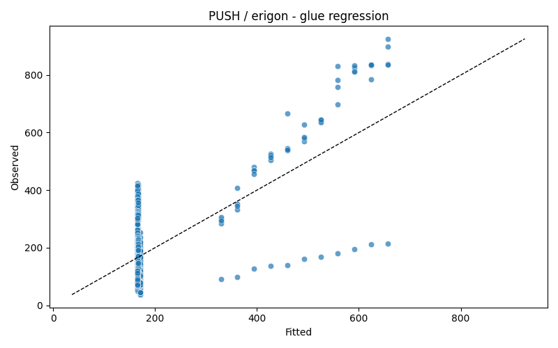


</details>

<details><summary><code>PUSH0</code> · nobs=22143 · runtime_ms=0 · p=1.00e+00 · R²=0.04501</summary>


</details>

<details><summary><code>STATICCALL</code> · nobs=22143 · runtime_ms=0.0001997 · p=1.00e-03 · R²=0.04501</summary>

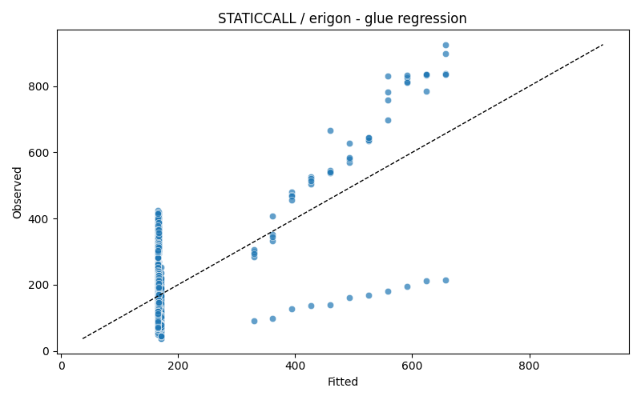

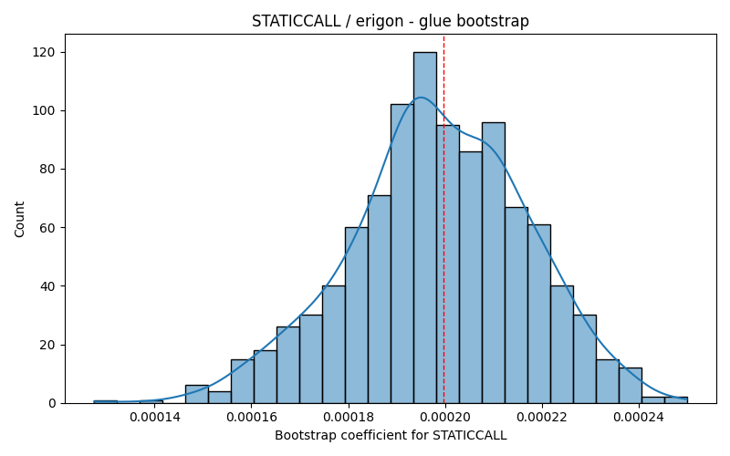

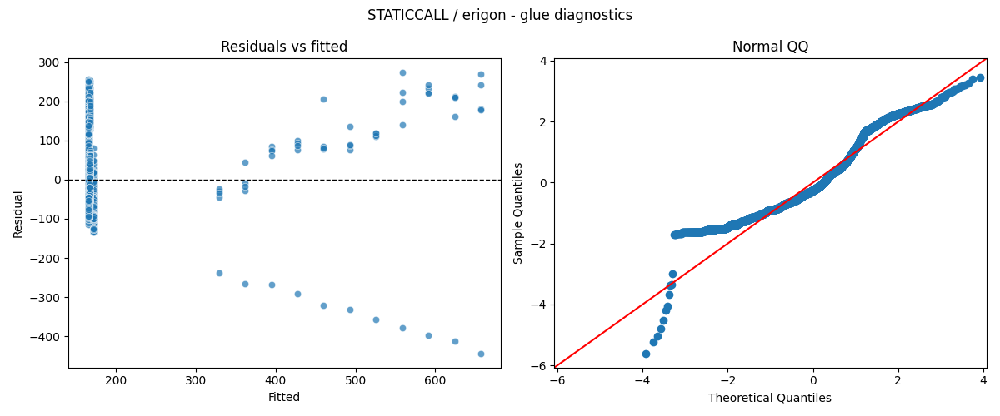

</details>

### Pure glue · erigon

<details><summary><code>ISZERO</code> · nobs=352 · runtime_ms=0 · p=1.00e+00 · R²=-2.22e-16</summary>

```
==============================================================================
                           NNLS Regression Results                            
==============================================================================
Dep. Variable:          test_runtime_ms              R-squared:         -0.000
Model:                  NNLS                    Adj. R-squared:         -0.003
No. Observations:       352                               RMSE:          27.32
Df Residuals:           350                                MAE:          22.05
Df Model:               1      
==============================================================================
                      coef     std err     P-value      [0.025      0.975]
------------------------------------------------------------------------------
         const     79.7363      1.4976       0.001     76.8099     82.8383
        ISZERO      0.0000      0.0000       1.000      0.0000      0.0000
==============================================================================
Notes: Non-negative least squares with bootstrap inference (1000 iterations)
==============================================================================
```

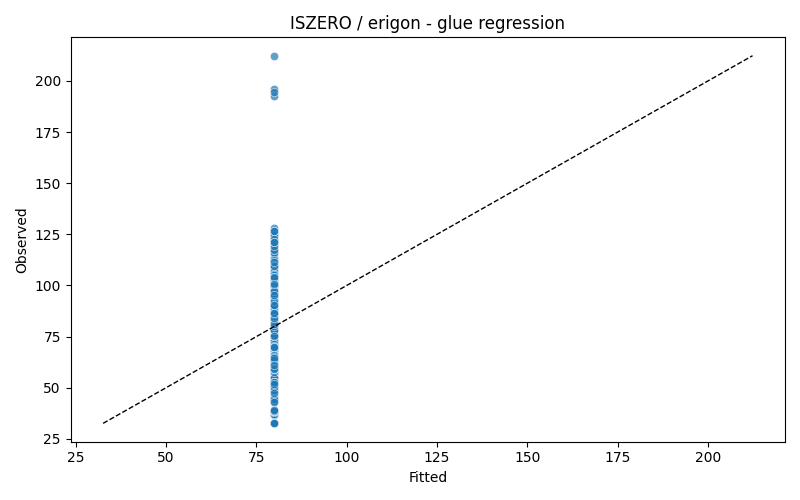

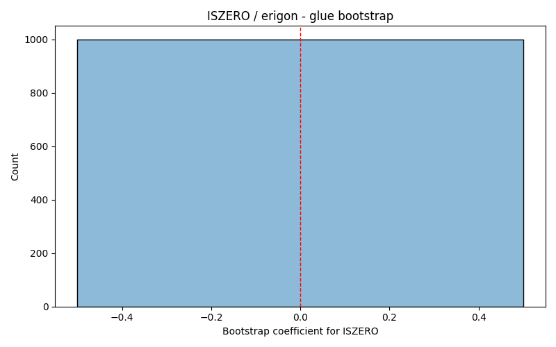

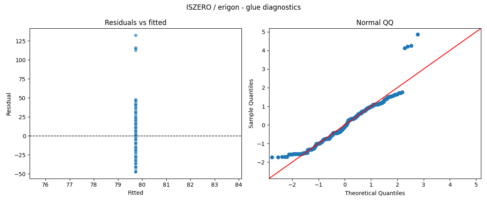

</details>

<details><summary><code>JUMPDEST</code> · nobs=88 · runtime_ms=0 · p=1.00e+00 · R²=0</summary>

```
==============================================================================
                           NNLS Regression Results                            
==============================================================================
Dep. Variable:          test_runtime_ms              R-squared:          0.000
Model:                  NNLS                    Adj. R-squared:         -0.012
No. Observations:       88                                RMSE:          38.18
Df Residuals:           86                                 MAE:          36.60
Df Model:               1      
==============================================================================
                      coef     std err     P-value      [0.025      0.975]
------------------------------------------------------------------------------
         const    138.7427      4.1814       0.001    130.9925    146.9977
      JUMPDEST      0.0000      0.0000       1.000      0.0000      0.0000
==============================================================================
Notes: Non-negative least squares with bootstrap inference (1000 iterations)
==============================================================================
```

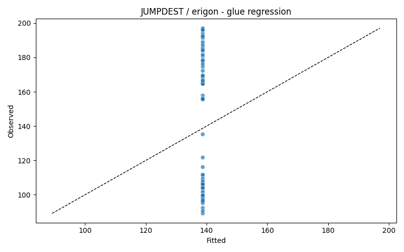


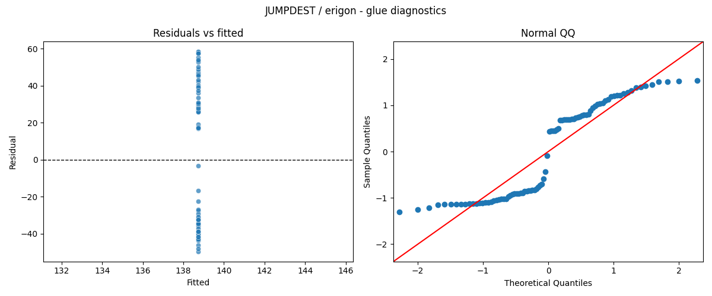

</details>

<details><summary><code>SWAP</code> · nobs=6292 · runtime_ms=0 · p=1.00e+00 · R²=-2.22e-16</summary>

```
==============================================================================
                           NNLS Regression Results                            
==============================================================================
Dep. Variable:          test_runtime_ms              R-squared:         -0.000
Model:                  NNLS                    Adj. R-squared:         -0.000
No. Observations:       6292                              RMSE:          32.51
Df Residuals:           6290                               MAE:          26.52
Df Model:               1      
==============================================================================
                      coef     std err     P-value      [0.025      0.975]
------------------------------------------------------------------------------
         const    102.0047      0.4195       0.001    101.1730    102.7679
          SWAP      0.0000      0.0000       1.000      0.0000      0.0000
==============================================================================
Notes: Non-negative least squares with bootstrap inference (1000 iterations)
==============================================================================
```

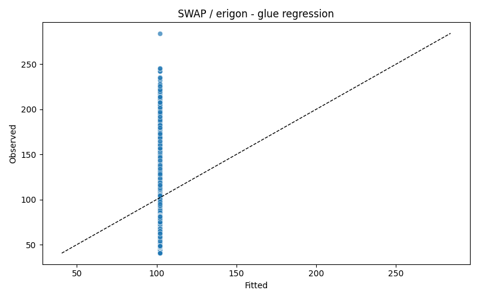


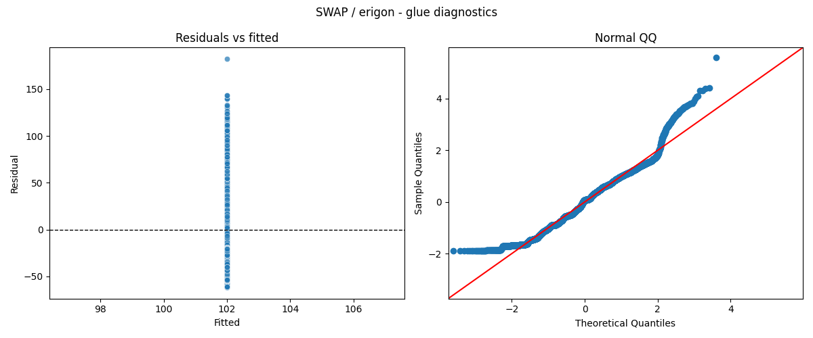

</details>

### Mixed glue (tier A) · erigon

<details><summary><code>ADD</code> · nobs=396 · runtime_ms=0 · p=1.00e+00 · R²=-2.22e-16</summary>

```
==============================================================================
                           NNLS Regression Results                            
==============================================================================
Dep. Variable:          test_runtime_ms              R-squared:         -0.000
Model:                  NNLS                    Adj. R-squared:         -0.003
No. Observations:       396                               RMSE:          34.49
Df Residuals:           394                                MAE:          28.60
Df Model:               1      
==============================================================================
                      coef     std err     P-value      [0.025      0.975]
------------------------------------------------------------------------------
         const    105.1450      1.6831       0.001    101.7465    108.4278
           ADD      0.0000      0.0000       1.000      0.0000      0.0000
==============================================================================
Notes: Non-negative least squares with bootstrap inference (1000 iterations)
==============================================================================
```


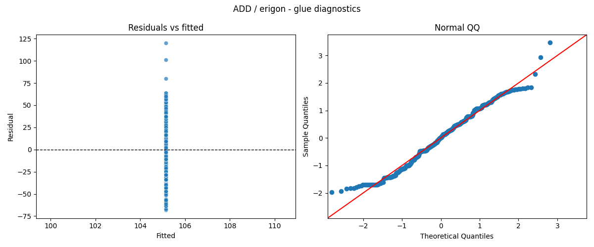

</details>

<details><summary><code>AND</code> · nobs=352 · runtime_ms=0 · p=1.00e+00 · R²=0</summary>

```
==============================================================================
                           NNLS Regression Results                            
==============================================================================
Dep. Variable:          test_runtime_ms              R-squared:          0.000
Model:                  NNLS                    Adj. R-squared:         -0.003
No. Observations:       352                               RMSE:          34.86
Df Residuals:           350                                MAE:          28.21
Df Model:               1      
==============================================================================
                      coef     std err     P-value      [0.025      0.975]
------------------------------------------------------------------------------
         const     98.9266      1.8196       0.001     95.4425    102.4133
           AND      0.0000      0.0000       1.000      0.0000      0.0000
==============================================================================
Notes: Non-negative least squares with bootstrap inference (1000 iterations)
==============================================================================
```


</details>

<details><summary><code>CALLDATACOPY</code> · nobs=10340 · runtime_ms=0 · p=1.00e+00 · R²=-2.22e-16</summary>

```
==============================================================================
                           NNLS Regression Results                            
==============================================================================
Dep. Variable:          test_runtime_ms              R-squared:         -0.000
Model:                  NNLS                    Adj. R-squared:         -0.000
No. Observations:       10340                             RMSE:          61.70
Df Residuals:           10338                              MAE:          51.44
Df Model:               1      
==============================================================================
                      coef     std err     P-value      [0.025      0.975]
------------------------------------------------------------------------------
         const     88.1698      0.5772       0.001     87.0580     89.3434
  CALLDATACOPY      0.0000      0.0000       1.000      0.0000      0.0000
==============================================================================
Notes: Non-negative least squares with bootstrap inference (1000 iterations)
==============================================================================
```

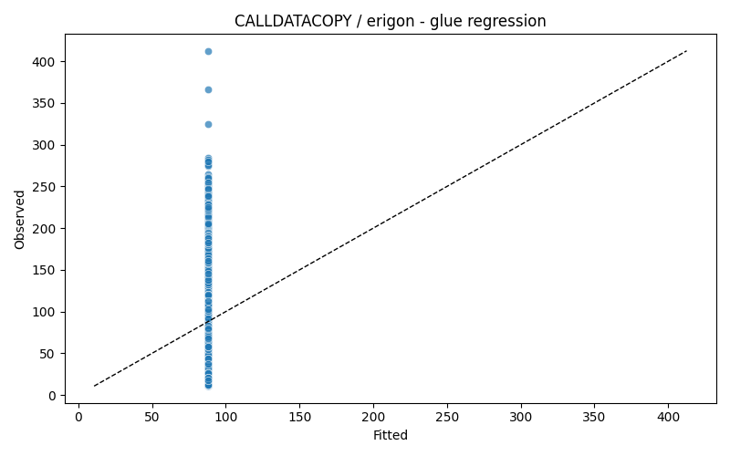


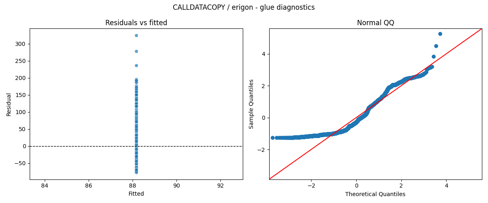

</details>

<details><summary><code>CALLDATALOAD</code> · nobs=1936 · runtime_ms=5.662e-05 · p=1.00e-03 · R²=0.1304</summary>

```
==============================================================================
                           NNLS Regression Results                            
==============================================================================
Dep. Variable:          test_runtime_ms              R-squared:          0.130
Model:                  NNLS                    Adj. R-squared:          0.130
No. Observations:       1936                              RMSE:           0.56
Df Residuals:           1934                               MAE:           0.30
Df Model:               1      
==============================================================================
                      coef     std err     P-value      [0.025      0.975]
------------------------------------------------------------------------------
         const      4.1490      0.0397       0.001      4.0746      4.2297
  CALLDATALOAD      0.0001      0.0000       0.001      0.0001      0.0001
==============================================================================
Notes: Non-negative least squares with bootstrap inference (1000 iterations)
==============================================================================
```

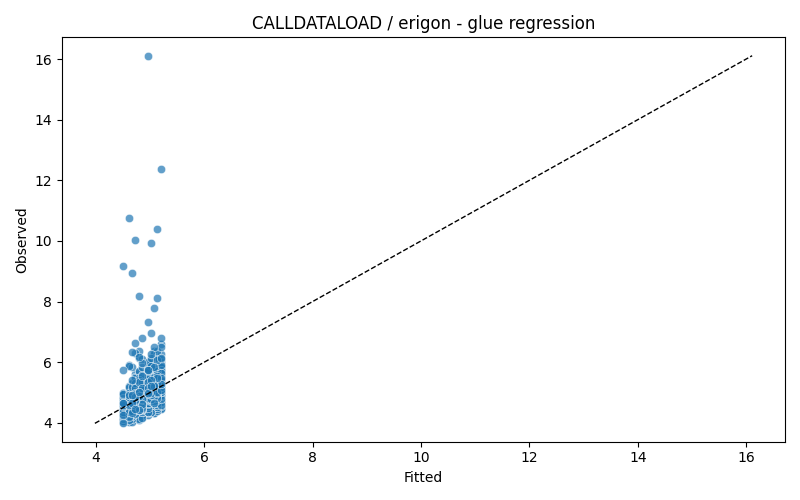

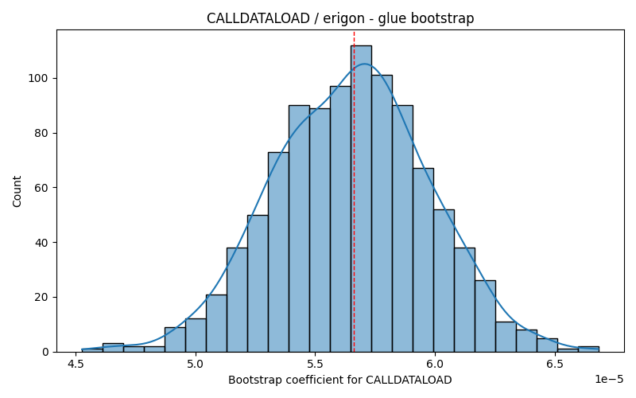

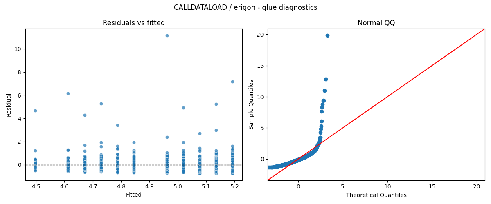

</details>

<details><summary><code>DIV</code> · nobs=484 · runtime_ms=0 · p=1.00e+00 · R²=0</summary>

```
==============================================================================
                           NNLS Regression Results                            
==============================================================================
Dep. Variable:          test_runtime_ms              R-squared:          0.000
Model:                  NNLS                    Adj. R-squared:         -0.002
No. Observations:       484                               RMSE:          81.52
Df Residuals:           482                                MAE:          64.29
Df Model:               1      
==============================================================================
                      coef     std err     P-value      [0.025      0.975]
------------------------------------------------------------------------------
         const    265.7685      3.8369       0.001    258.4364    272.9885
           DIV      0.0000      0.0000       1.000      0.0000      0.0000
==============================================================================
Notes: Non-negative least squares with bootstrap inference (1000 iterations)
==============================================================================
```

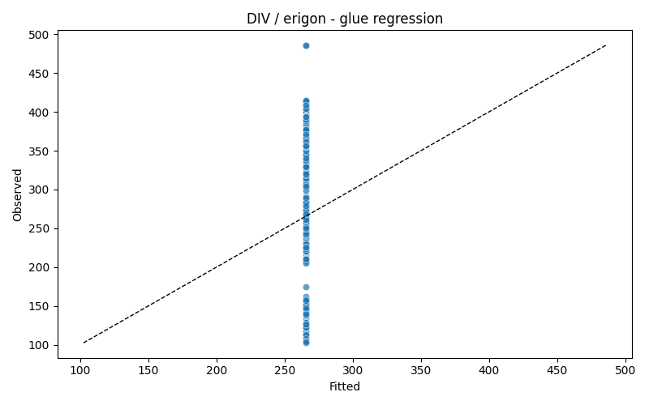


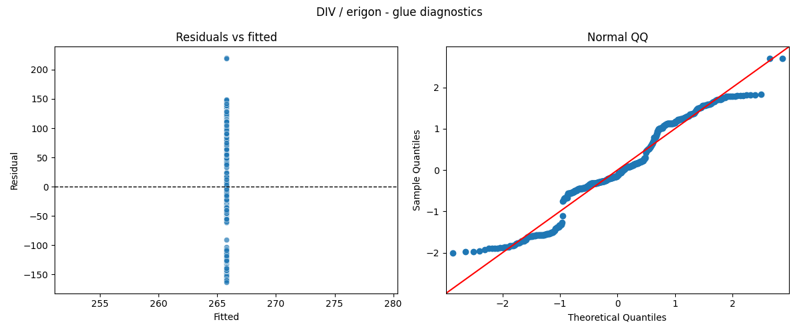

</details>

<details><summary><code>EXP</code> · nobs=484 · runtime_ms=0.0003631 · p=1.00e-03 · R²=0.902</summary>

```
==============================================================================
                           NNLS Regression Results                            
==============================================================================
Dep. Variable:          test_runtime_ms              R-squared:          0.902
Model:                  NNLS                    Adj. R-squared:          0.902
No. Observations:       484                               RMSE:           4.69
Df Residuals:           482                                MAE:           3.93
Df Model:               1      
==============================================================================
                      coef     std err     P-value      [0.025      0.975]
------------------------------------------------------------------------------
         const     10.6649      0.7583       0.001      9.1355     12.1082
           EXP      0.0004      0.0000       0.001      0.0004      0.0004
==============================================================================
Notes: Non-negative least squares with bootstrap inference (1000 iterations)
==============================================================================
```

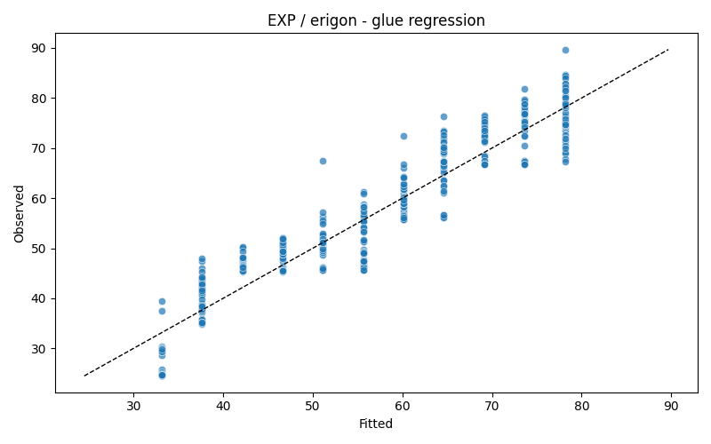

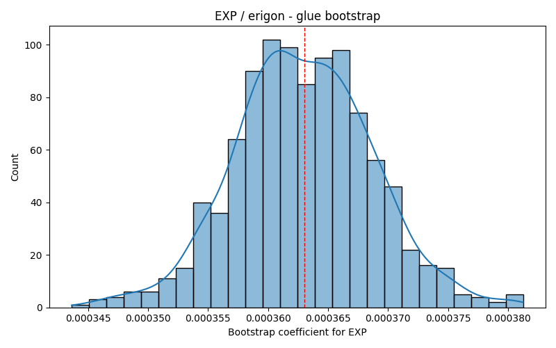

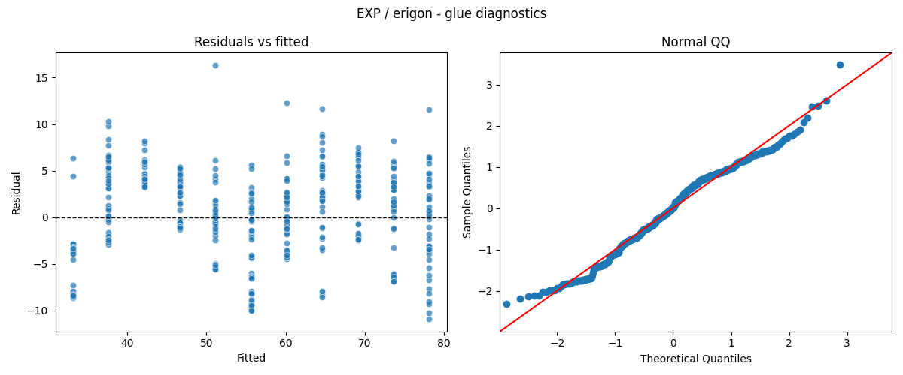

</details>

<details><summary><code>GT</code> · nobs=352 · runtime_ms=0 · p=1.00e+00 · R²=0</summary>

```
==============================================================================
                           NNLS Regression Results                            
==============================================================================
Dep. Variable:          test_runtime_ms              R-squared:          0.000
Model:                  NNLS                    Adj. R-squared:         -0.003
No. Observations:       352                               RMSE:          34.22
Df Residuals:           350                                MAE:          28.05
Df Model:               1      
==============================================================================
                      coef     std err     P-value      [0.025      0.975]
------------------------------------------------------------------------------
         const    101.1231      1.9132       0.001     97.6738    105.1280
            GT      0.0000      0.0000       1.000      0.0000      0.0000
==============================================================================
Notes: Non-negative least squares with bootstrap inference (1000 iterations)
==============================================================================
```

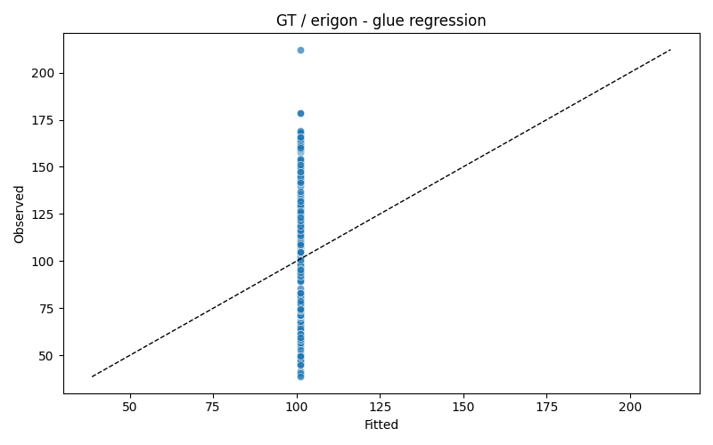


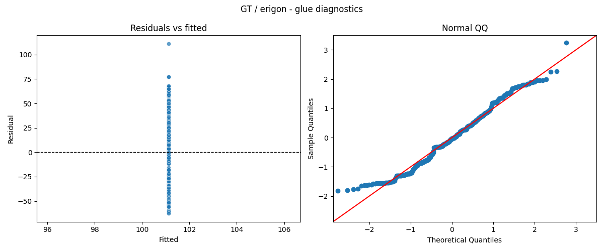

</details>

<details><summary><code>JUMPI</code> · nobs=484 · runtime_ms=0 · p=1.00e+00 · R²=0</summary>

```
==============================================================================
                           NNLS Regression Results                            
==============================================================================
Dep. Variable:          test_runtime_ms              R-squared:          0.000
Model:                  NNLS                    Adj. R-squared:         -0.002
No. Observations:       484                               RMSE:          18.85
Df Residuals:           482                                MAE:          15.11
Df Model:               1      
==============================================================================
                      coef     std err     P-value      [0.025      0.975]
------------------------------------------------------------------------------
         const     58.9510      0.8260       0.001     57.3598     60.5584
         JUMPI      0.0000      0.0000       1.000      0.0000      0.0000
==============================================================================
Notes: Non-negative least squares with bootstrap inference (1000 iterations)
==============================================================================
```

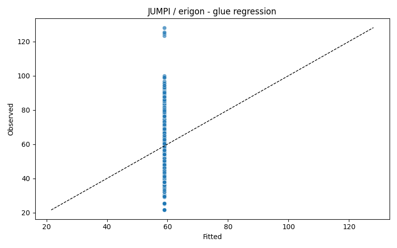


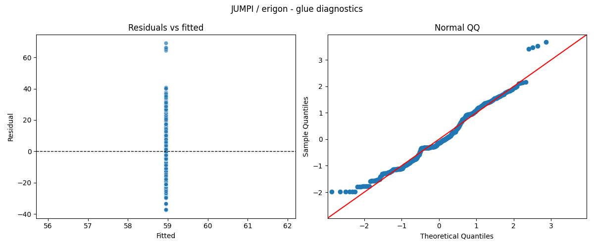

</details>

<details><summary><code>LT</code> · nobs=352 · runtime_ms=0 · p=1.00e+00 · R²=1.11e-16</summary>

```
==============================================================================
                           NNLS Regression Results                            
==============================================================================
Dep. Variable:          test_runtime_ms              R-squared:          0.000
Model:                  NNLS                    Adj. R-squared:         -0.003
No. Observations:       352                               RMSE:          35.19
Df Residuals:           350                                MAE:          28.70
Df Model:               1      
==============================================================================
                      coef     std err     P-value      [0.025      0.975]
------------------------------------------------------------------------------
         const    102.6673      1.9389       0.001     99.0354    106.4254
            LT      0.0000      0.0000       1.000      0.0000      0.0000
==============================================================================
Notes: Non-negative least squares with bootstrap inference (1000 iterations)
==============================================================================
```

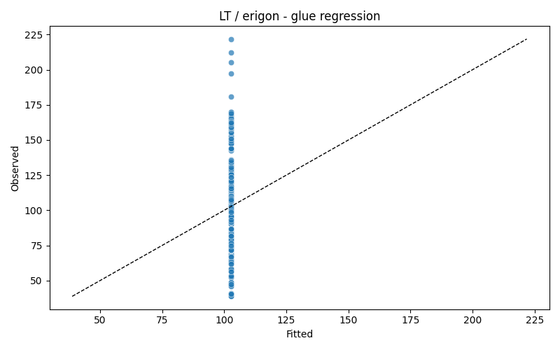


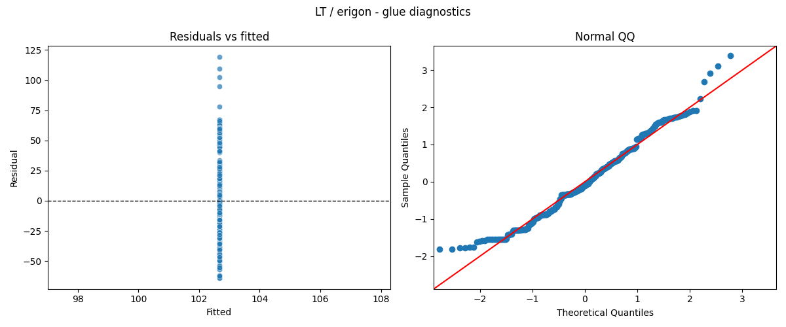

</details>

<details><summary><code>MSTORE</code> · nobs=1980 · runtime_ms=0 · p=1.00e+00 · R²=0</summary>

```
==============================================================================
                           NNLS Regression Results                            
==============================================================================
Dep. Variable:          test_runtime_ms              R-squared:          0.000
Model:                  NNLS                    Adj. R-squared:         -0.001
No. Observations:       1980                              RMSE:          47.07
Df Residuals:           1978                               MAE:          39.57
Df Model:               1      
==============================================================================
                      coef     std err     P-value      [0.025      0.975]
------------------------------------------------------------------------------
         const    145.7047      1.0562       0.001    143.7207    147.8607
        MSTORE      0.0000      0.0000       1.000      0.0000      0.0000
==============================================================================
Notes: Non-negative least squares with bootstrap inference (1000 iterations)
==============================================================================
```

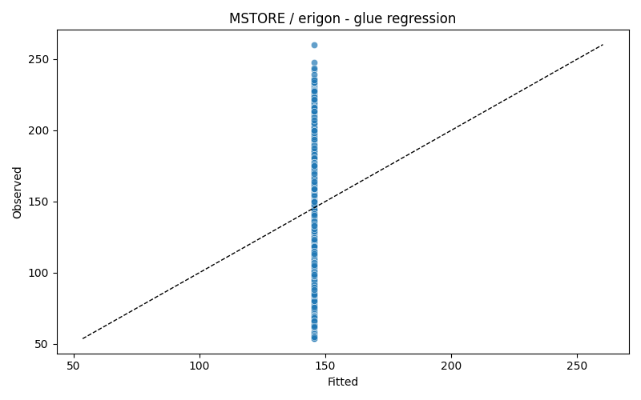


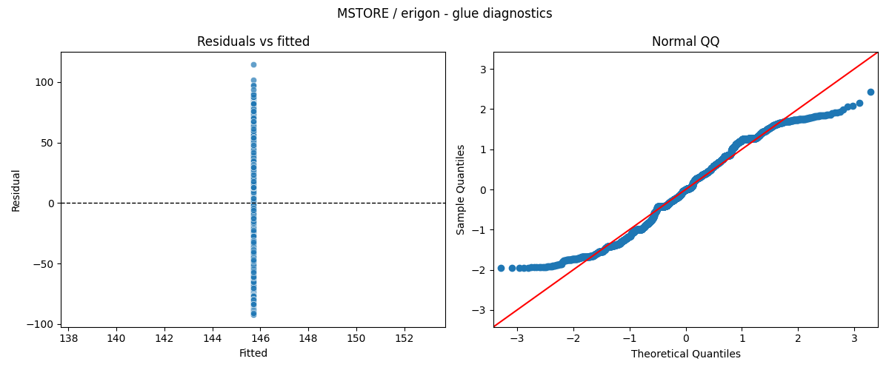

</details>

<details><summary><code>MSTORE8</code> · nobs=1980 · runtime_ms=0 · p=1.00e+00 · R²=0</summary>

```
==============================================================================
                           NNLS Regression Results                            
==============================================================================
Dep. Variable:          test_runtime_ms              R-squared:          0.000
Model:                  NNLS                    Adj. R-squared:         -0.001
No. Observations:       1980                              RMSE:          42.93
Df Residuals:           1978                               MAE:          36.30
Df Model:               1      
==============================================================================
                      coef     std err     P-value      [0.025      0.975]
------------------------------------------------------------------------------
         const    135.4791      0.9773       0.001    133.5626    137.4418
       MSTORE8      0.0000      0.0000       1.000      0.0000      0.0000
==============================================================================
Notes: Non-negative least squares with bootstrap inference (1000 iterations)
==============================================================================
```

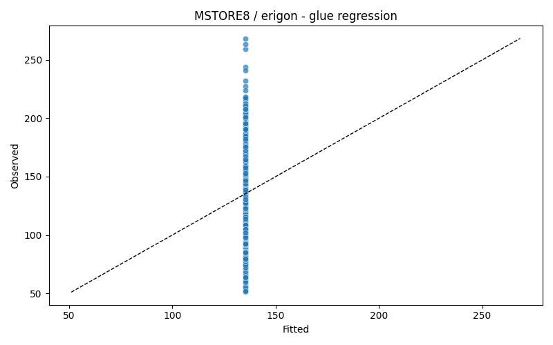

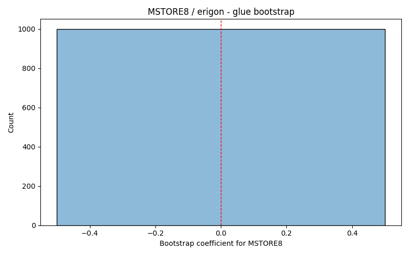

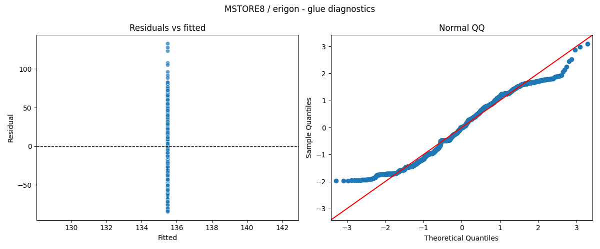

</details>

<details><summary><code>MUL</code> · nobs=440 · runtime_ms=0 · p=1.00e+00 · R²=0</summary>

```
==============================================================================
                           NNLS Regression Results                            
==============================================================================
Dep. Variable:          test_runtime_ms              R-squared:          0.000
Model:                  NNLS                    Adj. R-squared:         -0.002
No. Observations:       440                               RMSE:          34.66
Df Residuals:           438                                MAE:          29.01
Df Model:               1      
==============================================================================
                      coef     std err     P-value      [0.025      0.975]
------------------------------------------------------------------------------
         const    108.4193      1.6333       0.001    105.3125    111.4626
           MUL      0.0000      0.0000       1.000      0.0000      0.0000
==============================================================================
Notes: Non-negative least squares with bootstrap inference (1000 iterations)
==============================================================================
```

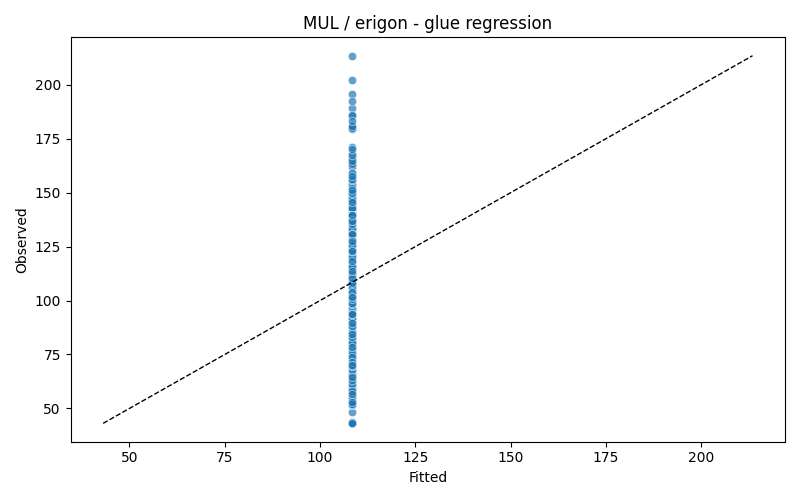


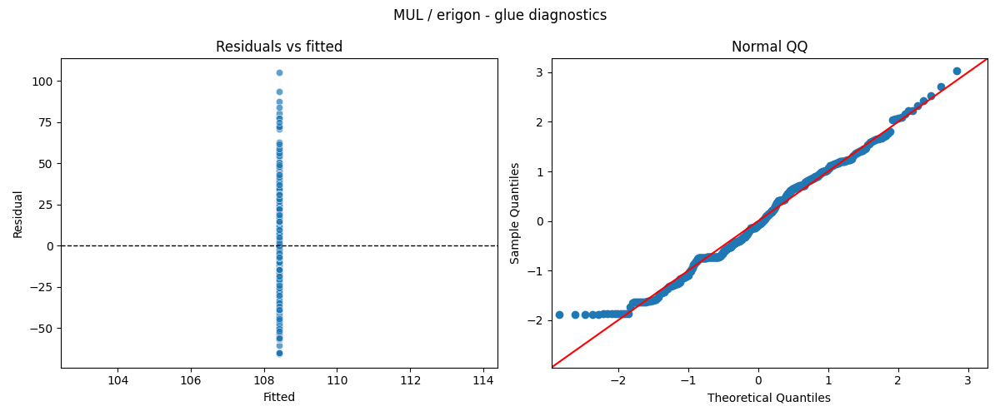

</details>

<details><summary><code>PC</code> · nobs=264 · runtime_ms=1.265e-05 · p=1.00e-03 · R²=0.4597</summary>

```
==============================================================================
                           NNLS Regression Results                            
==============================================================================
Dep. Variable:          test_runtime_ms              R-squared:          0.460
Model:                  NNLS                    Adj. R-squared:          0.458
No. Observations:       264                               RMSE:          30.48
Df Residuals:           262                                MAE:          26.06
Df Model:               1      
==============================================================================
                      coef     std err     P-value      [0.025      0.975]
------------------------------------------------------------------------------
         const     98.0769      3.7199       0.001     90.4271    105.3257
            PC      0.0000      0.0000       0.001      0.0000      0.0000
==============================================================================
Notes: Non-negative least squares with bootstrap inference (1000 iterations)
==============================================================================
```

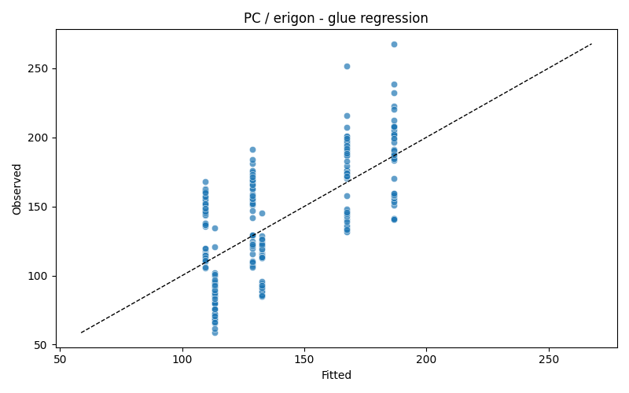

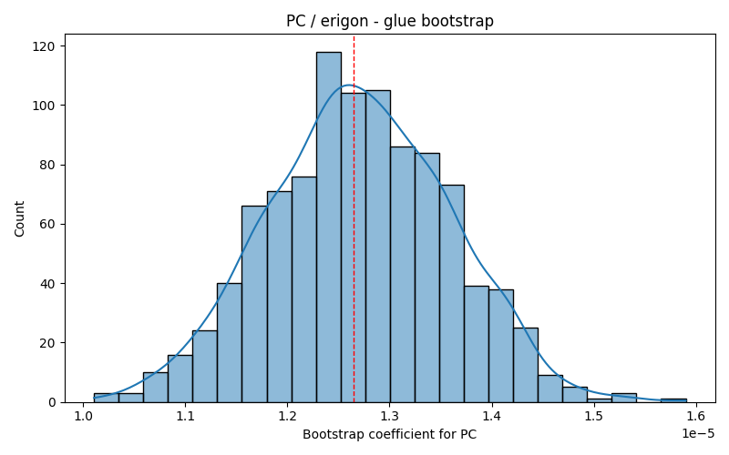

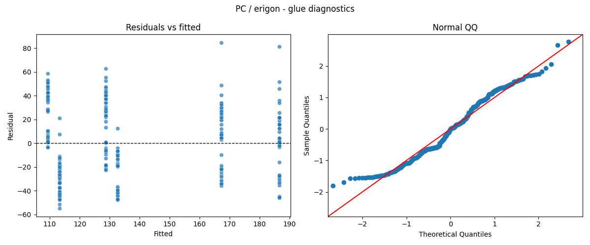

</details>

<details><summary><code>RETURNDATASIZE</code> · nobs=1056 · runtime_ms=1.832e-05 · p=1.00e-03 · R²=0.4037</summary>

```
==============================================================================
                           NNLS Regression Results                            
==============================================================================
Dep. Variable:          test_runtime_ms              R-squared:          0.404
Model:                  NNLS                    Adj. R-squared:          0.403
No. Observations:       1056                              RMSE:          26.13
Df Residuals:           1054                               MAE:          19.04
Df Model:               1      
==============================================================================
                      coef     std err     P-value      [0.025      0.975]
------------------------------------------------------------------------------
         const     82.6023      1.5674       0.001     79.5205     85.5519
RETURNDATASIZE      0.0000      0.0000       0.001      0.0000      0.0000
==============================================================================
Notes: Non-negative least squares with bootstrap inference (1000 iterations)
==============================================================================
```

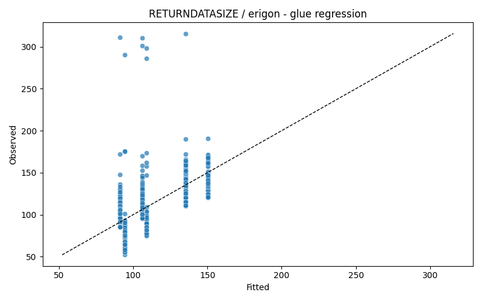

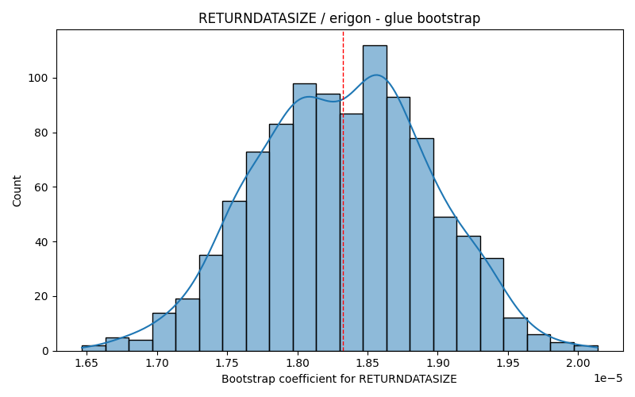

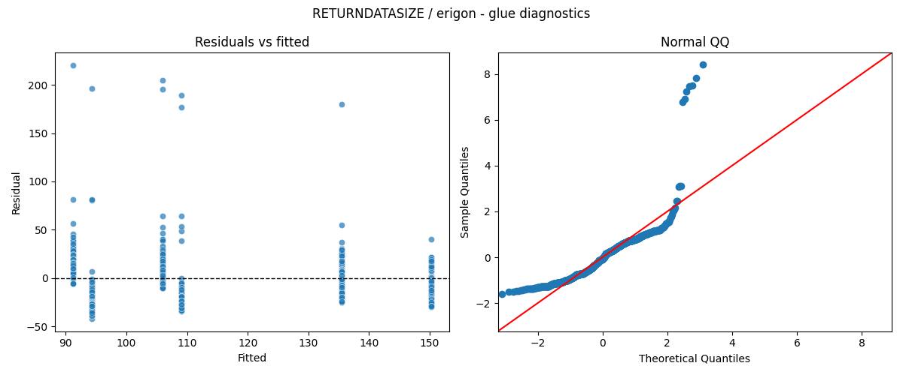

</details>

<details><summary><code>SELFBALANCE</code> · nobs=484 · runtime_ms=0 · p=1.00e+00 · R²=0</summary>

```
==============================================================================
                           NNLS Regression Results                            
==============================================================================
Dep. Variable:          test_runtime_ms              R-squared:          0.000
Model:                  NNLS                    Adj. R-squared:         -0.002
No. Observations:       484                               RMSE:          18.65
Df Residuals:           482                                MAE:          15.30
Df Model:               1      
==============================================================================
                      coef     std err     P-value      [0.025      0.975]
------------------------------------------------------------------------------
         const     61.3197      0.8840       0.001     59.6003     63.1533
   SELFBALANCE      0.0000      0.0000       1.000      0.0000      0.0000
==============================================================================
Notes: Non-negative least squares with bootstrap inference (1000 iterations)
==============================================================================
```

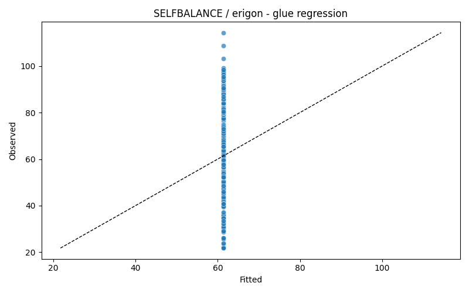


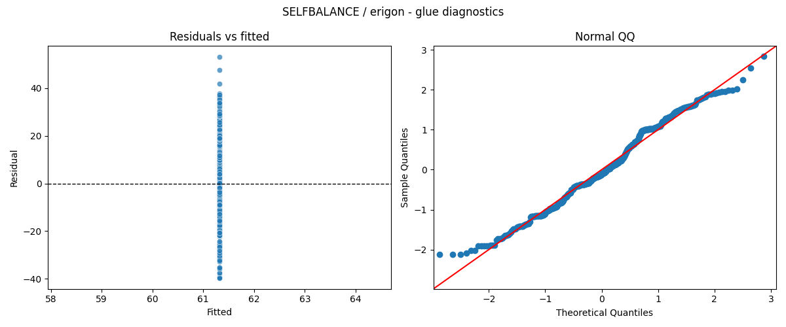

</details>

<details><summary><code>SUB</code> · nobs=352 · runtime_ms=0 · p=1.00e+00 · R²=0</summary>

```
==============================================================================
                           NNLS Regression Results                            
==============================================================================
Dep. Variable:          test_runtime_ms              R-squared:          0.000
Model:                  NNLS                    Adj. R-squared:         -0.003
No. Observations:       352                               RMSE:          34.08
Df Residuals:           350                                MAE:          27.90
Df Model:               1      
==============================================================================
                      coef     std err     P-value      [0.025      0.975]
------------------------------------------------------------------------------
         const    101.2058      1.9772       0.001     97.3600    105.1679
           SUB      0.0000      0.0000       1.000      0.0000      0.0000
==============================================================================
Notes: Non-negative least squares with bootstrap inference (1000 iterations)
==============================================================================
```


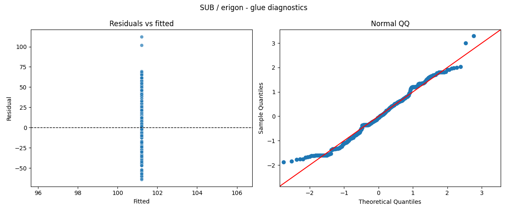

</details>

### Mixed glue (tier B) · erigon

<details><summary><code>JUMP</code> · nobs=440 · runtime_ms=0 · p=1.00e+00 · R²=0</summary>

```
==============================================================================
                           NNLS Regression Results                            
==============================================================================
Dep. Variable:          test_runtime_ms              R-squared:          0.000
Model:                  NNLS                    Adj. R-squared:         -0.002
No. Observations:       440                               RMSE:          34.59
Df Residuals:           438                                MAE:          28.22
Df Model:               1      
==============================================================================
                      coef     std err     P-value      [0.025      0.975]
------------------------------------------------------------------------------
         const     95.7754      1.6713       0.001     92.5509     98.9732
          JUMP      0.0000      0.0000       1.000      0.0000      0.0000
==============================================================================
Notes: Non-negative least squares with bootstrap inference (1000 iterations)
==============================================================================
```

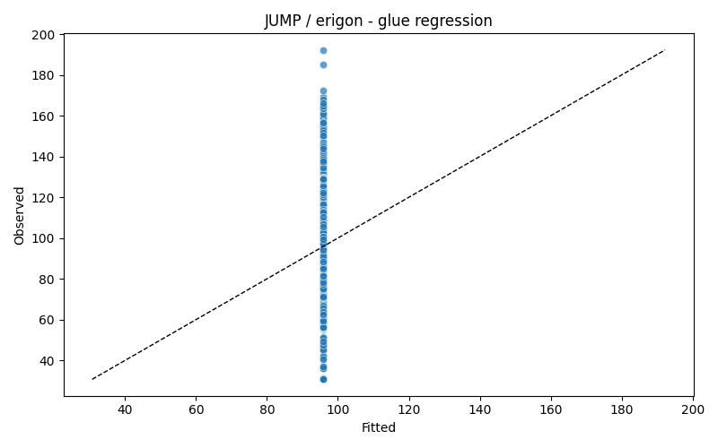


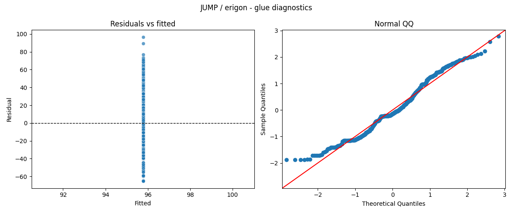

</details>

<details><summary><code>KECCAK256</code> · nobs=0 · runtime_ms=n/a · p=n/a · R²=n/a</summary>

</details>

## ethrex

| glue_opcode | nobs | glue_runtime_ms | p_value | rsquared |
| --- | --- | --- | --- | --- |
| `ISZERO` | 64 | 0 | 1.00e+00 | 0 |
| `JUMPDEST` | 16 | 0 | 1.00e+00 | 0 |
| `SWAP` | 1144 | 0 | 1.00e+00 | -2.22e-16 |
| `CALLDATASIZE` | 4093 | 5.632e-06 | 1.00e-03 | 0.68 |
| `DUP` | 4093 | 0 | 1.00e+00 | 0.68 |
| `GAS` | 4093 | 7.06e-06 | 1.00e-03 | 0.68 |
| `MLOAD` | 4093 | 5.331e-06 | 1.00e-03 | 0.68 |
| `PUSH` | 4093 | 0 | 1.00e+00 | 0.68 |
| `PUSH0` | 4093 | 1.732e-06 | 2.50e-02 | 0.68 |
| `STATICCALL` | 4093 | 7.786e-05 | 1.00e-03 | 0.68 |
| `ADD` | 72 | 0 | 1.00e+00 | -2.22e-16 |
| `AND` | 64 | 0 | 1.00e+00 | 0 |
| `CALLDATACOPY` | 1880 | 0 | 1.00e+00 | 0 |
| `CALLDATALOAD` | 352 | 1.573e-05 | 1.00e-03 | 0.1588 |
| `DIV` | 88 | 0 | 1.00e+00 | -2.22e-16 |
| `EXP` | 88 | 0.0009546 | 1.00e-03 | 0.8359 |
| `GT` | 64 | 0 | 1.00e+00 | 0 |
| `JUMPI` | 88 | 0 | 1.00e+00 | 0 |
| `LT` | 64 | 0 | 1.00e+00 | 1.11e-16 |
| `MSTORE` | 360 | 0 | 1.00e+00 | 2.22e-16 |
| `MSTORE8` | 360 | 0 | 1.00e+00 | -2.22e-16 |
| `MUL` | 80 | 0 | 1.00e+00 | -2.22e-16 |
| `PC` | 48 | 4.931e-06 | 1.00e-03 | 0.3491 |
| `RETURNDATASIZE` | 192 | 7.177e-06 | 1.00e-03 | 0.3572 |
| `SELFBALANCE` | 88 | 0 | 1.00e+00 | 1.11e-16 |
| `SUB` | 64 | 0 | 1.00e+00 | 0 |
| `JUMP` | 80 | 0 | 1.00e+00 | 0 |
| `KECCAK256` | 0 | n/a | n/a | n/a |

### Cycle glue — joint fit · ethrex

<details><summary>Joint NNLS regression summary</summary>

```
==============================================================================
                           NNLS Regression Results                            
==============================================================================
Dep. Variable:          test_runtime_ms              R-squared:          0.680
Model:                  NNLS                    Adj. R-squared:          0.679
No. Observations:       4093                              RMSE:          14.84
Df Residuals:           4085                               MAE:          12.85
Df Model:               7      
==============================================================================
                      coef     std err     P-value      [0.025      0.975]
------------------------------------------------------------------------------
         const     50.6220      0.2406       0.001     50.1293     51.0848
  CALLDATASIZE      0.0000      0.0000       0.001      0.0000      0.0000
           DUP      0.0000      0.0000       1.000      0.0000      0.0000
           GAS      0.0000      0.0000       0.001      0.0000      0.0000
         MLOAD      0.0000      0.0000       0.001      0.0000      0.0000
          PUSH      0.0000      0.0000       1.000      0.0000      0.0000
         PUSH0      0.0000      0.0000       0.025      0.0000      0.0000
    STATICCALL      0.0001      0.0000       0.001      0.0001      0.0001
==============================================================================
Notes: Non-negative least squares with bootstrap inference (1000 iterations)
==============================================================================
```

</details>

<details><summary><code>CALLDATASIZE</code> · nobs=4093 · runtime_ms=5.632e-06 · p=1.00e-03 · R²=0.68</summary>

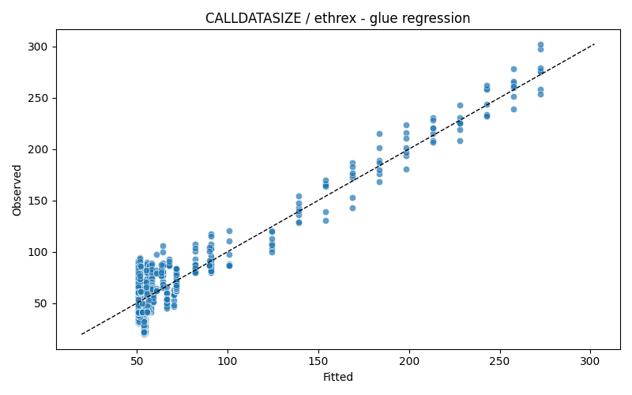

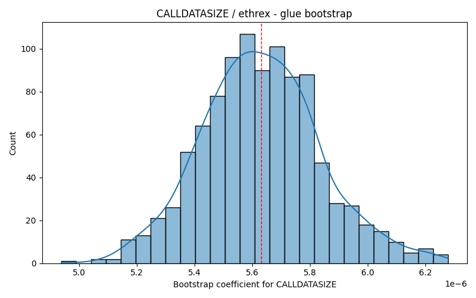

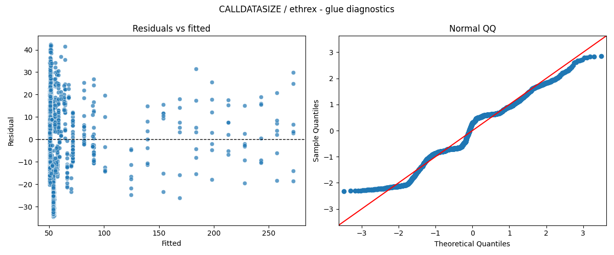

</details>

<details><summary><code>DUP</code> · nobs=4093 · runtime_ms=0 · p=1.00e+00 · R²=0.68</summary>


</details>

<details><summary><code>GAS</code> · nobs=4093 · runtime_ms=7.06e-06 · p=1.00e-03 · R²=0.68</summary>

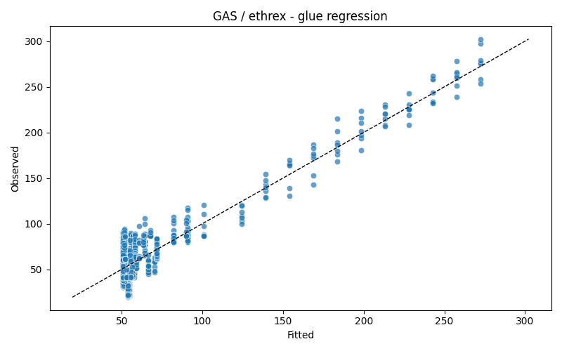

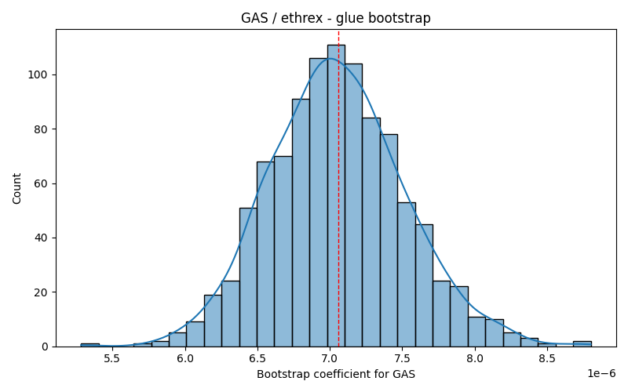


</details>

<details><summary><code>MLOAD</code> · nobs=4093 · runtime_ms=5.331e-06 · p=1.00e-03 · R²=0.68</summary>


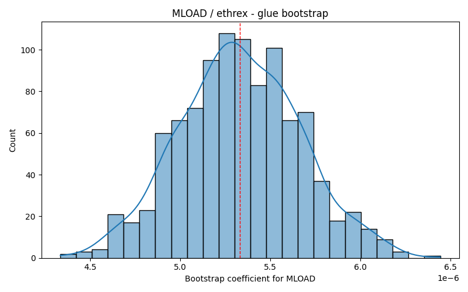


</details>

<details><summary><code>PUSH</code> · nobs=4093 · runtime_ms=0 · p=1.00e+00 · R²=0.68</summary>


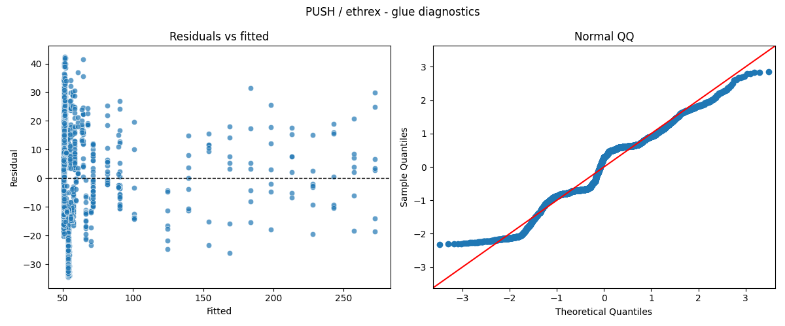

</details>

<details><summary><code>PUSH0</code> · nobs=4093 · runtime_ms=1.732e-06 · p=2.50e-02 · R²=0.68</summary>


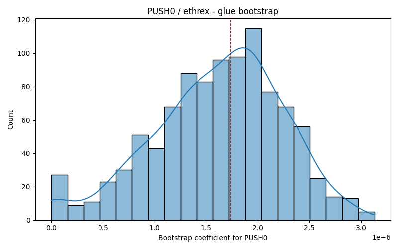


</details>

<details><summary><code>STATICCALL</code> · nobs=4093 · runtime_ms=7.786e-05 · p=1.00e-03 · R²=0.68</summary>

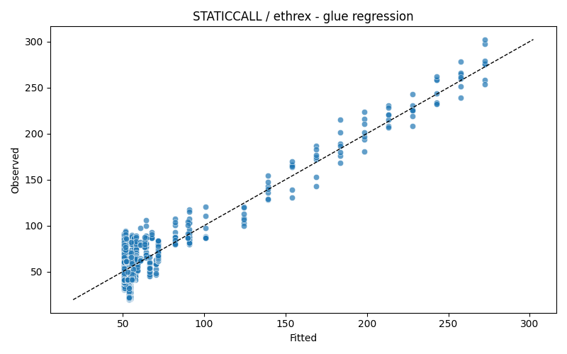

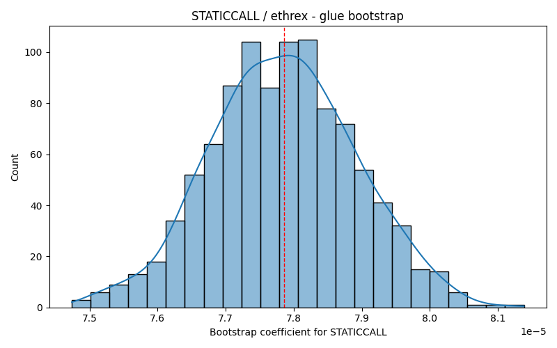


</details>

### Pure glue · ethrex

<details><summary><code>ISZERO</code> · nobs=64 · runtime_ms=0 · p=1.00e+00 · R²=0</summary>

```
==============================================================================
                           NNLS Regression Results                            
==============================================================================
Dep. Variable:          test_runtime_ms              R-squared:          0.000
Model:                  NNLS                    Adj. R-squared:         -0.016
No. Observations:       64                                RMSE:          12.81
Df Residuals:           62                                 MAE:          11.27
Df Model:               1      
==============================================================================
                      coef     std err     P-value      [0.025      0.975]
------------------------------------------------------------------------------
         const     43.6771      1.5957       0.001     40.4843     46.6440
        ISZERO      0.0000      0.0000       1.000      0.0000      0.0000
==============================================================================
Notes: Non-negative least squares with bootstrap inference (1000 iterations)
==============================================================================
```

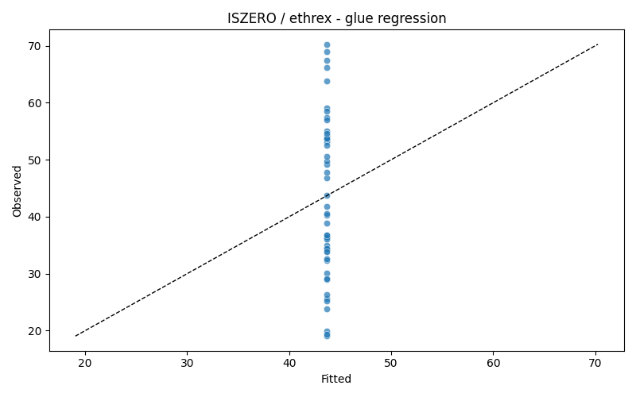

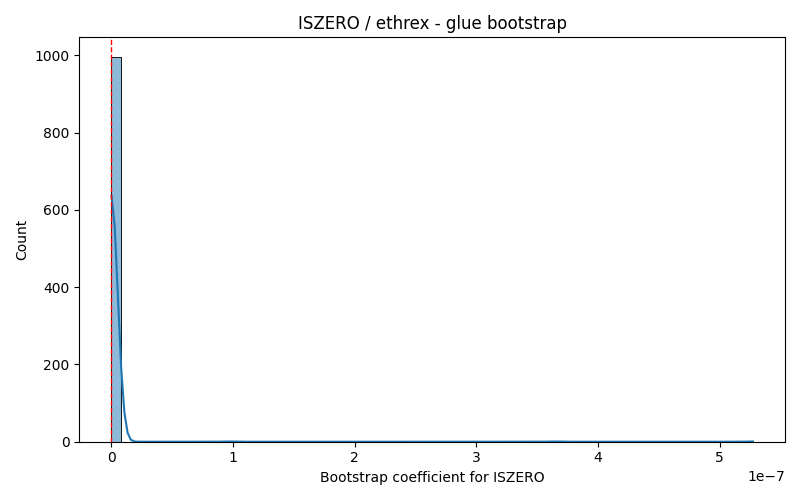

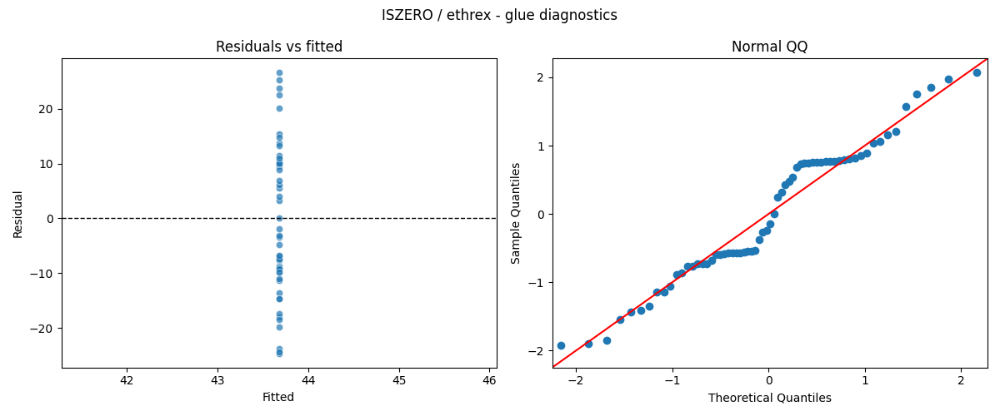

</details>

<details><summary><code>JUMPDEST</code> · nobs=16 · runtime_ms=0 · p=1.00e+00 · R²=0</summary>

```
==============================================================================
                           NNLS Regression Results                            
==============================================================================
Dep. Variable:          test_runtime_ms              R-squared:          0.000
Model:                  NNLS                    Adj. R-squared:         -0.071
No. Observations:       16                                RMSE:          16.76
Df Residuals:           14                                 MAE:          16.16
Df Model:               1      
==============================================================================
                      coef     std err     P-value      [0.025      0.975]
------------------------------------------------------------------------------
         const     81.3029      4.2377       0.001     72.7490     89.4136
      JUMPDEST      0.0000      0.0000       1.000      0.0000      0.0000
==============================================================================
Notes: Non-negative least squares with bootstrap inference (1000 iterations)
==============================================================================
```

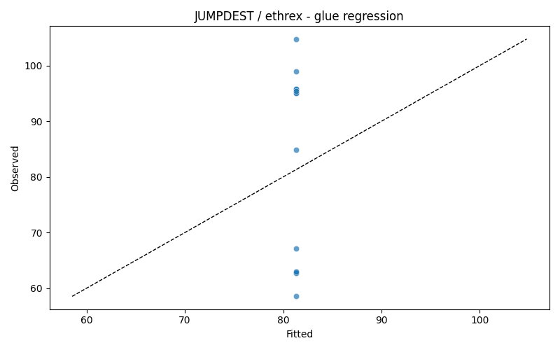

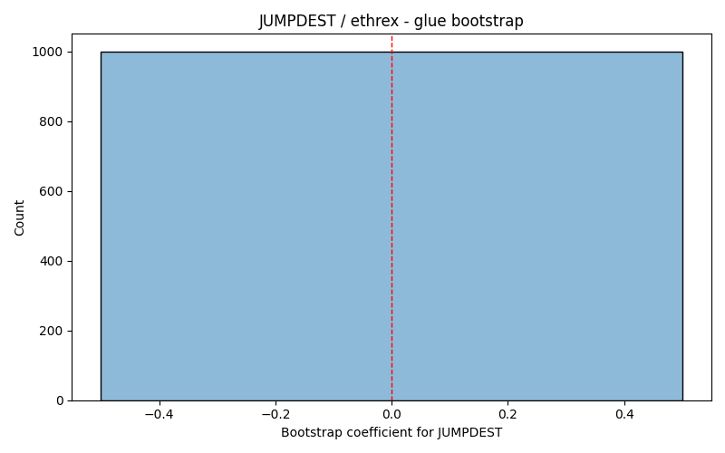

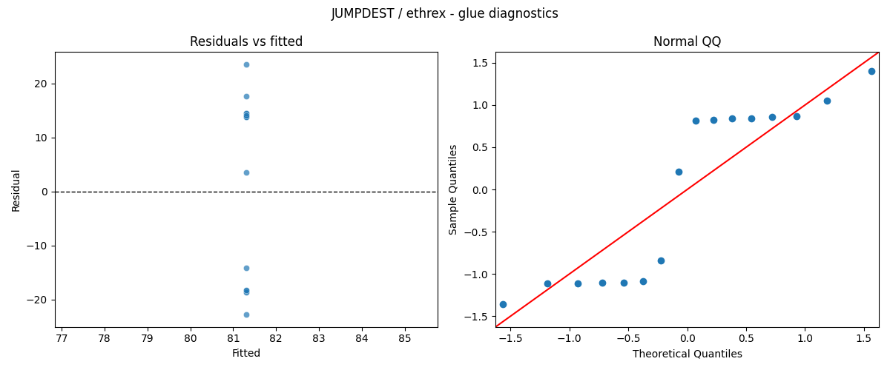

</details>

<details><summary><code>SWAP</code> · nobs=1144 · runtime_ms=0 · p=1.00e+00 · R²=-2.22e-16</summary>

```
==============================================================================
                           NNLS Regression Results                            
==============================================================================
Dep. Variable:          test_runtime_ms              R-squared:         -0.000
Model:                  NNLS                    Adj. R-squared:         -0.001
No. Observations:       1144                              RMSE:          17.72
Df Residuals:           1142                               MAE:          15.69
Df Model:               1      
==============================================================================
                      coef     std err     P-value      [0.025      0.975]
------------------------------------------------------------------------------
         const     62.9667      0.5167       0.001     61.9198     63.9814
          SWAP      0.0000      0.0000       1.000      0.0000      0.0000
==============================================================================
Notes: Non-negative least squares with bootstrap inference (1000 iterations)
==============================================================================
```

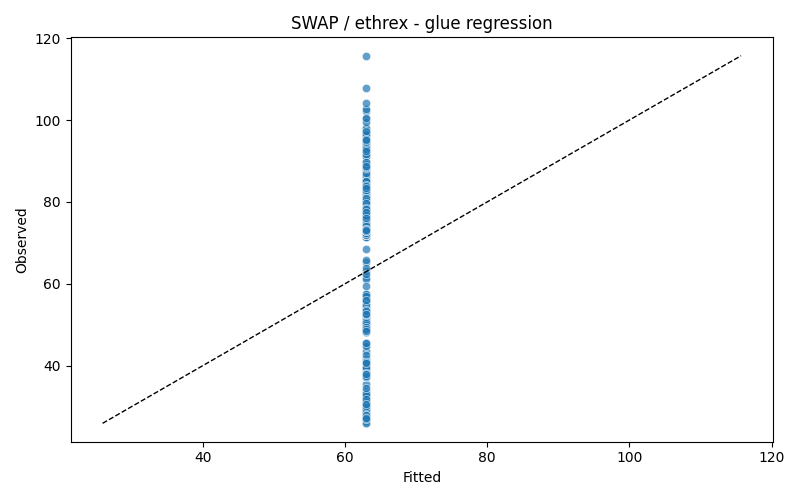


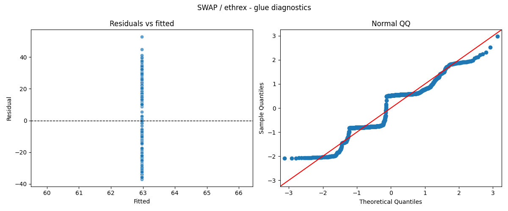

</details>

### Mixed glue (tier A) · ethrex

<details><summary><code>ADD</code> · nobs=72 · runtime_ms=0 · p=1.00e+00 · R²=-2.22e-16</summary>

```
==============================================================================
                           NNLS Regression Results                            
==============================================================================
Dep. Variable:          test_runtime_ms              R-squared:         -0.000
Model:                  NNLS                    Adj. R-squared:         -0.014
No. Observations:       72                                RMSE:          14.44
Df Residuals:           70                                 MAE:          12.66
Df Model:               1      
==============================================================================
                      coef     std err     P-value      [0.025      0.975]
------------------------------------------------------------------------------
         const     47.9999      1.7071       0.001     44.6716     51.3171
           ADD      0.0000      0.0000       1.000      0.0000      0.0000
==============================================================================
Notes: Non-negative least squares with bootstrap inference (1000 iterations)
==============================================================================
```

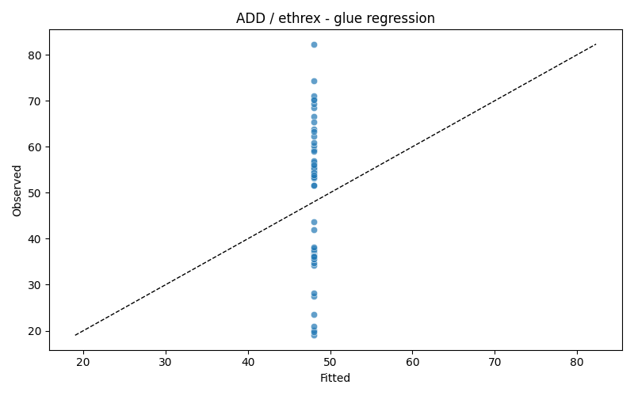

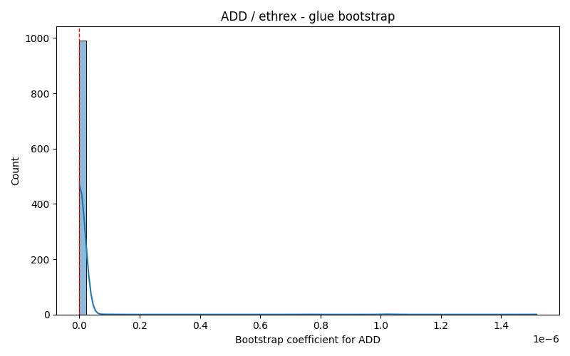

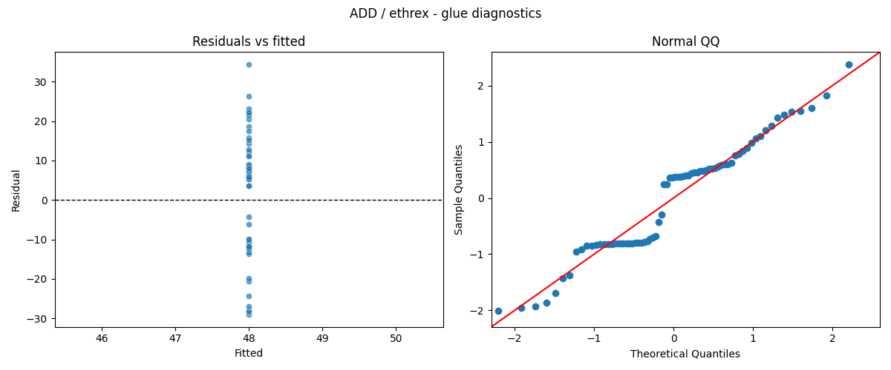

</details>

<details><summary><code>AND</code> · nobs=64 · runtime_ms=0 · p=1.00e+00 · R²=0</summary>

```
==============================================================================
                           NNLS Regression Results                            
==============================================================================
Dep. Variable:          test_runtime_ms              R-squared:          0.000
Model:                  NNLS                    Adj. R-squared:         -0.016
No. Observations:       64                                RMSE:          12.62
Df Residuals:           62                                 MAE:          11.19
Df Model:               1      
==============================================================================
                      coef     std err     P-value      [0.025      0.975]
------------------------------------------------------------------------------
         const     43.0825      1.6151       0.001     39.9972     46.2684
           AND      0.0000      0.0000       1.000      0.0000      0.0000
==============================================================================
Notes: Non-negative least squares with bootstrap inference (1000 iterations)
==============================================================================
```

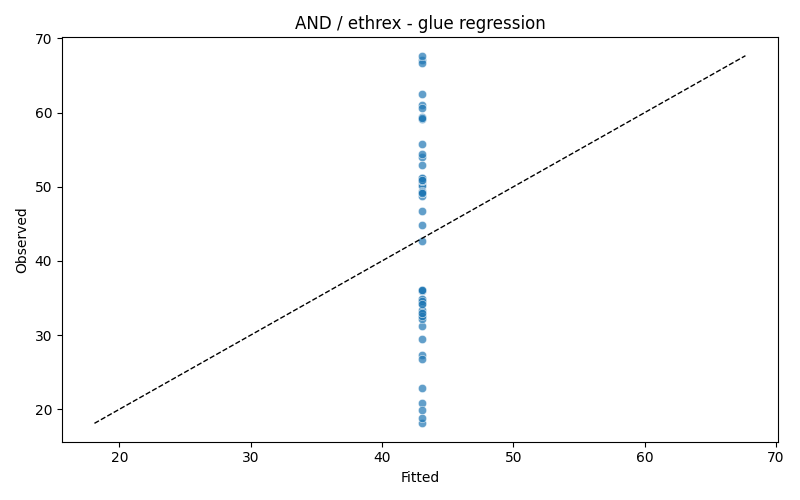

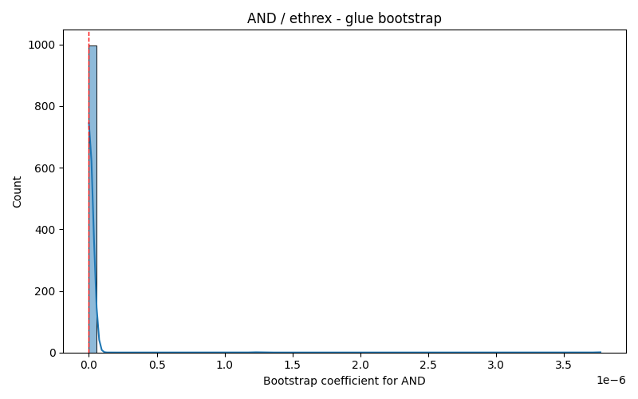

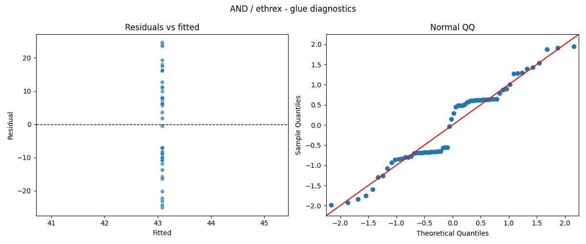

</details>

<details><summary><code>CALLDATACOPY</code> · nobs=1880 · runtime_ms=0 · p=1.00e+00 · R²=0</summary>

```
==============================================================================
                           NNLS Regression Results                            
==============================================================================
Dep. Variable:          test_runtime_ms              R-squared:          0.000
Model:                  NNLS                    Adj. R-squared:         -0.001
No. Observations:       1880                              RMSE:          21.08
Df Residuals:           1878                               MAE:          17.96
Df Model:               1      
==============================================================================
                      coef     std err     P-value      [0.025      0.975]
------------------------------------------------------------------------------
         const     35.9654      0.4780       0.001     35.0751     36.9120
  CALLDATACOPY      0.0000      0.0000       1.000      0.0000      0.0000
==============================================================================
Notes: Non-negative least squares with bootstrap inference (1000 iterations)
==============================================================================
```

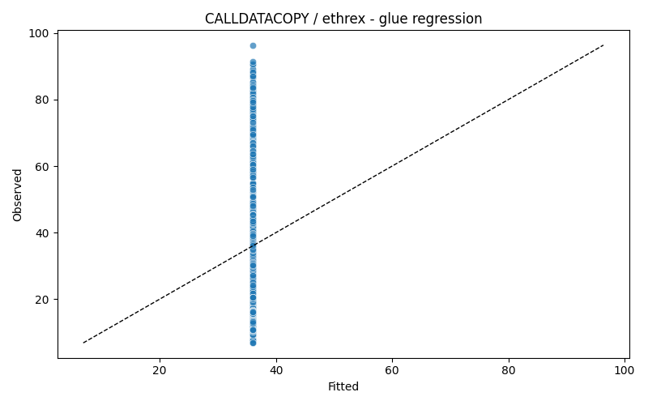


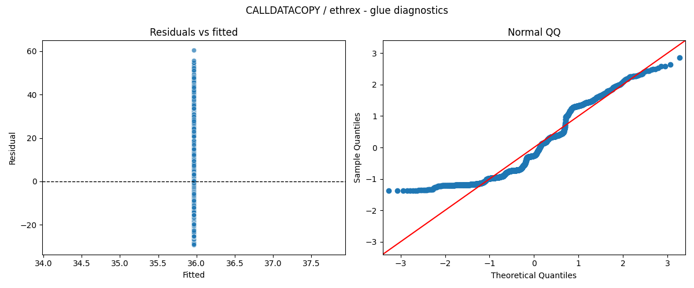

</details>

<details><summary><code>CALLDATALOAD</code> · nobs=352 · runtime_ms=1.573e-05 · p=1.00e-03 · R²=0.1588</summary>

```
==============================================================================
                           NNLS Regression Results                            
==============================================================================
Dep. Variable:          test_runtime_ms              R-squared:          0.159
Model:                  NNLS                    Adj. R-squared:          0.156
No. Observations:       352                               RMSE:           0.14
Df Residuals:           350                                MAE:           0.09
Df Model:               1      
==============================================================================
                      coef     std err     P-value      [0.025      0.975]
------------------------------------------------------------------------------
         const      2.1696      0.0240       0.001      2.1248      2.2178
  CALLDATALOAD      0.0000      0.0000       0.001      0.0000      0.0000
==============================================================================
Notes: Non-negative least squares with bootstrap inference (1000 iterations)
==============================================================================
```

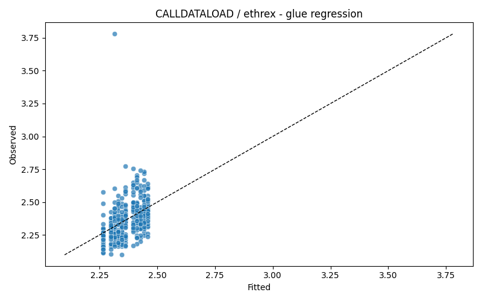

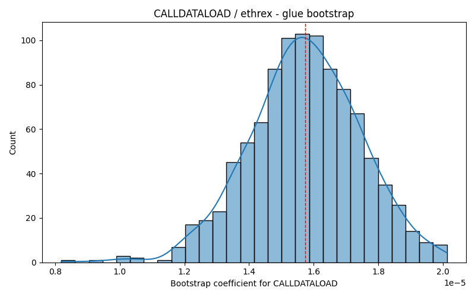

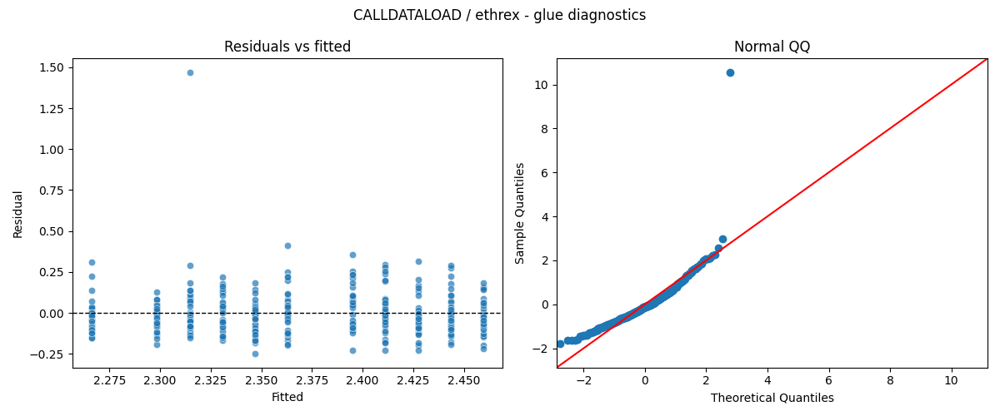

</details>

<details><summary><code>DIV</code> · nobs=88 · runtime_ms=0 · p=1.00e+00 · R²=-2.22e-16</summary>

```
==============================================================================
                           NNLS Regression Results                            
==============================================================================
Dep. Variable:          test_runtime_ms              R-squared:         -0.000
Model:                  NNLS                    Adj. R-squared:         -0.012
No. Observations:       88                                RMSE:          77.57
Df Residuals:           86                                 MAE:          71.59
Df Model:               1      
==============================================================================
                      coef     std err     P-value      [0.025      0.975]
------------------------------------------------------------------------------
         const    310.1714      8.2581       0.001    292.7845    325.6482
           DIV      0.0000      0.0000       1.000      0.0000      0.0000
==============================================================================
Notes: Non-negative least squares with bootstrap inference (1000 iterations)
==============================================================================
```

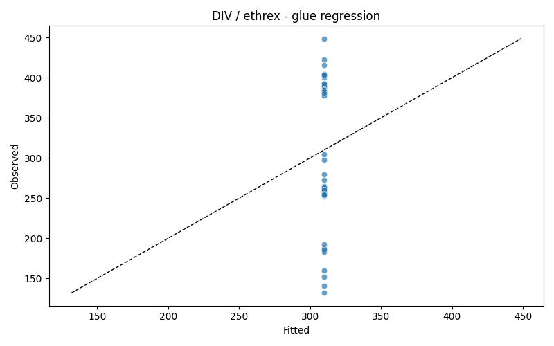


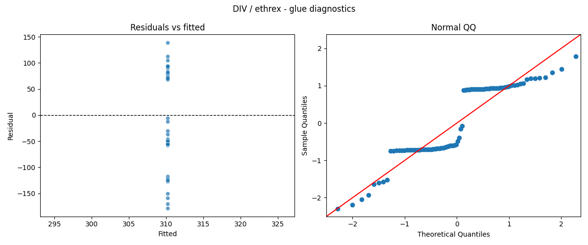

</details>

<details><summary><code>EXP</code> · nobs=88 · runtime_ms=0.0009546 · p=1.00e-03 · R²=0.8359</summary>

```
==============================================================================
                           NNLS Regression Results                            
==============================================================================
Dep. Variable:          test_runtime_ms              R-squared:          0.836
Model:                  NNLS                    Adj. R-squared:          0.834
No. Observations:       88                                RMSE:          16.57
Df Residuals:           86                                 MAE:          14.22
Df Model:               1      
==============================================================================
                      coef     std err     P-value      [0.025      0.975]
------------------------------------------------------------------------------
         const     28.8545      6.6449       0.001     15.4767     41.6100
           EXP      0.0010      0.0000       0.001      0.0009      0.0011
==============================================================================
Notes: Non-negative least squares with bootstrap inference (1000 iterations)
==============================================================================
```

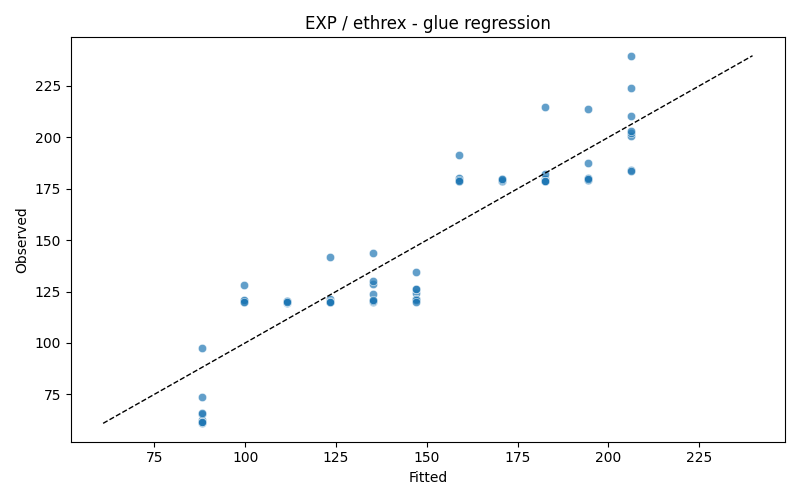

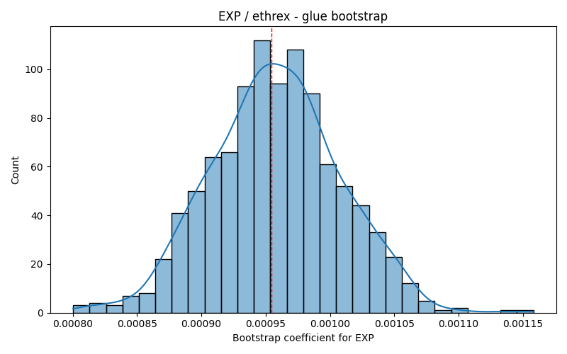

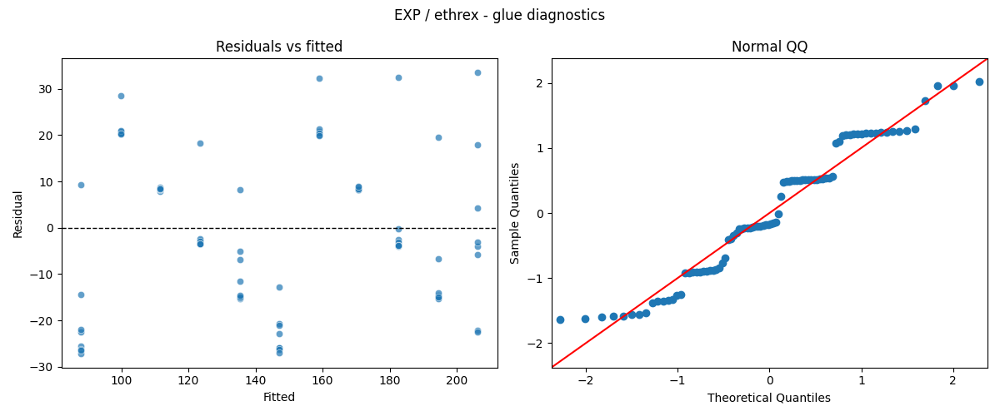

</details>

<details><summary><code>GT</code> · nobs=64 · runtime_ms=0 · p=1.00e+00 · R²=0</summary>

```
==============================================================================
                           NNLS Regression Results                            
==============================================================================
Dep. Variable:          test_runtime_ms              R-squared:          0.000
Model:                  NNLS                    Adj. R-squared:         -0.016
No. Observations:       64                                RMSE:          13.15
Df Residuals:           62                                 MAE:          11.77
Df Model:               1      
==============================================================================
                      coef     std err     P-value      [0.025      0.975]
------------------------------------------------------------------------------
         const     44.9903      1.6702       0.001     41.7640     48.4929
            GT      0.0000      0.0000       1.000      0.0000      0.0000
==============================================================================
Notes: Non-negative least squares with bootstrap inference (1000 iterations)
==============================================================================
```

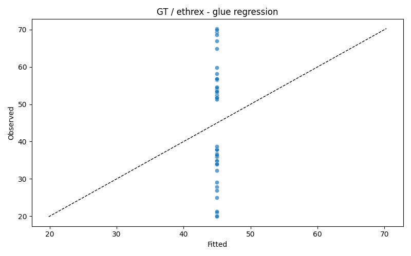

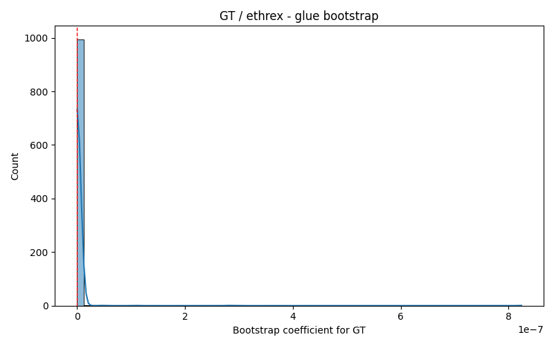

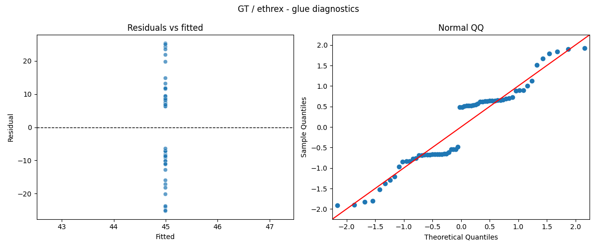

</details>

<details><summary><code>JUMPI</code> · nobs=88 · runtime_ms=0 · p=1.00e+00 · R²=0</summary>

```
==============================================================================
                           NNLS Regression Results                            
==============================================================================
Dep. Variable:          test_runtime_ms              R-squared:          0.000
Model:                  NNLS                    Adj. R-squared:         -0.012
No. Observations:       88                                RMSE:           7.91
Df Residuals:           86                                 MAE:           6.73
Df Model:               1      
==============================================================================
                      coef     std err     P-value      [0.025      0.975]
------------------------------------------------------------------------------
         const     28.5534      0.8421       0.001     26.9704     30.2297
         JUMPI      0.0000      0.0000       1.000      0.0000      0.0000
==============================================================================
Notes: Non-negative least squares with bootstrap inference (1000 iterations)
==============================================================================
```

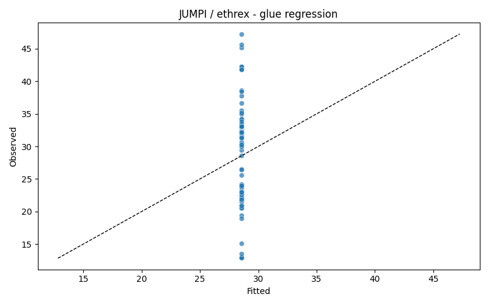


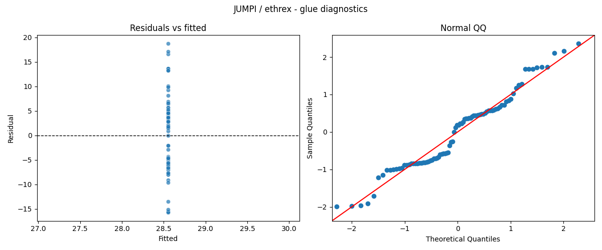

</details>

<details><summary><code>LT</code> · nobs=64 · runtime_ms=0 · p=1.00e+00 · R²=1.11e-16</summary>

```
==============================================================================
                           NNLS Regression Results                            
==============================================================================
Dep. Variable:          test_runtime_ms              R-squared:          0.000
Model:                  NNLS                    Adj. R-squared:         -0.016
No. Observations:       64                                RMSE:          14.18
Df Residuals:           62                                 MAE:          12.32
Df Model:               1      
==============================================================================
                      coef     std err     P-value      [0.025      0.975]
------------------------------------------------------------------------------
         const     43.6187      1.7670       0.001     39.9757     46.8219
            LT      0.0000      0.0000       1.000      0.0000      0.0000
==============================================================================
Notes: Non-negative least squares with bootstrap inference (1000 iterations)
==============================================================================
```

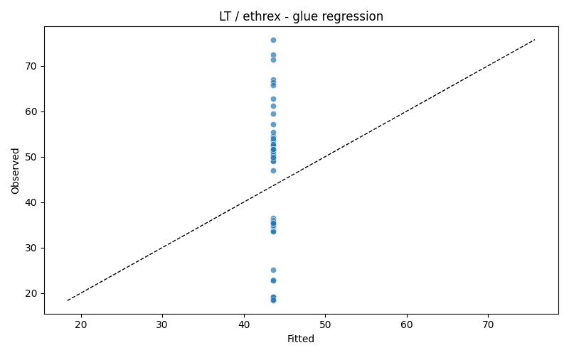

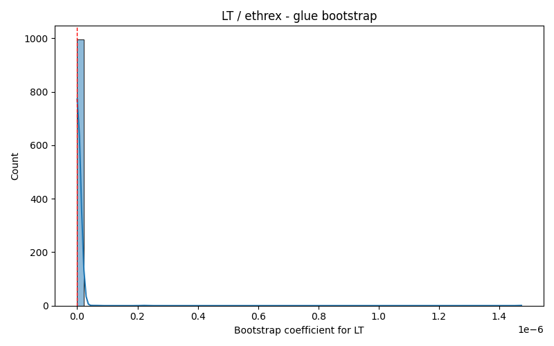

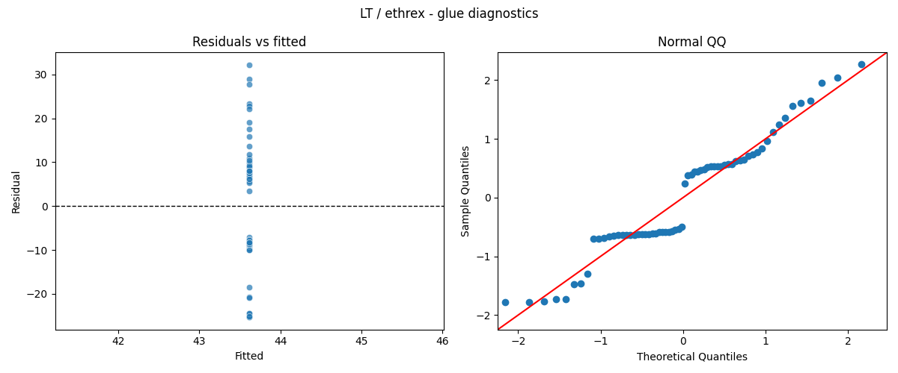

</details>

<details><summary><code>MSTORE</code> · nobs=360 · runtime_ms=0 · p=1.00e+00 · R²=2.22e-16</summary>

```
==============================================================================
                           NNLS Regression Results                            
==============================================================================
Dep. Variable:          test_runtime_ms              R-squared:          0.000
Model:                  NNLS                    Adj. R-squared:         -0.003
No. Observations:       360                               RMSE:          14.53
Df Residuals:           358                                MAE:          12.79
Df Model:               1      
==============================================================================
                      coef     std err     P-value      [0.025      0.975]
------------------------------------------------------------------------------
         const     49.9713      0.7599       0.001     48.5063     51.5018
        MSTORE      0.0000      0.0000       1.000      0.0000      0.0000
==============================================================================
Notes: Non-negative least squares with bootstrap inference (1000 iterations)
==============================================================================
```

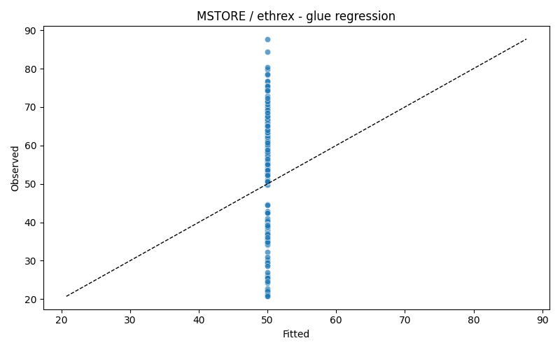


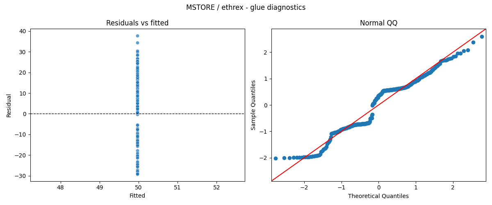

</details>

<details><summary><code>MSTORE8</code> · nobs=360 · runtime_ms=0 · p=1.00e+00 · R²=-2.22e-16</summary>

```
==============================================================================
                           NNLS Regression Results                            
==============================================================================
Dep. Variable:          test_runtime_ms              R-squared:         -0.000
Model:                  NNLS                    Adj. R-squared:         -0.003
No. Observations:       360                               RMSE:          13.31
Df Residuals:           358                                MAE:          11.72
Df Model:               1      
==============================================================================
                      coef     std err     P-value      [0.025      0.975]
------------------------------------------------------------------------------
         const     46.4102      0.7091       0.001     45.0173     47.7641
       MSTORE8      0.0000      0.0000       1.000      0.0000      0.0000
==============================================================================
Notes: Non-negative least squares with bootstrap inference (1000 iterations)
==============================================================================
```

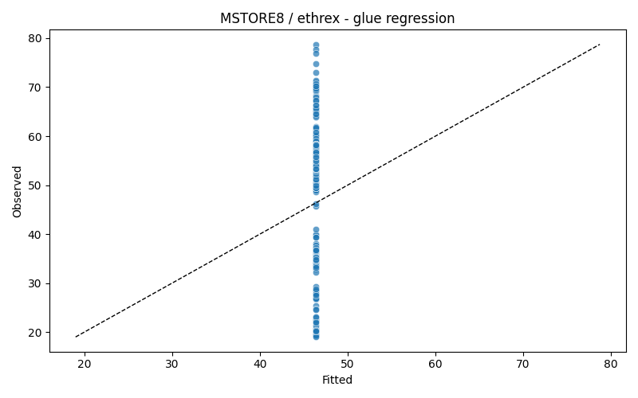


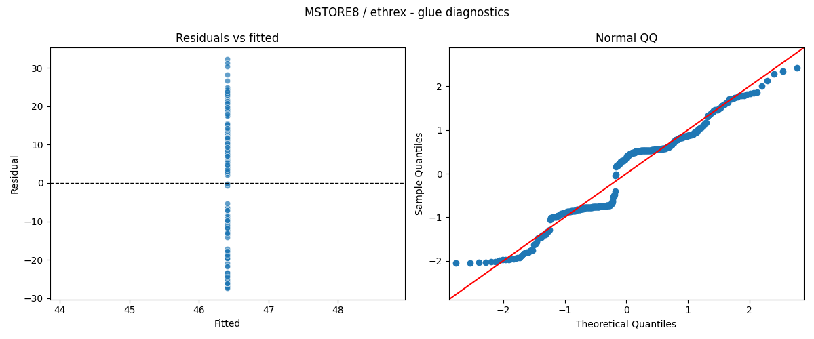

</details>

<details><summary><code>MUL</code> · nobs=80 · runtime_ms=0 · p=1.00e+00 · R²=-2.22e-16</summary>

```
==============================================================================
                           NNLS Regression Results                            
==============================================================================
Dep. Variable:          test_runtime_ms              R-squared:         -0.000
Model:                  NNLS                    Adj. R-squared:         -0.013
No. Observations:       80                                RMSE:          21.53
Df Residuals:           78                                 MAE:          18.27
Df Model:               1      
==============================================================================
                      coef     std err     P-value      [0.025      0.975]
------------------------------------------------------------------------------
         const     85.0077      2.3933       0.001     80.1883     89.4581
           MUL      0.0000      0.0000       1.000      0.0000      0.0000
==============================================================================
Notes: Non-negative least squares with bootstrap inference (1000 iterations)
==============================================================================
```

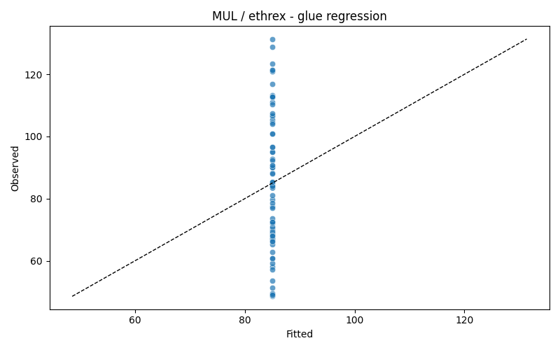


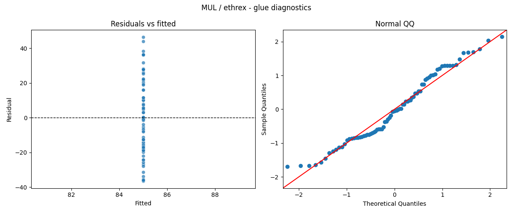

</details>

<details><summary><code>PC</code> · nobs=48 · runtime_ms=4.931e-06 · p=1.00e-03 · R²=0.3491</summary>

```
==============================================================================
                           NNLS Regression Results                            
==============================================================================
Dep. Variable:          test_runtime_ms              R-squared:          0.349
Model:                  NNLS                    Adj. R-squared:          0.335
No. Observations:       48                                RMSE:          14.96
Df Residuals:           46                                 MAE:          13.39
Df Model:               1      
==============================================================================
                      coef     std err     P-value      [0.025      0.975]
------------------------------------------------------------------------------
         const     57.9225      4.1290       0.001     49.4965     65.6745
            PC      0.0000      0.0000       0.001      0.0000      0.0000
==============================================================================
Notes: Non-negative least squares with bootstrap inference (1000 iterations)
==============================================================================
```

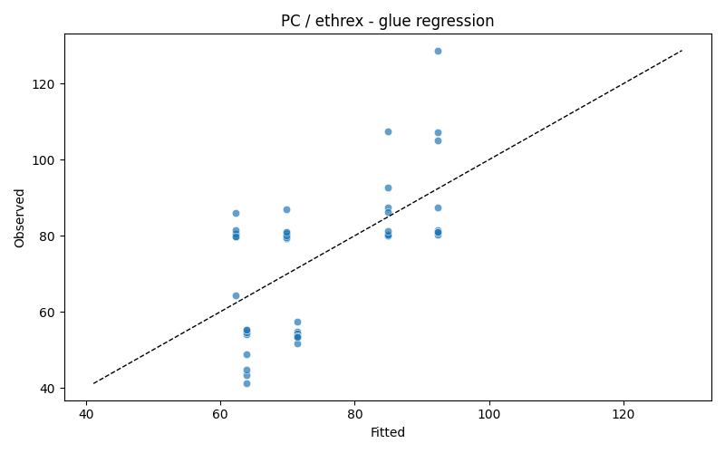

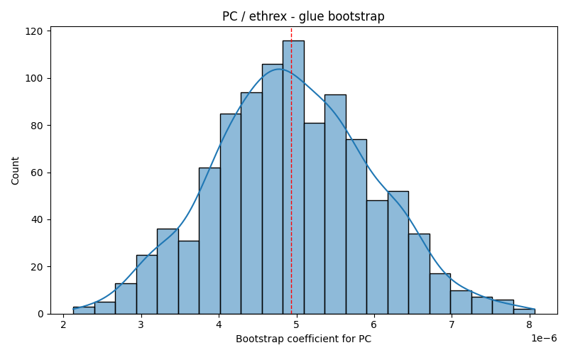

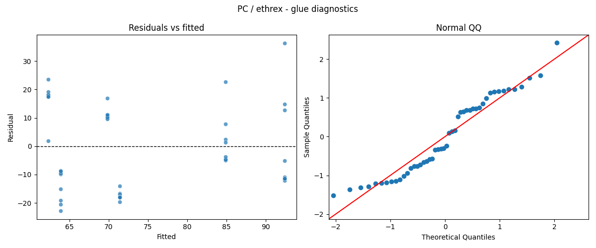

</details>

<details><summary><code>RETURNDATASIZE</code> · nobs=192 · runtime_ms=7.177e-06 · p=1.00e-03 · R²=0.3572</summary>

```
==============================================================================
                           NNLS Regression Results                            
==============================================================================
Dep. Variable:          test_runtime_ms              R-squared:          0.357
Model:                  NNLS                    Adj. R-squared:          0.354
No. Observations:       192                               RMSE:          11.30
Df Residuals:           190                                MAE:          10.10
Df Model:               1      
==============================================================================
                      coef     std err     P-value      [0.025      0.975]
------------------------------------------------------------------------------
         const     50.9166      1.5312       0.001     47.8751     53.7693
RETURNDATASIZE      0.0000      0.0000       0.001      0.0000      0.0000
==============================================================================
Notes: Non-negative least squares with bootstrap inference (1000 iterations)
==============================================================================
```

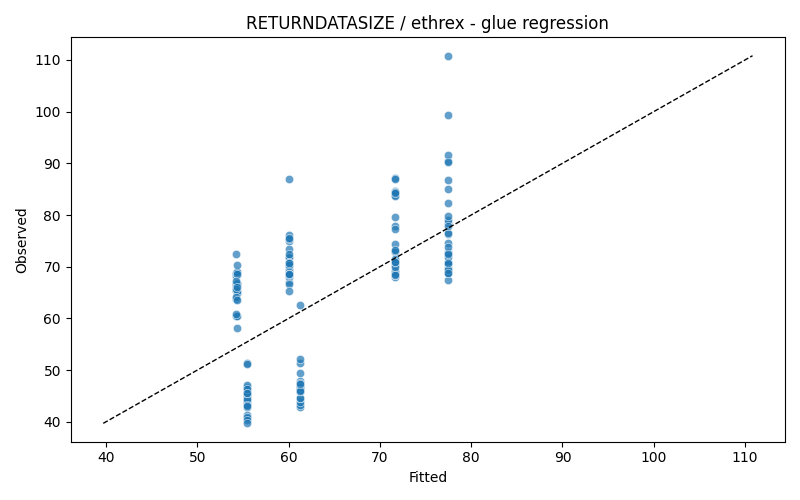

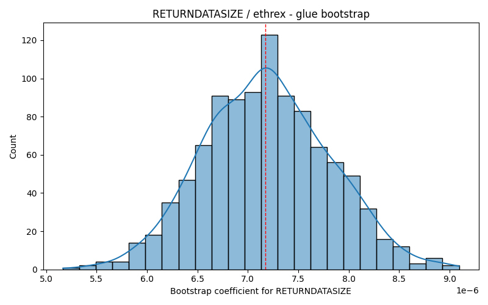

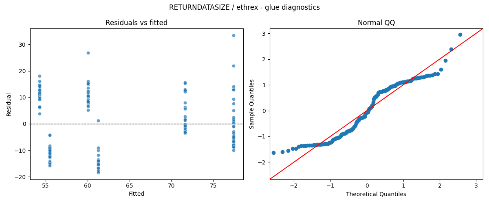

</details>

<details><summary><code>SELFBALANCE</code> · nobs=88 · runtime_ms=0 · p=1.00e+00 · R²=1.11e-16</summary>

```
==============================================================================
                           NNLS Regression Results                            
==============================================================================
Dep. Variable:          test_runtime_ms              R-squared:          0.000
Model:                  NNLS                    Adj. R-squared:         -0.012
No. Observations:       88                                RMSE:          67.27
Df Residuals:           86                                 MAE:          60.31
Df Model:               1      
==============================================================================
                      coef     std err     P-value      [0.025      0.975]
------------------------------------------------------------------------------
         const    252.6133      8.0165       0.001    235.1039    266.0119
   SELFBALANCE      0.0000      0.0000       1.000      0.0000      0.0000
==============================================================================
Notes: Non-negative least squares with bootstrap inference (1000 iterations)
==============================================================================
```

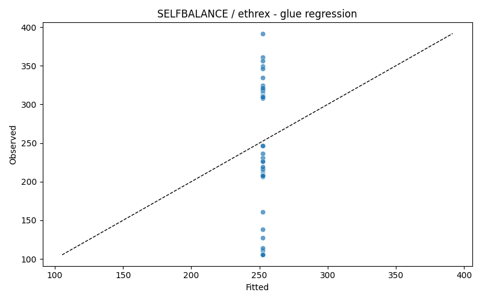

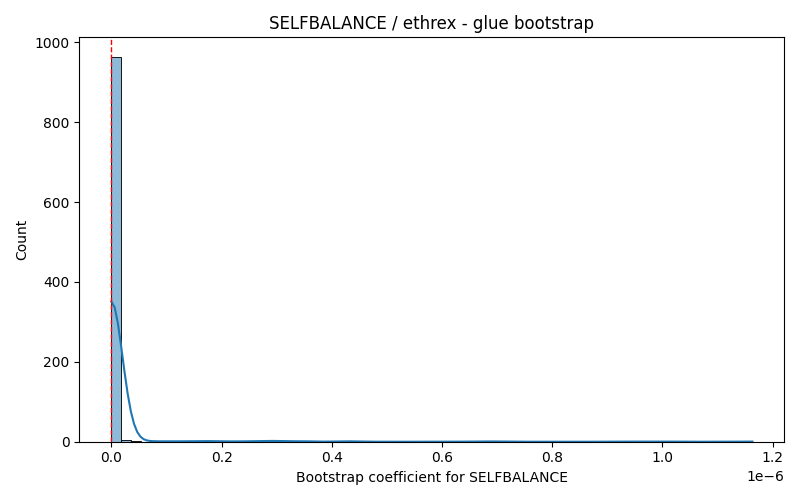

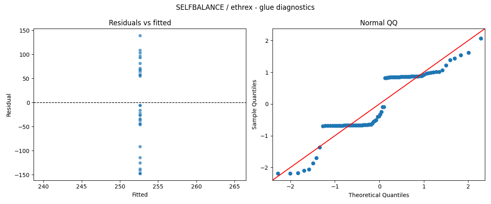

</details>

<details><summary><code>SUB</code> · nobs=64 · runtime_ms=0 · p=1.00e+00 · R²=0</summary>

```
==============================================================================
                           NNLS Regression Results                            
==============================================================================
Dep. Variable:          test_runtime_ms              R-squared:          0.000
Model:                  NNLS                    Adj. R-squared:         -0.016
No. Observations:       64                                RMSE:          13.00
Df Residuals:           62                                 MAE:          11.71
Df Model:               1      
==============================================================================
                      coef     std err     P-value      [0.025      0.975]
------------------------------------------------------------------------------
         const     44.8514      1.6521       0.001     41.7751     48.1311
           SUB      0.0000      0.0000       1.000      0.0000      0.0000
==============================================================================
Notes: Non-negative least squares with bootstrap inference (1000 iterations)
==============================================================================
```

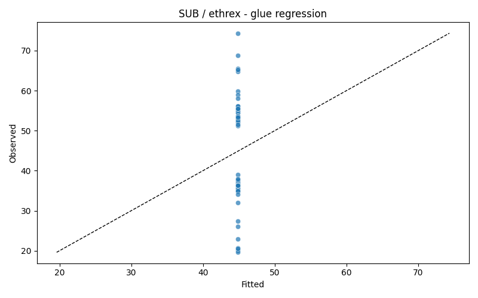

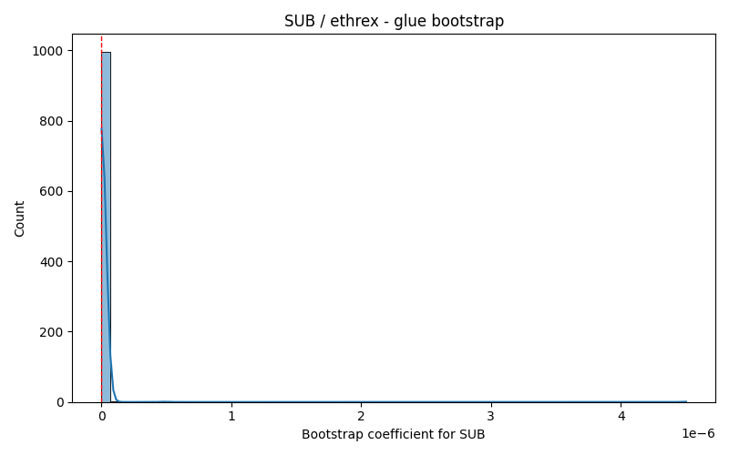

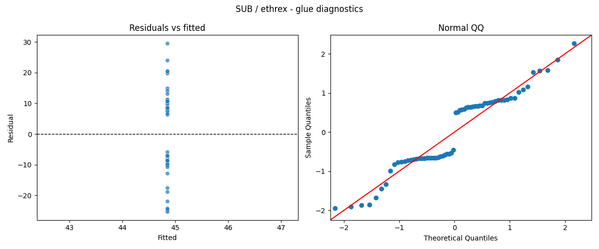

</details>

### Mixed glue (tier B) · ethrex

<details><summary><code>JUMP</code> · nobs=80 · runtime_ms=0 · p=1.00e+00 · R²=0</summary>

```
==============================================================================
                           NNLS Regression Results                            
==============================================================================
Dep. Variable:          test_runtime_ms              R-squared:          0.000
Model:                  NNLS                    Adj. R-squared:         -0.013
No. Observations:       80                                RMSE:          19.14
Df Residuals:           78                                 MAE:          17.06
Df Model:               1      
==============================================================================
                      coef     std err     P-value      [0.025      0.975]
------------------------------------------------------------------------------
         const     69.6754      2.0999       0.001     65.5680     73.7074
          JUMP      0.0000      0.0000       1.000      0.0000      0.0000
==============================================================================
Notes: Non-negative least squares with bootstrap inference (1000 iterations)
==============================================================================
```

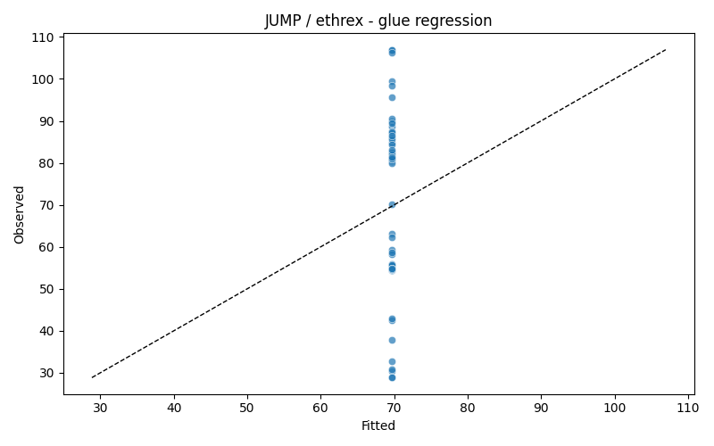


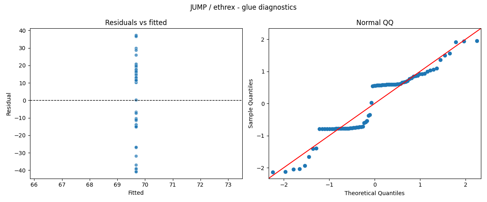

</details>

<details><summary><code>KECCAK256</code> · nobs=0 · runtime_ms=n/a · p=n/a · R²=n/a</summary>

</details>

## geth

| glue_opcode | nobs | glue_runtime_ms | p_value | rsquared |
| --- | --- | --- | --- | --- |
| `ISZERO` | 1104 | 0 | 1.00e+00 | 0 |
| `JUMPDEST` | 276 | 0 | 1.00e+00 | 0 |
| `SWAP` | 19734 | 0 | 1.00e+00 | 0 |
| `CALLDATASIZE` | 69364 | 4.695e-06 | 1.00e-03 | 0.01231 |
| `DUP` | 69364 | 0 | 1.00e+00 | 0.01231 |
| `GAS` | 69364 | 6.186e-06 | 1.00e-03 | 0.01231 |
| `MLOAD` | 69364 | 8.978e-06 | 1.00e-03 | 0.01231 |
| `PUSH` | 69364 | 0 | 1.00e+00 | 0.01231 |
| `PUSH0` | 69364 | 0 | 1.00e+00 | 0.01231 |
| `STATICCALL` | 69364 | 6.244e-05 | 1.00e-03 | 0.01231 |
| `ADD` | 1242 | 0 | 1.00e+00 | 0 |
| `AND` | 1104 | 0 | 1.00e+00 | 0 |
| `CALLDATACOPY` | 32430 | 0 | 1.00e+00 | 0 |
| `CALLDATALOAD` | 6072 | 3.683e-05 | 1.00e-03 | 0.1046 |
| `DIV` | 1518 | 0 | 1.00e+00 | 0 |
| `EXP` | 1518 | 0.0003253 | 1.00e-03 | 0.2984 |
| `GT` | 1104 | 0 | 1.00e+00 | 0 |
| `JUMPI` | 1518 | 0 | 1.00e+00 | 1.11e-16 |
| `LT` | 1104 | 0 | 1.00e+00 | 0 |
| `MSTORE` | 6210 | 0 | 1.00e+00 | 0 |
| `MSTORE8` | 6210 | 0 | 1.00e+00 | -2.22e-16 |
| `MUL` | 1380 | 0 | 1.00e+00 | -2.22e-16 |
| `PC` | 828 | 7.449e-06 | 1.00e-03 | 0.0864 |
| `RETURNDATASIZE` | 3312 | 1.252e-05 | 1.00e-03 | 0.07309 |
| `SELFBALANCE` | 1518 | 0 | 1.00e+00 | -2.22e-16 |
| `SUB` | 1104 | 0 | 1.00e+00 | -2.22e-16 |
| `JUMP` | 1380 | 0 | 1.00e+00 | 1.11e-16 |
| `KECCAK256` | 0 | n/a | n/a | n/a |

### Cycle glue — joint fit · geth

<details><summary>Joint NNLS regression summary</summary>

```
==============================================================================
                           NNLS Regression Results                            
==============================================================================
Dep. Variable:          test_runtime_ms              R-squared:          0.012
Model:                  NNLS                    Adj. R-squared:          0.012
No. Observations:       69364                             RMSE:          68.34
Df Residuals:           69356                              MAE:          41.95
Df Model:               7      
==============================================================================
                      coef     std err     P-value      [0.025      0.975]
------------------------------------------------------------------------------
         const    140.8898      0.2743       0.001    140.3813    141.4425
  CALLDATASIZE      0.0000      0.0000       0.001      0.0000      0.0000
           DUP      0.0000      0.0000       1.000      0.0000      0.0000
           GAS      0.0000      0.0000       0.001      0.0000      0.0000
         MLOAD      0.0000      0.0000       0.001      0.0000      0.0000
          PUSH      0.0000      0.0000       1.000      0.0000      0.0000
         PUSH0      0.0000      0.0000       1.000      0.0000      0.0000
    STATICCALL      0.0001      0.0000       0.001      0.0000      0.0001
==============================================================================
Notes: Non-negative least squares with bootstrap inference (1000 iterations)
==============================================================================
```

</details>

<details><summary><code>CALLDATASIZE</code> · nobs=69364 · runtime_ms=4.695e-06 · p=1.00e-03 · R²=0.01231</summary>

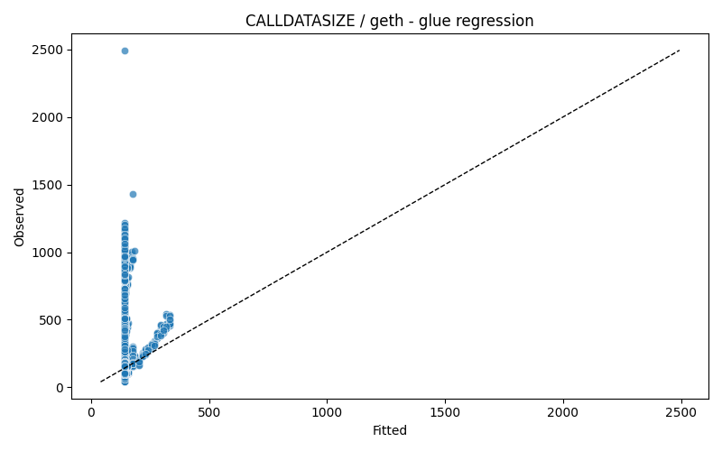

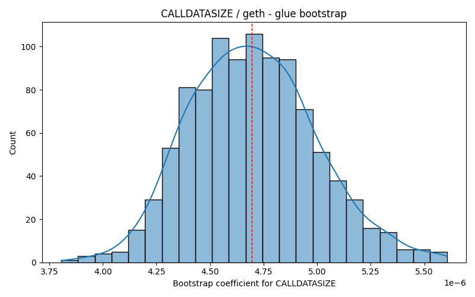


</details>

<details><summary><code>DUP</code> · nobs=69364 · runtime_ms=0 · p=1.00e+00 · R²=0.01231</summary>


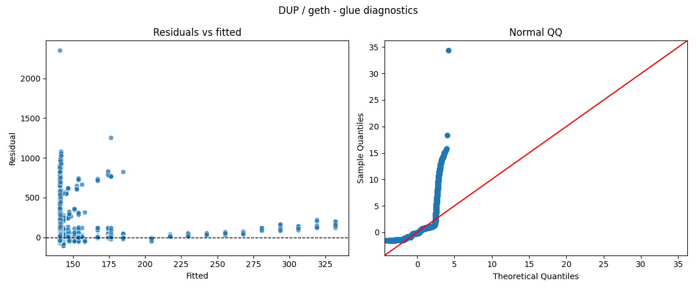

</details>

<details><summary><code>GAS</code> · nobs=69364 · runtime_ms=6.186e-06 · p=1.00e-03 · R²=0.01231</summary>

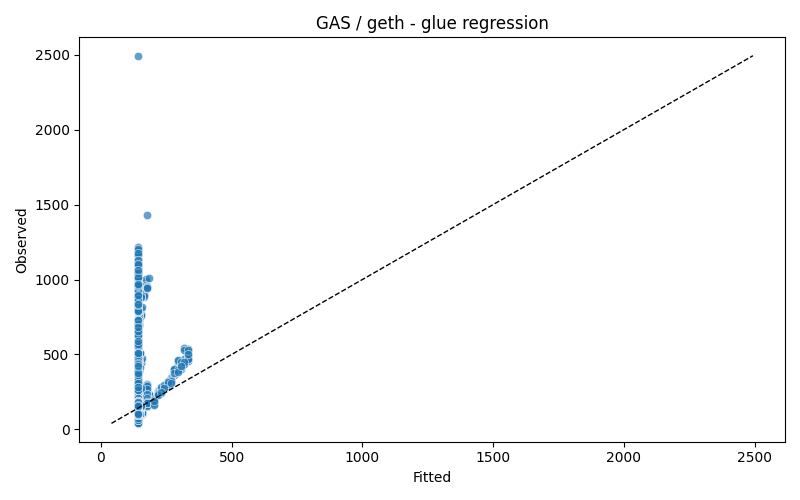

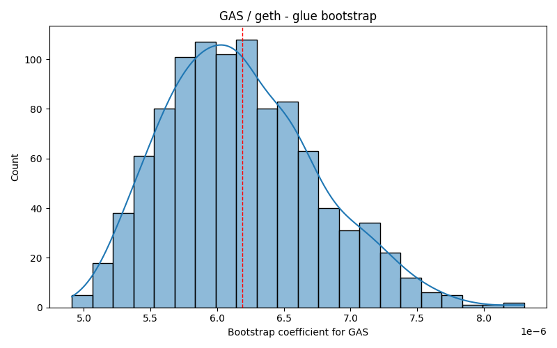


</details>

<details><summary><code>MLOAD</code> · nobs=69364 · runtime_ms=8.978e-06 · p=1.00e-03 · R²=0.01231</summary>


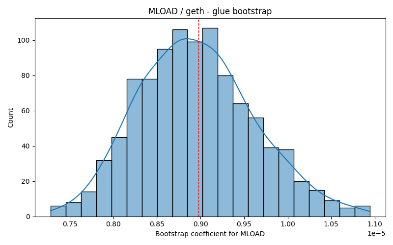


</details>

<details><summary><code>PUSH</code> · nobs=69364 · runtime_ms=0 · p=1.00e+00 · R²=0.01231</summary>


</details>

<details><summary><code>PUSH0</code> · nobs=69364 · runtime_ms=0 · p=1.00e+00 · R²=0.01231</summary>


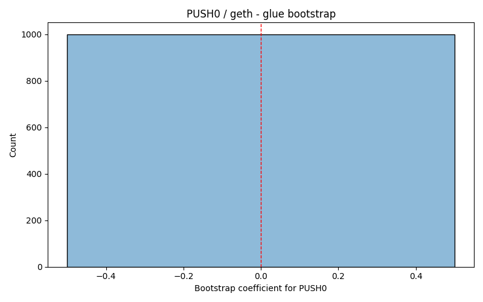


</details>

<details><summary><code>STATICCALL</code> · nobs=69364 · runtime_ms=6.244e-05 · p=1.00e-03 · R²=0.01231</summary>

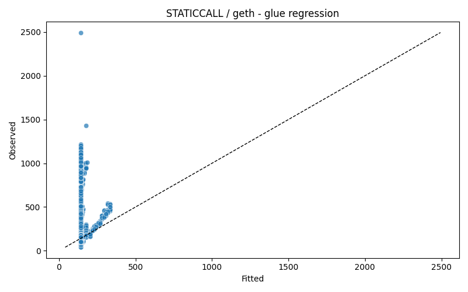

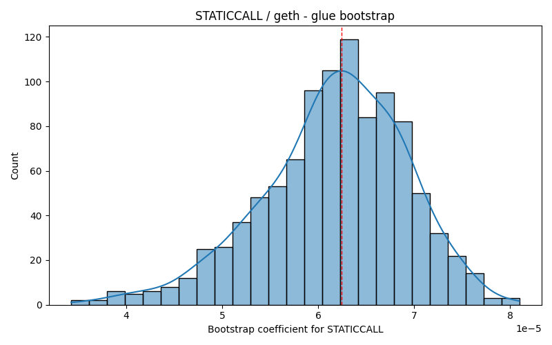

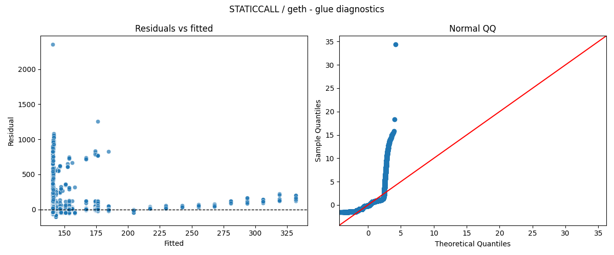

</details>

### Pure glue · geth

<details><summary><code>ISZERO</code> · nobs=1104 · runtime_ms=0 · p=1.00e+00 · R²=0</summary>

```
==============================================================================
                           NNLS Regression Results                            
==============================================================================
Dep. Variable:          test_runtime_ms              R-squared:          0.000
Model:                  NNLS                    Adj. R-squared:         -0.001
No. Observations:       1104                              RMSE:          40.46
Df Residuals:           1102                               MAE:          26.66
Df Model:               1      
==============================================================================
                      coef     std err     P-value      [0.025      0.975]
------------------------------------------------------------------------------
         const     86.1881      1.2209       0.001     83.8505     88.6400
        ISZERO      0.0000      0.0000       1.000      0.0000      0.0000
==============================================================================
Notes: Non-negative least squares with bootstrap inference (1000 iterations)
==============================================================================
```

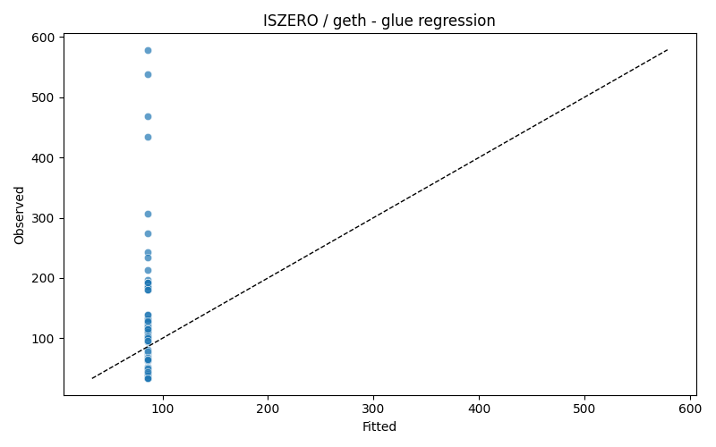


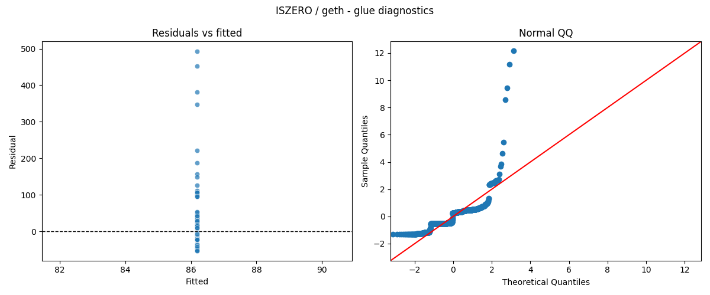

</details>

<details><summary><code>JUMPDEST</code> · nobs=276 · runtime_ms=0 · p=1.00e+00 · R²=0</summary>

```
==============================================================================
                           NNLS Regression Results                            
==============================================================================
Dep. Variable:          test_runtime_ms              R-squared:          0.000
Model:                  NNLS                    Adj. R-squared:         -0.004
No. Observations:       276                               RMSE:          58.24
Df Residuals:           274                                MAE:          39.02
Df Model:               1      
==============================================================================
                      coef     std err     P-value      [0.025      0.975]
------------------------------------------------------------------------------
         const    186.4782      3.6094       0.001    179.9825    194.2755
      JUMPDEST      0.0000      0.0000       1.000      0.0000      0.0000
==============================================================================
Notes: Non-negative least squares with bootstrap inference (1000 iterations)
==============================================================================
```

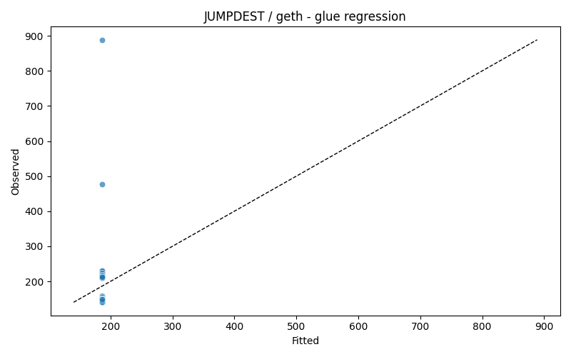


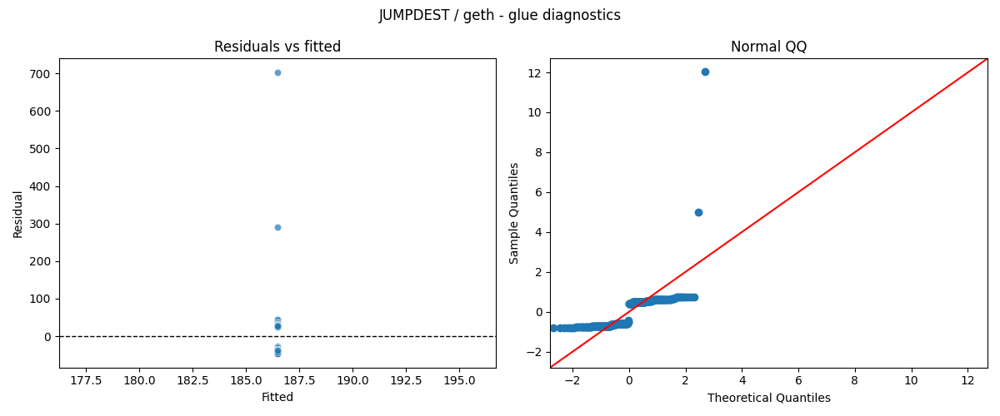

</details>

<details><summary><code>SWAP</code> · nobs=19734 · runtime_ms=0 · p=1.00e+00 · R²=0</summary>

```
==============================================================================
                           NNLS Regression Results                            
==============================================================================
Dep. Variable:          test_runtime_ms              R-squared:          0.000
Model:                  NNLS                    Adj. R-squared:         -0.000
No. Observations:       19734                             RMSE:          48.81
Df Residuals:           19732                              MAE:          31.34
Df Model:               1      
==============================================================================
                      coef     std err     P-value      [0.025      0.975]
------------------------------------------------------------------------------
         const    110.2249      0.3375       0.001    109.5876    110.8901
          SWAP      0.0000      0.0000       1.000      0.0000      0.0000
==============================================================================
Notes: Non-negative least squares with bootstrap inference (1000 iterations)
==============================================================================
```

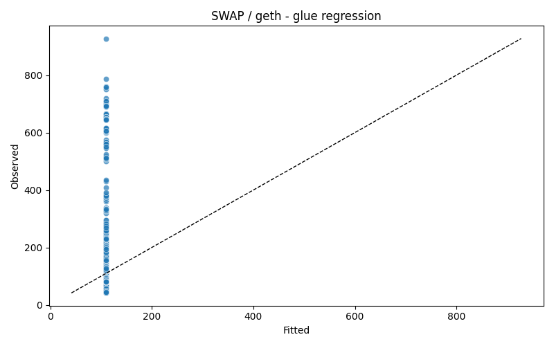


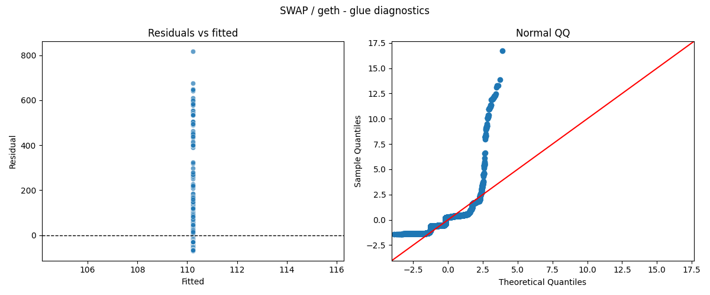

</details>

### Mixed glue (tier A) · geth

<details><summary><code>ADD</code> · nobs=1242 · runtime_ms=0 · p=1.00e+00 · R²=0</summary>

```
==============================================================================
                           NNLS Regression Results                            
==============================================================================
Dep. Variable:          test_runtime_ms              R-squared:          0.000
Model:                  NNLS                    Adj. R-squared:         -0.001
No. Observations:       1242                              RMSE:          47.54
Df Residuals:           1240                               MAE:          27.88
Df Model:               1      
==============================================================================
                      coef     std err     P-value      [0.025      0.975]
------------------------------------------------------------------------------
         const     97.4079      1.3667       0.001     94.8232    100.3995
           ADD      0.0000      0.0000       1.000      0.0000      0.0000
==============================================================================
Notes: Non-negative least squares with bootstrap inference (1000 iterations)
==============================================================================
```

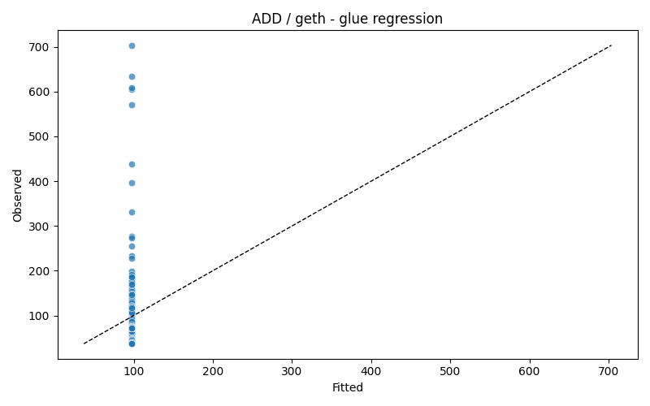


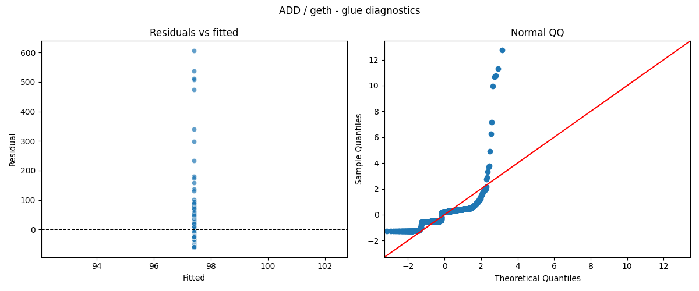

</details>

<details><summary><code>AND</code> · nobs=1104 · runtime_ms=0 · p=1.00e+00 · R²=0</summary>

```
==============================================================================
                           NNLS Regression Results                            
==============================================================================
Dep. Variable:          test_runtime_ms              R-squared:          0.000
Model:                  NNLS                    Adj. R-squared:         -0.001
No. Observations:       1104                              RMSE:          48.14
Df Residuals:           1102                               MAE:          26.84
Df Model:               1      
==============================================================================
                      coef     std err     P-value      [0.025      0.975]
------------------------------------------------------------------------------
         const     90.7487      1.4399       0.001     88.2278     93.7111
           AND      0.0000      0.0000       1.000      0.0000      0.0000
==============================================================================
Notes: Non-negative least squares with bootstrap inference (1000 iterations)
==============================================================================
```


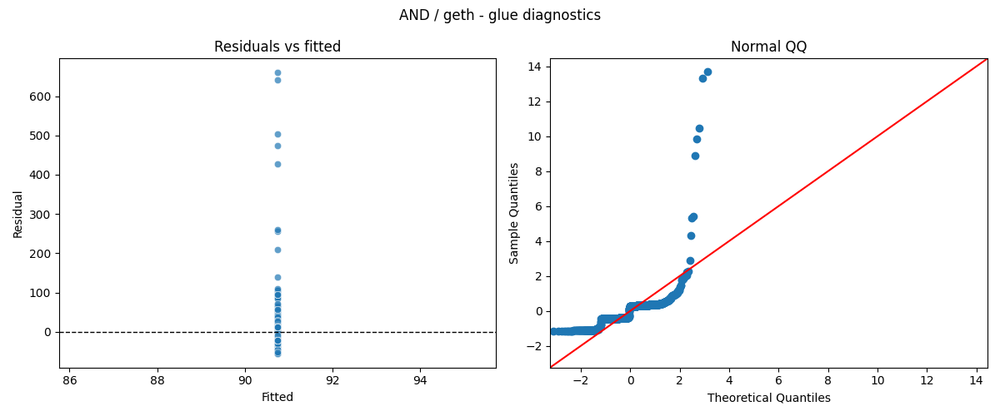

</details>

<details><summary><code>CALLDATACOPY</code> · nobs=32430 · runtime_ms=0 · p=1.00e+00 · R²=0</summary>

```
==============================================================================
                           NNLS Regression Results                            
==============================================================================
Dep. Variable:          test_runtime_ms              R-squared:          0.000
Model:                  NNLS                    Adj. R-squared:         -0.000
No. Observations:       32430                             RMSE:          66.11
Df Residuals:           32428                              MAE:          48.47
Df Model:               1      
==============================================================================
                      coef     std err     P-value      [0.025      0.975]
------------------------------------------------------------------------------
         const     80.0687      0.3816       0.001     79.3714     80.8190
  CALLDATACOPY      0.0000      0.0000       1.000      0.0000      0.0000
==============================================================================
Notes: Non-negative least squares with bootstrap inference (1000 iterations)
==============================================================================
```

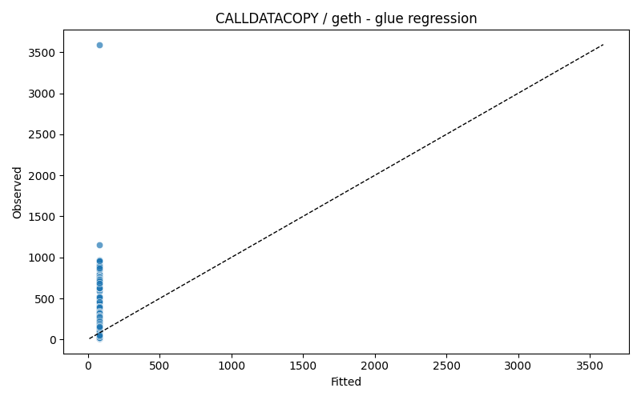


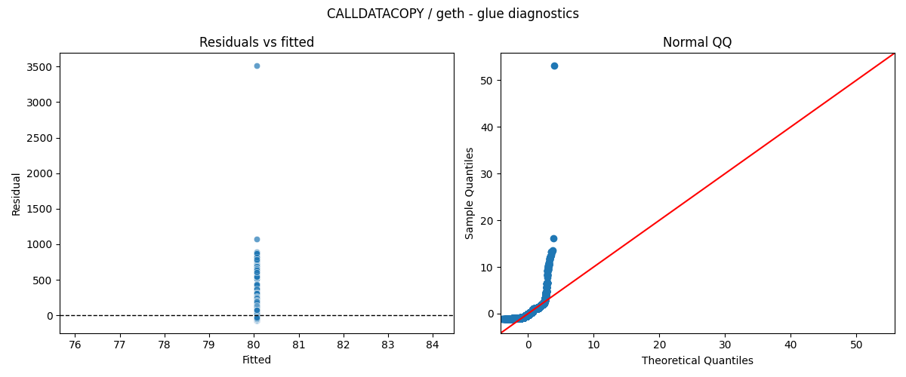

</details>

<details><summary><code>CALLDATALOAD</code> · nobs=6072 · runtime_ms=3.683e-05 · p=1.00e-03 · R²=0.1046</summary>

```
==============================================================================
                           NNLS Regression Results                            
==============================================================================
Dep. Variable:          test_runtime_ms              R-squared:          0.105
Model:                  NNLS                    Adj. R-squared:          0.104
No. Observations:       6072                              RMSE:           0.41
Df Residuals:           6070                               MAE:           0.27
Df Model:               1      
==============================================================================
                      coef     std err     P-value      [0.025      0.975]
------------------------------------------------------------------------------
         const      1.4279      0.0148       0.001      1.3994      1.4575
  CALLDATALOAD      0.0000      0.0000       0.001      0.0000      0.0000
==============================================================================
Notes: Non-negative least squares with bootstrap inference (1000 iterations)
==============================================================================
```

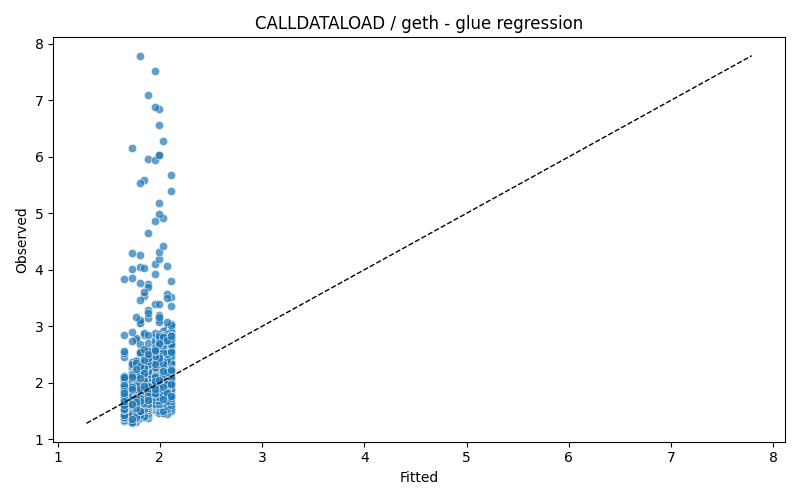

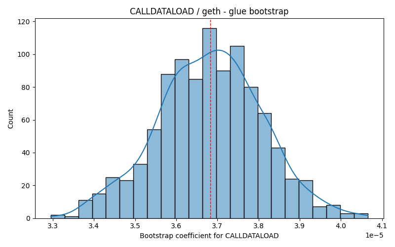

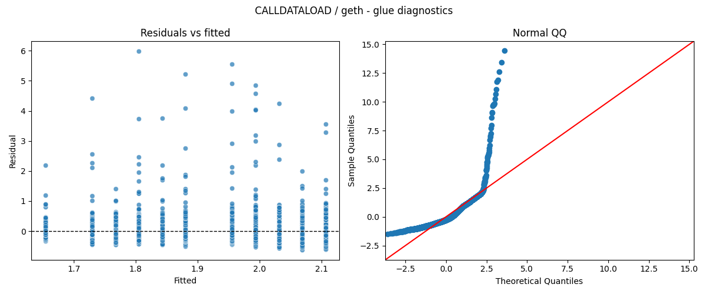

</details>

<details><summary><code>DIV</code> · nobs=1518 · runtime_ms=0 · p=1.00e+00 · R²=0</summary>

```
==============================================================================
                           NNLS Regression Results                            
==============================================================================
Dep. Variable:          test_runtime_ms              R-squared:          0.000
Model:                  NNLS                    Adj. R-squared:         -0.001
No. Observations:       1518                              RMSE:         112.48
Df Residuals:           1516                               MAE:          67.26
Df Model:               1      
==============================================================================
                      coef     std err     P-value      [0.025      0.975]
------------------------------------------------------------------------------
         const    255.3077      2.8440       0.001    249.9067    260.5404
           DIV      0.0000      0.0000       1.000      0.0000      0.0000
==============================================================================
Notes: Non-negative least squares with bootstrap inference (1000 iterations)
==============================================================================
```

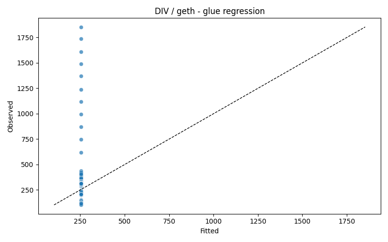


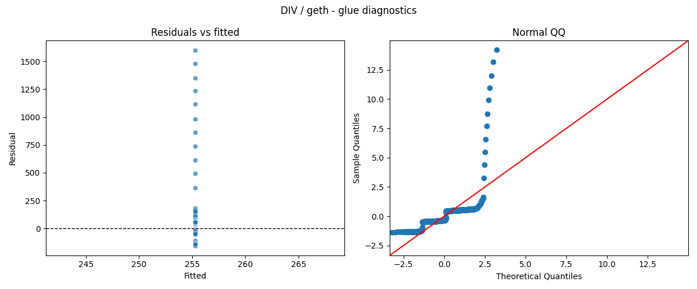

</details>

<details><summary><code>EXP</code> · nobs=1518 · runtime_ms=0.0003253 · p=1.00e-03 · R²=0.2984</summary>

```
==============================================================================
                           NNLS Regression Results                            
==============================================================================
Dep. Variable:          test_runtime_ms              R-squared:          0.298
Model:                  NNLS                    Adj. R-squared:          0.298
No. Observations:       1518                              RMSE:          19.54
Df Residuals:           1516                               MAE:           6.76
Df Model:               1      
==============================================================================
                      coef     std err     P-value      [0.025      0.975]
------------------------------------------------------------------------------
         const     13.2093      1.4395       0.001     10.0801     16.0134
           EXP      0.0003      0.0000       0.001      0.0003      0.0004
==============================================================================
Notes: Non-negative least squares with bootstrap inference (1000 iterations)
==============================================================================
```

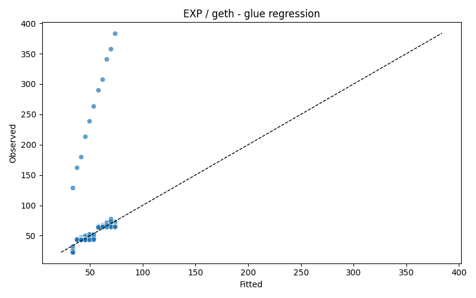

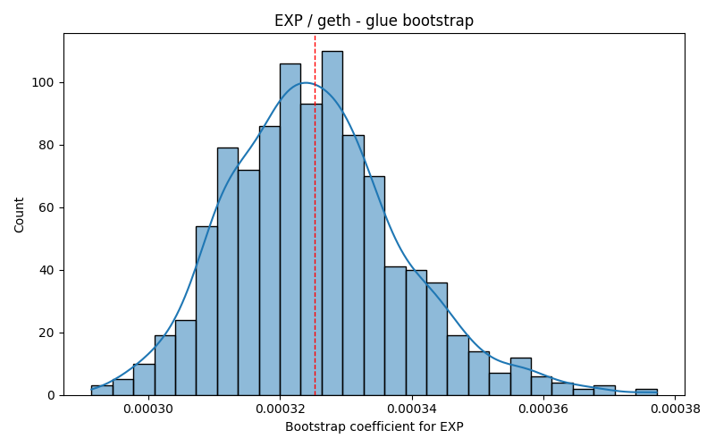

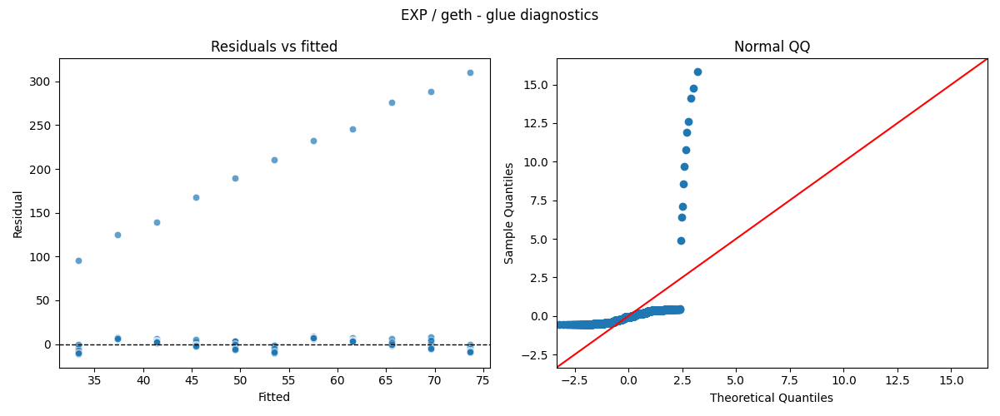

</details>

<details><summary><code>GT</code> · nobs=1104 · runtime_ms=0 · p=1.00e+00 · R²=0</summary>

```
==============================================================================
                           NNLS Regression Results                            
==============================================================================
Dep. Variable:          test_runtime_ms              R-squared:          0.000
Model:                  NNLS                    Adj. R-squared:         -0.001
No. Observations:       1104                              RMSE:          42.81
Df Residuals:           1102                               MAE:          27.76
Df Model:               1      
==============================================================================
                      coef     std err     P-value      [0.025      0.975]
------------------------------------------------------------------------------
         const     91.8335      1.2978       0.001     89.4778     94.5738
            GT      0.0000      0.0000       1.000      0.0000      0.0000
==============================================================================
Notes: Non-negative least squares with bootstrap inference (1000 iterations)
==============================================================================
```


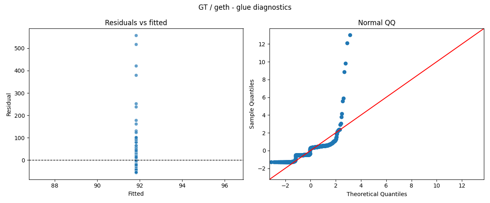

</details>

<details><summary><code>JUMPI</code> · nobs=1518 · runtime_ms=0 · p=1.00e+00 · R²=1.11e-16</summary>

```
==============================================================================
                           NNLS Regression Results                            
==============================================================================
Dep. Variable:          test_runtime_ms              R-squared:          0.000
Model:                  NNLS                    Adj. R-squared:         -0.001
No. Observations:       1518                              RMSE:          23.67
Df Residuals:           1516                               MAE:          14.00
Df Model:               1      
==============================================================================
                      coef     std err     P-value      [0.025      0.975]
------------------------------------------------------------------------------
         const     51.5454      0.5997       0.001     50.4104     52.8729
         JUMPI      0.0000      0.0000       1.000      0.0000      0.0000
==============================================================================
Notes: Non-negative least squares with bootstrap inference (1000 iterations)
==============================================================================
```

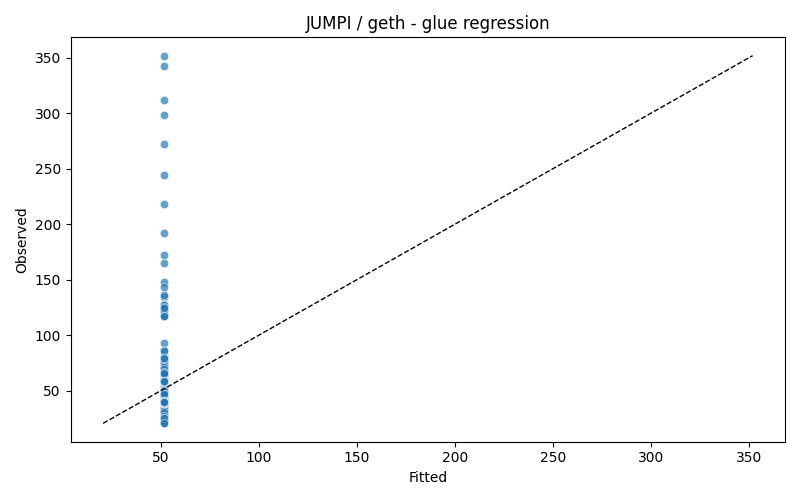


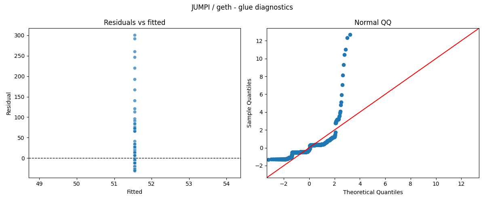

</details>

<details><summary><code>LT</code> · nobs=1104 · runtime_ms=0 · p=1.00e+00 · R²=0</summary>

```
==============================================================================
                           NNLS Regression Results                            
==============================================================================
Dep. Variable:          test_runtime_ms              R-squared:          0.000
Model:                  NNLS                    Adj. R-squared:         -0.001
No. Observations:       1104                              RMSE:          44.54
Df Residuals:           1102                               MAE:          29.01
Df Model:               1      
==============================================================================
                      coef     std err     P-value      [0.025      0.975]
------------------------------------------------------------------------------
         const     94.8480      1.3529       0.001     92.4198     97.7326
            LT      0.0000      0.0000       1.000      0.0000      0.0000
==============================================================================
Notes: Non-negative least squares with bootstrap inference (1000 iterations)
==============================================================================
```

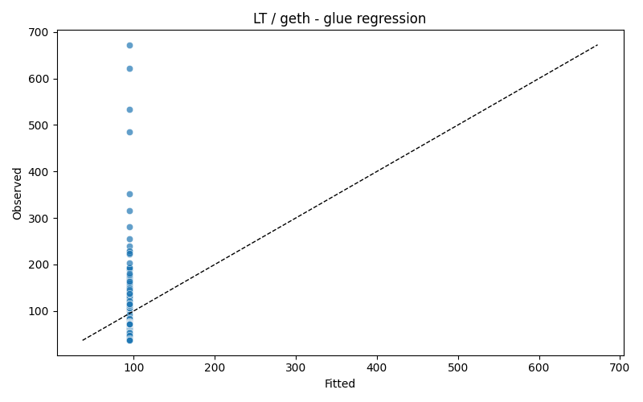


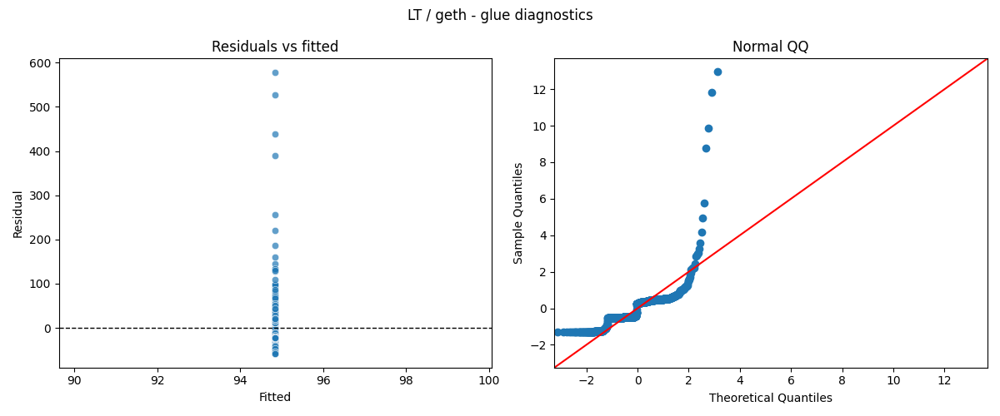

</details>

<details><summary><code>MSTORE</code> · nobs=6210 · runtime_ms=0 · p=1.00e+00 · R²=0</summary>

```
==============================================================================
                           NNLS Regression Results                            
==============================================================================
Dep. Variable:          test_runtime_ms              R-squared:          0.000
Model:                  NNLS                    Adj. R-squared:         -0.000
No. Observations:       6210                              RMSE:          58.89
Df Residuals:           6208                               MAE:          36.92
Df Model:               1      
==============================================================================
                      coef     std err     P-value      [0.025      0.975]
------------------------------------------------------------------------------
         const    134.0939      0.7461       0.001    132.5721    135.5452
        MSTORE      0.0000      0.0000       1.000      0.0000      0.0000
==============================================================================
Notes: Non-negative least squares with bootstrap inference (1000 iterations)
==============================================================================
```

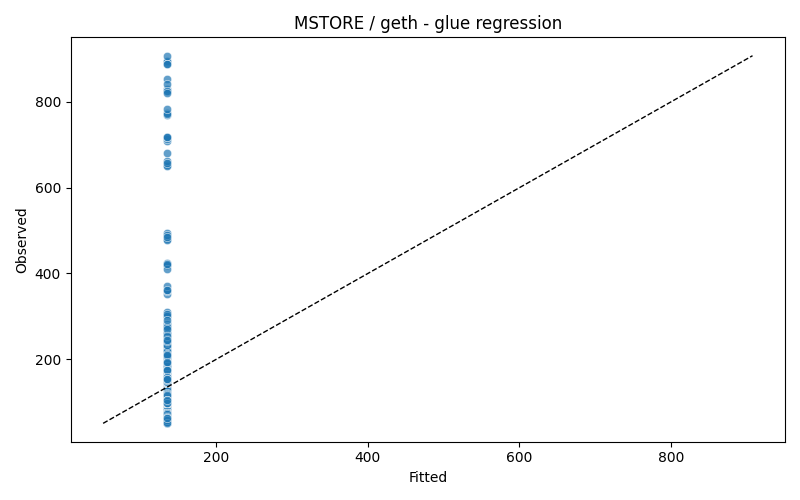


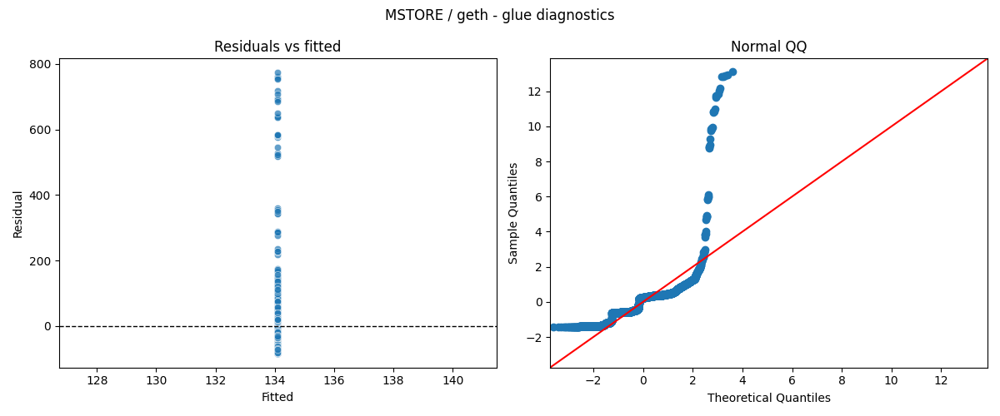

</details>

<details><summary><code>MSTORE8</code> · nobs=6210 · runtime_ms=0 · p=1.00e+00 · R²=-2.22e-16</summary>

```
==============================================================================
                           NNLS Regression Results                            
==============================================================================
Dep. Variable:          test_runtime_ms              R-squared:         -0.000
Model:                  NNLS                    Adj. R-squared:         -0.000
No. Observations:       6210                              RMSE:          57.74
Df Residuals:           6208                               MAE:          34.99
Df Model:               1      
==============================================================================
                      coef     std err     P-value      [0.025      0.975]
------------------------------------------------------------------------------
         const    127.0189      0.7444       0.001    125.6070    128.5536
       MSTORE8      0.0000      0.0000       1.000      0.0000      0.0000
==============================================================================
Notes: Non-negative least squares with bootstrap inference (1000 iterations)
==============================================================================
```

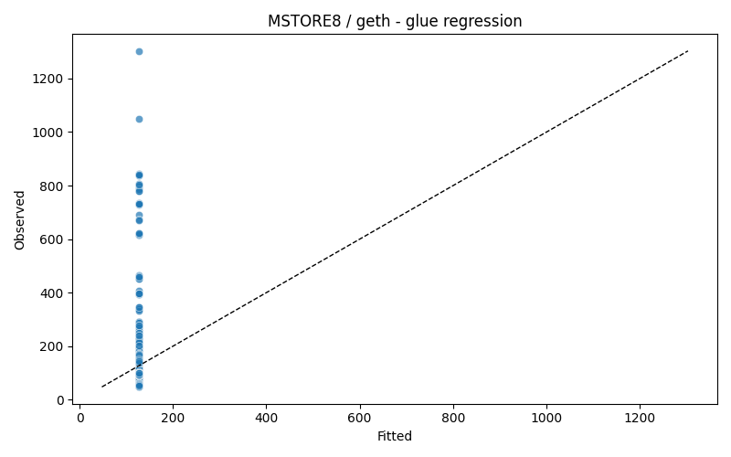

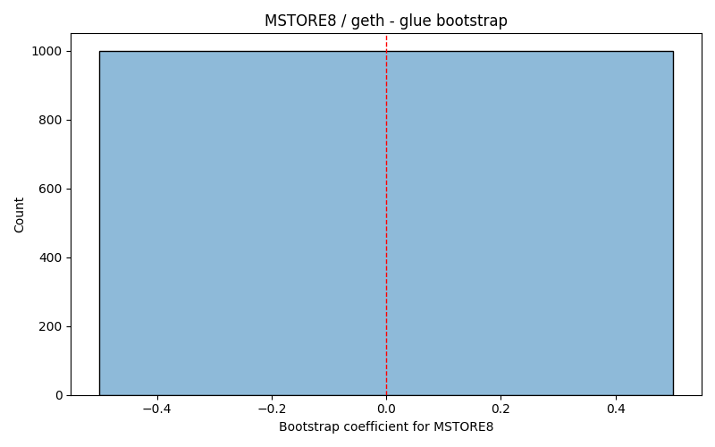

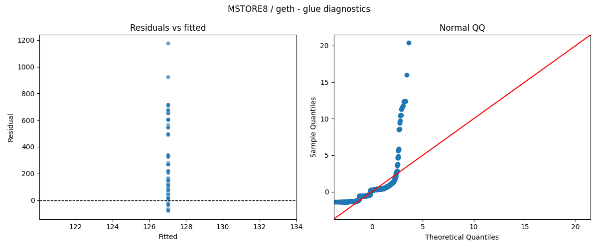

</details>

<details><summary><code>MUL</code> · nobs=1380 · runtime_ms=0 · p=1.00e+00 · R²=-2.22e-16</summary>

```
==============================================================================
                           NNLS Regression Results                            
==============================================================================
Dep. Variable:          test_runtime_ms              R-squared:         -0.000
Model:                  NNLS                    Adj. R-squared:         -0.001
No. Observations:       1380                              RMSE:          43.19
Df Residuals:           1378                               MAE:          26.63
Df Model:               1      
==============================================================================
                      coef     std err     P-value      [0.025      0.975]
------------------------------------------------------------------------------
         const     94.5067      1.1418       0.001     92.4315     96.7591
           MUL      0.0000      0.0000       1.000      0.0000      0.0000
==============================================================================
Notes: Non-negative least squares with bootstrap inference (1000 iterations)
==============================================================================
```


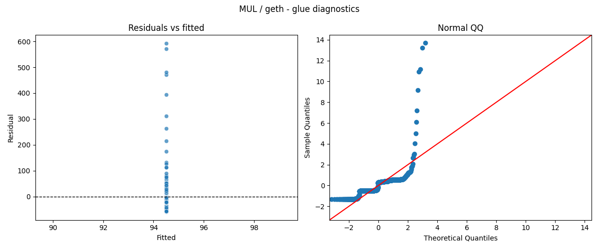

</details>

<details><summary><code>PC</code> · nobs=828 · runtime_ms=7.449e-06 · p=1.00e-03 · R²=0.0864</summary>

```
==============================================================================
                           NNLS Regression Results                            
==============================================================================
Dep. Variable:          test_runtime_ms              R-squared:          0.086
Model:                  NNLS                    Adj. R-squared:          0.085
No. Observations:       828                               RMSE:          53.84
Df Residuals:           826                                MAE:          24.89
Df Model:               1      
==============================================================================
                      coef     std err     P-value      [0.025      0.975]
------------------------------------------------------------------------------
         const    124.7367      3.0819       0.001    118.4993    130.8617
            PC      0.0000      0.0000       0.001      0.0000      0.0000
==============================================================================
Notes: Non-negative least squares with bootstrap inference (1000 iterations)
==============================================================================
```

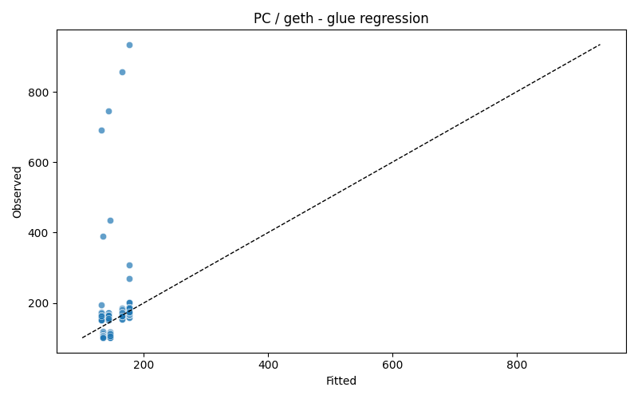

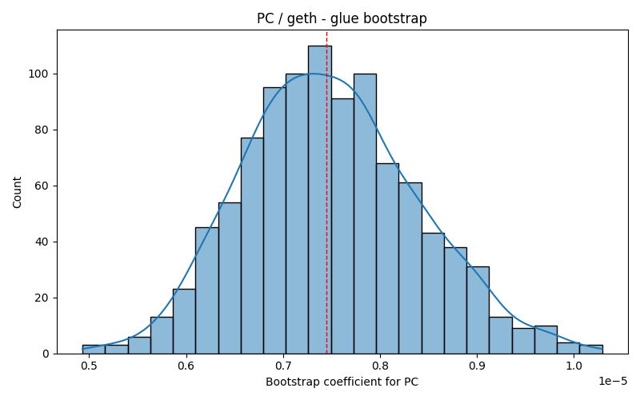

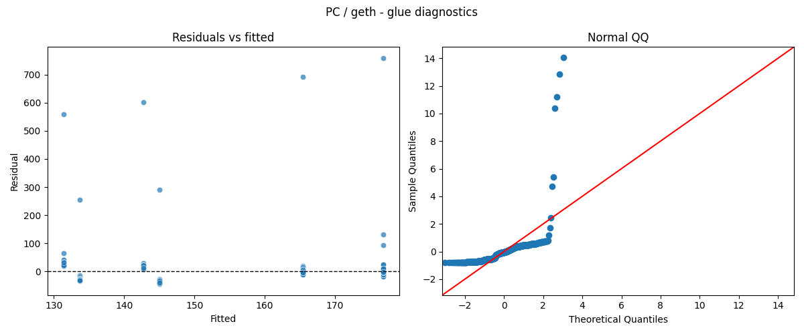

</details>

<details><summary><code>RETURNDATASIZE</code> · nobs=3312 · runtime_ms=1.252e-05 · p=1.00e-03 · R²=0.07309</summary>

```
==============================================================================
                           NNLS Regression Results                            
==============================================================================
Dep. Variable:          test_runtime_ms              R-squared:          0.073
Model:                  NNLS                    Adj. R-squared:          0.073
No. Observations:       3312                              RMSE:          52.31
Df Residuals:           3310                               MAE:          27.05
Df Model:               1      
==============================================================================
                      coef     std err     P-value      [0.025      0.975]
------------------------------------------------------------------------------
         const    105.1545      1.5527       0.001    102.0796    108.4817
RETURNDATASIZE      0.0000      0.0000       0.001      0.0000      0.0000
==============================================================================
Notes: Non-negative least squares with bootstrap inference (1000 iterations)
==============================================================================
```

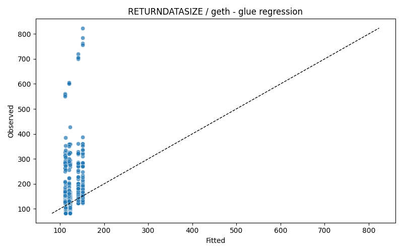

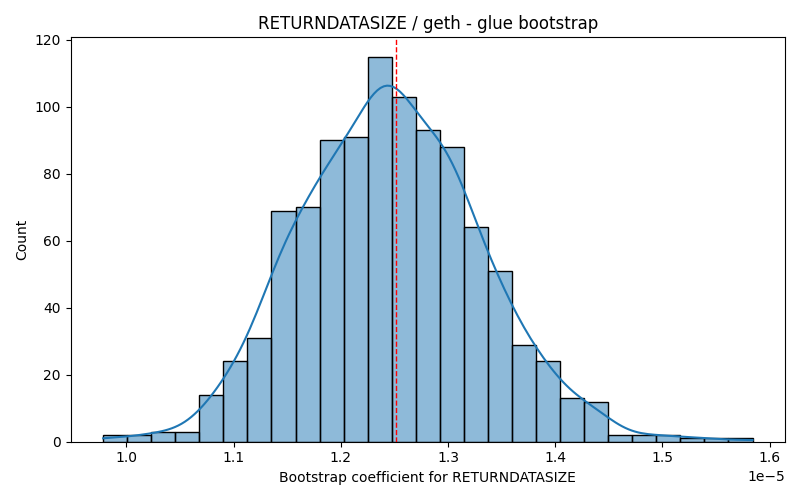

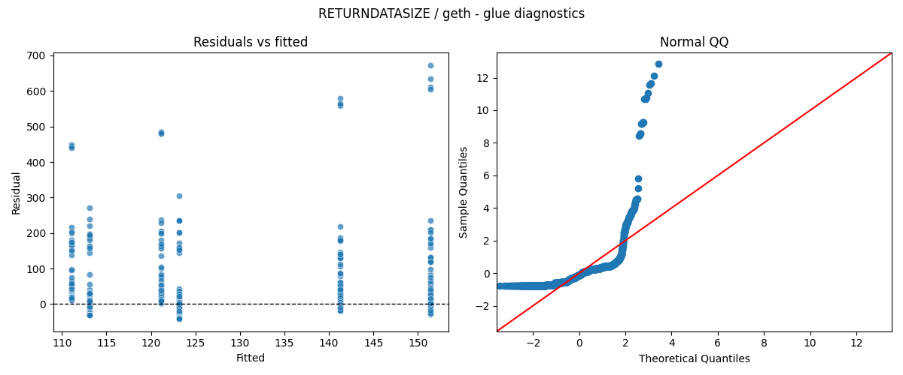

</details>

<details><summary><code>SELFBALANCE</code> · nobs=1518 · runtime_ms=0 · p=1.00e+00 · R²=-2.22e-16</summary>

```
==============================================================================
                           NNLS Regression Results                            
==============================================================================
Dep. Variable:          test_runtime_ms              R-squared:         -0.000
Model:                  NNLS                    Adj. R-squared:         -0.001
No. Observations:       1518                              RMSE:         180.35
Df Residuals:           1516                               MAE:         105.04
Df Model:               1      
==============================================================================
                      coef     std err     P-value      [0.025      0.975]
------------------------------------------------------------------------------
         const    400.7062      4.7303       0.001    392.1134    410.2979
   SELFBALANCE      0.0000      0.0000       1.000      0.0000      0.0000
==============================================================================
Notes: Non-negative least squares with bootstrap inference (1000 iterations)
==============================================================================
```

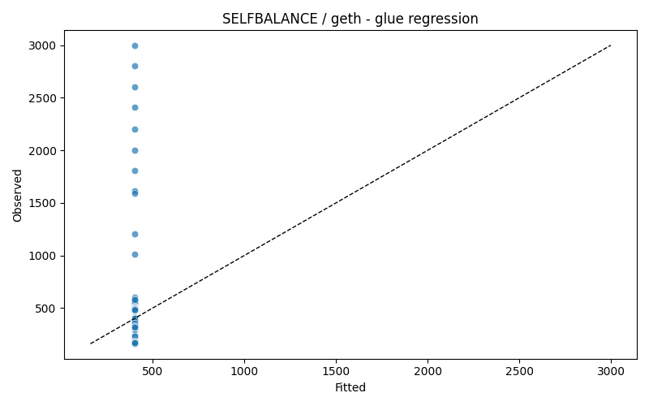

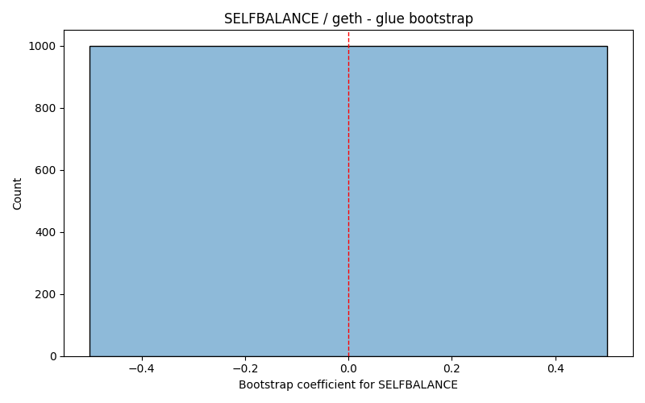

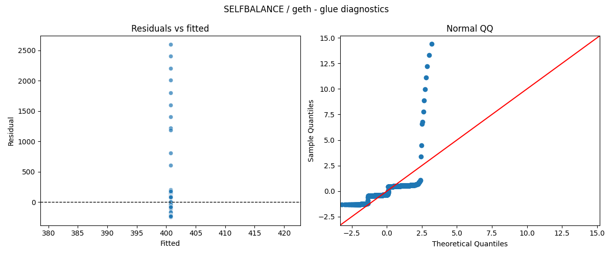

</details>

<details><summary><code>SUB</code> · nobs=1104 · runtime_ms=0 · p=1.00e+00 · R²=-2.22e-16</summary>

```
==============================================================================
                           NNLS Regression Results                            
==============================================================================
Dep. Variable:          test_runtime_ms              R-squared:         -0.000
Model:                  NNLS                    Adj. R-squared:         -0.001
No. Observations:       1104                              RMSE:          52.98
Df Residuals:           1102                               MAE:          28.69
Df Model:               1      
==============================================================================
                      coef     std err     P-value      [0.025      0.975]
------------------------------------------------------------------------------
         const     94.9165      1.5763       0.001     91.9932     98.3654
           SUB      0.0000      0.0000       1.000      0.0000      0.0000
==============================================================================
Notes: Non-negative least squares with bootstrap inference (1000 iterations)
==============================================================================
```

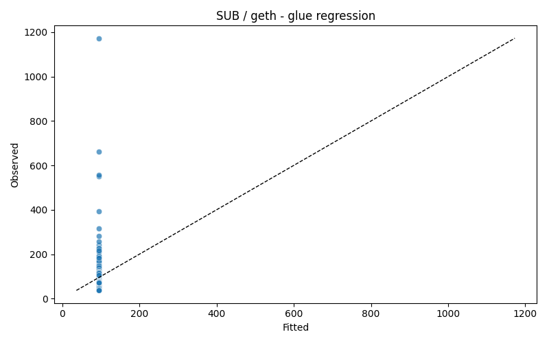


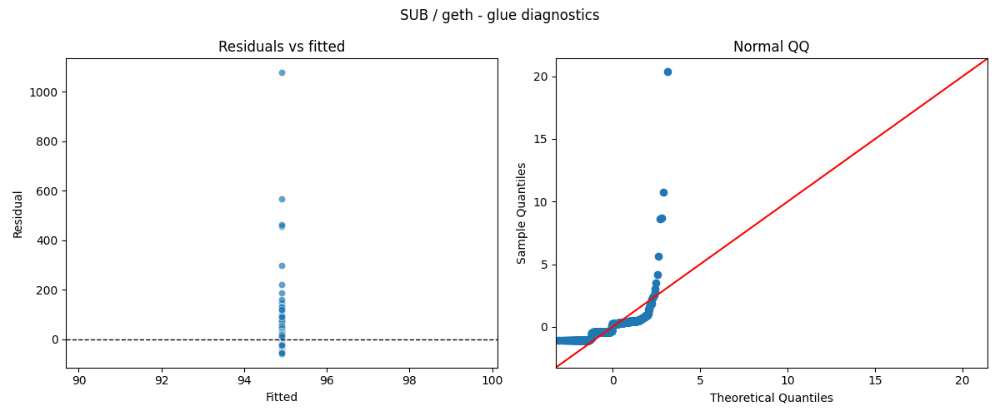

</details>

### Mixed glue (tier B) · geth

<details><summary><code>JUMP</code> · nobs=1380 · runtime_ms=0 · p=1.00e+00 · R²=1.11e-16</summary>

```
==============================================================================
                           NNLS Regression Results                            
==============================================================================
Dep. Variable:          test_runtime_ms              R-squared:          0.000
Model:                  NNLS                    Adj. R-squared:         -0.001
No. Observations:       1380                              RMSE:          37.67
Df Residuals:           1378                               MAE:          23.52
Df Model:               1      
==============================================================================
                      coef     std err     P-value      [0.025      0.975]
------------------------------------------------------------------------------
         const     83.6827      0.9783       0.001     81.9354     85.7966
          JUMP      0.0000      0.0000       1.000      0.0000      0.0000
==============================================================================
Notes: Non-negative least squares with bootstrap inference (1000 iterations)
==============================================================================
```

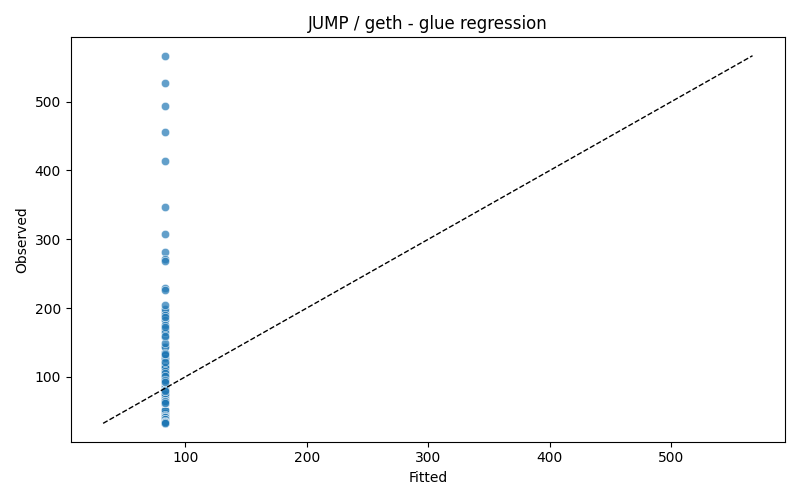


</details>

<details><summary><code>KECCAK256</code> · nobs=0 · runtime_ms=n/a · p=n/a · R²=n/a</summary>

</details>

## nethermind

| glue_opcode | nobs | glue_runtime_ms | p_value | rsquared |
| --- | --- | --- | --- | --- |
| `ISZERO` | 1312 | 0 | 1.00e+00 | -2.22e-16 |
| `JUMPDEST` | 328 | 0 | 1.00e+00 | 0 |
| `SWAP` | 23452 | 0 | 1.00e+00 | -2.22e-16 |
| `CALLDATASIZE` | 82383 | 8.876e-06 | 1.00e-03 | 0.4731 |
| `DUP` | 82383 | 0 | 1.00e+00 | 0.4731 |
| `GAS` | 82383 | 8.486e-06 | 1.00e-03 | 0.4731 |
| `MLOAD` | 82383 | 2.463e-06 | 1.00e-03 | 0.4731 |
| `PUSH` | 82383 | 0 | 1.00e+00 | 0.4731 |
| `PUSH0` | 82383 | 3.622e-06 | 1.00e-03 | 0.4731 |
| `STATICCALL` | 82383 | 0.0003779 | 1.00e-03 | 0.4731 |
| `ADD` | 1476 | 0 | 1.00e+00 | 0 |
| `AND` | 1312 | 0 | 1.00e+00 | -2.22e-16 |
| `CALLDATACOPY` | 38540 | 0 | 1.00e+00 | 0 |
| `CALLDATALOAD` | 7216 | 2.56e-05 | 1.00e-03 | 0.001694 |
| `DIV` | 1804 | 0 | 1.00e+00 | -2.22e-16 |
| `EXP` | 1804 | 0 | 1.00e+00 | -2.22e-16 |
| `GT` | 1312 | 0 | 1.00e+00 | 0 |
| `JUMPI` | 1804 | 0 | 1.00e+00 | 0 |
| `LT` | 1312 | 0 | 1.00e+00 | 0 |
| `MSTORE` | 7380 | 0 | 1.00e+00 | 1.11e-16 |
| `MSTORE8` | 7380 | 0 | 1.00e+00 | 0 |
| `MUL` | 1640 | 0 | 1.00e+00 | 0 |
| `PC` | 984 | 6.46e-06 | 1.00e-03 | 0.4128 |
| `RETURNDATASIZE` | 3936 | 6.32e-06 | 1.00e-03 | 0.1783 |
| `SELFBALANCE` | 1804 | 0 | 1.00e+00 | 1.11e-16 |
| `SUB` | 1312 | 0 | 1.00e+00 | 2.22e-16 |
| `JUMP` | 1640 | 0 | 1.00e+00 | 0 |
| `KECCAK256` | 0 | n/a | n/a | n/a |

### Cycle glue — joint fit · nethermind

<details><summary>Joint NNLS regression summary</summary>

```
==============================================================================
                           NNLS Regression Results                            
==============================================================================
Dep. Variable:          test_runtime_ms              R-squared:          0.473
Model:                  NNLS                    Adj. R-squared:          0.473
No. Observations:       82383                             RMSE:          20.48
Df Residuals:           82375                              MAE:          17.08
Df Model:               7      
==============================================================================
                      coef     std err     P-value      [0.025      0.975]
------------------------------------------------------------------------------
         const     64.6862      0.0852       0.001     64.5239     64.8544
  CALLDATASIZE      0.0000      0.0000       0.001      0.0000      0.0000
           DUP      0.0000      0.0000       1.000      0.0000      0.0000
           GAS      0.0000      0.0000       0.001      0.0000      0.0000
         MLOAD      0.0000      0.0000       0.001      0.0000      0.0000
          PUSH      0.0000      0.0000       1.000      0.0000      0.0000
         PUSH0      0.0000      0.0000       0.001      0.0000      0.0000
    STATICCALL      0.0004      0.0000       0.001      0.0004      0.0004
==============================================================================
Notes: Non-negative least squares with bootstrap inference (1000 iterations)
==============================================================================
```

</details>

<details><summary><code>CALLDATASIZE</code> · nobs=82383 · runtime_ms=8.876e-06 · p=1.00e-03 · R²=0.4731</summary>

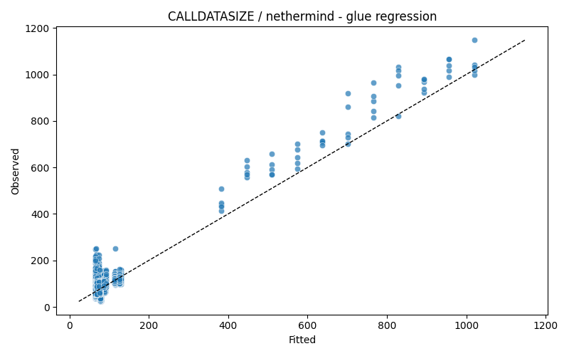

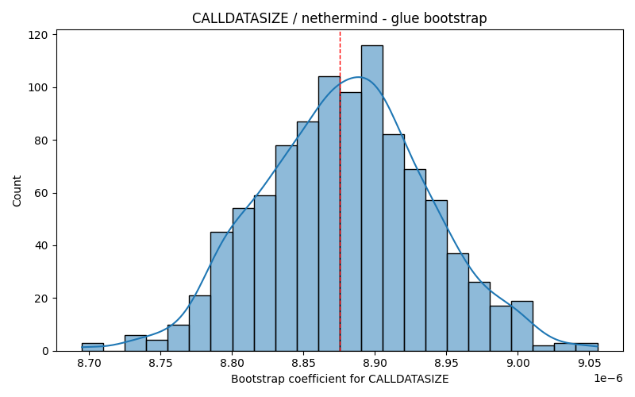

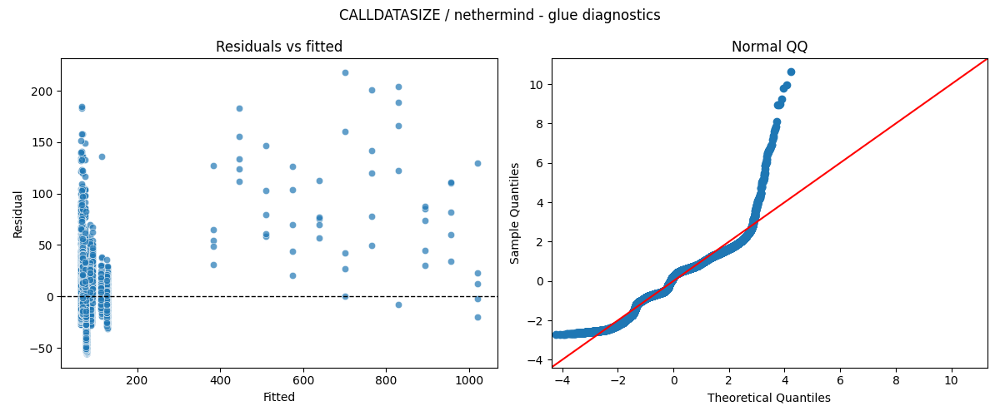

</details>

<details><summary><code>DUP</code> · nobs=82383 · runtime_ms=0 · p=1.00e+00 · R²=0.4731</summary>

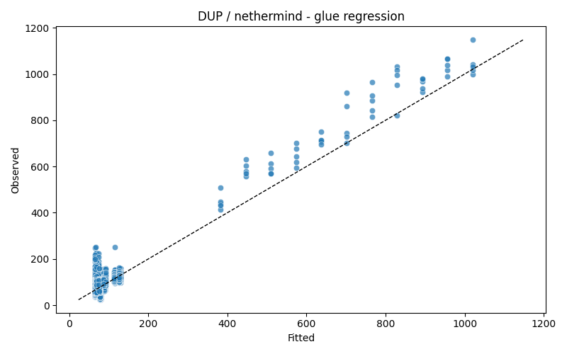


</details>

<details><summary><code>GAS</code> · nobs=82383 · runtime_ms=8.486e-06 · p=1.00e-03 · R²=0.4731</summary>


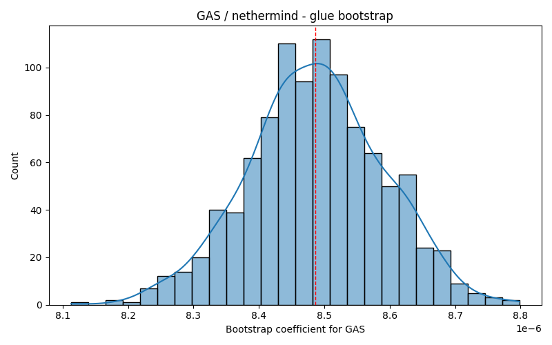


</details>

<details><summary><code>MLOAD</code> · nobs=82383 · runtime_ms=2.463e-06 · p=1.00e-03 · R²=0.4731</summary>


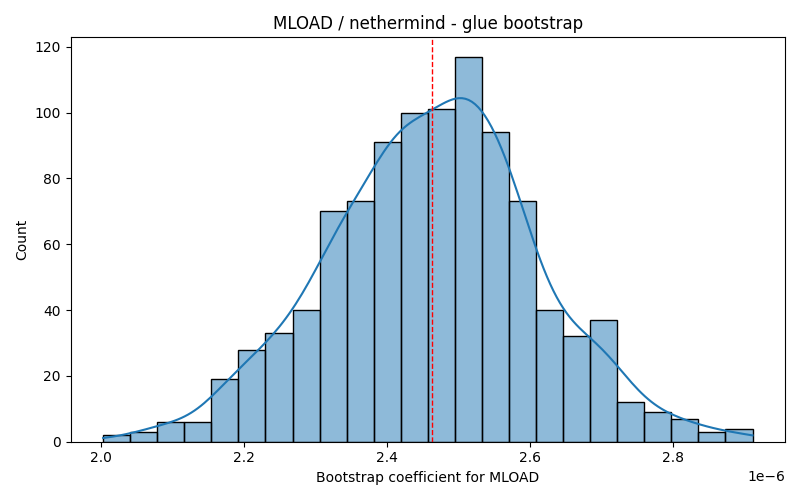


</details>

<details><summary><code>PUSH</code> · nobs=82383 · runtime_ms=0 · p=1.00e+00 · R²=0.4731</summary>


</details>

<details><summary><code>PUSH0</code> · nobs=82383 · runtime_ms=3.622e-06 · p=1.00e-03 · R²=0.4731</summary>


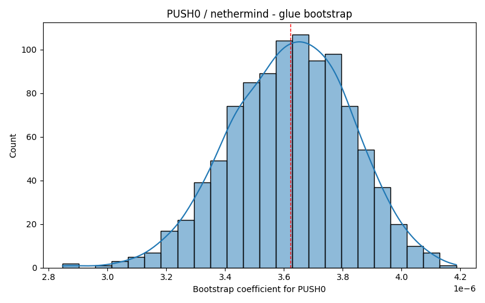

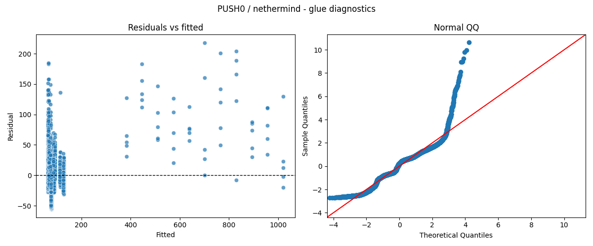

</details>

<details><summary><code>STATICCALL</code> · nobs=82383 · runtime_ms=0.0003779 · p=1.00e-03 · R²=0.4731</summary>


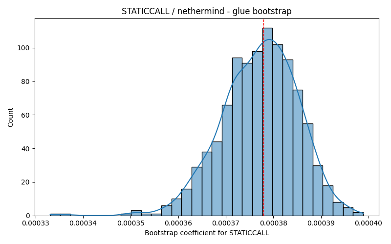


</details>

### Pure glue · nethermind

<details><summary><code>ISZERO</code> · nobs=1312 · runtime_ms=0 · p=1.00e+00 · R²=-2.22e-16</summary>

```
==============================================================================
                           NNLS Regression Results                            
==============================================================================
Dep. Variable:          test_runtime_ms              R-squared:         -0.000
Model:                  NNLS                    Adj. R-squared:         -0.001
No. Observations:       1312                              RMSE:          21.32
Df Residuals:           1310                               MAE:          18.10
Df Model:               1      
==============================================================================
                      coef     std err     P-value      [0.025      0.975]
------------------------------------------------------------------------------
         const     68.8274      0.5617       0.001     67.6876     69.9176
        ISZERO      0.0000      0.0000       1.000      0.0000      0.0000
==============================================================================
Notes: Non-negative least squares with bootstrap inference (1000 iterations)
==============================================================================
```

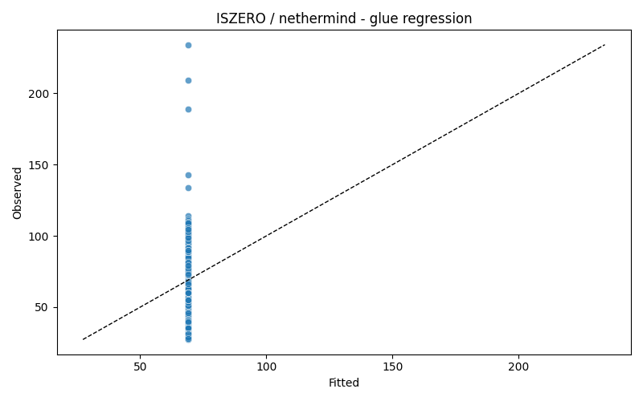


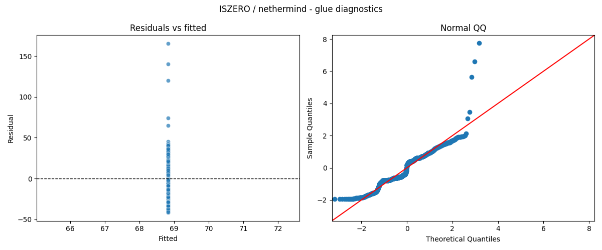

</details>

<details><summary><code>JUMPDEST</code> · nobs=328 · runtime_ms=0 · p=1.00e+00 · R²=0</summary>

```
==============================================================================
                           NNLS Regression Results                            
==============================================================================
Dep. Variable:          test_runtime_ms              R-squared:          0.000
Model:                  NNLS                    Adj. R-squared:         -0.003
No. Observations:       328                               RMSE:          44.02
Df Residuals:           326                                MAE:          26.47
Df Model:               1      
==============================================================================
                      coef     std err     P-value      [0.025      0.975]
------------------------------------------------------------------------------
         const    112.4485      2.3343       0.001    108.1977    117.3561
      JUMPDEST      0.0000      0.0000       1.000      0.0000      0.0000
==============================================================================
Notes: Non-negative least squares with bootstrap inference (1000 iterations)
==============================================================================
```

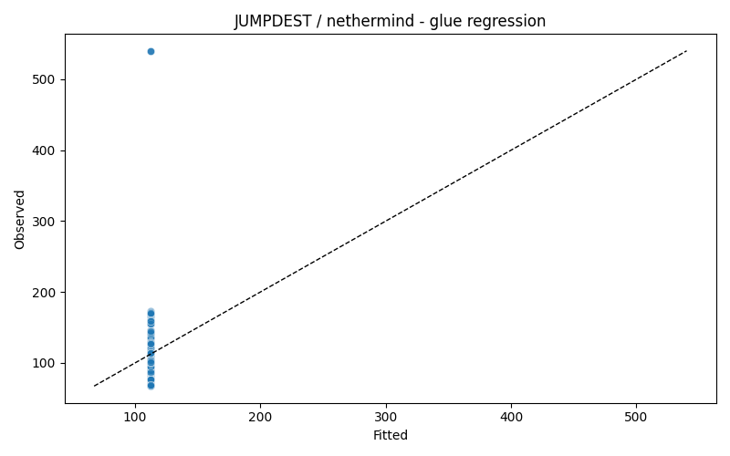

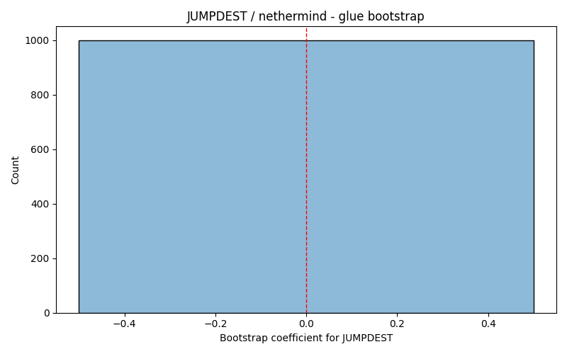

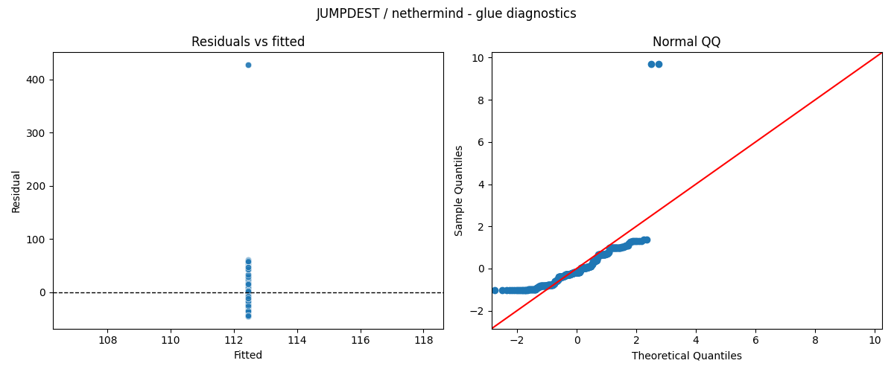

</details>

<details><summary><code>SWAP</code> · nobs=23452 · runtime_ms=0 · p=1.00e+00 · R²=-2.22e-16</summary>

```
==============================================================================
                           NNLS Regression Results                            
==============================================================================
Dep. Variable:          test_runtime_ms              R-squared:         -0.000
Model:                  NNLS                    Adj. R-squared:         -0.000
No. Observations:       23452                             RMSE:          18.40
Df Residuals:           23450                              MAE:          12.31
Df Model:               1      
==============================================================================
                      coef     std err     P-value      [0.025      0.975]
------------------------------------------------------------------------------
         const     51.8735      0.1195       0.001     51.6532     52.1125
          SWAP      0.0000      0.0000       1.000      0.0000      0.0000
==============================================================================
Notes: Non-negative least squares with bootstrap inference (1000 iterations)
==============================================================================
```

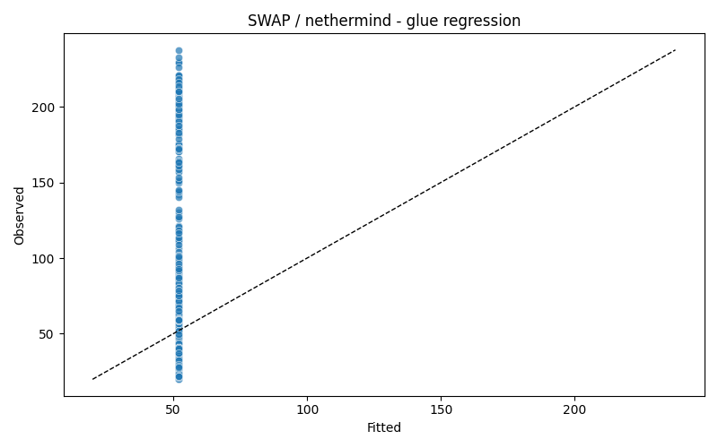


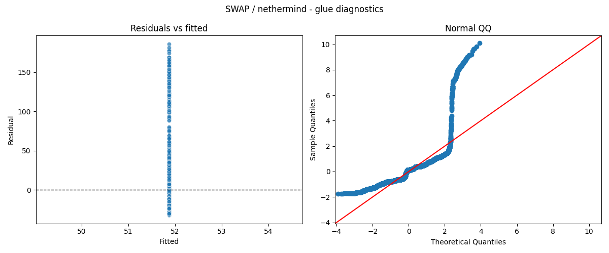

</details>

### Mixed glue (tier A) · nethermind

<details><summary><code>ADD</code> · nobs=1476 · runtime_ms=0 · p=1.00e+00 · R²=0</summary>

```
==============================================================================
                           NNLS Regression Results                            
==============================================================================
Dep. Variable:          test_runtime_ms              R-squared:          0.000
Model:                  NNLS                    Adj. R-squared:         -0.001
No. Observations:       1476                              RMSE:          36.09
Df Residuals:           1474                               MAE:          28.09
Df Model:               1      
==============================================================================
                      coef     std err     P-value      [0.025      0.975]
------------------------------------------------------------------------------
         const     98.4002      0.9175       0.001     96.5998    100.2927
           ADD      0.0000      0.0000       1.000      0.0000      0.0000
==============================================================================
Notes: Non-negative least squares with bootstrap inference (1000 iterations)
==============================================================================
```

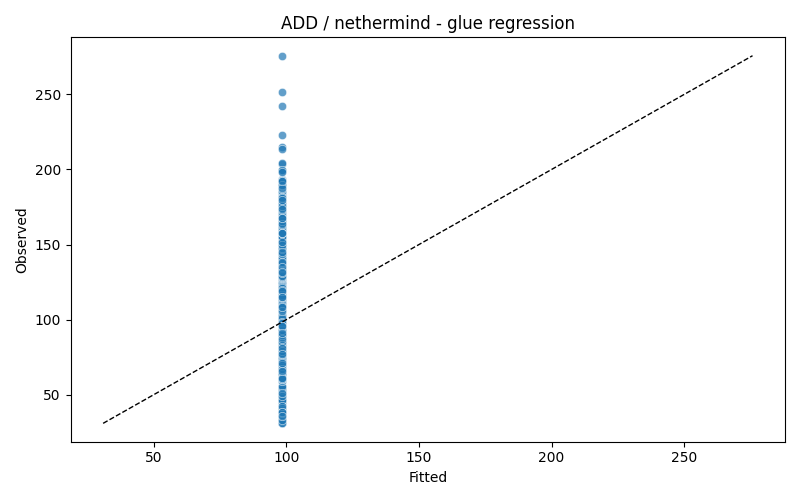


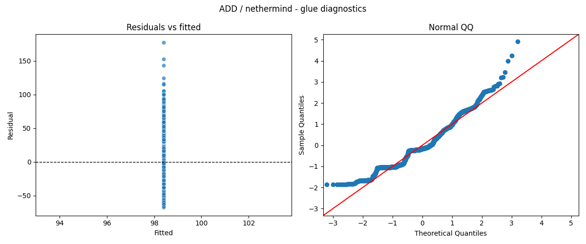

</details>

<details><summary><code>AND</code> · nobs=1312 · runtime_ms=0 · p=1.00e+00 · R²=-2.22e-16</summary>

```
==============================================================================
                           NNLS Regression Results                            
==============================================================================
Dep. Variable:          test_runtime_ms              R-squared:         -0.000
Model:                  NNLS                    Adj. R-squared:         -0.001
No. Observations:       1312                              RMSE:          20.10
Df Residuals:           1310                               MAE:          13.98
Df Model:               1      
==============================================================================
                      coef     std err     P-value      [0.025      0.975]
------------------------------------------------------------------------------
         const     51.5453      0.5527       0.001     50.4843     52.6645
           AND      0.0000      0.0000       1.000      0.0000      0.0000
==============================================================================
Notes: Non-negative least squares with bootstrap inference (1000 iterations)
==============================================================================
```

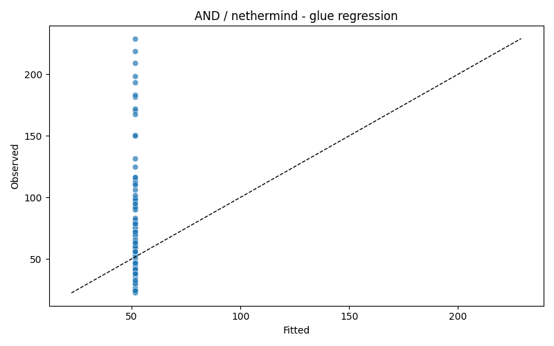


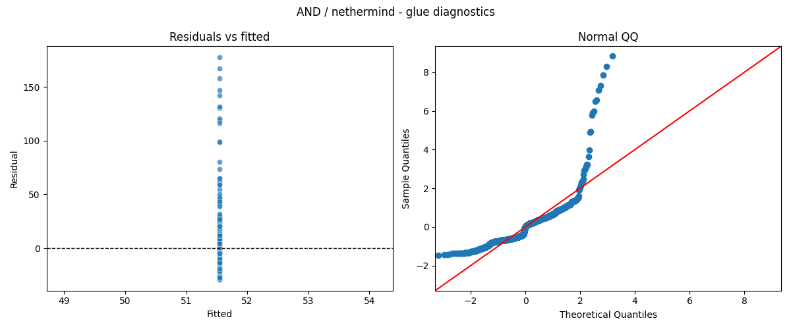

</details>

<details><summary><code>CALLDATACOPY</code> · nobs=38540 · runtime_ms=0 · p=1.00e+00 · R²=0</summary>

```
==============================================================================
                           NNLS Regression Results                            
==============================================================================
Dep. Variable:          test_runtime_ms              R-squared:          0.000
Model:                  NNLS                    Adj. R-squared:         -0.000
No. Observations:       38540                             RMSE:          35.24
Df Residuals:           38538                              MAE:          28.89
Df Model:               1      
==============================================================================
                      coef     std err     P-value      [0.025      0.975]
------------------------------------------------------------------------------
         const     58.6739      0.1838       0.001     58.3113     59.0401
  CALLDATACOPY      0.0000      0.0000       1.000      0.0000      0.0000
==============================================================================
Notes: Non-negative least squares with bootstrap inference (1000 iterations)
==============================================================================
```

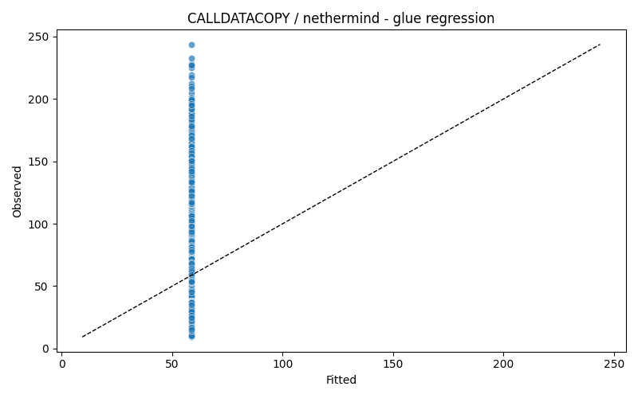


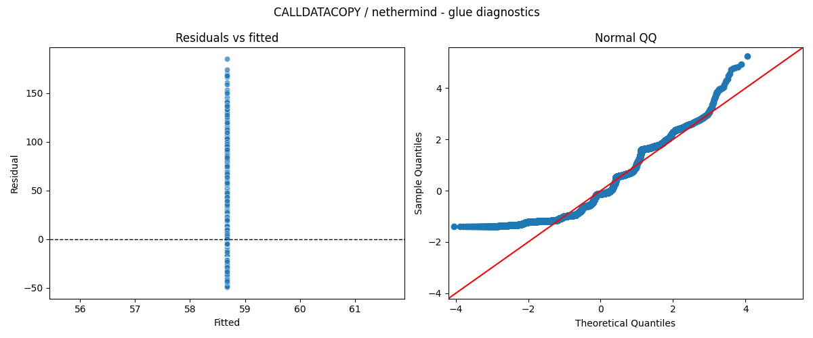

</details>

<details><summary><code>CALLDATALOAD</code> · nobs=7216 · runtime_ms=2.56e-05 · p=1.00e-03 · R²=0.001694</summary>

```
==============================================================================
                           NNLS Regression Results                            
==============================================================================
Dep. Variable:          test_runtime_ms              R-squared:          0.002
Model:                  NNLS                    Adj. R-squared:          0.002
No. Observations:       7216                              RMSE:           2.39
Df Residuals:           7214                               MAE:           0.28
Df Model:               1      
==============================================================================
                      coef     std err     P-value      [0.025      0.975]
------------------------------------------------------------------------------
         const      2.0398      0.0794       0.001      1.8741      2.1782
  CALLDATALOAD      0.0000      0.0000       0.001      0.0000      0.0000
==============================================================================
Notes: Non-negative least squares with bootstrap inference (1000 iterations)
==============================================================================
```

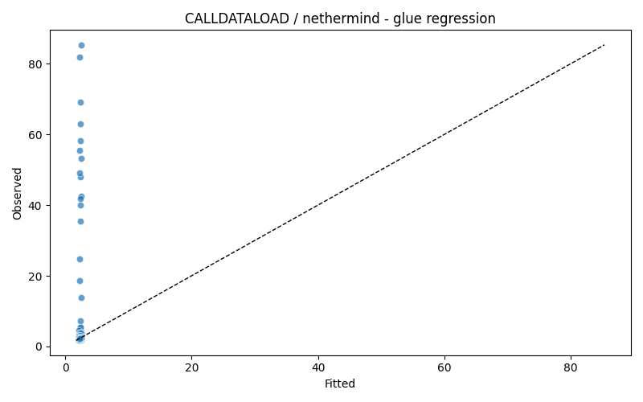

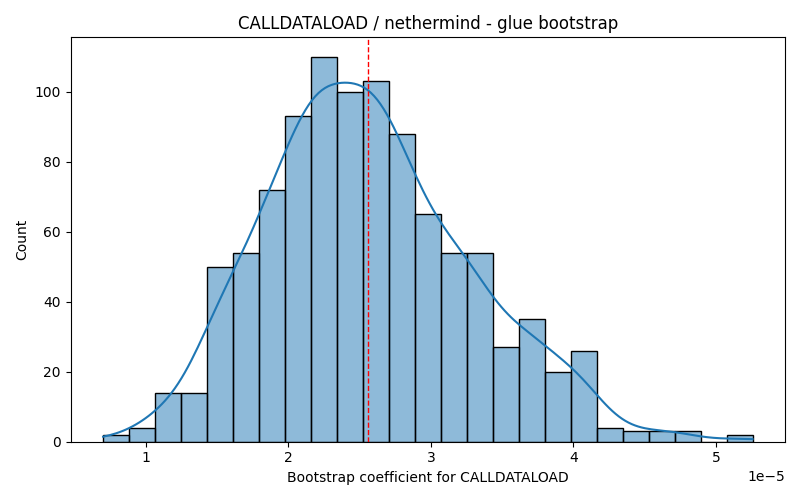

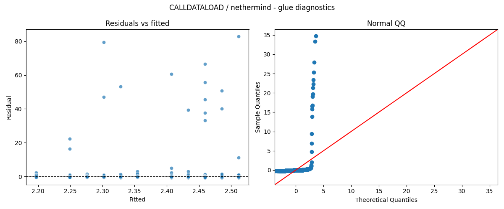

</details>

<details><summary><code>DIV</code> · nobs=1804 · runtime_ms=0 · p=1.00e+00 · R²=-2.22e-16</summary>

```
==============================================================================
                           NNLS Regression Results                            
==============================================================================
Dep. Variable:          test_runtime_ms              R-squared:         -0.000
Model:                  NNLS                    Adj. R-squared:         -0.001
No. Observations:       1804                              RMSE:          51.71
Df Residuals:           1802                               MAE:          46.92
Df Model:               1      
==============================================================================
                      coef     std err     P-value      [0.025      0.975]
------------------------------------------------------------------------------
         const    251.0005      1.2017       0.001    248.4861    253.2111
           DIV      0.0000      0.0000       1.000      0.0000      0.0000
==============================================================================
Notes: Non-negative least squares with bootstrap inference (1000 iterations)
==============================================================================
```

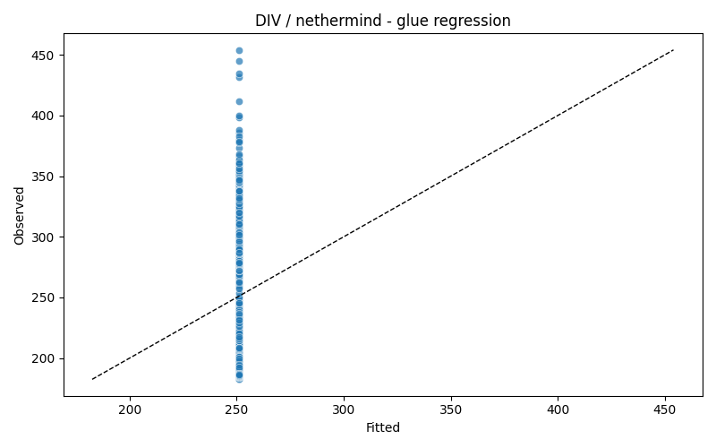


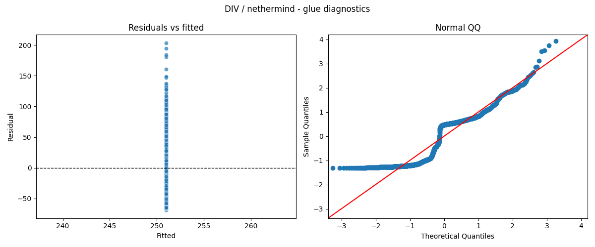

</details>

<details><summary><code>EXP</code> · nobs=1804 · runtime_ms=0 · p=1.00e+00 · R²=-2.22e-16</summary>

```
==============================================================================
                           NNLS Regression Results                            
==============================================================================
Dep. Variable:          test_runtime_ms              R-squared:         -0.000
Model:                  NNLS                    Adj. R-squared:         -0.001
No. Observations:       1804                              RMSE:          46.58
Df Residuals:           1802                               MAE:          28.30
Df Model:               1      
==============================================================================
                      coef     std err     P-value      [0.025      0.975]
------------------------------------------------------------------------------
         const     88.2483      1.0556       0.001     86.2868     90.3044
           EXP      0.0000      0.0000       1.000      0.0000      0.0000
==============================================================================
Notes: Non-negative least squares with bootstrap inference (1000 iterations)
==============================================================================
```

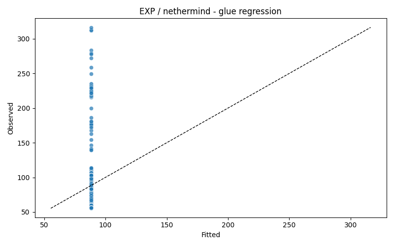


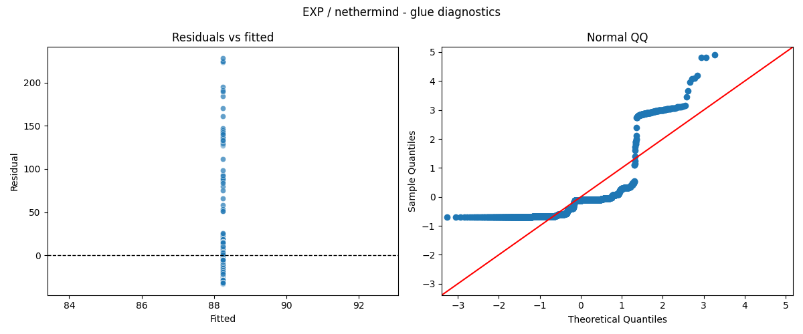

</details>

<details><summary><code>GT</code> · nobs=1312 · runtime_ms=0 · p=1.00e+00 · R²=0</summary>

```
==============================================================================
                           NNLS Regression Results                            
==============================================================================
Dep. Variable:          test_runtime_ms              R-squared:          0.000
Model:                  NNLS                    Adj. R-squared:         -0.001
No. Observations:       1312                              RMSE:          23.59
Df Residuals:           1310                               MAE:          18.13
Df Model:               1      
==============================================================================
                      coef     std err     P-value      [0.025      0.975]
------------------------------------------------------------------------------
         const     64.3673      0.6232       0.001     63.1498     65.6450
            GT      0.0000      0.0000       1.000      0.0000      0.0000
==============================================================================
Notes: Non-negative least squares with bootstrap inference (1000 iterations)
==============================================================================
```

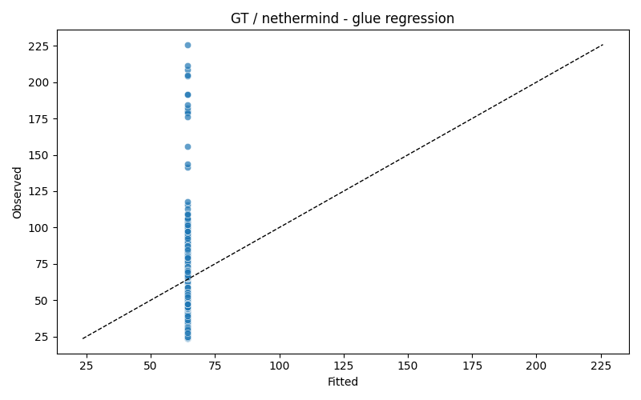


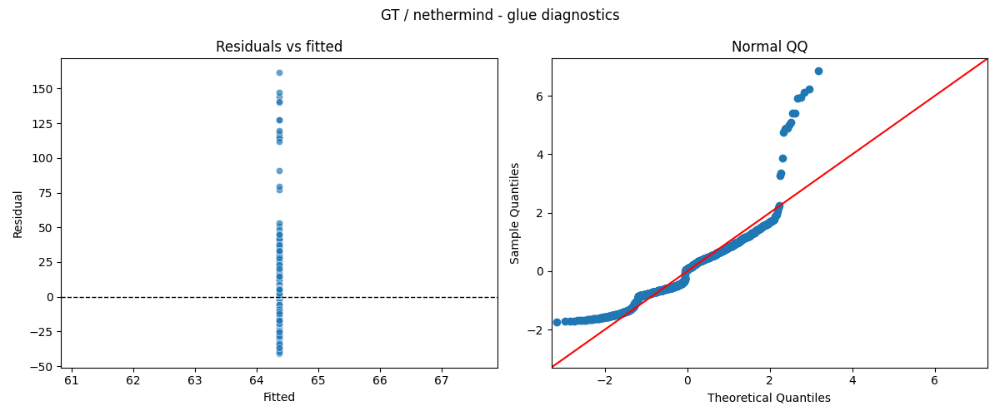

</details>

<details><summary><code>JUMPI</code> · nobs=1804 · runtime_ms=0 · p=1.00e+00 · R²=0</summary>

```
==============================================================================
                           NNLS Regression Results                            
==============================================================================
Dep. Variable:          test_runtime_ms              R-squared:          0.000
Model:                  NNLS                    Adj. R-squared:         -0.001
No. Observations:       1804                              RMSE:          10.68
Df Residuals:           1802                               MAE:           7.69
Df Model:               1      
==============================================================================
                      coef     std err     P-value      [0.025      0.975]
------------------------------------------------------------------------------
         const     32.9959      0.2519       0.001     32.5092     33.4977
         JUMPI      0.0000      0.0000       1.000      0.0000      0.0000
==============================================================================
Notes: Non-negative least squares with bootstrap inference (1000 iterations)
==============================================================================
```

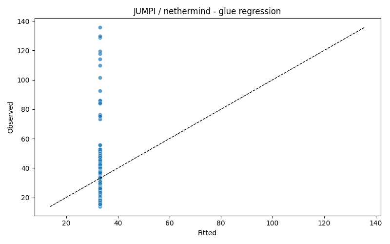

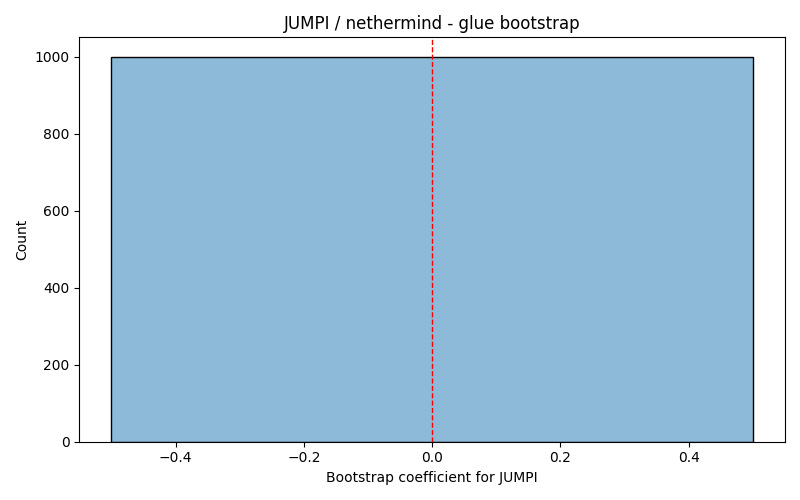

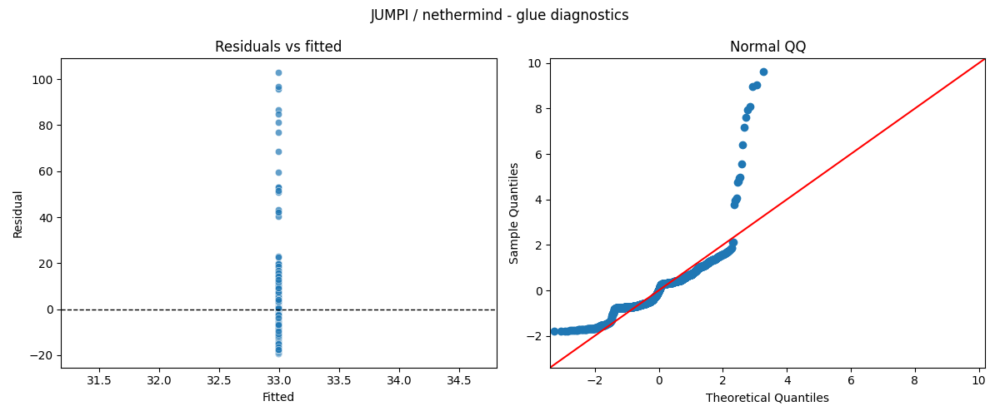

</details>

<details><summary><code>LT</code> · nobs=1312 · runtime_ms=0 · p=1.00e+00 · R²=0</summary>

```
==============================================================================
                           NNLS Regression Results                            
==============================================================================
Dep. Variable:          test_runtime_ms              R-squared:          0.000
Model:                  NNLS                    Adj. R-squared:         -0.001
No. Observations:       1312                              RMSE:          21.20
Df Residuals:           1310                               MAE:          16.84
Df Model:               1      
==============================================================================
                      coef     std err     P-value      [0.025      0.975]
------------------------------------------------------------------------------
         const     65.9890      0.5924       0.001     64.8378     67.1706
            LT      0.0000      0.0000       1.000      0.0000      0.0000
==============================================================================
Notes: Non-negative least squares with bootstrap inference (1000 iterations)
==============================================================================
```

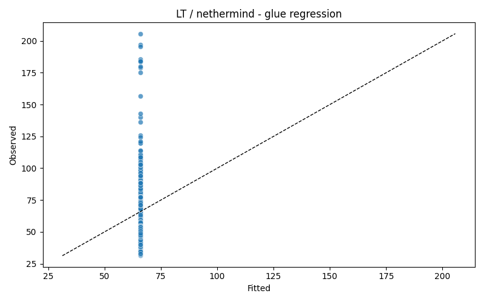

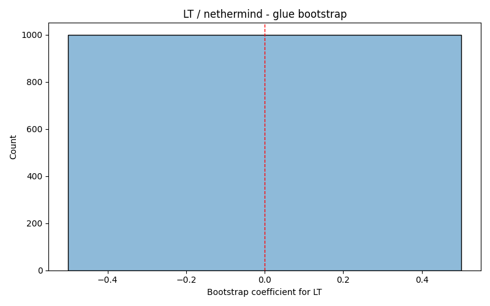

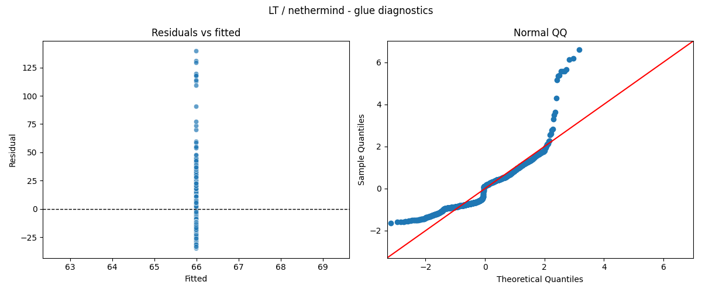

</details>

<details><summary><code>MSTORE</code> · nobs=7380 · runtime_ms=0 · p=1.00e+00 · R²=1.11e-16</summary>

```
==============================================================================
                           NNLS Regression Results                            
==============================================================================
Dep. Variable:          test_runtime_ms              R-squared:          0.000
Model:                  NNLS                    Adj. R-squared:         -0.000
No. Observations:       7380                              RMSE:          20.60
Df Residuals:           7378                               MAE:          15.89
Df Model:               1      
==============================================================================
                      coef     std err     P-value      [0.025      0.975]
------------------------------------------------------------------------------
         const     62.6557      0.2358       0.001     62.1898     63.1082
        MSTORE      0.0000      0.0000       1.000      0.0000      0.0000
==============================================================================
Notes: Non-negative least squares with bootstrap inference (1000 iterations)
==============================================================================
```

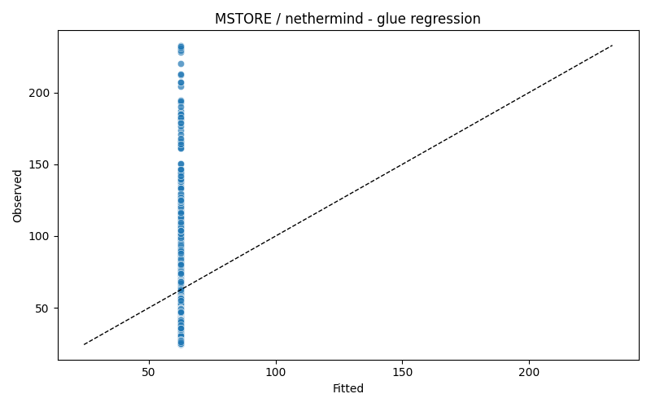


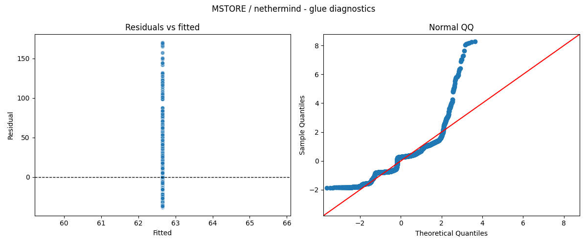

</details>

<details><summary><code>MSTORE8</code> · nobs=7380 · runtime_ms=0 · p=1.00e+00 · R²=0</summary>

```
==============================================================================
                           NNLS Regression Results                            
==============================================================================
Dep. Variable:          test_runtime_ms              R-squared:          0.000
Model:                  NNLS                    Adj. R-squared:         -0.000
No. Observations:       7380                              RMSE:          20.01
Df Residuals:           7378                               MAE:          15.66
Df Model:               1      
==============================================================================
                      coef     std err     P-value      [0.025      0.975]
------------------------------------------------------------------------------
         const     62.1324      0.2410       0.001     61.6931     62.5980
       MSTORE8      0.0000      0.0000       1.000      0.0000      0.0000
==============================================================================
Notes: Non-negative least squares with bootstrap inference (1000 iterations)
==============================================================================
```

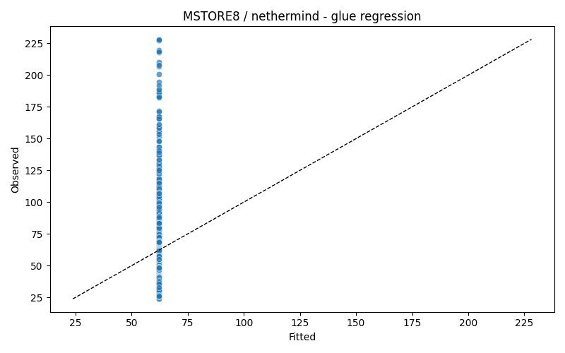


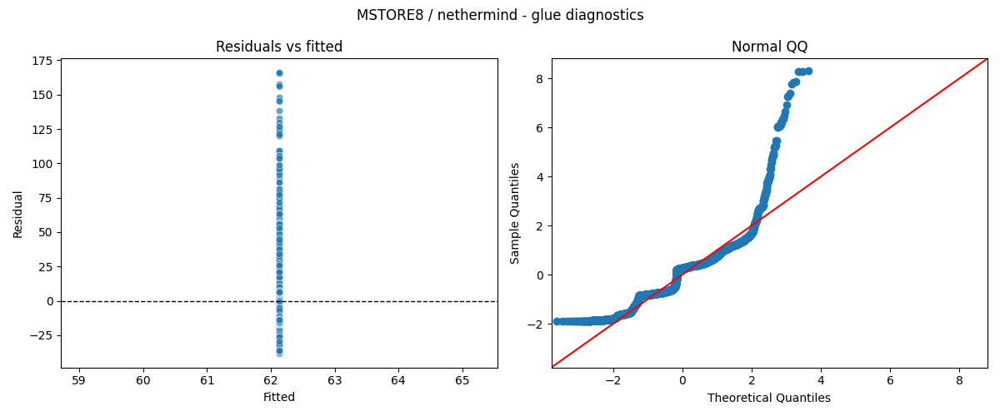

</details>

<details><summary><code>MUL</code> · nobs=1640 · runtime_ms=0 · p=1.00e+00 · R²=0</summary>

```
==============================================================================
                           NNLS Regression Results                            
==============================================================================
Dep. Variable:          test_runtime_ms              R-squared:          0.000
Model:                  NNLS                    Adj. R-squared:         -0.001
No. Observations:       1640                              RMSE:          37.20
Df Residuals:           1638                               MAE:          32.35
Df Model:               1      
==============================================================================
                      coef     std err     P-value      [0.025      0.975]
------------------------------------------------------------------------------
         const    129.3336      0.9202       0.001    127.5917    131.1961
           MUL      0.0000      0.0000       1.000      0.0000      0.0000
==============================================================================
Notes: Non-negative least squares with bootstrap inference (1000 iterations)
==============================================================================
```


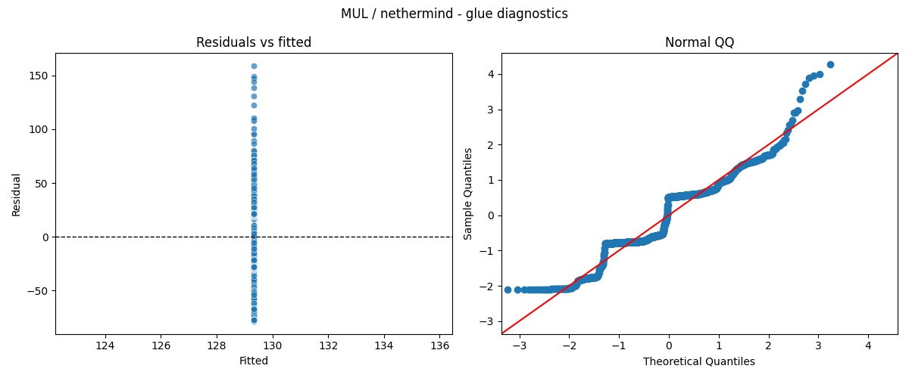

</details>

<details><summary><code>PC</code> · nobs=984 · runtime_ms=6.46e-06 · p=1.00e-03 · R²=0.4128</summary>

```
==============================================================================
                           NNLS Regression Results                            
==============================================================================
Dep. Variable:          test_runtime_ms              R-squared:          0.413
Model:                  NNLS                    Adj. R-squared:          0.412
No. Observations:       984                               RMSE:          17.12
Df Residuals:           982                                MAE:          15.30
Df Model:               1      
==============================================================================
                      coef     std err     P-value      [0.025      0.975]
------------------------------------------------------------------------------
         const     77.6776      1.0956       0.001     75.5843     79.6892
            PC      0.0000      0.0000       0.001      0.0000      0.0000
==============================================================================
Notes: Non-negative least squares with bootstrap inference (1000 iterations)
==============================================================================
```

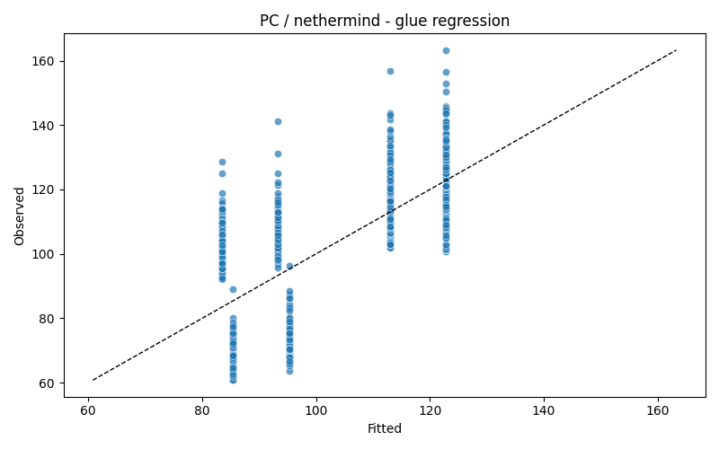

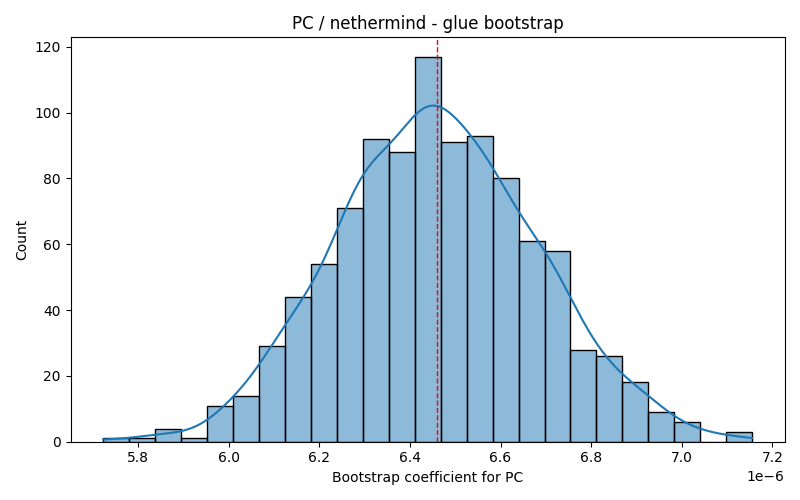

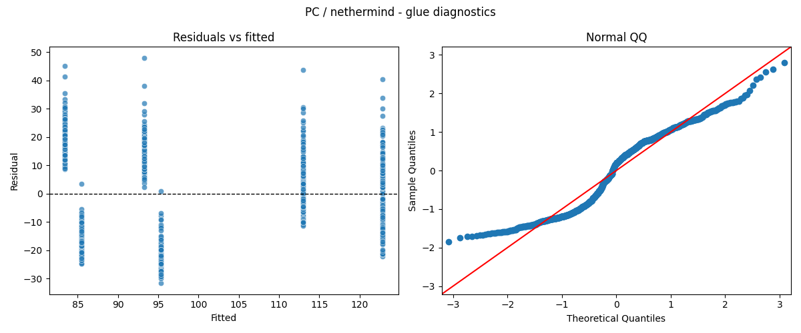

</details>

<details><summary><code>RETURNDATASIZE</code> · nobs=3936 · runtime_ms=6.32e-06 · p=1.00e-03 · R²=0.1783</summary>

```
==============================================================================
                           NNLS Regression Results                            
==============================================================================
Dep. Variable:          test_runtime_ms              R-squared:          0.178
Model:                  NNLS                    Adj. R-squared:          0.178
No. Observations:       3936                              RMSE:          15.92
Df Residuals:           3934                               MAE:           9.78
Df Model:               1      
==============================================================================
                      coef     std err     P-value      [0.025      0.975]
------------------------------------------------------------------------------
         const     47.0127      0.4624       0.001     46.1489     47.8794
RETURNDATASIZE      0.0000      0.0000       0.001      0.0000      0.0000
==============================================================================
Notes: Non-negative least squares with bootstrap inference (1000 iterations)
==============================================================================
```

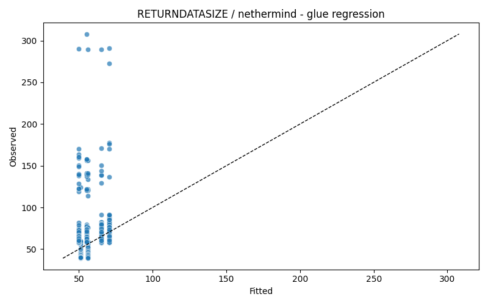

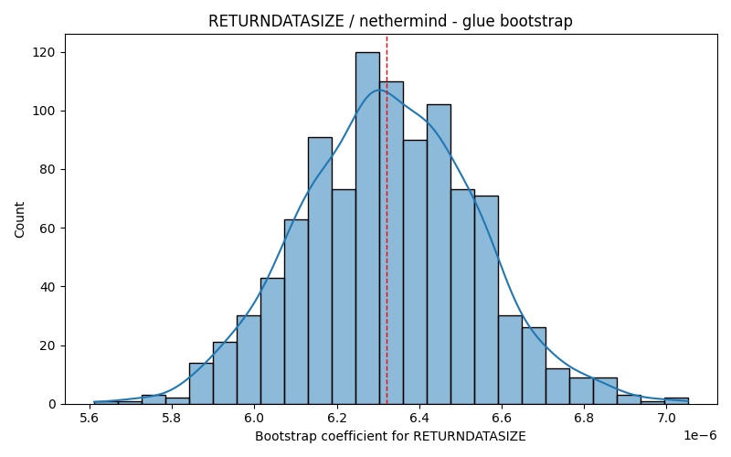

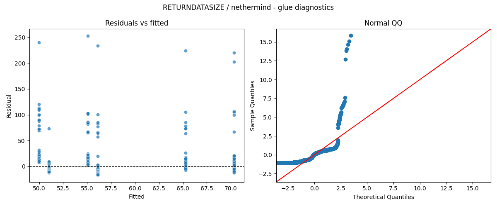

</details>

<details><summary><code>SELFBALANCE</code> · nobs=1804 · runtime_ms=0 · p=1.00e+00 · R²=1.11e-16</summary>

```
==============================================================================
                           NNLS Regression Results                            
==============================================================================
Dep. Variable:          test_runtime_ms              R-squared:          0.000
Model:                  NNLS                    Adj. R-squared:         -0.001
No. Observations:       1804                              RMSE:          41.70
Df Residuals:           1802                               MAE:          37.17
Df Model:               1      
==============================================================================
                      coef     std err     P-value      [0.025      0.975]
------------------------------------------------------------------------------
         const    190.3881      1.0099       0.001    188.4574    192.3428
   SELFBALANCE      0.0000      0.0000       1.000      0.0000      0.0000
==============================================================================
Notes: Non-negative least squares with bootstrap inference (1000 iterations)
==============================================================================
```

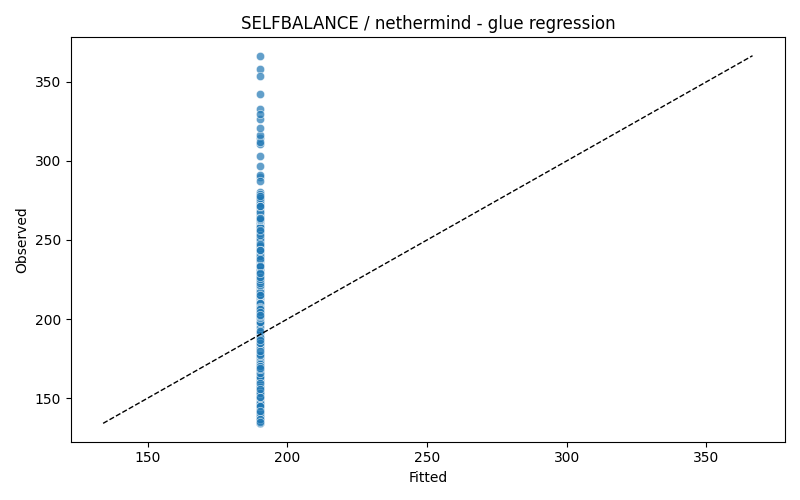


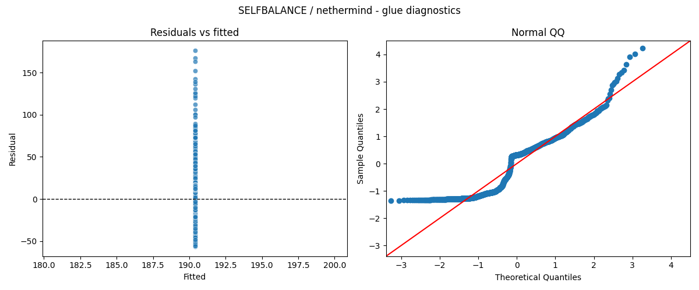

</details>

<details><summary><code>SUB</code> · nobs=1312 · runtime_ms=0 · p=1.00e+00 · R²=2.22e-16</summary>

```
==============================================================================
                           NNLS Regression Results                            
==============================================================================
Dep. Variable:          test_runtime_ms              R-squared:          0.000
Model:                  NNLS                    Adj. R-squared:         -0.001
No. Observations:       1312                              RMSE:          27.62
Df Residuals:           1310                               MAE:          23.17
Df Model:               1      
==============================================================================
                      coef     std err     P-value      [0.025      0.975]
------------------------------------------------------------------------------
         const     86.2088      0.7771       0.001     84.7202     87.7707
           SUB      0.0000      0.0000       1.000      0.0000      0.0000
==============================================================================
Notes: Non-negative least squares with bootstrap inference (1000 iterations)
==============================================================================
```

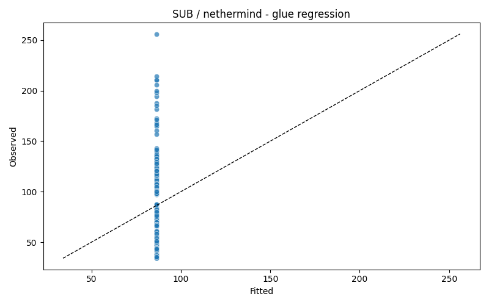


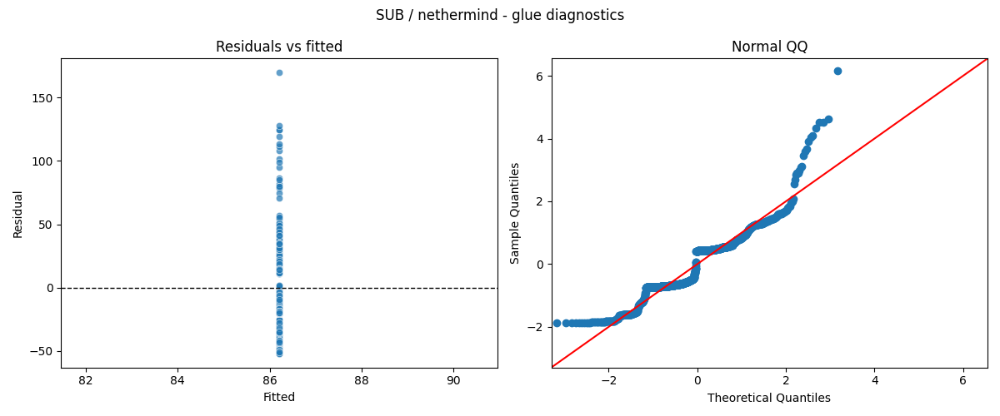

</details>

### Mixed glue (tier B) · nethermind

<details><summary><code>JUMP</code> · nobs=1640 · runtime_ms=0 · p=1.00e+00 · R²=0</summary>

```
==============================================================================
                           NNLS Regression Results                            
==============================================================================
Dep. Variable:          test_runtime_ms              R-squared:          0.000
Model:                  NNLS                    Adj. R-squared:         -0.001
No. Observations:       1640                              RMSE:          19.32
Df Residuals:           1638                               MAE:          16.88
Df Model:               1      
==============================================================================
                      coef     std err     P-value      [0.025      0.975]
------------------------------------------------------------------------------
         const     68.7746      0.4835       0.001     67.7959     69.6880
          JUMP      0.0000      0.0000       1.000      0.0000      0.0000
==============================================================================
Notes: Non-negative least squares with bootstrap inference (1000 iterations)
==============================================================================
```

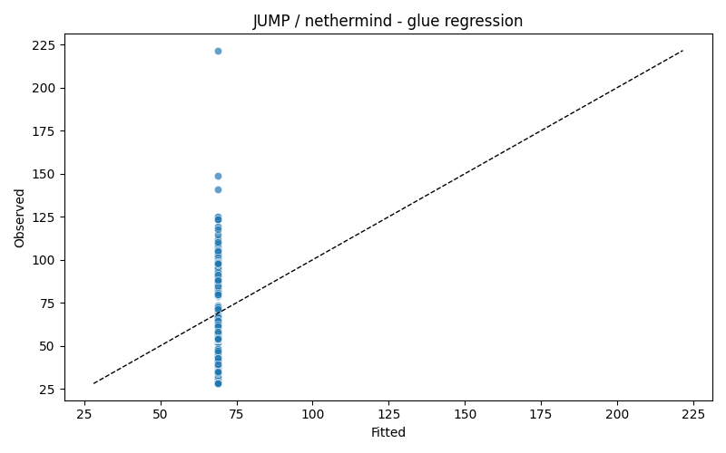

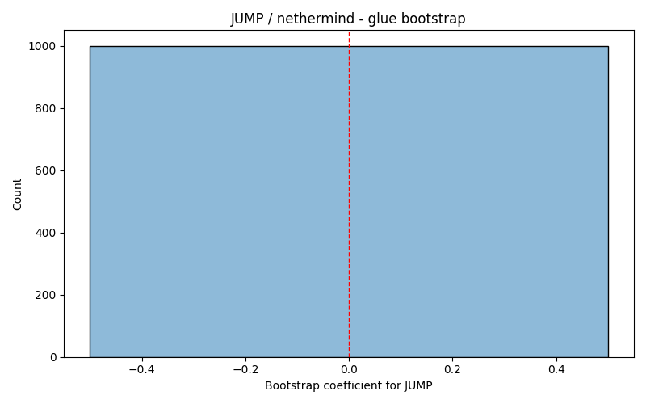

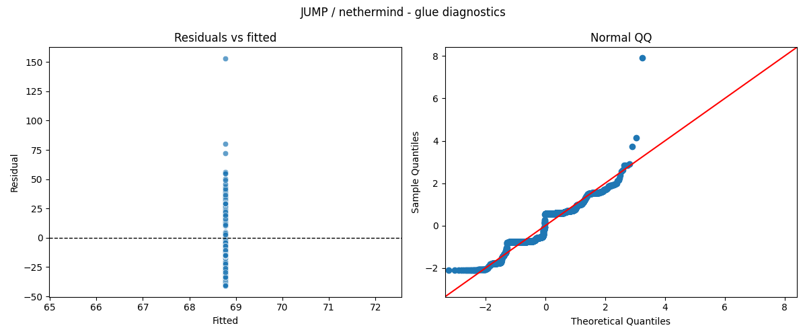

</details>

<details><summary><code>KECCAK256</code> · nobs=0 · runtime_ms=n/a · p=n/a · R²=n/a</summary>

</details>

## reth

| glue_opcode | nobs | glue_runtime_ms | p_value | rsquared |
| --- | --- | --- | --- | --- |
| `ISZERO` | 432 | 0 | 1.00e+00 | 1.11e-16 |
| `JUMPDEST` | 108 | 0 | 1.00e+00 | 0 |
| `SWAP` | 7722 | 0 | 1.00e+00 | 2.22e-16 |
| `CALLDATASIZE` | 27185 | 6.462e-06 | 1.00e-03 | 0.2845 |
| `DUP` | 27185 | 0 | 1.00e+00 | 0.2845 |
| `GAS` | 27185 | 5.101e-06 | 1.00e-03 | 0.2845 |
| `MLOAD` | 27185 | 1.26e-05 | 1.00e-03 | 0.2845 |
| `PUSH` | 27185 | 0 | 1.00e+00 | 0.2845 |
| `PUSH0` | 27185 | 1.712e-06 | 1.00e-03 | 0.2845 |
| `STATICCALL` | 27185 | 2.241e-05 | 1.00e-03 | 0.2845 |
| `ADD` | 486 | 0 | 1.00e+00 | 0 |
| `AND` | 432 | 0 | 1.00e+00 | -2.22e-16 |
| `CALLDATACOPY` | 12690 | 0 | 1.00e+00 | 0 |
| `CALLDATALOAD` | 2376 | 2.132e-05 | 1.00e-03 | 0.004627 |
| `DIV` | 594 | 0 | 1.00e+00 | 0 |
| `EXP` | 594 | 0.0004856 | 1.00e-03 | 0.8451 |
| `GT` | 432 | 0 | 1.00e+00 | -2.22e-16 |
| `JUMPI` | 594 | 0 | 1.00e+00 | 0 |
| `LT` | 432 | 0 | 1.00e+00 | 0 |
| `MSTORE` | 2430 | 0 | 1.00e+00 | 0 |
| `MSTORE8` | 2430 | 0 | 1.00e+00 | 0 |
| `MUL` | 540 | 0 | 1.00e+00 | -2.22e-16 |
| `PC` | 324 | 6.083e-06 | 1.00e-03 | 0.4779 |
| `RETURNDATASIZE` | 1296 | 7.033e-06 | 1.00e-03 | 0.3853 |
| `SELFBALANCE` | 594 | 0 | 1.00e+00 | 0 |
| `SUB` | 432 | 0 | 1.00e+00 | 0 |
| `JUMP` | 540 | 0 | 1.00e+00 | 0 |
| `KECCAK256` | 0 | n/a | n/a | n/a |

### Cycle glue — joint fit · reth

<details><summary>Joint NNLS regression summary</summary>

```
==============================================================================
                           NNLS Regression Results                            
==============================================================================
Dep. Variable:          test_runtime_ms              R-squared:          0.284
Model:                  NNLS                    Adj. R-squared:          0.284
No. Observations:       27185                             RMSE:          13.70
Df Residuals:           27177                              MAE:          11.23
Df Model:               7      
==============================================================================
                      coef     std err     P-value      [0.025      0.975]
------------------------------------------------------------------------------
         const     45.3016      0.0861       0.001     45.1381     45.4748
  CALLDATASIZE      0.0000      0.0000       0.001      0.0000      0.0000
           DUP      0.0000      0.0000       1.000      0.0000      0.0000
           GAS      0.0000      0.0000       0.001      0.0000      0.0000
         MLOAD      0.0000      0.0000       0.001      0.0000      0.0000
          PUSH      0.0000      0.0000       1.000      0.0000      0.0000
         PUSH0      0.0000      0.0000       0.001      0.0000      0.0000
    STATICCALL      0.0000      0.0000       0.001      0.0000      0.0000
==============================================================================
Notes: Non-negative least squares with bootstrap inference (1000 iterations)
==============================================================================
```

</details>

<details><summary><code>CALLDATASIZE</code> · nobs=27185 · runtime_ms=6.462e-06 · p=1.00e-03 · R²=0.2845</summary>

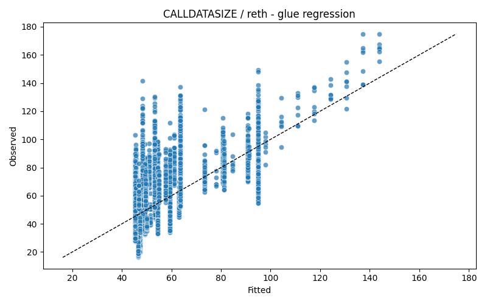

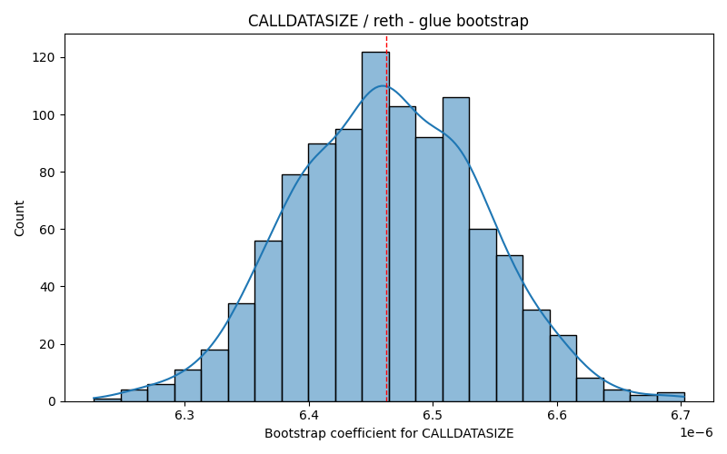

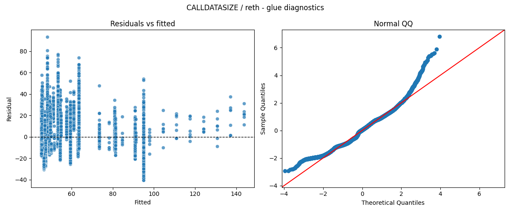

</details>

<details><summary><code>DUP</code> · nobs=27185 · runtime_ms=0 · p=1.00e+00 · R²=0.2845</summary>


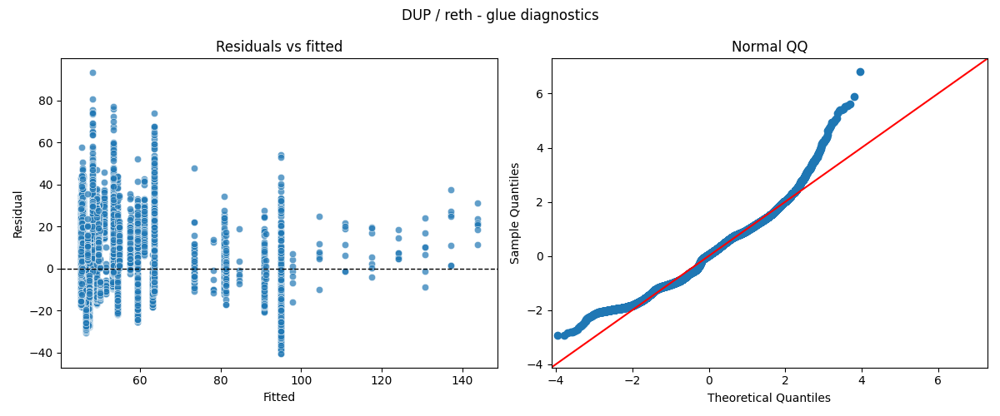

</details>

<details><summary><code>GAS</code> · nobs=27185 · runtime_ms=5.101e-06 · p=1.00e-03 · R²=0.2845</summary>

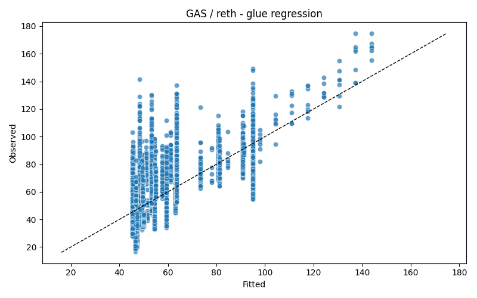

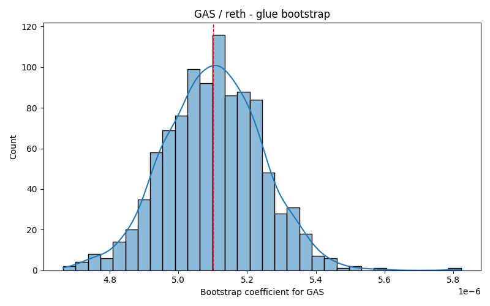


</details>

<details><summary><code>MLOAD</code> · nobs=27185 · runtime_ms=1.26e-05 · p=1.00e-03 · R²=0.2845</summary>

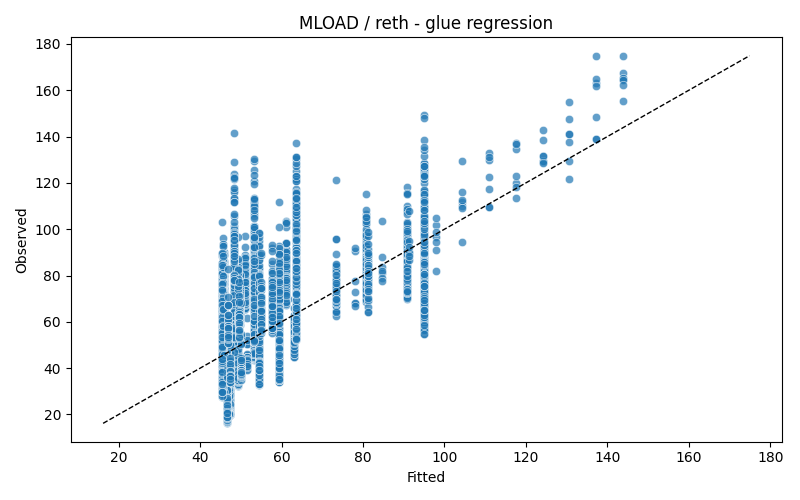

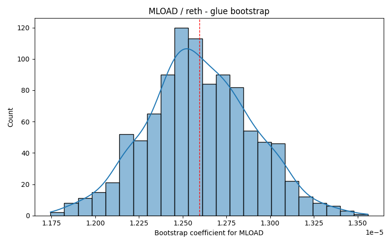


</details>

<details><summary><code>PUSH</code> · nobs=27185 · runtime_ms=0 · p=1.00e+00 · R²=0.2845</summary>


</details>

<details><summary><code>PUSH0</code> · nobs=27185 · runtime_ms=1.712e-06 · p=1.00e-03 · R²=0.2845</summary>


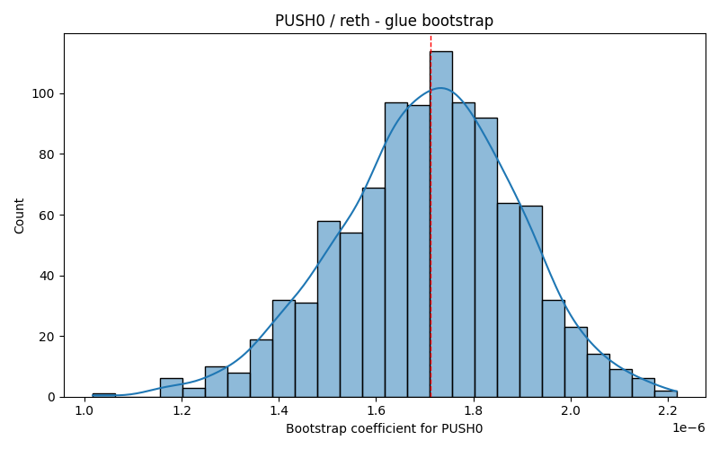


</details>

<details><summary><code>STATICCALL</code> · nobs=27185 · runtime_ms=2.241e-05 · p=1.00e-03 · R²=0.2845</summary>


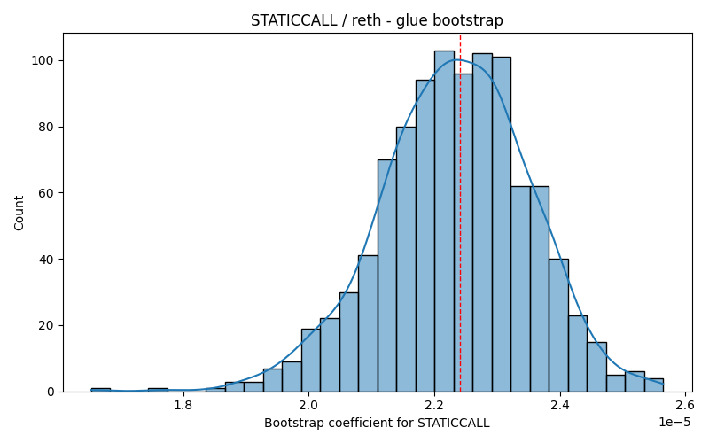


</details>

### Pure glue · reth

<details><summary><code>ISZERO</code> · nobs=432 · runtime_ms=0 · p=1.00e+00 · R²=1.11e-16</summary>

```
==============================================================================
                           NNLS Regression Results                            
==============================================================================
Dep. Variable:          test_runtime_ms              R-squared:          0.000
Model:                  NNLS                    Adj. R-squared:         -0.002
No. Observations:       432                               RMSE:          33.35
Df Residuals:           430                                MAE:          30.35
Df Model:               1      
==============================================================================
                      coef     std err     P-value      [0.025      0.975]
------------------------------------------------------------------------------
         const    119.4431      1.5620       0.001    116.4183    122.4810
        ISZERO      0.0000      0.0000       1.000      0.0000      0.0000
==============================================================================
Notes: Non-negative least squares with bootstrap inference (1000 iterations)
==============================================================================
```

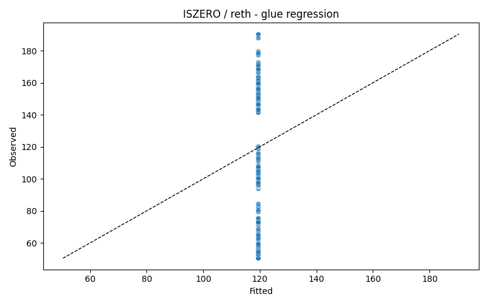

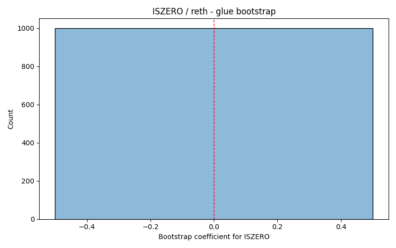

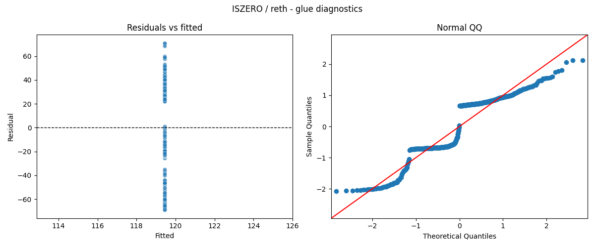

</details>

<details><summary><code>JUMPDEST</code> · nobs=108 · runtime_ms=0 · p=1.00e+00 · R²=0</summary>

```
==============================================================================
                           NNLS Regression Results                            
==============================================================================
Dep. Variable:          test_runtime_ms              R-squared:          0.000
Model:                  NNLS                    Adj. R-squared:         -0.009
No. Observations:       108                               RMSE:          14.83
Df Residuals:           106                                MAE:          13.80
Df Model:               1      
==============================================================================
                      coef     std err     P-value      [0.025      0.975]
------------------------------------------------------------------------------
         const     68.8224      1.4112       0.001     66.1211     71.6347
      JUMPDEST      0.0000      0.0000       1.000      0.0000      0.0000
==============================================================================
Notes: Non-negative least squares with bootstrap inference (1000 iterations)
==============================================================================
```

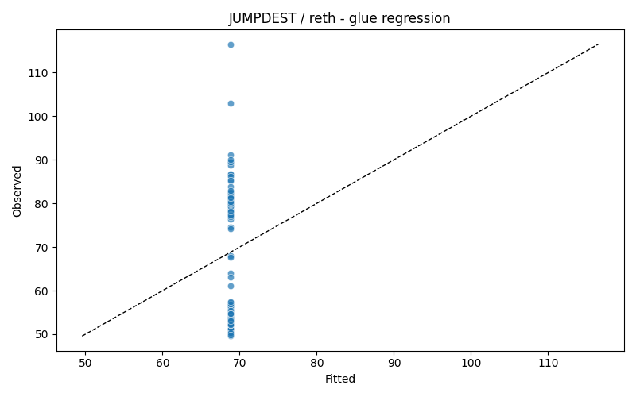


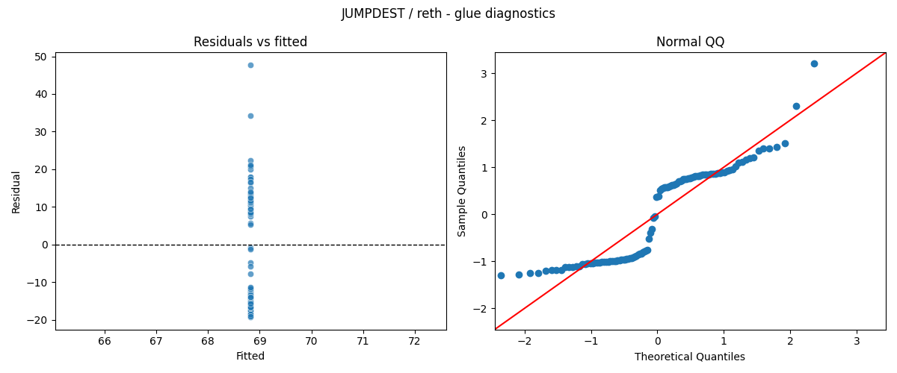

</details>

<details><summary><code>SWAP</code> · nobs=7722 · runtime_ms=0 · p=1.00e+00 · R²=2.22e-16</summary>

```
==============================================================================
                           NNLS Regression Results                            
==============================================================================
Dep. Variable:          test_runtime_ms              R-squared:          0.000
Model:                  NNLS                    Adj. R-squared:         -0.000
No. Observations:       7722                              RMSE:          13.02
Df Residuals:           7720                               MAE:          10.80
Df Model:               1      
==============================================================================
                      coef     std err     P-value      [0.025      0.975]
------------------------------------------------------------------------------
         const     45.8361      0.1492       0.001     45.5455     46.1436
          SWAP      0.0000      0.0000       1.000      0.0000      0.0000
==============================================================================
Notes: Non-negative least squares with bootstrap inference (1000 iterations)
==============================================================================
```

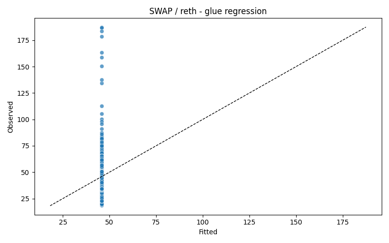


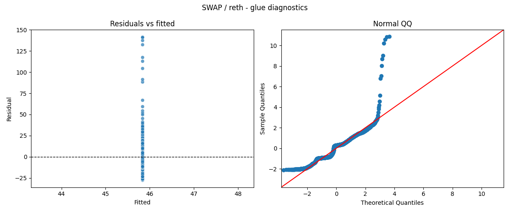

</details>

### Mixed glue (tier A) · reth

<details><summary><code>ADD</code> · nobs=486 · runtime_ms=0 · p=1.00e+00 · R²=0</summary>

```
==============================================================================
                           NNLS Regression Results                            
==============================================================================
Dep. Variable:          test_runtime_ms              R-squared:          0.000
Model:                  NNLS                    Adj. R-squared:         -0.002
No. Observations:       486                               RMSE:          11.14
Df Residuals:           484                                MAE:           9.66
Df Model:               1      
==============================================================================
                      coef     std err     P-value      [0.025      0.975]
------------------------------------------------------------------------------
         const     41.7143      0.5075       0.001     40.7042     42.7251
           ADD      0.0000      0.0000       1.000      0.0000      0.0000
==============================================================================
Notes: Non-negative least squares with bootstrap inference (1000 iterations)
==============================================================================
```

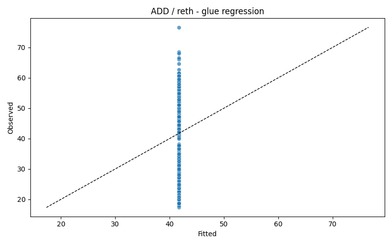


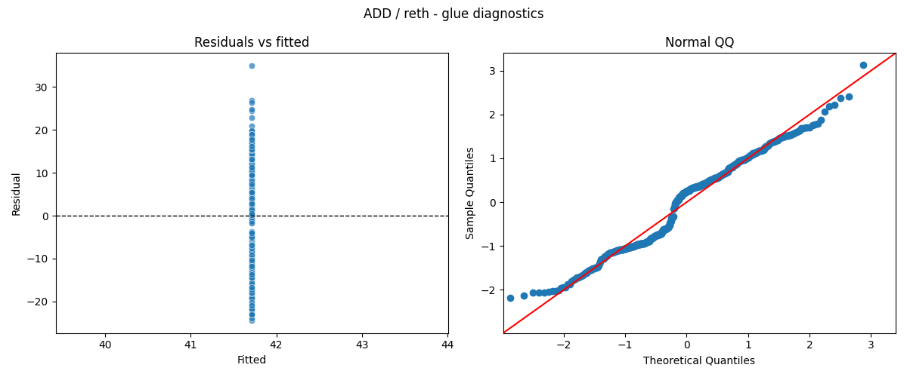

</details>

<details><summary><code>AND</code> · nobs=432 · runtime_ms=0 · p=1.00e+00 · R²=-2.22e-16</summary>

```
==============================================================================
                           NNLS Regression Results                            
==============================================================================
Dep. Variable:          test_runtime_ms              R-squared:         -0.000
Model:                  NNLS                    Adj. R-squared:         -0.002
No. Observations:       432                               RMSE:          11.02
Df Residuals:           430                                MAE:           9.64
Df Model:               1      
==============================================================================
                      coef     std err     P-value      [0.025      0.975]
------------------------------------------------------------------------------
         const     38.5424      0.5131       0.001     37.5502     39.5512
           AND      0.0000      0.0000       1.000      0.0000      0.0000
==============================================================================
Notes: Non-negative least squares with bootstrap inference (1000 iterations)
==============================================================================
```

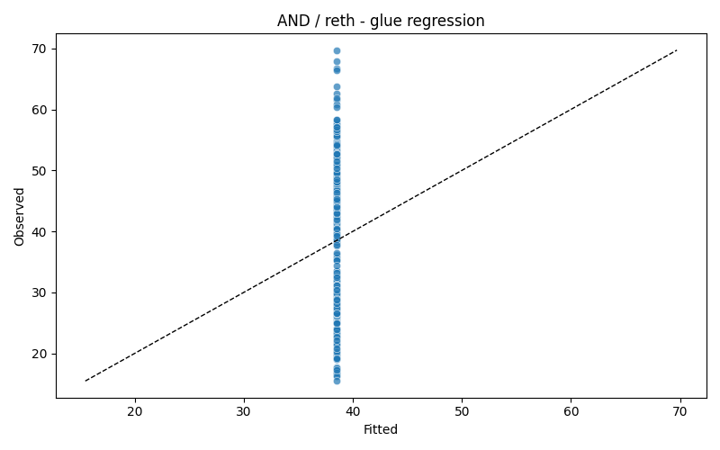


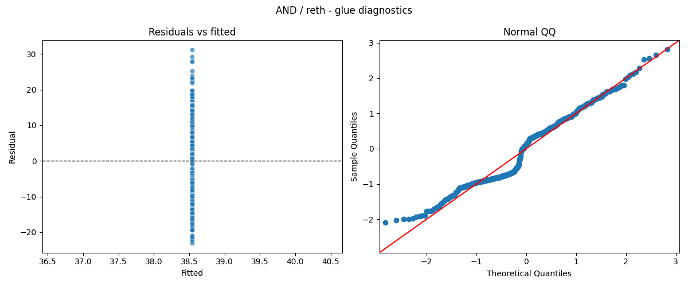

</details>

<details><summary><code>CALLDATACOPY</code> · nobs=12690 · runtime_ms=0 · p=1.00e+00 · R²=0</summary>

```
==============================================================================
                           NNLS Regression Results                            
==============================================================================
Dep. Variable:          test_runtime_ms              R-squared:          0.000
Model:                  NNLS                    Adj. R-squared:         -0.000
No. Observations:       12690                             RMSE:          20.20
Df Residuals:           12688                              MAE:          17.03
Df Model:               1      
==============================================================================
                      coef     std err     P-value      [0.025      0.975]
------------------------------------------------------------------------------
         const     36.1205      0.1779       0.001     35.7784     36.4822
  CALLDATACOPY      0.0000      0.0000       1.000      0.0000      0.0000
==============================================================================
Notes: Non-negative least squares with bootstrap inference (1000 iterations)
==============================================================================
```

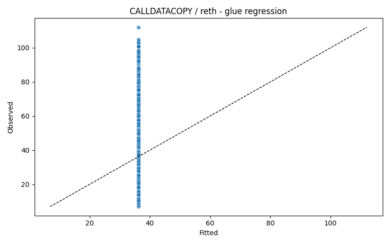

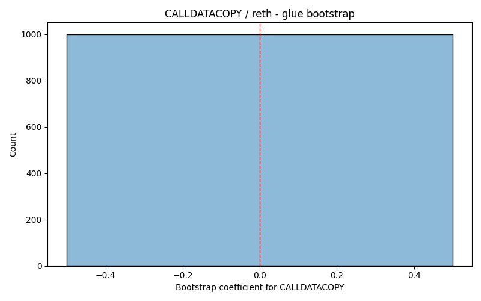

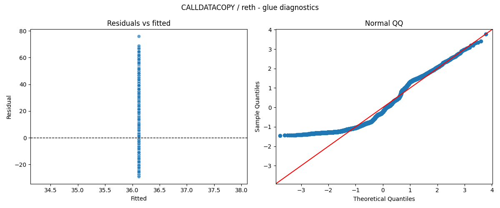

</details>

<details><summary><code>CALLDATALOAD</code> · nobs=2376 · runtime_ms=2.132e-05 · p=1.00e-03 · R²=0.004627</summary>

```
==============================================================================
                           NNLS Regression Results                            
==============================================================================
Dep. Variable:          test_runtime_ms              R-squared:          0.005
Model:                  NNLS                    Adj. R-squared:          0.004
No. Observations:       2376                              RMSE:           1.20
Df Residuals:           2374                               MAE:           0.68
Df Model:               1      
==============================================================================
                      coef     std err     P-value      [0.025      0.975]
------------------------------------------------------------------------------
         const      3.2041      0.0845       0.001      3.0492      3.3778
  CALLDATALOAD      0.0000      0.0000       0.001      0.0000      0.0000
==============================================================================
Notes: Non-negative least squares with bootstrap inference (1000 iterations)
==============================================================================
```

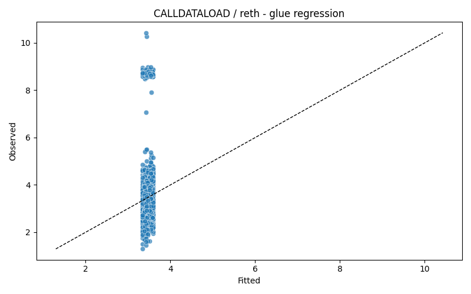

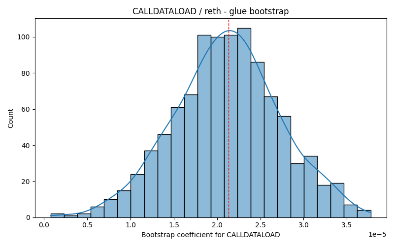

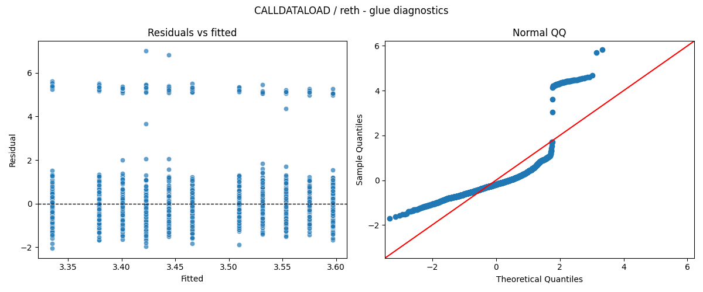

</details>

<details><summary><code>DIV</code> · nobs=594 · runtime_ms=0 · p=1.00e+00 · R²=0</summary>

```
==============================================================================
                           NNLS Regression Results                            
==============================================================================
Dep. Variable:          test_runtime_ms              R-squared:          0.000
Model:                  NNLS                    Adj. R-squared:         -0.002
No. Observations:       594                               RMSE:          59.48
Df Residuals:           592                                MAE:          54.08
Df Model:               1      
==============================================================================
                      coef     std err     P-value      [0.025      0.975]
------------------------------------------------------------------------------
         const    233.0537      2.3625       0.001    228.4698    237.6285
           DIV      0.0000      0.0000       1.000      0.0000      0.0000
==============================================================================
Notes: Non-negative least squares with bootstrap inference (1000 iterations)
==============================================================================
```

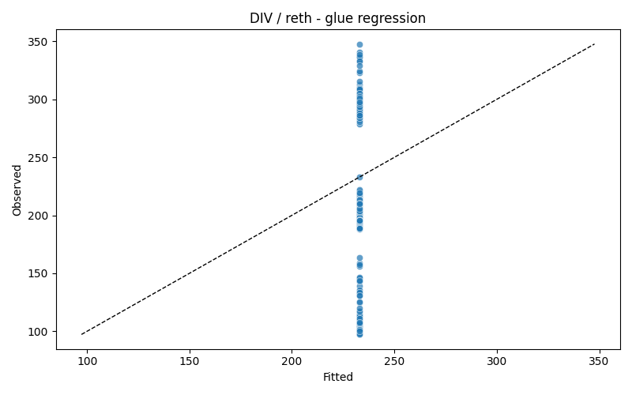


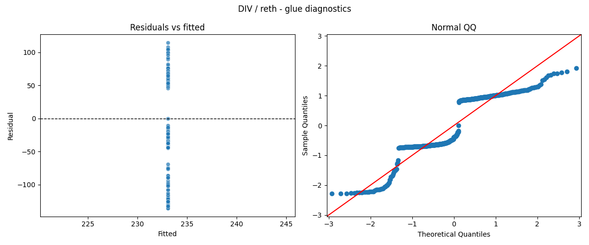

</details>

<details><summary><code>EXP</code> · nobs=594 · runtime_ms=0.0004856 · p=1.00e-03 · R²=0.8451</summary>

```
==============================================================================
                           NNLS Regression Results                            
==============================================================================
Dep. Variable:          test_runtime_ms              R-squared:          0.845
Model:                  NNLS                    Adj. R-squared:          0.845
No. Observations:       594                               RMSE:           8.14
Df Residuals:           592                                MAE:           6.53
Df Model:               1      
==============================================================================
                      coef     std err     P-value      [0.025      0.975]
------------------------------------------------------------------------------
         const     22.5785      1.1844       0.001     20.2079     24.7875
           EXP      0.0005      0.0000       0.001      0.0005      0.0005
==============================================================================
Notes: Non-negative least squares with bootstrap inference (1000 iterations)
==============================================================================
```

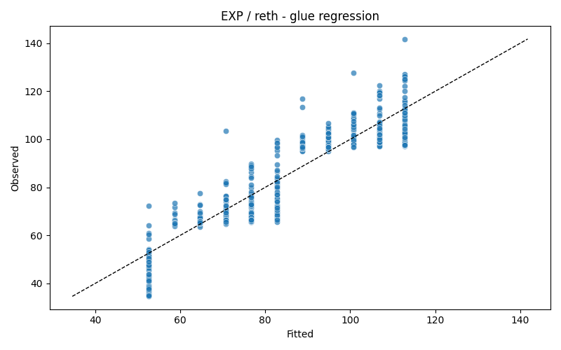

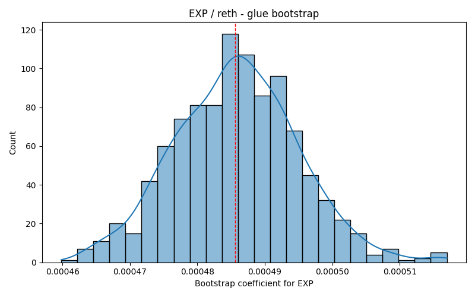

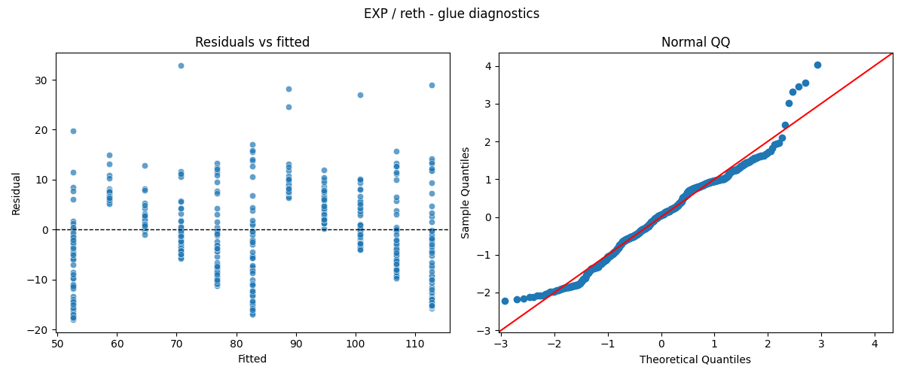

</details>

<details><summary><code>GT</code> · nobs=432 · runtime_ms=0 · p=1.00e+00 · R²=-2.22e-16</summary>

```
==============================================================================
                           NNLS Regression Results                            
==============================================================================
Dep. Variable:          test_runtime_ms              R-squared:         -0.000
Model:                  NNLS                    Adj. R-squared:         -0.002
No. Observations:       432                               RMSE:          12.78
Df Residuals:           430                                MAE:          11.03
Df Model:               1      
==============================================================================
                      coef     std err     P-value      [0.025      0.975]
------------------------------------------------------------------------------
         const     43.8610      0.6283       0.001     42.6270     45.0788
            GT      0.0000      0.0000       1.000      0.0000      0.0000
==============================================================================
Notes: Non-negative least squares with bootstrap inference (1000 iterations)
==============================================================================
```


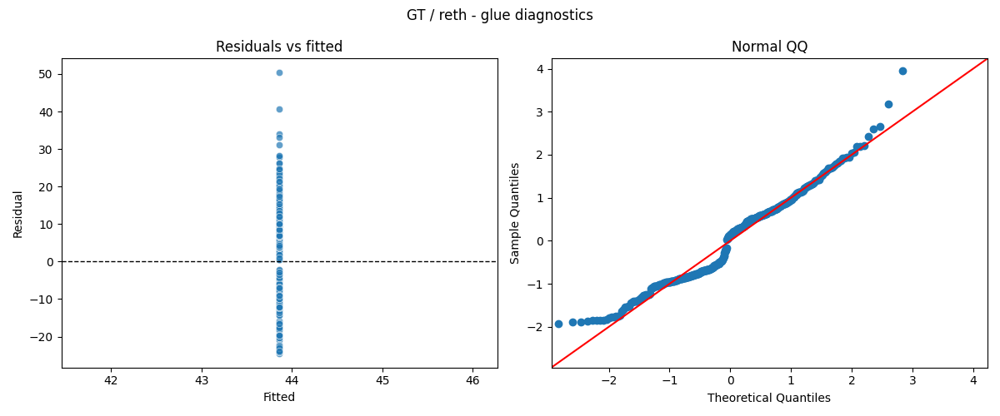

</details>

<details><summary><code>JUMPI</code> · nobs=594 · runtime_ms=0 · p=1.00e+00 · R²=0</summary>

```
==============================================================================
                           NNLS Regression Results                            
==============================================================================
Dep. Variable:          test_runtime_ms              R-squared:          0.000
Model:                  NNLS                    Adj. R-squared:         -0.002
No. Observations:       594                               RMSE:           8.06
Df Residuals:           592                                MAE:           6.28
Df Model:               1      
==============================================================================
                      coef     std err     P-value      [0.025      0.975]
------------------------------------------------------------------------------
         const     27.0645      0.3406       0.001     26.3761     27.7447
         JUMPI      0.0000      0.0000       1.000      0.0000      0.0000
==============================================================================
Notes: Non-negative least squares with bootstrap inference (1000 iterations)
==============================================================================
```

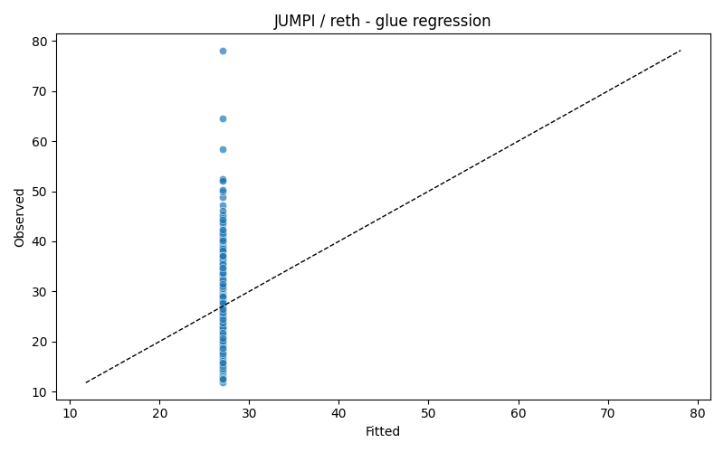


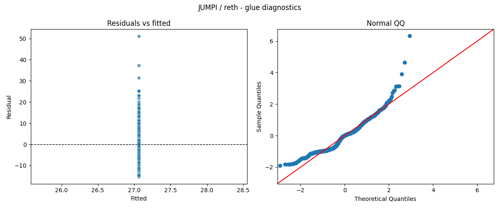

</details>

<details><summary><code>LT</code> · nobs=432 · runtime_ms=0 · p=1.00e+00 · R²=0</summary>

```
==============================================================================
                           NNLS Regression Results                            
==============================================================================
Dep. Variable:          test_runtime_ms              R-squared:          0.000
Model:                  NNLS                    Adj. R-squared:         -0.002
No. Observations:       432                               RMSE:          11.95
Df Residuals:           430                                MAE:          10.56
Df Model:               1      
==============================================================================
                      coef     std err     P-value      [0.025      0.975]
------------------------------------------------------------------------------
         const     42.0800      0.5631       0.001     40.9291     43.1539
            LT      0.0000      0.0000       1.000      0.0000      0.0000
==============================================================================
Notes: Non-negative least squares with bootstrap inference (1000 iterations)
==============================================================================
```

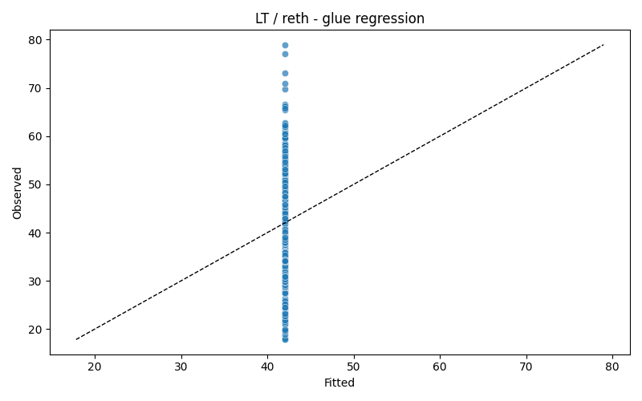

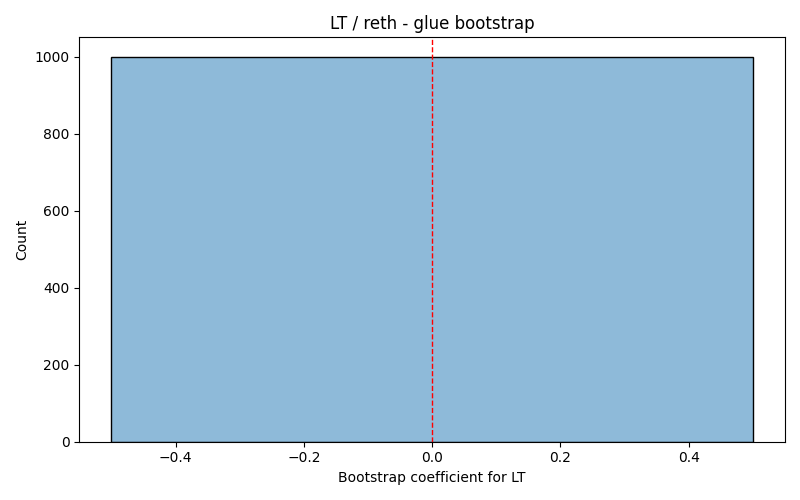

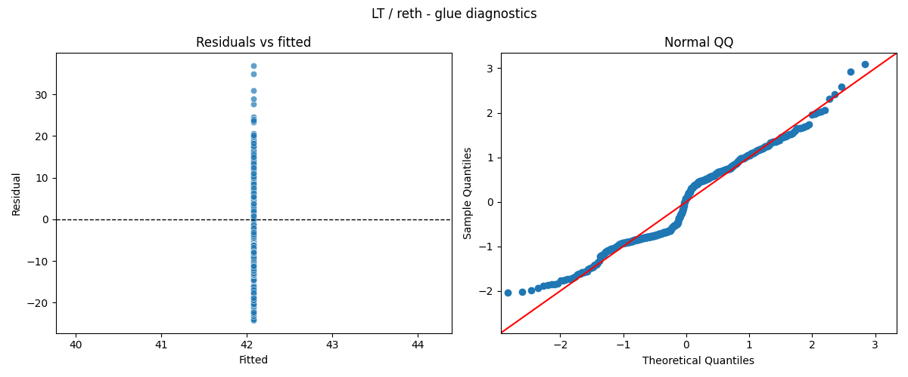

</details>

<details><summary><code>MSTORE</code> · nobs=2430 · runtime_ms=0 · p=1.00e+00 · R²=0</summary>

```
==============================================================================
                           NNLS Regression Results                            
==============================================================================
Dep. Variable:          test_runtime_ms              R-squared:          0.000
Model:                  NNLS                    Adj. R-squared:         -0.000
No. Observations:       2430                              RMSE:          34.65
Df Residuals:           2428                               MAE:          29.82
Df Model:               1      
==============================================================================
                      coef     std err     P-value      [0.025      0.975]
------------------------------------------------------------------------------
         const     77.7933      0.6873       0.001     76.4258     79.1586
        MSTORE      0.0000      0.0000       1.000      0.0000      0.0000
==============================================================================
Notes: Non-negative least squares with bootstrap inference (1000 iterations)
==============================================================================
```

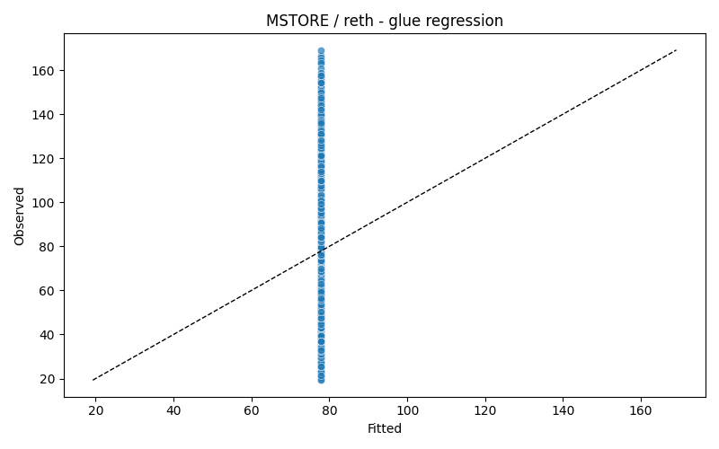


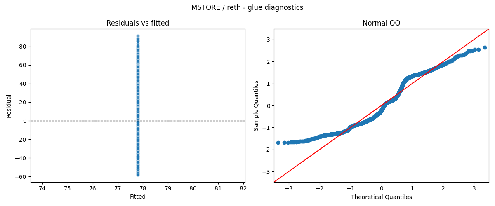

</details>

<details><summary><code>MSTORE8</code> · nobs=2430 · runtime_ms=0 · p=1.00e+00 · R²=0</summary>

```
==============================================================================
                           NNLS Regression Results                            
==============================================================================
Dep. Variable:          test_runtime_ms              R-squared:          0.000
Model:                  NNLS                    Adj. R-squared:         -0.000
No. Observations:       2430                              RMSE:          12.40
Df Residuals:           2428                               MAE:          10.54
Df Model:               1      
==============================================================================
                      coef     std err     P-value      [0.025      0.975]
------------------------------------------------------------------------------
         const     43.9035      0.2539       0.001     43.4300     44.4143
       MSTORE8      0.0000      0.0000       1.000      0.0000      0.0000
==============================================================================
Notes: Non-negative least squares with bootstrap inference (1000 iterations)
==============================================================================
```


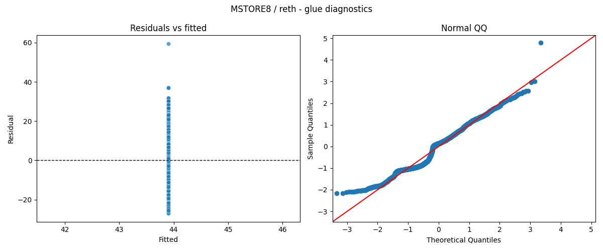

</details>

<details><summary><code>MUL</code> · nobs=540 · runtime_ms=0 · p=1.00e+00 · R²=-2.22e-16</summary>

```
==============================================================================
                           NNLS Regression Results                            
==============================================================================
Dep. Variable:          test_runtime_ms              R-squared:         -0.000
Model:                  NNLS                    Adj. R-squared:         -0.002
No. Observations:       540                               RMSE:          10.34
Df Residuals:           538                                MAE:           8.93
Df Model:               1      
==============================================================================
                      coef     std err     P-value      [0.025      0.975]
------------------------------------------------------------------------------
         const     40.1522      0.4452       0.001     39.3084     41.0382
           MUL      0.0000      0.0000       1.000      0.0000      0.0000
==============================================================================
Notes: Non-negative least squares with bootstrap inference (1000 iterations)
==============================================================================
```

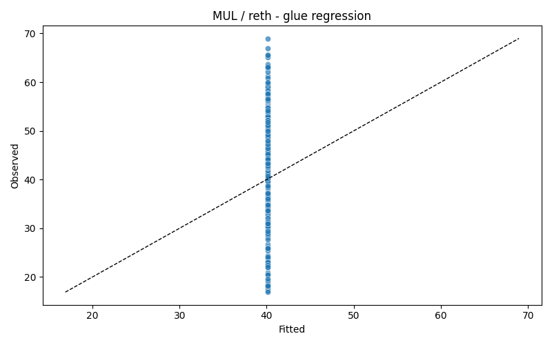


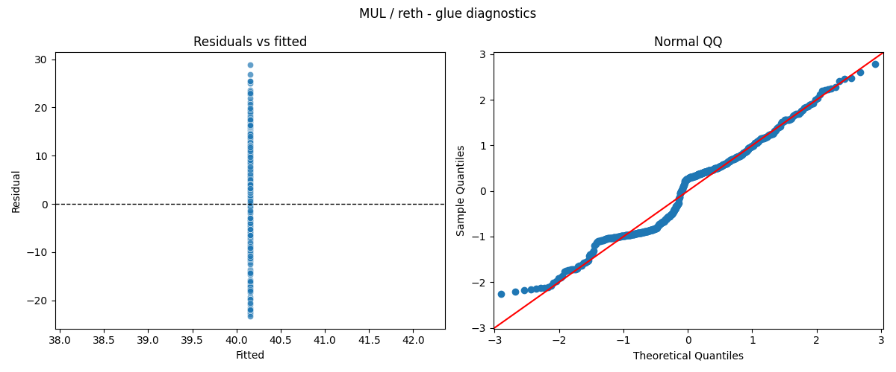

</details>

<details><summary><code>PC</code> · nobs=324 · runtime_ms=6.083e-06 · p=1.00e-03 · R²=0.4779</summary>

```
==============================================================================
                           NNLS Regression Results                            
==============================================================================
Dep. Variable:          test_runtime_ms              R-squared:          0.478
Model:                  NNLS                    Adj. R-squared:          0.476
No. Observations:       324                               RMSE:          14.13
Df Residuals:           322                                MAE:          12.25
Df Model:               1      
==============================================================================
                      coef     std err     P-value      [0.025      0.975]
------------------------------------------------------------------------------
         const     57.7183      1.4539       0.001     54.8169     60.6398
            PC      0.0000      0.0000       0.001      0.0000      0.0000
==============================================================================
Notes: Non-negative least squares with bootstrap inference (1000 iterations)
==============================================================================
```

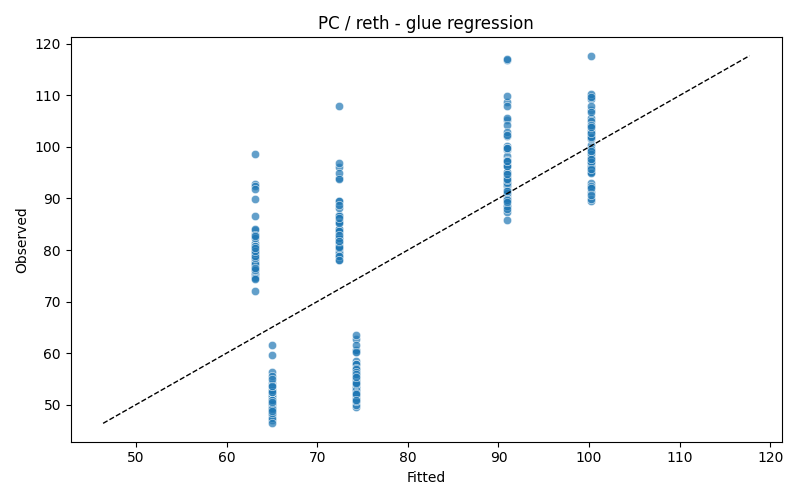

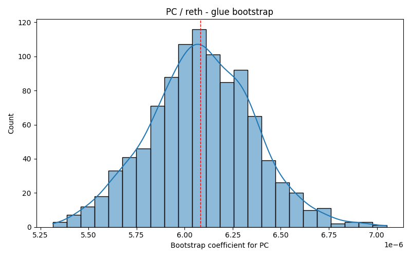

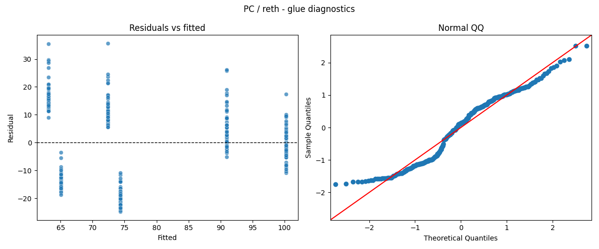

</details>

<details><summary><code>RETURNDATASIZE</code> · nobs=1296 · runtime_ms=7.033e-06 · p=1.00e-03 · R²=0.3853</summary>

```
==============================================================================
                           NNLS Regression Results                            
==============================================================================
Dep. Variable:          test_runtime_ms              R-squared:          0.385
Model:                  NNLS                    Adj. R-squared:          0.385
No. Observations:       1296                              RMSE:          10.42
Df Residuals:           1294                               MAE:           9.11
Df Model:               1      
==============================================================================
                      coef     std err     P-value      [0.025      0.975]
------------------------------------------------------------------------------
         const     46.7882      0.5538       0.001     45.6994     47.8461
RETURNDATASIZE      0.0000      0.0000       0.001      0.0000      0.0000
==============================================================================
Notes: Non-negative least squares with bootstrap inference (1000 iterations)
==============================================================================
```

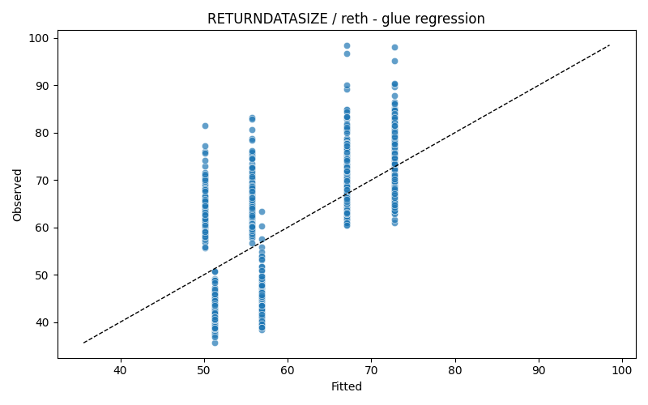

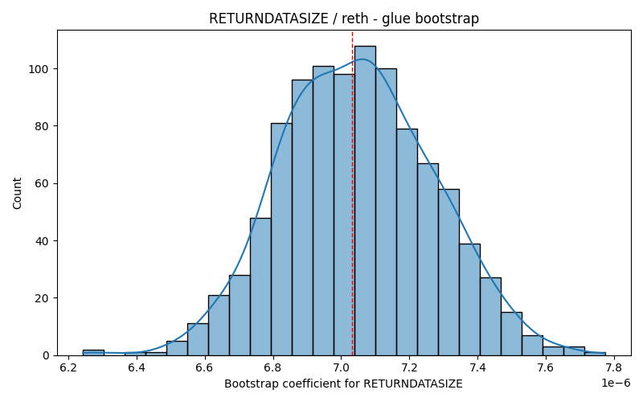

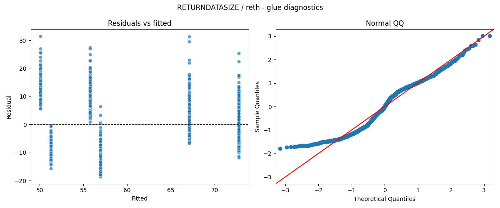

</details>

<details><summary><code>SELFBALANCE</code> · nobs=594 · runtime_ms=0 · p=1.00e+00 · R²=0</summary>

```
==============================================================================
                           NNLS Regression Results                            
==============================================================================
Dep. Variable:          test_runtime_ms              R-squared:          0.000
Model:                  NNLS                    Adj. R-squared:         -0.002
No. Observations:       594                               RMSE:          53.14
Df Residuals:           592                                MAE:          47.79
Df Model:               1      
==============================================================================
                      coef     std err     P-value      [0.025      0.975]
------------------------------------------------------------------------------
         const    209.2393      2.1834       0.001    204.8864    213.3898
   SELFBALANCE      0.0000      0.0000       1.000      0.0000      0.0000
==============================================================================
Notes: Non-negative least squares with bootstrap inference (1000 iterations)
==============================================================================
```

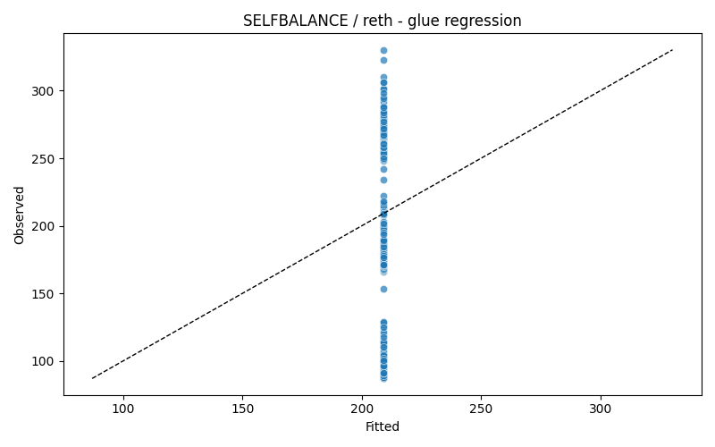


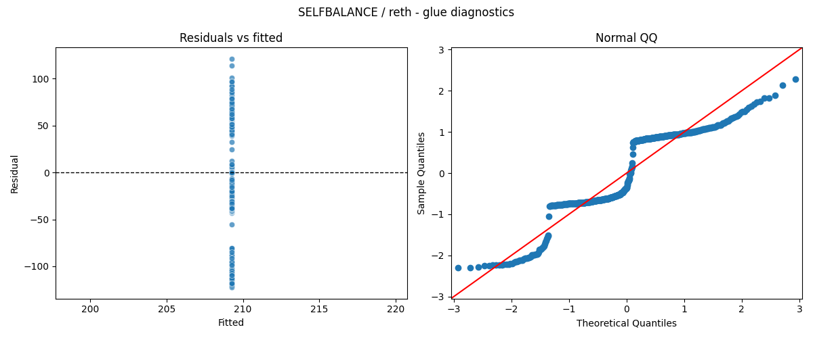

</details>

<details><summary><code>SUB</code> · nobs=432 · runtime_ms=0 · p=1.00e+00 · R²=0</summary>

```
==============================================================================
                           NNLS Regression Results                            
==============================================================================
Dep. Variable:          test_runtime_ms              R-squared:          0.000
Model:                  NNLS                    Adj. R-squared:         -0.002
No. Observations:       432                               RMSE:          11.43
Df Residuals:           430                                MAE:           9.89
Df Model:               1      
==============================================================================
                      coef     std err     P-value      [0.025      0.975]
------------------------------------------------------------------------------
         const     39.8509      0.5524       0.001     38.8013     40.9285
           SUB      0.0000      0.0000       1.000      0.0000      0.0000
==============================================================================
Notes: Non-negative least squares with bootstrap inference (1000 iterations)
==============================================================================
```

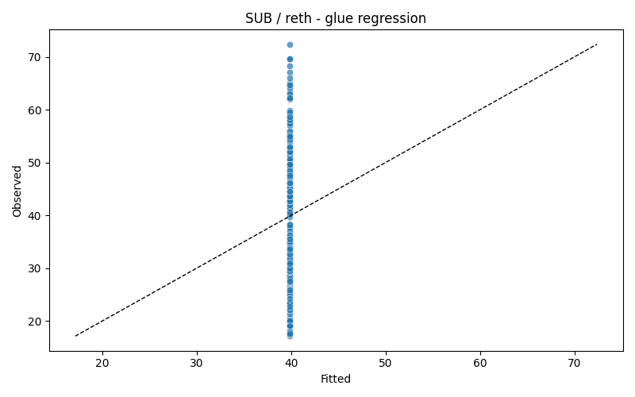


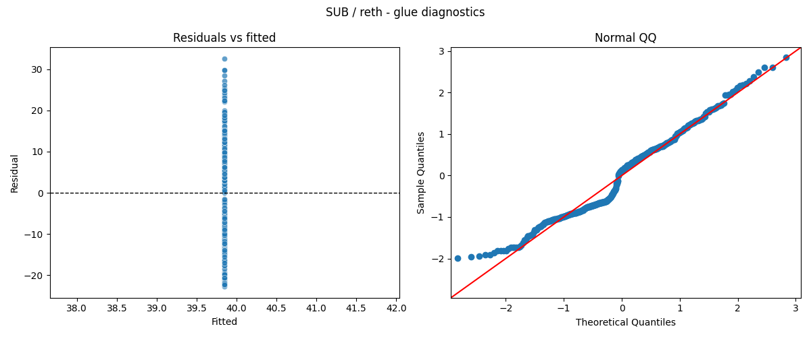

</details>

### Mixed glue (tier B) · reth

<details><summary><code>JUMP</code> · nobs=540 · runtime_ms=0 · p=1.00e+00 · R²=0</summary>

```
==============================================================================
                           NNLS Regression Results                            
==============================================================================
Dep. Variable:          test_runtime_ms              R-squared:          0.000
Model:                  NNLS                    Adj. R-squared:         -0.002
No. Observations:       540                               RMSE:          10.99
Df Residuals:           538                                MAE:           9.43
Df Model:               1      
==============================================================================
                      coef     std err     P-value      [0.025      0.975]
------------------------------------------------------------------------------
         const     38.6623      0.4610       0.001     37.7159     39.5301
          JUMP      0.0000      0.0000       1.000      0.0000      0.0000
==============================================================================
Notes: Non-negative least squares with bootstrap inference (1000 iterations)
==============================================================================
```


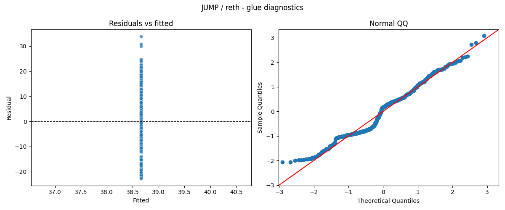

</details>

<details><summary><code>KECCAK256</code> · nobs=0 · runtime_ms=n/a · p=n/a · R²=n/a</summary>

</details>
