# Glue opcodes report

Per-client NNLS fits of priced glue opcodes against their driver fixtures. Cycle-tier opcodes share one joint regression per client (shown once); pure-tier and mixed-tier opcodes each get a single-feature fit. Mixed-tier fits pre-adjust the LHS by subtracting the contribution of every priced upstream partner selected by the detector (pure ∪ cycle for `mixed_a`, plus `mixed_a` for `mixed_b`).

**Contents:** [besu](#besu) · [erigon](#erigon) · [ethrex](#ethrex) · [geth](#geth) · [nethermind](#nethermind) · [reth](#reth)

## besu

| glue_opcode | nobs | glue_runtime_ms | p_value | rsquared |
| --- | --- | --- | --- | --- |
| `ISZERO` | 352 | 0 | 1.00e+00 | 0 |
| `JUMPDEST` | 88 | 0 | 1.00e+00 | 0 |
| `SWAP` | 6292 | 0 | 1.00e+00 | 3.331e-16 |
| `CALLDATASIZE` | 22220 | 5.425e-05 | 1.00e-03 | 0.6429 |
| `DUP` | 22220 | 0 | 1.00e+00 | 0.6429 |
| `GAS` | 22220 | 4.614e-05 | 1.00e-03 | 0.6429 |
| `MLOAD` | 22220 | 7.031e-05 | 1.00e-03 | 0.6429 |
| `PUSH` | 22220 | 0 | 1.00e+00 | 0.6429 |
| `PUSH0` | 22220 | 0 | 1.00e+00 | 0.6429 |
| `STATICCALL` | 22220 | 0.0004695 | 1.00e-03 | 0.6429 |
| `ADD` | 396 | 0 | 1.00e+00 | 2.22e-16 |
| `AND` | 352 | 0 | 1.00e+00 | 0 |
| `CALLDATACOPY` | 10340 | 0 | 1.00e+00 | -2.22e-16 |
| `CALLDATALOAD` | 1936 | 0 | 1.00e+00 | 2.22e-16 |
| `DIV` | 484 | 0 | 1.00e+00 | 0 |
| `EXP` | 484 | 0.000976 | 1.00e-03 | 0.6429 |
| `GT` | 352 | 0 | 1.00e+00 | 0 |
| `JUMPI` | 484 | 0 | 1.00e+00 | -2.22e-16 |
| `LT` | 352 | 0 | 1.00e+00 | 0 |
| `MSTORE` | 1980 | 0 | 1.00e+00 | -2.22e-16 |
| `MSTORE8` | 1980 | 0 | 1.00e+00 | 0 |
| `MUL` | 440 | 0 | 1.00e+00 | 0 |
| `PC` | 264 | 2.324e-05 | 1.00e-03 | 0.3655 |
| `RETURNDATASIZE` | 1056 | 3.333e-05 | 1.00e-03 | 0.3602 |
| `SELFBALANCE` | 484 | 0 | 1.00e+00 | 0 |
| `SUB` | 352 | 0 | 1.00e+00 | 0 |
| `JUMP` | 440 | 0 | 1.00e+00 | 0 |
| `KECCAK256` | 0 | n/a | n/a | n/a |

### Cycle glue — joint fit · besu

<details><summary>Joint NNLS regression summary</summary>

```
==============================================================================
                           NNLS Regression Results                            
==============================================================================
Dep. Variable:          test_runtime_ms              R-squared:          0.643
Model:                  NNLS                    Adj. R-squared:          0.643
No. Observations:       22220                             RMSE:          70.91
Df Residuals:           22212                              MAE:          58.01
Df Model:               7      
==============================================================================
                      coef     std err     P-value      [0.025      0.975]
------------------------------------------------------------------------------
         const    205.7736      0.4640       0.001    204.8862    206.6979
  CALLDATASIZE      0.0001      0.0000       0.001      0.0001      0.0001
           DUP      0.0000      0.0000       1.000      0.0000      0.0000
           GAS      0.0000      0.0000       0.001      0.0000      0.0000
         MLOAD      0.0001      0.0000       0.001      0.0001      0.0001
          PUSH      0.0000      0.0000       1.000      0.0000      0.0000
         PUSH0      0.0000      0.0000       1.000      0.0000      0.0000
    STATICCALL      0.0005      0.0000       0.001      0.0005      0.0005
==============================================================================
Notes: Non-negative least squares with bootstrap inference (1000 iterations)
==============================================================================
```

</details>

<details><summary><code>CALLDATASIZE</code> · nobs=22220 · runtime_ms=5.425e-05 · p=1.00e-03 · R²=0.6429</summary>

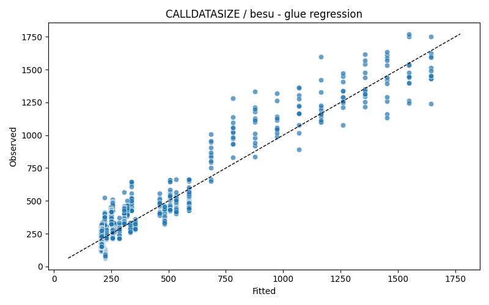

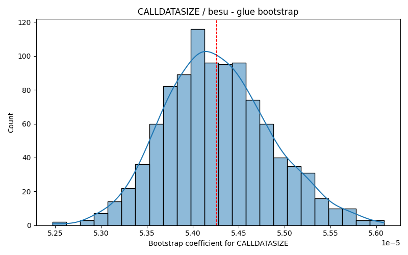

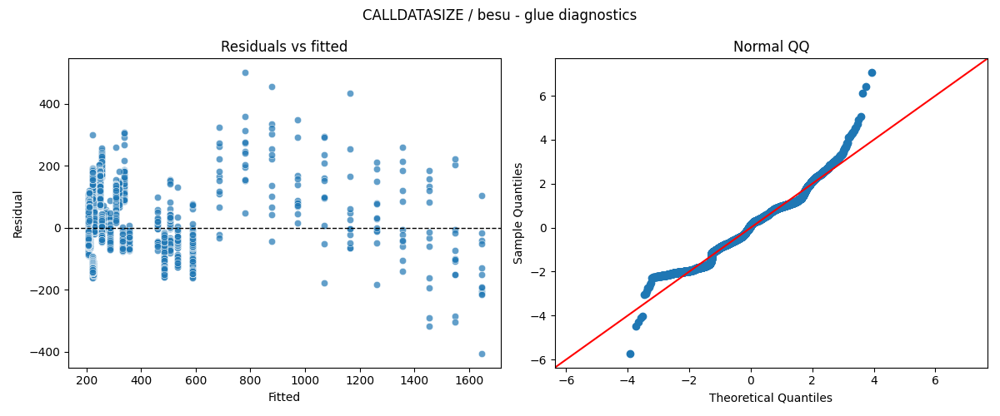

</details>

<details><summary><code>DUP</code> · nobs=22220 · runtime_ms=0 · p=1.00e+00 · R²=0.6429</summary>


</details>

<details><summary><code>GAS</code> · nobs=22220 · runtime_ms=4.614e-05 · p=1.00e-03 · R²=0.6429</summary>

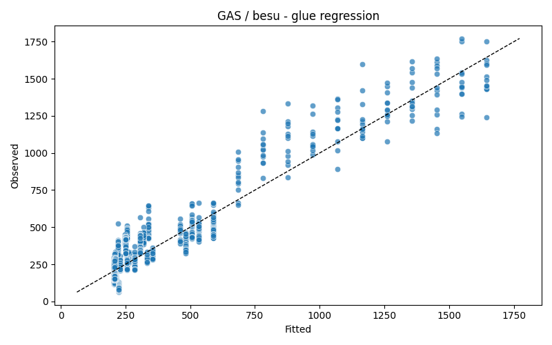

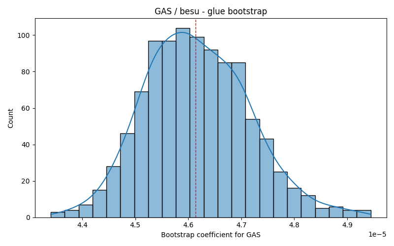


</details>

<details><summary><code>MLOAD</code> · nobs=22220 · runtime_ms=7.031e-05 · p=1.00e-03 · R²=0.6429</summary>

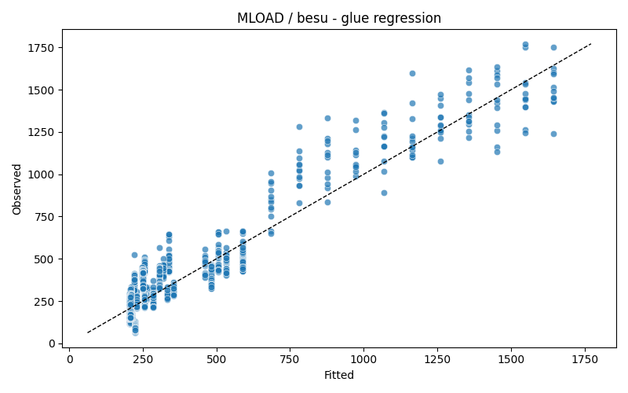

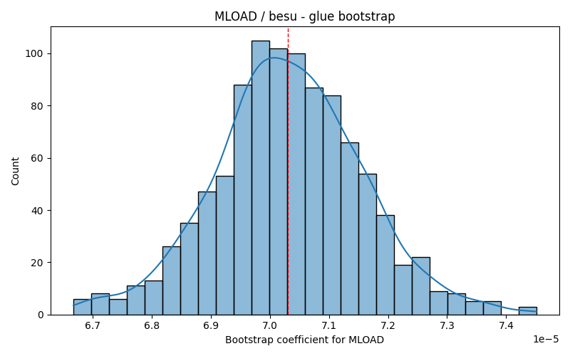

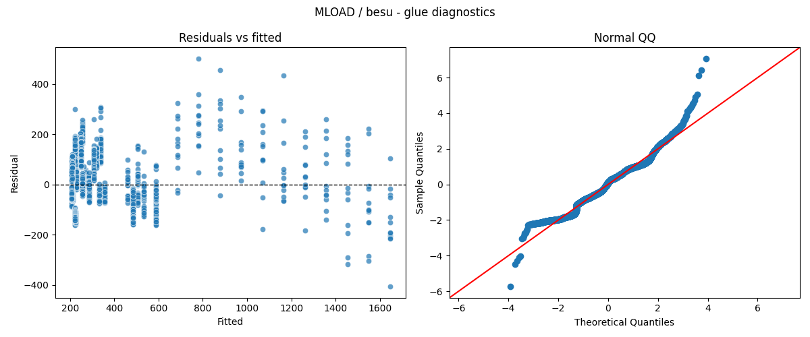

</details>

<details><summary><code>PUSH</code> · nobs=22220 · runtime_ms=0 · p=1.00e+00 · R²=0.6429</summary>


</details>

<details><summary><code>PUSH0</code> · nobs=22220 · runtime_ms=0 · p=1.00e+00 · R²=0.6429</summary>

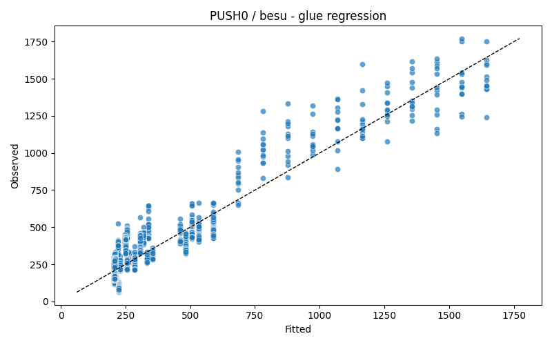

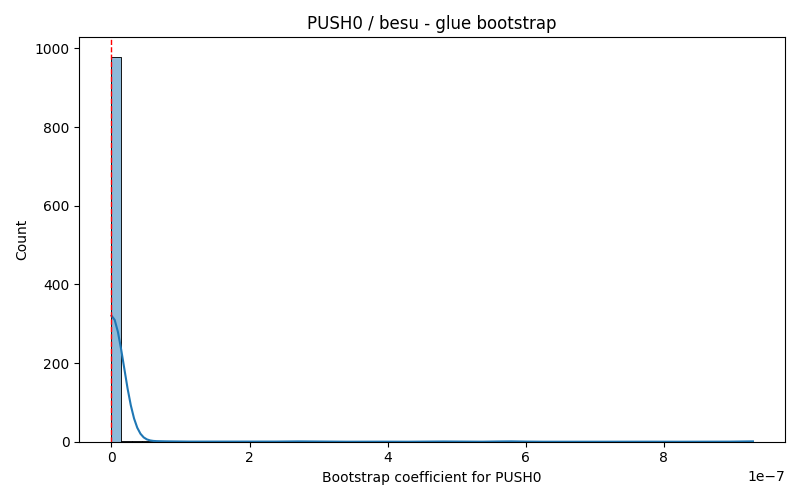


</details>

<details><summary><code>STATICCALL</code> · nobs=22220 · runtime_ms=0.0004695 · p=1.00e-03 · R²=0.6429</summary>


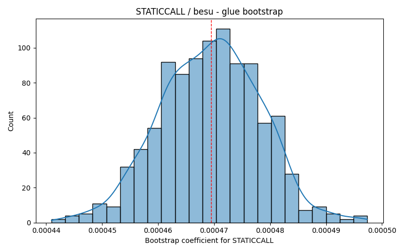


</details>

### Pure glue · besu

<details><summary><code>ISZERO</code> · nobs=352 · runtime_ms=0 · p=1.00e+00 · R²=0</summary>

```
==============================================================================
                           NNLS Regression Results                            
==============================================================================
Dep. Variable:          test_runtime_ms              R-squared:          0.000
Model:                  NNLS                    Adj. R-squared:         -0.003
No. Observations:       352                               RMSE:          85.30
Df Residuals:           350                                MAE:          76.39
Df Model:               1      
==============================================================================
                      coef     std err     P-value      [0.025      0.975]
------------------------------------------------------------------------------
         const    281.5618      4.4888       0.001    272.8166    290.3562
        ISZERO      0.0000      0.0000       1.000      0.0000      0.0000
==============================================================================
Notes: Non-negative least squares with bootstrap inference (1000 iterations)
==============================================================================
```

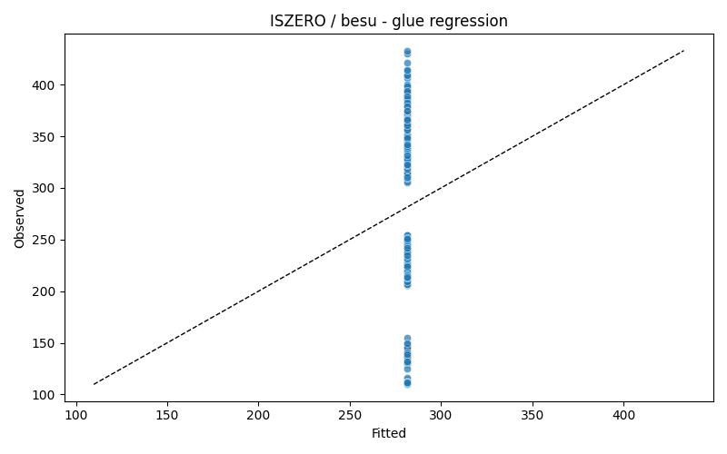


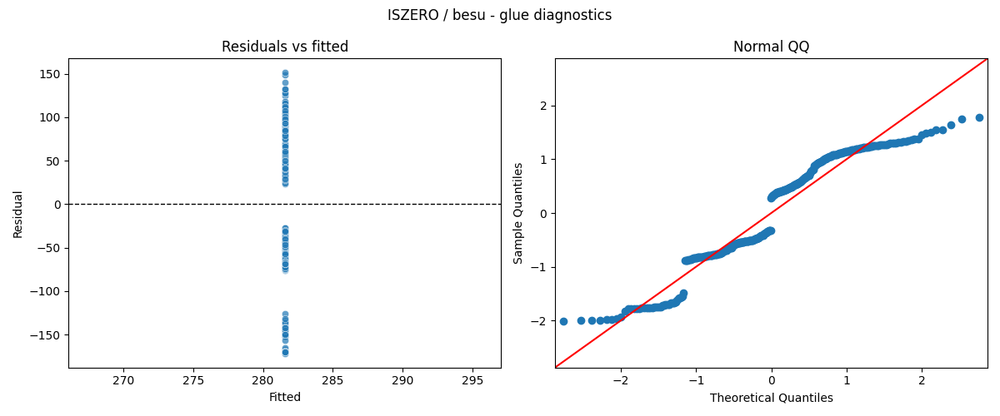

</details>

<details><summary><code>JUMPDEST</code> · nobs=88 · runtime_ms=0 · p=1.00e+00 · R²=0</summary>

```
==============================================================================
                           NNLS Regression Results                            
==============================================================================
Dep. Variable:          test_runtime_ms              R-squared:          0.000
Model:                  NNLS                    Adj. R-squared:         -0.012
No. Observations:       88                                RMSE:          59.09
Df Residuals:           86                                 MAE:          44.60
Df Model:               1      
==============================================================================
                      coef     std err     P-value      [0.025      0.975]
------------------------------------------------------------------------------
         const    200.1447      6.1799       0.001    188.6723    213.0226
      JUMPDEST      0.0000      0.0000       1.000      0.0000      0.0000
==============================================================================
Notes: Non-negative least squares with bootstrap inference (1000 iterations)
==============================================================================
```

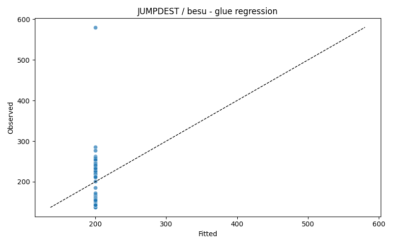


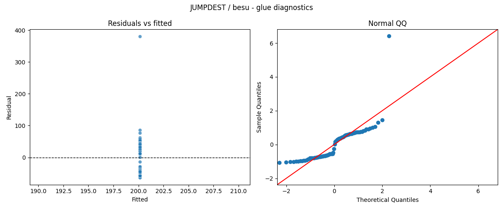

</details>

<details><summary><code>SWAP</code> · nobs=6292 · runtime_ms=0 · p=1.00e+00 · R²=3.331e-16</summary>

```
==============================================================================
                           NNLS Regression Results                            
==============================================================================
Dep. Variable:          test_runtime_ms              R-squared:          0.000
Model:                  NNLS                    Adj. R-squared:         -0.000
No. Observations:       6292                              RMSE:          91.92
Df Residuals:           6290                               MAE:          82.43
Df Model:               1      
==============================================================================
                      coef     std err     P-value      [0.025      0.975]
------------------------------------------------------------------------------
         const    313.9683      1.1904       0.001    311.7101    316.3203
          SWAP      0.0000      0.0000       1.000      0.0000      0.0000
==============================================================================
Notes: Non-negative least squares with bootstrap inference (1000 iterations)
==============================================================================
```


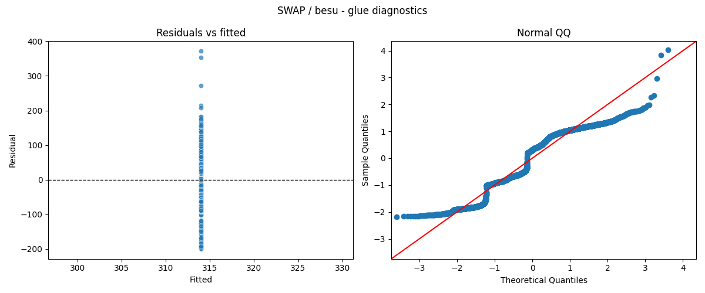

</details>

### Mixed glue (tier A) · besu

<details><summary><code>ADD</code> · nobs=396 · runtime_ms=0 · p=1.00e+00 · R²=2.22e-16</summary>

```
==============================================================================
                           NNLS Regression Results                            
==============================================================================
Dep. Variable:          test_runtime_ms              R-squared:          0.000
Model:                  NNLS                    Adj. R-squared:         -0.003
No. Observations:       396                               RMSE:         115.02
Df Residuals:           394                                MAE:          98.04
Df Model:               1      
==============================================================================
                      coef     std err     P-value      [0.025      0.975]
------------------------------------------------------------------------------
         const    402.4407      5.9310       0.001    390.4125    413.4253
           ADD      0.0000      0.0000       1.000      0.0000      0.0000
==============================================================================
Notes: Non-negative least squares with bootstrap inference (1000 iterations)
==============================================================================
```

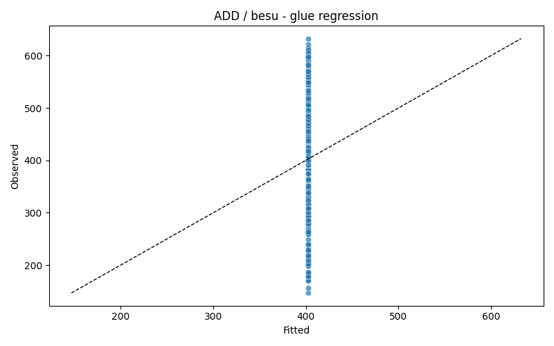


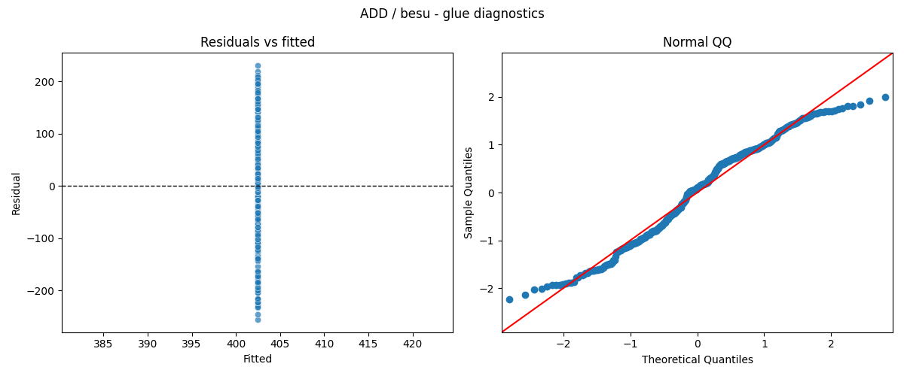

</details>

<details><summary><code>AND</code> · nobs=352 · runtime_ms=0 · p=1.00e+00 · R²=0</summary>

```
==============================================================================
                           NNLS Regression Results                            
==============================================================================
Dep. Variable:          test_runtime_ms              R-squared:          0.000
Model:                  NNLS                    Adj. R-squared:         -0.003
No. Observations:       352                               RMSE:          74.15
Df Residuals:           350                                MAE:          66.99
Df Model:               1      
==============================================================================
                      coef     std err     P-value      [0.025      0.975]
------------------------------------------------------------------------------
         const    262.2274      3.8726       0.001    254.8386    269.8613
           AND      0.0000      0.0000       1.000      0.0000      0.0000
==============================================================================
Notes: Non-negative least squares with bootstrap inference (1000 iterations)
==============================================================================
```

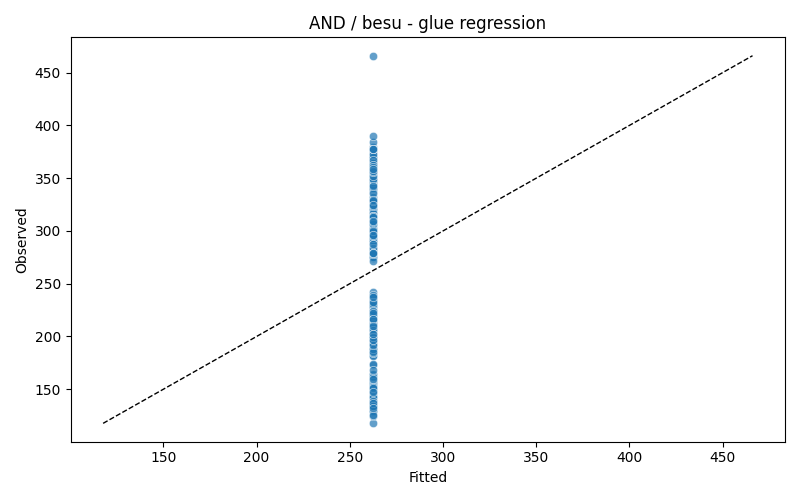


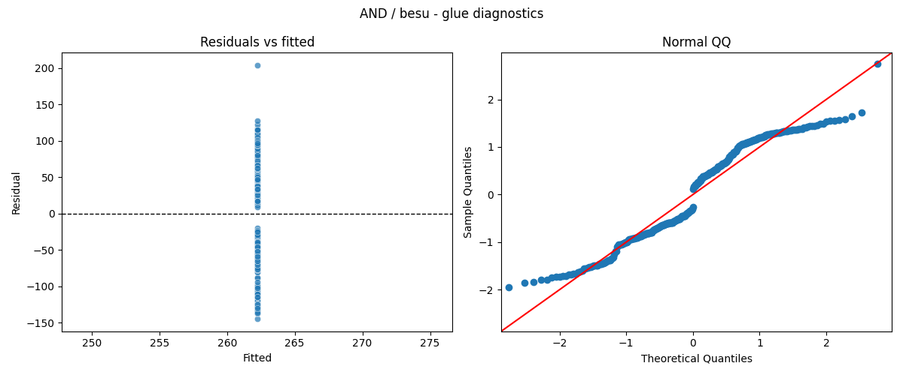

</details>

<details><summary><code>CALLDATACOPY</code> · nobs=10340 · runtime_ms=0 · p=1.00e+00 · R²=-2.22e-16</summary>

```
==============================================================================
                           NNLS Regression Results                            
==============================================================================
Dep. Variable:          test_runtime_ms              R-squared:         -0.000
Model:                  NNLS                    Adj. R-squared:         -0.000
No. Observations:       10340                             RMSE:         104.75
Df Residuals:           10338                              MAE:          83.77
Df Model:               1      
==============================================================================
                      coef     std err     P-value      [0.025      0.975]
------------------------------------------------------------------------------
         const    236.6590      1.0373       0.001    234.6295    238.6991
  CALLDATACOPY      0.0000      0.0000       1.000      0.0000      0.0000
==============================================================================
Notes: Non-negative least squares with bootstrap inference (1000 iterations)
==============================================================================
```

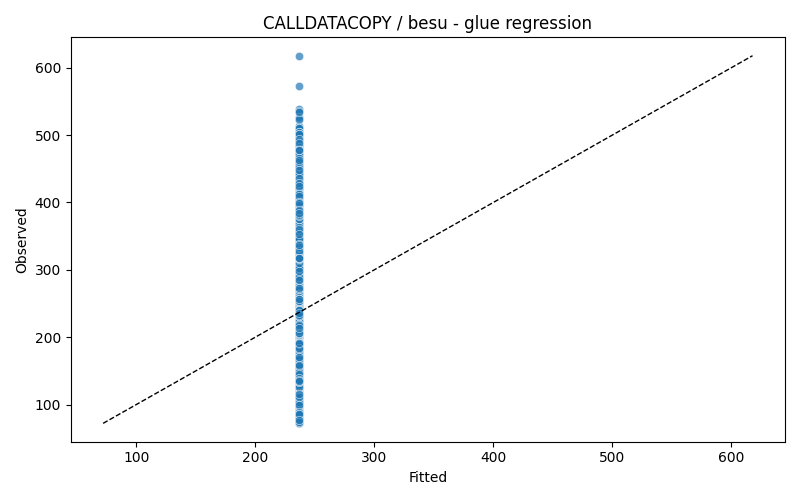


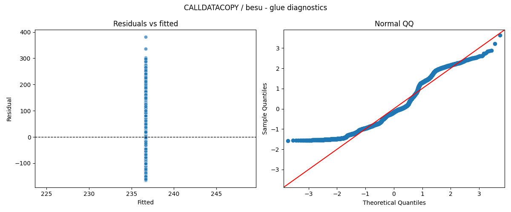

</details>

<details><summary><code>CALLDATALOAD</code> · nobs=1936 · runtime_ms=0 · p=1.00e+00 · R²=2.22e-16</summary>

```
==============================================================================
                           NNLS Regression Results                            
==============================================================================
Dep. Variable:          test_runtime_ms              R-squared:          0.000
Model:                  NNLS                    Adj. R-squared:         -0.001
No. Observations:       1936                              RMSE:           0.74
Df Residuals:           1934                               MAE:           0.47
Df Model:               1      
==============================================================================
                      coef     std err     P-value      [0.025      0.975]
------------------------------------------------------------------------------
         const      2.9067      0.0172       0.001      2.8740      2.9427
  CALLDATALOAD      0.0000      0.0000       1.000      0.0000      0.0000
==============================================================================
Notes: Non-negative least squares with bootstrap inference (1000 iterations)
==============================================================================
```

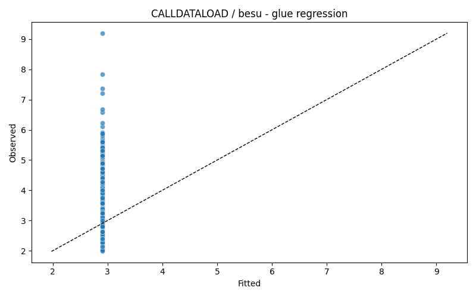

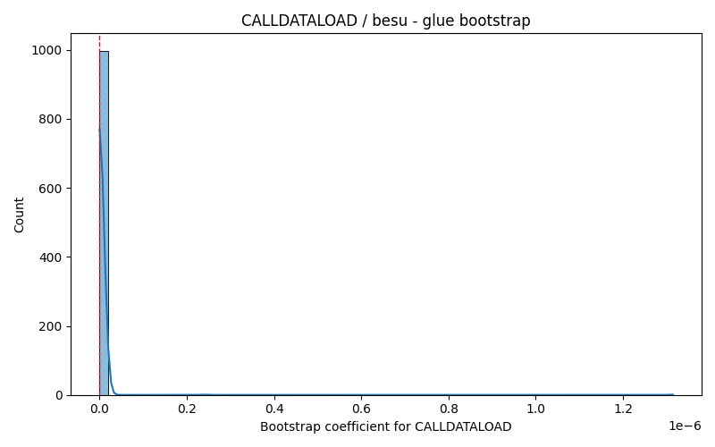

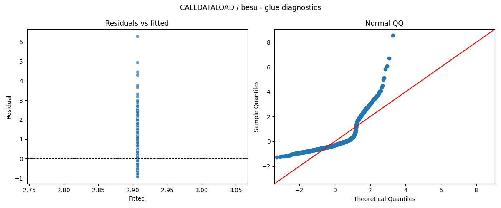

</details>

<details><summary><code>DIV</code> · nobs=484 · runtime_ms=0 · p=1.00e+00 · R²=0</summary>

```
==============================================================================
                           NNLS Regression Results                            
==============================================================================
Dep. Variable:          test_runtime_ms              R-squared:          0.000
Model:                  NNLS                    Adj. R-squared:         -0.002
No. Observations:       484                               RMSE:          93.81
Df Residuals:           482                                MAE:          85.26
Df Model:               1      
==============================================================================
                      coef     std err     P-value      [0.025      0.975]
------------------------------------------------------------------------------
         const    413.0997      4.3738       0.001    404.6190    422.0101
           DIV      0.0000      0.0000       1.000      0.0000      0.0000
==============================================================================
Notes: Non-negative least squares with bootstrap inference (1000 iterations)
==============================================================================
```

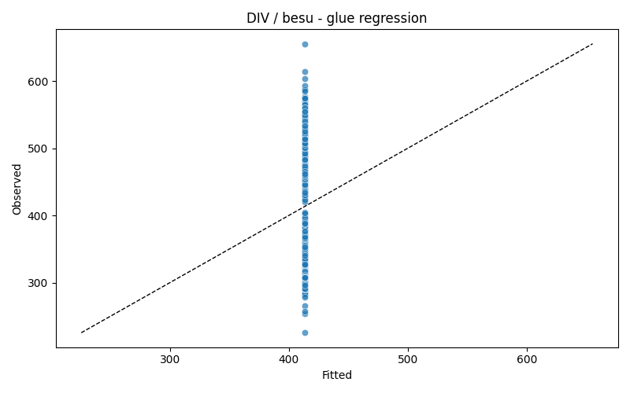


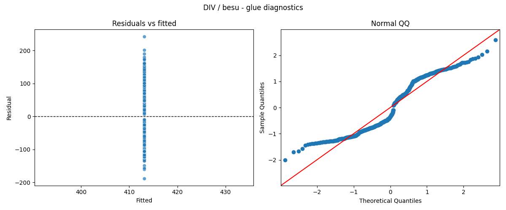

</details>

<details><summary><code>EXP</code> · nobs=484 · runtime_ms=0.000976 · p=1.00e-03 · R²=0.6429</summary>

```
==============================================================================
                           NNLS Regression Results                            
==============================================================================
Dep. Variable:          test_runtime_ms              R-squared:          0.643
Model:                  NNLS                    Adj. R-squared:          0.642
No. Observations:       484                               RMSE:          28.50
Df Residuals:           482                                MAE:          22.39
Df Model:               1      
==============================================================================
                      coef     std err     P-value      [0.025      0.975]
------------------------------------------------------------------------------
         const    104.7359      5.9432       0.001     93.4872    115.8285
           EXP      0.0010      0.0000       0.001      0.0009      0.0011
==============================================================================
Notes: Non-negative least squares with bootstrap inference (1000 iterations)
==============================================================================
```

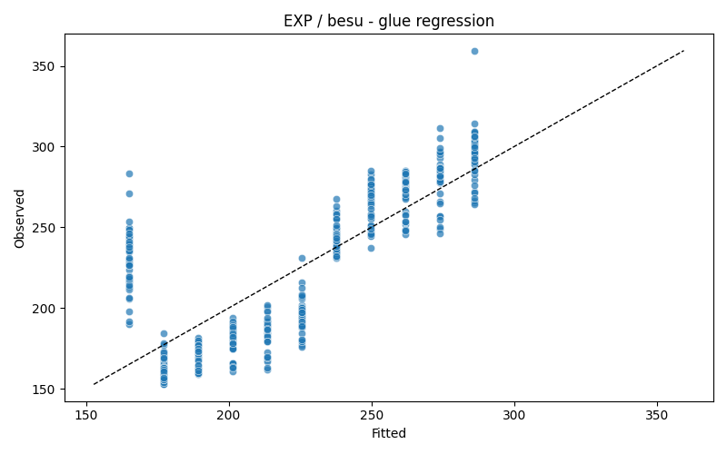


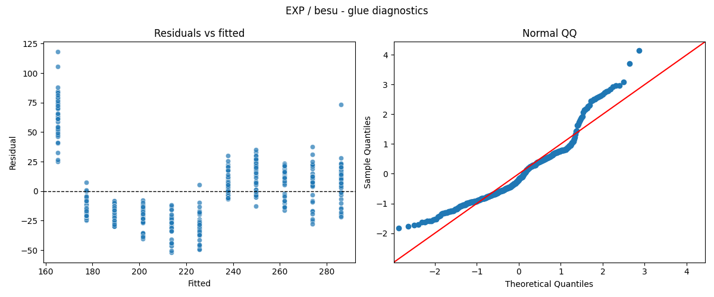

</details>

<details><summary><code>GT</code> · nobs=352 · runtime_ms=0 · p=1.00e+00 · R²=0</summary>

```
==============================================================================
                           NNLS Regression Results                            
==============================================================================
Dep. Variable:          test_runtime_ms              R-squared:          0.000
Model:                  NNLS                    Adj. R-squared:         -0.003
No. Observations:       352                               RMSE:         486.35
Df Residuals:           350                                MAE:         388.40
Df Model:               1      
==============================================================================
                      coef     std err     P-value      [0.025      0.975]
------------------------------------------------------------------------------
         const    534.2622     26.1500       0.001    481.1767    584.5167
            GT      0.0000      0.0000       1.000      0.0000      0.0000
==============================================================================
Notes: Non-negative least squares with bootstrap inference (1000 iterations)
==============================================================================
```

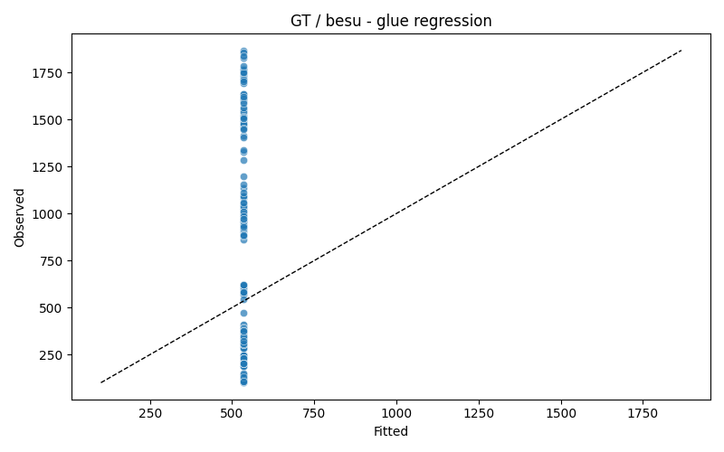


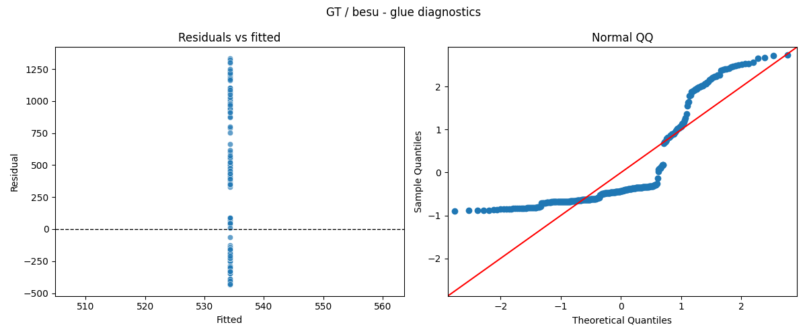

</details>

<details><summary><code>JUMPI</code> · nobs=484 · runtime_ms=0 · p=1.00e+00 · R²=-2.22e-16</summary>

```
==============================================================================
                           NNLS Regression Results                            
==============================================================================
Dep. Variable:          test_runtime_ms              R-squared:         -0.000
Model:                  NNLS                    Adj. R-squared:         -0.002
No. Observations:       484                               RMSE:          30.83
Df Residuals:           482                                MAE:          24.63
Df Model:               1      
==============================================================================
                      coef     std err     P-value      [0.025      0.975]
------------------------------------------------------------------------------
         const     94.7524      1.4127       0.001     91.9823     97.6970
         JUMPI      0.0000      0.0000       1.000      0.0000      0.0000
==============================================================================
Notes: Non-negative least squares with bootstrap inference (1000 iterations)
==============================================================================
```

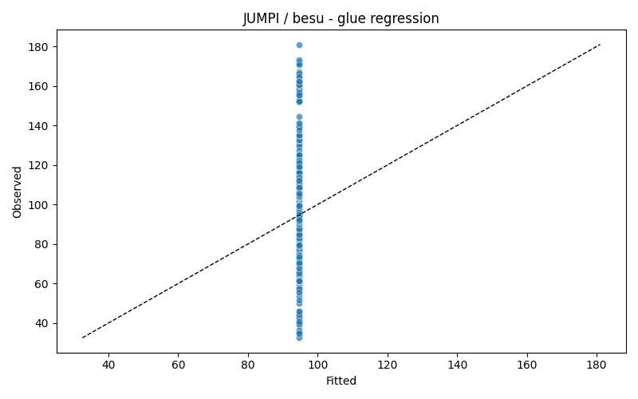


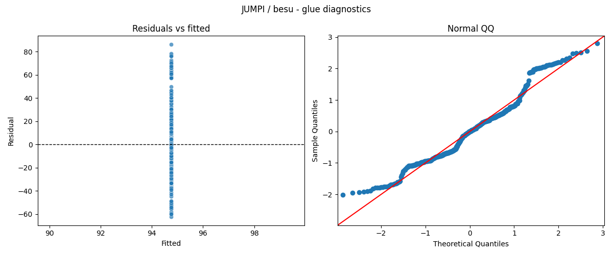

</details>

<details><summary><code>LT</code> · nobs=352 · runtime_ms=0 · p=1.00e+00 · R²=0</summary>

```
==============================================================================
                           NNLS Regression Results                            
==============================================================================
Dep. Variable:          test_runtime_ms              R-squared:          0.000
Model:                  NNLS                    Adj. R-squared:         -0.003
No. Observations:       352                               RMSE:          80.52
Df Residuals:           350                                MAE:          74.12
Df Model:               1      
==============================================================================
                      coef     std err     P-value      [0.025      0.975]
------------------------------------------------------------------------------
         const    294.8850      4.2942       0.001    286.3089    303.3302
            LT      0.0000      0.0000       1.000      0.0000      0.0000
==============================================================================
Notes: Non-negative least squares with bootstrap inference (1000 iterations)
==============================================================================
```

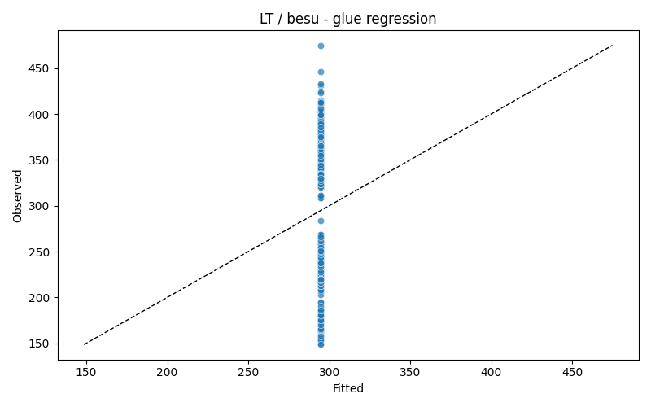


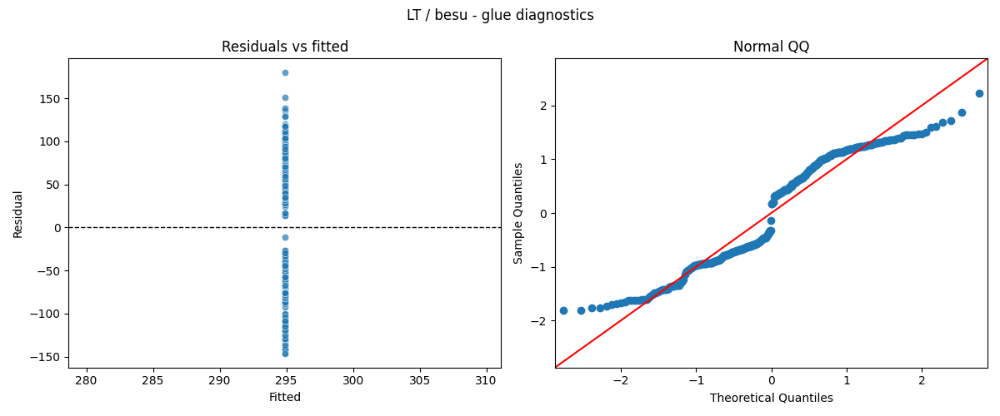

</details>

<details><summary><code>MSTORE</code> · nobs=1980 · runtime_ms=0 · p=1.00e+00 · R²=-2.22e-16</summary>

```
==============================================================================
                           NNLS Regression Results                            
==============================================================================
Dep. Variable:          test_runtime_ms              R-squared:         -0.000
Model:                  NNLS                    Adj. R-squared:         -0.001
No. Observations:       1980                              RMSE:         131.63
Df Residuals:           1978                               MAE:         117.20
Df Model:               1      
==============================================================================
                      coef     std err     P-value      [0.025      0.975]
------------------------------------------------------------------------------
         const    447.9082      3.0252       0.001    442.0425    454.2552
        MSTORE      0.0000      0.0000       1.000      0.0000      0.0000
==============================================================================
Notes: Non-negative least squares with bootstrap inference (1000 iterations)
==============================================================================
```

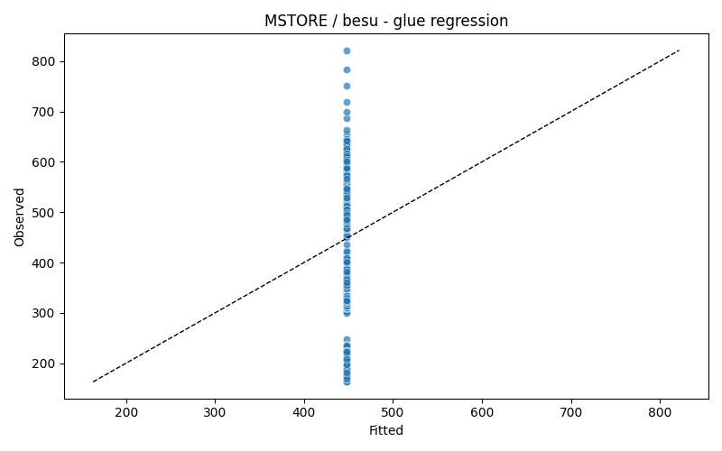


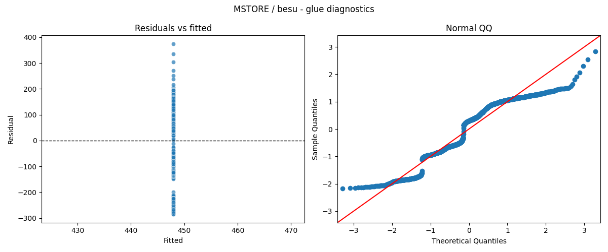

</details>

<details><summary><code>MSTORE8</code> · nobs=1980 · runtime_ms=0 · p=1.00e+00 · R²=0</summary>

```
==============================================================================
                           NNLS Regression Results                            
==============================================================================
Dep. Variable:          test_runtime_ms              R-squared:          0.000
Model:                  NNLS                    Adj. R-squared:         -0.001
No. Observations:       1980                              RMSE:          76.04
Df Residuals:           1978                               MAE:          67.68
Df Model:               1      
==============================================================================
                      coef     std err     P-value      [0.025      0.975]
------------------------------------------------------------------------------
         const    257.4578      1.7007       0.001    254.1207    260.6434
       MSTORE8      0.0000      0.0000       1.000      0.0000      0.0000
==============================================================================
Notes: Non-negative least squares with bootstrap inference (1000 iterations)
==============================================================================
```

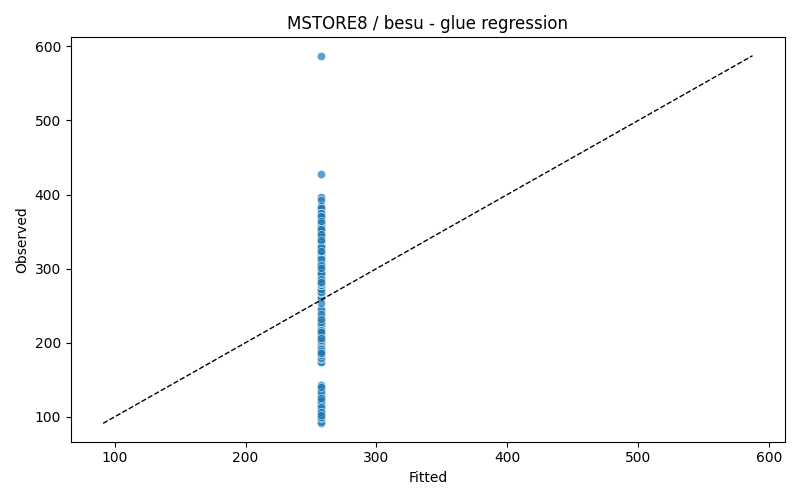

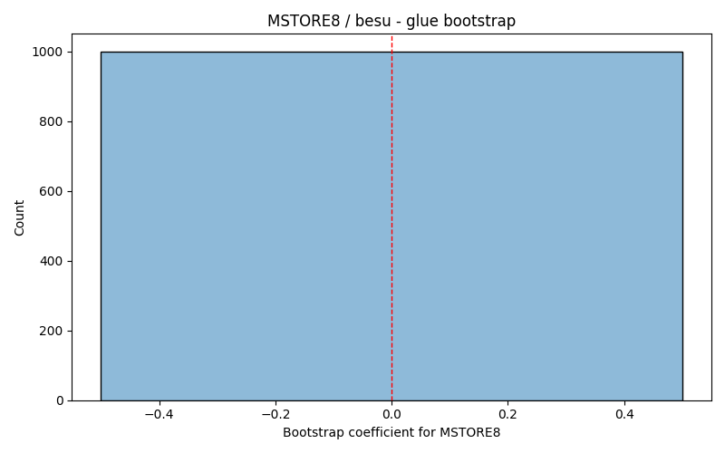

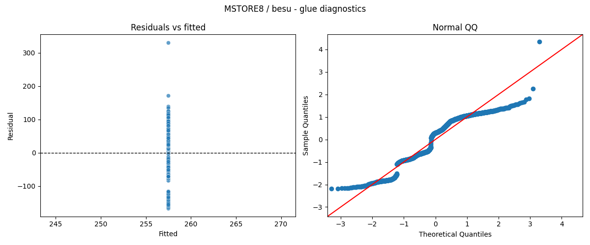

</details>

<details><summary><code>MUL</code> · nobs=440 · runtime_ms=0 · p=1.00e+00 · R²=0</summary>

```
==============================================================================
                           NNLS Regression Results                            
==============================================================================
Dep. Variable:          test_runtime_ms              R-squared:          0.000
Model:                  NNLS                    Adj. R-squared:         -0.002
No. Observations:       440                               RMSE:         113.67
Df Residuals:           438                                MAE:          95.22
Df Model:               1      
==============================================================================
                      coef     std err     P-value      [0.025      0.975]
------------------------------------------------------------------------------
         const    395.1372      5.4315       0.001    384.9302    405.3410
           MUL      0.0000      0.0000       1.000      0.0000      0.0000
==============================================================================
Notes: Non-negative least squares with bootstrap inference (1000 iterations)
==============================================================================
```

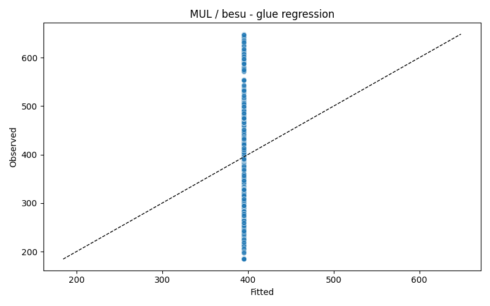


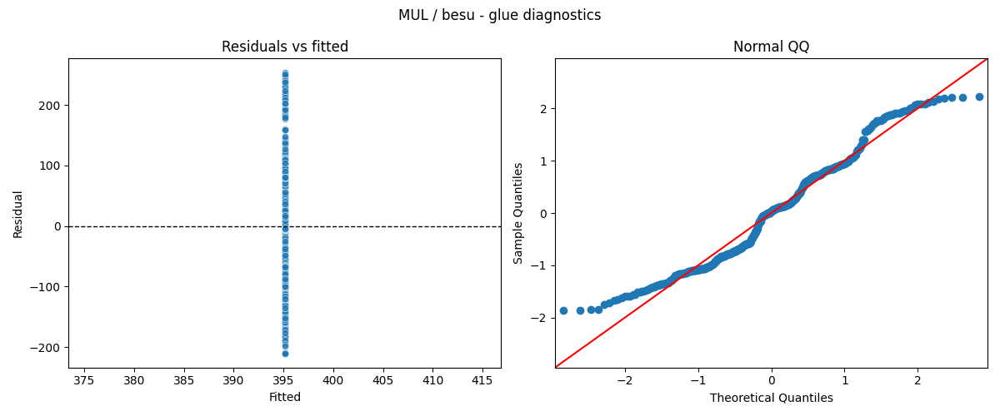

</details>

<details><summary><code>PC</code> · nobs=264 · runtime_ms=2.324e-05 · p=1.00e-03 · R²=0.3655</summary>

```
==============================================================================
                           NNLS Regression Results                            
==============================================================================
Dep. Variable:          test_runtime_ms              R-squared:          0.365
Model:                  NNLS                    Adj. R-squared:          0.363
No. Observations:       264                               RMSE:          68.07
Df Residuals:           262                                MAE:          60.92
Df Model:               1      
==============================================================================
                      coef     std err     P-value      [0.025      0.975]
------------------------------------------------------------------------------
         const    310.3184      7.8206       0.001    294.6950    325.7011
            PC      0.0000      0.0000       0.001      0.0000      0.0000
==============================================================================
Notes: Non-negative least squares with bootstrap inference (1000 iterations)
==============================================================================
```

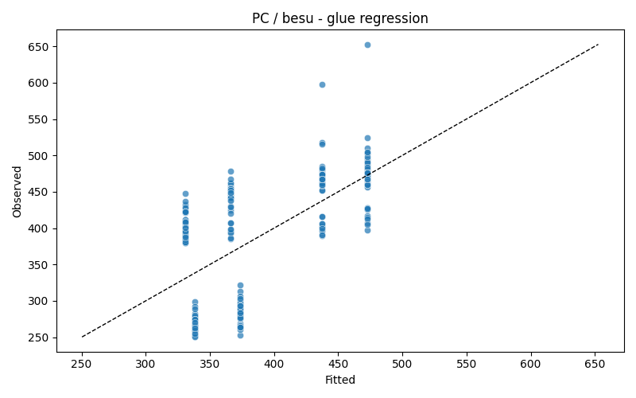

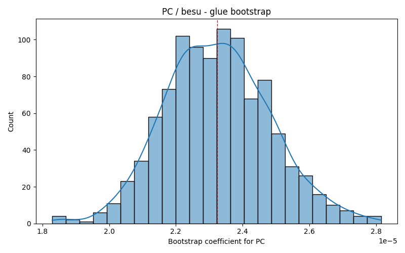

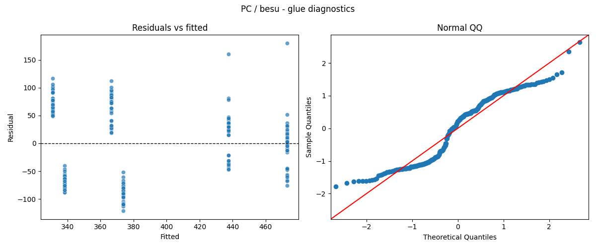

</details>

<details><summary><code>RETURNDATASIZE</code> · nobs=1056 · runtime_ms=3.333e-05 · p=1.00e-03 · R²=0.3602</summary>

```
==============================================================================
                           NNLS Regression Results                            
==============================================================================
Dep. Variable:          test_runtime_ms              R-squared:          0.360
Model:                  NNLS                    Adj. R-squared:          0.360
No. Observations:       1056                              RMSE:          52.13
Df Residuals:           1054                               MAE:          46.47
Df Model:               1      
==============================================================================
                      coef     std err     P-value      [0.025      0.975]
------------------------------------------------------------------------------
         const    232.4061      3.1531       0.001    226.1352    238.4156
RETURNDATASIZE      0.0000      0.0000       0.001      0.0000      0.0000
==============================================================================
Notes: Non-negative least squares with bootstrap inference (1000 iterations)
==============================================================================
```

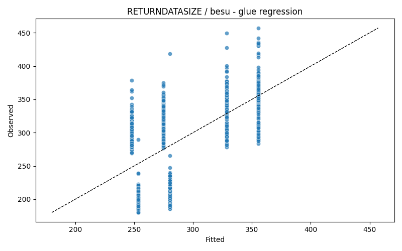

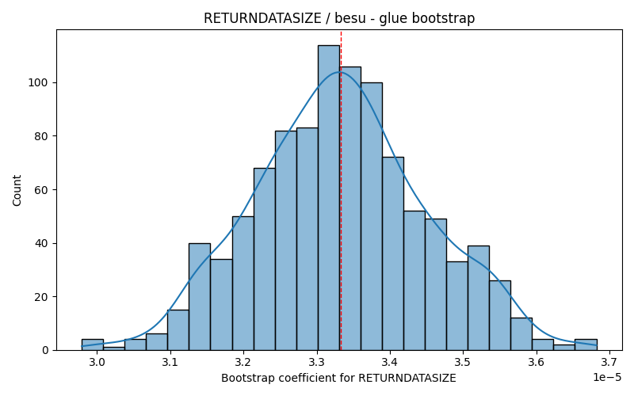

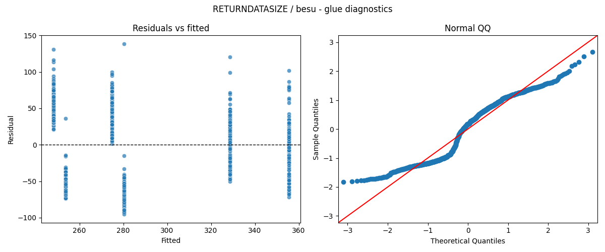

</details>

<details><summary><code>SELFBALANCE</code> · nobs=484 · runtime_ms=0 · p=1.00e+00 · R²=0</summary>

```
==============================================================================
                           NNLS Regression Results                            
==============================================================================
Dep. Variable:          test_runtime_ms              R-squared:          0.000
Model:                  NNLS                    Adj. R-squared:         -0.002
No. Observations:       484                               RMSE:         204.33
Df Residuals:           482                                MAE:         170.05
Df Model:               1      
==============================================================================
                      coef     std err     P-value      [0.025      0.975]
------------------------------------------------------------------------------
         const    687.9657      9.5578       0.001    669.0236    706.8955
   SELFBALANCE      0.0000      0.0000       1.000      0.0000      0.0000
==============================================================================
Notes: Non-negative least squares with bootstrap inference (1000 iterations)
==============================================================================
```

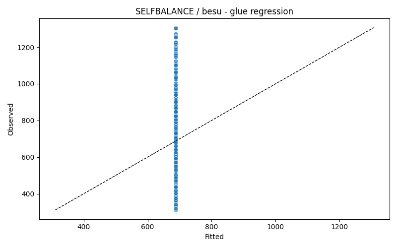


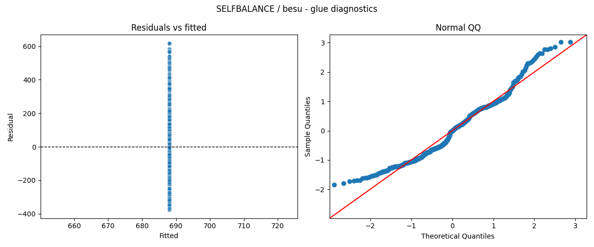

</details>

<details><summary><code>SUB</code> · nobs=352 · runtime_ms=0 · p=1.00e+00 · R²=0</summary>

```
==============================================================================
                           NNLS Regression Results                            
==============================================================================
Dep. Variable:          test_runtime_ms              R-squared:          0.000
Model:                  NNLS                    Adj. R-squared:         -0.003
No. Observations:       352                               RMSE:         118.11
Df Residuals:           350                                MAE:         102.70
Df Model:               1      
==============================================================================
                      coef     std err     P-value      [0.025      0.975]
------------------------------------------------------------------------------
         const    388.2694      6.1480       0.001    376.8722    399.8868
           SUB      0.0000      0.0000       1.000      0.0000      0.0000
==============================================================================
Notes: Non-negative least squares with bootstrap inference (1000 iterations)
==============================================================================
```

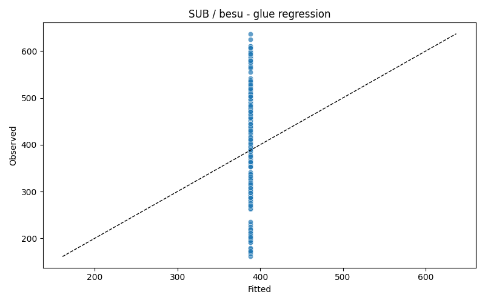


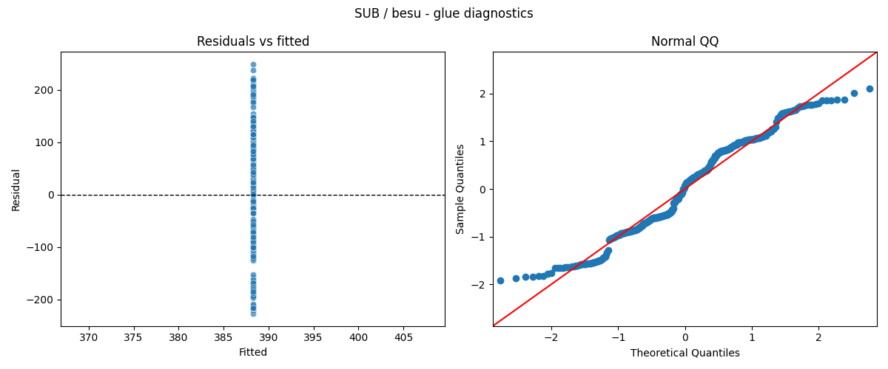

</details>

### Mixed glue (tier B) · besu

<details><summary><code>JUMP</code> · nobs=440 · runtime_ms=0 · p=1.00e+00 · R²=0</summary>

```
==============================================================================
                           NNLS Regression Results                            
==============================================================================
Dep. Variable:          test_runtime_ms              R-squared:          0.000
Model:                  NNLS                    Adj. R-squared:         -0.002
No. Observations:       440                               RMSE:         183.51
Df Residuals:           438                                MAE:         161.67
Df Model:               1      
==============================================================================
                      coef     std err     P-value      [0.025      0.975]
------------------------------------------------------------------------------
         const    641.6864      8.6886       0.001    624.2027    658.5635
          JUMP      0.0000      0.0000       1.000      0.0000      0.0000
==============================================================================
Notes: Non-negative least squares with bootstrap inference (1000 iterations)
==============================================================================
```

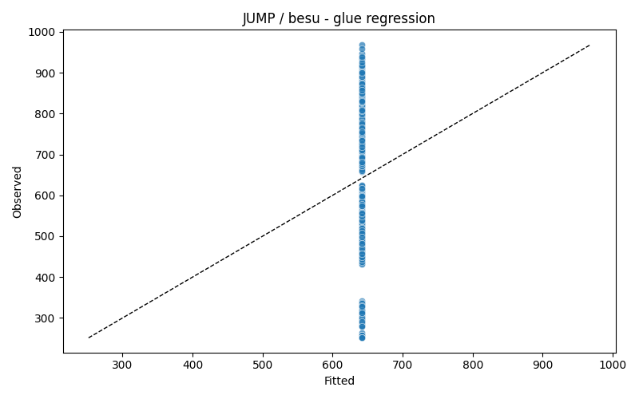


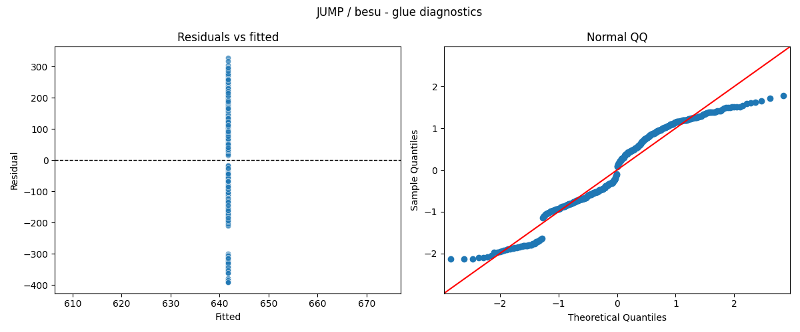

</details>

<details><summary><code>KECCAK256</code> · nobs=0 · runtime_ms=n/a · p=n/a · R²=n/a</summary>

</details>

## erigon

| glue_opcode | nobs | glue_runtime_ms | p_value | rsquared |
| --- | --- | --- | --- | --- |
| `ISZERO` | 392 | 0 | 1.00e+00 | 0 |
| `JUMPDEST` | 98 | 0 | 1.00e+00 | 0 |
| `SWAP` | 7007 | 0 | 1.00e+00 | 0 |
| `CALLDATASIZE` | 24653 | 1.142e-06 | 1.00e-03 | 0.0226 |
| `DUP` | 24653 | 0 | 1.00e+00 | 0.0226 |
| `GAS` | 24653 | 9.403e-07 | 4.00e-03 | 0.0226 |
| `MLOAD` | 24653 | 1.466e-05 | 1.00e-03 | 0.0226 |
| `PUSH` | 24653 | 0 | 1.00e+00 | 0.0226 |
| `PUSH0` | 24653 | 0 | 1.00e+00 | 0.0226 |
| `STATICCALL` | 24653 | 0 | 1.00e+00 | 0.0226 |
| `ADD` | 441 | 0 | 1.00e+00 | 0 |
| `AND` | 392 | 0 | 1.00e+00 | 0 |
| `CALLDATACOPY` | 11515 | 0 | 1.00e+00 | 0 |
| `CALLDATALOAD` | 2156 | 7.486e-05 | 1.00e-03 | 0.2325 |
| `DIV` | 539 | 0 | 1.00e+00 | 0 |
| `EXP` | 539 | 0.0003692 | 1.00e-03 | 0.9212 |
| `GT` | 392 | 0 | 1.00e+00 | 0 |
| `JUMPI` | 539 | 0 | 1.00e+00 | 0 |
| `LT` | 392 | 0 | 1.00e+00 | 0 |
| `MSTORE` | 2205 | 0 | 1.00e+00 | 0 |
| `MSTORE8` | 2205 | 0 | 1.00e+00 | 0 |
| `MUL` | 490 | 0 | 1.00e+00 | 2.22e-16 |
| `PC` | 294 | 1.06e-05 | 1.00e-03 | 0.613 |
| `RETURNDATASIZE` | 1176 | 1.726e-05 | 1.00e-03 | 0.2377 |
| `SELFBALANCE` | 539 | 0 | 1.00e+00 | 0 |
| `SUB` | 392 | 0 | 1.00e+00 | 0 |
| `JUMP` | 490 | 0 | 1.00e+00 | 0 |
| `KECCAK256` | 0 | n/a | n/a | n/a |

### Cycle glue — joint fit · erigon

<details><summary>Joint NNLS regression summary</summary>

```
==============================================================================
                           NNLS Regression Results                            
==============================================================================
Dep. Variable:          test_runtime_ms              R-squared:          0.023
Model:                  NNLS                    Adj. R-squared:          0.022
No. Observations:       24653                             RMSE:          43.19
Df Residuals:           24645                              MAE:          35.10
Df Model:               7      
==============================================================================
                      coef     std err     P-value      [0.025      0.975]
------------------------------------------------------------------------------
         const    123.1298      0.3009       0.001    122.5517    123.7271
  CALLDATASIZE      0.0000      0.0000       0.001      0.0000      0.0000
           DUP      0.0000      0.0000       1.000      0.0000      0.0000
           GAS      0.0000      0.0000       0.004      0.0000      0.0000
         MLOAD      0.0000      0.0000       0.001      0.0000      0.0000
          PUSH      0.0000      0.0000       1.000      0.0000      0.0000
         PUSH0      0.0000      0.0000       1.000      0.0000      0.0000
    STATICCALL      0.0000      0.0000       1.000      0.0000      0.0000
==============================================================================
Notes: Non-negative least squares with bootstrap inference (1000 iterations)
==============================================================================
```

</details>

<details><summary><code>CALLDATASIZE</code> · nobs=24653 · runtime_ms=1.142e-06 · p=1.00e-03 · R²=0.0226</summary>

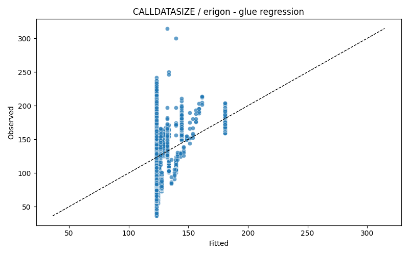

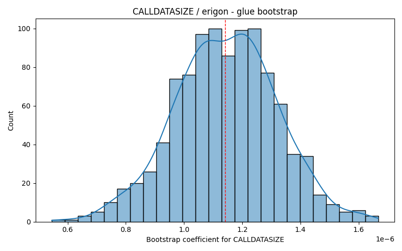

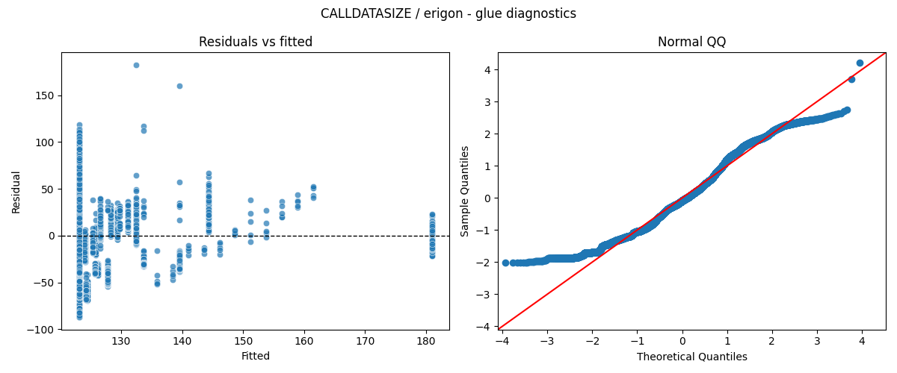

</details>

<details><summary><code>DUP</code> · nobs=24653 · runtime_ms=0 · p=1.00e+00 · R²=0.0226</summary>


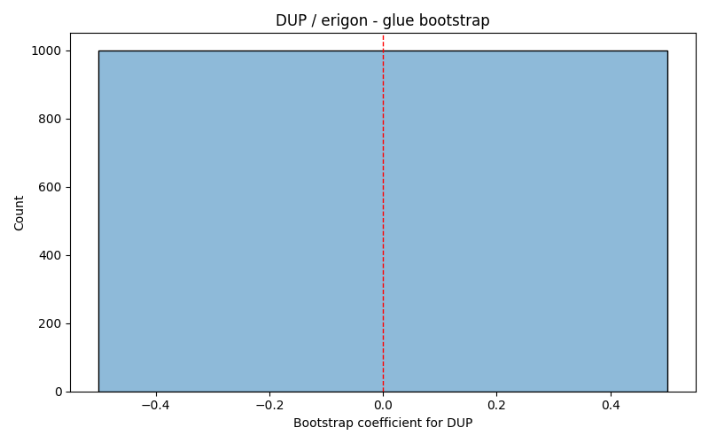


</details>

<details><summary><code>GAS</code> · nobs=24653 · runtime_ms=9.403e-07 · p=4.00e-03 · R²=0.0226</summary>

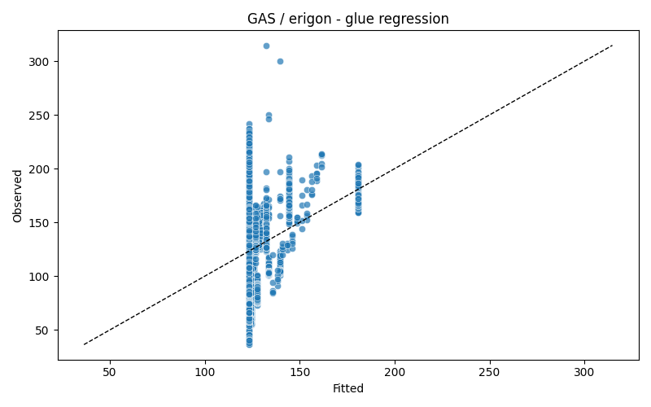

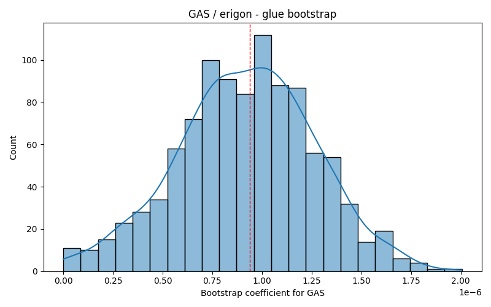

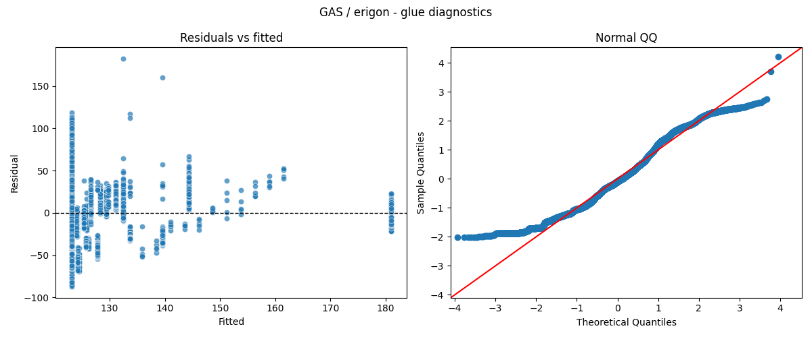

</details>

<details><summary><code>MLOAD</code> · nobs=24653 · runtime_ms=1.466e-05 · p=1.00e-03 · R²=0.0226</summary>

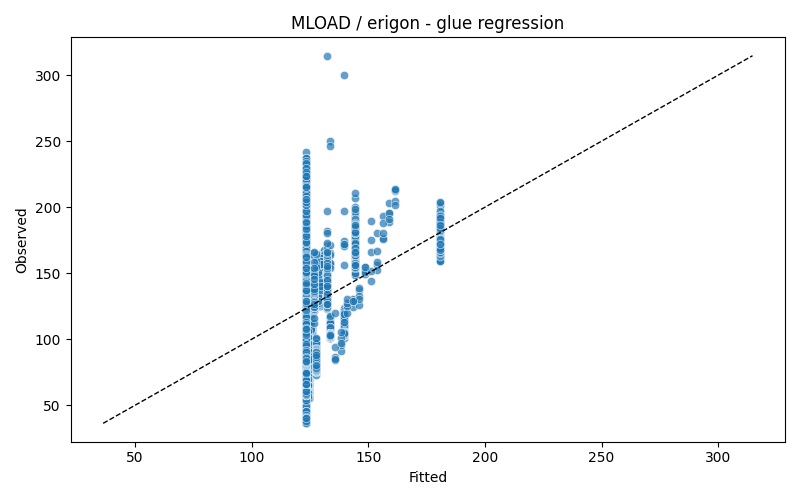

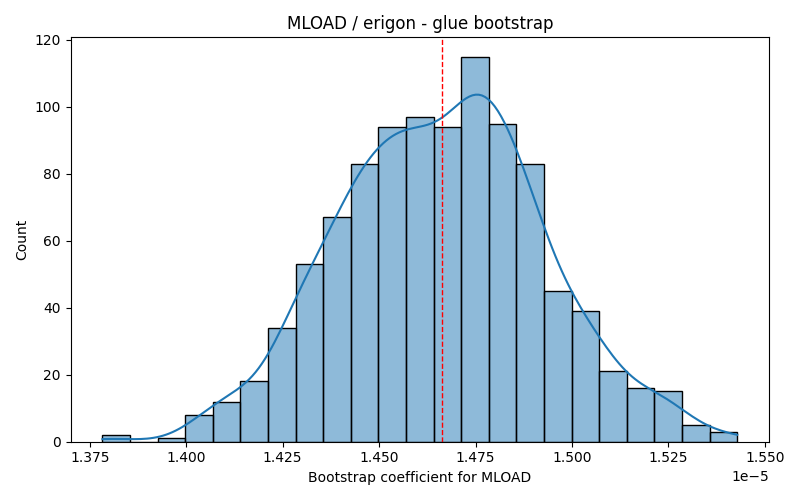


</details>

<details><summary><code>PUSH</code> · nobs=24653 · runtime_ms=0 · p=1.00e+00 · R²=0.0226</summary>


</details>

<details><summary><code>PUSH0</code> · nobs=24653 · runtime_ms=0 · p=1.00e+00 · R²=0.0226</summary>

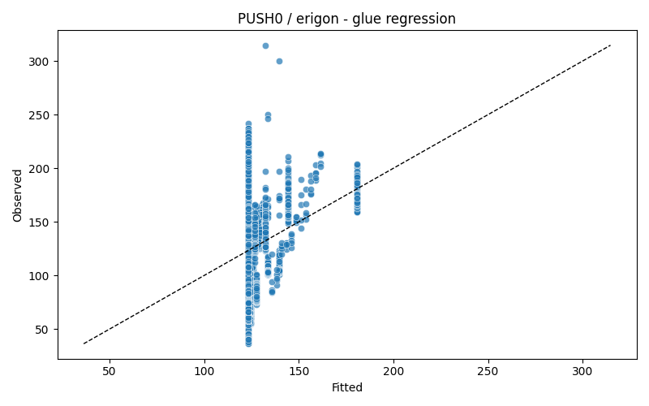

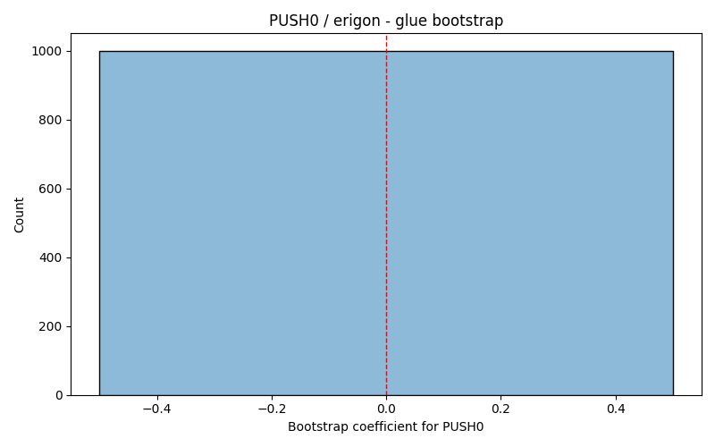


</details>

<details><summary><code>STATICCALL</code> · nobs=24653 · runtime_ms=0 · p=1.00e+00 · R²=0.0226</summary>

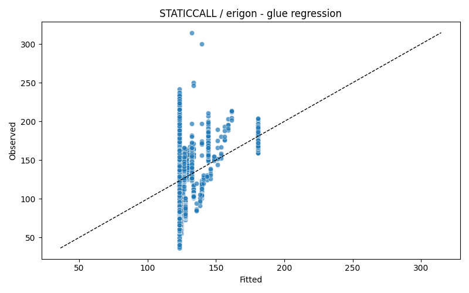


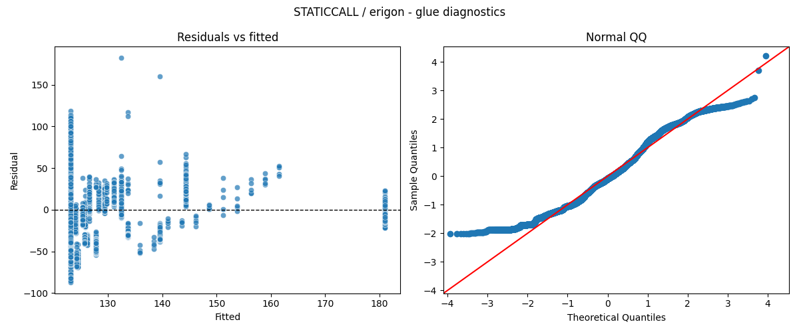

</details>

### Pure glue · erigon

<details><summary><code>ISZERO</code> · nobs=392 · runtime_ms=0 · p=1.00e+00 · R²=0</summary>

```
==============================================================================
                           NNLS Regression Results                            
==============================================================================
Dep. Variable:          test_runtime_ms              R-squared:          0.000
Model:                  NNLS                    Adj. R-squared:         -0.003
No. Observations:       392                               RMSE:          32.95
Df Residuals:           390                                MAE:          23.81
Df Model:               1      
==============================================================================
                      coef     std err     P-value      [0.025      0.975]
------------------------------------------------------------------------------
         const     78.0746      1.7496       0.001     74.8125     81.5676
        ISZERO      0.0000      0.0000       1.000      0.0000      0.0000
==============================================================================
Notes: Non-negative least squares with bootstrap inference (1000 iterations)
==============================================================================
```

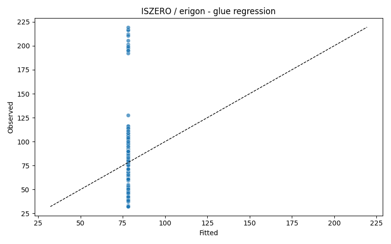


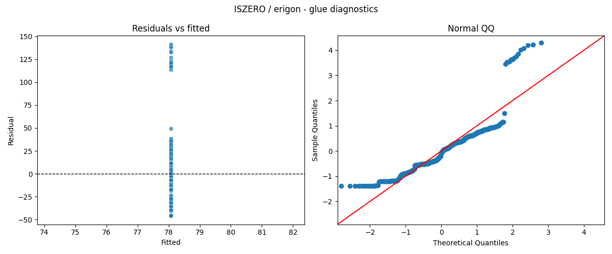

</details>

<details><summary><code>JUMPDEST</code> · nobs=98 · runtime_ms=0 · p=1.00e+00 · R²=0</summary>

```
==============================================================================
                           NNLS Regression Results                            
==============================================================================
Dep. Variable:          test_runtime_ms              R-squared:          0.000
Model:                  NNLS                    Adj. R-squared:         -0.010
No. Observations:       98                                RMSE:          37.50
Df Residuals:           96                                 MAE:          36.44
Df Model:               1      
==============================================================================
                      coef     std err     P-value      [0.025      0.975]
------------------------------------------------------------------------------
         const    136.6061      3.7727       0.001    129.1163    143.7333
      JUMPDEST      0.0000      0.0000       1.000      0.0000      0.0000
==============================================================================
Notes: Non-negative least squares with bootstrap inference (1000 iterations)
==============================================================================
```

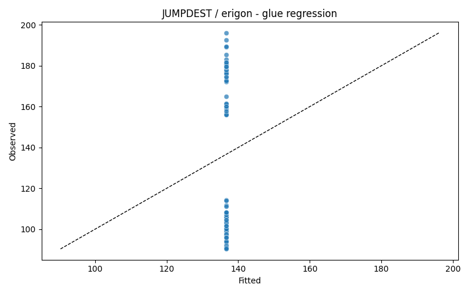


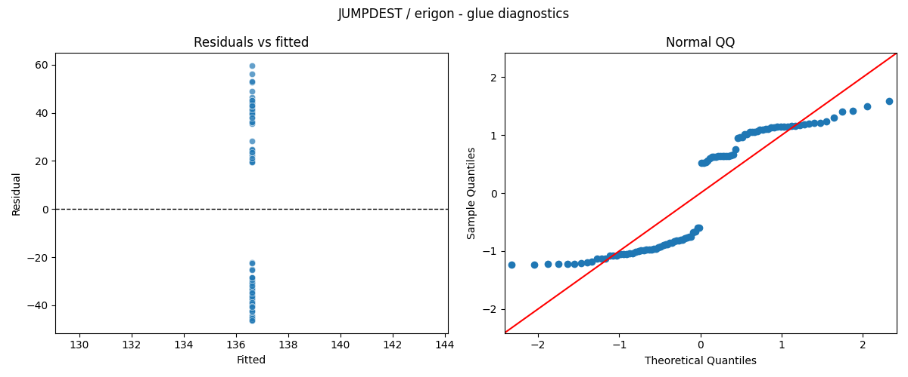

</details>

<details><summary><code>SWAP</code> · nobs=7007 · runtime_ms=0 · p=1.00e+00 · R²=0</summary>

```
==============================================================================
                           NNLS Regression Results                            
==============================================================================
Dep. Variable:          test_runtime_ms              R-squared:          0.000
Model:                  NNLS                    Adj. R-squared:         -0.000
No. Observations:       7007                              RMSE:          31.21
Df Residuals:           7005                               MAE:          24.33
Df Model:               1      
==============================================================================
                      coef     std err     P-value      [0.025      0.975]
------------------------------------------------------------------------------
         const     93.2287      0.3696       0.001     92.5385     93.9573
          SWAP      0.0000      0.0000       1.000      0.0000      0.0000
==============================================================================
Notes: Non-negative least squares with bootstrap inference (1000 iterations)
==============================================================================
```

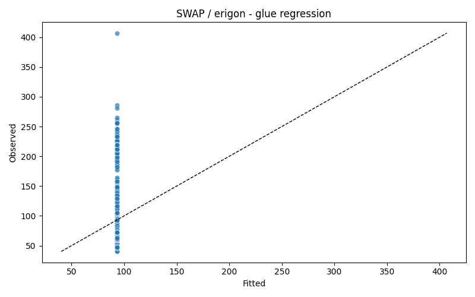


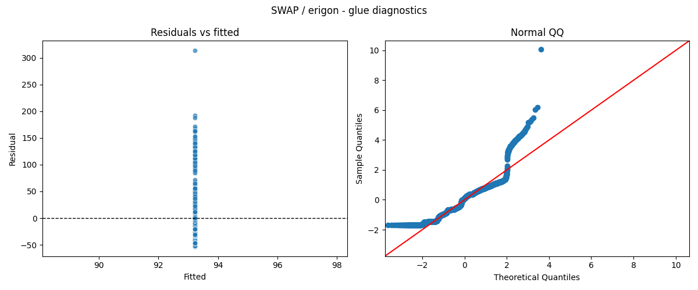

</details>

### Mixed glue (tier A) · erigon

<details><summary><code>ADD</code> · nobs=441 · runtime_ms=0 · p=1.00e+00 · R²=0</summary>

```
==============================================================================
                           NNLS Regression Results                            
==============================================================================
Dep. Variable:          test_runtime_ms              R-squared:          0.000
Model:                  NNLS                    Adj. R-squared:         -0.002
No. Observations:       441                               RMSE:          30.58
Df Residuals:           439                                MAE:          24.87
Df Model:               1      
==============================================================================
                      coef     std err     P-value      [0.025      0.975]
------------------------------------------------------------------------------
         const     93.0303      1.4767       0.001     90.3156     95.9316
           ADD      0.0000      0.0000       1.000      0.0000      0.0000
==============================================================================
Notes: Non-negative least squares with bootstrap inference (1000 iterations)
==============================================================================
```


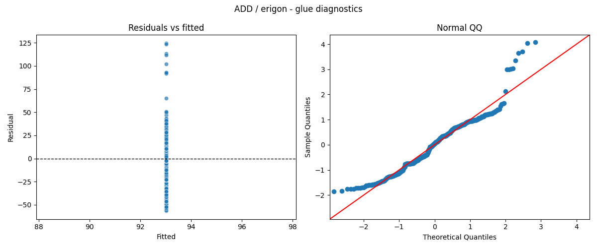

</details>

<details><summary><code>AND</code> · nobs=392 · runtime_ms=0 · p=1.00e+00 · R²=0</summary>

```
==============================================================================
                           NNLS Regression Results                            
==============================================================================
Dep. Variable:          test_runtime_ms              R-squared:          0.000
Model:                  NNLS                    Adj. R-squared:         -0.003
No. Observations:       392                               RMSE:          32.54
Df Residuals:           390                                MAE:          25.30
Df Model:               1      
==============================================================================
                      coef     std err     P-value      [0.025      0.975]
------------------------------------------------------------------------------
         const     87.0649      1.6480       0.001     83.8867     90.2578
           AND      0.0000      0.0000       1.000      0.0000      0.0000
==============================================================================
Notes: Non-negative least squares with bootstrap inference (1000 iterations)
==============================================================================
```

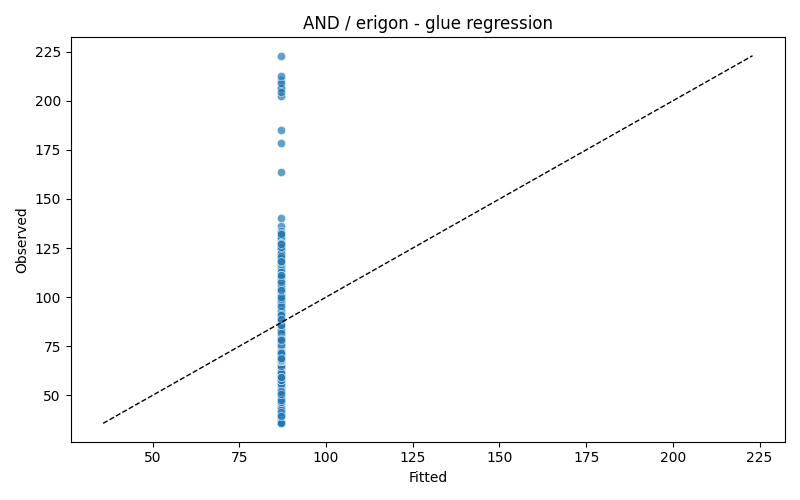


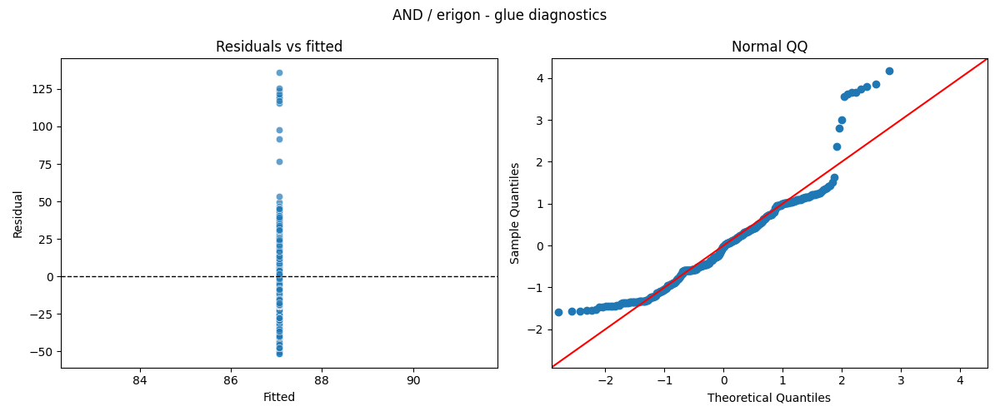

</details>

<details><summary><code>CALLDATACOPY</code> · nobs=11515 · runtime_ms=0 · p=1.00e+00 · R²=0</summary>

```
==============================================================================
                           NNLS Regression Results                            
==============================================================================
Dep. Variable:          test_runtime_ms              R-squared:          0.000
Model:                  NNLS                    Adj. R-squared:         -0.000
No. Observations:       11515                             RMSE:          50.38
Df Residuals:           11513                              MAE:          42.70
Df Model:               1      
==============================================================================
                      coef     std err     P-value      [0.025      0.975]
------------------------------------------------------------------------------
         const     72.6205      0.4670       0.001     71.7447     73.5808
  CALLDATACOPY      0.0000      0.0000       1.000      0.0000      0.0000
==============================================================================
Notes: Non-negative least squares with bootstrap inference (1000 iterations)
==============================================================================
```

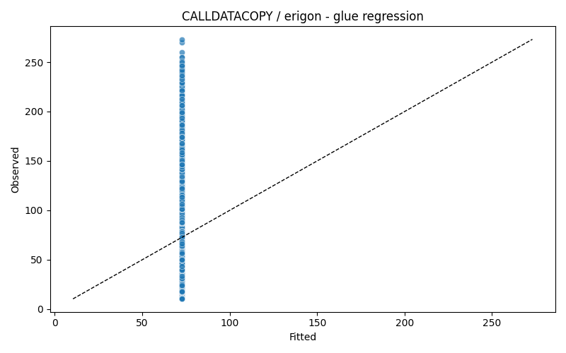

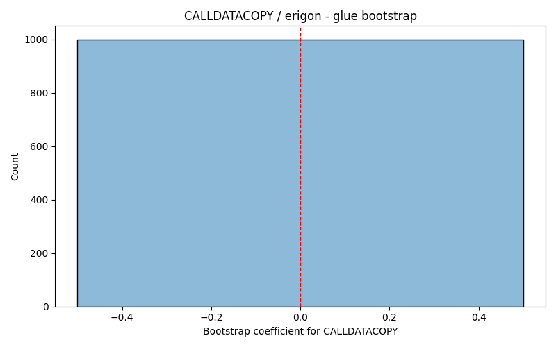

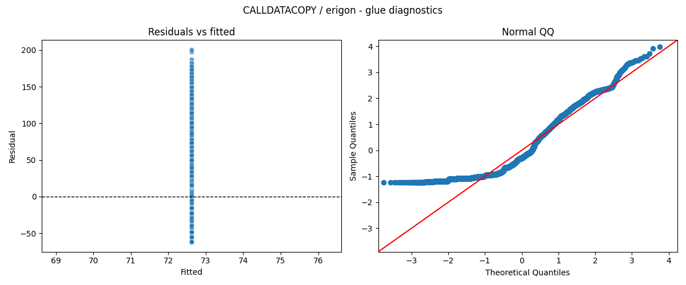

</details>

<details><summary><code>CALLDATALOAD</code> · nobs=2156 · runtime_ms=7.486e-05 · p=1.00e-03 · R²=0.2325</summary>

```
==============================================================================
                           NNLS Regression Results                            
==============================================================================
Dep. Variable:          test_runtime_ms              R-squared:          0.232
Model:                  NNLS                    Adj. R-squared:          0.232
No. Observations:       2156                              RMSE:           0.52
Df Residuals:           2154                               MAE:           0.30
Df Model:               1      
==============================================================================
                      coef     std err     P-value      [0.025      0.975]
------------------------------------------------------------------------------
         const      3.9695      0.0337       0.001      3.9019      4.0354
  CALLDATALOAD      0.0001      0.0000       0.001      0.0001      0.0001
==============================================================================
Notes: Non-negative least squares with bootstrap inference (1000 iterations)
==============================================================================
```

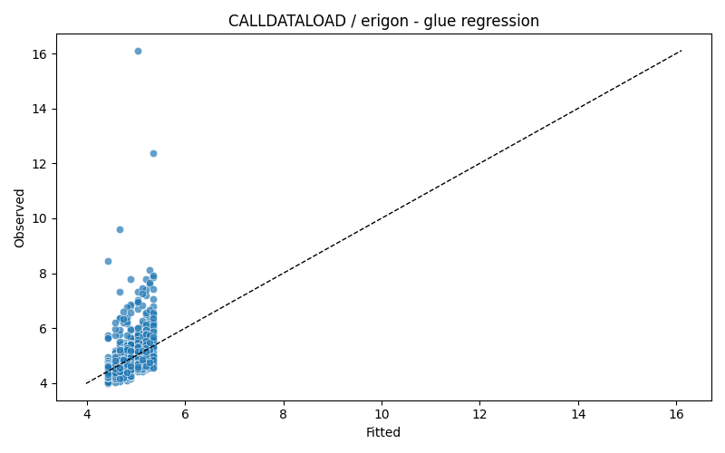

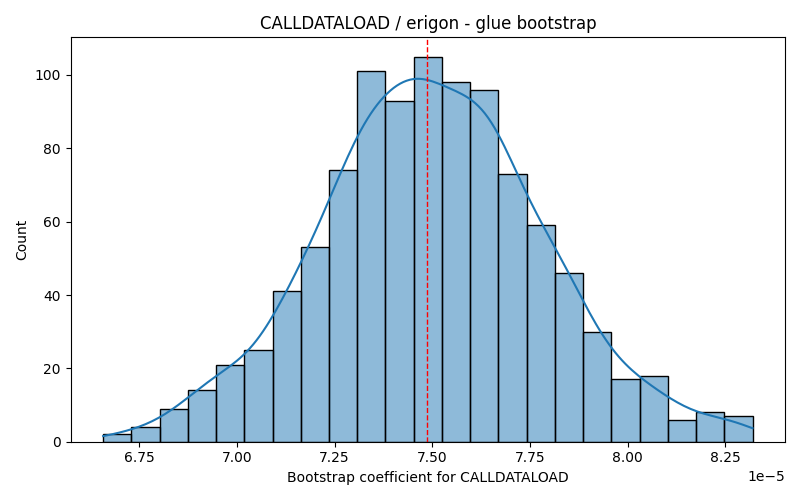

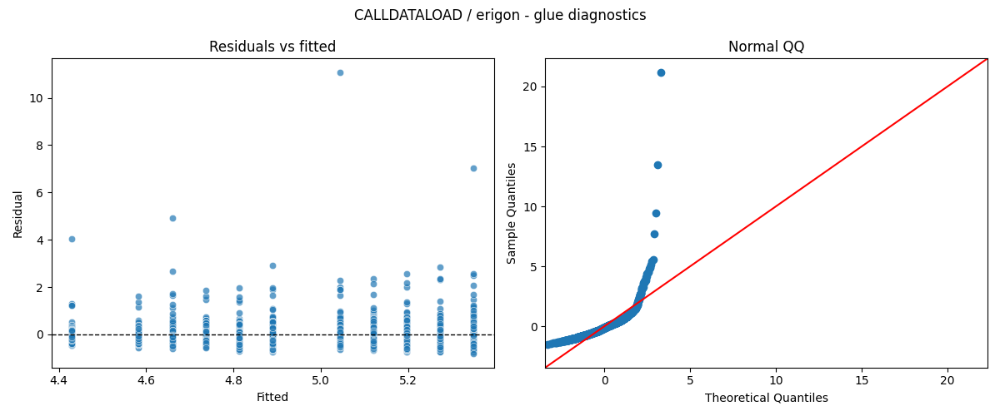

</details>

<details><summary><code>DIV</code> · nobs=539 · runtime_ms=0 · p=1.00e+00 · R²=0</summary>

```
==============================================================================
                           NNLS Regression Results                            
==============================================================================
Dep. Variable:          test_runtime_ms              R-squared:          0.000
Model:                  NNLS                    Adj. R-squared:         -0.002
No. Observations:       539                               RMSE:          76.93
Df Residuals:           537                                MAE:          60.17
Df Model:               1      
==============================================================================
                      coef     std err     P-value      [0.025      0.975]
------------------------------------------------------------------------------
         const    252.5081      3.3363       0.001    245.4487    258.7310
           DIV      0.0000      0.0000       1.000      0.0000      0.0000
==============================================================================
Notes: Non-negative least squares with bootstrap inference (1000 iterations)
==============================================================================
```

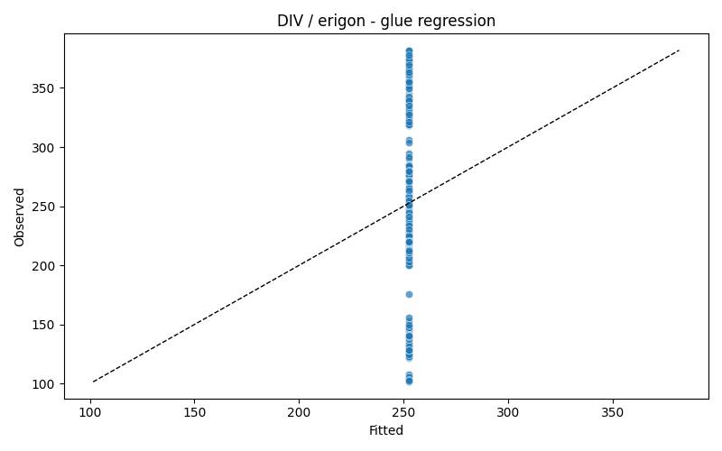


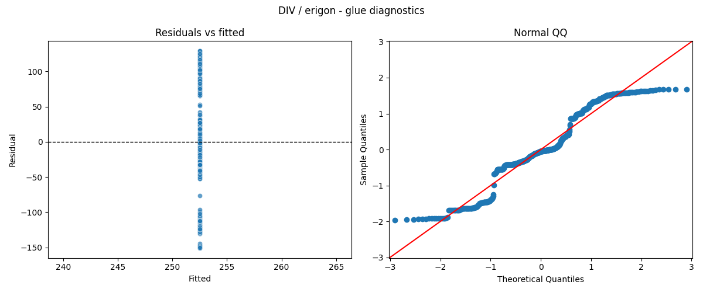

</details>

<details><summary><code>EXP</code> · nobs=539 · runtime_ms=0.0003692 · p=1.00e-03 · R²=0.9212</summary>

```
==============================================================================
                           NNLS Regression Results                            
==============================================================================
Dep. Variable:          test_runtime_ms              R-squared:          0.921
Model:                  NNLS                    Adj. R-squared:          0.921
No. Observations:       539                               RMSE:           4.23
Df Residuals:           537                                MAE:           3.48
Df Model:               1      
==============================================================================
                      coef     std err     P-value      [0.025      0.975]
------------------------------------------------------------------------------
         const      9.8671      0.6844       0.001      8.5213     11.1841
           EXP      0.0004      0.0000       0.001      0.0004      0.0004
==============================================================================
Notes: Non-negative least squares with bootstrap inference (1000 iterations)
==============================================================================
```

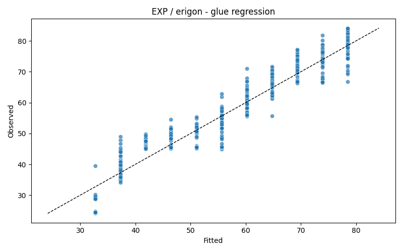

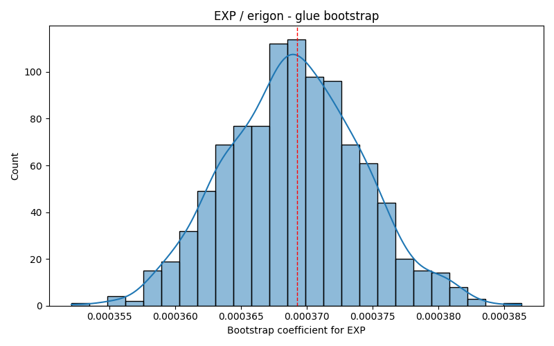

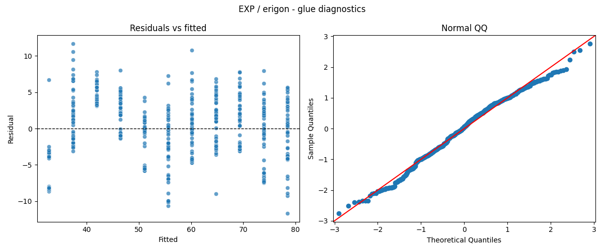

</details>

<details><summary><code>GT</code> · nobs=392 · runtime_ms=0 · p=1.00e+00 · R²=0</summary>

```
==============================================================================
                           NNLS Regression Results                            
==============================================================================
Dep. Variable:          test_runtime_ms              R-squared:          0.000
Model:                  NNLS                    Adj. R-squared:         -0.003
No. Observations:       392                               RMSE:          32.31
Df Residuals:           390                                MAE:          25.60
Df Model:               1      
==============================================================================
                      coef     std err     P-value      [0.025      0.975]
------------------------------------------------------------------------------
         const     89.6648      1.6290       0.001     86.4924     92.8925
            GT      0.0000      0.0000       1.000      0.0000      0.0000
==============================================================================
Notes: Non-negative least squares with bootstrap inference (1000 iterations)
==============================================================================
```

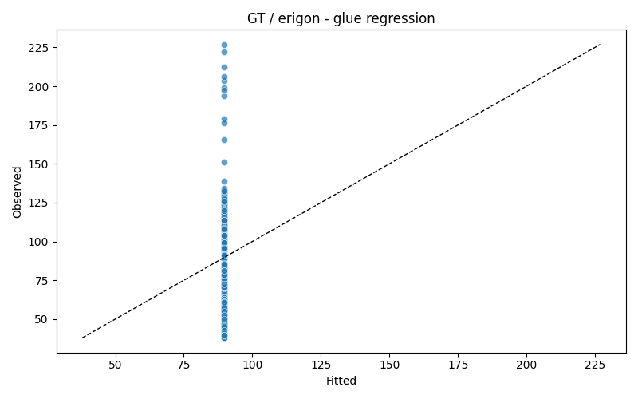

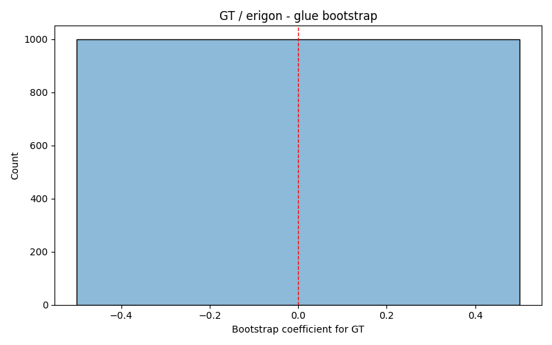


</details>

<details><summary><code>JUMPI</code> · nobs=539 · runtime_ms=0 · p=1.00e+00 · R²=0</summary>

```
==============================================================================
                           NNLS Regression Results                            
==============================================================================
Dep. Variable:          test_runtime_ms              R-squared:          0.000
Model:                  NNLS                    Adj. R-squared:         -0.002
No. Observations:       539                               RMSE:          16.64
Df Residuals:           537                                MAE:          12.00
Df Model:               1      
==============================================================================
                      coef     std err     P-value      [0.025      0.975]
------------------------------------------------------------------------------
         const     48.2750      0.7217       0.001     46.8691     49.6496
         JUMPI      0.0000      0.0000       1.000      0.0000      0.0000
==============================================================================
Notes: Non-negative least squares with bootstrap inference (1000 iterations)
==============================================================================
```

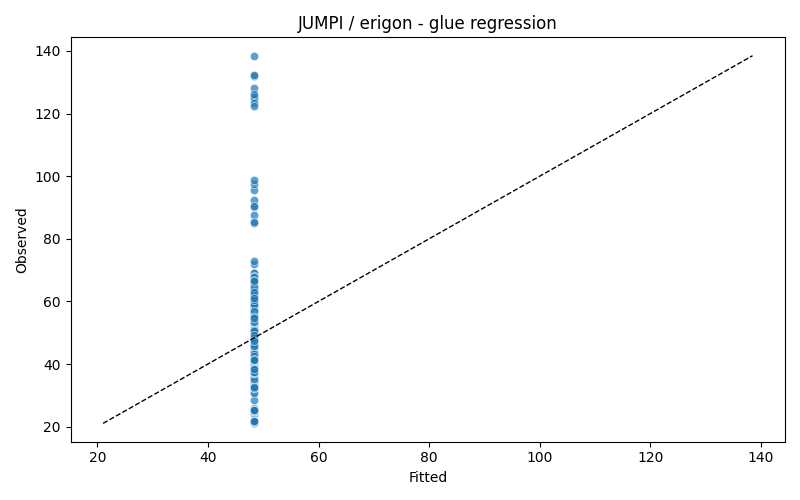


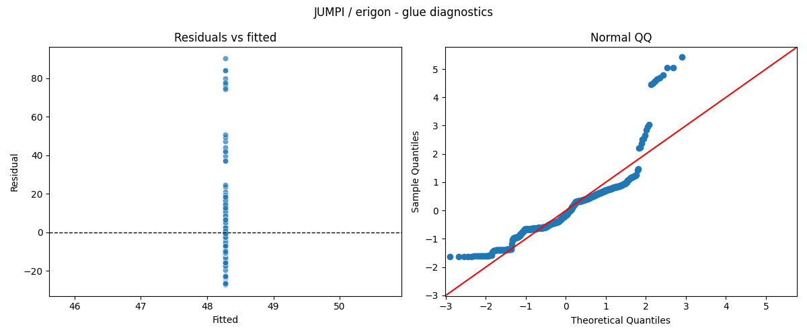

</details>

<details><summary><code>LT</code> · nobs=392 · runtime_ms=0 · p=1.00e+00 · R²=0</summary>

```
==============================================================================
                           NNLS Regression Results                            
==============================================================================
Dep. Variable:          test_runtime_ms              R-squared:          0.000
Model:                  NNLS                    Adj. R-squared:         -0.003
No. Observations:       392                               RMSE:          37.35
Df Residuals:           390                                MAE:          27.85
Df Model:               1      
==============================================================================
                      coef     std err     P-value      [0.025      0.975]
------------------------------------------------------------------------------
         const     92.9398      1.9308       0.001     89.1237     96.7227
            LT      0.0000      0.0000       1.000      0.0000      0.0000
==============================================================================
Notes: Non-negative least squares with bootstrap inference (1000 iterations)
==============================================================================
```

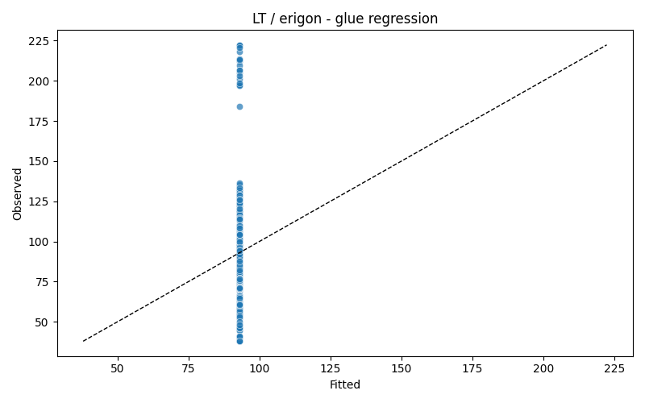


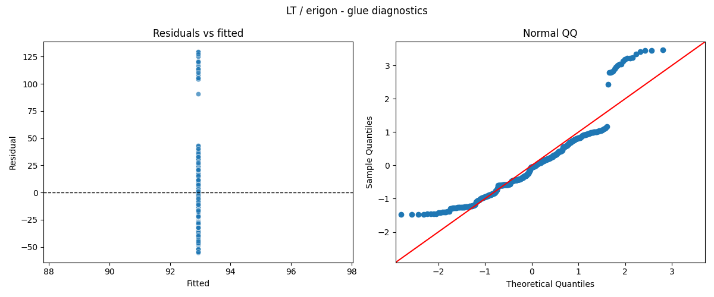

</details>

<details><summary><code>MSTORE</code> · nobs=2205 · runtime_ms=0 · p=1.00e+00 · R²=0</summary>

```
==============================================================================
                           NNLS Regression Results                            
==============================================================================
Dep. Variable:          test_runtime_ms              R-squared:          0.000
Model:                  NNLS                    Adj. R-squared:         -0.000
No. Observations:       2205                              RMSE:          38.95
Df Residuals:           2203                               MAE:          33.21
Df Model:               1      
==============================================================================
                      coef     std err     P-value      [0.025      0.975]
------------------------------------------------------------------------------
         const    125.4525      0.8253       0.001    123.8416    127.0028
        MSTORE      0.0000      0.0000       1.000      0.0000      0.0000
==============================================================================
Notes: Non-negative least squares with bootstrap inference (1000 iterations)
==============================================================================
```

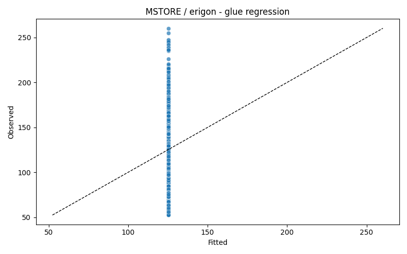


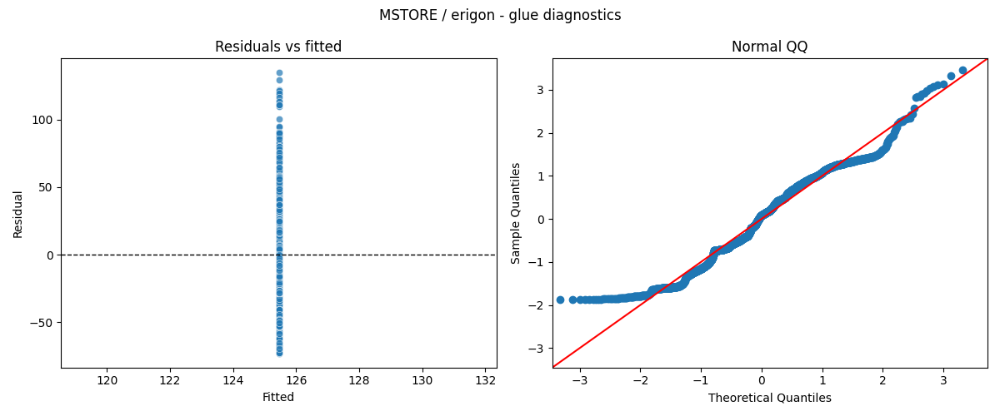

</details>

<details><summary><code>MSTORE8</code> · nobs=2205 · runtime_ms=0 · p=1.00e+00 · R²=0</summary>

```
==============================================================================
                           NNLS Regression Results                            
==============================================================================
Dep. Variable:          test_runtime_ms              R-squared:          0.000
Model:                  NNLS                    Adj. R-squared:         -0.000
No. Observations:       2205                              RMSE:          37.84
Df Residuals:           2203                               MAE:          31.80
Df Model:               1      
==============================================================================
                      coef     std err     P-value      [0.025      0.975]
------------------------------------------------------------------------------
         const    120.4053      0.7848       0.001    118.7992    121.8794
       MSTORE8      0.0000      0.0000       1.000      0.0000      0.0000
==============================================================================
Notes: Non-negative least squares with bootstrap inference (1000 iterations)
==============================================================================
```

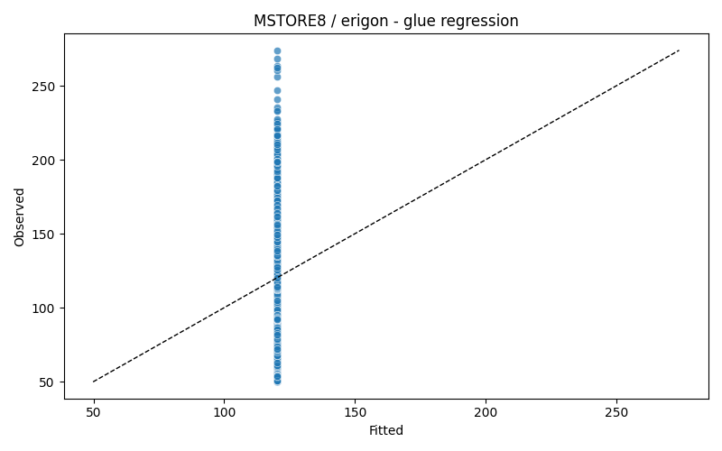


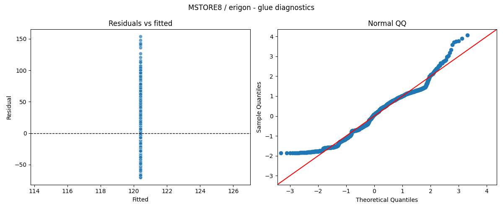

</details>

<details><summary><code>MUL</code> · nobs=490 · runtime_ms=0 · p=1.00e+00 · R²=2.22e-16</summary>

```
==============================================================================
                           NNLS Regression Results                            
==============================================================================
Dep. Variable:          test_runtime_ms              R-squared:          0.000
Model:                  NNLS                    Adj. R-squared:         -0.002
No. Observations:       490                               RMSE:          37.01
Df Residuals:           488                                MAE:          30.65
Df Model:               1      
==============================================================================
                      coef     std err     P-value      [0.025      0.975]
------------------------------------------------------------------------------
         const    119.1014      1.7038       0.001    115.5158    122.4160
           MUL      0.0000      0.0000       1.000      0.0000      0.0000
==============================================================================
Notes: Non-negative least squares with bootstrap inference (1000 iterations)
==============================================================================
```

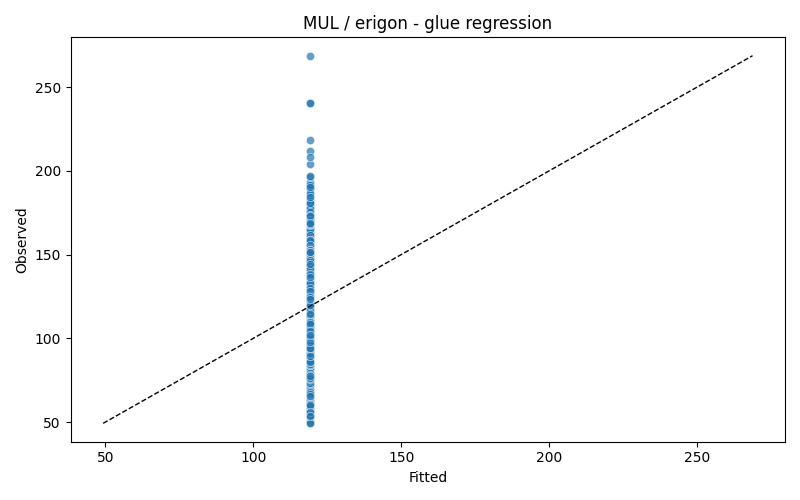


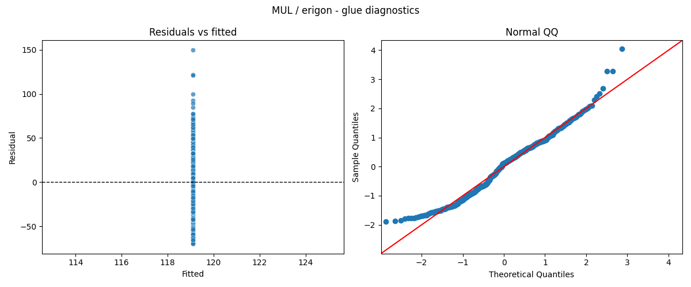

</details>

<details><summary><code>PC</code> · nobs=294 · runtime_ms=1.06e-05 · p=1.00e-03 · R²=0.613</summary>

```
==============================================================================
                           NNLS Regression Results                            
==============================================================================
Dep. Variable:          test_runtime_ms              R-squared:          0.613
Model:                  NNLS                    Adj. R-squared:          0.612
No. Observations:       294                               RMSE:          18.73
Df Residuals:           292                                MAE:          16.43
Df Model:               1      
==============================================================================
                      coef     std err     P-value      [0.025      0.975]
------------------------------------------------------------------------------
         const     79.6113      2.2777       0.001     75.0672     83.8123
            PC      0.0000      0.0000       0.001      0.0000      0.0000
==============================================================================
Notes: Non-negative least squares with bootstrap inference (1000 iterations)
==============================================================================
```

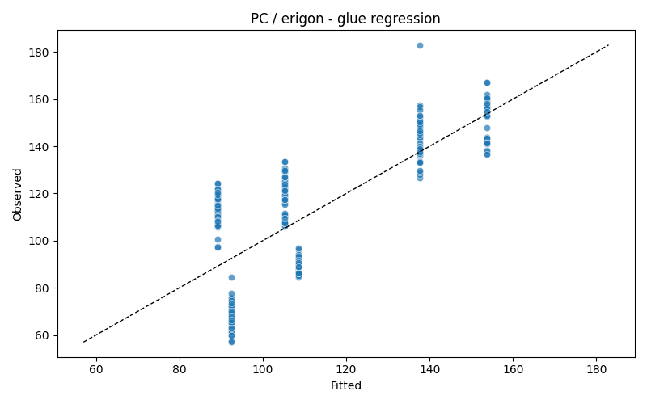

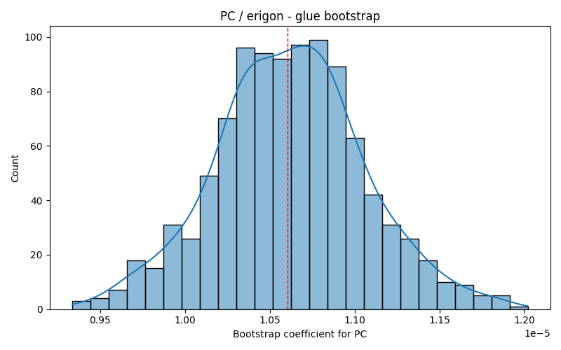

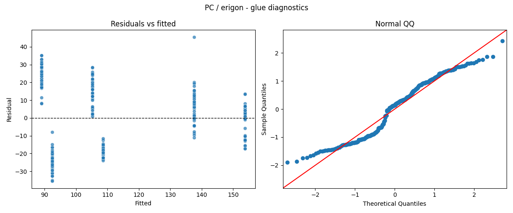

</details>

<details><summary><code>RETURNDATASIZE</code> · nobs=1176 · runtime_ms=1.726e-05 · p=1.00e-03 · R²=0.2377</summary>

```
==============================================================================
                           NNLS Regression Results                            
==============================================================================
Dep. Variable:          test_runtime_ms              R-squared:          0.238
Model:                  NNLS                    Adj. R-squared:          0.237
No. Observations:       1176                              RMSE:          36.27
Df Residuals:           1174                               MAE:          19.72
Df Model:               1      
==============================================================================
                      coef     std err     P-value      [0.025      0.975]
------------------------------------------------------------------------------
         const     78.8532      1.8846       0.001     75.1864     82.4600
RETURNDATASIZE      0.0000      0.0000       0.001      0.0000      0.0000
==============================================================================
Notes: Non-negative least squares with bootstrap inference (1000 iterations)
==============================================================================
```

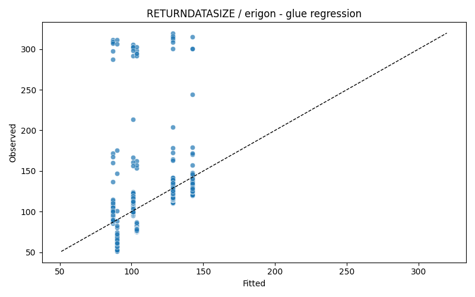

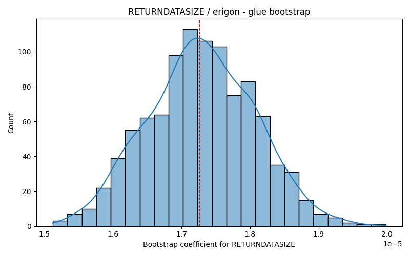

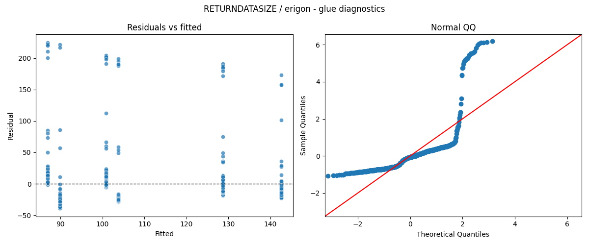

</details>

<details><summary><code>SELFBALANCE</code> · nobs=539 · runtime_ms=0 · p=1.00e+00 · R²=0</summary>

```
==============================================================================
                           NNLS Regression Results                            
==============================================================================
Dep. Variable:          test_runtime_ms              R-squared:          0.000
Model:                  NNLS                    Adj. R-squared:         -0.002
No. Observations:       539                               RMSE:          14.63
Df Residuals:           537                                MAE:          12.06
Df Model:               1      
==============================================================================
                      coef     std err     P-value      [0.025      0.975]
------------------------------------------------------------------------------
         const     50.4831      0.6303       0.001     49.2993     51.6459
   SELFBALANCE      0.0000      0.0000       1.000      0.0000      0.0000
==============================================================================
Notes: Non-negative least squares with bootstrap inference (1000 iterations)
==============================================================================
```

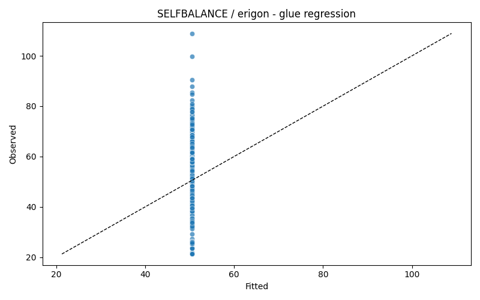

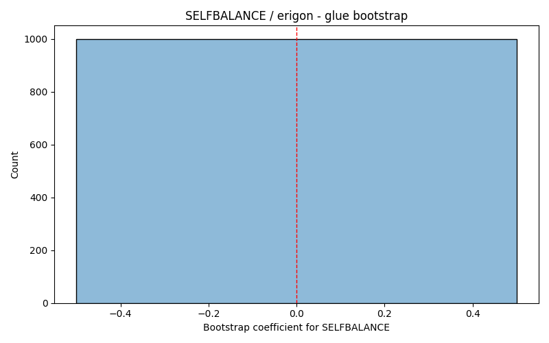

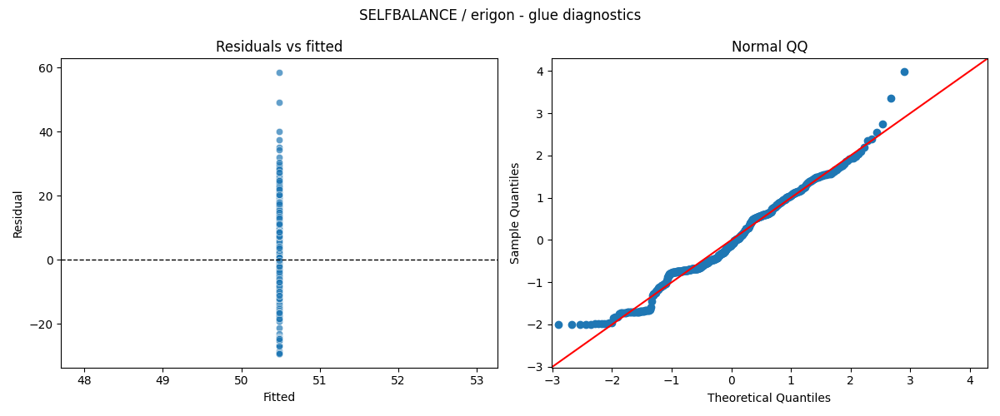

</details>

<details><summary><code>SUB</code> · nobs=392 · runtime_ms=0 · p=1.00e+00 · R²=0</summary>

```
==============================================================================
                           NNLS Regression Results                            
==============================================================================
Dep. Variable:          test_runtime_ms              R-squared:          0.000
Model:                  NNLS                    Adj. R-squared:         -0.003
No. Observations:       392                               RMSE:          33.27
Df Residuals:           390                                MAE:          26.33
Df Model:               1      
==============================================================================
                      coef     std err     P-value      [0.025      0.975]
------------------------------------------------------------------------------
         const     90.1463      1.5866       0.001     86.9552     93.2618
           SUB      0.0000      0.0000       1.000      0.0000      0.0000
==============================================================================
Notes: Non-negative least squares with bootstrap inference (1000 iterations)
==============================================================================
```

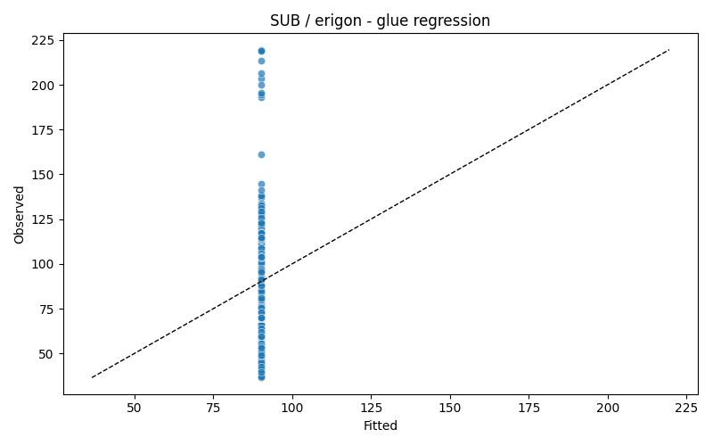


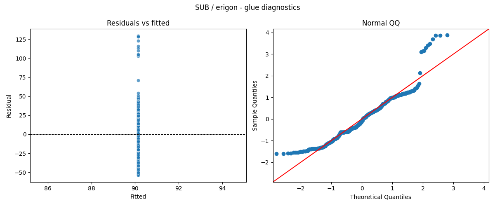

</details>

### Mixed glue (tier B) · erigon

<details><summary><code>JUMP</code> · nobs=490 · runtime_ms=0 · p=1.00e+00 · R²=0</summary>

```
==============================================================================
                           NNLS Regression Results                            
==============================================================================
Dep. Variable:          test_runtime_ms              R-squared:          0.000
Model:                  NNLS                    Adj. R-squared:         -0.002
No. Observations:       490                               RMSE:          22.60
Df Residuals:           488                                MAE:          18.42
Df Model:               1      
==============================================================================
                      coef     std err     P-value      [0.025      0.975]
------------------------------------------------------------------------------
         const     71.2117      1.0343       0.001     69.1712     73.2528
          JUMP      0.0000      0.0000       1.000      0.0000      0.0000
==============================================================================
Notes: Non-negative least squares with bootstrap inference (1000 iterations)
==============================================================================
```


</details>

<details><summary><code>KECCAK256</code> · nobs=0 · runtime_ms=n/a · p=n/a · R²=n/a</summary>

</details>

## ethrex

| glue_opcode | nobs | glue_runtime_ms | p_value | rsquared |
| --- | --- | --- | --- | --- |
| `ISZERO` | 64 | 0 | 1.00e+00 | -2.22e-16 |
| `JUMPDEST` | 16 | 0 | 1.00e+00 | 0 |
| `SWAP` | 1144 | 0 | 1.00e+00 | 0 |
| `CALLDATASIZE` | 4093 | 6.002e-06 | 1.00e-03 | 0.6693 |
| `DUP` | 4093 | 0 | 1.00e+00 | 0.6693 |
| `GAS` | 4093 | 7.635e-06 | 1.00e-03 | 0.6693 |
| `MLOAD` | 4093 | 5.575e-06 | 1.00e-03 | 0.6693 |
| `PUSH` | 4093 | 0 | 1.00e+00 | 0.6693 |
| `PUSH0` | 4093 | 2.266e-06 | 1.00e-02 | 0.6693 |
| `STATICCALL` | 4093 | 7.629e-05 | 1.00e-03 | 0.6693 |
| `ADD` | 72 | 0 | 1.00e+00 | 0 |
| `AND` | 64 | 0 | 1.00e+00 | 0 |
| `CALLDATACOPY` | 1880 | 0 | 1.00e+00 | -2.22e-16 |
| `CALLDATALOAD` | 352 | 1.473e-05 | 1.00e-03 | 0.1161 |
| `DIV` | 88 | 0 | 1.00e+00 | 0 |
| `EXP` | 88 | 0.0009122 | 1.00e-03 | 0.8327 |
| `GT` | 64 | 0 | 1.00e+00 | 0 |
| `JUMPI` | 88 | 0 | 1.00e+00 | 2.22e-16 |
| `LT` | 64 | 0 | 1.00e+00 | 0 |
| `MSTORE` | 360 | 0 | 1.00e+00 | 0 |
| `MSTORE8` | 360 | 0 | 1.00e+00 | 0 |
| `MUL` | 80 | 0 | 1.00e+00 | 2.22e-16 |
| `PC` | 48 | 4.214e-06 | 1.00e-03 | 0.3172 |
| `RETURNDATASIZE` | 192 | 8.253e-06 | 1.00e-03 | 0.3938 |
| `SELFBALANCE` | 88 | 0 | 1.00e+00 | 1.11e-16 |
| `SUB` | 64 | 0 | 1.00e+00 | 0 |
| `JUMP` | 80 | 0 | 1.00e+00 | -2.22e-16 |
| `KECCAK256` | 0 | n/a | n/a | n/a |

### Cycle glue — joint fit · ethrex

<details><summary>Joint NNLS regression summary</summary>

```
==============================================================================
                           NNLS Regression Results                            
==============================================================================
Dep. Variable:          test_runtime_ms              R-squared:          0.669
Model:                  NNLS                    Adj. R-squared:          0.669
No. Observations:       4093                              RMSE:          15.16
Df Residuals:           4085                               MAE:          13.10
Df Model:               7      
==============================================================================
                      coef     std err     P-value      [0.025      0.975]
------------------------------------------------------------------------------
         const     51.4203      0.2525       0.001     50.9505     51.9396
  CALLDATASIZE      0.0000      0.0000       0.001      0.0000      0.0000
           DUP      0.0000      0.0000       1.000      0.0000      0.0000
           GAS      0.0000      0.0000       0.001      0.0000      0.0000
         MLOAD      0.0000      0.0000       0.001      0.0000      0.0000
          PUSH      0.0000      0.0000       1.000      0.0000      0.0000
         PUSH0      0.0000      0.0000       0.010      0.0000      0.0000
    STATICCALL      0.0001      0.0000       0.001      0.0001      0.0001
==============================================================================
Notes: Non-negative least squares with bootstrap inference (1000 iterations)
==============================================================================
```

</details>

<details><summary><code>CALLDATASIZE</code> · nobs=4093 · runtime_ms=6.002e-06 · p=1.00e-03 · R²=0.6693</summary>


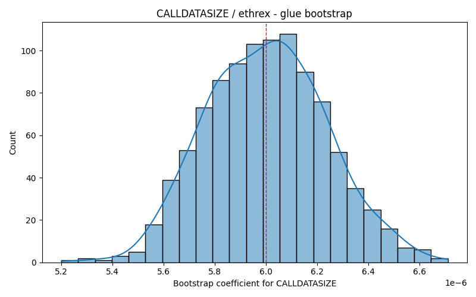

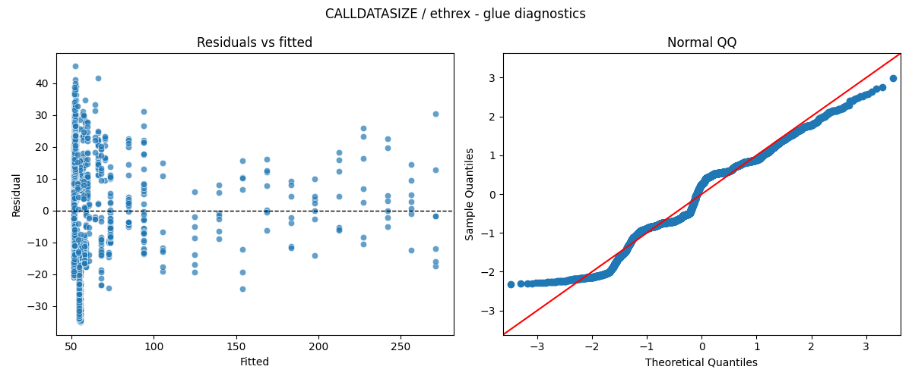

</details>

<details><summary><code>DUP</code> · nobs=4093 · runtime_ms=0 · p=1.00e+00 · R²=0.6693</summary>

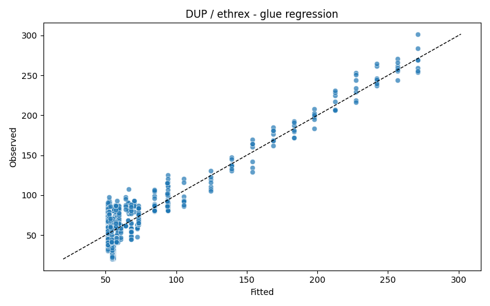


</details>

<details><summary><code>GAS</code> · nobs=4093 · runtime_ms=7.635e-06 · p=1.00e-03 · R²=0.6693</summary>


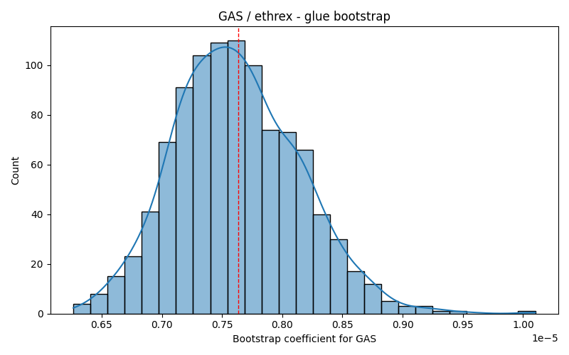


</details>

<details><summary><code>MLOAD</code> · nobs=4093 · runtime_ms=5.575e-06 · p=1.00e-03 · R²=0.6693</summary>

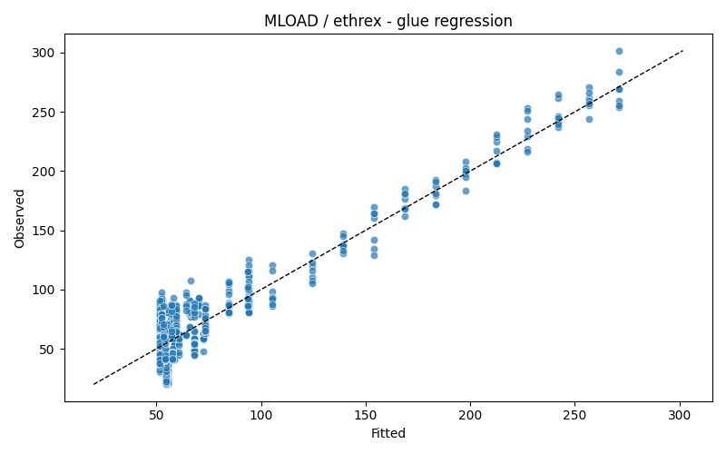

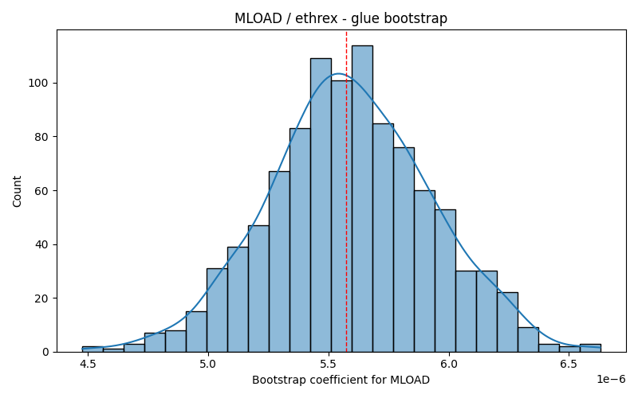

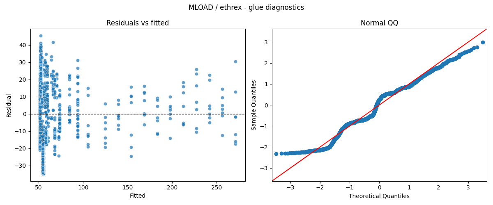

</details>

<details><summary><code>PUSH</code> · nobs=4093 · runtime_ms=0 · p=1.00e+00 · R²=0.6693</summary>


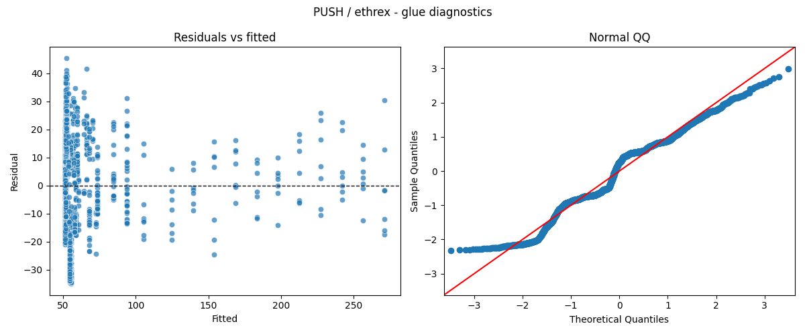

</details>

<details><summary><code>PUSH0</code> · nobs=4093 · runtime_ms=2.266e-06 · p=1.00e-02 · R²=0.6693</summary>


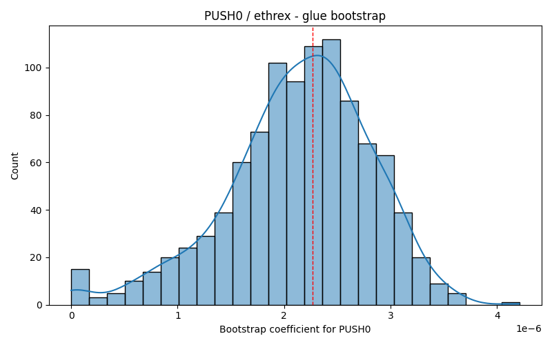


</details>

<details><summary><code>STATICCALL</code> · nobs=4093 · runtime_ms=7.629e-05 · p=1.00e-03 · R²=0.6693</summary>


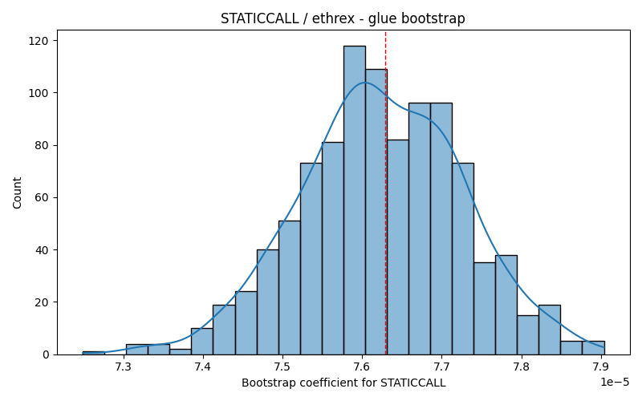

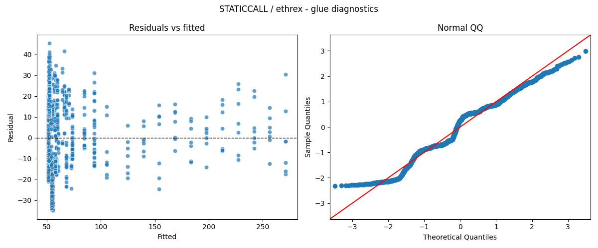

</details>

### Pure glue · ethrex

<details><summary><code>ISZERO</code> · nobs=64 · runtime_ms=0 · p=1.00e+00 · R²=-2.22e-16</summary>

```
==============================================================================
                           NNLS Regression Results                            
==============================================================================
Dep. Variable:          test_runtime_ms              R-squared:         -0.000
Model:                  NNLS                    Adj. R-squared:         -0.016
No. Observations:       64                                RMSE:          13.15
Df Residuals:           62                                 MAE:          11.61
Df Model:               1      
==============================================================================
                      coef     std err     P-value      [0.025      0.975]
------------------------------------------------------------------------------
         const     43.1345      1.6879       0.001     39.9620     46.4969
        ISZERO      0.0000      0.0000       1.000      0.0000      0.0000
==============================================================================
Notes: Non-negative least squares with bootstrap inference (1000 iterations)
==============================================================================
```

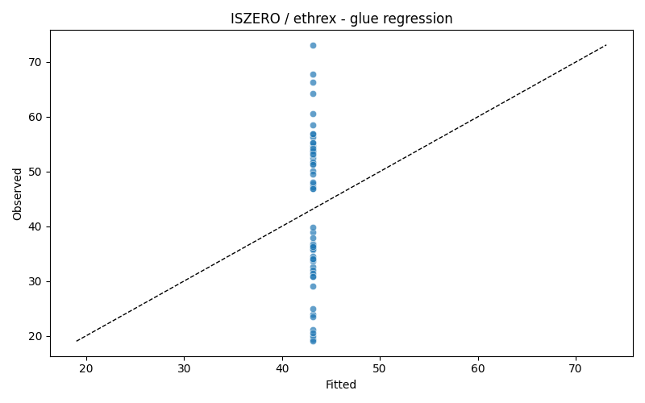

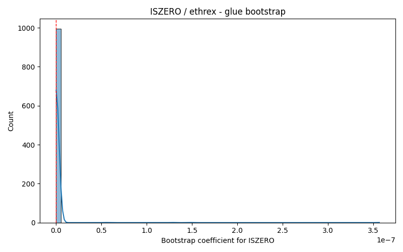

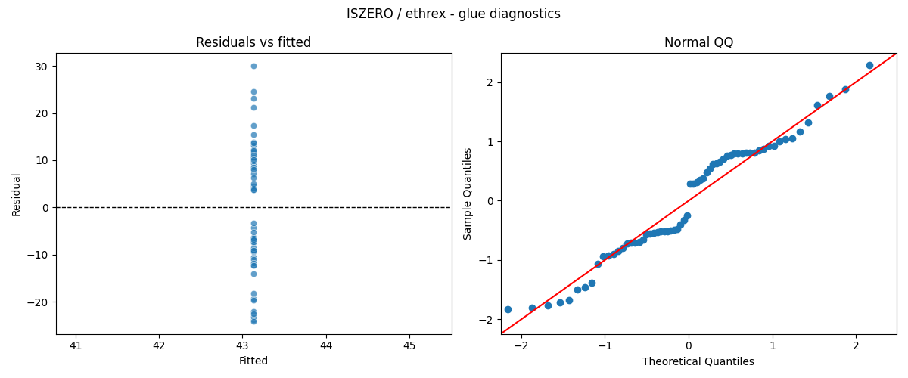

</details>

<details><summary><code>JUMPDEST</code> · nobs=16 · runtime_ms=0 · p=1.00e+00 · R²=0</summary>

```
==============================================================================
                           NNLS Regression Results                            
==============================================================================
Dep. Variable:          test_runtime_ms              R-squared:          0.000
Model:                  NNLS                    Adj. R-squared:         -0.071
No. Observations:       16                                RMSE:          19.27
Df Residuals:           14                                 MAE:          18.56
Df Model:               1      
==============================================================================
                      coef     std err     P-value      [0.025      0.975]
------------------------------------------------------------------------------
         const     82.6774      4.8860       0.001     73.4991     92.5297
      JUMPDEST      0.0000      0.0000       1.000      0.0000      0.0000
==============================================================================
Notes: Non-negative least squares with bootstrap inference (1000 iterations)
==============================================================================
```

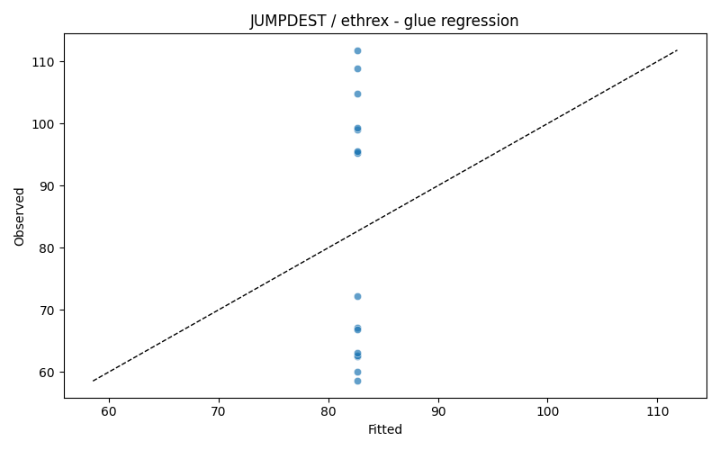


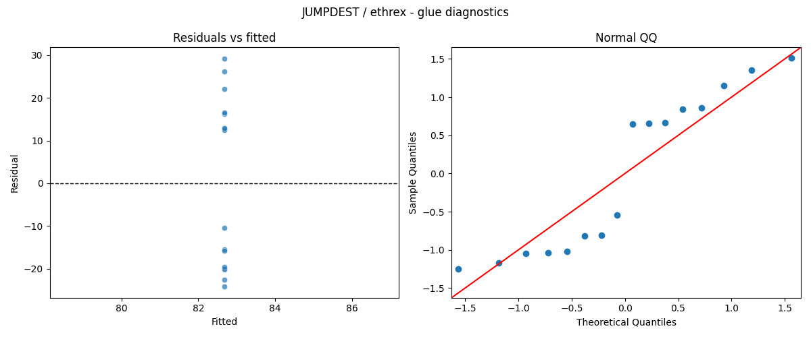

</details>

<details><summary><code>SWAP</code> · nobs=1144 · runtime_ms=0 · p=1.00e+00 · R²=0</summary>

```
==============================================================================
                           NNLS Regression Results                            
==============================================================================
Dep. Variable:          test_runtime_ms              R-squared:          0.000
Model:                  NNLS                    Adj. R-squared:         -0.001
No. Observations:       1144                              RMSE:          17.58
Df Residuals:           1142                               MAE:          15.68
Df Model:               1      
==============================================================================
                      coef     std err     P-value      [0.025      0.975]
------------------------------------------------------------------------------
         const     62.7385      0.5275       0.001     61.6895     63.7950
          SWAP      0.0000      0.0000       1.000      0.0000      0.0000
==============================================================================
Notes: Non-negative least squares with bootstrap inference (1000 iterations)
==============================================================================
```

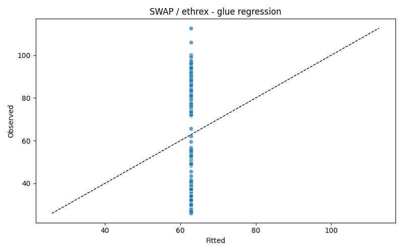


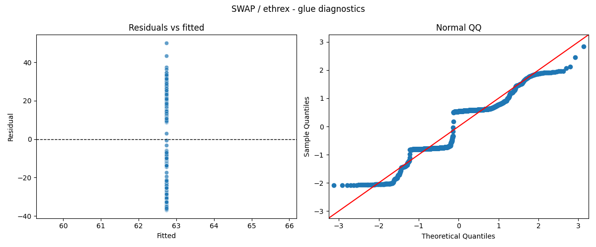

</details>

### Mixed glue (tier A) · ethrex

<details><summary><code>ADD</code> · nobs=72 · runtime_ms=0 · p=1.00e+00 · R²=0</summary>

```
==============================================================================
                           NNLS Regression Results                            
==============================================================================
Dep. Variable:          test_runtime_ms              R-squared:          0.000
Model:                  NNLS                    Adj. R-squared:         -0.014
No. Observations:       72                                RMSE:          14.56
Df Residuals:           70                                 MAE:          12.38
Df Model:               1      
==============================================================================
                      coef     std err     P-value      [0.025      0.975]
------------------------------------------------------------------------------
         const     48.3037      1.7294       0.001     44.9784     51.5828
           ADD      0.0000      0.0000       1.000      0.0000      0.0000
==============================================================================
Notes: Non-negative least squares with bootstrap inference (1000 iterations)
==============================================================================
```

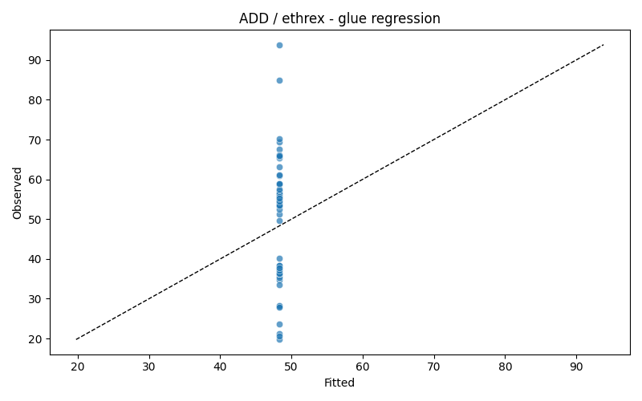

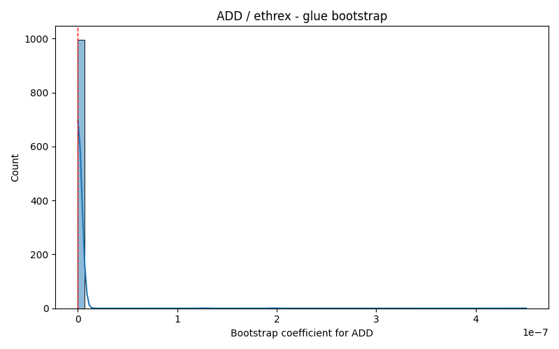

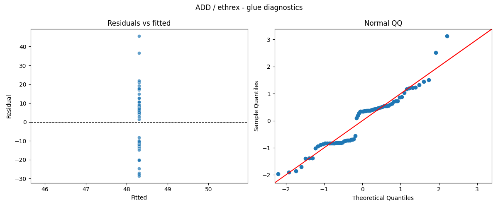

</details>

<details><summary><code>AND</code> · nobs=64 · runtime_ms=0 · p=1.00e+00 · R²=0</summary>

```
==============================================================================
                           NNLS Regression Results                            
==============================================================================
Dep. Variable:          test_runtime_ms              R-squared:          0.000
Model:                  NNLS                    Adj. R-squared:         -0.016
No. Observations:       64                                RMSE:          12.75
Df Residuals:           62                                 MAE:          11.35
Df Model:               1      
==============================================================================
                      coef     std err     P-value      [0.025      0.975]
------------------------------------------------------------------------------
         const     42.7164      1.5412       0.001     39.7202     45.7266
           AND      0.0000      0.0000       1.000      0.0000      0.0000
==============================================================================
Notes: Non-negative least squares with bootstrap inference (1000 iterations)
==============================================================================
```

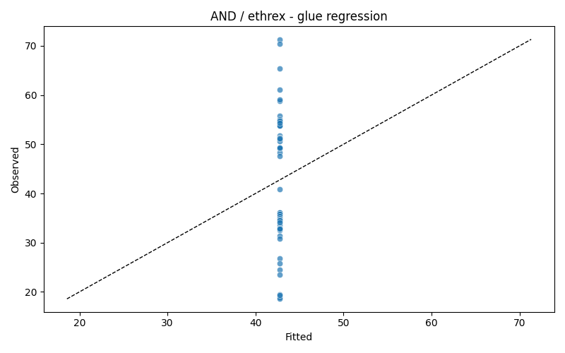

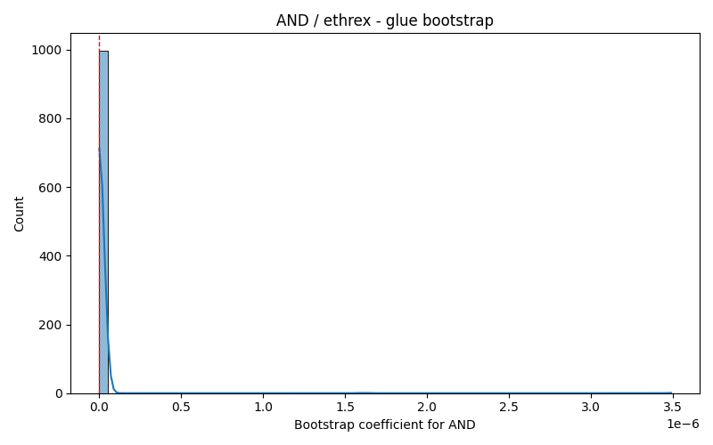

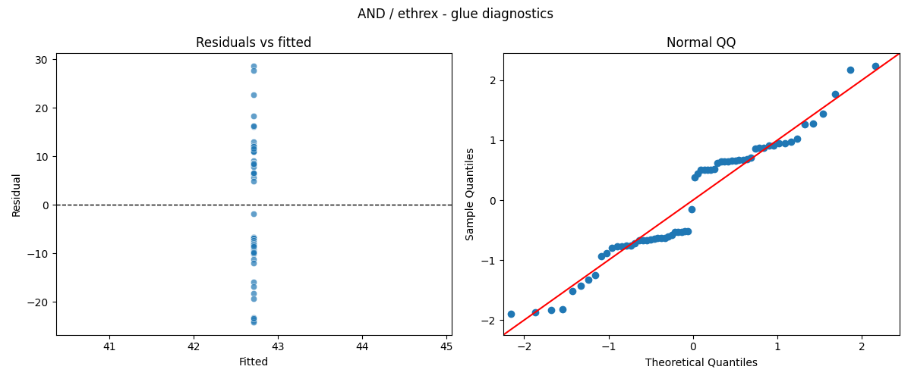

</details>

<details><summary><code>CALLDATACOPY</code> · nobs=1880 · runtime_ms=0 · p=1.00e+00 · R²=-2.22e-16</summary>

```
==============================================================================
                           NNLS Regression Results                            
==============================================================================
Dep. Variable:          test_runtime_ms              R-squared:         -0.000
Model:                  NNLS                    Adj. R-squared:         -0.001
No. Observations:       1880                              RMSE:          21.19
Df Residuals:           1878                               MAE:          18.09
Df Model:               1      
==============================================================================
                      coef     std err     P-value      [0.025      0.975]
------------------------------------------------------------------------------
         const     35.9939      0.4792       0.001     35.0891     36.8639
  CALLDATACOPY      0.0000      0.0000       1.000      0.0000      0.0000
==============================================================================
Notes: Non-negative least squares with bootstrap inference (1000 iterations)
==============================================================================
```

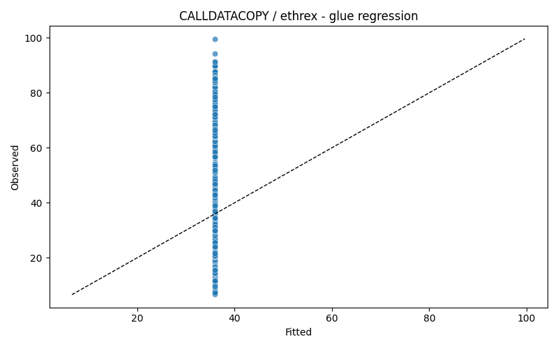


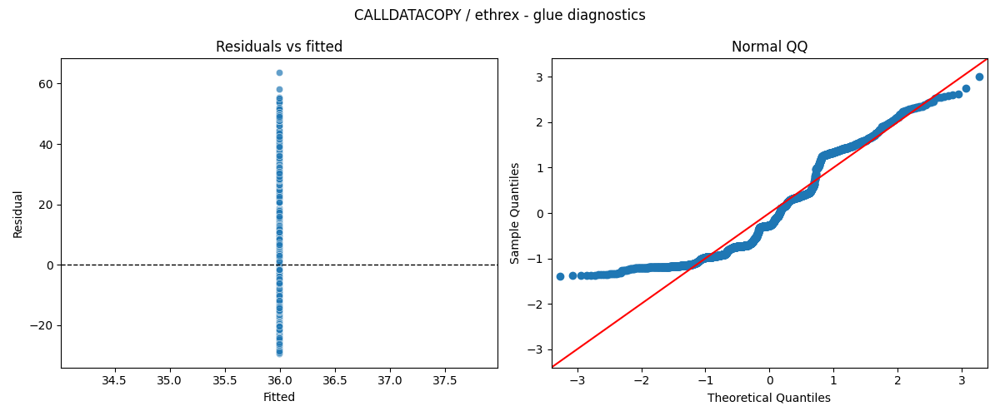

</details>

<details><summary><code>CALLDATALOAD</code> · nobs=352 · runtime_ms=1.473e-05 · p=1.00e-03 · R²=0.1161</summary>

```
==============================================================================
                           NNLS Regression Results                            
==============================================================================
Dep. Variable:          test_runtime_ms              R-squared:          0.116
Model:                  NNLS                    Adj. R-squared:          0.114
No. Observations:       352                               RMSE:           0.16
Df Residuals:           350                                MAE:           0.10
Df Model:               1      
==============================================================================
                      coef     std err     P-value      [0.025      0.975]
------------------------------------------------------------------------------
         const      2.1879      0.0320       0.001      2.1296      2.2551
  CALLDATALOAD      0.0000      0.0000       0.001      0.0000      0.0000
==============================================================================
Notes: Non-negative least squares with bootstrap inference (1000 iterations)
==============================================================================
```

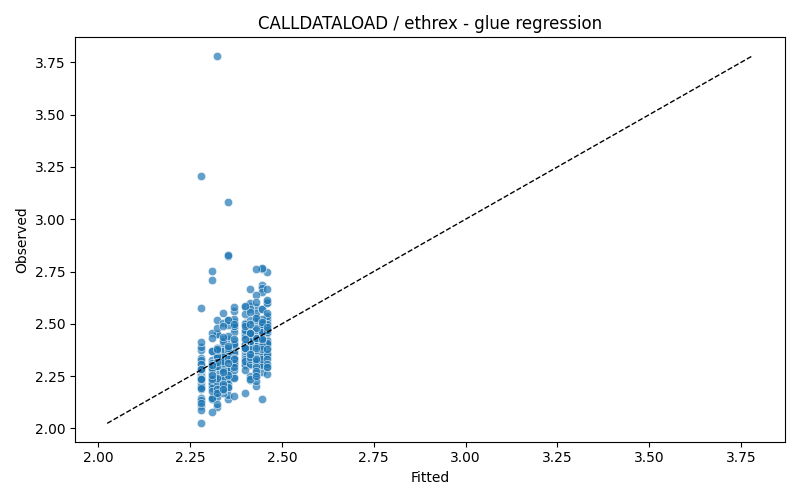

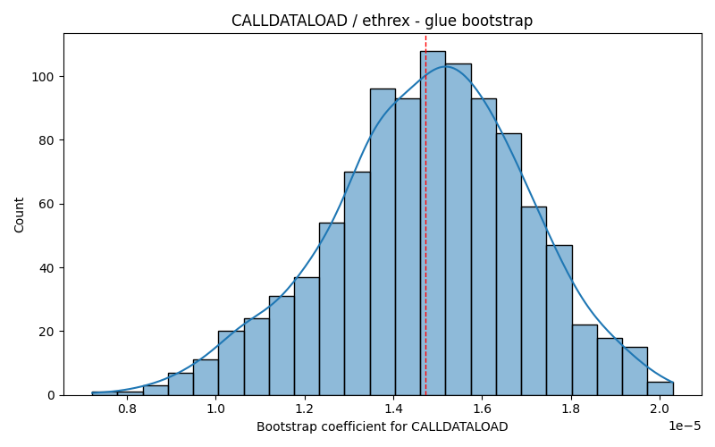

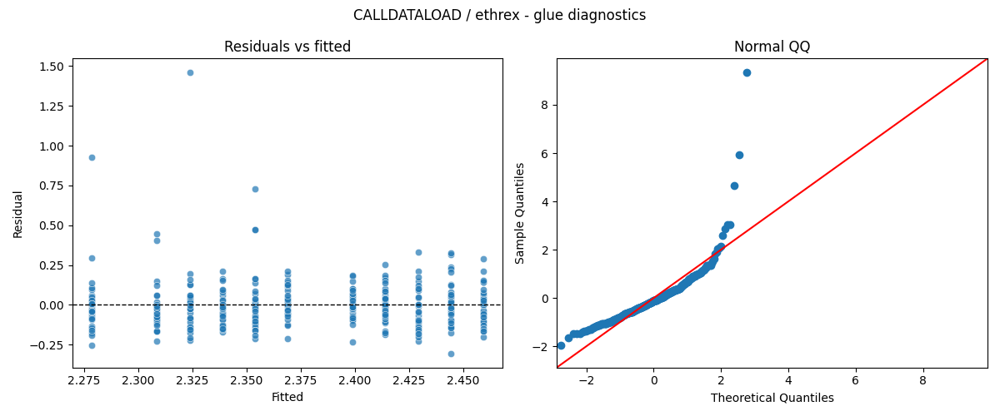

</details>

<details><summary><code>DIV</code> · nobs=88 · runtime_ms=0 · p=1.00e+00 · R²=0</summary>

```
==============================================================================
                           NNLS Regression Results                            
==============================================================================
Dep. Variable:          test_runtime_ms              R-squared:          0.000
Model:                  NNLS                    Adj. R-squared:         -0.012
No. Observations:       88                                RMSE:          80.30
Df Residuals:           86                                 MAE:          71.66
Df Model:               1      
==============================================================================
                      coef     std err     P-value      [0.025      0.975]
------------------------------------------------------------------------------
         const    308.1689      8.6448       0.001    291.0128    324.2149
           DIV      0.0000      0.0000       1.000      0.0000      0.0000
==============================================================================
Notes: Non-negative least squares with bootstrap inference (1000 iterations)
==============================================================================
```

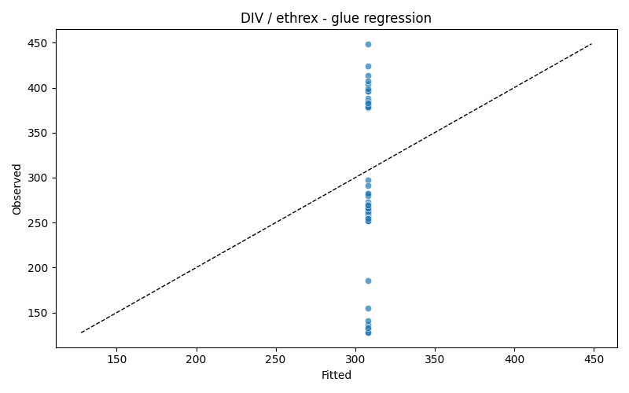


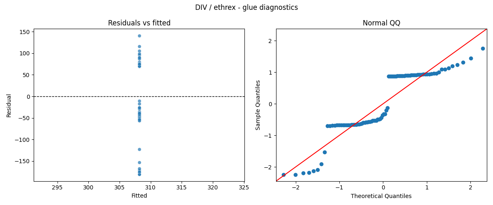

</details>

<details><summary><code>EXP</code> · nobs=88 · runtime_ms=0.0009122 · p=1.00e-03 · R²=0.8327</summary>

```
==============================================================================
                           NNLS Regression Results                            
==============================================================================
Dep. Variable:          test_runtime_ms              R-squared:          0.833
Model:                  NNLS                    Adj. R-squared:          0.831
No. Observations:       88                                RMSE:          16.01
Df Residuals:           86                                 MAE:          13.75
Df Model:               1      
==============================================================================
                      coef     std err     P-value      [0.025      0.975]
------------------------------------------------------------------------------
         const     35.0074      6.7039       0.001     22.2535     48.3030
           EXP      0.0009      0.0001       0.001      0.0008      0.0010
==============================================================================
Notes: Non-negative least squares with bootstrap inference (1000 iterations)
==============================================================================
```

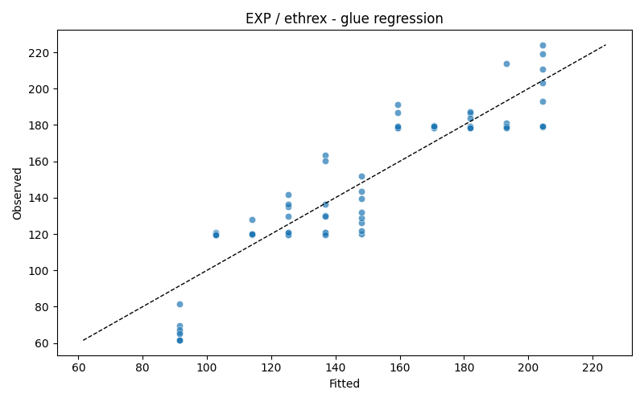

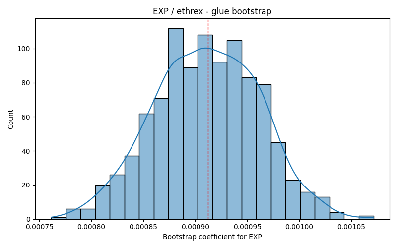

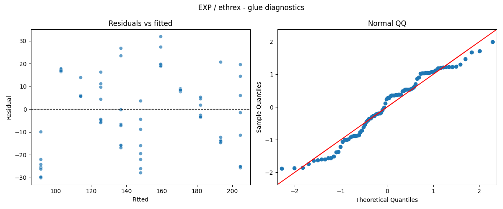

</details>

<details><summary><code>GT</code> · nobs=64 · runtime_ms=0 · p=1.00e+00 · R²=0</summary>

```
==============================================================================
                           NNLS Regression Results                            
==============================================================================
Dep. Variable:          test_runtime_ms              R-squared:          0.000
Model:                  NNLS                    Adj. R-squared:         -0.016
No. Observations:       64                                RMSE:          14.88
Df Residuals:           62                                 MAE:          13.13
Df Model:               1      
==============================================================================
                      coef     std err     P-value      [0.025      0.975]
------------------------------------------------------------------------------
         const     45.8897      1.8252       0.001     42.3135     49.3315
            GT      0.0000      0.0000       1.000      0.0000      0.0000
==============================================================================
Notes: Non-negative least squares with bootstrap inference (1000 iterations)
==============================================================================
```

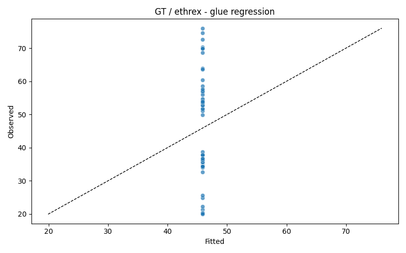

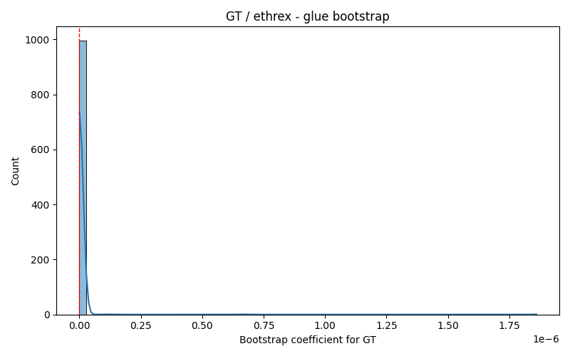

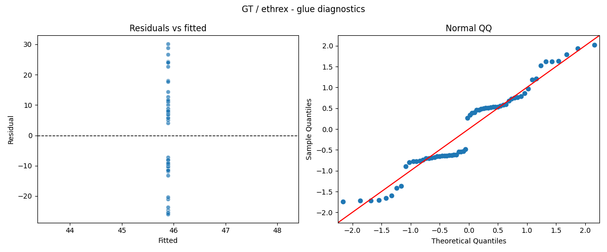

</details>

<details><summary><code>JUMPI</code> · nobs=88 · runtime_ms=0 · p=1.00e+00 · R²=2.22e-16</summary>

```
==============================================================================
                           NNLS Regression Results                            
==============================================================================
Dep. Variable:          test_runtime_ms              R-squared:          0.000
Model:                  NNLS                    Adj. R-squared:         -0.012
No. Observations:       88                                RMSE:           7.32
Df Residuals:           86                                 MAE:           6.24
Df Model:               1      
==============================================================================
                      coef     std err     P-value      [0.025      0.975]
------------------------------------------------------------------------------
         const     28.9256      0.8144       0.001     27.3964     30.4626
         JUMPI      0.0000      0.0000       1.000      0.0000      0.0000
==============================================================================
Notes: Non-negative least squares with bootstrap inference (1000 iterations)
==============================================================================
```

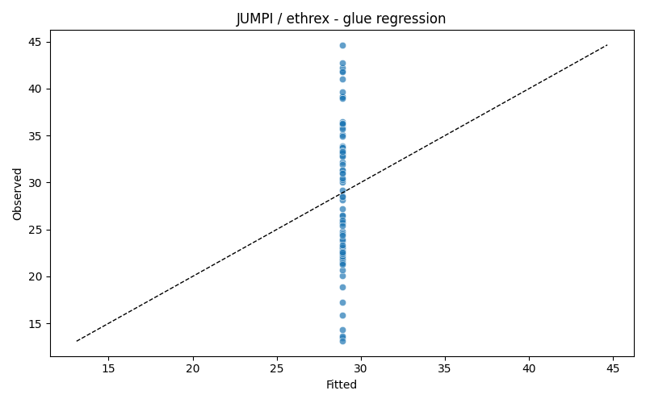


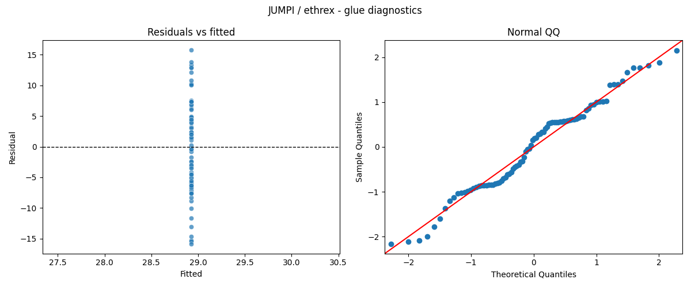

</details>

<details><summary><code>LT</code> · nobs=64 · runtime_ms=0 · p=1.00e+00 · R²=0</summary>

```
==============================================================================
                           NNLS Regression Results                            
==============================================================================
Dep. Variable:          test_runtime_ms              R-squared:          0.000
Model:                  NNLS                    Adj. R-squared:         -0.016
No. Observations:       64                                RMSE:          12.59
Df Residuals:           62                                 MAE:          11.29
Df Model:               1      
==============================================================================
                      coef     std err     P-value      [0.025      0.975]
------------------------------------------------------------------------------
         const     43.5762      1.5423       0.001     40.6151     46.5026
            LT      0.0000      0.0000       1.000      0.0000      0.0000
==============================================================================
Notes: Non-negative least squares with bootstrap inference (1000 iterations)
==============================================================================
```

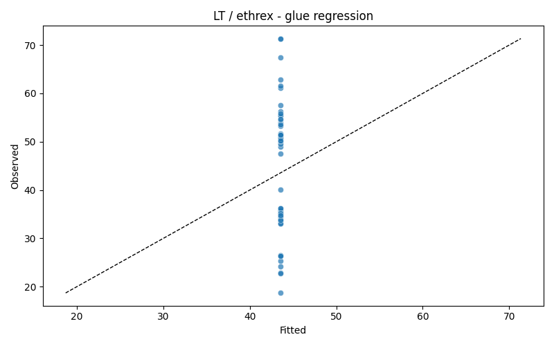

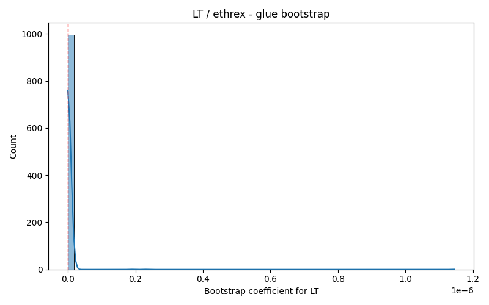

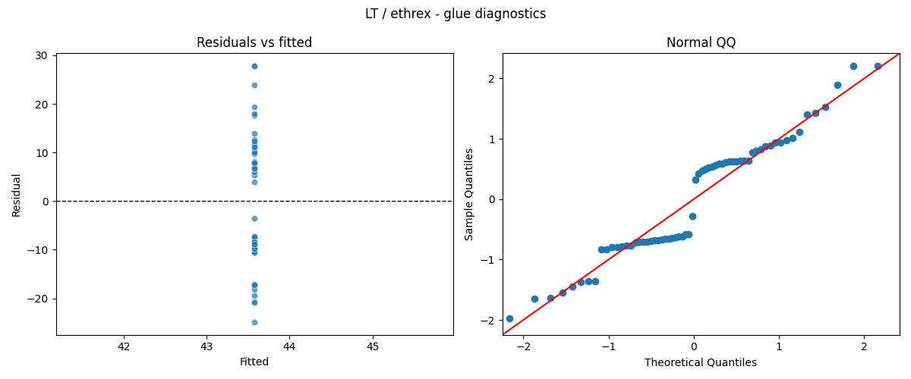

</details>

<details><summary><code>MSTORE</code> · nobs=360 · runtime_ms=0 · p=1.00e+00 · R²=0</summary>

```
==============================================================================
                           NNLS Regression Results                            
==============================================================================
Dep. Variable:          test_runtime_ms              R-squared:          0.000
Model:                  NNLS                    Adj. R-squared:         -0.003
No. Observations:       360                               RMSE:          14.51
Df Residuals:           358                                MAE:          12.74
Df Model:               1      
==============================================================================
                      coef     std err     P-value      [0.025      0.975]
------------------------------------------------------------------------------
         const     50.9127      0.7718       0.001     49.4570     52.4414
        MSTORE      0.0000      0.0000       1.000      0.0000      0.0000
==============================================================================
Notes: Non-negative least squares with bootstrap inference (1000 iterations)
==============================================================================
```

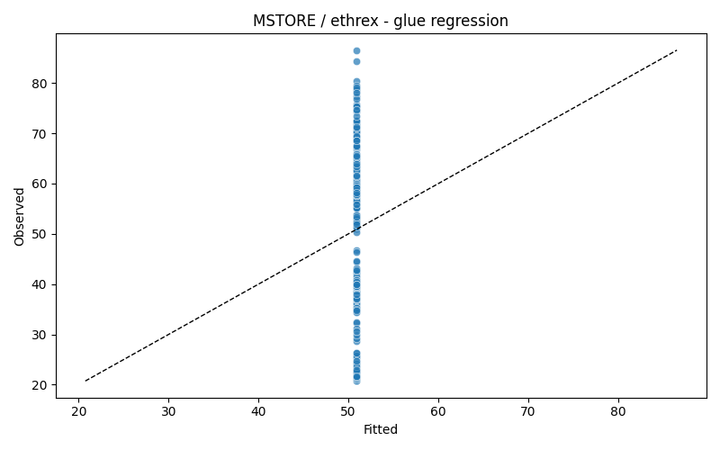


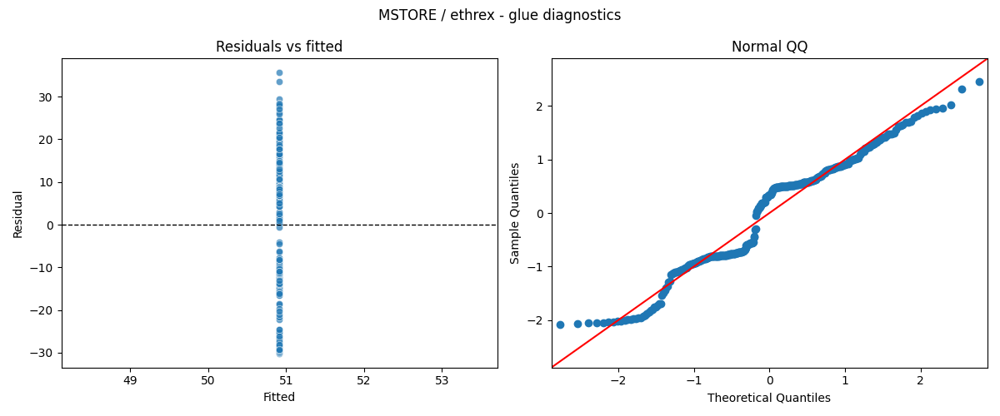

</details>

<details><summary><code>MSTORE8</code> · nobs=360 · runtime_ms=0 · p=1.00e+00 · R²=0</summary>

```
==============================================================================
                           NNLS Regression Results                            
==============================================================================
Dep. Variable:          test_runtime_ms              R-squared:          0.000
Model:                  NNLS                    Adj. R-squared:         -0.003
No. Observations:       360                               RMSE:          13.40
Df Residuals:           358                                MAE:          11.74
Df Model:               1      
==============================================================================
                      coef     std err     P-value      [0.025      0.975]
------------------------------------------------------------------------------
         const     46.5898      0.6891       0.001     45.2611     47.9263
       MSTORE8      0.0000      0.0000       1.000      0.0000      0.0000
==============================================================================
Notes: Non-negative least squares with bootstrap inference (1000 iterations)
==============================================================================
```

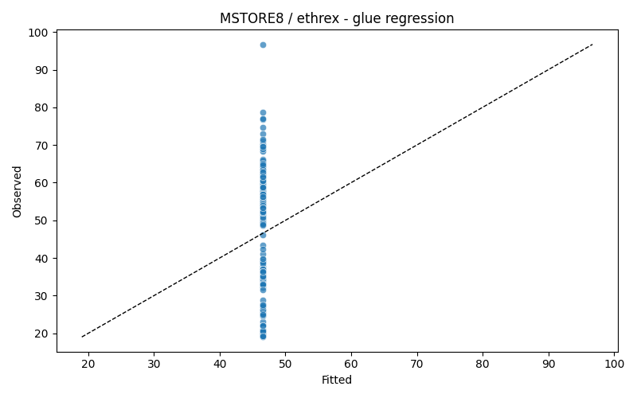


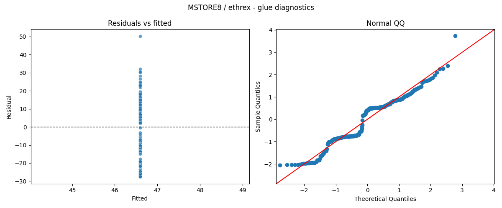

</details>

<details><summary><code>MUL</code> · nobs=80 · runtime_ms=0 · p=1.00e+00 · R²=2.22e-16</summary>

```
==============================================================================
                           NNLS Regression Results                            
==============================================================================
Dep. Variable:          test_runtime_ms              R-squared:          0.000
Model:                  NNLS                    Adj. R-squared:         -0.013
No. Observations:       80                                RMSE:          21.44
Df Residuals:           78                                 MAE:          18.20
Df Model:               1      
==============================================================================
                      coef     std err     P-value      [0.025      0.975]
------------------------------------------------------------------------------
         const     85.8470      2.3708       0.001     81.4663     90.4745
           MUL      0.0000      0.0000       1.000      0.0000      0.0000
==============================================================================
Notes: Non-negative least squares with bootstrap inference (1000 iterations)
==============================================================================
```

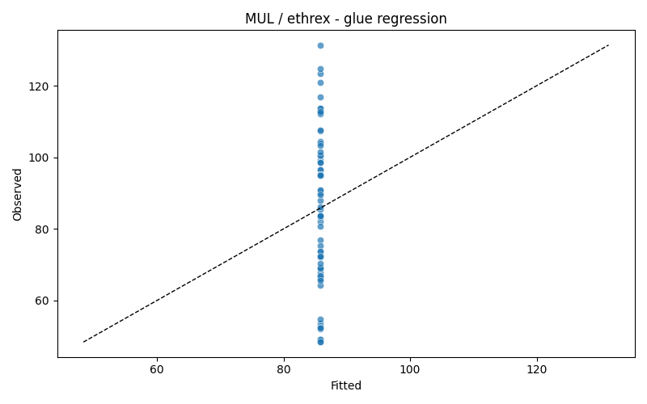


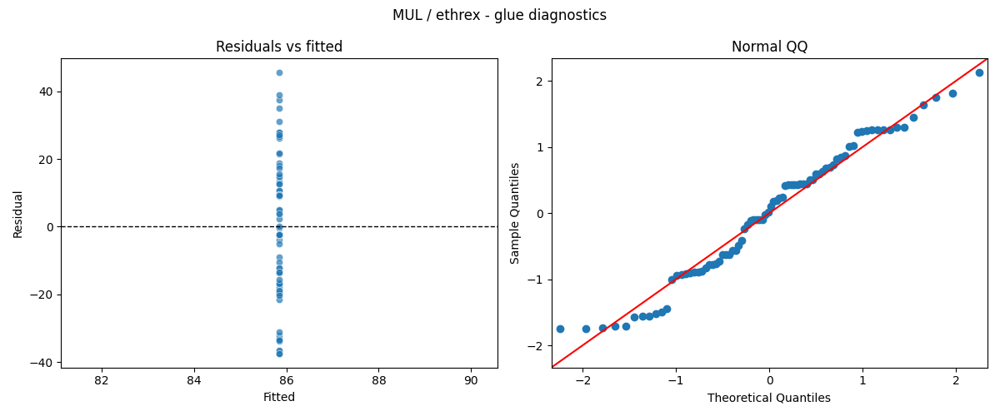

</details>

<details><summary><code>PC</code> · nobs=48 · runtime_ms=4.214e-06 · p=1.00e-03 · R²=0.3172</summary>

```
==============================================================================
                           NNLS Regression Results                            
==============================================================================
Dep. Variable:          test_runtime_ms              R-squared:          0.317
Model:                  NNLS                    Adj. R-squared:          0.302
No. Observations:       48                                RMSE:          13.74
Df Residuals:           46                                 MAE:          11.94
Df Model:               1      
==============================================================================
                      coef     std err     P-value      [0.025      0.975]
------------------------------------------------------------------------------
         const     59.7942      3.8521       0.001     51.6936     66.8994
            PC      0.0000      0.0000       0.001      0.0000      0.0000
==============================================================================
Notes: Non-negative least squares with bootstrap inference (1000 iterations)
==============================================================================
```

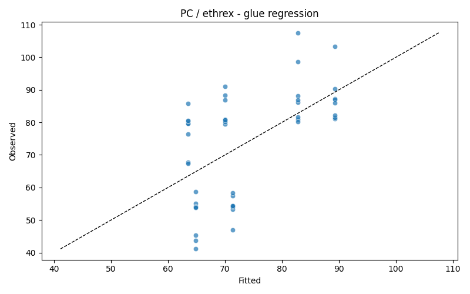

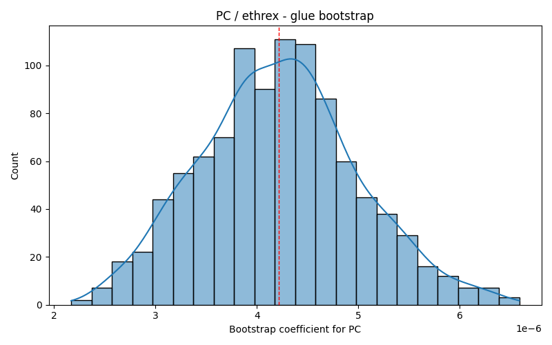

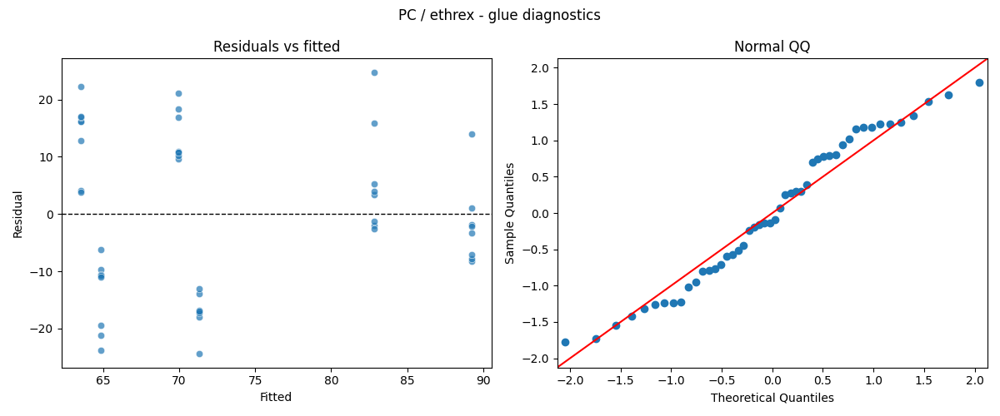

</details>

<details><summary><code>RETURNDATASIZE</code> · nobs=192 · runtime_ms=8.253e-06 · p=1.00e-03 · R²=0.3938</summary>

```
==============================================================================
                           NNLS Regression Results                            
==============================================================================
Dep. Variable:          test_runtime_ms              R-squared:          0.394
Model:                  NNLS                    Adj. R-squared:          0.391
No. Observations:       192                               RMSE:          12.02
Df Residuals:           190                                MAE:          10.82
Df Model:               1      
==============================================================================
                      coef     std err     P-value      [0.025      0.975]
------------------------------------------------------------------------------
         const     50.7252      1.6114       0.001     47.6955     53.7976
RETURNDATASIZE      0.0000      0.0000       0.001      0.0000      0.0000
==============================================================================
Notes: Non-negative least squares with bootstrap inference (1000 iterations)
==============================================================================
```

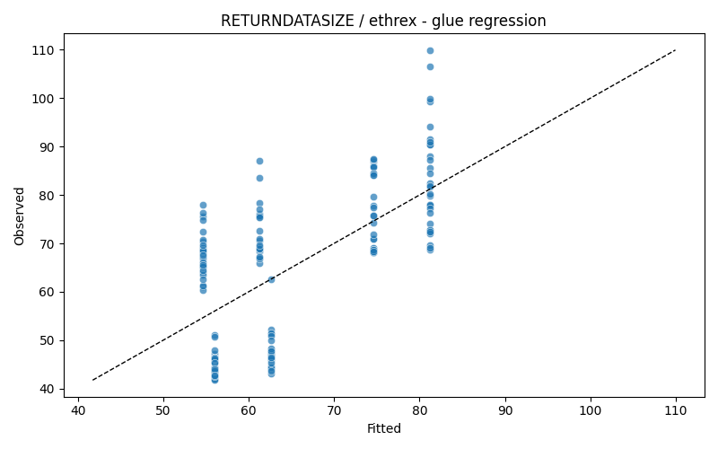

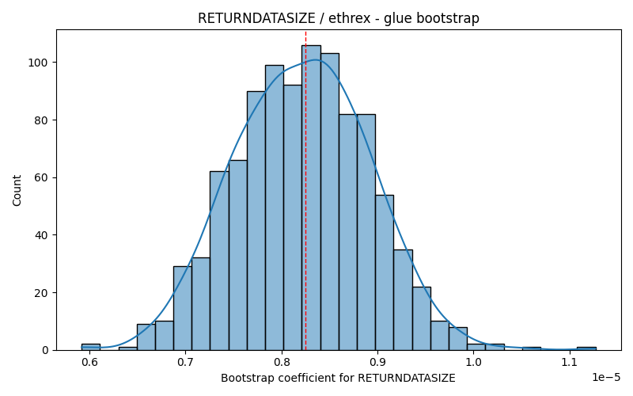

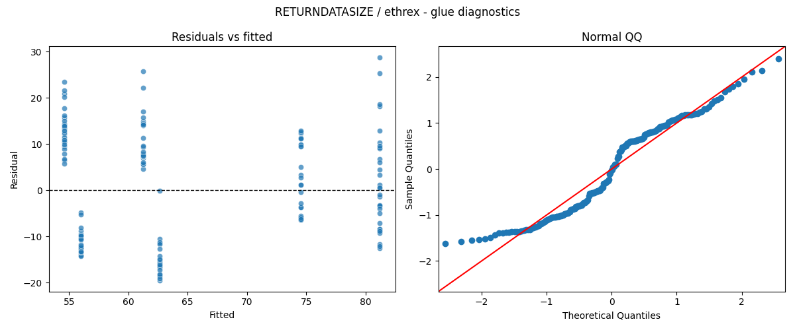

</details>

<details><summary><code>SELFBALANCE</code> · nobs=88 · runtime_ms=0 · p=1.00e+00 · R²=1.11e-16</summary>

```
==============================================================================
                           NNLS Regression Results                            
==============================================================================
Dep. Variable:          test_runtime_ms              R-squared:          0.000
Model:                  NNLS                    Adj. R-squared:         -0.012
No. Observations:       88                                RMSE:          68.40
Df Residuals:           86                                 MAE:          60.41
Df Model:               1      
==============================================================================
                      coef     std err     P-value      [0.025      0.975]
------------------------------------------------------------------------------
         const    252.1864      8.3484       0.001    235.5005    265.8396
   SELFBALANCE      0.0000      0.0000       1.000      0.0000      0.0000
==============================================================================
Notes: Non-negative least squares with bootstrap inference (1000 iterations)
==============================================================================
```

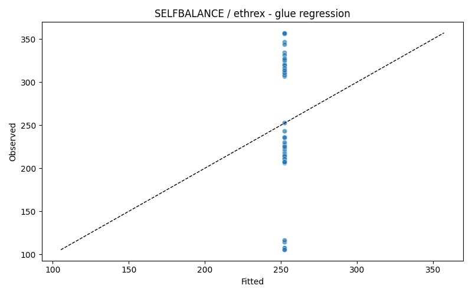

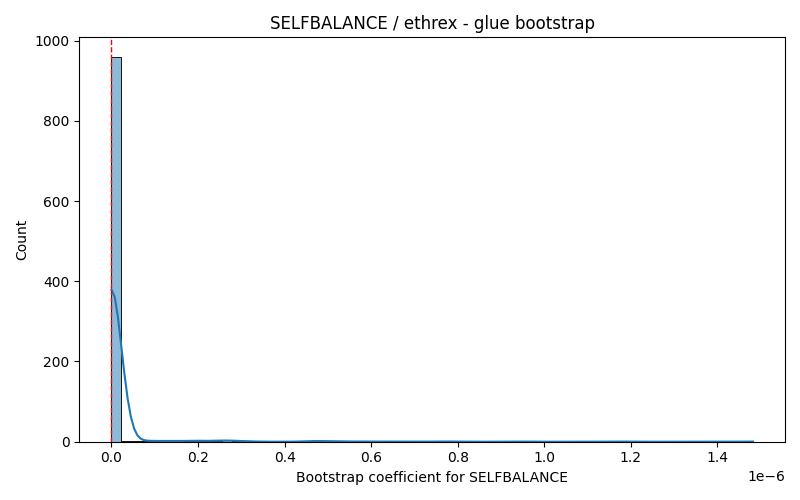

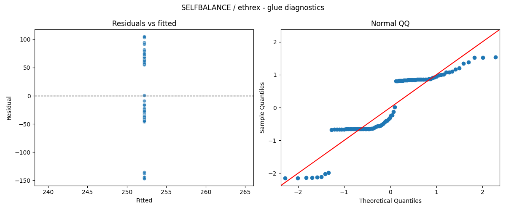

</details>

<details><summary><code>SUB</code> · nobs=64 · runtime_ms=0 · p=1.00e+00 · R²=0</summary>

```
==============================================================================
                           NNLS Regression Results                            
==============================================================================
Dep. Variable:          test_runtime_ms              R-squared:          0.000
Model:                  NNLS                    Adj. R-squared:         -0.016
No. Observations:       64                                RMSE:          12.82
Df Residuals:           62                                 MAE:          11.62
Df Model:               1      
==============================================================================
                      coef     std err     P-value      [0.025      0.975]
------------------------------------------------------------------------------
         const     45.0757      1.6454       0.001     41.9545     48.5674
           SUB      0.0000      0.0000       1.000      0.0000      0.0000
==============================================================================
Notes: Non-negative least squares with bootstrap inference (1000 iterations)
==============================================================================
```

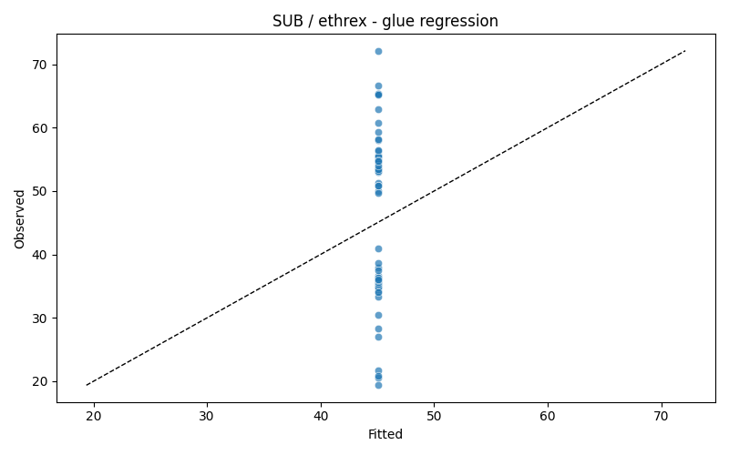

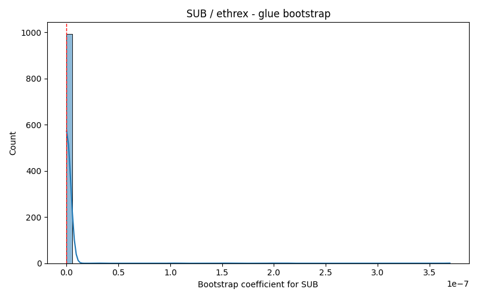

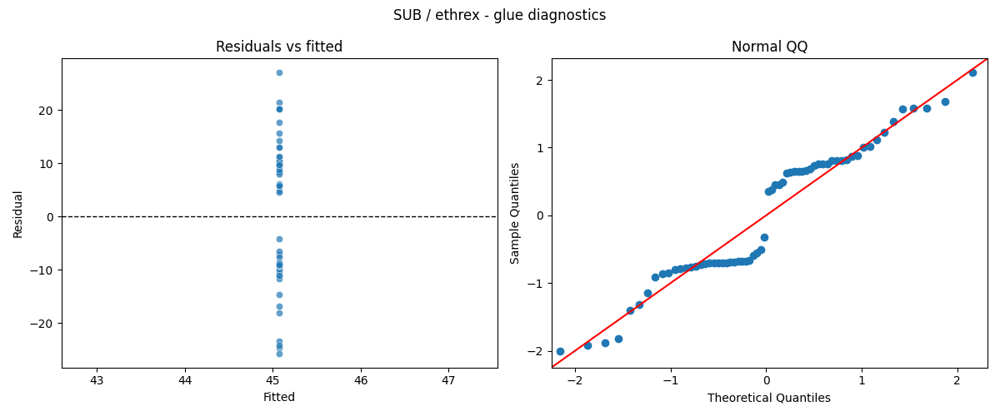

</details>

### Mixed glue (tier B) · ethrex

<details><summary><code>JUMP</code> · nobs=80 · runtime_ms=0 · p=1.00e+00 · R²=-2.22e-16</summary>

```
==============================================================================
                           NNLS Regression Results                            
==============================================================================
Dep. Variable:          test_runtime_ms              R-squared:         -0.000
Model:                  NNLS                    Adj. R-squared:         -0.013
No. Observations:       80                                RMSE:          19.94
Df Residuals:           78                                 MAE:          17.55
Df Model:               1      
==============================================================================
                      coef     std err     P-value      [0.025      0.975]
------------------------------------------------------------------------------
         const     69.4433      2.3007       0.001     64.7396     73.8783
          JUMP      0.0000      0.0000       1.000      0.0000      0.0000
==============================================================================
Notes: Non-negative least squares with bootstrap inference (1000 iterations)
==============================================================================
```

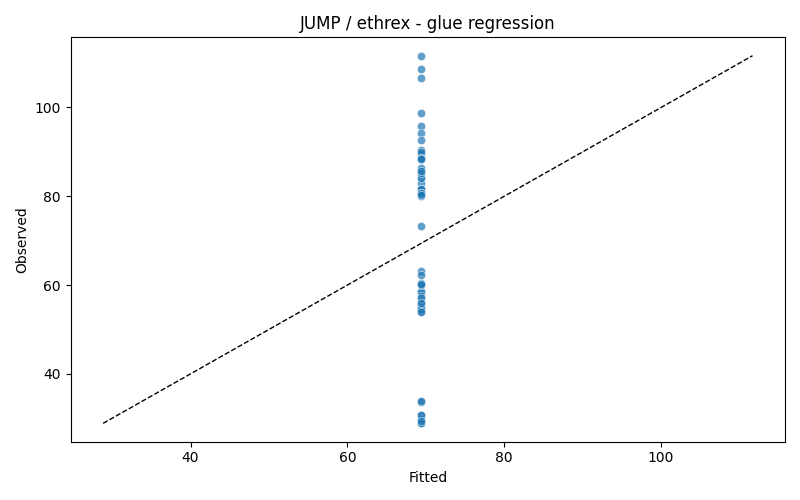


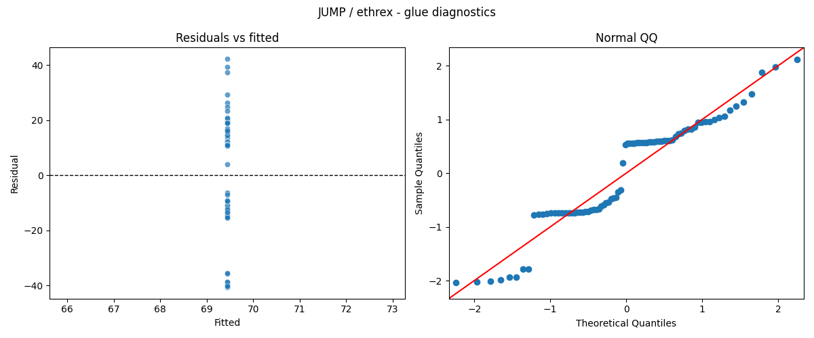

</details>

<details><summary><code>KECCAK256</code> · nobs=0 · runtime_ms=n/a · p=n/a · R²=n/a</summary>

</details>

## geth

| glue_opcode | nobs | glue_runtime_ms | p_value | rsquared |
| --- | --- | --- | --- | --- |
| `ISZERO` | 1176 | 0 | 1.00e+00 | 1.11e-16 |
| `JUMPDEST` | 294 | 0 | 1.00e+00 | 0 |
| `SWAP` | 21021 | 0 | 1.00e+00 | 0 |
| `CALLDATASIZE` | 73893 | 4.463e-06 | 1.00e-03 | 0.02642 |
| `DUP` | 73893 | 0 | 1.00e+00 | 0.02642 |
| `GAS` | 73893 | 5.865e-06 | 1.00e-03 | 0.02642 |
| `MLOAD` | 73893 | 8.552e-06 | 1.00e-03 | 0.02642 |
| `PUSH` | 73893 | 0 | 1.00e+00 | 0.02642 |
| `PUSH0` | 73893 | 0 | 1.00e+00 | 0.02642 |
| `STATICCALL` | 73893 | 6.768e-05 | 1.00e-03 | 0.02642 |
| `ADD` | 1323 | 0 | 1.00e+00 | 0 |
| `AND` | 1176 | 0 | 1.00e+00 | 0 |
| `CALLDATACOPY` | 34545 | 0 | 1.00e+00 | 1.11e-16 |
| `CALLDATALOAD` | 6468 | 3.704e-05 | 1.00e-03 | 0.1231 |
| `DIV` | 1617 | 0 | 1.00e+00 | -2.22e-16 |
| `EXP` | 1617 | 0.0003123 | 1.00e-03 | 0.8068 |
| `GT` | 1176 | 0 | 1.00e+00 | 0 |
| `JUMPI` | 1617 | 0 | 1.00e+00 | -2.22e-16 |
| `LT` | 1176 | 0 | 1.00e+00 | -2.22e-16 |
| `MSTORE` | 6615 | 0 | 1.00e+00 | 2.22e-16 |
| `MSTORE8` | 6615 | 0 | 1.00e+00 | 0 |
| `MUL` | 1470 | 0 | 1.00e+00 | 0 |
| `PC` | 882 | 6.907e-06 | 1.00e-03 | 0.2887 |
| `RETURNDATASIZE` | 3528 | 1.212e-05 | 1.00e-03 | 0.1676 |
| `SELFBALANCE` | 1617 | 0 | 1.00e+00 | 0 |
| `SUB` | 1176 | 0 | 1.00e+00 | 0 |
| `JUMP` | 1470 | 0 | 1.00e+00 | 0 |
| `KECCAK256` | 0 | n/a | n/a | n/a |

### Cycle glue — joint fit · geth

<details><summary>Joint NNLS regression summary</summary>

```
==============================================================================
                           NNLS Regression Results                            
==============================================================================
Dep. Variable:          test_runtime_ms              R-squared:          0.026
Model:                  NNLS                    Adj. R-squared:          0.026
No. Observations:       73893                             RMSE:          46.54
Df Residuals:           73885                              MAE:          37.77
Df Model:               7      
==============================================================================
                      coef     std err     P-value      [0.025      0.975]
------------------------------------------------------------------------------
         const    136.9041      0.1823       0.001    136.5635    137.2742
  CALLDATASIZE      0.0000      0.0000       0.001      0.0000      0.0000
           DUP      0.0000      0.0000       1.000      0.0000      0.0000
           GAS      0.0000      0.0000       0.001      0.0000      0.0000
         MLOAD      0.0000      0.0000       0.001      0.0000      0.0000
          PUSH      0.0000      0.0000       1.000      0.0000      0.0000
         PUSH0      0.0000      0.0000       1.000      0.0000      0.0000
    STATICCALL      0.0001      0.0000       0.001      0.0001      0.0001
==============================================================================
Notes: Non-negative least squares with bootstrap inference (1000 iterations)
==============================================================================
```

</details>

<details><summary><code>CALLDATASIZE</code> · nobs=73893 · runtime_ms=4.463e-06 · p=1.00e-03 · R²=0.02642</summary>

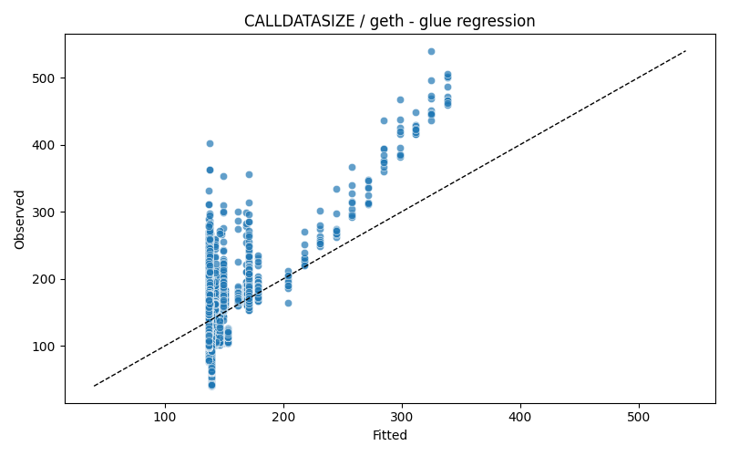

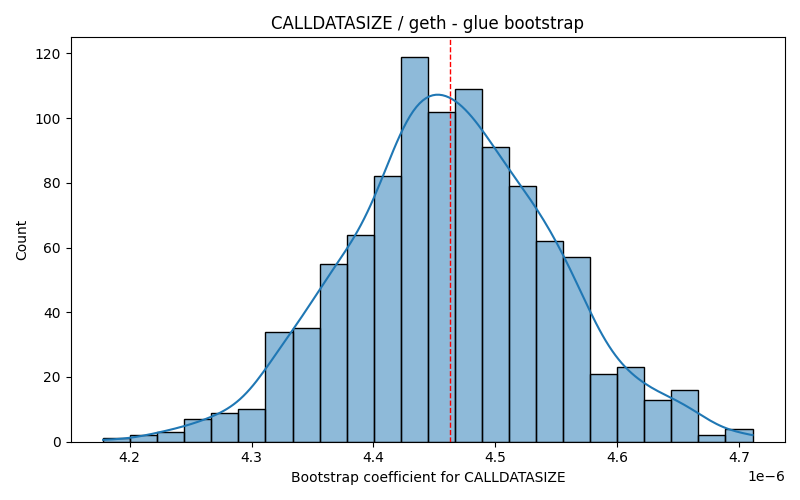


</details>

<details><summary><code>DUP</code> · nobs=73893 · runtime_ms=0 · p=1.00e+00 · R²=0.02642</summary>


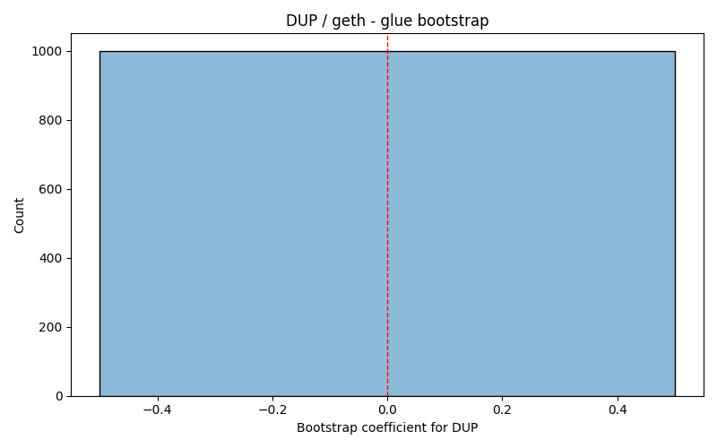


</details>

<details><summary><code>GAS</code> · nobs=73893 · runtime_ms=5.865e-06 · p=1.00e-03 · R²=0.02642</summary>

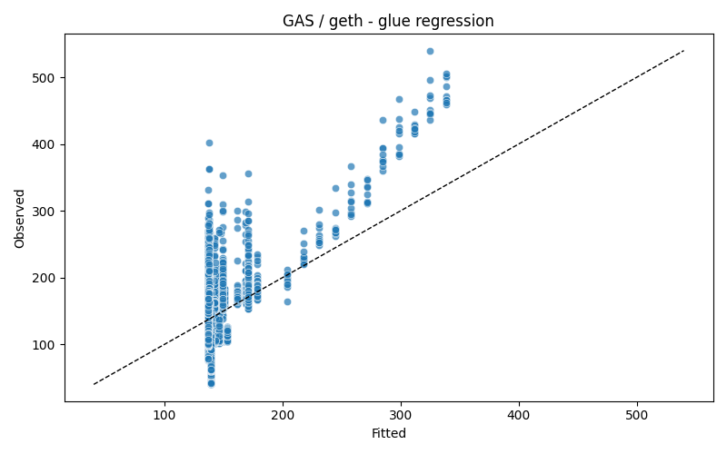

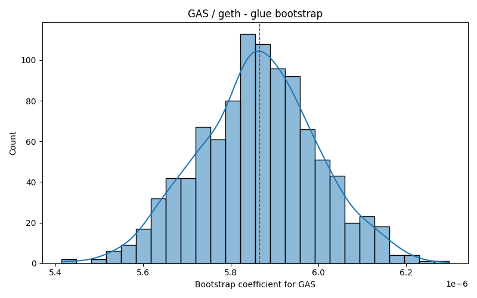

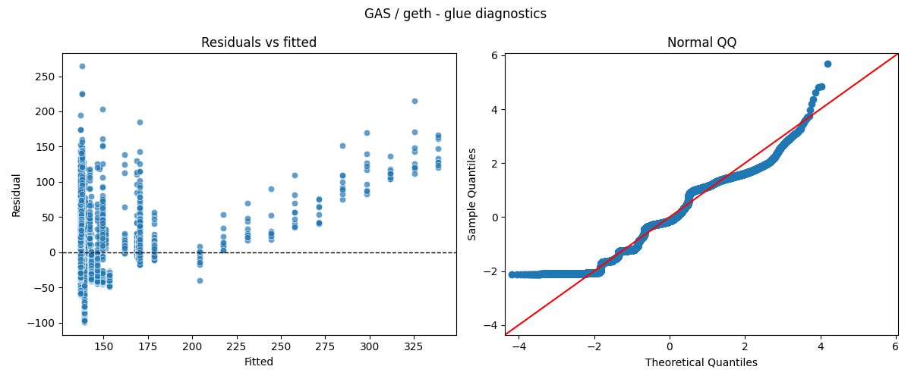

</details>

<details><summary><code>MLOAD</code> · nobs=73893 · runtime_ms=8.552e-06 · p=1.00e-03 · R²=0.02642</summary>


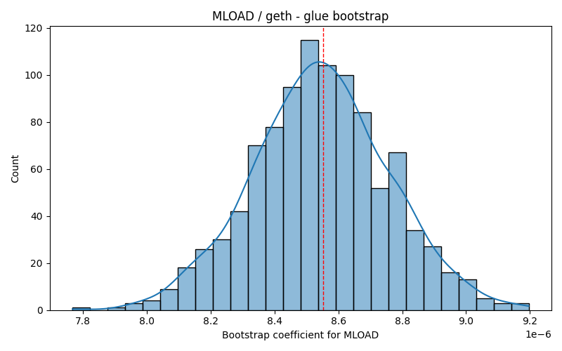


</details>

<details><summary><code>PUSH</code> · nobs=73893 · runtime_ms=0 · p=1.00e+00 · R²=0.02642</summary>


</details>

<details><summary><code>PUSH0</code> · nobs=73893 · runtime_ms=0 · p=1.00e+00 · R²=0.02642</summary>


</details>

<details><summary><code>STATICCALL</code> · nobs=73893 · runtime_ms=6.768e-05 · p=1.00e-03 · R²=0.02642</summary>

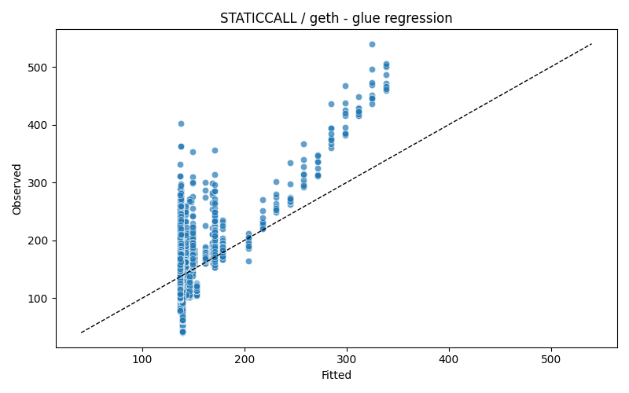

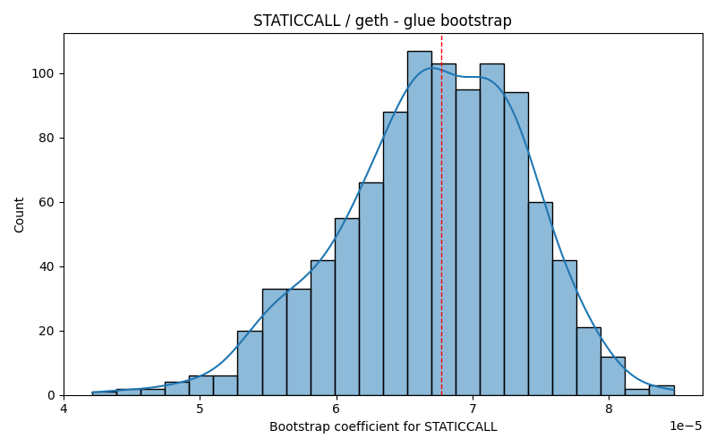

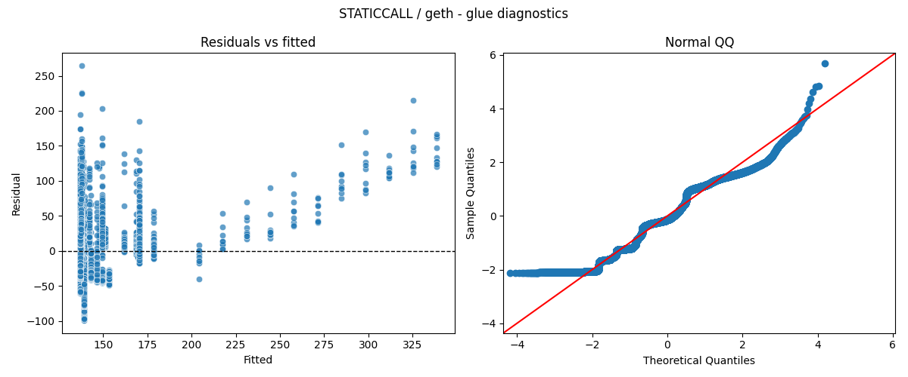

</details>

### Pure glue · geth

<details><summary><code>ISZERO</code> · nobs=1176 · runtime_ms=0 · p=1.00e+00 · R²=1.11e-16</summary>

```
==============================================================================
                           NNLS Regression Results                            
==============================================================================
Dep. Variable:          test_runtime_ms              R-squared:          0.000
Model:                  NNLS                    Adj. R-squared:         -0.001
No. Observations:       1176                              RMSE:          27.75
Df Residuals:           1174                               MAE:          24.01
Df Model:               1      
==============================================================================
                      coef     std err     P-value      [0.025      0.975]
------------------------------------------------------------------------------
         const     82.9365      0.8123       0.001     81.3937     84.4494
        ISZERO      0.0000      0.0000       1.000      0.0000      0.0000
==============================================================================
Notes: Non-negative least squares with bootstrap inference (1000 iterations)
==============================================================================
```

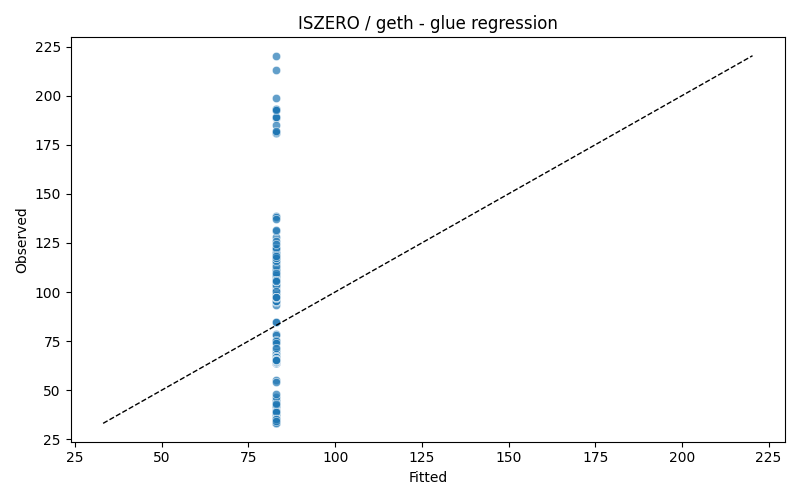


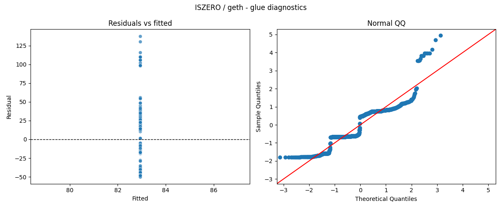

</details>

<details><summary><code>JUMPDEST</code> · nobs=294 · runtime_ms=0 · p=1.00e+00 · R²=0</summary>

```
==============================================================================
                           NNLS Regression Results                            
==============================================================================
Dep. Variable:          test_runtime_ms              R-squared:          0.000
Model:                  NNLS                    Adj. R-squared:         -0.003
No. Observations:       294                               RMSE:          46.10
Df Residuals:           292                                MAE:          37.17
Df Model:               1      
==============================================================================
                      coef     std err     P-value      [0.025      0.975]
------------------------------------------------------------------------------
         const    184.7127      2.6999       0.001    179.6681    189.8364
      JUMPDEST      0.0000      0.0000       1.000      0.0000      0.0000
==============================================================================
Notes: Non-negative least squares with bootstrap inference (1000 iterations)
==============================================================================
```

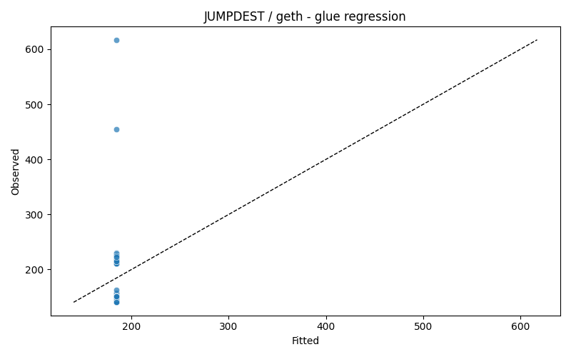


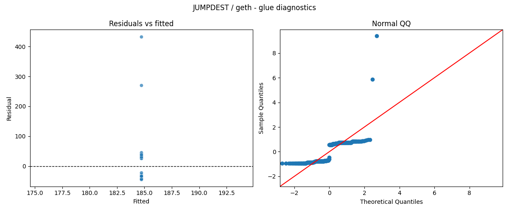

</details>

<details><summary><code>SWAP</code> · nobs=21021 · runtime_ms=0 · p=1.00e+00 · R²=0</summary>

```
==============================================================================
                           NNLS Regression Results                            
==============================================================================
Dep. Variable:          test_runtime_ms              R-squared:          0.000
Model:                  NNLS                    Adj. R-squared:         -0.000
No. Observations:       21021                             RMSE:          34.25
Df Residuals:           21019                              MAE:          29.26
Df Model:               1      
==============================================================================
                      coef     std err     P-value      [0.025      0.975]
------------------------------------------------------------------------------
         const    107.2666      0.2356       0.001    106.8061    107.7111
          SWAP      0.0000      0.0000       1.000      0.0000      0.0000
==============================================================================
Notes: Non-negative least squares with bootstrap inference (1000 iterations)
==============================================================================
```

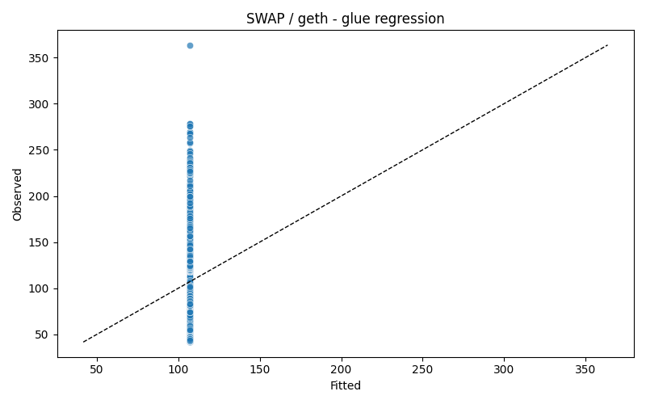


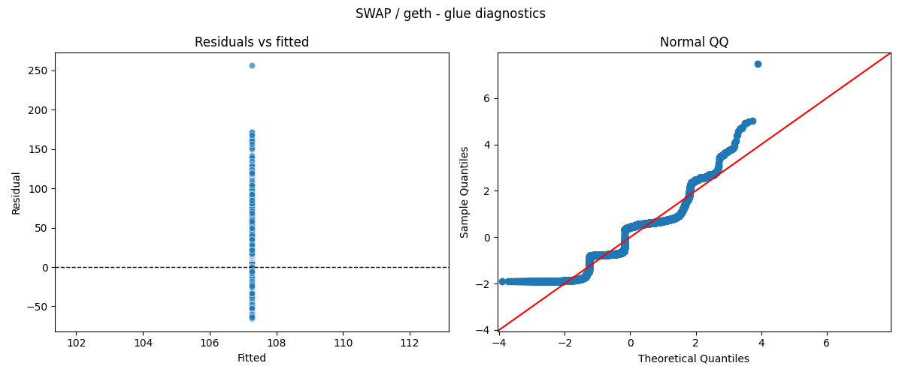

</details>

### Mixed glue (tier A) · geth

<details><summary><code>ADD</code> · nobs=1323 · runtime_ms=0 · p=1.00e+00 · R²=0</summary>

```
==============================================================================
                           NNLS Regression Results                            
==============================================================================
Dep. Variable:          test_runtime_ms              R-squared:          0.000
Model:                  NNLS                    Adj. R-squared:         -0.001
No. Observations:       1323                              RMSE:          29.24
Df Residuals:           1321                               MAE:          25.22
Df Model:               1      
==============================================================================
                      coef     std err     P-value      [0.025      0.975]
------------------------------------------------------------------------------
         const     93.6093      0.8075       0.001     92.0057     95.2204
           ADD      0.0000      0.0000       1.000      0.0000      0.0000
==============================================================================
Notes: Non-negative least squares with bootstrap inference (1000 iterations)
==============================================================================
```

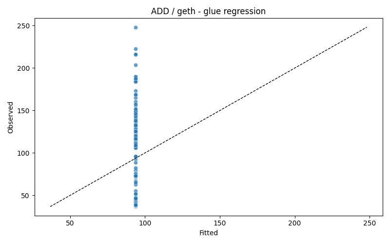


</details>

<details><summary><code>AND</code> · nobs=1176 · runtime_ms=0 · p=1.00e+00 · R²=0</summary>

```
==============================================================================
                           NNLS Regression Results                            
==============================================================================
Dep. Variable:          test_runtime_ms              R-squared:          0.000
Model:                  NNLS                    Adj. R-squared:         -0.001
No. Observations:       1176                              RMSE:          27.38
Df Residuals:           1174                               MAE:          23.54
Df Model:               1      
==============================================================================
                      coef     std err     P-value      [0.025      0.975]
------------------------------------------------------------------------------
         const     87.0328      0.8101       0.001     85.5137     88.5043
           AND      0.0000      0.0000       1.000      0.0000      0.0000
==============================================================================
Notes: Non-negative least squares with bootstrap inference (1000 iterations)
==============================================================================
```

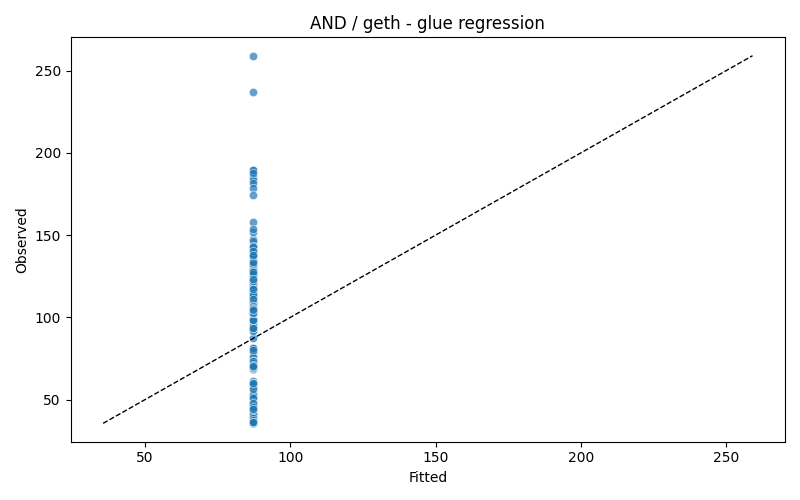


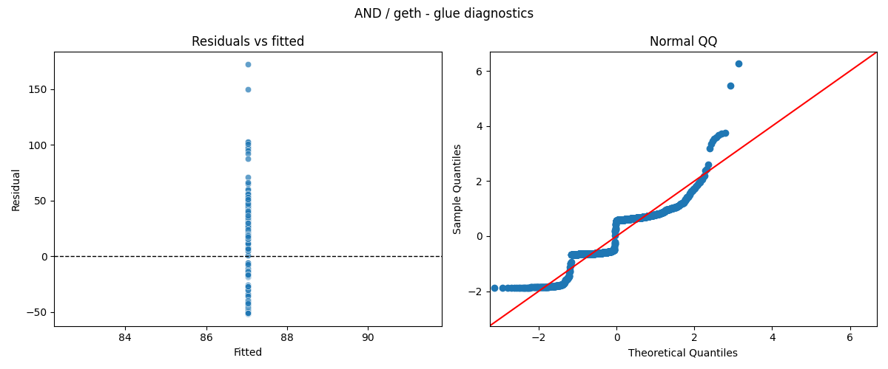

</details>

<details><summary><code>CALLDATACOPY</code> · nobs=34545 · runtime_ms=0 · p=1.00e+00 · R²=1.11e-16</summary>

```
==============================================================================
                           NNLS Regression Results                            
==============================================================================
Dep. Variable:          test_runtime_ms              R-squared:          0.000
Model:                  NNLS                    Adj. R-squared:         -0.000
No. Observations:       34545                             RMSE:          53.61
Df Residuals:           34543                              MAE:          46.00
Df Model:               1      
==============================================================================
                      coef     std err     P-value      [0.025      0.975]
------------------------------------------------------------------------------
         const     77.6047      0.2883       0.001     77.1041     78.1838
  CALLDATACOPY      0.0000      0.0000       1.000      0.0000      0.0000
==============================================================================
Notes: Non-negative least squares with bootstrap inference (1000 iterations)
==============================================================================
```

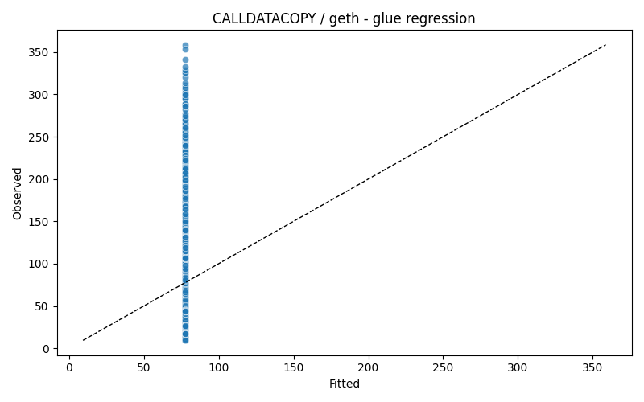


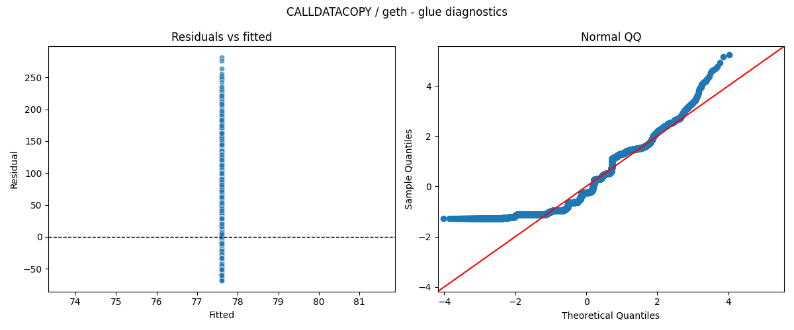

</details>

<details><summary><code>CALLDATALOAD</code> · nobs=6468 · runtime_ms=3.704e-05 · p=1.00e-03 · R²=0.1231</summary>

```
==============================================================================
                           NNLS Regression Results                            
==============================================================================
Dep. Variable:          test_runtime_ms              R-squared:          0.123
Model:                  NNLS                    Adj. R-squared:          0.123
No. Observations:       6468                              RMSE:           0.38
Df Residuals:           6466                               MAE:           0.26
Df Model:               1      
==============================================================================
                      coef     std err     P-value      [0.025      0.975]
------------------------------------------------------------------------------
         const      1.4357      0.0147       0.001      1.4072      1.4646
  CALLDATALOAD      0.0000      0.0000       0.001      0.0000      0.0000
==============================================================================
Notes: Non-negative least squares with bootstrap inference (1000 iterations)
==============================================================================
```

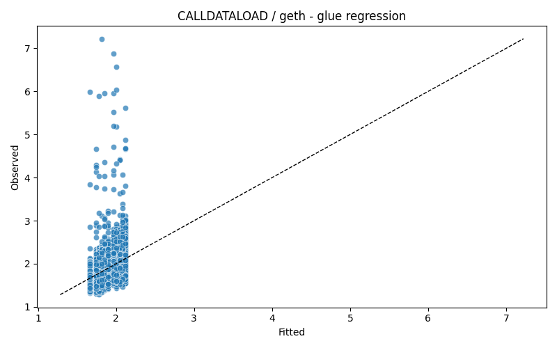

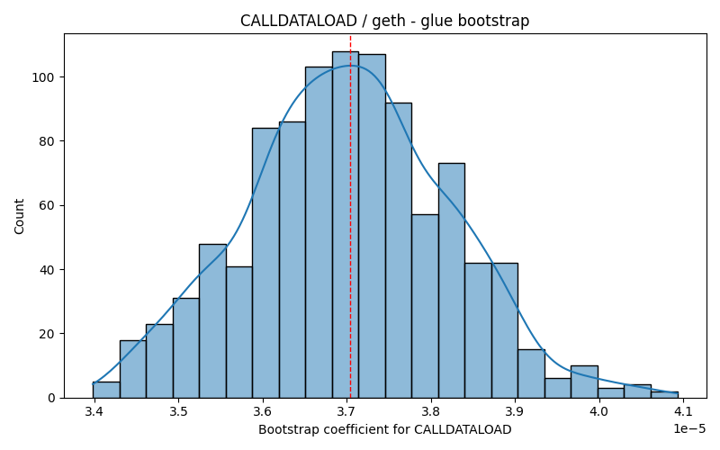

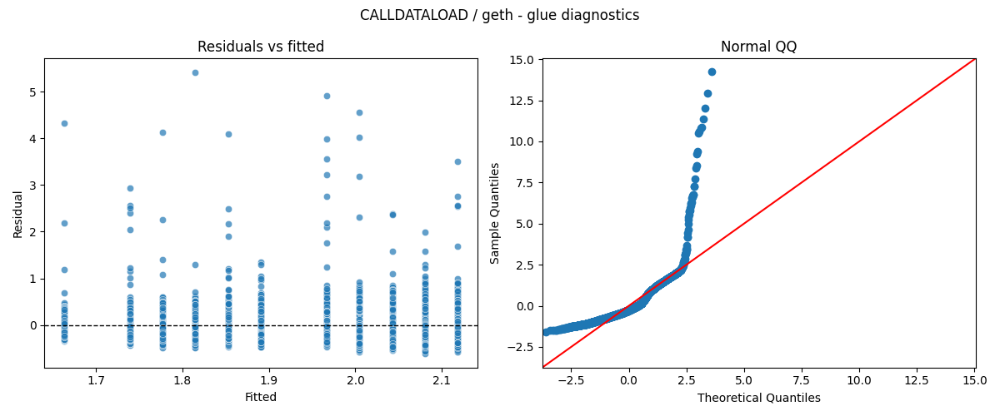

</details>

<details><summary><code>DIV</code> · nobs=1617 · runtime_ms=0 · p=1.00e+00 · R²=-2.22e-16</summary>

```
==============================================================================
                           NNLS Regression Results                            
==============================================================================
Dep. Variable:          test_runtime_ms              R-squared:         -0.000
Model:                  NNLS                    Adj. R-squared:         -0.001
No. Observations:       1617                              RMSE:          65.99
Df Residuals:           1615                               MAE:          59.10
Df Model:               1      
==============================================================================
                      coef     std err     P-value      [0.025      0.975]
------------------------------------------------------------------------------
         const    247.1294      1.6586       0.001    243.8718    250.3243
           DIV      0.0000      0.0000       1.000      0.0000      0.0000
==============================================================================
Notes: Non-negative least squares with bootstrap inference (1000 iterations)
==============================================================================
```

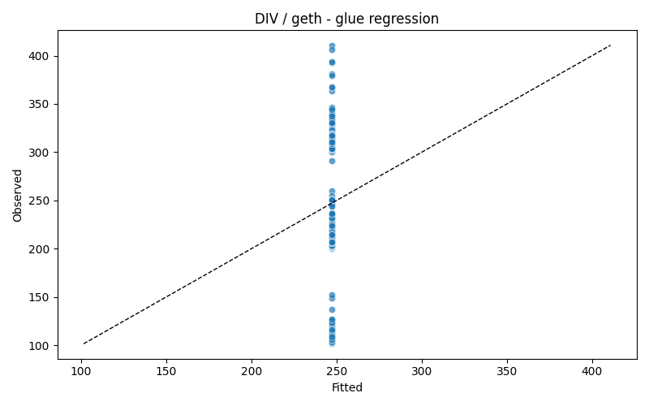


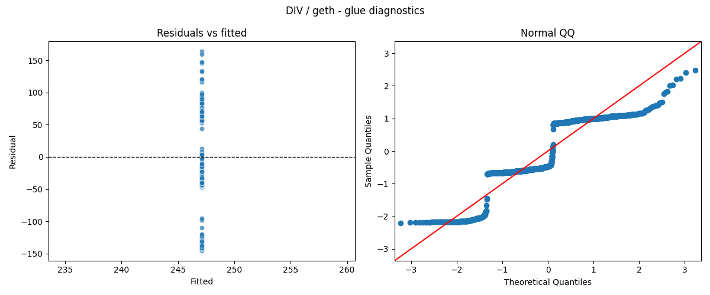

</details>

<details><summary><code>EXP</code> · nobs=1617 · runtime_ms=0.0003123 · p=1.00e-03 · R²=0.8068</summary>

```
==============================================================================
                           NNLS Regression Results                            
==============================================================================
Dep. Variable:          test_runtime_ms              R-squared:          0.807
Model:                  NNLS                    Adj. R-squared:          0.807
No. Observations:       1617                              RMSE:           5.99
Df Residuals:           1615                               MAE:           5.15
Df Model:               1      
==============================================================================
                      coef     std err     P-value      [0.025      0.975]
------------------------------------------------------------------------------
         const     13.1398      0.5394       0.001     12.0672     14.2225
           EXP      0.0003      0.0000       0.001      0.0003      0.0003
==============================================================================
Notes: Non-negative least squares with bootstrap inference (1000 iterations)
==============================================================================
```

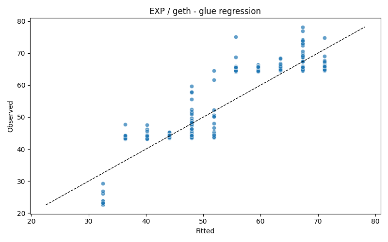

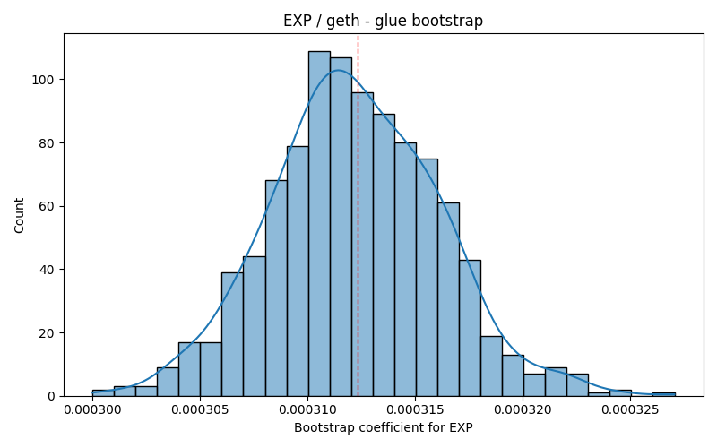

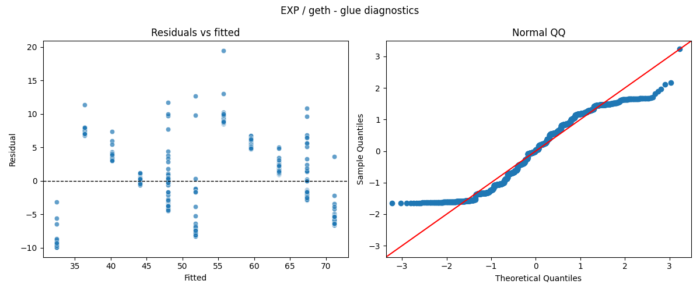

</details>

<details><summary><code>GT</code> · nobs=1176 · runtime_ms=0 · p=1.00e+00 · R²=0</summary>

```
==============================================================================
                           NNLS Regression Results                            
==============================================================================
Dep. Variable:          test_runtime_ms              R-squared:          0.000
Model:                  NNLS                    Adj. R-squared:         -0.001
No. Observations:       1176                              RMSE:          30.55
Df Residuals:           1174                               MAE:          25.87
Df Model:               1      
==============================================================================
                      coef     std err     P-value      [0.025      0.975]
------------------------------------------------------------------------------
         const     90.3664      0.9025       0.001     88.5408     92.0904
            GT      0.0000      0.0000       1.000      0.0000      0.0000
==============================================================================
Notes: Non-negative least squares with bootstrap inference (1000 iterations)
==============================================================================
```

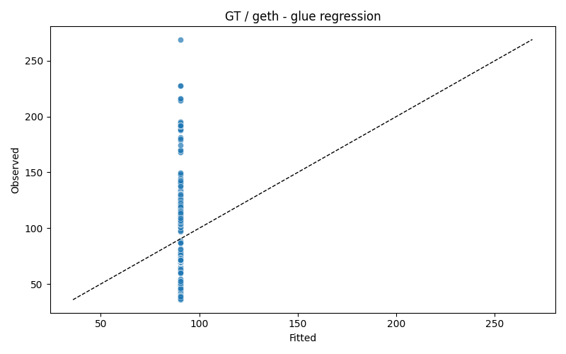


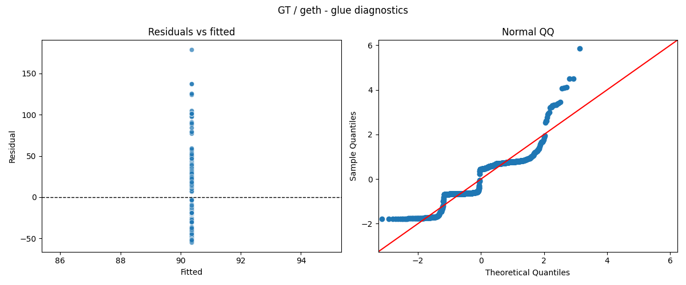

</details>

<details><summary><code>JUMPI</code> · nobs=1617 · runtime_ms=0 · p=1.00e+00 · R²=-2.22e-16</summary>

```
==============================================================================
                           NNLS Regression Results                            
==============================================================================
Dep. Variable:          test_runtime_ms              R-squared:         -0.000
Model:                  NNLS                    Adj. R-squared:         -0.001
No. Observations:       1617                              RMSE:          16.21
Df Residuals:           1615                               MAE:          12.78
Df Model:               1      
==============================================================================
                      coef     std err     P-value      [0.025      0.975]
------------------------------------------------------------------------------
         const     50.4143      0.4029       0.001     49.6723     51.2481
         JUMPI      0.0000      0.0000       1.000      0.0000      0.0000
==============================================================================
Notes: Non-negative least squares with bootstrap inference (1000 iterations)
==============================================================================
```

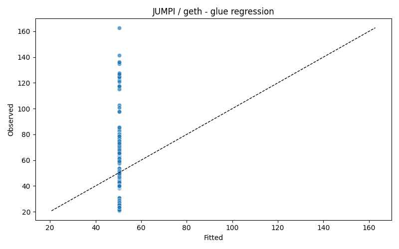


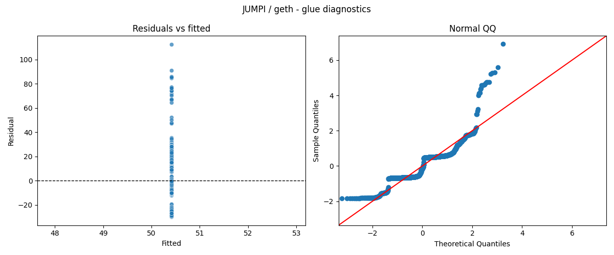

</details>

<details><summary><code>LT</code> · nobs=1176 · runtime_ms=0 · p=1.00e+00 · R²=-2.22e-16</summary>

```
==============================================================================
                           NNLS Regression Results                            
==============================================================================
Dep. Variable:          test_runtime_ms              R-squared:         -0.000
Model:                  NNLS                    Adj. R-squared:         -0.001
No. Observations:       1176                              RMSE:          30.14
Df Residuals:           1174                               MAE:          26.29
Df Model:               1      
==============================================================================
                      coef     std err     P-value      [0.025      0.975]
------------------------------------------------------------------------------
         const     91.6418      0.8857       0.001     89.9527     93.3540
            LT      0.0000      0.0000       1.000      0.0000      0.0000
==============================================================================
Notes: Non-negative least squares with bootstrap inference (1000 iterations)
==============================================================================
```

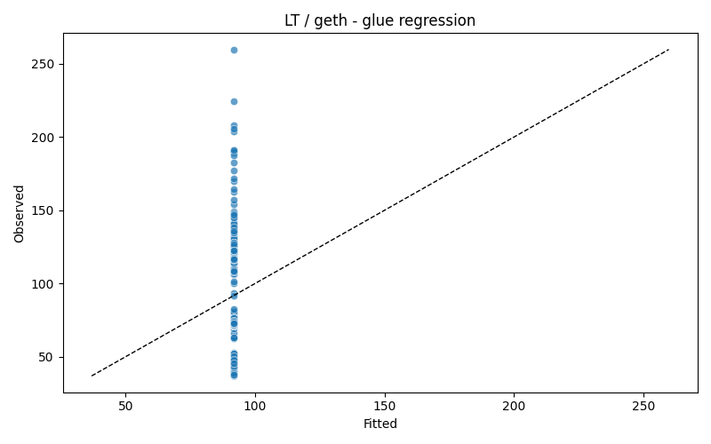


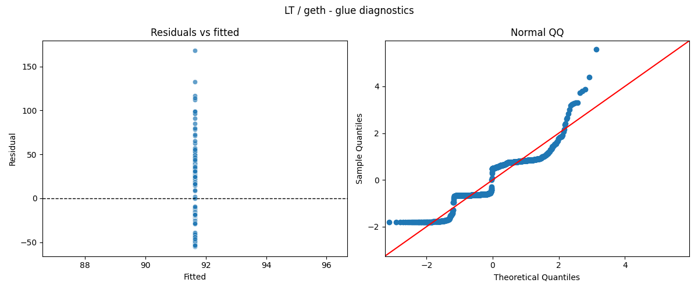

</details>

<details><summary><code>MSTORE</code> · nobs=6615 · runtime_ms=0 · p=1.00e+00 · R²=2.22e-16</summary>

```
==============================================================================
                           NNLS Regression Results                            
==============================================================================
Dep. Variable:          test_runtime_ms              R-squared:          0.000
Model:                  NNLS                    Adj. R-squared:         -0.000
No. Observations:       6615                              RMSE:          38.80
Df Residuals:           6613                               MAE:          34.04
Df Model:               1      
==============================================================================
                      coef     std err     P-value      [0.025      0.975]
------------------------------------------------------------------------------
         const    130.2197      0.4603       0.001    129.3428    131.1598
        MSTORE      0.0000      0.0000       1.000      0.0000      0.0000
==============================================================================
Notes: Non-negative least squares with bootstrap inference (1000 iterations)
==============================================================================
```

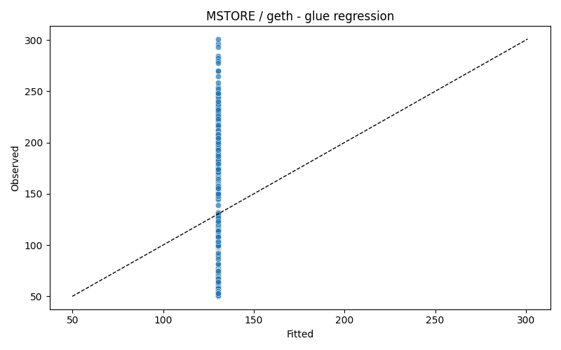


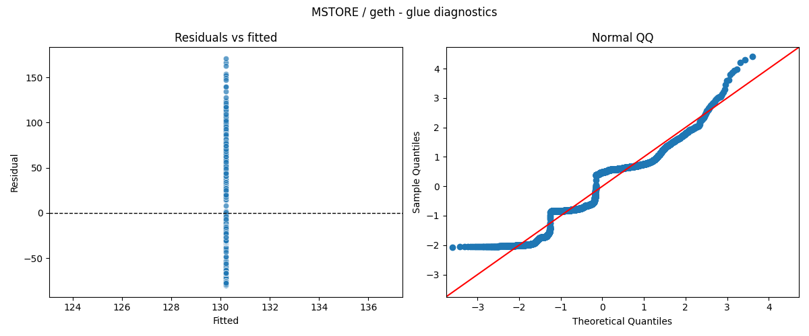

</details>

<details><summary><code>MSTORE8</code> · nobs=6615 · runtime_ms=0 · p=1.00e+00 · R²=0</summary>

```
==============================================================================
                           NNLS Regression Results                            
==============================================================================
Dep. Variable:          test_runtime_ms              R-squared:          0.000
Model:                  NNLS                    Adj. R-squared:         -0.000
No. Observations:       6615                              RMSE:          36.35
Df Residuals:           6613                               MAE:          31.75
Df Model:               1      
==============================================================================
                      coef     std err     P-value      [0.025      0.975]
------------------------------------------------------------------------------
         const    123.1078      0.4452       0.001    122.2588    124.0324
       MSTORE8      0.0000      0.0000       1.000      0.0000      0.0000
==============================================================================
Notes: Non-negative least squares with bootstrap inference (1000 iterations)
==============================================================================
```

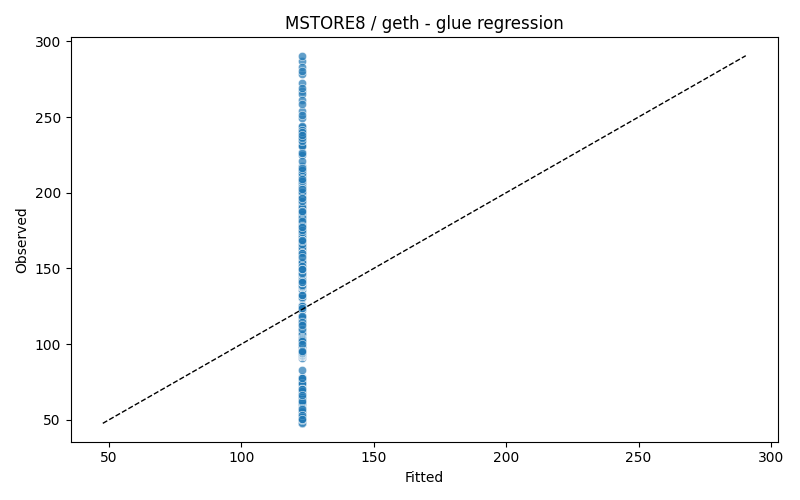


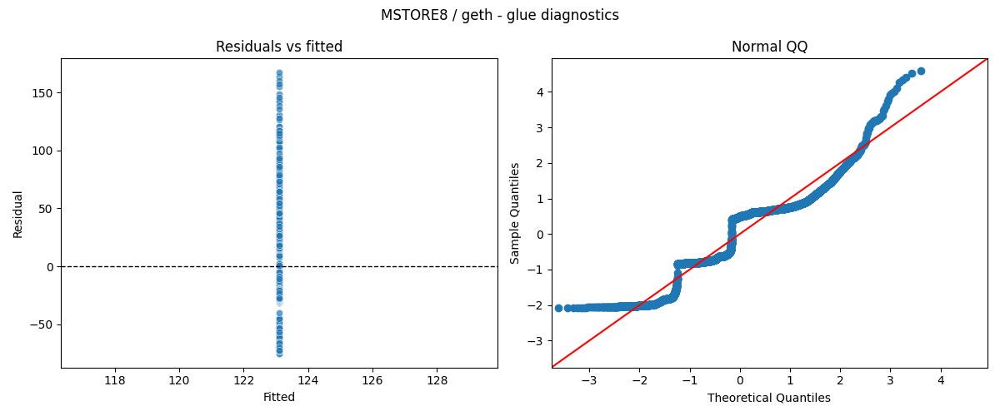

</details>

<details><summary><code>MUL</code> · nobs=1470 · runtime_ms=0 · p=1.00e+00 · R²=0</summary>

```
==============================================================================
                           NNLS Regression Results                            
==============================================================================
Dep. Variable:          test_runtime_ms              R-squared:          0.000
Model:                  NNLS                    Adj. R-squared:         -0.001
No. Observations:       1470                              RMSE:          26.81
Df Residuals:           1468                               MAE:          24.18
Df Model:               1      
==============================================================================
                      coef     std err     P-value      [0.025      0.975]
------------------------------------------------------------------------------
         const     91.6886      0.7099       0.001     90.3155     93.1071
           MUL      0.0000      0.0000       1.000      0.0000      0.0000
==============================================================================
Notes: Non-negative least squares with bootstrap inference (1000 iterations)
==============================================================================
```


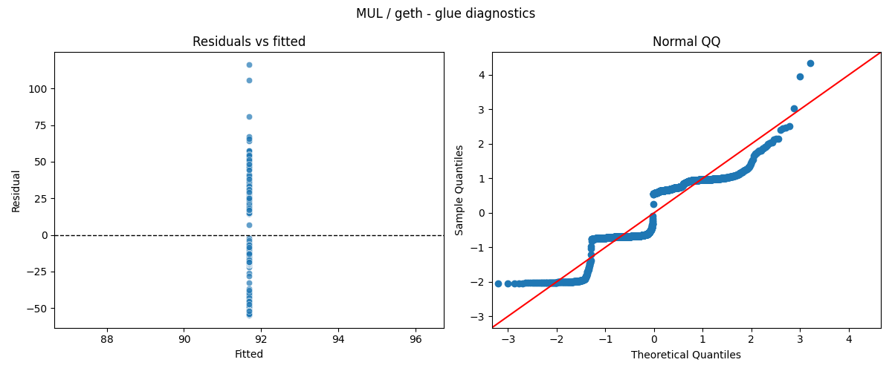

</details>

<details><summary><code>PC</code> · nobs=882 · runtime_ms=6.907e-06 · p=1.00e-03 · R²=0.2887</summary>

```
==============================================================================
                           NNLS Regression Results                            
==============================================================================
Dep. Variable:          test_runtime_ms              R-squared:          0.289
Model:                  NNLS                    Adj. R-squared:          0.288
No. Observations:       882                               RMSE:          24.10
Df Residuals:           880                                MAE:          20.81
Df Model:               1      
==============================================================================
                      coef     std err     P-value      [0.025      0.975]
------------------------------------------------------------------------------
         const    122.2647      1.6090       0.001    119.0848    125.3014
            PC      0.0000      0.0000       0.001      0.0000      0.0000
==============================================================================
Notes: Non-negative least squares with bootstrap inference (1000 iterations)
==============================================================================
```

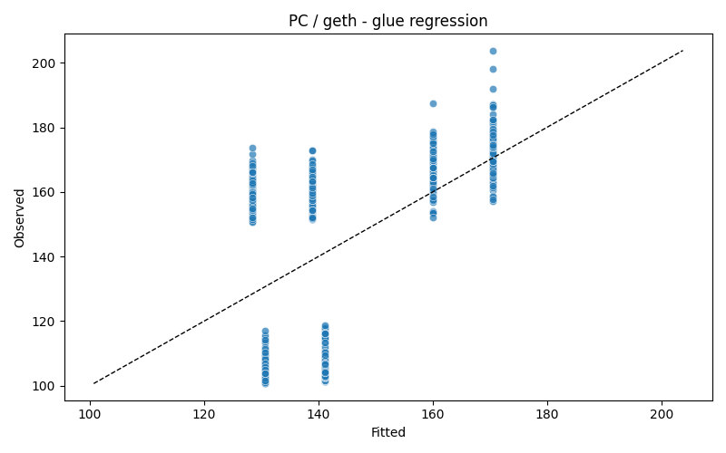

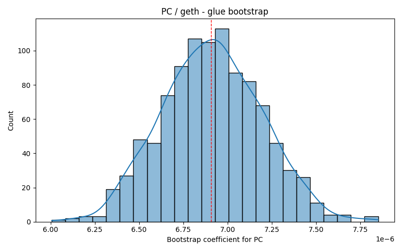

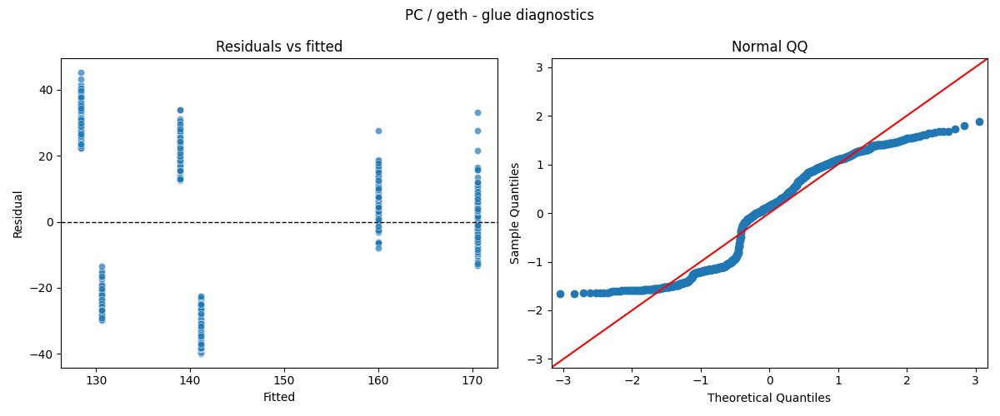

</details>

<details><summary><code>RETURNDATASIZE</code> · nobs=3528 · runtime_ms=1.212e-05 · p=1.00e-03 · R²=0.1676</summary>

```
==============================================================================
                           NNLS Regression Results                            
==============================================================================
Dep. Variable:          test_runtime_ms              R-squared:          0.168
Model:                  NNLS                    Adj. R-squared:          0.167
No. Observations:       3528                              RMSE:          31.69
Df Residuals:           3526                               MAE:          22.71
Df Model:               1      
==============================================================================
                      coef     std err     P-value      [0.025      0.975]
------------------------------------------------------------------------------
         const    101.5978      0.9507       0.001     99.6849    103.3933
RETURNDATASIZE      0.0000      0.0000       0.001      0.0000      0.0000
==============================================================================
Notes: Non-negative least squares with bootstrap inference (1000 iterations)
==============================================================================
```

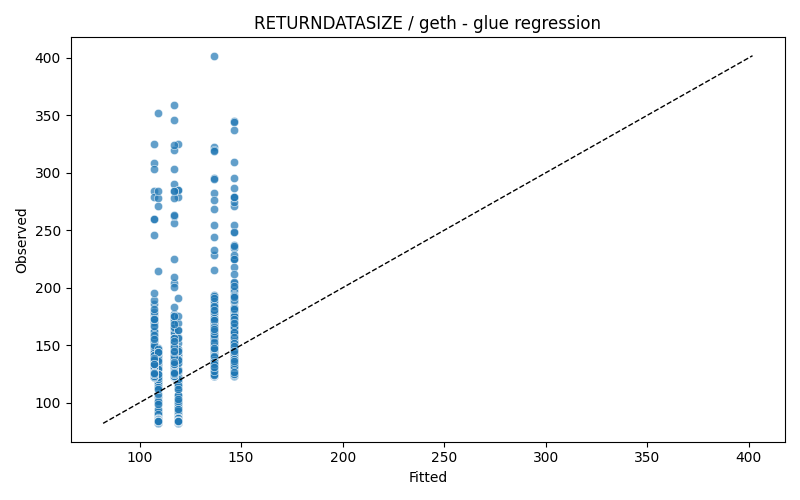

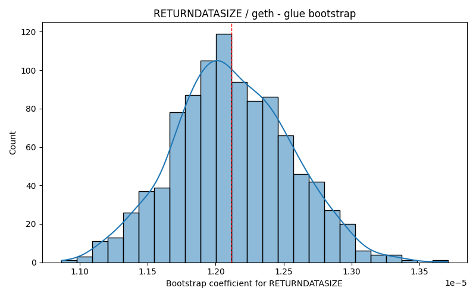

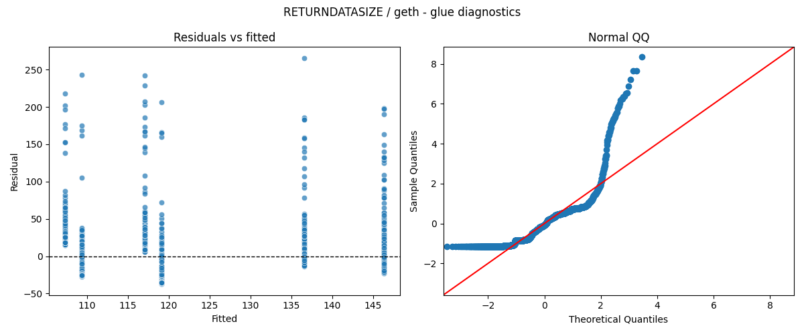

</details>

<details><summary><code>SELFBALANCE</code> · nobs=1617 · runtime_ms=0 · p=1.00e+00 · R²=0</summary>

```
==============================================================================
                           NNLS Regression Results                            
==============================================================================
Dep. Variable:          test_runtime_ms              R-squared:          0.000
Model:                  NNLS                    Adj. R-squared:         -0.001
No. Observations:       1617                              RMSE:         103.01
Df Residuals:           1615                               MAE:          92.80
Df Model:               1      
==============================================================================
                      coef     std err     P-value      [0.025      0.975]
------------------------------------------------------------------------------
         const    387.0825      2.6233       0.001    382.2017    392.3134
   SELFBALANCE      0.0000      0.0000       1.000      0.0000      0.0000
==============================================================================
Notes: Non-negative least squares with bootstrap inference (1000 iterations)
==============================================================================
```

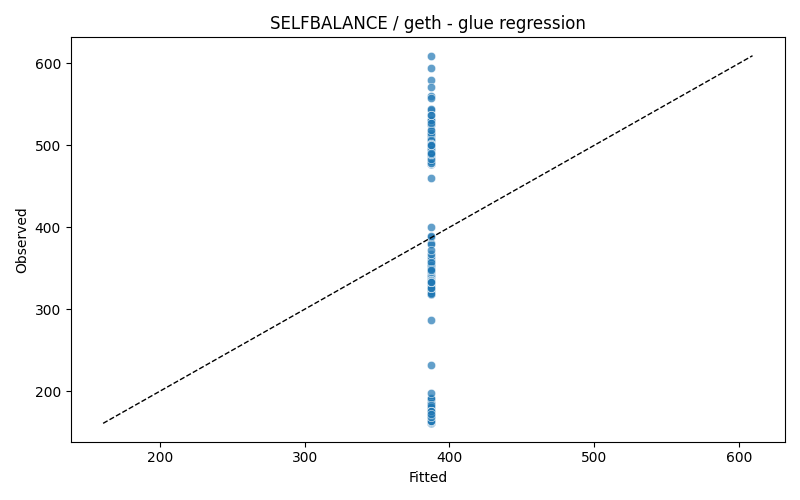


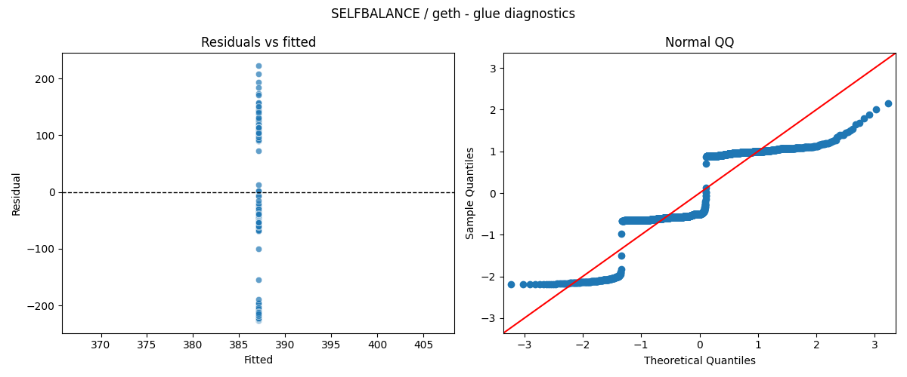

</details>

<details><summary><code>SUB</code> · nobs=1176 · runtime_ms=0 · p=1.00e+00 · R²=0</summary>

```
==============================================================================
                           NNLS Regression Results                            
==============================================================================
Dep. Variable:          test_runtime_ms              R-squared:          0.000
Model:                  NNLS                    Adj. R-squared:         -0.001
No. Observations:       1176                              RMSE:          30.08
Df Residuals:           1174                               MAE:          25.79
Df Model:               1      
==============================================================================
                      coef     std err     P-value      [0.025      0.975]
------------------------------------------------------------------------------
         const     91.0474      0.8842       0.001     89.3450     92.8032
           SUB      0.0000      0.0000       1.000      0.0000      0.0000
==============================================================================
Notes: Non-negative least squares with bootstrap inference (1000 iterations)
==============================================================================
```

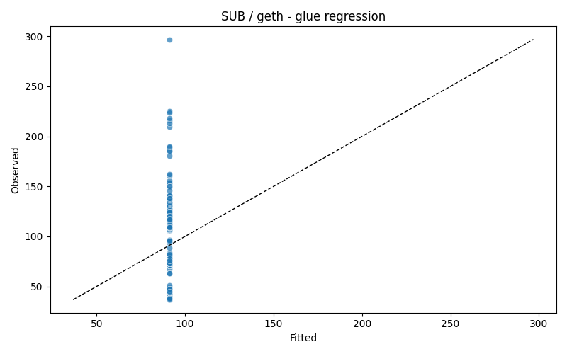


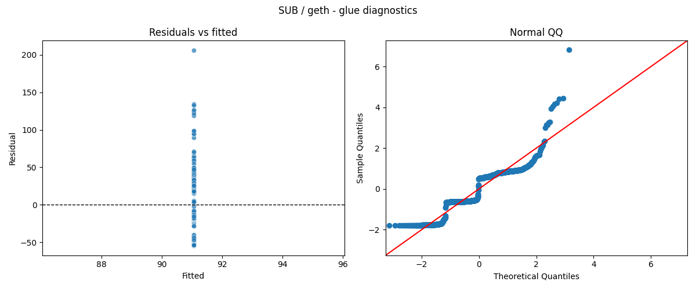

</details>

### Mixed glue (tier B) · geth

<details><summary><code>JUMP</code> · nobs=1470 · runtime_ms=0 · p=1.00e+00 · R²=0</summary>

```
==============================================================================
                           NNLS Regression Results                            
==============================================================================
Dep. Variable:          test_runtime_ms              R-squared:          0.000
Model:                  NNLS                    Adj. R-squared:         -0.001
No. Observations:       1470                              RMSE:          25.54
Df Residuals:           1468                               MAE:          21.89
Df Model:               1      
==============================================================================
                      coef     std err     P-value      [0.025      0.975]
------------------------------------------------------------------------------
         const     81.9434      0.6989       0.001     80.7016     83.3279
          JUMP      0.0000      0.0000       1.000      0.0000      0.0000
==============================================================================
Notes: Non-negative least squares with bootstrap inference (1000 iterations)
==============================================================================
```

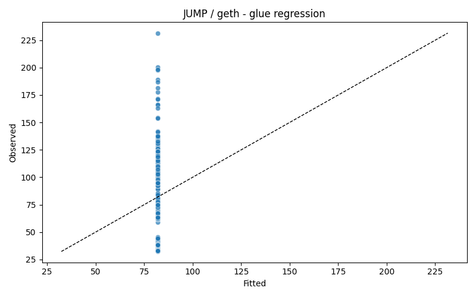


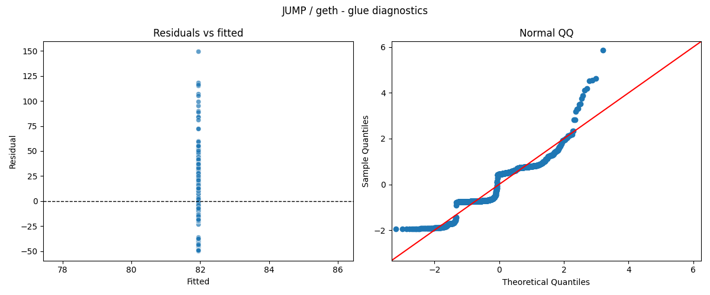

</details>

<details><summary><code>KECCAK256</code> · nobs=0 · runtime_ms=n/a · p=n/a · R²=n/a</summary>

</details>

## nethermind

| glue_opcode | nobs | glue_runtime_ms | p_value | rsquared |
| --- | --- | --- | --- | --- |
| `ISZERO` | 1376 | 0 | 1.00e+00 | 0 |
| `JUMPDEST` | 344 | 0 | 1.00e+00 | 0 |
| `SWAP` | 24596 | 0 | 1.00e+00 | -2.22e-16 |
| `CALLDATASIZE` | 86421 | 8.639e-06 | 1.00e-03 | 0.5506 |
| `DUP` | 86421 | 0 | 1.00e+00 | 0.5506 |
| `GAS` | 86421 | 8.381e-06 | 1.00e-03 | 0.5506 |
| `MLOAD` | 86421 | 2.132e-06 | 1.00e-03 | 0.5506 |
| `PUSH` | 86421 | 0 | 1.00e+00 | 0.5506 |
| `PUSH0` | 86421 | 3.364e-06 | 1.00e-03 | 0.5506 |
| `STATICCALL` | 86421 | 0.0003988 | 1.00e-03 | 0.5506 |
| `ADD` | 1548 | 0 | 1.00e+00 | 0 |
| `AND` | 1376 | 0 | 1.00e+00 | 2.22e-16 |
| `CALLDATACOPY` | 40420 | 0 | 1.00e+00 | 1.11e-16 |
| `CALLDATALOAD` | 7568 | 1.334e-05 | 1.00e-03 | 0.002146 |
| `DIV` | 1892 | 0 | 1.00e+00 | 0 |
| `EXP` | 1892 | 0 | 1.00e+00 | 1.11e-16 |
| `GT` | 1376 | 0 | 1.00e+00 | -2.22e-16 |
| `JUMPI` | 1892 | 0 | 1.00e+00 | 1.11e-16 |
| `LT` | 1376 | 0 | 1.00e+00 | 2.22e-16 |
| `MSTORE` | 7740 | 0 | 1.00e+00 | 0 |
| `MSTORE8` | 7740 | 0 | 1.00e+00 | 0 |
| `MUL` | 1720 | 0 | 1.00e+00 | 2.22e-16 |
| `PC` | 1032 | 6.17e-06 | 1.00e-03 | 0.3916 |
| `RETURNDATASIZE` | 4128 | 5.786e-06 | 1.00e-03 | 0.1404 |
| `SELFBALANCE` | 1892 | 0 | 1.00e+00 | 0 |
| `SUB` | 1376 | 0 | 1.00e+00 | 0 |
| `JUMP` | 1720 | 0 | 1.00e+00 | 0 |
| `KECCAK256` | 0 | n/a | n/a | n/a |

### Cycle glue — joint fit · nethermind

<details><summary>Joint NNLS regression summary</summary>

```
==============================================================================
                           NNLS Regression Results                            
==============================================================================
Dep. Variable:          test_runtime_ms              R-squared:          0.551
Model:                  NNLS                    Adj. R-squared:          0.551
No. Observations:       86421                             RMSE:          20.50
Df Residuals:           86413                              MAE:          17.02
Df Model:               7      
==============================================================================
                      coef     std err     P-value      [0.025      0.975]
------------------------------------------------------------------------------
         const     64.3037      0.0779       0.001     64.1599     64.4588
  CALLDATASIZE      0.0000      0.0000       0.001      0.0000      0.0000
           DUP      0.0000      0.0000       1.000      0.0000      0.0000
           GAS      0.0000      0.0000       0.001      0.0000      0.0000
         MLOAD      0.0000      0.0000       0.001      0.0000      0.0000
          PUSH      0.0000      0.0000       1.000      0.0000      0.0000
         PUSH0      0.0000      0.0000       0.001      0.0000      0.0000
    STATICCALL      0.0004      0.0000       0.001      0.0004      0.0004
==============================================================================
Notes: Non-negative least squares with bootstrap inference (1000 iterations)
==============================================================================
```

</details>

<details><summary><code>CALLDATASIZE</code> · nobs=86421 · runtime_ms=8.639e-06 · p=1.00e-03 · R²=0.5506</summary>


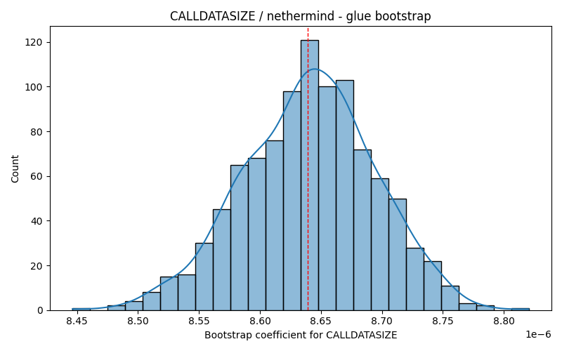

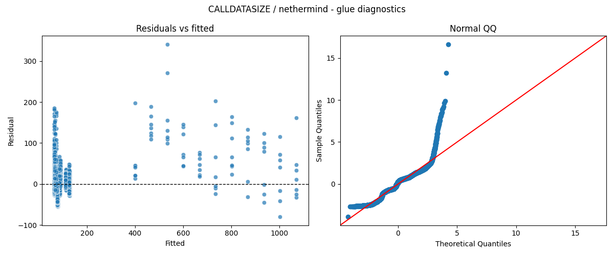

</details>

<details><summary><code>DUP</code> · nobs=86421 · runtime_ms=0 · p=1.00e+00 · R²=0.5506</summary>


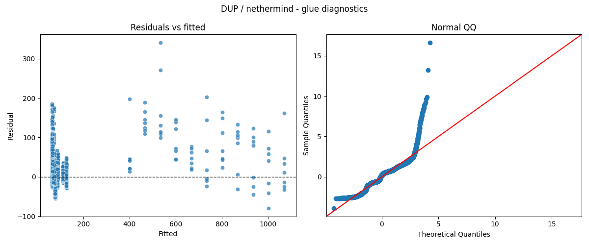

</details>

<details><summary><code>GAS</code> · nobs=86421 · runtime_ms=8.381e-06 · p=1.00e-03 · R²=0.5506</summary>

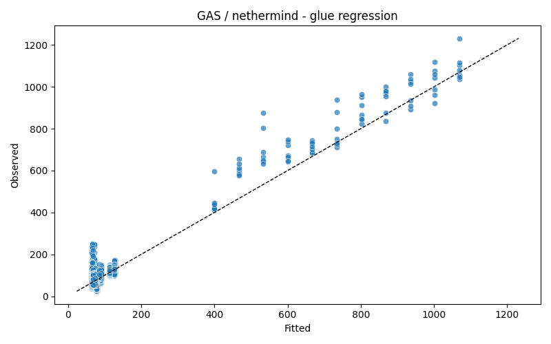

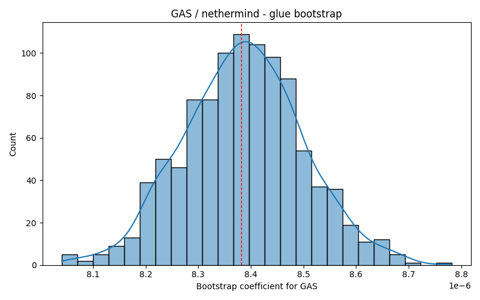


</details>

<details><summary><code>MLOAD</code> · nobs=86421 · runtime_ms=2.132e-06 · p=1.00e-03 · R²=0.5506</summary>


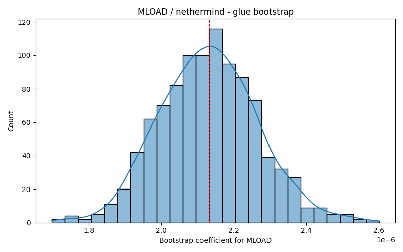


</details>

<details><summary><code>PUSH</code> · nobs=86421 · runtime_ms=0 · p=1.00e+00 · R²=0.5506</summary>


</details>

<details><summary><code>PUSH0</code> · nobs=86421 · runtime_ms=3.364e-06 · p=1.00e-03 · R²=0.5506</summary>

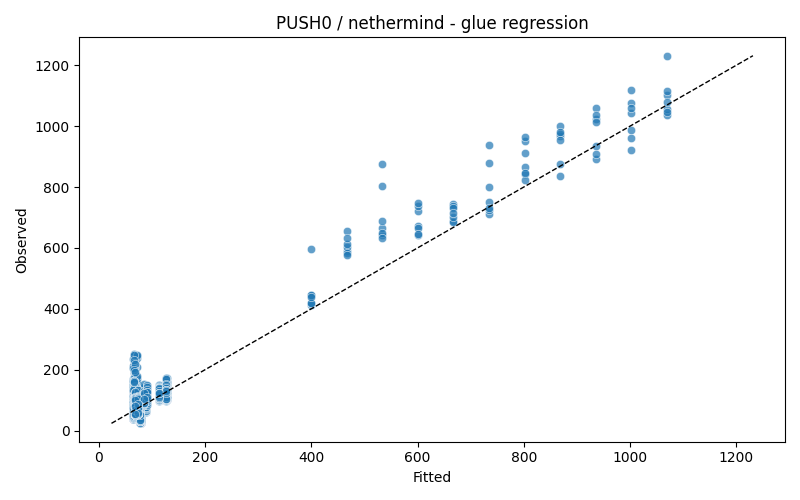

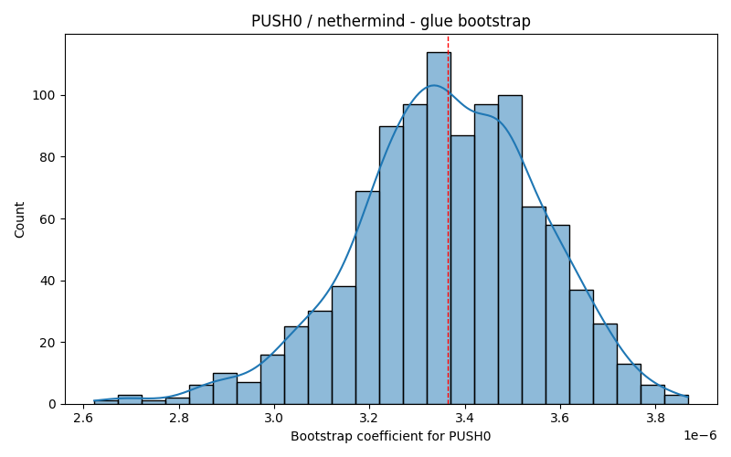

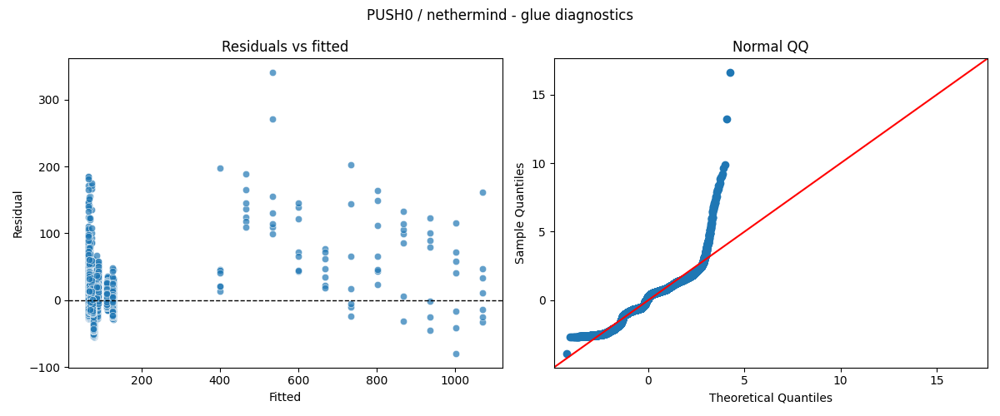

</details>

<details><summary><code>STATICCALL</code> · nobs=86421 · runtime_ms=0.0003988 · p=1.00e-03 · R²=0.5506</summary>

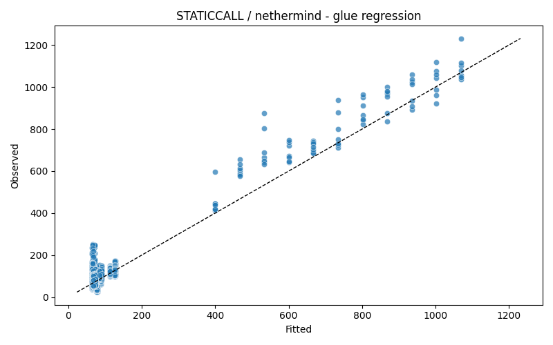

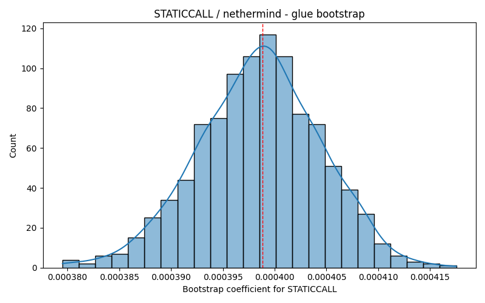


</details>

### Pure glue · nethermind

<details><summary><code>ISZERO</code> · nobs=1376 · runtime_ms=0 · p=1.00e+00 · R²=0</summary>

```
==============================================================================
                           NNLS Regression Results                            
==============================================================================
Dep. Variable:          test_runtime_ms              R-squared:          0.000
Model:                  NNLS                    Adj. R-squared:         -0.001
No. Observations:       1376                              RMSE:          22.41
Df Residuals:           1374                               MAE:          18.25
Df Model:               1      
==============================================================================
                      coef     std err     P-value      [0.025      0.975]
------------------------------------------------------------------------------
         const     69.0649      0.6091       0.001     67.8658     70.1904
        ISZERO      0.0000      0.0000       1.000      0.0000      0.0000
==============================================================================
Notes: Non-negative least squares with bootstrap inference (1000 iterations)
==============================================================================
```

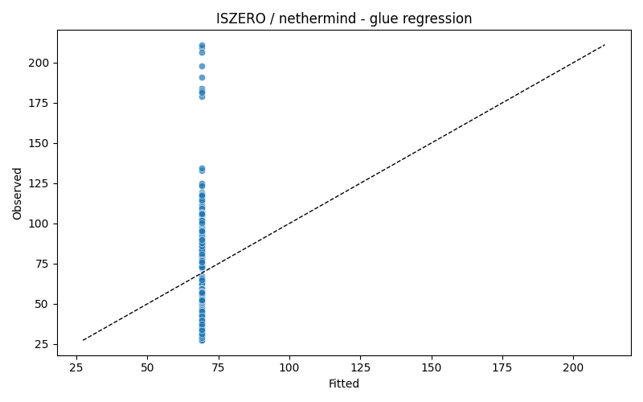


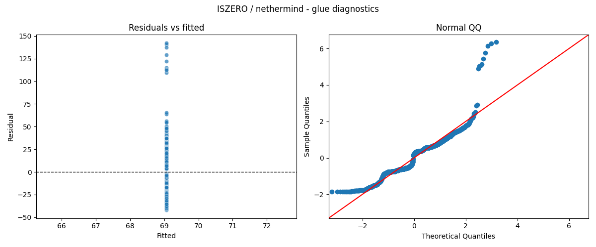

</details>

<details><summary><code>JUMPDEST</code> · nobs=344 · runtime_ms=0 · p=1.00e+00 · R²=0</summary>

```
==============================================================================
                           NNLS Regression Results                            
==============================================================================
Dep. Variable:          test_runtime_ms              R-squared:          0.000
Model:                  NNLS                    Adj. R-squared:         -0.003
No. Observations:       344                               RMSE:          28.24
Df Residuals:           342                                MAE:          22.50
Df Model:               1      
==============================================================================
                      coef     std err     P-value      [0.025      0.975]
------------------------------------------------------------------------------
         const    105.9822      1.5485       0.001    103.0459    109.0122
      JUMPDEST      0.0000      0.0000       1.000      0.0000      0.0000
==============================================================================
Notes: Non-negative least squares with bootstrap inference (1000 iterations)
==============================================================================
```

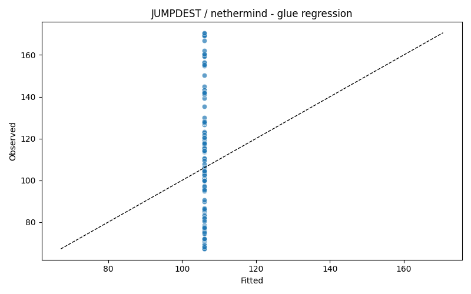


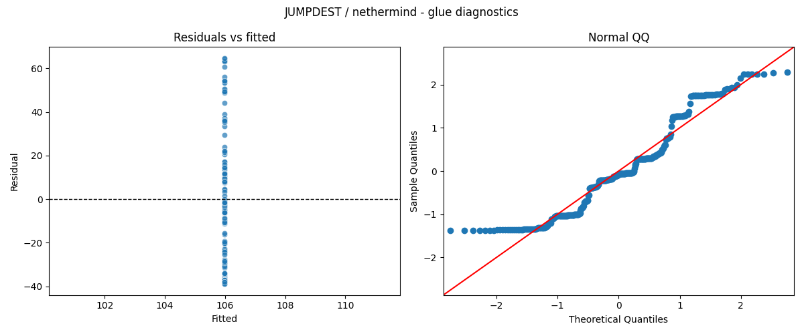

</details>

<details><summary><code>SWAP</code> · nobs=24596 · runtime_ms=0 · p=1.00e+00 · R²=-2.22e-16</summary>

```
==============================================================================
                           NNLS Regression Results                            
==============================================================================
Dep. Variable:          test_runtime_ms              R-squared:         -0.000
Model:                  NNLS                    Adj. R-squared:         -0.000
No. Observations:       24596                             RMSE:          16.05
Df Residuals:           24594                              MAE:          11.76
Df Model:               1      
==============================================================================
                      coef     std err     P-value      [0.025      0.975]
------------------------------------------------------------------------------
         const     50.7588      0.1024       0.001     50.5589     50.9588
          SWAP      0.0000      0.0000       1.000      0.0000      0.0000
==============================================================================
Notes: Non-negative least squares with bootstrap inference (1000 iterations)
==============================================================================
```

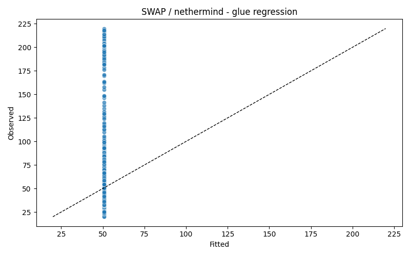


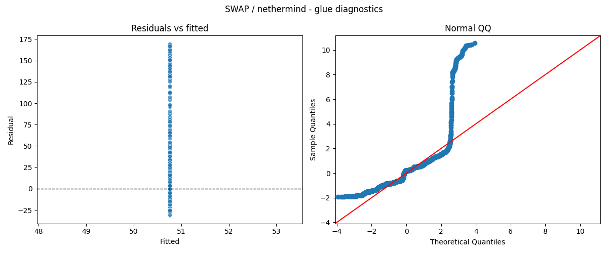

</details>

### Mixed glue (tier A) · nethermind

<details><summary><code>ADD</code> · nobs=1548 · runtime_ms=0 · p=1.00e+00 · R²=0</summary>

```
==============================================================================
                           NNLS Regression Results                            
==============================================================================
Dep. Variable:          test_runtime_ms              R-squared:          0.000
Model:                  NNLS                    Adj. R-squared:         -0.001
No. Observations:       1548                              RMSE:          35.93
Df Residuals:           1546                               MAE:          28.89
Df Model:               1      
==============================================================================
                      coef     std err     P-value      [0.025      0.975]
------------------------------------------------------------------------------
         const    100.4917      0.9294       0.001     98.8214    102.3787
           ADD      0.0000      0.0000       1.000      0.0000      0.0000
==============================================================================
Notes: Non-negative least squares with bootstrap inference (1000 iterations)
==============================================================================
```


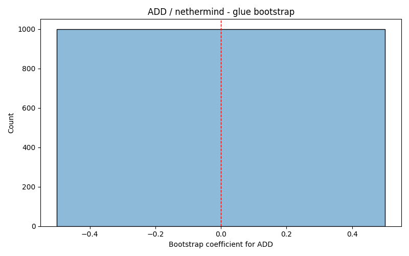

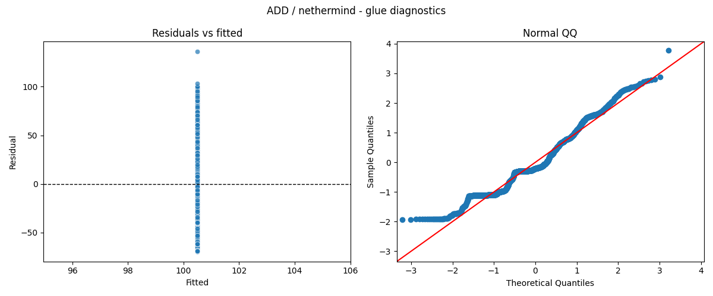

</details>

<details><summary><code>AND</code> · nobs=1376 · runtime_ms=0 · p=1.00e+00 · R²=2.22e-16</summary>

```
==============================================================================
                           NNLS Regression Results                            
==============================================================================
Dep. Variable:          test_runtime_ms              R-squared:          0.000
Model:                  NNLS                    Adj. R-squared:         -0.001
No. Observations:       1376                              RMSE:          17.73
Df Residuals:           1374                               MAE:          13.09
Df Model:               1      
==============================================================================
                      coef     std err     P-value      [0.025      0.975]
------------------------------------------------------------------------------
         const     49.8081      0.4886       0.001     48.8797     50.7866
           AND      0.0000      0.0000       1.000      0.0000      0.0000
==============================================================================
Notes: Non-negative least squares with bootstrap inference (1000 iterations)
==============================================================================
```

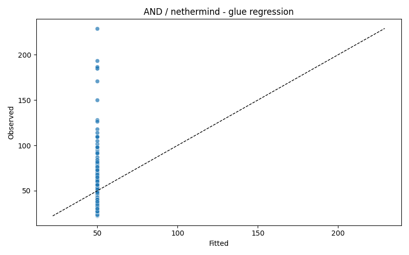


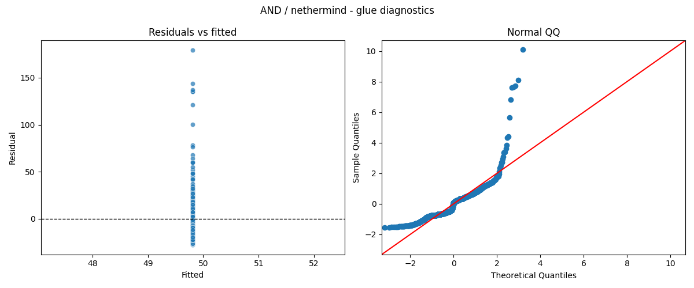

</details>

<details><summary><code>CALLDATACOPY</code> · nobs=40420 · runtime_ms=0 · p=1.00e+00 · R²=1.11e-16</summary>

```
==============================================================================
                           NNLS Regression Results                            
==============================================================================
Dep. Variable:          test_runtime_ms              R-squared:          0.000
Model:                  NNLS                    Adj. R-squared:         -0.000
No. Observations:       40420                             RMSE:          34.94
Df Residuals:           40418                              MAE:          28.63
Df Model:               1      
==============================================================================
                      coef     std err     P-value      [0.025      0.975]
------------------------------------------------------------------------------
         const     58.2485      0.1762       0.001     57.9083     58.5987
  CALLDATACOPY      0.0000      0.0000       1.000      0.0000      0.0000
==============================================================================
Notes: Non-negative least squares with bootstrap inference (1000 iterations)
==============================================================================
```

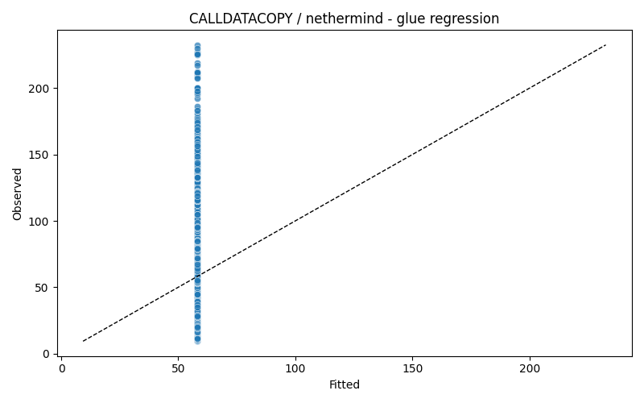


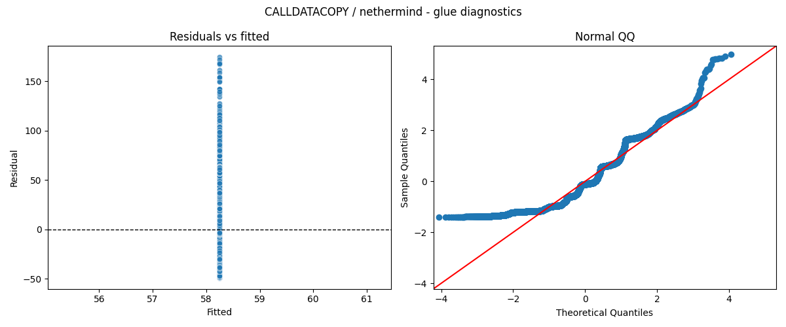

</details>

<details><summary><code>CALLDATALOAD</code> · nobs=7568 · runtime_ms=1.334e-05 · p=1.00e-03 · R²=0.002146</summary>

```
==============================================================================
                           NNLS Regression Results                            
==============================================================================
Dep. Variable:          test_runtime_ms              R-squared:          0.002
Model:                  NNLS                    Adj. R-squared:          0.002
No. Observations:       7568                              RMSE:           1.10
Df Residuals:           7566                               MAE:           0.16
Df Model:               1      
==============================================================================
                      coef     std err     P-value      [0.025      0.975]
------------------------------------------------------------------------------
         const      2.1165      0.0260       0.001      2.0645      2.1676
  CALLDATALOAD      0.0000      0.0000       0.001      0.0000      0.0000
==============================================================================
Notes: Non-negative least squares with bootstrap inference (1000 iterations)
==============================================================================
```

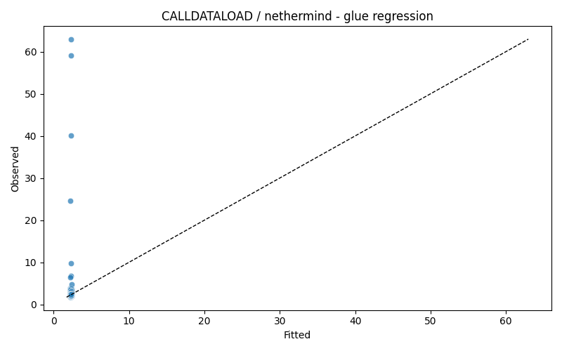

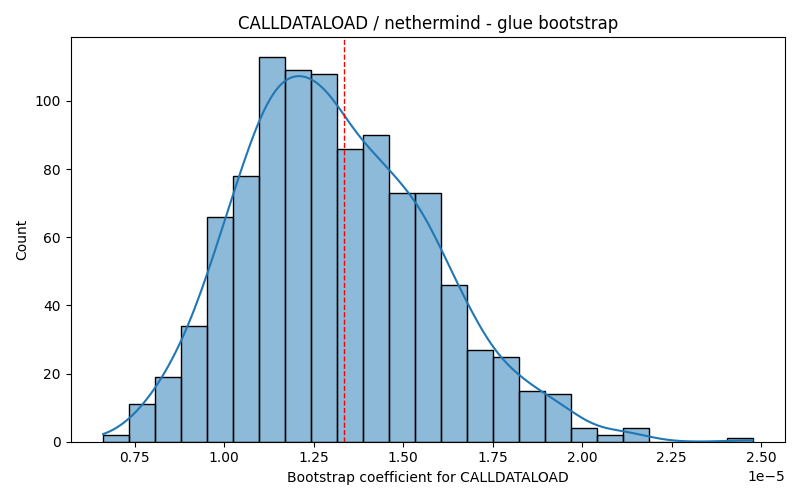

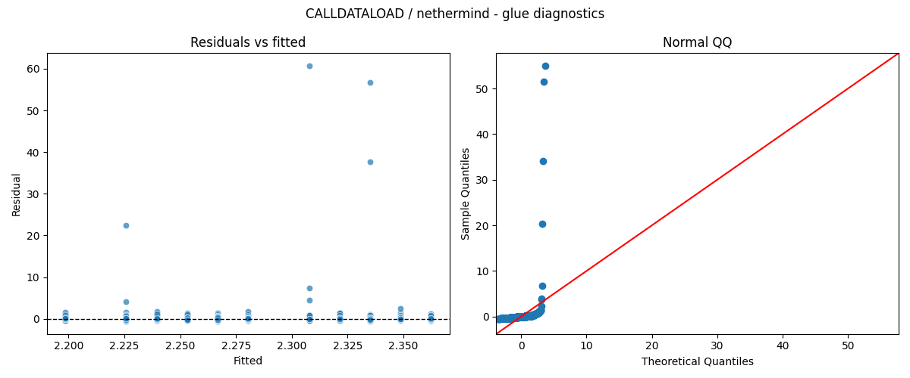

</details>

<details><summary><code>DIV</code> · nobs=1892 · runtime_ms=0 · p=1.00e+00 · R²=0</summary>

```
==============================================================================
                           NNLS Regression Results                            
==============================================================================
Dep. Variable:          test_runtime_ms              R-squared:          0.000
Model:                  NNLS                    Adj. R-squared:         -0.001
No. Observations:       1892                              RMSE:          50.82
Df Residuals:           1890                               MAE:          43.68
Df Model:               1      
==============================================================================
                      coef     std err     P-value      [0.025      0.975]
------------------------------------------------------------------------------
         const    220.9775      1.1352       0.001    218.6932    223.2437
           DIV      0.0000      0.0000       1.000      0.0000      0.0000
==============================================================================
Notes: Non-negative least squares with bootstrap inference (1000 iterations)
==============================================================================
```

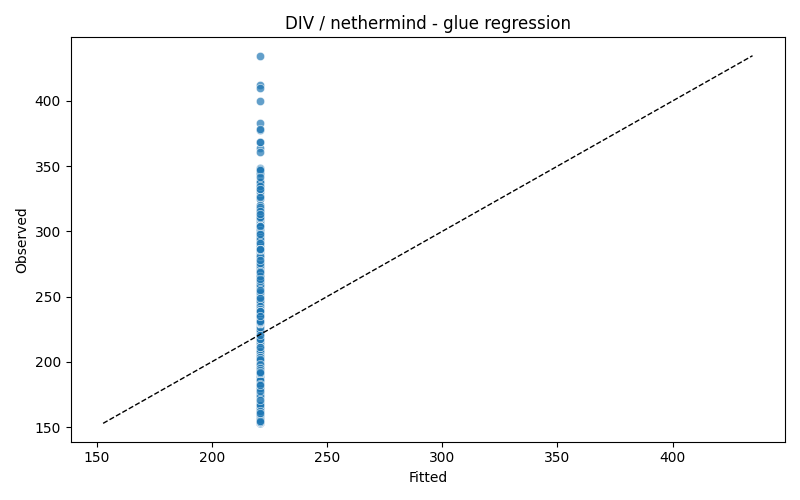


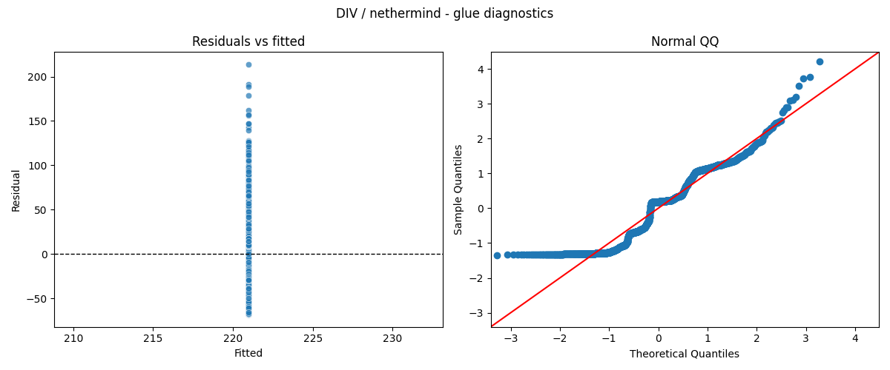

</details>

<details><summary><code>EXP</code> · nobs=1892 · runtime_ms=0 · p=1.00e+00 · R²=1.11e-16</summary>

```
==============================================================================
                           NNLS Regression Results                            
==============================================================================
Dep. Variable:          test_runtime_ms              R-squared:          0.000
Model:                  NNLS                    Adj. R-squared:         -0.001
No. Observations:       1892                              RMSE:          39.04
Df Residuals:           1890                               MAE:          24.04
Df Model:               1      
==============================================================================
                      coef     std err     P-value      [0.025      0.975]
------------------------------------------------------------------------------
         const     79.2012      0.9027       0.001     77.4615     81.0087
           EXP      0.0000      0.0000       1.000      0.0000      0.0000
==============================================================================
Notes: Non-negative least squares with bootstrap inference (1000 iterations)
==============================================================================
```

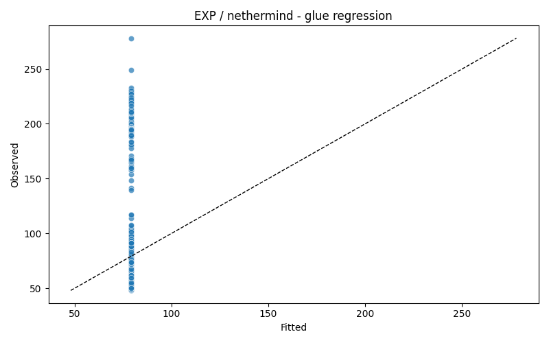


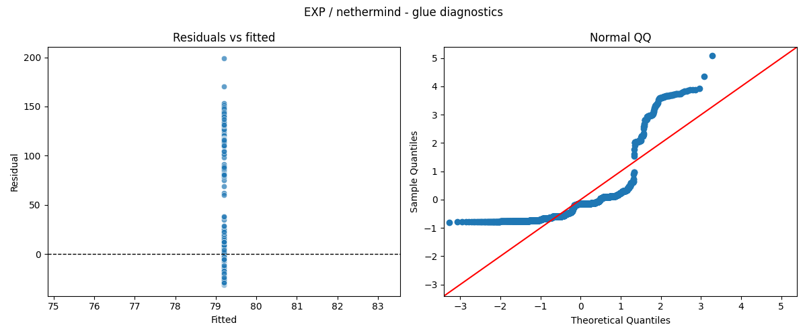

</details>

<details><summary><code>GT</code> · nobs=1376 · runtime_ms=0 · p=1.00e+00 · R²=-2.22e-16</summary>

```
==============================================================================
                           NNLS Regression Results                            
==============================================================================
Dep. Variable:          test_runtime_ms              R-squared:         -0.000
Model:                  NNLS                    Adj. R-squared:         -0.001
No. Observations:       1376                              RMSE:          21.86
Df Residuals:           1374                               MAE:          17.42
Df Model:               1      
==============================================================================
                      coef     std err     P-value      [0.025      0.975]
------------------------------------------------------------------------------
         const     62.9490      0.6184       0.001     61.7708     64.1764
            GT      0.0000      0.0000       1.000      0.0000      0.0000
==============================================================================
Notes: Non-negative least squares with bootstrap inference (1000 iterations)
==============================================================================
```

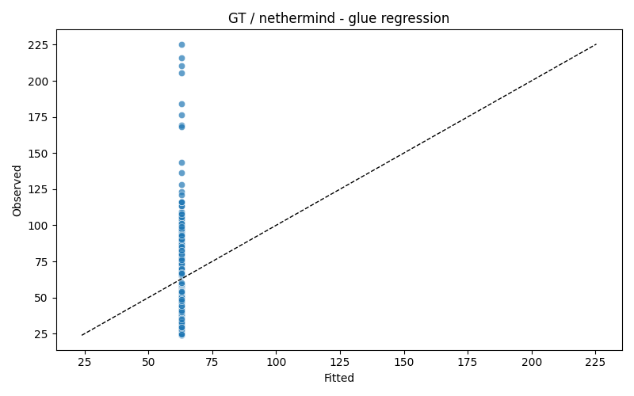


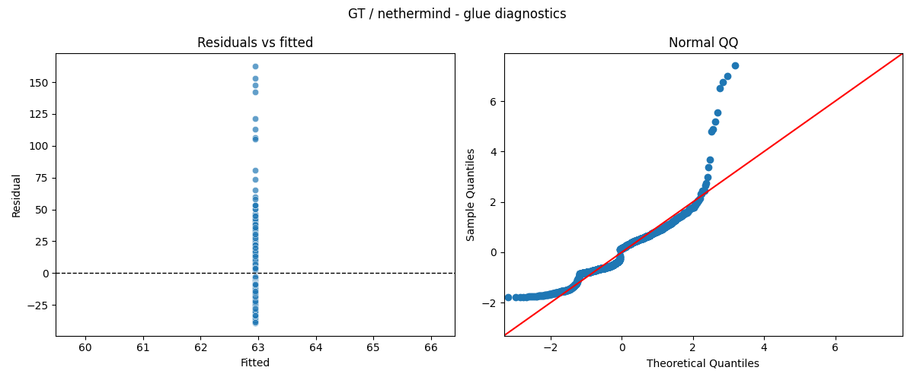

</details>

<details><summary><code>JUMPI</code> · nobs=1892 · runtime_ms=0 · p=1.00e+00 · R²=1.11e-16</summary>

```
==============================================================================
                           NNLS Regression Results                            
==============================================================================
Dep. Variable:          test_runtime_ms              R-squared:          0.000
Model:                  NNLS                    Adj. R-squared:         -0.001
No. Observations:       1892                              RMSE:          10.05
Df Residuals:           1890                               MAE:           7.52
Df Model:               1      
==============================================================================
                      coef     std err     P-value      [0.025      0.975]
------------------------------------------------------------------------------
         const     32.7808      0.2270       0.001     32.3192     33.2008
         JUMPI      0.0000      0.0000       1.000      0.0000      0.0000
==============================================================================
Notes: Non-negative least squares with bootstrap inference (1000 iterations)
==============================================================================
```

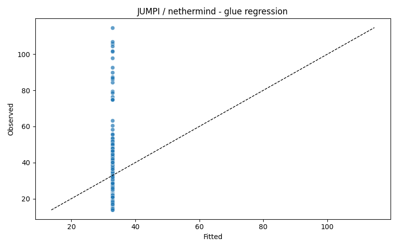


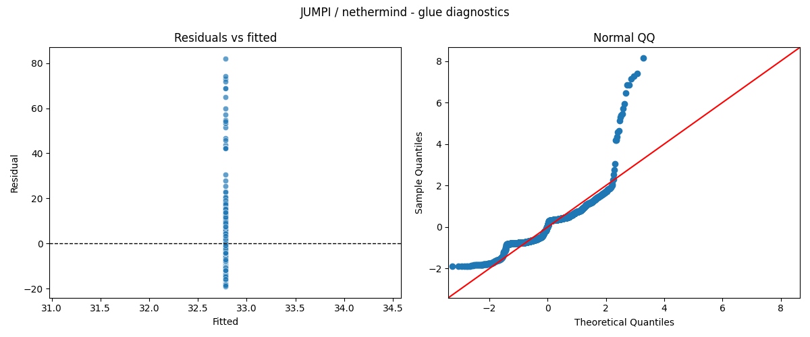

</details>

<details><summary><code>LT</code> · nobs=1376 · runtime_ms=0 · p=1.00e+00 · R²=2.22e-16</summary>

```
==============================================================================
                           NNLS Regression Results                            
==============================================================================
Dep. Variable:          test_runtime_ms              R-squared:          0.000
Model:                  NNLS                    Adj. R-squared:         -0.001
No. Observations:       1376                              RMSE:          19.83
Df Residuals:           1374                               MAE:          16.13
Df Model:               1      
==============================================================================
                      coef     std err     P-value      [0.025      0.975]
------------------------------------------------------------------------------
         const     65.3028      0.5274       0.001     64.3038     66.2430
            LT      0.0000      0.0000       1.000      0.0000      0.0000
==============================================================================
Notes: Non-negative least squares with bootstrap inference (1000 iterations)
==============================================================================
```

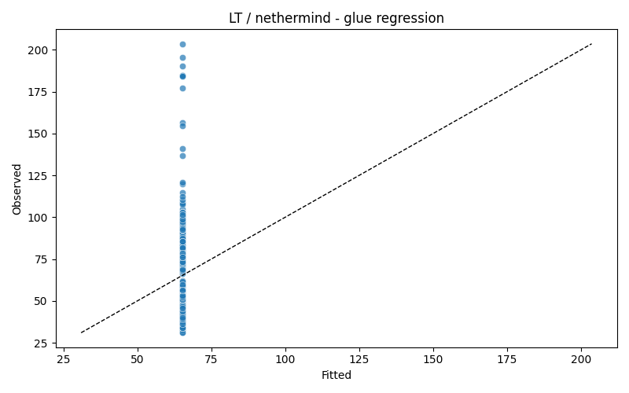


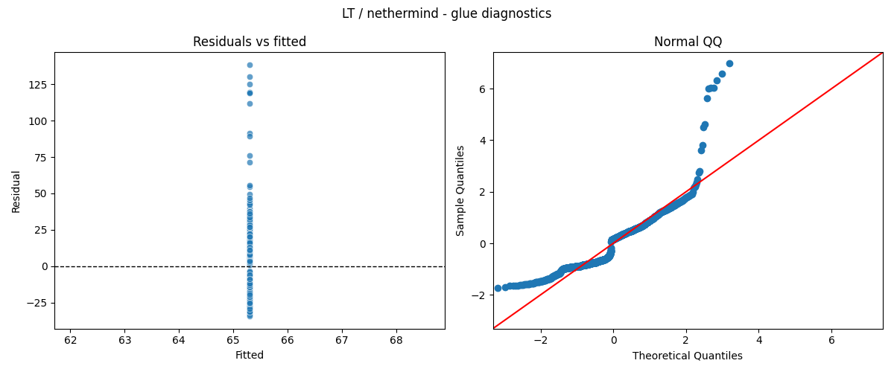

</details>

<details><summary><code>MSTORE</code> · nobs=7740 · runtime_ms=0 · p=1.00e+00 · R²=0</summary>

```
==============================================================================
                           NNLS Regression Results                            
==============================================================================
Dep. Variable:          test_runtime_ms              R-squared:          0.000
Model:                  NNLS                    Adj. R-squared:         -0.000
No. Observations:       7740                              RMSE:          19.64
Df Residuals:           7738                               MAE:          15.44
Df Model:               1      
==============================================================================
                      coef     std err     P-value      [0.025      0.975]
------------------------------------------------------------------------------
         const     61.7377      0.2238       0.001     61.3103     62.1695
        MSTORE      0.0000      0.0000       1.000      0.0000      0.0000
==============================================================================
Notes: Non-negative least squares with bootstrap inference (1000 iterations)
==============================================================================
```

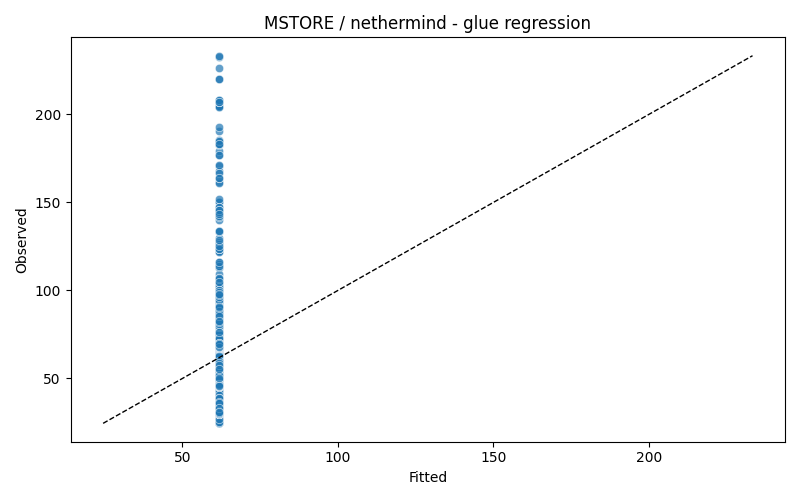


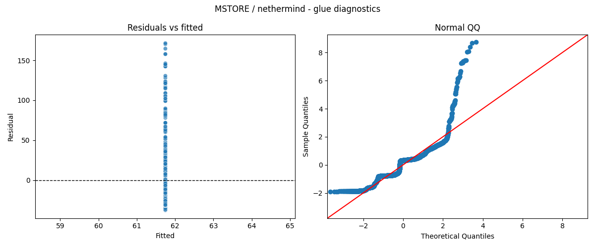

</details>

<details><summary><code>MSTORE8</code> · nobs=7740 · runtime_ms=0 · p=1.00e+00 · R²=0</summary>

```
==============================================================================
                           NNLS Regression Results                            
==============================================================================
Dep. Variable:          test_runtime_ms              R-squared:          0.000
Model:                  NNLS                    Adj. R-squared:         -0.000
No. Observations:       7740                              RMSE:          19.86
Df Residuals:           7738                               MAE:          15.48
Df Model:               1      
==============================================================================
                      coef     std err     P-value      [0.025      0.975]
------------------------------------------------------------------------------
         const     61.3529      0.2244       0.001     60.9293     61.8199
       MSTORE8      0.0000      0.0000       1.000      0.0000      0.0000
==============================================================================
Notes: Non-negative least squares with bootstrap inference (1000 iterations)
==============================================================================
```

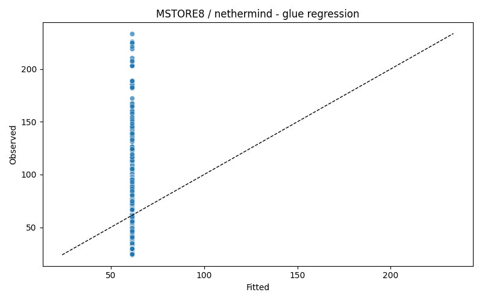


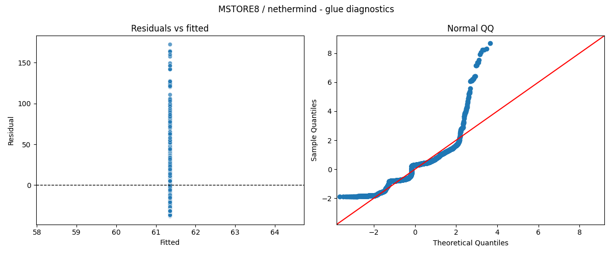

</details>

<details><summary><code>MUL</code> · nobs=1720 · runtime_ms=0 · p=1.00e+00 · R²=2.22e-16</summary>

```
==============================================================================
                           NNLS Regression Results                            
==============================================================================
Dep. Variable:          test_runtime_ms              R-squared:          0.000
Model:                  NNLS                    Adj. R-squared:         -0.001
No. Observations:       1720                              RMSE:          36.18
Df Residuals:           1718                               MAE:          31.73
Df Model:               1      
==============================================================================
                      coef     std err     P-value      [0.025      0.975]
------------------------------------------------------------------------------
         const    128.8925      0.8583       0.001    127.3135    130.6425
           MUL      0.0000      0.0000       1.000      0.0000      0.0000
==============================================================================
Notes: Non-negative least squares with bootstrap inference (1000 iterations)
==============================================================================
```


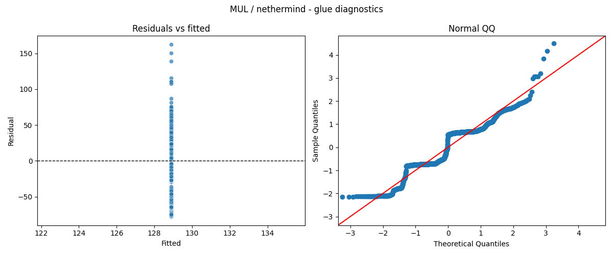

</details>

<details><summary><code>PC</code> · nobs=1032 · runtime_ms=6.17e-06 · p=1.00e-03 · R²=0.3916</summary>

```
==============================================================================
                           NNLS Regression Results                            
==============================================================================
Dep. Variable:          test_runtime_ms              R-squared:          0.392
Model:                  NNLS                    Adj. R-squared:          0.391
No. Observations:       1032                              RMSE:          17.09
Df Residuals:           1030                               MAE:          15.26
Df Model:               1      
==============================================================================
                      coef     std err     P-value      [0.025      0.975]
------------------------------------------------------------------------------
         const     78.1893      1.0093       0.001     76.2901     80.2008
            PC      0.0000      0.0000       0.001      0.0000      0.0000
==============================================================================
Notes: Non-negative least squares with bootstrap inference (1000 iterations)
==============================================================================
```

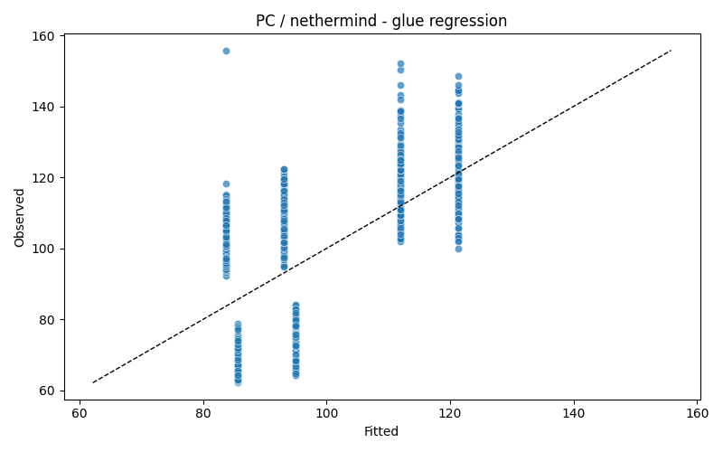


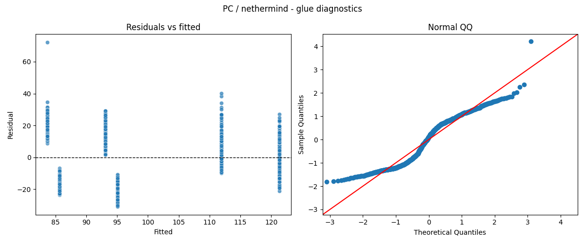

</details>

<details><summary><code>RETURNDATASIZE</code> · nobs=4128 · runtime_ms=5.786e-06 · p=1.00e-03 · R²=0.1404</summary>

```
==============================================================================
                           NNLS Regression Results                            
==============================================================================
Dep. Variable:          test_runtime_ms              R-squared:          0.140
Model:                  NNLS                    Adj. R-squared:          0.140
No. Observations:       4128                              RMSE:          16.80
Df Residuals:           4126                               MAE:           9.92
Df Model:               1      
==============================================================================
                      coef     std err     P-value      [0.025      0.975]
------------------------------------------------------------------------------
         const     47.3569      0.4646       0.001     46.4308     48.2339
RETURNDATASIZE      0.0000      0.0000       0.001      0.0000      0.0000
==============================================================================
Notes: Non-negative least squares with bootstrap inference (1000 iterations)
==============================================================================
```

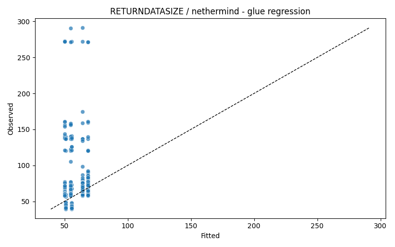

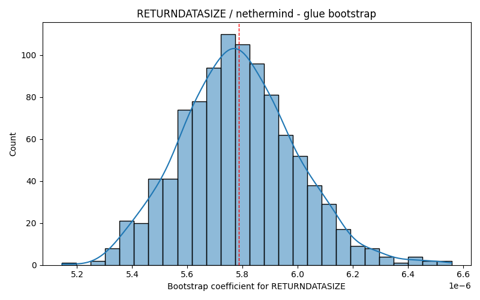

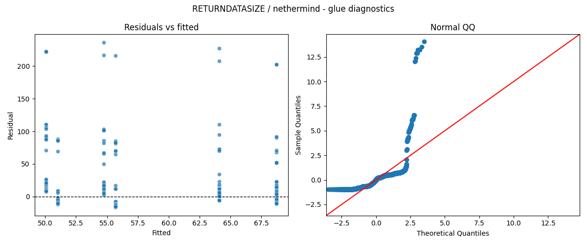

</details>

<details><summary><code>SELFBALANCE</code> · nobs=1892 · runtime_ms=0 · p=1.00e+00 · R²=0</summary>

```
==============================================================================
                           NNLS Regression Results                            
==============================================================================
Dep. Variable:          test_runtime_ms              R-squared:          0.000
Model:                  NNLS                    Adj. R-squared:         -0.001
No. Observations:       1892                              RMSE:          43.84
Df Residuals:           1890                               MAE:          38.50
Df Model:               1      
==============================================================================
                      coef     std err     P-value      [0.025      0.975]
------------------------------------------------------------------------------
         const    202.4454      1.0226       0.001    200.5321    204.4165
   SELFBALANCE      0.0000      0.0000       1.000      0.0000      0.0000
==============================================================================
Notes: Non-negative least squares with bootstrap inference (1000 iterations)
==============================================================================
```

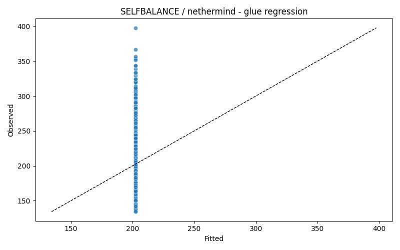


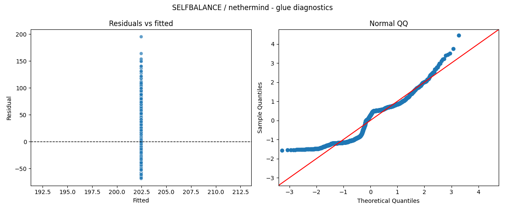

</details>

<details><summary><code>SUB</code> · nobs=1376 · runtime_ms=0 · p=1.00e+00 · R²=0</summary>

```
==============================================================================
                           NNLS Regression Results                            
==============================================================================
Dep. Variable:          test_runtime_ms              R-squared:          0.000
Model:                  NNLS                    Adj. R-squared:         -0.001
No. Observations:       1376                              RMSE:          25.89
Df Residuals:           1374                               MAE:          22.26
Df Model:               1      
==============================================================================
                      coef     std err     P-value      [0.025      0.975]
------------------------------------------------------------------------------
         const     84.5806      0.6842       0.001     83.2278     85.8995
           SUB      0.0000      0.0000       1.000      0.0000      0.0000
==============================================================================
Notes: Non-negative least squares with bootstrap inference (1000 iterations)
==============================================================================
```

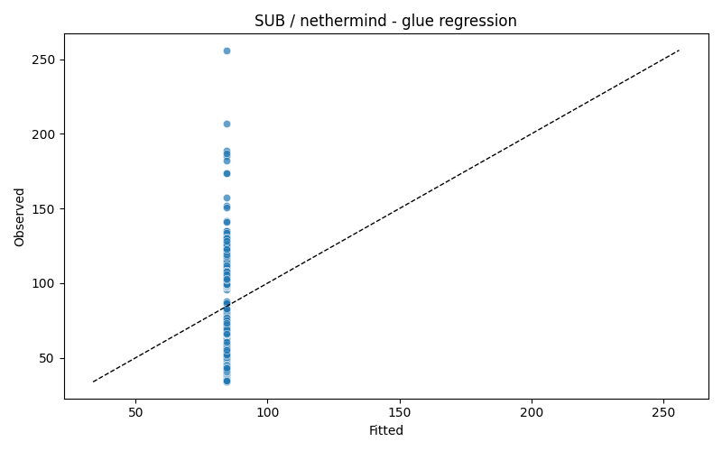


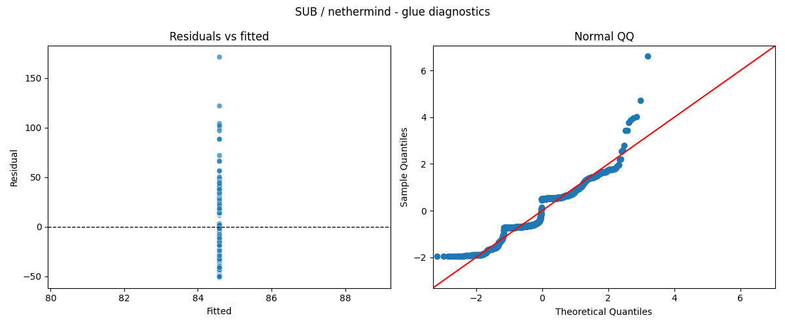

</details>

### Mixed glue (tier B) · nethermind

<details><summary><code>JUMP</code> · nobs=1720 · runtime_ms=0 · p=1.00e+00 · R²=0</summary>

```
==============================================================================
                           NNLS Regression Results                            
==============================================================================
Dep. Variable:          test_runtime_ms              R-squared:          0.000
Model:                  NNLS                    Adj. R-squared:         -0.001
No. Observations:       1720                              RMSE:          19.26
Df Residuals:           1718                               MAE:          16.73
Df Model:               1      
==============================================================================
                      coef     std err     P-value      [0.025      0.975]
------------------------------------------------------------------------------
         const     68.5527      0.4830       0.001     67.5955     69.5270
          JUMP      0.0000      0.0000       1.000      0.0000      0.0000
==============================================================================
Notes: Non-negative least squares with bootstrap inference (1000 iterations)
==============================================================================
```

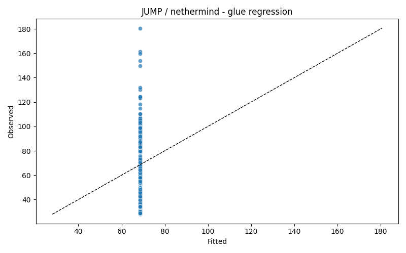


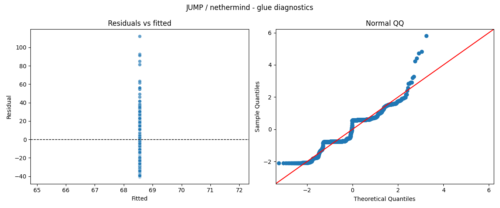

</details>

<details><summary><code>KECCAK256</code> · nobs=0 · runtime_ms=n/a · p=n/a · R²=n/a</summary>

</details>

## reth

| glue_opcode | nobs | glue_runtime_ms | p_value | rsquared |
| --- | --- | --- | --- | --- |
| `ISZERO` | 480 | 0 | 1.00e+00 | 2.22e-16 |
| `JUMPDEST` | 120 | 0 | 1.00e+00 | -2.22e-16 |
| `SWAP` | 8580 | 0 | 1.00e+00 | 1.11e-16 |
| `CALLDATASIZE` | 30230 | 6.642e-06 | 1.00e-03 | 0.2812 |
| `DUP` | 30230 | 0 | 1.00e+00 | 0.2812 |
| `GAS` | 30230 | 5.177e-06 | 1.00e-03 | 0.2812 |
| `MLOAD` | 30230 | 1.093e-05 | 1.00e-03 | 0.2812 |
| `PUSH` | 30230 | 0 | 1.00e+00 | 0.2812 |
| `PUSH0` | 30230 | 1.689e-06 | 1.00e-03 | 0.2812 |
| `STATICCALL` | 30230 | 2.396e-05 | 1.00e-03 | 0.2812 |
| `ADD` | 540 | 0 | 1.00e+00 | 0 |
| `AND` | 480 | 0 | 1.00e+00 | 0 |
| `CALLDATACOPY` | 14100 | 0 | 1.00e+00 | 0 |
| `CALLDATALOAD` | 2640 | 8.615e-06 | 6.20e-02 | 0.0009266 |
| `DIV` | 660 | 0 | 1.00e+00 | 0 |
| `EXP` | 660 | 0.0004825 | 1.00e-03 | 0.8523 |
| `GT` | 480 | 0 | 1.00e+00 | 2.22e-16 |
| `JUMPI` | 660 | 0 | 1.00e+00 | 0 |
| `LT` | 480 | 0 | 1.00e+00 | 0 |
| `MSTORE` | 2700 | 0 | 1.00e+00 | -2.22e-16 |
| `MSTORE8` | 2700 | 0 | 1.00e+00 | -2.22e-16 |
| `MUL` | 600 | 0 | 1.00e+00 | 0 |
| `PC` | 360 | 6.065e-06 | 1.00e-03 | 0.4535 |
| `RETURNDATASIZE` | 1440 | 6.914e-06 | 1.00e-03 | 0.3694 |
| `SELFBALANCE` | 660 | 0 | 1.00e+00 | -2.22e-16 |
| `SUB` | 480 | 0 | 1.00e+00 | 0 |
| `JUMP` | 600 | 0 | 1.00e+00 | 2.22e-16 |
| `KECCAK256` | 0 | n/a | n/a | n/a |

### Cycle glue — joint fit · reth

<details><summary>Joint NNLS regression summary</summary>

```
==============================================================================
                           NNLS Regression Results                            
==============================================================================
Dep. Variable:          test_runtime_ms              R-squared:          0.281
Model:                  NNLS                    Adj. R-squared:          0.281
No. Observations:       30230                             RMSE:          13.64
Df Residuals:           30222                              MAE:          11.30
Df Model:               7      
==============================================================================
                      coef     std err     P-value      [0.025      0.975]
------------------------------------------------------------------------------
         const     45.7238      0.0799       0.001     45.5665     45.8833
  CALLDATASIZE      0.0000      0.0000       0.001      0.0000      0.0000
           DUP      0.0000      0.0000       1.000      0.0000      0.0000
           GAS      0.0000      0.0000       0.001      0.0000      0.0000
         MLOAD      0.0000      0.0000       0.001      0.0000      0.0000
          PUSH      0.0000      0.0000       1.000      0.0000      0.0000
         PUSH0      0.0000      0.0000       0.001      0.0000      0.0000
    STATICCALL      0.0000      0.0000       0.001      0.0000      0.0000
==============================================================================
Notes: Non-negative least squares with bootstrap inference (1000 iterations)
==============================================================================
```

</details>

<details><summary><code>CALLDATASIZE</code> · nobs=30230 · runtime_ms=6.642e-06 · p=1.00e-03 · R²=0.2812</summary>

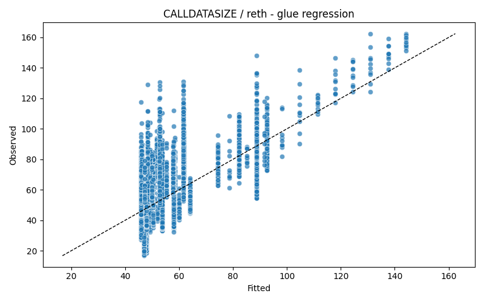

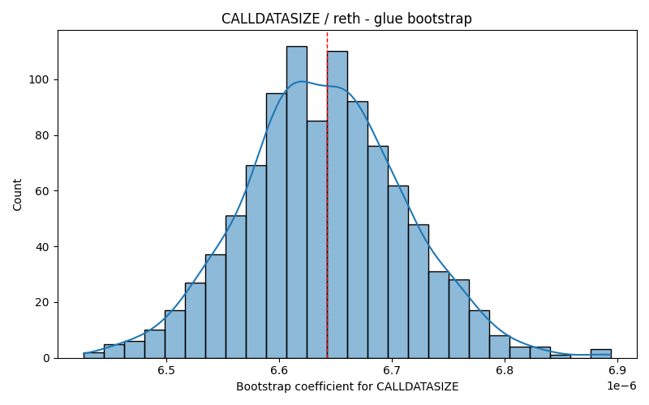


</details>

<details><summary><code>DUP</code> · nobs=30230 · runtime_ms=0 · p=1.00e+00 · R²=0.2812</summary>

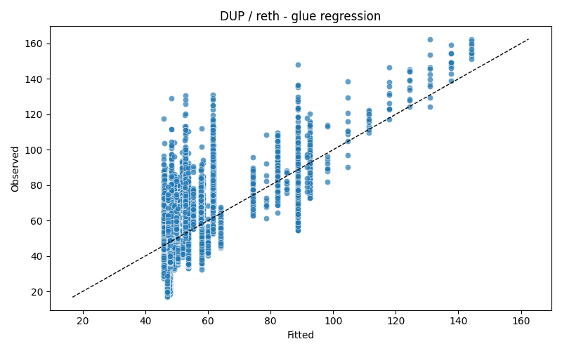


</details>

<details><summary><code>GAS</code> · nobs=30230 · runtime_ms=5.177e-06 · p=1.00e-03 · R²=0.2812</summary>

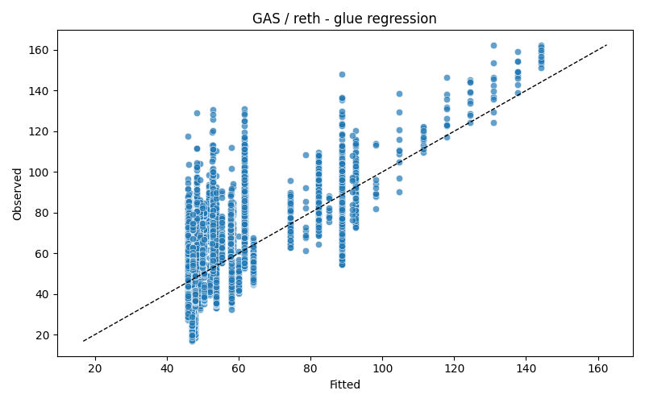

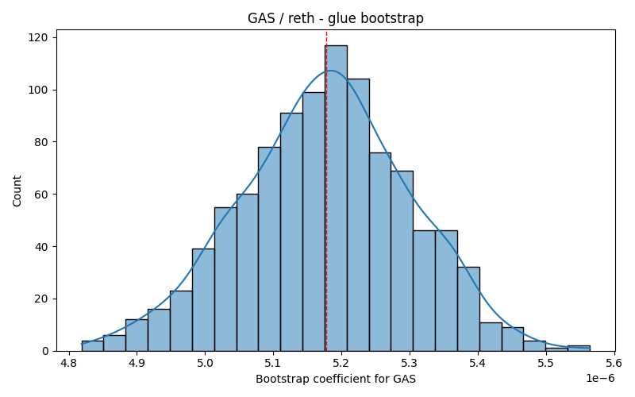

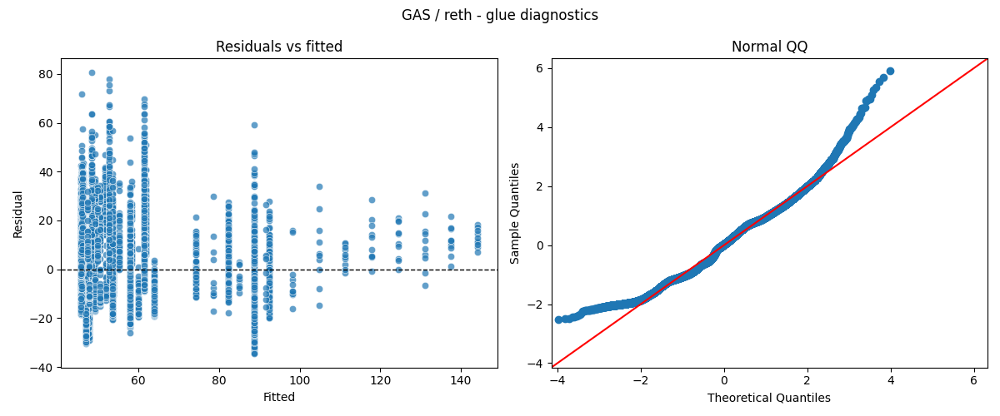

</details>

<details><summary><code>MLOAD</code> · nobs=30230 · runtime_ms=1.093e-05 · p=1.00e-03 · R²=0.2812</summary>

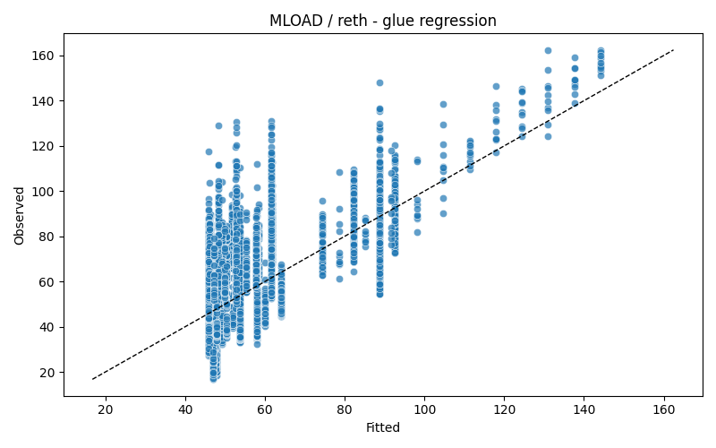

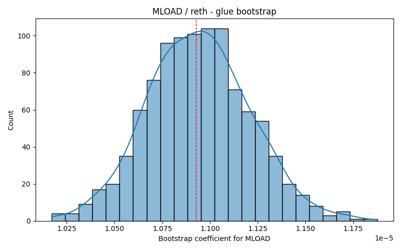


</details>

<details><summary><code>PUSH</code> · nobs=30230 · runtime_ms=0 · p=1.00e+00 · R²=0.2812</summary>


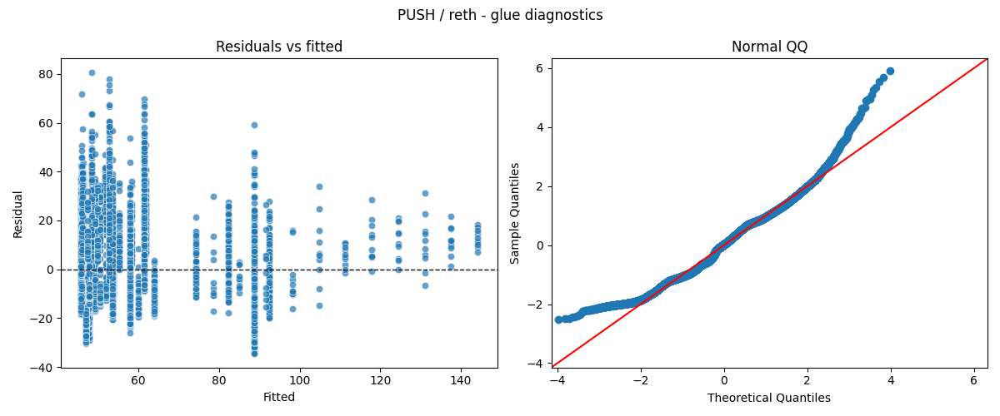

</details>

<details><summary><code>PUSH0</code> · nobs=30230 · runtime_ms=1.689e-06 · p=1.00e-03 · R²=0.2812</summary>


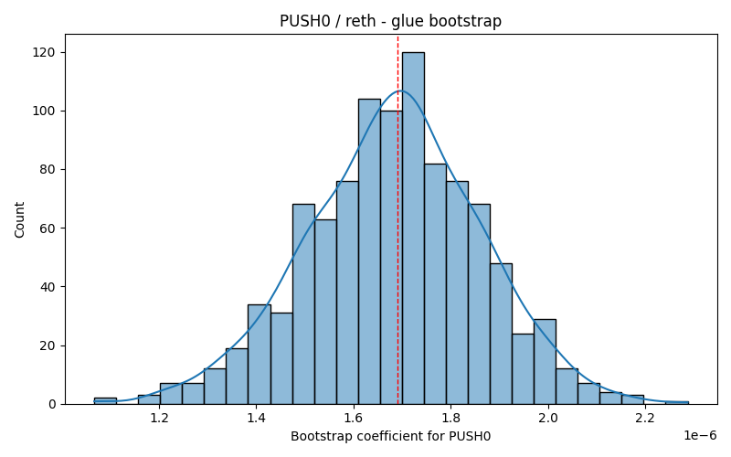


</details>

<details><summary><code>STATICCALL</code> · nobs=30230 · runtime_ms=2.396e-05 · p=1.00e-03 · R²=0.2812</summary>


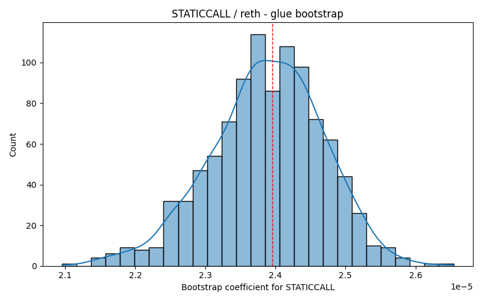


</details>

### Pure glue · reth

<details><summary><code>ISZERO</code> · nobs=480 · runtime_ms=0 · p=1.00e+00 · R²=2.22e-16</summary>

```
==============================================================================
                           NNLS Regression Results                            
==============================================================================
Dep. Variable:          test_runtime_ms              R-squared:          0.000
Model:                  NNLS                    Adj. R-squared:         -0.002
No. Observations:       480                               RMSE:          33.48
Df Residuals:           478                                MAE:          30.54
Df Model:               1      
==============================================================================
                      coef     std err     P-value      [0.025      0.975]
------------------------------------------------------------------------------
         const    119.6771      1.5818       0.001    116.6708    122.8205
        ISZERO      0.0000      0.0000       1.000      0.0000      0.0000
==============================================================================
Notes: Non-negative least squares with bootstrap inference (1000 iterations)
==============================================================================
```

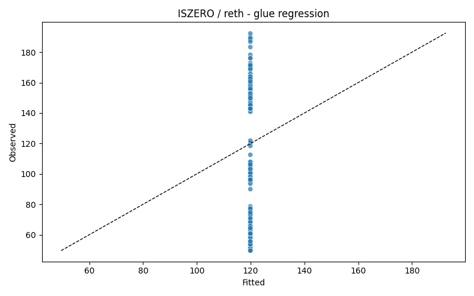


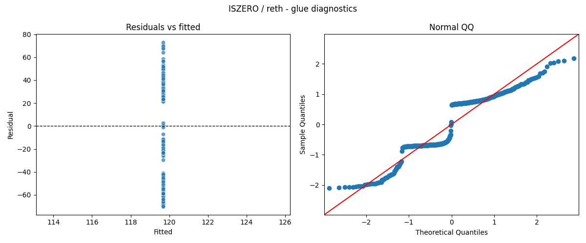

</details>

<details><summary><code>JUMPDEST</code> · nobs=120 · runtime_ms=0 · p=1.00e+00 · R²=-2.22e-16</summary>

```
==============================================================================
                           NNLS Regression Results                            
==============================================================================
Dep. Variable:          test_runtime_ms              R-squared:         -0.000
Model:                  NNLS                    Adj. R-squared:         -0.008
No. Observations:       120                               RMSE:          18.96
Df Residuals:           118                                MAE:          15.75
Df Model:               1      
==============================================================================
                      coef     std err     P-value      [0.025      0.975]
------------------------------------------------------------------------------
         const     72.6952      1.7099       0.001     69.4206     76.0429
      JUMPDEST      0.0000      0.0000       1.000      0.0000      0.0000
==============================================================================
Notes: Non-negative least squares with bootstrap inference (1000 iterations)
==============================================================================
```

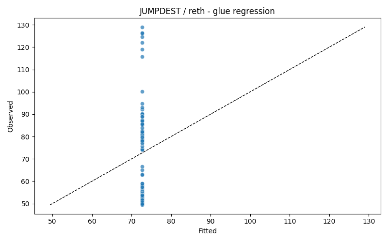


</details>

<details><summary><code>SWAP</code> · nobs=8580 · runtime_ms=0 · p=1.00e+00 · R²=1.11e-16</summary>

```
==============================================================================
                           NNLS Regression Results                            
==============================================================================
Dep. Variable:          test_runtime_ms              R-squared:          0.000
Model:                  NNLS                    Adj. R-squared:         -0.000
No. Observations:       8580                              RMSE:          13.08
Df Residuals:           8578                               MAE:          10.78
Df Model:               1      
==============================================================================
                      coef     std err     P-value      [0.025      0.975]
------------------------------------------------------------------------------
         const     45.6933      0.1416       0.001     45.4273     45.9764
          SWAP      0.0000      0.0000       1.000      0.0000      0.0000
==============================================================================
Notes: Non-negative least squares with bootstrap inference (1000 iterations)
==============================================================================
```

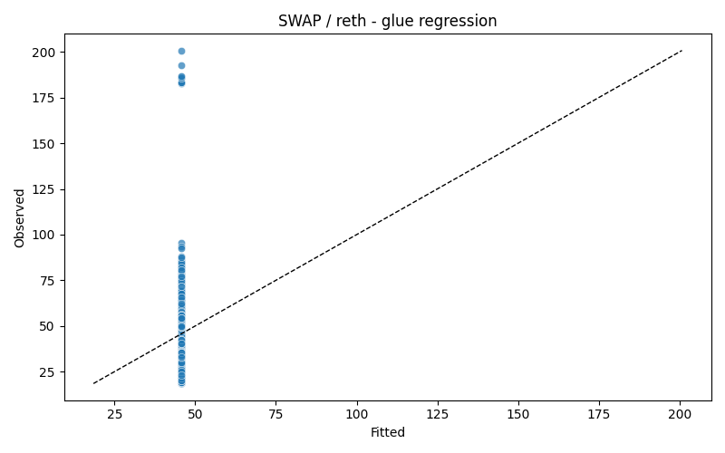


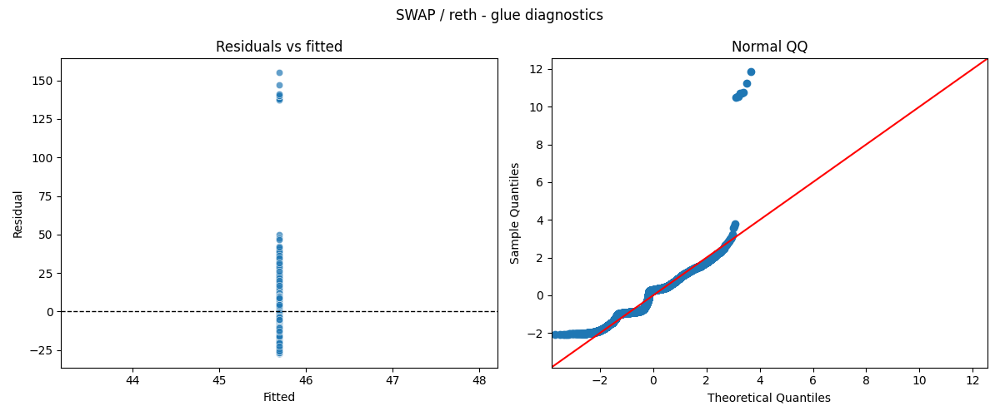

</details>

### Mixed glue (tier A) · reth

<details><summary><code>ADD</code> · nobs=540 · runtime_ms=0 · p=1.00e+00 · R²=0</summary>

```
==============================================================================
                           NNLS Regression Results                            
==============================================================================
Dep. Variable:          test_runtime_ms              R-squared:          0.000
Model:                  NNLS                    Adj. R-squared:         -0.002
No. Observations:       540                               RMSE:          12.39
Df Residuals:           538                                MAE:          10.45
Df Model:               1      
==============================================================================
                      coef     std err     P-value      [0.025      0.975]
------------------------------------------------------------------------------
         const     42.6020      0.5417       0.001     41.5793     43.6988
           ADD      0.0000      0.0000       1.000      0.0000      0.0000
==============================================================================
Notes: Non-negative least squares with bootstrap inference (1000 iterations)
==============================================================================
```

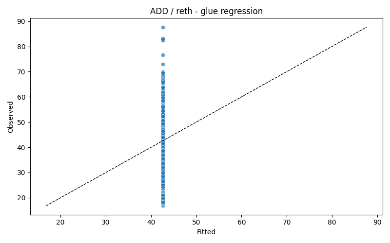


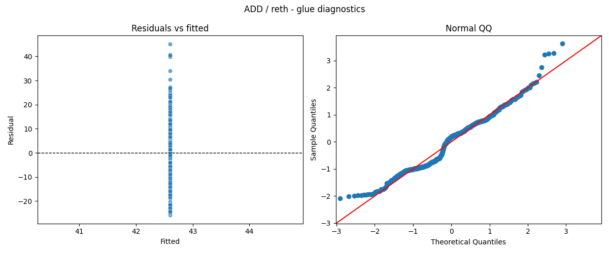

</details>

<details><summary><code>AND</code> · nobs=480 · runtime_ms=0 · p=1.00e+00 · R²=0</summary>

```
==============================================================================
                           NNLS Regression Results                            
==============================================================================
Dep. Variable:          test_runtime_ms              R-squared:          0.000
Model:                  NNLS                    Adj. R-squared:         -0.002
No. Observations:       480                               RMSE:          12.45
Df Residuals:           478                                MAE:          10.12
Df Model:               1      
==============================================================================
                      coef     std err     P-value      [0.025      0.975]
------------------------------------------------------------------------------
         const     39.1068      0.5621       0.001     38.0092     40.2524
           AND      0.0000      0.0000       1.000      0.0000      0.0000
==============================================================================
Notes: Non-negative least squares with bootstrap inference (1000 iterations)
==============================================================================
```

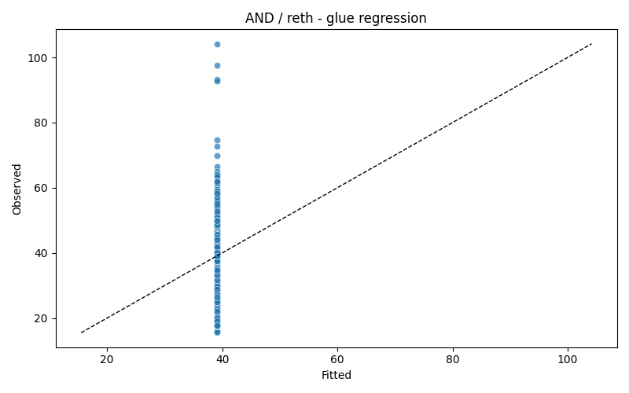


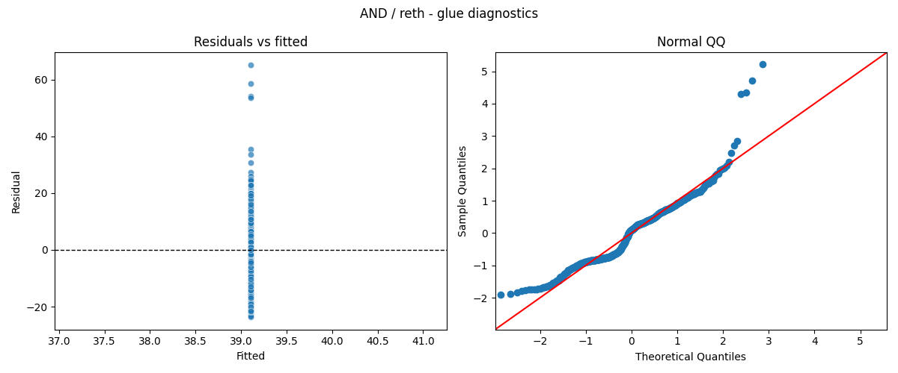

</details>

<details><summary><code>CALLDATACOPY</code> · nobs=14100 · runtime_ms=0 · p=1.00e+00 · R²=0</summary>

```
==============================================================================
                           NNLS Regression Results                            
==============================================================================
Dep. Variable:          test_runtime_ms              R-squared:          0.000
Model:                  NNLS                    Adj. R-squared:         -0.000
No. Observations:       14100                             RMSE:          20.40
Df Residuals:           14098                              MAE:          17.19
Df Model:               1      
==============================================================================
                      coef     std err     P-value      [0.025      0.975]
------------------------------------------------------------------------------
         const     36.2054      0.1671       0.001     35.8816     36.5258
  CALLDATACOPY      0.0000      0.0000       1.000      0.0000      0.0000
==============================================================================
Notes: Non-negative least squares with bootstrap inference (1000 iterations)
==============================================================================
```

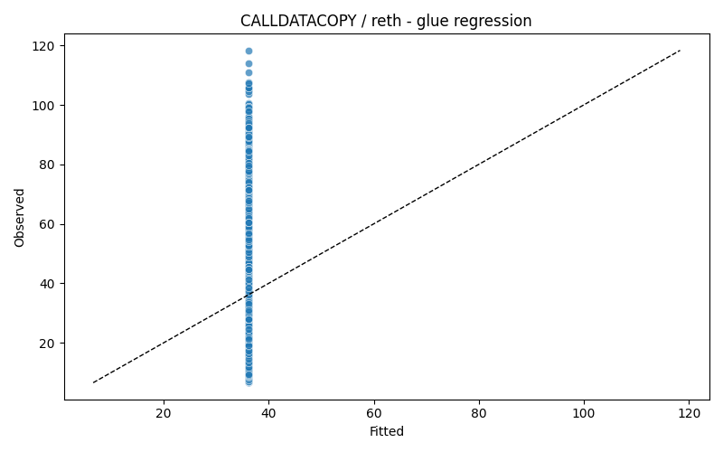


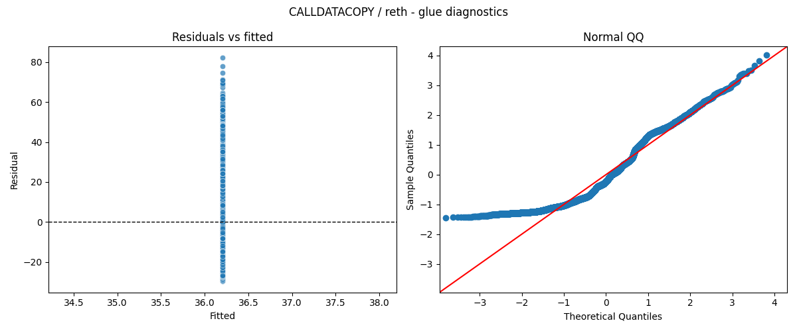

</details>

<details><summary><code>CALLDATALOAD</code> · nobs=2640 · runtime_ms=8.615e-06 · p=6.20e-02 · R²=0.0009266</summary>

```
==============================================================================
                           NNLS Regression Results                            
==============================================================================
Dep. Variable:          test_runtime_ms              R-squared:          0.001
Model:                  NNLS                    Adj. R-squared:          0.001
No. Observations:       2640                              RMSE:           1.09
Df Residuals:           2638                               MAE:           0.66
Df Model:               1      
==============================================================================
                      coef     std err     P-value      [0.025      0.975]
------------------------------------------------------------------------------
         const      3.3474      0.0740       0.001      3.1897      3.4709
  CALLDATALOAD      0.0000      0.0000       0.062      0.0000      0.0000
==============================================================================
Notes: Non-negative least squares with bootstrap inference (1000 iterations)
==============================================================================
```

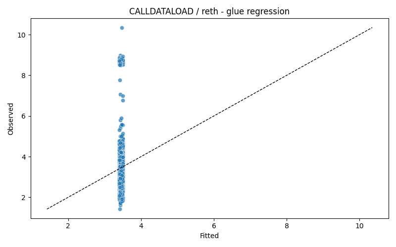

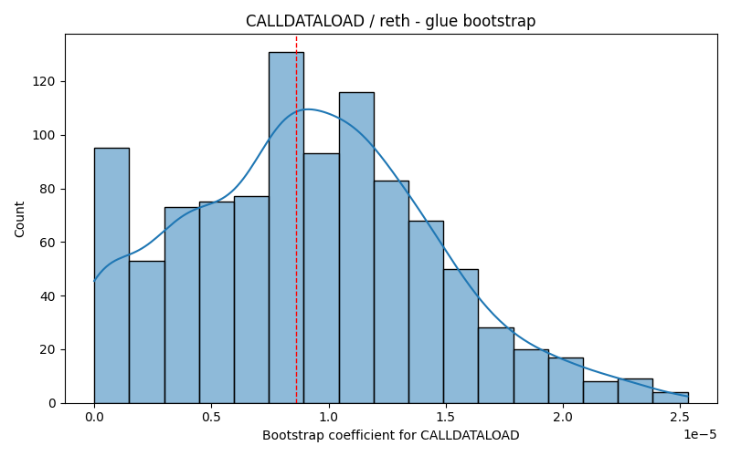

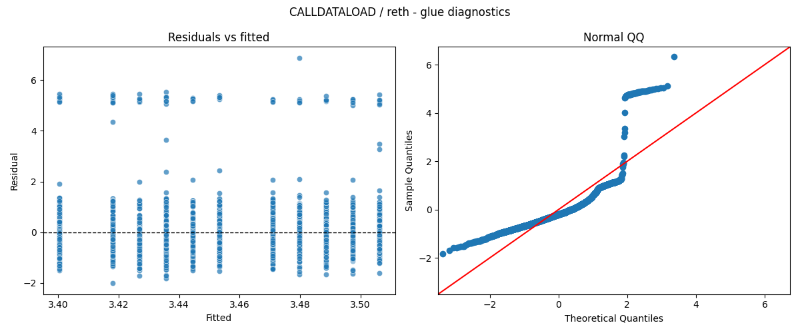

</details>

<details><summary><code>DIV</code> · nobs=660 · runtime_ms=0 · p=1.00e+00 · R²=0</summary>

```
==============================================================================
                           NNLS Regression Results                            
==============================================================================
Dep. Variable:          test_runtime_ms              R-squared:          0.000
Model:                  NNLS                    Adj. R-squared:         -0.002
No. Observations:       660                               RMSE:          59.32
Df Residuals:           658                                MAE:          53.74
Df Model:               1      
==============================================================================
                      coef     std err     P-value      [0.025      0.975]
------------------------------------------------------------------------------
         const    232.9778      2.3162       0.001    228.4406    237.6472
           DIV      0.0000      0.0000       1.000      0.0000      0.0000
==============================================================================
Notes: Non-negative least squares with bootstrap inference (1000 iterations)
==============================================================================
```

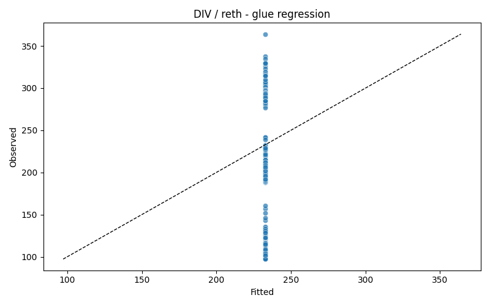


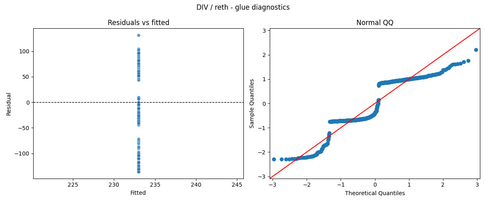

</details>

<details><summary><code>EXP</code> · nobs=660 · runtime_ms=0.0004825 · p=1.00e-03 · R²=0.8523</summary>

```
==============================================================================
                           NNLS Regression Results                            
==============================================================================
Dep. Variable:          test_runtime_ms              R-squared:          0.852
Model:                  NNLS                    Adj. R-squared:          0.852
No. Observations:       660                               RMSE:           7.87
Df Residuals:           658                                MAE:           6.35
Df Model:               1      
==============================================================================
                      coef     std err     P-value      [0.025      0.975]
------------------------------------------------------------------------------
         const     23.3146      1.0844       0.001     21.1950     25.3616
           EXP      0.0005      0.0000       0.001      0.0005      0.0005
==============================================================================
Notes: Non-negative least squares with bootstrap inference (1000 iterations)
==============================================================================
```

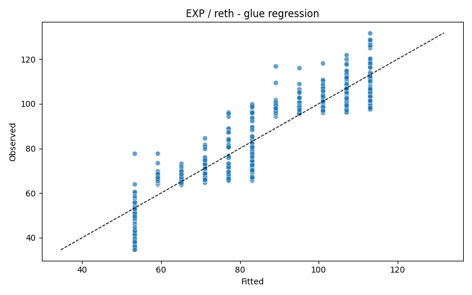

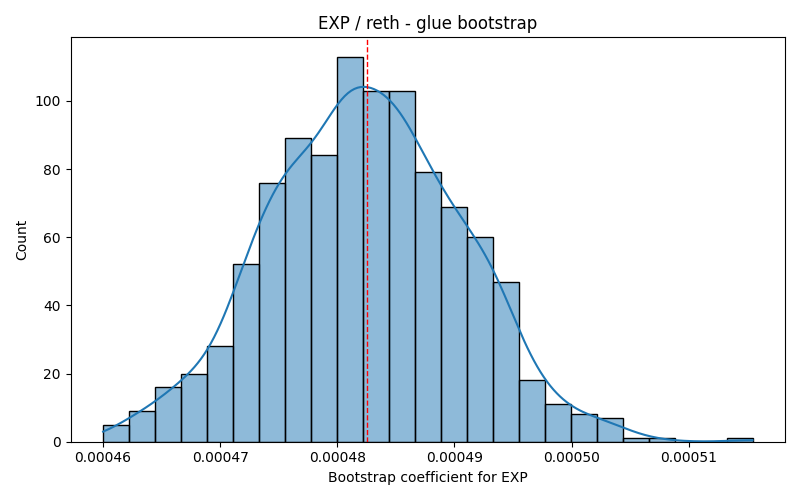

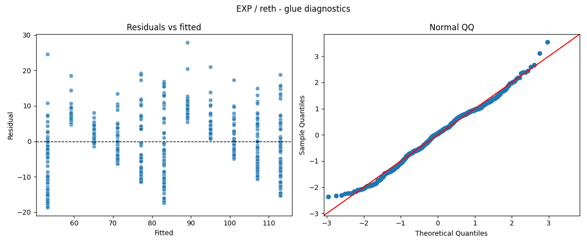

</details>

<details><summary><code>GT</code> · nobs=480 · runtime_ms=0 · p=1.00e+00 · R²=2.22e-16</summary>

```
==============================================================================
                           NNLS Regression Results                            
==============================================================================
Dep. Variable:          test_runtime_ms              R-squared:          0.000
Model:                  NNLS                    Adj. R-squared:         -0.002
No. Observations:       480                               RMSE:          12.18
Df Residuals:           478                                MAE:          10.61
Df Model:               1      
==============================================================================
                      coef     std err     P-value      [0.025      0.975]
------------------------------------------------------------------------------
         const     43.8285      0.5527       0.001     42.7586     44.9539
            GT      0.0000      0.0000       1.000      0.0000      0.0000
==============================================================================
Notes: Non-negative least squares with bootstrap inference (1000 iterations)
==============================================================================
```

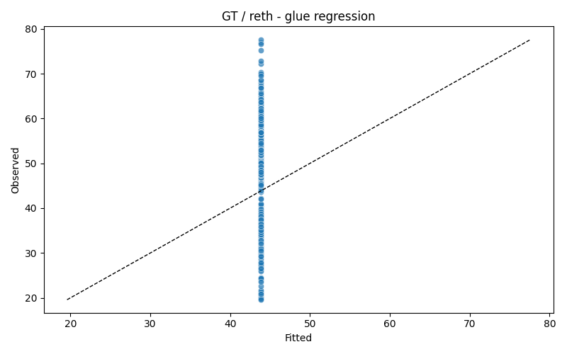

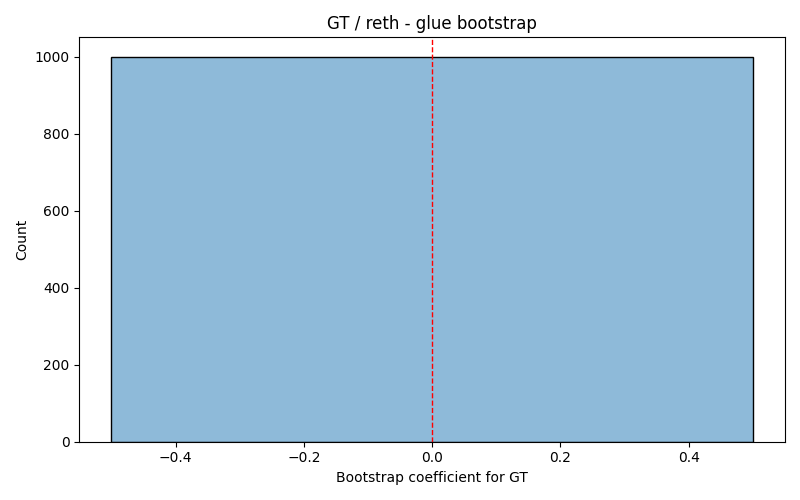

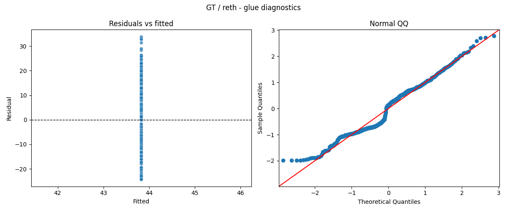

</details>

<details><summary><code>JUMPI</code> · nobs=660 · runtime_ms=0 · p=1.00e+00 · R²=0</summary>

```
==============================================================================
                           NNLS Regression Results                            
==============================================================================
Dep. Variable:          test_runtime_ms              R-squared:          0.000
Model:                  NNLS                    Adj. R-squared:         -0.002
No. Observations:       660                               RMSE:           7.39
Df Residuals:           658                                MAE:           5.95
Df Model:               1      
==============================================================================
                      coef     std err     P-value      [0.025      0.975]
------------------------------------------------------------------------------
         const     27.1113      0.2905       0.001     26.5444     27.6626
         JUMPI      0.0000      0.0000       1.000      0.0000      0.0000
==============================================================================
Notes: Non-negative least squares with bootstrap inference (1000 iterations)
==============================================================================
```

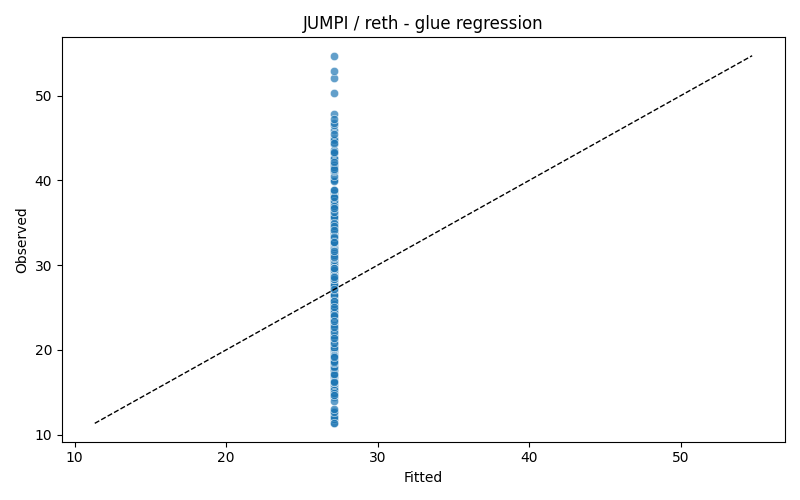


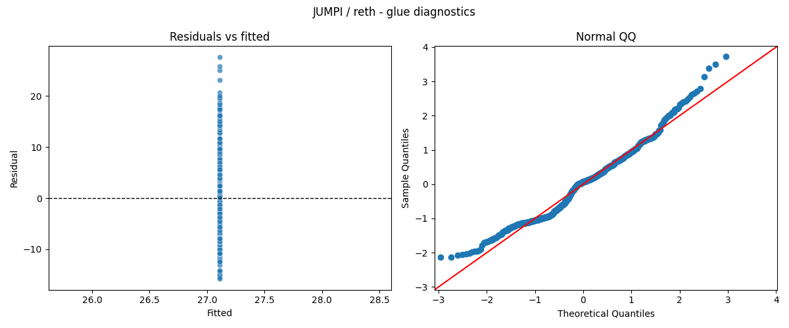

</details>

<details><summary><code>LT</code> · nobs=480 · runtime_ms=0 · p=1.00e+00 · R²=0</summary>

```
==============================================================================
                           NNLS Regression Results                            
==============================================================================
Dep. Variable:          test_runtime_ms              R-squared:          0.000
Model:                  NNLS                    Adj. R-squared:         -0.002
No. Observations:       480                               RMSE:          11.81
Df Residuals:           478                                MAE:          10.48
Df Model:               1      
==============================================================================
                      coef     std err     P-value      [0.025      0.975]
------------------------------------------------------------------------------
         const     42.4770      0.5349       0.001     41.3789     43.5361
            LT      0.0000      0.0000       1.000      0.0000      0.0000
==============================================================================
Notes: Non-negative least squares with bootstrap inference (1000 iterations)
==============================================================================
```

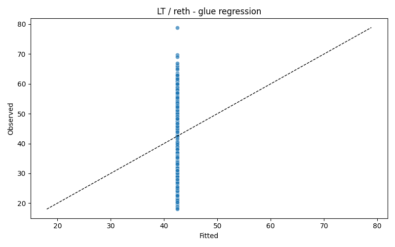


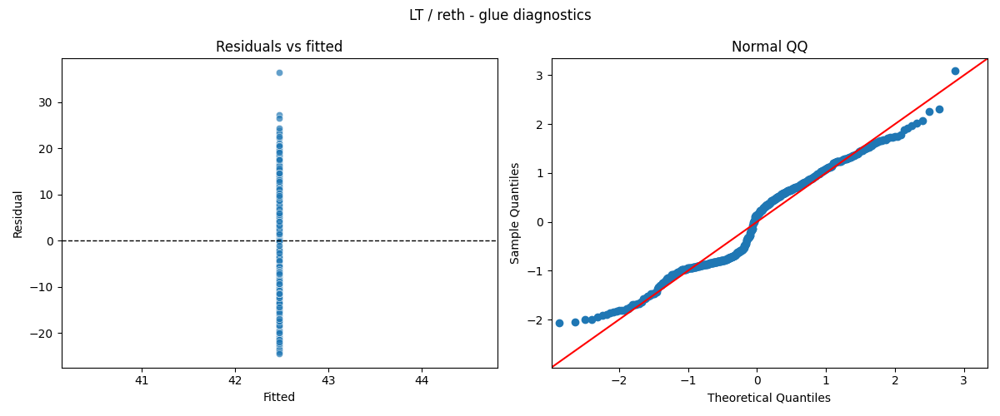

</details>

<details><summary><code>MSTORE</code> · nobs=2700 · runtime_ms=0 · p=1.00e+00 · R²=-2.22e-16</summary>

```
==============================================================================
                           NNLS Regression Results                            
==============================================================================
Dep. Variable:          test_runtime_ms              R-squared:         -0.000
Model:                  NNLS                    Adj. R-squared:         -0.000
No. Observations:       2700                              RMSE:          35.20
Df Residuals:           2698                               MAE:          30.37
Df Model:               1      
==============================================================================
                      coef     std err     P-value      [0.025      0.975]
------------------------------------------------------------------------------
         const     78.2848      0.6697       0.001     77.0469     79.6296
        MSTORE      0.0000      0.0000       1.000      0.0000      0.0000
==============================================================================
Notes: Non-negative least squares with bootstrap inference (1000 iterations)
==============================================================================
```

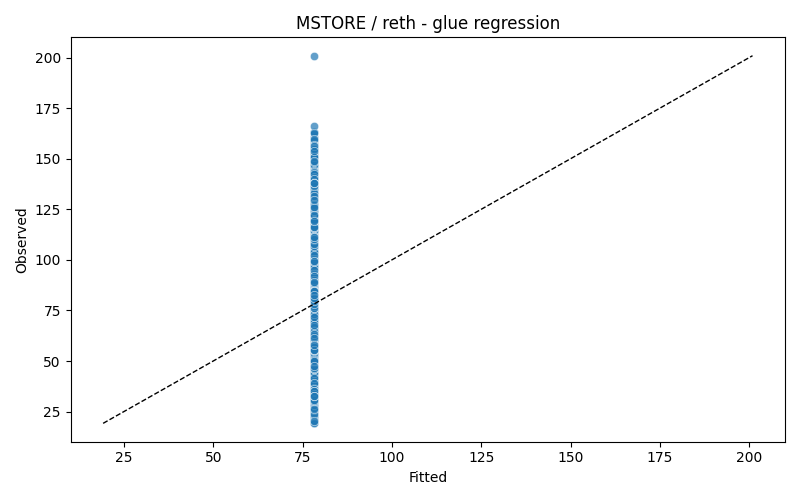


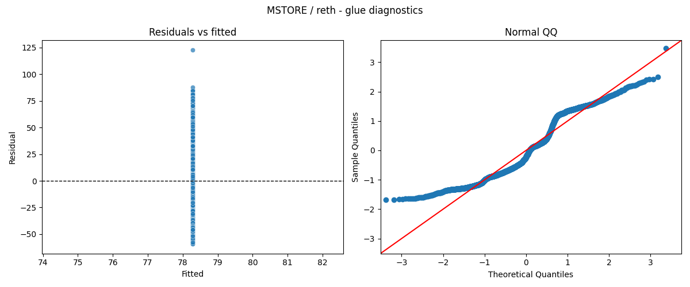

</details>

<details><summary><code>MSTORE8</code> · nobs=2700 · runtime_ms=0 · p=1.00e+00 · R²=-2.22e-16</summary>

```
==============================================================================
                           NNLS Regression Results                            
==============================================================================
Dep. Variable:          test_runtime_ms              R-squared:         -0.000
Model:                  NNLS                    Adj. R-squared:         -0.000
No. Observations:       2700                              RMSE:          12.47
Df Residuals:           2698                               MAE:          10.51
Df Model:               1      
==============================================================================
                      coef     std err     P-value      [0.025      0.975]
------------------------------------------------------------------------------
         const     43.8429      0.2435       0.001     43.4028     44.3230
       MSTORE8      0.0000      0.0000       1.000      0.0000      0.0000
==============================================================================
Notes: Non-negative least squares with bootstrap inference (1000 iterations)
==============================================================================
```

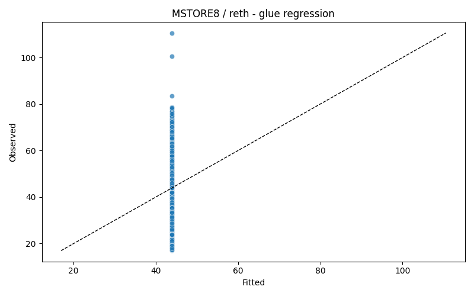


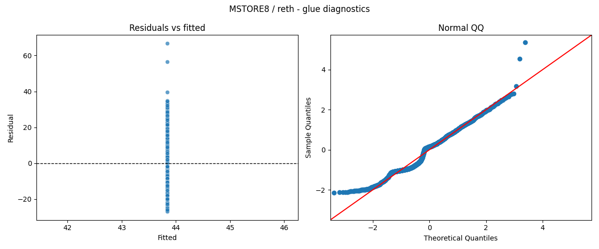

</details>

<details><summary><code>MUL</code> · nobs=600 · runtime_ms=0 · p=1.00e+00 · R²=0</summary>

```
==============================================================================
                           NNLS Regression Results                            
==============================================================================
Dep. Variable:          test_runtime_ms              R-squared:          0.000
Model:                  NNLS                    Adj. R-squared:         -0.002
No. Observations:       600                               RMSE:          10.65
Df Residuals:           598                                MAE:           8.91
Df Model:               1      
==============================================================================
                      coef     std err     P-value      [0.025      0.975]
------------------------------------------------------------------------------
         const     40.1884      0.4244       0.001     39.3232     40.9981
           MUL      0.0000      0.0000       1.000      0.0000      0.0000
==============================================================================
Notes: Non-negative least squares with bootstrap inference (1000 iterations)
==============================================================================
```

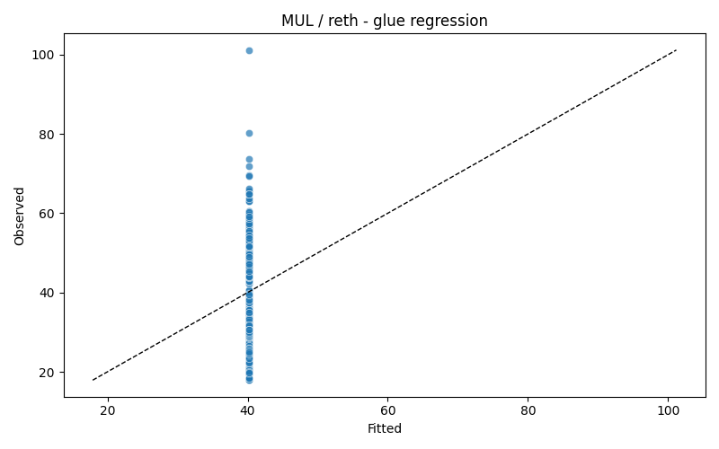


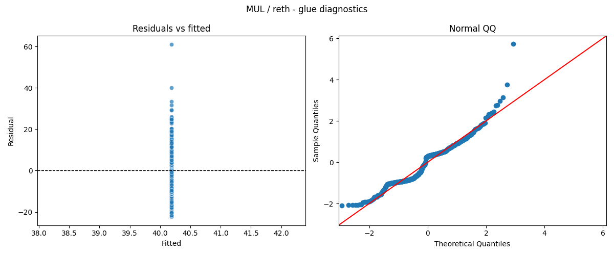

</details>

<details><summary><code>PC</code> · nobs=360 · runtime_ms=6.065e-06 · p=1.00e-03 · R²=0.4535</summary>

```
==============================================================================
                           NNLS Regression Results                            
==============================================================================
Dep. Variable:          test_runtime_ms              R-squared:          0.453
Model:                  NNLS                    Adj. R-squared:          0.452
No. Observations:       360                               RMSE:          14.80
Df Residuals:           358                                MAE:          12.68
Df Model:               1      
==============================================================================
                      coef     std err     P-value      [0.025      0.975]
------------------------------------------------------------------------------
         const     58.6839      1.4898       0.001     55.9808     61.7609
            PC      0.0000      0.0000       0.001      0.0000      0.0000
==============================================================================
Notes: Non-negative least squares with bootstrap inference (1000 iterations)
==============================================================================
```

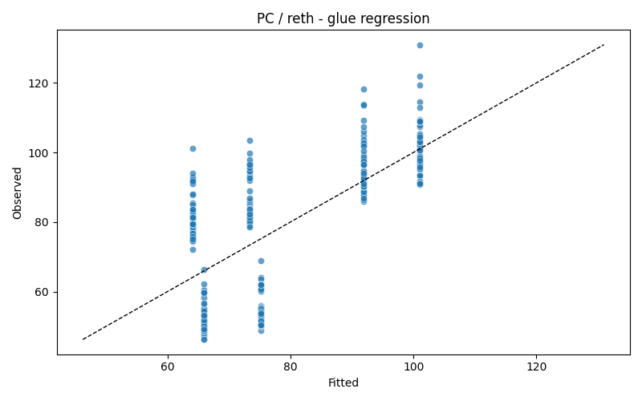

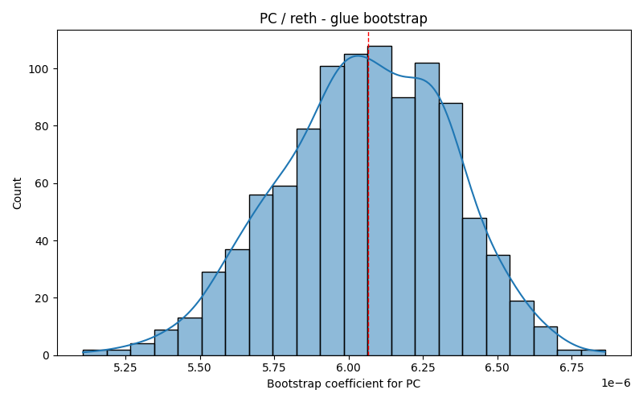

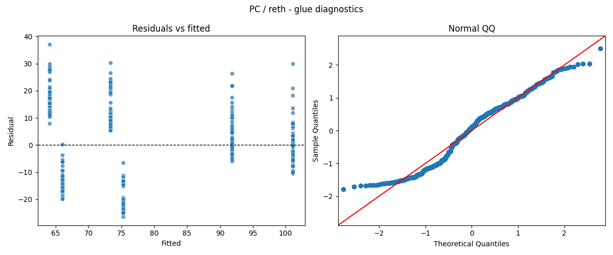

</details>

<details><summary><code>RETURNDATASIZE</code> · nobs=1440 · runtime_ms=6.914e-06 · p=1.00e-03 · R²=0.3694</summary>

```
==============================================================================
                           NNLS Regression Results                            
==============================================================================
Dep. Variable:          test_runtime_ms              R-squared:          0.369
Model:                  NNLS                    Adj. R-squared:          0.369
No. Observations:       1440                              RMSE:          10.60
Df Residuals:           1438                               MAE:           9.23
Df Model:               1      
==============================================================================
                      coef     std err     P-value      [0.025      0.975]
------------------------------------------------------------------------------
         const     47.4360      0.5201       0.001     46.4501     48.4677
RETURNDATASIZE      0.0000      0.0000       0.001      0.0000      0.0000
==============================================================================
Notes: Non-negative least squares with bootstrap inference (1000 iterations)
==============================================================================
```

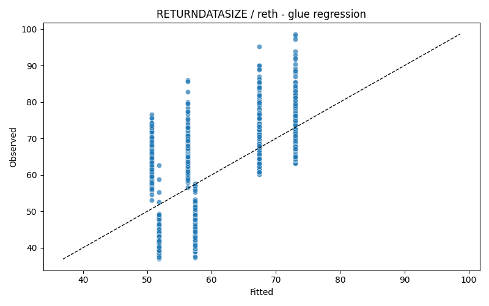

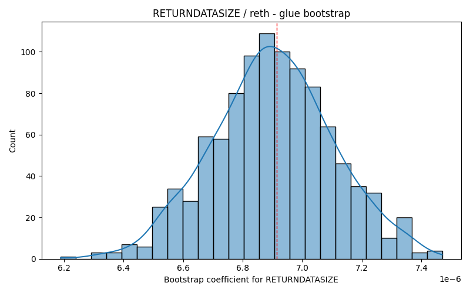

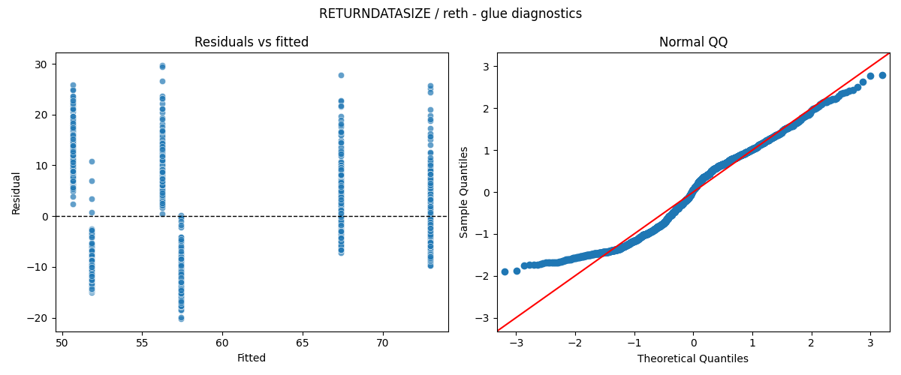

</details>

<details><summary><code>SELFBALANCE</code> · nobs=660 · runtime_ms=0 · p=1.00e+00 · R²=-2.22e-16</summary>

```
==============================================================================
                           NNLS Regression Results                            
==============================================================================
Dep. Variable:          test_runtime_ms              R-squared:         -0.000
Model:                  NNLS                    Adj. R-squared:         -0.002
No. Observations:       660                               RMSE:          53.22
Df Residuals:           658                                MAE:          47.77
Df Model:               1      
==============================================================================
                      coef     std err     P-value      [0.025      0.975]
------------------------------------------------------------------------------
         const    209.2106      2.0694       0.001    205.3573    213.3044
   SELFBALANCE      0.0000      0.0000       1.000      0.0000      0.0000
==============================================================================
Notes: Non-negative least squares with bootstrap inference (1000 iterations)
==============================================================================
```

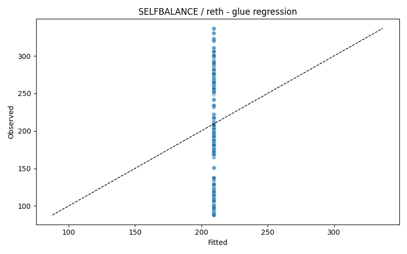


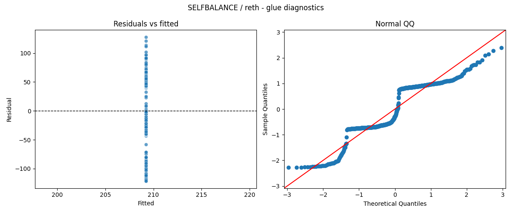

</details>

<details><summary><code>SUB</code> · nobs=480 · runtime_ms=0 · p=1.00e+00 · R²=0</summary>

```
==============================================================================
                           NNLS Regression Results                            
==============================================================================
Dep. Variable:          test_runtime_ms              R-squared:          0.000
Model:                  NNLS                    Adj. R-squared:         -0.002
No. Observations:       480                               RMSE:          12.81
Df Residuals:           478                                MAE:          10.52
Df Model:               1      
==============================================================================
                      coef     std err     P-value      [0.025      0.975]
------------------------------------------------------------------------------
         const     41.0563      0.5776       0.001     40.0298     42.2630
           SUB      0.0000      0.0000       1.000      0.0000      0.0000
==============================================================================
Notes: Non-negative least squares with bootstrap inference (1000 iterations)
==============================================================================
```

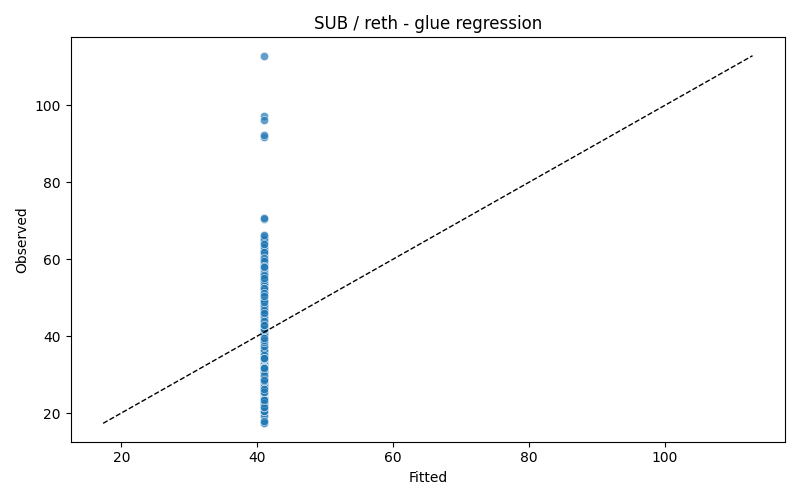


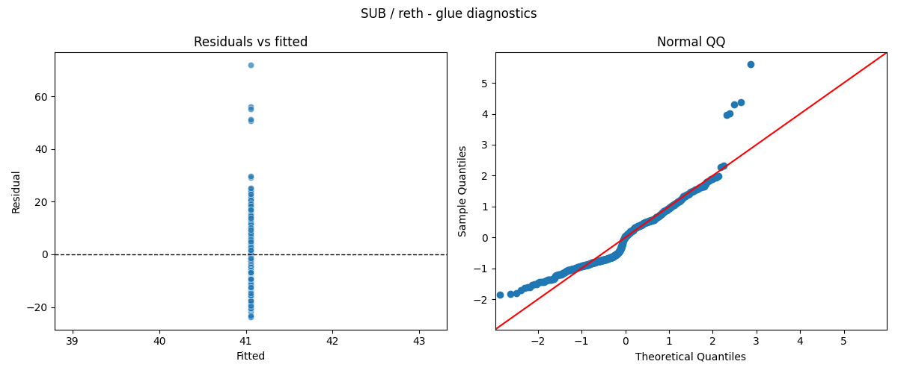

</details>

### Mixed glue (tier B) · reth

<details><summary><code>JUMP</code> · nobs=600 · runtime_ms=0 · p=1.00e+00 · R²=2.22e-16</summary>

```
==============================================================================
                           NNLS Regression Results                            
==============================================================================
Dep. Variable:          test_runtime_ms              R-squared:          0.000
Model:                  NNLS                    Adj. R-squared:         -0.002
No. Observations:       600                               RMSE:          11.08
Df Residuals:           598                                MAE:           9.42
Df Model:               1      
==============================================================================
                      coef     std err     P-value      [0.025      0.975]
------------------------------------------------------------------------------
         const     38.9060      0.4517       0.001     38.0239     39.7434
          JUMP      0.0000      0.0000       1.000      0.0000      0.0000
==============================================================================
Notes: Non-negative least squares with bootstrap inference (1000 iterations)
==============================================================================
```

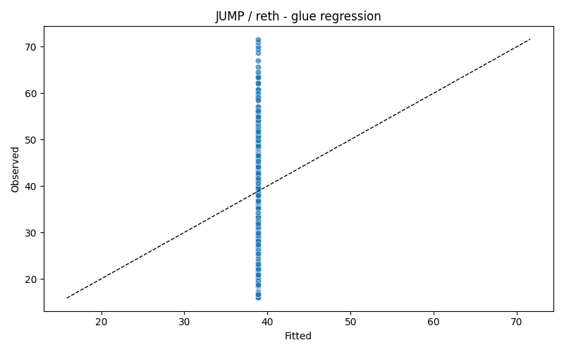


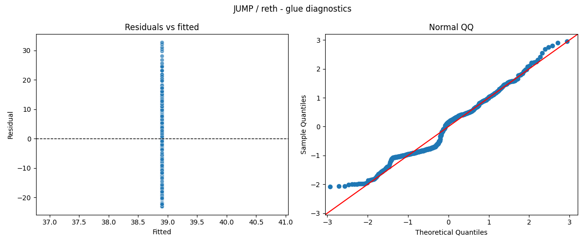

</details>

<details><summary><code>KECCAK256</code> · nobs=0 · runtime_ms=n/a · p=n/a · R²=n/a</summary>

</details>
