# Glue opcodes report

Per-client NNLS fits of priced glue opcodes against their driver fixtures. Cycle-tier opcodes share one joint regression per client (shown once); pure-tier and mixed-tier opcodes each get a single-feature fit. Mixed-tier fits pre-adjust the LHS by subtracting the contribution of every priced upstream partner selected by the detector (pure ∪ cycle for `mixed_a`, plus `mixed_a` for `mixed_b`).

**Contents:** [besu](#besu) · [erigon](#erigon) · [ethrex](#ethrex) · [geth](#geth) · [nethermind](#nethermind) · [reth](#reth)

## besu

| glue_opcode | nobs | glue_runtime_ms | p_value | rsquared |
| --- | --- | --- | --- | --- |
| `ISZERO` | 0 | n/a | n/a | n/a |
| `JUMPDEST` | 0 | n/a | n/a | n/a |
| `SWAP` | 0 | n/a | n/a | n/a |
| `CALLDATASIZE` | 66 | 0 | 1.00e+00 | 0.9471 |
| `DUP` | 66 | 0 | 1.00e+00 | 0.9471 |
| `GAS` | 66 | 0 | 1.00e+00 | 0.9471 |
| `MLOAD` | 66 | 0 | 1.00e+00 | 0.9471 |
| `PUSH` | 66 | 8.656e-05 | 1.00e-03 | 0.9471 |
| `PUSH0` | 66 | 0 | 1.00e+00 | 0.9471 |
| `STATICCALL` | 66 | 0 | 1.00e+00 | 0.9471 |
| `ADD` | 0 | n/a | n/a | n/a |
| `AND` | 0 | n/a | n/a | n/a |
| `CALLDATACOPY` | 0 | n/a | n/a | n/a |
| `CALLDATALOAD` | 0 | n/a | n/a | n/a |
| `DIV` | 0 | n/a | n/a | n/a |
| `EXP` | 0 | n/a | n/a | n/a |
| `GT` | 0 | n/a | n/a | n/a |
| `JUMPI` | 0 | n/a | n/a | n/a |
| `LT` | 0 | n/a | n/a | n/a |
| `MSTORE` | 0 | n/a | n/a | n/a |
| `MSTORE8` | 0 | n/a | n/a | n/a |
| `MUL` | 0 | n/a | n/a | n/a |
| `PC` | 0 | n/a | n/a | n/a |
| `RETURNDATASIZE` | 0 | n/a | n/a | n/a |
| `SELFBALANCE` | 0 | n/a | n/a | n/a |
| `SUB` | 0 | n/a | n/a | n/a |
| `JUMP` | 0 | n/a | n/a | n/a |
| `KECCAK256` | 0 | n/a | n/a | n/a |

### Cycle glue — joint fit · besu

<details><summary>Joint NNLS regression summary</summary>

```
==============================================================================
                           NNLS Regression Results                            
==============================================================================
Dep. Variable:          test_runtime_ms              R-squared:          0.947
Model:                  NNLS                    Adj. R-squared:          0.941
No. Observations:       66                                RMSE:          52.97
Df Residuals:           58                                 MAE:          42.38
Df Model:               7      
==============================================================================
                      coef     std err     P-value      [0.025      0.975]
------------------------------------------------------------------------------
         const    407.7077     23.1687       0.001    362.6326    453.7156
  CALLDATASIZE      0.0000      0.0000       1.000      0.0000      0.0000
           DUP      0.0000      0.0000       1.000      0.0000      0.0000
           GAS      0.0000      0.0000       1.000      0.0000      0.0000
         MLOAD      0.0000      0.0000       1.000      0.0000      0.0000
          PUSH      0.0001      0.0000       0.001      0.0001      0.0001
         PUSH0      0.0000      0.0000       1.000      0.0000      0.0000
    STATICCALL      0.0000      0.0000       1.000      0.0000      0.0000
==============================================================================
Notes: Non-negative least squares with bootstrap inference (1000 iterations)
==============================================================================
```

</details>

<details><summary><code>CALLDATASIZE</code> · nobs=66 · runtime_ms=0 · p=1.00e+00 · R²=0.9471</summary>

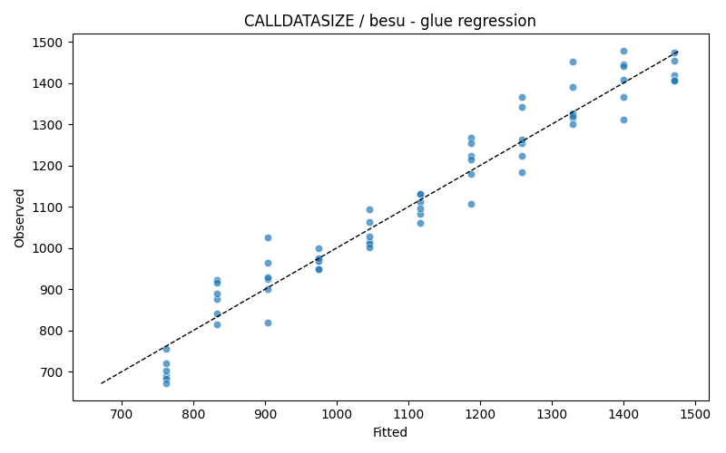

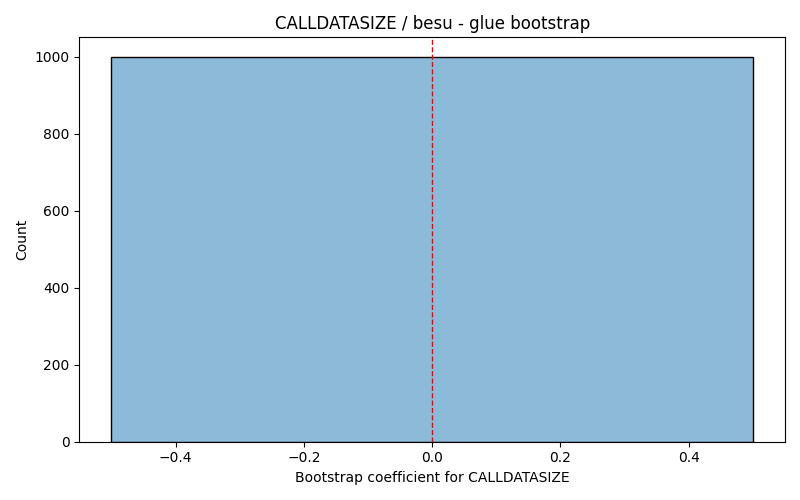

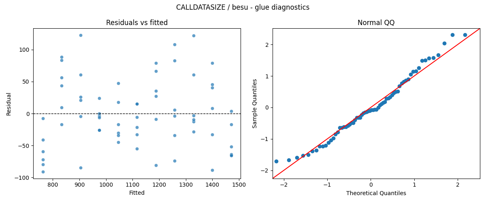

</details>

<details><summary><code>DUP</code> · nobs=66 · runtime_ms=0 · p=1.00e+00 · R²=0.9471</summary>


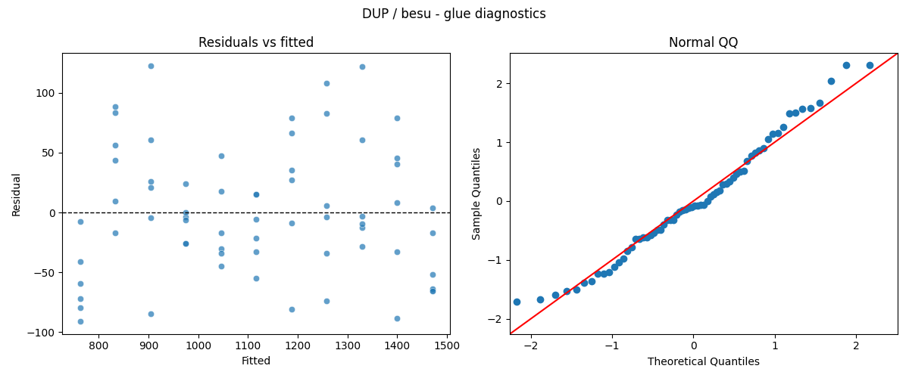

</details>

<details><summary><code>GAS</code> · nobs=66 · runtime_ms=0 · p=1.00e+00 · R²=0.9471</summary>

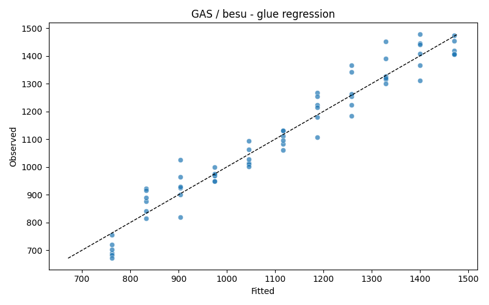


</details>

<details><summary><code>MLOAD</code> · nobs=66 · runtime_ms=0 · p=1.00e+00 · R²=0.9471</summary>

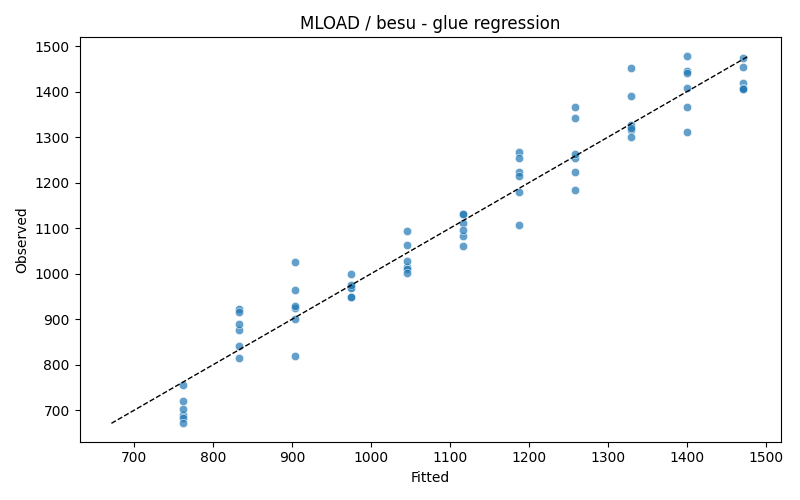


</details>

<details><summary><code>PUSH</code> · nobs=66 · runtime_ms=8.656e-05 · p=1.00e-03 · R²=0.9471</summary>

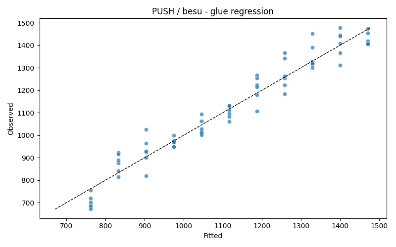

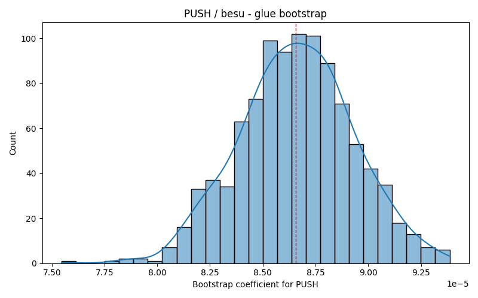


</details>

<details><summary><code>PUSH0</code> · nobs=66 · runtime_ms=0 · p=1.00e+00 · R²=0.9471</summary>

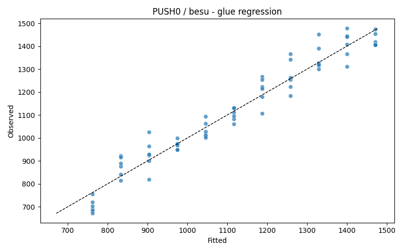


</details>

<details><summary><code>STATICCALL</code> · nobs=66 · runtime_ms=0 · p=1.00e+00 · R²=0.9471</summary>


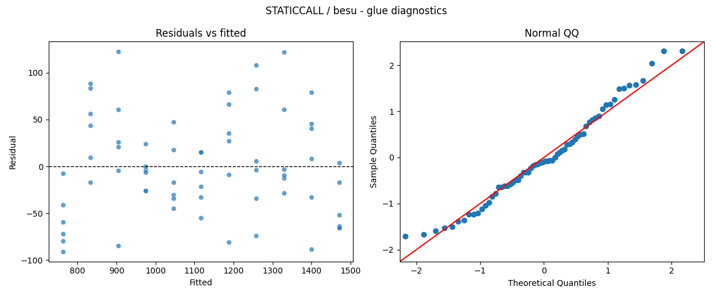

</details>

### Pure glue · besu

<details><summary><code>ISZERO</code> · nobs=0 · runtime_ms=n/a · p=n/a · R²=n/a</summary>

</details>

<details><summary><code>JUMPDEST</code> · nobs=0 · runtime_ms=n/a · p=n/a · R²=n/a</summary>

</details>

<details><summary><code>SWAP</code> · nobs=0 · runtime_ms=n/a · p=n/a · R²=n/a</summary>

</details>

### Mixed glue (tier A) · besu

<details><summary><code>ADD</code> · nobs=0 · runtime_ms=n/a · p=n/a · R²=n/a</summary>

</details>

<details><summary><code>AND</code> · nobs=0 · runtime_ms=n/a · p=n/a · R²=n/a</summary>

</details>

<details><summary><code>CALLDATACOPY</code> · nobs=0 · runtime_ms=n/a · p=n/a · R²=n/a</summary>

</details>

<details><summary><code>CALLDATALOAD</code> · nobs=0 · runtime_ms=n/a · p=n/a · R²=n/a</summary>

</details>

<details><summary><code>DIV</code> · nobs=0 · runtime_ms=n/a · p=n/a · R²=n/a</summary>

</details>

<details><summary><code>EXP</code> · nobs=0 · runtime_ms=n/a · p=n/a · R²=n/a</summary>

</details>

<details><summary><code>GT</code> · nobs=0 · runtime_ms=n/a · p=n/a · R²=n/a</summary>

</details>

<details><summary><code>JUMPI</code> · nobs=0 · runtime_ms=n/a · p=n/a · R²=n/a</summary>

</details>

<details><summary><code>LT</code> · nobs=0 · runtime_ms=n/a · p=n/a · R²=n/a</summary>

</details>

<details><summary><code>MSTORE</code> · nobs=0 · runtime_ms=n/a · p=n/a · R²=n/a</summary>

</details>

<details><summary><code>MSTORE8</code> · nobs=0 · runtime_ms=n/a · p=n/a · R²=n/a</summary>

</details>

<details><summary><code>MUL</code> · nobs=0 · runtime_ms=n/a · p=n/a · R²=n/a</summary>

</details>

<details><summary><code>PC</code> · nobs=0 · runtime_ms=n/a · p=n/a · R²=n/a</summary>

</details>

<details><summary><code>RETURNDATASIZE</code> · nobs=0 · runtime_ms=n/a · p=n/a · R²=n/a</summary>

</details>

<details><summary><code>SELFBALANCE</code> · nobs=0 · runtime_ms=n/a · p=n/a · R²=n/a</summary>

</details>

<details><summary><code>SUB</code> · nobs=0 · runtime_ms=n/a · p=n/a · R²=n/a</summary>

</details>

### Mixed glue (tier B) · besu

<details><summary><code>JUMP</code> · nobs=0 · runtime_ms=n/a · p=n/a · R²=n/a</summary>

</details>

<details><summary><code>KECCAK256</code> · nobs=0 · runtime_ms=n/a · p=n/a · R²=n/a</summary>

</details>

## erigon

| glue_opcode | nobs | glue_runtime_ms | p_value | rsquared |
| --- | --- | --- | --- | --- |
| `ISZERO` | 120 | 0 | 1.00e+00 | 0 |
| `JUMPDEST` | 30 | 0 | 1.00e+00 | -2.22e-16 |
| `SWAP` | 2145 | 0 | 1.00e+00 | 0 |
| `CALLDATASIZE` | 7541 | 6.128e-07 | 2.80e-02 | 0.01725 |
| `DUP` | 7541 | 0 | 1.00e+00 | 0.01725 |
| `GAS` | 7541 | 7.078e-08 | 4.86e-01 | 0.01725 |
| `MLOAD` | 7541 | 1.304e-05 | 1.00e-03 | 0.01725 |
| `PUSH` | 7541 | 0 | 1.00e+00 | 0.01725 |
| `PUSH0` | 7541 | 0 | 1.00e+00 | 0.01725 |
| `STATICCALL` | 7541 | 0 | 1.00e+00 | 0.01725 |
| `ADD` | 135 | 0 | 1.00e+00 | 0 |
| `AND` | 120 | 0 | 1.00e+00 | 2.22e-16 |
| `CALLDATACOPY` | 3525 | 0 | 1.00e+00 | 0 |
| `CALLDATALOAD` | 660 | 4.514e-05 | 1.00e-03 | 0.1492 |
| `DIV` | 165 | 0 | 1.00e+00 | 0 |
| `EXP` | 165 | 0.0003596 | 1.00e-03 | 0.9076 |
| `GT` | 120 | 0 | 1.00e+00 | 0 |
| `JUMPI` | 165 | 0 | 1.00e+00 | 0 |
| `LT` | 120 | 0 | 1.00e+00 | -2.22e-16 |
| `MSTORE` | 675 | 0 | 1.00e+00 | -2.22e-16 |
| `MSTORE8` | 675 | 0 | 1.00e+00 | 1.11e-16 |
| `MUL` | 150 | 0 | 1.00e+00 | 2.22e-16 |
| `PC` | 90 | 9.901e-06 | 1.00e-03 | 0.6039 |
| `RETURNDATASIZE` | 360 | 1.75e-05 | 1.00e-03 | 0.2855 |
| `SELFBALANCE` | 165 | 0 | 1.00e+00 | 0 |
| `SUB` | 120 | 0 | 1.00e+00 | 0 |
| `JUMP` | 150 | 0 | 1.00e+00 | 0 |
| `KECCAK256` | 2640 | 1.384e-05 | 1.00e-03 | 0.0393 |

### Cycle glue — joint fit · erigon

<details><summary>Joint NNLS regression summary</summary>

```
==============================================================================
                           NNLS Regression Results                            
==============================================================================
Dep. Variable:          test_runtime_ms              R-squared:          0.017
Model:                  NNLS                    Adj. R-squared:          0.016
No. Observations:       7541                              RMSE:          43.56
Df Residuals:           7533                               MAE:          35.32
Df Model:               7      
==============================================================================
                      coef     std err     P-value      [0.025      0.975]
------------------------------------------------------------------------------
         const    122.5607      0.5371       0.001    121.4924    123.5643
  CALLDATASIZE      0.0000      0.0000       0.028      0.0000      0.0000
           DUP      0.0000      0.0000       1.000      0.0000      0.0000
           GAS      0.0000      0.0000       0.486      0.0000      0.0000
         MLOAD      0.0000      0.0000       0.001      0.0000      0.0000
          PUSH      0.0000      0.0000       1.000      0.0000      0.0000
         PUSH0      0.0000      0.0000       1.000      0.0000      0.0000
    STATICCALL      0.0000      0.0000       1.000      0.0000      0.0000
==============================================================================
Notes: Non-negative least squares with bootstrap inference (1000 iterations)
==============================================================================
```

</details>

<details><summary><code>CALLDATASIZE</code> · nobs=7541 · runtime_ms=6.128e-07 · p=2.80e-02 · R²=0.01725</summary>

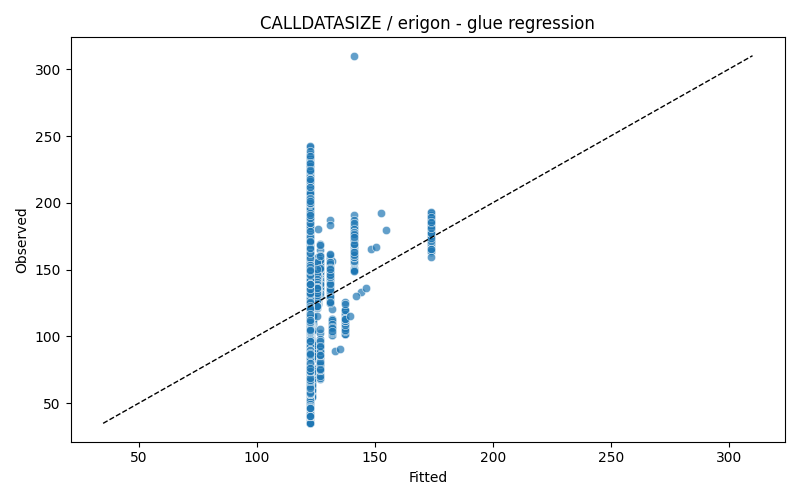

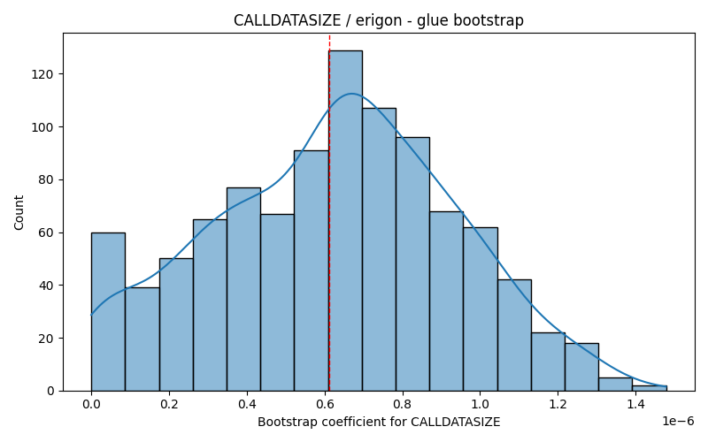

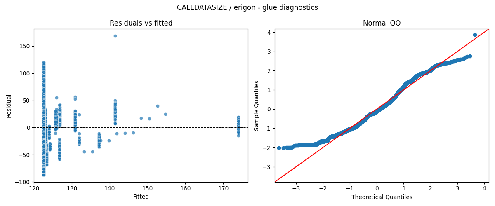

</details>

<details><summary><code>DUP</code> · nobs=7541 · runtime_ms=0 · p=1.00e+00 · R²=0.01725</summary>

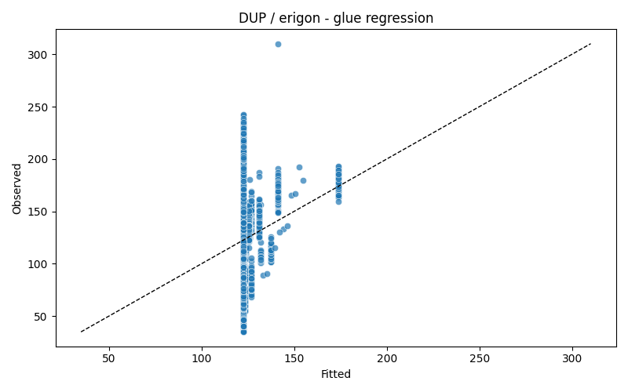


</details>

<details><summary><code>GAS</code> · nobs=7541 · runtime_ms=7.078e-08 · p=4.86e-01 · R²=0.01725</summary>


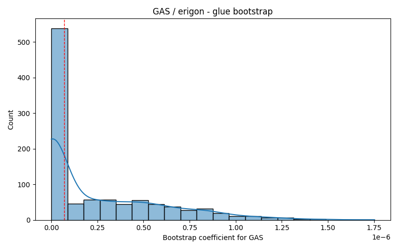


</details>

<details><summary><code>MLOAD</code> · nobs=7541 · runtime_ms=1.304e-05 · p=1.00e-03 · R²=0.01725</summary>


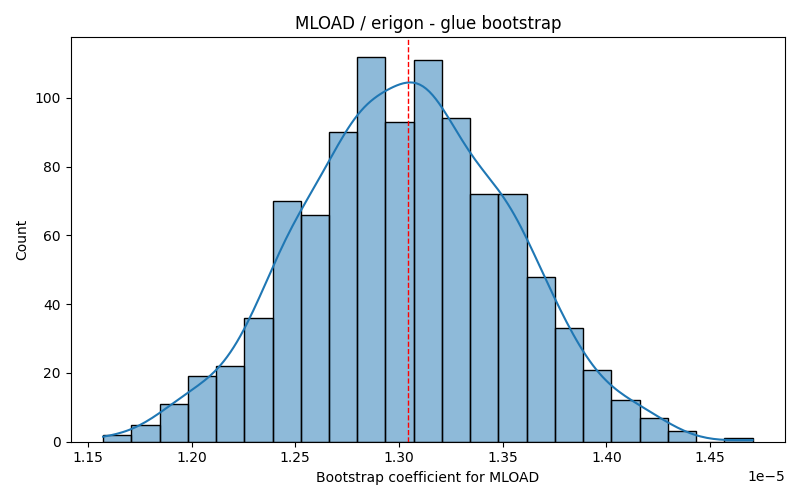

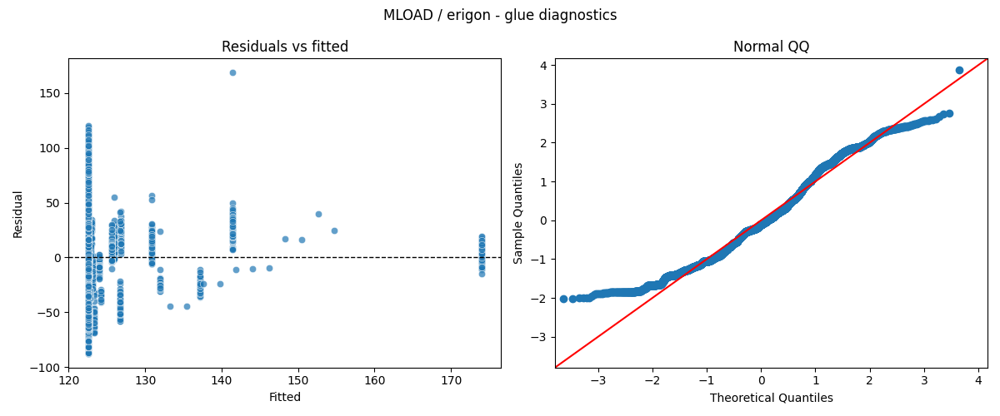

</details>

<details><summary><code>PUSH</code> · nobs=7541 · runtime_ms=0 · p=1.00e+00 · R²=0.01725</summary>

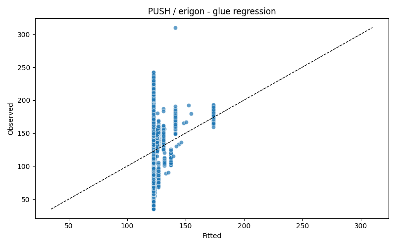


</details>

<details><summary><code>PUSH0</code> · nobs=7541 · runtime_ms=0 · p=1.00e+00 · R²=0.01725</summary>


</details>

<details><summary><code>STATICCALL</code> · nobs=7541 · runtime_ms=0 · p=1.00e+00 · R²=0.01725</summary>

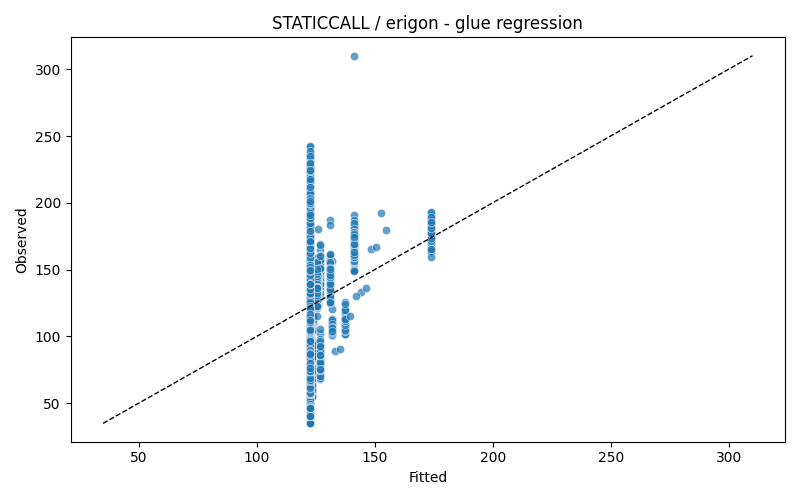


</details>

### Pure glue · erigon

<details><summary><code>ISZERO</code> · nobs=120 · runtime_ms=0 · p=1.00e+00 · R²=0</summary>

```
==============================================================================
                           NNLS Regression Results                            
==============================================================================
Dep. Variable:          test_runtime_ms              R-squared:          0.000
Model:                  NNLS                    Adj. R-squared:         -0.008
No. Observations:       120                               RMSE:          28.47
Df Residuals:           118                                MAE:          22.44
Df Model:               1      
==============================================================================
                      coef     std err     P-value      [0.025      0.975]
------------------------------------------------------------------------------
         const     77.4796      2.6010       0.001     72.6861     82.8360
        ISZERO      0.0000      0.0000       1.000      0.0000      0.0000
==============================================================================
Notes: Non-negative least squares with bootstrap inference (1000 iterations)
==============================================================================
```

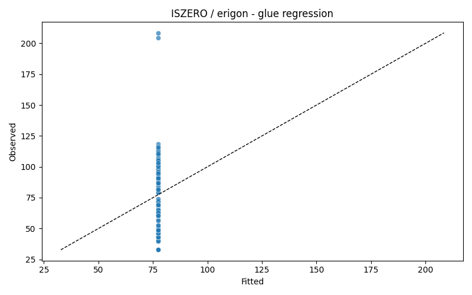


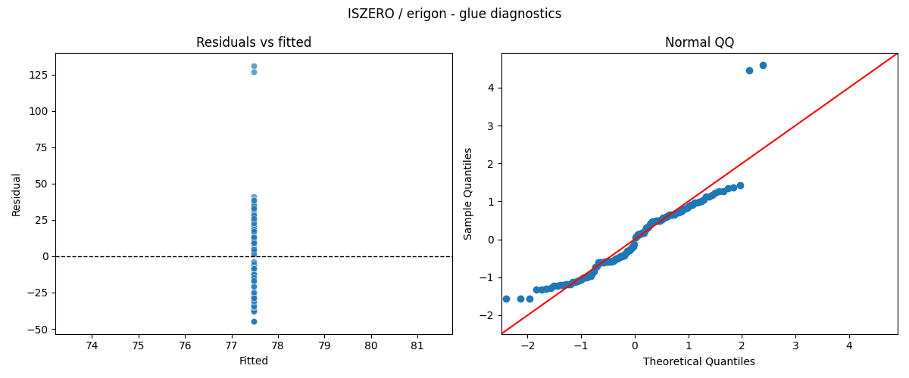

</details>

<details><summary><code>JUMPDEST</code> · nobs=30 · runtime_ms=0 · p=1.00e+00 · R²=-2.22e-16</summary>

```
==============================================================================
                           NNLS Regression Results                            
==============================================================================
Dep. Variable:          test_runtime_ms              R-squared:         -0.000
Model:                  NNLS                    Adj. R-squared:         -0.036
No. Observations:       30                                RMSE:          36.13
Df Residuals:           28                                 MAE:          35.04
Df Model:               1      
==============================================================================
                      coef     std err     P-value      [0.025      0.975]
------------------------------------------------------------------------------
         const    131.5207      6.5553       0.001    118.4900    143.8423
      JUMPDEST      0.0000      0.0000       1.000      0.0000      0.0000
==============================================================================
Notes: Non-negative least squares with bootstrap inference (1000 iterations)
==============================================================================
```

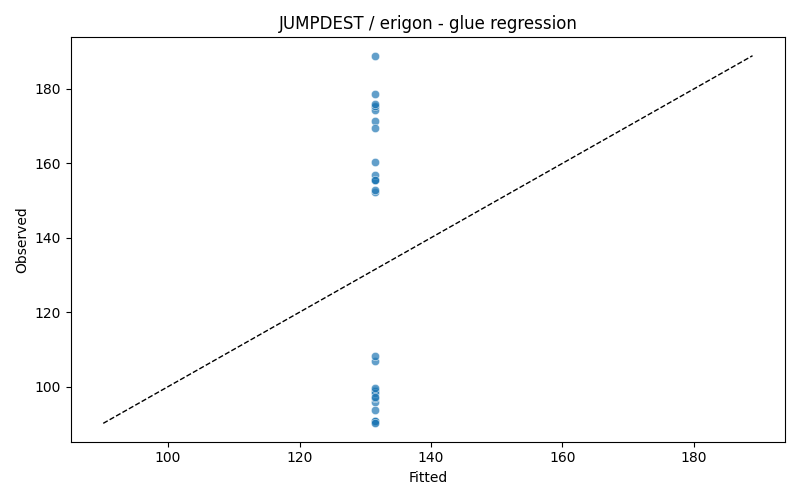

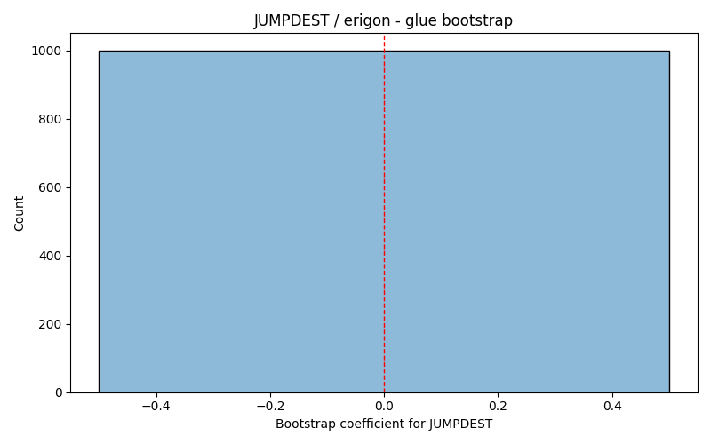

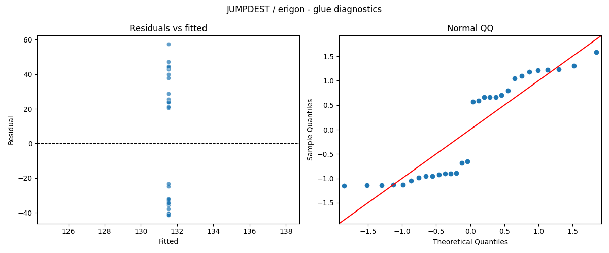

</details>

<details><summary><code>SWAP</code> · nobs=2145 · runtime_ms=0 · p=1.00e+00 · R²=0</summary>

```
==============================================================================
                           NNLS Regression Results                            
==============================================================================
Dep. Variable:          test_runtime_ms              R-squared:          0.000
Model:                  NNLS                    Adj. R-squared:         -0.000
No. Observations:       2145                              RMSE:          40.06
Df Residuals:           2143                               MAE:          28.38
Df Model:               1      
==============================================================================
                      coef     std err     P-value      [0.025      0.975]
------------------------------------------------------------------------------
         const    102.1463      0.8729       0.001    100.4468    103.8429
          SWAP      0.0000      0.0000       1.000      0.0000      0.0000
==============================================================================
Notes: Non-negative least squares with bootstrap inference (1000 iterations)
==============================================================================
```

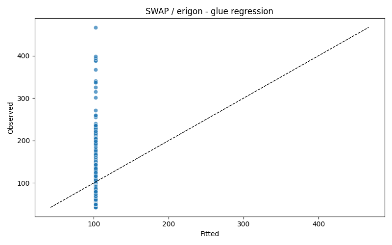


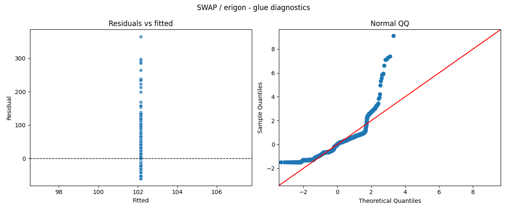

</details>

### Mixed glue (tier A) · erigon

<details><summary><code>ADD</code> · nobs=135 · runtime_ms=0 · p=1.00e+00 · R²=0</summary>

```
==============================================================================
                           NNLS Regression Results                            
==============================================================================
Dep. Variable:          test_runtime_ms              R-squared:          0.000
Model:                  NNLS                    Adj. R-squared:         -0.008
No. Observations:       135                               RMSE:          29.64
Df Residuals:           133                                MAE:          24.28
Df Model:               1      
==============================================================================
                      coef     std err     P-value      [0.025      0.975]
------------------------------------------------------------------------------
         const     90.4283      2.4918       0.001     85.6514     95.2312
           ADD      0.0000      0.0000       1.000      0.0000      0.0000
==============================================================================
Notes: Non-negative least squares with bootstrap inference (1000 iterations)
==============================================================================
```

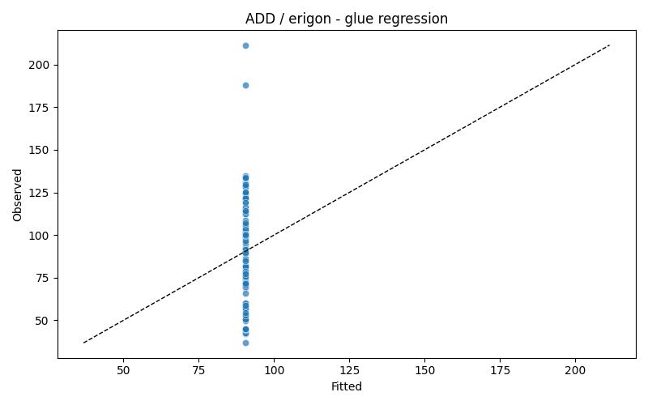


</details>

<details><summary><code>AND</code> · nobs=120 · runtime_ms=0 · p=1.00e+00 · R²=2.22e-16</summary>

```
==============================================================================
                           NNLS Regression Results                            
==============================================================================
Dep. Variable:          test_runtime_ms              R-squared:          0.000
Model:                  NNLS                    Adj. R-squared:         -0.008
No. Observations:       120                               RMSE:          26.63
Df Residuals:           118                                MAE:          23.01
Df Model:               1      
==============================================================================
                      coef     std err     P-value      [0.025      0.975]
------------------------------------------------------------------------------
         const     83.8436      2.4395       0.001     78.9190     88.1933
           AND      0.0000      0.0000       1.000      0.0000      0.0000
==============================================================================
Notes: Non-negative least squares with bootstrap inference (1000 iterations)
==============================================================================
```

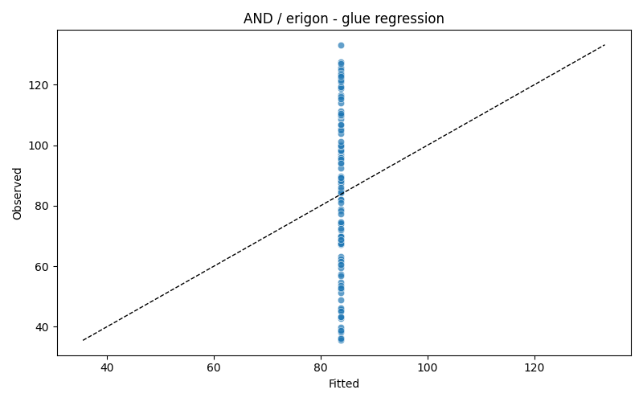


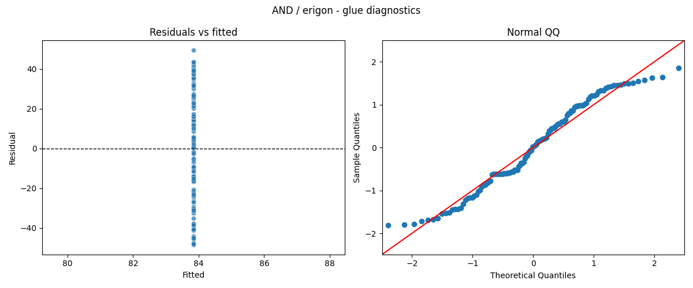

</details>

<details><summary><code>CALLDATACOPY</code> · nobs=3525 · runtime_ms=0 · p=1.00e+00 · R²=0</summary>

```
==============================================================================
                           NNLS Regression Results                            
==============================================================================
Dep. Variable:          test_runtime_ms              R-squared:          0.000
Model:                  NNLS                    Adj. R-squared:         -0.000
No. Observations:       3525                              RMSE:          46.59
Df Residuals:           3523                               MAE:          39.33
Df Model:               1      
==============================================================================
                      coef     std err     P-value      [0.025      0.975]
------------------------------------------------------------------------------
         const     69.3648      0.7470       0.001     67.9150     70.8416
  CALLDATACOPY      0.0000      0.0000       1.000      0.0000      0.0000
==============================================================================
Notes: Non-negative least squares with bootstrap inference (1000 iterations)
==============================================================================
```

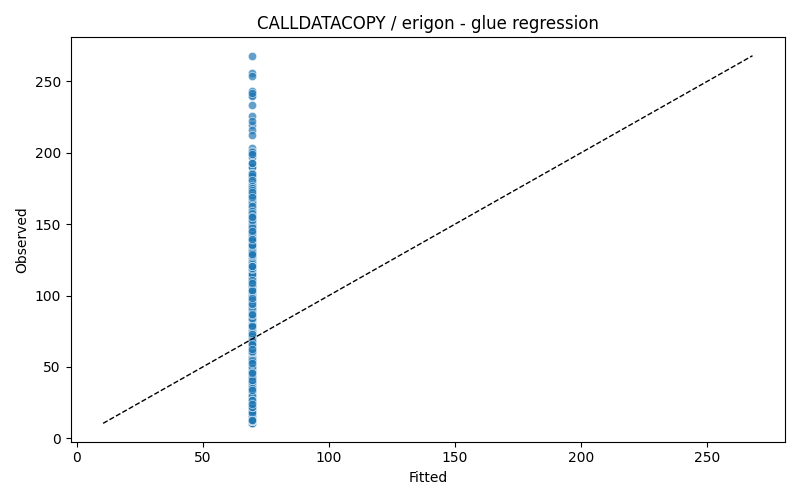


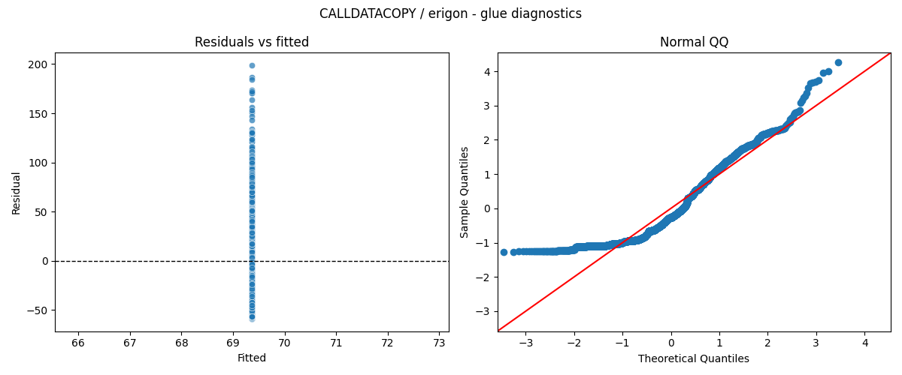

</details>

<details><summary><code>CALLDATALOAD</code> · nobs=660 · runtime_ms=4.514e-05 · p=1.00e-03 · R²=0.1492</summary>

```
==============================================================================
                           NNLS Regression Results                            
==============================================================================
Dep. Variable:          test_runtime_ms              R-squared:          0.149
Model:                  NNLS                    Adj. R-squared:          0.148
No. Observations:       660                               RMSE:           0.41
Df Residuals:           658                                MAE:           0.26
Df Model:               1      
==============================================================================
                      coef     std err     P-value      [0.025      0.975]
------------------------------------------------------------------------------
         const      3.8716      0.0586       0.001      3.7512      3.9820
  CALLDATALOAD      0.0000      0.0000       0.001      0.0000      0.0001
==============================================================================
Notes: Non-negative least squares with bootstrap inference (1000 iterations)
==============================================================================
```

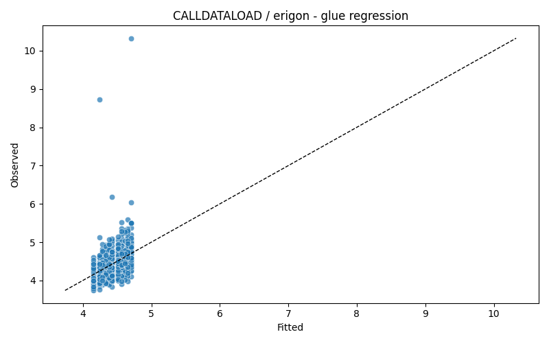

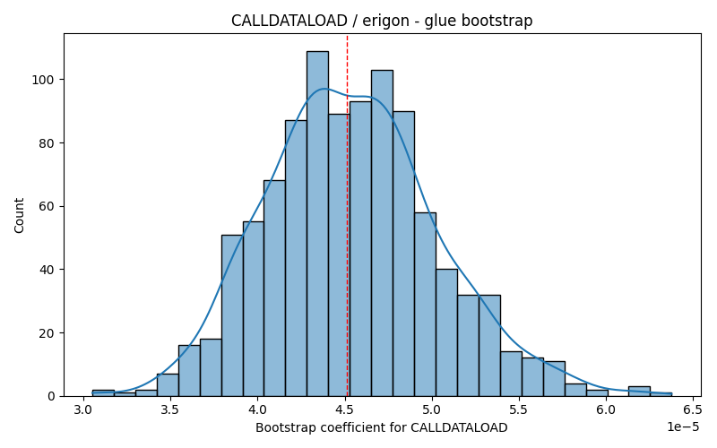

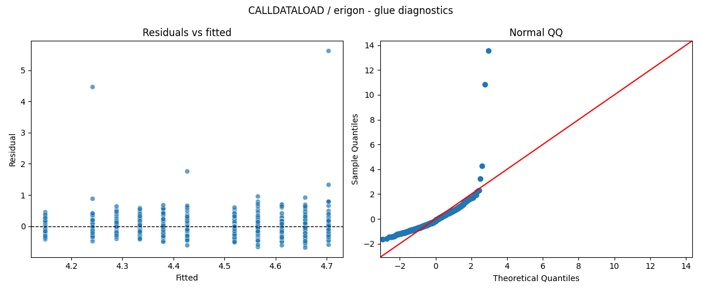

</details>

<details><summary><code>DIV</code> · nobs=165 · runtime_ms=0 · p=1.00e+00 · R²=0</summary>

```
==============================================================================
                           NNLS Regression Results                            
==============================================================================
Dep. Variable:          test_runtime_ms              R-squared:          0.000
Model:                  NNLS                    Adj. R-squared:         -0.006
No. Observations:       165                               RMSE:          76.15
Df Residuals:           163                                MAE:          59.37
Df Model:               1      
==============================================================================
                      coef     std err     P-value      [0.025      0.975]
------------------------------------------------------------------------------
         const    246.2681      6.0511       0.001    234.7891    258.8114
           DIV      0.0000      0.0000       1.000      0.0000      0.0000
==============================================================================
Notes: Non-negative least squares with bootstrap inference (1000 iterations)
==============================================================================
```

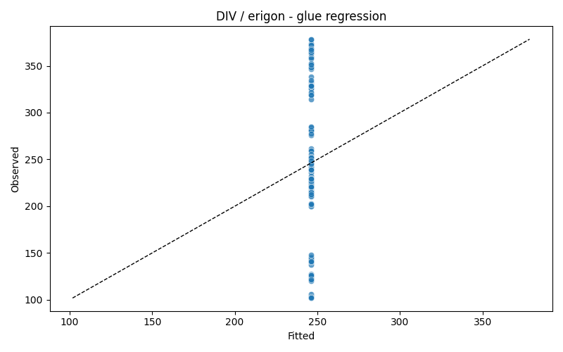


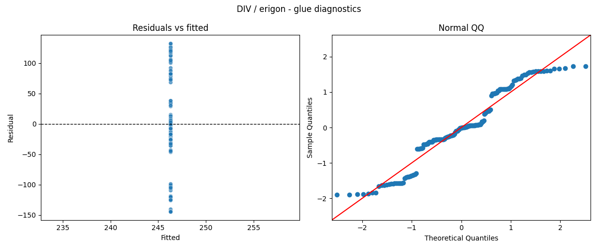

</details>

<details><summary><code>EXP</code> · nobs=165 · runtime_ms=0.0003596 · p=1.00e-03 · R²=0.9076</summary>

```
==============================================================================
                           NNLS Regression Results                            
==============================================================================
Dep. Variable:          test_runtime_ms              R-squared:          0.908
Model:                  NNLS                    Adj. R-squared:          0.907
No. Observations:       165                               RMSE:           4.49
Df Residuals:           163                                MAE:           3.74
Df Model:               1      
==============================================================================
                      coef     std err     P-value      [0.025      0.975]
------------------------------------------------------------------------------
         const     10.4484      1.2610       0.001      8.0946     13.0090
           EXP      0.0004      0.0000       0.001      0.0003      0.0004
==============================================================================
Notes: Non-negative least squares with bootstrap inference (1000 iterations)
==============================================================================
```

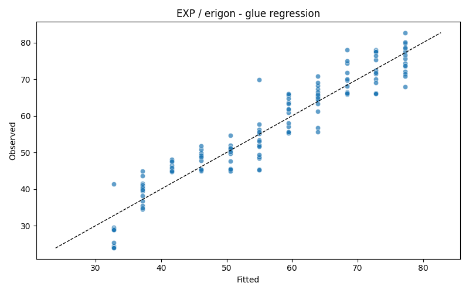

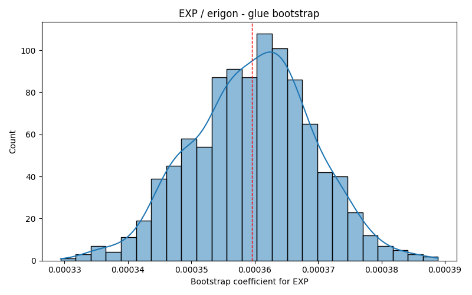

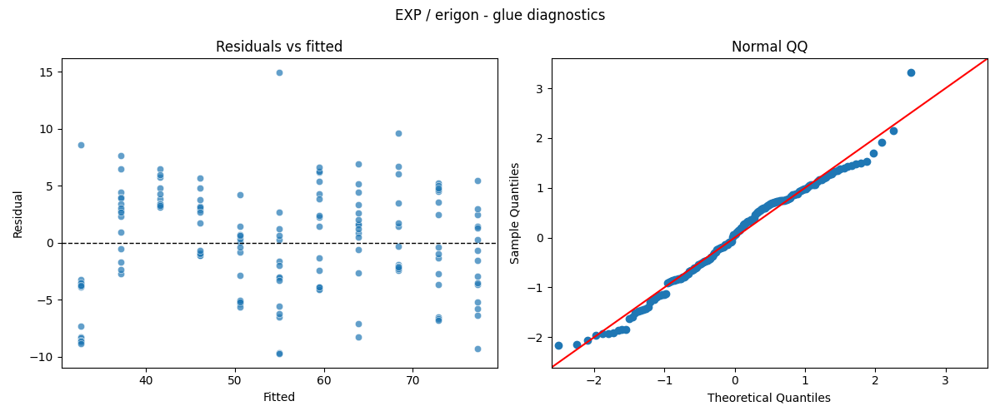

</details>

<details><summary><code>GT</code> · nobs=120 · runtime_ms=0 · p=1.00e+00 · R²=0</summary>

```
==============================================================================
                           NNLS Regression Results                            
==============================================================================
Dep. Variable:          test_runtime_ms              R-squared:          0.000
Model:                  NNLS                    Adj. R-squared:         -0.008
No. Observations:       120                               RMSE:          29.09
Df Residuals:           118                                MAE:          23.96
Df Model:               1      
==============================================================================
                      coef     std err     P-value      [0.025      0.975]
------------------------------------------------------------------------------
         const     86.7417      2.6293       0.001     81.6975     91.9356
            GT      0.0000      0.0000       1.000      0.0000      0.0000
==============================================================================
Notes: Non-negative least squares with bootstrap inference (1000 iterations)
==============================================================================
```

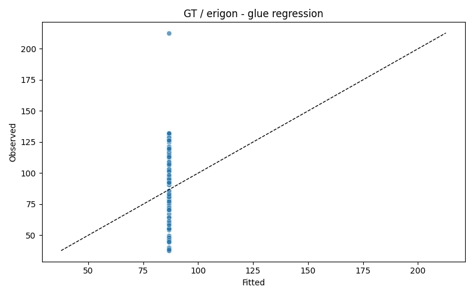

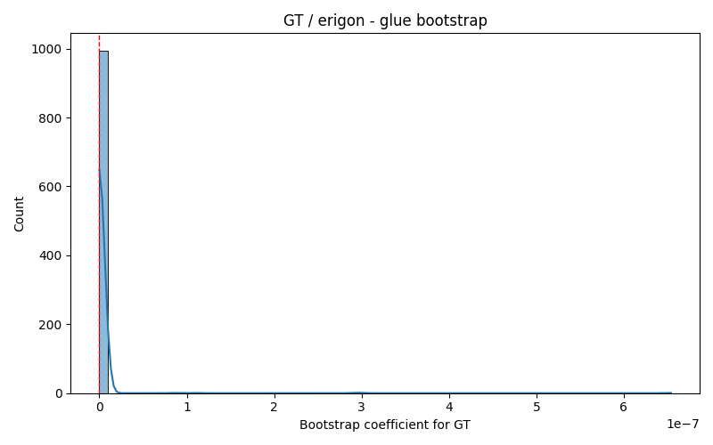


</details>

<details><summary><code>JUMPI</code> · nobs=165 · runtime_ms=0 · p=1.00e+00 · R²=0</summary>

```
==============================================================================
                           NNLS Regression Results                            
==============================================================================
Dep. Variable:          test_runtime_ms              R-squared:          0.000
Model:                  NNLS                    Adj. R-squared:         -0.006
No. Observations:       165                               RMSE:          18.68
Df Residuals:           163                                MAE:          12.41
Df Model:               1      
==============================================================================
                      coef     std err     P-value      [0.025      0.975]
------------------------------------------------------------------------------
         const     48.3749      1.4554       0.001     45.7028     51.4566
         JUMPI      0.0000      0.0000       1.000      0.0000      0.0000
==============================================================================
Notes: Non-negative least squares with bootstrap inference (1000 iterations)
==============================================================================
```

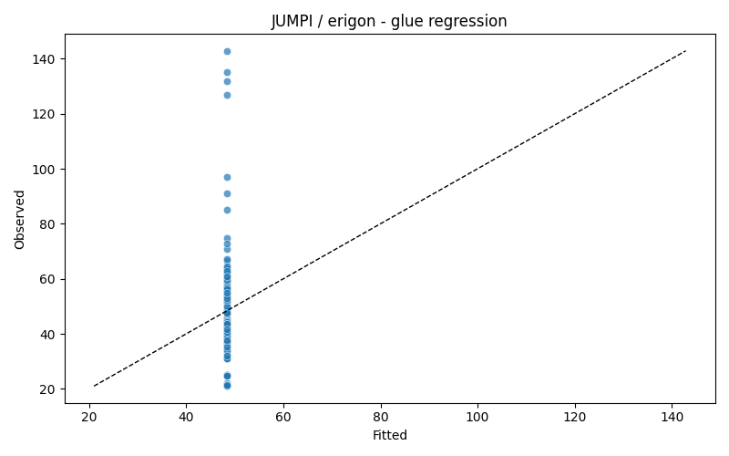

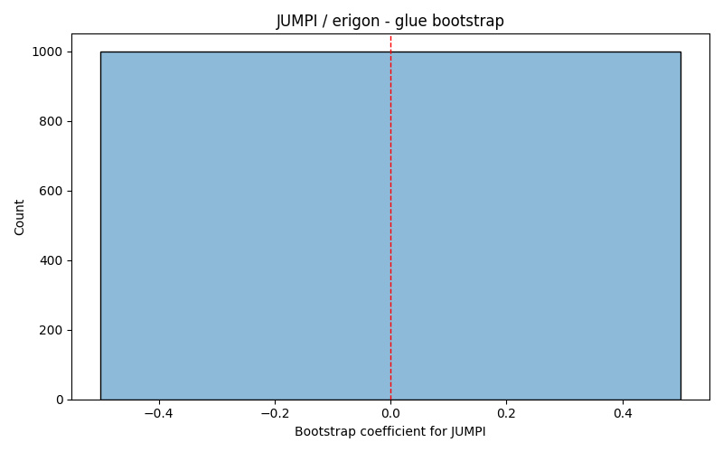

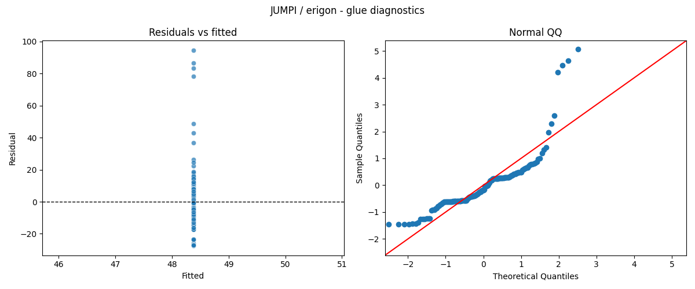

</details>

<details><summary><code>LT</code> · nobs=120 · runtime_ms=0 · p=1.00e+00 · R²=-2.22e-16</summary>

```
==============================================================================
                           NNLS Regression Results                            
==============================================================================
Dep. Variable:          test_runtime_ms              R-squared:         -0.000
Model:                  NNLS                    Adj. R-squared:         -0.008
No. Observations:       120                               RMSE:          29.15
Df Residuals:           118                                MAE:          24.28
Df Model:               1      
==============================================================================
                      coef     std err     P-value      [0.025      0.975]
------------------------------------------------------------------------------
         const     87.0369      2.6774       0.001     81.3499     91.7545
            LT      0.0000      0.0000       1.000      0.0000      0.0000
==============================================================================
Notes: Non-negative least squares with bootstrap inference (1000 iterations)
==============================================================================
```

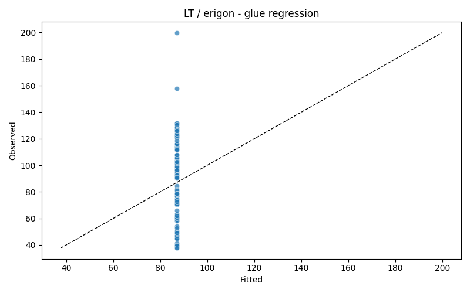

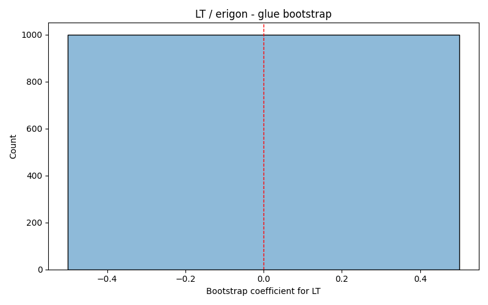

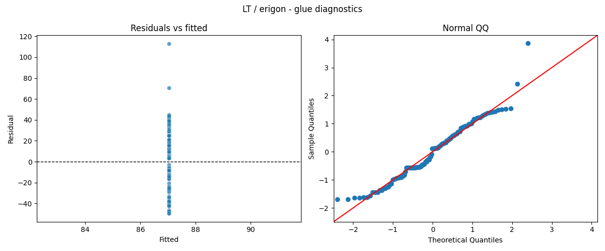

</details>

<details><summary><code>MSTORE</code> · nobs=675 · runtime_ms=0 · p=1.00e+00 · R²=-2.22e-16</summary>

```
==============================================================================
                           NNLS Regression Results                            
==============================================================================
Dep. Variable:          test_runtime_ms              R-squared:         -0.000
Model:                  NNLS                    Adj. R-squared:         -0.001
No. Observations:       675                               RMSE:          38.78
Df Residuals:           673                                MAE:          33.46
Df Model:               1      
==============================================================================
                      coef     std err     P-value      [0.025      0.975]
------------------------------------------------------------------------------
         const    125.9205      1.5035       0.001    123.0441    128.7721
        MSTORE      0.0000      0.0000       1.000      0.0000      0.0000
==============================================================================
Notes: Non-negative least squares with bootstrap inference (1000 iterations)
==============================================================================
```

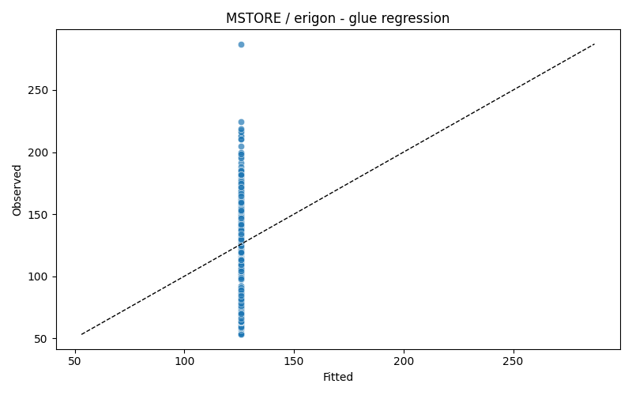


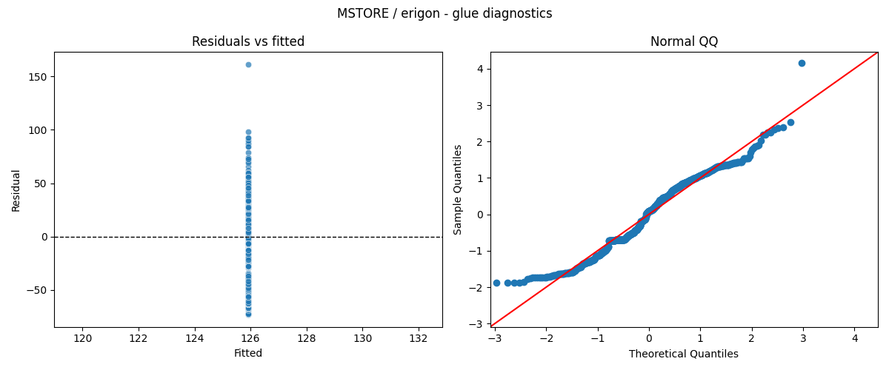

</details>

<details><summary><code>MSTORE8</code> · nobs=675 · runtime_ms=0 · p=1.00e+00 · R²=1.11e-16</summary>

```
==============================================================================
                           NNLS Regression Results                            
==============================================================================
Dep. Variable:          test_runtime_ms              R-squared:          0.000
Model:                  NNLS                    Adj. R-squared:         -0.001
No. Observations:       675                               RMSE:          37.37
Df Residuals:           673                                MAE:          31.91
Df Model:               1      
==============================================================================
                      coef     std err     P-value      [0.025      0.975]
------------------------------------------------------------------------------
         const    119.6305      1.4615       0.001    116.7227    122.4904
       MSTORE8      0.0000      0.0000       1.000      0.0000      0.0000
==============================================================================
Notes: Non-negative least squares with bootstrap inference (1000 iterations)
==============================================================================
```

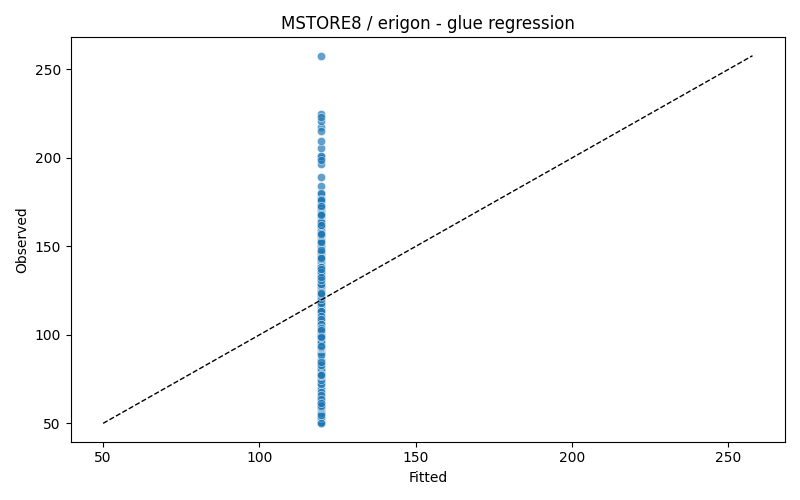


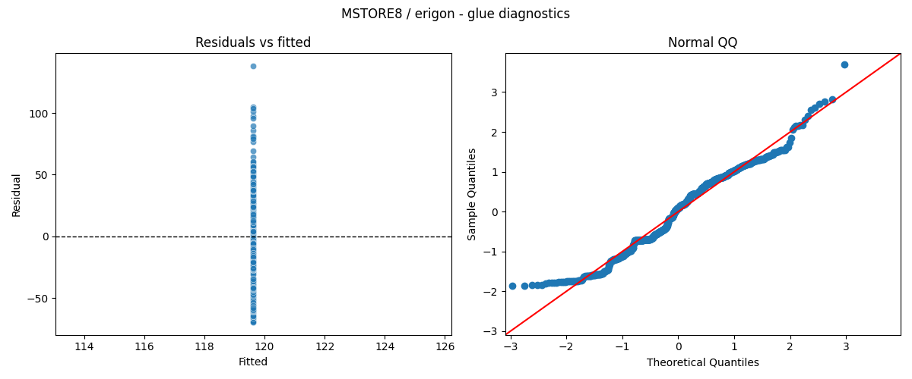

</details>

<details><summary><code>MUL</code> · nobs=150 · runtime_ms=0 · p=1.00e+00 · R²=2.22e-16</summary>

```
==============================================================================
                           NNLS Regression Results                            
==============================================================================
Dep. Variable:          test_runtime_ms              R-squared:          0.000
Model:                  NNLS                    Adj. R-squared:         -0.007
No. Observations:       150                               RMSE:          32.39
Df Residuals:           148                                MAE:          27.62
Df Model:               1      
==============================================================================
                      coef     std err     P-value      [0.025      0.975]
------------------------------------------------------------------------------
         const    104.5361      2.5729       0.001     99.6273    109.4921
           MUL      0.0000      0.0000       1.000      0.0000      0.0000
==============================================================================
Notes: Non-negative least squares with bootstrap inference (1000 iterations)
==============================================================================
```


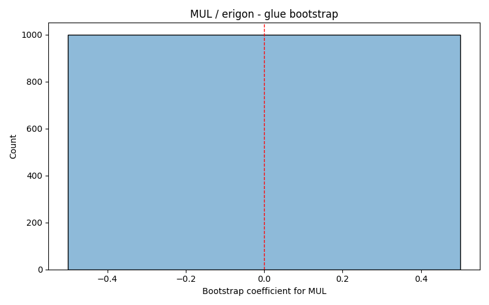

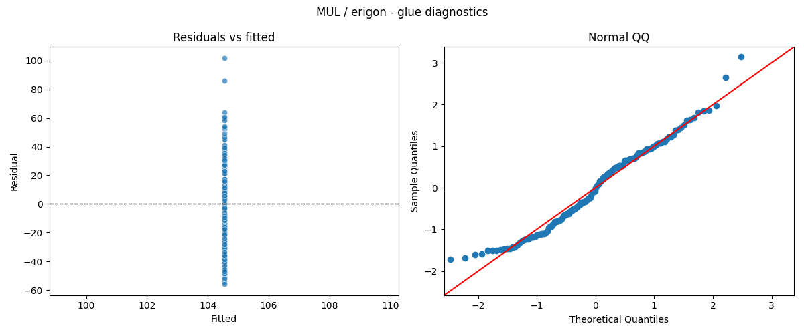

</details>

<details><summary><code>PC</code> · nobs=90 · runtime_ms=9.901e-06 · p=1.00e-03 · R²=0.6039</summary>

```
==============================================================================
                           NNLS Regression Results                            
==============================================================================
Dep. Variable:          test_runtime_ms              R-squared:          0.604
Model:                  NNLS                    Adj. R-squared:          0.599
No. Observations:       90                                RMSE:          17.82
Df Residuals:           88                                 MAE:          15.80
Df Model:               1      
==============================================================================
                      coef     std err     P-value      [0.025      0.975]
------------------------------------------------------------------------------
         const     79.0940      3.9638       0.001     71.4303     86.7691
            PC      0.0000      0.0000       0.001      0.0000      0.0000
==============================================================================
Notes: Non-negative least squares with bootstrap inference (1000 iterations)
==============================================================================
```

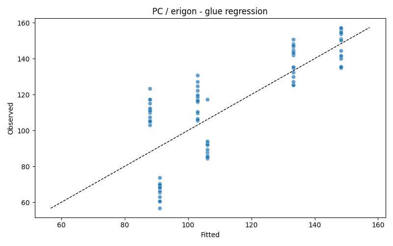

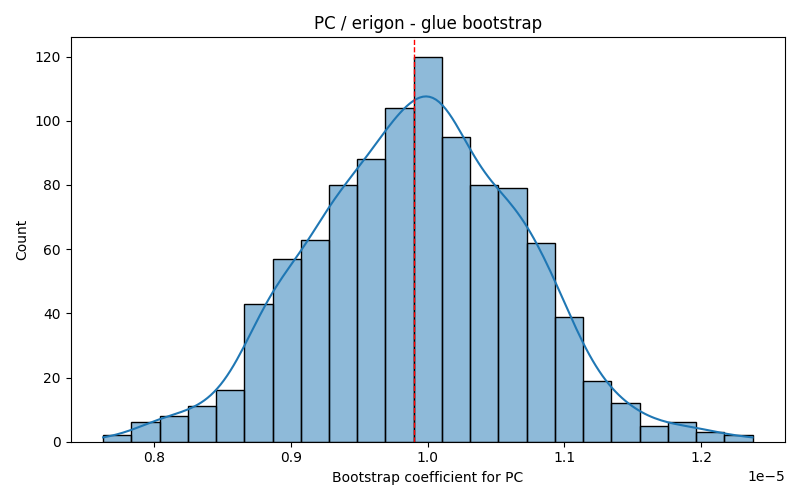

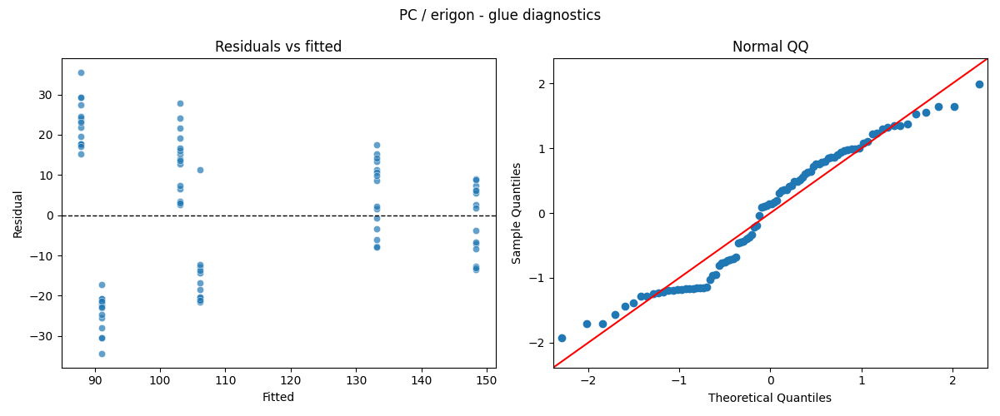

</details>

<details><summary><code>RETURNDATASIZE</code> · nobs=360 · runtime_ms=1.75e-05 · p=1.00e-03 · R²=0.2855</summary>

```
==============================================================================
                           NNLS Regression Results                            
==============================================================================
Dep. Variable:          test_runtime_ms              R-squared:          0.285
Model:                  NNLS                    Adj. R-squared:          0.284
No. Observations:       360                               RMSE:          32.49
Df Residuals:           358                                MAE:          18.34
Df Model:               1      
==============================================================================
                      coef     std err     P-value      [0.025      0.975]
------------------------------------------------------------------------------
         const     73.2273      3.0026       0.001     67.6841     79.2739
RETURNDATASIZE      0.0000      0.0000       0.001      0.0000      0.0000
==============================================================================
Notes: Non-negative least squares with bootstrap inference (1000 iterations)
==============================================================================
```

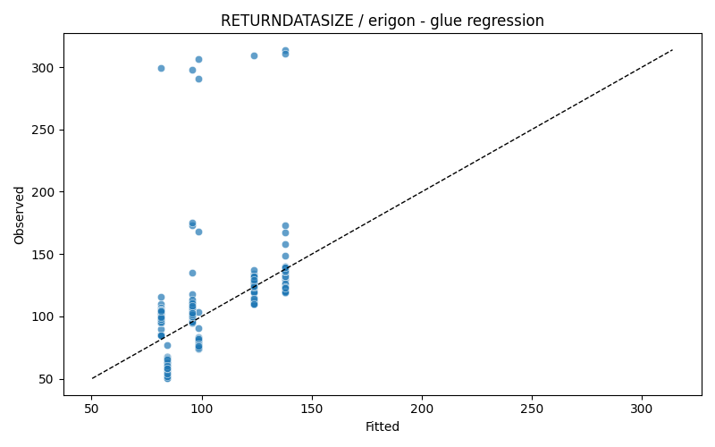

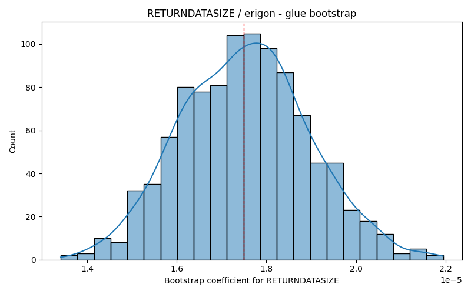

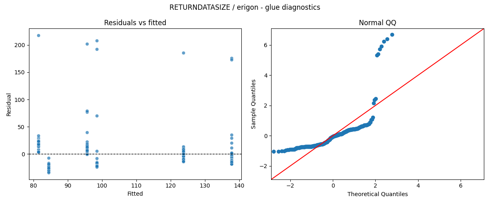

</details>

<details><summary><code>SELFBALANCE</code> · nobs=165 · runtime_ms=0 · p=1.00e+00 · R²=0</summary>

```
==============================================================================
                           NNLS Regression Results                            
==============================================================================
Dep. Variable:          test_runtime_ms              R-squared:          0.000
Model:                  NNLS                    Adj. R-squared:         -0.006
No. Observations:       165                               RMSE:          14.58
Df Residuals:           163                                MAE:          12.00
Df Model:               1      
==============================================================================
                      coef     std err     P-value      [0.025      0.975]
------------------------------------------------------------------------------
         const     49.7590      1.1599       0.001     47.4355     52.0485
   SELFBALANCE      0.0000      0.0000       1.000      0.0000      0.0000
==============================================================================
Notes: Non-negative least squares with bootstrap inference (1000 iterations)
==============================================================================
```

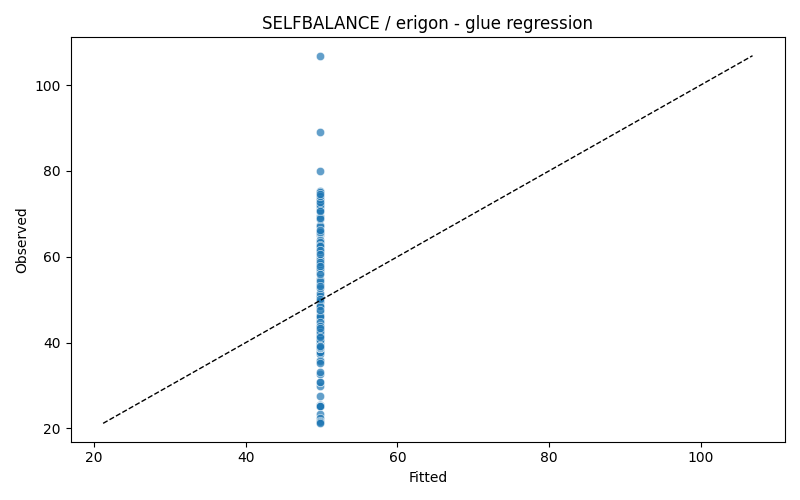


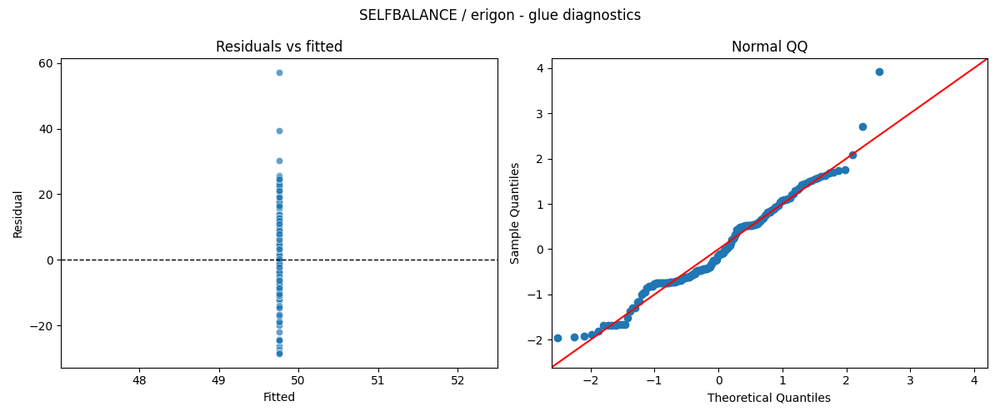

</details>

<details><summary><code>SUB</code> · nobs=120 · runtime_ms=0 · p=1.00e+00 · R²=0</summary>

```
==============================================================================
                           NNLS Regression Results                            
==============================================================================
Dep. Variable:          test_runtime_ms              R-squared:          0.000
Model:                  NNLS                    Adj. R-squared:         -0.008
No. Observations:       120                               RMSE:          28.12
Df Residuals:           118                                MAE:          24.42
Df Model:               1      
==============================================================================
                      coef     std err     P-value      [0.025      0.975]
------------------------------------------------------------------------------
         const     86.3128      2.4862       0.001     81.3976     91.3948
           SUB      0.0000      0.0000       1.000      0.0000      0.0000
==============================================================================
Notes: Non-negative least squares with bootstrap inference (1000 iterations)
==============================================================================
```

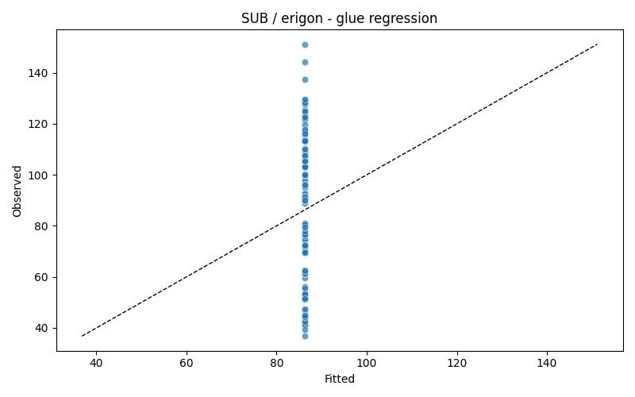


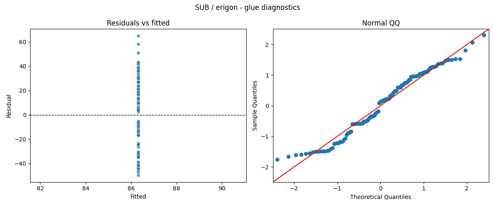

</details>

### Mixed glue (tier B) · erigon

<details><summary><code>JUMP</code> · nobs=150 · runtime_ms=0 · p=1.00e+00 · R²=0</summary>

```
==============================================================================
                           NNLS Regression Results                            
==============================================================================
Dep. Variable:          test_runtime_ms              R-squared:          0.000
Model:                  NNLS                    Adj. R-squared:         -0.007
No. Observations:       150                               RMSE:          25.79
Df Residuals:           148                                MAE:          19.60
Df Model:               1      
==============================================================================
                      coef     std err     P-value      [0.025      0.975]
------------------------------------------------------------------------------
         const     70.8093      2.1843       0.001     66.3053     75.0204
          JUMP      0.0000      0.0000       1.000      0.0000      0.0000
==============================================================================
Notes: Non-negative least squares with bootstrap inference (1000 iterations)
==============================================================================
```

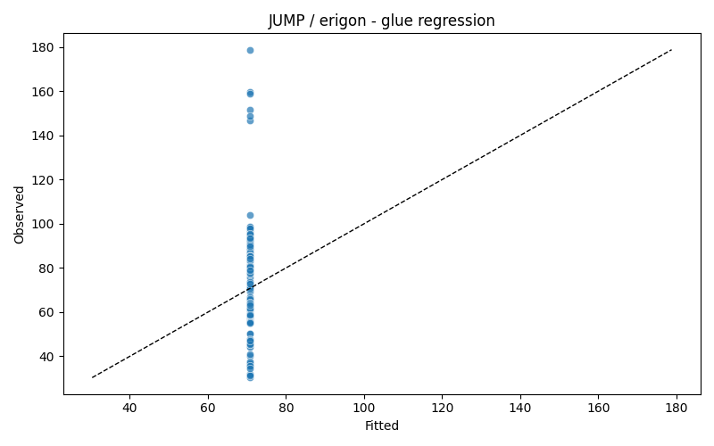

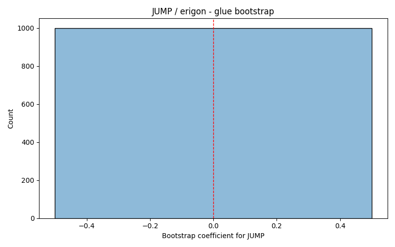

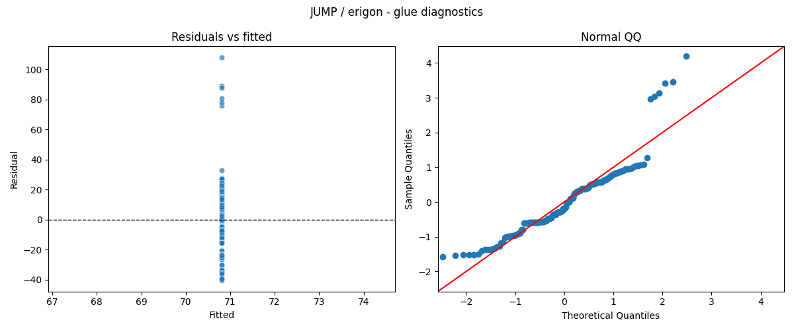

</details>

<details><summary><code>KECCAK256</code> · nobs=2640 · runtime_ms=1.384e-05 · p=1.00e-03 · R²=0.0393</summary>

```
==============================================================================
                           NNLS Regression Results                            
==============================================================================
Dep. Variable:          test_runtime_ms              R-squared:          0.039
Model:                  NNLS                    Adj. R-squared:          0.039
No. Observations:       2640                              RMSE:         136.02
Df Residuals:           2638                               MAE:         109.58
Df Model:               1      
==============================================================================
                      coef     std err     P-value      [0.025      0.975]
------------------------------------------------------------------------------
         const    370.0044      5.6956       0.001    359.0277    380.9309
     KECCAK256      0.0000      0.0000       0.001      0.0000      0.0000
==============================================================================
Notes: Non-negative least squares with bootstrap inference (1000 iterations)
==============================================================================
```

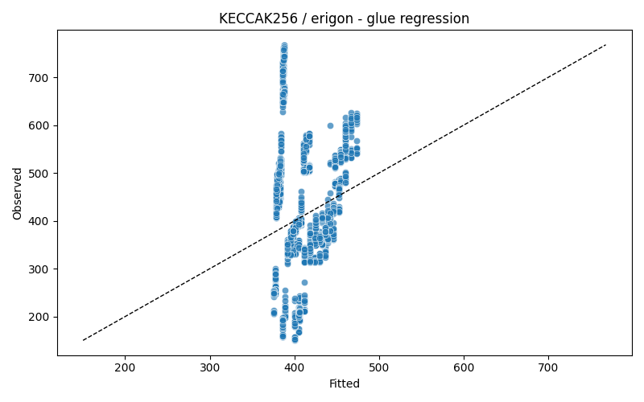

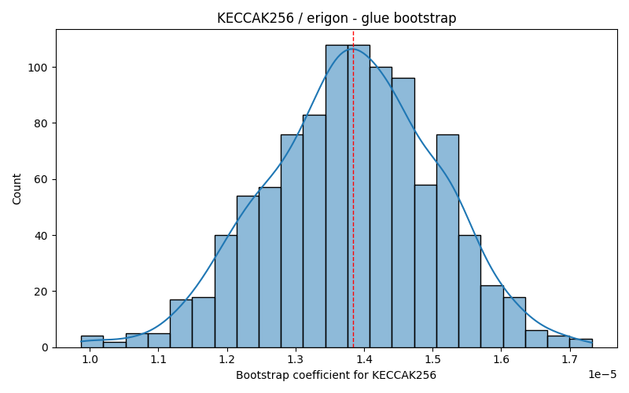

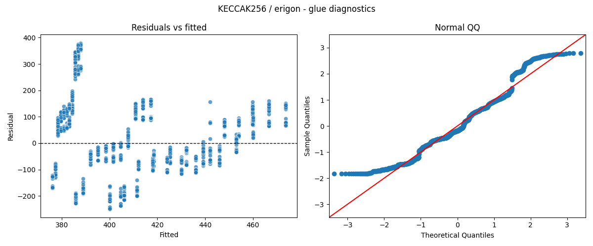

</details>

## ethrex

| glue_opcode | nobs | glue_runtime_ms | p_value | rsquared |
| --- | --- | --- | --- | --- |
| `ISZERO` | 48 | 0 | 1.00e+00 | 0 |
| `JUMPDEST` | 12 | 0 | 1.00e+00 | 0 |
| `SWAP` | 858 | 0 | 1.00e+00 | 0 |
| `CALLDATASIZE` | 3012 | 6.13e-06 | 1.00e-03 | 0.1537 |
| `DUP` | 3012 | 0 | 1.00e+00 | 0.1537 |
| `GAS` | 3012 | 6.775e-06 | 1.00e-03 | 0.1537 |
| `MLOAD` | 3012 | 4.624e-06 | 1.00e-03 | 0.1537 |
| `PUSH` | 3012 | 0 | 1.00e+00 | 0.1537 |
| `PUSH0` | 3012 | 1.482e-06 | 5.20e-02 | 0.1537 |
| `STATICCALL` | 3012 | 0 | 1.00e+00 | 0.1537 |
| `ADD` | 54 | 0 | 1.00e+00 | 0 |
| `AND` | 48 | 0 | 1.00e+00 | 0 |
| `CALLDATACOPY` | 1410 | 0 | 1.00e+00 | 0 |
| `CALLDATALOAD` | 264 | 1.632e-05 | 1.00e-03 | 0.2277 |
| `DIV` | 66 | 0 | 1.00e+00 | 0 |
| `EXP` | 66 | 0.0009138 | 1.00e-03 | 0.8455 |
| `GT` | 48 | 0 | 1.00e+00 | 0 |
| `JUMPI` | 66 | 0 | 1.00e+00 | 0 |
| `LT` | 48 | 0 | 1.00e+00 | 0 |
| `MSTORE` | 270 | 0 | 1.00e+00 | 0 |
| `MSTORE8` | 270 | 0 | 1.00e+00 | 0 |
| `MUL` | 60 | 0 | 1.00e+00 | 0 |
| `PC` | 36 | 5.577e-06 | 1.00e-03 | 0.4513 |
| `RETURNDATASIZE` | 144 | 8.128e-06 | 1.00e-03 | 0.3384 |
| `SELFBALANCE` | 66 | 0 | 1.00e+00 | 2.22e-16 |
| `SUB` | 48 | 0 | 1.00e+00 | 0 |
| `JUMP` | 60 | 0 | 1.00e+00 | 2.22e-16 |
| `KECCAK256` | 1056 | 0 | 1.00e+00 | 0 |

### Cycle glue — joint fit · ethrex

<details><summary>Joint NNLS regression summary</summary>

```
==============================================================================
                           NNLS Regression Results                            
==============================================================================
Dep. Variable:          test_runtime_ms              R-squared:          0.154
Model:                  NNLS                    Adj. R-squared:          0.152
No. Observations:       3012                              RMSE:          14.57
Df Residuals:           3004                               MAE:          12.66
Df Model:               7      
==============================================================================
                      coef     std err     P-value      [0.025      0.975]
------------------------------------------------------------------------------
         const     50.6358      0.2815       0.001     50.1420     51.1940
  CALLDATASIZE      0.0000      0.0000       0.001      0.0000      0.0000
           DUP      0.0000      0.0000       1.000      0.0000      0.0000
           GAS      0.0000      0.0000       0.001      0.0000      0.0000
         MLOAD      0.0000      0.0000       0.001      0.0000      0.0000
          PUSH      0.0000      0.0000       1.000      0.0000      0.0000
         PUSH0      0.0000      0.0000       0.052      0.0000      0.0000
    STATICCALL      0.0000      0.0000       1.000      0.0000      0.0000
==============================================================================
Notes: Non-negative least squares with bootstrap inference (1000 iterations)
==============================================================================
```

</details>

<details><summary><code>CALLDATASIZE</code> · nobs=3012 · runtime_ms=6.13e-06 · p=1.00e-03 · R²=0.1537</summary>


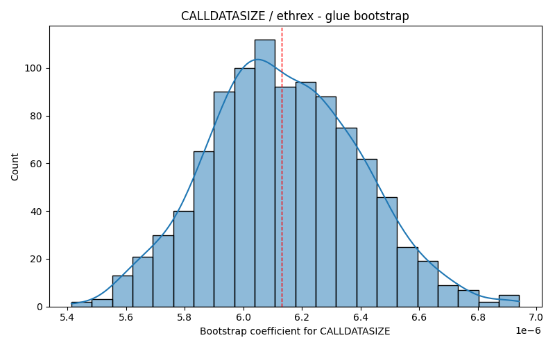


</details>

<details><summary><code>DUP</code> · nobs=3012 · runtime_ms=0 · p=1.00e+00 · R²=0.1537</summary>


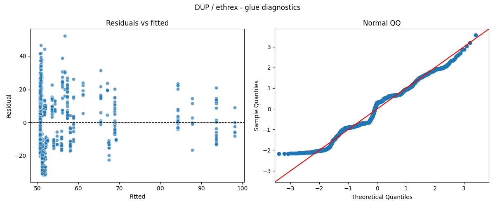

</details>

<details><summary><code>GAS</code> · nobs=3012 · runtime_ms=6.775e-06 · p=1.00e-03 · R²=0.1537</summary>


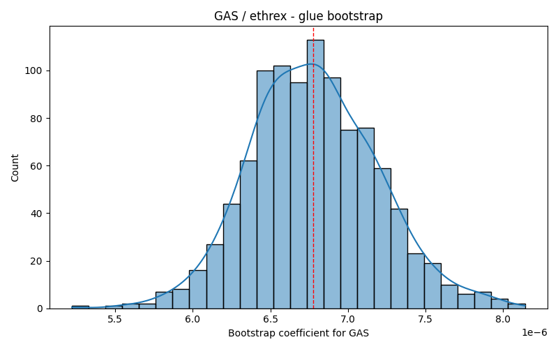


</details>

<details><summary><code>MLOAD</code> · nobs=3012 · runtime_ms=4.624e-06 · p=1.00e-03 · R²=0.1537</summary>


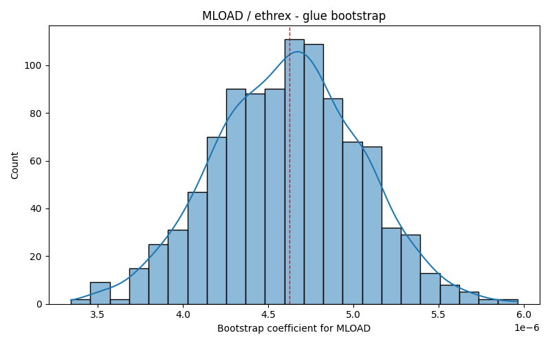


</details>

<details><summary><code>PUSH</code> · nobs=3012 · runtime_ms=0 · p=1.00e+00 · R²=0.1537</summary>

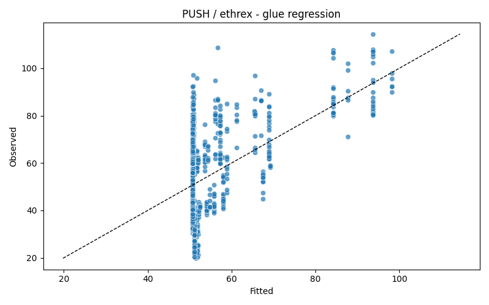


</details>

<details><summary><code>PUSH0</code> · nobs=3012 · runtime_ms=1.482e-06 · p=5.20e-02 · R²=0.1537</summary>

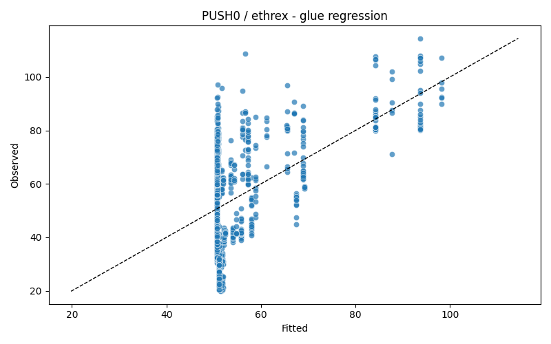

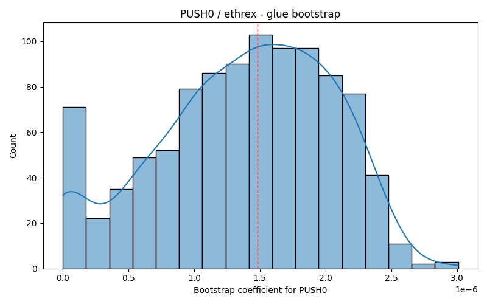


</details>

<details><summary><code>STATICCALL</code> · nobs=3012 · runtime_ms=0 · p=1.00e+00 · R²=0.1537</summary>

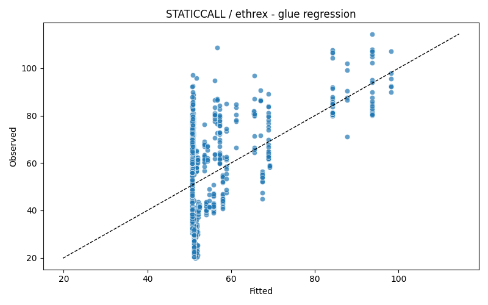

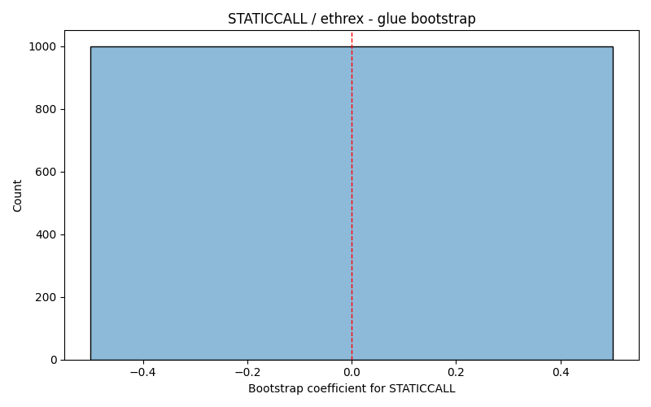


</details>

### Pure glue · ethrex

<details><summary><code>ISZERO</code> · nobs=48 · runtime_ms=0 · p=1.00e+00 · R²=0</summary>

```
==============================================================================
                           NNLS Regression Results                            
==============================================================================
Dep. Variable:          test_runtime_ms              R-squared:          0.000
Model:                  NNLS                    Adj. R-squared:         -0.022
No. Observations:       48                                RMSE:          12.98
Df Residuals:           46                                 MAE:          11.17
Df Model:               1      
==============================================================================
                      coef     std err     P-value      [0.025      0.975]
------------------------------------------------------------------------------
         const     41.1549      1.8685       0.001     37.4134     44.7277
        ISZERO      0.0000      0.0000       1.000      0.0000      0.0000
==============================================================================
Notes: Non-negative least squares with bootstrap inference (1000 iterations)
==============================================================================
```

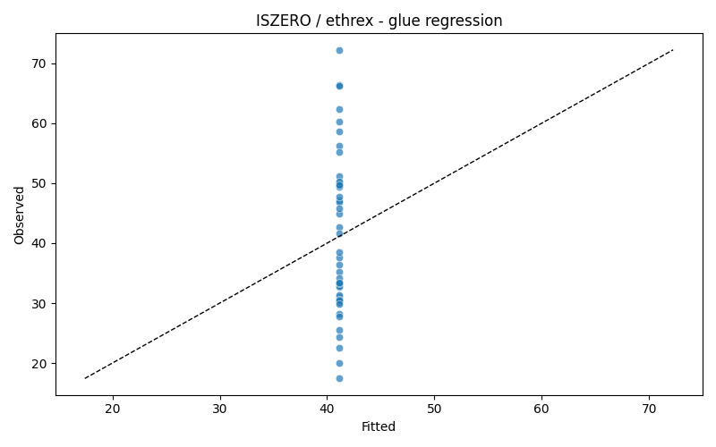

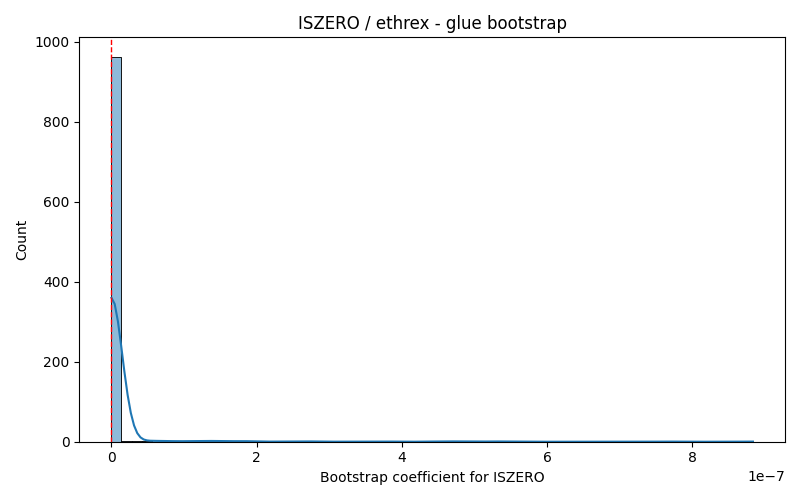

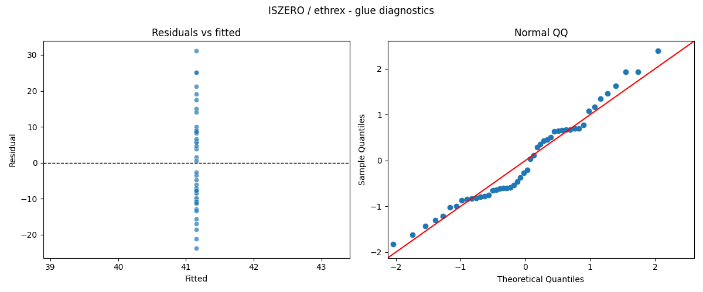

</details>

<details><summary><code>JUMPDEST</code> · nobs=12 · runtime_ms=0 · p=1.00e+00 · R²=0</summary>

```
==============================================================================
                           NNLS Regression Results                            
==============================================================================
Dep. Variable:          test_runtime_ms              R-squared:          0.000
Model:                  NNLS                    Adj. R-squared:         -0.100
No. Observations:       12                                RMSE:          16.38
Df Residuals:           10                                 MAE:          16.28
Df Model:               1      
==============================================================================
                      coef     std err     P-value      [0.025      0.975]
------------------------------------------------------------------------------
         const     75.6359      4.8633       0.001     65.4462     84.1733
      JUMPDEST      0.0000      0.0000       1.000      0.0000      0.0000
==============================================================================
Notes: Non-negative least squares with bootstrap inference (1000 iterations)
==============================================================================
```

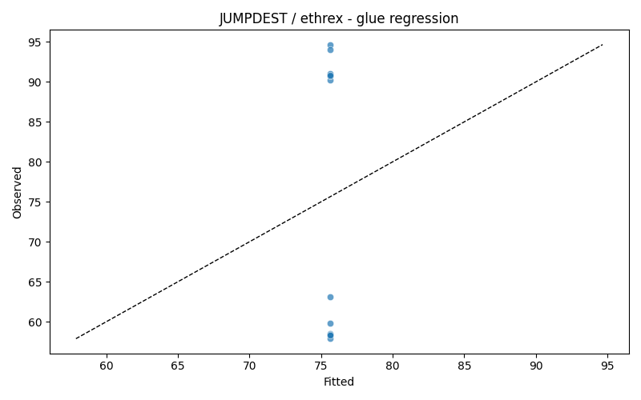


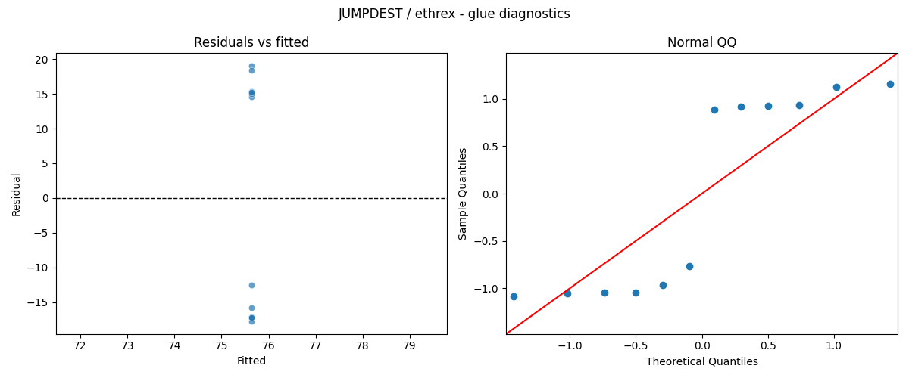

</details>

<details><summary><code>SWAP</code> · nobs=858 · runtime_ms=0 · p=1.00e+00 · R²=0</summary>

```
==============================================================================
                           NNLS Regression Results                            
==============================================================================
Dep. Variable:          test_runtime_ms              R-squared:          0.000
Model:                  NNLS                    Adj. R-squared:         -0.001
No. Observations:       858                               RMSE:          21.76
Df Residuals:           856                                MAE:          16.79
Df Model:               1      
==============================================================================
                      coef     std err     P-value      [0.025      0.975]
------------------------------------------------------------------------------
         const    103.6035      0.7416       0.001    102.0743    104.9802
          SWAP      0.0000      0.0000       1.000      0.0000      0.0000
==============================================================================
Notes: Non-negative least squares with bootstrap inference (1000 iterations)
==============================================================================
```

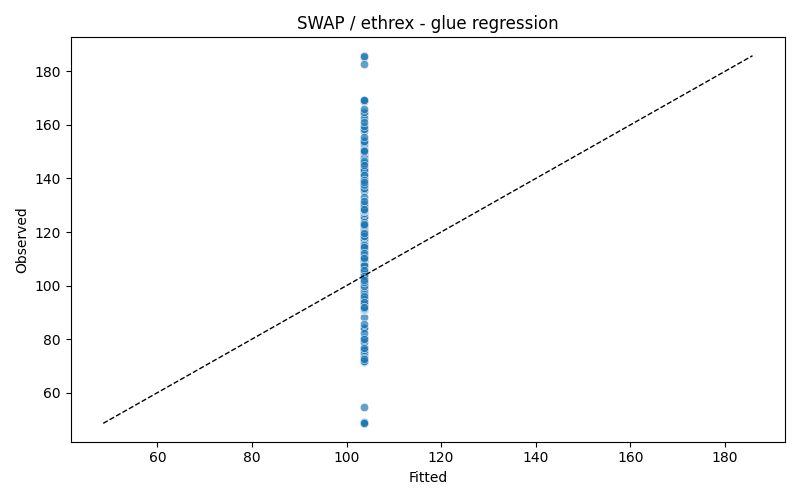

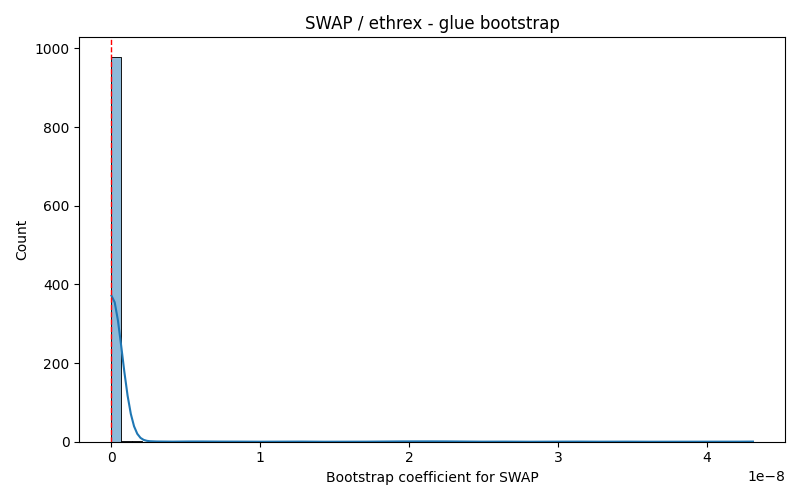

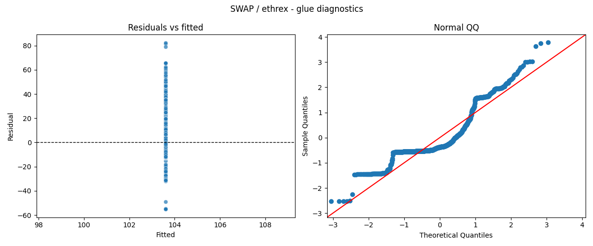

</details>

### Mixed glue (tier A) · ethrex

<details><summary><code>ADD</code> · nobs=54 · runtime_ms=0 · p=1.00e+00 · R²=0</summary>

```
==============================================================================
                           NNLS Regression Results                            
==============================================================================
Dep. Variable:          test_runtime_ms              R-squared:          0.000
Model:                  NNLS                    Adj. R-squared:         -0.019
No. Observations:       54                                RMSE:          13.17
Df Residuals:           52                                 MAE:          11.91
Df Model:               1      
==============================================================================
                      coef     std err     P-value      [0.025      0.975]
------------------------------------------------------------------------------
         const     45.8055      1.8490       0.001     41.9984     49.2741
           ADD      0.0000      0.0000       1.000      0.0000      0.0000
==============================================================================
Notes: Non-negative least squares with bootstrap inference (1000 iterations)
==============================================================================
```

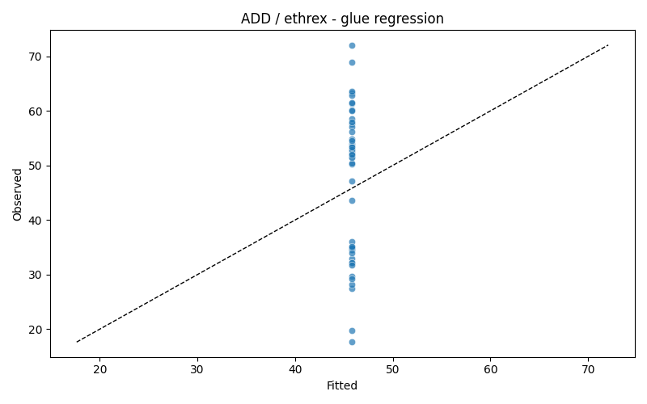

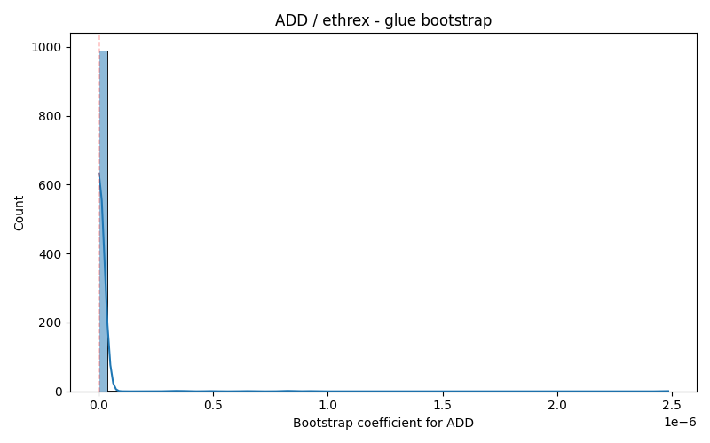

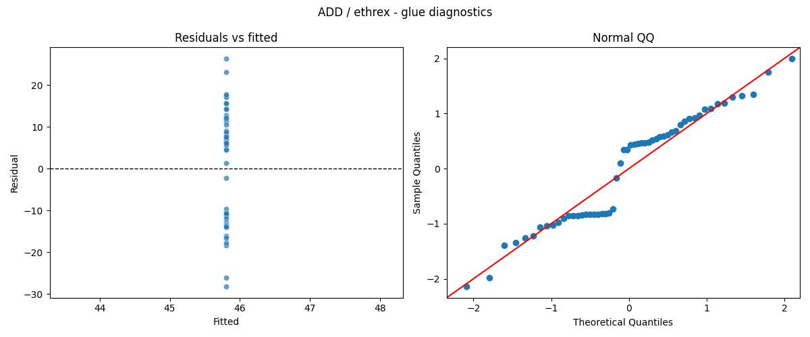

</details>

<details><summary><code>AND</code> · nobs=48 · runtime_ms=0 · p=1.00e+00 · R²=0</summary>

```
==============================================================================
                           NNLS Regression Results                            
==============================================================================
Dep. Variable:          test_runtime_ms              R-squared:          0.000
Model:                  NNLS                    Adj. R-squared:         -0.022
No. Observations:       48                                RMSE:          13.76
Df Residuals:           46                                 MAE:          11.84
Df Model:               1      
==============================================================================
                      coef     std err     P-value      [0.025      0.975]
------------------------------------------------------------------------------
         const     40.6704      1.9804       0.001     36.7088     44.5810
           AND      0.0000      0.0000       1.000      0.0000      0.0000
==============================================================================
Notes: Non-negative least squares with bootstrap inference (1000 iterations)
==============================================================================
```

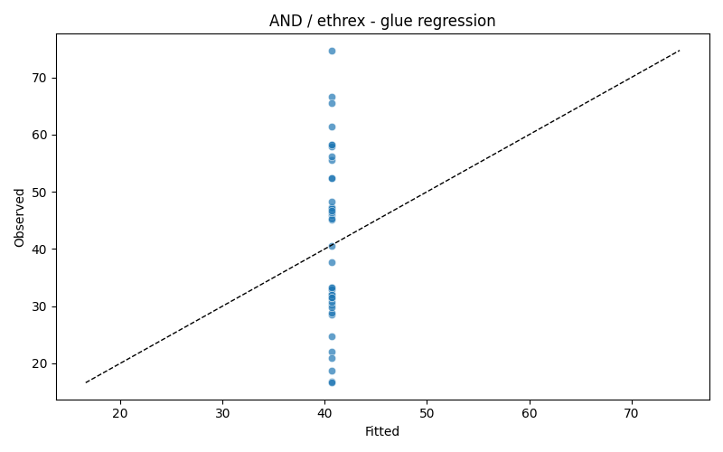

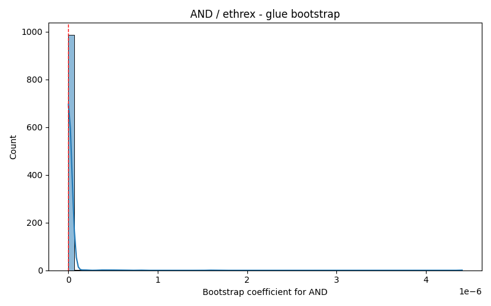

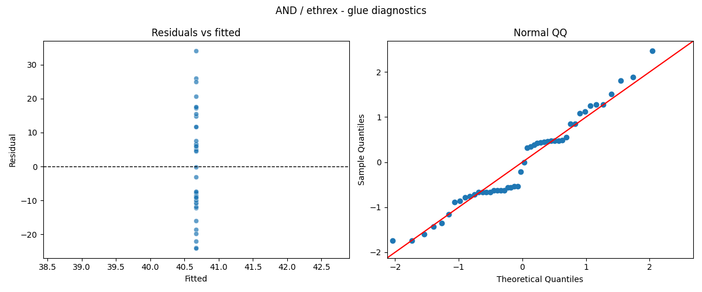

</details>

<details><summary><code>CALLDATACOPY</code> · nobs=1410 · runtime_ms=0 · p=1.00e+00 · R²=0</summary>

```
==============================================================================
                           NNLS Regression Results                            
==============================================================================
Dep. Variable:          test_runtime_ms              R-squared:          0.000
Model:                  NNLS                    Adj. R-squared:         -0.001
No. Observations:       1410                              RMSE:          20.42
Df Residuals:           1408                               MAE:          17.16
Df Model:               1      
==============================================================================
                      coef     std err     P-value      [0.025      0.975]
------------------------------------------------------------------------------
         const     36.3367      0.5244       0.001     35.3456     37.3790
  CALLDATACOPY      0.0000      0.0000       1.000      0.0000      0.0000
==============================================================================
Notes: Non-negative least squares with bootstrap inference (1000 iterations)
==============================================================================
```

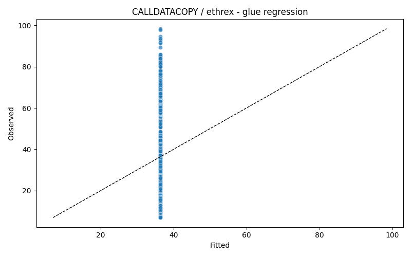


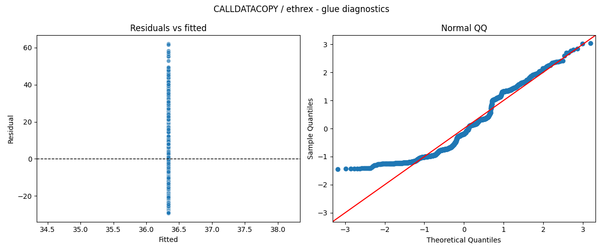

</details>

<details><summary><code>CALLDATALOAD</code> · nobs=264 · runtime_ms=1.632e-05 · p=1.00e-03 · R²=0.2277</summary>

```
==============================================================================
                           NNLS Regression Results                            
==============================================================================
Dep. Variable:          test_runtime_ms              R-squared:          0.228
Model:                  NNLS                    Adj. R-squared:          0.225
No. Observations:       264                               RMSE:           0.12
Df Residuals:           262                                MAE:           0.09
Df Model:               1      
==============================================================================
                      coef     std err     P-value      [0.025      0.975]
------------------------------------------------------------------------------
         const      2.1719      0.0255       0.001      2.1235      2.2250
  CALLDATALOAD      0.0000      0.0000       0.001      0.0000      0.0000
==============================================================================
Notes: Non-negative least squares with bootstrap inference (1000 iterations)
==============================================================================
```

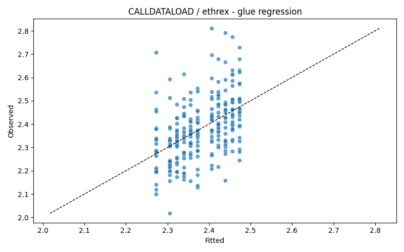

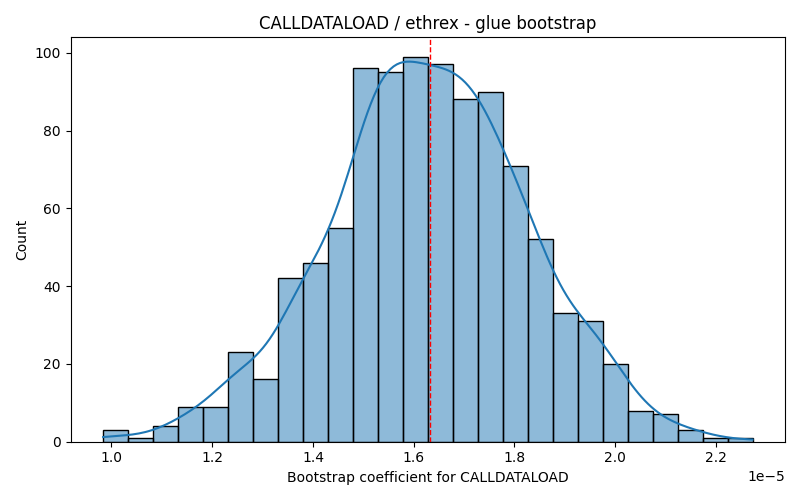

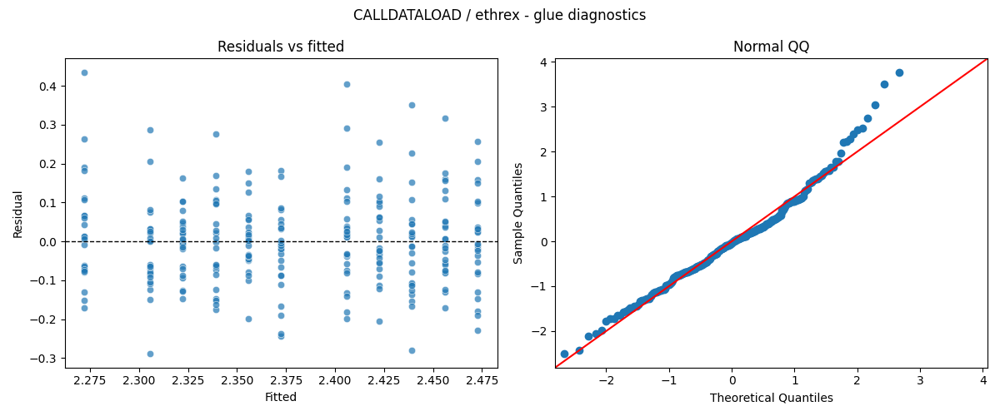

</details>

<details><summary><code>DIV</code> · nobs=66 · runtime_ms=0 · p=1.00e+00 · R²=0</summary>

```
==============================================================================
                           NNLS Regression Results                            
==============================================================================
Dep. Variable:          test_runtime_ms              R-squared:          0.000
Model:                  NNLS                    Adj. R-squared:         -0.016
No. Observations:       66                                RMSE:          81.64
Df Residuals:           64                                 MAE:          73.94
Df Model:               1      
==============================================================================
                      coef     std err     P-value      [0.025      0.975]
------------------------------------------------------------------------------
         const    308.5203      9.9945       0.001    289.1088    327.4823
           DIV      0.0000      0.0000       1.000      0.0000      0.0000
==============================================================================
Notes: Non-negative least squares with bootstrap inference (1000 iterations)
==============================================================================
```

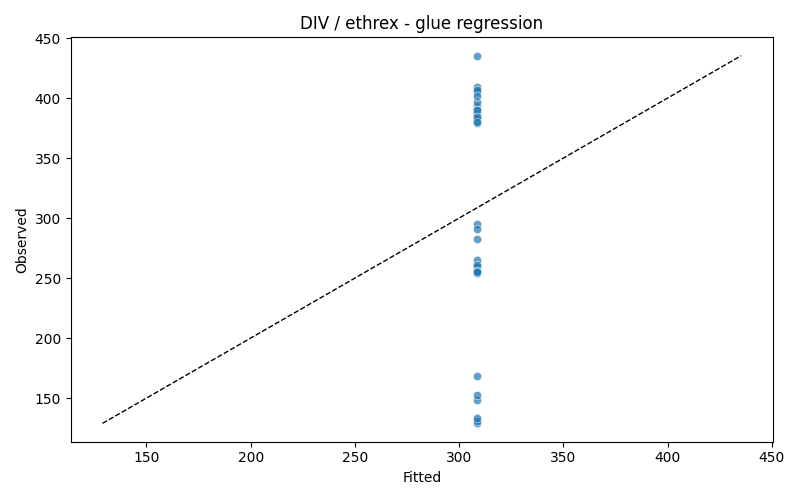


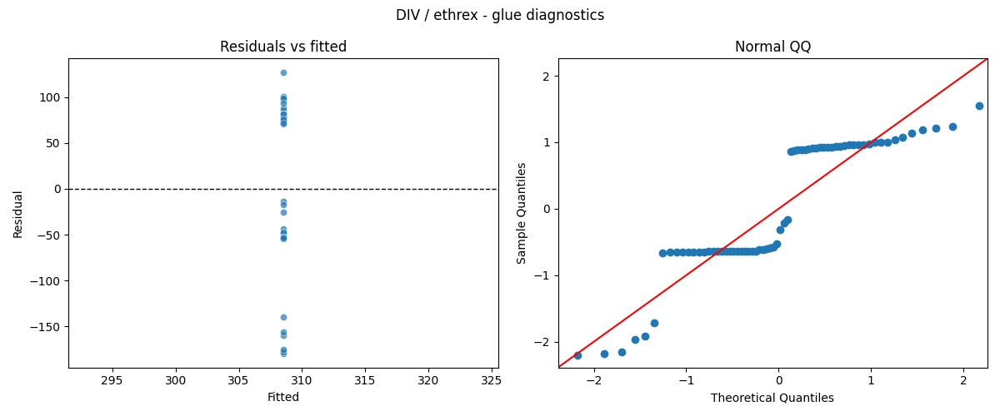

</details>

<details><summary><code>EXP</code> · nobs=66 · runtime_ms=0.0009138 · p=1.00e-03 · R²=0.8455</summary>

```
==============================================================================
                           NNLS Regression Results                            
==============================================================================
Dep. Variable:          test_runtime_ms              R-squared:          0.846
Model:                  NNLS                    Adj. R-squared:          0.843
No. Observations:       66                                RMSE:          15.30
Df Residuals:           64                                 MAE:          12.43
Df Model:               1      
==============================================================================
                      coef     std err     P-value      [0.025      0.975]
------------------------------------------------------------------------------
         const     36.9126      7.1848       0.001     23.7440     51.2125
           EXP      0.0009      0.0001       0.001      0.0008      0.0010
==============================================================================
Notes: Non-negative least squares with bootstrap inference (1000 iterations)
==============================================================================
```

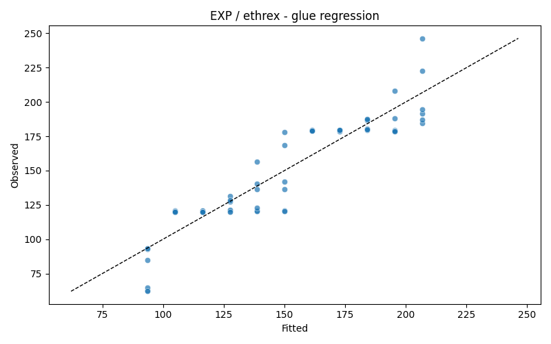

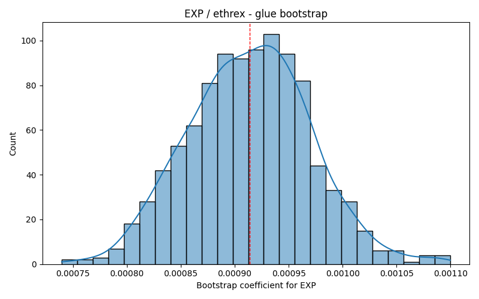

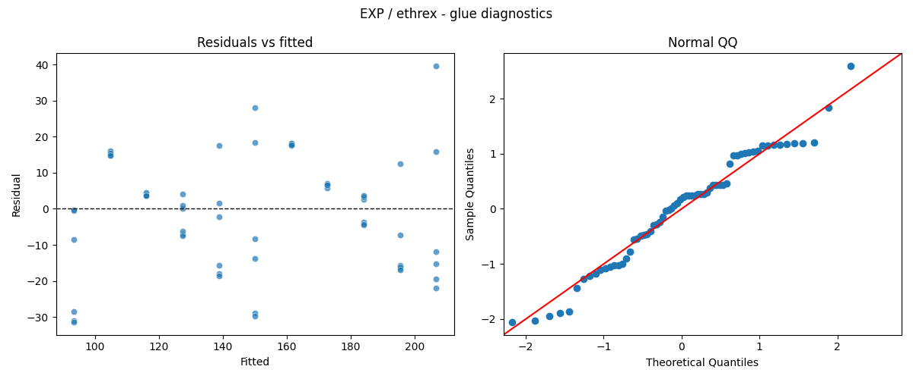

</details>

<details><summary><code>GT</code> · nobs=48 · runtime_ms=0 · p=1.00e+00 · R²=0</summary>

```
==============================================================================
                           NNLS Regression Results                            
==============================================================================
Dep. Variable:          test_runtime_ms              R-squared:          0.000
Model:                  NNLS                    Adj. R-squared:         -0.022
No. Observations:       48                                RMSE:          14.78
Df Residuals:           46                                 MAE:          13.49
Df Model:               1      
==============================================================================
                      coef     std err     P-value      [0.025      0.975]
------------------------------------------------------------------------------
         const     44.7651      2.1211       0.001     40.7751     49.0051
            GT      0.0000      0.0000       1.000      0.0000      0.0000
==============================================================================
Notes: Non-negative least squares with bootstrap inference (1000 iterations)
==============================================================================
```

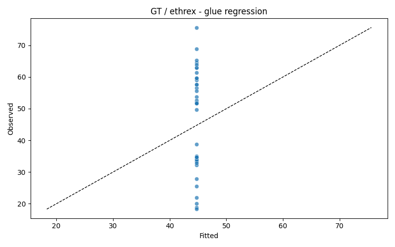

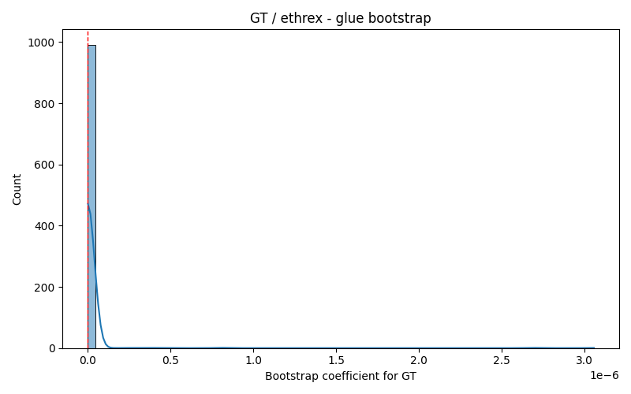

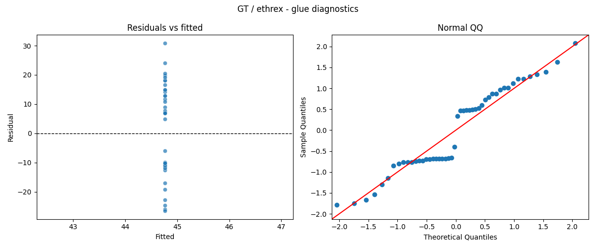

</details>

<details><summary><code>JUMPI</code> · nobs=66 · runtime_ms=0 · p=1.00e+00 · R²=0</summary>

```
==============================================================================
                           NNLS Regression Results                            
==============================================================================
Dep. Variable:          test_runtime_ms              R-squared:          0.000
Model:                  NNLS                    Adj. R-squared:         -0.016
No. Observations:       66                                RMSE:           8.48
Df Residuals:           64                                 MAE:           6.93
Df Model:               1      
==============================================================================
                      coef     std err     P-value      [0.025      0.975]
------------------------------------------------------------------------------
         const     28.0811      1.0675       0.001     26.0367     30.1569
         JUMPI      0.0000      0.0000       1.000      0.0000      0.0000
==============================================================================
Notes: Non-negative least squares with bootstrap inference (1000 iterations)
==============================================================================
```

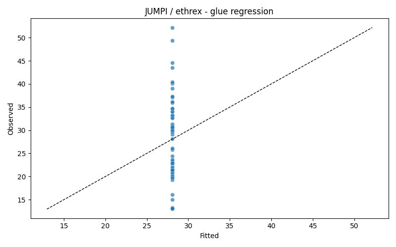


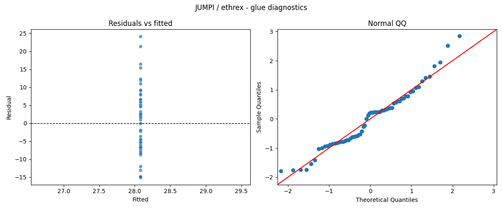

</details>

<details><summary><code>LT</code> · nobs=48 · runtime_ms=0 · p=1.00e+00 · R²=0</summary>

```
==============================================================================
                           NNLS Regression Results                            
==============================================================================
Dep. Variable:          test_runtime_ms              R-squared:          0.000
Model:                  NNLS                    Adj. R-squared:         -0.022
No. Observations:       48                                RMSE:          13.74
Df Residuals:           46                                 MAE:          11.96
Df Model:               1      
==============================================================================
                      coef     std err     P-value      [0.025      0.975]
------------------------------------------------------------------------------
         const     41.8309      1.9876       0.001     38.1305     45.5546
            LT      0.0000      0.0000       1.000      0.0000      0.0000
==============================================================================
Notes: Non-negative least squares with bootstrap inference (1000 iterations)
==============================================================================
```

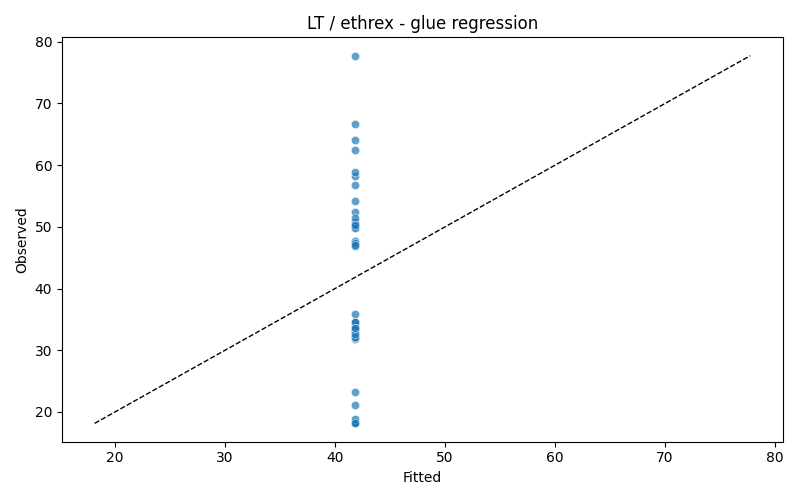

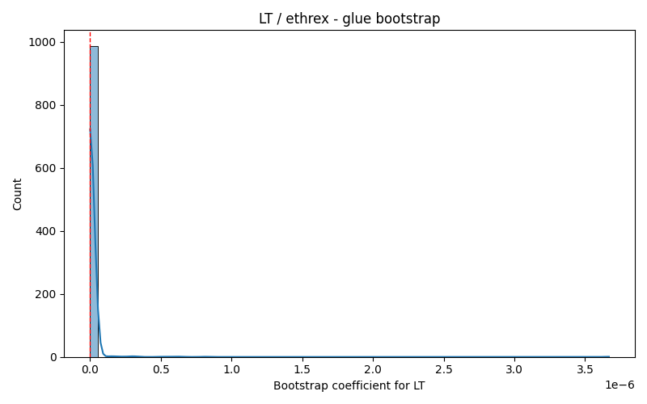

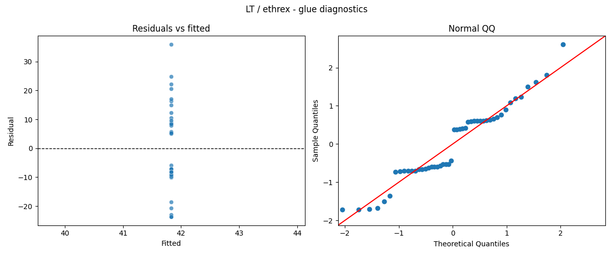

</details>

<details><summary><code>MSTORE</code> · nobs=270 · runtime_ms=0 · p=1.00e+00 · R²=0</summary>

```
==============================================================================
                           NNLS Regression Results                            
==============================================================================
Dep. Variable:          test_runtime_ms              R-squared:          0.000
Model:                  NNLS                    Adj. R-squared:         -0.004
No. Observations:       270                               RMSE:          14.06
Df Residuals:           268                                MAE:          12.59
Df Model:               1      
==============================================================================
                      coef     std err     P-value      [0.025      0.975]
------------------------------------------------------------------------------
         const     48.5357      0.8672       0.001     46.8247     50.2003
        MSTORE      0.0000      0.0000       1.000      0.0000      0.0000
==============================================================================
Notes: Non-negative least squares with bootstrap inference (1000 iterations)
==============================================================================
```

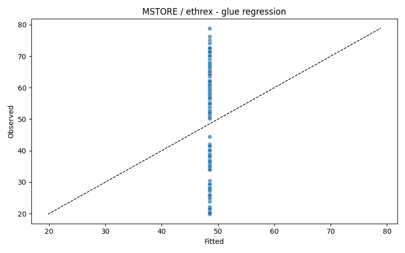


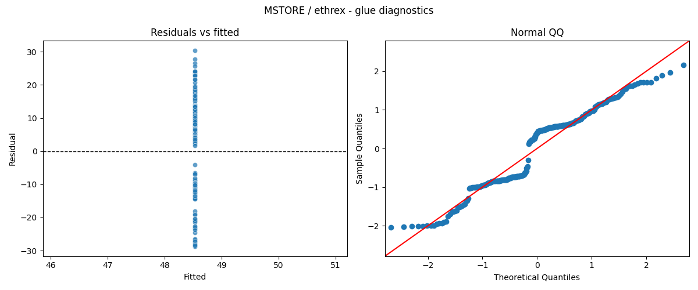

</details>

<details><summary><code>MSTORE8</code> · nobs=270 · runtime_ms=0 · p=1.00e+00 · R²=0</summary>

```
==============================================================================
                           NNLS Regression Results                            
==============================================================================
Dep. Variable:          test_runtime_ms              R-squared:          0.000
Model:                  NNLS                    Adj. R-squared:         -0.004
No. Observations:       270                               RMSE:          13.04
Df Residuals:           268                                MAE:          11.47
Df Model:               1      
==============================================================================
                      coef     std err     P-value      [0.025      0.975]
------------------------------------------------------------------------------
         const     45.8569      0.7627       0.001     44.3711     47.3151
       MSTORE8      0.0000      0.0000       1.000      0.0000      0.0000
==============================================================================
Notes: Non-negative least squares with bootstrap inference (1000 iterations)
==============================================================================
```

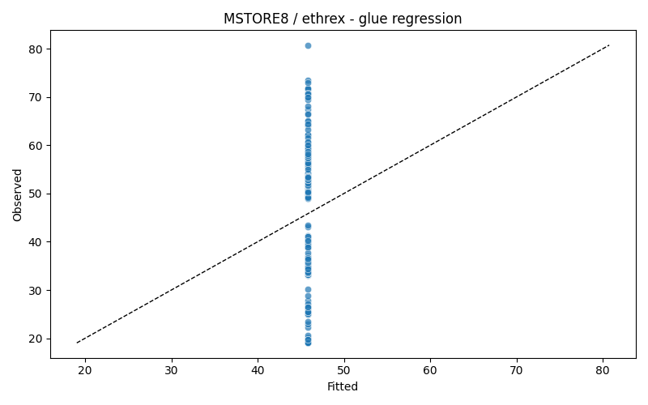


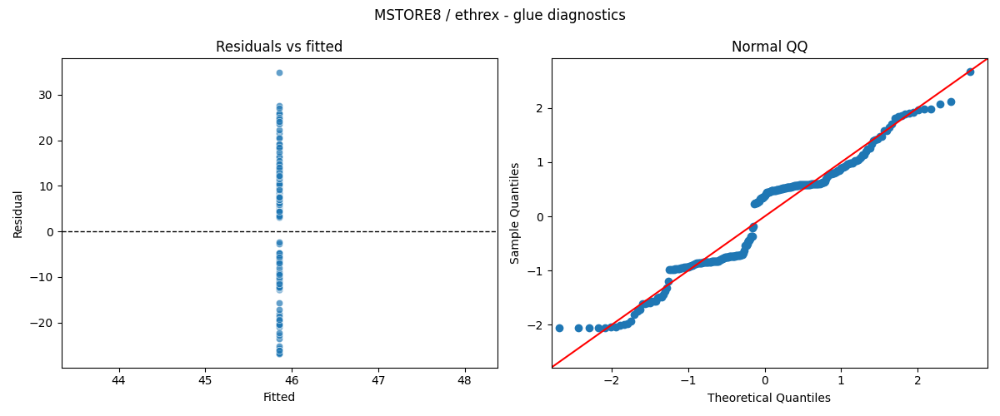

</details>

<details><summary><code>MUL</code> · nobs=60 · runtime_ms=0 · p=1.00e+00 · R²=0</summary>

```
==============================================================================
                           NNLS Regression Results                            
==============================================================================
Dep. Variable:          test_runtime_ms              R-squared:          0.000
Model:                  NNLS                    Adj. R-squared:         -0.017
No. Observations:       60                                RMSE:          23.50
Df Residuals:           58                                 MAE:          20.27
Df Model:               1      
==============================================================================
                      coef     std err     P-value      [0.025      0.975]
------------------------------------------------------------------------------
         const     89.5076      3.0046       0.001     83.6888     95.6579
           MUL      0.0000      0.0000       1.000      0.0000      0.0000
==============================================================================
Notes: Non-negative least squares with bootstrap inference (1000 iterations)
==============================================================================
```

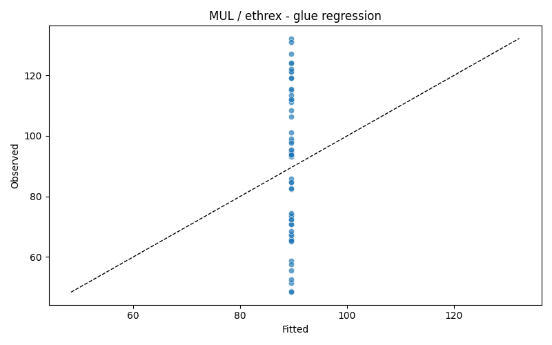


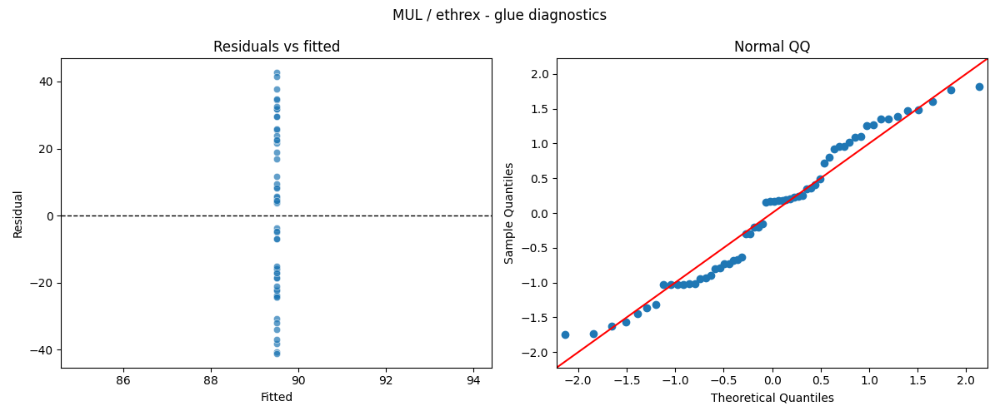

</details>

<details><summary><code>PC</code> · nobs=36 · runtime_ms=5.577e-06 · p=1.00e-03 · R²=0.4513</summary>

```
==============================================================================
                           NNLS Regression Results                            
==============================================================================
Dep. Variable:          test_runtime_ms              R-squared:          0.451
Model:                  NNLS                    Adj. R-squared:          0.435
No. Observations:       36                                RMSE:          13.67
Df Residuals:           34                                 MAE:          12.19
Df Model:               1      
==============================================================================
                      coef     std err     P-value      [0.025      0.975]
------------------------------------------------------------------------------
         const     60.7880      4.0975       0.001     52.1046     68.4704
            PC      0.0000      0.0000       0.001      0.0000      0.0000
==============================================================================
Notes: Non-negative least squares with bootstrap inference (1000 iterations)
==============================================================================
```

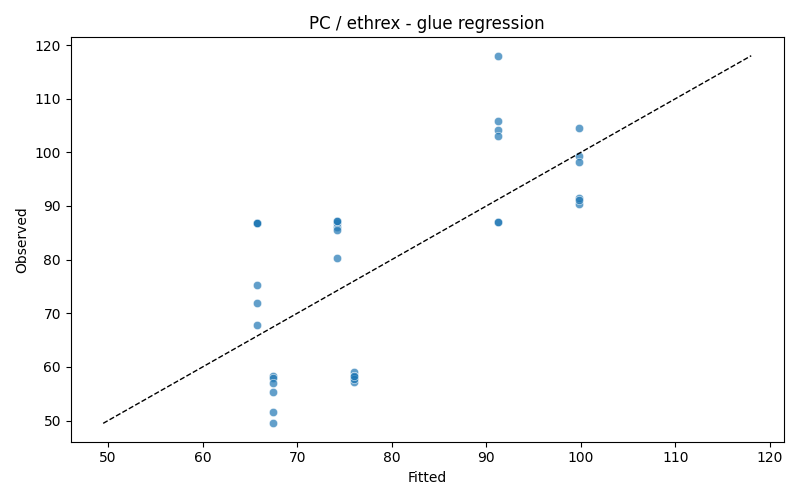

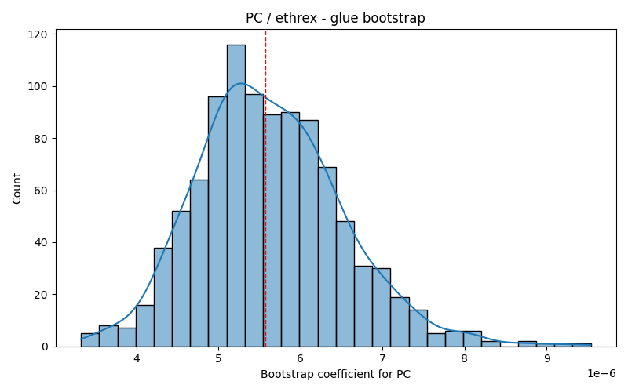

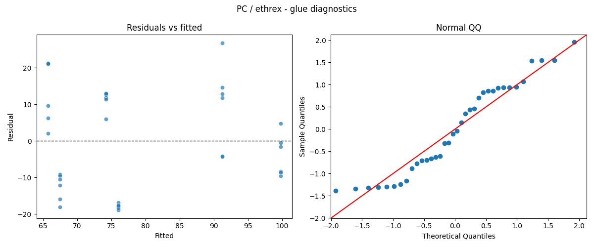

</details>

<details><summary><code>RETURNDATASIZE</code> · nobs=144 · runtime_ms=8.128e-06 · p=1.00e-03 · R²=0.3384</summary>

```
==============================================================================
                           NNLS Regression Results                            
==============================================================================
Dep. Variable:          test_runtime_ms              R-squared:          0.338
Model:                  NNLS                    Adj. R-squared:          0.334
No. Observations:       144                               RMSE:          13.34
Df Residuals:           142                                MAE:          10.35
Df Model:               1      
==============================================================================
                      coef     std err     P-value      [0.025      0.975]
------------------------------------------------------------------------------
         const     47.8004      1.9628       0.001     43.7165     51.7258
RETURNDATASIZE      0.0000      0.0000       0.001      0.0000      0.0000
==============================================================================
Notes: Non-negative least squares with bootstrap inference (1000 iterations)
==============================================================================
```

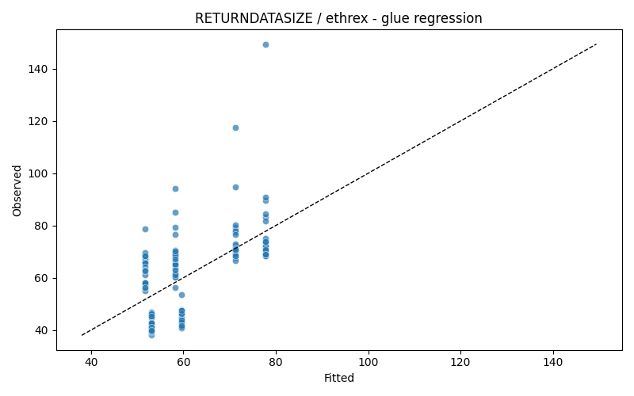

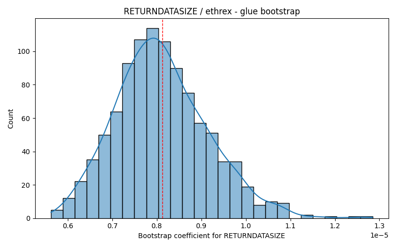

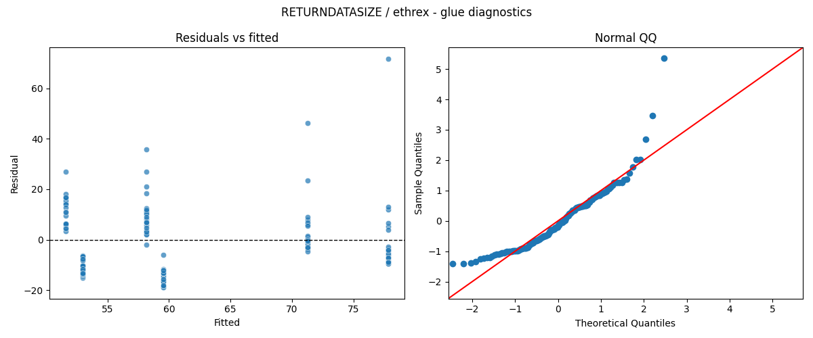

</details>

<details><summary><code>SELFBALANCE</code> · nobs=66 · runtime_ms=0 · p=1.00e+00 · R²=2.22e-16</summary>

```
==============================================================================
                           NNLS Regression Results                            
==============================================================================
Dep. Variable:          test_runtime_ms              R-squared:          0.000
Model:                  NNLS                    Adj. R-squared:         -0.016
No. Observations:       66                                RMSE:          65.80
Df Residuals:           64                                 MAE:          59.33
Df Model:               1      
==============================================================================
                      coef     std err     P-value      [0.025      0.975]
------------------------------------------------------------------------------
         const    249.7995      9.4993       0.001    227.9396    265.1811
   SELFBALANCE      0.0000      0.0000       1.000      0.0000      0.0000
==============================================================================
Notes: Non-negative least squares with bootstrap inference (1000 iterations)
==============================================================================
```

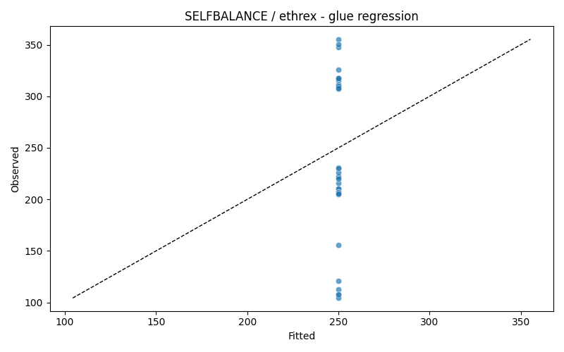

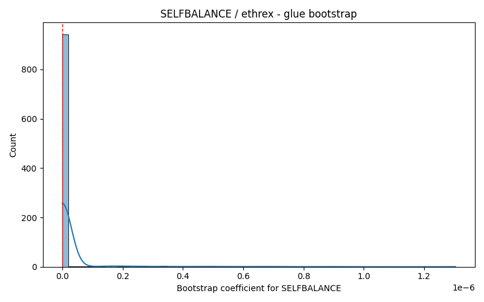

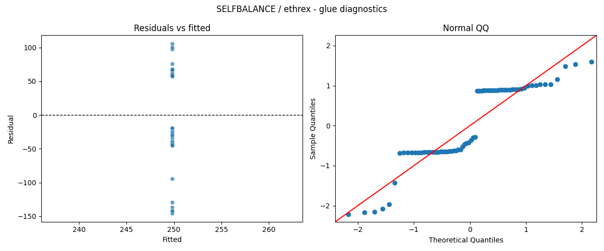

</details>

<details><summary><code>SUB</code> · nobs=48 · runtime_ms=0 · p=1.00e+00 · R²=0</summary>

```
==============================================================================
                           NNLS Regression Results                            
==============================================================================
Dep. Variable:          test_runtime_ms              R-squared:          0.000
Model:                  NNLS                    Adj. R-squared:         -0.022
No. Observations:       48                                RMSE:          13.73
Df Residuals:           46                                 MAE:          12.02
Df Model:               1      
==============================================================================
                      coef     std err     P-value      [0.025      0.975]
------------------------------------------------------------------------------
         const     44.1560      2.0052       0.001     40.3382     48.1299
           SUB      0.0000      0.0000       1.000      0.0000      0.0000
==============================================================================
Notes: Non-negative least squares with bootstrap inference (1000 iterations)
==============================================================================
```

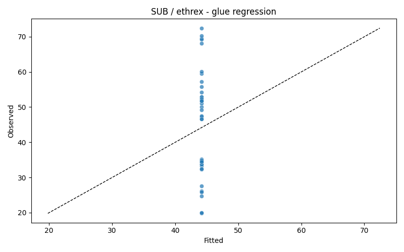

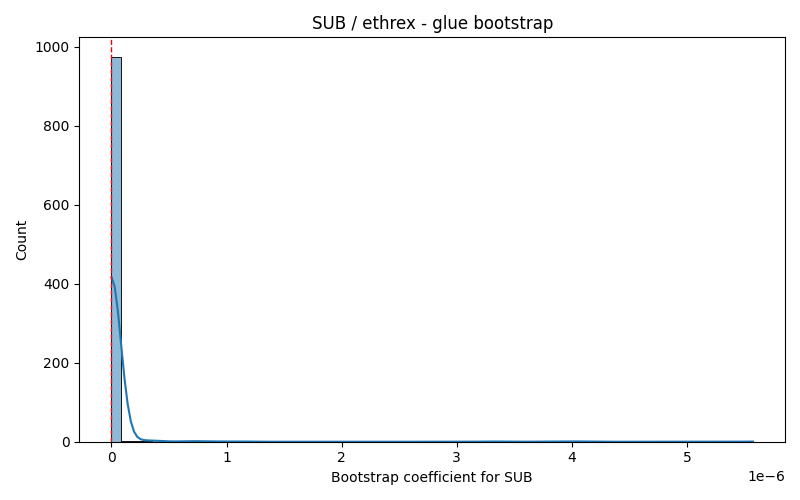

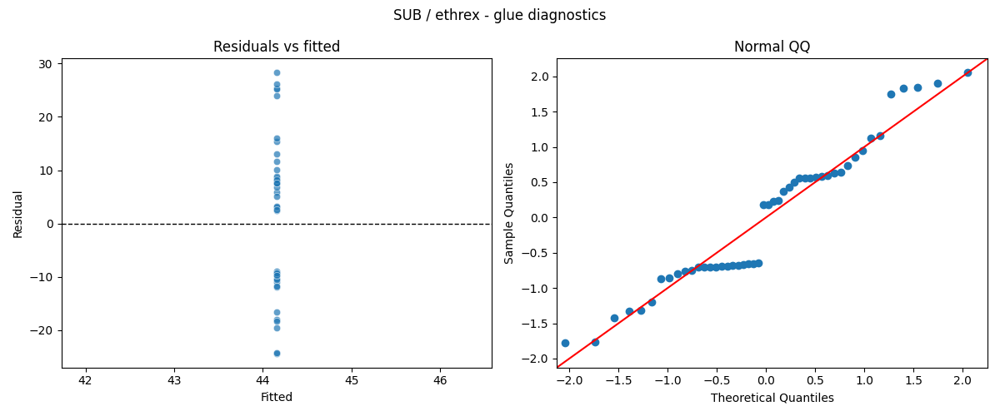

</details>

### Mixed glue (tier B) · ethrex

<details><summary><code>JUMP</code> · nobs=60 · runtime_ms=0 · p=1.00e+00 · R²=2.22e-16</summary>

```
==============================================================================
                           NNLS Regression Results                            
==============================================================================
Dep. Variable:          test_runtime_ms              R-squared:          0.000
Model:                  NNLS                    Adj. R-squared:         -0.017
No. Observations:       60                                RMSE:          12.56
Df Residuals:           58                                 MAE:          10.94
Df Model:               1      
==============================================================================
                      coef     std err     P-value      [0.025      0.975]
------------------------------------------------------------------------------
         const     41.7251      1.6584       0.001     38.5083     45.1427
          JUMP      0.0000      0.0000       1.000      0.0000      0.0000
==============================================================================
Notes: Non-negative least squares with bootstrap inference (1000 iterations)
==============================================================================
```

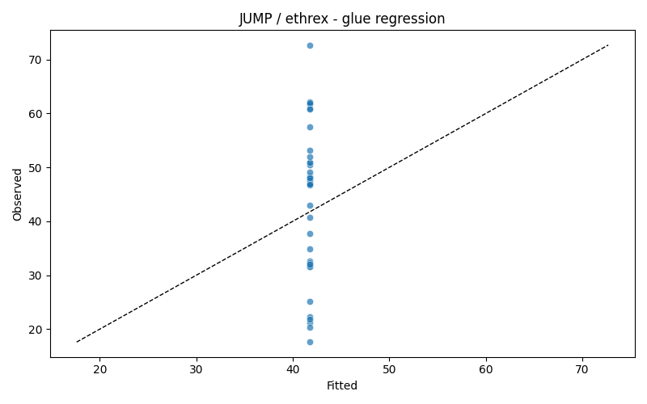


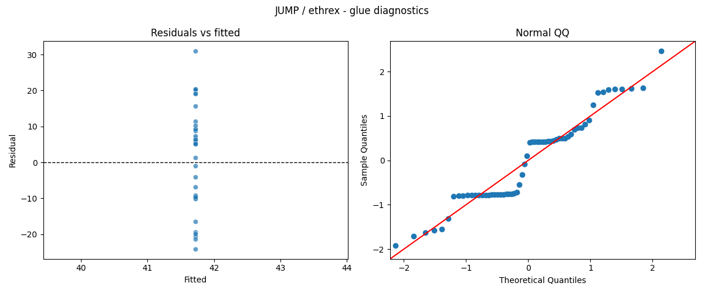

</details>

<details><summary><code>KECCAK256</code> · nobs=1056 · runtime_ms=0 · p=1.00e+00 · R²=0</summary>

```
==============================================================================
                           NNLS Regression Results                            
==============================================================================
Dep. Variable:          test_runtime_ms              R-squared:          0.000
Model:                  NNLS                    Adj. R-squared:         -0.001
No. Observations:       1056                              RMSE:         154.06
Df Residuals:           1054                               MAE:         128.17
Df Model:               1      
==============================================================================
                      coef     std err     P-value      [0.025      0.975]
------------------------------------------------------------------------------
         const    244.7395      4.8719       0.001    235.1710    254.2146
     KECCAK256      0.0000      0.0000       1.000      0.0000      0.0000
==============================================================================
Notes: Non-negative least squares with bootstrap inference (1000 iterations)
==============================================================================
```

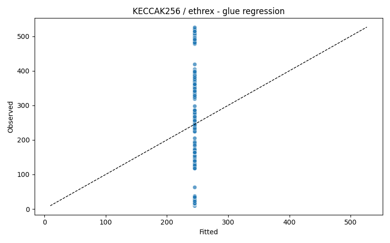


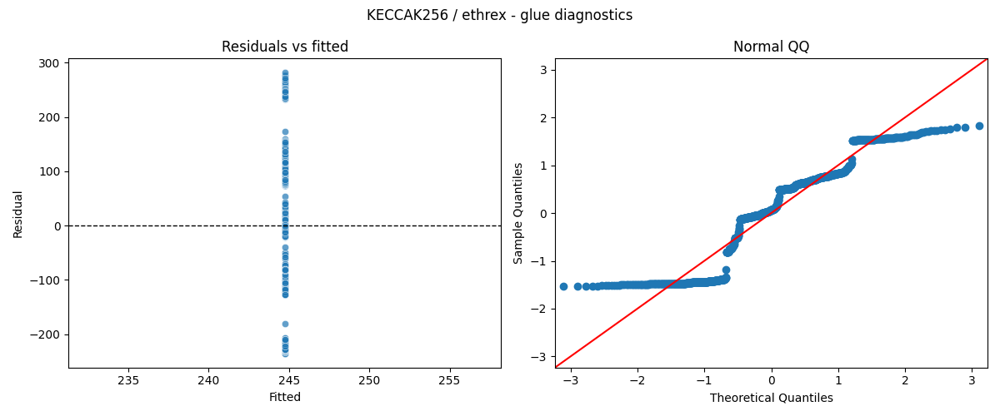

</details>

## geth

| glue_opcode | nobs | glue_runtime_ms | p_value | rsquared |
| --- | --- | --- | --- | --- |
| `ISZERO` | 216 | 0 | 1.00e+00 | 0 |
| `JUMPDEST` | 54 | 0 | 1.00e+00 | 2.22e-16 |
| `SWAP` | 3861 | 0 | 1.00e+00 | 0 |
| `CALLDATASIZE` | 13663 | 4.36e-06 | 1.00e-03 | 0.1209 |
| `DUP` | 13663 | 0 | 1.00e+00 | 0.1209 |
| `GAS` | 13663 | 5.541e-06 | 1.00e-03 | 0.1209 |
| `MLOAD` | 13663 | 8.994e-06 | 1.00e-03 | 0.1209 |
| `PUSH` | 13663 | 0 | 1.00e+00 | 0.1209 |
| `PUSH0` | 13663 | 0 | 1.00e+00 | 0.1209 |
| `STATICCALL` | 13663 | 9.401e-05 | 1.00e-03 | 0.1209 |
| `ADD` | 243 | 0 | 1.00e+00 | 0 |
| `AND` | 216 | 0 | 1.00e+00 | -2.22e-16 |
| `CALLDATACOPY` | 6345 | 0 | 1.00e+00 | 0 |
| `CALLDATALOAD` | 1188 | 3.748e-05 | 1.00e-03 | 0.1251 |
| `DIV` | 297 | 0 | 1.00e+00 | 0 |
| `EXP` | 297 | 0.0003116 | 1.00e-03 | 0.81 |
| `GT` | 216 | 0 | 1.00e+00 | 0 |
| `JUMPI` | 297 | 0 | 1.00e+00 | 0 |
| `LT` | 216 | 0 | 1.00e+00 | 1.11e-16 |
| `MSTORE` | 1215 | 0 | 1.00e+00 | 0 |
| `MSTORE8` | 1215 | 0 | 1.00e+00 | 0 |
| `MUL` | 270 | 0 | 1.00e+00 | 0 |
| `PC` | 162 | 7.539e-06 | 1.00e-03 | 0.2487 |
| `RETURNDATASIZE` | 648 | 1.149e-05 | 1.00e-03 | 0.1353 |
| `SELFBALANCE` | 297 | 0 | 1.00e+00 | -2.22e-16 |
| `SUB` | 216 | 0 | 1.00e+00 | 0 |
| `JUMP` | 270 | 0 | 1.00e+00 | 0 |
| `KECCAK256` | 4752 | 2.999e-05 | 1.00e-03 | 0.213 |

### Cycle glue — joint fit · geth

<details><summary>Joint NNLS regression summary</summary>

```
==============================================================================
                           NNLS Regression Results                            
==============================================================================
Dep. Variable:          test_runtime_ms              R-squared:          0.121
Model:                  NNLS                    Adj. R-squared:          0.120
No. Observations:       13663                             RMSE:          47.00
Df Residuals:           13655                              MAE:          38.02
Df Model:               7      
==============================================================================
                      coef     std err     P-value      [0.025      0.975]
------------------------------------------------------------------------------
         const    137.4516      0.4348       0.001    136.5784    138.2740
  CALLDATASIZE      0.0000      0.0000       0.001      0.0000      0.0000
           DUP      0.0000      0.0000       1.000      0.0000      0.0000
           GAS      0.0000      0.0000       0.001      0.0000      0.0000
         MLOAD      0.0000      0.0000       0.001      0.0000      0.0000
          PUSH      0.0000      0.0000       1.000      0.0000      0.0000
         PUSH0      0.0000      0.0000       1.000      0.0000      0.0000
    STATICCALL      0.0001      0.0000       0.001      0.0001      0.0001
==============================================================================
Notes: Non-negative least squares with bootstrap inference (1000 iterations)
==============================================================================
```

</details>

<details><summary><code>CALLDATASIZE</code> · nobs=13663 · runtime_ms=4.36e-06 · p=1.00e-03 · R²=0.1209</summary>

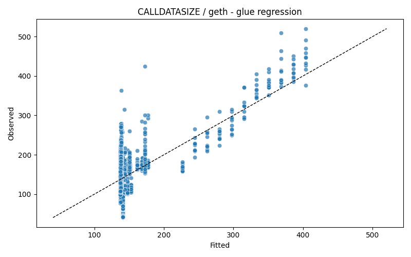

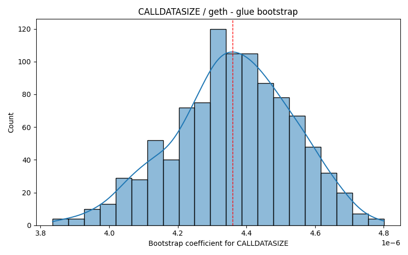


</details>

<details><summary><code>DUP</code> · nobs=13663 · runtime_ms=0 · p=1.00e+00 · R²=0.1209</summary>


</details>

<details><summary><code>GAS</code> · nobs=13663 · runtime_ms=5.541e-06 · p=1.00e-03 · R²=0.1209</summary>

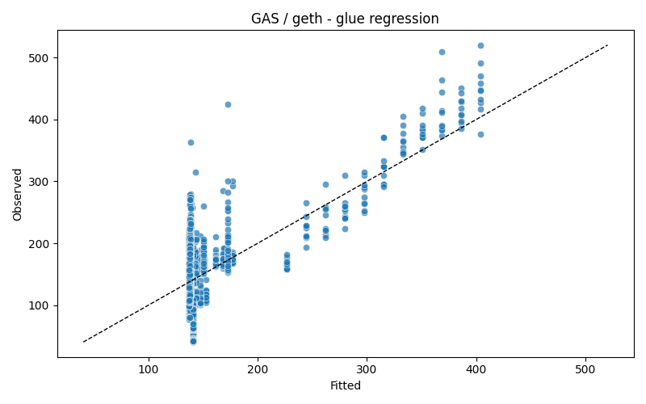

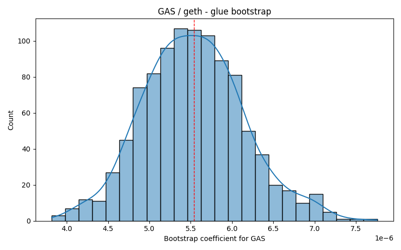

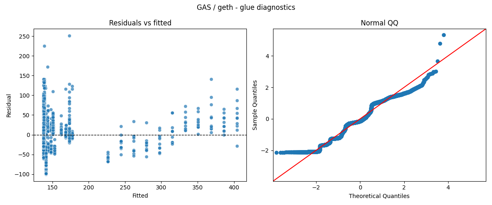

</details>

<details><summary><code>MLOAD</code> · nobs=13663 · runtime_ms=8.994e-06 · p=1.00e-03 · R²=0.1209</summary>

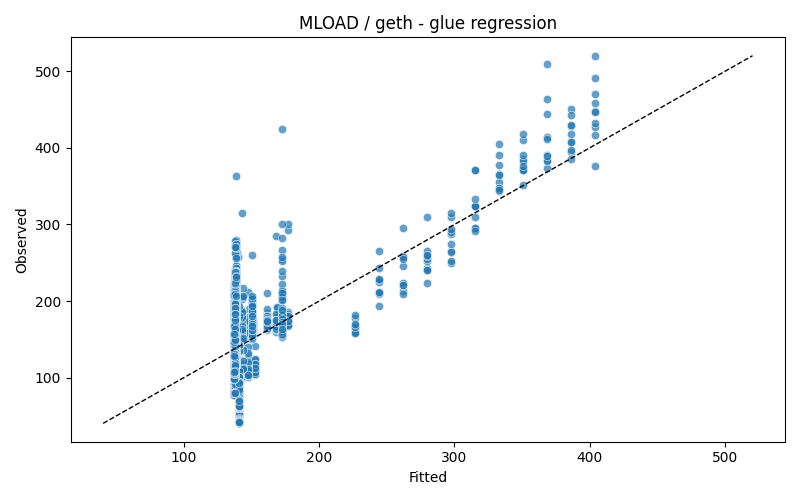

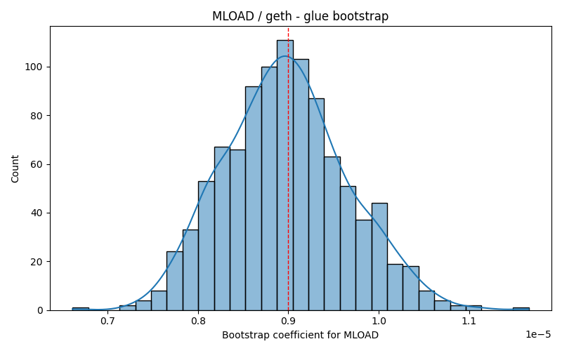


</details>

<details><summary><code>PUSH</code> · nobs=13663 · runtime_ms=0 · p=1.00e+00 · R²=0.1209</summary>


</details>

<details><summary><code>PUSH0</code> · nobs=13663 · runtime_ms=0 · p=1.00e+00 · R²=0.1209</summary>


</details>

<details><summary><code>STATICCALL</code> · nobs=13663 · runtime_ms=9.401e-05 · p=1.00e-03 · R²=0.1209</summary>

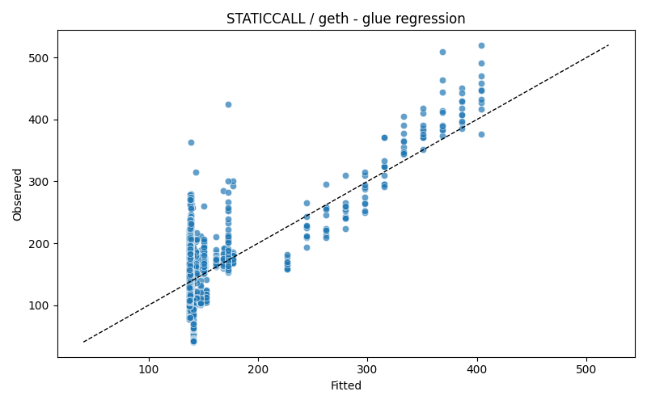

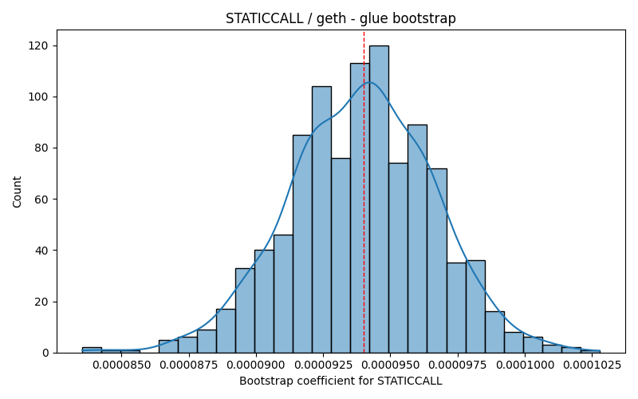


</details>

### Pure glue · geth

<details><summary><code>ISZERO</code> · nobs=216 · runtime_ms=0 · p=1.00e+00 · R²=0</summary>

```
==============================================================================
                           NNLS Regression Results                            
==============================================================================
Dep. Variable:          test_runtime_ms              R-squared:          0.000
Model:                  NNLS                    Adj. R-squared:         -0.005
No. Observations:       216                               RMSE:          26.13
Df Residuals:           214                                MAE:          23.56
Df Model:               1      
==============================================================================
                      coef     std err     P-value      [0.025      0.975]
------------------------------------------------------------------------------
         const     82.5033      1.7683       0.001     79.1753     85.9976
        ISZERO      0.0000      0.0000       1.000      0.0000      0.0000
==============================================================================
Notes: Non-negative least squares with bootstrap inference (1000 iterations)
==============================================================================
```

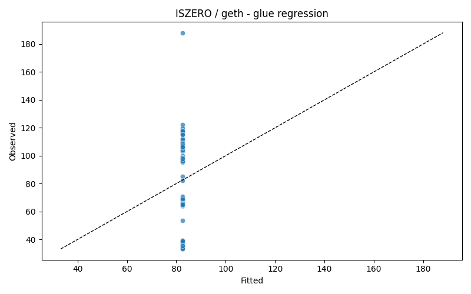


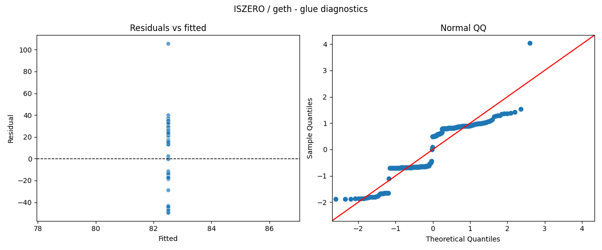

</details>

<details><summary><code>JUMPDEST</code> · nobs=54 · runtime_ms=0 · p=1.00e+00 · R²=2.22e-16</summary>

```
==============================================================================
                           NNLS Regression Results                            
==============================================================================
Dep. Variable:          test_runtime_ms              R-squared:          0.000
Model:                  NNLS                    Adj. R-squared:         -0.019
No. Observations:       54                                RMSE:          68.58
Df Residuals:           52                                 MAE:          43.15
Df Model:               1      
==============================================================================
                      coef     std err     P-value      [0.025      0.975]
------------------------------------------------------------------------------
         const    190.6326      9.0023       0.001    175.1975    210.8255
      JUMPDEST      0.0000      0.0000       1.000      0.0000      0.0000
==============================================================================
Notes: Non-negative least squares with bootstrap inference (1000 iterations)
==============================================================================
```

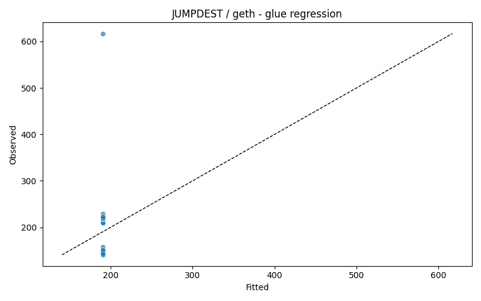

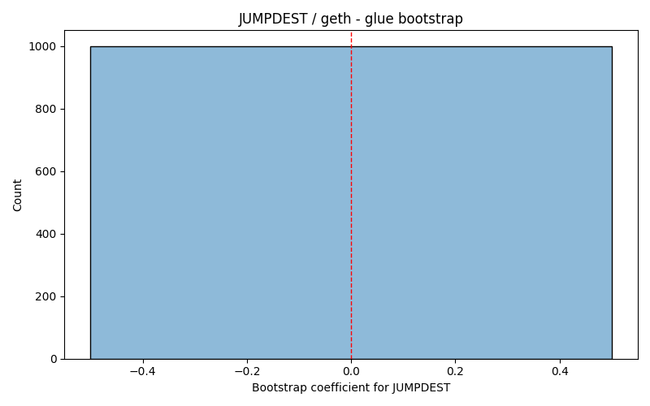

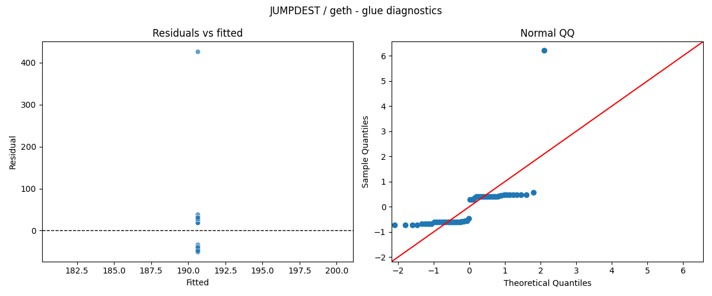

</details>

<details><summary><code>SWAP</code> · nobs=3861 · runtime_ms=0 · p=1.00e+00 · R²=0</summary>

```
==============================================================================
                           NNLS Regression Results                            
==============================================================================
Dep. Variable:          test_runtime_ms              R-squared:          0.000
Model:                  NNLS                    Adj. R-squared:         -0.000
No. Observations:       3861                              RMSE:          34.39
Df Residuals:           3859                               MAE:          29.58
Df Model:               1      
==============================================================================
                      coef     std err     P-value      [0.025      0.975]
------------------------------------------------------------------------------
         const    107.6655      0.5496       0.001    106.5971    108.7353
          SWAP      0.0000      0.0000       1.000      0.0000      0.0000
==============================================================================
Notes: Non-negative least squares with bootstrap inference (1000 iterations)
==============================================================================
```

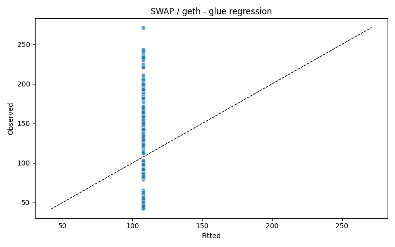


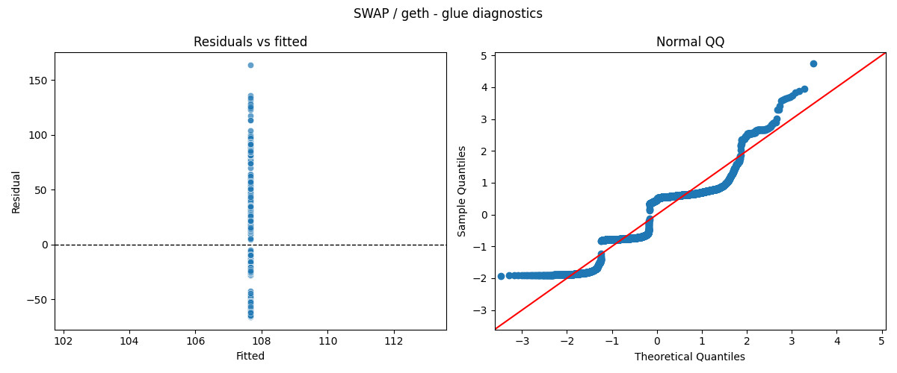

</details>

### Mixed glue (tier A) · geth

<details><summary><code>ADD</code> · nobs=243 · runtime_ms=0 · p=1.00e+00 · R²=0</summary>

```
==============================================================================
                           NNLS Regression Results                            
==============================================================================
Dep. Variable:          test_runtime_ms              R-squared:          0.000
Model:                  NNLS                    Adj. R-squared:         -0.004
No. Observations:       243                               RMSE:          28.51
Df Residuals:           241                                MAE:          25.12
Df Model:               1      
==============================================================================
                      coef     std err     P-value      [0.025      0.975]
------------------------------------------------------------------------------
         const     93.4006      1.8581       0.001     89.7726     96.8552
           ADD      0.0000      0.0000       1.000      0.0000      0.0000
==============================================================================
Notes: Non-negative least squares with bootstrap inference (1000 iterations)
==============================================================================
```

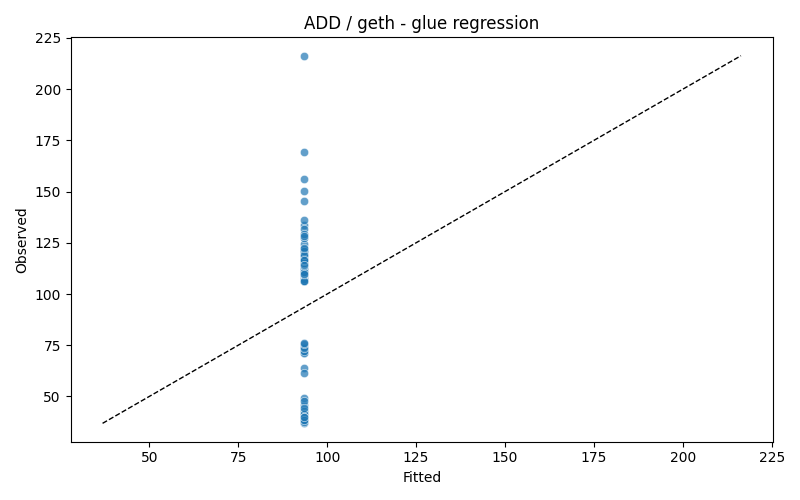


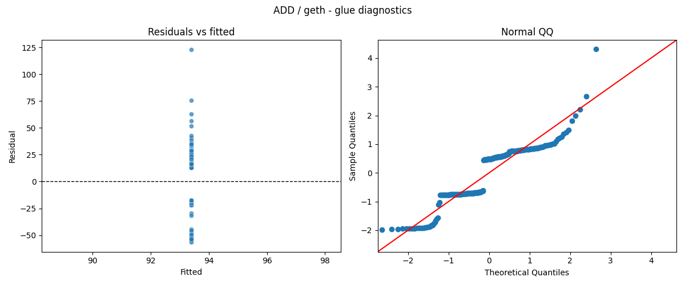

</details>

<details><summary><code>AND</code> · nobs=216 · runtime_ms=0 · p=1.00e+00 · R²=-2.22e-16</summary>

```
==============================================================================
                           NNLS Regression Results                            
==============================================================================
Dep. Variable:          test_runtime_ms              R-squared:         -0.000
Model:                  NNLS                    Adj. R-squared:         -0.005
No. Observations:       216                               RMSE:          29.41
Df Residuals:           214                                MAE:          24.03
Df Model:               1      
==============================================================================
                      coef     std err     P-value      [0.025      0.975]
------------------------------------------------------------------------------
         const     87.0466      1.9422       0.001     83.2814     90.9502
           AND      0.0000      0.0000       1.000      0.0000      0.0000
==============================================================================
Notes: Non-negative least squares with bootstrap inference (1000 iterations)
==============================================================================
```

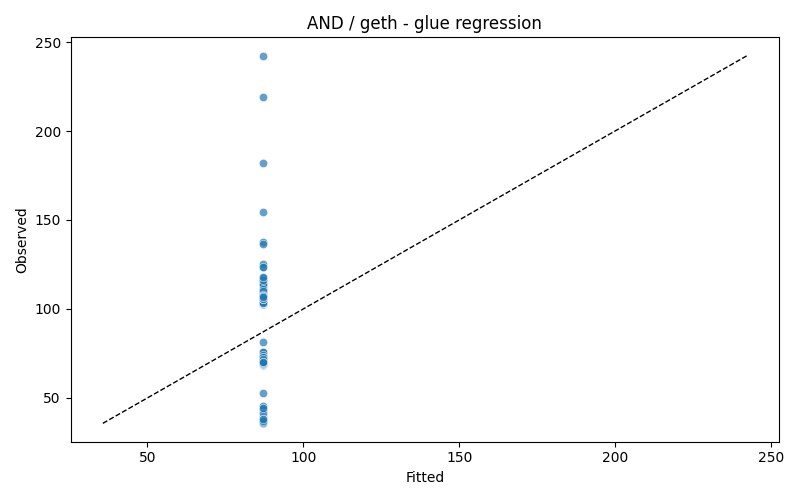


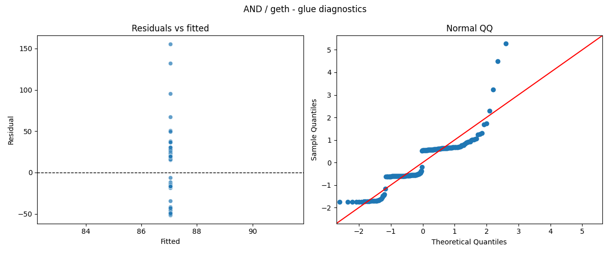

</details>

<details><summary><code>CALLDATACOPY</code> · nobs=6345 · runtime_ms=0 · p=1.00e+00 · R²=0</summary>

```
==============================================================================
                           NNLS Regression Results                            
==============================================================================
Dep. Variable:          test_runtime_ms              R-squared:          0.000
Model:                  NNLS                    Adj. R-squared:         -0.000
No. Observations:       6345                              RMSE:          53.65
Df Residuals:           6343                               MAE:          46.13
Df Model:               1      
==============================================================================
                      coef     std err     P-value      [0.025      0.975]
------------------------------------------------------------------------------
         const     77.6507      0.6686       0.001     76.3934     78.9352
  CALLDATACOPY      0.0000      0.0000       1.000      0.0000      0.0000
==============================================================================
Notes: Non-negative least squares with bootstrap inference (1000 iterations)
==============================================================================
```

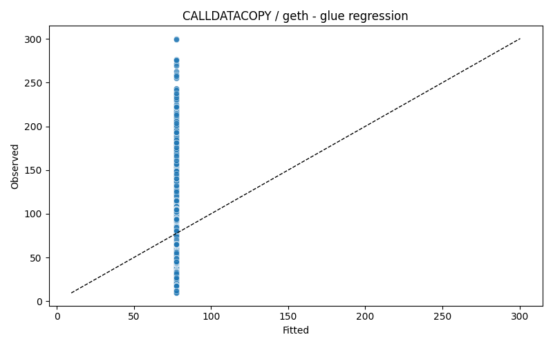


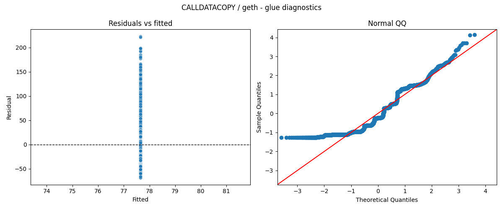

</details>

<details><summary><code>CALLDATALOAD</code> · nobs=1188 · runtime_ms=3.748e-05 · p=1.00e-03 · R²=0.1251</summary>

```
==============================================================================
                           NNLS Regression Results                            
==============================================================================
Dep. Variable:          test_runtime_ms              R-squared:          0.125
Model:                  NNLS                    Adj. R-squared:          0.124
No. Observations:       1188                              RMSE:           0.38
Df Residuals:           1186                               MAE:           0.26
Df Model:               1      
==============================================================================
                      coef     std err     P-value      [0.025      0.975]
------------------------------------------------------------------------------
         const      1.4247      0.0302       0.001      1.3654      1.4839
  CALLDATALOAD      0.0000      0.0000       0.001      0.0000      0.0000
==============================================================================
Notes: Non-negative least squares with bootstrap inference (1000 iterations)
==============================================================================
```

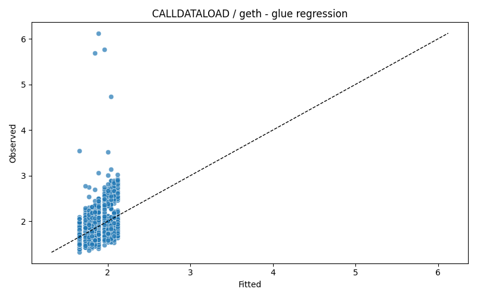

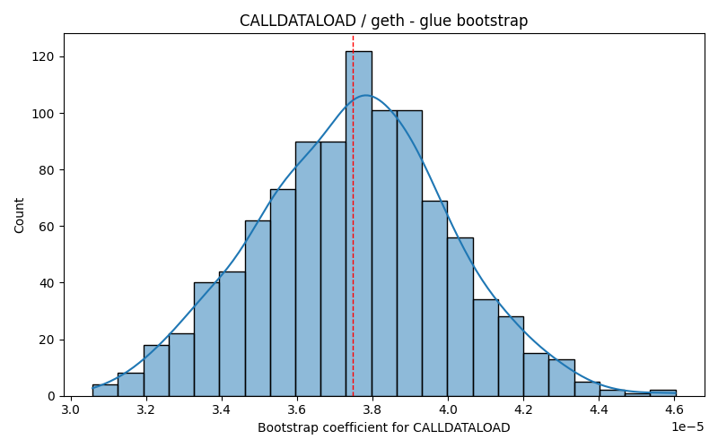

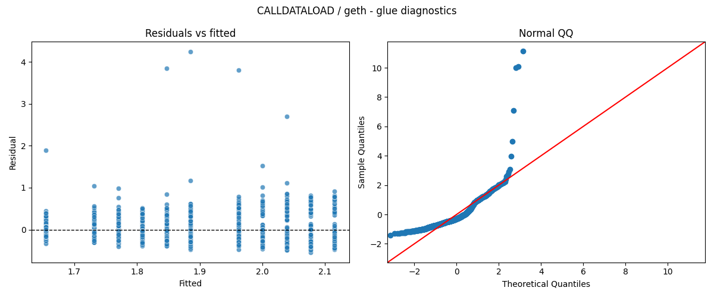

</details>

<details><summary><code>DIV</code> · nobs=297 · runtime_ms=0 · p=1.00e+00 · R²=0</summary>

```
==============================================================================
                           NNLS Regression Results                            
==============================================================================
Dep. Variable:          test_runtime_ms              R-squared:          0.000
Model:                  NNLS                    Adj. R-squared:         -0.003
No. Observations:       297                               RMSE:          66.19
Df Residuals:           295                                MAE:          59.20
Df Model:               1      
==============================================================================
                      coef     std err     P-value      [0.025      0.975]
------------------------------------------------------------------------------
         const    247.8861      3.7316       0.001    240.5779    254.8335
           DIV      0.0000      0.0000       1.000      0.0000      0.0000
==============================================================================
Notes: Non-negative least squares with bootstrap inference (1000 iterations)
==============================================================================
```

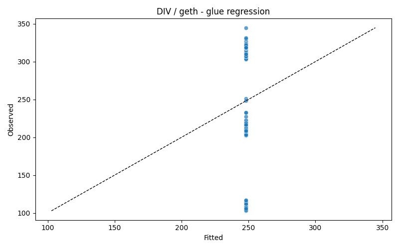


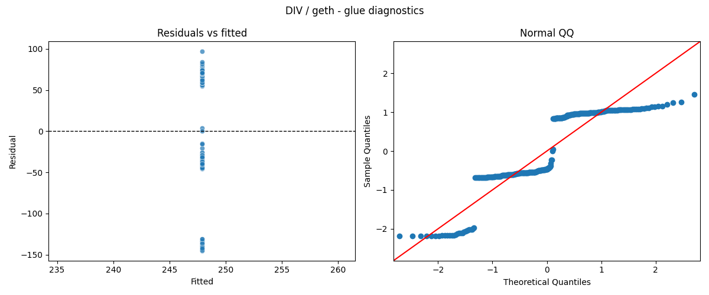

</details>

<details><summary><code>EXP</code> · nobs=297 · runtime_ms=0.0003116 · p=1.00e-03 · R²=0.81</summary>

```
==============================================================================
                           NNLS Regression Results                            
==============================================================================
Dep. Variable:          test_runtime_ms              R-squared:          0.810
Model:                  NNLS                    Adj. R-squared:          0.809
No. Observations:       297                               RMSE:           5.91
Df Residuals:           295                                MAE:           5.09
Df Model:               1      
==============================================================================
                      coef     std err     P-value      [0.025      0.975]
------------------------------------------------------------------------------
         const     13.2460      1.2467       0.001     10.9202     15.7954
           EXP      0.0003      0.0000       0.001      0.0003      0.0003
==============================================================================
Notes: Non-negative least squares with bootstrap inference (1000 iterations)
==============================================================================
```

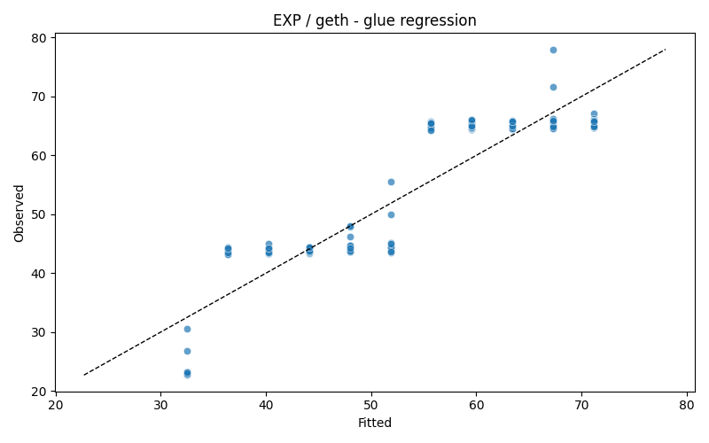

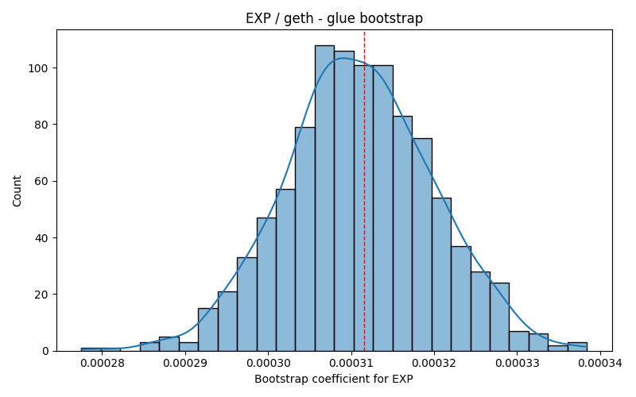

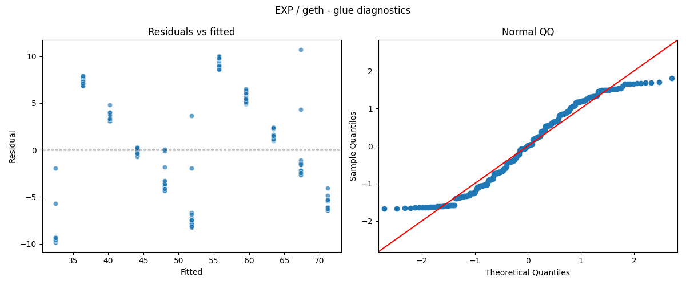

</details>

<details><summary><code>GT</code> · nobs=216 · runtime_ms=0 · p=1.00e+00 · R²=0</summary>

```
==============================================================================
                           NNLS Regression Results                            
==============================================================================
Dep. Variable:          test_runtime_ms              R-squared:          0.000
Model:                  NNLS                    Adj. R-squared:         -0.005
No. Observations:       216                               RMSE:          39.00
Df Residuals:           214                                MAE:          28.12
Df Model:               1      
==============================================================================
                      coef     std err     P-value      [0.025      0.975]
------------------------------------------------------------------------------
         const     91.0929      2.6624       0.001     86.0426     96.9362
            GT      0.0000      0.0000       1.000      0.0000      0.0000
==============================================================================
Notes: Non-negative least squares with bootstrap inference (1000 iterations)
==============================================================================
```

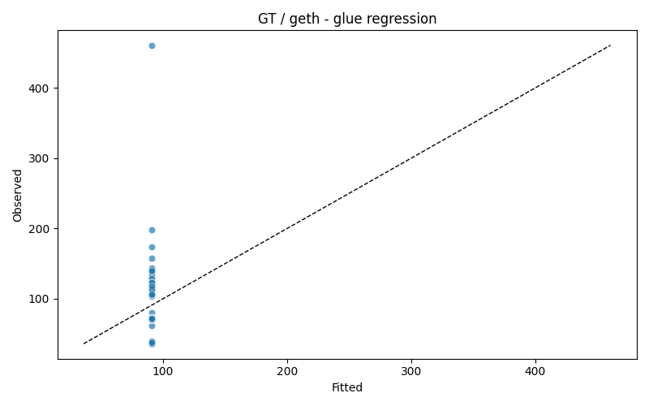


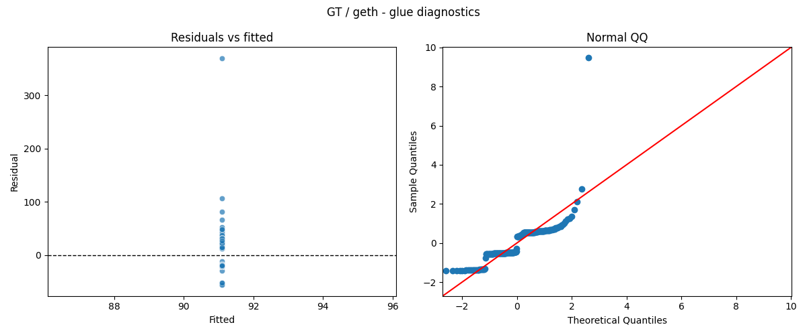

</details>

<details><summary><code>JUMPI</code> · nobs=297 · runtime_ms=0 · p=1.00e+00 · R²=0</summary>

```
==============================================================================
                           NNLS Regression Results                            
==============================================================================
Dep. Variable:          test_runtime_ms              R-squared:          0.000
Model:                  NNLS                    Adj. R-squared:         -0.003
No. Observations:       297                               RMSE:          17.07
Df Residuals:           295                                MAE:          13.08
Df Model:               1      
==============================================================================
                      coef     std err     P-value      [0.025      0.975]
------------------------------------------------------------------------------
         const     50.9245      1.0031       0.001     49.0494     53.0436
         JUMPI      0.0000      0.0000       1.000      0.0000      0.0000
==============================================================================
Notes: Non-negative least squares with bootstrap inference (1000 iterations)
==============================================================================
```

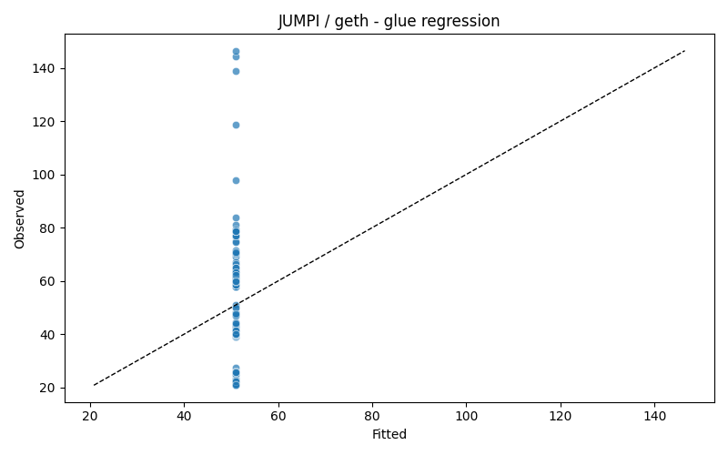


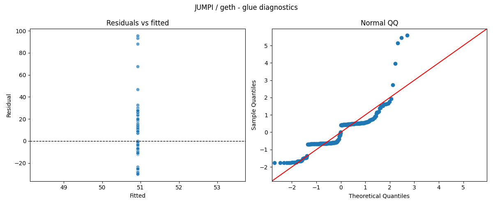

</details>

<details><summary><code>LT</code> · nobs=216 · runtime_ms=0 · p=1.00e+00 · R²=1.11e-16</summary>

```
==============================================================================
                           NNLS Regression Results                            
==============================================================================
Dep. Variable:          test_runtime_ms              R-squared:          0.000
Model:                  NNLS                    Adj. R-squared:         -0.005
No. Observations:       216                               RMSE:          30.83
Df Residuals:           214                                MAE:          26.72
Df Model:               1      
==============================================================================
                      coef     std err     P-value      [0.025      0.975]
------------------------------------------------------------------------------
         const     92.1490      2.0351       0.001     88.2288     96.3248
            LT      0.0000      0.0000       1.000      0.0000      0.0000
==============================================================================
Notes: Non-negative least squares with bootstrap inference (1000 iterations)
==============================================================================
```

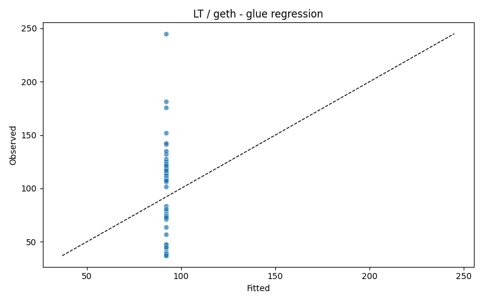


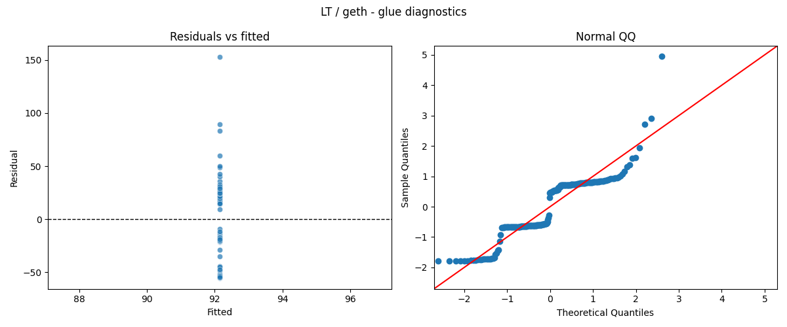

</details>

<details><summary><code>MSTORE</code> · nobs=1215 · runtime_ms=0 · p=1.00e+00 · R²=0</summary>

```
==============================================================================
                           NNLS Regression Results                            
==============================================================================
Dep. Variable:          test_runtime_ms              R-squared:          0.000
Model:                  NNLS                    Adj. R-squared:         -0.001
No. Observations:       1215                              RMSE:          38.43
Df Residuals:           1213                               MAE:          33.81
Df Model:               1      
==============================================================================
                      coef     std err     P-value      [0.025      0.975]
------------------------------------------------------------------------------
         const    130.0310      1.0646       0.001    127.9835    132.2559
        MSTORE      0.0000      0.0000       1.000      0.0000      0.0000
==============================================================================
Notes: Non-negative least squares with bootstrap inference (1000 iterations)
==============================================================================
```

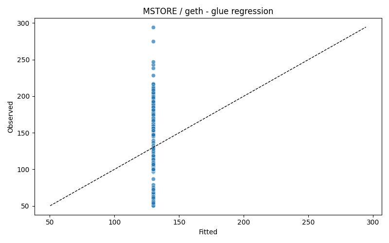


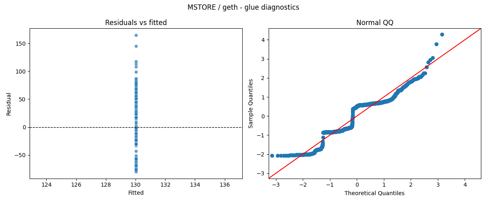

</details>

<details><summary><code>MSTORE8</code> · nobs=1215 · runtime_ms=0 · p=1.00e+00 · R²=0</summary>

```
==============================================================================
                           NNLS Regression Results                            
==============================================================================
Dep. Variable:          test_runtime_ms              R-squared:          0.000
Model:                  NNLS                    Adj. R-squared:         -0.001
No. Observations:       1215                              RMSE:          36.81
Df Residuals:           1213                               MAE:          31.96
Df Model:               1      
==============================================================================
                      coef     std err     P-value      [0.025      0.975]
------------------------------------------------------------------------------
         const    124.2596      1.0750       0.001    122.2836    126.3930
       MSTORE8      0.0000      0.0000       1.000      0.0000      0.0000
==============================================================================
Notes: Non-negative least squares with bootstrap inference (1000 iterations)
==============================================================================
```

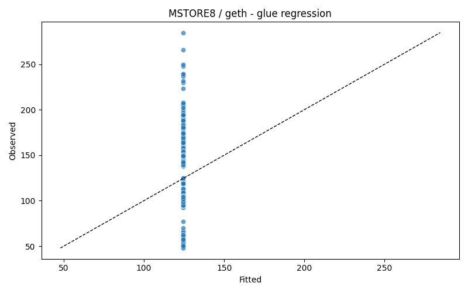


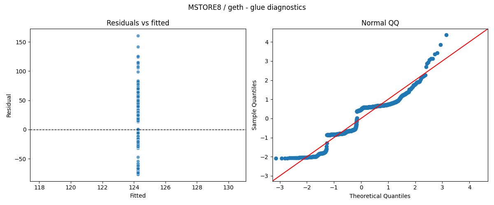

</details>

<details><summary><code>MUL</code> · nobs=270 · runtime_ms=0 · p=1.00e+00 · R²=0</summary>

```
==============================================================================
                           NNLS Regression Results                            
==============================================================================
Dep. Variable:          test_runtime_ms              R-squared:          0.000
Model:                  NNLS                    Adj. R-squared:         -0.004
No. Observations:       270                               RMSE:          26.75
Df Residuals:           268                                MAE:          24.19
Df Model:               1      
==============================================================================
                      coef     std err     P-value      [0.025      0.975]
------------------------------------------------------------------------------
         const     90.9266      1.6191       0.001     87.7411     94.0843
           MUL      0.0000      0.0000       1.000      0.0000      0.0000
==============================================================================
Notes: Non-negative least squares with bootstrap inference (1000 iterations)
==============================================================================
```

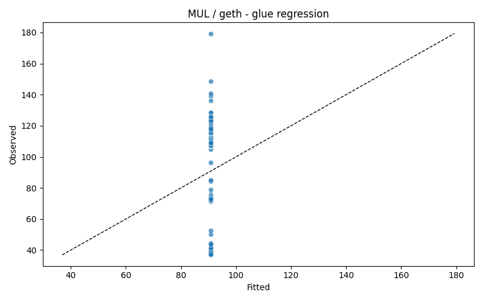


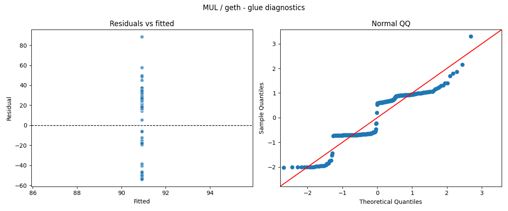

</details>

<details><summary><code>PC</code> · nobs=162 · runtime_ms=7.539e-06 · p=1.00e-03 · R²=0.2487</summary>

```
==============================================================================
                           NNLS Regression Results                            
==============================================================================
Dep. Variable:          test_runtime_ms              R-squared:          0.249
Model:                  NNLS                    Adj. R-squared:          0.244
No. Observations:       162                               RMSE:          29.12
Df Residuals:           160                                MAE:          22.55
Df Model:               1      
==============================================================================
                      coef     std err     P-value      [0.025      0.975]
------------------------------------------------------------------------------
         const    125.2951      4.1090       0.001    117.2409    133.2380
            PC      0.0000      0.0000       0.001      0.0000      0.0000
==============================================================================
Notes: Non-negative least squares with bootstrap inference (1000 iterations)
==============================================================================
```

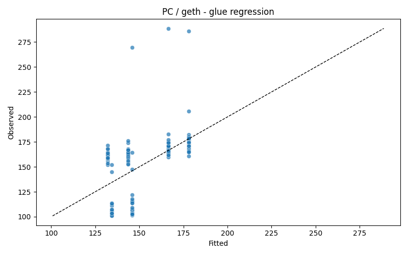

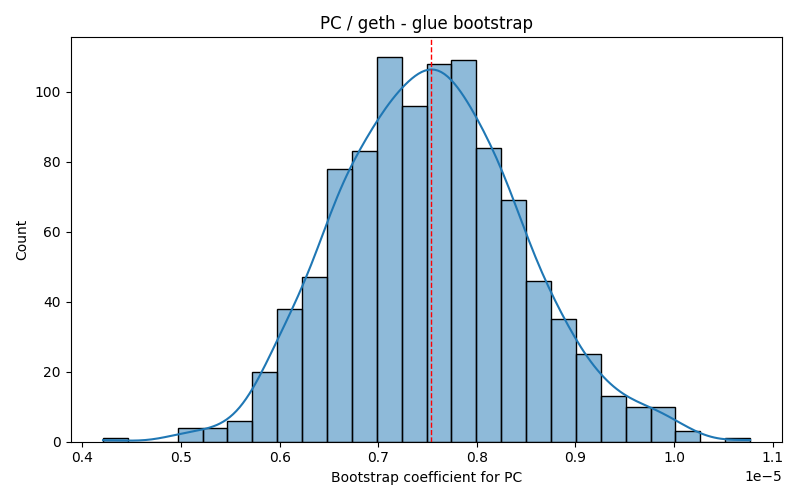

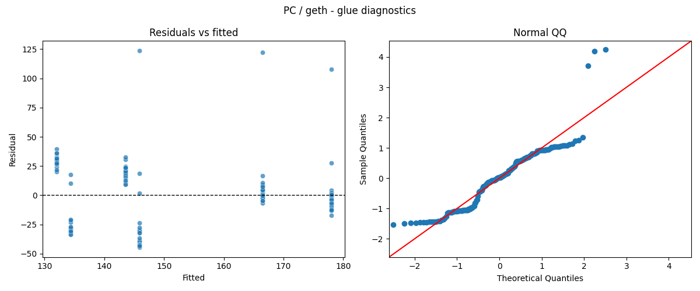

</details>

<details><summary><code>RETURNDATASIZE</code> · nobs=648 · runtime_ms=1.149e-05 · p=1.00e-03 · R²=0.1353</summary>

```
==============================================================================
                           NNLS Regression Results                            
==============================================================================
Dep. Variable:          test_runtime_ms              R-squared:          0.135
Model:                  NNLS                    Adj. R-squared:          0.134
No. Observations:       648                               RMSE:          34.08
Df Residuals:           646                                MAE:          23.21
Df Model:               1      
==============================================================================
                      coef     std err     P-value      [0.025      0.975]
------------------------------------------------------------------------------
         const    104.9082      2.6573       0.001     99.7555    110.0204
RETURNDATASIZE      0.0000      0.0000       0.001      0.0000      0.0000
==============================================================================
Notes: Non-negative least squares with bootstrap inference (1000 iterations)
==============================================================================
```

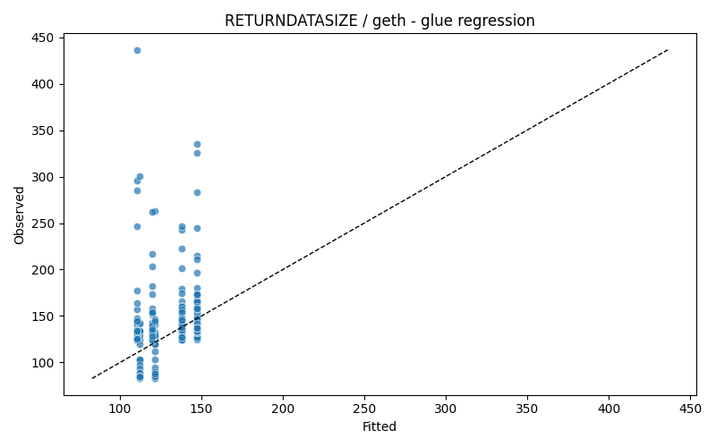

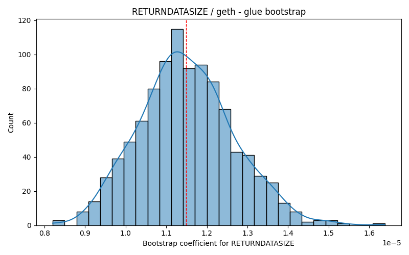

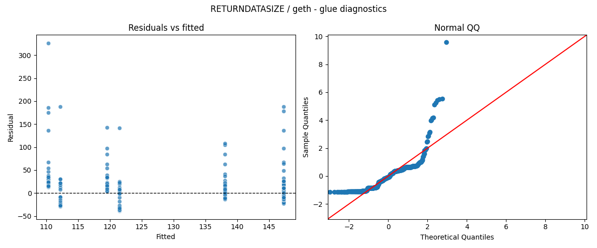

</details>

<details><summary><code>SELFBALANCE</code> · nobs=297 · runtime_ms=0 · p=1.00e+00 · R²=-2.22e-16</summary>

```
==============================================================================
                           NNLS Regression Results                            
==============================================================================
Dep. Variable:          test_runtime_ms              R-squared:         -0.000
Model:                  NNLS                    Adj. R-squared:         -0.003
No. Observations:       297                               RMSE:         103.81
Df Residuals:           295                                MAE:          93.42
Df Model:               1      
==============================================================================
                      coef     std err     P-value      [0.025      0.975]
------------------------------------------------------------------------------
         const    388.3625      5.8507       0.001    377.3525    400.0343
   SELFBALANCE      0.0000      0.0000       1.000      0.0000      0.0000
==============================================================================
Notes: Non-negative least squares with bootstrap inference (1000 iterations)
==============================================================================
```

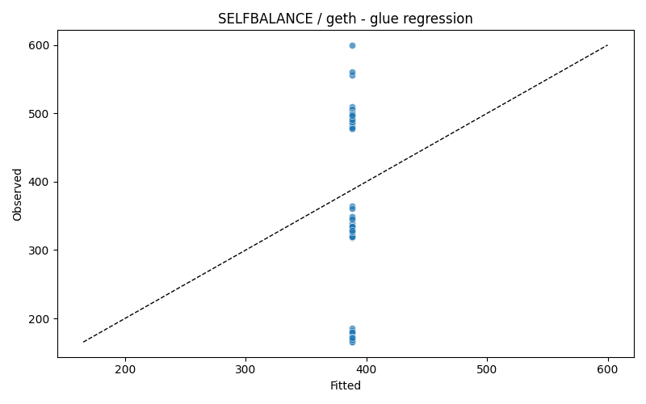

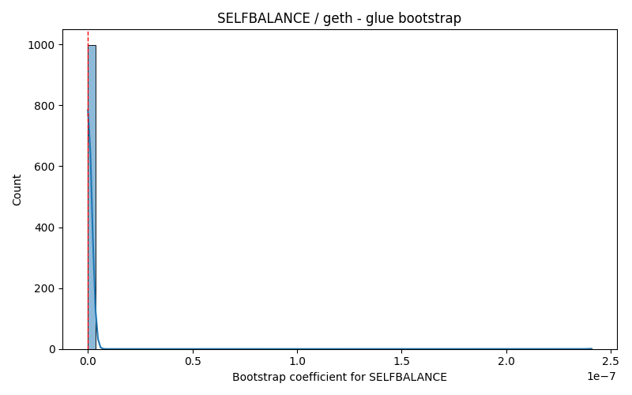

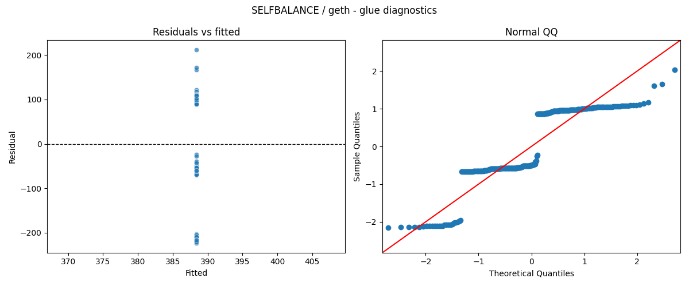

</details>

<details><summary><code>SUB</code> · nobs=216 · runtime_ms=0 · p=1.00e+00 · R²=0</summary>

```
==============================================================================
                           NNLS Regression Results                            
==============================================================================
Dep. Variable:          test_runtime_ms              R-squared:          0.000
Model:                  NNLS                    Adj. R-squared:         -0.005
No. Observations:       216                               RMSE:          29.67
Df Residuals:           214                                MAE:          26.12
Df Model:               1      
==============================================================================
                      coef     std err     P-value      [0.025      0.975]
------------------------------------------------------------------------------
         const     90.9823      1.9960       0.001     87.0942     95.0020
           SUB      0.0000      0.0000       1.000      0.0000      0.0000
==============================================================================
Notes: Non-negative least squares with bootstrap inference (1000 iterations)
==============================================================================
```

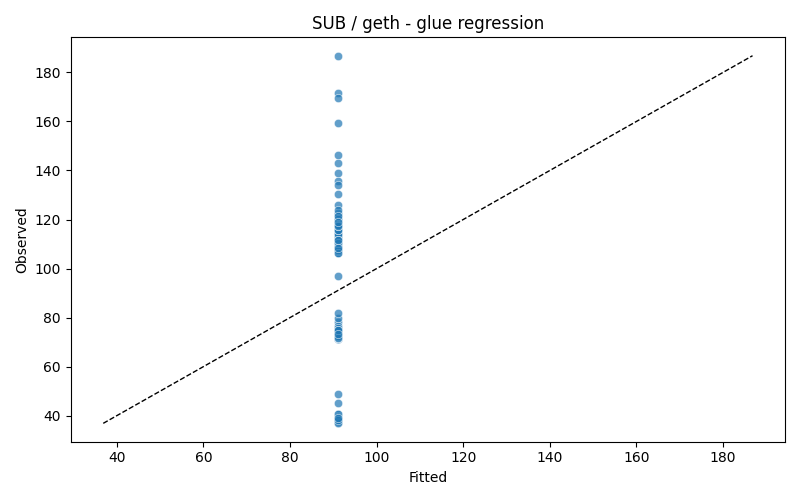


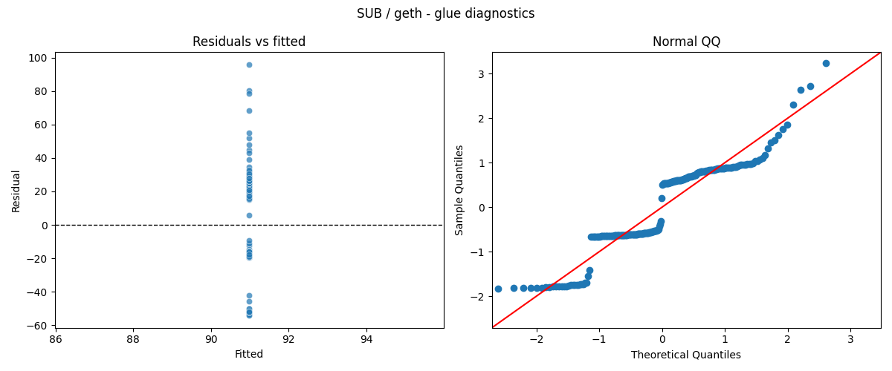

</details>

### Mixed glue (tier B) · geth

<details><summary><code>JUMP</code> · nobs=270 · runtime_ms=0 · p=1.00e+00 · R²=0</summary>

```
==============================================================================
                           NNLS Regression Results                            
==============================================================================
Dep. Variable:          test_runtime_ms              R-squared:          0.000
Model:                  NNLS                    Adj. R-squared:         -0.004
No. Observations:       270                               RMSE:          26.77
Df Residuals:           268                                MAE:          21.95
Df Model:               1      
==============================================================================
                      coef     std err     P-value      [0.025      0.975]
------------------------------------------------------------------------------
         const     84.0349      1.6647       0.001     81.0011     87.3030
          JUMP      0.0000      0.0000       1.000      0.0000      0.0000
==============================================================================
Notes: Non-negative least squares with bootstrap inference (1000 iterations)
==============================================================================
```

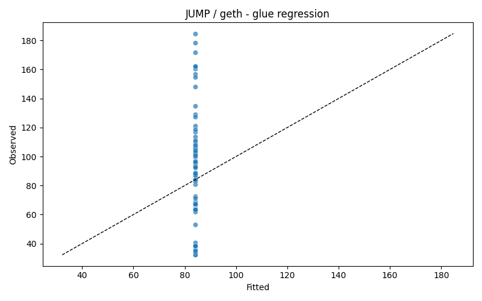


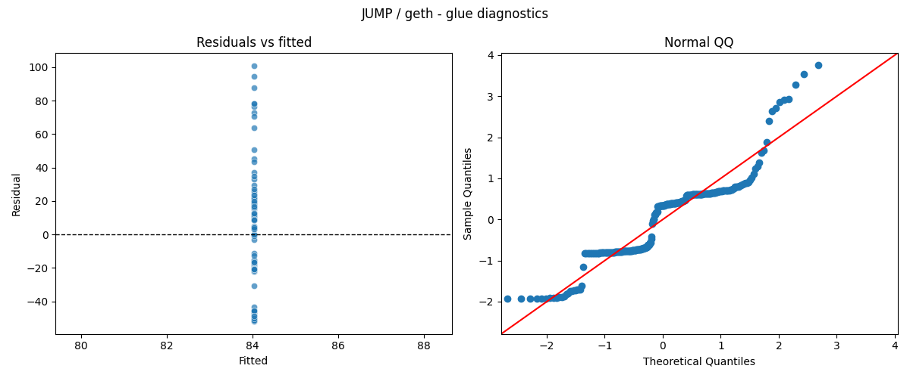

</details>

<details><summary><code>KECCAK256</code> · nobs=4752 · runtime_ms=2.999e-05 · p=1.00e-03 · R²=0.213</summary>

```
==============================================================================
                           NNLS Regression Results                            
==============================================================================
Dep. Variable:          test_runtime_ms              R-squared:          0.213
Model:                  NNLS                    Adj. R-squared:          0.213
No. Observations:       4752                              RMSE:         114.63
Df Residuals:           4750                               MAE:          90.40
Df Model:               1      
==============================================================================
                      coef     std err     P-value      [0.025      0.975]
------------------------------------------------------------------------------
         const    357.7710      3.6703       0.001    351.0443    364.7972
     KECCAK256      0.0000      0.0000       0.001      0.0000      0.0000
==============================================================================
Notes: Non-negative least squares with bootstrap inference (1000 iterations)
==============================================================================
```

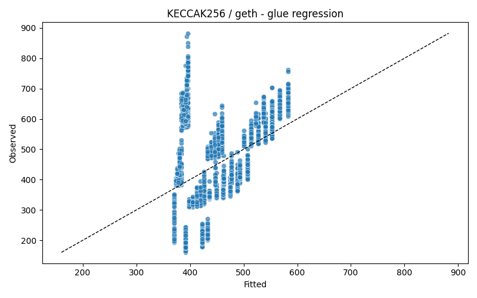

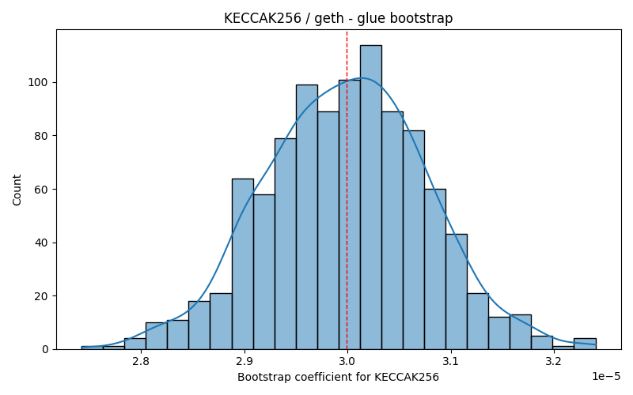

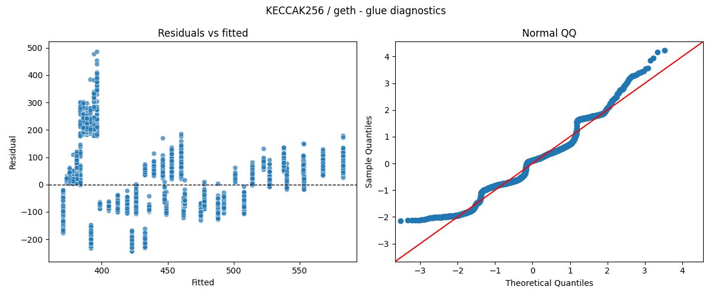

</details>

## nethermind

| glue_opcode | nobs | glue_runtime_ms | p_value | rsquared |
| --- | --- | --- | --- | --- |
| `ISZERO` | 168 | 0 | 1.00e+00 | 0 |
| `JUMPDEST` | 42 | 0 | 1.00e+00 | 0 |
| `SWAP` | 3003 | 0 | 1.00e+00 | 0 |
| `CALLDATASIZE` | 10586 | 9.179e-06 | 1.00e-03 | 0.8044 |
| `DUP` | 10586 | 0 | 1.00e+00 | 0.8044 |
| `GAS` | 10586 | 8.902e-06 | 1.00e-03 | 0.8044 |
| `MLOAD` | 10586 | 3.174e-06 | 1.00e-03 | 0.8044 |
| `PUSH` | 10586 | 0 | 1.00e+00 | 0.8044 |
| `PUSH0` | 10586 | 3.606e-06 | 1.00e-03 | 0.8044 |
| `STATICCALL` | 10586 | 0.0003887 | 1.00e-03 | 0.8044 |
| `ADD` | 189 | 0 | 1.00e+00 | 0 |
| `AND` | 168 | 0 | 1.00e+00 | 0 |
| `CALLDATACOPY` | 4935 | 0 | 1.00e+00 | -2.22e-16 |
| `CALLDATALOAD` | 924 | 1.335e-05 | 1.00e-03 | 0.01367 |
| `DIV` | 231 | 0 | 1.00e+00 | 0 |
| `EXP` | 231 | 0 | 1.00e+00 | 0 |
| `GT` | 168 | 0 | 1.00e+00 | -2.22e-16 |
| `JUMPI` | 231 | 0 | 1.00e+00 | 0 |
| `LT` | 168 | 0 | 1.00e+00 | 0 |
| `MSTORE` | 945 | 0 | 1.00e+00 | 0 |
| `MSTORE8` | 945 | 0 | 1.00e+00 | 0 |
| `MUL` | 210 | 0 | 1.00e+00 | 0 |
| `PC` | 126 | 7.183e-06 | 1.00e-03 | 0.4321 |
| `RETURNDATASIZE` | 504 | 6.886e-06 | 1.00e-03 | 0.2484 |
| `SELFBALANCE` | 231 | 0 | 1.00e+00 | 0 |
| `SUB` | 168 | 0 | 1.00e+00 | 0 |
| `JUMP` | 210 | 0 | 1.00e+00 | 0 |
| `KECCAK256` | 3696 | 0 | 1.00e+00 | 0 |

### Cycle glue — joint fit · nethermind

<details><summary>Joint NNLS regression summary</summary>

```
==============================================================================
                           NNLS Regression Results                            
==============================================================================
Dep. Variable:          test_runtime_ms              R-squared:          0.804
Model:                  NNLS                    Adj. R-squared:          0.804
No. Observations:       10586                             RMSE:          22.19
Df Residuals:           10578                              MAE:          18.07
Df Model:               7      
==============================================================================
                      coef     std err     P-value      [0.025      0.975]
------------------------------------------------------------------------------
         const     66.2283      0.2207       0.001     65.7814     66.6254
  CALLDATASIZE      0.0000      0.0000       0.001      0.0000      0.0000
           DUP      0.0000      0.0000       1.000      0.0000      0.0000
           GAS      0.0000      0.0000       0.001      0.0000      0.0000
         MLOAD      0.0000      0.0000       0.001      0.0000      0.0000
          PUSH      0.0000      0.0000       1.000      0.0000      0.0000
         PUSH0      0.0000      0.0000       0.001      0.0000      0.0000
    STATICCALL      0.0004      0.0000       0.001      0.0004      0.0004
==============================================================================
Notes: Non-negative least squares with bootstrap inference (1000 iterations)
==============================================================================
```

</details>

<details><summary><code>CALLDATASIZE</code> · nobs=10586 · runtime_ms=9.179e-06 · p=1.00e-03 · R²=0.8044</summary>

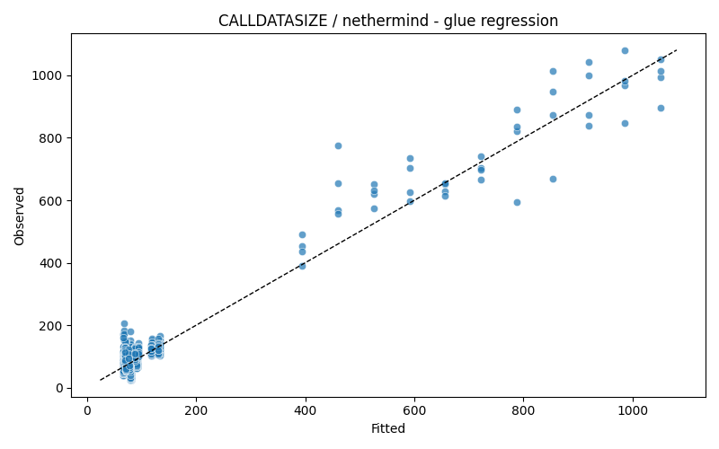

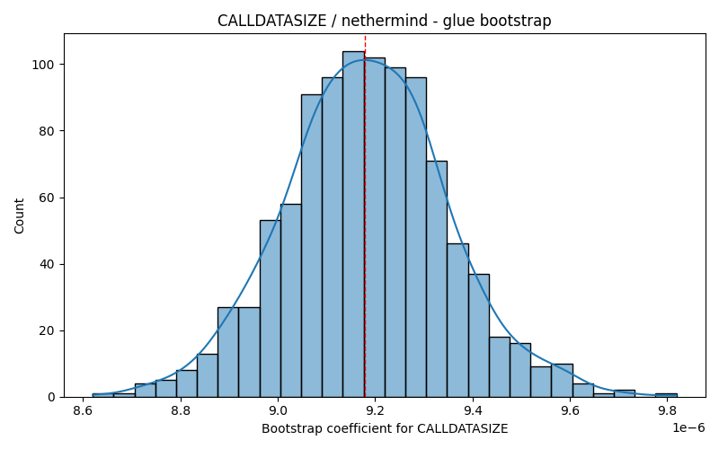

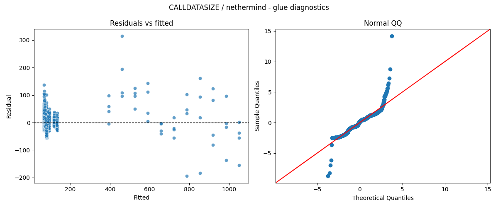

</details>

<details><summary><code>DUP</code> · nobs=10586 · runtime_ms=0 · p=1.00e+00 · R²=0.8044</summary>

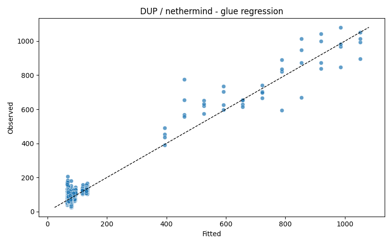


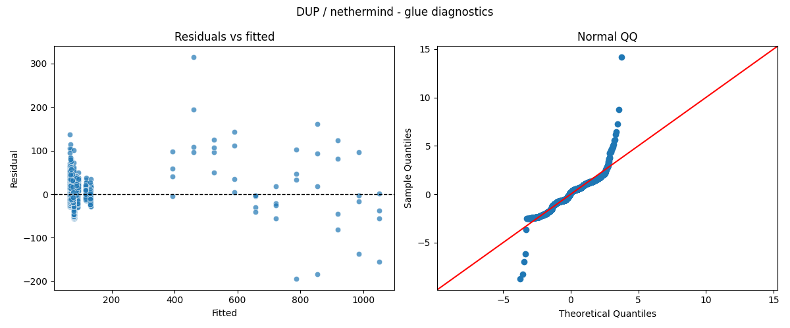

</details>

<details><summary><code>GAS</code> · nobs=10586 · runtime_ms=8.902e-06 · p=1.00e-03 · R²=0.8044</summary>


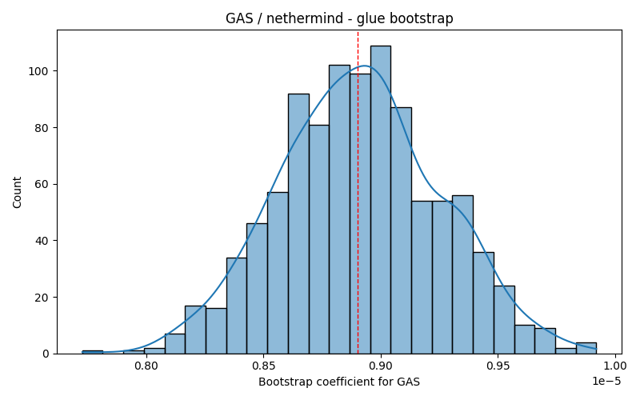


</details>

<details><summary><code>MLOAD</code> · nobs=10586 · runtime_ms=3.174e-06 · p=1.00e-03 · R²=0.8044</summary>


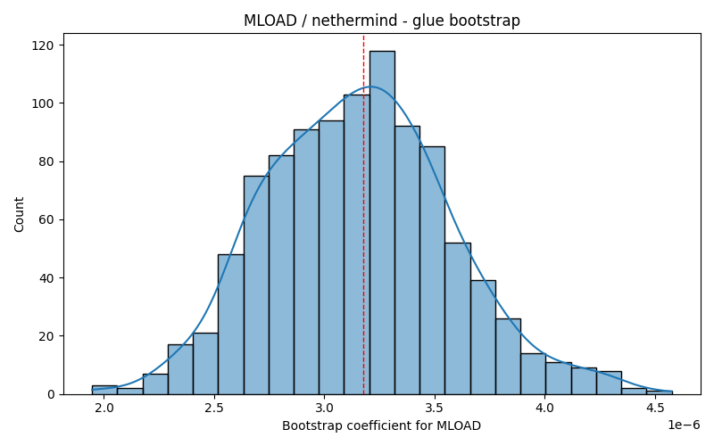


</details>

<details><summary><code>PUSH</code> · nobs=10586 · runtime_ms=0 · p=1.00e+00 · R²=0.8044</summary>


</details>

<details><summary><code>PUSH0</code> · nobs=10586 · runtime_ms=3.606e-06 · p=1.00e-03 · R²=0.8044</summary>

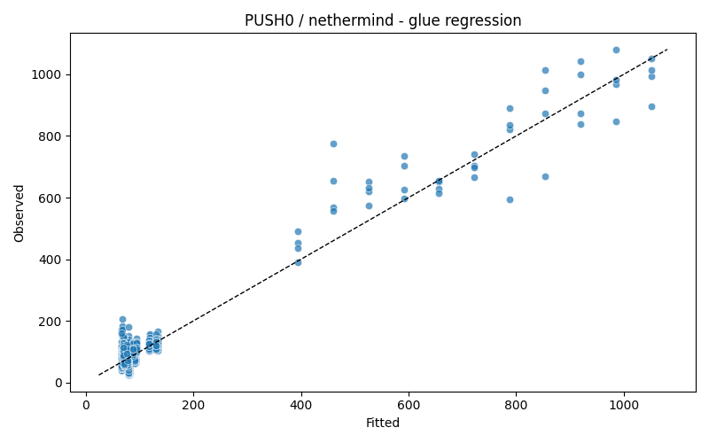

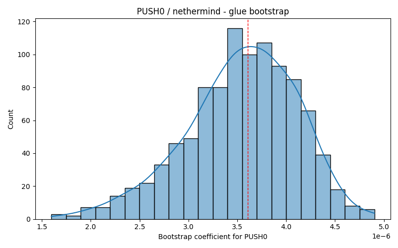


</details>

<details><summary><code>STATICCALL</code> · nobs=10586 · runtime_ms=0.0003887 · p=1.00e-03 · R²=0.8044</summary>

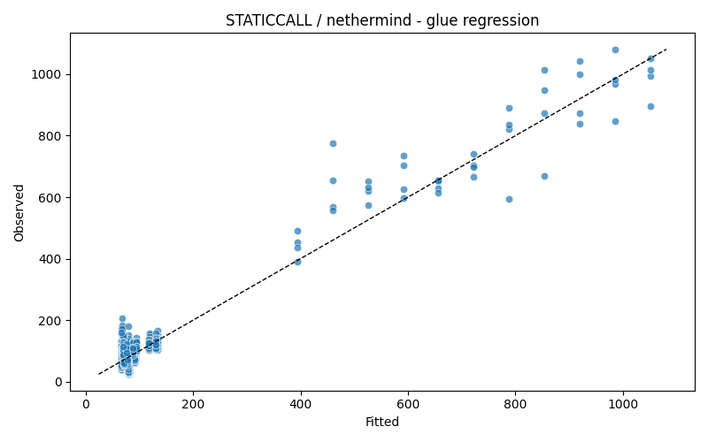

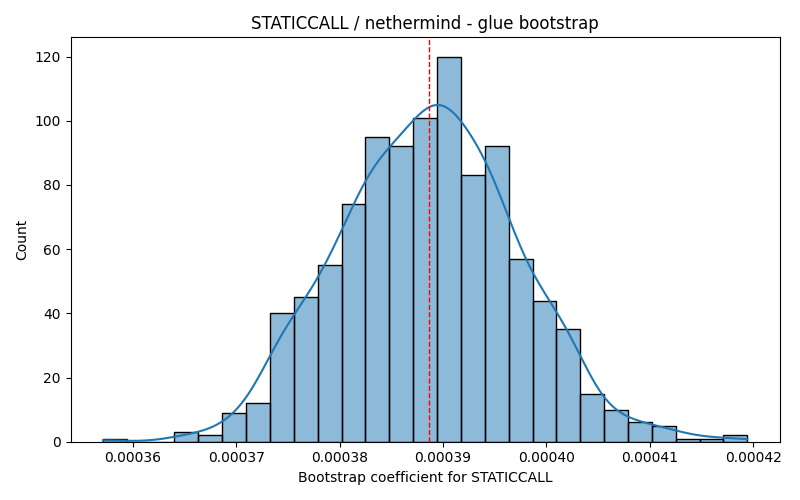


</details>

### Pure glue · nethermind

<details><summary><code>ISZERO</code> · nobs=168 · runtime_ms=0 · p=1.00e+00 · R²=0</summary>

```
==============================================================================
                           NNLS Regression Results                            
==============================================================================
Dep. Variable:          test_runtime_ms              R-squared:          0.000
Model:                  NNLS                    Adj. R-squared:         -0.006
No. Observations:       168                               RMSE:          21.40
Df Residuals:           166                                MAE:          18.78
Df Model:               1      
==============================================================================
                      coef     std err     P-value      [0.025      0.975]
------------------------------------------------------------------------------
         const     69.8464      1.6592       0.001     66.8483     73.3016
        ISZERO      0.0000      0.0000       1.000      0.0000      0.0000
==============================================================================
Notes: Non-negative least squares with bootstrap inference (1000 iterations)
==============================================================================
```

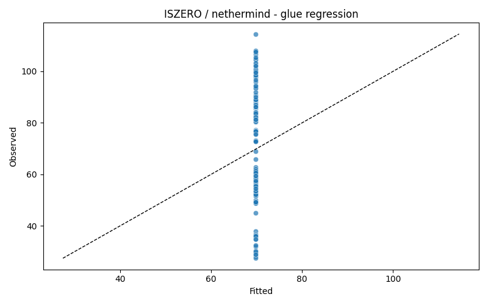

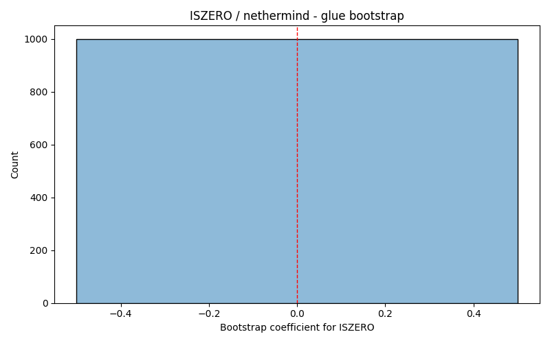

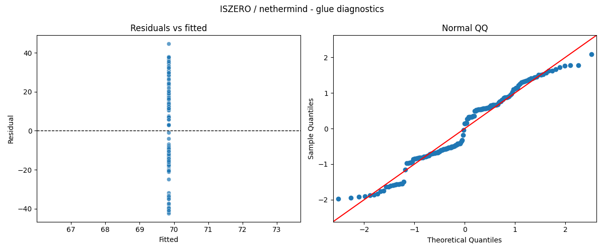

</details>

<details><summary><code>JUMPDEST</code> · nobs=42 · runtime_ms=0 · p=1.00e+00 · R²=0</summary>

```
==============================================================================
                           NNLS Regression Results                            
==============================================================================
Dep. Variable:          test_runtime_ms              R-squared:          0.000
Model:                  NNLS                    Adj. R-squared:         -0.025
No. Observations:       42                                RMSE:          28.83
Df Residuals:           40                                 MAE:          23.27
Df Model:               1      
==============================================================================
                      coef     std err     P-value      [0.025      0.975]
------------------------------------------------------------------------------
         const    110.1501      4.5594       0.001    101.4860    119.3542
      JUMPDEST      0.0000      0.0000       1.000      0.0000      0.0000
==============================================================================
Notes: Non-negative least squares with bootstrap inference (1000 iterations)
==============================================================================
```

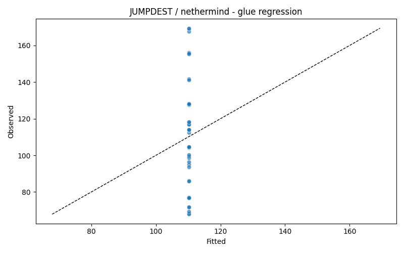


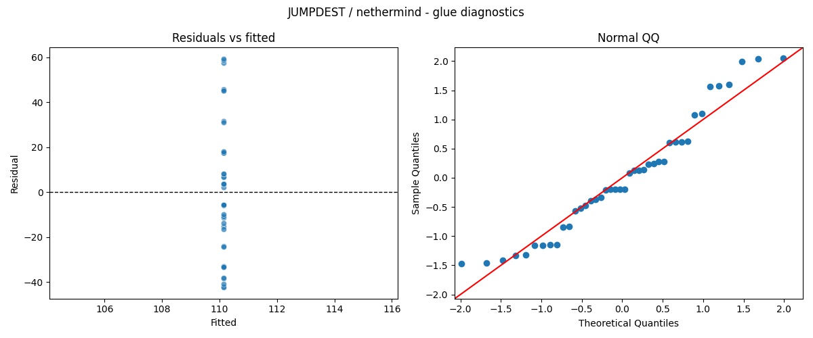

</details>

<details><summary><code>SWAP</code> · nobs=3003 · runtime_ms=0 · p=1.00e+00 · R²=0</summary>

```
==============================================================================
                           NNLS Regression Results                            
==============================================================================
Dep. Variable:          test_runtime_ms              R-squared:          0.000
Model:                  NNLS                    Adj. R-squared:         -0.000
No. Observations:       3003                              RMSE:          16.59
Df Residuals:           3001                               MAE:          12.25
Df Model:               1      
==============================================================================
                      coef     std err     P-value      [0.025      0.975]
------------------------------------------------------------------------------
         const     52.3627      0.3129       0.001     51.7732     53.0259
          SWAP      0.0000      0.0000       1.000      0.0000      0.0000
==============================================================================
Notes: Non-negative least squares with bootstrap inference (1000 iterations)
==============================================================================
```

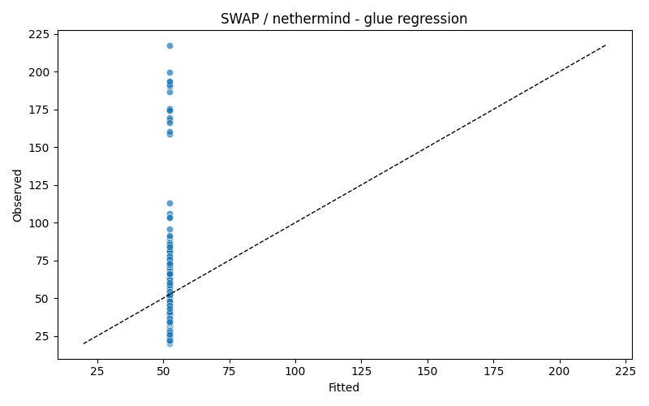


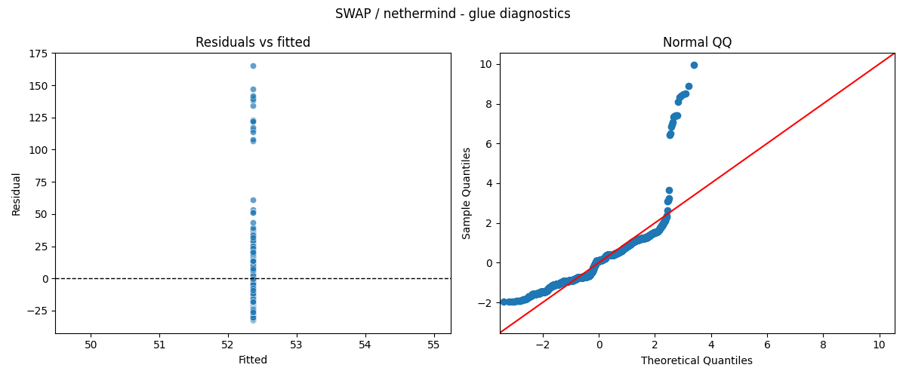

</details>

### Mixed glue (tier A) · nethermind

<details><summary><code>ADD</code> · nobs=189 · runtime_ms=0 · p=1.00e+00 · R²=0</summary>

```
==============================================================================
                           NNLS Regression Results                            
==============================================================================
Dep. Variable:          test_runtime_ms              R-squared:          0.000
Model:                  NNLS                    Adj. R-squared:         -0.005
No. Observations:       189                               RMSE:          36.83
Df Residuals:           187                                MAE:          28.46
Df Model:               1      
==============================================================================
                      coef     std err     P-value      [0.025      0.975]
------------------------------------------------------------------------------
         const     97.7522      2.6349       0.001     92.5492    102.7958
           ADD      0.0000      0.0000       1.000      0.0000      0.0000
==============================================================================
Notes: Non-negative least squares with bootstrap inference (1000 iterations)
==============================================================================
```

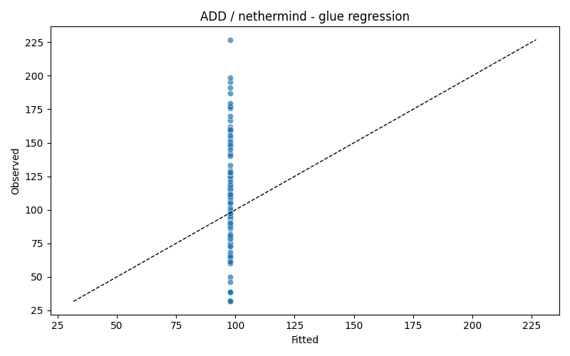

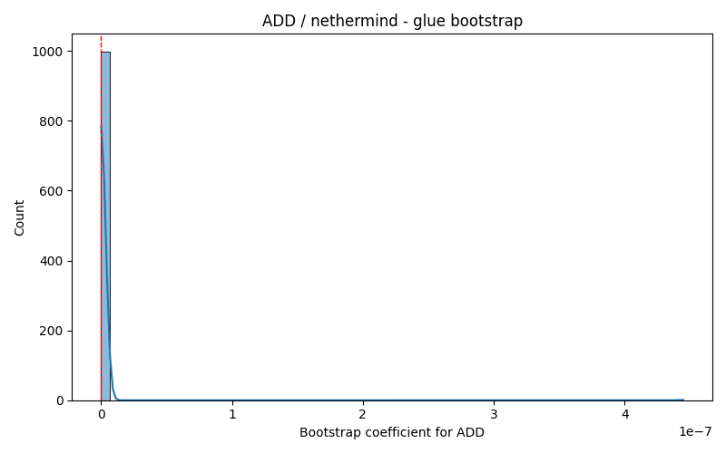

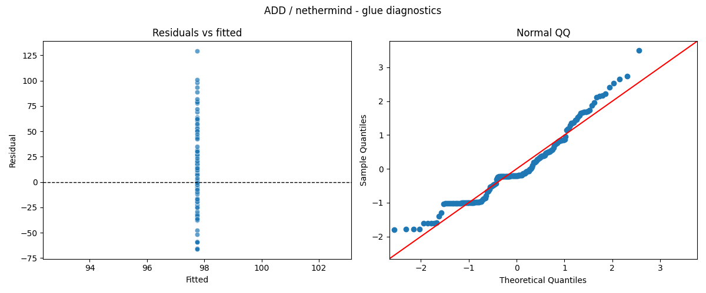

</details>

<details><summary><code>AND</code> · nobs=168 · runtime_ms=0 · p=1.00e+00 · R²=0</summary>

```
==============================================================================
                           NNLS Regression Results                            
==============================================================================
Dep. Variable:          test_runtime_ms              R-squared:          0.000
Model:                  NNLS                    Adj. R-squared:         -0.006
No. Observations:       168                               RMSE:          17.19
Df Residuals:           166                                MAE:          13.50
Df Model:               1      
==============================================================================
                      coef     std err     P-value      [0.025      0.975]
------------------------------------------------------------------------------
         const     52.1209      1.3174       0.001     49.4874     54.7997
           AND      0.0000      0.0000       1.000      0.0000      0.0000
==============================================================================
Notes: Non-negative least squares with bootstrap inference (1000 iterations)
==============================================================================
```

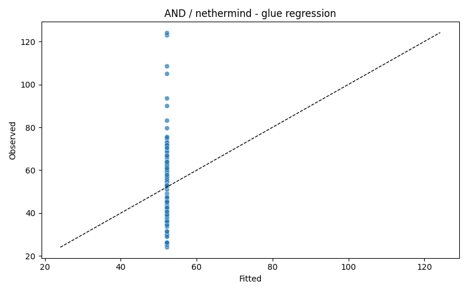


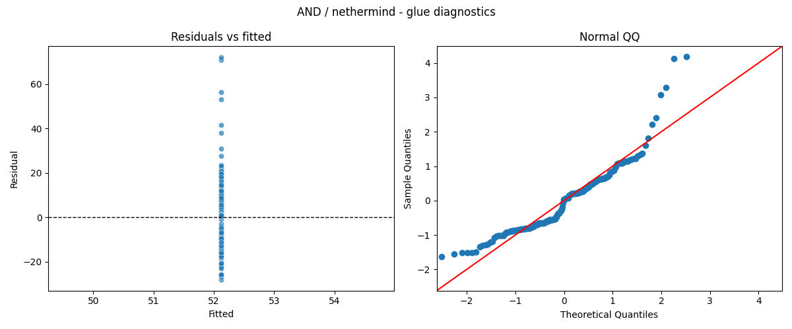

</details>

<details><summary><code>CALLDATACOPY</code> · nobs=4935 · runtime_ms=0 · p=1.00e+00 · R²=-2.22e-16</summary>

```
==============================================================================
                           NNLS Regression Results                            
==============================================================================
Dep. Variable:          test_runtime_ms              R-squared:         -0.000
Model:                  NNLS                    Adj. R-squared:         -0.000
No. Observations:       4935                              RMSE:          36.26
Df Residuals:           4933                               MAE:          29.75
Df Model:               1      
==============================================================================
                      coef     std err     P-value      [0.025      0.975]
------------------------------------------------------------------------------
         const     60.0169      0.5280       0.001     58.9641     61.0558
  CALLDATACOPY      0.0000      0.0000       1.000      0.0000      0.0000
==============================================================================
Notes: Non-negative least squares with bootstrap inference (1000 iterations)
==============================================================================
```

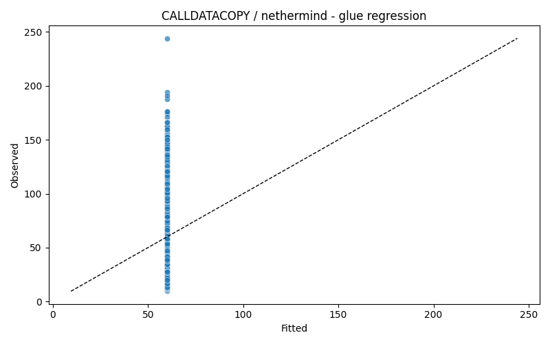


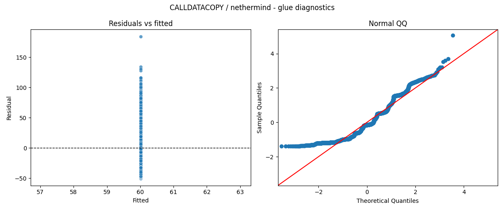

</details>

<details><summary><code>CALLDATALOAD</code> · nobs=924 · runtime_ms=1.335e-05 · p=1.00e-03 · R²=0.01367</summary>

```
==============================================================================
                           NNLS Regression Results                            
==============================================================================
Dep. Variable:          test_runtime_ms              R-squared:          0.014
Model:                  NNLS                    Adj. R-squared:          0.013
No. Observations:       924                               RMSE:           0.44
Df Residuals:           922                                MAE:           0.19
Df Model:               1      
==============================================================================
                      coef     std err     P-value      [0.025      0.975]
------------------------------------------------------------------------------
         const      2.2401      0.0382       0.001      2.1667      2.3202
  CALLDATALOAD      0.0000      0.0000       0.001      0.0000      0.0000
==============================================================================
Notes: Non-negative least squares with bootstrap inference (1000 iterations)
==============================================================================
```

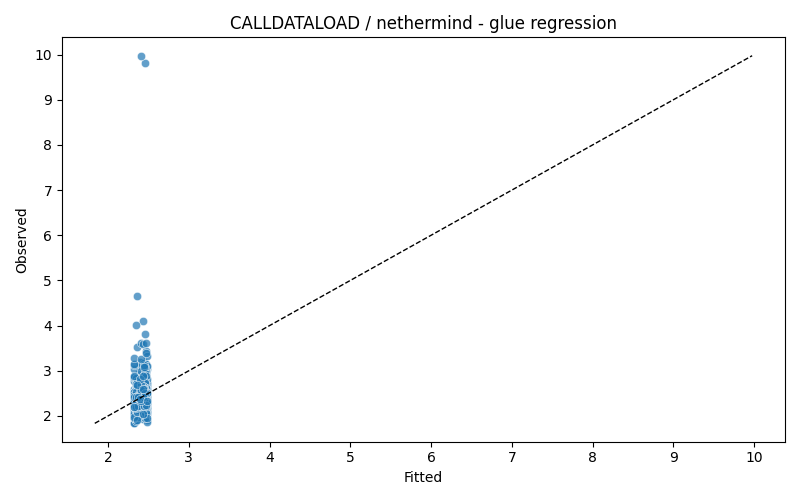

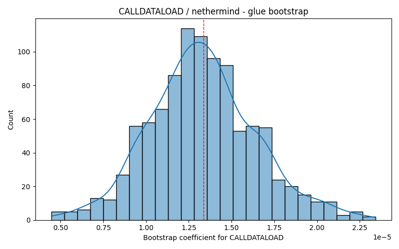

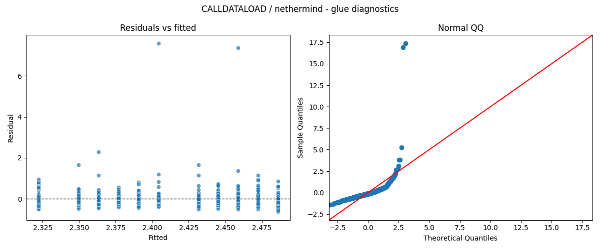

</details>

<details><summary><code>DIV</code> · nobs=231 · runtime_ms=0 · p=1.00e+00 · R²=0</summary>

```
==============================================================================
                           NNLS Regression Results                            
==============================================================================
Dep. Variable:          test_runtime_ms              R-squared:          0.000
Model:                  NNLS                    Adj. R-squared:         -0.004
No. Observations:       231                               RMSE:          49.78
Df Residuals:           229                                MAE:          43.40
Df Model:               1      
==============================================================================
                      coef     std err     P-value      [0.025      0.975]
------------------------------------------------------------------------------
         const    215.4381      3.3150       0.001    209.0604    221.7559
           DIV      0.0000      0.0000       1.000      0.0000      0.0000
==============================================================================
Notes: Non-negative least squares with bootstrap inference (1000 iterations)
==============================================================================
```

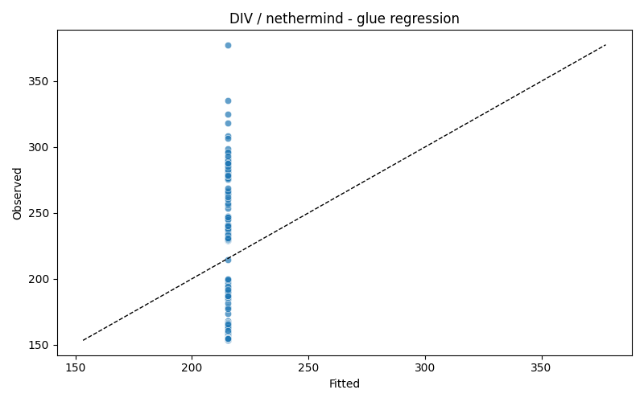


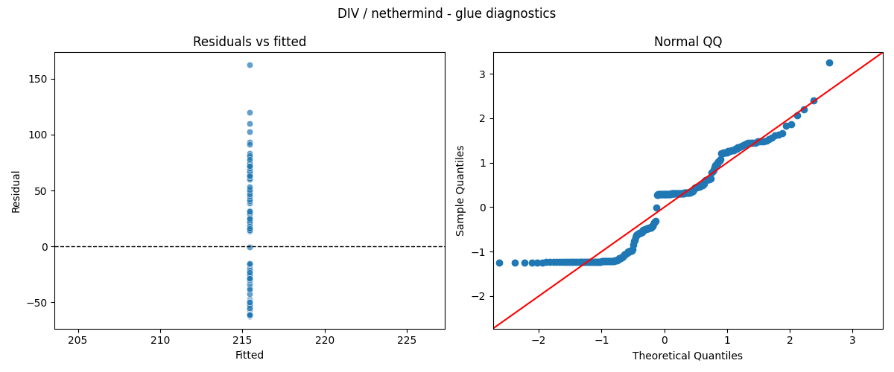

</details>

<details><summary><code>EXP</code> · nobs=231 · runtime_ms=0 · p=1.00e+00 · R²=0</summary>

```
==============================================================================
                           NNLS Regression Results                            
==============================================================================
Dep. Variable:          test_runtime_ms              R-squared:          0.000
Model:                  NNLS                    Adj. R-squared:         -0.004
No. Observations:       231                               RMSE:          36.89
Df Residuals:           229                                MAE:          23.85
Df Model:               1      
==============================================================================
                      coef     std err     P-value      [0.025      0.975]
------------------------------------------------------------------------------
         const     78.5014      3.1279       0.001     69.2896     82.9755
           EXP      0.0000      0.0000       1.000      0.0000      0.0000
==============================================================================
Notes: Non-negative least squares with bootstrap inference (1000 iterations)
==============================================================================
```

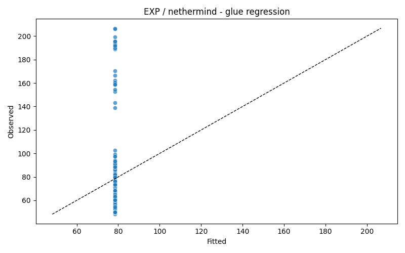

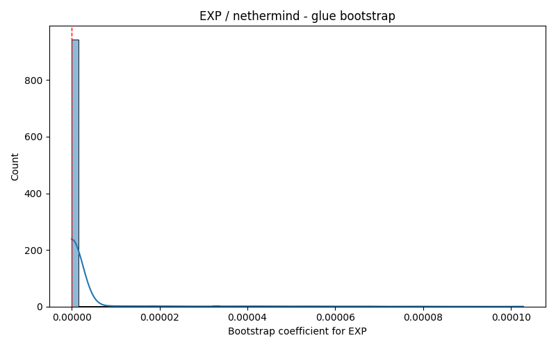

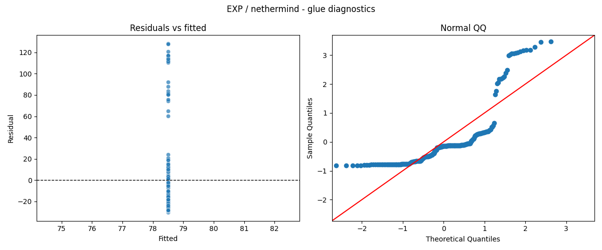

</details>

<details><summary><code>GT</code> · nobs=168 · runtime_ms=0 · p=1.00e+00 · R²=-2.22e-16</summary>

```
==============================================================================
                           NNLS Regression Results                            
==============================================================================
Dep. Variable:          test_runtime_ms              R-squared:         -0.000
Model:                  NNLS                    Adj. R-squared:         -0.006
No. Observations:       168                               RMSE:          20.52
Df Residuals:           166                                MAE:          17.62
Df Model:               1      
==============================================================================
                      coef     std err     P-value      [0.025      0.975]
------------------------------------------------------------------------------
         const     63.8084      1.5301       0.001     60.7854     66.7456
            GT      0.0000      0.0000       1.000      0.0000      0.0000
==============================================================================
Notes: Non-negative least squares with bootstrap inference (1000 iterations)
==============================================================================
```

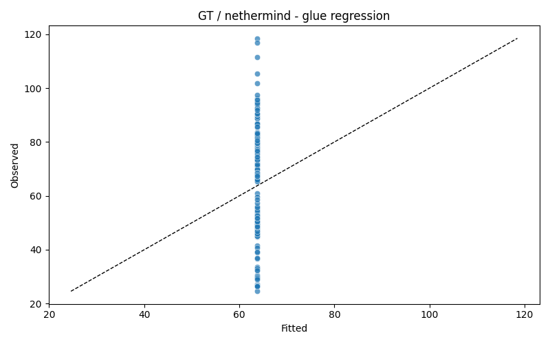


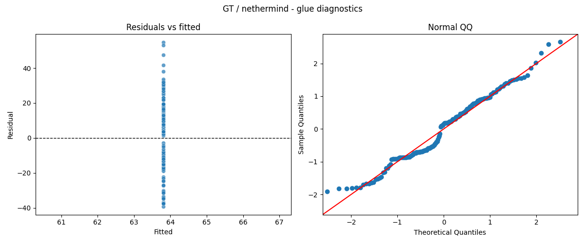

</details>

<details><summary><code>JUMPI</code> · nobs=231 · runtime_ms=0 · p=1.00e+00 · R²=0</summary>

```
==============================================================================
                           NNLS Regression Results                            
==============================================================================
Dep. Variable:          test_runtime_ms              R-squared:          0.000
Model:                  NNLS                    Adj. R-squared:         -0.004
No. Observations:       231                               RMSE:           9.54
Df Residuals:           229                                MAE:           7.62
Df Model:               1      
==============================================================================
                      coef     std err     P-value      [0.025      0.975]
------------------------------------------------------------------------------
         const     33.6862      0.6557       0.001     32.3172     34.9358
         JUMPI      0.0000      0.0000       1.000      0.0000      0.0000
==============================================================================
Notes: Non-negative least squares with bootstrap inference (1000 iterations)
==============================================================================
```

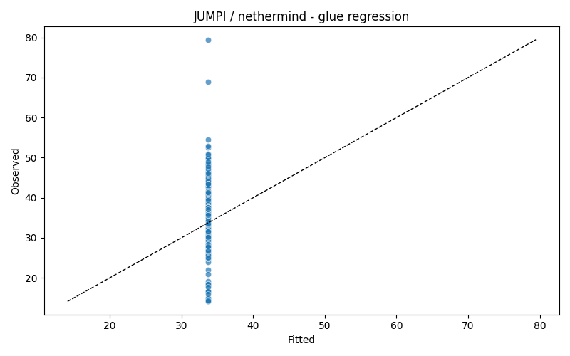


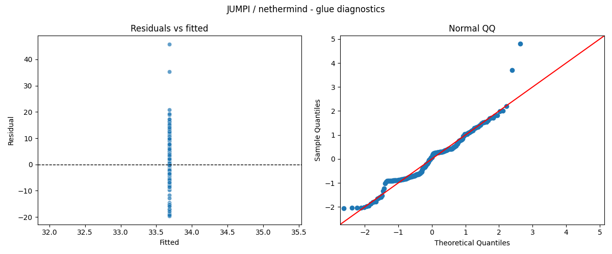

</details>

<details><summary><code>LT</code> · nobs=168 · runtime_ms=0 · p=1.00e+00 · R²=0</summary>

```
==============================================================================
                           NNLS Regression Results                            
==============================================================================
Dep. Variable:          test_runtime_ms              R-squared:          0.000
Model:                  NNLS                    Adj. R-squared:         -0.006
No. Observations:       168                               RMSE:          19.90
Df Residuals:           166                                MAE:          16.77
Df Model:               1      
==============================================================================
                      coef     std err     P-value      [0.025      0.975]
------------------------------------------------------------------------------
         const     68.2750      1.5073       0.001     65.3496     71.2727
            LT      0.0000      0.0000       1.000      0.0000      0.0000
==============================================================================
Notes: Non-negative least squares with bootstrap inference (1000 iterations)
==============================================================================
```


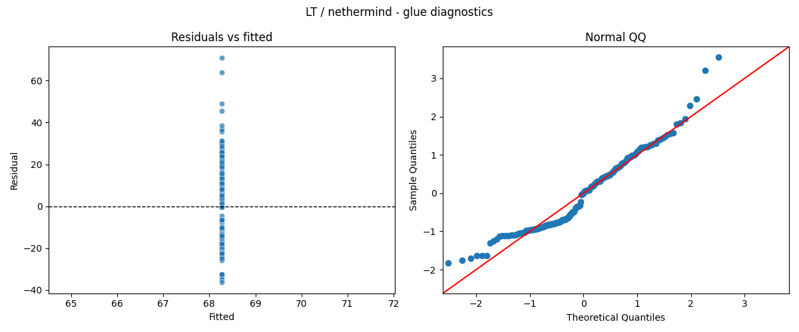

</details>

<details><summary><code>MSTORE</code> · nobs=945 · runtime_ms=0 · p=1.00e+00 · R²=0</summary>

```
==============================================================================
                           NNLS Regression Results                            
==============================================================================
Dep. Variable:          test_runtime_ms              R-squared:          0.000
Model:                  NNLS                    Adj. R-squared:         -0.001
No. Observations:       945                               RMSE:          21.19
Df Residuals:           943                                MAE:          16.77
Df Model:               1      
==============================================================================
                      coef     std err     P-value      [0.025      0.975]
------------------------------------------------------------------------------
         const     64.9770      0.6716       0.001     63.6317     66.2760
        MSTORE      0.0000      0.0000       1.000      0.0000      0.0000
==============================================================================
Notes: Non-negative least squares with bootstrap inference (1000 iterations)
==============================================================================
```

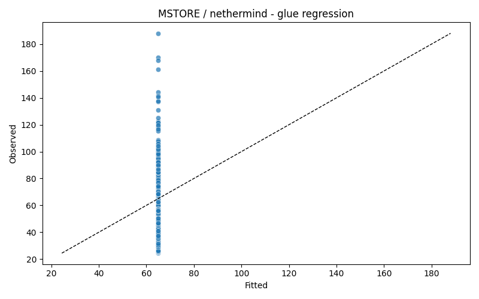

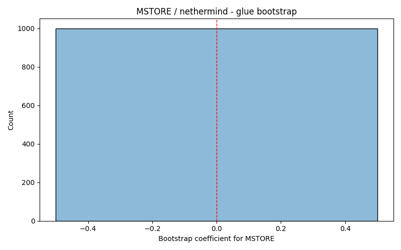

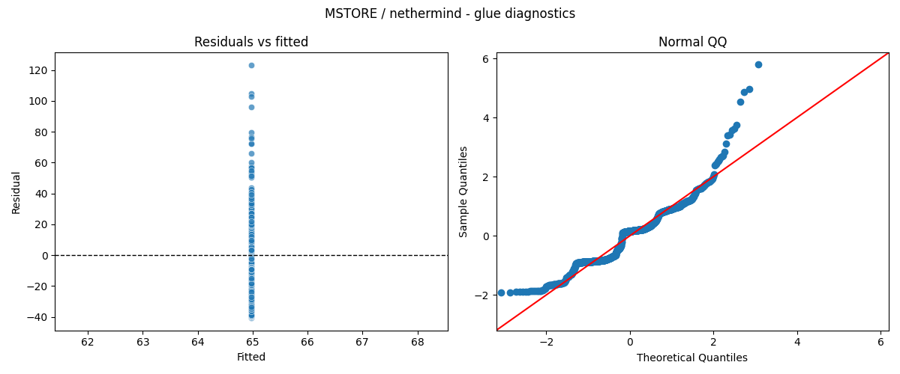

</details>

<details><summary><code>MSTORE8</code> · nobs=945 · runtime_ms=0 · p=1.00e+00 · R²=0</summary>

```
==============================================================================
                           NNLS Regression Results                            
==============================================================================
Dep. Variable:          test_runtime_ms              R-squared:          0.000
Model:                  NNLS                    Adj. R-squared:         -0.001
No. Observations:       945                               RMSE:          19.30
Df Residuals:           943                                MAE:          15.85
Df Model:               1      
==============================================================================
                      coef     std err     P-value      [0.025      0.975]
------------------------------------------------------------------------------
         const     62.8889      0.6219       0.001     61.6683     64.0967
       MSTORE8      0.0000      0.0000       1.000      0.0000      0.0000
==============================================================================
Notes: Non-negative least squares with bootstrap inference (1000 iterations)
==============================================================================
```

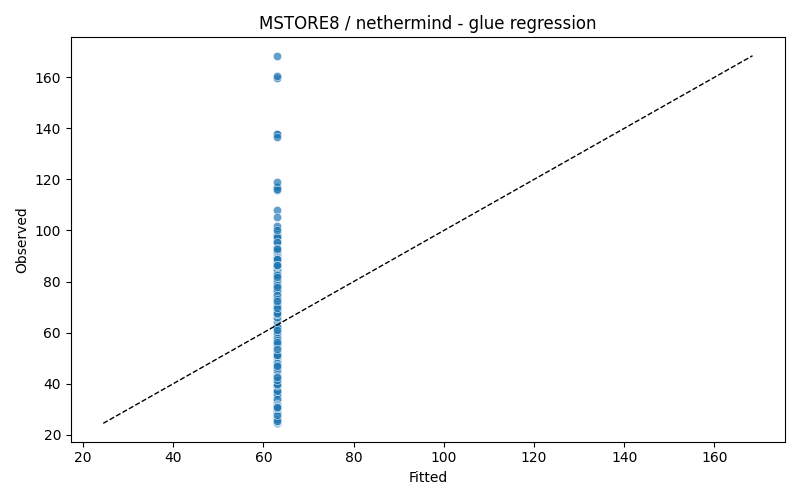

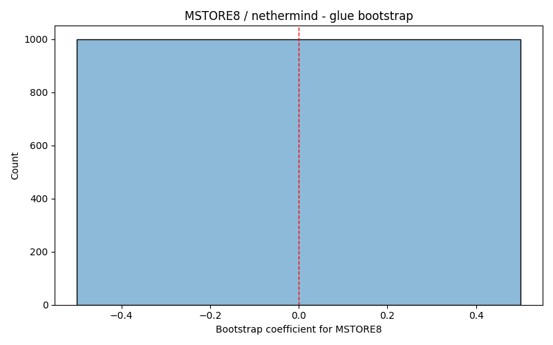

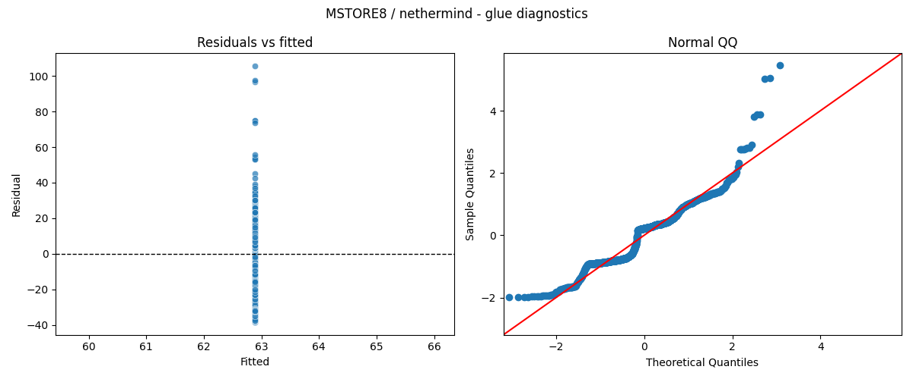

</details>

<details><summary><code>MUL</code> · nobs=210 · runtime_ms=0 · p=1.00e+00 · R²=0</summary>

```
==============================================================================
                           NNLS Regression Results                            
==============================================================================
Dep. Variable:          test_runtime_ms              R-squared:          0.000
Model:                  NNLS                    Adj. R-squared:         -0.005
No. Observations:       210                               RMSE:          37.40
Df Residuals:           208                                MAE:          32.75
Df Model:               1      
==============================================================================
                      coef     std err     P-value      [0.025      0.975]
------------------------------------------------------------------------------
         const    132.2719      2.6512       0.001    126.9850    137.3747
           MUL      0.0000      0.0000       1.000      0.0000      0.0000
==============================================================================
Notes: Non-negative least squares with bootstrap inference (1000 iterations)
==============================================================================
```

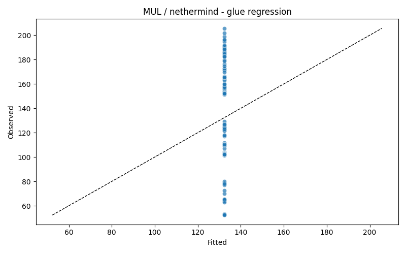


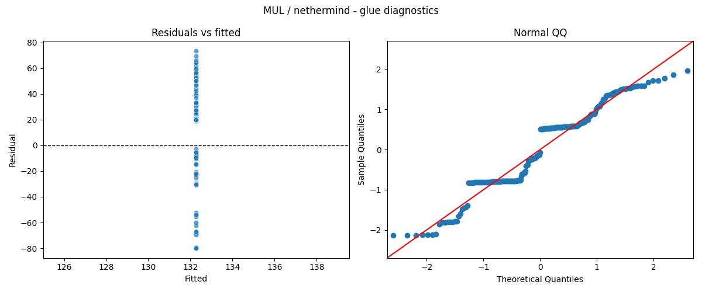

</details>

<details><summary><code>PC</code> · nobs=126 · runtime_ms=7.183e-06 · p=1.00e-03 · R²=0.4321</summary>

```
==============================================================================
                           NNLS Regression Results                            
==============================================================================
Dep. Variable:          test_runtime_ms              R-squared:          0.432
Model:                  NNLS                    Adj. R-squared:          0.428
No. Observations:       126                               RMSE:          18.30
Df Residuals:           124                                MAE:          16.52
Df Model:               1      
==============================================================================
                      coef     std err     P-value      [0.025      0.975]
------------------------------------------------------------------------------
         const     77.7659      3.0465       0.001     72.0450     83.5473
            PC      0.0000      0.0000       0.001      0.0000      0.0000
==============================================================================
Notes: Non-negative least squares with bootstrap inference (1000 iterations)
==============================================================================
```

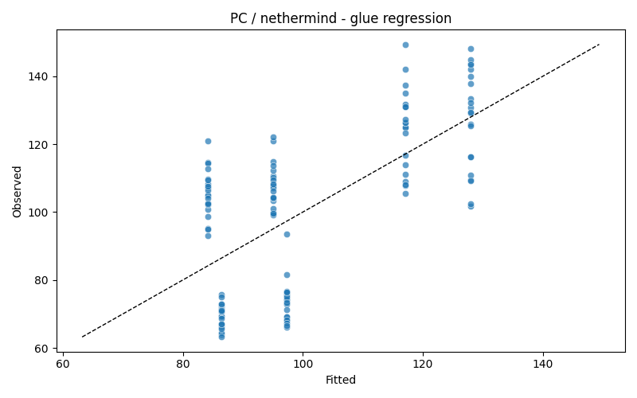

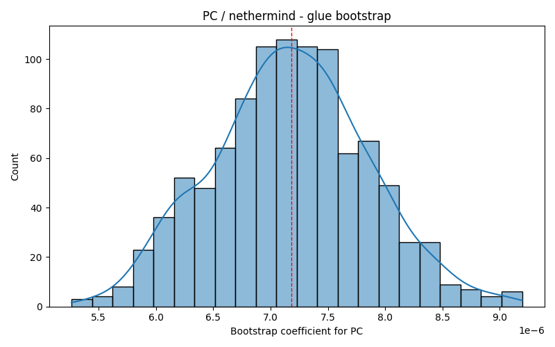

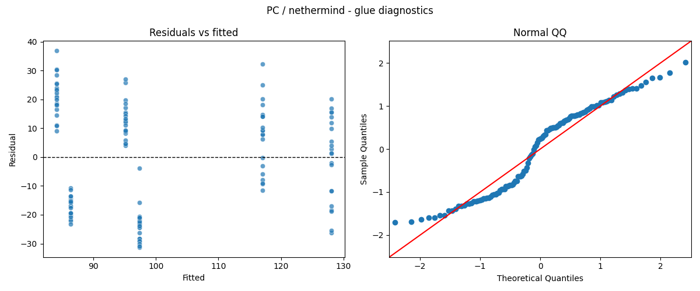

</details>

<details><summary><code>RETURNDATASIZE</code> · nobs=504 · runtime_ms=6.886e-06 · p=1.00e-03 · R²=0.2484</summary>

```
==============================================================================
                           NNLS Regression Results                            
==============================================================================
Dep. Variable:          test_runtime_ms              R-squared:          0.248
Model:                  NNLS                    Adj. R-squared:          0.247
No. Observations:       504                               RMSE:          14.06
Df Residuals:           502                                MAE:          10.15
Df Model:               1      
==============================================================================
                      coef     std err     P-value      [0.025      0.975]
------------------------------------------------------------------------------
         const     47.0483      1.1674       0.001     44.9410     49.4080
RETURNDATASIZE      0.0000      0.0000       0.001      0.0000      0.0000
==============================================================================
Notes: Non-negative least squares with bootstrap inference (1000 iterations)
==============================================================================
```

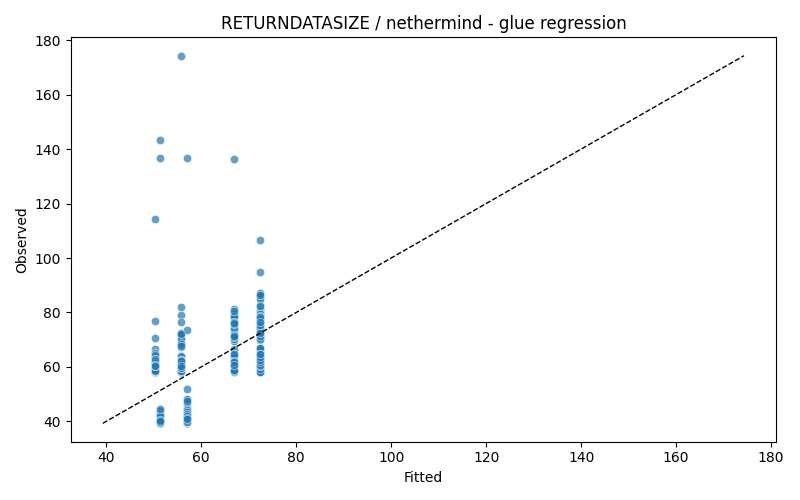

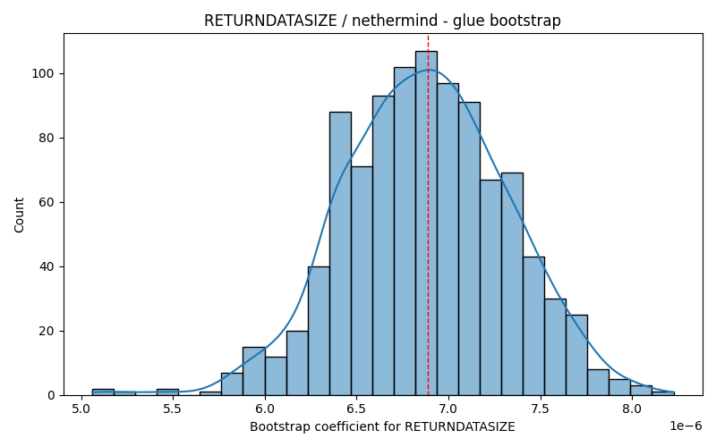

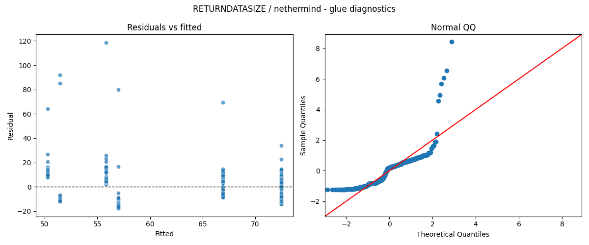

</details>

<details><summary><code>SELFBALANCE</code> · nobs=231 · runtime_ms=0 · p=1.00e+00 · R²=0</summary>

```
==============================================================================
                           NNLS Regression Results                            
==============================================================================
Dep. Variable:          test_runtime_ms              R-squared:          0.000
Model:                  NNLS                    Adj. R-squared:         -0.004
No. Observations:       231                               RMSE:          46.89
Df Residuals:           229                                MAE:          39.37
Df Model:               1      
==============================================================================
                      coef     std err     P-value      [0.025      0.975]
------------------------------------------------------------------------------
         const    212.7102      3.1526       0.001    206.3204    218.9173
   SELFBALANCE      0.0000      0.0000       1.000      0.0000      0.0000
==============================================================================
Notes: Non-negative least squares with bootstrap inference (1000 iterations)
==============================================================================
```

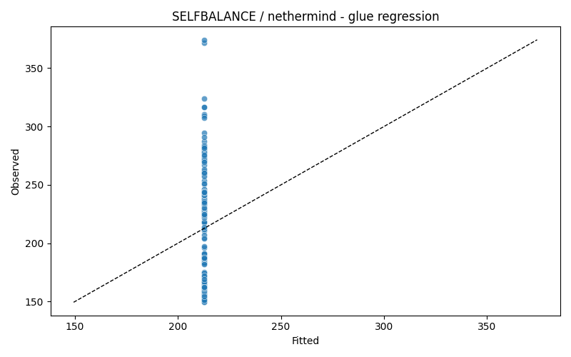


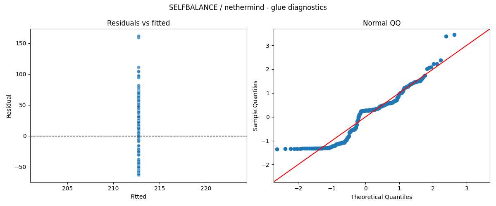

</details>

<details><summary><code>SUB</code> · nobs=168 · runtime_ms=0 · p=1.00e+00 · R²=0</summary>

```
==============================================================================
                           NNLS Regression Results                            
==============================================================================
Dep. Variable:          test_runtime_ms              R-squared:          0.000
Model:                  NNLS                    Adj. R-squared:         -0.006
No. Observations:       168                               RMSE:          31.98
Df Residuals:           166                                MAE:          24.31
Df Model:               1      
==============================================================================
                      coef     std err     P-value      [0.025      0.975]
------------------------------------------------------------------------------
         const     89.0871      2.4103       0.001     84.3837     93.7487
           SUB      0.0000      0.0000       1.000      0.0000      0.0000
==============================================================================
Notes: Non-negative least squares with bootstrap inference (1000 iterations)
==============================================================================
```

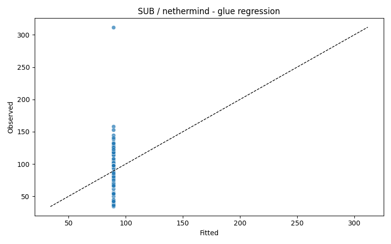

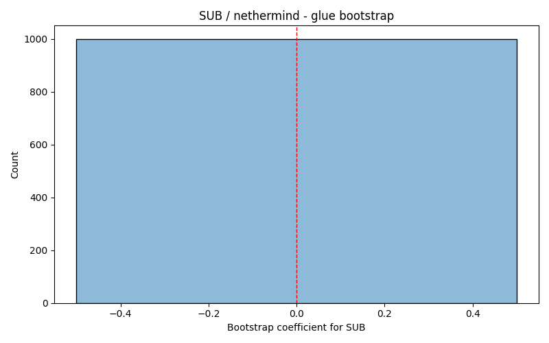

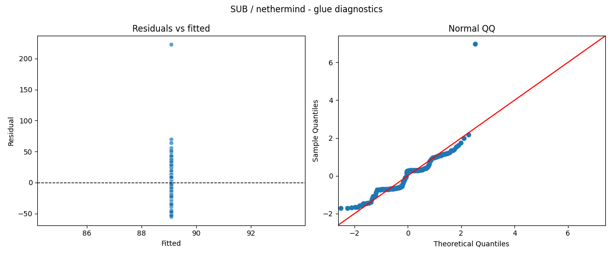

</details>

### Mixed glue (tier B) · nethermind

<details><summary><code>JUMP</code> · nobs=210 · runtime_ms=0 · p=1.00e+00 · R²=0</summary>

```
==============================================================================
                           NNLS Regression Results                            
==============================================================================
Dep. Variable:          test_runtime_ms              R-squared:          0.000
Model:                  NNLS                    Adj. R-squared:         -0.005
No. Observations:       210                               RMSE:          20.72
Df Residuals:           208                                MAE:          17.88
Df Model:               1      
==============================================================================
                      coef     std err     P-value      [0.025      0.975]
------------------------------------------------------------------------------
         const     70.7969      1.4278       0.001     68.0466     73.5209
          JUMP      0.0000      0.0000       1.000      0.0000      0.0000
==============================================================================
Notes: Non-negative least squares with bootstrap inference (1000 iterations)
==============================================================================
```

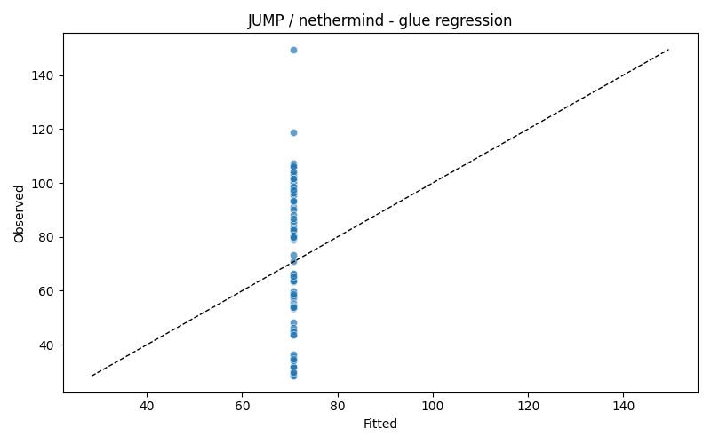


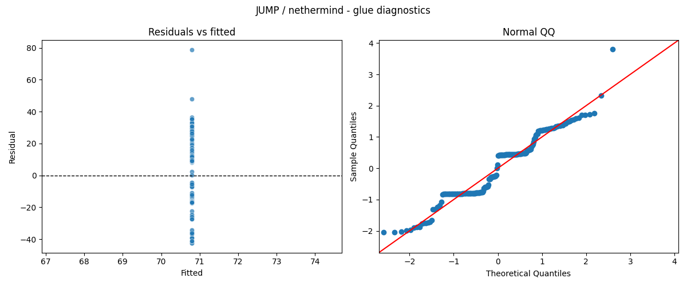

</details>

<details><summary><code>KECCAK256</code> · nobs=3696 · runtime_ms=0 · p=1.00e+00 · R²=0</summary>

```
==============================================================================
                           NNLS Regression Results                            
==============================================================================
Dep. Variable:          test_runtime_ms              R-squared:          0.000
Model:                  NNLS                    Adj. R-squared:         -0.000
No. Observations:       3696                              RMSE:         280.35
Df Residuals:           3694                               MAE:         228.88
Df Model:               1      
==============================================================================
                      coef     std err     P-value      [0.025      0.975]
------------------------------------------------------------------------------
         const    404.3177      4.6925       0.001    394.5582    413.6408
     KECCAK256      0.0000      0.0000       1.000      0.0000      0.0000
==============================================================================
Notes: Non-negative least squares with bootstrap inference (1000 iterations)
==============================================================================
```

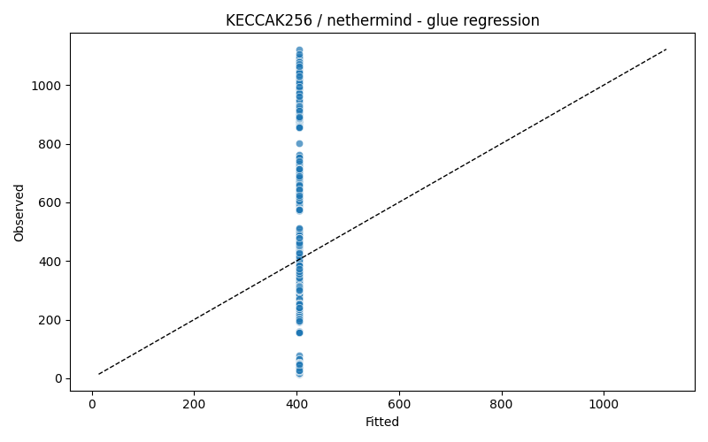


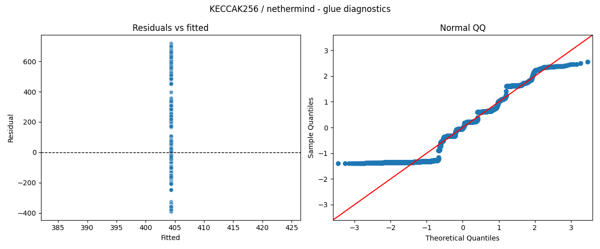

</details>

## reth

| glue_opcode | nobs | glue_runtime_ms | p_value | rsquared |
| --- | --- | --- | --- | --- |
| `ISZERO` | 144 | 0 | 1.00e+00 | -2.22e-16 |
| `JUMPDEST` | 36 | 0 | 1.00e+00 | 0 |
| `SWAP` | 2574 | 0 | 1.00e+00 | 1.11e-16 |
| `CALLDATASIZE` | 9146 | 6.573e-06 | 1.00e-03 | 0.3619 |
| `DUP` | 9146 | 0 | 1.00e+00 | 0.3619 |
| `GAS` | 9146 | 5.569e-06 | 1.00e-03 | 0.3619 |
| `MLOAD` | 9146 | 9.739e-06 | 1.00e-03 | 0.3619 |
| `PUSH` | 9146 | 0 | 1.00e+00 | 0.3619 |
| `PUSH0` | 9146 | 3.277e-06 | 1.00e-03 | 0.3619 |
| `STATICCALL` | 9146 | 2.617e-05 | 1.00e-03 | 0.3619 |
| `ADD` | 162 | 0 | 1.00e+00 | -2.22e-16 |
| `AND` | 144 | 0 | 1.00e+00 | 0 |
| `CALLDATACOPY` | 4230 | 0 | 1.00e+00 | 0 |
| `CALLDATALOAD` | 792 | 0 | 1.00e+00 | 0 |
| `DIV` | 198 | 0 | 1.00e+00 | 0 |
| `EXP` | 198 | 0.0002969 | 1.00e-03 | 0.7866 |
| `GT` | 144 | 0 | 1.00e+00 | 0 |
| `JUMPI` | 198 | 0 | 1.00e+00 | 0 |
| `LT` | 144 | 0 | 1.00e+00 | -2.22e-16 |
| `MSTORE` | 810 | 0 | 1.00e+00 | 0 |
| `MSTORE8` | 810 | 0 | 1.00e+00 | 0 |
| `MUL` | 180 | 0 | 1.00e+00 | 0 |
| `PC` | 108 | 6.929e-06 | 1.00e-03 | 0.49 |
| `RETURNDATASIZE` | 432 | 8.124e-06 | 1.00e-03 | 0.3991 |
| `SELFBALANCE` | 198 | 0 | 1.00e+00 | 0 |
| `SUB` | 144 | 0 | 1.00e+00 | 0 |
| `JUMP` | 180 | 0 | 1.00e+00 | 0 |
| `KECCAK256` | 3168 | 0 | 1.00e+00 | -2.22e-16 |

### Cycle glue — joint fit · reth

<details><summary>Joint NNLS regression summary</summary>

```
==============================================================================
                           NNLS Regression Results                            
==============================================================================
Dep. Variable:          test_runtime_ms              R-squared:          0.362
Model:                  NNLS                    Adj. R-squared:          0.361
No. Observations:       9146                              RMSE:          13.90
Df Residuals:           9138                               MAE:          11.59
Df Model:               7      
==============================================================================
                      coef     std err     P-value      [0.025      0.975]
------------------------------------------------------------------------------
         const     47.2634      0.1555       0.001     46.9739     47.5876
  CALLDATASIZE      0.0000      0.0000       0.001      0.0000      0.0000
           DUP      0.0000      0.0000       1.000      0.0000      0.0000
           GAS      0.0000      0.0000       0.001      0.0000      0.0000
         MLOAD      0.0000      0.0000       0.001      0.0000      0.0000
          PUSH      0.0000      0.0000       1.000      0.0000      0.0000
         PUSH0      0.0000      0.0000       0.001      0.0000      0.0000
    STATICCALL      0.0000      0.0000       0.001      0.0000      0.0000
==============================================================================
Notes: Non-negative least squares with bootstrap inference (1000 iterations)
==============================================================================
```

</details>

<details><summary><code>CALLDATASIZE</code> · nobs=9146 · runtime_ms=6.573e-06 · p=1.00e-03 · R²=0.3619</summary>

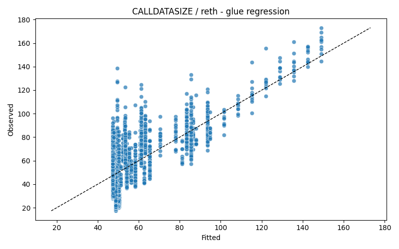

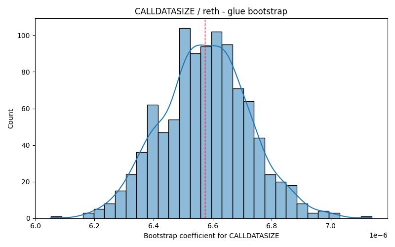

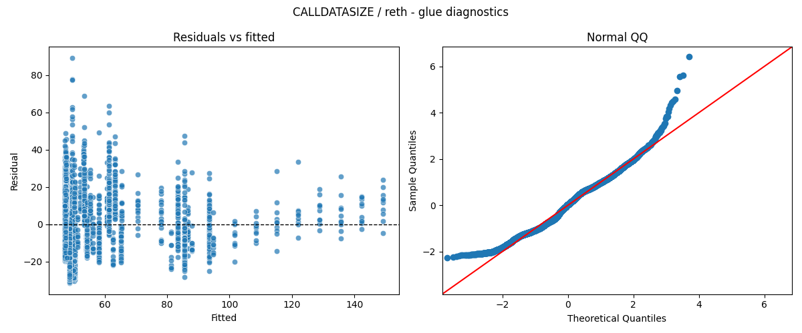

</details>

<details><summary><code>DUP</code> · nobs=9146 · runtime_ms=0 · p=1.00e+00 · R²=0.3619</summary>


</details>

<details><summary><code>GAS</code> · nobs=9146 · runtime_ms=5.569e-06 · p=1.00e-03 · R²=0.3619</summary>


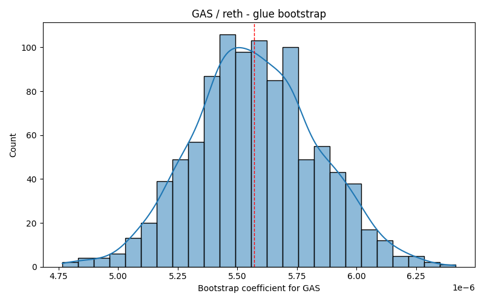

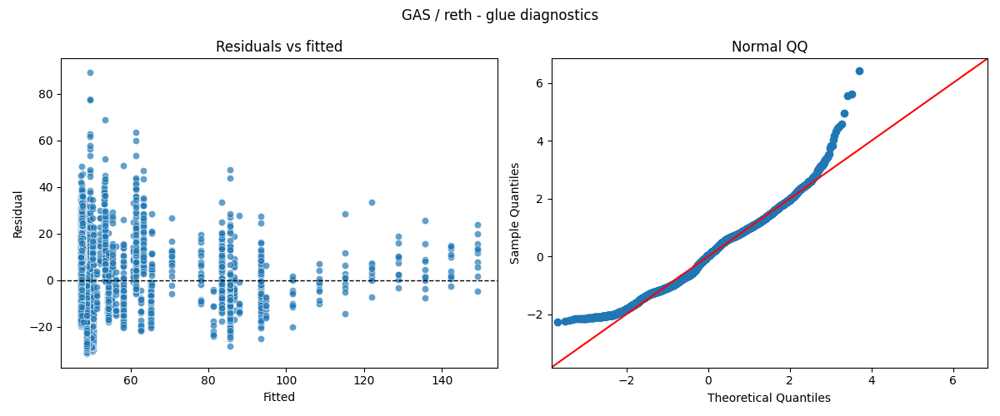

</details>

<details><summary><code>MLOAD</code> · nobs=9146 · runtime_ms=9.739e-06 · p=1.00e-03 · R²=0.3619</summary>

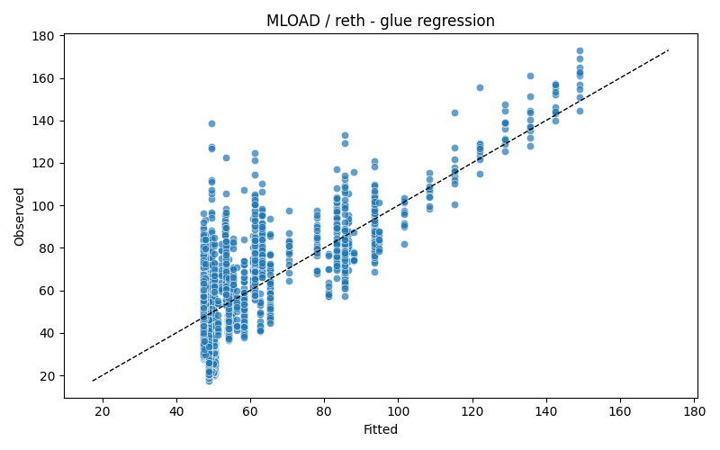

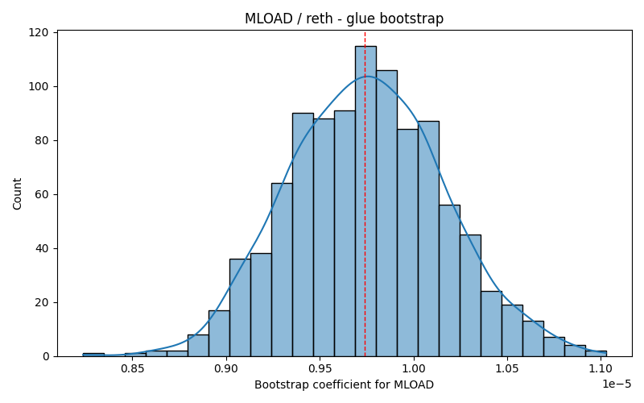

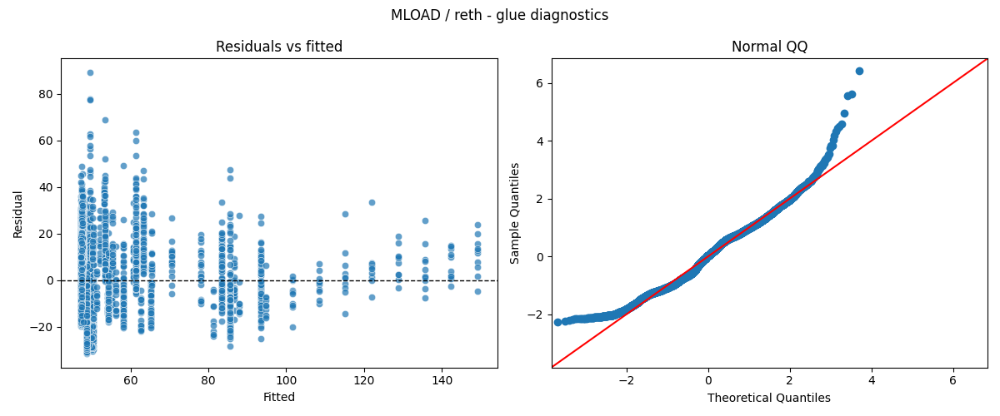

</details>

<details><summary><code>PUSH</code> · nobs=9146 · runtime_ms=0 · p=1.00e+00 · R²=0.3619</summary>

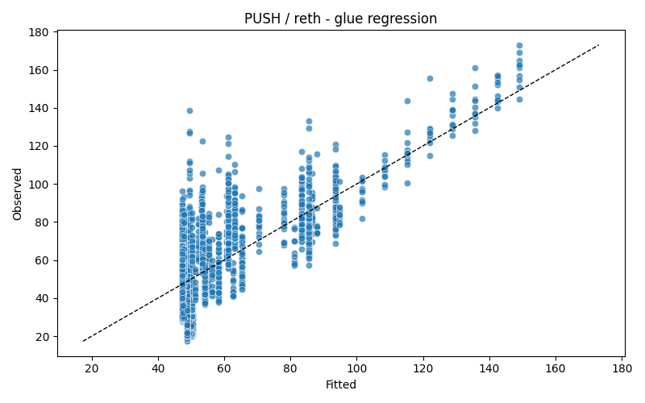


</details>

<details><summary><code>PUSH0</code> · nobs=9146 · runtime_ms=3.277e-06 · p=1.00e-03 · R²=0.3619</summary>


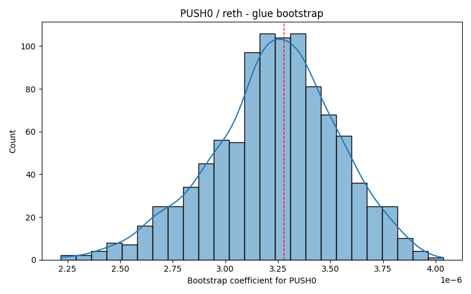


</details>

<details><summary><code>STATICCALL</code> · nobs=9146 · runtime_ms=2.617e-05 · p=1.00e-03 · R²=0.3619</summary>

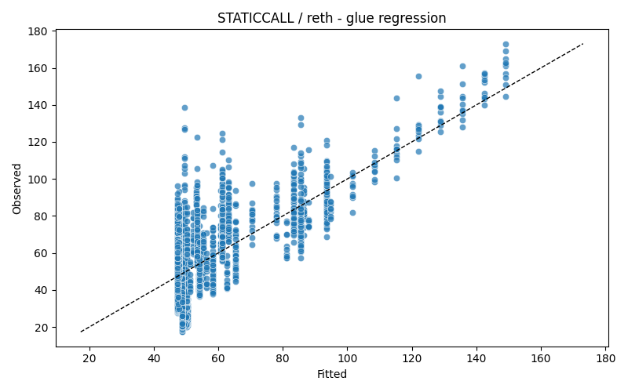

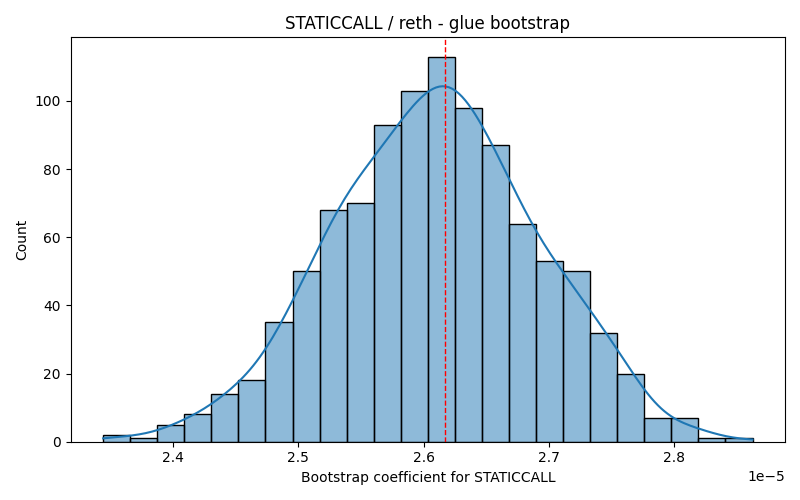


</details>

### Pure glue · reth

<details><summary><code>ISZERO</code> · nobs=144 · runtime_ms=0 · p=1.00e+00 · R²=-2.22e-16</summary>

```
==============================================================================
                           NNLS Regression Results                            
==============================================================================
Dep. Variable:          test_runtime_ms              R-squared:         -0.000
Model:                  NNLS                    Adj. R-squared:         -0.007
No. Observations:       144                               RMSE:          33.21
Df Residuals:           142                                MAE:          30.06
Df Model:               1      
==============================================================================
                      coef     std err     P-value      [0.025      0.975]
------------------------------------------------------------------------------
         const    121.7615      2.7912       0.001    116.4346    126.9361
        ISZERO      0.0000      0.0000       1.000      0.0000      0.0000
==============================================================================
Notes: Non-negative least squares with bootstrap inference (1000 iterations)
==============================================================================
```

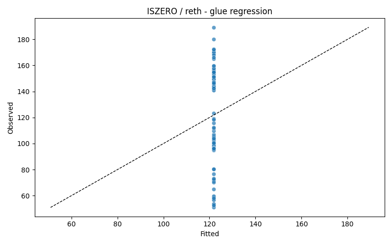


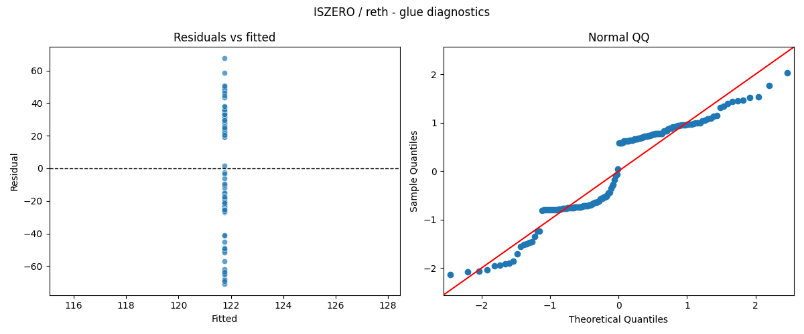

</details>

<details><summary><code>JUMPDEST</code> · nobs=36 · runtime_ms=0 · p=1.00e+00 · R²=0</summary>

```
==============================================================================
                           NNLS Regression Results                            
==============================================================================
Dep. Variable:          test_runtime_ms              R-squared:          0.000
Model:                  NNLS                    Adj. R-squared:         -0.029
No. Observations:       36                                RMSE:          20.54
Df Residuals:           34                                 MAE:          15.53
Df Model:               1      
==============================================================================
                      coef     std err     P-value      [0.025      0.975]
------------------------------------------------------------------------------
         const     74.4164      3.3875       0.001     68.1755     81.0886
      JUMPDEST      0.0000      0.0000       1.000      0.0000      0.0000
==============================================================================
Notes: Non-negative least squares with bootstrap inference (1000 iterations)
==============================================================================
```

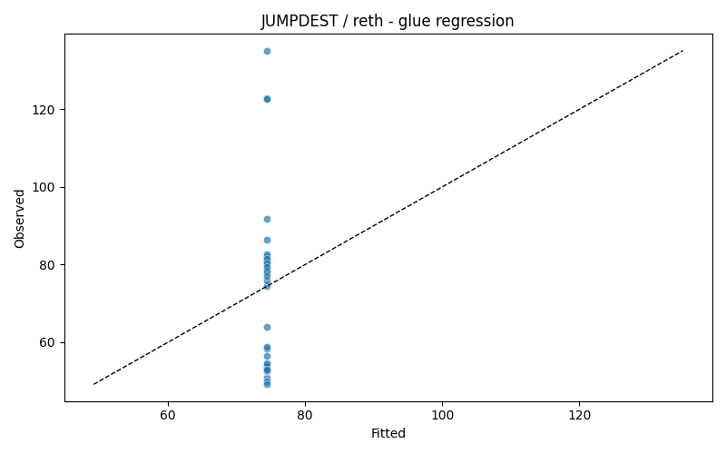


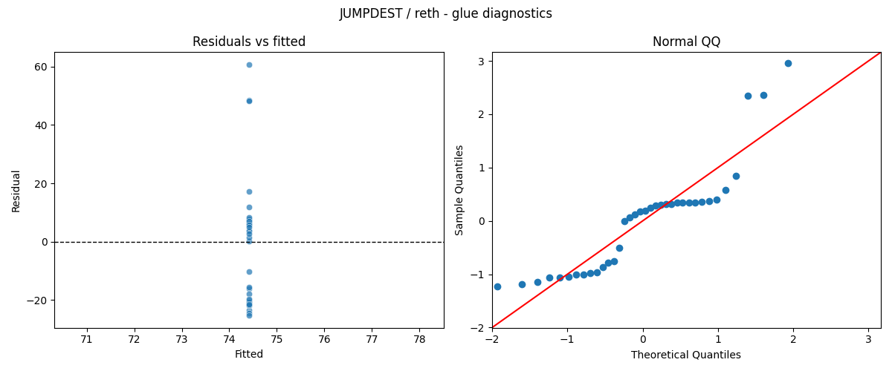

</details>

<details><summary><code>SWAP</code> · nobs=2574 · runtime_ms=0 · p=1.00e+00 · R²=1.11e-16</summary>

```
==============================================================================
                           NNLS Regression Results                            
==============================================================================
Dep. Variable:          test_runtime_ms              R-squared:          0.000
Model:                  NNLS                    Adj. R-squared:         -0.000
No. Observations:       2574                              RMSE:          12.63
Df Residuals:           2572                               MAE:          10.96
Df Model:               1      
==============================================================================
                      coef     std err     P-value      [0.025      0.975]
------------------------------------------------------------------------------
         const     47.1954      0.2538       0.001     46.6888     47.6891
          SWAP      0.0000      0.0000       1.000      0.0000      0.0000
==============================================================================
Notes: Non-negative least squares with bootstrap inference (1000 iterations)
==============================================================================
```

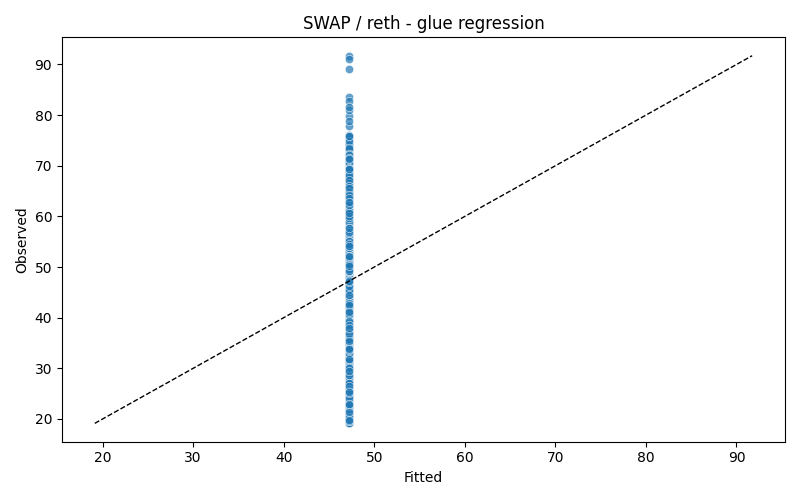


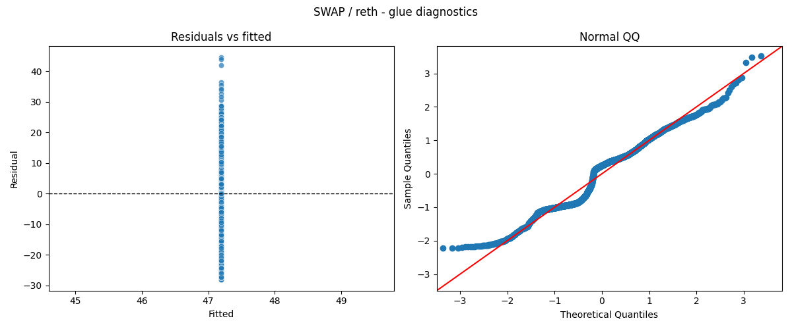

</details>

### Mixed glue (tier A) · reth

<details><summary><code>ADD</code> · nobs=162 · runtime_ms=0 · p=1.00e+00 · R²=-2.22e-16</summary>

```
==============================================================================
                           NNLS Regression Results                            
==============================================================================
Dep. Variable:          test_runtime_ms              R-squared:         -0.000
Model:                  NNLS                    Adj. R-squared:         -0.006
No. Observations:       162                               RMSE:          11.50
Df Residuals:           160                                MAE:           9.75
Df Model:               1      
==============================================================================
                      coef     std err     P-value      [0.025      0.975]
------------------------------------------------------------------------------
         const     41.6981      0.8801       0.001     39.9687     43.4529
           ADD      0.0000      0.0000       1.000      0.0000      0.0000
==============================================================================
Notes: Non-negative least squares with bootstrap inference (1000 iterations)
==============================================================================
```

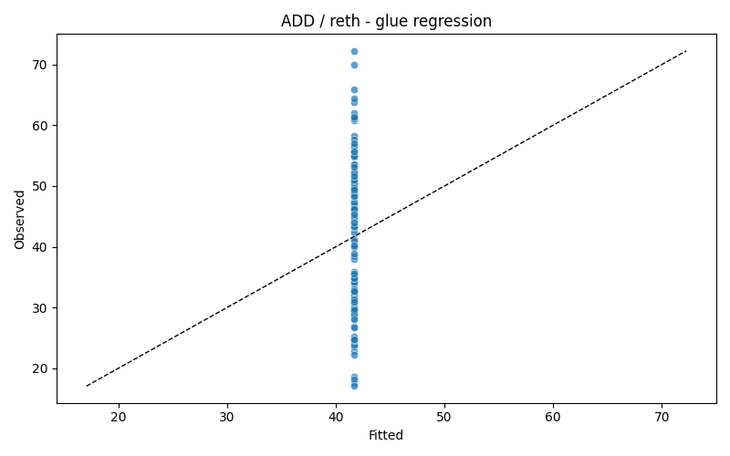

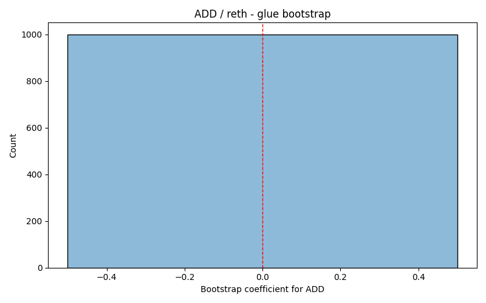

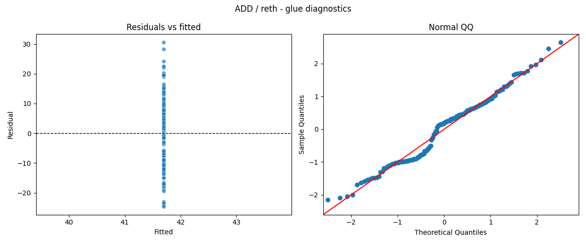

</details>

<details><summary><code>AND</code> · nobs=144 · runtime_ms=0 · p=1.00e+00 · R²=0</summary>

```
==============================================================================
                           NNLS Regression Results                            
==============================================================================
Dep. Variable:          test_runtime_ms              R-squared:          0.000
Model:                  NNLS                    Adj. R-squared:         -0.007
No. Observations:       144                               RMSE:          11.48
Df Residuals:           142                                MAE:           9.95
Df Model:               1      
==============================================================================
                      coef     std err     P-value      [0.025      0.975]
------------------------------------------------------------------------------
         const     40.7637      0.9792       0.001     38.9654     42.6177
           AND      0.0000      0.0000       1.000      0.0000      0.0000
==============================================================================
Notes: Non-negative least squares with bootstrap inference (1000 iterations)
==============================================================================
```

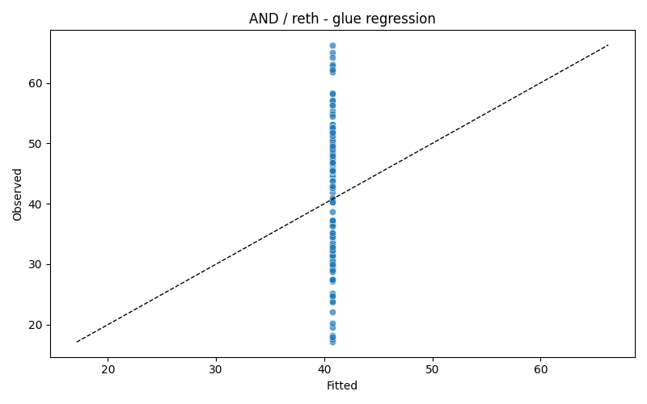


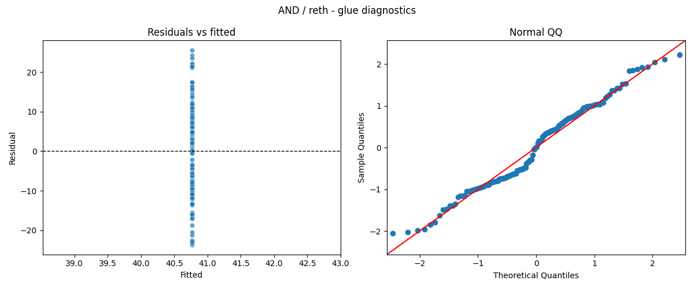

</details>

<details><summary><code>CALLDATACOPY</code> · nobs=4230 · runtime_ms=0 · p=1.00e+00 · R²=0</summary>

```
==============================================================================
                           NNLS Regression Results                            
==============================================================================
Dep. Variable:          test_runtime_ms              R-squared:          0.000
Model:                  NNLS                    Adj. R-squared:         -0.000
No. Observations:       4230                              RMSE:          20.76
Df Residuals:           4228                               MAE:          17.32
Df Model:               1      
==============================================================================
                      coef     std err     P-value      [0.025      0.975]
------------------------------------------------------------------------------
         const     37.1649      0.3252       0.001     36.5492     37.8362
  CALLDATACOPY      0.0000      0.0000       1.000      0.0000      0.0000
==============================================================================
Notes: Non-negative least squares with bootstrap inference (1000 iterations)
==============================================================================
```

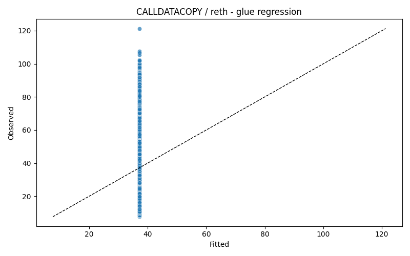


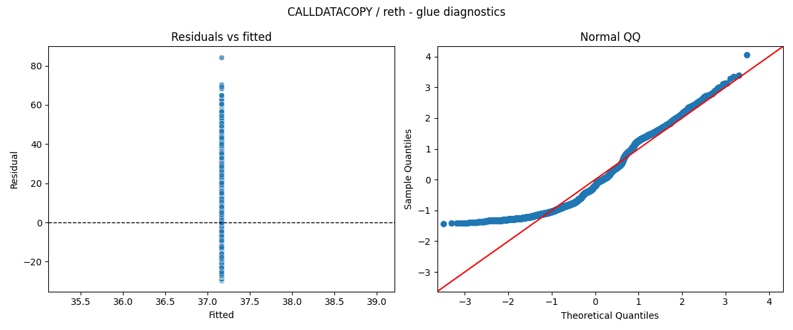

</details>

<details><summary><code>CALLDATALOAD</code> · nobs=792 · runtime_ms=0 · p=1.00e+00 · R²=0</summary>

```
==============================================================================
                           NNLS Regression Results                            
==============================================================================
Dep. Variable:          test_runtime_ms              R-squared:          0.000
Model:                  NNLS                    Adj. R-squared:         -0.001
No. Observations:       792                               RMSE:           1.84
Df Residuals:           790                                MAE:           1.27
Df Model:               1      
==============================================================================
                      coef     std err     P-value      [0.025      0.975]
------------------------------------------------------------------------------
         const      4.2025      0.1499       0.001      3.7231      4.3163
  CALLDATALOAD      0.0000      0.0000       1.000      0.0000      0.0000
==============================================================================
Notes: Non-negative least squares with bootstrap inference (1000 iterations)
==============================================================================
```

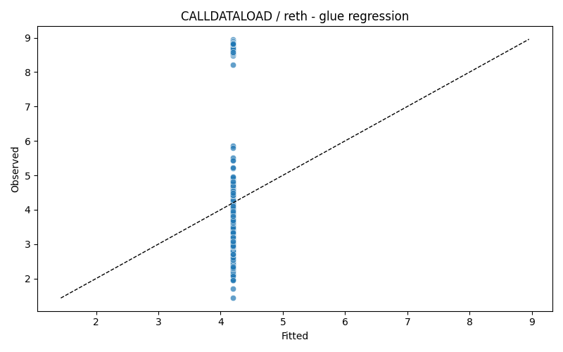

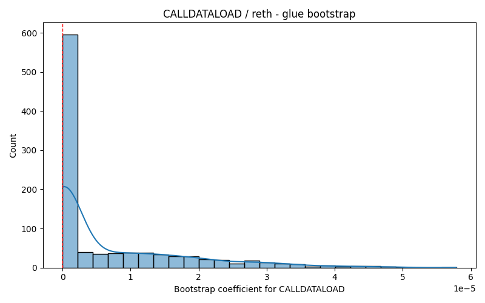

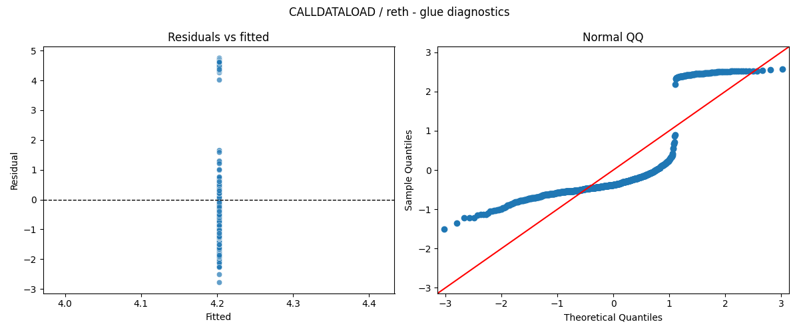

</details>

<details><summary><code>DIV</code> · nobs=198 · runtime_ms=0 · p=1.00e+00 · R²=0</summary>

```
==============================================================================
                           NNLS Regression Results                            
==============================================================================
Dep. Variable:          test_runtime_ms              R-squared:          0.000
Model:                  NNLS                    Adj. R-squared:         -0.005
No. Observations:       198                               RMSE:          60.40
Df Residuals:           196                                MAE:          54.06
Df Model:               1      
==============================================================================
                      coef     std err     P-value      [0.025      0.975]
------------------------------------------------------------------------------
         const    232.2002      4.1950       0.001    224.3589    240.5983
           DIV      0.0000      0.0000       1.000      0.0000      0.0000
==============================================================================
Notes: Non-negative least squares with bootstrap inference (1000 iterations)
==============================================================================
```

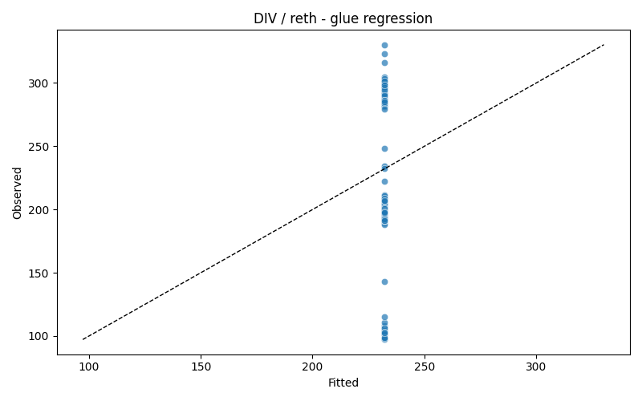


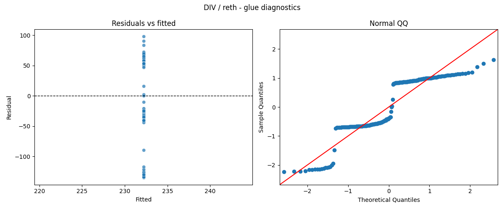

</details>

<details><summary><code>EXP</code> · nobs=198 · runtime_ms=0.0002969 · p=1.00e-03 · R²=0.7866</summary>

```
==============================================================================
                           NNLS Regression Results                            
==============================================================================
Dep. Variable:          test_runtime_ms              R-squared:          0.787
Model:                  NNLS                    Adj. R-squared:          0.786
No. Observations:       198                               RMSE:           6.06
Df Residuals:           196                                MAE:           4.72
Df Model:               1      
==============================================================================
                      coef     std err     P-value      [0.025      0.975]
------------------------------------------------------------------------------
         const     15.1329      1.4486       0.001     12.3142     17.9032
           EXP      0.0003      0.0000       0.001      0.0003      0.0003
==============================================================================
Notes: Non-negative least squares with bootstrap inference (1000 iterations)
==============================================================================
```

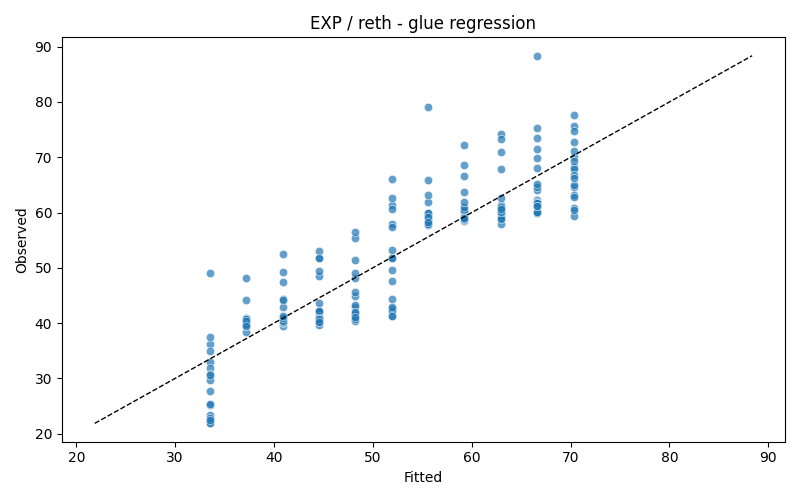

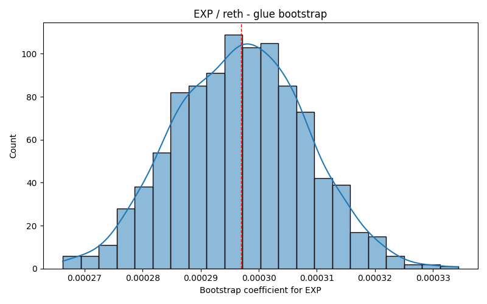

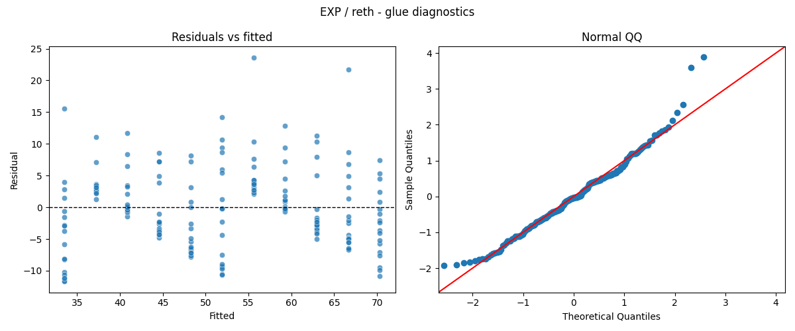

</details>

<details><summary><code>GT</code> · nobs=144 · runtime_ms=0 · p=1.00e+00 · R²=0</summary>

```
==============================================================================
                           NNLS Regression Results                            
==============================================================================
Dep. Variable:          test_runtime_ms              R-squared:          0.000
Model:                  NNLS                    Adj. R-squared:         -0.007
No. Observations:       144                               RMSE:          12.02
Df Residuals:           142                                MAE:          10.37
Df Model:               1      
==============================================================================
                      coef     std err     P-value      [0.025      0.975]
------------------------------------------------------------------------------
         const     43.6112      0.9705       0.001     41.6835     45.4945
            GT      0.0000      0.0000       1.000      0.0000      0.0000
==============================================================================
Notes: Non-negative least squares with bootstrap inference (1000 iterations)
==============================================================================
```

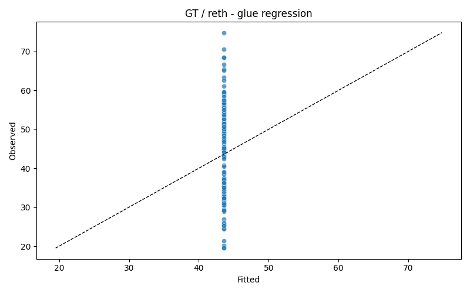


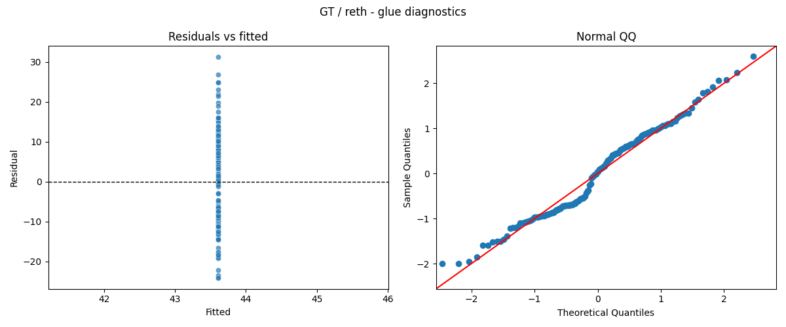

</details>

<details><summary><code>JUMPI</code> · nobs=198 · runtime_ms=0 · p=1.00e+00 · R²=0</summary>

```
==============================================================================
                           NNLS Regression Results                            
==============================================================================
Dep. Variable:          test_runtime_ms              R-squared:          0.000
Model:                  NNLS                    Adj. R-squared:         -0.005
No. Observations:       198                               RMSE:           7.73
Df Residuals:           196                                MAE:           6.31
Df Model:               1      
==============================================================================
                      coef     std err     P-value      [0.025      0.975]
------------------------------------------------------------------------------
         const     28.8096      0.5358       0.001     27.8069     29.8352
         JUMPI      0.0000      0.0000       1.000      0.0000      0.0000
==============================================================================
Notes: Non-negative least squares with bootstrap inference (1000 iterations)
==============================================================================
```

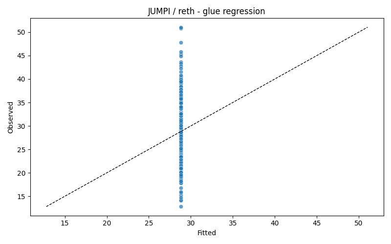


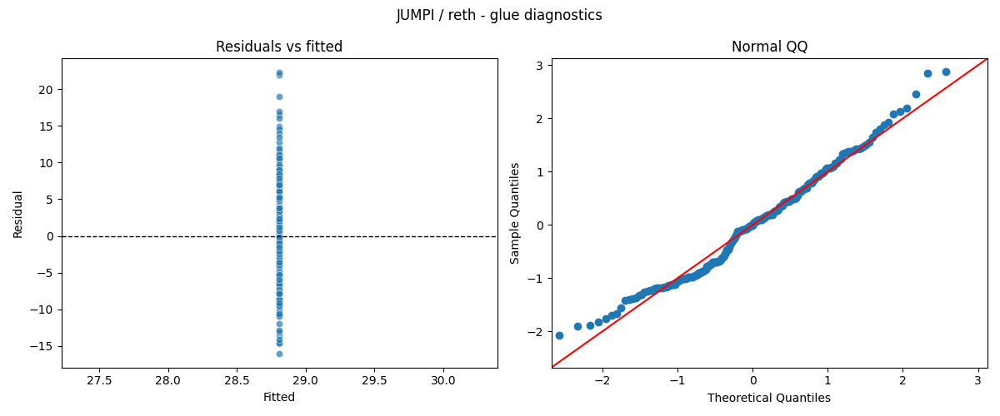

</details>

<details><summary><code>LT</code> · nobs=144 · runtime_ms=0 · p=1.00e+00 · R²=-2.22e-16</summary>

```
==============================================================================
                           NNLS Regression Results                            
==============================================================================
Dep. Variable:          test_runtime_ms              R-squared:         -0.000
Model:                  NNLS                    Adj. R-squared:         -0.007
No. Observations:       144                               RMSE:          26.01
Df Residuals:           142                                MAE:          20.99
Df Model:               1      
==============================================================================
                      coef     std err     P-value      [0.025      0.975]
------------------------------------------------------------------------------
         const     81.1022      2.2508       0.001     76.7949     85.6812
            LT      0.0000      0.0000       1.000      0.0000      0.0000
==============================================================================
Notes: Non-negative least squares with bootstrap inference (1000 iterations)
==============================================================================
```

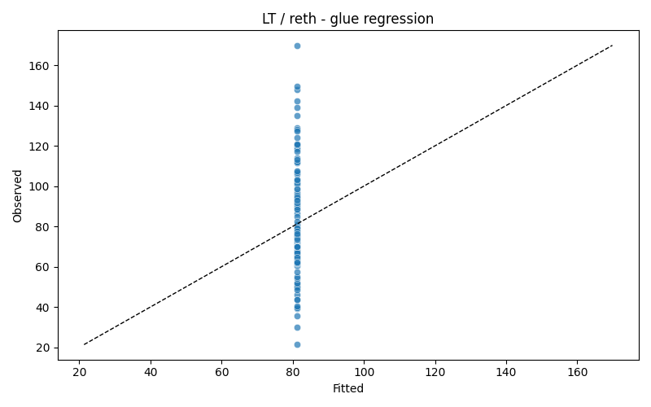

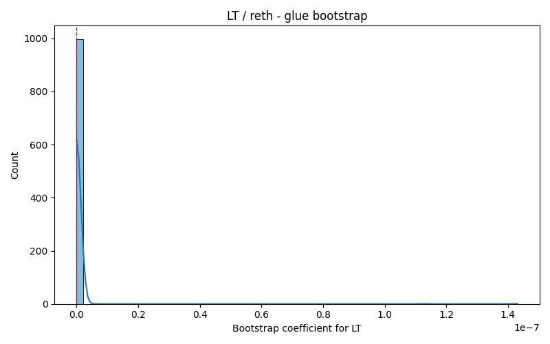

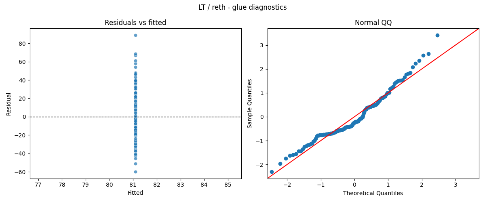

</details>

<details><summary><code>MSTORE</code> · nobs=810 · runtime_ms=0 · p=1.00e+00 · R²=0</summary>

```
==============================================================================
                           NNLS Regression Results                            
==============================================================================
Dep. Variable:          test_runtime_ms              R-squared:          0.000
Model:                  NNLS                    Adj. R-squared:         -0.001
No. Observations:       810                               RMSE:          37.12
Df Residuals:           808                                MAE:          32.26
Df Model:               1      
==============================================================================
                      coef     std err     P-value      [0.025      0.975]
------------------------------------------------------------------------------
         const     80.9799      1.3157       0.001     78.3414     83.5352
        MSTORE      0.0000      0.0000       1.000      0.0000      0.0000
==============================================================================
Notes: Non-negative least squares with bootstrap inference (1000 iterations)
==============================================================================
```

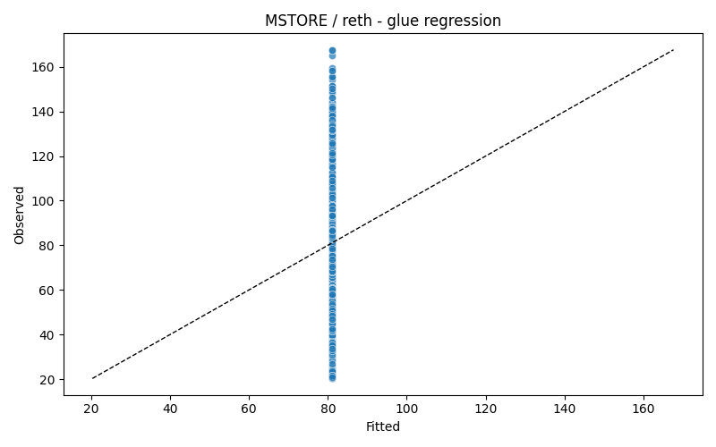


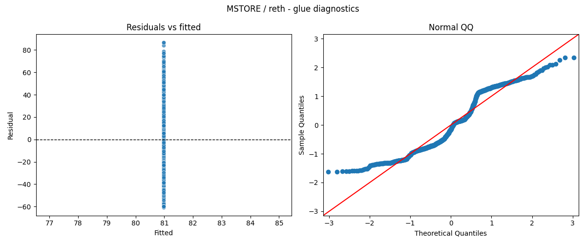

</details>

<details><summary><code>MSTORE8</code> · nobs=810 · runtime_ms=0 · p=1.00e+00 · R²=0</summary>

```
==============================================================================
                           NNLS Regression Results                            
==============================================================================
Dep. Variable:          test_runtime_ms              R-squared:          0.000
Model:                  NNLS                    Adj. R-squared:         -0.001
No. Observations:       810                               RMSE:          12.74
Df Residuals:           808                                MAE:          10.78
Df Model:               1      
==============================================================================
                      coef     std err     P-value      [0.025      0.975]
------------------------------------------------------------------------------
         const     45.1216      0.4529       0.001     44.2346     46.0121
       MSTORE8      0.0000      0.0000       1.000      0.0000      0.0000
==============================================================================
Notes: Non-negative least squares with bootstrap inference (1000 iterations)
==============================================================================
```

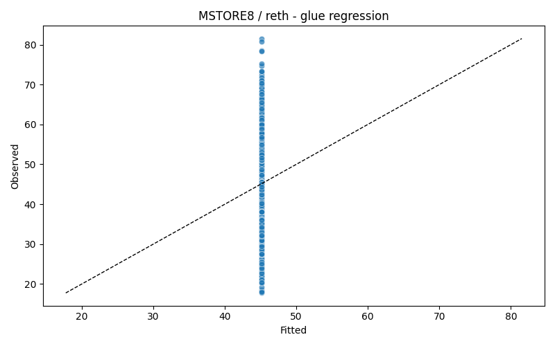


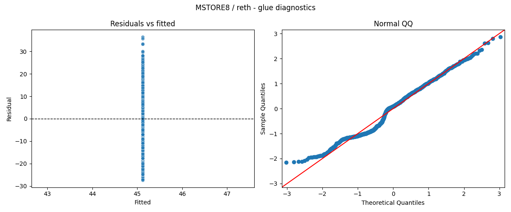

</details>

<details><summary><code>MUL</code> · nobs=180 · runtime_ms=0 · p=1.00e+00 · R²=0</summary>

```
==============================================================================
                           NNLS Regression Results                            
==============================================================================
Dep. Variable:          test_runtime_ms              R-squared:          0.000
Model:                  NNLS                    Adj. R-squared:         -0.006
No. Observations:       180                               RMSE:          10.17
Df Residuals:           178                                MAE:           8.80
Df Model:               1      
==============================================================================
                      coef     std err     P-value      [0.025      0.975]
------------------------------------------------------------------------------
         const     39.5257      0.7813       0.001     38.0121     40.9389
           MUL      0.0000      0.0000       1.000      0.0000      0.0000
==============================================================================
Notes: Non-negative least squares with bootstrap inference (1000 iterations)
==============================================================================
```

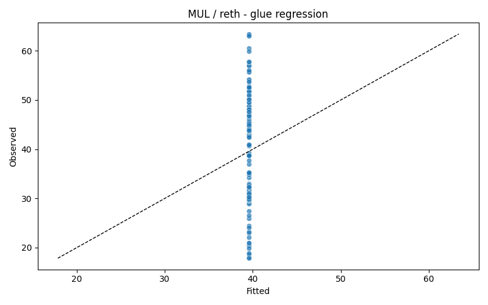


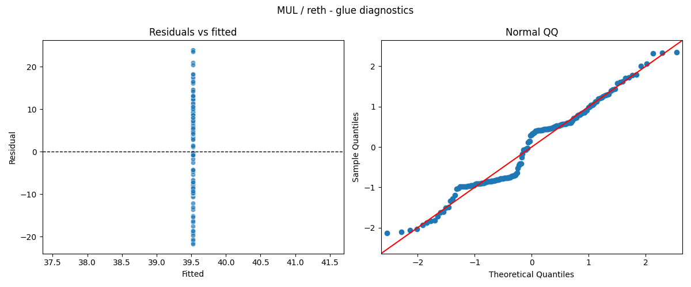

</details>

<details><summary><code>PC</code> · nobs=108 · runtime_ms=6.929e-06 · p=1.00e-03 · R²=0.49</summary>

```
==============================================================================
                           NNLS Regression Results                            
==============================================================================
Dep. Variable:          test_runtime_ms              R-squared:          0.490
Model:                  NNLS                    Adj. R-squared:          0.485
No. Observations:       108                               RMSE:          15.71
Df Residuals:           106                                MAE:          13.67
Df Model:               1      
==============================================================================
                      coef     std err     P-value      [0.025      0.975]
------------------------------------------------------------------------------
         const     59.0951      2.9185       0.001     53.3898     64.5788
            PC      0.0000      0.0000       0.001      0.0000      0.0000
==============================================================================
Notes: Non-negative least squares with bootstrap inference (1000 iterations)
==============================================================================
```

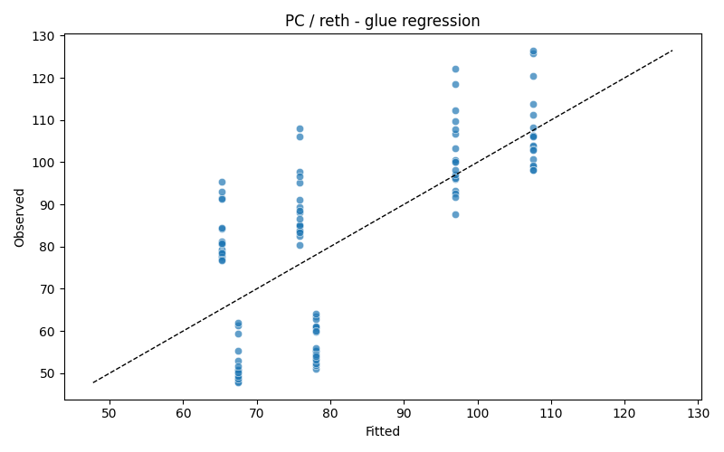

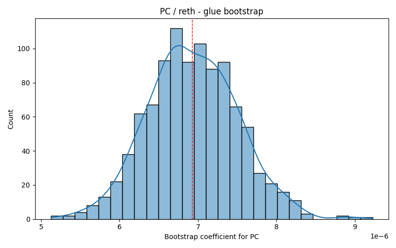

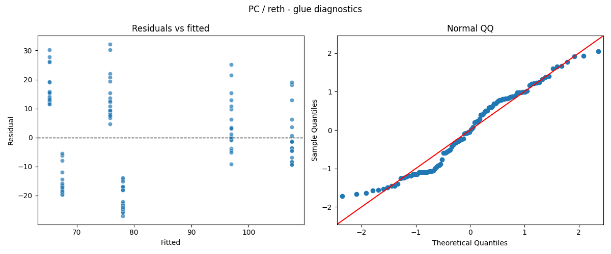

</details>

<details><summary><code>RETURNDATASIZE</code> · nobs=432 · runtime_ms=8.124e-06 · p=1.00e-03 · R²=0.3991</summary>

```
==============================================================================
                           NNLS Regression Results                            
==============================================================================
Dep. Variable:          test_runtime_ms              R-squared:          0.399
Model:                  NNLS                    Adj. R-squared:          0.398
No. Observations:       432                               RMSE:          11.70
Df Residuals:           430                                MAE:          10.16
Df Model:               1      
==============================================================================
                      coef     std err     P-value      [0.025      0.975]
------------------------------------------------------------------------------
         const     50.3836      1.1032       0.001     48.2934     52.5188
RETURNDATASIZE      0.0000      0.0000       0.001      0.0000      0.0000
==============================================================================
Notes: Non-negative least squares with bootstrap inference (1000 iterations)
==============================================================================
```

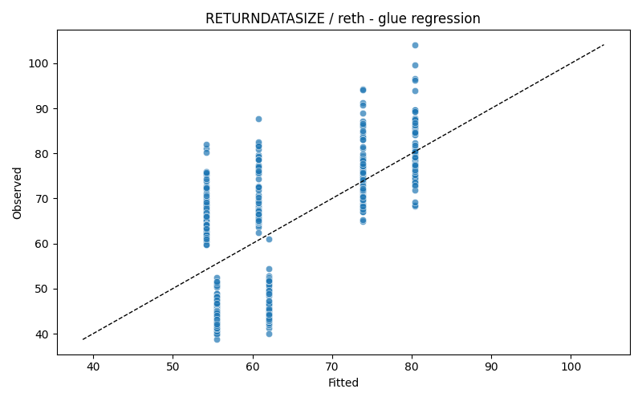

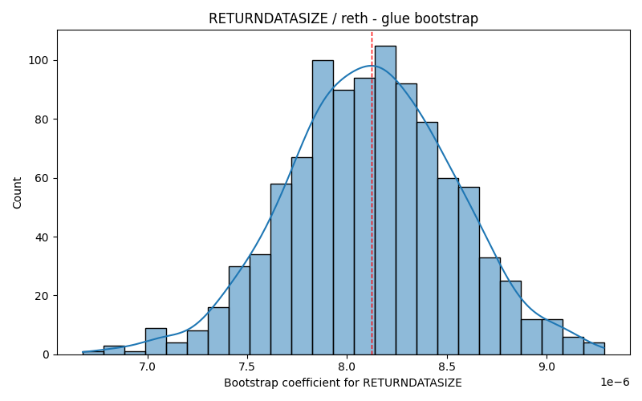

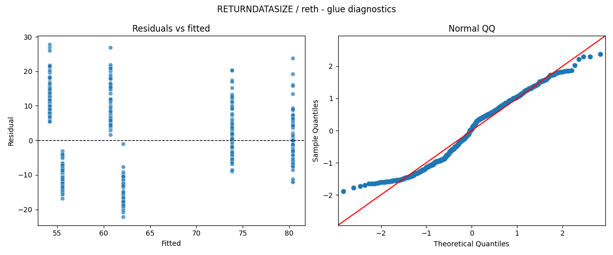

</details>

<details><summary><code>SELFBALANCE</code> · nobs=198 · runtime_ms=0 · p=1.00e+00 · R²=0</summary>

```
==============================================================================
                           NNLS Regression Results                            
==============================================================================
Dep. Variable:          test_runtime_ms              R-squared:          0.000
Model:                  NNLS                    Adj. R-squared:         -0.005
No. Observations:       198                               RMSE:          53.77
Df Residuals:           196                                MAE:          48.16
Df Model:               1      
==============================================================================
                      coef     std err     P-value      [0.025      0.975]
------------------------------------------------------------------------------
         const    204.9977      3.7403       0.001    197.0065    212.1519
   SELFBALANCE      0.0000      0.0000       1.000      0.0000      0.0000
==============================================================================
Notes: Non-negative least squares with bootstrap inference (1000 iterations)
==============================================================================
```

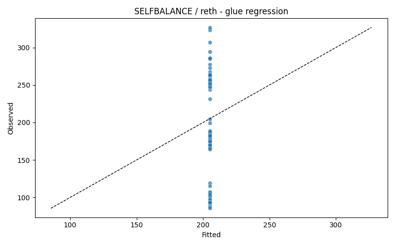

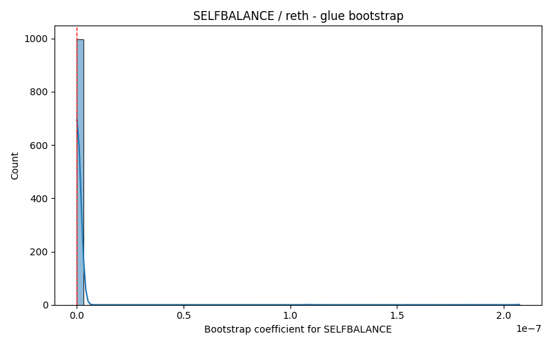

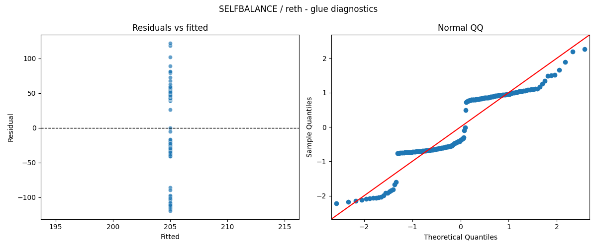

</details>

<details><summary><code>SUB</code> · nobs=144 · runtime_ms=0 · p=1.00e+00 · R²=0</summary>

```
==============================================================================
                           NNLS Regression Results                            
==============================================================================
Dep. Variable:          test_runtime_ms              R-squared:          0.000
Model:                  NNLS                    Adj. R-squared:         -0.007
No. Observations:       144                               RMSE:          11.49
Df Residuals:           142                                MAE:          10.06
Df Model:               1      
==============================================================================
                      coef     std err     P-value      [0.025      0.975]
------------------------------------------------------------------------------
         const     40.3354      0.9518       0.001     38.6774     42.1966
           SUB      0.0000      0.0000       1.000      0.0000      0.0000
==============================================================================
Notes: Non-negative least squares with bootstrap inference (1000 iterations)
==============================================================================
```

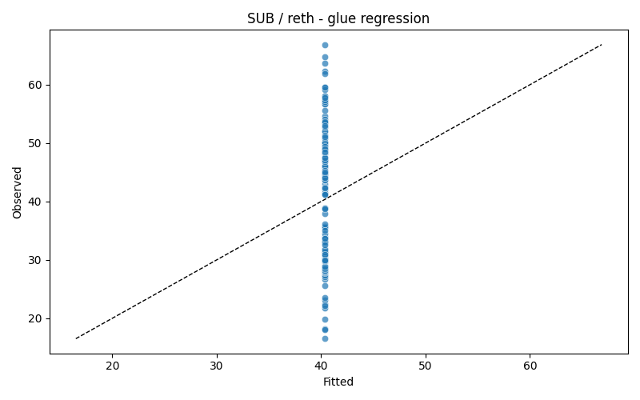

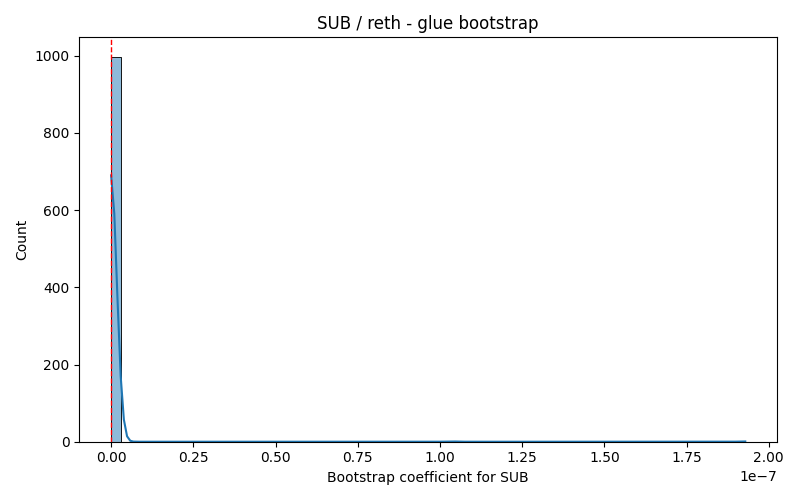

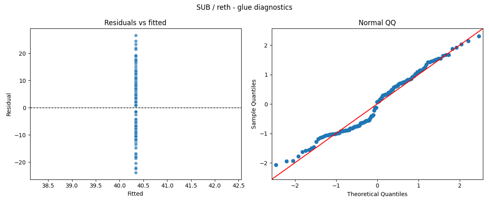

</details>

### Mixed glue (tier B) · reth

<details><summary><code>JUMP</code> · nobs=180 · runtime_ms=0 · p=1.00e+00 · R²=0</summary>

```
==============================================================================
                           NNLS Regression Results                            
==============================================================================
Dep. Variable:          test_runtime_ms              R-squared:          0.000
Model:                  NNLS                    Adj. R-squared:         -0.006
No. Observations:       180                               RMSE:          10.41
Df Residuals:           178                                MAE:           9.03
Df Model:               1      
==============================================================================
                      coef     std err     P-value      [0.025      0.975]
------------------------------------------------------------------------------
         const     39.3539      0.8118       0.001     37.7379     40.9166
          JUMP      0.0000      0.0000       1.000      0.0000      0.0000
==============================================================================
Notes: Non-negative least squares with bootstrap inference (1000 iterations)
==============================================================================
```

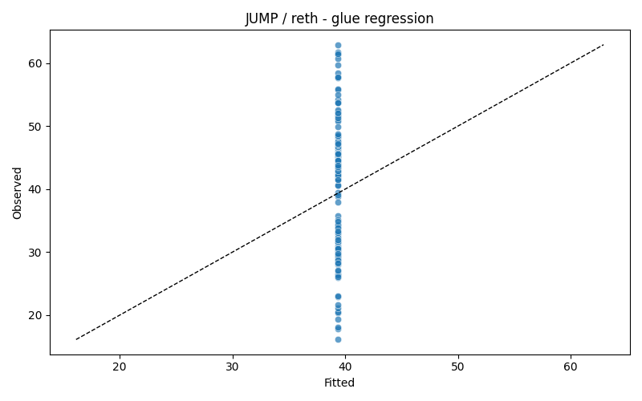


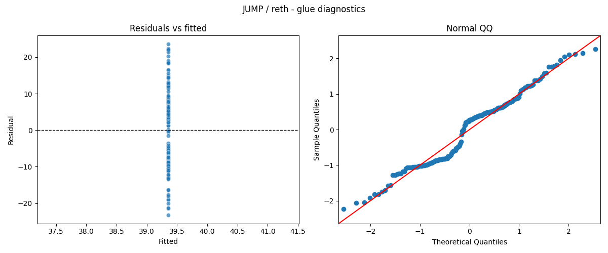

</details>

<details><summary><code>KECCAK256</code> · nobs=3168 · runtime_ms=0 · p=1.00e+00 · R²=-2.22e-16</summary>

```
==============================================================================
                           NNLS Regression Results                            
==============================================================================
Dep. Variable:          test_runtime_ms              R-squared:         -0.000
Model:                  NNLS                    Adj. R-squared:         -0.000
No. Observations:       3168                              RMSE:         158.26
Df Residuals:           3166                               MAE:         133.72
Df Model:               1      
==============================================================================
                      coef     std err     P-value      [0.025      0.975]
------------------------------------------------------------------------------
         const    252.6995      2.7686       0.001    247.4945    258.0183
     KECCAK256      0.0000      0.0000       1.000      0.0000      0.0000
==============================================================================
Notes: Non-negative least squares with bootstrap inference (1000 iterations)
==============================================================================
```

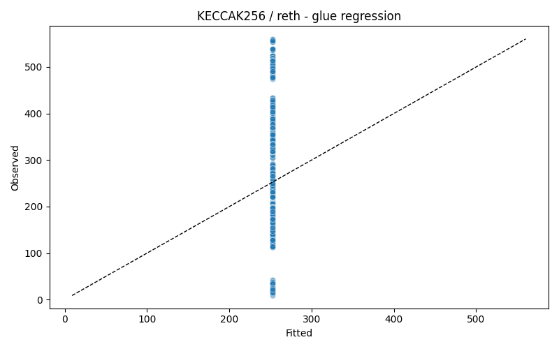


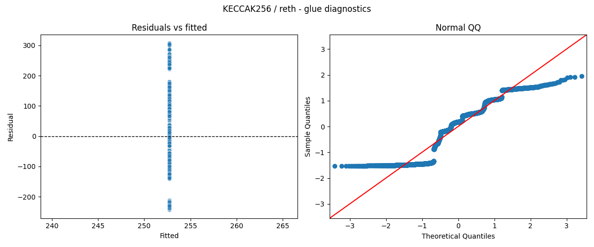

</details>
