# Runtime estimation report

Per-spec NNLS fits of `test_runtime_ms` against `opcount`, one row per (target opcode, test, model_by combo, client).

## Contents

- [SLOAD](#sload)
- [SSTORE](#sstore)
- [BALANCE](#balance)
- [CALL](#call)
- [CALLCODE](#callcode)
- [DELEGATECALL](#delegatecall)
- [EXTCODEHASH](#extcodehash)
- [EXTCODESIZE](#extcodesize)
- [STATICCALL](#staticcall)
- [EXTCODECOPY](#extcodecopy)

## SLOAD

### test_sload_bloated — combo `False`

| client | nobs | R² | target_coef (ms) | p-value | 95% CI |
| --- | --- | --- | --- | --- | --- |
| `besu` | 66 | 0.9822 | 0.006594 | 1.00e-03 | [0.006356, 0.006798] |
| `erigon` | 11 | 0.9665 | 0.006374 | 1.00e-03 | [0.005979, 0.006859] |
| `geth` | 109 | 0.9731 | 0.02295 | 1.00e-03 | [0.0222, 0.0238] |
| `nethermind` | 44 | 0.913 | 0.002762 | 1.00e-03 | [0.002484, 0.003056] |
| `reth` | 110 | 0.9557 | 0.001338 | 1.00e-03 | [0.001282, 0.001398] |

<details><summary>besu — NNLS regression summary</summary>

```
==============================================================================
                           NNLS Regression Results                            
==============================================================================
Dep. Variable:          test_runtime_ms              R-squared:          0.982
Model:                  NNLS                    Adj. R-squared:          0.982
No. Observations:       66                                RMSE:          18.38
Df Residuals:           64                                 MAE:          14.78
Df Model:               1      
==============================================================================
                      coef     std err     P-value      [0.025      0.975]
------------------------------------------------------------------------------
         const    141.2313      7.2039       0.001    128.1366    157.6914
       opcount      0.0066      0.0001       0.001      0.0064      0.0068
==============================================================================
Notes: Non-negative least squares with bootstrap inference (1000 iterations)
==============================================================================
```

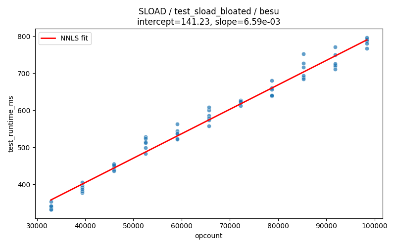

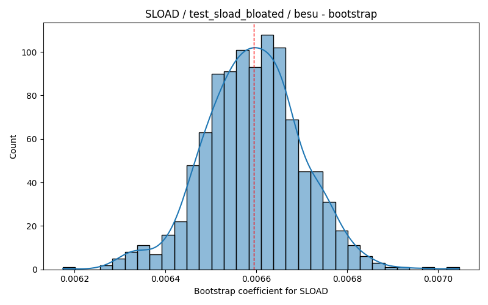

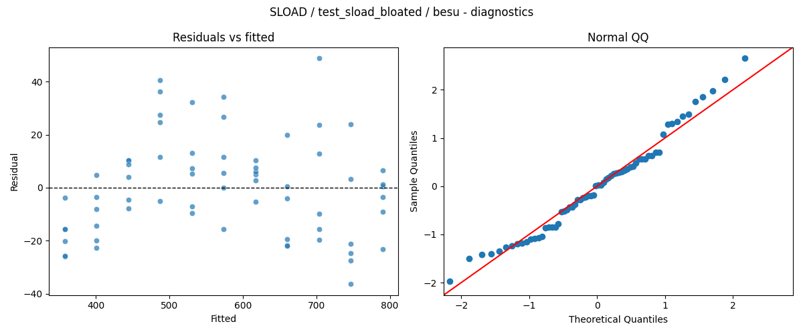

</details>

<details><summary>erigon — NNLS regression summary</summary>

```
==============================================================================
                           NNLS Regression Results                            
==============================================================================
Dep. Variable:          test_runtime_ms              R-squared:          0.966
Model:                  NNLS                    Adj. R-squared:          0.963
No. Observations:       11                                RMSE:          24.60
Df Residuals:           9                                  MAE:          15.16
Df Model:               1      
==============================================================================
                      coef     std err     P-value      [0.025      0.975]
------------------------------------------------------------------------------
         const     17.4965     11.5878       0.049      0.0000     41.1808
       opcount      0.0064      0.0002       0.001      0.0060      0.0069
==============================================================================
Notes: Non-negative least squares with bootstrap inference (1000 iterations)
==============================================================================
```


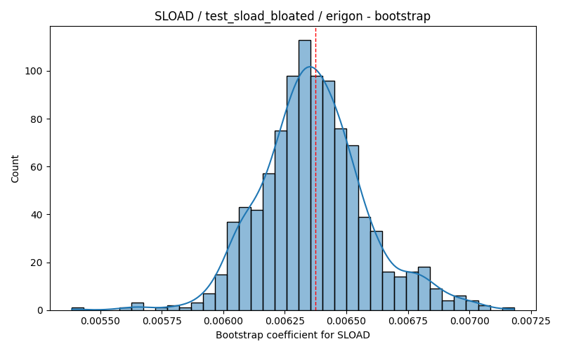

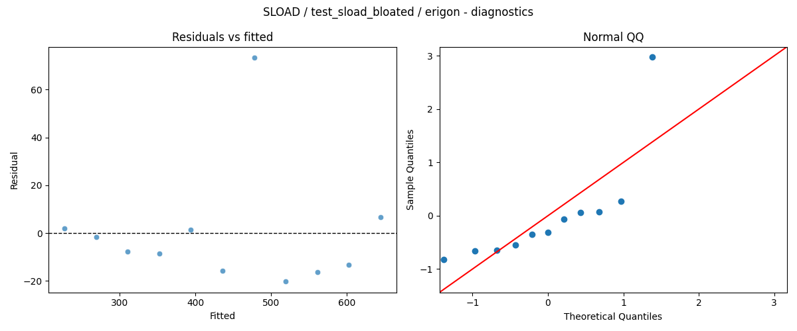

</details>

<details><summary>geth — NNLS regression summary</summary>

```
==============================================================================
                           NNLS Regression Results                            
==============================================================================
Dep. Variable:          test_runtime_ms              R-squared:          0.973
Model:                  NNLS                    Adj. R-squared:          0.973
No. Observations:       109                               RMSE:          79.32
Df Residuals:           107                                MAE:          65.66
Df Model:               1      
==============================================================================
                      coef     std err     P-value      [0.025      0.975]
------------------------------------------------------------------------------
         const    492.7125     24.9930       0.001    444.5329    540.6024
       opcount      0.0230      0.0004       0.001      0.0222      0.0238
==============================================================================
Notes: Non-negative least squares with bootstrap inference (1000 iterations)
==============================================================================
```

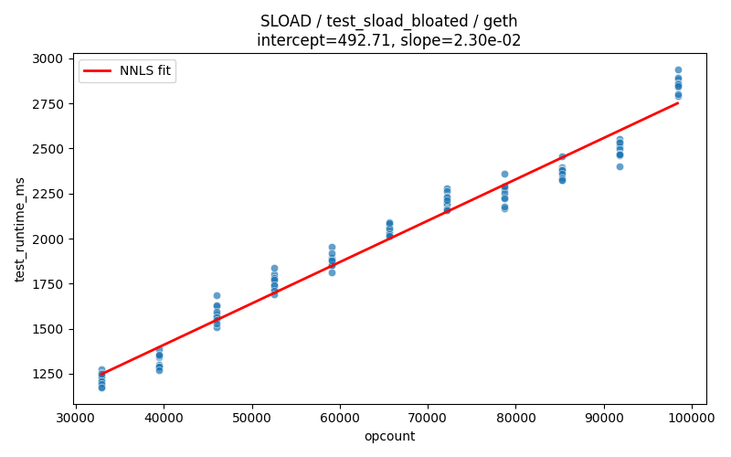

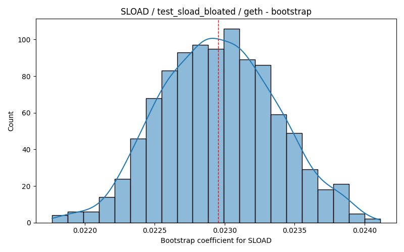

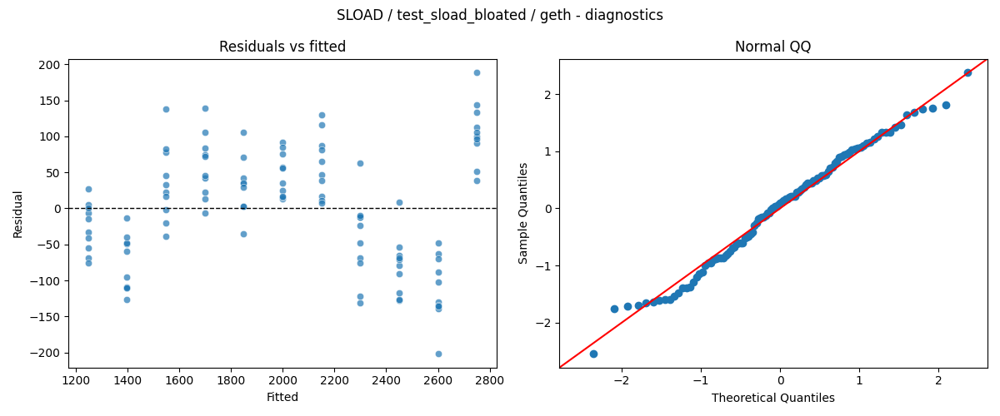

</details>

<details><summary>nethermind — NNLS regression summary</summary>

```
==============================================================================
                           NNLS Regression Results                            
==============================================================================
Dep. Variable:          test_runtime_ms              R-squared:          0.913
Model:                  NNLS                    Adj. R-squared:          0.911
No. Observations:       44                                RMSE:          17.66
Df Residuals:           42                                 MAE:          13.07
Df Model:               1      
==============================================================================
                      coef     std err     P-value      [0.025      0.975]
------------------------------------------------------------------------------
         const     68.3530      9.1954       0.001     50.2866     87.3325
       opcount      0.0028      0.0001       0.001      0.0025      0.0031
==============================================================================
Notes: Non-negative least squares with bootstrap inference (1000 iterations)
==============================================================================
```

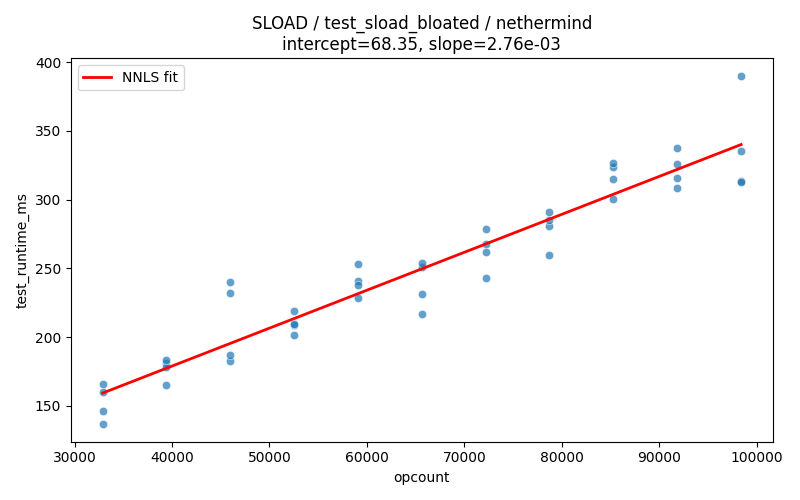

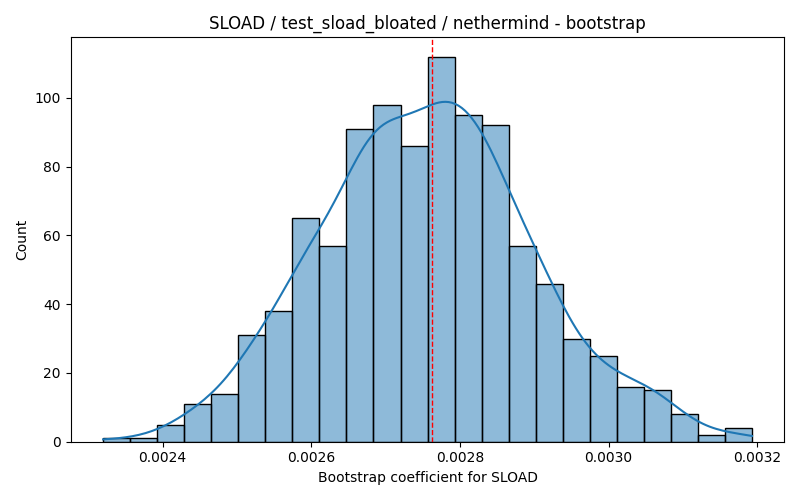

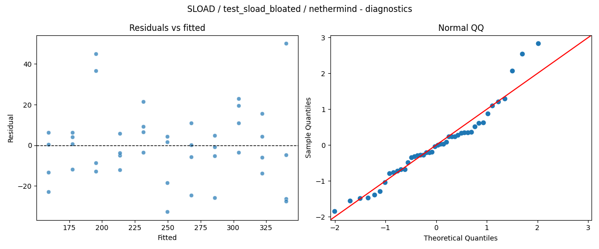

</details>

<details><summary>reth — NNLS regression summary</summary>

```
==============================================================================
                           NNLS Regression Results                            
==============================================================================
Dep. Variable:          test_runtime_ms              R-squared:          0.956
Model:                  NNLS                    Adj. R-squared:          0.955
No. Observations:       110                               RMSE:           5.97
Df Residuals:           108                                MAE:           5.00
Df Model:               1      
==============================================================================
                      coef     std err     P-value      [0.025      0.975]
------------------------------------------------------------------------------
         const     40.4010      1.9705       0.001     36.5523     44.4851
       opcount      0.0013      0.0000       0.001      0.0013      0.0014
==============================================================================
Notes: Non-negative least squares with bootstrap inference (1000 iterations)
==============================================================================
```

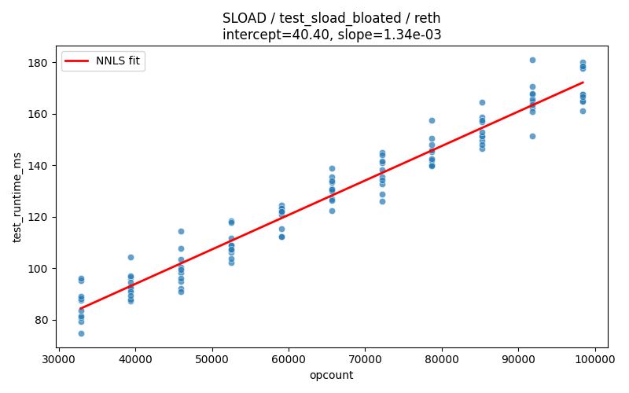

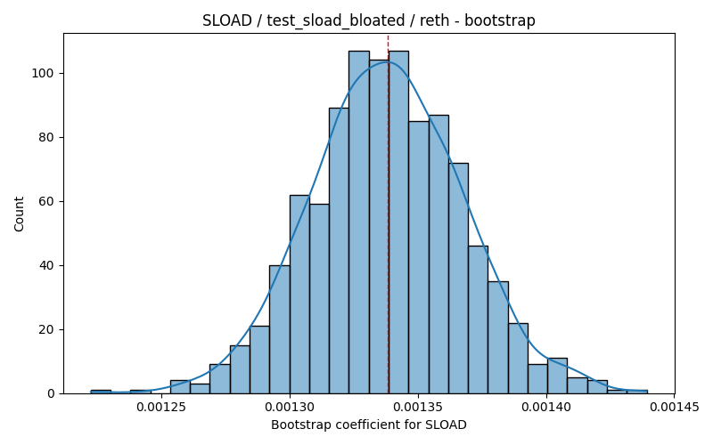

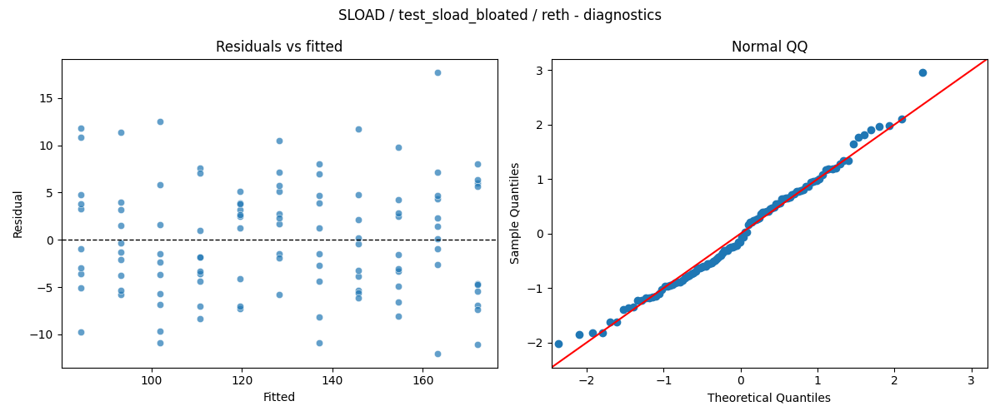

</details>

### test_sload_bloated — combo `True`

| client | nobs | R² | target_coef (ms) | p-value | 95% CI |
| --- | --- | --- | --- | --- | --- |
| `besu` | 66 | 0.9896 | 0.01502 | 1.00e-03 | [0.01458, 0.01541] |
| `erigon` | 11 | 0.995 | 0.005629 | 1.00e-03 | [0.005381, 0.005836] |
| `geth` | 107 | 0.973 | 0.02234 | 1.00e-03 | [0.02152, 0.0231] |
| `nethermind` | 44 | 0.9837 | 0.007835 | 1.00e-03 | [0.007498, 0.00824] |
| `reth` | 110 | 0.945 | 0.001453 | 1.00e-03 | [0.001382, 0.001514] |

<details><summary>besu — NNLS regression summary</summary>

```
==============================================================================
                           NNLS Regression Results                            
==============================================================================
Dep. Variable:          test_runtime_ms              R-squared:          0.990
Model:                  NNLS                    Adj. R-squared:          0.989
No. Observations:       66                                RMSE:          31.97
Df Residuals:           64                                 MAE:          26.03
Df Model:               1      
==============================================================================
                      coef     std err     P-value      [0.025      0.975]
------------------------------------------------------------------------------
         const    269.2080     13.8552       0.001    244.4529    298.5308
       opcount      0.0150      0.0002       0.001      0.0146      0.0154
==============================================================================
Notes: Non-negative least squares with bootstrap inference (1000 iterations)
==============================================================================
```

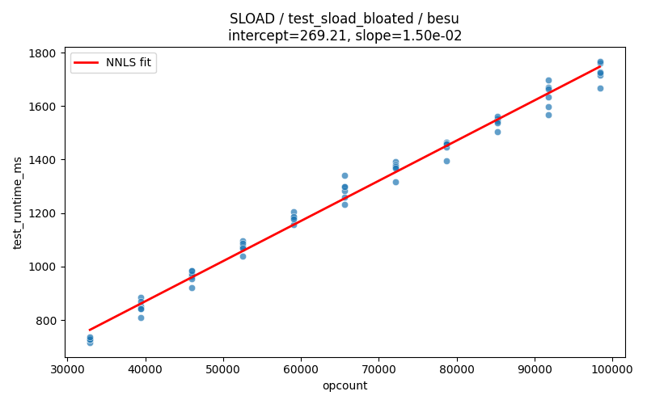

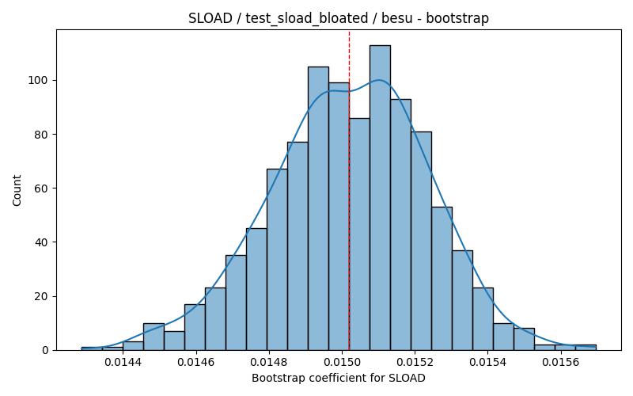

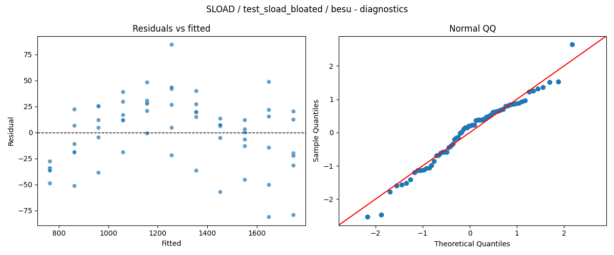

</details>

<details><summary>erigon — NNLS regression summary</summary>

```
==============================================================================
                           NNLS Regression Results                            
==============================================================================
Dep. Variable:          test_runtime_ms              R-squared:          0.995
Model:                  NNLS                    Adj. R-squared:          0.994
No. Observations:       11                                RMSE:           8.23
Df Residuals:           9                                  MAE:           7.37
Df Model:               1      
==============================================================================
                      coef     std err     P-value      [0.025      0.975]
------------------------------------------------------------------------------
         const     12.7593      7.1136       0.079      0.0000     26.1247
       opcount      0.0056      0.0001       0.001      0.0054      0.0058
==============================================================================
Notes: Non-negative least squares with bootstrap inference (1000 iterations)
==============================================================================
```

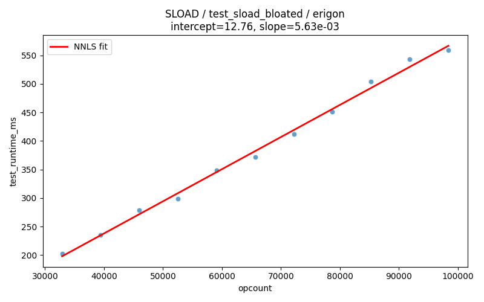

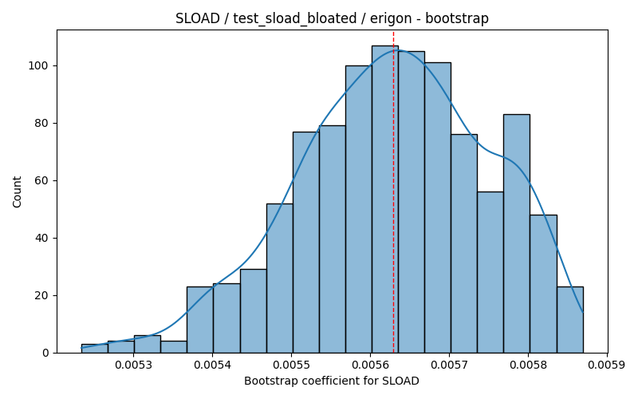

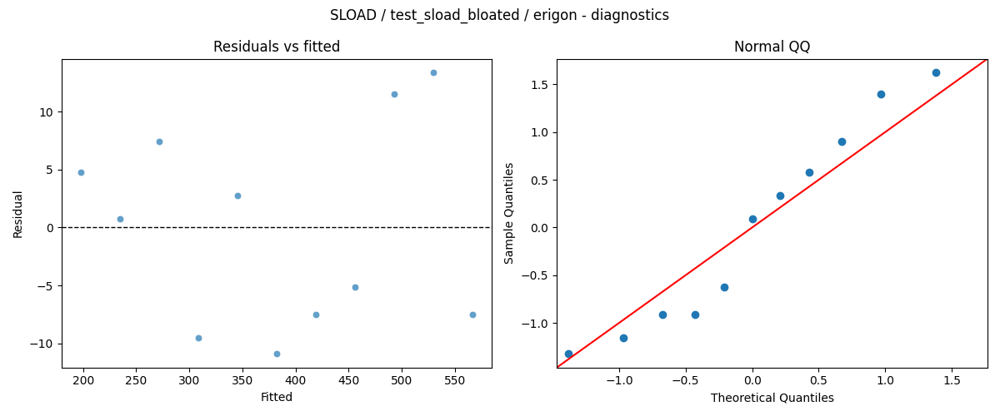

</details>

<details><summary>geth — NNLS regression summary</summary>

```
==============================================================================
                           NNLS Regression Results                            
==============================================================================
Dep. Variable:          test_runtime_ms              R-squared:          0.973
Model:                  NNLS                    Adj. R-squared:          0.973
No. Observations:       107                               RMSE:          77.80
Df Residuals:           105                                MAE:          63.69
Df Model:               1      
==============================================================================
                      coef     std err     P-value      [0.025      0.975]
------------------------------------------------------------------------------
         const    482.7233     24.9753       0.001    436.7405    536.0002
       opcount      0.0223      0.0004       0.001      0.0215      0.0231
==============================================================================
Notes: Non-negative least squares with bootstrap inference (1000 iterations)
==============================================================================
```

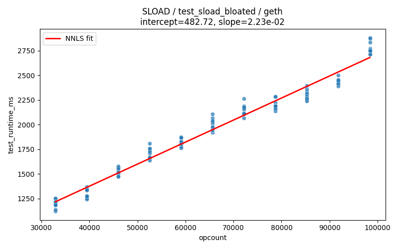

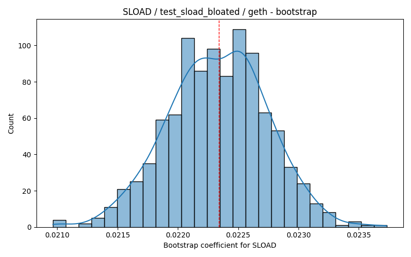

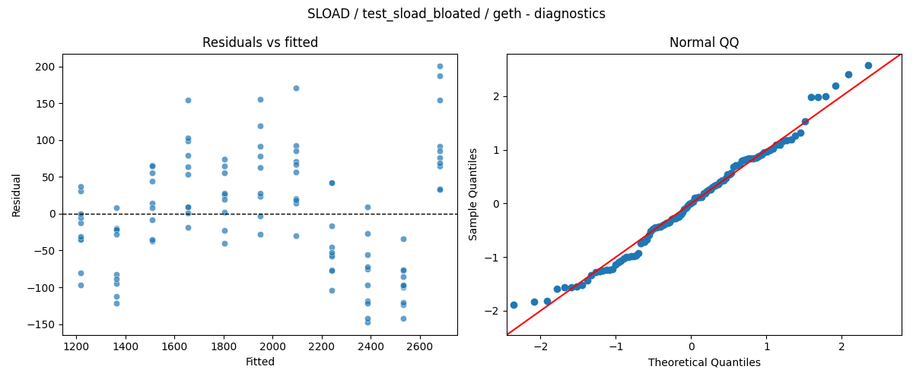

</details>

<details><summary>nethermind — NNLS regression summary</summary>

```
==============================================================================
                           NNLS Regression Results                            
==============================================================================
Dep. Variable:          test_runtime_ms              R-squared:          0.984
Model:                  NNLS                    Adj. R-squared:          0.983
No. Observations:       44                                RMSE:          20.91
Df Residuals:           42                                 MAE:          14.57
Df Model:               1      
==============================================================================
                      coef     std err     P-value      [0.025      0.975]
------------------------------------------------------------------------------
         const     61.3484     10.5906       0.001     39.3312     81.0315
       opcount      0.0078      0.0002       0.001      0.0075      0.0082
==============================================================================
Notes: Non-negative least squares with bootstrap inference (1000 iterations)
==============================================================================
```

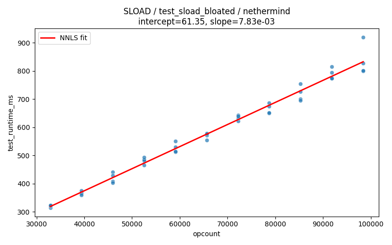

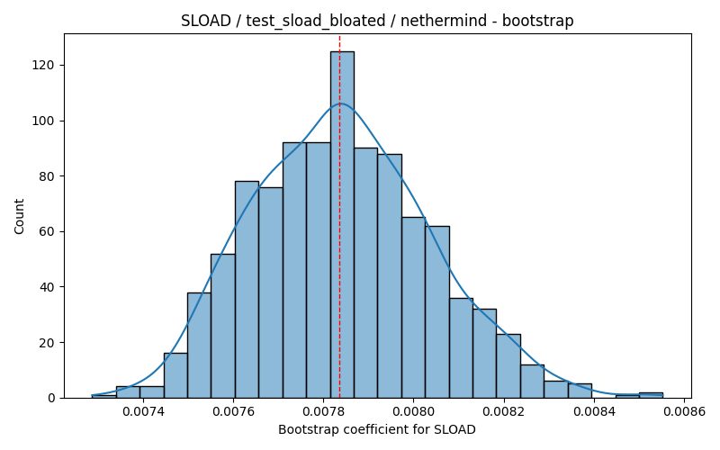

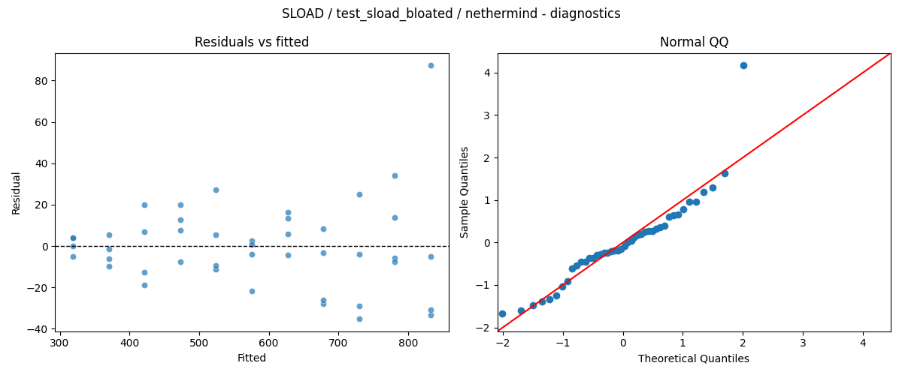

</details>

<details><summary>reth — NNLS regression summary</summary>

```
==============================================================================
                           NNLS Regression Results                            
==============================================================================
Dep. Variable:          test_runtime_ms              R-squared:          0.945
Model:                  NNLS                    Adj. R-squared:          0.945
No. Observations:       110                               RMSE:           7.26
Df Residuals:           108                                MAE:           5.46
Df Model:               1      
==============================================================================
                      coef     std err     P-value      [0.025      0.975]
------------------------------------------------------------------------------
         const     40.9583      2.3126       0.001     36.9944     45.7359
       opcount      0.0015      0.0000       0.001      0.0014      0.0015
==============================================================================
Notes: Non-negative least squares with bootstrap inference (1000 iterations)
==============================================================================
```

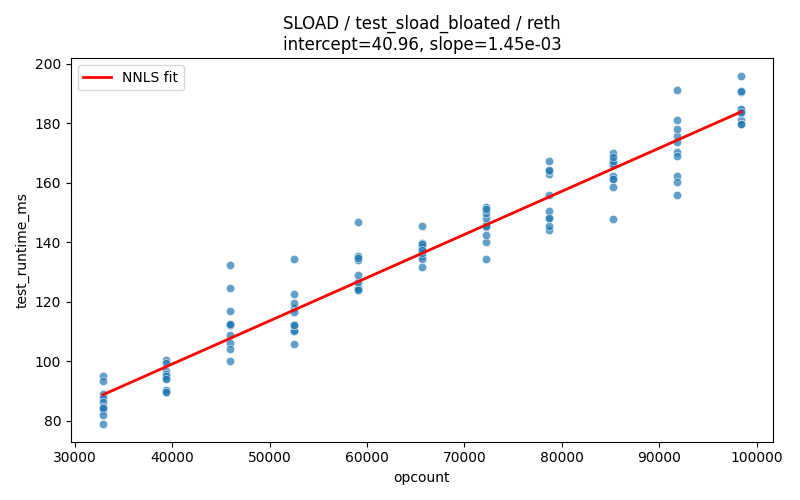

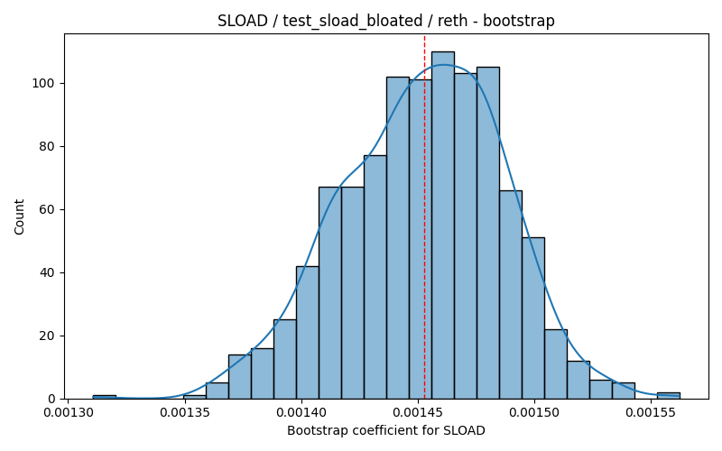

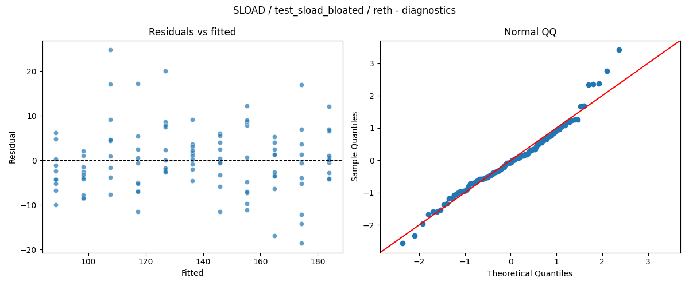

</details>

### test_sload_same_key_benchmark

| client | nobs | R² | target_coef (ms) | p-value | 95% CI |
| --- | --- | --- | --- | --- | --- |
| `besu` | 132 | 0.8336 | 7.426e-05 | 1.00e-03 | [6.879e-05, 8.027e-05] |
| `erigon` | 22 | 0.7673 | 1.28e-05 | 1.00e-03 | [9.287e-06, 1.602e-05] |
| `geth` | 219 | 0.847 | 4.749e-05 | 1.00e-03 | [4.474e-05, 5.037e-05] |
| `nethermind` | 88 | 0.6038 | 0.0001394 | 1.00e-03 | [0.000117, 0.0001651] |
| `reth` | 220 | 0.4827 | 7.796e-06 | 1.00e-03 | [6.648e-06, 8.925e-06] |

<details><summary>besu — NNLS regression summary</summary>

```
==============================================================================
                           NNLS Regression Results                            
==============================================================================
Dep. Variable:          test_runtime_ms              R-squared:          0.834
Model:                  NNLS                    Adj. R-squared:          0.832
No. Observations:       132                               RMSE:          20.96
Df Residuals:           130                                MAE:          16.89
Df Model:               1      
==============================================================================
                      coef     std err     P-value      [0.025      0.975]
------------------------------------------------------------------------------
         const    103.9888      5.6758       0.001     92.7621    115.1805
       opcount      0.0001      0.0000       0.001      0.0001      0.0001
==============================================================================
Notes: Non-negative least squares with bootstrap inference (1000 iterations)
==============================================================================
```

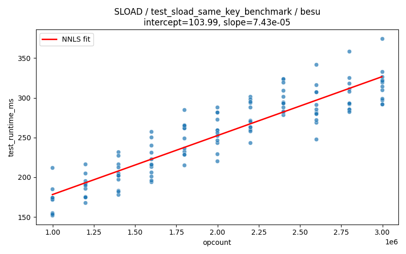

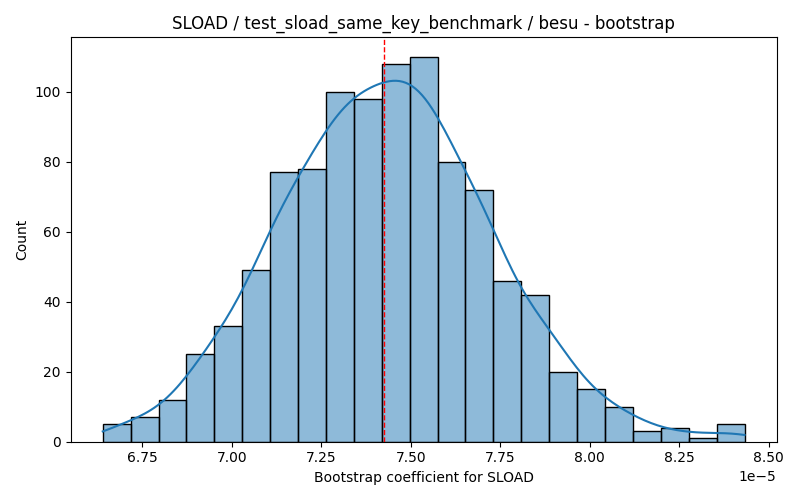

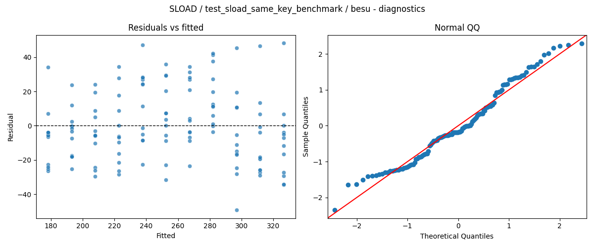

</details>

<details><summary>erigon — NNLS regression summary</summary>

```
==============================================================================
                           NNLS Regression Results                            
==============================================================================
Dep. Variable:          test_runtime_ms              R-squared:          0.767
Model:                  NNLS                    Adj. R-squared:          0.756
No. Observations:       22                                RMSE:           4.45
Df Residuals:           20                                 MAE:           3.83
Df Model:               1      
==============================================================================
                      coef     std err     P-value      [0.025      0.975]
------------------------------------------------------------------------------
         const     23.3836      3.2028       0.001     17.0884     29.7326
       opcount      0.0000      0.0000       0.001      0.0000      0.0000
==============================================================================
Notes: Non-negative least squares with bootstrap inference (1000 iterations)
==============================================================================
```

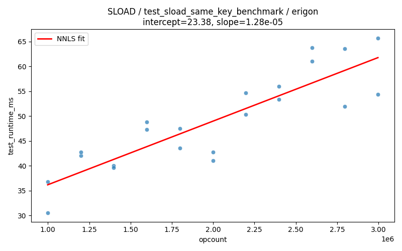

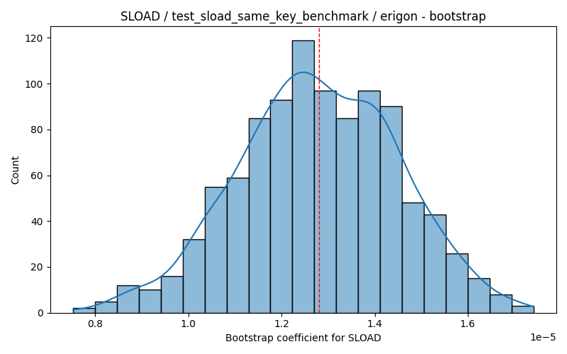

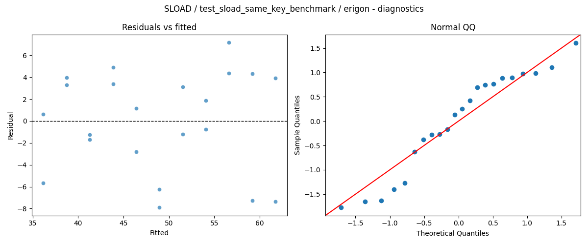

</details>

<details><summary>geth — NNLS regression summary</summary>

```
==============================================================================
                           NNLS Regression Results                            
==============================================================================
Dep. Variable:          test_runtime_ms              R-squared:          0.847
Model:                  NNLS                    Adj. R-squared:          0.846
No. Observations:       219                               RMSE:          12.74
Df Residuals:           217                                MAE:           9.65
Df Model:               1      
==============================================================================
                      coef     std err     P-value      [0.025      0.975]
------------------------------------------------------------------------------
         const     20.1837      2.4680       0.001     15.1574     24.9073
       opcount      0.0000      0.0000       0.001      0.0000      0.0001
==============================================================================
Notes: Non-negative least squares with bootstrap inference (1000 iterations)
==============================================================================
```

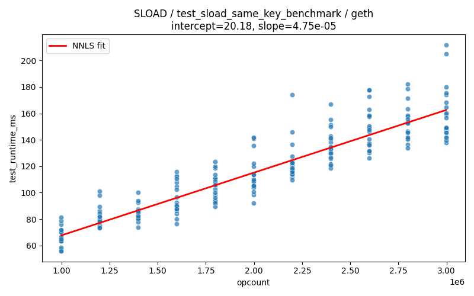

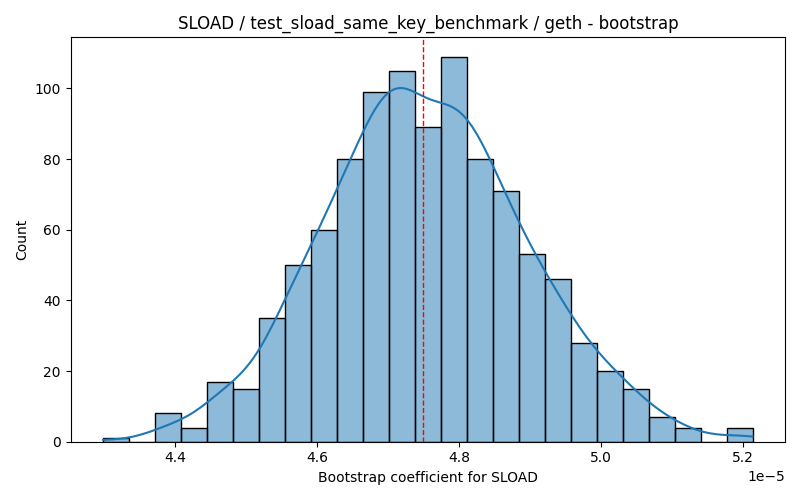

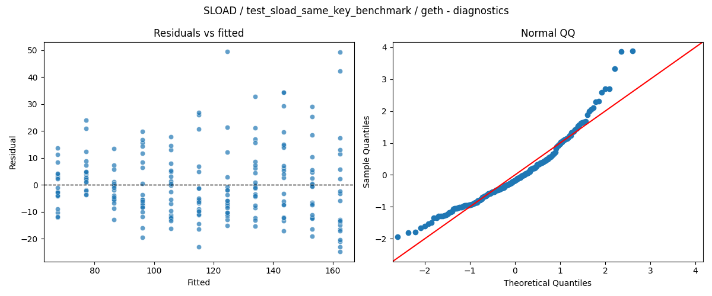

</details>

<details><summary>nethermind — NNLS regression summary</summary>

```
==============================================================================
                           NNLS Regression Results                            
==============================================================================
Dep. Variable:          test_runtime_ms              R-squared:          0.604
Model:                  NNLS                    Adj. R-squared:          0.599
No. Observations:       88                                RMSE:          71.35
Df Residuals:           86                                 MAE:          52.21
Df Model:               1      
==============================================================================
                      coef     std err     P-value      [0.025      0.975]
------------------------------------------------------------------------------
         const    102.1240     23.0715       0.001     57.3466    146.8485
       opcount      0.0001      0.0000       0.001      0.0001      0.0002
==============================================================================
Notes: Non-negative least squares with bootstrap inference (1000 iterations)
==============================================================================
```

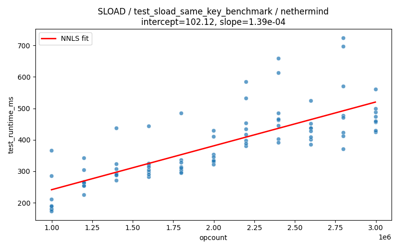

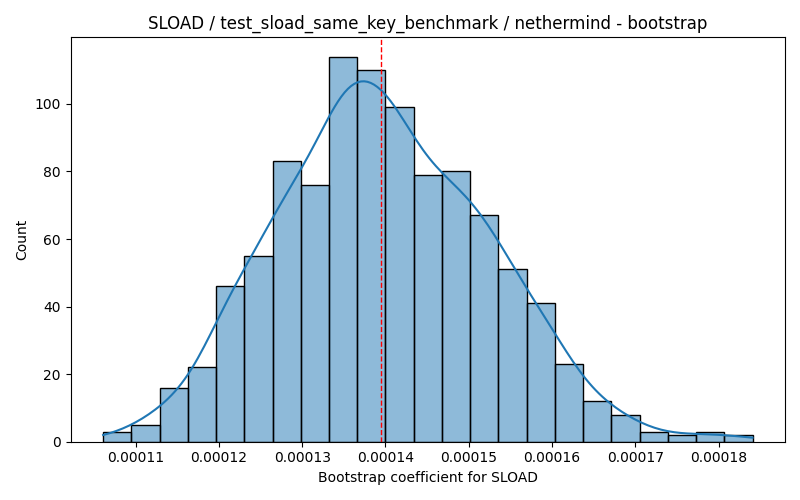

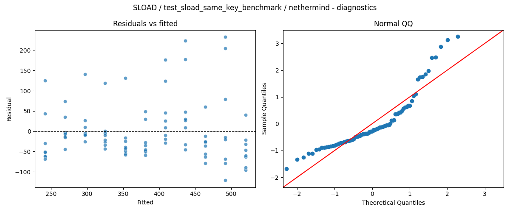

</details>

<details><summary>reth — NNLS regression summary</summary>

```
==============================================================================
                           NNLS Regression Results                            
==============================================================================
Dep. Variable:          test_runtime_ms              R-squared:          0.483
Model:                  NNLS                    Adj. R-squared:          0.480
No. Observations:       220                               RMSE:           5.10
Df Residuals:           218                                MAE:           3.48
Df Model:               1      
==============================================================================
                      coef     std err     P-value      [0.025      0.975]
------------------------------------------------------------------------------
         const      7.3994      1.0901       0.001      5.3070      9.6043
       opcount      0.0000      0.0000       0.001      0.0000      0.0000
==============================================================================
Notes: Non-negative least squares with bootstrap inference (1000 iterations)
==============================================================================
```

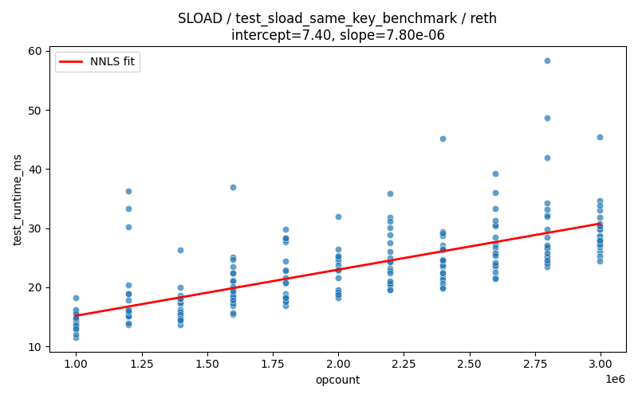

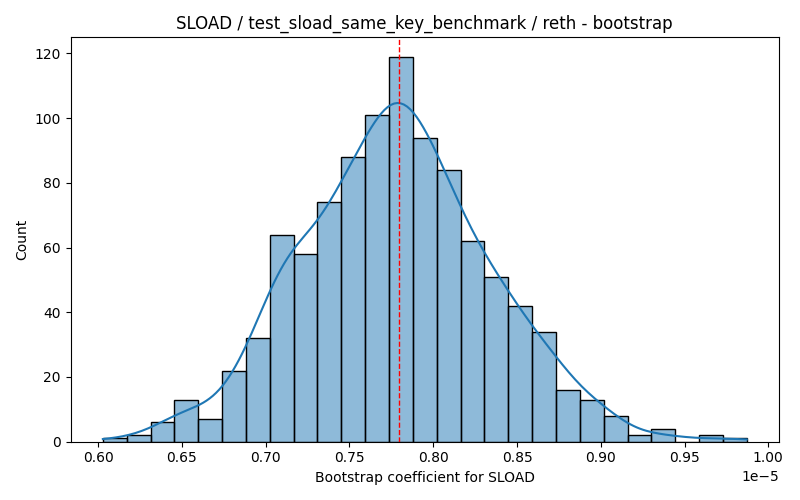

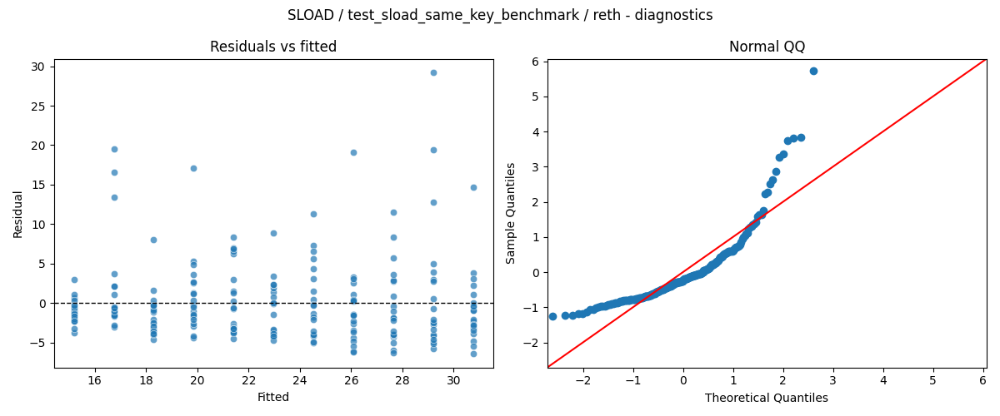

</details>

## SSTORE

### test_sstore_bloated — combo `False` — `presets[cold_storage_sstore_access]`

| client | nobs | R² | target_coef (ms) | p-value | 95% CI |
| --- | --- | --- | --- | --- | --- |
| `besu` | 66 | 0.9879 | 0.008335 | 1.00e-03 | [0.008068, 0.008596] |
| `erigon` | 11 | 0.9978 | 0.006191 | 1.00e-03 | [0.00594, 0.006382] |
| `geth` | 108 | 0.979 | 0.02256 | 1.00e-03 | [0.02189, 0.02316] |
| `nethermind` | 44 | 0.9177 | 0.002677 | 1.00e-03 | [0.002458, 0.00296] |
| `reth` | 110 | 0.9518 | 0.001359 | 1.00e-03 | [0.001298, 0.001414] |

<details><summary>besu — NNLS regression summary</summary>

```
==============================================================================
                           NNLS Regression Results                            
==============================================================================
Dep. Variable:          test_runtime_ms              R-squared:          0.988
Model:                  NNLS                    Adj. R-squared:          0.988
No. Observations:       66                                RMSE:          19.22
Df Residuals:           64                                 MAE:          15.32
Df Model:               1      
==============================================================================
                      coef     std err     P-value      [0.025      0.975]
------------------------------------------------------------------------------
         const    161.7544      8.5811       0.001    146.0183    179.8623
       opcount      0.0083      0.0001       0.001      0.0081      0.0086
==============================================================================
Notes: Non-negative least squares with bootstrap inference (1000 iterations)
==============================================================================
```

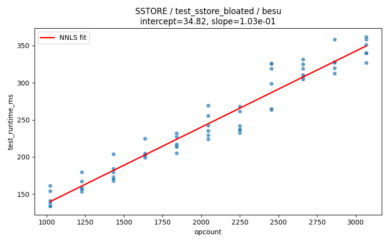

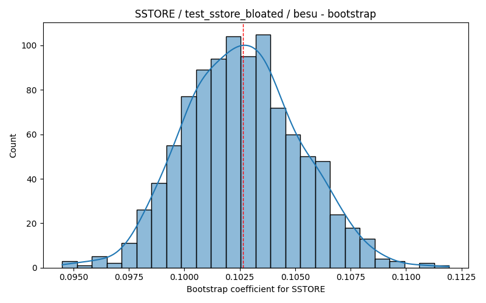

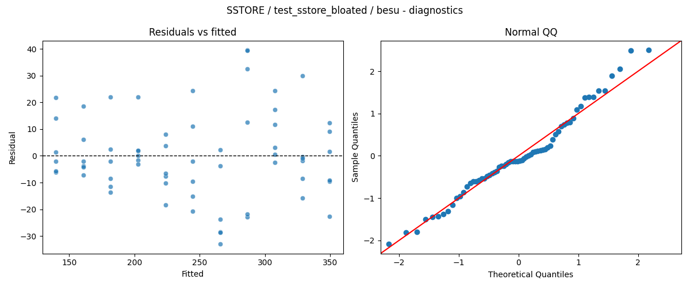

</details>

<details><summary>erigon — NNLS regression summary</summary>

```
==============================================================================
                           NNLS Regression Results                            
==============================================================================
Dep. Variable:          test_runtime_ms              R-squared:          0.998
Model:                  NNLS                    Adj. R-squared:          0.998
No. Observations:       11                                RMSE:           6.07
Df Residuals:           9                                  MAE:           5.27
Df Model:               1      
==============================================================================
                      coef     std err     P-value      [0.025      0.975]
------------------------------------------------------------------------------
         const     16.3196      7.1369       0.023      0.6745     30.6068
       opcount      0.0062      0.0001       0.001      0.0059      0.0064
==============================================================================
Notes: Non-negative least squares with bootstrap inference (1000 iterations)
==============================================================================
```


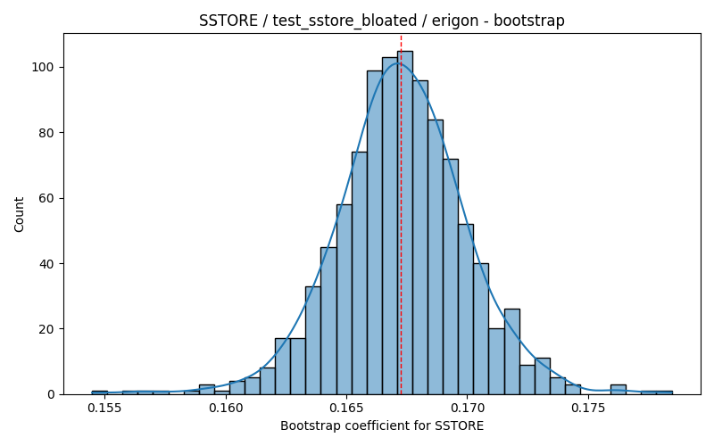

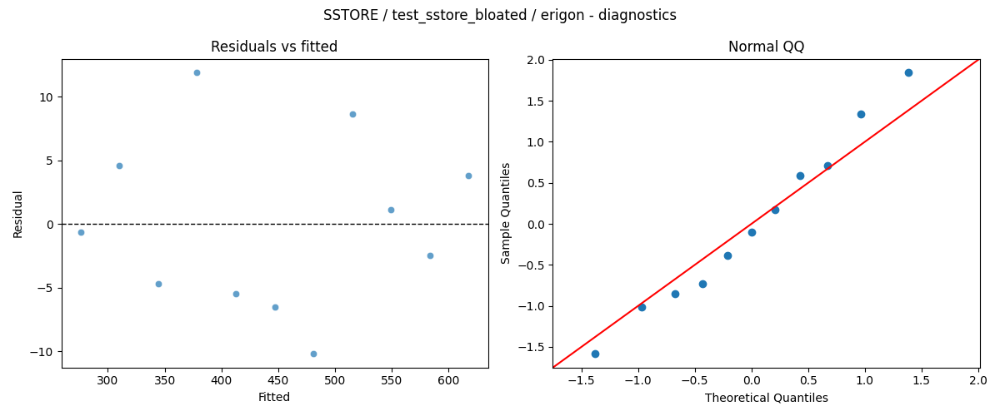

</details>

<details><summary>geth — NNLS regression summary</summary>

```
==============================================================================
                           NNLS Regression Results                            
==============================================================================
Dep. Variable:          test_runtime_ms              R-squared:          0.979
Model:                  NNLS                    Adj. R-squared:          0.979
No. Observations:       108                               RMSE:          69.30
Df Residuals:           106                                MAE:          57.95
Df Model:               1      
==============================================================================
                      coef     std err     P-value      [0.025      0.975]
------------------------------------------------------------------------------
         const    480.4636     21.0768       0.001    442.7013    523.9393
       opcount      0.0226      0.0003       0.001      0.0219      0.0232
==============================================================================
Notes: Non-negative least squares with bootstrap inference (1000 iterations)
==============================================================================
```

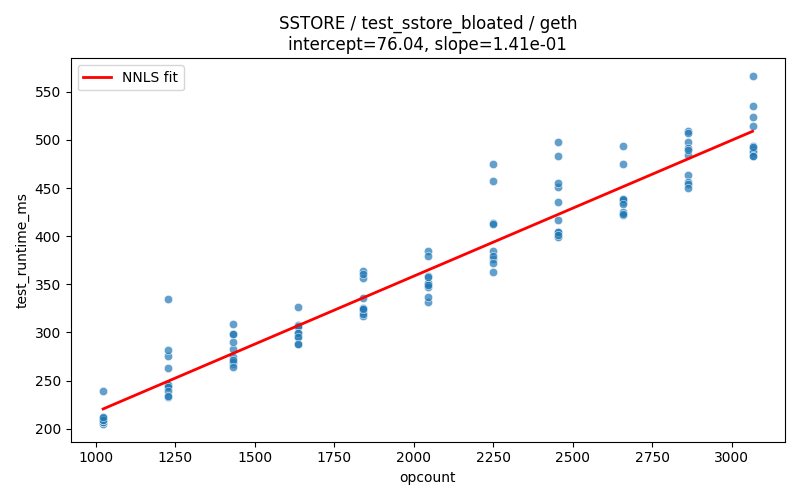

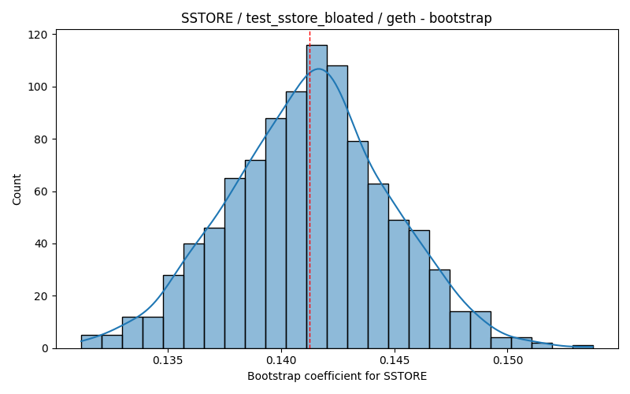

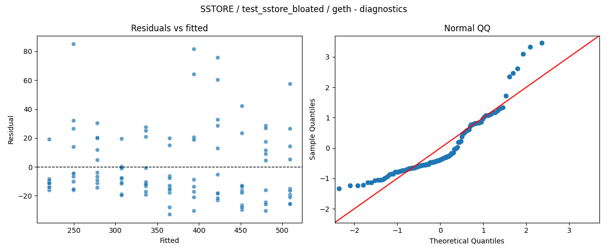

</details>

<details><summary>nethermind — NNLS regression summary</summary>

```
==============================================================================
                           NNLS Regression Results                            
==============================================================================
Dep. Variable:          test_runtime_ms              R-squared:          0.918
Model:                  NNLS                    Adj. R-squared:          0.916
No. Observations:       44                                RMSE:          16.68
Df Residuals:           42                                 MAE:          12.36
Df Model:               1      
==============================================================================
                      coef     std err     P-value      [0.025      0.975]
------------------------------------------------------------------------------
         const     78.0241      7.3094       0.001     63.1150     90.9703
       opcount      0.0027      0.0001       0.001      0.0025      0.0030
==============================================================================
Notes: Non-negative least squares with bootstrap inference (1000 iterations)
==============================================================================
```

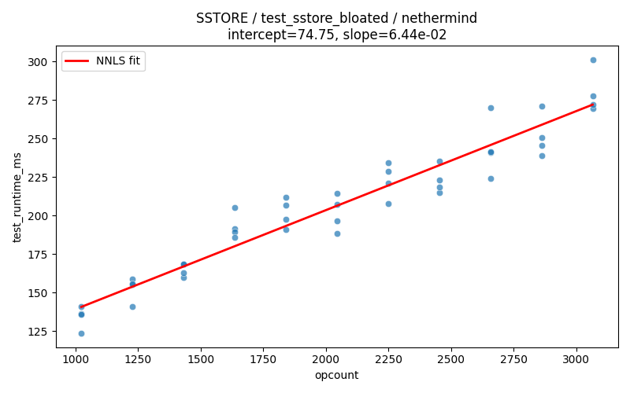

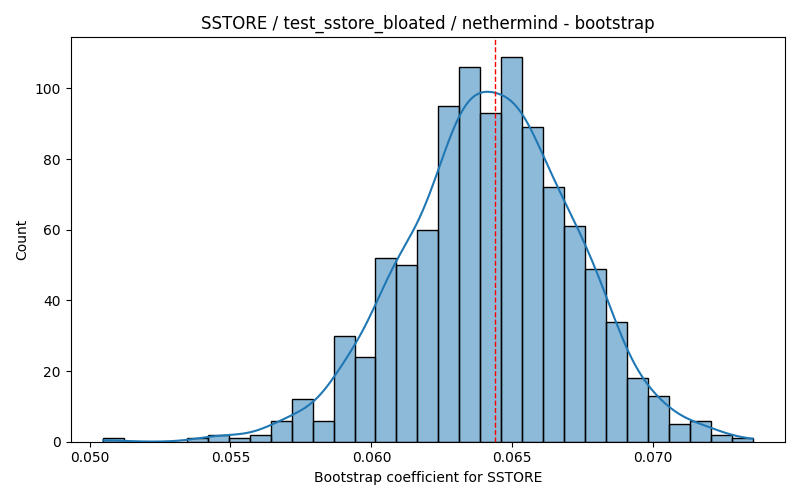

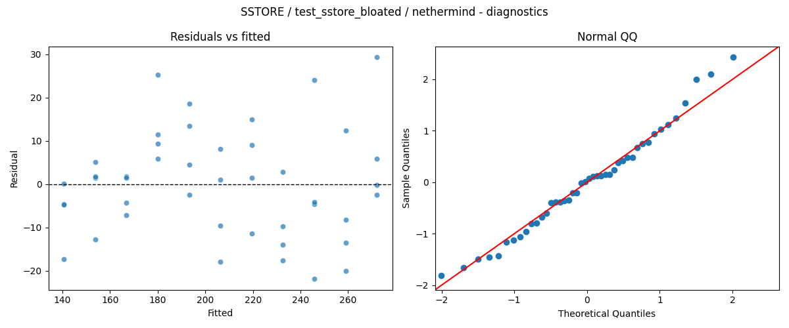

</details>

<details><summary>reth — NNLS regression summary</summary>

```
==============================================================================
                           NNLS Regression Results                            
==============================================================================
Dep. Variable:          test_runtime_ms              R-squared:          0.952
Model:                  NNLS                    Adj. R-squared:          0.951
No. Observations:       110                               RMSE:           6.37
Df Residuals:           108                                MAE:           4.75
Df Model:               1      
==============================================================================
                      coef     std err     P-value      [0.025      0.975]
------------------------------------------------------------------------------
         const     39.5169      1.8148       0.001     36.1315     43.1386
       opcount      0.0014      0.0000       0.001      0.0013      0.0014
==============================================================================
Notes: Non-negative least squares with bootstrap inference (1000 iterations)
==============================================================================
```

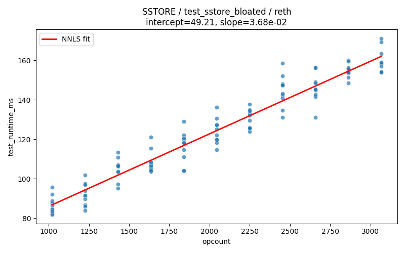

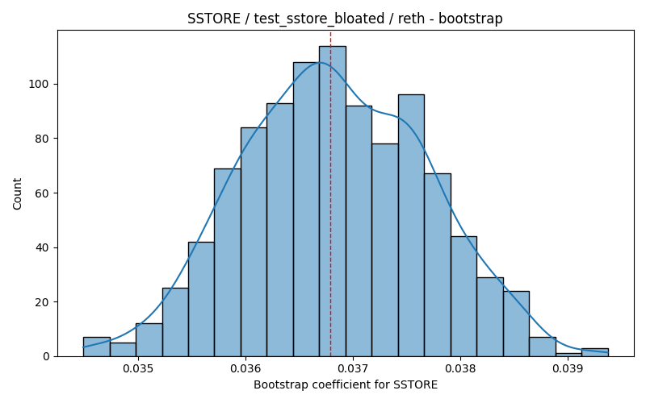

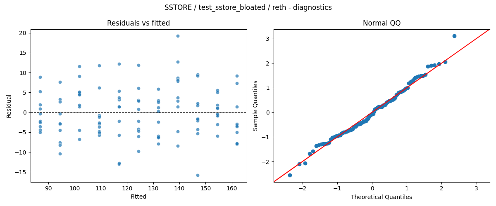

</details>

### test_sstore_bloated — combo `True` — `presets[cold_storage_sstore_access]`

| client | nobs | R² | target_coef (ms) | p-value | 95% CI |
| --- | --- | --- | --- | --- | --- |
| `besu` | 66 | 0.9911 | 0.01564 | 1.00e-03 | [0.01526, 0.01602] |
| `erigon` | 11 | 0.9893 | 0.005571 | 1.00e-03 | [0.005085, 0.005789] |
| `geth` | 108 | 0.976 | 0.02208 | 1.00e-03 | [0.02137, 0.02271] |
| `nethermind` | 44 | 0.9912 | 0.007779 | 1.00e-03 | [0.007542, 0.008019] |
| `reth` | 110 | 0.9568 | 0.00146 | 1.00e-03 | [0.001413, 0.001514] |

<details><summary>besu — NNLS regression summary</summary>

```
==============================================================================
                           NNLS Regression Results                            
==============================================================================
Dep. Variable:          test_runtime_ms              R-squared:          0.991
Model:                  NNLS                    Adj. R-squared:          0.991
No. Observations:       66                                RMSE:          30.94
Df Residuals:           64                                 MAE:          24.71
Df Model:               1      
==============================================================================
                      coef     std err     P-value      [0.025      0.975]
------------------------------------------------------------------------------
         const    296.3467     13.7030       0.001    273.3821    324.8807
       opcount      0.0156      0.0002       0.001      0.0153      0.0160
==============================================================================
Notes: Non-negative least squares with bootstrap inference (1000 iterations)
==============================================================================
```

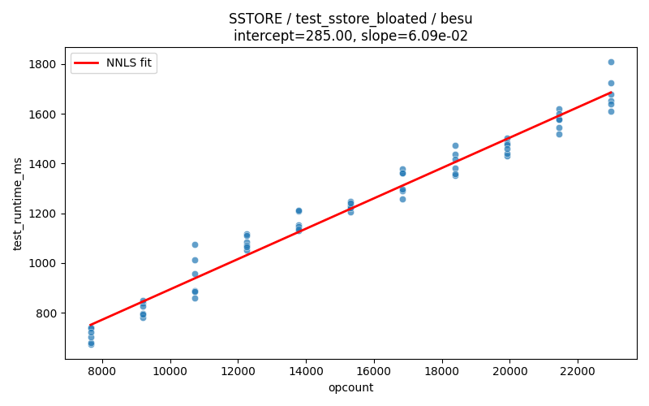

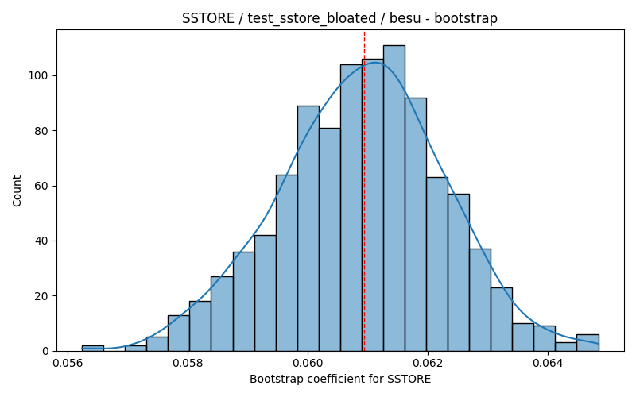

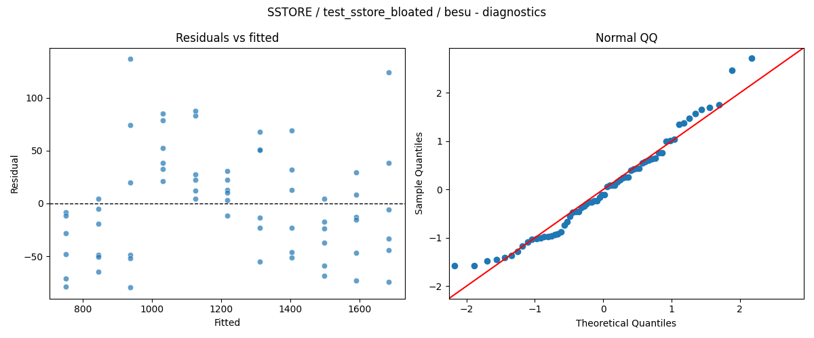

</details>

<details><summary>erigon — NNLS regression summary</summary>

```
==============================================================================
                           NNLS Regression Results                            
==============================================================================
Dep. Variable:          test_runtime_ms              R-squared:          0.989
Model:                  NNLS                    Adj. R-squared:          0.988
No. Observations:       11                                RMSE:          12.05
Df Residuals:           9                                  MAE:           8.68
Df Model:               1      
==============================================================================
                      coef     std err     P-value      [0.025      0.975]
------------------------------------------------------------------------------
         const     13.9206     12.5260       0.146      0.0000     43.8693
       opcount      0.0056      0.0002       0.001      0.0051      0.0058
==============================================================================
Notes: Non-negative least squares with bootstrap inference (1000 iterations)
==============================================================================
```


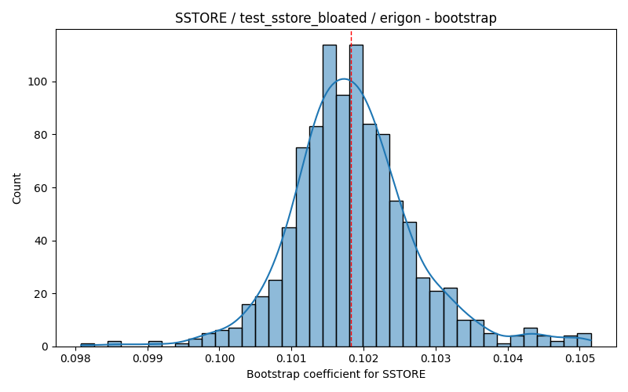

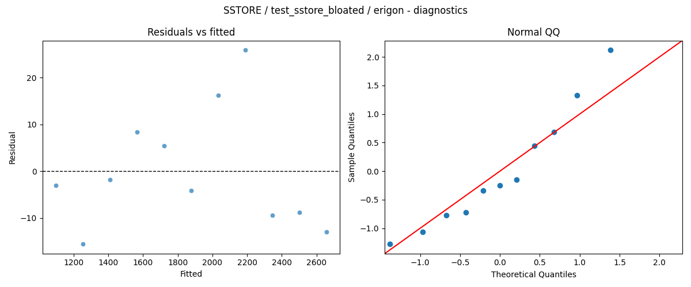

</details>

<details><summary>geth — NNLS regression summary</summary>

```
==============================================================================
                           NNLS Regression Results                            
==============================================================================
Dep. Variable:          test_runtime_ms              R-squared:          0.976
Model:                  NNLS                    Adj. R-squared:          0.976
No. Observations:       108                               RMSE:          71.86
Df Residuals:           106                                MAE:          61.23
Df Model:               1      
==============================================================================
                      coef     std err     P-value      [0.025      0.975]
------------------------------------------------------------------------------
         const    463.1009     22.4392       0.001    420.9170    506.7218
       opcount      0.0221      0.0004       0.001      0.0214      0.0227
==============================================================================
Notes: Non-negative least squares with bootstrap inference (1000 iterations)
==============================================================================
```

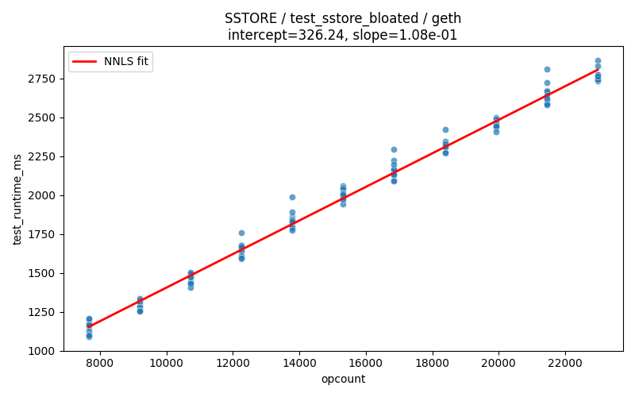

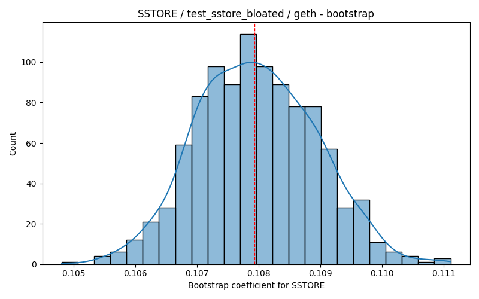

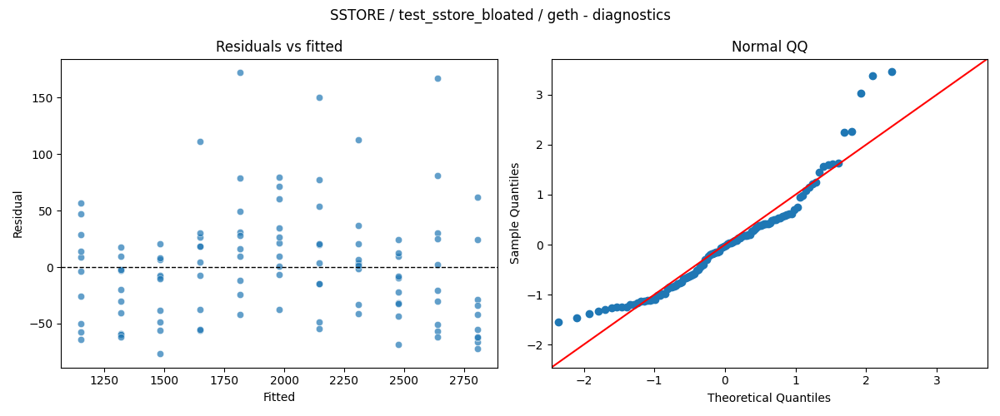

</details>

<details><summary>nethermind — NNLS regression summary</summary>

```
==============================================================================
                           NNLS Regression Results                            
==============================================================================
Dep. Variable:          test_runtime_ms              R-squared:          0.991
Model:                  NNLS                    Adj. R-squared:          0.991
No. Observations:       44                                RMSE:          15.22
Df Residuals:           42                                 MAE:          11.36
Df Model:               1      
==============================================================================
                      coef     std err     P-value      [0.025      0.975]
------------------------------------------------------------------------------
         const     58.2796      7.2943       0.001     44.9578     73.0676
       opcount      0.0078      0.0001       0.001      0.0075      0.0080
==============================================================================
Notes: Non-negative least squares with bootstrap inference (1000 iterations)
==============================================================================
```

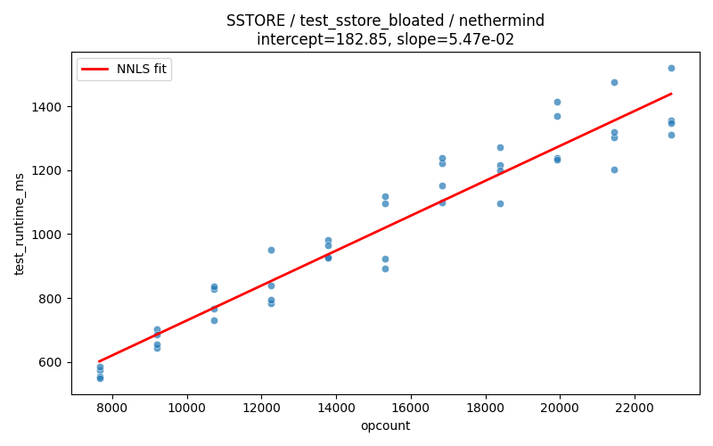

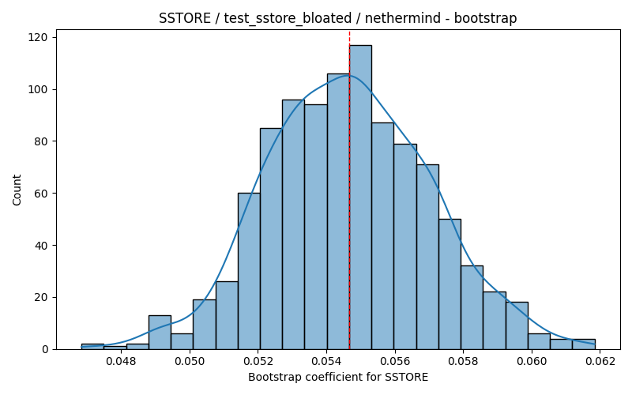

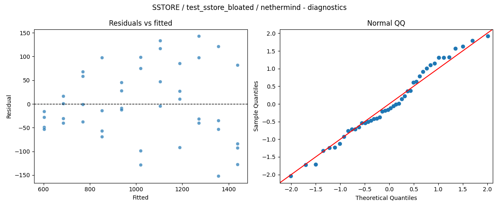

</details>

<details><summary>reth — NNLS regression summary</summary>

```
==============================================================================
                           NNLS Regression Results                            
==============================================================================
Dep. Variable:          test_runtime_ms              R-squared:          0.957
Model:                  NNLS                    Adj. R-squared:          0.956
No. Observations:       110                               RMSE:           6.45
Df Residuals:           108                                MAE:           5.08
Df Model:               1      
==============================================================================
                      coef     std err     P-value      [0.025      0.975]
------------------------------------------------------------------------------
         const     39.8876      1.6556       0.001     36.4673     43.0218
       opcount      0.0015      0.0000       0.001      0.0014      0.0015
==============================================================================
Notes: Non-negative least squares with bootstrap inference (1000 iterations)
==============================================================================
```

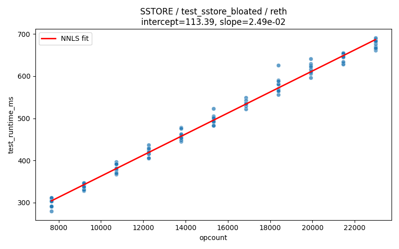

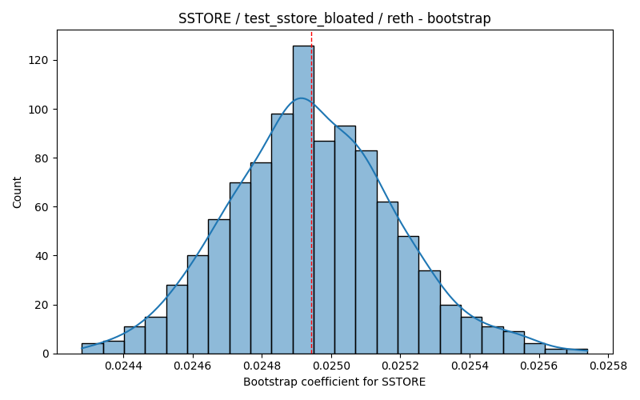

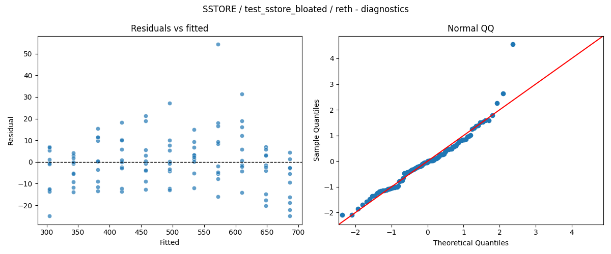

</details>

### test_sstore_bloated — combo `False` — `presets[cold_storage_sstore_write]`

| client | nobs | R² | target_coef (ms) | p-value | 95% CI |
| --- | --- | --- | --- | --- | --- |
| `besu` | 66 | 0.946 | 0.1026 | 1.00e-03 | [0.09798, 0.1076] |
| `erigon` | 11 | 0.9965 | 0.1673 | 1.00e-03 | [0.162, 0.1726] |
| `geth` | 109 | 0.9328 | 0.1412 | 1.00e-03 | [0.1341, 0.1483] |
| `nethermind` | 44 | 0.9226 | 0.06438 | 1.00e-03 | [0.05811, 0.06987] |
| `reth` | 110 | 0.9366 | 0.03679 | 1.00e-03 | [0.03526, 0.03848] |

<details><summary>besu — NNLS regression summary</summary>

```
==============================================================================
                           NNLS Regression Results                            
==============================================================================
Dep. Variable:          test_runtime_ms              R-squared:          0.946
Model:                  NNLS                    Adj. R-squared:          0.945
No. Observations:       66                                RMSE:          15.84
Df Residuals:           64                                 MAE:          12.00
Df Model:               1      
==============================================================================
                      coef     std err     P-value      [0.025      0.975]
------------------------------------------------------------------------------
         const     34.8238      4.8829       0.001     25.3660     43.8937
       opcount      0.1026      0.0026       0.001      0.0980      0.1076
==============================================================================
Notes: Non-negative least squares with bootstrap inference (1000 iterations)
==============================================================================
```


</details>

<details><summary>erigon — NNLS regression summary</summary>

```
==============================================================================
                           NNLS Regression Results                            
==============================================================================
Dep. Variable:          test_runtime_ms              R-squared:          0.996
Model:                  NNLS                    Adj. R-squared:          0.996
No. Observations:       11                                RMSE:           6.44
Df Residuals:           9                                  MAE:           5.45
Df Model:               1      
==============================================================================
                      coef     std err     P-value      [0.025      0.975]
------------------------------------------------------------------------------
         const    104.9672      6.2013       0.001     90.6391    117.1635
       opcount      0.1673      0.0027       0.001      0.1620      0.1726
==============================================================================
Notes: Non-negative least squares with bootstrap inference (1000 iterations)
==============================================================================
```


</details>

<details><summary>geth — NNLS regression summary</summary>

```
==============================================================================
                           NNLS Regression Results                            
==============================================================================
Dep. Variable:          test_runtime_ms              R-squared:          0.933
Model:                  NNLS                    Adj. R-squared:          0.932
No. Observations:       109                               RMSE:          24.58
Df Residuals:           107                                MAE:          19.42
Df Model:               1      
==============================================================================
                      coef     std err     P-value      [0.025      0.975]
------------------------------------------------------------------------------
         const     76.0393      7.0376       0.001     62.5766     90.1560
       opcount      0.1412      0.0035       0.001      0.1341      0.1483
==============================================================================
Notes: Non-negative least squares with bootstrap inference (1000 iterations)
==============================================================================
```


</details>

<details><summary>nethermind — NNLS regression summary</summary>

```
==============================================================================
                           NNLS Regression Results                            
==============================================================================
Dep. Variable:          test_runtime_ms              R-squared:          0.923
Model:                  NNLS                    Adj. R-squared:          0.921
No. Observations:       44                                RMSE:          12.04
Df Residuals:           42                                 MAE:           9.50
Df Model:               1      
==============================================================================
                      coef     std err     P-value      [0.025      0.975]
------------------------------------------------------------------------------
         const     74.7536      5.8157       0.001     64.1263     86.7424
       opcount      0.0644      0.0030       0.001      0.0581      0.0699
==============================================================================
Notes: Non-negative least squares with bootstrap inference (1000 iterations)
==============================================================================
```


</details>

<details><summary>reth — NNLS regression summary</summary>

```
==============================================================================
                           NNLS Regression Results                            
==============================================================================
Dep. Variable:          test_runtime_ms              R-squared:          0.937
Model:                  NNLS                    Adj. R-squared:          0.936
No. Observations:       110                               RMSE:           6.18
Df Residuals:           108                                MAE:           5.01
Df Model:               1      
==============================================================================
                      coef     std err     P-value      [0.025      0.975]
------------------------------------------------------------------------------
         const     49.2129      1.7986       0.001     45.6023     52.6162
       opcount      0.0368      0.0009       0.001      0.0353      0.0385
==============================================================================
Notes: Non-negative least squares with bootstrap inference (1000 iterations)
==============================================================================
```


</details>

### test_sstore_bloated — combo `True` — `presets[cold_storage_sstore_write]`

| client | nobs | R² | target_coef (ms) | p-value | 95% CI |
| --- | --- | --- | --- | --- | --- |
| `besu` | 66 | 0.9718 | 0.06094 | 1.00e-03 | [0.05806, 0.06345] |
| `erigon` | 11 | 0.9994 | 0.1018 | 1.00e-03 | [0.1003, 0.1041] |
| `geth` | 110 | 0.9911 | 0.1079 | 1.00e-03 | [0.1062, 0.1098] |
| `nethermind` | 44 | 0.9266 | 0.05468 | 1.00e-03 | [0.05026, 0.05938] |
| `reth` | 110 | 0.9903 | 0.02494 | 1.00e-03 | [0.02449, 0.02545] |

<details><summary>besu — NNLS regression summary</summary>

```
==============================================================================
                           NNLS Regression Results                            
==============================================================================
Dep. Variable:          test_runtime_ms              R-squared:          0.972
Model:                  NNLS                    Adj. R-squared:          0.971
No. Observations:       66                                RMSE:          50.29
Df Residuals:           64                                 MAE:          40.86
Df Model:               1      
==============================================================================
                      coef     std err     P-value      [0.025      0.975]
------------------------------------------------------------------------------
         const    285.0010     22.6443       0.001    244.8009    333.9390
       opcount      0.0609      0.0014       0.001      0.0581      0.0634
==============================================================================
Notes: Non-negative least squares with bootstrap inference (1000 iterations)
==============================================================================
```


</details>

<details><summary>erigon — NNLS regression summary</summary>

```
==============================================================================
                           NNLS Regression Results                            
==============================================================================
Dep. Variable:          test_runtime_ms              R-squared:          0.999
Model:                  NNLS                    Adj. R-squared:          0.999
No. Observations:       11                                RMSE:          12.21
Df Residuals:           9                                  MAE:          10.16
Df Model:               1      
==============================================================================
                      coef     std err     P-value      [0.025      0.975]
------------------------------------------------------------------------------
         const    317.6732     12.9313       0.001    291.6773    346.1585
       opcount      0.1018      0.0009       0.001      0.1003      0.1041
==============================================================================
Notes: Non-negative least squares with bootstrap inference (1000 iterations)
==============================================================================
```


</details>

<details><summary>geth — NNLS regression summary</summary>

```
==============================================================================
                           NNLS Regression Results                            
==============================================================================
Dep. Variable:          test_runtime_ms              R-squared:          0.991
Model:                  NNLS                    Adj. R-squared:          0.991
No. Observations:       110                               RMSE:          49.58
Df Residuals:           108                                MAE:          37.59
Df Model:               1      
==============================================================================
                      coef     std err     P-value      [0.025      0.975]
------------------------------------------------------------------------------
         const    326.2388     14.4449       0.001    297.0642    353.7278
       opcount      0.1079      0.0010       0.001      0.1062      0.1098
==============================================================================
Notes: Non-negative least squares with bootstrap inference (1000 iterations)
==============================================================================
```


</details>

<details><summary>nethermind — NNLS regression summary</summary>

```
==============================================================================
                           NNLS Regression Results                            
==============================================================================
Dep. Variable:          test_runtime_ms              R-squared:          0.927
Model:                  NNLS                    Adj. R-squared:          0.925
No. Observations:       44                                RMSE:          74.51
Df Residuals:           42                                 MAE:          61.58
Df Model:               1      
==============================================================================
                      coef     std err     P-value      [0.025      0.975]
------------------------------------------------------------------------------
         const    182.8499     31.2839       0.001    123.5970    245.1168
       opcount      0.0547      0.0024       0.001      0.0503      0.0594
==============================================================================
Notes: Non-negative least squares with bootstrap inference (1000 iterations)
==============================================================================
```


</details>

<details><summary>reth — NNLS regression summary</summary>

```
==============================================================================
                           NNLS Regression Results                            
==============================================================================
Dep. Variable:          test_runtime_ms              R-squared:          0.990
Model:                  NNLS                    Adj. R-squared:          0.990
No. Observations:       110                               RMSE:          11.94
Df Residuals:           108                                MAE:           8.76
Df Model:               1      
==============================================================================
                      coef     std err     P-value      [0.025      0.975]
------------------------------------------------------------------------------
         const    113.3919      3.5315       0.001    106.5390    120.2334
       opcount      0.0249      0.0002       0.001      0.0245      0.0254
==============================================================================
Notes: Non-negative least squares with bootstrap inference (1000 iterations)
==============================================================================
```


</details>

## BALANCE

### test_ext_account_query_warm — combo `BALANCE`

| client | nobs | R² | target_coef (ms) | p-value | 95% CI |
| --- | --- | --- | --- | --- | --- |
| `besu` | 66 | 0.864 | 7.203e-05 | 1.00e-03 | [6.493e-05, 7.953e-05] |
| `erigon` | 11 | 0.8505 | 1.77e-05 | 1.00e-03 | [1.432e-05, 2.4e-05] |
| `geth` | 110 | 0.7503 | 2.798e-05 | 1.00e-03 | [2.48e-05, 3.105e-05] |
| `nethermind` | 44 | 0.5515 | 0.0001152 | 1.00e-03 | [8.15e-05, 0.0001465] |
| `reth` | 110 | 0.5767 | 1.181e-05 | 1.00e-03 | [1.018e-05, 1.331e-05] |

<details><summary>besu — NNLS regression summary</summary>

```
==============================================================================
                           NNLS Regression Results                            
==============================================================================
Dep. Variable:          test_runtime_ms              R-squared:          0.864
Model:                  NNLS                    Adj. R-squared:          0.862
No. Observations:       66                                RMSE:          16.71
Df Residuals:           64                                 MAE:          13.61
Df Model:               1      
==============================================================================
                      coef     std err     P-value      [0.025      0.975]
------------------------------------------------------------------------------
         const    148.8815      7.3048       0.001    134.6052    162.8188
       opcount      0.0001      0.0000       0.001      0.0001      0.0001
==============================================================================
Notes: Non-negative least squares with bootstrap inference (1000 iterations)
==============================================================================
```

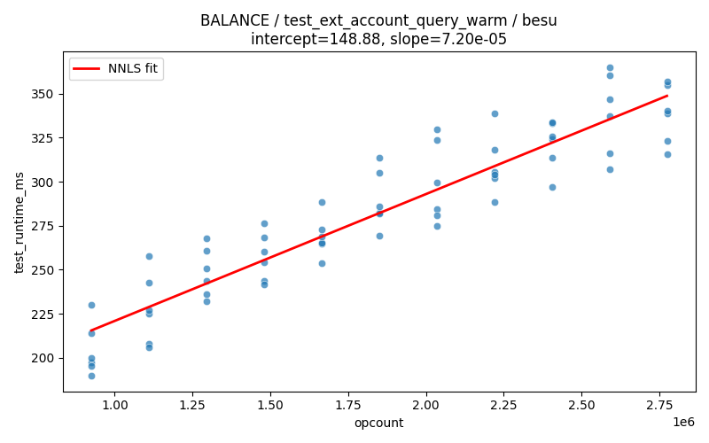

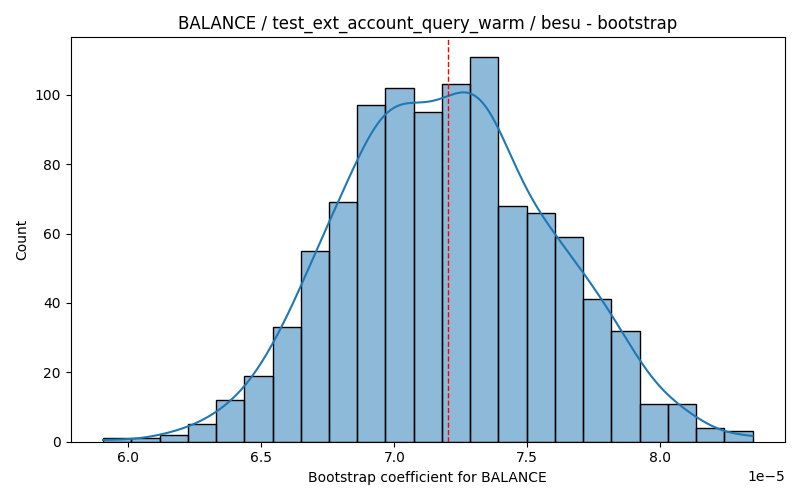

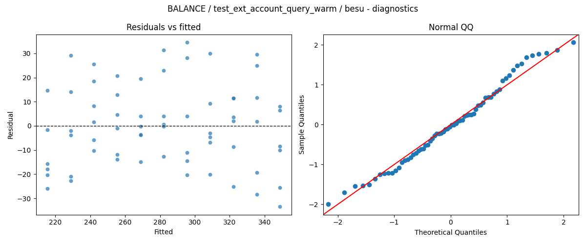

</details>

<details><summary>erigon — NNLS regression summary</summary>

```
==============================================================================
                           NNLS Regression Results                            
==============================================================================
Dep. Variable:          test_runtime_ms              R-squared:          0.851
Model:                  NNLS                    Adj. R-squared:          0.834
No. Observations:       11                                RMSE:           4.34
Df Residuals:           9                                  MAE:           3.67
Df Model:               1      
==============================================================================
                      coef     std err     P-value      [0.025      0.975]
------------------------------------------------------------------------------
         const     26.8438      4.2914       0.001     16.3106     32.2162
       opcount      0.0000      0.0000       0.001      0.0000      0.0000
==============================================================================
Notes: Non-negative least squares with bootstrap inference (1000 iterations)
==============================================================================
```

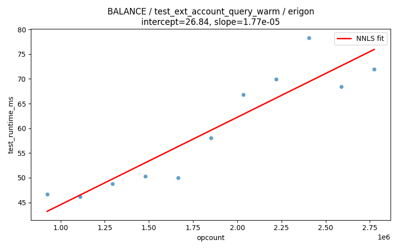

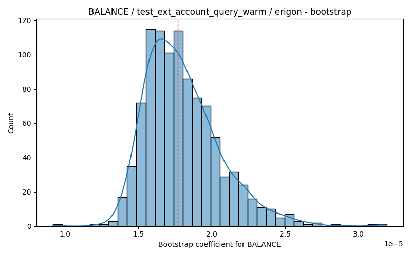

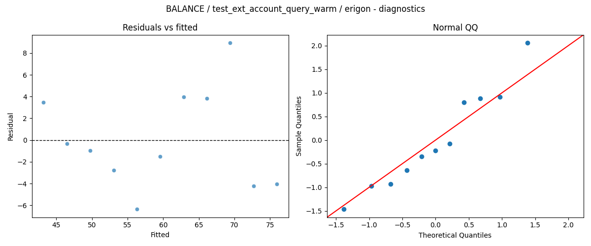

</details>

<details><summary>geth — NNLS regression summary</summary>

```
==============================================================================
                           NNLS Regression Results                            
==============================================================================
Dep. Variable:          test_runtime_ms              R-squared:          0.750
Model:                  NNLS                    Adj. R-squared:          0.748
No. Observations:       110                               RMSE:           9.44
Df Residuals:           108                                MAE:           7.02
Df Model:               1      
==============================================================================
                      coef     std err     P-value      [0.025      0.975]
------------------------------------------------------------------------------
         const     17.6839      2.8984       0.001     12.0523     23.3166
       opcount      0.0000      0.0000       0.001      0.0000      0.0000
==============================================================================
Notes: Non-negative least squares with bootstrap inference (1000 iterations)
==============================================================================
```

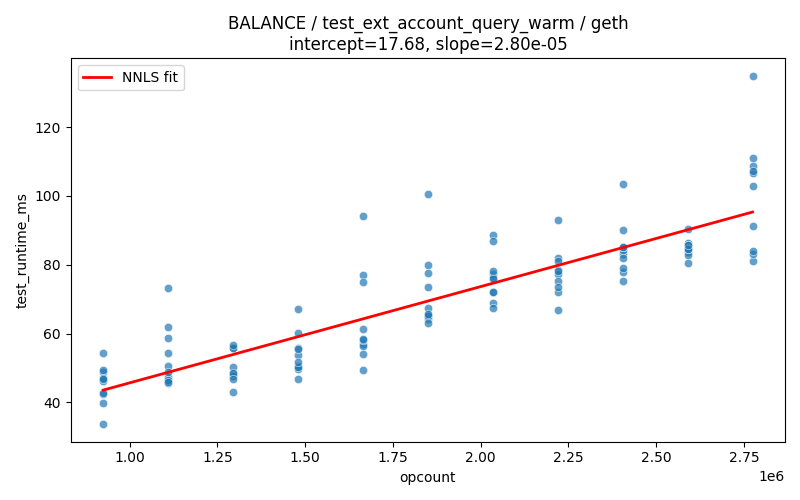

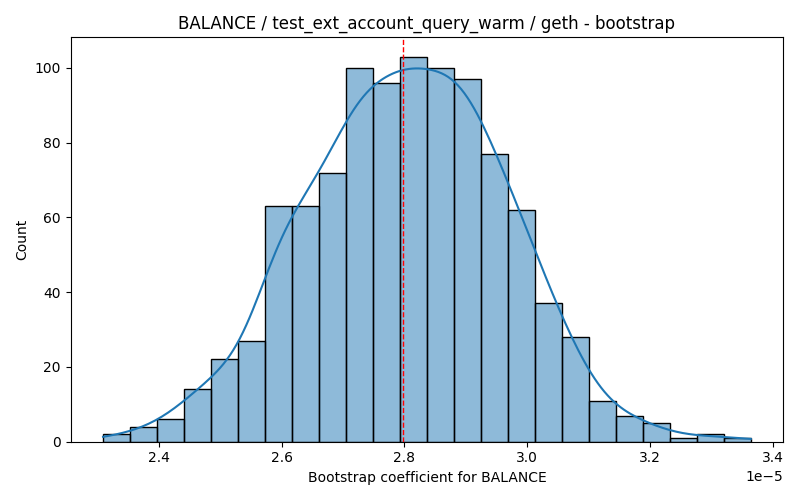

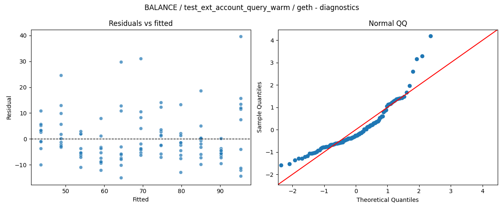

</details>

<details><summary>nethermind — NNLS regression summary</summary>

```
==============================================================================
                           NNLS Regression Results                            
==============================================================================
Dep. Variable:          test_runtime_ms              R-squared:          0.552
Model:                  NNLS                    Adj. R-squared:          0.541
No. Observations:       44                                RMSE:          60.75
Df Residuals:           42                                 MAE:          45.40
Df Model:               1      
==============================================================================
                      coef     std err     P-value      [0.025      0.975]
------------------------------------------------------------------------------
         const    159.6790     32.1518       0.001    106.1761    226.9532
       opcount      0.0001      0.0000       0.001      0.0001      0.0001
==============================================================================
Notes: Non-negative least squares with bootstrap inference (1000 iterations)
==============================================================================
```

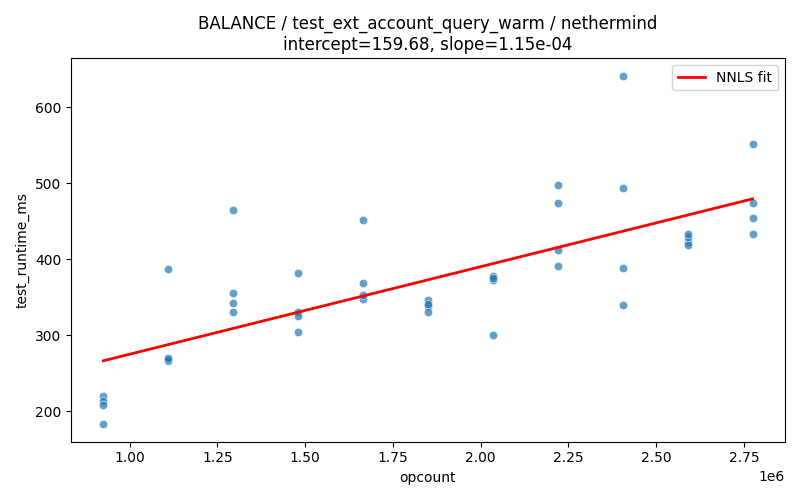

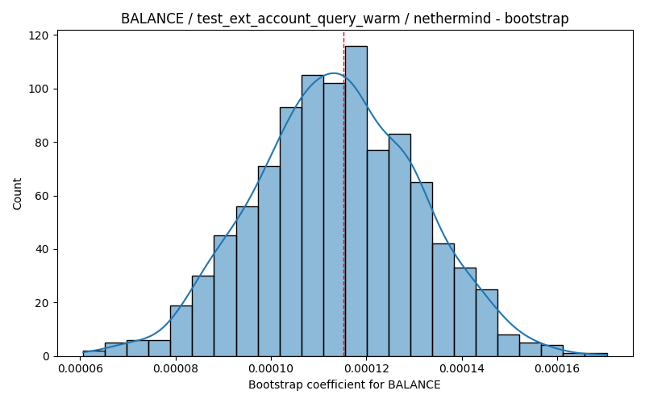

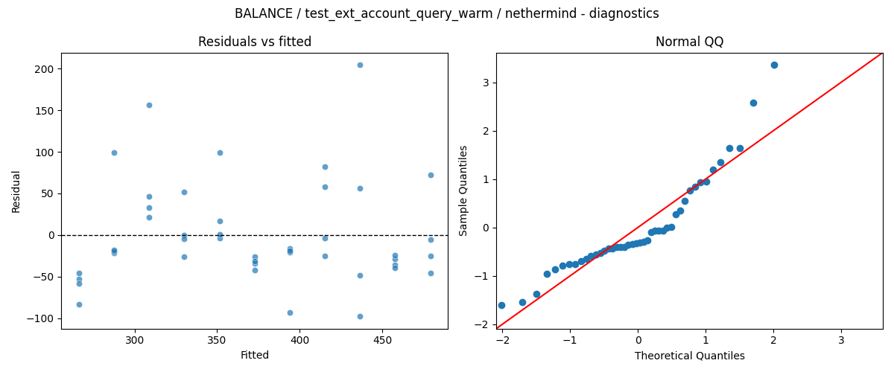

</details>

<details><summary>reth — NNLS regression summary</summary>

```
==============================================================================
                           NNLS Regression Results                            
==============================================================================
Dep. Variable:          test_runtime_ms              R-squared:          0.577
Model:                  NNLS                    Adj. R-squared:          0.573
No. Observations:       110                               RMSE:           5.92
Df Residuals:           108                                MAE:           3.89
Df Model:               1      
==============================================================================
                      coef     std err     P-value      [0.025      0.975]
------------------------------------------------------------------------------
         const     10.4534      1.6079       0.001      7.4552     13.6862
       opcount      0.0000      0.0000       0.001      0.0000      0.0000
==============================================================================
Notes: Non-negative least squares with bootstrap inference (1000 iterations)
==============================================================================
```

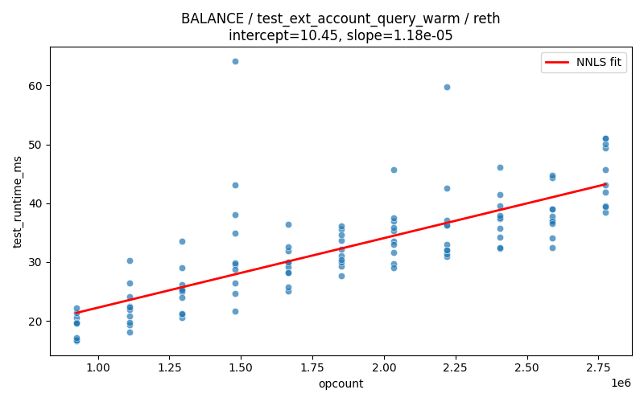

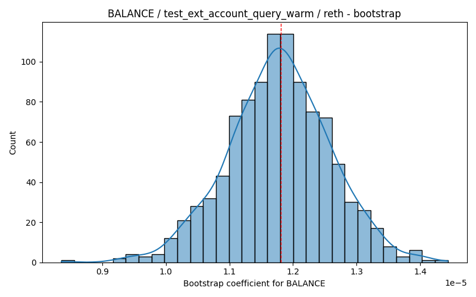

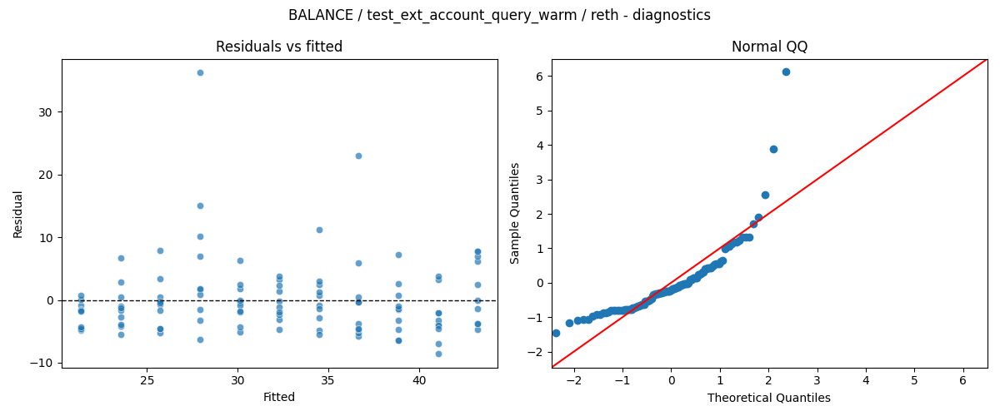

</details>

### test_account_access — combo `BALANCE_AccountMode.EXISTING_EOA`

| client | nobs | R² | target_coef (ms) | p-value | 95% CI |
| --- | --- | --- | --- | --- | --- |
| `besu` | 66 | 0.9842 | 0.0143 | 1.00e-03 | [0.01389, 0.01478] |
| `erigon` | 11 | 0.9957 | 0.008433 | 1.00e-03 | [0.008048, 0.008527] |
| `geth` | 109 | 0.9732 | 0.01143 | 1.00e-03 | [0.01106, 0.01184] |
| `nethermind` | 44 | 0.8938 | 0.00316 | 1.00e-03 | [0.002887, 0.003462] |
| `reth` | 110 | 0.9163 | 0.001131 | 1.00e-03 | [0.001069, 0.001188] |

<details><summary>besu — NNLS regression summary</summary>

```
==============================================================================
                           NNLS Regression Results                            
==============================================================================
Dep. Variable:          test_runtime_ms              R-squared:          0.984
Model:                  NNLS                    Adj. R-squared:          0.984
No. Observations:       66                                RMSE:          37.36
Df Residuals:           64                                 MAE:          30.63
Df Model:               1      
==============================================================================
                      coef     std err     P-value      [0.025      0.975]
------------------------------------------------------------------------------
         const    470.7203     16.0297       0.001    435.9600    498.0706
       opcount      0.0143      0.0002       0.001      0.0139      0.0148
==============================================================================
Notes: Non-negative least squares with bootstrap inference (1000 iterations)
==============================================================================
```

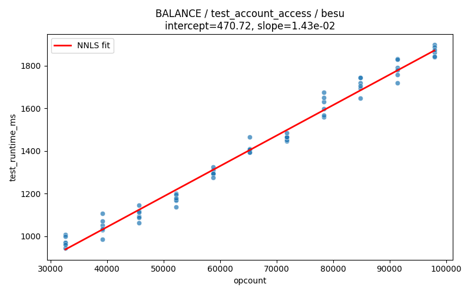

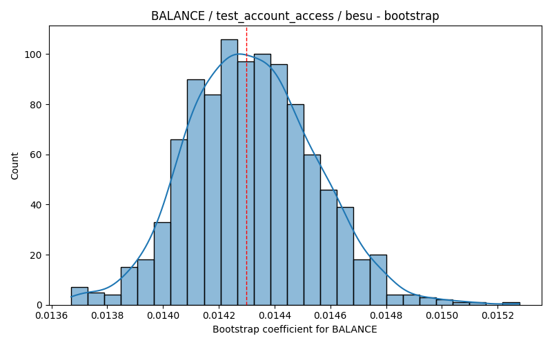

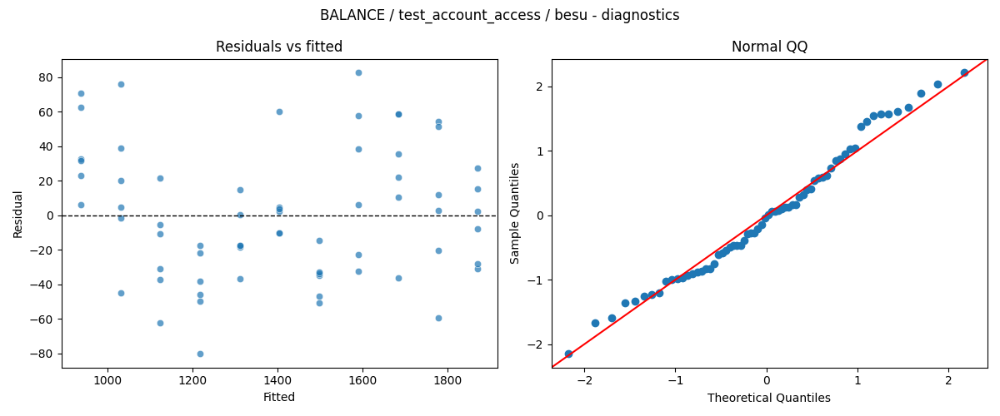

</details>

<details><summary>erigon — NNLS regression summary</summary>

```
==============================================================================
                           NNLS Regression Results                            
==============================================================================
Dep. Variable:          test_runtime_ms              R-squared:          0.996
Model:                  NNLS                    Adj. R-squared:          0.995
No. Observations:       11                                RMSE:          11.51
Df Residuals:           9                                  MAE:           8.46
Df Model:               1      
==============================================================================
                      coef     std err     P-value      [0.025      0.975]
------------------------------------------------------------------------------
         const      0.0000      6.9524       1.000      0.0000     23.3634
       opcount      0.0084      0.0001       0.001      0.0080      0.0085
==============================================================================
Notes: Non-negative least squares with bootstrap inference (1000 iterations)
==============================================================================
```

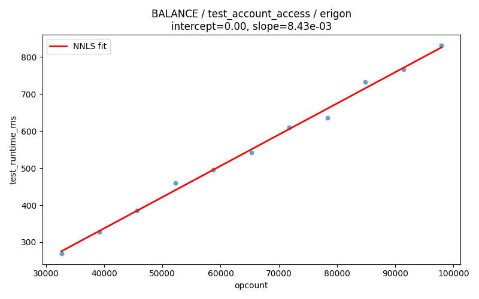

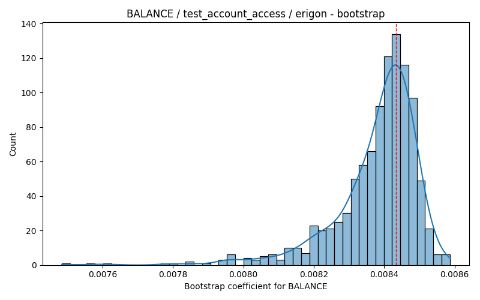

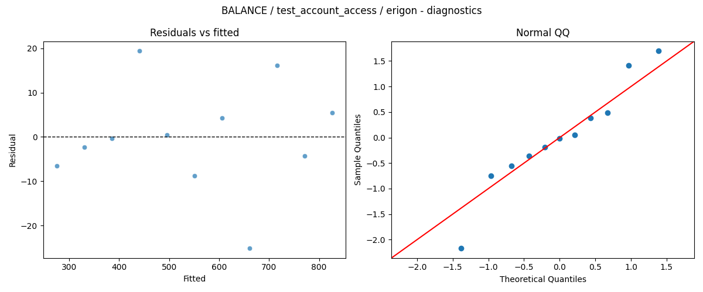

</details>

<details><summary>geth — NNLS regression summary</summary>

```
==============================================================================
                           NNLS Regression Results                            
==============================================================================
Dep. Variable:          test_runtime_ms              R-squared:          0.973
Model:                  NNLS                    Adj. R-squared:          0.973
No. Observations:       109                               RMSE:          39.08
Df Residuals:           107                                MAE:          32.26
Df Model:               1      
==============================================================================
                      coef     std err     P-value      [0.025      0.975]
------------------------------------------------------------------------------
         const    230.4052     12.4380       0.001    206.2147    254.9318
       opcount      0.0114      0.0002       0.001      0.0111      0.0118
==============================================================================
Notes: Non-negative least squares with bootstrap inference (1000 iterations)
==============================================================================
```

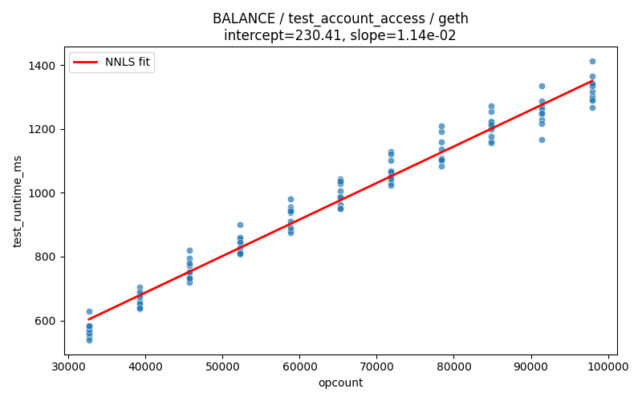

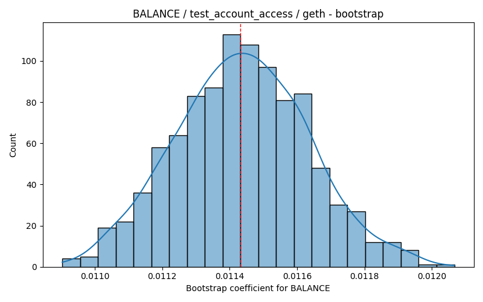

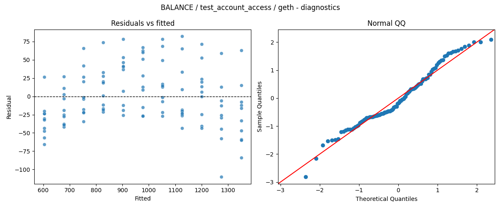

</details>

<details><summary>nethermind — NNLS regression summary</summary>

```
==============================================================================
                           NNLS Regression Results                            
==============================================================================
Dep. Variable:          test_runtime_ms              R-squared:          0.894
Model:                  NNLS                    Adj. R-squared:          0.891
No. Observations:       44                                RMSE:          22.49
Df Residuals:           42                                 MAE:          18.14
Df Model:               1      
==============================================================================
                      coef     std err     P-value      [0.025      0.975]
------------------------------------------------------------------------------
         const     97.1773      9.0110       0.001     80.0099    114.7407
       opcount      0.0032      0.0001       0.001      0.0029      0.0035
==============================================================================
Notes: Non-negative least squares with bootstrap inference (1000 iterations)
==============================================================================
```

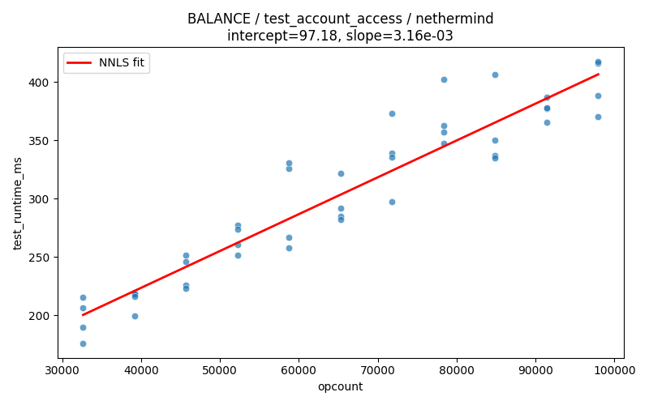

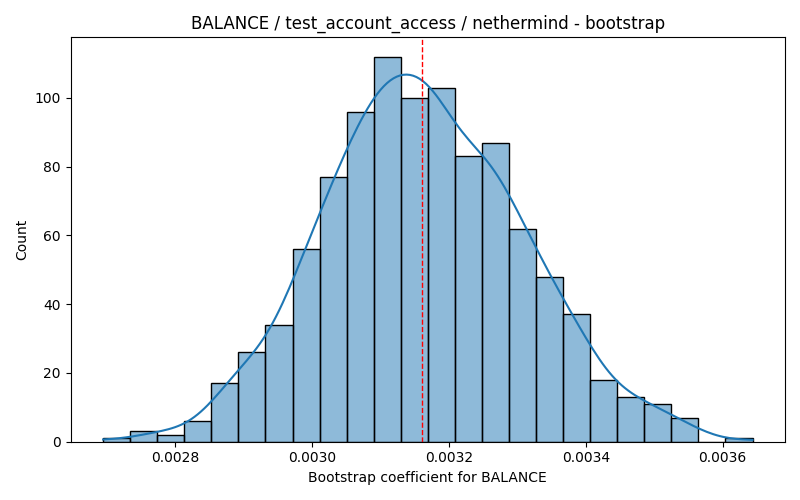

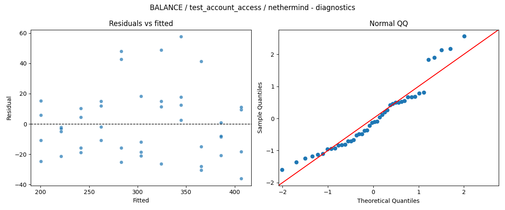

</details>

<details><summary>reth — NNLS regression summary</summary>

```
==============================================================================
                           NNLS Regression Results                            
==============================================================================
Dep. Variable:          test_runtime_ms              R-squared:          0.916
Model:                  NNLS                    Adj. R-squared:          0.916
No. Observations:       110                               RMSE:           7.06
Df Residuals:           108                                MAE:           5.40
Df Model:               1      
==============================================================================
                      coef     std err     P-value      [0.025      0.975]
------------------------------------------------------------------------------
         const     39.0938      2.1663       0.001     35.1359     43.3186
       opcount      0.0011      0.0000       0.001      0.0011      0.0012
==============================================================================
Notes: Non-negative least squares with bootstrap inference (1000 iterations)
==============================================================================
```

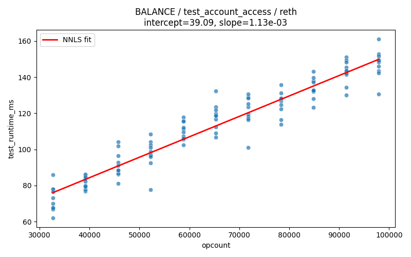

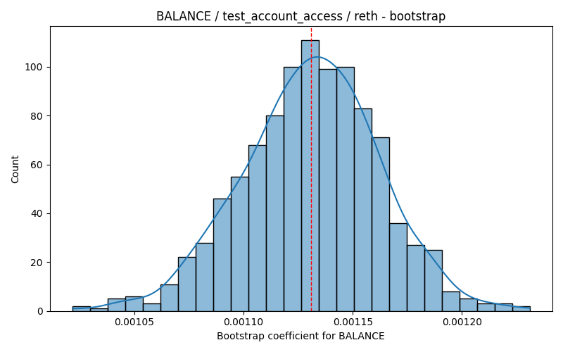

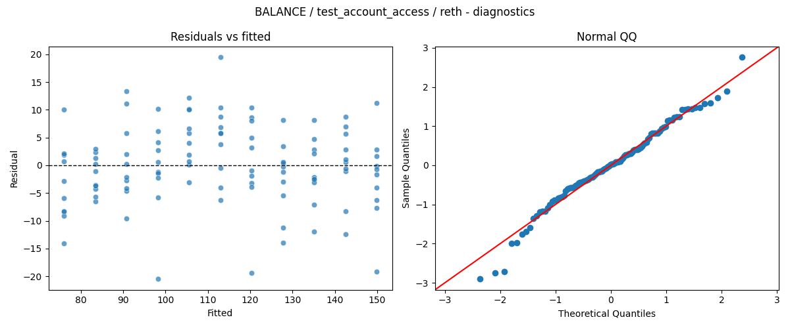

</details>

### test_account_access — combo `BALANCE_AccountMode.NON_EXISTING_ACCOUNT`

| client | nobs | R² | target_coef (ms) | p-value | 95% CI |
| --- | --- | --- | --- | --- | --- |
| `besu` | 66 | 0.9863 | 0.0147 | 1.00e-03 | [0.01436, 0.01512] |
| `erigon` | 11 | 0.9903 | 0.008134 | 1.00e-03 | [0.007565, 0.008301] |
| `geth` | 110 | 0.9806 | 0.02199 | 1.00e-03 | [0.02133, 0.02261] |
| `nethermind` | 44 | 0.8442 | 0.002968 | 1.00e-03 | [0.002579, 0.003394] |
| `reth` | 110 | 0.9196 | 0.0009431 | 1.00e-03 | [0.0008991, 0.0009916] |

<details><summary>besu — NNLS regression summary</summary>

```
==============================================================================
                           NNLS Regression Results                            
==============================================================================
Dep. Variable:          test_runtime_ms              R-squared:          0.986
Model:                  NNLS                    Adj. R-squared:          0.986
No. Observations:       66                                RMSE:          35.83
Df Residuals:           64                                 MAE:          29.86
Df Model:               1      
==============================================================================
                      coef     std err     P-value      [0.025      0.975]
------------------------------------------------------------------------------
         const    122.8510     13.7019       0.001     95.2301    149.6966
       opcount      0.0147      0.0002       0.001      0.0144      0.0151
==============================================================================
Notes: Non-negative least squares with bootstrap inference (1000 iterations)
==============================================================================
```


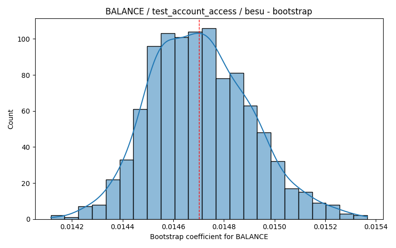

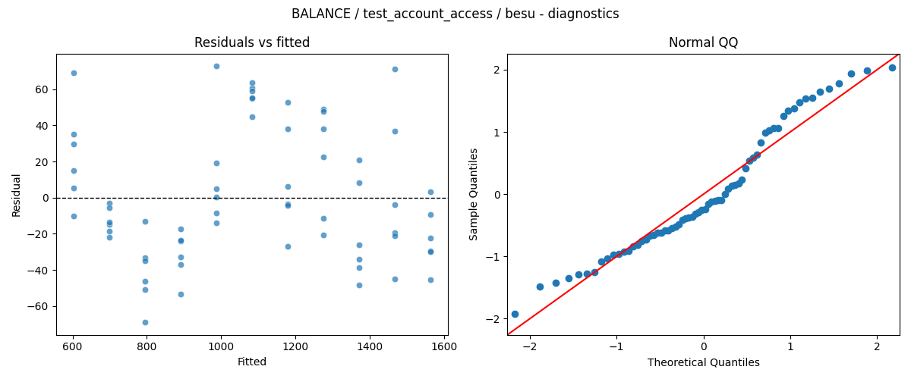

</details>

<details><summary>erigon — NNLS regression summary</summary>

```
==============================================================================
                           NNLS Regression Results                            
==============================================================================
Dep. Variable:          test_runtime_ms              R-squared:          0.990
Model:                  NNLS                    Adj. R-squared:          0.989
No. Observations:       11                                RMSE:          16.94
Df Residuals:           9                                  MAE:          12.68
Df Model:               1      
==============================================================================
                      coef     std err     P-value      [0.025      0.975]
------------------------------------------------------------------------------
         const      0.0000      8.5598       1.000      0.0000     27.0735
       opcount      0.0081      0.0002       0.001      0.0076      0.0083
==============================================================================
Notes: Non-negative least squares with bootstrap inference (1000 iterations)
==============================================================================
```

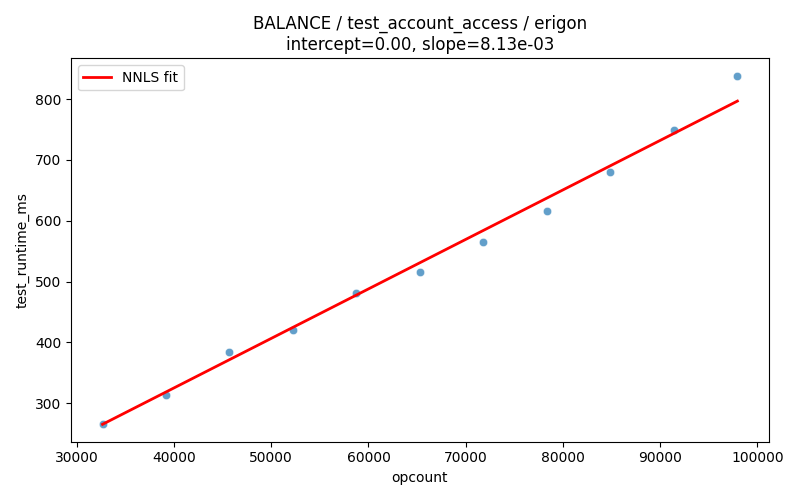

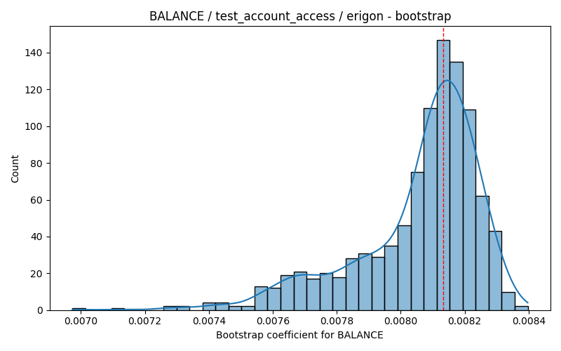

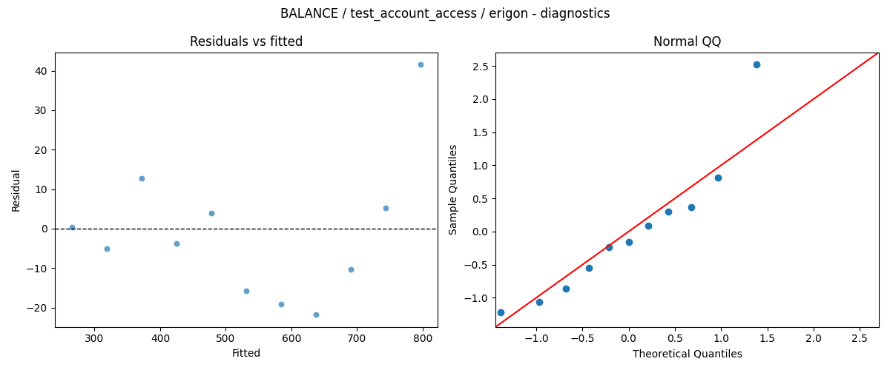

</details>

<details><summary>geth — NNLS regression summary</summary>

```
==============================================================================
                           NNLS Regression Results                            
==============================================================================
Dep. Variable:          test_runtime_ms              R-squared:          0.981
Model:                  NNLS                    Adj. R-squared:          0.980
No. Observations:       110                               RMSE:          63.81
Df Residuals:           108                                MAE:          49.59
Df Model:               1      
==============================================================================
                      coef     std err     P-value      [0.025      0.975]
------------------------------------------------------------------------------
         const    269.9897     19.1720       0.001    234.0896    308.9088
       opcount      0.0220      0.0003       0.001      0.0213      0.0226
==============================================================================
Notes: Non-negative least squares with bootstrap inference (1000 iterations)
==============================================================================
```

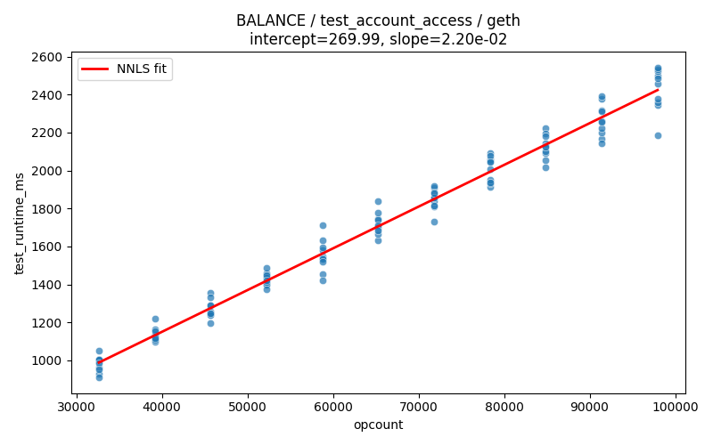

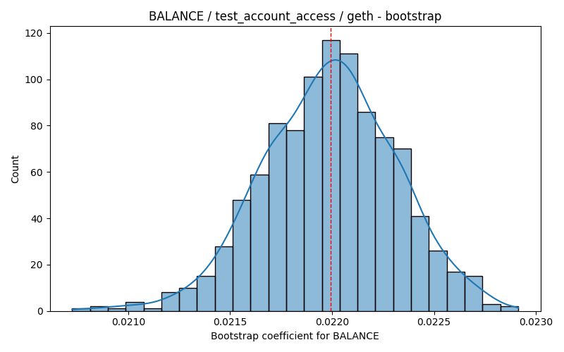

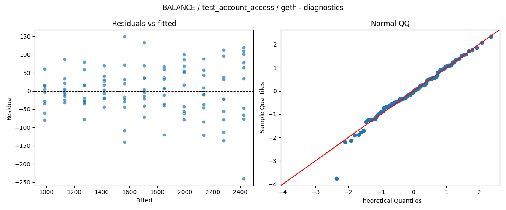

</details>

<details><summary>nethermind — NNLS regression summary</summary>

```
==============================================================================
                           NNLS Regression Results                            
==============================================================================
Dep. Variable:          test_runtime_ms              R-squared:          0.844
Model:                  NNLS                    Adj. R-squared:          0.840
No. Observations:       44                                RMSE:          26.33
Df Residuals:           42                                 MAE:          22.23
Df Model:               1      
==============================================================================
                      coef     std err     P-value      [0.025      0.975]
------------------------------------------------------------------------------
         const     81.2770     13.3637       0.001     54.9543    107.4793
       opcount      0.0030      0.0002       0.001      0.0026      0.0034
==============================================================================
Notes: Non-negative least squares with bootstrap inference (1000 iterations)
==============================================================================
```

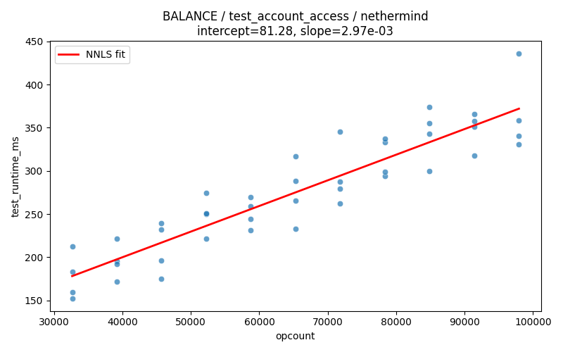

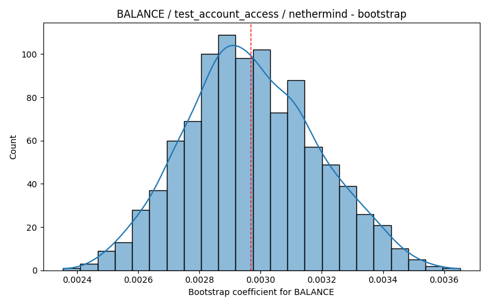

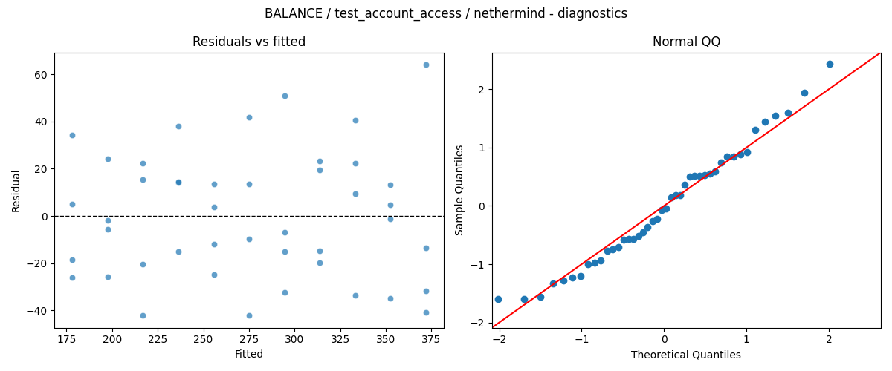

</details>

<details><summary>reth — NNLS regression summary</summary>

```
==============================================================================
                           NNLS Regression Results                            
==============================================================================
Dep. Variable:          test_runtime_ms              R-squared:          0.920
Model:                  NNLS                    Adj. R-squared:          0.919
No. Observations:       110                               RMSE:           5.76
Df Residuals:           108                                MAE:           4.85
Df Model:               1      
==============================================================================
                      coef     std err     P-value      [0.025      0.975]
------------------------------------------------------------------------------
         const     33.0584      1.5694       0.001     30.0652     36.0514
       opcount      0.0009      0.0000       0.001      0.0009      0.0010
==============================================================================
Notes: Non-negative least squares with bootstrap inference (1000 iterations)
==============================================================================
```

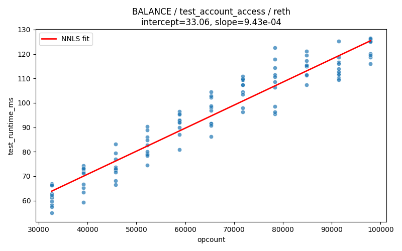

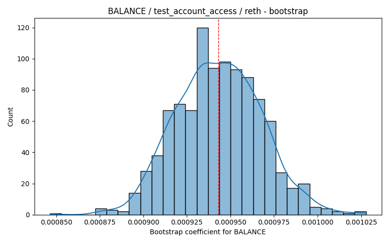

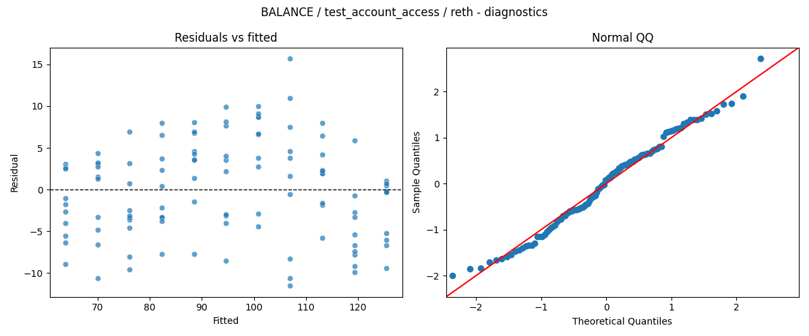

</details>

### test_account_access — combo `BALANCE_AccountMode.EXISTING_CONTRACT_DIFF_MAX`

| client | nobs | R² | target_coef (ms) | p-value | 95% CI |
| --- | --- | --- | --- | --- | --- |
| `besu` | 66 | 0.9805 | 0.01896 | 1.00e-03 | [0.01836, 0.01966] |
| `erigon` | 11 | 0.986 | 0.009244 | 1.00e-03 | [0.008376, 0.009756] |
| `geth` | 107 | 0.9602 | 0.003879 | 1.00e-03 | [0.003831, 0.003923] |
| `nethermind` | 44 | 0.6565 | 0.001829 | 1.00e-03 | [0.001431, 0.002254] |
| `reth` | 110 | 0.9939 | 0.01853 | 1.00e-03 | [0.01825, 0.0188] |

<details><summary>besu — NNLS regression summary</summary>

```
==============================================================================
                           NNLS Regression Results                            
==============================================================================
Dep. Variable:          test_runtime_ms              R-squared:          0.981
Model:                  NNLS                    Adj. R-squared:          0.980
No. Observations:       66                                RMSE:          54.35
Df Residuals:           64                                 MAE:          43.09
Df Model:               1      
==============================================================================
                      coef     std err     P-value      [0.025      0.975]
------------------------------------------------------------------------------
         const    464.6610     25.6890       0.001    412.2645    511.8139
       opcount      0.0190      0.0003       0.001      0.0184      0.0197
==============================================================================
Notes: Non-negative least squares with bootstrap inference (1000 iterations)
==============================================================================
```

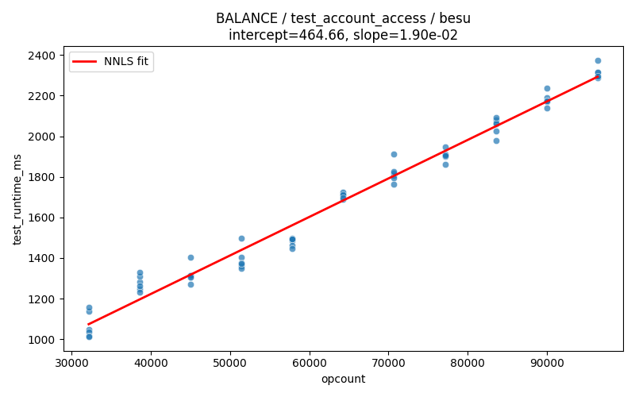

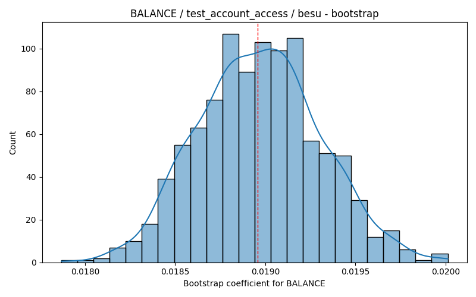

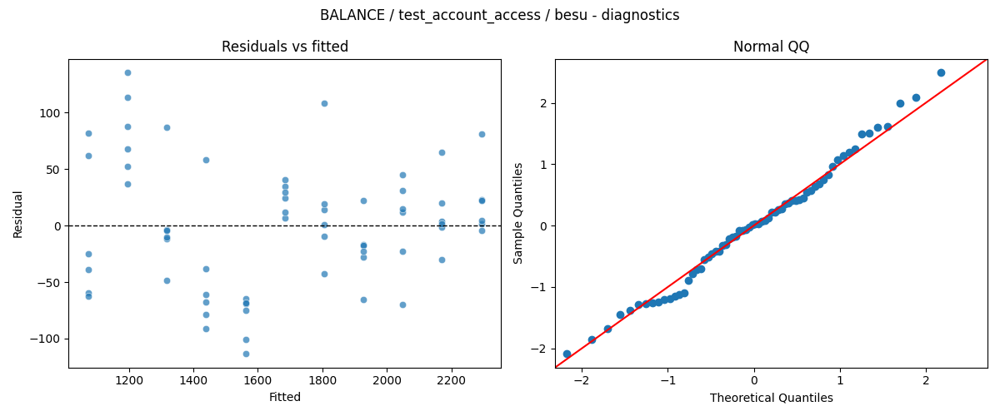

</details>

<details><summary>erigon — NNLS regression summary</summary>

```
==============================================================================
                           NNLS Regression Results                            
==============================================================================
Dep. Variable:          test_runtime_ms              R-squared:          0.986
Model:                  NNLS                    Adj. R-squared:          0.984
No. Observations:       11                                RMSE:          22.43
Df Residuals:           9                                  MAE:          19.35
Df Model:               1      
==============================================================================
                      coef     std err     P-value      [0.025      0.975]
------------------------------------------------------------------------------
         const    161.1320     26.5336       0.001    121.1714    223.7726
       opcount      0.0092      0.0004       0.001      0.0084      0.0098
==============================================================================
Notes: Non-negative least squares with bootstrap inference (1000 iterations)
==============================================================================
```


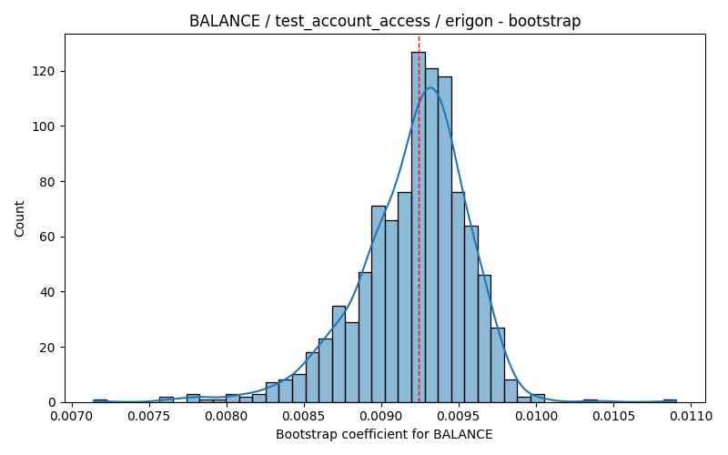

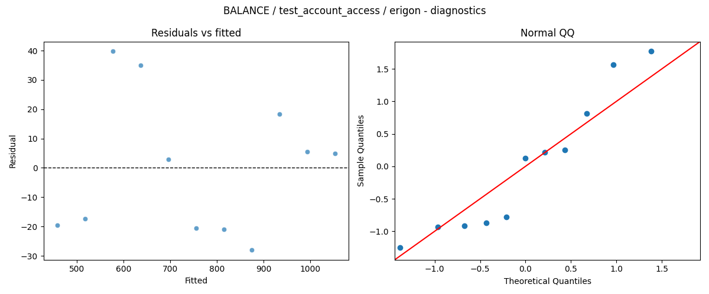

</details>

<details><summary>geth — NNLS regression summary</summary>

```
==============================================================================
                           NNLS Regression Results                            
==============================================================================
Dep. Variable:          test_runtime_ms              R-squared:          0.960
Model:                  NNLS                    Adj. R-squared:          0.960
No. Observations:       107                               RMSE:          16.79
Df Residuals:           105                                MAE:          13.21
Df Model:               1      
==============================================================================
                      coef     std err     P-value      [0.025      0.975]
------------------------------------------------------------------------------
         const      0.0000      0.2536       1.000      0.0000      0.0000
       opcount      0.0039      0.0000       0.001      0.0038      0.0039
==============================================================================
Notes: Non-negative least squares with bootstrap inference (1000 iterations)
==============================================================================
```

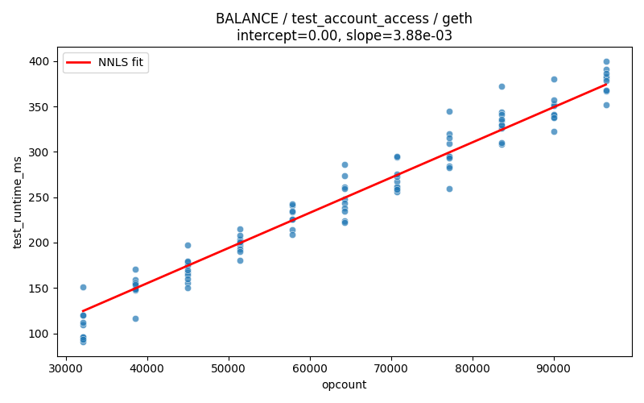

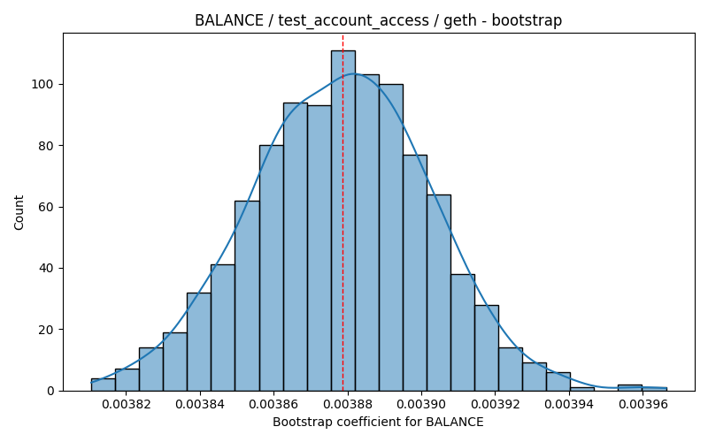

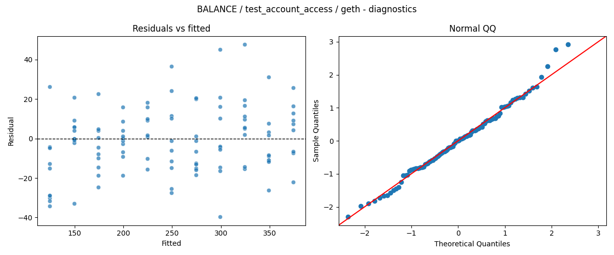

</details>

<details><summary>nethermind — NNLS regression summary</summary>

```
==============================================================================
                           NNLS Regression Results                            
==============================================================================
Dep. Variable:          test_runtime_ms              R-squared:          0.657
Model:                  NNLS                    Adj. R-squared:          0.648
No. Observations:       44                                RMSE:          26.90
Df Residuals:           42                                 MAE:          21.94
Df Model:               1      
==============================================================================
                      coef     std err     P-value      [0.025      0.975]
------------------------------------------------------------------------------
         const     95.4103     11.6473       0.001     71.2785    116.5177
       opcount      0.0018      0.0002       0.001      0.0014      0.0023
==============================================================================
Notes: Non-negative least squares with bootstrap inference (1000 iterations)
==============================================================================
```

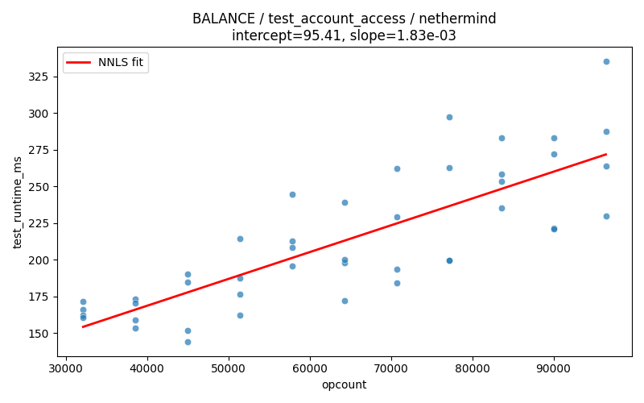

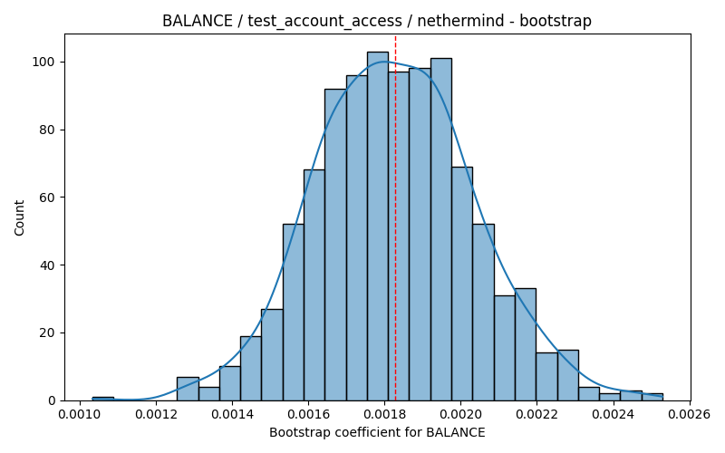

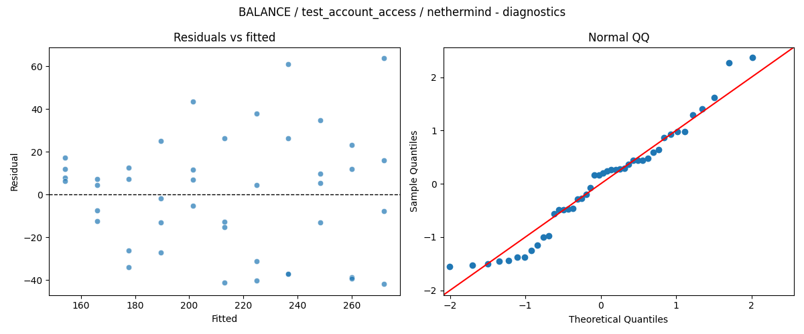

</details>

<details><summary>reth — NNLS regression summary</summary>

```
==============================================================================
                           NNLS Regression Results                            
==============================================================================
Dep. Variable:          test_runtime_ms              R-squared:          0.994
Model:                  NNLS                    Adj. R-squared:          0.994
No. Observations:       110                               RMSE:          29.47
Df Residuals:           108                                MAE:          22.36
Df Model:               1      
==============================================================================
                      coef     std err     P-value      [0.025      0.975]
------------------------------------------------------------------------------
         const    133.8703      9.3895       0.001    117.3748    153.8520
       opcount      0.0185      0.0001       0.001      0.0183      0.0188
==============================================================================
Notes: Non-negative least squares with bootstrap inference (1000 iterations)
==============================================================================
```

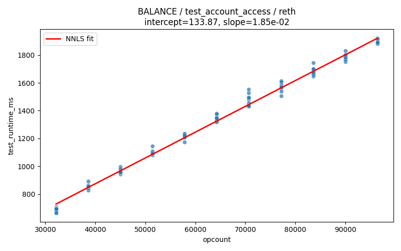

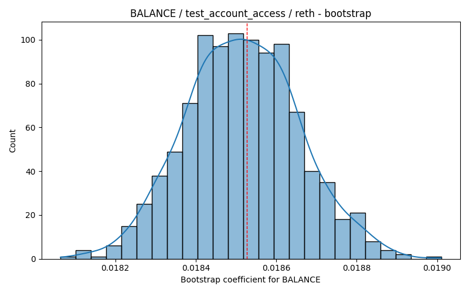

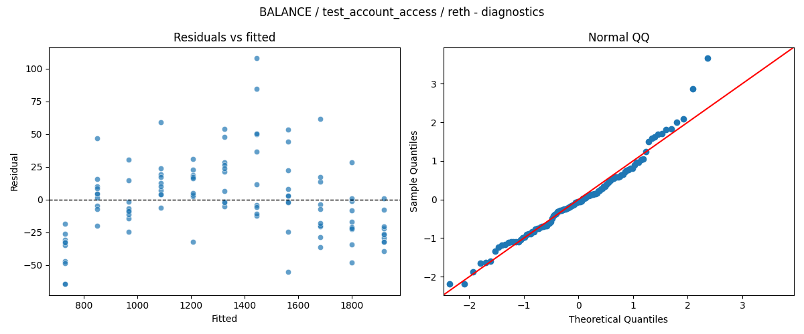

</details>

### test_account_access — combo `BALANCE_AccountMode.EXISTING_CONTRACT_MINIMAL`

| client | nobs | R² | target_coef (ms) | p-value | 95% CI |
| --- | --- | --- | --- | --- | --- |
| `besu` | 66 | 0.969 | 0.0118 | 1.00e-03 | [0.01124, 0.0124] |
| `erigon` | 11 | 0.9766 | 0.008547 | 1.00e-03 | [0.007508, 0.00922] |
| `geth` | 109 | 0.9598 | 0.005074 | 1.00e-03 | [0.004858, 0.00528] |
| `nethermind` | 44 | 0.783 | 0.002062 | 1.00e-03 | [0.001735, 0.002391] |
| `reth` | 110 | 0.9748 | 0.003517 | 1.00e-03 | [0.003419, 0.003617] |

<details><summary>besu — NNLS regression summary</summary>

```
==============================================================================
                           NNLS Regression Results                            
==============================================================================
Dep. Variable:          test_runtime_ms              R-squared:          0.969
Model:                  NNLS                    Adj. R-squared:          0.969
No. Observations:       66                                RMSE:          42.89
Df Residuals:           64                                 MAE:          31.21
Df Model:               1      
==============================================================================
                      coef     std err     P-value      [0.025      0.975]
------------------------------------------------------------------------------
         const    388.4860     17.4782       0.001    356.3964    424.0302
       opcount      0.0118      0.0003       0.001      0.0112      0.0124
==============================================================================
Notes: Non-negative least squares with bootstrap inference (1000 iterations)
==============================================================================
```

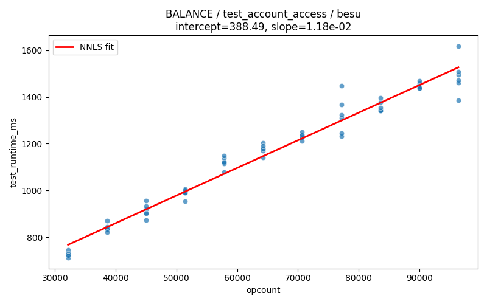

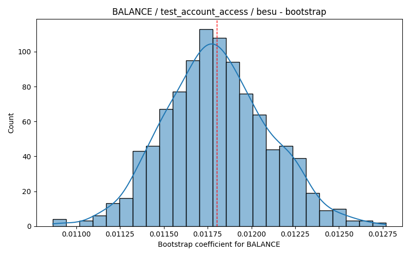

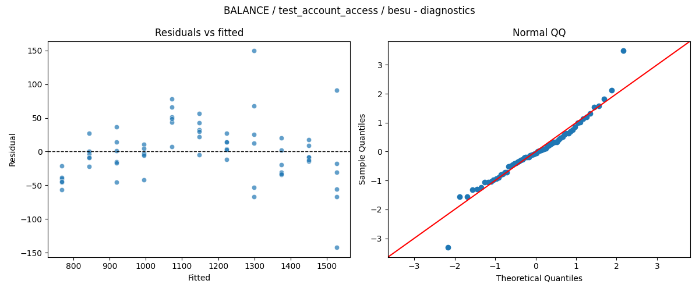

</details>

<details><summary>erigon — NNLS regression summary</summary>

```
==============================================================================
                           NNLS Regression Results                            
==============================================================================
Dep. Variable:          test_runtime_ms              R-squared:          0.977
Model:                  NNLS                    Adj. R-squared:          0.974
No. Observations:       11                                RMSE:          26.89
Df Residuals:           9                                  MAE:          21.74
Df Model:               1      
==============================================================================
                      coef     std err     P-value      [0.025      0.975]
------------------------------------------------------------------------------
         const    155.5048     32.8296       0.001    104.2522    236.3707
       opcount      0.0085      0.0004       0.001      0.0075      0.0092
==============================================================================
Notes: Non-negative least squares with bootstrap inference (1000 iterations)
==============================================================================
```


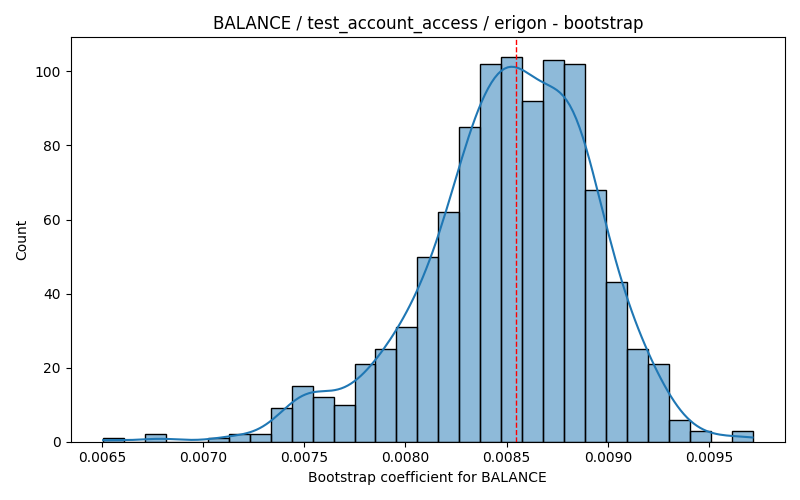

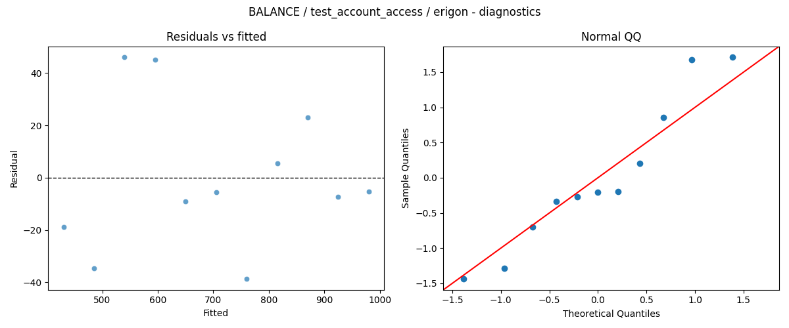

</details>

<details><summary>geth — NNLS regression summary</summary>

```
==============================================================================
                           NNLS Regression Results                            
==============================================================================
Dep. Variable:          test_runtime_ms              R-squared:          0.960
Model:                  NNLS                    Adj. R-squared:          0.959
No. Observations:       109                               RMSE:          21.11
Df Residuals:           107                                MAE:          17.56
Df Model:               1      
==============================================================================
                      coef     std err     P-value      [0.025      0.975]
------------------------------------------------------------------------------
         const     57.1371      7.2624       0.001     43.0835     71.5058
       opcount      0.0051      0.0001       0.001      0.0049      0.0053
==============================================================================
Notes: Non-negative least squares with bootstrap inference (1000 iterations)
==============================================================================
```

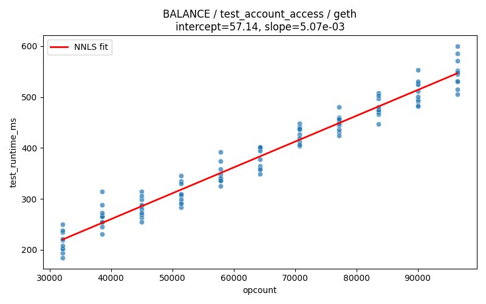

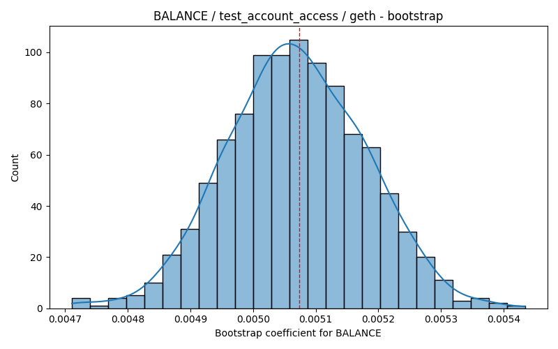

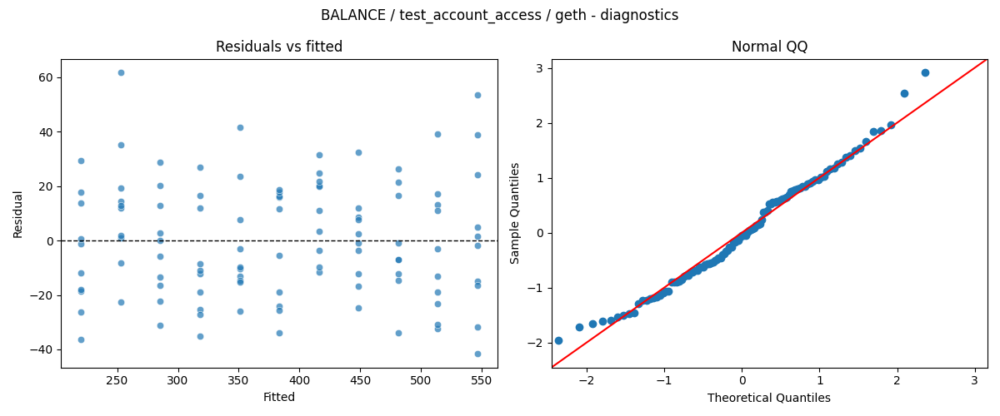

</details>

<details><summary>nethermind — NNLS regression summary</summary>

```
==============================================================================
                           NNLS Regression Results                            
==============================================================================
Dep. Variable:          test_runtime_ms              R-squared:          0.783
Model:                  NNLS                    Adj. R-squared:          0.778
No. Observations:       44                                RMSE:          22.07
Df Residuals:           42                                 MAE:          16.80
Df Model:               1      
==============================================================================
                      coef     std err     P-value      [0.025      0.975]
------------------------------------------------------------------------------
         const     81.4800      9.1347       0.001     62.6184     99.8542
       opcount      0.0021      0.0002       0.001      0.0017      0.0024
==============================================================================
Notes: Non-negative least squares with bootstrap inference (1000 iterations)
==============================================================================
```

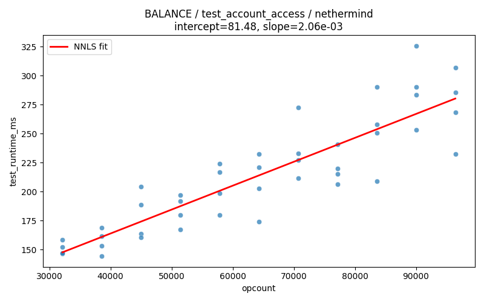

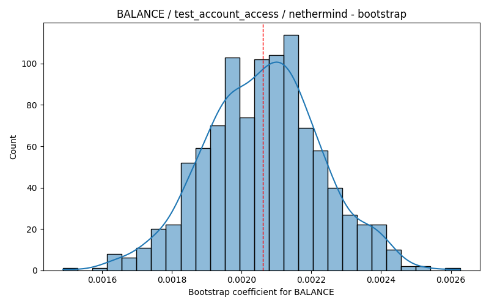

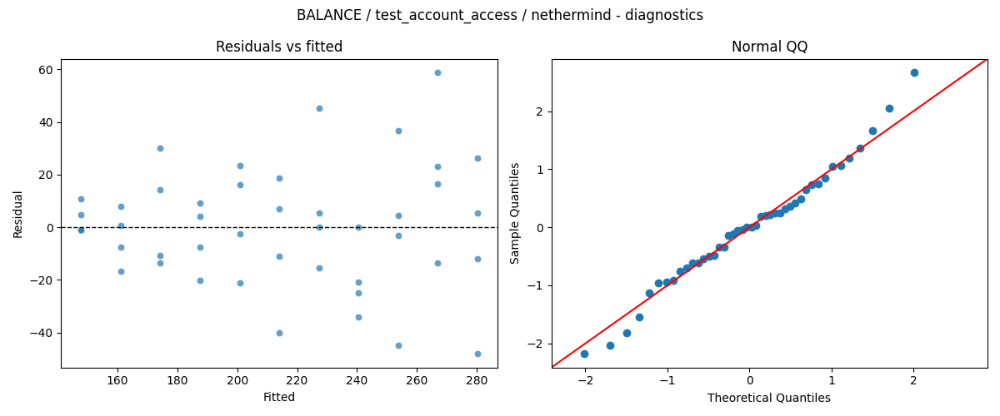

</details>

<details><summary>reth — NNLS regression summary</summary>

```
==============================================================================
                           NNLS Regression Results                            
==============================================================================
Dep. Variable:          test_runtime_ms              R-squared:          0.975
Model:                  NNLS                    Adj. R-squared:          0.975
No. Observations:       110                               RMSE:          11.50
Df Residuals:           108                                MAE:           8.96
Df Model:               1      
==============================================================================
                      coef     std err     P-value      [0.025      0.975]
------------------------------------------------------------------------------
         const     91.8845      3.2454       0.001     85.5966     98.3111
       opcount      0.0035      0.0000       0.001      0.0034      0.0036
==============================================================================
Notes: Non-negative least squares with bootstrap inference (1000 iterations)
==============================================================================
```

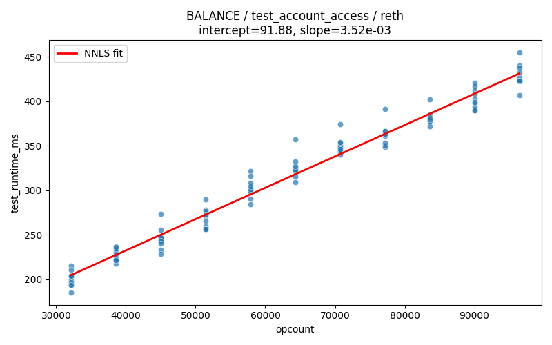

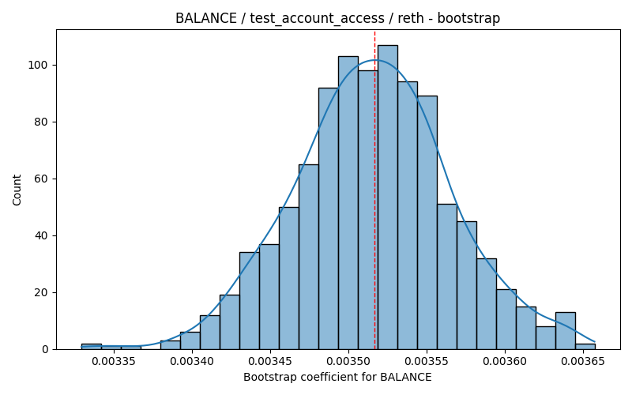

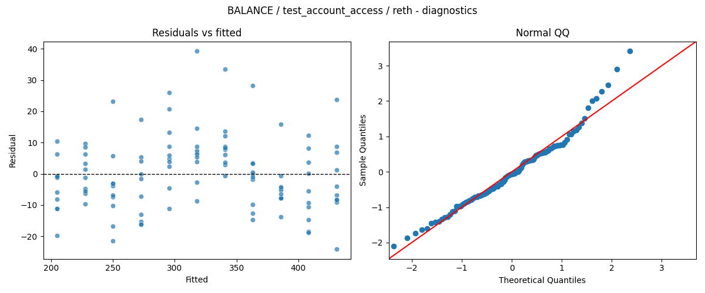

</details>

### test_account_access — combo `BALANCE_AccountMode.EXISTING_CONTRACT_SAME_MAX`

| client | nobs | R² | target_coef (ms) | p-value | 95% CI |
| --- | --- | --- | --- | --- | --- |
| `besu` | 66 | 0.965 | 0.01096 | 1.00e-03 | [0.01045, 0.0115] |
| `erigon` | 11 | 0.9793 | 0.008373 | 1.00e-03 | [0.00734, 0.008956] |
| `geth` | 108 | 0.9433 | 0.004666 | 1.00e-03 | [0.004465, 0.004864] |
| `nethermind` | 44 | 0.7871 | 0.001909 | 1.00e-03 | [0.001611, 0.002203] |
| `reth` | 110 | 0.97 | 0.003656 | 1.00e-03 | [0.003543, 0.00377] |

<details><summary>besu — NNLS regression summary</summary>

```
==============================================================================
                           NNLS Regression Results                            
==============================================================================
Dep. Variable:          test_runtime_ms              R-squared:          0.965
Model:                  NNLS                    Adj. R-squared:          0.964
No. Observations:       66                                RMSE:          42.44
Df Residuals:           64                                 MAE:          35.26
Df Model:               1      
==============================================================================
                      coef     std err     P-value      [0.025      0.975]
------------------------------------------------------------------------------
         const    409.4085     17.4719       0.001    374.8986    445.0658
       opcount      0.0110      0.0003       0.001      0.0104      0.0115
==============================================================================
Notes: Non-negative least squares with bootstrap inference (1000 iterations)
==============================================================================
```

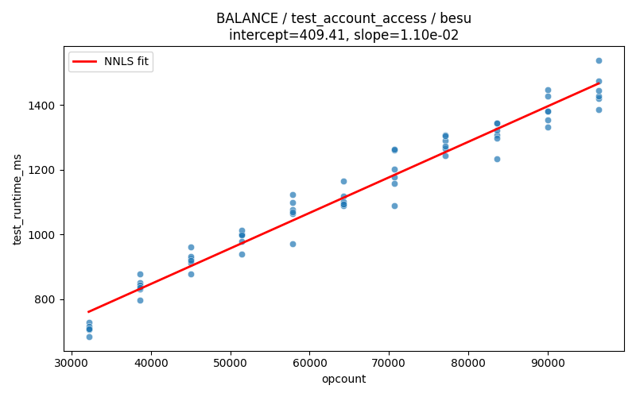

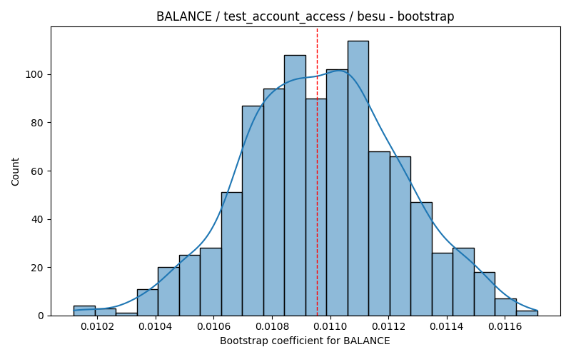

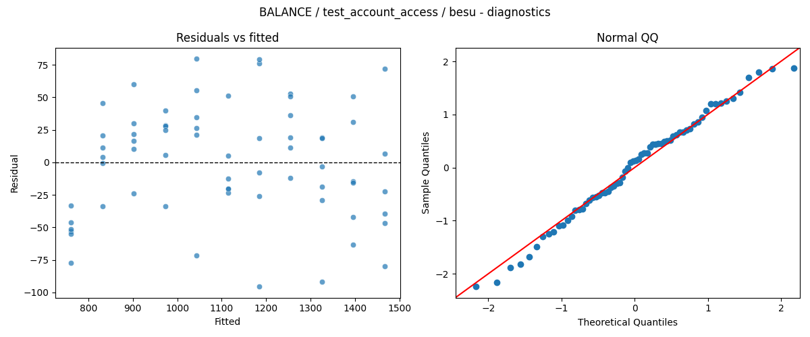

</details>

<details><summary>erigon — NNLS regression summary</summary>

```
==============================================================================
                           NNLS Regression Results                            
==============================================================================
Dep. Variable:          test_runtime_ms              R-squared:          0.979
Model:                  NNLS                    Adj. R-squared:          0.977
No. Observations:       11                                RMSE:          24.77
Df Residuals:           9                                  MAE:          19.85
Df Model:               1      
==============================================================================
                      coef     std err     P-value      [0.025      0.975]
------------------------------------------------------------------------------
         const    173.3851     32.3802       0.001    127.3146    251.5235
       opcount      0.0084      0.0004       0.001      0.0073      0.0090
==============================================================================
Notes: Non-negative least squares with bootstrap inference (1000 iterations)
==============================================================================
```

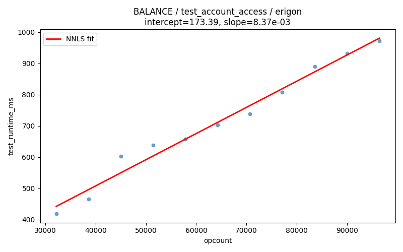

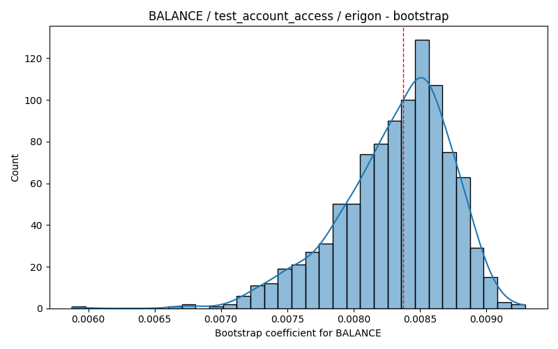

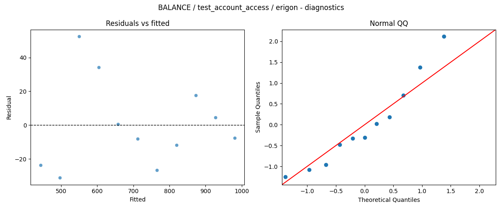

</details>

<details><summary>geth — NNLS regression summary</summary>

```
==============================================================================
                           NNLS Regression Results                            
==============================================================================
Dep. Variable:          test_runtime_ms              R-squared:          0.943
Model:                  NNLS                    Adj. R-squared:          0.943
No. Observations:       108                               RMSE:          23.09
Df Residuals:           106                                MAE:          18.43
Df Model:               1      
==============================================================================
                      coef     std err     P-value      [0.025      0.975]
------------------------------------------------------------------------------
         const     83.3181      6.4204       0.001     70.8440     96.2760
       opcount      0.0047      0.0001       0.001      0.0045      0.0049
==============================================================================
Notes: Non-negative least squares with bootstrap inference (1000 iterations)
==============================================================================
```

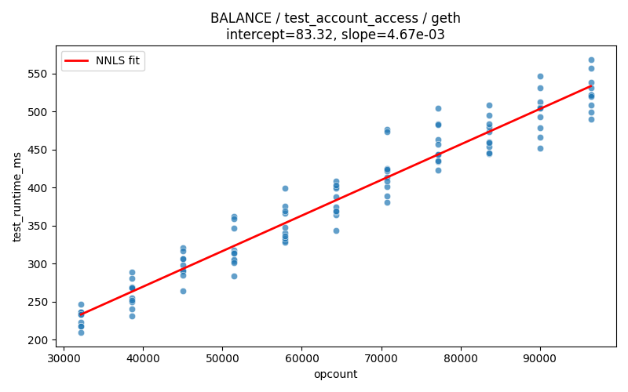

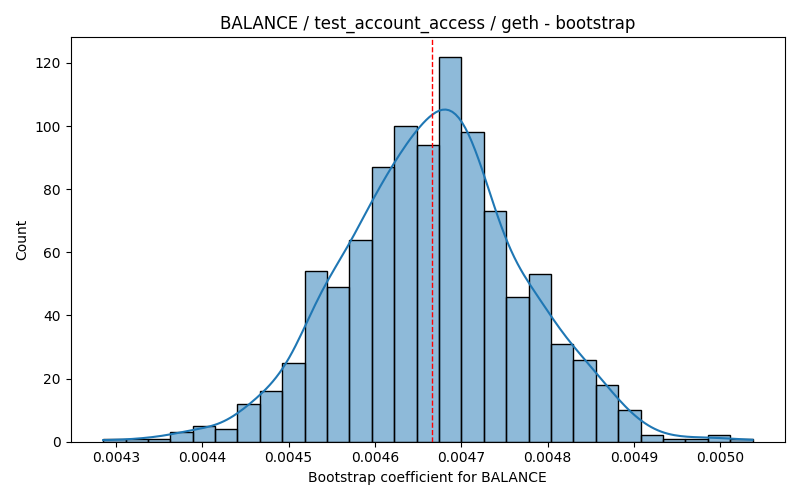

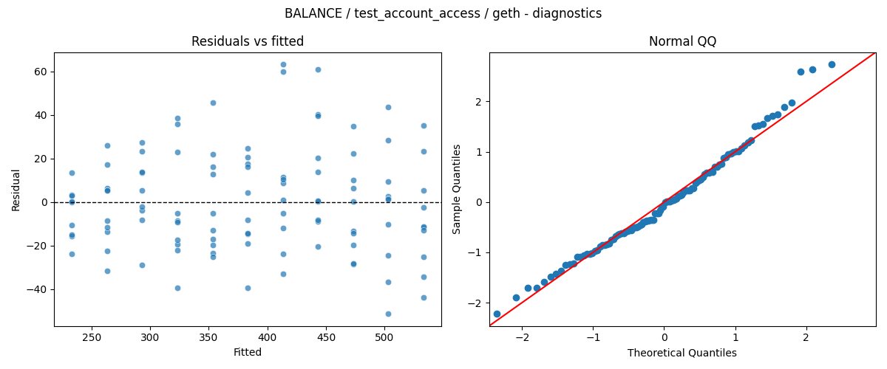

</details>

<details><summary>nethermind — NNLS regression summary</summary>

```
==============================================================================
                           NNLS Regression Results                            
==============================================================================
Dep. Variable:          test_runtime_ms              R-squared:          0.787
Model:                  NNLS                    Adj. R-squared:          0.782
No. Observations:       44                                RMSE:          20.18
Df Residuals:           42                                 MAE:          17.77
Df Model:               1      
==============================================================================
                      coef     std err     P-value      [0.025      0.975]
------------------------------------------------------------------------------
         const     87.6427     10.6765       0.001     66.8049    109.1979
       opcount      0.0019      0.0002       0.001      0.0016      0.0022
==============================================================================
Notes: Non-negative least squares with bootstrap inference (1000 iterations)
==============================================================================
```

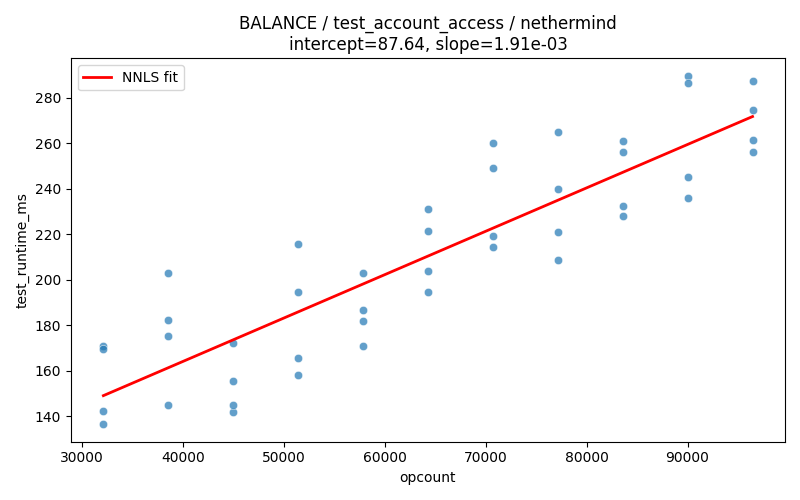

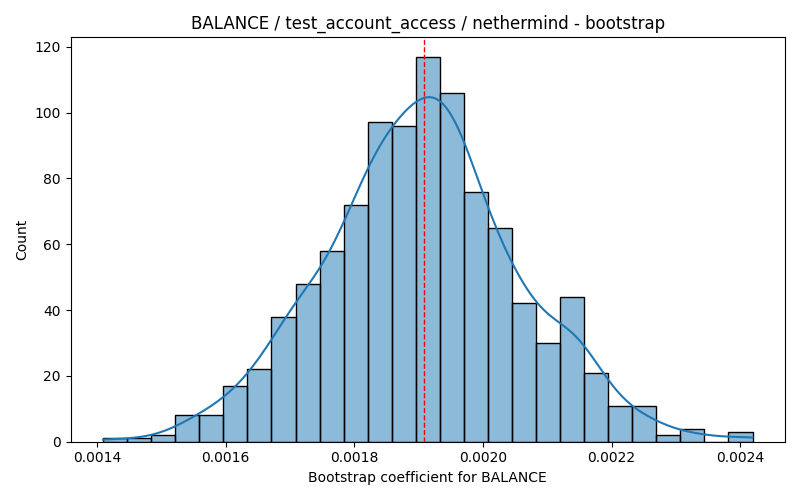

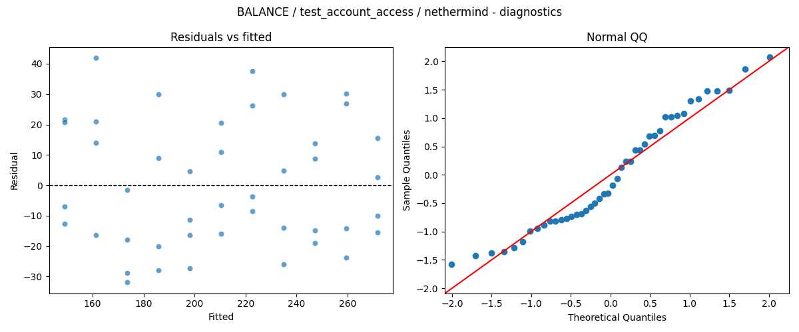

</details>

<details><summary>reth — NNLS regression summary</summary>

```
==============================================================================
                           NNLS Regression Results                            
==============================================================================
Dep. Variable:          test_runtime_ms              R-squared:          0.970
Model:                  NNLS                    Adj. R-squared:          0.970
No. Observations:       110                               RMSE:          13.07
Df Residuals:           108                                MAE:           9.92
Df Model:               1      
==============================================================================
                      coef     std err     P-value      [0.025      0.975]
------------------------------------------------------------------------------
         const     87.2690      3.6520       0.001     80.5243     94.5050
       opcount      0.0037      0.0001       0.001      0.0035      0.0038
==============================================================================
Notes: Non-negative least squares with bootstrap inference (1000 iterations)
==============================================================================
```

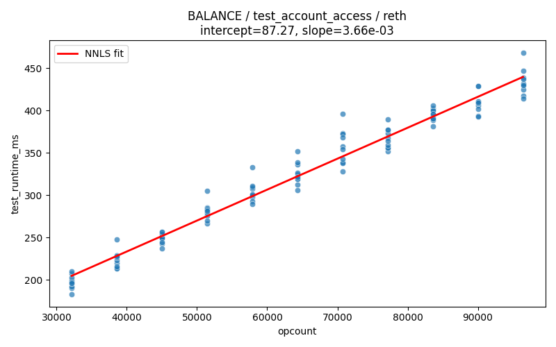

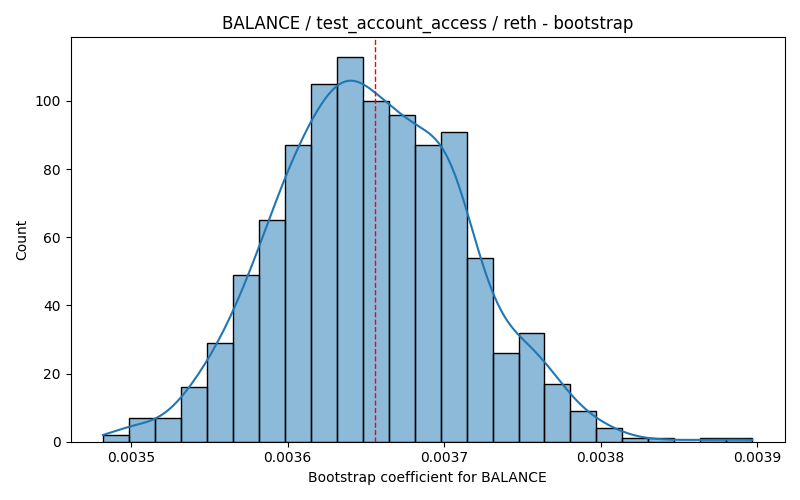

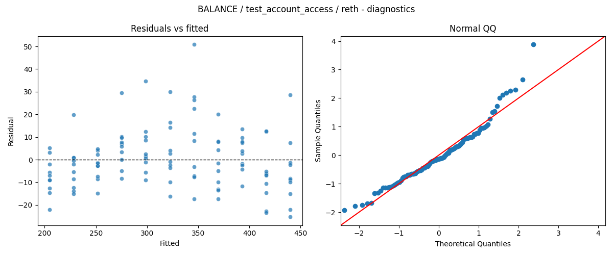

</details>

## CALL

### test_ext_account_query_warm — combo `CALL`

| client | nobs | R² | target_coef (ms) | p-value | 95% CI |
| --- | --- | --- | --- | --- | --- |
| `besu` | 66 | 0.9153 | 0.0005082 | 1.00e-03 | [0.0004673, 0.000546] |
| `erigon` | 11 | 0.9548 | 8.823e-05 | 1.00e-03 | [7.33e-05, 9.991e-05] |
| `geth` | 110 | 0.9013 | 0.0001287 | 1.00e-03 | [0.0001212, 0.0001367] |
| `nethermind` | 44 | 0.8065 | 0.0002528 | 1.00e-03 | [0.0002217, 0.000285] |
| `reth` | 110 | 0.9443 | 6.035e-05 | 1.00e-03 | [5.759e-05, 6.326e-05] |

<details><summary>besu — NNLS regression summary</summary>

```
==============================================================================
                           NNLS Regression Results                            
==============================================================================
Dep. Variable:          test_runtime_ms              R-squared:          0.915
Model:                  NNLS                    Adj. R-squared:          0.914
No. Observations:       66                                RMSE:          78.13
Df Residuals:           64                                 MAE:          63.11
Df Model:               1      
==============================================================================
                      coef     std err     P-value      [0.025      0.975]
------------------------------------------------------------------------------
         const    438.5283     30.9930       0.001    383.0707    504.0396
       opcount      0.0005      0.0000       0.001      0.0005      0.0005
==============================================================================
Notes: Non-negative least squares with bootstrap inference (1000 iterations)
==============================================================================
```

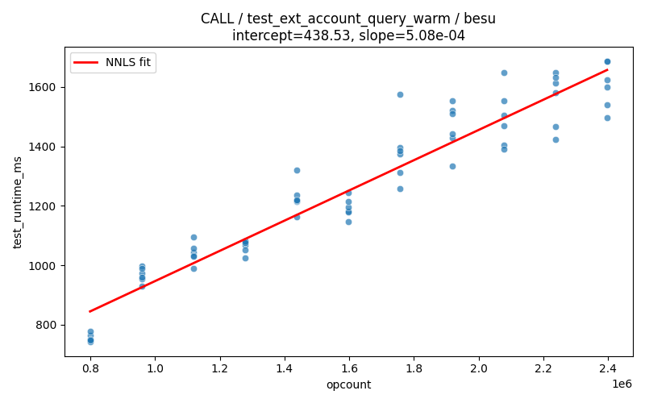

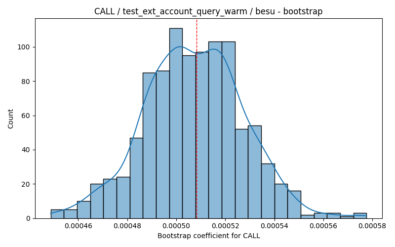

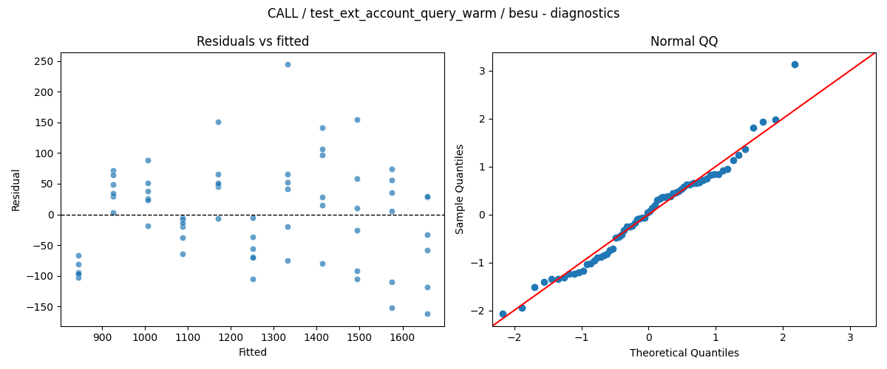

</details>

<details><summary>erigon — NNLS regression summary</summary>

```
==============================================================================
                           NNLS Regression Results                            
==============================================================================
Dep. Variable:          test_runtime_ms              R-squared:          0.955
Model:                  NNLS                    Adj. R-squared:          0.950
No. Observations:       11                                RMSE:           9.70
Df Residuals:           9                                  MAE:           7.94
Df Model:               1      
==============================================================================
                      coef     std err     P-value      [0.025      0.975]
------------------------------------------------------------------------------
         const     39.4464     10.8531       0.001     19.7866     63.1173
       opcount      0.0001      0.0000       0.001      0.0001      0.0001
==============================================================================
Notes: Non-negative least squares with bootstrap inference (1000 iterations)
==============================================================================
```

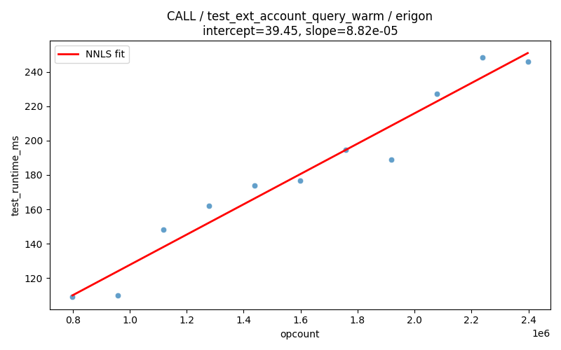

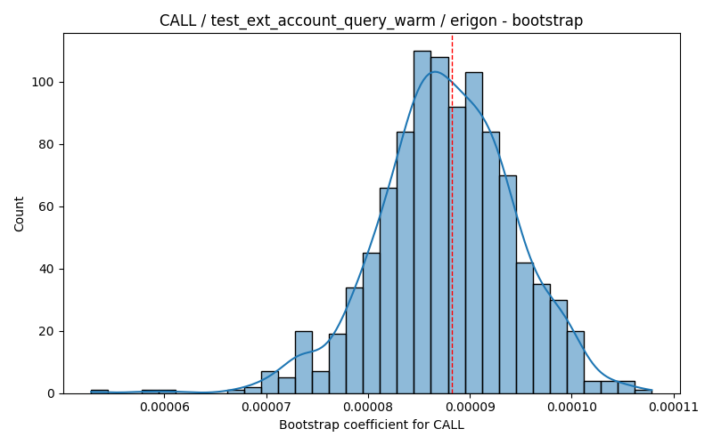

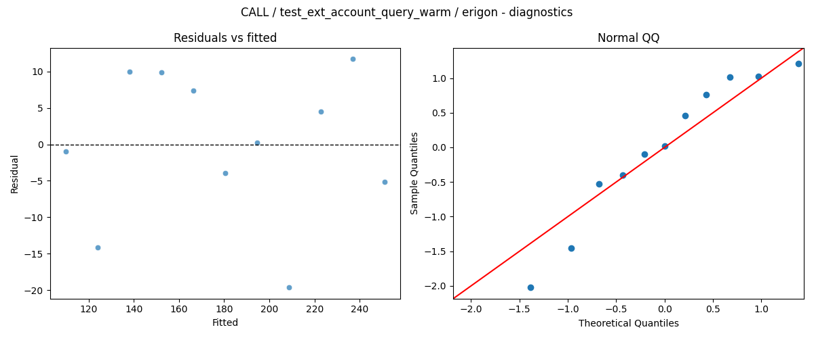

</details>

<details><summary>geth — NNLS regression summary</summary>

```
==============================================================================
                           NNLS Regression Results                            
==============================================================================
Dep. Variable:          test_runtime_ms              R-squared:          0.901
Model:                  NNLS                    Adj. R-squared:          0.900
No. Observations:       110                               RMSE:          21.52
Df Residuals:           108                                MAE:          16.40
Df Model:               1      
==============================================================================
                      coef     std err     P-value      [0.025      0.975]
------------------------------------------------------------------------------
         const     39.8742      6.2739       0.001     27.2578     52.0587
       opcount      0.0001      0.0000       0.001      0.0001      0.0001
==============================================================================
Notes: Non-negative least squares with bootstrap inference (1000 iterations)
==============================================================================
```

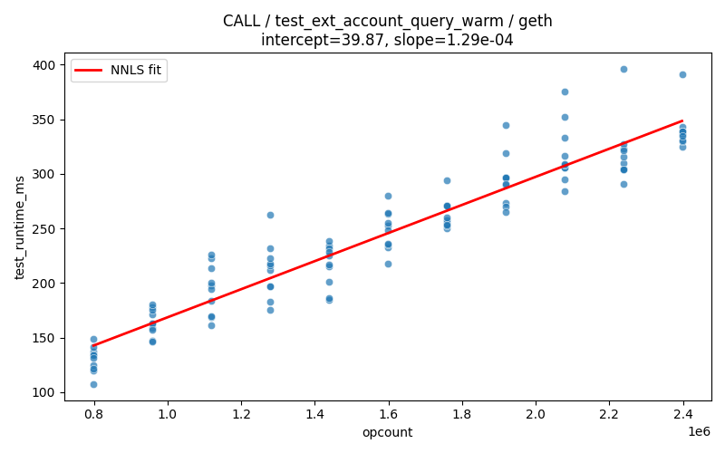

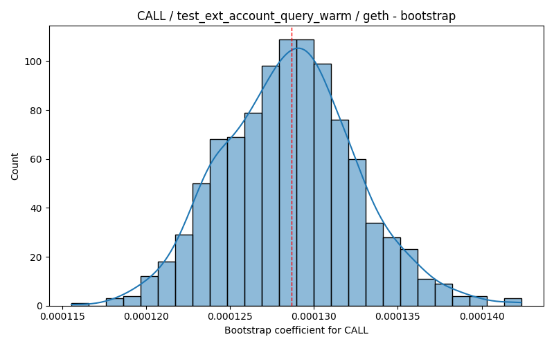

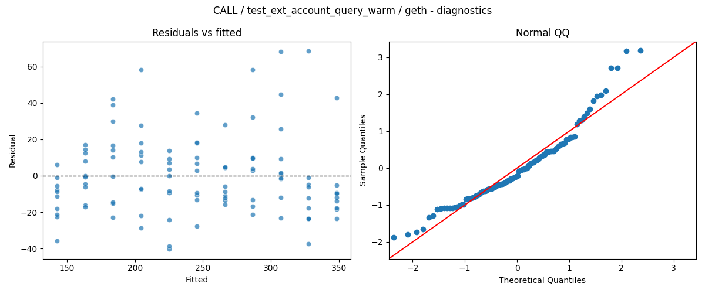

</details>

<details><summary>nethermind — NNLS regression summary</summary>

```
==============================================================================
                           NNLS Regression Results                            
==============================================================================
Dep. Variable:          test_runtime_ms              R-squared:          0.806
Model:                  NNLS                    Adj. R-squared:          0.802
No. Observations:       44                                RMSE:          62.58
Df Residuals:           42                                 MAE:          49.06
Df Model:               1      
==============================================================================
                      coef     std err     P-value      [0.025      0.975]
------------------------------------------------------------------------------
         const    355.3771     29.2006       0.001    296.0042    410.2110
       opcount      0.0003      0.0000       0.001      0.0002      0.0003
==============================================================================
Notes: Non-negative least squares with bootstrap inference (1000 iterations)
==============================================================================
```

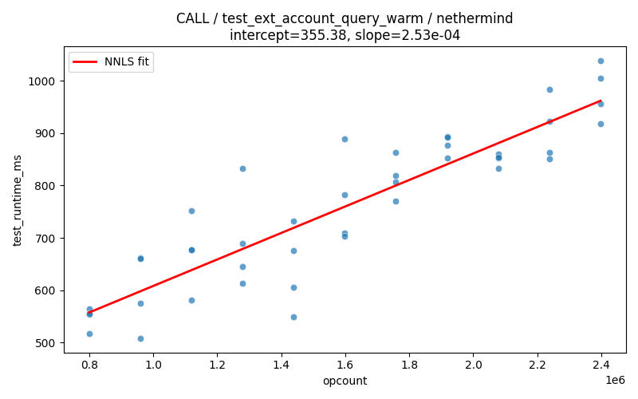

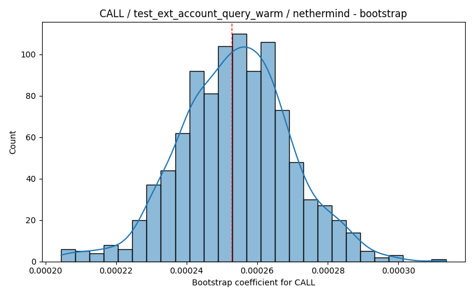

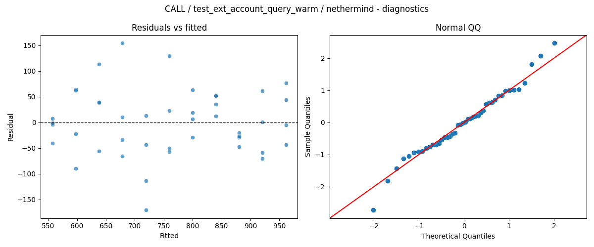

</details>

<details><summary>reth — NNLS regression summary</summary>

```
==============================================================================
                           NNLS Regression Results                            
==============================================================================
Dep. Variable:          test_runtime_ms              R-squared:          0.944
Model:                  NNLS                    Adj. R-squared:          0.944
No. Observations:       110                               RMSE:           7.41
Df Residuals:           108                                MAE:           6.12
Df Model:               1      
==============================================================================
                      coef     std err     P-value      [0.025      0.975]
------------------------------------------------------------------------------
         const     21.8324      2.3382       0.001     17.5667     26.3282
       opcount      0.0001      0.0000       0.001      0.0001      0.0001
==============================================================================
Notes: Non-negative least squares with bootstrap inference (1000 iterations)
==============================================================================
```

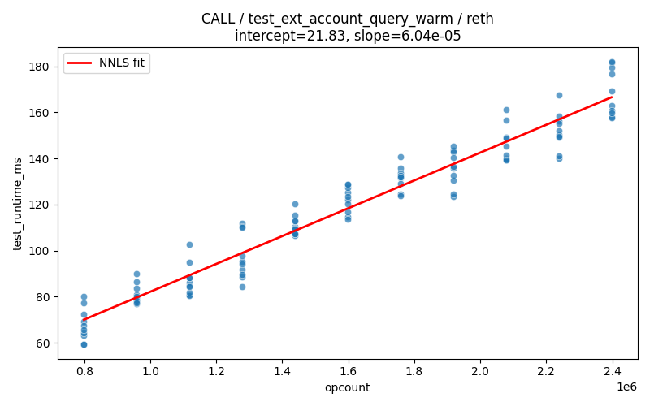

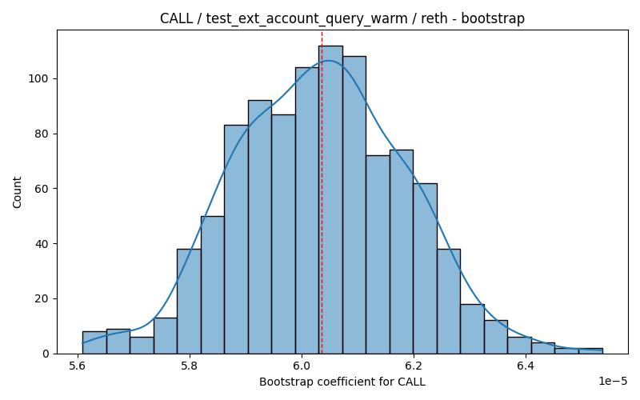

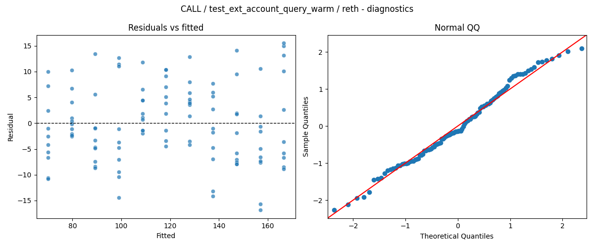

</details>

### test_account_access — combo `CALL_AccountMode.EXISTING_EOA` — `presets[cold_account_nocode_access]`

| client | nobs | R² | target_coef (ms) | p-value | 95% CI |
| --- | --- | --- | --- | --- | --- |
| `besu` | 66 | 0.9819 | 0.01749 | 1.00e-03 | [0.01693, 0.01804] |
| `erigon` | 11 | 0.9977 | 0.008583 | 1.00e-03 | [0.008207, 0.008686] |
| `geth` | 109 | 0.98 | 0.01165 | 1.00e-03 | [0.01131, 0.01197] |
| `nethermind` | 44 | 0.9396 | 0.003865 | 1.00e-03 | [0.003532, 0.004184] |
| `reth` | 110 | 0.9381 | 0.001624 | 1.00e-03 | [0.001549, 0.001705] |

<details><summary>besu — NNLS regression summary</summary>

```
==============================================================================
                           NNLS Regression Results                            
==============================================================================
Dep. Variable:          test_runtime_ms              R-squared:          0.982
Model:                  NNLS                    Adj. R-squared:          0.982
No. Observations:       66                                RMSE:          48.82
Df Residuals:           64                                 MAE:          32.56
Df Model:               1      
==============================================================================
                      coef     std err     P-value      [0.025      0.975]
------------------------------------------------------------------------------
         const    499.2110     16.8416       0.001    467.4184    532.9569
       opcount      0.0175      0.0003       0.001      0.0169      0.0180
==============================================================================
Notes: Non-negative least squares with bootstrap inference (1000 iterations)
==============================================================================
```

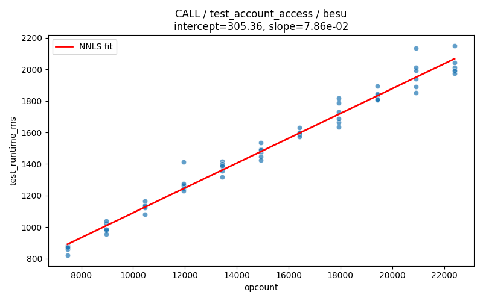

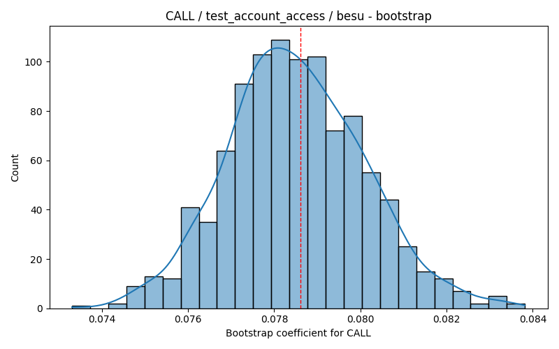

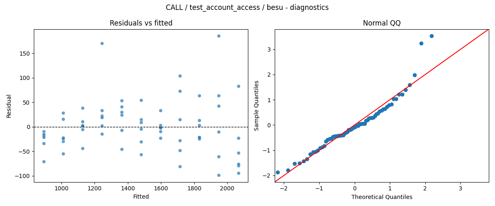

</details>

<details><summary>erigon — NNLS regression summary</summary>

```
==============================================================================
                           NNLS Regression Results                            
==============================================================================
Dep. Variable:          test_runtime_ms              R-squared:          0.998
Model:                  NNLS                    Adj. R-squared:          0.997
No. Observations:       11                                RMSE:           8.45
Df Residuals:           9                                  MAE:           7.09
Df Model:               1      
==============================================================================
                      coef     std err     P-value      [0.025      0.975]
------------------------------------------------------------------------------
         const      4.2604      6.3567       0.268      0.0000     22.3223
       opcount      0.0086      0.0001       0.001      0.0082      0.0087
==============================================================================
Notes: Non-negative least squares with bootstrap inference (1000 iterations)
==============================================================================
```


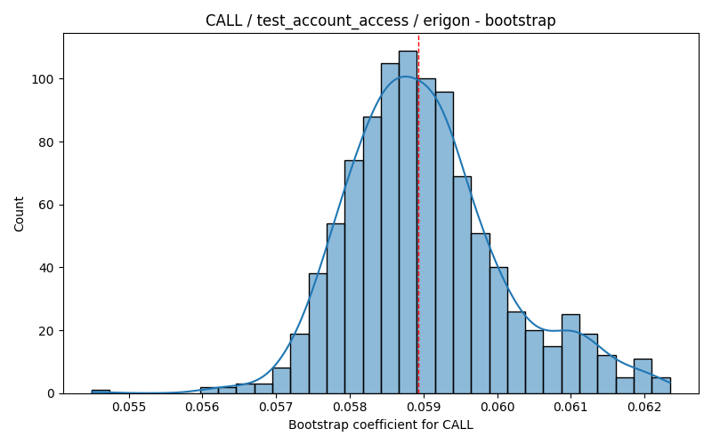

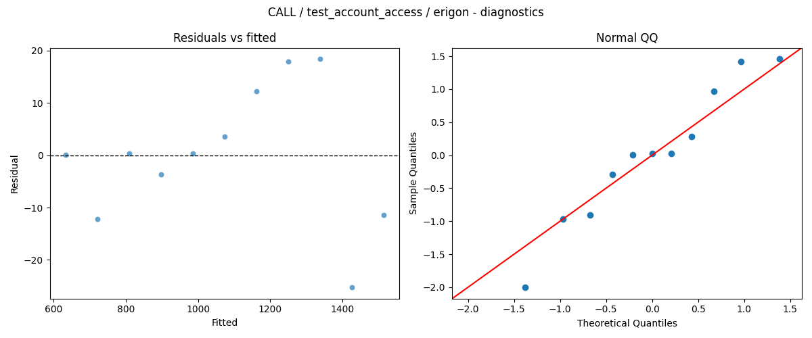

</details>

<details><summary>geth — NNLS regression summary</summary>

```
==============================================================================
                           NNLS Regression Results                            
==============================================================================
Dep. Variable:          test_runtime_ms              R-squared:          0.980
Model:                  NNLS                    Adj. R-squared:          0.980
No. Observations:       109                               RMSE:          33.92
Df Residuals:           107                                MAE:          27.49
Df Model:               1      
==============================================================================
                      coef     std err     P-value      [0.025      0.975]
------------------------------------------------------------------------------
         const    225.7193     10.9963       0.001    205.3646    249.0089
       opcount      0.0116      0.0002       0.001      0.0113      0.0120
==============================================================================
Notes: Non-negative least squares with bootstrap inference (1000 iterations)
==============================================================================
```

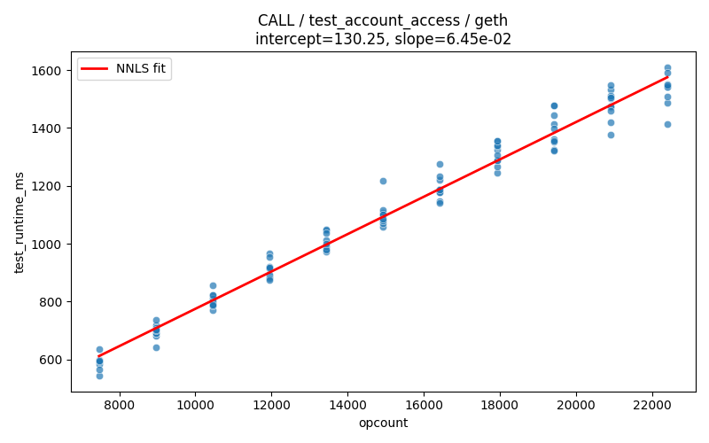

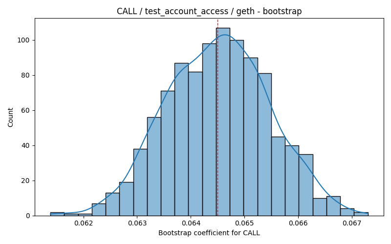

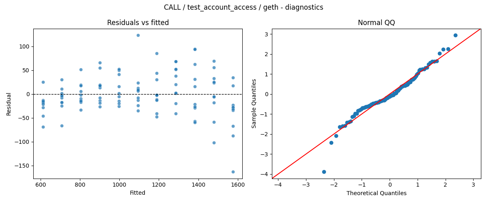

</details>

<details><summary>nethermind — NNLS regression summary</summary>

```
==============================================================================
                           NNLS Regression Results                            
==============================================================================
Dep. Variable:          test_runtime_ms              R-squared:          0.940
Model:                  NNLS                    Adj. R-squared:          0.938
No. Observations:       44                                RMSE:          20.13
Df Residuals:           42                                 MAE:          16.70
Df Model:               1      
==============================================================================
                      coef     std err     P-value      [0.025      0.975]
------------------------------------------------------------------------------
         const     83.3887      9.9402       0.001     64.6098    102.3125
       opcount      0.0039      0.0002       0.001      0.0035      0.0042
==============================================================================
Notes: Non-negative least squares with bootstrap inference (1000 iterations)
==============================================================================
```

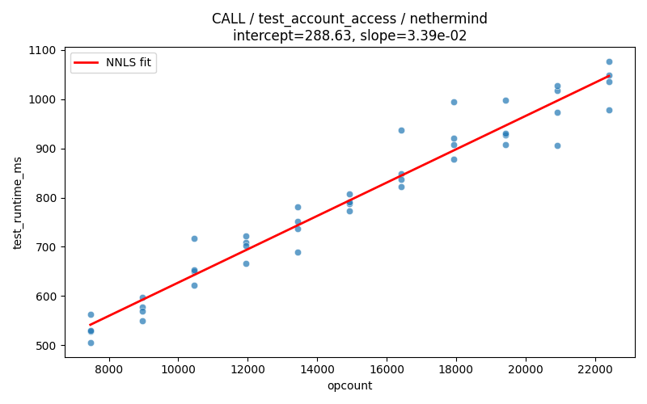

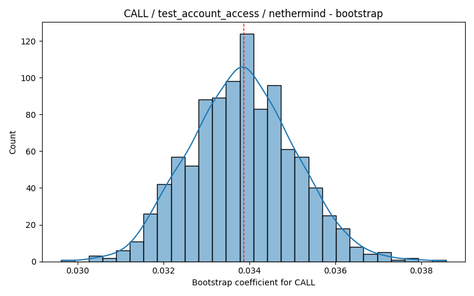

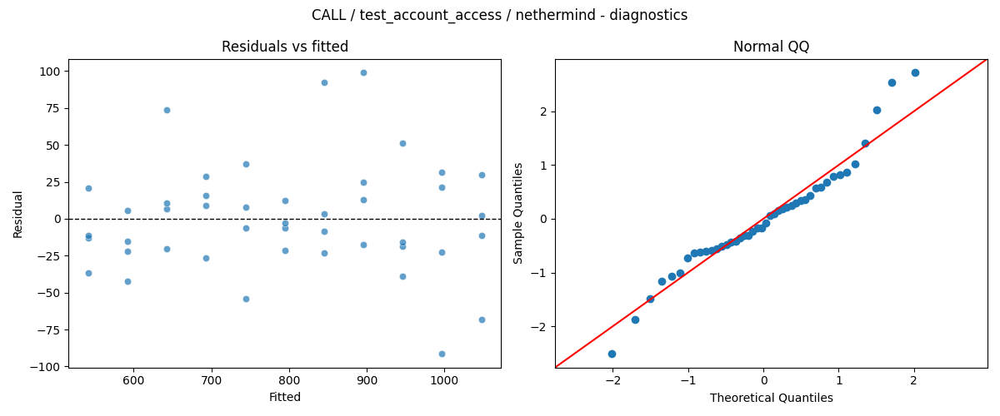

</details>

<details><summary>reth — NNLS regression summary</summary>

```
==============================================================================
                           NNLS Regression Results                            
==============================================================================
Dep. Variable:          test_runtime_ms              R-squared:          0.938
Model:                  NNLS                    Adj. R-squared:          0.938
No. Observations:       110                               RMSE:           8.57
Df Residuals:           108                                MAE:           6.73
Df Model:               1      
==============================================================================
                      coef     std err     P-value      [0.025      0.975]
------------------------------------------------------------------------------
         const     41.5071      2.5695       0.001     36.6669     46.4308
       opcount      0.0016      0.0000       0.001      0.0015      0.0017
==============================================================================
Notes: Non-negative least squares with bootstrap inference (1000 iterations)
==============================================================================
```


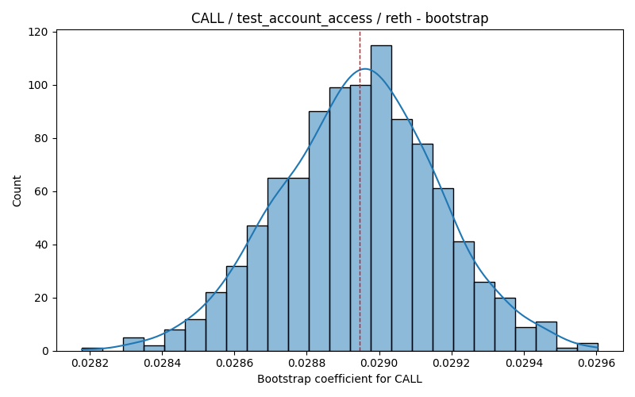

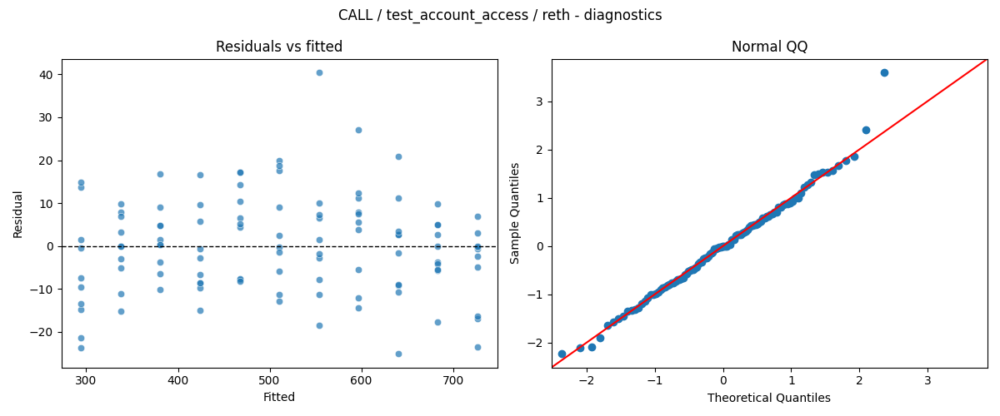

</details>

### test_account_access — combo `CALL_AccountMode.NON_EXISTING_ACCOUNT` — `presets[cold_account_nocode_access]`

| client | nobs | R² | target_coef (ms) | p-value | 95% CI |
| --- | --- | --- | --- | --- | --- |
| `besu` | 66 | 0.9862 | 0.01899 | 1.00e-03 | [0.01848, 0.01954] |
| `erigon` | 11 | 0.9952 | 0.00823 | 1.00e-03 | [0.007803, 0.008378] |
| `geth` | 110 | 0.9848 | 0.02211 | 1.00e-03 | [0.02161, 0.02264] |
| `nethermind` | 44 | 0.9253 | 0.004007 | 1.00e-03 | [0.003676, 0.004384] |
| `reth` | 110 | 0.9311 | 0.001097 | 1.00e-03 | [0.001043, 0.001156] |

<details><summary>besu — NNLS regression summary</summary>

```
==============================================================================
                           NNLS Regression Results                            
==============================================================================
Dep. Variable:          test_runtime_ms              R-squared:          0.986
Model:                  NNLS                    Adj. R-squared:          0.986
No. Observations:       66                                RMSE:          46.12
Df Residuals:           64                                 MAE:          36.74
Df Model:               1      
==============================================================================
                      coef     std err     P-value      [0.025      0.975]
------------------------------------------------------------------------------
         const    207.3693     17.6701       0.001    171.5371    240.4824
       opcount      0.0190      0.0003       0.001      0.0185      0.0195
==============================================================================
Notes: Non-negative least squares with bootstrap inference (1000 iterations)
==============================================================================
```

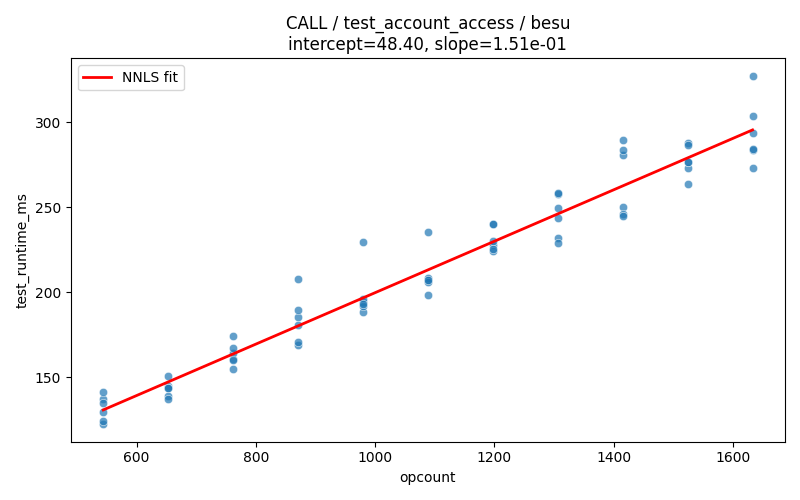

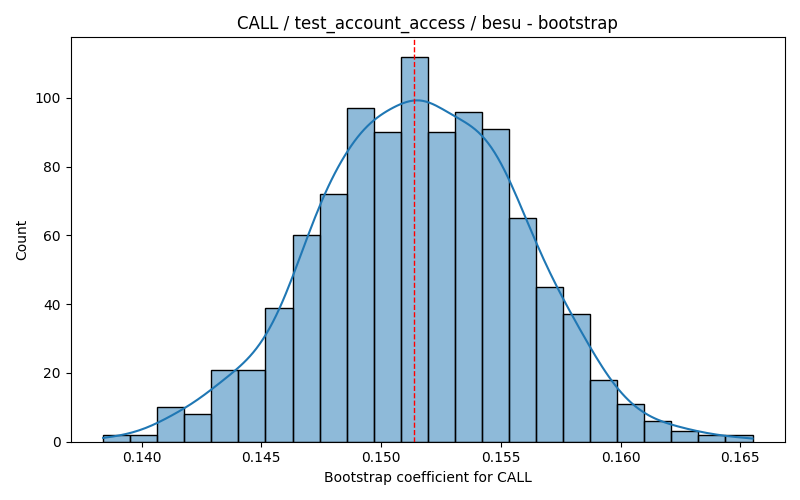

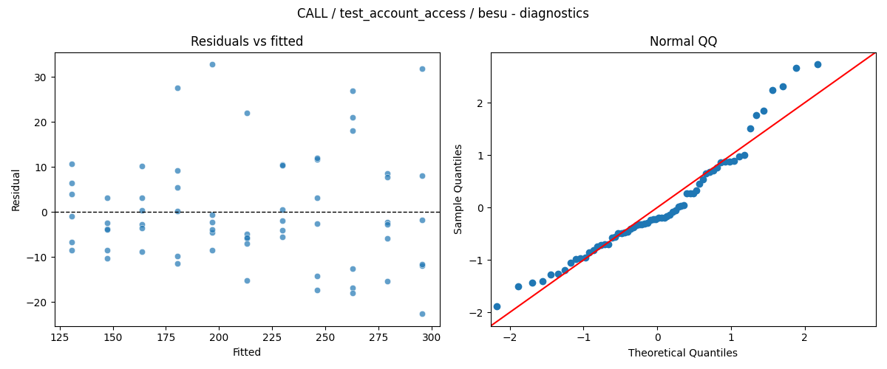

</details>

<details><summary>erigon — NNLS regression summary</summary>

```
==============================================================================
                           NNLS Regression Results                            
==============================================================================
Dep. Variable:          test_runtime_ms              R-squared:          0.995
Model:                  NNLS                    Adj. R-squared:          0.995
No. Observations:       11                                RMSE:          11.70
Df Residuals:           9                                  MAE:           9.80
Df Model:               1      
==============================================================================
                      coef     std err     P-value      [0.025      0.975]
------------------------------------------------------------------------------
         const     10.3339     10.5197       0.196      0.0000     35.3377
       opcount      0.0082      0.0002       0.001      0.0078      0.0084
==============================================================================
Notes: Non-negative least squares with bootstrap inference (1000 iterations)
==============================================================================
```

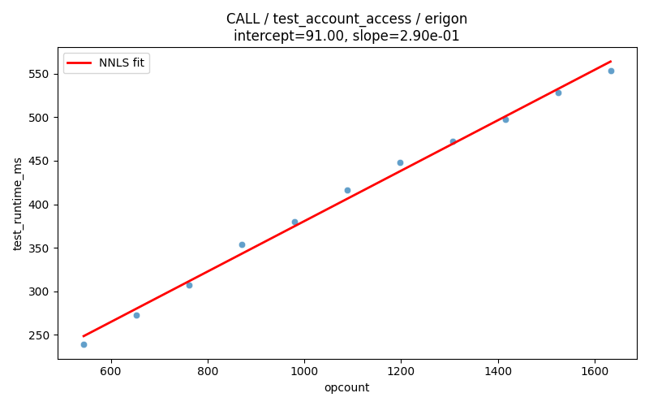

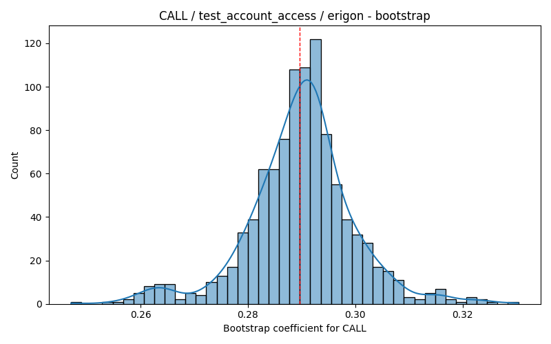

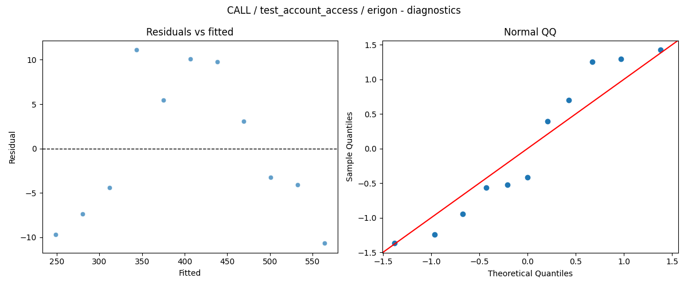

</details>

<details><summary>geth — NNLS regression summary</summary>

```
==============================================================================
                           NNLS Regression Results                            
==============================================================================
Dep. Variable:          test_runtime_ms              R-squared:          0.985
Model:                  NNLS                    Adj. R-squared:          0.985
No. Observations:       110                               RMSE:          56.39
Df Residuals:           108                                MAE:          46.35
Df Model:               1      
==============================================================================
                      coef     std err     P-value      [0.025      0.975]
------------------------------------------------------------------------------
         const    294.0415     16.7386       0.001    261.0310    326.7176
       opcount      0.0221      0.0003       0.001      0.0216      0.0226
==============================================================================
Notes: Non-negative least squares with bootstrap inference (1000 iterations)
==============================================================================
```

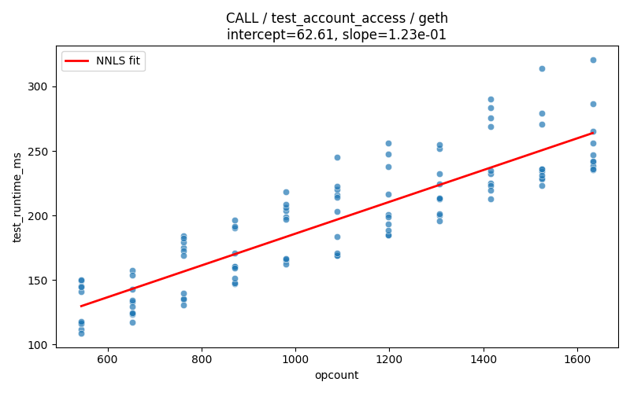

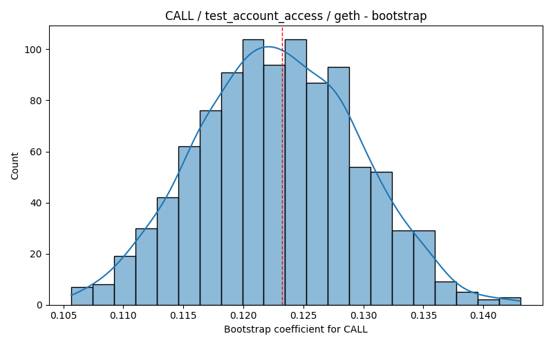

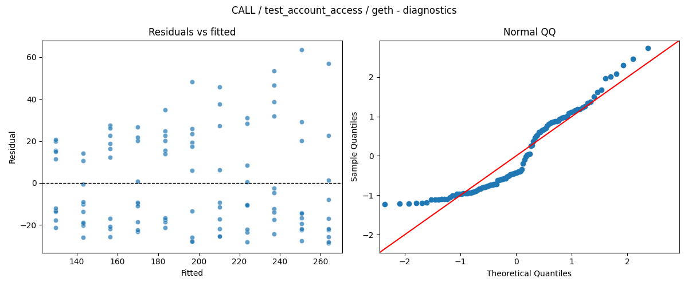

</details>

<details><summary>nethermind — NNLS regression summary</summary>

```
==============================================================================
                           NNLS Regression Results                            
==============================================================================
Dep. Variable:          test_runtime_ms              R-squared:          0.925
Model:                  NNLS                    Adj. R-squared:          0.923
No. Observations:       44                                RMSE:          23.39
Df Residuals:           42                                 MAE:          17.65
Df Model:               1      
==============================================================================
                      coef     std err     P-value      [0.025      0.975]
------------------------------------------------------------------------------
         const     58.0357     11.5361       0.001     33.5031     78.6111
       opcount      0.0040      0.0002       0.001      0.0037      0.0044
==============================================================================
Notes: Non-negative least squares with bootstrap inference (1000 iterations)
==============================================================================
```

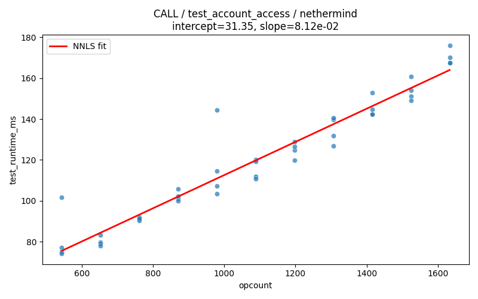

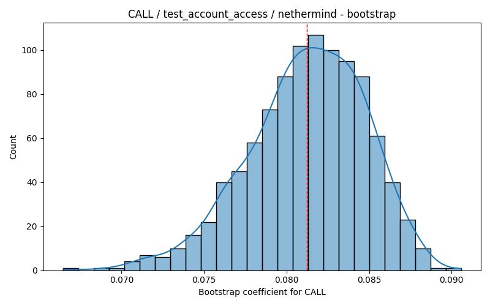

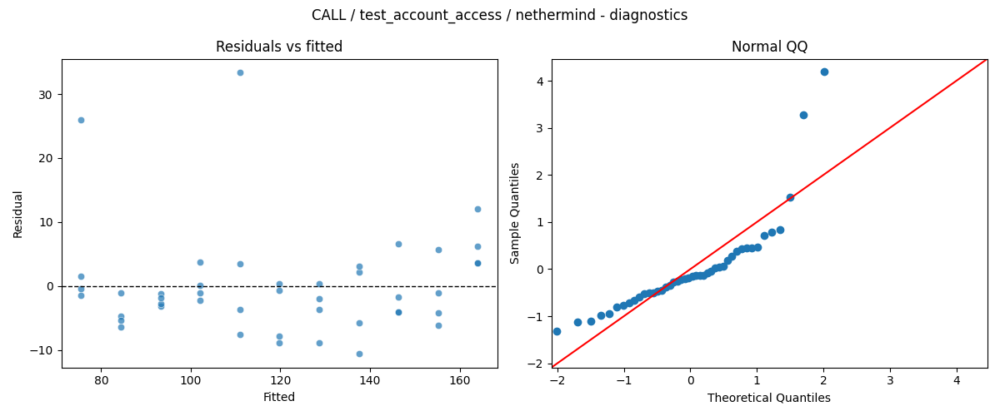

</details>

<details><summary>reth — NNLS regression summary</summary>

```
==============================================================================
                           NNLS Regression Results                            
==============================================================================
Dep. Variable:          test_runtime_ms              R-squared:          0.931
Model:                  NNLS                    Adj. R-squared:          0.930
No. Observations:       110                               RMSE:           6.13
Df Residuals:           108                                MAE:           4.90
Df Model:               1      
==============================================================================
                      coef     std err     P-value      [0.025      0.975]
------------------------------------------------------------------------------
         const     35.7079      1.9724       0.001     31.9032     39.5723
       opcount      0.0011      0.0000       0.001      0.0010      0.0012
==============================================================================
Notes: Non-negative least squares with bootstrap inference (1000 iterations)
==============================================================================
```

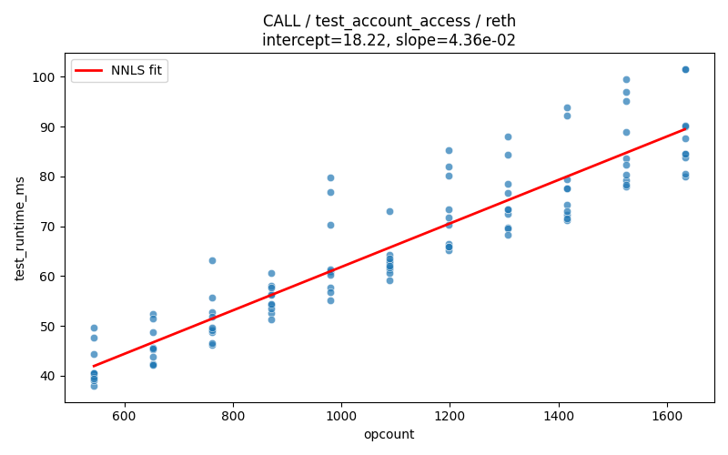

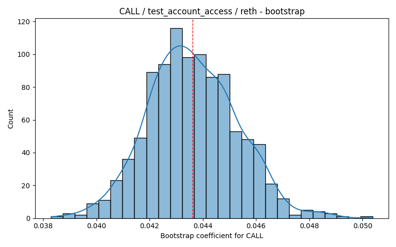

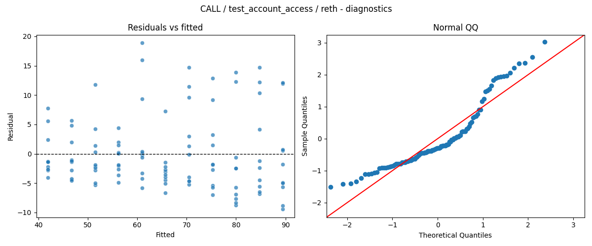

</details>

### test_account_access — combo `CALL_AccountMode.EXISTING_EOA` — `presets[cold_account_nocode_write]`

| client | nobs | R² | target_coef (ms) | p-value | 95% CI |
| --- | --- | --- | --- | --- | --- |
| `besu` | 66 | 0.9804 | 0.0786 | 1.00e-03 | [0.07546, 0.0818] |
| `erigon` | 11 | 0.998 | 0.05893 | 1.00e-03 | [0.05728, 0.06154] |
| `geth` | 109 | 0.9815 | 0.06449 | 1.00e-03 | [0.0627, 0.06627] |
| `nethermind` | 44 | 0.9507 | 0.03387 | 1.00e-03 | [0.03158, 0.03627] |
| `reth` | 110 | 0.9933 | 0.02895 | 1.00e-03 | [0.02851, 0.02937] |

<details><summary>besu — NNLS regression summary</summary>

```
==============================================================================
                           NNLS Regression Results                            
==============================================================================
Dep. Variable:          test_runtime_ms              R-squared:          0.980
Model:                  NNLS                    Adj. R-squared:          0.980
No. Observations:       66                                RMSE:          52.45
Df Residuals:           64                                 MAE:          38.10
Df Model:               1      
==============================================================================
                      coef     std err     P-value      [0.025      0.975]
------------------------------------------------------------------------------
         const    305.3604     21.3815       0.001    266.1881    351.1063
       opcount      0.0786      0.0016       0.001      0.0755      0.0818
==============================================================================
Notes: Non-negative least squares with bootstrap inference (1000 iterations)
==============================================================================
```


</details>

<details><summary>erigon — NNLS regression summary</summary>

```
==============================================================================
                           NNLS Regression Results                            
==============================================================================
Dep. Variable:          test_runtime_ms              R-squared:          0.998
Model:                  NNLS                    Adj. R-squared:          0.998
No. Observations:       11                                RMSE:          12.61
Df Residuals:           9                                  MAE:           9.56
Df Model:               1      
==============================================================================
                      coef     std err     P-value      [0.025      0.975]
------------------------------------------------------------------------------
         const    193.5860     13.6667       0.001    161.6664    216.2469
       opcount      0.0589      0.0011       0.001      0.0573      0.0615
==============================================================================
Notes: Non-negative least squares with bootstrap inference (1000 iterations)
==============================================================================
```


</details>

<details><summary>geth — NNLS regression summary</summary>

```
==============================================================================
                           NNLS Regression Results                            
==============================================================================
Dep. Variable:          test_runtime_ms              R-squared:          0.981
Model:                  NNLS                    Adj. R-squared:          0.981
No. Observations:       109                               RMSE:          42.01
Df Residuals:           107                                MAE:          31.45
Df Model:               1      
==============================================================================
                      coef     std err     P-value      [0.025      0.975]
------------------------------------------------------------------------------
         const    130.2533     12.4681       0.001    106.1755    153.9678
       opcount      0.0645      0.0009       0.001      0.0627      0.0663
==============================================================================
Notes: Non-negative least squares with bootstrap inference (1000 iterations)
==============================================================================
```


</details>

<details><summary>nethermind — NNLS regression summary</summary>

```
==============================================================================
                           NNLS Regression Results                            
==============================================================================
Dep. Variable:          test_runtime_ms              R-squared:          0.951
Model:                  NNLS                    Adj. R-squared:          0.950
No. Observations:       44                                RMSE:          36.41
Df Residuals:           42                                 MAE:          27.09
Df Model:               1      
==============================================================================
                      coef     std err     P-value      [0.025      0.975]
------------------------------------------------------------------------------
         const    288.6273     16.9724       0.001    255.8749    322.6199
       opcount      0.0339      0.0012       0.001      0.0316      0.0363
==============================================================================
Notes: Non-negative least squares with bootstrap inference (1000 iterations)
==============================================================================
```


</details>

<details><summary>reth — NNLS regression summary</summary>

```
==============================================================================
                           NNLS Regression Results                            
==============================================================================
Dep. Variable:          test_runtime_ms              R-squared:          0.993
Model:                  NNLS                    Adj. R-squared:          0.993
No. Observations:       110                               RMSE:          11.25
Df Residuals:           108                                MAE:           8.81
Df Model:               1      
==============================================================================
                      coef     std err     P-value      [0.025      0.975]
------------------------------------------------------------------------------
         const     78.2372      3.3780       0.001     71.8739     85.1398
       opcount      0.0289      0.0002       0.001      0.0285      0.0294
==============================================================================
Notes: Non-negative least squares with bootstrap inference (1000 iterations)
==============================================================================
```


</details>

### test_account_access — combo `CALL_AccountMode.NON_EXISTING_ACCOUNT` — `presets[cold_account_nocode_write]`

| client | nobs | R² | target_coef (ms) | p-value | 95% CI |
| --- | --- | --- | --- | --- | --- |
| `besu` | 66 | 0.9498 | 0.1514 | 1.00e-03 | [0.1432, 0.1597] |
| `erigon` | 11 | 0.994 | 0.2896 | 1.00e-03 | [0.2641, 0.3092] |
| `geth` | 110 | 0.7709 | 0.1232 | 1.00e-03 | [0.1105, 0.1353] |
| `nethermind` | 44 | 0.9253 | 0.08123 | 1.00e-03 | [0.07373, 0.08723] |
| `reth` | 110 | 0.8531 | 0.04362 | 1.00e-03 | [0.04053, 0.04689] |

<details><summary>besu — NNLS regression summary</summary>

```
==============================================================================
                           NNLS Regression Results                            
==============================================================================
Dep. Variable:          test_runtime_ms              R-squared:          0.950
Model:                  NNLS                    Adj. R-squared:          0.949
No. Observations:       66                                RMSE:          11.99
Df Residuals:           64                                 MAE:           9.29
Df Model:               1      
==============================================================================
                      coef     std err     P-value      [0.025      0.975]
------------------------------------------------------------------------------
         const     48.4009      4.2183       0.001     40.2439     56.9510
       opcount      0.1514      0.0042       0.001      0.1432      0.1597
==============================================================================
Notes: Non-negative least squares with bootstrap inference (1000 iterations)
==============================================================================
```


</details>

<details><summary>erigon — NNLS regression summary</summary>

```
==============================================================================
                           NNLS Regression Results                            
==============================================================================
Dep. Variable:          test_runtime_ms              R-squared:          0.994
Model:                  NNLS                    Adj. R-squared:          0.993
No. Observations:       11                                RMSE:           7.78
Df Residuals:           9                                  MAE:           7.17
Df Model:               1      
==============================================================================
                      coef     std err     P-value      [0.025      0.975]
------------------------------------------------------------------------------
         const     91.0030     11.6595       0.001     73.5853    125.6917
       opcount      0.2896      0.0101       0.001      0.2641      0.3092
==============================================================================
Notes: Non-negative least squares with bootstrap inference (1000 iterations)
==============================================================================
```


</details>

<details><summary>geth — NNLS regression summary</summary>

```
==============================================================================
                           NNLS Regression Results                            
==============================================================================
Dep. Variable:          test_runtime_ms              R-squared:          0.771
Model:                  NNLS                    Adj. R-squared:          0.769
No. Observations:       110                               RMSE:          23.15
Df Residuals:           108                                MAE:          20.39
Df Model:               1      
==============================================================================
                      coef     std err     P-value      [0.025      0.975]
------------------------------------------------------------------------------
         const     62.6071      6.7208       0.001     50.3199     76.2961
       opcount      0.1232      0.0066       0.001      0.1105      0.1353
==============================================================================
Notes: Non-negative least squares with bootstrap inference (1000 iterations)
==============================================================================
```


</details>

<details><summary>nethermind — NNLS regression summary</summary>

```
==============================================================================
                           NNLS Regression Results                            
==============================================================================
Dep. Variable:          test_runtime_ms              R-squared:          0.925
Model:                  NNLS                    Adj. R-squared:          0.924
No. Observations:       44                                RMSE:           7.95
Df Residuals:           42                                 MAE:           5.09
Df Model:               1      
==============================================================================
                      coef     std err     P-value      [0.025      0.975]
------------------------------------------------------------------------------
         const     31.3469      4.4580       0.001     24.1733     40.7098
       opcount      0.0812      0.0035       0.001      0.0737      0.0872
==============================================================================
Notes: Non-negative least squares with bootstrap inference (1000 iterations)
==============================================================================
```


</details>

<details><summary>reth — NNLS regression summary</summary>

```
==============================================================================
                           NNLS Regression Results                            
==============================================================================
Dep. Variable:          test_runtime_ms              R-squared:          0.853
Model:                  NNLS                    Adj. R-squared:          0.852
No. Observations:       110                               RMSE:           6.24
Df Residuals:           108                                MAE:           4.83
Df Model:               1      
==============================================================================
                      coef     std err     P-value      [0.025      0.975]
------------------------------------------------------------------------------
         const     18.2245      1.6487       0.001     15.1357     21.3429
       opcount      0.0436      0.0017       0.001      0.0405      0.0469
==============================================================================
Notes: Non-negative least squares with bootstrap inference (1000 iterations)
==============================================================================
```


</details>

### test_account_access — combo `CALL_AccountMode.EXISTING_CONTRACT_DIFF_MAX` — `presets[cold_account_code_access]`

| client | nobs | R² | target_coef (ms) | p-value | 95% CI |
| --- | --- | --- | --- | --- | --- |
| `besu` | 66 | 0.9795 | 0.023 | 1.00e-03 | [0.02233, 0.02368] |
| `erigon` | 11 | 0.8906 | 0.12 | 1.00e-03 | [0.08859, 0.1348] |
| `geth` | 108 | 0.9207 | 0.02153 | 1.00e-03 | [0.02022, 0.02299] |
| `nethermind` | 44 | 0.8908 | 0.01587 | 1.00e-03 | [0.0138, 0.01796] |
| `reth` | 110 | 0.9964 | 0.02161 | 1.00e-03 | [0.02136, 0.02186] |

<details><summary>besu — NNLS regression summary</summary>

```
==============================================================================
                           NNLS Regression Results                            
==============================================================================
Dep. Variable:          test_runtime_ms              R-squared:          0.979
Model:                  NNLS                    Adj. R-squared:          0.979
No. Observations:       66                                RMSE:          67.34
Df Residuals:           64                                 MAE:          49.09
Df Model:               1      
==============================================================================
                      coef     std err     P-value      [0.025      0.975]
------------------------------------------------------------------------------
         const    445.7038     25.0907       0.001    399.0616    496.8266
       opcount      0.0230      0.0004       0.001      0.0223      0.0237
==============================================================================
Notes: Non-negative least squares with bootstrap inference (1000 iterations)
==============================================================================
```


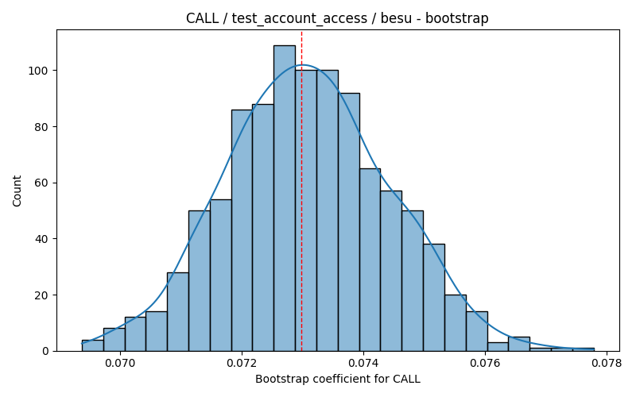

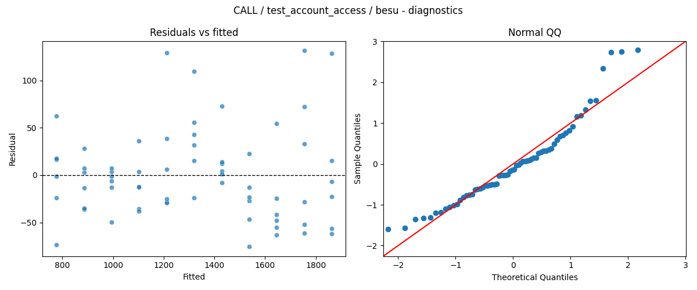

</details>

<details><summary>erigon — NNLS regression summary</summary>

```
==============================================================================
                           NNLS Regression Results                            
==============================================================================
Dep. Variable:          test_runtime_ms              R-squared:          0.891
Model:                  NNLS                    Adj. R-squared:          0.878
No. Observations:       11                                RMSE:         850.59
Df Residuals:           9                                  MAE:         746.21
Df Model:               1      
==============================================================================
                      coef     std err     P-value      [0.025      0.975]
------------------------------------------------------------------------------
         const    804.3870    925.2083       0.174      0.0000   3175.9311
       opcount      0.1200      0.0133       0.001      0.0886      0.1348
==============================================================================
Notes: Non-negative least squares with bootstrap inference (1000 iterations)
==============================================================================
```

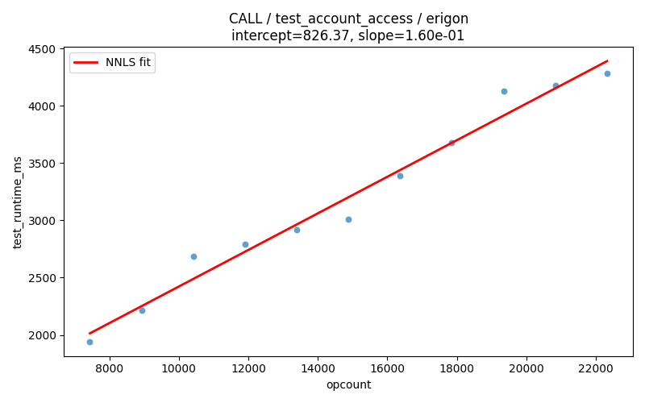

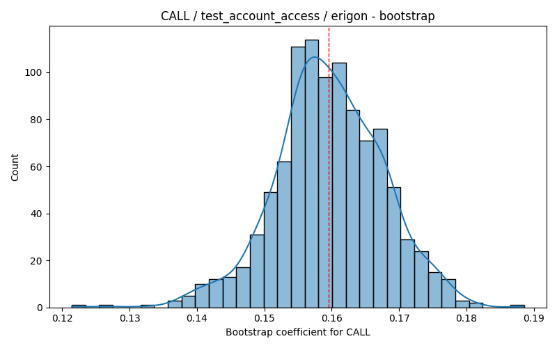

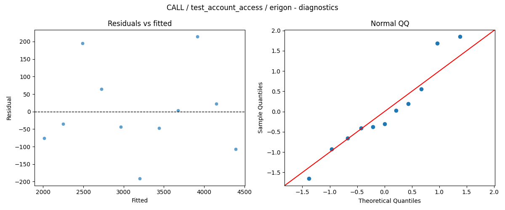

</details>

<details><summary>geth — NNLS regression summary</summary>

```
==============================================================================
                           NNLS Regression Results                            
==============================================================================
Dep. Variable:          test_runtime_ms              R-squared:          0.921
Model:                  NNLS                    Adj. R-squared:          0.920
No. Observations:       108                               RMSE:         126.89
Df Residuals:           106                                MAE:         102.88
Df Model:               1      
==============================================================================
                      coef     std err     P-value      [0.025      0.975]
------------------------------------------------------------------------------
         const    491.9273     45.3561       0.001    400.5093    582.4434
       opcount      0.0215      0.0007       0.001      0.0202      0.0230
==============================================================================
Notes: Non-negative least squares with bootstrap inference (1000 iterations)
==============================================================================
```

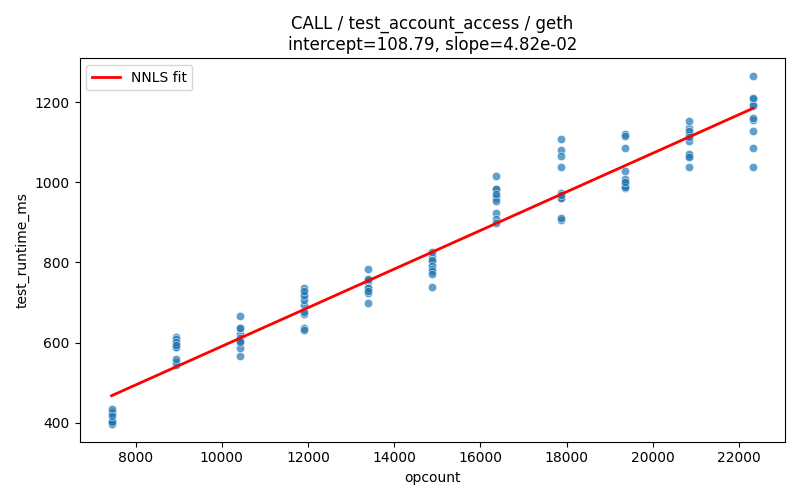

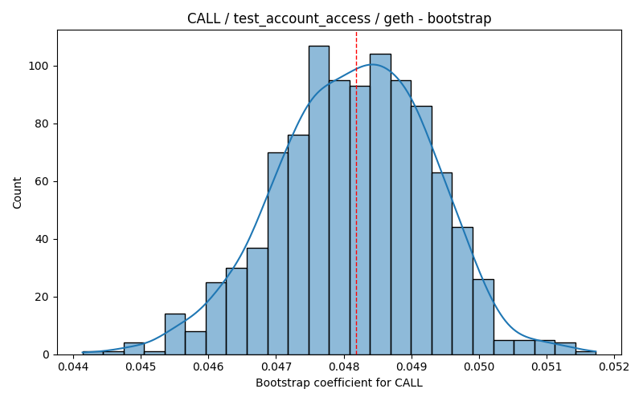

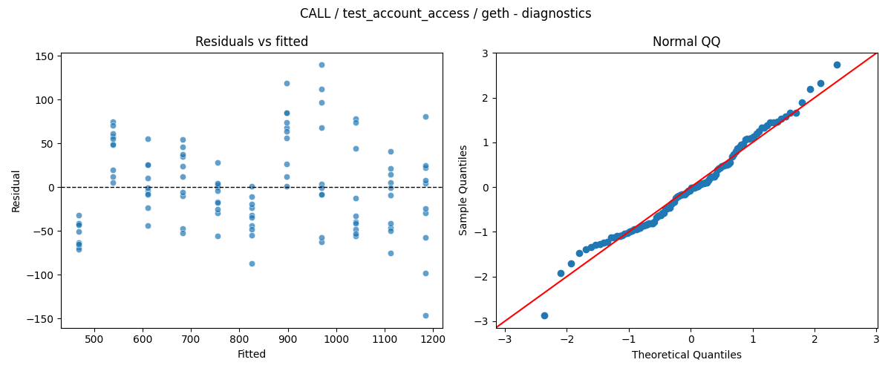

</details>

<details><summary>nethermind — NNLS regression summary</summary>

```
==============================================================================
                           NNLS Regression Results                            
==============================================================================
Dep. Variable:          test_runtime_ms              R-squared:          0.891
Model:                  NNLS                    Adj. R-squared:          0.888
No. Observations:       44                                RMSE:         112.37
Df Residuals:           42                                 MAE:          89.04
Df Model:               1      
==============================================================================
                      coef     std err     P-value      [0.025      0.975]
------------------------------------------------------------------------------
         const    635.6085     79.3796       0.001    484.1890    798.6646
       opcount      0.0159      0.0011       0.001      0.0138      0.0180
==============================================================================
Notes: Non-negative least squares with bootstrap inference (1000 iterations)
==============================================================================
```

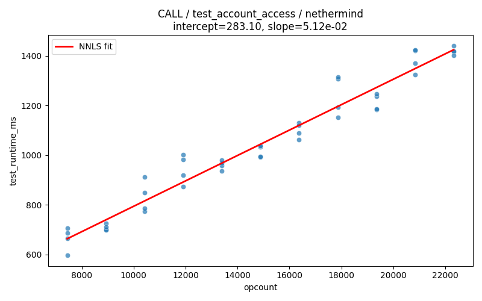

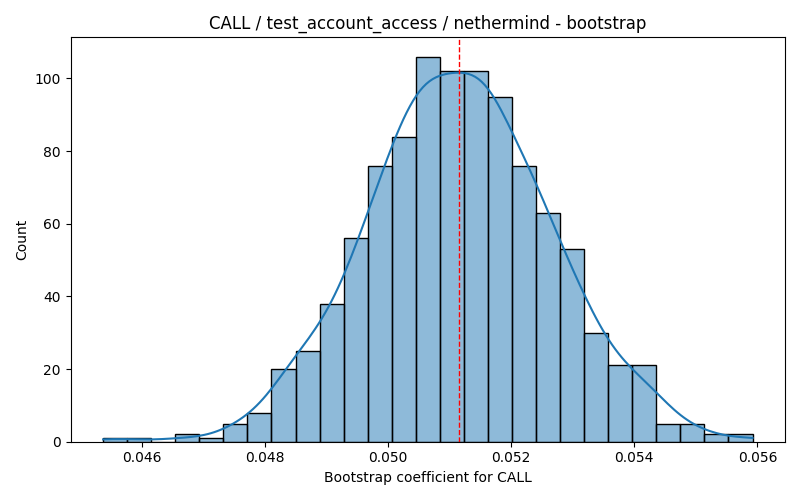

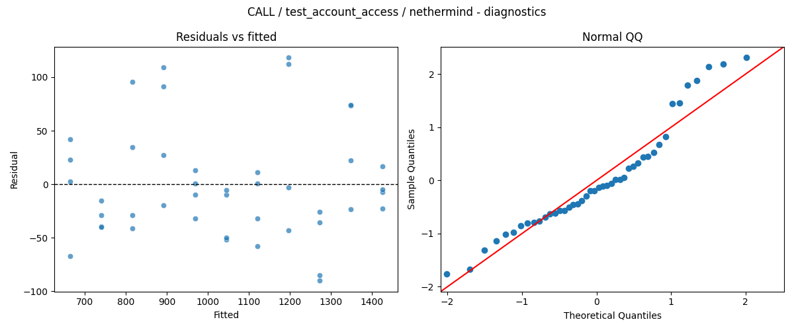

</details>

<details><summary>reth — NNLS regression summary</summary>

```
==============================================================================
                           NNLS Regression Results                            
==============================================================================
Dep. Variable:          test_runtime_ms              R-squared:          0.996
Model:                  NNLS                    Adj. R-squared:          0.996
No. Observations:       110                               RMSE:          26.20
Df Residuals:           108                                MAE:          19.80
Df Model:               1      
==============================================================================
                      coef     std err     P-value      [0.025      0.975]
------------------------------------------------------------------------------
         const    139.4528      8.2491       0.001    124.9195    155.8877
       opcount      0.0216      0.0001       0.001      0.0214      0.0219
==============================================================================
Notes: Non-negative least squares with bootstrap inference (1000 iterations)
==============================================================================
```

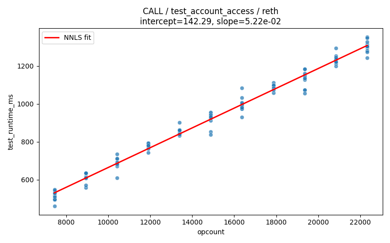

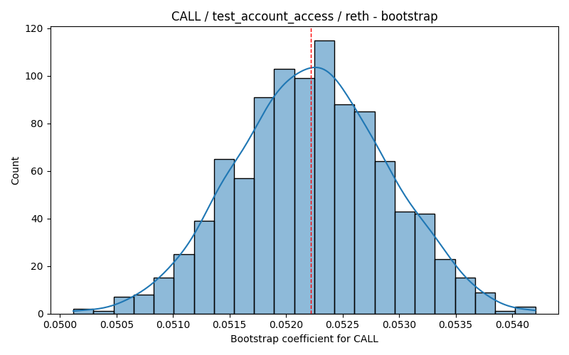

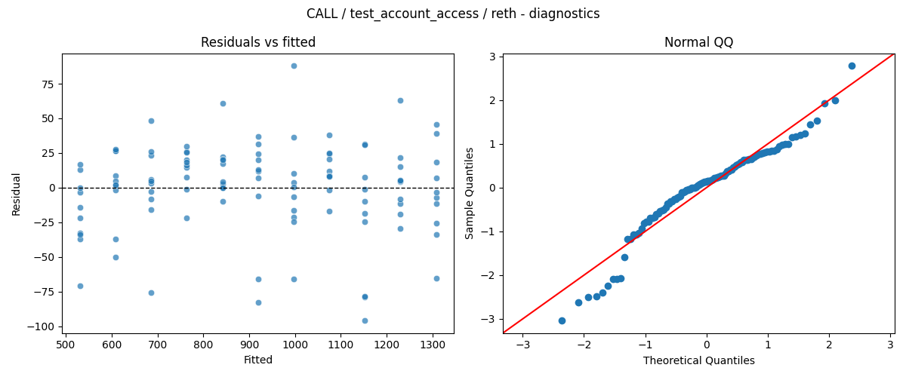

</details>

### test_account_access — combo `CALL_AccountMode.EXISTING_CONTRACT_MINIMAL` — `presets[cold_account_code_access]`

| client | nobs | R² | target_coef (ms) | p-value | 95% CI |
| --- | --- | --- | --- | --- | --- |
| `besu` | 66 | 0.9853 | 0.01496 | 1.00e-03 | [0.01446, 0.0155] |
| `erigon` | 11 | 0.9938 | 0.009445 | 1.00e-03 | [0.008854, 0.009863] |
| `geth` | 110 | 0.9363 | 0.005234 | 1.00e-03 | [0.004981, 0.005519] |
| `nethermind` | 44 | 0.6688 | 0.002788 | 1.00e-03 | [0.002262, 0.003449] |
| `reth` | 110 | 0.9774 | 0.003866 | 1.00e-03 | [0.003765, 0.003969] |

<details><summary>besu — NNLS regression summary</summary>

```
==============================================================================
                           NNLS Regression Results                            
==============================================================================
Dep. Variable:          test_runtime_ms              R-squared:          0.985
Model:                  NNLS                    Adj. R-squared:          0.985
No. Observations:       66                                RMSE:          36.99
Df Residuals:           64                                 MAE:          28.96
Df Model:               1      
==============================================================================
                      coef     std err     P-value      [0.025      0.975]
------------------------------------------------------------------------------
         const    360.2272     16.7432       0.001    327.8062    394.7255
       opcount      0.0150      0.0003       0.001      0.0145      0.0155
==============================================================================
Notes: Non-negative least squares with bootstrap inference (1000 iterations)
==============================================================================
```

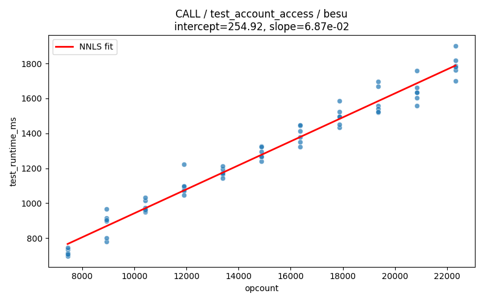

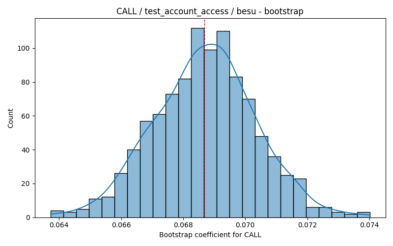

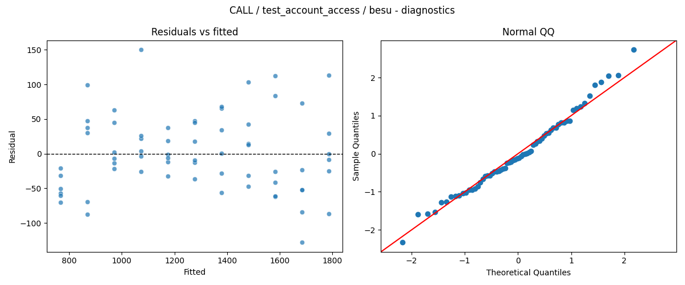

</details>

<details><summary>erigon — NNLS regression summary</summary>

```
==============================================================================
                           NNLS Regression Results                            
==============================================================================
Dep. Variable:          test_runtime_ms              R-squared:          0.994
Model:                  NNLS                    Adj. R-squared:          0.993
No. Observations:       11                                RMSE:          15.06
Df Residuals:           9                                  MAE:          12.68
Df Model:               1      
==============================================================================
                      coef     std err     P-value      [0.025      0.975]
------------------------------------------------------------------------------
         const    169.2378     18.4135       0.001    139.8386    210.9129
       opcount      0.0094      0.0003       0.001      0.0089      0.0099
==============================================================================
Notes: Non-negative least squares with bootstrap inference (1000 iterations)
==============================================================================
```

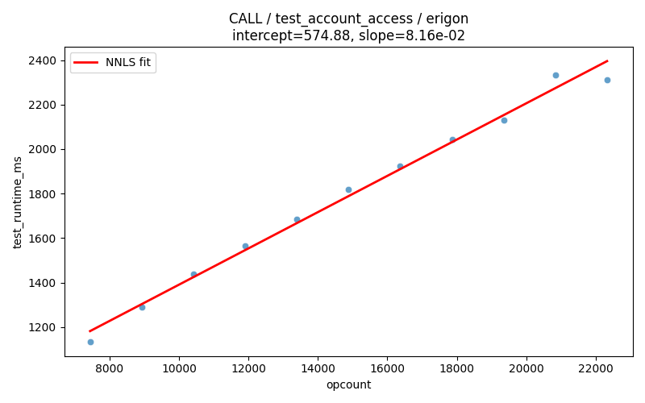

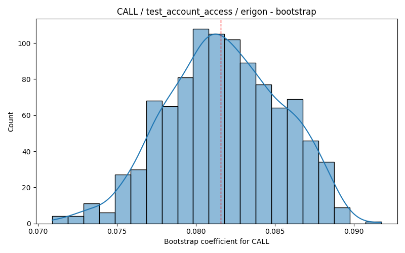

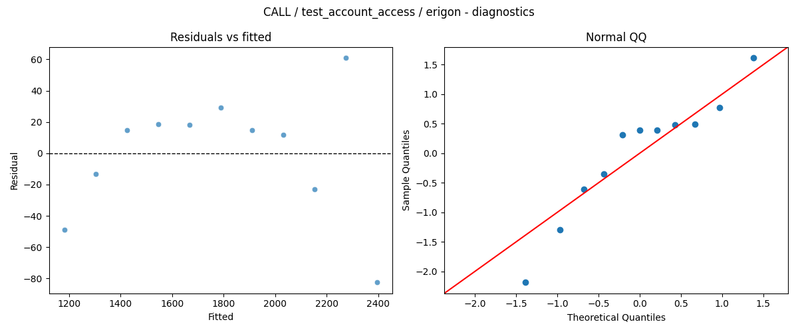

</details>

<details><summary>geth — NNLS regression summary</summary>

```
==============================================================================
                           NNLS Regression Results                            
==============================================================================
Dep. Variable:          test_runtime_ms              R-squared:          0.936
Model:                  NNLS                    Adj. R-squared:          0.936
No. Observations:       110                               RMSE:          27.60
Df Residuals:           108                                MAE:          21.51
Df Model:               1      
==============================================================================
                      coef     std err     P-value      [0.025      0.975]
------------------------------------------------------------------------------
         const     70.7982      7.9736       0.001     54.6128     85.6921
       opcount      0.0052      0.0001       0.001      0.0050      0.0055
==============================================================================
Notes: Non-negative least squares with bootstrap inference (1000 iterations)
==============================================================================
```

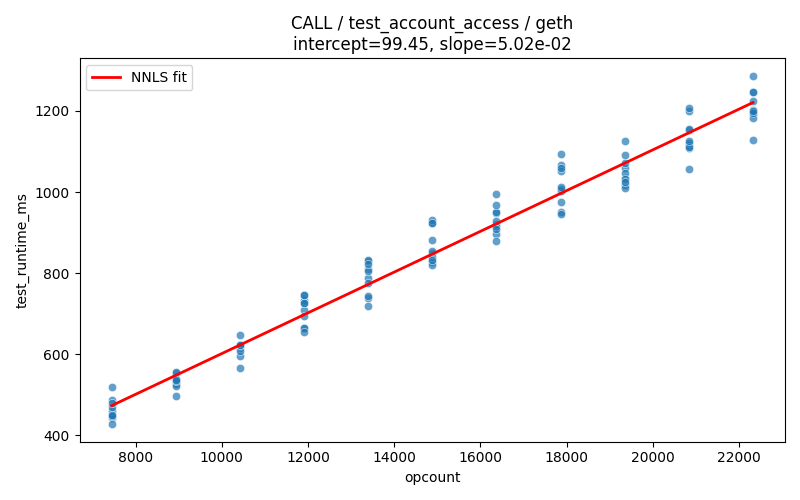

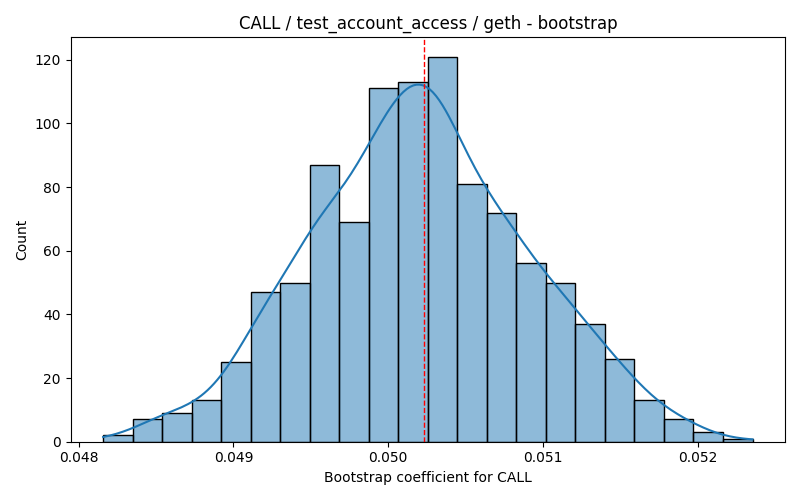

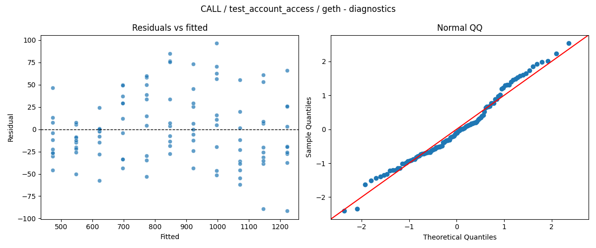

</details>

<details><summary>nethermind — NNLS regression summary</summary>

```
==============================================================================
                           NNLS Regression Results                            
==============================================================================
Dep. Variable:          test_runtime_ms              R-squared:          0.669
Model:                  NNLS                    Adj. R-squared:          0.661
No. Observations:       44                                RMSE:          39.67
Df Residuals:           42                                 MAE:          30.84
Df Model:               1      
==============================================================================
                      coef     std err     P-value      [0.025      0.975]
------------------------------------------------------------------------------
         const    117.0507     17.6838       0.001     80.7141    147.1656
       opcount      0.0028      0.0003       0.001      0.0023      0.0034
==============================================================================
Notes: Non-negative least squares with bootstrap inference (1000 iterations)
==============================================================================
```

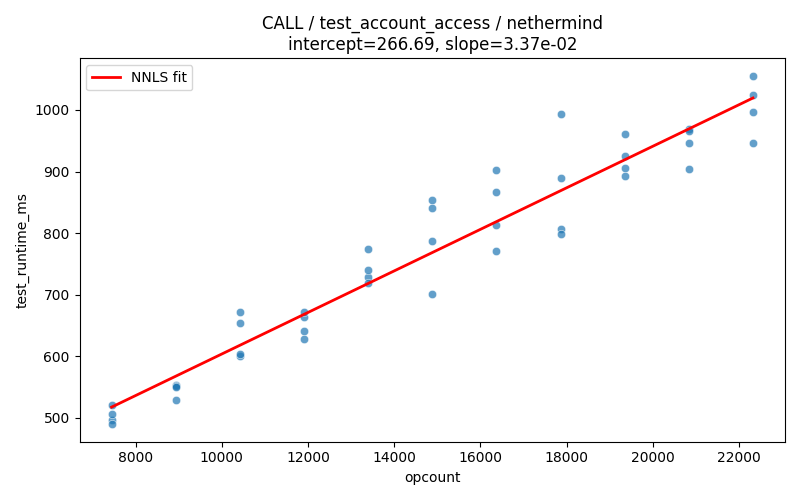

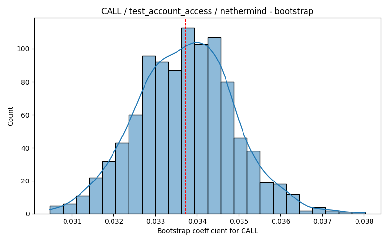

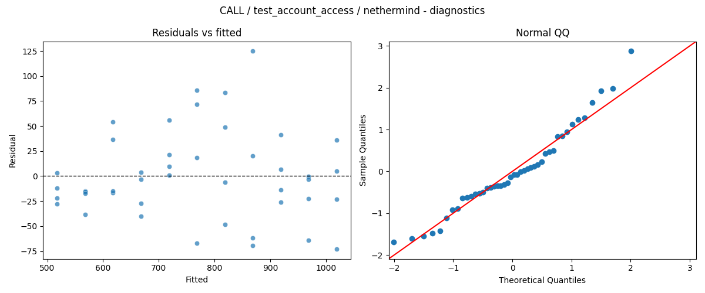

</details>

<details><summary>reth — NNLS regression summary</summary>

```
==============================================================================
                           NNLS Regression Results                            
==============================================================================
Dep. Variable:          test_runtime_ms              R-squared:          0.977
Model:                  NNLS                    Adj. R-squared:          0.977
No. Observations:       110                               RMSE:          11.88
Df Residuals:           108                                MAE:           9.56
Df Model:               1      
==============================================================================
                      coef     std err     P-value      [0.025      0.975]
------------------------------------------------------------------------------
         const     99.3191      3.2742       0.001     93.0750    106.0437
       opcount      0.0039      0.0001       0.001      0.0038      0.0040
==============================================================================
Notes: Non-negative least squares with bootstrap inference (1000 iterations)
==============================================================================
```

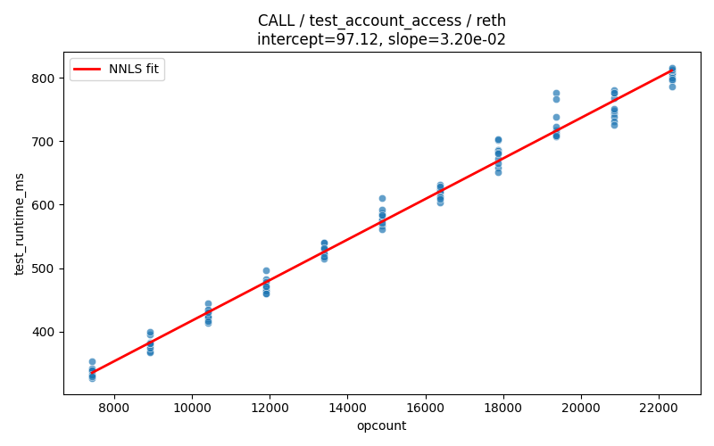

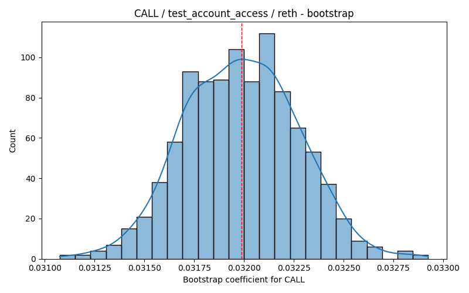

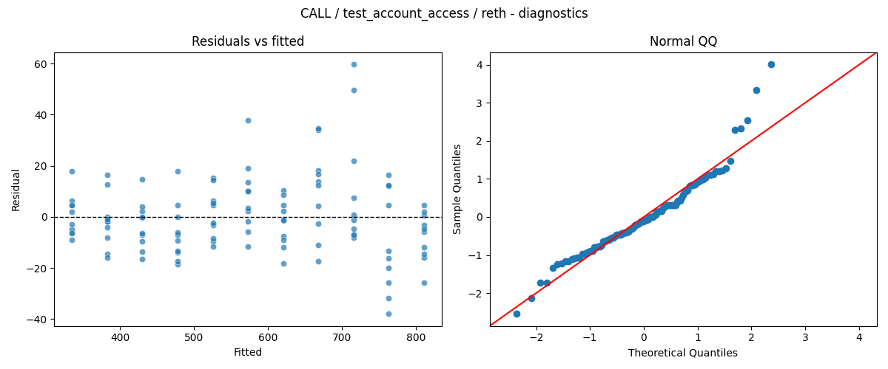

</details>

### test_account_access — combo `CALL_AccountMode.EXISTING_CONTRACT_SAME_MAX` — `presets[cold_account_code_access]`

| client | nobs | R² | target_coef (ms) | p-value | 95% CI |
| --- | --- | --- | --- | --- | --- |
| `besu` | 66 | 0.9749 | 0.01365 | 1.00e-03 | [0.01303, 0.01424] |
| `erigon` | 11 | 0.9899 | 0.009433 | 1.00e-03 | [0.008755, 0.0099] |
| `geth` | 110 | 0.947 | 0.005302 | 1.00e-03 | [0.005035, 0.00556] |
| `nethermind` | 44 | 0.7569 | 0.003054 | 1.00e-03 | [0.002479, 0.003664] |
| `reth` | 110 | 0.9767 | 0.004003 | 1.00e-03 | [0.003887, 0.004118] |

<details><summary>besu — NNLS regression summary</summary>

```
==============================================================================
                           NNLS Regression Results                            
==============================================================================
Dep. Variable:          test_runtime_ms              R-squared:          0.975
Model:                  NNLS                    Adj. R-squared:          0.974
No. Observations:       66                                RMSE:          44.31
Df Residuals:           64                                 MAE:          34.11
Df Model:               1      
==============================================================================
                      coef     std err     P-value      [0.025      0.975]
------------------------------------------------------------------------------
         const    412.7011     19.6149       0.001    375.1558    452.3124
       opcount      0.0136      0.0003       0.001      0.0130      0.0142
==============================================================================
Notes: Non-negative least squares with bootstrap inference (1000 iterations)
==============================================================================
```

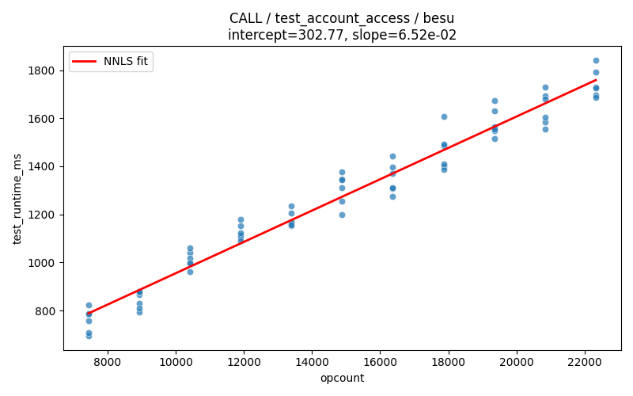

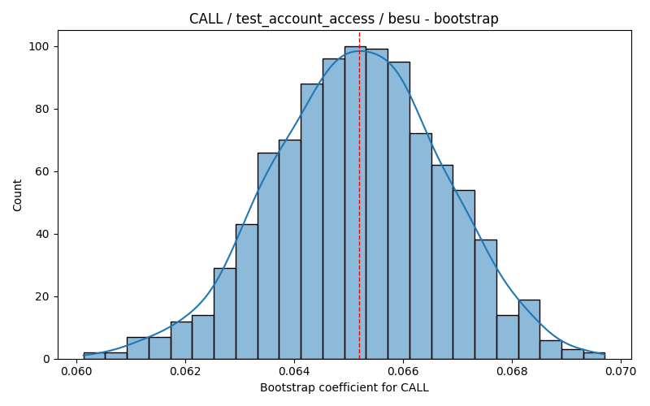

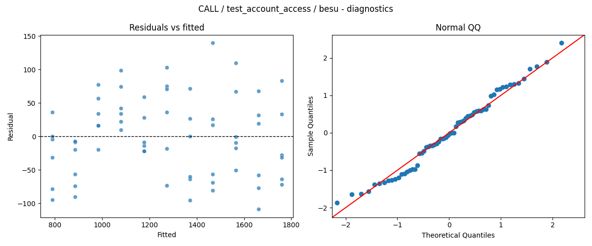

</details>

<details><summary>erigon — NNLS regression summary</summary>

```
==============================================================================
                           NNLS Regression Results                            
==============================================================================
Dep. Variable:          test_runtime_ms              R-squared:          0.990
Model:                  NNLS                    Adj. R-squared:          0.989
No. Observations:       11                                RMSE:          19.30
Df Residuals:           9                                  MAE:          14.95
Df Model:               1      
==============================================================================
                      coef     std err     P-value      [0.025      0.975]
------------------------------------------------------------------------------
         const    176.8567     23.9761       0.001    143.4520    228.3240
       opcount      0.0094      0.0003       0.001      0.0088      0.0099
==============================================================================
Notes: Non-negative least squares with bootstrap inference (1000 iterations)
==============================================================================
```


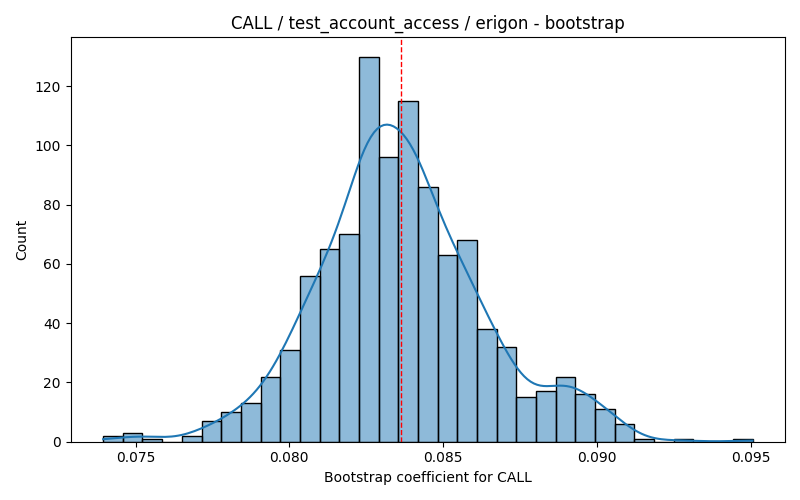

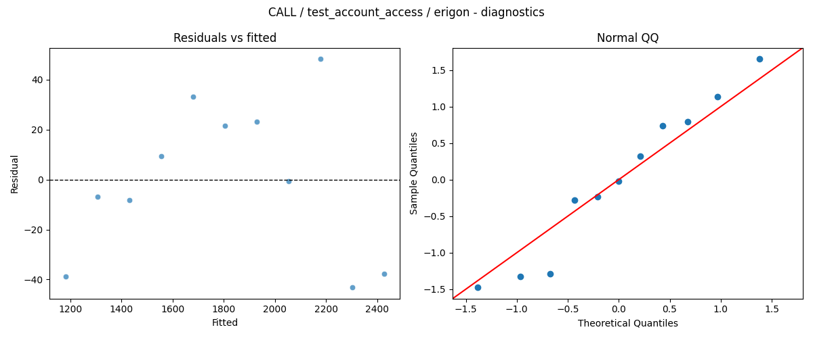

</details>

<details><summary>geth — NNLS regression summary</summary>

```
==============================================================================
                           NNLS Regression Results                            
==============================================================================
Dep. Variable:          test_runtime_ms              R-squared:          0.947
Model:                  NNLS                    Adj. R-squared:          0.947
No. Observations:       110                               RMSE:          25.36
Df Residuals:           108                                MAE:          18.99
Df Model:               1      
==============================================================================
                      coef     std err     P-value      [0.025      0.975]
------------------------------------------------------------------------------
         const     66.4879      7.9033       0.001     50.6887     82.1142
       opcount      0.0053      0.0001       0.001      0.0050      0.0056
==============================================================================
Notes: Non-negative least squares with bootstrap inference (1000 iterations)
==============================================================================
```

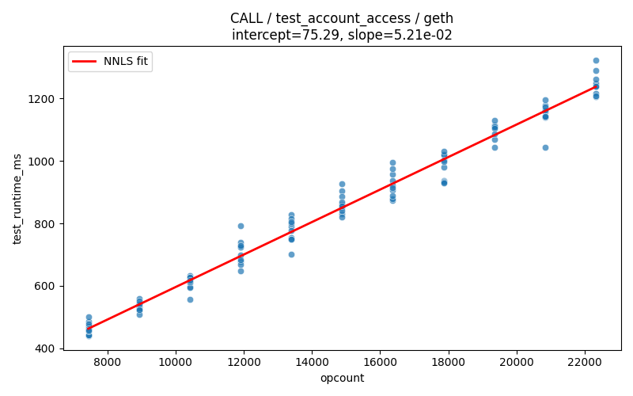

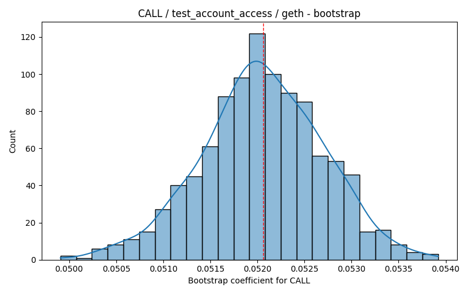

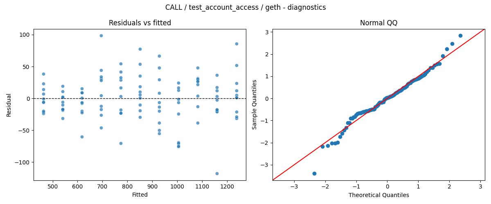

</details>

<details><summary>nethermind — NNLS regression summary</summary>

```
==============================================================================
                           NNLS Regression Results                            
==============================================================================
Dep. Variable:          test_runtime_ms              R-squared:          0.757
Model:                  NNLS                    Adj. R-squared:          0.751
No. Observations:       44                                RMSE:          35.00
Df Residuals:           42                                 MAE:          27.36
Df Model:               1      
==============================================================================
                      coef     std err     P-value      [0.025      0.975]
------------------------------------------------------------------------------
         const    104.3229     15.8283       0.001     70.8923    136.1249
       opcount      0.0031      0.0003       0.001      0.0025      0.0037
==============================================================================
Notes: Non-negative least squares with bootstrap inference (1000 iterations)
==============================================================================
```

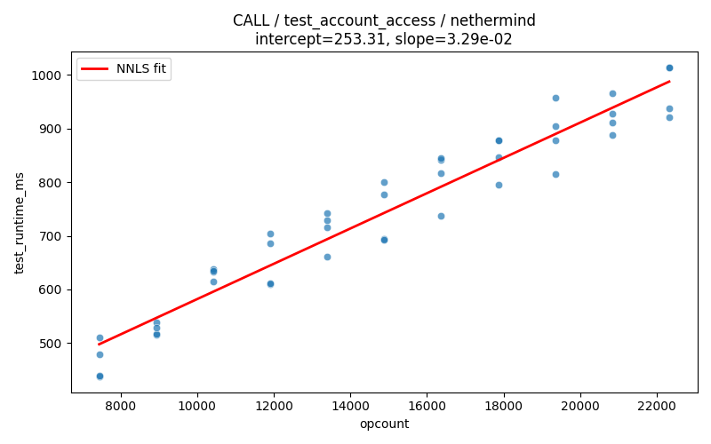

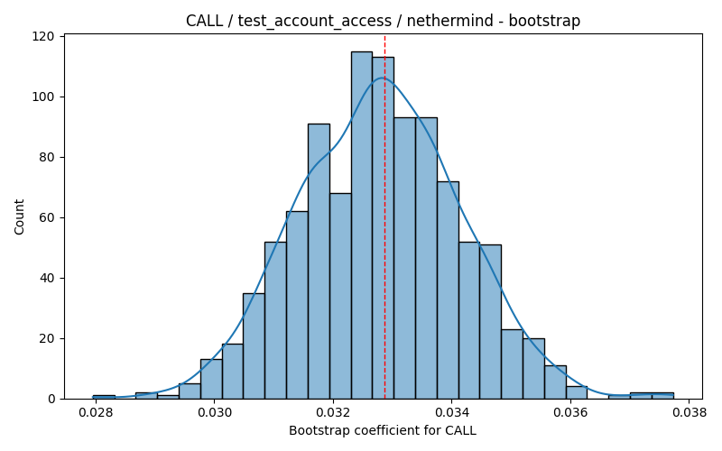

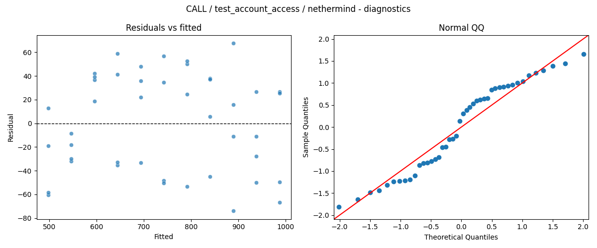

</details>

<details><summary>reth — NNLS regression summary</summary>

```
==============================================================================
                           NNLS Regression Results                            
==============================================================================
Dep. Variable:          test_runtime_ms              R-squared:          0.977
Model:                  NNLS                    Adj. R-squared:          0.976
No. Observations:       110                               RMSE:          12.51
Df Residuals:           108                                MAE:           9.97
Df Model:               1      
==============================================================================
                      coef     std err     P-value      [0.025      0.975]
------------------------------------------------------------------------------
         const     97.1470      3.8075       0.001     90.4169    105.1802
       opcount      0.0040      0.0001       0.001      0.0039      0.0041
==============================================================================
Notes: Non-negative least squares with bootstrap inference (1000 iterations)
==============================================================================
```

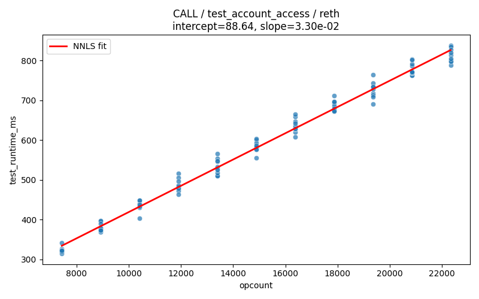

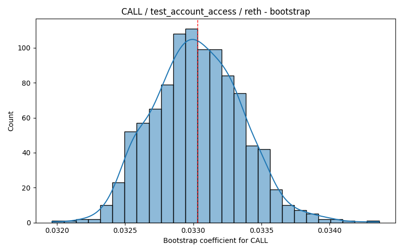

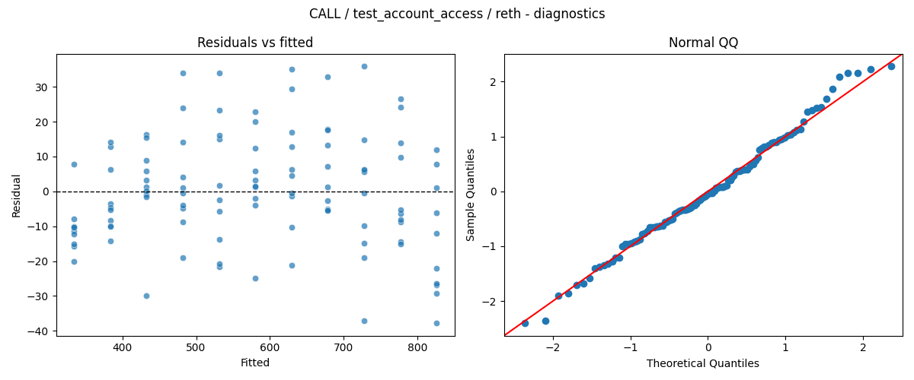

</details>

### test_account_access — combo `CALL_AccountMode.EXISTING_CONTRACT_DIFF_MAX` — `presets[cold_account_code_write]`

| client | nobs | R² | target_coef (ms) | p-value | 95% CI |
| --- | --- | --- | --- | --- | --- |
| `besu` | 66 | 0.9816 | 0.07298 | 1.00e-03 | [0.07047, 0.07567] |
| `erigon` | 11 | 0.9768 | 0.1596 | 1.00e-03 | [0.1424, 0.1754] |
| `geth` | 110 | 0.9517 | 0.04818 | 1.00e-03 | [0.04582, 0.05014] |
| `nethermind` | 44 | 0.957 | 0.05115 | 1.00e-03 | [0.04829, 0.05416] |
| `reth` | 110 | 0.9838 | 0.05222 | 1.00e-03 | [0.05093, 0.05351] |

<details><summary>besu — NNLS regression summary</summary>

```
==============================================================================
                           NNLS Regression Results                            
==============================================================================
Dep. Variable:          test_runtime_ms              R-squared:          0.982
Model:                  NNLS                    Adj. R-squared:          0.981
No. Observations:       66                                RMSE:          47.05
Df Residuals:           64                                 MAE:          35.67
Df Model:               1      
==============================================================================
                      coef     std err     P-value      [0.025      0.975]
------------------------------------------------------------------------------
         const    233.6737     18.3691       0.001    197.4027    270.3387
       opcount      0.0730      0.0013       0.001      0.0705      0.0757
==============================================================================
Notes: Non-negative least squares with bootstrap inference (1000 iterations)
==============================================================================
```


</details>

<details><summary>erigon — NNLS regression summary</summary>

```
==============================================================================
                           NNLS Regression Results                            
==============================================================================
Dep. Variable:          test_runtime_ms              R-squared:          0.977
Model:                  NNLS                    Adj. R-squared:          0.974
No. Observations:       11                                RMSE:         115.81
Df Residuals:           9                                  MAE:          90.82
Df Model:               1      
==============================================================================
                      coef     std err     P-value      [0.025      0.975]
------------------------------------------------------------------------------
         const    826.3681    120.7001       0.001    609.3180   1103.4699
       opcount      0.1596      0.0080       0.001      0.1424      0.1754
==============================================================================
Notes: Non-negative least squares with bootstrap inference (1000 iterations)
==============================================================================
```


</details>

<details><summary>geth — NNLS regression summary</summary>

```
==============================================================================
                           NNLS Regression Results                            
==============================================================================
Dep. Variable:          test_runtime_ms              R-squared:          0.952
Model:                  NNLS                    Adj. R-squared:          0.951
No. Observations:       110                               RMSE:          51.09
Df Residuals:           108                                MAE:          40.88
Df Model:               1      
==============================================================================
                      coef     std err     P-value      [0.025      0.975]
------------------------------------------------------------------------------
         const    108.7891     16.3857       0.001     80.0648    143.2369
       opcount      0.0482      0.0011       0.001      0.0458      0.0501
==============================================================================
Notes: Non-negative least squares with bootstrap inference (1000 iterations)
==============================================================================
```


</details>

<details><summary>nethermind — NNLS regression summary</summary>

```
==============================================================================
                           NNLS Regression Results                            
==============================================================================
Dep. Variable:          test_runtime_ms              R-squared:          0.957
Model:                  NNLS                    Adj. R-squared:          0.956
No. Observations:       44                                RMSE:          51.07
Df Residuals:           42                                 MAE:          39.47
Df Model:               1      
==============================================================================
                      coef     std err     P-value      [0.025      0.975]
------------------------------------------------------------------------------
         const    283.0990     22.7381       0.001    240.3085    329.0229
       opcount      0.0512      0.0015       0.001      0.0483      0.0542
==============================================================================
Notes: Non-negative least squares with bootstrap inference (1000 iterations)
==============================================================================
```


</details>

<details><summary>reth — NNLS regression summary</summary>

```
==============================================================================
                           NNLS Regression Results                            
==============================================================================
Dep. Variable:          test_runtime_ms              R-squared:          0.984
Model:                  NNLS                    Adj. R-squared:          0.984
No. Observations:       110                               RMSE:          31.58
Df Residuals:           108                                MAE:          23.08
Df Model:               1      
==============================================================================
                      coef     std err     P-value      [0.025      0.975]
------------------------------------------------------------------------------
         const    142.2917      9.6994       0.001    123.3560    160.7720
       opcount      0.0522      0.0007       0.001      0.0509      0.0535
==============================================================================
Notes: Non-negative least squares with bootstrap inference (1000 iterations)
==============================================================================
```


</details>

### test_account_access — combo `CALL_AccountMode.EXISTING_CONTRACT_MINIMAL` — `presets[cold_account_code_write]`

| client | nobs | R² | target_coef (ms) | p-value | 95% CI |
| --- | --- | --- | --- | --- | --- |
| `besu` | 66 | 0.9719 | 0.06869 | 1.00e-03 | [0.06551, 0.07188] |
| `erigon` | 11 | 0.9904 | 0.08156 | 1.00e-03 | [0.07493, 0.0883] |
| `geth` | 110 | 0.9747 | 0.05023 | 1.00e-03 | [0.04884, 0.05158] |
| `nethermind` | 44 | 0.9307 | 0.03371 | 1.00e-03 | [0.03147, 0.03602] |
| `reth` | 110 | 0.9903 | 0.03199 | 1.00e-03 | [0.03145, 0.03252] |

<details><summary>besu — NNLS regression summary</summary>

```
==============================================================================
                           NNLS Regression Results                            
==============================================================================
Dep. Variable:          test_runtime_ms              R-squared:          0.972
Model:                  NNLS                    Adj. R-squared:          0.971
No. Observations:       66                                RMSE:          54.98
Df Residuals:           64                                 MAE:          43.79
Df Model:               1      
==============================================================================
                      coef     std err     P-value      [0.025      0.975]
------------------------------------------------------------------------------
         const    254.9226     24.1325       0.001    208.3900    302.9586
       opcount      0.0687      0.0016       0.001      0.0655      0.0719
==============================================================================
Notes: Non-negative least squares with bootstrap inference (1000 iterations)
==============================================================================
```


</details>

<details><summary>erigon — NNLS regression summary</summary>

```
==============================================================================
                           NNLS Regression Results                            
==============================================================================
Dep. Variable:          test_runtime_ms              R-squared:          0.990
Model:                  NNLS                    Adj. R-squared:          0.989
No. Observations:       11                                RMSE:          37.75
Df Residuals:           9                                  MAE:          30.50
Df Model:               1      
==============================================================================
                      coef     std err     P-value      [0.025      0.975]
------------------------------------------------------------------------------
         const    574.8847     49.1984       0.001    492.9246    675.1465
       opcount      0.0816      0.0036       0.001      0.0749      0.0883
==============================================================================
Notes: Non-negative least squares with bootstrap inference (1000 iterations)
==============================================================================
```


</details>

<details><summary>geth — NNLS regression summary</summary>

```
==============================================================================
                           NNLS Regression Results                            
==============================================================================
Dep. Variable:          test_runtime_ms              R-squared:          0.975
Model:                  NNLS                    Adj. R-squared:          0.974
No. Observations:       110                               RMSE:          38.07
Df Residuals:           108                                MAE:          30.50
Df Model:               1      
==============================================================================
                      coef     std err     P-value      [0.025      0.975]
------------------------------------------------------------------------------
         const     99.4534      9.7778       0.001     81.0424    119.9427
       opcount      0.0502      0.0007       0.001      0.0488      0.0516
==============================================================================
Notes: Non-negative least squares with bootstrap inference (1000 iterations)
==============================================================================
```


</details>

<details><summary>nethermind — NNLS regression summary</summary>

```
==============================================================================
                           NNLS Regression Results                            
==============================================================================
Dep. Variable:          test_runtime_ms              R-squared:          0.931
Model:                  NNLS                    Adj. R-squared:          0.929
No. Observations:       44                                RMSE:          43.32
Df Residuals:           42                                 MAE:          33.09
Df Model:               1      
==============================================================================
                      coef     std err     P-value      [0.025      0.975]
------------------------------------------------------------------------------
         const    266.6860     15.7774       0.001    238.8031    301.6983
       opcount      0.0337      0.0012       0.001      0.0315      0.0360
==============================================================================
Notes: Non-negative least squares with bootstrap inference (1000 iterations)
==============================================================================
```


</details>

<details><summary>reth — NNLS regression summary</summary>

```
==============================================================================
                           NNLS Regression Results                            
==============================================================================
Dep. Variable:          test_runtime_ms              R-squared:          0.990
Model:                  NNLS                    Adj. R-squared:          0.990
No. Observations:       110                               RMSE:          14.89
Df Residuals:           108                                MAE:          10.96
Df Model:               1      
==============================================================================
                      coef     std err     P-value      [0.025      0.975]
------------------------------------------------------------------------------
         const     97.1198      3.6948       0.001     90.0715    104.1750
       opcount      0.0320      0.0003       0.001      0.0314      0.0325
==============================================================================
Notes: Non-negative least squares with bootstrap inference (1000 iterations)
==============================================================================
```


</details>

### test_account_access — combo `CALL_AccountMode.EXISTING_CONTRACT_SAME_MAX` — `presets[cold_account_code_write]`

| client | nobs | R² | target_coef (ms) | p-value | 95% CI |
| --- | --- | --- | --- | --- | --- |
| `besu` | 66 | 0.9656 | 0.0652 | 1.00e-03 | [0.06202, 0.0682] |
| `erigon` | 11 | 0.9945 | 0.08362 | 1.00e-03 | [0.07848, 0.08957] |
| `geth` | 108 | 0.9804 | 0.05206 | 1.00e-03 | [0.05065, 0.05329] |
| `nethermind` | 44 | 0.9349 | 0.03287 | 1.00e-03 | [0.03019, 0.03542] |
| `reth` | 110 | 0.9899 | 0.03303 | 1.00e-03 | [0.03245, 0.03368] |

<details><summary>besu — NNLS regression summary</summary>

```
==============================================================================
                           NNLS Regression Results                            
==============================================================================
Dep. Variable:          test_runtime_ms              R-squared:          0.966
Model:                  NNLS                    Adj. R-squared:          0.965
No. Observations:       66                                RMSE:          57.92
Df Residuals:           64                                 MAE:          47.99
Df Model:               1      
==============================================================================
                      coef     std err     P-value      [0.025      0.975]
------------------------------------------------------------------------------
         const    302.7737     23.1706       0.001    260.1204    351.3568
       opcount      0.0652      0.0016       0.001      0.0620      0.0682
==============================================================================
Notes: Non-negative least squares with bootstrap inference (1000 iterations)
==============================================================================
```


</details>

<details><summary>erigon — NNLS regression summary</summary>

```
==============================================================================
                           NNLS Regression Results                            
==============================================================================
Dep. Variable:          test_runtime_ms              R-squared:          0.995
Model:                  NNLS                    Adj. R-squared:          0.994
No. Observations:       11                                RMSE:          29.25
Df Residuals:           9                                  MAE:          24.62
Df Model:               1      
==============================================================================
                      coef     std err     P-value      [0.025      0.975]
------------------------------------------------------------------------------
         const    559.3016     38.6205       0.001    489.6344    645.6933
       opcount      0.0836      0.0027       0.001      0.0785      0.0896
==============================================================================
Notes: Non-negative least squares with bootstrap inference (1000 iterations)
==============================================================================
```


</details>

<details><summary>geth — NNLS regression summary</summary>

```
==============================================================================
                           NNLS Regression Results                            
==============================================================================
Dep. Variable:          test_runtime_ms              R-squared:          0.980
Model:                  NNLS                    Adj. R-squared:          0.980
No. Observations:       108                               RMSE:          34.70
Df Residuals:           106                                MAE:          26.28
Df Model:               1      
==============================================================================
                      coef     std err     P-value      [0.025      0.975]
------------------------------------------------------------------------------
         const     75.2920      8.9131       0.001     57.0272     92.5706
       opcount      0.0521      0.0006       0.001      0.0507      0.0533
==============================================================================
Notes: Non-negative least squares with bootstrap inference (1000 iterations)
==============================================================================
```


</details>

<details><summary>nethermind — NNLS regression summary</summary>

```
==============================================================================
                           NNLS Regression Results                            
==============================================================================
Dep. Variable:          test_runtime_ms              R-squared:          0.935
Model:                  NNLS                    Adj. R-squared:          0.933
No. Observations:       44                                RMSE:          40.82
Df Residuals:           42                                 MAE:          37.09
Df Model:               1      
==============================================================================
                      coef     std err     P-value      [0.025      0.975]
------------------------------------------------------------------------------
         const    253.3139     20.6612       0.001    216.6176    296.6425
       opcount      0.0329      0.0014       0.001      0.0302      0.0354
==============================================================================
Notes: Non-negative least squares with bootstrap inference (1000 iterations)
==============================================================================
```


</details>

<details><summary>reth — NNLS regression summary</summary>

```
==============================================================================
                           NNLS Regression Results                            
==============================================================================
Dep. Variable:          test_runtime_ms              R-squared:          0.990
Model:                  NNLS                    Adj. R-squared:          0.990
No. Observations:       110                               RMSE:          15.74
Df Residuals:           108                                MAE:          12.46
Df Model:               1      
==============================================================================
                      coef     std err     P-value      [0.025      0.975]
------------------------------------------------------------------------------
         const     88.6366      4.5842       0.001     79.8144     97.3268
       opcount      0.0330      0.0003       0.001      0.0325      0.0337
==============================================================================
Notes: Non-negative least squares with bootstrap inference (1000 iterations)
==============================================================================
```


</details>

## CALLCODE

### test_ext_account_query_warm — combo `CALLCODE`

| client | nobs | R² | target_coef (ms) | p-value | 95% CI |
| --- | --- | --- | --- | --- | --- |
| `besu` | 66 | 0.9251 | 0.0004786 | 1.00e-03 | [0.0004391, 0.0005158] |
| `erigon` | 11 | 0.9565 | 6.038e-05 | 1.00e-03 | [5.186e-05, 6.678e-05] |
| `geth` | 110 | 0.9047 | 0.0001704 | 1.00e-03 | [0.0001603, 0.0001817] |
| `nethermind` | 44 | 0.5216 | 0.0001538 | 1.00e-03 | [0.000113, 0.0001923] |
| `reth` | 110 | 0.9278 | 5.73e-05 | 1.00e-03 | [5.398e-05, 6.048e-05] |

<details><summary>besu — NNLS regression summary</summary>

```
==============================================================================
                           NNLS Regression Results                            
==============================================================================
Dep. Variable:          test_runtime_ms              R-squared:          0.925
Model:                  NNLS                    Adj. R-squared:          0.924
No. Observations:       66                                RMSE:          68.85
Df Residuals:           64                                 MAE:          55.81
Df Model:               1      
==============================================================================
                      coef     std err     P-value      [0.025      0.975]
------------------------------------------------------------------------------
         const    466.4269     33.2246       0.001    404.6970    535.9898
       opcount      0.0005      0.0000       0.001      0.0004      0.0005
==============================================================================
Notes: Non-negative least squares with bootstrap inference (1000 iterations)
==============================================================================
```

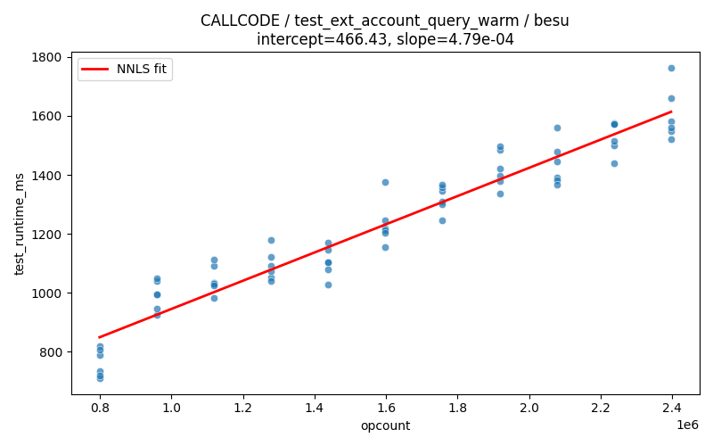

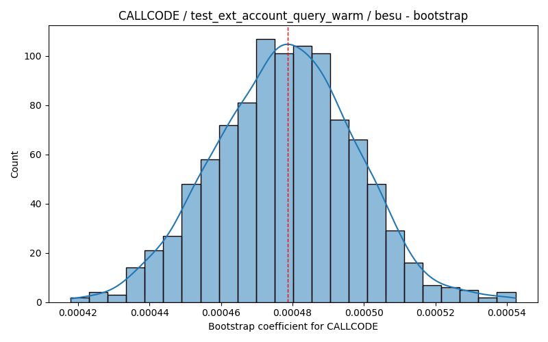

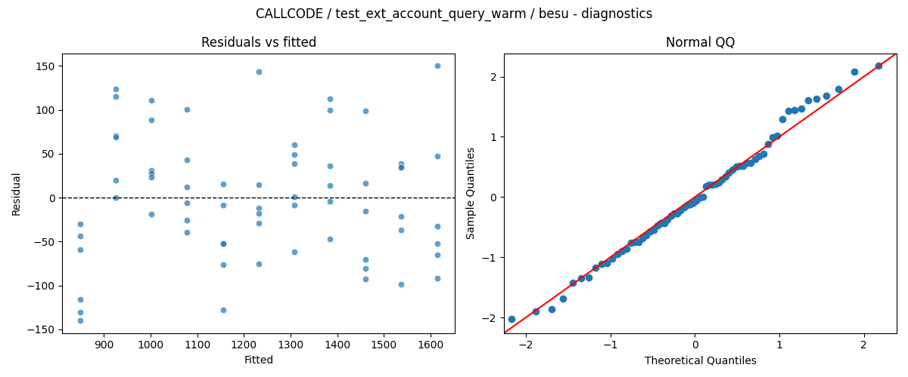

</details>

<details><summary>erigon — NNLS regression summary</summary>

```
==============================================================================
                           NNLS Regression Results                            
==============================================================================
Dep. Variable:          test_runtime_ms              R-squared:          0.957
Model:                  NNLS                    Adj. R-squared:          0.952
No. Observations:       11                                RMSE:           6.51
Df Residuals:           9                                  MAE:           5.64
Df Model:               1      
==============================================================================
                      coef     std err     P-value      [0.025      0.975]
------------------------------------------------------------------------------
         const     21.5316      6.6641       0.001      9.0174     35.8249
       opcount      0.0001      0.0000       0.001      0.0001      0.0001
==============================================================================
Notes: Non-negative least squares with bootstrap inference (1000 iterations)
==============================================================================
```

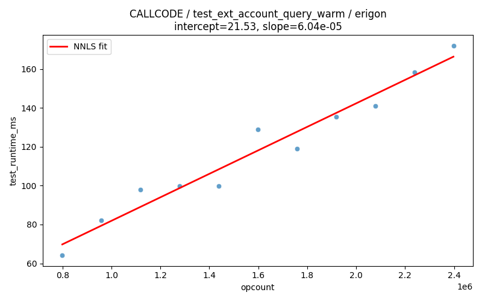

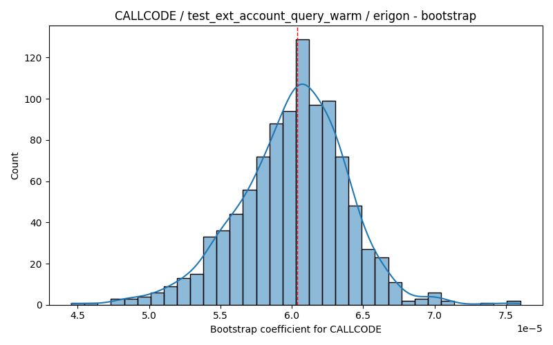

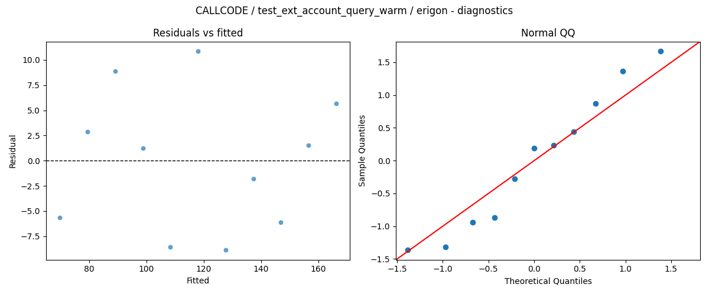

</details>

<details><summary>geth — NNLS regression summary</summary>

```
==============================================================================
                           NNLS Regression Results                            
==============================================================================
Dep. Variable:          test_runtime_ms              R-squared:          0.905
Model:                  NNLS                    Adj. R-squared:          0.904
No. Observations:       110                               RMSE:          27.94
Df Residuals:           108                                MAE:          21.42
Df Model:               1      
==============================================================================
                      coef     std err     P-value      [0.025      0.975]
------------------------------------------------------------------------------
         const     32.9985      7.7379       0.001     17.2904     48.2892
       opcount      0.0002      0.0000       0.001      0.0002      0.0002
==============================================================================
Notes: Non-negative least squares with bootstrap inference (1000 iterations)
==============================================================================
```

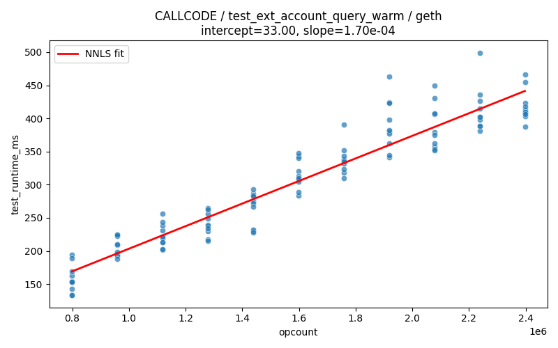

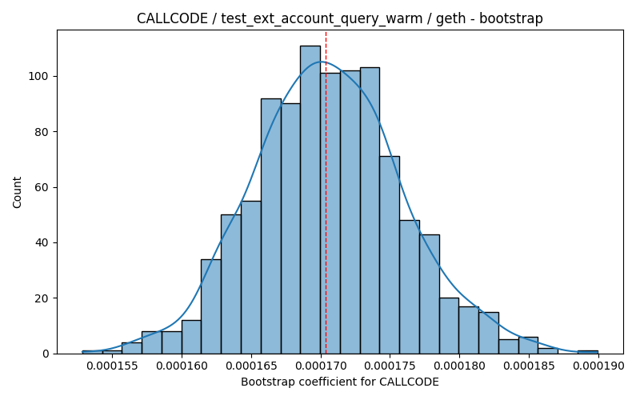

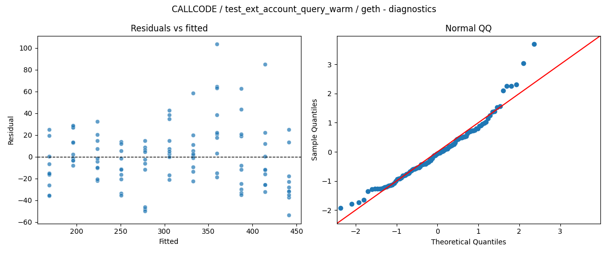

</details>

<details><summary>nethermind — NNLS regression summary</summary>

```
==============================================================================
                           NNLS Regression Results                            
==============================================================================
Dep. Variable:          test_runtime_ms              R-squared:          0.522
Model:                  NNLS                    Adj. R-squared:          0.510
No. Observations:       44                                RMSE:          74.45
Df Residuals:           42                                 MAE:          58.75
Df Model:               1      
==============================================================================
                      coef     std err     P-value      [0.025      0.975]
------------------------------------------------------------------------------
         const    231.5269     32.7285       0.001    171.3678    299.0323
       opcount      0.0002      0.0000       0.001      0.0001      0.0002
==============================================================================
Notes: Non-negative least squares with bootstrap inference (1000 iterations)
==============================================================================
```

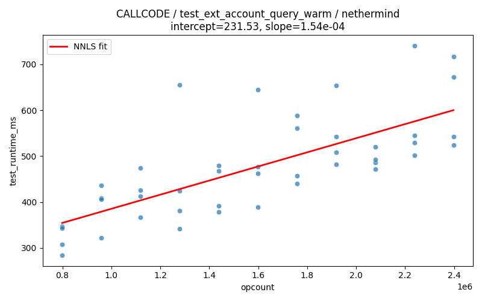

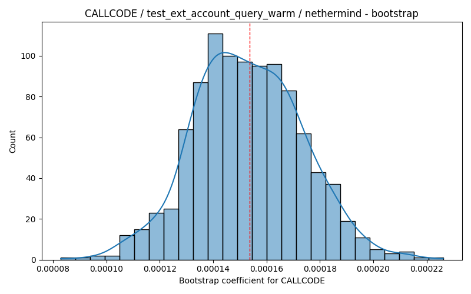

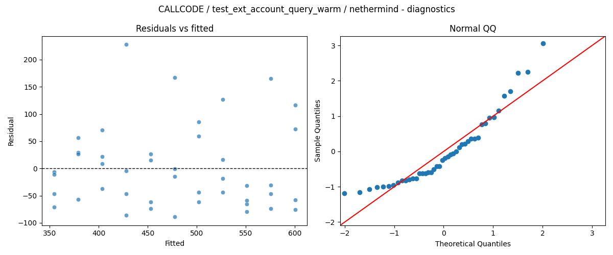

</details>

<details><summary>reth — NNLS regression summary</summary>

```
==============================================================================
                           NNLS Regression Results                            
==============================================================================
Dep. Variable:          test_runtime_ms              R-squared:          0.928
Model:                  NNLS                    Adj. R-squared:          0.927
No. Observations:       110                               RMSE:           8.08
Df Residuals:           108                                MAE:           6.33
Df Model:               1      
==============================================================================
                      coef     std err     P-value      [0.025      0.975]
------------------------------------------------------------------------------
         const     22.8163      2.8324       0.001     17.3473     28.3595
       opcount      0.0001      0.0000       0.001      0.0001      0.0001
==============================================================================
Notes: Non-negative least squares with bootstrap inference (1000 iterations)
==============================================================================
```

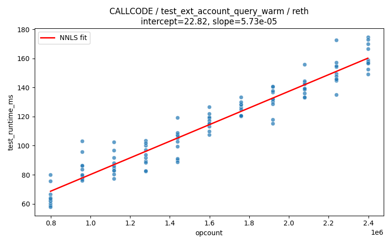

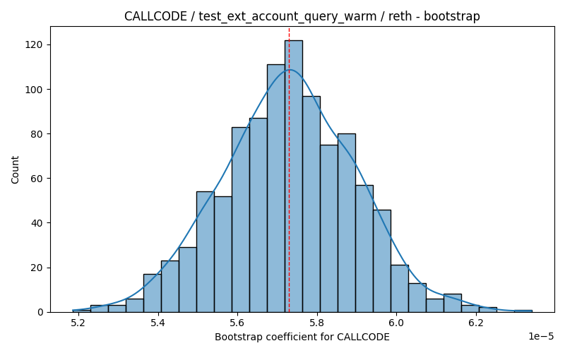

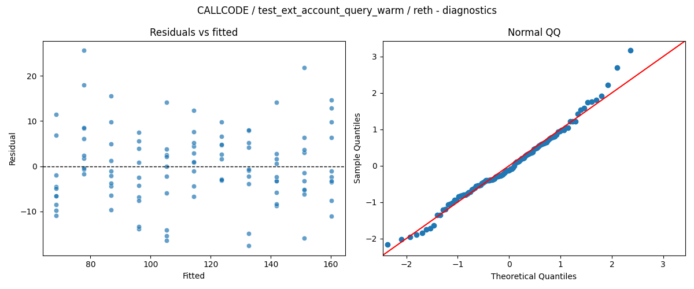

</details>

### test_account_access — combo `CALLCODE_AccountMode.EXISTING_EOA` — `presets[cold_account_nocode_access]`

| client | nobs | R² | target_coef (ms) | p-value | 95% CI |
| --- | --- | --- | --- | --- | --- |
| `besu` | 66 | 0.9774 | 0.0165 | 1.00e-03 | [0.01589, 0.01713] |
| `erigon` | 11 | 0.9947 | 0.008139 | 1.00e-03 | [0.007719, 0.008233] |
| `geth` | 110 | 0.9756 | 0.01161 | 1.00e-03 | [0.01124, 0.01196] |
| `nethermind` | 44 | 0.9008 | 0.003611 | 1.00e-03 | [0.003215, 0.004021] |
| `reth` | 110 | 0.9408 | 0.00117 | 1.00e-03 | [0.001113, 0.001223] |

<details><summary>besu — NNLS regression summary</summary>

```
==============================================================================
                           NNLS Regression Results                            
==============================================================================
Dep. Variable:          test_runtime_ms              R-squared:          0.977
Model:                  NNLS                    Adj. R-squared:          0.977
No. Observations:       66                                RMSE:          51.49
Df Residuals:           64                                 MAE:          36.29
Df Model:               1      
==============================================================================
                      coef     std err     P-value      [0.025      0.975]
------------------------------------------------------------------------------
         const    483.3347     21.2348       0.001    442.5323    528.2596
       opcount      0.0165      0.0003       0.001      0.0159      0.0171
==============================================================================
Notes: Non-negative least squares with bootstrap inference (1000 iterations)
==============================================================================
```

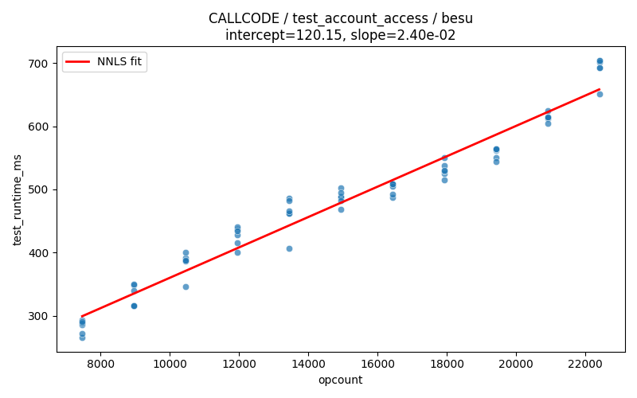

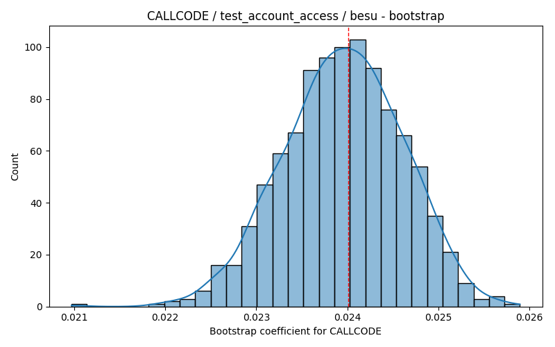

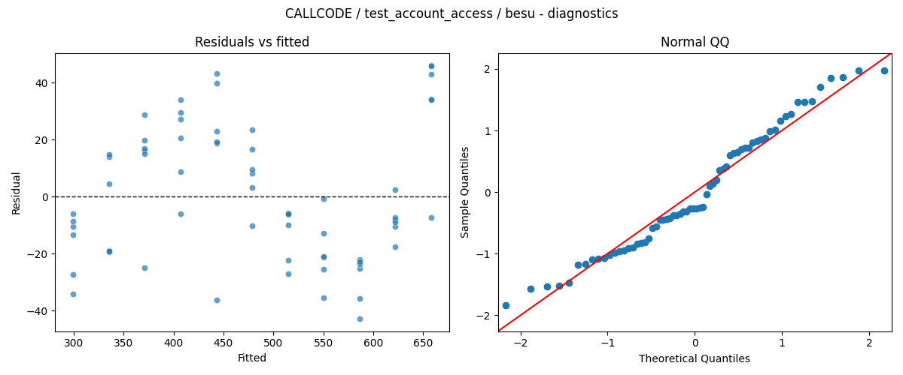

</details>

<details><summary>erigon — NNLS regression summary</summary>

```
==============================================================================
                           NNLS Regression Results                            
==============================================================================
Dep. Variable:          test_runtime_ms              R-squared:          0.995
Model:                  NNLS                    Adj. R-squared:          0.994
No. Observations:       11                                RMSE:          12.18
Df Residuals:           9                                  MAE:          10.21
Df Model:               1      
==============================================================================
                      coef     std err     P-value      [0.025      0.975]
------------------------------------------------------------------------------
         const      0.0000      6.2626       1.000      0.0000     21.3725
       opcount      0.0081      0.0001       0.001      0.0077      0.0082
==============================================================================
Notes: Non-negative least squares with bootstrap inference (1000 iterations)
==============================================================================
```

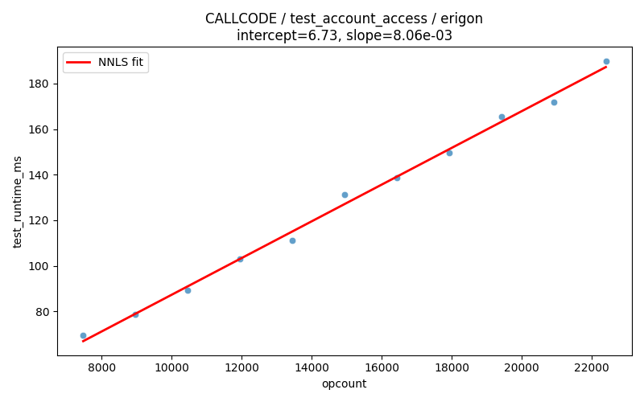

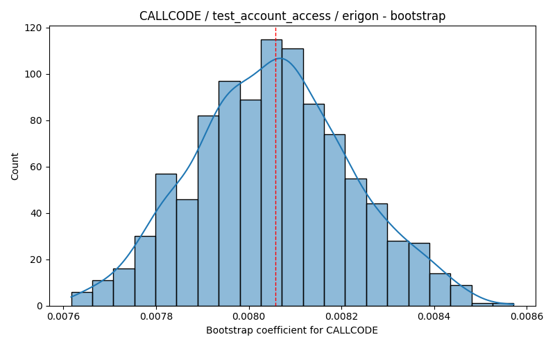

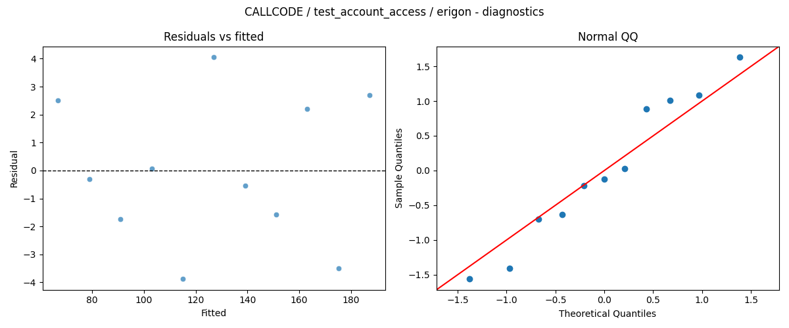

</details>

<details><summary>geth — NNLS regression summary</summary>

```
==============================================================================
                           NNLS Regression Results                            
==============================================================================
Dep. Variable:          test_runtime_ms              R-squared:          0.976
Model:                  NNLS                    Adj. R-squared:          0.975
No. Observations:       110                               RMSE:          37.69
Df Residuals:           108                                MAE:          30.05
Df Model:               1      
==============================================================================
                      coef     std err     P-value      [0.025      0.975]
------------------------------------------------------------------------------
         const    233.8692     11.8483       0.001    212.9541    259.1403
       opcount      0.0116      0.0002       0.001      0.0112      0.0120
==============================================================================
Notes: Non-negative least squares with bootstrap inference (1000 iterations)
==============================================================================
```

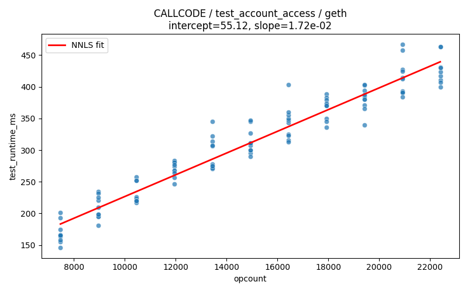

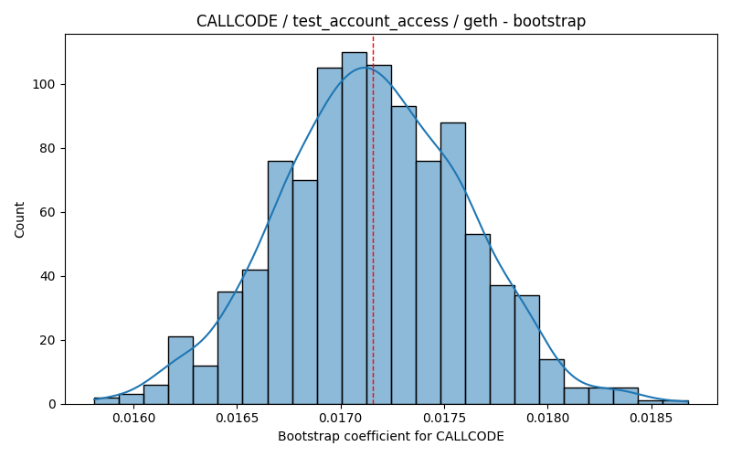

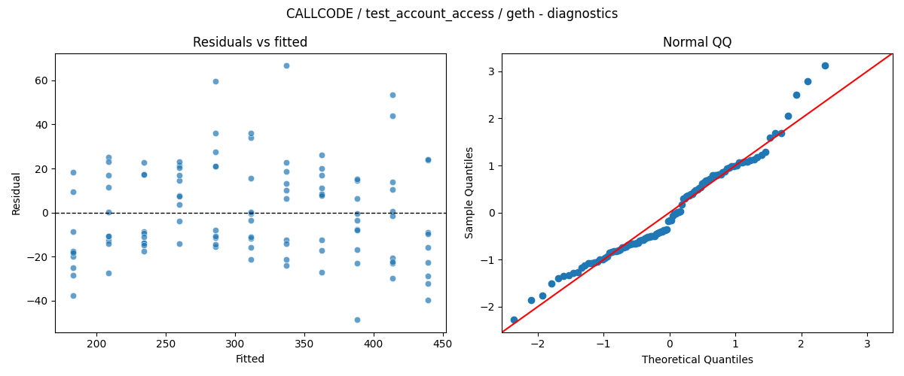

</details>

<details><summary>nethermind — NNLS regression summary</summary>

```
==============================================================================
                           NNLS Regression Results                            
==============================================================================
Dep. Variable:          test_runtime_ms              R-squared:          0.901
Model:                  NNLS                    Adj. R-squared:          0.898
No. Observations:       44                                RMSE:          24.60
Df Residuals:           42                                 MAE:          20.42
Df Model:               1      
==============================================================================
                      coef     std err     P-value      [0.025      0.975]
------------------------------------------------------------------------------
         const     72.8017     11.8632       0.001     47.7280     94.9007
       opcount      0.0036      0.0002       0.001      0.0032      0.0040
==============================================================================
Notes: Non-negative least squares with bootstrap inference (1000 iterations)
==============================================================================
```

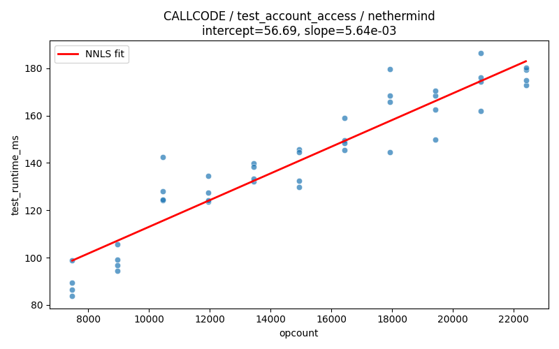

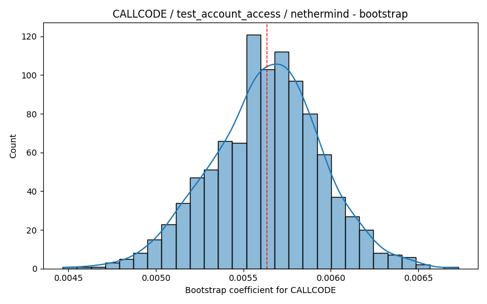

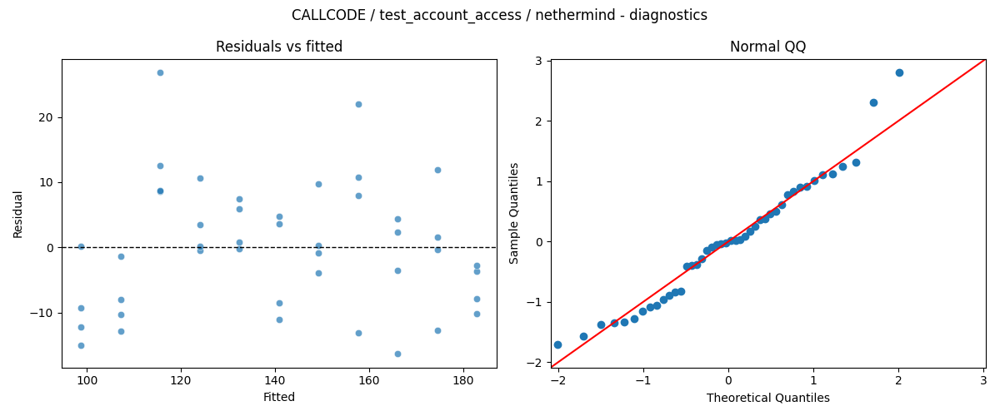

</details>

<details><summary>reth — NNLS regression summary</summary>

```
==============================================================================
                           NNLS Regression Results                            
==============================================================================
Dep. Variable:          test_runtime_ms              R-squared:          0.941
Model:                  NNLS                    Adj. R-squared:          0.940
No. Observations:       110                               RMSE:           6.03
Df Residuals:           108                                MAE:           4.80
Df Model:               1      
==============================================================================
                      coef     std err     P-value      [0.025      0.975]
------------------------------------------------------------------------------
         const     39.7074      1.8268       0.001     36.2780     43.5029
       opcount      0.0012      0.0000       0.001      0.0011      0.0012
==============================================================================
Notes: Non-negative least squares with bootstrap inference (1000 iterations)
==============================================================================
```

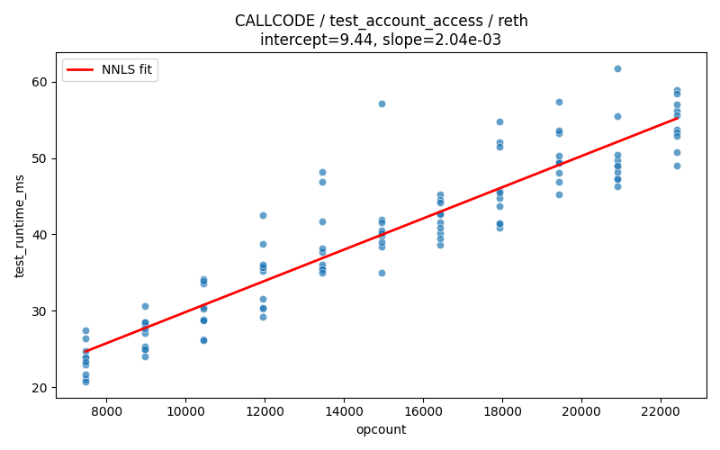

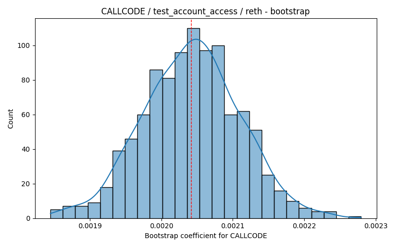

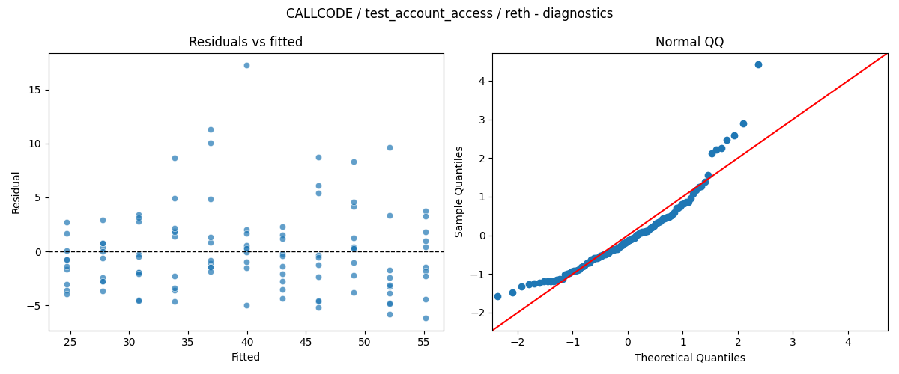

</details>

### test_account_access — combo `CALLCODE_AccountMode.NON_EXISTING_ACCOUNT` — `presets[cold_account_nocode_access]`

| client | nobs | R² | target_coef (ms) | p-value | 95% CI |
| --- | --- | --- | --- | --- | --- |
| `besu` | 66 | 0.9895 | 0.01637 | 1.00e-03 | [0.01598, 0.01679] |
| `erigon` | 11 | 0.9952 | 0.007993 | 1.00e-03 | [0.007873, 0.008097] |
| `geth` | 109 | 0.9832 | 0.02218 | 1.00e-03 | [0.02156, 0.02272] |
| `nethermind` | 44 | 0.8871 | 0.002953 | 1.00e-03 | [0.002656, 0.003272] |
| `reth` | 110 | 0.9196 | 0.0009174 | 1.00e-03 | [0.000865, 0.0009736] |

<details><summary>besu — NNLS regression summary</summary>

```
==============================================================================
                           NNLS Regression Results                            
==============================================================================
Dep. Variable:          test_runtime_ms              R-squared:          0.990
Model:                  NNLS                    Adj. R-squared:          0.989
No. Observations:       66                                RMSE:          34.60
Df Residuals:           64                                 MAE:          28.56
Df Model:               1      
==============================================================================
                      coef     std err     P-value      [0.025      0.975]
------------------------------------------------------------------------------
         const    179.8067     13.5100       0.001    152.7527    205.9258
       opcount      0.0164      0.0002       0.001      0.0160      0.0168
==============================================================================
Notes: Non-negative least squares with bootstrap inference (1000 iterations)
==============================================================================
```

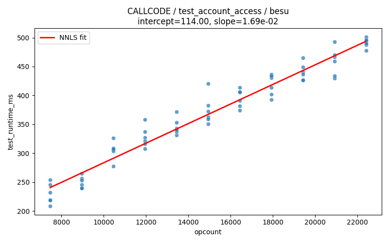

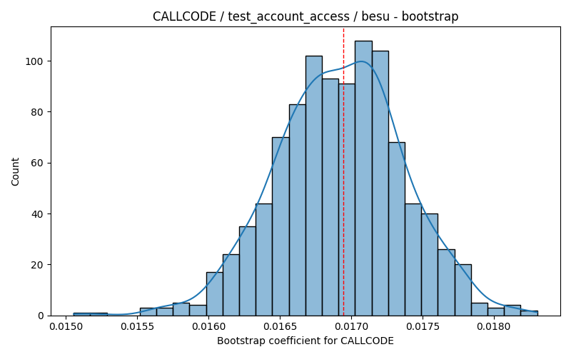

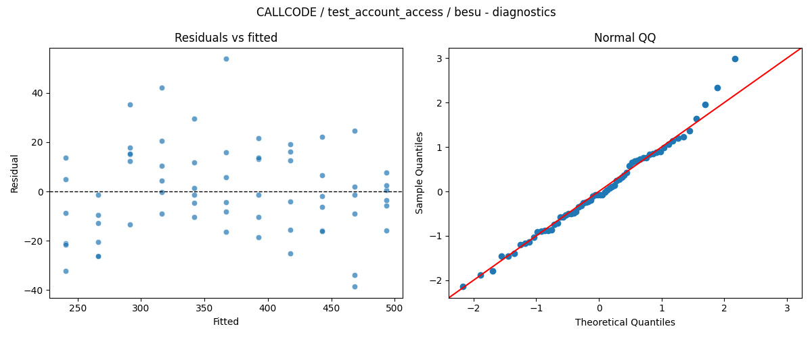

</details>

<details><summary>erigon — NNLS regression summary</summary>

```
==============================================================================
                           NNLS Regression Results                            
==============================================================================
Dep. Variable:          test_runtime_ms              R-squared:          0.995
Model:                  NNLS                    Adj. R-squared:          0.995
No. Observations:       11                                RMSE:          11.72
Df Residuals:           9                                  MAE:           9.64
Df Model:               1      
==============================================================================
                      coef     std err     P-value      [0.025      0.975]
------------------------------------------------------------------------------
         const      0.0000      1.4104       1.000      0.0000      0.0493
       opcount      0.0080      0.0001       0.001      0.0079      0.0081
==============================================================================
Notes: Non-negative least squares with bootstrap inference (1000 iterations)
==============================================================================
```


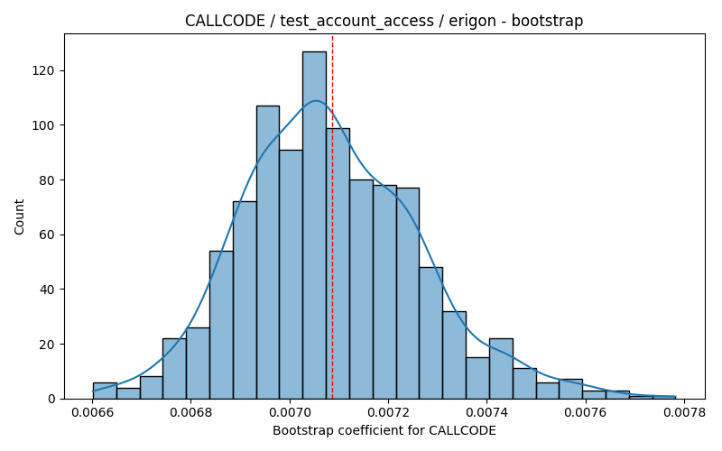

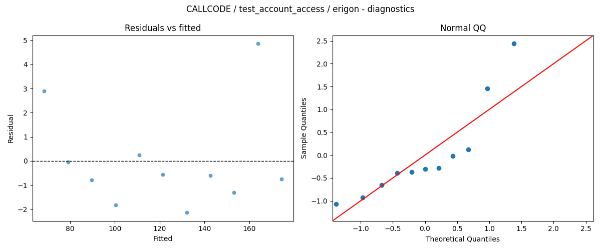

</details>

<details><summary>geth — NNLS regression summary</summary>

```
==============================================================================
                           NNLS Regression Results                            
==============================================================================
Dep. Variable:          test_runtime_ms              R-squared:          0.983
Model:                  NNLS                    Adj. R-squared:          0.983
No. Observations:       109                               RMSE:          59.80
Df Residuals:           107                                MAE:          46.48
Df Model:               1      
==============================================================================
                      coef     std err     P-value      [0.025      0.975]
------------------------------------------------------------------------------
         const    328.2673     18.9824       0.001    294.3538    367.2099
       opcount      0.0222      0.0003       0.001      0.0216      0.0227
==============================================================================
Notes: Non-negative least squares with bootstrap inference (1000 iterations)
==============================================================================
```

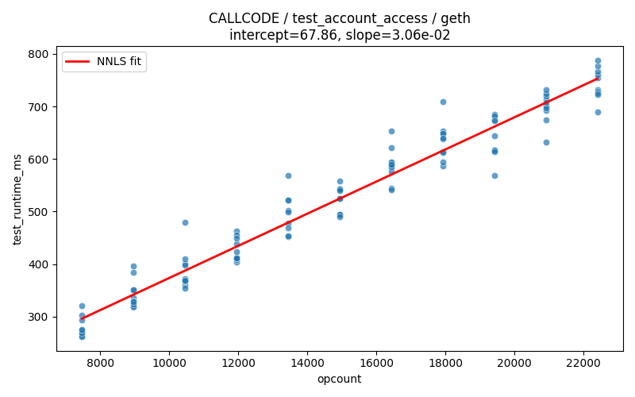

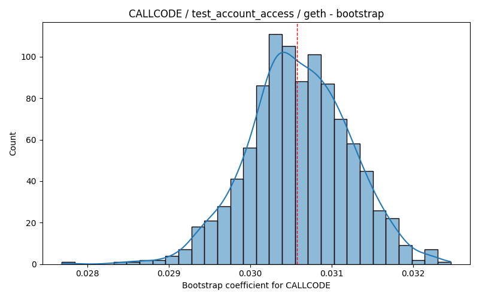

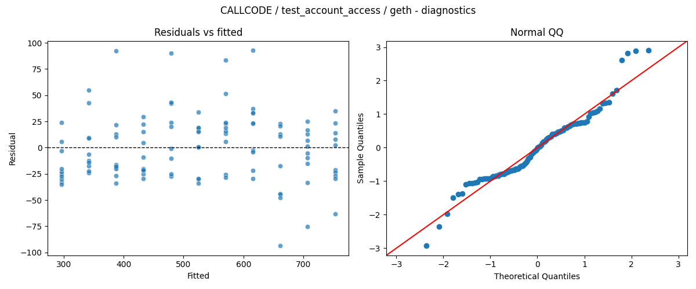

</details>

<details><summary>nethermind — NNLS regression summary</summary>

```
==============================================================================
                           NNLS Regression Results                            
==============================================================================
Dep. Variable:          test_runtime_ms              R-squared:          0.887
Model:                  NNLS                    Adj. R-squared:          0.884
No. Observations:       44                                RMSE:          21.64
Df Residuals:           42                                 MAE:          17.47
Df Model:               1      
==============================================================================
                      coef     std err     P-value      [0.025      0.975]
------------------------------------------------------------------------------
         const     75.3469      9.6652       0.001     55.4605     92.9512
       opcount      0.0030      0.0002       0.001      0.0027      0.0033
==============================================================================
Notes: Non-negative least squares with bootstrap inference (1000 iterations)
==============================================================================
```

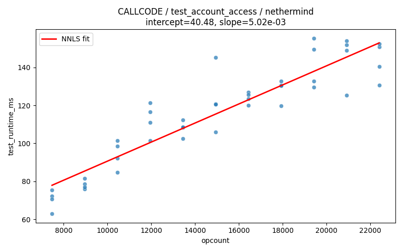

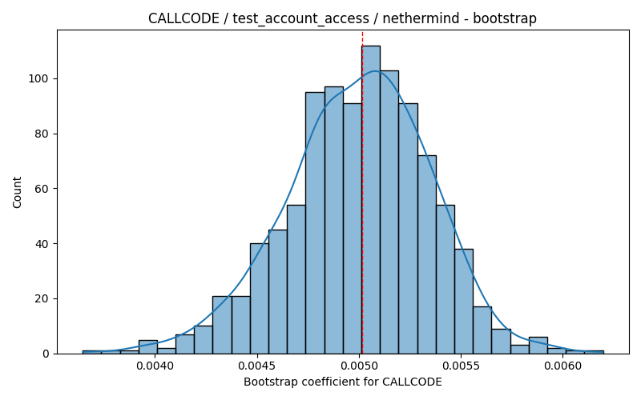

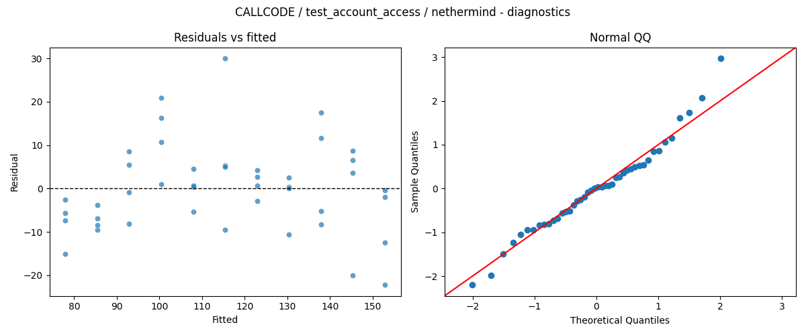

</details>

<details><summary>reth — NNLS regression summary</summary>

```
==============================================================================
                           NNLS Regression Results                            
==============================================================================
Dep. Variable:          test_runtime_ms              R-squared:          0.920
Model:                  NNLS                    Adj. R-squared:          0.919
No. Observations:       110                               RMSE:           5.57
Df Residuals:           108                                MAE:           4.46
Df Model:               1      
==============================================================================
                      coef     std err     P-value      [0.025      0.975]
------------------------------------------------------------------------------
         const     37.4344      1.8417       0.001     33.7483     40.8519
       opcount      0.0009      0.0000       0.001      0.0009      0.0010
==============================================================================
Notes: Non-negative least squares with bootstrap inference (1000 iterations)
==============================================================================
```

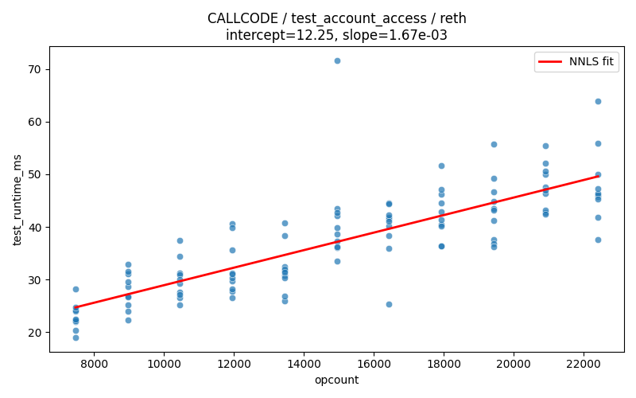

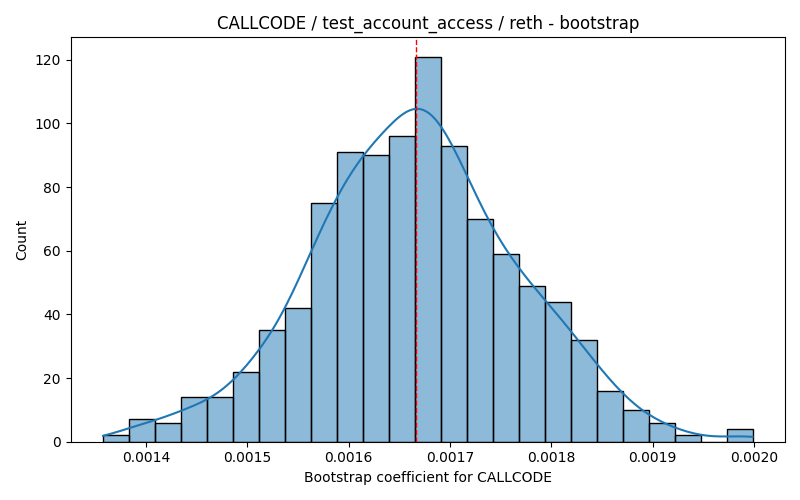

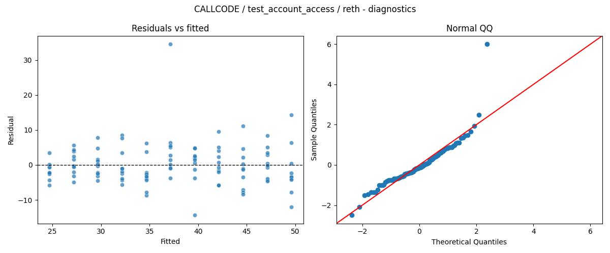

</details>

### test_account_access — combo `CALLCODE_AccountMode.EXISTING_EOA` — `presets[cold_account_nocode_write]`

| client | nobs | R² | target_coef (ms) | p-value | 95% CI |
| --- | --- | --- | --- | --- | --- |
| `besu` | 66 | 0.9597 | 0.02401 | 1.00e-03 | [0.02262, 0.02516] |
| `erigon` | 11 | 0.9958 | 0.008057 | 1.00e-03 | [0.007739, 0.008389] |
| `geth` | 109 | 0.9342 | 0.01716 | 1.00e-03 | [0.01625, 0.018] |
| `nethermind` | 44 | 0.8861 | 0.005635 | 1.00e-03 | [0.004991, 0.006229] |
| `reth` | 110 | 0.8598 | 0.002041 | 1.00e-03 | [0.001907, 0.002175] |

<details><summary>besu — NNLS regression summary</summary>

```
==============================================================================
                           NNLS Regression Results                            
==============================================================================
Dep. Variable:          test_runtime_ms              R-squared:          0.960
Model:                  NNLS                    Adj. R-squared:          0.959
No. Observations:       66                                RMSE:          23.24
Df Residuals:           64                                 MAE:          20.01
Df Model:               1      
==============================================================================
                      coef     std err     P-value      [0.025      0.975]
------------------------------------------------------------------------------
         const    120.1464      9.5524       0.001    103.0268    140.2672
       opcount      0.0240      0.0007       0.001      0.0226      0.0252
==============================================================================
Notes: Non-negative least squares with bootstrap inference (1000 iterations)
==============================================================================
```


</details>

<details><summary>erigon — NNLS regression summary</summary>

```
==============================================================================
                           NNLS Regression Results                            
==============================================================================
Dep. Variable:          test_runtime_ms              R-squared:          0.996
Model:                  NNLS                    Adj. R-squared:          0.995
No. Observations:       11                                RMSE:           2.48
Df Residuals:           9                                  MAE:           2.10
Df Model:               1      
==============================================================================
                      coef     std err     P-value      [0.025      0.975]
------------------------------------------------------------------------------
         const      6.7302      2.4999       0.011      1.3460     11.3450
       opcount      0.0081      0.0002       0.001      0.0077      0.0084
==============================================================================
Notes: Non-negative least squares with bootstrap inference (1000 iterations)
==============================================================================
```


</details>

<details><summary>geth — NNLS regression summary</summary>

```
==============================================================================
                           NNLS Regression Results                            
==============================================================================
Dep. Variable:          test_runtime_ms              R-squared:          0.934
Model:                  NNLS                    Adj. R-squared:          0.934
No. Observations:       109                               RMSE:          21.36
Df Residuals:           107                                MAE:          17.82
Df Model:               1      
==============================================================================
                      coef     std err     P-value      [0.025      0.975]
------------------------------------------------------------------------------
         const     55.1168      6.5751       0.001     42.8473     68.3555
       opcount      0.0172      0.0004       0.001      0.0162      0.0180
==============================================================================
Notes: Non-negative least squares with bootstrap inference (1000 iterations)
==============================================================================
```


</details>

<details><summary>nethermind — NNLS regression summary</summary>

```
==============================================================================
                           NNLS Regression Results                            
==============================================================================
Dep. Variable:          test_runtime_ms              R-squared:          0.886
Model:                  NNLS                    Adj. R-squared:          0.883
No. Observations:       44                                RMSE:           9.54
Df Residuals:           42                                 MAE:           7.48
Df Model:               1      
==============================================================================
                      coef     std err     P-value      [0.025      0.975]
------------------------------------------------------------------------------
         const     56.6873      5.1926       0.001     47.3725     67.9629
       opcount      0.0056      0.0003       0.001      0.0050      0.0062
==============================================================================
Notes: Non-negative least squares with bootstrap inference (1000 iterations)
==============================================================================
```


</details>

<details><summary>reth — NNLS regression summary</summary>

```
==============================================================================
                           NNLS Regression Results                            
==============================================================================
Dep. Variable:          test_runtime_ms              R-squared:          0.860
Model:                  NNLS                    Adj. R-squared:          0.858
No. Observations:       110                               RMSE:           3.89
Df Residuals:           108                                MAE:           2.87
Df Model:               1      
==============================================================================
                      coef     std err     P-value      [0.025      0.975]
------------------------------------------------------------------------------
         const      9.4350      1.0116       0.001      7.4719     11.5050
       opcount      0.0020      0.0001       0.001      0.0019      0.0022
==============================================================================
Notes: Non-negative least squares with bootstrap inference (1000 iterations)
==============================================================================
```


</details>

### test_account_access — combo `CALLCODE_AccountMode.NON_EXISTING_ACCOUNT` — `presets[cold_account_nocode_write]`

| client | nobs | R² | target_coef (ms) | p-value | 95% CI |
| --- | --- | --- | --- | --- | --- |
| `besu` | 66 | 0.9516 | 0.01695 | 1.00e-03 | [0.01605, 0.01778] |
| `erigon` | 11 | 0.9965 | 0.007087 | 1.00e-03 | [0.00676, 0.007475] |
| `geth` | 108 | 0.9537 | 0.03057 | 1.00e-03 | [0.02937, 0.03177] |
| `nethermind` | 44 | 0.8465 | 0.005016 | 1.00e-03 | [0.004274, 0.005627] |
| `reth` | 110 | 0.6517 | 0.001666 | 1.00e-03 | [0.001451, 0.001863] |

<details><summary>besu — NNLS regression summary</summary>

```
==============================================================================
                           NNLS Regression Results                            
==============================================================================
Dep. Variable:          test_runtime_ms              R-squared:          0.952
Model:                  NNLS                    Adj. R-squared:          0.951
No. Observations:       66                                RMSE:          18.05
Df Residuals:           64                                 MAE:          14.31
Df Model:               1      
==============================================================================
                      coef     std err     P-value      [0.025      0.975]
------------------------------------------------------------------------------
         const    113.9964      7.3027       0.001    100.6068    129.5419
       opcount      0.0169      0.0004       0.001      0.0160      0.0178
==============================================================================
Notes: Non-negative least squares with bootstrap inference (1000 iterations)
==============================================================================
```


</details>

<details><summary>erigon — NNLS regression summary</summary>

```
==============================================================================
                           NNLS Regression Results                            
==============================================================================
Dep. Variable:          test_runtime_ms              R-squared:          0.996
Model:                  NNLS                    Adj. R-squared:          0.996
No. Observations:       11                                RMSE:           1.99
Df Residuals:           9                                  MAE:           1.45
Df Model:               1      
==============================================================================
                      coef     std err     P-value      [0.025      0.975]
------------------------------------------------------------------------------
         const     15.6353      2.5378       0.001      9.8172     19.8350
       opcount      0.0071      0.0002       0.001      0.0068      0.0075
==============================================================================
Notes: Non-negative least squares with bootstrap inference (1000 iterations)
==============================================================================
```


</details>

<details><summary>geth — NNLS regression summary</summary>

```
==============================================================================
                           NNLS Regression Results                            
==============================================================================
Dep. Variable:          test_runtime_ms              R-squared:          0.954
Model:                  NNLS                    Adj. R-squared:          0.953
No. Observations:       108                               RMSE:          31.98
Df Residuals:           106                                MAE:          25.40
Df Model:               1      
==============================================================================
                      coef     std err     P-value      [0.025      0.975]
------------------------------------------------------------------------------
         const     67.8628      9.2764       0.001     50.8544     86.2190
       opcount      0.0306      0.0006       0.001      0.0294      0.0318
==============================================================================
Notes: Non-negative least squares with bootstrap inference (1000 iterations)
==============================================================================
```


</details>

<details><summary>nethermind — NNLS regression summary</summary>

```
==============================================================================
                           NNLS Regression Results                            
==============================================================================
Dep. Variable:          test_runtime_ms              R-squared:          0.846
Model:                  NNLS                    Adj. R-squared:          0.843
No. Observations:       44                                RMSE:          10.09
Df Residuals:           42                                 MAE:           7.59
Df Model:               1      
==============================================================================
                      coef     std err     P-value      [0.025      0.975]
------------------------------------------------------------------------------
         const     40.4841      5.2427       0.001     31.9306     52.6861
       opcount      0.0050      0.0004       0.001      0.0043      0.0056
==============================================================================
Notes: Non-negative least squares with bootstrap inference (1000 iterations)
==============================================================================
```


</details>

<details><summary>reth — NNLS regression summary</summary>

```
==============================================================================
                           NNLS Regression Results                            
==============================================================================
Dep. Variable:          test_runtime_ms              R-squared:          0.652
Model:                  NNLS                    Adj. R-squared:          0.648
No. Observations:       110                               RMSE:           5.75
Df Residuals:           108                                MAE:           4.03
Df Model:               1      
==============================================================================
                      coef     std err     P-value      [0.025      0.975]
------------------------------------------------------------------------------
         const     12.2546      1.4575       0.001      9.4628     15.4092
       opcount      0.0017      0.0001       0.001      0.0015      0.0019
==============================================================================
Notes: Non-negative least squares with bootstrap inference (1000 iterations)
==============================================================================
```


</details>

### test_account_access — combo `CALLCODE_AccountMode.EXISTING_CONTRACT_DIFF_MAX` — `presets[cold_account_code_access]`

| client | nobs | R² | target_coef (ms) | p-value | 95% CI |
| --- | --- | --- | --- | --- | --- |
| `besu` | 66 | 0.9846 | 0.02244 | 1.00e-03 | [0.02182, 0.02306] |
| `erigon` | 11 | 0.8871 | 0.1194 | 1.00e-03 | [0.08813, 0.1341] |
| `geth` | 109 | 0.9339 | 0.0218 | 1.00e-03 | [0.02061, 0.02301] |
| `nethermind` | 44 | 0.8985 | 0.01516 | 1.00e-03 | [0.01325, 0.01701] |
| `reth` | 110 | 0.9968 | 0.02071 | 1.00e-03 | [0.0205, 0.02097] |

<details><summary>besu — NNLS regression summary</summary>

```
==============================================================================
                           NNLS Regression Results                            
==============================================================================
Dep. Variable:          test_runtime_ms              R-squared:          0.985
Model:                  NNLS                    Adj. R-squared:          0.984
No. Observations:       66                                RMSE:          56.80
Df Residuals:           64                                 MAE:          44.72
Df Model:               1      
==============================================================================
                      coef     std err     P-value      [0.025      0.975]
------------------------------------------------------------------------------
         const    431.3675     21.5934       0.001    386.3032    472.6831
       opcount      0.0224      0.0003       0.001      0.0218      0.0231
==============================================================================
Notes: Non-negative least squares with bootstrap inference (1000 iterations)
==============================================================================
```

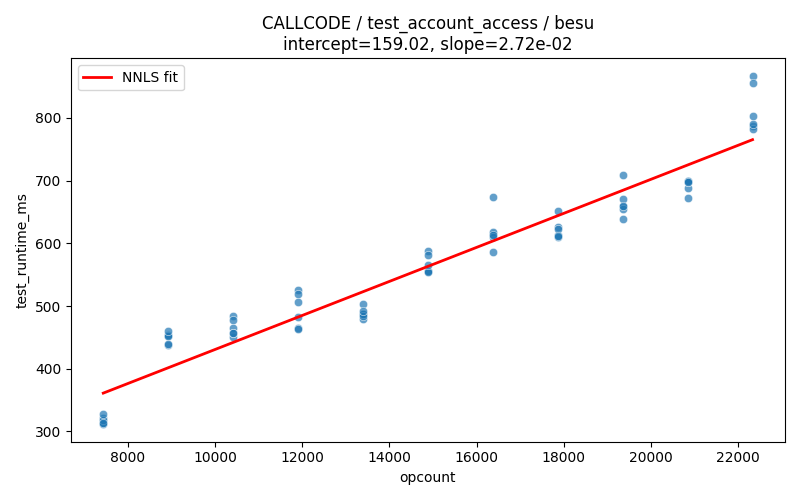

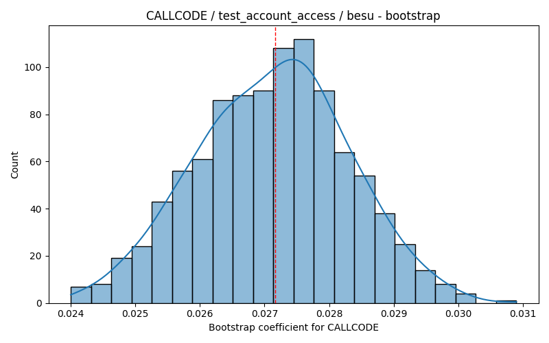

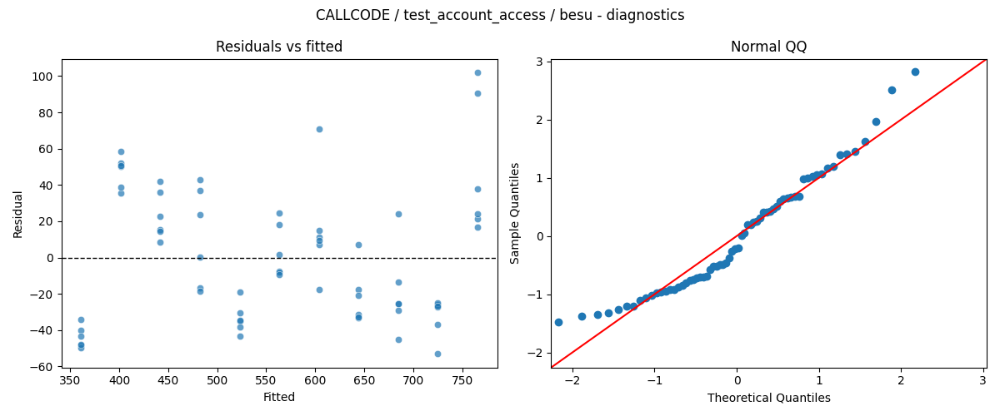

</details>

<details><summary>erigon — NNLS regression summary</summary>

```
==============================================================================
                           NNLS Regression Results                            
==============================================================================
Dep. Variable:          test_runtime_ms              R-squared:          0.887
Model:                  NNLS                    Adj. R-squared:          0.875
No. Observations:       11                                RMSE:         860.98
Df Residuals:           9                                  MAE:         749.57
Df Model:               1      
==============================================================================
                      coef     std err     P-value      [0.025      0.975]
------------------------------------------------------------------------------
         const    823.7831    904.7885       0.167      0.0000   3230.4164
       opcount      0.1194      0.0126       0.001      0.0881      0.1341
==============================================================================
Notes: Non-negative least squares with bootstrap inference (1000 iterations)
==============================================================================
```

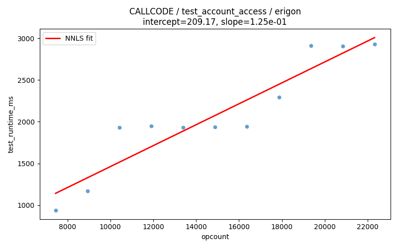

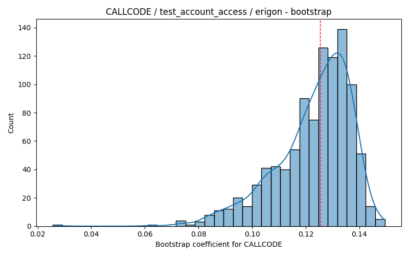

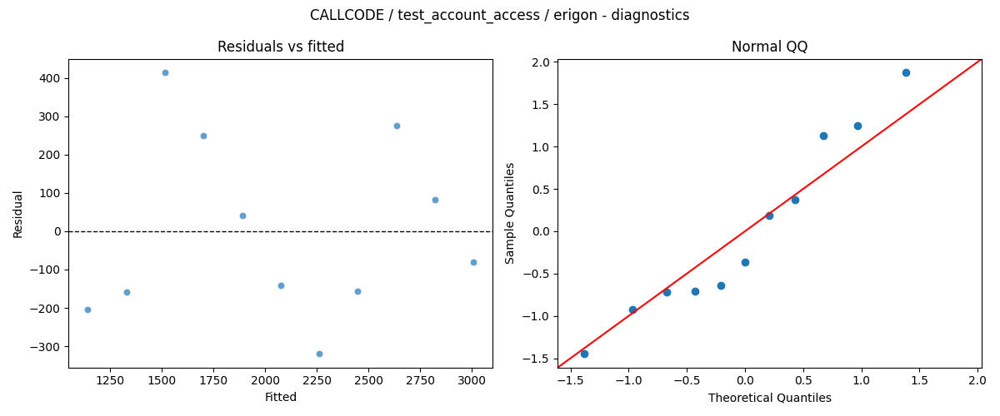

</details>

<details><summary>geth — NNLS regression summary</summary>

```
==============================================================================
                           NNLS Regression Results                            
==============================================================================
Dep. Variable:          test_runtime_ms              R-squared:          0.934
Model:                  NNLS                    Adj. R-squared:          0.933
No. Observations:       109                               RMSE:         117.30
Df Residuals:           107                                MAE:          97.08
Df Model:               1      
==============================================================================
                      coef     std err     P-value      [0.025      0.975]
------------------------------------------------------------------------------
         const    475.3658     39.6620       0.001    399.9404    550.5087
       opcount      0.0218      0.0006       0.001      0.0206      0.0230
==============================================================================
Notes: Non-negative least squares with bootstrap inference (1000 iterations)
==============================================================================
```

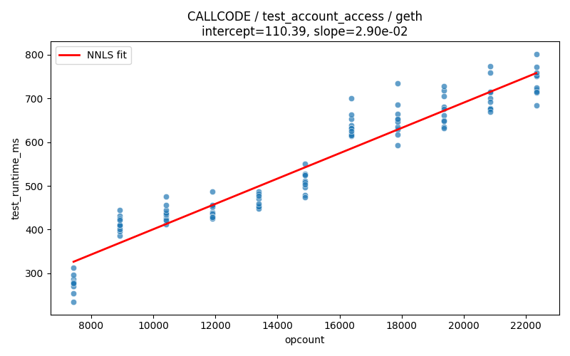

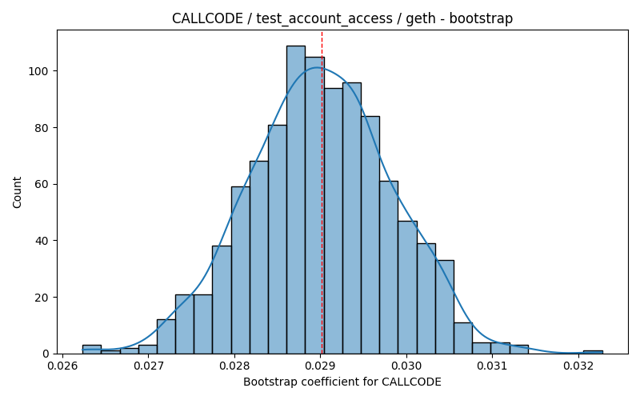

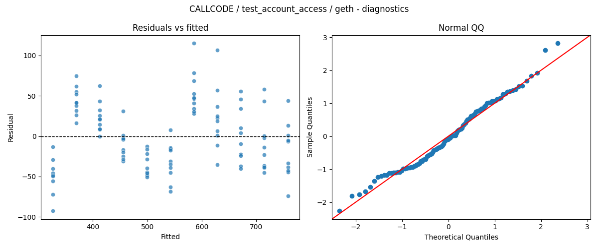

</details>

<details><summary>nethermind — NNLS regression summary</summary>

```
==============================================================================
                           NNLS Regression Results                            
==============================================================================
Dep. Variable:          test_runtime_ms              R-squared:          0.898
Model:                  NNLS                    Adj. R-squared:          0.896
No. Observations:       44                                RMSE:         103.06
Df Residuals:           42                                 MAE:          80.41
Df Model:               1      
==============================================================================
                      coef     std err     P-value      [0.025      0.975]
------------------------------------------------------------------------------
         const    667.1994     71.8910       0.001    531.6887    809.8933
       opcount      0.0152      0.0010       0.001      0.0132      0.0170
==============================================================================
Notes: Non-negative least squares with bootstrap inference (1000 iterations)
==============================================================================
```

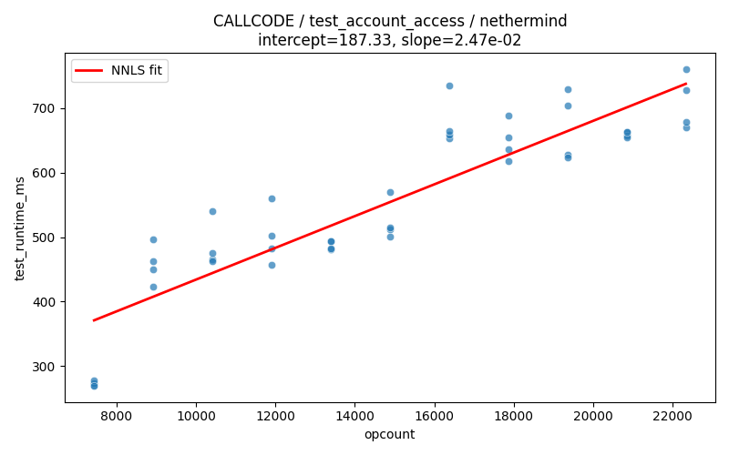

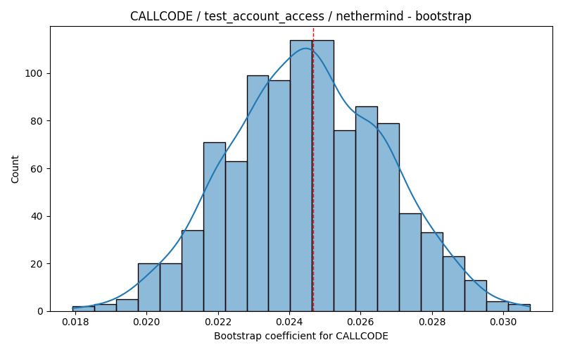

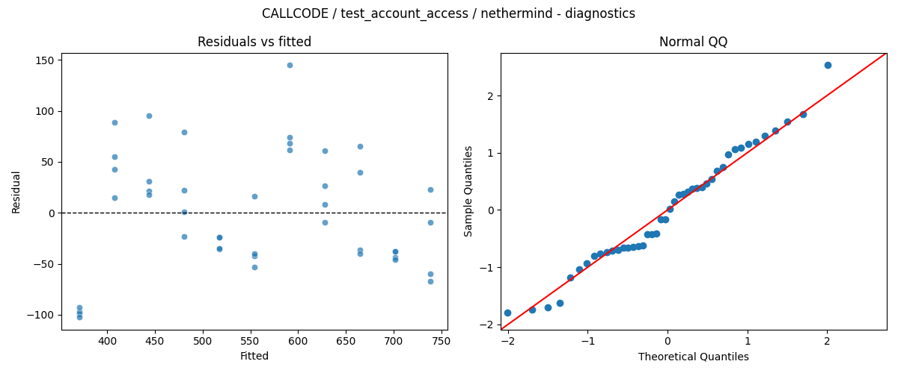

</details>

<details><summary>reth — NNLS regression summary</summary>

```
==============================================================================
                           NNLS Regression Results                            
==============================================================================
Dep. Variable:          test_runtime_ms              R-squared:          0.997
Model:                  NNLS                    Adj. R-squared:          0.997
No. Observations:       110                               RMSE:          23.60
Df Residuals:           108                                MAE:          17.58
Df Model:               1      
==============================================================================
                      coef     std err     P-value      [0.025      0.975]
------------------------------------------------------------------------------
         const    137.8547      6.8460       0.001    123.4821    150.3238
       opcount      0.0207      0.0001       0.001      0.0205      0.0210
==============================================================================
Notes: Non-negative least squares with bootstrap inference (1000 iterations)
==============================================================================
```

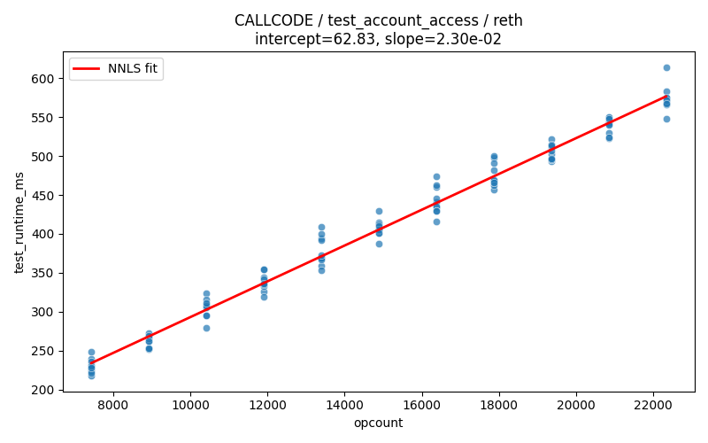

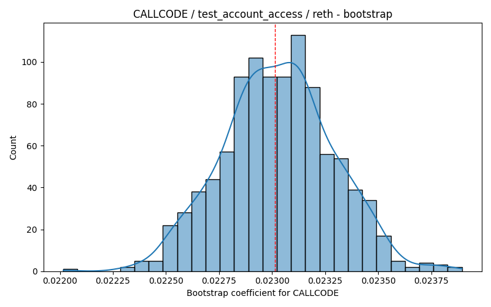

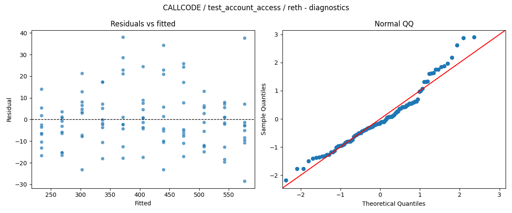

</details>

### test_account_access — combo `CALLCODE_AccountMode.EXISTING_CONTRACT_MINIMAL` — `presets[cold_account_code_access]`

| client | nobs | R² | target_coef (ms) | p-value | 95% CI |
| --- | --- | --- | --- | --- | --- |
| `besu` | 66 | 0.9802 | 0.01383 | 1.00e-03 | [0.01331, 0.01431] |
| `erigon` | 11 | 0.9864 | 0.009192 | 1.00e-03 | [0.008544, 0.009724] |
| `geth` | 106 | 0.9405 | 0.005195 | 1.00e-03 | [0.004933, 0.005468] |
| `nethermind` | 44 | 0.648 | 0.002743 | 1.00e-03 | [0.002085, 0.003405] |
| `reth` | 110 | 0.9719 | 0.0035 | 1.00e-03 | [0.003388, 0.003622] |

<details><summary>besu — NNLS regression summary</summary>

```
==============================================================================
                           NNLS Regression Results                            
==============================================================================
Dep. Variable:          test_runtime_ms              R-squared:          0.980
Model:                  NNLS                    Adj. R-squared:          0.980
No. Observations:       66                                RMSE:          39.76
Df Residuals:           64                                 MAE:          30.48
Df Model:               1      
==============================================================================
                      coef     std err     P-value      [0.025      0.975]
------------------------------------------------------------------------------
         const    390.7513     17.2114       0.001    360.6546    425.5366
       opcount      0.0138      0.0003       0.001      0.0133      0.0143
==============================================================================
Notes: Non-negative least squares with bootstrap inference (1000 iterations)
==============================================================================
```

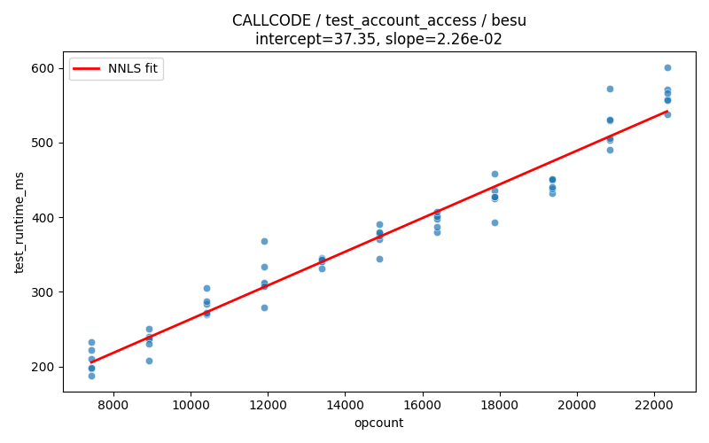

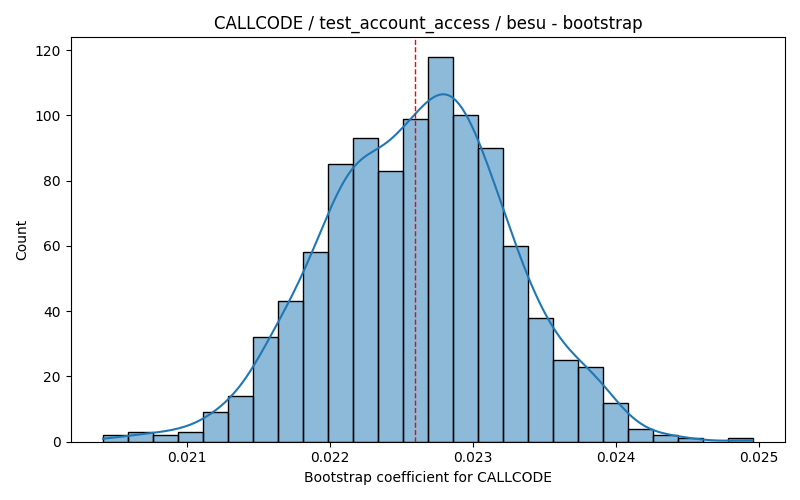

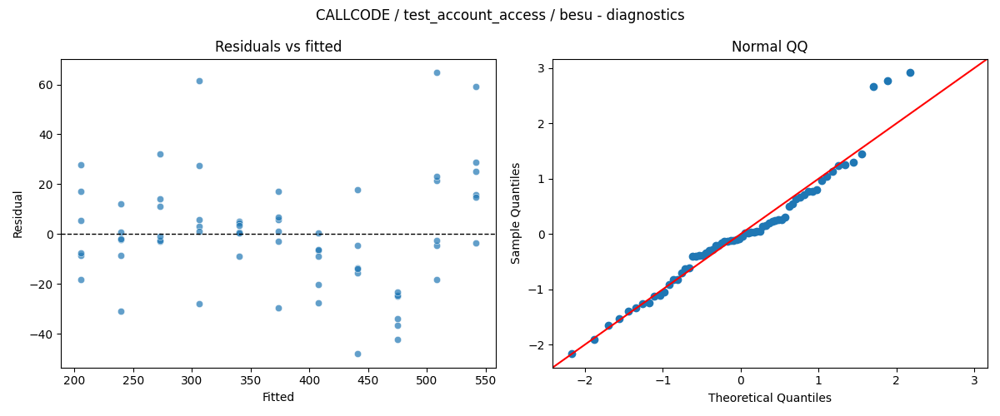

</details>

<details><summary>erigon — NNLS regression summary</summary>

```
==============================================================================
                           NNLS Regression Results                            
==============================================================================
Dep. Variable:          test_runtime_ms              R-squared:          0.986
Model:                  NNLS                    Adj. R-squared:          0.985
No. Observations:       11                                RMSE:          21.86
Df Residuals:           9                                  MAE:          18.65
Df Model:               1      
==============================================================================
                      coef     std err     P-value      [0.025      0.975]
------------------------------------------------------------------------------
         const    159.5087     22.9070       0.001    123.0389    208.4327
       opcount      0.0092      0.0003       0.001      0.0085      0.0097
==============================================================================
Notes: Non-negative least squares with bootstrap inference (1000 iterations)
==============================================================================
```

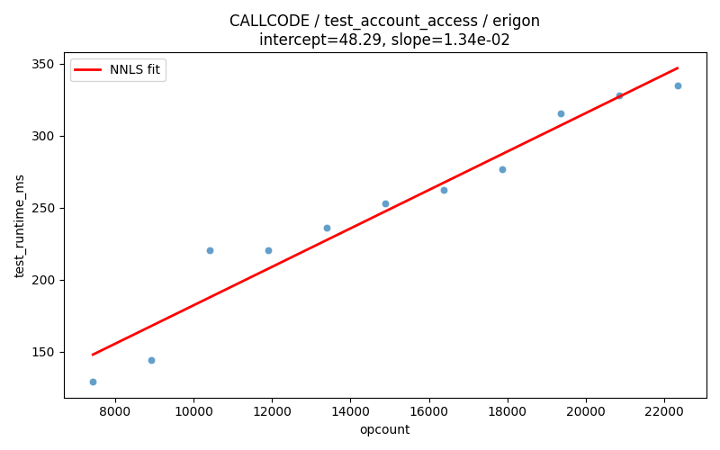

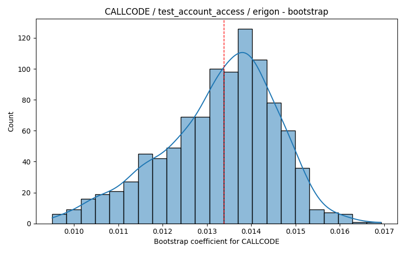

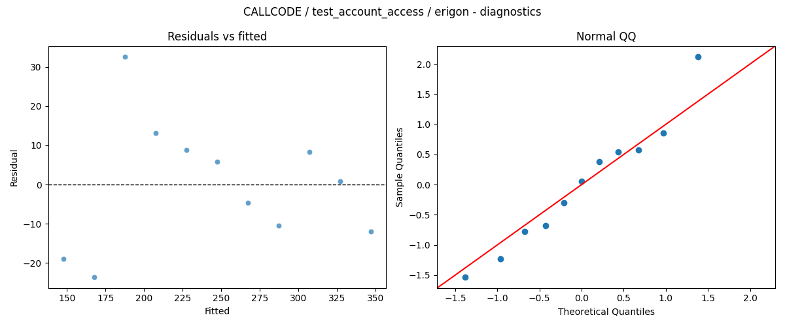

</details>

<details><summary>geth — NNLS regression summary</summary>

```
==============================================================================
                           NNLS Regression Results                            
==============================================================================
Dep. Variable:          test_runtime_ms              R-squared:          0.941
Model:                  NNLS                    Adj. R-squared:          0.940
No. Observations:       106                               RMSE:          26.17
Df Residuals:           104                                MAE:          20.18
Df Model:               1      
==============================================================================
                      coef     std err     P-value      [0.025      0.975]
------------------------------------------------------------------------------
         const     68.4096      8.0123       0.001     52.6551     83.8845
       opcount      0.0052      0.0001       0.001      0.0049      0.0055
==============================================================================
Notes: Non-negative least squares with bootstrap inference (1000 iterations)
==============================================================================
```

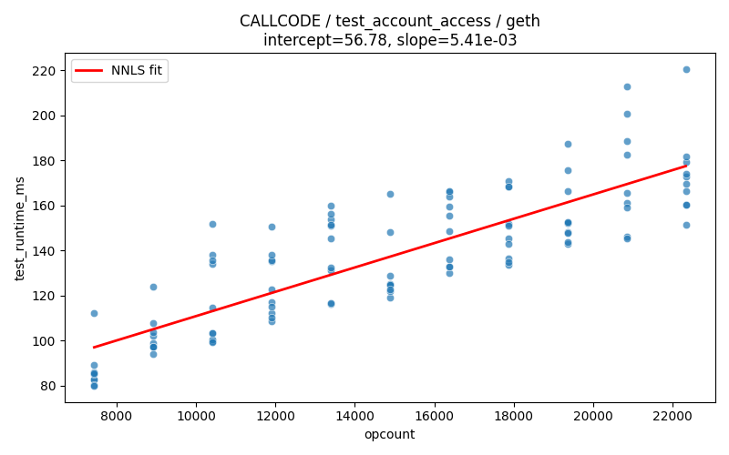

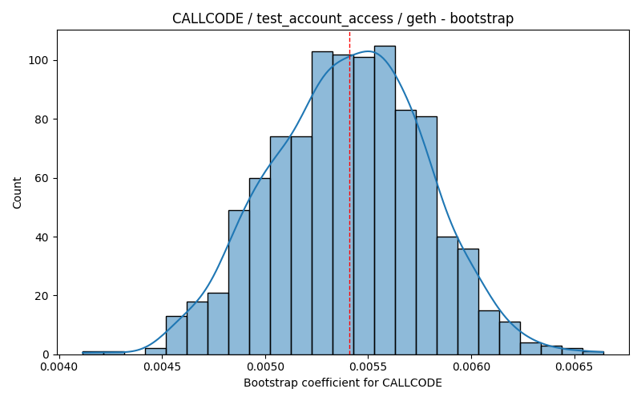

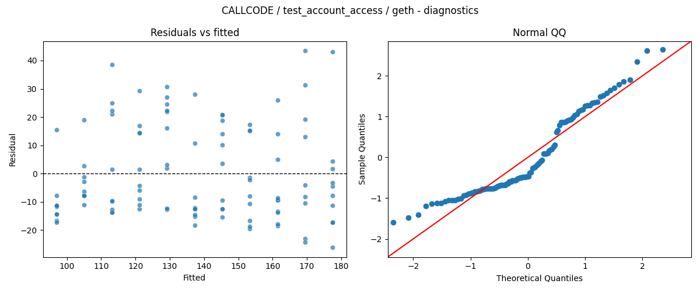

</details>

<details><summary>nethermind — NNLS regression summary</summary>

```
==============================================================================
                           NNLS Regression Results                            
==============================================================================
Dep. Variable:          test_runtime_ms              R-squared:          0.648
Model:                  NNLS                    Adj. R-squared:          0.640
No. Observations:       44                                RMSE:          40.88
Df Residuals:           42                                 MAE:          30.07
Df Model:               1      
==============================================================================
                      coef     std err     P-value      [0.025      0.975]
------------------------------------------------------------------------------
         const    106.7090     19.3202       0.001     71.8107    145.1466
       opcount      0.0027      0.0003       0.001      0.0021      0.0034
==============================================================================
Notes: Non-negative least squares with bootstrap inference (1000 iterations)
==============================================================================
```

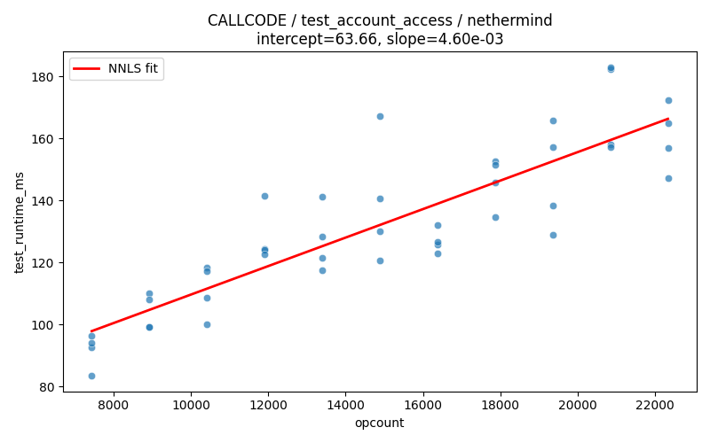

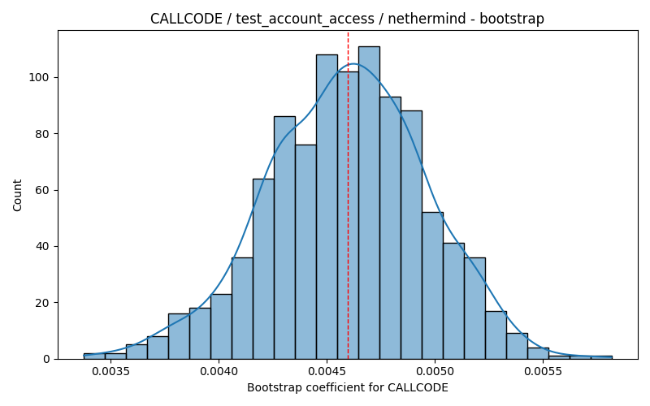

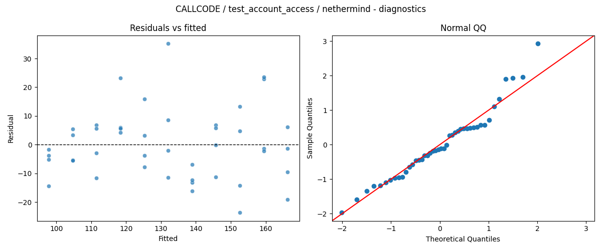

</details>

<details><summary>reth — NNLS regression summary</summary>

```
==============================================================================
                           NNLS Regression Results                            
==============================================================================
Dep. Variable:          test_runtime_ms              R-squared:          0.972
Model:                  NNLS                    Adj. R-squared:          0.972
No. Observations:       110                               RMSE:          12.03
Df Residuals:           108                                MAE:           8.67
Df Model:               1      
==============================================================================
                      coef     std err     P-value      [0.025      0.975]
------------------------------------------------------------------------------
         const     94.8782      3.7434       0.001     87.8313    102.2114
       opcount      0.0035      0.0001       0.001      0.0034      0.0036
==============================================================================
Notes: Non-negative least squares with bootstrap inference (1000 iterations)
==============================================================================
```

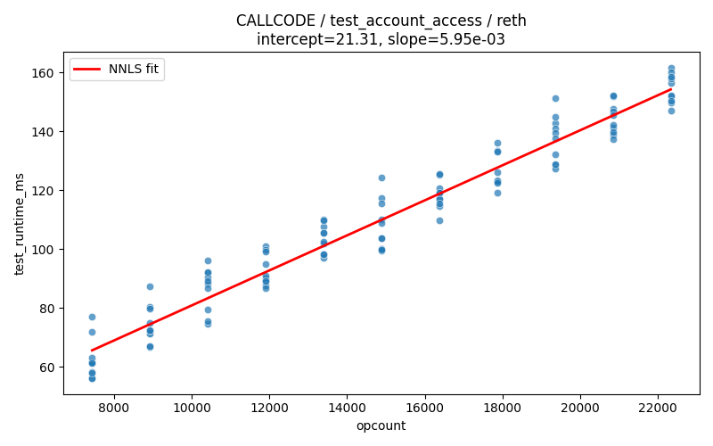

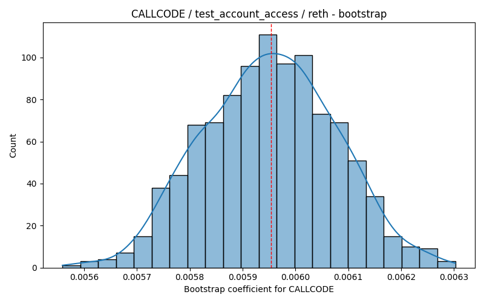

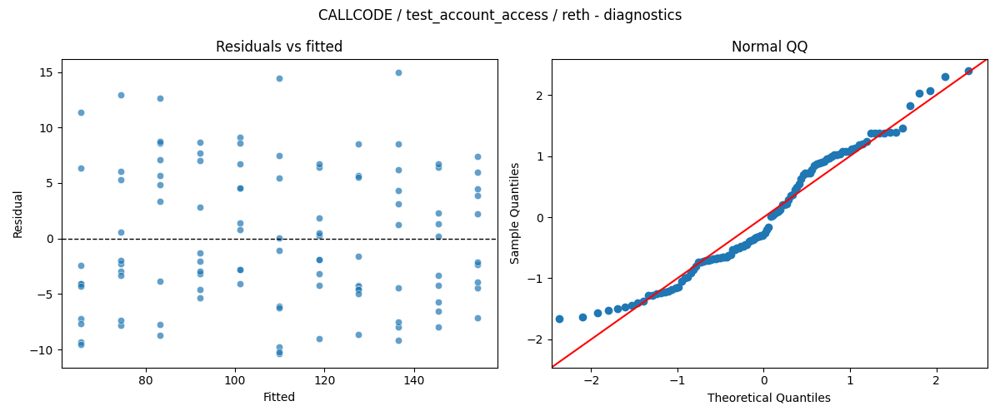

</details>

### test_account_access — combo `CALLCODE_AccountMode.EXISTING_CONTRACT_SAME_MAX` — `presets[cold_account_code_access]`

| client | nobs | R² | target_coef (ms) | p-value | 95% CI |
| --- | --- | --- | --- | --- | --- |
| `besu` | 66 | 0.9765 | 0.01252 | 1.00e-03 | [0.01202, 0.01303] |
| `erigon` | 11 | 0.9809 | 0.008929 | 1.00e-03 | [0.007831, 0.009544] |
| `geth` | 110 | 0.9501 | 0.005371 | 1.00e-03 | [0.005157, 0.005587] |
| `nethermind` | 44 | 0.6981 | 0.002923 | 1.00e-03 | [0.002345, 0.00353] |
| `reth` | 110 | 0.9765 | 0.00355 | 1.00e-03 | [0.003446, 0.003639] |

<details><summary>besu — NNLS regression summary</summary>

```
==============================================================================
                           NNLS Regression Results                            
==============================================================================
Dep. Variable:          test_runtime_ms              R-squared:          0.977
Model:                  NNLS                    Adj. R-squared:          0.976
No. Observations:       66                                RMSE:          39.23
Df Residuals:           64                                 MAE:          30.64
Df Model:               1      
==============================================================================
                      coef     std err     P-value      [0.025      0.975]
------------------------------------------------------------------------------
         const    424.6007     16.7410       0.001    393.8273    459.5043
       opcount      0.0125      0.0003       0.001      0.0120      0.0130
==============================================================================
Notes: Non-negative least squares with bootstrap inference (1000 iterations)
==============================================================================
```

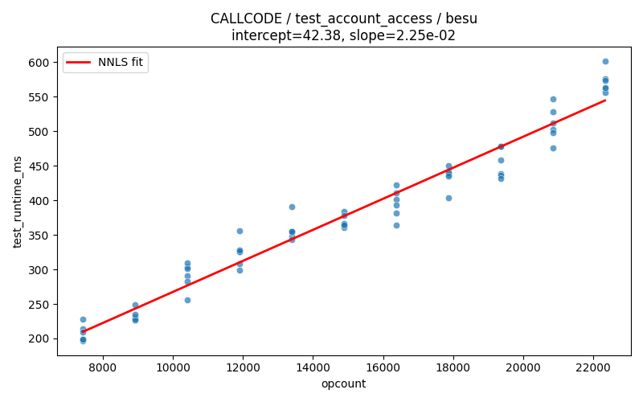

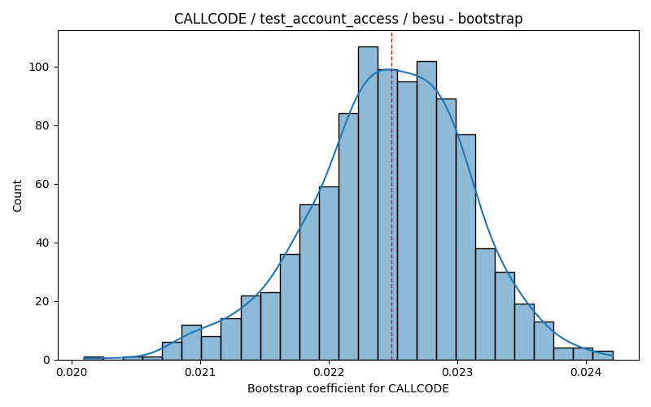

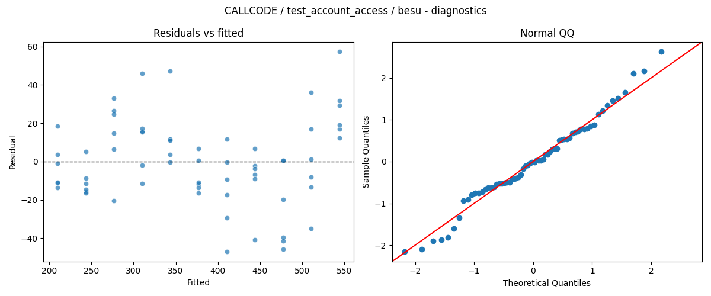

</details>

<details><summary>erigon — NNLS regression summary</summary>

```
==============================================================================
                           NNLS Regression Results                            
==============================================================================
Dep. Variable:          test_runtime_ms              R-squared:          0.981
Model:                  NNLS                    Adj. R-squared:          0.979
No. Observations:       11                                RMSE:          25.21
Df Residuals:           9                                  MAE:          22.10
Df Model:               1      
==============================================================================
                      coef     std err     P-value      [0.025      0.975]
------------------------------------------------------------------------------
         const    174.1926     30.5326       0.001    132.3959    249.9980
       opcount      0.0089      0.0004       0.001      0.0078      0.0095
==============================================================================
Notes: Non-negative least squares with bootstrap inference (1000 iterations)
==============================================================================
```

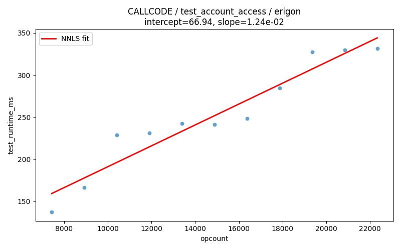

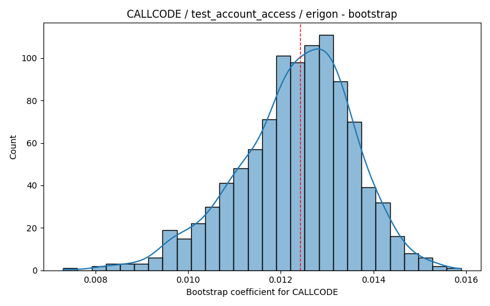

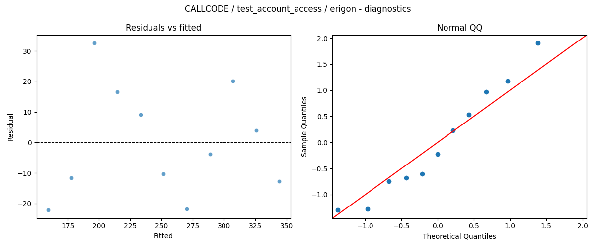

</details>

<details><summary>geth — NNLS regression summary</summary>

```
==============================================================================
                           NNLS Regression Results                            
==============================================================================
Dep. Variable:          test_runtime_ms              R-squared:          0.950
Model:                  NNLS                    Adj. R-squared:          0.950
No. Observations:       110                               RMSE:          24.90
Df Residuals:           108                                MAE:          20.19
Df Model:               1      
==============================================================================
                      coef     std err     P-value      [0.025      0.975]
------------------------------------------------------------------------------
         const     59.1398      6.8969       0.001     45.9873     72.7060
       opcount      0.0054      0.0001       0.001      0.0052      0.0056
==============================================================================
Notes: Non-negative least squares with bootstrap inference (1000 iterations)
==============================================================================
```

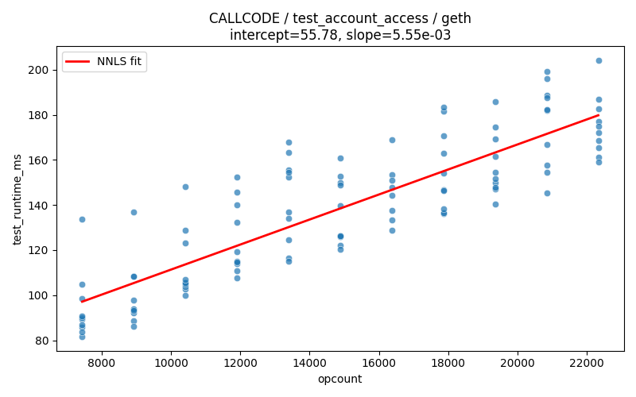

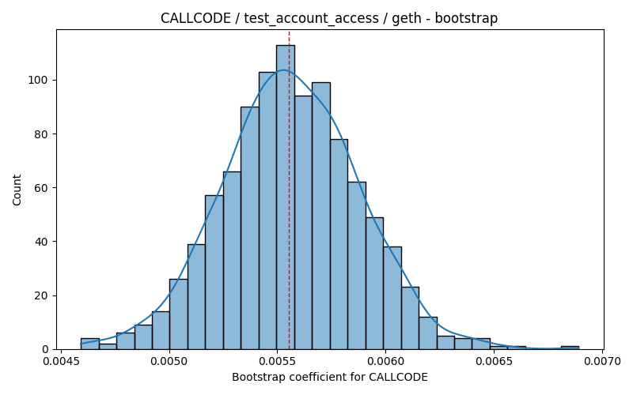

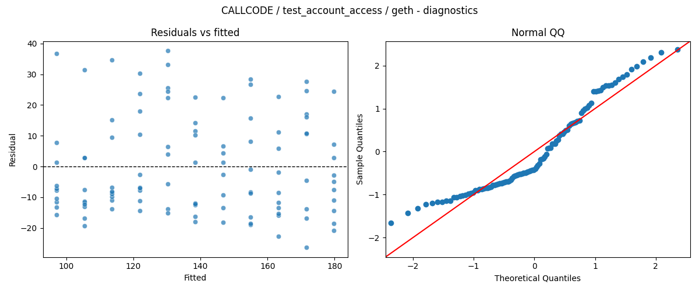

</details>

<details><summary>nethermind — NNLS regression summary</summary>

```
==============================================================================
                           NNLS Regression Results                            
==============================================================================
Dep. Variable:          test_runtime_ms              R-squared:          0.698
Model:                  NNLS                    Adj. R-squared:          0.691
No. Observations:       44                                RMSE:          38.86
Df Residuals:           42                                 MAE:          31.56
Df Model:               1      
==============================================================================
                      coef     std err     P-value      [0.025      0.975]
------------------------------------------------------------------------------
         const     99.5157     16.6831       0.001     67.4193    131.7301
       opcount      0.0029      0.0003       0.001      0.0023      0.0035
==============================================================================
Notes: Non-negative least squares with bootstrap inference (1000 iterations)
==============================================================================
```

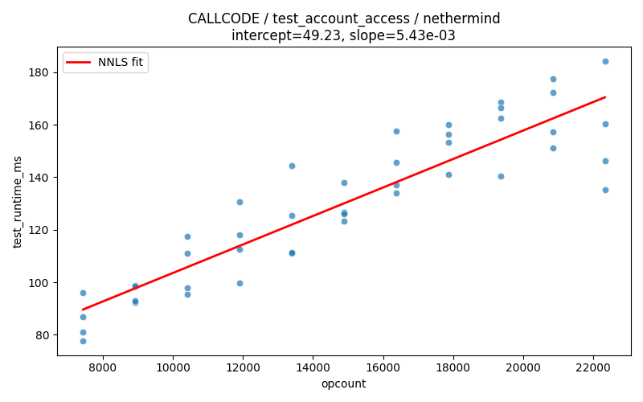

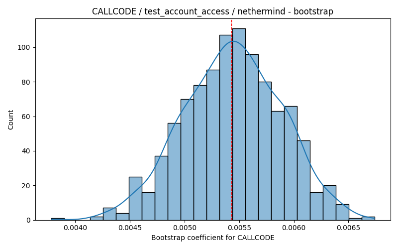

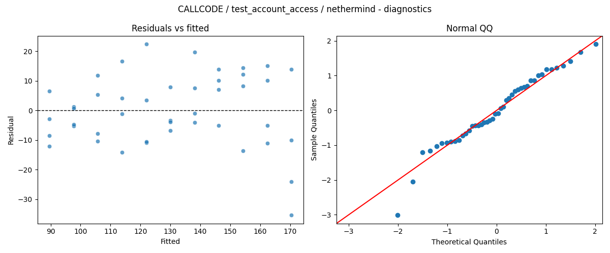

</details>

<details><summary>reth — NNLS regression summary</summary>

```
==============================================================================
                           NNLS Regression Results                            
==============================================================================
Dep. Variable:          test_runtime_ms              R-squared:          0.976
Model:                  NNLS                    Adj. R-squared:          0.976
No. Observations:       110                               RMSE:          11.14
Df Residuals:           108                                MAE:           8.29
Df Model:               1      
==============================================================================
                      coef     std err     P-value      [0.025      0.975]
------------------------------------------------------------------------------
         const     96.4987      3.2365       0.001     90.9469    103.4267
       opcount      0.0035      0.0000       0.001      0.0034      0.0036
==============================================================================
Notes: Non-negative least squares with bootstrap inference (1000 iterations)
==============================================================================
```

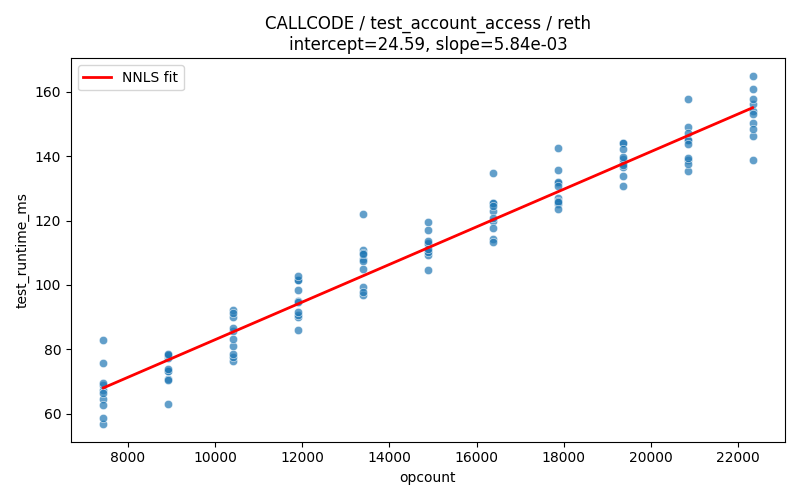

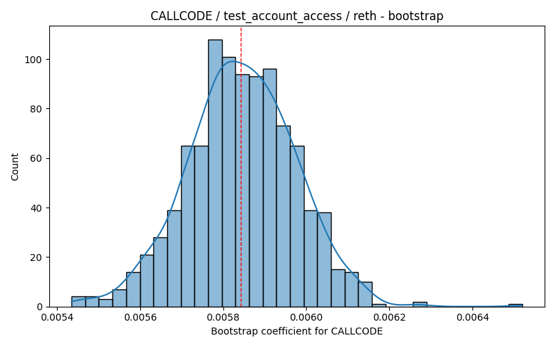

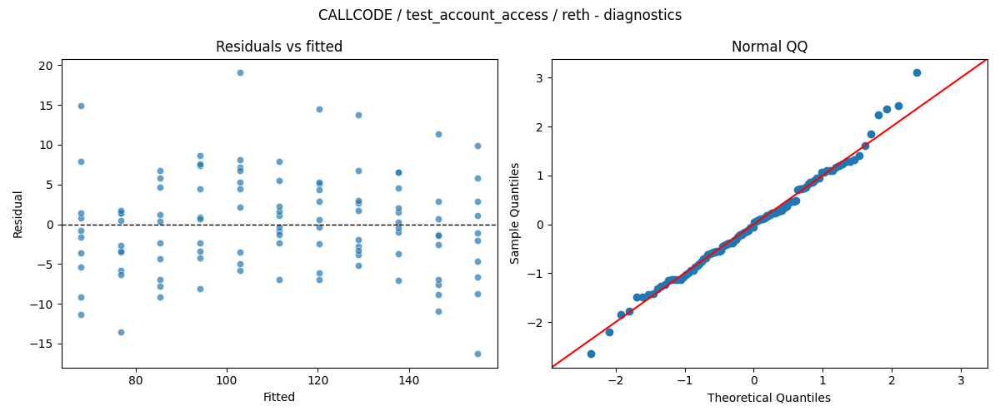

</details>

### test_account_access — combo `CALLCODE_AccountMode.EXISTING_CONTRACT_DIFF_MAX` — `presets[cold_account_code_write]`

| client | nobs | R² | target_coef (ms) | p-value | 95% CI |
| --- | --- | --- | --- | --- | --- |
| `besu` | 66 | 0.9267 | 0.02716 | 1.00e-03 | [0.02484, 0.02936] |
| `erigon` | 11 | 0.8771 | 0.1254 | 1.00e-03 | [0.0879, 0.1412] |
| `geth` | 108 | 0.9174 | 0.02902 | 1.00e-03 | [0.02737, 0.03051] |
| `nethermind` | 44 | 0.8053 | 0.02466 | 1.00e-03 | [0.02028, 0.02862] |
| `reth` | 110 | 0.9856 | 0.02301 | 1.00e-03 | [0.02252, 0.02352] |

<details><summary>besu — NNLS regression summary</summary>

```
==============================================================================
                           NNLS Regression Results                            
==============================================================================
Dep. Variable:          test_runtime_ms              R-squared:          0.927
Model:                  NNLS                    Adj. R-squared:          0.926
No. Observations:       66                                RMSE:          35.96
Df Residuals:           64                                 MAE:          30.62
Df Model:               1      
==============================================================================
                      coef     std err     P-value      [0.025      0.975]
------------------------------------------------------------------------------
         const    159.0179     17.9593       0.001    124.5413    194.8852
       opcount      0.0272      0.0012       0.001      0.0248      0.0294
==============================================================================
Notes: Non-negative least squares with bootstrap inference (1000 iterations)
==============================================================================
```


</details>

<details><summary>erigon — NNLS regression summary</summary>

```
==============================================================================
                           NNLS Regression Results                            
==============================================================================
Dep. Variable:          test_runtime_ms              R-squared:          0.877
Model:                  NNLS                    Adj. R-squared:          0.863
No. Observations:       11                                RMSE:         220.87
Df Residuals:           9                                  MAE:         192.79
Df Model:               1      
==============================================================================
                      coef     std err     P-value      [0.025      0.975]
------------------------------------------------------------------------------
         const    209.1715    239.1148       0.173      0.0000    834.5414
       opcount      0.1254      0.0143       0.001      0.0879      0.1412
==============================================================================
Notes: Non-negative least squares with bootstrap inference (1000 iterations)
==============================================================================
```


</details>

<details><summary>geth — NNLS regression summary</summary>

```
==============================================================================
                           NNLS Regression Results                            
==============================================================================
Dep. Variable:          test_runtime_ms              R-squared:          0.917
Model:                  NNLS                    Adj. R-squared:          0.917
No. Observations:       108                               RMSE:          40.87
Df Residuals:           106                                MAE:          34.07
Df Model:               1      
==============================================================================
                      coef     std err     P-value      [0.025      0.975]
------------------------------------------------------------------------------
         const    110.3854     13.4524       0.001     85.4328    136.5908
       opcount      0.0290      0.0008       0.001      0.0274      0.0305
==============================================================================
Notes: Non-negative least squares with bootstrap inference (1000 iterations)
==============================================================================
```


</details>

<details><summary>nethermind — NNLS regression summary</summary>

```
==============================================================================
                           NNLS Regression Results                            
==============================================================================
Dep. Variable:          test_runtime_ms              R-squared:          0.805
Model:                  NNLS                    Adj. R-squared:          0.801
No. Observations:       44                                RMSE:          57.09
Df Residuals:           42                                 MAE:          48.07
Df Model:               1      
==============================================================================
                      coef     std err     P-value      [0.025      0.975]
------------------------------------------------------------------------------
         const    187.3293     35.7486       0.001    121.2120    258.9796
       opcount      0.0247      0.0022       0.001      0.0203      0.0286
==============================================================================
Notes: Non-negative least squares with bootstrap inference (1000 iterations)
==============================================================================
```


</details>

<details><summary>reth — NNLS regression summary</summary>

```
==============================================================================
                           NNLS Regression Results                            
==============================================================================
Dep. Variable:          test_runtime_ms              R-squared:          0.986
Model:                  NNLS                    Adj. R-squared:          0.985
No. Observations:       110                               RMSE:          13.10
Df Residuals:           108                                MAE:           9.99
Df Model:               1      
==============================================================================
                      coef     std err     P-value      [0.025      0.975]
------------------------------------------------------------------------------
         const     62.8258      3.9136       0.001     55.2923     70.5050
       opcount      0.0230      0.0003       0.001      0.0225      0.0235
==============================================================================
Notes: Non-negative least squares with bootstrap inference (1000 iterations)
==============================================================================
```


</details>

### test_account_access — combo `CALLCODE_AccountMode.EXISTING_CONTRACT_MINIMAL` — `presets[cold_account_code_write]`

| client | nobs | R² | target_coef (ms) | p-value | 95% CI |
| --- | --- | --- | --- | --- | --- |
| `besu` | 66 | 0.9583 | 0.0226 | 1.00e-03 | [0.02135, 0.02385] |
| `erigon` | 11 | 0.9437 | 0.01338 | 1.00e-03 | [0.01042, 0.01531] |
| `geth` | 106 | 0.7027 | 0.005408 | 1.00e-03 | [0.004674, 0.006086] |
| `nethermind` | 44 | 0.7644 | 0.004595 | 1.00e-03 | [0.003824, 0.005265] |
| `reth` | 110 | 0.9526 | 0.005954 | 1.00e-03 | [0.005718, 0.006188] |

<details><summary>besu — NNLS regression summary</summary>

```
==============================================================================
                           NNLS Regression Results                            
==============================================================================
Dep. Variable:          test_runtime_ms              R-squared:          0.958
Model:                  NNLS                    Adj. R-squared:          0.958
No. Observations:       66                                RMSE:          22.20
Df Residuals:           64                                 MAE:          16.20
Df Model:               1      
==============================================================================
                      coef     std err     P-value      [0.025      0.975]
------------------------------------------------------------------------------
         const     37.3538      8.6971       0.001     20.5358     53.6305
       opcount      0.0226      0.0006       0.001      0.0214      0.0238
==============================================================================
Notes: Non-negative least squares with bootstrap inference (1000 iterations)
==============================================================================
```


</details>

<details><summary>erigon — NNLS regression summary</summary>

```
==============================================================================
                           NNLS Regression Results                            
==============================================================================
Dep. Variable:          test_runtime_ms              R-squared:          0.944
Model:                  NNLS                    Adj. R-squared:          0.937
No. Observations:       11                                RMSE:          15.37
Df Residuals:           9                                  MAE:          12.64
Df Model:               1      
==============================================================================
                      coef     std err     P-value      [0.025      0.975]
------------------------------------------------------------------------------
         const     48.2881     22.6572       0.001     15.2426    101.7131
       opcount      0.0134      0.0013       0.001      0.0104      0.0153
==============================================================================
Notes: Non-negative least squares with bootstrap inference (1000 iterations)
==============================================================================
```


</details>

<details><summary>geth — NNLS regression summary</summary>

```
==============================================================================
                           NNLS Regression Results                            
==============================================================================
Dep. Variable:          test_runtime_ms              R-squared:          0.703
Model:                  NNLS                    Adj. R-squared:          0.700
No. Observations:       106                               RMSE:          16.42
Df Residuals:           104                                MAE:          14.06
Df Model:               1      
==============================================================================
                      coef     std err     P-value      [0.025      0.975]
------------------------------------------------------------------------------
         const     56.7845      5.3126       0.001     47.2230     67.3123
       opcount      0.0054      0.0004       0.001      0.0047      0.0061
==============================================================================
Notes: Non-negative least squares with bootstrap inference (1000 iterations)
==============================================================================
```


</details>

<details><summary>nethermind — NNLS regression summary</summary>

```
==============================================================================
                           NNLS Regression Results                            
==============================================================================
Dep. Variable:          test_runtime_ms              R-squared:          0.764
Model:                  NNLS                    Adj. R-squared:          0.759
No. Observations:       44                                RMSE:          12.01
Df Residuals:           42                                 MAE:           9.37
Df Model:               1      
==============================================================================
                      coef     std err     P-value      [0.025      0.975]
------------------------------------------------------------------------------
         const     63.6611      5.0593       0.001     54.5696     74.4379
       opcount      0.0046      0.0004       0.001      0.0038      0.0053
==============================================================================
Notes: Non-negative least squares with bootstrap inference (1000 iterations)
==============================================================================
```


</details>

<details><summary>reth — NNLS regression summary</summary>

```
==============================================================================
                           NNLS Regression Results                            
==============================================================================
Dep. Variable:          test_runtime_ms              R-squared:          0.953
Model:                  NNLS                    Adj. R-squared:          0.952
No. Observations:       110                               RMSE:           6.25
Df Residuals:           108                                MAE:           5.41
Df Model:               1      
==============================================================================
                      coef     std err     P-value      [0.025      0.975]
------------------------------------------------------------------------------
         const     21.3057      1.9876       0.001     17.6076     25.2351
       opcount      0.0060      0.0001       0.001      0.0057      0.0062
==============================================================================
Notes: Non-negative least squares with bootstrap inference (1000 iterations)
==============================================================================
```


</details>

### test_account_access — combo `CALLCODE_AccountMode.EXISTING_CONTRACT_SAME_MAX` — `presets[cold_account_code_write]`

| client | nobs | R² | target_coef (ms) | p-value | 95% CI |
| --- | --- | --- | --- | --- | --- |
| `besu` | 66 | 0.9593 | 0.02249 | 1.00e-03 | [0.02111, 0.02358] |
| `erigon` | 11 | 0.921 | 0.01241 | 1.00e-03 | [0.009587, 0.01449] |
| `geth` | 108 | 0.7335 | 0.005555 | 1.00e-03 | [0.004939, 0.006167] |
| `nethermind` | 44 | 0.8254 | 0.005429 | 1.00e-03 | [0.00455, 0.006295] |
| `reth` | 110 | 0.9524 | 0.005842 | 1.00e-03 | [0.005588, 0.006099] |

<details><summary>besu — NNLS regression summary</summary>

```
==============================================================================
                           NNLS Regression Results                            
==============================================================================
Dep. Variable:          test_runtime_ms              R-squared:          0.959
Model:                  NNLS                    Adj. R-squared:          0.959
No. Observations:       66                                RMSE:          21.82
Df Residuals:           64                                 MAE:          16.94
Df Model:               1      
==============================================================================
                      coef     std err     P-value      [0.025      0.975]
------------------------------------------------------------------------------
         const     42.3826      8.3655       0.001     27.4973     60.8199
       opcount      0.0225      0.0006       0.001      0.0211      0.0236
==============================================================================
Notes: Non-negative least squares with bootstrap inference (1000 iterations)
==============================================================================
```


</details>

<details><summary>erigon — NNLS regression summary</summary>

```
==============================================================================
                           NNLS Regression Results                            
==============================================================================
Dep. Variable:          test_runtime_ms              R-squared:          0.921
Model:                  NNLS                    Adj. R-squared:          0.912
No. Observations:       11                                RMSE:          17.11
Df Residuals:           9                                  MAE:          14.96
Df Model:               1      
==============================================================================
                      coef     std err     P-value      [0.025      0.975]
------------------------------------------------------------------------------
         const     66.9434     21.0104       0.001     34.4913    117.8903
       opcount      0.0124      0.0012       0.001      0.0096      0.0145
==============================================================================
Notes: Non-negative least squares with bootstrap inference (1000 iterations)
==============================================================================
```


</details>

<details><summary>geth — NNLS regression summary</summary>

```
==============================================================================
                           NNLS Regression Results                            
==============================================================================
Dep. Variable:          test_runtime_ms              R-squared:          0.733
Model:                  NNLS                    Adj. R-squared:          0.731
No. Observations:       108                               RMSE:          15.89
Df Residuals:           106                                MAE:          13.57
Df Model:               1      
==============================================================================
                      coef     std err     P-value      [0.025      0.975]
------------------------------------------------------------------------------
         const     55.7789      4.8762       0.001     46.3920     65.5500
       opcount      0.0056      0.0003       0.001      0.0049      0.0062
==============================================================================
Notes: Non-negative least squares with bootstrap inference (1000 iterations)
==============================================================================
```


</details>

<details><summary>nethermind — NNLS regression summary</summary>

```
==============================================================================
                           NNLS Regression Results                            
==============================================================================
Dep. Variable:          test_runtime_ms              R-squared:          0.825
Model:                  NNLS                    Adj. R-squared:          0.821
No. Observations:       44                                RMSE:          11.75
Df Residuals:           42                                 MAE:           9.64
Df Model:               1      
==============================================================================
                      coef     std err     P-value      [0.025      0.975]
------------------------------------------------------------------------------
         const     49.2282      5.8696       0.001     38.1408     61.1963
       opcount      0.0054      0.0004       0.001      0.0046      0.0063
==============================================================================
Notes: Non-negative least squares with bootstrap inference (1000 iterations)
==============================================================================
```


</details>

<details><summary>reth — NNLS regression summary</summary>

```
==============================================================================
                           NNLS Regression Results                            
==============================================================================
Dep. Variable:          test_runtime_ms              R-squared:          0.952
Model:                  NNLS                    Adj. R-squared:          0.952
No. Observations:       110                               RMSE:           6.15
Df Residuals:           108                                MAE:           4.84
Df Model:               1      
==============================================================================
                      coef     std err     P-value      [0.025      0.975]
------------------------------------------------------------------------------
         const     24.5866      2.0185       0.001     20.7935     28.5934
       opcount      0.0058      0.0001       0.001      0.0056      0.0061
==============================================================================
Notes: Non-negative least squares with bootstrap inference (1000 iterations)
==============================================================================
```


</details>

## DELEGATECALL

### test_ext_account_query_warm — combo `DELEGATECALL`

| client | nobs | R² | target_coef (ms) | p-value | 95% CI |
| --- | --- | --- | --- | --- | --- |
| `besu` | 66 | 0.8809 | 0.0004014 | 1.00e-03 | [0.0003652, 0.000437] |
| `erigon` | 11 | 0.9382 | 5.197e-05 | 1.00e-03 | [4.263e-05, 5.851e-05] |
| `geth` | 109 | 0.9057 | 0.0001504 | 1.00e-03 | [0.0001411, 0.0001613] |
| `nethermind` | 44 | 0.7569 | 0.0003827 | 1.00e-03 | [0.0003204, 0.0004412] |
| `reth` | 110 | 0.9397 | 5.633e-05 | 1.00e-03 | [5.422e-05, 5.852e-05] |

<details><summary>besu — NNLS regression summary</summary>

```
==============================================================================
                           NNLS Regression Results                            
==============================================================================
Dep. Variable:          test_runtime_ms              R-squared:          0.881
Model:                  NNLS                    Adj. R-squared:          0.879
No. Observations:       66                                RMSE:          76.41
Df Residuals:           64                                 MAE:          61.46
Df Model:               1      
==============================================================================
                      coef     std err     P-value      [0.025      0.975]
------------------------------------------------------------------------------
         const    481.1288     33.0323       0.001    419.3295    547.0221
       opcount      0.0004      0.0000       0.001      0.0004      0.0004
==============================================================================
Notes: Non-negative least squares with bootstrap inference (1000 iterations)
==============================================================================
```

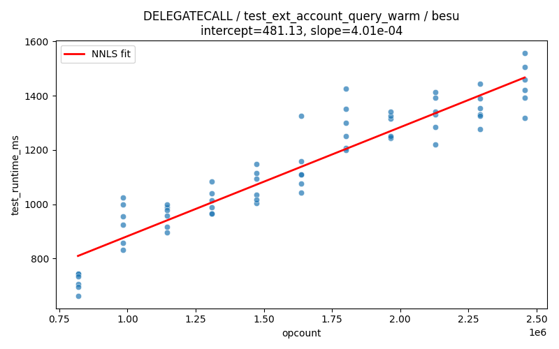

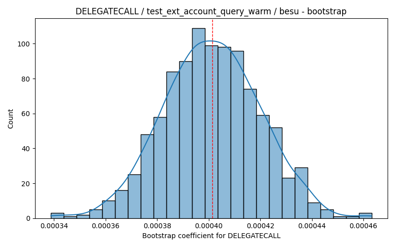

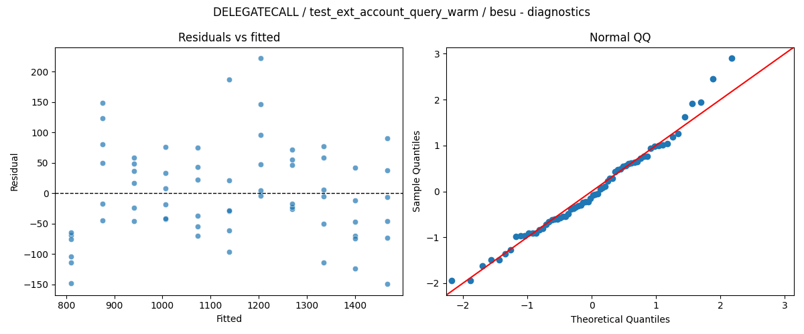

</details>

<details><summary>erigon — NNLS regression summary</summary>

```
==============================================================================
                           NNLS Regression Results                            
==============================================================================
Dep. Variable:          test_runtime_ms              R-squared:          0.938
Model:                  NNLS                    Adj. R-squared:          0.931
No. Observations:       11                                RMSE:           6.91
Df Residuals:           9                                  MAE:           5.93
Df Model:               1      
==============================================================================
                      coef     std err     P-value      [0.025      0.975]
------------------------------------------------------------------------------
         const     38.4511      6.4231       0.001     25.2647     51.1436
       opcount      0.0001      0.0000       0.001      0.0000      0.0001
==============================================================================
Notes: Non-negative least squares with bootstrap inference (1000 iterations)
==============================================================================
```

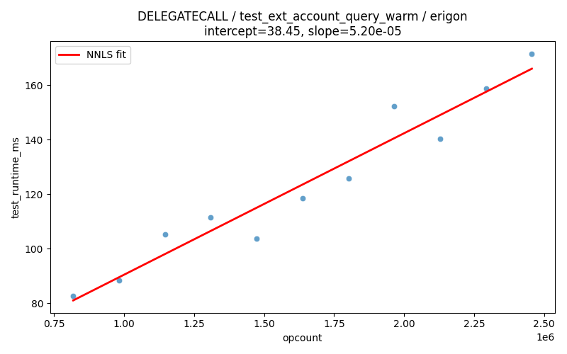

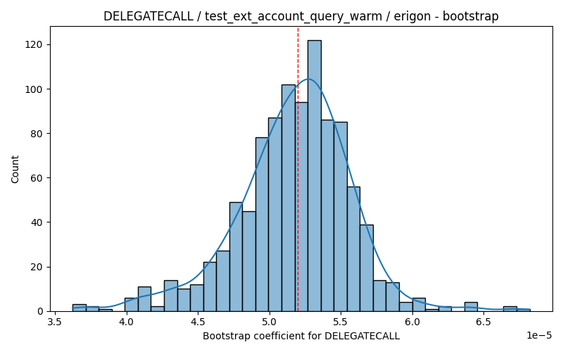

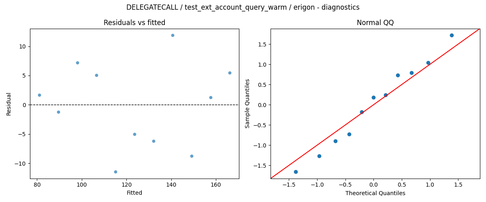

</details>

<details><summary>geth — NNLS regression summary</summary>

```
==============================================================================
                           NNLS Regression Results                            
==============================================================================
Dep. Variable:          test_runtime_ms              R-squared:          0.906
Model:                  NNLS                    Adj. R-squared:          0.905
No. Observations:       109                               RMSE:          25.20
Df Residuals:           107                                MAE:          18.87
Df Model:               1      
==============================================================================
                      coef     std err     P-value      [0.025      0.975]
------------------------------------------------------------------------------
         const     29.7160      7.6925       0.001     13.8980     44.0034
       opcount      0.0002      0.0000       0.001      0.0001      0.0002
==============================================================================
Notes: Non-negative least squares with bootstrap inference (1000 iterations)
==============================================================================
```

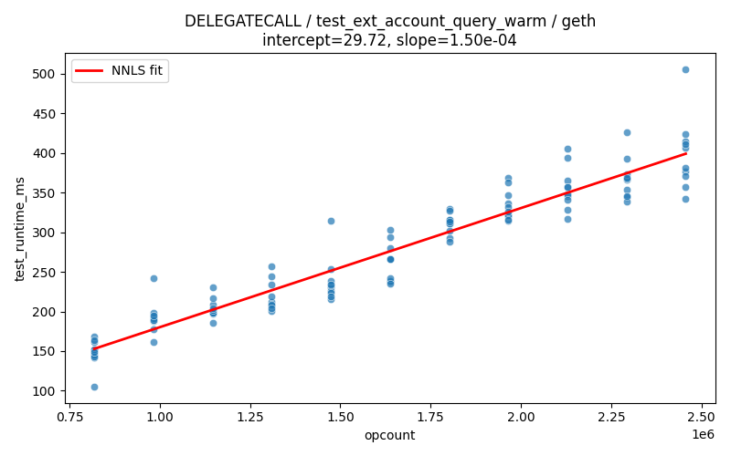

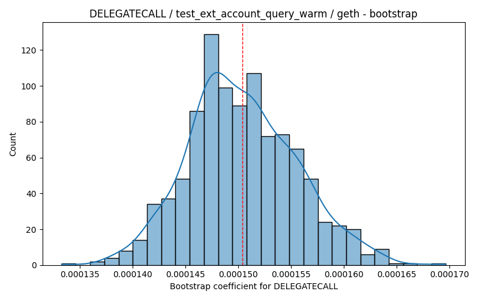

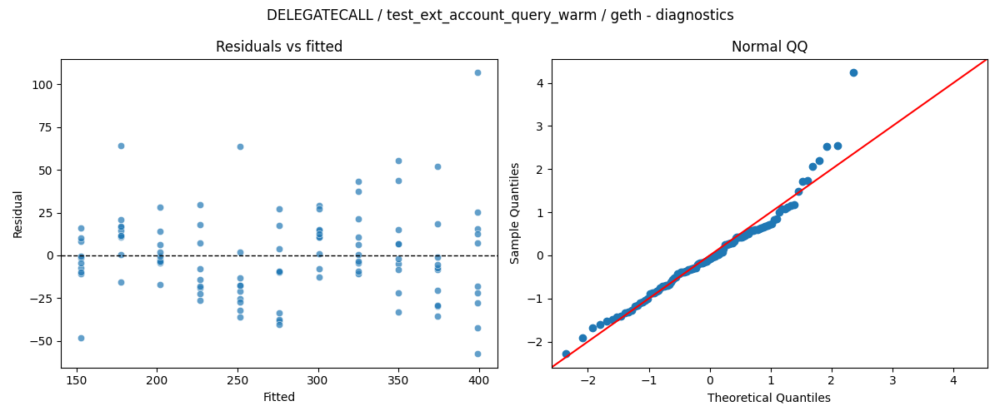

</details>

<details><summary>nethermind — NNLS regression summary</summary>

```
==============================================================================
                           NNLS Regression Results                            
==============================================================================
Dep. Variable:          test_runtime_ms              R-squared:          0.757
Model:                  NNLS                    Adj. R-squared:          0.751
No. Observations:       44                                RMSE:         112.32
Df Residuals:           42                                 MAE:          81.08
Df Model:               1      
==============================================================================
                      coef     std err     P-value      [0.025      0.975]
------------------------------------------------------------------------------
         const    271.8844     52.2977       0.001    171.5017    374.3150
       opcount      0.0004      0.0000       0.001      0.0003      0.0004
==============================================================================
Notes: Non-negative least squares with bootstrap inference (1000 iterations)
==============================================================================
```

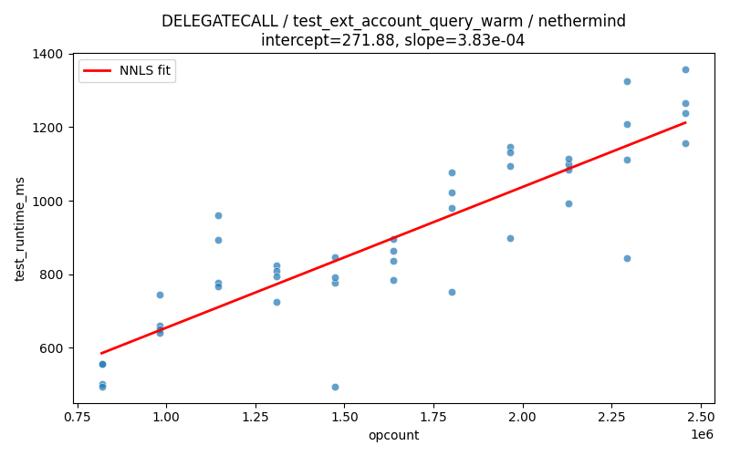

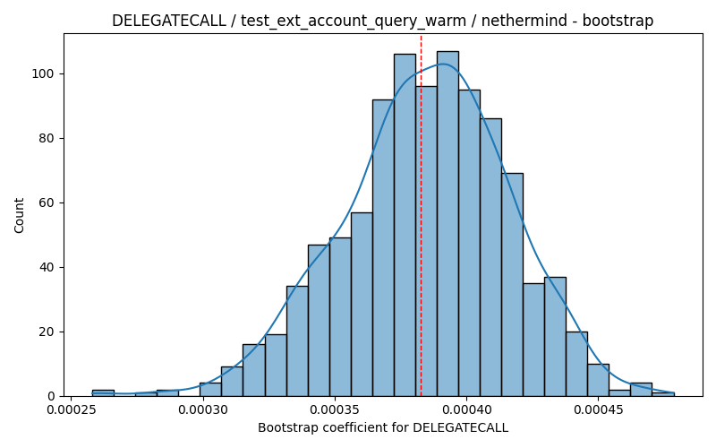

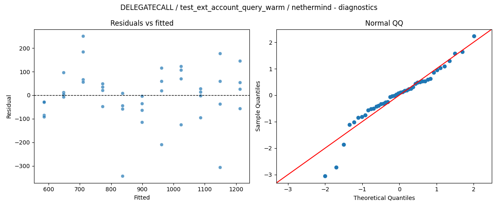

</details>

<details><summary>reth — NNLS regression summary</summary>

```
==============================================================================
                           NNLS Regression Results                            
==============================================================================
Dep. Variable:          test_runtime_ms              R-squared:          0.940
Model:                  NNLS                    Adj. R-squared:          0.939
No. Observations:       110                               RMSE:           7.39
Df Residuals:           108                                MAE:           5.48
Df Model:               1      
==============================================================================
                      coef     std err     P-value      [0.025      0.975]
------------------------------------------------------------------------------
         const     20.9477      1.8050       0.001     17.3915     24.4530
       opcount      0.0001      0.0000       0.001      0.0001      0.0001
==============================================================================
Notes: Non-negative least squares with bootstrap inference (1000 iterations)
==============================================================================
```

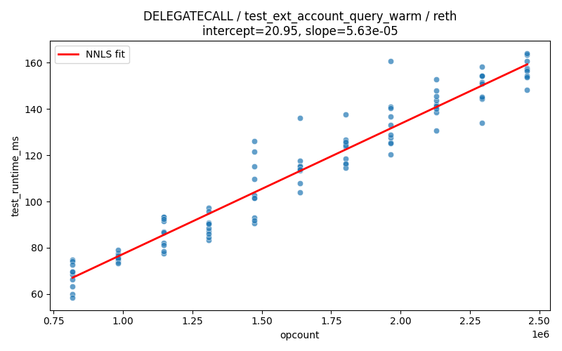

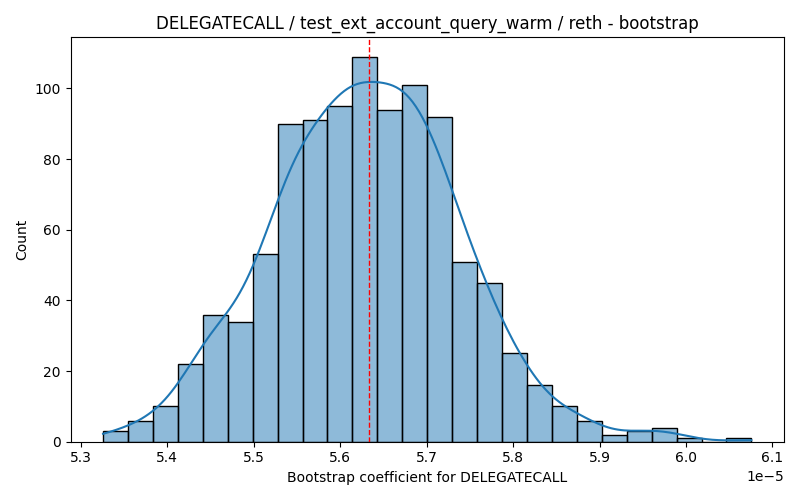

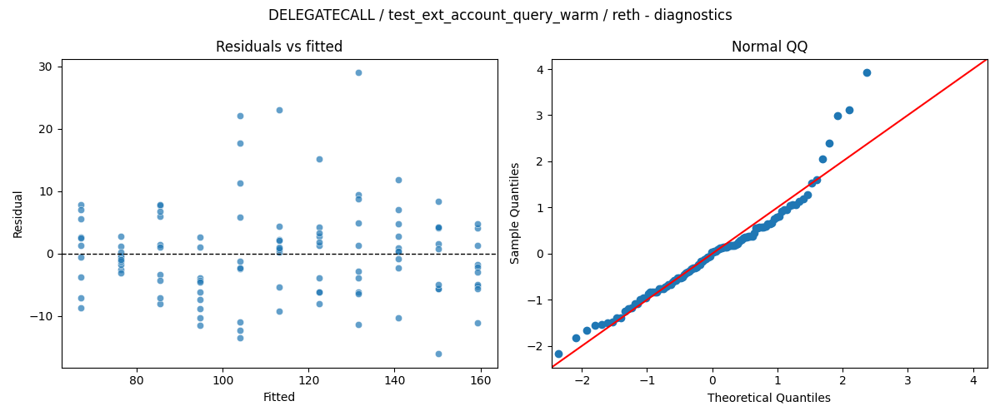

</details>

### test_account_access — combo `DELEGATECALL_AccountMode.EXISTING_EOA`

| client | nobs | R² | target_coef (ms) | p-value | 95% CI |
| --- | --- | --- | --- | --- | --- |
| `besu` | 66 | 0.9895 | 0.01592 | 1.00e-03 | [0.01554, 0.01636] |
| `erigon` | 11 | 0.9959 | 0.008113 | 1.00e-03 | [0.007877, 0.008207] |
| `geth` | 110 | 0.9732 | 0.01145 | 1.00e-03 | [0.01105, 0.01182] |
| `nethermind` | 44 | 0.8878 | 0.00341 | 1.00e-03 | [0.003025, 0.003789] |
| `reth` | 110 | 0.9174 | 0.001175 | 1.00e-03 | [0.001103, 0.001247] |

<details><summary>besu — NNLS regression summary</summary>

```
==============================================================================
                           NNLS Regression Results                            
==============================================================================
Dep. Variable:          test_runtime_ms              R-squared:          0.989
Model:                  NNLS                    Adj. R-squared:          0.989
No. Observations:       66                                RMSE:          33.77
Df Residuals:           64                                 MAE:          25.88
Df Model:               1      
==============================================================================
                      coef     std err     P-value      [0.025      0.975]
------------------------------------------------------------------------------
         const    508.0030     12.9799       0.001    481.5527    532.0640
       opcount      0.0159      0.0002       0.001      0.0155      0.0164
==============================================================================
Notes: Non-negative least squares with bootstrap inference (1000 iterations)
==============================================================================
```

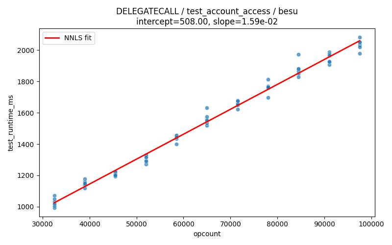

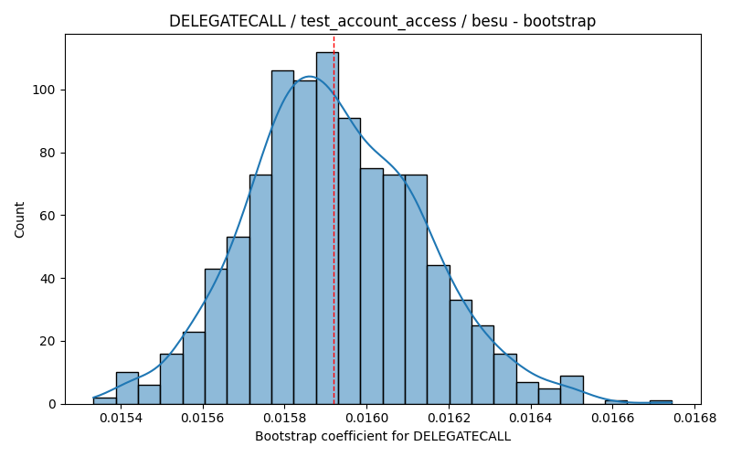

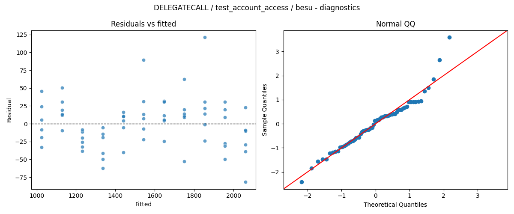

</details>

<details><summary>erigon — NNLS regression summary</summary>

```
==============================================================================
                           NNLS Regression Results                            
==============================================================================
Dep. Variable:          test_runtime_ms              R-squared:          0.996
Model:                  NNLS                    Adj. R-squared:          0.995
No. Observations:       11                                RMSE:          11.02
Df Residuals:           9                                  MAE:           8.68
Df Model:               1      
==============================================================================
                      coef     std err     P-value      [0.025      0.975]
------------------------------------------------------------------------------
         const      0.0000      2.3181       1.000      0.0000      6.1675
       opcount      0.0081      0.0001       0.001      0.0079      0.0082
==============================================================================
Notes: Non-negative least squares with bootstrap inference (1000 iterations)
==============================================================================
```

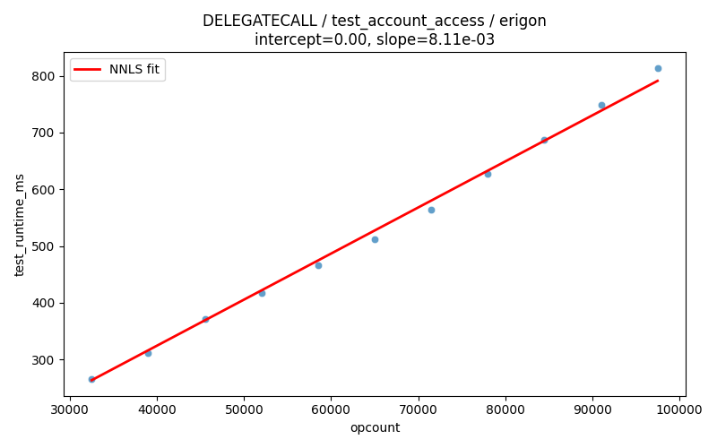

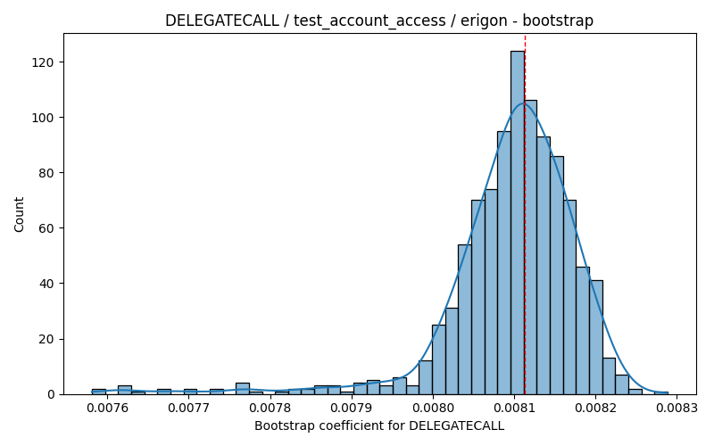


</details>

<details><summary>geth — NNLS regression summary</summary>

```
==============================================================================
                           NNLS Regression Results                            
==============================================================================
Dep. Variable:          test_runtime_ms              R-squared:          0.973
Model:                  NNLS                    Adj. R-squared:          0.973
No. Observations:       110                               RMSE:          39.10
Df Residuals:           108                                MAE:          31.36
Df Model:               1      
==============================================================================
                      coef     std err     P-value      [0.025      0.975]
------------------------------------------------------------------------------
         const    237.3636     11.9257       0.001    214.7921    263.1878
       opcount      0.0115      0.0002       0.001      0.0111      0.0118
==============================================================================
Notes: Non-negative least squares with bootstrap inference (1000 iterations)
==============================================================================
```

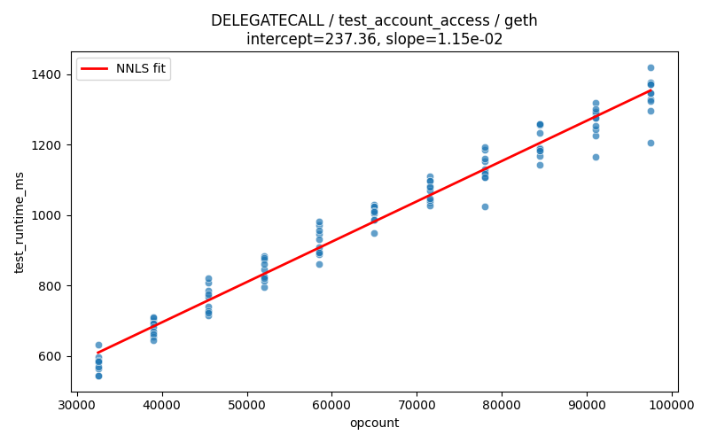

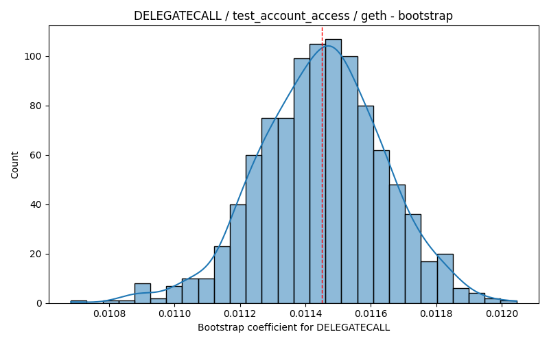


</details>

<details><summary>nethermind — NNLS regression summary</summary>

```
==============================================================================
                           NNLS Regression Results                            
==============================================================================
Dep. Variable:          test_runtime_ms              R-squared:          0.888
Model:                  NNLS                    Adj. R-squared:          0.885
No. Observations:       44                                RMSE:          24.92
Df Residuals:           42                                 MAE:          19.45
Df Model:               1      
==============================================================================
                      coef     std err     P-value      [0.025      0.975]
------------------------------------------------------------------------------
         const    112.7136     12.4648       0.001     90.2300    137.3385
       opcount      0.0034      0.0002       0.001      0.0030      0.0038
==============================================================================
Notes: Non-negative least squares with bootstrap inference (1000 iterations)
==============================================================================
```

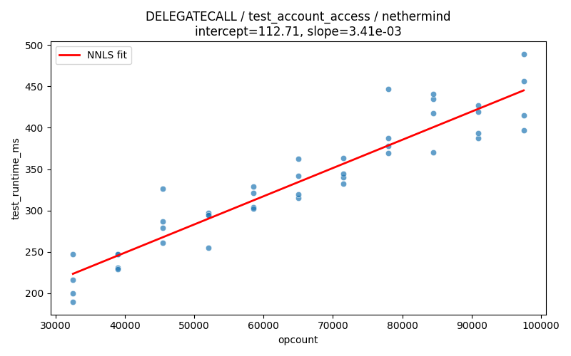

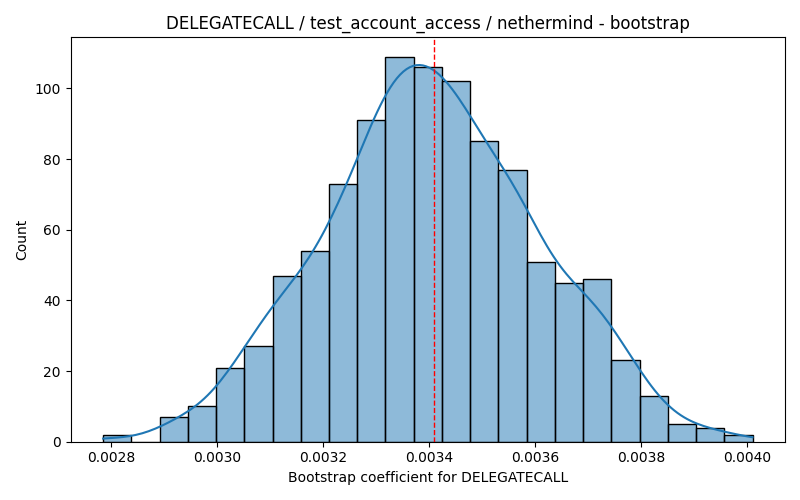

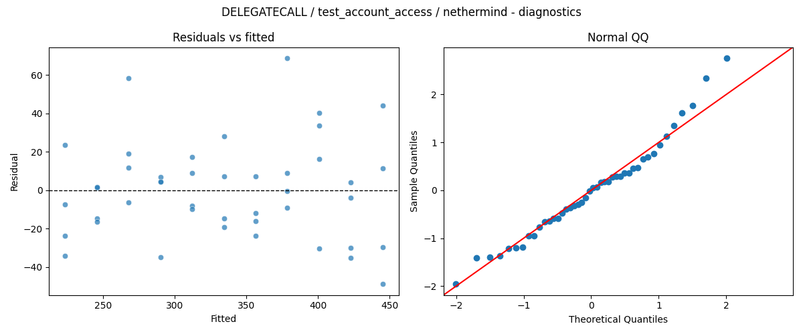

</details>

<details><summary>reth — NNLS regression summary</summary>

```
==============================================================================
                           NNLS Regression Results                            
==============================================================================
Dep. Variable:          test_runtime_ms              R-squared:          0.917
Model:                  NNLS                    Adj. R-squared:          0.917
No. Observations:       110                               RMSE:           7.25
Df Residuals:           108                                MAE:           5.84
Df Model:               1      
==============================================================================
                      coef     std err     P-value      [0.025      0.975]
------------------------------------------------------------------------------
         const     38.3185      2.3404       0.001     33.8769     43.1879
       opcount      0.0012      0.0000       0.001      0.0011      0.0012
==============================================================================
Notes: Non-negative least squares with bootstrap inference (1000 iterations)
==============================================================================
```

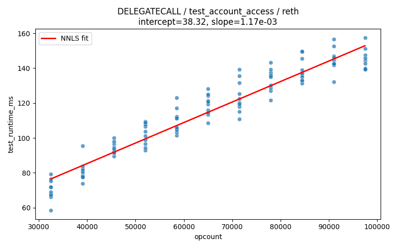

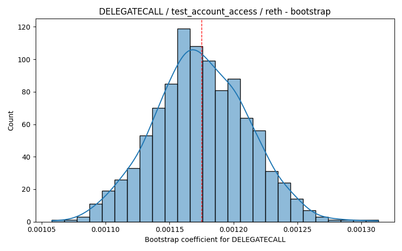

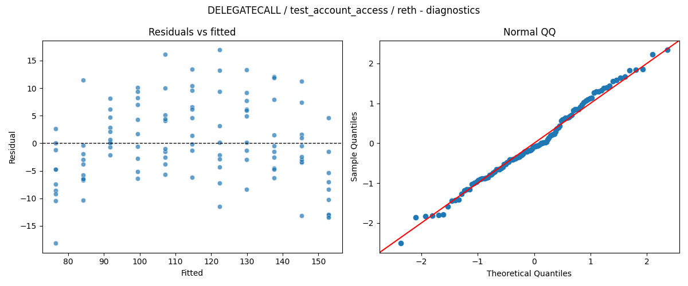

</details>

### test_account_access — combo `DELEGATECALL_AccountMode.NON_EXISTING_ACCOUNT`

| client | nobs | R² | target_coef (ms) | p-value | 95% CI |
| --- | --- | --- | --- | --- | --- |
| `besu` | 66 | 0.9902 | 0.01603 | 1.00e-03 | [0.01568, 0.01642] |
| `erigon` | 11 | 0.9952 | 0.00808 | 1.00e-03 | [0.007941, 0.008175] |
| `geth` | 107 | 0.9785 | 0.02224 | 1.00e-03 | [0.02158, 0.02284] |
| `nethermind` | 44 | 0.8723 | 0.003437 | 1.00e-03 | [0.003083, 0.003776] |
| `reth` | 110 | 0.9262 | 0.000971 | 1.00e-03 | [0.0009123, 0.001028] |

<details><summary>besu — NNLS regression summary</summary>

```
==============================================================================
                           NNLS Regression Results                            
==============================================================================
Dep. Variable:          test_runtime_ms              R-squared:          0.990
Model:                  NNLS                    Adj. R-squared:          0.990
No. Observations:       66                                RMSE:          32.87
Df Residuals:           64                                 MAE:          24.95
Df Model:               1      
==============================================================================
                      coef     std err     P-value      [0.025      0.975]
------------------------------------------------------------------------------
         const    190.8628     12.3675       0.001    166.6347    215.2812
       opcount      0.0160      0.0002       0.001      0.0157      0.0164
==============================================================================
Notes: Non-negative least squares with bootstrap inference (1000 iterations)
==============================================================================
```

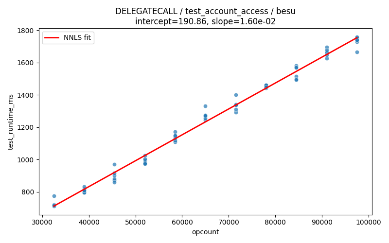

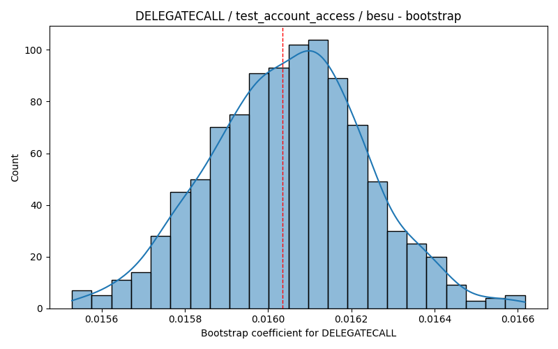

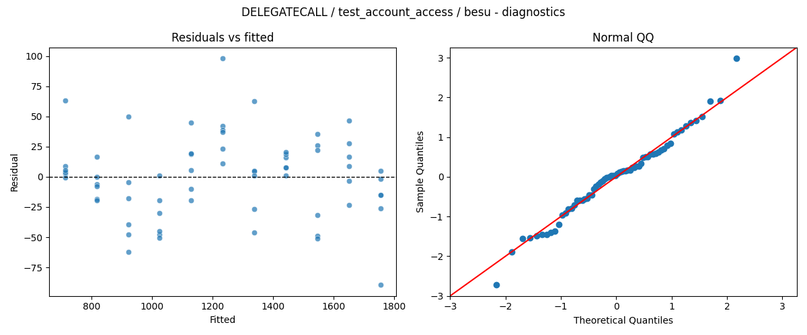

</details>

<details><summary>erigon — NNLS regression summary</summary>

```
==============================================================================
                           NNLS Regression Results                            
==============================================================================
Dep. Variable:          test_runtime_ms              R-squared:          0.995
Model:                  NNLS                    Adj. R-squared:          0.995
No. Observations:       11                                RMSE:          11.85
Df Residuals:           9                                  MAE:          10.00
Df Model:               1      
==============================================================================
                      coef     std err     P-value      [0.025      0.975]
------------------------------------------------------------------------------
         const      0.0000      0.5919       1.000      0.0000      0.0000
       opcount      0.0081      0.0001       0.001      0.0079      0.0082
==============================================================================
Notes: Non-negative least squares with bootstrap inference (1000 iterations)
==============================================================================
```

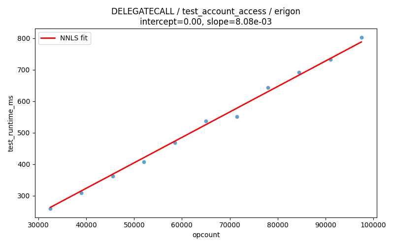

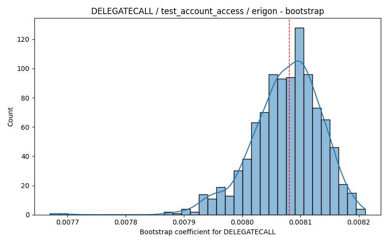

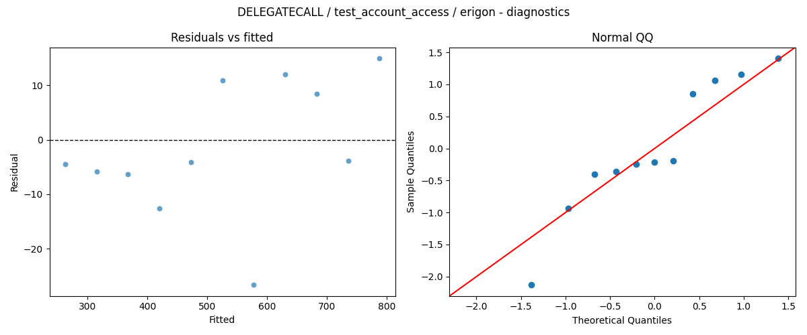

</details>

<details><summary>geth — NNLS regression summary</summary>

```
==============================================================================
                           NNLS Regression Results                            
==============================================================================
Dep. Variable:          test_runtime_ms              R-squared:          0.979
Model:                  NNLS                    Adj. R-squared:          0.978
No. Observations:       107                               RMSE:          66.77
Df Residuals:           105                                MAE:          50.65
Df Model:               1      
==============================================================================
                      coef     std err     P-value      [0.025      0.975]
------------------------------------------------------------------------------
         const    317.4998     19.2953       0.001    281.3581    357.1843
       opcount      0.0222      0.0003       0.001      0.0216      0.0228
==============================================================================
Notes: Non-negative least squares with bootstrap inference (1000 iterations)
==============================================================================
```

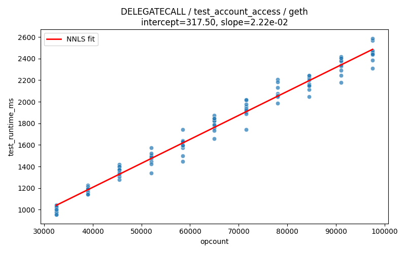

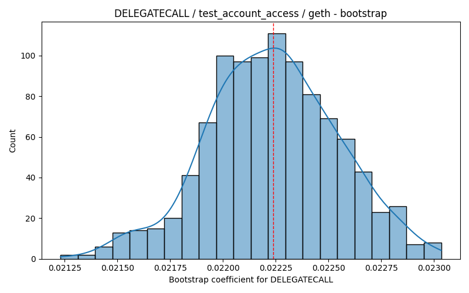

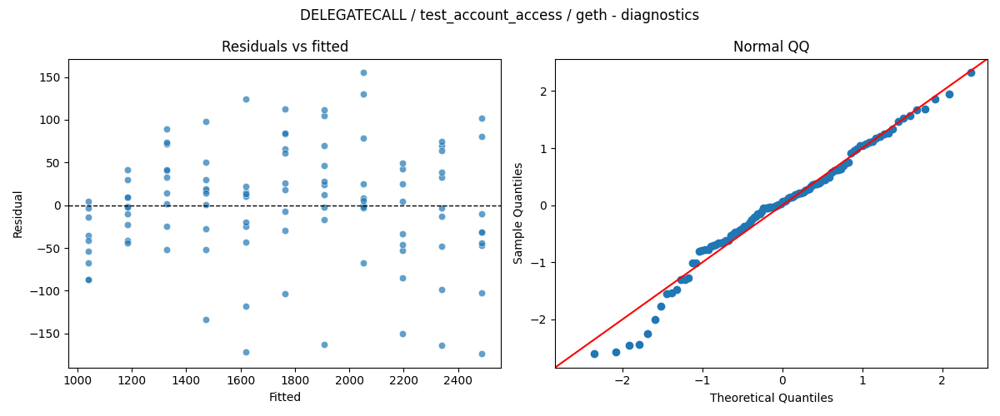

</details>

<details><summary>nethermind — NNLS regression summary</summary>

```
==============================================================================
                           NNLS Regression Results                            
==============================================================================
Dep. Variable:          test_runtime_ms              R-squared:          0.872
Model:                  NNLS                    Adj. R-squared:          0.869
No. Observations:       44                                RMSE:          27.03
Df Residuals:           42                                 MAE:          22.11
Df Model:               1      
==============================================================================
                      coef     std err     P-value      [0.025      0.975]
------------------------------------------------------------------------------
         const     71.7499     10.6066       0.001     50.3987     92.7518
       opcount      0.0034      0.0002       0.001      0.0031      0.0038
==============================================================================
Notes: Non-negative least squares with bootstrap inference (1000 iterations)
==============================================================================
```

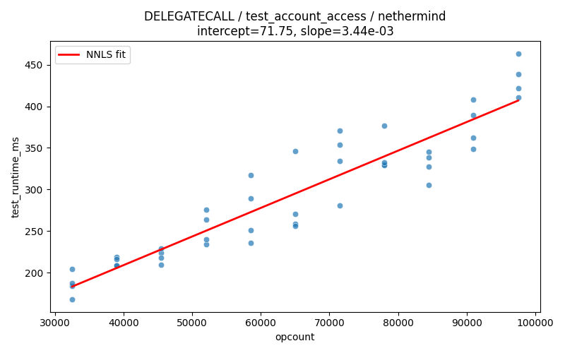

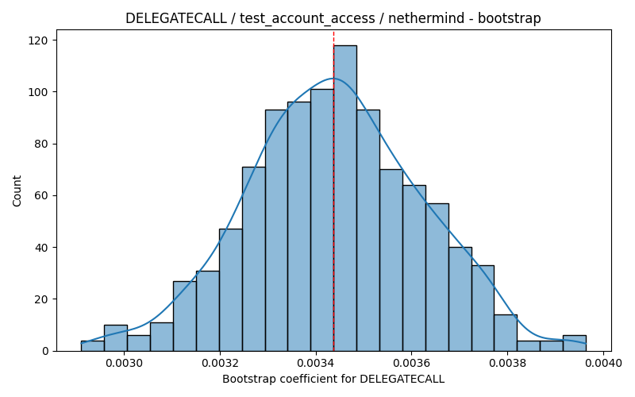

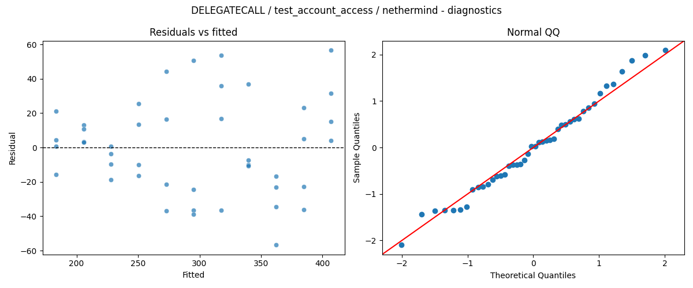

</details>

<details><summary>reth — NNLS regression summary</summary>

```
==============================================================================
                           NNLS Regression Results                            
==============================================================================
Dep. Variable:          test_runtime_ms              R-squared:          0.926
Model:                  NNLS                    Adj. R-squared:          0.925
No. Observations:       110                               RMSE:           5.64
Df Residuals:           108                                MAE:           4.52
Df Model:               1      
==============================================================================
                      coef     std err     P-value      [0.025      0.975]
------------------------------------------------------------------------------
         const     34.8295      1.9179       0.001     31.2511     38.7879
       opcount      0.0010      0.0000       0.001      0.0009      0.0010
==============================================================================
Notes: Non-negative least squares with bootstrap inference (1000 iterations)
==============================================================================
```

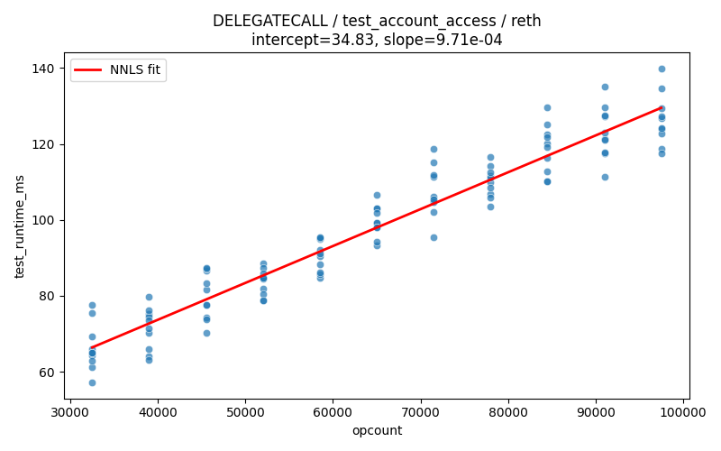

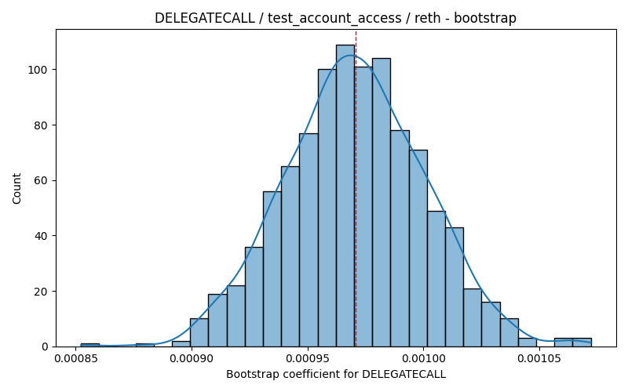

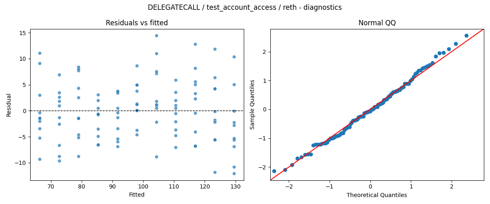

</details>

### test_account_access — combo `DELEGATECALL_AccountMode.EXISTING_CONTRACT_DIFF_MAX`

| client | nobs | R² | target_coef (ms) | p-value | 95% CI |
| --- | --- | --- | --- | --- | --- |
| `besu` | 66 | 0.985 | 0.02236 | 1.00e-03 | [0.02182, 0.02292] |
| `erigon` | 11 | 0.887 | 0.119 | 1.00e-03 | [0.08816, 0.1344] |
| `geth` | 110 | 0.9158 | 0.02148 | 1.00e-03 | [0.02018, 0.02279] |
| `nethermind` | 44 | 0.8854 | 0.0148 | 1.00e-03 | [0.01276, 0.01658] |
| `reth` | 110 | 0.9962 | 0.02058 | 1.00e-03 | [0.02036, 0.02079] |

<details><summary>besu — NNLS regression summary</summary>

```
==============================================================================
                           NNLS Regression Results                            
==============================================================================
Dep. Variable:          test_runtime_ms              R-squared:          0.985
Model:                  NNLS                    Adj. R-squared:          0.985
No. Observations:       66                                RMSE:          55.77
Df Residuals:           64                                 MAE:          43.14
Df Model:               1      
==============================================================================
                      coef     std err     P-value      [0.025      0.975]
------------------------------------------------------------------------------
         const    416.0981     19.5332       0.001    376.1186    452.9803
       opcount      0.0224      0.0003       0.001      0.0218      0.0229
==============================================================================
Notes: Non-negative least squares with bootstrap inference (1000 iterations)
==============================================================================
```

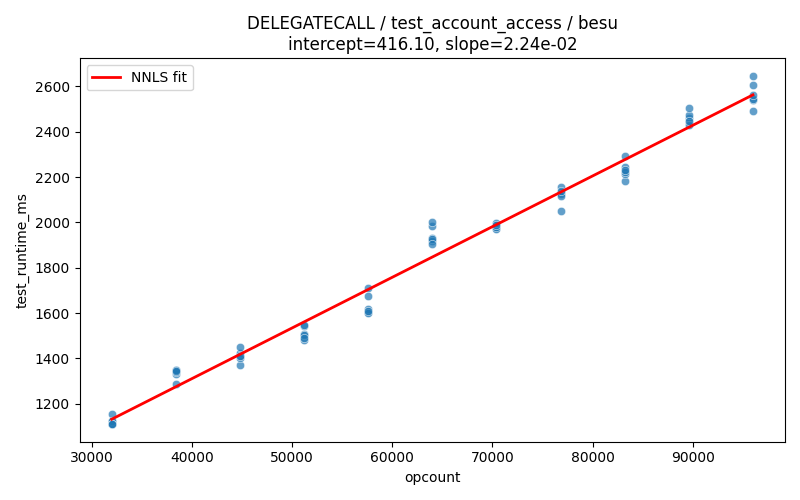

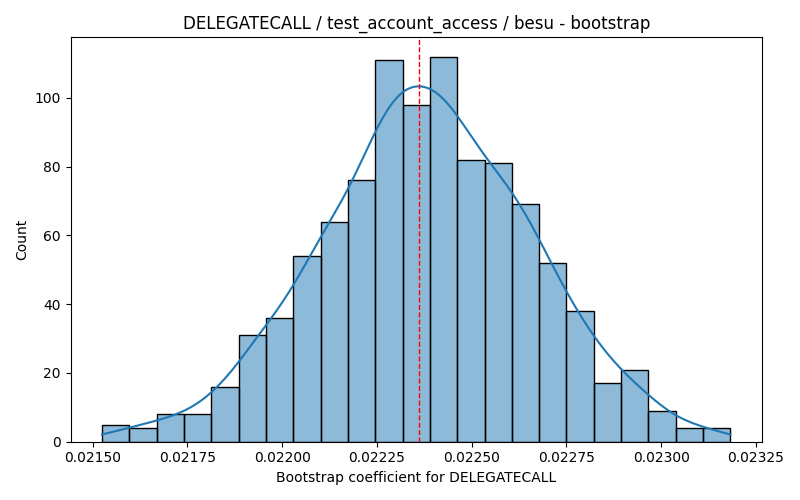

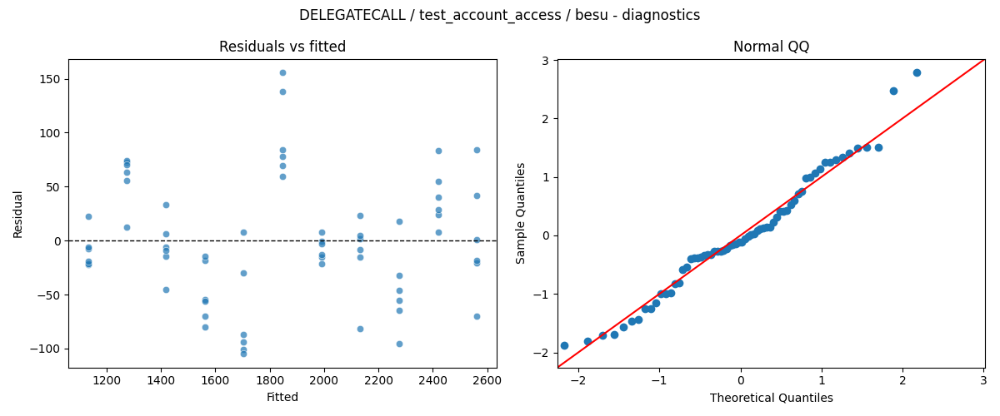

</details>

<details><summary>erigon — NNLS regression summary</summary>

```
==============================================================================
                           NNLS Regression Results                            
==============================================================================
Dep. Variable:          test_runtime_ms              R-squared:          0.887
Model:                  NNLS                    Adj. R-squared:          0.874
No. Observations:       11                                RMSE:         860.09
Df Residuals:           9                                  MAE:         747.43
Df Model:               1      
==============================================================================
                      coef     std err     P-value      [0.025      0.975]
------------------------------------------------------------------------------
         const    841.2101    896.3456       0.175      0.0000   3093.0199
       opcount      0.1190      0.0125       0.001      0.0882      0.1344
==============================================================================
Notes: Non-negative least squares with bootstrap inference (1000 iterations)
==============================================================================
```

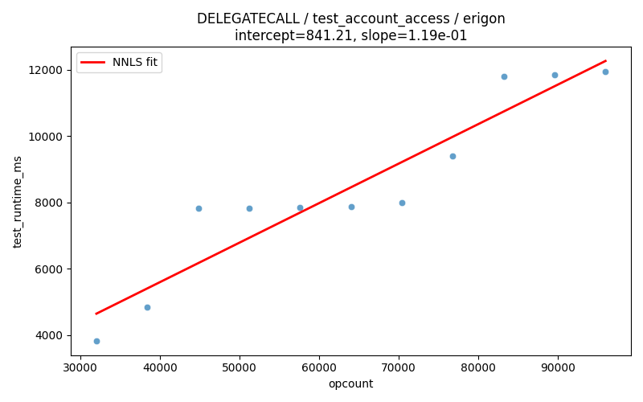

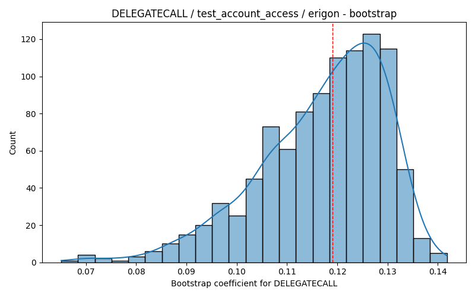

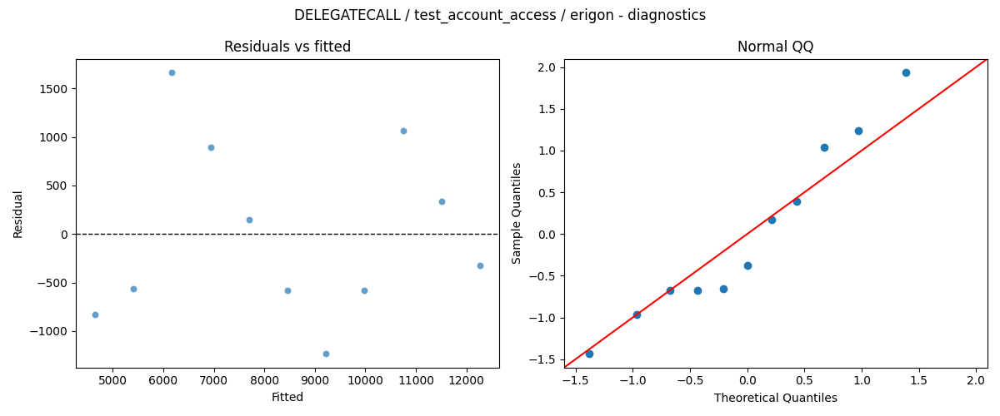

</details>

<details><summary>geth — NNLS regression summary</summary>

```
==============================================================================
                           NNLS Regression Results                            
==============================================================================
Dep. Variable:          test_runtime_ms              R-squared:          0.916
Model:                  NNLS                    Adj. R-squared:          0.915
No. Observations:       110                               RMSE:         131.79
Df Residuals:           108                                MAE:         107.38
Df Model:               1      
==============================================================================
                      coef     std err     P-value      [0.025      0.975]
------------------------------------------------------------------------------
         const    488.1078     44.4736       0.001    402.0054    581.0942
       opcount      0.0215      0.0007       0.001      0.0202      0.0228
==============================================================================
Notes: Non-negative least squares with bootstrap inference (1000 iterations)
==============================================================================
```

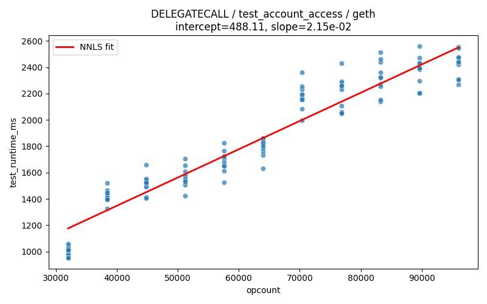

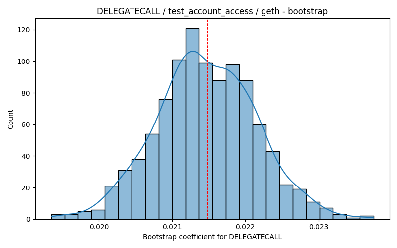

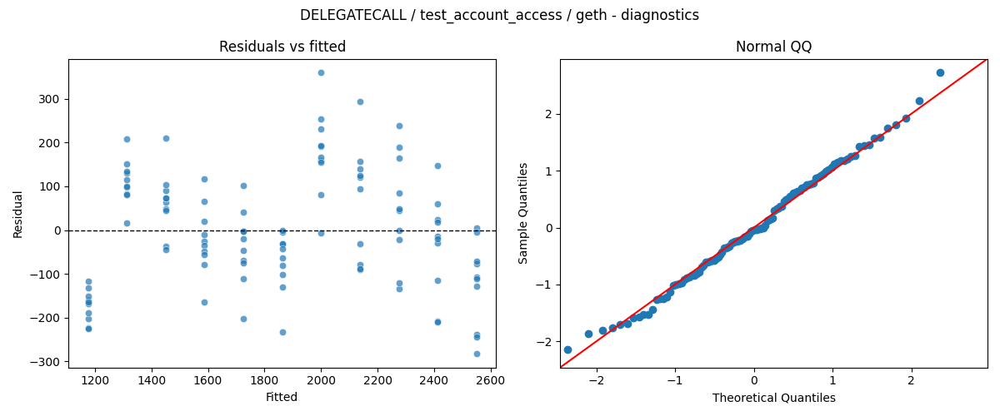

</details>

<details><summary>nethermind — NNLS regression summary</summary>

```
==============================================================================
                           NNLS Regression Results                            
==============================================================================
Dep. Variable:          test_runtime_ms              R-squared:          0.885
Model:                  NNLS                    Adj. R-squared:          0.883
No. Observations:       44                                RMSE:         107.78
Df Residuals:           42                                 MAE:          83.52
Df Model:               1      
==============================================================================
                      coef     std err     P-value      [0.025      0.975]
------------------------------------------------------------------------------
         const    694.0705     70.6386       0.001    567.9072    847.8953
       opcount      0.0148      0.0010       0.001      0.0128      0.0166
==============================================================================
Notes: Non-negative least squares with bootstrap inference (1000 iterations)
==============================================================================
```

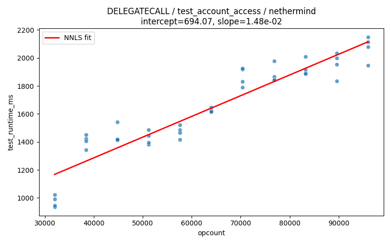

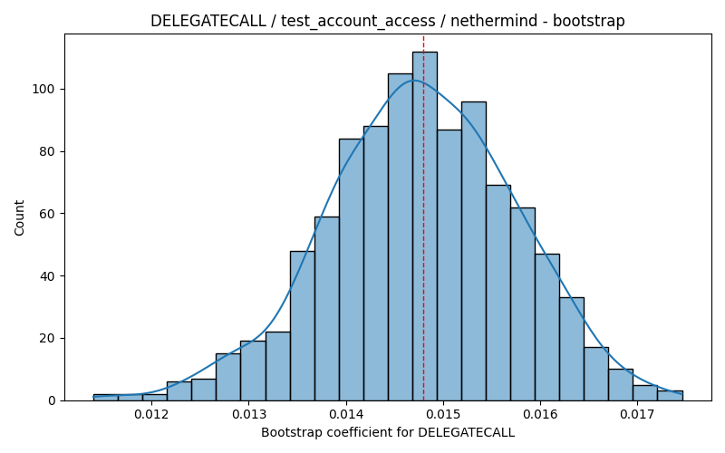

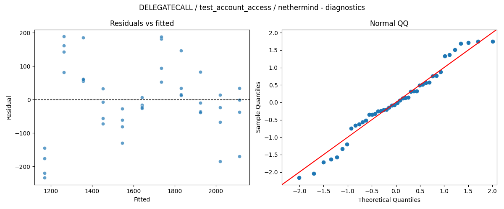

</details>

<details><summary>reth — NNLS regression summary</summary>

```
==============================================================================
                           NNLS Regression Results                            
==============================================================================
Dep. Variable:          test_runtime_ms              R-squared:          0.996
Model:                  NNLS                    Adj. R-squared:          0.996
No. Observations:       110                               RMSE:          25.76
Df Residuals:           108                                MAE:          19.36
Df Model:               1      
==============================================================================
                      coef     std err     P-value      [0.025      0.975]
------------------------------------------------------------------------------
         const    148.2363      6.7149       0.001    136.0400    162.1584
       opcount      0.0206      0.0001       0.001      0.0204      0.0208
==============================================================================
Notes: Non-negative least squares with bootstrap inference (1000 iterations)
==============================================================================
```

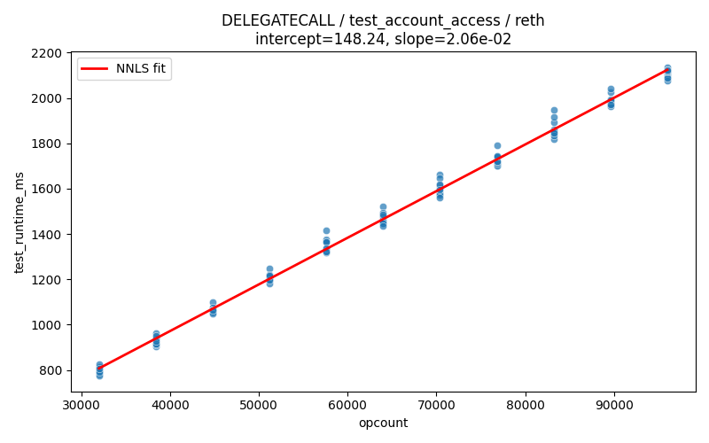

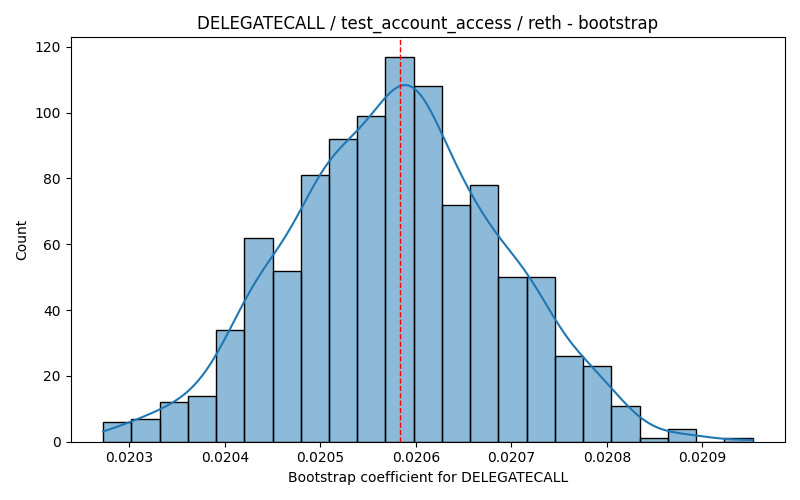

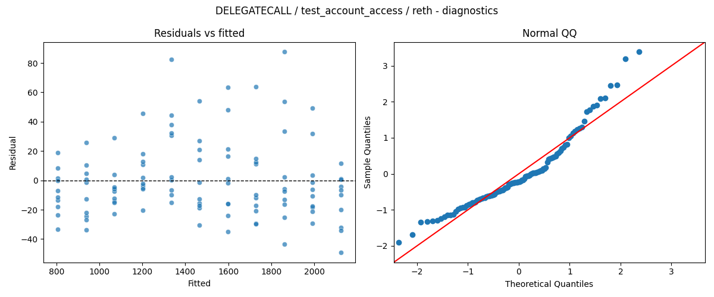

</details>

### test_account_access — combo `DELEGATECALL_AccountMode.EXISTING_CONTRACT_MINIMAL`

| client | nobs | R² | target_coef (ms) | p-value | 95% CI |
| --- | --- | --- | --- | --- | --- |
| `besu` | 66 | 0.9859 | 0.01394 | 1.00e-03 | [0.01347, 0.01445] |
| `erigon` | 11 | 0.9854 | 0.009107 | 1.00e-03 | [0.008102, 0.009643] |
| `geth` | 107 | 0.9612 | 0.005372 | 1.00e-03 | [0.00517, 0.005604] |
| `nethermind` | 44 | 0.7577 | 0.002676 | 1.00e-03 | [0.00223, 0.003197] |
| `reth` | 110 | 0.978 | 0.003621 | 1.00e-03 | [0.003512, 0.003727] |

<details><summary>besu — NNLS regression summary</summary>

```
==============================================================================
                           NNLS Regression Results                            
==============================================================================
Dep. Variable:          test_runtime_ms              R-squared:          0.986
Model:                  NNLS                    Adj. R-squared:          0.986
No. Observations:       66                                RMSE:          33.77
Df Residuals:           64                                 MAE:          27.38
Df Model:               1      
==============================================================================
                      coef     std err     P-value      [0.025      0.975]
------------------------------------------------------------------------------
         const    371.6945     16.5833       0.001    340.5697    403.5851
       opcount      0.0139      0.0003       0.001      0.0135      0.0144
==============================================================================
Notes: Non-negative least squares with bootstrap inference (1000 iterations)
==============================================================================
```

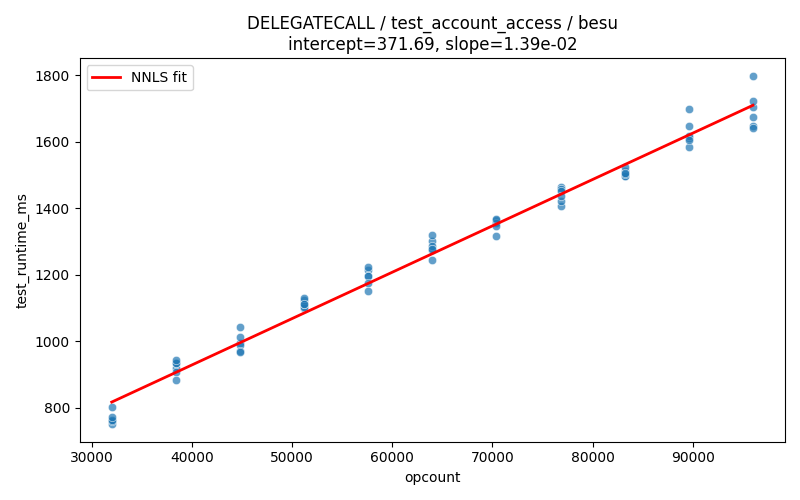

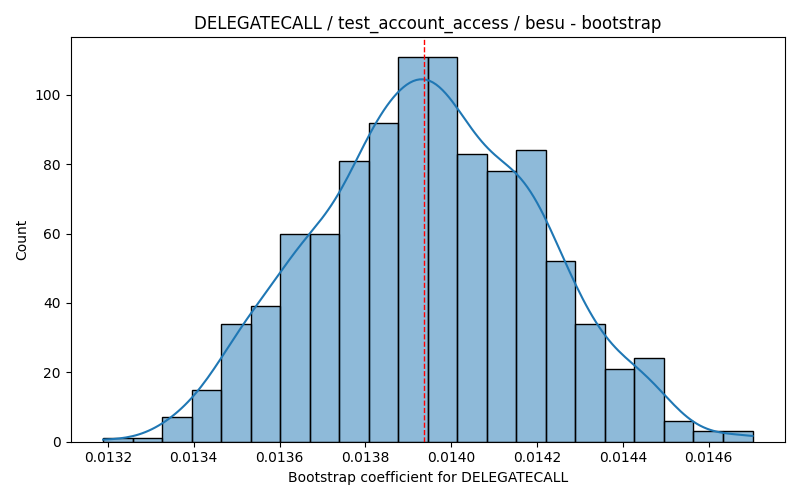

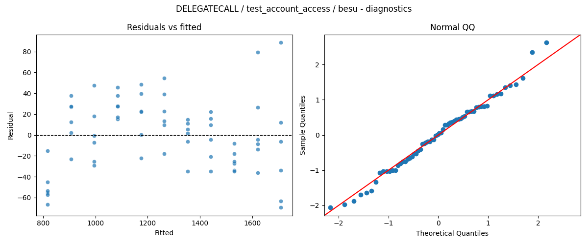

</details>

<details><summary>erigon — NNLS regression summary</summary>

```
==============================================================================
                           NNLS Regression Results                            
==============================================================================
Dep. Variable:          test_runtime_ms              R-squared:          0.985
Model:                  NNLS                    Adj. R-squared:          0.984
No. Observations:       11                                RMSE:          22.42
Df Residuals:           9                                  MAE:          18.43
Df Model:               1      
==============================================================================
                      coef     std err     P-value      [0.025      0.975]
------------------------------------------------------------------------------
         const    165.7432     30.8968       0.001    123.3554    243.1244
       opcount      0.0091      0.0004       0.001      0.0081      0.0096
==============================================================================
Notes: Non-negative least squares with bootstrap inference (1000 iterations)
==============================================================================
```


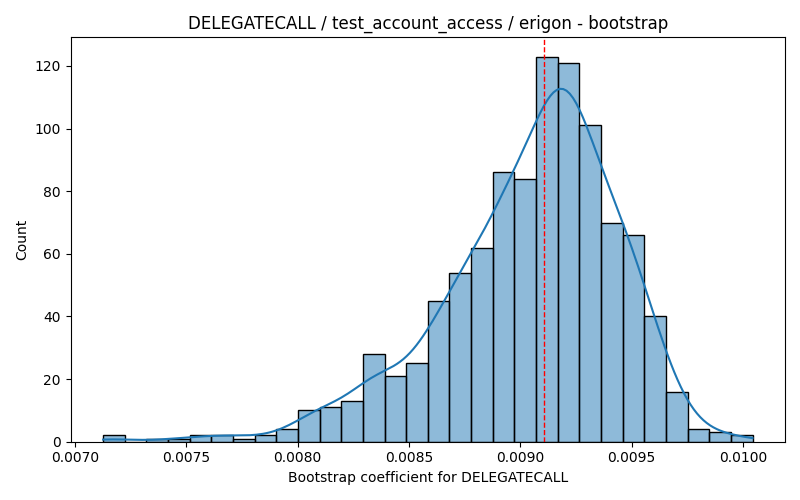

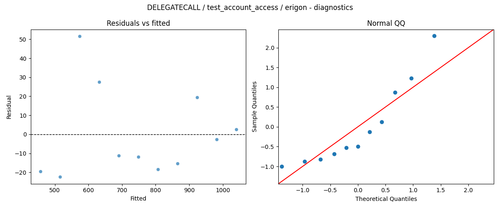

</details>

<details><summary>geth — NNLS regression summary</summary>

```
==============================================================================
                           NNLS Regression Results                            
==============================================================================
Dep. Variable:          test_runtime_ms              R-squared:          0.961
Model:                  NNLS                    Adj. R-squared:          0.961
No. Observations:       107                               RMSE:          21.81
Df Residuals:           105                                MAE:          16.86
Df Model:               1      
==============================================================================
                      coef     std err     P-value      [0.025      0.975]
------------------------------------------------------------------------------
         const     58.2235      6.5401       0.001     45.6145     70.6732
       opcount      0.0054      0.0001       0.001      0.0052      0.0056
==============================================================================
Notes: Non-negative least squares with bootstrap inference (1000 iterations)
==============================================================================
```

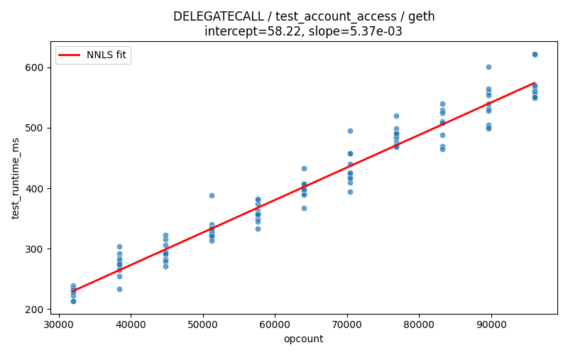

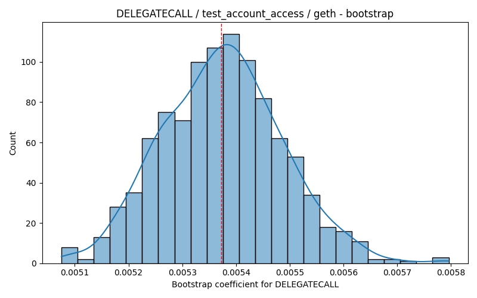

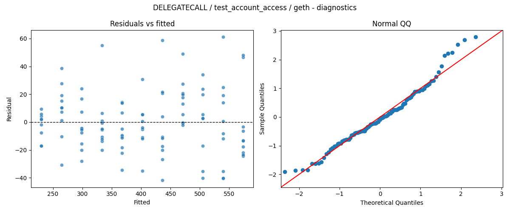

</details>

<details><summary>nethermind — NNLS regression summary</summary>

```
==============================================================================
                           NNLS Regression Results                            
==============================================================================
Dep. Variable:          test_runtime_ms              R-squared:          0.758
Model:                  NNLS                    Adj. R-squared:          0.752
No. Observations:       44                                RMSE:          30.63
Df Residuals:           42                                 MAE:          23.46
Df Model:               1      
==============================================================================
                      coef     std err     P-value      [0.025      0.975]
------------------------------------------------------------------------------
         const    110.2550     13.5968       0.001     82.7373    134.1743
       opcount      0.0027      0.0003       0.001      0.0022      0.0032
==============================================================================
Notes: Non-negative least squares with bootstrap inference (1000 iterations)
==============================================================================
```

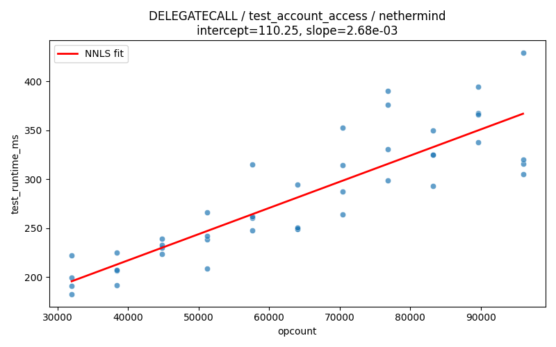

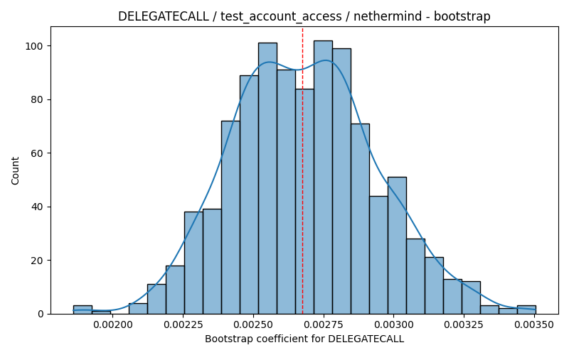

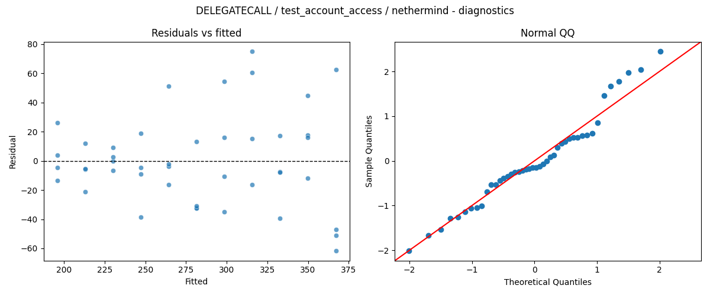

</details>

<details><summary>reth — NNLS regression summary</summary>

```
==============================================================================
                           NNLS Regression Results                            
==============================================================================
Dep. Variable:          test_runtime_ms              R-squared:          0.978
Model:                  NNLS                    Adj. R-squared:          0.978
No. Observations:       110                               RMSE:          11.00
Df Residuals:           108                                MAE:           9.01
Df Model:               1      
==============================================================================
                      coef     std err     P-value      [0.025      0.975]
------------------------------------------------------------------------------
         const     88.4938      3.4223       0.001     82.4195     95.7462
       opcount      0.0036      0.0001       0.001      0.0035      0.0037
==============================================================================
Notes: Non-negative least squares with bootstrap inference (1000 iterations)
==============================================================================
```

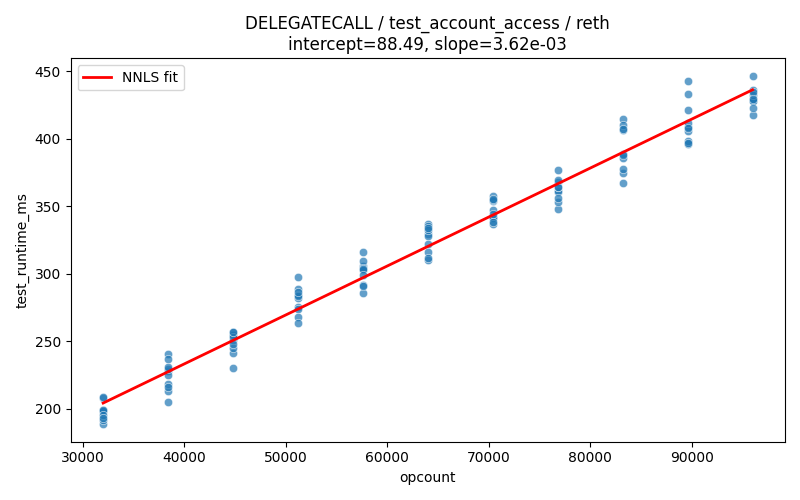

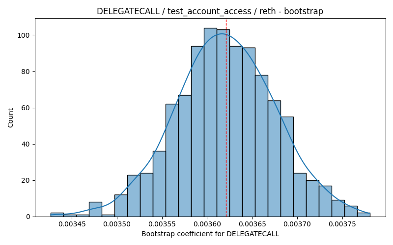

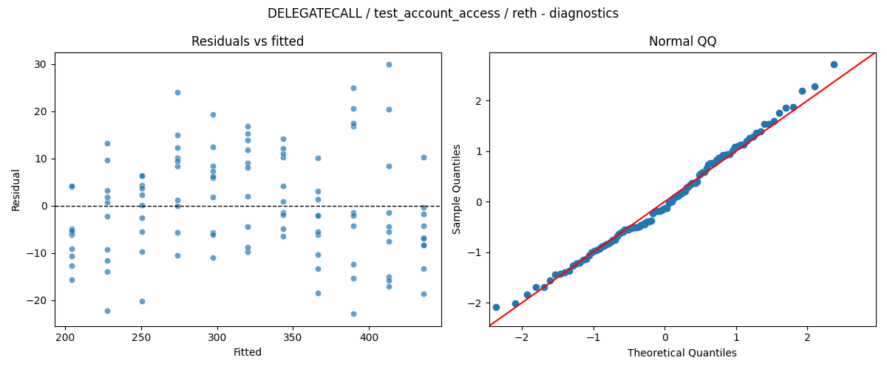

</details>

### test_account_access — combo `DELEGATECALL_AccountMode.EXISTING_CONTRACT_SAME_MAX`

| client | nobs | R² | target_coef (ms) | p-value | 95% CI |
| --- | --- | --- | --- | --- | --- |
| `besu` | 66 | 0.9746 | 0.01239 | 1.00e-03 | [0.01184, 0.01288] |
| `erigon` | 11 | 0.986 | 0.008807 | 1.00e-03 | [0.007962, 0.009295] |
| `geth` | 108 | 0.9576 | 0.005269 | 1.00e-03 | [0.005058, 0.005493] |
| `nethermind` | 44 | 0.7205 | 0.0029 | 1.00e-03 | [0.002333, 0.003549] |
| `reth` | 110 | 0.9821 | 0.003571 | 1.00e-03 | [0.003477, 0.003668] |

<details><summary>besu — NNLS regression summary</summary>

```
==============================================================================
                           NNLS Regression Results                            
==============================================================================
Dep. Variable:          test_runtime_ms              R-squared:          0.975
Model:                  NNLS                    Adj. R-squared:          0.974
No. Observations:       66                                RMSE:          40.49
Df Residuals:           64                                 MAE:          31.76
Df Model:               1      
==============================================================================
                      coef     std err     P-value      [0.025      0.975]
------------------------------------------------------------------------------
         const    433.3935     18.5831       0.001    399.9232    472.8586
       opcount      0.0124      0.0003       0.001      0.0118      0.0129
==============================================================================
Notes: Non-negative least squares with bootstrap inference (1000 iterations)
==============================================================================
```

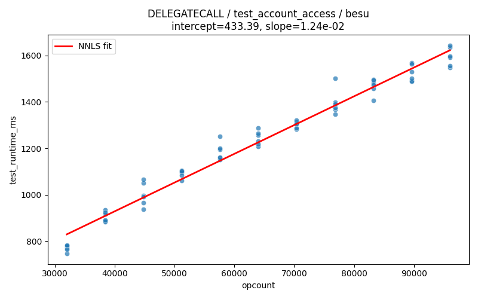

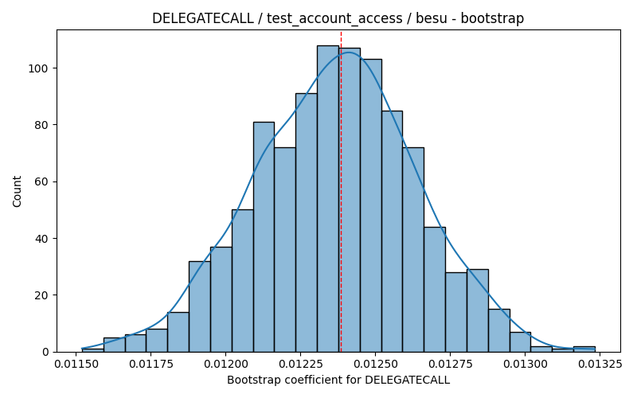

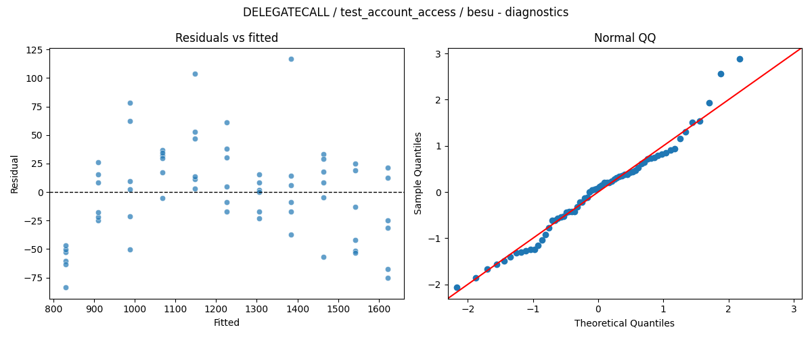

</details>

<details><summary>erigon — NNLS regression summary</summary>

```
==============================================================================
                           NNLS Regression Results                            
==============================================================================
Dep. Variable:          test_runtime_ms              R-squared:          0.986
Model:                  NNLS                    Adj. R-squared:          0.984
No. Observations:       11                                RMSE:          21.22
Df Residuals:           9                                  MAE:          17.27
Df Model:               1      
==============================================================================
                      coef     std err     P-value      [0.025      0.975]
------------------------------------------------------------------------------
         const    182.6695     26.0126       0.001    147.1571    241.8586
       opcount      0.0088      0.0004       0.001      0.0080      0.0093
==============================================================================
Notes: Non-negative least squares with bootstrap inference (1000 iterations)
==============================================================================
```


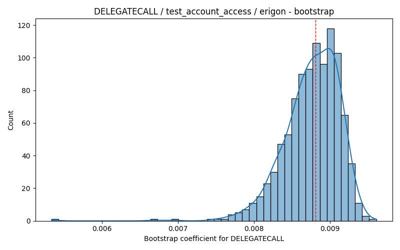


</details>

<details><summary>geth — NNLS regression summary</summary>

```
==============================================================================
                           NNLS Regression Results                            
==============================================================================
Dep. Variable:          test_runtime_ms              R-squared:          0.958
Model:                  NNLS                    Adj. R-squared:          0.957
No. Observations:       108                               RMSE:          22.43
Df Residuals:           106                                MAE:          17.79
Df Model:               1      
==============================================================================
                      coef     std err     P-value      [0.025      0.975]
------------------------------------------------------------------------------
         const     63.5455      7.4271       0.001     48.9935     77.2272
       opcount      0.0053      0.0001       0.001      0.0051      0.0055
==============================================================================
Notes: Non-negative least squares with bootstrap inference (1000 iterations)
==============================================================================
```

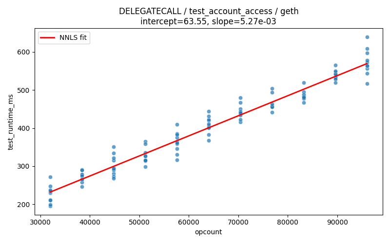

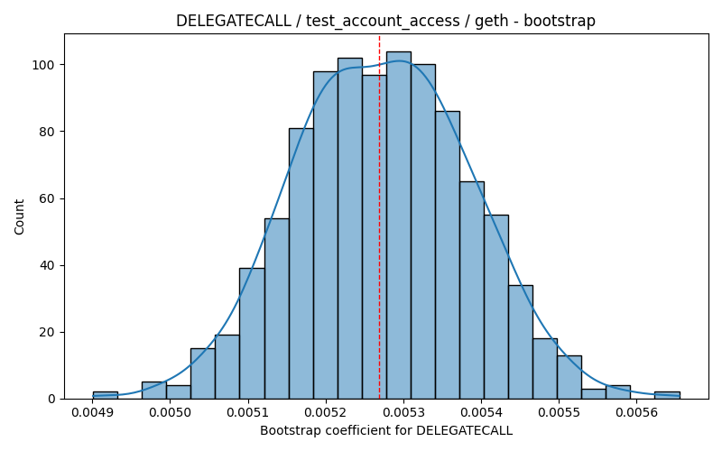

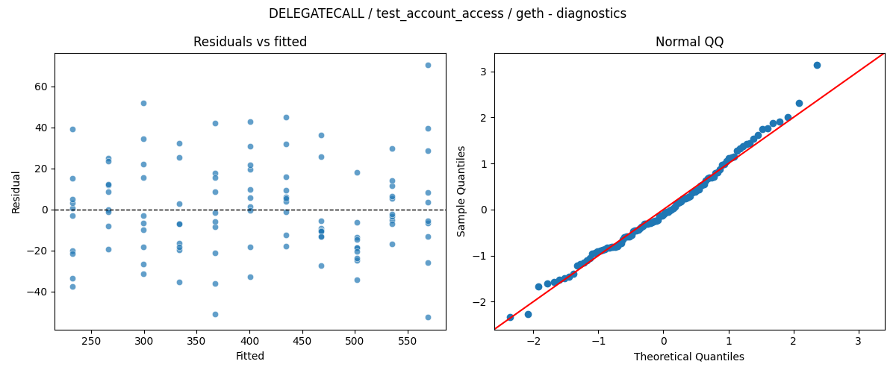

</details>

<details><summary>nethermind — NNLS regression summary</summary>

```
==============================================================================
                           NNLS Regression Results                            
==============================================================================
Dep. Variable:          test_runtime_ms              R-squared:          0.721
Model:                  NNLS                    Adj. R-squared:          0.714
No. Observations:       44                                RMSE:          36.55
Df Residuals:           42                                 MAE:          28.68
Df Model:               1      
==============================================================================
                      coef     std err     P-value      [0.025      0.975]
------------------------------------------------------------------------------
         const     96.7406     16.2291       0.001     63.4354    127.3817
       opcount      0.0029      0.0003       0.001      0.0023      0.0035
==============================================================================
Notes: Non-negative least squares with bootstrap inference (1000 iterations)
==============================================================================
```

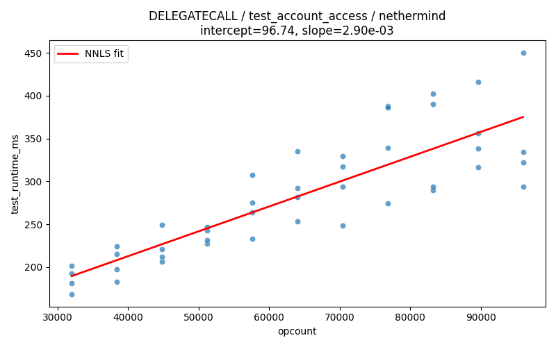

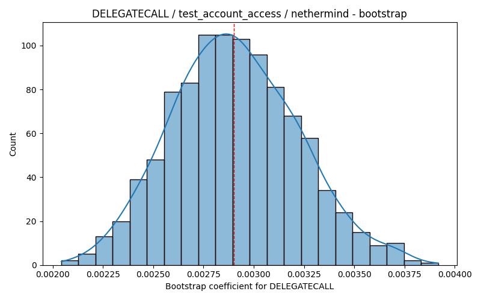

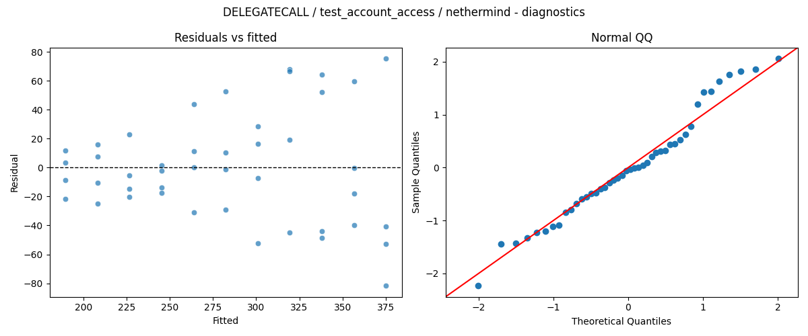

</details>

<details><summary>reth — NNLS regression summary</summary>

```
==============================================================================
                           NNLS Regression Results                            
==============================================================================
Dep. Variable:          test_runtime_ms              R-squared:          0.982
Model:                  NNLS                    Adj. R-squared:          0.982
No. Observations:       110                               RMSE:           9.77
Df Residuals:           108                                MAE:           7.42
Df Model:               1      
==============================================================================
                      coef     std err     P-value      [0.025      0.975]
------------------------------------------------------------------------------
         const     95.5491      2.9155       0.001     90.0952    101.2365
       opcount      0.0036      0.0000       0.001      0.0035      0.0037
==============================================================================
Notes: Non-negative least squares with bootstrap inference (1000 iterations)
==============================================================================
```

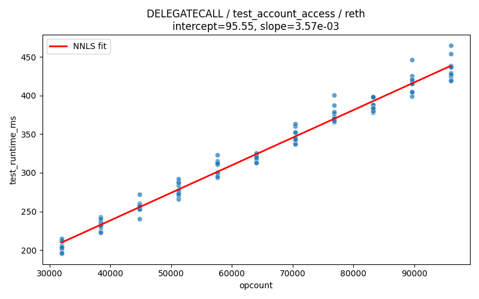

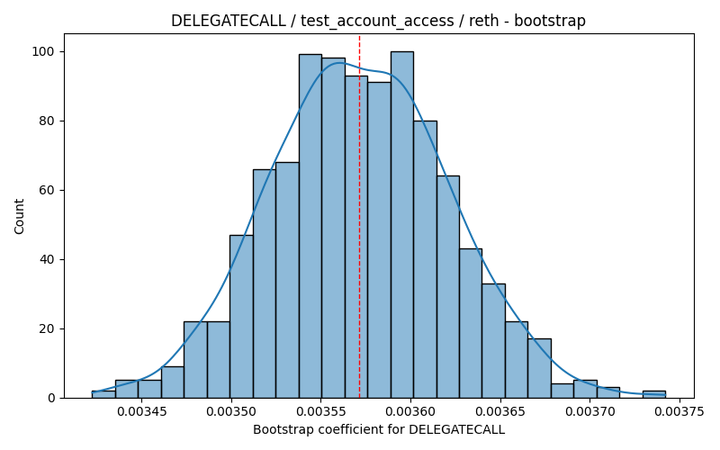

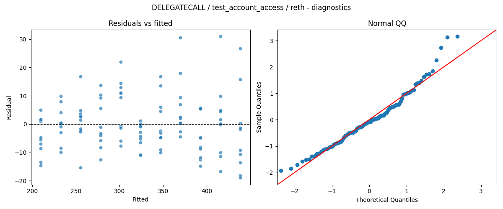

</details>

## EXTCODEHASH

### test_ext_account_query_warm — combo `EXTCODEHASH`

| client | nobs | R² | target_coef (ms) | p-value | 95% CI |
| --- | --- | --- | --- | --- | --- |
| `besu` | 66 | 0.8139 | 6.619e-05 | 1.00e-03 | [5.767e-05, 7.458e-05] |
| `erigon` | 11 | 0.8786 | 2.731e-05 | 1.00e-03 | [2.061e-05, 3.591e-05] |
| `geth` | 110 | 0.8388 | 4.164e-05 | 1.00e-03 | [3.847e-05, 4.511e-05] |
| `nethermind` | 44 | 0.7323 | 0.0002043 | 1.00e-03 | [0.0001694, 0.000241] |
| `reth` | 110 | 0.7283 | 1.37e-05 | 1.00e-03 | [1.218e-05, 1.518e-05] |

<details><summary>besu — NNLS regression summary</summary>

```
==============================================================================
                           NNLS Regression Results                            
==============================================================================
Dep. Variable:          test_runtime_ms              R-squared:          0.814
Model:                  NNLS                    Adj. R-squared:          0.811
No. Observations:       66                                RMSE:          18.52
Df Residuals:           64                                 MAE:          15.93
Df Model:               1      
==============================================================================
                      coef     std err     P-value      [0.025      0.975]
------------------------------------------------------------------------------
         const    170.0425      8.6985       0.001    154.6051    188.1274
       opcount      0.0001      0.0000       0.001      0.0001      0.0001
==============================================================================
Notes: Non-negative least squares with bootstrap inference (1000 iterations)
==============================================================================
```

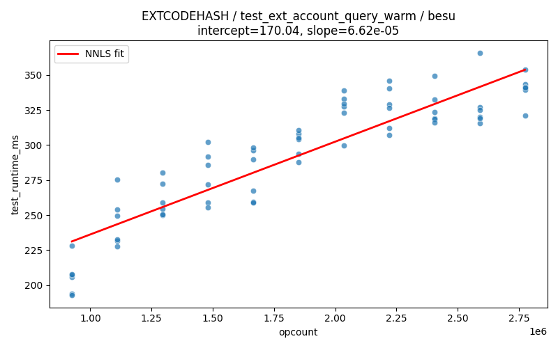

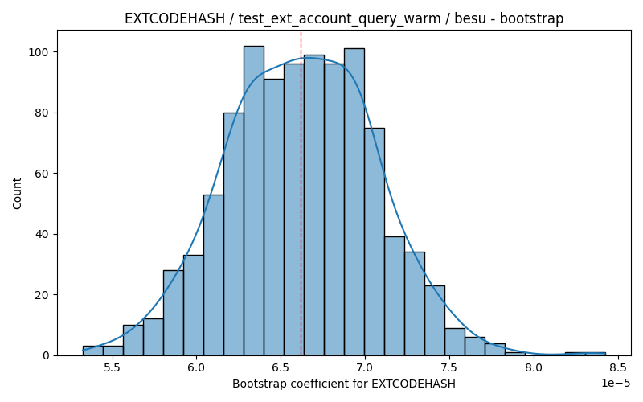

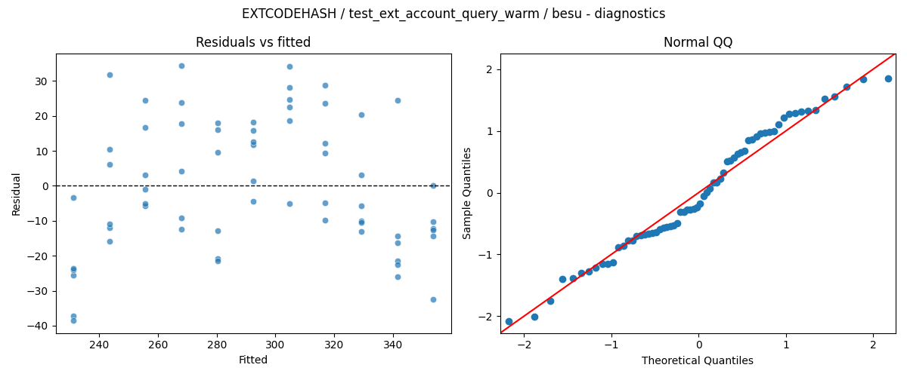

</details>

<details><summary>erigon — NNLS regression summary</summary>

```
==============================================================================
                           NNLS Regression Results                            
==============================================================================
Dep. Variable:          test_runtime_ms              R-squared:          0.879
Model:                  NNLS                    Adj. R-squared:          0.865
No. Observations:       11                                RMSE:           5.94
Df Residuals:           9                                  MAE:           5.13
Df Model:               1      
==============================================================================
                      coef     std err     P-value      [0.025      0.975]
------------------------------------------------------------------------------
         const     29.6942      7.9550       0.001     14.7639     44.3002
       opcount      0.0000      0.0000       0.001      0.0000      0.0000
==============================================================================
Notes: Non-negative least squares with bootstrap inference (1000 iterations)
==============================================================================
```

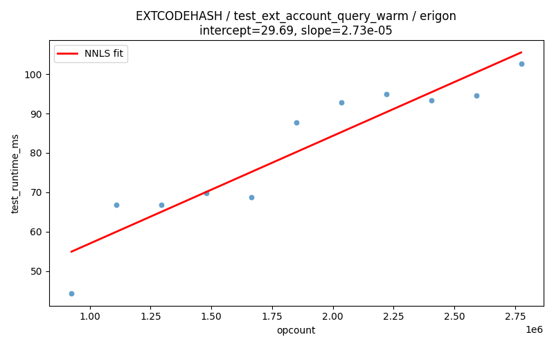

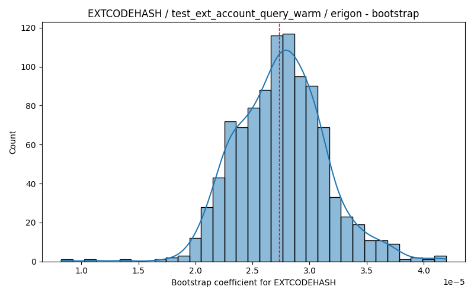

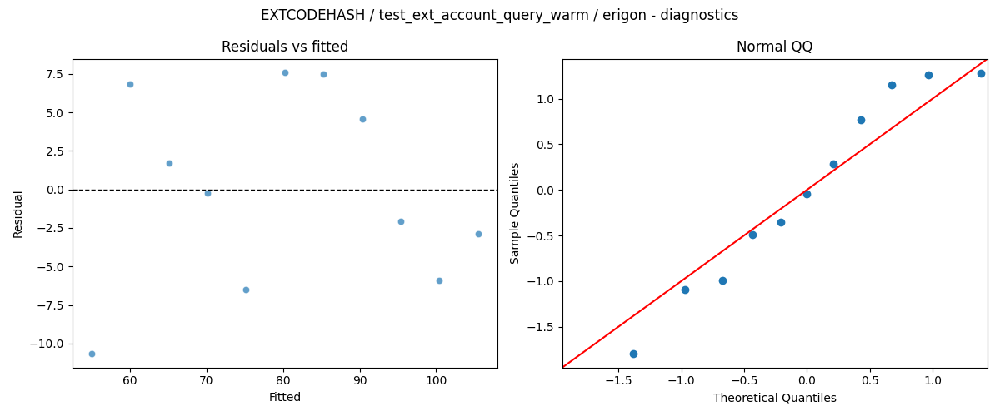

</details>

<details><summary>geth — NNLS regression summary</summary>

```
==============================================================================
                           NNLS Regression Results                            
==============================================================================
Dep. Variable:          test_runtime_ms              R-squared:          0.839
Model:                  NNLS                    Adj. R-squared:          0.837
No. Observations:       110                               RMSE:          10.68
Df Residuals:           108                                MAE:           8.13
Df Model:               1      
==============================================================================
                      coef     std err     P-value      [0.025      0.975]
------------------------------------------------------------------------------
         const     17.3307      2.9945       0.001     11.4178     23.0359
       opcount      0.0000      0.0000       0.001      0.0000      0.0000
==============================================================================
Notes: Non-negative least squares with bootstrap inference (1000 iterations)
==============================================================================
```

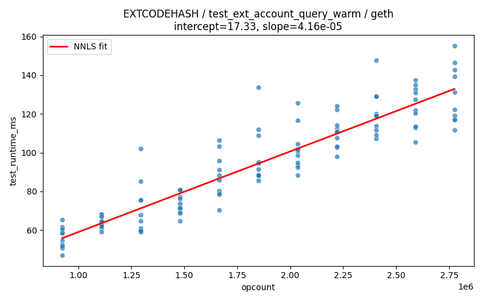

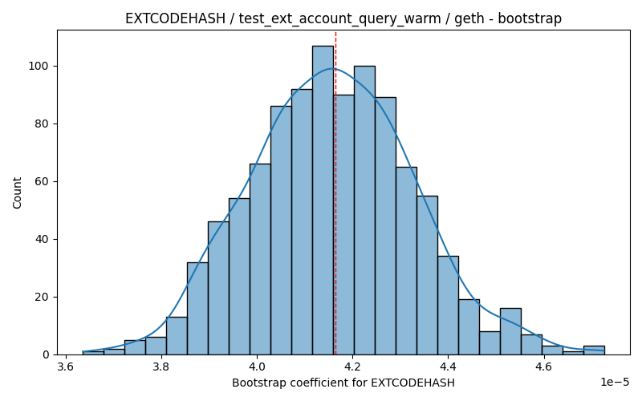

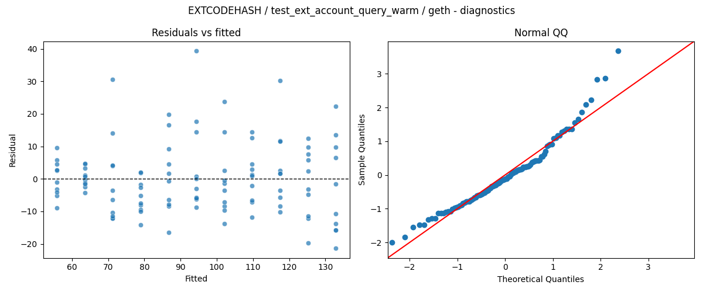

</details>

<details><summary>nethermind — NNLS regression summary</summary>

```
==============================================================================
                           NNLS Regression Results                            
==============================================================================
Dep. Variable:          test_runtime_ms              R-squared:          0.732
Model:                  NNLS                    Adj. R-squared:          0.726
No. Observations:       44                                RMSE:          72.28
Df Residuals:           42                                 MAE:          61.25
Df Model:               1      
==============================================================================
                      coef     std err     P-value      [0.025      0.975]
------------------------------------------------------------------------------
         const    219.5948     35.7955       0.001    149.0498    289.7360
       opcount      0.0002      0.0000       0.001      0.0002      0.0002
==============================================================================
Notes: Non-negative least squares with bootstrap inference (1000 iterations)
==============================================================================
```

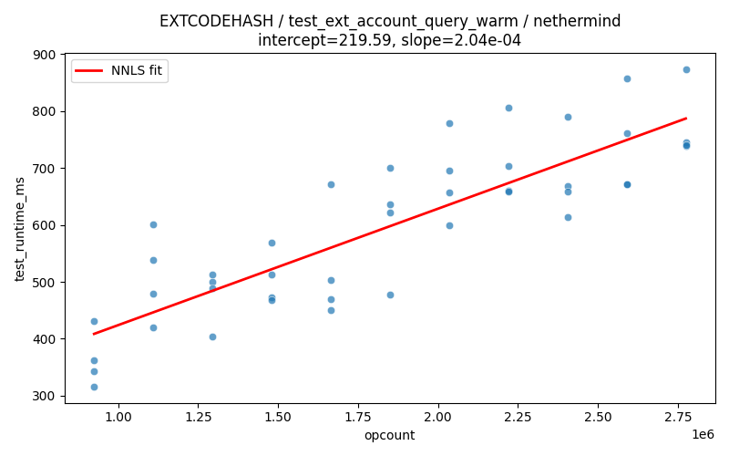

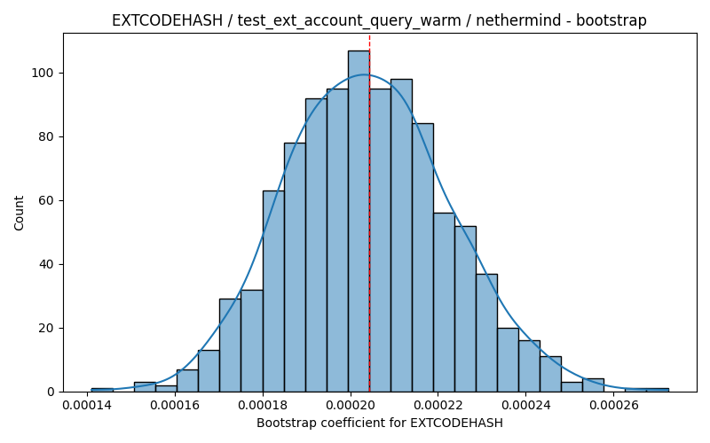

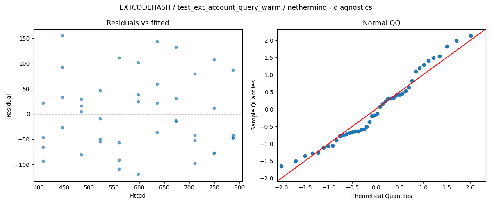

</details>

<details><summary>reth — NNLS regression summary</summary>

```
==============================================================================
                           NNLS Regression Results                            
==============================================================================
Dep. Variable:          test_runtime_ms              R-squared:          0.728
Model:                  NNLS                    Adj. R-squared:          0.726
No. Observations:       110                               RMSE:           4.90
Df Residuals:           108                                MAE:           3.66
Df Model:               1      
==============================================================================
                      coef     std err     P-value      [0.025      0.975]
------------------------------------------------------------------------------
         const      8.8966      1.4881       0.001      6.0690     11.8522
       opcount      0.0000      0.0000       0.001      0.0000      0.0000
==============================================================================
Notes: Non-negative least squares with bootstrap inference (1000 iterations)
==============================================================================
```

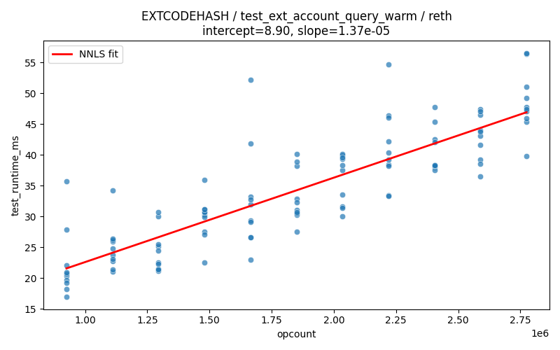

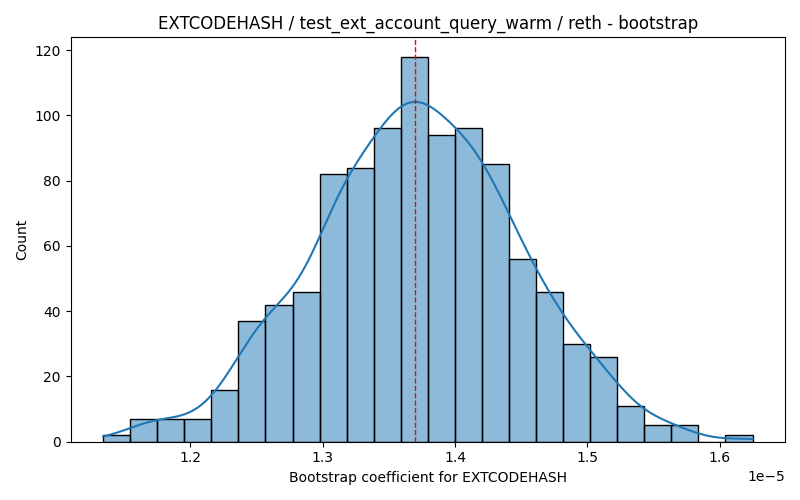

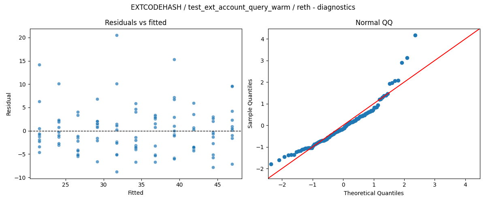

</details>

### test_account_access — combo `EXTCODEHASH_AccountMode.EXISTING_EOA`

| client | nobs | R² | target_coef (ms) | p-value | 95% CI |
| --- | --- | --- | --- | --- | --- |
| `besu` | 66 | 0.9805 | 0.01429 | 1.00e-03 | [0.01387, 0.01478] |
| `erigon` | 11 | 0.9977 | 0.008448 | 1.00e-03 | [0.008155, 0.008539] |
| `geth` | 108 | 0.9749 | 0.01138 | 1.00e-03 | [0.01106, 0.01171] |
| `nethermind` | 44 | 0.8968 | 0.003156 | 1.00e-03 | [0.002851, 0.003488] |
| `reth` | 110 | 0.9154 | 0.001149 | 1.00e-03 | [0.001087, 0.001213] |

<details><summary>besu — NNLS regression summary</summary>

```
==============================================================================
                           NNLS Regression Results                            
==============================================================================
Dep. Variable:          test_runtime_ms              R-squared:          0.980
Model:                  NNLS                    Adj. R-squared:          0.980
No. Observations:       66                                RMSE:          41.66
Df Residuals:           64                                 MAE:          33.85
Df Model:               1      
==============================================================================
                      coef     std err     P-value      [0.025      0.975]
------------------------------------------------------------------------------
         const    474.3795     16.6606       0.001    439.5176    503.5901
       opcount      0.0143      0.0002       0.001      0.0139      0.0148
==============================================================================
Notes: Non-negative least squares with bootstrap inference (1000 iterations)
==============================================================================
```

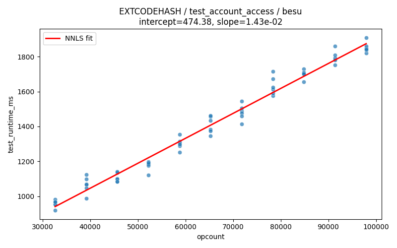

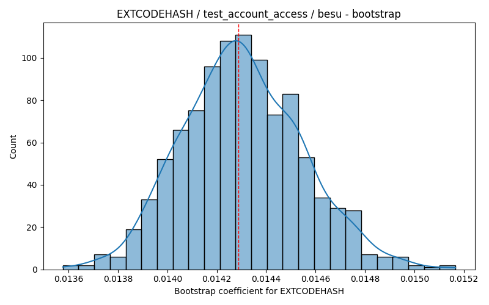

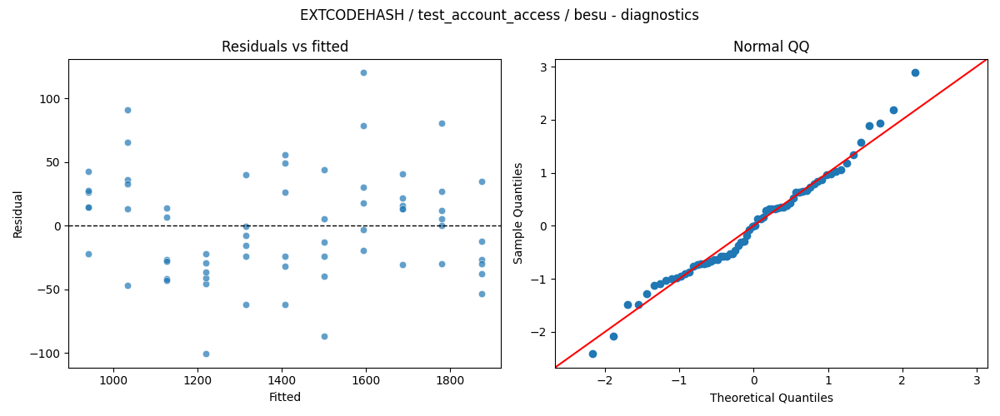

</details>

<details><summary>erigon — NNLS regression summary</summary>

```
==============================================================================
                           NNLS Regression Results                            
==============================================================================
Dep. Variable:          test_runtime_ms              R-squared:          0.998
Model:                  NNLS                    Adj. R-squared:          0.997
No. Observations:       11                                RMSE:           8.31
Df Residuals:           9                                  MAE:           6.46
Df Model:               1      
==============================================================================
                      coef     std err     P-value      [0.025      0.975]
------------------------------------------------------------------------------
         const      3.0920      5.7232       0.295      0.0000     19.3956
       opcount      0.0084      0.0001       0.001      0.0082      0.0085
==============================================================================
Notes: Non-negative least squares with bootstrap inference (1000 iterations)
==============================================================================
```

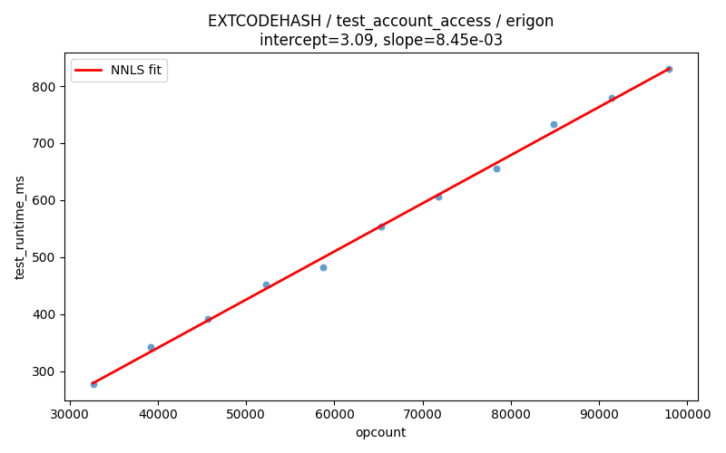

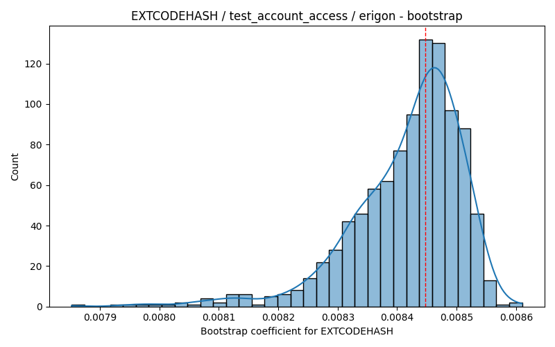

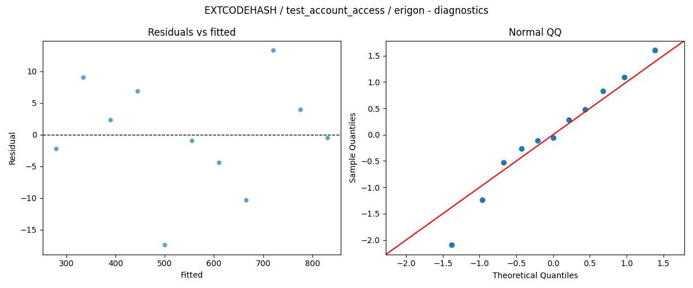

</details>

<details><summary>geth — NNLS regression summary</summary>

```
==============================================================================
                           NNLS Regression Results                            
==============================================================================
Dep. Variable:          test_runtime_ms              R-squared:          0.975
Model:                  NNLS                    Adj. R-squared:          0.975
No. Observations:       108                               RMSE:          37.14
Df Residuals:           106                                MAE:          28.14
Df Model:               1      
==============================================================================
                      coef     std err     P-value      [0.025      0.975]
------------------------------------------------------------------------------
         const    234.8265     11.1477       0.001    213.5737    256.2461
       opcount      0.0114      0.0002       0.001      0.0111      0.0117
==============================================================================
Notes: Non-negative least squares with bootstrap inference (1000 iterations)
==============================================================================
```

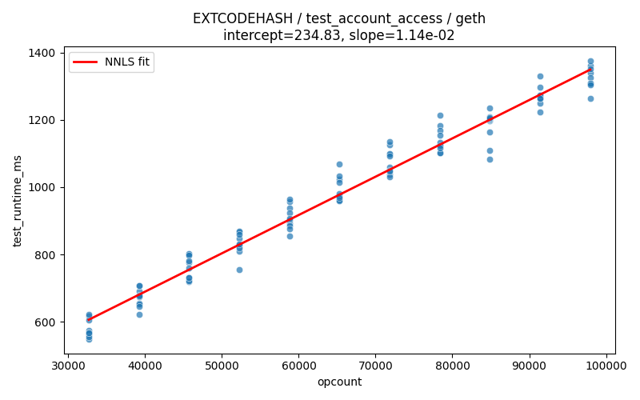

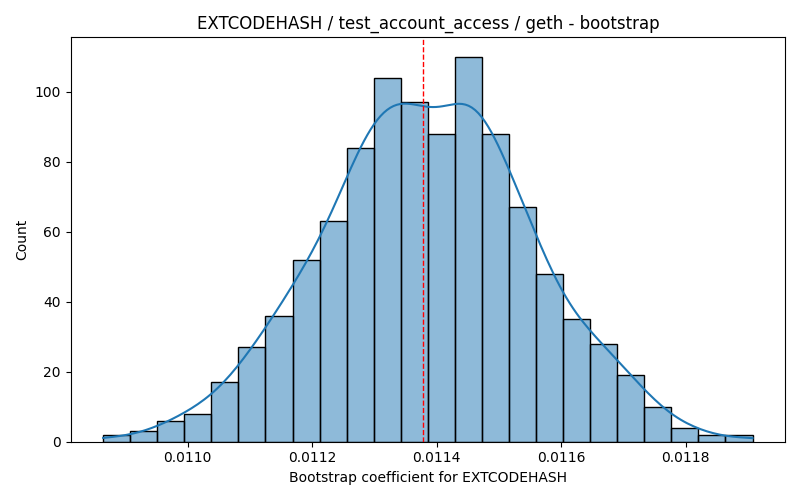

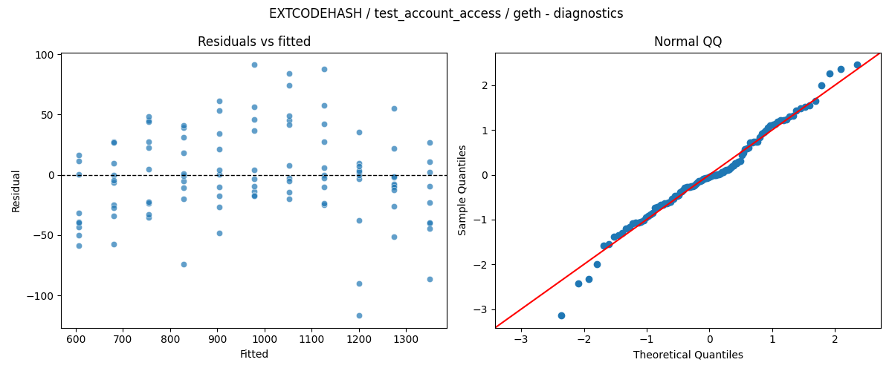

</details>

<details><summary>nethermind — NNLS regression summary</summary>

```
==============================================================================
                           NNLS Regression Results                            
==============================================================================
Dep. Variable:          test_runtime_ms              R-squared:          0.897
Model:                  NNLS                    Adj. R-squared:          0.894
No. Observations:       44                                RMSE:          22.11
Df Residuals:           42                                 MAE:          18.45
Df Model:               1      
==============================================================================
                      coef     std err     P-value      [0.025      0.975]
------------------------------------------------------------------------------
         const    113.6936      9.8343       0.001     94.3918    132.2534
       opcount      0.0032      0.0002       0.001      0.0029      0.0035
==============================================================================
Notes: Non-negative least squares with bootstrap inference (1000 iterations)
==============================================================================
```

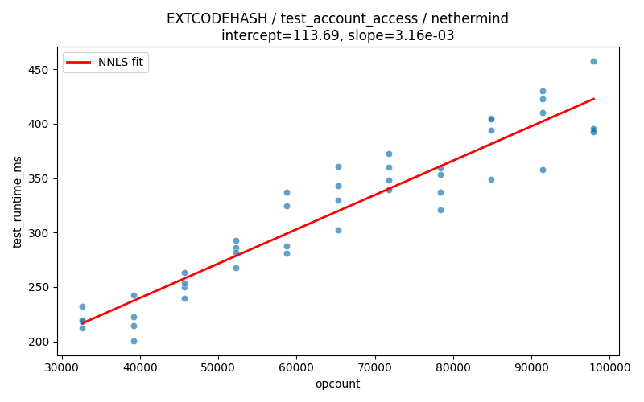

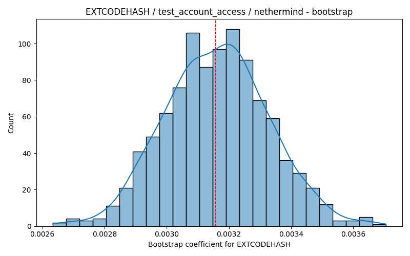

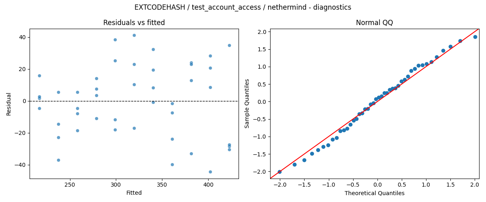

</details>

<details><summary>reth — NNLS regression summary</summary>

```
==============================================================================
                           NNLS Regression Results                            
==============================================================================
Dep. Variable:          test_runtime_ms              R-squared:          0.915
Model:                  NNLS                    Adj. R-squared:          0.915
No. Observations:       110                               RMSE:           7.21
Df Residuals:           108                                MAE:           5.44
Df Model:               1      
==============================================================================
                      coef     std err     P-value      [0.025      0.975]
------------------------------------------------------------------------------
         const     37.4040      2.1063       0.001     33.4410     41.4367
       opcount      0.0011      0.0000       0.001      0.0011      0.0012
==============================================================================
Notes: Non-negative least squares with bootstrap inference (1000 iterations)
==============================================================================
```

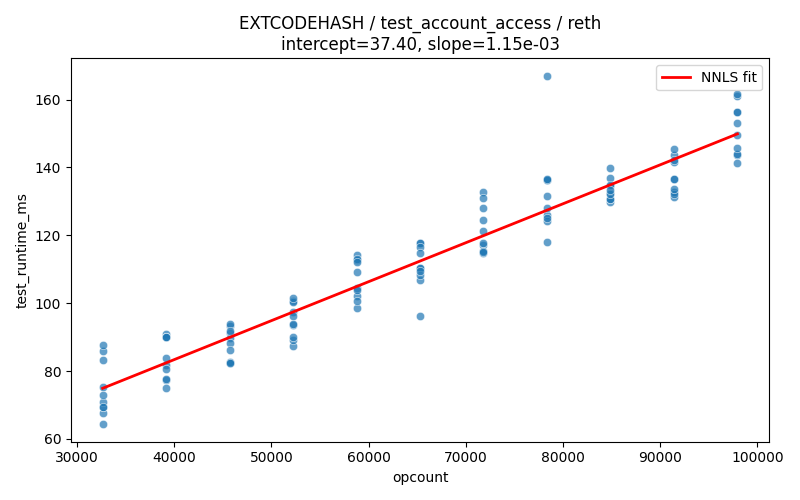

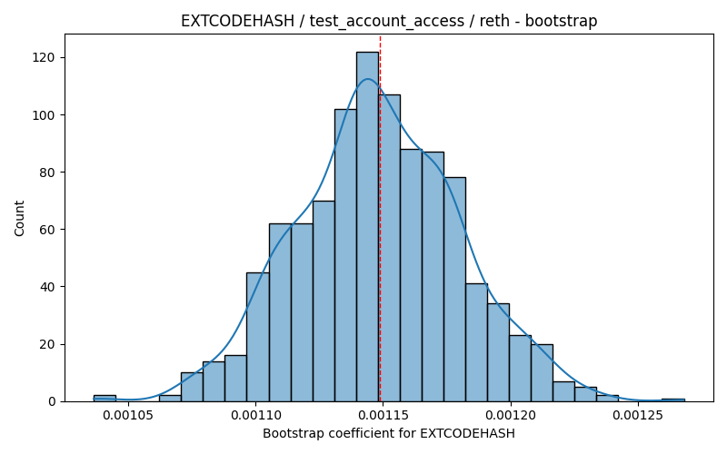

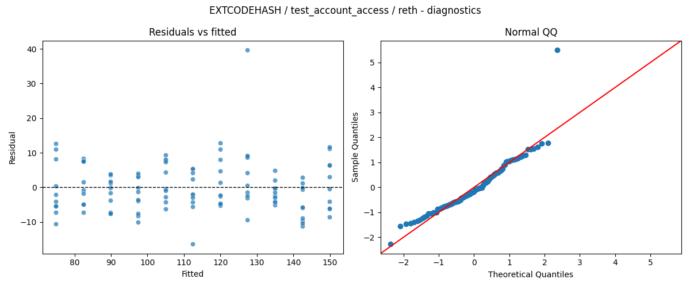

</details>

### test_account_access — combo `EXTCODEHASH_AccountMode.NON_EXISTING_ACCOUNT`

| client | nobs | R² | target_coef (ms) | p-value | 95% CI |
| --- | --- | --- | --- | --- | --- |
| `besu` | 66 | 0.9887 | 0.01476 | 1.00e-03 | [0.01442, 0.01508] |
| `erigon` | 11 | 0.9963 | 0.007931 | 1.00e-03 | [0.0078, 0.008005] |
| `geth` | 109 | 0.9777 | 0.0212 | 1.00e-03 | [0.02051, 0.02185] |
| `nethermind` | 44 | 0.9331 | 0.00336 | 1.00e-03 | [0.003065, 0.003634] |
| `reth` | 110 | 0.8909 | 0.0009359 | 1.00e-03 | [0.0008735, 0.001005] |

<details><summary>besu — NNLS regression summary</summary>

```
==============================================================================
                           NNLS Regression Results                            
==============================================================================
Dep. Variable:          test_runtime_ms              R-squared:          0.989
Model:                  NNLS                    Adj. R-squared:          0.989
No. Observations:       66                                RMSE:          32.53
Df Residuals:           64                                 MAE:          25.84
Df Model:               1      
==============================================================================
                      coef     std err     P-value      [0.025      0.975]
------------------------------------------------------------------------------
         const    120.2260     12.2360       0.001     95.9254    143.7724
       opcount      0.0148      0.0002       0.001      0.0144      0.0151
==============================================================================
Notes: Non-negative least squares with bootstrap inference (1000 iterations)
==============================================================================
```

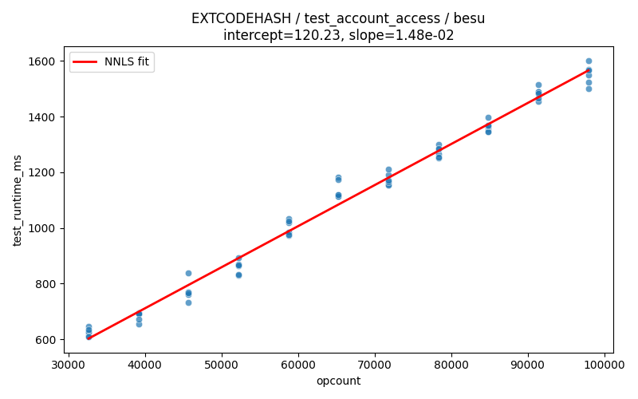

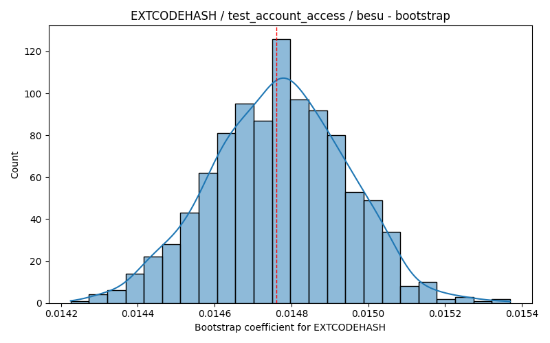

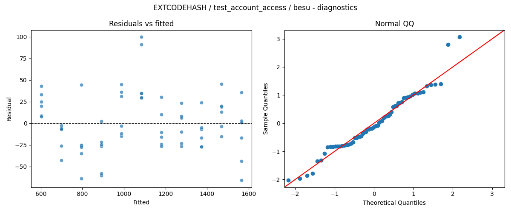

</details>

<details><summary>erigon — NNLS regression summary</summary>

```
==============================================================================
                           NNLS Regression Results                            
==============================================================================
Dep. Variable:          test_runtime_ms              R-squared:          0.996
Model:                  NNLS                    Adj. R-squared:          0.996
No. Observations:       11                                RMSE:          10.08
Df Residuals:           9                                  MAE:           8.20
Df Model:               1      
==============================================================================
                      coef     std err     P-value      [0.025      0.975]
------------------------------------------------------------------------------
         const      0.0000      2.9772       1.000      0.0000      9.2501
       opcount      0.0079      0.0001       0.001      0.0078      0.0080
==============================================================================
Notes: Non-negative least squares with bootstrap inference (1000 iterations)
==============================================================================
```

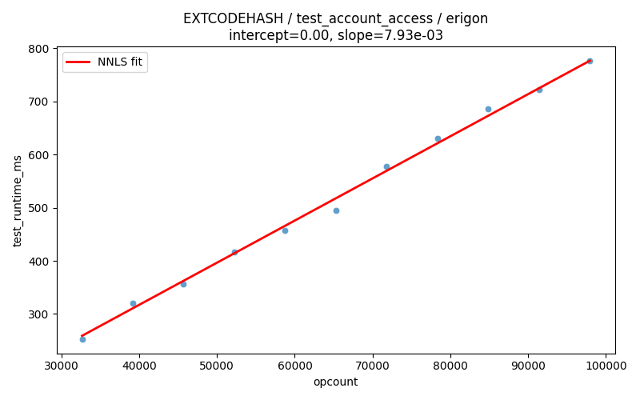

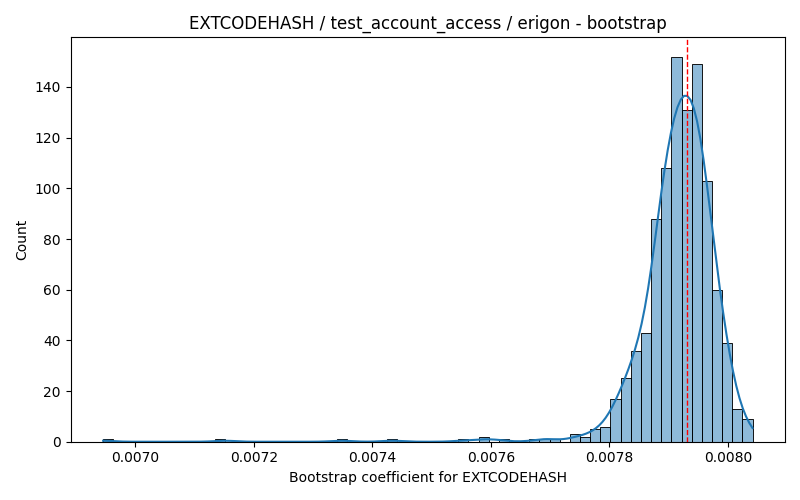

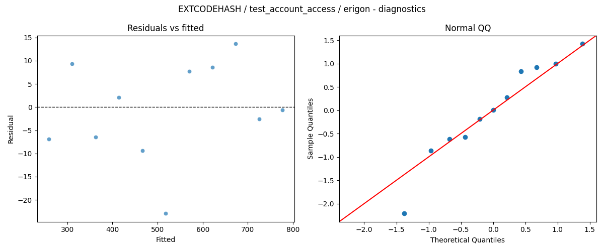

</details>

<details><summary>geth — NNLS regression summary</summary>

```
==============================================================================
                           NNLS Regression Results                            
==============================================================================
Dep. Variable:          test_runtime_ms              R-squared:          0.978
Model:                  NNLS                    Adj. R-squared:          0.977
No. Observations:       109                               RMSE:          65.71
Df Residuals:           107                                MAE:          49.63
Df Model:               1      
==============================================================================
                      coef     std err     P-value      [0.025      0.975]
------------------------------------------------------------------------------
         const    317.7395     19.8568       0.001    279.6221    357.1389
       opcount      0.0212      0.0003       0.001      0.0205      0.0219
==============================================================================
Notes: Non-negative least squares with bootstrap inference (1000 iterations)
==============================================================================
```

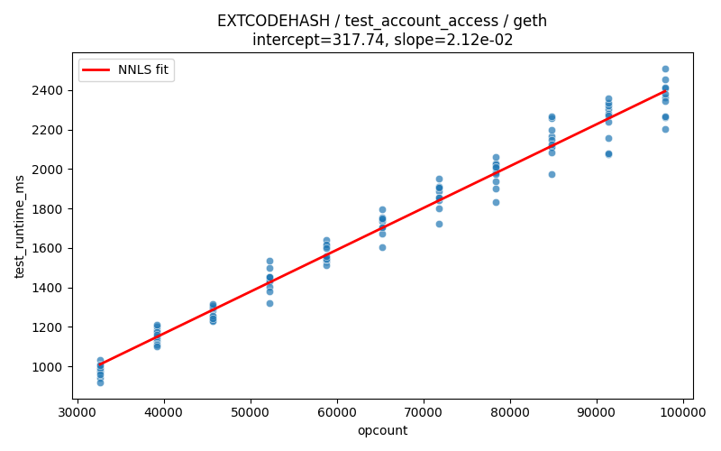

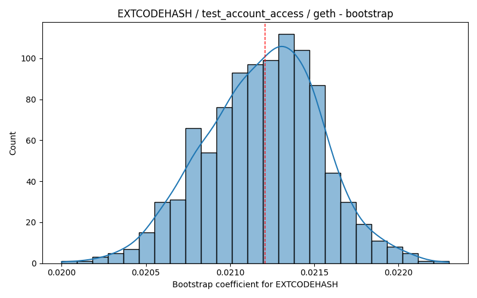

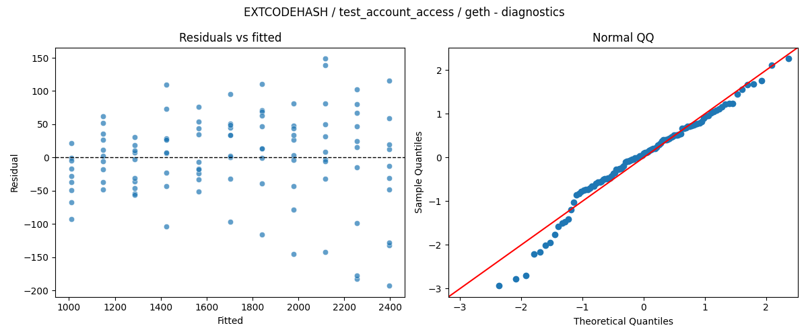

</details>

<details><summary>nethermind — NNLS regression summary</summary>

```
==============================================================================
                           NNLS Regression Results                            
==============================================================================
Dep. Variable:          test_runtime_ms              R-squared:          0.933
Model:                  NNLS                    Adj. R-squared:          0.932
No. Observations:       44                                RMSE:          18.57
Df Residuals:           42                                 MAE:          15.70
Df Model:               1      
==============================================================================
                      coef     std err     P-value      [0.025      0.975]
------------------------------------------------------------------------------
         const     63.1466      8.9298       0.001     45.0105     80.4153
       opcount      0.0034      0.0001       0.001      0.0031      0.0036
==============================================================================
Notes: Non-negative least squares with bootstrap inference (1000 iterations)
==============================================================================
```

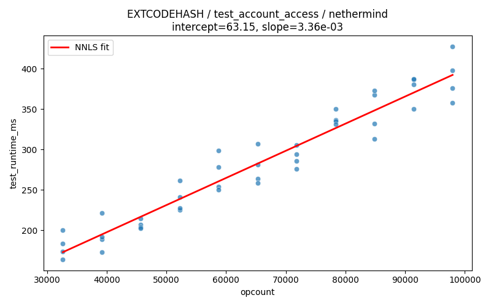

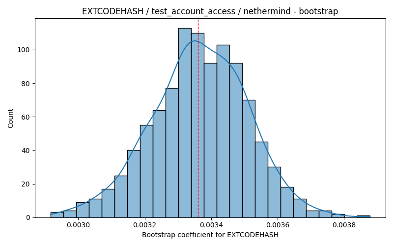

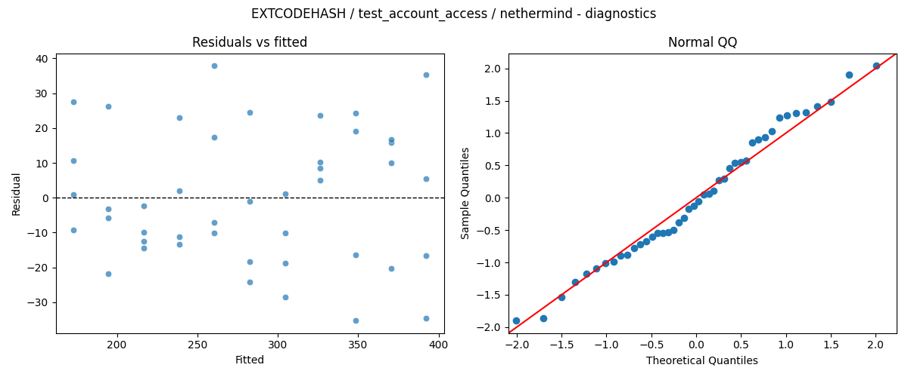

</details>

<details><summary>reth — NNLS regression summary</summary>

```
==============================================================================
                           NNLS Regression Results                            
==============================================================================
Dep. Variable:          test_runtime_ms              R-squared:          0.891
Model:                  NNLS                    Adj. R-squared:          0.890
No. Observations:       110                               RMSE:           6.76
Df Residuals:           108                                MAE:           5.22
Df Model:               1      
==============================================================================
                      coef     std err     P-value      [0.025      0.975]
------------------------------------------------------------------------------
         const     33.0126      2.2433       0.001     28.7514     37.1987
       opcount      0.0009      0.0000       0.001      0.0009      0.0010
==============================================================================
Notes: Non-negative least squares with bootstrap inference (1000 iterations)
==============================================================================
```

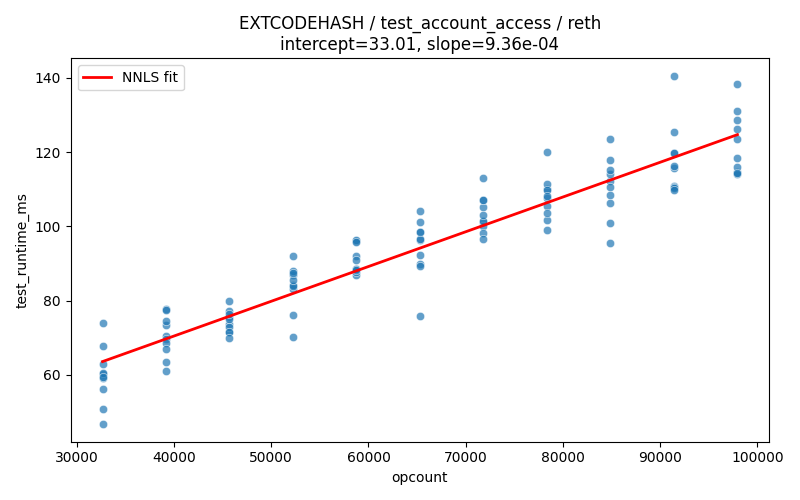

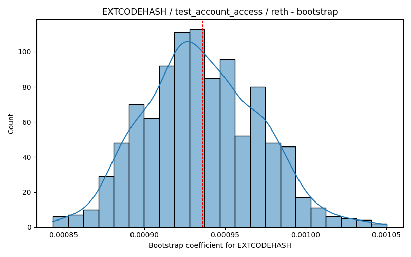

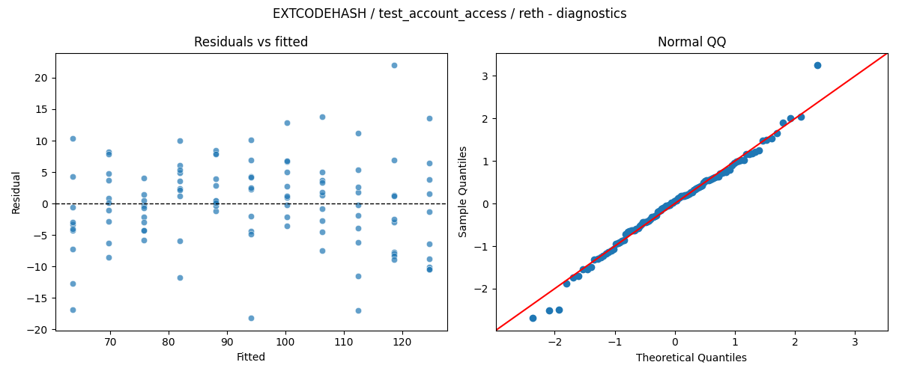

</details>

### test_account_access — combo `EXTCODEHASH_AccountMode.EXISTING_CONTRACT_DIFF_MAX`

| client | nobs | R² | target_coef (ms) | p-value | 95% CI |
| --- | --- | --- | --- | --- | --- |
| `besu` | 66 | 0.9801 | 0.0195 | 1.00e-03 | [0.0189, 0.02013] |
| `erigon` | 11 | 0.9835 | 0.009299 | 1.00e-03 | [0.008354, 0.01003] |
| `geth` | 109 | 0.954 | 0.003806 | 1.00e-03 | [0.003664, 0.003941] |
| `nethermind` | 44 | 0.7255 | 0.002093 | 1.00e-03 | [0.001708, 0.002446] |
| `reth` | 110 | 0.9953 | 0.01818 | 1.00e-03 | [0.01793, 0.01844] |

<details><summary>besu — NNLS regression summary</summary>

```
==============================================================================
                           NNLS Regression Results                            
==============================================================================
Dep. Variable:          test_runtime_ms              R-squared:          0.980
Model:                  NNLS                    Adj. R-squared:          0.980
No. Observations:       66                                RMSE:          56.51
Df Residuals:           64                                 MAE:          43.34
Df Model:               1      
==============================================================================
                      coef     std err     P-value      [0.025      0.975]
------------------------------------------------------------------------------
         const    430.9043     21.8592       0.001    388.8887    475.2632
       opcount      0.0195      0.0003       0.001      0.0189      0.0201
==============================================================================
Notes: Non-negative least squares with bootstrap inference (1000 iterations)
==============================================================================
```

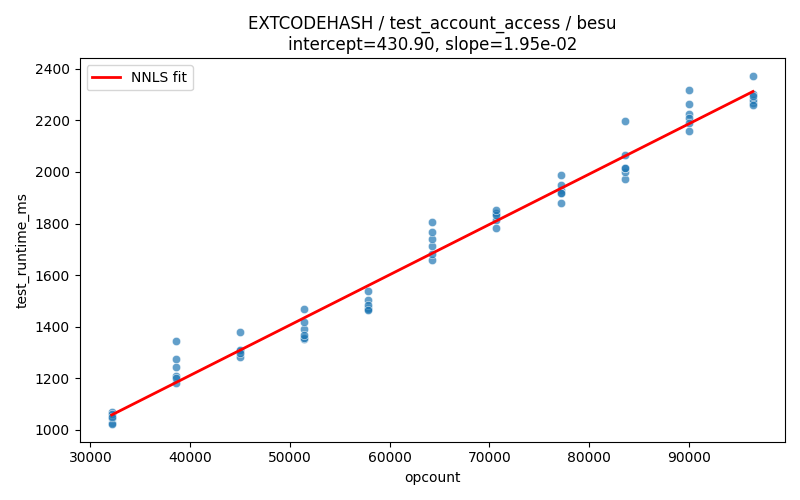

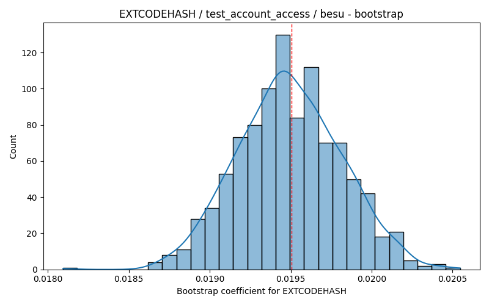

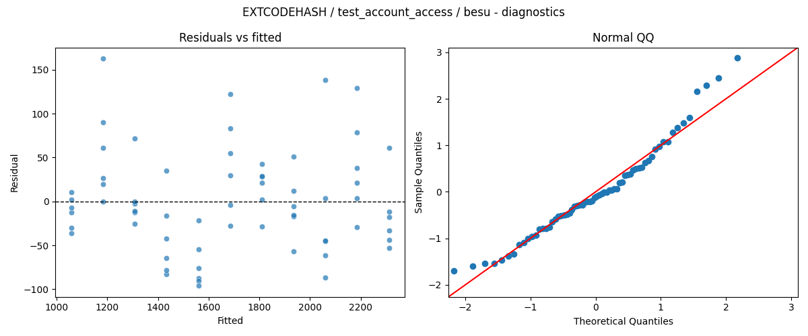

</details>

<details><summary>erigon — NNLS regression summary</summary>

```
==============================================================================
                           NNLS Regression Results                            
==============================================================================
Dep. Variable:          test_runtime_ms              R-squared:          0.983
Model:                  NNLS                    Adj. R-squared:          0.982
No. Observations:       11                                RMSE:          24.51
Df Residuals:           9                                  MAE:          20.14
Df Model:               1      
==============================================================================
                      coef     std err     P-value      [0.025      0.975]
------------------------------------------------------------------------------
         const    174.4635     30.4750       0.001    127.5845    243.5719
       opcount      0.0093      0.0004       0.001      0.0084      0.0100
==============================================================================
Notes: Non-negative least squares with bootstrap inference (1000 iterations)
==============================================================================
```


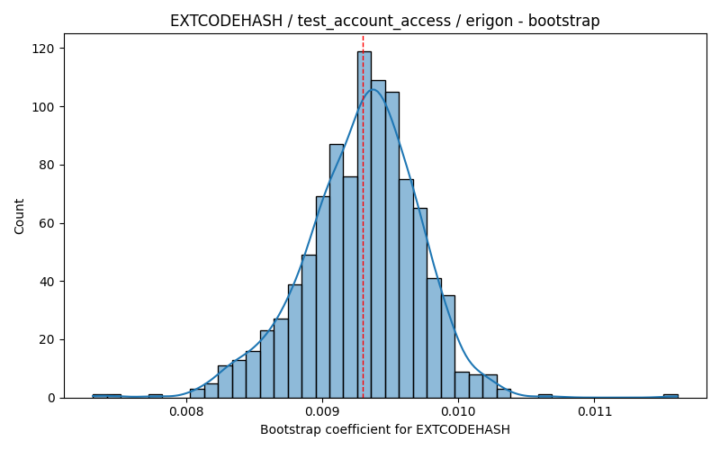

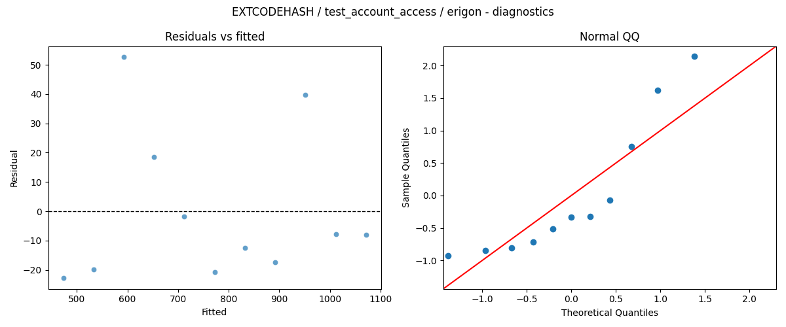

</details>

<details><summary>geth — NNLS regression summary</summary>

```
==============================================================================
                           NNLS Regression Results                            
==============================================================================
Dep. Variable:          test_runtime_ms              R-squared:          0.954
Model:                  NNLS                    Adj. R-squared:          0.954
No. Observations:       109                               RMSE:          17.01
Df Residuals:           107                                MAE:          13.93
Df Model:               1      
==============================================================================
                      coef     std err     P-value      [0.025      0.975]
------------------------------------------------------------------------------
         const      7.9131      4.5334       0.054      0.0000     17.4180
       opcount      0.0038      0.0001       0.001      0.0037      0.0039
==============================================================================
Notes: Non-negative least squares with bootstrap inference (1000 iterations)
==============================================================================
```

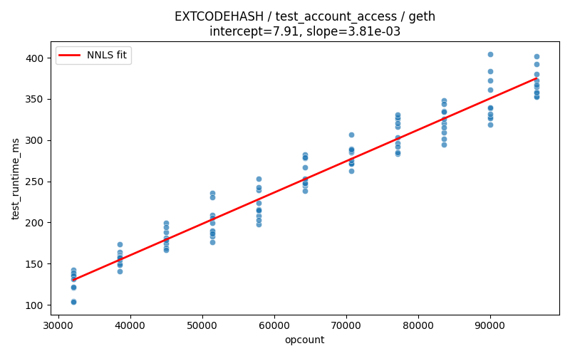

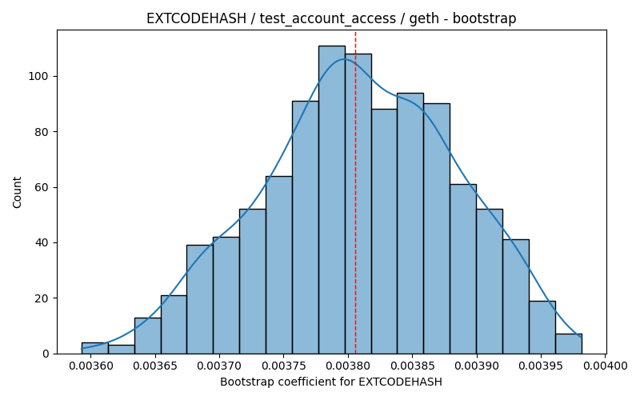

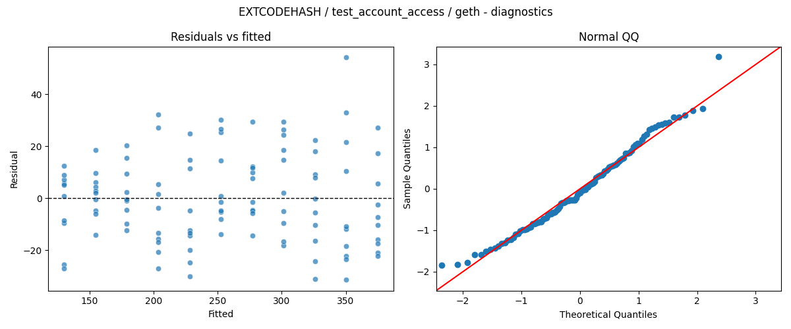

</details>

<details><summary>nethermind — NNLS regression summary</summary>

```
==============================================================================
                           NNLS Regression Results                            
==============================================================================
Dep. Variable:          test_runtime_ms              R-squared:          0.726
Model:                  NNLS                    Adj. R-squared:          0.719
No. Observations:       44                                RMSE:          26.18
Df Residuals:           42                                 MAE:          20.24
Df Model:               1      
==============================================================================
                      coef     std err     P-value      [0.025      0.975]
------------------------------------------------------------------------------
         const     91.9507     11.8010       0.001     70.4731    116.3195
       opcount      0.0021      0.0002       0.001      0.0017      0.0024
==============================================================================
Notes: Non-negative least squares with bootstrap inference (1000 iterations)
==============================================================================
```

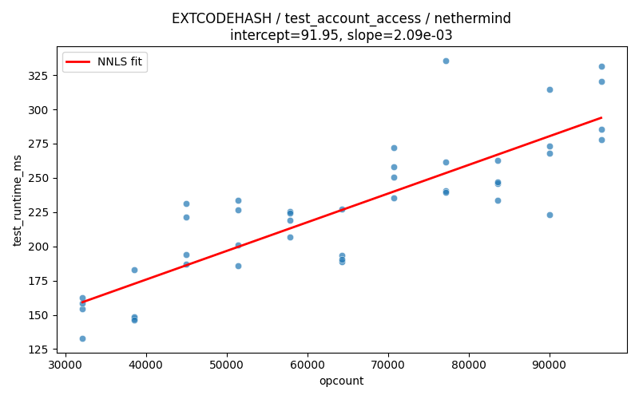

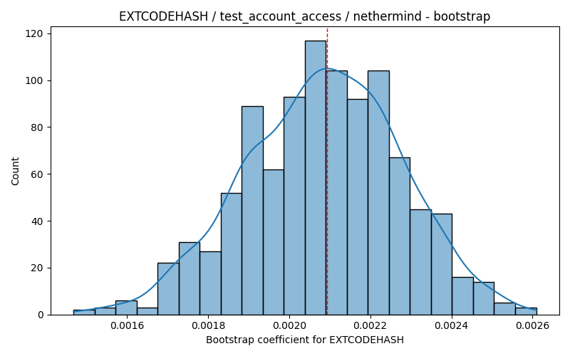

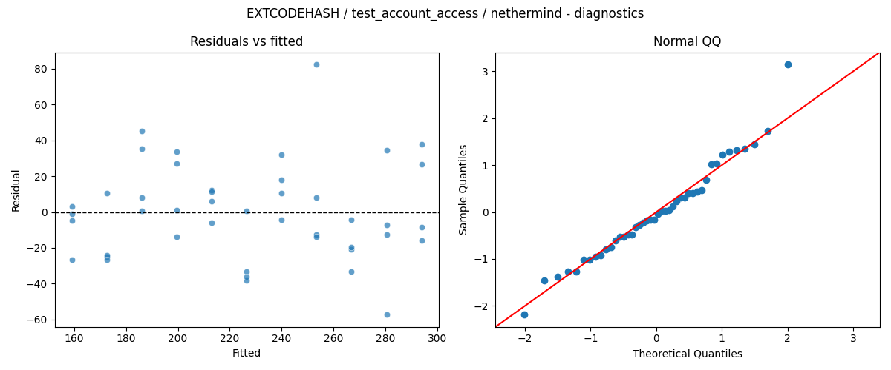

</details>

<details><summary>reth — NNLS regression summary</summary>

```
==============================================================================
                           NNLS Regression Results                            
==============================================================================
Dep. Variable:          test_runtime_ms              R-squared:          0.995
Model:                  NNLS                    Adj. R-squared:          0.995
No. Observations:       110                               RMSE:          25.31
Df Residuals:           108                                MAE:          17.56
Df Model:               1      
==============================================================================
                      coef     std err     P-value      [0.025      0.975]
------------------------------------------------------------------------------
         const    159.9907      7.2574       0.001    145.7712    174.1426
       opcount      0.0182      0.0001       0.001      0.0179      0.0184
==============================================================================
Notes: Non-negative least squares with bootstrap inference (1000 iterations)
==============================================================================
```

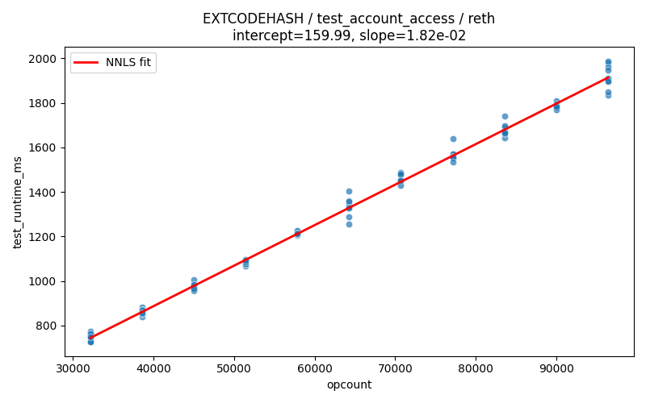

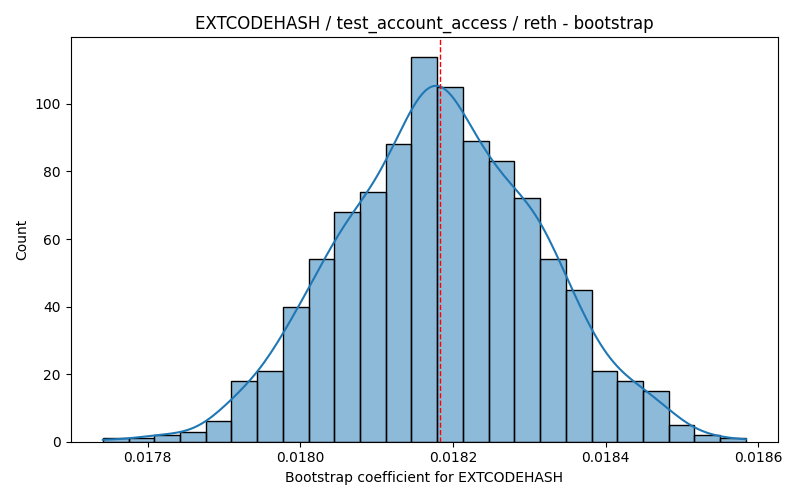

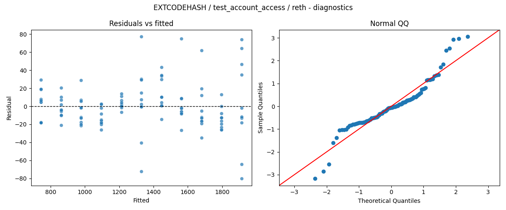

</details>

### test_account_access — combo `EXTCODEHASH_AccountMode.EXISTING_CONTRACT_MINIMAL`

| client | nobs | R² | target_coef (ms) | p-value | 95% CI |
| --- | --- | --- | --- | --- | --- |
| `besu` | 66 | 0.9621 | 0.01189 | 1.00e-03 | [0.0113, 0.01252] |
| `erigon` | 11 | 0.9846 | 0.008681 | 1.00e-03 | [0.007859, 0.009245] |
| `geth` | 110 | 0.9545 | 0.004957 | 1.00e-03 | [0.004734, 0.005164] |
| `nethermind` | 44 | 0.8196 | 0.002297 | 1.00e-03 | [0.001985, 0.002615] |
| `reth` | 110 | 0.9716 | 0.003573 | 1.00e-03 | [0.003456, 0.003699] |

<details><summary>besu — NNLS regression summary</summary>

```
==============================================================================
                           NNLS Regression Results                            
==============================================================================
Dep. Variable:          test_runtime_ms              R-squared:          0.962
Model:                  NNLS                    Adj. R-squared:          0.961
No. Observations:       66                                RMSE:          48.00
Df Residuals:           64                                 MAE:          38.13
Df Model:               1      
==============================================================================
                      coef     std err     P-value      [0.025      0.975]
------------------------------------------------------------------------------
         const    383.1137     19.3294       0.001    345.8981    423.2028
       opcount      0.0119      0.0003       0.001      0.0113      0.0125
==============================================================================
Notes: Non-negative least squares with bootstrap inference (1000 iterations)
==============================================================================
```


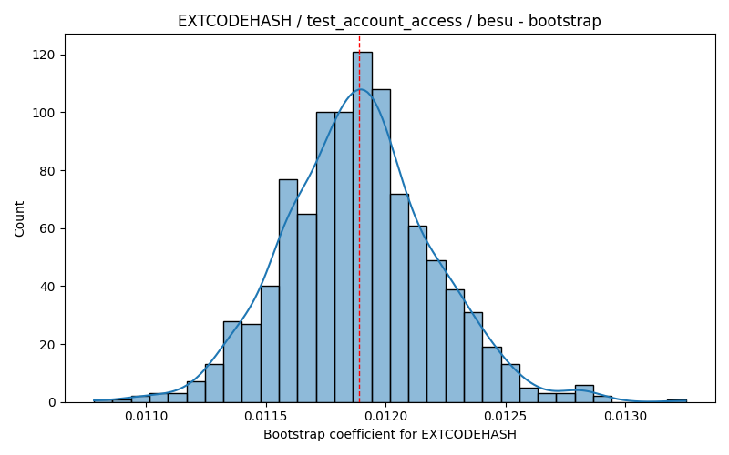

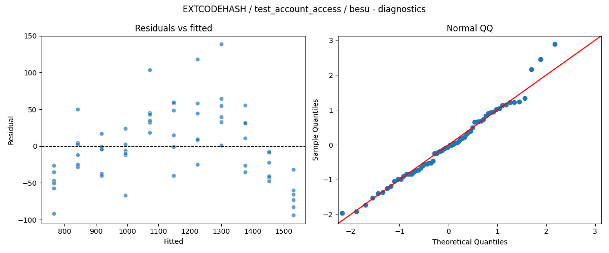

</details>

<details><summary>erigon — NNLS regression summary</summary>

```
==============================================================================
                           NNLS Regression Results                            
==============================================================================
Dep. Variable:          test_runtime_ms              R-squared:          0.985
Model:                  NNLS                    Adj. R-squared:          0.983
No. Observations:       11                                RMSE:          22.10
Df Residuals:           9                                  MAE:          17.45
Df Model:               1      
==============================================================================
                      coef     std err     P-value      [0.025      0.975]
------------------------------------------------------------------------------
         const    165.3804     29.1906       0.001    120.4135    228.6619
       opcount      0.0087      0.0004       0.001      0.0079      0.0092
==============================================================================
Notes: Non-negative least squares with bootstrap inference (1000 iterations)
==============================================================================
```

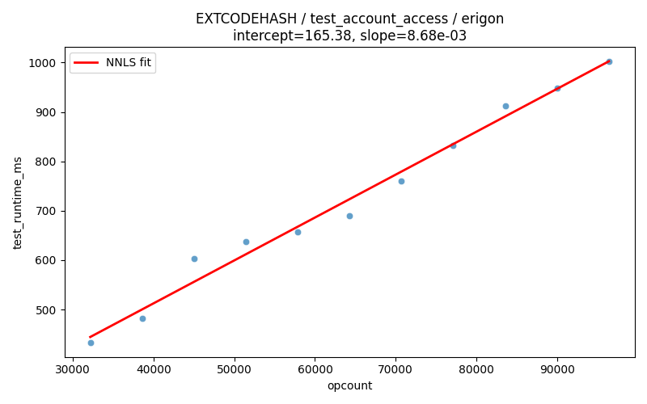

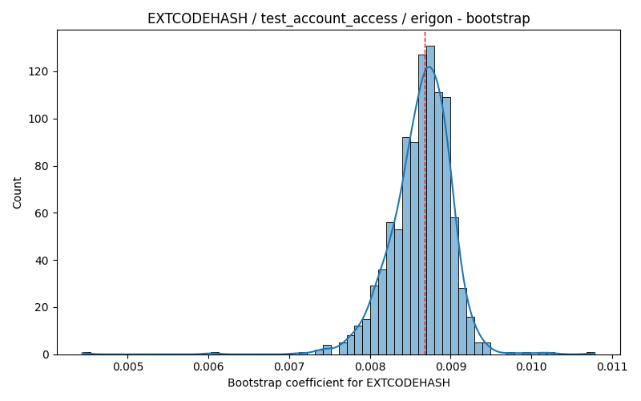

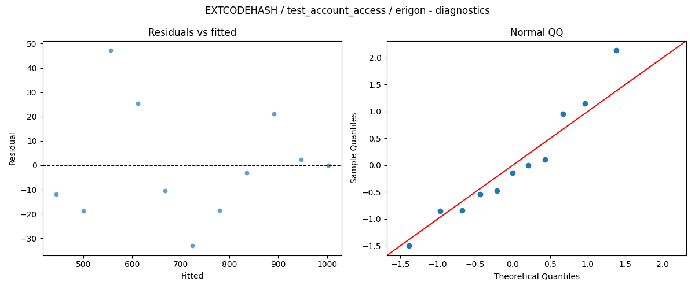

</details>

<details><summary>geth — NNLS regression summary</summary>

```
==============================================================================
                           NNLS Regression Results                            
==============================================================================
Dep. Variable:          test_runtime_ms              R-squared:          0.954
Model:                  NNLS                    Adj. R-squared:          0.954
No. Observations:       110                               RMSE:          22.01
Df Residuals:           108                                MAE:          17.29
Df Model:               1      
==============================================================================
                      coef     std err     P-value      [0.025      0.975]
------------------------------------------------------------------------------
         const     64.5703      6.6111       0.001     52.4391     78.3315
       opcount      0.0050      0.0001       0.001      0.0047      0.0052
==============================================================================
Notes: Non-negative least squares with bootstrap inference (1000 iterations)
==============================================================================
```

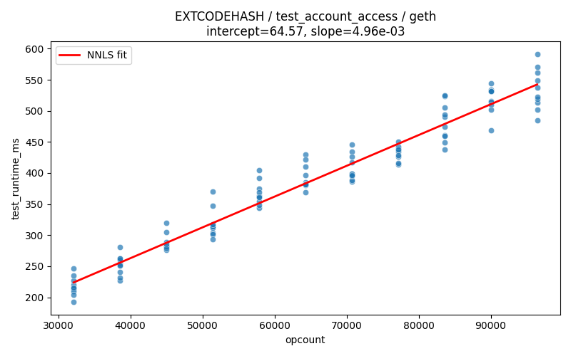

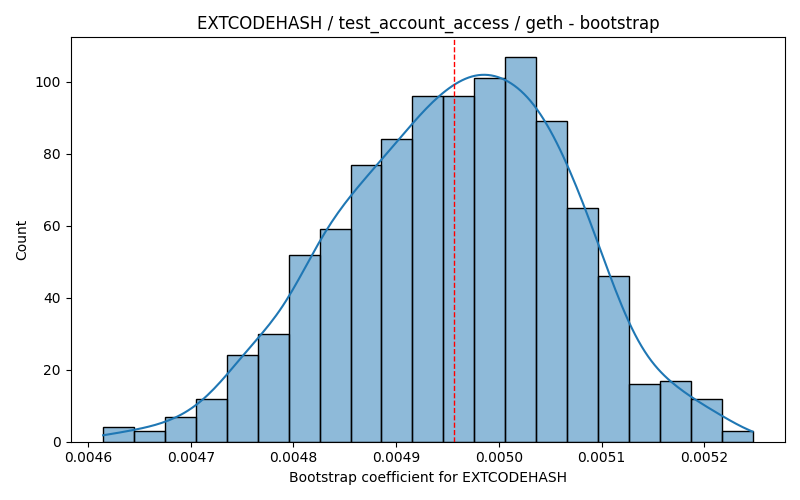

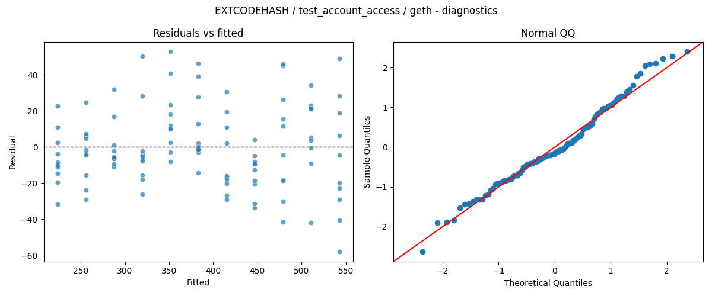

</details>

<details><summary>nethermind — NNLS regression summary</summary>

```
==============================================================================
                           NNLS Regression Results                            
==============================================================================
Dep. Variable:          test_runtime_ms              R-squared:          0.820
Model:                  NNLS                    Adj. R-squared:          0.815
No. Observations:       44                                RMSE:          21.91
Df Residuals:           42                                 MAE:          18.30
Df Model:               1      
==============================================================================
                      coef     std err     P-value      [0.025      0.975]
------------------------------------------------------------------------------
         const     94.9868     10.1534       0.001     75.3009    115.7075
       opcount      0.0023      0.0002       0.001      0.0020      0.0026
==============================================================================
Notes: Non-negative least squares with bootstrap inference (1000 iterations)
==============================================================================
```

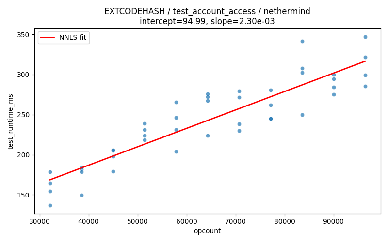

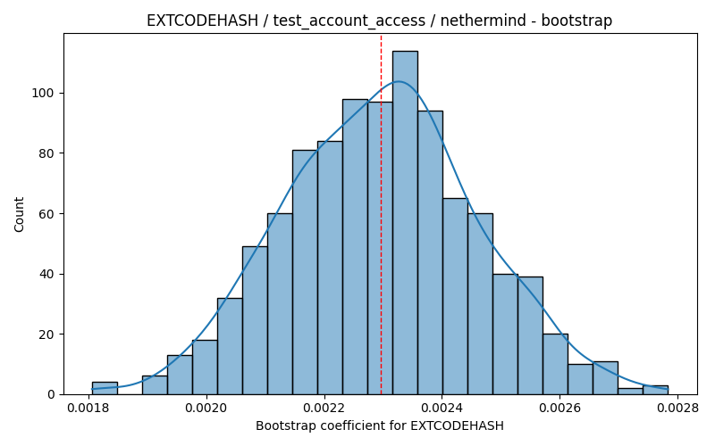

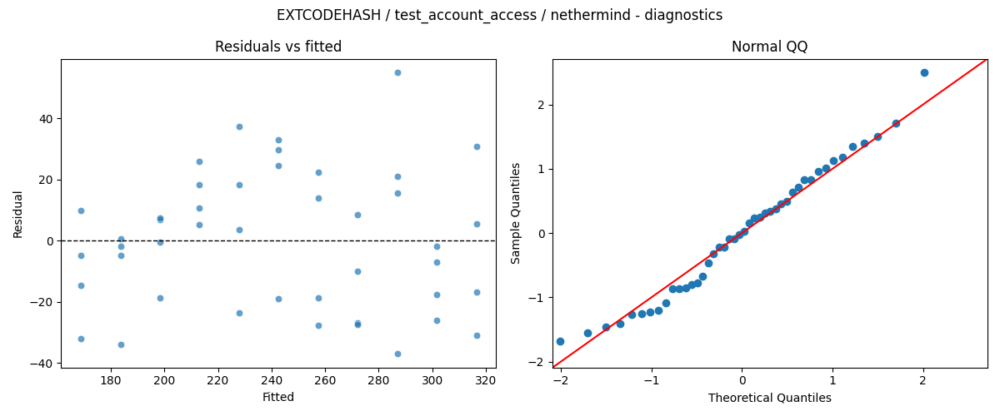

</details>

<details><summary>reth — NNLS regression summary</summary>

```
==============================================================================
                           NNLS Regression Results                            
==============================================================================
Dep. Variable:          test_runtime_ms              R-squared:          0.972
Model:                  NNLS                    Adj. R-squared:          0.971
No. Observations:       110                               RMSE:          12.41
Df Residuals:           108                                MAE:           9.42
Df Model:               1      
==============================================================================
                      coef     std err     P-value      [0.025      0.975]
------------------------------------------------------------------------------
         const     84.9516      3.5812       0.001     77.8258     91.7983
       opcount      0.0036      0.0001       0.001      0.0035      0.0037
==============================================================================
Notes: Non-negative least squares with bootstrap inference (1000 iterations)
==============================================================================
```

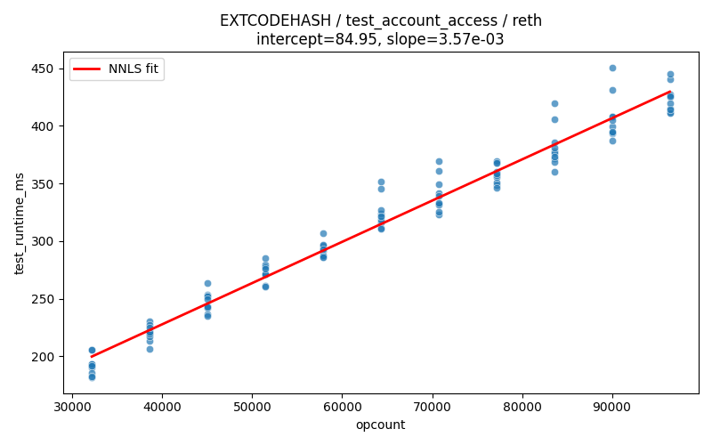

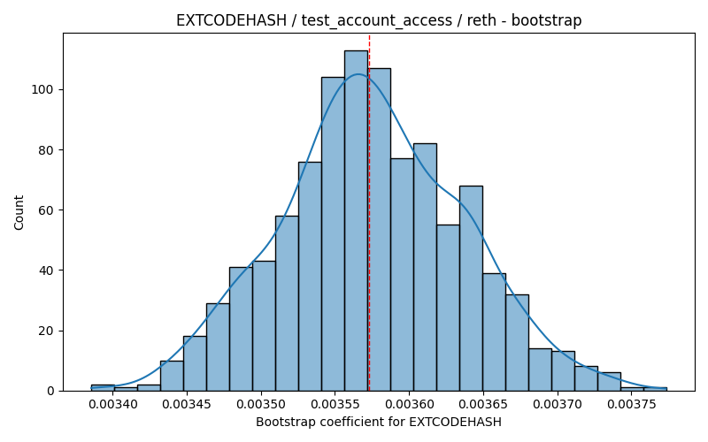

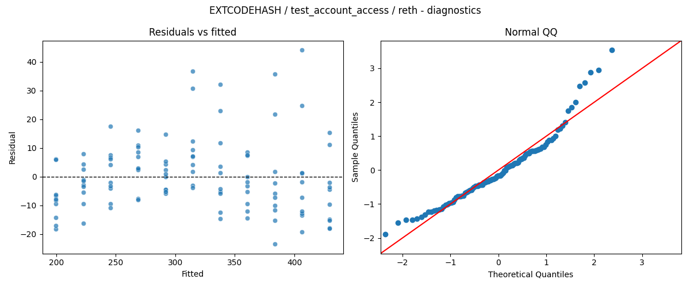

</details>

### test_account_access — combo `EXTCODEHASH_AccountMode.EXISTING_CONTRACT_SAME_MAX`

| client | nobs | R² | target_coef (ms) | p-value | 95% CI |
| --- | --- | --- | --- | --- | --- |
| `besu` | 66 | 0.9651 | 0.01047 | 1.00e-03 | [0.009898, 0.01097] |
| `erigon` | 11 | 0.9836 | 0.008419 | 1.00e-03 | [0.007457, 0.009016] |
| `geth` | 109 | 0.9459 | 0.005113 | 1.00e-03 | [0.004897, 0.005376] |
| `nethermind` | 44 | 0.7825 | 0.002223 | 1.00e-03 | [0.001928, 0.002501] |
| `reth` | 110 | 0.9755 | 0.003632 | 1.00e-03 | [0.003511, 0.003754] |

<details><summary>besu — NNLS regression summary</summary>

```
==============================================================================
                           NNLS Regression Results                            
==============================================================================
Dep. Variable:          test_runtime_ms              R-squared:          0.965
Model:                  NNLS                    Adj. R-squared:          0.965
No. Observations:       66                                RMSE:          40.47
Df Residuals:           64                                 MAE:          31.51
Df Model:               1      
==============================================================================
                      coef     std err     P-value      [0.025      0.975]
------------------------------------------------------------------------------
         const    427.3671     18.3537       0.001    395.9697    466.9952
       opcount      0.0105      0.0003       0.001      0.0099      0.0110
==============================================================================
Notes: Non-negative least squares with bootstrap inference (1000 iterations)
==============================================================================
```

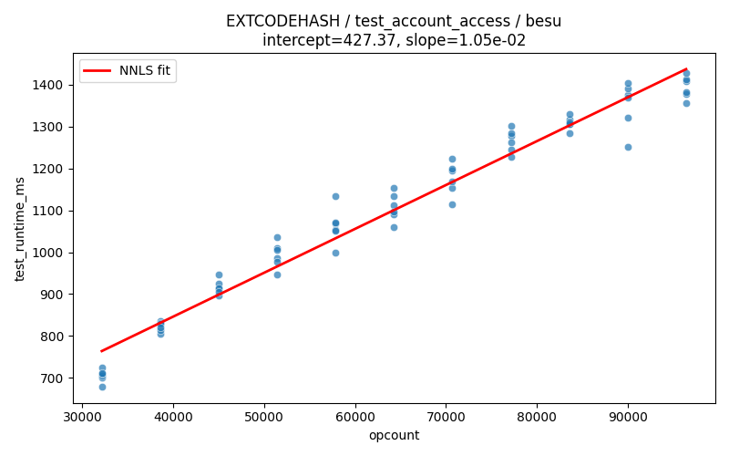

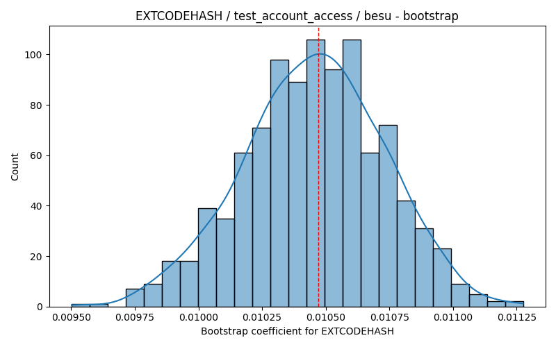

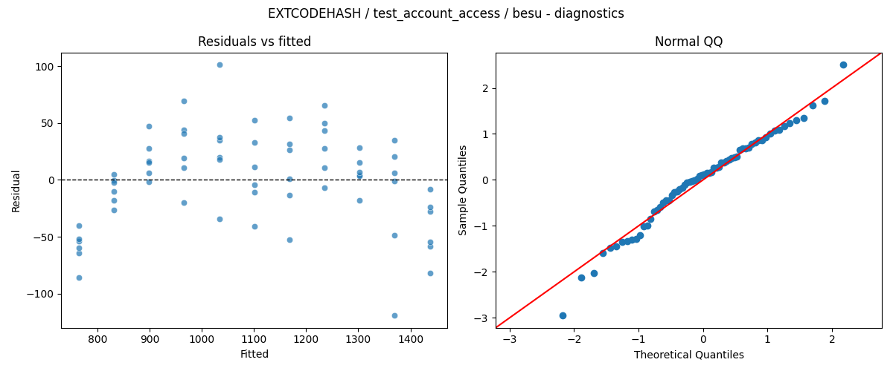

</details>

<details><summary>erigon — NNLS regression summary</summary>

```
==============================================================================
                           NNLS Regression Results                            
==============================================================================
Dep. Variable:          test_runtime_ms              R-squared:          0.984
Model:                  NNLS                    Adj. R-squared:          0.982
No. Observations:       11                                RMSE:          22.13
Df Residuals:           9                                  MAE:          19.86
Df Model:               1      
==============================================================================
                      coef     std err     P-value      [0.025      0.975]
------------------------------------------------------------------------------
         const    188.1927     29.5352       0.001    146.3157    257.5208
       opcount      0.0084      0.0004       0.001      0.0075      0.0090
==============================================================================
Notes: Non-negative least squares with bootstrap inference (1000 iterations)
==============================================================================
```

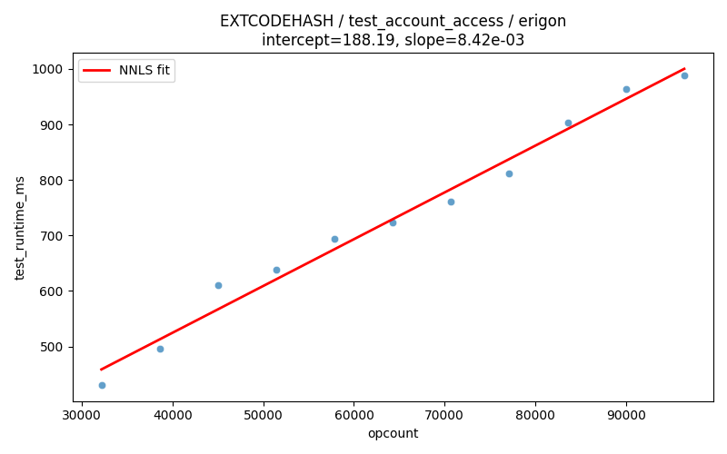

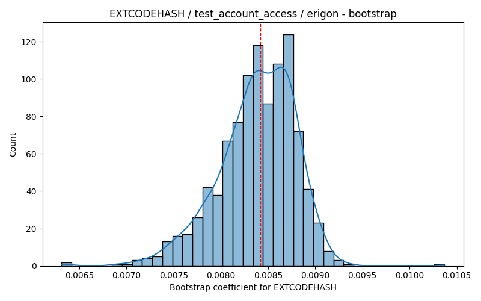

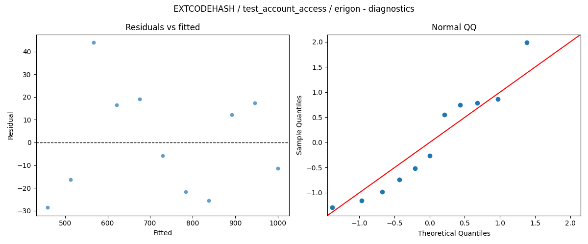

</details>

<details><summary>geth — NNLS regression summary</summary>

```
==============================================================================
                           NNLS Regression Results                            
==============================================================================
Dep. Variable:          test_runtime_ms              R-squared:          0.946
Model:                  NNLS                    Adj. R-squared:          0.945
No. Observations:       109                               RMSE:          24.95
Df Residuals:           107                                MAE:          20.14
Df Model:               1      
==============================================================================
                      coef     std err     P-value      [0.025      0.975]
------------------------------------------------------------------------------
         const     59.4671      7.6066       0.001     44.6705     74.0025
       opcount      0.0051      0.0001       0.001      0.0049      0.0054
==============================================================================
Notes: Non-negative least squares with bootstrap inference (1000 iterations)
==============================================================================
```

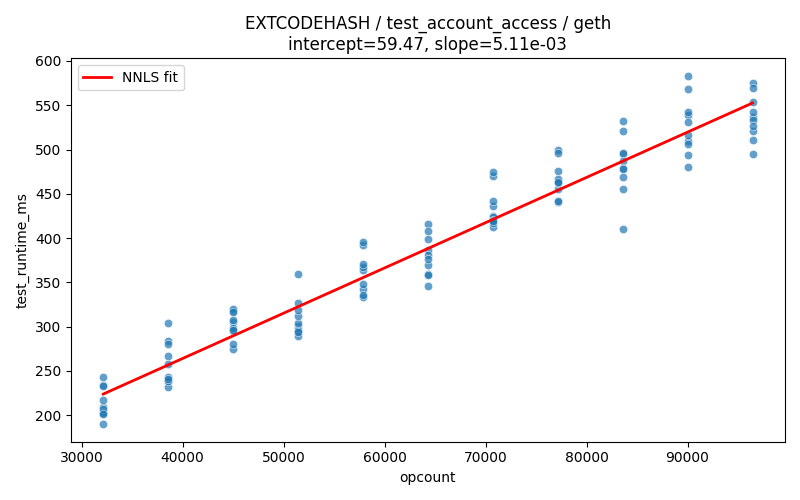

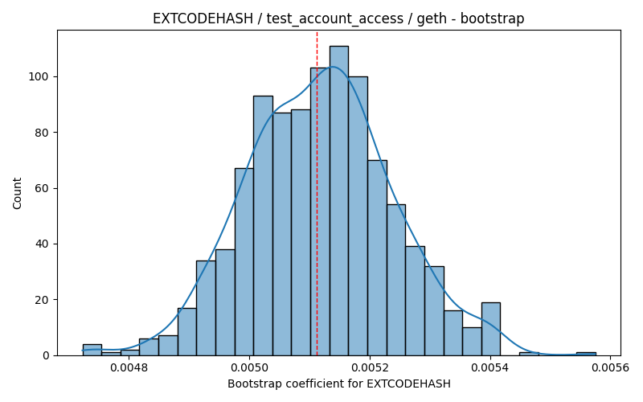

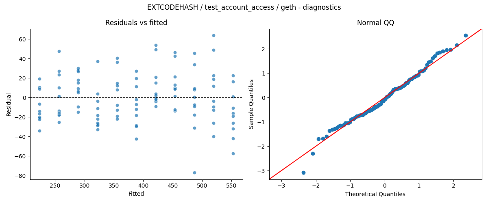

</details>

<details><summary>nethermind — NNLS regression summary</summary>

```
==============================================================================
                           NNLS Regression Results                            
==============================================================================
Dep. Variable:          test_runtime_ms              R-squared:          0.782
Model:                  NNLS                    Adj. R-squared:          0.777
No. Observations:       44                                RMSE:          23.83
Df Residuals:           42                                 MAE:          18.34
Df Model:               1      
==============================================================================
                      coef     std err     P-value      [0.025      0.975]
------------------------------------------------------------------------------
         const     91.7683     10.0142       0.001     72.9106    112.0165
       opcount      0.0022      0.0002       0.001      0.0019      0.0025
==============================================================================
Notes: Non-negative least squares with bootstrap inference (1000 iterations)
==============================================================================
```

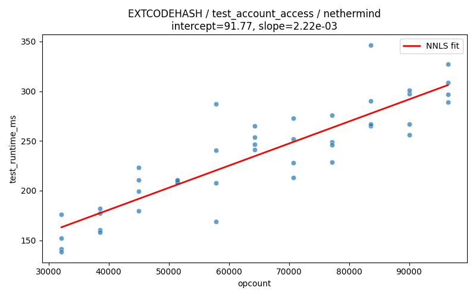

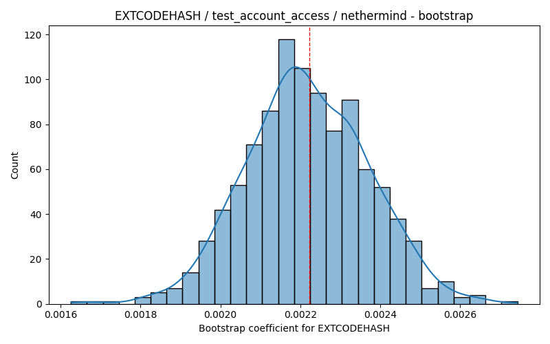

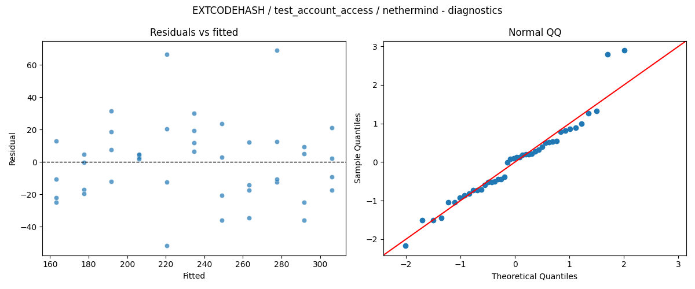

</details>

<details><summary>reth — NNLS regression summary</summary>

```
==============================================================================
                           NNLS Regression Results                            
==============================================================================
Dep. Variable:          test_runtime_ms              R-squared:          0.975
Model:                  NNLS                    Adj. R-squared:          0.975
No. Observations:       110                               RMSE:          11.71
Df Residuals:           108                                MAE:           9.17
Df Model:               1      
==============================================================================
                      coef     std err     P-value      [0.025      0.975]
------------------------------------------------------------------------------
         const     88.3477      3.7987       0.001     81.3455     96.0723
       opcount      0.0036      0.0001       0.001      0.0035      0.0038
==============================================================================
Notes: Non-negative least squares with bootstrap inference (1000 iterations)
==============================================================================
```

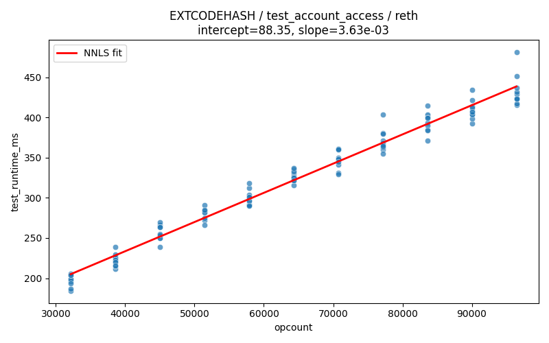

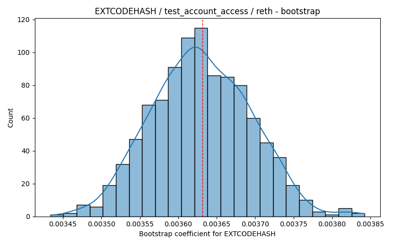

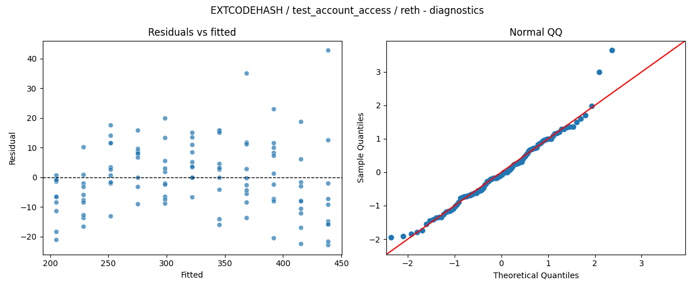

</details>

## EXTCODESIZE

### test_ext_account_query_warm — combo `EXTCODESIZE`

| client | nobs | R² | target_coef (ms) | p-value | 95% CI |
| --- | --- | --- | --- | --- | --- |
| `besu` | 66 | 0.8973 | 0.0001242 | 1.00e-03 | [0.0001142, 0.0001332] |
| `erigon` | 11 | 0.6832 | 1.869e-05 | 1.00e-03 | [1.126e-05, 3.046e-05] |
| `geth` | 110 | 0.7147 | 3.19e-05 | 1.00e-03 | [2.83e-05, 3.566e-05] |
| `nethermind` | 44 | 0.6882 | 0.0002198 | 1.00e-03 | [0.0001768, 0.0002645] |
| `reth` | 110 | 0.5165 | 1.043e-05 | 1.00e-03 | [8.627e-06, 1.225e-05] |

<details><summary>besu — NNLS regression summary</summary>

```
==============================================================================
                           NNLS Regression Results                            
==============================================================================
Dep. Variable:          test_runtime_ms              R-squared:          0.897
Model:                  NNLS                    Adj. R-squared:          0.896
No. Observations:       66                                RMSE:          12.76
Df Residuals:           64                                 MAE:           9.95
Df Model:               1      
==============================================================================
                      coef     std err     P-value      [0.025      0.975]
------------------------------------------------------------------------------
         const     92.1856      4.4494       0.001     84.0198    101.3043
       opcount      0.0001      0.0000       0.001      0.0001      0.0001
==============================================================================
Notes: Non-negative least squares with bootstrap inference (1000 iterations)
==============================================================================
```

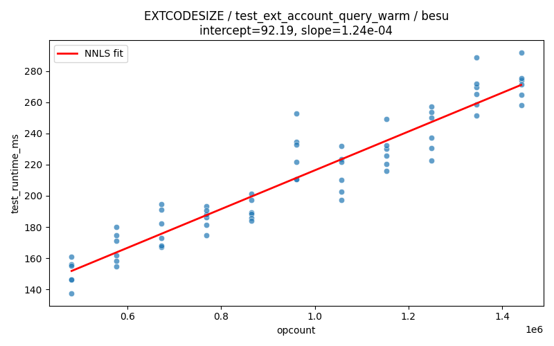

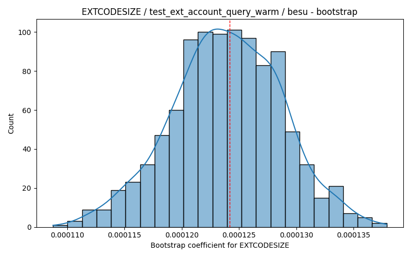

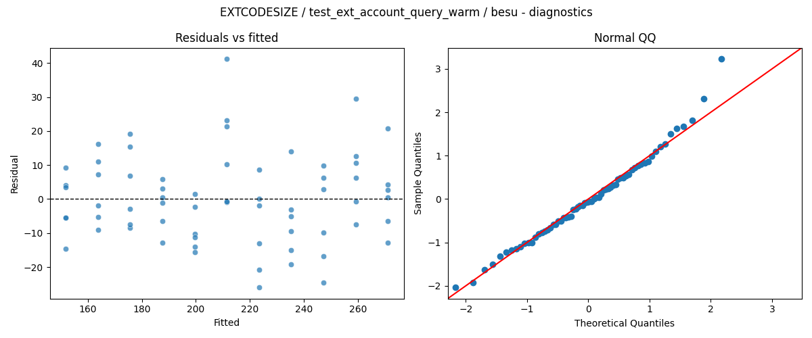

</details>

<details><summary>erigon — NNLS regression summary</summary>

```
==============================================================================
                           NNLS Regression Results                            
==============================================================================
Dep. Variable:          test_runtime_ms              R-squared:          0.683
Model:                  NNLS                    Adj. R-squared:          0.648
No. Observations:       11                                RMSE:           3.87
Df Residuals:           9                                  MAE:           3.07
Df Model:               1      
==============================================================================
                      coef     std err     P-value      [0.025      0.975]
------------------------------------------------------------------------------
         const     20.4571      5.7897       0.001      7.2341     28.8273
       opcount      0.0000      0.0000       0.001      0.0000      0.0000
==============================================================================
Notes: Non-negative least squares with bootstrap inference (1000 iterations)
==============================================================================
```

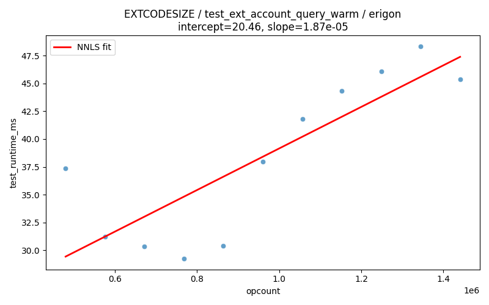

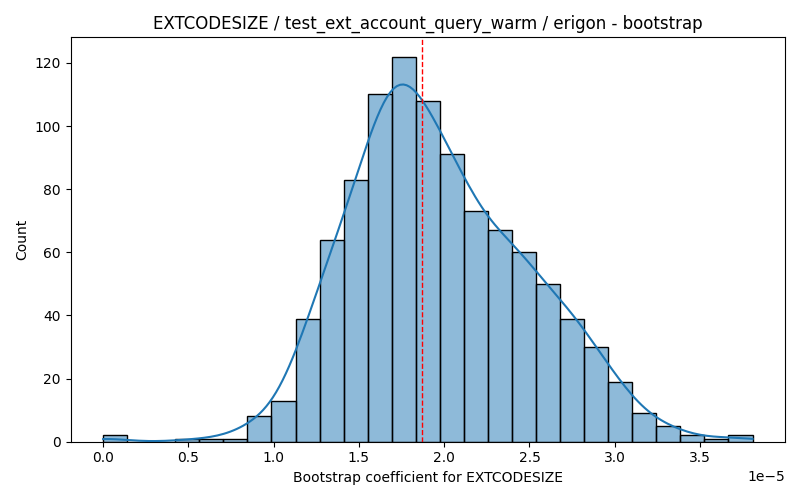

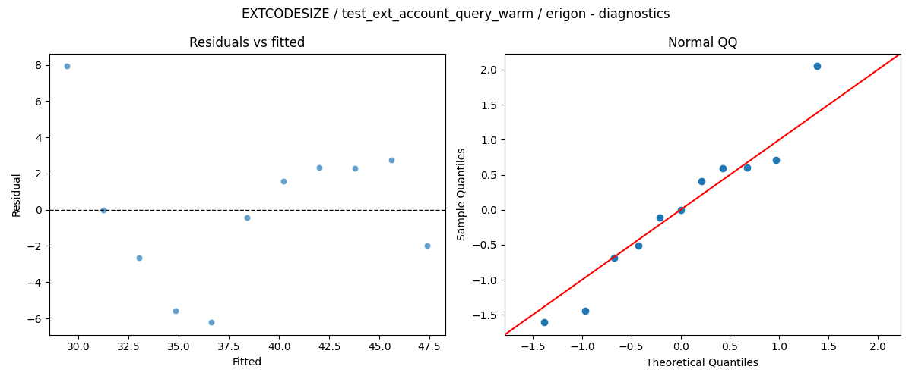

</details>

<details><summary>geth — NNLS regression summary</summary>

```
==============================================================================
                           NNLS Regression Results                            
==============================================================================
Dep. Variable:          test_runtime_ms              R-squared:          0.715
Model:                  NNLS                    Adj. R-squared:          0.712
No. Observations:       110                               RMSE:           6.12
Df Residuals:           108                                MAE:           4.21
Df Model:               1      
==============================================================================
                      coef     std err     P-value      [0.025      0.975]
------------------------------------------------------------------------------
         const     10.5939      1.6796       0.001      7.3305     13.9118
       opcount      0.0000      0.0000       0.001      0.0000      0.0000
==============================================================================
Notes: Non-negative least squares with bootstrap inference (1000 iterations)
==============================================================================
```

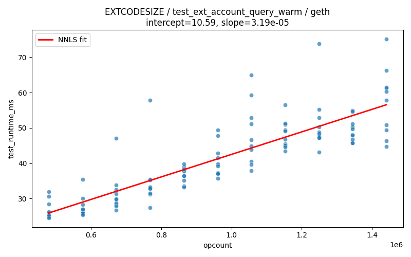

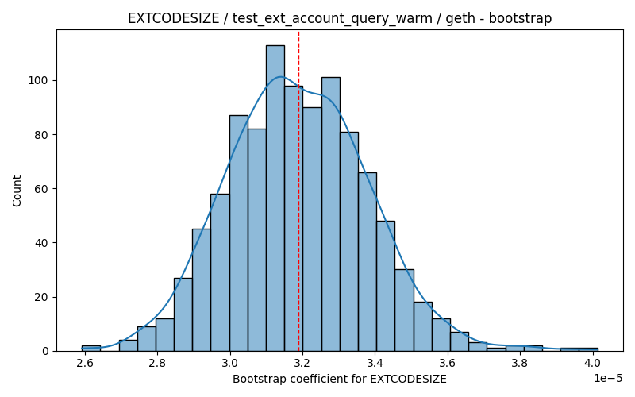

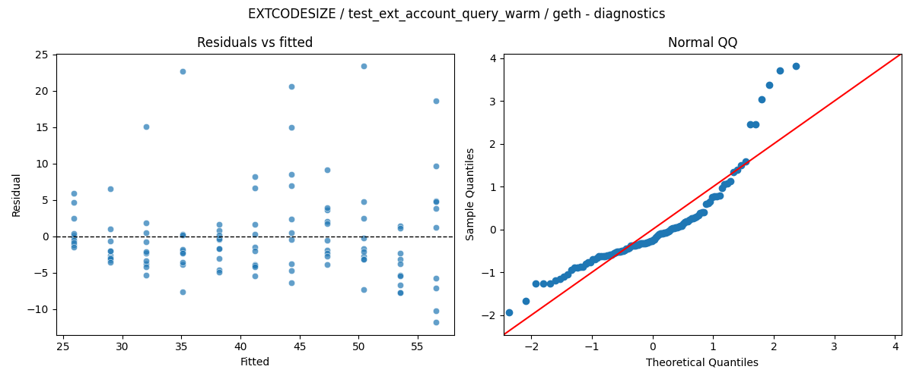

</details>

<details><summary>nethermind — NNLS regression summary</summary>

```
==============================================================================
                           NNLS Regression Results                            
==============================================================================
Dep. Variable:          test_runtime_ms              R-squared:          0.688
Model:                  NNLS                    Adj. R-squared:          0.681
No. Observations:       44                                RMSE:          44.93
Df Residuals:           42                                 MAE:          36.84
Df Model:               1      
==============================================================================
                      coef     std err     P-value      [0.025      0.975]
------------------------------------------------------------------------------
         const     73.5353     22.3507       0.001     27.7986    114.8138
       opcount      0.0002      0.0000       0.001      0.0002      0.0003
==============================================================================
Notes: Non-negative least squares with bootstrap inference (1000 iterations)
==============================================================================
```

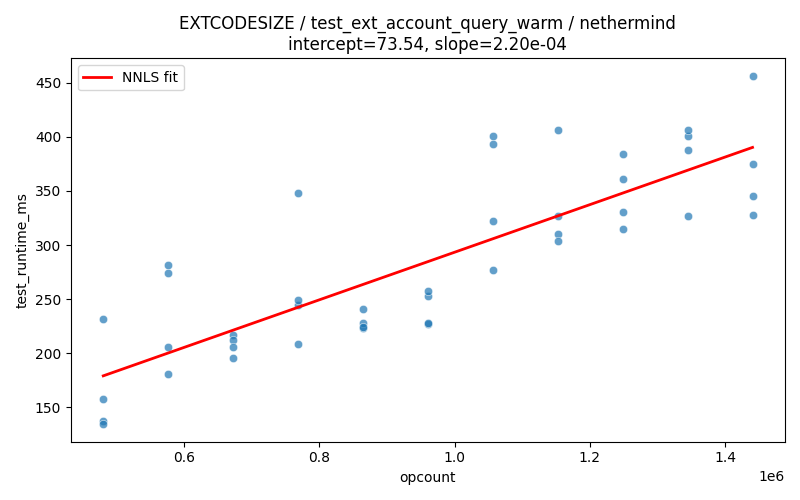

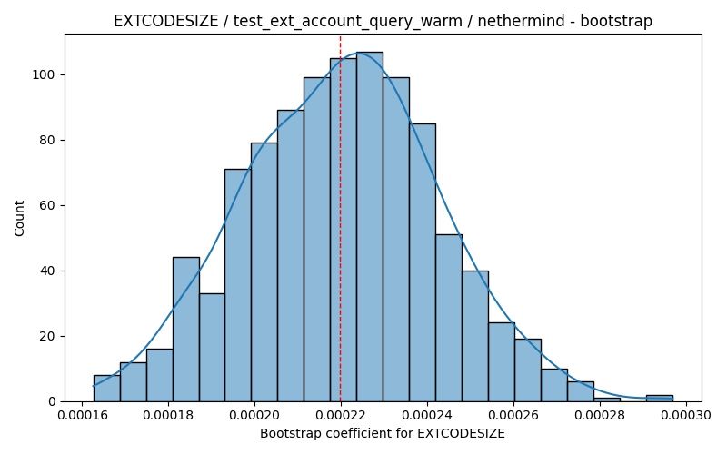

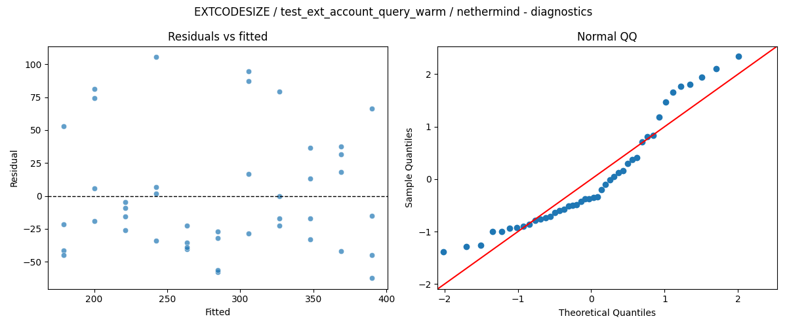

</details>

<details><summary>reth — NNLS regression summary</summary>

```
==============================================================================
                           NNLS Regression Results                            
==============================================================================
Dep. Variable:          test_runtime_ms              R-squared:          0.516
Model:                  NNLS                    Adj. R-squared:          0.512
No. Observations:       110                               RMSE:           3.06
Df Residuals:           108                                MAE:           2.18
Df Model:               1      
==============================================================================
                      coef     std err     P-value      [0.025      0.975]
------------------------------------------------------------------------------
         const      5.3240      0.8455       0.001      3.7224      7.0243
       opcount      0.0000      0.0000       0.001      0.0000      0.0000
==============================================================================
Notes: Non-negative least squares with bootstrap inference (1000 iterations)
==============================================================================
```

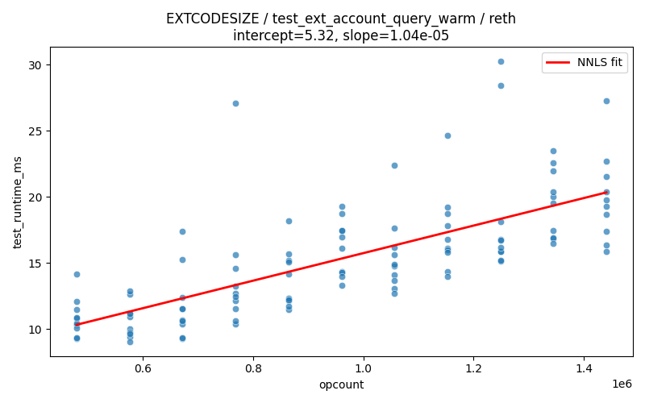

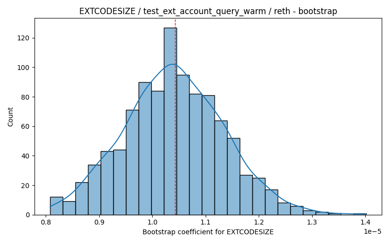

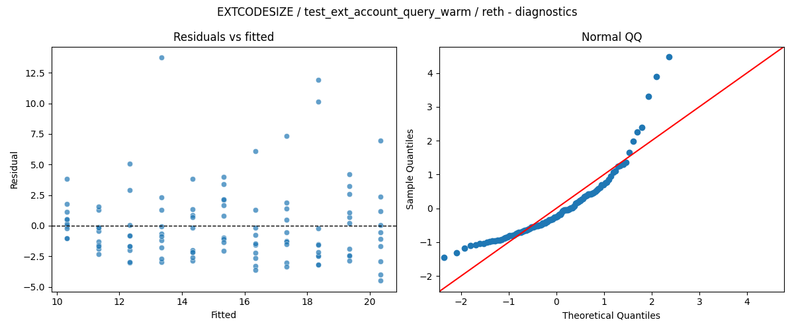

</details>

### test_account_access — combo `EXTCODESIZE_AccountMode.EXISTING_EOA`

| client | nobs | R² | target_coef (ms) | p-value | 95% CI |
| --- | --- | --- | --- | --- | --- |
| `besu` | 66 | 0.9881 | 0.01434 | 1.00e-03 | [0.01396, 0.01473] |
| `erigon` | 11 | 0.9936 | 0.007895 | 1.00e-03 | [0.007728, 0.008019] |
| `geth` | 110 | 0.9751 | 0.0114 | 1.00e-03 | [0.01101, 0.01178] |
| `nethermind` | 44 | 0.9066 | 0.002949 | 1.00e-03 | [0.002701, 0.003206] |
| `reth` | 110 | 0.9408 | 0.001208 | 1.00e-03 | [0.001155, 0.001262] |

<details><summary>besu — NNLS regression summary</summary>

```
==============================================================================
                           NNLS Regression Results                            
==============================================================================
Dep. Variable:          test_runtime_ms              R-squared:          0.988
Model:                  NNLS                    Adj. R-squared:          0.988
No. Observations:       66                                RMSE:          31.45
Df Residuals:           64                                 MAE:          26.13
Df Model:               1      
==============================================================================
                      coef     std err     P-value      [0.025      0.975]
------------------------------------------------------------------------------
         const    469.2144     12.9209       0.001    441.5186    493.3902
       opcount      0.0143      0.0002       0.001      0.0140      0.0147
==============================================================================
Notes: Non-negative least squares with bootstrap inference (1000 iterations)
==============================================================================
```

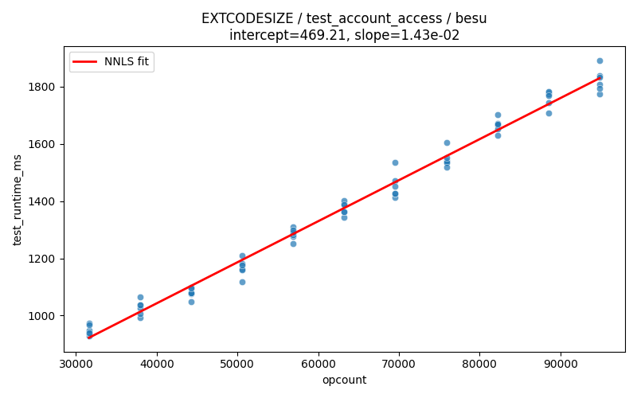

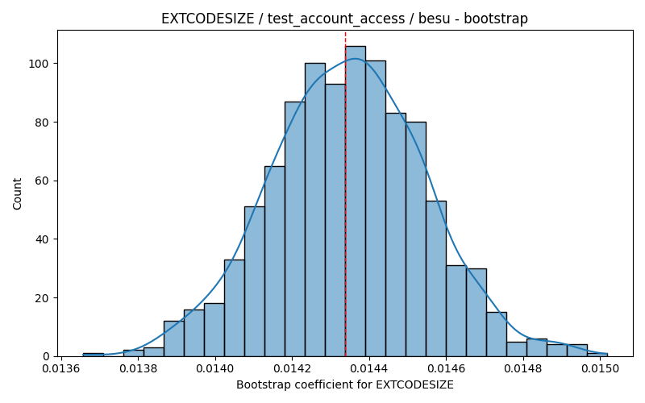

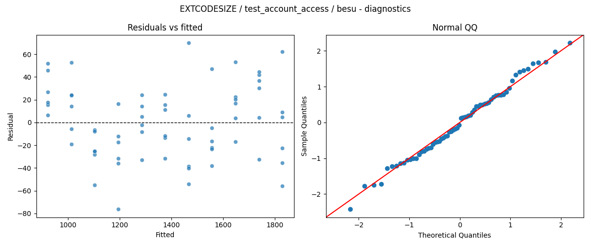

</details>

<details><summary>erigon — NNLS regression summary</summary>

```
==============================================================================
                           NNLS Regression Results                            
==============================================================================
Dep. Variable:          test_runtime_ms              R-squared:          0.994
Model:                  NNLS                    Adj. R-squared:          0.993
No. Observations:       11                                RMSE:          13.18
Df Residuals:           9                                  MAE:          12.05
Df Model:               1      
==============================================================================
                      coef     std err     P-value      [0.025      0.975]
------------------------------------------------------------------------------
         const      0.0000      1.5161       1.000      0.0000      0.0000
       opcount      0.0079      0.0001       0.001      0.0077      0.0080
==============================================================================
Notes: Non-negative least squares with bootstrap inference (1000 iterations)
==============================================================================
```


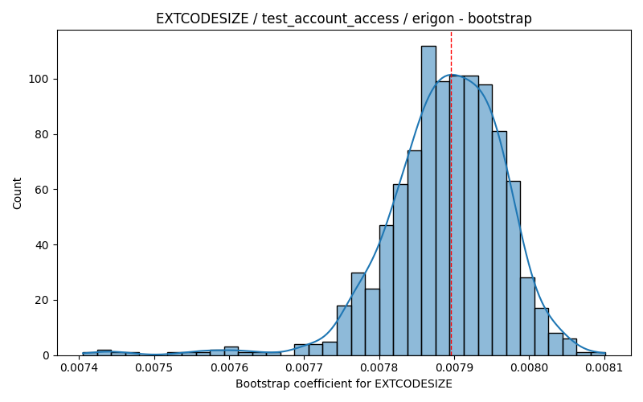

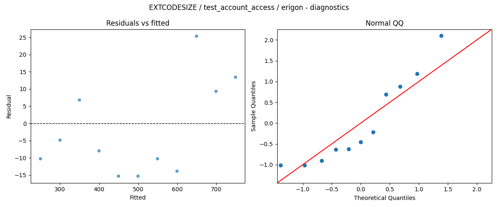

</details>

<details><summary>geth — NNLS regression summary</summary>

```
==============================================================================
                           NNLS Regression Results                            
==============================================================================
Dep. Variable:          test_runtime_ms              R-squared:          0.975
Model:                  NNLS                    Adj. R-squared:          0.975
No. Observations:       110                               RMSE:          36.42
Df Residuals:           108                                MAE:          30.28
Df Model:               1      
==============================================================================
                      coef     std err     P-value      [0.025      0.975]
------------------------------------------------------------------------------
         const    231.2261     12.4118       0.001    207.8013    256.4688
       opcount      0.0114      0.0002       0.001      0.0110      0.0118
==============================================================================
Notes: Non-negative least squares with bootstrap inference (1000 iterations)
==============================================================================
```

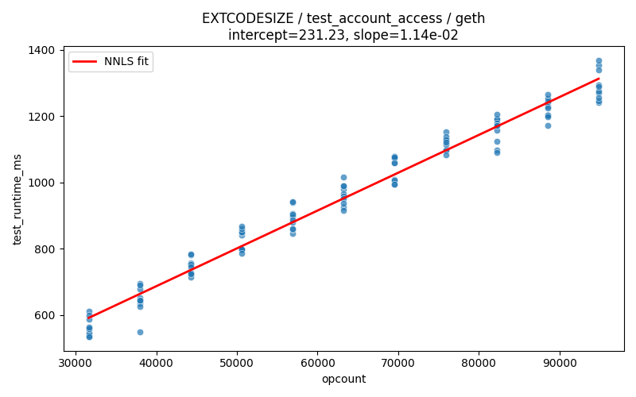

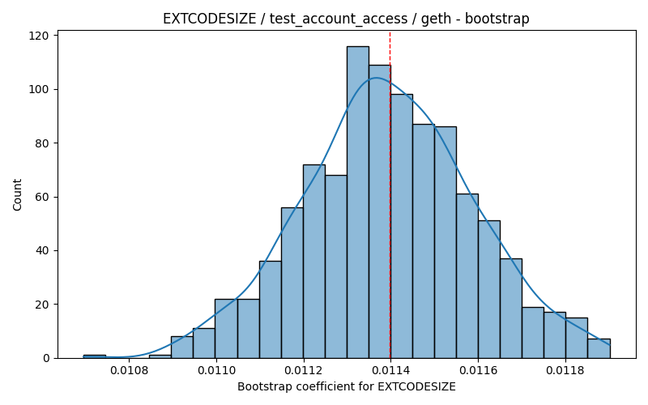

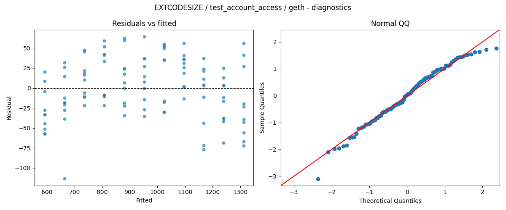

</details>

<details><summary>nethermind — NNLS regression summary</summary>

```
==============================================================================
                           NNLS Regression Results                            
==============================================================================
Dep. Variable:          test_runtime_ms              R-squared:          0.907
Model:                  NNLS                    Adj. R-squared:          0.904
No. Observations:       44                                RMSE:          18.93
Df Residuals:           42                                 MAE:          15.56
Df Model:               1      
==============================================================================
                      coef     std err     P-value      [0.025      0.975]
------------------------------------------------------------------------------
         const    109.7744      8.2922       0.001     94.8485    126.0721
       opcount      0.0029      0.0001       0.001      0.0027      0.0032
==============================================================================
Notes: Non-negative least squares with bootstrap inference (1000 iterations)
==============================================================================
```

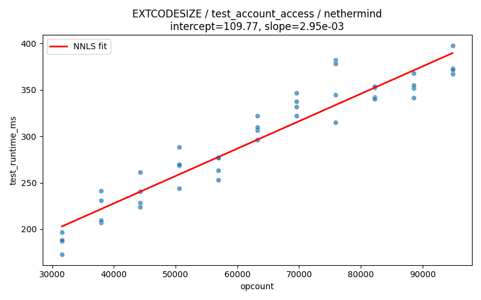

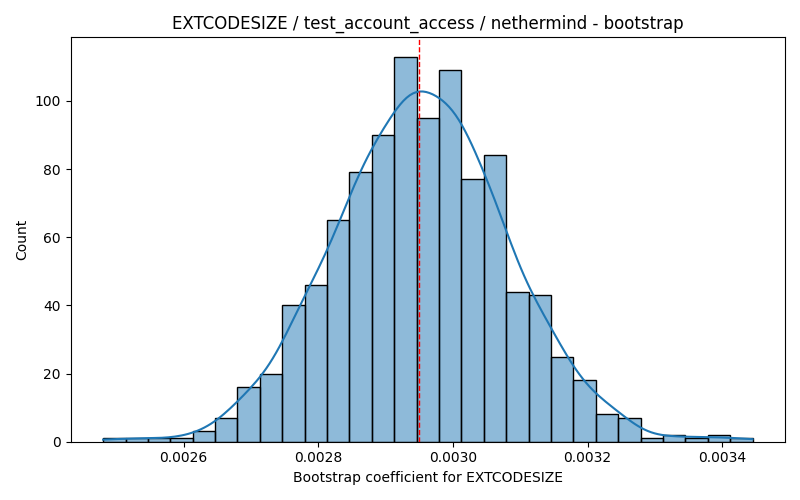

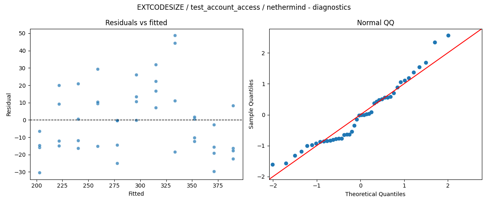

</details>

<details><summary>reth — NNLS regression summary</summary>

```
==============================================================================
                           NNLS Regression Results                            
==============================================================================
Dep. Variable:          test_runtime_ms              R-squared:          0.941
Model:                  NNLS                    Adj. R-squared:          0.940
No. Observations:       110                               RMSE:           6.06
Df Residuals:           108                                MAE:           4.57
Df Model:               1      
==============================================================================
                      coef     std err     P-value      [0.025      0.975]
------------------------------------------------------------------------------
         const     32.8830      1.8799       0.001     29.2942     36.5674
       opcount      0.0012      0.0000       0.001      0.0012      0.0013
==============================================================================
Notes: Non-negative least squares with bootstrap inference (1000 iterations)
==============================================================================
```

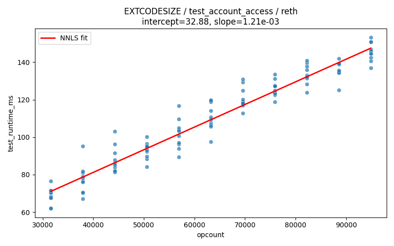

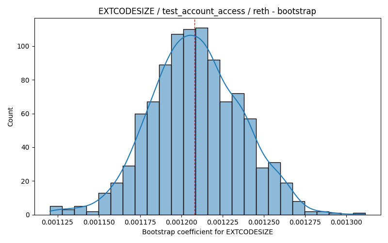

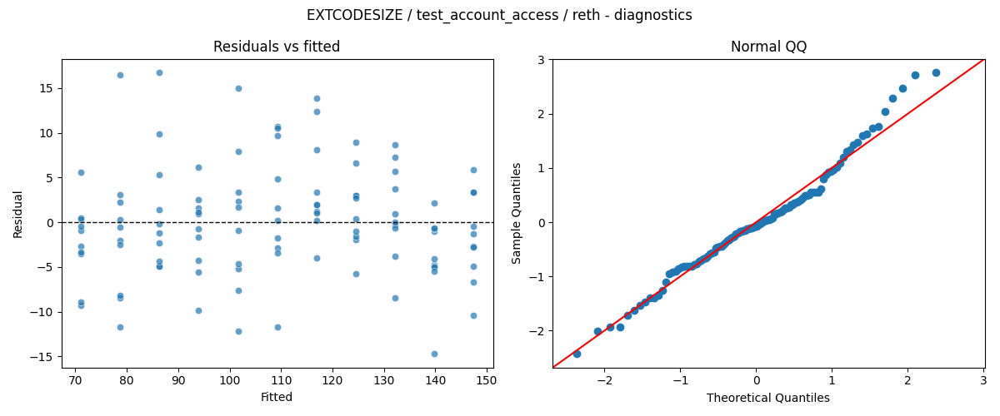

</details>

### test_account_access — combo `EXTCODESIZE_AccountMode.NON_EXISTING_ACCOUNT`

| client | nobs | R² | target_coef (ms) | p-value | 95% CI |
| --- | --- | --- | --- | --- | --- |
| `besu` | 66 | 0.9896 | 0.01452 | 1.00e-03 | [0.01422, 0.01488] |
| `erigon` | 11 | 0.9954 | 0.007837 | 1.00e-03 | [0.007713, 0.007946] |
| `geth` | 107 | 0.9789 | 0.02165 | 1.00e-03 | [0.02103, 0.02231] |
| `nethermind` | 44 | 0.8908 | 0.002984 | 1.00e-03 | [0.002677, 0.003365] |
| `reth` | 110 | 0.906 | 0.0008999 | 1.00e-03 | [0.0008443, 0.0009625] |

<details><summary>besu — NNLS regression summary</summary>

```
==============================================================================
                           NNLS Regression Results                            
==============================================================================
Dep. Variable:          test_runtime_ms              R-squared:          0.990
Model:                  NNLS                    Adj. R-squared:          0.989
No. Observations:       66                                RMSE:          29.76
Df Residuals:           64                                 MAE:          24.19
Df Model:               1      
==============================================================================
                      coef     std err     P-value      [0.025      0.975]
------------------------------------------------------------------------------
         const    125.1755     11.0707       0.001    101.2049    144.7066
       opcount      0.0145      0.0002       0.001      0.0142      0.0149
==============================================================================
Notes: Non-negative least squares with bootstrap inference (1000 iterations)
==============================================================================
```

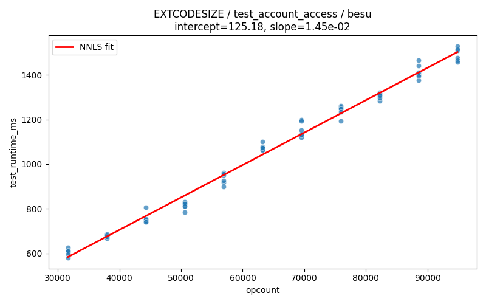

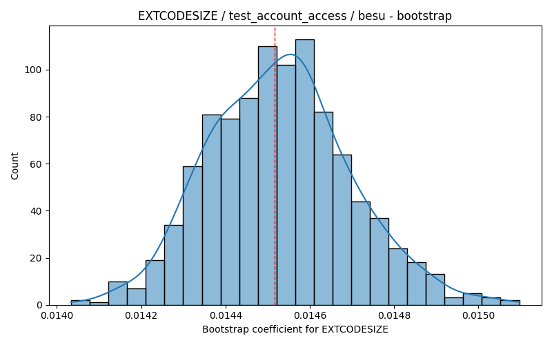

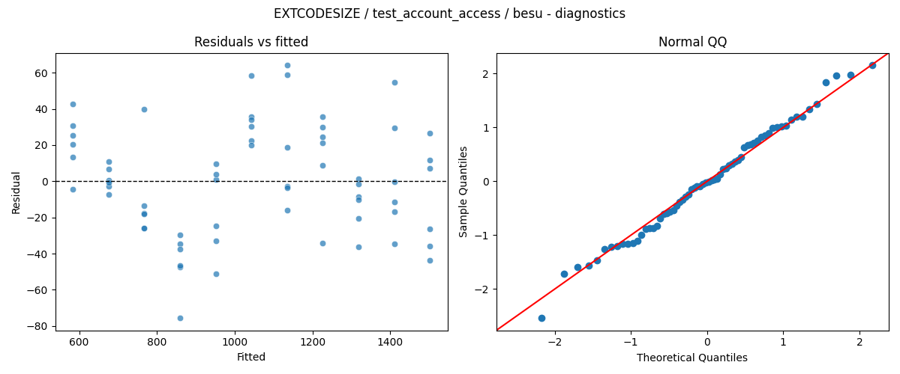

</details>

<details><summary>erigon — NNLS regression summary</summary>

```
==============================================================================
                           NNLS Regression Results                            
==============================================================================
Dep. Variable:          test_runtime_ms              R-squared:          0.995
Model:                  NNLS                    Adj. R-squared:          0.995
No. Observations:       11                                RMSE:          10.91
Df Residuals:           9                                  MAE:           7.61
Df Model:               1      
==============================================================================
                      coef     std err     P-value      [0.025      0.975]
------------------------------------------------------------------------------
         const      0.0000      0.8066       1.000      0.0000      0.6238
       opcount      0.0078      0.0001       0.001      0.0077      0.0079
==============================================================================
Notes: Non-negative least squares with bootstrap inference (1000 iterations)
==============================================================================
```


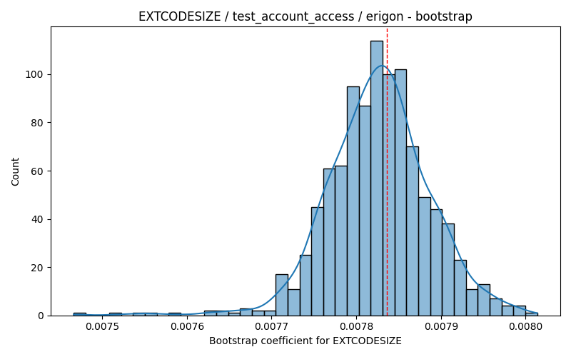

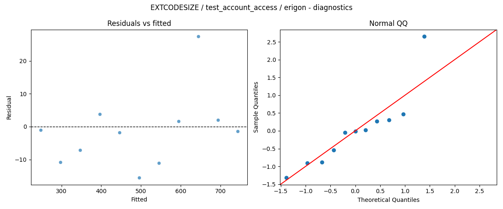

</details>

<details><summary>geth — NNLS regression summary</summary>

```
==============================================================================
                           NNLS Regression Results                            
==============================================================================
Dep. Variable:          test_runtime_ms              R-squared:          0.979
Model:                  NNLS                    Adj. R-squared:          0.979
No. Observations:       107                               RMSE:          64.36
Df Residuals:           105                                MAE:          49.98
Df Model:               1      
==============================================================================
                      coef     std err     P-value      [0.025      0.975]
------------------------------------------------------------------------------
         const    283.1370     17.9775       0.001    247.4865    319.8180
       opcount      0.0216      0.0003       0.001      0.0210      0.0223
==============================================================================
Notes: Non-negative least squares with bootstrap inference (1000 iterations)
==============================================================================
```

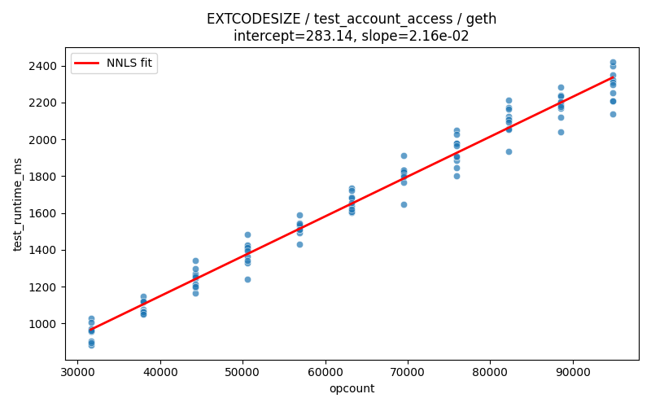

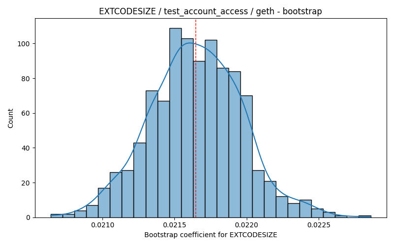

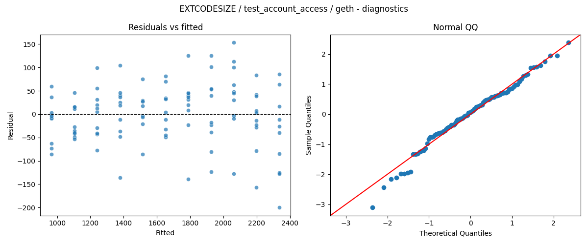

</details>

<details><summary>nethermind — NNLS regression summary</summary>

```
==============================================================================
                           NNLS Regression Results                            
==============================================================================
Dep. Variable:          test_runtime_ms              R-squared:          0.891
Model:                  NNLS                    Adj. R-squared:          0.888
No. Observations:       44                                RMSE:          20.89
Df Residuals:           42                                 MAE:          17.27
Df Model:               1      
==============================================================================
                      coef     std err     P-value      [0.025      0.975]
------------------------------------------------------------------------------
         const     72.1530     10.1449       0.001     50.7335     90.7863
       opcount      0.0030      0.0002       0.001      0.0027      0.0034
==============================================================================
Notes: Non-negative least squares with bootstrap inference (1000 iterations)
==============================================================================
```

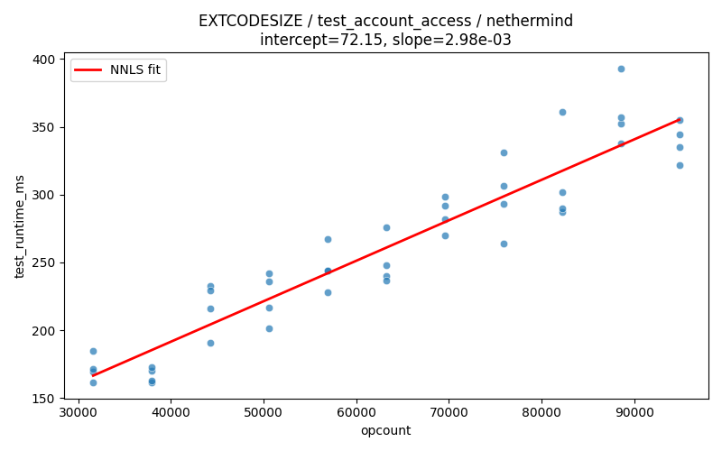

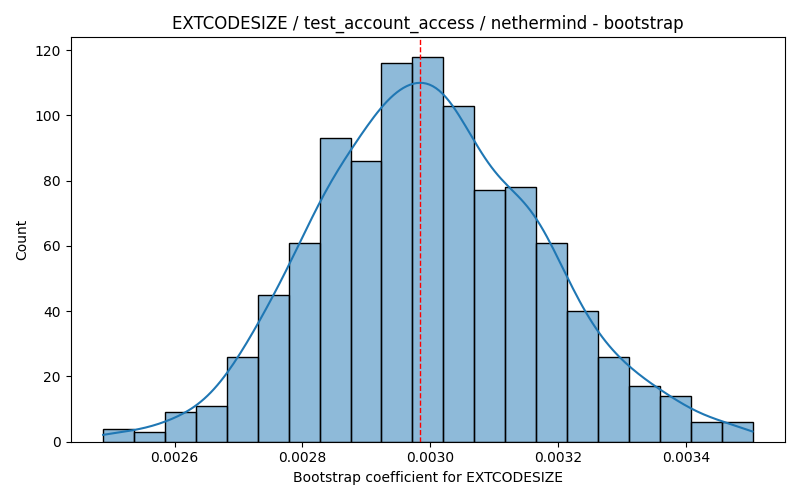

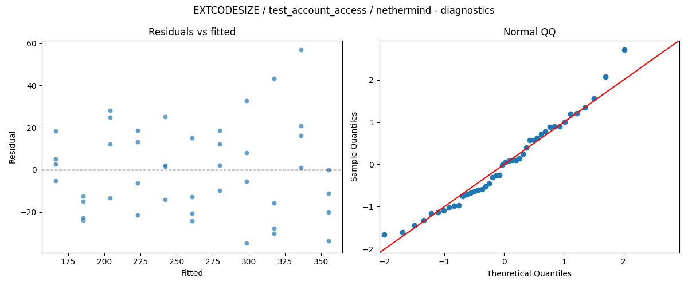

</details>

<details><summary>reth — NNLS regression summary</summary>

```
==============================================================================
                           NNLS Regression Results                            
==============================================================================
Dep. Variable:          test_runtime_ms              R-squared:          0.906
Model:                  NNLS                    Adj. R-squared:          0.905
No. Observations:       110                               RMSE:           5.80
Df Residuals:           108                                MAE:           4.69
Df Model:               1      
==============================================================================
                      coef     std err     P-value      [0.025      0.975]
------------------------------------------------------------------------------
         const     34.3888      1.7363       0.001     30.7002     37.6917
       opcount      0.0009      0.0000       0.001      0.0008      0.0010
==============================================================================
Notes: Non-negative least squares with bootstrap inference (1000 iterations)
==============================================================================
```

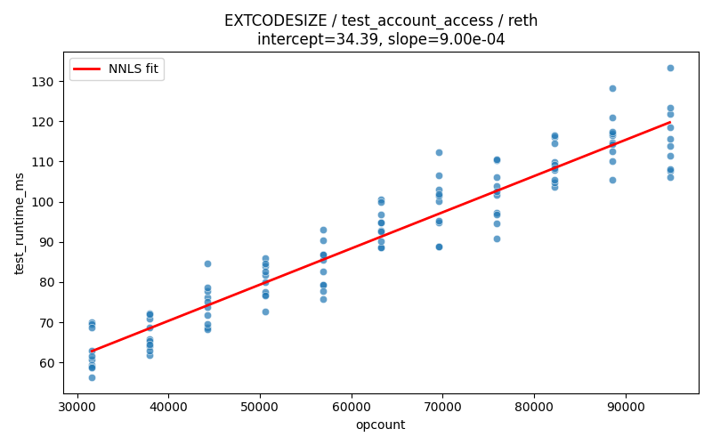

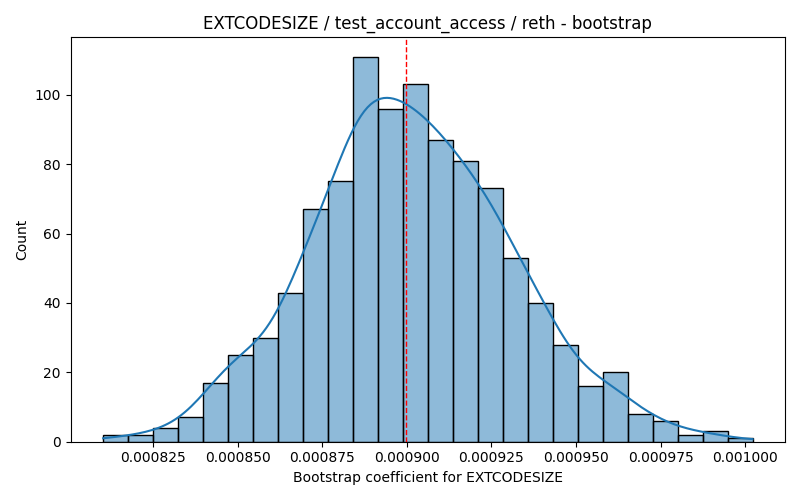

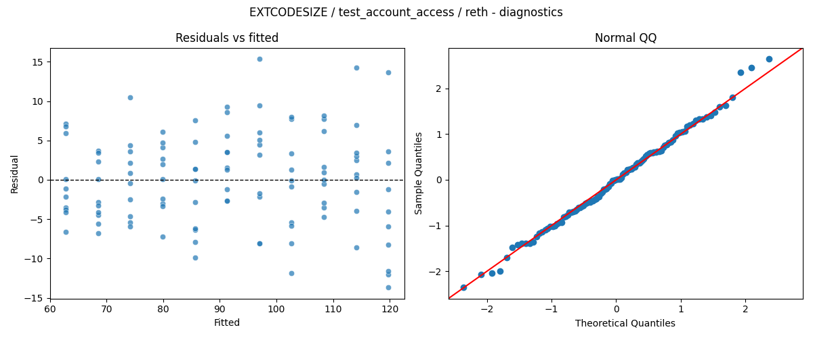

</details>

### test_account_access — combo `EXTCODESIZE_AccountMode.EXISTING_CONTRACT_DIFF_MAX`

| client | nobs | R² | target_coef (ms) | p-value | 95% CI |
| --- | --- | --- | --- | --- | --- |
| `besu` | 66 | 0.9848 | 0.01957 | 1.00e-03 | [0.01896, 0.02009] |
| `erigon` | 11 | 0.8867 | 0.1373 | 1.00e-03 | [0.1006, 0.1554] |
| `geth` | 108 | 0.9338 | 0.02165 | 1.00e-03 | [0.02041, 0.02288] |
| `nethermind` | 44 | 0.8817 | 0.01492 | 1.00e-03 | [0.01277, 0.01677] |
| `reth` | 110 | 0.9939 | 0.02046 | 1.00e-03 | [0.02017, 0.02077] |

<details><summary>besu — NNLS regression summary</summary>

```
==============================================================================
                           NNLS Regression Results                            
==============================================================================
Dep. Variable:          test_runtime_ms              R-squared:          0.985
Model:                  NNLS                    Adj. R-squared:          0.985
No. Observations:       66                                RMSE:          47.82
Df Residuals:           64                                 MAE:          39.76
Df Model:               1      
==============================================================================
                      coef     std err     P-value      [0.025      0.975]
------------------------------------------------------------------------------
         const    418.2536     17.8526       0.001    385.1887    456.4023
       opcount      0.0196      0.0003       0.001      0.0190      0.0201
==============================================================================
Notes: Non-negative least squares with bootstrap inference (1000 iterations)
==============================================================================
```

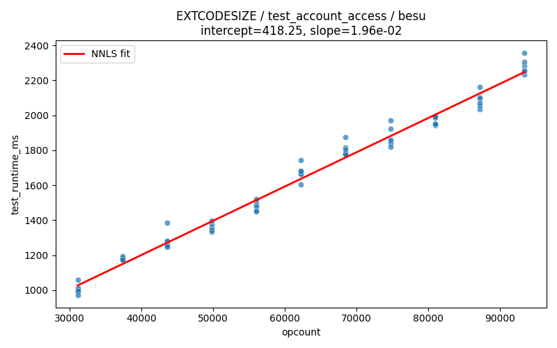

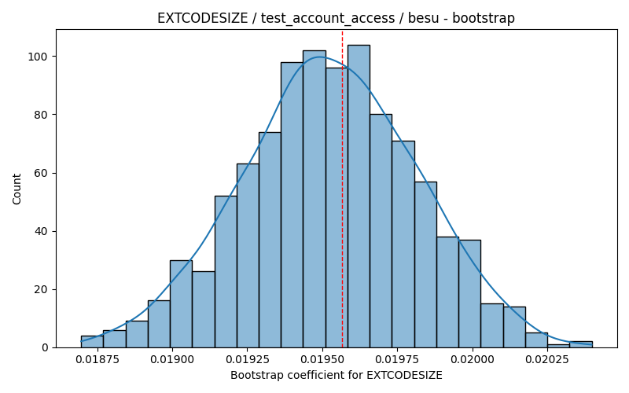

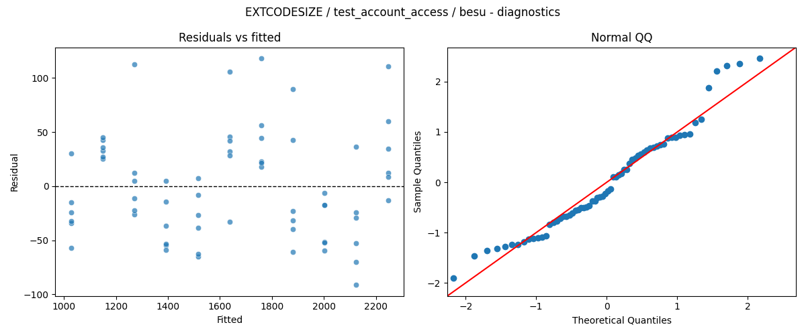

</details>

<details><summary>erigon — NNLS regression summary</summary>

```
==============================================================================
                           NNLS Regression Results                            
==============================================================================
Dep. Variable:          test_runtime_ms              R-squared:          0.887
Model:                  NNLS                    Adj. R-squared:          0.874
No. Observations:       11                                RMSE:         966.94
Df Residuals:           9                                  MAE:         857.18
Df Model:               1      
==============================================================================
                      coef     std err     P-value      [0.025      0.975]
------------------------------------------------------------------------------
         const   1019.1585   1061.8158       0.133      0.0000   3658.0602
       opcount      0.1373      0.0153       0.001      0.1006      0.1554
==============================================================================
Notes: Non-negative least squares with bootstrap inference (1000 iterations)
==============================================================================
```

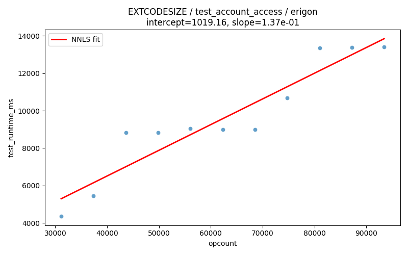

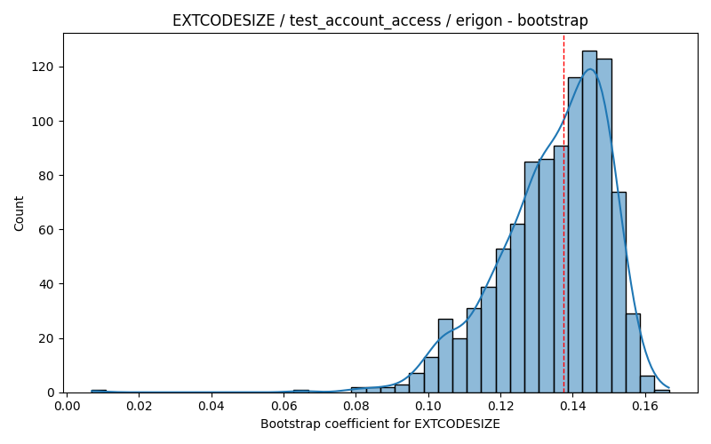

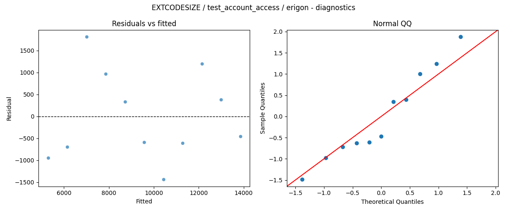

</details>

<details><summary>geth — NNLS regression summary</summary>

```
==============================================================================
                           NNLS Regression Results                            
==============================================================================
Dep. Variable:          test_runtime_ms              R-squared:          0.934
Model:                  NNLS                    Adj. R-squared:          0.933
No. Observations:       108                               RMSE:         111.98
Df Residuals:           106                                MAE:          91.96
Df Model:               1      
==============================================================================
                      coef     std err     P-value      [0.025      0.975]
------------------------------------------------------------------------------
         const    457.9388     41.1589       0.001    382.0702    544.8612
       opcount      0.0217      0.0006       0.001      0.0204      0.0229
==============================================================================
Notes: Non-negative least squares with bootstrap inference (1000 iterations)
==============================================================================
```

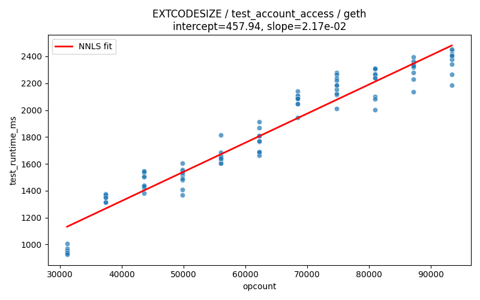

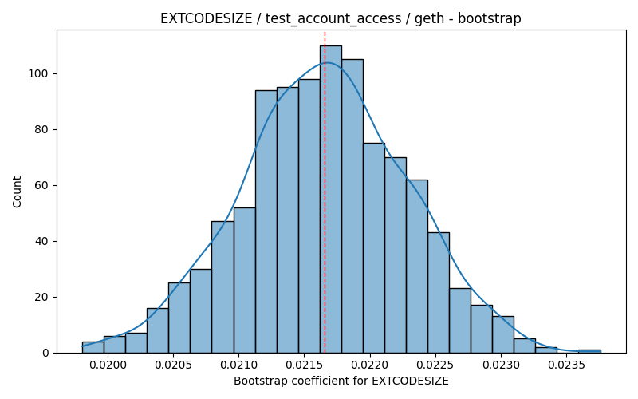

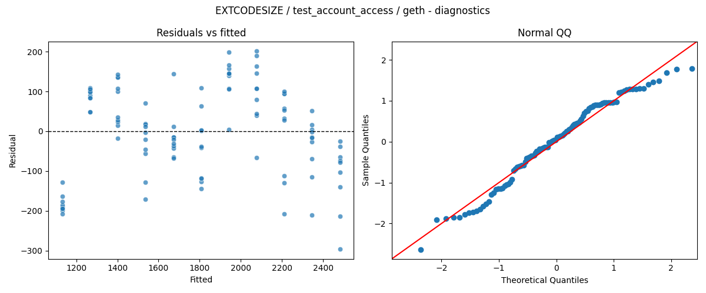

</details>

<details><summary>nethermind — NNLS regression summary</summary>

```
==============================================================================
                           NNLS Regression Results                            
==============================================================================
Dep. Variable:          test_runtime_ms              R-squared:          0.882
Model:                  NNLS                    Adj. R-squared:          0.879
No. Observations:       44                                RMSE:         107.68
Df Residuals:           42                                 MAE:          82.32
Df Model:               1      
==============================================================================
                      coef     std err     P-value      [0.025      0.975]
------------------------------------------------------------------------------
         const    590.9209     78.4755       0.001    453.1683    756.6790
       opcount      0.0149      0.0011       0.001      0.0128      0.0168
==============================================================================
Notes: Non-negative least squares with bootstrap inference (1000 iterations)
==============================================================================
```

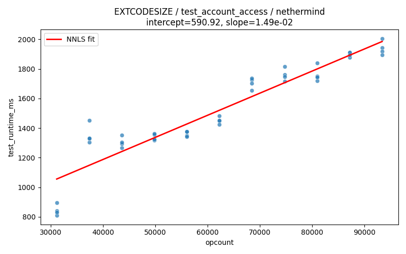

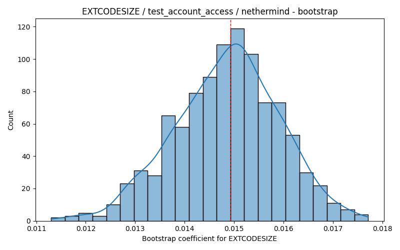

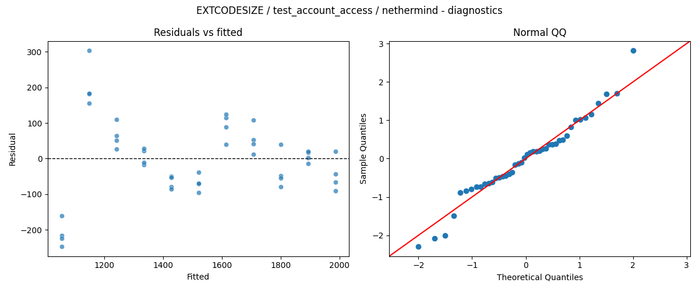

</details>

<details><summary>reth — NNLS regression summary</summary>

```
==============================================================================
                           NNLS Regression Results                            
==============================================================================
Dep. Variable:          test_runtime_ms              R-squared:          0.994
Model:                  NNLS                    Adj. R-squared:          0.994
No. Observations:       110                               RMSE:          31.58
Df Residuals:           108                                MAE:          22.94
Df Model:               1      
==============================================================================
                      coef     std err     P-value      [0.025      0.975]
------------------------------------------------------------------------------
         const    149.1322      8.5538       0.001    132.8186    166.0958
       opcount      0.0205      0.0002       0.001      0.0202      0.0208
==============================================================================
Notes: Non-negative least squares with bootstrap inference (1000 iterations)
==============================================================================
```

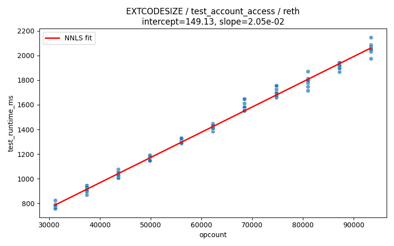

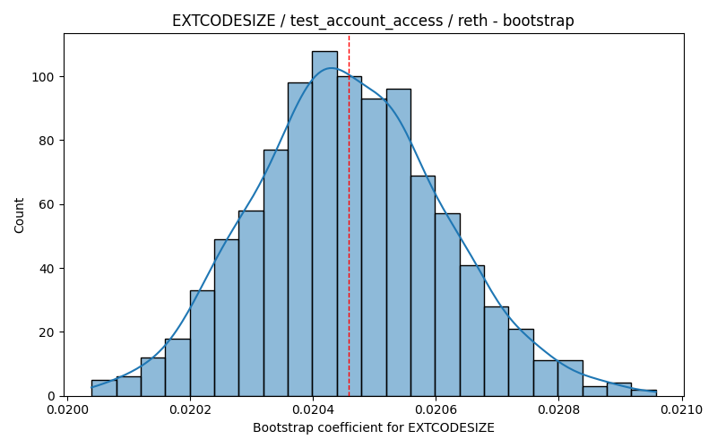

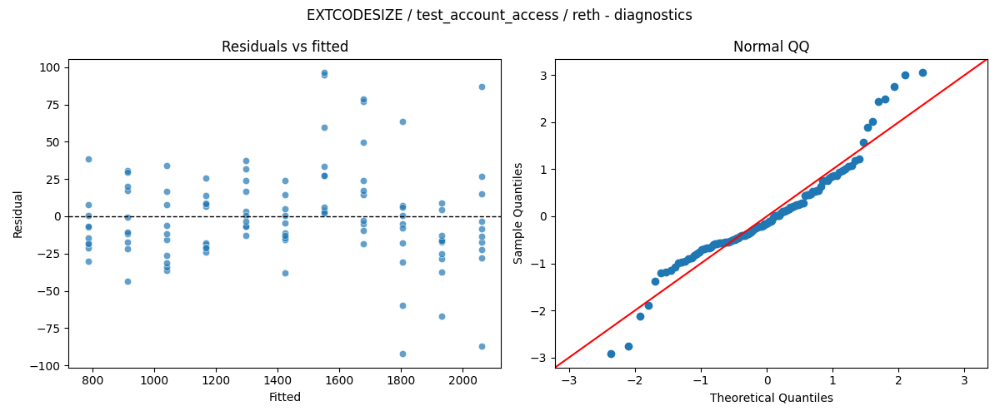

</details>

### test_account_access — combo `EXTCODESIZE_AccountMode.EXISTING_CONTRACT_MINIMAL`

| client | nobs | R² | target_coef (ms) | p-value | 95% CI |
| --- | --- | --- | --- | --- | --- |
| `besu` | 66 | 0.9789 | 0.01216 | 1.00e-03 | [0.01166, 0.01261] |
| `erigon` | 11 | 0.9863 | 0.008502 | 1.00e-03 | [0.007636, 0.009027] |
| `geth` | 109 | 0.9391 | 0.004918 | 1.00e-03 | [0.004708, 0.005148] |
| `nethermind` | 44 | 0.748 | 0.002033 | 1.00e-03 | [0.001634, 0.002417] |
| `reth` | 110 | 0.968 | 0.00353 | 1.00e-03 | [0.003407, 0.003654] |

<details><summary>besu — NNLS regression summary</summary>

```
==============================================================================
                           NNLS Regression Results                            
==============================================================================
Dep. Variable:          test_runtime_ms              R-squared:          0.979
Model:                  NNLS                    Adj. R-squared:          0.979
No. Observations:       66                                RMSE:          35.16
Df Residuals:           64                                 MAE:          28.38
Df Model:               1      
==============================================================================
                      coef     std err     P-value      [0.025      0.975]
------------------------------------------------------------------------------
         const    354.2692     14.5719       0.001    328.3978    385.5844
       opcount      0.0122      0.0002       0.001      0.0117      0.0126
==============================================================================
Notes: Non-negative least squares with bootstrap inference (1000 iterations)
==============================================================================
```

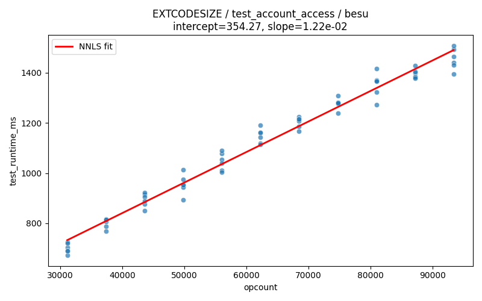

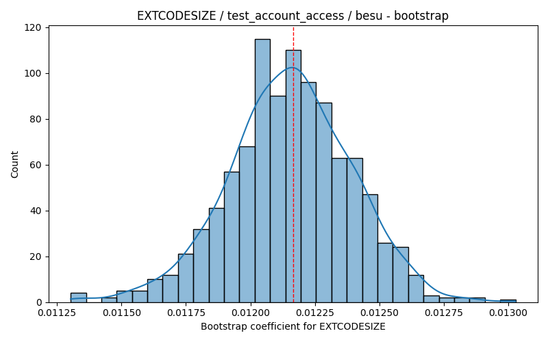

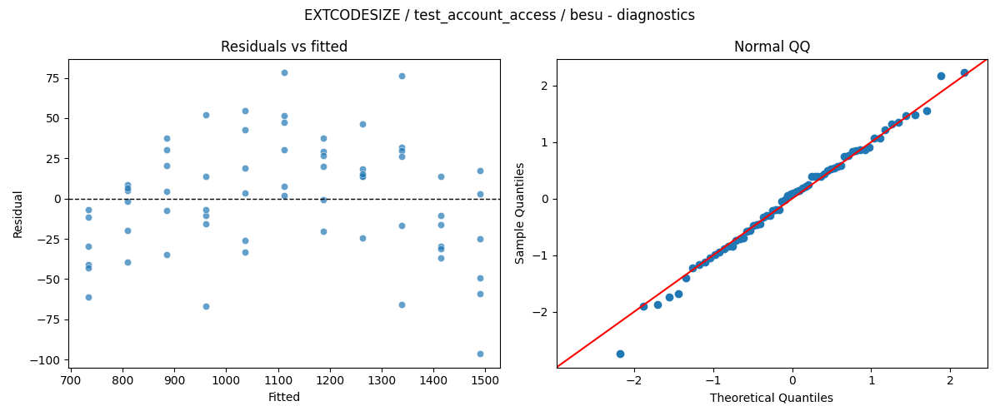

</details>

<details><summary>erigon — NNLS regression summary</summary>

```
==============================================================================
                           NNLS Regression Results                            
==============================================================================
Dep. Variable:          test_runtime_ms              R-squared:          0.986
Model:                  NNLS                    Adj. R-squared:          0.985
No. Observations:       11                                RMSE:          19.76
Df Residuals:           9                                  MAE:          17.06
Df Model:               1      
==============================================================================
                      coef     std err     P-value      [0.025      0.975]
------------------------------------------------------------------------------
         const    157.7143     25.4177       0.001    122.1957    215.6552
       opcount      0.0085      0.0004       0.001      0.0076      0.0090
==============================================================================
Notes: Non-negative least squares with bootstrap inference (1000 iterations)
==============================================================================
```

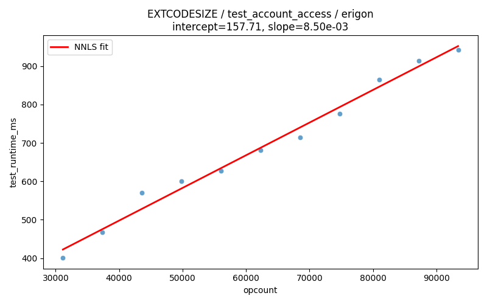

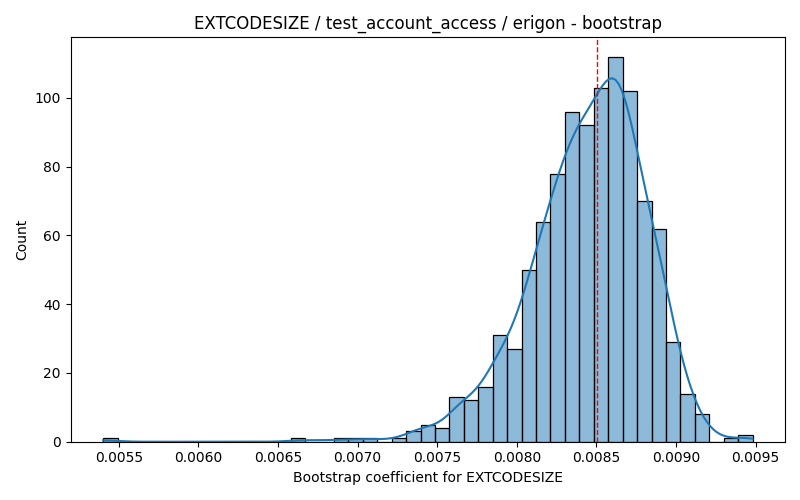


</details>

<details><summary>geth — NNLS regression summary</summary>

```
==============================================================================
                           NNLS Regression Results                            
==============================================================================
Dep. Variable:          test_runtime_ms              R-squared:          0.939
Model:                  NNLS                    Adj. R-squared:          0.939
No. Observations:       109                               RMSE:          24.50
Df Residuals:           107                                MAE:          19.37
Df Model:               1      
==============================================================================
                      coef     std err     P-value      [0.025      0.975]
------------------------------------------------------------------------------
         const     75.5351      7.0594       0.001     61.5935     88.4389
       opcount      0.0049      0.0001       0.001      0.0047      0.0051
==============================================================================
Notes: Non-negative least squares with bootstrap inference (1000 iterations)
==============================================================================
```

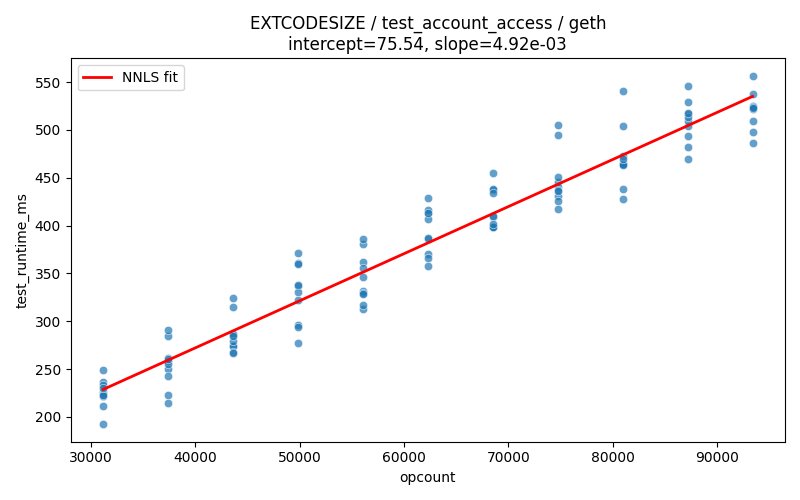

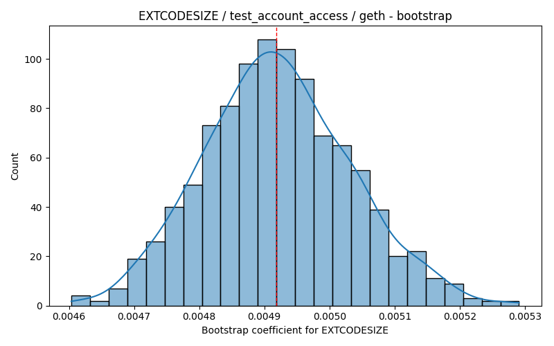

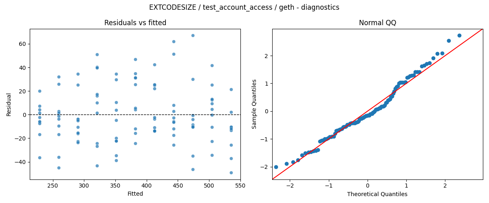

</details>

<details><summary>nethermind — NNLS regression summary</summary>

```
==============================================================================
                           NNLS Regression Results                            
==============================================================================
Dep. Variable:          test_runtime_ms              R-squared:          0.748
Model:                  NNLS                    Adj. R-squared:          0.742
No. Observations:       44                                RMSE:          23.25
Df Residuals:           42                                 MAE:          18.20
Df Model:               1      
==============================================================================
                      coef     std err     P-value      [0.025      0.975]
------------------------------------------------------------------------------
         const     75.1506     11.4024       0.001     54.9706     97.5360
       opcount      0.0020      0.0002       0.001      0.0016      0.0024
==============================================================================
Notes: Non-negative least squares with bootstrap inference (1000 iterations)
==============================================================================
```

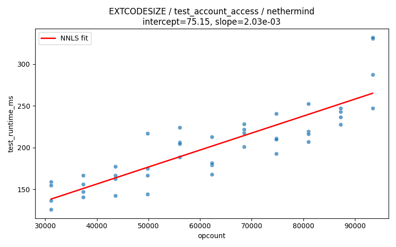

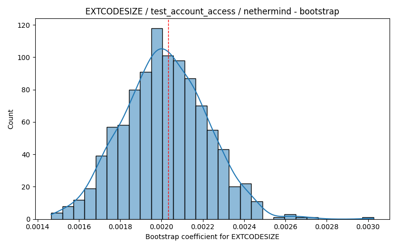

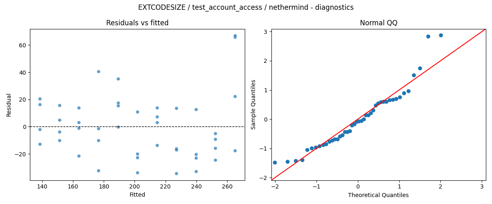

</details>

<details><summary>reth — NNLS regression summary</summary>

```
==============================================================================
                           NNLS Regression Results                            
==============================================================================
Dep. Variable:          test_runtime_ms              R-squared:          0.968
Model:                  NNLS                    Adj. R-squared:          0.968
No. Observations:       110                               RMSE:          12.65
Df Residuals:           108                                MAE:           9.84
Df Model:               1      
==============================================================================
                      coef     std err     P-value      [0.025      0.975]
------------------------------------------------------------------------------
         const     88.0662      3.8724       0.001     80.8804     95.6176
       opcount      0.0035      0.0001       0.001      0.0034      0.0037
==============================================================================
Notes: Non-negative least squares with bootstrap inference (1000 iterations)
==============================================================================
```

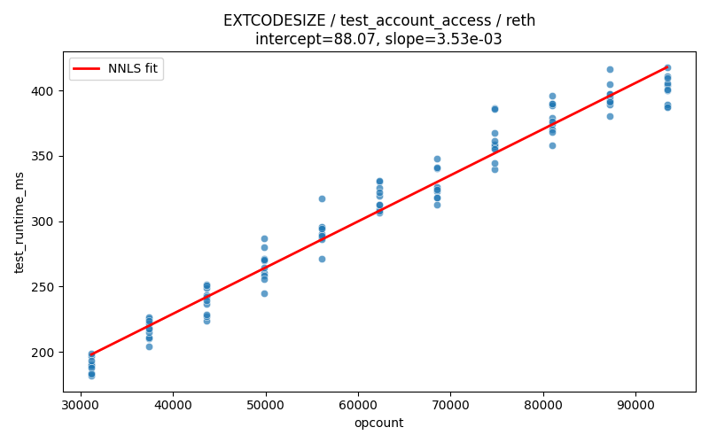

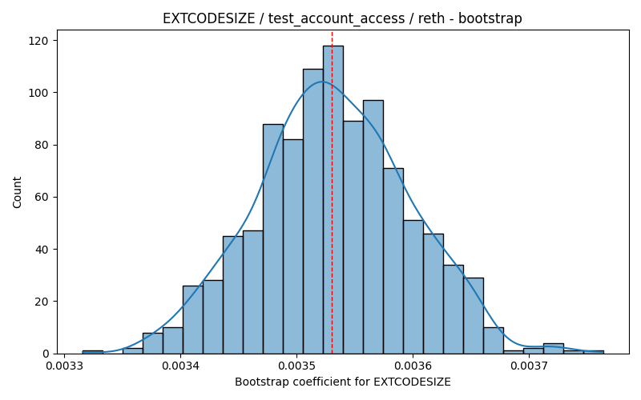

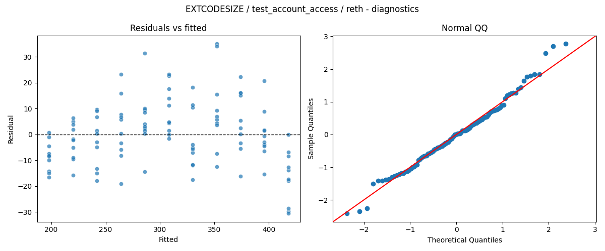

</details>

### test_account_access — combo `EXTCODESIZE_AccountMode.EXISTING_CONTRACT_SAME_MAX`

| client | nobs | R² | target_coef (ms) | p-value | 95% CI |
| --- | --- | --- | --- | --- | --- |
| `besu` | 66 | 0.9618 | 0.01065 | 1.00e-03 | [0.01003, 0.01124] |
| `erigon` | 11 | 0.9823 | 0.008448 | 1.00e-03 | [0.007514, 0.009013] |
| `geth` | 110 | 0.9394 | 0.004981 | 1.00e-03 | [0.004754, 0.005248] |
| `nethermind` | 44 | 0.65 | 0.001458 | 1.00e-03 | [0.001155, 0.00178] |
| `reth` | 110 | 0.9598 | 0.003484 | 1.00e-03 | [0.003331, 0.003655] |

<details><summary>besu — NNLS regression summary</summary>

```
==============================================================================
                           NNLS Regression Results                            
==============================================================================
Dep. Variable:          test_runtime_ms              R-squared:          0.962
Model:                  NNLS                    Adj. R-squared:          0.961
No. Observations:       66                                RMSE:          41.78
Df Residuals:           64                                 MAE:          32.51
Df Model:               1      
==============================================================================
                      coef     std err     P-value      [0.025      0.975]
------------------------------------------------------------------------------
         const    416.2855     18.9315       0.001    381.8224    457.8946
       opcount      0.0107      0.0003       0.001      0.0100      0.0112
==============================================================================
Notes: Non-negative least squares with bootstrap inference (1000 iterations)
==============================================================================
```

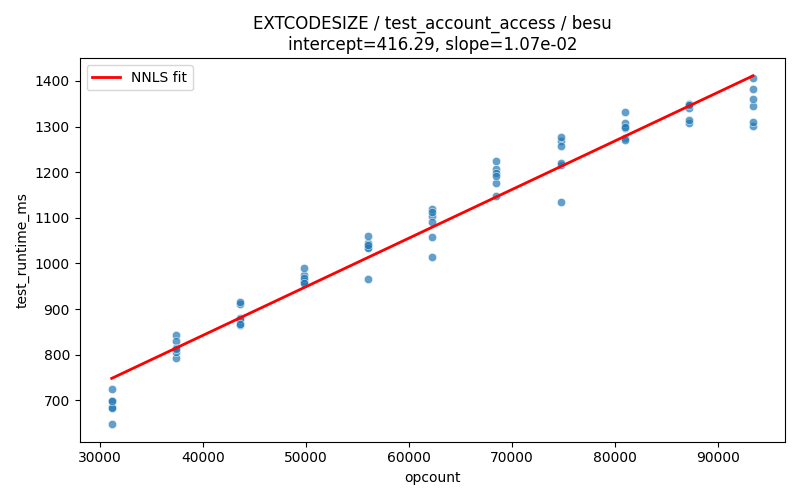

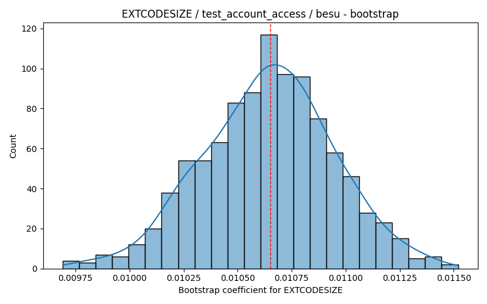

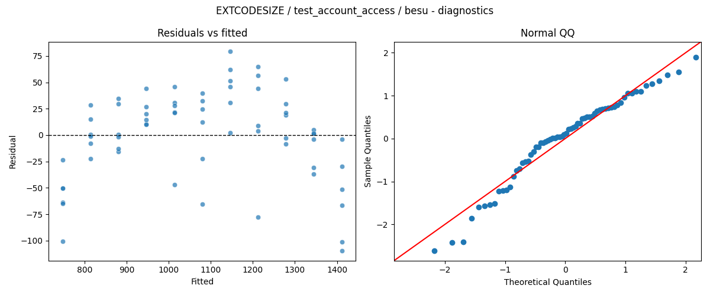

</details>

<details><summary>erigon — NNLS regression summary</summary>

```
==============================================================================
                           NNLS Regression Results                            
==============================================================================
Dep. Variable:          test_runtime_ms              R-squared:          0.982
Model:                  NNLS                    Adj. R-squared:          0.980
No. Observations:       11                                RMSE:          22.33
Df Residuals:           9                                  MAE:          16.64
Df Model:               1      
==============================================================================
                      coef     std err     P-value      [0.025      0.975]
------------------------------------------------------------------------------
         const    159.4354     28.3634       0.001    117.3382    227.9474
       opcount      0.0084      0.0004       0.001      0.0075      0.0090
==============================================================================
Notes: Non-negative least squares with bootstrap inference (1000 iterations)
==============================================================================
```

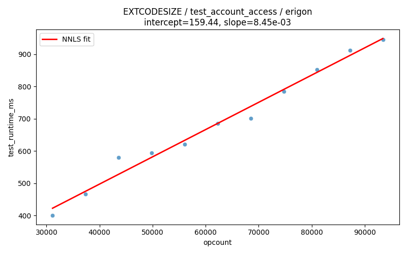

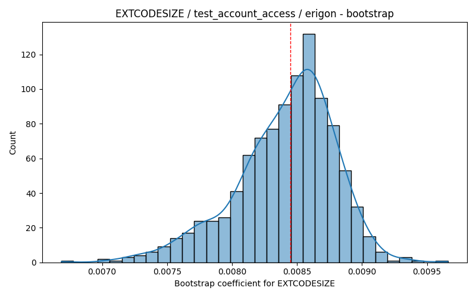

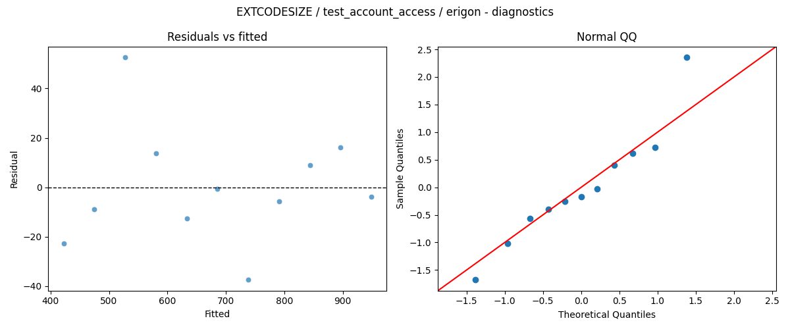

</details>

<details><summary>geth — NNLS regression summary</summary>

```
==============================================================================
                           NNLS Regression Results                            
==============================================================================
Dep. Variable:          test_runtime_ms              R-squared:          0.939
Model:                  NNLS                    Adj. R-squared:          0.939
No. Observations:       110                               RMSE:          24.93
Df Residuals:           108                                MAE:          19.55
Df Model:               1      
==============================================================================
                      coef     std err     P-value      [0.025      0.975]
------------------------------------------------------------------------------
         const     69.6047      7.2346       0.001     54.5627     82.3304
       opcount      0.0050      0.0001       0.001      0.0048      0.0052
==============================================================================
Notes: Non-negative least squares with bootstrap inference (1000 iterations)
==============================================================================
```

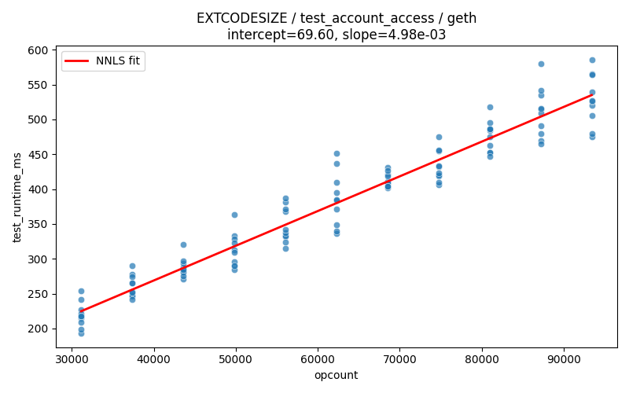

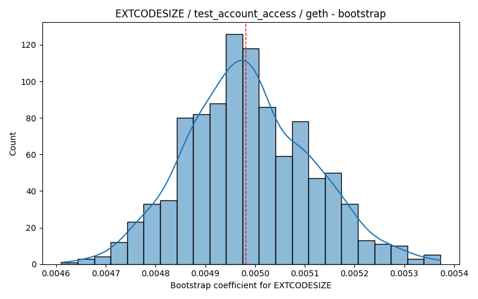

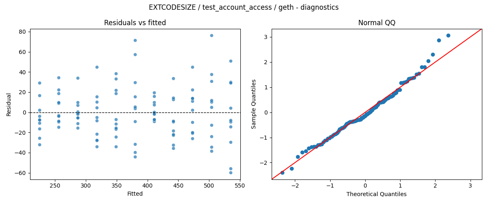

</details>

<details><summary>nethermind — NNLS regression summary</summary>

```
==============================================================================
                           NNLS Regression Results                            
==============================================================================
Dep. Variable:          test_runtime_ms              R-squared:          0.650
Model:                  NNLS                    Adj. R-squared:          0.642
No. Observations:       44                                RMSE:          21.08
Df Residuals:           42                                 MAE:          17.43
Df Model:               1      
==============================================================================
                      coef     std err     P-value      [0.025      0.975]
------------------------------------------------------------------------------
         const    115.1069      9.7785       0.001     96.4321    135.0896
       opcount      0.0015      0.0002       0.001      0.0012      0.0018
==============================================================================
Notes: Non-negative least squares with bootstrap inference (1000 iterations)
==============================================================================
```

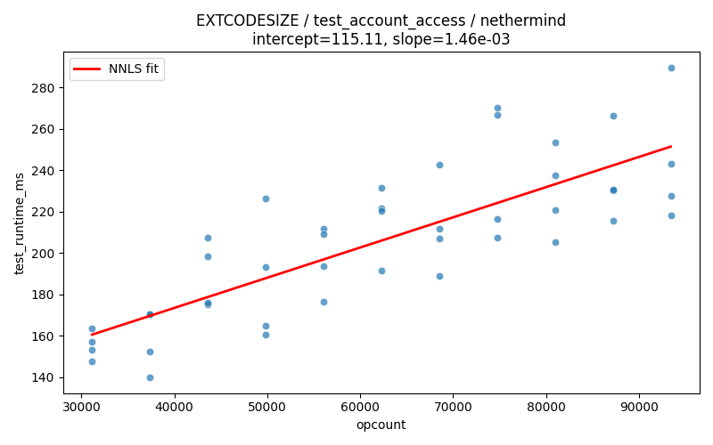

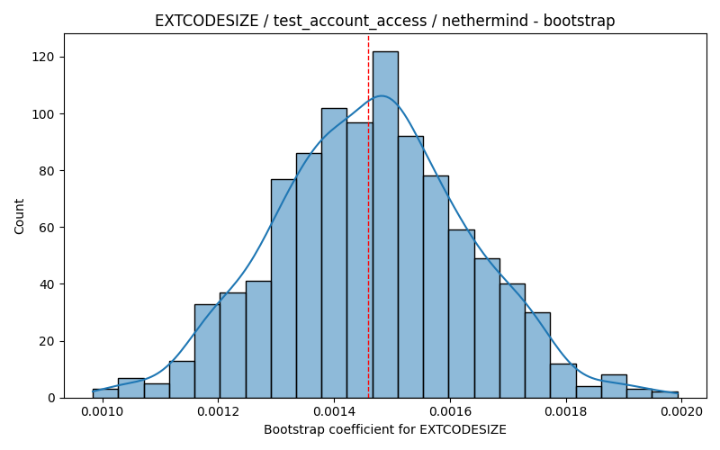

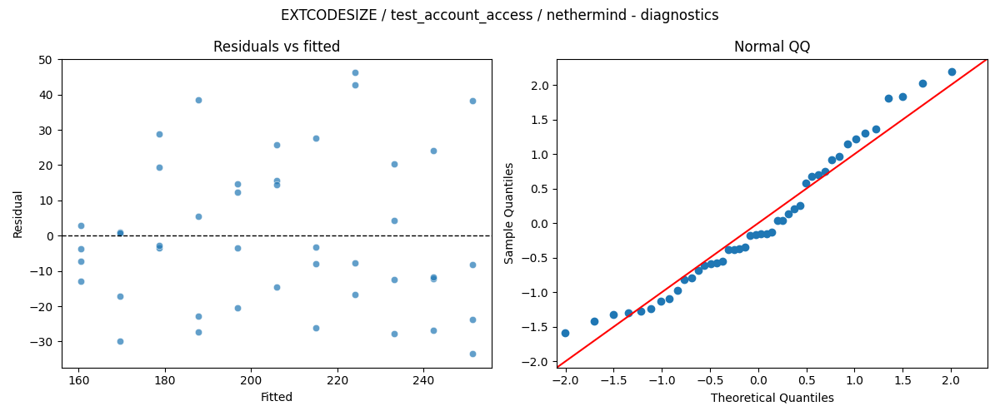

</details>

<details><summary>reth — NNLS regression summary</summary>

```
==============================================================================
                           NNLS Regression Results                            
==============================================================================
Dep. Variable:          test_runtime_ms              R-squared:          0.960
Model:                  NNLS                    Adj. R-squared:          0.959
No. Observations:       110                               RMSE:          14.04
Df Residuals:           108                                MAE:           9.65
Df Model:               1      
==============================================================================
                      coef     std err     P-value      [0.025      0.975]
------------------------------------------------------------------------------
         const     96.3184      4.6987       0.001     87.2716    105.3028
       opcount      0.0035      0.0001       0.001      0.0033      0.0037
==============================================================================
Notes: Non-negative least squares with bootstrap inference (1000 iterations)
==============================================================================
```

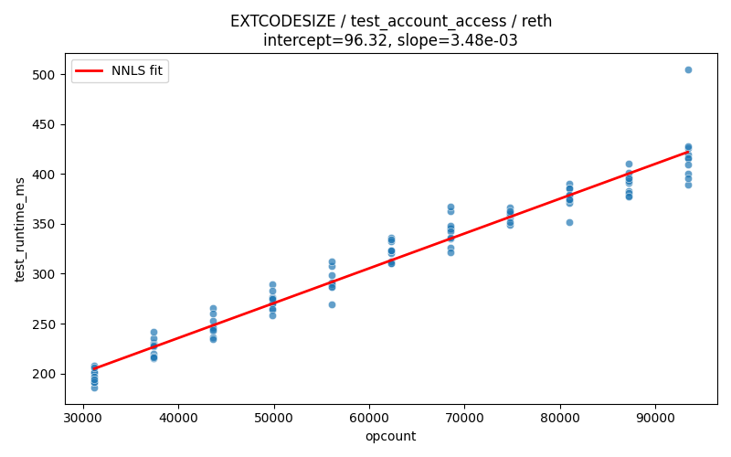

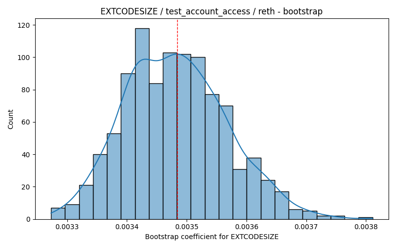

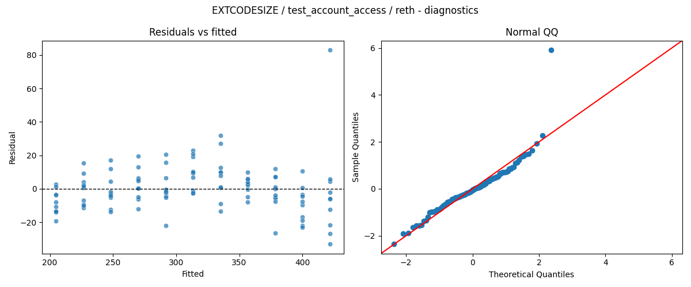

</details>

## STATICCALL

### test_ext_account_query_warm — combo `STATICCALL`

| client | nobs | R² | target_coef (ms) | p-value | 95% CI |
| --- | --- | --- | --- | --- | --- |
| `besu` | 66 | 0.9471 | 0.0004328 | 1.00e-03 | [0.0004061, 0.0004595] |
| `erigon` | 11 | 0.9528 | 6.245e-05 | 1.00e-03 | [5.375e-05, 7.322e-05] |
| `geth` | 109 | 0.9054 | 0.0001686 | 1.00e-03 | [0.0001581, 0.0001803] |
| `nethermind` | 44 | 0.7766 | 0.00031 | 1.00e-03 | [0.0002615, 0.0003571] |
| `reth` | 110 | 0.9197 | 5.666e-05 | 1.00e-03 | [5.32e-05, 5.987e-05] |

<details><summary>besu — NNLS regression summary</summary>

```
==============================================================================
                           NNLS Regression Results                            
==============================================================================
Dep. Variable:          test_runtime_ms              R-squared:          0.947
Model:                  NNLS                    Adj. R-squared:          0.946
No. Observations:       66                                RMSE:          52.97
Df Residuals:           64                                 MAE:          42.38
Df Model:               1      
==============================================================================
                      coef     std err     P-value      [0.025      0.975]
------------------------------------------------------------------------------
         const    407.7078     23.1687       0.001    362.6327    453.7157
       opcount      0.0004      0.0000       0.001      0.0004      0.0005
==============================================================================
Notes: Non-negative least squares with bootstrap inference (1000 iterations)
==============================================================================
```

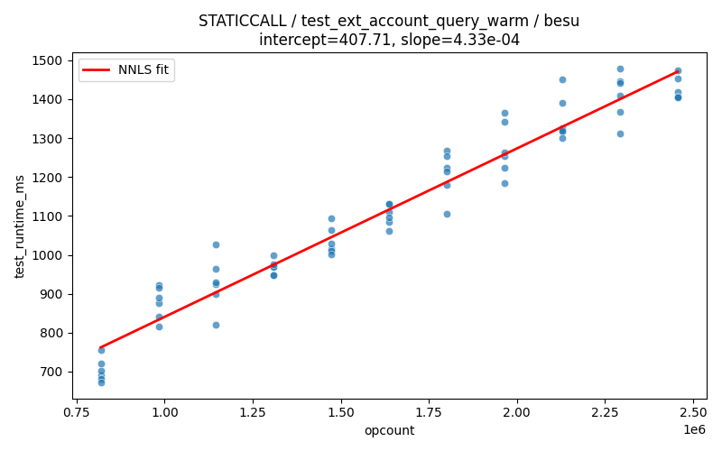

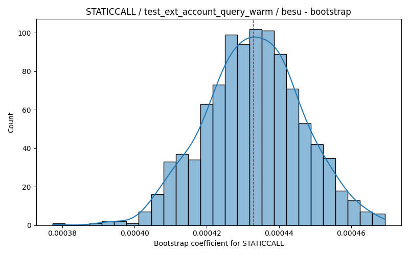

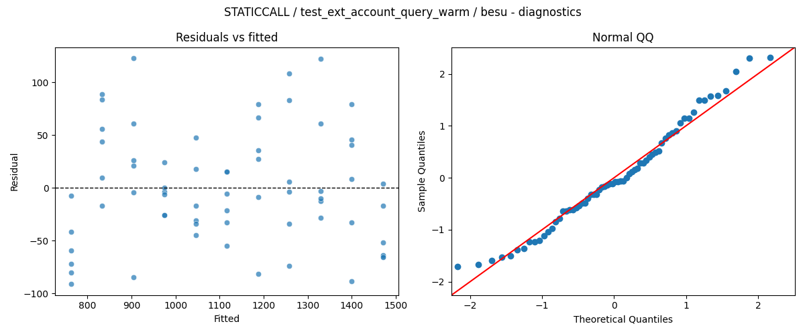

</details>

<details><summary>erigon — NNLS regression summary</summary>

```
==============================================================================
                           NNLS Regression Results                            
==============================================================================
Dep. Variable:          test_runtime_ms              R-squared:          0.953
Model:                  NNLS                    Adj. R-squared:          0.948
No. Observations:       11                                RMSE:           7.20
Df Residuals:           9                                  MAE:           6.08
Df Model:               1      
==============================================================================
                      coef     std err     P-value      [0.025      0.975]
------------------------------------------------------------------------------
         const     35.3093      7.5177       0.002     19.1668     47.5529
       opcount      0.0001      0.0000       0.001      0.0001      0.0001
==============================================================================
Notes: Non-negative least squares with bootstrap inference (1000 iterations)
==============================================================================
```

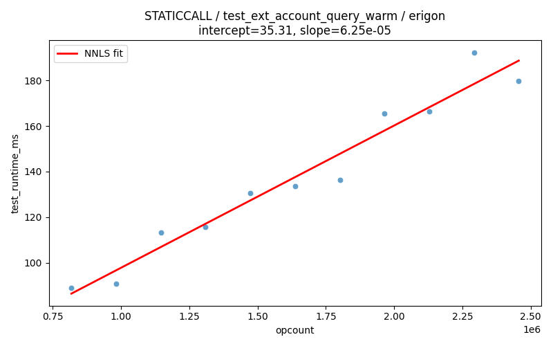

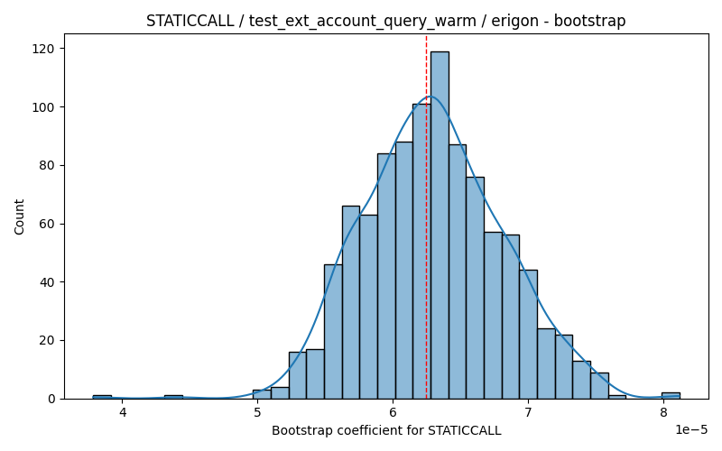

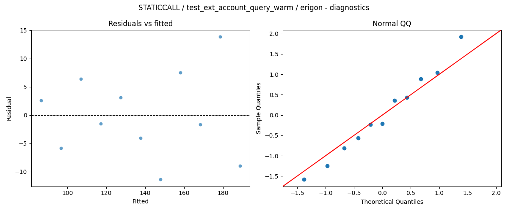

</details>

<details><summary>geth — NNLS regression summary</summary>

```
==============================================================================
                           NNLS Regression Results                            
==============================================================================
Dep. Variable:          test_runtime_ms              R-squared:          0.905
Model:                  NNLS                    Adj. R-squared:          0.905
No. Observations:       109                               RMSE:          28.02
Df Residuals:           107                                MAE:          21.20
Df Model:               1      
==============================================================================
                      coef     std err     P-value      [0.025      0.975]
------------------------------------------------------------------------------
         const     43.9512      8.6486       0.001     26.3873     60.3871
       opcount      0.0002      0.0000       0.001      0.0002      0.0002
==============================================================================
Notes: Non-negative least squares with bootstrap inference (1000 iterations)
==============================================================================
```

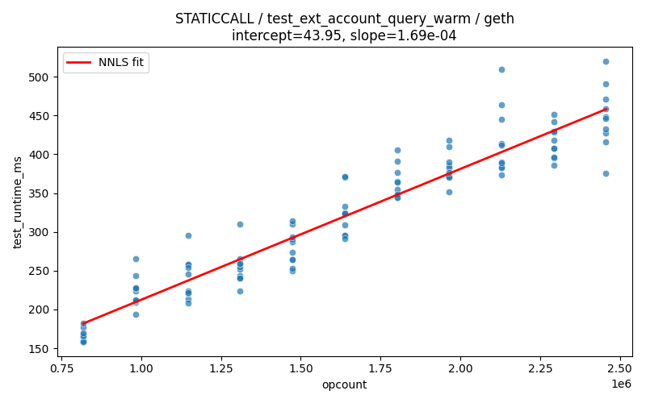

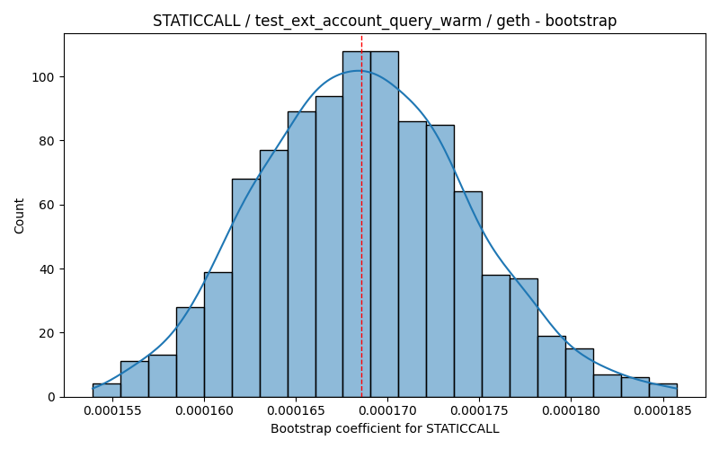

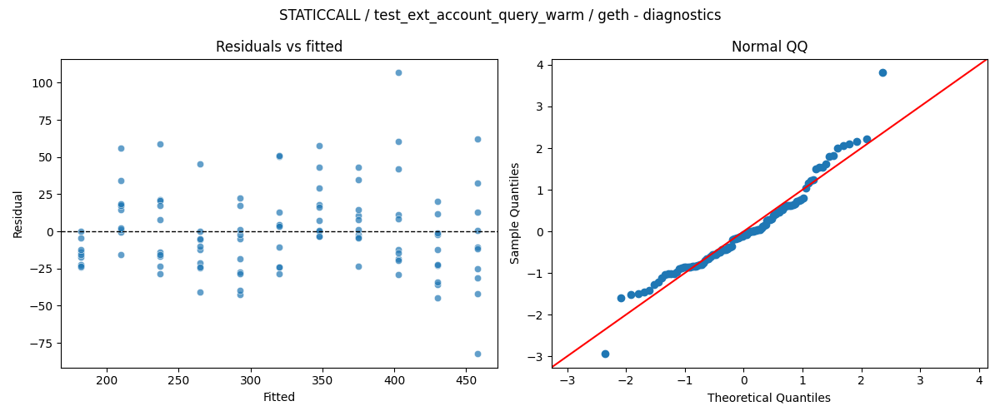

</details>

<details><summary>nethermind — NNLS regression summary</summary>

```
==============================================================================
                           NNLS Regression Results                            
==============================================================================
Dep. Variable:          test_runtime_ms              R-squared:          0.777
Model:                  NNLS                    Adj. R-squared:          0.771
No. Observations:       44                                RMSE:          86.12
Df Residuals:           42                                 MAE:          67.43
Df Model:               1      
==============================================================================
                      coef     std err     P-value      [0.025      0.975]
------------------------------------------------------------------------------
         const    243.5102     41.4743       0.001    167.1952    324.3037
       opcount      0.0003      0.0000       0.001      0.0003      0.0004
==============================================================================
Notes: Non-negative least squares with bootstrap inference (1000 iterations)
==============================================================================
```

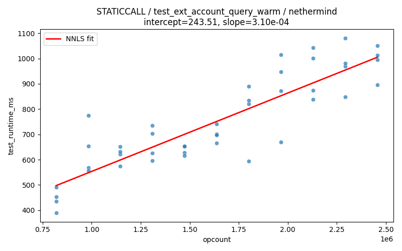

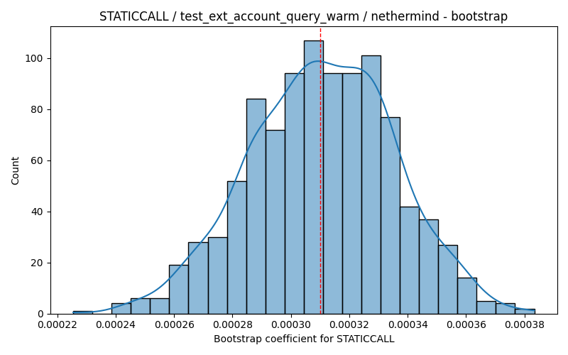

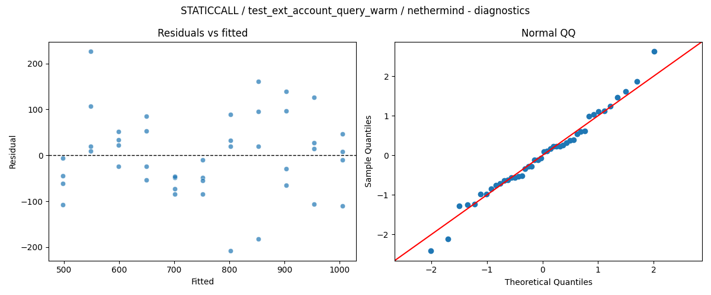

</details>

<details><summary>reth — NNLS regression summary</summary>

```
==============================================================================
                           NNLS Regression Results                            
==============================================================================
Dep. Variable:          test_runtime_ms              R-squared:          0.920
Model:                  NNLS                    Adj. R-squared:          0.919
No. Observations:       110                               RMSE:           8.67
Df Residuals:           108                                MAE:           6.20
Df Model:               1      
==============================================================================
                      coef     std err     P-value      [0.025      0.975]
------------------------------------------------------------------------------
         const     22.2157      2.8969       0.001     16.8679     28.2626
       opcount      0.0001      0.0000       0.001      0.0001      0.0001
==============================================================================
Notes: Non-negative least squares with bootstrap inference (1000 iterations)
==============================================================================
```

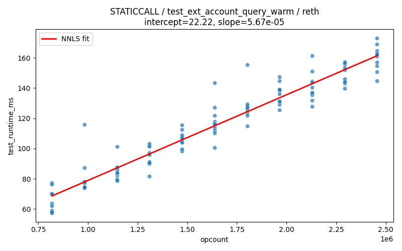

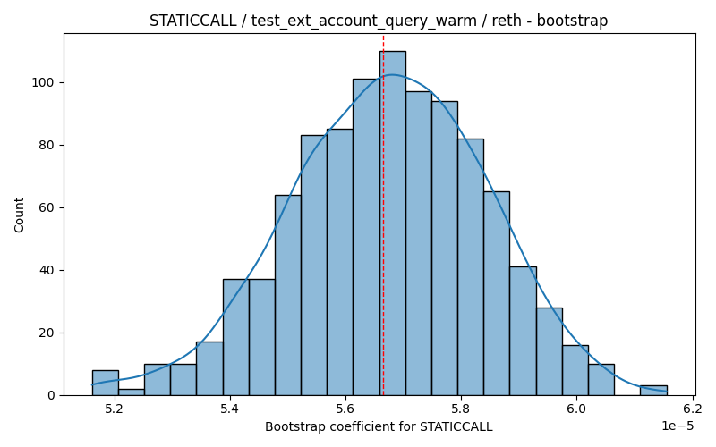

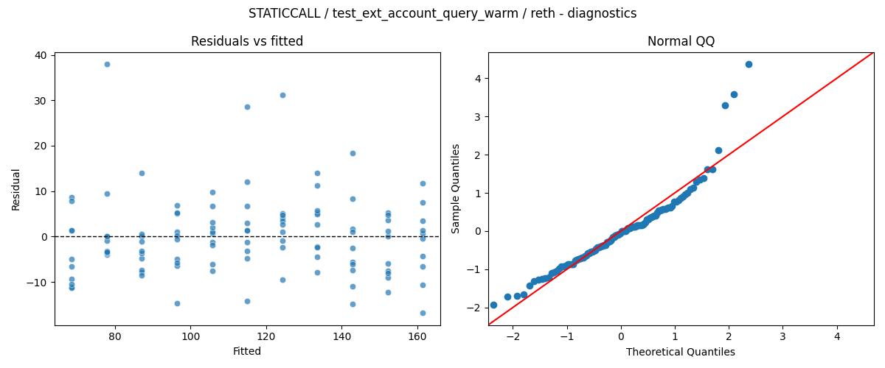

</details>

### test_account_access — combo `STATICCALL_AccountMode.EXISTING_EOA`

| client | nobs | R² | target_coef (ms) | p-value | 95% CI |
| --- | --- | --- | --- | --- | --- |
| `besu` | 66 | 0.9888 | 0.01693 | 1.00e-03 | [0.01649, 0.01737] |
| `erigon` | 11 | 0.9975 | 0.008586 | 1.00e-03 | [0.008459, 0.008654] |
| `geth` | 109 | 0.9788 | 0.01137 | 1.00e-03 | [0.01102, 0.0117] |
| `nethermind` | 44 | 0.9423 | 0.003956 | 1.00e-03 | [0.003688, 0.004243] |
| `reth` | 110 | 0.9303 | 0.001569 | 1.00e-03 | [0.001494, 0.001644] |

<details><summary>besu — NNLS regression summary</summary>

```
==============================================================================
                           NNLS Regression Results                            
==============================================================================
Dep. Variable:          test_runtime_ms              R-squared:          0.989
Model:                  NNLS                    Adj. R-squared:          0.989
No. Observations:       66                                RMSE:          37.07
Df Residuals:           64                                 MAE:          28.40
Df Model:               1      
==============================================================================
                      coef     std err     P-value      [0.025      0.975]
------------------------------------------------------------------------------
         const    521.2060     15.7387       0.001    491.2648    554.1773
       opcount      0.0169      0.0002       0.001      0.0165      0.0174
==============================================================================
Notes: Non-negative least squares with bootstrap inference (1000 iterations)
==============================================================================
```

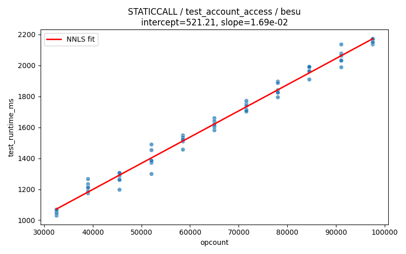

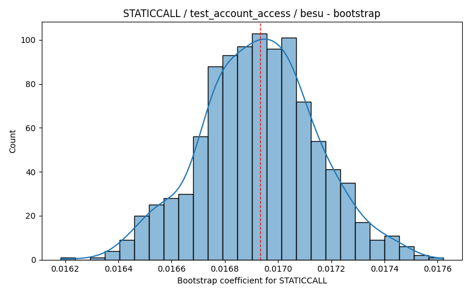

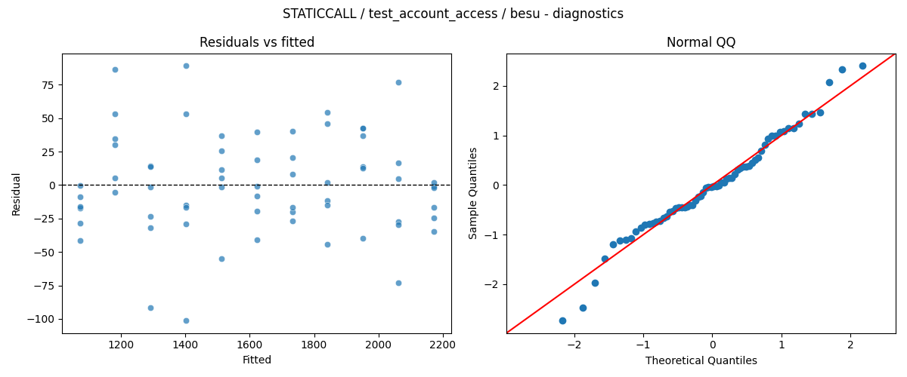

</details>

<details><summary>erigon — NNLS regression summary</summary>

```
==============================================================================
                           NNLS Regression Results                            
==============================================================================
Dep. Variable:          test_runtime_ms              R-squared:          0.997
Model:                  NNLS                    Adj. R-squared:          0.997
No. Observations:       11                                RMSE:           9.00
Df Residuals:           9                                  MAE:           7.60
Df Model:               1      
==============================================================================
                      coef     std err     P-value      [0.025      0.975]
------------------------------------------------------------------------------
         const      0.0000      1.0723       1.000      0.0000      3.7428
       opcount      0.0086      0.0000       0.001      0.0085      0.0087
==============================================================================
Notes: Non-negative least squares with bootstrap inference (1000 iterations)
==============================================================================
```

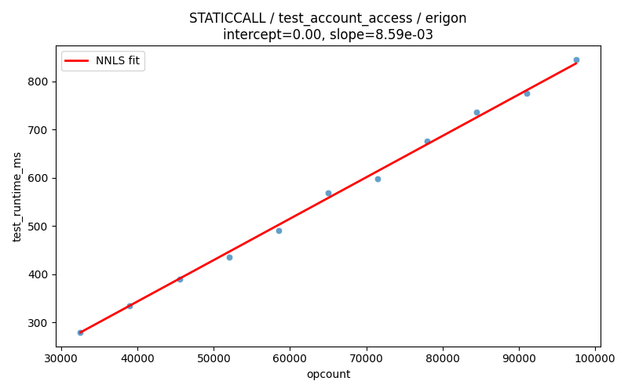

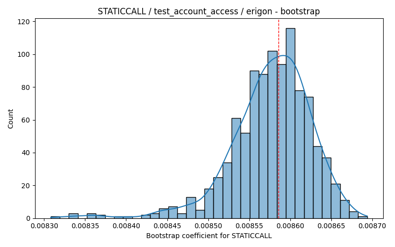

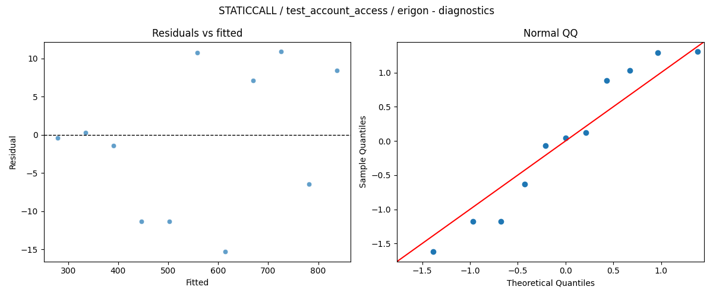

</details>

<details><summary>geth — NNLS regression summary</summary>

```
==============================================================================
                           NNLS Regression Results                            
==============================================================================
Dep. Variable:          test_runtime_ms              R-squared:          0.979
Model:                  NNLS                    Adj. R-squared:          0.979
No. Observations:       109                               RMSE:          34.33
Df Residuals:           107                                MAE:          27.18
Df Model:               1      
==============================================================================
                      coef     std err     P-value      [0.025      0.975]
------------------------------------------------------------------------------
         const    248.3065     11.1436       0.001    227.7708    270.8854
       opcount      0.0114      0.0002       0.001      0.0110      0.0117
==============================================================================
Notes: Non-negative least squares with bootstrap inference (1000 iterations)
==============================================================================
```

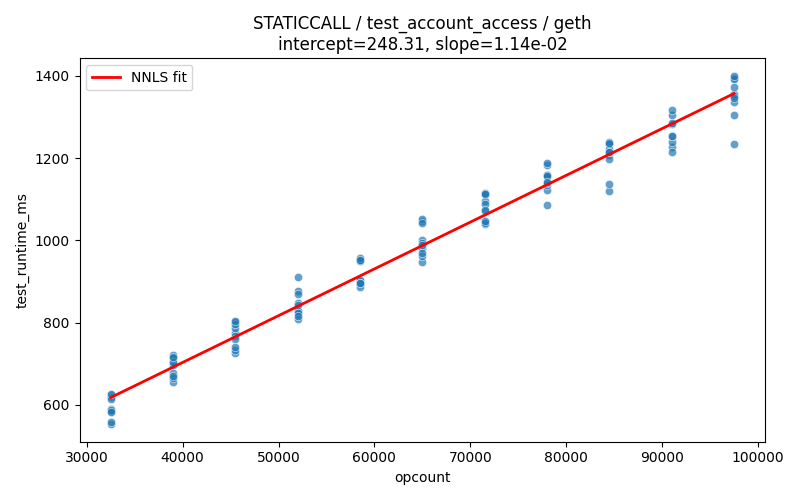

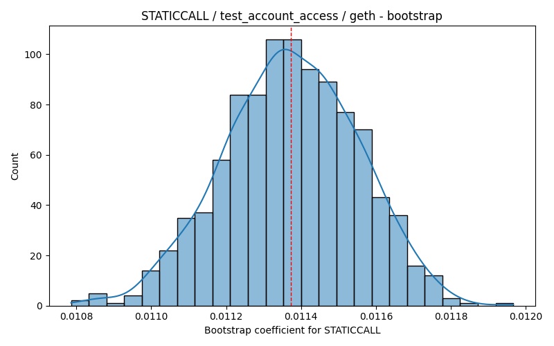

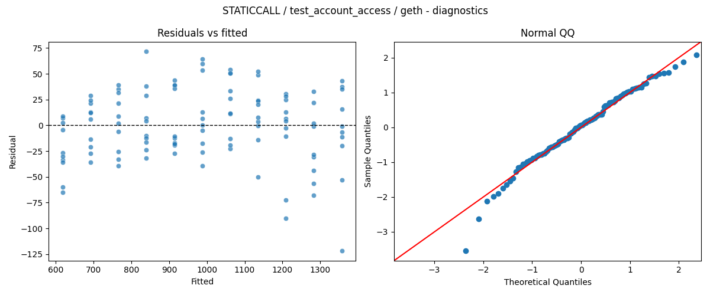

</details>

<details><summary>nethermind — NNLS regression summary</summary>

```
==============================================================================
                           NNLS Regression Results                            
==============================================================================
Dep. Variable:          test_runtime_ms              R-squared:          0.942
Model:                  NNLS                    Adj. R-squared:          0.941
No. Observations:       44                                RMSE:          20.13
Df Residuals:           42                                 MAE:          16.24
Df Model:               1      
==============================================================================
                      coef     std err     P-value      [0.025      0.975]
------------------------------------------------------------------------------
         const     73.9265      8.9513       0.001     55.8837     91.6050
       opcount      0.0040      0.0001       0.001      0.0037      0.0042
==============================================================================
Notes: Non-negative least squares with bootstrap inference (1000 iterations)
==============================================================================
```

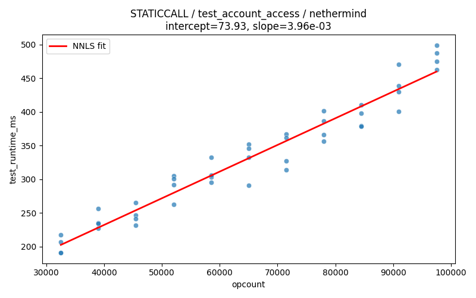

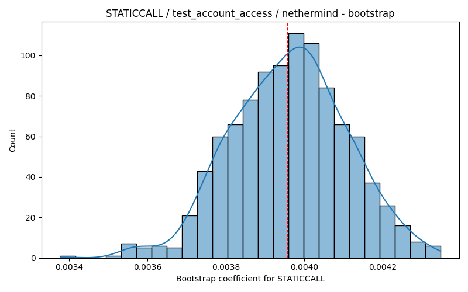

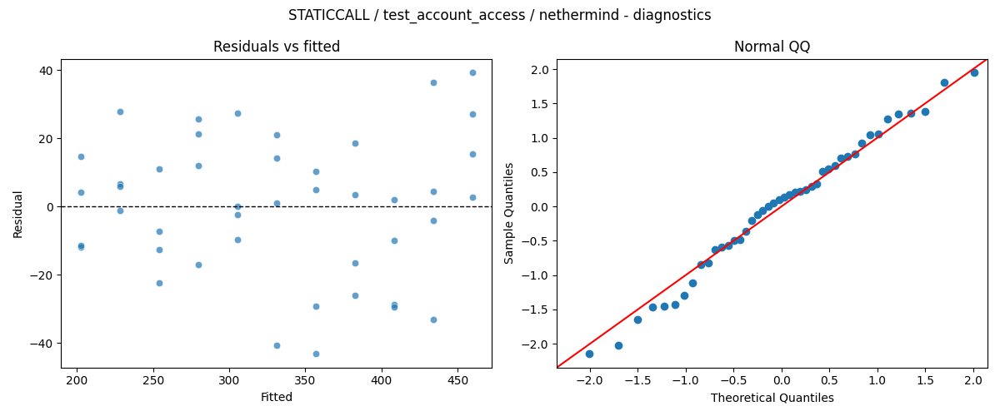

</details>

<details><summary>reth — NNLS regression summary</summary>

```
==============================================================================
                           NNLS Regression Results                            
==============================================================================
Dep. Variable:          test_runtime_ms              R-squared:          0.930
Model:                  NNLS                    Adj. R-squared:          0.930
No. Observations:       110                               RMSE:           8.82
Df Residuals:           108                                MAE:           7.21
Df Model:               1      
==============================================================================
                      coef     std err     P-value      [0.025      0.975]
------------------------------------------------------------------------------
         const     44.1081      2.4950       0.001     39.5055     49.4024
       opcount      0.0016      0.0000       0.001      0.0015      0.0016
==============================================================================
Notes: Non-negative least squares with bootstrap inference (1000 iterations)
==============================================================================
```

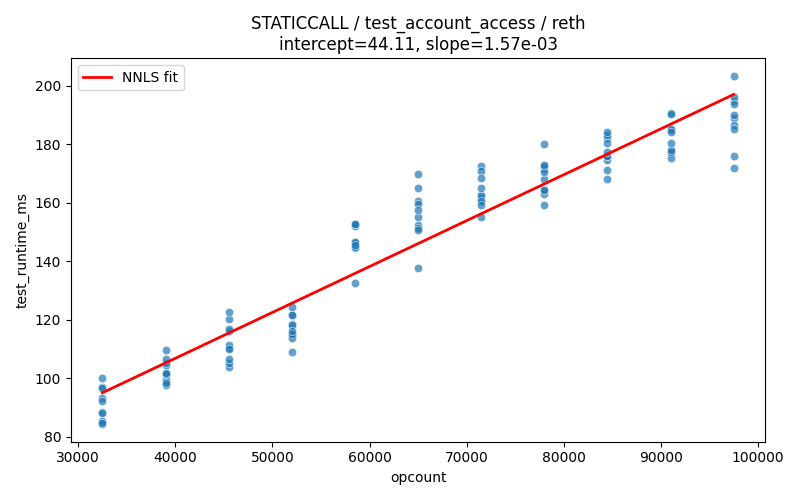

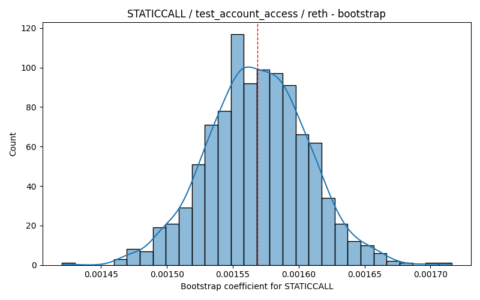

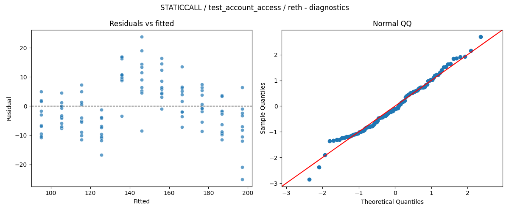

</details>

### test_account_access — combo `STATICCALL_AccountMode.NON_EXISTING_ACCOUNT`

| client | nobs | R² | target_coef (ms) | p-value | 95% CI |
| --- | --- | --- | --- | --- | --- |
| `besu` | 66 | 0.9883 | 0.01882 | 1.00e-03 | [0.01832, 0.01937] |
| `erigon` | 11 | 0.9986 | 0.00881 | 1.00e-03 | [0.008686, 0.008878] |
| `geth` | 110 | 0.985 | 0.02234 | 1.00e-03 | [0.02183, 0.02286] |
| `nethermind` | 44 | 0.9029 | 0.003522 | 1.00e-03 | [0.003136, 0.003937] |
| `reth` | 110 | 0.9366 | 0.001081 | 1.00e-03 | [0.001026, 0.001136] |

<details><summary>besu — NNLS regression summary</summary>

```
==============================================================================
                           NNLS Regression Results                            
==============================================================================
Dep. Variable:          test_runtime_ms              R-squared:          0.988
Model:                  NNLS                    Adj. R-squared:          0.988
No. Observations:       66                                RMSE:          42.01
Df Residuals:           64                                 MAE:          32.81
Df Model:               1      
==============================================================================
                      coef     std err     P-value      [0.025      0.975]
------------------------------------------------------------------------------
         const    199.5313     16.2536       0.001    165.6323    230.5499
       opcount      0.0188      0.0003       0.001      0.0183      0.0194
==============================================================================
Notes: Non-negative least squares with bootstrap inference (1000 iterations)
==============================================================================
```

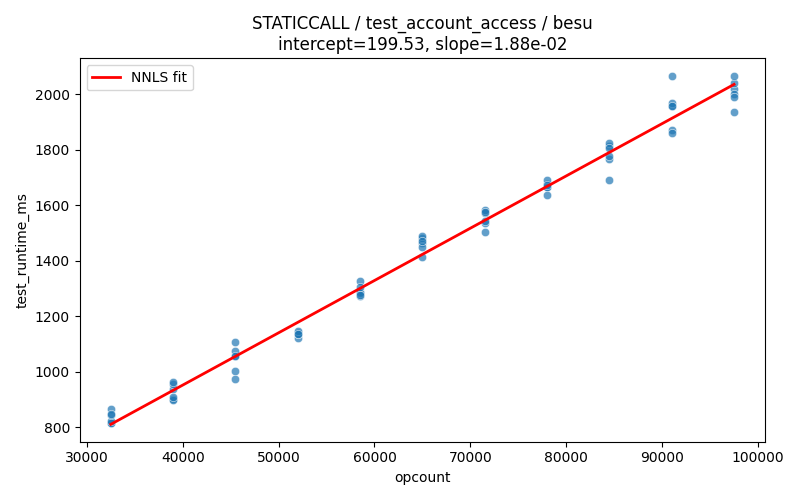

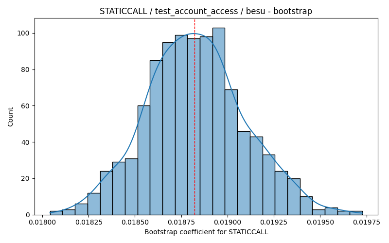

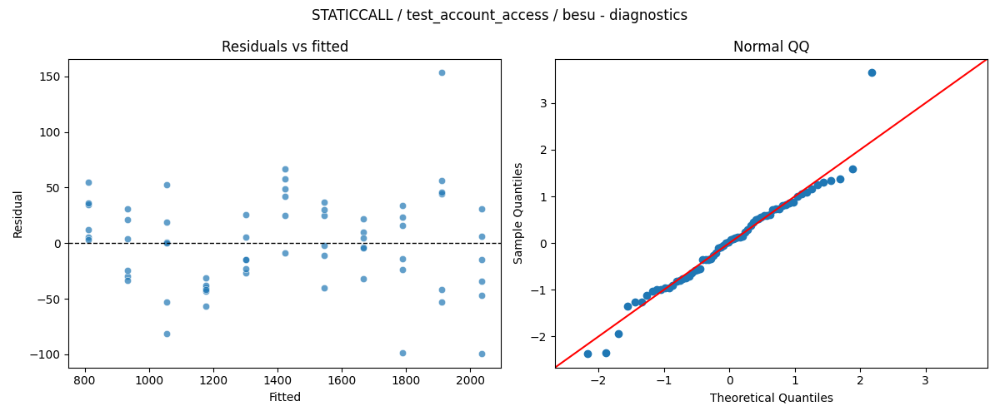

</details>

<details><summary>erigon — NNLS regression summary</summary>

```
==============================================================================
                           NNLS Regression Results                            
==============================================================================
Dep. Variable:          test_runtime_ms              R-squared:          0.999
Model:                  NNLS                    Adj. R-squared:          0.998
No. Observations:       11                                RMSE:           6.85
Df Residuals:           9                                  MAE:           6.21
Df Model:               1      
==============================================================================
                      coef     std err     P-value      [0.025      0.975]
------------------------------------------------------------------------------
         const      0.0000      1.6362       1.000      0.0000      5.5978
       opcount      0.0088      0.0000       0.001      0.0087      0.0089
==============================================================================
Notes: Non-negative least squares with bootstrap inference (1000 iterations)
==============================================================================
```

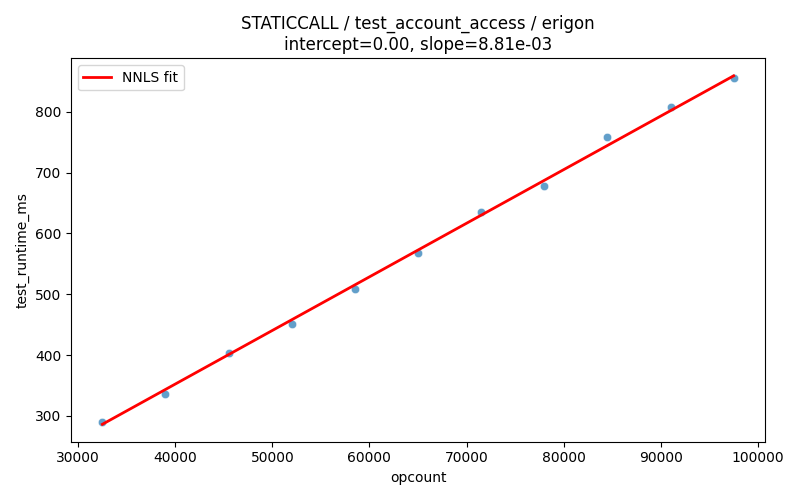

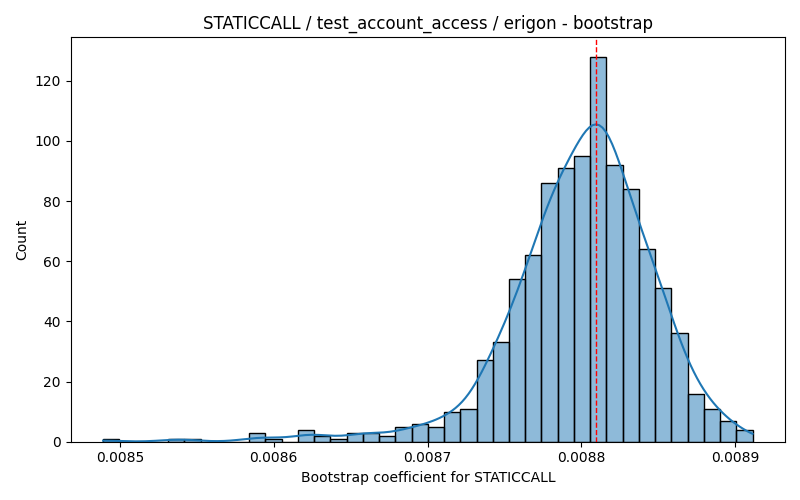

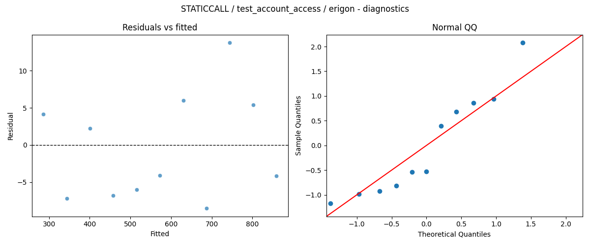

</details>

<details><summary>geth — NNLS regression summary</summary>

```
==============================================================================
                           NNLS Regression Results                            
==============================================================================
Dep. Variable:          test_runtime_ms              R-squared:          0.985
Model:                  NNLS                    Adj. R-squared:          0.985
No. Observations:       110                               RMSE:          56.61
Df Residuals:           108                                MAE:          43.55
Df Model:               1      
==============================================================================
                      coef     std err     P-value      [0.025      0.975]
------------------------------------------------------------------------------
         const    313.2751     15.3056       0.001    285.4009    342.2402
       opcount      0.0223      0.0003       0.001      0.0218      0.0229
==============================================================================
Notes: Non-negative least squares with bootstrap inference (1000 iterations)
==============================================================================
```

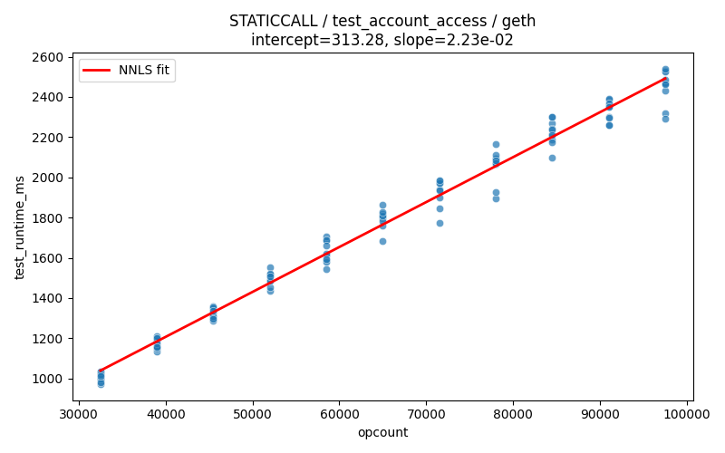

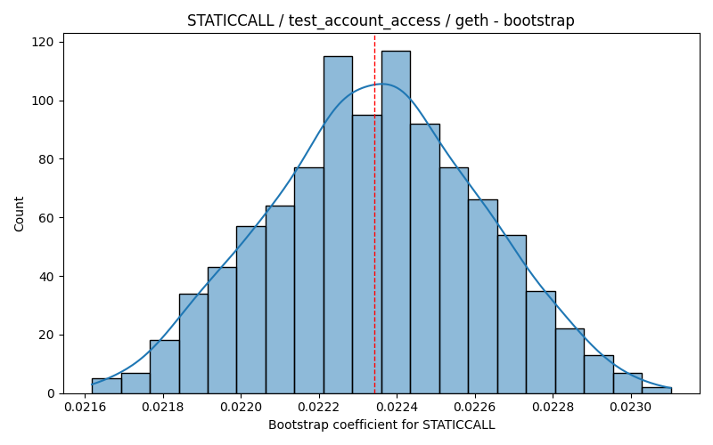

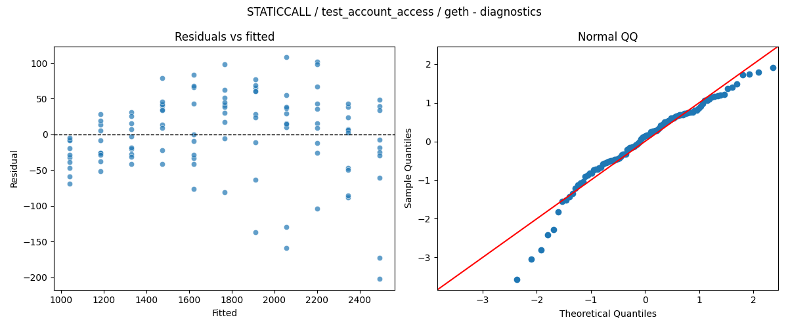

</details>

<details><summary>nethermind — NNLS regression summary</summary>

```
==============================================================================
                           NNLS Regression Results                            
==============================================================================
Dep. Variable:          test_runtime_ms              R-squared:          0.903
Model:                  NNLS                    Adj. R-squared:          0.901
No. Observations:       44                                RMSE:          23.74
Df Residuals:           42                                 MAE:          20.42
Df Model:               1      
==============================================================================
                      coef     std err     P-value      [0.025      0.975]
------------------------------------------------------------------------------
         const     76.7018     11.5590       0.001     52.5420     99.8909
       opcount      0.0035      0.0002       0.001      0.0031      0.0039
==============================================================================
Notes: Non-negative least squares with bootstrap inference (1000 iterations)
==============================================================================
```

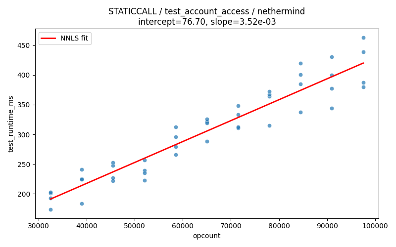

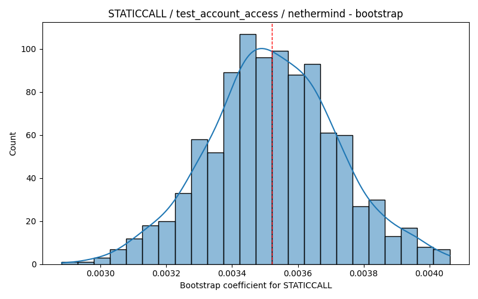

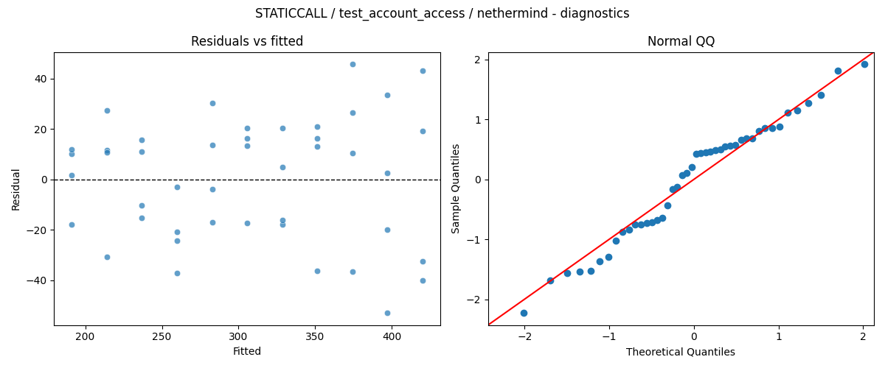

</details>

<details><summary>reth — NNLS regression summary</summary>

```
==============================================================================
                           NNLS Regression Results                            
==============================================================================
Dep. Variable:          test_runtime_ms              R-squared:          0.937
Model:                  NNLS                    Adj. R-squared:          0.936
No. Observations:       110                               RMSE:           5.78
Df Residuals:           108                                MAE:           4.75
Df Model:               1      
==============================================================================
                      coef     std err     P-value      [0.025      0.975]
------------------------------------------------------------------------------
         const     35.1664      1.8332       0.001     31.7149     38.8303
       opcount      0.0011      0.0000       0.001      0.0010      0.0011
==============================================================================
Notes: Non-negative least squares with bootstrap inference (1000 iterations)
==============================================================================
```

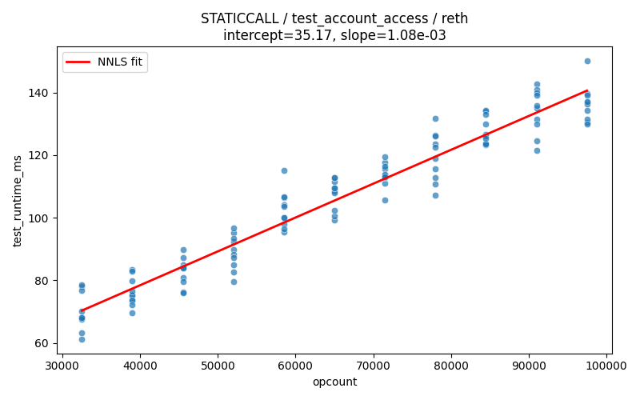

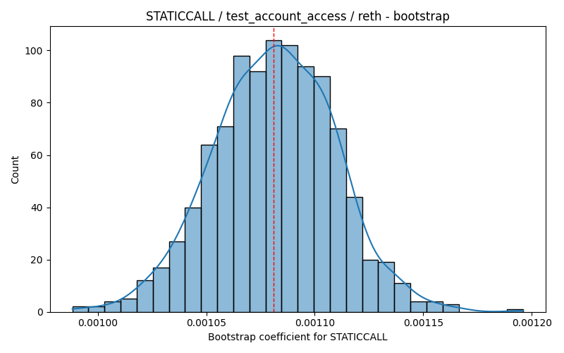

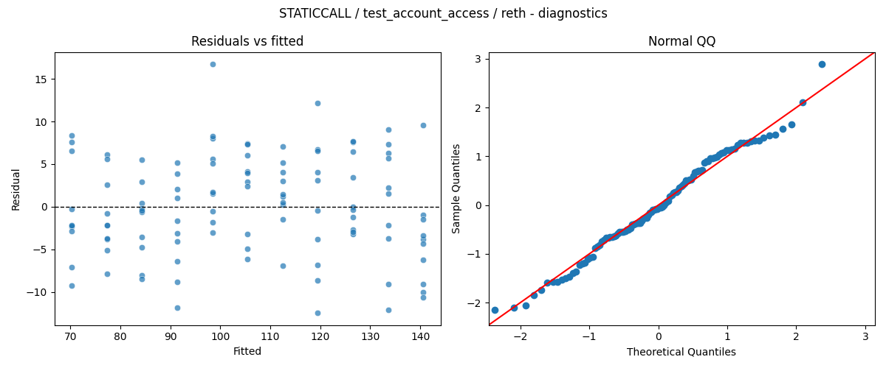

</details>

### test_account_access — combo `STATICCALL_AccountMode.EXISTING_CONTRACT_DIFF_MAX`

| client | nobs | R² | target_coef (ms) | p-value | 95% CI |
| --- | --- | --- | --- | --- | --- |
| `besu` | 66 | 0.9821 | 0.02284 | 1.00e-03 | [0.02229, 0.02342] |
| `erigon` | 11 | 0.8867 | 0.1188 | 1.00e-03 | [0.08591, 0.1342] |
| `geth` | 108 | 0.9264 | 0.02119 | 1.00e-03 | [0.02004, 0.0224] |
| `nethermind` | 44 | 0.9018 | 0.0156 | 1.00e-03 | [0.01387, 0.01736] |
| `reth` | 110 | 0.9959 | 0.0215 | 1.00e-03 | [0.0213, 0.02171] |

<details><summary>besu — NNLS regression summary</summary>

```
==============================================================================
                           NNLS Regression Results                            
==============================================================================
Dep. Variable:          test_runtime_ms              R-squared:          0.982
Model:                  NNLS                    Adj. R-squared:          0.982
No. Observations:       66                                RMSE:          62.33
Df Residuals:           64                                 MAE:          50.59
Df Model:               1      
==============================================================================
                      coef     std err     P-value      [0.025      0.975]
------------------------------------------------------------------------------
         const    441.5008     21.0567       0.001    399.0276    481.7384
       opcount      0.0228      0.0003       0.001      0.0223      0.0234
==============================================================================
Notes: Non-negative least squares with bootstrap inference (1000 iterations)
==============================================================================
```

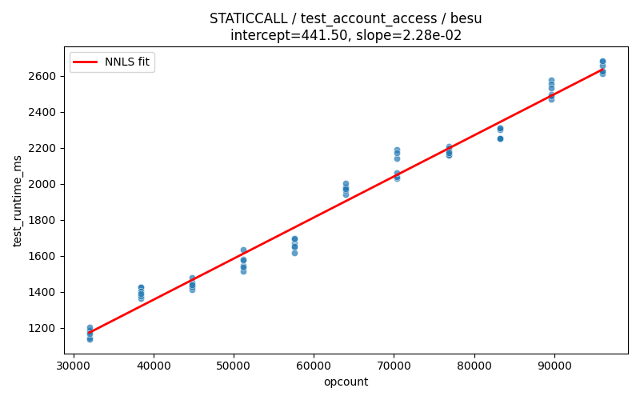

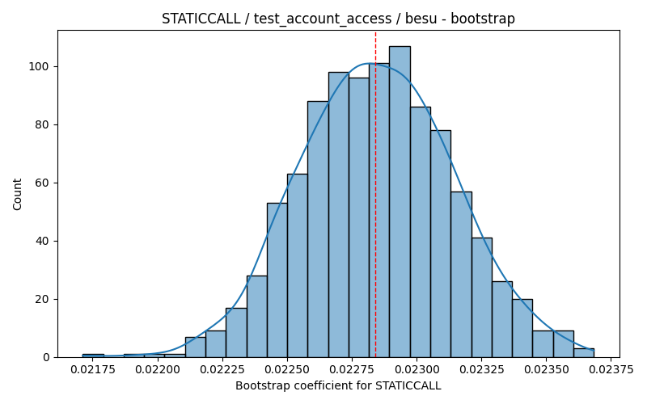

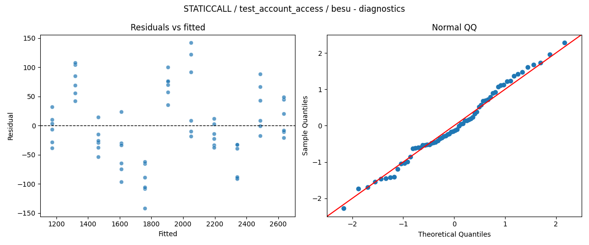

</details>

<details><summary>erigon — NNLS regression summary</summary>

```
==============================================================================
                           NNLS Regression Results                            
==============================================================================
Dep. Variable:          test_runtime_ms              R-squared:          0.887
Model:                  NNLS                    Adj. R-squared:          0.874
No. Observations:       11                                RMSE:         859.64
Df Residuals:           9                                  MAE:         749.46
Df Model:               1      
==============================================================================
                      coef     std err     P-value      [0.025      0.975]
------------------------------------------------------------------------------
         const    858.2860    940.0553       0.160      0.0000   3286.5146
       opcount      0.1188      0.0130       0.001      0.0859      0.1342
==============================================================================
Notes: Non-negative least squares with bootstrap inference (1000 iterations)
==============================================================================
```

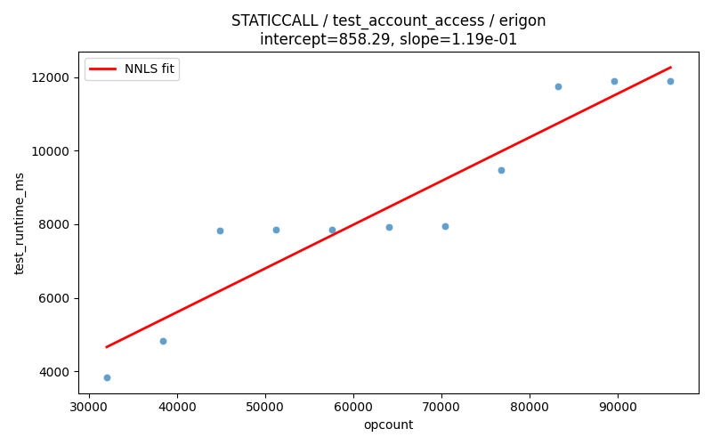

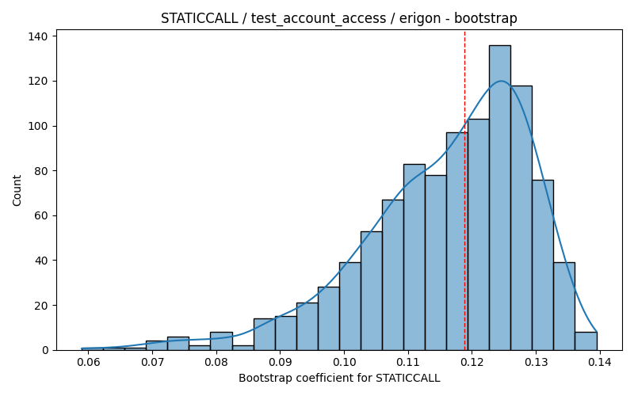


</details>

<details><summary>geth — NNLS regression summary</summary>

```
==============================================================================
                           NNLS Regression Results                            
==============================================================================
Dep. Variable:          test_runtime_ms              R-squared:          0.926
Model:                  NNLS                    Adj. R-squared:          0.926
No. Observations:       108                               RMSE:         120.57
Df Residuals:           106                                MAE:         100.15
Df Model:               1      
==============================================================================
                      coef     std err     P-value      [0.025      0.975]
------------------------------------------------------------------------------
         const    510.6289     41.5321       0.001    428.4658    596.9173
       opcount      0.0212      0.0006       0.001      0.0200      0.0224
==============================================================================
Notes: Non-negative least squares with bootstrap inference (1000 iterations)
==============================================================================
```


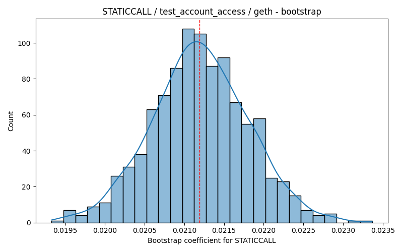

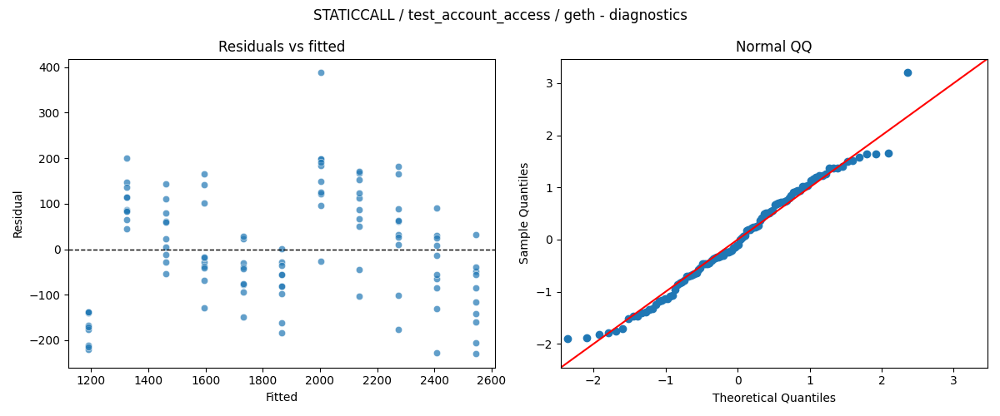

</details>

<details><summary>nethermind — NNLS regression summary</summary>

```
==============================================================================
                           NNLS Regression Results                            
==============================================================================
Dep. Variable:          test_runtime_ms              R-squared:          0.902
Model:                  NNLS                    Adj. R-squared:          0.899
No. Observations:       44                                RMSE:         104.20
Df Residuals:           42                                 MAE:          88.55
Df Model:               1      
==============================================================================
                      coef     std err     P-value      [0.025      0.975]
------------------------------------------------------------------------------
         const    639.5576     68.2173       0.001    514.4629    777.1620
       opcount      0.0156      0.0009       0.001      0.0139      0.0174
==============================================================================
Notes: Non-negative least squares with bootstrap inference (1000 iterations)
==============================================================================
```


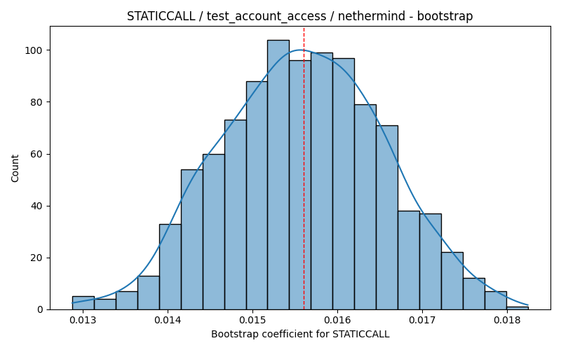

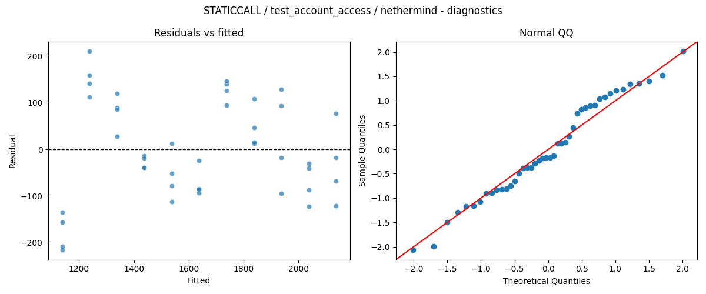

</details>

<details><summary>reth — NNLS regression summary</summary>

```
==============================================================================
                           NNLS Regression Results                            
==============================================================================
Dep. Variable:          test_runtime_ms              R-squared:          0.996
Model:                  NNLS                    Adj. R-squared:          0.996
No. Observations:       110                               RMSE:          27.93
Df Residuals:           108                                MAE:          20.04
Df Model:               1      
==============================================================================
                      coef     std err     P-value      [0.025      0.975]
------------------------------------------------------------------------------
         const    144.8237      7.2429       0.001    131.6002    158.9108
       opcount      0.0215      0.0001       0.001      0.0213      0.0217
==============================================================================
Notes: Non-negative least squares with bootstrap inference (1000 iterations)
==============================================================================
```

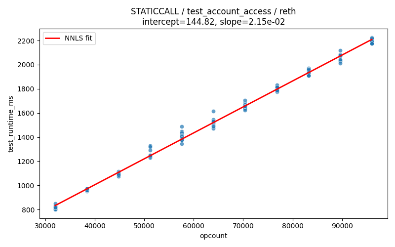

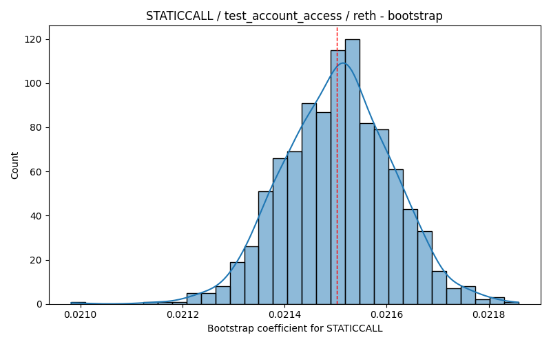

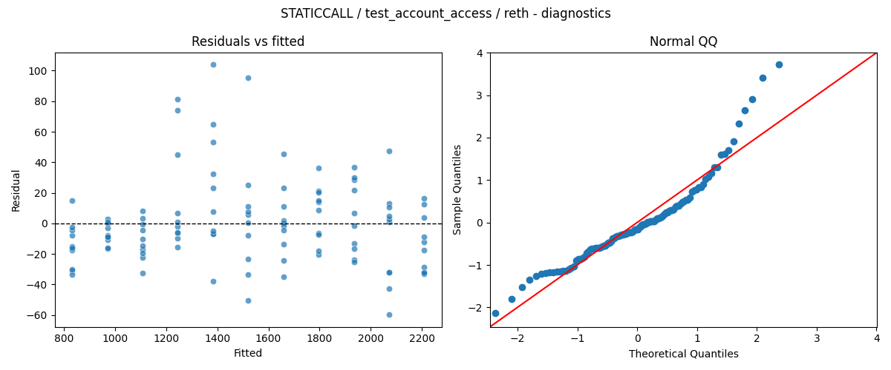

</details>

### test_account_access — combo `STATICCALL_AccountMode.EXISTING_CONTRACT_MINIMAL`

| client | nobs | R² | target_coef (ms) | p-value | 95% CI |
| --- | --- | --- | --- | --- | --- |
| `besu` | 66 | 0.9878 | 0.01517 | 1.00e-03 | [0.01473, 0.01566] |
| `erigon` | 11 | 0.9876 | 0.009601 | 1.00e-03 | [0.008726, 0.01014] |
| `geth` | 110 | 0.9418 | 0.005378 | 1.00e-03 | [0.005091, 0.005643] |
| `nethermind` | 44 | 0.591 | 0.002327 | 1.00e-03 | [0.001677, 0.002913] |
| `reth` | 110 | 0.9702 | 0.003927 | 1.00e-03 | [0.003807, 0.004059] |

<details><summary>besu — NNLS regression summary</summary>

```
==============================================================================
                           NNLS Regression Results                            
==============================================================================
Dep. Variable:          test_runtime_ms              R-squared:          0.988
Model:                  NNLS                    Adj. R-squared:          0.988
No. Observations:       66                                RMSE:          34.15
Df Residuals:           64                                 MAE:          25.87
Df Model:               1      
==============================================================================
                      coef     std err     P-value      [0.025      0.975]
------------------------------------------------------------------------------
         const    335.9792     14.3914       0.001    306.2531    364.3137
       opcount      0.0152      0.0002       0.001      0.0147      0.0157
==============================================================================
Notes: Non-negative least squares with bootstrap inference (1000 iterations)
==============================================================================
```

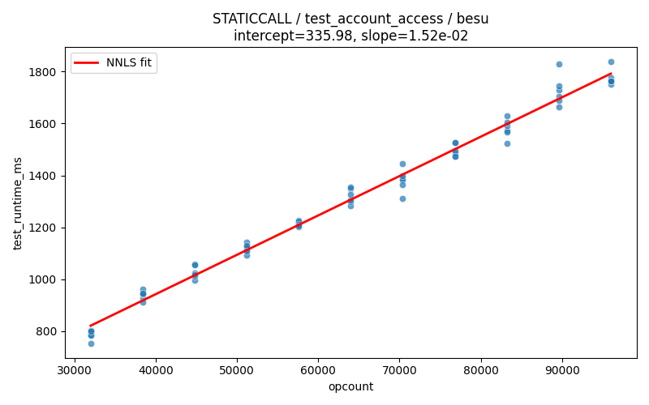

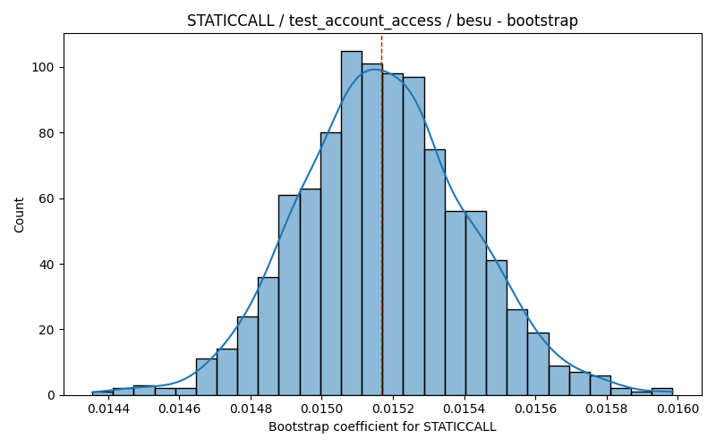

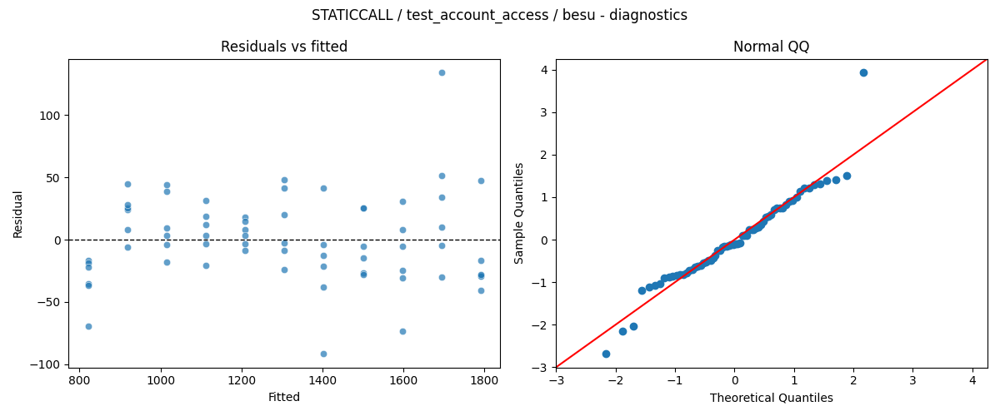

</details>

<details><summary>erigon — NNLS regression summary</summary>

```
==============================================================================
                           NNLS Regression Results                            
==============================================================================
Dep. Variable:          test_runtime_ms              R-squared:          0.988
Model:                  NNLS                    Adj. R-squared:          0.986
No. Observations:       11                                RMSE:          21.81
Df Residuals:           9                                  MAE:          18.99
Df Model:               1      
==============================================================================
                      coef     std err     P-value      [0.025      0.975]
------------------------------------------------------------------------------
         const    159.9823     28.3248       0.001    117.8370    222.3336
       opcount      0.0096      0.0004       0.001      0.0087      0.0101
==============================================================================
Notes: Non-negative least squares with bootstrap inference (1000 iterations)
==============================================================================
```

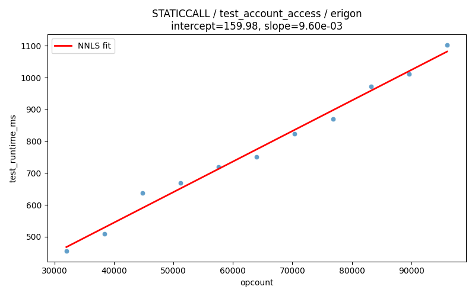

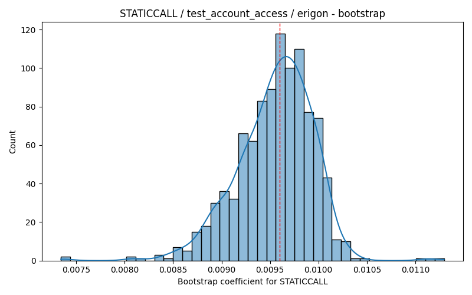

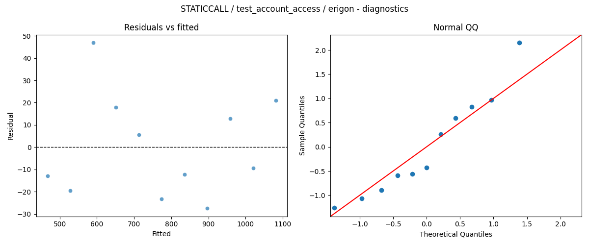

</details>

<details><summary>geth — NNLS regression summary</summary>

```
==============================================================================
                           NNLS Regression Results                            
==============================================================================
Dep. Variable:          test_runtime_ms              R-squared:          0.942
Model:                  NNLS                    Adj. R-squared:          0.941
No. Observations:       110                               RMSE:          27.05
Df Residuals:           108                                MAE:          21.66
Df Model:               1      
==============================================================================
                      coef     std err     P-value      [0.025      0.975]
------------------------------------------------------------------------------
         const     61.5415      8.1966       0.001     44.8346     77.3708
       opcount      0.0054      0.0001       0.001      0.0051      0.0056
==============================================================================
Notes: Non-negative least squares with bootstrap inference (1000 iterations)
==============================================================================
```

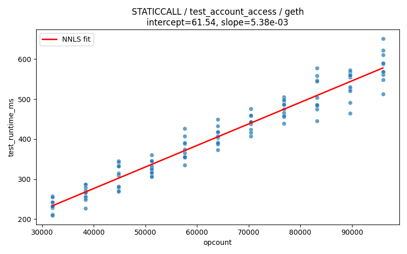

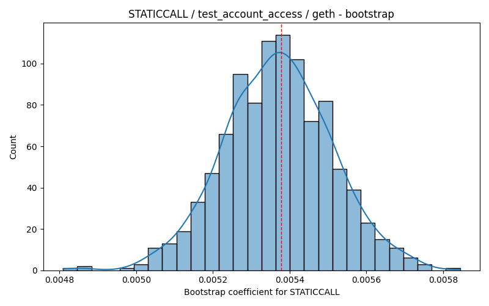

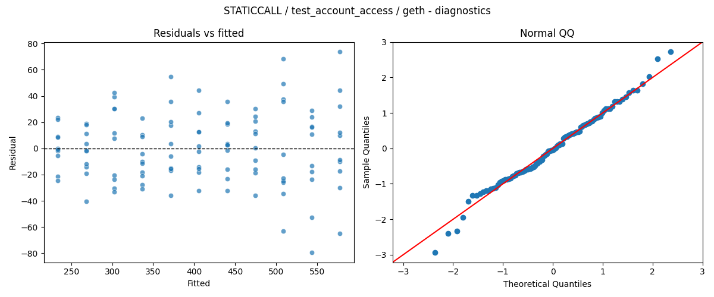

</details>

<details><summary>nethermind — NNLS regression summary</summary>

```
==============================================================================
                           NNLS Regression Results                            
==============================================================================
Dep. Variable:          test_runtime_ms              R-squared:          0.591
Model:                  NNLS                    Adj. R-squared:          0.581
No. Observations:       44                                RMSE:          39.18
Df Residuals:           42                                 MAE:          33.41
Df Model:               1      
==============================================================================
                      coef     std err     P-value      [0.025      0.975]
------------------------------------------------------------------------------
         const    144.6585     19.3460       0.001    109.3095    184.7379
       opcount      0.0023      0.0003       0.001      0.0017      0.0029
==============================================================================
Notes: Non-negative least squares with bootstrap inference (1000 iterations)
==============================================================================
```

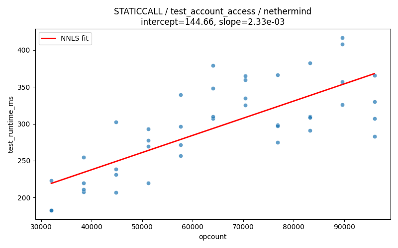

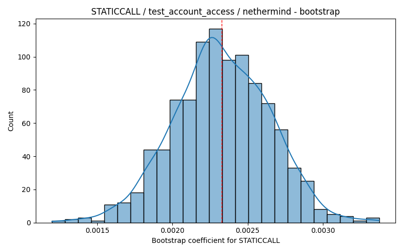

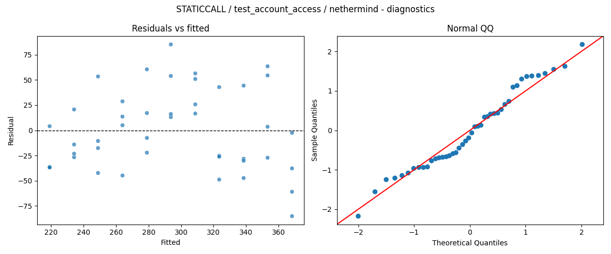

</details>

<details><summary>reth — NNLS regression summary</summary>

```
==============================================================================
                           NNLS Regression Results                            
==============================================================================
Dep. Variable:          test_runtime_ms              R-squared:          0.970
Model:                  NNLS                    Adj. R-squared:          0.970
No. Observations:       110                               RMSE:          13.92
Df Residuals:           108                                MAE:          10.75
Df Model:               1      
==============================================================================
                      coef     std err     P-value      [0.025      0.975]
------------------------------------------------------------------------------
         const     96.4829      3.6895       0.001     89.1837    103.9019
       opcount      0.0039      0.0001       0.001      0.0038      0.0041
==============================================================================
Notes: Non-negative least squares with bootstrap inference (1000 iterations)
==============================================================================
```

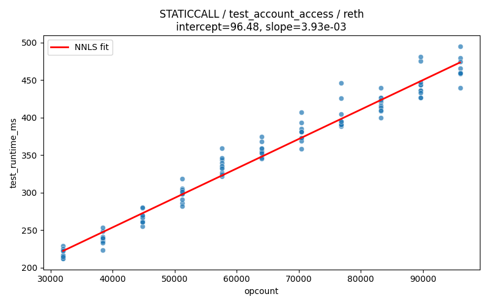

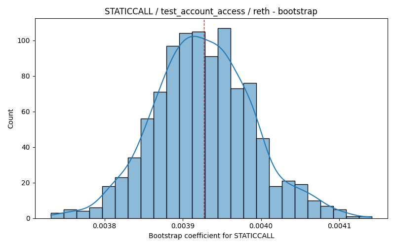

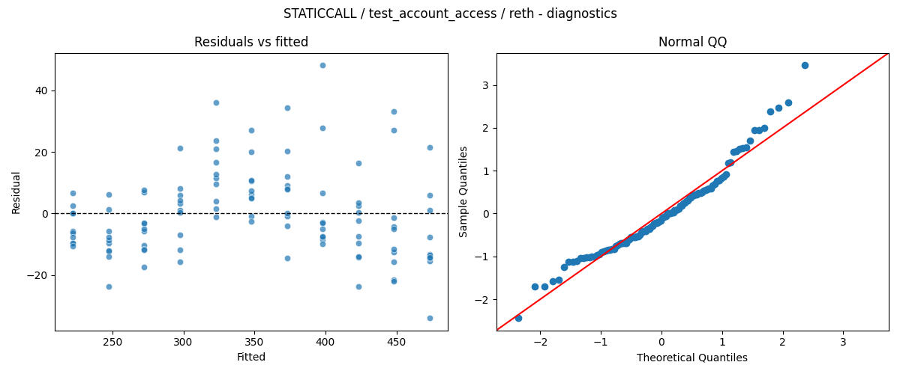

</details>

### test_account_access — combo `STATICCALL_AccountMode.EXISTING_CONTRACT_SAME_MAX`

| client | nobs | R² | target_coef (ms) | p-value | 95% CI |
| --- | --- | --- | --- | --- | --- |
| `besu` | 66 | 0.975 | 0.01316 | 1.00e-03 | [0.01255, 0.01363] |
| `erigon` | 11 | 0.9777 | 0.009241 | 1.00e-03 | [0.008239, 0.009895] |
| `geth` | 108 | 0.9549 | 0.00519 | 1.00e-03 | [0.005003, 0.005388] |
| `nethermind` | 44 | 0.7282 | 0.002601 | 1.00e-03 | [0.002125, 0.003072] |
| `reth` | 110 | 0.9753 | 0.003999 | 1.00e-03 | [0.003881, 0.004118] |

<details><summary>besu — NNLS regression summary</summary>

```
==============================================================================
                           NNLS Regression Results                            
==============================================================================
Dep. Variable:          test_runtime_ms              R-squared:          0.975
Model:                  NNLS                    Adj. R-squared:          0.975
No. Observations:       66                                RMSE:          42.66
Df Residuals:           64                                 MAE:          30.65
Df Model:               1      
==============================================================================
                      coef     std err     P-value      [0.025      0.975]
------------------------------------------------------------------------------
         const    422.6900     18.7916       0.001    389.9817    464.0187
       opcount      0.0132      0.0003       0.001      0.0126      0.0136
==============================================================================
Notes: Non-negative least squares with bootstrap inference (1000 iterations)
==============================================================================
```

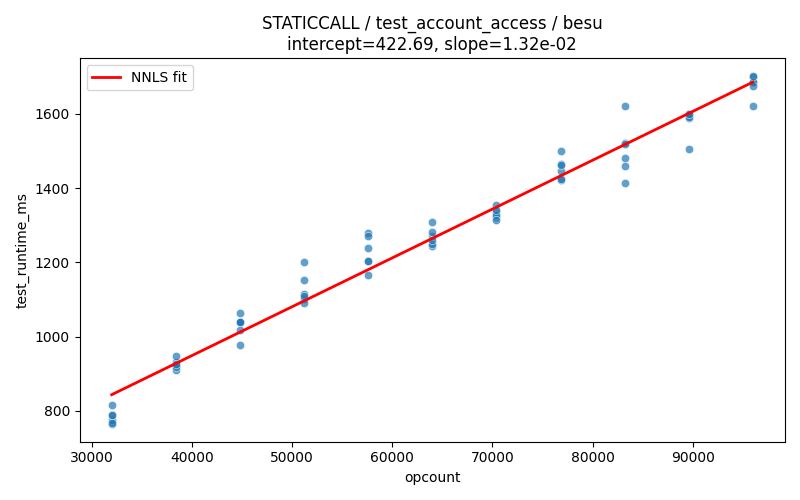

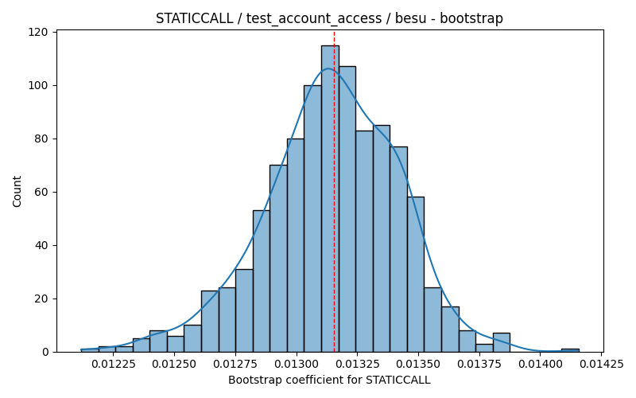

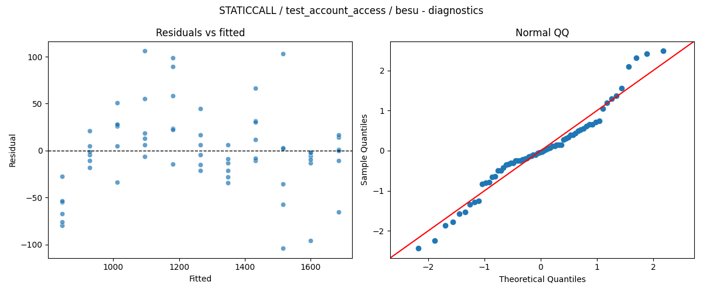

</details>

<details><summary>erigon — NNLS regression summary</summary>

```
==============================================================================
                           NNLS Regression Results                            
==============================================================================
Dep. Variable:          test_runtime_ms              R-squared:          0.978
Model:                  NNLS                    Adj. R-squared:          0.975
No. Observations:       11                                RMSE:          28.25
Df Residuals:           9                                  MAE:          20.99
Df Model:               1      
==============================================================================
                      coef     std err     P-value      [0.025      0.975]
------------------------------------------------------------------------------
         const    176.0464     28.9362       0.001    128.7711    243.9009
       opcount      0.0092      0.0004       0.001      0.0082      0.0099
==============================================================================
Notes: Non-negative least squares with bootstrap inference (1000 iterations)
==============================================================================
```


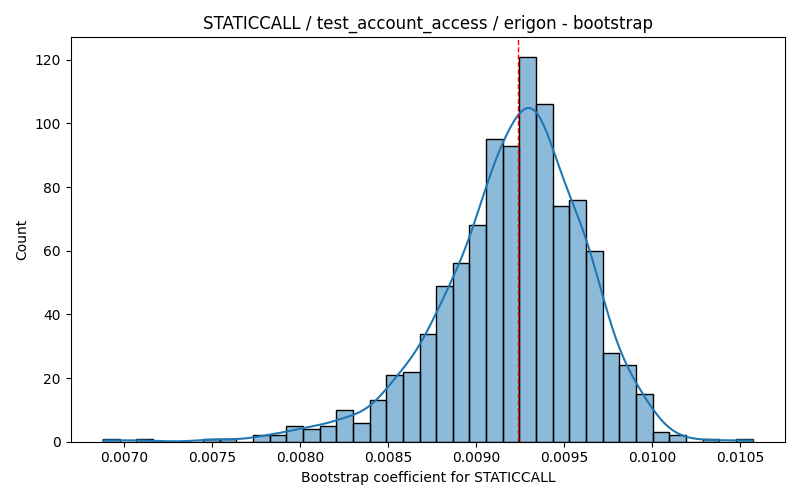

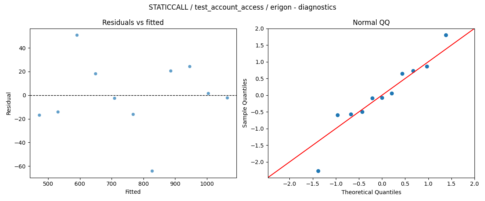

</details>

<details><summary>geth — NNLS regression summary</summary>

```
==============================================================================
                           NNLS Regression Results                            
==============================================================================
Dep. Variable:          test_runtime_ms              R-squared:          0.955
Model:                  NNLS                    Adj. R-squared:          0.954
No. Observations:       108                               RMSE:          22.89
Df Residuals:           106                                MAE:          18.45
Df Model:               1      
==============================================================================
                      coef     std err     P-value      [0.025      0.975]
------------------------------------------------------------------------------
         const     70.3990      6.2313       0.001     58.4806     82.1864
       opcount      0.0052      0.0001       0.001      0.0050      0.0054
==============================================================================
Notes: Non-negative least squares with bootstrap inference (1000 iterations)
==============================================================================
```

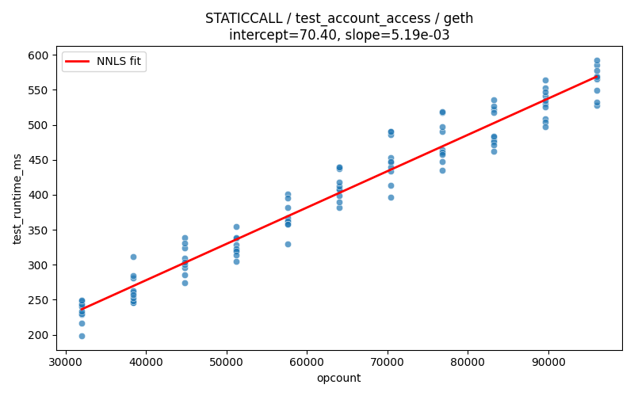

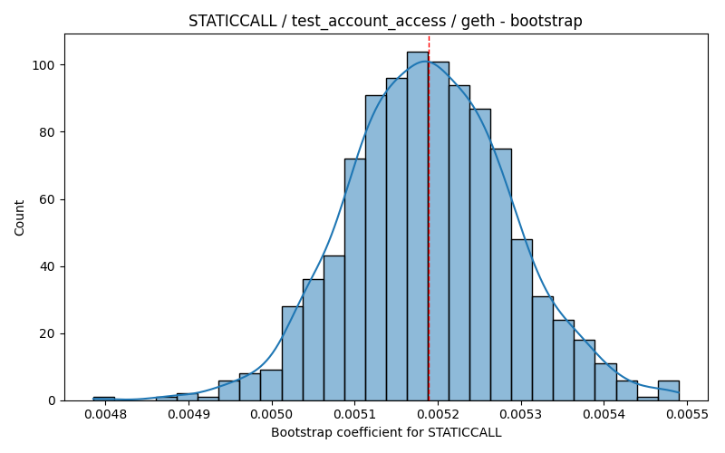

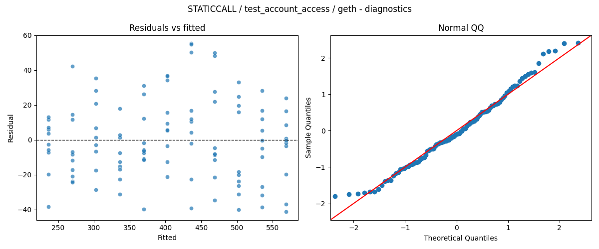

</details>

<details><summary>nethermind — NNLS regression summary</summary>

```
==============================================================================
                           NNLS Regression Results                            
==============================================================================
Dep. Variable:          test_runtime_ms              R-squared:          0.728
Model:                  NNLS                    Adj. R-squared:          0.722
No. Observations:       44                                RMSE:          32.17
Df Residuals:           42                                 MAE:          26.27
Df Model:               1      
==============================================================================
                      coef     std err     P-value      [0.025      0.975]
------------------------------------------------------------------------------
         const    119.9539     15.5107       0.001     93.4471    154.2046
       opcount      0.0026      0.0002       0.001      0.0021      0.0031
==============================================================================
Notes: Non-negative least squares with bootstrap inference (1000 iterations)
==============================================================================
```

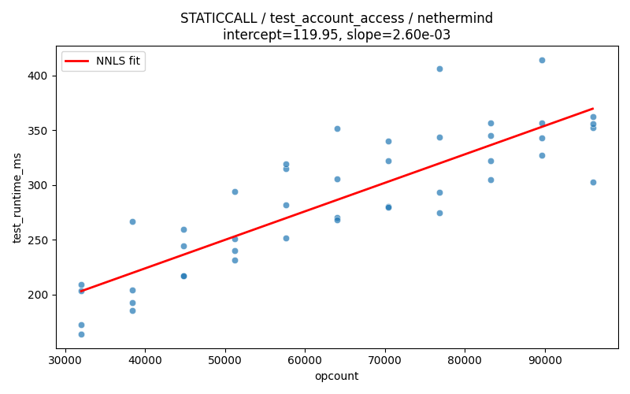

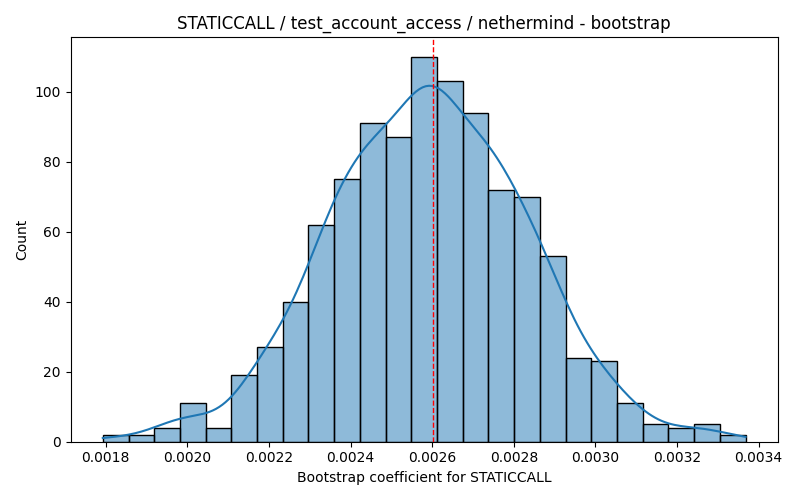

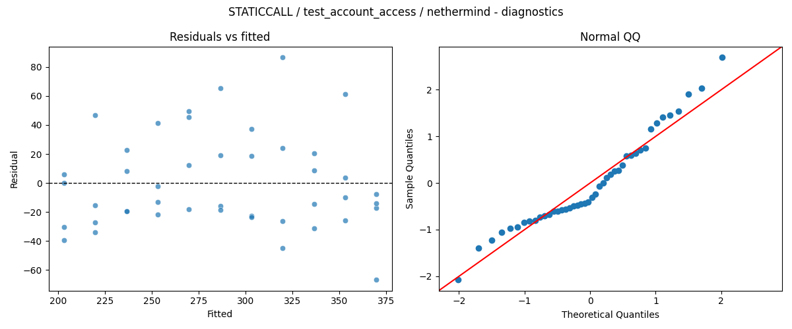

</details>

<details><summary>reth — NNLS regression summary</summary>

```
==============================================================================
                           NNLS Regression Results                            
==============================================================================
Dep. Variable:          test_runtime_ms              R-squared:          0.975
Model:                  NNLS                    Adj. R-squared:          0.975
No. Observations:       110                               RMSE:          12.88
Df Residuals:           108                                MAE:           9.76
Df Model:               1      
==============================================================================
                      coef     std err     P-value      [0.025      0.975]
------------------------------------------------------------------------------
         const     96.2370      3.7354       0.001     89.2943    104.1225
       opcount      0.0040      0.0001       0.001      0.0039      0.0041
==============================================================================
Notes: Non-negative least squares with bootstrap inference (1000 iterations)
==============================================================================
```

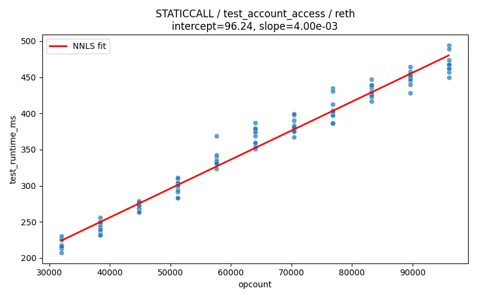

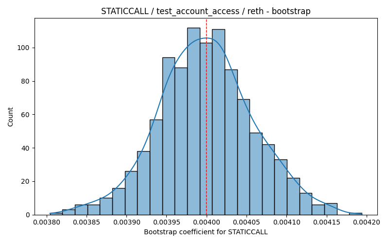

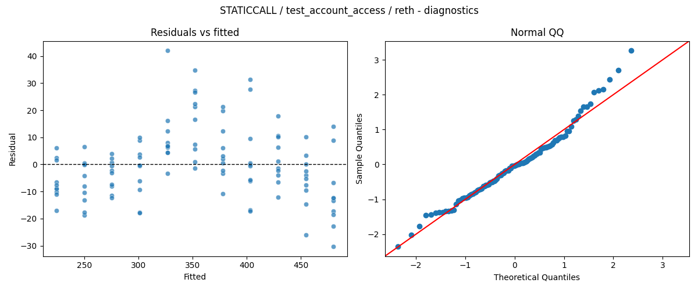

</details>

## EXTCODECOPY

### test_account_access — combo `EXTCODECOPY_AccountMode.EXISTING_EOA`

| client | nobs | R² | target_coef (ms) | p-value | 95% CI |
| --- | --- | --- | --- | --- | --- |
| `besu` | 66 | 0.9795 | 0.01512 | 1.00e-03 | [0.01468, 0.01563] |
| `erigon` | 11 | 0.9959 | 0.007928 | 1.00e-03 | [0.007702, 0.008012] |
| `geth` | 108 | 0.977 | 0.01191 | 1.00e-03 | [0.0116, 0.01224] |
| `nethermind` | 44 | 0.9122 | 0.002995 | 1.00e-03 | [0.002699, 0.003266] |
| `reth` | 110 | 0.9158 | 0.001164 | 1.00e-03 | [0.001098, 0.001233] |

<details><summary>besu — NNLS regression summary</summary>

```
==============================================================================
                           NNLS Regression Results                            
==============================================================================
Dep. Variable:          test_runtime_ms              R-squared:          0.979
Model:                  NNLS                    Adj. R-squared:          0.979
No. Observations:       66                                RMSE:          42.35
Df Residuals:           64                                 MAE:          30.88
Df Model:               1      
==============================================================================
                      coef     std err     P-value      [0.025      0.975]
------------------------------------------------------------------------------
         const    421.1394     13.8746       0.001    392.1140    446.0406
       opcount      0.0151      0.0002       0.001      0.0147      0.0156
==============================================================================
Notes: Non-negative least squares with bootstrap inference (1000 iterations)
==============================================================================
```


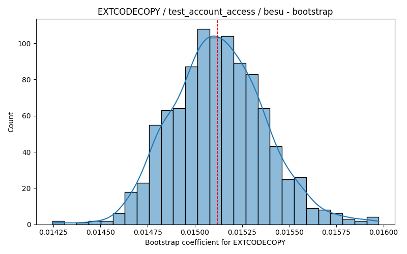

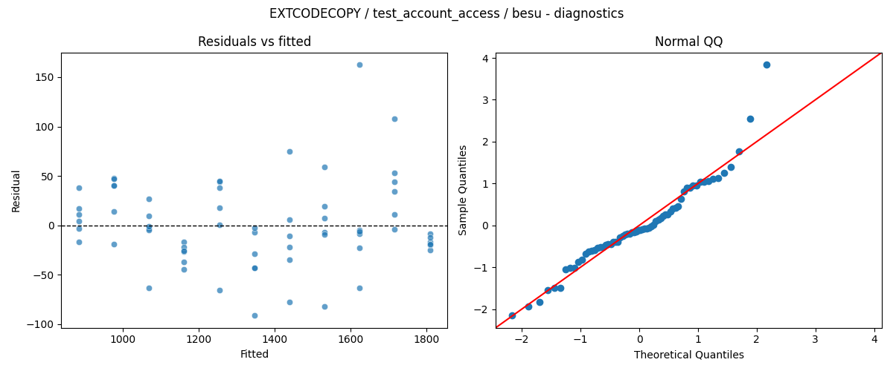

</details>

<details><summary>erigon — NNLS regression summary</summary>

```
==============================================================================
                           NNLS Regression Results                            
==============================================================================
Dep. Variable:          test_runtime_ms              R-squared:          0.996
Model:                  NNLS                    Adj. R-squared:          0.995
No. Observations:       11                                RMSE:          10.02
Df Residuals:           9                                  MAE:           8.90
Df Model:               1      
==============================================================================
                      coef     std err     P-value      [0.025      0.975]
------------------------------------------------------------------------------
         const      0.0000      3.7065       1.000      0.0000     13.3474
       opcount      0.0079      0.0001       0.001      0.0077      0.0080
==============================================================================
Notes: Non-negative least squares with bootstrap inference (1000 iterations)
==============================================================================
```


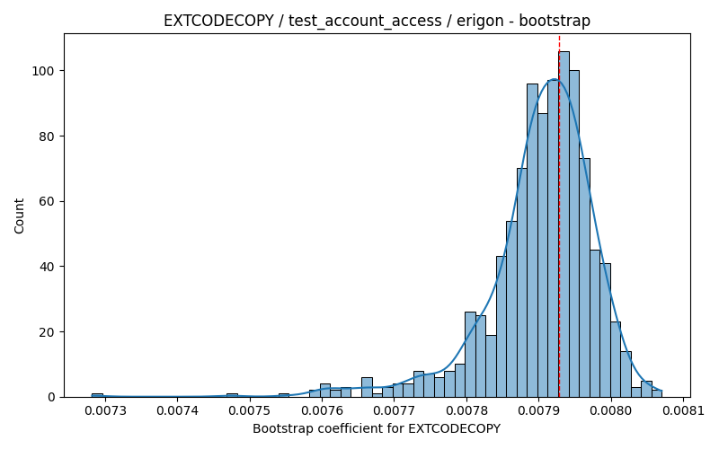

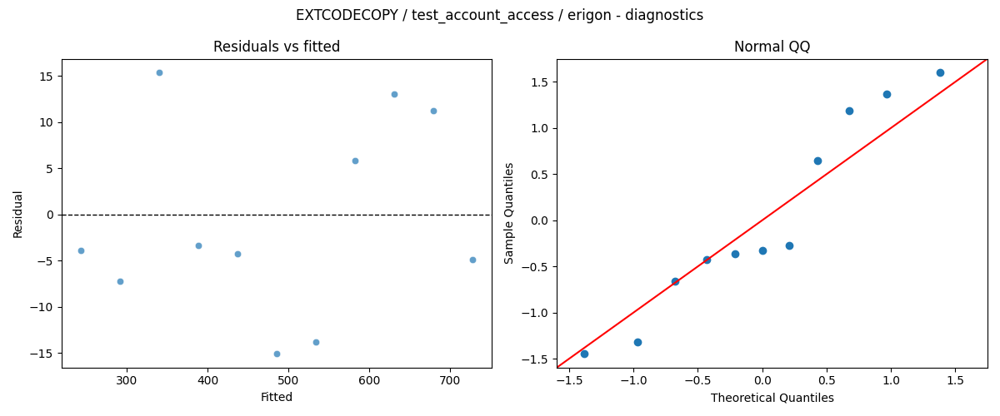

</details>

<details><summary>geth — NNLS regression summary</summary>

```
==============================================================================
                           NNLS Regression Results                            
==============================================================================
Dep. Variable:          test_runtime_ms              R-squared:          0.977
Model:                  NNLS                    Adj. R-squared:          0.977
No. Observations:       108                               RMSE:          35.03
Df Residuals:           106                                MAE:          28.02
Df Model:               1      
==============================================================================
                      coef     std err     P-value      [0.025      0.975]
------------------------------------------------------------------------------
         const    211.6850     10.0722       0.001    192.8770    231.2421
       opcount      0.0119      0.0002       0.001      0.0116      0.0122
==============================================================================
Notes: Non-negative least squares with bootstrap inference (1000 iterations)
==============================================================================
```

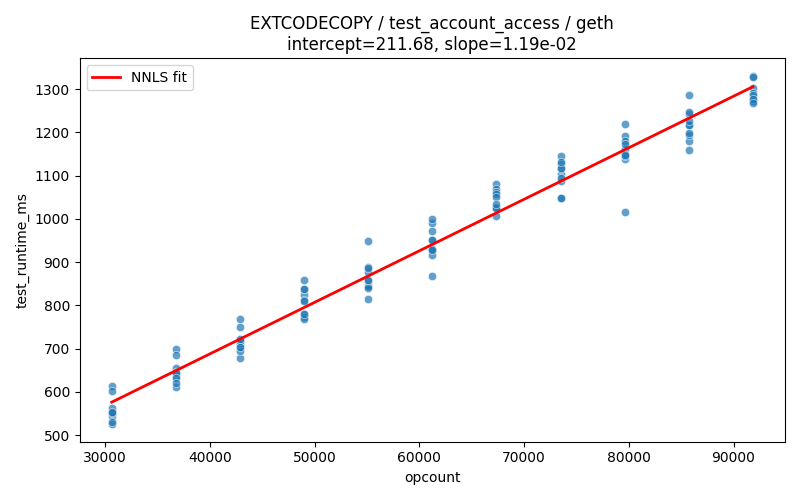

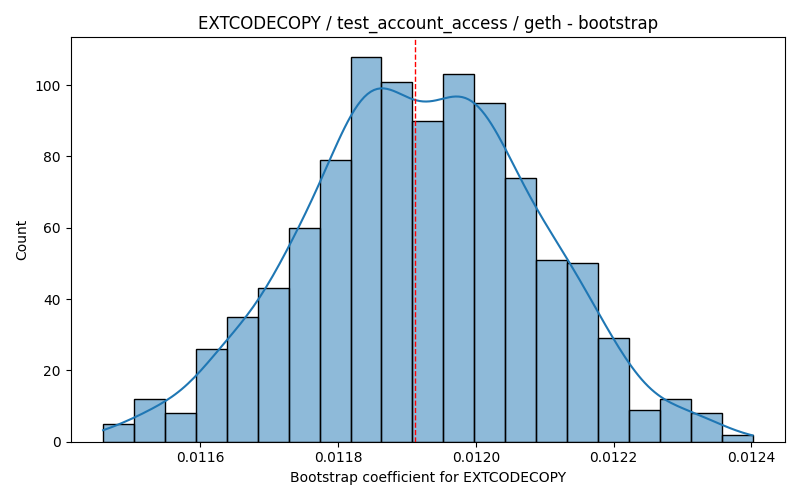

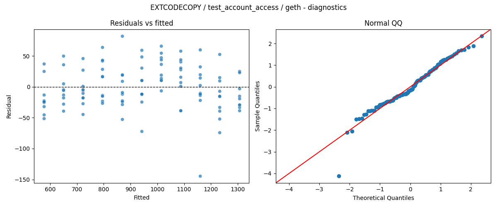

</details>

<details><summary>nethermind — NNLS regression summary</summary>

```
==============================================================================
                           NNLS Regression Results                            
==============================================================================
Dep. Variable:          test_runtime_ms              R-squared:          0.912
Model:                  NNLS                    Adj. R-squared:          0.910
No. Observations:       44                                RMSE:          17.99
Df Residuals:           42                                 MAE:          16.03
Df Model:               1      
==============================================================================
                      coef     std err     P-value      [0.025      0.975]
------------------------------------------------------------------------------
         const    109.0727      9.6697       0.001     91.3906    128.7373
       opcount      0.0030      0.0001       0.001      0.0027      0.0033
==============================================================================
Notes: Non-negative least squares with bootstrap inference (1000 iterations)
==============================================================================
```

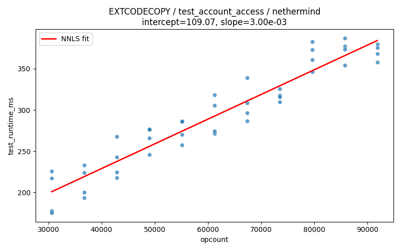

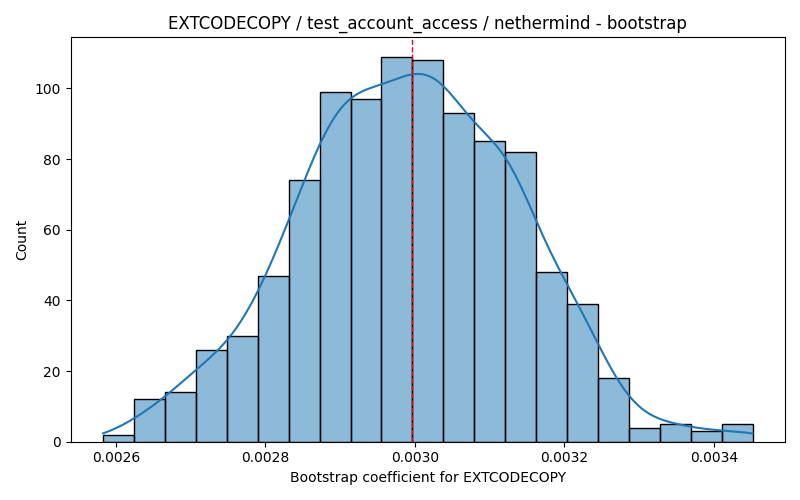

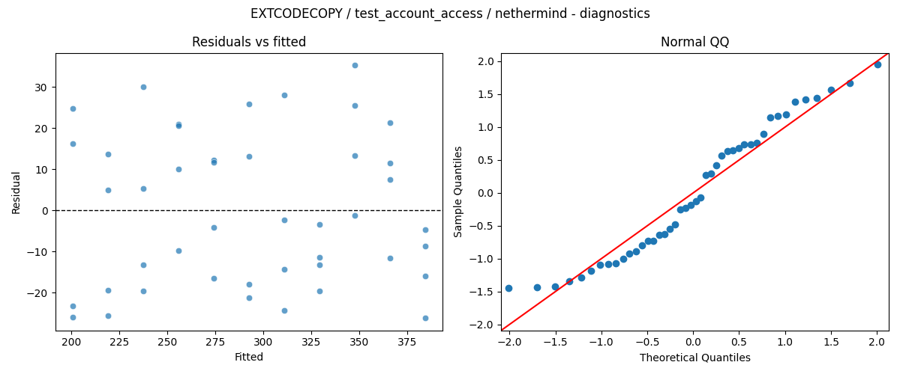

</details>

<details><summary>reth — NNLS regression summary</summary>

```
==============================================================================
                           NNLS Regression Results                            
==============================================================================
Dep. Variable:          test_runtime_ms              R-squared:          0.916
Model:                  NNLS                    Adj. R-squared:          0.915
No. Observations:       110                               RMSE:           6.83
Df Residuals:           108                                MAE:           5.60
Df Model:               1      
==============================================================================
                      coef     std err     P-value      [0.025      0.975]
------------------------------------------------------------------------------
         const     36.9387      2.0254       0.001     32.9596     40.7536
       opcount      0.0012      0.0000       0.001      0.0011      0.0012
==============================================================================
Notes: Non-negative least squares with bootstrap inference (1000 iterations)
==============================================================================
```

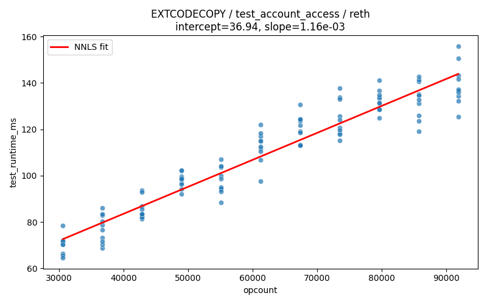

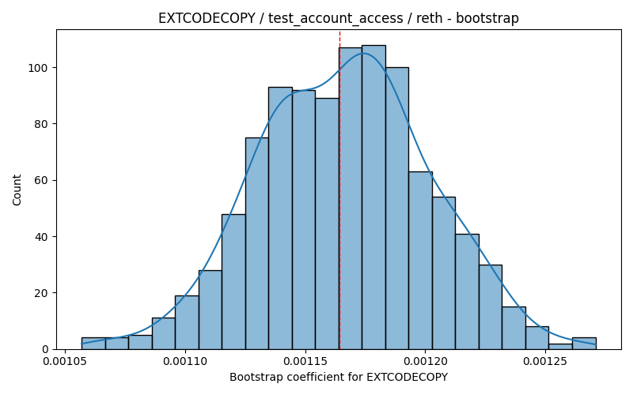

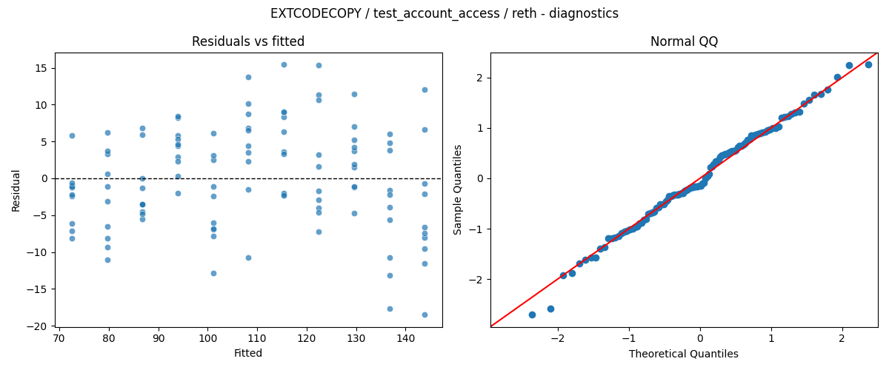

</details>

### test_account_access — combo `EXTCODECOPY_AccountMode.NON_EXISTING_ACCOUNT`

| client | nobs | R² | target_coef (ms) | p-value | 95% CI |
| --- | --- | --- | --- | --- | --- |
| `besu` | 66 | 0.9872 | 0.01485 | 1.00e-03 | [0.01454, 0.01526] |
| `erigon` | 11 | 0.9964 | 0.00782 | 1.00e-03 | [0.007551, 0.007925] |
| `geth` | 109 | 0.981 | 0.02216 | 1.00e-03 | [0.02155, 0.02271] |
| `nethermind` | 44 | 0.9373 | 0.002936 | 1.00e-03 | [0.002703, 0.00317] |
| `reth` | 110 | 0.9059 | 0.0009545 | 1.00e-03 | [0.000898, 0.001011] |

<details><summary>besu — NNLS regression summary</summary>

```
==============================================================================
                           NNLS Regression Results                            
==============================================================================
Dep. Variable:          test_runtime_ms              R-squared:          0.987
Model:                  NNLS                    Adj. R-squared:          0.987
No. Observations:       66                                RMSE:          32.80
Df Residuals:           64                                 MAE:          26.74
Df Model:               1      
==============================================================================
                      coef     std err     P-value      [0.025      0.975]
------------------------------------------------------------------------------
         const    114.1184     12.4028       0.001     87.7916    136.8496
       opcount      0.0149      0.0002       0.001      0.0145      0.0153
==============================================================================
Notes: Non-negative least squares with bootstrap inference (1000 iterations)
==============================================================================
```


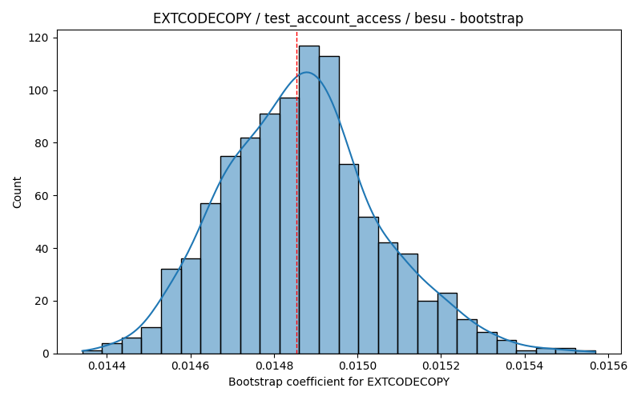

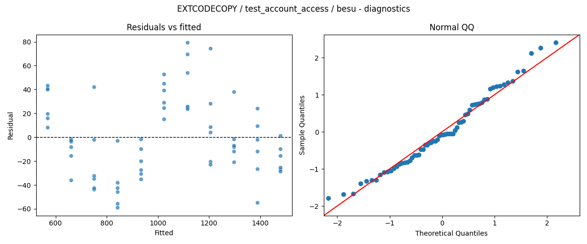

</details>

<details><summary>erigon — NNLS regression summary</summary>

```
==============================================================================
                           NNLS Regression Results                            
==============================================================================
Dep. Variable:          test_runtime_ms              R-squared:          0.996
Model:                  NNLS                    Adj. R-squared:          0.996
No. Observations:       11                                RMSE:           9.29
Df Residuals:           9                                  MAE:           7.54
Df Model:               1      
==============================================================================
                      coef     std err     P-value      [0.025      0.975]
------------------------------------------------------------------------------
         const      0.0000      2.6686       1.000      0.0000     10.0298
       opcount      0.0078      0.0001       0.001      0.0076      0.0079
==============================================================================
Notes: Non-negative least squares with bootstrap inference (1000 iterations)
==============================================================================
```

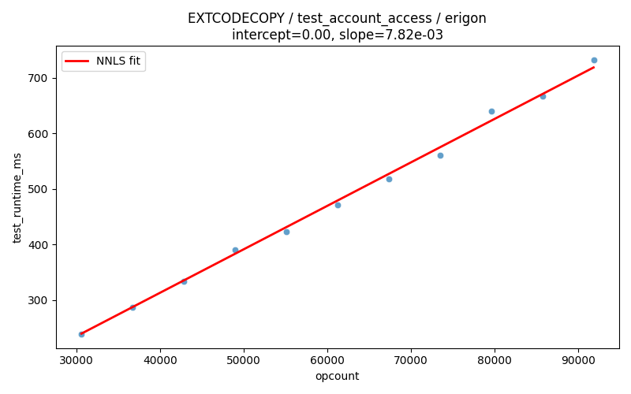

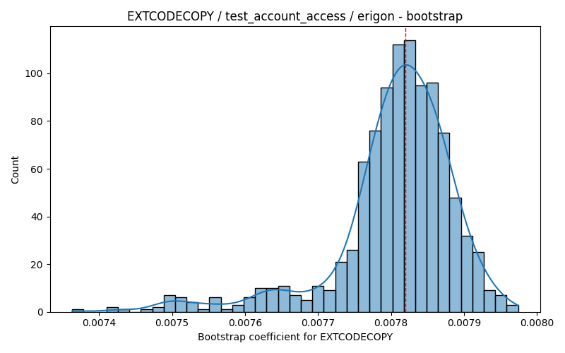

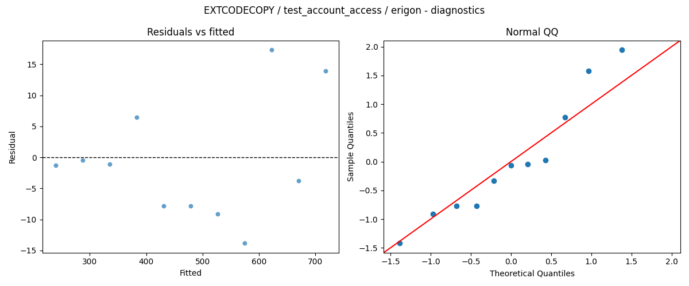

</details>

<details><summary>geth — NNLS regression summary</summary>

```
==============================================================================
                           NNLS Regression Results                            
==============================================================================
Dep. Variable:          test_runtime_ms              R-squared:          0.981
Model:                  NNLS                    Adj. R-squared:          0.981
No. Observations:       109                               RMSE:          60.04
Df Residuals:           107                                MAE:          46.38
Df Model:               1      
==============================================================================
                      coef     std err     P-value      [0.025      0.975]
------------------------------------------------------------------------------
         const    268.1741     17.6954       0.001    235.3284    305.4249
       opcount      0.0222      0.0003       0.001      0.0216      0.0227
==============================================================================
Notes: Non-negative least squares with bootstrap inference (1000 iterations)
==============================================================================
```

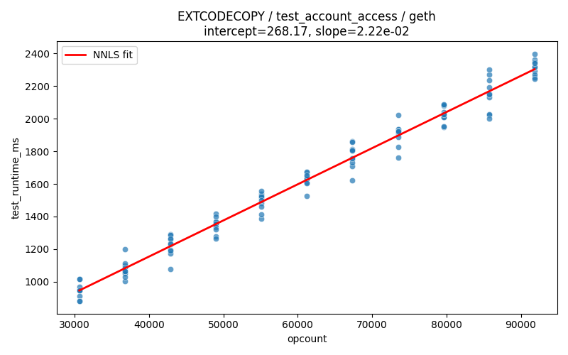

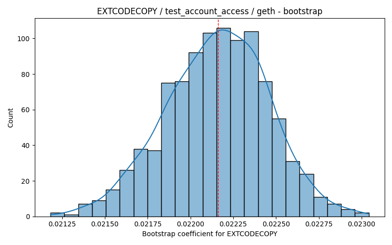

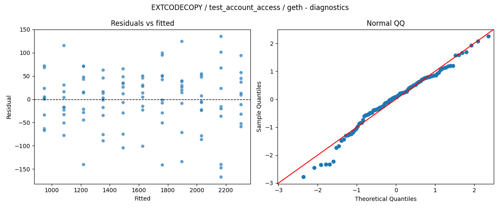

</details>

<details><summary>nethermind — NNLS regression summary</summary>

```
==============================================================================
                           NNLS Regression Results                            
==============================================================================
Dep. Variable:          test_runtime_ms              R-squared:          0.937
Model:                  NNLS                    Adj. R-squared:          0.936
No. Observations:       44                                RMSE:          14.71
Df Residuals:           42                                 MAE:          12.39
Df Model:               1      
==============================================================================
                      coef     std err     P-value      [0.025      0.975]
------------------------------------------------------------------------------
         const     76.3194      6.8021       0.001     62.4244     89.3891
       opcount      0.0029      0.0001       0.001      0.0027      0.0032
==============================================================================
Notes: Non-negative least squares with bootstrap inference (1000 iterations)
==============================================================================
```

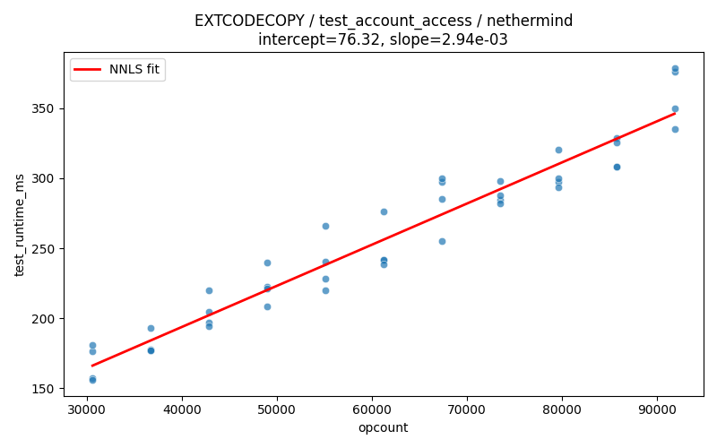

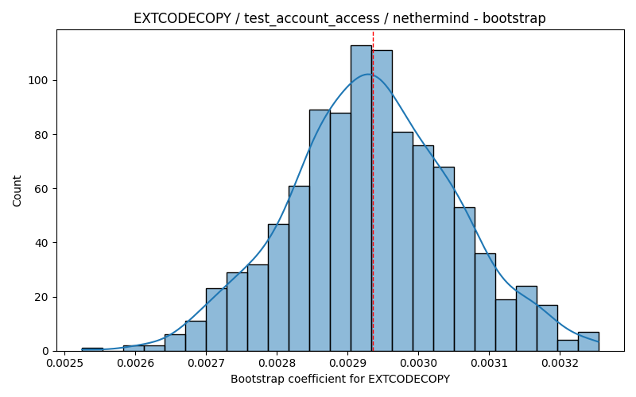

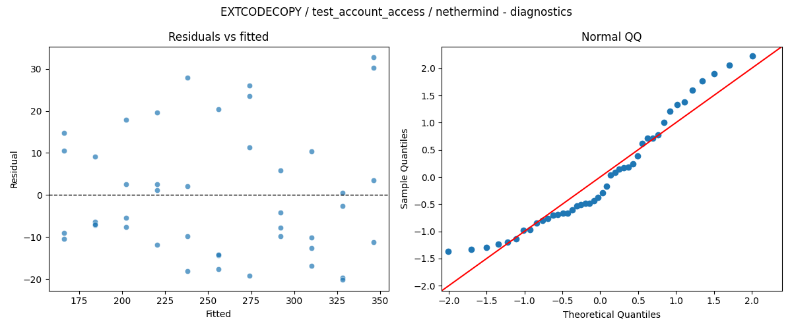

</details>

<details><summary>reth — NNLS regression summary</summary>

```
==============================================================================
                           NNLS Regression Results                            
==============================================================================
Dep. Variable:          test_runtime_ms              R-squared:          0.906
Model:                  NNLS                    Adj. R-squared:          0.905
No. Observations:       110                               RMSE:           5.96
Df Residuals:           108                                MAE:           4.80
Df Model:               1      
==============================================================================
                      coef     std err     P-value      [0.025      0.975]
------------------------------------------------------------------------------
         const     33.4073      1.9064       0.001     29.8761     37.1816
       opcount      0.0010      0.0000       0.001      0.0009      0.0010
==============================================================================
Notes: Non-negative least squares with bootstrap inference (1000 iterations)
==============================================================================
```

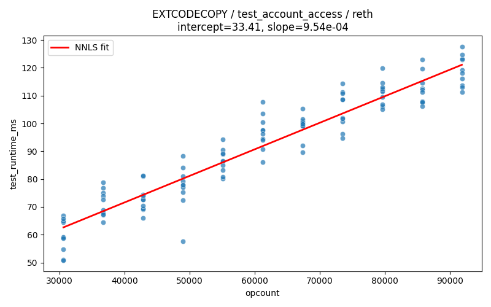

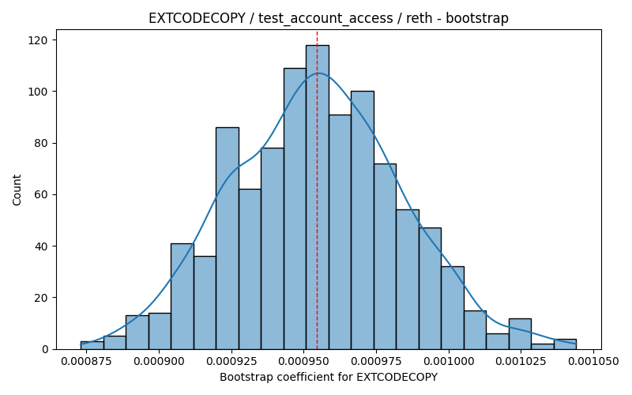

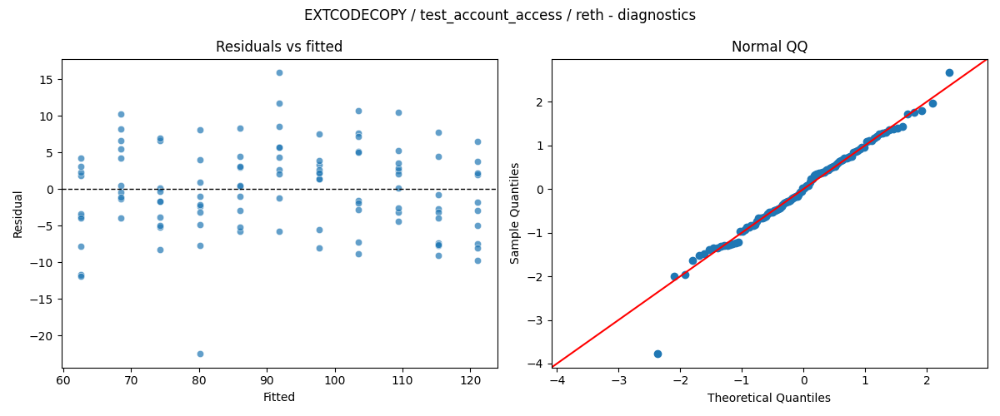

</details>

### test_account_access — combo `EXTCODECOPY_AccountMode.EXISTING_CONTRACT_DIFF_MAX`

| client | nobs | R² | target_coef (ms) | p-value | 95% CI |
| --- | --- | --- | --- | --- | --- |
| `besu` | 66 | 0.9832 | 0.01991 | 1.00e-03 | [0.01922, 0.02057] |
| `erigon` | 11 | 0.8881 | 0.1194 | 1.00e-03 | [0.08827, 0.1338] |
| `geth` | 110 | 0.9373 | 0.02234 | 1.00e-03 | [0.02109, 0.02348] |
| `nethermind` | 44 | 0.8982 | 0.01514 | 1.00e-03 | [0.01347, 0.01671] |
| `reth` | 110 | 0.9973 | 0.02075 | 1.00e-03 | [0.02057, 0.02095] |

<details><summary>besu — NNLS regression summary</summary>

```
==============================================================================
                           NNLS Regression Results                            
==============================================================================
Dep. Variable:          test_runtime_ms              R-squared:          0.983
Model:                  NNLS                    Adj. R-squared:          0.983
No. Observations:       66                                RMSE:          49.59
Df Residuals:           64                                 MAE:          41.12
Df Model:               1      
==============================================================================
                      coef     std err     P-value      [0.025      0.975]
------------------------------------------------------------------------------
         const    399.5886     20.5692       0.001    356.0849    437.4896
       opcount      0.0199      0.0003       0.001      0.0192      0.0206
==============================================================================
Notes: Non-negative least squares with bootstrap inference (1000 iterations)
==============================================================================
```

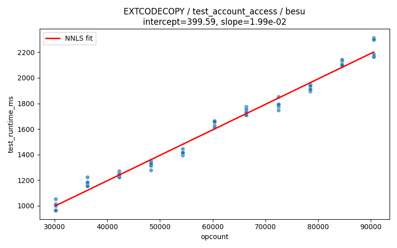

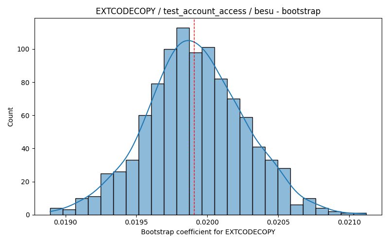

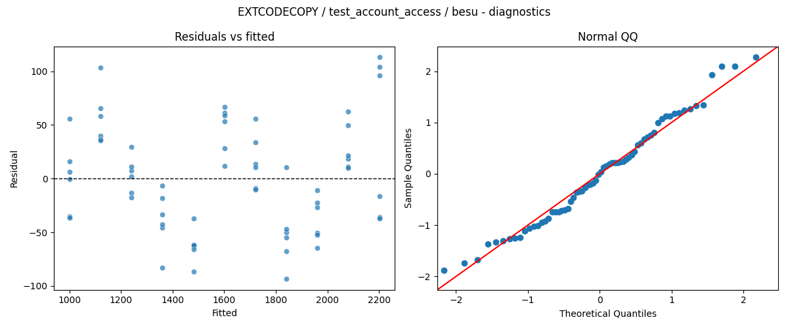

</details>

<details><summary>erigon — NNLS regression summary</summary>

```
==============================================================================
                           NNLS Regression Results                            
==============================================================================
Dep. Variable:          test_runtime_ms              R-squared:          0.888
Model:                  NNLS                    Adj. R-squared:          0.876
No. Observations:       11                                RMSE:         808.75
Df Residuals:           9                                  MAE:         707.56
Df Model:               1      
==============================================================================
                      coef     std err     P-value      [0.025      0.975]
------------------------------------------------------------------------------
         const    743.8632    854.4431       0.205      0.0000   2871.8546
       opcount      0.1194      0.0126       0.001      0.0883      0.1338
==============================================================================
Notes: Non-negative least squares with bootstrap inference (1000 iterations)
==============================================================================
```

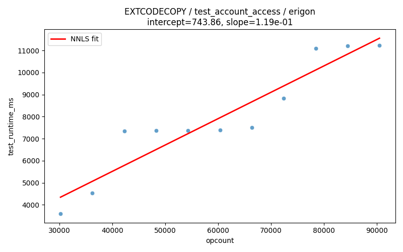

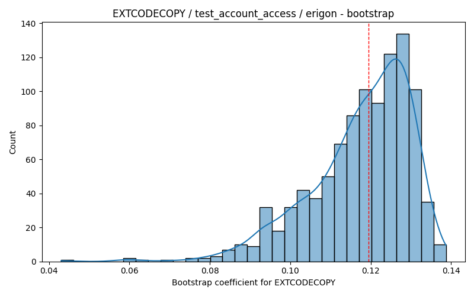

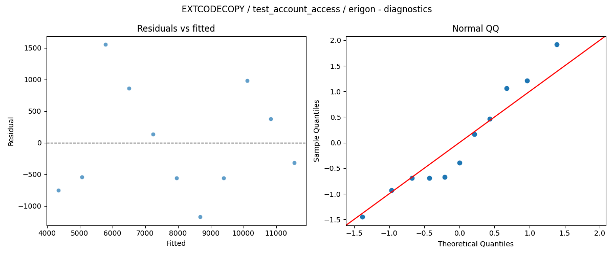

</details>

<details><summary>geth — NNLS regression summary</summary>

```
==============================================================================
                           NNLS Regression Results                            
==============================================================================
Dep. Variable:          test_runtime_ms              R-squared:          0.937
Model:                  NNLS                    Adj. R-squared:          0.937
No. Observations:       110                               RMSE:         110.30
Df Residuals:           108                                MAE:          93.09
Df Model:               1      
==============================================================================
                      coef     std err     P-value      [0.025      0.975]
------------------------------------------------------------------------------
         const    418.9058     39.5891       0.001    344.1505    501.7564
       opcount      0.0223      0.0006       0.001      0.0211      0.0235
==============================================================================
Notes: Non-negative least squares with bootstrap inference (1000 iterations)
==============================================================================
```

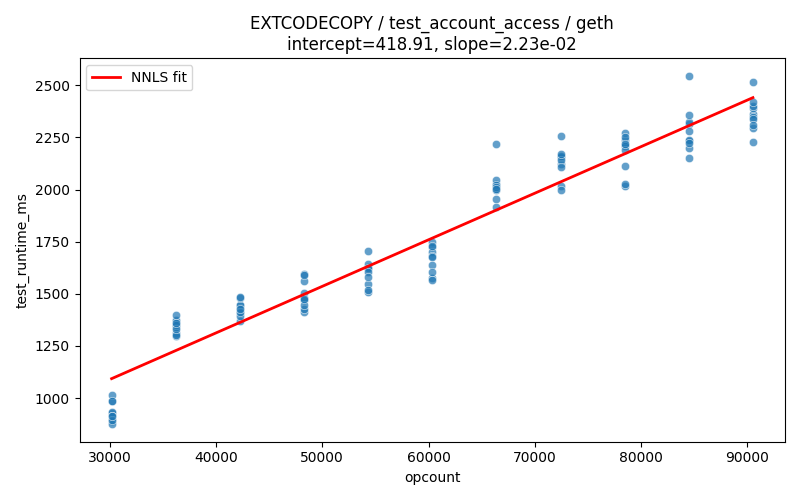

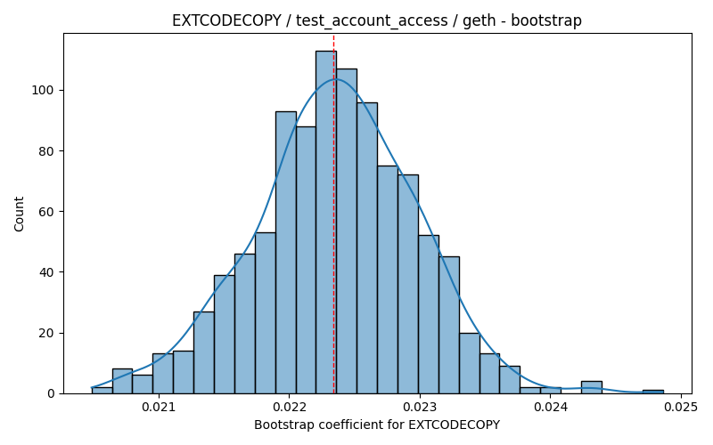

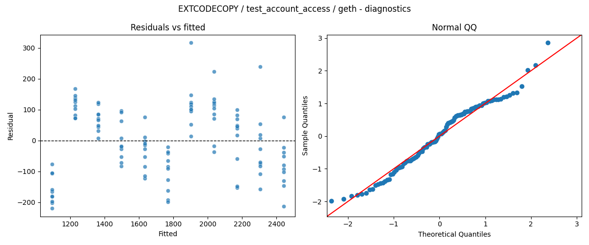

</details>

<details><summary>nethermind — NNLS regression summary</summary>

```
==============================================================================
                           NNLS Regression Results                            
==============================================================================
Dep. Variable:          test_runtime_ms              R-squared:          0.898
Model:                  NNLS                    Adj. R-squared:          0.896
No. Observations:       44                                RMSE:          97.27
Df Residuals:           42                                 MAE:          82.93
Df Model:               1      
==============================================================================
                      coef     std err     P-value      [0.025      0.975]
------------------------------------------------------------------------------
         const    590.1122     58.1673       0.001    484.7137    708.9753
       opcount      0.0151      0.0008       0.001      0.0135      0.0167
==============================================================================
Notes: Non-negative least squares with bootstrap inference (1000 iterations)
==============================================================================
```

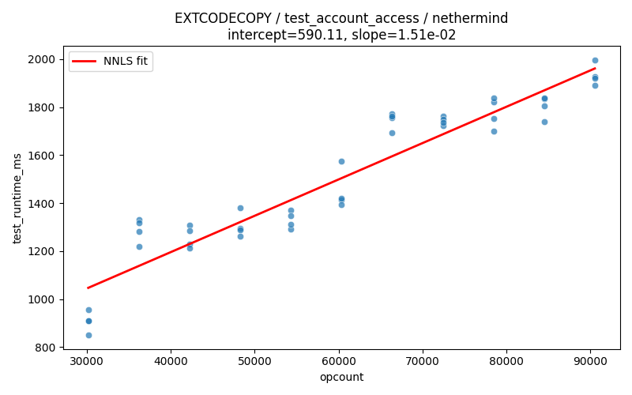

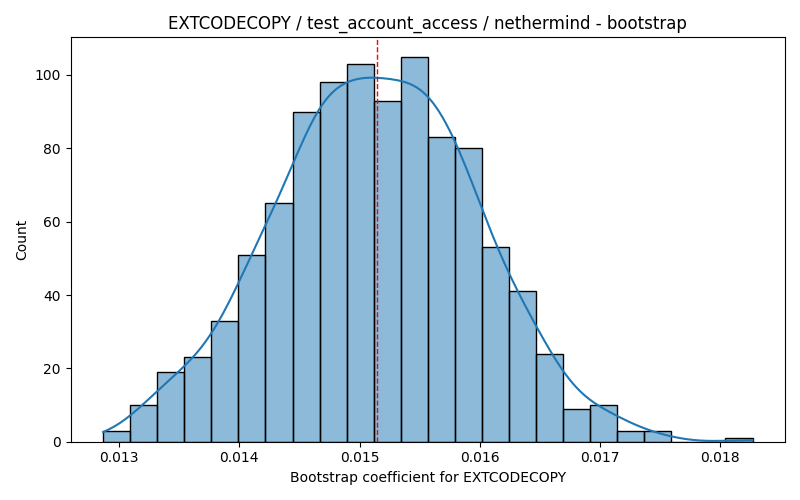

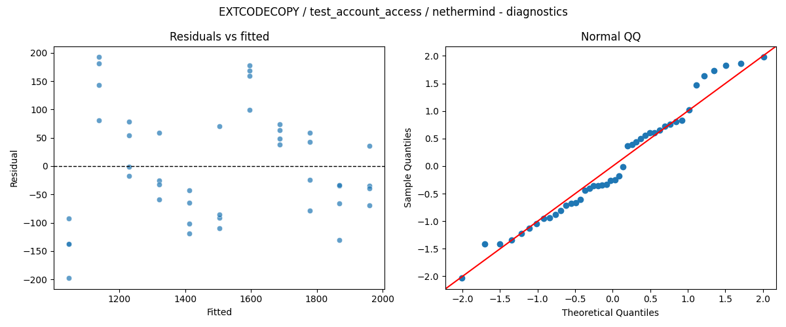

</details>

<details><summary>reth — NNLS regression summary</summary>

```
==============================================================================
                           NNLS Regression Results                            
==============================================================================
Dep. Variable:          test_runtime_ms              R-squared:          0.997
Model:                  NNLS                    Adj. R-squared:          0.997
No. Observations:       110                               RMSE:          20.71
Df Residuals:           108                                MAE:          15.86
Df Model:               1      
==============================================================================
                      coef     std err     P-value      [0.025      0.975]
------------------------------------------------------------------------------
         const    133.8637      5.6819       0.001    122.4662    144.7388
       opcount      0.0208      0.0001       0.001      0.0206      0.0210
==============================================================================
Notes: Non-negative least squares with bootstrap inference (1000 iterations)
==============================================================================
```

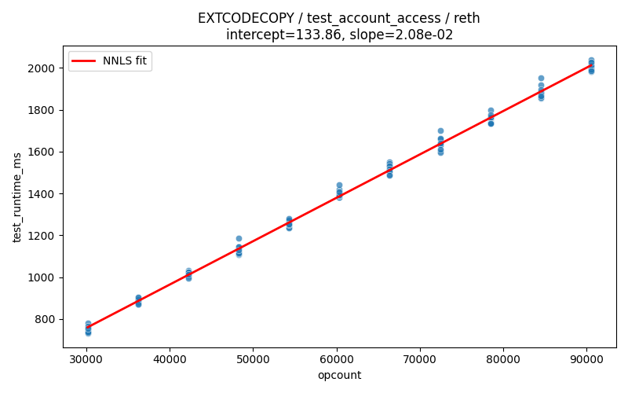

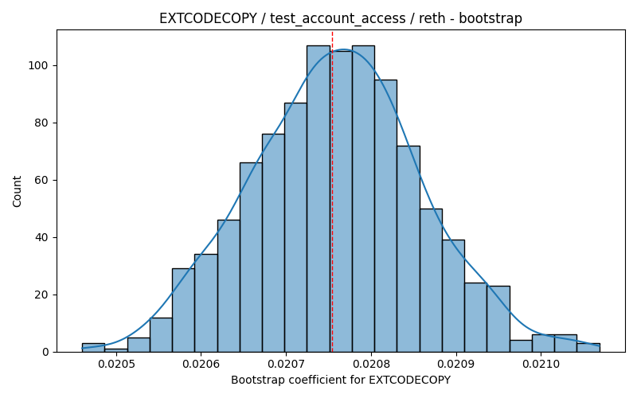

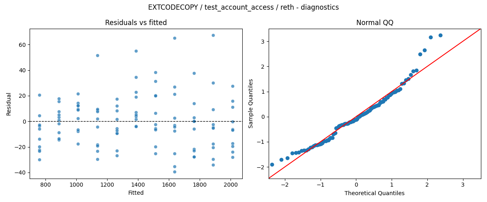

</details>

### test_account_access — combo `EXTCODECOPY_AccountMode.EXISTING_CONTRACT_MINIMAL`

| client | nobs | R² | target_coef (ms) | p-value | 95% CI |
| --- | --- | --- | --- | --- | --- |
| `besu` | 66 | 0.9699 | 0.01252 | 1.00e-03 | [0.01193, 0.01306] |
| `erigon` | 11 | 0.9827 | 0.008602 | 1.00e-03 | [0.007585, 0.009129] |
| `geth` | 108 | 0.9401 | 0.005288 | 1.00e-03 | [0.005023, 0.005557] |
| `nethermind` | 44 | 0.8047 | 0.001842 | 1.00e-03 | [0.001603, 0.002093] |
| `reth` | 110 | 0.9664 | 0.003668 | 1.00e-03 | [0.003539, 0.003806] |

<details><summary>besu — NNLS regression summary</summary>

```
==============================================================================
                           NNLS Regression Results                            
==============================================================================
Dep. Variable:          test_runtime_ms              R-squared:          0.970
Model:                  NNLS                    Adj. R-squared:          0.969
No. Observations:       66                                RMSE:          42.10
Df Residuals:           64                                 MAE:          32.21
Df Model:               1      
==============================================================================
                      coef     std err     P-value      [0.025      0.975]
------------------------------------------------------------------------------
         const    344.6180     16.1241       0.001    314.3159    376.3177
       opcount      0.0125      0.0003       0.001      0.0119      0.0131
==============================================================================
Notes: Non-negative least squares with bootstrap inference (1000 iterations)
==============================================================================
```

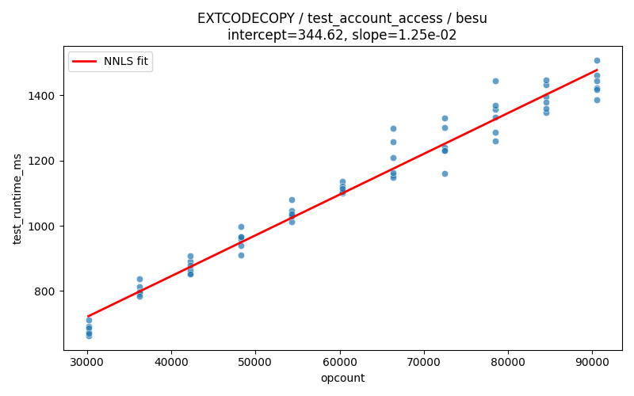

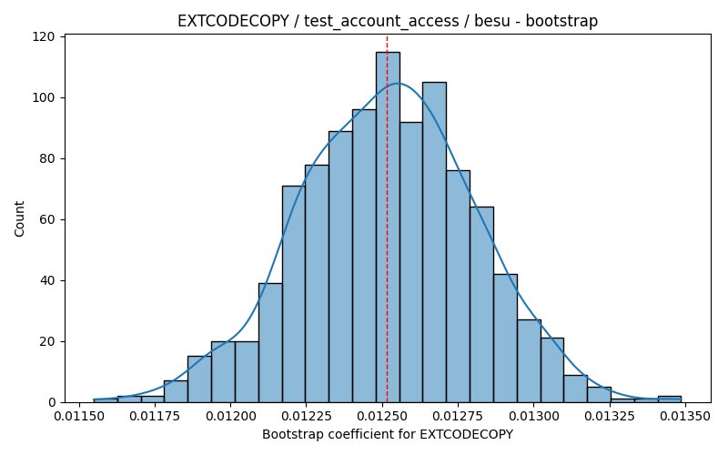

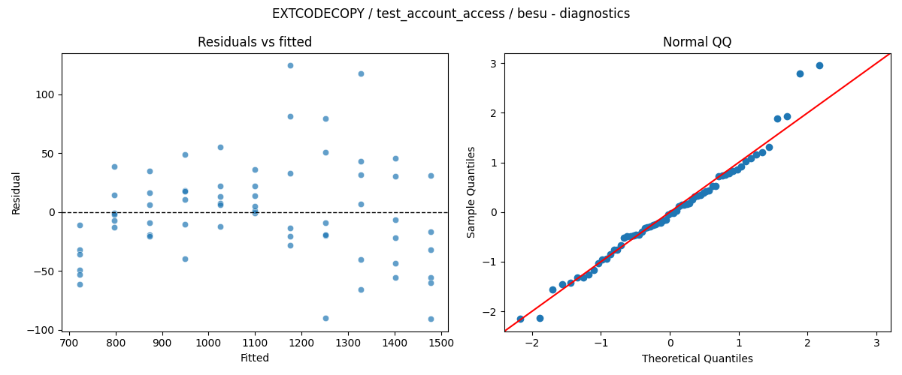

</details>

<details><summary>erigon — NNLS regression summary</summary>

```
==============================================================================
                           NNLS Regression Results                            
==============================================================================
Dep. Variable:          test_runtime_ms              R-squared:          0.983
Model:                  NNLS                    Adj. R-squared:          0.981
No. Observations:       11                                RMSE:          21.76
Df Residuals:           9                                  MAE:          15.86
Df Model:               1      
==============================================================================
                      coef     std err     P-value      [0.025      0.975]
------------------------------------------------------------------------------
         const    146.5722     29.6216       0.001    108.4812    220.2888
       opcount      0.0086      0.0004       0.001      0.0076      0.0091
==============================================================================
Notes: Non-negative least squares with bootstrap inference (1000 iterations)
==============================================================================
```

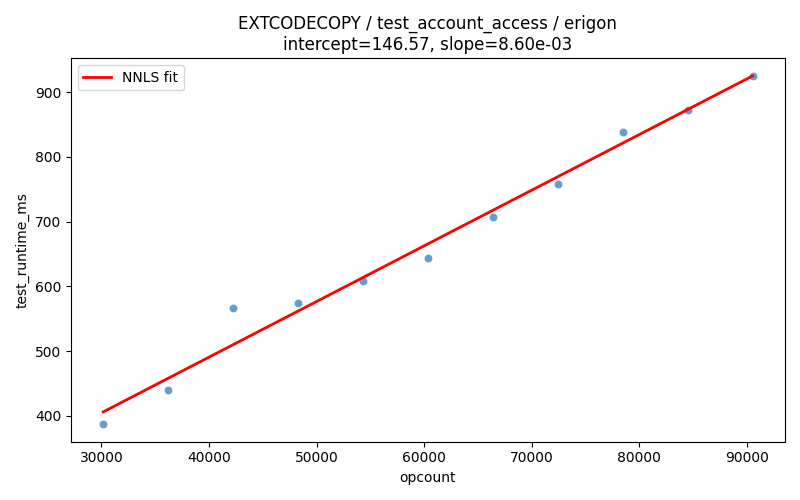

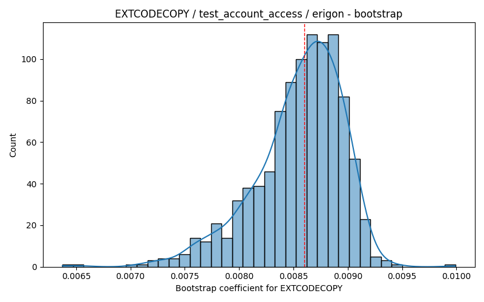

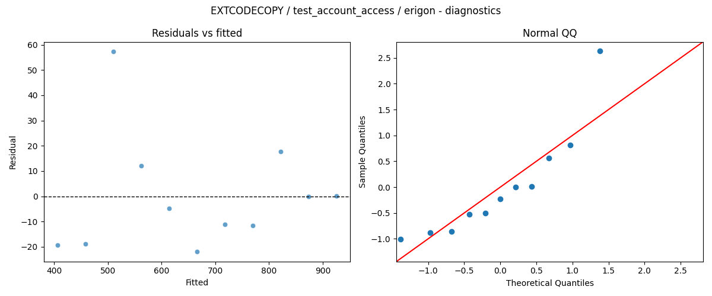

</details>

<details><summary>geth — NNLS regression summary</summary>

```
==============================================================================
                           NNLS Regression Results                            
==============================================================================
Dep. Variable:          test_runtime_ms              R-squared:          0.940
Model:                  NNLS                    Adj. R-squared:          0.940
No. Observations:       108                               RMSE:          25.55
Df Residuals:           106                                MAE:          19.98
Df Model:               1      
==============================================================================
                      coef     std err     P-value      [0.025      0.975]
------------------------------------------------------------------------------
         const     62.1102      7.1801       0.001     47.5065     75.7555
       opcount      0.0053      0.0001       0.001      0.0050      0.0056
==============================================================================
Notes: Non-negative least squares with bootstrap inference (1000 iterations)
==============================================================================
```

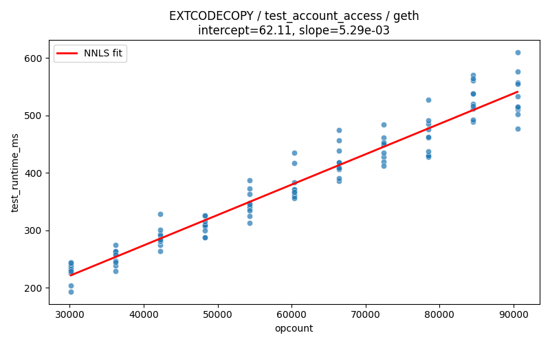

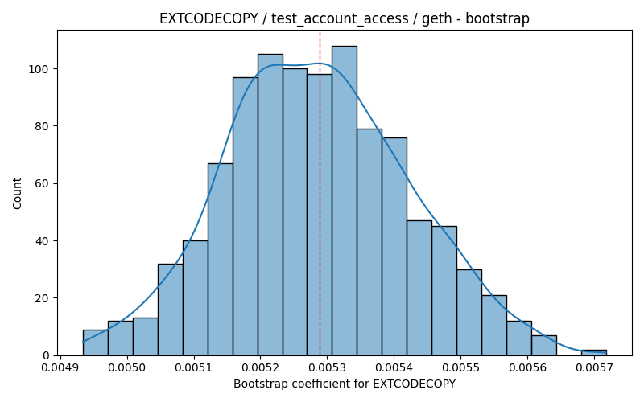

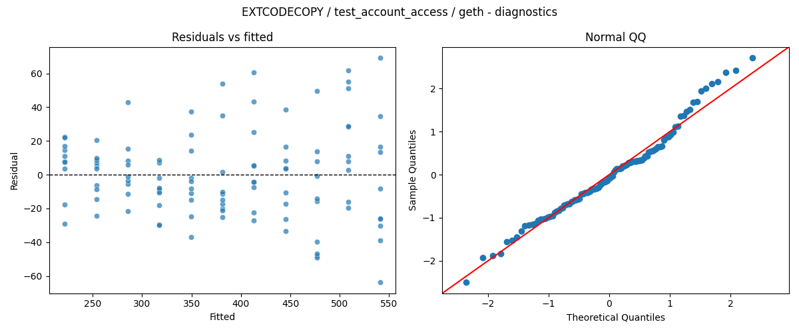

</details>

<details><summary>nethermind — NNLS regression summary</summary>

```
==============================================================================
                           NNLS Regression Results                            
==============================================================================
Dep. Variable:          test_runtime_ms              R-squared:          0.805
Model:                  NNLS                    Adj. R-squared:          0.800
No. Observations:       44                                RMSE:          17.32
Df Residuals:           42                                 MAE:          13.81
Df Model:               1      
==============================================================================
                      coef     std err     P-value      [0.025      0.975]
------------------------------------------------------------------------------
         const     94.2499      7.7588       0.001     78.4513    108.6768
       opcount      0.0018      0.0001       0.001      0.0016      0.0021
==============================================================================
Notes: Non-negative least squares with bootstrap inference (1000 iterations)
==============================================================================
```

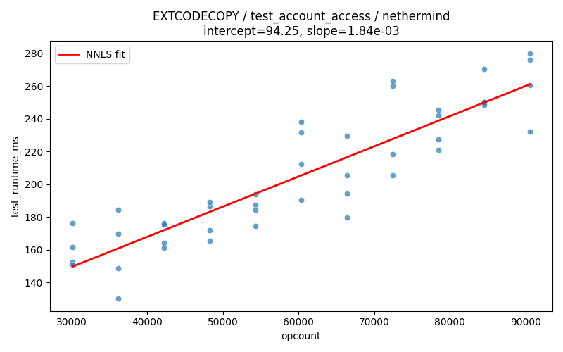

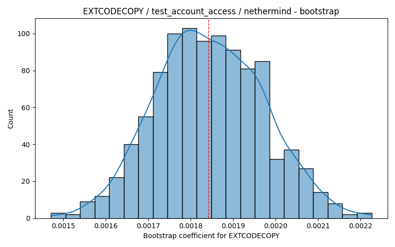

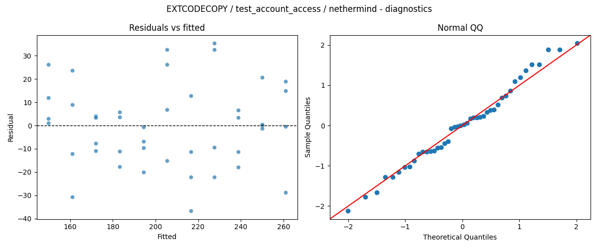

</details>

<details><summary>reth — NNLS regression summary</summary>

```
==============================================================================
                           NNLS Regression Results                            
==============================================================================
Dep. Variable:          test_runtime_ms              R-squared:          0.966
Model:                  NNLS                    Adj. R-squared:          0.966
No. Observations:       110                               RMSE:          13.05
Df Residuals:           108                                MAE:           9.56
Df Model:               1      
==============================================================================
                      coef     std err     P-value      [0.025      0.975]
------------------------------------------------------------------------------
         const     80.7342      3.8608       0.001     73.4714     88.1318
       opcount      0.0037      0.0001       0.001      0.0035      0.0038
==============================================================================
Notes: Non-negative least squares with bootstrap inference (1000 iterations)
==============================================================================
```

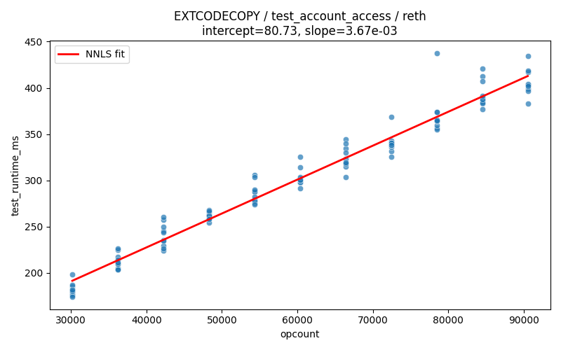

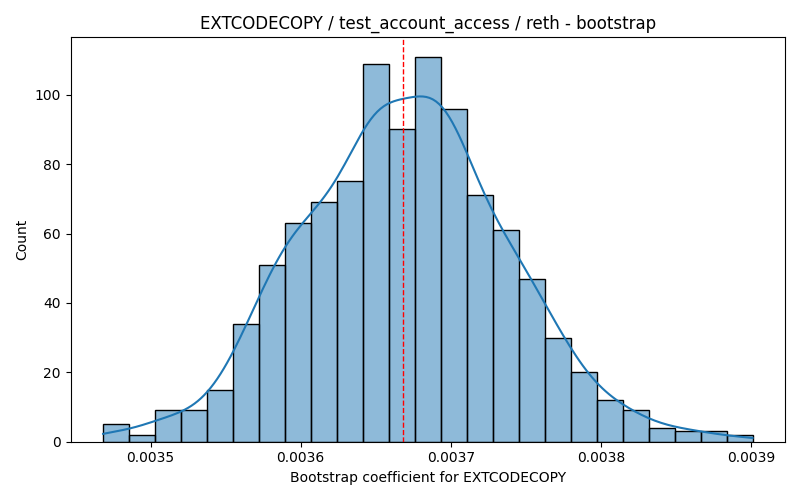

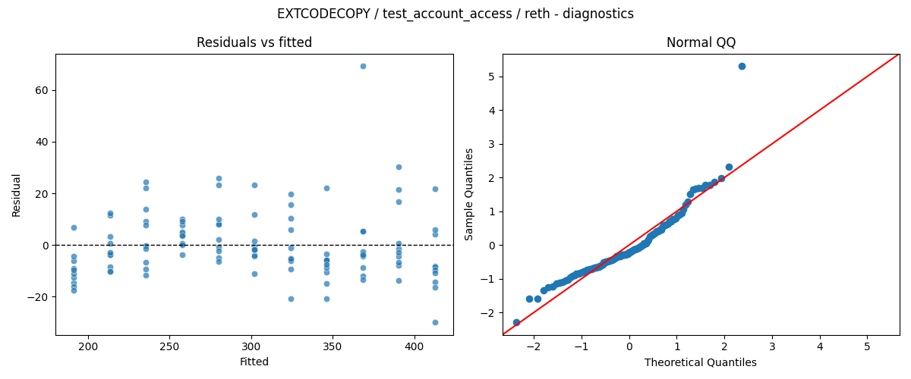

</details>

### test_account_access — combo `EXTCODECOPY_AccountMode.EXISTING_CONTRACT_SAME_MAX`

| client | nobs | R² | target_coef (ms) | p-value | 95% CI |
| --- | --- | --- | --- | --- | --- |
| `besu` | 66 | 0.9647 | 0.01085 | 1.00e-03 | [0.0103, 0.01141] |
| `erigon` | 11 | 0.9877 | 0.008101 | 1.00e-03 | [0.007414, 0.008551] |
| `geth` | 110 | 0.9413 | 0.004951 | 1.00e-03 | [0.004729, 0.005178] |
| `nethermind` | 44 | 0.7166 | 0.001969 | 1.00e-03 | [0.001572, 0.00234] |
| `reth` | 110 | 0.9771 | 0.003571 | 1.00e-03 | [0.003457, 0.003686] |

<details><summary>besu — NNLS regression summary</summary>

```
==============================================================================
                           NNLS Regression Results                            
==============================================================================
Dep. Variable:          test_runtime_ms              R-squared:          0.965
Model:                  NNLS                    Adj. R-squared:          0.964
No. Observations:       66                                RMSE:          39.62
Df Residuals:           64                                 MAE:          31.45
Df Model:               1      
==============================================================================
                      coef     std err     P-value      [0.025      0.975]
------------------------------------------------------------------------------
         const    412.5099     17.9183       0.001    380.0469    447.3235
       opcount      0.0108      0.0003       0.001      0.0103      0.0114
==============================================================================
Notes: Non-negative least squares with bootstrap inference (1000 iterations)
==============================================================================
```

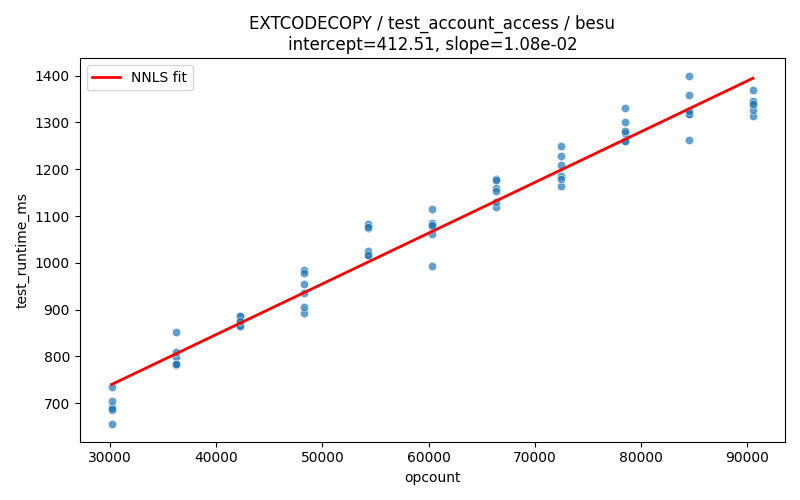

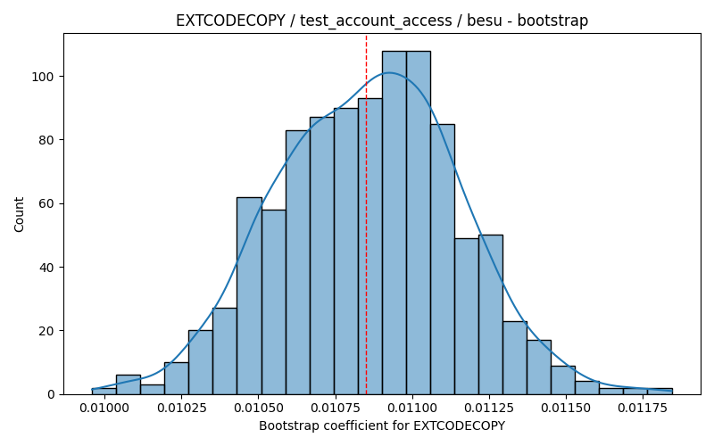

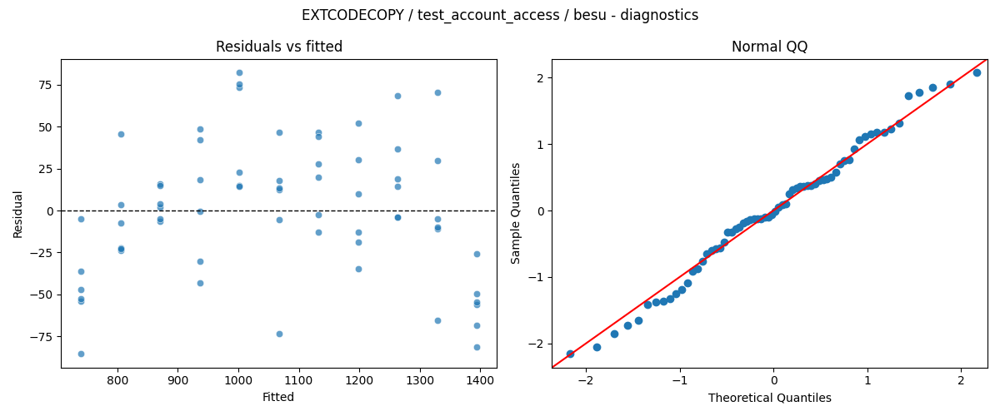

</details>

<details><summary>erigon — NNLS regression summary</summary>

```
==============================================================================
                           NNLS Regression Results                            
==============================================================================
Dep. Variable:          test_runtime_ms              R-squared:          0.988
Model:                  NNLS                    Adj. R-squared:          0.986
No. Observations:       11                                RMSE:          17.27
Df Residuals:           9                                  MAE:          14.54
Df Model:               1      
==============================================================================
                      coef     std err     P-value      [0.025      0.975]
------------------------------------------------------------------------------
         const    184.0619     19.8116       0.001    154.7869    230.3887
       opcount      0.0081      0.0003       0.001      0.0074      0.0086
==============================================================================
Notes: Non-negative least squares with bootstrap inference (1000 iterations)
==============================================================================
```

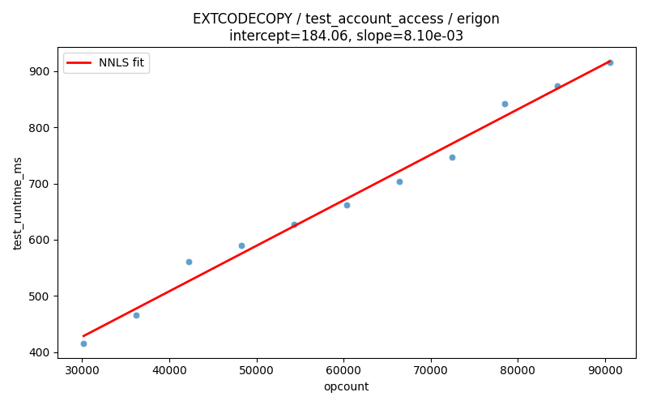

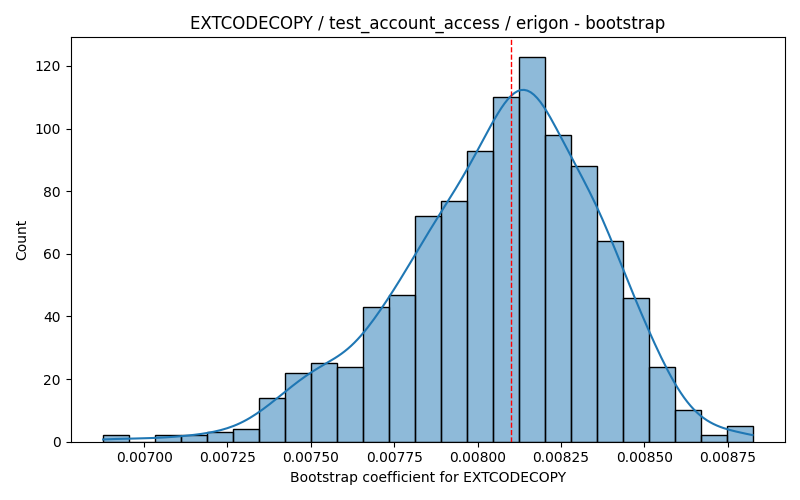


</details>

<details><summary>geth — NNLS regression summary</summary>

```
==============================================================================
                           NNLS Regression Results                            
==============================================================================
Dep. Variable:          test_runtime_ms              R-squared:          0.941
Model:                  NNLS                    Adj. R-squared:          0.941
No. Observations:       110                               RMSE:          23.60
Df Residuals:           108                                MAE:          19.24
Df Model:               1      
==============================================================================
                      coef     std err     P-value      [0.025      0.975]
------------------------------------------------------------------------------
         const     73.4119      6.9221       0.001     60.8298     86.9674
       opcount      0.0050      0.0001       0.001      0.0047      0.0052
==============================================================================
Notes: Non-negative least squares with bootstrap inference (1000 iterations)
==============================================================================
```

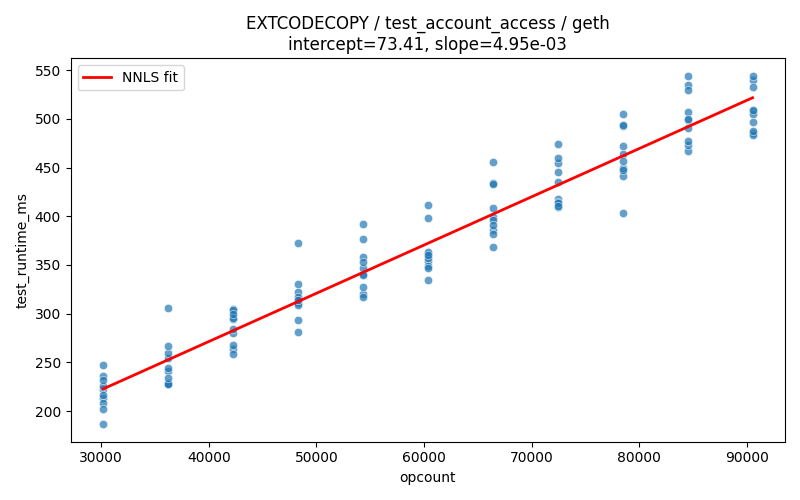

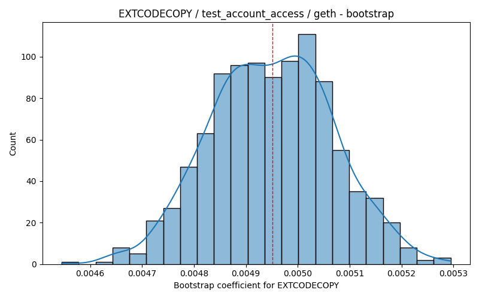

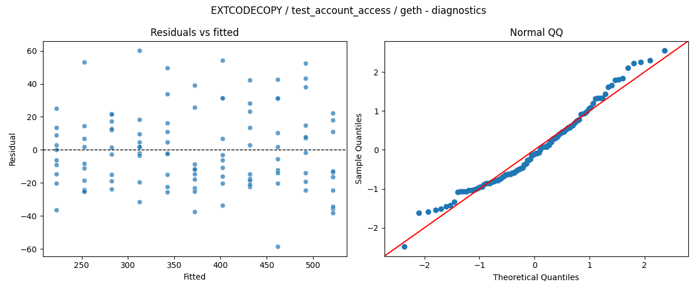

</details>

<details><summary>nethermind — NNLS regression summary</summary>

```
==============================================================================
                           NNLS Regression Results                            
==============================================================================
Dep. Variable:          test_runtime_ms              R-squared:          0.717
Model:                  NNLS                    Adj. R-squared:          0.710
No. Observations:       44                                RMSE:          23.62
Df Residuals:           42                                 MAE:          18.79
Df Model:               1      
==============================================================================
                      coef     std err     P-value      [0.025      0.975]
------------------------------------------------------------------------------
         const     88.4341     11.8626       0.001     66.4349    112.7147
       opcount      0.0020      0.0002       0.001      0.0016      0.0023
==============================================================================
Notes: Non-negative least squares with bootstrap inference (1000 iterations)
==============================================================================
```

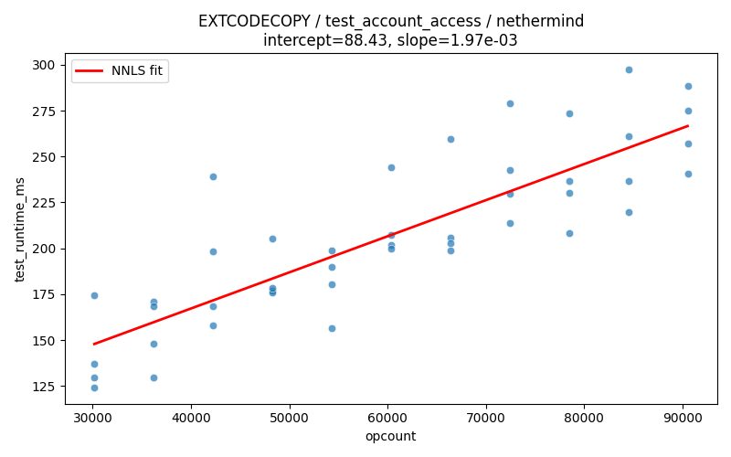

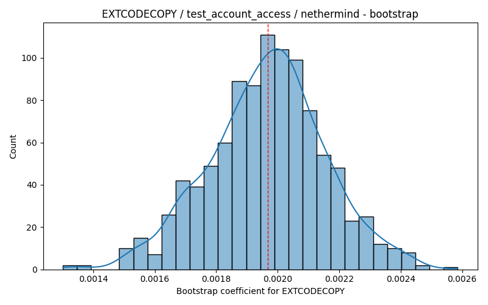

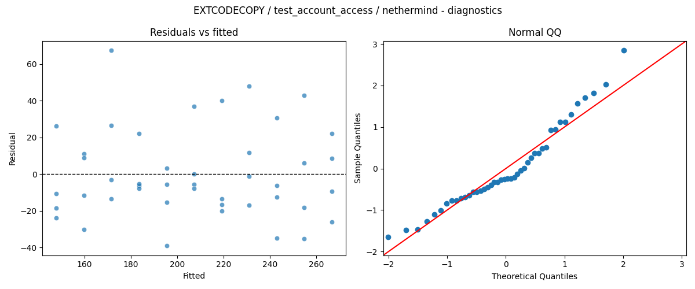

</details>

<details><summary>reth — NNLS regression summary</summary>

```
==============================================================================
                           NNLS Regression Results                            
==============================================================================
Dep. Variable:          test_runtime_ms              R-squared:          0.977
Model:                  NNLS                    Adj. R-squared:          0.977
No. Observations:       110                               RMSE:          10.43
Df Residuals:           108                                MAE:           8.23
Df Model:               1      
==============================================================================
                      coef     std err     P-value      [0.025      0.975]
------------------------------------------------------------------------------
         const     91.7563      3.5097       0.001     84.8774     98.9121
       opcount      0.0036      0.0001       0.001      0.0035      0.0037
==============================================================================
Notes: Non-negative least squares with bootstrap inference (1000 iterations)
==============================================================================
```

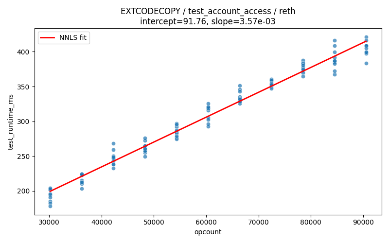

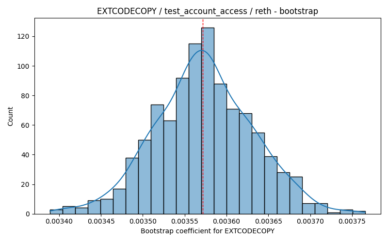

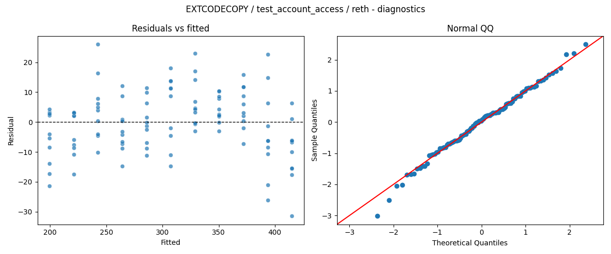

</details>
