# Glue opcodes report

Per-client NNLS fits of priced glue opcodes against their driver fixtures. Cycle-tier opcodes share one joint regression per client (shown once); pure-tier and mixed-tier opcodes each get a single-feature fit. Mixed-tier fits pre-adjust the LHS by subtracting the contribution of every priced upstream partner selected by the detector (pure ∪ cycle for `mixed_a`, plus `mixed_a` for `mixed_b`).

**Contents:** [besu](#besu) · [erigon](#erigon) · [ethrex](#ethrex) · [geth](#geth) · [nethermind](#nethermind) · [reth](#reth)

## besu

| glue_opcode | nobs | glue_runtime_ms | p_value | rsquared |
| --- | --- | --- | --- | --- |
| `ISZERO` | 0 | n/a | n/a | n/a |
| `JUMPDEST` | 0 | n/a | n/a | n/a |
| `SWAP` | 0 | n/a | n/a | n/a |
| `CALLDATASIZE` | 55 | 0 | 1.00e+00 | 0.8999 |
| `DUP` | 55 | 0 | 1.00e+00 | 0.8999 |
| `GAS` | 55 | 0 | 1.00e+00 | 0.8999 |
| `MLOAD` | 55 | 0 | 1.00e+00 | 0.8999 |
| `PUSH` | 55 | 8.63e-05 | 1.00e-03 | 0.8999 |
| `PUSH0` | 55 | 0 | 1.00e+00 | 0.8999 |
| `STATICCALL` | 55 | 0 | 1.00e+00 | 0.8999 |
| `ADD` | 0 | n/a | n/a | n/a |
| `AND` | 0 | n/a | n/a | n/a |
| `CALLDATACOPY` | 0 | n/a | n/a | n/a |
| `CALLDATALOAD` | 0 | n/a | n/a | n/a |
| `DIV` | 0 | n/a | n/a | n/a |
| `EXP` | 0 | n/a | n/a | n/a |
| `GT` | 0 | n/a | n/a | n/a |
| `JUMPI` | 0 | n/a | n/a | n/a |
| `LT` | 0 | n/a | n/a | n/a |
| `MSTORE` | 0 | n/a | n/a | n/a |
| `MSTORE8` | 0 | n/a | n/a | n/a |
| `MUL` | 0 | n/a | n/a | n/a |
| `PC` | 0 | n/a | n/a | n/a |
| `RETURNDATASIZE` | 0 | n/a | n/a | n/a |
| `SELFBALANCE` | 0 | n/a | n/a | n/a |
| `SUB` | 0 | n/a | n/a | n/a |
| `JUMP` | 0 | n/a | n/a | n/a |
| `KECCAK256` | 0 | n/a | n/a | n/a |

### Cycle glue — joint fit · besu

<details><summary>Joint NNLS regression summary</summary>

```
==============================================================================
                           NNLS Regression Results                            
==============================================================================
Dep. Variable:          test_runtime_ms              R-squared:          0.900
Model:                  NNLS                    Adj. R-squared:          0.885
No. Observations:       55                                RMSE:          74.51
Df Residuals:           47                                 MAE:          60.68
Df Model:               7      
==============================================================================
                      coef     std err     P-value      [0.025      0.975]
------------------------------------------------------------------------------
         const    417.0272     35.2748       0.001    347.0888    484.3332
  CALLDATASIZE      0.0000      0.0000       1.000      0.0000      0.0000
           DUP      0.0000      0.0000       1.000      0.0000      0.0000
           GAS      0.0000      0.0000       1.000      0.0000      0.0000
         MLOAD      0.0000      0.0000       1.000      0.0000      0.0000
          PUSH      0.0001      0.0000       0.001      0.0001      0.0001
         PUSH0      0.0000      0.0000       1.000      0.0000      0.0000
    STATICCALL      0.0000      0.0000       1.000      0.0000      0.0000
==============================================================================
Notes: Non-negative least squares with bootstrap inference (1000 iterations)
==============================================================================
```

</details>

<details><summary><code>CALLDATASIZE</code> · nobs=55 · runtime_ms=0 · p=1.00e+00 · R²=0.8999</summary>

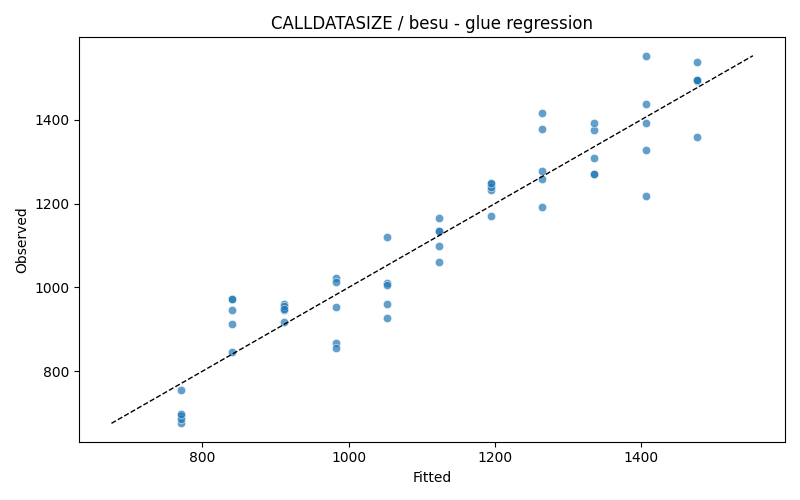


</details>

<details><summary><code>DUP</code> · nobs=55 · runtime_ms=0 · p=1.00e+00 · R²=0.8999</summary>


</details>

<details><summary><code>GAS</code> · nobs=55 · runtime_ms=0 · p=1.00e+00 · R²=0.8999</summary>

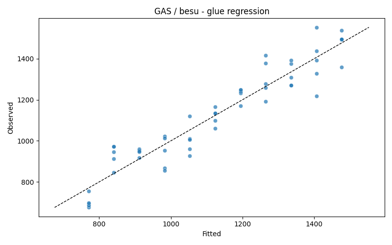


</details>

<details><summary><code>MLOAD</code> · nobs=55 · runtime_ms=0 · p=1.00e+00 · R²=0.8999</summary>

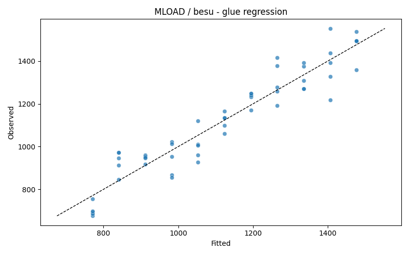


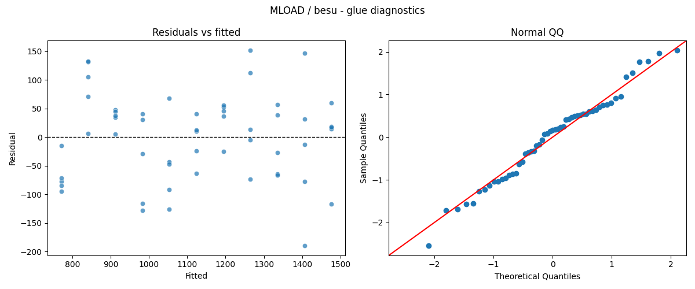

</details>

<details><summary><code>PUSH</code> · nobs=55 · runtime_ms=8.63e-05 · p=1.00e-03 · R²=0.8999</summary>

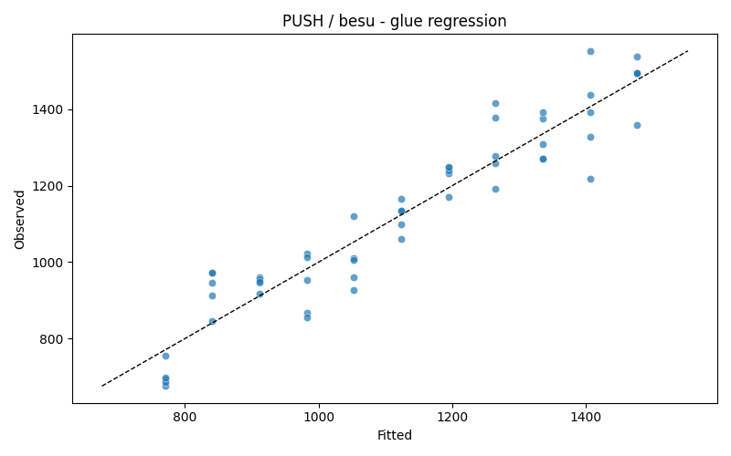

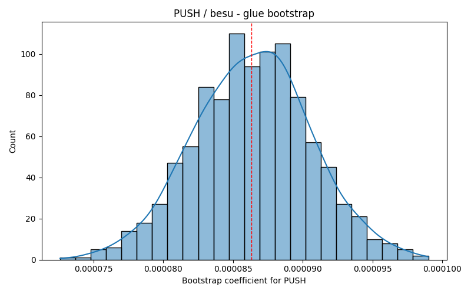

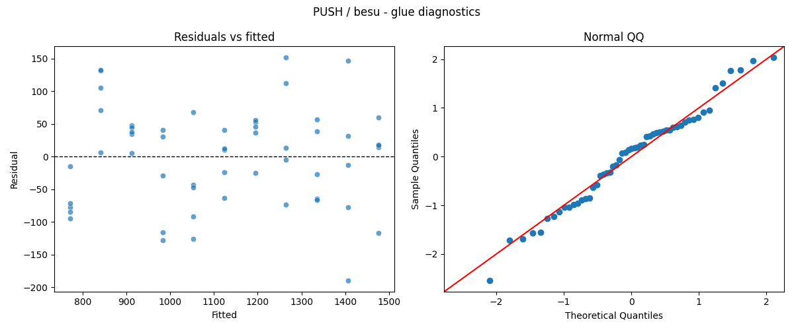

</details>

<details><summary><code>PUSH0</code> · nobs=55 · runtime_ms=0 · p=1.00e+00 · R²=0.8999</summary>


</details>

<details><summary><code>STATICCALL</code> · nobs=55 · runtime_ms=0 · p=1.00e+00 · R²=0.8999</summary>

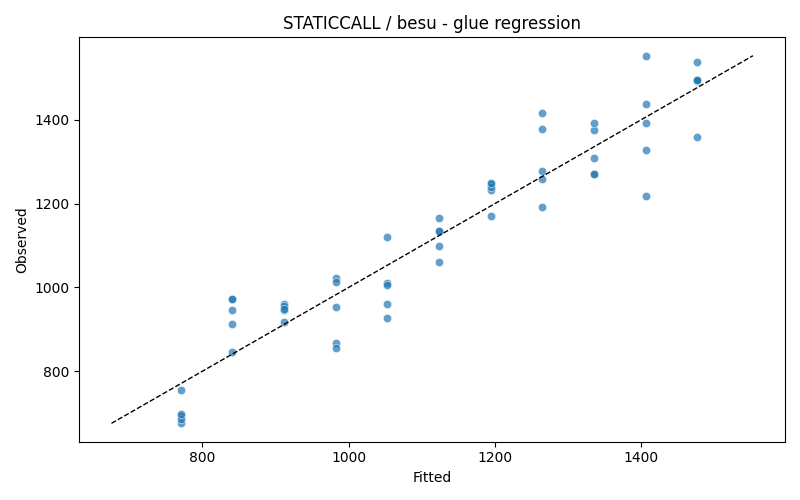


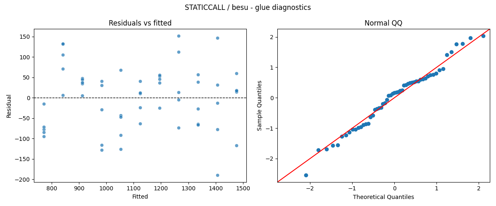

</details>

### Pure glue · besu

<details><summary><code>ISZERO</code> · nobs=0 · runtime_ms=n/a · p=n/a · R²=n/a</summary>

</details>

<details><summary><code>JUMPDEST</code> · nobs=0 · runtime_ms=n/a · p=n/a · R²=n/a</summary>

</details>

<details><summary><code>SWAP</code> · nobs=0 · runtime_ms=n/a · p=n/a · R²=n/a</summary>

</details>

### Mixed glue (tier A) · besu

<details><summary><code>ADD</code> · nobs=0 · runtime_ms=n/a · p=n/a · R²=n/a</summary>

</details>

<details><summary><code>AND</code> · nobs=0 · runtime_ms=n/a · p=n/a · R²=n/a</summary>

</details>

<details><summary><code>CALLDATACOPY</code> · nobs=0 · runtime_ms=n/a · p=n/a · R²=n/a</summary>

</details>

<details><summary><code>CALLDATALOAD</code> · nobs=0 · runtime_ms=n/a · p=n/a · R²=n/a</summary>

</details>

<details><summary><code>DIV</code> · nobs=0 · runtime_ms=n/a · p=n/a · R²=n/a</summary>

</details>

<details><summary><code>EXP</code> · nobs=0 · runtime_ms=n/a · p=n/a · R²=n/a</summary>

</details>

<details><summary><code>GT</code> · nobs=0 · runtime_ms=n/a · p=n/a · R²=n/a</summary>

</details>

<details><summary><code>JUMPI</code> · nobs=0 · runtime_ms=n/a · p=n/a · R²=n/a</summary>

</details>

<details><summary><code>LT</code> · nobs=0 · runtime_ms=n/a · p=n/a · R²=n/a</summary>

</details>

<details><summary><code>MSTORE</code> · nobs=0 · runtime_ms=n/a · p=n/a · R²=n/a</summary>

</details>

<details><summary><code>MSTORE8</code> · nobs=0 · runtime_ms=n/a · p=n/a · R²=n/a</summary>

</details>

<details><summary><code>MUL</code> · nobs=0 · runtime_ms=n/a · p=n/a · R²=n/a</summary>

</details>

<details><summary><code>PC</code> · nobs=0 · runtime_ms=n/a · p=n/a · R²=n/a</summary>

</details>

<details><summary><code>RETURNDATASIZE</code> · nobs=0 · runtime_ms=n/a · p=n/a · R²=n/a</summary>

</details>

<details><summary><code>SELFBALANCE</code> · nobs=0 · runtime_ms=n/a · p=n/a · R²=n/a</summary>

</details>

<details><summary><code>SUB</code> · nobs=0 · runtime_ms=n/a · p=n/a · R²=n/a</summary>

</details>

### Mixed glue (tier B) · besu

<details><summary><code>JUMP</code> · nobs=0 · runtime_ms=n/a · p=n/a · R²=n/a</summary>

</details>

<details><summary><code>KECCAK256</code> · nobs=0 · runtime_ms=n/a · p=n/a · R²=n/a</summary>

</details>

## erigon

| glue_opcode | nobs | glue_runtime_ms | p_value | rsquared |
| --- | --- | --- | --- | --- |
| `ISZERO` | 8 | 0 | 1.00e+00 | 0 |
| `JUMPDEST` | 2 | 0 | 1.00e+00 | 0 |
| `SWAP` | 143 | 0 | 1.00e+00 | -2.22e-16 |
| `CALLDATASIZE` | 546 | 6.706e-07 | 3.17e-01 | 0.04062 |
| `DUP` | 546 | 0 | 1.00e+00 | 0.04062 |
| `GAS` | 546 | 1.13e-06 | 3.66e-01 | 0.04062 |
| `MLOAD` | 546 | 1.423e-05 | 1.00e-03 | 0.04062 |
| `PUSH` | 546 | 0 | 1.00e+00 | 0.04062 |
| `PUSH0` | 546 | 0 | 1.00e+00 | 0.04062 |
| `STATICCALL` | 546 | 0 | 1.00e+00 | 0.04062 |
| `ADD` | 9 | 0 | 1.00e+00 | 0 |
| `AND` | 8 | 0 | 1.00e+00 | 0 |
| `CALLDATACOPY` | 235 | 0 | 1.00e+00 | 0 |
| `CALLDATALOAD` | 44 | 4.41e-05 | 1.00e-03 | 0.3358 |
| `DIV` | 11 | 0 | 1.00e+00 | 0 |
| `EXP` | 11 | 0.0003436 | 1.00e-03 | 0.9505 |
| `GT` | 8 | 0 | 1.00e+00 | 0 |
| `JUMPI` | 11 | 0 | 1.00e+00 | -4.441e-16 |
| `LT` | 8 | 0 | 1.00e+00 | 0 |
| `MSTORE` | 45 | 0 | 1.00e+00 | 0 |
| `MSTORE8` | 45 | 0 | 1.00e+00 | 0 |
| `MUL` | 10 | 0 | 1.00e+00 | 0 |
| `PC` | 6 | 1.151e-05 | 3.40e-02 | 0.6826 |
| `RETURNDATASIZE` | 24 | 1.014e-05 | 1.26e-01 | 0.06451 |
| `SELFBALANCE` | 11 | 0 | 1.00e+00 | -2.22e-16 |
| `SUB` | 8 | 0 | 1.00e+00 | 0 |
| `JUMP` | 10 | 0 | 1.00e+00 | 0 |
| `KECCAK256` | 176 | 1.462e-05 | 2.00e-03 | 0.04197 |

### Cycle glue — joint fit · erigon

<details><summary>Joint NNLS regression summary</summary>

```
==============================================================================
                           NNLS Regression Results                            
==============================================================================
Dep. Variable:          test_runtime_ms              R-squared:          0.041
Model:                  NNLS                    Adj. R-squared:          0.028
No. Observations:       546                               RMSE:          44.25
Df Residuals:           538                                MAE:          35.92
Df Model:               7      
==============================================================================
                      coef     std err     P-value      [0.025      0.975]
------------------------------------------------------------------------------
         const    127.2985      2.1272       0.001    122.8116    131.3301
  CALLDATASIZE      0.0000      0.0000       0.317      0.0000      0.0000
           DUP      0.0000      0.0000       1.000      0.0000      0.0000
           GAS      0.0000      0.0000       0.366      0.0000      0.0000
         MLOAD      0.0000      0.0000       0.001      0.0000      0.0000
          PUSH      0.0000      0.0000       1.000      0.0000      0.0000
         PUSH0      0.0000      0.0000       1.000      0.0000      0.0000
    STATICCALL      0.0000      0.0000       1.000      0.0000      0.0000
==============================================================================
Notes: Non-negative least squares with bootstrap inference (1000 iterations)
==============================================================================
```

</details>

<details><summary><code>CALLDATASIZE</code> · nobs=546 · runtime_ms=6.706e-07 · p=3.17e-01 · R²=0.04062</summary>

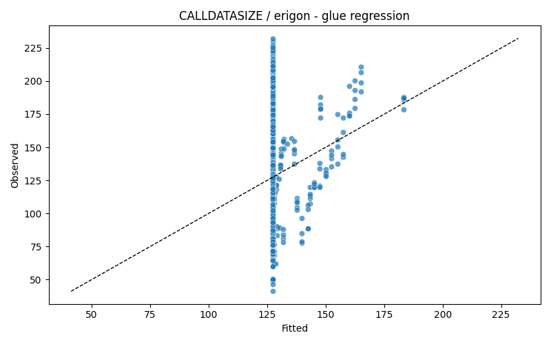

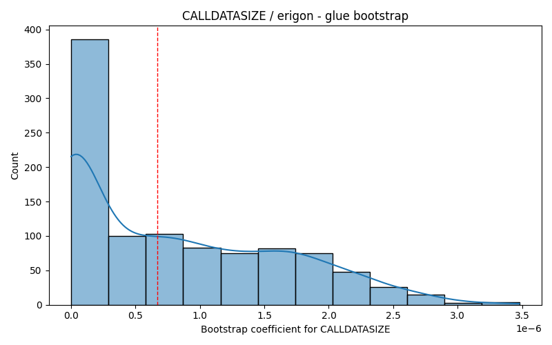

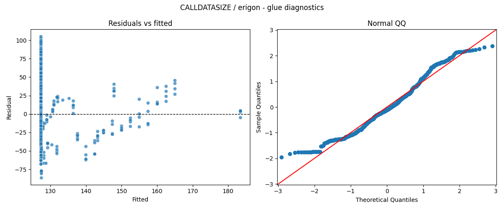

</details>

<details><summary><code>DUP</code> · nobs=546 · runtime_ms=0 · p=1.00e+00 · R²=0.04062</summary>

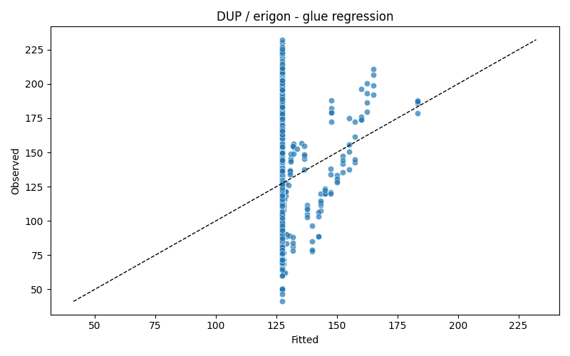


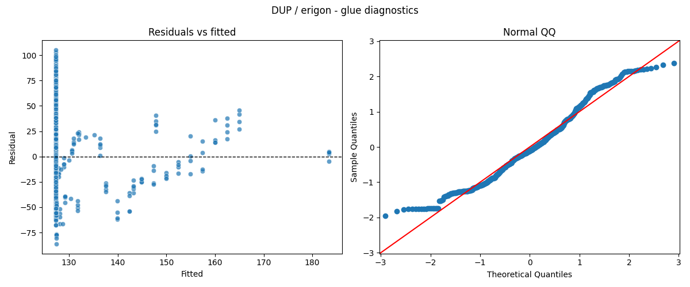

</details>

<details><summary><code>GAS</code> · nobs=546 · runtime_ms=1.13e-06 · p=3.66e-01 · R²=0.04062</summary>

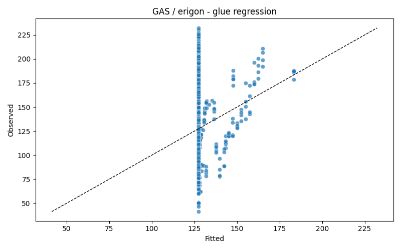

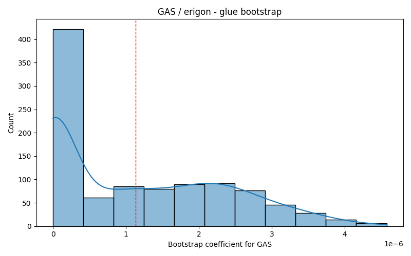


</details>

<details><summary><code>MLOAD</code> · nobs=546 · runtime_ms=1.423e-05 · p=1.00e-03 · R²=0.04062</summary>


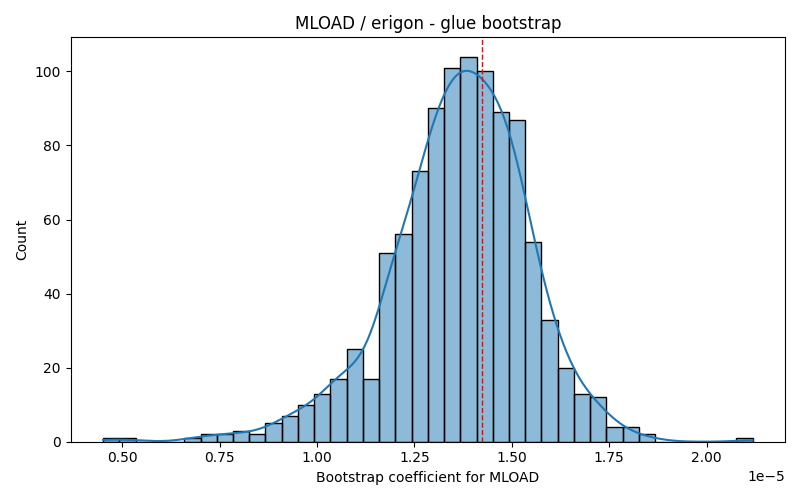

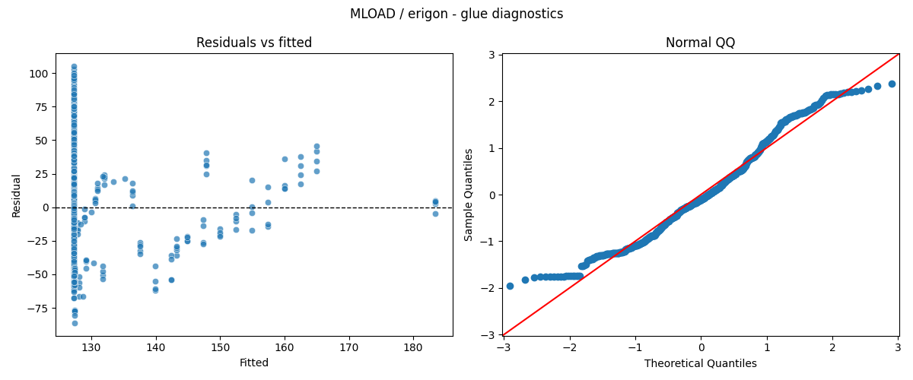

</details>

<details><summary><code>PUSH</code> · nobs=546 · runtime_ms=0 · p=1.00e+00 · R²=0.04062</summary>


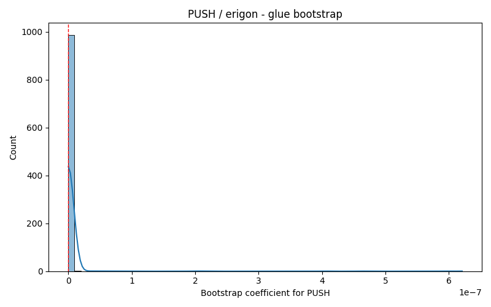


</details>

<details><summary><code>PUSH0</code> · nobs=546 · runtime_ms=0 · p=1.00e+00 · R²=0.04062</summary>

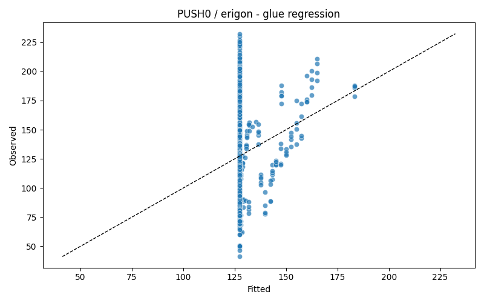

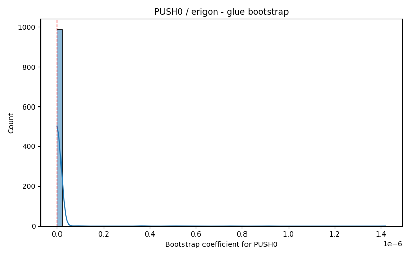


</details>

<details><summary><code>STATICCALL</code> · nobs=546 · runtime_ms=0 · p=1.00e+00 · R²=0.04062</summary>

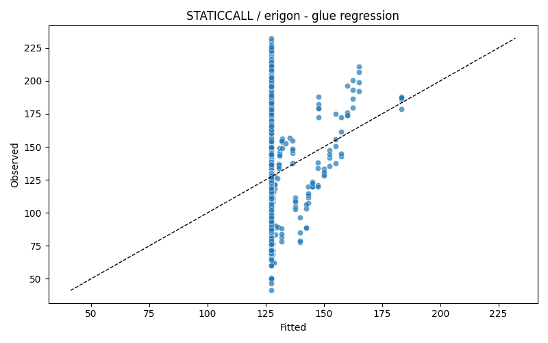

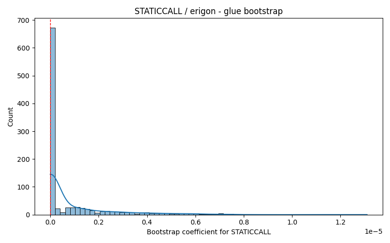

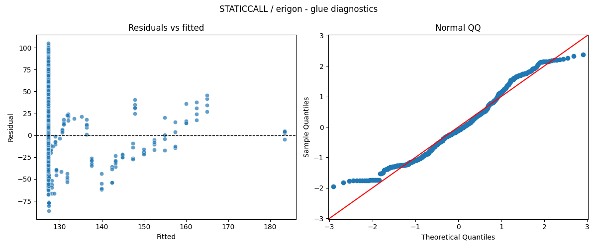

</details>

### Pure glue · erigon

<details><summary><code>ISZERO</code> · nobs=8 · runtime_ms=0 · p=1.00e+00 · R²=0</summary>

```
==============================================================================
                           NNLS Regression Results                            
==============================================================================
Dep. Variable:          test_runtime_ms              R-squared:          0.000
Model:                  NNLS                    Adj. R-squared:         -0.167
No. Observations:       8                                 RMSE:          46.89
Df Residuals:           6                                  MAE:          34.11
Df Model:               1      
==============================================================================
                      coef     std err     P-value      [0.025      0.975]
------------------------------------------------------------------------------
         const     92.5602     22.3677       0.004     33.7134    129.7310
        ISZERO      0.0000      0.0000       1.000      0.0000      0.0000
==============================================================================
Notes: Non-negative least squares with bootstrap inference (1000 iterations)
==============================================================================
```

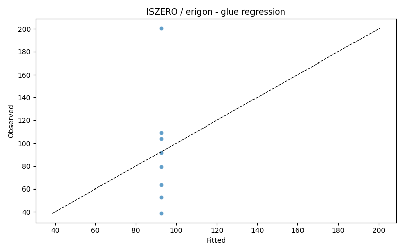

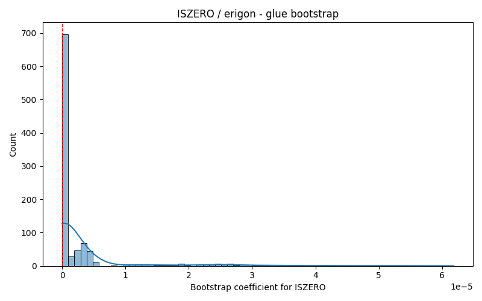


</details>

<details><summary><code>JUMPDEST</code> · nobs=2 · runtime_ms=0 · p=1.00e+00 · R²=0</summary>

```
==============================================================================
                           NNLS Regression Results                            
==============================================================================
Dep. Variable:          test_runtime_ms              R-squared:          0.000
Model:                  NNLS                    Adj. R-squared:          0.000
No. Observations:       2                                 RMSE:          36.29
Df Residuals:           0                                  MAE:          36.29
Df Model:               1      
==============================================================================
                      coef     std err     P-value      [0.025      0.975]
------------------------------------------------------------------------------
         const    132.2590     66.1247       0.506      0.0000    132.2590
      JUMPDEST      0.0000      0.0000       1.000      0.0000      0.0001
==============================================================================
Notes: Non-negative least squares with bootstrap inference (1000 iterations)
==============================================================================
```

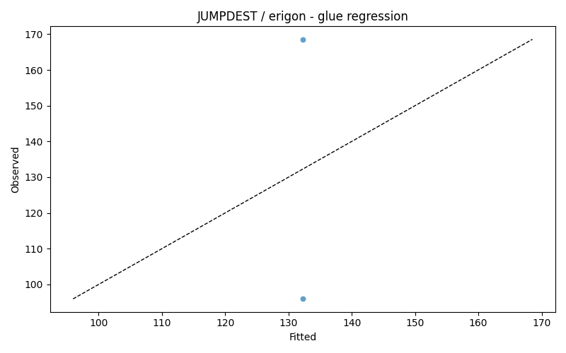

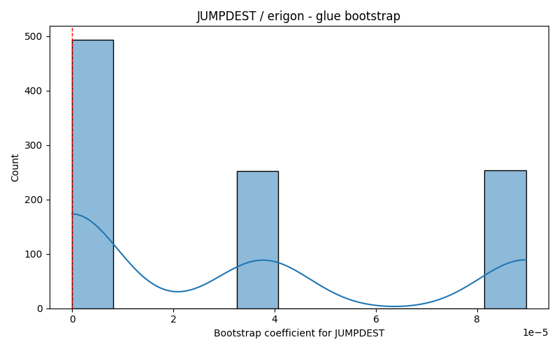

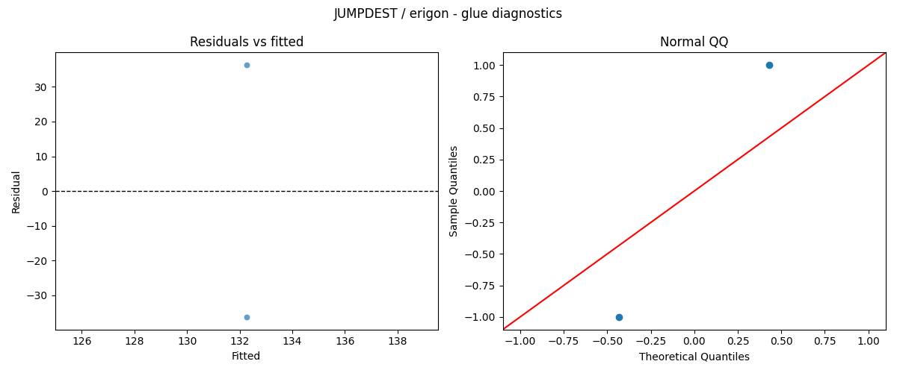

</details>

<details><summary><code>SWAP</code> · nobs=143 · runtime_ms=0 · p=1.00e+00 · R²=-2.22e-16</summary>

```
==============================================================================
                           NNLS Regression Results                            
==============================================================================
Dep. Variable:          test_runtime_ms              R-squared:         -0.000
Model:                  NNLS                    Adj. R-squared:         -0.007
No. Observations:       143                               RMSE:          29.39
Df Residuals:           141                                MAE:          25.41
Df Model:               1      
==============================================================================
                      coef     std err     P-value      [0.025      0.975]
------------------------------------------------------------------------------
         const     99.6223      2.3682       0.001     94.9083    104.1872
          SWAP      0.0000      0.0000       1.000      0.0000      0.0000
==============================================================================
Notes: Non-negative least squares with bootstrap inference (1000 iterations)
==============================================================================
```

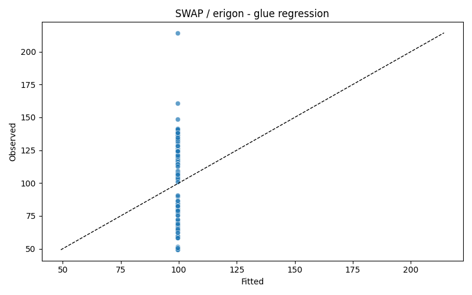


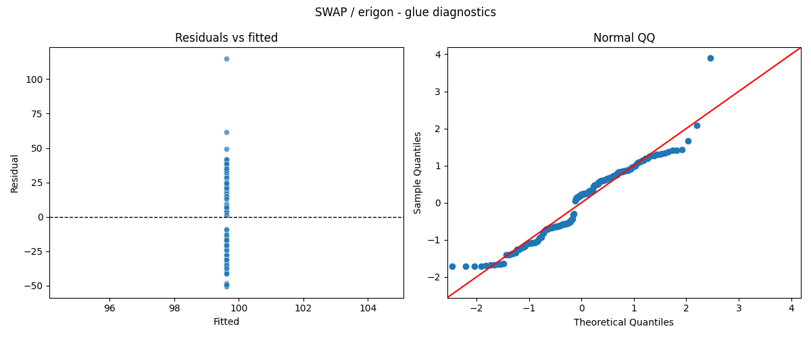

</details>

### Mixed glue (tier A) · erigon

<details><summary><code>ADD</code> · nobs=9 · runtime_ms=0 · p=1.00e+00 · R²=0</summary>

```
==============================================================================
                           NNLS Regression Results                            
==============================================================================
Dep. Variable:          test_runtime_ms              R-squared:          0.000
Model:                  NNLS                    Adj. R-squared:         -0.143
No. Observations:       9                                 RMSE:          28.39
Df Residuals:           7                                  MAE:          24.50
Df Model:               1      
==============================================================================
                      coef     std err     P-value      [0.025      0.975]
------------------------------------------------------------------------------
         const     92.8812     11.4053       0.001     57.5818    105.0592
           ADD      0.0000      0.0000       1.000      0.0000      0.0000
==============================================================================
Notes: Non-negative least squares with bootstrap inference (1000 iterations)
==============================================================================
```

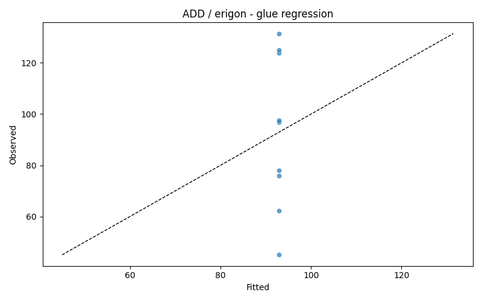


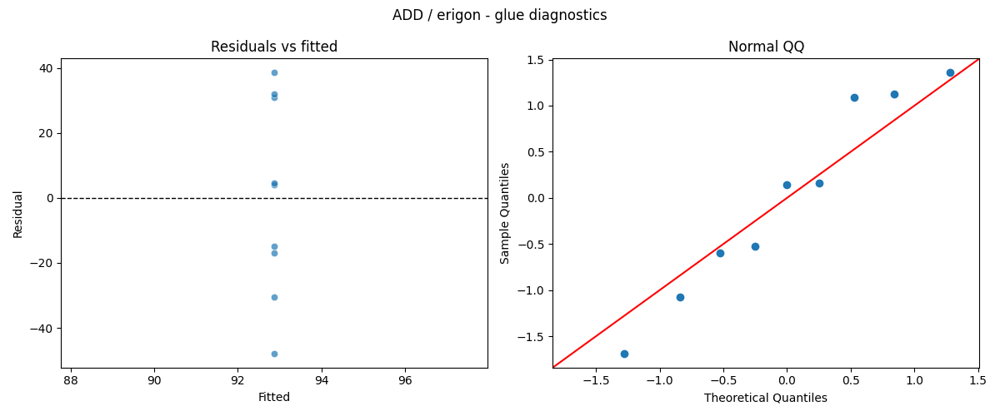

</details>

<details><summary><code>AND</code> · nobs=8 · runtime_ms=0 · p=1.00e+00 · R²=0</summary>

```
==============================================================================
                           NNLS Regression Results                            
==============================================================================
Dep. Variable:          test_runtime_ms              R-squared:          0.000
Model:                  NNLS                    Adj. R-squared:         -0.167
No. Observations:       8                                 RMSE:          24.93
Df Residuals:           6                                  MAE:          20.86
Df Model:               1      
==============================================================================
                      coef     std err     P-value      [0.025      0.975]
------------------------------------------------------------------------------
         const     84.6418      9.8389       0.001     55.1894     95.2224
           AND      0.0000      0.0000       1.000      0.0000      0.0000
==============================================================================
Notes: Non-negative least squares with bootstrap inference (1000 iterations)
==============================================================================
```

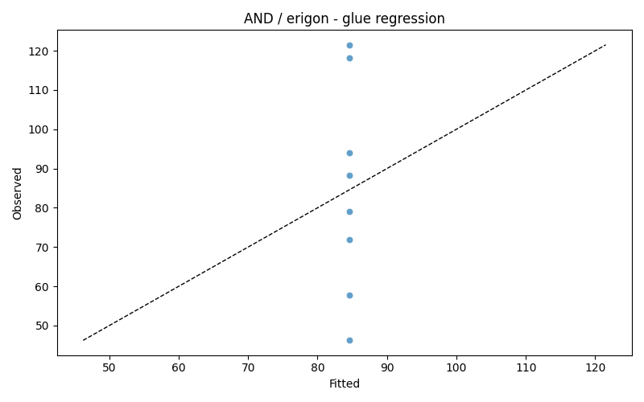


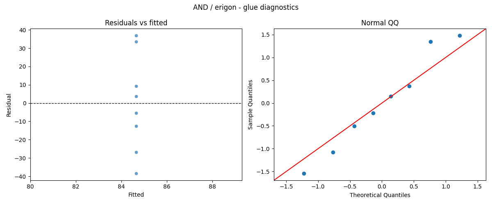

</details>

<details><summary><code>CALLDATACOPY</code> · nobs=235 · runtime_ms=0 · p=1.00e+00 · R²=0</summary>

```
==============================================================================
                           NNLS Regression Results                            
==============================================================================
Dep. Variable:          test_runtime_ms              R-squared:          0.000
Model:                  NNLS                    Adj. R-squared:         -0.004
No. Observations:       235                               RMSE:          47.58
Df Residuals:           233                                MAE:          40.55
Df Model:               1      
==============================================================================
                      coef     std err     P-value      [0.025      0.975]
------------------------------------------------------------------------------
         const     72.1817      3.0168       0.001     66.2427     77.7447
  CALLDATACOPY      0.0000      0.0000       1.000      0.0000      0.0000
==============================================================================
Notes: Non-negative least squares with bootstrap inference (1000 iterations)
==============================================================================
```


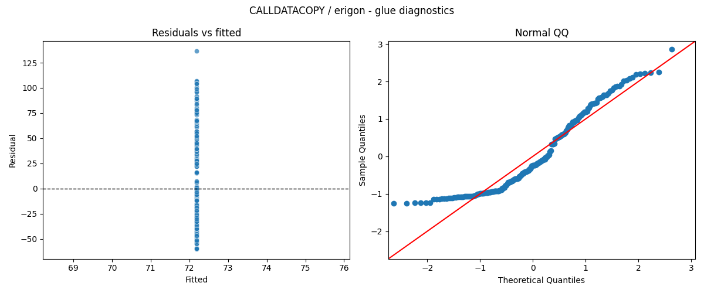

</details>

<details><summary><code>CALLDATALOAD</code> · nobs=44 · runtime_ms=4.41e-05 · p=1.00e-03 · R²=0.3358</summary>

```
==============================================================================
                           NNLS Regression Results                            
==============================================================================
Dep. Variable:          test_runtime_ms              R-squared:          0.336
Model:                  NNLS                    Adj. R-squared:          0.320
No. Observations:       44                                RMSE:           0.24
Df Residuals:           42                                 MAE:           0.19
Df Model:               1      
==============================================================================
                      coef     std err     P-value      [0.025      0.975]
------------------------------------------------------------------------------
         const      3.9724      0.1107       0.001      3.7594      4.1911
  CALLDATALOAD      0.0000      0.0000       0.001      0.0000      0.0001
==============================================================================
Notes: Non-negative least squares with bootstrap inference (1000 iterations)
==============================================================================
```


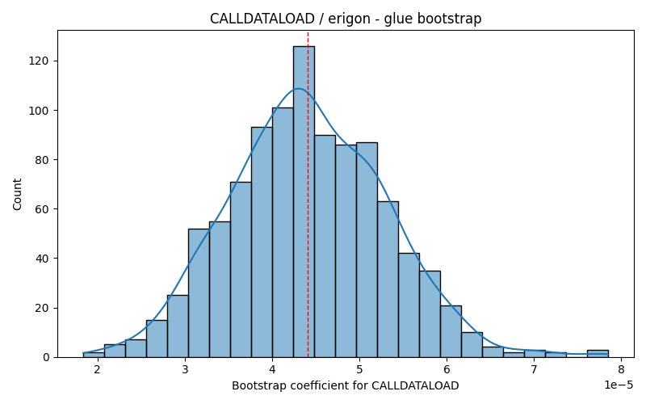

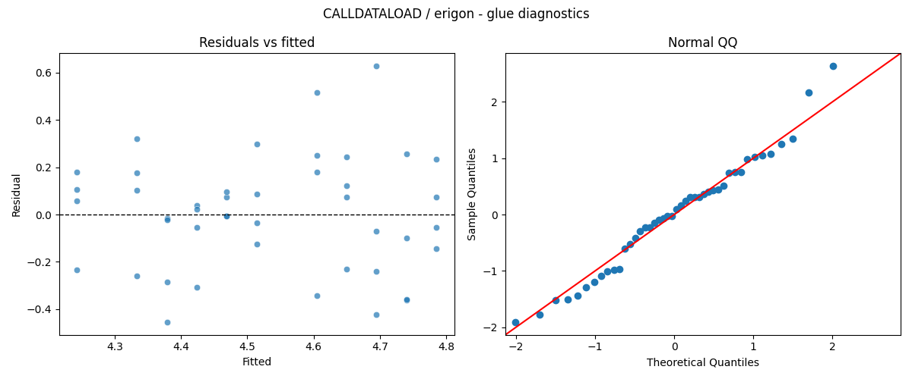

</details>

<details><summary><code>DIV</code> · nobs=11 · runtime_ms=0 · p=1.00e+00 · R²=0</summary>

```
==============================================================================
                           NNLS Regression Results                            
==============================================================================
Dep. Variable:          test_runtime_ms              R-squared:          0.000
Model:                  NNLS                    Adj. R-squared:         -0.111
No. Observations:       11                                RMSE:          81.04
Df Residuals:           9                                  MAE:          68.11
Df Model:               1      
==============================================================================
                      coef     std err     P-value      [0.025      0.975]
------------------------------------------------------------------------------
         const    266.8796     24.8669       0.001    218.2017    311.0828
           DIV      0.0000      0.0000       1.000      0.0000      0.0000
==============================================================================
Notes: Non-negative least squares with bootstrap inference (1000 iterations)
==============================================================================
```

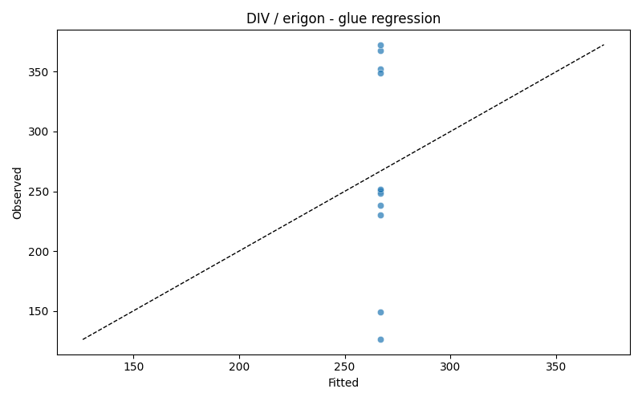


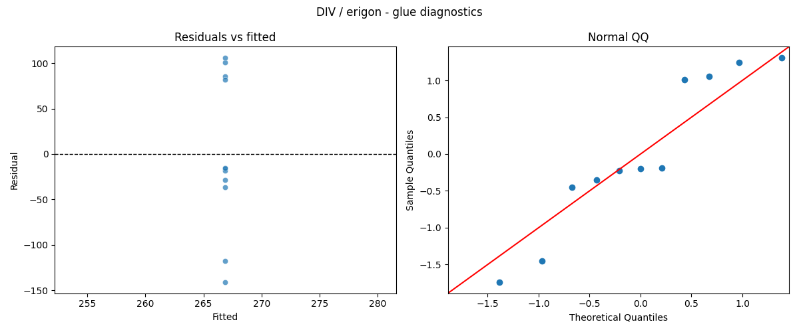

</details>

<details><summary><code>EXP</code> · nobs=11 · runtime_ms=0.0003436 · p=1.00e-03 · R²=0.9505</summary>

```
==============================================================================
                           NNLS Regression Results                            
==============================================================================
Dep. Variable:          test_runtime_ms              R-squared:          0.950
Model:                  NNLS                    Adj. R-squared:          0.945
No. Observations:       11                                RMSE:           3.07
Df Residuals:           9                                  MAE:           2.73
Df Model:               1      
==============================================================================
                      coef     std err     P-value      [0.025      0.975]
------------------------------------------------------------------------------
         const     15.9269      3.5782       0.001      6.8640     21.4591
           EXP      0.0003      0.0000       0.001      0.0003      0.0004
==============================================================================
Notes: Non-negative least squares with bootstrap inference (1000 iterations)
==============================================================================
```


</details>

<details><summary><code>GT</code> · nobs=8 · runtime_ms=0 · p=1.00e+00 · R²=0</summary>

```
==============================================================================
                           NNLS Regression Results                            
==============================================================================
Dep. Variable:          test_runtime_ms              R-squared:          0.000
Model:                  NNLS                    Adj. R-squared:         -0.167
No. Observations:       8                                 RMSE:          27.66
Df Residuals:           6                                  MAE:          24.59
Df Model:               1      
==============================================================================
                      coef     std err     P-value      [0.025      0.975]
------------------------------------------------------------------------------
         const     88.6229     10.1048       0.001     61.0299    101.1357
            GT      0.0000      0.0000       1.000      0.0000      0.0000
==============================================================================
Notes: Non-negative least squares with bootstrap inference (1000 iterations)
==============================================================================
```


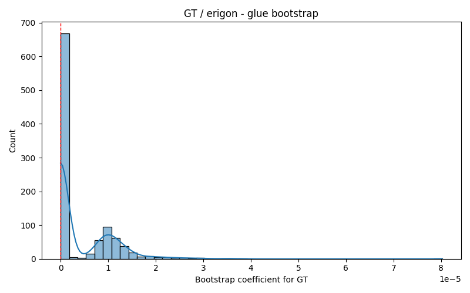


</details>

<details><summary><code>JUMPI</code> · nobs=11 · runtime_ms=0 · p=1.00e+00 · R²=-4.441e-16</summary>

```
==============================================================================
                           NNLS Regression Results                            
==============================================================================
Dep. Variable:          test_runtime_ms              R-squared:         -0.000
Model:                  NNLS                    Adj. R-squared:         -0.111
No. Observations:       11                                RMSE:          10.79
Df Residuals:           9                                  MAE:           8.71
Df Model:               1      
==============================================================================
                      coef     std err     P-value      [0.025      0.975]
------------------------------------------------------------------------------
         const     47.6248      3.1116       0.001     41.4853     53.6604
         JUMPI      0.0000      0.0000       1.000      0.0000      0.0000
==============================================================================
Notes: Non-negative least squares with bootstrap inference (1000 iterations)
==============================================================================
```

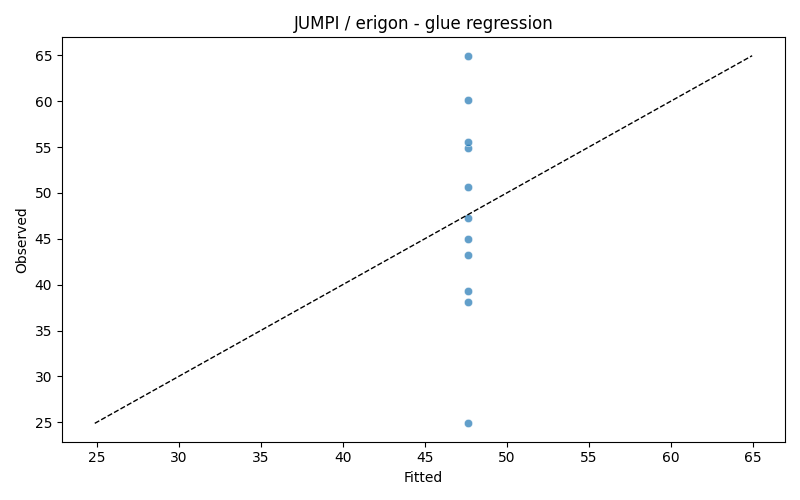

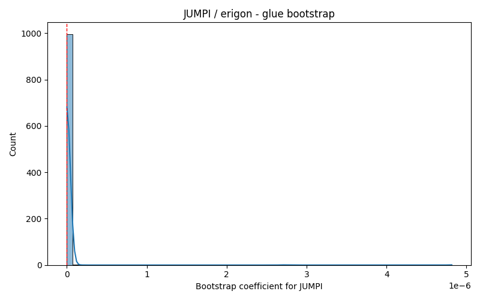


</details>

<details><summary><code>LT</code> · nobs=8 · runtime_ms=0 · p=1.00e+00 · R²=0</summary>

```
==============================================================================
                           NNLS Regression Results                            
==============================================================================
Dep. Variable:          test_runtime_ms              R-squared:          0.000
Model:                  NNLS                    Adj. R-squared:         -0.167
No. Observations:       8                                 RMSE:          26.69
Df Residuals:           6                                  MAE:          23.18
Df Model:               1      
==============================================================================
                      coef     std err     P-value      [0.025      0.975]
------------------------------------------------------------------------------
         const     88.8901     10.0885       0.001     62.2882     99.3999
            LT      0.0000      0.0000       1.000      0.0000      0.0000
==============================================================================
Notes: Non-negative least squares with bootstrap inference (1000 iterations)
==============================================================================
```


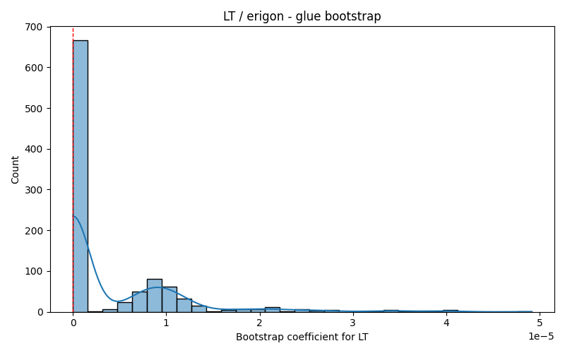


</details>

<details><summary><code>MSTORE</code> · nobs=45 · runtime_ms=0 · p=1.00e+00 · R²=0</summary>

```
==============================================================================
                           NNLS Regression Results                            
==============================================================================
Dep. Variable:          test_runtime_ms              R-squared:          0.000
Model:                  NNLS                    Adj. R-squared:         -0.023
No. Observations:       45                                RMSE:          38.66
Df Residuals:           43                                 MAE:          33.86
Df Model:               1      
==============================================================================
                      coef     std err     P-value      [0.025      0.975]
------------------------------------------------------------------------------
         const    130.5969      6.0434       0.001    118.5437    141.5801
        MSTORE      0.0000      0.0000       1.000      0.0000      0.0000
==============================================================================
Notes: Non-negative least squares with bootstrap inference (1000 iterations)
==============================================================================
```

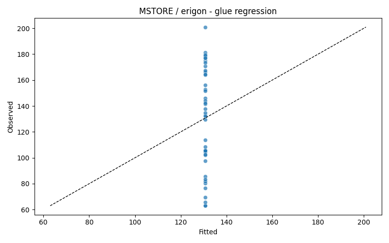

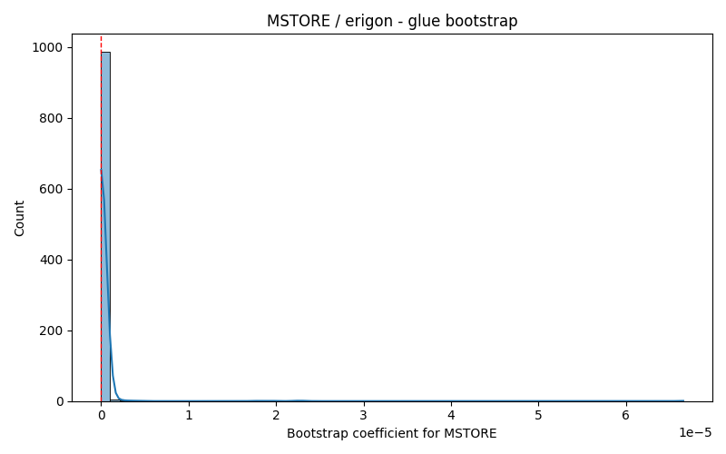


</details>

<details><summary><code>MSTORE8</code> · nobs=45 · runtime_ms=0 · p=1.00e+00 · R²=0</summary>

```
==============================================================================
                           NNLS Regression Results                            
==============================================================================
Dep. Variable:          test_runtime_ms              R-squared:          0.000
Model:                  NNLS                    Adj. R-squared:         -0.023
No. Observations:       45                                RMSE:          37.77
Df Residuals:           43                                 MAE:          32.58
Df Model:               1      
==============================================================================
                      coef     std err     P-value      [0.025      0.975]
------------------------------------------------------------------------------
         const    124.6835      5.5487       0.001    113.9893    135.6529
       MSTORE8      0.0000      0.0000       1.000      0.0000      0.0000
==============================================================================
Notes: Non-negative least squares with bootstrap inference (1000 iterations)
==============================================================================
```


</details>

<details><summary><code>MUL</code> · nobs=10 · runtime_ms=0 · p=1.00e+00 · R²=0</summary>

```
==============================================================================
                           NNLS Regression Results                            
==============================================================================
Dep. Variable:          test_runtime_ms              R-squared:          0.000
Model:                  NNLS                    Adj. R-squared:         -0.125
No. Observations:       10                                RMSE:          38.26
Df Residuals:           8                                  MAE:          26.29
Df Model:               1      
==============================================================================
                      coef     std err     P-value      [0.025      0.975]
------------------------------------------------------------------------------
         const    121.7845      8.4406       0.001     97.7531    130.1653
           MUL      0.0000      0.0000       1.000      0.0000      0.0000
==============================================================================
Notes: Non-negative least squares with bootstrap inference (1000 iterations)
==============================================================================
```


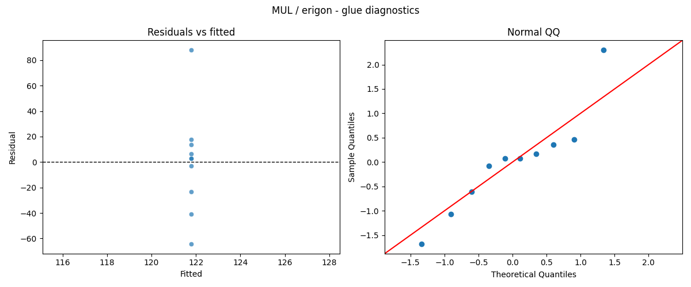

</details>

<details><summary><code>PC</code> · nobs=6 · runtime_ms=1.151e-05 · p=3.40e-02 · R²=0.6826</summary>

```
==============================================================================
                           NNLS Regression Results                            
==============================================================================
Dep. Variable:          test_runtime_ms              R-squared:          0.683
Model:                  NNLS                    Adj. R-squared:          0.603
No. Observations:       6                                 RMSE:          17.44
Df Residuals:           4                                  MAE:          15.63
Df Model:               1      
==============================================================================
                      coef     std err     P-value      [0.025      0.975]
------------------------------------------------------------------------------
         const     77.3000     17.4759       0.001     43.7163    104.5504
            PC      0.0000      0.0000       0.034      0.0000      0.0000
==============================================================================
Notes: Non-negative least squares with bootstrap inference (1000 iterations)
==============================================================================
```


</details>

<details><summary><code>RETURNDATASIZE</code> · nobs=24 · runtime_ms=1.014e-05 · p=1.26e-01 · R²=0.06451</summary>

```
==============================================================================
                           NNLS Regression Results                            
==============================================================================
Dep. Variable:          test_runtime_ms              R-squared:          0.065
Model:                  NNLS                    Adj. R-squared:          0.022
No. Observations:       24                                RMSE:          45.32
Df Residuals:           22                                 MAE:          22.57
Df Model:               1      
==============================================================================
                      coef     std err     P-value      [0.025      0.975]
------------------------------------------------------------------------------
         const     93.4242     21.6885       0.001     58.0186    134.6008
RETURNDATASIZE      0.0000      0.0000       0.126      0.0000      0.0000
==============================================================================
Notes: Non-negative least squares with bootstrap inference (1000 iterations)
==============================================================================
```


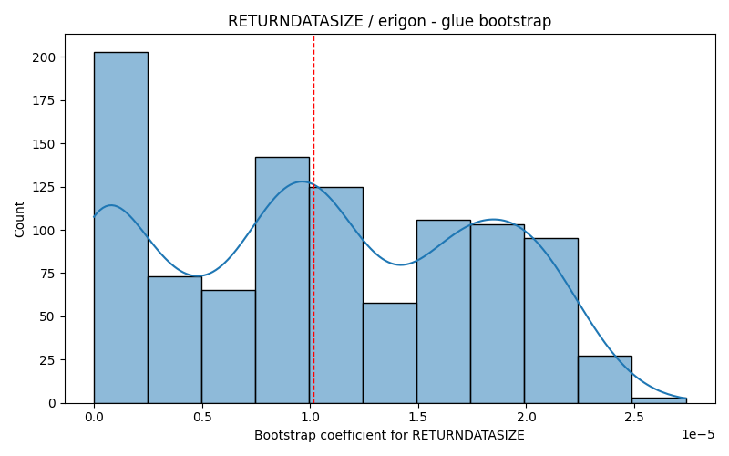


</details>

<details><summary><code>SELFBALANCE</code> · nobs=11 · runtime_ms=0 · p=1.00e+00 · R²=-2.22e-16</summary>

```
==============================================================================
                           NNLS Regression Results                            
==============================================================================
Dep. Variable:          test_runtime_ms              R-squared:         -0.000
Model:                  NNLS                    Adj. R-squared:         -0.111
No. Observations:       11                                RMSE:          12.90
Df Residuals:           9                                  MAE:          11.19
Df Model:               1      
==============================================================================
                      coef     std err     P-value      [0.025      0.975]
------------------------------------------------------------------------------
         const     51.0864      8.1219       0.001     20.2857     58.8354
   SELFBALANCE      0.0000      0.0000       1.000      0.0000      0.0000
==============================================================================
Notes: Non-negative least squares with bootstrap inference (1000 iterations)
==============================================================================
```


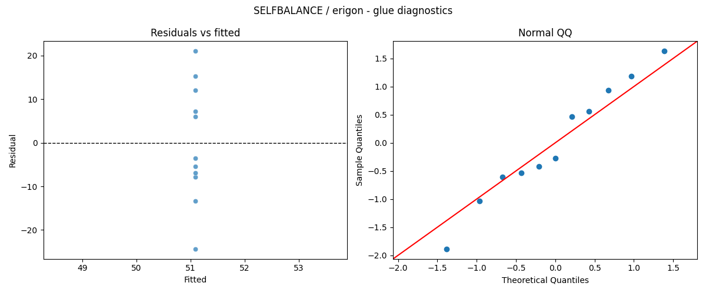

</details>

<details><summary><code>SUB</code> · nobs=8 · runtime_ms=0 · p=1.00e+00 · R²=0</summary>

```
==============================================================================
                           NNLS Regression Results                            
==============================================================================
Dep. Variable:          test_runtime_ms              R-squared:          0.000
Model:                  NNLS                    Adj. R-squared:         -0.167
No. Observations:       8                                 RMSE:          27.70
Df Residuals:           6                                  MAE:          23.34
Df Model:               1      
==============================================================================
                      coef     std err     P-value      [0.025      0.975]
------------------------------------------------------------------------------
         const     91.1975     11.1388       0.001     61.7667    103.7406
           SUB      0.0000      0.0000       1.000      0.0000      0.0000
==============================================================================
Notes: Non-negative least squares with bootstrap inference (1000 iterations)
==============================================================================
```

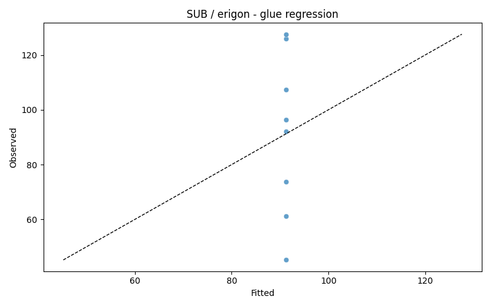

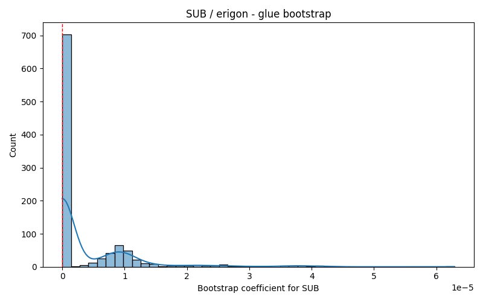


</details>

### Mixed glue (tier B) · erigon

<details><summary><code>JUMP</code> · nobs=10 · runtime_ms=0 · p=1.00e+00 · R²=0</summary>

```
==============================================================================
                           NNLS Regression Results                            
==============================================================================
Dep. Variable:          test_runtime_ms              R-squared:          0.000
Model:                  NNLS                    Adj. R-squared:         -0.125
No. Observations:       10                                RMSE:          29.50
Df Residuals:           8                                  MAE:          22.93
Df Model:               1      
==============================================================================
                      coef     std err     P-value      [0.025      0.975]
------------------------------------------------------------------------------
         const     76.0533      9.3326       0.001     59.3071     95.3164
          JUMP      0.0000      0.0000       1.000      0.0000      0.0000
==============================================================================
Notes: Non-negative least squares with bootstrap inference (1000 iterations)
==============================================================================
```


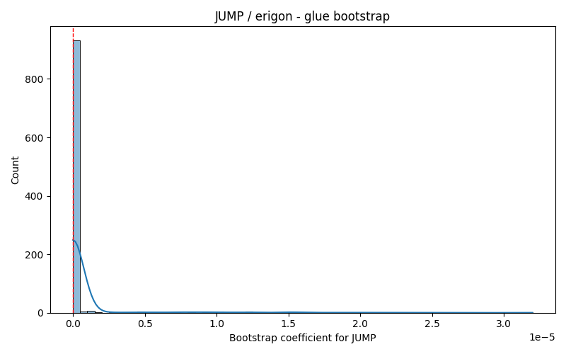


</details>

<details><summary><code>KECCAK256</code> · nobs=176 · runtime_ms=1.462e-05 · p=2.00e-03 · R²=0.04197</summary>

```
==============================================================================
                           NNLS Regression Results                            
==============================================================================
Dep. Variable:          test_runtime_ms              R-squared:          0.042
Model:                  NNLS                    Adj. R-squared:          0.036
No. Observations:       176                               RMSE:         138.84
Df Residuals:           174                                MAE:         113.18
Df Model:               1      
==============================================================================
                      coef     std err     P-value      [0.025      0.975]
------------------------------------------------------------------------------
         const    388.0964     23.7276       0.001    340.3744    435.7567
     KECCAK256      0.0000      0.0000       0.002      0.0000      0.0000
==============================================================================
Notes: Non-negative least squares with bootstrap inference (1000 iterations)
==============================================================================
```

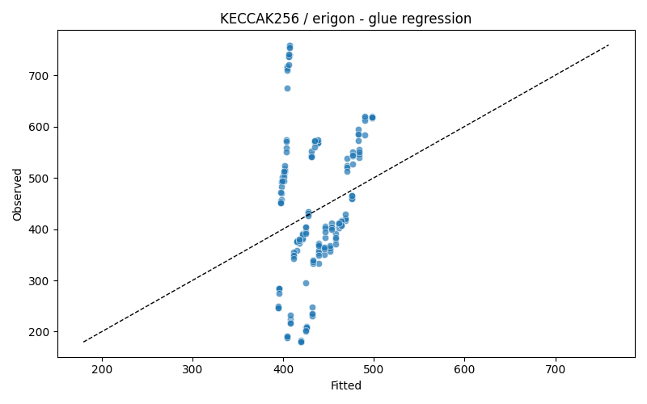

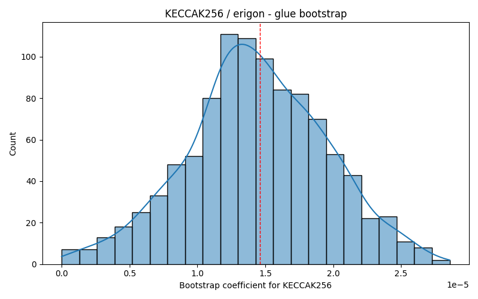


</details>

## ethrex

| glue_opcode | nobs | glue_runtime_ms | p_value | rsquared |
| --- | --- | --- | --- | --- |
| `ISZERO` | 64 | 0 | 1.00e+00 | 0 |
| `JUMPDEST` | 16 | 0 | 1.00e+00 | 0 |
| `SWAP` | 1144 | 0 | 1.00e+00 | 0 |
| `CALLDATASIZE` | 4016 | 6.019e-06 | 1.00e-03 | 0.1615 |
| `DUP` | 4016 | 0 | 1.00e+00 | 0.1615 |
| `GAS` | 4016 | 7.617e-06 | 1.00e-03 | 0.1615 |
| `MLOAD` | 4016 | 5.055e-06 | 1.00e-03 | 0.1615 |
| `PUSH` | 4016 | 0 | 1.00e+00 | 0.1615 |
| `PUSH0` | 4016 | 1.546e-06 | 3.60e-02 | 0.1615 |
| `STATICCALL` | 4016 | 0 | 1.00e+00 | 0.1615 |
| `ADD` | 72 | 0 | 1.00e+00 | -2.22e-16 |
| `AND` | 64 | 0 | 1.00e+00 | 0 |
| `CALLDATACOPY` | 1880 | 0 | 1.00e+00 | 0 |
| `CALLDATALOAD` | 352 | 1.675e-05 | 1.00e-03 | 0.2631 |
| `DIV` | 88 | 0 | 1.00e+00 | -2.22e-16 |
| `EXP` | 88 | 0.0009382 | 1.00e-03 | 0.8393 |
| `GT` | 64 | 0 | 1.00e+00 | 0 |
| `JUMPI` | 88 | 0 | 1.00e+00 | 0 |
| `LT` | 64 | 0 | 1.00e+00 | 0 |
| `MSTORE` | 360 | 0 | 1.00e+00 | 2.22e-16 |
| `MSTORE8` | 360 | 0 | 1.00e+00 | 0 |
| `MUL` | 80 | 0 | 1.00e+00 | 0 |
| `PC` | 48 | 5.787e-06 | 1.00e-03 | 0.4308 |
| `RETURNDATASIZE` | 192 | 7.238e-06 | 1.00e-03 | 0.3906 |
| `SELFBALANCE` | 88 | 0 | 1.00e+00 | 0 |
| `SUB` | 64 | 0 | 1.00e+00 | 0 |
| `JUMP` | 80 | 0 | 1.00e+00 | 0 |
| `KECCAK256` | 1408 | 0 | 1.00e+00 | -2.22e-16 |

### Cycle glue — joint fit · ethrex

<details><summary>Joint NNLS regression summary</summary>

```
==============================================================================
                           NNLS Regression Results                            
==============================================================================
Dep. Variable:          test_runtime_ms              R-squared:          0.162
Model:                  NNLS                    Adj. R-squared:          0.160
No. Observations:       4016                              RMSE:          14.50
Df Residuals:           4008                               MAE:          12.61
Df Model:               7      
==============================================================================
                      coef     std err     P-value      [0.025      0.975]
------------------------------------------------------------------------------
         const     50.5426      0.2377       0.001     50.1048     51.0090
  CALLDATASIZE      0.0000      0.0000       0.001      0.0000      0.0000
           DUP      0.0000      0.0000       1.000      0.0000      0.0000
           GAS      0.0000      0.0000       0.001      0.0000      0.0000
         MLOAD      0.0000      0.0000       0.001      0.0000      0.0000
          PUSH      0.0000      0.0000       1.000      0.0000      0.0000
         PUSH0      0.0000      0.0000       0.036      0.0000      0.0000
    STATICCALL      0.0000      0.0000       1.000      0.0000      0.0000
==============================================================================
Notes: Non-negative least squares with bootstrap inference (1000 iterations)
==============================================================================
```

</details>

<details><summary><code>CALLDATASIZE</code> · nobs=4016 · runtime_ms=6.019e-06 · p=1.00e-03 · R²=0.1615</summary>


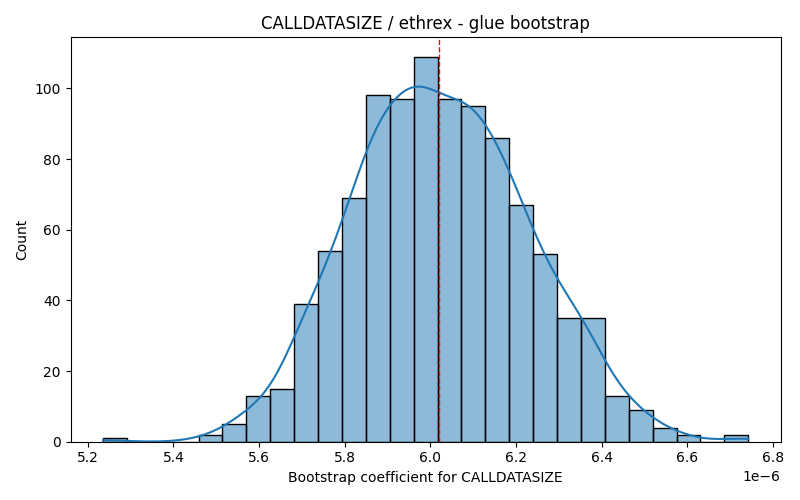

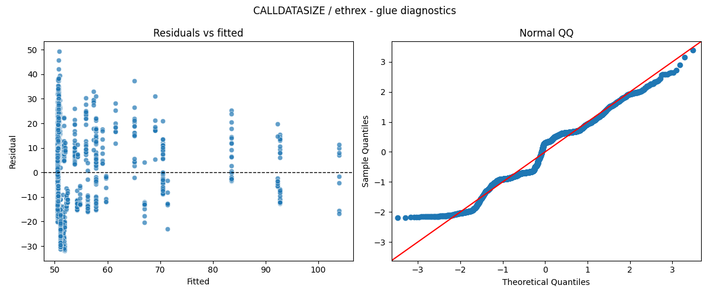

</details>

<details><summary><code>DUP</code> · nobs=4016 · runtime_ms=0 · p=1.00e+00 · R²=0.1615</summary>


</details>

<details><summary><code>GAS</code> · nobs=4016 · runtime_ms=7.617e-06 · p=1.00e-03 · R²=0.1615</summary>

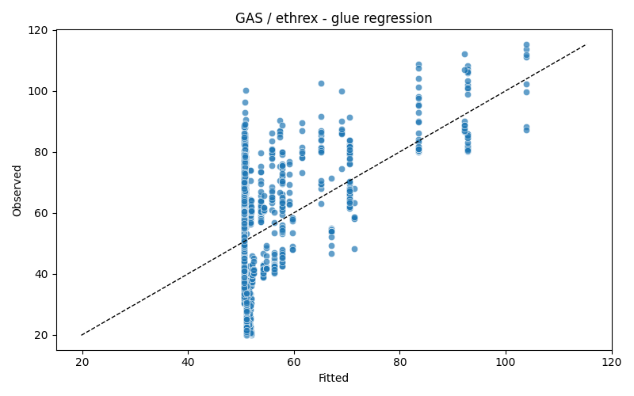

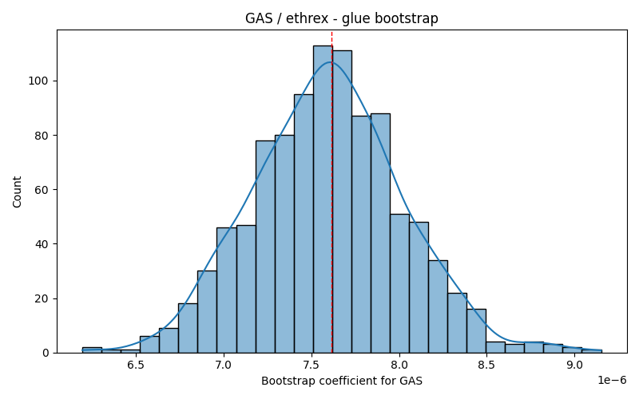


</details>

<details><summary><code>MLOAD</code> · nobs=4016 · runtime_ms=5.055e-06 · p=1.00e-03 · R²=0.1615</summary>

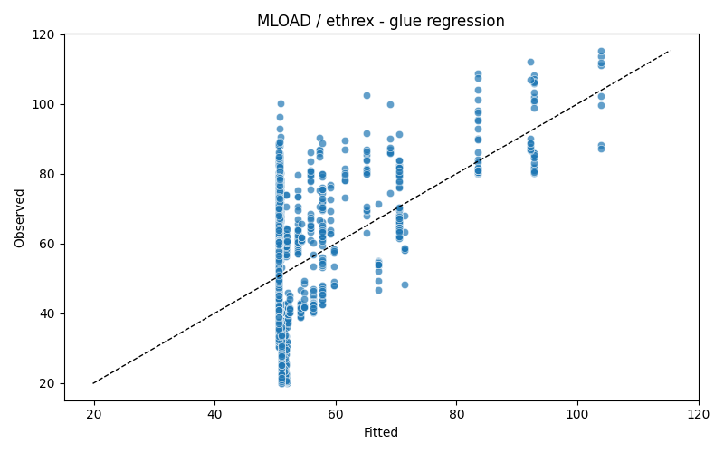

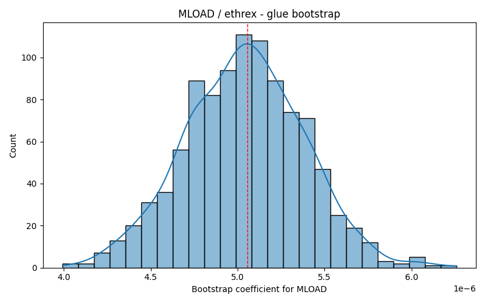


</details>

<details><summary><code>PUSH</code> · nobs=4016 · runtime_ms=0 · p=1.00e+00 · R²=0.1615</summary>


</details>

<details><summary><code>PUSH0</code> · nobs=4016 · runtime_ms=1.546e-06 · p=3.60e-02 · R²=0.1615</summary>


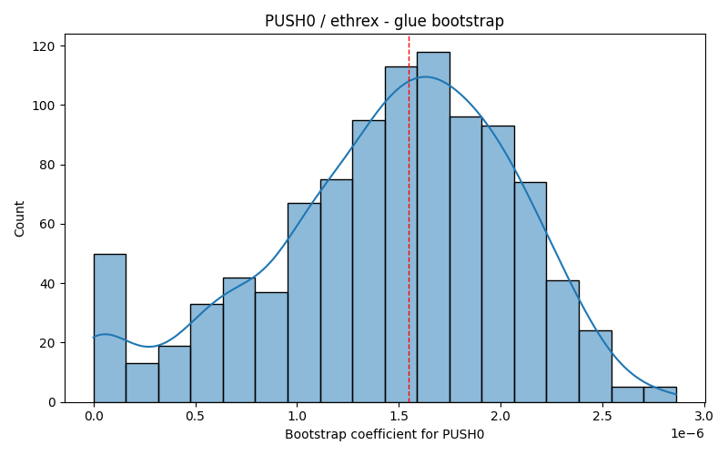


</details>

<details><summary><code>STATICCALL</code> · nobs=4016 · runtime_ms=0 · p=1.00e+00 · R²=0.1615</summary>

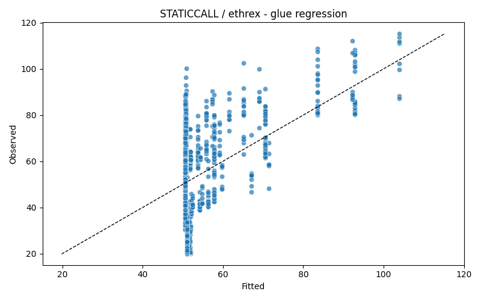


</details>

### Pure glue · ethrex

<details><summary><code>ISZERO</code> · nobs=64 · runtime_ms=0 · p=1.00e+00 · R²=0</summary>

```
==============================================================================
                           NNLS Regression Results                            
==============================================================================
Dep. Variable:          test_runtime_ms              R-squared:          0.000
Model:                  NNLS                    Adj. R-squared:         -0.016
No. Observations:       64                                RMSE:          12.69
Df Residuals:           62                                 MAE:          11.14
Df Model:               1      
==============================================================================
                      coef     std err     P-value      [0.025      0.975]
------------------------------------------------------------------------------
         const     41.2232      1.5487       0.001     38.1211     44.3231
        ISZERO      0.0000      0.0000       1.000      0.0000      0.0000
==============================================================================
Notes: Non-negative least squares with bootstrap inference (1000 iterations)
==============================================================================
```

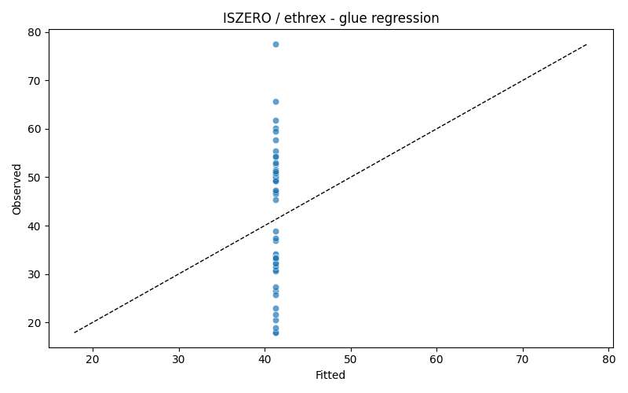

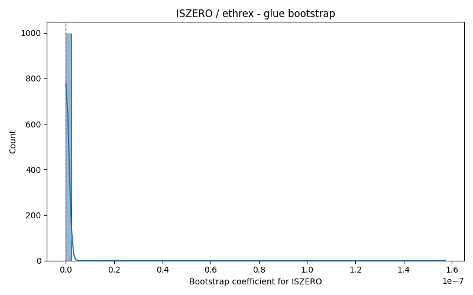

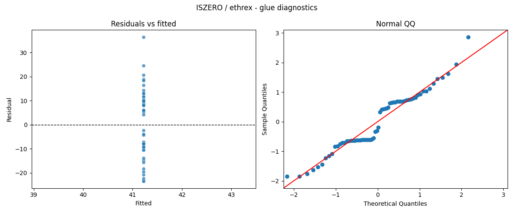

</details>

<details><summary><code>JUMPDEST</code> · nobs=16 · runtime_ms=0 · p=1.00e+00 · R²=0</summary>

```
==============================================================================
                           NNLS Regression Results                            
==============================================================================
Dep. Variable:          test_runtime_ms              R-squared:          0.000
Model:                  NNLS                    Adj. R-squared:         -0.071
No. Observations:       16                                RMSE:          17.69
Df Residuals:           14                                 MAE:          17.39
Df Model:               1      
==============================================================================
                      coef     std err     P-value      [0.025      0.975]
------------------------------------------------------------------------------
         const     74.3648      4.2336       0.001     66.5724     82.2346
      JUMPDEST      0.0000      0.0000       1.000      0.0000      0.0000
==============================================================================
Notes: Non-negative least squares with bootstrap inference (1000 iterations)
==============================================================================
```

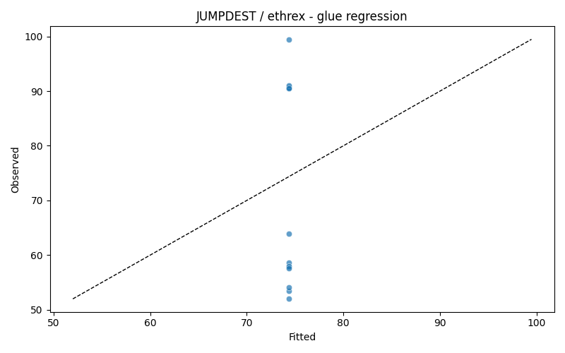


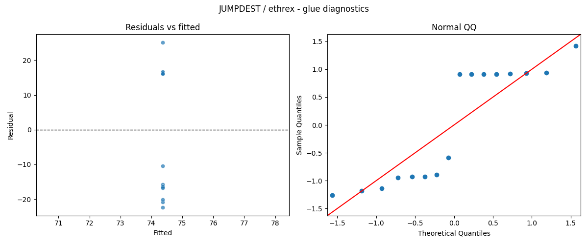

</details>

<details><summary><code>SWAP</code> · nobs=1144 · runtime_ms=0 · p=1.00e+00 · R²=0</summary>

```
==============================================================================
                           NNLS Regression Results                            
==============================================================================
Dep. Variable:          test_runtime_ms              R-squared:          0.000
Model:                  NNLS                    Adj. R-squared:         -0.001
No. Observations:       1144                              RMSE:          22.93
Df Residuals:           1142                               MAE:          17.72
Df Model:               1      
==============================================================================
                      coef     std err     P-value      [0.025      0.975]
------------------------------------------------------------------------------
         const    104.6690      0.6493       0.001    103.3886    105.9768
          SWAP      0.0000      0.0000       1.000      0.0000      0.0000
==============================================================================
Notes: Non-negative least squares with bootstrap inference (1000 iterations)
==============================================================================
```

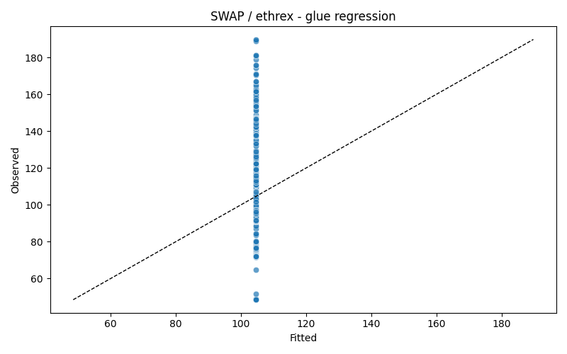

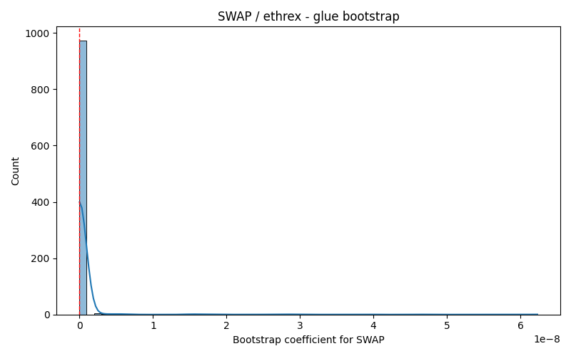

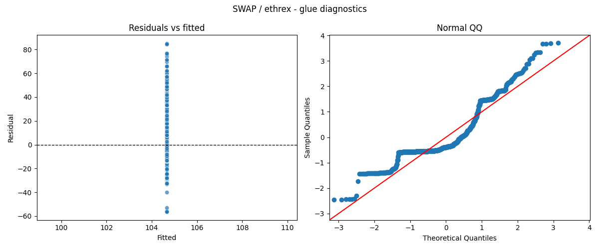

</details>

### Mixed glue (tier A) · ethrex

<details><summary><code>ADD</code> · nobs=72 · runtime_ms=0 · p=1.00e+00 · R²=-2.22e-16</summary>

```
==============================================================================
                           NNLS Regression Results                            
==============================================================================
Dep. Variable:          test_runtime_ms              R-squared:         -0.000
Model:                  NNLS                    Adj. R-squared:         -0.014
No. Observations:       72                                RMSE:          13.57
Df Residuals:           70                                 MAE:          11.67
Df Model:               1      
==============================================================================
                      coef     std err     P-value      [0.025      0.975]
------------------------------------------------------------------------------
         const     44.2799      1.6041       0.001     41.0507     47.1570
           ADD      0.0000      0.0000       1.000      0.0000      0.0000
==============================================================================
Notes: Non-negative least squares with bootstrap inference (1000 iterations)
==============================================================================
```

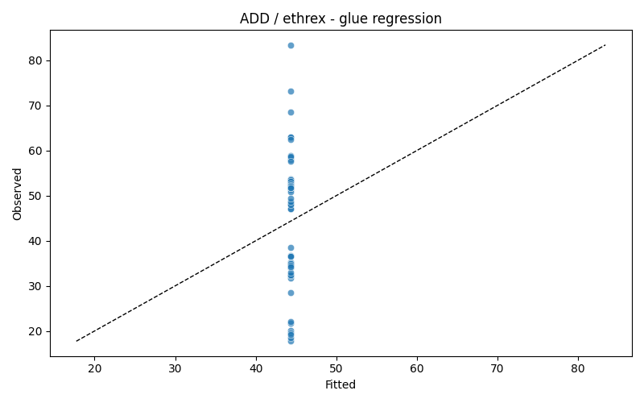

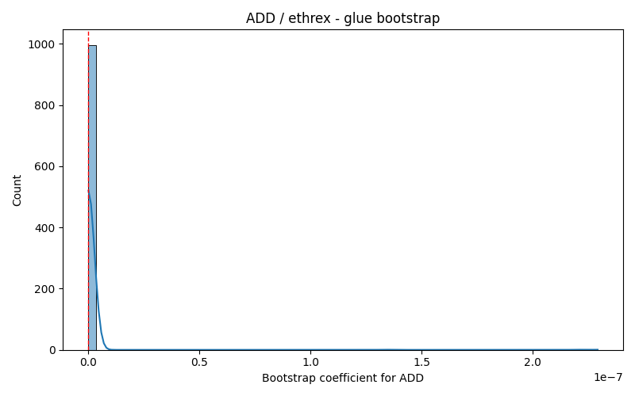

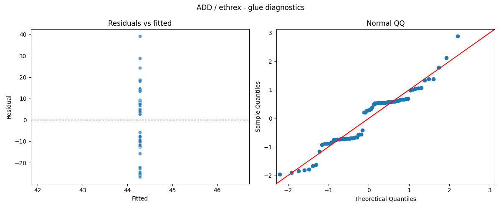

</details>

<details><summary><code>AND</code> · nobs=64 · runtime_ms=0 · p=1.00e+00 · R²=0</summary>

```
==============================================================================
                           NNLS Regression Results                            
==============================================================================
Dep. Variable:          test_runtime_ms              R-squared:          0.000
Model:                  NNLS                    Adj. R-squared:         -0.016
No. Observations:       64                                RMSE:          12.09
Df Residuals:           62                                 MAE:          10.73
Df Model:               1      
==============================================================================
                      coef     std err     P-value      [0.025      0.975]
------------------------------------------------------------------------------
         const     39.5912      1.5328       0.001     36.6125     42.6054
           AND      0.0000      0.0000       1.000      0.0000      0.0000
==============================================================================
Notes: Non-negative least squares with bootstrap inference (1000 iterations)
==============================================================================
```

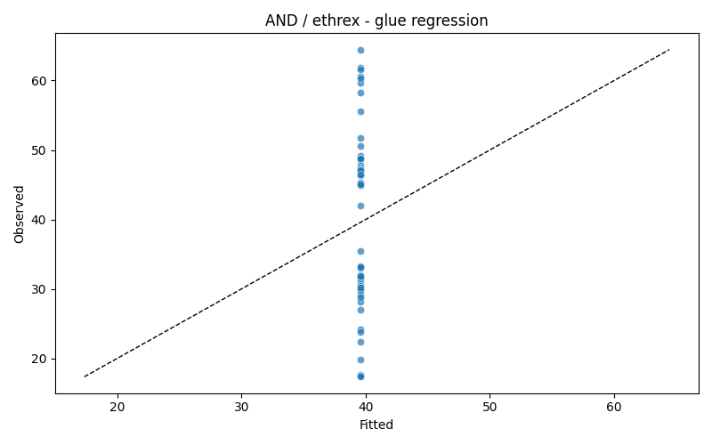


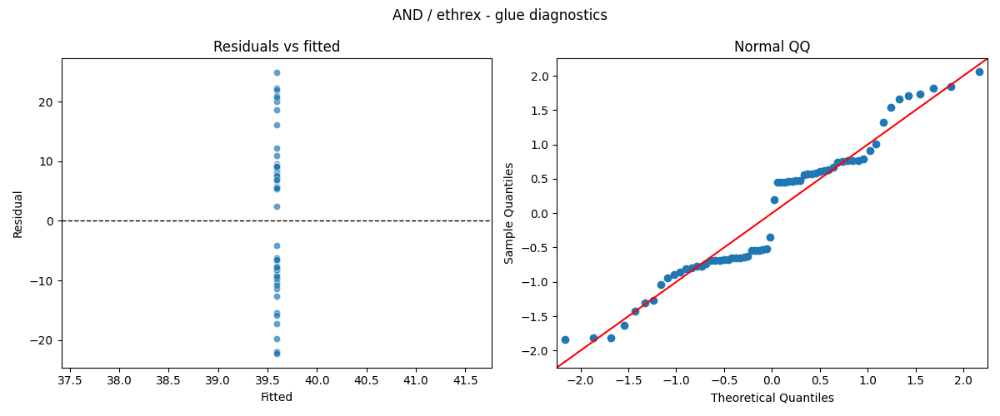

</details>

<details><summary><code>CALLDATACOPY</code> · nobs=1880 · runtime_ms=0 · p=1.00e+00 · R²=0</summary>

```
==============================================================================
                           NNLS Regression Results                            
==============================================================================
Dep. Variable:          test_runtime_ms              R-squared:          0.000
Model:                  NNLS                    Adj. R-squared:         -0.001
No. Observations:       1880                              RMSE:          20.51
Df Residuals:           1878                               MAE:          17.13
Df Model:               1      
==============================================================================
                      coef     std err     P-value      [0.025      0.975]
------------------------------------------------------------------------------
         const     36.2087      0.4795       0.001     35.2886     37.1637
  CALLDATACOPY      0.0000      0.0000       1.000      0.0000      0.0000
==============================================================================
Notes: Non-negative least squares with bootstrap inference (1000 iterations)
==============================================================================
```

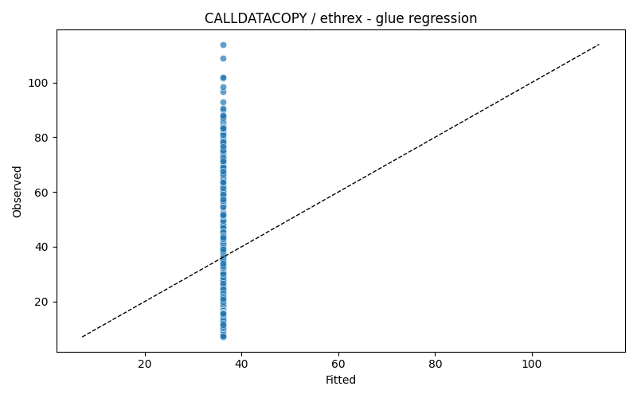


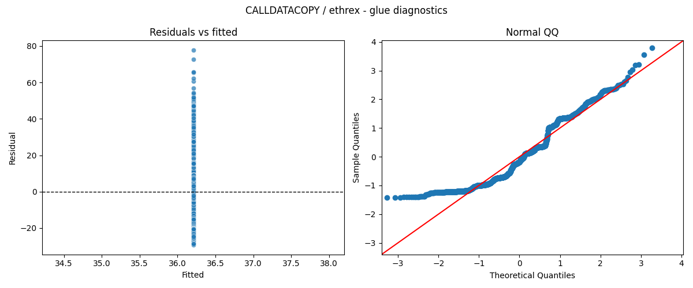

</details>

<details><summary><code>CALLDATALOAD</code> · nobs=352 · runtime_ms=1.675e-05 · p=1.00e-03 · R²=0.2631</summary>

```
==============================================================================
                           NNLS Regression Results                            
==============================================================================
Dep. Variable:          test_runtime_ms              R-squared:          0.263
Model:                  NNLS                    Adj. R-squared:          0.261
No. Observations:       352                               RMSE:           0.11
Df Residuals:           350                                MAE:           0.08
Df Model:               1      
==============================================================================
                      coef     std err     P-value      [0.025      0.975]
------------------------------------------------------------------------------
         const      2.1691      0.0219       0.001      2.1274      2.2120
  CALLDATALOAD      0.0000      0.0000       0.001      0.0000      0.0000
==============================================================================
Notes: Non-negative least squares with bootstrap inference (1000 iterations)
==============================================================================
```

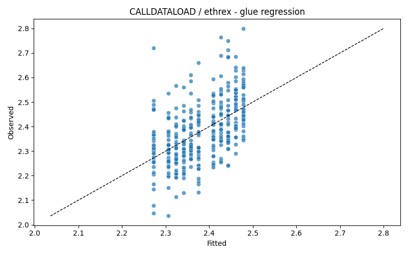

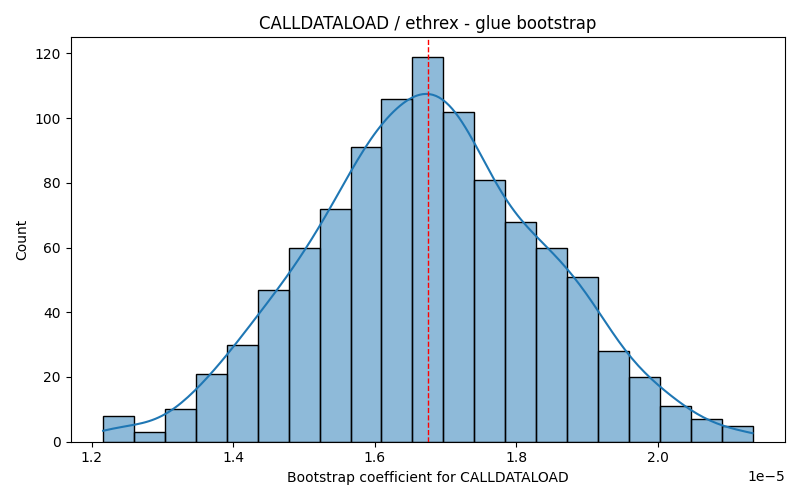

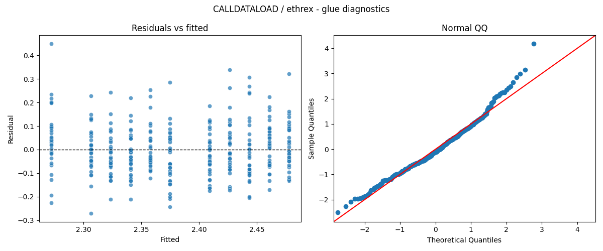

</details>

<details><summary><code>DIV</code> · nobs=88 · runtime_ms=0 · p=1.00e+00 · R²=-2.22e-16</summary>

```
==============================================================================
                           NNLS Regression Results                            
==============================================================================
Dep. Variable:          test_runtime_ms              R-squared:         -0.000
Model:                  NNLS                    Adj. R-squared:         -0.012
No. Observations:       88                                RMSE:          82.71
Df Residuals:           86                                 MAE:          73.94
Df Model:               1      
==============================================================================
                      coef     std err     P-value      [0.025      0.975]
------------------------------------------------------------------------------
         const    309.6318      9.0364       0.001    291.4054    327.4839
           DIV      0.0000      0.0000       1.000      0.0000      0.0000
==============================================================================
Notes: Non-negative least squares with bootstrap inference (1000 iterations)
==============================================================================
```

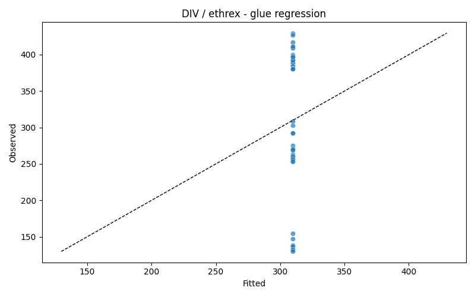

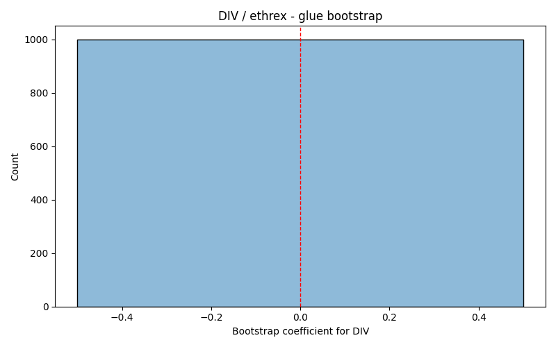

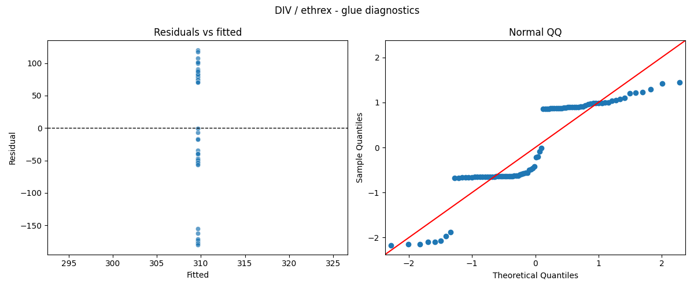

</details>

<details><summary><code>EXP</code> · nobs=88 · runtime_ms=0.0009382 · p=1.00e-03 · R²=0.8393</summary>

```
==============================================================================
                           NNLS Regression Results                            
==============================================================================
Dep. Variable:          test_runtime_ms              R-squared:          0.839
Model:                  NNLS                    Adj. R-squared:          0.837
No. Observations:       88                                RMSE:          16.08
Df Residuals:           86                                 MAE:          13.58
Df Model:               1      
==============================================================================
                      coef     std err     P-value      [0.025      0.975]
------------------------------------------------------------------------------
         const     32.8123      6.4282       0.001     19.1609     45.2327
           EXP      0.0009      0.0000       0.001      0.0008      0.0010
==============================================================================
Notes: Non-negative least squares with bootstrap inference (1000 iterations)
==============================================================================
```

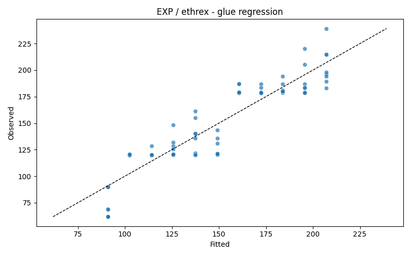

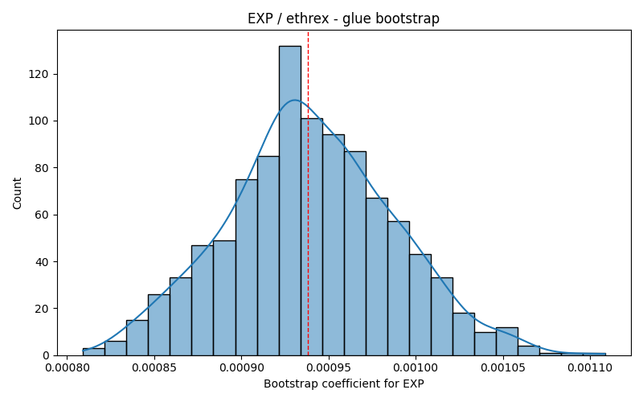

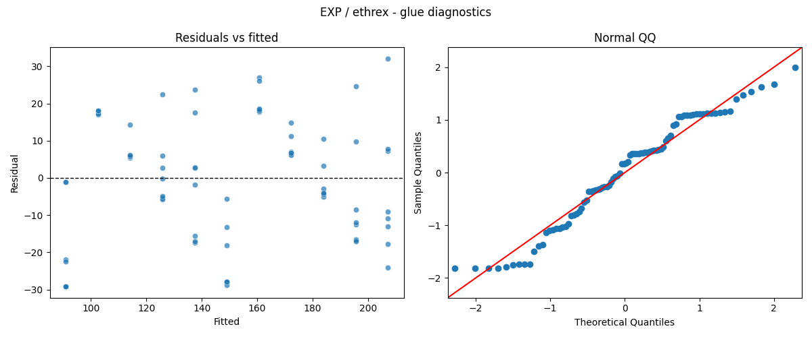

</details>

<details><summary><code>GT</code> · nobs=64 · runtime_ms=0 · p=1.00e+00 · R²=0</summary>

```
==============================================================================
                           NNLS Regression Results                            
==============================================================================
Dep. Variable:          test_runtime_ms              R-squared:          0.000
Model:                  NNLS                    Adj. R-squared:         -0.016
No. Observations:       64                                RMSE:          14.12
Df Residuals:           62                                 MAE:          12.57
Df Model:               1      
==============================================================================
                      coef     std err     P-value      [0.025      0.975]
------------------------------------------------------------------------------
         const     44.0687      1.7473       0.001     40.6895     47.5189
            GT      0.0000      0.0000       1.000      0.0000      0.0000
==============================================================================
Notes: Non-negative least squares with bootstrap inference (1000 iterations)
==============================================================================
```

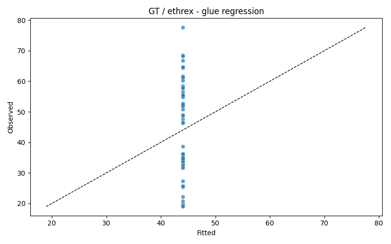

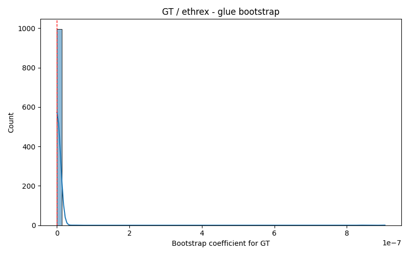

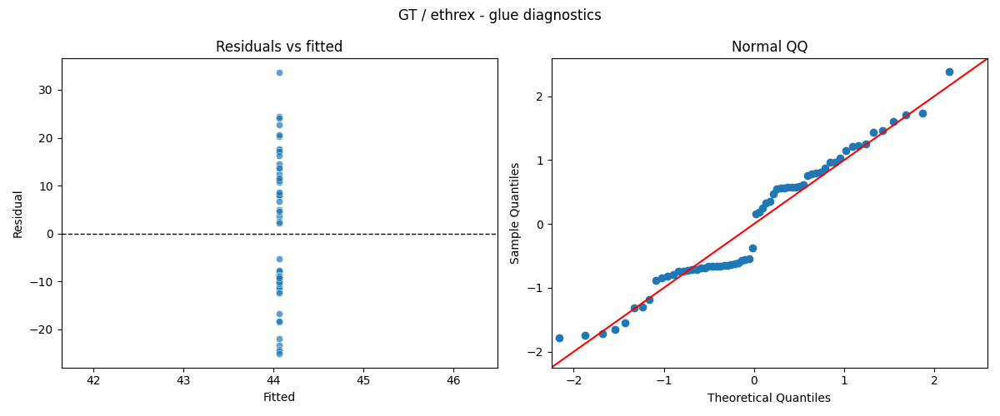

</details>

<details><summary><code>JUMPI</code> · nobs=88 · runtime_ms=0 · p=1.00e+00 · R²=0</summary>

```
==============================================================================
                           NNLS Regression Results                            
==============================================================================
Dep. Variable:          test_runtime_ms              R-squared:          0.000
Model:                  NNLS                    Adj. R-squared:         -0.012
No. Observations:       88                                RMSE:           7.56
Df Residuals:           86                                 MAE:           6.49
Df Model:               1      
==============================================================================
                      coef     std err     P-value      [0.025      0.975]
------------------------------------------------------------------------------
         const     28.1012      0.7503       0.001     26.6676     29.5776
         JUMPI      0.0000      0.0000       1.000      0.0000      0.0000
==============================================================================
Notes: Non-negative least squares with bootstrap inference (1000 iterations)
==============================================================================
```

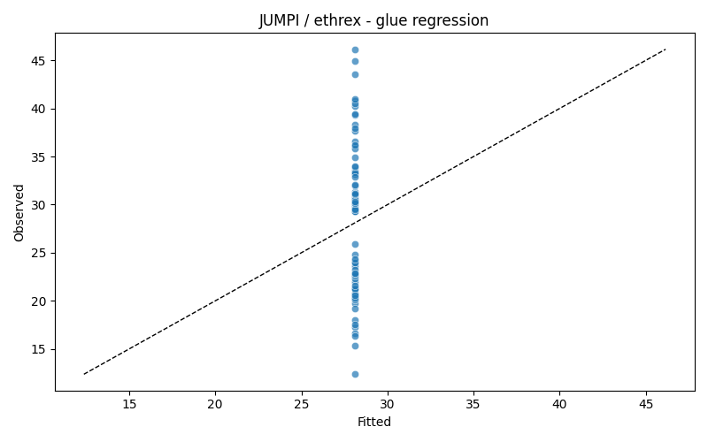

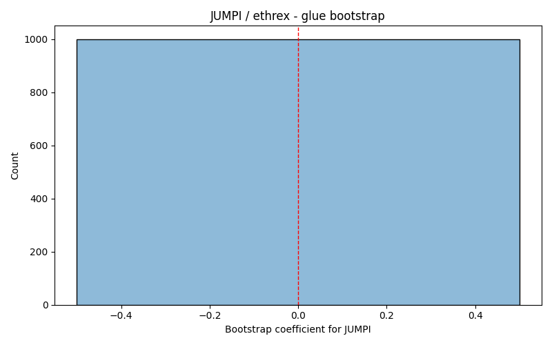

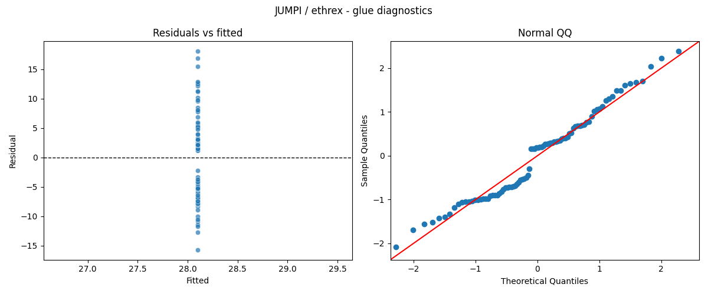

</details>

<details><summary><code>LT</code> · nobs=64 · runtime_ms=0 · p=1.00e+00 · R²=0</summary>

```
==============================================================================
                           NNLS Regression Results                            
==============================================================================
Dep. Variable:          test_runtime_ms              R-squared:          0.000
Model:                  NNLS                    Adj. R-squared:         -0.016
No. Observations:       64                                RMSE:          13.99
Df Residuals:           62                                 MAE:          12.45
Df Model:               1      
==============================================================================
                      coef     std err     P-value      [0.025      0.975]
------------------------------------------------------------------------------
         const     42.5463      1.7852       0.001     39.0739     46.0701
            LT      0.0000      0.0000       1.000      0.0000      0.0000
==============================================================================
Notes: Non-negative least squares with bootstrap inference (1000 iterations)
==============================================================================
```

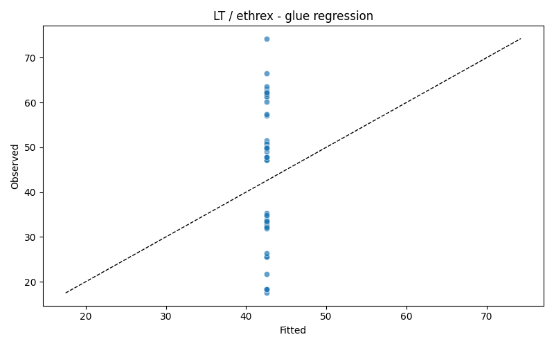

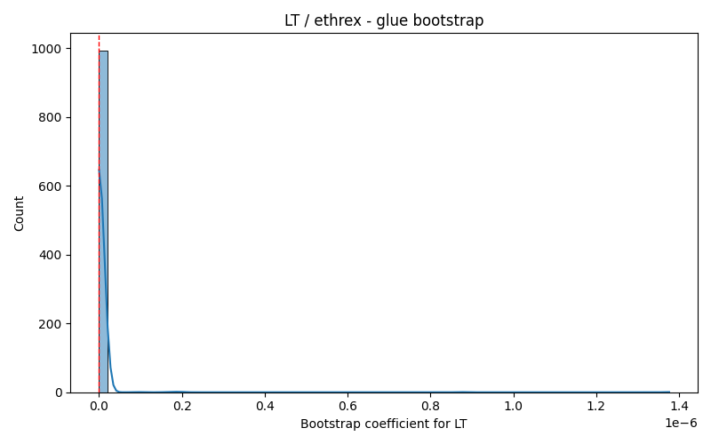

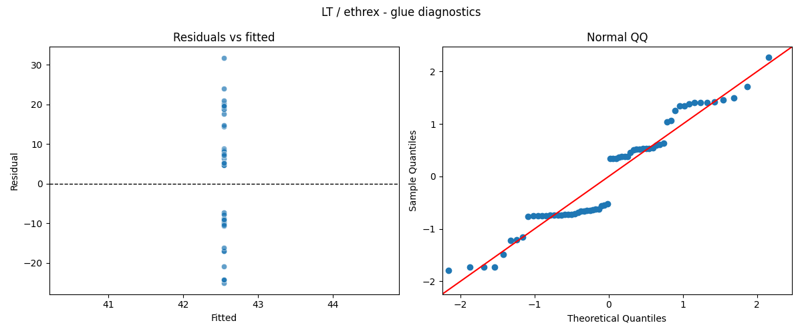

</details>

<details><summary><code>MSTORE</code> · nobs=360 · runtime_ms=0 · p=1.00e+00 · R²=2.22e-16</summary>

```
==============================================================================
                           NNLS Regression Results                            
==============================================================================
Dep. Variable:          test_runtime_ms              R-squared:          0.000
Model:                  NNLS                    Adj. R-squared:         -0.003
No. Observations:       360                               RMSE:          13.58
Df Residuals:           358                                MAE:          11.89
Df Model:               1      
==============================================================================
                      coef     std err     P-value      [0.025      0.975]
------------------------------------------------------------------------------
         const     48.8067      0.7298       0.001     47.4366     50.2551
        MSTORE      0.0000      0.0000       1.000      0.0000      0.0000
==============================================================================
Notes: Non-negative least squares with bootstrap inference (1000 iterations)
==============================================================================
```

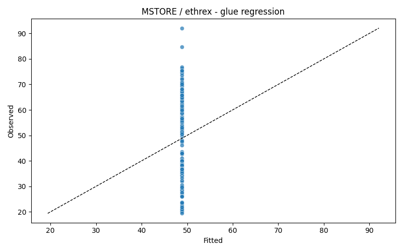


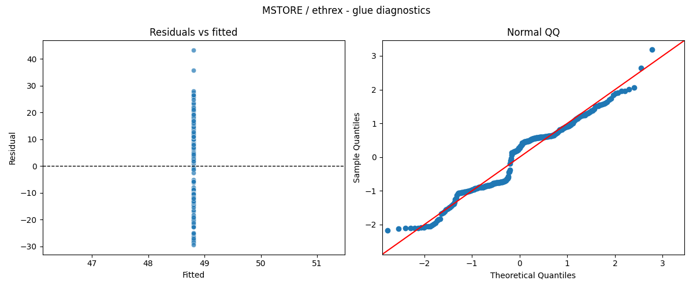

</details>

<details><summary><code>MSTORE8</code> · nobs=360 · runtime_ms=0 · p=1.00e+00 · R²=0</summary>

```
==============================================================================
                           NNLS Regression Results                            
==============================================================================
Dep. Variable:          test_runtime_ms              R-squared:          0.000
Model:                  NNLS                    Adj. R-squared:         -0.003
No. Observations:       360                               RMSE:          13.28
Df Residuals:           358                                MAE:          11.58
Df Model:               1      
==============================================================================
                      coef     std err     P-value      [0.025      0.975]
------------------------------------------------------------------------------
         const     46.0696      0.6937       0.001     44.7662     47.4664
       MSTORE8      0.0000      0.0000       1.000      0.0000      0.0000
==============================================================================
Notes: Non-negative least squares with bootstrap inference (1000 iterations)
==============================================================================
```

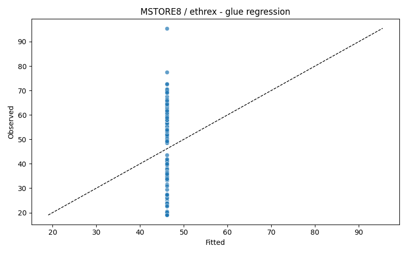


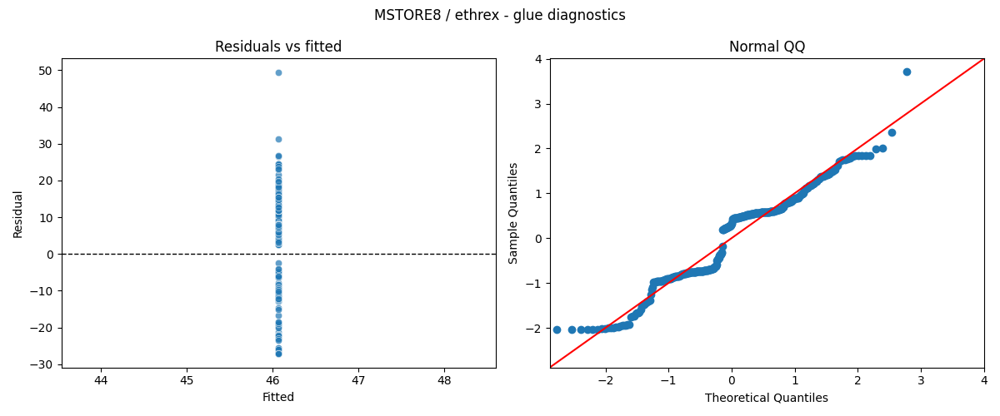

</details>

<details><summary><code>MUL</code> · nobs=80 · runtime_ms=0 · p=1.00e+00 · R²=0</summary>

```
==============================================================================
                           NNLS Regression Results                            
==============================================================================
Dep. Variable:          test_runtime_ms              R-squared:          0.000
Model:                  NNLS                    Adj. R-squared:         -0.013
No. Observations:       80                                RMSE:          22.48
Df Residuals:           78                                 MAE:          19.70
Df Model:               1      
==============================================================================
                      coef     std err     P-value      [0.025      0.975]
------------------------------------------------------------------------------
         const     88.1611      2.4335       0.001     83.2899     92.8597
           MUL      0.0000      0.0000       1.000      0.0000      0.0000
==============================================================================
Notes: Non-negative least squares with bootstrap inference (1000 iterations)
==============================================================================
```

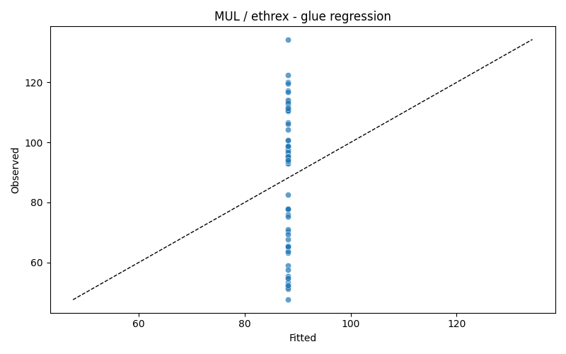


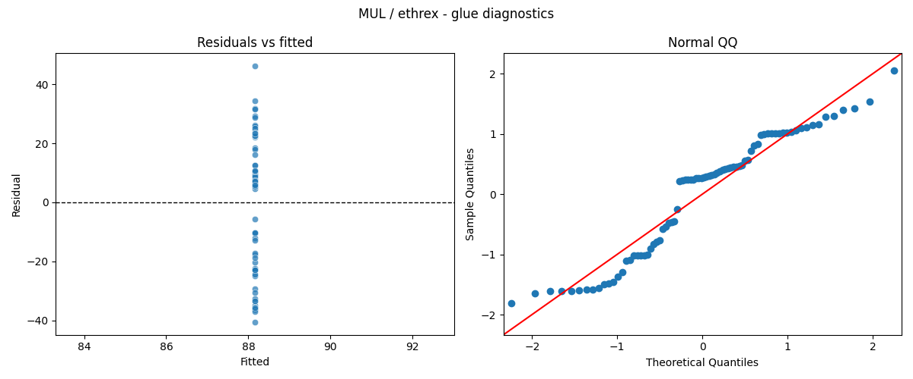

</details>

<details><summary><code>PC</code> · nobs=48 · runtime_ms=5.787e-06 · p=1.00e-03 · R²=0.4308</summary>

```
==============================================================================
                           NNLS Regression Results                            
==============================================================================
Dep. Variable:          test_runtime_ms              R-squared:          0.431
Model:                  NNLS                    Adj. R-squared:          0.418
No. Observations:       48                                RMSE:          14.78
Df Residuals:           46                                 MAE:          12.86
Df Model:               1      
==============================================================================
                      coef     std err     P-value      [0.025      0.975]
------------------------------------------------------------------------------
         const     59.4694      4.4286       0.001     50.2222     67.8658
            PC      0.0000      0.0000       0.001      0.0000      0.0000
==============================================================================
Notes: Non-negative least squares with bootstrap inference (1000 iterations)
==============================================================================
```

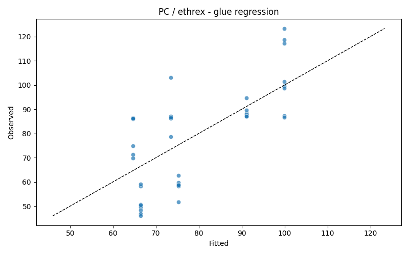

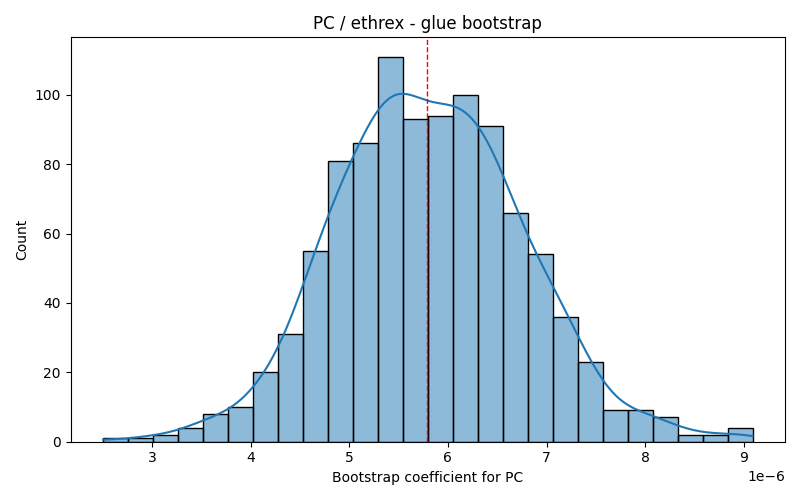

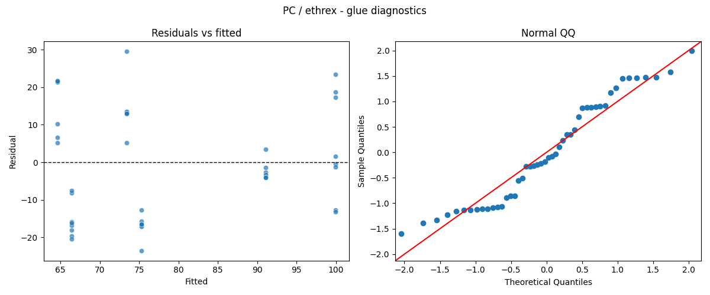

</details>

<details><summary><code>RETURNDATASIZE</code> · nobs=192 · runtime_ms=7.238e-06 · p=1.00e-03 · R²=0.3906</summary>

```
==============================================================================
                           NNLS Regression Results                            
==============================================================================
Dep. Variable:          test_runtime_ms              R-squared:          0.391
Model:                  NNLS                    Adj. R-squared:          0.387
No. Observations:       192                               RMSE:          10.61
Df Residuals:           190                                MAE:           9.18
Df Model:               1      
==============================================================================
                      coef     std err     P-value      [0.025      0.975]
------------------------------------------------------------------------------
         const     48.3347      1.4414       0.001     45.3267     51.1086
RETURNDATASIZE      0.0000      0.0000       0.001      0.0000      0.0000
==============================================================================
Notes: Non-negative least squares with bootstrap inference (1000 iterations)
==============================================================================
```

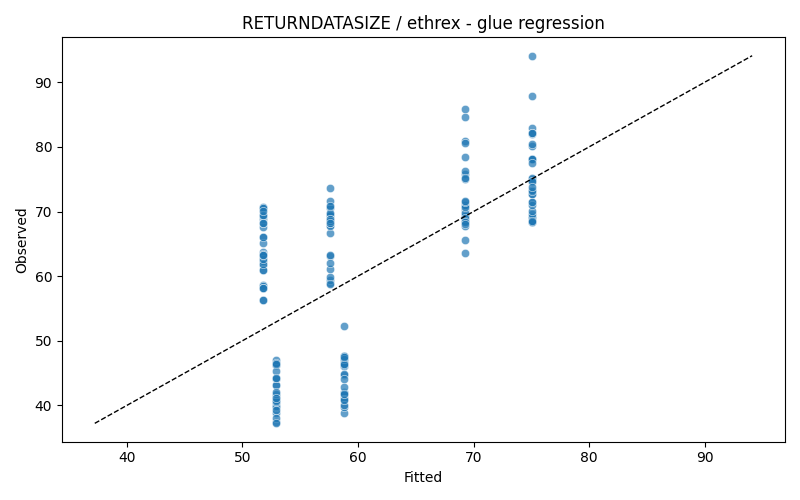

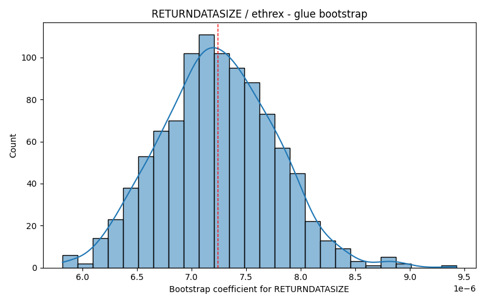

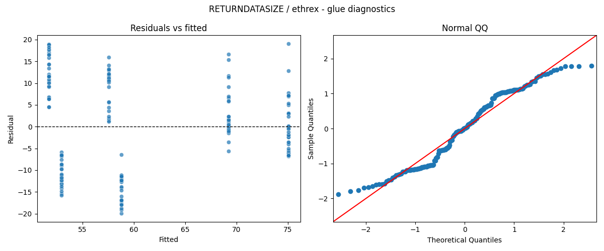

</details>

<details><summary><code>SELFBALANCE</code> · nobs=88 · runtime_ms=0 · p=1.00e+00 · R²=0</summary>

```
==============================================================================
                           NNLS Regression Results                            
==============================================================================
Dep. Variable:          test_runtime_ms              R-squared:          0.000
Model:                  NNLS                    Adj. R-squared:         -0.012
No. Observations:       88                                RMSE:          66.12
Df Residuals:           86                                 MAE:          59.35
Df Model:               1      
==============================================================================
                      coef     std err     P-value      [0.025      0.975]
------------------------------------------------------------------------------
         const    250.7742      7.5167       0.001    235.6202    264.0293
   SELFBALANCE      0.0000      0.0000       1.000      0.0000      0.0000
==============================================================================
Notes: Non-negative least squares with bootstrap inference (1000 iterations)
==============================================================================
```

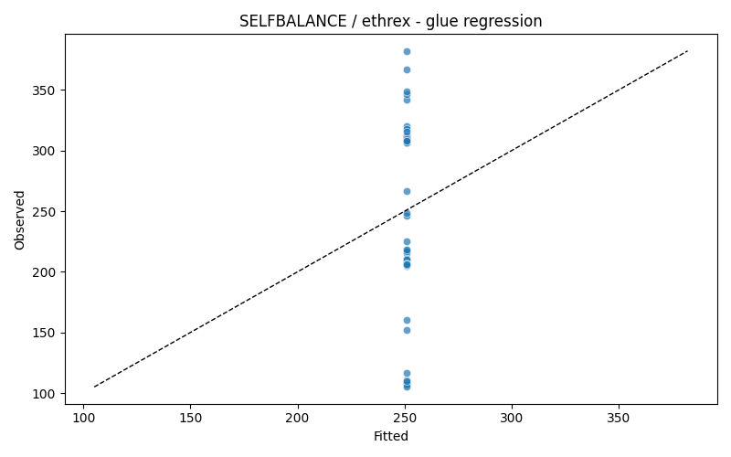

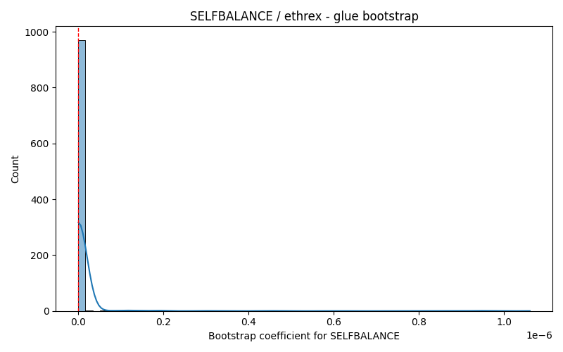

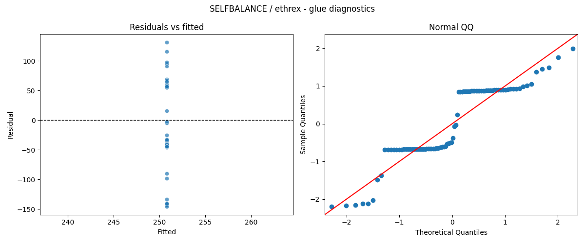

</details>

<details><summary><code>SUB</code> · nobs=64 · runtime_ms=0 · p=1.00e+00 · R²=0</summary>

```
==============================================================================
                           NNLS Regression Results                            
==============================================================================
Dep. Variable:          test_runtime_ms              R-squared:          0.000
Model:                  NNLS                    Adj. R-squared:         -0.016
No. Observations:       64                                RMSE:          12.66
Df Residuals:           62                                 MAE:          11.23
Df Model:               1      
==============================================================================
                      coef     std err     P-value      [0.025      0.975]
------------------------------------------------------------------------------
         const     42.8746      1.5805       0.001     39.8767     46.0108
           SUB      0.0000      0.0000       1.000      0.0000      0.0000
==============================================================================
Notes: Non-negative least squares with bootstrap inference (1000 iterations)
==============================================================================
```

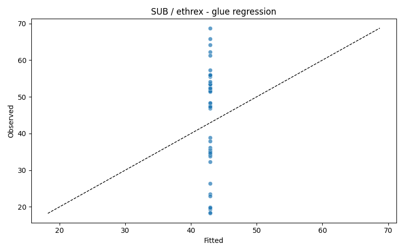

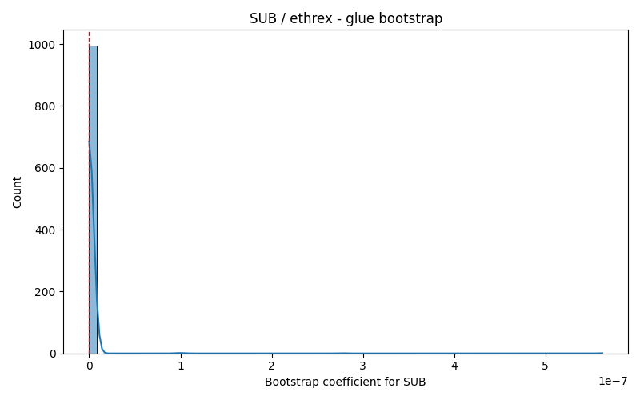

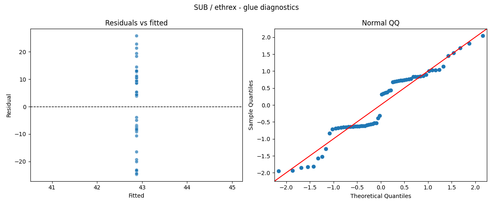

</details>

### Mixed glue (tier B) · ethrex

<details><summary><code>JUMP</code> · nobs=80 · runtime_ms=0 · p=1.00e+00 · R²=0</summary>

```
==============================================================================
                           NNLS Regression Results                            
==============================================================================
Dep. Variable:          test_runtime_ms              R-squared:          0.000
Model:                  NNLS                    Adj. R-squared:         -0.013
No. Observations:       80                                RMSE:          12.15
Df Residuals:           78                                 MAE:          10.22
Df Model:               1      
==============================================================================
                      coef     std err     P-value      [0.025      0.975]
------------------------------------------------------------------------------
         const     40.8998      1.3617       0.001     38.2762     43.6586
          JUMP      0.0000      0.0000       1.000      0.0000      0.0000
==============================================================================
Notes: Non-negative least squares with bootstrap inference (1000 iterations)
==============================================================================
```

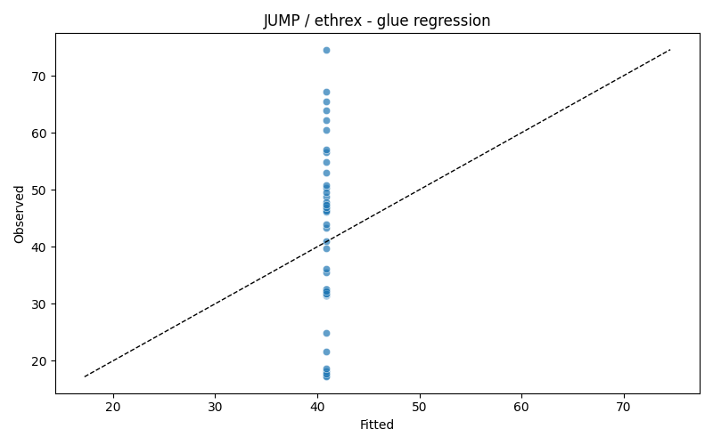


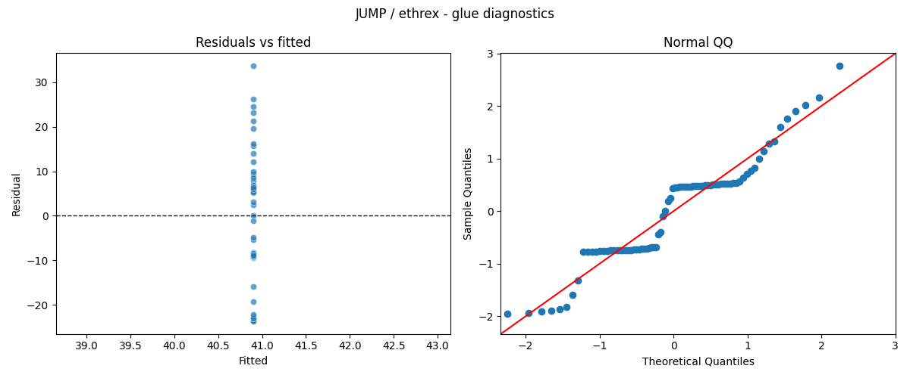

</details>

<details><summary><code>KECCAK256</code> · nobs=1408 · runtime_ms=0 · p=1.00e+00 · R²=-2.22e-16</summary>

```
==============================================================================
                           NNLS Regression Results                            
==============================================================================
Dep. Variable:          test_runtime_ms              R-squared:         -0.000
Model:                  NNLS                    Adj. R-squared:         -0.001
No. Observations:       1408                              RMSE:         154.27
Df Residuals:           1406                               MAE:         127.99
Df Model:               1      
==============================================================================
                      coef     std err     P-value      [0.025      0.975]
------------------------------------------------------------------------------
         const    244.3275      4.0483       0.001    236.2484    252.0478
     KECCAK256      0.0000      0.0000       1.000      0.0000      0.0000
==============================================================================
Notes: Non-negative least squares with bootstrap inference (1000 iterations)
==============================================================================
```

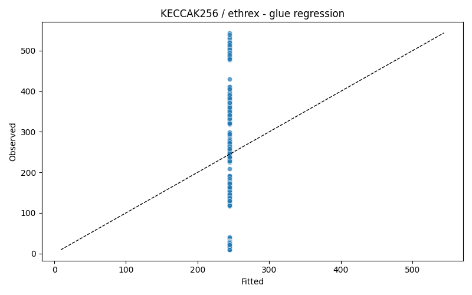


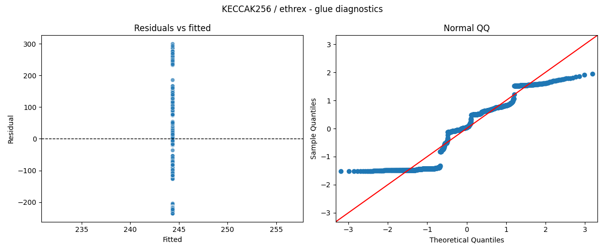

</details>

## geth

| glue_opcode | nobs | glue_runtime_ms | p_value | rsquared |
| --- | --- | --- | --- | --- |
| `ISZERO` | 280 | 0 | 1.00e+00 | 0 |
| `JUMPDEST` | 70 | 0 | 1.00e+00 | 2.22e-16 |
| `SWAP` | 5005 | 0 | 1.00e+00 | 1.11e-16 |
| `CALLDATASIZE` | 17647 | 4.532e-06 | 1.00e-03 | 0.06086 |
| `DUP` | 17647 | 0 | 1.00e+00 | 0.06086 |
| `GAS` | 17647 | 5.385e-06 | 1.00e-03 | 0.06086 |
| `MLOAD` | 17647 | 7.611e-06 | 1.00e-03 | 0.06086 |
| `PUSH` | 17647 | 0 | 1.00e+00 | 0.06086 |
| `PUSH0` | 17647 | 0 | 1.00e+00 | 0.06086 |
| `STATICCALL` | 17647 | 8.264e-05 | 1.00e-03 | 0.06086 |
| `ADD` | 315 | 0 | 1.00e+00 | 0 |
| `AND` | 280 | 0 | 1.00e+00 | 0 |
| `CALLDATACOPY` | 8225 | 0 | 1.00e+00 | 0 |
| `CALLDATALOAD` | 1540 | 3.599e-05 | 1.00e-03 | 0.1451 |
| `DIV` | 385 | 0 | 1.00e+00 | 0 |
| `EXP` | 385 | 0.000317 | 1.00e-03 | 0.8056 |
| `GT` | 280 | 0 | 1.00e+00 | 0 |
| `JUMPI` | 385 | 0 | 1.00e+00 | 1.11e-16 |
| `LT` | 280 | 0 | 1.00e+00 | 0 |
| `MSTORE` | 1575 | 0 | 1.00e+00 | 0 |
| `MSTORE8` | 1575 | 0 | 1.00e+00 | 0 |
| `MUL` | 350 | 0 | 1.00e+00 | 0 |
| `PC` | 210 | 6.643e-06 | 1.00e-03 | 0.2916 |
| `RETURNDATASIZE` | 840 | 1.295e-05 | 1.00e-03 | 0.1681 |
| `SELFBALANCE` | 385 | 0 | 1.00e+00 | 0 |
| `SUB` | 280 | 0 | 1.00e+00 | 0 |
| `JUMP` | 350 | 0 | 1.00e+00 | 0 |
| `KECCAK256` | 6160 | 2.996e-05 | 1.00e-03 | 0.208 |

### Cycle glue — joint fit · geth

<details><summary>Joint NNLS regression summary</summary>

```
==============================================================================
                           NNLS Regression Results                            
==============================================================================
Dep. Variable:          test_runtime_ms              R-squared:          0.061
Model:                  NNLS                    Adj. R-squared:          0.060
No. Observations:       17647                             RMSE:          47.16
Df Residuals:           17639                              MAE:          38.18
Df Model:               7      
==============================================================================
                      coef     std err     P-value      [0.025      0.975]
------------------------------------------------------------------------------
         const    138.3048      0.3674       0.001    137.5782    139.0015
  CALLDATASIZE      0.0000      0.0000       0.001      0.0000      0.0000
           DUP      0.0000      0.0000       1.000      0.0000      0.0000
           GAS      0.0000      0.0000       0.001      0.0000      0.0000
         MLOAD      0.0000      0.0000       0.001      0.0000      0.0000
          PUSH      0.0000      0.0000       1.000      0.0000      0.0000
         PUSH0      0.0000      0.0000       1.000      0.0000      0.0000
    STATICCALL      0.0001      0.0000       0.001      0.0001      0.0001
==============================================================================
Notes: Non-negative least squares with bootstrap inference (1000 iterations)
==============================================================================
```

</details>

<details><summary><code>CALLDATASIZE</code> · nobs=17647 · runtime_ms=4.532e-06 · p=1.00e-03 · R²=0.06086</summary>


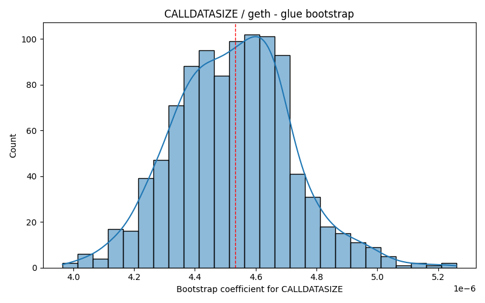


</details>

<details><summary><code>DUP</code> · nobs=17647 · runtime_ms=0 · p=1.00e+00 · R²=0.06086</summary>


</details>

<details><summary><code>GAS</code> · nobs=17647 · runtime_ms=5.385e-06 · p=1.00e-03 · R²=0.06086</summary>


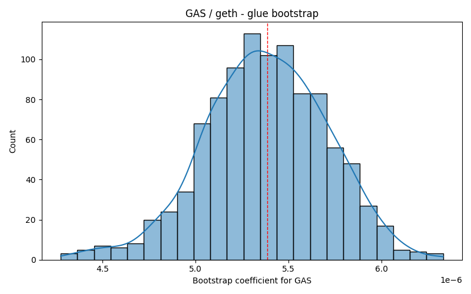

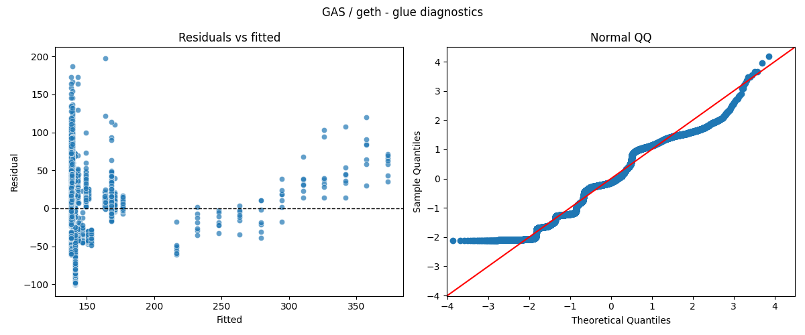

</details>

<details><summary><code>MLOAD</code> · nobs=17647 · runtime_ms=7.611e-06 · p=1.00e-03 · R²=0.06086</summary>

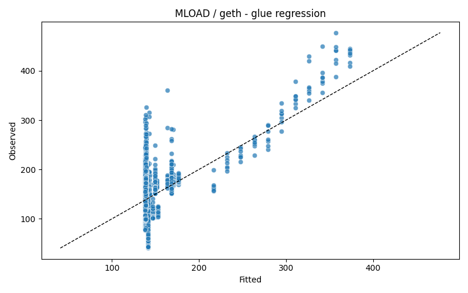

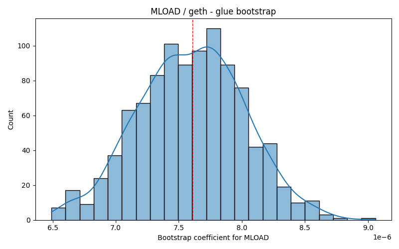


</details>

<details><summary><code>PUSH</code> · nobs=17647 · runtime_ms=0 · p=1.00e+00 · R²=0.06086</summary>

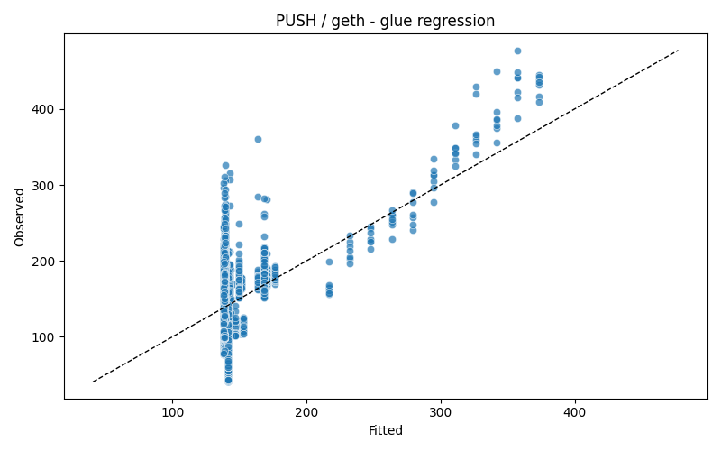


</details>

<details><summary><code>PUSH0</code> · nobs=17647 · runtime_ms=0 · p=1.00e+00 · R²=0.06086</summary>


</details>

<details><summary><code>STATICCALL</code> · nobs=17647 · runtime_ms=8.264e-05 · p=1.00e-03 · R²=0.06086</summary>

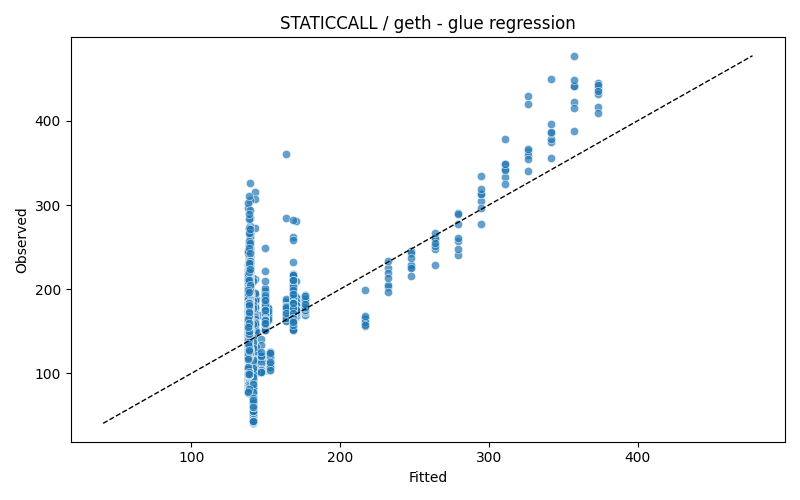

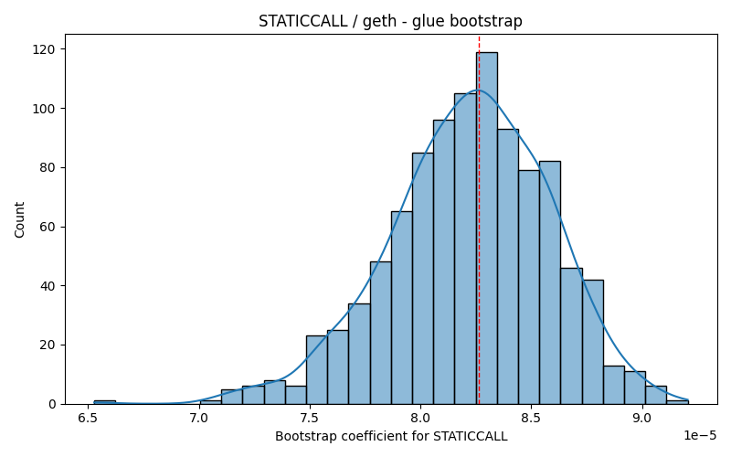

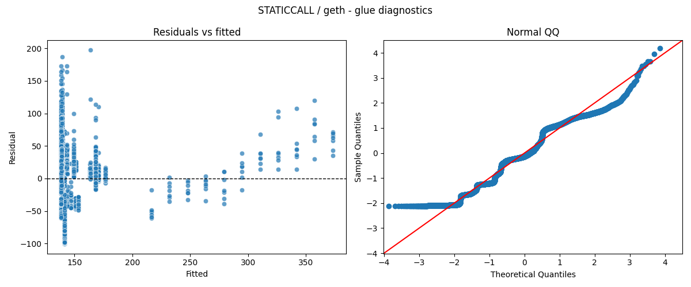

</details>

### Pure glue · geth

<details><summary><code>ISZERO</code> · nobs=280 · runtime_ms=0 · p=1.00e+00 · R²=0</summary>

```
==============================================================================
                           NNLS Regression Results                            
==============================================================================
Dep. Variable:          test_runtime_ms              R-squared:          0.000
Model:                  NNLS                    Adj. R-squared:         -0.004
No. Observations:       280                               RMSE:          29.18
Df Residuals:           278                                MAE:          23.08
Df Model:               1      
==============================================================================
                      coef     std err     P-value      [0.025      0.975]
------------------------------------------------------------------------------
         const     83.1029      1.7245       0.001     79.8357     86.5042
        ISZERO      0.0000      0.0000       1.000      0.0000      0.0000
==============================================================================
Notes: Non-negative least squares with bootstrap inference (1000 iterations)
==============================================================================
```

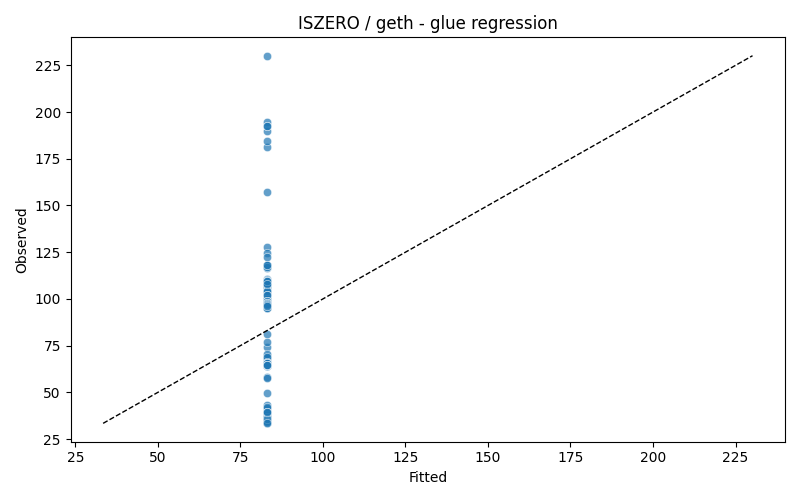


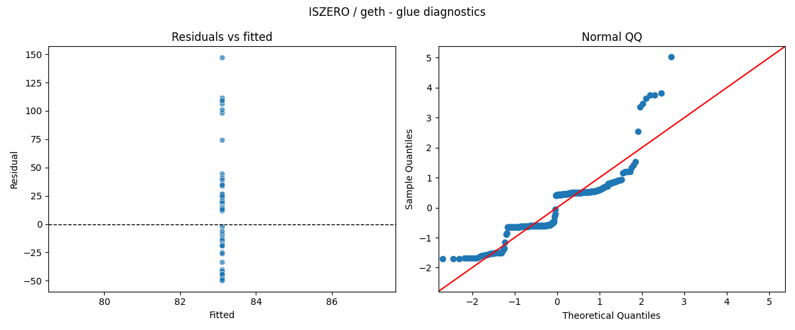

</details>

<details><summary><code>JUMPDEST</code> · nobs=70 · runtime_ms=0 · p=1.00e+00 · R²=2.22e-16</summary>

```
==============================================================================
                           NNLS Regression Results                            
==============================================================================
Dep. Variable:          test_runtime_ms              R-squared:          0.000
Model:                  NNLS                    Adj. R-squared:         -0.015
No. Observations:       70                                RMSE:          34.86
Df Residuals:           68                                 MAE:          34.51
Df Model:               1      
==============================================================================
                      coef     std err     P-value      [0.025      0.975]
------------------------------------------------------------------------------
         const    183.7168      4.0919       0.001    175.8673    191.7359
      JUMPDEST      0.0000      0.0000       1.000      0.0000      0.0000
==============================================================================
Notes: Non-negative least squares with bootstrap inference (1000 iterations)
==============================================================================
```

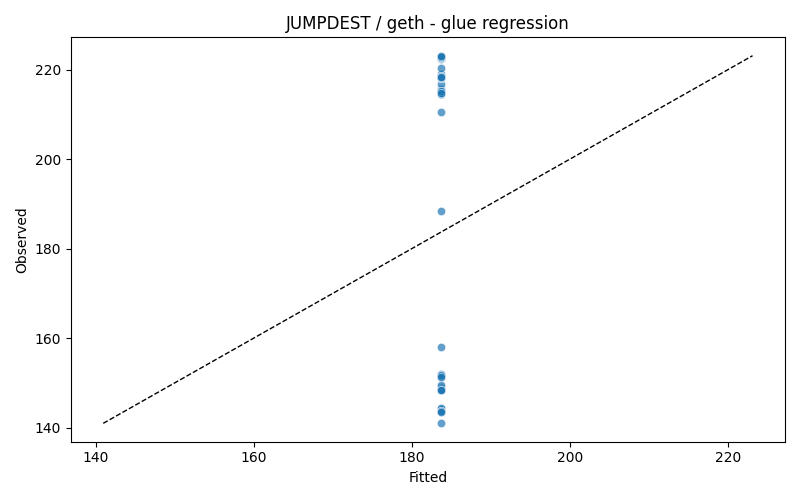


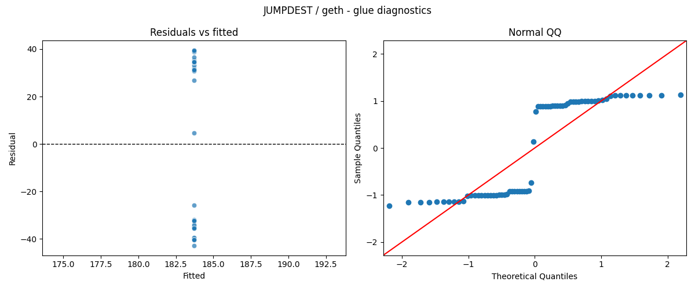

</details>

<details><summary><code>SWAP</code> · nobs=5005 · runtime_ms=0 · p=1.00e+00 · R²=1.11e-16</summary>

```
==============================================================================
                           NNLS Regression Results                            
==============================================================================
Dep. Variable:          test_runtime_ms              R-squared:          0.000
Model:                  NNLS                    Adj. R-squared:         -0.000
No. Observations:       5005                              RMSE:          34.56
Df Residuals:           5003                               MAE:          29.76
Df Model:               1      
==============================================================================
                      coef     std err     P-value      [0.025      0.975]
------------------------------------------------------------------------------
         const    108.3664      0.4900       0.001    107.4041    109.3046
          SWAP      0.0000      0.0000       1.000      0.0000      0.0000
==============================================================================
Notes: Non-negative least squares with bootstrap inference (1000 iterations)
==============================================================================
```

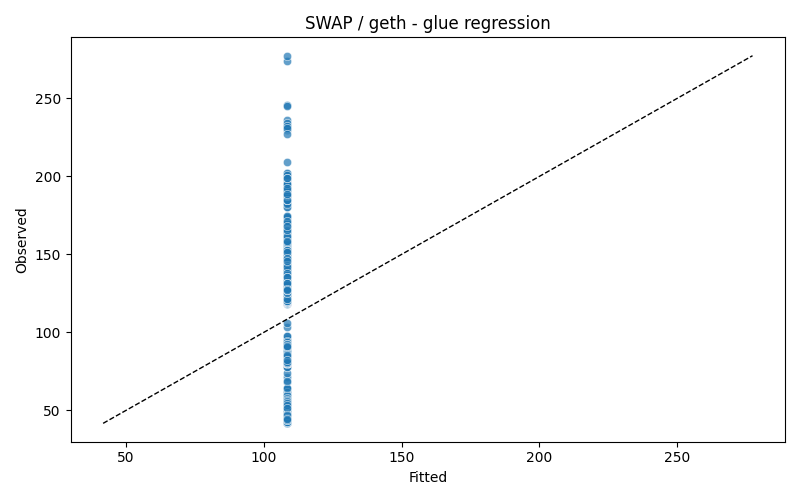


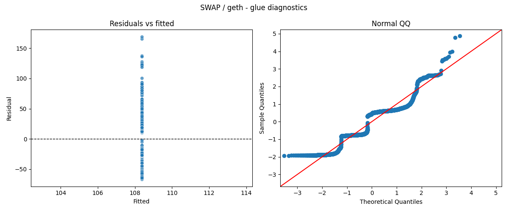

</details>

### Mixed glue (tier A) · geth

<details><summary><code>ADD</code> · nobs=315 · runtime_ms=0 · p=1.00e+00 · R²=0</summary>

```
==============================================================================
                           NNLS Regression Results                            
==============================================================================
Dep. Variable:          test_runtime_ms              R-squared:          0.000
Model:                  NNLS                    Adj. R-squared:         -0.003
No. Observations:       315                               RMSE:          31.94
Df Residuals:           313                                MAE:          25.87
Df Model:               1      
==============================================================================
                      coef     std err     P-value      [0.025      0.975]
------------------------------------------------------------------------------
         const     96.3505      1.8502       0.001     92.7735    100.0446
           ADD      0.0000      0.0000       1.000      0.0000      0.0000
==============================================================================
Notes: Non-negative least squares with bootstrap inference (1000 iterations)
==============================================================================
```

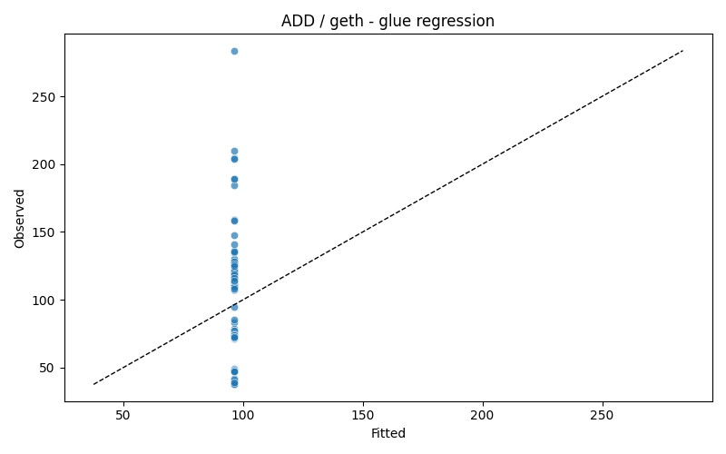


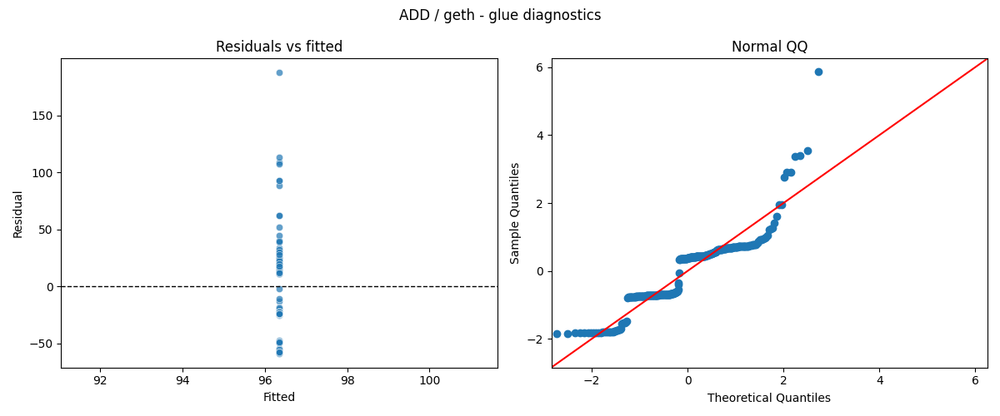

</details>

<details><summary><code>AND</code> · nobs=280 · runtime_ms=0 · p=1.00e+00 · R²=0</summary>

```
==============================================================================
                           NNLS Regression Results                            
==============================================================================
Dep. Variable:          test_runtime_ms              R-squared:          0.000
Model:                  NNLS                    Adj. R-squared:         -0.004
No. Observations:       280                               RMSE:          30.06
Df Residuals:           278                                MAE:          25.47
Df Model:               1      
==============================================================================
                      coef     std err     P-value      [0.025      0.975]
------------------------------------------------------------------------------
         const     89.5959      1.7635       0.001     86.4347     92.9901
           AND      0.0000      0.0000       1.000      0.0000      0.0000
==============================================================================
Notes: Non-negative least squares with bootstrap inference (1000 iterations)
==============================================================================
```

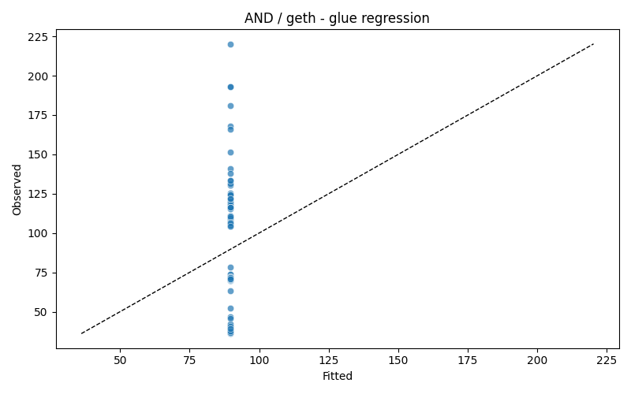


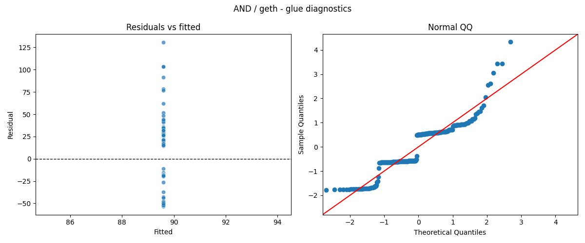

</details>

<details><summary><code>CALLDATACOPY</code> · nobs=8225 · runtime_ms=0 · p=1.00e+00 · R²=0</summary>

```
==============================================================================
                           NNLS Regression Results                            
==============================================================================
Dep. Variable:          test_runtime_ms              R-squared:          0.000
Model:                  NNLS                    Adj. R-squared:         -0.000
No. Observations:       8225                              RMSE:          54.53
Df Residuals:           8223                               MAE:          46.56
Df Model:               1      
==============================================================================
                      coef     std err     P-value      [0.025      0.975]
------------------------------------------------------------------------------
         const     78.1915      0.6010       0.001     77.0155     79.3095
  CALLDATACOPY      0.0000      0.0000       1.000      0.0000      0.0000
==============================================================================
Notes: Non-negative least squares with bootstrap inference (1000 iterations)
==============================================================================
```

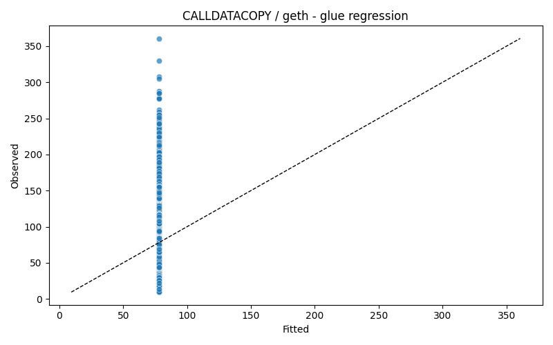

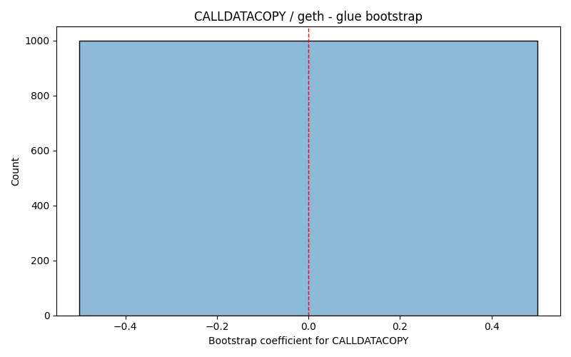

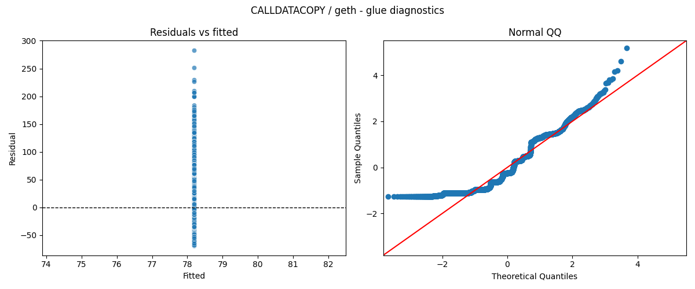

</details>

<details><summary><code>CALLDATALOAD</code> · nobs=1540 · runtime_ms=3.599e-05 · p=1.00e-03 · R²=0.1451</summary>

```
==============================================================================
                           NNLS Regression Results                            
==============================================================================
Dep. Variable:          test_runtime_ms              R-squared:          0.145
Model:                  NNLS                    Adj. R-squared:          0.145
No. Observations:       1540                              RMSE:           0.34
Df Residuals:           1538                               MAE:           0.25
Df Model:               1      
==============================================================================
                      coef     std err     P-value      [0.025      0.975]
------------------------------------------------------------------------------
         const      1.4048      0.0266       0.001      1.3553      1.4577
  CALLDATALOAD      0.0000      0.0000       0.001      0.0000      0.0000
==============================================================================
Notes: Non-negative least squares with bootstrap inference (1000 iterations)
==============================================================================
```

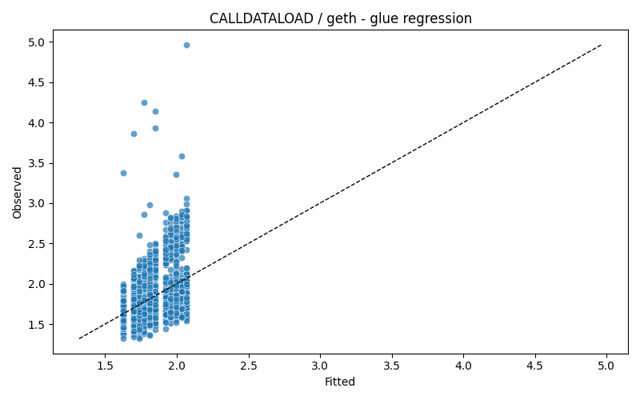

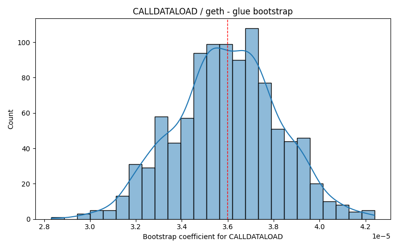

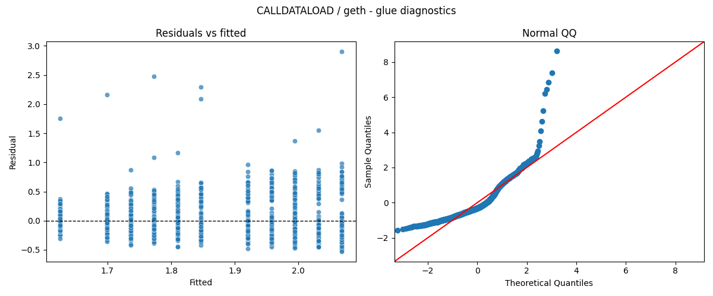

</details>

<details><summary><code>DIV</code> · nobs=385 · runtime_ms=0 · p=1.00e+00 · R²=0</summary>

```
==============================================================================
                           NNLS Regression Results                            
==============================================================================
Dep. Variable:          test_runtime_ms              R-squared:          0.000
Model:                  NNLS                    Adj. R-squared:         -0.003
No. Observations:       385                               RMSE:          65.53
Df Residuals:           383                                MAE:          58.82
Df Model:               1      
==============================================================================
                      coef     std err     P-value      [0.025      0.975]
------------------------------------------------------------------------------
         const    246.4512      3.2738       0.001    240.1754    252.7235
           DIV      0.0000      0.0000       1.000      0.0000      0.0000
==============================================================================
Notes: Non-negative least squares with bootstrap inference (1000 iterations)
==============================================================================
```

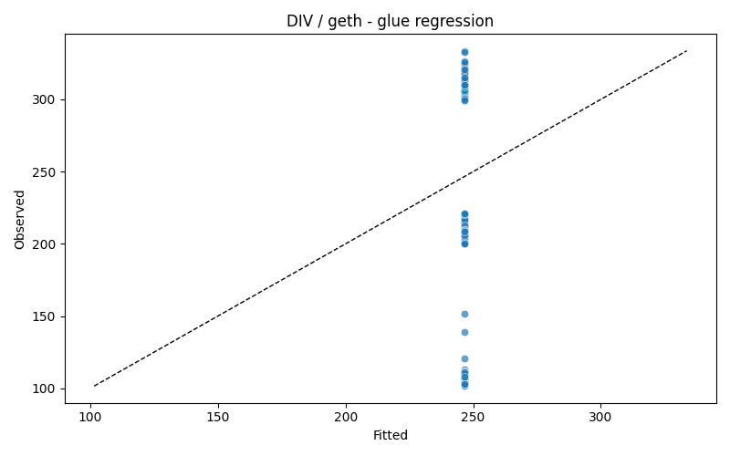


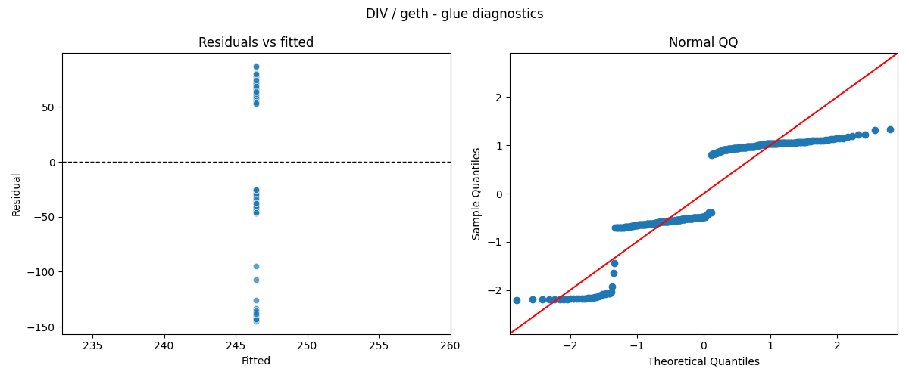

</details>

<details><summary><code>EXP</code> · nobs=385 · runtime_ms=0.000317 · p=1.00e-03 · R²=0.8056</summary>

```
==============================================================================
                           NNLS Regression Results                            
==============================================================================
Dep. Variable:          test_runtime_ms              R-squared:          0.806
Model:                  NNLS                    Adj. R-squared:          0.805
No. Observations:       385                               RMSE:           6.10
Df Residuals:           383                                MAE:           5.28
Df Model:               1      
==============================================================================
                      coef     std err     P-value      [0.025      0.975]
------------------------------------------------------------------------------
         const     12.7942      1.1023       0.001     10.6734     15.0169
           EXP      0.0003      0.0000       0.001      0.0003      0.0003
==============================================================================
Notes: Non-negative least squares with bootstrap inference (1000 iterations)
==============================================================================
```

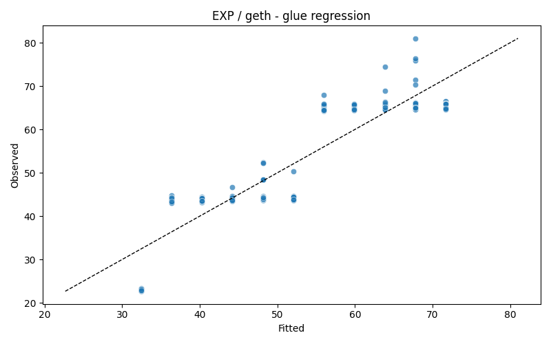

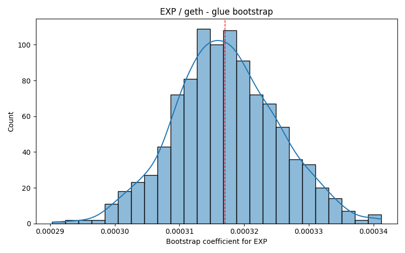

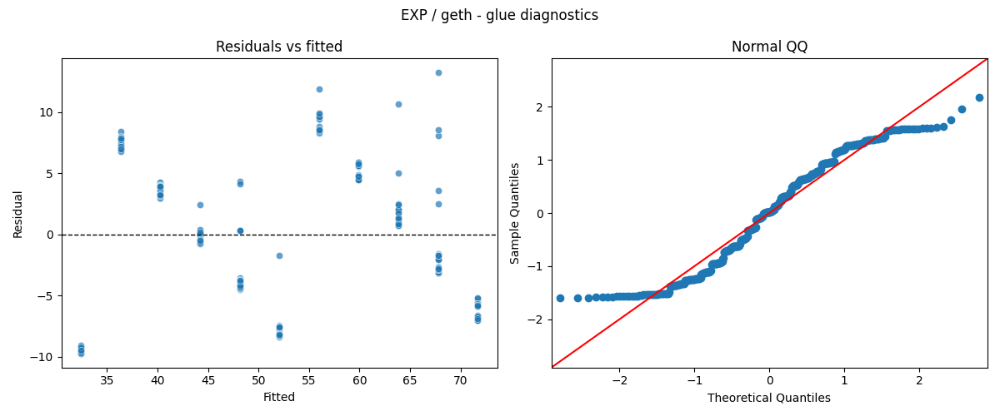

</details>

<details><summary><code>GT</code> · nobs=280 · runtime_ms=0 · p=1.00e+00 · R²=0</summary>

```
==============================================================================
                           NNLS Regression Results                            
==============================================================================
Dep. Variable:          test_runtime_ms              R-squared:          0.000
Model:                  NNLS                    Adj. R-squared:         -0.004
No. Observations:       280                               RMSE:          30.26
Df Residuals:           278                                MAE:          25.37
Df Model:               1      
==============================================================================
                      coef     std err     P-value      [0.025      0.975]
------------------------------------------------------------------------------
         const     90.6498      1.8037       0.001     87.1371     94.3821
            GT      0.0000      0.0000       1.000      0.0000      0.0000
==============================================================================
Notes: Non-negative least squares with bootstrap inference (1000 iterations)
==============================================================================
```

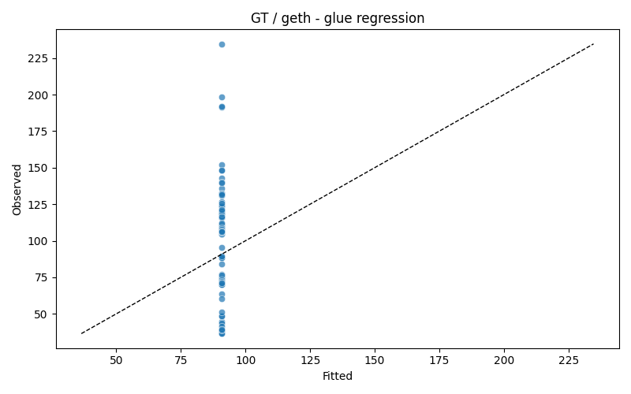


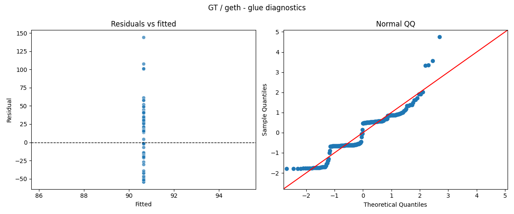

</details>

<details><summary><code>JUMPI</code> · nobs=385 · runtime_ms=0 · p=1.00e+00 · R²=1.11e-16</summary>

```
==============================================================================
                           NNLS Regression Results                            
==============================================================================
Dep. Variable:          test_runtime_ms              R-squared:          0.000
Model:                  NNLS                    Adj. R-squared:         -0.003
No. Observations:       385                               RMSE:          16.90
Df Residuals:           383                                MAE:          13.02
Df Model:               1      
==============================================================================
                      coef     std err     P-value      [0.025      0.975]
------------------------------------------------------------------------------
         const     50.3622      0.8631       0.001     48.7313     52.0684
         JUMPI      0.0000      0.0000       1.000      0.0000      0.0000
==============================================================================
Notes: Non-negative least squares with bootstrap inference (1000 iterations)
==============================================================================
```

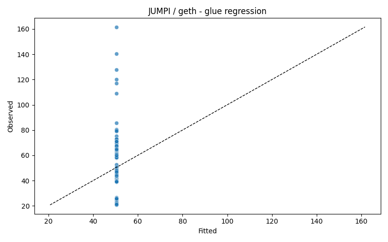


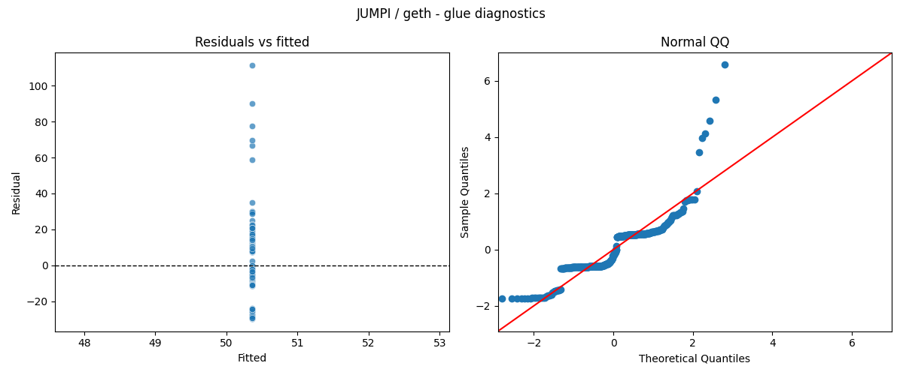

</details>

<details><summary><code>LT</code> · nobs=280 · runtime_ms=0 · p=1.00e+00 · R²=0</summary>

```
==============================================================================
                           NNLS Regression Results                            
==============================================================================
Dep. Variable:          test_runtime_ms              R-squared:          0.000
Model:                  NNLS                    Adj. R-squared:         -0.004
No. Observations:       280                               RMSE:          29.90
Df Residuals:           278                                MAE:          25.83
Df Model:               1      
==============================================================================
                      coef     std err     P-value      [0.025      0.975]
------------------------------------------------------------------------------
         const     91.9256      1.7738       0.001     88.5250     95.3403
            LT      0.0000      0.0000       1.000      0.0000      0.0000
==============================================================================
Notes: Non-negative least squares with bootstrap inference (1000 iterations)
==============================================================================
```

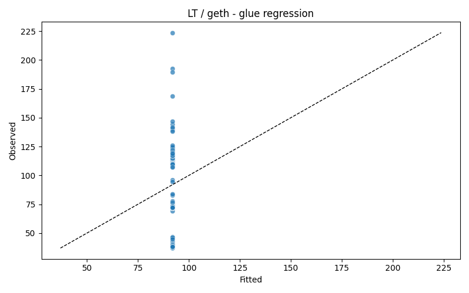


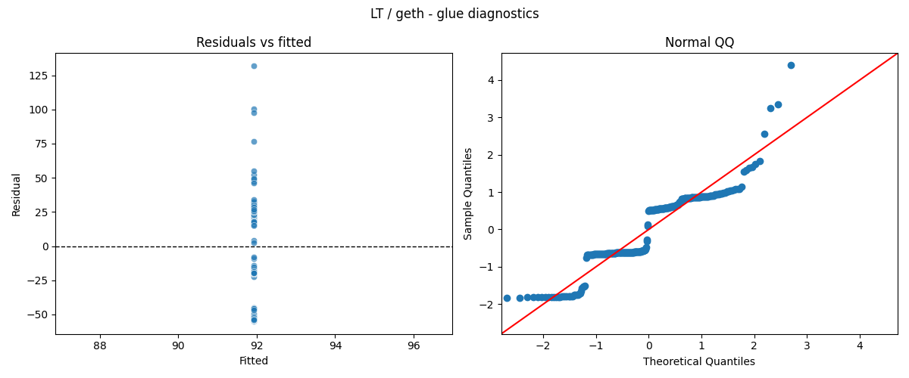

</details>

<details><summary><code>MSTORE</code> · nobs=1575 · runtime_ms=0 · p=1.00e+00 · R²=0</summary>

```
==============================================================================
                           NNLS Regression Results                            
==============================================================================
Dep. Variable:          test_runtime_ms              R-squared:          0.000
Model:                  NNLS                    Adj. R-squared:         -0.001
No. Observations:       1575                              RMSE:          40.28
Df Residuals:           1573                               MAE:          35.18
Df Model:               1      
==============================================================================
                      coef     std err     P-value      [0.025      0.975]
------------------------------------------------------------------------------
         const    130.5355      1.0210       0.001    128.4243    132.5638
        MSTORE      0.0000      0.0000       1.000      0.0000      0.0000
==============================================================================
Notes: Non-negative least squares with bootstrap inference (1000 iterations)
==============================================================================
```

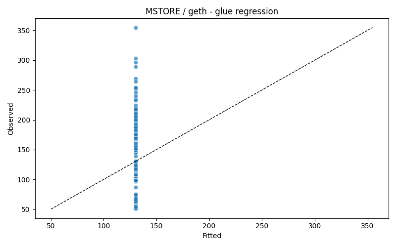


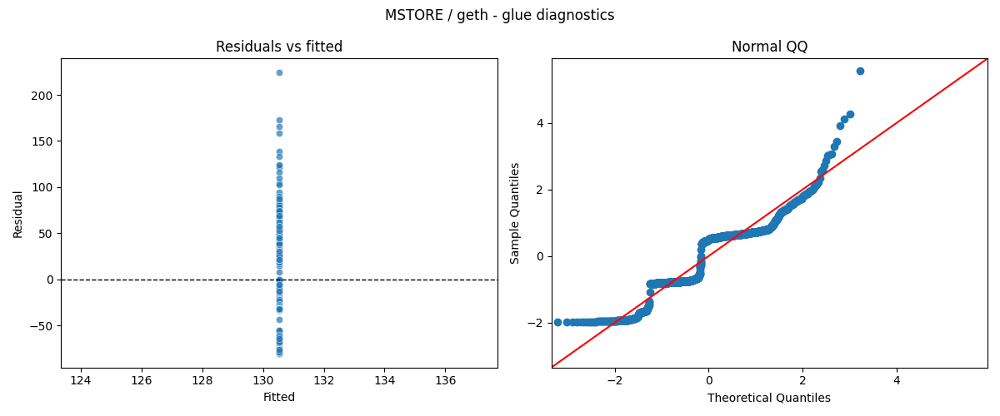

</details>

<details><summary><code>MSTORE8</code> · nobs=1575 · runtime_ms=0 · p=1.00e+00 · R²=0</summary>

```
==============================================================================
                           NNLS Regression Results                            
==============================================================================
Dep. Variable:          test_runtime_ms              R-squared:          0.000
Model:                  NNLS                    Adj. R-squared:         -0.001
No. Observations:       1575                              RMSE:          38.61
Df Residuals:           1573                               MAE:          33.54
Df Model:               1      
==============================================================================
                      coef     std err     P-value      [0.025      0.975]
------------------------------------------------------------------------------
         const    124.8772      0.9419       0.001    123.0212    126.7011
       MSTORE8      0.0000      0.0000       1.000      0.0000      0.0000
==============================================================================
Notes: Non-negative least squares with bootstrap inference (1000 iterations)
==============================================================================
```

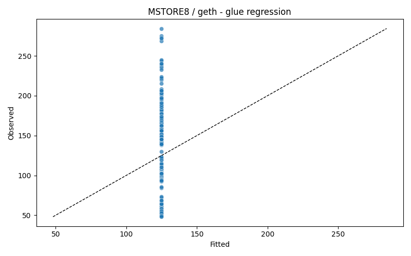


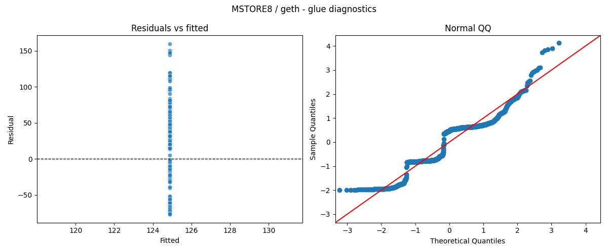

</details>

<details><summary><code>MUL</code> · nobs=350 · runtime_ms=0 · p=1.00e+00 · R²=0</summary>

```
==============================================================================
                           NNLS Regression Results                            
==============================================================================
Dep. Variable:          test_runtime_ms              R-squared:          0.000
Model:                  NNLS                    Adj. R-squared:         -0.003
No. Observations:       350                               RMSE:          26.52
Df Residuals:           348                                MAE:          24.00
Df Model:               1      
==============================================================================
                      coef     std err     P-value      [0.025      0.975]
------------------------------------------------------------------------------
         const     91.2562      1.3916       0.001     88.5346     93.8273
           MUL      0.0000      0.0000       1.000      0.0000      0.0000
==============================================================================
Notes: Non-negative least squares with bootstrap inference (1000 iterations)
==============================================================================
```

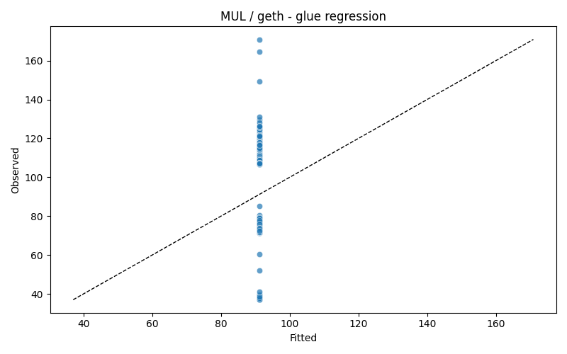


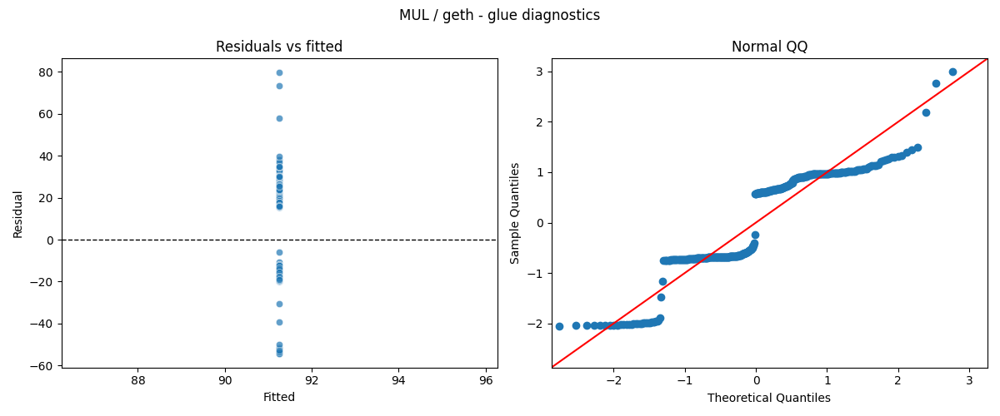

</details>

<details><summary><code>PC</code> · nobs=210 · runtime_ms=6.643e-06 · p=1.00e-03 · R²=0.2916</summary>

```
==============================================================================
                           NNLS Regression Results                            
==============================================================================
Dep. Variable:          test_runtime_ms              R-squared:          0.292
Model:                  NNLS                    Adj. R-squared:          0.288
No. Observations:       210                               RMSE:          23.01
Df Residuals:           208                                MAE:          19.86
Df Model:               1      
==============================================================================
                      coef     std err     P-value      [0.025      0.975]
------------------------------------------------------------------------------
         const    126.4274      3.1701       0.001    120.1504    132.7841
            PC      0.0000      0.0000       0.001      0.0000      0.0000
==============================================================================
Notes: Non-negative least squares with bootstrap inference (1000 iterations)
==============================================================================
```

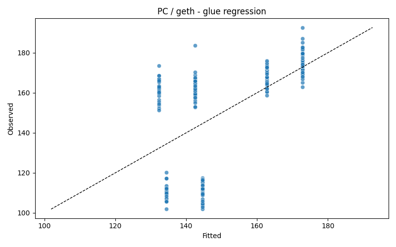

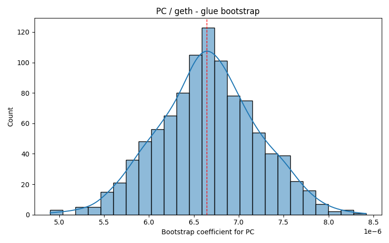

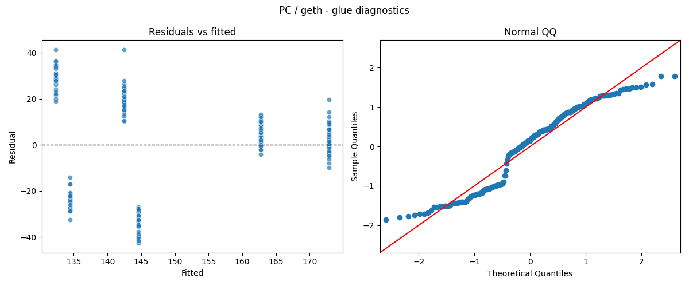

</details>

<details><summary><code>RETURNDATASIZE</code> · nobs=840 · runtime_ms=1.295e-05 · p=1.00e-03 · R²=0.1681</summary>

```
==============================================================================
                           NNLS Regression Results                            
==============================================================================
Dep. Variable:          test_runtime_ms              R-squared:          0.168
Model:                  NNLS                    Adj. R-squared:          0.167
No. Observations:       840                               RMSE:          33.80
Df Residuals:           838                                MAE:          23.52
Df Model:               1      
==============================================================================
                      coef     std err     P-value      [0.025      0.975]
------------------------------------------------------------------------------
         const    101.6575      2.2957       0.001     96.7650    105.9346
RETURNDATASIZE      0.0000      0.0000       0.001      0.0000      0.0000
==============================================================================
Notes: Non-negative least squares with bootstrap inference (1000 iterations)
==============================================================================
```

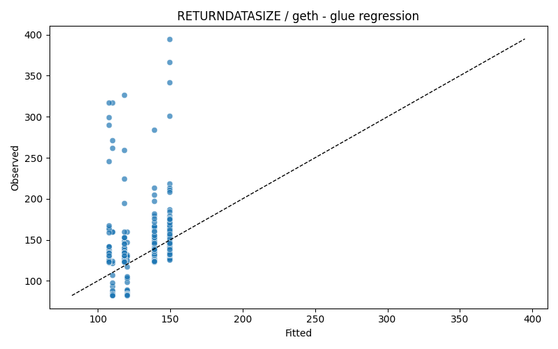

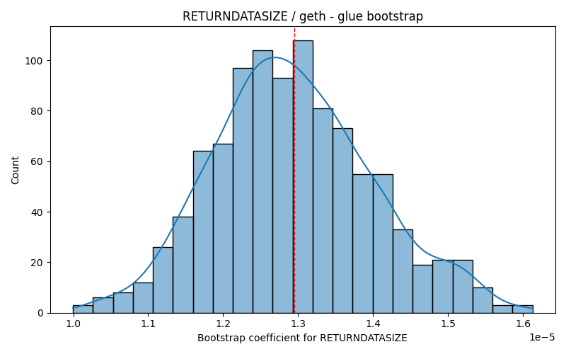

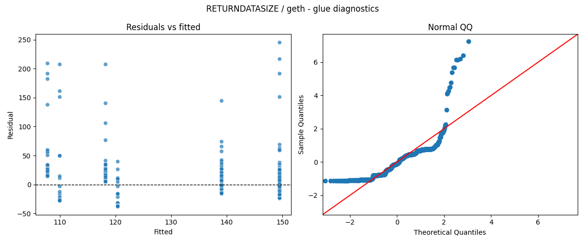

</details>

<details><summary><code>SELFBALANCE</code> · nobs=385 · runtime_ms=0 · p=1.00e+00 · R²=0</summary>

```
==============================================================================
                           NNLS Regression Results                            
==============================================================================
Dep. Variable:          test_runtime_ms              R-squared:          0.000
Model:                  NNLS                    Adj. R-squared:         -0.003
No. Observations:       385                               RMSE:         103.24
Df Residuals:           383                                MAE:          93.21
Df Model:               1      
==============================================================================
                      coef     std err     P-value      [0.025      0.975]
------------------------------------------------------------------------------
         const    389.7075      5.2883       0.001    378.5734    399.2969
   SELFBALANCE      0.0000      0.0000       1.000      0.0000      0.0000
==============================================================================
Notes: Non-negative least squares with bootstrap inference (1000 iterations)
==============================================================================
```

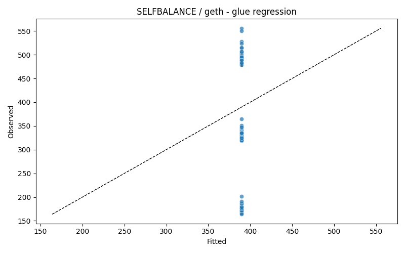


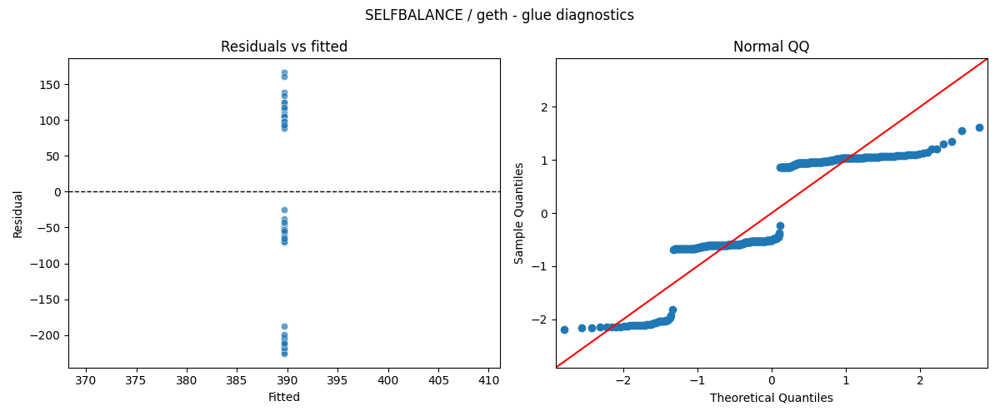

</details>

<details><summary><code>SUB</code> · nobs=280 · runtime_ms=0 · p=1.00e+00 · R²=0</summary>

```
==============================================================================
                           NNLS Regression Results                            
==============================================================================
Dep. Variable:          test_runtime_ms              R-squared:          0.000
Model:                  NNLS                    Adj. R-squared:         -0.004
No. Observations:       280                               RMSE:          32.54
Df Residuals:           278                                MAE:          27.35
Df Model:               1      
==============================================================================
                      coef     std err     P-value      [0.025      0.975]
------------------------------------------------------------------------------
         const     94.1054      1.8965       0.001     90.3696     97.6184
           SUB      0.0000      0.0000       1.000      0.0000      0.0000
==============================================================================
Notes: Non-negative least squares with bootstrap inference (1000 iterations)
==============================================================================
```

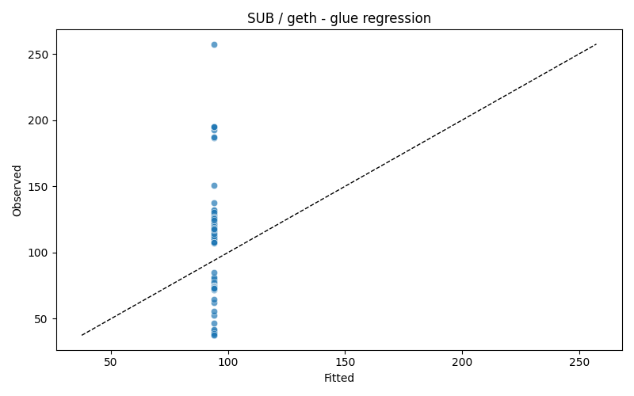


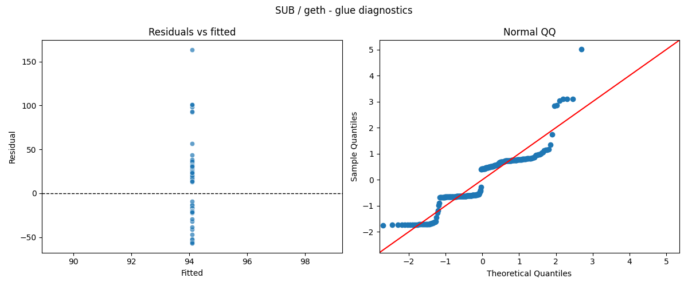

</details>

### Mixed glue (tier B) · geth

<details><summary><code>JUMP</code> · nobs=350 · runtime_ms=0 · p=1.00e+00 · R²=0</summary>

```
==============================================================================
                           NNLS Regression Results                            
==============================================================================
Dep. Variable:          test_runtime_ms              R-squared:          0.000
Model:                  NNLS                    Adj. R-squared:         -0.003
No. Observations:       350                               RMSE:          26.37
Df Residuals:           348                                MAE:          22.51
Df Model:               1      
==============================================================================
                      coef     std err     P-value      [0.025      0.975]
------------------------------------------------------------------------------
         const     81.9291      1.4129       0.001     79.0887     84.7439
          JUMP      0.0000      0.0000       1.000      0.0000      0.0000
==============================================================================
Notes: Non-negative least squares with bootstrap inference (1000 iterations)
==============================================================================
```

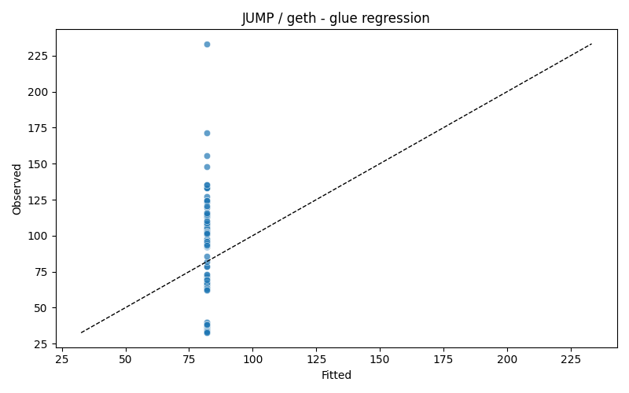


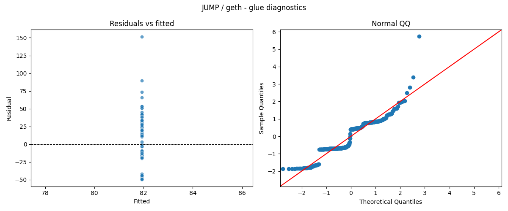

</details>

<details><summary><code>KECCAK256</code> · nobs=6160 · runtime_ms=2.996e-05 · p=1.00e-03 · R²=0.208</summary>

```
==============================================================================
                           NNLS Regression Results                            
==============================================================================
Dep. Variable:          test_runtime_ms              R-squared:          0.208
Model:                  NNLS                    Adj. R-squared:          0.208
No. Observations:       6160                              RMSE:         116.22
Df Residuals:           6158                               MAE:          91.36
Df Model:               1      
==============================================================================
                      coef     std err     P-value      [0.025      0.975]
------------------------------------------------------------------------------
         const    360.6238      3.3893       0.001    354.2915    367.4631
     KECCAK256      0.0000      0.0000       0.001      0.0000      0.0000
==============================================================================
Notes: Non-negative least squares with bootstrap inference (1000 iterations)
==============================================================================
```

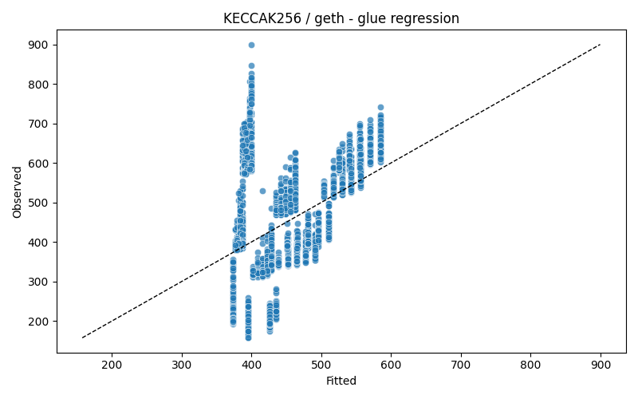

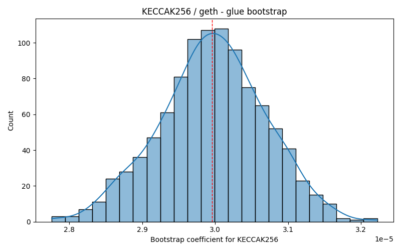

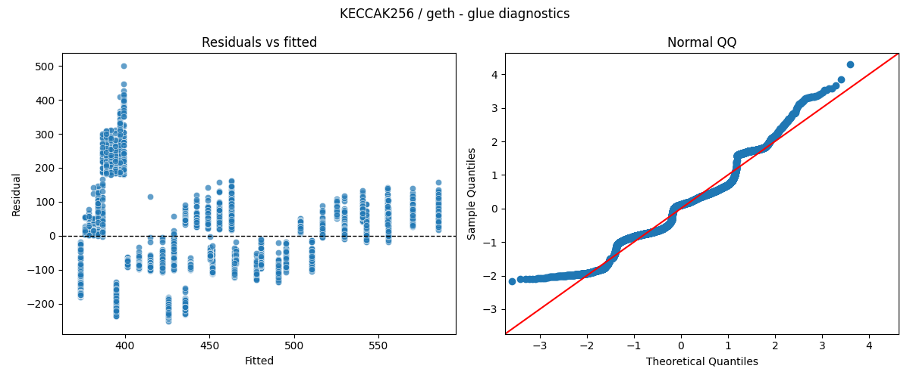

</details>

## nethermind

| glue_opcode | nobs | glue_runtime_ms | p_value | rsquared |
| --- | --- | --- | --- | --- |
| `ISZERO` | 48 | 0 | 1.00e+00 | -2.22e-16 |
| `JUMPDEST` | 12 | 0 | 1.00e+00 | -2.22e-16 |
| `SWAP` | 858 | 0 | 1.00e+00 | 1.11e-16 |
| `CALLDATASIZE` | 3078 | 8.087e-06 | 1.00e-03 | 0.9277 |
| `DUP` | 3078 | 0 | 1.00e+00 | 0.9277 |
| `GAS` | 3078 | 8.468e-06 | 1.00e-03 | 0.9277 |
| `MLOAD` | 3078 | 1.332e-06 | 7.00e-03 | 0.9277 |
| `PUSH` | 3078 | 0 | 1.00e+00 | 0.9277 |
| `PUSH0` | 3078 | 4.707e-06 | 3.00e-03 | 0.9277 |
| `STATICCALL` | 3078 | 0.0003777 | 1.00e-03 | 0.9277 |
| `ADD` | 54 | 0 | 1.00e+00 | 0 |
| `AND` | 48 | 4.156e-08 | 5.14e-01 | 0.0001352 |
| `CALLDATACOPY` | 1410 | 0 | 1.00e+00 | 0 |
| `CALLDATALOAD` | 264 | 3.48e-05 | 1.59e-01 | 0.008193 |
| `DIV` | 66 | 0 | 1.00e+00 | 0 |
| `EXP` | 66 | 0 | 1.00e+00 | 0 |
| `GT` | 48 | 0 | 1.00e+00 | 0 |
| `JUMPI` | 66 | 0 | 1.00e+00 | -2.22e-16 |
| `LT` | 48 | 0 | 1.00e+00 | 0 |
| `MSTORE` | 270 | 0 | 1.00e+00 | 0 |
| `MSTORE8` | 270 | 0 | 1.00e+00 | 0 |
| `MUL` | 60 | 0 | 1.00e+00 | -2.22e-16 |
| `PC` | 36 | 5.159e-06 | 1.00e-03 | 0.2974 |
| `RETURNDATASIZE` | 144 | 4.423e-06 | 1.00e-03 | 0.2442 |
| `SELFBALANCE` | 66 | 0 | 1.00e+00 | 1.11e-16 |
| `SUB` | 48 | 0 | 1.00e+00 | 0 |
| `JUMP` | 60 | 0 | 1.00e+00 | 0 |
| `KECCAK256` | 1056 | 0 | 1.00e+00 | 0 |

### Cycle glue — joint fit · nethermind

<details><summary>Joint NNLS regression summary</summary>

```
==============================================================================
                           NNLS Regression Results                            
==============================================================================
Dep. Variable:          test_runtime_ms              R-squared:          0.928
Model:                  NNLS                    Adj. R-squared:          0.928
No. Observations:       3078                              RMSE:          26.88
Df Residuals:           3070                               MAE:          18.26
Df Model:               7      
==============================================================================
                      coef     std err     P-value      [0.025      0.975]
------------------------------------------------------------------------------
         const     64.2840      0.4015       0.001     63.4452     65.0316
  CALLDATASIZE      0.0000      0.0000       0.001      0.0000      0.0000
           DUP      0.0000      0.0000       1.000      0.0000      0.0000
           GAS      0.0000      0.0000       0.001      0.0000      0.0000
         MLOAD      0.0000      0.0000       0.007      0.0000      0.0000
          PUSH      0.0000      0.0000       1.000      0.0000      0.0000
         PUSH0      0.0000      0.0000       0.003      0.0000      0.0000
    STATICCALL      0.0004      0.0000       0.001      0.0004      0.0004
==============================================================================
Notes: Non-negative least squares with bootstrap inference (1000 iterations)
==============================================================================
```

</details>

<details><summary><code>CALLDATASIZE</code> · nobs=3078 · runtime_ms=8.087e-06 · p=1.00e-03 · R²=0.9277</summary>


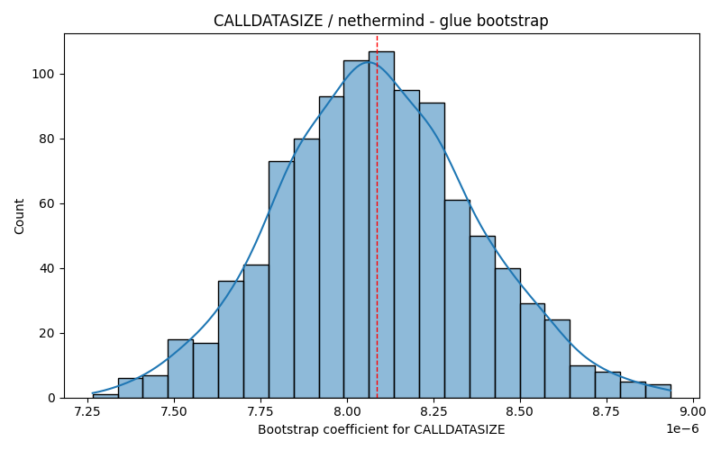

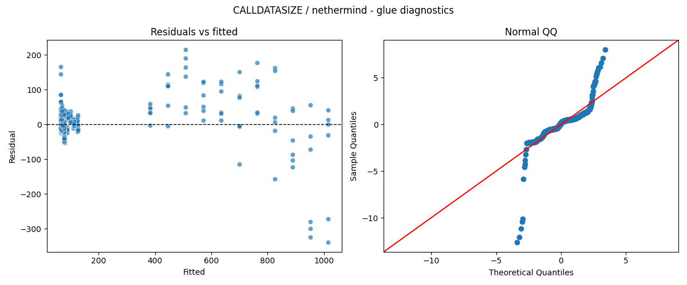

</details>

<details><summary><code>DUP</code> · nobs=3078 · runtime_ms=0 · p=1.00e+00 · R²=0.9277</summary>


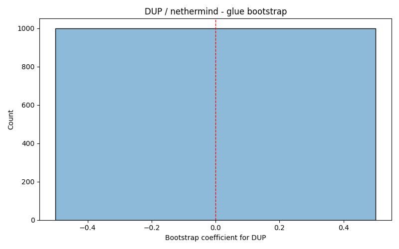

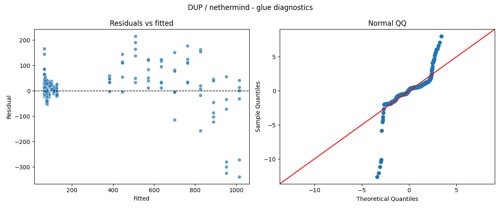

</details>

<details><summary><code>GAS</code> · nobs=3078 · runtime_ms=8.468e-06 · p=1.00e-03 · R²=0.9277</summary>

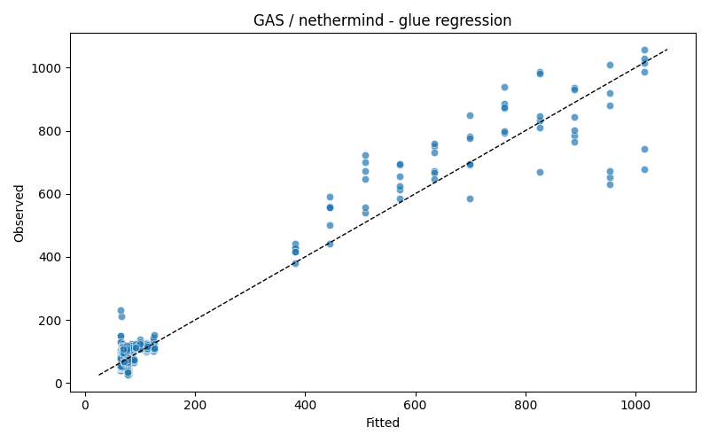

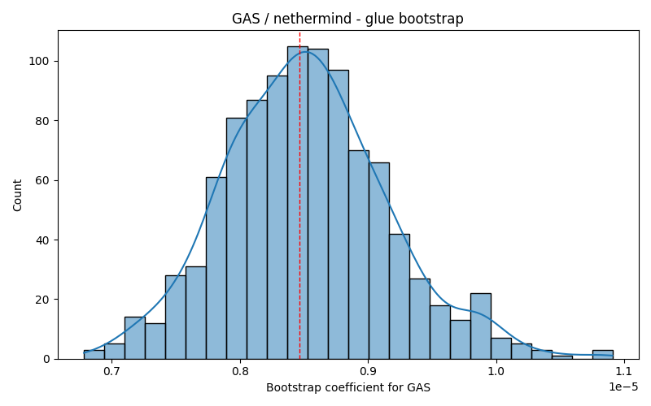


</details>

<details><summary><code>MLOAD</code> · nobs=3078 · runtime_ms=1.332e-06 · p=7.00e-03 · R²=0.9277</summary>


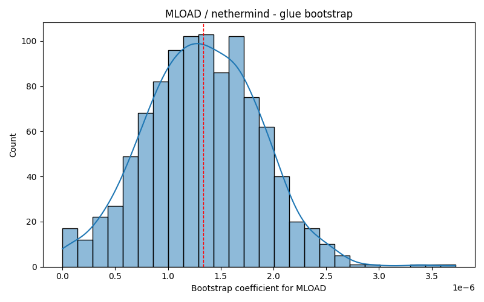


</details>

<details><summary><code>PUSH</code> · nobs=3078 · runtime_ms=0 · p=1.00e+00 · R²=0.9277</summary>


</details>

<details><summary><code>PUSH0</code> · nobs=3078 · runtime_ms=4.707e-06 · p=3.00e-03 · R²=0.9277</summary>

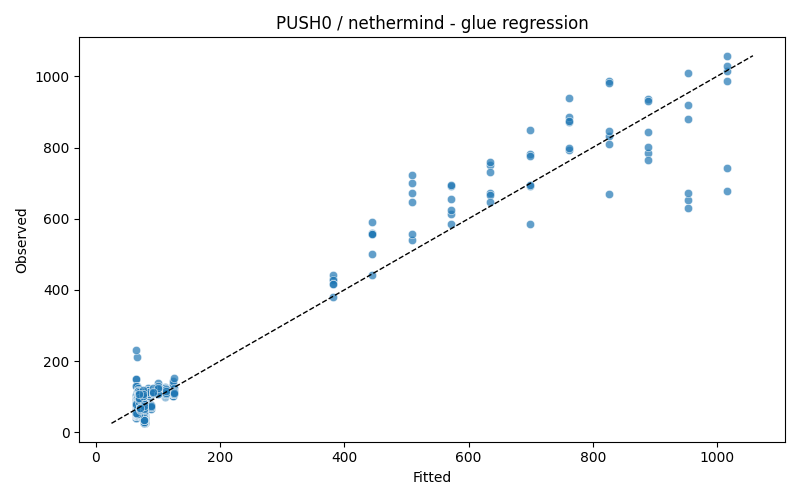

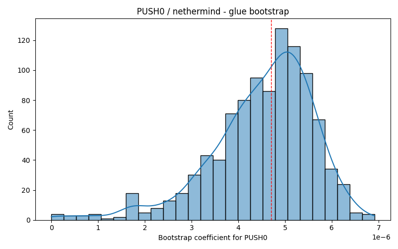


</details>

<details><summary><code>STATICCALL</code> · nobs=3078 · runtime_ms=0.0003777 · p=1.00e-03 · R²=0.9277</summary>

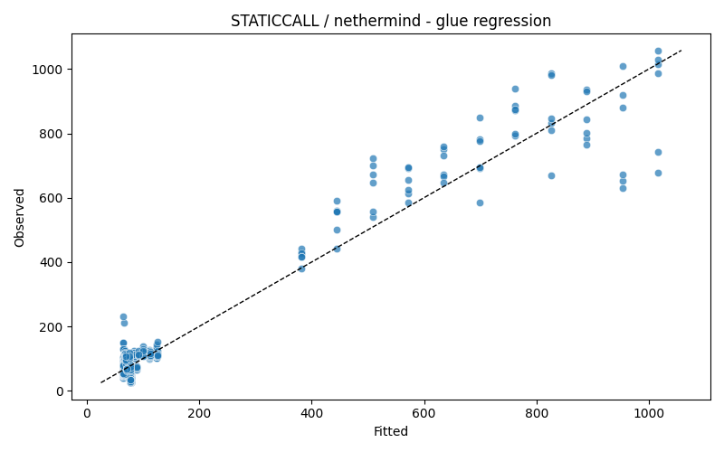

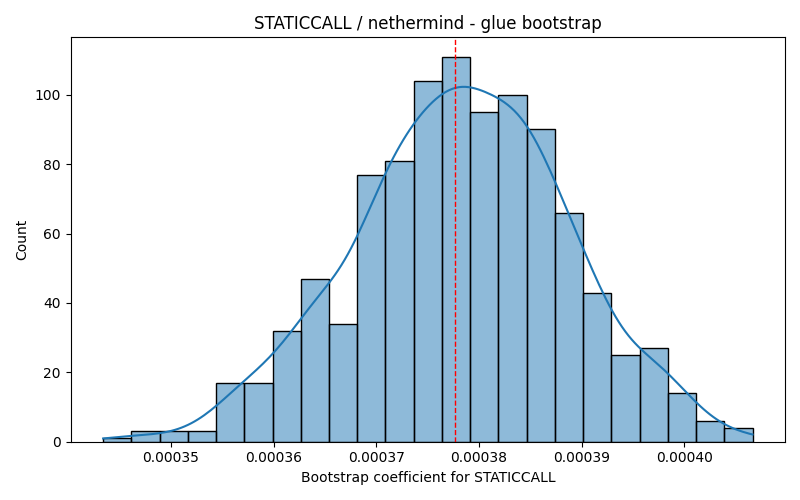


</details>

### Pure glue · nethermind

<details><summary><code>ISZERO</code> · nobs=48 · runtime_ms=0 · p=1.00e+00 · R²=-2.22e-16</summary>

```
==============================================================================
                           NNLS Regression Results                            
==============================================================================
Dep. Variable:          test_runtime_ms              R-squared:         -0.000
Model:                  NNLS                    Adj. R-squared:         -0.022
No. Observations:       48                                RMSE:          20.18
Df Residuals:           46                                 MAE:          17.98
Df Model:               1      
==============================================================================
                      coef     std err     P-value      [0.025      0.975]
------------------------------------------------------------------------------
         const     67.8424      2.9209       0.001     61.8476     73.3806
        ISZERO      0.0000      0.0000       1.000      0.0000      0.0000
==============================================================================
Notes: Non-negative least squares with bootstrap inference (1000 iterations)
==============================================================================
```

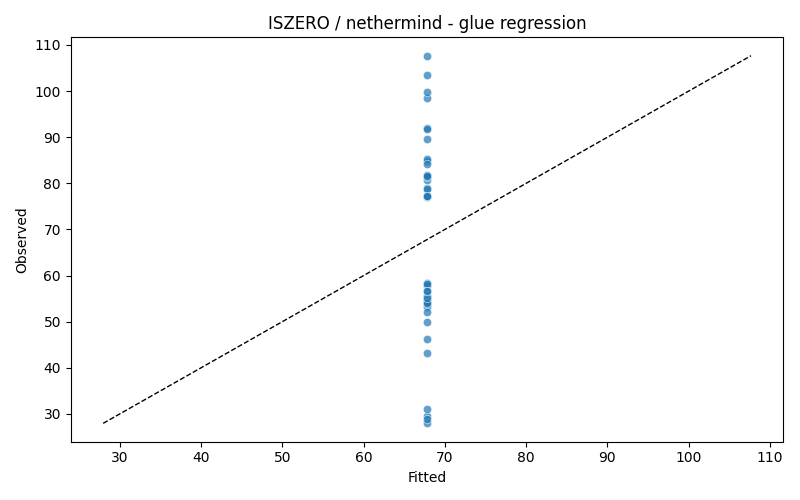

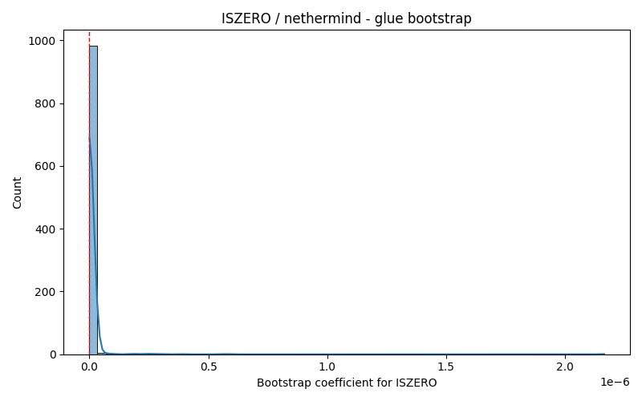

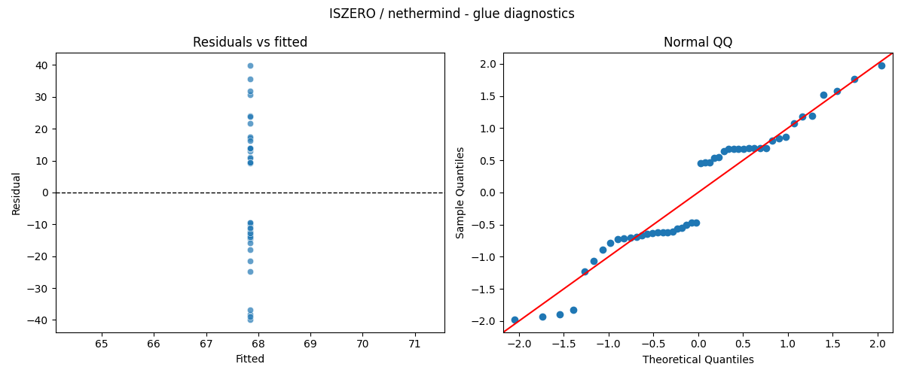

</details>

<details><summary><code>JUMPDEST</code> · nobs=12 · runtime_ms=0 · p=1.00e+00 · R²=-2.22e-16</summary>

```
==============================================================================
                           NNLS Regression Results                            
==============================================================================
Dep. Variable:          test_runtime_ms              R-squared:         -0.000
Model:                  NNLS                    Adj. R-squared:         -0.100
No. Observations:       12                                RMSE:          25.98
Df Residuals:           10                                 MAE:          24.09
Df Model:               1      
==============================================================================
                      coef     std err     P-value      [0.025      0.975]
------------------------------------------------------------------------------
         const    121.2870      7.3620       0.001    107.2011    135.6146
      JUMPDEST      0.0000      0.0000       1.000      0.0000      0.0000
==============================================================================
Notes: Non-negative least squares with bootstrap inference (1000 iterations)
==============================================================================
```

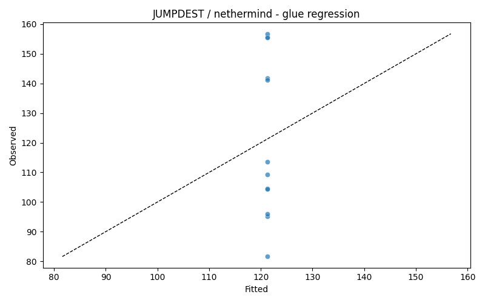


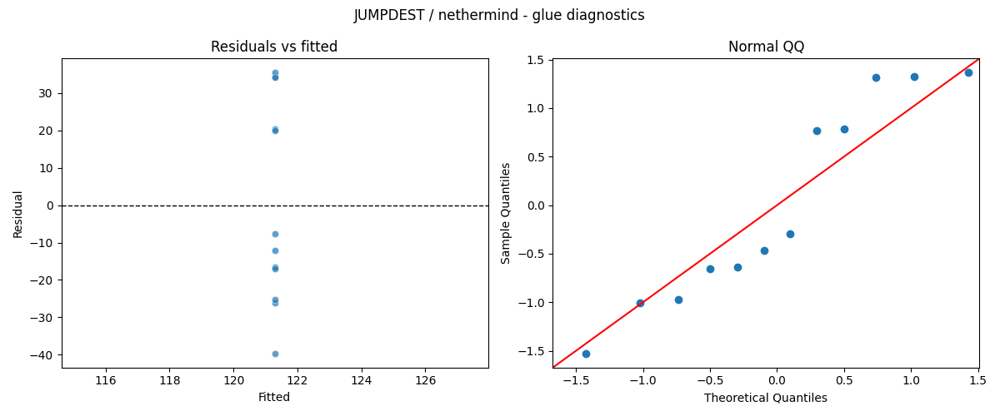

</details>

<details><summary><code>SWAP</code> · nobs=858 · runtime_ms=0 · p=1.00e+00 · R²=1.11e-16</summary>

```
==============================================================================
                           NNLS Regression Results                            
==============================================================================
Dep. Variable:          test_runtime_ms              R-squared:          0.000
Model:                  NNLS                    Adj. R-squared:         -0.001
No. Observations:       858                               RMSE:          20.84
Df Residuals:           856                                MAE:          12.86
Df Model:               1      
==============================================================================
                      coef     std err     P-value      [0.025      0.975]
------------------------------------------------------------------------------
         const     51.9135      0.7109       0.001     50.5850     53.3576
          SWAP      0.0000      0.0000       1.000      0.0000      0.0000
==============================================================================
Notes: Non-negative least squares with bootstrap inference (1000 iterations)
==============================================================================
```

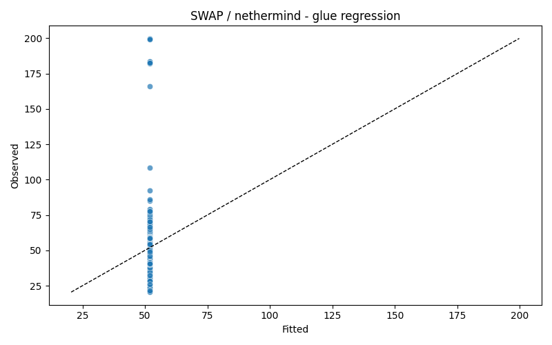


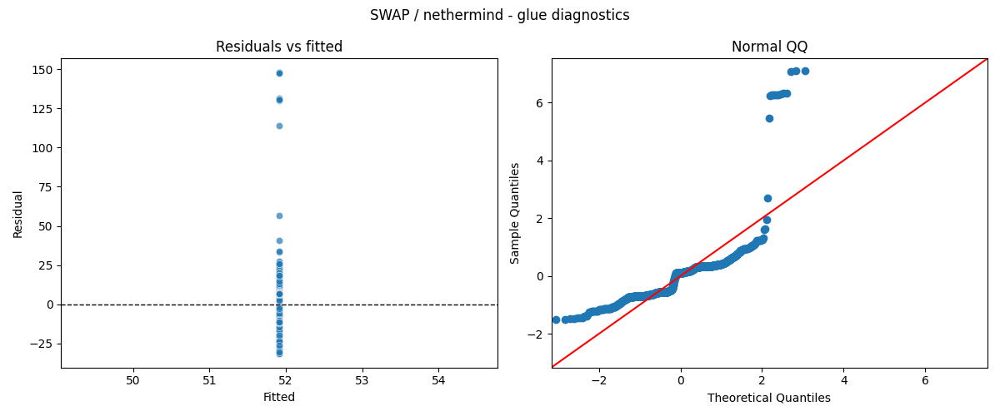

</details>

### Mixed glue (tier A) · nethermind

<details><summary><code>ADD</code> · nobs=54 · runtime_ms=0 · p=1.00e+00 · R²=0</summary>

```
==============================================================================
                           NNLS Regression Results                            
==============================================================================
Dep. Variable:          test_runtime_ms              R-squared:          0.000
Model:                  NNLS                    Adj. R-squared:         -0.019
No. Observations:       54                                RMSE:          29.40
Df Residuals:           52                                 MAE:          22.70
Df Model:               1      
==============================================================================
                      coef     std err     P-value      [0.025      0.975]
------------------------------------------------------------------------------
         const     84.2009      4.0426       0.001     76.4365     91.7961
           ADD      0.0000      0.0000       1.000      0.0000      0.0000
==============================================================================
Notes: Non-negative least squares with bootstrap inference (1000 iterations)
==============================================================================
```

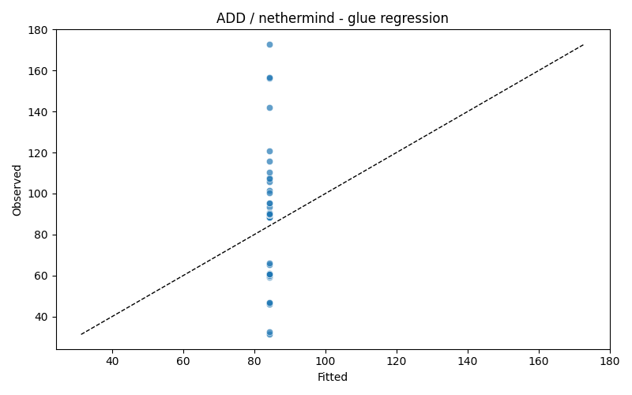

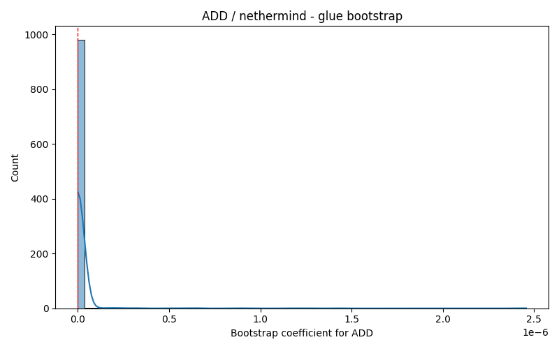

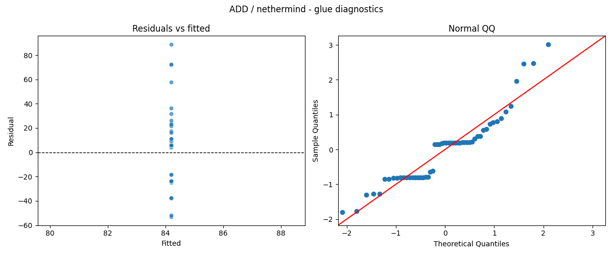

</details>

<details><summary><code>AND</code> · nobs=48 · runtime_ms=4.156e-08 · p=5.14e-01 · R²=0.0001352</summary>

```
==============================================================================
                           NNLS Regression Results                            
==============================================================================
Dep. Variable:          test_runtime_ms              R-squared:          0.000
Model:                  NNLS                    Adj. R-squared:         -0.022
No. Observations:       48                                RMSE:          18.55
Df Residuals:           46                                 MAE:          13.88
Df Model:               1      
==============================================================================
                      coef     std err     P-value      [0.025      0.975]
------------------------------------------------------------------------------
         const     51.7632      2.0460       0.001     46.2480     54.3949
           AND      0.0000      0.0000       0.514      0.0000      0.0000
==============================================================================
Notes: Non-negative least squares with bootstrap inference (1000 iterations)
==============================================================================
```

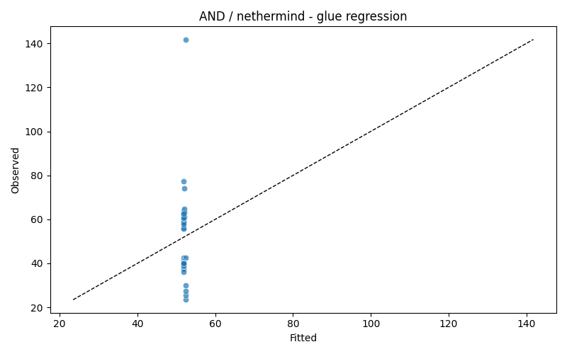

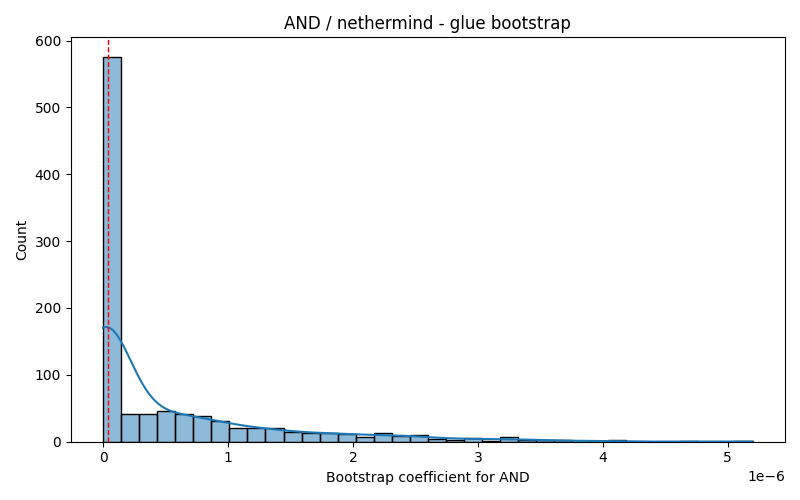

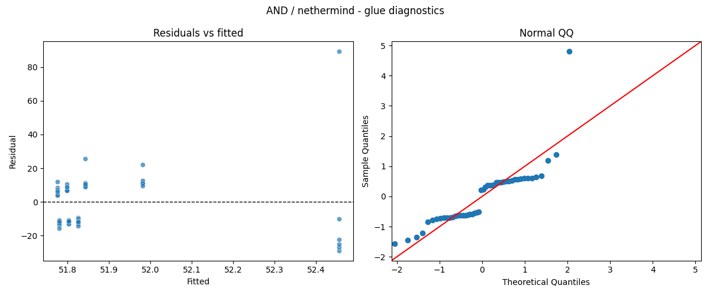

</details>

<details><summary><code>CALLDATACOPY</code> · nobs=1410 · runtime_ms=0 · p=1.00e+00 · R²=0</summary>

```
==============================================================================
                           NNLS Regression Results                            
==============================================================================
Dep. Variable:          test_runtime_ms              R-squared:          0.000
Model:                  NNLS                    Adj. R-squared:         -0.001
No. Observations:       1410                              RMSE:          34.33
Df Residuals:           1408                               MAE:          28.08
Df Model:               1      
==============================================================================
                      coef     std err     P-value      [0.025      0.975]
------------------------------------------------------------------------------
         const     57.3276      0.9364       0.001     55.5110     59.1904
  CALLDATACOPY      0.0000      0.0000       1.000      0.0000      0.0000
==============================================================================
Notes: Non-negative least squares with bootstrap inference (1000 iterations)
==============================================================================
```

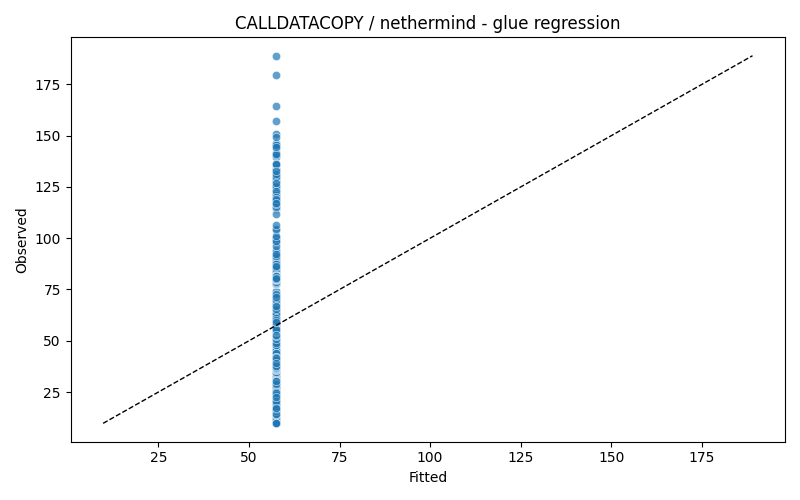


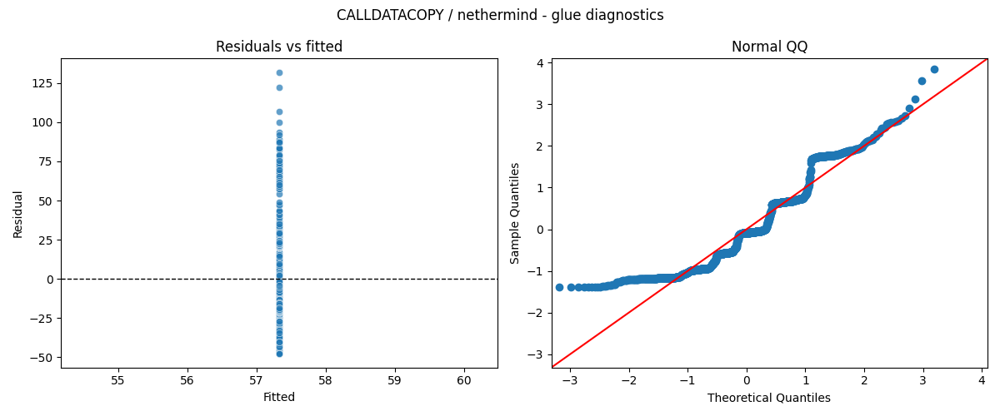

</details>

<details><summary><code>CALLDATALOAD</code> · nobs=264 · runtime_ms=3.48e-05 · p=1.59e-01 · R²=0.008193</summary>

```
==============================================================================
                           NNLS Regression Results                            
==============================================================================
Dep. Variable:          test_runtime_ms              R-squared:          0.008
Model:                  NNLS                    Adj. R-squared:          0.004
No. Observations:       264                               RMSE:           1.47
Df Residuals:           262                                MAE:           0.29
Df Model:               1      
==============================================================================
                      coef     std err     P-value      [0.025      0.975]
------------------------------------------------------------------------------
         const      1.9627      0.3391       0.001      1.1521      2.3780
  CALLDATALOAD      0.0000      0.0000       0.159      0.0000      0.0001
==============================================================================
Notes: Non-negative least squares with bootstrap inference (1000 iterations)
==============================================================================
```

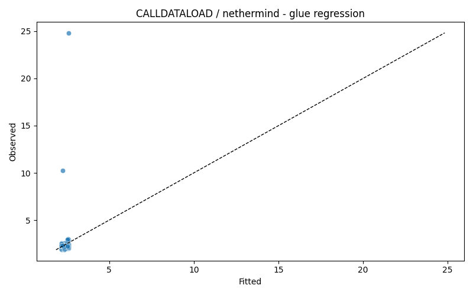

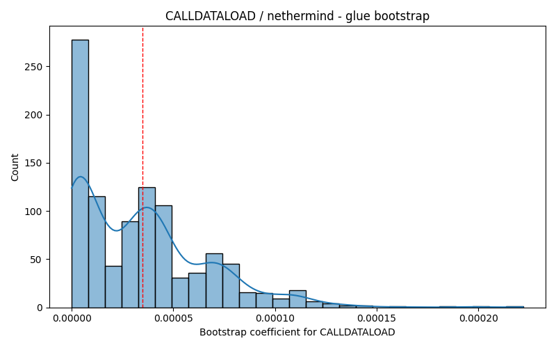

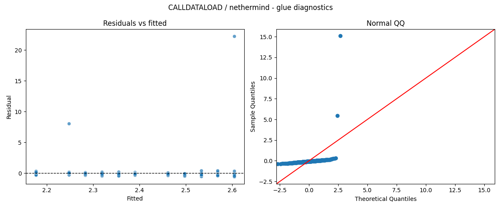

</details>

<details><summary><code>DIV</code> · nobs=66 · runtime_ms=0 · p=1.00e+00 · R²=0</summary>

```
==============================================================================
                           NNLS Regression Results                            
==============================================================================
Dep. Variable:          test_runtime_ms              R-squared:          0.000
Model:                  NNLS                    Adj. R-squared:         -0.016
No. Observations:       66                                RMSE:          47.20
Df Residuals:           64                                 MAE:          41.06
Df Model:               1      
==============================================================================
                      coef     std err     P-value      [0.025      0.975]
------------------------------------------------------------------------------
         const    208.1138      5.7222       0.001    196.6921    218.9119
           DIV      0.0000      0.0000       1.000      0.0000      0.0000
==============================================================================
Notes: Non-negative least squares with bootstrap inference (1000 iterations)
==============================================================================
```

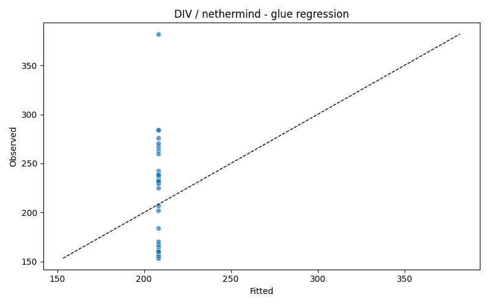


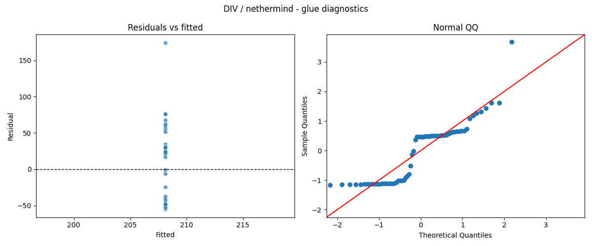

</details>

<details><summary><code>EXP</code> · nobs=66 · runtime_ms=0 · p=1.00e+00 · R²=0</summary>

```
==============================================================================
                           NNLS Regression Results                            
==============================================================================
Dep. Variable:          test_runtime_ms              R-squared:          0.000
Model:                  NNLS                    Adj. R-squared:         -0.016
No. Observations:       66                                RMSE:          32.24
Df Residuals:           64                                 MAE:          19.21
Df Model:               1      
==============================================================================
                      coef     std err     P-value      [0.025      0.975]
------------------------------------------------------------------------------
         const     73.2737      7.1396       0.001     50.8671     81.5116
           EXP      0.0000      0.0000       1.000      0.0000      0.0001
==============================================================================
Notes: Non-negative least squares with bootstrap inference (1000 iterations)
==============================================================================
```

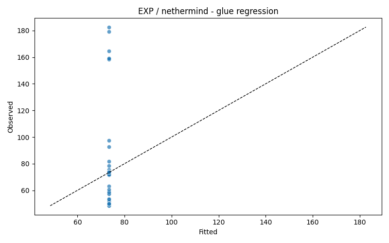

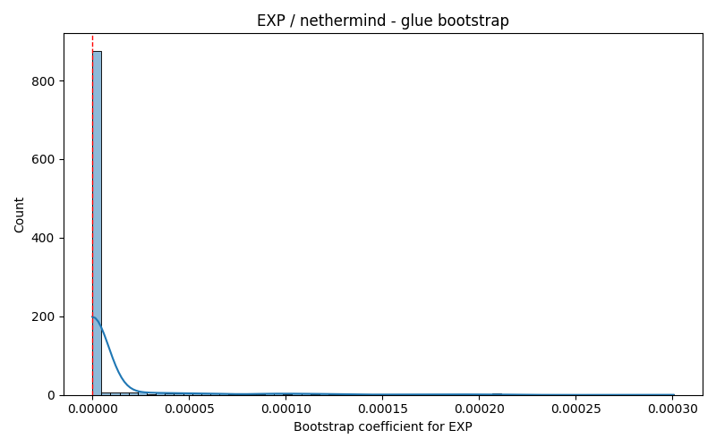

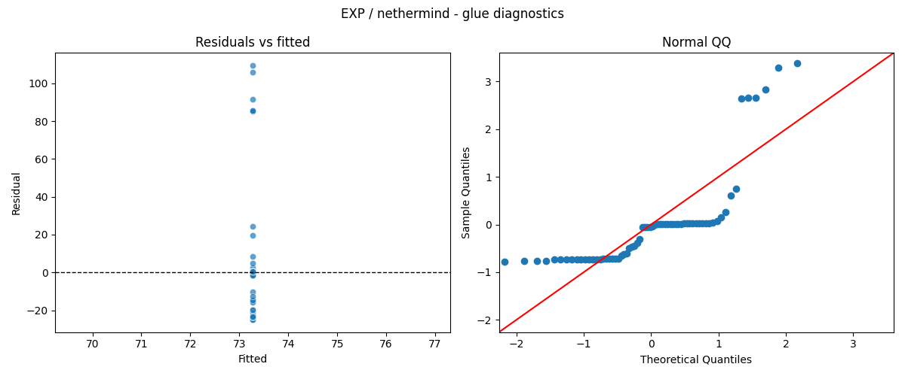

</details>

<details><summary><code>GT</code> · nobs=48 · runtime_ms=0 · p=1.00e+00 · R²=0</summary>

```
==============================================================================
                           NNLS Regression Results                            
==============================================================================
Dep. Variable:          test_runtime_ms              R-squared:          0.000
Model:                  NNLS                    Adj. R-squared:         -0.022
No. Observations:       48                                RMSE:          23.55
Df Residuals:           46                                 MAE:          19.32
Df Model:               1      
==============================================================================
                      coef     std err     P-value      [0.025      0.975]
------------------------------------------------------------------------------
         const     67.6709      3.3491       0.001     61.7326     74.4983
            GT      0.0000      0.0000       1.000      0.0000      0.0000
==============================================================================
Notes: Non-negative least squares with bootstrap inference (1000 iterations)
==============================================================================
```


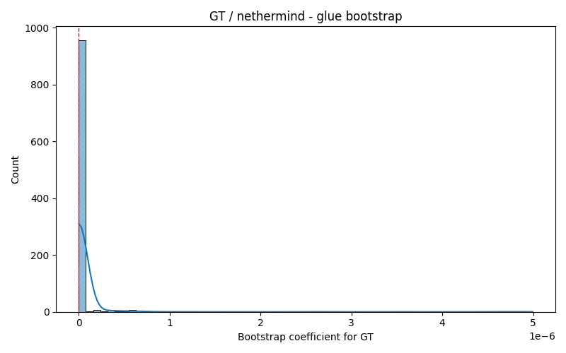

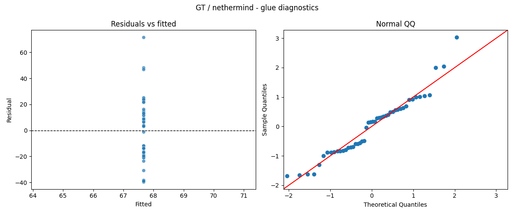

</details>

<details><summary><code>JUMPI</code> · nobs=66 · runtime_ms=0 · p=1.00e+00 · R²=-2.22e-16</summary>

```
==============================================================================
                           NNLS Regression Results                            
==============================================================================
Dep. Variable:          test_runtime_ms              R-squared:         -0.000
Model:                  NNLS                    Adj. R-squared:         -0.016
No. Observations:       66                                RMSE:           9.96
Df Residuals:           64                                 MAE:           7.87
Df Model:               1      
==============================================================================
                      coef     std err     P-value      [0.025      0.975]
------------------------------------------------------------------------------
         const     32.8761      1.2363       0.001     30.6436     35.3857
         JUMPI      0.0000      0.0000       1.000      0.0000      0.0000
==============================================================================
Notes: Non-negative least squares with bootstrap inference (1000 iterations)
==============================================================================
```

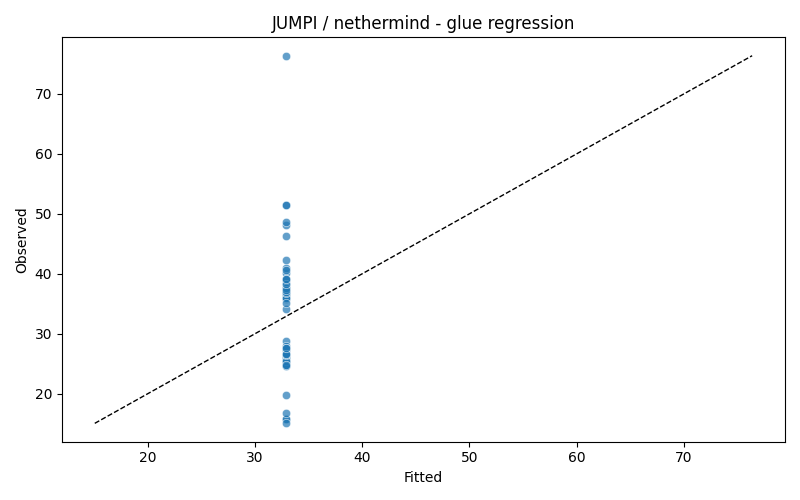


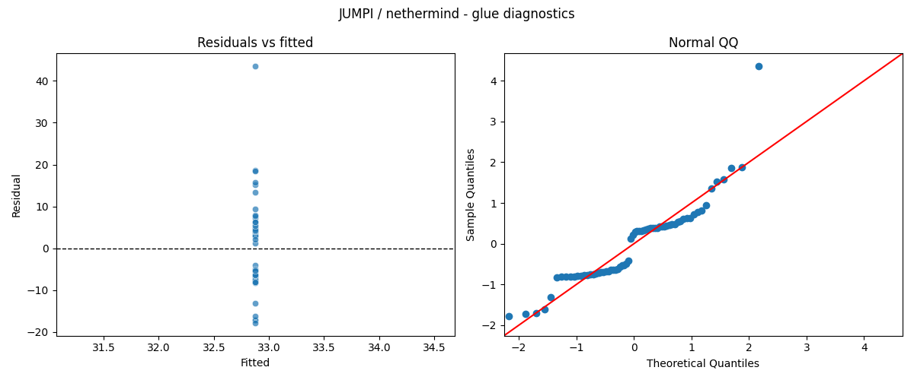

</details>

<details><summary><code>LT</code> · nobs=48 · runtime_ms=0 · p=1.00e+00 · R²=0</summary>

```
==============================================================================
                           NNLS Regression Results                            
==============================================================================
Dep. Variable:          test_runtime_ms              R-squared:          0.000
Model:                  NNLS                    Adj. R-squared:         -0.022
No. Observations:       48                                RMSE:          24.10
Df Residuals:           46                                 MAE:          18.03
Df Model:               1      
==============================================================================
                      coef     std err     P-value      [0.025      0.975]
------------------------------------------------------------------------------
         const     68.5497      3.4571       0.001     62.4502     76.0439
            LT      0.0000      0.0000       1.000      0.0000      0.0000
==============================================================================
Notes: Non-negative least squares with bootstrap inference (1000 iterations)
==============================================================================
```

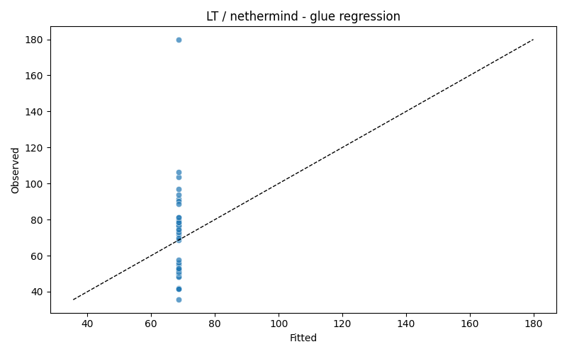

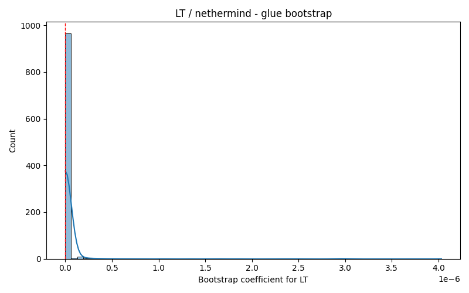

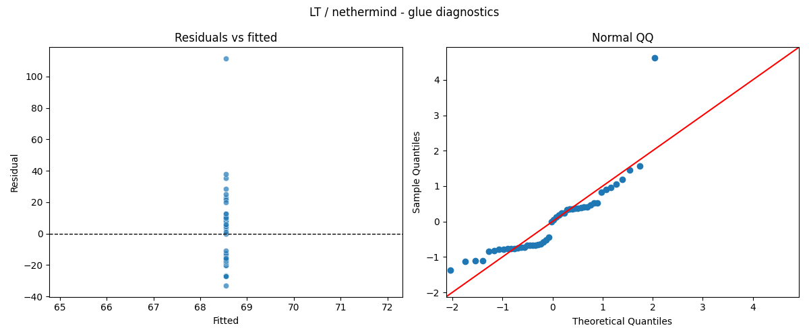

</details>

<details><summary><code>MSTORE</code> · nobs=270 · runtime_ms=0 · p=1.00e+00 · R²=0</summary>

```
==============================================================================
                           NNLS Regression Results                            
==============================================================================
Dep. Variable:          test_runtime_ms              R-squared:          0.000
Model:                  NNLS                    Adj. R-squared:         -0.004
No. Observations:       270                               RMSE:          28.96
Df Residuals:           268                                MAE:          19.19
Df Model:               1      
==============================================================================
                      coef     std err     P-value      [0.025      0.975]
------------------------------------------------------------------------------
         const     66.7265      1.8023       0.001     63.2273     70.3511
        MSTORE      0.0000      0.0000       1.000      0.0000      0.0000
==============================================================================
Notes: Non-negative least squares with bootstrap inference (1000 iterations)
==============================================================================
```

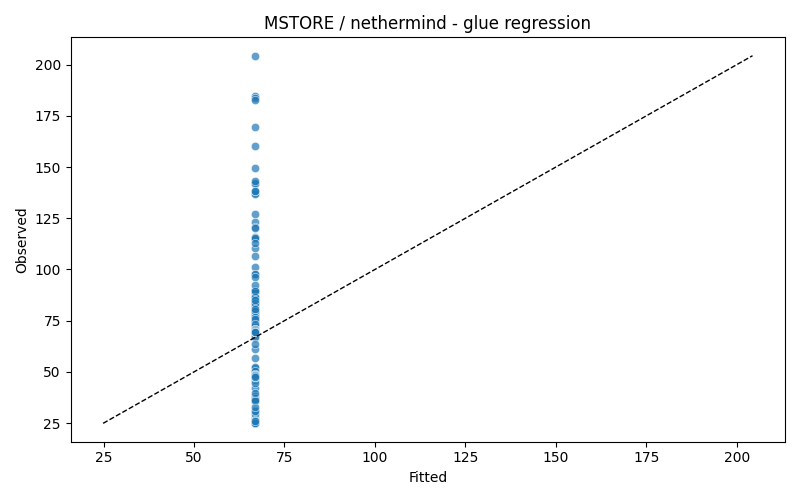

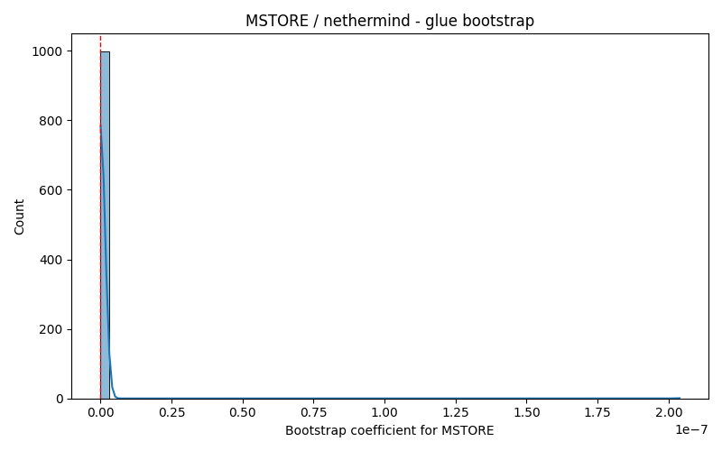

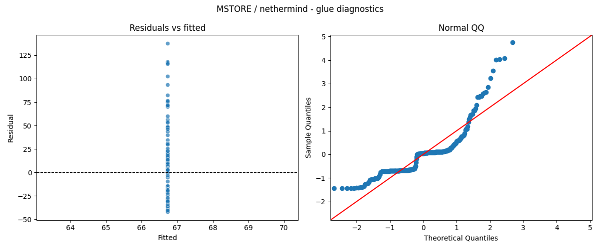

</details>

<details><summary><code>MSTORE8</code> · nobs=270 · runtime_ms=0 · p=1.00e+00 · R²=0</summary>

```
==============================================================================
                           NNLS Regression Results                            
==============================================================================
Dep. Variable:          test_runtime_ms              R-squared:          0.000
Model:                  NNLS                    Adj. R-squared:         -0.004
No. Observations:       270                               RMSE:          23.62
Df Residuals:           268                                MAE:          16.75
Df Model:               1      
==============================================================================
                      coef     std err     P-value      [0.025      0.975]
------------------------------------------------------------------------------
         const     62.8610      1.4537       0.001     60.0004     65.7741
       MSTORE8      0.0000      0.0000       1.000      0.0000      0.0000
==============================================================================
Notes: Non-negative least squares with bootstrap inference (1000 iterations)
==============================================================================
```

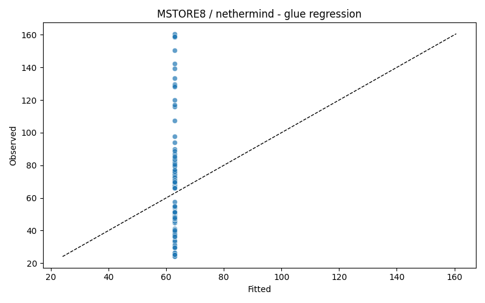


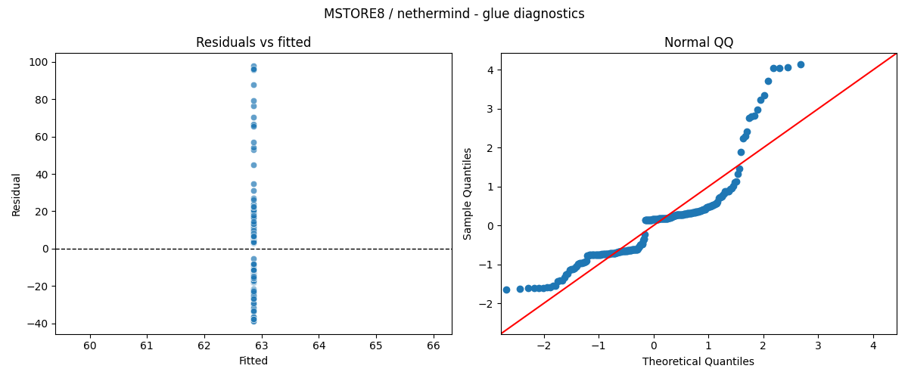

</details>

<details><summary><code>MUL</code> · nobs=60 · runtime_ms=0 · p=1.00e+00 · R²=-2.22e-16</summary>

```
==============================================================================
                           NNLS Regression Results                            
==============================================================================
Dep. Variable:          test_runtime_ms              R-squared:         -0.000
Model:                  NNLS                    Adj. R-squared:         -0.017
No. Observations:       60                                RMSE:          32.72
Df Residuals:           58                                 MAE:          30.00
Df Model:               1      
==============================================================================
                      coef     std err     P-value      [0.025      0.975]
------------------------------------------------------------------------------
         const    126.2572      4.1609       0.001    118.0801    133.9747
           MUL      0.0000      0.0000       1.000      0.0000      0.0000
==============================================================================
Notes: Non-negative least squares with bootstrap inference (1000 iterations)
==============================================================================
```

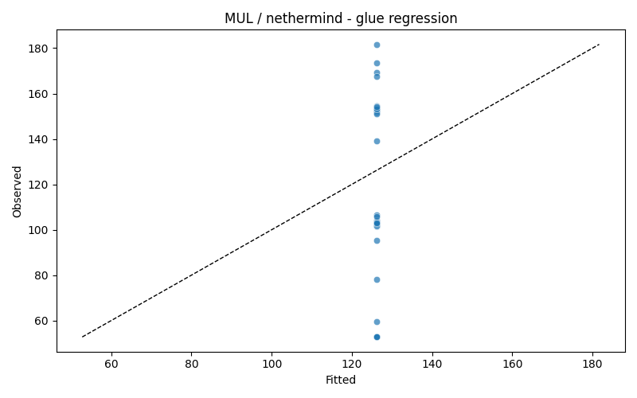


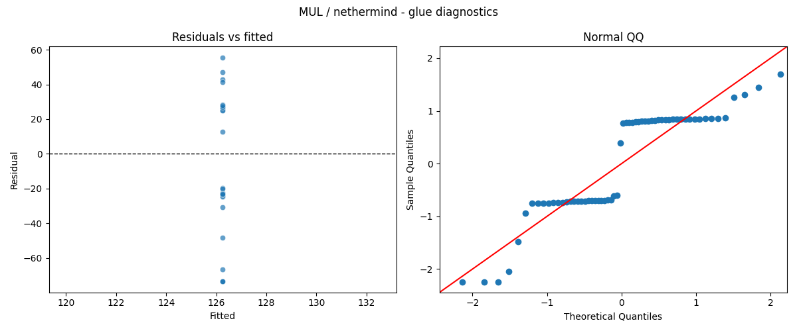

</details>

<details><summary><code>PC</code> · nobs=36 · runtime_ms=5.159e-06 · p=1.00e-03 · R²=0.2974</summary>

```
==============================================================================
                           NNLS Regression Results                            
==============================================================================
Dep. Variable:          test_runtime_ms              R-squared:          0.297
Model:                  NNLS                    Adj. R-squared:          0.277
No. Observations:       36                                RMSE:          17.62
Df Residuals:           34                                 MAE:          15.52
Df Model:               1      
==============================================================================
                      coef     std err     P-value      [0.025      0.975]
------------------------------------------------------------------------------
         const     79.2236      5.6153       0.001     68.8004     89.8683
            PC      0.0000      0.0000       0.001      0.0000      0.0000
==============================================================================
Notes: Non-negative least squares with bootstrap inference (1000 iterations)
==============================================================================
```

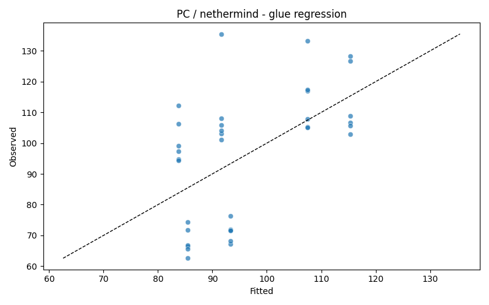

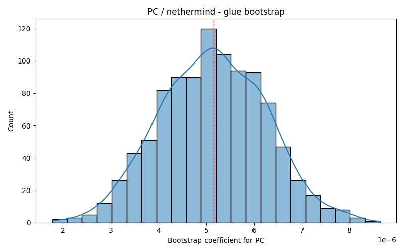

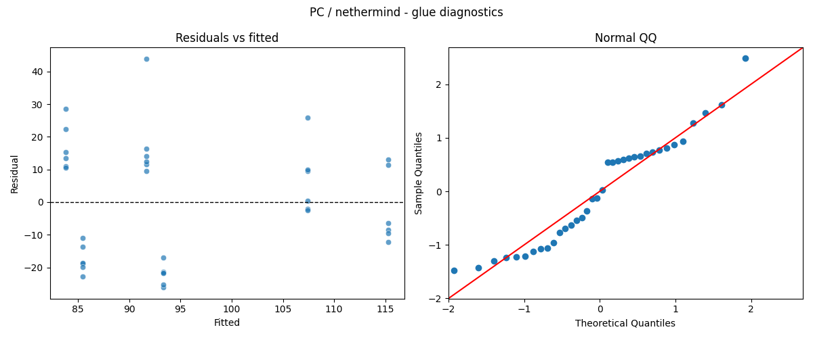

</details>

<details><summary><code>RETURNDATASIZE</code> · nobs=144 · runtime_ms=4.423e-06 · p=1.00e-03 · R²=0.2442</summary>

```
==============================================================================
                           NNLS Regression Results                            
==============================================================================
Dep. Variable:          test_runtime_ms              R-squared:          0.244
Model:                  NNLS                    Adj. R-squared:          0.239
No. Observations:       144                               RMSE:           9.13
Df Residuals:           142                                MAE:           7.81
Df Model:               1      
==============================================================================
                      coef     std err     P-value      [0.025      0.975]
------------------------------------------------------------------------------
         const     46.8618      1.5274       0.001     43.9063     49.8058
RETURNDATASIZE      0.0000      0.0000       0.001      0.0000      0.0000
==============================================================================
Notes: Non-negative least squares with bootstrap inference (1000 iterations)
==============================================================================
```

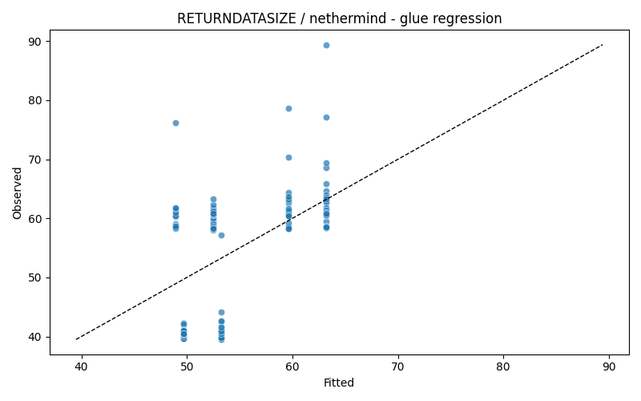

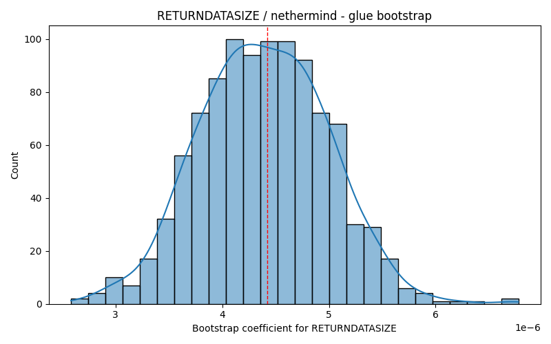

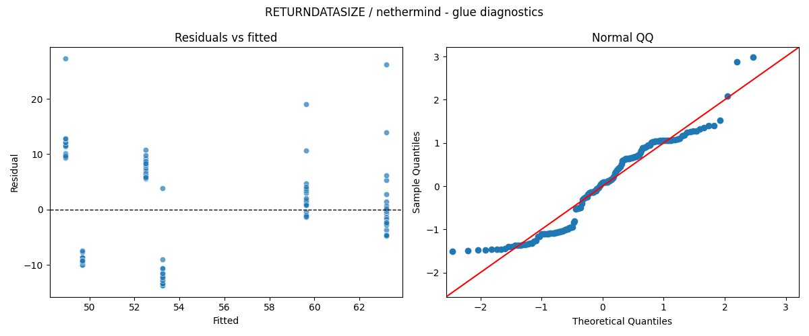

</details>

<details><summary><code>SELFBALANCE</code> · nobs=66 · runtime_ms=0 · p=1.00e+00 · R²=1.11e-16</summary>

```
==============================================================================
                           NNLS Regression Results                            
==============================================================================
Dep. Variable:          test_runtime_ms              R-squared:          0.000
Model:                  NNLS                    Adj. R-squared:         -0.016
No. Observations:       66                                RMSE:          38.29
Df Residuals:           64                                 MAE:          36.26
Df Model:               1      
==============================================================================
                      coef     std err     P-value      [0.025      0.975]
------------------------------------------------------------------------------
         const    198.1210      4.7798       0.001    189.3207    207.7676
   SELFBALANCE      0.0000      0.0000       1.000      0.0000      0.0000
==============================================================================
Notes: Non-negative least squares with bootstrap inference (1000 iterations)
==============================================================================
```

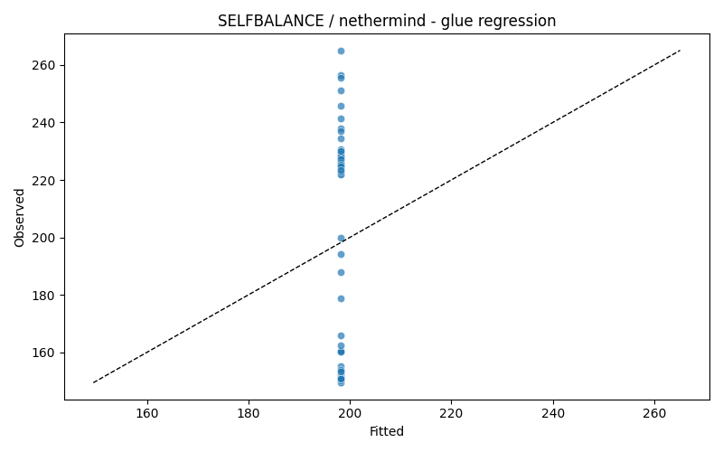


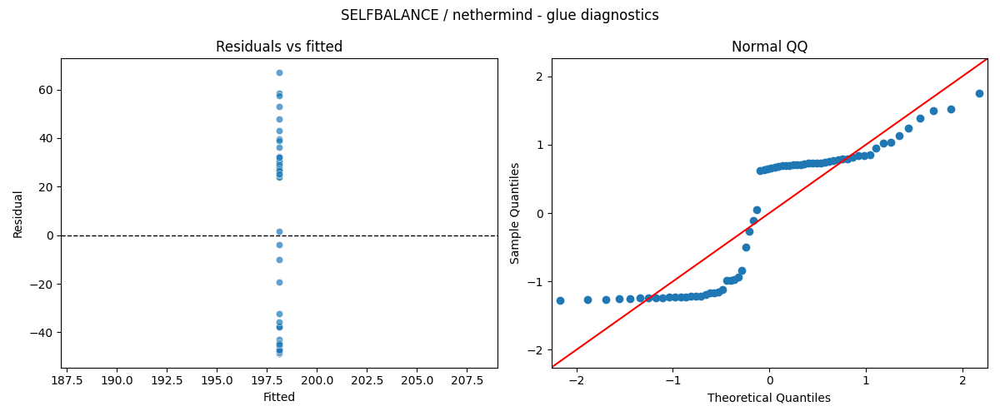

</details>

<details><summary><code>SUB</code> · nobs=48 · runtime_ms=0 · p=1.00e+00 · R²=0</summary>

```
==============================================================================
                           NNLS Regression Results                            
==============================================================================
Dep. Variable:          test_runtime_ms              R-squared:          0.000
Model:                  NNLS                    Adj. R-squared:         -0.022
No. Observations:       48                                RMSE:          23.98
Df Residuals:           46                                 MAE:          21.29
Df Model:               1      
==============================================================================
                      coef     std err     P-value      [0.025      0.975]
------------------------------------------------------------------------------
         const     81.9844      3.4232       0.001     75.2069     88.2870
           SUB      0.0000      0.0000       1.000      0.0000      0.0000
==============================================================================
Notes: Non-negative least squares with bootstrap inference (1000 iterations)
==============================================================================
```

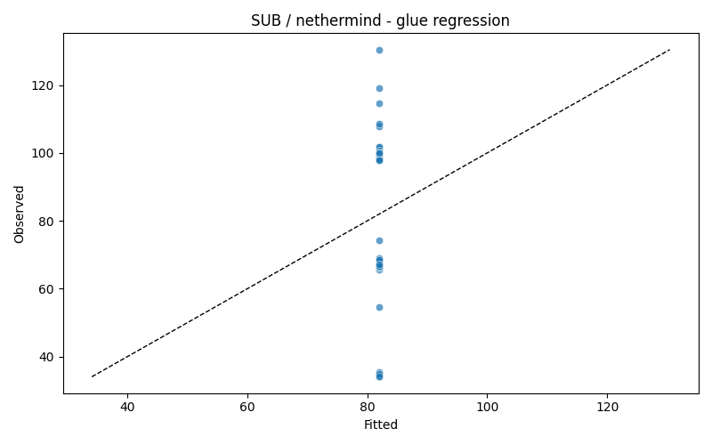

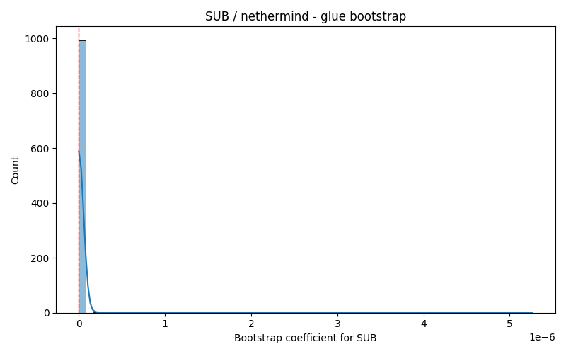

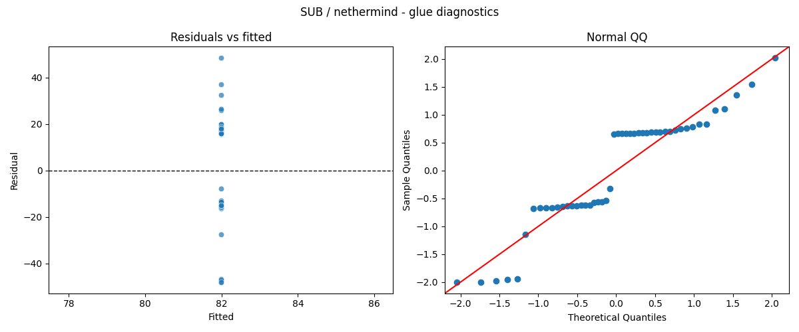

</details>

### Mixed glue (tier B) · nethermind

<details><summary><code>JUMP</code> · nobs=60 · runtime_ms=0 · p=1.00e+00 · R²=0</summary>

```
==============================================================================
                           NNLS Regression Results                            
==============================================================================
Dep. Variable:          test_runtime_ms              R-squared:          0.000
Model:                  NNLS                    Adj. R-squared:         -0.017
No. Observations:       60                                RMSE:          17.61
Df Residuals:           58                                 MAE:          15.74
Df Model:               1      
==============================================================================
                      coef     std err     P-value      [0.025      0.975]
------------------------------------------------------------------------------
         const     67.7362      2.2170       0.001     63.4424     72.2130
          JUMP      0.0000      0.0000       1.000      0.0000      0.0000
==============================================================================
Notes: Non-negative least squares with bootstrap inference (1000 iterations)
==============================================================================
```

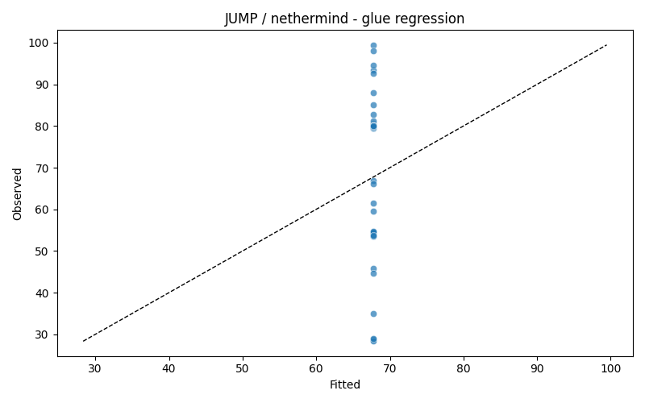


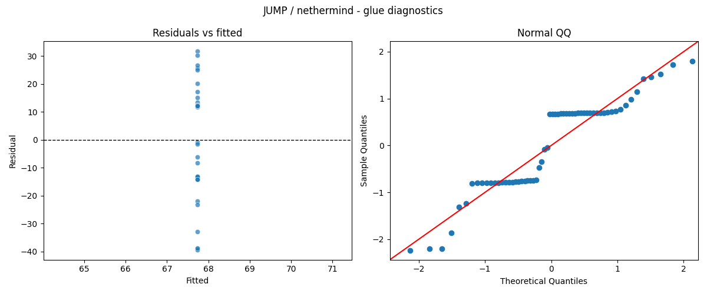

</details>

<details><summary><code>KECCAK256</code> · nobs=1056 · runtime_ms=0 · p=1.00e+00 · R²=0</summary>

```
==============================================================================
                           NNLS Regression Results                            
==============================================================================
Dep. Variable:          test_runtime_ms              R-squared:          0.000
Model:                  NNLS                    Adj. R-squared:         -0.001
No. Observations:       1056                              RMSE:         264.25
Df Residuals:           1054                               MAE:         216.20
Df Model:               1      
==============================================================================
                      coef     std err     P-value      [0.025      0.975]
------------------------------------------------------------------------------
         const    388.1293      8.0281       0.001    372.7651    403.4594
     KECCAK256      0.0000      0.0000       1.000      0.0000      0.0000
==============================================================================
Notes: Non-negative least squares with bootstrap inference (1000 iterations)
==============================================================================
```

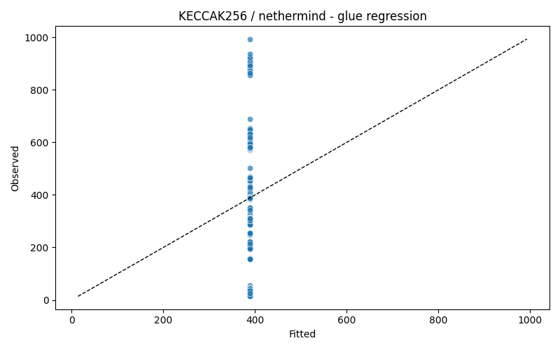


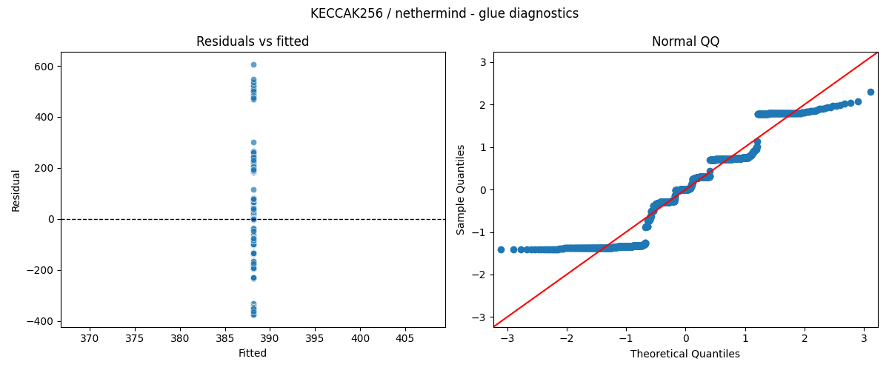

</details>

## reth

| glue_opcode | nobs | glue_runtime_ms | p_value | rsquared |
| --- | --- | --- | --- | --- |
| `ISZERO` | 32 | 0 | 1.00e+00 | 0 |
| `JUMPDEST` | 8 | 0 | 1.00e+00 | 0 |
| `SWAP` | 572 | 0 | 1.00e+00 | 0 |
| `CALLDATASIZE` | 2052 | 5.473e-06 | 1.00e-03 | 0.4889 |
| `DUP` | 2052 | 0 | 1.00e+00 | 0.4889 |
| `GAS` | 2052 | 5.436e-06 | 1.00e-03 | 0.4889 |
| `MLOAD` | 2052 | 1.368e-05 | 1.00e-03 | 0.4889 |
| `PUSH` | 2052 | 0 | 1.00e+00 | 0.4889 |
| `PUSH0` | 2052 | 4.277e-06 | 1.00e-03 | 0.4889 |
| `STATICCALL` | 2052 | 2.294e-05 | 1.00e-03 | 0.4889 |
| `ADD` | 36 | 0 | 1.00e+00 | 0 |
| `AND` | 32 | 0 | 1.00e+00 | 0 |
| `CALLDATACOPY` | 940 | 0 | 1.00e+00 | -2.22e-16 |
| `CALLDATALOAD` | 176 | 3.791e-05 | 1.89e-01 | 0.003883 |
| `DIV` | 44 | 0 | 1.00e+00 | 0 |
| `EXP` | 44 | 0.0003098 | 1.00e-03 | 0.7827 |
| `GT` | 32 | 0 | 1.00e+00 | 0 |
| `JUMPI` | 44 | 0 | 1.00e+00 | -2.22e-16 |
| `LT` | 32 | 0 | 1.00e+00 | 0 |
| `MSTORE` | 180 | 0 | 1.00e+00 | 1.11e-16 |
| `MSTORE8` | 180 | 0 | 1.00e+00 | 0 |
| `MUL` | 40 | 0 | 1.00e+00 | 0 |
| `PC` | 24 | 6.185e-06 | 1.00e-03 | 0.5209 |
| `RETURNDATASIZE` | 96 | 7.416e-06 | 1.00e-03 | 0.4145 |
| `SELFBALANCE` | 44 | 0 | 1.00e+00 | 0 |
| `SUB` | 32 | 0 | 1.00e+00 | 0 |
| `JUMP` | 40 | 0 | 1.00e+00 | 0 |
| `KECCAK256` | 704 | 0 | 1.00e+00 | 0 |

### Cycle glue — joint fit · reth

<details><summary>Joint NNLS regression summary</summary>

```
==============================================================================
                           NNLS Regression Results                            
==============================================================================
Dep. Variable:          test_runtime_ms              R-squared:          0.489
Model:                  NNLS                    Adj. R-squared:          0.487
No. Observations:       2052                              RMSE:          13.05
Df Residuals:           2044                               MAE:          10.92
Df Model:               7      
==============================================================================
                      coef     std err     P-value      [0.025      0.975]
------------------------------------------------------------------------------
         const     46.3123      0.3000       0.001     45.7697     46.9173
  CALLDATASIZE      0.0000      0.0000       0.001      0.0000      0.0000
           DUP      0.0000      0.0000       1.000      0.0000      0.0000
           GAS      0.0000      0.0000       0.001      0.0000      0.0000
         MLOAD      0.0000      0.0000       0.001      0.0000      0.0000
          PUSH      0.0000      0.0000       1.000      0.0000      0.0000
         PUSH0      0.0000      0.0000       0.001      0.0000      0.0000
    STATICCALL      0.0000      0.0000       0.001      0.0000      0.0000
==============================================================================
Notes: Non-negative least squares with bootstrap inference (1000 iterations)
==============================================================================
```

</details>

<details><summary><code>CALLDATASIZE</code> · nobs=2052 · runtime_ms=5.473e-06 · p=1.00e-03 · R²=0.4889</summary>

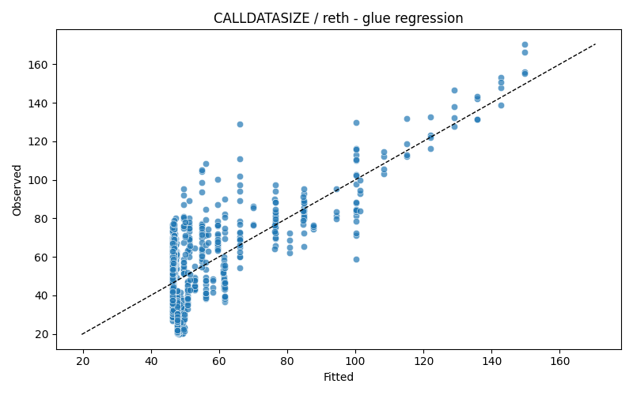

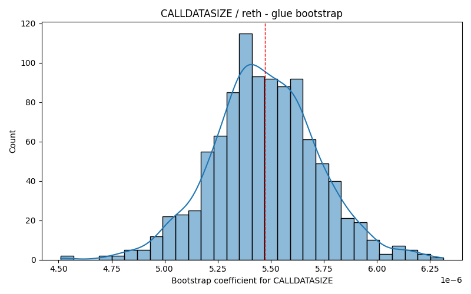

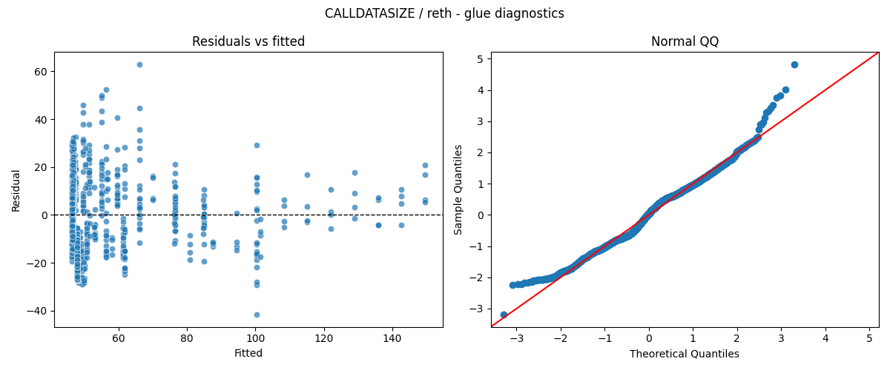

</details>

<details><summary><code>DUP</code> · nobs=2052 · runtime_ms=0 · p=1.00e+00 · R²=0.4889</summary>


</details>

<details><summary><code>GAS</code> · nobs=2052 · runtime_ms=5.436e-06 · p=1.00e-03 · R²=0.4889</summary>

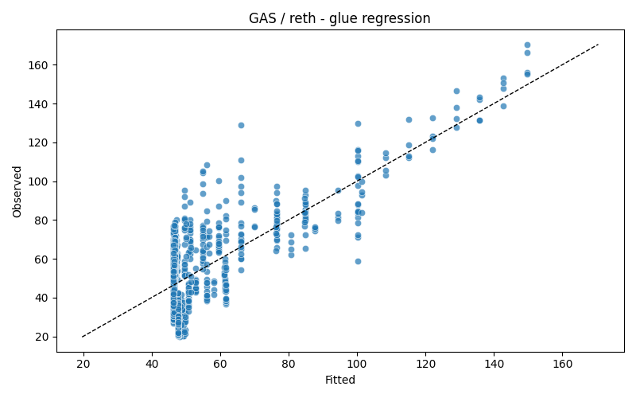

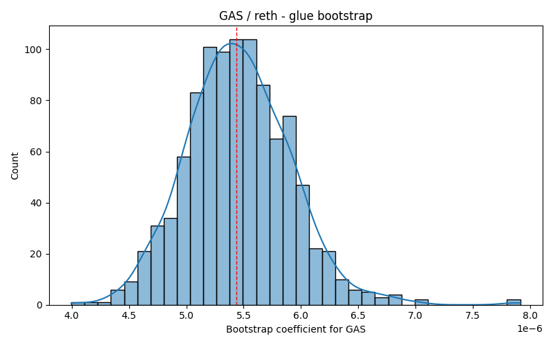


</details>

<details><summary><code>MLOAD</code> · nobs=2052 · runtime_ms=1.368e-05 · p=1.00e-03 · R²=0.4889</summary>


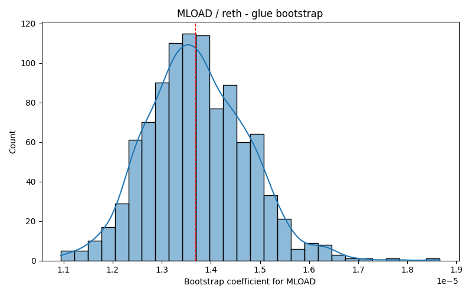


</details>

<details><summary><code>PUSH</code> · nobs=2052 · runtime_ms=0 · p=1.00e+00 · R²=0.4889</summary>


</details>

<details><summary><code>PUSH0</code> · nobs=2052 · runtime_ms=4.277e-06 · p=1.00e-03 · R²=0.4889</summary>

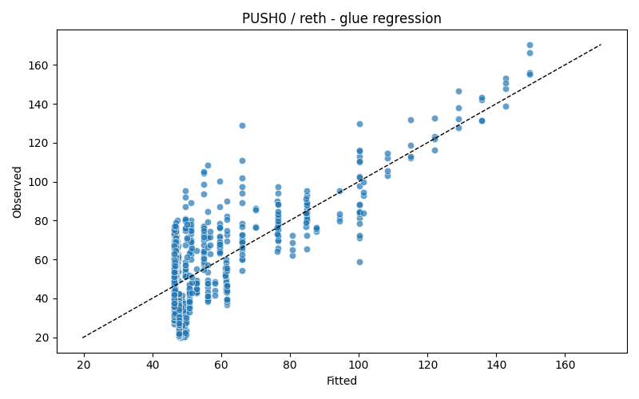

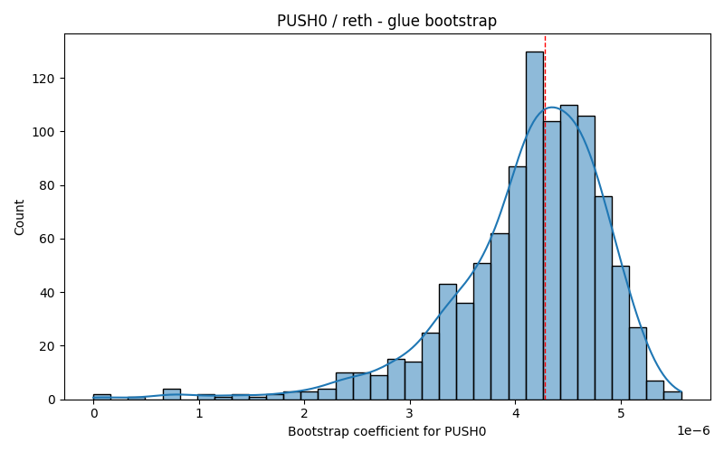

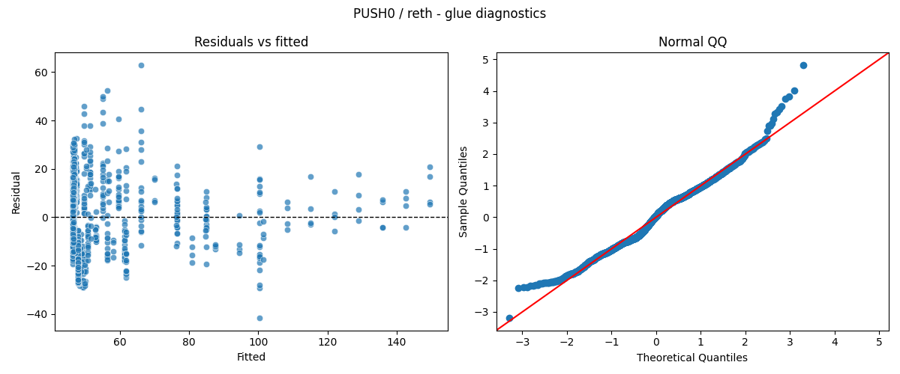

</details>

<details><summary><code>STATICCALL</code> · nobs=2052 · runtime_ms=2.294e-05 · p=1.00e-03 · R²=0.4889</summary>

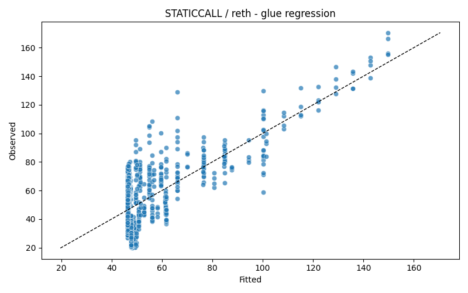

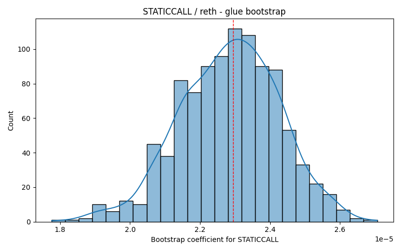

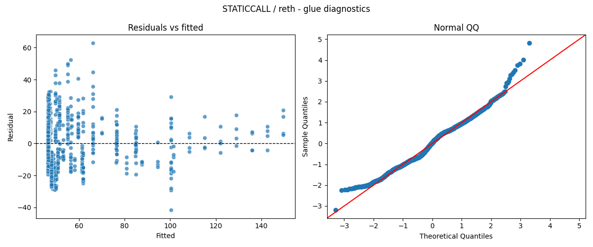

</details>

### Pure glue · reth

<details><summary><code>ISZERO</code> · nobs=32 · runtime_ms=0 · p=1.00e+00 · R²=0</summary>

```
==============================================================================
                           NNLS Regression Results                            
==============================================================================
Dep. Variable:          test_runtime_ms              R-squared:          0.000
Model:                  NNLS                    Adj. R-squared:         -0.033
No. Observations:       32                                RMSE:          32.81
Df Residuals:           30                                 MAE:          30.26
Df Model:               1      
==============================================================================
                      coef     std err     P-value      [0.025      0.975]
------------------------------------------------------------------------------
         const    120.6010      6.0230       0.001    109.0507    132.0397
        ISZERO      0.0000      0.0000       1.000      0.0000      0.0000
==============================================================================
Notes: Non-negative least squares with bootstrap inference (1000 iterations)
==============================================================================
```

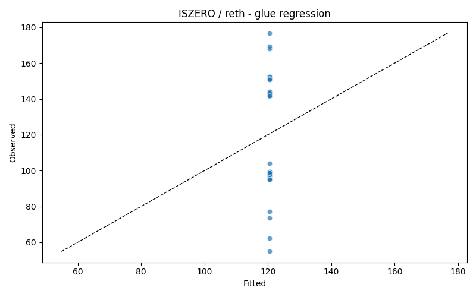

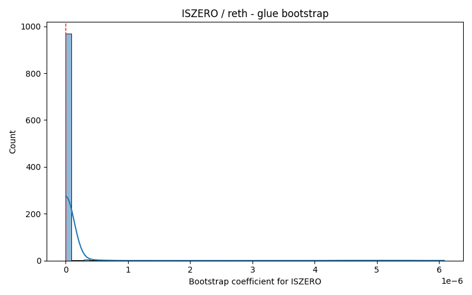

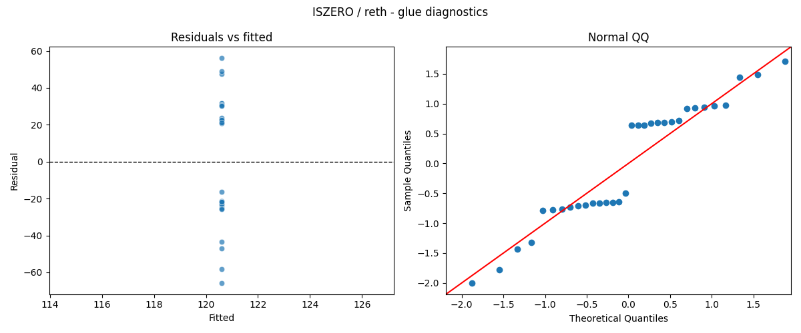

</details>

<details><summary><code>JUMPDEST</code> · nobs=8 · runtime_ms=0 · p=1.00e+00 · R²=0</summary>

```
==============================================================================
                           NNLS Regression Results                            
==============================================================================
Dep. Variable:          test_runtime_ms              R-squared:          0.000
Model:                  NNLS                    Adj. R-squared:         -0.167
No. Observations:       8                                 RMSE:          14.08
Df Residuals:           6                                  MAE:          13.61
Df Model:               1      
==============================================================================
                      coef     std err     P-value      [0.025      0.975]
------------------------------------------------------------------------------
         const     63.0544      6.5940       0.005     52.5952     73.1887
      JUMPDEST      0.0000      0.0000       1.000      0.0000      0.0000
==============================================================================
Notes: Non-negative least squares with bootstrap inference (1000 iterations)
==============================================================================
```

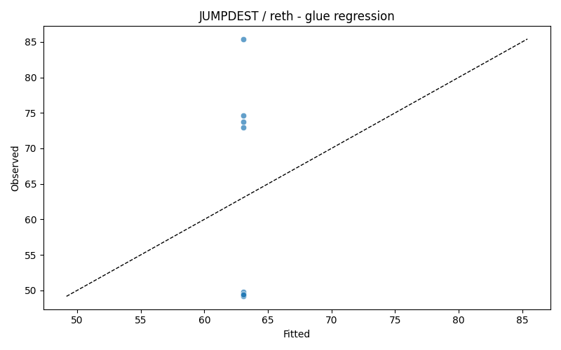

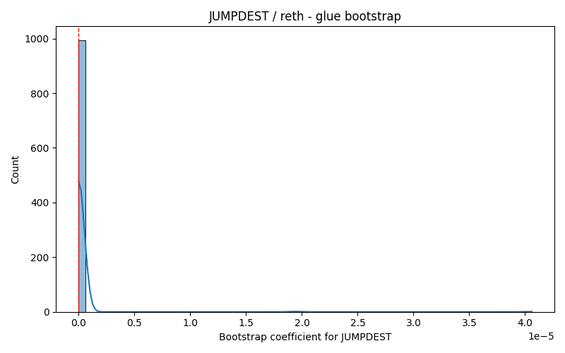

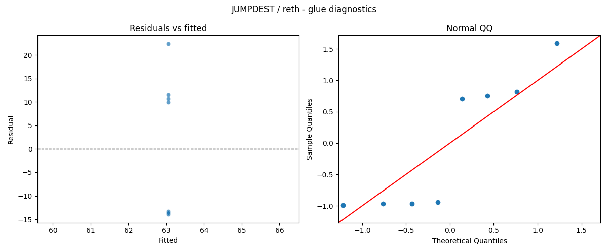

</details>

<details><summary><code>SWAP</code> · nobs=572 · runtime_ms=0 · p=1.00e+00 · R²=0</summary>

```
==============================================================================
                           NNLS Regression Results                            
==============================================================================
Dep. Variable:          test_runtime_ms              R-squared:          0.000
Model:                  NNLS                    Adj. R-squared:         -0.002
No. Observations:       572                               RMSE:          12.37
Df Residuals:           570                                MAE:          10.79
Df Model:               1      
==============================================================================
                      coef     std err     P-value      [0.025      0.975]
------------------------------------------------------------------------------
         const     46.1179      0.4931       0.001     45.1330     47.0623
          SWAP      0.0000      0.0000       1.000      0.0000      0.0000
==============================================================================
Notes: Non-negative least squares with bootstrap inference (1000 iterations)
==============================================================================
```

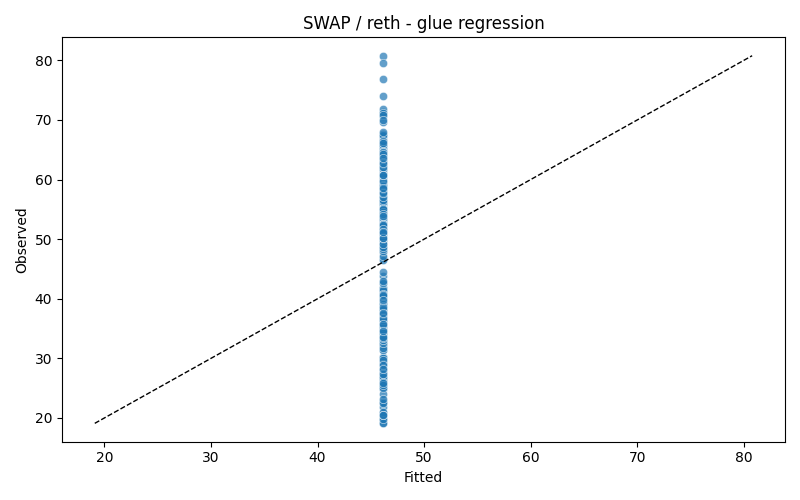


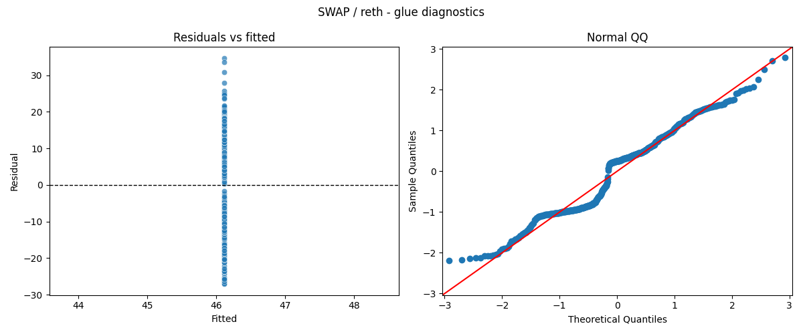

</details>

### Mixed glue (tier A) · reth

<details><summary><code>ADD</code> · nobs=36 · runtime_ms=0 · p=1.00e+00 · R²=0</summary>

```
==============================================================================
                           NNLS Regression Results                            
==============================================================================
Dep. Variable:          test_runtime_ms              R-squared:          0.000
Model:                  NNLS                    Adj. R-squared:         -0.029
No. Observations:       36                                RMSE:          10.31
Df Residuals:           34                                 MAE:           9.06
Df Model:               1      
==============================================================================
                      coef     std err     P-value      [0.025      0.975]
------------------------------------------------------------------------------
         const     39.6211      1.7213       0.001     36.0806     42.9290
           ADD      0.0000      0.0000       1.000      0.0000      0.0000
==============================================================================
Notes: Non-negative least squares with bootstrap inference (1000 iterations)
==============================================================================
```

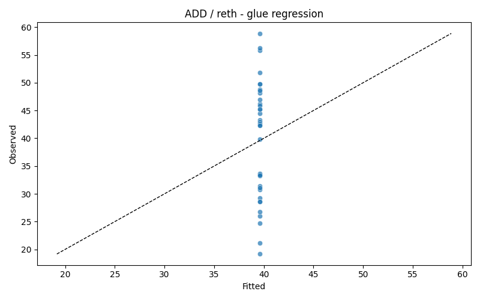

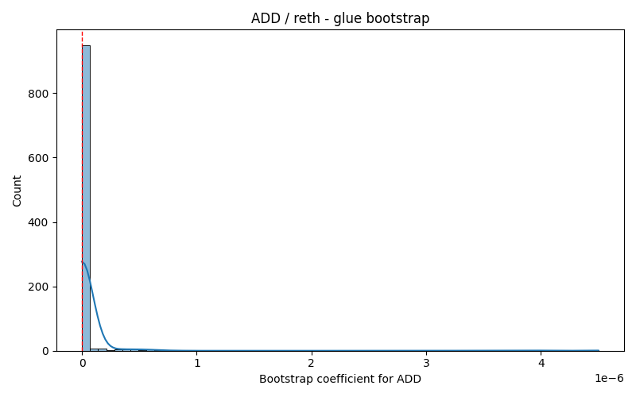

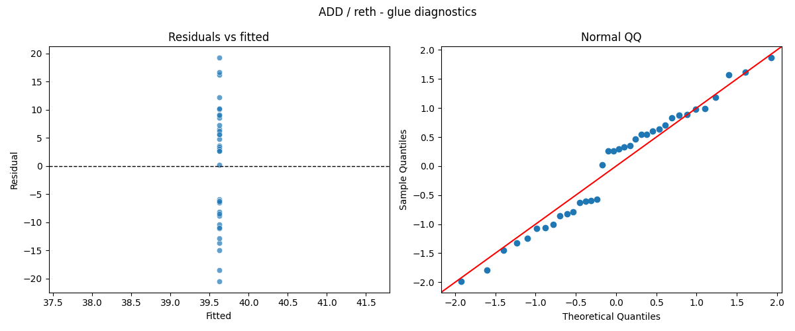

</details>

<details><summary><code>AND</code> · nobs=32 · runtime_ms=0 · p=1.00e+00 · R²=0</summary>

```
==============================================================================
                           NNLS Regression Results                            
==============================================================================
Dep. Variable:          test_runtime_ms              R-squared:          0.000
Model:                  NNLS                    Adj. R-squared:         -0.033
No. Observations:       32                                RMSE:          11.60
Df Residuals:           30                                 MAE:          10.17
Df Model:               1      
==============================================================================
                      coef     std err     P-value      [0.025      0.975]
------------------------------------------------------------------------------
         const     39.2147      2.0569       0.001     34.7370     42.7993
           AND      0.0000      0.0000       1.000      0.0000      0.0000
==============================================================================
Notes: Non-negative least squares with bootstrap inference (1000 iterations)
==============================================================================
```

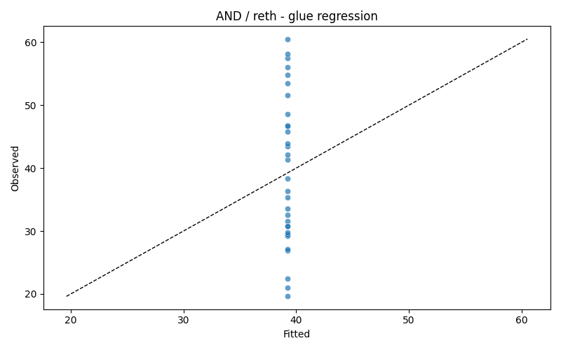

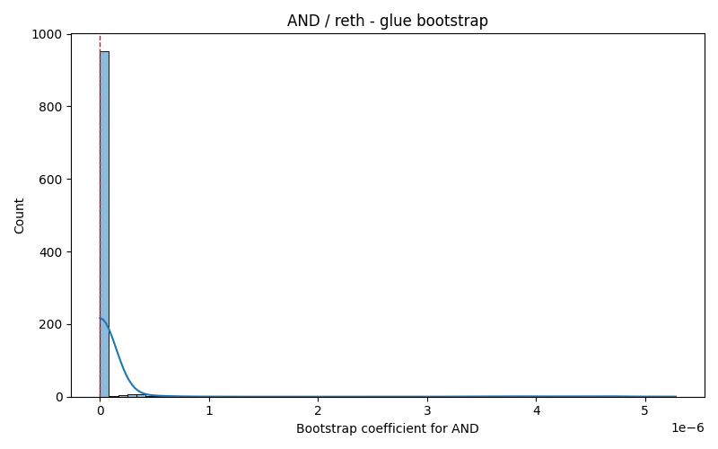

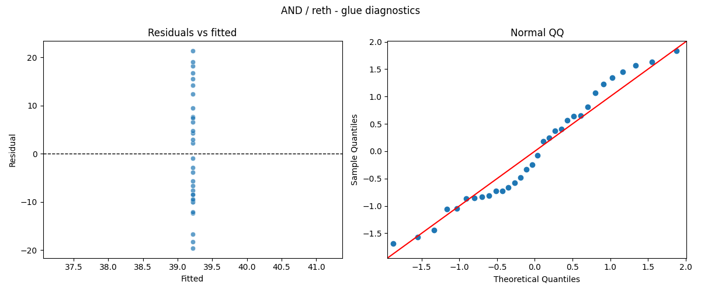

</details>

<details><summary><code>CALLDATACOPY</code> · nobs=940 · runtime_ms=0 · p=1.00e+00 · R²=-2.22e-16</summary>

```
==============================================================================
                           NNLS Regression Results                            
==============================================================================
Dep. Variable:          test_runtime_ms              R-squared:         -0.000
Model:                  NNLS                    Adj. R-squared:         -0.001
No. Observations:       940                               RMSE:          19.67
Df Residuals:           938                                MAE:          16.51
Df Model:               1      
==============================================================================
                      coef     std err     P-value      [0.025      0.975]
------------------------------------------------------------------------------
         const     36.4275      0.6471       0.001     35.1853     37.6879
  CALLDATACOPY      0.0000      0.0000       1.000      0.0000      0.0000
==============================================================================
Notes: Non-negative least squares with bootstrap inference (1000 iterations)
==============================================================================
```

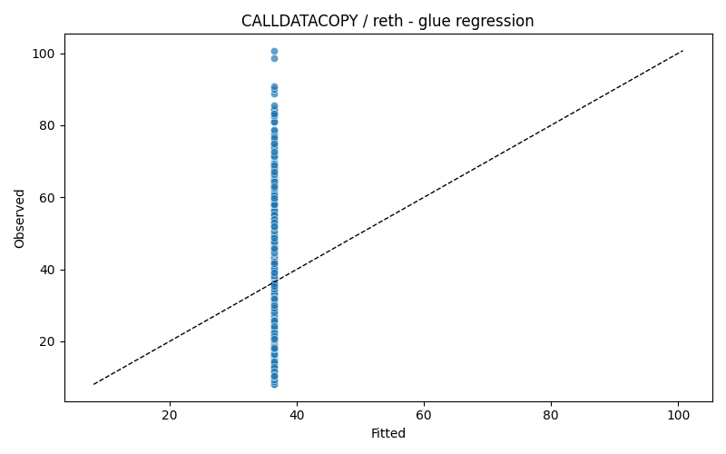


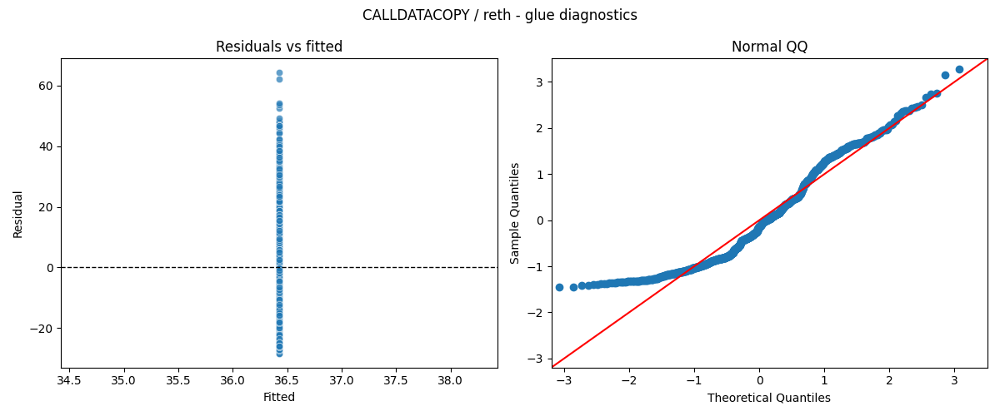

</details>

<details><summary><code>CALLDATALOAD</code> · nobs=176 · runtime_ms=3.791e-05 · p=1.89e-01 · R²=0.003883</summary>

```
==============================================================================
                           NNLS Regression Results                            
==============================================================================
Dep. Variable:          test_runtime_ms              R-squared:          0.004
Model:                  NNLS                    Adj. R-squared:         -0.002
No. Observations:       176                               RMSE:           2.33
Df Residuals:           174                                MAE:           1.98
Df Model:               1      
==============================================================================
                      coef     std err     P-value      [0.025      0.975]
------------------------------------------------------------------------------
         const      4.2779      0.4809       0.001      3.1924      4.9797
  CALLDATALOAD      0.0000      0.0000       0.189      0.0000      0.0001
==============================================================================
Notes: Non-negative least squares with bootstrap inference (1000 iterations)
==============================================================================
```

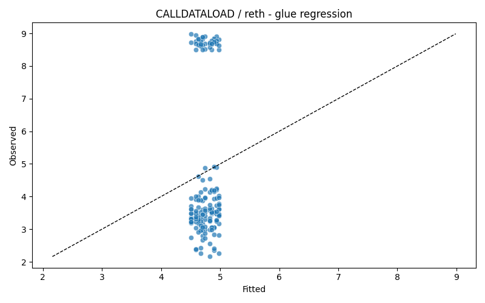

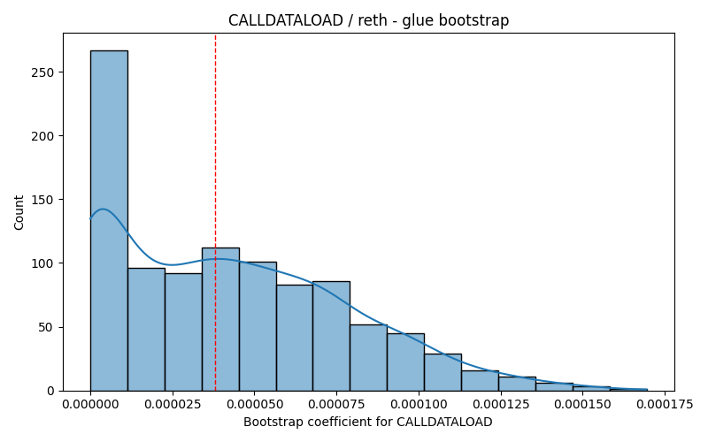

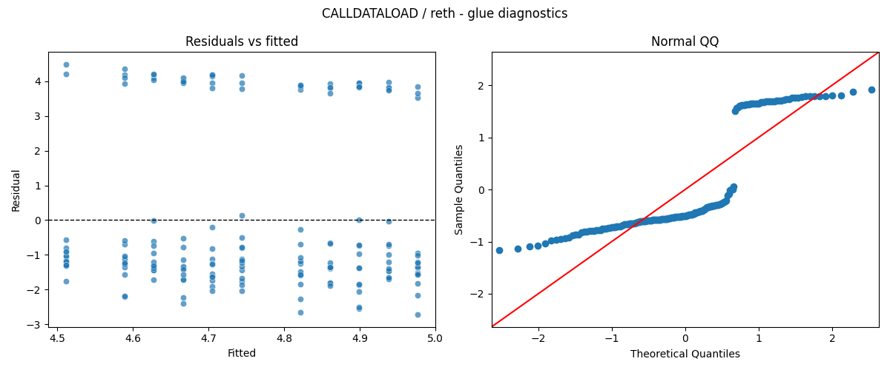

</details>

<details><summary><code>DIV</code> · nobs=44 · runtime_ms=0 · p=1.00e+00 · R²=0</summary>

```
==============================================================================
                           NNLS Regression Results                            
==============================================================================
Dep. Variable:          test_runtime_ms              R-squared:          0.000
Model:                  NNLS                    Adj. R-squared:         -0.024
No. Observations:       44                                RMSE:          61.97
Df Residuals:           42                                 MAE:          54.58
Df Model:               1      
==============================================================================
                      coef     std err     P-value      [0.025      0.975]
------------------------------------------------------------------------------
         const    232.6305      9.6903       0.001    214.0763    251.5505
           DIV      0.0000      0.0000       1.000      0.0000      0.0000
==============================================================================
Notes: Non-negative least squares with bootstrap inference (1000 iterations)
==============================================================================
```

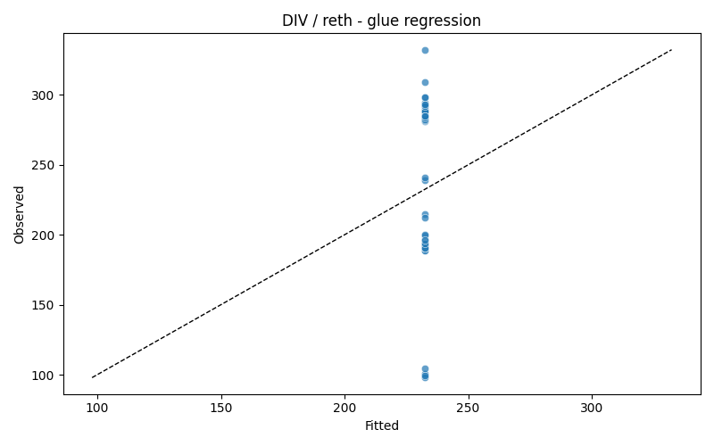

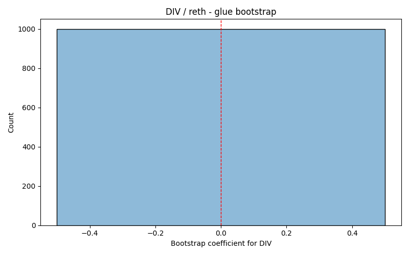

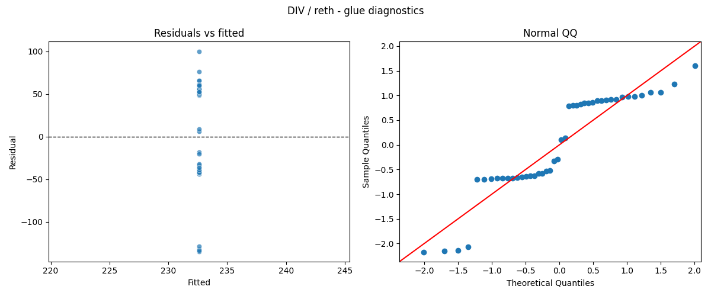

</details>

<details><summary><code>EXP</code> · nobs=44 · runtime_ms=0.0003098 · p=1.00e-03 · R²=0.7827</summary>

```
==============================================================================
                           NNLS Regression Results                            
==============================================================================
Dep. Variable:          test_runtime_ms              R-squared:          0.783
Model:                  NNLS                    Adj. R-squared:          0.778
No. Observations:       44                                RMSE:           6.40
Df Residuals:           42                                 MAE:           5.20
Df Model:               1      
==============================================================================
                      coef     std err     P-value      [0.025      0.975]
------------------------------------------------------------------------------
         const     14.8733      2.9708       0.001      9.1382     20.7982
           EXP      0.0003      0.0000       0.001      0.0003      0.0004
==============================================================================
Notes: Non-negative least squares with bootstrap inference (1000 iterations)
==============================================================================
```

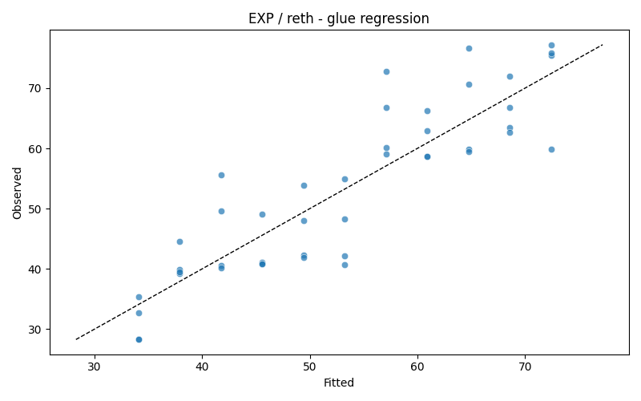

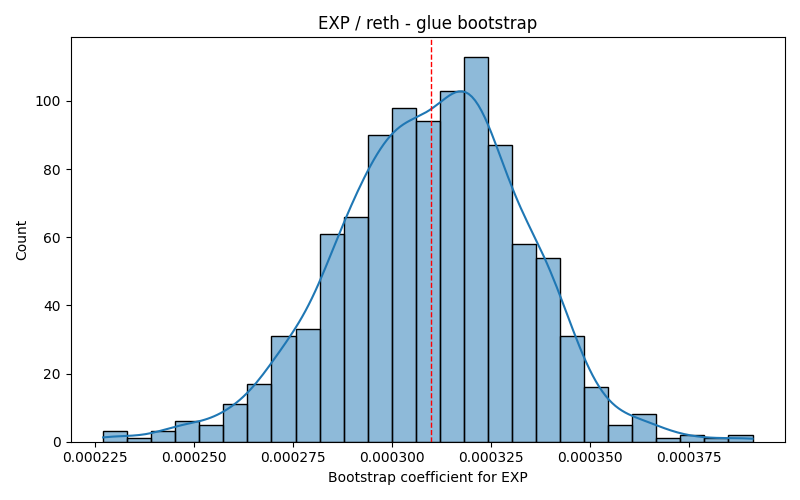

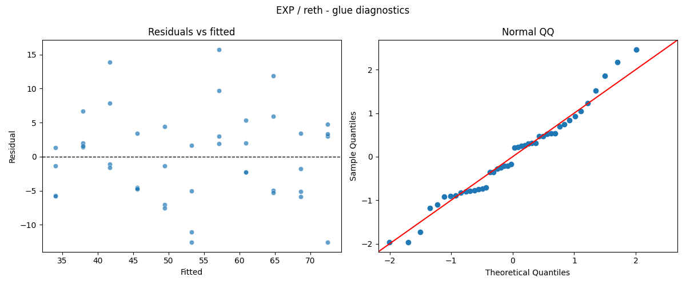

</details>

<details><summary><code>GT</code> · nobs=32 · runtime_ms=0 · p=1.00e+00 · R²=0</summary>

```
==============================================================================
                           NNLS Regression Results                            
==============================================================================
Dep. Variable:          test_runtime_ms              R-squared:          0.000
Model:                  NNLS                    Adj. R-squared:         -0.033
No. Observations:       32                                RMSE:          10.83
Df Residuals:           30                                 MAE:           9.04
Df Model:               1      
==============================================================================
                      coef     std err     P-value      [0.025      0.975]
------------------------------------------------------------------------------
         const     43.5274      2.0423       0.001     39.3706     47.3327
            GT      0.0000      0.0000       1.000      0.0000      0.0000
==============================================================================
Notes: Non-negative least squares with bootstrap inference (1000 iterations)
==============================================================================
```

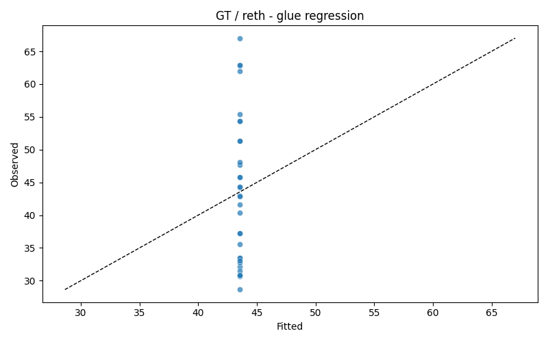

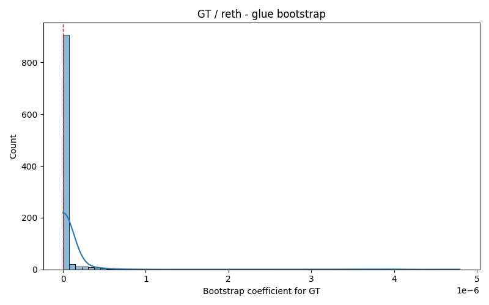

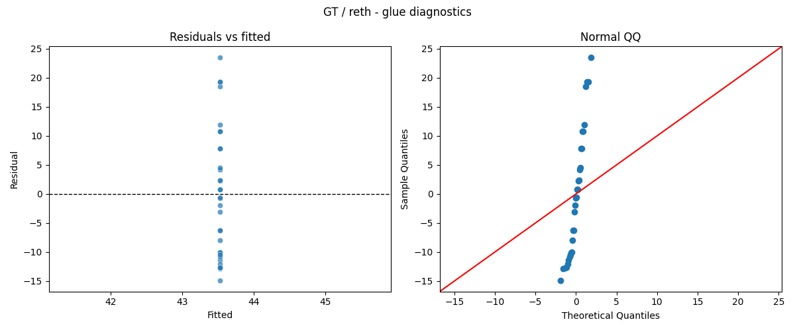

</details>

<details><summary><code>JUMPI</code> · nobs=44 · runtime_ms=0 · p=1.00e+00 · R²=-2.22e-16</summary>

```
==============================================================================
                           NNLS Regression Results                            
==============================================================================
Dep. Variable:          test_runtime_ms              R-squared:         -0.000
Model:                  NNLS                    Adj. R-squared:         -0.024
No. Observations:       44                                RMSE:           6.12
Df Residuals:           42                                 MAE:           5.04
Df Model:               1      
==============================================================================
                      coef     std err     P-value      [0.025      0.975]
------------------------------------------------------------------------------
         const     28.9858      0.9088       0.001     27.2199     30.7075
         JUMPI      0.0000      0.0000       1.000      0.0000      0.0000
==============================================================================
Notes: Non-negative least squares with bootstrap inference (1000 iterations)
==============================================================================
```


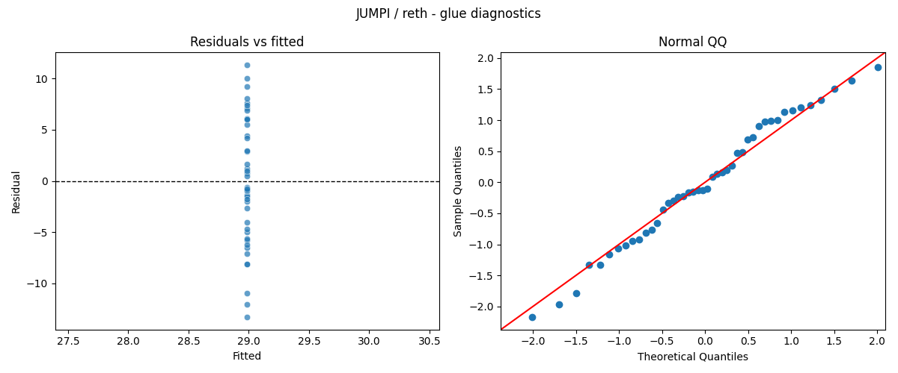

</details>

<details><summary><code>LT</code> · nobs=32 · runtime_ms=0 · p=1.00e+00 · R²=0</summary>

```
==============================================================================
                           NNLS Regression Results                            
==============================================================================
Dep. Variable:          test_runtime_ms              R-squared:          0.000
Model:                  NNLS                    Adj. R-squared:         -0.033
No. Observations:       32                                RMSE:          23.56
Df Residuals:           30                                 MAE:          19.33
Df Model:               1      
==============================================================================
                      coef     std err     P-value      [0.025      0.975]
------------------------------------------------------------------------------
         const     81.7420      4.2982       0.001     71.8900     89.2758
            LT      0.0000      0.0000       1.000      0.0000      0.0000
==============================================================================
Notes: Non-negative least squares with bootstrap inference (1000 iterations)
==============================================================================
```

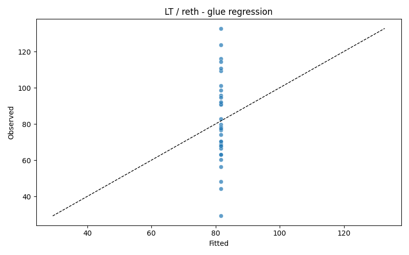

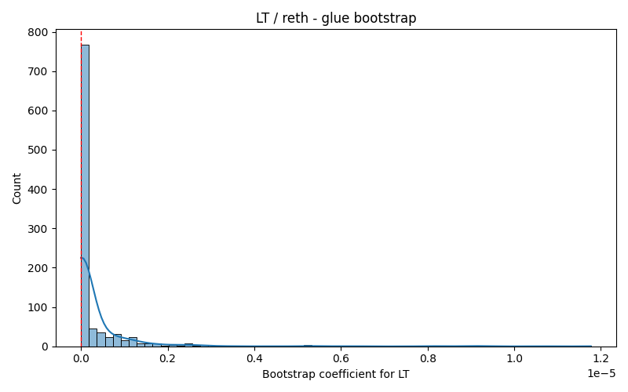

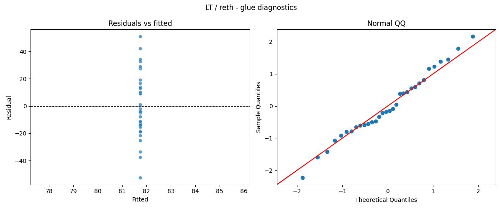

</details>

<details><summary><code>MSTORE</code> · nobs=180 · runtime_ms=0 · p=1.00e+00 · R²=1.11e-16</summary>

```
==============================================================================
                           NNLS Regression Results                            
==============================================================================
Dep. Variable:          test_runtime_ms              R-squared:          0.000
Model:                  NNLS                    Adj. R-squared:         -0.006
No. Observations:       180                               RMSE:          37.04
Df Residuals:           178                                MAE:          32.33
Df Model:               1      
==============================================================================
                      coef     std err     P-value      [0.025      0.975]
------------------------------------------------------------------------------
         const     81.0761      2.7756       0.001     75.8348     86.2638
        MSTORE      0.0000      0.0000       1.000      0.0000      0.0000
==============================================================================
Notes: Non-negative least squares with bootstrap inference (1000 iterations)
==============================================================================
```

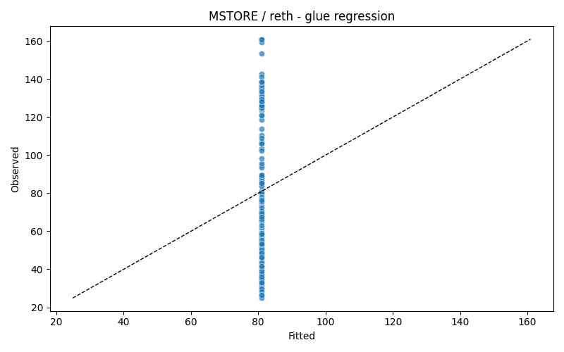

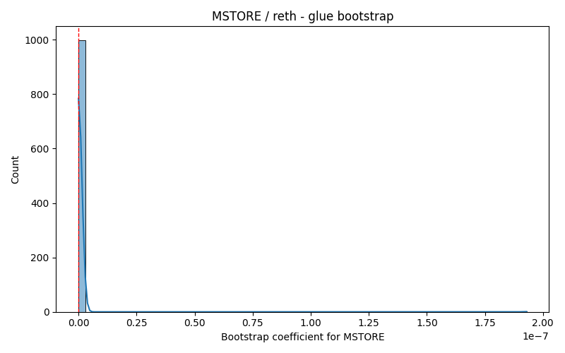

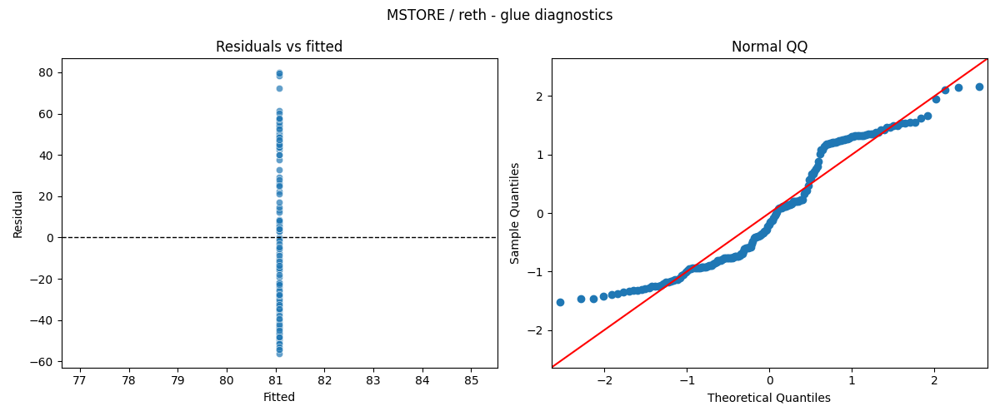

</details>

<details><summary><code>MSTORE8</code> · nobs=180 · runtime_ms=0 · p=1.00e+00 · R²=0</summary>

```
==============================================================================
                           NNLS Regression Results                            
==============================================================================
Dep. Variable:          test_runtime_ms              R-squared:          0.000
Model:                  NNLS                    Adj. R-squared:         -0.006
No. Observations:       180                               RMSE:          11.45
Df Residuals:           178                                MAE:           9.84
Df Model:               1      
==============================================================================
                      coef     std err     P-value      [0.025      0.975]
------------------------------------------------------------------------------
         const     44.1261      0.8302       0.001     42.4390     45.6673
       MSTORE8      0.0000      0.0000       1.000      0.0000      0.0000
==============================================================================
Notes: Non-negative least squares with bootstrap inference (1000 iterations)
==============================================================================
```

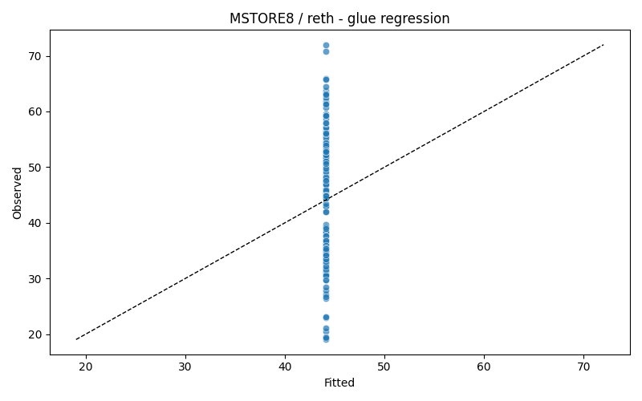


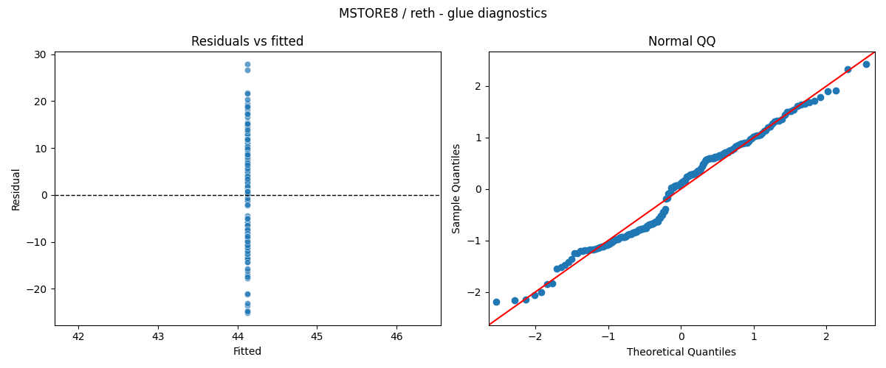

</details>

<details><summary><code>MUL</code> · nobs=40 · runtime_ms=0 · p=1.00e+00 · R²=0</summary>

```
==============================================================================
                           NNLS Regression Results                            
==============================================================================
Dep. Variable:          test_runtime_ms              R-squared:          0.000
Model:                  NNLS                    Adj. R-squared:         -0.026
No. Observations:       40                                RMSE:          10.87
Df Residuals:           38                                 MAE:           8.95
Df Model:               1      
==============================================================================
                      coef     std err     P-value      [0.025      0.975]
------------------------------------------------------------------------------
         const     40.8627      1.7460       0.001     37.5456     44.3369
           MUL      0.0000      0.0000       1.000      0.0000      0.0000
==============================================================================
Notes: Non-negative least squares with bootstrap inference (1000 iterations)
==============================================================================
```

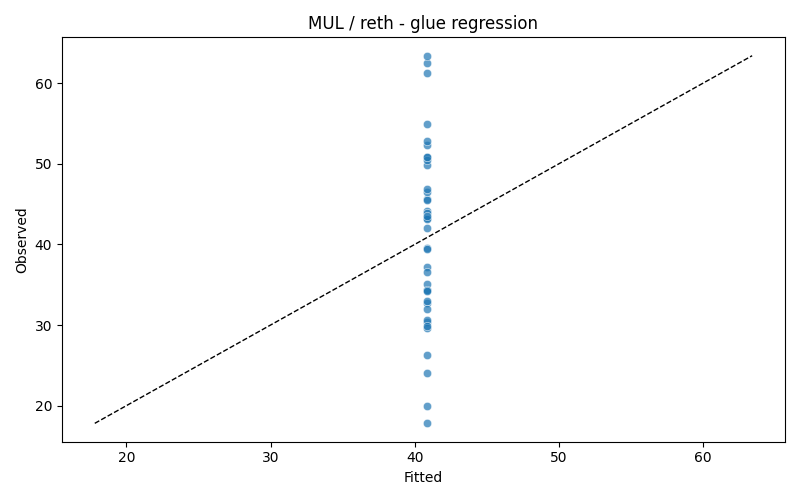


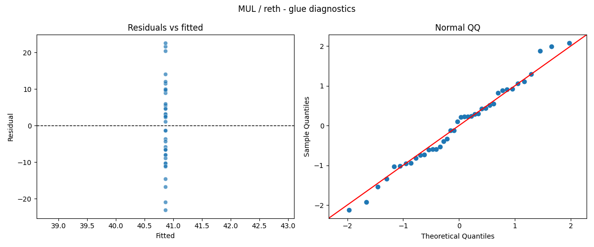

</details>

<details><summary><code>PC</code> · nobs=24 · runtime_ms=6.185e-06 · p=1.00e-03 · R²=0.5209</summary>

```
==============================================================================
                           NNLS Regression Results                            
==============================================================================
Dep. Variable:          test_runtime_ms              R-squared:          0.521
Model:                  NNLS                    Adj. R-squared:          0.499
No. Observations:       24                                RMSE:          13.18
Df Residuals:           22                                 MAE:          10.46
Df Model:               1      
==============================================================================
                      coef     std err     P-value      [0.025      0.975]
------------------------------------------------------------------------------
         const     60.7380      5.4237       0.001     50.4605     71.1638
            PC      0.0000      0.0000       0.001      0.0000      0.0000
==============================================================================
Notes: Non-negative least squares with bootstrap inference (1000 iterations)
==============================================================================
```

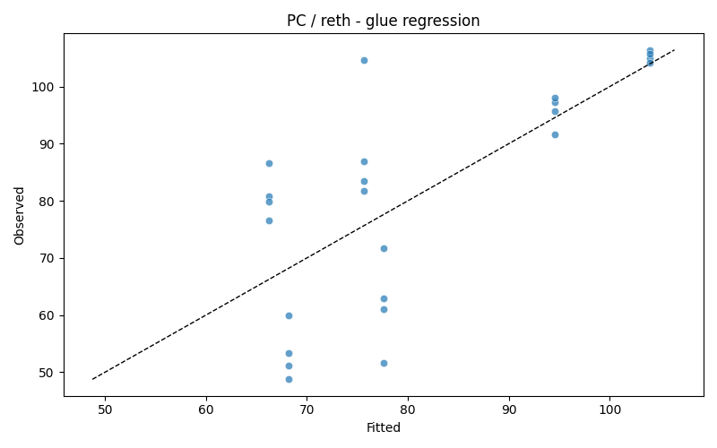

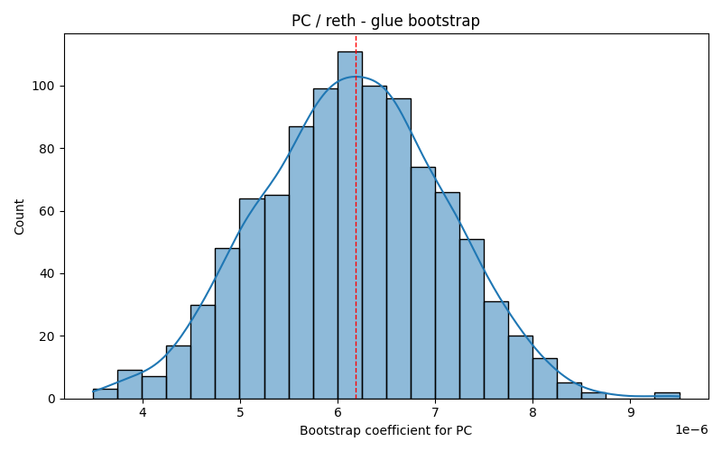

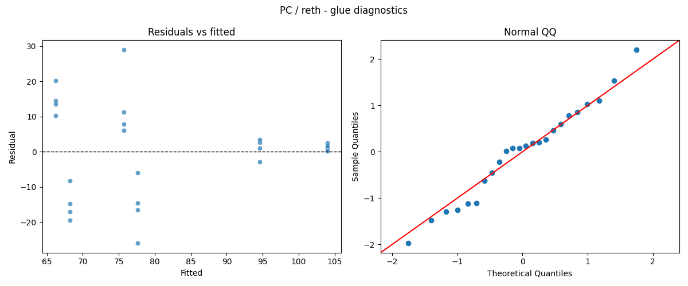

</details>

<details><summary><code>RETURNDATASIZE</code> · nobs=96 · runtime_ms=7.416e-06 · p=1.00e-03 · R²=0.4145</summary>

```
==============================================================================
                           NNLS Regression Results                            
==============================================================================
Dep. Variable:          test_runtime_ms              R-squared:          0.414
Model:                  NNLS                    Adj. R-squared:          0.408
No. Observations:       96                                RMSE:          10.34
Df Residuals:           94                                 MAE:           8.82
Df Model:               1      
==============================================================================
                      coef     std err     P-value      [0.025      0.975]
------------------------------------------------------------------------------
         const     50.5713      2.1322       0.001     46.3142     54.8198
RETURNDATASIZE      0.0000      0.0000       0.001      0.0000      0.0000
==============================================================================
Notes: Non-negative least squares with bootstrap inference (1000 iterations)
==============================================================================
```

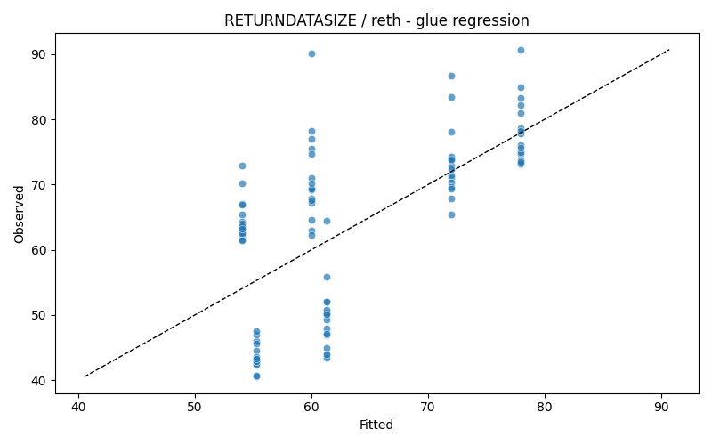

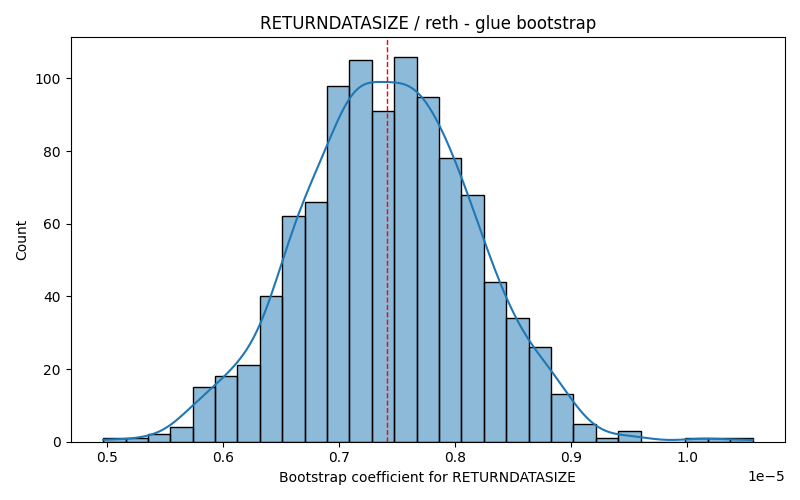

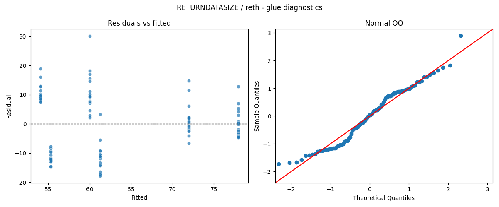

</details>

<details><summary><code>SELFBALANCE</code> · nobs=44 · runtime_ms=0 · p=1.00e+00 · R²=0</summary>

```
==============================================================================
                           NNLS Regression Results                            
==============================================================================
Dep. Variable:          test_runtime_ms              R-squared:          0.000
Model:                  NNLS                    Adj. R-squared:         -0.024
No. Observations:       44                                RMSE:          54.11
Df Residuals:           42                                 MAE:          48.95
Df Model:               1      
==============================================================================
                      coef     std err     P-value      [0.025      0.975]
------------------------------------------------------------------------------
         const    206.7488     10.5023       0.001    180.7920    221.8592
   SELFBALANCE      0.0000      0.0000       1.000      0.0000      0.0000
==============================================================================
Notes: Non-negative least squares with bootstrap inference (1000 iterations)
==============================================================================
```

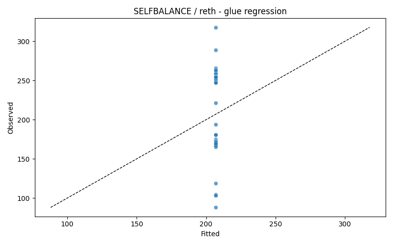

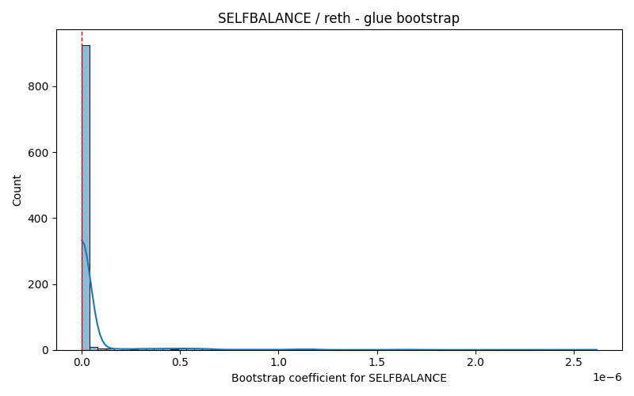

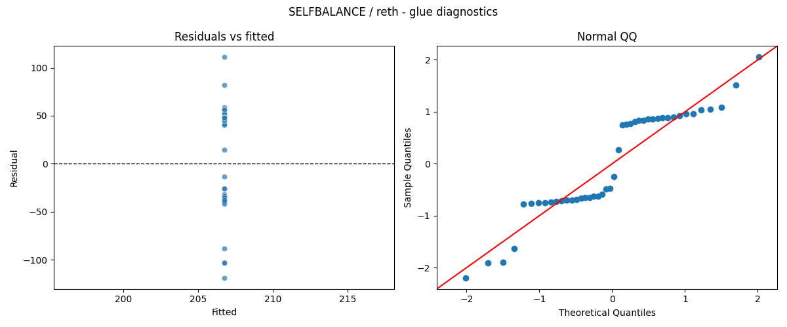

</details>

<details><summary><code>SUB</code> · nobs=32 · runtime_ms=0 · p=1.00e+00 · R²=0</summary>

```
==============================================================================
                           NNLS Regression Results                            
==============================================================================
Dep. Variable:          test_runtime_ms              R-squared:          0.000
Model:                  NNLS                    Adj. R-squared:         -0.033
No. Observations:       32                                RMSE:          10.07
Df Residuals:           30                                 MAE:           8.71
Df Model:               1      
==============================================================================
                      coef     std err     P-value      [0.025      0.975]
------------------------------------------------------------------------------
         const     38.1793      1.8732       0.001     34.2026     41.5804
           SUB      0.0000      0.0000       1.000      0.0000      0.0000
==============================================================================
Notes: Non-negative least squares with bootstrap inference (1000 iterations)
==============================================================================
```

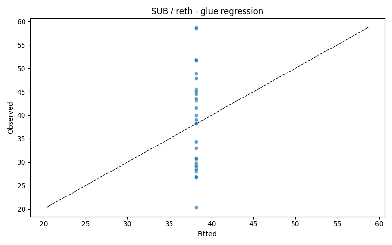

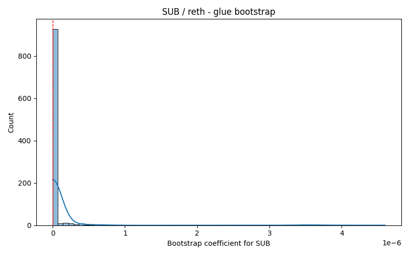

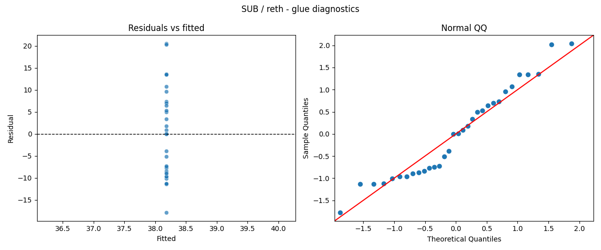

</details>

### Mixed glue (tier B) · reth

<details><summary><code>JUMP</code> · nobs=40 · runtime_ms=0 · p=1.00e+00 · R²=0</summary>

```
==============================================================================
                           NNLS Regression Results                            
==============================================================================
Dep. Variable:          test_runtime_ms              R-squared:          0.000
Model:                  NNLS                    Adj. R-squared:         -0.026
No. Observations:       40                                RMSE:           9.68
Df Residuals:           38                                 MAE:           8.04
Df Model:               1      
==============================================================================
                      coef     std err     P-value      [0.025      0.975]
------------------------------------------------------------------------------
         const     37.8835      1.5171       0.001     34.8335     40.7759
          JUMP      0.0000      0.0000       1.000      0.0000      0.0000
==============================================================================
Notes: Non-negative least squares with bootstrap inference (1000 iterations)
==============================================================================
```

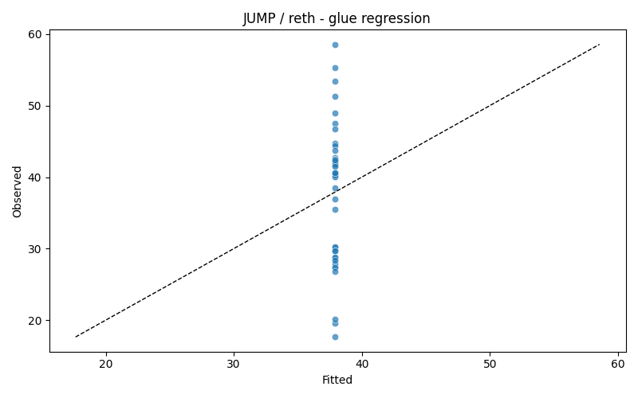


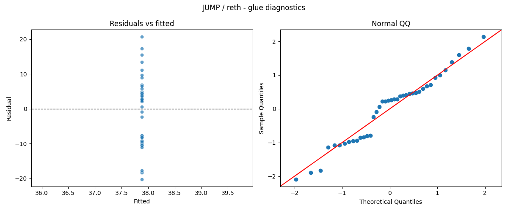

</details>

<details><summary><code>KECCAK256</code> · nobs=704 · runtime_ms=0 · p=1.00e+00 · R²=0</summary>

```
==============================================================================
                           NNLS Regression Results                            
==============================================================================
Dep. Variable:          test_runtime_ms              R-squared:          0.000
Model:                  NNLS                    Adj. R-squared:         -0.001
No. Observations:       704                               RMSE:         159.19
Df Residuals:           702                                MAE:         134.18
Df Model:               1      
==============================================================================
                      coef     std err     P-value      [0.025      0.975]
------------------------------------------------------------------------------
         const    253.0688      5.7120       0.001    241.3711    263.8933
     KECCAK256      0.0000      0.0000       1.000      0.0000      0.0000
==============================================================================
Notes: Non-negative least squares with bootstrap inference (1000 iterations)
==============================================================================
```

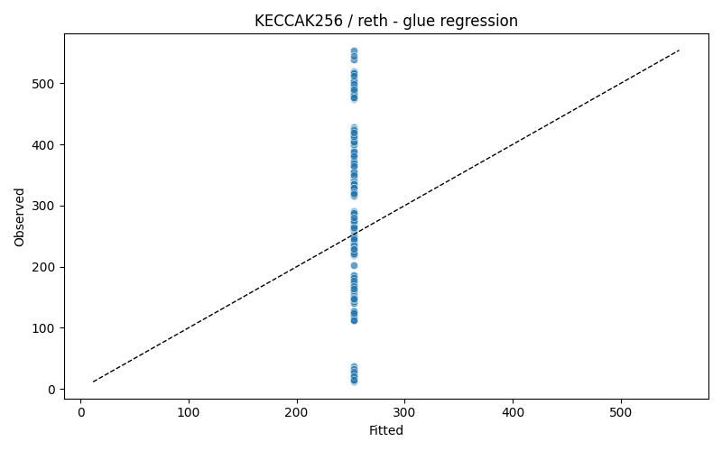


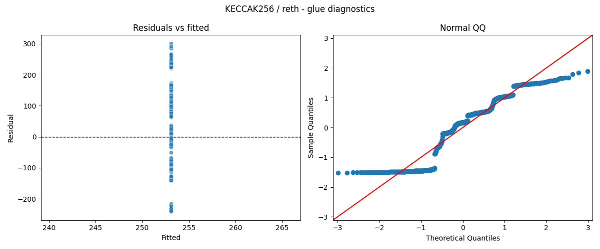

</details>
