# Runtime estimation report

Per-spec NNLS fits of `test_runtime_ms` against `opcount`, one row per (target opcode, test, model_by combo, client).

## Contents

- [SLOAD](#sload)
- [SSTORE](#sstore)
- [BALANCE](#balance)
- [CALL](#call)
- [CALLCODE](#callcode)
- [DELEGATECALL](#delegatecall)
- [EXTCODEHASH](#extcodehash)
- [EXTCODESIZE](#extcodesize)
- [STATICCALL](#staticcall)
- [EXTCODECOPY](#extcodecopy)

## SLOAD

### test_sload_bloated — combo `False`

| client | nobs | R² | target_coef (ms) | p-value | 95% CI |
| --- | --- | --- | --- | --- | --- |
| `besu` | 55 | 0.9812 | 0.006437 | 1.00e-03 | [0.006177, 0.006692] |
| `erigon` | 44 | 0.9976 | 0.006276 | 1.00e-03 | [0.006176, 0.006382] |
| `geth` | 77 | 0.9663 | 0.02259 | 1.00e-03 | [0.02156, 0.02359] |
| `nethermind` | 66 | 0.9245 | 0.002531 | 1.00e-03 | [0.002353, 0.00272] |
| `reth` | 44 | 0.9822 | 0.004399 | 1.00e-03 | [0.004231, 0.004573] |

<details><summary>besu — NNLS regression summary</summary>

```
==============================================================================
                           NNLS Regression Results                            
==============================================================================
Dep. Variable:          test_runtime_ms              R-squared:          0.981
Model:                  NNLS                    Adj. R-squared:          0.981
No. Observations:       55                                RMSE:          18.44
Df Residuals:           53                                 MAE:          14.73
Df Model:               1      
==============================================================================
                      coef     std err     P-value      [0.025      0.975]
------------------------------------------------------------------------------
         const    149.1739      9.1323       0.001    132.8245    167.8519
       opcount      0.0064      0.0001       0.001      0.0062      0.0067
==============================================================================
Notes: Non-negative least squares with bootstrap inference (1000 iterations)
==============================================================================
```

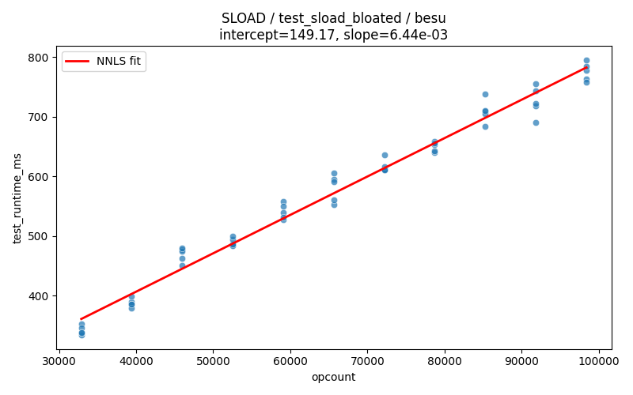

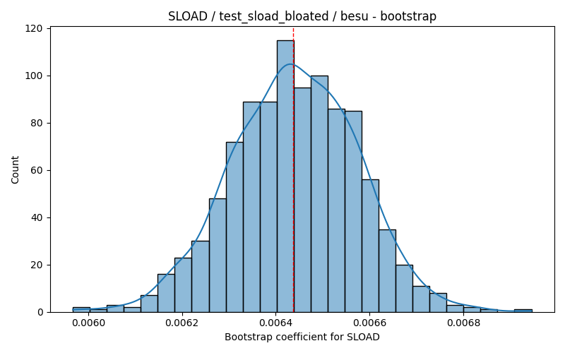

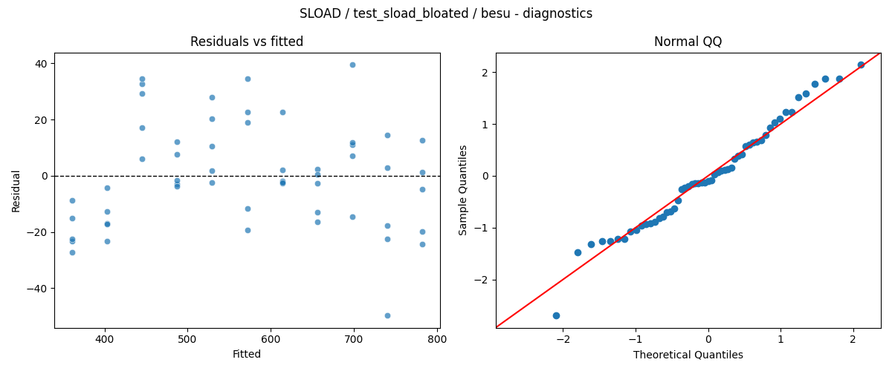

</details>

<details><summary>erigon — NNLS regression summary</summary>

```
==============================================================================
                           NNLS Regression Results                            
==============================================================================
Dep. Variable:          test_runtime_ms              R-squared:          0.998
Model:                  NNLS                    Adj. R-squared:          0.998
No. Observations:       44                                RMSE:           6.36
Df Residuals:           42                                 MAE:           4.82
Df Model:               1      
==============================================================================
                      coef     std err     P-value      [0.025      0.975]
------------------------------------------------------------------------------
         const     27.6954      3.7990       0.001     19.5209     34.7465
       opcount      0.0063      0.0001       0.001      0.0062      0.0064
==============================================================================
Notes: Non-negative least squares with bootstrap inference (1000 iterations)
==============================================================================
```


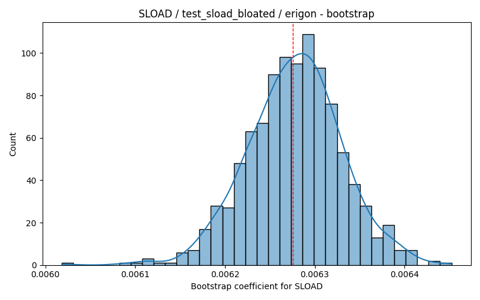

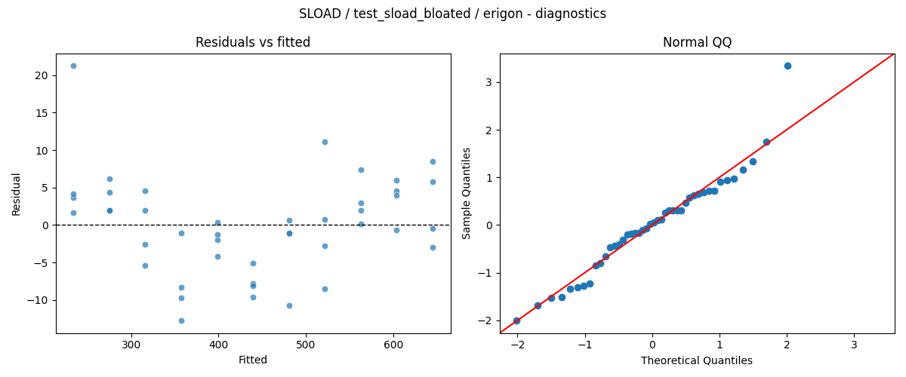

</details>

<details><summary>geth — NNLS regression summary</summary>

```
==============================================================================
                           NNLS Regression Results                            
==============================================================================
Dep. Variable:          test_runtime_ms              R-squared:          0.966
Model:                  NNLS                    Adj. R-squared:          0.966
No. Observations:       77                                RMSE:          87.38
Df Residuals:           75                                 MAE:          70.72
Df Model:               1      
==============================================================================
                      coef     std err     P-value      [0.025      0.975]
------------------------------------------------------------------------------
         const    506.8752     32.4231       0.001    448.7915    569.8368
       opcount      0.0226      0.0006       0.001      0.0216      0.0236
==============================================================================
Notes: Non-negative least squares with bootstrap inference (1000 iterations)
==============================================================================
```

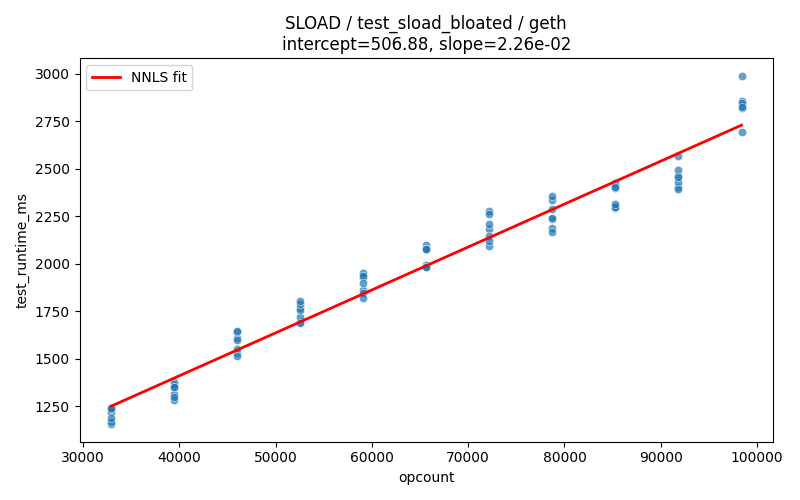

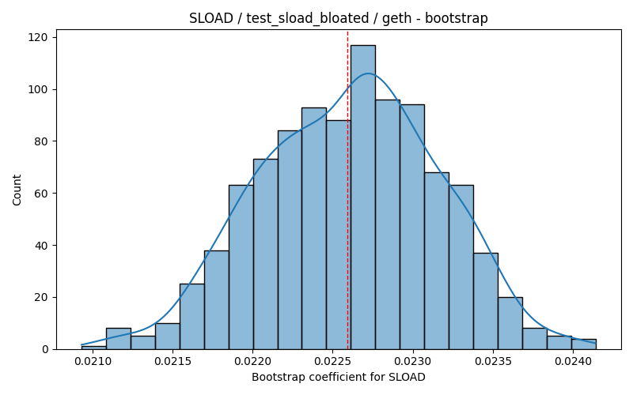

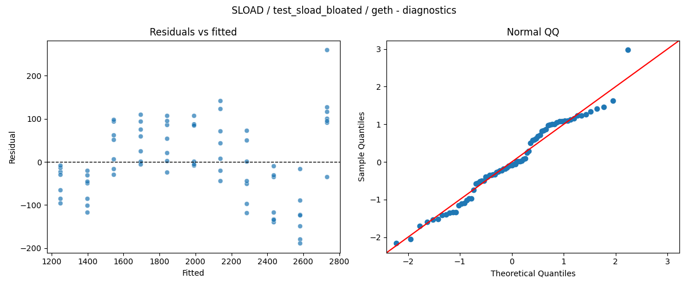

</details>

<details><summary>nethermind — NNLS regression summary</summary>

```
==============================================================================
                           NNLS Regression Results                            
==============================================================================
Dep. Variable:          test_runtime_ms              R-squared:          0.925
Model:                  NNLS                    Adj. R-squared:          0.923
No. Observations:       66                                RMSE:          14.98
Df Residuals:           64                                 MAE:          12.40
Df Model:               1      
==============================================================================
                      coef     std err     P-value      [0.025      0.975]
------------------------------------------------------------------------------
         const     80.6959      5.6129       0.001     69.4851     91.5739
       opcount      0.0025      0.0001       0.001      0.0024      0.0027
==============================================================================
Notes: Non-negative least squares with bootstrap inference (1000 iterations)
==============================================================================
```

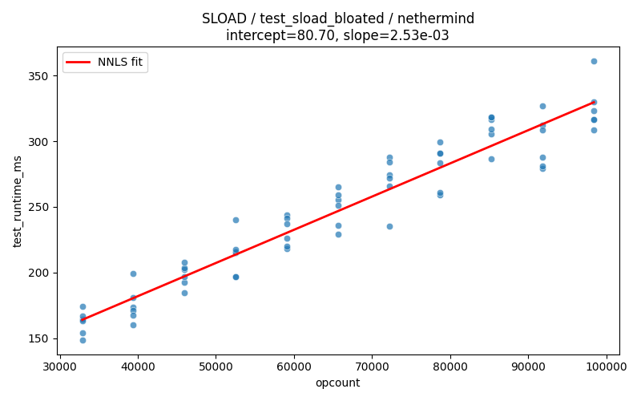

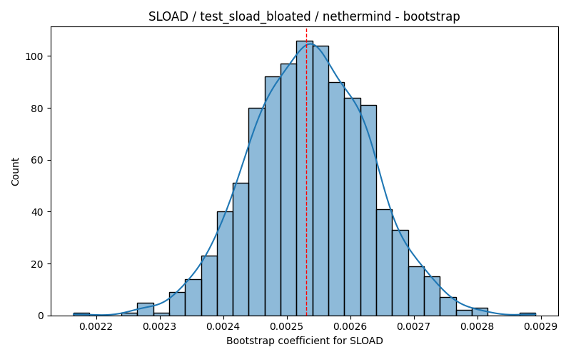

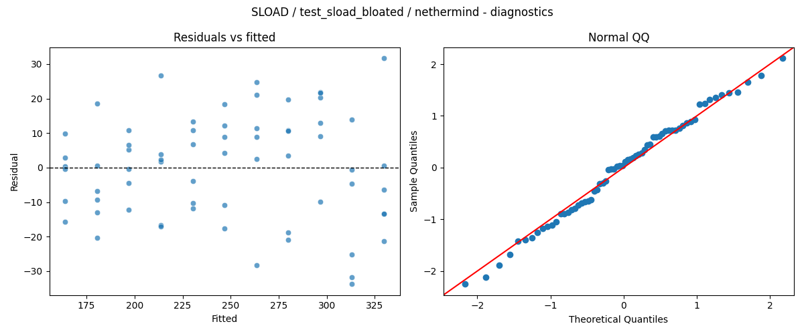

</details>

<details><summary>reth — NNLS regression summary</summary>

```
==============================================================================
                           NNLS Regression Results                            
==============================================================================
Dep. Variable:          test_runtime_ms              R-squared:          0.982
Model:                  NNLS                    Adj. R-squared:          0.982
No. Observations:       44                                RMSE:          12.26
Df Residuals:           42                                 MAE:           9.73
Df Model:               1      
==============================================================================
                      coef     std err     P-value      [0.025      0.975]
------------------------------------------------------------------------------
         const     93.3565      5.1165       0.001     84.1679    103.9778
       opcount      0.0044      0.0001       0.001      0.0042      0.0046
==============================================================================
Notes: Non-negative least squares with bootstrap inference (1000 iterations)
==============================================================================
```

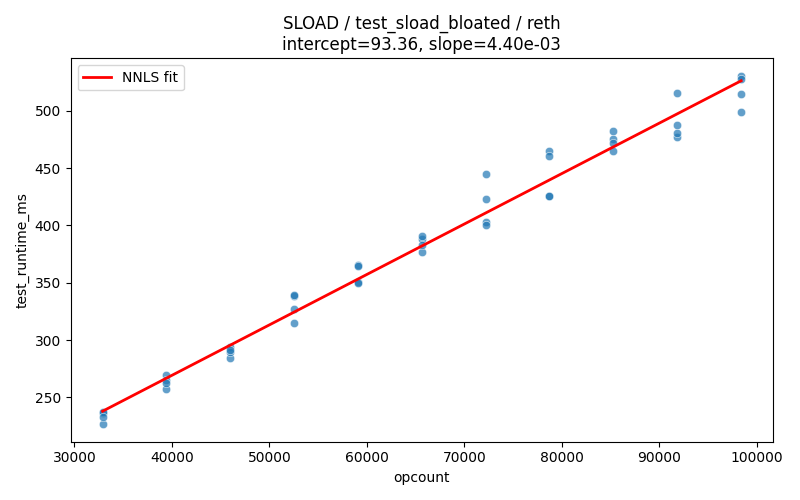

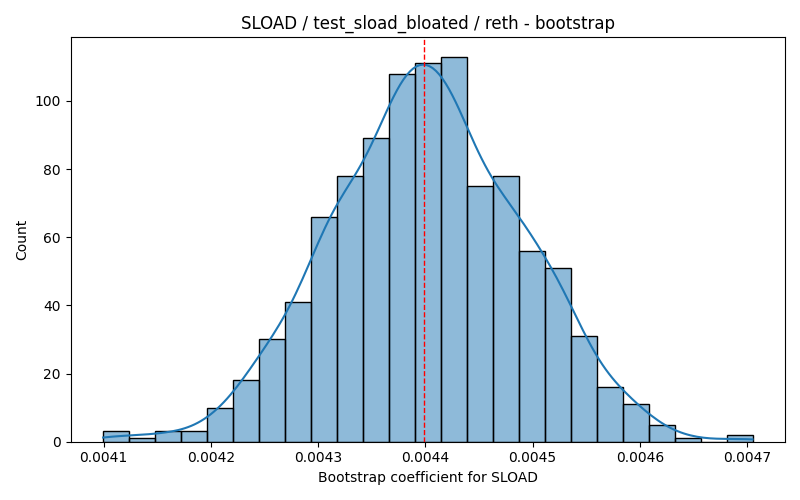

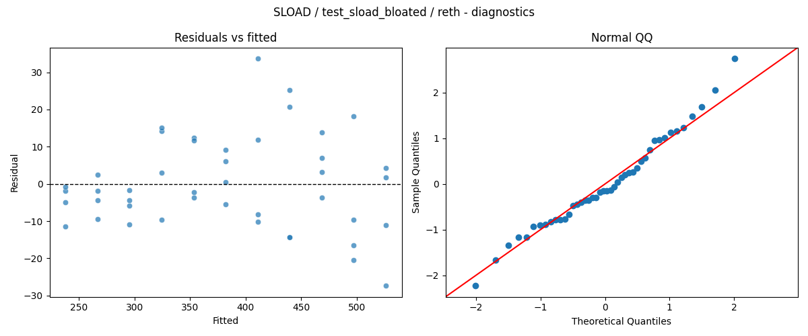

</details>

### test_sload_bloated — combo `True`

| client | nobs | R² | target_coef (ms) | p-value | 95% CI |
| --- | --- | --- | --- | --- | --- |
| `besu` | 55 | 0.9937 | 0.01497 | 1.00e-03 | [0.01458, 0.01534] |
| `erigon` | 44 | 0.997 | 0.006174 | 1.00e-03 | [0.006076, 0.006286] |
| `geth` | 77 | 0.968 | 0.02239 | 1.00e-03 | [0.02138, 0.0233] |
| `nethermind` | 66 | 0.9889 | 0.00774 | 1.00e-03 | [0.007568, 0.00792] |
| `reth` | 44 | 0.9886 | 0.004874 | 1.00e-03 | [0.004706, 0.005049] |

<details><summary>besu — NNLS regression summary</summary>

```
==============================================================================
                           NNLS Regression Results                            
==============================================================================
Dep. Variable:          test_runtime_ms              R-squared:          0.994
Model:                  NNLS                    Adj. R-squared:          0.994
No. Observations:       55                                RMSE:          24.70
Df Residuals:           53                                 MAE:          19.81
Df Model:               1      
==============================================================================
                      coef     std err     P-value      [0.025      0.975]
------------------------------------------------------------------------------
         const    276.0586     14.0609       0.001    250.3476    305.5401
       opcount      0.0150      0.0002       0.001      0.0146      0.0153
==============================================================================
Notes: Non-negative least squares with bootstrap inference (1000 iterations)
==============================================================================
```

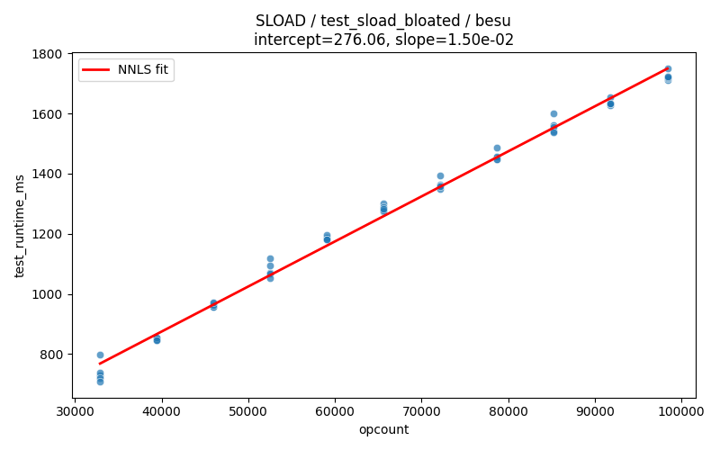

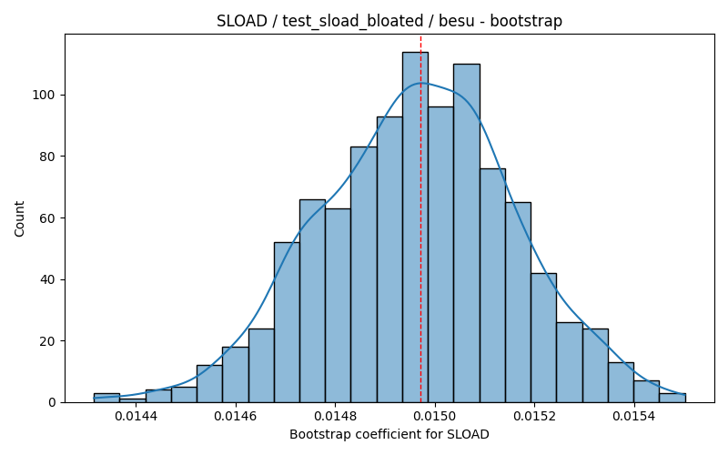

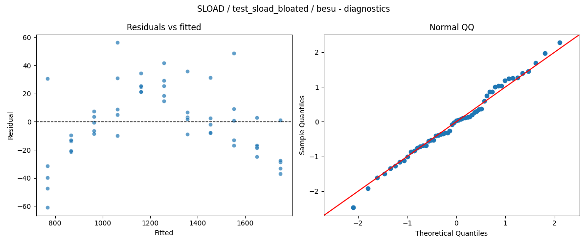

</details>

<details><summary>erigon — NNLS regression summary</summary>

```
==============================================================================
                           NNLS Regression Results                            
==============================================================================
Dep. Variable:          test_runtime_ms              R-squared:          0.997
Model:                  NNLS                    Adj. R-squared:          0.997
No. Observations:       44                                RMSE:           7.01
Df Residuals:           42                                 MAE:           5.73
Df Model:               1      
==============================================================================
                      coef     std err     P-value      [0.025      0.975]
------------------------------------------------------------------------------
         const     15.2712      3.5492       0.001      7.2282     21.3479
       opcount      0.0062      0.0001       0.001      0.0061      0.0063
==============================================================================
Notes: Non-negative least squares with bootstrap inference (1000 iterations)
==============================================================================
```

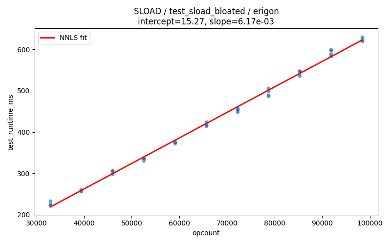

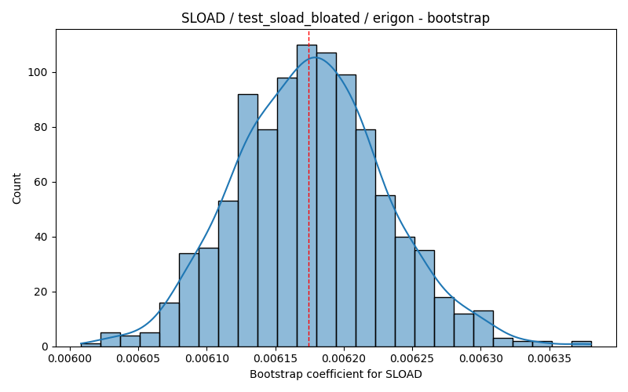

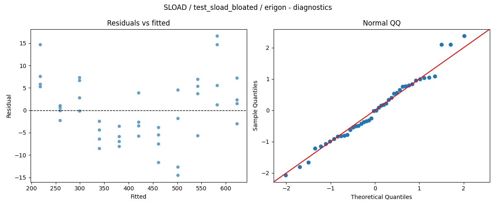

</details>

<details><summary>geth — NNLS regression summary</summary>

```
==============================================================================
                           NNLS Regression Results                            
==============================================================================
Dep. Variable:          test_runtime_ms              R-squared:          0.968
Model:                  NNLS                    Adj. R-squared:          0.968
No. Observations:       77                                RMSE:          84.34
Df Residuals:           75                                 MAE:          70.58
Df Model:               1      
==============================================================================
                      coef     std err     P-value      [0.025      0.975]
------------------------------------------------------------------------------
         const    477.0428     30.6172       0.001    422.7938    540.5684
       opcount      0.0224      0.0005       0.001      0.0214      0.0233
==============================================================================
Notes: Non-negative least squares with bootstrap inference (1000 iterations)
==============================================================================
```

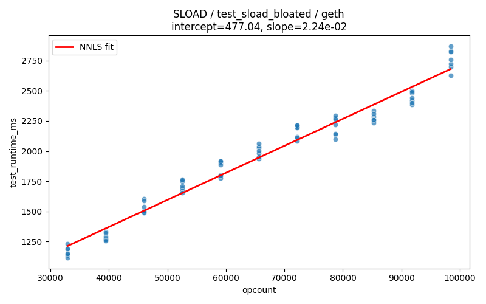

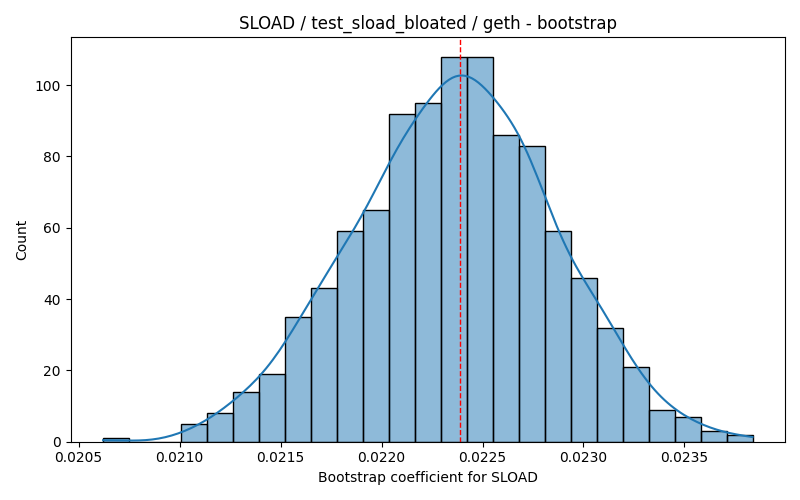

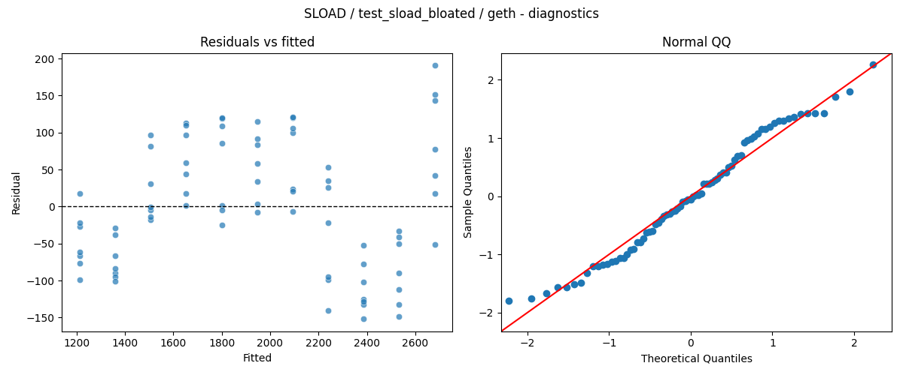

</details>

<details><summary>nethermind — NNLS regression summary</summary>

```
==============================================================================
                           NNLS Regression Results                            
==============================================================================
Dep. Variable:          test_runtime_ms              R-squared:          0.989
Model:                  NNLS                    Adj. R-squared:          0.989
No. Observations:       66                                RMSE:          16.95
Df Residuals:           64                                 MAE:          13.91
Df Model:               1      
==============================================================================
                      coef     std err     P-value      [0.025      0.975]
------------------------------------------------------------------------------
         const     69.5666      5.6382       0.001     58.8075     80.9822
       opcount      0.0077      0.0001       0.001      0.0076      0.0079
==============================================================================
Notes: Non-negative least squares with bootstrap inference (1000 iterations)
==============================================================================
```

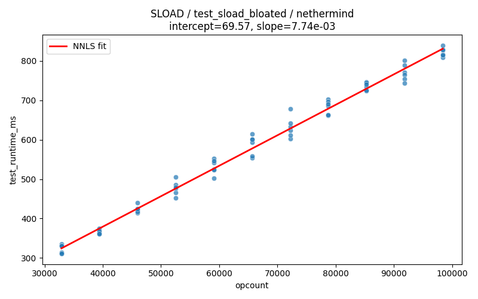

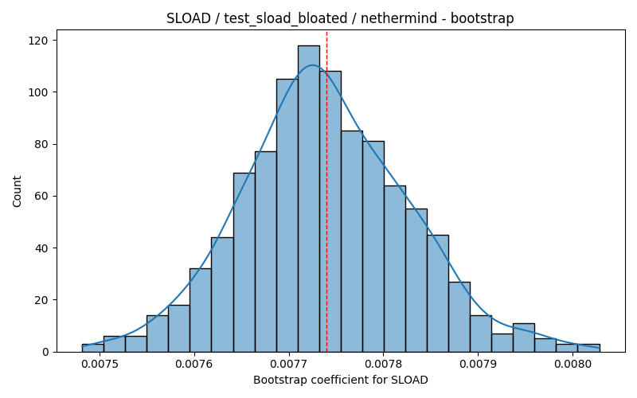

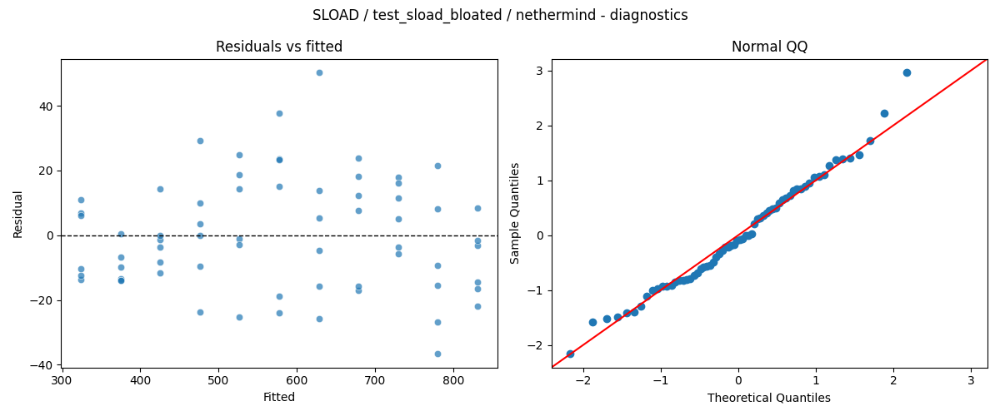

</details>

<details><summary>reth — NNLS regression summary</summary>

```
==============================================================================
                           NNLS Regression Results                            
==============================================================================
Dep. Variable:          test_runtime_ms              R-squared:          0.989
Model:                  NNLS                    Adj. R-squared:          0.988
No. Observations:       44                                RMSE:          10.84
Df Residuals:           42                                 MAE:           8.44
Df Model:               1      
==============================================================================
                      coef     std err     P-value      [0.025      0.975]
------------------------------------------------------------------------------
         const     76.5576      5.2102       0.001     66.2265     86.6994
       opcount      0.0049      0.0001       0.001      0.0047      0.0050
==============================================================================
Notes: Non-negative least squares with bootstrap inference (1000 iterations)
==============================================================================
```

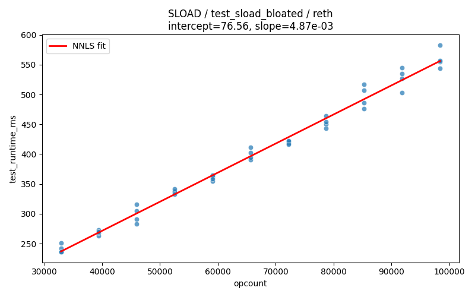

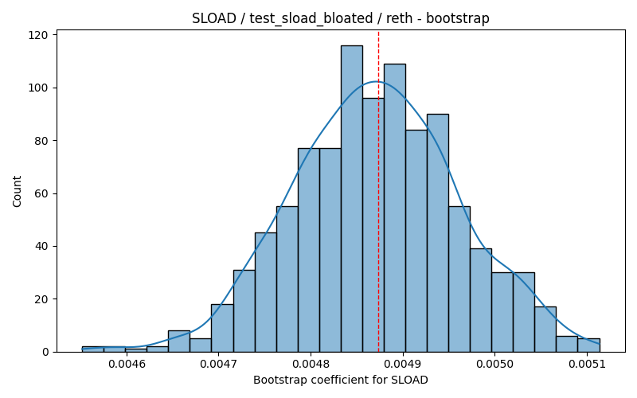

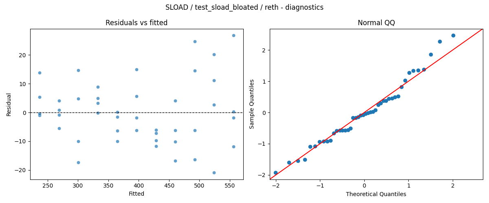

</details>

### test_sload_same_key_benchmark

| client | nobs | R² | target_coef (ms) | p-value | 95% CI |
| --- | --- | --- | --- | --- | --- |
| `besu` | 110 | 0.8542 | 8.053e-05 | 1.00e-03 | [7.434e-05, 8.638e-05] |
| `erigon` | 88 | 0.6911 | 1.227e-05 | 1.00e-03 | [1.052e-05, 1.417e-05] |
| `geth` | 154 | 0.8369 | 4.447e-05 | 1.00e-03 | [4.098e-05, 4.814e-05] |
| `nethermind` | 132 | 0.5609 | 0.0001245 | 1.00e-03 | [0.000107, 0.0001419] |
| `reth` | 88 | 0.5693 | 7.327e-06 | 1.00e-03 | [6.111e-06, 8.509e-06] |

<details><summary>besu — NNLS regression summary</summary>

```
==============================================================================
                           NNLS Regression Results                            
==============================================================================
Dep. Variable:          test_runtime_ms              R-squared:          0.854
Model:                  NNLS                    Adj. R-squared:          0.853
No. Observations:       110                               RMSE:          21.02
Df Residuals:           108                                MAE:          15.91
Df Model:               1      
==============================================================================
                      coef     std err     P-value      [0.025      0.975]
------------------------------------------------------------------------------
         const     86.8005      6.0000       0.001     76.0270     98.9198
       opcount      0.0001      0.0000       0.001      0.0001      0.0001
==============================================================================
Notes: Non-negative least squares with bootstrap inference (1000 iterations)
==============================================================================
```

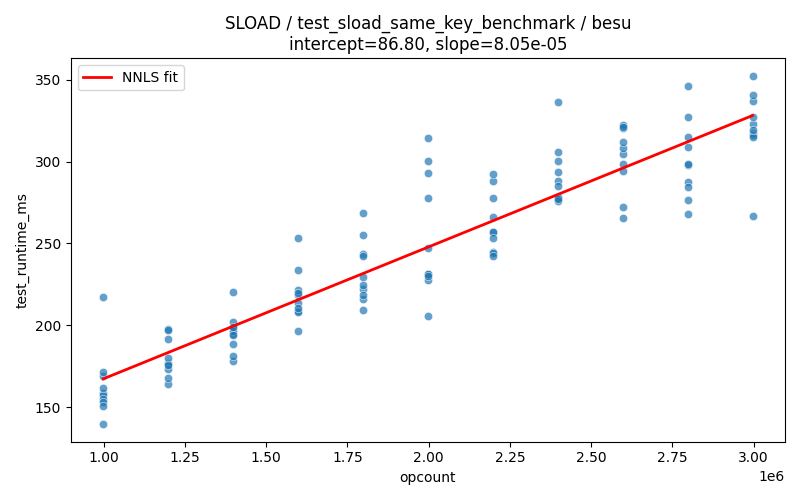


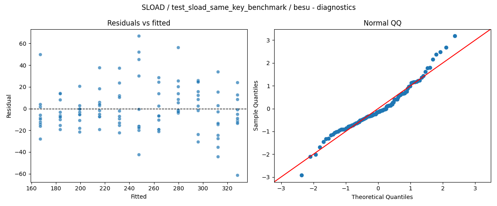

</details>

<details><summary>erigon — NNLS regression summary</summary>

```
==============================================================================
                           NNLS Regression Results                            
==============================================================================
Dep. Variable:          test_runtime_ms              R-squared:          0.691
Model:                  NNLS                    Adj. R-squared:          0.688
No. Observations:       88                                RMSE:           5.18
Df Residuals:           86                                 MAE:           4.21
Df Model:               1      
==============================================================================
                      coef     std err     P-value      [0.025      0.975]
------------------------------------------------------------------------------
         const     29.2293      1.8825       0.001     25.5176     32.9404
       opcount      0.0000      0.0000       0.001      0.0000      0.0000
==============================================================================
Notes: Non-negative least squares with bootstrap inference (1000 iterations)
==============================================================================
```

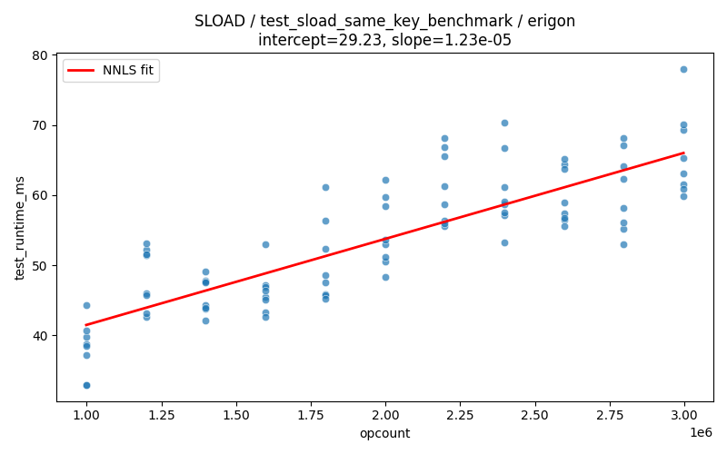

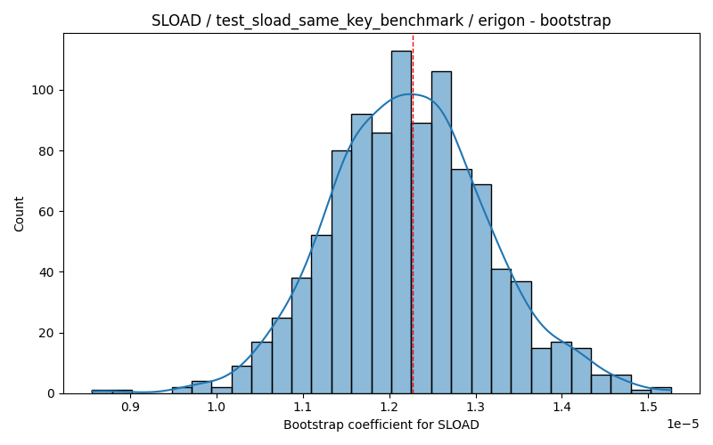

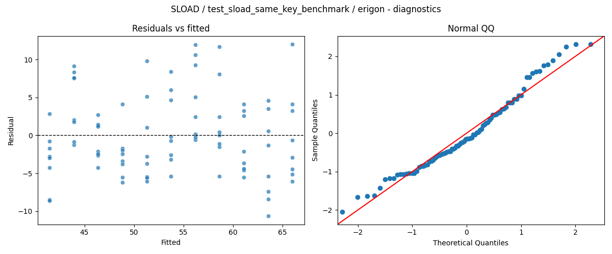

</details>

<details><summary>geth — NNLS regression summary</summary>

```
==============================================================================
                           NNLS Regression Results                            
==============================================================================
Dep. Variable:          test_runtime_ms              R-squared:          0.837
Model:                  NNLS                    Adj. R-squared:          0.836
No. Observations:       154                               RMSE:          12.40
Df Residuals:           152                                MAE:           9.19
Df Model:               1      
==============================================================================
                      coef     std err     P-value      [0.025      0.975]
------------------------------------------------------------------------------
         const     25.2103      3.2489       0.001     18.5608     31.2595
       opcount      0.0000      0.0000       0.001      0.0000      0.0000
==============================================================================
Notes: Non-negative least squares with bootstrap inference (1000 iterations)
==============================================================================
```

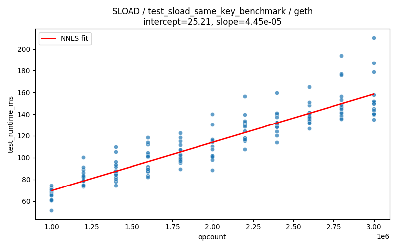

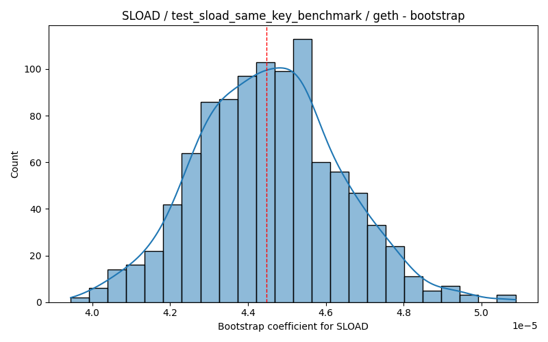

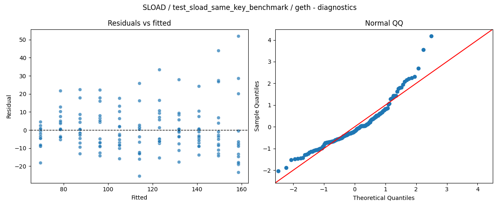

</details>

<details><summary>nethermind — NNLS regression summary</summary>

```
==============================================================================
                           NNLS Regression Results                            
==============================================================================
Dep. Variable:          test_runtime_ms              R-squared:          0.561
Model:                  NNLS                    Adj. R-squared:          0.558
No. Observations:       132                               RMSE:          69.62
Df Residuals:           130                                MAE:          57.09
Df Model:               1      
==============================================================================
                      coef     std err     P-value      [0.025      0.975]
------------------------------------------------------------------------------
         const    143.4538     20.1323       0.001    103.9225    181.8170
       opcount      0.0001      0.0000       0.001      0.0001      0.0001
==============================================================================
Notes: Non-negative least squares with bootstrap inference (1000 iterations)
==============================================================================
```

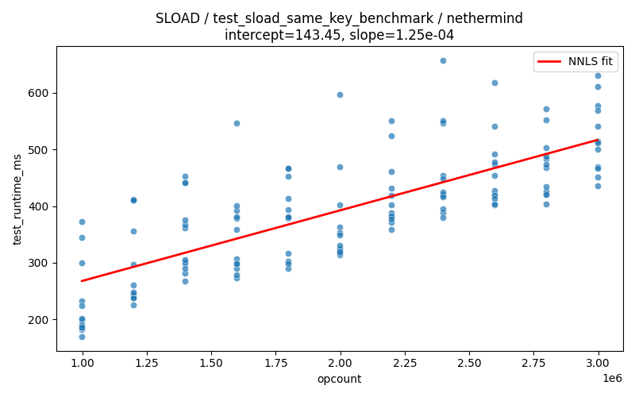

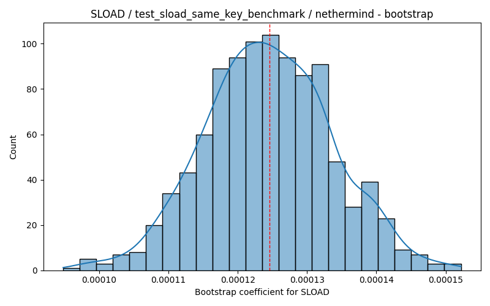

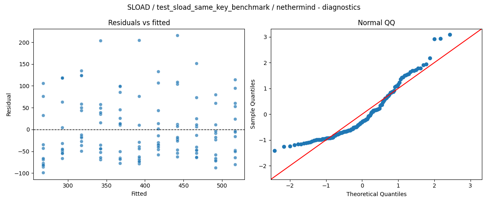

</details>

<details><summary>reth — NNLS regression summary</summary>

```
==============================================================================
                           NNLS Regression Results                            
==============================================================================
Dep. Variable:          test_runtime_ms              R-squared:          0.569
Model:                  NNLS                    Adj. R-squared:          0.564
No. Observations:       88                                RMSE:           4.03
Df Residuals:           86                                 MAE:           3.32
Df Model:               1      
==============================================================================
                      coef     std err     P-value      [0.025      0.975]
------------------------------------------------------------------------------
         const      8.8364      1.2817       0.001      6.4244     11.2855
       opcount      0.0000      0.0000       0.001      0.0000      0.0000
==============================================================================
Notes: Non-negative least squares with bootstrap inference (1000 iterations)
==============================================================================
```

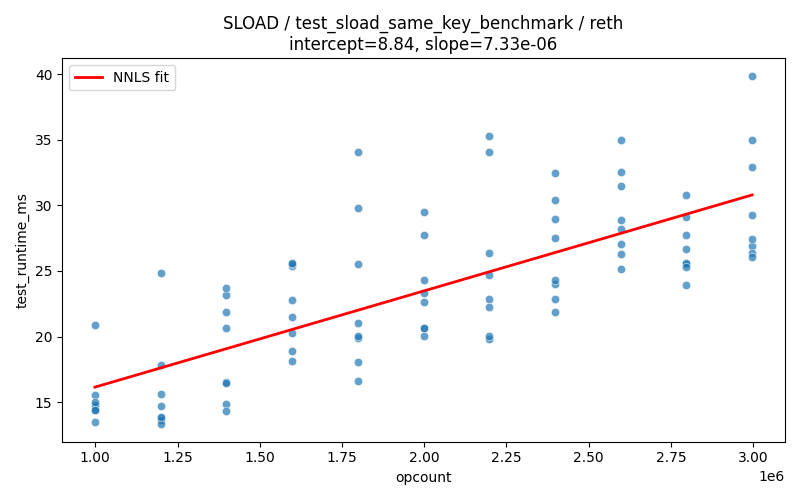

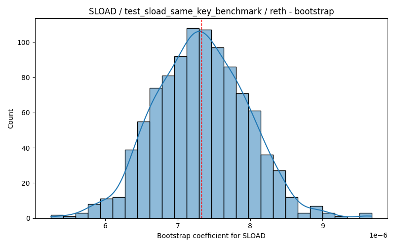

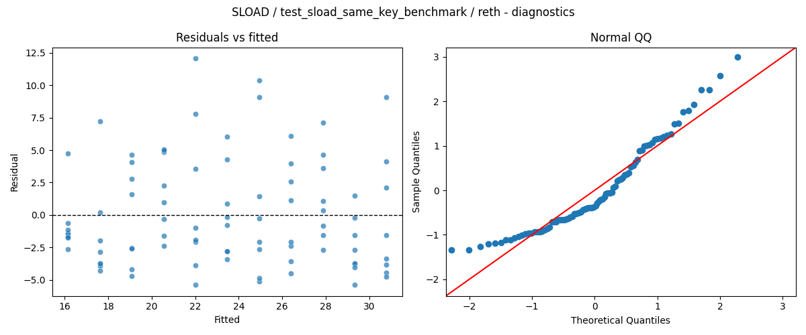

</details>

## SSTORE

### test_sstore_bloated — combo `False` — `presets[cold_storage_sstore_access]`

| client | nobs | R² | target_coef (ms) | p-value | 95% CI |
| --- | --- | --- | --- | --- | --- |
| `besu` | 55 | 0.9882 | 0.008124 | 1.00e-03 | [0.007919, 0.0083] |
| `erigon` | 44 | 0.9972 | 0.006311 | 1.00e-03 | [0.006198, 0.006426] |
| `geth` | 77 | 0.9663 | 0.02267 | 1.00e-03 | [0.02155, 0.02367] |
| `nethermind` | 66 | 0.9141 | 0.00252 | 1.00e-03 | [0.002341, 0.002714] |
| `reth` | 44 | 0.9866 | 0.004512 | 1.00e-03 | [0.004356, 0.00467] |

<details><summary>besu — NNLS regression summary</summary>

```
==============================================================================
                           NNLS Regression Results                            
==============================================================================
Dep. Variable:          test_runtime_ms              R-squared:          0.988
Model:                  NNLS                    Adj. R-squared:          0.988
No. Observations:       55                                RMSE:          18.50
Df Residuals:           53                                 MAE:          13.66
Df Model:               1      
==============================================================================
                      coef     std err     P-value      [0.025      0.975]
------------------------------------------------------------------------------
         const    172.9170      7.6218       0.001    159.3437    189.1468
       opcount      0.0081      0.0001       0.001      0.0079      0.0083
==============================================================================
Notes: Non-negative least squares with bootstrap inference (1000 iterations)
==============================================================================
```

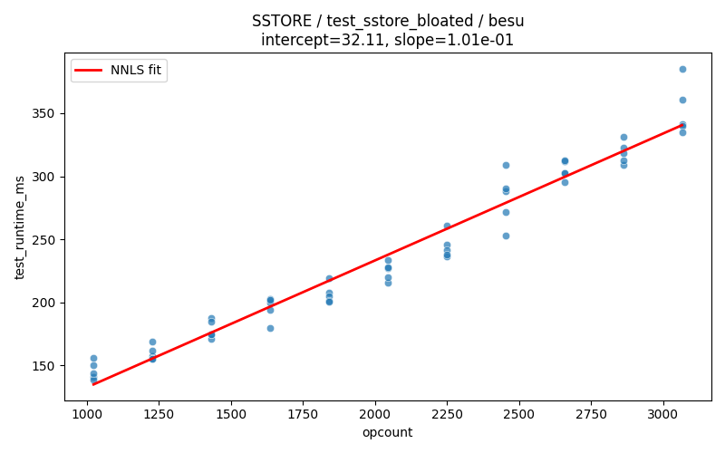

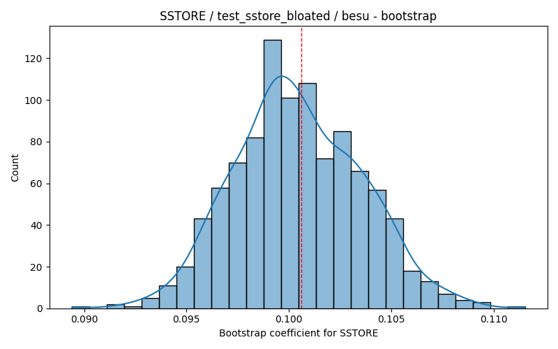

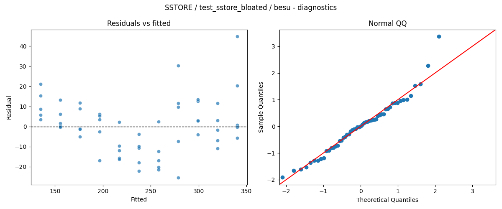

</details>

<details><summary>erigon — NNLS regression summary</summary>

```
==============================================================================
                           NNLS Regression Results                            
==============================================================================
Dep. Variable:          test_runtime_ms              R-squared:          0.997
Model:                  NNLS                    Adj. R-squared:          0.997
No. Observations:       44                                RMSE:           6.98
Df Residuals:           42                                 MAE:           5.46
Df Model:               1      
==============================================================================
                      coef     std err     P-value      [0.025      0.975]
------------------------------------------------------------------------------
         const     17.7246      3.6432       0.001      9.3438     24.2962
       opcount      0.0063      0.0001       0.001      0.0062      0.0064
==============================================================================
Notes: Non-negative least squares with bootstrap inference (1000 iterations)
==============================================================================
```


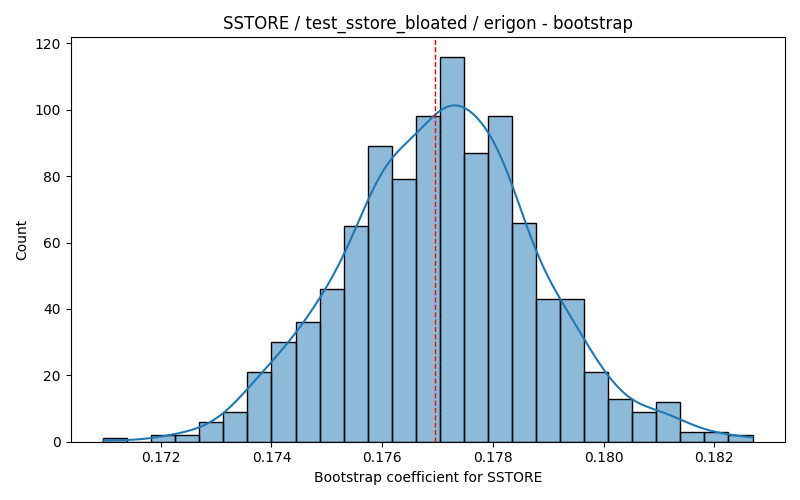

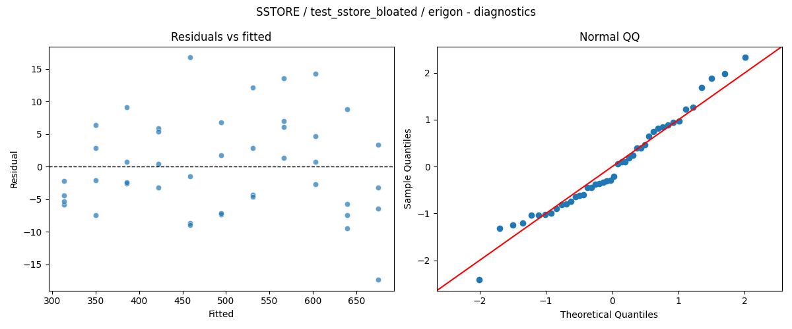

</details>

<details><summary>geth — NNLS regression summary</summary>

```
==============================================================================
                           NNLS Regression Results                            
==============================================================================
Dep. Variable:          test_runtime_ms              R-squared:          0.966
Model:                  NNLS                    Adj. R-squared:          0.966
No. Observations:       77                                RMSE:          88.21
Df Residuals:           75                                 MAE:          70.89
Df Model:               1      
==============================================================================
                      coef     std err     P-value      [0.025      0.975]
------------------------------------------------------------------------------
         const    459.4614     32.2767       0.001    399.3737    526.8668
       opcount      0.0227      0.0005       0.001      0.0215      0.0237
==============================================================================
Notes: Non-negative least squares with bootstrap inference (1000 iterations)
==============================================================================
```

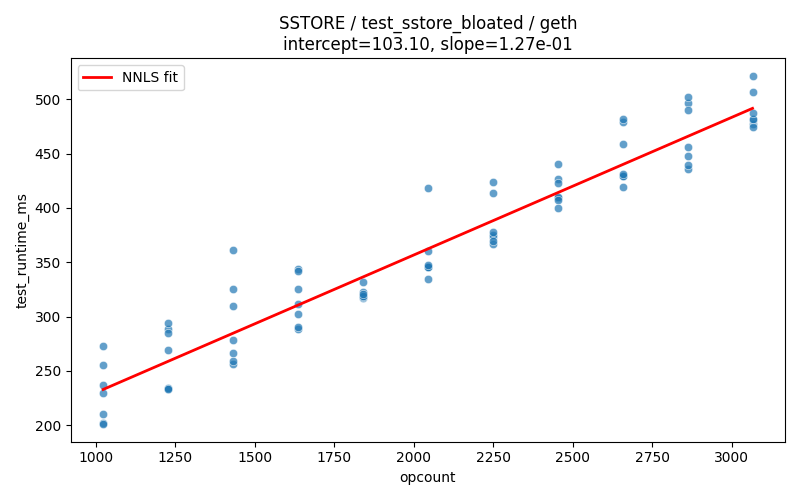

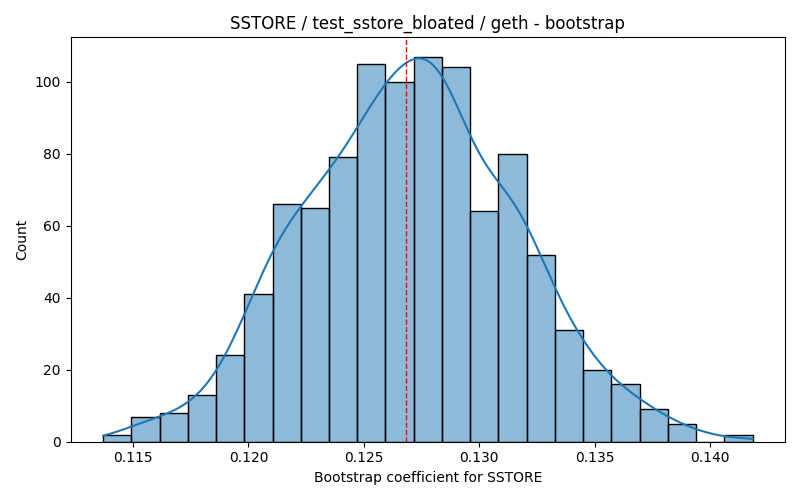

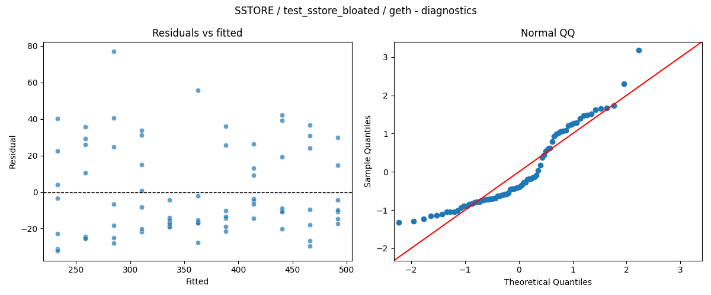

</details>

<details><summary>nethermind — NNLS regression summary</summary>

```
==============================================================================
                           NNLS Regression Results                            
==============================================================================
Dep. Variable:          test_runtime_ms              R-squared:          0.914
Model:                  NNLS                    Adj. R-squared:          0.913
No. Observations:       66                                RMSE:          16.09
Df Residuals:           64                                 MAE:          13.29
Df Model:               1      
==============================================================================
                      coef     std err     P-value      [0.025      0.975]
------------------------------------------------------------------------------
         const     77.4314      5.3863       0.001     66.6135     87.4790
       opcount      0.0025      0.0001       0.001      0.0023      0.0027
==============================================================================
Notes: Non-negative least squares with bootstrap inference (1000 iterations)
==============================================================================
```

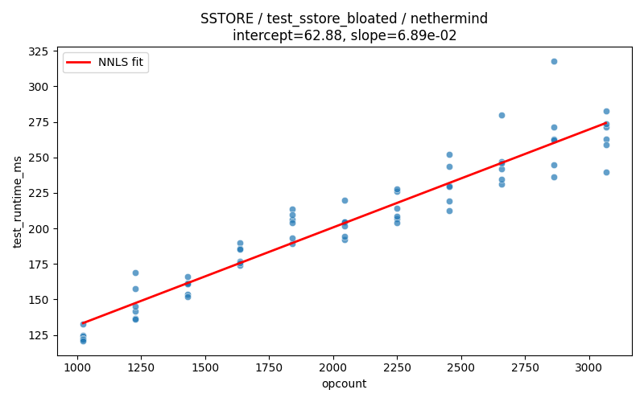

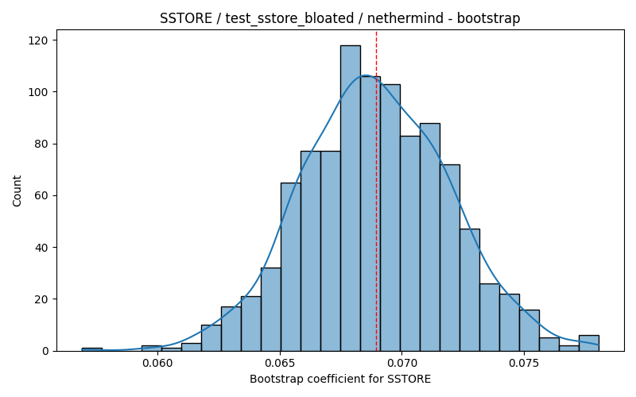

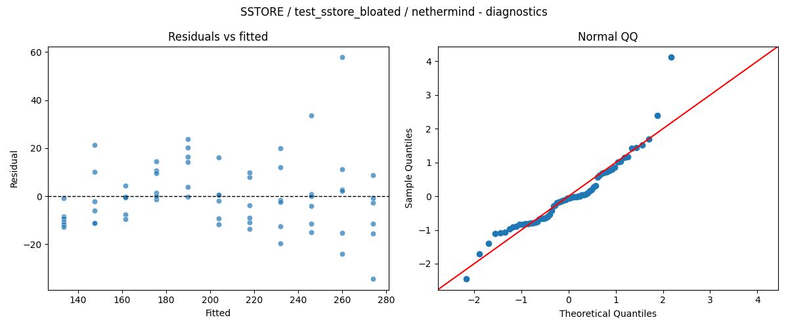

</details>

<details><summary>reth — NNLS regression summary</summary>

```
==============================================================================
                           NNLS Regression Results                            
==============================================================================
Dep. Variable:          test_runtime_ms              R-squared:          0.987
Model:                  NNLS                    Adj. R-squared:          0.986
No. Observations:       44                                RMSE:          10.93
Df Residuals:           42                                 MAE:           9.36
Df Model:               1      
==============================================================================
                      coef     std err     P-value      [0.025      0.975]
------------------------------------------------------------------------------
         const     87.4273      5.1269       0.001     77.3589     97.2508
       opcount      0.0045      0.0001       0.001      0.0044      0.0047
==============================================================================
Notes: Non-negative least squares with bootstrap inference (1000 iterations)
==============================================================================
```

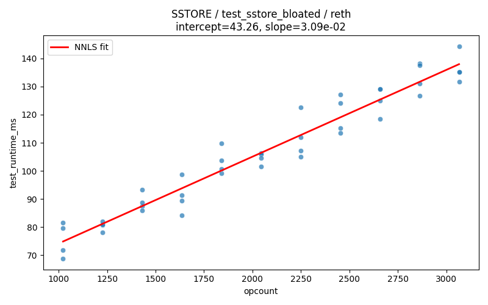

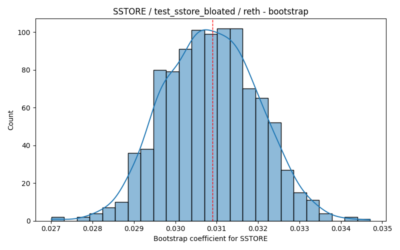

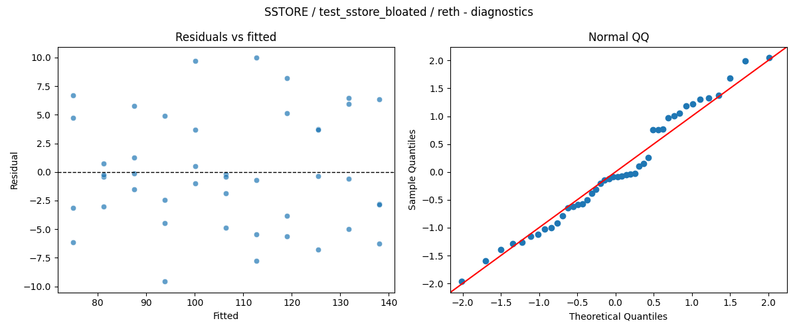

</details>

### test_sstore_bloated — combo `True` — `presets[cold_storage_sstore_access]`

| client | nobs | R² | target_coef (ms) | p-value | 95% CI |
| --- | --- | --- | --- | --- | --- |
| `besu` | 55 | 0.99 | 0.016 | 1.00e-03 | [0.01552, 0.01655] |
| `erigon` | 44 | 0.9971 | 0.006149 | 1.00e-03 | [0.006056, 0.006243] |
| `geth` | 77 | 0.9722 | 0.02144 | 1.00e-03 | [0.02057, 0.02226] |
| `nethermind` | 66 | 0.9885 | 0.007716 | 1.00e-03 | [0.007537, 0.007906] |
| `reth` | 44 | 0.982 | 0.004697 | 1.00e-03 | [0.004484, 0.004931] |

<details><summary>besu — NNLS regression summary</summary>

```
==============================================================================
                           NNLS Regression Results                            
==============================================================================
Dep. Variable:          test_runtime_ms              R-squared:          0.990
Model:                  NNLS                    Adj. R-squared:          0.990
No. Observations:       55                                RMSE:          33.42
Df Residuals:           53                                 MAE:          25.41
Df Model:               1      
==============================================================================
                      coef     std err     P-value      [0.025      0.975]
------------------------------------------------------------------------------
         const    279.8339     15.8390       0.001    249.0779    311.7682
       opcount      0.0160      0.0003       0.001      0.0155      0.0165
==============================================================================
Notes: Non-negative least squares with bootstrap inference (1000 iterations)
==============================================================================
```

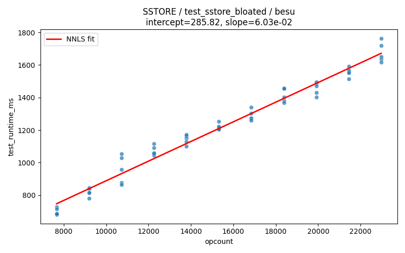

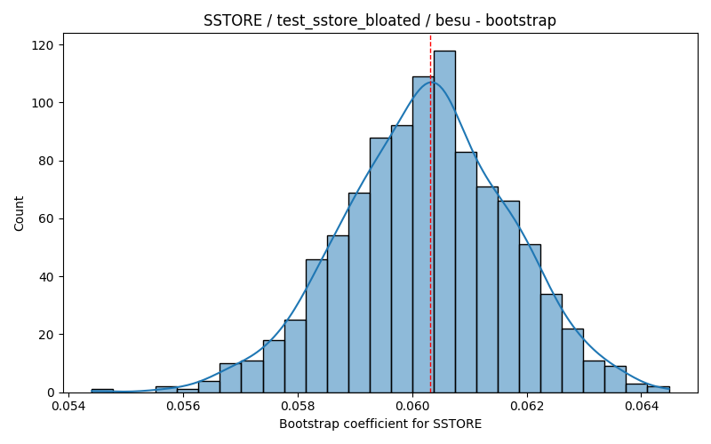

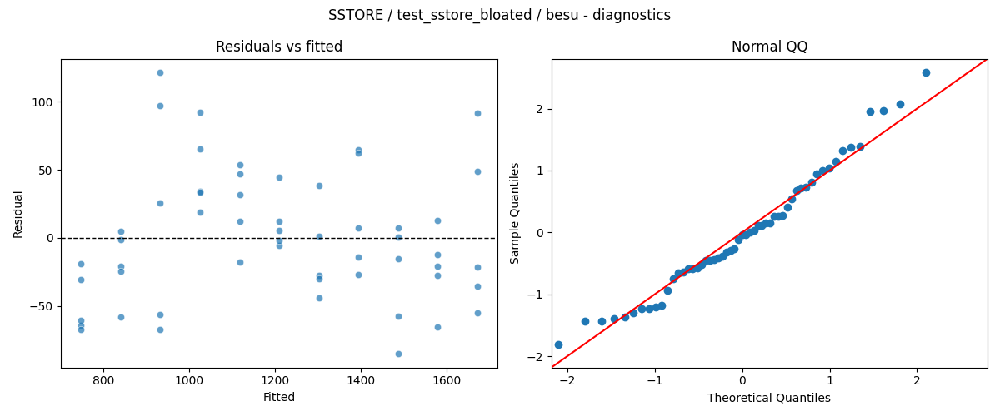

</details>

<details><summary>erigon — NNLS regression summary</summary>

```
==============================================================================
                           NNLS Regression Results                            
==============================================================================
Dep. Variable:          test_runtime_ms              R-squared:          0.997
Model:                  NNLS                    Adj. R-squared:          0.997
No. Observations:       44                                RMSE:           6.91
Df Residuals:           42                                 MAE:           5.94
Df Model:               1      
==============================================================================
                      coef     std err     P-value      [0.025      0.975]
------------------------------------------------------------------------------
         const     12.1971      3.1745       0.001      5.4414     17.5607
       opcount      0.0061      0.0000       0.001      0.0061      0.0062
==============================================================================
Notes: Non-negative least squares with bootstrap inference (1000 iterations)
==============================================================================
```


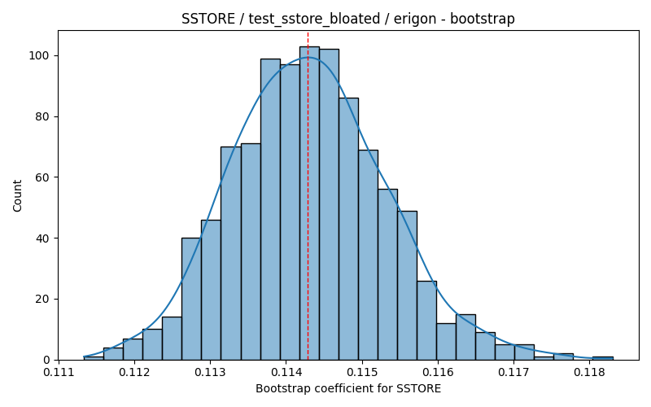

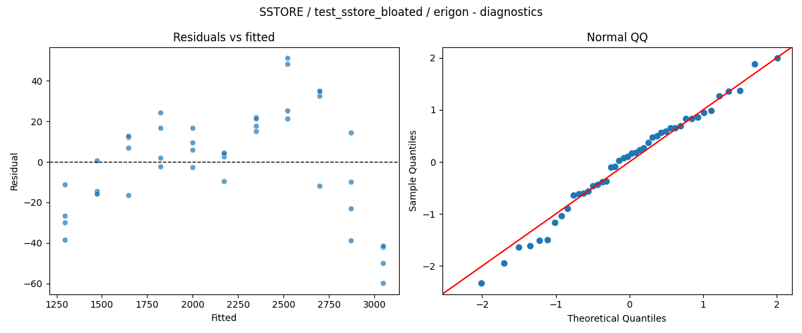

</details>

<details><summary>geth — NNLS regression summary</summary>

```
==============================================================================
                           NNLS Regression Results                            
==============================================================================
Dep. Variable:          test_runtime_ms              R-squared:          0.972
Model:                  NNLS                    Adj. R-squared:          0.972
No. Observations:       77                                RMSE:          75.41
Df Residuals:           75                                 MAE:          66.47
Df Model:               1      
==============================================================================
                      coef     std err     P-value      [0.025      0.975]
------------------------------------------------------------------------------
         const    490.0544     28.1905       0.001    439.3772    548.4777
       opcount      0.0214      0.0004       0.001      0.0206      0.0223
==============================================================================
Notes: Non-negative least squares with bootstrap inference (1000 iterations)
==============================================================================
```

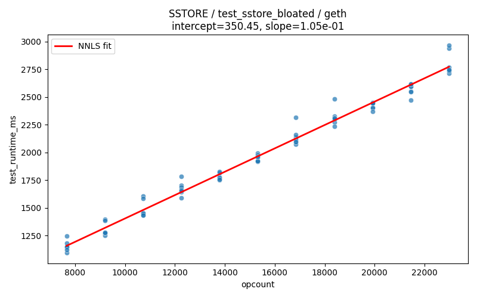

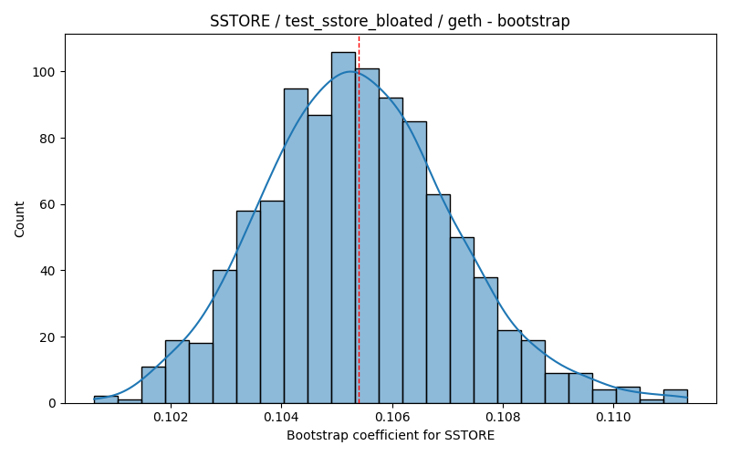

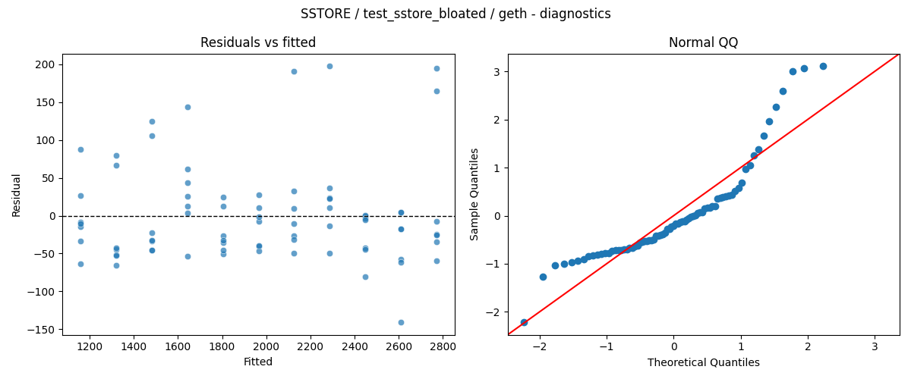

</details>

<details><summary>nethermind — NNLS regression summary</summary>

```
==============================================================================
                           NNLS Regression Results                            
==============================================================================
Dep. Variable:          test_runtime_ms              R-squared:          0.989
Model:                  NNLS                    Adj. R-squared:          0.988
No. Observations:       66                                RMSE:          17.29
Df Residuals:           64                                 MAE:          14.08
Df Model:               1      
==============================================================================
                      coef     std err     P-value      [0.025      0.975]
------------------------------------------------------------------------------
         const     59.5973      5.7282       0.001     48.9022     71.0347
       opcount      0.0077      0.0001       0.001      0.0075      0.0079
==============================================================================
Notes: Non-negative least squares with bootstrap inference (1000 iterations)
==============================================================================
```

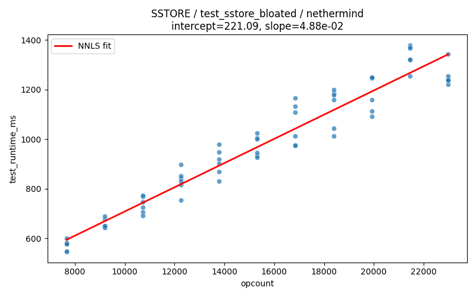

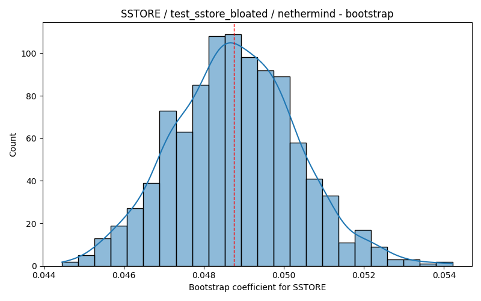

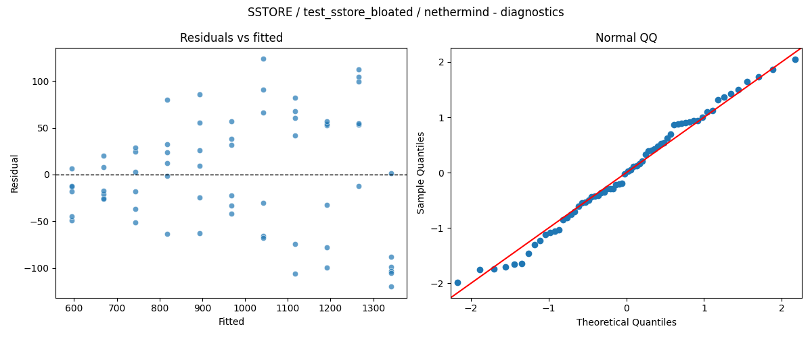

</details>

<details><summary>reth — NNLS regression summary</summary>

```
==============================================================================
                           NNLS Regression Results                            
==============================================================================
Dep. Variable:          test_runtime_ms              R-squared:          0.982
Model:                  NNLS                    Adj. R-squared:          0.982
No. Observations:       44                                RMSE:          13.23
Df Residuals:           42                                 MAE:          10.36
Df Model:               1      
==============================================================================
                      coef     std err     P-value      [0.025      0.975]
------------------------------------------------------------------------------
         const     90.5739      6.3644       0.001     77.6906    102.8629
       opcount      0.0047      0.0001       0.001      0.0045      0.0049
==============================================================================
Notes: Non-negative least squares with bootstrap inference (1000 iterations)
==============================================================================
```

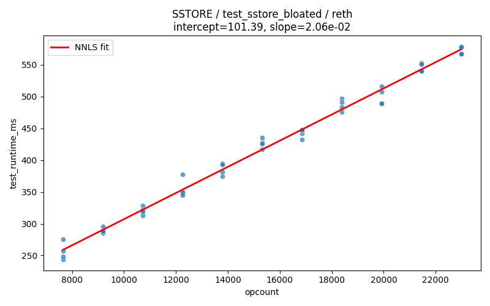

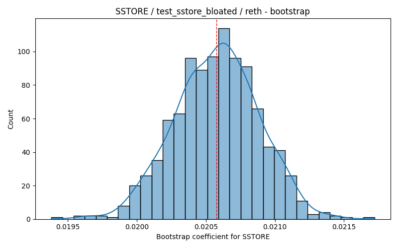

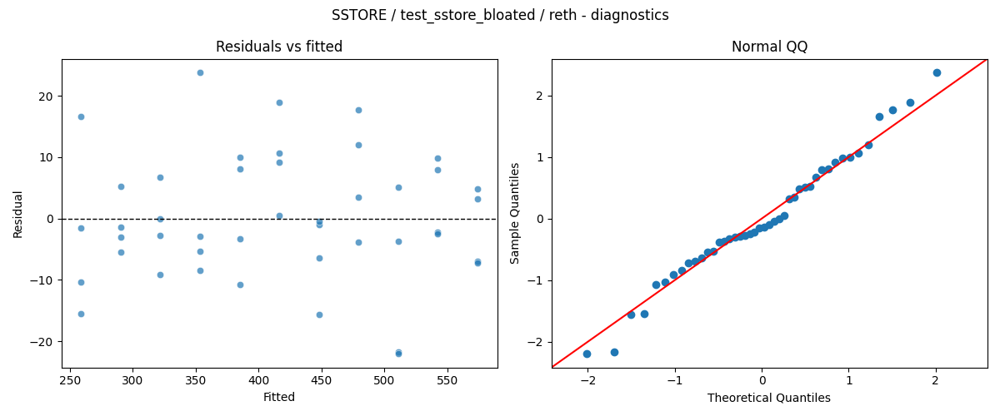

</details>

### test_sstore_bloated — combo `False` — `presets[cold_storage_sstore_write]`

| client | nobs | R² | target_coef (ms) | p-value | 95% CI |
| --- | --- | --- | --- | --- | --- |
| `besu` | 55 | 0.9597 | 0.1006 | 1.00e-03 | [0.0948, 0.1067] |
| `erigon` | 44 | 0.9961 | 0.177 | 1.00e-03 | [0.1737, 0.1807] |
| `geth` | 77 | 0.9198 | 0.1268 | 1.00e-03 | [0.1184, 0.1363] |
| `nethermind` | 66 | 0.9095 | 0.06893 | 1.00e-03 | [0.06303, 0.07487] |
| `reth` | 44 | 0.9438 | 0.0309 | 1.00e-03 | [0.02885, 0.03297] |

<details><summary>besu — NNLS regression summary</summary>

```
==============================================================================
                           NNLS Regression Results                            
==============================================================================
Dep. Variable:          test_runtime_ms              R-squared:          0.960
Model:                  NNLS                    Adj. R-squared:          0.959
No. Observations:       55                                RMSE:          13.31
Df Residuals:           53                                 MAE:          10.16
Df Model:               1      
==============================================================================
                      coef     std err     P-value      [0.025      0.975]
------------------------------------------------------------------------------
         const     32.1094      5.8180       0.001     20.1788     42.6217
       opcount      0.1006      0.0031       0.001      0.0948      0.1067
==============================================================================
Notes: Non-negative least squares with bootstrap inference (1000 iterations)
==============================================================================
```


</details>

<details><summary>erigon — NNLS regression summary</summary>

```
==============================================================================
                           NNLS Regression Results                            
==============================================================================
Dep. Variable:          test_runtime_ms              R-squared:          0.996
Model:                  NNLS                    Adj. R-squared:          0.996
No. Observations:       44                                RMSE:           7.19
Df Residuals:           42                                 MAE:           5.93
Df Model:               1      
==============================================================================
                      coef     std err     P-value      [0.025      0.975]
------------------------------------------------------------------------------
         const    132.8173      3.3595       0.001    126.2493    139.9664
       opcount      0.1770      0.0017       0.001      0.1737      0.1807
==============================================================================
Notes: Non-negative least squares with bootstrap inference (1000 iterations)
==============================================================================
```


</details>

<details><summary>geth — NNLS regression summary</summary>

```
==============================================================================
                           NNLS Regression Results                            
==============================================================================
Dep. Variable:          test_runtime_ms              R-squared:          0.920
Model:                  NNLS                    Adj. R-squared:          0.919
No. Observations:       77                                RMSE:          24.19
Df Residuals:           75                                 MAE:          20.62
Df Model:               1      
==============================================================================
                      coef     std err     P-value      [0.025      0.975]
------------------------------------------------------------------------------
         const    103.0967     10.3486       0.001     82.0024    121.7863
       opcount      0.1268      0.0046       0.001      0.1184      0.1363
==============================================================================
Notes: Non-negative least squares with bootstrap inference (1000 iterations)
==============================================================================
```


</details>

<details><summary>nethermind — NNLS regression summary</summary>

```
==============================================================================
                           NNLS Regression Results                            
==============================================================================
Dep. Variable:          test_runtime_ms              R-squared:          0.910
Model:                  NNLS                    Adj. R-squared:          0.908
No. Observations:       66                                RMSE:          14.04
Df Residuals:           64                                 MAE:          10.14
Df Model:               1      
==============================================================================
                      coef     std err     P-value      [0.025      0.975]
------------------------------------------------------------------------------
         const     62.8811      5.4592       0.001     52.5384     74.1199
       opcount      0.0689      0.0030       0.001      0.0630      0.0749
==============================================================================
Notes: Non-negative least squares with bootstrap inference (1000 iterations)
==============================================================================
```


</details>

<details><summary>reth — NNLS regression summary</summary>

```
==============================================================================
                           NNLS Regression Results                            
==============================================================================
Dep. Variable:          test_runtime_ms              R-squared:          0.944
Model:                  NNLS                    Adj. R-squared:          0.942
No. Observations:       44                                RMSE:           4.87
Df Residuals:           42                                 MAE:           3.98
Df Model:               1      
==============================================================================
                      coef     std err     P-value      [0.025      0.975]
------------------------------------------------------------------------------
         const     43.2584      2.3018       0.001     38.7638     47.7479
       opcount      0.0309      0.0011       0.001      0.0289      0.0330
==============================================================================
Notes: Non-negative least squares with bootstrap inference (1000 iterations)
==============================================================================
```


</details>

### test_sstore_bloated — combo `True` — `presets[cold_storage_sstore_write]`

| client | nobs | R² | target_coef (ms) | p-value | 95% CI |
| --- | --- | --- | --- | --- | --- |
| `besu` | 55 | 0.9748 | 0.06032 | 1.00e-03 | [0.05732, 0.06296] |
| `erigon` | 44 | 0.9979 | 0.1143 | 1.00e-03 | [0.1124, 0.1164] |
| `geth` | 77 | 0.9847 | 0.1054 | 1.00e-03 | [0.1022, 0.1091] |
| `nethermind` | 66 | 0.9386 | 0.04876 | 1.00e-03 | [0.04583, 0.05203] |
| `reth` | 44 | 0.99 | 0.02058 | 1.00e-03 | [0.01998, 0.02114] |

<details><summary>besu — NNLS regression summary</summary>

```
==============================================================================
                           NNLS Regression Results                            
==============================================================================
Dep. Variable:          test_runtime_ms              R-squared:          0.975
Model:                  NNLS                    Adj. R-squared:          0.974
No. Observations:       55                                RMSE:          46.95
Df Residuals:           53                                 MAE:          37.64
Df Model:               1      
==============================================================================
                      coef     std err     P-value      [0.025      0.975]
------------------------------------------------------------------------------
         const    285.8231     24.3514       0.001    242.9019    338.9030
       opcount      0.0603      0.0015       0.001      0.0573      0.0630
==============================================================================
Notes: Non-negative least squares with bootstrap inference (1000 iterations)
==============================================================================
```


</details>

<details><summary>erigon — NNLS regression summary</summary>

```
==============================================================================
                           NNLS Regression Results                            
==============================================================================
Dep. Variable:          test_runtime_ms              R-squared:          0.998
Model:                  NNLS                    Adj. R-squared:          0.998
No. Observations:       44                                RMSE:          25.65
Df Residuals:           42                                 MAE:          20.84
Df Model:               1      
==============================================================================
                      coef     std err     P-value      [0.025      0.975]
------------------------------------------------------------------------------
         const    421.8052     13.8925       0.001    394.9970    448.4175
       opcount      0.1143      0.0010       0.001      0.1124      0.1164
==============================================================================
Notes: Non-negative least squares with bootstrap inference (1000 iterations)
==============================================================================
```


</details>

<details><summary>geth — NNLS regression summary</summary>

```
==============================================================================
                           NNLS Regression Results                            
==============================================================================
Dep. Variable:          test_runtime_ms              R-squared:          0.985
Model:                  NNLS                    Adj. R-squared:          0.985
No. Observations:       77                                RMSE:          63.60
Df Residuals:           75                                 MAE:          45.43
Df Model:               1      
==============================================================================
                      coef     std err     P-value      [0.025      0.975]
------------------------------------------------------------------------------
         const    350.4529     25.0472       0.001    297.6957    399.2970
       opcount      0.1054      0.0017       0.001      0.1022      0.1091
==============================================================================
Notes: Non-negative least squares with bootstrap inference (1000 iterations)
==============================================================================
```


</details>

<details><summary>nethermind — NNLS regression summary</summary>

```
==============================================================================
                           NNLS Regression Results                            
==============================================================================
Dep. Variable:          test_runtime_ms              R-squared:          0.939
Model:                  NNLS                    Adj. R-squared:          0.938
No. Observations:       66                                RMSE:          60.37
Df Residuals:           64                                 MAE:          50.43
Df Model:               1      
==============================================================================
                      coef     std err     P-value      [0.025      0.975]
------------------------------------------------------------------------------
         const    221.0944     19.7244       0.001    180.9490    259.0137
       opcount      0.0488      0.0015       0.001      0.0458      0.0520
==============================================================================
Notes: Non-negative least squares with bootstrap inference (1000 iterations)
==============================================================================
```


</details>

<details><summary>reth — NNLS regression summary</summary>

```
==============================================================================
                           NNLS Regression Results                            
==============================================================================
Dep. Variable:          test_runtime_ms              R-squared:          0.990
Model:                  NNLS                    Adj. R-squared:          0.990
No. Observations:       44                                RMSE:          10.03
Df Residuals:           42                                 MAE:           7.90
Df Model:               1      
==============================================================================
                      coef     std err     P-value      [0.025      0.975]
------------------------------------------------------------------------------
         const    101.3876      4.9275       0.001     91.9502    110.7497
       opcount      0.0206      0.0003       0.001      0.0200      0.0211
==============================================================================
Notes: Non-negative least squares with bootstrap inference (1000 iterations)
==============================================================================
```


</details>

## BALANCE

### test_ext_account_query_warm — combo `BALANCE`

| client | nobs | R² | target_coef (ms) | p-value | 95% CI |
| --- | --- | --- | --- | --- | --- |
| `besu` | 55 | 0.7959 | 6.789e-05 | 1.00e-03 | [5.811e-05, 7.783e-05] |
| `erigon` | 44 | 0.8616 | 2.057e-05 | 1.00e-03 | [1.831e-05, 2.301e-05] |
| `geth` | 77 | 0.7258 | 2.525e-05 | 1.00e-03 | [2.144e-05, 2.888e-05] |
| `nethermind` | 66 | 0.5382 | 0.0001528 | 1.00e-03 | [0.000116, 0.0001879] |
| `reth` | 44 | 0.5578 | 1.253e-05 | 1.00e-03 | [9.324e-06, 1.625e-05] |

<details><summary>besu — NNLS regression summary</summary>

```
==============================================================================
                           NNLS Regression Results                            
==============================================================================
Dep. Variable:          test_runtime_ms              R-squared:          0.796
Model:                  NNLS                    Adj. R-squared:          0.792
No. Observations:       55                                RMSE:          20.11
Df Residuals:           53                                 MAE:          15.21
Df Model:               1      
==============================================================================
                      coef     std err     P-value      [0.025      0.975]
------------------------------------------------------------------------------
         const    158.9830      8.7681       0.001    142.0181    177.4488
       opcount      0.0001      0.0000       0.001      0.0001      0.0001
==============================================================================
Notes: Non-negative least squares with bootstrap inference (1000 iterations)
==============================================================================
```

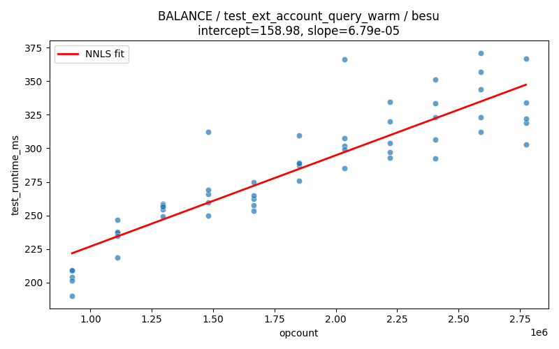

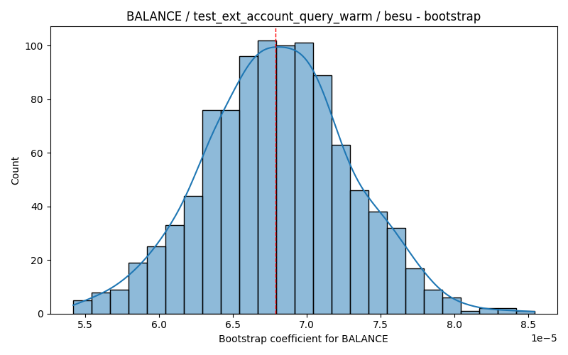

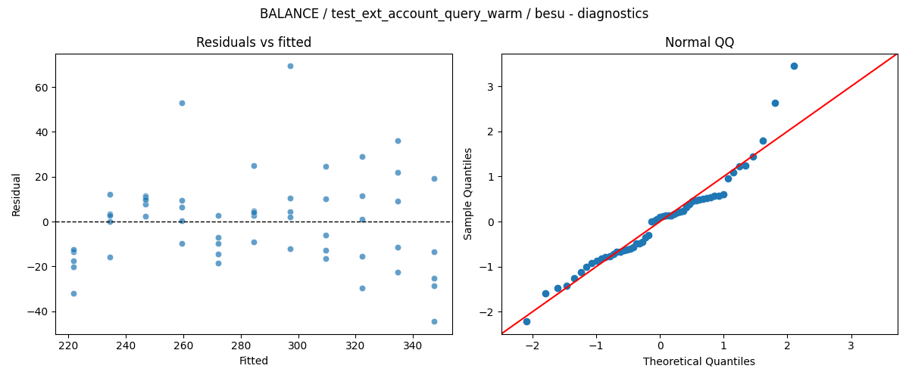

</details>

<details><summary>erigon — NNLS regression summary</summary>

```
==============================================================================
                           NNLS Regression Results                            
==============================================================================
Dep. Variable:          test_runtime_ms              R-squared:          0.862
Model:                  NNLS                    Adj. R-squared:          0.858
No. Observations:       44                                RMSE:           4.82
Df Residuals:           42                                 MAE:           3.81
Df Model:               1      
==============================================================================
                      coef     std err     P-value      [0.025      0.975]
------------------------------------------------------------------------------
         const     28.5388      2.1791       0.001     24.6312     32.7558
       opcount      0.0000      0.0000       0.001      0.0000      0.0000
==============================================================================
Notes: Non-negative least squares with bootstrap inference (1000 iterations)
==============================================================================
```

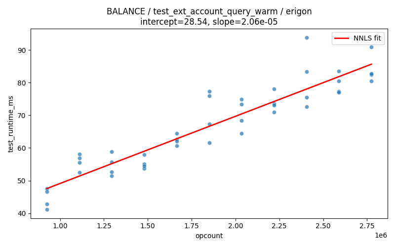

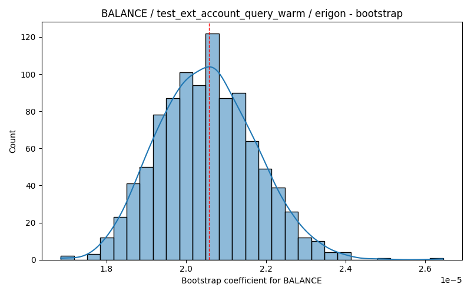

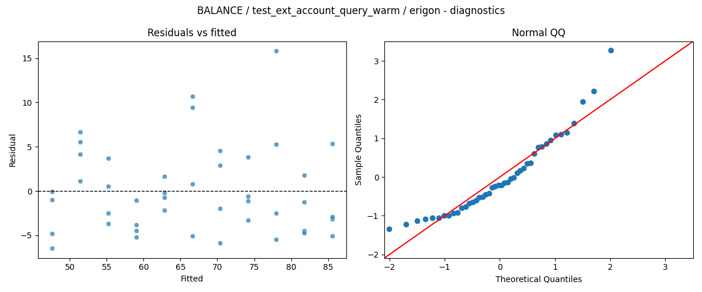

</details>

<details><summary>geth — NNLS regression summary</summary>

```
==============================================================================
                           NNLS Regression Results                            
==============================================================================
Dep. Variable:          test_runtime_ms              R-squared:          0.726
Model:                  NNLS                    Adj. R-squared:          0.722
No. Observations:       77                                RMSE:           9.08
Df Residuals:           75                                 MAE:           7.23
Df Model:               1      
==============================================================================
                      coef     std err     P-value      [0.025      0.975]
------------------------------------------------------------------------------
         const     21.6484      3.7982       0.001     14.3688     29.3457
       opcount      0.0000      0.0000       0.001      0.0000      0.0000
==============================================================================
Notes: Non-negative least squares with bootstrap inference (1000 iterations)
==============================================================================
```

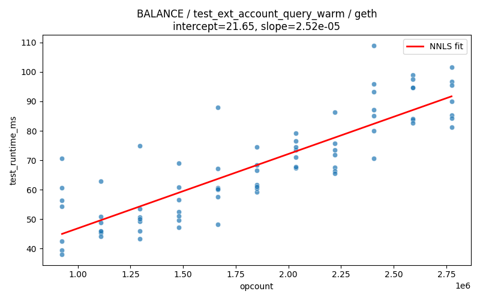

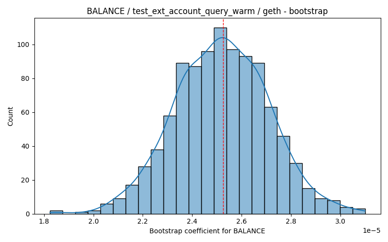

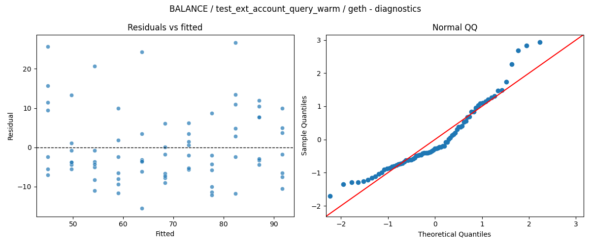

</details>

<details><summary>nethermind — NNLS regression summary</summary>

```
==============================================================================
                           NNLS Regression Results                            
==============================================================================
Dep. Variable:          test_runtime_ms              R-squared:          0.538
Model:                  NNLS                    Adj. R-squared:          0.531
No. Observations:       66                                RMSE:          82.83
Df Residuals:           64                                 MAE:          66.91
Df Model:               1      
==============================================================================
                      coef     std err     P-value      [0.025      0.975]
------------------------------------------------------------------------------
         const    119.6191     31.4499       0.001     60.6229    186.5715
       opcount      0.0002      0.0000       0.001      0.0001      0.0002
==============================================================================
Notes: Non-negative least squares with bootstrap inference (1000 iterations)
==============================================================================
```

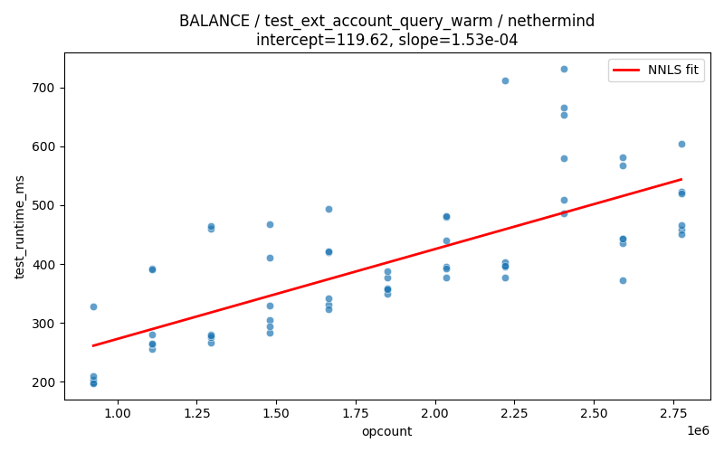

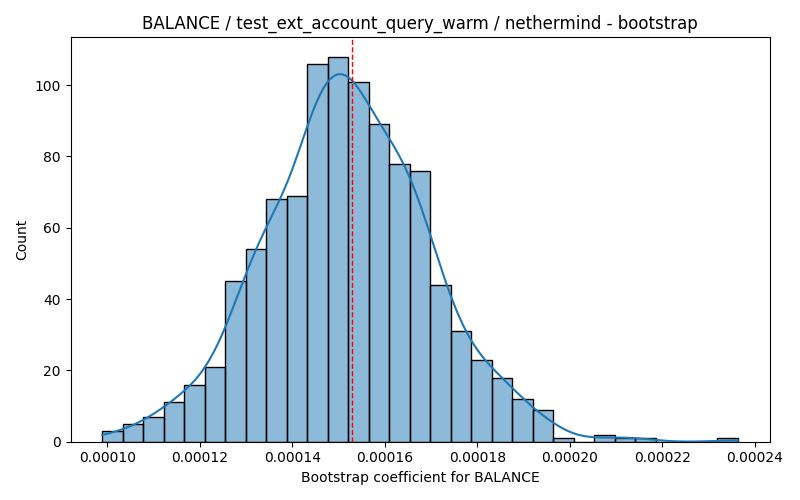

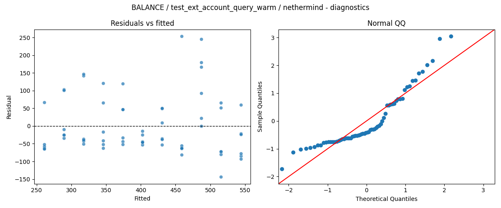

</details>

<details><summary>reth — NNLS regression summary</summary>

```
==============================================================================
                           NNLS Regression Results                            
==============================================================================
Dep. Variable:          test_runtime_ms              R-squared:          0.558
Model:                  NNLS                    Adj. R-squared:          0.547
No. Observations:       44                                RMSE:           6.52
Df Residuals:           42                                 MAE:           4.68
Df Model:               1      
==============================================================================
                      coef     std err     P-value      [0.025      0.975]
------------------------------------------------------------------------------
         const     10.7981      3.1176       0.001      4.5786     17.0642
       opcount      0.0000      0.0000       0.001      0.0000      0.0000
==============================================================================
Notes: Non-negative least squares with bootstrap inference (1000 iterations)
==============================================================================
```

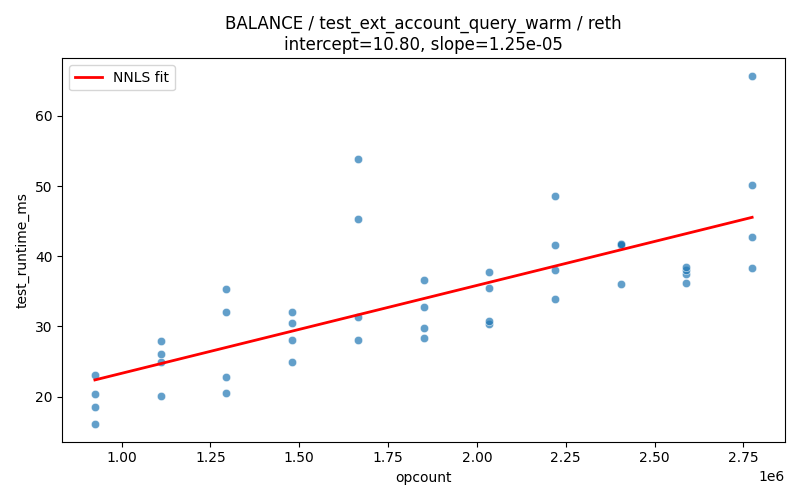

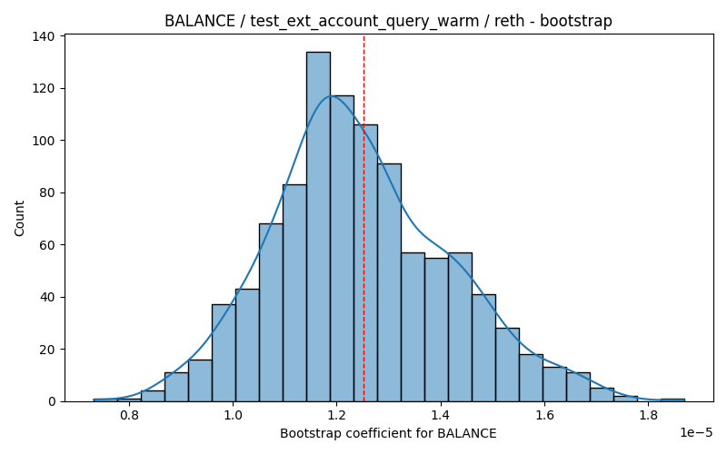

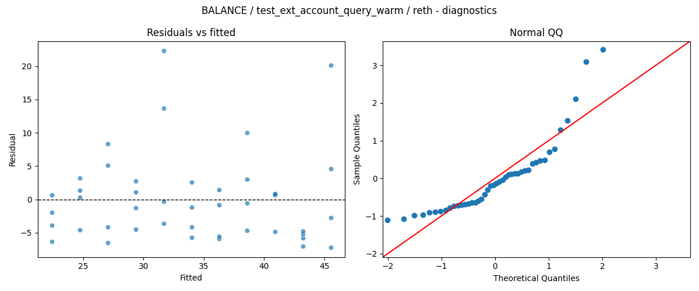

</details>

### test_account_access — combo `BALANCE_AccountMode.EXISTING_EOA`

| client | nobs | R² | target_coef (ms) | p-value | 95% CI |
| --- | --- | --- | --- | --- | --- |
| `besu` | 55 | 0.9881 | 0.01441 | 1.00e-03 | [0.01398, 0.0149] |
| `erigon` | 44 | 0.9984 | 0.0086 | 1.00e-03 | [0.008511, 0.008637] |
| `geth` | 77 | 0.9879 | 0.01116 | 1.00e-03 | [0.01087, 0.01143] |
| `nethermind` | 66 | 0.9318 | 0.003029 | 1.00e-03 | [0.002826, 0.003239] |
| `reth` | 44 | 0.9767 | 0.00413 | 1.00e-03 | [0.003922, 0.004323] |

<details><summary>besu — NNLS regression summary</summary>

```
==============================================================================
                           NNLS Regression Results                            
==============================================================================
Dep. Variable:          test_runtime_ms              R-squared:          0.988
Model:                  NNLS                    Adj. R-squared:          0.988
No. Observations:       55                                RMSE:          32.62
Df Residuals:           53                                 MAE:          25.87
Df Model:               1      
==============================================================================
                      coef     std err     P-value      [0.025      0.975]
------------------------------------------------------------------------------
         const    472.8836     15.7096       0.001    438.2493    501.4025
       opcount      0.0144      0.0002       0.001      0.0140      0.0149
==============================================================================
Notes: Non-negative least squares with bootstrap inference (1000 iterations)
==============================================================================
```

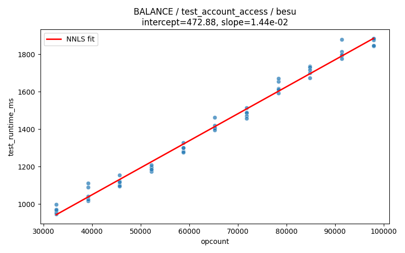

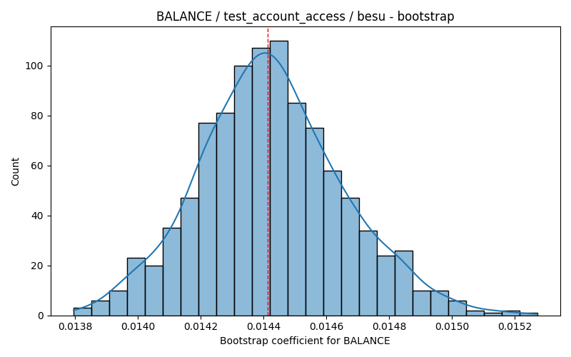

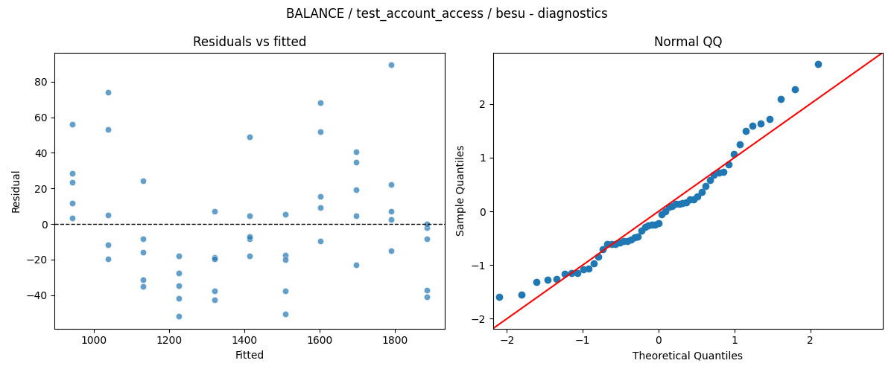

</details>

<details><summary>erigon — NNLS regression summary</summary>

```
==============================================================================
                           NNLS Regression Results                            
==============================================================================
Dep. Variable:          test_runtime_ms              R-squared:          0.998
Model:                  NNLS                    Adj. R-squared:          0.998
No. Observations:       44                                RMSE:           7.18
Df Residuals:           42                                 MAE:           5.74
Df Model:               1      
==============================================================================
                      coef     std err     P-value      [0.025      0.975]
------------------------------------------------------------------------------
         const      0.6173      1.7747       0.418      0.0000      6.0378
       opcount      0.0086      0.0000       0.001      0.0085      0.0086
==============================================================================
Notes: Non-negative least squares with bootstrap inference (1000 iterations)
==============================================================================
```

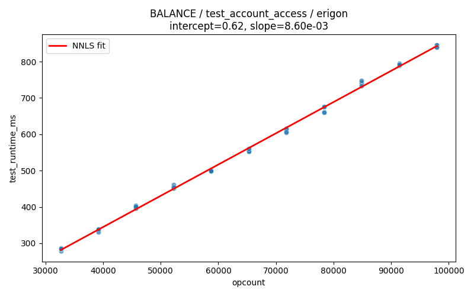

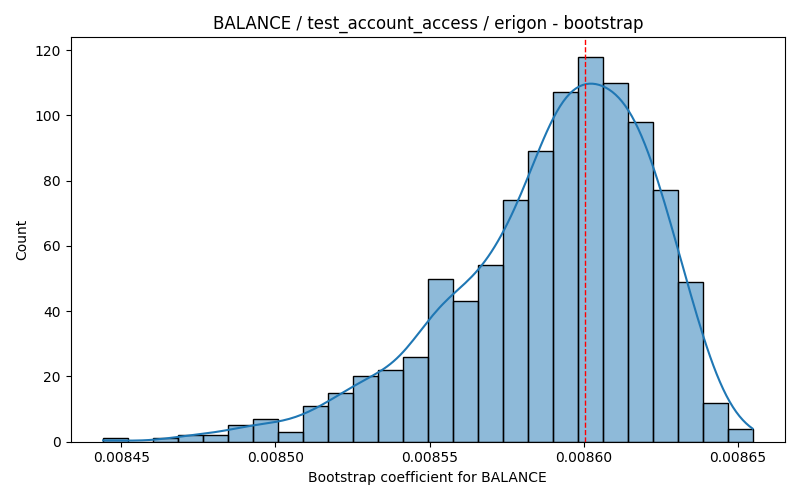

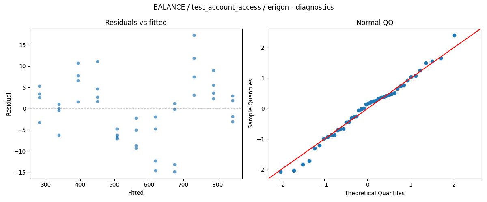

</details>

<details><summary>geth — NNLS regression summary</summary>

```
==============================================================================
                           NNLS Regression Results                            
==============================================================================
Dep. Variable:          test_runtime_ms              R-squared:          0.988
Model:                  NNLS                    Adj. R-squared:          0.988
No. Observations:       77                                RMSE:          25.52
Df Residuals:           75                                 MAE:          20.37
Df Model:               1      
==============================================================================
                      coef     std err     P-value      [0.025      0.975]
------------------------------------------------------------------------------
         const    224.3828      9.7464       0.001    206.3397    244.1237
       opcount      0.0112      0.0001       0.001      0.0109      0.0114
==============================================================================
Notes: Non-negative least squares with bootstrap inference (1000 iterations)
==============================================================================
```

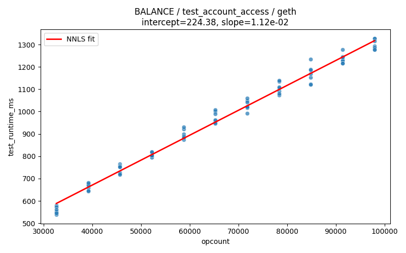

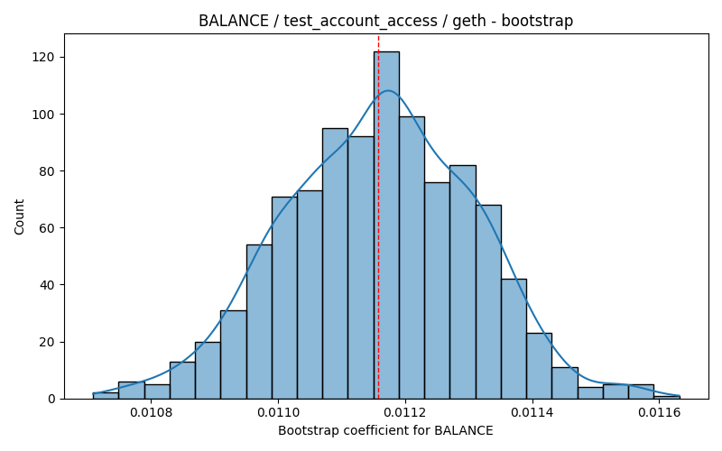

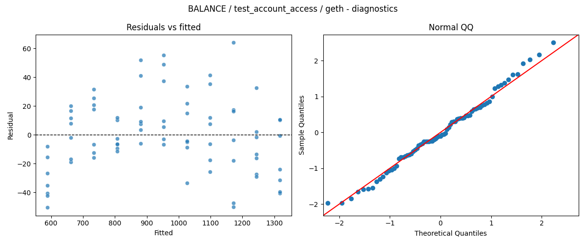

</details>

<details><summary>nethermind — NNLS regression summary</summary>

```
==============================================================================
                           NNLS Regression Results                            
==============================================================================
Dep. Variable:          test_runtime_ms              R-squared:          0.932
Model:                  NNLS                    Adj. R-squared:          0.931
No. Observations:       66                                RMSE:          16.91
Df Residuals:           64                                 MAE:          13.83
Df Model:               1      
==============================================================================
                      coef     std err     P-value      [0.025      0.975]
------------------------------------------------------------------------------
         const    100.1114      7.1922       0.001     86.0524    114.0386
       opcount      0.0030      0.0001       0.001      0.0028      0.0032
==============================================================================
Notes: Non-negative least squares with bootstrap inference (1000 iterations)
==============================================================================
```

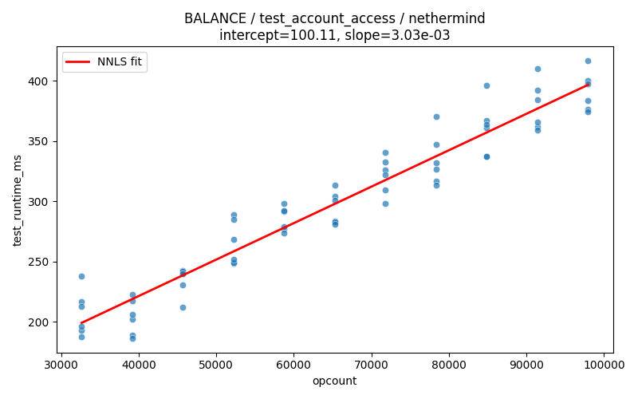

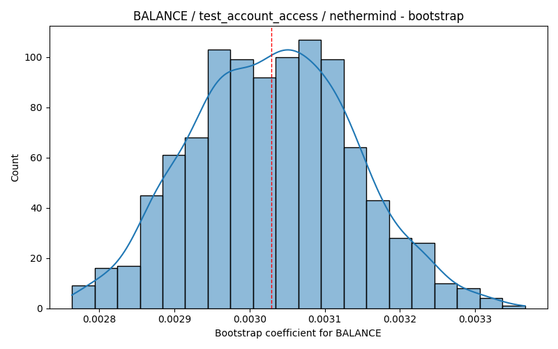

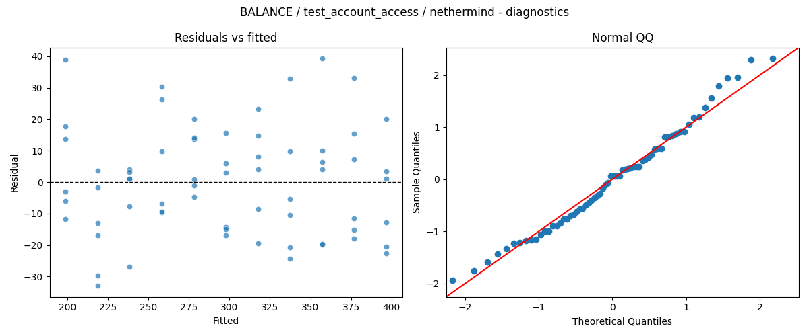

</details>

<details><summary>reth — NNLS regression summary</summary>

```
==============================================================================
                           NNLS Regression Results                            
==============================================================================
Dep. Variable:          test_runtime_ms              R-squared:          0.977
Model:                  NNLS                    Adj. R-squared:          0.976
No. Observations:       44                                RMSE:          13.17
Df Residuals:           42                                 MAE:          10.59
Df Model:               1      
==============================================================================
                      coef     std err     P-value      [0.025      0.975]
------------------------------------------------------------------------------
         const     80.3488      6.2422       0.001     67.8427     92.9279
       opcount      0.0041      0.0001       0.001      0.0039      0.0043
==============================================================================
Notes: Non-negative least squares with bootstrap inference (1000 iterations)
==============================================================================
```


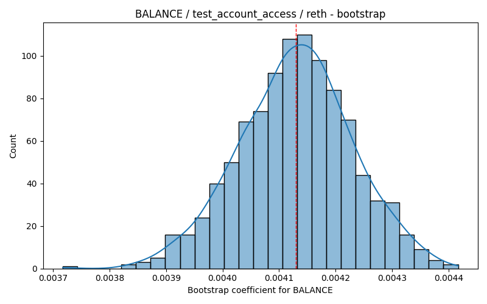

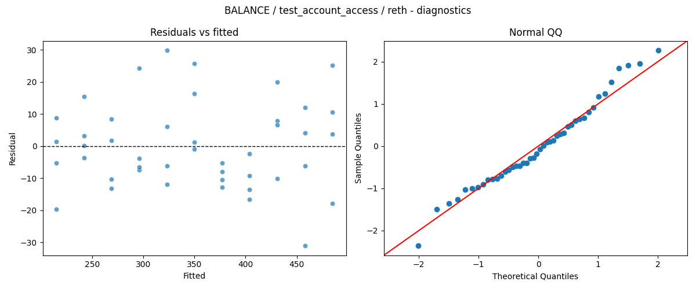

</details>

### test_account_access — combo `BALANCE_AccountMode.NON_EXISTING_ACCOUNT`

| client | nobs | R² | target_coef (ms) | p-value | 95% CI |
| --- | --- | --- | --- | --- | --- |
| `besu` | 55 | 0.9874 | 0.0147 | 1.00e-03 | [0.01432, 0.01522] |
| `erigon` | 44 | 0.9978 | 0.008255 | 1.00e-03 | [0.008141, 0.008289] |
| `geth` | 77 | 0.9702 | 0.02108 | 1.00e-03 | [0.02013, 0.02193] |
| `nethermind` | 66 | 0.922 | 0.002619 | 1.00e-03 | [0.002424, 0.002841] |
| `reth` | 44 | 0.9753 | 0.004057 | 1.00e-03 | [0.003855, 0.004275] |

<details><summary>besu — NNLS regression summary</summary>

```
==============================================================================
                           NNLS Regression Results                            
==============================================================================
Dep. Variable:          test_runtime_ms              R-squared:          0.987
Model:                  NNLS                    Adj. R-squared:          0.987
No. Observations:       55                                RMSE:          34.33
Df Residuals:           53                                 MAE:          27.09
Df Model:               1      
==============================================================================
                      coef     std err     P-value      [0.025      0.975]
------------------------------------------------------------------------------
         const    125.2536     14.5172       0.001     92.9302    151.1130
       opcount      0.0147      0.0002       0.001      0.0143      0.0152
==============================================================================
Notes: Non-negative least squares with bootstrap inference (1000 iterations)
==============================================================================
```


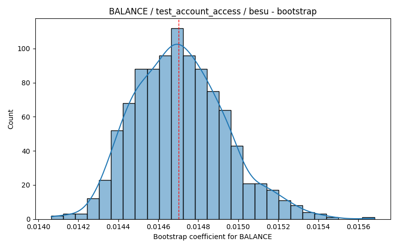

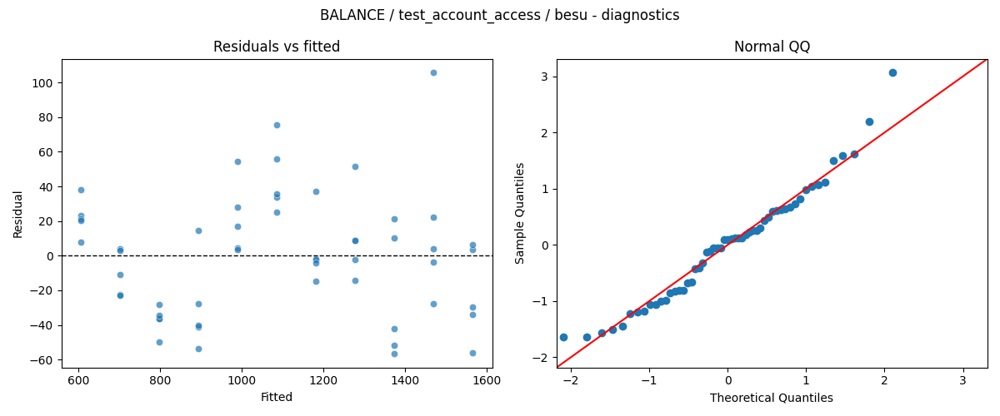

</details>

<details><summary>erigon — NNLS regression summary</summary>

```
==============================================================================
                           NNLS Regression Results                            
==============================================================================
Dep. Variable:          test_runtime_ms              R-squared:          0.998
Model:                  NNLS                    Adj. R-squared:          0.998
No. Observations:       44                                RMSE:           7.95
Df Residuals:           42                                 MAE:           6.40
Df Model:               1      
==============================================================================
                      coef     std err     P-value      [0.025      0.975]
------------------------------------------------------------------------------
         const      1.1187      2.7101       0.395      0.0000      9.0411
       opcount      0.0083      0.0000       0.001      0.0081      0.0083
==============================================================================
Notes: Non-negative least squares with bootstrap inference (1000 iterations)
==============================================================================
```

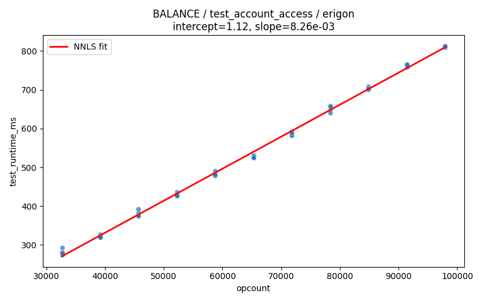

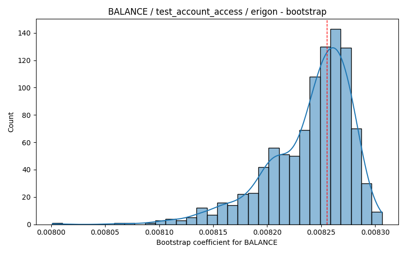

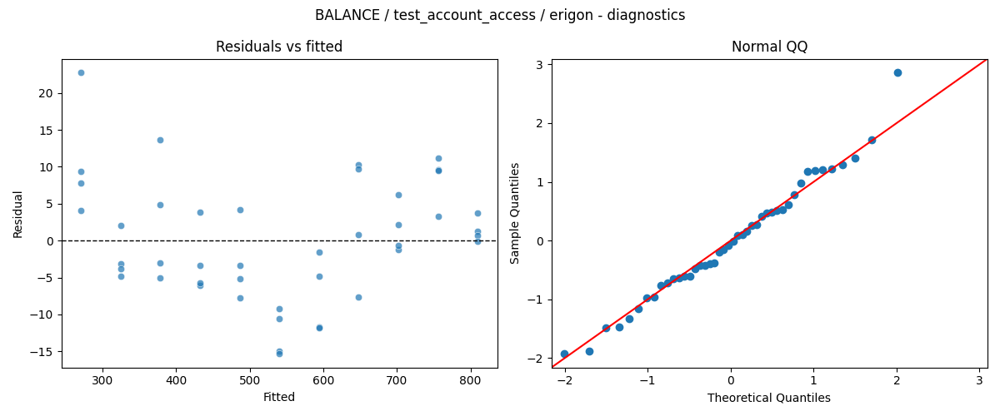

</details>

<details><summary>geth — NNLS regression summary</summary>

```
==============================================================================
                           NNLS Regression Results                            
==============================================================================
Dep. Variable:          test_runtime_ms              R-squared:          0.970
Model:                  NNLS                    Adj. R-squared:          0.970
No. Observations:       77                                RMSE:          76.33
Df Residuals:           75                                 MAE:          62.87
Df Model:               1      
==============================================================================
                      coef     std err     P-value      [0.025      0.975]
------------------------------------------------------------------------------
         const    294.3912     28.2636       0.001    245.6109    355.3425
       opcount      0.0211      0.0005       0.001      0.0201      0.0219
==============================================================================
Notes: Non-negative least squares with bootstrap inference (1000 iterations)
==============================================================================
```

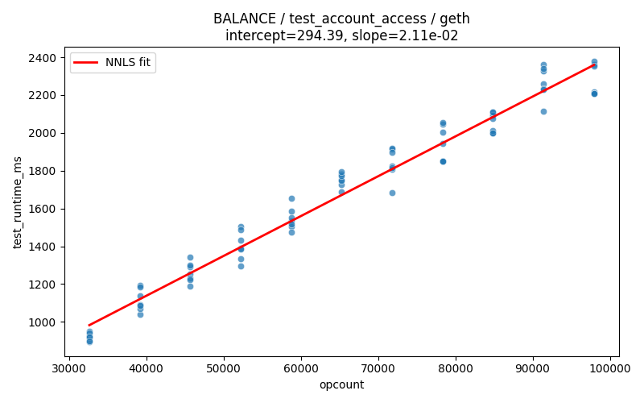

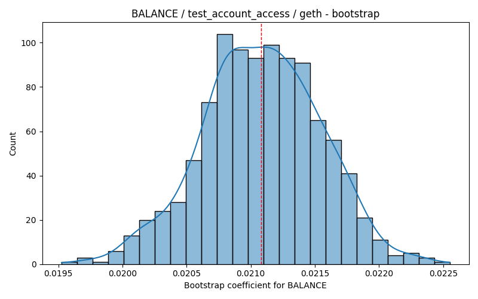

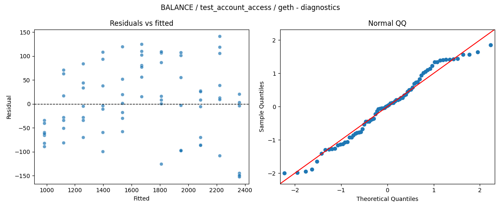

</details>

<details><summary>nethermind — NNLS regression summary</summary>

```
==============================================================================
                           NNLS Regression Results                            
==============================================================================
Dep. Variable:          test_runtime_ms              R-squared:          0.922
Model:                  NNLS                    Adj. R-squared:          0.921
No. Observations:       66                                RMSE:          15.73
Df Residuals:           64                                 MAE:          12.96
Df Model:               1      
==============================================================================
                      coef     std err     P-value      [0.025      0.975]
------------------------------------------------------------------------------
         const     86.5096      6.6097       0.001     73.4718     99.3345
       opcount      0.0026      0.0001       0.001      0.0024      0.0028
==============================================================================
Notes: Non-negative least squares with bootstrap inference (1000 iterations)
==============================================================================
```


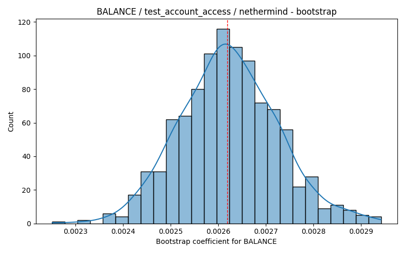

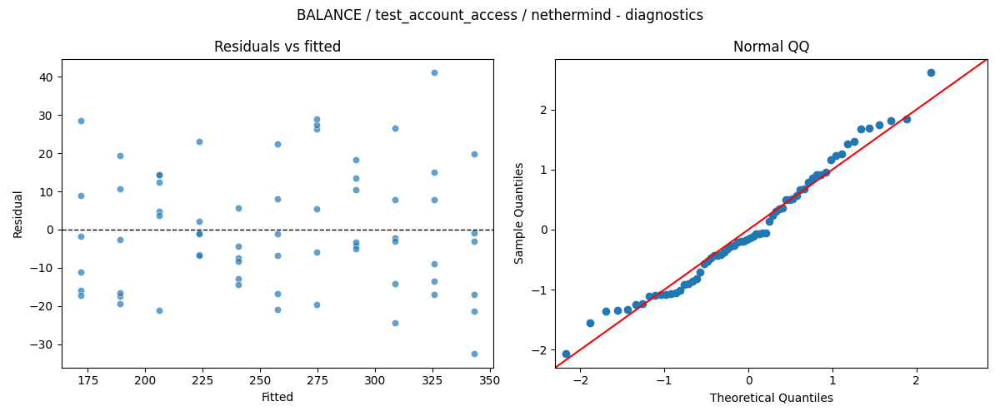

</details>

<details><summary>reth — NNLS regression summary</summary>

```
==============================================================================
                           NNLS Regression Results                            
==============================================================================
Dep. Variable:          test_runtime_ms              R-squared:          0.975
Model:                  NNLS                    Adj. R-squared:          0.975
No. Observations:       44                                RMSE:          13.33
Df Residuals:           42                                 MAE:          10.21
Df Model:               1      
==============================================================================
                      coef     std err     P-value      [0.025      0.975]
------------------------------------------------------------------------------
         const     83.3535      5.9083       0.001     72.0983     94.7030
       opcount      0.0041      0.0001       0.001      0.0039      0.0043
==============================================================================
Notes: Non-negative least squares with bootstrap inference (1000 iterations)
==============================================================================
```

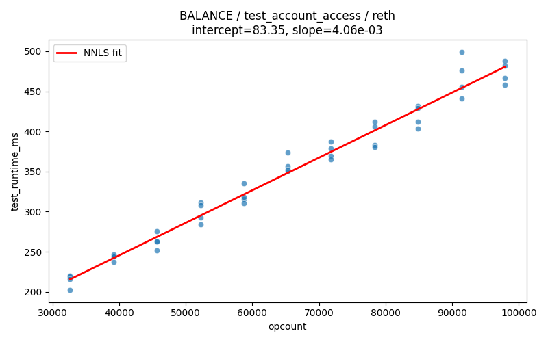

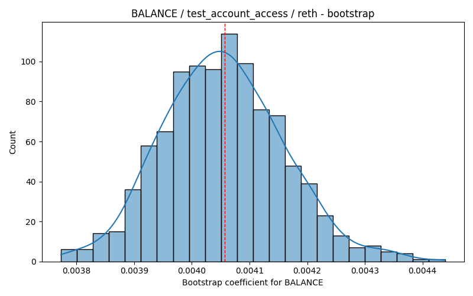

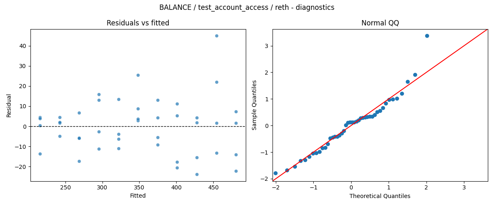

</details>

### test_account_access — combo `BALANCE_AccountMode.EXISTING_CONTRACT_DIFF_MAX`

| client | nobs | R² | target_coef (ms) | p-value | 95% CI |
| --- | --- | --- | --- | --- | --- |
| `besu` | 55 | 0.9825 | 0.0196 | 1.00e-03 | [0.01894, 0.02021] |
| `erigon` | 44 | 0.9937 | 0.009002 | 1.00e-03 | [0.008812, 0.009214] |
| `geth` | 77 | 0.944 | 0.003832 | 1.00e-03 | [0.003685, 0.003895] |
| `nethermind` | 66 | 0.8014 | 0.001912 | 1.00e-03 | [0.001686, 0.002165] |
| `reth` | 44 | 0.9969 | 0.01779 | 1.00e-03 | [0.01742, 0.01816] |

<details><summary>besu — NNLS regression summary</summary>

```
==============================================================================
                           NNLS Regression Results                            
==============================================================================
Dep. Variable:          test_runtime_ms              R-squared:          0.982
Model:                  NNLS                    Adj. R-squared:          0.982
No. Observations:       55                                RMSE:          53.26
Df Residuals:           53                                 MAE:          44.15
Df Model:               1      
==============================================================================
                      coef     std err     P-value      [0.025      0.975]
------------------------------------------------------------------------------
         const    427.2164     22.0583       0.001    387.2195    473.3845
       opcount      0.0196      0.0003       0.001      0.0189      0.0202
==============================================================================
Notes: Non-negative least squares with bootstrap inference (1000 iterations)
==============================================================================
```

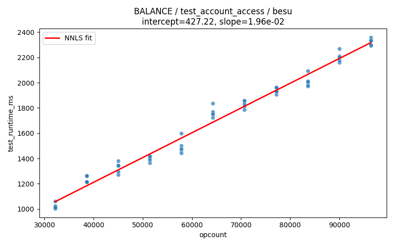

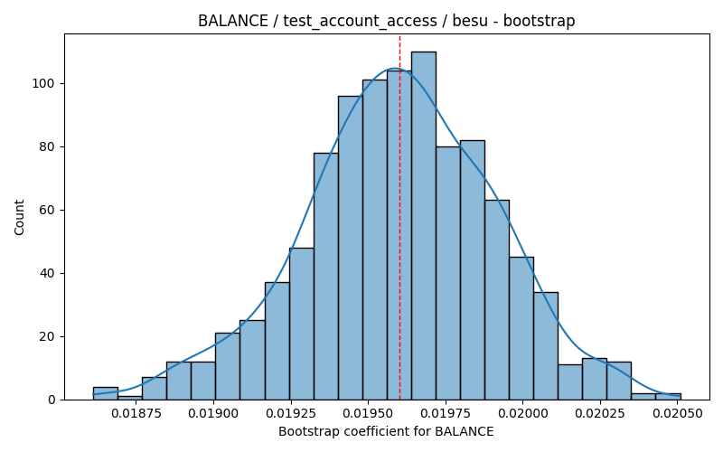

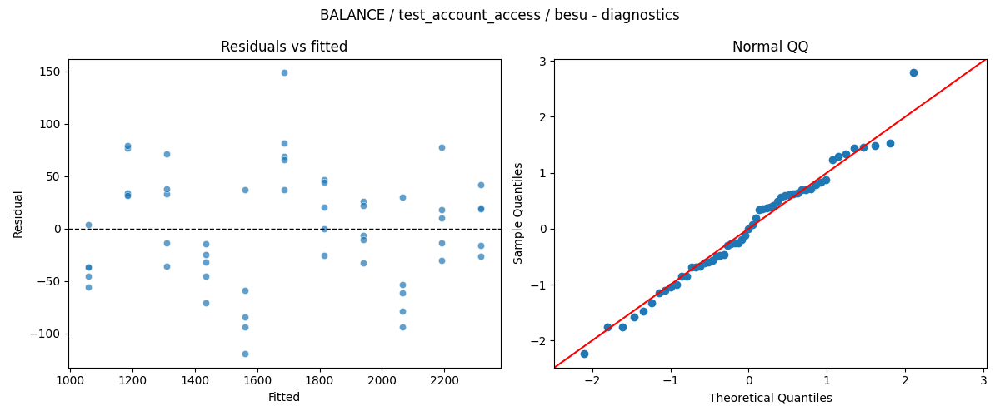

</details>

<details><summary>erigon — NNLS regression summary</summary>

```
==============================================================================
                           NNLS Regression Results                            
==============================================================================
Dep. Variable:          test_runtime_ms              R-squared:          0.994
Model:                  NNLS                    Adj. R-squared:          0.994
No. Observations:       44                                RMSE:          14.62
Df Residuals:           42                                 MAE:          12.88
Df Model:               1      
==============================================================================
                      coef     std err     P-value      [0.025      0.975]
------------------------------------------------------------------------------
         const     87.3000      6.6111       0.001     72.6299     98.3306
       opcount      0.0090      0.0001       0.001      0.0088      0.0092
==============================================================================
Notes: Non-negative least squares with bootstrap inference (1000 iterations)
==============================================================================
```


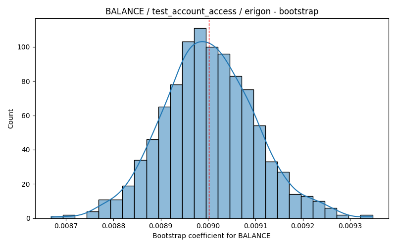

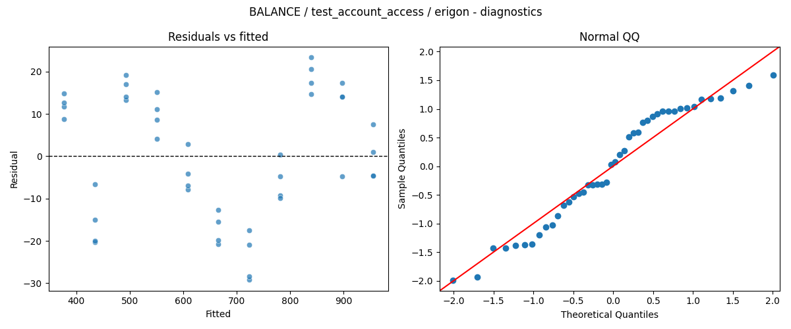

</details>

<details><summary>geth — NNLS regression summary</summary>

```
==============================================================================
                           NNLS Regression Results                            
==============================================================================
Dep. Variable:          test_runtime_ms              R-squared:          0.944
Model:                  NNLS                    Adj. R-squared:          0.943
No. Observations:       77                                RMSE:          19.32
Df Residuals:           75                                 MAE:          14.68
Df Model:               1      
==============================================================================
                      coef     std err     P-value      [0.025      0.975]
------------------------------------------------------------------------------
         const      0.0000      2.8651       1.000      0.0000     10.7680
       opcount      0.0038      0.0001       0.001      0.0037      0.0039
==============================================================================
Notes: Non-negative least squares with bootstrap inference (1000 iterations)
==============================================================================
```

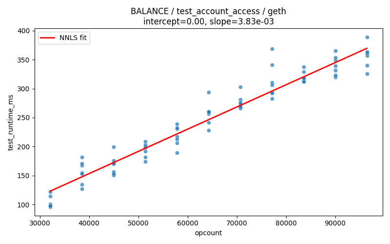

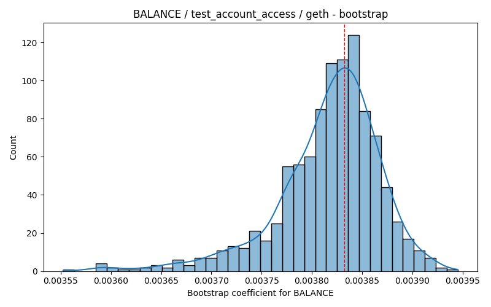

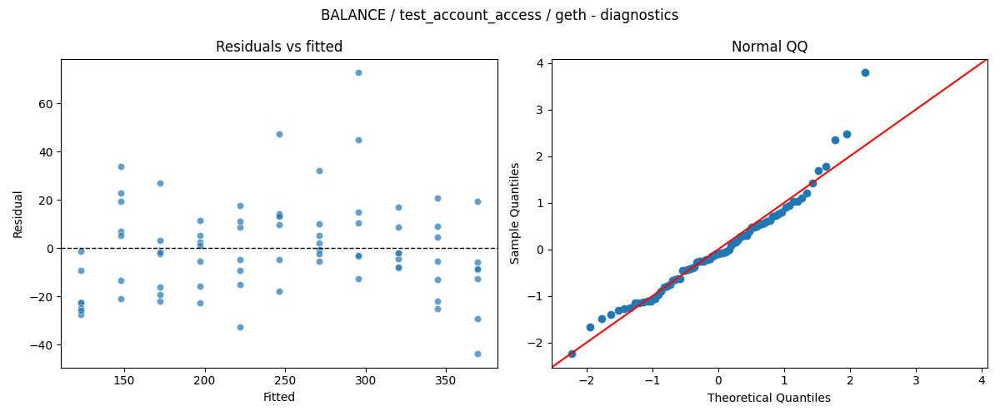

</details>

<details><summary>nethermind — NNLS regression summary</summary>

```
==============================================================================
                           NNLS Regression Results                            
==============================================================================
Dep. Variable:          test_runtime_ms              R-squared:          0.801
Model:                  NNLS                    Adj. R-squared:          0.798
No. Observations:       66                                RMSE:          19.35
Df Residuals:           64                                 MAE:          14.66
Df Model:               1      
==============================================================================
                      coef     std err     P-value      [0.025      0.975]
------------------------------------------------------------------------------
         const     89.9460      7.6851       0.001     73.6073    104.0338
       opcount      0.0019      0.0001       0.001      0.0017      0.0022
==============================================================================
Notes: Non-negative least squares with bootstrap inference (1000 iterations)
==============================================================================
```

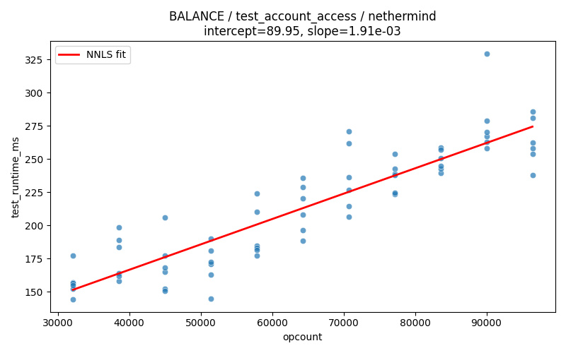

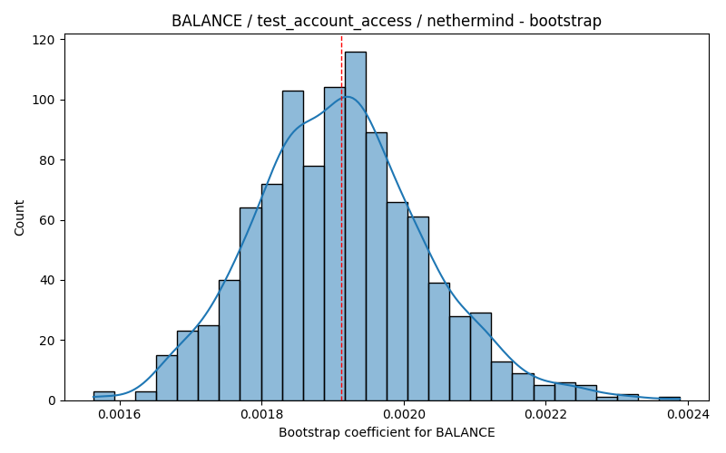

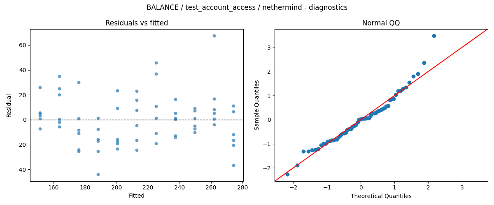

</details>

<details><summary>reth — NNLS regression summary</summary>

```
==============================================================================
                           NNLS Regression Results                            
==============================================================================
Dep. Variable:          test_runtime_ms              R-squared:          0.997
Model:                  NNLS                    Adj. R-squared:          0.997
No. Observations:       44                                RMSE:          20.26
Df Residuals:           42                                 MAE:          15.82
Df Model:               1      
==============================================================================
                      coef     std err     P-value      [0.025      0.975]
------------------------------------------------------------------------------
         const    117.4729     13.3194       0.001     92.0472    145.0995
       opcount      0.0178      0.0002       0.001      0.0174      0.0182
==============================================================================
Notes: Non-negative least squares with bootstrap inference (1000 iterations)
==============================================================================
```


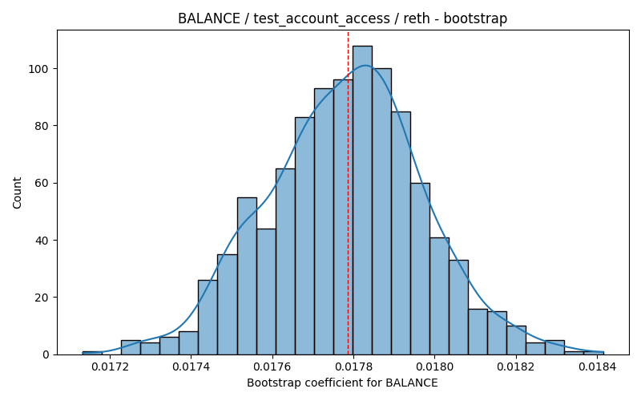

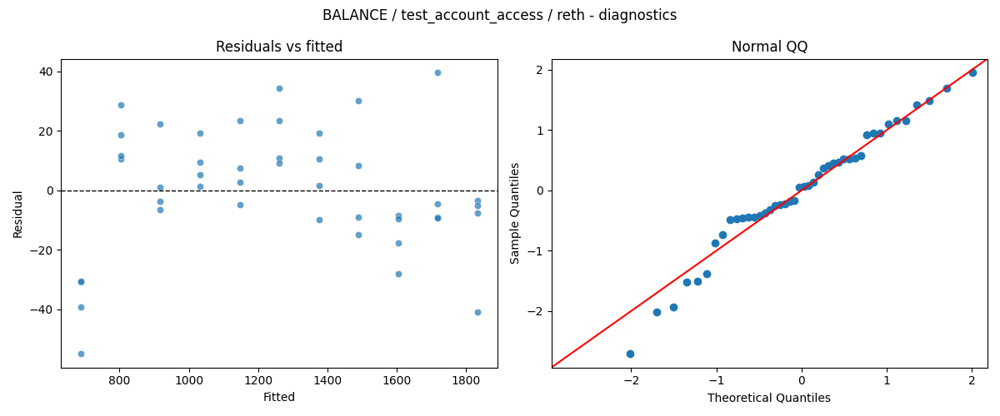

</details>

### test_account_access — combo `BALANCE_AccountMode.EXISTING_CONTRACT_MINIMAL`

| client | nobs | R² | target_coef (ms) | p-value | 95% CI |
| --- | --- | --- | --- | --- | --- |
| `besu` | 55 | 0.9768 | 0.01182 | 1.00e-03 | [0.01129, 0.01245] |
| `erigon` | 44 | 0.9932 | 0.008067 | 1.00e-03 | [0.007891, 0.008241] |
| `geth` | 77 | 0.9398 | 0.004842 | 1.00e-03 | [0.004526, 0.005195] |
| `nethermind` | 66 | 0.7577 | 0.001772 | 1.00e-03 | [0.001549, 0.001994] |
| `reth` | 44 | 0.9613 | 0.003724 | 1.00e-03 | [0.003462, 0.003945] |

<details><summary>besu — NNLS regression summary</summary>

```
==============================================================================
                           NNLS Regression Results                            
==============================================================================
Dep. Variable:          test_runtime_ms              R-squared:          0.977
Model:                  NNLS                    Adj. R-squared:          0.976
No. Observations:       55                                RMSE:          37.07
Df Residuals:           53                                 MAE:          29.00
Df Model:               1      
==============================================================================
                      coef     std err     P-value      [0.025      0.975]
------------------------------------------------------------------------------
         const    386.9020     17.2551       0.001    351.5885    419.0887
       opcount      0.0118      0.0003       0.001      0.0113      0.0124
==============================================================================
Notes: Non-negative least squares with bootstrap inference (1000 iterations)
==============================================================================
```

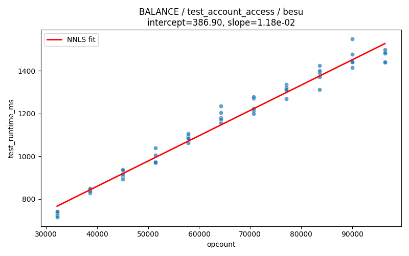

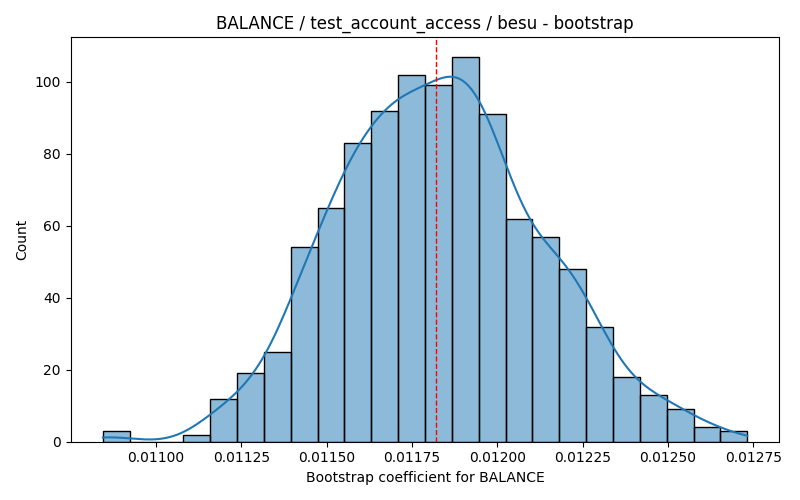

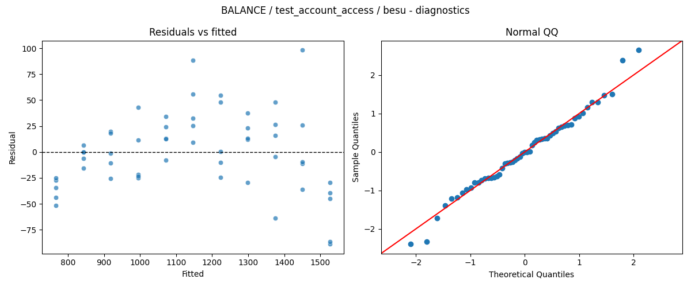

</details>

<details><summary>erigon — NNLS regression summary</summary>

```
==============================================================================
                           NNLS Regression Results                            
==============================================================================
Dep. Variable:          test_runtime_ms              R-squared:          0.993
Model:                  NNLS                    Adj. R-squared:          0.993
No. Observations:       44                                RMSE:          13.54
Df Residuals:           42                                 MAE:          11.57
Df Model:               1      
==============================================================================
                      coef     std err     P-value      [0.025      0.975]
------------------------------------------------------------------------------
         const    104.5049      6.1236       0.001     91.8369    115.6966
       opcount      0.0081      0.0001       0.001      0.0079      0.0082
==============================================================================
Notes: Non-negative least squares with bootstrap inference (1000 iterations)
==============================================================================
```


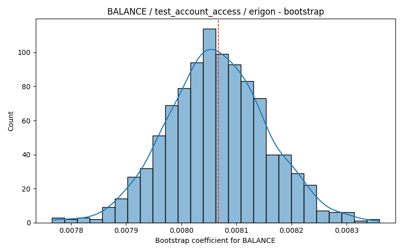

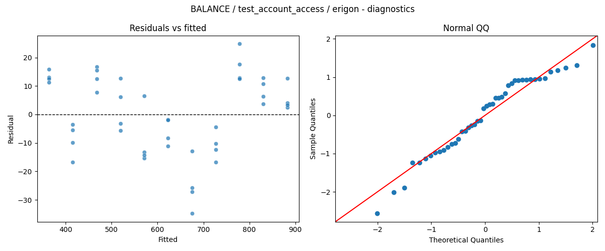

</details>

<details><summary>geth — NNLS regression summary</summary>

```
==============================================================================
                           NNLS Regression Results                            
==============================================================================
Dep. Variable:          test_runtime_ms              R-squared:          0.940
Model:                  NNLS                    Adj. R-squared:          0.939
No. Observations:       77                                RMSE:          24.92
Df Residuals:           75                                 MAE:          18.03
Df Model:               1      
==============================================================================
                      coef     std err     P-value      [0.025      0.975]
------------------------------------------------------------------------------
         const     63.2363      9.9696       0.001     43.1823     80.8372
       opcount      0.0048      0.0002       0.001      0.0045      0.0052
==============================================================================
Notes: Non-negative least squares with bootstrap inference (1000 iterations)
==============================================================================
```

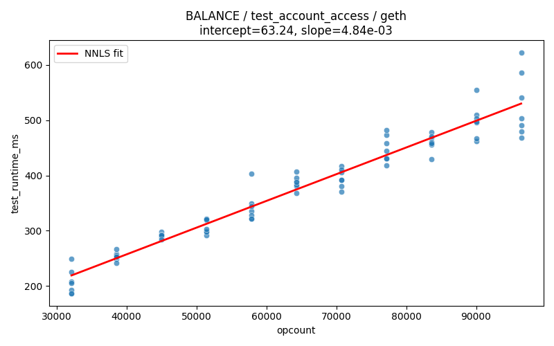

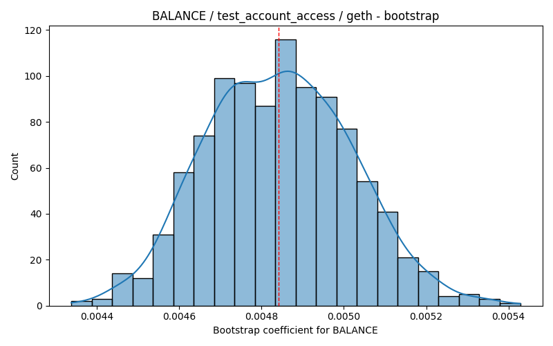

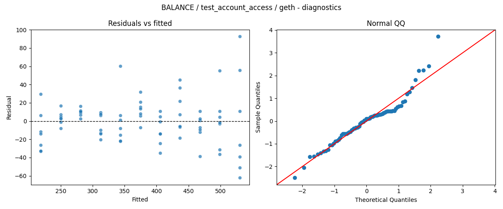

</details>

<details><summary>nethermind — NNLS regression summary</summary>

```
==============================================================================
                           NNLS Regression Results                            
==============================================================================
Dep. Variable:          test_runtime_ms              R-squared:          0.758
Model:                  NNLS                    Adj. R-squared:          0.754
No. Observations:       66                                RMSE:          20.38
Df Residuals:           64                                 MAE:          16.39
Df Model:               1      
==============================================================================
                      coef     std err     P-value      [0.025      0.975]
------------------------------------------------------------------------------
         const     94.3799      7.3435       0.001     79.8743    109.5727
       opcount      0.0018      0.0001       0.001      0.0015      0.0020
==============================================================================
Notes: Non-negative least squares with bootstrap inference (1000 iterations)
==============================================================================
```

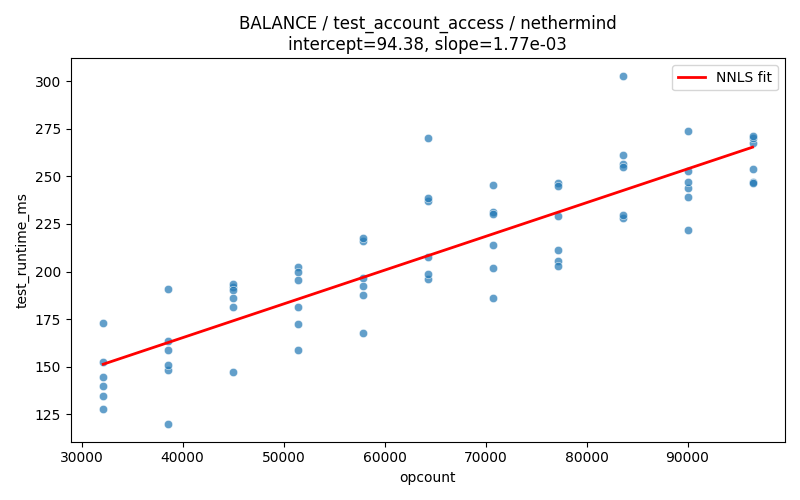

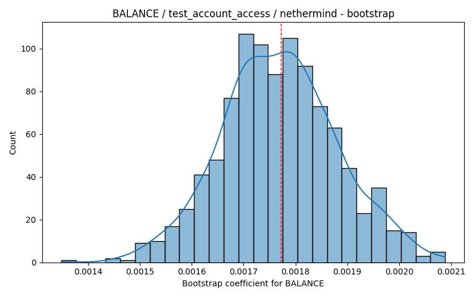

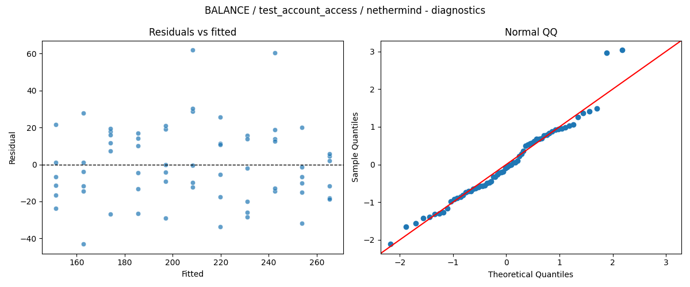

</details>

<details><summary>reth — NNLS regression summary</summary>

```
==============================================================================
                           NNLS Regression Results                            
==============================================================================
Dep. Variable:          test_runtime_ms              R-squared:          0.961
Model:                  NNLS                    Adj. R-squared:          0.960
No. Observations:       44                                RMSE:          15.20
Df Residuals:           42                                 MAE:          12.27
Df Model:               1      
==============================================================================
                      coef     std err     P-value      [0.025      0.975]
------------------------------------------------------------------------------
         const     83.3962      7.7708       0.001     69.3841     99.6235
       opcount      0.0037      0.0001       0.001      0.0035      0.0039
==============================================================================
Notes: Non-negative least squares with bootstrap inference (1000 iterations)
==============================================================================
```

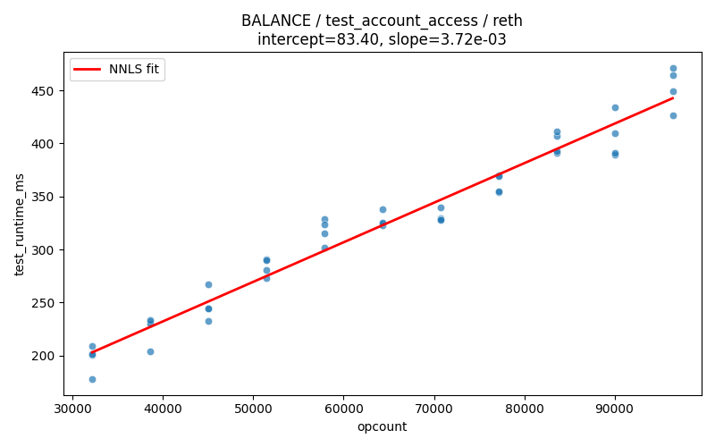

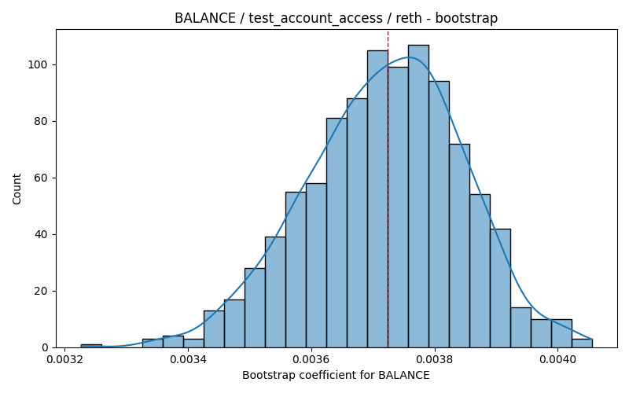

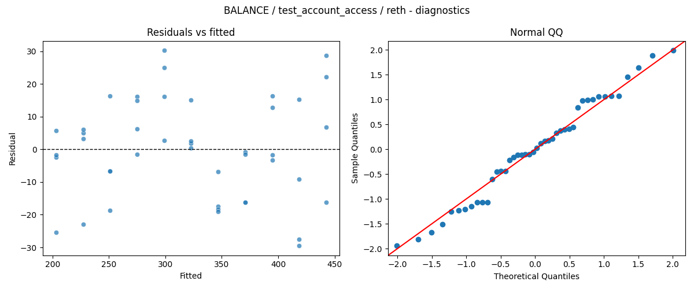

</details>

### test_account_access — combo `BALANCE_AccountMode.EXISTING_CONTRACT_SAME_MAX`

| client | nobs | R² | target_coef (ms) | p-value | 95% CI |
| --- | --- | --- | --- | --- | --- |
| `besu` | 55 | 0.9679 | 0.01034 | 1.00e-03 | [0.0097, 0.01088] |
| `erigon` | 44 | 0.9923 | 0.008009 | 1.00e-03 | [0.007812, 0.00821] |
| `geth` | 77 | 0.9437 | 0.004553 | 1.00e-03 | [0.004289, 0.004847] |
| `nethermind` | 66 | 0.7964 | 0.001764 | 1.00e-03 | [0.001554, 0.001961] |
| `reth` | 44 | 0.9628 | 0.003783 | 1.00e-03 | [0.00358, 0.004] |

<details><summary>besu — NNLS regression summary</summary>

```
==============================================================================
                           NNLS Regression Results                            
==============================================================================
Dep. Variable:          test_runtime_ms              R-squared:          0.968
Model:                  NNLS                    Adj. R-squared:          0.967
No. Observations:       55                                RMSE:          38.26
Df Residuals:           53                                 MAE:          30.92
Df Model:               1      
==============================================================================
                      coef     std err     P-value      [0.025      0.975]
------------------------------------------------------------------------------
         const    445.6170     19.5718       0.001    410.0595    488.3736
       opcount      0.0103      0.0003       0.001      0.0097      0.0109
==============================================================================
Notes: Non-negative least squares with bootstrap inference (1000 iterations)
==============================================================================
```

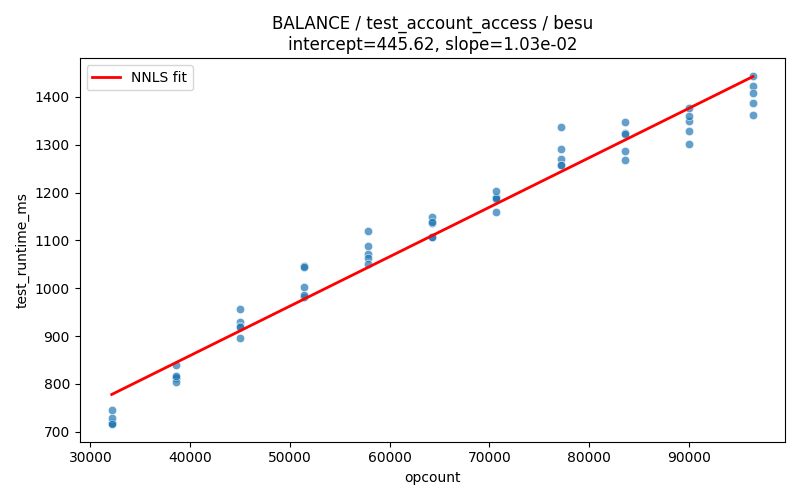

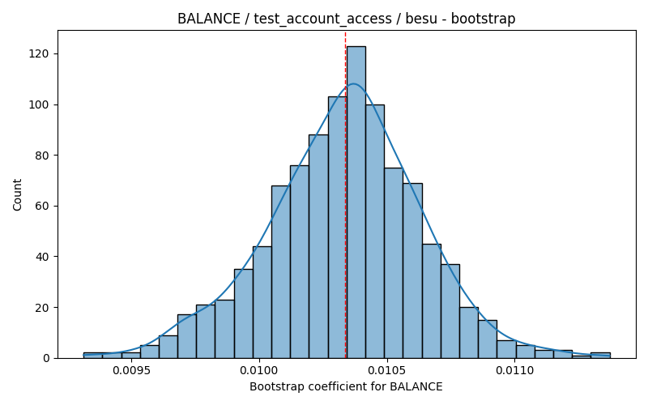

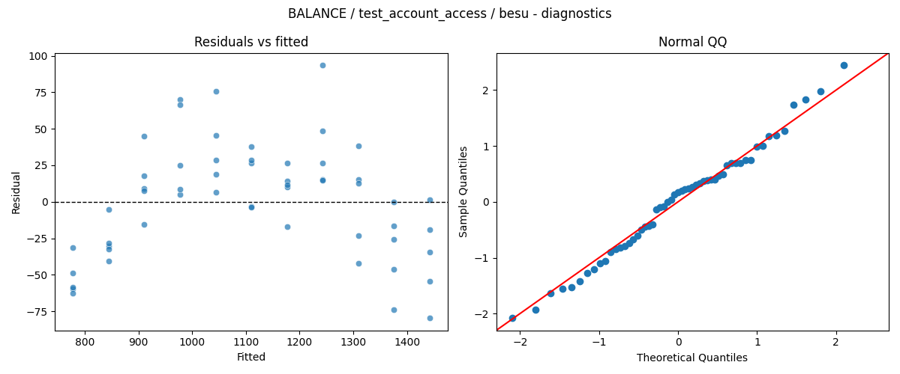

</details>

<details><summary>erigon — NNLS regression summary</summary>

```
==============================================================================
                           NNLS Regression Results                            
==============================================================================
Dep. Variable:          test_runtime_ms              R-squared:          0.992
Model:                  NNLS                    Adj. R-squared:          0.992
No. Observations:       44                                RMSE:          14.36
Df Residuals:           42                                 MAE:          12.58
Df Model:               1      
==============================================================================
                      coef     std err     P-value      [0.025      0.975]
------------------------------------------------------------------------------
         const    107.3031      6.4586       0.001     93.6497    119.0700
       opcount      0.0080      0.0001       0.001      0.0078      0.0082
==============================================================================
Notes: Non-negative least squares with bootstrap inference (1000 iterations)
==============================================================================
```

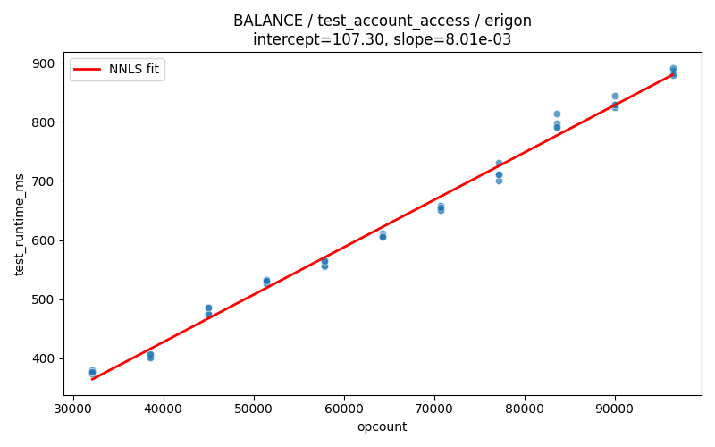

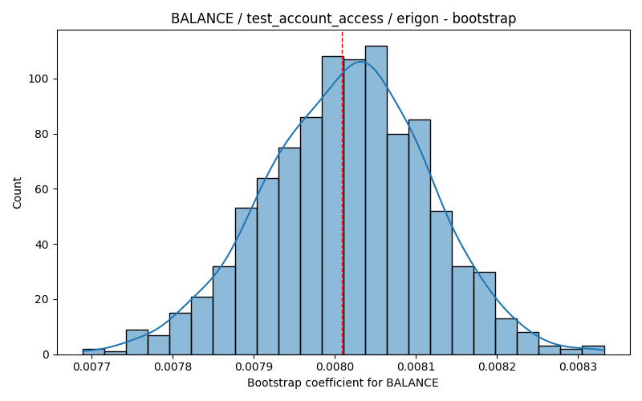

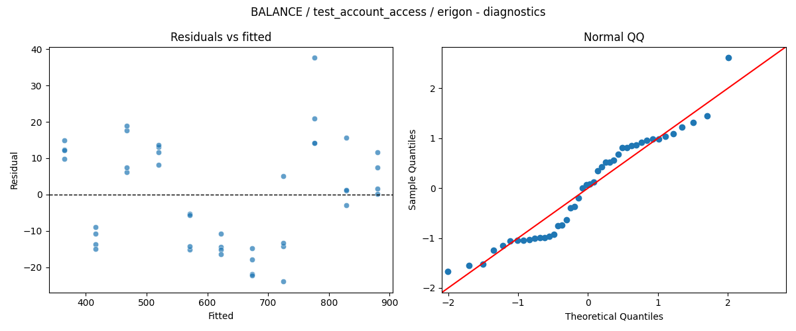

</details>

<details><summary>geth — NNLS regression summary</summary>

```
==============================================================================
                           NNLS Regression Results                            
==============================================================================
Dep. Variable:          test_runtime_ms              R-squared:          0.944
Model:                  NNLS                    Adj. R-squared:          0.943
No. Observations:       77                                RMSE:          22.62
Df Residuals:           75                                 MAE:          17.12
Df Model:               1      
==============================================================================
                      coef     std err     P-value      [0.025      0.975]
------------------------------------------------------------------------------
         const     82.5723      7.9917       0.001     67.5705     98.3475
       opcount      0.0046      0.0001       0.001      0.0043      0.0048
==============================================================================
Notes: Non-negative least squares with bootstrap inference (1000 iterations)
==============================================================================
```

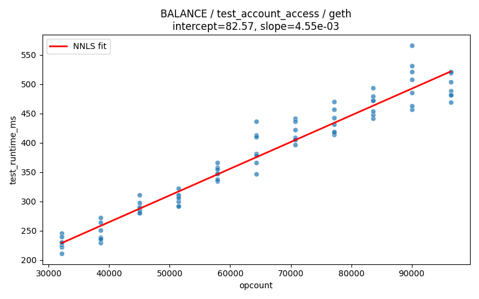

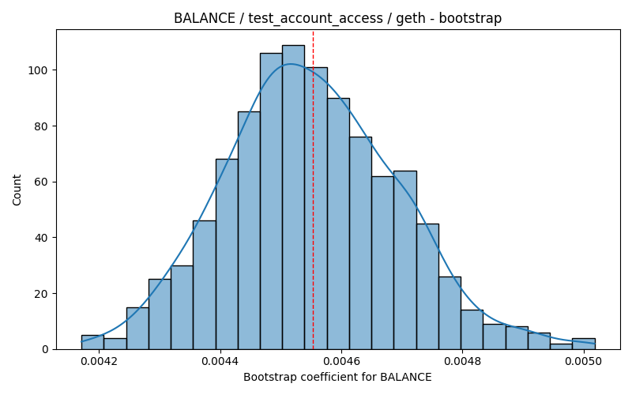

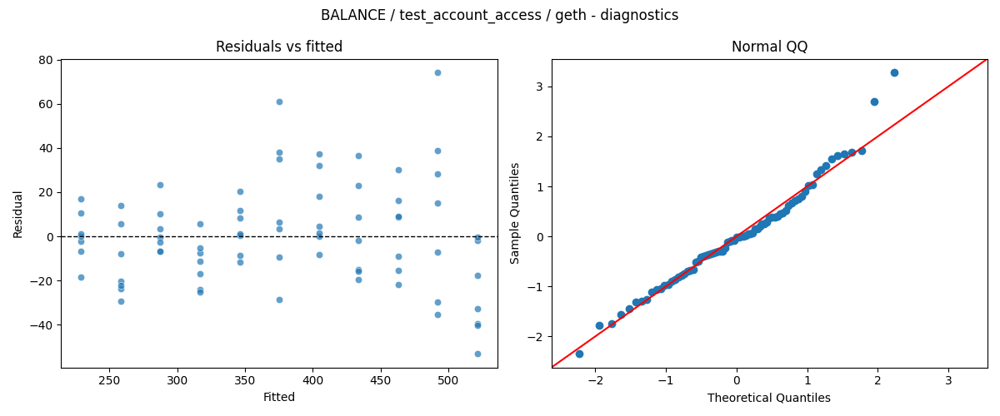

</details>

<details><summary>nethermind — NNLS regression summary</summary>

```
==============================================================================
                           NNLS Regression Results                            
==============================================================================
Dep. Variable:          test_runtime_ms              R-squared:          0.796
Model:                  NNLS                    Adj. R-squared:          0.793
No. Observations:       66                                RMSE:          18.13
Df Residuals:           64                                 MAE:          14.52
Df Model:               1      
==============================================================================
                      coef     std err     P-value      [0.025      0.975]
------------------------------------------------------------------------------
         const     95.3178      6.5176       0.001     83.1840    108.2073
       opcount      0.0018      0.0001       0.001      0.0016      0.0020
==============================================================================
Notes: Non-negative least squares with bootstrap inference (1000 iterations)
==============================================================================
```

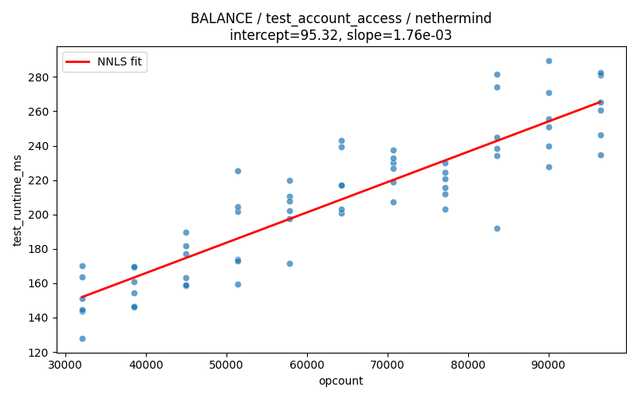

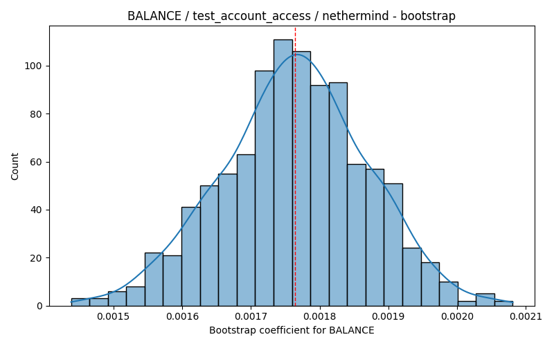

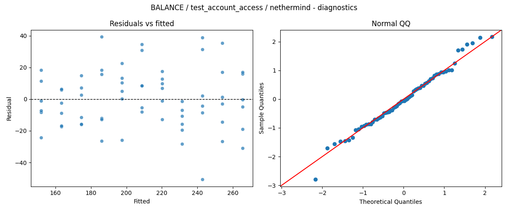

</details>

<details><summary>reth — NNLS regression summary</summary>

```
==============================================================================
                           NNLS Regression Results                            
==============================================================================
Dep. Variable:          test_runtime_ms              R-squared:          0.963
Model:                  NNLS                    Adj. R-squared:          0.962
No. Observations:       44                                RMSE:          15.13
Df Residuals:           42                                 MAE:          12.35
Df Model:               1      
==============================================================================
                      coef     std err     P-value      [0.025      0.975]
------------------------------------------------------------------------------
         const     83.0199      6.7295       0.001     71.0986     96.5808
       opcount      0.0038      0.0001       0.001      0.0036      0.0040
==============================================================================
Notes: Non-negative least squares with bootstrap inference (1000 iterations)
==============================================================================
```

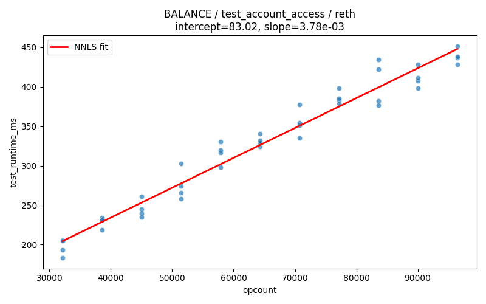

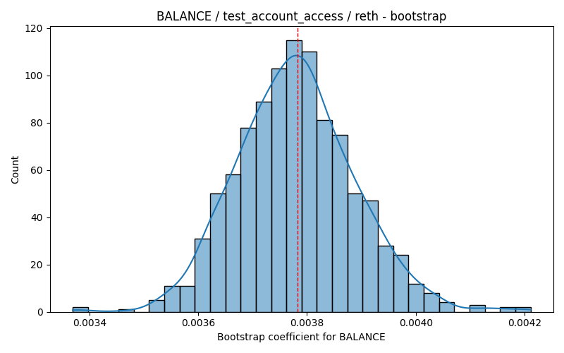

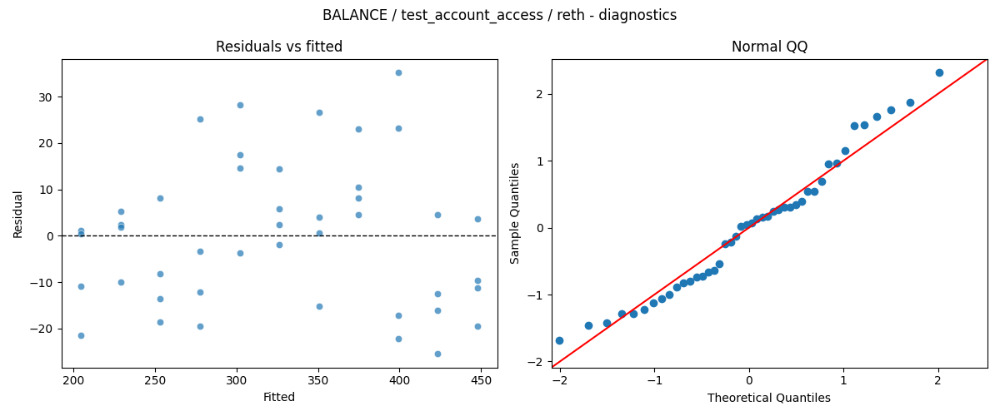

</details>

## CALL

### test_ext_account_query_warm — combo `CALL`

| client | nobs | R² | target_coef (ms) | p-value | 95% CI |
| --- | --- | --- | --- | --- | --- |
| `besu` | 55 | 0.9184 | 0.000482 | 1.00e-03 | [0.0004392, 0.0005271] |
| `erigon` | 44 | 0.9486 | 9.624e-05 | 1.00e-03 | [8.964e-05, 0.0001023] |
| `geth` | 77 | 0.8825 | 0.0001339 | 1.00e-03 | [0.0001213, 0.0001474] |
| `nethermind` | 66 | 0.6655 | 0.0002818 | 1.00e-03 | [0.0002251, 0.0003381] |
| `reth` | 44 | 0.9621 | 5.836e-05 | 1.00e-03 | [5.461e-05, 6.212e-05] |

<details><summary>besu — NNLS regression summary</summary>

```
==============================================================================
                           NNLS Regression Results                            
==============================================================================
Dep. Variable:          test_runtime_ms              R-squared:          0.918
Model:                  NNLS                    Adj. R-squared:          0.917
No. Observations:       55                                RMSE:          72.59
Df Residuals:           53                                 MAE:          58.55
Df Model:               1      
==============================================================================
                      coef     std err     P-value      [0.025      0.975]
------------------------------------------------------------------------------
         const    448.7637     35.0397       0.001    379.9012    515.0322
       opcount      0.0005      0.0000       0.001      0.0004      0.0005
==============================================================================
Notes: Non-negative least squares with bootstrap inference (1000 iterations)
==============================================================================
```

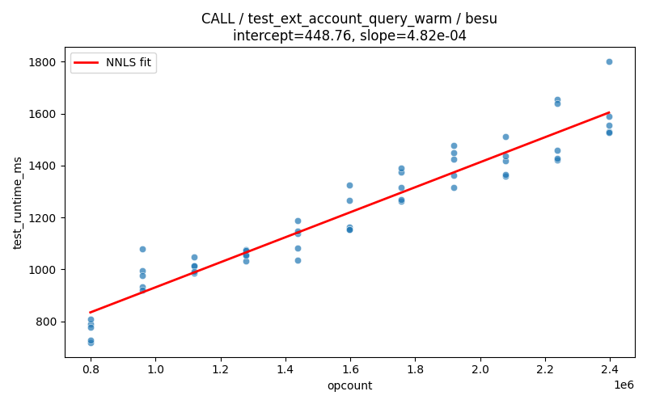

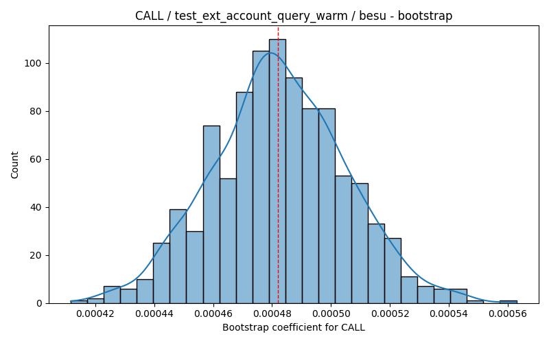

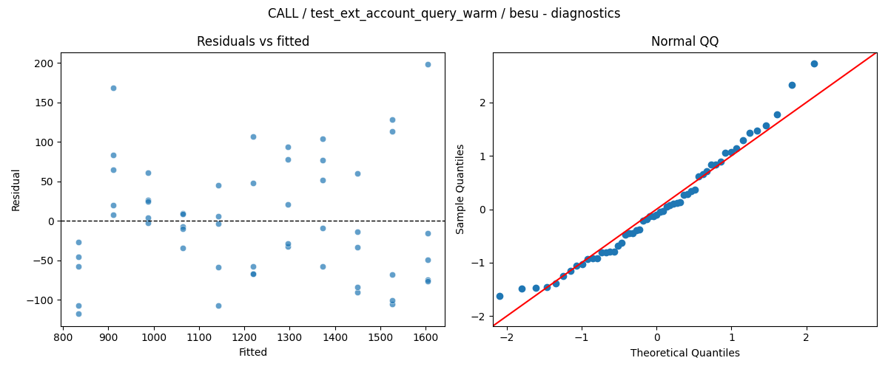

</details>

<details><summary>erigon — NNLS regression summary</summary>

```
==============================================================================
                           NNLS Regression Results                            
==============================================================================
Dep. Variable:          test_runtime_ms              R-squared:          0.949
Model:                  NNLS                    Adj. R-squared:          0.947
No. Observations:       44                                RMSE:          11.32
Df Residuals:           42                                 MAE:           9.12
Df Model:               1      
==============================================================================
                      coef     std err     P-value      [0.025      0.975]
------------------------------------------------------------------------------
         const     42.3277      5.8180       0.001     30.8701     53.9980
       opcount      0.0001      0.0000       0.001      0.0001      0.0001
==============================================================================
Notes: Non-negative least squares with bootstrap inference (1000 iterations)
==============================================================================
```

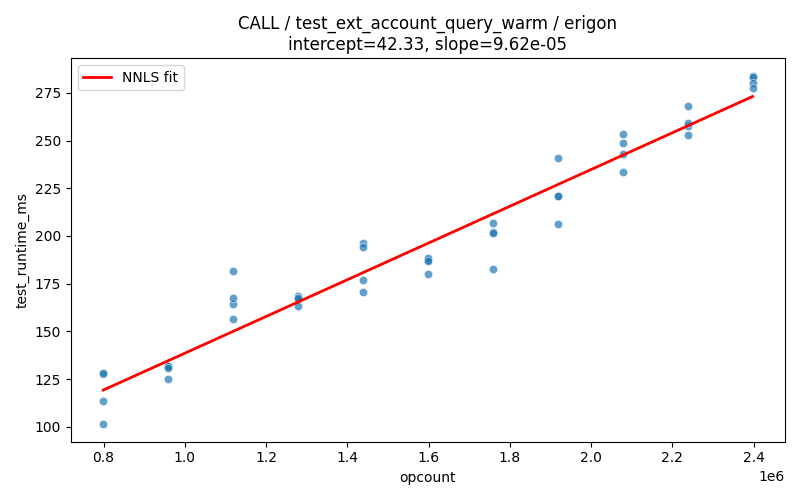

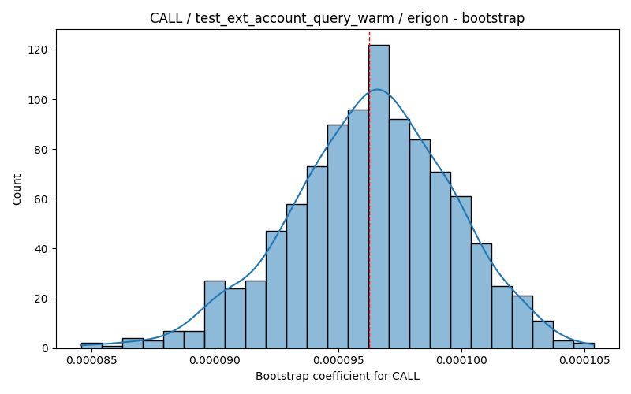

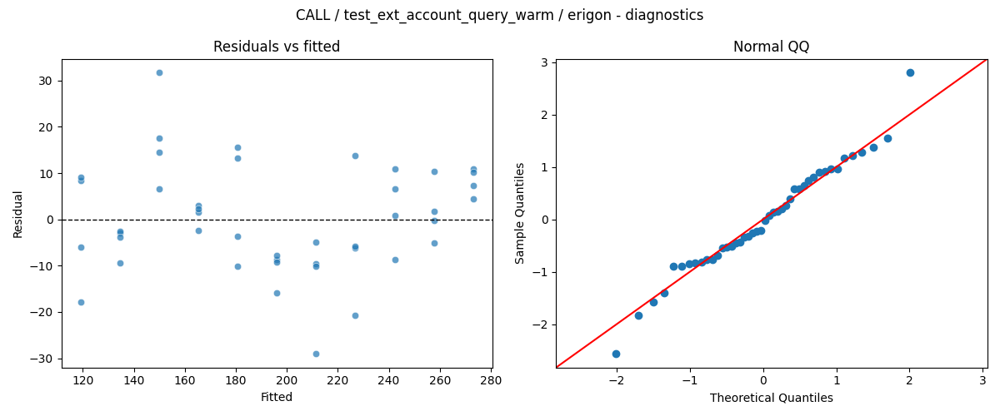

</details>

<details><summary>geth — NNLS regression summary</summary>

```
==============================================================================
                           NNLS Regression Results                            
==============================================================================
Dep. Variable:          test_runtime_ms              R-squared:          0.883
Model:                  NNLS                    Adj. R-squared:          0.881
No. Observations:       77                                RMSE:          24.69
Df Residuals:           75                                 MAE:          18.96
Df Model:               1      
==============================================================================
                      coef     std err     P-value      [0.025      0.975]
------------------------------------------------------------------------------
         const     29.0224     10.1959       0.005      8.6073     47.8910
       opcount      0.0001      0.0000       0.001      0.0001      0.0001
==============================================================================
Notes: Non-negative least squares with bootstrap inference (1000 iterations)
==============================================================================
```

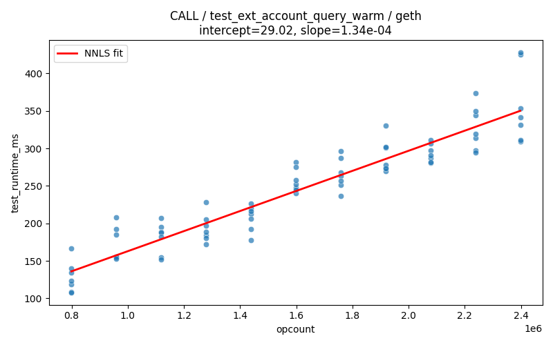

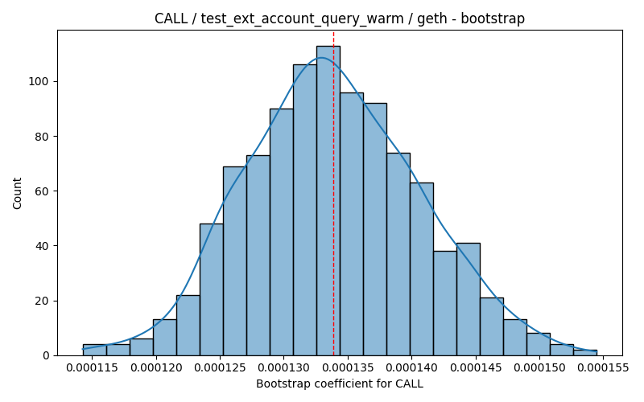

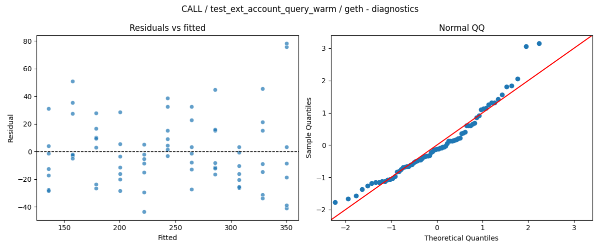

</details>

<details><summary>nethermind — NNLS regression summary</summary>

```
==============================================================================
                           NNLS Regression Results                            
==============================================================================
Dep. Variable:          test_runtime_ms              R-squared:          0.666
Model:                  NNLS                    Adj. R-squared:          0.660
No. Observations:       66                                RMSE:         100.96
Df Residuals:           64                                 MAE:          78.72
Df Model:               1      
==============================================================================
                      coef     std err     P-value      [0.025      0.975]
------------------------------------------------------------------------------
         const    286.5877     44.5396       0.001    199.0638    376.8185
       opcount      0.0003      0.0000       0.001      0.0002      0.0003
==============================================================================
Notes: Non-negative least squares with bootstrap inference (1000 iterations)
==============================================================================
```

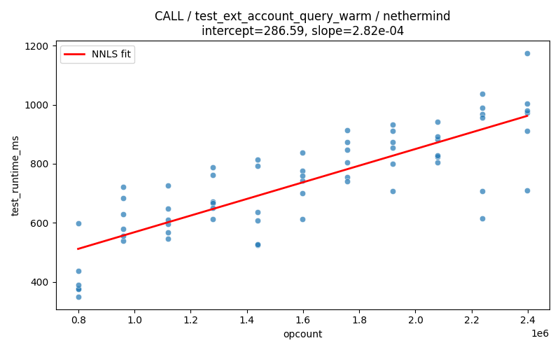

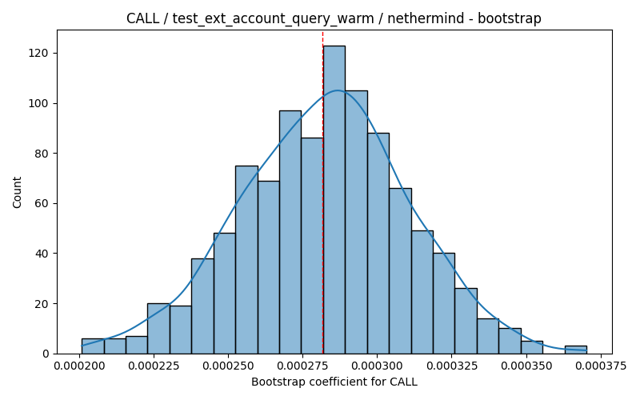

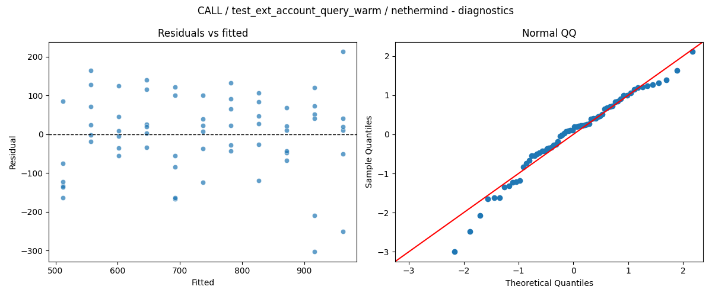

</details>

<details><summary>reth — NNLS regression summary</summary>

```
==============================================================================
                           NNLS Regression Results                            
==============================================================================
Dep. Variable:          test_runtime_ms              R-squared:          0.962
Model:                  NNLS                    Adj. R-squared:          0.961
No. Observations:       44                                RMSE:           5.85
Df Residuals:           42                                 MAE:           4.64
Df Model:               1      
==============================================================================
                      coef     std err     P-value      [0.025      0.975]
------------------------------------------------------------------------------
         const     23.5322      3.1538       0.001     17.0884     29.6166
       opcount      0.0001      0.0000       0.001      0.0001      0.0001
==============================================================================
Notes: Non-negative least squares with bootstrap inference (1000 iterations)
==============================================================================
```

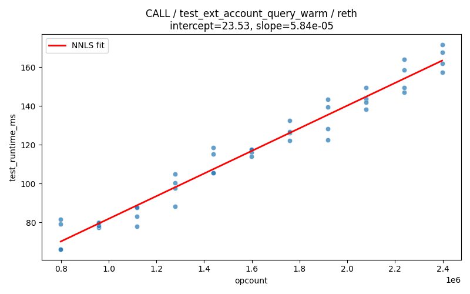

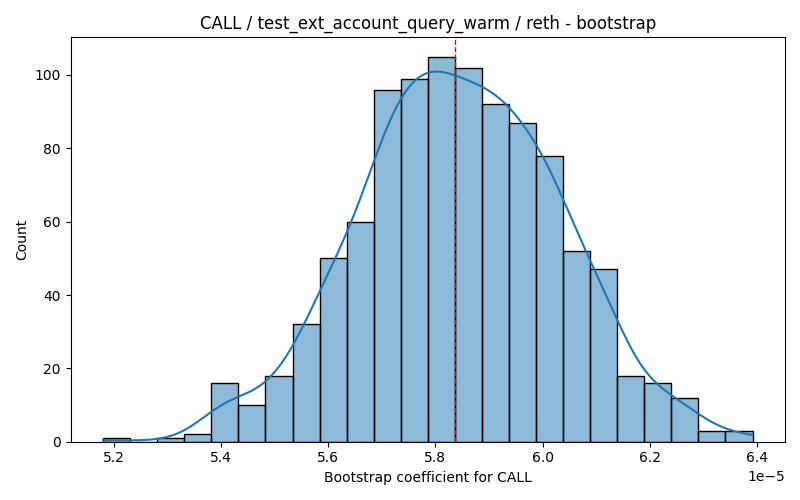

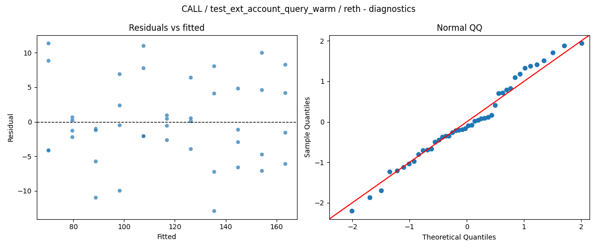

</details>

### test_account_access — combo `CALL_AccountMode.EXISTING_EOA` — `presets[cold_account_nocode_access]`

| client | nobs | R² | target_coef (ms) | p-value | 95% CI |
| --- | --- | --- | --- | --- | --- |
| `besu` | 55 | 0.99 | 0.01759 | 1.00e-03 | [0.01713, 0.01812] |
| `erigon` | 44 | 0.9986 | 0.008798 | 1.00e-03 | [0.008704, 0.008824] |
| `geth` | 77 | 0.9851 | 0.01095 | 1.00e-03 | [0.01064, 0.01123] |
| `nethermind` | 66 | 0.8959 | 0.003681 | 1.00e-03 | [0.003381, 0.003973] |
| `reth` | 44 | 0.9744 | 0.004223 | 1.00e-03 | [0.004068, 0.004387] |

<details><summary>besu — NNLS regression summary</summary>

```
==============================================================================
                           NNLS Regression Results                            
==============================================================================
Dep. Variable:          test_runtime_ms              R-squared:          0.990
Model:                  NNLS                    Adj. R-squared:          0.990
No. Observations:       55                                RMSE:          36.29
Df Residuals:           53                                 MAE:          28.71
Df Model:               1      
==============================================================================
                      coef     std err     P-value      [0.025      0.975]
------------------------------------------------------------------------------
         const    494.8131     14.8715       0.001    466.5976    523.1350
       opcount      0.0176      0.0003       0.001      0.0171      0.0181
==============================================================================
Notes: Non-negative least squares with bootstrap inference (1000 iterations)
==============================================================================
```

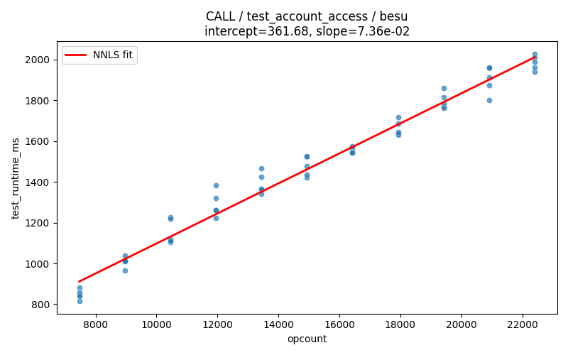

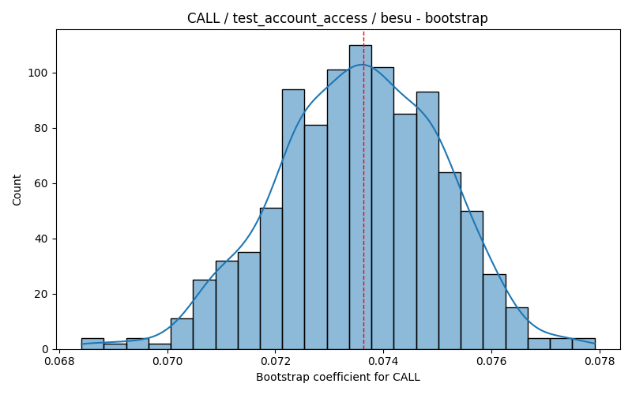

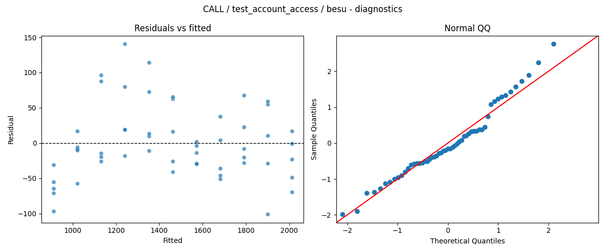

</details>

<details><summary>erigon — NNLS regression summary</summary>

```
==============================================================================
                           NNLS Regression Results                            
==============================================================================
Dep. Variable:          test_runtime_ms              R-squared:          0.999
Model:                  NNLS                    Adj. R-squared:          0.999
No. Observations:       44                                RMSE:           6.80
Df Residuals:           42                                 MAE:           5.80
Df Model:               1      
==============================================================================
                      coef     std err     P-value      [0.025      0.975]
------------------------------------------------------------------------------
         const      0.4619      1.9534       0.448      0.0000      6.8195
       opcount      0.0088      0.0000       0.001      0.0087      0.0088
==============================================================================
Notes: Non-negative least squares with bootstrap inference (1000 iterations)
==============================================================================
```


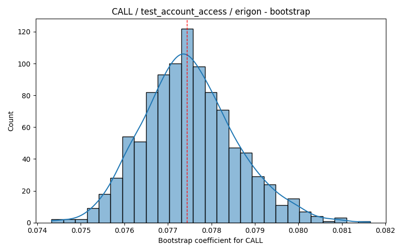

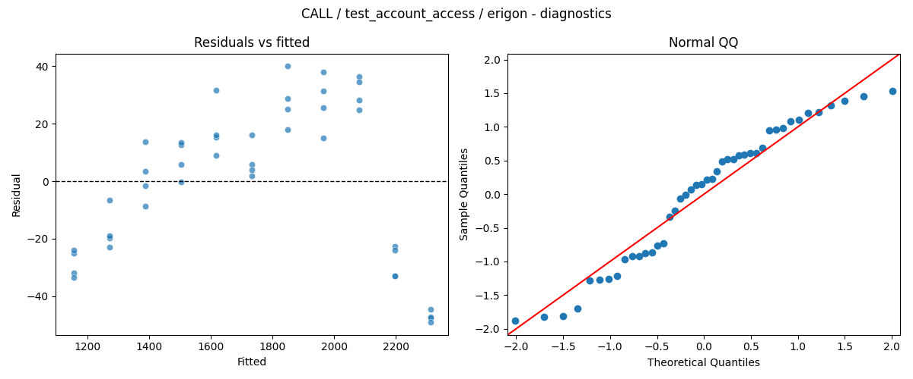

</details>

<details><summary>geth — NNLS regression summary</summary>

```
==============================================================================
                           NNLS Regression Results                            
==============================================================================
Dep. Variable:          test_runtime_ms              R-squared:          0.985
Model:                  NNLS                    Adj. R-squared:          0.985
No. Observations:       77                                RMSE:          27.69
Df Residuals:           75                                 MAE:          22.28
Df Model:               1      
==============================================================================
                      coef     std err     P-value      [0.025      0.975]
------------------------------------------------------------------------------
         const    247.3571     10.2951       0.001    229.1599    268.3080
       opcount      0.0109      0.0002       0.001      0.0106      0.0112
==============================================================================
Notes: Non-negative least squares with bootstrap inference (1000 iterations)
==============================================================================
```


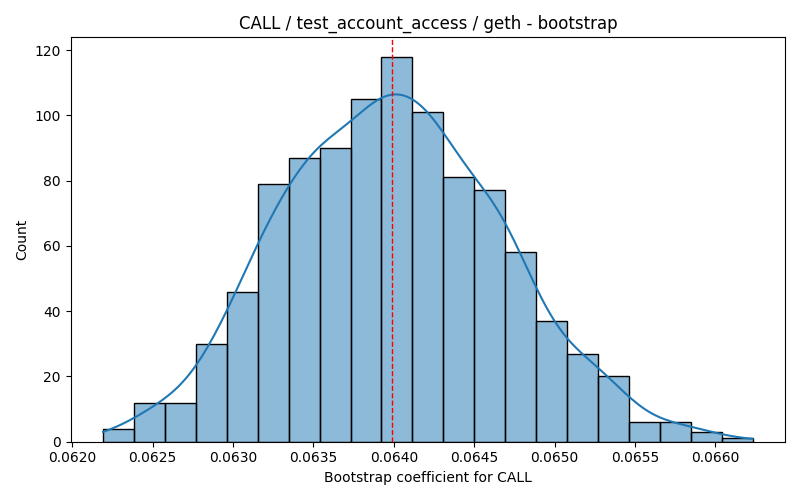

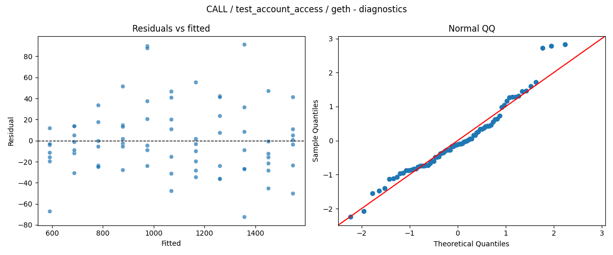

</details>

<details><summary>nethermind — NNLS regression summary</summary>

```
==============================================================================
                           NNLS Regression Results                            
==============================================================================
Dep. Variable:          test_runtime_ms              R-squared:          0.896
Model:                  NNLS                    Adj. R-squared:          0.894
No. Observations:       66                                RMSE:          25.77
Df Residuals:           64                                 MAE:          21.61
Df Model:               1      
==============================================================================
                      coef     std err     P-value      [0.025      0.975]
------------------------------------------------------------------------------
         const     94.4663      9.0118       0.001     76.6298    113.0113
       opcount      0.0037      0.0001       0.001      0.0034      0.0040
==============================================================================
Notes: Non-negative least squares with bootstrap inference (1000 iterations)
==============================================================================
```

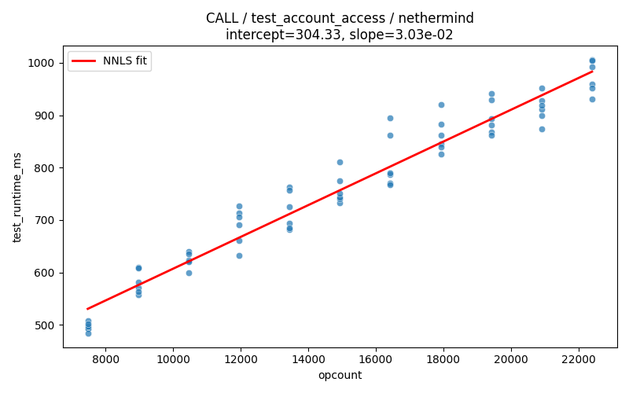

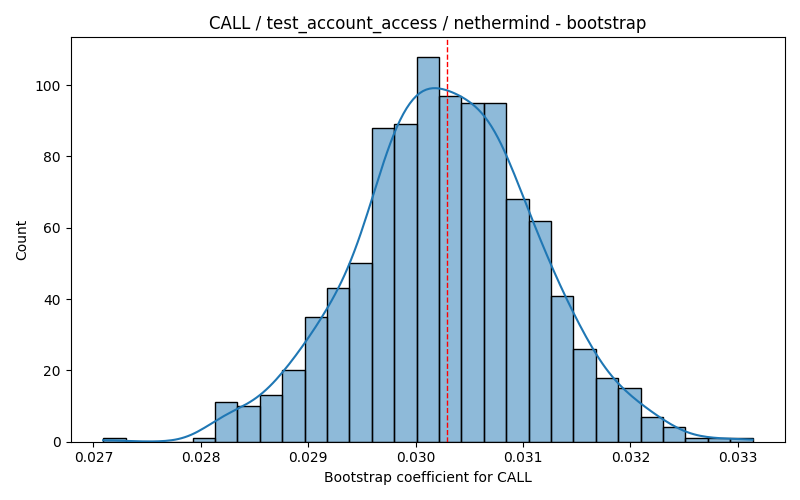

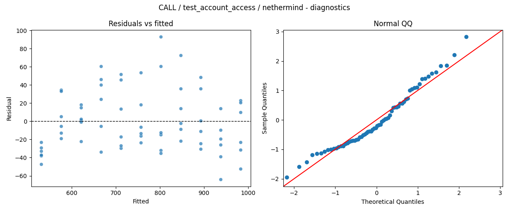

</details>

<details><summary>reth — NNLS regression summary</summary>

```
==============================================================================
                           NNLS Regression Results                            
==============================================================================
Dep. Variable:          test_runtime_ms              R-squared:          0.974
Model:                  NNLS                    Adj. R-squared:          0.974
No. Observations:       44                                RMSE:          14.05
Df Residuals:           42                                 MAE:          11.44
Df Model:               1      
==============================================================================
                      coef     std err     P-value      [0.025      0.975]
------------------------------------------------------------------------------
         const     97.1187      5.4079       0.001     87.3331    107.7779
       opcount      0.0042      0.0001       0.001      0.0041      0.0044
==============================================================================
Notes: Non-negative least squares with bootstrap inference (1000 iterations)
==============================================================================
```

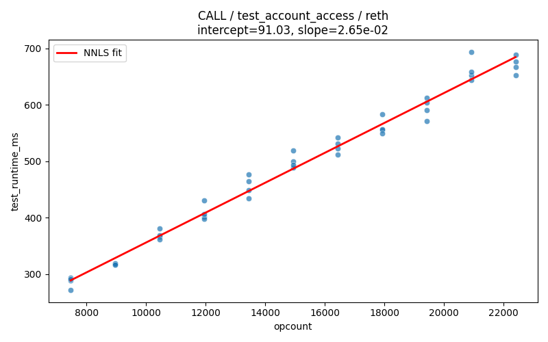

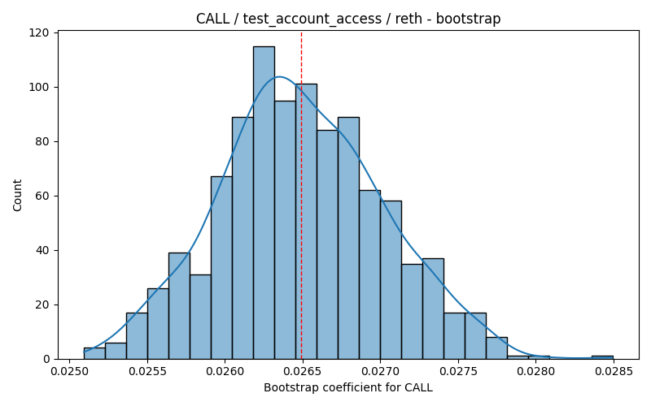

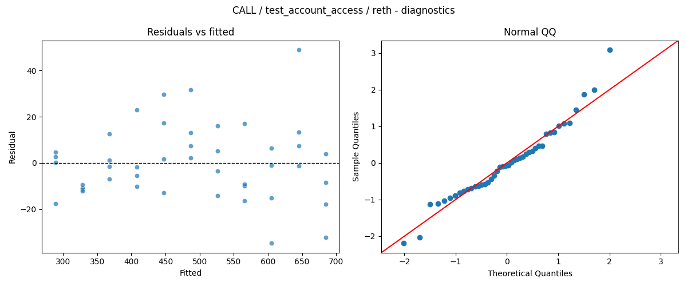

</details>

### test_account_access — combo `CALL_AccountMode.NON_EXISTING_ACCOUNT` — `presets[cold_account_nocode_access]`

| client | nobs | R² | target_coef (ms) | p-value | 95% CI |
| --- | --- | --- | --- | --- | --- |
| `besu` | 55 | 0.9889 | 0.01927 | 1.00e-03 | [0.01886, 0.01972] |
| `erigon` | 44 | 0.9857 | 0.008584 | 1.00e-03 | [0.008374, 0.008719] |
| `geth` | 77 | 0.9726 | 0.02186 | 1.00e-03 | [0.02095, 0.02276] |
| `nethermind` | 66 | 0.8708 | 0.003561 | 1.00e-03 | [0.003199, 0.003859] |
| `reth` | 44 | 0.9669 | 0.004104 | 1.00e-03 | [0.003901, 0.004332] |

<details><summary>besu — NNLS regression summary</summary>

```
==============================================================================
                           NNLS Regression Results                            
==============================================================================
Dep. Variable:          test_runtime_ms              R-squared:          0.989
Model:                  NNLS                    Adj. R-squared:          0.989
No. Observations:       55                                RMSE:          41.99
Df Residuals:           53                                 MAE:          33.30
Df Model:               1      
==============================================================================
                      coef     std err     P-value      [0.025      0.975]
------------------------------------------------------------------------------
         const    204.3784     15.2437       0.001    173.0454    234.2089
       opcount      0.0193      0.0002       0.001      0.0189      0.0197
==============================================================================
Notes: Non-negative least squares with bootstrap inference (1000 iterations)
==============================================================================
```

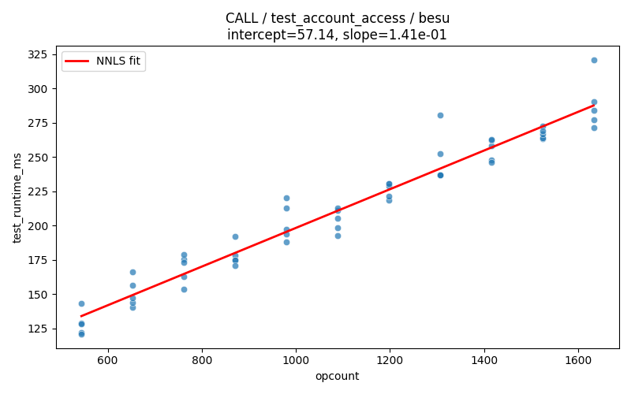

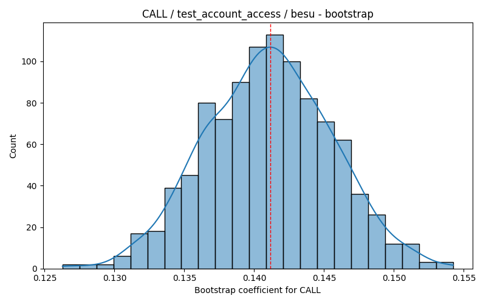

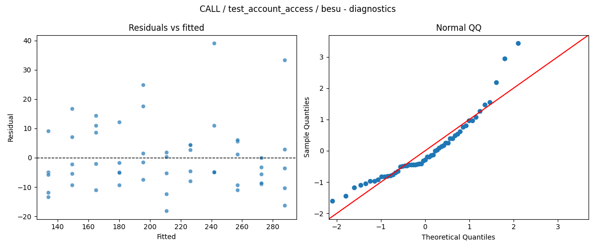

</details>

<details><summary>erigon — NNLS regression summary</summary>

```
==============================================================================
                           NNLS Regression Results                            
==============================================================================
Dep. Variable:          test_runtime_ms              R-squared:          0.986
Model:                  NNLS                    Adj. R-squared:          0.985
No. Observations:       44                                RMSE:          21.30
Df Residuals:           42                                 MAE:          10.55
Df Model:               1      
==============================================================================
                      coef     std err     P-value      [0.025      0.975]
------------------------------------------------------------------------------
         const      0.0000      2.8945       1.000      0.0000      9.7708
       opcount      0.0086      0.0001       0.001      0.0084      0.0087
==============================================================================
Notes: Non-negative least squares with bootstrap inference (1000 iterations)
==============================================================================
```

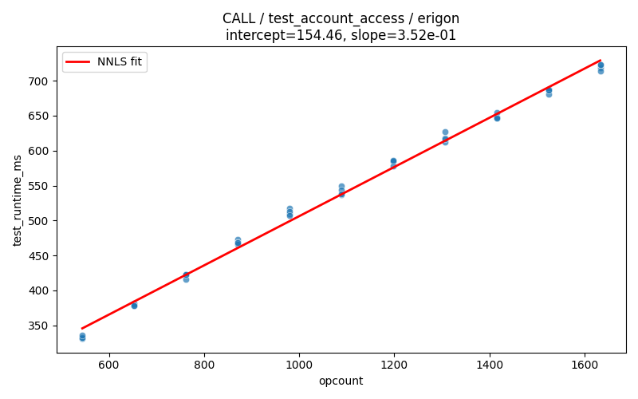

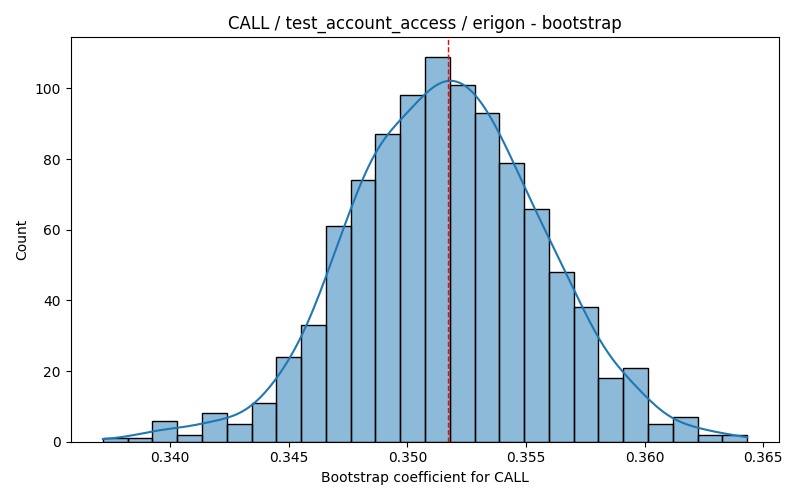

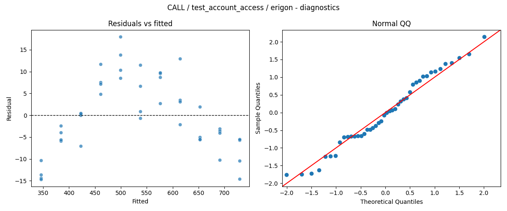

</details>

<details><summary>geth — NNLS regression summary</summary>

```
==============================================================================
                           NNLS Regression Results                            
==============================================================================
Dep. Variable:          test_runtime_ms              R-squared:          0.973
Model:                  NNLS                    Adj. R-squared:          0.972
No. Observations:       77                                RMSE:          75.32
Df Residuals:           75                                 MAE:          61.79
Df Model:               1      
==============================================================================
                      coef     std err     P-value      [0.025      0.975]
------------------------------------------------------------------------------
         const    268.1536     27.1312       0.001    217.8946    326.3869
       opcount      0.0219      0.0005       0.001      0.0210      0.0228
==============================================================================
Notes: Non-negative least squares with bootstrap inference (1000 iterations)
==============================================================================
```

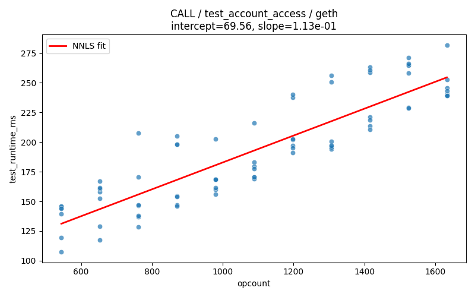

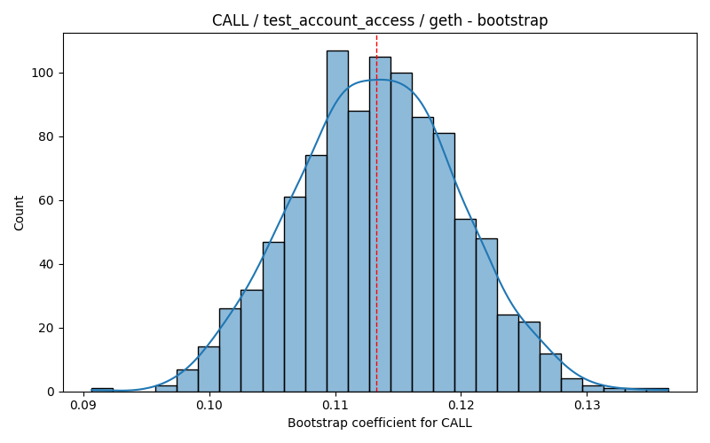

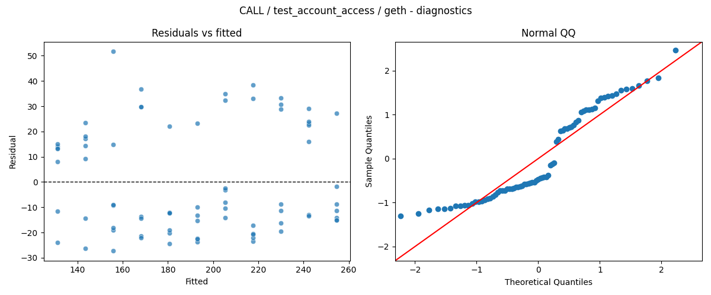

</details>

<details><summary>nethermind — NNLS regression summary</summary>

```
==============================================================================
                           NNLS Regression Results                            
==============================================================================
Dep. Variable:          test_runtime_ms              R-squared:          0.871
Model:                  NNLS                    Adj. R-squared:          0.869
No. Observations:       66                                RMSE:          28.18
Df Residuals:           64                                 MAE:          23.47
Df Model:               1      
==============================================================================
                      coef     std err     P-value      [0.025      0.975]
------------------------------------------------------------------------------
         const     77.8869     10.4222       0.001     59.4473    100.4088
       opcount      0.0036      0.0002       0.001      0.0032      0.0039
==============================================================================
Notes: Non-negative least squares with bootstrap inference (1000 iterations)
==============================================================================
```

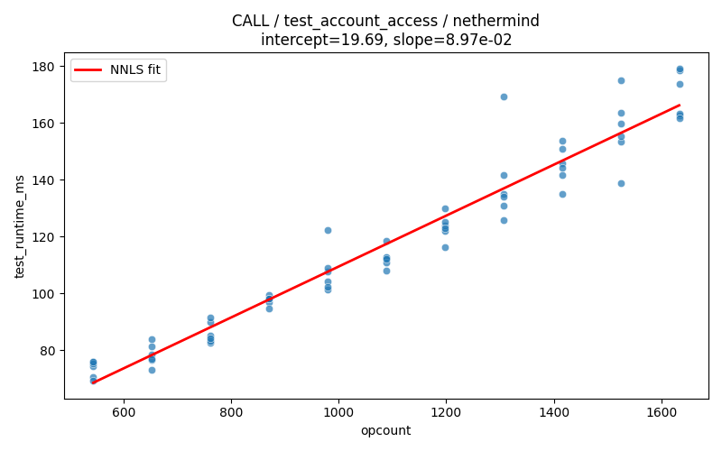

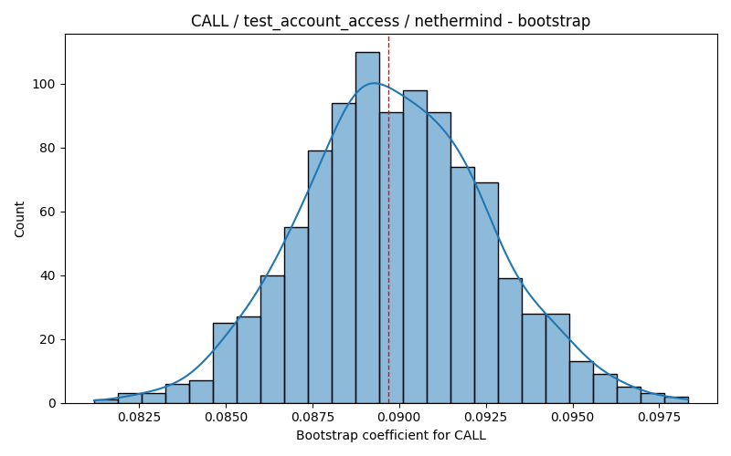

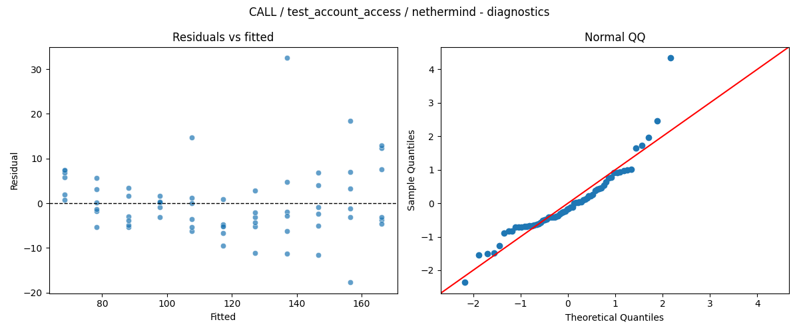

</details>

<details><summary>reth — NNLS regression summary</summary>

```
==============================================================================
                           NNLS Regression Results                            
==============================================================================
Dep. Variable:          test_runtime_ms              R-squared:          0.967
Model:                  NNLS                    Adj. R-squared:          0.966
No. Observations:       44                                RMSE:          15.61
Df Residuals:           42                                 MAE:          12.23
Df Model:               1      
==============================================================================
                      coef     std err     P-value      [0.025      0.975]
------------------------------------------------------------------------------
         const     86.4608      6.3744       0.001     73.3820     98.0411
       opcount      0.0041      0.0001       0.001      0.0039      0.0043
==============================================================================
Notes: Non-negative least squares with bootstrap inference (1000 iterations)
==============================================================================
```


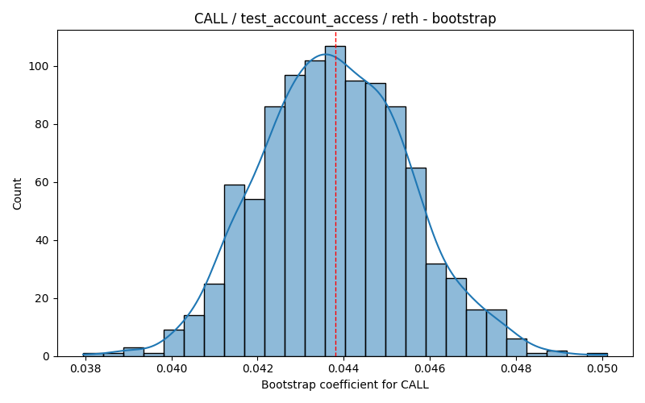

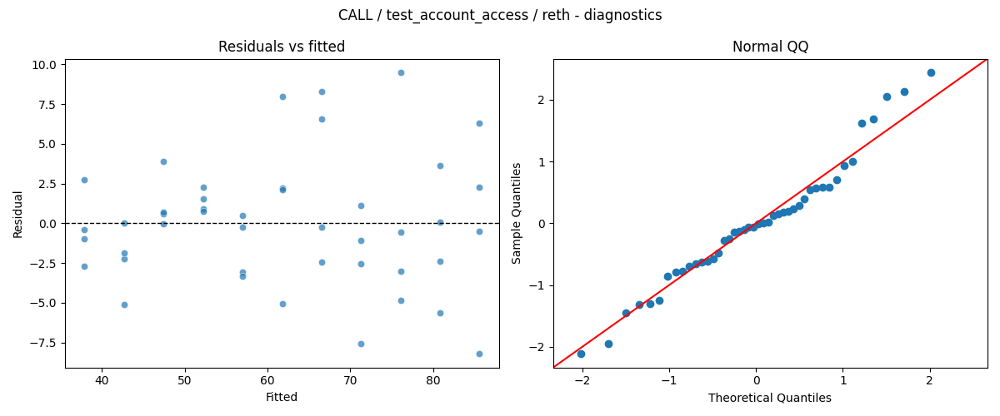

</details>

### test_account_access — combo `CALL_AccountMode.EXISTING_EOA` — `presets[cold_account_nocode_write]`

| client | nobs | R² | target_coef (ms) | p-value | 95% CI |
| --- | --- | --- | --- | --- | --- |
| `besu` | 55 | 0.979 | 0.07363 | 1.00e-03 | [0.07057, 0.07626] |
| `erigon` | 44 | 0.9949 | 0.07744 | 1.00e-03 | [0.07557, 0.07982] |
| `geth` | 77 | 0.9887 | 0.06399 | 1.00e-03 | [0.0627, 0.06537] |
| `nethermind` | 66 | 0.9498 | 0.0303 | 1.00e-03 | [0.02861, 0.03194] |
| `reth` | 44 | 0.9842 | 0.02649 | 1.00e-03 | [0.02549, 0.02755] |

<details><summary>besu — NNLS regression summary</summary>

```
==============================================================================
                           NNLS Regression Results                            
==============================================================================
Dep. Variable:          test_runtime_ms              R-squared:          0.979
Model:                  NNLS                    Adj. R-squared:          0.979
No. Observations:       55                                RMSE:          50.95
Df Residuals:           53                                 MAE:          39.69
Df Model:               1      
==============================================================================
                      coef     std err     P-value      [0.025      0.975]
------------------------------------------------------------------------------
         const    361.6754     25.0463       0.001    316.8755    415.1685
       opcount      0.0736      0.0015       0.001      0.0706      0.0763
==============================================================================
Notes: Non-negative least squares with bootstrap inference (1000 iterations)
==============================================================================
```


</details>

<details><summary>erigon — NNLS regression summary</summary>

```
==============================================================================
                           NNLS Regression Results                            
==============================================================================
Dep. Variable:          test_runtime_ms              R-squared:          0.995
Model:                  NNLS                    Adj. R-squared:          0.995
No. Observations:       44                                RMSE:          26.08
Df Residuals:           42                                 MAE:          22.46
Df Model:               1      
==============================================================================
                      coef     std err     P-value      [0.025      0.975]
------------------------------------------------------------------------------
         const    577.8654     14.4458       0.001    548.5602    605.6088
       opcount      0.0774      0.0011       0.001      0.0756      0.0798
==============================================================================
Notes: Non-negative least squares with bootstrap inference (1000 iterations)
==============================================================================
```


</details>

<details><summary>geth — NNLS regression summary</summary>

```
==============================================================================
                           NNLS Regression Results                            
==============================================================================
Dep. Variable:          test_runtime_ms              R-squared:          0.989
Model:                  NNLS                    Adj. R-squared:          0.989
No. Observations:       77                                RMSE:          32.28
Df Residuals:           75                                 MAE:          24.51
Df Model:               1      
==============================================================================
                      coef     std err     P-value      [0.025      0.975]
------------------------------------------------------------------------------
         const    113.0791     10.2775       0.001     93.3540    133.8118
       opcount      0.0640      0.0007       0.001      0.0627      0.0654
==============================================================================
Notes: Non-negative least squares with bootstrap inference (1000 iterations)
==============================================================================
```


</details>

<details><summary>nethermind — NNLS regression summary</summary>

```
==============================================================================
                           NNLS Regression Results                            
==============================================================================
Dep. Variable:          test_runtime_ms              R-squared:          0.950
Model:                  NNLS                    Adj. R-squared:          0.949
No. Observations:       66                                RMSE:          32.91
Df Residuals:           64                                 MAE:          27.10
Df Model:               1      
==============================================================================
                      coef     std err     P-value      [0.025      0.975]
------------------------------------------------------------------------------
         const    304.3311     12.6705       0.001    280.8147    331.5917
       opcount      0.0303      0.0008       0.001      0.0286      0.0319
==============================================================================
Notes: Non-negative least squares with bootstrap inference (1000 iterations)
==============================================================================
```


</details>

<details><summary>reth — NNLS regression summary</summary>

```
==============================================================================
                           NNLS Regression Results                            
==============================================================================
Dep. Variable:          test_runtime_ms              R-squared:          0.984
Model:                  NNLS                    Adj. R-squared:          0.984
No. Observations:       44                                RMSE:          15.87
Df Residuals:           42                                 MAE:          12.05
Df Model:               1      
==============================================================================
                      coef     std err     P-value      [0.025      0.975]
------------------------------------------------------------------------------
         const     91.0340      7.0119       0.001     77.5542    105.0463
       opcount      0.0265      0.0005       0.001      0.0255      0.0276
==============================================================================
Notes: Non-negative least squares with bootstrap inference (1000 iterations)
==============================================================================
```


</details>

### test_account_access — combo `CALL_AccountMode.NON_EXISTING_ACCOUNT` — `presets[cold_account_nocode_write]`

| client | nobs | R² | target_coef (ms) | p-value | 95% CI |
| --- | --- | --- | --- | --- | --- |
| `besu` | 55 | 0.9486 | 0.1412 | 1.00e-03 | [0.132, 0.1499] |
| `erigon` | 44 | 0.9953 | 0.3517 | 1.00e-03 | [0.3438, 0.3594] |
| `geth` | 77 | 0.7775 | 0.1133 | 1.00e-03 | [0.101, 0.1259] |
| `nethermind` | 66 | 0.9445 | 0.0897 | 1.00e-03 | [0.08477, 0.09525] |
| `reth` | 44 | 0.9377 | 0.04381 | 1.00e-03 | [0.0407, 0.04745] |

<details><summary>besu — NNLS regression summary</summary>

```
==============================================================================
                           NNLS Regression Results                            
==============================================================================
Dep. Variable:          test_runtime_ms              R-squared:          0.949
Model:                  NNLS                    Adj. R-squared:          0.948
No. Observations:       55                                RMSE:          11.32
Df Residuals:           53                                 MAE:           8.58
Df Model:               1      
==============================================================================
                      coef     std err     P-value      [0.025      0.975]
------------------------------------------------------------------------------
         const     57.1429      4.7527       0.001     48.5632     66.7025
       opcount      0.1412      0.0045       0.001      0.1320      0.1499
==============================================================================
Notes: Non-negative least squares with bootstrap inference (1000 iterations)
==============================================================================
```


</details>

<details><summary>erigon — NNLS regression summary</summary>

```
==============================================================================
                           NNLS Regression Results                            
==============================================================================
Dep. Variable:          test_runtime_ms              R-squared:          0.995
Model:                  NNLS                    Adj. R-squared:          0.995
No. Observations:       44                                RMSE:           8.36
Df Residuals:           42                                 MAE:           7.00
Df Model:               1      
==============================================================================
                      coef     std err     P-value      [0.025      0.975]
------------------------------------------------------------------------------
         const    154.4605      4.7878       0.001    145.9868    164.7031
       opcount      0.3517      0.0040       0.001      0.3438      0.3594
==============================================================================
Notes: Non-negative least squares with bootstrap inference (1000 iterations)
==============================================================================
```


</details>

<details><summary>geth — NNLS regression summary</summary>

```
==============================================================================
                           NNLS Regression Results                            
==============================================================================
Dep. Variable:          test_runtime_ms              R-squared:          0.777
Model:                  NNLS                    Adj. R-squared:          0.774
No. Observations:       77                                RMSE:          20.89
Df Residuals:           75                                 MAE:          18.91
Df Model:               1      
==============================================================================
                      coef     std err     P-value      [0.025      0.975]
------------------------------------------------------------------------------
         const     69.5563      7.3827       0.001     55.0204     83.6601
       opcount      0.1133      0.0064       0.001      0.1010      0.1259
==============================================================================
Notes: Non-negative least squares with bootstrap inference (1000 iterations)
==============================================================================
```


</details>

<details><summary>nethermind — NNLS regression summary</summary>

```
==============================================================================
                           NNLS Regression Results                            
==============================================================================
Dep. Variable:          test_runtime_ms              R-squared:          0.945
Model:                  NNLS                    Adj. R-squared:          0.944
No. Observations:       66                                RMSE:           7.49
Df Residuals:           64                                 MAE:           5.35
Df Model:               1      
==============================================================================
                      coef     std err     P-value      [0.025      0.975]
------------------------------------------------------------------------------
         const     19.6882      2.5210       0.001     14.3336     24.2751
       opcount      0.0897      0.0027       0.001      0.0848      0.0952
==============================================================================
Notes: Non-negative least squares with bootstrap inference (1000 iterations)
==============================================================================
```


</details>

<details><summary>reth — NNLS regression summary</summary>

```
==============================================================================
                           NNLS Regression Results                            
==============================================================================
Dep. Variable:          test_runtime_ms              R-squared:          0.938
Model:                  NNLS                    Adj. R-squared:          0.936
No. Observations:       44                                RMSE:           3.89
Df Residuals:           42                                 MAE:           2.91
Df Model:               1      
==============================================================================
                      coef     std err     P-value      [0.025      0.975]
------------------------------------------------------------------------------
         const     14.0681      1.6341       0.001     10.9900     17.2439
       opcount      0.0438      0.0017       0.001      0.0407      0.0475
==============================================================================
Notes: Non-negative least squares with bootstrap inference (1000 iterations)
==============================================================================
```


</details>

### test_account_access — combo `CALL_AccountMode.EXISTING_CONTRACT_DIFF_MAX` — `presets[cold_account_code_access]`

| client | nobs | R² | target_coef (ms) | p-value | 95% CI |
| --- | --- | --- | --- | --- | --- |
| `besu` | 55 | 0.9839 | 0.023 | 1.00e-03 | [0.02223, 0.02366] |
| `erigon` | 44 | 0.9248 | 0.03413 | 1.00e-03 | [0.0311, 0.03665] |
| `geth` | 77 | 0.9294 | 0.02093 | 1.00e-03 | [0.01948, 0.02241] |
| `nethermind` | 66 | 0.9105 | 0.01525 | 1.00e-03 | [0.01379, 0.01669] |
| `reth` | 44 | 0.9974 | 0.02095 | 1.00e-03 | [0.02057, 0.02131] |

<details><summary>besu — NNLS regression summary</summary>

```
==============================================================================
                           NNLS Regression Results                            
==============================================================================
Dep. Variable:          test_runtime_ms              R-squared:          0.984
Model:                  NNLS                    Adj. R-squared:          0.984
No. Observations:       55                                RMSE:          59.40
Df Residuals:           53                                 MAE:          48.26
Df Model:               1      
==============================================================================
                      coef     std err     P-value      [0.025      0.975]
------------------------------------------------------------------------------
         const    455.7712     24.9397       0.001    408.9976    507.5615
       opcount      0.0230      0.0003       0.001      0.0222      0.0237
==============================================================================
Notes: Non-negative least squares with bootstrap inference (1000 iterations)
==============================================================================
```

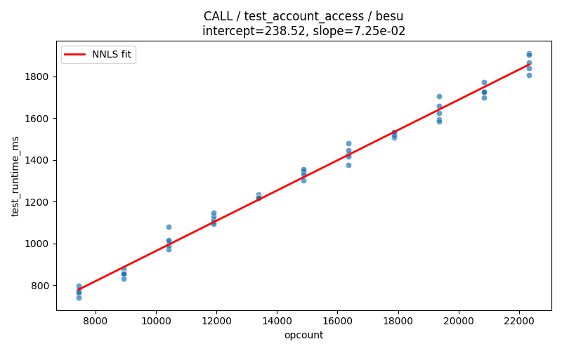

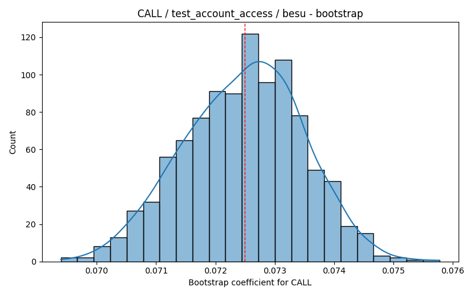

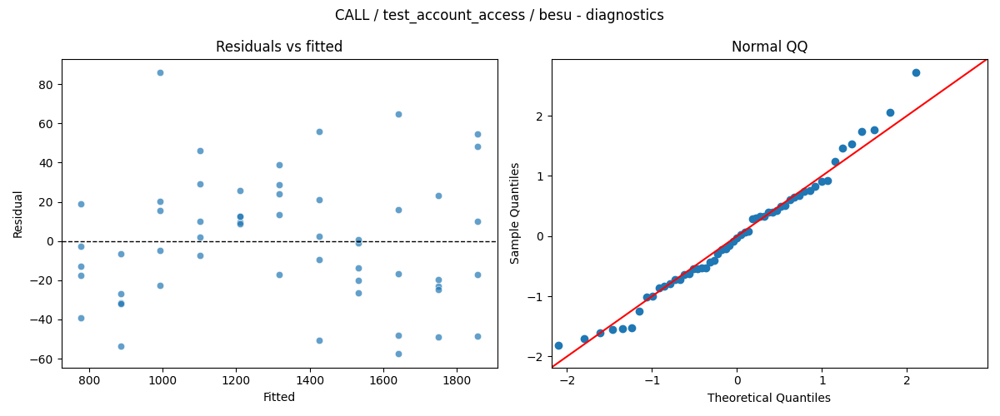

</details>

<details><summary>erigon — NNLS regression summary</summary>

```
==============================================================================
                           NNLS Regression Results                            
==============================================================================
Dep. Variable:          test_runtime_ms              R-squared:          0.925
Model:                  NNLS                    Adj. R-squared:          0.923
No. Observations:       44                                RMSE:         196.85
Df Residuals:           42                                 MAE:         177.15
Df Model:               1      
==============================================================================
                      coef     std err     P-value      [0.025      0.975]
------------------------------------------------------------------------------
         const    293.2553    100.8824       0.001    118.9879    508.1441
       opcount      0.0341      0.0014       0.001      0.0311      0.0367
==============================================================================
Notes: Non-negative least squares with bootstrap inference (1000 iterations)
==============================================================================
```

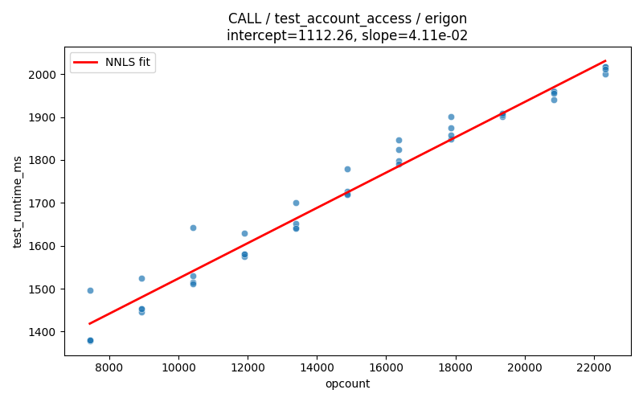

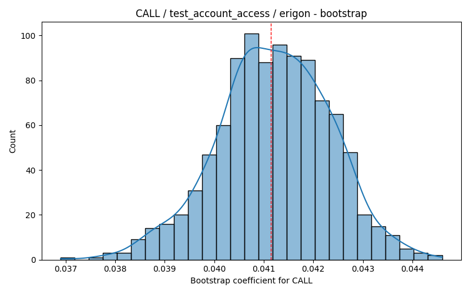

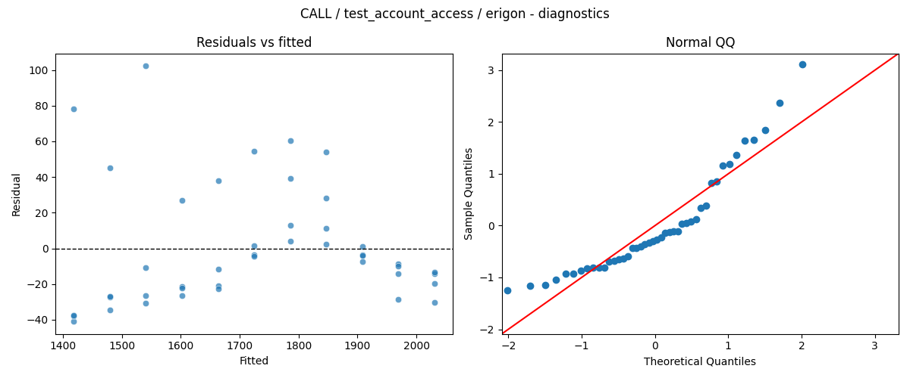

</details>

<details><summary>geth — NNLS regression summary</summary>

```
==============================================================================
                           NNLS Regression Results                            
==============================================================================
Dep. Variable:          test_runtime_ms              R-squared:          0.929
Model:                  NNLS                    Adj. R-squared:          0.928
No. Observations:       77                                RMSE:         116.66
Df Residuals:           75                                 MAE:          92.63
Df Model:               1      
==============================================================================
                      coef     std err     P-value      [0.025      0.975]
------------------------------------------------------------------------------
         const    479.0300     49.3736       0.001    381.5780    575.8627
       opcount      0.0209      0.0008       0.001      0.0195      0.0224
==============================================================================
Notes: Non-negative least squares with bootstrap inference (1000 iterations)
==============================================================================
```

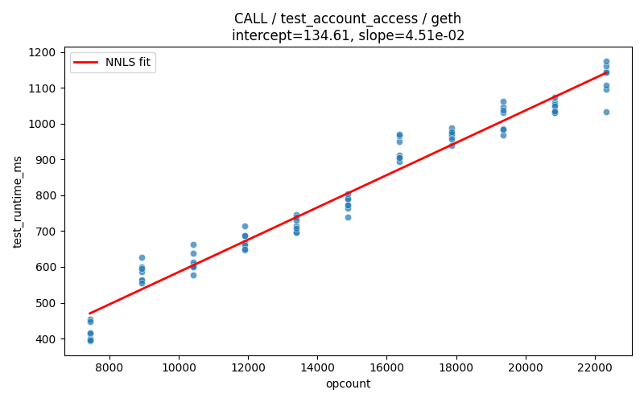

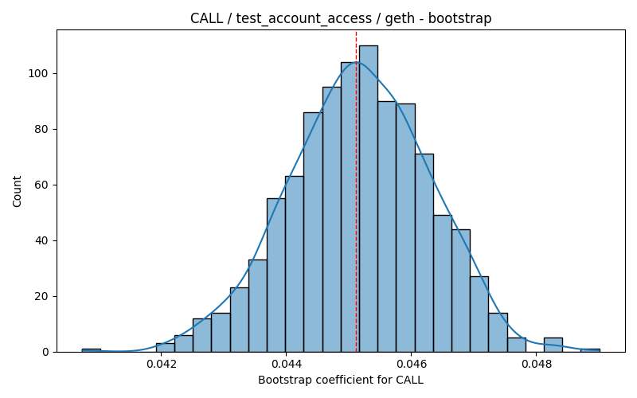

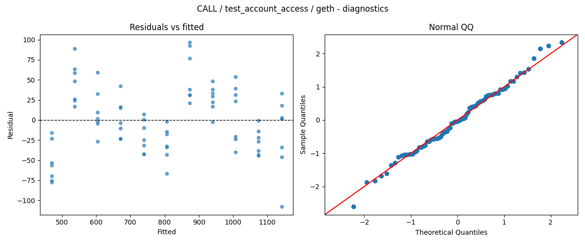

</details>

<details><summary>nethermind — NNLS regression summary</summary>

```
==============================================================================
                           NNLS Regression Results                            
==============================================================================
Dep. Variable:          test_runtime_ms              R-squared:          0.910
Model:                  NNLS                    Adj. R-squared:          0.909
No. Observations:       66                                RMSE:          96.68
Df Residuals:           64                                 MAE:          74.24
Df Model:               1      
==============================================================================
                      coef     std err     P-value      [0.025      0.975]
------------------------------------------------------------------------------
         const    674.6454     55.7774       0.001    566.6551    782.4495
       opcount      0.0152      0.0007       0.001      0.0138      0.0167
==============================================================================
Notes: Non-negative least squares with bootstrap inference (1000 iterations)
==============================================================================
```

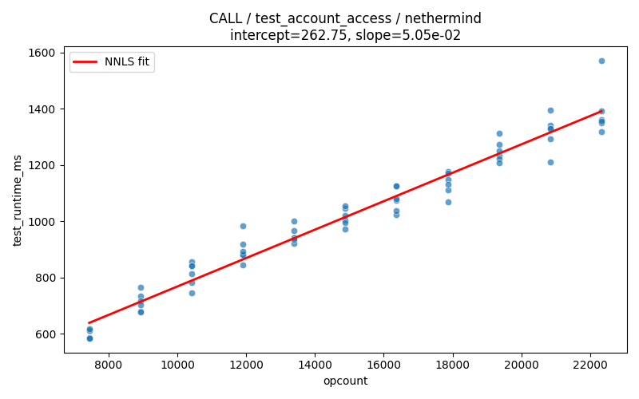

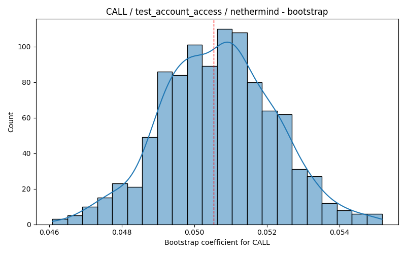

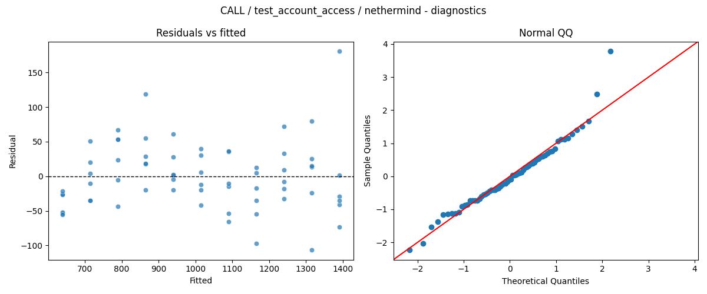

</details>

<details><summary>reth — NNLS regression summary</summary>

```
==============================================================================
                           NNLS Regression Results                            
==============================================================================
Dep. Variable:          test_runtime_ms              R-squared:          0.997
Model:                  NNLS                    Adj. R-squared:          0.997
No. Observations:       44                                RMSE:          21.61
Df Residuals:           42                                 MAE:          15.65
Df Model:               1      
==============================================================================
                      coef     std err     P-value      [0.025      0.975]
------------------------------------------------------------------------------
         const    126.4164     13.4302       0.001    101.7298    155.5377
       opcount      0.0210      0.0002       0.001      0.0206      0.0213
==============================================================================
Notes: Non-negative least squares with bootstrap inference (1000 iterations)
==============================================================================
```

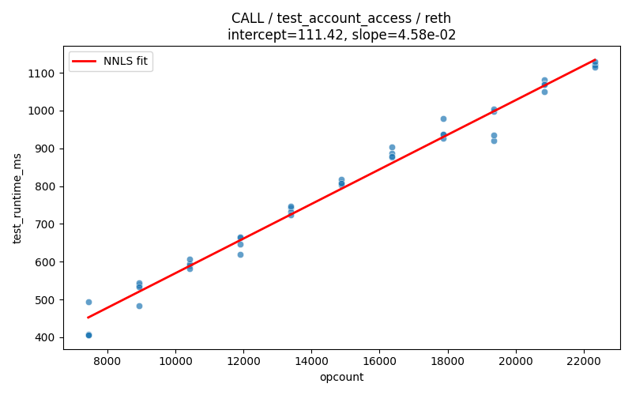

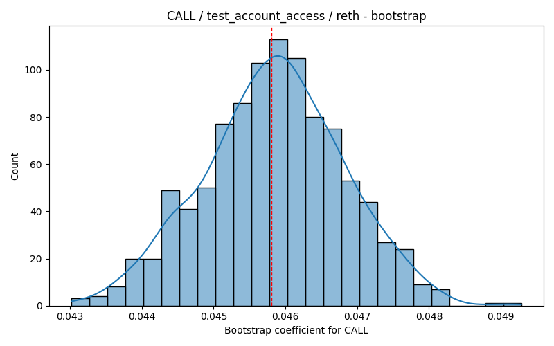

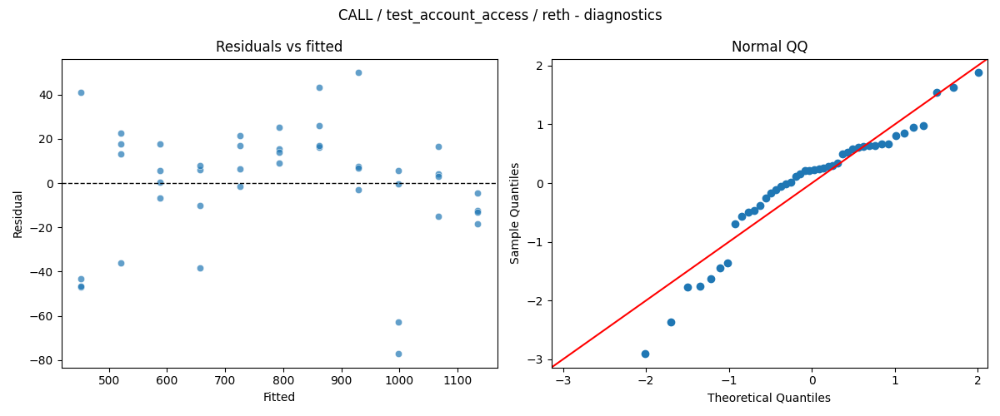

</details>

### test_account_access — combo `CALL_AccountMode.EXISTING_CONTRACT_MINIMAL` — `presets[cold_account_code_access]`

| client | nobs | R² | target_coef (ms) | p-value | 95% CI |
| --- | --- | --- | --- | --- | --- |
| `besu` | 55 | 0.9907 | 0.01503 | 1.00e-03 | [0.01462, 0.01547] |
| `erigon` | 44 | 0.9968 | 0.00896 | 1.00e-03 | [0.008825, 0.009112] |
| `geth` | 77 | 0.9658 | 0.004968 | 1.00e-03 | [0.004743, 0.005158] |
| `nethermind` | 66 | 0.6963 | 0.003083 | 1.00e-03 | [0.002602, 0.003544] |
| `reth` | 44 | 0.9688 | 0.004198 | 1.00e-03 | [0.003975, 0.004417] |

<details><summary>besu — NNLS regression summary</summary>

```
==============================================================================
                           NNLS Regression Results                            
==============================================================================
Dep. Variable:          test_runtime_ms              R-squared:          0.991
Model:                  NNLS                    Adj. R-squared:          0.990
No. Observations:       55                                RMSE:          29.50
Df Residuals:           53                                 MAE:          23.96
Df Model:               1      
==============================================================================
                      coef     std err     P-value      [0.025      0.975]
------------------------------------------------------------------------------
         const    365.7780     14.8978       0.001    337.8467    394.8236
       opcount      0.0150      0.0002       0.001      0.0146      0.0155
==============================================================================
Notes: Non-negative least squares with bootstrap inference (1000 iterations)
==============================================================================
```

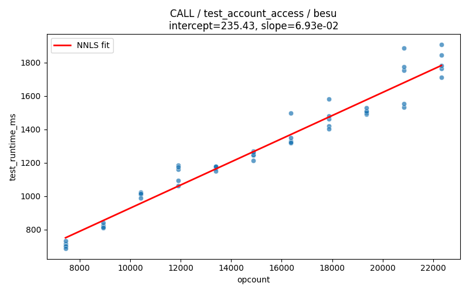

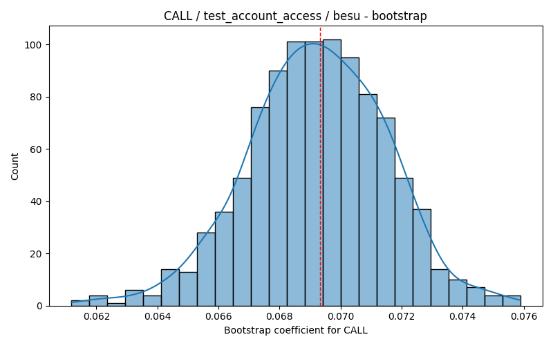

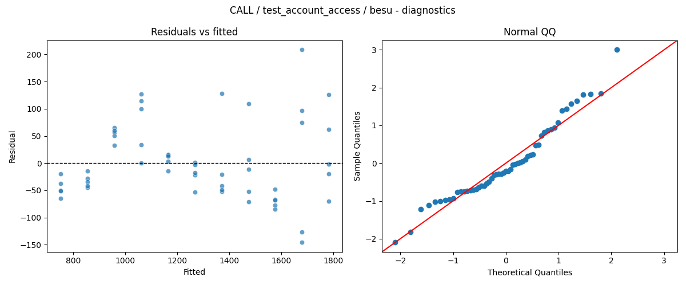

</details>

<details><summary>erigon — NNLS regression summary</summary>

```
==============================================================================
                           NNLS Regression Results                            
==============================================================================
Dep. Variable:          test_runtime_ms              R-squared:          0.997
Model:                  NNLS                    Adj. R-squared:          0.997
No. Observations:       44                                RMSE:          10.22
Df Residuals:           42                                 MAE:           8.67
Df Model:               1      
==============================================================================
                      coef     std err     P-value      [0.025      0.975]
------------------------------------------------------------------------------
         const    115.6685      4.4981       0.001    105.5048    123.4773
       opcount      0.0090      0.0001       0.001      0.0088      0.0091
==============================================================================
Notes: Non-negative least squares with bootstrap inference (1000 iterations)
==============================================================================
```

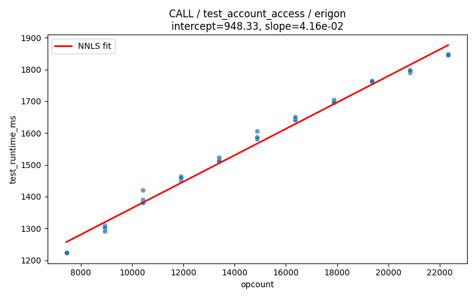

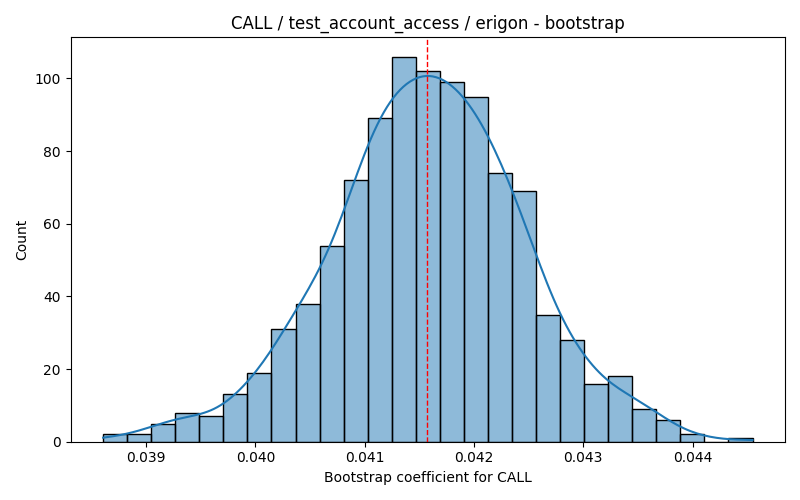

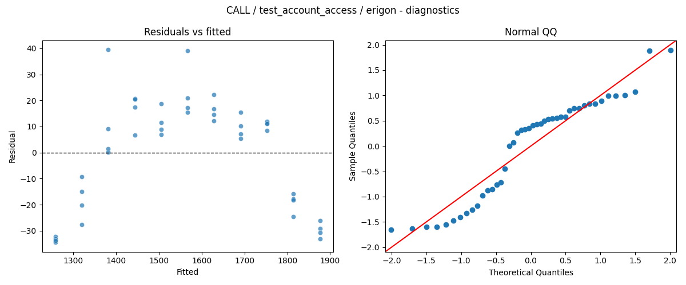

</details>

<details><summary>geth — NNLS regression summary</summary>

```
==============================================================================
                           NNLS Regression Results                            
==============================================================================
Dep. Variable:          test_runtime_ms              R-squared:          0.966
Model:                  NNLS                    Adj. R-squared:          0.965
No. Observations:       77                                RMSE:          18.89
Df Residuals:           75                                 MAE:          14.24
Df Model:               1      
==============================================================================
                      coef     std err     P-value      [0.025      0.975]
------------------------------------------------------------------------------
         const     78.8477      7.1781       0.001     65.3940     93.1832
       opcount      0.0050      0.0001       0.001      0.0047      0.0052
==============================================================================
Notes: Non-negative least squares with bootstrap inference (1000 iterations)
==============================================================================
```

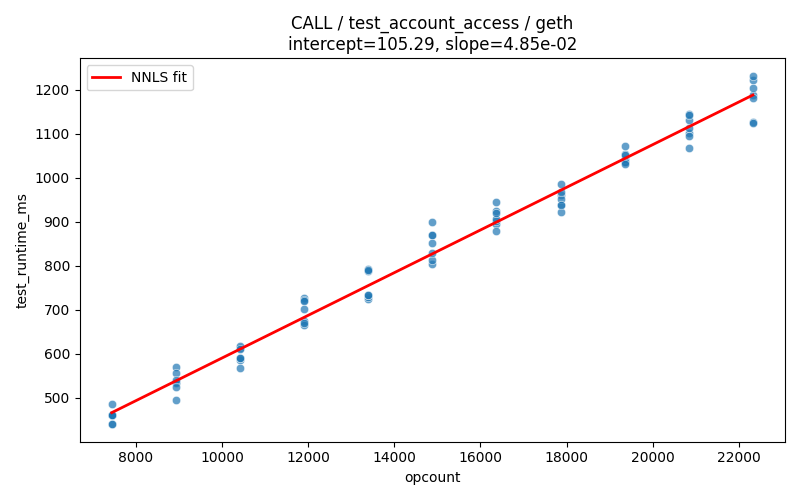

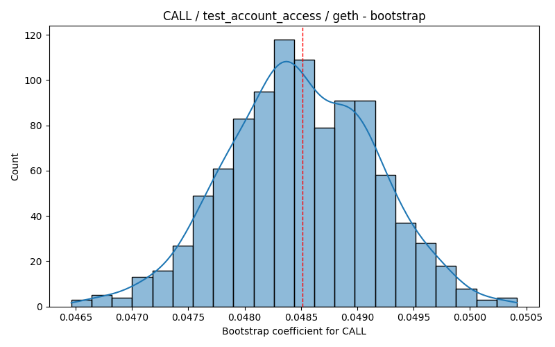

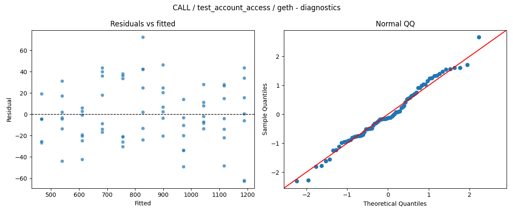

</details>

<details><summary>nethermind — NNLS regression summary</summary>

```
==============================================================================
                           NNLS Regression Results                            
==============================================================================
Dep. Variable:          test_runtime_ms              R-squared:          0.696
Model:                  NNLS                    Adj. R-squared:          0.692
No. Observations:       66                                RMSE:          41.17
Df Residuals:           64                                 MAE:          34.31
Df Model:               1      
==============================================================================
                      coef     std err     P-value      [0.025      0.975]
------------------------------------------------------------------------------
         const    102.2136     13.4707       0.001     77.0830    130.1969
       opcount      0.0031      0.0002       0.001      0.0026      0.0035
==============================================================================
Notes: Non-negative least squares with bootstrap inference (1000 iterations)
==============================================================================
```

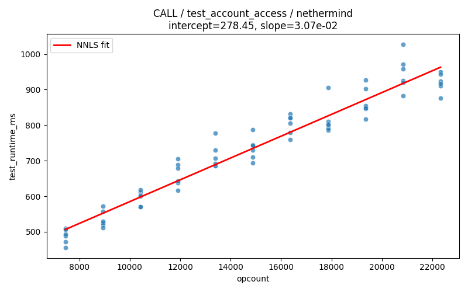

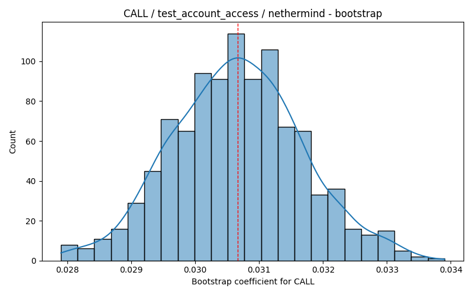

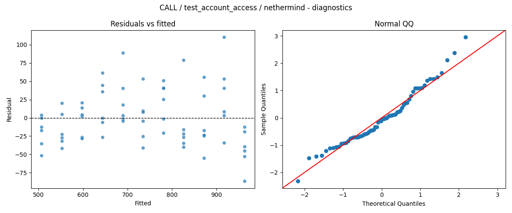

</details>

<details><summary>reth — NNLS regression summary</summary>

```
==============================================================================
                           NNLS Regression Results                            
==============================================================================
Dep. Variable:          test_runtime_ms              R-squared:          0.969
Model:                  NNLS                    Adj. R-squared:          0.968
No. Observations:       44                                RMSE:          15.23
Df Residuals:           42                                 MAE:          11.94
Df Model:               1      
==============================================================================
                      coef     std err     P-value      [0.025      0.975]
------------------------------------------------------------------------------
         const     88.6994      7.2212       0.001     75.6267    103.9092
       opcount      0.0042      0.0001       0.001      0.0040      0.0044
==============================================================================
Notes: Non-negative least squares with bootstrap inference (1000 iterations)
==============================================================================
```

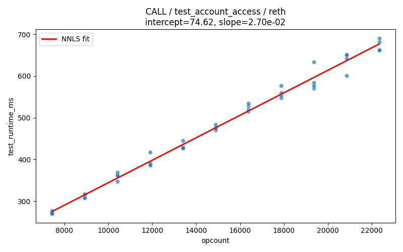

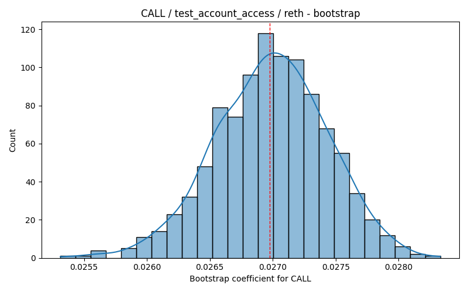

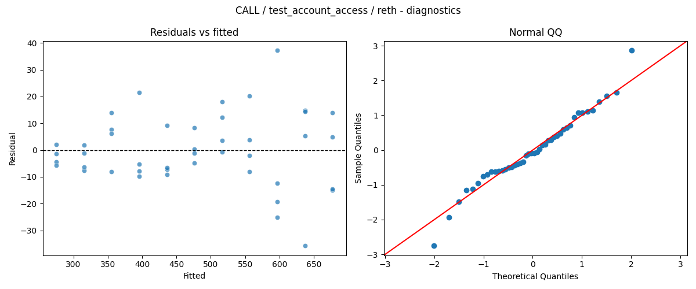

</details>

### test_account_access — combo `CALL_AccountMode.EXISTING_CONTRACT_SAME_MAX` — `presets[cold_account_code_access]`

| client | nobs | R² | target_coef (ms) | p-value | 95% CI |
| --- | --- | --- | --- | --- | --- |
| `besu` | 55 | 0.979 | 0.01374 | 1.00e-03 | [0.01316, 0.01436] |
| `erigon` | 44 | 0.9946 | 0.008974 | 1.00e-03 | [0.008816, 0.009148] |
| `geth` | 77 | 0.9577 | 0.005037 | 1.00e-03 | [0.004769, 0.005302] |
| `nethermind` | 66 | 0.718 | 0.003312 | 1.00e-03 | [0.00286, 0.00374] |
| `reth` | 44 | 0.9712 | 0.004418 | 1.00e-03 | [0.00417, 0.004666] |

<details><summary>besu — NNLS regression summary</summary>

```
==============================================================================
                           NNLS Regression Results                            
==============================================================================
Dep. Variable:          test_runtime_ms              R-squared:          0.979
Model:                  NNLS                    Adj. R-squared:          0.979
No. Observations:       55                                RMSE:          40.74
Df Residuals:           53                                 MAE:          32.98
Df Model:               1      
==============================================================================
                      coef     std err     P-value      [0.025      0.975]
------------------------------------------------------------------------------
         const    404.3275     19.9292       0.001    366.7505    444.1200
       opcount      0.0137      0.0003       0.001      0.0132      0.0144
==============================================================================
Notes: Non-negative least squares with bootstrap inference (1000 iterations)
==============================================================================
```

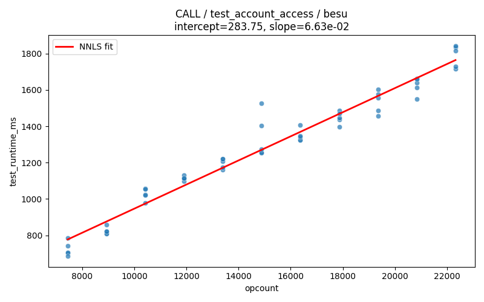

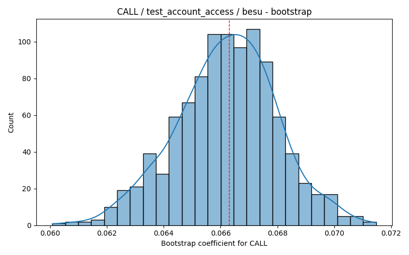

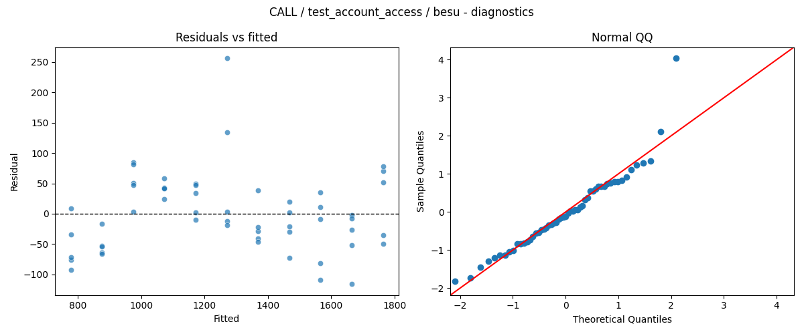

</details>

<details><summary>erigon — NNLS regression summary</summary>

```
==============================================================================
                           NNLS Regression Results                            
==============================================================================
Dep. Variable:          test_runtime_ms              R-squared:          0.995
Model:                  NNLS                    Adj. R-squared:          0.994
No. Observations:       44                                RMSE:          13.38
Df Residuals:           42                                 MAE:          11.34
Df Model:               1      
==============================================================================
                      coef     std err     P-value      [0.025      0.975]
------------------------------------------------------------------------------
         const    116.6040      5.8652       0.001    103.3156    126.9261
       opcount      0.0090      0.0001       0.001      0.0088      0.0091
==============================================================================
Notes: Non-negative least squares with bootstrap inference (1000 iterations)
==============================================================================
```


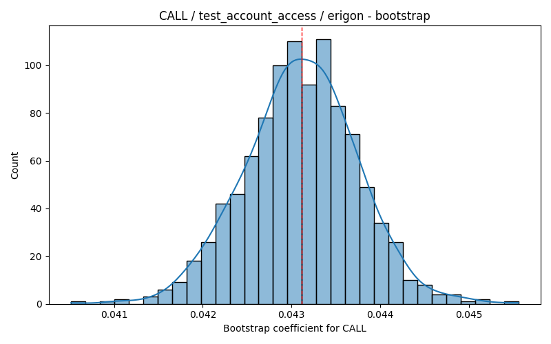

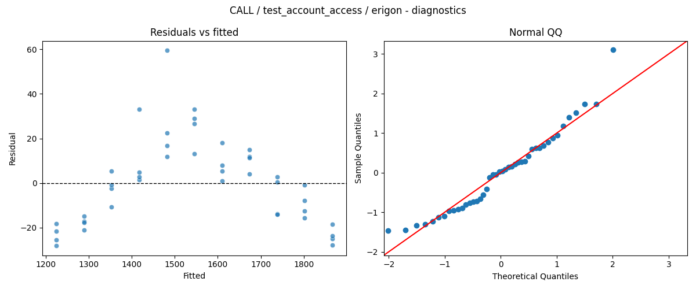

</details>

<details><summary>geth — NNLS regression summary</summary>

```
==============================================================================
                           NNLS Regression Results                            
==============================================================================
Dep. Variable:          test_runtime_ms              R-squared:          0.958
Model:                  NNLS                    Adj. R-squared:          0.957
No. Observations:       77                                RMSE:          21.42
Df Residuals:           75                                 MAE:          16.65
Df Model:               1      
==============================================================================
                      coef     std err     P-value      [0.025      0.975]
------------------------------------------------------------------------------
         const     71.5276      8.1952       0.001     55.5473     87.5840
       opcount      0.0050      0.0001       0.001      0.0048      0.0053
==============================================================================
Notes: Non-negative least squares with bootstrap inference (1000 iterations)
==============================================================================
```

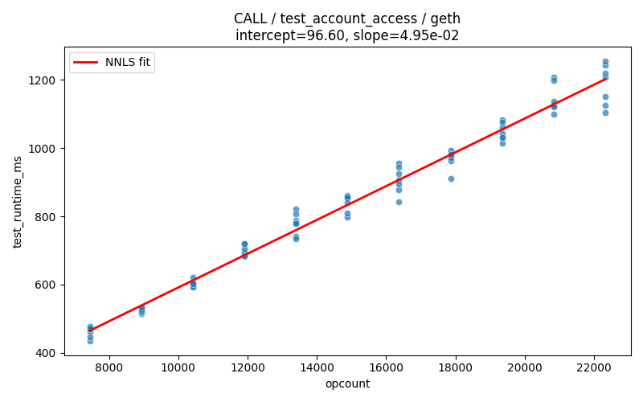

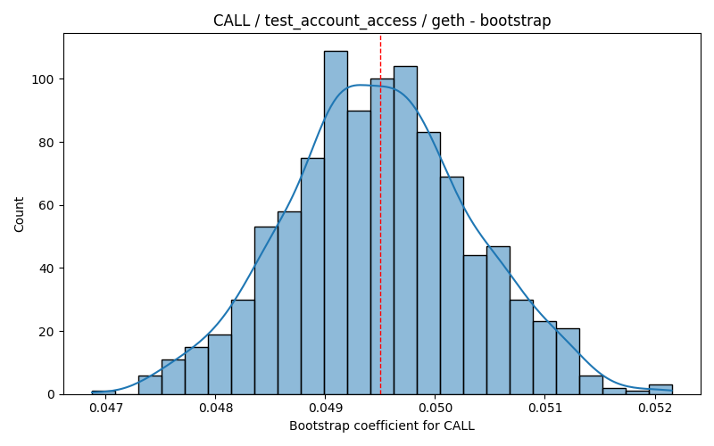

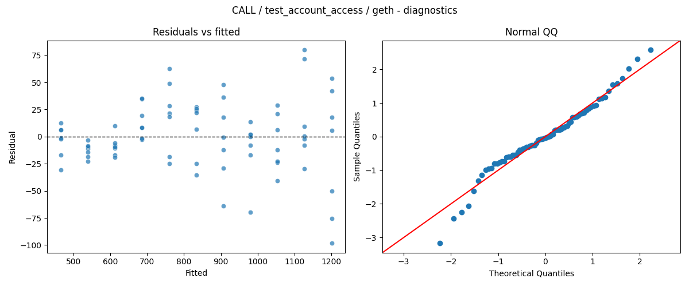

</details>

<details><summary>nethermind — NNLS regression summary</summary>

```
==============================================================================
                           NNLS Regression Results                            
==============================================================================
Dep. Variable:          test_runtime_ms              R-squared:          0.718
Model:                  NNLS                    Adj. R-squared:          0.714
No. Observations:       66                                RMSE:          41.96
Df Residuals:           64                                 MAE:          36.62
Df Model:               1      
==============================================================================
                      coef     std err     P-value      [0.025      0.975]
------------------------------------------------------------------------------
         const     96.0098     13.3413       0.001     71.3752    124.7270
       opcount      0.0033      0.0002       0.001      0.0029      0.0037
==============================================================================
Notes: Non-negative least squares with bootstrap inference (1000 iterations)
==============================================================================
```

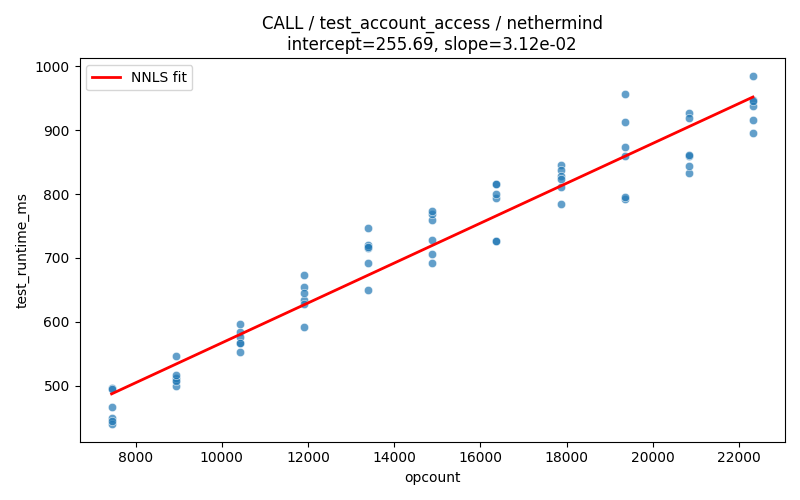

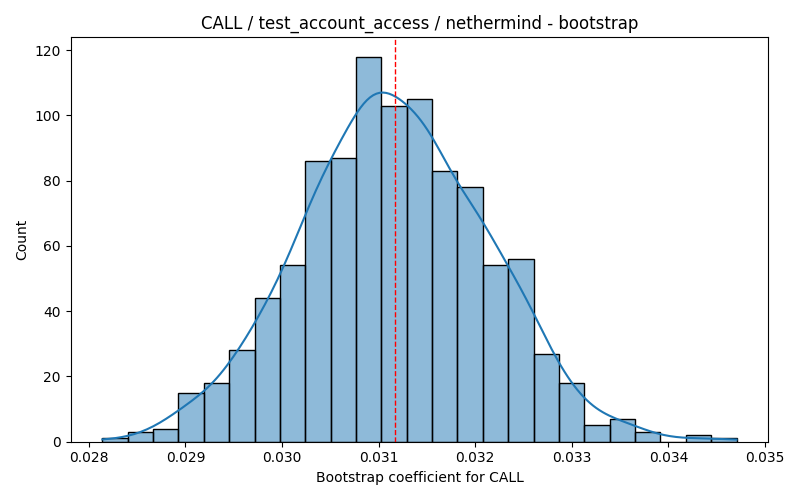

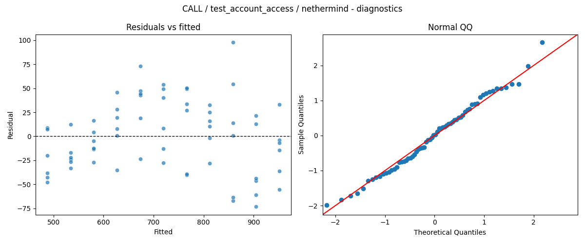

</details>

<details><summary>reth — NNLS regression summary</summary>

```
==============================================================================
                           NNLS Regression Results                            
==============================================================================
Dep. Variable:          test_runtime_ms              R-squared:          0.971
Model:                  NNLS                    Adj. R-squared:          0.970
No. Observations:       44                                RMSE:          15.39
Df Residuals:           42                                 MAE:          12.61
Df Model:               1      
==============================================================================
                      coef     std err     P-value      [0.025      0.975]
------------------------------------------------------------------------------
         const     73.7584      7.4676       0.001     58.8201     89.7078
       opcount      0.0044      0.0001       0.001      0.0042      0.0047
==============================================================================
Notes: Non-negative least squares with bootstrap inference (1000 iterations)
==============================================================================
```

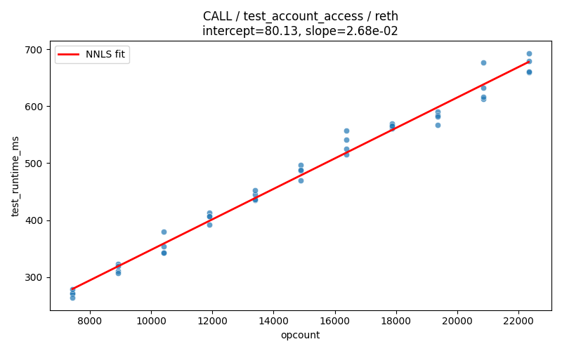

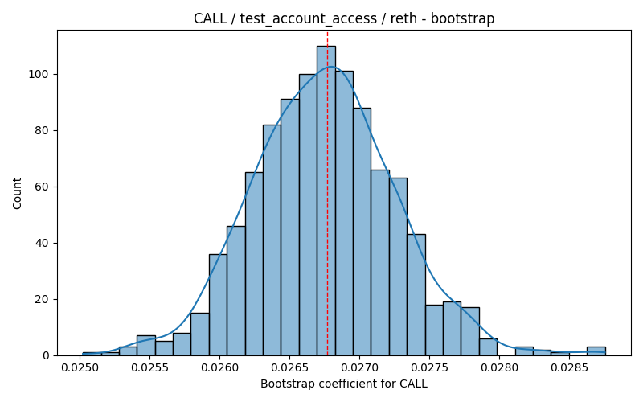

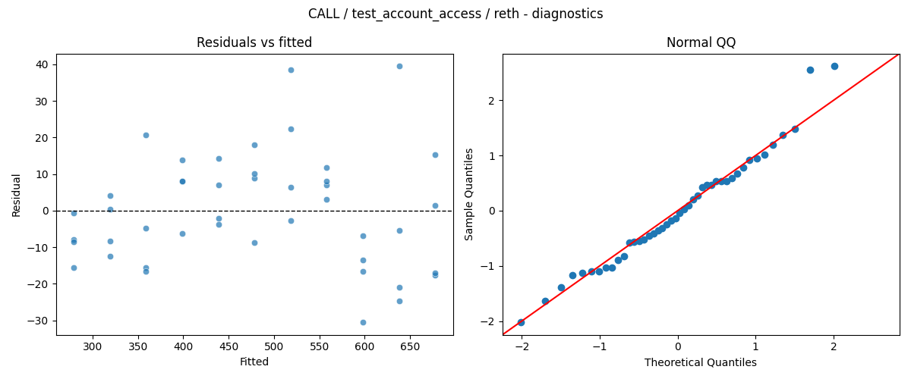

</details>

### test_account_access — combo `CALL_AccountMode.EXISTING_CONTRACT_DIFF_MAX` — `presets[cold_account_code_write]`

| client | nobs | R² | target_coef (ms) | p-value | 95% CI |
| --- | --- | --- | --- | --- | --- |
| `besu` | 55 | 0.9915 | 0.07249 | 1.00e-03 | [0.07052, 0.07428] |
| `erigon` | 44 | 0.972 | 0.04115 | 1.00e-03 | [0.03877, 0.04337] |
| `geth` | 77 | 0.9635 | 0.04511 | 1.00e-03 | [0.04289, 0.04723] |
| `nethermind` | 66 | 0.9612 | 0.05053 | 1.00e-03 | [0.04755, 0.05383] |
| `reth` | 44 | 0.9851 | 0.04581 | 1.00e-03 | [0.04387, 0.04769] |

<details><summary>besu — NNLS regression summary</summary>

```
==============================================================================
                           NNLS Regression Results                            
==============================================================================
Dep. Variable:          test_runtime_ms              R-squared:          0.992
Model:                  NNLS                    Adj. R-squared:          0.991
No. Observations:       55                                RMSE:          31.55
Df Residuals:           53                                 MAE:          25.47
Df Model:               1      
==============================================================================
                      coef     std err     P-value      [0.025      0.975]
------------------------------------------------------------------------------
         const    238.5229     14.8649       0.001    212.2166    269.4661
       opcount      0.0725      0.0010       0.001      0.0705      0.0743
==============================================================================
Notes: Non-negative least squares with bootstrap inference (1000 iterations)
==============================================================================
```


</details>

<details><summary>erigon — NNLS regression summary</summary>

```
==============================================================================
                           NNLS Regression Results                            
==============================================================================
Dep. Variable:          test_runtime_ms              R-squared:          0.972
Model:                  NNLS                    Adj. R-squared:          0.971
No. Observations:       44                                RMSE:          32.90
Df Residuals:           42                                 MAE:          25.46
Df Model:               1      
==============================================================================
                      coef     std err     P-value      [0.025      0.975]
------------------------------------------------------------------------------
         const   1112.2601     20.2171       0.001   1075.3680   1154.2114
       opcount      0.0411      0.0011       0.001      0.0388      0.0434
==============================================================================
Notes: Non-negative least squares with bootstrap inference (1000 iterations)
==============================================================================
```


</details>

<details><summary>geth — NNLS regression summary</summary>

```
==============================================================================
                           NNLS Regression Results                            
==============================================================================
Dep. Variable:          test_runtime_ms              R-squared:          0.963
Model:                  NNLS                    Adj. R-squared:          0.963
No. Observations:       77                                RMSE:          41.33
Df Residuals:           75                                 MAE:          33.51
Df Model:               1      
==============================================================================
                      coef     std err     P-value      [0.025      0.975]
------------------------------------------------------------------------------
         const    134.6147     17.6381       0.001    101.0960    168.3994
       opcount      0.0451      0.0011       0.001      0.0429      0.0472
==============================================================================
Notes: Non-negative least squares with bootstrap inference (1000 iterations)
==============================================================================
```


</details>

<details><summary>nethermind — NNLS regression summary</summary>

```
==============================================================================
                           NNLS Regression Results                            
==============================================================================
Dep. Variable:          test_runtime_ms              R-squared:          0.961
Model:                  NNLS                    Adj. R-squared:          0.961
No. Observations:       66                                RMSE:          47.79
Df Residuals:           64                                 MAE:          36.32
Df Model:               1      
==============================================================================
                      coef     std err     P-value      [0.025      0.975]
------------------------------------------------------------------------------
         const    262.7540     21.8003       0.001    220.5171    306.2443
       opcount      0.0505      0.0015       0.001      0.0476      0.0538
==============================================================================
Notes: Non-negative least squares with bootstrap inference (1000 iterations)
==============================================================================
```


</details>

<details><summary>reth — NNLS regression summary</summary>

```
==============================================================================
                           NNLS Regression Results                            
==============================================================================
Dep. Variable:          test_runtime_ms              R-squared:          0.985
Model:                  NNLS                    Adj. R-squared:          0.985
No. Observations:       44                                RMSE:          26.54
Df Residuals:           42                                 MAE:          19.82
Df Model:               1      
==============================================================================
                      coef     std err     P-value      [0.025      0.975]
------------------------------------------------------------------------------
         const    111.4166     15.2926       0.001     82.5548    141.9829
       opcount      0.0458      0.0010       0.001      0.0439      0.0477
==============================================================================
Notes: Non-negative least squares with bootstrap inference (1000 iterations)
==============================================================================
```


</details>

### test_account_access — combo `CALL_AccountMode.EXISTING_CONTRACT_MINIMAL` — `presets[cold_account_code_write]`

| client | nobs | R² | target_coef (ms) | p-value | 95% CI |
| --- | --- | --- | --- | --- | --- |
| `besu` | 55 | 0.9567 | 0.06933 | 1.00e-03 | [0.0645, 0.07341] |
| `erigon` | 44 | 0.9888 | 0.04157 | 1.00e-03 | [0.0398, 0.04335] |
| `geth` | 77 | 0.9861 | 0.04852 | 1.00e-03 | [0.04719, 0.04975] |
| `nethermind` | 66 | 0.9372 | 0.03066 | 1.00e-03 | [0.0287, 0.03281] |
| `reth` | 44 | 0.9897 | 0.02698 | 1.00e-03 | [0.0261, 0.02782] |

<details><summary>besu — NNLS regression summary</summary>

```
==============================================================================
                           NNLS Regression Results                            
==============================================================================
Dep. Variable:          test_runtime_ms              R-squared:          0.957
Model:                  NNLS                    Adj. R-squared:          0.956
No. Observations:       55                                RMSE:          69.44
Df Residuals:           53                                 MAE:          54.63
Df Model:               1      
==============================================================================
                      coef     std err     P-value      [0.025      0.975]
------------------------------------------------------------------------------
         const    235.4256     30.6127       0.001    181.9120    300.8363
       opcount      0.0693      0.0023       0.001      0.0645      0.0734
==============================================================================
Notes: Non-negative least squares with bootstrap inference (1000 iterations)
==============================================================================
```


</details>

<details><summary>erigon — NNLS regression summary</summary>

```
==============================================================================
                           NNLS Regression Results                            
==============================================================================
Dep. Variable:          test_runtime_ms              R-squared:          0.989
Model:                  NNLS                    Adj. R-squared:          0.989
No. Observations:       44                                RMSE:          20.79
Df Residuals:           42                                 MAE:          18.24
Df Model:               1      
==============================================================================
                      coef     std err     P-value      [0.025      0.975]
------------------------------------------------------------------------------
         const    948.3298     13.9564       0.001    923.7540    980.3703
       opcount      0.0416      0.0009       0.001      0.0398      0.0434
==============================================================================
Notes: Non-negative least squares with bootstrap inference (1000 iterations)
==============================================================================
```


</details>

<details><summary>geth — NNLS regression summary</summary>

```
==============================================================================
                           NNLS Regression Results                            
==============================================================================
Dep. Variable:          test_runtime_ms              R-squared:          0.986
Model:                  NNLS                    Adj. R-squared:          0.986
No. Observations:       77                                RMSE:          27.15
Df Residuals:           75                                 MAE:          21.71
Df Model:               1      
==============================================================================
                      coef     std err     P-value      [0.025      0.975]
------------------------------------------------------------------------------
         const    105.2902      9.4868       0.001     87.4331    124.6841
       opcount      0.0485      0.0007       0.001      0.0472      0.0498
==============================================================================
Notes: Non-negative least squares with bootstrap inference (1000 iterations)
==============================================================================
```


</details>

<details><summary>nethermind — NNLS regression summary</summary>

```
==============================================================================
                           NNLS Regression Results                            
==============================================================================
Dep. Variable:          test_runtime_ms              R-squared:          0.937
Model:                  NNLS                    Adj. R-squared:          0.936
No. Observations:       66                                RMSE:          37.36
Df Residuals:           64                                 MAE:          29.48
Df Model:               1      
==============================================================================
                      coef     std err     P-value      [0.025      0.975]
------------------------------------------------------------------------------
         const    278.4535     14.0240       0.001    250.7281    308.5940
       opcount      0.0307      0.0010       0.001      0.0287      0.0328
==============================================================================
Notes: Non-negative least squares with bootstrap inference (1000 iterations)
==============================================================================
```


</details>

<details><summary>reth — NNLS regression summary</summary>

```
==============================================================================
                           NNLS Regression Results                            
==============================================================================
Dep. Variable:          test_runtime_ms              R-squared:          0.990
Model:                  NNLS                    Adj. R-squared:          0.989
No. Observations:       44                                RMSE:          12.98
Df Residuals:           42                                 MAE:           9.97
Df Model:               1      
==============================================================================
                      coef     std err     P-value      [0.025      0.975]
------------------------------------------------------------------------------
         const     74.6196      5.5690       0.001     64.4698     86.1604
       opcount      0.0270      0.0004       0.001      0.0261      0.0278
==============================================================================
Notes: Non-negative least squares with bootstrap inference (1000 iterations)
==============================================================================
```


</details>

### test_account_access — combo `CALL_AccountMode.EXISTING_CONTRACT_SAME_MAX` — `presets[cold_account_code_write]`

| client | nobs | R² | target_coef (ms) | p-value | 95% CI |
| --- | --- | --- | --- | --- | --- |
| `besu` | 55 | 0.9604 | 0.0663 | 1.00e-03 | [0.06252, 0.06976] |
| `erigon` | 44 | 0.9912 | 0.04312 | 1.00e-03 | [0.04184, 0.04429] |
| `geth` | 77 | 0.9826 | 0.0495 | 1.00e-03 | [0.04783, 0.05116] |
| `nethermind` | 66 | 0.941 | 0.03117 | 1.00e-03 | [0.02925, 0.03304] |
| `reth` | 44 | 0.9859 | 0.02677 | 1.00e-03 | [0.0258, 0.02777] |

<details><summary>besu — NNLS regression summary</summary>

```
==============================================================================
                           NNLS Regression Results                            
==============================================================================
Dep. Variable:          test_runtime_ms              R-squared:          0.960
Model:                  NNLS                    Adj. R-squared:          0.960
No. Observations:       55                                RMSE:          63.35
Df Residuals:           53                                 MAE:          47.92
Df Model:               1      
==============================================================================
                      coef     std err     P-value      [0.025      0.975]
------------------------------------------------------------------------------
         const    283.7545     28.0575       0.001    232.3805    346.9030
       opcount      0.0663      0.0018       0.001      0.0625      0.0698
==============================================================================
Notes: Non-negative least squares with bootstrap inference (1000 iterations)
==============================================================================
```


</details>

<details><summary>erigon — NNLS regression summary</summary>

```
==============================================================================
                           NNLS Regression Results                            
==============================================================================
Dep. Variable:          test_runtime_ms              R-squared:          0.991
Model:                  NNLS                    Adj. R-squared:          0.991
No. Observations:       44                                RMSE:          19.14
Df Residuals:           42                                 MAE:          15.33
Df Model:               1      
==============================================================================
                      coef     std err     P-value      [0.025      0.975]
------------------------------------------------------------------------------
         const    904.0082     10.3234       0.001    886.2286    925.7443
       opcount      0.0431      0.0006       0.001      0.0418      0.0443
==============================================================================
Notes: Non-negative least squares with bootstrap inference (1000 iterations)
==============================================================================
```


</details>

<details><summary>geth — NNLS regression summary</summary>

```
==============================================================================
                           NNLS Regression Results                            
==============================================================================
Dep. Variable:          test_runtime_ms              R-squared:          0.983
Model:                  NNLS                    Adj. R-squared:          0.982
No. Observations:       77                                RMSE:          31.01
Df Residuals:           75                                 MAE:          22.90
Df Model:               1      
==============================================================================
                      coef     std err     P-value      [0.025      0.975]
------------------------------------------------------------------------------
         const     96.5975     10.6143       0.001     75.5128    116.8082
       opcount      0.0495      0.0008       0.001      0.0478      0.0512
==============================================================================
Notes: Non-negative least squares with bootstrap inference (1000 iterations)
==============================================================================
```


</details>

<details><summary>nethermind — NNLS regression summary</summary>

```
==============================================================================
                           NNLS Regression Results                            
==============================================================================
Dep. Variable:          test_runtime_ms              R-squared:          0.941
Model:                  NNLS                    Adj. R-squared:          0.940
No. Observations:       66                                RMSE:          36.75
Df Residuals:           64                                 MAE:          30.57
Df Model:               1      
==============================================================================
                      coef     std err     P-value      [0.025      0.975]
------------------------------------------------------------------------------
         const    255.6880     13.5075       0.001    230.8108    282.6184
       opcount      0.0312      0.0010       0.001      0.0293      0.0330
==============================================================================
Notes: Non-negative least squares with bootstrap inference (1000 iterations)
==============================================================================
```


</details>

<details><summary>reth — NNLS regression summary</summary>

```
==============================================================================
                           NNLS Regression Results                            
==============================================================================
Dep. Variable:          test_runtime_ms              R-squared:          0.986
Model:                  NNLS                    Adj. R-squared:          0.986
No. Observations:       44                                RMSE:          15.09
Df Residuals:           42                                 MAE:          12.14
Df Model:               1      
==============================================================================
                      coef     std err     P-value      [0.025      0.975]
------------------------------------------------------------------------------
         const     80.1259      6.8720       0.001     67.6124     94.9319
       opcount      0.0268      0.0005       0.001      0.0258      0.0278
==============================================================================
Notes: Non-negative least squares with bootstrap inference (1000 iterations)
==============================================================================
```


</details>

## CALLCODE

### test_ext_account_query_warm — combo `CALLCODE`

| client | nobs | R² | target_coef (ms) | p-value | 95% CI |
| --- | --- | --- | --- | --- | --- |
| `besu` | 55 | 0.9257 | 0.0004693 | 1.00e-03 | [0.0004265, 0.0005085] |
| `erigon` | 44 | 0.8791 | 5.43e-05 | 1.00e-03 | [4.853e-05, 6.085e-05] |
| `geth` | 77 | 0.8977 | 0.0001561 | 1.00e-03 | [0.0001415, 0.0001689] |
| `nethermind` | 66 | 0.4957 | 0.0001771 | 1.00e-03 | [0.0001383, 0.0002185] |
| `reth` | 44 | 0.9492 | 5.575e-05 | 1.00e-03 | [5.164e-05, 5.964e-05] |

<details><summary>besu — NNLS regression summary</summary>

```
==============================================================================
                           NNLS Regression Results                            
==============================================================================
Dep. Variable:          test_runtime_ms              R-squared:          0.926
Model:                  NNLS                    Adj. R-squared:          0.924
No. Observations:       55                                RMSE:          67.18
Df Residuals:           53                                 MAE:          53.27
Df Model:               1      
==============================================================================
                      coef     std err     P-value      [0.025      0.975]
------------------------------------------------------------------------------
         const    470.8259     33.5335       0.001    404.5347    542.1128
       opcount      0.0005      0.0000       0.001      0.0004      0.0005
==============================================================================
Notes: Non-negative least squares with bootstrap inference (1000 iterations)
==============================================================================
```

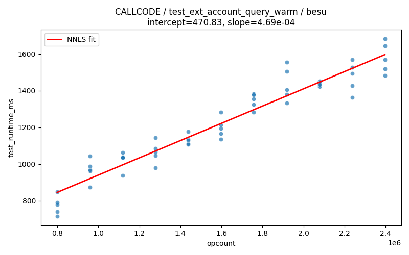

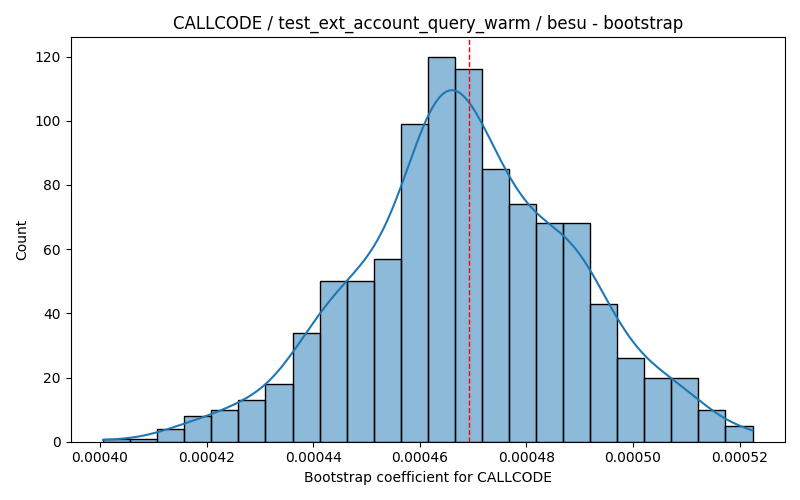

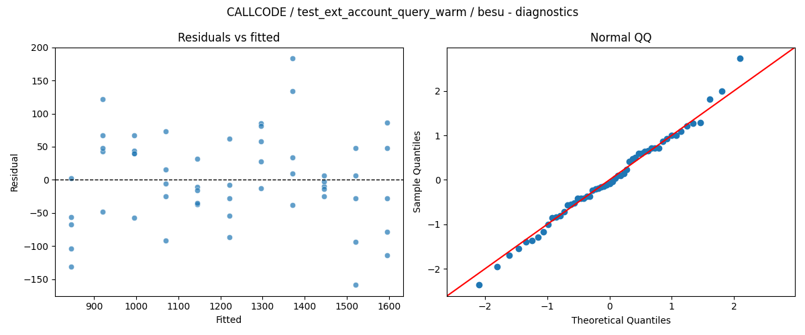

</details>

<details><summary>erigon — NNLS regression summary</summary>

```
==============================================================================
                           NNLS Regression Results                            
==============================================================================
Dep. Variable:          test_runtime_ms              R-squared:          0.879
Model:                  NNLS                    Adj. R-squared:          0.876
No. Observations:       44                                RMSE:          10.18
Df Residuals:           42                                 MAE:           7.05
Df Model:               1      
==============================================================================
                      coef     std err     P-value      [0.025      0.975]
------------------------------------------------------------------------------
         const     42.6576      4.8595       0.001     32.7635     51.7378
       opcount      0.0001      0.0000       0.001      0.0000      0.0001
==============================================================================
Notes: Non-negative least squares with bootstrap inference (1000 iterations)
==============================================================================
```

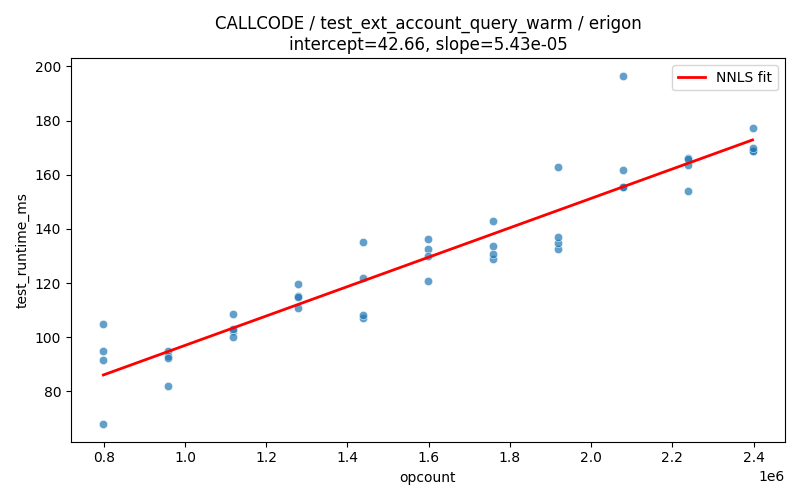

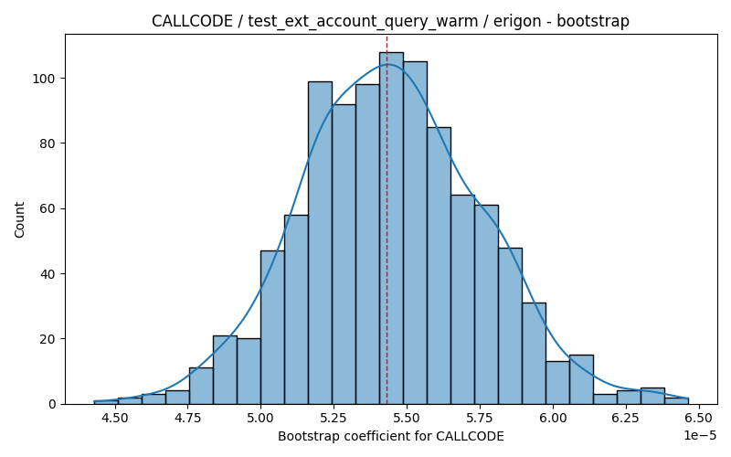

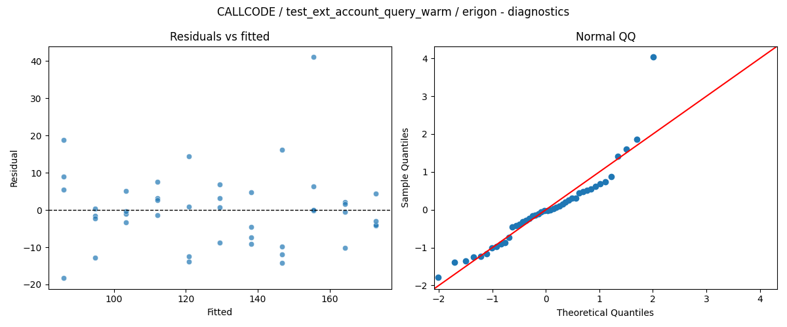

</details>

<details><summary>geth — NNLS regression summary</summary>

```
==============================================================================
                           NNLS Regression Results                            
==============================================================================
Dep. Variable:          test_runtime_ms              R-squared:          0.898
Model:                  NNLS                    Adj. R-squared:          0.896
No. Observations:       77                                RMSE:          26.62
Df Residuals:           75                                 MAE:          19.89
Df Model:               1      
==============================================================================
                      coef     std err     P-value      [0.025      0.975]
------------------------------------------------------------------------------
         const     48.1766     10.3516       0.001     28.4587     68.7959
       opcount      0.0002      0.0000       0.001      0.0001      0.0002
==============================================================================
Notes: Non-negative least squares with bootstrap inference (1000 iterations)
==============================================================================
```

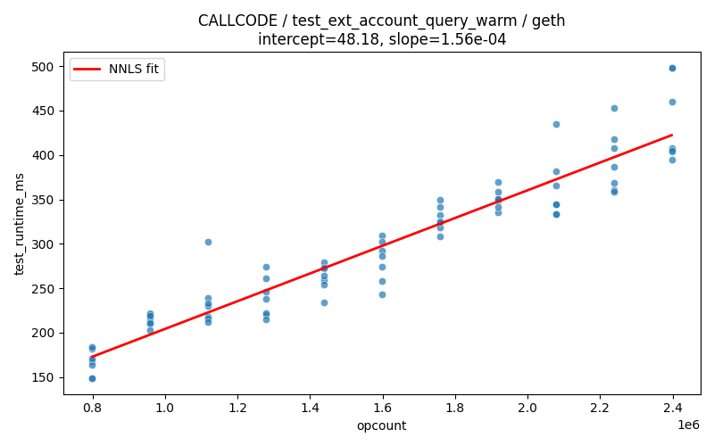

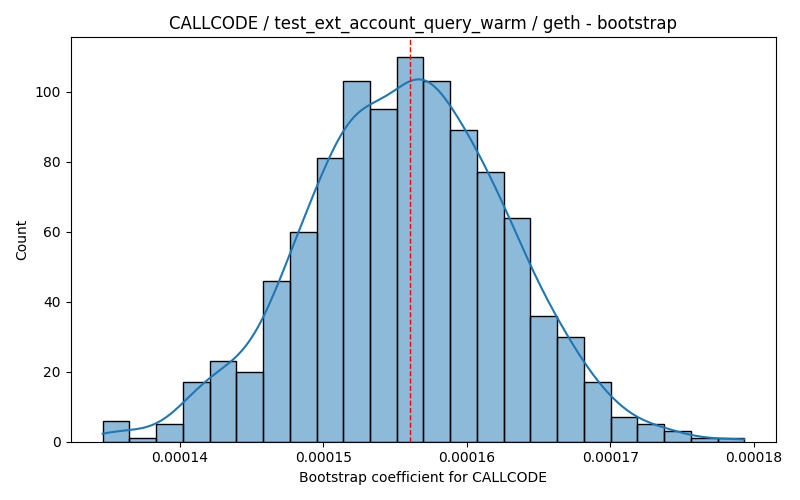

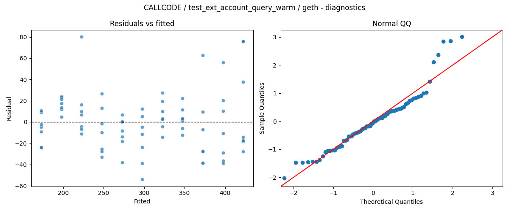

</details>

<details><summary>nethermind — NNLS regression summary</summary>

```
==============================================================================
                           NNLS Regression Results                            
==============================================================================
Dep. Variable:          test_runtime_ms              R-squared:          0.496
Model:                  NNLS                    Adj. R-squared:          0.488
No. Observations:       66                                RMSE:          90.30
Df Residuals:           64                                 MAE:          72.63
Df Model:               1      
==============================================================================
                      coef     std err     P-value      [0.025      0.975]
------------------------------------------------------------------------------
         const    231.3508     32.1873       0.001    168.5005    299.2220
       opcount      0.0002      0.0000       0.001      0.0001      0.0002
==============================================================================
Notes: Non-negative least squares with bootstrap inference (1000 iterations)
==============================================================================
```

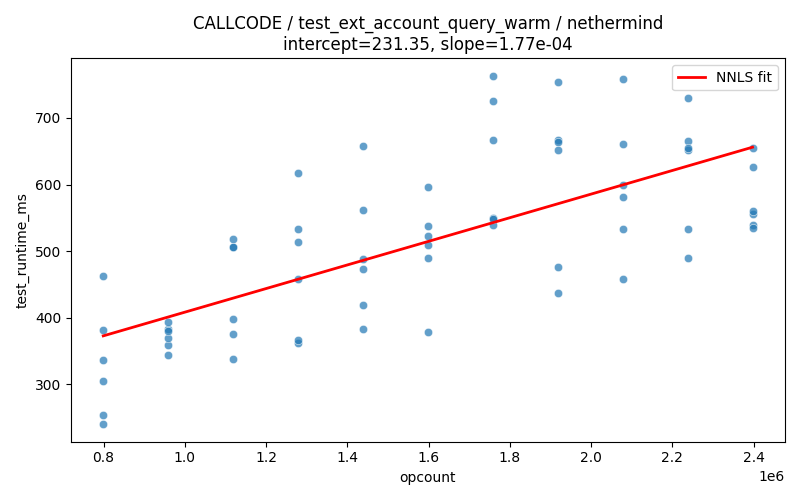

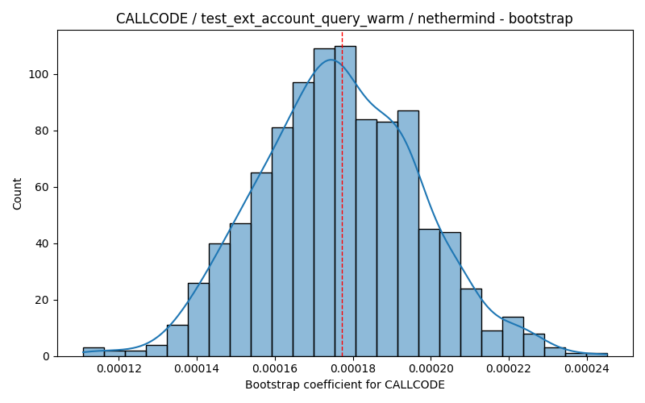

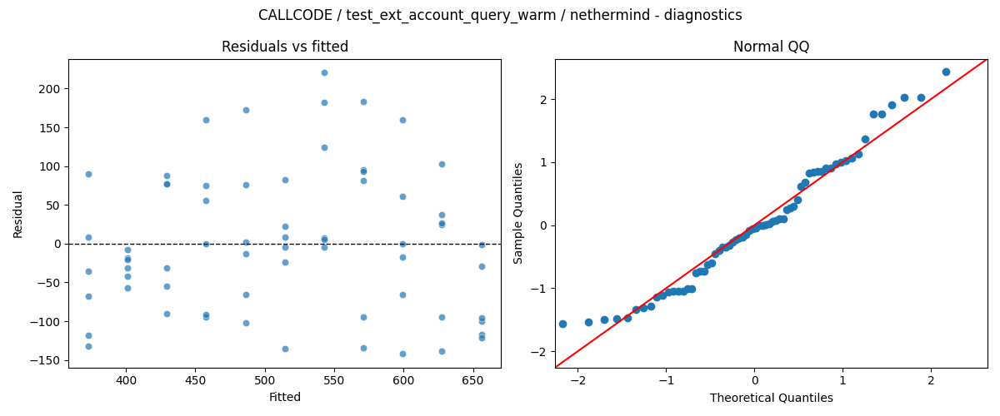

</details>

<details><summary>reth — NNLS regression summary</summary>

```
==============================================================================
                           NNLS Regression Results                            
==============================================================================
Dep. Variable:          test_runtime_ms              R-squared:          0.949
Model:                  NNLS                    Adj. R-squared:          0.948
No. Observations:       44                                RMSE:           6.52
Df Residuals:           42                                 MAE:           5.40
Df Model:               1      
==============================================================================
                      coef     std err     P-value      [0.025      0.975]
------------------------------------------------------------------------------
         const     24.5234      3.3784       0.001     18.1112     31.4701
       opcount      0.0001      0.0000       0.001      0.0001      0.0001
==============================================================================
Notes: Non-negative least squares with bootstrap inference (1000 iterations)
==============================================================================
```

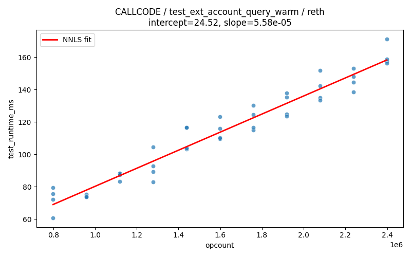

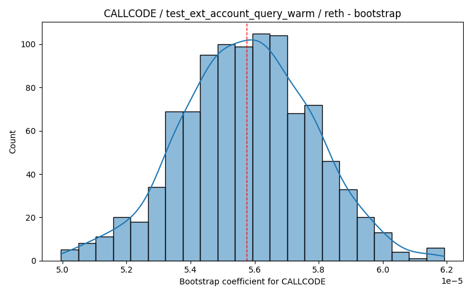

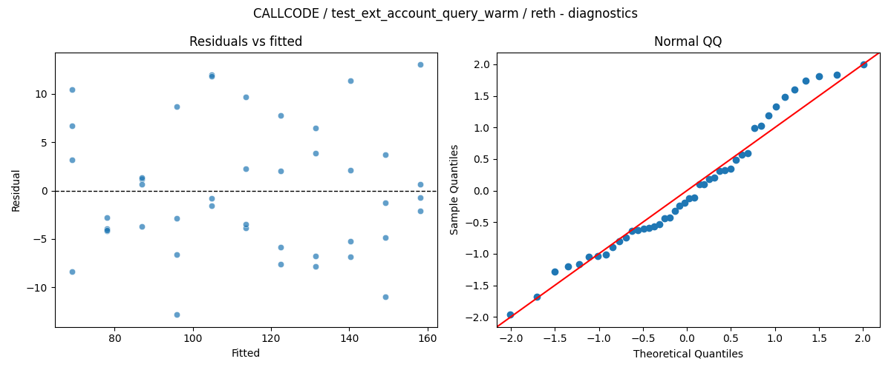

</details>

### test_account_access — combo `CALLCODE_AccountMode.EXISTING_EOA` — `presets[cold_account_nocode_access]`

| client | nobs | R² | target_coef (ms) | p-value | 95% CI |
| --- | --- | --- | --- | --- | --- |
| `besu` | 55 | 0.9871 | 0.01642 | 1.00e-03 | [0.0159, 0.017] |
| `erigon` | 44 | 0.9982 | 0.008318 | 1.00e-03 | [0.008269, 0.008348] |
| `geth` | 77 | 0.9825 | 0.01139 | 1.00e-03 | [0.01102, 0.01177] |
| `nethermind` | 66 | 0.8684 | 0.003113 | 1.00e-03 | [0.002764, 0.003453] |
| `reth` | 44 | 0.9691 | 0.004011 | 1.00e-03 | [0.003784, 0.004211] |

<details><summary>besu — NNLS regression summary</summary>

```
==============================================================================
                           NNLS Regression Results                            
==============================================================================
Dep. Variable:          test_runtime_ms              R-squared:          0.987
Model:                  NNLS                    Adj. R-squared:          0.987
No. Observations:       55                                RMSE:          38.54
Df Residuals:           53                                 MAE:          29.09
Df Model:               1      
==============================================================================
                      coef     std err     P-value      [0.025      0.975]
------------------------------------------------------------------------------
         const    495.5557     16.7968       0.001    460.3818    526.5512
       opcount      0.0164      0.0003       0.001      0.0159      0.0170
==============================================================================
Notes: Non-negative least squares with bootstrap inference (1000 iterations)
==============================================================================
```

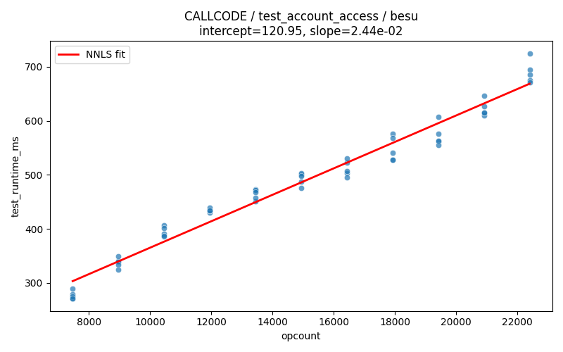

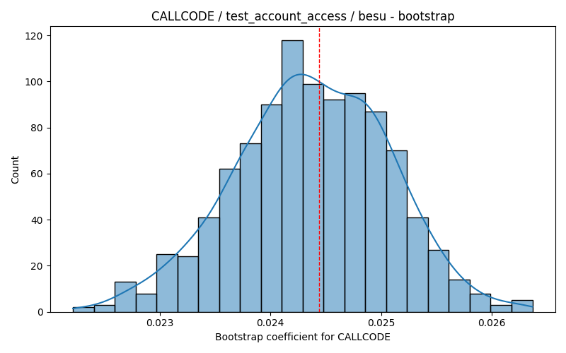

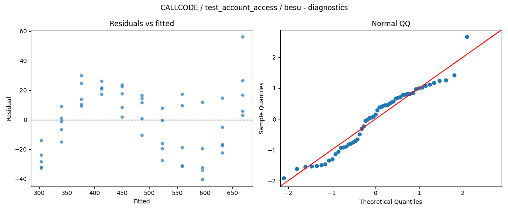

</details>

<details><summary>erigon — NNLS regression summary</summary>

```
==============================================================================
                           NNLS Regression Results                            
==============================================================================
Dep. Variable:          test_runtime_ms              R-squared:          0.998
Model:                  NNLS                    Adj. R-squared:          0.998
No. Observations:       44                                RMSE:           7.35
Df Residuals:           42                                 MAE:           6.03
Df Model:               1      
==============================================================================
                      coef     std err     P-value      [0.025      0.975]
------------------------------------------------------------------------------
         const      0.0000      0.5411       1.000      0.0000      1.7872
       opcount      0.0083      0.0000       0.001      0.0083      0.0083
==============================================================================
Notes: Non-negative least squares with bootstrap inference (1000 iterations)
==============================================================================
```


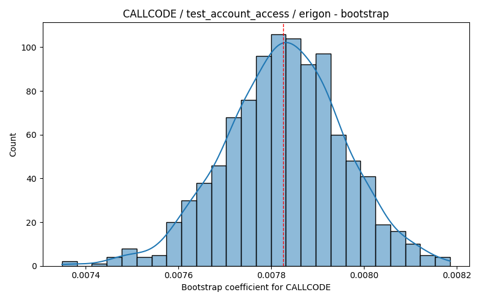

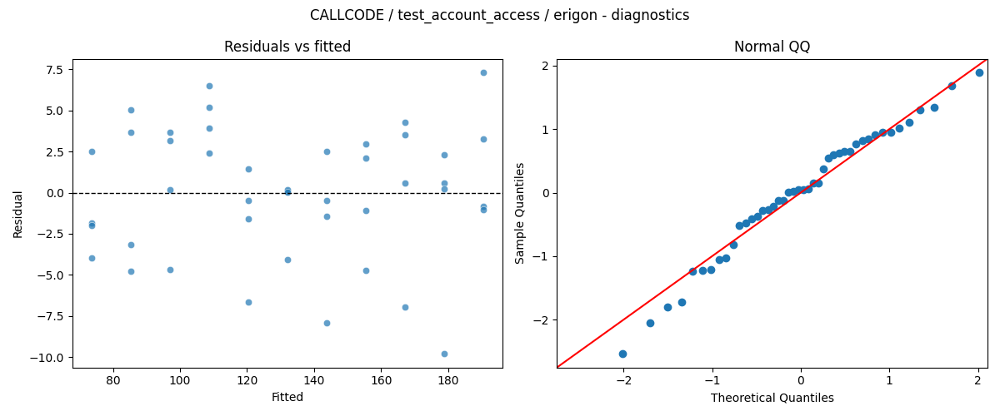

</details>

<details><summary>geth — NNLS regression summary</summary>

```
==============================================================================
                           NNLS Regression Results                            
==============================================================================
Dep. Variable:          test_runtime_ms              R-squared:          0.983
Model:                  NNLS                    Adj. R-squared:          0.982
No. Observations:       77                                RMSE:          31.22
Df Residuals:           75                                 MAE:          23.97
Df Model:               1      
==============================================================================
                      coef     std err     P-value      [0.025      0.975]
------------------------------------------------------------------------------
         const    228.6962     11.3844       0.001    207.0620    251.6253
       opcount      0.0114      0.0002       0.001      0.0110      0.0118
==============================================================================
Notes: Non-negative least squares with bootstrap inference (1000 iterations)
==============================================================================
```

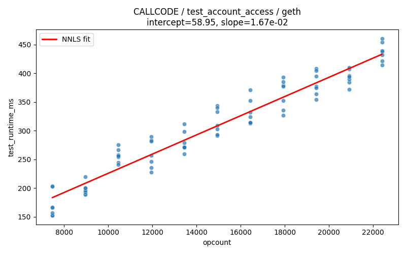

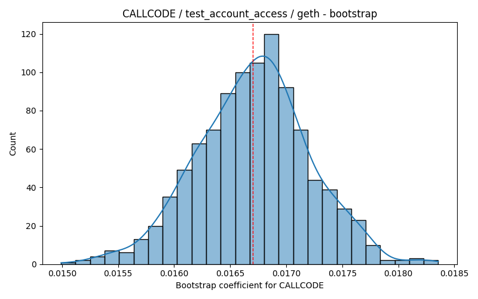

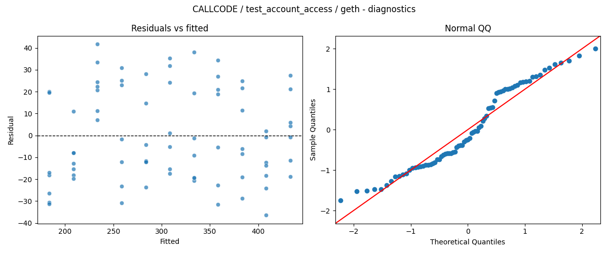

</details>

<details><summary>nethermind — NNLS regression summary</summary>

```
==============================================================================
                           NNLS Regression Results                            
==============================================================================
Dep. Variable:          test_runtime_ms              R-squared:          0.868
Model:                  NNLS                    Adj. R-squared:          0.866
No. Observations:       66                                RMSE:          24.89
Df Residuals:           64                                 MAE:          19.20
Df Model:               1      
==============================================================================
                      coef     std err     P-value      [0.025      0.975]
------------------------------------------------------------------------------
         const    107.0486     10.5907       0.001     85.7114    130.0540
       opcount      0.0031      0.0002       0.001      0.0028      0.0035
==============================================================================
Notes: Non-negative least squares with bootstrap inference (1000 iterations)
==============================================================================
```

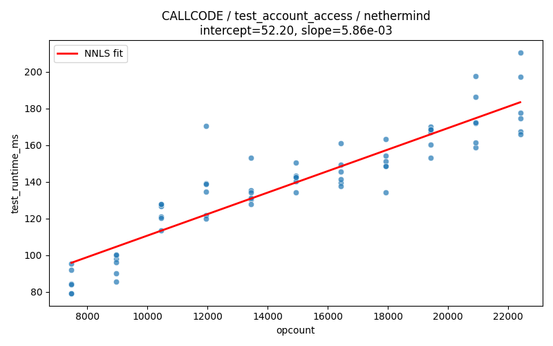

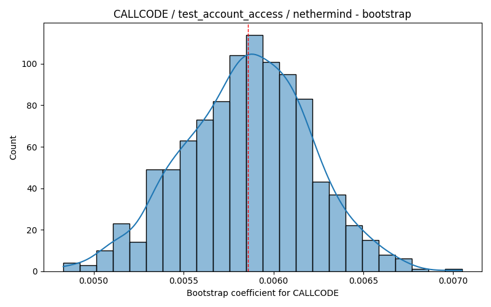

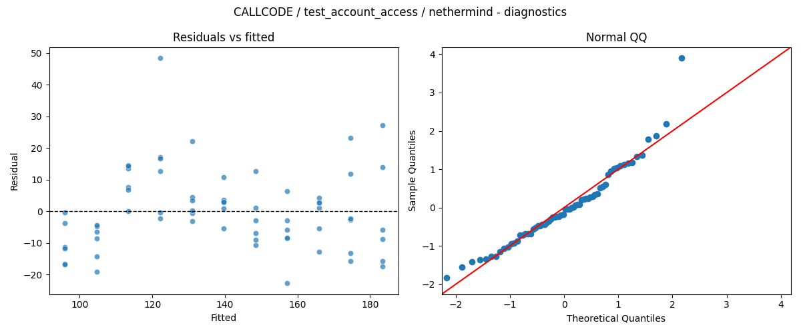

</details>

<details><summary>reth — NNLS regression summary</summary>

```
==============================================================================
                           NNLS Regression Results                            
==============================================================================
Dep. Variable:          test_runtime_ms              R-squared:          0.969
Model:                  NNLS                    Adj. R-squared:          0.968
No. Observations:       44                                RMSE:          14.72
Df Residuals:           42                                 MAE:          11.50
Df Model:               1      
==============================================================================
                      coef     std err     P-value      [0.025      0.975]
------------------------------------------------------------------------------
         const     90.4024      7.6366       0.001     77.4168    107.2765
       opcount      0.0040      0.0001       0.001      0.0038      0.0042
==============================================================================
Notes: Non-negative least squares with bootstrap inference (1000 iterations)
==============================================================================
```

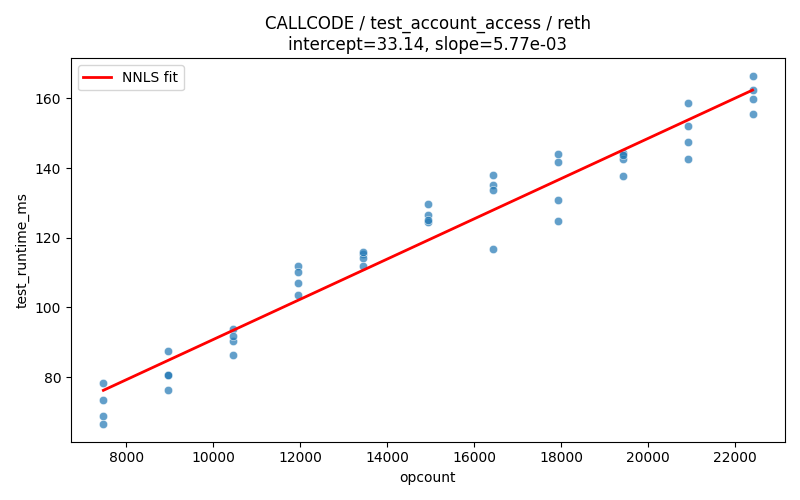

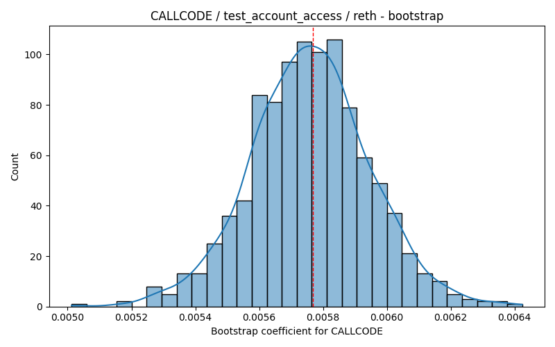

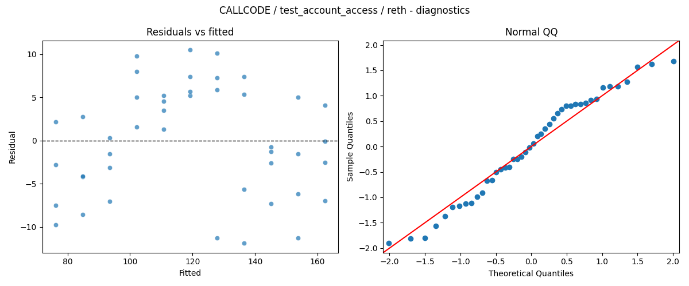

</details>

### test_account_access — combo `CALLCODE_AccountMode.NON_EXISTING_ACCOUNT` — `presets[cold_account_nocode_access]`

| client | nobs | R² | target_coef (ms) | p-value | 95% CI |
| --- | --- | --- | --- | --- | --- |
| `besu` | 55 | 0.9911 | 0.01643 | 1.00e-03 | [0.01601, 0.01688] |
| `erigon` | 44 | 0.9978 | 0.00812 | 1.00e-03 | [0.008005, 0.008149] |
| `geth` | 77 | 0.9762 | 0.02159 | 1.00e-03 | [0.02083, 0.02236] |
| `nethermind` | 66 | 0.9113 | 0.003193 | 1.00e-03 | [0.002948, 0.003402] |
| `reth` | 44 | 0.9764 | 0.004048 | 1.00e-03 | [0.003853, 0.004232] |

<details><summary>besu — NNLS regression summary</summary>

```
==============================================================================
                           NNLS Regression Results                            
==============================================================================
Dep. Variable:          test_runtime_ms              R-squared:          0.991
Model:                  NNLS                    Adj. R-squared:          0.991
No. Observations:       55                                RMSE:          31.94
Df Residuals:           53                                 MAE:          26.13
Df Model:               1      
==============================================================================
                      coef     std err     P-value      [0.025      0.975]
------------------------------------------------------------------------------
         const    177.6662     15.0300       0.001    146.8030    205.2016
       opcount      0.0164      0.0002       0.001      0.0160      0.0169
==============================================================================
Notes: Non-negative least squares with bootstrap inference (1000 iterations)
==============================================================================
```

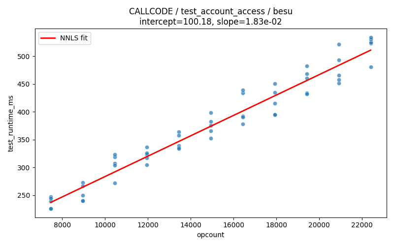

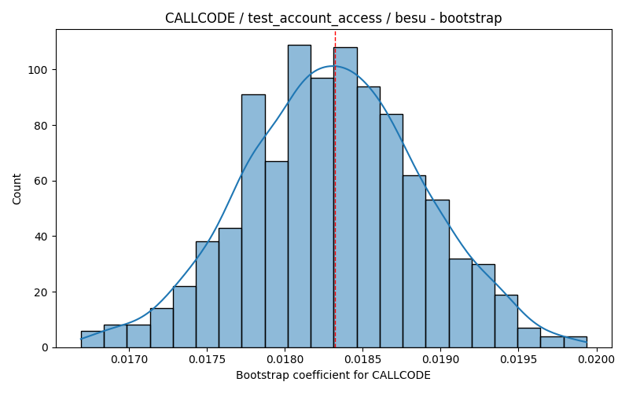

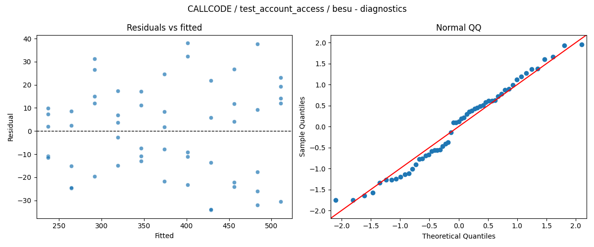

</details>

<details><summary>erigon — NNLS regression summary</summary>

```
==============================================================================
                           NNLS Regression Results                            
==============================================================================
Dep. Variable:          test_runtime_ms              R-squared:          0.998
Model:                  NNLS                    Adj. R-squared:          0.998
No. Observations:       44                                RMSE:           7.79
Df Residuals:           42                                 MAE:           6.27
Df Model:               1      
==============================================================================
                      coef     std err     P-value      [0.025      0.975]
------------------------------------------------------------------------------
         const      0.0000      1.9863       1.000      0.0000      6.6183
       opcount      0.0081      0.0000       0.001      0.0080      0.0081
==============================================================================
Notes: Non-negative least squares with bootstrap inference (1000 iterations)
==============================================================================
```

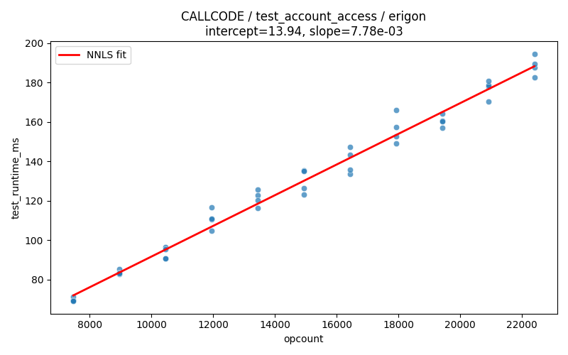

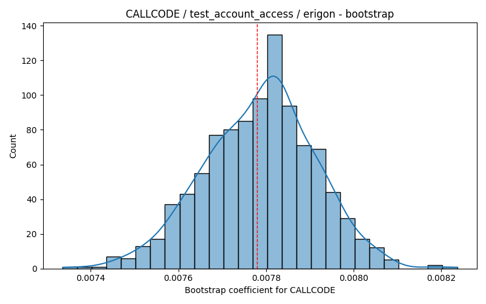

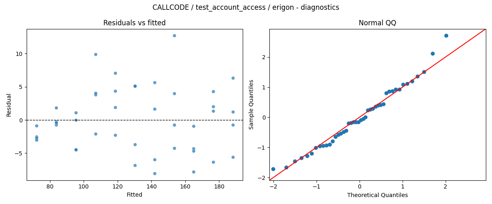

</details>

<details><summary>geth — NNLS regression summary</summary>

```
==============================================================================
                           NNLS Regression Results                            
==============================================================================
Dep. Variable:          test_runtime_ms              R-squared:          0.976
Model:                  NNLS                    Adj. R-squared:          0.976
No. Observations:       77                                RMSE:          69.16
Df Residuals:           75                                 MAE:          58.32
Df Model:               1      
==============================================================================
                      coef     std err     P-value      [0.025      0.975]
------------------------------------------------------------------------------
         const    322.3205     25.2470       0.001    271.5344    373.1588
       opcount      0.0216      0.0004       0.001      0.0208      0.0224
==============================================================================
Notes: Non-negative least squares with bootstrap inference (1000 iterations)
==============================================================================
```

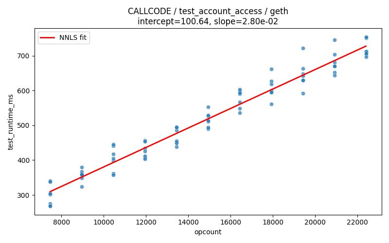

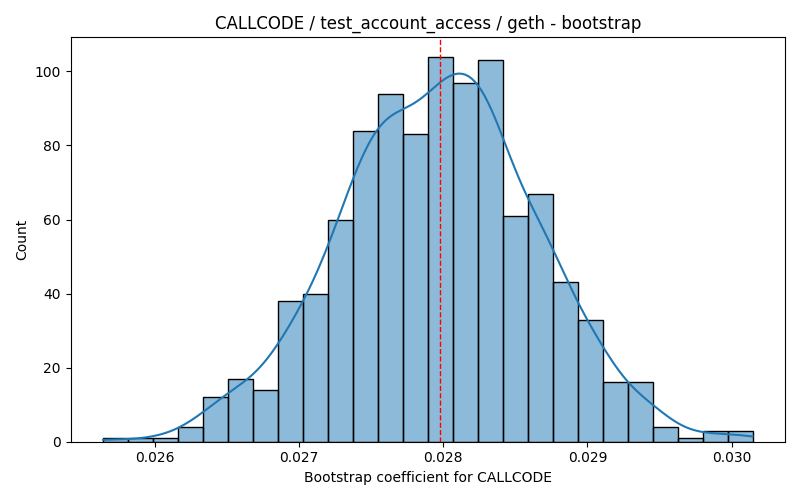

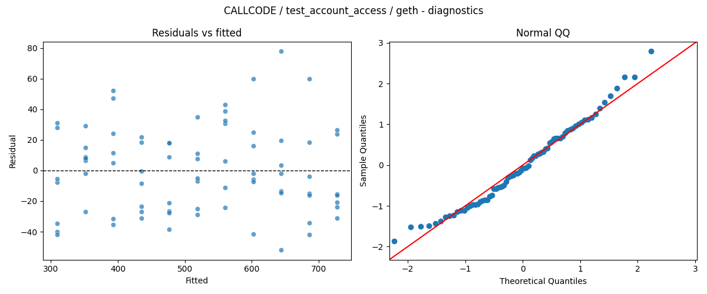

</details>

<details><summary>nethermind — NNLS regression summary</summary>

```
==============================================================================
                           NNLS Regression Results                            
==============================================================================
Dep. Variable:          test_runtime_ms              R-squared:          0.911
Model:                  NNLS                    Adj. R-squared:          0.910
No. Observations:       66                                RMSE:          20.45
Df Residuals:           64                                 MAE:          16.94
Df Model:               1      
==============================================================================
                      coef     std err     P-value      [0.025      0.975]
------------------------------------------------------------------------------
         const     64.0516      7.1189       0.001     50.7089     78.4873
       opcount      0.0032      0.0001       0.001      0.0029      0.0034
==============================================================================
Notes: Non-negative least squares with bootstrap inference (1000 iterations)
==============================================================================
```

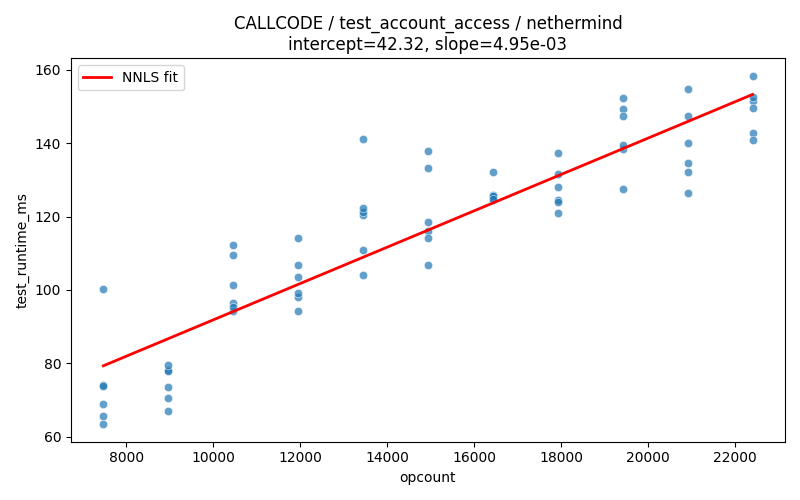

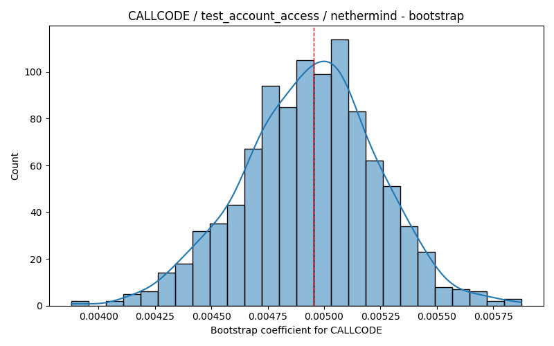

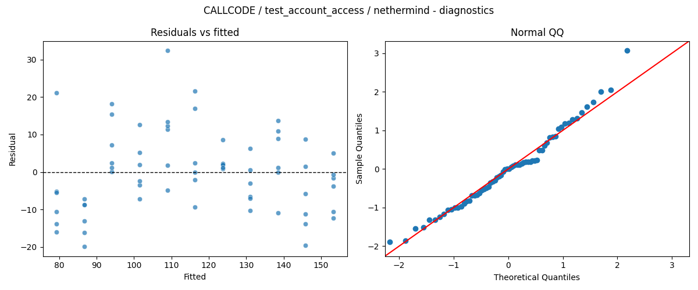

</details>

<details><summary>reth — NNLS regression summary</summary>

```
==============================================================================
                           NNLS Regression Results                            
==============================================================================
Dep. Variable:          test_runtime_ms              R-squared:          0.976
Model:                  NNLS                    Adj. R-squared:          0.976
No. Observations:       44                                RMSE:          12.92
Df Residuals:           42                                 MAE:          10.04
Df Model:               1      
==============================================================================
                      coef     std err     P-value      [0.025      0.975]
------------------------------------------------------------------------------
         const     83.7565      5.7739       0.001     72.4999     95.2729
       opcount      0.0040      0.0001       0.001      0.0039      0.0042
==============================================================================
Notes: Non-negative least squares with bootstrap inference (1000 iterations)
==============================================================================
```

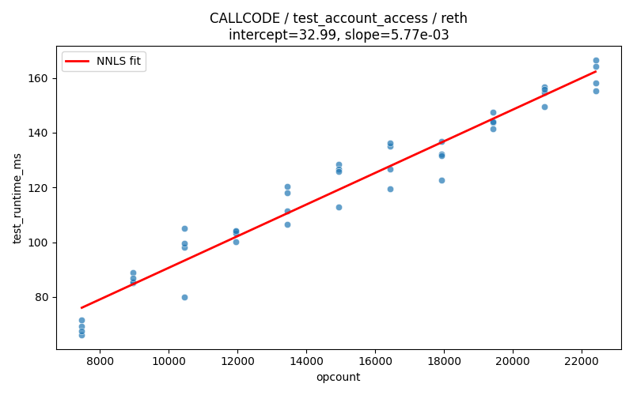

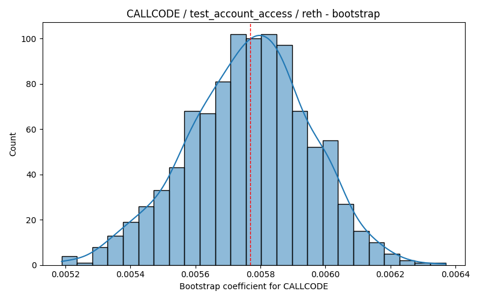

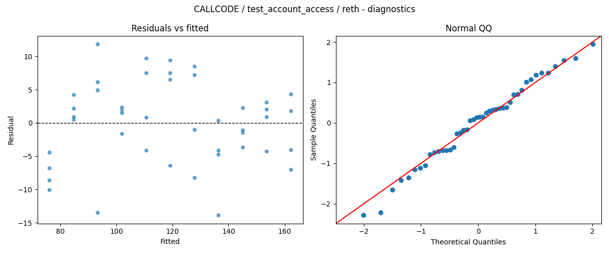

</details>

### test_account_access — combo `CALLCODE_AccountMode.EXISTING_EOA` — `presets[cold_account_nocode_write]`

| client | nobs | R² | target_coef (ms) | p-value | 95% CI |
| --- | --- | --- | --- | --- | --- |
| `besu` | 55 | 0.9677 | 0.02444 | 1.00e-03 | [0.02296, 0.02564] |
| `erigon` | 44 | 0.9892 | 0.007826 | 1.00e-03 | [0.007577, 0.008081] |
| `geth` | 77 | 0.9351 | 0.0167 | 1.00e-03 | [0.01571, 0.01768] |
| `nethermind` | 66 | 0.8329 | 0.005857 | 1.00e-03 | [0.00513, 0.006506] |
| `reth` | 44 | 0.9502 | 0.005768 | 1.00e-03 | [0.005381, 0.006126] |

<details><summary>besu — NNLS regression summary</summary>

```
==============================================================================
                           NNLS Regression Results                            
==============================================================================
Dep. Variable:          test_runtime_ms              R-squared:          0.968
Model:                  NNLS                    Adj. R-squared:          0.967
No. Observations:       55                                RMSE:          21.07
Df Residuals:           53                                 MAE:          18.00
Df Model:               1      
==============================================================================
                      coef     std err     P-value      [0.025      0.975]
------------------------------------------------------------------------------
         const    120.9520     10.3723       0.001    103.8808    143.8352
       opcount      0.0244      0.0007       0.001      0.0230      0.0256
==============================================================================
Notes: Non-negative least squares with bootstrap inference (1000 iterations)
==============================================================================
```


</details>

<details><summary>erigon — NNLS regression summary</summary>

```
==============================================================================
                           NNLS Regression Results                            
==============================================================================
Dep. Variable:          test_runtime_ms              R-squared:          0.989
Model:                  NNLS                    Adj. R-squared:          0.989
No. Observations:       44                                RMSE:           3.86
Df Residuals:           42                                 MAE:           3.07
Df Model:               1      
==============================================================================
                      coef     std err     P-value      [0.025      0.975]
------------------------------------------------------------------------------
         const     15.1911      1.9107       0.001     11.3975     19.1559
       opcount      0.0078      0.0001       0.001      0.0076      0.0081
==============================================================================
Notes: Non-negative least squares with bootstrap inference (1000 iterations)
==============================================================================
```


</details>

<details><summary>geth — NNLS regression summary</summary>

```
==============================================================================
                           NNLS Regression Results                            
==============================================================================
Dep. Variable:          test_runtime_ms              R-squared:          0.935
Model:                  NNLS                    Adj. R-squared:          0.934
No. Observations:       77                                RMSE:          20.78
Df Residuals:           75                                 MAE:          18.26
Df Model:               1      
==============================================================================
                      coef     std err     P-value      [0.025      0.975]
------------------------------------------------------------------------------
         const     58.9468      8.0714       0.001     43.3994     75.4538
       opcount      0.0167      0.0005       0.001      0.0157      0.0177
==============================================================================
Notes: Non-negative least squares with bootstrap inference (1000 iterations)
==============================================================================
```


</details>

<details><summary>nethermind — NNLS regression summary</summary>

```
==============================================================================
                           NNLS Regression Results                            
==============================================================================
Dep. Variable:          test_runtime_ms              R-squared:          0.833
Model:                  NNLS                    Adj. R-squared:          0.830
No. Observations:       66                                RMSE:          12.39
Df Residuals:           64                                 MAE:           9.36
Df Model:               1      
==============================================================================
                      coef     std err     P-value      [0.025      0.975]
------------------------------------------------------------------------------
         const     52.1950      5.5118       0.001     42.0934     63.8765
       opcount      0.0059      0.0003       0.001      0.0051      0.0065
==============================================================================
Notes: Non-negative least squares with bootstrap inference (1000 iterations)
==============================================================================
```


</details>

<details><summary>reth — NNLS regression summary</summary>

```
==============================================================================
                           NNLS Regression Results                            
==============================================================================
Dep. Variable:          test_runtime_ms              R-squared:          0.950
Model:                  NNLS                    Adj. R-squared:          0.949
No. Observations:       44                                RMSE:           6.24
Df Residuals:           42                                 MAE:           5.36
Df Model:               1      
==============================================================================
                      coef     std err     P-value      [0.025      0.975]
------------------------------------------------------------------------------
         const     33.1380      2.9153       0.001     27.7539     39.2703
       opcount      0.0058      0.0002       0.001      0.0054      0.0061
==============================================================================
Notes: Non-negative least squares with bootstrap inference (1000 iterations)
==============================================================================
```


</details>

### test_account_access — combo `CALLCODE_AccountMode.NON_EXISTING_ACCOUNT` — `presets[cold_account_nocode_write]`

| client | nobs | R² | target_coef (ms) | p-value | 95% CI |
| --- | --- | --- | --- | --- | --- |
| `besu` | 55 | 0.9519 | 0.01832 | 1.00e-03 | [0.0172, 0.01941] |
| `erigon` | 44 | 0.9841 | 0.00778 | 1.00e-03 | [0.007529, 0.008027] |
| `geth` | 77 | 0.9576 | 0.02797 | 1.00e-03 | [0.02659, 0.0293] |
| `nethermind` | 66 | 0.8314 | 0.004952 | 1.00e-03 | [0.00433, 0.005491] |
| `reth` | 44 | 0.9527 | 0.005769 | 1.00e-03 | [0.005374, 0.006118] |

<details><summary>besu — NNLS regression summary</summary>

```
==============================================================================
                           NNLS Regression Results                            
==============================================================================
Dep. Variable:          test_runtime_ms              R-squared:          0.952
Model:                  NNLS                    Adj. R-squared:          0.951
No. Observations:       55                                RMSE:          19.45
Df Residuals:           53                                 MAE:          16.80
Df Model:               1      
==============================================================================
                      coef     std err     P-value      [0.025      0.975]
------------------------------------------------------------------------------
         const    100.1823      7.8809       0.001     84.8295    116.1750
       opcount      0.0183      0.0006       0.001      0.0172      0.0194
==============================================================================
Notes: Non-negative least squares with bootstrap inference (1000 iterations)
==============================================================================
```


</details>

<details><summary>erigon — NNLS regression summary</summary>

```
==============================================================================
                           NNLS Regression Results                            
==============================================================================
Dep. Variable:          test_runtime_ms              R-squared:          0.984
Model:                  NNLS                    Adj. R-squared:          0.984
No. Observations:       44                                RMSE:           4.68
Df Residuals:           42                                 MAE:           3.80
Df Model:               1      
==============================================================================
                      coef     std err     P-value      [0.025      0.975]
------------------------------------------------------------------------------
         const     13.9364      1.7755       0.001     10.7821     17.7782
       opcount      0.0078      0.0001       0.001      0.0075      0.0080
==============================================================================
Notes: Non-negative least squares with bootstrap inference (1000 iterations)
==============================================================================
```


</details>

<details><summary>geth — NNLS regression summary</summary>

```
==============================================================================
                           NNLS Regression Results                            
==============================================================================
Dep. Variable:          test_runtime_ms              R-squared:          0.958
Model:                  NNLS                    Adj. R-squared:          0.957
No. Observations:       77                                RMSE:          27.81
Df Residuals:           75                                 MAE:          23.06
Df Model:               1      
==============================================================================
                      coef     std err     P-value      [0.025      0.975]
------------------------------------------------------------------------------
         const    100.6407     10.3905       0.001     80.3185    122.4164
       opcount      0.0280      0.0007       0.001      0.0266      0.0293
==============================================================================
Notes: Non-negative least squares with bootstrap inference (1000 iterations)
==============================================================================
```


</details>

<details><summary>nethermind — NNLS regression summary</summary>

```
==============================================================================
                           NNLS Regression Results                            
==============================================================================
Dep. Variable:          test_runtime_ms              R-squared:          0.831
Model:                  NNLS                    Adj. R-squared:          0.829
No. Observations:       66                                RMSE:          10.54
Df Residuals:           64                                 MAE:           8.22
Df Model:               1      
==============================================================================
                      coef     std err     P-value      [0.025      0.975]
------------------------------------------------------------------------------
         const     42.3152      5.0023       0.001     33.5586     53.0990
       opcount      0.0050      0.0003       0.001      0.0043      0.0055
==============================================================================
Notes: Non-negative least squares with bootstrap inference (1000 iterations)
==============================================================================
```


</details>

<details><summary>reth — NNLS regression summary</summary>

```
==============================================================================
                           NNLS Regression Results                            
==============================================================================
Dep. Variable:          test_runtime_ms              R-squared:          0.953
Model:                  NNLS                    Adj. R-squared:          0.952
No. Observations:       44                                RMSE:           6.07
Df Residuals:           42                                 MAE:           4.94
Df Model:               1      
==============================================================================
                      coef     std err     P-value      [0.025      0.975]
------------------------------------------------------------------------------
         const     32.9898      3.1724       0.001     27.1498     39.7130
       opcount      0.0058      0.0002       0.001      0.0054      0.0061
==============================================================================
Notes: Non-negative least squares with bootstrap inference (1000 iterations)
==============================================================================
```


</details>

### test_account_access — combo `CALLCODE_AccountMode.EXISTING_CONTRACT_DIFF_MAX` — `presets[cold_account_code_access]`

| client | nobs | R² | target_coef (ms) | p-value | 95% CI |
| --- | --- | --- | --- | --- | --- |
| `besu` | 55 | 0.9861 | 0.02201 | 1.00e-03 | [0.02137, 0.02257] |
| `erigon` | 44 | 0.9462 | 0.03473 | 1.00e-03 | [0.03198, 0.03677] |
| `geth` | 77 | 0.9207 | 0.02069 | 1.00e-03 | [0.01924, 0.02225] |
| `nethermind` | 66 | 0.8934 | 0.01569 | 1.00e-03 | [0.01403, 0.01731] |
| `reth` | 44 | 0.9984 | 0.01986 | 1.00e-03 | [0.01957, 0.02011] |

<details><summary>besu — NNLS regression summary</summary>

```
==============================================================================
                           NNLS Regression Results                            
==============================================================================
Dep. Variable:          test_runtime_ms              R-squared:          0.986
Model:                  NNLS                    Adj. R-squared:          0.986
No. Observations:       55                                RMSE:          52.94
Df Residuals:           53                                 MAE:          42.39
Df Model:               1      
==============================================================================
                      coef     std err     P-value      [0.025      0.975]
------------------------------------------------------------------------------
         const    455.2385     22.6549       0.001    411.9182    499.3836
       opcount      0.0220      0.0003       0.001      0.0214      0.0226
==============================================================================
Notes: Non-negative least squares with bootstrap inference (1000 iterations)
==============================================================================
```


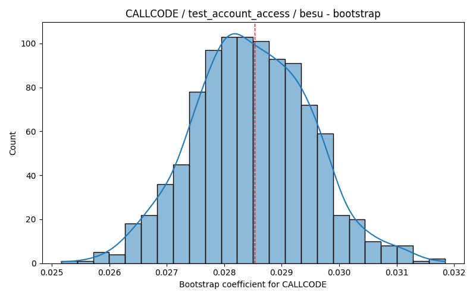

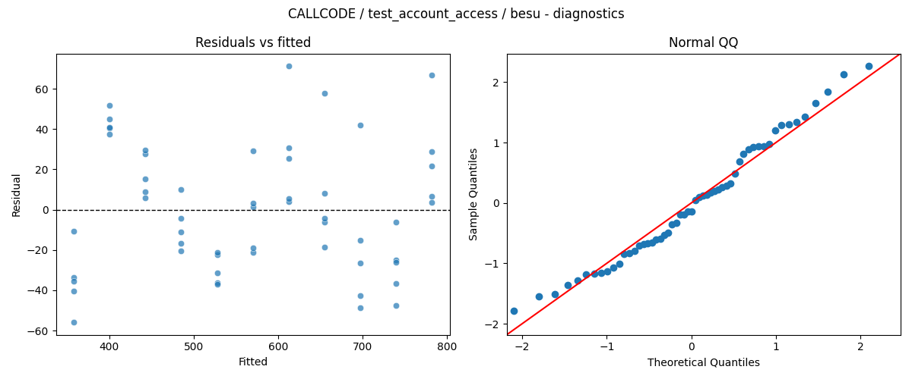

</details>

<details><summary>erigon — NNLS regression summary</summary>

```
==============================================================================
                           NNLS Regression Results                            
==============================================================================
Dep. Variable:          test_runtime_ms              R-squared:          0.946
Model:                  NNLS                    Adj. R-squared:          0.945
No. Observations:       44                                RMSE:         167.51
Df Residuals:           42                                 MAE:         142.63
Df Model:               1      
==============================================================================
                      coef     std err     P-value      [0.025      0.975]
------------------------------------------------------------------------------
         const    220.8202     83.8773       0.001     68.2349    407.4814
       opcount      0.0347      0.0012       0.001      0.0320      0.0368
==============================================================================
Notes: Non-negative least squares with bootstrap inference (1000 iterations)
==============================================================================
```

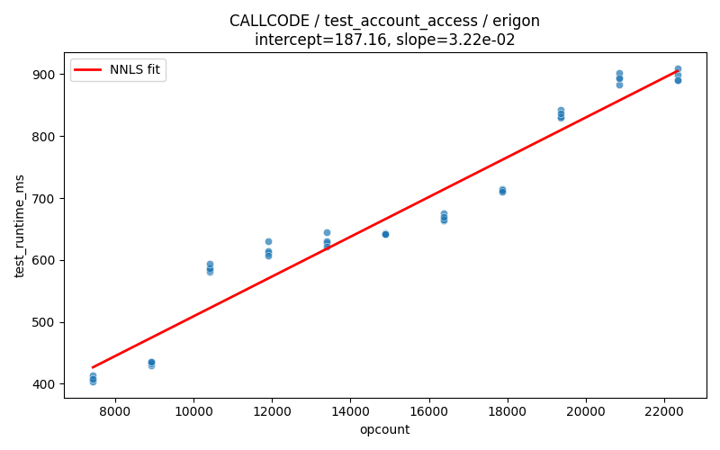

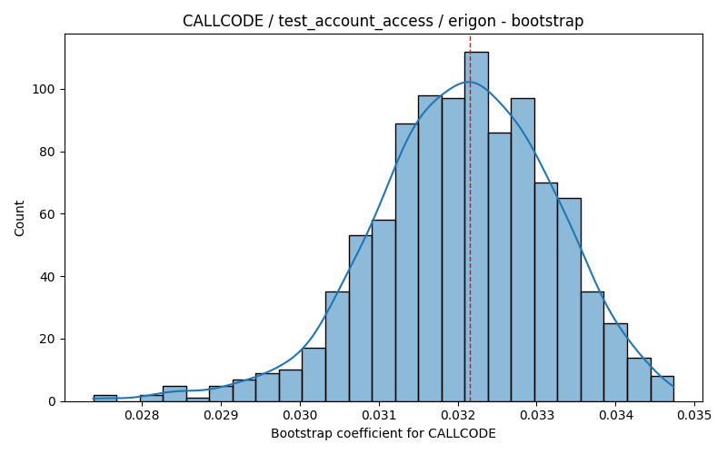

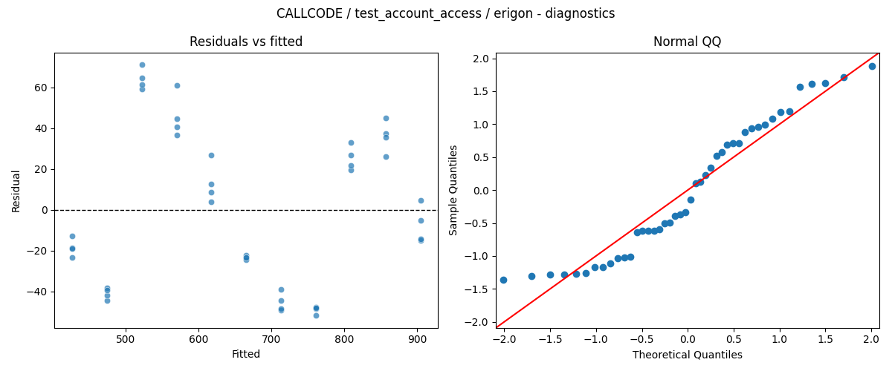

</details>

<details><summary>geth — NNLS regression summary</summary>

```
==============================================================================
                           NNLS Regression Results                            
==============================================================================
Dep. Variable:          test_runtime_ms              R-squared:          0.921
Model:                  NNLS                    Adj. R-squared:          0.920
No. Observations:       77                                RMSE:         122.72
Df Residuals:           75                                 MAE:          96.20
Df Model:               1      
==============================================================================
                      coef     std err     P-value      [0.025      0.975]
------------------------------------------------------------------------------
         const    491.6512     50.2327       0.001    394.5069    585.2404
       opcount      0.0207      0.0008       0.001      0.0192      0.0223
==============================================================================
Notes: Non-negative least squares with bootstrap inference (1000 iterations)
==============================================================================
```

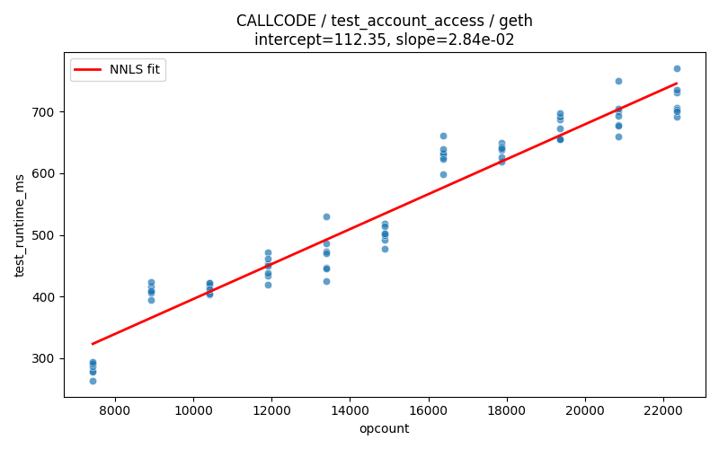

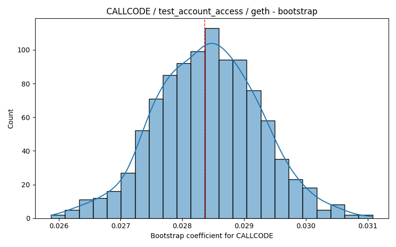

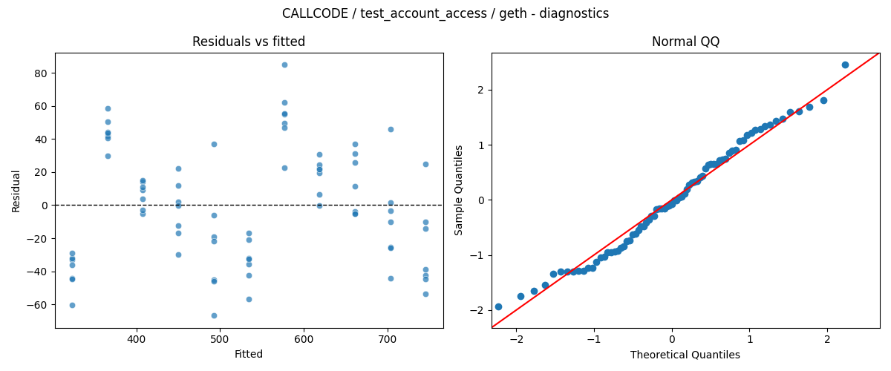

</details>

<details><summary>nethermind — NNLS regression summary</summary>

```
==============================================================================
                           NNLS Regression Results                            
==============================================================================
Dep. Variable:          test_runtime_ms              R-squared:          0.893
Model:                  NNLS                    Adj. R-squared:          0.892
No. Observations:       66                                RMSE:         109.59
Df Residuals:           64                                 MAE:          88.59
Df Model:               1      
==============================================================================
                      coef     std err     P-value      [0.025      0.975]
------------------------------------------------------------------------------
         const    646.5045     61.6204       0.001    525.8092    770.7123
       opcount      0.0157      0.0008       0.001      0.0140      0.0173
==============================================================================
Notes: Non-negative least squares with bootstrap inference (1000 iterations)
==============================================================================
```

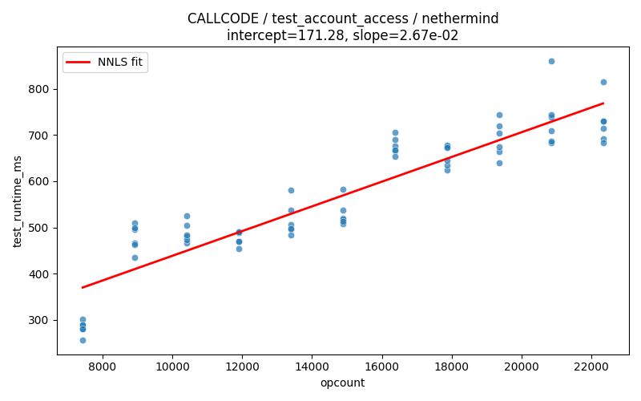

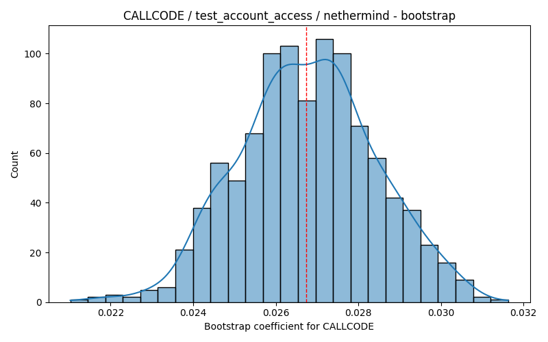

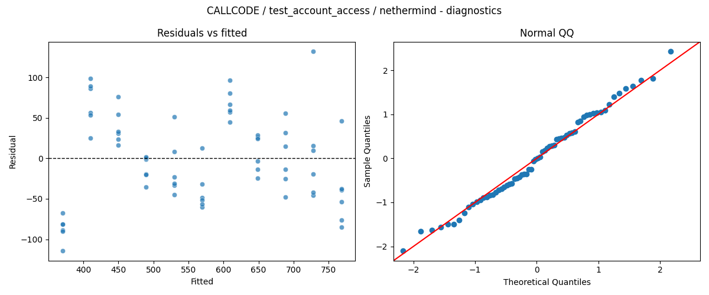

</details>

<details><summary>reth — NNLS regression summary</summary>

```
==============================================================================
                           NNLS Regression Results                            
==============================================================================
Dep. Variable:          test_runtime_ms              R-squared:          0.998
Model:                  NNLS                    Adj. R-squared:          0.998
No. Observations:       44                                RMSE:          16.30
Df Residuals:           42                                 MAE:          11.95
Df Model:               1      
==============================================================================
                      coef     std err     P-value      [0.025      0.975]
------------------------------------------------------------------------------
         const    138.3877     10.7266       0.001    121.0340    161.6787
       opcount      0.0199      0.0001       0.001      0.0196      0.0201
==============================================================================
Notes: Non-negative least squares with bootstrap inference (1000 iterations)
==============================================================================
```


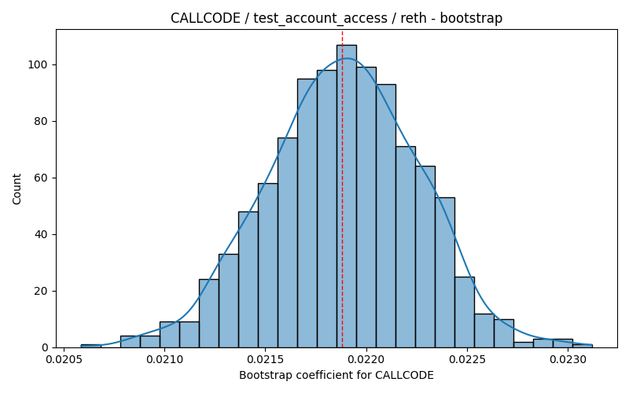

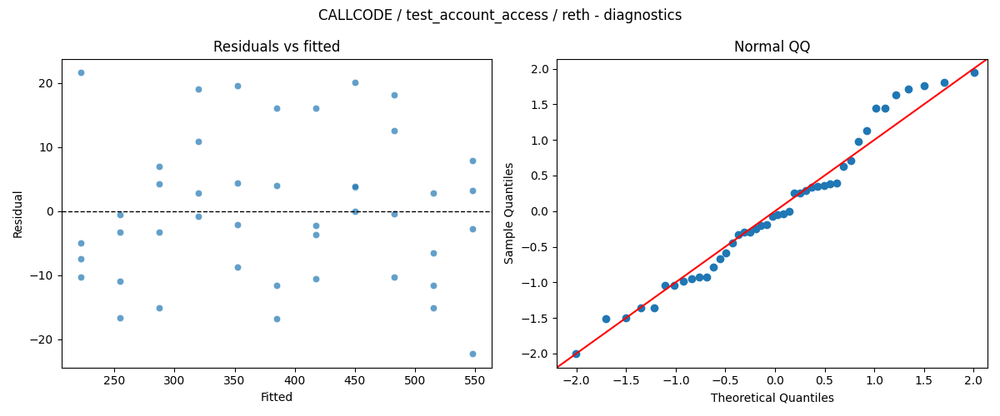

</details>

### test_account_access — combo `CALLCODE_AccountMode.EXISTING_CONTRACT_MINIMAL` — `presets[cold_account_code_access]`

| client | nobs | R² | target_coef (ms) | p-value | 95% CI |
| --- | --- | --- | --- | --- | --- |
| `besu` | 55 | 0.9846 | 0.01423 | 1.00e-03 | [0.01371, 0.01478] |
| `erigon` | 44 | 0.9935 | 0.008875 | 1.00e-03 | [0.008668, 0.009105] |
| `geth` | 77 | 0.9486 | 0.005095 | 1.00e-03 | [0.0048, 0.005413] |
| `nethermind` | 66 | 0.6769 | 0.003053 | 1.00e-03 | [0.002586, 0.003582] |
| `reth` | 44 | 0.9719 | 0.00386 | 1.00e-03 | [0.003666, 0.004056] |

<details><summary>besu — NNLS regression summary</summary>

```
==============================================================================
                           NNLS Regression Results                            
==============================================================================
Dep. Variable:          test_runtime_ms              R-squared:          0.985
Model:                  NNLS                    Adj. R-squared:          0.984
No. Observations:       55                                RMSE:          36.01
Df Residuals:           53                                 MAE:          27.21
Df Model:               1      
==============================================================================
                      coef     std err     P-value      [0.025      0.975]
------------------------------------------------------------------------------
         const    370.4258     16.0875       0.001    341.2236    402.4768
       opcount      0.0142      0.0003       0.001      0.0137      0.0148
==============================================================================
Notes: Non-negative least squares with bootstrap inference (1000 iterations)
==============================================================================
```

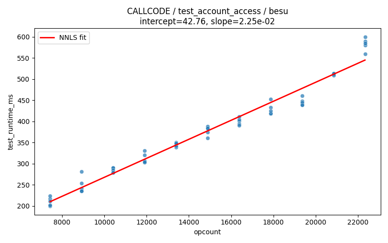

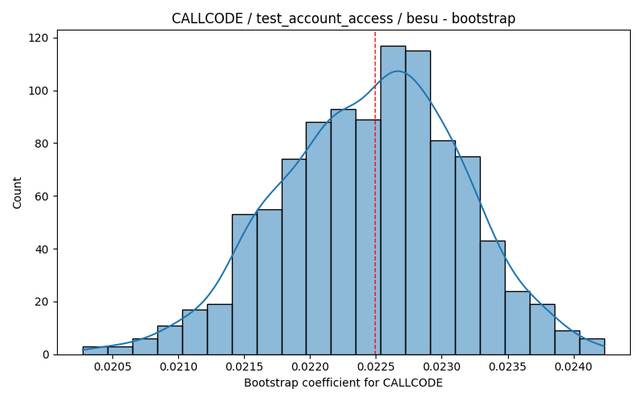

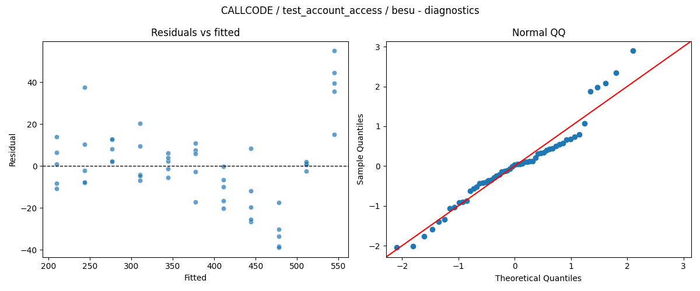

</details>

<details><summary>erigon — NNLS regression summary</summary>

```
==============================================================================
                           NNLS Regression Results                            
==============================================================================
Dep. Variable:          test_runtime_ms              R-squared:          0.994
Model:                  NNLS                    Adj. R-squared:          0.993
No. Observations:       44                                RMSE:          14.46
Df Residuals:           42                                 MAE:          12.52
Df Model:               1      
==============================================================================
                      coef     std err     P-value      [0.025      0.975]
------------------------------------------------------------------------------
         const     98.0297      7.1271       0.001     82.0342    110.3179
       opcount      0.0089      0.0001       0.001      0.0087      0.0091
==============================================================================
Notes: Non-negative least squares with bootstrap inference (1000 iterations)
==============================================================================
```

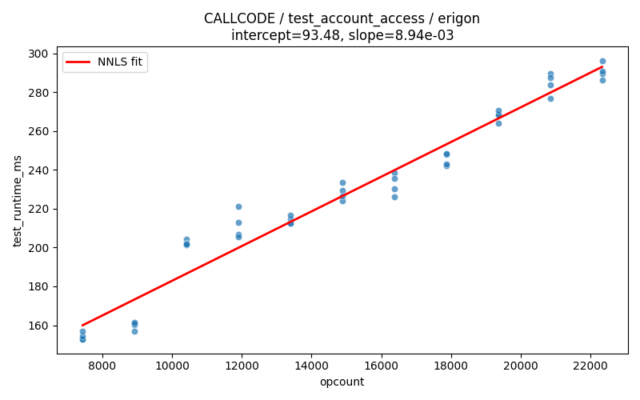

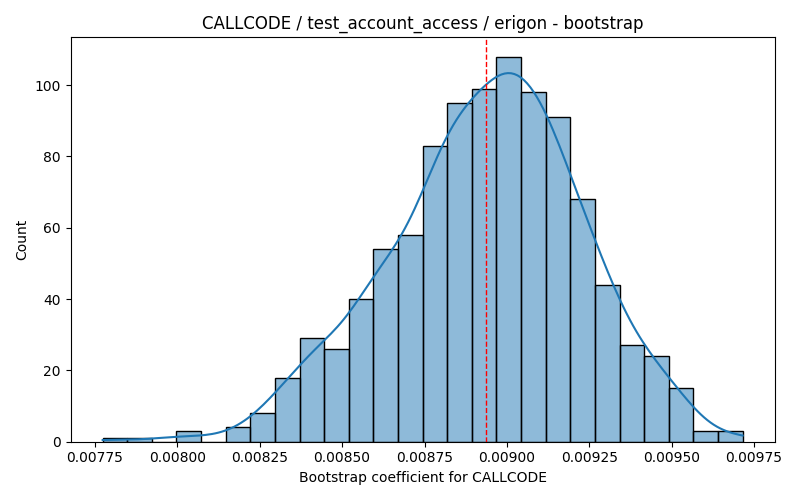

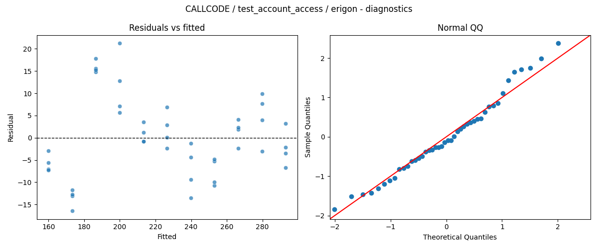

</details>

<details><summary>geth — NNLS regression summary</summary>

```
==============================================================================
                           NNLS Regression Results                            
==============================================================================
Dep. Variable:          test_runtime_ms              R-squared:          0.949
Model:                  NNLS                    Adj. R-squared:          0.948
No. Observations:       77                                RMSE:          23.99
Df Residuals:           75                                 MAE:          18.39
Df Model:               1      
==============================================================================
                      coef     std err     P-value      [0.025      0.975]
------------------------------------------------------------------------------
         const     69.0300      8.6655       0.001     50.8097     85.5847
       opcount      0.0051      0.0002       0.001      0.0048      0.0054
==============================================================================
Notes: Non-negative least squares with bootstrap inference (1000 iterations)
==============================================================================
```

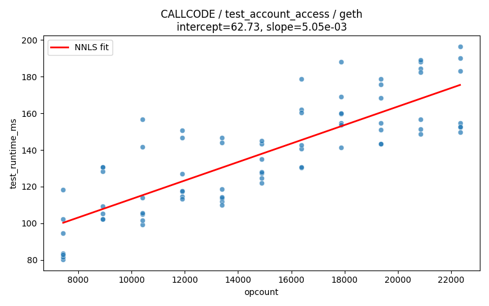

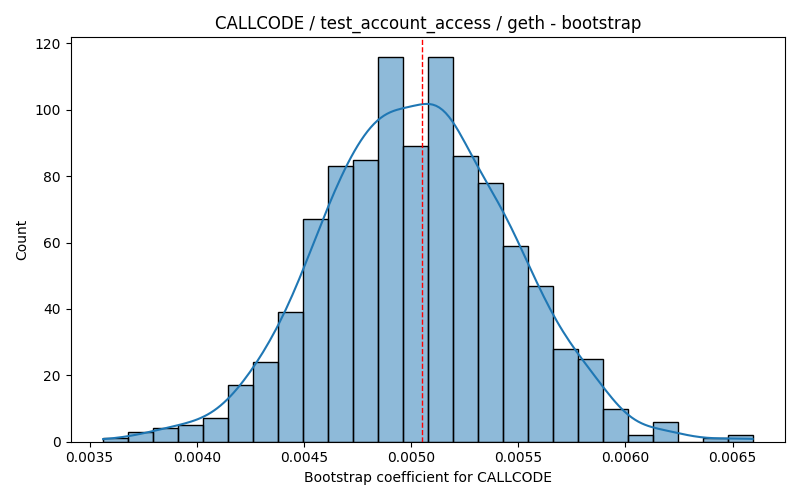

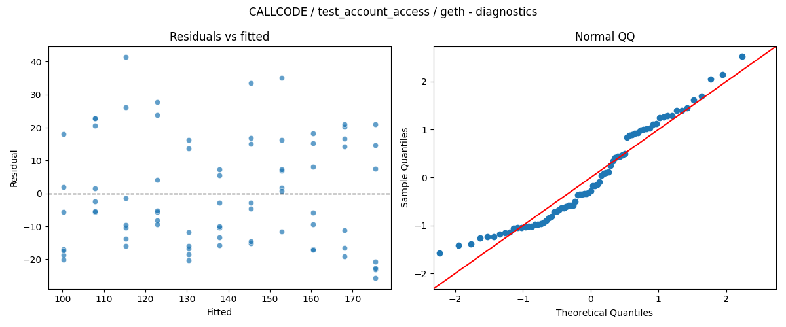

</details>

<details><summary>nethermind — NNLS regression summary</summary>

```
==============================================================================
                           NNLS Regression Results                            
==============================================================================
Dep. Variable:          test_runtime_ms              R-squared:          0.677
Model:                  NNLS                    Adj. R-squared:          0.672
No. Observations:       66                                RMSE:          42.65
Df Residuals:           64                                 MAE:          36.52
Df Model:               1      
==============================================================================
                      coef     std err     P-value      [0.025      0.975]
------------------------------------------------------------------------------
         const     98.5266     14.9084       0.001     68.4789    126.4550
       opcount      0.0031      0.0003       0.001      0.0026      0.0036
==============================================================================
Notes: Non-negative least squares with bootstrap inference (1000 iterations)
==============================================================================
```

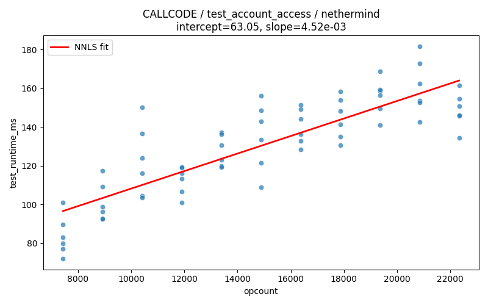

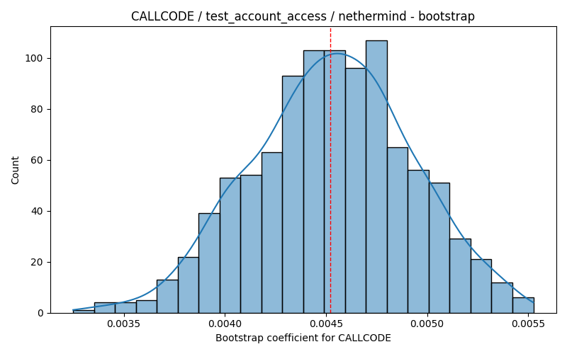

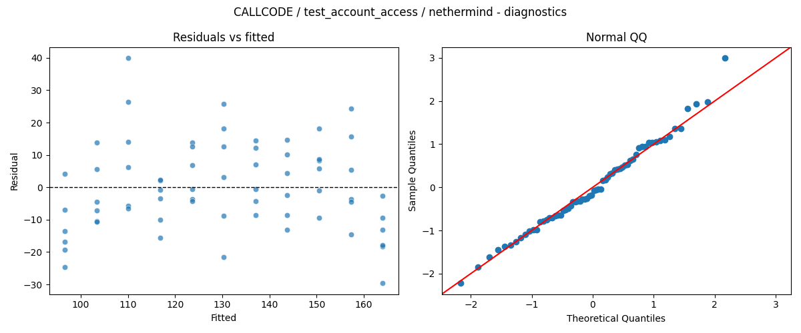

</details>

<details><summary>reth — NNLS regression summary</summary>

```
==============================================================================
                           NNLS Regression Results                            
==============================================================================
Dep. Variable:          test_runtime_ms              R-squared:          0.972
Model:                  NNLS                    Adj. R-squared:          0.971
No. Observations:       44                                RMSE:          13.28
Df Residuals:           42                                 MAE:          10.13
Df Model:               1      
==============================================================================
                      coef     std err     P-value      [0.025      0.975]
------------------------------------------------------------------------------
         const     76.1280      6.6188       0.001     64.3096     89.7180
       opcount      0.0039      0.0001       0.001      0.0037      0.0041
==============================================================================
Notes: Non-negative least squares with bootstrap inference (1000 iterations)
==============================================================================
```

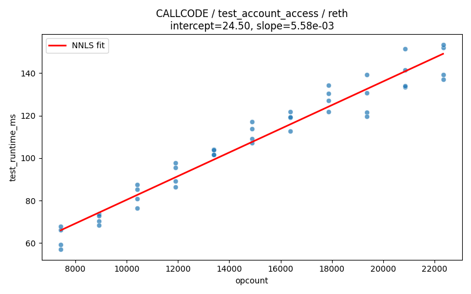

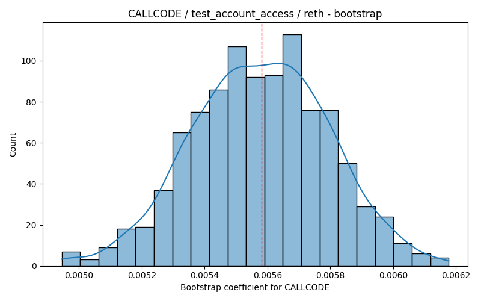

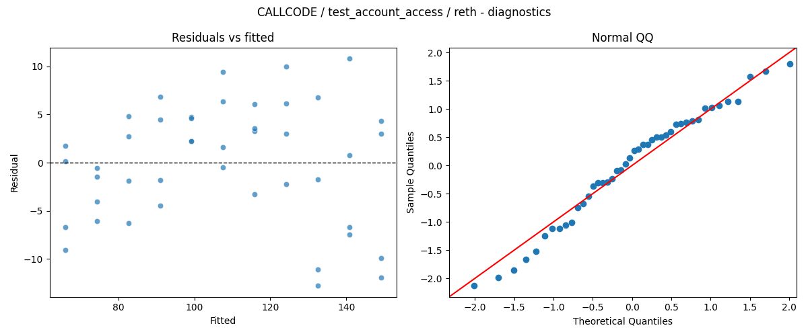

</details>

### test_account_access — combo `CALLCODE_AccountMode.EXISTING_CONTRACT_SAME_MAX` — `presets[cold_account_code_access]`

| client | nobs | R² | target_coef (ms) | p-value | 95% CI |
| --- | --- | --- | --- | --- | --- |
| `besu` | 55 | 0.973 | 0.01246 | 1.00e-03 | [0.01182, 0.0131] |
| `erigon` | 44 | 0.9916 | 0.008852 | 1.00e-03 | [0.008662, 0.009102] |
| `geth` | 77 | 0.9579 | 0.005093 | 1.00e-03 | [0.004854, 0.005371] |
| `nethermind` | 66 | 0.5653 | 0.002428 | 1.00e-03 | [0.001858, 0.00298] |
| `reth` | 44 | 0.9638 | 0.00381 | 1.00e-03 | [0.003562, 0.004049] |

<details><summary>besu — NNLS regression summary</summary>

```
==============================================================================
                           NNLS Regression Results                            
==============================================================================
Dep. Variable:          test_runtime_ms              R-squared:          0.973
Model:                  NNLS                    Adj. R-squared:          0.972
No. Observations:       55                                RMSE:          42.02
Df Residuals:           53                                 MAE:          32.06
Df Model:               1      
==============================================================================
                      coef     std err     P-value      [0.025      0.975]
------------------------------------------------------------------------------
         const    432.9820     20.0661       0.001    396.7019    475.6923
       opcount      0.0125      0.0003       0.001      0.0118      0.0131
==============================================================================
Notes: Non-negative least squares with bootstrap inference (1000 iterations)
==============================================================================
```

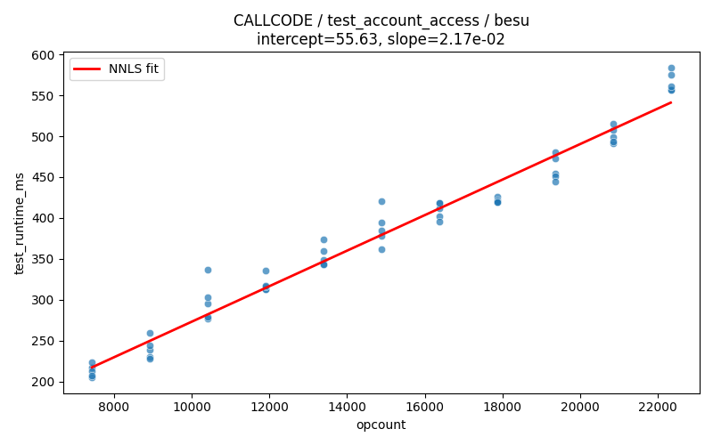

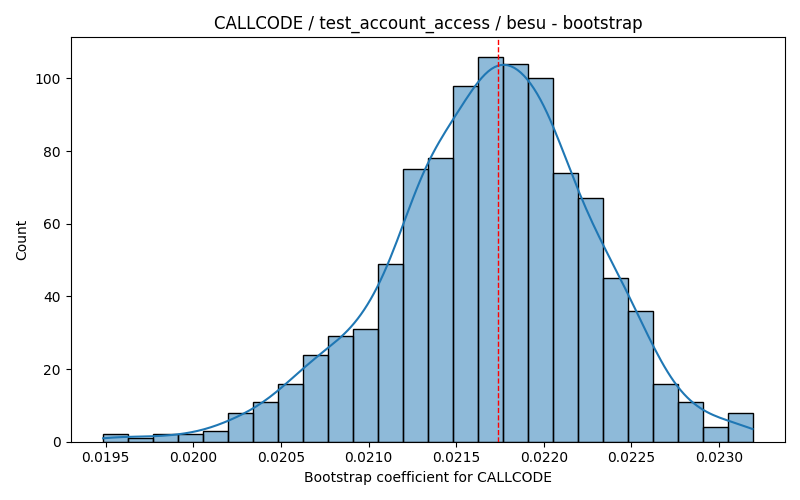

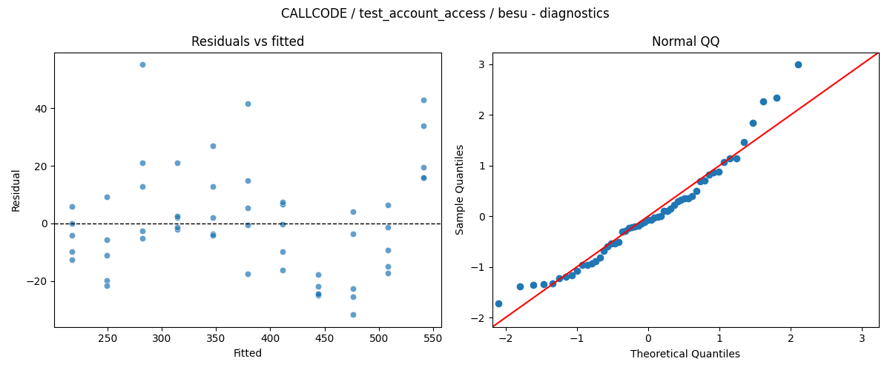

</details>

<details><summary>erigon — NNLS regression summary</summary>

```
==============================================================================
                           NNLS Regression Results                            
==============================================================================
Dep. Variable:          test_runtime_ms              R-squared:          0.992
Model:                  NNLS                    Adj. R-squared:          0.991
No. Observations:       44                                RMSE:          16.43
Df Residuals:           42                                 MAE:          12.11
Df Model:               1      
==============================================================================
                      coef     std err     P-value      [0.025      0.975]
------------------------------------------------------------------------------
         const     98.8135      6.6633       0.001     82.9058    109.3460
       opcount      0.0089      0.0001       0.001      0.0087      0.0091
==============================================================================
Notes: Non-negative least squares with bootstrap inference (1000 iterations)
==============================================================================
```

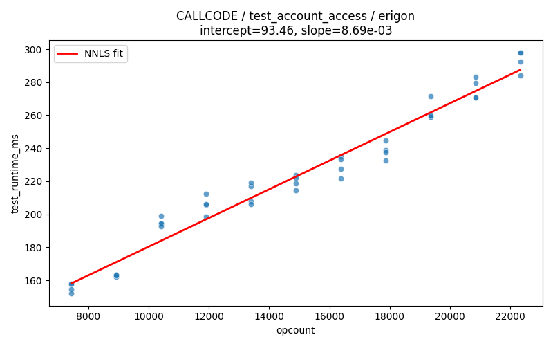

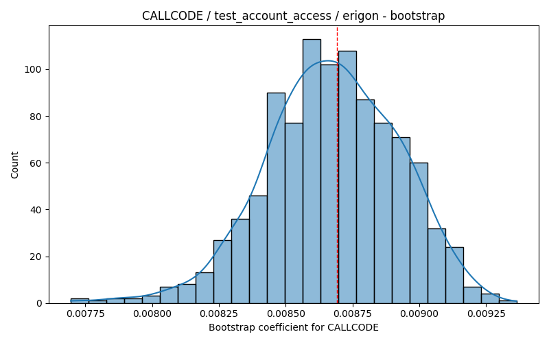

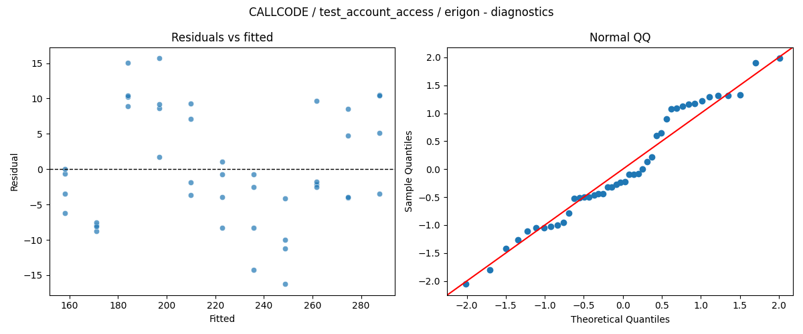

</details>

<details><summary>geth — NNLS regression summary</summary>

```
==============================================================================
                           NNLS Regression Results                            
==============================================================================
Dep. Variable:          test_runtime_ms              R-squared:          0.958
Model:                  NNLS                    Adj. R-squared:          0.957
No. Observations:       77                                RMSE:          21.59
Df Residuals:           75                                 MAE:          15.89
Df Model:               1      
==============================================================================
                      coef     std err     P-value      [0.025      0.975]
------------------------------------------------------------------------------
         const     67.8193      7.8876       0.001     51.9199     82.2865
       opcount      0.0051      0.0001       0.001      0.0049      0.0054
==============================================================================
Notes: Non-negative least squares with bootstrap inference (1000 iterations)
==============================================================================
```

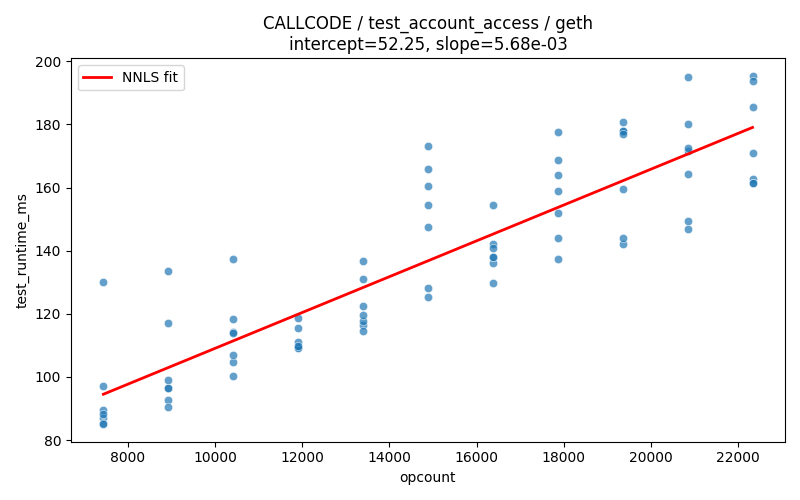

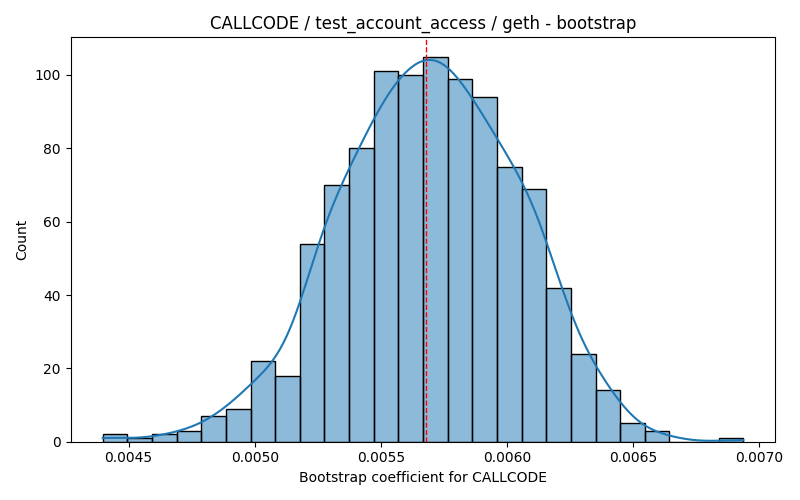

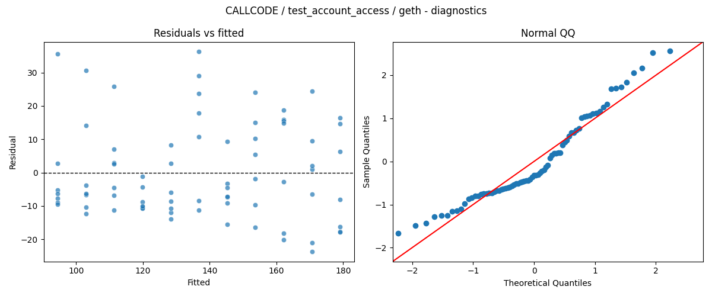

</details>

<details><summary>nethermind — NNLS regression summary</summary>

```
==============================================================================
                           NNLS Regression Results                            
==============================================================================
Dep. Variable:          test_runtime_ms              R-squared:          0.565
Model:                  NNLS                    Adj. R-squared:          0.558
No. Observations:       66                                RMSE:          43.05
Df Residuals:           64                                 MAE:          35.71
Df Model:               1      
==============================================================================
                      coef     std err     P-value      [0.025      0.975]
------------------------------------------------------------------------------
         const    144.2093     16.5988       0.001    111.3551    176.4470
       opcount      0.0024      0.0003       0.001      0.0019      0.0030
==============================================================================
Notes: Non-negative least squares with bootstrap inference (1000 iterations)
==============================================================================
```

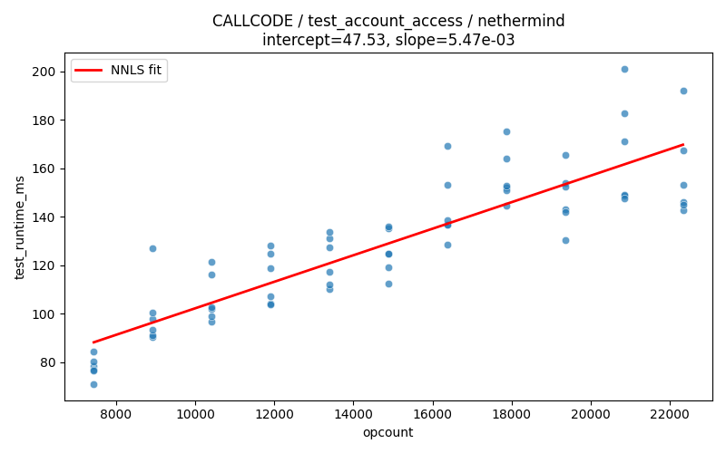

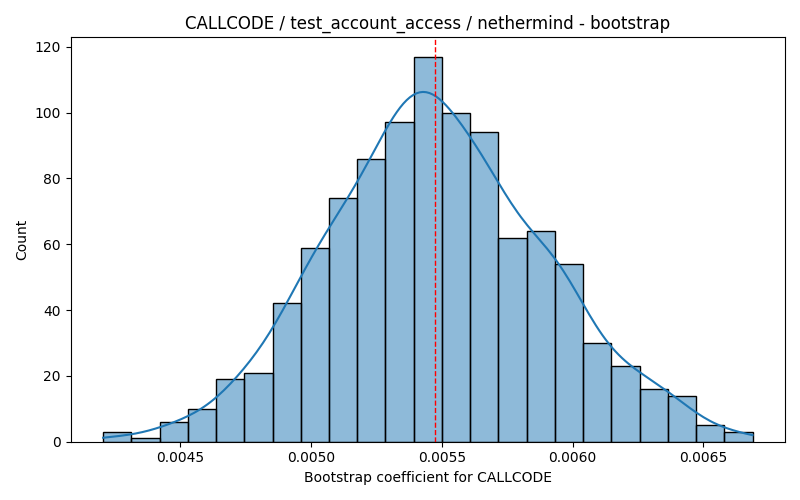

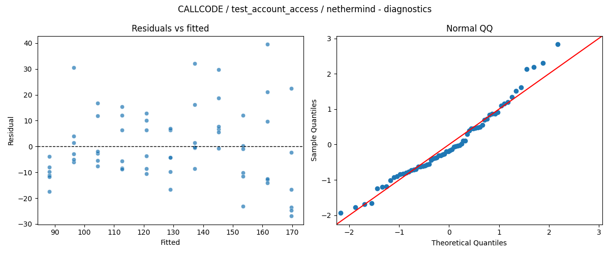

</details>

<details><summary>reth — NNLS regression summary</summary>

```
==============================================================================
                           NNLS Regression Results                            
==============================================================================
Dep. Variable:          test_runtime_ms              R-squared:          0.964
Model:                  NNLS                    Adj. R-squared:          0.963
No. Observations:       44                                RMSE:          14.94
Df Residuals:           42                                 MAE:          11.82
Df Model:               1      
==============================================================================
                      coef     std err     P-value      [0.025      0.975]
------------------------------------------------------------------------------
         const     82.5556      7.8336       0.001     68.2761    100.8138
       opcount      0.0038      0.0001       0.001      0.0036      0.0040
==============================================================================
Notes: Non-negative least squares with bootstrap inference (1000 iterations)
==============================================================================
```

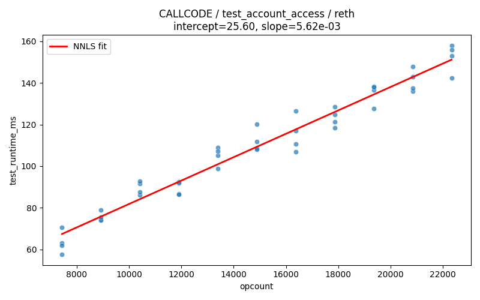

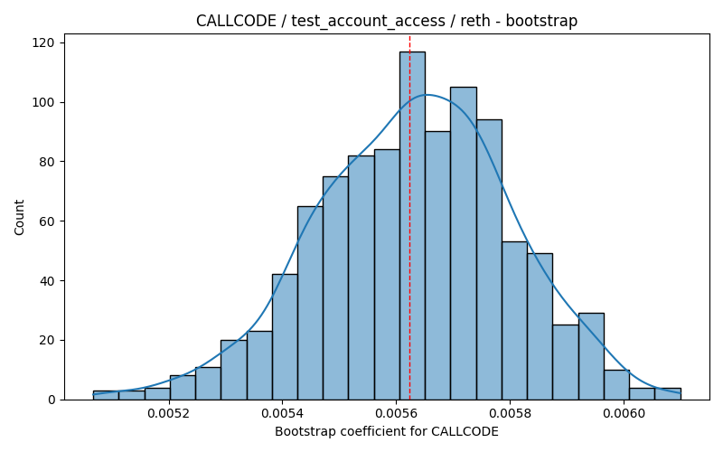

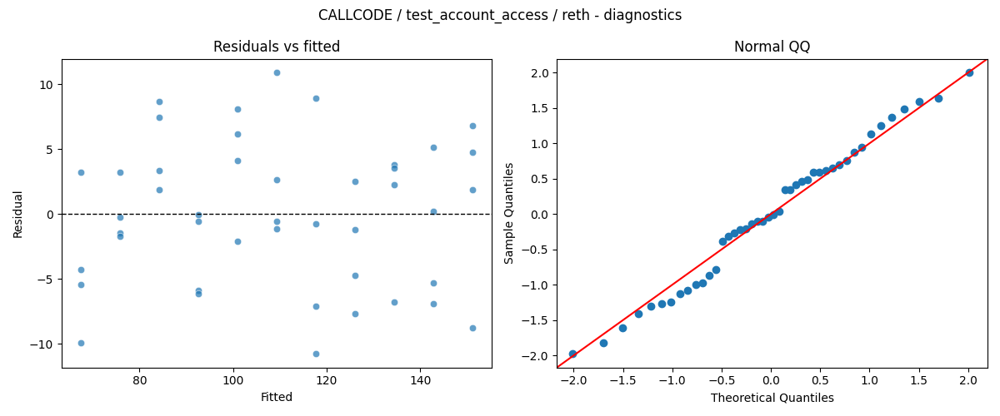

</details>

### test_account_access — combo `CALLCODE_AccountMode.EXISTING_CONTRACT_DIFF_MAX` — `presets[cold_account_code_write]`

| client | nobs | R² | target_coef (ms) | p-value | 95% CI |
| --- | --- | --- | --- | --- | --- |
| `besu` | 55 | 0.9484 | 0.02853 | 1.00e-03 | [0.02651, 0.03056] |
| `erigon` | 44 | 0.9412 | 0.03216 | 1.00e-03 | [0.02958, 0.03411] |
| `geth` | 77 | 0.9374 | 0.02836 | 1.00e-03 | [0.02671, 0.03007] |
| `nethermind` | 66 | 0.8427 | 0.02674 | 1.00e-03 | [0.02375, 0.02999] |
| `reth` | 44 | 0.9885 | 0.02188 | 1.00e-03 | [0.02117, 0.02256] |

<details><summary>besu — NNLS regression summary</summary>

```
==============================================================================
                           NNLS Regression Results                            
==============================================================================
Dep. Variable:          test_runtime_ms              R-squared:          0.948
Model:                  NNLS                    Adj. R-squared:          0.947
No. Observations:       55                                RMSE:          31.32
Df Residuals:           53                                 MAE:          26.16
Df Model:               1      
==============================================================================
                      coef     std err     P-value      [0.025      0.975]
------------------------------------------------------------------------------
         const    145.6741     15.7043       0.001    114.3686    176.8285
       opcount      0.0285      0.0010       0.001      0.0265      0.0306
==============================================================================
Notes: Non-negative least squares with bootstrap inference (1000 iterations)
==============================================================================
```


</details>

<details><summary>erigon — NNLS regression summary</summary>

```
==============================================================================
                           NNLS Regression Results                            
==============================================================================
Dep. Variable:          test_runtime_ms              R-squared:          0.941
Model:                  NNLS                    Adj. R-squared:          0.940
No. Observations:       44                                RMSE:          37.84
Df Residuals:           42                                 MAE:          33.76
Df Model:               1      
==============================================================================
                      coef     std err     P-value      [0.025      0.975]
------------------------------------------------------------------------------
         const    187.1612     18.9872       0.001    154.2602    227.6911
       opcount      0.0322      0.0011       0.001      0.0296      0.0341
==============================================================================
Notes: Non-negative least squares with bootstrap inference (1000 iterations)
==============================================================================
```


</details>

<details><summary>geth — NNLS regression summary</summary>

```
==============================================================================
                           NNLS Regression Results                            
==============================================================================
Dep. Variable:          test_runtime_ms              R-squared:          0.937
Model:                  NNLS                    Adj. R-squared:          0.937
No. Observations:       77                                RMSE:          34.48
Df Residuals:           75                                 MAE:          28.97
Df Model:               1      
==============================================================================
                      coef     std err     P-value      [0.025      0.975]
------------------------------------------------------------------------------
         const    112.3474     13.4354       0.001     87.3828    138.5916
       opcount      0.0284      0.0008       0.001      0.0267      0.0301
==============================================================================
Notes: Non-negative least squares with bootstrap inference (1000 iterations)
==============================================================================
```


</details>

<details><summary>nethermind — NNLS regression summary</summary>

```
==============================================================================
                           NNLS Regression Results                            
==============================================================================
Dep. Variable:          test_runtime_ms              R-squared:          0.843
Model:                  NNLS                    Adj. R-squared:          0.840
No. Observations:       66                                RMSE:          54.37
Df Residuals:           64                                 MAE:          45.69
Df Model:               1      
==============================================================================
                      coef     std err     P-value      [0.025      0.975]
------------------------------------------------------------------------------
         const    171.2814     26.8681       0.001    118.6192    220.5254
       opcount      0.0267      0.0016       0.001      0.0237      0.0300
==============================================================================
Notes: Non-negative least squares with bootstrap inference (1000 iterations)
==============================================================================
```


</details>

<details><summary>reth — NNLS regression summary</summary>

```
==============================================================================
                           NNLS Regression Results                            
==============================================================================
Dep. Variable:          test_runtime_ms              R-squared:          0.988
Model:                  NNLS                    Adj. R-squared:          0.988
No. Observations:       44                                RMSE:          11.11
Df Residuals:           42                                 MAE:           9.01
Df Model:               1      
==============================================================================
                      coef     std err     P-value      [0.025      0.975]
------------------------------------------------------------------------------
         const     59.2957      5.7082       0.001     48.6674     71.1391
       opcount      0.0219      0.0004       0.001      0.0212      0.0226
==============================================================================
Notes: Non-negative least squares with bootstrap inference (1000 iterations)
==============================================================================
```


</details>

### test_account_access — combo `CALLCODE_AccountMode.EXISTING_CONTRACT_MINIMAL` — `presets[cold_account_code_write]`

| client | nobs | R² | target_coef (ms) | p-value | 95% CI |
| --- | --- | --- | --- | --- | --- |
| `besu` | 55 | 0.9688 | 0.02249 | 1.00e-03 | [0.02107, 0.02374] |
| `erigon` | 44 | 0.9568 | 0.008937 | 1.00e-03 | [0.008322, 0.00947] |
| `geth` | 77 | 0.6792 | 0.00505 | 1.00e-03 | [0.004193, 0.005865] |
| `nethermind` | 66 | 0.718 | 0.00452 | 1.00e-03 | [0.003764, 0.005291] |
| `reth` | 44 | 0.9507 | 0.005582 | 1.00e-03 | [0.005148, 0.005996] |

<details><summary>besu — NNLS regression summary</summary>

```
==============================================================================
                           NNLS Regression Results                            
==============================================================================
Dep. Variable:          test_runtime_ms              R-squared:          0.969
Model:                  NNLS                    Adj. R-squared:          0.968
No. Observations:       55                                RMSE:          19.00
Df Residuals:           53                                 MAE:          13.71
Df Model:               1      
==============================================================================
                      coef     std err     P-value      [0.025      0.975]
------------------------------------------------------------------------------
         const     42.7574      8.7776       0.001     26.6457     60.6986
       opcount      0.0225      0.0007       0.001      0.0211      0.0237
==============================================================================
Notes: Non-negative least squares with bootstrap inference (1000 iterations)
==============================================================================
```


</details>

<details><summary>erigon — NNLS regression summary</summary>

```
==============================================================================
                           NNLS Regression Results                            
==============================================================================
Dep. Variable:          test_runtime_ms              R-squared:          0.957
Model:                  NNLS                    Adj. R-squared:          0.956
No. Observations:       44                                RMSE:           8.93
Df Residuals:           42                                 MAE:           7.18
Df Model:               1      
==============================================================================
                      coef     std err     P-value      [0.025      0.975]
------------------------------------------------------------------------------
         const     93.4843      5.3381       0.001     83.8758    104.3633
       opcount      0.0089      0.0003       0.001      0.0083      0.0095
==============================================================================
Notes: Non-negative least squares with bootstrap inference (1000 iterations)
==============================================================================
```


</details>

<details><summary>geth — NNLS regression summary</summary>

```
==============================================================================
                           NNLS Regression Results                            
==============================================================================
Dep. Variable:          test_runtime_ms              R-squared:          0.679
Model:                  NNLS                    Adj. R-squared:          0.675
No. Observations:       77                                RMSE:          16.34
Df Residuals:           75                                 MAE:          14.12
Df Model:               1      
==============================================================================
                      coef     std err     P-value      [0.025      0.975]
------------------------------------------------------------------------------
         const     62.7271      6.7299       0.001     50.6060     76.2991
       opcount      0.0051      0.0004       0.001      0.0042      0.0059
==============================================================================
Notes: Non-negative least squares with bootstrap inference (1000 iterations)
==============================================================================
```


</details>

<details><summary>nethermind — NNLS regression summary</summary>

```
==============================================================================
                           NNLS Regression Results                            
==============================================================================
Dep. Variable:          test_runtime_ms              R-squared:          0.718
Model:                  NNLS                    Adj. R-squared:          0.714
No. Observations:       66                                RMSE:          13.33
Df Residuals:           64                                 MAE:          10.81
Df Model:               1      
==============================================================================
                      coef     std err     P-value      [0.025      0.975]
------------------------------------------------------------------------------
         const     63.0477      6.2130       0.001     51.2831     76.0679
       opcount      0.0045      0.0004       0.001      0.0038      0.0053
==============================================================================
Notes: Non-negative least squares with bootstrap inference (1000 iterations)
==============================================================================
```


</details>

<details><summary>reth — NNLS regression summary</summary>

```
==============================================================================
                           NNLS Regression Results                            
==============================================================================
Dep. Variable:          test_runtime_ms              R-squared:          0.951
Model:                  NNLS                    Adj. R-squared:          0.949
No. Observations:       44                                RMSE:           5.99
Df Residuals:           42                                 MAE:           4.99
Df Model:               1      
==============================================================================
                      coef     std err     P-value      [0.025      0.975]
------------------------------------------------------------------------------
         const     24.5022      2.9674       0.001     19.3145     30.7428
       opcount      0.0056      0.0002       0.001      0.0051      0.0060
==============================================================================
Notes: Non-negative least squares with bootstrap inference (1000 iterations)
==============================================================================
```


</details>

### test_account_access — combo `CALLCODE_AccountMode.EXISTING_CONTRACT_SAME_MAX` — `presets[cold_account_code_write]`

| client | nobs | R² | target_coef (ms) | p-value | 95% CI |
| --- | --- | --- | --- | --- | --- |
| `besu` | 55 | 0.9689 | 0.02174 | 1.00e-03 | [0.02046, 0.02272] |
| `erigon` | 44 | 0.9639 | 0.008691 | 1.00e-03 | [0.008172, 0.009122] |
| `geth` | 77 | 0.7814 | 0.00568 | 1.00e-03 | [0.004992, 0.006341] |
| `nethermind` | 66 | 0.7735 | 0.005473 | 1.00e-03 | [0.004708, 0.006333] |
| `reth` | 44 | 0.9594 | 0.005624 | 1.00e-03 | [0.00528, 0.005951] |

<details><summary>besu — NNLS regression summary</summary>

```
==============================================================================
                           NNLS Regression Results                            
==============================================================================
Dep. Variable:          test_runtime_ms              R-squared:          0.969
Model:                  NNLS                    Adj. R-squared:          0.968
No. Observations:       55                                RMSE:          18.34
Df Residuals:           53                                 MAE:          14.05
Df Model:               1      
==============================================================================
                      coef     std err     P-value      [0.025      0.975]
------------------------------------------------------------------------------
         const     55.6344      8.3159       0.001     41.7006     73.7248
       opcount      0.0217      0.0006       0.001      0.0205      0.0227
==============================================================================
Notes: Non-negative least squares with bootstrap inference (1000 iterations)
==============================================================================
```


</details>

<details><summary>erigon — NNLS regression summary</summary>

```
==============================================================================
                           NNLS Regression Results                            
==============================================================================
Dep. Variable:          test_runtime_ms              R-squared:          0.964
Model:                  NNLS                    Adj. R-squared:          0.963
No. Observations:       44                                RMSE:           7.91
Df Residuals:           42                                 MAE:           6.65
Df Model:               1      
==============================================================================
                      coef     std err     P-value      [0.025      0.975]
------------------------------------------------------------------------------
         const     93.4557      3.9126       0.001     86.4217    101.9464
       opcount      0.0087      0.0002       0.001      0.0082      0.0091
==============================================================================
Notes: Non-negative least squares with bootstrap inference (1000 iterations)
==============================================================================
```


</details>

<details><summary>geth — NNLS regression summary</summary>

```
==============================================================================
                           NNLS Regression Results                            
==============================================================================
Dep. Variable:          test_runtime_ms              R-squared:          0.781
Model:                  NNLS                    Adj. R-squared:          0.779
No. Observations:       77                                RMSE:          14.14
Df Residuals:           75                                 MAE:          11.78
Df Model:               1      
==============================================================================
                      coef     std err     P-value      [0.025      0.975]
------------------------------------------------------------------------------
         const     52.2527      5.4102       0.001     42.4114     63.5461
       opcount      0.0057      0.0004       0.001      0.0050      0.0063
==============================================================================
Notes: Non-negative least squares with bootstrap inference (1000 iterations)
==============================================================================
```


</details>

<details><summary>nethermind — NNLS regression summary</summary>

```
==============================================================================
                           NNLS Regression Results                            
==============================================================================
Dep. Variable:          test_runtime_ms              R-squared:          0.773
Model:                  NNLS                    Adj. R-squared:          0.770
No. Observations:       66                                RMSE:          13.94
Df Residuals:           64                                 MAE:          11.03
Df Model:               1      
==============================================================================
                      coef     std err     P-value      [0.025      0.975]
------------------------------------------------------------------------------
         const     47.5273      5.7052       0.001     36.3475     58.5262
       opcount      0.0055      0.0004       0.001      0.0047      0.0063
==============================================================================
Notes: Non-negative least squares with bootstrap inference (1000 iterations)
==============================================================================
```


</details>

<details><summary>reth — NNLS regression summary</summary>

```
==============================================================================
                           NNLS Regression Results                            
==============================================================================
Dep. Variable:          test_runtime_ms              R-squared:          0.959
Model:                  NNLS                    Adj. R-squared:          0.958
No. Observations:       44                                RMSE:           5.45
Df Residuals:           42                                 MAE:           4.52
Df Model:               1      
==============================================================================
                      coef     std err     P-value      [0.025      0.975]
------------------------------------------------------------------------------
         const     25.6028      2.6254       0.001     20.5427     30.9305
       opcount      0.0056      0.0002       0.001      0.0053      0.0060
==============================================================================
Notes: Non-negative least squares with bootstrap inference (1000 iterations)
==============================================================================
```


</details>

## DELEGATECALL

### test_ext_account_query_warm — combo `DELEGATECALL`

| client | nobs | R² | target_coef (ms) | p-value | 95% CI |
| --- | --- | --- | --- | --- | --- |
| `besu` | 55 | 0.8964 | 0.0004082 | 1.00e-03 | [0.0003631, 0.0004462] |
| `erigon` | 44 | 0.8574 | 5.069e-05 | 1.00e-03 | [4.54e-05, 5.638e-05] |
| `geth` | 77 | 0.9213 | 0.0001421 | 1.00e-03 | [0.0001332, 0.0001515] |
| `nethermind` | 66 | 0.386 | 0.0002244 | 1.00e-03 | [0.0001519, 0.0003062] |
| `reth` | 44 | 0.9471 | 5.584e-05 | 1.00e-03 | [5.25e-05, 5.954e-05] |

<details><summary>besu — NNLS regression summary</summary>

```
==============================================================================
                           NNLS Regression Results                            
==============================================================================
Dep. Variable:          test_runtime_ms              R-squared:          0.896
Model:                  NNLS                    Adj. R-squared:          0.894
No. Observations:       55                                RMSE:          71.85
Df Residuals:           53                                 MAE:          55.93
Df Model:               1      
==============================================================================
                      coef     std err     P-value      [0.025      0.975]
------------------------------------------------------------------------------
         const    455.9313     35.4245       0.001    393.6524    529.5209
       opcount      0.0004      0.0000       0.001      0.0004      0.0004
==============================================================================
Notes: Non-negative least squares with bootstrap inference (1000 iterations)
==============================================================================
```

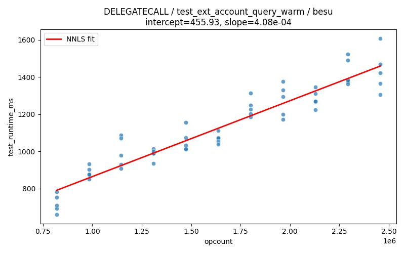

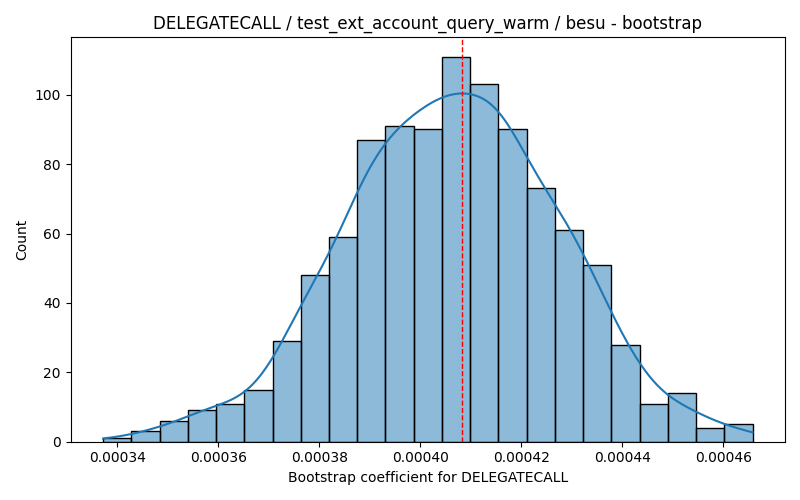

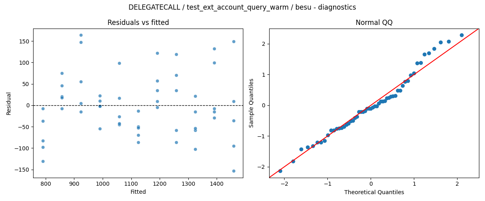

</details>

<details><summary>erigon — NNLS regression summary</summary>

```
==============================================================================
                           NNLS Regression Results                            
==============================================================================
Dep. Variable:          test_runtime_ms              R-squared:          0.857
Model:                  NNLS                    Adj. R-squared:          0.854
No. Observations:       44                                RMSE:          10.71
Df Residuals:           42                                 MAE:           8.61
Df Model:               1      
==============================================================================
                      coef     std err     P-value      [0.025      0.975]
------------------------------------------------------------------------------
         const     46.4691      4.6835       0.001     37.3797     55.6167
       opcount      0.0001      0.0000       0.001      0.0000      0.0001
==============================================================================
Notes: Non-negative least squares with bootstrap inference (1000 iterations)
==============================================================================
```

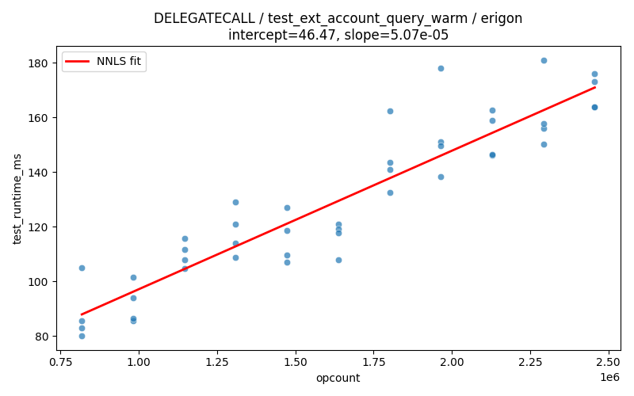

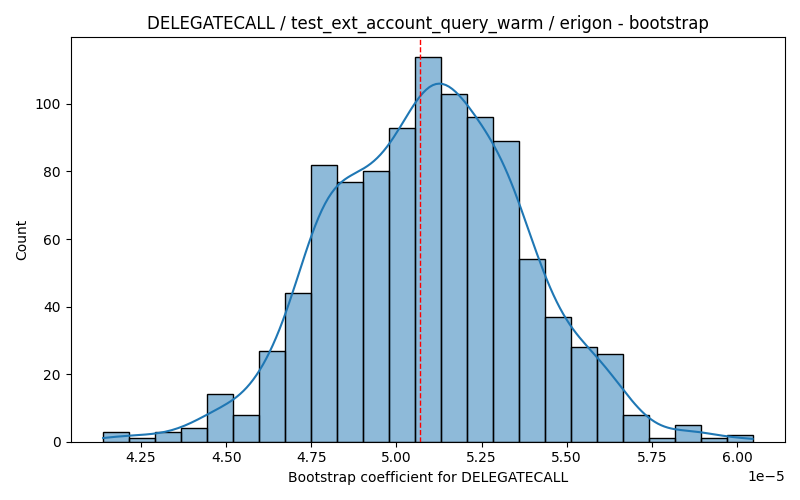

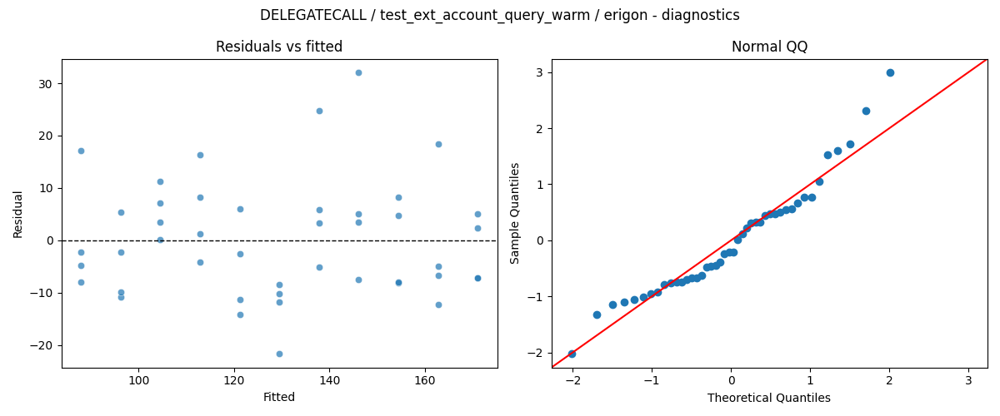

</details>

<details><summary>geth — NNLS regression summary</summary>

```
==============================================================================
                           NNLS Regression Results                            
==============================================================================
Dep. Variable:          test_runtime_ms              R-squared:          0.921
Model:                  NNLS                    Adj. R-squared:          0.920
No. Observations:       77                                RMSE:          21.50
Df Residuals:           75                                 MAE:          15.88
Df Model:               1      
==============================================================================
                      coef     std err     P-value      [0.025      0.975]
------------------------------------------------------------------------------
         const     41.0027      7.9705       0.001     24.5217     56.3653
       opcount      0.0001      0.0000       0.001      0.0001      0.0002
==============================================================================
Notes: Non-negative least squares with bootstrap inference (1000 iterations)
==============================================================================
```

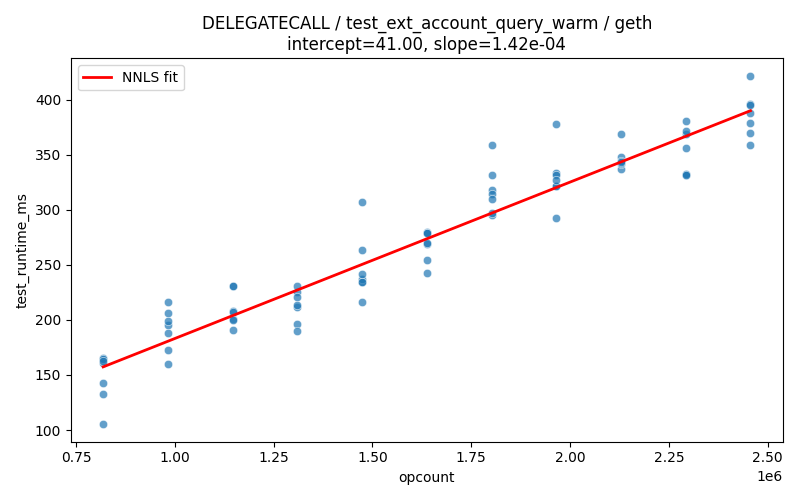

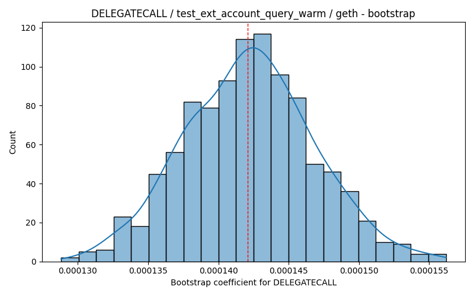

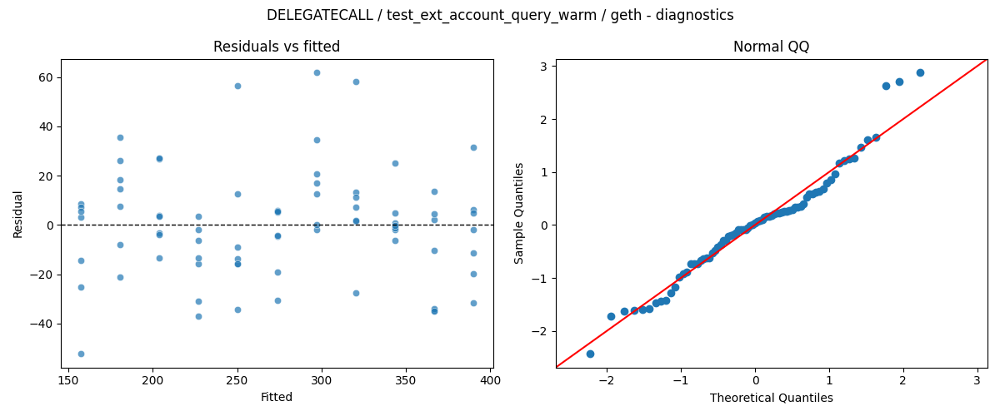

</details>

<details><summary>nethermind — NNLS regression summary</summary>

```
==============================================================================
                           NNLS Regression Results                            
==============================================================================
Dep. Variable:          test_runtime_ms              R-squared:          0.386
Model:                  NNLS                    Adj. R-squared:          0.376
No. Observations:       66                                RMSE:         146.58
Df Residuals:           64                                 MAE:         119.08
Df Model:               1      
==============================================================================
                      coef     std err     P-value      [0.025      0.975]
------------------------------------------------------------------------------
         const    452.2951     57.8549       0.001    338.4149    564.0198
       opcount      0.0002      0.0000       0.001      0.0002      0.0003
==============================================================================
Notes: Non-negative least squares with bootstrap inference (1000 iterations)
==============================================================================
```

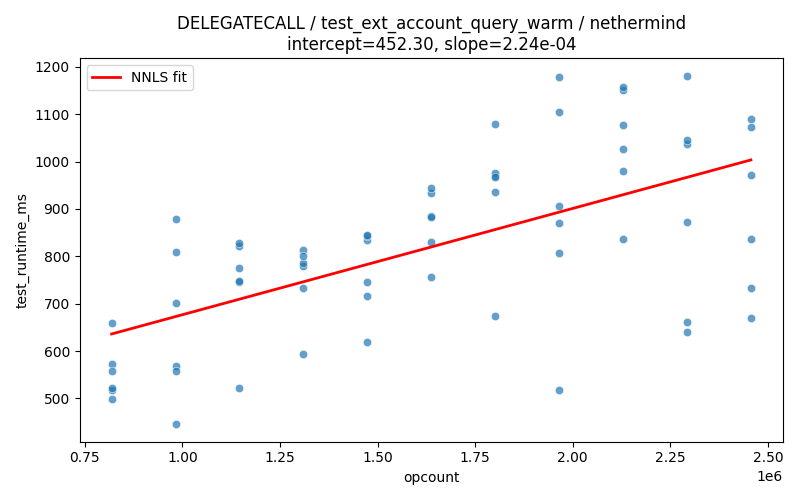

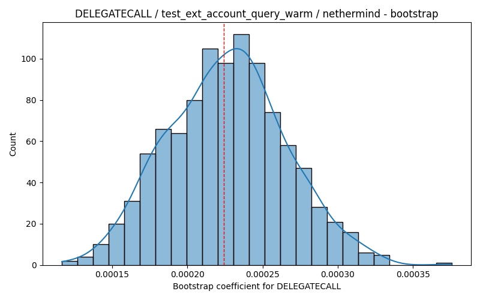

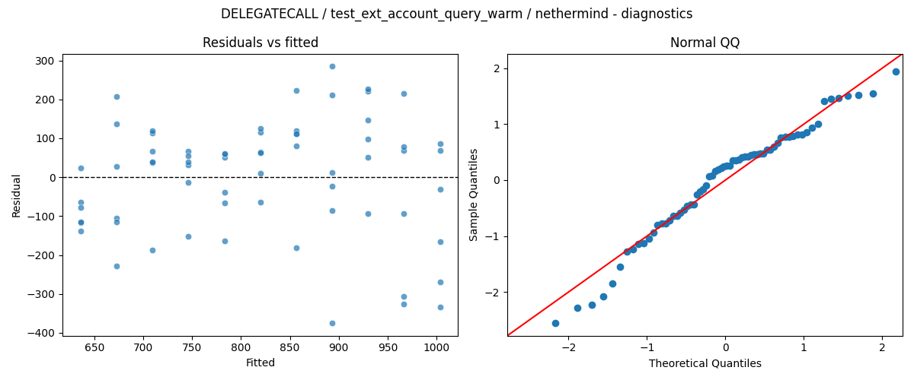

</details>

<details><summary>reth — NNLS regression summary</summary>

```
==============================================================================
                           NNLS Regression Results                            
==============================================================================
Dep. Variable:          test_runtime_ms              R-squared:          0.947
Model:                  NNLS                    Adj. R-squared:          0.946
No. Observations:       44                                RMSE:           6.83
Df Residuals:           42                                 MAE:           4.79
Df Model:               1      
==============================================================================
                      coef     std err     P-value      [0.025      0.975]
------------------------------------------------------------------------------
         const     21.2330      2.6253       0.001     16.3154     26.6401
       opcount      0.0001      0.0000       0.001      0.0001      0.0001
==============================================================================
Notes: Non-negative least squares with bootstrap inference (1000 iterations)
==============================================================================
```

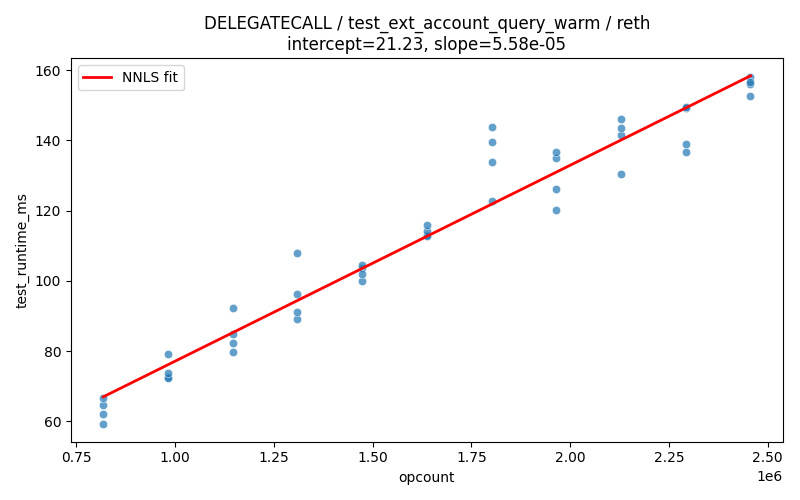

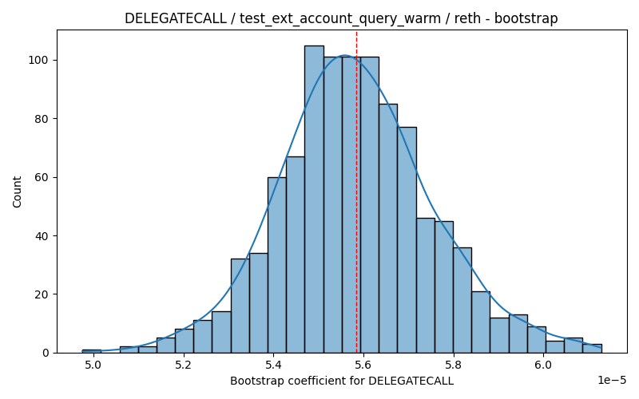

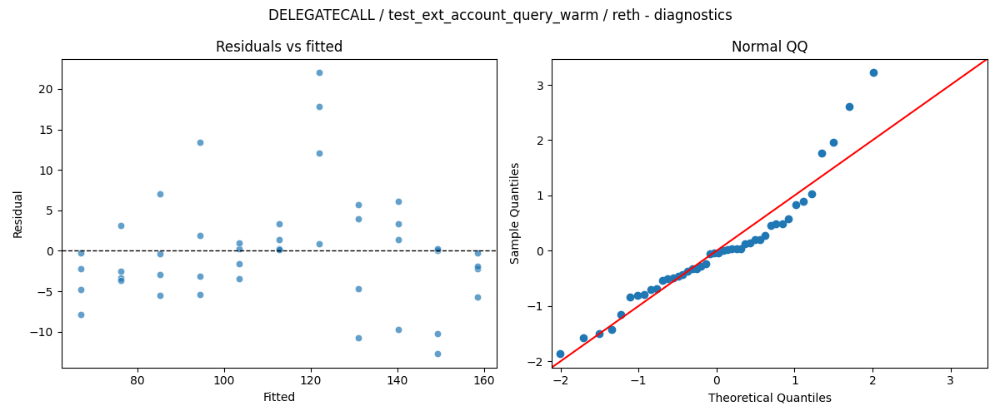

</details>

### test_account_access — combo `DELEGATECALL_AccountMode.EXISTING_EOA`

| client | nobs | R² | target_coef (ms) | p-value | 95% CI |
| --- | --- | --- | --- | --- | --- |
| `besu` | 55 | 0.9853 | 0.01573 | 1.00e-03 | [0.01525, 0.01625] |
| `erigon` | 44 | 0.9972 | 0.008313 | 1.00e-03 | [0.008265, 0.008357] |
| `geth` | 77 | 0.9824 | 0.01122 | 1.00e-03 | [0.01087, 0.01156] |
| `nethermind` | 66 | 0.9101 | 0.003583 | 1.00e-03 | [0.003297, 0.003884] |
| `reth` | 44 | 0.9791 | 0.004094 | 1.00e-03 | [0.003933, 0.004267] |

<details><summary>besu — NNLS regression summary</summary>

```
==============================================================================
                           NNLS Regression Results                            
==============================================================================
Dep. Variable:          test_runtime_ms              R-squared:          0.985
Model:                  NNLS                    Adj. R-squared:          0.985
No. Observations:       55                                RMSE:          39.51
Df Residuals:           53                                 MAE:          28.06
Df Model:               1      
==============================================================================
                      coef     std err     P-value      [0.025      0.975]
------------------------------------------------------------------------------
         const    523.6156     15.7305       0.001    492.3082    553.9756
       opcount      0.0157      0.0003       0.001      0.0152      0.0162
==============================================================================
Notes: Non-negative least squares with bootstrap inference (1000 iterations)
==============================================================================
```

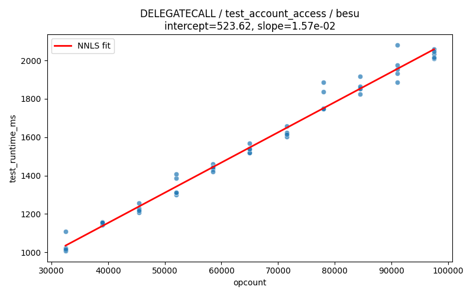

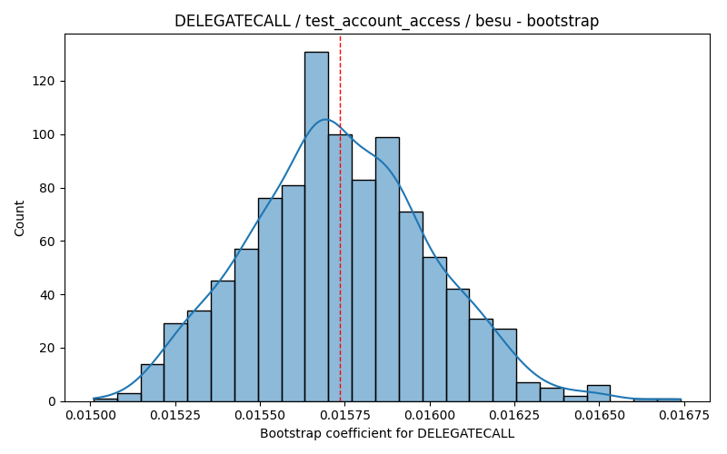

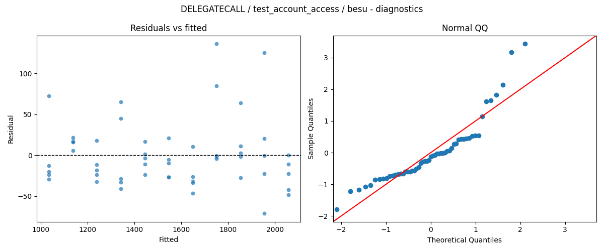

</details>

<details><summary>erigon — NNLS regression summary</summary>

```
==============================================================================
                           NNLS Regression Results                            
==============================================================================
Dep. Variable:          test_runtime_ms              R-squared:          0.997
Model:                  NNLS                    Adj. R-squared:          0.997
No. Observations:       44                                RMSE:           9.08
Df Residuals:           42                                 MAE:           7.34
Df Model:               1      
==============================================================================
                      coef     std err     P-value      [0.025      0.975]
------------------------------------------------------------------------------
         const      0.0000      0.2785       1.000      0.0000      0.1072
       opcount      0.0083      0.0000       0.001      0.0083      0.0084
==============================================================================
Notes: Non-negative least squares with bootstrap inference (1000 iterations)
==============================================================================
```

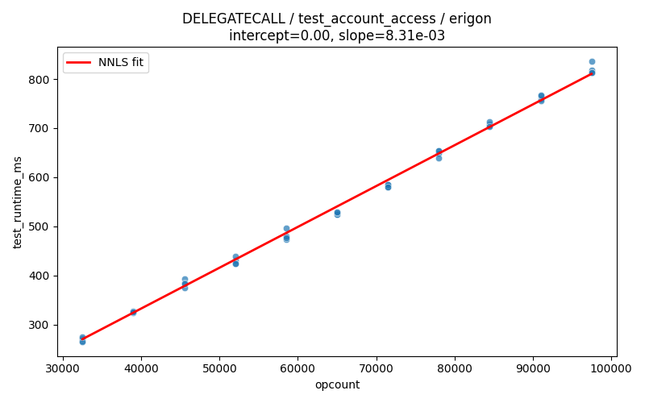

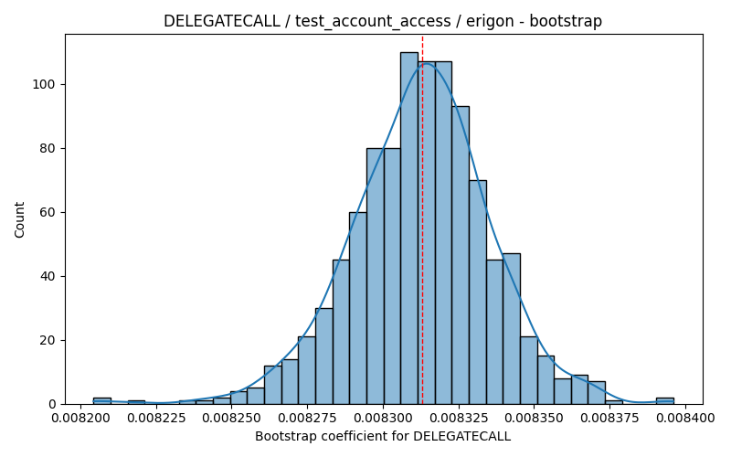

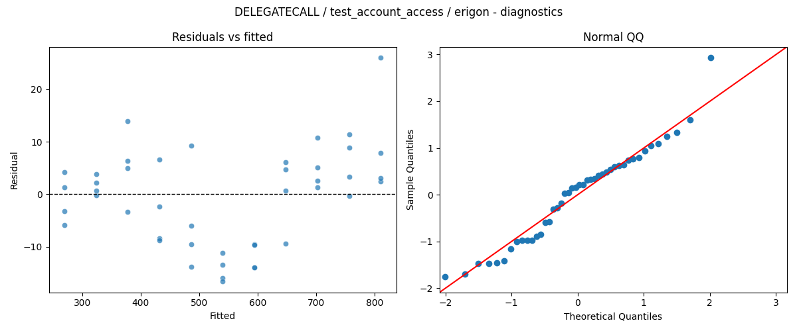

</details>

<details><summary>geth — NNLS regression summary</summary>

```
==============================================================================
                           NNLS Regression Results                            
==============================================================================
Dep. Variable:          test_runtime_ms              R-squared:          0.982
Model:                  NNLS                    Adj. R-squared:          0.982
No. Observations:       77                                RMSE:          30.91
Df Residuals:           75                                 MAE:          23.33
Df Model:               1      
==============================================================================
                      coef     std err     P-value      [0.025      0.975]
------------------------------------------------------------------------------
         const    232.5401     10.1841       0.001    212.4810    253.1486
       opcount      0.0112      0.0002       0.001      0.0109      0.0116
==============================================================================
Notes: Non-negative least squares with bootstrap inference (1000 iterations)
==============================================================================
```

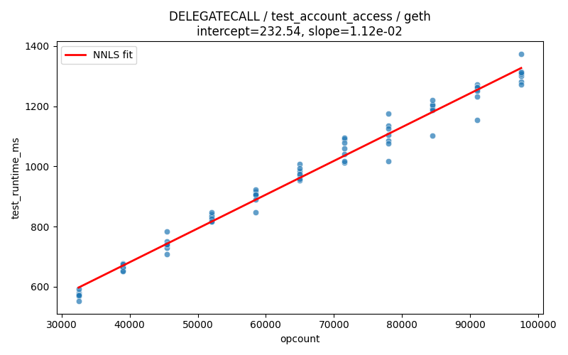

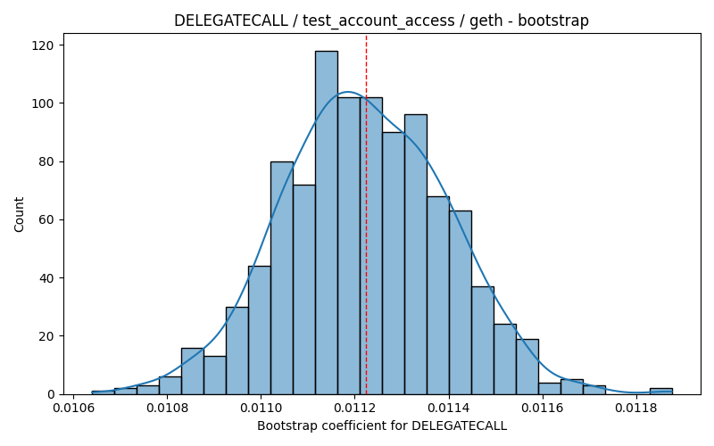

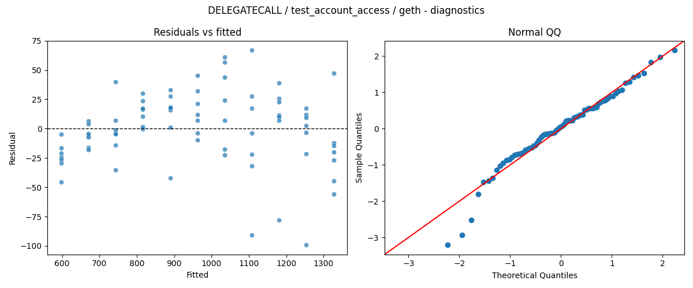

</details>

<details><summary>nethermind — NNLS regression summary</summary>

```
==============================================================================
                           NNLS Regression Results                            
==============================================================================
Dep. Variable:          test_runtime_ms              R-squared:          0.910
Model:                  NNLS                    Adj. R-squared:          0.909
No. Observations:       66                                RMSE:          23.15
Df Residuals:           64                                 MAE:          18.31
Df Model:               1      
==============================================================================
                      coef     std err     P-value      [0.025      0.975]
------------------------------------------------------------------------------
         const     98.1833      8.7190       0.001     81.1140    115.0987
       opcount      0.0036      0.0001       0.001      0.0033      0.0039
==============================================================================
Notes: Non-negative least squares with bootstrap inference (1000 iterations)
==============================================================================
```

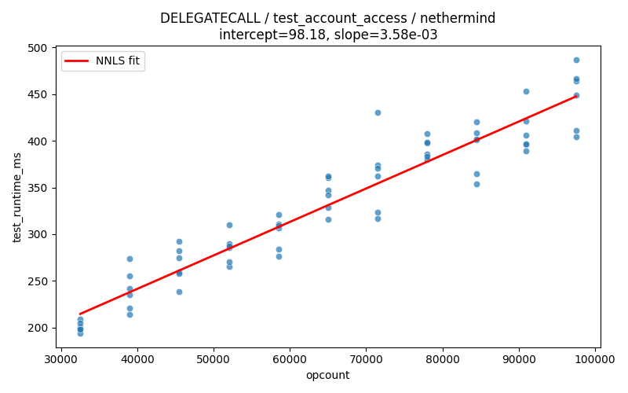

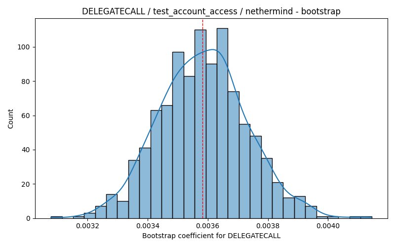

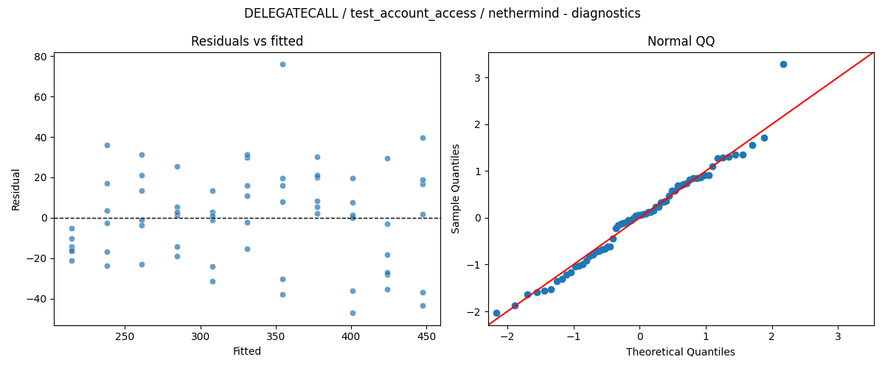

</details>

<details><summary>reth — NNLS regression summary</summary>

```
==============================================================================
                           NNLS Regression Results                            
==============================================================================
Dep. Variable:          test_runtime_ms              R-squared:          0.979
Model:                  NNLS                    Adj. R-squared:          0.979
No. Observations:       44                                RMSE:          12.30
Df Residuals:           42                                 MAE:           9.92
Df Model:               1      
==============================================================================
                      coef     std err     P-value      [0.025      0.975]
------------------------------------------------------------------------------
         const     84.0686      5.4292       0.001     74.4267     95.0201
       opcount      0.0041      0.0001       0.001      0.0039      0.0043
==============================================================================
Notes: Non-negative least squares with bootstrap inference (1000 iterations)
==============================================================================
```

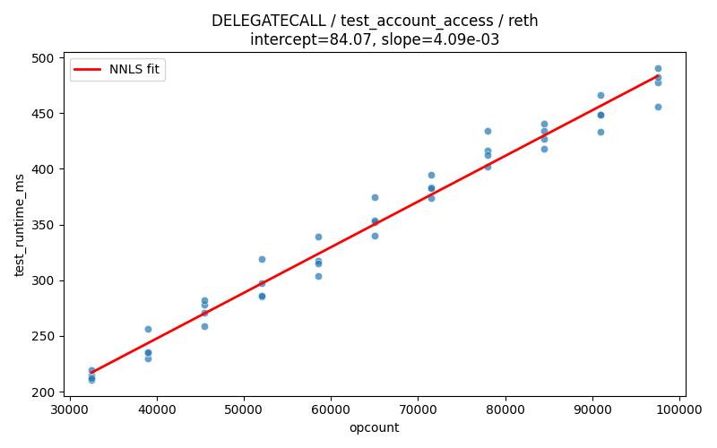

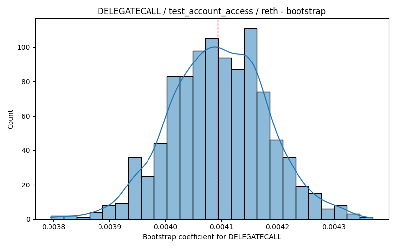

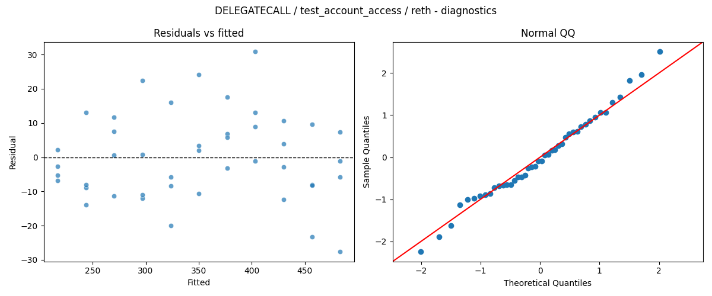

</details>

### test_account_access — combo `DELEGATECALL_AccountMode.NON_EXISTING_ACCOUNT`

| client | nobs | R² | target_coef (ms) | p-value | 95% CI |
| --- | --- | --- | --- | --- | --- |
| `besu` | 55 | 0.9893 | 0.01662 | 1.00e-03 | [0.01617, 0.01714] |
| `erigon` | 44 | 0.9867 | 0.00817 | 1.00e-03 | [0.008079, 0.008287] |
| `geth` | 77 | 0.9789 | 0.02159 | 1.00e-03 | [0.02092, 0.02231] |
| `nethermind` | 66 | 0.8982 | 0.003399 | 1.00e-03 | [0.00312, 0.003642] |
| `reth` | 44 | 0.976 | 0.004124 | 1.00e-03 | [0.003942, 0.004288] |

<details><summary>besu — NNLS regression summary</summary>

```
==============================================================================
                           NNLS Regression Results                            
==============================================================================
Dep. Variable:          test_runtime_ms              R-squared:          0.989
Model:                  NNLS                    Adj. R-squared:          0.989
No. Observations:       55                                RMSE:          35.45
Df Residuals:           53                                 MAE:          27.96
Df Model:               1      
==============================================================================
                      coef     std err     P-value      [0.025      0.975]
------------------------------------------------------------------------------
         const    157.8104     16.3882       0.001    124.6430    189.0712
       opcount      0.0166      0.0002       0.001      0.0162      0.0171
==============================================================================
Notes: Non-negative least squares with bootstrap inference (1000 iterations)
==============================================================================
```

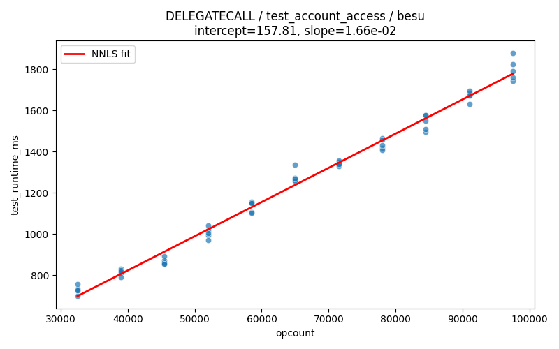

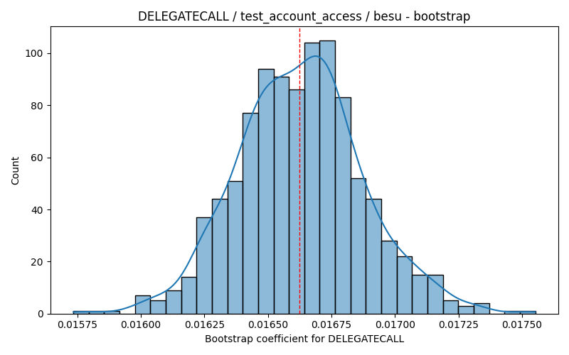

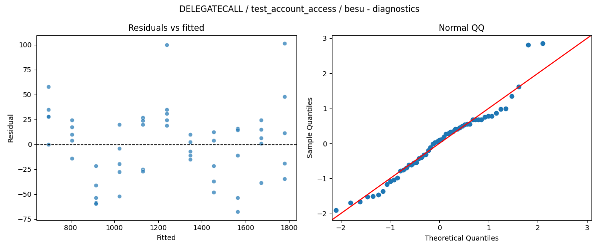

</details>

<details><summary>erigon — NNLS regression summary</summary>

```
==============================================================================
                           NNLS Regression Results                            
==============================================================================
Dep. Variable:          test_runtime_ms              R-squared:          0.987
Model:                  NNLS                    Adj. R-squared:          0.986
No. Observations:       44                                RMSE:          19.73
Df Residuals:           42                                 MAE:          10.01
Df Model:               1      
==============================================================================
                      coef     std err     P-value      [0.025      0.975]
------------------------------------------------------------------------------
         const      0.0000      0.7170       1.000      0.0000      2.3222
       opcount      0.0082      0.0001       0.001      0.0081      0.0083
==============================================================================
Notes: Non-negative least squares with bootstrap inference (1000 iterations)
==============================================================================
```

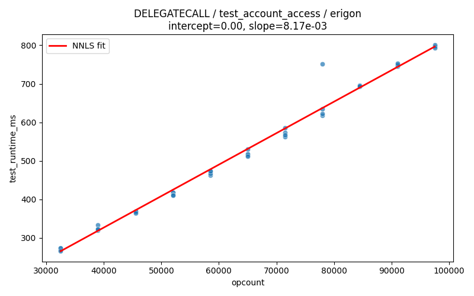

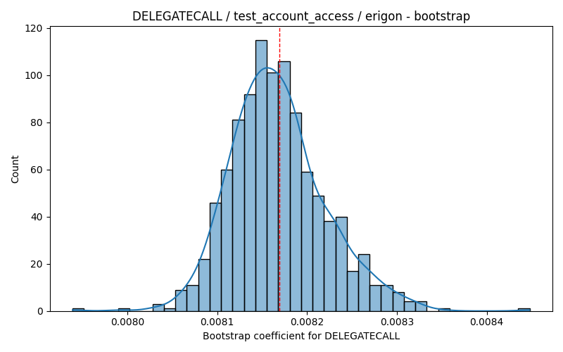

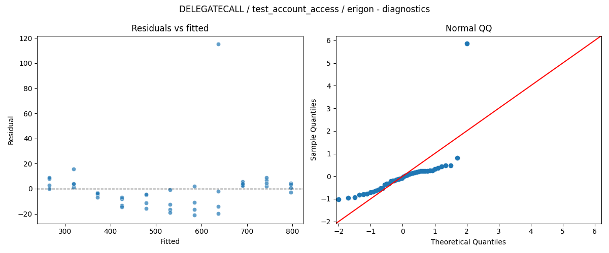

</details>

<details><summary>geth — NNLS regression summary</summary>

```
==============================================================================
                           NNLS Regression Results                            
==============================================================================
Dep. Variable:          test_runtime_ms              R-squared:          0.979
Model:                  NNLS                    Adj. R-squared:          0.979
No. Observations:       77                                RMSE:          65.11
Df Residuals:           75                                 MAE:          51.34
Df Model:               1      
==============================================================================
                      coef     std err     P-value      [0.025      0.975]
------------------------------------------------------------------------------
         const    326.9982     20.4815       0.001    286.8221    366.8933
       opcount      0.0216      0.0004       0.001      0.0209      0.0223
==============================================================================
Notes: Non-negative least squares with bootstrap inference (1000 iterations)
==============================================================================
```

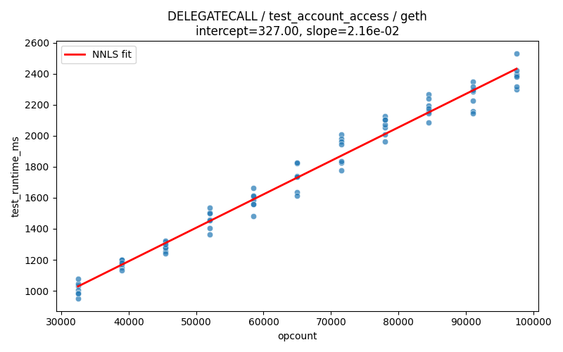

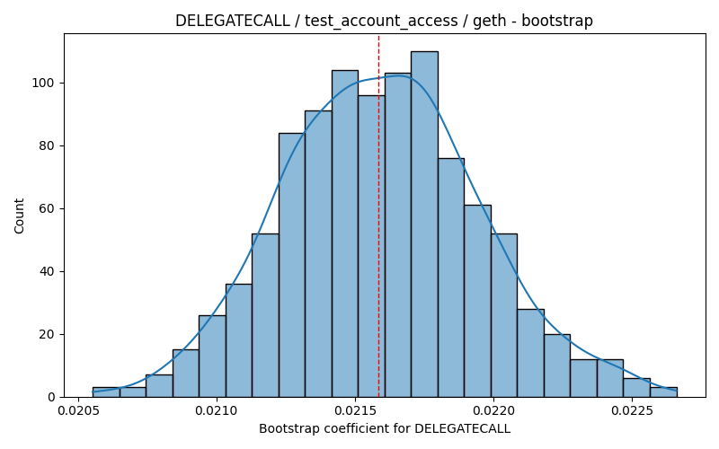

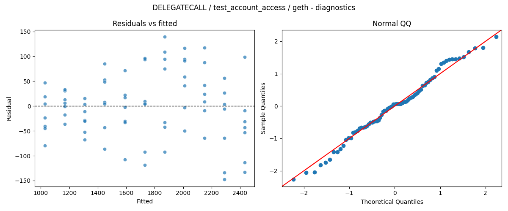

</details>

<details><summary>nethermind — NNLS regression summary</summary>

```
==============================================================================
                           NNLS Regression Results                            
==============================================================================
Dep. Variable:          test_runtime_ms              R-squared:          0.898
Model:                  NNLS                    Adj. R-squared:          0.897
No. Observations:       66                                RMSE:          23.53
Df Residuals:           64                                 MAE:          19.38
Df Model:               1      
==============================================================================
                      coef     std err     P-value      [0.025      0.975]
------------------------------------------------------------------------------
         const     72.2536      8.4174       0.001     56.3822     89.6193
       opcount      0.0034      0.0001       0.001      0.0031      0.0036
==============================================================================
Notes: Non-negative least squares with bootstrap inference (1000 iterations)
==============================================================================
```

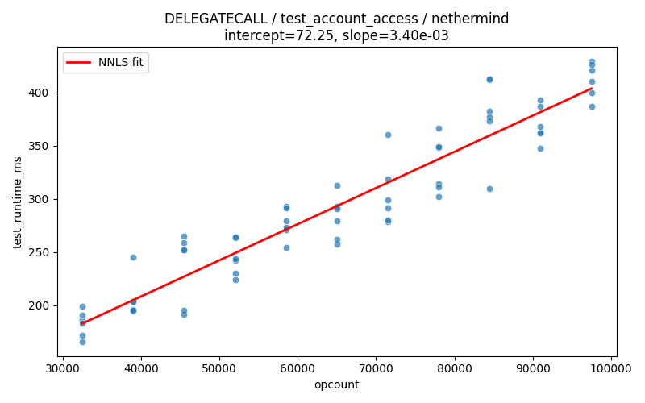

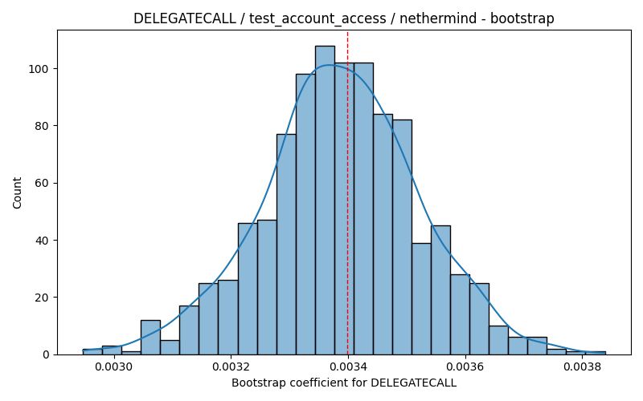

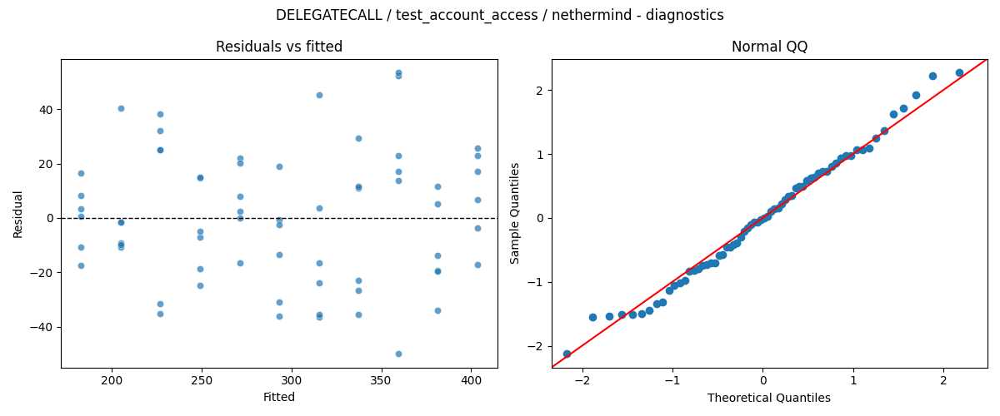

</details>

<details><summary>reth — NNLS regression summary</summary>

```
==============================================================================
                           NNLS Regression Results                            
==============================================================================
Dep. Variable:          test_runtime_ms              R-squared:          0.976
Model:                  NNLS                    Adj. R-squared:          0.975
No. Observations:       44                                RMSE:          13.28
Df Residuals:           42                                 MAE:          10.15
Df Model:               1      
==============================================================================
                      coef     std err     P-value      [0.025      0.975]
------------------------------------------------------------------------------
         const     77.3318      5.5902       0.001     67.2358     88.4798
       opcount      0.0041      0.0001       0.001      0.0039      0.0043
==============================================================================
Notes: Non-negative least squares with bootstrap inference (1000 iterations)
==============================================================================
```

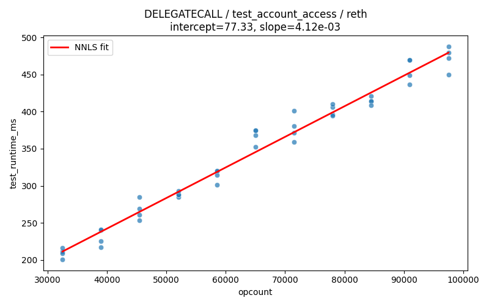

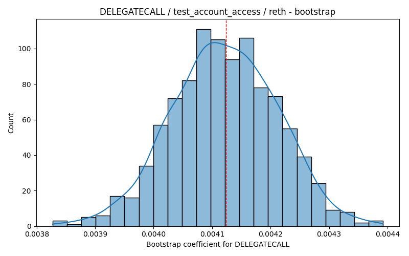

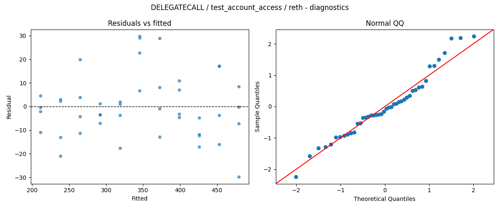

</details>

### test_account_access — combo `DELEGATECALL_AccountMode.EXISTING_CONTRACT_DIFF_MAX`

| client | nobs | R² | target_coef (ms) | p-value | 95% CI |
| --- | --- | --- | --- | --- | --- |
| `besu` | 55 | 0.985 | 0.02205 | 1.00e-03 | [0.02147, 0.02268] |
| `erigon` | 44 | 0.9455 | 0.03424 | 1.00e-03 | [0.0319, 0.03631] |
| `geth` | 77 | 0.9249 | 0.02108 | 1.00e-03 | [0.01957, 0.02264] |
| `nethermind` | 66 | 0.909 | 0.01591 | 1.00e-03 | [0.01442, 0.01722] |
| `reth` | 44 | 0.9986 | 0.01976 | 1.00e-03 | [0.01956, 0.02] |

<details><summary>besu — NNLS regression summary</summary>

```
==============================================================================
                           NNLS Regression Results                            
==============================================================================
Dep. Variable:          test_runtime_ms              R-squared:          0.985
Model:                  NNLS                    Adj. R-squared:          0.985
No. Observations:       55                                RMSE:          55.02
Df Residuals:           53                                 MAE:          43.95
Df Model:               1      
==============================================================================
                      coef     std err     P-value      [0.025      0.975]
------------------------------------------------------------------------------
         const    449.6328     22.5162       0.001    402.4414    490.3926
       opcount      0.0220      0.0003       0.001      0.0215      0.0227
==============================================================================
Notes: Non-negative least squares with bootstrap inference (1000 iterations)
==============================================================================
```

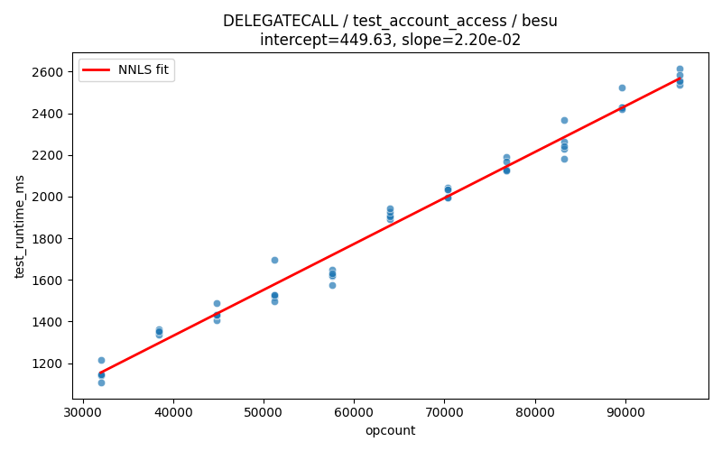

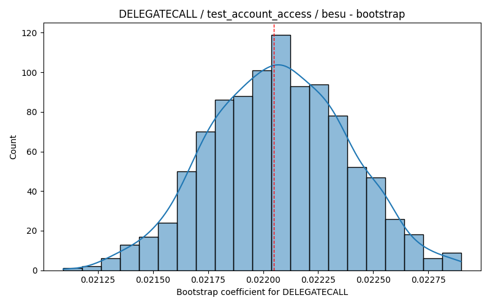

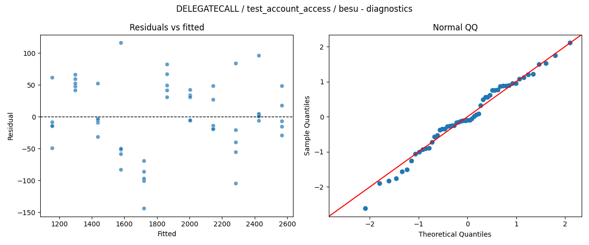

</details>

<details><summary>erigon — NNLS regression summary</summary>

```
==============================================================================
                           NNLS Regression Results                            
==============================================================================
Dep. Variable:          test_runtime_ms              R-squared:          0.946
Model:                  NNLS                    Adj. R-squared:          0.944
No. Observations:       44                                RMSE:         166.34
Df Residuals:           42                                 MAE:         145.66
Df Model:               1      
==============================================================================
                      coef     std err     P-value      [0.025      0.975]
------------------------------------------------------------------------------
         const    258.4143     85.3317       0.001    109.3142    433.3218
       opcount      0.0342      0.0012       0.001      0.0319      0.0363
==============================================================================
Notes: Non-negative least squares with bootstrap inference (1000 iterations)
==============================================================================
```

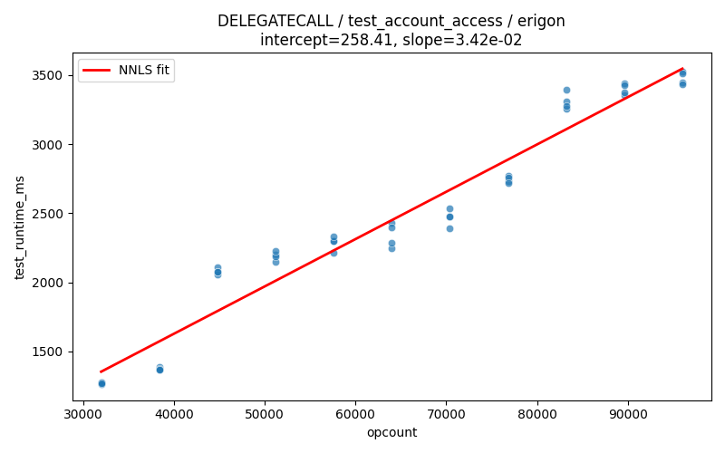

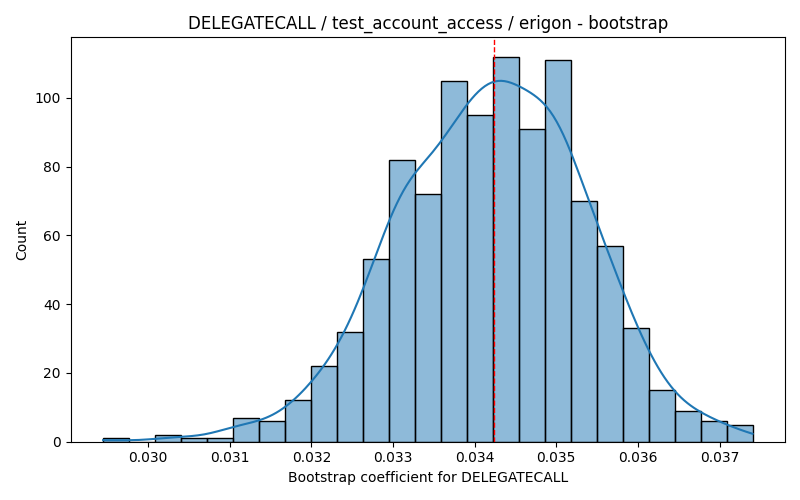

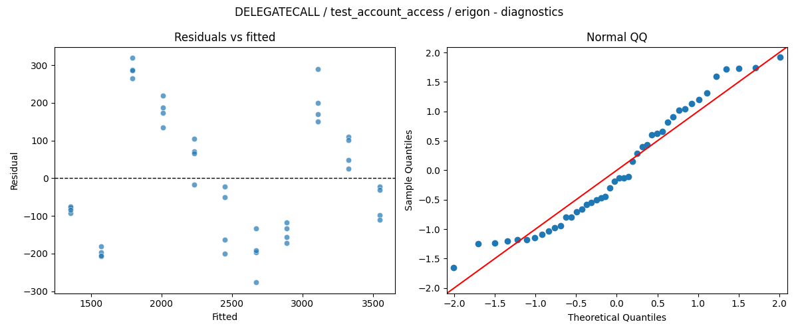

</details>

<details><summary>geth — NNLS regression summary</summary>

```
==============================================================================
                           NNLS Regression Results                            
==============================================================================
Dep. Variable:          test_runtime_ms              R-squared:          0.925
Model:                  NNLS                    Adj. R-squared:          0.924
No. Observations:       77                                RMSE:         121.62
Df Residuals:           75                                 MAE:          99.32
Df Model:               1      
==============================================================================
                      coef     std err     P-value      [0.025      0.975]
------------------------------------------------------------------------------
         const    464.3345     52.1888       0.001    359.7810    566.0500
       opcount      0.0211      0.0008       0.001      0.0196      0.0226
==============================================================================
Notes: Non-negative least squares with bootstrap inference (1000 iterations)
==============================================================================
```

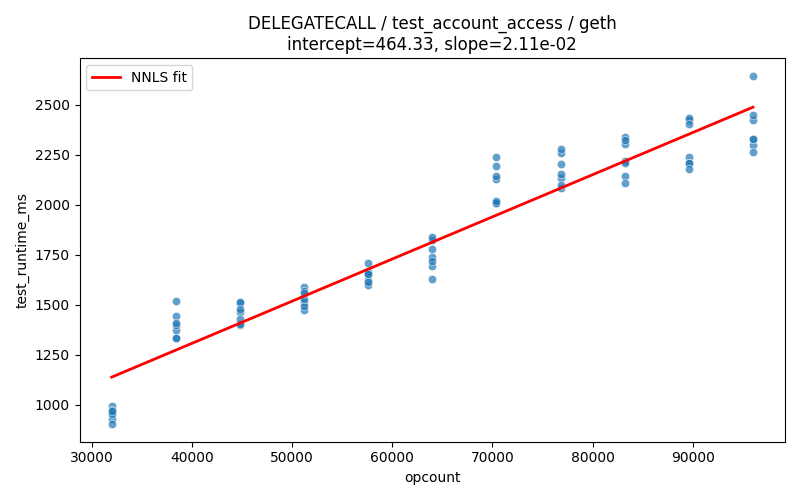

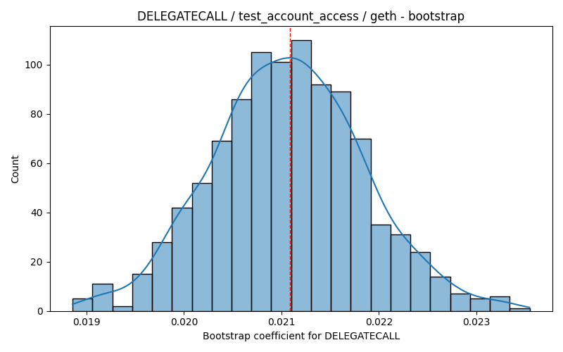

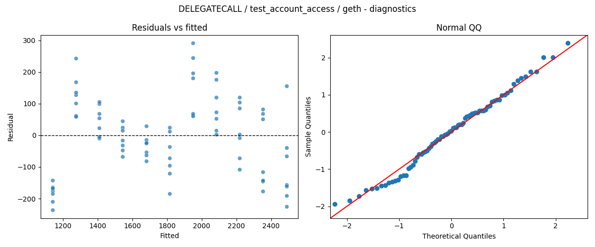

</details>

<details><summary>nethermind — NNLS regression summary</summary>

```
==============================================================================
                           NNLS Regression Results                            
==============================================================================
Dep. Variable:          test_runtime_ms              R-squared:          0.909
Model:                  NNLS                    Adj. R-squared:          0.908
No. Observations:       66                                RMSE:         101.92
Df Residuals:           64                                 MAE:          81.83
Df Model:               1      
==============================================================================
                      coef     std err     P-value      [0.025      0.975]
------------------------------------------------------------------------------
         const    635.1532     56.7965       0.001    533.7422    755.2719
       opcount      0.0159      0.0008       0.001      0.0144      0.0172
==============================================================================
Notes: Non-negative least squares with bootstrap inference (1000 iterations)
==============================================================================
```

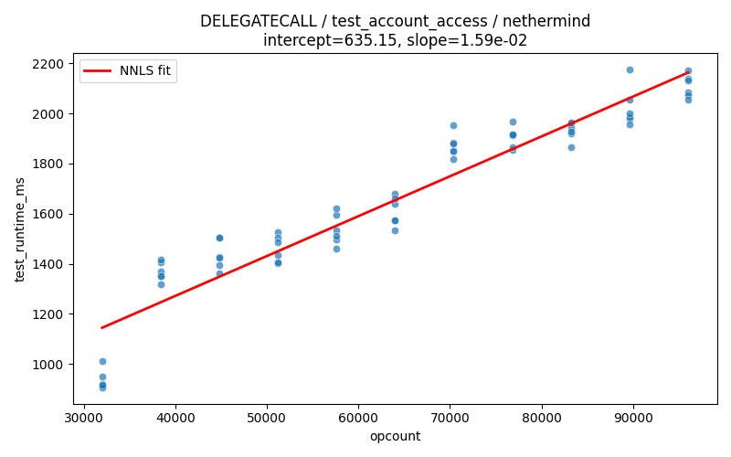

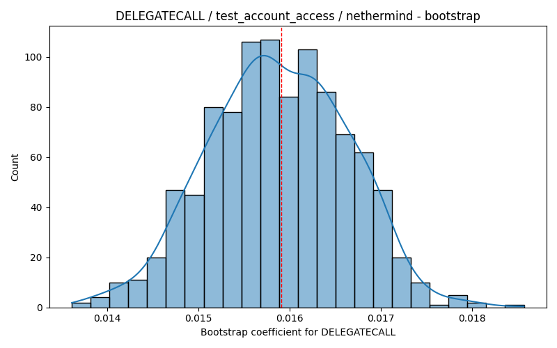

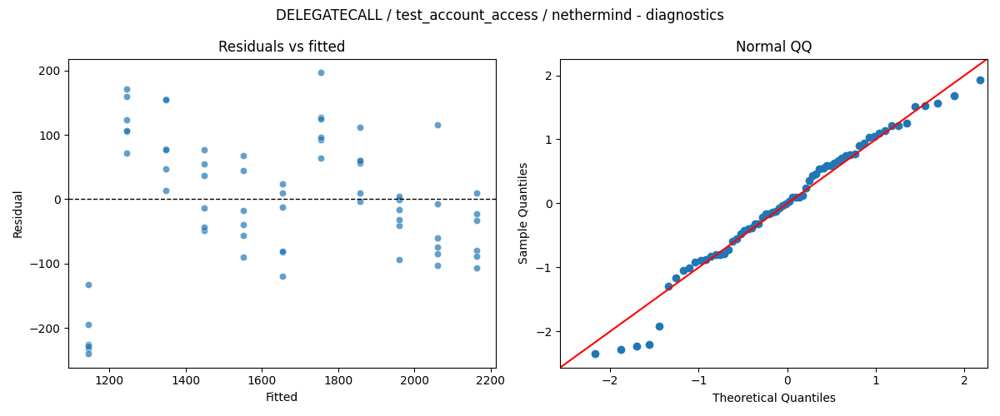

</details>

<details><summary>reth — NNLS regression summary</summary>

```
==============================================================================
                           NNLS Regression Results                            
==============================================================================
Dep. Variable:          test_runtime_ms              R-squared:          0.999
Model:                  NNLS                    Adj. R-squared:          0.999
No. Observations:       44                                RMSE:          14.85
Df Residuals:           42                                 MAE:          10.45
Df Model:               1      
==============================================================================
                      coef     std err     P-value      [0.025      0.975]
------------------------------------------------------------------------------
         const    138.3527      6.7200       0.001    124.7962    150.3843
       opcount      0.0198      0.0001       0.001      0.0196      0.0200
==============================================================================
Notes: Non-negative least squares with bootstrap inference (1000 iterations)
==============================================================================
```

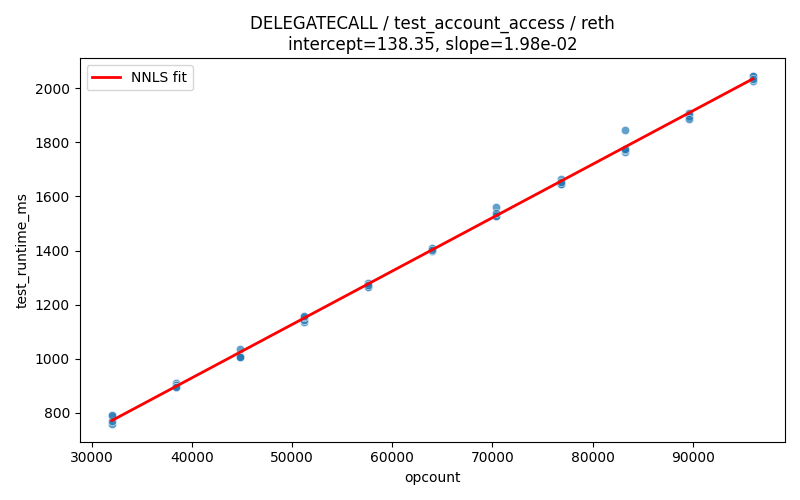

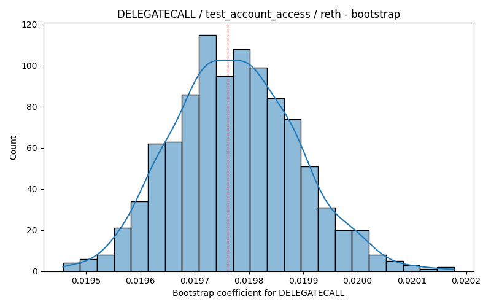

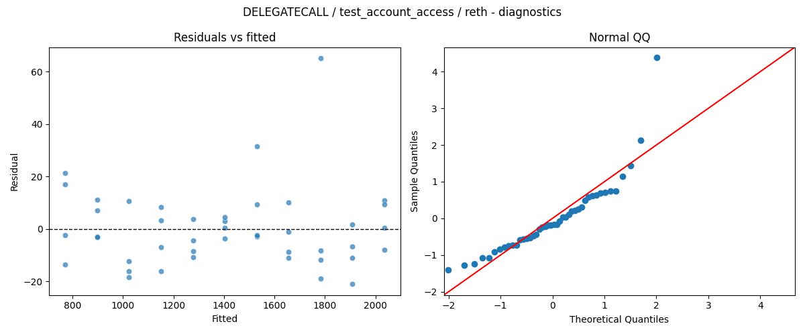

</details>

### test_account_access — combo `DELEGATECALL_AccountMode.EXISTING_CONTRACT_MINIMAL`

| client | nobs | R² | target_coef (ms) | p-value | 95% CI |
| --- | --- | --- | --- | --- | --- |
| `besu` | 55 | 0.9764 | 0.01409 | 1.00e-03 | [0.01347, 0.01475] |
| `erigon` | 44 | 0.9919 | 0.00884 | 1.00e-03 | [0.008624, 0.009053] |
| `geth` | 77 | 0.9626 | 0.004943 | 1.00e-03 | [0.004713, 0.005188] |
| `nethermind` | 66 | 0.6688 | 0.002859 | 1.00e-03 | [0.002416, 0.003325] |
| `reth` | 44 | 0.963 | 0.003817 | 1.00e-03 | [0.003572, 0.004017] |

<details><summary>besu — NNLS regression summary</summary>

```
==============================================================================
                           NNLS Regression Results                            
==============================================================================
Dep. Variable:          test_runtime_ms              R-squared:          0.976
Model:                  NNLS                    Adj. R-squared:          0.976
No. Observations:       55                                RMSE:          44.33
Df Residuals:           53                                 MAE:          32.87
Df Model:               1      
==============================================================================
                      coef     std err     P-value      [0.025      0.975]
------------------------------------------------------------------------------
         const    381.6128     20.3445       0.001    342.8089    423.1361
       opcount      0.0141      0.0003       0.001      0.0135      0.0147
==============================================================================
Notes: Non-negative least squares with bootstrap inference (1000 iterations)
==============================================================================
```


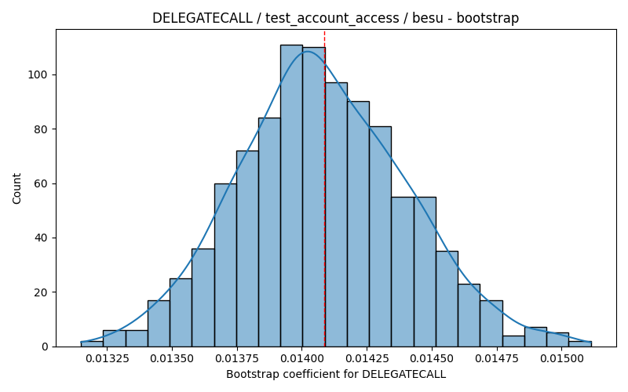

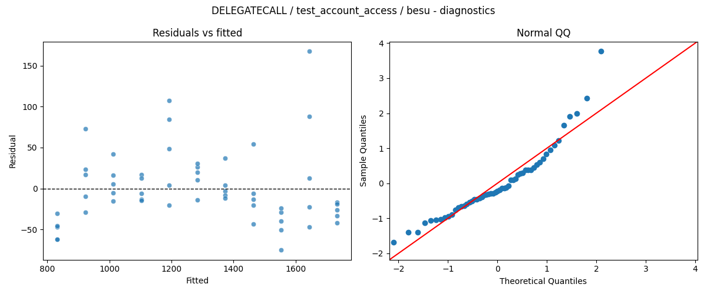

</details>

<details><summary>erigon — NNLS regression summary</summary>

```
==============================================================================
                           NNLS Regression Results                            
==============================================================================
Dep. Variable:          test_runtime_ms              R-squared:          0.992
Model:                  NNLS                    Adj. R-squared:          0.992
No. Observations:       44                                RMSE:          16.12
Df Residuals:           42                                 MAE:          13.41
Df Model:               1      
==============================================================================
                      coef     std err     P-value      [0.025      0.975]
------------------------------------------------------------------------------
         const     99.7435      7.1920       0.001     85.6728    112.9928
       opcount      0.0088      0.0001       0.001      0.0086      0.0091
==============================================================================
Notes: Non-negative least squares with bootstrap inference (1000 iterations)
==============================================================================
```


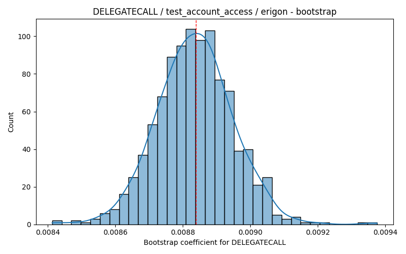

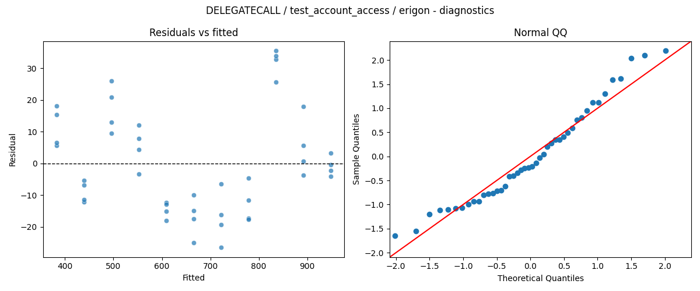

</details>

<details><summary>geth — NNLS regression summary</summary>

```
==============================================================================
                           NNLS Regression Results                            
==============================================================================
Dep. Variable:          test_runtime_ms              R-squared:          0.963
Model:                  NNLS                    Adj. R-squared:          0.962
No. Observations:       77                                RMSE:          19.72
Df Residuals:           75                                 MAE:          15.64
Df Model:               1      
==============================================================================
                      coef     std err     P-value      [0.025      0.975]
------------------------------------------------------------------------------
         const     75.8612      7.2984       0.001     60.7581     89.1042
       opcount      0.0049      0.0001       0.001      0.0047      0.0052
==============================================================================
Notes: Non-negative least squares with bootstrap inference (1000 iterations)
==============================================================================
```

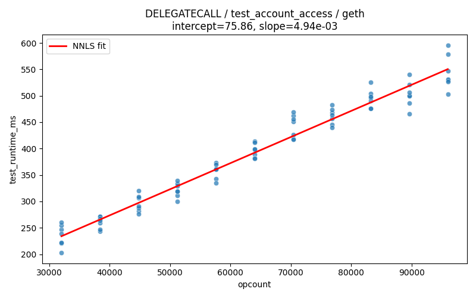

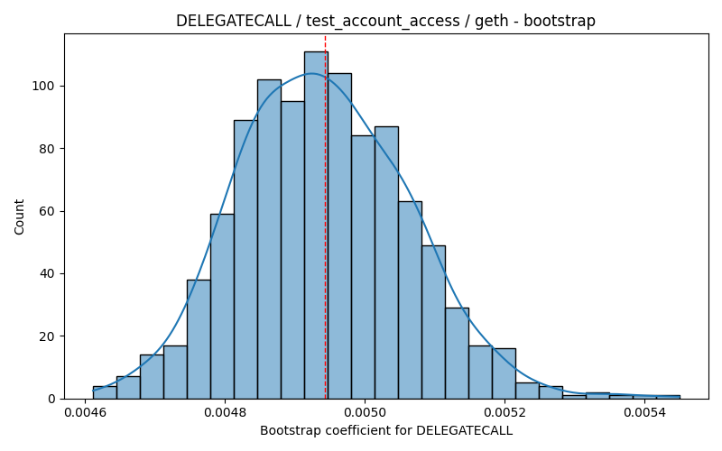

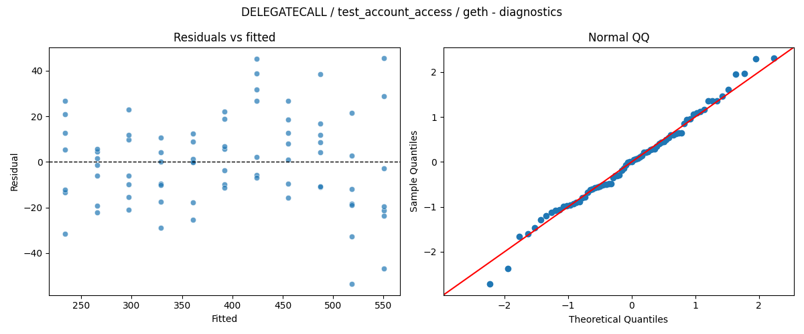

</details>

<details><summary>nethermind — NNLS regression summary</summary>

```
==============================================================================
                           NNLS Regression Results                            
==============================================================================
Dep. Variable:          test_runtime_ms              R-squared:          0.669
Model:                  NNLS                    Adj. R-squared:          0.664
No. Observations:       66                                RMSE:          40.72
Df Residuals:           64                                 MAE:          33.47
Df Model:               1      
==============================================================================
                      coef     std err     P-value      [0.025      0.975]
------------------------------------------------------------------------------
         const    120.8789     12.4763       0.001     96.5527    144.4521
       opcount      0.0029      0.0002       0.001      0.0024      0.0033
==============================================================================
Notes: Non-negative least squares with bootstrap inference (1000 iterations)
==============================================================================
```

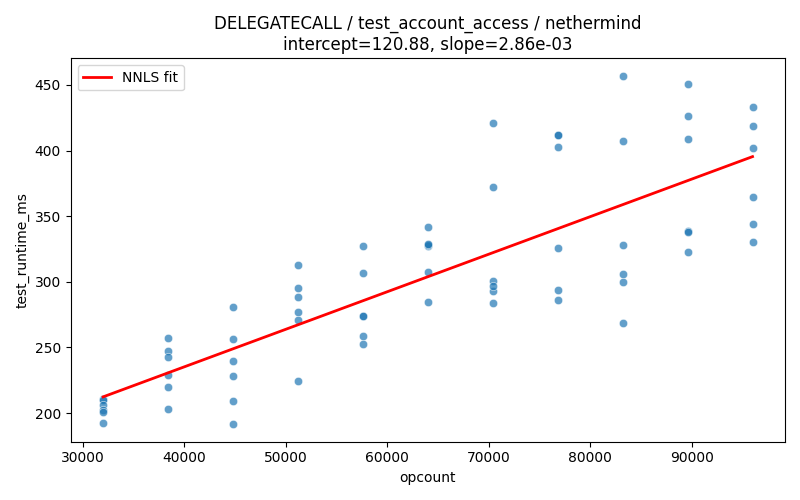

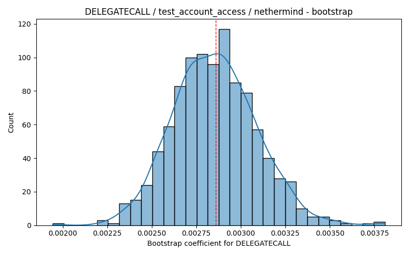

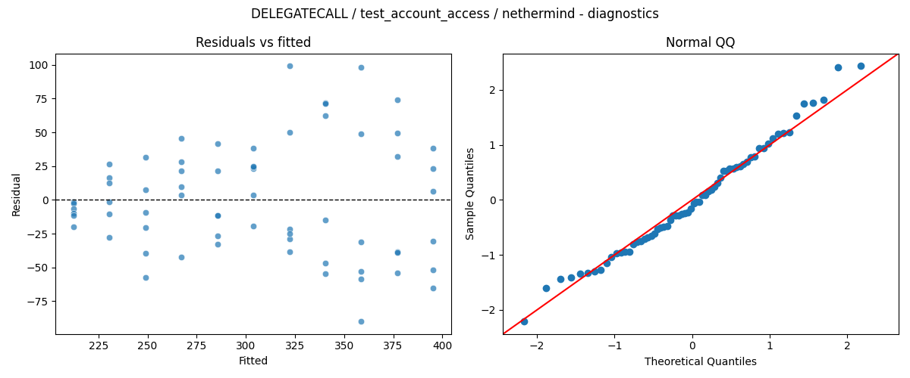

</details>

<details><summary>reth — NNLS regression summary</summary>

```
==============================================================================
                           NNLS Regression Results                            
==============================================================================
Dep. Variable:          test_runtime_ms              R-squared:          0.963
Model:                  NNLS                    Adj. R-squared:          0.962
No. Observations:       44                                RMSE:          15.14
Df Residuals:           42                                 MAE:          12.43
Df Model:               1      
==============================================================================
                      coef     std err     P-value      [0.025      0.975]
------------------------------------------------------------------------------
         const     82.6433      7.0263       0.001     70.5420     97.9031
       opcount      0.0038      0.0001       0.001      0.0036      0.0040
==============================================================================
Notes: Non-negative least squares with bootstrap inference (1000 iterations)
==============================================================================
```

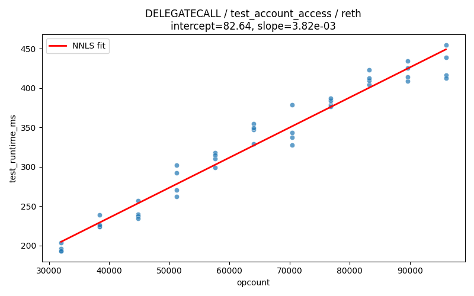

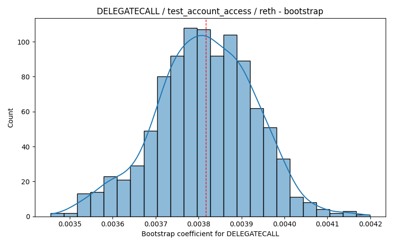

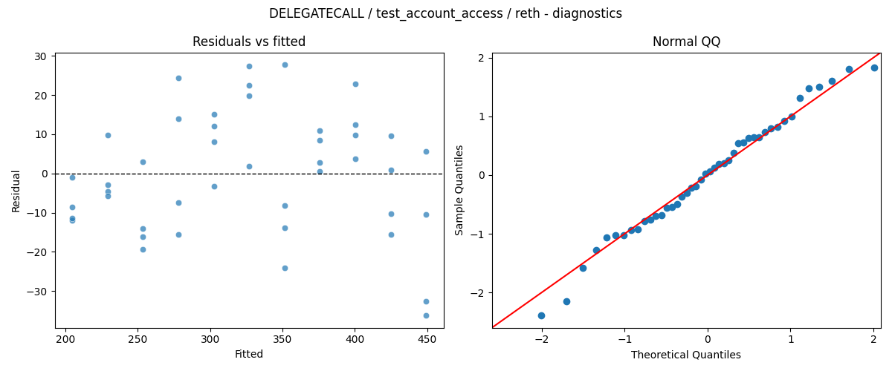

</details>

### test_account_access — combo `DELEGATECALL_AccountMode.EXISTING_CONTRACT_SAME_MAX`

| client | nobs | R² | target_coef (ms) | p-value | 95% CI |
| --- | --- | --- | --- | --- | --- |
| `besu` | 55 | 0.9768 | 0.01228 | 1.00e-03 | [0.01167, 0.01283] |
| `erigon` | 44 | 0.9928 | 0.008799 | 1.00e-03 | [0.008608, 0.009019] |
| `geth` | 77 | 0.9615 | 0.004854 | 1.00e-03 | [0.004632, 0.005087] |
| `nethermind` | 66 | 0.6274 | 0.002566 | 1.00e-03 | [0.002121, 0.003086] |
| `reth` | 44 | 0.9728 | 0.003871 | 1.00e-03 | [0.003699, 0.004081] |

<details><summary>besu — NNLS regression summary</summary>

```
==============================================================================
                           NNLS Regression Results                            
==============================================================================
Dep. Variable:          test_runtime_ms              R-squared:          0.977
Model:                  NNLS                    Adj. R-squared:          0.976
No. Observations:       55                                RMSE:          38.26
Df Residuals:           53                                 MAE:          31.81
Df Model:               1      
==============================================================================
                      coef     std err     P-value      [0.025      0.975]
------------------------------------------------------------------------------
         const    441.2166     19.7531       0.001    406.3593    484.4000
       opcount      0.0123      0.0003       0.001      0.0117      0.0128
==============================================================================
Notes: Non-negative least squares with bootstrap inference (1000 iterations)
==============================================================================
```

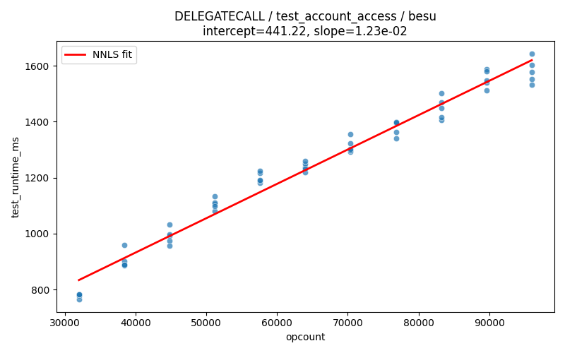

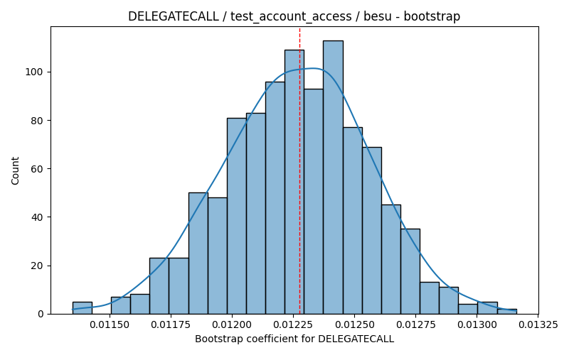

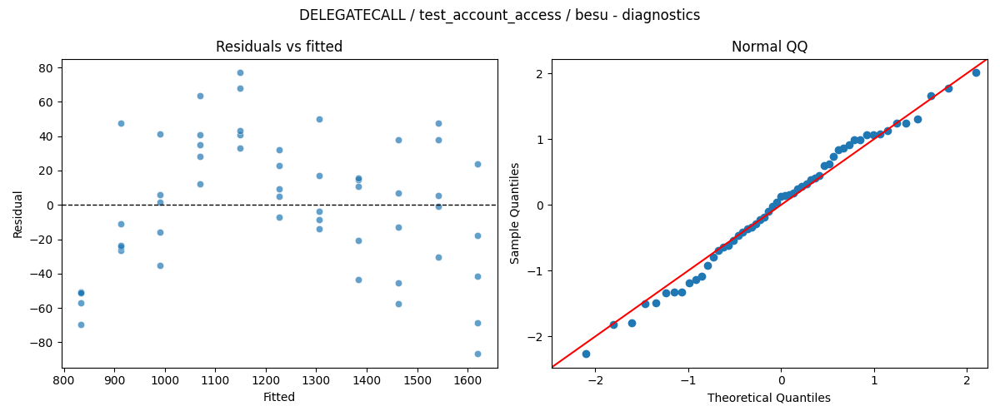

</details>

<details><summary>erigon — NNLS regression summary</summary>

```
==============================================================================
                           NNLS Regression Results                            
==============================================================================
Dep. Variable:          test_runtime_ms              R-squared:          0.993
Model:                  NNLS                    Adj. R-squared:          0.993
No. Observations:       44                                RMSE:          15.18
Df Residuals:           42                                 MAE:          12.60
Df Model:               1      
==============================================================================
                      coef     std err     P-value      [0.025      0.975]
------------------------------------------------------------------------------
         const     98.6957      6.5763       0.001     84.1551    109.4352
       opcount      0.0088      0.0001       0.001      0.0086      0.0090
==============================================================================
Notes: Non-negative least squares with bootstrap inference (1000 iterations)
==============================================================================
```


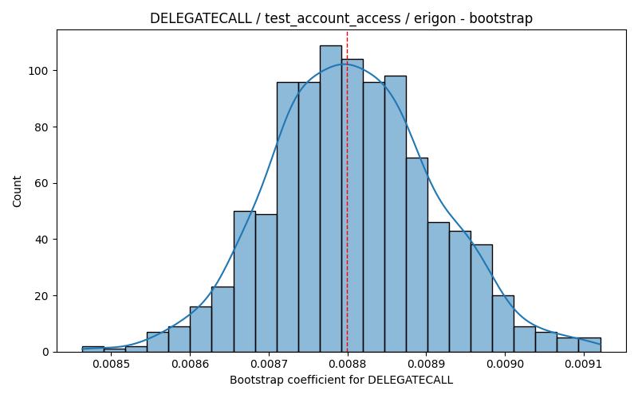

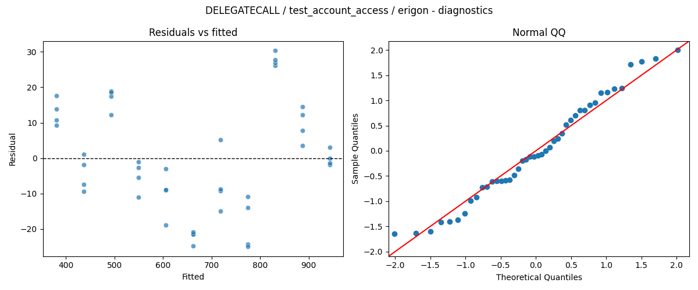

</details>

<details><summary>geth — NNLS regression summary</summary>

```
==============================================================================
                           NNLS Regression Results                            
==============================================================================
Dep. Variable:          test_runtime_ms              R-squared:          0.961
Model:                  NNLS                    Adj. R-squared:          0.961
No. Observations:       77                                RMSE:          19.66
Df Residuals:           75                                 MAE:          15.94
Df Model:               1      
==============================================================================
                      coef     std err     P-value      [0.025      0.975]
------------------------------------------------------------------------------
         const     79.5195      7.1905       0.001     66.5537     93.5701
       opcount      0.0049      0.0001       0.001      0.0046      0.0051
==============================================================================
Notes: Non-negative least squares with bootstrap inference (1000 iterations)
==============================================================================
```

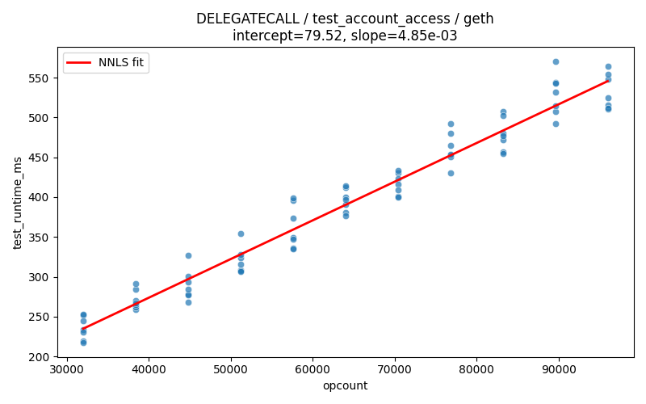

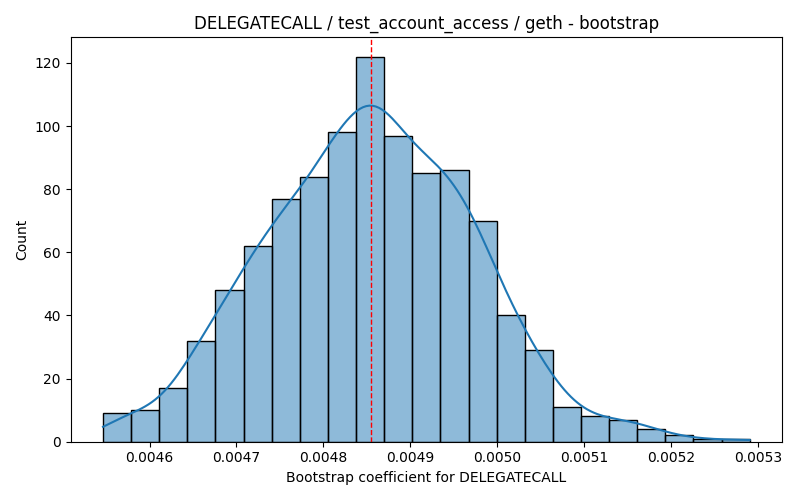

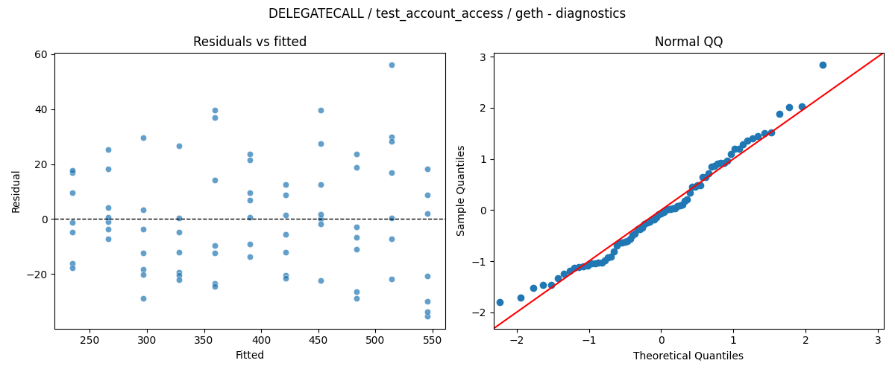

</details>

<details><summary>nethermind — NNLS regression summary</summary>

```
==============================================================================
                           NNLS Regression Results                            
==============================================================================
Dep. Variable:          test_runtime_ms              R-squared:          0.627
Model:                  NNLS                    Adj. R-squared:          0.622
No. Observations:       66                                RMSE:          40.03
Df Residuals:           64                                 MAE:          32.74
Df Model:               1      
==============================================================================
                      coef     std err     P-value      [0.025      0.975]
------------------------------------------------------------------------------
         const    122.7073     13.6927       0.001     94.8988    149.9726
       opcount      0.0026      0.0002       0.001      0.0021      0.0031
==============================================================================
Notes: Non-negative least squares with bootstrap inference (1000 iterations)
==============================================================================
```

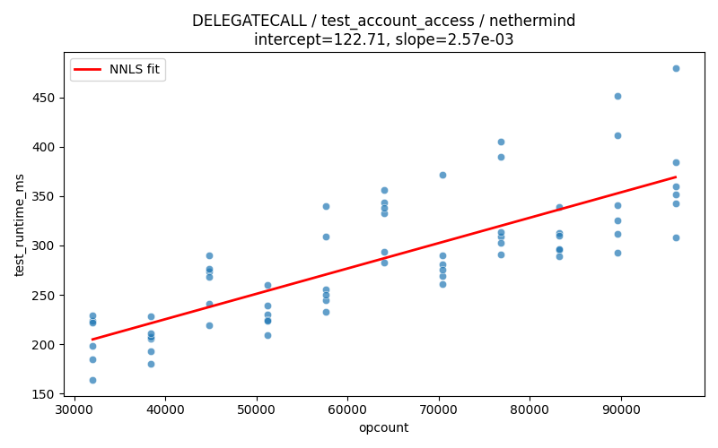

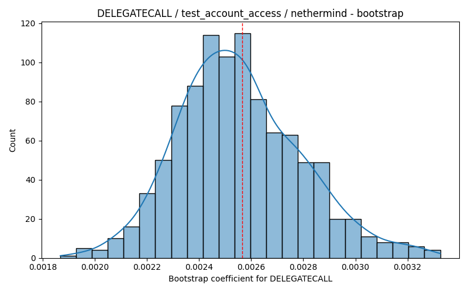

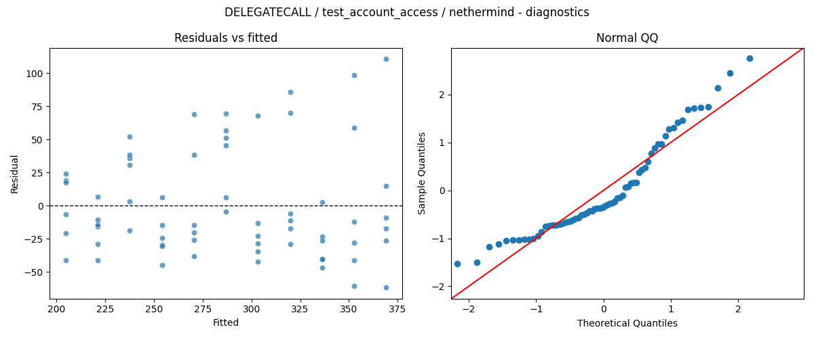

</details>

<details><summary>reth — NNLS regression summary</summary>

```
==============================================================================
                           NNLS Regression Results                            
==============================================================================
Dep. Variable:          test_runtime_ms              R-squared:          0.973
Model:                  NNLS                    Adj. R-squared:          0.972
No. Observations:       44                                RMSE:          13.10
Df Residuals:           42                                 MAE:          10.23
Df Model:               1      
==============================================================================
                      coef     std err     P-value      [0.025      0.975]
------------------------------------------------------------------------------
         const     78.3204      5.7135       0.001     66.8347     89.2152
       opcount      0.0039      0.0001       0.001      0.0037      0.0041
==============================================================================
Notes: Non-negative least squares with bootstrap inference (1000 iterations)
==============================================================================
```

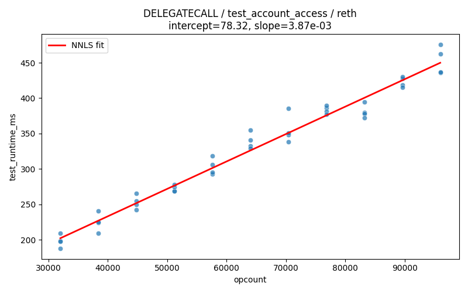

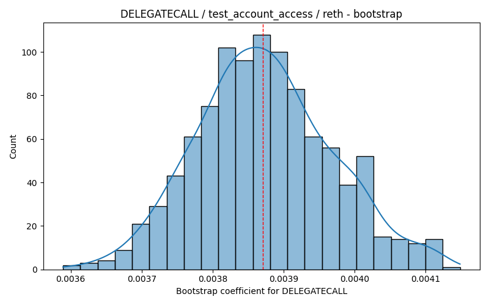

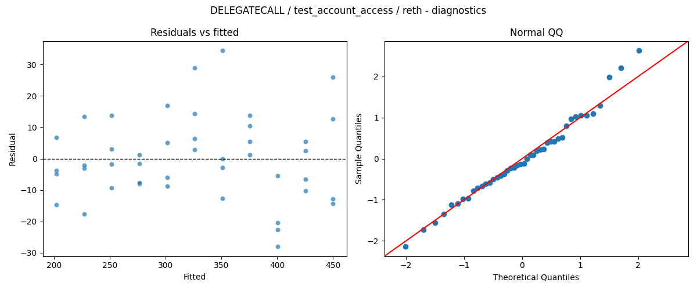

</details>

## EXTCODEHASH

### test_ext_account_query_warm — combo `EXTCODEHASH`

| client | nobs | R² | target_coef (ms) | p-value | 95% CI |
| --- | --- | --- | --- | --- | --- |
| `besu` | 55 | 0.8594 | 7.006e-05 | 1.00e-03 | [6.264e-05, 7.798e-05] |
| `erigon` | 44 | 0.8768 | 3.18e-05 | 1.00e-03 | [2.825e-05, 3.513e-05] |
| `geth` | 77 | 0.783 | 3.859e-05 | 1.00e-03 | [3.467e-05, 4.186e-05] |
| `nethermind` | 66 | 0.6138 | 0.0001833 | 1.00e-03 | [0.0001457, 0.0002179] |
| `reth` | 44 | 0.4838 | 9.48e-06 | 1.00e-03 | [6.255e-06, 1.282e-05] |

<details><summary>besu — NNLS regression summary</summary>

```
==============================================================================
                           NNLS Regression Results                            
==============================================================================
Dep. Variable:          test_runtime_ms              R-squared:          0.859
Model:                  NNLS                    Adj. R-squared:          0.857
No. Observations:       55                                RMSE:          16.58
Df Residuals:           53                                 MAE:          13.80
Df Model:               1      
==============================================================================
                      coef     std err     P-value      [0.025      0.975]
------------------------------------------------------------------------------
         const    155.4292      7.7376       0.001    139.9515    170.7296
       opcount      0.0001      0.0000       0.001      0.0001      0.0001
==============================================================================
Notes: Non-negative least squares with bootstrap inference (1000 iterations)
==============================================================================
```

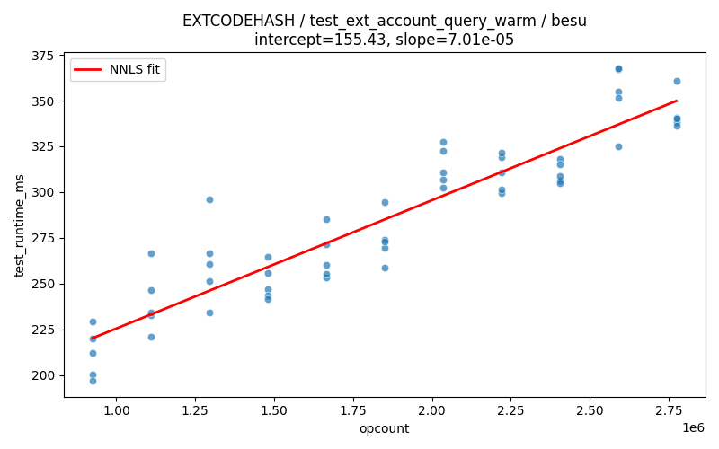

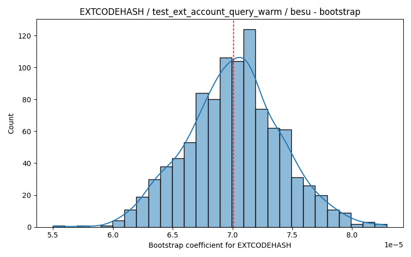

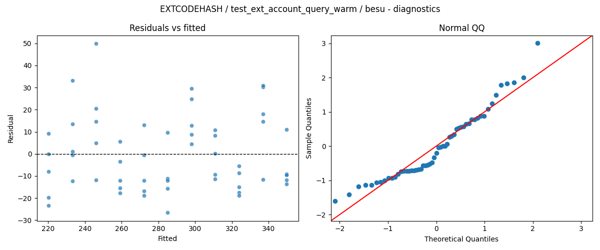

</details>

<details><summary>erigon — NNLS regression summary</summary>

```
==============================================================================
                           NNLS Regression Results                            
==============================================================================
Dep. Variable:          test_runtime_ms              R-squared:          0.877
Model:                  NNLS                    Adj. R-squared:          0.874
No. Observations:       44                                RMSE:           6.98
Df Residuals:           42                                 MAE:           5.80
Df Model:               1      
==============================================================================
                      coef     std err     P-value      [0.025      0.975]
------------------------------------------------------------------------------
         const     28.6039      3.0804       0.001     22.9962     34.9824
       opcount      0.0000      0.0000       0.001      0.0000      0.0000
==============================================================================
Notes: Non-negative least squares with bootstrap inference (1000 iterations)
==============================================================================
```

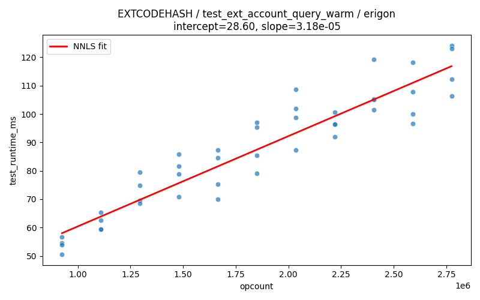

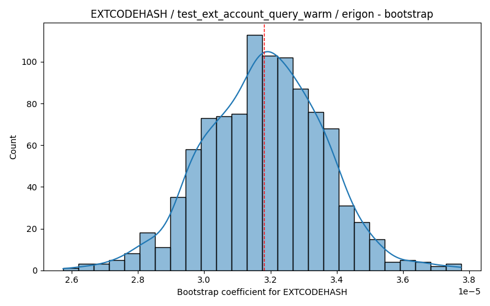

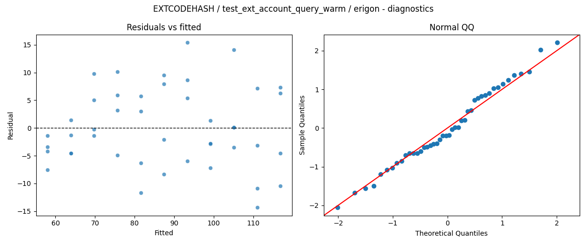

</details>

<details><summary>geth — NNLS regression summary</summary>

```
==============================================================================
                           NNLS Regression Results                            
==============================================================================
Dep. Variable:          test_runtime_ms              R-squared:          0.783
Model:                  NNLS                    Adj. R-squared:          0.780
No. Observations:       77                                RMSE:          11.89
Df Residuals:           75                                 MAE:           8.71
Df Model:               1      
==============================================================================
                      coef     std err     P-value      [0.025      0.975]
------------------------------------------------------------------------------
         const     20.7653      3.5662       0.001     14.6481     28.3734
       opcount      0.0000      0.0000       0.001      0.0000      0.0000
==============================================================================
Notes: Non-negative least squares with bootstrap inference (1000 iterations)
==============================================================================
```

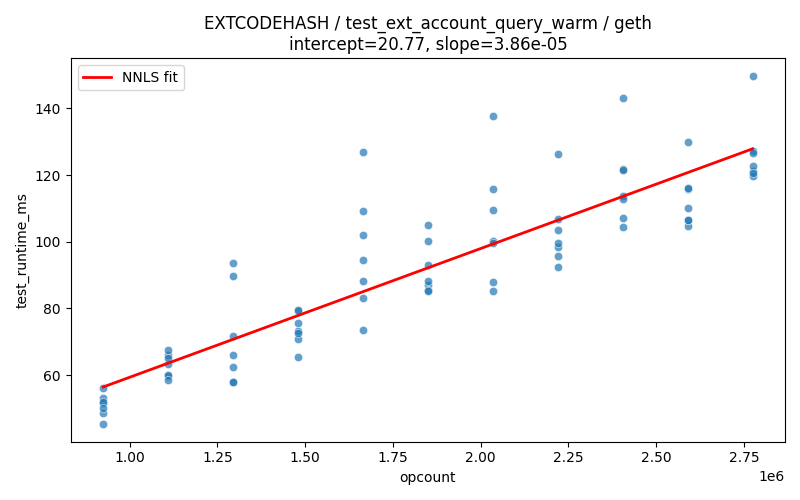

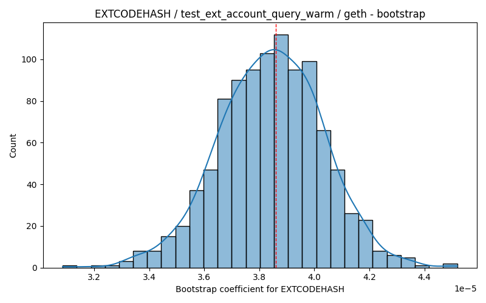


</details>

<details><summary>nethermind — NNLS regression summary</summary>

```
==============================================================================
                           NNLS Regression Results                            
==============================================================================
Dep. Variable:          test_runtime_ms              R-squared:          0.614
Model:                  NNLS                    Adj. R-squared:          0.608
No. Observations:       66                                RMSE:          85.06
Df Residuals:           64                                 MAE:          66.39
Df Model:               1      
==============================================================================
                      coef     std err     P-value      [0.025      0.975]
------------------------------------------------------------------------------
         const    275.7751     35.1287       0.001    210.0312    347.3327
       opcount      0.0002      0.0000       0.001      0.0001      0.0002
==============================================================================
Notes: Non-negative least squares with bootstrap inference (1000 iterations)
==============================================================================
```

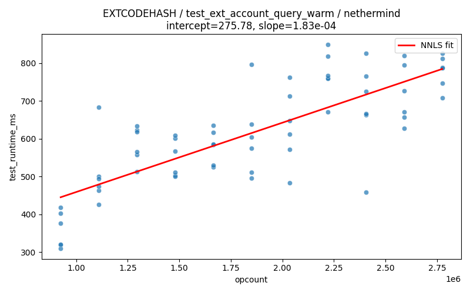

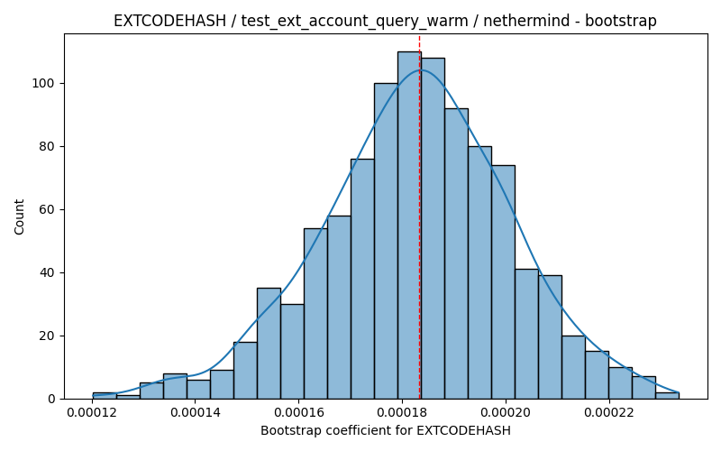

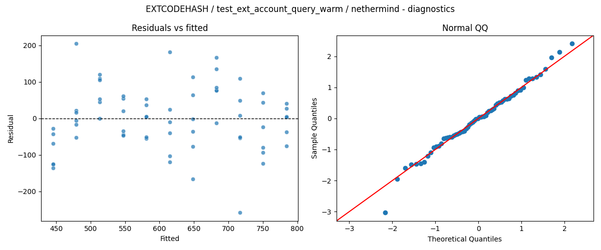

</details>

<details><summary>reth — NNLS regression summary</summary>

```
==============================================================================
                           NNLS Regression Results                            
==============================================================================
Dep. Variable:          test_runtime_ms              R-squared:          0.484
Model:                  NNLS                    Adj. R-squared:          0.472
No. Observations:       44                                RMSE:           5.73
Df Residuals:           42                                 MAE:           4.52
Df Model:               1      
==============================================================================
                      coef     std err     P-value      [0.025      0.975]
------------------------------------------------------------------------------
         const     17.8152      3.7414       0.001     10.5516     25.2700
       opcount      0.0000      0.0000       0.001      0.0000      0.0000
==============================================================================
Notes: Non-negative least squares with bootstrap inference (1000 iterations)
==============================================================================
```

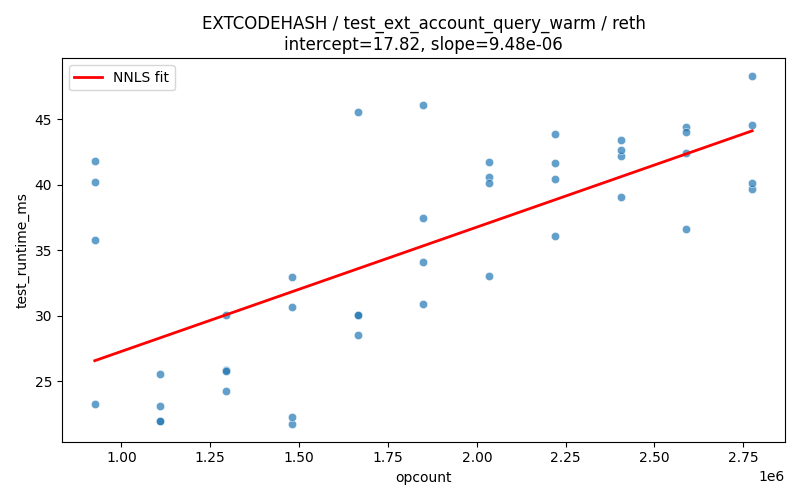

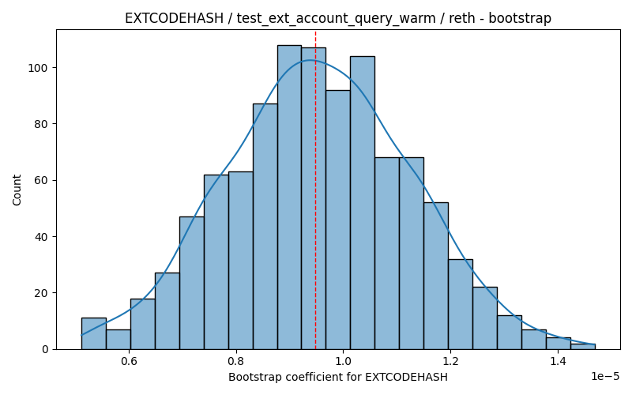

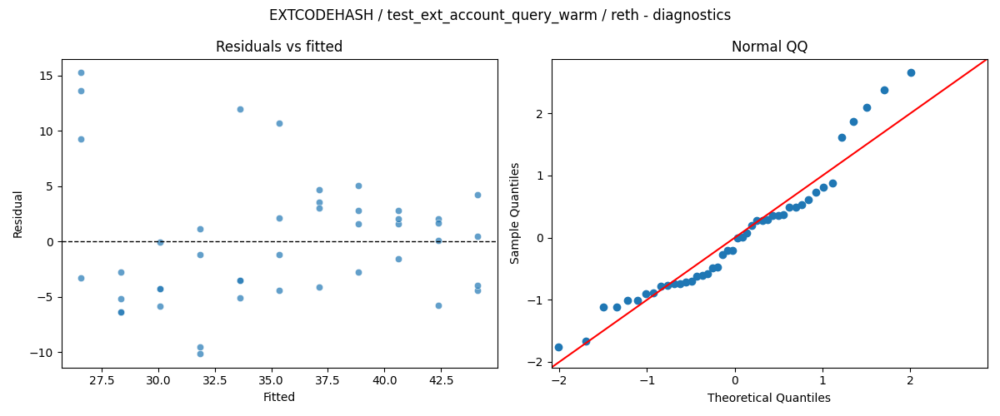

</details>

### test_account_access — combo `EXTCODEHASH_AccountMode.EXISTING_EOA`

| client | nobs | R² | target_coef (ms) | p-value | 95% CI |
| --- | --- | --- | --- | --- | --- |
| `besu` | 55 | 0.9883 | 0.01469 | 1.00e-03 | [0.01431, 0.01515] |
| `erigon` | 44 | 0.9981 | 0.008612 | 1.00e-03 | [0.008494, 0.008695] |
| `geth` | 77 | 0.9894 | 0.01129 | 1.00e-03 | [0.01102, 0.01151] |
| `nethermind` | 66 | 0.9142 | 0.003141 | 1.00e-03 | [0.00292, 0.003346] |
| `reth` | 44 | 0.9697 | 0.004018 | 1.00e-03 | [0.003819, 0.004206] |

<details><summary>besu — NNLS regression summary</summary>

```
==============================================================================
                           NNLS Regression Results                            
==============================================================================
Dep. Variable:          test_runtime_ms              R-squared:          0.988
Model:                  NNLS                    Adj. R-squared:          0.988
No. Observations:       55                                RMSE:          32.99
Df Residuals:           53                                 MAE:          26.24
Df Model:               1      
==============================================================================
                      coef     std err     P-value      [0.025      0.975]
------------------------------------------------------------------------------
         const    455.1612     14.0210       0.001    423.9543    478.9563
       opcount      0.0147      0.0002       0.001      0.0143      0.0152
==============================================================================
Notes: Non-negative least squares with bootstrap inference (1000 iterations)
==============================================================================
```

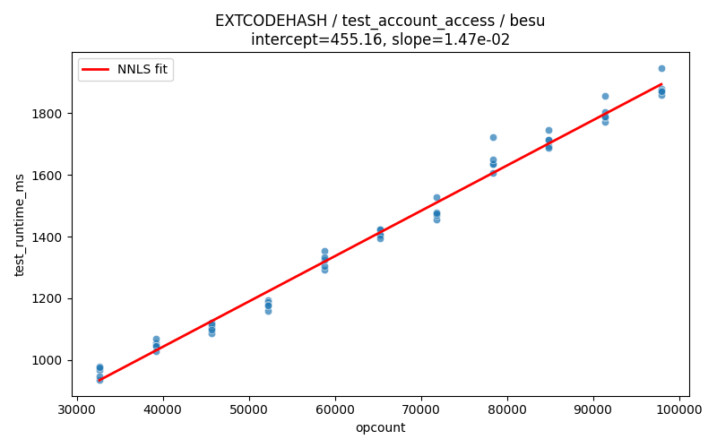

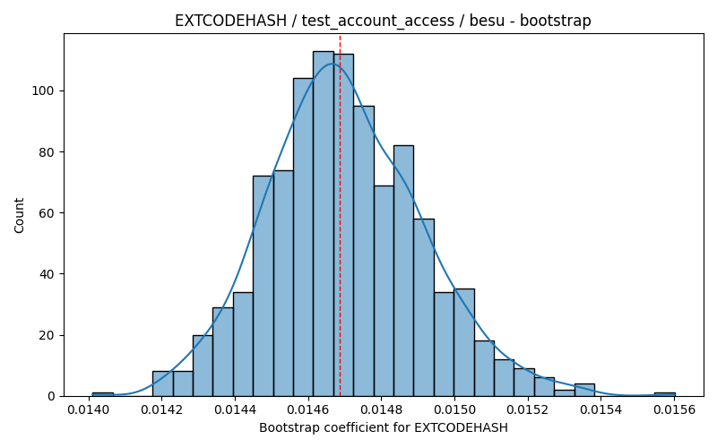

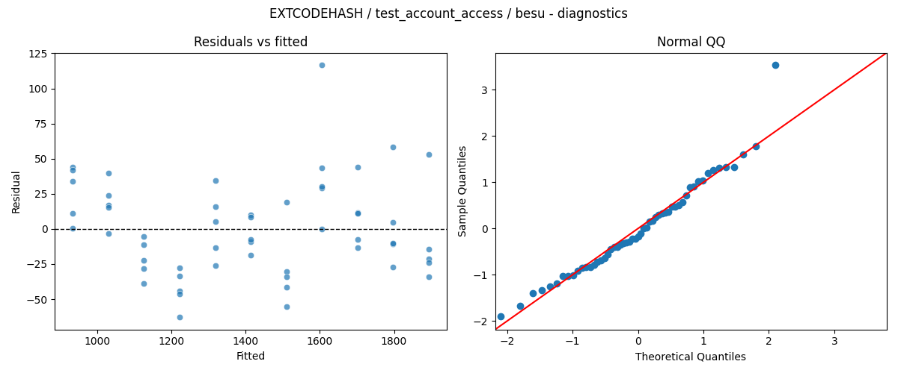

</details>

<details><summary>erigon — NNLS regression summary</summary>

```
==============================================================================
                           NNLS Regression Results                            
==============================================================================
Dep. Variable:          test_runtime_ms              R-squared:          0.998
Model:                  NNLS                    Adj. R-squared:          0.998
No. Observations:       44                                RMSE:           7.82
Df Residuals:           42                                 MAE:           6.49
Df Model:               1      
==============================================================================
                      coef     std err     P-value      [0.025      0.975]
------------------------------------------------------------------------------
         const      4.8924      3.4339       0.101      0.0000     11.8664
       opcount      0.0086      0.0001       0.001      0.0085      0.0087
==============================================================================
Notes: Non-negative least squares with bootstrap inference (1000 iterations)
==============================================================================
```

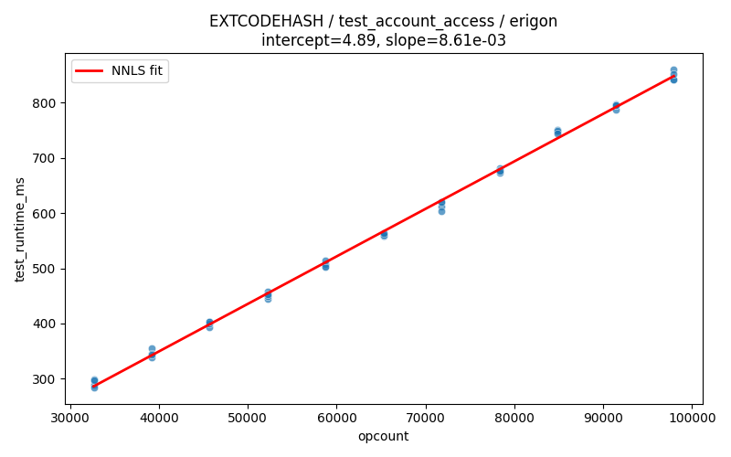

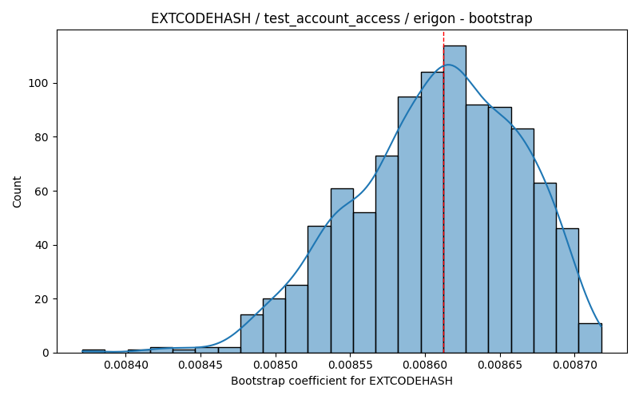

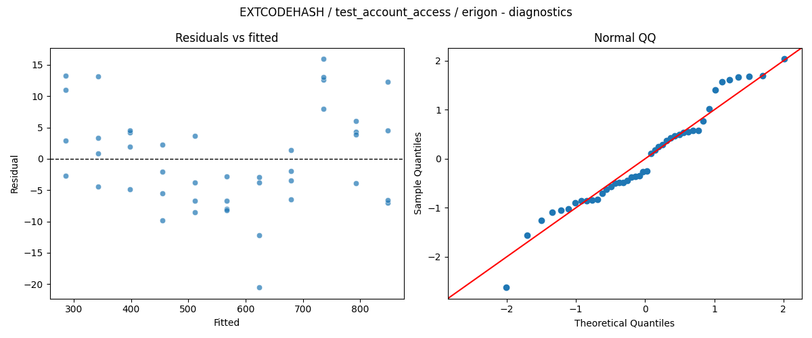

</details>

<details><summary>geth — NNLS regression summary</summary>

```
==============================================================================
                           NNLS Regression Results                            
==============================================================================
Dep. Variable:          test_runtime_ms              R-squared:          0.989
Model:                  NNLS                    Adj. R-squared:          0.989
No. Observations:       77                                RMSE:          24.16
Df Residuals:           75                                 MAE:          19.09
Df Model:               1      
==============================================================================
                      coef     std err     P-value      [0.025      0.975]
------------------------------------------------------------------------------
         const    214.3500      8.4492       0.001    199.9426    232.6521
       opcount      0.0113      0.0001       0.001      0.0110      0.0115
==============================================================================
Notes: Non-negative least squares with bootstrap inference (1000 iterations)
==============================================================================
```

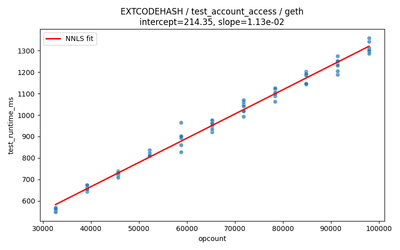

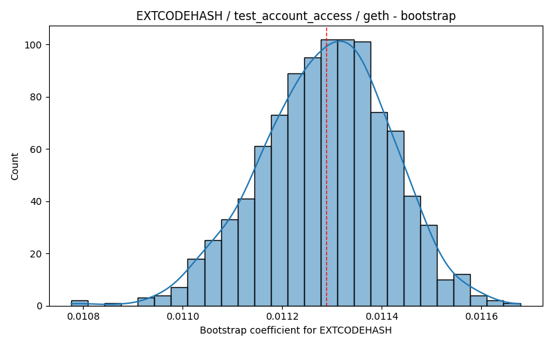

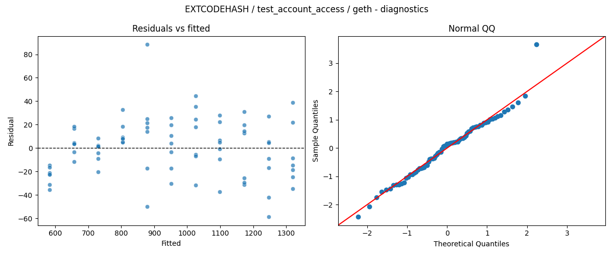

</details>

<details><summary>nethermind — NNLS regression summary</summary>

```
==============================================================================
                           NNLS Regression Results                            
==============================================================================
Dep. Variable:          test_runtime_ms              R-squared:          0.914
Model:                  NNLS                    Adj. R-squared:          0.913
No. Observations:       66                                RMSE:          19.87
Df Residuals:           64                                 MAE:          16.82
Df Model:               1      
==============================================================================
                      coef     std err     P-value      [0.025      0.975]
------------------------------------------------------------------------------
         const    108.9403      7.2647       0.001     94.6044    123.7687
       opcount      0.0031      0.0001       0.001      0.0029      0.0033
==============================================================================
Notes: Non-negative least squares with bootstrap inference (1000 iterations)
==============================================================================
```

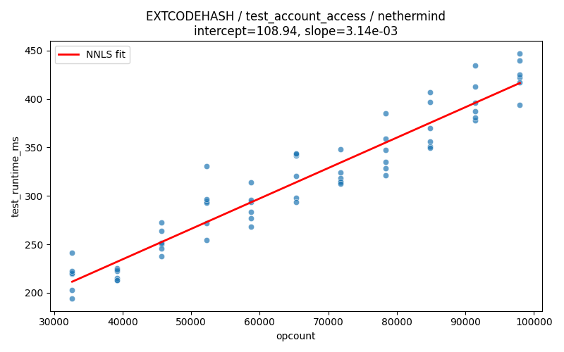

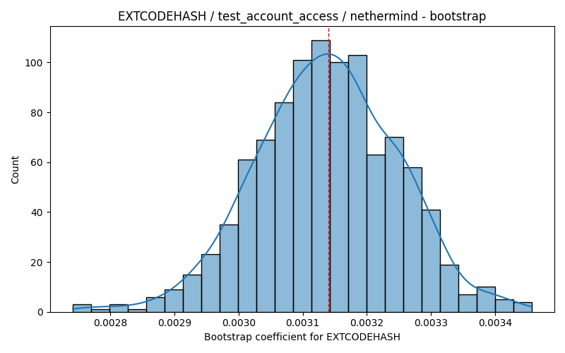

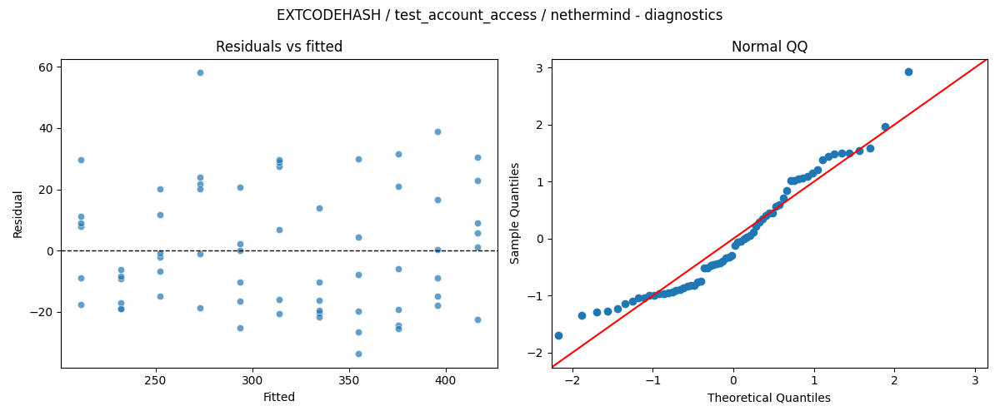

</details>

<details><summary>reth — NNLS regression summary</summary>

```
==============================================================================
                           NNLS Regression Results                            
==============================================================================
Dep. Variable:          test_runtime_ms              R-squared:          0.970
Model:                  NNLS                    Adj. R-squared:          0.969
No. Observations:       44                                RMSE:          14.67
Df Residuals:           42                                 MAE:          12.63
Df Model:               1      
==============================================================================
                      coef     std err     P-value      [0.025      0.975]
------------------------------------------------------------------------------
         const     86.7181      6.5307       0.001     74.5258     99.6741
       opcount      0.0040      0.0001       0.001      0.0038      0.0042
==============================================================================
Notes: Non-negative least squares with bootstrap inference (1000 iterations)
==============================================================================
```

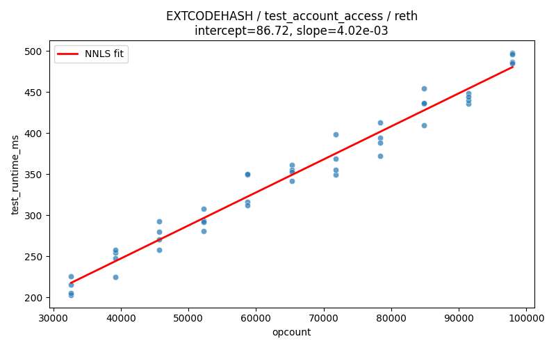

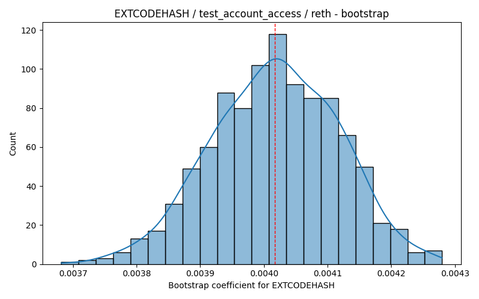

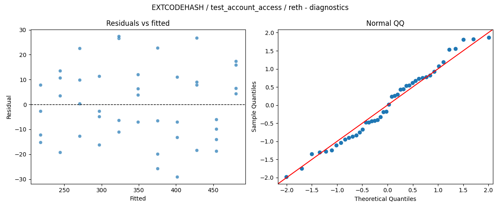

</details>

### test_account_access — combo `EXTCODEHASH_AccountMode.NON_EXISTING_ACCOUNT`

| client | nobs | R² | target_coef (ms) | p-value | 95% CI |
| --- | --- | --- | --- | --- | --- |
| `besu` | 55 | 0.987 | 0.01476 | 1.00e-03 | [0.01438, 0.01523] |
| `erigon` | 44 | 0.9982 | 0.008009 | 1.00e-03 | [0.007974, 0.008046] |
| `geth` | 77 | 0.9718 | 0.02194 | 1.00e-03 | [0.02101, 0.02282] |
| `nethermind` | 66 | 0.9211 | 0.003239 | 1.00e-03 | [0.002989, 0.003527] |
| `reth` | 44 | 0.9757 | 0.00394 | 1.00e-03 | [0.003751, 0.004123] |

<details><summary>besu — NNLS regression summary</summary>

```
==============================================================================
                           NNLS Regression Results                            
==============================================================================
Dep. Variable:          test_runtime_ms              R-squared:          0.987
Model:                  NNLS                    Adj. R-squared:          0.987
No. Observations:       55                                RMSE:          35.00
Df Residuals:           53                                 MAE:          25.94
Df Model:               1      
==============================================================================
                      coef     std err     P-value      [0.025      0.975]
------------------------------------------------------------------------------
         const    126.9259     13.4057       0.001     97.8848    150.3960
       opcount      0.0148      0.0002       0.001      0.0144      0.0152
==============================================================================
Notes: Non-negative least squares with bootstrap inference (1000 iterations)
==============================================================================
```


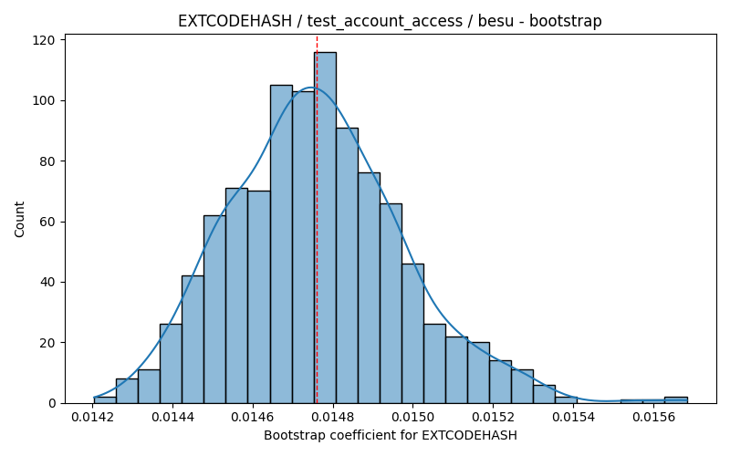

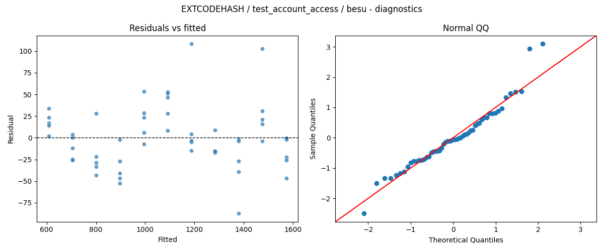

</details>

<details><summary>erigon — NNLS regression summary</summary>

```
==============================================================================
                           NNLS Regression Results                            
==============================================================================
Dep. Variable:          test_runtime_ms              R-squared:          0.998
Model:                  NNLS                    Adj. R-squared:          0.998
No. Observations:       44                                RMSE:           7.15
Df Residuals:           42                                 MAE:           5.68
Df Model:               1      
==============================================================================
                      coef     std err     P-value      [0.025      0.975]
------------------------------------------------------------------------------
         const      0.0000      0.0929       1.000      0.0000      0.0000
       opcount      0.0080      0.0000       0.001      0.0080      0.0080
==============================================================================
Notes: Non-negative least squares with bootstrap inference (1000 iterations)
==============================================================================
```

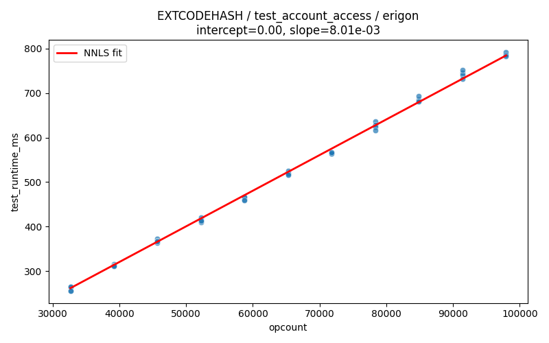

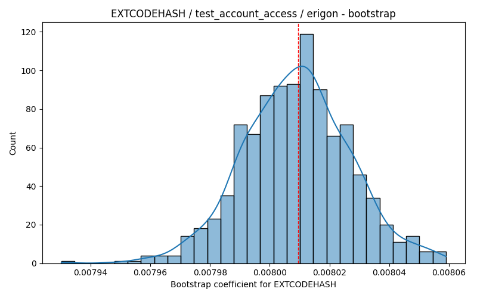

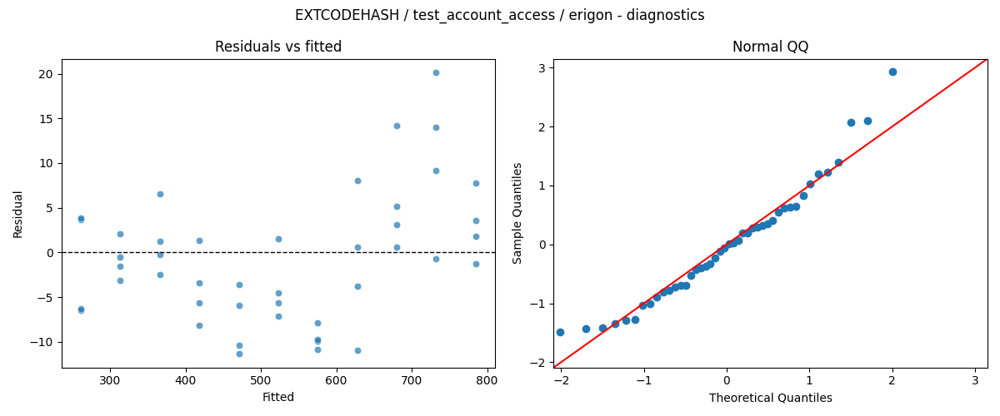

</details>

<details><summary>geth — NNLS regression summary</summary>

```
==============================================================================
                           NNLS Regression Results                            
==============================================================================
Dep. Variable:          test_runtime_ms              R-squared:          0.972
Model:                  NNLS                    Adj. R-squared:          0.971
No. Observations:       77                                RMSE:          77.16
Df Residuals:           75                                 MAE:          59.98
Df Model:               1      
==============================================================================
                      coef     std err     P-value      [0.025      0.975]
------------------------------------------------------------------------------
         const    249.3716     25.0408       0.001    199.2616    297.6365
       opcount      0.0219      0.0005       0.001      0.0210      0.0228
==============================================================================
Notes: Non-negative least squares with bootstrap inference (1000 iterations)
==============================================================================
```

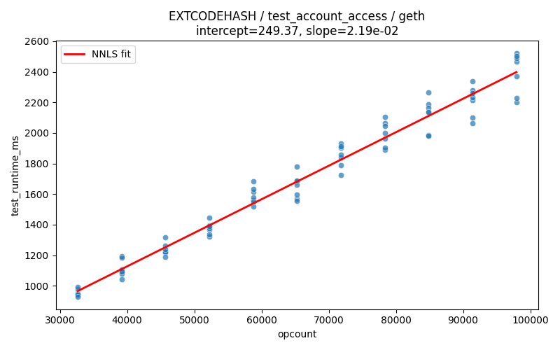

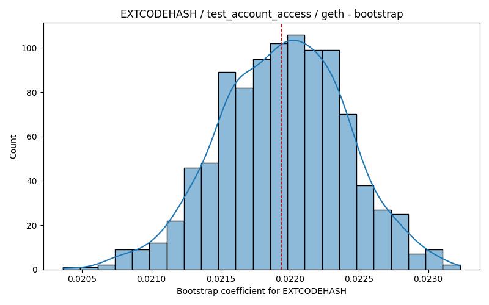

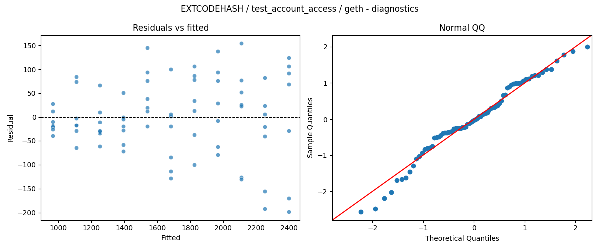

</details>

<details><summary>nethermind — NNLS regression summary</summary>

```
==============================================================================
                           NNLS Regression Results                            
==============================================================================
Dep. Variable:          test_runtime_ms              R-squared:          0.921
Model:                  NNLS                    Adj. R-squared:          0.920
No. Observations:       66                                RMSE:          19.57
Df Residuals:           64                                 MAE:          15.08
Df Model:               1      
==============================================================================
                      coef     std err     P-value      [0.025      0.975]
------------------------------------------------------------------------------
         const     59.0995      8.0696       0.001     41.9294     74.2548
       opcount      0.0032      0.0001       0.001      0.0030      0.0035
==============================================================================
Notes: Non-negative least squares with bootstrap inference (1000 iterations)
==============================================================================
```

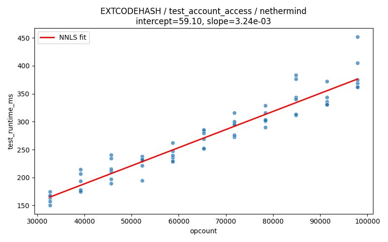

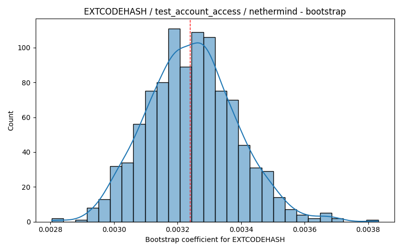

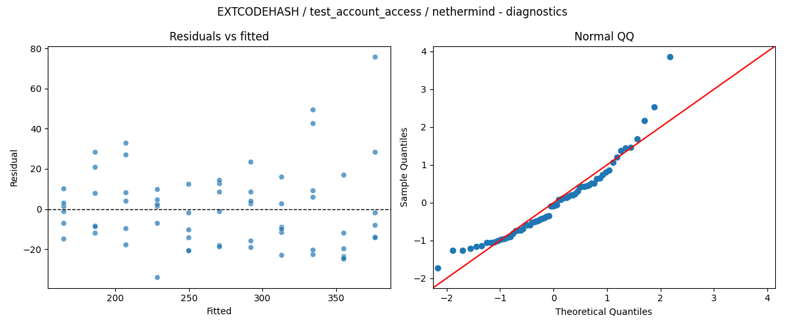

</details>

<details><summary>reth — NNLS regression summary</summary>

```
==============================================================================
                           NNLS Regression Results                            
==============================================================================
Dep. Variable:          test_runtime_ms              R-squared:          0.976
Model:                  NNLS                    Adj. R-squared:          0.975
No. Observations:       44                                RMSE:          12.85
Df Residuals:           42                                 MAE:          10.22
Df Model:               1      
==============================================================================
                      coef     std err     P-value      [0.025      0.975]
------------------------------------------------------------------------------
         const     90.0899      5.8214       0.001     79.4876    101.2104
       opcount      0.0039      0.0001       0.001      0.0038      0.0041
==============================================================================
Notes: Non-negative least squares with bootstrap inference (1000 iterations)
==============================================================================
```

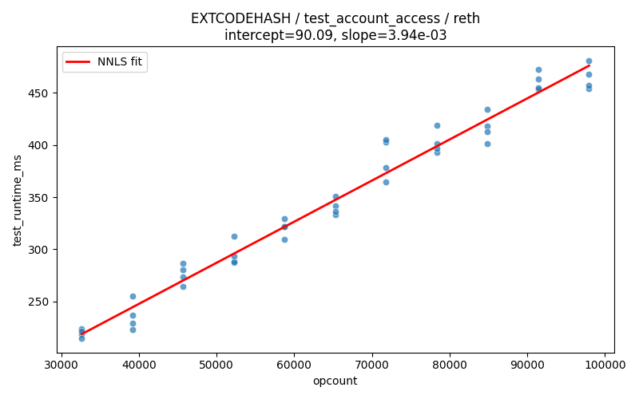

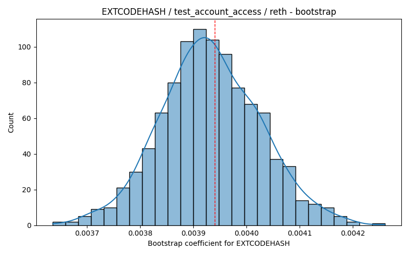

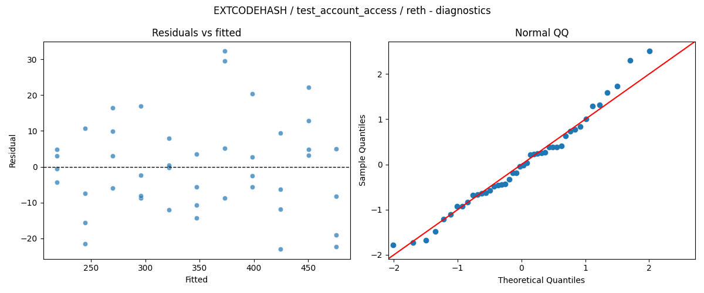

</details>

### test_account_access — combo `EXTCODEHASH_AccountMode.EXISTING_CONTRACT_DIFF_MAX`

| client | nobs | R² | target_coef (ms) | p-value | 95% CI |
| --- | --- | --- | --- | --- | --- |
| `besu` | 55 | 0.9787 | 0.01912 | 1.00e-03 | [0.01843, 0.01979] |
| `erigon` | 44 | 0.9918 | 0.008802 | 1.00e-03 | [0.008565, 0.009037] |
| `geth` | 77 | 0.9572 | 0.003634 | 1.00e-03 | [0.003455, 0.003808] |
| `nethermind` | 66 | 0.8411 | 0.002478 | 1.00e-03 | [0.002219, 0.002748] |
| `reth` | 44 | 0.9972 | 0.01756 | 1.00e-03 | [0.01728, 0.01782] |

<details><summary>besu — NNLS regression summary</summary>

```
==============================================================================
                           NNLS Regression Results                            
==============================================================================
Dep. Variable:          test_runtime_ms              R-squared:          0.979
Model:                  NNLS                    Adj. R-squared:          0.978
No. Observations:       55                                RMSE:          57.35
Df Residuals:           53                                 MAE:          43.44
Df Model:               1      
==============================================================================
                      coef     std err     P-value      [0.025      0.975]
------------------------------------------------------------------------------
         const    457.9620     24.5516       0.001    411.6611    506.1556
       opcount      0.0191      0.0004       0.001      0.0184      0.0198
==============================================================================
Notes: Non-negative least squares with bootstrap inference (1000 iterations)
==============================================================================
```

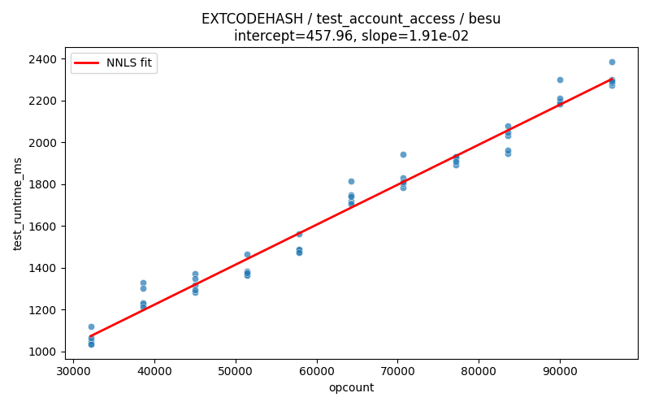

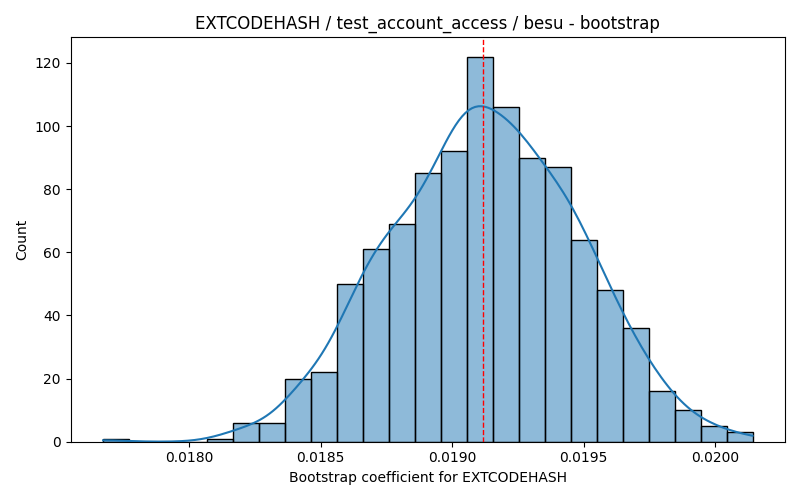

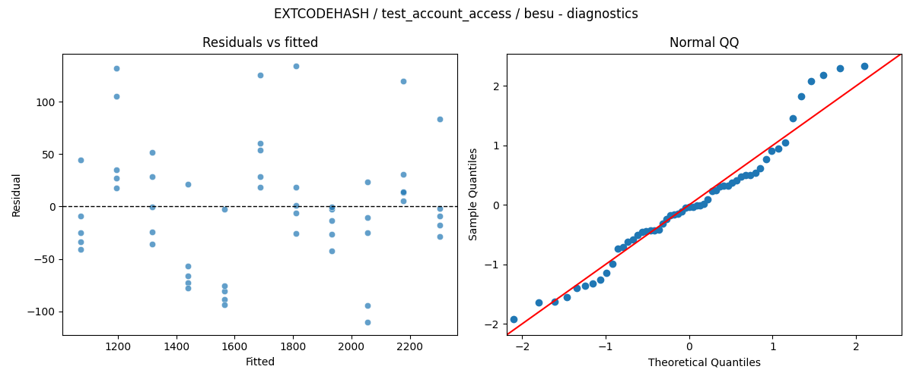

</details>

<details><summary>erigon — NNLS regression summary</summary>

```
==============================================================================
                           NNLS Regression Results                            
==============================================================================
Dep. Variable:          test_runtime_ms              R-squared:          0.992
Model:                  NNLS                    Adj. R-squared:          0.992
No. Observations:       44                                RMSE:          16.24
Df Residuals:           42                                 MAE:          14.25
Df Model:               1      
==============================================================================
                      coef     std err     P-value      [0.025      0.975]
------------------------------------------------------------------------------
         const    108.6509      7.9575       0.001     92.3064    122.4312
       opcount      0.0088      0.0001       0.001      0.0086      0.0090
==============================================================================
Notes: Non-negative least squares with bootstrap inference (1000 iterations)
==============================================================================
```


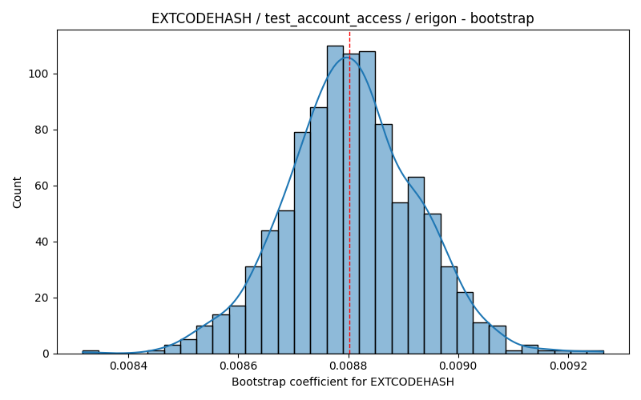

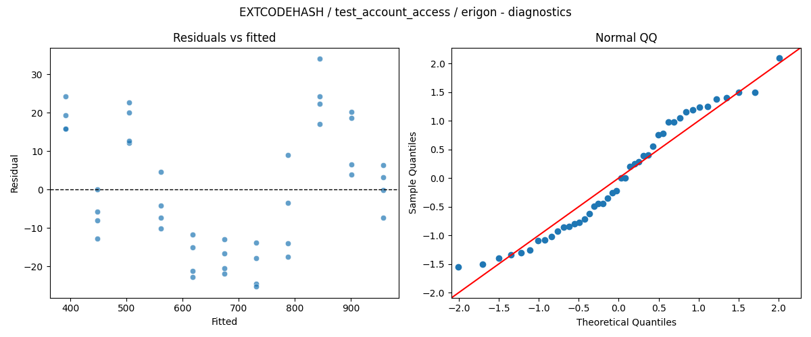

</details>

<details><summary>geth — NNLS regression summary</summary>

```
==============================================================================
                           NNLS Regression Results                            
==============================================================================
Dep. Variable:          test_runtime_ms              R-squared:          0.957
Model:                  NNLS                    Adj. R-squared:          0.957
No. Observations:       77                                RMSE:          15.62
Df Residuals:           75                                 MAE:          12.26
Df Model:               1      
==============================================================================
                      coef     std err     P-value      [0.025      0.975]
------------------------------------------------------------------------------
         const     13.9089      6.3897       0.019      0.6895     26.0998
       opcount      0.0036      0.0001       0.001      0.0035      0.0038
==============================================================================
Notes: Non-negative least squares with bootstrap inference (1000 iterations)
==============================================================================
```

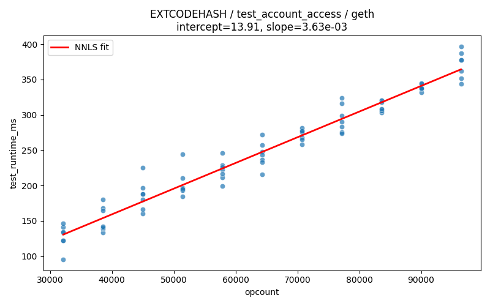

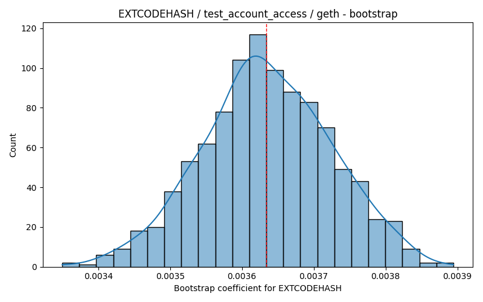

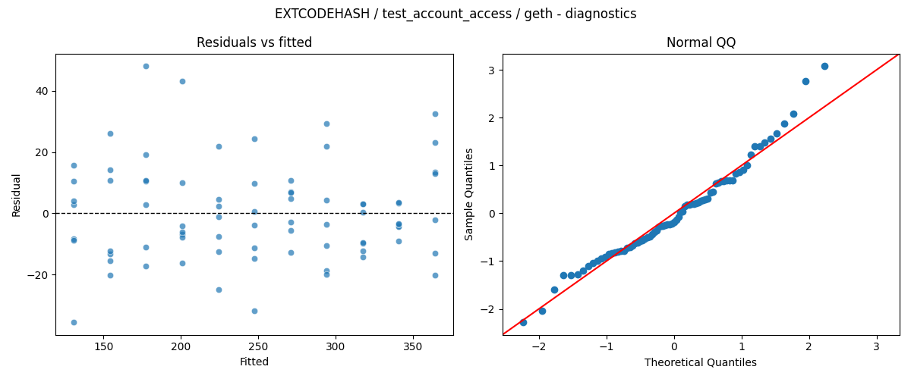

</details>

<details><summary>nethermind — NNLS regression summary</summary>

```
==============================================================================
                           NNLS Regression Results                            
==============================================================================
Dep. Variable:          test_runtime_ms              R-squared:          0.841
Model:                  NNLS                    Adj. R-squared:          0.839
No. Observations:       66                                RMSE:          21.89
Df Residuals:           64                                 MAE:          17.46
Df Model:               1      
==============================================================================
                      coef     std err     P-value      [0.025      0.975]
------------------------------------------------------------------------------
         const     75.2898      8.7748       0.001     58.5886     92.2571
       opcount      0.0025      0.0001       0.001      0.0022      0.0027
==============================================================================
Notes: Non-negative least squares with bootstrap inference (1000 iterations)
==============================================================================
```

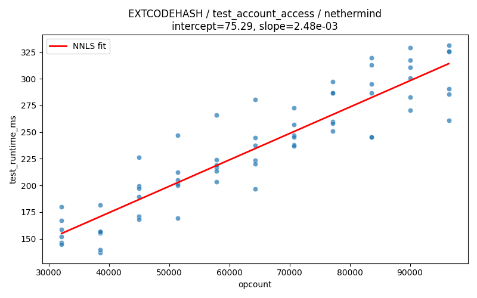

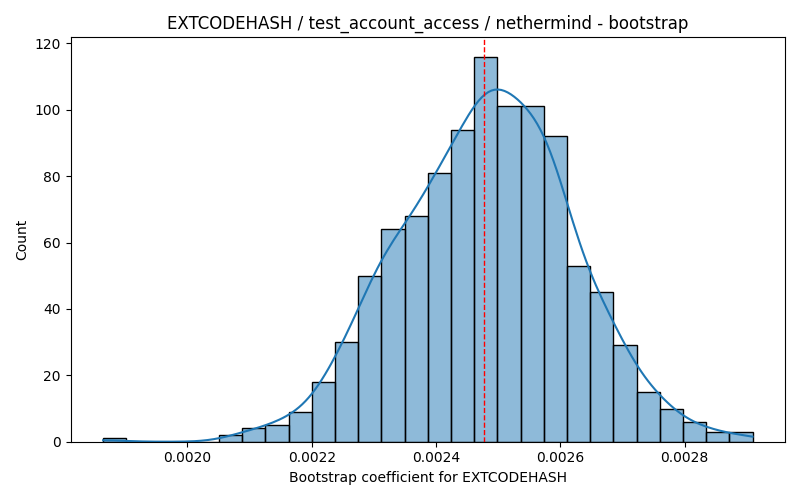

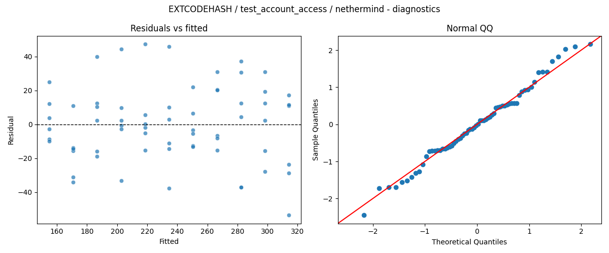

</details>

<details><summary>reth — NNLS regression summary</summary>

```
==============================================================================
                           NNLS Regression Results                            
==============================================================================
Dep. Variable:          test_runtime_ms              R-squared:          0.997
Model:                  NNLS                    Adj. R-squared:          0.997
No. Observations:       44                                RMSE:          18.90
Df Residuals:           42                                 MAE:          14.05
Df Model:               1      
==============================================================================
                      coef     std err     P-value      [0.025      0.975]
------------------------------------------------------------------------------
         const    134.0653      8.1483       0.001    119.4583    151.3292
       opcount      0.0176      0.0001       0.001      0.0173      0.0178
==============================================================================
Notes: Non-negative least squares with bootstrap inference (1000 iterations)
==============================================================================
```

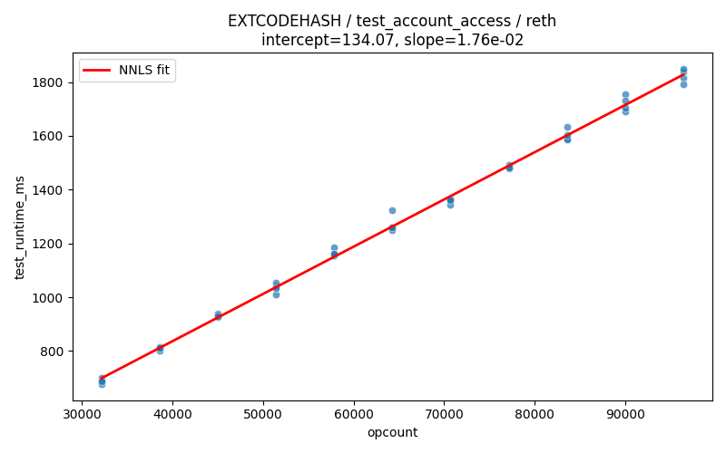

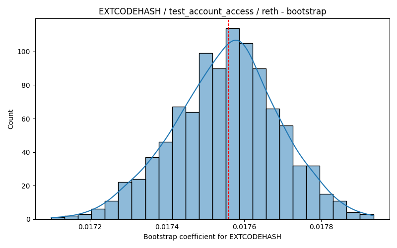

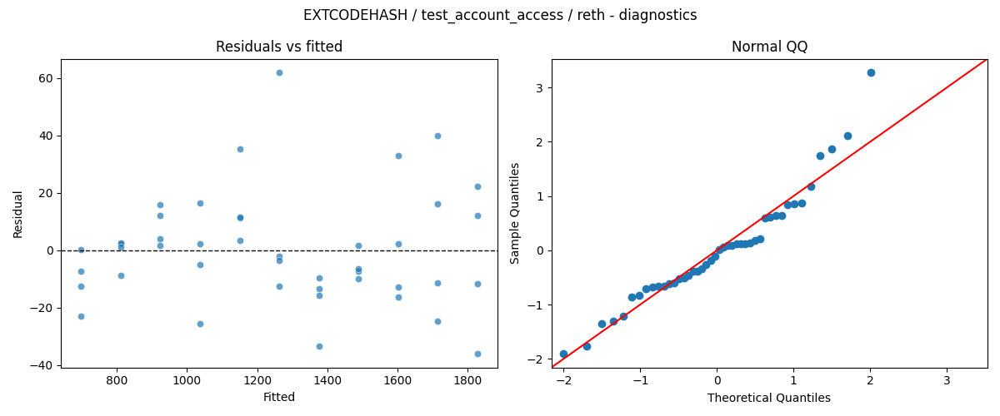

</details>

### test_account_access — combo `EXTCODEHASH_AccountMode.EXISTING_CONTRACT_MINIMAL`

| client | nobs | R² | target_coef (ms) | p-value | 95% CI |
| --- | --- | --- | --- | --- | --- |
| `besu` | 55 | 0.9789 | 0.01181 | 1.00e-03 | [0.01128, 0.01231] |
| `erigon` | 44 | 0.9933 | 0.008244 | 1.00e-03 | [0.008062, 0.008393] |
| `geth` | 77 | 0.9572 | 0.004685 | 1.00e-03 | [0.004469, 0.004924] |
| `nethermind` | 66 | 0.7717 | 0.001999 | 1.00e-03 | [0.001764, 0.00222] |
| `reth` | 44 | 0.9695 | 0.003758 | 1.00e-03 | [0.003574, 0.003937] |

<details><summary>besu — NNLS regression summary</summary>

```
==============================================================================
                           NNLS Regression Results                            
==============================================================================
Dep. Variable:          test_runtime_ms              R-squared:          0.979
Model:                  NNLS                    Adj. R-squared:          0.978
No. Observations:       55                                RMSE:          35.30
Df Residuals:           53                                 MAE:          27.92
Df Model:               1      
==============================================================================
                      coef     std err     P-value      [0.025      0.975]
------------------------------------------------------------------------------
         const    389.2717     16.6901       0.001    360.3459    426.0446
       opcount      0.0118      0.0003       0.001      0.0113      0.0123
==============================================================================
Notes: Non-negative least squares with bootstrap inference (1000 iterations)
==============================================================================
```

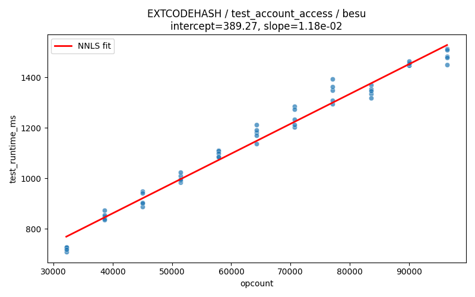

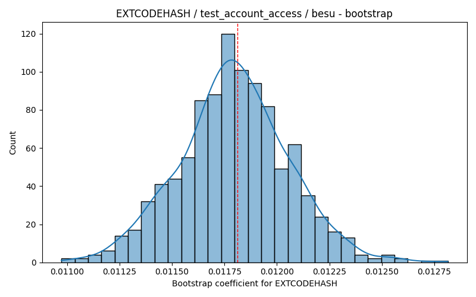

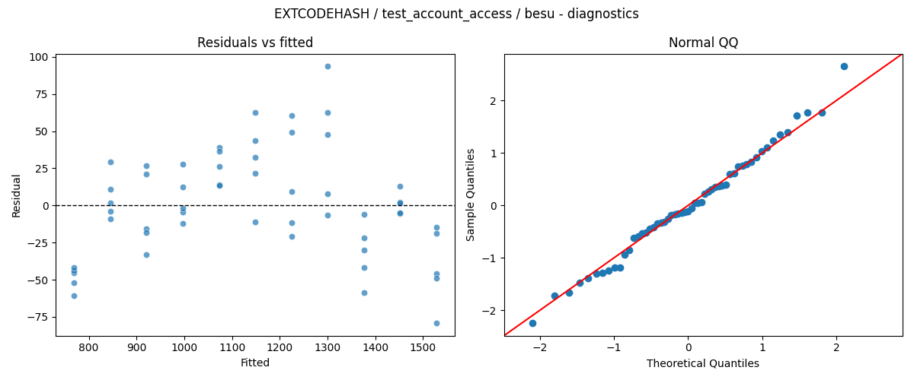

</details>

<details><summary>erigon — NNLS regression summary</summary>

```
==============================================================================
                           NNLS Regression Results                            
==============================================================================
Dep. Variable:          test_runtime_ms              R-squared:          0.993
Model:                  NNLS                    Adj. R-squared:          0.993
No. Observations:       44                                RMSE:          13.73
Df Residuals:           42                                 MAE:          11.32
Df Model:               1      
==============================================================================
                      coef     std err     P-value      [0.025      0.975]
------------------------------------------------------------------------------
         const    105.3581      4.9032       0.001     95.0415    114.6465
       opcount      0.0082      0.0001       0.001      0.0081      0.0084
==============================================================================
Notes: Non-negative least squares with bootstrap inference (1000 iterations)
==============================================================================
```


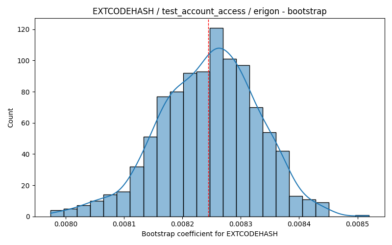

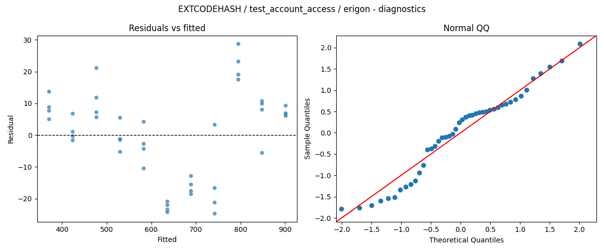

</details>

<details><summary>geth — NNLS regression summary</summary>

```
==============================================================================
                           NNLS Regression Results                            
==============================================================================
Dep. Variable:          test_runtime_ms              R-squared:          0.957
Model:                  NNLS                    Adj. R-squared:          0.957
No. Observations:       77                                RMSE:          20.14
Df Residuals:           75                                 MAE:          15.37
Df Model:               1      
==============================================================================
                      coef     std err     P-value      [0.025      0.975]
------------------------------------------------------------------------------
         const     69.2832      6.8059       0.001     55.2590     82.5477
       opcount      0.0047      0.0001       0.001      0.0045      0.0049
==============================================================================
Notes: Non-negative least squares with bootstrap inference (1000 iterations)
==============================================================================
```

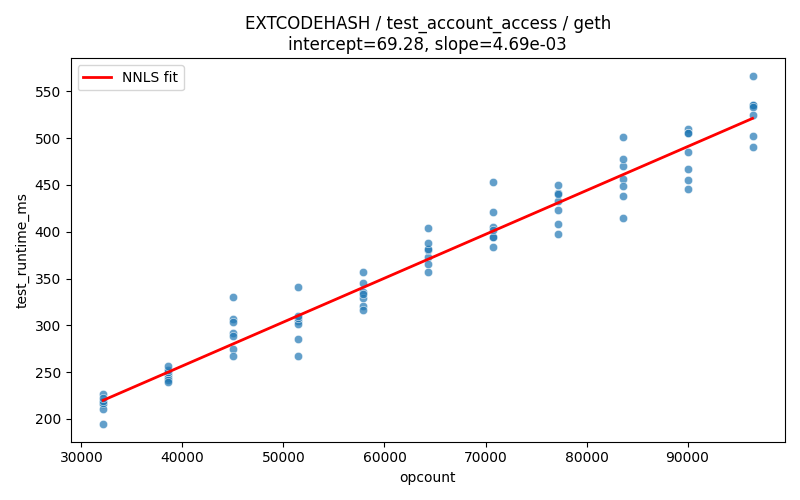

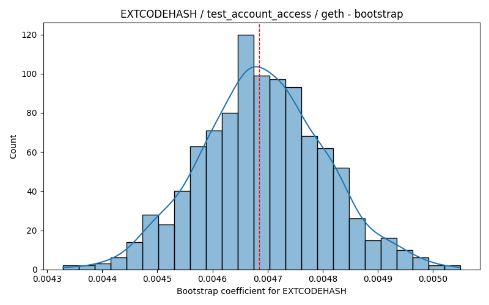

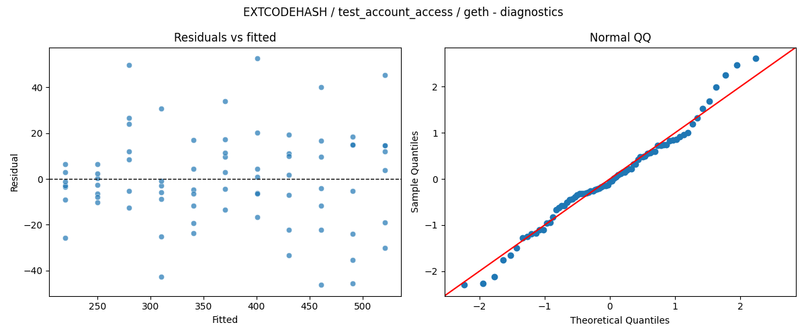

</details>

<details><summary>nethermind — NNLS regression summary</summary>

```
==============================================================================
                           NNLS Regression Results                            
==============================================================================
Dep. Variable:          test_runtime_ms              R-squared:          0.772
Model:                  NNLS                    Adj. R-squared:          0.768
No. Observations:       66                                RMSE:          22.11
Df Residuals:           64                                 MAE:          18.64
Df Model:               1      
==============================================================================
                      coef     std err     P-value      [0.025      0.975]
------------------------------------------------------------------------------
         const    107.4284      7.5133       0.001     92.2980    122.1831
       opcount      0.0020      0.0001       0.001      0.0018      0.0022
==============================================================================
Notes: Non-negative least squares with bootstrap inference (1000 iterations)
==============================================================================
```

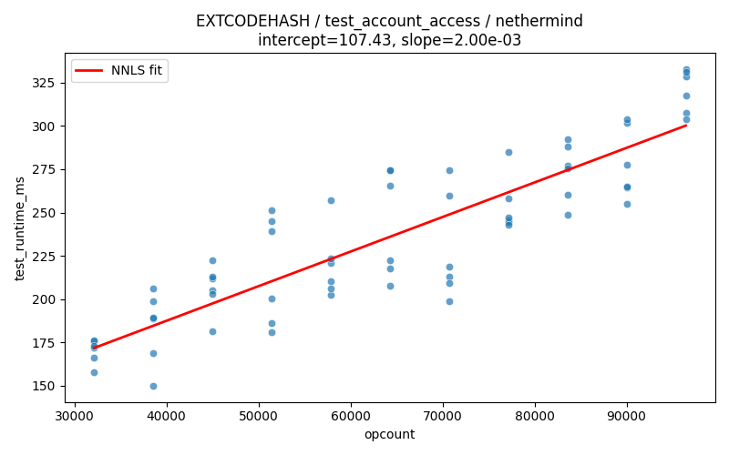

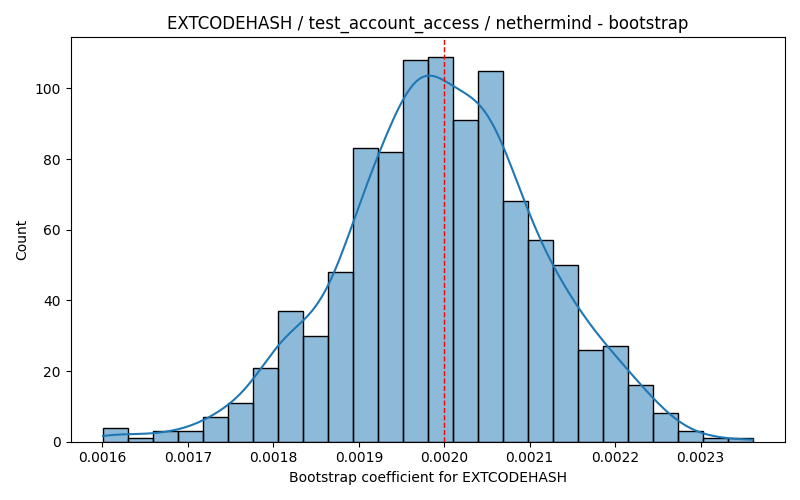

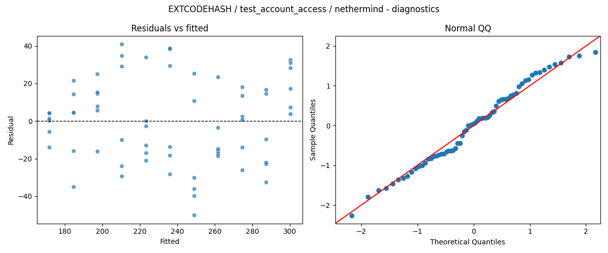

</details>

<details><summary>reth — NNLS regression summary</summary>

```
==============================================================================
                           NNLS Regression Results                            
==============================================================================
Dep. Variable:          test_runtime_ms              R-squared:          0.969
Model:                  NNLS                    Adj. R-squared:          0.969
No. Observations:       44                                RMSE:          13.55
Df Residuals:           42                                 MAE:          11.16
Df Model:               1      
==============================================================================
                      coef     std err     P-value      [0.025      0.975]
------------------------------------------------------------------------------
         const     80.6434      5.3164       0.001     70.5200     91.4837
       opcount      0.0038      0.0001       0.001      0.0036      0.0039
==============================================================================
Notes: Non-negative least squares with bootstrap inference (1000 iterations)
==============================================================================
```

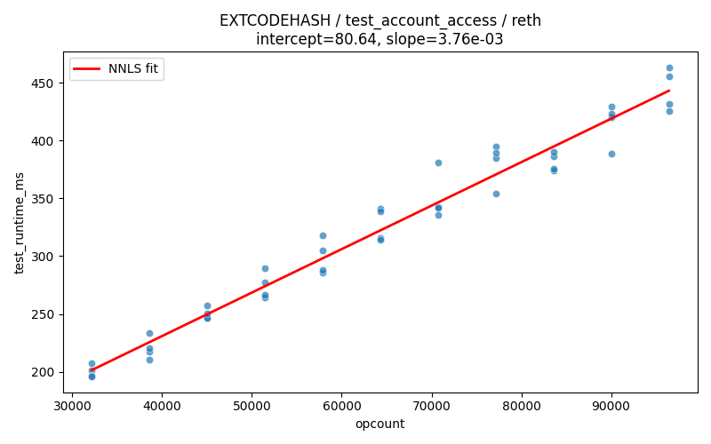

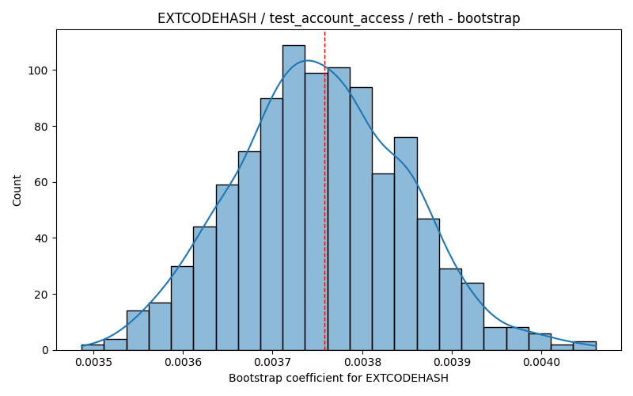

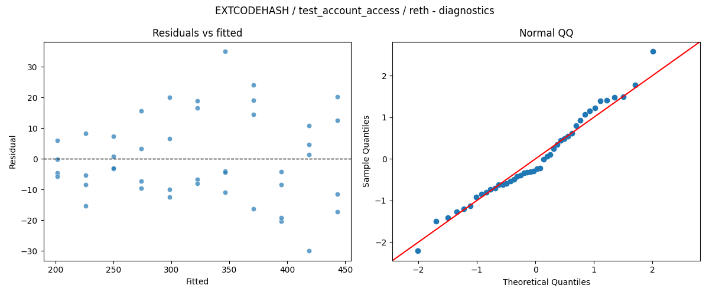

</details>

### test_account_access — combo `EXTCODEHASH_AccountMode.EXISTING_CONTRACT_SAME_MAX`

| client | nobs | R² | target_coef (ms) | p-value | 95% CI |
| --- | --- | --- | --- | --- | --- |
| `besu` | 55 | 0.9535 | 0.01073 | 1.00e-03 | [0.009997, 0.01153] |
| `erigon` | 44 | 0.9952 | 0.008268 | 1.00e-03 | [0.008103, 0.008434] |
| `geth` | 77 | 0.9459 | 0.004769 | 1.00e-03 | [0.004481, 0.005062] |
| `nethermind` | 66 | 0.8274 | 0.002328 | 1.00e-03 | [0.002081, 0.002599] |
| `reth` | 44 | 0.9737 | 0.003825 | 1.00e-03 | [0.003646, 0.00401] |

<details><summary>besu — NNLS regression summary</summary>

```
==============================================================================
                           NNLS Regression Results                            
==============================================================================
Dep. Variable:          test_runtime_ms              R-squared:          0.953
Model:                  NNLS                    Adj. R-squared:          0.953
No. Observations:       55                                RMSE:          48.20
Df Residuals:           53                                 MAE:          38.80
Df Model:               1      
==============================================================================
                      coef     std err     P-value      [0.025      0.975]
------------------------------------------------------------------------------
         const    430.0274     22.9400       0.001    385.5586    478.2980
       opcount      0.0107      0.0004       0.001      0.0100      0.0115
==============================================================================
Notes: Non-negative least squares with bootstrap inference (1000 iterations)
==============================================================================
```

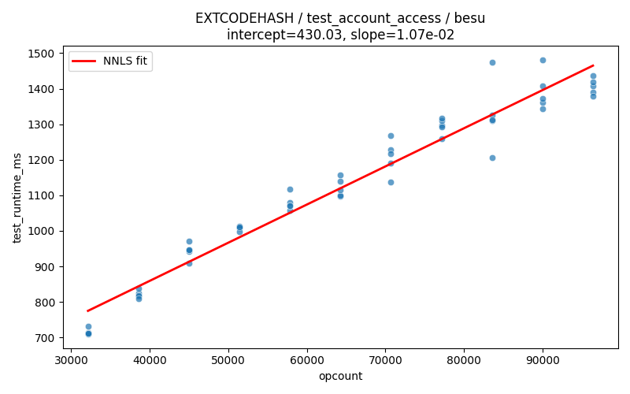

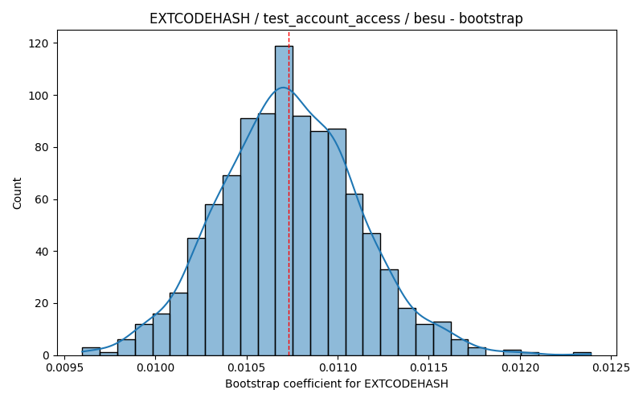

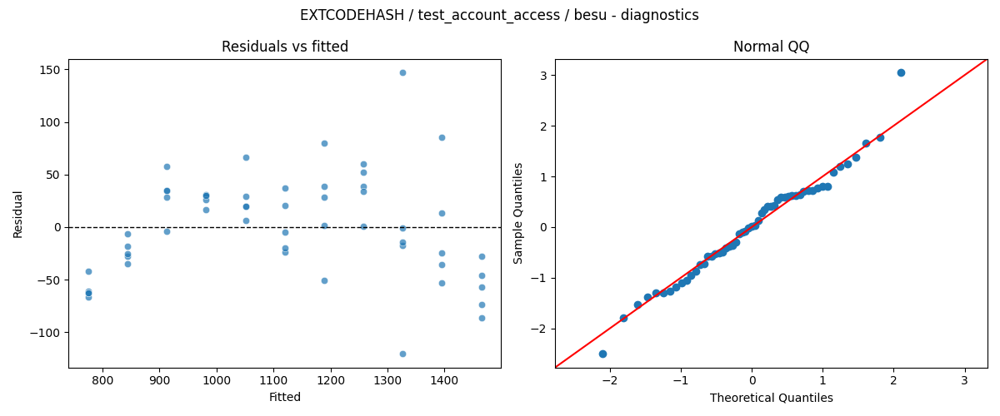

</details>

<details><summary>erigon — NNLS regression summary</summary>

```
==============================================================================
                           NNLS Regression Results                            
==============================================================================
Dep. Variable:          test_runtime_ms              R-squared:          0.995
Model:                  NNLS                    Adj. R-squared:          0.995
No. Observations:       44                                RMSE:          11.65
Df Residuals:           42                                 MAE:           9.94
Df Model:               1      
==============================================================================
                      coef     std err     P-value      [0.025      0.975]
------------------------------------------------------------------------------
         const    105.3642      6.1057       0.001     92.8331    116.5823
       opcount      0.0083      0.0001       0.001      0.0081      0.0084
==============================================================================
Notes: Non-negative least squares with bootstrap inference (1000 iterations)
==============================================================================
```

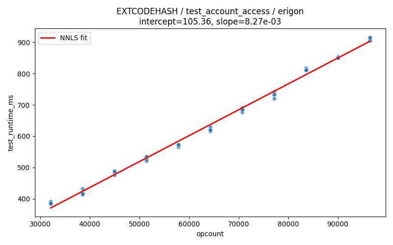

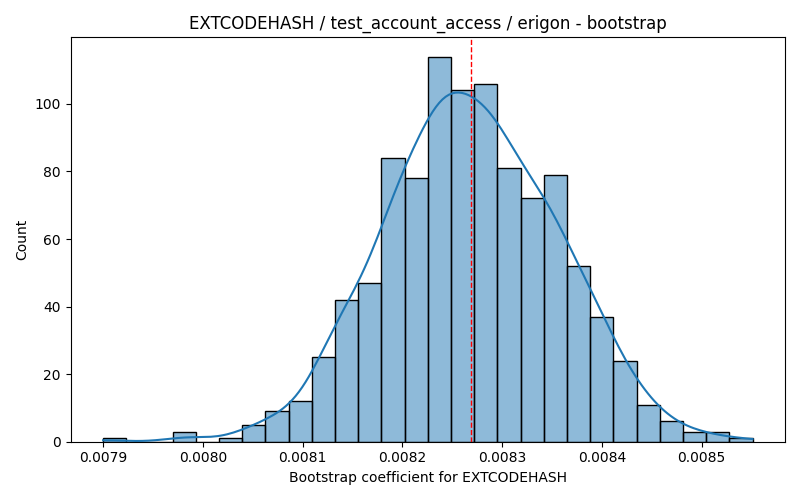

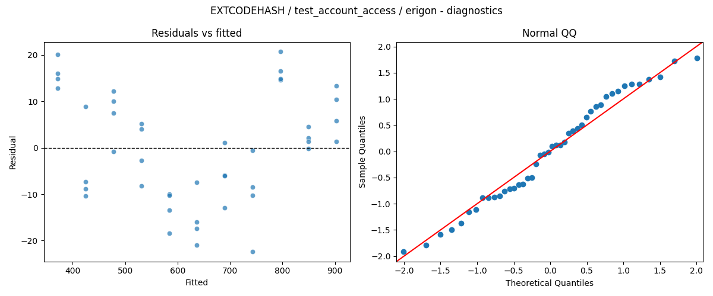

</details>

<details><summary>geth — NNLS regression summary</summary>

```
==============================================================================
                           NNLS Regression Results                            
==============================================================================
Dep. Variable:          test_runtime_ms              R-squared:          0.946
Model:                  NNLS                    Adj. R-squared:          0.945
No. Observations:       77                                RMSE:          23.19
Df Residuals:           75                                 MAE:          19.04
Df Model:               1      
==============================================================================
                      coef     std err     P-value      [0.025      0.975]
------------------------------------------------------------------------------
         const     67.5703      9.2210       0.001     49.5865     85.4183
       opcount      0.0048      0.0002       0.001      0.0045      0.0051
==============================================================================
Notes: Non-negative least squares with bootstrap inference (1000 iterations)
==============================================================================
```

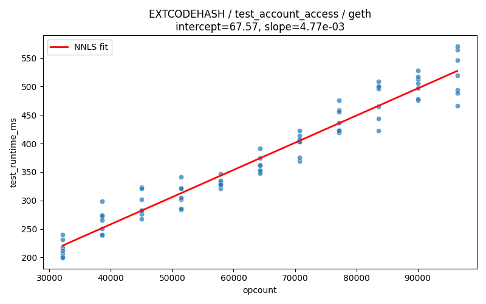

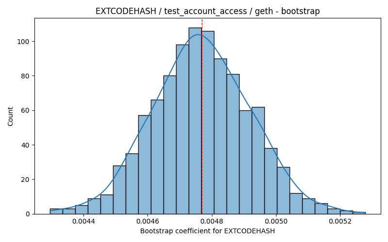

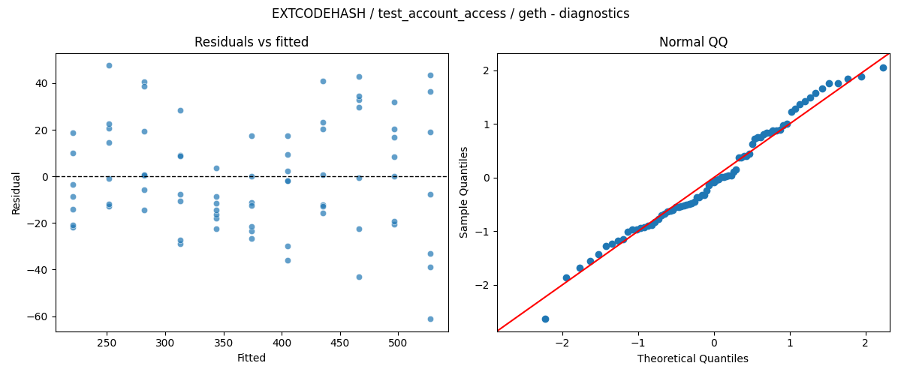

</details>

<details><summary>nethermind — NNLS regression summary</summary>

```
==============================================================================
                           NNLS Regression Results                            
==============================================================================
Dep. Variable:          test_runtime_ms              R-squared:          0.827
Model:                  NNLS                    Adj. R-squared:          0.825
No. Observations:       66                                RMSE:          21.62
Df Residuals:           64                                 MAE:          17.16
Df Model:               1      
==============================================================================
                      coef     std err     P-value      [0.025      0.975]
------------------------------------------------------------------------------
         const     79.2573      7.8498       0.001     63.3766     94.3288
       opcount      0.0023      0.0001       0.001      0.0021      0.0026
==============================================================================
Notes: Non-negative least squares with bootstrap inference (1000 iterations)
==============================================================================
```

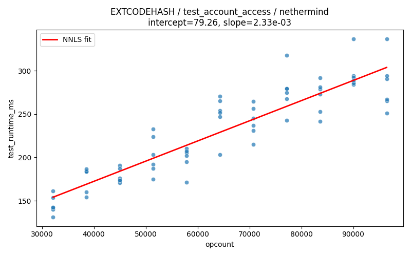


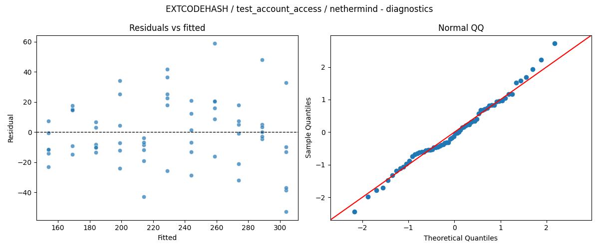

</details>

<details><summary>reth — NNLS regression summary</summary>

```
==============================================================================
                           NNLS Regression Results                            
==============================================================================
Dep. Variable:          test_runtime_ms              R-squared:          0.974
Model:                  NNLS                    Adj. R-squared:          0.973
No. Observations:       44                                RMSE:          12.78
Df Residuals:           42                                 MAE:          10.71
Df Model:               1      
==============================================================================
                      coef     std err     P-value      [0.025      0.975]
------------------------------------------------------------------------------
         const     77.5760      5.7318       0.001     66.9759     89.1339
       opcount      0.0038      0.0001       0.001      0.0036      0.0040
==============================================================================
Notes: Non-negative least squares with bootstrap inference (1000 iterations)
==============================================================================
```

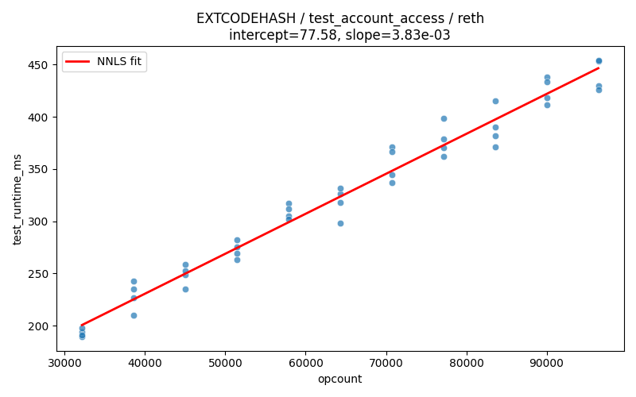


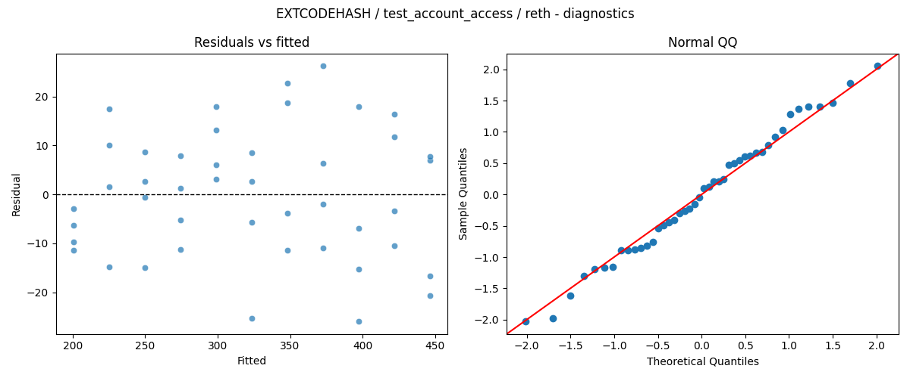

</details>

## EXTCODESIZE

### test_ext_account_query_warm — combo `EXTCODESIZE`

| client | nobs | R² | target_coef (ms) | p-value | 95% CI |
| --- | --- | --- | --- | --- | --- |
| `besu` | 55 | 0.8858 | 0.0001237 | 1.00e-03 | [0.0001116, 0.0001369] |
| `erigon` | 44 | 0.8402 | 2.464e-05 | 1.00e-03 | [2.176e-05, 2.752e-05] |
| `geth` | 77 | 0.6457 | 3.124e-05 | 1.00e-03 | [2.634e-05, 3.618e-05] |
| `nethermind` | 66 | 0.5908 | 0.0002262 | 1.00e-03 | [0.0001836, 0.0002724] |
| `reth` | 44 | 0.4214 | 1.128e-05 | 1.00e-03 | [7.519e-06, 1.491e-05] |

<details><summary>besu — NNLS regression summary</summary>

```
==============================================================================
                           NNLS Regression Results                            
==============================================================================
Dep. Variable:          test_runtime_ms              R-squared:          0.886
Model:                  NNLS                    Adj. R-squared:          0.884
No. Observations:       55                                RMSE:          13.49
Df Residuals:           53                                 MAE:          10.32
Df Model:               1      
==============================================================================
                      coef     std err     P-value      [0.025      0.975]
------------------------------------------------------------------------------
         const     92.2149      5.5742       0.001     81.7639    103.5383
       opcount      0.0001      0.0000       0.001      0.0001      0.0001
==============================================================================
Notes: Non-negative least squares with bootstrap inference (1000 iterations)
==============================================================================
```

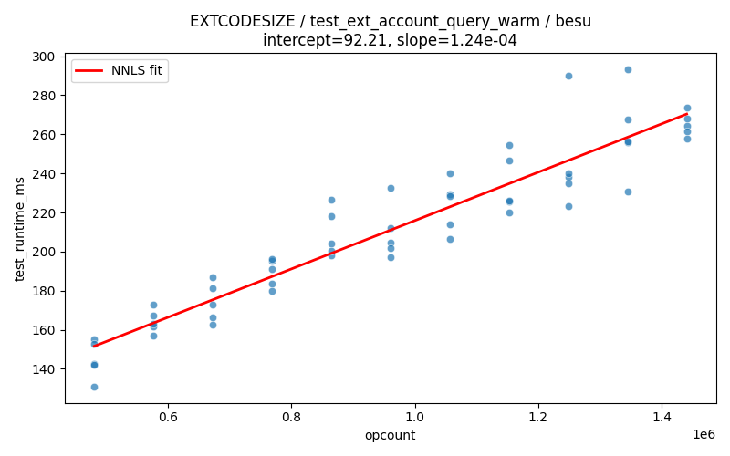

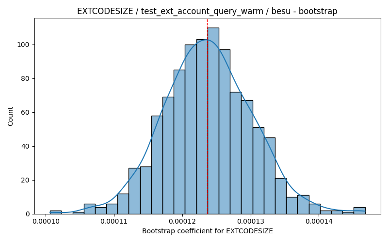

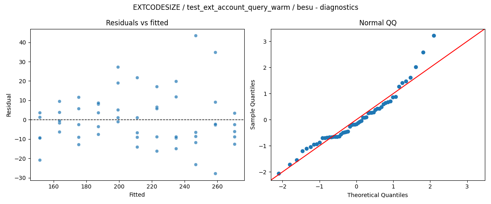

</details>

<details><summary>erigon — NNLS regression summary</summary>

```
==============================================================================
                           NNLS Regression Results                            
==============================================================================
Dep. Variable:          test_runtime_ms              R-squared:          0.840
Model:                  NNLS                    Adj. R-squared:          0.836
No. Observations:       44                                RMSE:           3.26
Df Residuals:           42                                 MAE:           2.65
Df Model:               1      
==============================================================================
                      coef     std err     P-value      [0.025      0.975]
------------------------------------------------------------------------------
         const     18.0233      1.4981       0.001     15.0397     20.9789
       opcount      0.0000      0.0000       0.001      0.0000      0.0000
==============================================================================
Notes: Non-negative least squares with bootstrap inference (1000 iterations)
==============================================================================
```

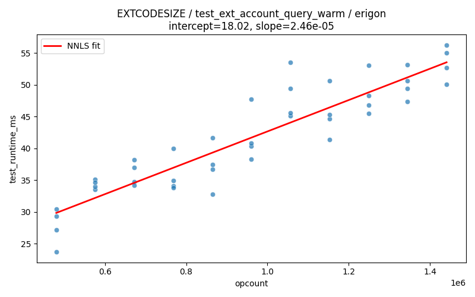

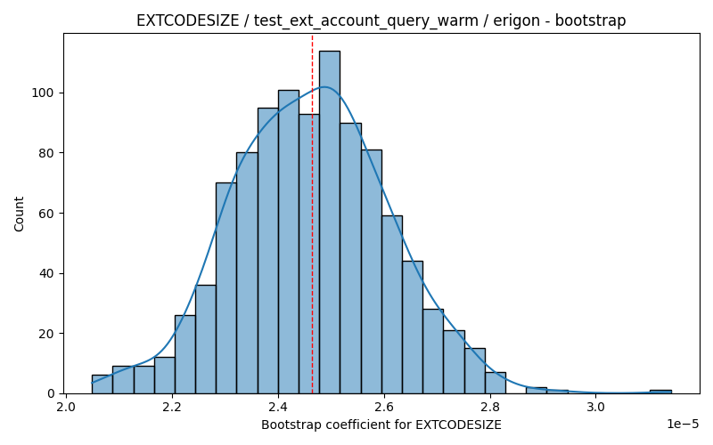

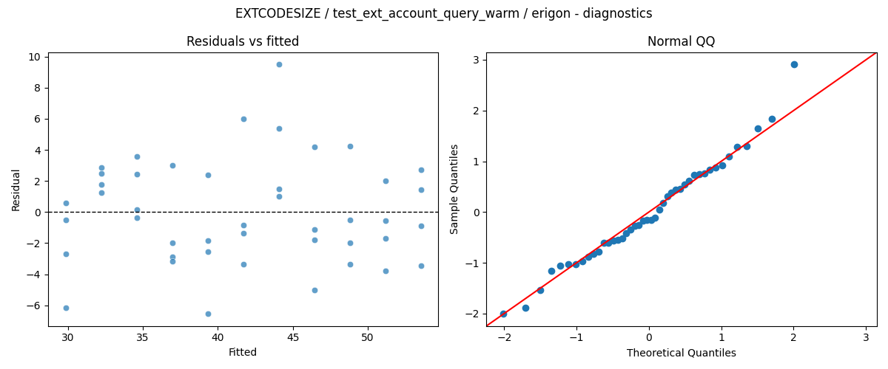

</details>

<details><summary>geth — NNLS regression summary</summary>

```
==============================================================================
                           NNLS Regression Results                            
==============================================================================
Dep. Variable:          test_runtime_ms              R-squared:          0.646
Model:                  NNLS                    Adj. R-squared:          0.641
No. Observations:       77                                RMSE:           7.03
Df Residuals:           75                                 MAE:           4.72
Df Model:               1      
==============================================================================
                      coef     std err     P-value      [0.025      0.975]
------------------------------------------------------------------------------
         const     11.8577      2.0821       0.001      7.7612     16.0155
       opcount      0.0000      0.0000       0.001      0.0000      0.0000
==============================================================================
Notes: Non-negative least squares with bootstrap inference (1000 iterations)
==============================================================================
```

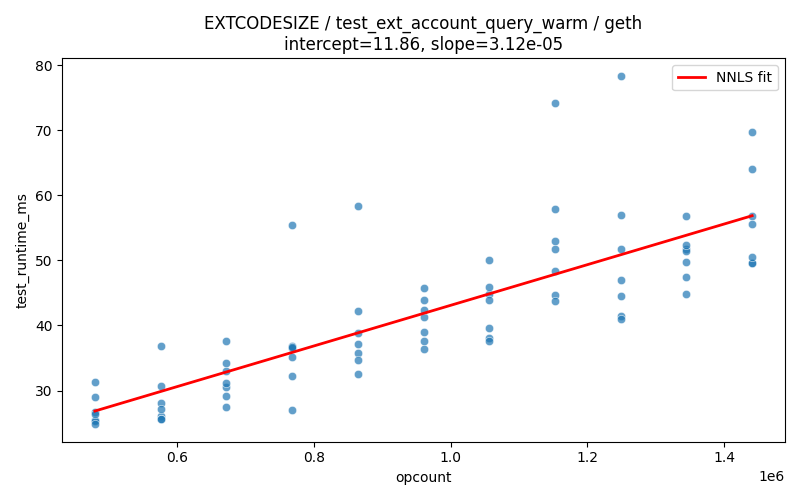

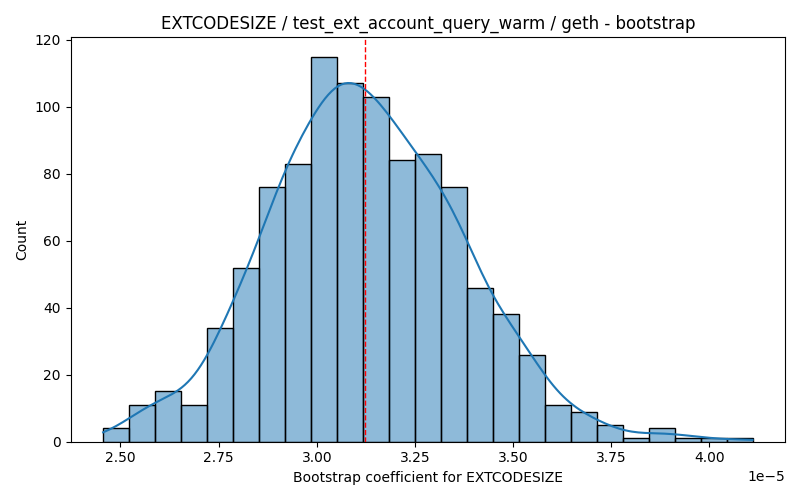

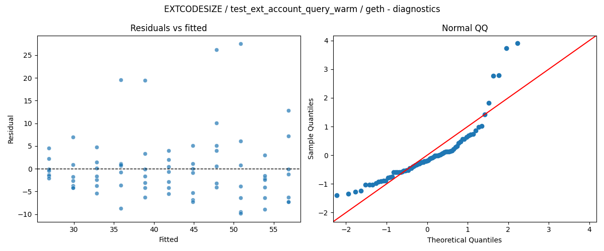

</details>

<details><summary>nethermind — NNLS regression summary</summary>

```
==============================================================================
                           NNLS Regression Results                            
==============================================================================
Dep. Variable:          test_runtime_ms              R-squared:          0.591
Model:                  NNLS                    Adj. R-squared:          0.584
No. Observations:       66                                RMSE:          57.17
Df Residuals:           64                                 MAE:          49.00
Df Model:               1      
==============================================================================
                      coef     std err     P-value      [0.025      0.975]
------------------------------------------------------------------------------
         const     87.7615     21.8359       0.001     45.4614    131.1834
       opcount      0.0002      0.0000       0.001      0.0002      0.0003
==============================================================================
Notes: Non-negative least squares with bootstrap inference (1000 iterations)
==============================================================================
```

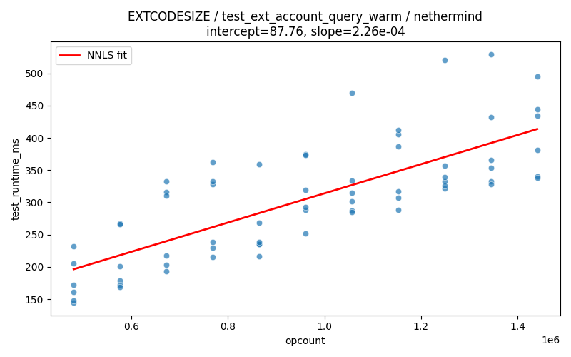

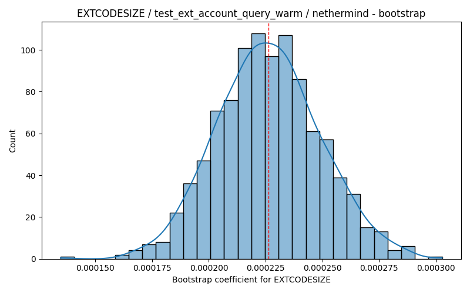

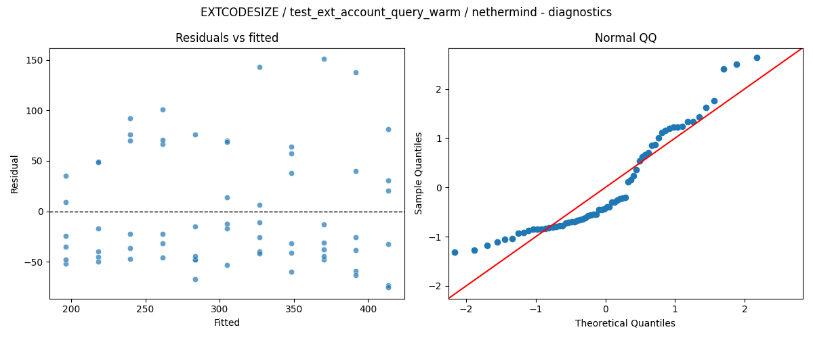

</details>

<details><summary>reth — NNLS regression summary</summary>

```
==============================================================================
                           NNLS Regression Results                            
==============================================================================
Dep. Variable:          test_runtime_ms              R-squared:          0.421
Model:                  NNLS                    Adj. R-squared:          0.408
No. Observations:       44                                RMSE:           4.01
Df Residuals:           42                                 MAE:           3.19
Df Model:               1      
==============================================================================
                      coef     std err     P-value      [0.025      0.975]
------------------------------------------------------------------------------
         const      5.9408      1.6091       0.001      2.8962      9.1575
       opcount      0.0000      0.0000       0.001      0.0000      0.0000
==============================================================================
Notes: Non-negative least squares with bootstrap inference (1000 iterations)
==============================================================================
```

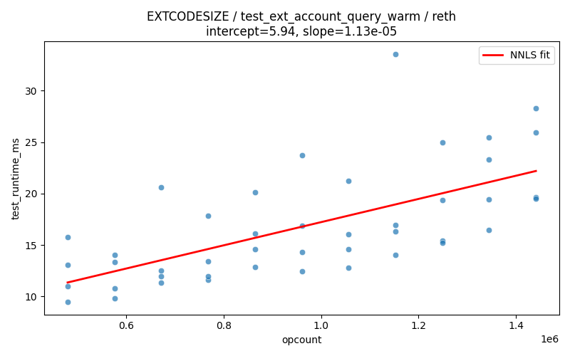

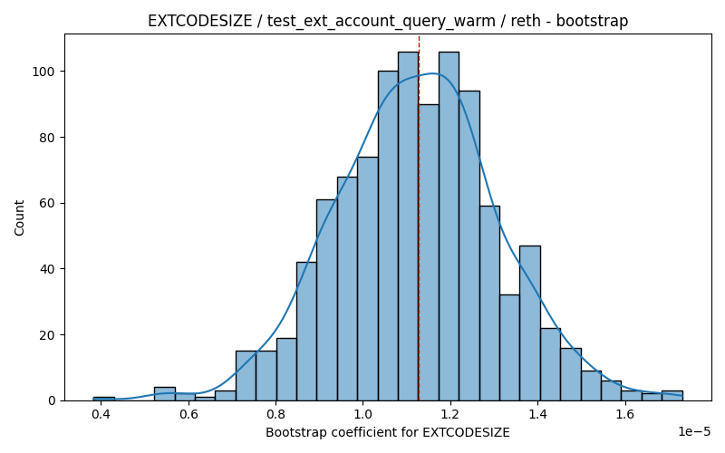

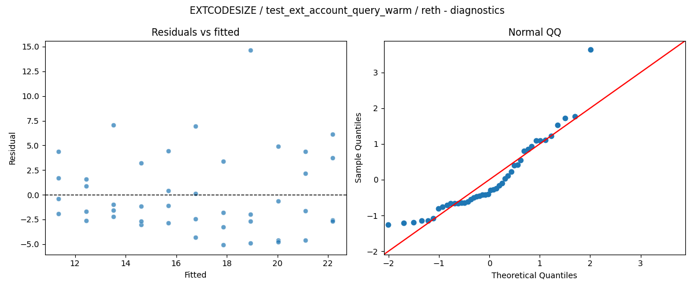

</details>

### test_account_access — combo `EXTCODESIZE_AccountMode.EXISTING_EOA`

| client | nobs | R² | target_coef (ms) | p-value | 95% CI |
| --- | --- | --- | --- | --- | --- |
| `besu` | 55 | 0.9892 | 0.01437 | 1.00e-03 | [0.01394, 0.01481] |
| `erigon` | 44 | 0.9966 | 0.008074 | 1.00e-03 | [0.008021, 0.00812] |
| `geth` | 77 | 0.9839 | 0.01095 | 1.00e-03 | [0.01063, 0.01128] |
| `nethermind` | 66 | 0.9198 | 0.003039 | 1.00e-03 | [0.002817, 0.003264] |
| `reth` | 44 | 0.9747 | 0.004074 | 1.00e-03 | [0.003897, 0.004241] |

<details><summary>besu — NNLS regression summary</summary>

```
==============================================================================
                           NNLS Regression Results                            
==============================================================================
Dep. Variable:          test_runtime_ms              R-squared:          0.989
Model:                  NNLS                    Adj. R-squared:          0.989
No. Observations:       55                                RMSE:          30.08
Df Residuals:           53                                 MAE:          23.70
Df Model:               1      
==============================================================================
                      coef     std err     P-value      [0.025      0.975]
------------------------------------------------------------------------------
         const    469.5720     13.7214       0.001    440.6912    495.2227
       opcount      0.0144      0.0002       0.001      0.0139      0.0148
==============================================================================
Notes: Non-negative least squares with bootstrap inference (1000 iterations)
==============================================================================
```


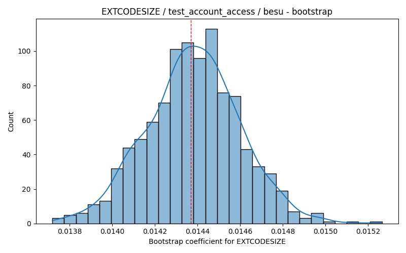

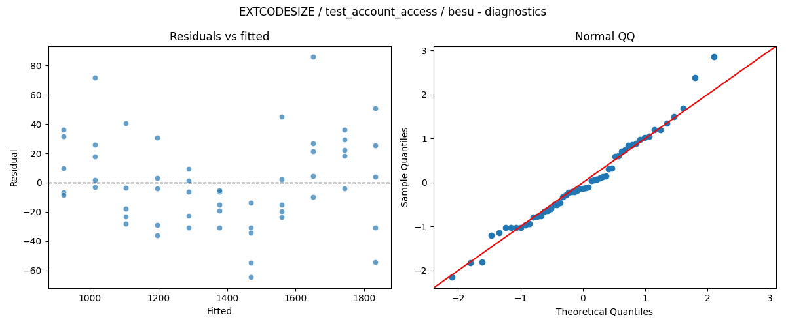

</details>

<details><summary>erigon — NNLS regression summary</summary>

```
==============================================================================
                           NNLS Regression Results                            
==============================================================================
Dep. Variable:          test_runtime_ms              R-squared:          0.997
Model:                  NNLS                    Adj. R-squared:          0.997
No. Observations:       44                                RMSE:           9.62
Df Residuals:           42                                 MAE:           8.34
Df Model:               1      
==============================================================================
                      coef     std err     P-value      [0.025      0.975]
------------------------------------------------------------------------------
         const      0.0000      0.0678       1.000      0.0000      0.0000
       opcount      0.0081      0.0000       0.001      0.0080      0.0081
==============================================================================
Notes: Non-negative least squares with bootstrap inference (1000 iterations)
==============================================================================
```

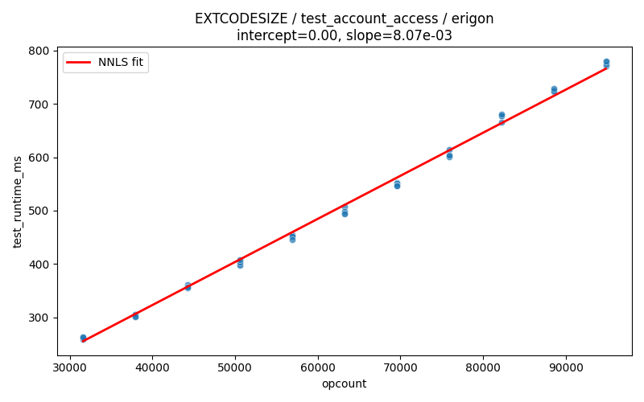

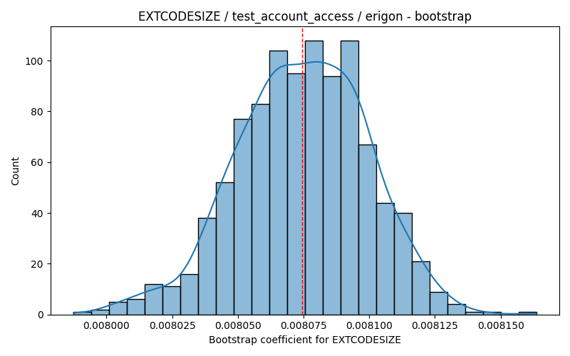

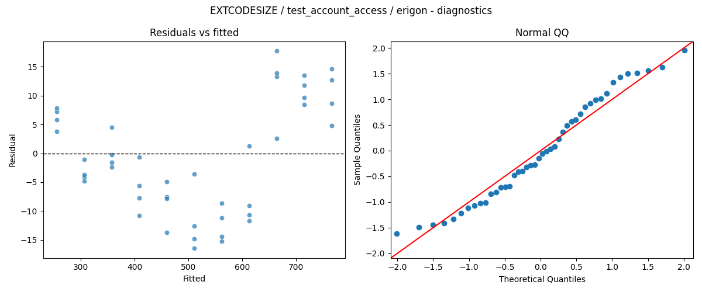

</details>

<details><summary>geth — NNLS regression summary</summary>

```
==============================================================================
                           NNLS Regression Results                            
==============================================================================
Dep. Variable:          test_runtime_ms              R-squared:          0.984
Model:                  NNLS                    Adj. R-squared:          0.984
No. Observations:       77                                RMSE:          28.05
Df Residuals:           75                                 MAE:          20.65
Df Model:               1      
==============================================================================
                      coef     std err     P-value      [0.025      0.975]
------------------------------------------------------------------------------
         const    235.9501      9.2581       0.001    218.1679    254.2779
       opcount      0.0110      0.0002       0.001      0.0106      0.0113
==============================================================================
Notes: Non-negative least squares with bootstrap inference (1000 iterations)
==============================================================================
```

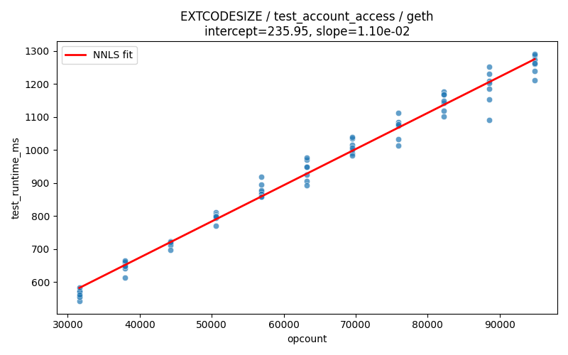

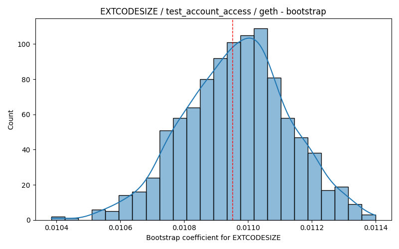

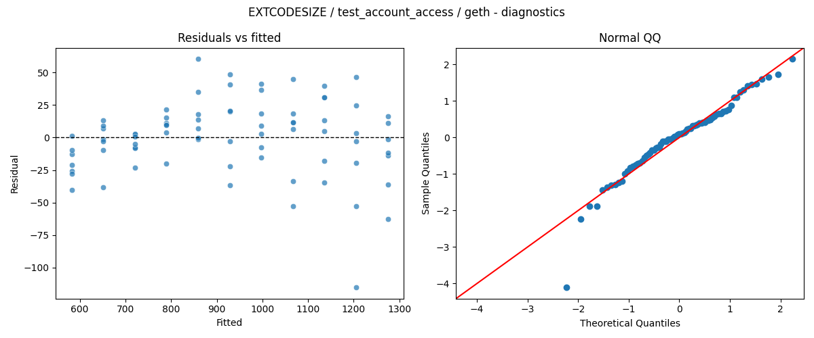

</details>

<details><summary>nethermind — NNLS regression summary</summary>

```
==============================================================================
                           NNLS Regression Results                            
==============================================================================
Dep. Variable:          test_runtime_ms              R-squared:          0.920
Model:                  NNLS                    Adj. R-squared:          0.919
No. Observations:       66                                RMSE:          17.94
Df Residuals:           64                                 MAE:          14.61
Df Model:               1      
==============================================================================
                      coef     std err     P-value      [0.025      0.975]
------------------------------------------------------------------------------
         const     99.9646      7.2840       0.001     85.8160    114.3363
       opcount      0.0030      0.0001       0.001      0.0028      0.0033
==============================================================================
Notes: Non-negative least squares with bootstrap inference (1000 iterations)
==============================================================================
```

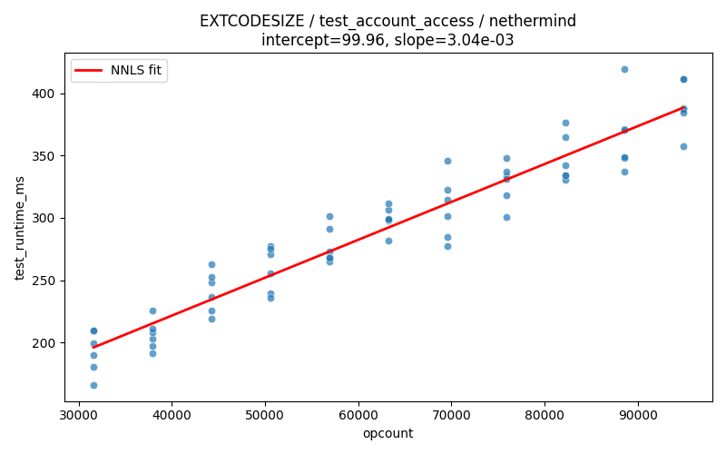

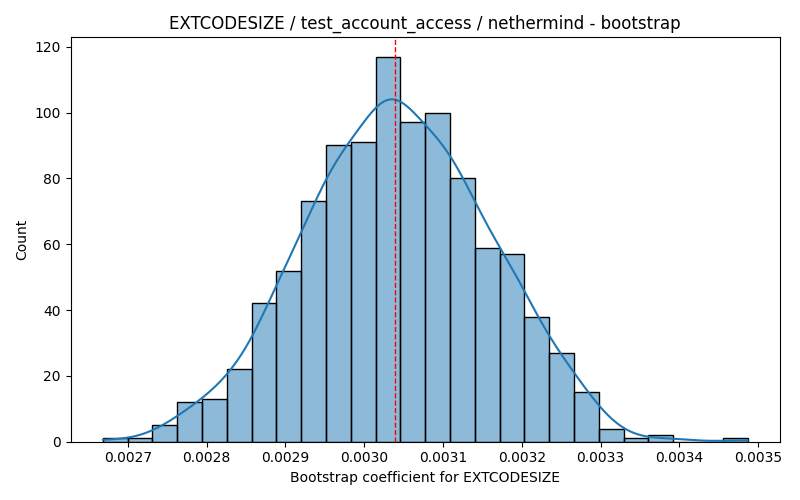

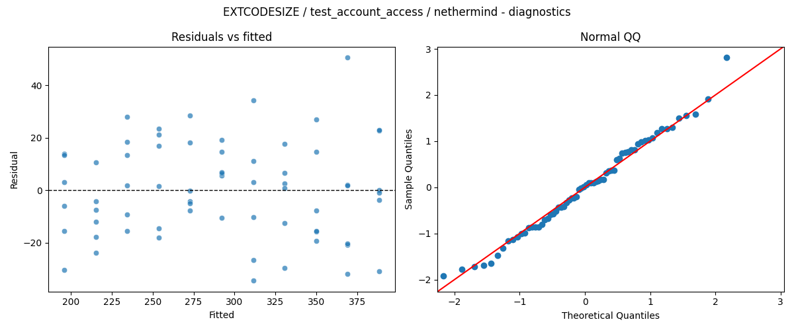

</details>

<details><summary>reth — NNLS regression summary</summary>

```
==============================================================================
                           NNLS Regression Results                            
==============================================================================
Dep. Variable:          test_runtime_ms              R-squared:          0.975
Model:                  NNLS                    Adj. R-squared:          0.974
No. Observations:       44                                RMSE:          13.12
Df Residuals:           42                                 MAE:          11.04
Df Model:               1      
==============================================================================
                      coef     std err     P-value      [0.025      0.975]
------------------------------------------------------------------------------
         const     80.4150      5.7255       0.001     69.7657     91.9042
       opcount      0.0041      0.0001       0.001      0.0039      0.0042
==============================================================================
Notes: Non-negative least squares with bootstrap inference (1000 iterations)
==============================================================================
```

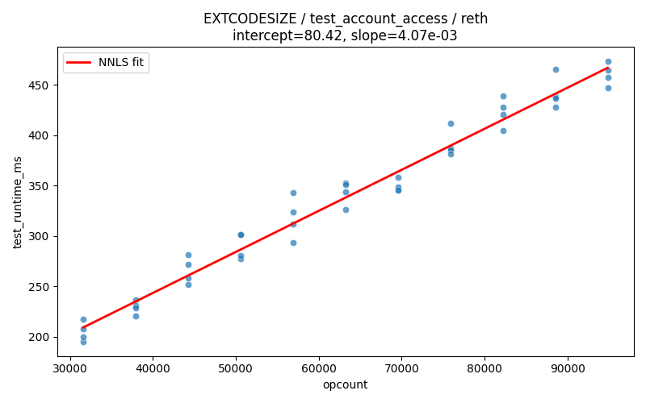

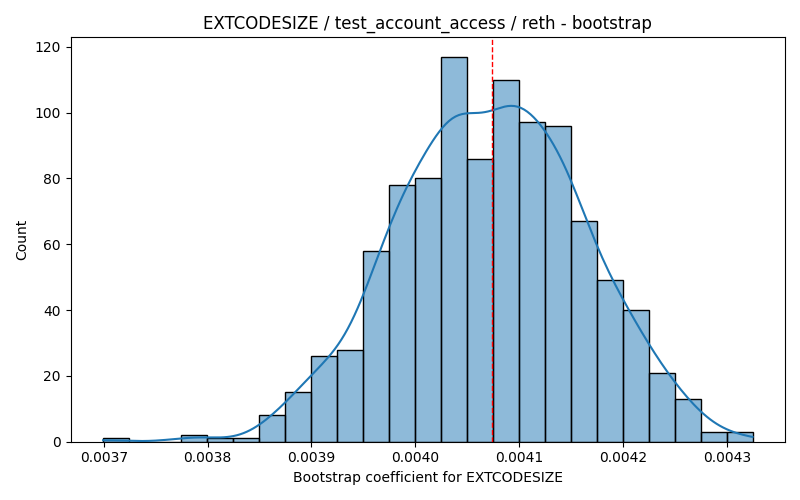

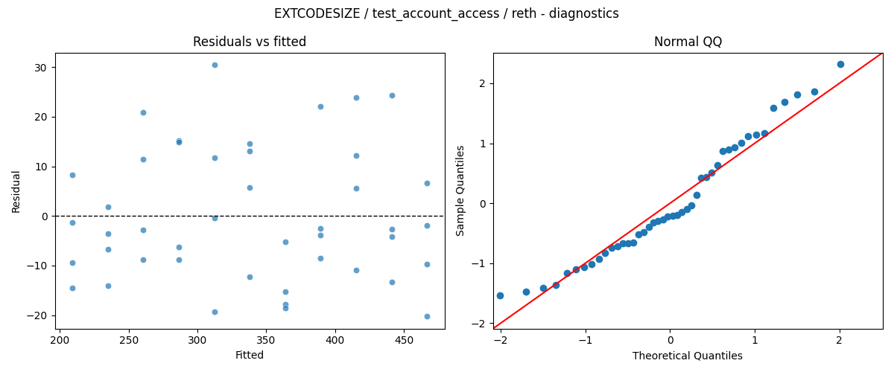

</details>

### test_account_access — combo `EXTCODESIZE_AccountMode.NON_EXISTING_ACCOUNT`

| client | nobs | R² | target_coef (ms) | p-value | 95% CI |
| --- | --- | --- | --- | --- | --- |
| `besu` | 55 | 0.9896 | 0.01469 | 1.00e-03 | [0.01429, 0.01519] |
| `erigon` | 44 | 0.9975 | 0.007915 | 1.00e-03 | [0.007871, 0.007954] |
| `geth` | 77 | 0.9753 | 0.02121 | 1.00e-03 | [0.02049, 0.02192] |
| `nethermind` | 66 | 0.9381 | 0.003087 | 1.00e-03 | [0.002895, 0.003284] |
| `reth` | 44 | 0.9657 | 0.004024 | 1.00e-03 | [0.003801, 0.004269] |

<details><summary>besu — NNLS regression summary</summary>

```
==============================================================================
                           NNLS Regression Results                            
==============================================================================
Dep. Variable:          test_runtime_ms              R-squared:          0.990
Model:                  NNLS                    Adj. R-squared:          0.989
No. Observations:       55                                RMSE:          30.11
Df Residuals:           53                                 MAE:          24.92
Df Model:               1      
==============================================================================
                      coef     std err     P-value      [0.025      0.975]
------------------------------------------------------------------------------
         const    124.1324     13.0151       0.001     94.5866    147.2741
       opcount      0.0147      0.0002       0.001      0.0143      0.0152
==============================================================================
Notes: Non-negative least squares with bootstrap inference (1000 iterations)
==============================================================================
```

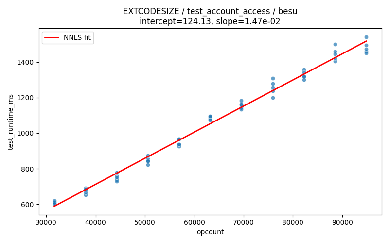

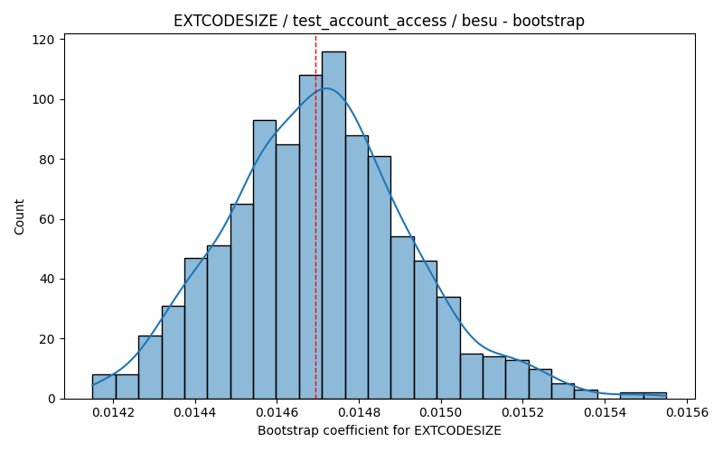

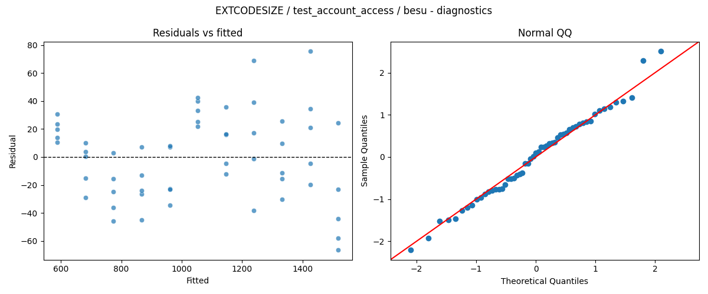

</details>

<details><summary>erigon — NNLS regression summary</summary>

```
==============================================================================
                           NNLS Regression Results                            
==============================================================================
Dep. Variable:          test_runtime_ms              R-squared:          0.998
Model:                  NNLS                    Adj. R-squared:          0.997
No. Observations:       44                                RMSE:           8.05
Df Residuals:           42                                 MAE:           6.77
Df Model:               1      
==============================================================================
                      coef     std err     P-value      [0.025      0.975]
------------------------------------------------------------------------------
         const      0.0000      0.0000       1.000      0.0000      0.0000
       opcount      0.0079      0.0000       0.001      0.0079      0.0080
==============================================================================
Notes: Non-negative least squares with bootstrap inference (1000 iterations)
==============================================================================
```


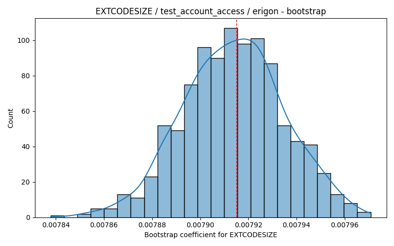

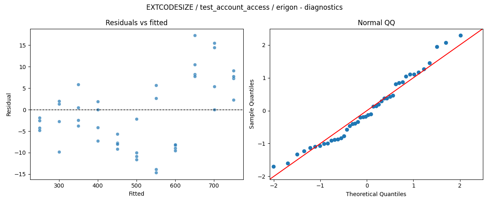

</details>

<details><summary>geth — NNLS regression summary</summary>

```
==============================================================================
                           NNLS Regression Results                            
==============================================================================
Dep. Variable:          test_runtime_ms              R-squared:          0.975
Model:                  NNLS                    Adj. R-squared:          0.975
No. Observations:       77                                RMSE:          67.48
Df Residuals:           75                                 MAE:          56.01
Df Model:               1      
==============================================================================
                      coef     std err     P-value      [0.025      0.975]
------------------------------------------------------------------------------
         const    293.8703     20.8368       0.001    253.8405    333.2793
       opcount      0.0212      0.0004       0.001      0.0205      0.0219
==============================================================================
Notes: Non-negative least squares with bootstrap inference (1000 iterations)
==============================================================================
```

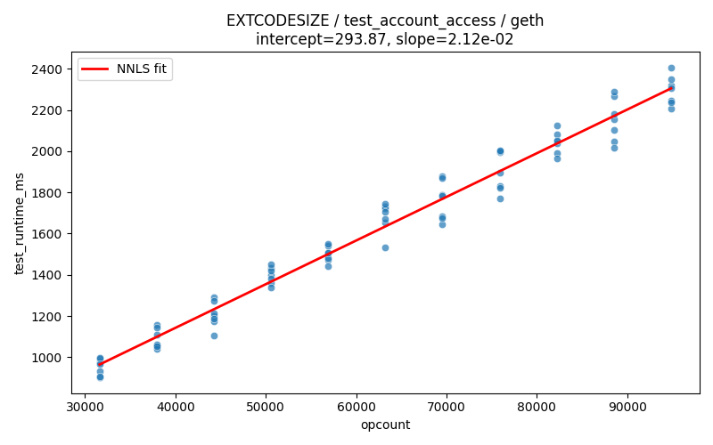

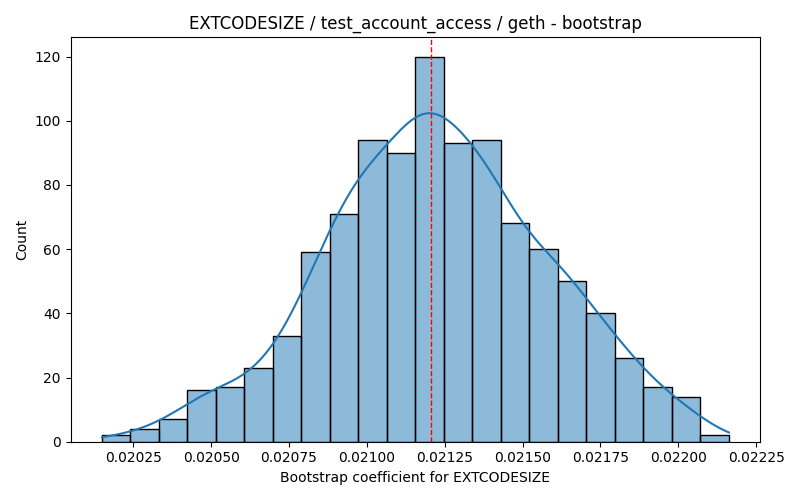

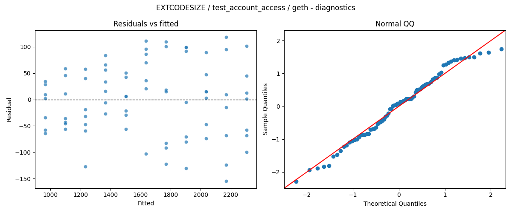

</details>

<details><summary>nethermind — NNLS regression summary</summary>

```
==============================================================================
                           NNLS Regression Results                            
==============================================================================
Dep. Variable:          test_runtime_ms              R-squared:          0.938
Model:                  NNLS                    Adj. R-squared:          0.937
No. Observations:       66                                RMSE:          15.85
Df Residuals:           64                                 MAE:          13.19
Df Model:               1      
==============================================================================
                      coef     std err     P-value      [0.025      0.975]
------------------------------------------------------------------------------
         const     62.1734      5.5234       0.001     50.9354     73.2571
       opcount      0.0031      0.0001       0.001      0.0029      0.0033
==============================================================================
Notes: Non-negative least squares with bootstrap inference (1000 iterations)
==============================================================================
```

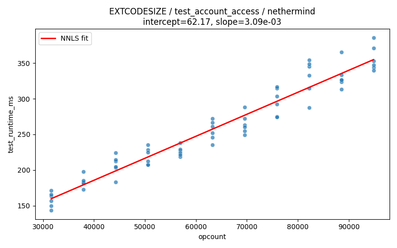

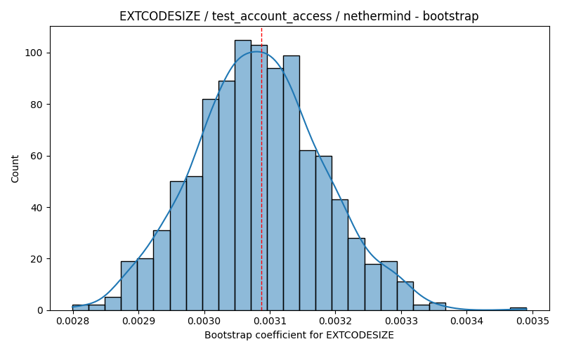

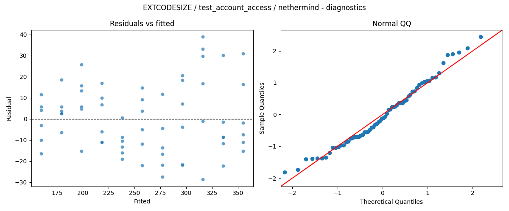

</details>

<details><summary>reth — NNLS regression summary</summary>

```
==============================================================================
                           NNLS Regression Results                            
==============================================================================
Dep. Variable:          test_runtime_ms              R-squared:          0.966
Model:                  NNLS                    Adj. R-squared:          0.965
No. Observations:       44                                RMSE:          15.17
Df Residuals:           42                                 MAE:          12.33
Df Model:               1      
==============================================================================
                      coef     std err     P-value      [0.025      0.975]
------------------------------------------------------------------------------
         const     83.4527      6.8184       0.001     70.0716     97.0064
       opcount      0.0040      0.0001       0.001      0.0038      0.0043
==============================================================================
Notes: Non-negative least squares with bootstrap inference (1000 iterations)
==============================================================================
```

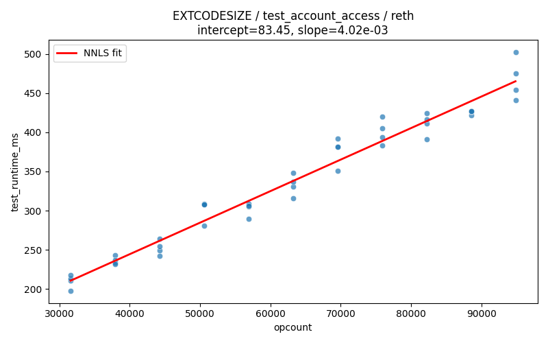

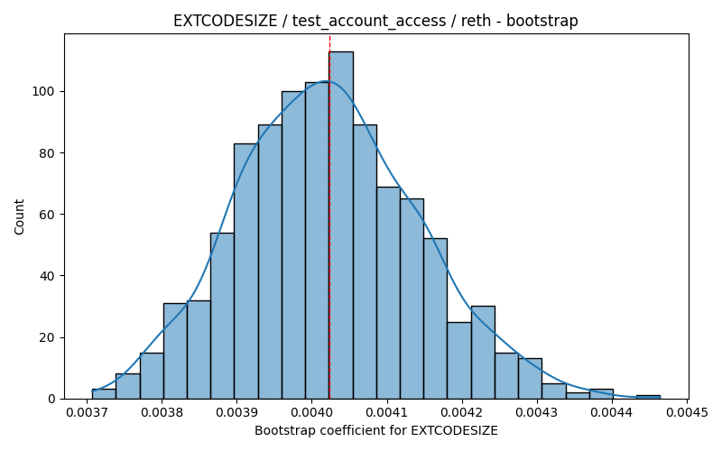

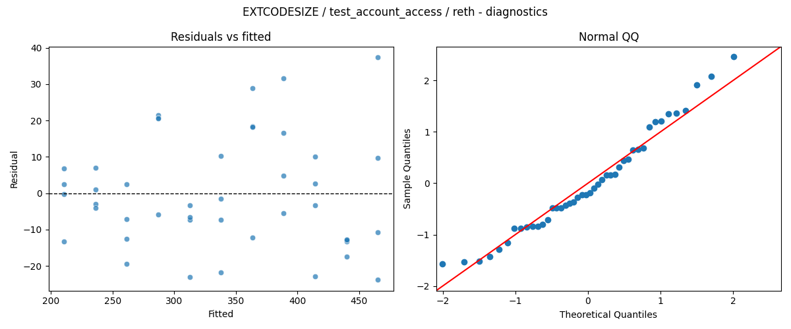

</details>

### test_account_access — combo `EXTCODESIZE_AccountMode.EXISTING_CONTRACT_DIFF_MAX`

| client | nobs | R² | target_coef (ms) | p-value | 95% CI |
| --- | --- | --- | --- | --- | --- |
| `besu` | 55 | 0.984 | 0.01947 | 1.00e-03 | [0.01888, 0.02007] |
| `erigon` | 44 | 0.9286 | 0.03516 | 1.00e-03 | [0.03217, 0.03773] |
| `geth` | 77 | 0.9382 | 0.02131 | 1.00e-03 | [0.01989, 0.02266] |
| `nethermind` | 66 | 0.9059 | 0.01497 | 1.00e-03 | [0.01353, 0.01632] |
| `reth` | 44 | 0.9988 | 0.02025 | 1.00e-03 | [0.02003, 0.02046] |

<details><summary>besu — NNLS regression summary</summary>

```
==============================================================================
                           NNLS Regression Results                            
==============================================================================
Dep. Variable:          test_runtime_ms              R-squared:          0.984
Model:                  NNLS                    Adj. R-squared:          0.984
No. Observations:       55                                RMSE:          48.84
Df Residuals:           53                                 MAE:          39.07
Df Model:               1      
==============================================================================
                      coef     std err     P-value      [0.025      0.975]
------------------------------------------------------------------------------
         const    432.7314     19.8004       0.001    394.1056    472.8065
       opcount      0.0195      0.0003       0.001      0.0189      0.0201
==============================================================================
Notes: Non-negative least squares with bootstrap inference (1000 iterations)
==============================================================================
```


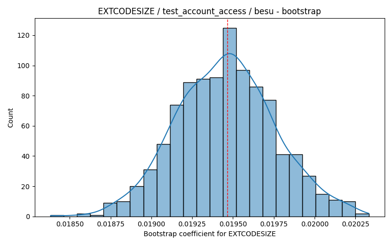

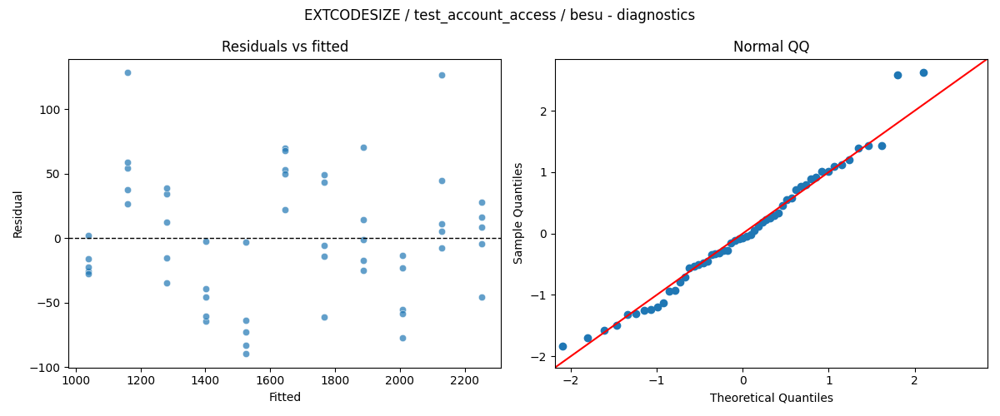

</details>

<details><summary>erigon — NNLS regression summary</summary>

```
==============================================================================
                           NNLS Regression Results                            
==============================================================================
Dep. Variable:          test_runtime_ms              R-squared:          0.929
Model:                  NNLS                    Adj. R-squared:          0.927
No. Observations:       44                                RMSE:         191.98
Df Residuals:           42                                 MAE:         164.08
Df Model:               1      
==============================================================================
                      coef     std err     P-value      [0.025      0.975]
------------------------------------------------------------------------------
         const    255.9371     93.8148       0.001     94.6283    463.1368
       opcount      0.0352      0.0014       0.001      0.0322      0.0377
==============================================================================
Notes: Non-negative least squares with bootstrap inference (1000 iterations)
==============================================================================
```

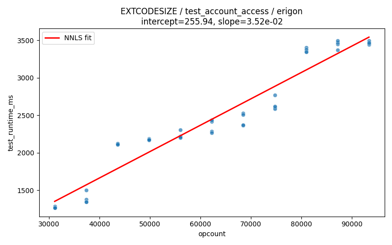

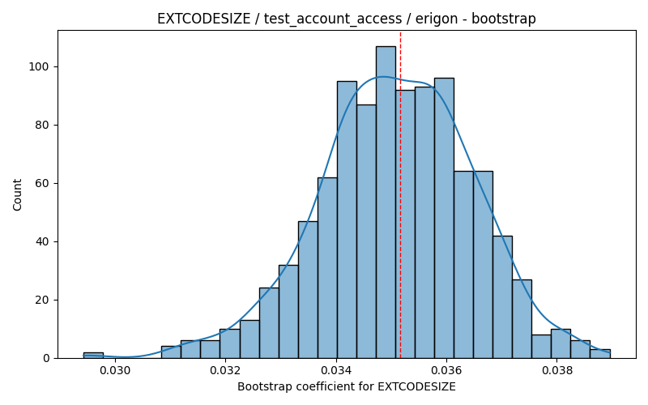

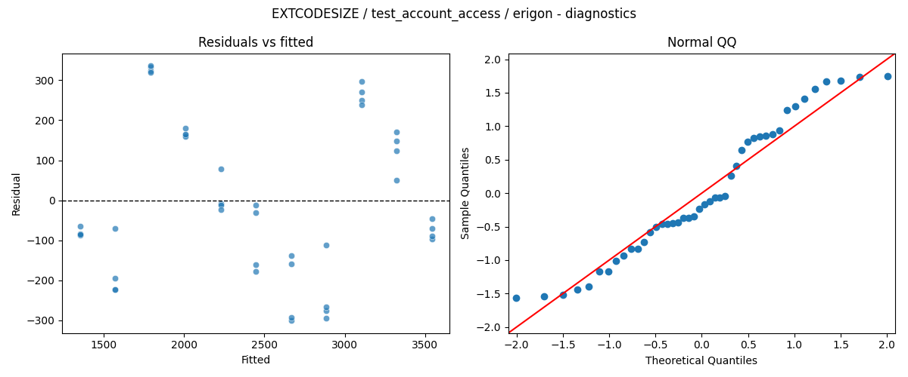

</details>

<details><summary>geth — NNLS regression summary</summary>

```
==============================================================================
                           NNLS Regression Results                            
==============================================================================
Dep. Variable:          test_runtime_ms              R-squared:          0.938
Model:                  NNLS                    Adj. R-squared:          0.937
No. Observations:       77                                RMSE:         107.71
Df Residuals:           75                                 MAE:          88.86
Df Model:               1      
==============================================================================
                      coef     std err     P-value      [0.025      0.975]
------------------------------------------------------------------------------
         const    426.7701     47.7112       0.001    341.9279    516.2820
       opcount      0.0213      0.0007       0.001      0.0199      0.0227
==============================================================================
Notes: Non-negative least squares with bootstrap inference (1000 iterations)
==============================================================================
```

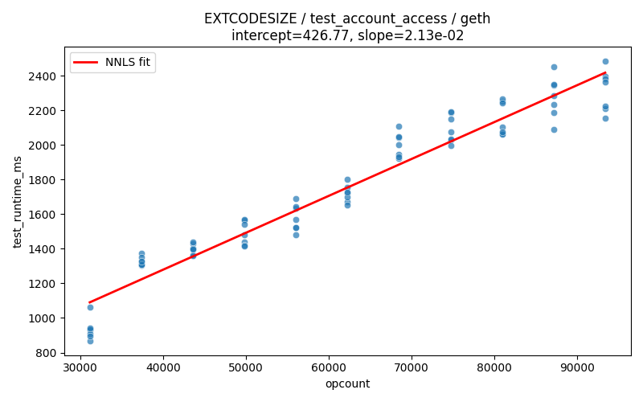

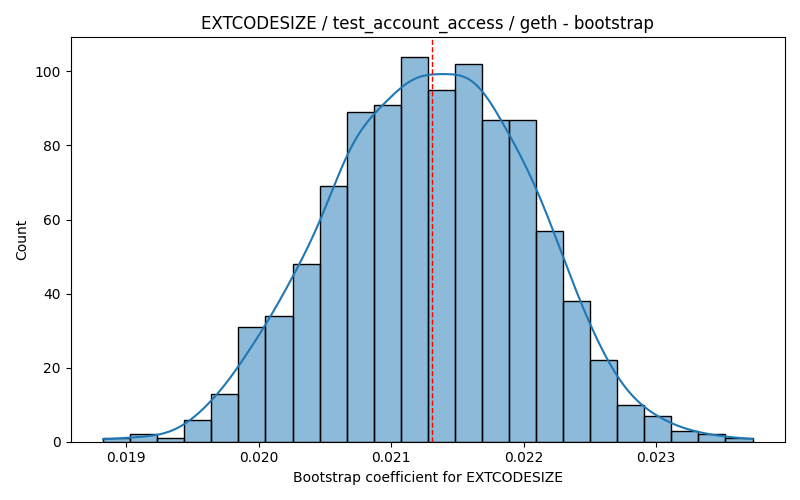

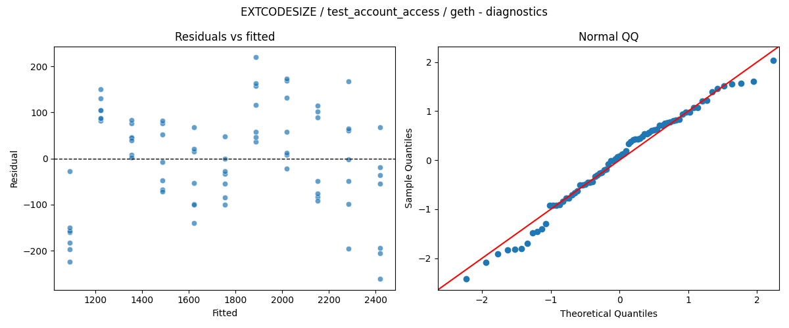

</details>

<details><summary>nethermind — NNLS regression summary</summary>

```
==============================================================================
                           NNLS Regression Results                            
==============================================================================
Dep. Variable:          test_runtime_ms              R-squared:          0.906
Model:                  NNLS                    Adj. R-squared:          0.904
No. Observations:       66                                RMSE:          95.02
Df Residuals:           64                                 MAE:          78.18
Df Model:               1      
==============================================================================
                      coef     std err     P-value      [0.025      0.975]
------------------------------------------------------------------------------
         const    603.8165     52.3616       0.001    505.6022    708.8712
       opcount      0.0150      0.0007       0.001      0.0135      0.0163
==============================================================================
Notes: Non-negative least squares with bootstrap inference (1000 iterations)
==============================================================================
```

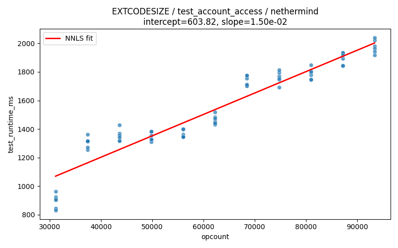

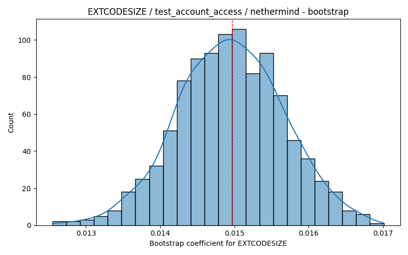

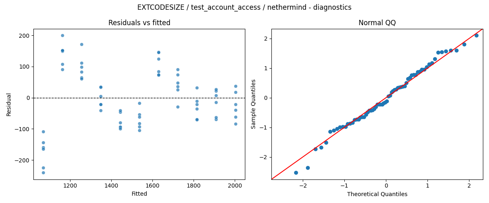

</details>

<details><summary>reth — NNLS regression summary</summary>

```
==============================================================================
                           NNLS Regression Results                            
==============================================================================
Dep. Variable:          test_runtime_ms              R-squared:          0.999
Model:                  NNLS                    Adj. R-squared:          0.999
No. Observations:       44                                RMSE:          14.04
Df Residuals:           42                                 MAE:          10.98
Df Model:               1      
==============================================================================
                      coef     std err     P-value      [0.025      0.975]
------------------------------------------------------------------------------
         const    105.8081      5.9095       0.001     93.8608    117.0462
       opcount      0.0202      0.0001       0.001      0.0200      0.0205
==============================================================================
Notes: Non-negative least squares with bootstrap inference (1000 iterations)
==============================================================================
```

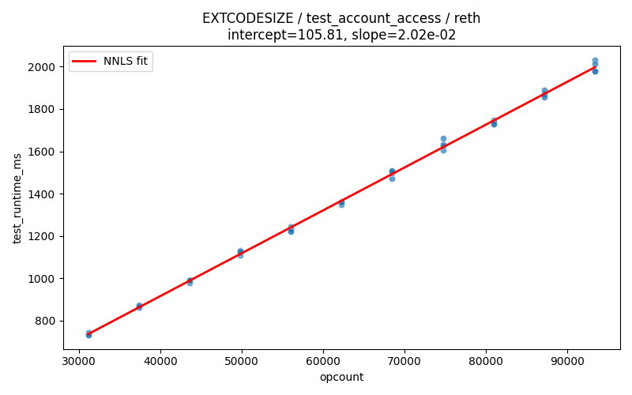

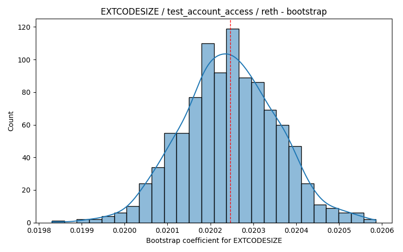

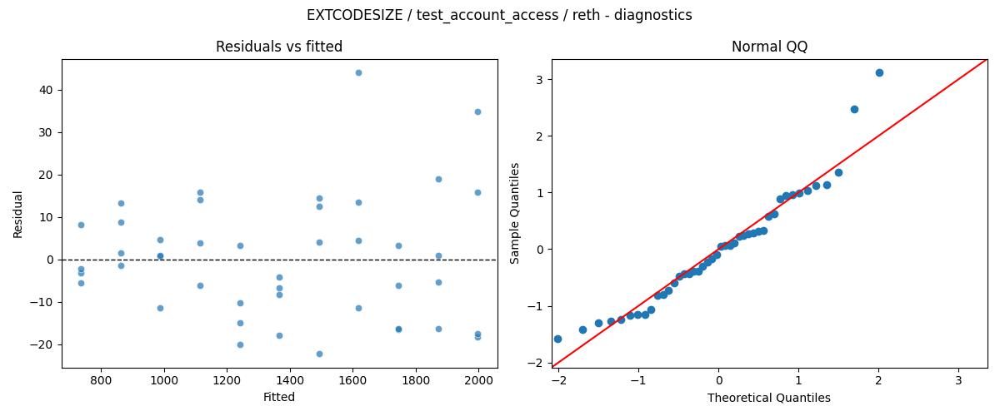

</details>

### test_account_access — combo `EXTCODESIZE_AccountMode.EXISTING_CONTRACT_MINIMAL`

| client | nobs | R² | target_coef (ms) | p-value | 95% CI |
| --- | --- | --- | --- | --- | --- |
| `besu` | 55 | 0.9806 | 0.01189 | 1.00e-03 | [0.01133, 0.01241] |
| `erigon` | 44 | 0.9949 | 0.00789 | 1.00e-03 | [0.007724, 0.008056] |
| `geth` | 77 | 0.9512 | 0.004785 | 1.00e-03 | [0.004565, 0.005033] |
| `nethermind` | 66 | 0.8301 | 0.001849 | 1.00e-03 | [0.001652, 0.002041] |
| `reth` | 44 | 0.9713 | 0.003946 | 1.00e-03 | [0.00372, 0.004147] |

<details><summary>besu — NNLS regression summary</summary>

```
==============================================================================
                           NNLS Regression Results                            
==============================================================================
Dep. Variable:          test_runtime_ms              R-squared:          0.981
Model:                  NNLS                    Adj. R-squared:          0.980
No. Observations:       55                                RMSE:          32.93
Df Residuals:           53                                 MAE:          26.45
Df Model:               1      
==============================================================================
                      coef     std err     P-value      [0.025      0.975]
------------------------------------------------------------------------------
         const    377.0194     15.8435       0.001    347.8331    411.3958
       opcount      0.0119      0.0003       0.001      0.0113      0.0124
==============================================================================
Notes: Non-negative least squares with bootstrap inference (1000 iterations)
==============================================================================
```

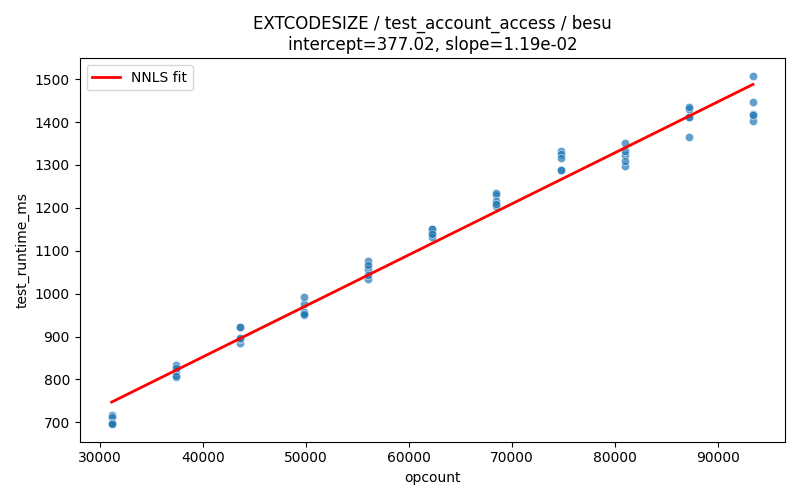

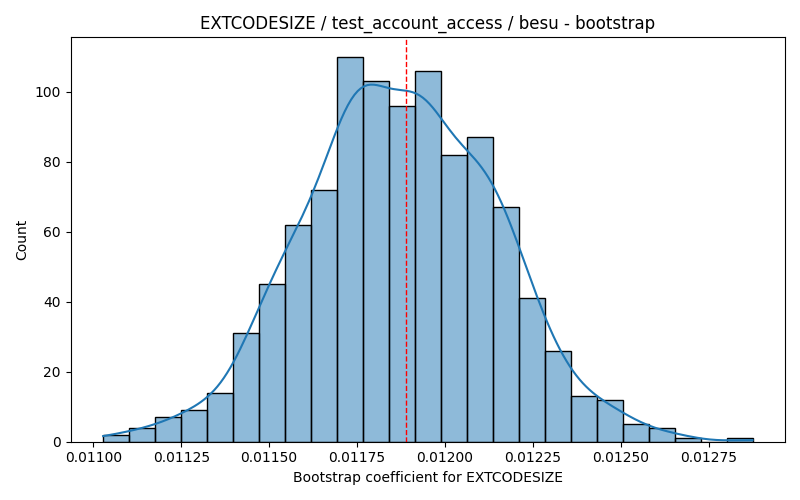

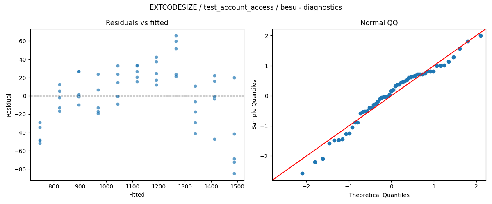

</details>

<details><summary>erigon — NNLS regression summary</summary>

```
==============================================================================
                           NNLS Regression Results                            
==============================================================================
Dep. Variable:          test_runtime_ms              R-squared:          0.995
Model:                  NNLS                    Adj. R-squared:          0.995
No. Observations:       44                                RMSE:          11.12
Df Residuals:           42                                 MAE:           9.61
Df Model:               1      
==============================================================================
                      coef     std err     P-value      [0.025      0.975]
------------------------------------------------------------------------------
         const    104.1344      5.4157       0.001     92.7979    113.9292
       opcount      0.0079      0.0001       0.001      0.0077      0.0081
==============================================================================
Notes: Non-negative least squares with bootstrap inference (1000 iterations)
==============================================================================
```


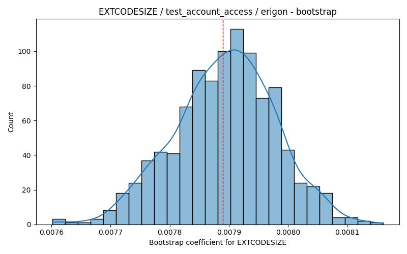

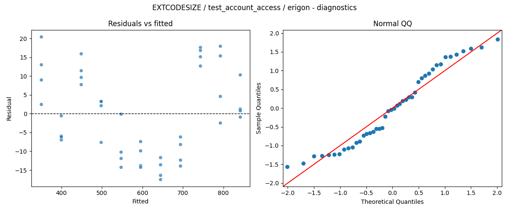

</details>

<details><summary>geth — NNLS regression summary</summary>

```
==============================================================================
                           NNLS Regression Results                            
==============================================================================
Dep. Variable:          test_runtime_ms              R-squared:          0.951
Model:                  NNLS                    Adj. R-squared:          0.951
No. Observations:       77                                RMSE:          21.34
Df Residuals:           75                                 MAE:          16.58
Df Model:               1      
==============================================================================
                      coef     std err     P-value      [0.025      0.975]
------------------------------------------------------------------------------
         const     74.5149      7.3922       0.001     60.5279     88.9628
       opcount      0.0048      0.0001       0.001      0.0046      0.0050
==============================================================================
Notes: Non-negative least squares with bootstrap inference (1000 iterations)
==============================================================================
```

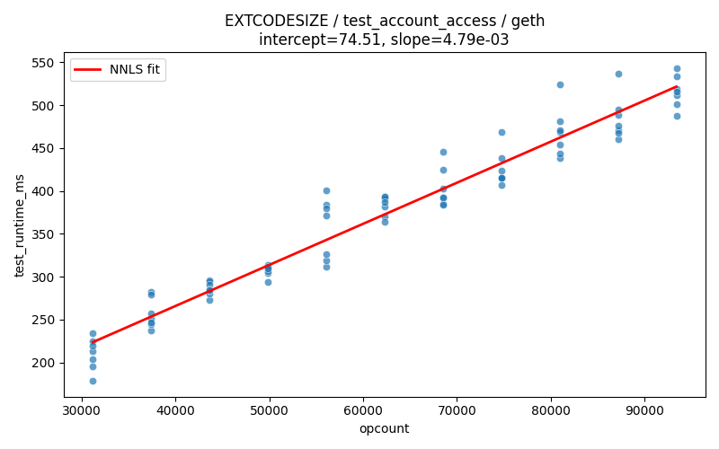

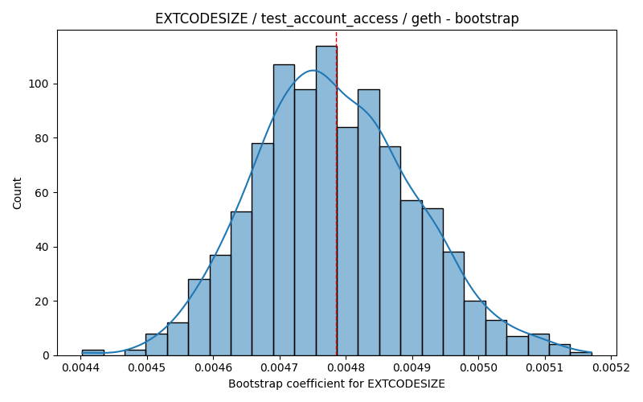

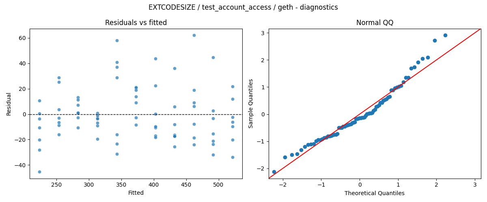

</details>

<details><summary>nethermind — NNLS regression summary</summary>

```
==============================================================================
                           NNLS Regression Results                            
==============================================================================
Dep. Variable:          test_runtime_ms              R-squared:          0.830
Model:                  NNLS                    Adj. R-squared:          0.827
No. Observations:       66                                RMSE:          16.48
Df Residuals:           64                                 MAE:          13.02
Df Model:               1      
==============================================================================
                      coef     std err     P-value      [0.025      0.975]
------------------------------------------------------------------------------
         const     93.6487      6.6068       0.001     81.5525    106.2883
       opcount      0.0018      0.0001       0.001      0.0017      0.0020
==============================================================================
Notes: Non-negative least squares with bootstrap inference (1000 iterations)
==============================================================================
```

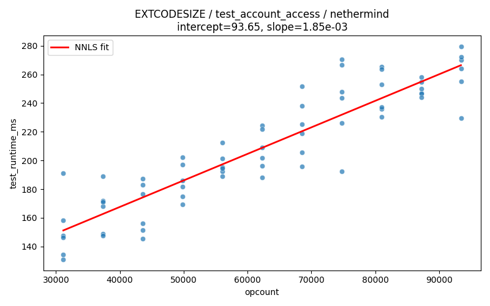

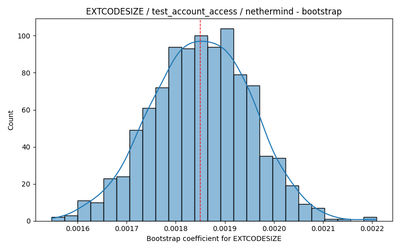

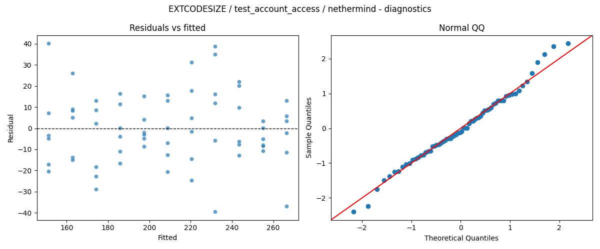

</details>

<details><summary>reth — NNLS regression summary</summary>

```
==============================================================================
                           NNLS Regression Results                            
==============================================================================
Dep. Variable:          test_runtime_ms              R-squared:          0.971
Model:                  NNLS                    Adj. R-squared:          0.971
No. Observations:       44                                RMSE:          13.36
Df Residuals:           42                                 MAE:          10.33
Df Model:               1      
==============================================================================
                      coef     std err     P-value      [0.025      0.975]
------------------------------------------------------------------------------
         const     67.1639      6.1300       0.001     56.5627     79.2039
       opcount      0.0039      0.0001       0.001      0.0037      0.0041
==============================================================================
Notes: Non-negative least squares with bootstrap inference (1000 iterations)
==============================================================================
```

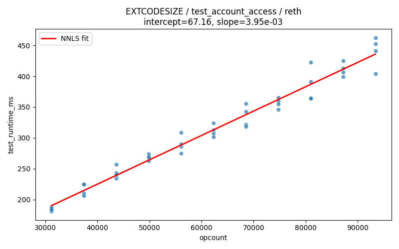

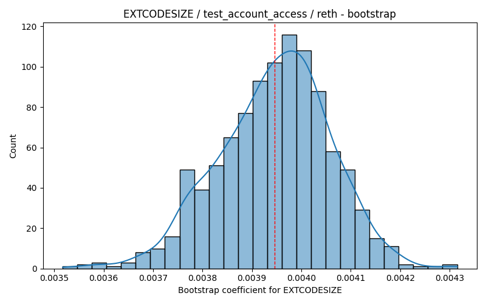

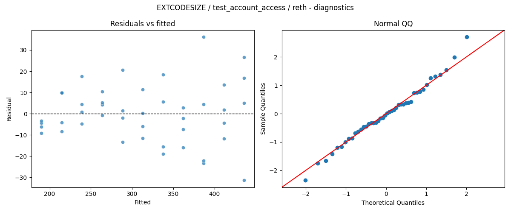

</details>

### test_account_access — combo `EXTCODESIZE_AccountMode.EXISTING_CONTRACT_SAME_MAX`

| client | nobs | R² | target_coef (ms) | p-value | 95% CI |
| --- | --- | --- | --- | --- | --- |
| `besu` | 55 | 0.968 | 0.01079 | 1.00e-03 | [0.01023, 0.01137] |
| `erigon` | 44 | 0.9932 | 0.008124 | 1.00e-03 | [0.00793, 0.008331] |
| `geth` | 77 | 0.963 | 0.004849 | 1.00e-03 | [0.004614, 0.005086] |
| `nethermind` | 66 | 0.7828 | 0.001783 | 1.00e-03 | [0.001572, 0.002004] |
| `reth` | 44 | 0.971 | 0.003903 | 1.00e-03 | [0.003678, 0.004118] |

<details><summary>besu — NNLS regression summary</summary>

```
==============================================================================
                           NNLS Regression Results                            
==============================================================================
Dep. Variable:          test_runtime_ms              R-squared:          0.968
Model:                  NNLS                    Adj. R-squared:          0.967
No. Observations:       55                                RMSE:          38.62
Df Residuals:           53                                 MAE:          27.67
Df Model:               1      
==============================================================================
                      coef     std err     P-value      [0.025      0.975]
------------------------------------------------------------------------------
         const    418.4513     19.0785       0.001    385.7830    459.1291
       opcount      0.0108      0.0003       0.001      0.0102      0.0114
==============================================================================
Notes: Non-negative least squares with bootstrap inference (1000 iterations)
==============================================================================
```

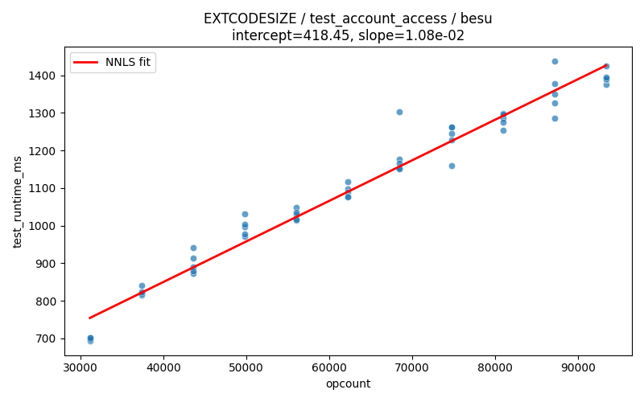

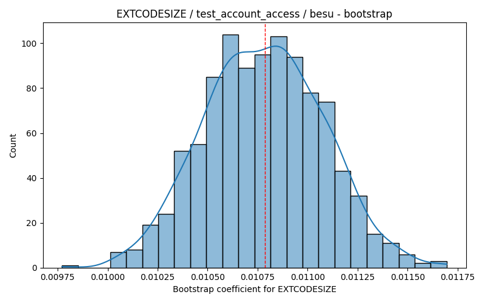

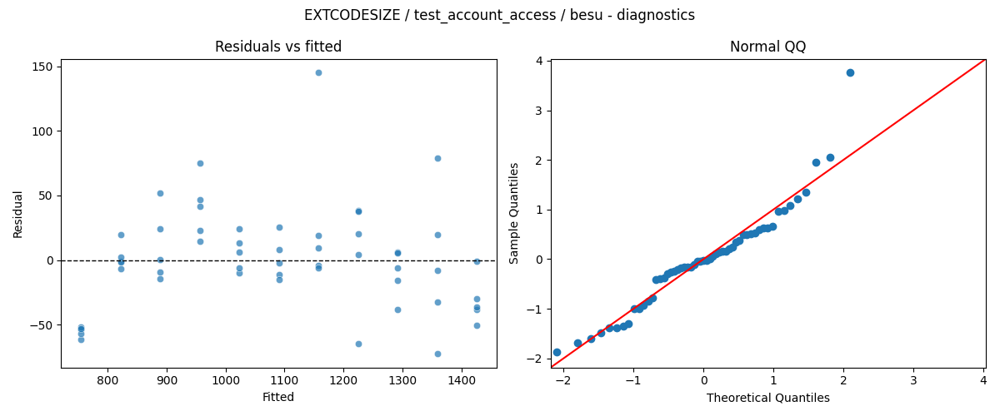

</details>

<details><summary>erigon — NNLS regression summary</summary>

```
==============================================================================
                           NNLS Regression Results                            
==============================================================================
Dep. Variable:          test_runtime_ms              R-squared:          0.993
Model:                  NNLS                    Adj. R-squared:          0.993
No. Observations:       44                                RMSE:          13.27
Df Residuals:           42                                 MAE:          11.43
Df Model:               1      
==============================================================================
                      coef     std err     P-value      [0.025      0.975]
------------------------------------------------------------------------------
         const     88.5933      6.4324       0.001     74.8153     99.5839
       opcount      0.0081      0.0001       0.001      0.0079      0.0083
==============================================================================
Notes: Non-negative least squares with bootstrap inference (1000 iterations)
==============================================================================
```


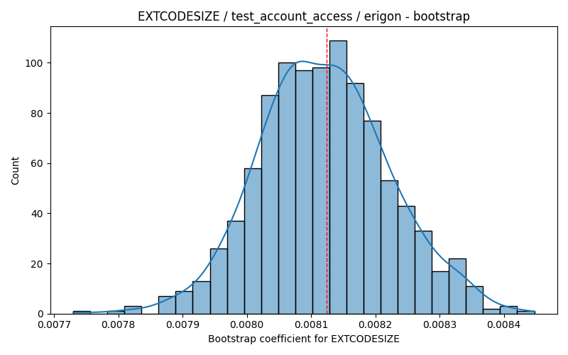

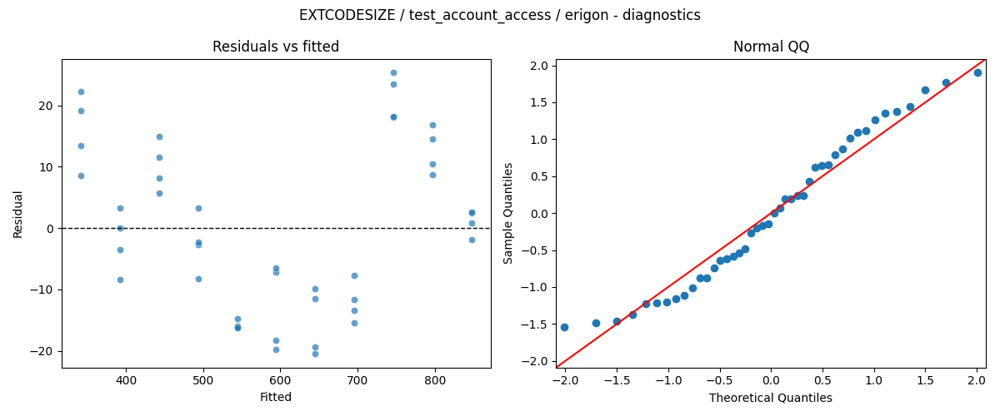

</details>

<details><summary>geth — NNLS regression summary</summary>

```
==============================================================================
                           NNLS Regression Results                            
==============================================================================
Dep. Variable:          test_runtime_ms              R-squared:          0.963
Model:                  NNLS                    Adj. R-squared:          0.962
No. Observations:       77                                RMSE:          18.73
Df Residuals:           75                                 MAE:          14.89
Df Model:               1      
==============================================================================
                      coef     std err     P-value      [0.025      0.975]
------------------------------------------------------------------------------
         const     68.1129      6.9236       0.001     54.5745     81.4372
       opcount      0.0048      0.0001       0.001      0.0046      0.0051
==============================================================================
Notes: Non-negative least squares with bootstrap inference (1000 iterations)
==============================================================================
```

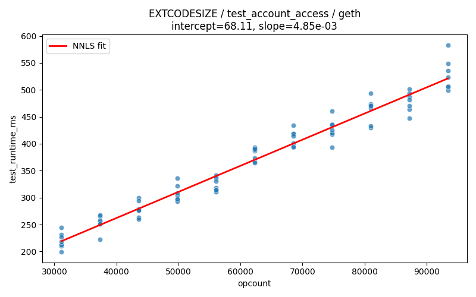

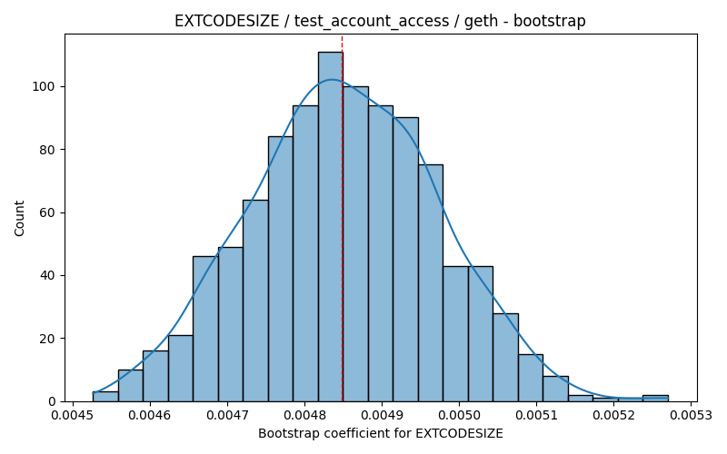

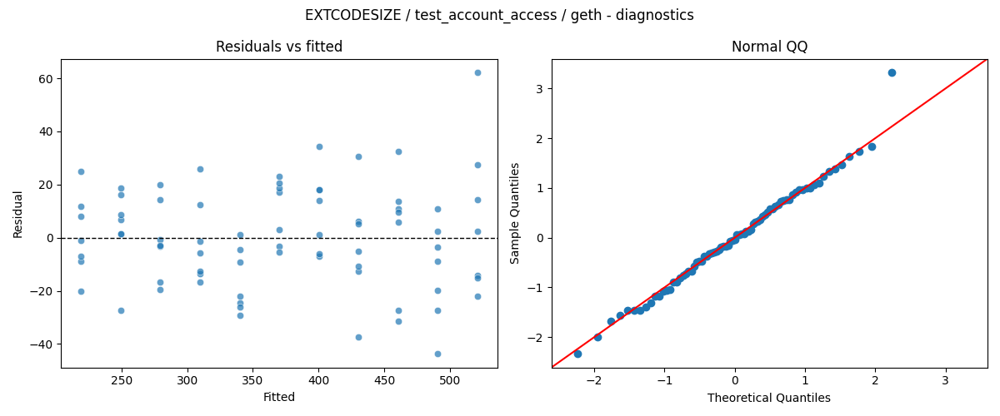

</details>

<details><summary>nethermind — NNLS regression summary</summary>

```
==============================================================================
                           NNLS Regression Results                            
==============================================================================
Dep. Variable:          test_runtime_ms              R-squared:          0.783
Model:                  NNLS                    Adj. R-squared:          0.779
No. Observations:       66                                RMSE:          18.49
Df Residuals:           64                                 MAE:          14.92
Df Model:               1      
==============================================================================
                      coef     std err     P-value      [0.025      0.975]
------------------------------------------------------------------------------
         const     96.5661      6.9842       0.001     81.6366    109.4432
       opcount      0.0018      0.0001       0.001      0.0016      0.0020
==============================================================================
Notes: Non-negative least squares with bootstrap inference (1000 iterations)
==============================================================================
```

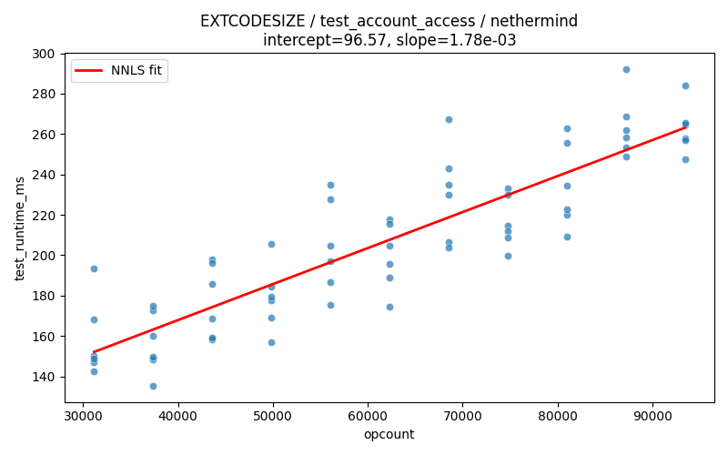

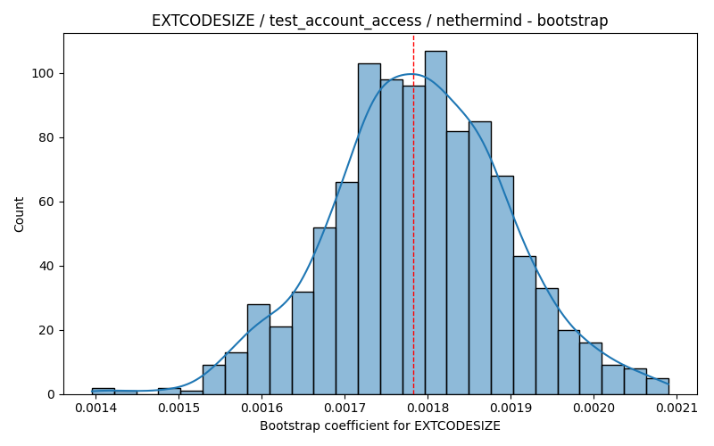

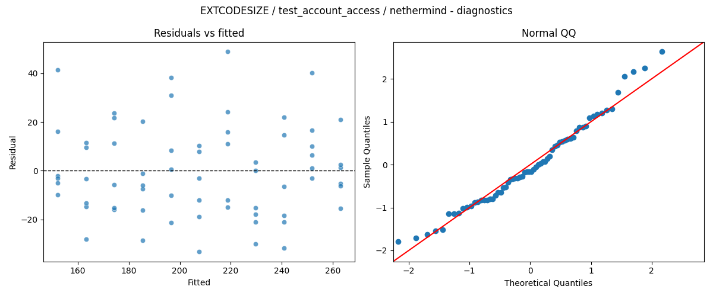

</details>

<details><summary>reth — NNLS regression summary</summary>

```
==============================================================================
                           NNLS Regression Results                            
==============================================================================
Dep. Variable:          test_runtime_ms              R-squared:          0.971
Model:                  NNLS                    Adj. R-squared:          0.970
No. Observations:       44                                RMSE:          13.29
Df Residuals:           42                                 MAE:          10.62
Df Model:               1      
==============================================================================
                      coef     std err     P-value      [0.025      0.975]
------------------------------------------------------------------------------
         const     74.1015      6.3915       0.001     62.3542     87.0156
       opcount      0.0039      0.0001       0.001      0.0037      0.0041
==============================================================================
Notes: Non-negative least squares with bootstrap inference (1000 iterations)
==============================================================================
```

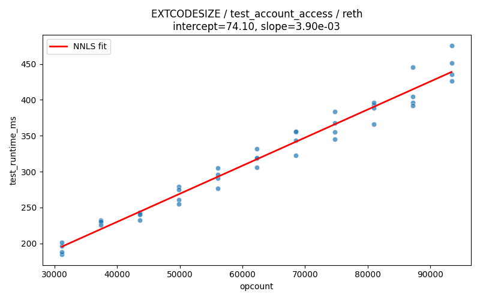

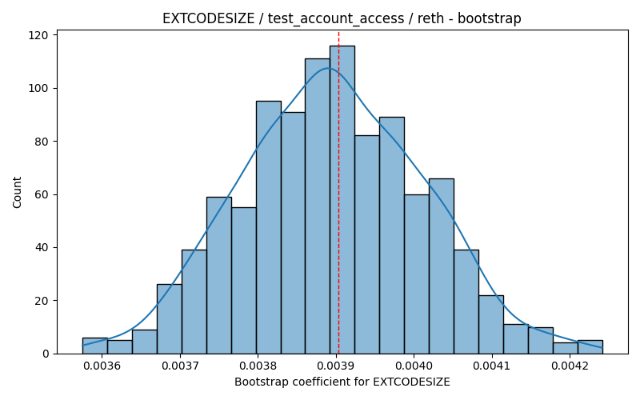

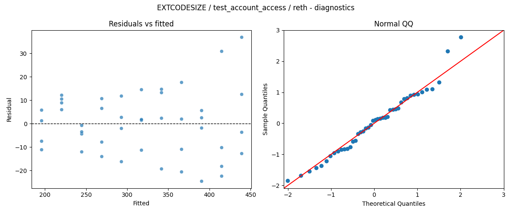

</details>

## STATICCALL

### test_ext_account_query_warm — combo `STATICCALL`

| client | nobs | R² | target_coef (ms) | p-value | 95% CI |
| --- | --- | --- | --- | --- | --- |
| `besu` | 55 | 0.8999 | 0.0004315 | 1.00e-03 | [0.00039, 0.0004727] |
| `erigon` | 44 | 0.9267 | 6.752e-05 | 1.00e-03 | [6.193e-05, 7.274e-05] |
| `geth` | 77 | 0.941 | 0.0001664 | 1.00e-03 | [0.0001576, 0.0001759] |
| `nethermind` | 66 | 0.6395 | 0.0002623 | 1.00e-03 | [0.0002063, 0.0003086] |
| `reth` | 44 | 0.9534 | 5.669e-05 | 1.00e-03 | [5.345e-05, 5.983e-05] |

<details><summary>besu — NNLS regression summary</summary>

```
==============================================================================
                           NNLS Regression Results                            
==============================================================================
Dep. Variable:          test_runtime_ms              R-squared:          0.900
Model:                  NNLS                    Adj. R-squared:          0.898
No. Observations:       55                                RMSE:          74.51
Df Residuals:           53                                 MAE:          60.68
Df Model:               1      
==============================================================================
                      coef     std err     P-value      [0.025      0.975]
------------------------------------------------------------------------------
         const    417.0273     35.2748       0.001    347.0889    484.3333
       opcount      0.0004      0.0000       0.001      0.0004      0.0005
==============================================================================
Notes: Non-negative least squares with bootstrap inference (1000 iterations)
==============================================================================
```

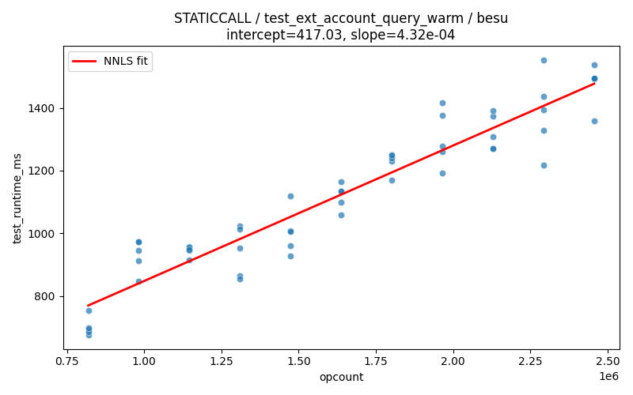

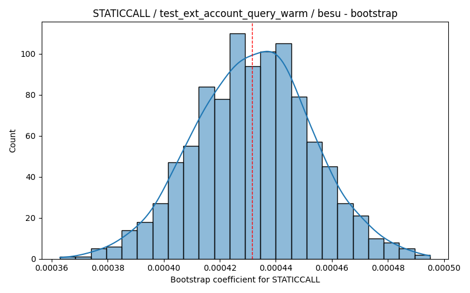

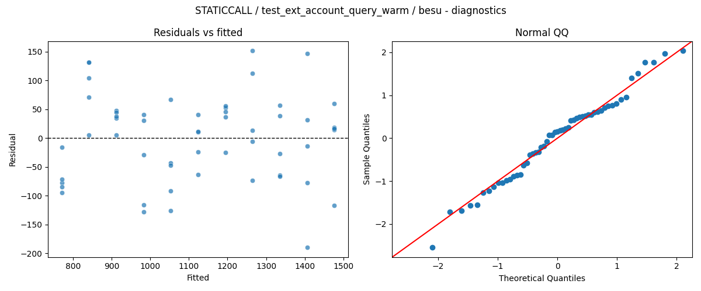

</details>

<details><summary>erigon — NNLS regression summary</summary>

```
==============================================================================
                           NNLS Regression Results                            
==============================================================================
Dep. Variable:          test_runtime_ms              R-squared:          0.927
Model:                  NNLS                    Adj. R-squared:          0.925
No. Observations:       44                                RMSE:           9.83
Df Residuals:           42                                 MAE:           7.80
Df Model:               1      
==============================================================================
                      coef     std err     P-value      [0.025      0.975]
------------------------------------------------------------------------------
         const     33.6058      4.6752       0.001     24.7629     42.9306
       opcount      0.0001      0.0000       0.001      0.0001      0.0001
==============================================================================
Notes: Non-negative least squares with bootstrap inference (1000 iterations)
==============================================================================
```

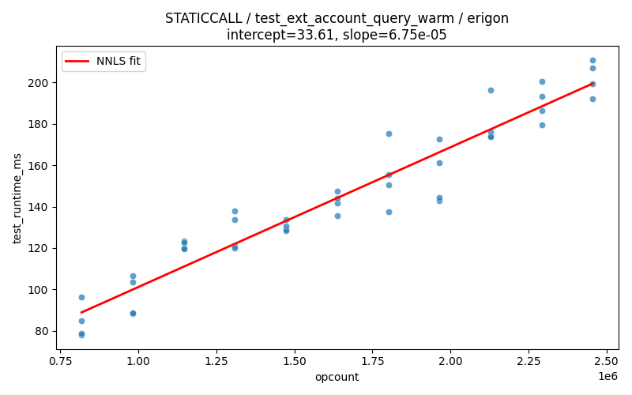

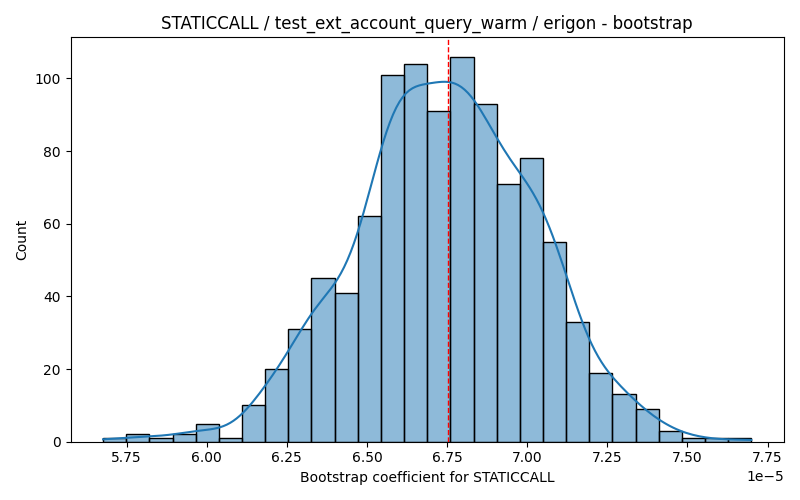

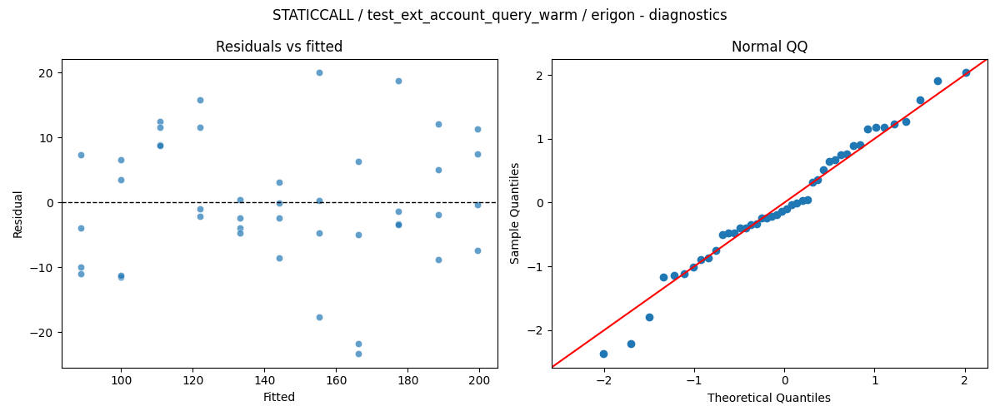

</details>

<details><summary>geth — NNLS regression summary</summary>

```
==============================================================================
                           NNLS Regression Results                            
==============================================================================
Dep. Variable:          test_runtime_ms              R-squared:          0.941
Model:                  NNLS                    Adj. R-squared:          0.940
No. Observations:       77                                RMSE:          21.58
Df Residuals:           75                                 MAE:          15.77
Df Model:               1      
==============================================================================
                      coef     std err     P-value      [0.025      0.975]
------------------------------------------------------------------------------
         const     38.2122      6.9599       0.001     23.3555     50.7460
       opcount      0.0002      0.0000       0.001      0.0002      0.0002
==============================================================================
Notes: Non-negative least squares with bootstrap inference (1000 iterations)
==============================================================================
```

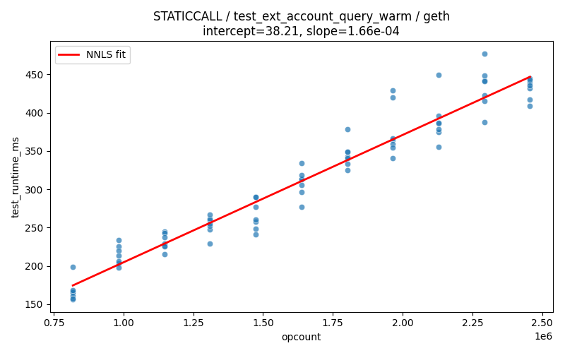

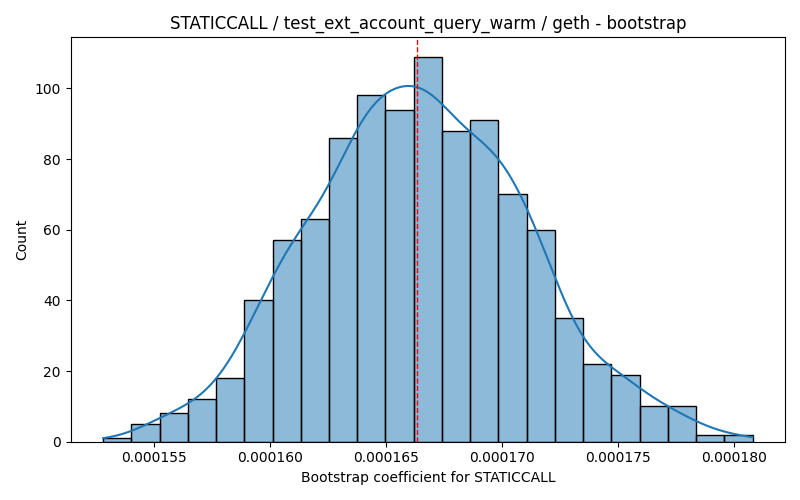

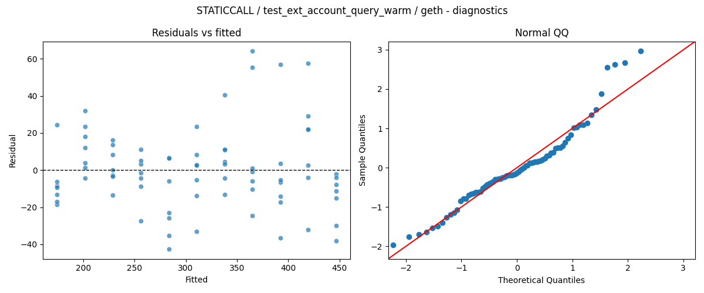

</details>

<details><summary>nethermind — NNLS regression summary</summary>

```
==============================================================================
                           NNLS Regression Results                            
==============================================================================
Dep. Variable:          test_runtime_ms              R-squared:          0.639
Model:                  NNLS                    Adj. R-squared:          0.634
No. Observations:       66                                RMSE:         101.98
Df Residuals:           64                                 MAE:          80.35
Df Model:               1      
==============================================================================
                      coef     std err     P-value      [0.025      0.975]
------------------------------------------------------------------------------
         const    292.5746     40.2110       0.001    224.1599    377.5026
       opcount      0.0003      0.0000       0.001      0.0002      0.0003
==============================================================================
Notes: Non-negative least squares with bootstrap inference (1000 iterations)
==============================================================================
```

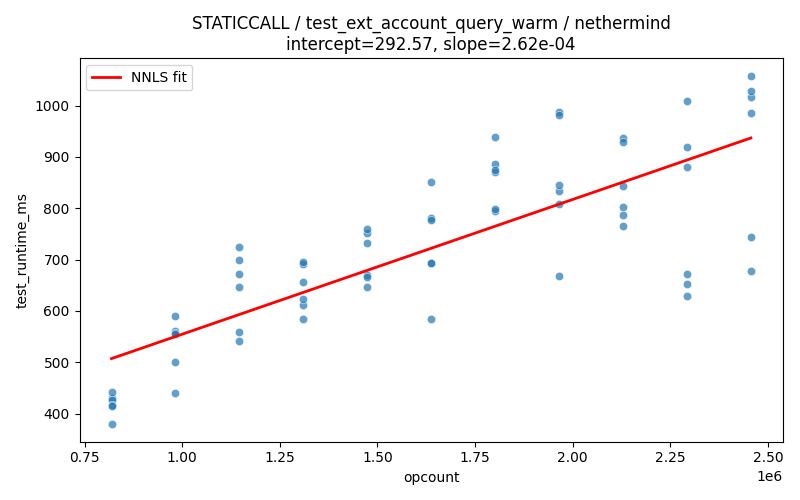

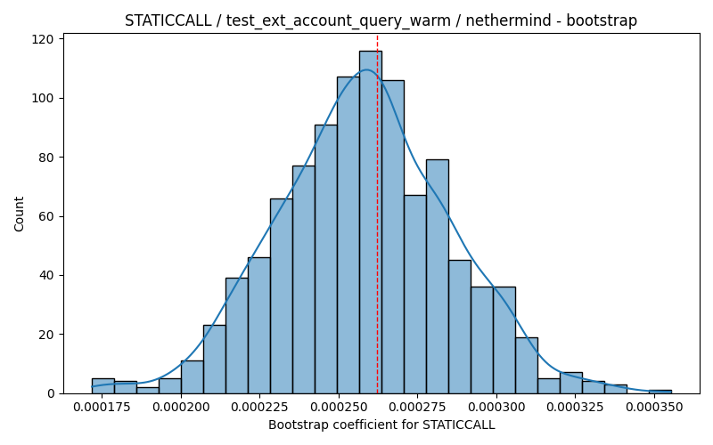

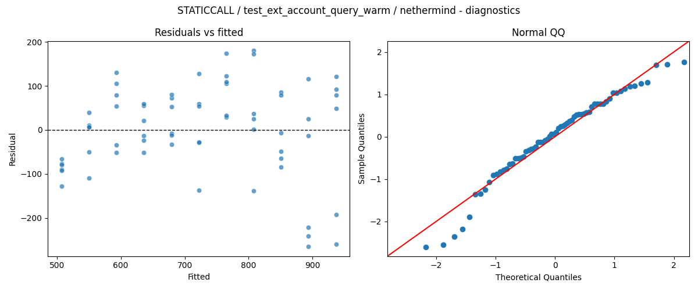

</details>

<details><summary>reth — NNLS regression summary</summary>

```
==============================================================================
                           NNLS Regression Results                            
==============================================================================
Dep. Variable:          test_runtime_ms              R-squared:          0.953
Model:                  NNLS                    Adj. R-squared:          0.952
No. Observations:       44                                RMSE:           6.49
Df Residuals:           42                                 MAE:           4.91
Df Model:               1      
==============================================================================
                      coef     std err     P-value      [0.025      0.975]
------------------------------------------------------------------------------
         const     21.1895      2.6436       0.001     16.5790     26.6837
       opcount      0.0001      0.0000       0.001      0.0001      0.0001
==============================================================================
Notes: Non-negative least squares with bootstrap inference (1000 iterations)
==============================================================================
```

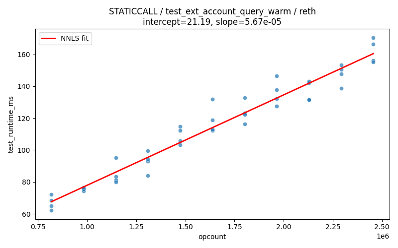

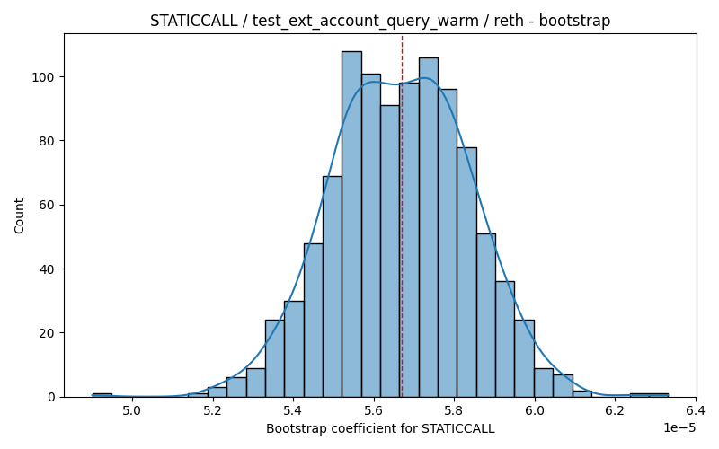

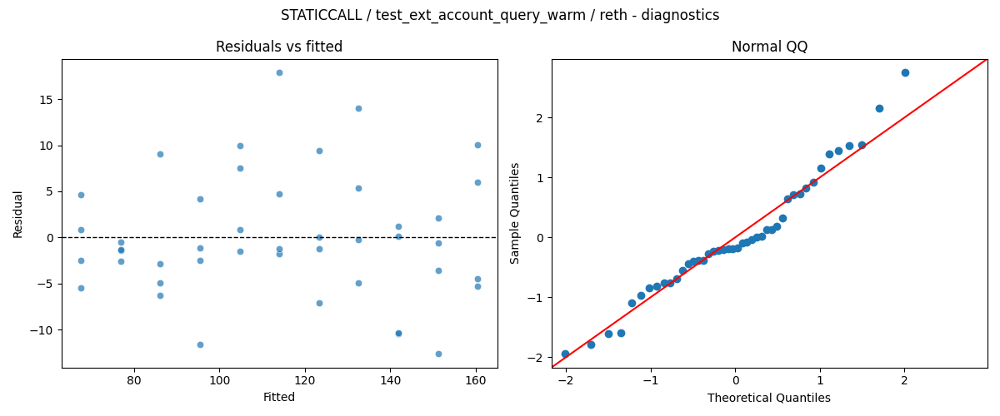

</details>

### test_account_access — combo `STATICCALL_AccountMode.EXISTING_EOA`

| client | nobs | R² | target_coef (ms) | p-value | 95% CI |
| --- | --- | --- | --- | --- | --- |
| `besu` | 55 | 0.9869 | 0.01808 | 1.00e-03 | [0.01751, 0.01873] |
| `erigon` | 44 | 0.9977 | 0.008742 | 1.00e-03 | [0.008638, 0.008805] |
| `geth` | 77 | 0.986 | 0.01149 | 1.00e-03 | [0.01115, 0.01177] |
| `nethermind` | 66 | 0.9025 | 0.00351 | 1.00e-03 | [0.003202, 0.003796] |
| `reth` | 44 | 0.9721 | 0.004392 | 1.00e-03 | [0.00419, 0.004596] |

<details><summary>besu — NNLS regression summary</summary>

```
==============================================================================
                           NNLS Regression Results                            
==============================================================================
Dep. Variable:          test_runtime_ms              R-squared:          0.987
Model:                  NNLS                    Adj. R-squared:          0.987
No. Observations:       55                                RMSE:          42.77
Df Residuals:           53                                 MAE:          30.98
Df Model:               1      
==============================================================================
                      coef     std err     P-value      [0.025      0.975]
------------------------------------------------------------------------------
         const    459.1022     17.0367       0.001    422.5791    489.4064
       opcount      0.0181      0.0003       0.001      0.0175      0.0187
==============================================================================
Notes: Non-negative least squares with bootstrap inference (1000 iterations)
==============================================================================
```

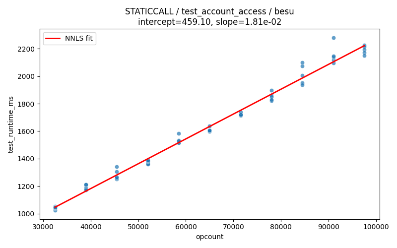

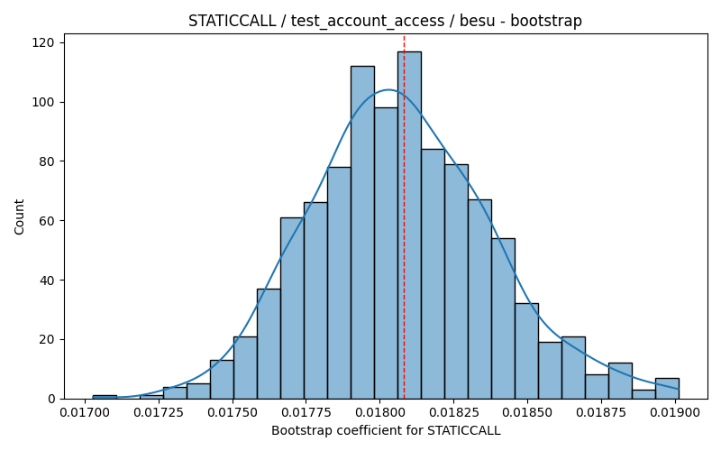

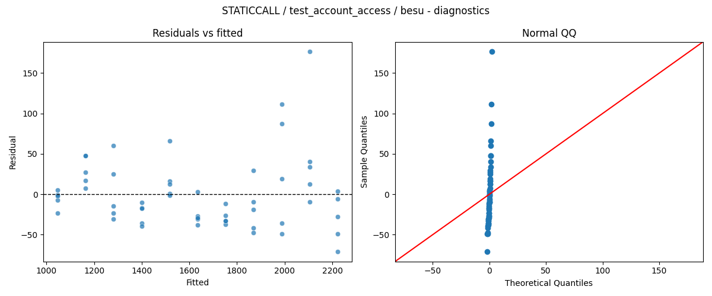

</details>

<details><summary>erigon — NNLS regression summary</summary>

```
==============================================================================
                           NNLS Regression Results                            
==============================================================================
Dep. Variable:          test_runtime_ms              R-squared:          0.998
Model:                  NNLS                    Adj. R-squared:          0.998
No. Observations:       44                                RMSE:           8.71
Df Residuals:           42                                 MAE:           7.48
Df Model:               1      
==============================================================================
                      coef     std err     P-value      [0.025      0.975]
------------------------------------------------------------------------------
         const      2.0992      2.6288       0.254      0.0000      8.8029
       opcount      0.0087      0.0000       0.001      0.0086      0.0088
==============================================================================
Notes: Non-negative least squares with bootstrap inference (1000 iterations)
==============================================================================
```

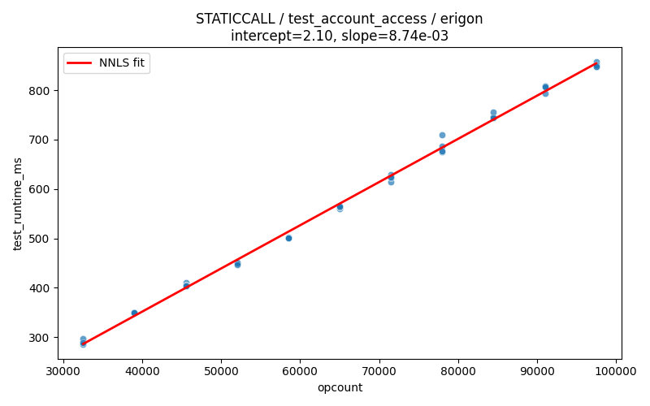

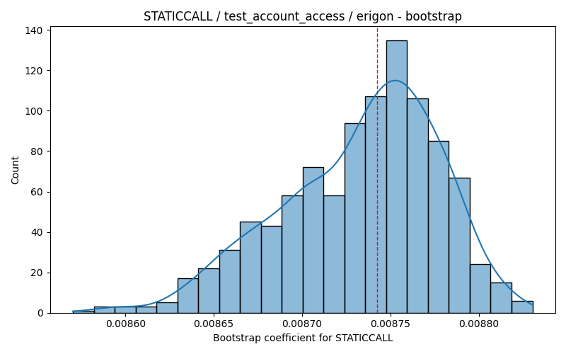

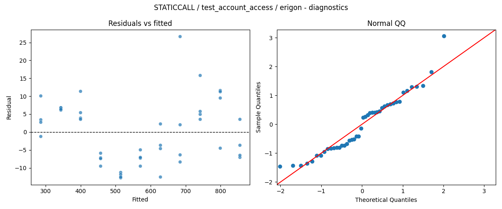

</details>

<details><summary>geth — NNLS regression summary</summary>

```
==============================================================================
                           NNLS Regression Results                            
==============================================================================
Dep. Variable:          test_runtime_ms              R-squared:          0.986
Model:                  NNLS                    Adj. R-squared:          0.986
No. Observations:       77                                RMSE:          28.18
Df Residuals:           75                                 MAE:          22.78
Df Model:               1      
==============================================================================
                      coef     std err     P-value      [0.025      0.975]
------------------------------------------------------------------------------
         const    217.4335     10.6225       0.001    199.6332    240.0256
       opcount      0.0115      0.0002       0.001      0.0111      0.0118
==============================================================================
Notes: Non-negative least squares with bootstrap inference (1000 iterations)
==============================================================================
```

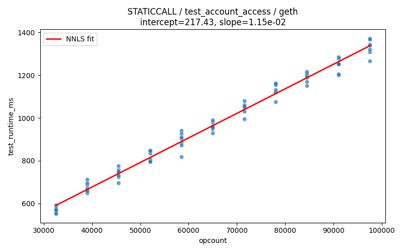

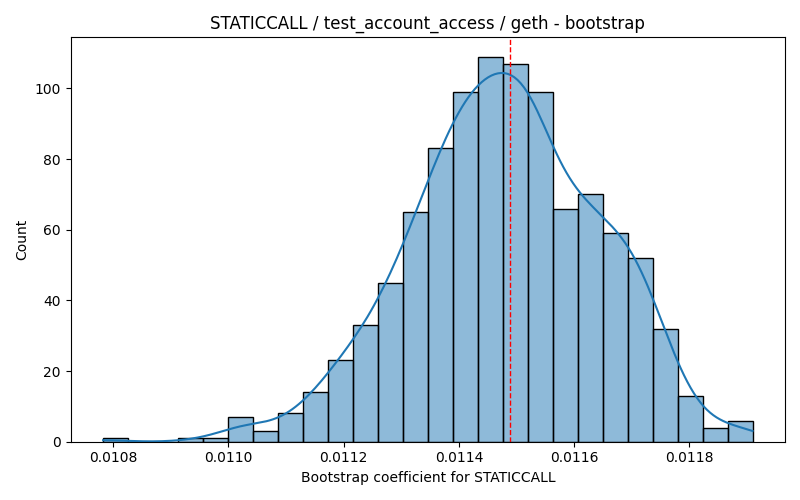

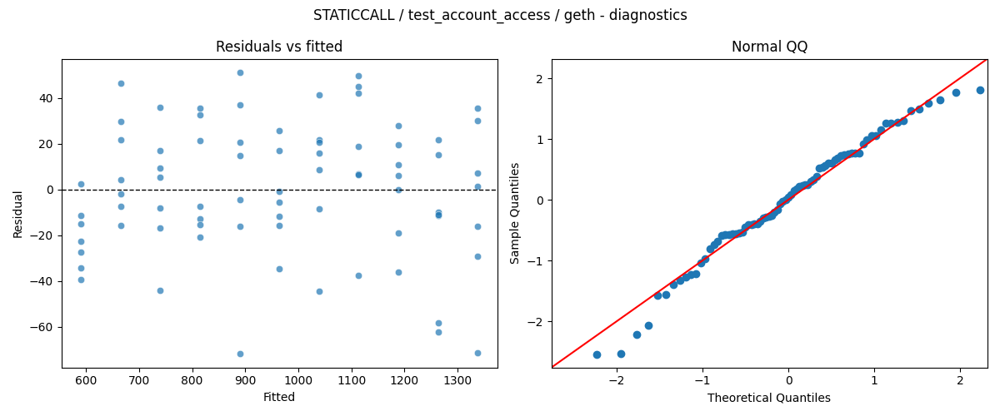

</details>

<details><summary>nethermind — NNLS regression summary</summary>

```
==============================================================================
                           NNLS Regression Results                            
==============================================================================
Dep. Variable:          test_runtime_ms              R-squared:          0.902
Model:                  NNLS                    Adj. R-squared:          0.901
No. Observations:       66                                RMSE:          23.72
Df Residuals:           64                                 MAE:          19.18
Df Model:               1      
==============================================================================
                      coef     std err     P-value      [0.025      0.975]
------------------------------------------------------------------------------
         const     94.6181      9.7259       0.001     76.1921    115.0289
       opcount      0.0035      0.0001       0.001      0.0032      0.0038
==============================================================================
Notes: Non-negative least squares with bootstrap inference (1000 iterations)
==============================================================================
```

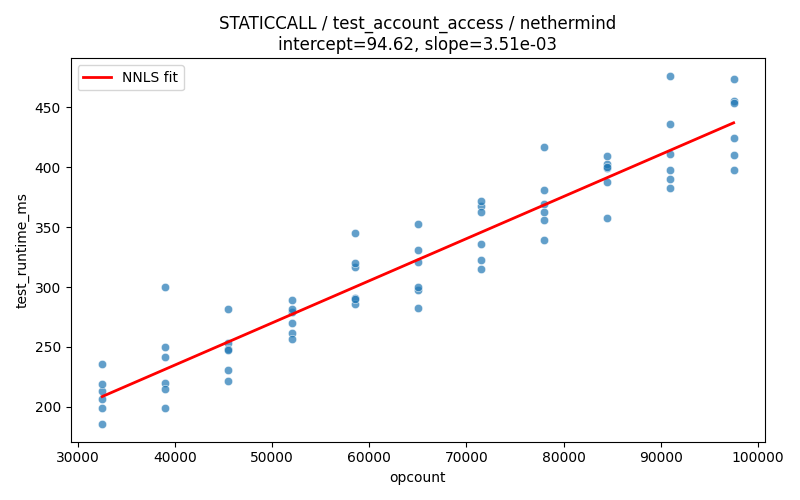

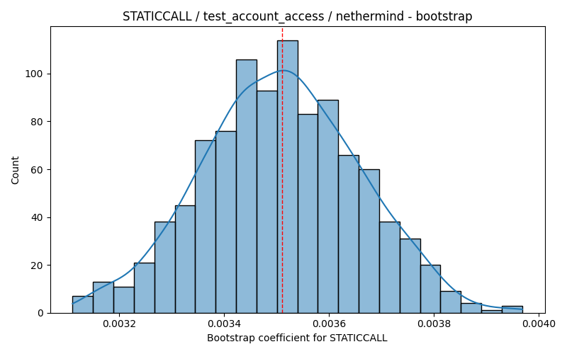

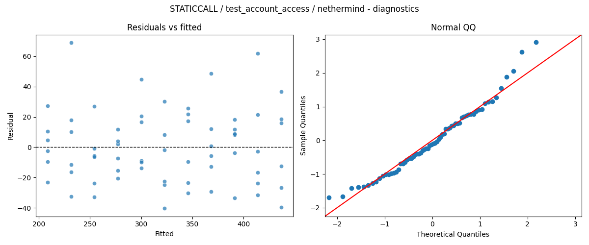

</details>

<details><summary>reth — NNLS regression summary</summary>

```
==============================================================================
                           NNLS Regression Results                            
==============================================================================
Dep. Variable:          test_runtime_ms              R-squared:          0.972
Model:                  NNLS                    Adj. R-squared:          0.971
No. Observations:       44                                RMSE:          15.28
Df Residuals:           42                                 MAE:          12.59
Df Model:               1      
==============================================================================
                      coef     std err     P-value      [0.025      0.975]
------------------------------------------------------------------------------
         const     87.5081      7.5516       0.001     73.8110    103.1145
       opcount      0.0044      0.0001       0.001      0.0042      0.0046
==============================================================================
Notes: Non-negative least squares with bootstrap inference (1000 iterations)
==============================================================================
```

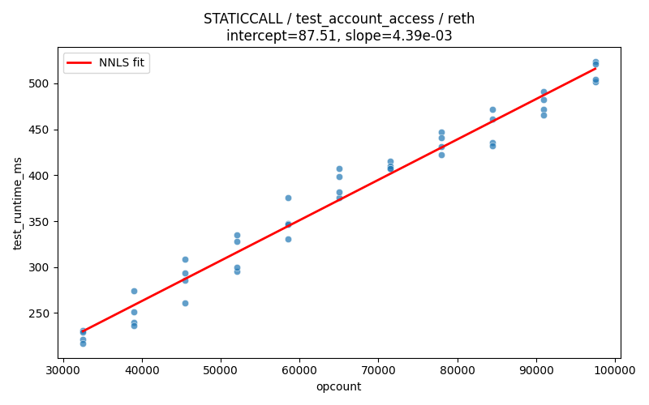

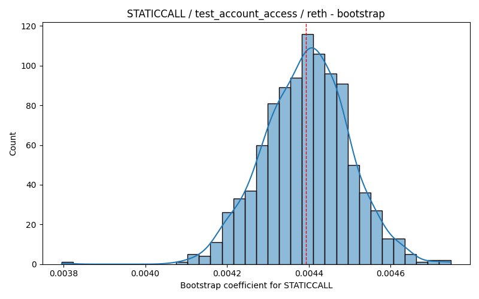

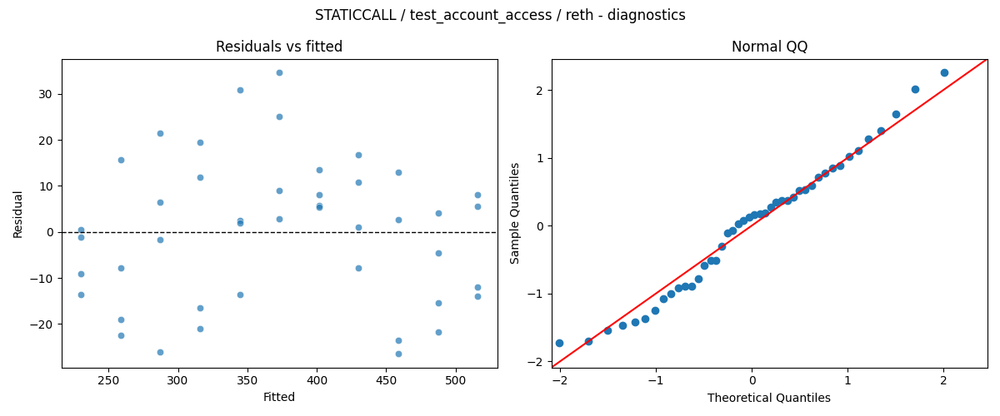

</details>

### test_account_access — combo `STATICCALL_AccountMode.NON_EXISTING_ACCOUNT`

| client | nobs | R² | target_coef (ms) | p-value | 95% CI |
| --- | --- | --- | --- | --- | --- |
| `besu` | 55 | 0.9895 | 0.01889 | 1.00e-03 | [0.01841, 0.0194] |
| `erigon` | 44 | 0.9979 | 0.008927 | 1.00e-03 | [0.008809, 0.009006] |
| `geth` | 77 | 0.9781 | 0.02243 | 1.00e-03 | [0.02171, 0.02317] |
| `nethermind` | 66 | 0.9016 | 0.003612 | 1.00e-03 | [0.003307, 0.003904] |
| `reth` | 44 | 0.9792 | 0.004064 | 1.00e-03 | [0.003909, 0.004223] |

<details><summary>besu — NNLS regression summary</summary>

```
==============================================================================
                           NNLS Regression Results                            
==============================================================================
Dep. Variable:          test_runtime_ms              R-squared:          0.990
Model:                  NNLS                    Adj. R-squared:          0.989
No. Observations:       55                                RMSE:          39.97
Df Residuals:           53                                 MAE:          32.25
Df Model:               1      
==============================================================================
                      coef     std err     P-value      [0.025      0.975]
------------------------------------------------------------------------------
         const    198.6495     16.0833       0.001    166.4007    227.8887
       opcount      0.0189      0.0003       0.001      0.0184      0.0194
==============================================================================
Notes: Non-negative least squares with bootstrap inference (1000 iterations)
==============================================================================
```

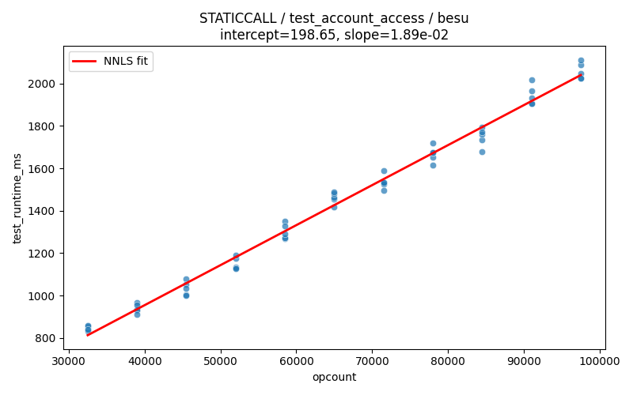

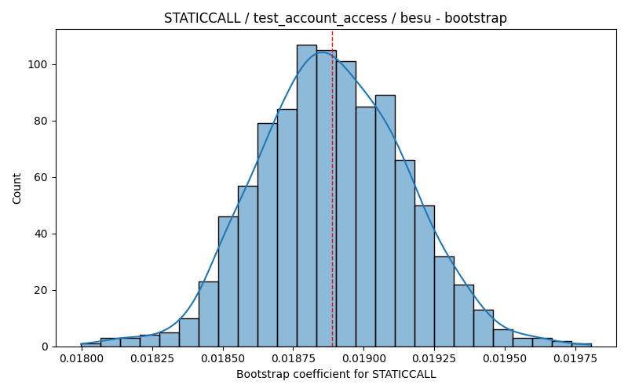

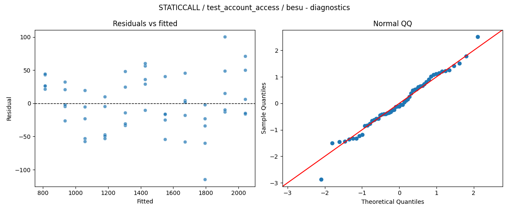

</details>

<details><summary>erigon — NNLS regression summary</summary>

```
==============================================================================
                           NNLS Regression Results                            
==============================================================================
Dep. Variable:          test_runtime_ms              R-squared:          0.998
Model:                  NNLS                    Adj. R-squared:          0.998
No. Observations:       44                                RMSE:           8.37
Df Residuals:           42                                 MAE:           7.11
Df Model:               1      
==============================================================================
                      coef     std err     P-value      [0.025      0.975]
------------------------------------------------------------------------------
         const      4.4264      3.2740       0.121      0.0000     11.3850
       opcount      0.0089      0.0001       0.001      0.0088      0.0090
==============================================================================
Notes: Non-negative least squares with bootstrap inference (1000 iterations)
==============================================================================
```

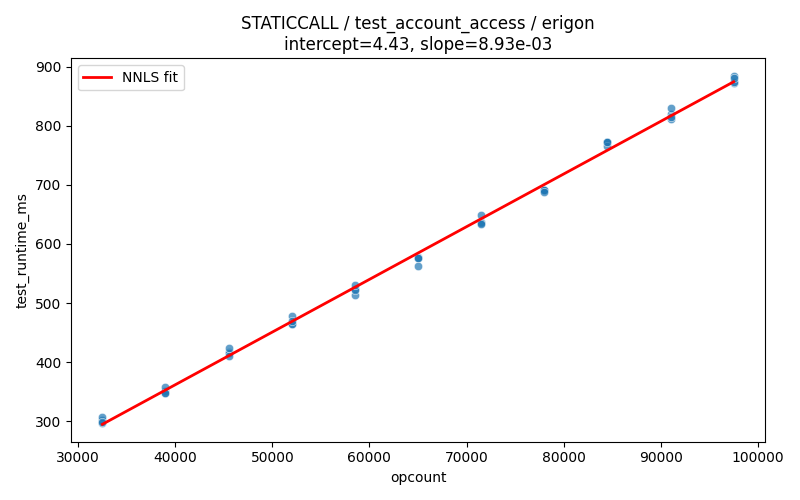

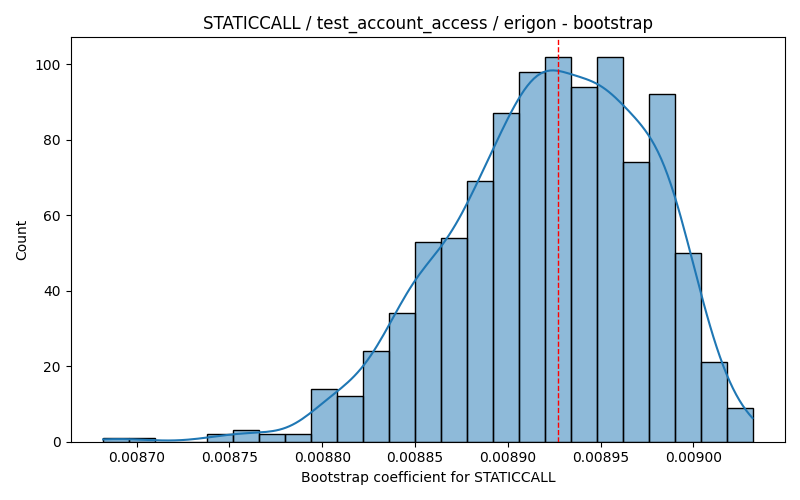

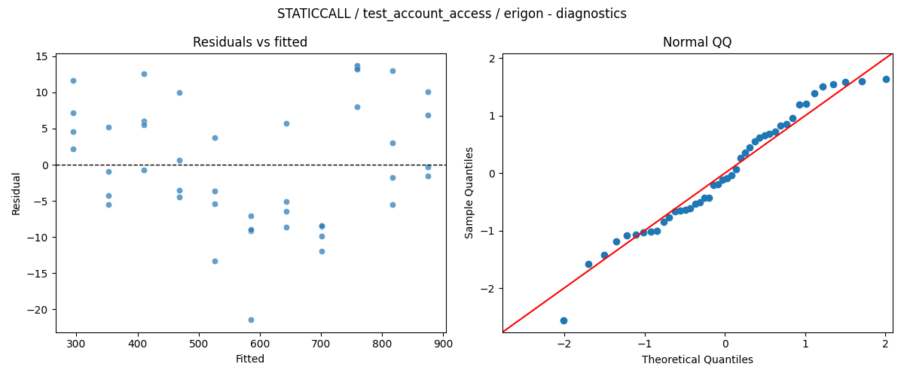

</details>

<details><summary>geth — NNLS regression summary</summary>

```
==============================================================================
                           NNLS Regression Results                            
==============================================================================
Dep. Variable:          test_runtime_ms              R-squared:          0.978
Model:                  NNLS                    Adj. R-squared:          0.978
No. Observations:       77                                RMSE:          69.03
Df Residuals:           75                                 MAE:          56.95
Df Model:               1      
==============================================================================
                      coef     std err     P-value      [0.025      0.975]
------------------------------------------------------------------------------
         const    279.4843     22.8143       0.001    235.9742    320.1964
       opcount      0.0224      0.0004       0.001      0.0217      0.0232
==============================================================================
Notes: Non-negative least squares with bootstrap inference (1000 iterations)
==============================================================================
```

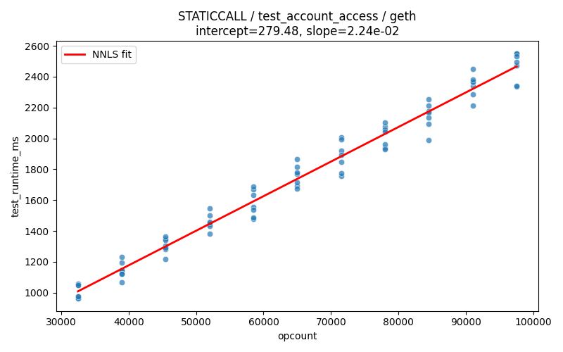

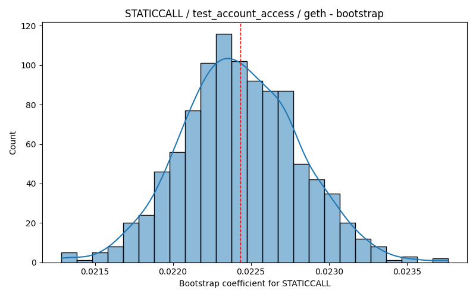

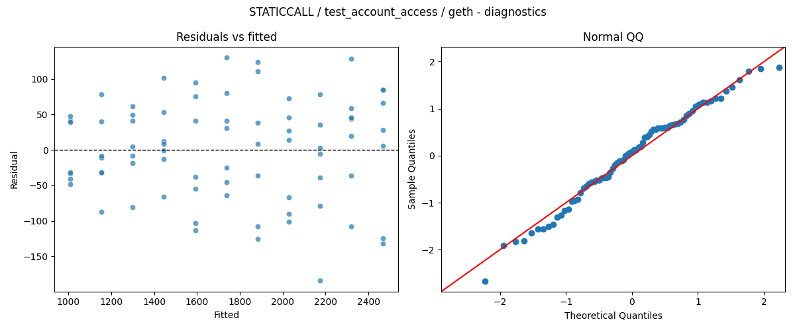

</details>

<details><summary>nethermind — NNLS regression summary</summary>

```
==============================================================================
                           NNLS Regression Results                            
==============================================================================
Dep. Variable:          test_runtime_ms              R-squared:          0.902
Model:                  NNLS                    Adj. R-squared:          0.900
No. Observations:       66                                RMSE:          24.53
Df Residuals:           64                                 MAE:          20.02
Df Model:               1      
==============================================================================
                      coef     std err     P-value      [0.025      0.975]
------------------------------------------------------------------------------
         const     70.2830      9.1822       0.001     53.1262     88.8134
       opcount      0.0036      0.0002       0.001      0.0033      0.0039
==============================================================================
Notes: Non-negative least squares with bootstrap inference (1000 iterations)
==============================================================================
```

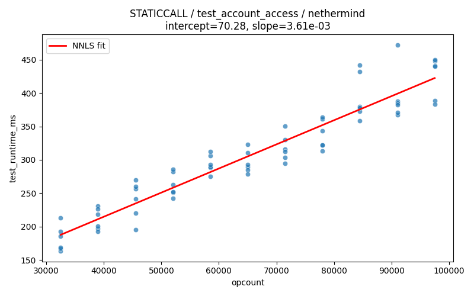

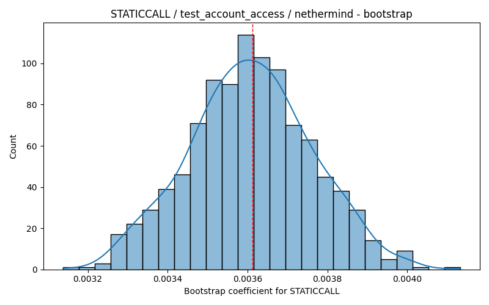

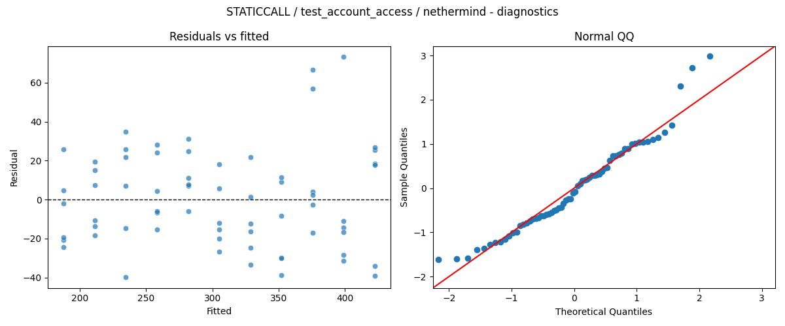

</details>

<details><summary>reth — NNLS regression summary</summary>

```
==============================================================================
                           NNLS Regression Results                            
==============================================================================
Dep. Variable:          test_runtime_ms              R-squared:          0.979
Model:                  NNLS                    Adj. R-squared:          0.979
No. Observations:       44                                RMSE:          12.18
Df Residuals:           42                                 MAE:          10.47
Df Model:               1      
==============================================================================
                      coef     std err     P-value      [0.025      0.975]
------------------------------------------------------------------------------
         const     89.2295      5.3971       0.001     79.2926    100.0300
       opcount      0.0041      0.0001       0.001      0.0039      0.0042
==============================================================================
Notes: Non-negative least squares with bootstrap inference (1000 iterations)
==============================================================================
```

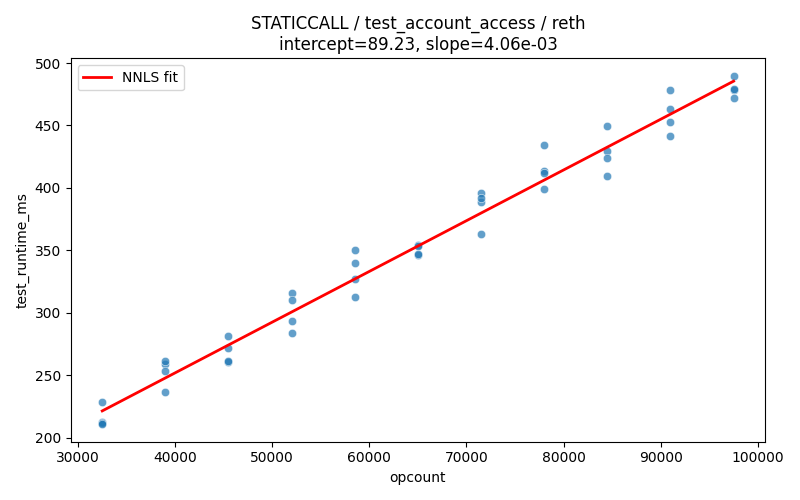

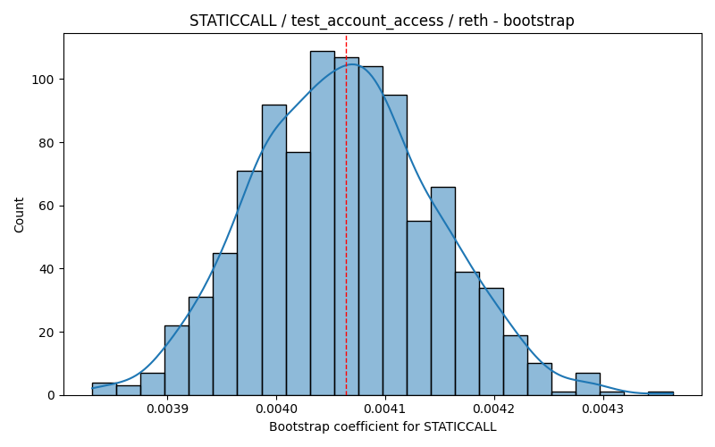

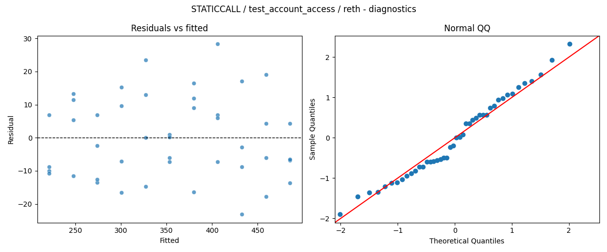

</details>

### test_account_access — combo `STATICCALL_AccountMode.EXISTING_CONTRACT_DIFF_MAX`

| client | nobs | R² | target_coef (ms) | p-value | 95% CI |
| --- | --- | --- | --- | --- | --- |
| `besu` | 55 | 0.9838 | 0.02358 | 1.00e-03 | [0.02288, 0.02434] |
| `erigon` | 44 | 0.9389 | 0.03469 | 1.00e-03 | [0.03207, 0.03705] |
| `geth` | 77 | 0.9201 | 0.02031 | 1.00e-03 | [0.01873, 0.02187] |
| `nethermind` | 66 | 0.9001 | 0.01549 | 1.00e-03 | [0.01395, 0.01708] |
| `reth` | 44 | 0.9985 | 0.02096 | 1.00e-03 | [0.02075, 0.02118] |

<details><summary>besu — NNLS regression summary</summary>

```
==============================================================================
                           NNLS Regression Results                            
==============================================================================
Dep. Variable:          test_runtime_ms              R-squared:          0.984
Model:                  NNLS                    Adj. R-squared:          0.983
No. Observations:       55                                RMSE:          61.28
Df Residuals:           53                                 MAE:          51.97
Df Model:               1      
==============================================================================
                      coef     std err     P-value      [0.025      0.975]
------------------------------------------------------------------------------
         const    404.3872     24.4814       0.001    352.3859    449.8261
       opcount      0.0236      0.0004       0.001      0.0229      0.0243
==============================================================================
Notes: Non-negative least squares with bootstrap inference (1000 iterations)
==============================================================================
```

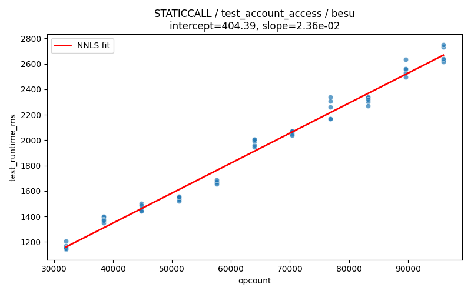

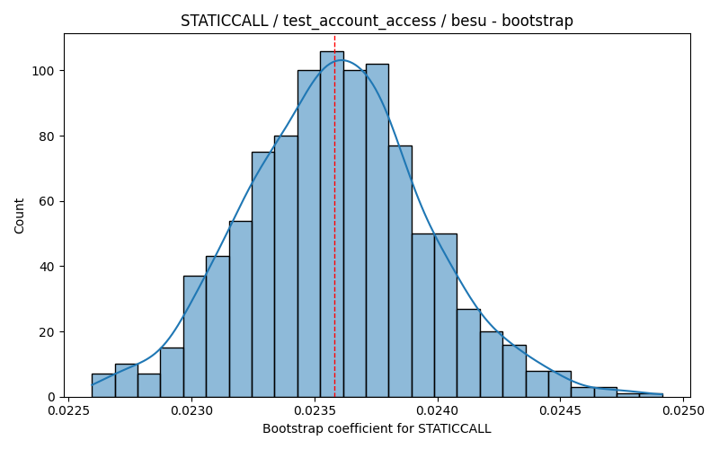

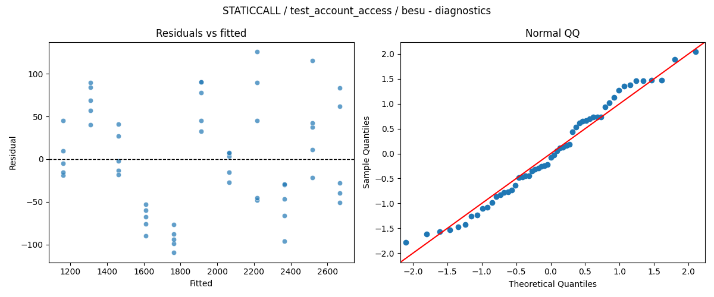

</details>

<details><summary>erigon — NNLS regression summary</summary>

```
==============================================================================
                           NNLS Regression Results                            
==============================================================================
Dep. Variable:          test_runtime_ms              R-squared:          0.939
Model:                  NNLS                    Adj. R-squared:          0.937
No. Observations:       44                                RMSE:         179.09
Df Residuals:           42                                 MAE:         154.12
Df Model:               1      
==============================================================================
                      coef     std err     P-value      [0.025      0.975]
------------------------------------------------------------------------------
         const    245.6512     89.2675       0.001     77.5666    430.8072
       opcount      0.0347      0.0013       0.001      0.0321      0.0371
==============================================================================
Notes: Non-negative least squares with bootstrap inference (1000 iterations)
==============================================================================
```

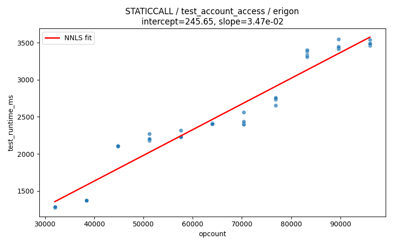

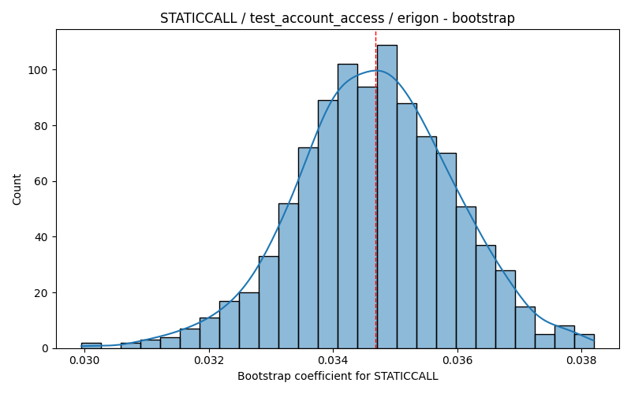

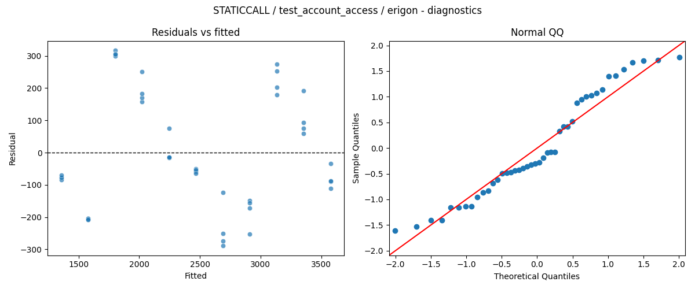

</details>

<details><summary>geth — NNLS regression summary</summary>

```
==============================================================================
                           NNLS Regression Results                            
==============================================================================
Dep. Variable:          test_runtime_ms              R-squared:          0.920
Model:                  NNLS                    Adj. R-squared:          0.919
No. Observations:       77                                RMSE:         121.17
Df Residuals:           75                                 MAE:          94.73
Df Model:               1      
==============================================================================
                      coef     std err     P-value      [0.025      0.975]
------------------------------------------------------------------------------
         const    520.6752     54.4893       0.001    423.8680    631.0227
       opcount      0.0203      0.0008       0.001      0.0187      0.0219
==============================================================================
Notes: Non-negative least squares with bootstrap inference (1000 iterations)
==============================================================================
```

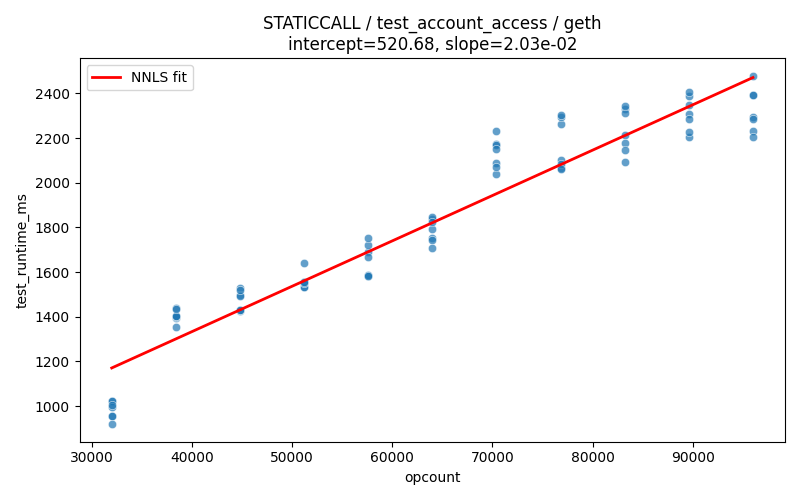

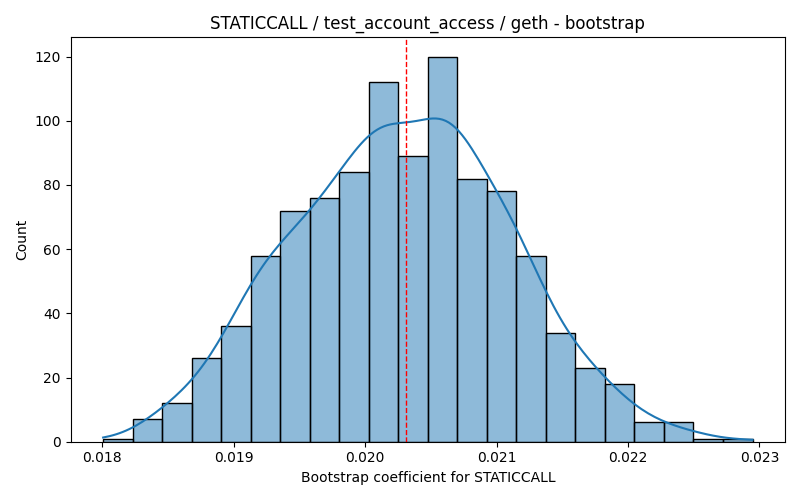

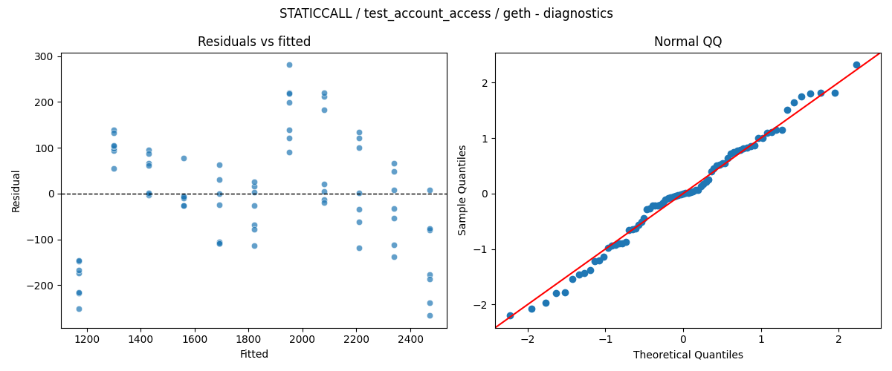

</details>

<details><summary>nethermind — NNLS regression summary</summary>

```
==============================================================================
                           NNLS Regression Results                            
==============================================================================
Dep. Variable:          test_runtime_ms              R-squared:          0.900
Model:                  NNLS                    Adj. R-squared:          0.898
No. Observations:       66                                RMSE:         104.46
Df Residuals:           64                                 MAE:          84.67
Df Model:               1      
==============================================================================
                      coef     std err     P-value      [0.025      0.975]
------------------------------------------------------------------------------
         const    656.7523     59.0491       0.001    545.4064    775.1948
       opcount      0.0155      0.0008       0.001      0.0139      0.0171
==============================================================================
Notes: Non-negative least squares with bootstrap inference (1000 iterations)
==============================================================================
```

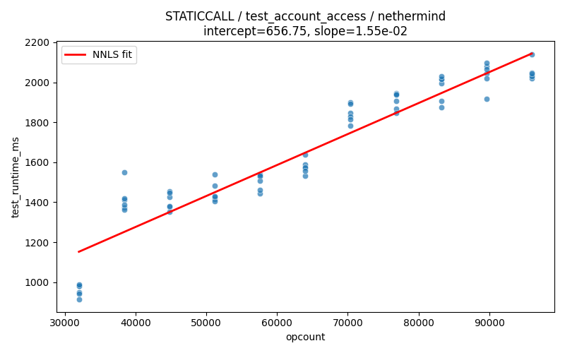

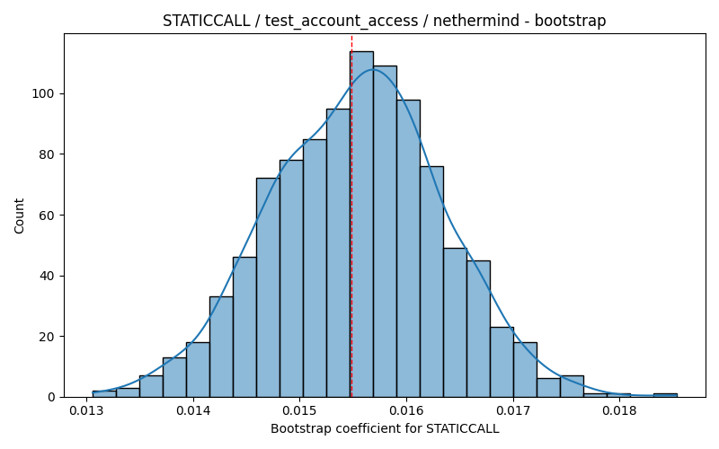

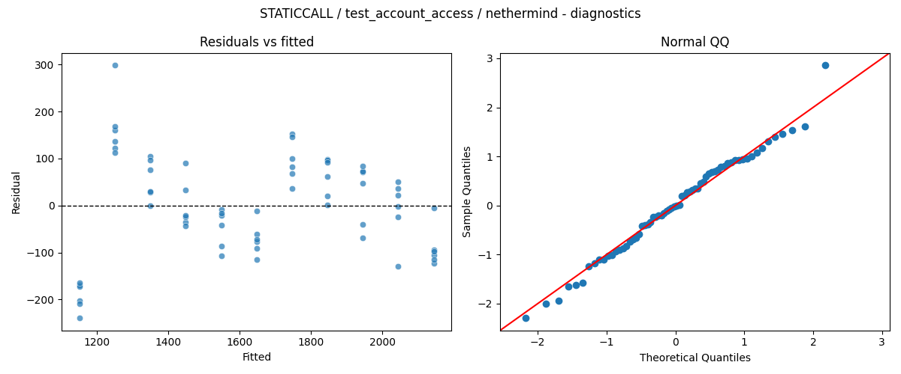

</details>

<details><summary>reth — NNLS regression summary</summary>

```
==============================================================================
                           NNLS Regression Results                            
==============================================================================
Dep. Variable:          test_runtime_ms              R-squared:          0.999
Model:                  NNLS                    Adj. R-squared:          0.998
No. Observations:       44                                RMSE:          16.36
Df Residuals:           42                                 MAE:          12.63
Df Model:               1      
==============================================================================
                      coef     std err     P-value      [0.025      0.975]
------------------------------------------------------------------------------
         const    121.3803      7.2767       0.001    108.2692    135.2142
       opcount      0.0210      0.0001       0.001      0.0208      0.0212
==============================================================================
Notes: Non-negative least squares with bootstrap inference (1000 iterations)
==============================================================================
```


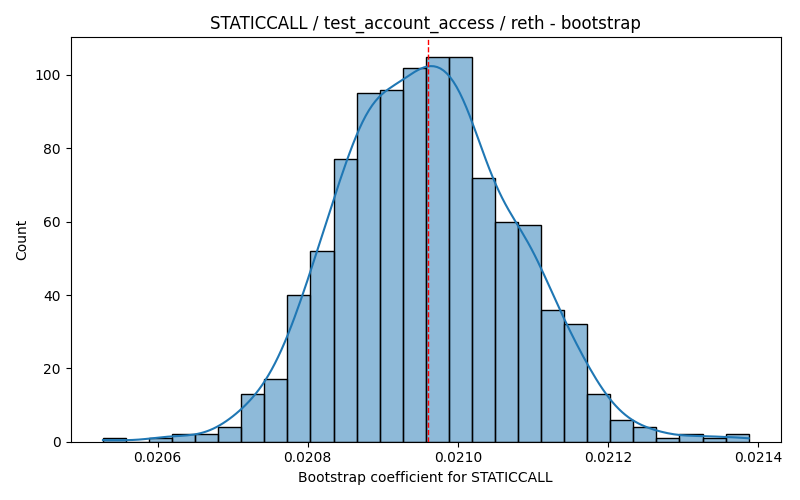

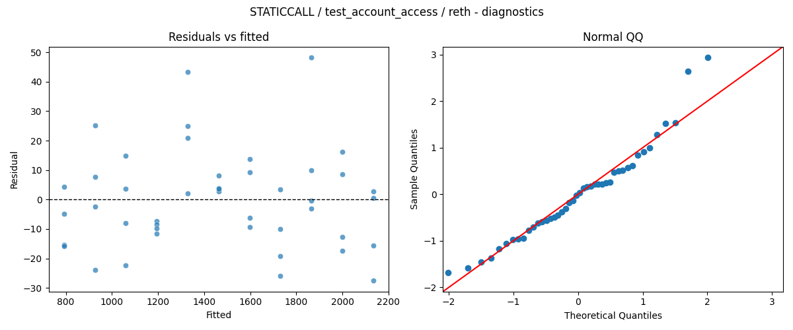

</details>

### test_account_access — combo `STATICCALL_AccountMode.EXISTING_CONTRACT_MINIMAL`

| client | nobs | R² | target_coef (ms) | p-value | 95% CI |
| --- | --- | --- | --- | --- | --- |
| `besu` | 55 | 0.9782 | 0.01547 | 1.00e-03 | [0.0147, 0.01622] |
| `erigon` | 44 | 0.995 | 0.008999 | 1.00e-03 | [0.008832, 0.009199] |
| `geth` | 77 | 0.9673 | 0.005099 | 1.00e-03 | [0.004911, 0.005309] |
| `nethermind` | 66 | 0.6368 | 0.002843 | 1.00e-03 | [0.00237, 0.003318] |
| `reth` | 44 | 0.9583 | 0.004076 | 1.00e-03 | [0.003789, 0.004351] |

<details><summary>besu — NNLS regression summary</summary>

```
==============================================================================
                           NNLS Regression Results                            
==============================================================================
Dep. Variable:          test_runtime_ms              R-squared:          0.978
Model:                  NNLS                    Adj. R-squared:          0.978
No. Observations:       55                                RMSE:          46.77
Df Residuals:           53                                 MAE:          34.02
Df Model:               1      
==============================================================================
                      coef     std err     P-value      [0.025      0.975]
------------------------------------------------------------------------------
         const    330.1887     20.8815       0.001    291.1988    371.5646
       opcount      0.0155      0.0004       0.001      0.0147      0.0162
==============================================================================
Notes: Non-negative least squares with bootstrap inference (1000 iterations)
==============================================================================
```

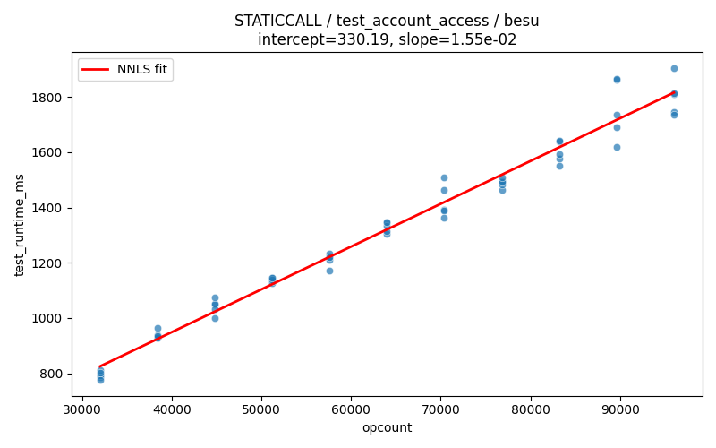

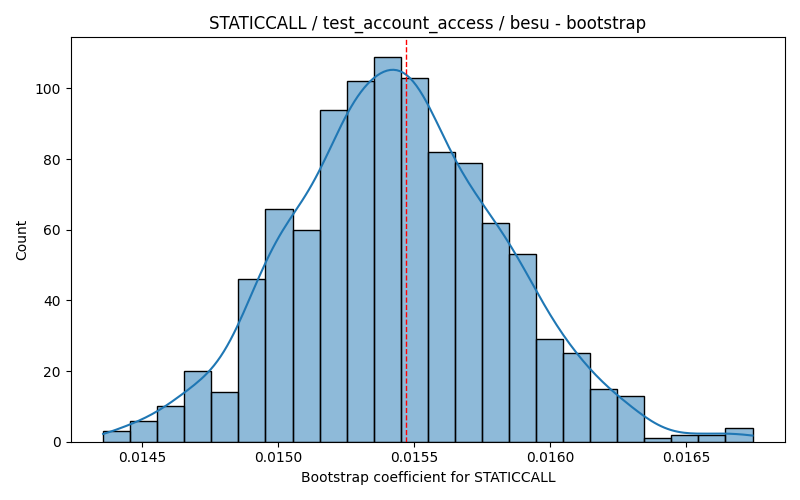

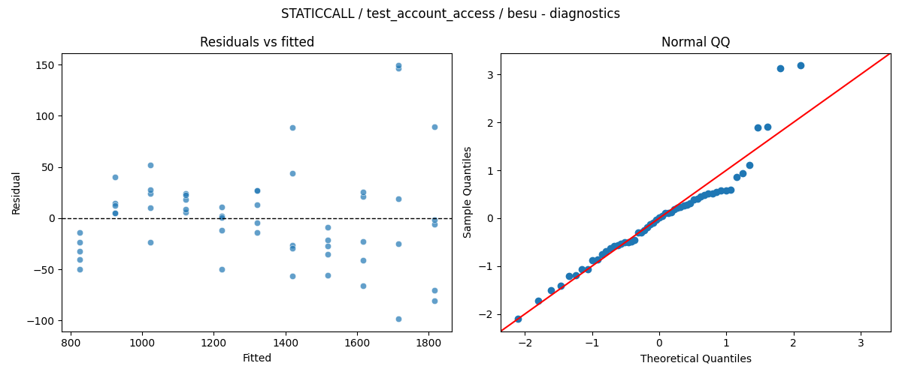

</details>

<details><summary>erigon — NNLS regression summary</summary>

```
==============================================================================
                           NNLS Regression Results                            
==============================================================================
Dep. Variable:          test_runtime_ms              R-squared:          0.995
Model:                  NNLS                    Adj. R-squared:          0.995
No. Observations:       44                                RMSE:          12.95
Df Residuals:           42                                 MAE:          10.64
Df Model:               1      
==============================================================================
                      coef     std err     P-value      [0.025      0.975]
------------------------------------------------------------------------------
         const    106.8100      6.6547       0.001     91.6469    118.0096
       opcount      0.0090      0.0001       0.001      0.0088      0.0092
==============================================================================
Notes: Non-negative least squares with bootstrap inference (1000 iterations)
==============================================================================
```

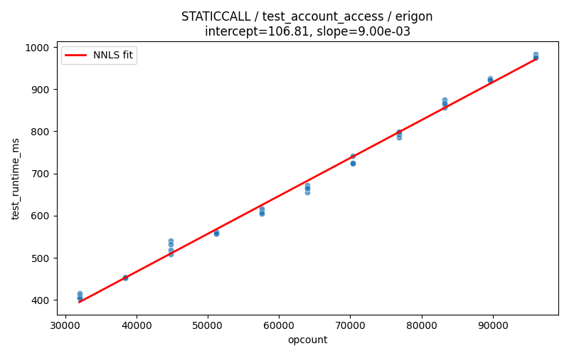

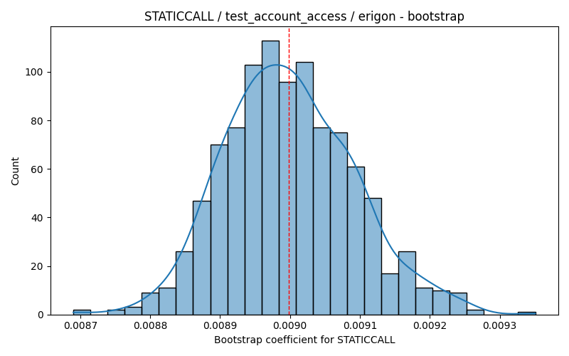

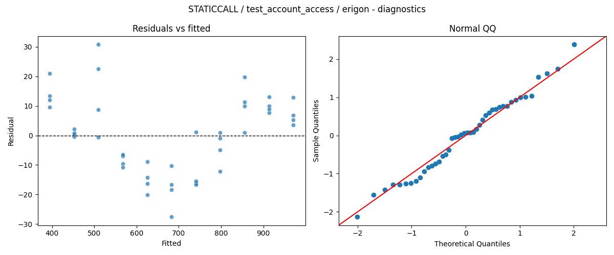

</details>

<details><summary>geth — NNLS regression summary</summary>

```
==============================================================================
                           NNLS Regression Results                            
==============================================================================
Dep. Variable:          test_runtime_ms              R-squared:          0.967
Model:                  NNLS                    Adj. R-squared:          0.967
No. Observations:       77                                RMSE:          18.98
Df Residuals:           75                                 MAE:          15.00
Df Model:               1      
==============================================================================
                      coef     std err     P-value      [0.025      0.975]
------------------------------------------------------------------------------
         const     69.6357      6.3159       0.001     56.4877     81.5282
       opcount      0.0051      0.0001       0.001      0.0049      0.0053
==============================================================================
Notes: Non-negative least squares with bootstrap inference (1000 iterations)
==============================================================================
```

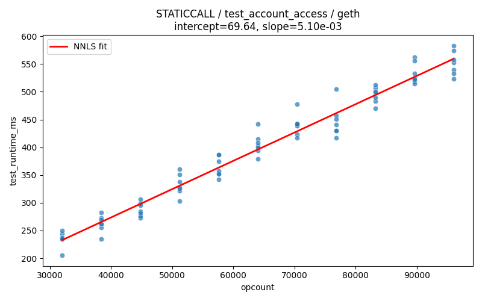

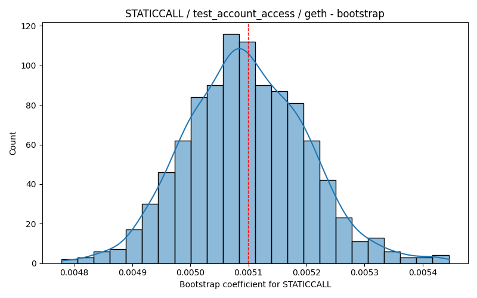

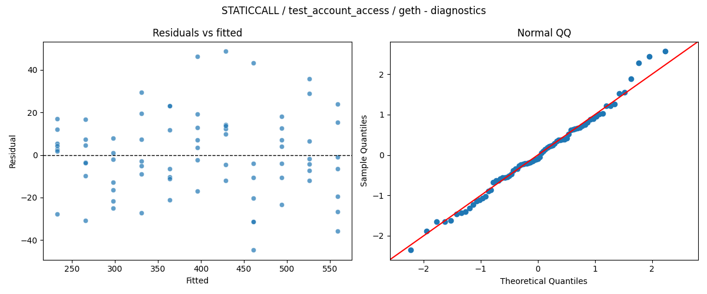

</details>

<details><summary>nethermind — NNLS regression summary</summary>

```
==============================================================================
                           NNLS Regression Results                            
==============================================================================
Dep. Variable:          test_runtime_ms              R-squared:          0.637
Model:                  NNLS                    Adj. R-squared:          0.631
No. Observations:       66                                RMSE:          43.45
Df Residuals:           64                                 MAE:          36.63
Df Model:               1      
==============================================================================
                      coef     std err     P-value      [0.025      0.975]
------------------------------------------------------------------------------
         const    117.6149     14.8192       0.001     89.3417    146.9831
       opcount      0.0028      0.0002       0.001      0.0024      0.0033
==============================================================================
Notes: Non-negative least squares with bootstrap inference (1000 iterations)
==============================================================================
```

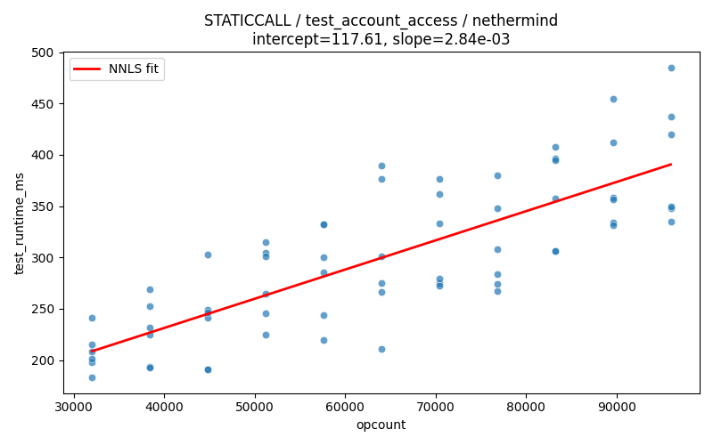

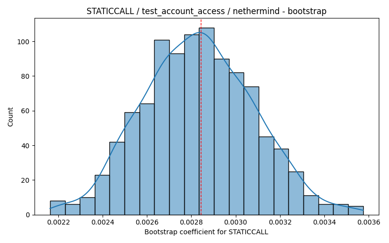

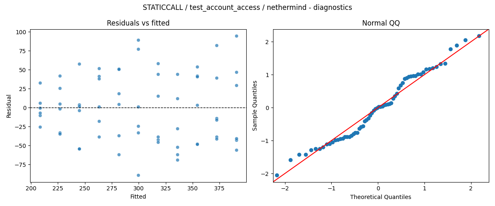

</details>

<details><summary>reth — NNLS regression summary</summary>

```
==============================================================================
                           NNLS Regression Results                            
==============================================================================
Dep. Variable:          test_runtime_ms              R-squared:          0.958
Model:                  NNLS                    Adj. R-squared:          0.957
No. Observations:       44                                RMSE:          17.21
Df Residuals:           42                                 MAE:          14.59
Df Model:               1      
==============================================================================
                      coef     std err     P-value      [0.025      0.975]
------------------------------------------------------------------------------
         const     91.1535      8.6212       0.001     75.3250    109.9982
       opcount      0.0041      0.0001       0.001      0.0038      0.0044
==============================================================================
Notes: Non-negative least squares with bootstrap inference (1000 iterations)
==============================================================================
```

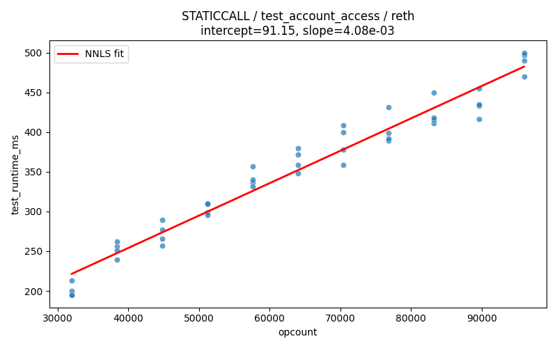

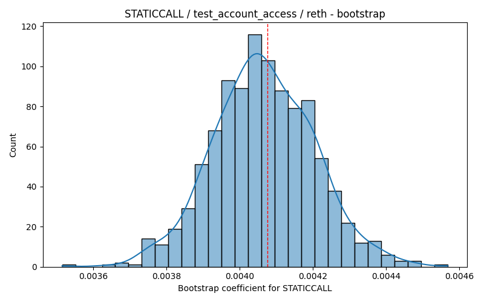

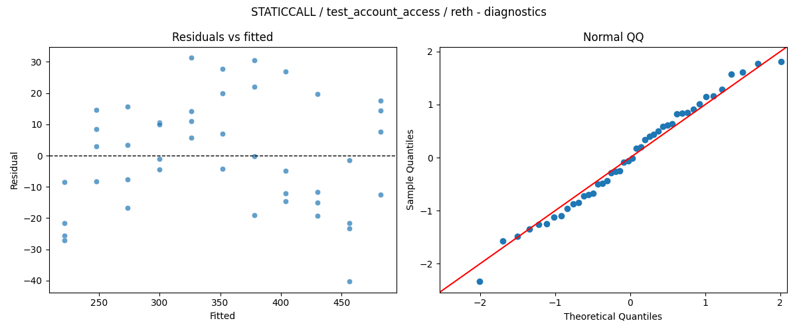

</details>

### test_account_access — combo `STATICCALL_AccountMode.EXISTING_CONTRACT_SAME_MAX`

| client | nobs | R² | target_coef (ms) | p-value | 95% CI |
| --- | --- | --- | --- | --- | --- |
| `besu` | 55 | 0.9792 | 0.01344 | 1.00e-03 | [0.01279, 0.0141] |
| `erigon` | 44 | 0.994 | 0.008871 | 1.00e-03 | [0.008663, 0.009126] |
| `geth` | 77 | 0.9343 | 0.004825 | 1.00e-03 | [0.004532, 0.005137] |
| `nethermind` | 66 | 0.6807 | 0.002994 | 1.00e-03 | [0.002503, 0.00353] |
| `reth` | 44 | 0.9855 | 0.004205 | 1.00e-03 | [0.004074, 0.004351] |

<details><summary>besu — NNLS regression summary</summary>

```
==============================================================================
                           NNLS Regression Results                            
==============================================================================
Dep. Variable:          test_runtime_ms              R-squared:          0.979
Model:                  NNLS                    Adj. R-squared:          0.979
No. Observations:       55                                RMSE:          39.61
Df Residuals:           53                                 MAE:          27.13
Df Model:               1      
==============================================================================
                      coef     std err     P-value      [0.025      0.975]
------------------------------------------------------------------------------
         const    411.3195     19.9665       0.001    374.5238    450.3552
       opcount      0.0134      0.0003       0.001      0.0128      0.0141
==============================================================================
Notes: Non-negative least squares with bootstrap inference (1000 iterations)
==============================================================================
```

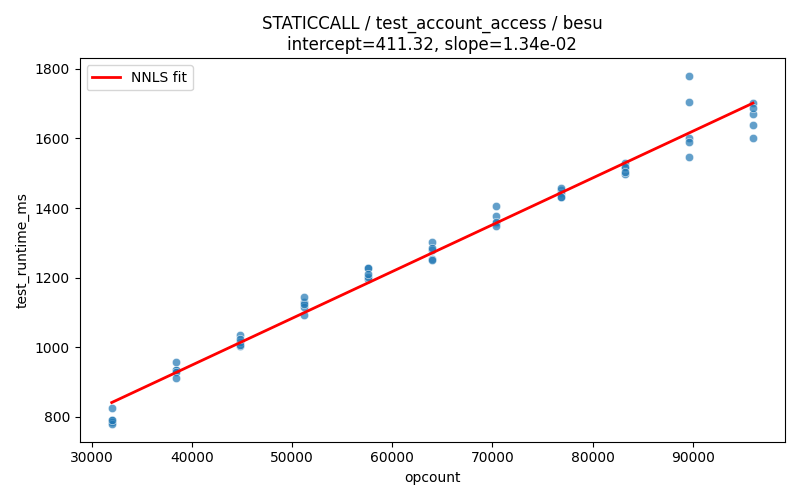

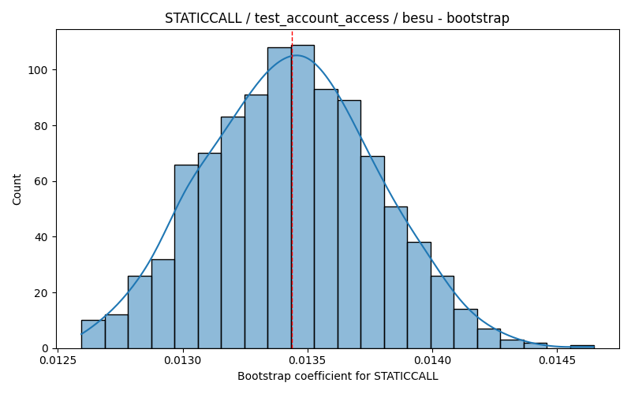

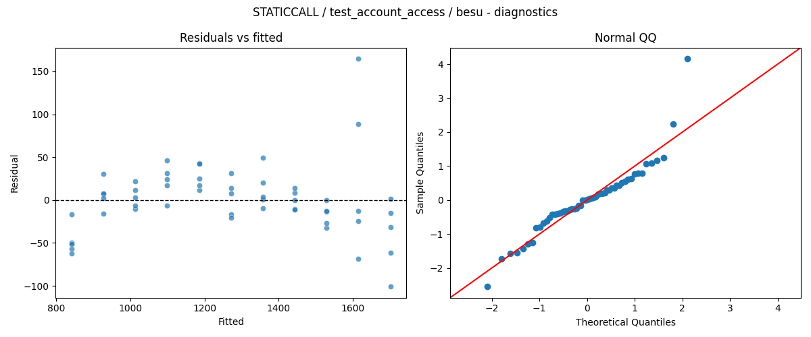

</details>

<details><summary>erigon — NNLS regression summary</summary>

```
==============================================================================
                           NNLS Regression Results                            
==============================================================================
Dep. Variable:          test_runtime_ms              R-squared:          0.994
Model:                  NNLS                    Adj. R-squared:          0.994
No. Observations:       44                                RMSE:          13.94
Df Residuals:           42                                 MAE:          11.25
Df Model:               1      
==============================================================================
                      coef     std err     P-value      [0.025      0.975]
------------------------------------------------------------------------------
         const    114.3867      7.6018       0.001     96.6803    126.8556
       opcount      0.0089      0.0001       0.001      0.0087      0.0091
==============================================================================
Notes: Non-negative least squares with bootstrap inference (1000 iterations)
==============================================================================
```


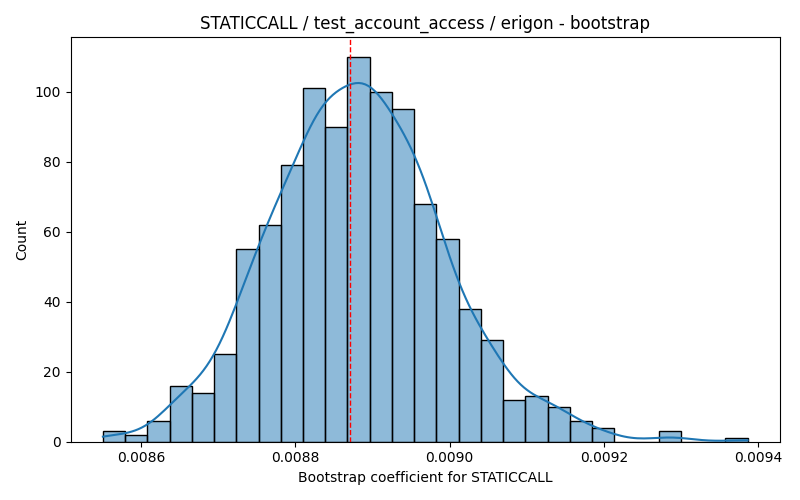

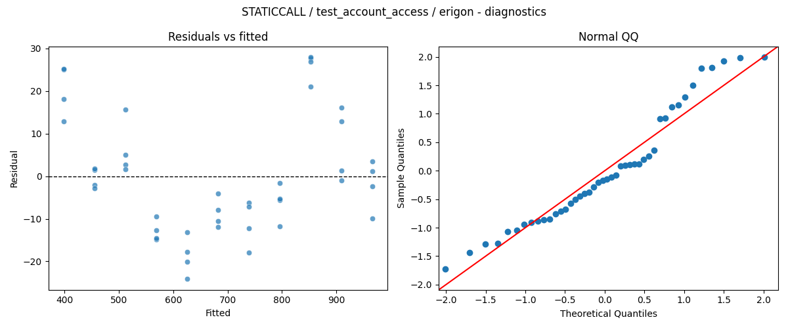

</details>

<details><summary>geth — NNLS regression summary</summary>

```
==============================================================================
                           NNLS Regression Results                            
==============================================================================
Dep. Variable:          test_runtime_ms              R-squared:          0.934
Model:                  NNLS                    Adj. R-squared:          0.933
No. Observations:       77                                RMSE:          25.90
Df Residuals:           75                                 MAE:          19.21
Df Model:               1      
==============================================================================
                      coef     std err     P-value      [0.025      0.975]
------------------------------------------------------------------------------
         const     83.8932      9.0492       0.001     65.6516    102.4842
       opcount      0.0048      0.0002       0.001      0.0045      0.0051
==============================================================================
Notes: Non-negative least squares with bootstrap inference (1000 iterations)
==============================================================================
```

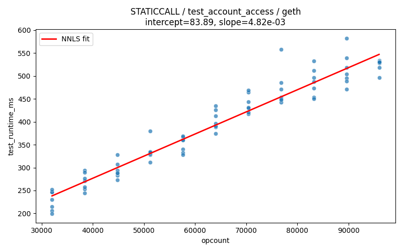

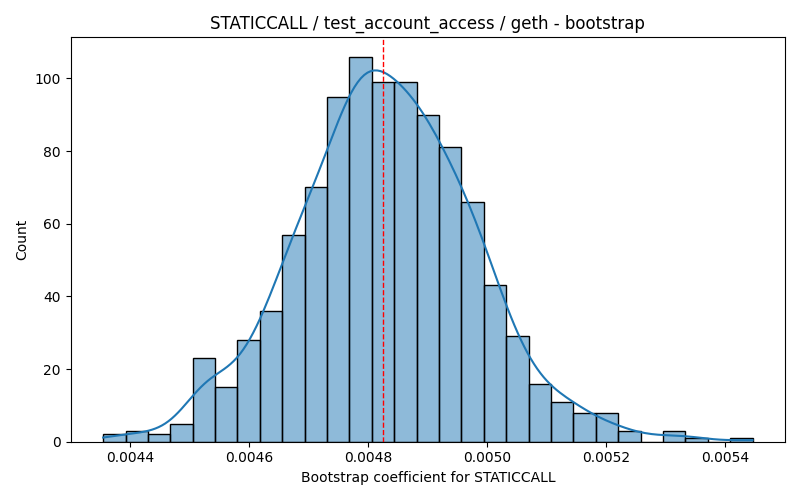

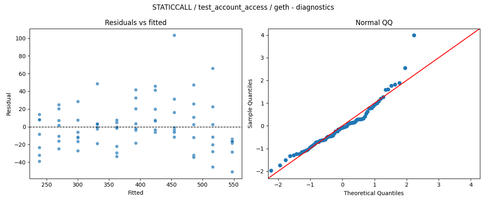

</details>

<details><summary>nethermind — NNLS regression summary</summary>

```
==============================================================================
                           NNLS Regression Results                            
==============================================================================
Dep. Variable:          test_runtime_ms              R-squared:          0.681
Model:                  NNLS                    Adj. R-squared:          0.676
No. Observations:       66                                RMSE:          41.50
Df Residuals:           64                                 MAE:          36.69
Df Model:               1      
==============================================================================
                      coef     std err     P-value      [0.025      0.975]
------------------------------------------------------------------------------
         const    112.8674     14.8928       0.001     84.8139    144.5074
       opcount      0.0030      0.0003       0.001      0.0025      0.0035
==============================================================================
Notes: Non-negative least squares with bootstrap inference (1000 iterations)
==============================================================================
```

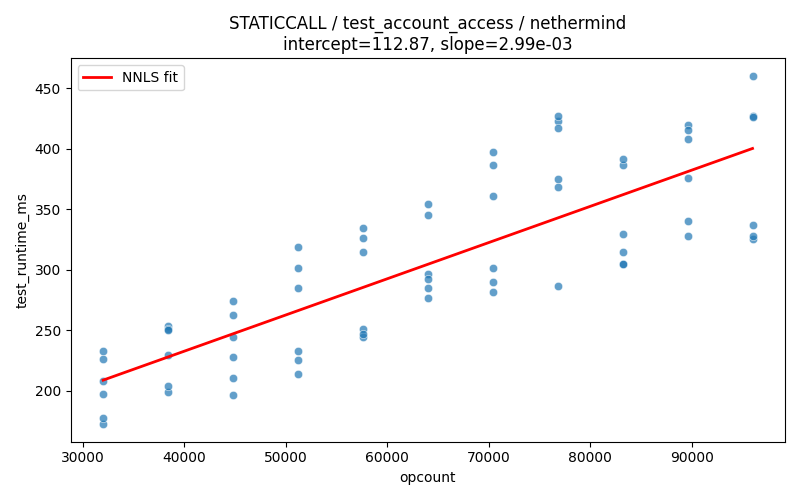

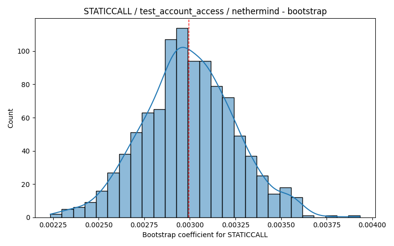

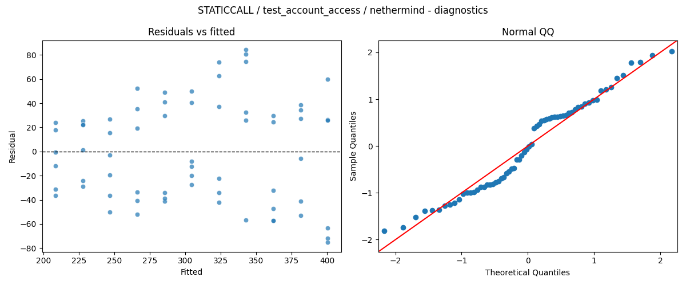

</details>

<details><summary>reth — NNLS regression summary</summary>

```
==============================================================================
                           NNLS Regression Results                            
==============================================================================
Dep. Variable:          test_runtime_ms              R-squared:          0.985
Model:                  NNLS                    Adj. R-squared:          0.985
No. Observations:       44                                RMSE:          10.33
Df Residuals:           42                                 MAE:           8.58
Df Model:               1      
==============================================================================
                      coef     std err     P-value      [0.025      0.975]
------------------------------------------------------------------------------
         const     81.5219      4.5114       0.001     72.5449     90.4102
       opcount      0.0042      0.0001       0.001      0.0041      0.0044
==============================================================================
Notes: Non-negative least squares with bootstrap inference (1000 iterations)
==============================================================================
```

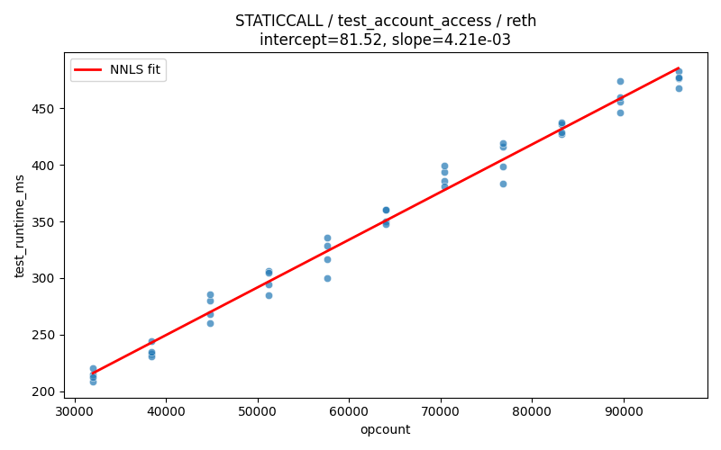

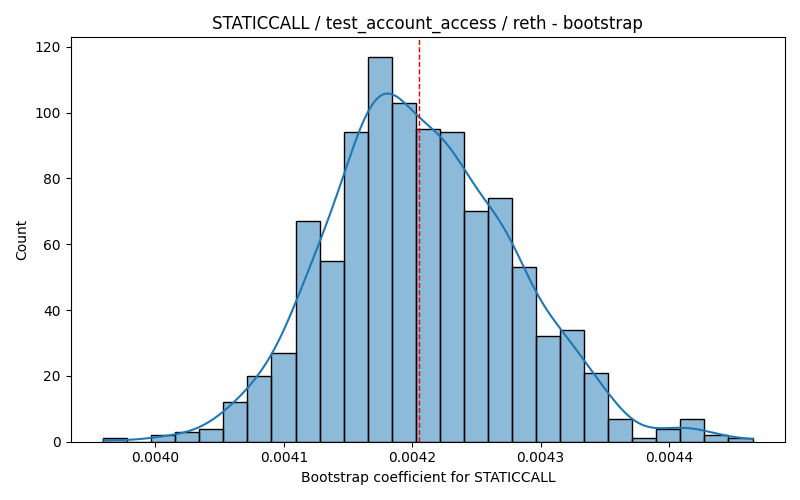

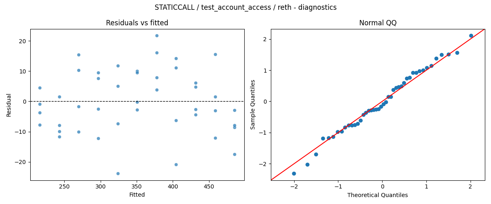

</details>

## EXTCODECOPY

### test_account_access — combo `EXTCODECOPY_AccountMode.EXISTING_EOA`

| client | nobs | R² | target_coef (ms) | p-value | 95% CI |
| --- | --- | --- | --- | --- | --- |
| `besu` | 55 | 0.9875 | 0.0148 | 1.00e-03 | [0.01435, 0.01526] |
| `erigon` | 44 | 0.9978 | 0.008135 | 1.00e-03 | [0.008034, 0.008175] |
| `geth` | 77 | 0.9865 | 0.0114 | 1.00e-03 | [0.01107, 0.01173] |
| `nethermind` | 66 | 0.9295 | 0.003404 | 1.00e-03 | [0.003192, 0.003642] |
| `reth` | 44 | 0.9743 | 0.004141 | 1.00e-03 | [0.003941, 0.004338] |

<details><summary>besu — NNLS regression summary</summary>

```
==============================================================================
                           NNLS Regression Results                            
==============================================================================
Dep. Variable:          test_runtime_ms              R-squared:          0.987
Model:                  NNLS                    Adj. R-squared:          0.987
No. Observations:       55                                RMSE:          32.25
Df Residuals:           53                                 MAE:          24.70
Df Model:               1      
==============================================================================
                      coef     std err     P-value      [0.025      0.975]
------------------------------------------------------------------------------
         const    445.6243     14.8942       0.001    416.4041    474.4027
       opcount      0.0148      0.0002       0.001      0.0144      0.0153
==============================================================================
Notes: Non-negative least squares with bootstrap inference (1000 iterations)
==============================================================================
```


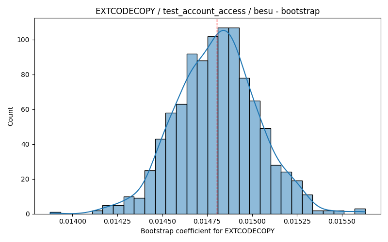

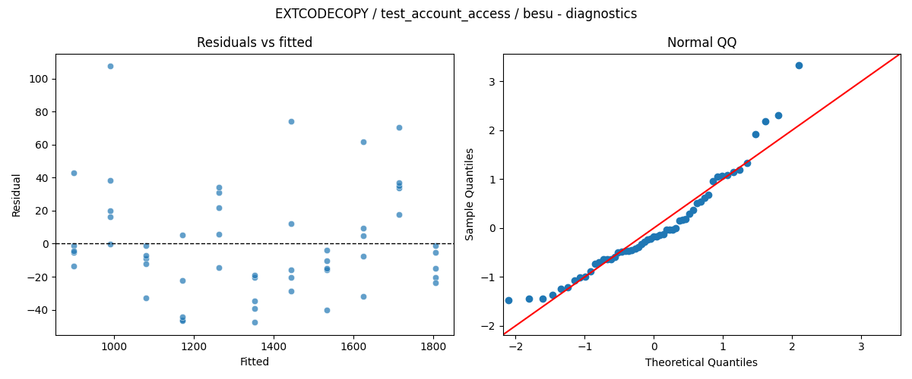

</details>

<details><summary>erigon — NNLS regression summary</summary>

```
==============================================================================
                           NNLS Regression Results                            
==============================================================================
Dep. Variable:          test_runtime_ms              R-squared:          0.998
Model:                  NNLS                    Adj. R-squared:          0.998
No. Observations:       44                                RMSE:           7.51
Df Residuals:           42                                 MAE:           6.01
Df Model:               1      
==============================================================================
                      coef     std err     P-value      [0.025      0.975]
------------------------------------------------------------------------------
         const      0.0000      1.2781       1.000      0.0000      4.7579
       opcount      0.0081      0.0000       0.001      0.0080      0.0082
==============================================================================
Notes: Non-negative least squares with bootstrap inference (1000 iterations)
==============================================================================
```


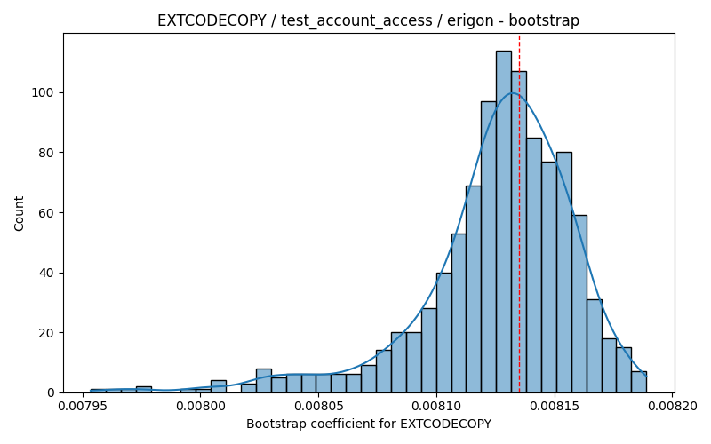

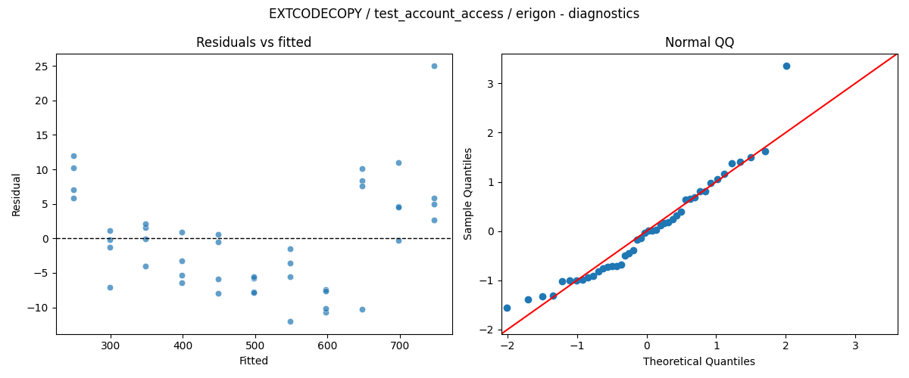

</details>

<details><summary>geth — NNLS regression summary</summary>

```
==============================================================================
                           NNLS Regression Results                            
==============================================================================
Dep. Variable:          test_runtime_ms              R-squared:          0.987
Model:                  NNLS                    Adj. R-squared:          0.986
No. Observations:       77                                RMSE:          25.78
Df Residuals:           75                                 MAE:          21.12
Df Model:               1      
==============================================================================
                      coef     std err     P-value      [0.025      0.975]
------------------------------------------------------------------------------
         const    219.1500      9.8396       0.001    201.1445    240.0150
       opcount      0.0114      0.0002       0.001      0.0111      0.0117
==============================================================================
Notes: Non-negative least squares with bootstrap inference (1000 iterations)
==============================================================================
```

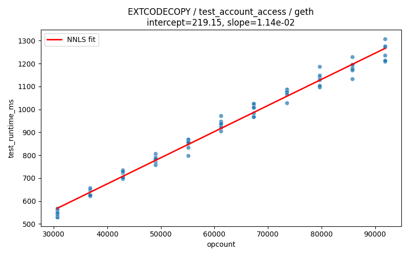

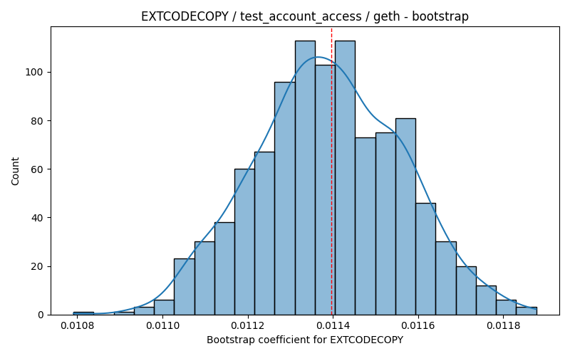

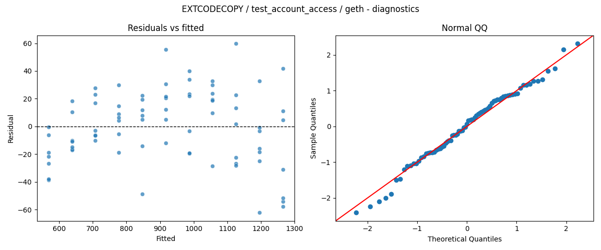

</details>

<details><summary>nethermind — NNLS regression summary</summary>

```
==============================================================================
                           NNLS Regression Results                            
==============================================================================
Dep. Variable:          test_runtime_ms              R-squared:          0.929
Model:                  NNLS                    Adj. R-squared:          0.928
No. Observations:       66                                RMSE:          18.16
Df Residuals:           64                                 MAE:          14.25
Df Model:               1      
==============================================================================
                      coef     std err     P-value      [0.025      0.975]
------------------------------------------------------------------------------
         const     85.8943      6.4755       0.001     73.3926     98.3305
       opcount      0.0034      0.0001       0.001      0.0032      0.0036
==============================================================================
Notes: Non-negative least squares with bootstrap inference (1000 iterations)
==============================================================================
```

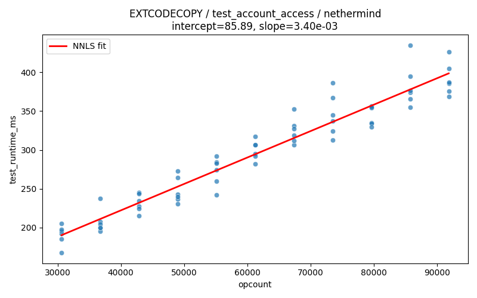

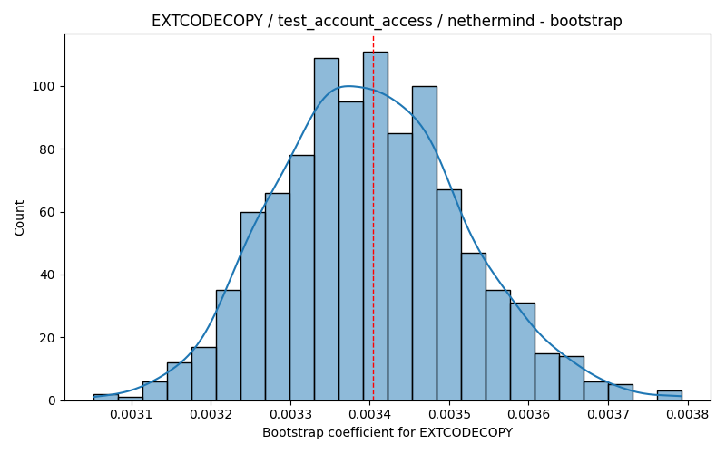

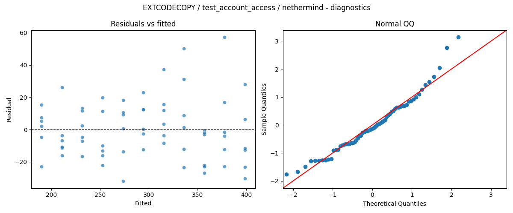

</details>

<details><summary>reth — NNLS regression summary</summary>

```
==============================================================================
                           NNLS Regression Results                            
==============================================================================
Dep. Variable:          test_runtime_ms              R-squared:          0.974
Model:                  NNLS                    Adj. R-squared:          0.974
No. Observations:       44                                RMSE:          13.04
Df Residuals:           42                                 MAE:          10.55
Df Model:               1      
==============================================================================
                      coef     std err     P-value      [0.025      0.975]
------------------------------------------------------------------------------
         const     82.1847      5.4910       0.001     71.3524     92.7986
       opcount      0.0041      0.0001       0.001      0.0039      0.0043
==============================================================================
Notes: Non-negative least squares with bootstrap inference (1000 iterations)
==============================================================================
```


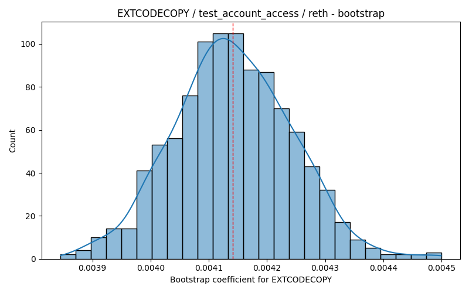

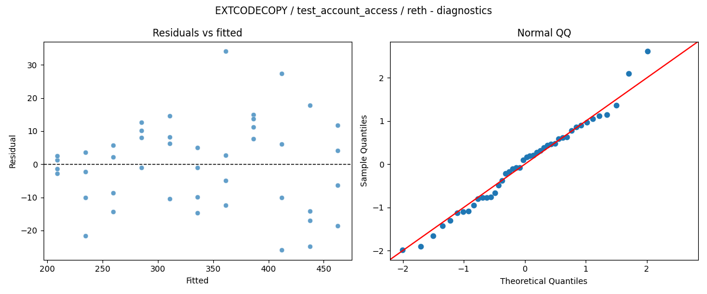

</details>

### test_account_access — combo `EXTCODECOPY_AccountMode.NON_EXISTING_ACCOUNT`

| client | nobs | R² | target_coef (ms) | p-value | 95% CI |
| --- | --- | --- | --- | --- | --- |
| `besu` | 55 | 0.988 | 0.0149 | 1.00e-03 | [0.01457, 0.01527] |
| `erigon` | 44 | 0.997 | 0.00798 | 1.00e-03 | [0.007885, 0.00802] |
| `geth` | 77 | 0.9738 | 0.02153 | 1.00e-03 | [0.02071, 0.02226] |
| `nethermind` | 66 | 0.9056 | 0.003142 | 1.00e-03 | [0.002861, 0.003397] |
| `reth` | 44 | 0.9739 | 0.004169 | 1.00e-03 | [0.003999, 0.004339] |

<details><summary>besu — NNLS regression summary</summary>

```
==============================================================================
                           NNLS Regression Results                            
==============================================================================
Dep. Variable:          test_runtime_ms              R-squared:          0.988
Model:                  NNLS                    Adj. R-squared:          0.988
No. Observations:       55                                RMSE:          31.77
Df Residuals:           53                                 MAE:          26.97
Df Model:               1      
==============================================================================
                      coef     std err     P-value      [0.025      0.975]
------------------------------------------------------------------------------
         const    122.2076     12.8878       0.001     96.7504    146.0227
       opcount      0.0149      0.0002       0.001      0.0146      0.0153
==============================================================================
Notes: Non-negative least squares with bootstrap inference (1000 iterations)
==============================================================================
```


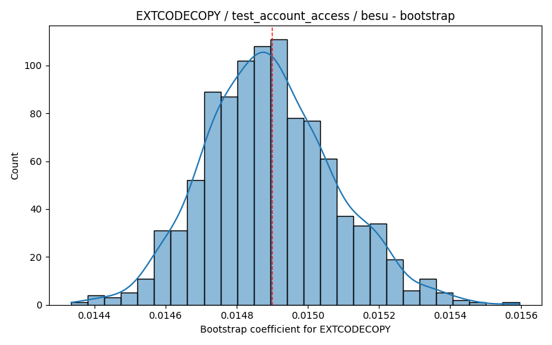

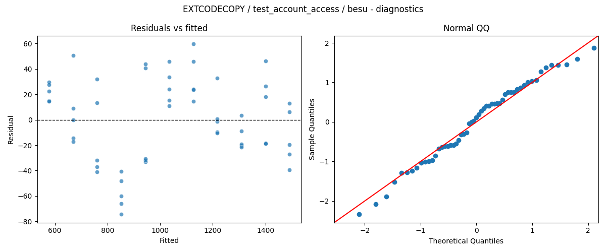

</details>

<details><summary>erigon — NNLS regression summary</summary>

```
==============================================================================
                           NNLS Regression Results                            
==============================================================================
Dep. Variable:          test_runtime_ms              R-squared:          0.997
Model:                  NNLS                    Adj. R-squared:          0.997
No. Observations:       44                                RMSE:           8.51
Df Residuals:           42                                 MAE:           7.00
Df Model:               1      
==============================================================================
                      coef     std err     P-value      [0.025      0.975]
------------------------------------------------------------------------------
         const      0.0000      1.3867       1.000      0.0000      4.5933
       opcount      0.0080      0.0000       0.001      0.0079      0.0080
==============================================================================
Notes: Non-negative least squares with bootstrap inference (1000 iterations)
==============================================================================
```

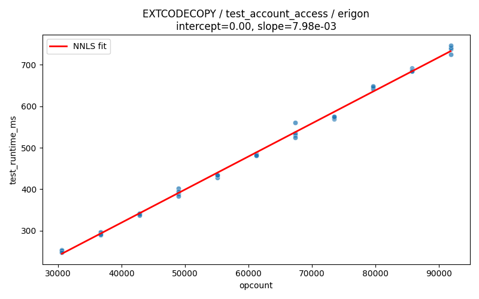

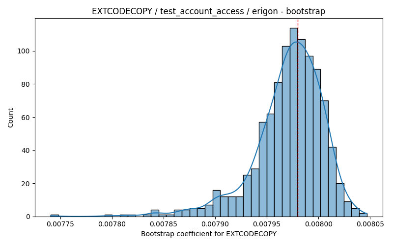

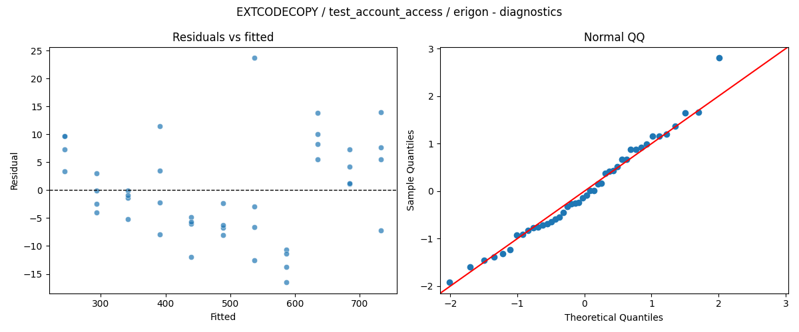

</details>

<details><summary>geth — NNLS regression summary</summary>

```
==============================================================================
                           NNLS Regression Results                            
==============================================================================
Dep. Variable:          test_runtime_ms              R-squared:          0.974
Model:                  NNLS                    Adj. R-squared:          0.973
No. Observations:       77                                RMSE:          68.37
Df Residuals:           75                                 MAE:          56.54
Df Model:               1      
==============================================================================
                      coef     std err     P-value      [0.025      0.975]
------------------------------------------------------------------------------
         const    274.6787     22.1519       0.001    232.5895    324.8133
       opcount      0.0215      0.0004       0.001      0.0207      0.0223
==============================================================================
Notes: Non-negative least squares with bootstrap inference (1000 iterations)
==============================================================================
```


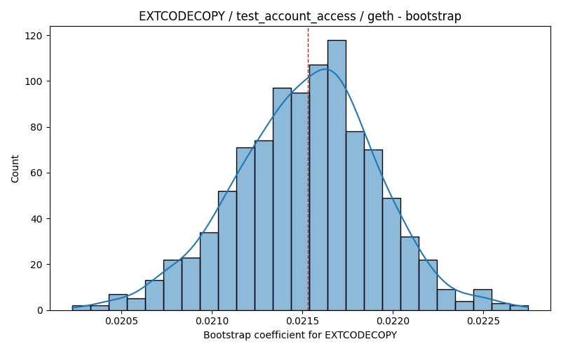

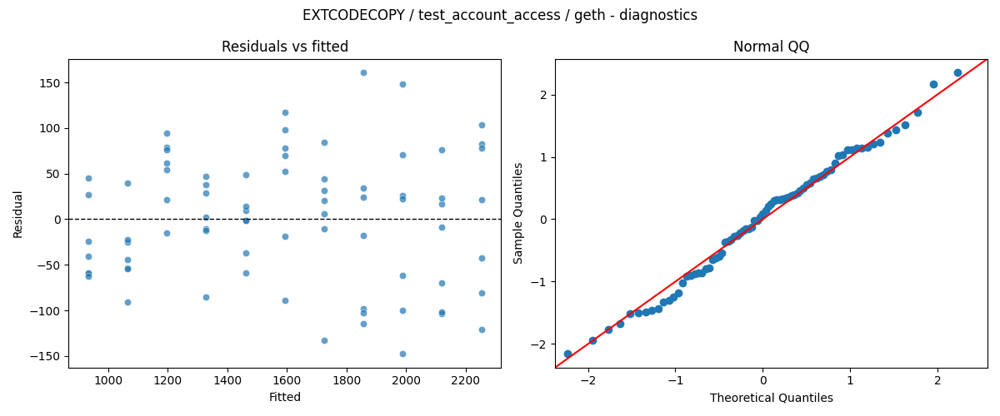

</details>

<details><summary>nethermind — NNLS regression summary</summary>

```
==============================================================================
                           NNLS Regression Results                            
==============================================================================
Dep. Variable:          test_runtime_ms              R-squared:          0.906
Model:                  NNLS                    Adj. R-squared:          0.904
No. Observations:       66                                RMSE:          19.65
Df Residuals:           64                                 MAE:          15.82
Df Model:               1      
==============================================================================
                      coef     std err     P-value      [0.025      0.975]
------------------------------------------------------------------------------
         const     62.2135      7.5952       0.001     48.3235     76.9939
       opcount      0.0031      0.0001       0.001      0.0029      0.0034
==============================================================================
Notes: Non-negative least squares with bootstrap inference (1000 iterations)
==============================================================================
```

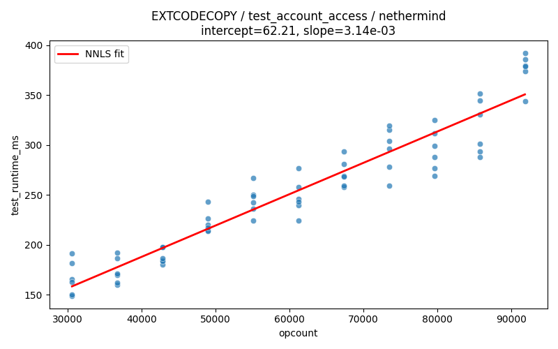

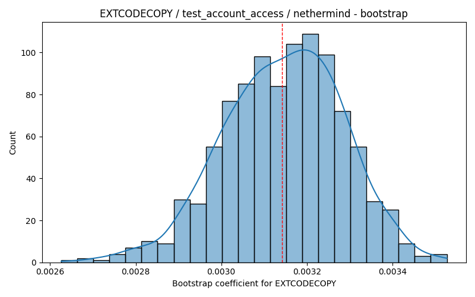

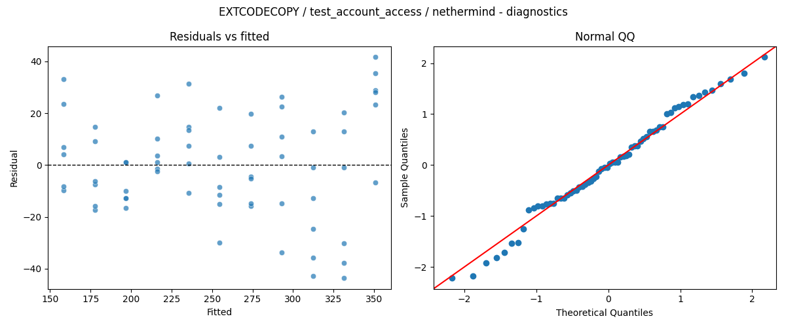

</details>

<details><summary>reth — NNLS regression summary</summary>

```
==============================================================================
                           NNLS Regression Results                            
==============================================================================
Dep. Variable:          test_runtime_ms              R-squared:          0.974
Model:                  NNLS                    Adj. R-squared:          0.973
No. Observations:       44                                RMSE:          13.21
Df Residuals:           42                                 MAE:          10.84
Df Model:               1      
==============================================================================
                      coef     std err     P-value      [0.025      0.975]
------------------------------------------------------------------------------
         const     80.3864      5.5900       0.001     69.8839     92.5145
       opcount      0.0042      0.0001       0.001      0.0040      0.0043
==============================================================================
Notes: Non-negative least squares with bootstrap inference (1000 iterations)
==============================================================================
```

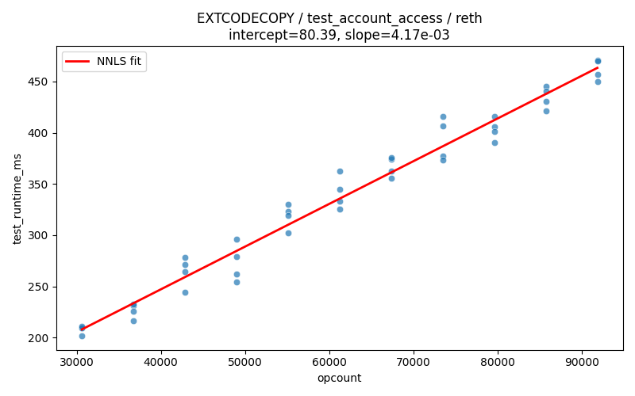

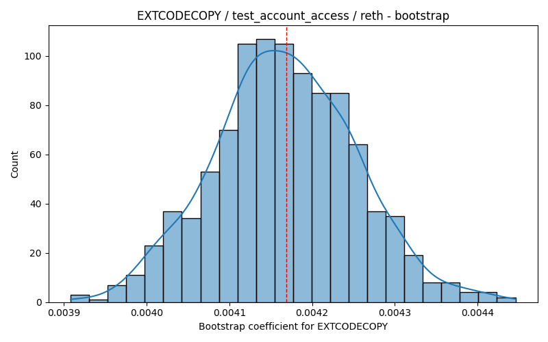

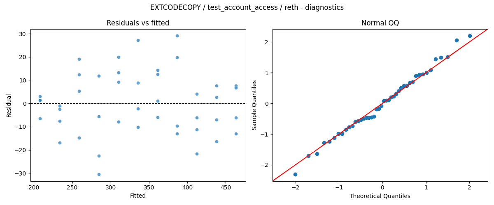

</details>

### test_account_access — combo `EXTCODECOPY_AccountMode.EXISTING_CONTRACT_DIFF_MAX`

| client | nobs | R² | target_coef (ms) | p-value | 95% CI |
| --- | --- | --- | --- | --- | --- |
| `besu` | 55 | 0.984 | 0.01943 | 1.00e-03 | [0.01881, 0.02003] |
| `erigon` | 44 | 0.9451 | 0.03319 | 1.00e-03 | [0.03053, 0.03533] |
| `geth` | 77 | 0.9324 | 0.0216 | 1.00e-03 | [0.02009, 0.02313] |
| `nethermind` | 66 | 0.9097 | 0.0153 | 1.00e-03 | [0.01392, 0.0167] |
| `reth` | 44 | 0.9981 | 0.02014 | 1.00e-03 | [0.01986, 0.02045] |

<details><summary>besu — NNLS regression summary</summary>

```
==============================================================================
                           NNLS Regression Results                            
==============================================================================
Dep. Variable:          test_runtime_ms              R-squared:          0.984
Model:                  NNLS                    Adj. R-squared:          0.984
No. Observations:       55                                RMSE:          47.32
Df Residuals:           53                                 MAE:          39.45
Df Model:               1      
==============================================================================
                      coef     std err     P-value      [0.025      0.975]
------------------------------------------------------------------------------
         const    435.5881     20.6457       0.001    393.3900    476.5231
       opcount      0.0194      0.0003       0.001      0.0188      0.0200
==============================================================================
Notes: Non-negative least squares with bootstrap inference (1000 iterations)
==============================================================================
```


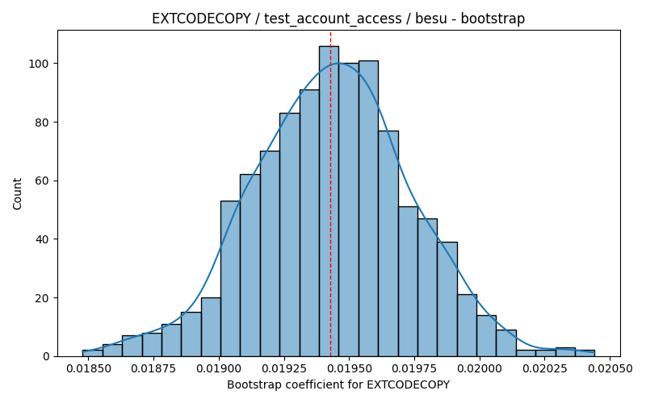

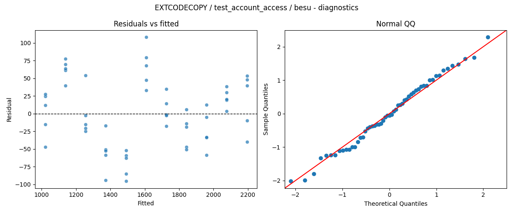

</details>

<details><summary>erigon — NNLS regression summary</summary>

```
==============================================================================
                           NNLS Regression Results                            
==============================================================================
Dep. Variable:          test_runtime_ms              R-squared:          0.945
Model:                  NNLS                    Adj. R-squared:          0.944
No. Observations:       44                                RMSE:         152.60
Df Residuals:           42                                 MAE:         130.69
Df Model:               1      
==============================================================================
                      coef     std err     P-value      [0.025      0.975]
------------------------------------------------------------------------------
         const    258.6441     83.1019       0.001    116.5910    450.8617
       opcount      0.0332      0.0012       0.001      0.0305      0.0353
==============================================================================
Notes: Non-negative least squares with bootstrap inference (1000 iterations)
==============================================================================
```

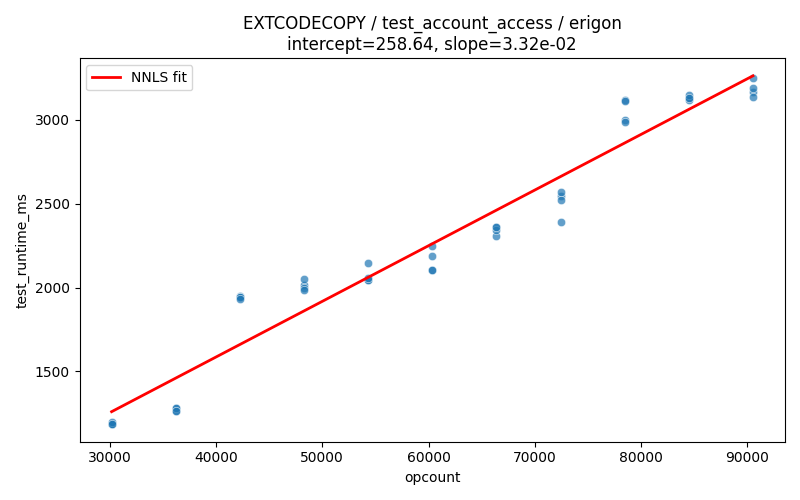

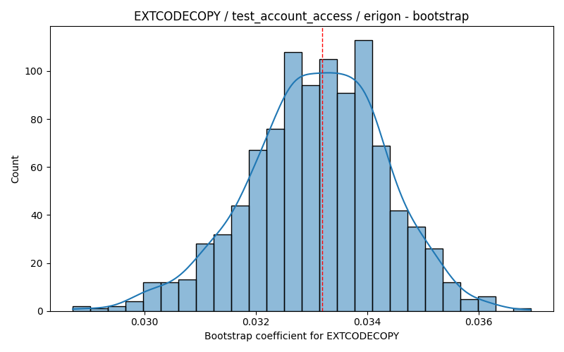

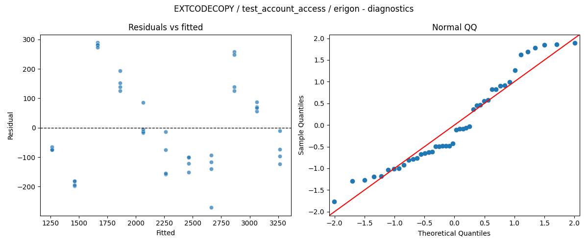

</details>

<details><summary>geth — NNLS regression summary</summary>

```
==============================================================================
                           NNLS Regression Results                            
==============================================================================
Dep. Variable:          test_runtime_ms              R-squared:          0.932
Model:                  NNLS                    Adj. R-squared:          0.931
No. Observations:       77                                RMSE:         111.04
Df Residuals:           75                                 MAE:          92.17
Df Model:               1      
==============================================================================
                      coef     std err     P-value      [0.025      0.975]
------------------------------------------------------------------------------
         const    420.1599     48.4447       0.001    332.8622    514.2007
       opcount      0.0216      0.0008       0.001      0.0201      0.0231
==============================================================================
Notes: Non-negative least squares with bootstrap inference (1000 iterations)
==============================================================================
```

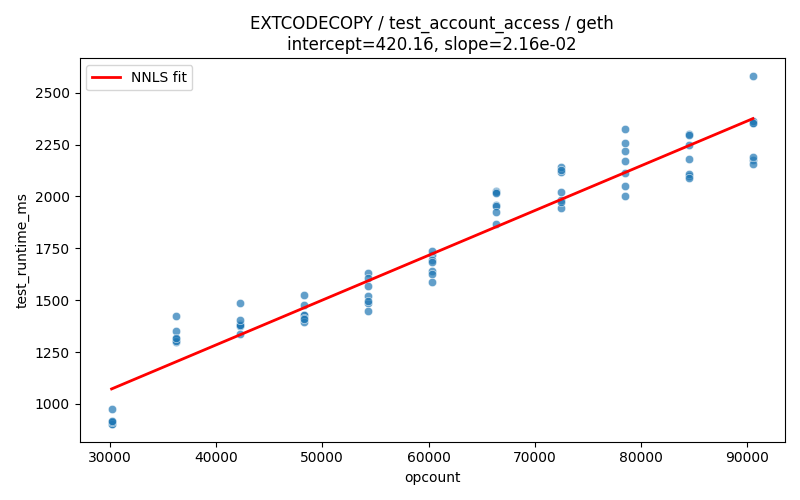

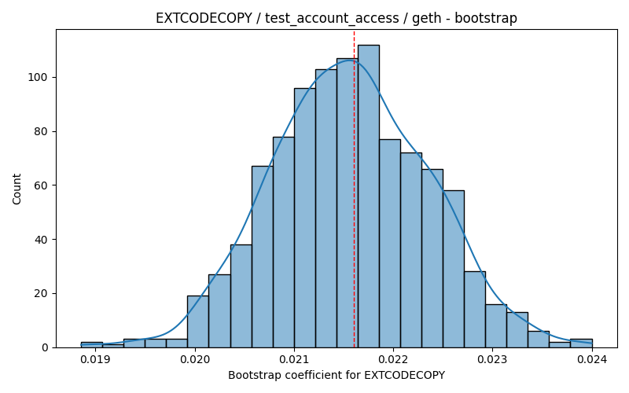

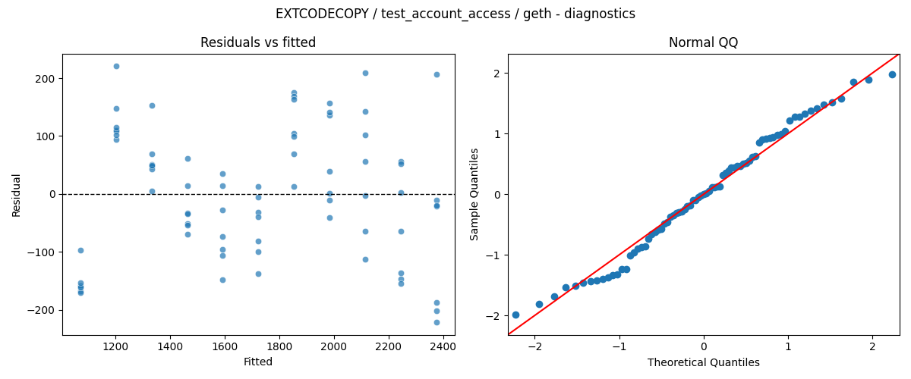

</details>

<details><summary>nethermind — NNLS regression summary</summary>

```
==============================================================================
                           NNLS Regression Results                            
==============================================================================
Dep. Variable:          test_runtime_ms              R-squared:          0.910
Model:                  NNLS                    Adj. R-squared:          0.908
No. Observations:       66                                RMSE:          91.99
Df Residuals:           64                                 MAE:          75.01
Df Model:               1      
==============================================================================
                      coef     std err     P-value      [0.025      0.975]
------------------------------------------------------------------------------
         const    576.7747     50.0098       0.001    479.0650    674.1792
       opcount      0.0153      0.0007       0.001      0.0139      0.0167
==============================================================================
Notes: Non-negative least squares with bootstrap inference (1000 iterations)
==============================================================================
```

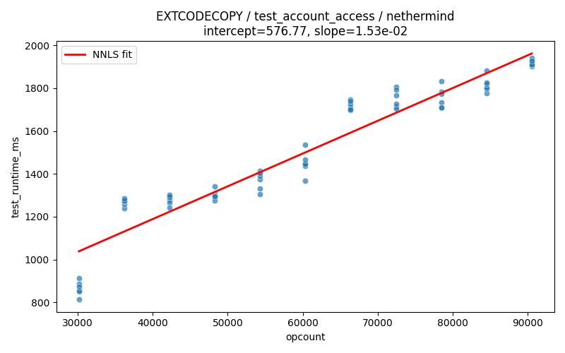

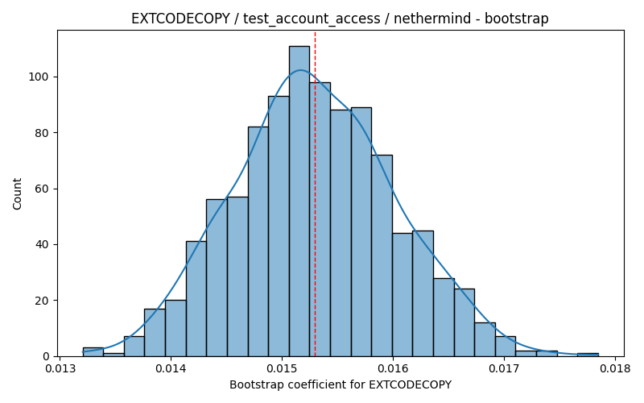

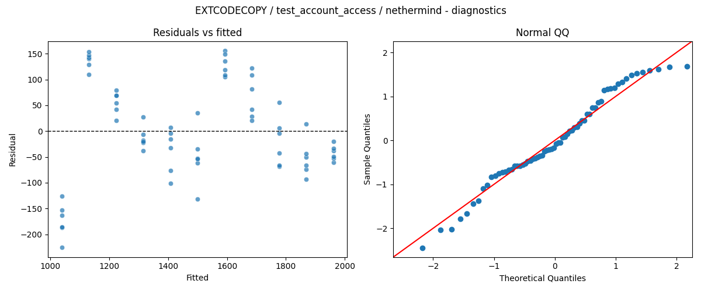

</details>

<details><summary>reth — NNLS regression summary</summary>

```
==============================================================================
                           NNLS Regression Results                            
==============================================================================
Dep. Variable:          test_runtime_ms              R-squared:          0.998
Model:                  NNLS                    Adj. R-squared:          0.998
No. Observations:       44                                RMSE:          16.63
Df Residuals:           42                                 MAE:          11.79
Df Model:               1      
==============================================================================
                      coef     std err     P-value      [0.025      0.975]
------------------------------------------------------------------------------
         const    115.3121      8.5820       0.001     98.2701    132.5985
       opcount      0.0201      0.0002       0.001      0.0199      0.0204
==============================================================================
Notes: Non-negative least squares with bootstrap inference (1000 iterations)
==============================================================================
```

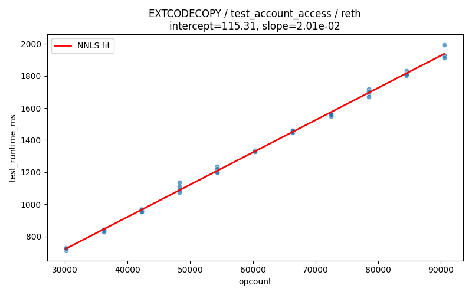

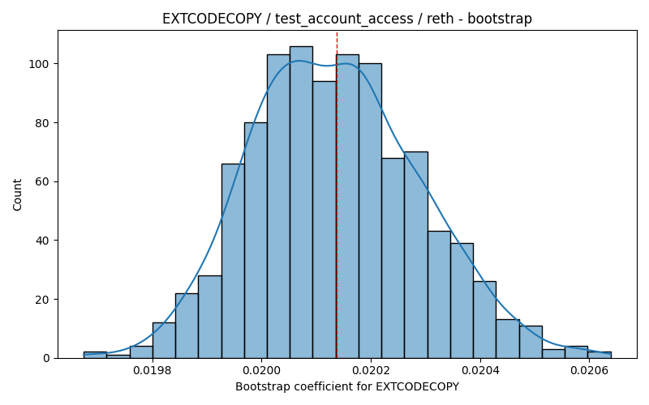

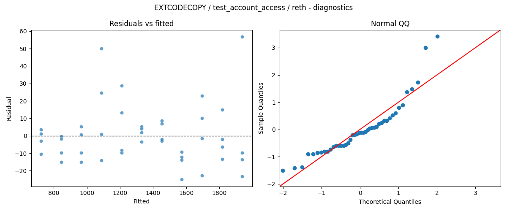

</details>

### test_account_access — combo `EXTCODECOPY_AccountMode.EXISTING_CONTRACT_MINIMAL`

| client | nobs | R² | target_coef (ms) | p-value | 95% CI |
| --- | --- | --- | --- | --- | --- |
| `besu` | 55 | 0.9807 | 0.01256 | 1.00e-03 | [0.01204, 0.01307] |
| `erigon` | 44 | 0.9923 | 0.007953 | 1.00e-03 | [0.007703, 0.008188] |
| `geth` | 77 | 0.9683 | 0.005057 | 1.00e-03 | [0.004841, 0.005272] |
| `nethermind` | 66 | 0.7401 | 0.001881 | 1.00e-03 | [0.001597, 0.002119] |
| `reth` | 44 | 0.9766 | 0.003871 | 1.00e-03 | [0.003687, 0.00406] |

<details><summary>besu — NNLS regression summary</summary>

```
==============================================================================
                           NNLS Regression Results                            
==============================================================================
Dep. Variable:          test_runtime_ms              R-squared:          0.981
Model:                  NNLS                    Adj. R-squared:          0.980
No. Observations:       55                                RMSE:          33.63
Df Residuals:           53                                 MAE:          27.40
Df Model:               1      
==============================================================================
                      coef     std err     P-value      [0.025      0.975]
------------------------------------------------------------------------------
         const    348.6260     15.4806       0.001    321.5858    380.0643
       opcount      0.0126      0.0003       0.001      0.0120      0.0131
==============================================================================
Notes: Non-negative least squares with bootstrap inference (1000 iterations)
==============================================================================
```

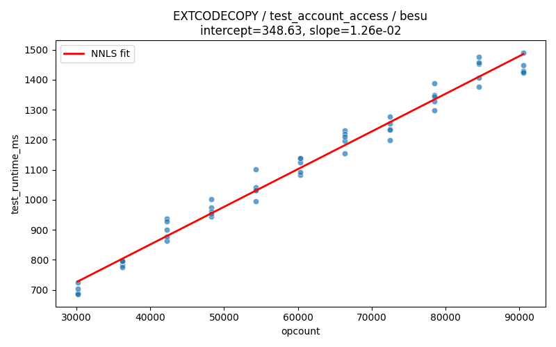


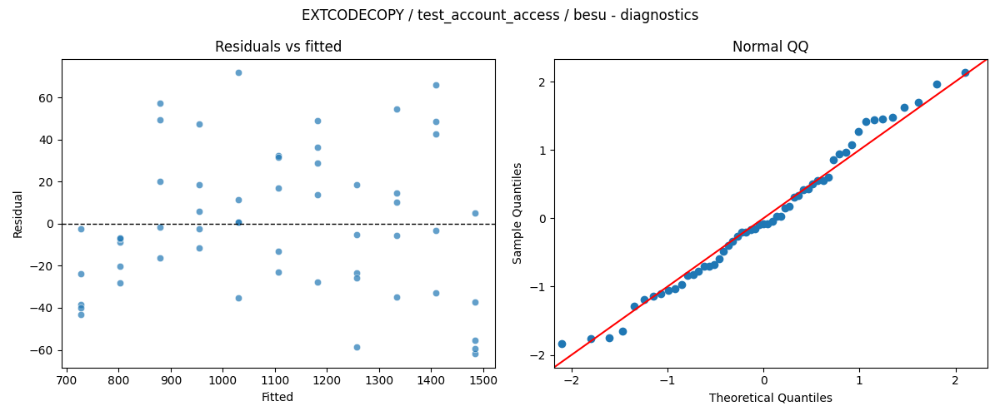

</details>

<details><summary>erigon — NNLS regression summary</summary>

```
==============================================================================
                           NNLS Regression Results                            
==============================================================================
Dep. Variable:          test_runtime_ms              R-squared:          0.992
Model:                  NNLS                    Adj. R-squared:          0.992
No. Observations:       44                                RMSE:          13.38
Df Residuals:           42                                 MAE:          11.13
Df Model:               1      
==============================================================================
                      coef     std err     P-value      [0.025      0.975]
------------------------------------------------------------------------------
         const    101.3794      7.8977       0.001     85.3857    116.4746
       opcount      0.0080      0.0001       0.001      0.0077      0.0082
==============================================================================
Notes: Non-negative least squares with bootstrap inference (1000 iterations)
==============================================================================
```


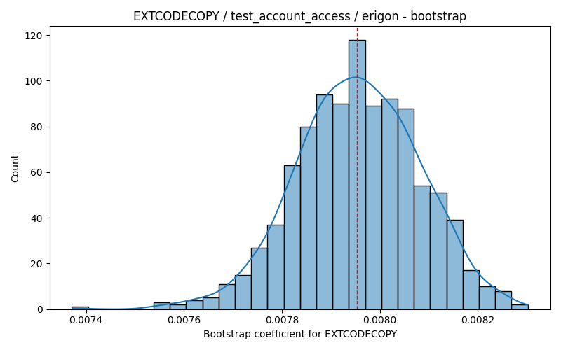

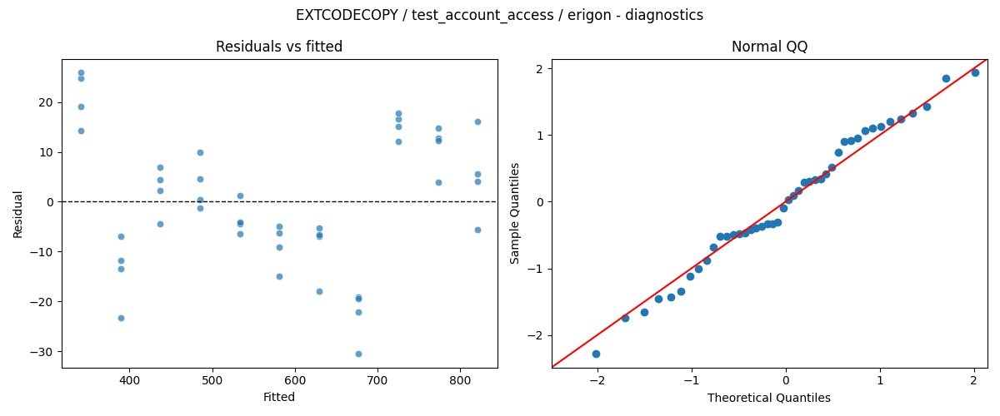

</details>

<details><summary>geth — NNLS regression summary</summary>

```
==============================================================================
                           NNLS Regression Results                            
==============================================================================
Dep. Variable:          test_runtime_ms              R-squared:          0.968
Model:                  NNLS                    Adj. R-squared:          0.968
No. Observations:       77                                RMSE:          17.47
Df Residuals:           75                                 MAE:          13.64
Df Model:               1      
==============================================================================
                      coef     std err     P-value      [0.025      0.975]
------------------------------------------------------------------------------
         const     69.2936      6.1841       0.001     57.0513     82.0150
       opcount      0.0051      0.0001       0.001      0.0048      0.0053
==============================================================================
Notes: Non-negative least squares with bootstrap inference (1000 iterations)
==============================================================================
```

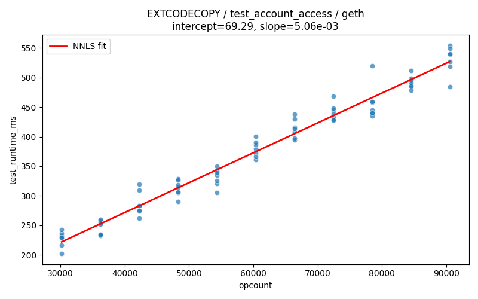

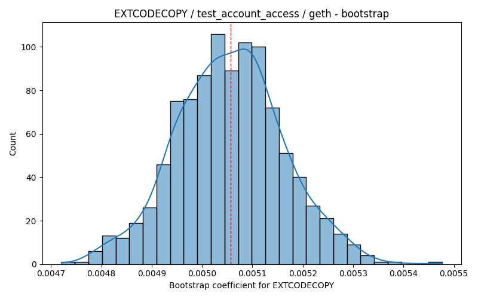

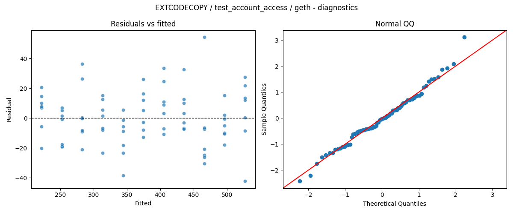

</details>

<details><summary>nethermind — NNLS regression summary</summary>

```
==============================================================================
                           NNLS Regression Results                            
==============================================================================
Dep. Variable:          test_runtime_ms              R-squared:          0.740
Model:                  NNLS                    Adj. R-squared:          0.736
No. Observations:       66                                RMSE:          21.27
Df Residuals:           64                                 MAE:          17.19
Df Model:               1      
==============================================================================
                      coef     std err     P-value      [0.025      0.975]
------------------------------------------------------------------------------
         const     97.7681      8.4216       0.001     82.5040    115.4535
       opcount      0.0019      0.0001       0.001      0.0016      0.0021
==============================================================================
Notes: Non-negative least squares with bootstrap inference (1000 iterations)
==============================================================================
```

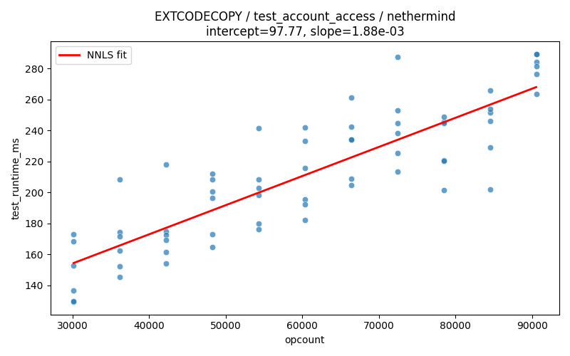

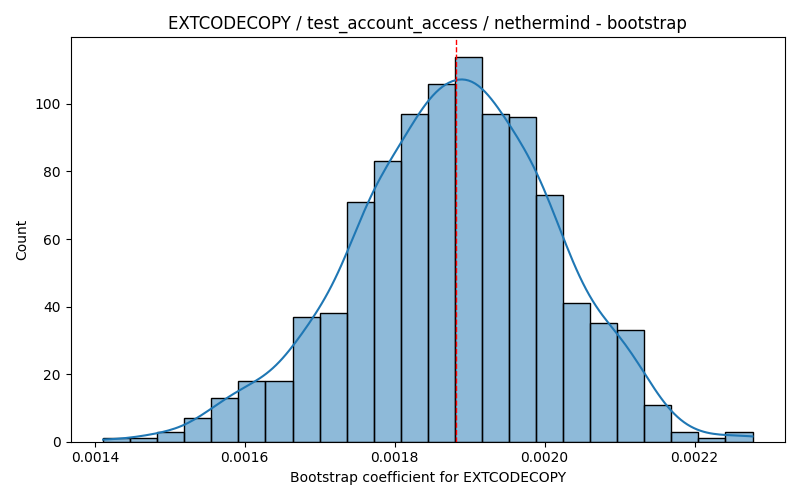

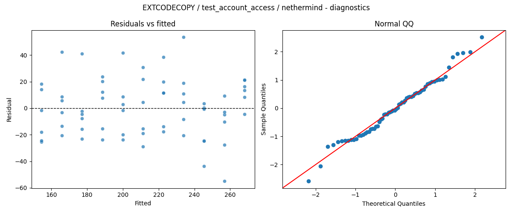

</details>

<details><summary>reth — NNLS regression summary</summary>

```
==============================================================================
                           NNLS Regression Results                            
==============================================================================
Dep. Variable:          test_runtime_ms              R-squared:          0.977
Model:                  NNLS                    Adj. R-squared:          0.976
No. Observations:       44                                RMSE:          11.44
Df Residuals:           42                                 MAE:           8.84
Df Model:               1      
==============================================================================
                      coef     std err     P-value      [0.025      0.975]
------------------------------------------------------------------------------
         const     72.8153      5.1734       0.001     62.8618     82.2331
       opcount      0.0039      0.0001       0.001      0.0037      0.0041
==============================================================================
Notes: Non-negative least squares with bootstrap inference (1000 iterations)
==============================================================================
```

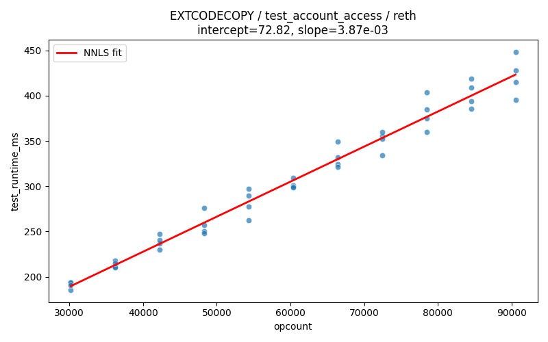

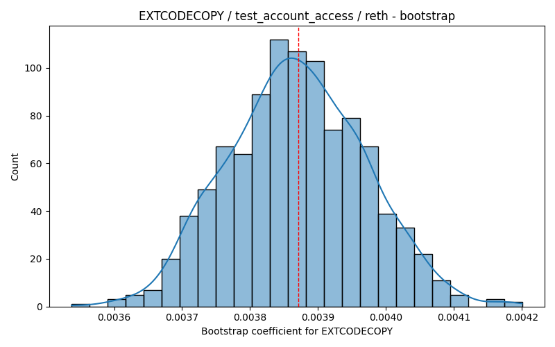

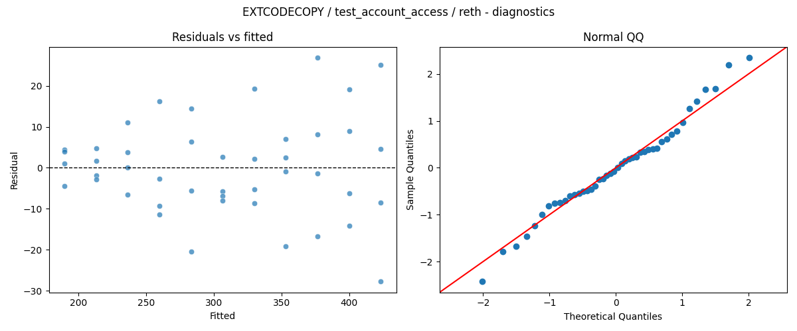

</details>

### test_account_access — combo `EXTCODECOPY_AccountMode.EXISTING_CONTRACT_SAME_MAX`

| client | nobs | R² | target_coef (ms) | p-value | 95% CI |
| --- | --- | --- | --- | --- | --- |
| `besu` | 55 | 0.972 | 0.01108 | 1.00e-03 | [0.01052, 0.01165] |
| `erigon` | 44 | 0.9947 | 0.007953 | 1.00e-03 | [0.007785, 0.008127] |
| `geth` | 77 | 0.9539 | 0.004795 | 1.00e-03 | [0.004572, 0.005031] |
| `nethermind` | 66 | 0.8049 | 0.002274 | 1.00e-03 | [0.00198, 0.002549] |
| `reth` | 44 | 0.9729 | 0.004059 | 1.00e-03 | [0.003848, 0.004244] |

<details><summary>besu — NNLS regression summary</summary>

```
==============================================================================
                           NNLS Regression Results                            
==============================================================================
Dep. Variable:          test_runtime_ms              R-squared:          0.972
Model:                  NNLS                    Adj. R-squared:          0.971
No. Observations:       55                                RMSE:          35.89
Df Residuals:           53                                 MAE:          29.74
Df Model:               1      
==============================================================================
                      coef     std err     P-value      [0.025      0.975]
------------------------------------------------------------------------------
         const    408.6564     18.0794       0.001    376.6902    446.7978
       opcount      0.0111      0.0003       0.001      0.0105      0.0117
==============================================================================
Notes: Non-negative least squares with bootstrap inference (1000 iterations)
==============================================================================
```

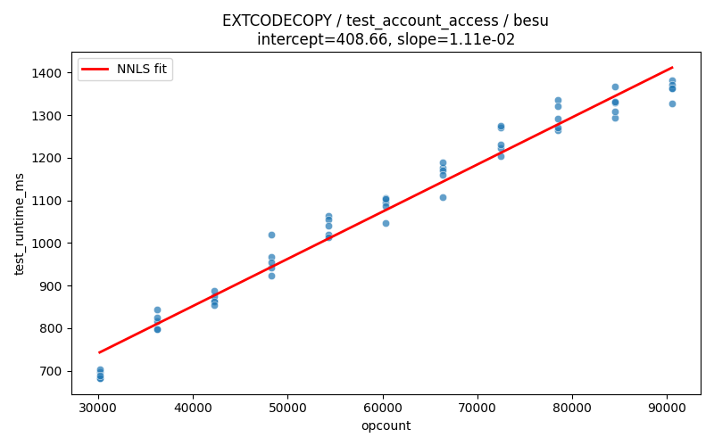


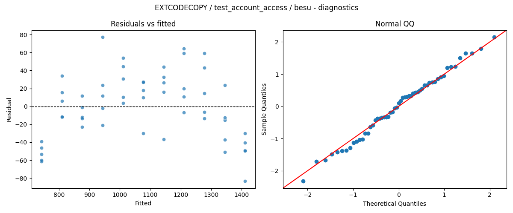

</details>

<details><summary>erigon — NNLS regression summary</summary>

```
==============================================================================
                           NNLS Regression Results                            
==============================================================================
Dep. Variable:          test_runtime_ms              R-squared:          0.995
Model:                  NNLS                    Adj. R-squared:          0.995
No. Observations:       44                                RMSE:          11.11
Df Residuals:           42                                 MAE:           9.33
Df Model:               1      
==============================================================================
                      coef     std err     P-value      [0.025      0.975]
------------------------------------------------------------------------------
         const    102.6639      6.1841       0.001     89.9618    113.5404
       opcount      0.0080      0.0001       0.001      0.0078      0.0081
==============================================================================
Notes: Non-negative least squares with bootstrap inference (1000 iterations)
==============================================================================
```

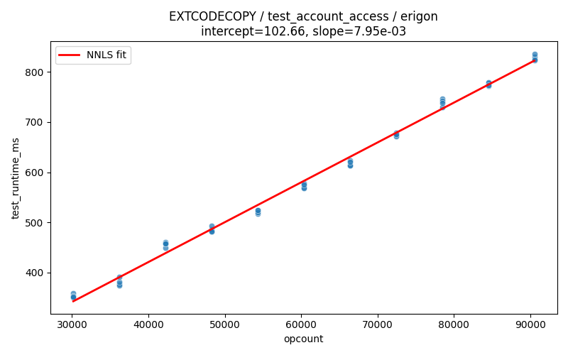

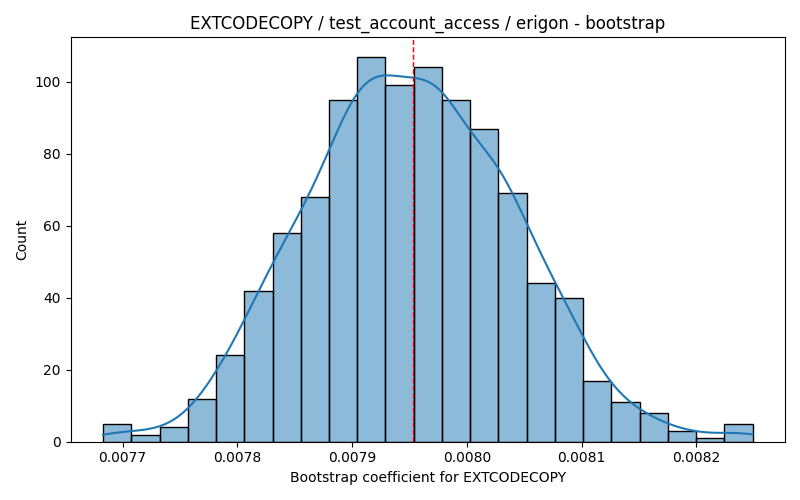

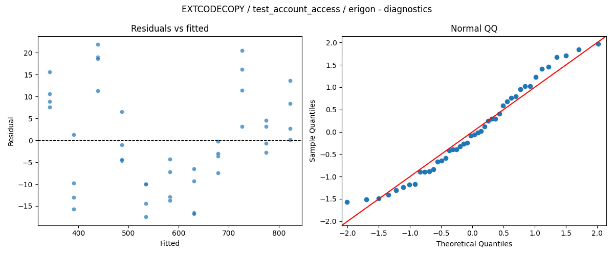

</details>

<details><summary>geth — NNLS regression summary</summary>

```
==============================================================================
                           NNLS Regression Results                            
==============================================================================
Dep. Variable:          test_runtime_ms              R-squared:          0.954
Model:                  NNLS                    Adj. R-squared:          0.953
No. Observations:       77                                RMSE:          20.12
Df Residuals:           75                                 MAE:          16.13
Df Model:               1      
==============================================================================
                      coef     std err     P-value      [0.025      0.975]
------------------------------------------------------------------------------
         const     73.6385      7.3836       0.001     59.5642     88.3335
       opcount      0.0048      0.0001       0.001      0.0046      0.0050
==============================================================================
Notes: Non-negative least squares with bootstrap inference (1000 iterations)
==============================================================================
```

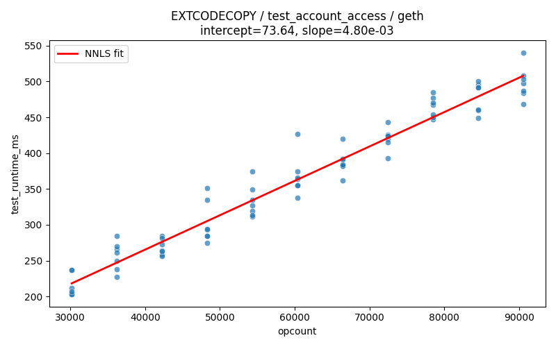

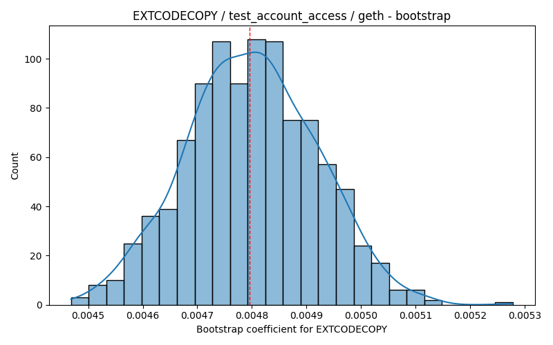

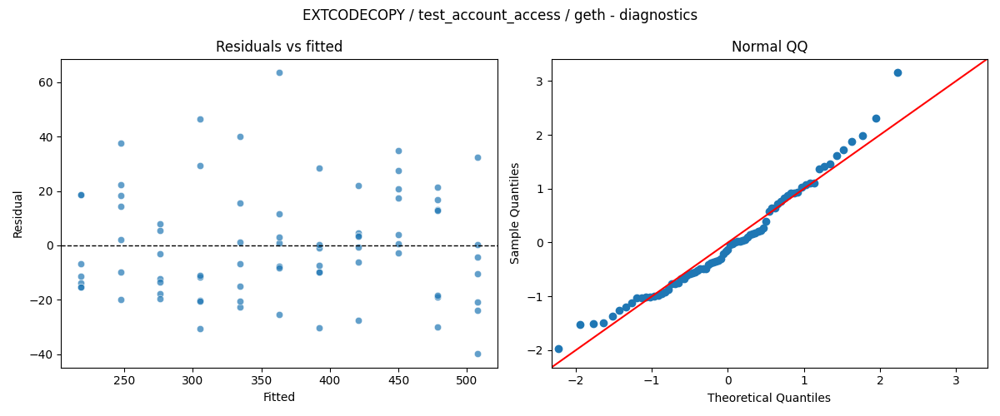

</details>

<details><summary>nethermind — NNLS regression summary</summary>

```
==============================================================================
                           NNLS Regression Results                            
==============================================================================
Dep. Variable:          test_runtime_ms              R-squared:          0.805
Model:                  NNLS                    Adj. R-squared:          0.802
No. Observations:       66                                RMSE:          21.36
Df Residuals:           64                                 MAE:          18.00
Df Model:               1      
==============================================================================
                      coef     std err     P-value      [0.025      0.975]
------------------------------------------------------------------------------
         const     78.0551      8.5006       0.001     62.1157     94.8613
       opcount      0.0023      0.0001       0.001      0.0020      0.0025
==============================================================================
Notes: Non-negative least squares with bootstrap inference (1000 iterations)
==============================================================================
```

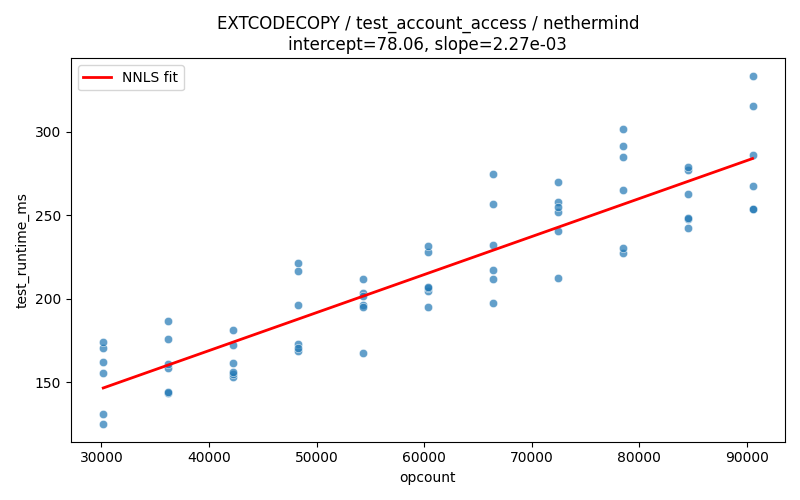

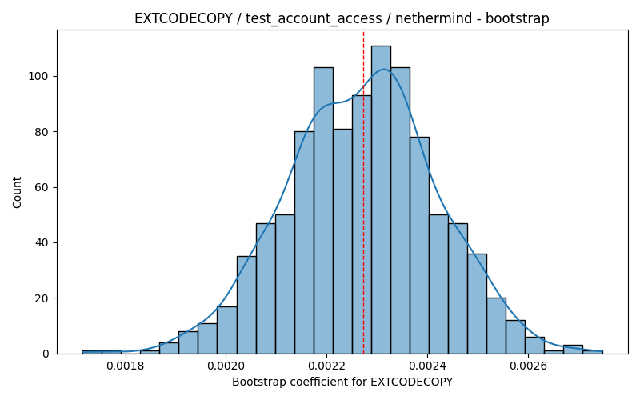

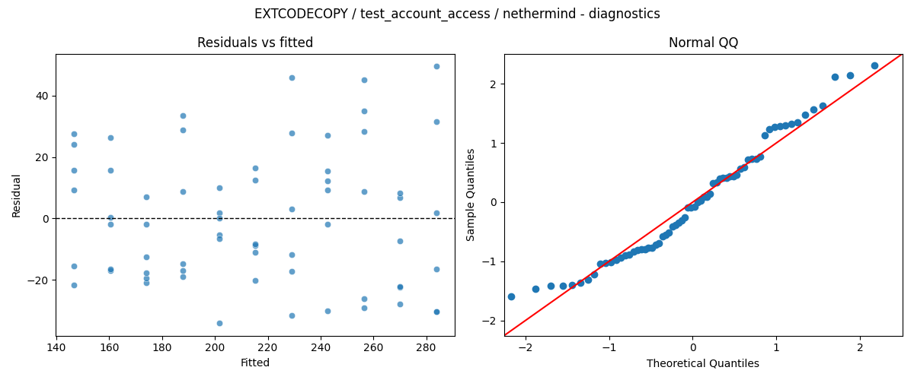

</details>

<details><summary>reth — NNLS regression summary</summary>

```
==============================================================================
                           NNLS Regression Results                            
==============================================================================
Dep. Variable:          test_runtime_ms              R-squared:          0.973
Model:                  NNLS                    Adj. R-squared:          0.972
No. Observations:       44                                RMSE:          12.92
Df Residuals:           42                                 MAE:          10.86
Df Model:               1      
==============================================================================
                      coef     std err     P-value      [0.025      0.975]
------------------------------------------------------------------------------
         const     66.4700      6.1021       0.001     54.6429     79.0016
       opcount      0.0041      0.0001       0.001      0.0038      0.0042
==============================================================================
Notes: Non-negative least squares with bootstrap inference (1000 iterations)
==============================================================================
```

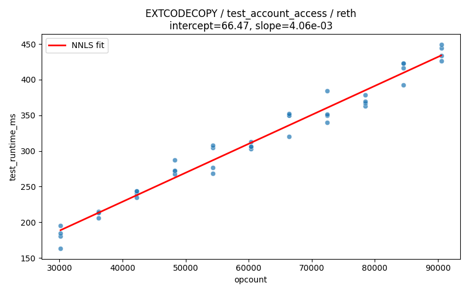

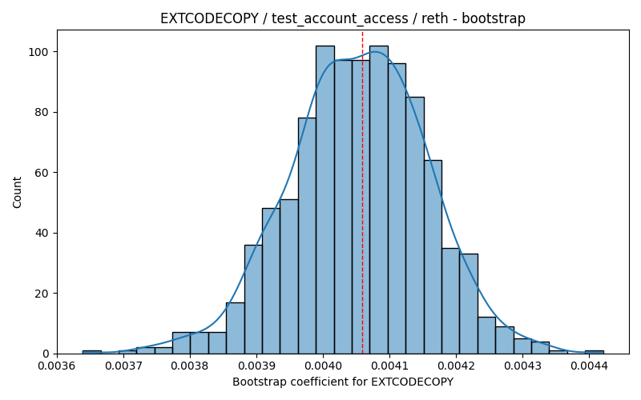

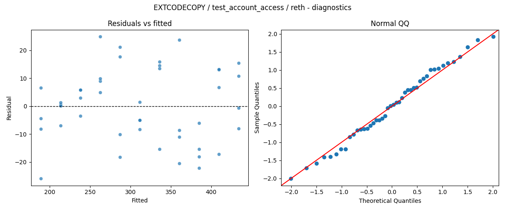

</details>
