# Glue opcodes report

Per-client NNLS fits of priced glue opcodes against their driver fixtures. Cycle-tier opcodes share one joint regression per client (shown once); pure-tier and mixed-tier opcodes each get a single-feature fit. Mixed-tier fits pre-adjust the LHS by subtracting the contribution of every priced upstream partner selected by the detector (pure ∪ cycle for `mixed_a`, plus `mixed_a` for `mixed_b`).

**Contents:** [besu](#besu) · [erigon](#erigon) · [ethrex](#ethrex) · [geth](#geth) · [nethermind](#nethermind) · [reth](#reth)

## besu

| glue_opcode | nobs | glue_runtime_ms | p_value | rsquared |
| --- | --- | --- | --- | --- |
| `ISZERO` | 0 | n/a | n/a | n/a |
| `JUMPDEST` | 0 | n/a | n/a | n/a |
| `SWAP` | 0 | n/a | n/a | n/a |
| `CALLDATASIZE` | 110 | 0 | 1.00e+00 | 0.9102 |
| `DUP` | 110 | 0 | 1.00e+00 | 0.9102 |
| `GAS` | 110 | 0 | 1.00e+00 | 0.9102 |
| `MLOAD` | 110 | 0 | 1.00e+00 | 0.9102 |
| `PUSH` | 110 | 8.585e-05 | 1.00e-03 | 0.9102 |
| `PUSH0` | 110 | 0 | 1.00e+00 | 0.9102 |
| `STATICCALL` | 110 | 0 | 1.00e+00 | 0.9102 |
| `ADD` | 0 | n/a | n/a | n/a |
| `AND` | 0 | n/a | n/a | n/a |
| `CALLDATACOPY` | 0 | n/a | n/a | n/a |
| `CALLDATALOAD` | 0 | n/a | n/a | n/a |
| `DIV` | 0 | n/a | n/a | n/a |
| `EXP` | 0 | n/a | n/a | n/a |
| `GT` | 0 | n/a | n/a | n/a |
| `JUMPI` | 0 | n/a | n/a | n/a |
| `LT` | 0 | n/a | n/a | n/a |
| `MSTORE` | 0 | n/a | n/a | n/a |
| `MSTORE8` | 0 | n/a | n/a | n/a |
| `MUL` | 0 | n/a | n/a | n/a |
| `PC` | 0 | n/a | n/a | n/a |
| `RETURNDATASIZE` | 0 | n/a | n/a | n/a |
| `SELFBALANCE` | 0 | n/a | n/a | n/a |
| `SUB` | 0 | n/a | n/a | n/a |
| `JUMP` | 0 | n/a | n/a | n/a |
| `KECCAK256` | 0 | n/a | n/a | n/a |

### Cycle glue — joint fit · besu

<details><summary>Joint NNLS regression summary</summary>

```
==============================================================================
                           NNLS Regression Results                            
==============================================================================
Dep. Variable:          test_runtime_ms              R-squared:          0.910
Model:                  NNLS                    Adj. R-squared:          0.904
No. Observations:       110                               RMSE:          69.81
Df Residuals:           102                                MAE:          58.51
Df Model:               7      
==============================================================================
                      coef     std err     P-value      [0.025      0.975]
------------------------------------------------------------------------------
         const    432.2110     22.1653       0.001    387.4315    474.1169
  CALLDATASIZE      0.0000      0.0000       1.000      0.0000      0.0000
           DUP      0.0000      0.0000       1.000      0.0000      0.0000
           GAS      0.0000      0.0000       1.000      0.0000      0.0000
         MLOAD      0.0000      0.0000       1.000      0.0000      0.0000
          PUSH      0.0001      0.0000       0.001      0.0001      0.0001
         PUSH0      0.0000      0.0000       1.000      0.0000      0.0000
    STATICCALL      0.0000      0.0000       1.000      0.0000      0.0000
==============================================================================
Notes: Non-negative least squares with bootstrap inference (1000 iterations)
==============================================================================
```

</details>

<details><summary><code>CALLDATASIZE</code> · nobs=110 · runtime_ms=0 · p=1.00e+00 · R²=0.9102</summary>


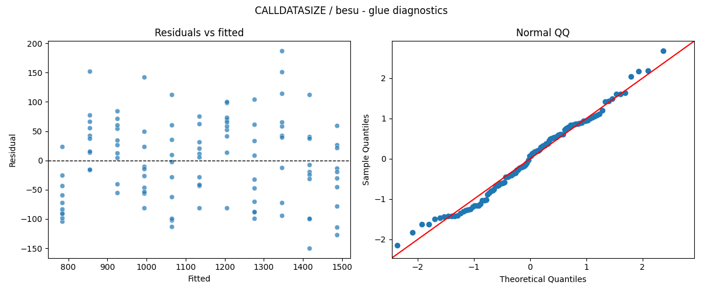

</details>

<details><summary><code>DUP</code> · nobs=110 · runtime_ms=0 · p=1.00e+00 · R²=0.9102</summary>

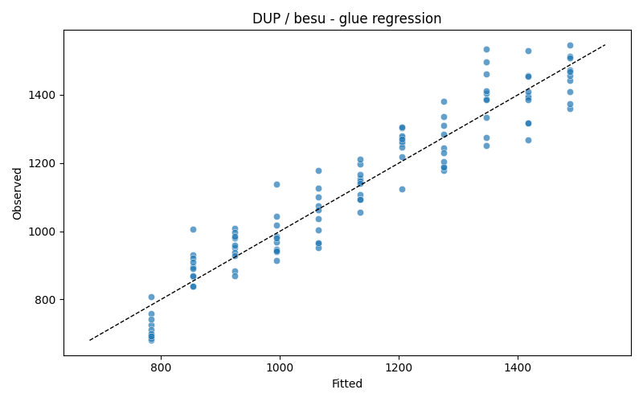


</details>

<details><summary><code>GAS</code> · nobs=110 · runtime_ms=0 · p=1.00e+00 · R²=0.9102</summary>

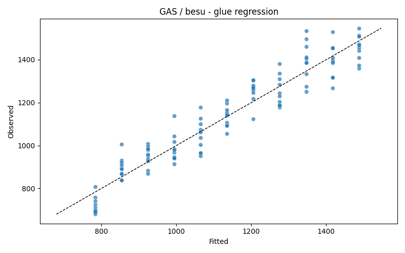


</details>

<details><summary><code>MLOAD</code> · nobs=110 · runtime_ms=0 · p=1.00e+00 · R²=0.9102</summary>


</details>

<details><summary><code>PUSH</code> · nobs=110 · runtime_ms=8.585e-05 · p=1.00e-03 · R²=0.9102</summary>


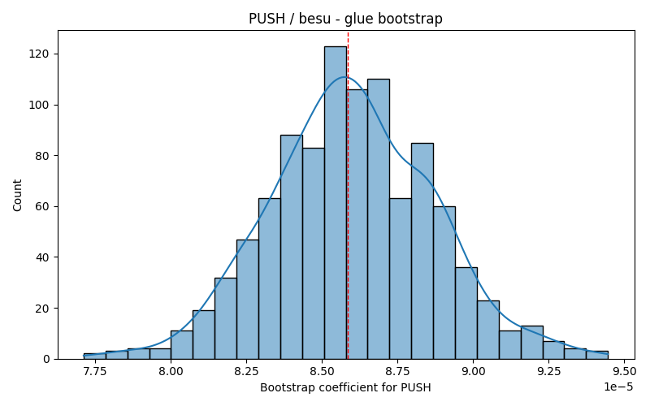

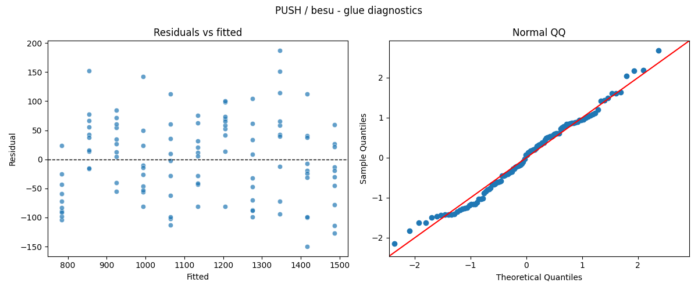

</details>

<details><summary><code>PUSH0</code> · nobs=110 · runtime_ms=0 · p=1.00e+00 · R²=0.9102</summary>

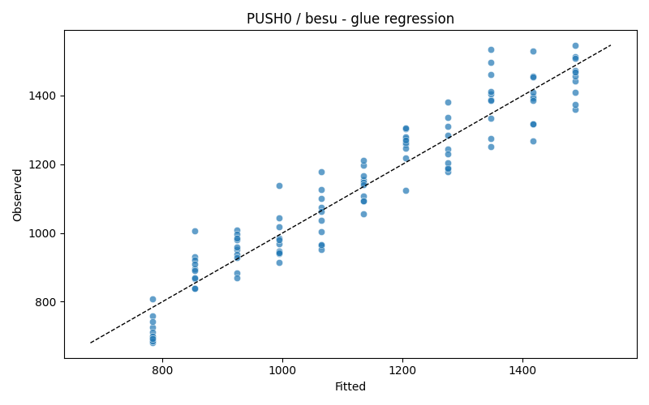


</details>

<details><summary><code>STATICCALL</code> · nobs=110 · runtime_ms=0 · p=1.00e+00 · R²=0.9102</summary>

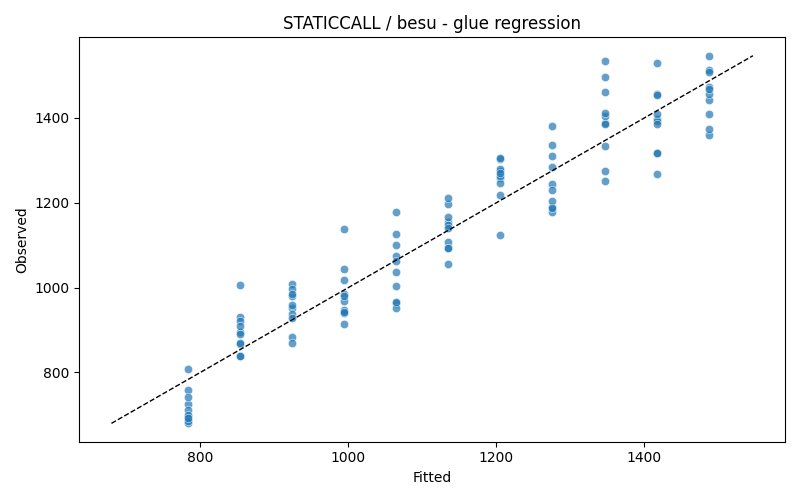


</details>

### Pure glue · besu

<details><summary><code>ISZERO</code> · nobs=0 · runtime_ms=n/a · p=n/a · R²=n/a</summary>

</details>

<details><summary><code>JUMPDEST</code> · nobs=0 · runtime_ms=n/a · p=n/a · R²=n/a</summary>

</details>

<details><summary><code>SWAP</code> · nobs=0 · runtime_ms=n/a · p=n/a · R²=n/a</summary>

</details>

### Mixed glue (tier A) · besu

<details><summary><code>ADD</code> · nobs=0 · runtime_ms=n/a · p=n/a · R²=n/a</summary>

</details>

<details><summary><code>AND</code> · nobs=0 · runtime_ms=n/a · p=n/a · R²=n/a</summary>

</details>

<details><summary><code>CALLDATACOPY</code> · nobs=0 · runtime_ms=n/a · p=n/a · R²=n/a</summary>

</details>

<details><summary><code>CALLDATALOAD</code> · nobs=0 · runtime_ms=n/a · p=n/a · R²=n/a</summary>

</details>

<details><summary><code>DIV</code> · nobs=0 · runtime_ms=n/a · p=n/a · R²=n/a</summary>

</details>

<details><summary><code>EXP</code> · nobs=0 · runtime_ms=n/a · p=n/a · R²=n/a</summary>

</details>

<details><summary><code>GT</code> · nobs=0 · runtime_ms=n/a · p=n/a · R²=n/a</summary>

</details>

<details><summary><code>JUMPI</code> · nobs=0 · runtime_ms=n/a · p=n/a · R²=n/a</summary>

</details>

<details><summary><code>LT</code> · nobs=0 · runtime_ms=n/a · p=n/a · R²=n/a</summary>

</details>

<details><summary><code>MSTORE</code> · nobs=0 · runtime_ms=n/a · p=n/a · R²=n/a</summary>

</details>

<details><summary><code>MSTORE8</code> · nobs=0 · runtime_ms=n/a · p=n/a · R²=n/a</summary>

</details>

<details><summary><code>MUL</code> · nobs=0 · runtime_ms=n/a · p=n/a · R²=n/a</summary>

</details>

<details><summary><code>PC</code> · nobs=0 · runtime_ms=n/a · p=n/a · R²=n/a</summary>

</details>

<details><summary><code>RETURNDATASIZE</code> · nobs=0 · runtime_ms=n/a · p=n/a · R²=n/a</summary>

</details>

<details><summary><code>SELFBALANCE</code> · nobs=0 · runtime_ms=n/a · p=n/a · R²=n/a</summary>

</details>

<details><summary><code>SUB</code> · nobs=0 · runtime_ms=n/a · p=n/a · R²=n/a</summary>

</details>

### Mixed glue (tier B) · besu

<details><summary><code>JUMP</code> · nobs=0 · runtime_ms=n/a · p=n/a · R²=n/a</summary>

</details>

<details><summary><code>KECCAK256</code> · nobs=0 · runtime_ms=n/a · p=n/a · R²=n/a</summary>

</details>

## erigon

| glue_opcode | nobs | glue_runtime_ms | p_value | rsquared |
| --- | --- | --- | --- | --- |
| `ISZERO` | 8 | 0 | 1.00e+00 | 0 |
| `JUMPDEST` | 2 | 0 | 1.00e+00 | 0 |
| `SWAP` | 143 | 0 | 1.00e+00 | -2.22e-16 |
| `CALLDATASIZE` | 590 | 8.825e-07 | 2.58e-01 | 0.003735 |
| `DUP` | 590 | 0 | 1.00e+00 | 0.003735 |
| `GAS` | 590 | 0 | 1.00e+00 | 0.003735 |
| `MLOAD` | 590 | 3.708e-06 | 5.10e-02 | 0.003735 |
| `PUSH` | 590 | 0 | 1.00e+00 | 0.003735 |
| `PUSH0` | 590 | 0 | 1.00e+00 | 0.003735 |
| `STATICCALL` | 590 | 0 | 1.00e+00 | 0.003735 |
| `ADD` | 9 | 0 | 1.00e+00 | 0 |
| `AND` | 8 | 0 | 1.00e+00 | 0 |
| `CALLDATACOPY` | 235 | 0 | 1.00e+00 | 0 |
| `CALLDATALOAD` | 44 | 4.41e-05 | 1.00e-03 | 0.3358 |
| `DIV` | 11 | 0 | 1.00e+00 | 0 |
| `EXP` | 11 | 0.0003436 | 1.00e-03 | 0.9505 |
| `GT` | 8 | 0 | 1.00e+00 | 0 |
| `JUMPI` | 11 | 0 | 1.00e+00 | -4.441e-16 |
| `LT` | 8 | 0 | 1.00e+00 | 0 |
| `MSTORE` | 45 | 0 | 1.00e+00 | 0 |
| `MSTORE8` | 45 | 0 | 1.00e+00 | 0 |
| `MUL` | 10 | 0 | 1.00e+00 | 0 |
| `PC` | 6 | 1.151e-05 | 3.40e-02 | 0.6826 |
| `RETURNDATASIZE` | 24 | 1.014e-05 | 1.26e-01 | 0.06451 |
| `SELFBALANCE` | 11 | 0 | 1.00e+00 | -2.22e-16 |
| `SUB` | 8 | 0 | 1.00e+00 | 0 |
| `JUMP` | 10 | 0 | 1.00e+00 | 0 |
| `KECCAK256` | 176 | 1.462e-05 | 2.00e-03 | 0.04197 |

### Cycle glue — joint fit · erigon

<details><summary>Joint NNLS regression summary</summary>

```
==============================================================================
                           NNLS Regression Results                            
==============================================================================
Dep. Variable:          test_runtime_ms              R-squared:          0.004
Model:                  NNLS                    Adj. R-squared:         -0.008
No. Observations:       590                               RMSE:          43.84
Df Residuals:           582                                MAE:          35.48
Df Model:               7      
==============================================================================
                      coef     std err     P-value      [0.025      0.975]
------------------------------------------------------------------------------
         const    126.3246      2.0982       0.001    122.1404    130.3308
  CALLDATASIZE      0.0000      0.0000       0.258      0.0000      0.0000
           DUP      0.0000      0.0000       1.000      0.0000      0.0000
           GAS      0.0000      0.0000       1.000      0.0000      0.0000
         MLOAD      0.0000      0.0000       0.051      0.0000      0.0000
          PUSH      0.0000      0.0000       1.000      0.0000      0.0000
         PUSH0      0.0000      0.0000       1.000      0.0000      0.0000
    STATICCALL      0.0000      0.0000       1.000      0.0000      0.0000
==============================================================================
Notes: Non-negative least squares with bootstrap inference (1000 iterations)
==============================================================================
```

</details>

<details><summary><code>CALLDATASIZE</code> · nobs=590 · runtime_ms=8.825e-07 · p=2.58e-01 · R²=0.003735</summary>

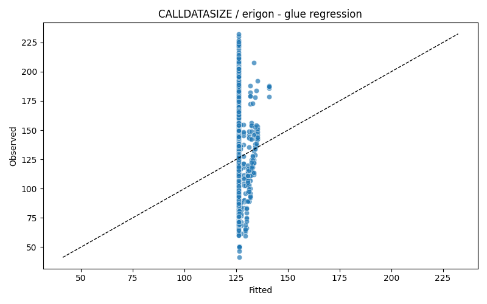

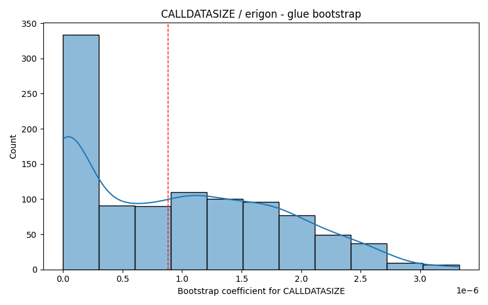

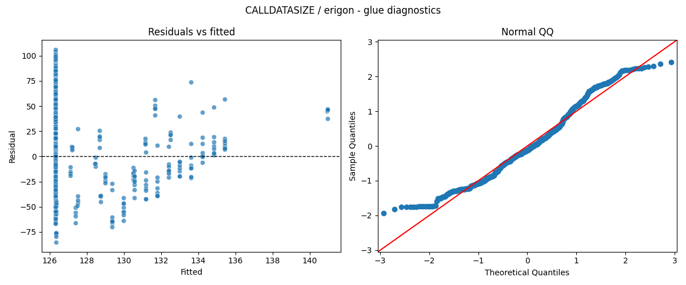

</details>

<details><summary><code>DUP</code> · nobs=590 · runtime_ms=0 · p=1.00e+00 · R²=0.003735</summary>

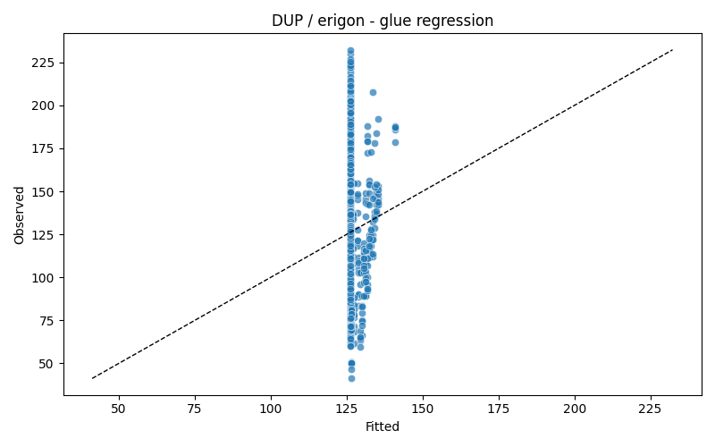


</details>

<details><summary><code>GAS</code> · nobs=590 · runtime_ms=0 · p=1.00e+00 · R²=0.003735</summary>


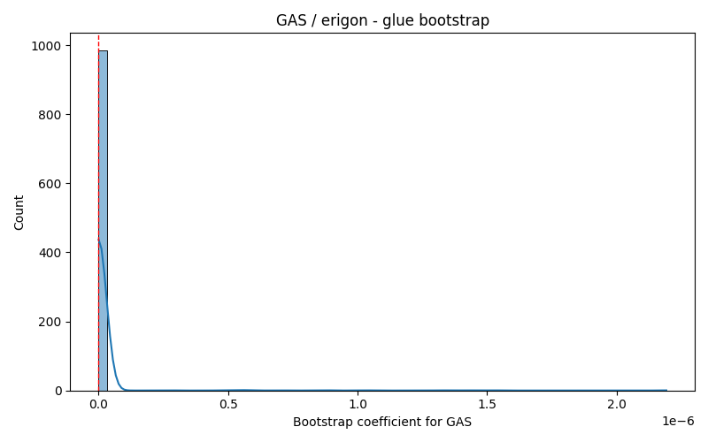


</details>

<details><summary><code>MLOAD</code> · nobs=590 · runtime_ms=3.708e-06 · p=5.10e-02 · R²=0.003735</summary>


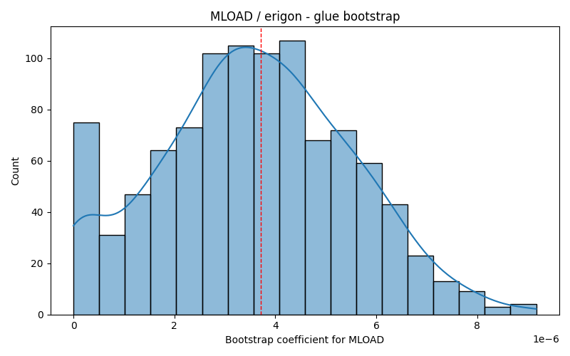


</details>

<details><summary><code>PUSH</code> · nobs=590 · runtime_ms=0 · p=1.00e+00 · R²=0.003735</summary>

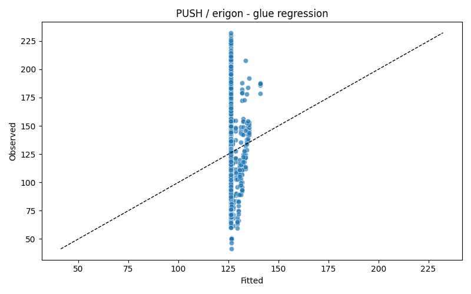

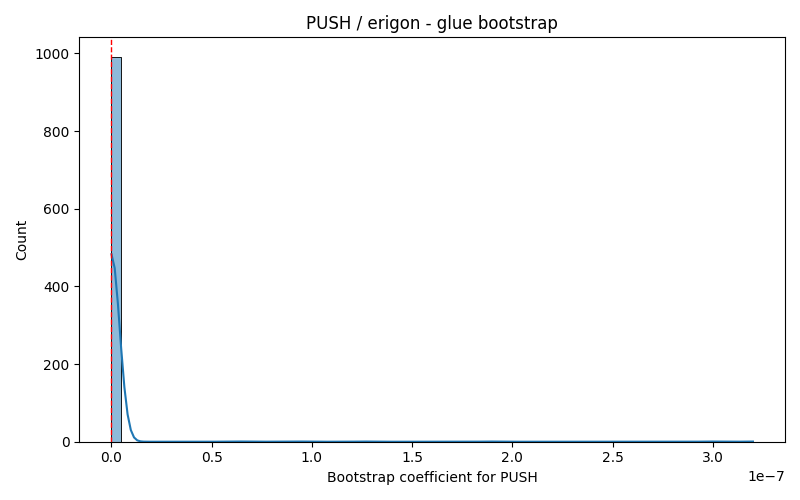

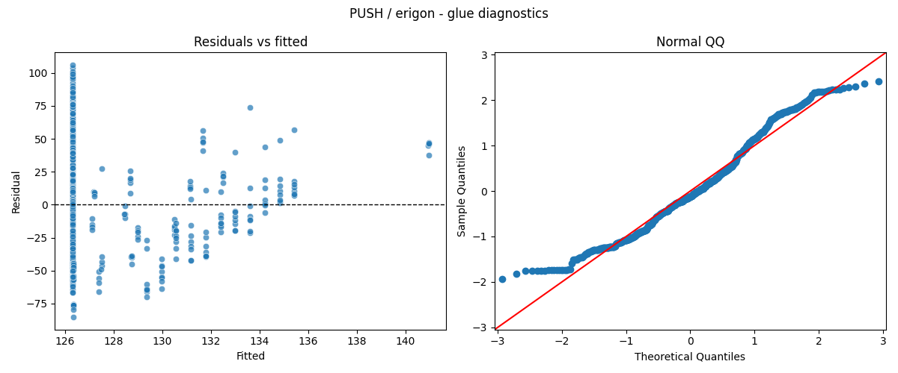

</details>

<details><summary><code>PUSH0</code> · nobs=590 · runtime_ms=0 · p=1.00e+00 · R²=0.003735</summary>

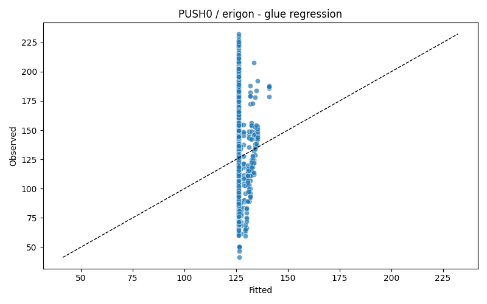

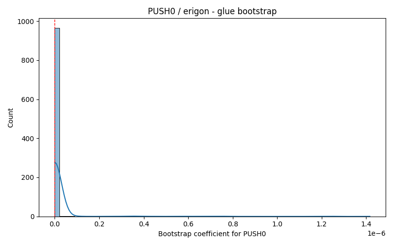


</details>

<details><summary><code>STATICCALL</code> · nobs=590 · runtime_ms=0 · p=1.00e+00 · R²=0.003735</summary>

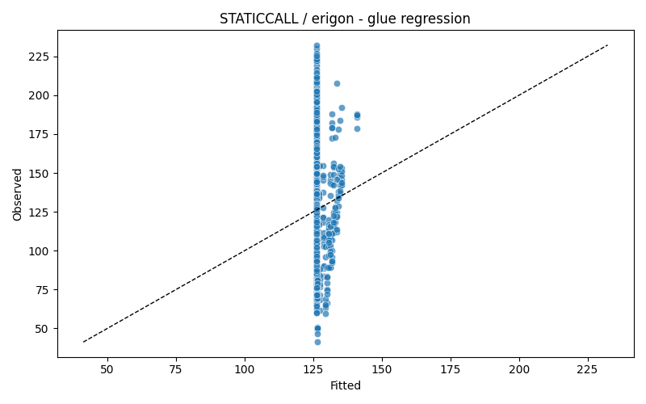

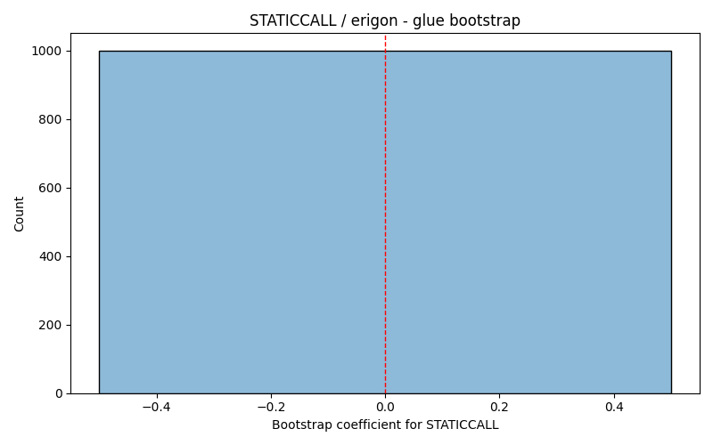

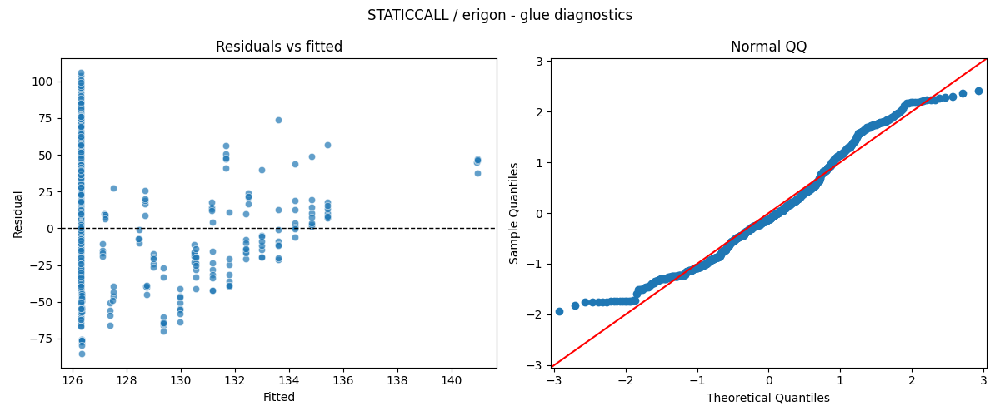

</details>

### Pure glue · erigon

<details><summary><code>ISZERO</code> · nobs=8 · runtime_ms=0 · p=1.00e+00 · R²=0</summary>

```
==============================================================================
                           NNLS Regression Results                            
==============================================================================
Dep. Variable:          test_runtime_ms              R-squared:          0.000
Model:                  NNLS                    Adj. R-squared:         -0.167
No. Observations:       8                                 RMSE:          46.89
Df Residuals:           6                                  MAE:          34.11
Df Model:               1      
==============================================================================
                      coef     std err     P-value      [0.025      0.975]
------------------------------------------------------------------------------
         const     92.5602     22.3677       0.004     33.7134    129.7310
        ISZERO      0.0000      0.0000       1.000      0.0000      0.0000
==============================================================================
Notes: Non-negative least squares with bootstrap inference (1000 iterations)
==============================================================================
```


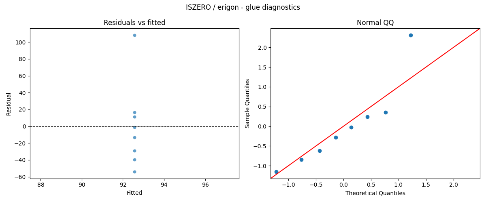

</details>

<details><summary><code>JUMPDEST</code> · nobs=2 · runtime_ms=0 · p=1.00e+00 · R²=0</summary>

```
==============================================================================
                           NNLS Regression Results                            
==============================================================================
Dep. Variable:          test_runtime_ms              R-squared:          0.000
Model:                  NNLS                    Adj. R-squared:          0.000
No. Observations:       2                                 RMSE:          36.29
Df Residuals:           0                                  MAE:          36.29
Df Model:               1      
==============================================================================
                      coef     std err     P-value      [0.025      0.975]
------------------------------------------------------------------------------
         const    132.2590     66.1247       0.506      0.0000    132.2590
      JUMPDEST      0.0000      0.0000       1.000      0.0000      0.0001
==============================================================================
Notes: Non-negative least squares with bootstrap inference (1000 iterations)
==============================================================================
```


</details>

<details><summary><code>SWAP</code> · nobs=143 · runtime_ms=0 · p=1.00e+00 · R²=-2.22e-16</summary>

```
==============================================================================
                           NNLS Regression Results                            
==============================================================================
Dep. Variable:          test_runtime_ms              R-squared:         -0.000
Model:                  NNLS                    Adj. R-squared:         -0.007
No. Observations:       143                               RMSE:          29.39
Df Residuals:           141                                MAE:          25.41
Df Model:               1      
==============================================================================
                      coef     std err     P-value      [0.025      0.975]
------------------------------------------------------------------------------
         const     99.6223      2.3682       0.001     94.9083    104.1872
          SWAP      0.0000      0.0000       1.000      0.0000      0.0000
==============================================================================
Notes: Non-negative least squares with bootstrap inference (1000 iterations)
==============================================================================
```


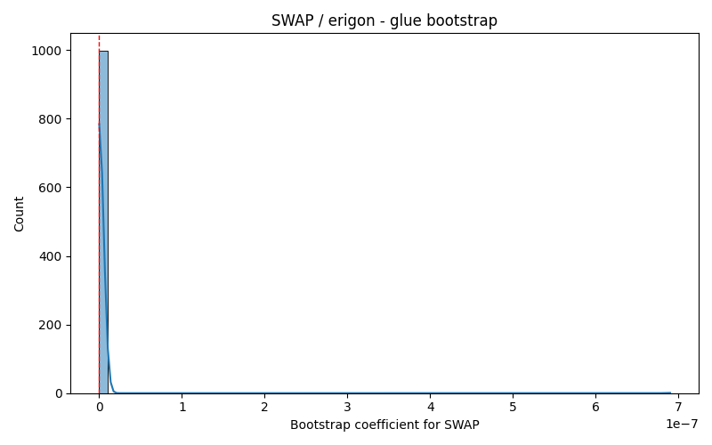


</details>

### Mixed glue (tier A) · erigon

<details><summary><code>ADD</code> · nobs=9 · runtime_ms=0 · p=1.00e+00 · R²=0</summary>

```
==============================================================================
                           NNLS Regression Results                            
==============================================================================
Dep. Variable:          test_runtime_ms              R-squared:          0.000
Model:                  NNLS                    Adj. R-squared:         -0.143
No. Observations:       9                                 RMSE:          28.39
Df Residuals:           7                                  MAE:          24.50
Df Model:               1      
==============================================================================
                      coef     std err     P-value      [0.025      0.975]
------------------------------------------------------------------------------
         const     92.8812     11.4053       0.001     57.5818    105.0592
           ADD      0.0000      0.0000       1.000      0.0000      0.0000
==============================================================================
Notes: Non-negative least squares with bootstrap inference (1000 iterations)
==============================================================================
```


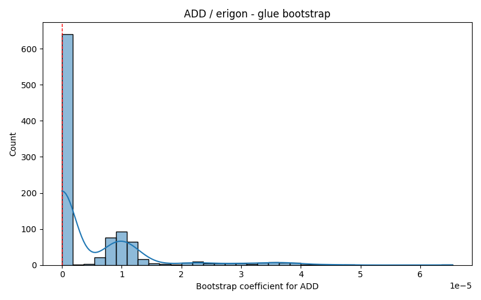


</details>

<details><summary><code>AND</code> · nobs=8 · runtime_ms=0 · p=1.00e+00 · R²=0</summary>

```
==============================================================================
                           NNLS Regression Results                            
==============================================================================
Dep. Variable:          test_runtime_ms              R-squared:          0.000
Model:                  NNLS                    Adj. R-squared:         -0.167
No. Observations:       8                                 RMSE:          24.93
Df Residuals:           6                                  MAE:          20.86
Df Model:               1      
==============================================================================
                      coef     std err     P-value      [0.025      0.975]
------------------------------------------------------------------------------
         const     84.6418      9.8389       0.001     55.1894     95.2224
           AND      0.0000      0.0000       1.000      0.0000      0.0000
==============================================================================
Notes: Non-negative least squares with bootstrap inference (1000 iterations)
==============================================================================
```


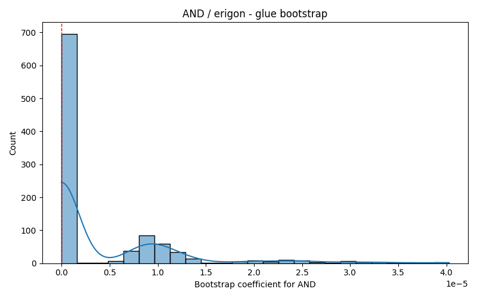


</details>

<details><summary><code>CALLDATACOPY</code> · nobs=235 · runtime_ms=0 · p=1.00e+00 · R²=0</summary>

```
==============================================================================
                           NNLS Regression Results                            
==============================================================================
Dep. Variable:          test_runtime_ms              R-squared:          0.000
Model:                  NNLS                    Adj. R-squared:         -0.004
No. Observations:       235                               RMSE:          47.58
Df Residuals:           233                                MAE:          40.55
Df Model:               1      
==============================================================================
                      coef     std err     P-value      [0.025      0.975]
------------------------------------------------------------------------------
         const     72.1817      3.0168       0.001     66.2427     77.7447
  CALLDATACOPY      0.0000      0.0000       1.000      0.0000      0.0000
==============================================================================
Notes: Non-negative least squares with bootstrap inference (1000 iterations)
==============================================================================
```

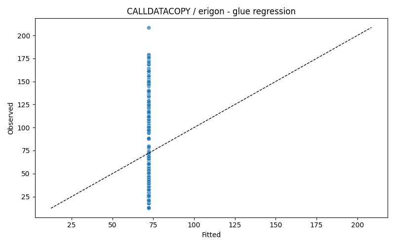


</details>

<details><summary><code>CALLDATALOAD</code> · nobs=44 · runtime_ms=4.41e-05 · p=1.00e-03 · R²=0.3358</summary>

```
==============================================================================
                           NNLS Regression Results                            
==============================================================================
Dep. Variable:          test_runtime_ms              R-squared:          0.336
Model:                  NNLS                    Adj. R-squared:          0.320
No. Observations:       44                                RMSE:           0.24
Df Residuals:           42                                 MAE:           0.19
Df Model:               1      
==============================================================================
                      coef     std err     P-value      [0.025      0.975]
------------------------------------------------------------------------------
         const      3.9724      0.1107       0.001      3.7594      4.1911
  CALLDATALOAD      0.0000      0.0000       0.001      0.0000      0.0001
==============================================================================
Notes: Non-negative least squares with bootstrap inference (1000 iterations)
==============================================================================
```

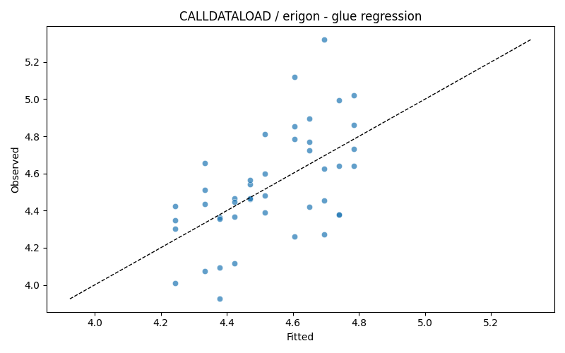


</details>

<details><summary><code>DIV</code> · nobs=11 · runtime_ms=0 · p=1.00e+00 · R²=0</summary>

```
==============================================================================
                           NNLS Regression Results                            
==============================================================================
Dep. Variable:          test_runtime_ms              R-squared:          0.000
Model:                  NNLS                    Adj. R-squared:         -0.111
No. Observations:       11                                RMSE:          81.04
Df Residuals:           9                                  MAE:          68.11
Df Model:               1      
==============================================================================
                      coef     std err     P-value      [0.025      0.975]
------------------------------------------------------------------------------
         const    266.8796     24.8669       0.001    218.2017    311.0828
           DIV      0.0000      0.0000       1.000      0.0000      0.0000
==============================================================================
Notes: Non-negative least squares with bootstrap inference (1000 iterations)
==============================================================================
```


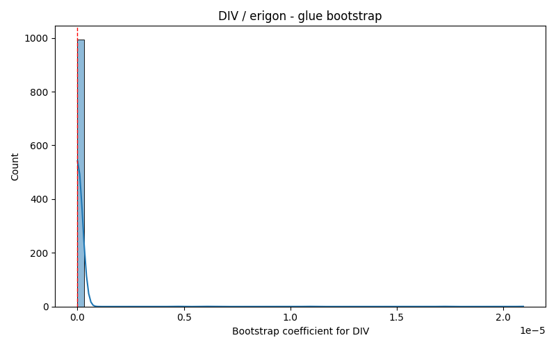


</details>

<details><summary><code>EXP</code> · nobs=11 · runtime_ms=0.0003436 · p=1.00e-03 · R²=0.9505</summary>

```
==============================================================================
                           NNLS Regression Results                            
==============================================================================
Dep. Variable:          test_runtime_ms              R-squared:          0.950
Model:                  NNLS                    Adj. R-squared:          0.945
No. Observations:       11                                RMSE:           3.07
Df Residuals:           9                                  MAE:           2.73
Df Model:               1      
==============================================================================
                      coef     std err     P-value      [0.025      0.975]
------------------------------------------------------------------------------
         const     15.9269      3.5782       0.001      6.8640     21.4591
           EXP      0.0003      0.0000       0.001      0.0003      0.0004
==============================================================================
Notes: Non-negative least squares with bootstrap inference (1000 iterations)
==============================================================================
```

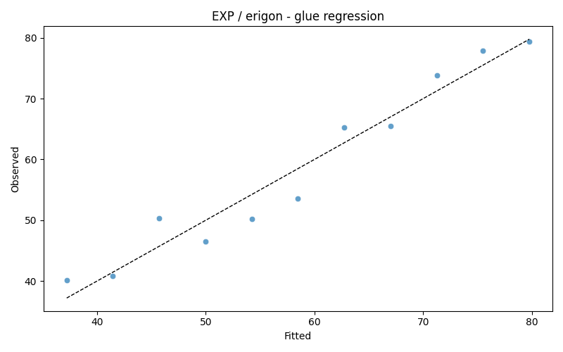

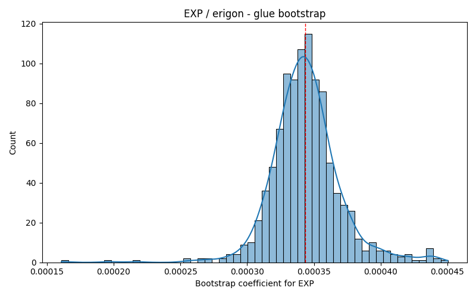

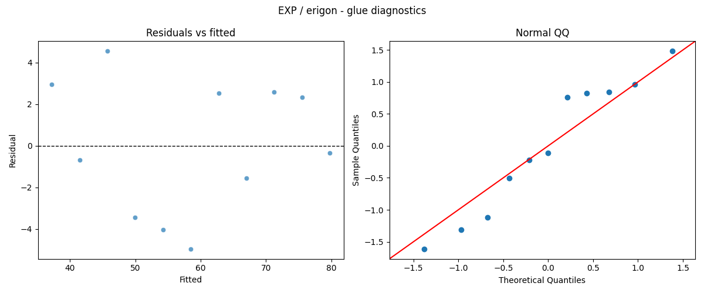

</details>

<details><summary><code>GT</code> · nobs=8 · runtime_ms=0 · p=1.00e+00 · R²=0</summary>

```
==============================================================================
                           NNLS Regression Results                            
==============================================================================
Dep. Variable:          test_runtime_ms              R-squared:          0.000
Model:                  NNLS                    Adj. R-squared:         -0.167
No. Observations:       8                                 RMSE:          27.66
Df Residuals:           6                                  MAE:          24.59
Df Model:               1      
==============================================================================
                      coef     std err     P-value      [0.025      0.975]
------------------------------------------------------------------------------
         const     88.6229     10.1048       0.001     61.0299    101.1357
            GT      0.0000      0.0000       1.000      0.0000      0.0000
==============================================================================
Notes: Non-negative least squares with bootstrap inference (1000 iterations)
==============================================================================
```

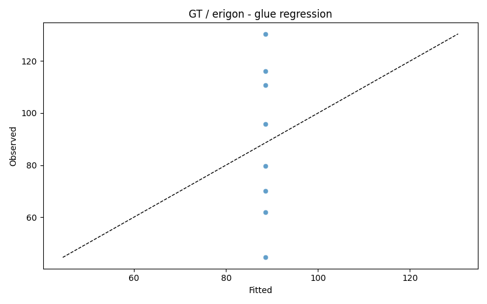


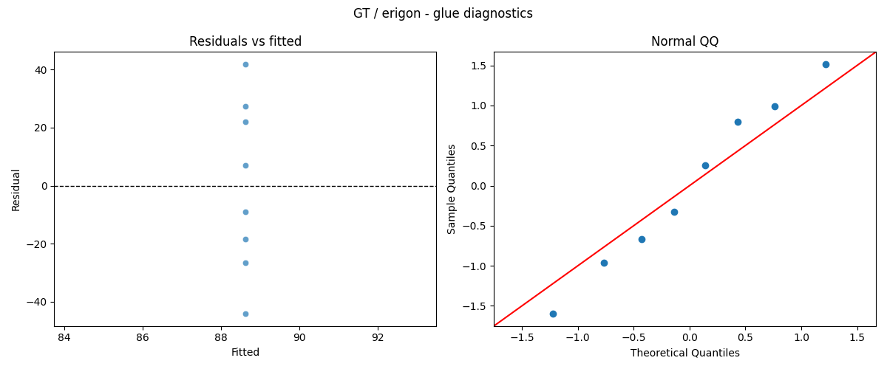

</details>

<details><summary><code>JUMPI</code> · nobs=11 · runtime_ms=0 · p=1.00e+00 · R²=-4.441e-16</summary>

```
==============================================================================
                           NNLS Regression Results                            
==============================================================================
Dep. Variable:          test_runtime_ms              R-squared:         -0.000
Model:                  NNLS                    Adj. R-squared:         -0.111
No. Observations:       11                                RMSE:          10.79
Df Residuals:           9                                  MAE:           8.71
Df Model:               1      
==============================================================================
                      coef     std err     P-value      [0.025      0.975]
------------------------------------------------------------------------------
         const     47.6248      3.1116       0.001     41.4853     53.6604
         JUMPI      0.0000      0.0000       1.000      0.0000      0.0000
==============================================================================
Notes: Non-negative least squares with bootstrap inference (1000 iterations)
==============================================================================
```


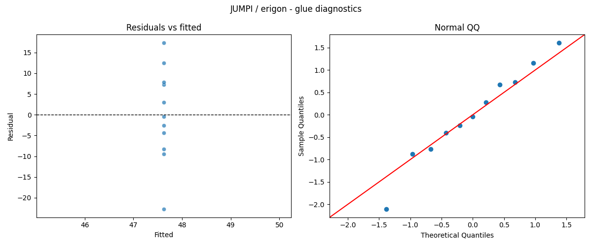

</details>

<details><summary><code>LT</code> · nobs=8 · runtime_ms=0 · p=1.00e+00 · R²=0</summary>

```
==============================================================================
                           NNLS Regression Results                            
==============================================================================
Dep. Variable:          test_runtime_ms              R-squared:          0.000
Model:                  NNLS                    Adj. R-squared:         -0.167
No. Observations:       8                                 RMSE:          26.69
Df Residuals:           6                                  MAE:          23.18
Df Model:               1      
==============================================================================
                      coef     std err     P-value      [0.025      0.975]
------------------------------------------------------------------------------
         const     88.8901     10.0885       0.001     62.2882     99.3999
            LT      0.0000      0.0000       1.000      0.0000      0.0000
==============================================================================
Notes: Non-negative least squares with bootstrap inference (1000 iterations)
==============================================================================
```

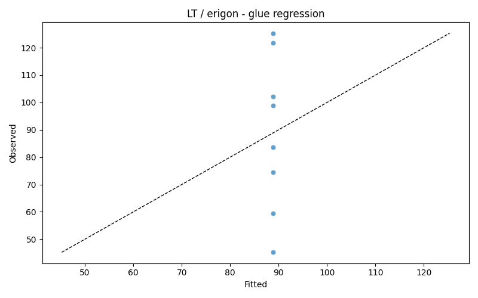


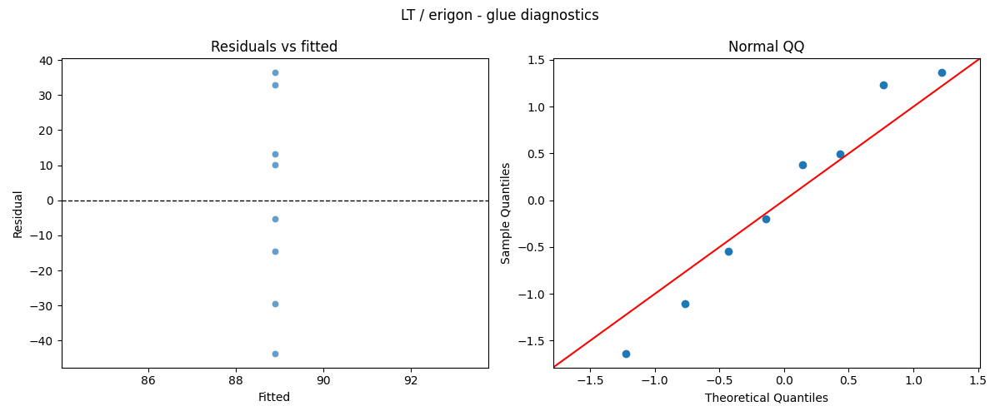

</details>

<details><summary><code>MSTORE</code> · nobs=45 · runtime_ms=0 · p=1.00e+00 · R²=0</summary>

```
==============================================================================
                           NNLS Regression Results                            
==============================================================================
Dep. Variable:          test_runtime_ms              R-squared:          0.000
Model:                  NNLS                    Adj. R-squared:         -0.023
No. Observations:       45                                RMSE:          38.66
Df Residuals:           43                                 MAE:          33.86
Df Model:               1      
==============================================================================
                      coef     std err     P-value      [0.025      0.975]
------------------------------------------------------------------------------
         const    130.5969      6.0434       0.001    118.5437    141.5801
        MSTORE      0.0000      0.0000       1.000      0.0000      0.0000
==============================================================================
Notes: Non-negative least squares with bootstrap inference (1000 iterations)
==============================================================================
```


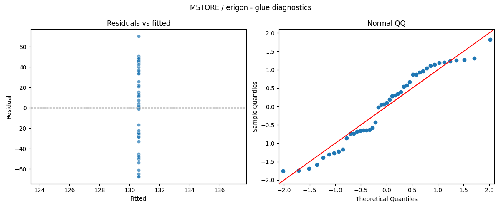

</details>

<details><summary><code>MSTORE8</code> · nobs=45 · runtime_ms=0 · p=1.00e+00 · R²=0</summary>

```
==============================================================================
                           NNLS Regression Results                            
==============================================================================
Dep. Variable:          test_runtime_ms              R-squared:          0.000
Model:                  NNLS                    Adj. R-squared:         -0.023
No. Observations:       45                                RMSE:          37.77
Df Residuals:           43                                 MAE:          32.58
Df Model:               1      
==============================================================================
                      coef     std err     P-value      [0.025      0.975]
------------------------------------------------------------------------------
         const    124.6835      5.5487       0.001    113.9893    135.6529
       MSTORE8      0.0000      0.0000       1.000      0.0000      0.0000
==============================================================================
Notes: Non-negative least squares with bootstrap inference (1000 iterations)
==============================================================================
```

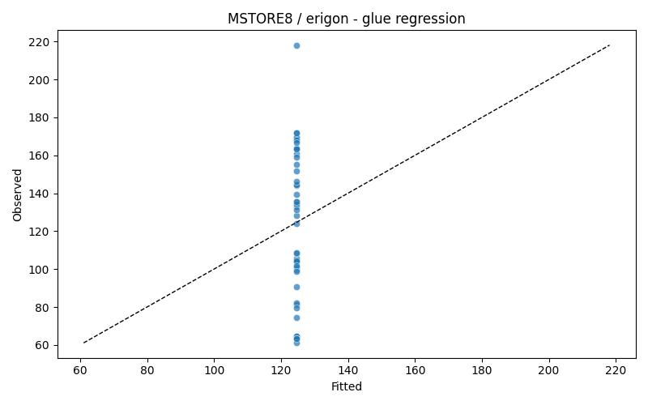

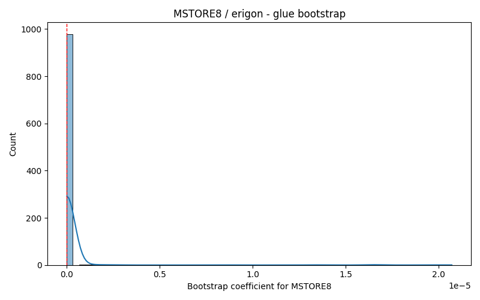

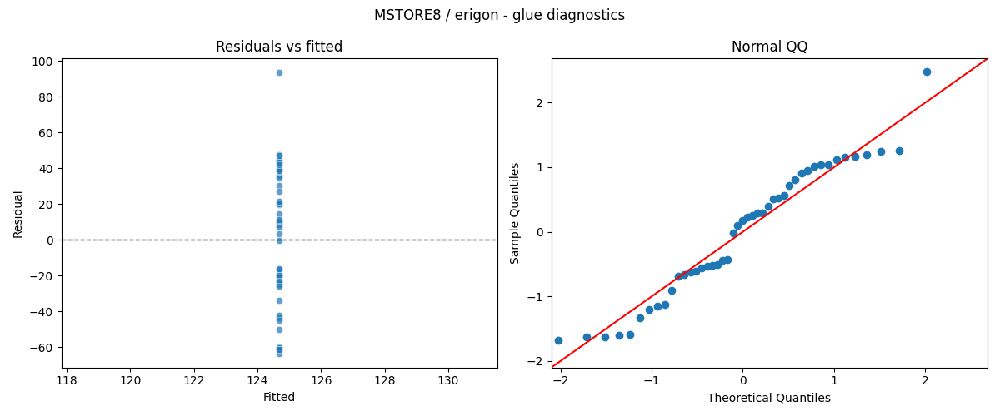

</details>

<details><summary><code>MUL</code> · nobs=10 · runtime_ms=0 · p=1.00e+00 · R²=0</summary>

```
==============================================================================
                           NNLS Regression Results                            
==============================================================================
Dep. Variable:          test_runtime_ms              R-squared:          0.000
Model:                  NNLS                    Adj. R-squared:         -0.125
No. Observations:       10                                RMSE:          38.26
Df Residuals:           8                                  MAE:          26.29
Df Model:               1      
==============================================================================
                      coef     std err     P-value      [0.025      0.975]
------------------------------------------------------------------------------
         const    121.7845      8.4406       0.001     97.7531    130.1653
           MUL      0.0000      0.0000       1.000      0.0000      0.0000
==============================================================================
Notes: Non-negative least squares with bootstrap inference (1000 iterations)
==============================================================================
```

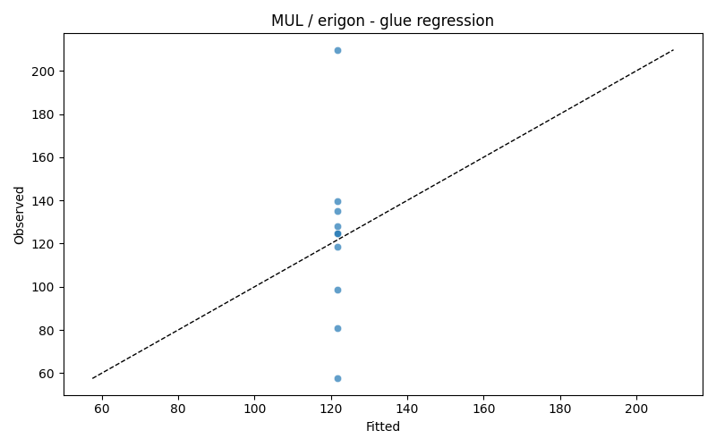

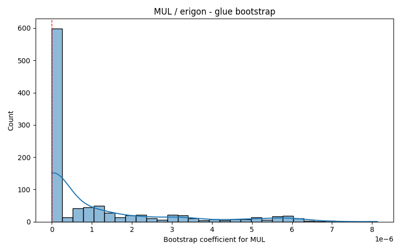


</details>

<details><summary><code>PC</code> · nobs=6 · runtime_ms=1.151e-05 · p=3.40e-02 · R²=0.6826</summary>

```
==============================================================================
                           NNLS Regression Results                            
==============================================================================
Dep. Variable:          test_runtime_ms              R-squared:          0.683
Model:                  NNLS                    Adj. R-squared:          0.603
No. Observations:       6                                 RMSE:          17.44
Df Residuals:           4                                  MAE:          15.63
Df Model:               1      
==============================================================================
                      coef     std err     P-value      [0.025      0.975]
------------------------------------------------------------------------------
         const     77.3000     17.4759       0.001     43.7163    104.5504
            PC      0.0000      0.0000       0.034      0.0000      0.0000
==============================================================================
Notes: Non-negative least squares with bootstrap inference (1000 iterations)
==============================================================================
```

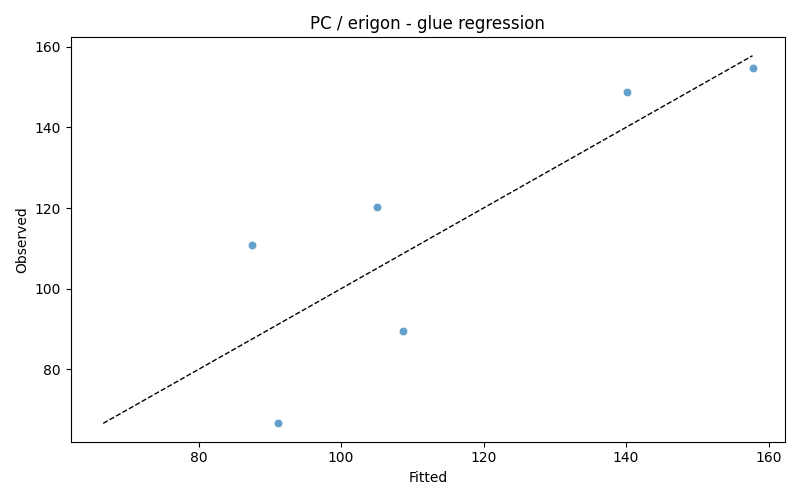

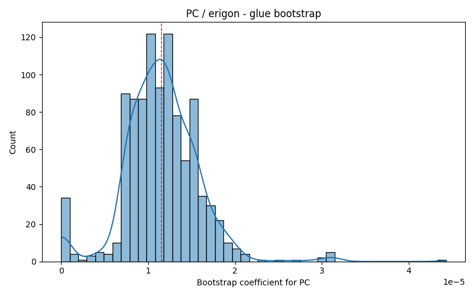

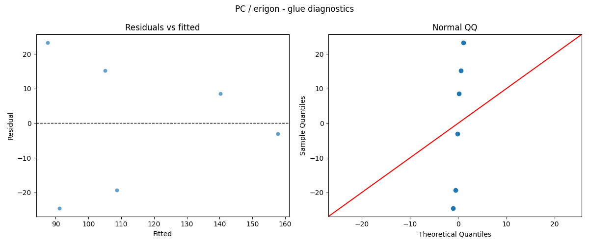

</details>

<details><summary><code>RETURNDATASIZE</code> · nobs=24 · runtime_ms=1.014e-05 · p=1.26e-01 · R²=0.06451</summary>

```
==============================================================================
                           NNLS Regression Results                            
==============================================================================
Dep. Variable:          test_runtime_ms              R-squared:          0.065
Model:                  NNLS                    Adj. R-squared:          0.022
No. Observations:       24                                RMSE:          45.32
Df Residuals:           22                                 MAE:          22.57
Df Model:               1      
==============================================================================
                      coef     std err     P-value      [0.025      0.975]
------------------------------------------------------------------------------
         const     93.4242     21.6885       0.001     58.0186    134.6008
RETURNDATASIZE      0.0000      0.0000       0.126      0.0000      0.0000
==============================================================================
Notes: Non-negative least squares with bootstrap inference (1000 iterations)
==============================================================================
```

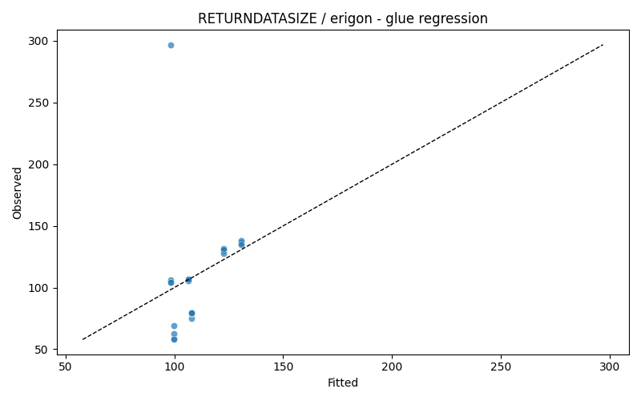


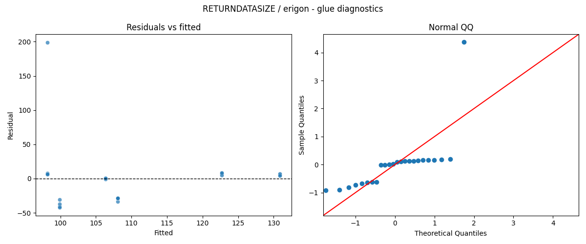

</details>

<details><summary><code>SELFBALANCE</code> · nobs=11 · runtime_ms=0 · p=1.00e+00 · R²=-2.22e-16</summary>

```
==============================================================================
                           NNLS Regression Results                            
==============================================================================
Dep. Variable:          test_runtime_ms              R-squared:         -0.000
Model:                  NNLS                    Adj. R-squared:         -0.111
No. Observations:       11                                RMSE:          12.90
Df Residuals:           9                                  MAE:          11.19
Df Model:               1      
==============================================================================
                      coef     std err     P-value      [0.025      0.975]
------------------------------------------------------------------------------
         const     51.0864      8.1219       0.001     20.2857     58.8354
   SELFBALANCE      0.0000      0.0000       1.000      0.0000      0.0000
==============================================================================
Notes: Non-negative least squares with bootstrap inference (1000 iterations)
==============================================================================
```

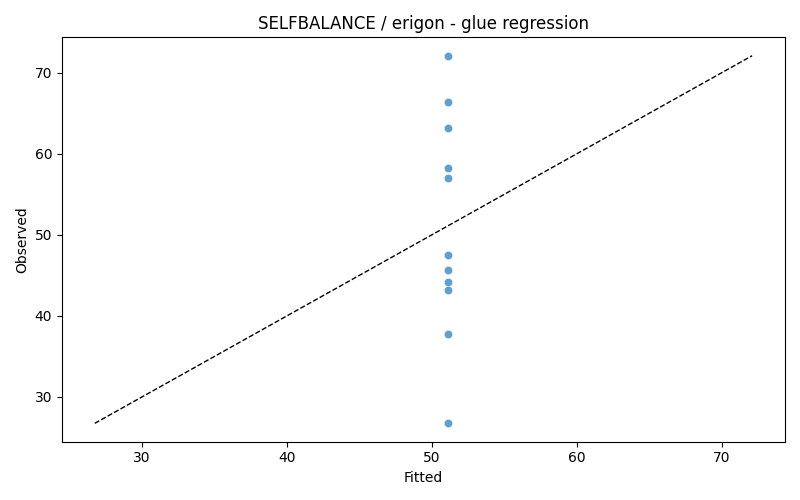

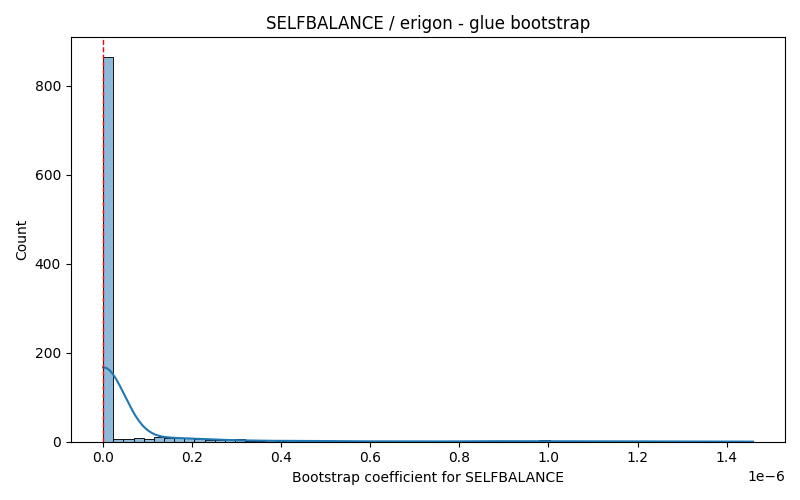


</details>

<details><summary><code>SUB</code> · nobs=8 · runtime_ms=0 · p=1.00e+00 · R²=0</summary>

```
==============================================================================
                           NNLS Regression Results                            
==============================================================================
Dep. Variable:          test_runtime_ms              R-squared:          0.000
Model:                  NNLS                    Adj. R-squared:         -0.167
No. Observations:       8                                 RMSE:          27.70
Df Residuals:           6                                  MAE:          23.34
Df Model:               1      
==============================================================================
                      coef     std err     P-value      [0.025      0.975]
------------------------------------------------------------------------------
         const     91.1975     11.1388       0.001     61.7667    103.7406
           SUB      0.0000      0.0000       1.000      0.0000      0.0000
==============================================================================
Notes: Non-negative least squares with bootstrap inference (1000 iterations)
==============================================================================
```


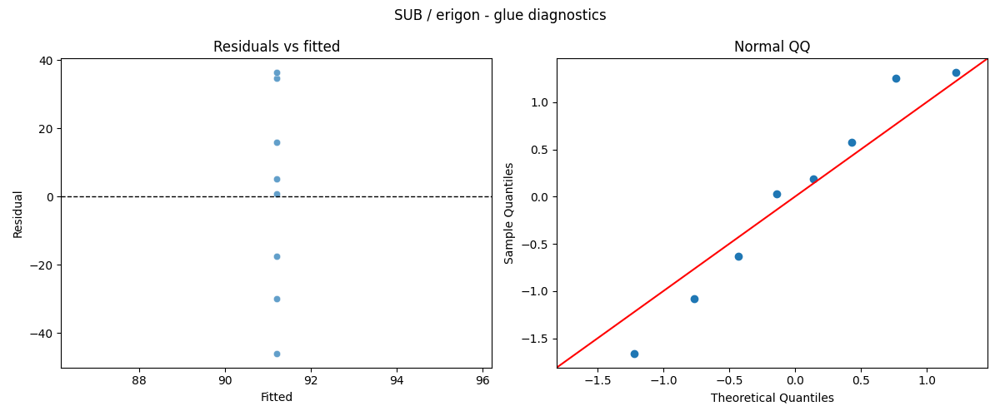

</details>

### Mixed glue (tier B) · erigon

<details><summary><code>JUMP</code> · nobs=10 · runtime_ms=0 · p=1.00e+00 · R²=0</summary>

```
==============================================================================
                           NNLS Regression Results                            
==============================================================================
Dep. Variable:          test_runtime_ms              R-squared:          0.000
Model:                  NNLS                    Adj. R-squared:         -0.125
No. Observations:       10                                RMSE:          29.50
Df Residuals:           8                                  MAE:          22.93
Df Model:               1      
==============================================================================
                      coef     std err     P-value      [0.025      0.975]
------------------------------------------------------------------------------
         const     76.0533      9.3326       0.001     59.3071     95.3164
          JUMP      0.0000      0.0000       1.000      0.0000      0.0000
==============================================================================
Notes: Non-negative least squares with bootstrap inference (1000 iterations)
==============================================================================
```

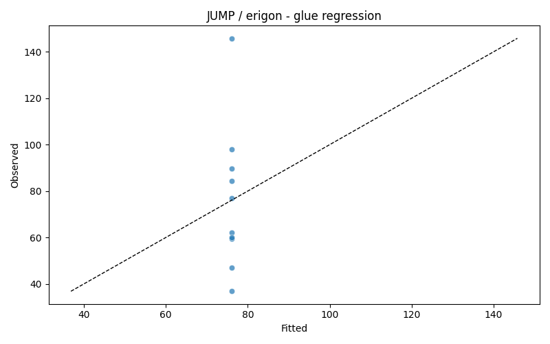


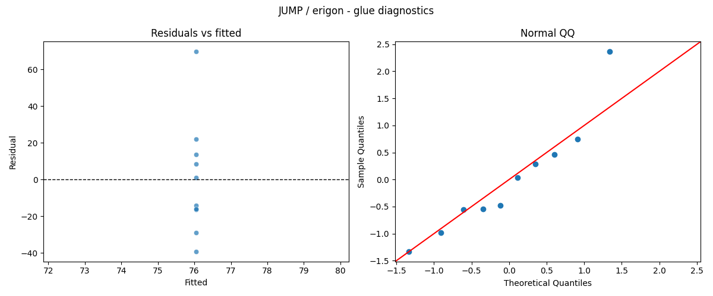

</details>

<details><summary><code>KECCAK256</code> · nobs=176 · runtime_ms=1.462e-05 · p=2.00e-03 · R²=0.04197</summary>

```
==============================================================================
                           NNLS Regression Results                            
==============================================================================
Dep. Variable:          test_runtime_ms              R-squared:          0.042
Model:                  NNLS                    Adj. R-squared:          0.036
No. Observations:       176                               RMSE:         138.84
Df Residuals:           174                                MAE:         113.18
Df Model:               1      
==============================================================================
                      coef     std err     P-value      [0.025      0.975]
------------------------------------------------------------------------------
         const    388.0964     23.7276       0.001    340.3744    435.7567
     KECCAK256      0.0000      0.0000       0.002      0.0000      0.0000
==============================================================================
Notes: Non-negative least squares with bootstrap inference (1000 iterations)
==============================================================================
```


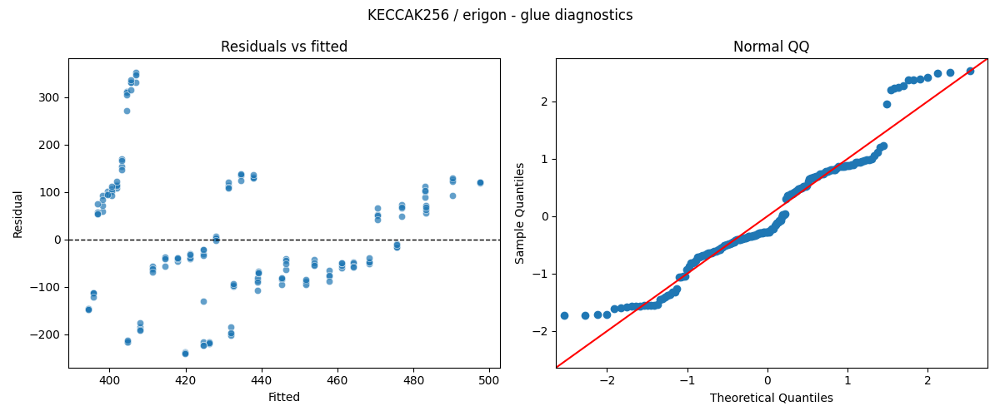

</details>

## ethrex

| glue_opcode | nobs | glue_runtime_ms | p_value | rsquared |
| --- | --- | --- | --- | --- |
| `ISZERO` | 120 | 0 | 1.00e+00 | -4.441e-16 |
| `JUMPDEST` | 30 | 0 | 1.00e+00 | 2.22e-16 |
| `SWAP` | 2145 | 0 | 1.00e+00 | 0 |
| `CALLDATASIZE` | 7530 | 6.244e-06 | 1.00e-03 | 0.1655 |
| `DUP` | 7530 | 0 | 1.00e+00 | 0.1655 |
| `GAS` | 7530 | 7.198e-06 | 1.00e-03 | 0.1655 |
| `MLOAD` | 7530 | 5.308e-06 | 1.00e-03 | 0.1655 |
| `PUSH` | 7530 | 0 | 1.00e+00 | 0.1655 |
| `PUSH0` | 7530 | 1.559e-06 | 4.00e-03 | 0.1655 |
| `STATICCALL` | 7530 | 0 | 1.00e+00 | 0.1655 |
| `ADD` | 135 | 0 | 1.00e+00 | 0 |
| `AND` | 120 | 0 | 1.00e+00 | 0 |
| `CALLDATACOPY` | 3525 | 0 | 1.00e+00 | -2.22e-16 |
| `CALLDATALOAD` | 660 | 1.525e-05 | 1.00e-03 | 0.1741 |
| `DIV` | 165 | 0 | 1.00e+00 | 2.22e-16 |
| `EXP` | 165 | 0.0009092 | 1.00e-03 | 0.8323 |
| `GT` | 120 | 0 | 1.00e+00 | 0 |
| `JUMPI` | 165 | 0 | 1.00e+00 | 2.22e-16 |
| `LT` | 120 | 0 | 1.00e+00 | 0 |
| `MSTORE` | 675 | 0 | 1.00e+00 | 0 |
| `MSTORE8` | 675 | 0 | 1.00e+00 | -2.22e-16 |
| `MUL` | 150 | 0 | 1.00e+00 | 0 |
| `PC` | 90 | 4.936e-06 | 1.00e-03 | 0.3919 |
| `RETURNDATASIZE` | 360 | 7.743e-06 | 1.00e-03 | 0.38 |
| `SELFBALANCE` | 165 | 0 | 1.00e+00 | 0 |
| `SUB` | 120 | 0 | 1.00e+00 | -2.22e-16 |
| `JUMP` | 150 | 0 | 1.00e+00 | 0 |
| `KECCAK256` | 2640 | 0 | 1.00e+00 | 0 |

### Cycle glue — joint fit · ethrex

<details><summary>Joint NNLS regression summary</summary>

```
==============================================================================
                           NNLS Regression Results                            
==============================================================================
Dep. Variable:          test_runtime_ms              R-squared:          0.165
Model:                  NNLS                    Adj. R-squared:          0.165
No. Observations:       7530                              RMSE:          14.51
Df Residuals:           7522                               MAE:          12.62
Df Model:               7      
==============================================================================
                      coef     std err     P-value      [0.025      0.975]
------------------------------------------------------------------------------
         const     50.2521      0.1750       0.001     49.9253     50.6044
  CALLDATASIZE      0.0000      0.0000       0.001      0.0000      0.0000
           DUP      0.0000      0.0000       1.000      0.0000      0.0000
           GAS      0.0000      0.0000       0.001      0.0000      0.0000
         MLOAD      0.0000      0.0000       0.001      0.0000      0.0000
          PUSH      0.0000      0.0000       1.000      0.0000      0.0000
         PUSH0      0.0000      0.0000       0.004      0.0000      0.0000
    STATICCALL      0.0000      0.0000       1.000      0.0000      0.0000
==============================================================================
Notes: Non-negative least squares with bootstrap inference (1000 iterations)
==============================================================================
```

</details>

<details><summary><code>CALLDATASIZE</code> · nobs=7530 · runtime_ms=6.244e-06 · p=1.00e-03 · R²=0.1655</summary>

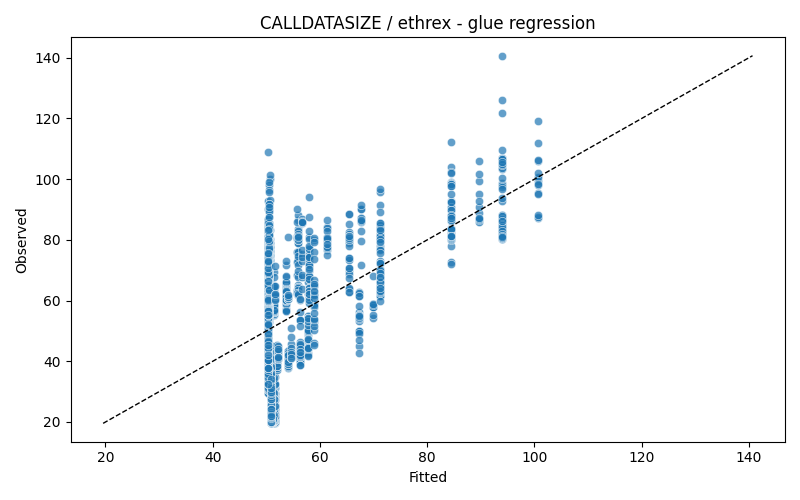

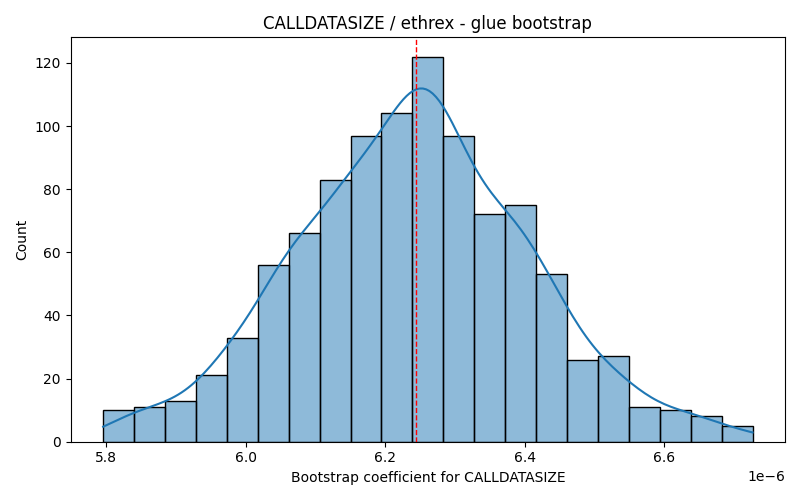


</details>

<details><summary><code>DUP</code> · nobs=7530 · runtime_ms=0 · p=1.00e+00 · R²=0.1655</summary>


</details>

<details><summary><code>GAS</code> · nobs=7530 · runtime_ms=7.198e-06 · p=1.00e-03 · R²=0.1655</summary>


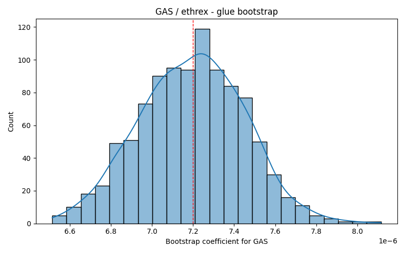

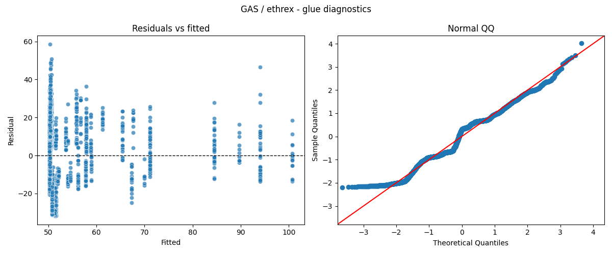

</details>

<details><summary><code>MLOAD</code> · nobs=7530 · runtime_ms=5.308e-06 · p=1.00e-03 · R²=0.1655</summary>

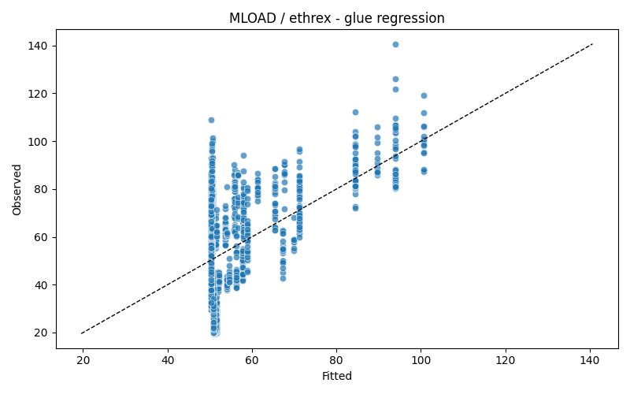

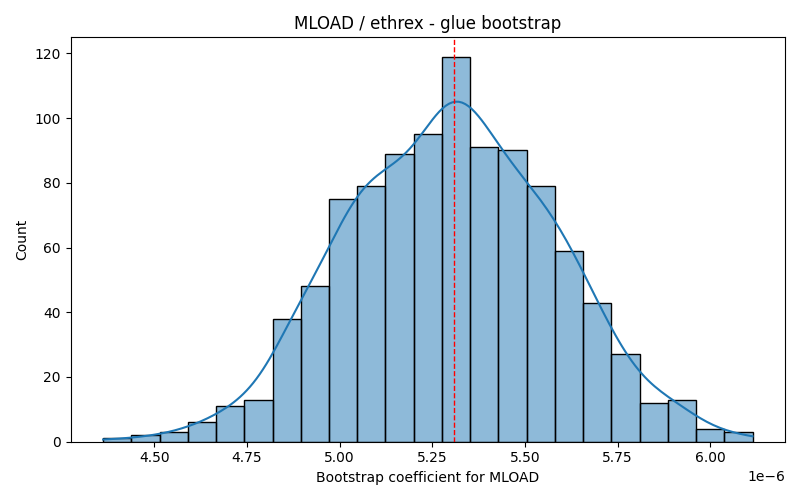


</details>

<details><summary><code>PUSH</code> · nobs=7530 · runtime_ms=0 · p=1.00e+00 · R²=0.1655</summary>


</details>

<details><summary><code>PUSH0</code> · nobs=7530 · runtime_ms=1.559e-06 · p=4.00e-03 · R²=0.1655</summary>

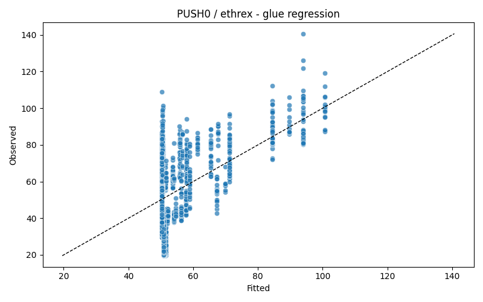

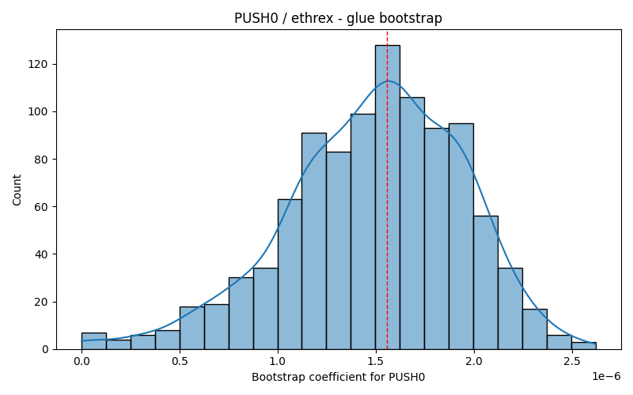


</details>

<details><summary><code>STATICCALL</code> · nobs=7530 · runtime_ms=0 · p=1.00e+00 · R²=0.1655</summary>

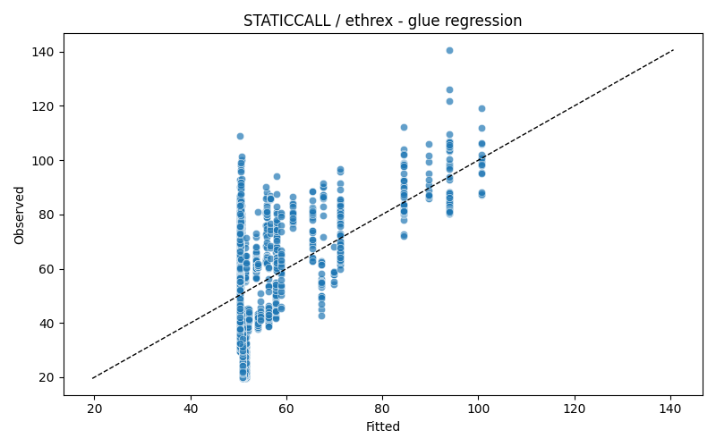


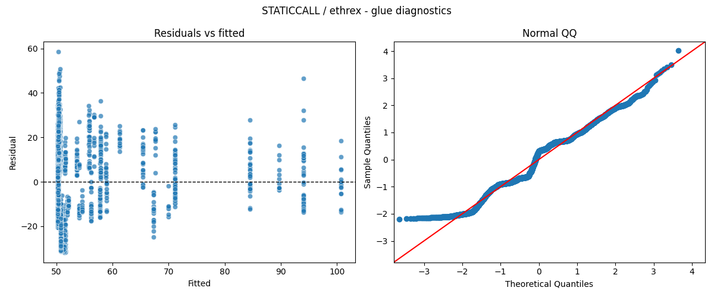

</details>

### Pure glue · ethrex

<details><summary><code>ISZERO</code> · nobs=120 · runtime_ms=0 · p=1.00e+00 · R²=-4.441e-16</summary>

```
==============================================================================
                           NNLS Regression Results                            
==============================================================================
Dep. Variable:          test_runtime_ms              R-squared:         -0.000
Model:                  NNLS                    Adj. R-squared:         -0.008
No. Observations:       120                               RMSE:          13.38
Df Residuals:           118                                MAE:          11.70
Df Model:               1      
==============================================================================
                      coef     std err     P-value      [0.025      0.975]
------------------------------------------------------------------------------
         const     41.3654      1.2300       0.001     39.0339     43.8524
        ISZERO      0.0000      0.0000       1.000      0.0000      0.0000
==============================================================================
Notes: Non-negative least squares with bootstrap inference (1000 iterations)
==============================================================================
```

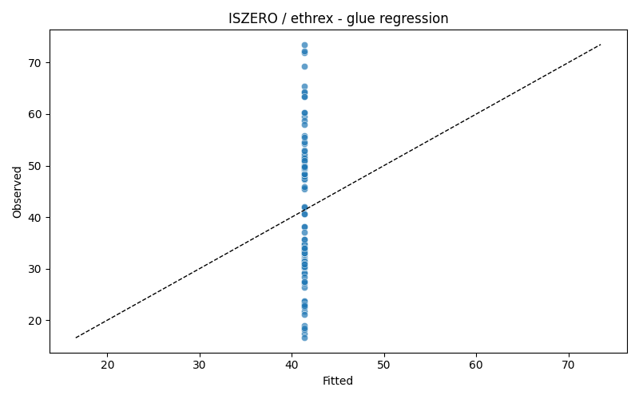

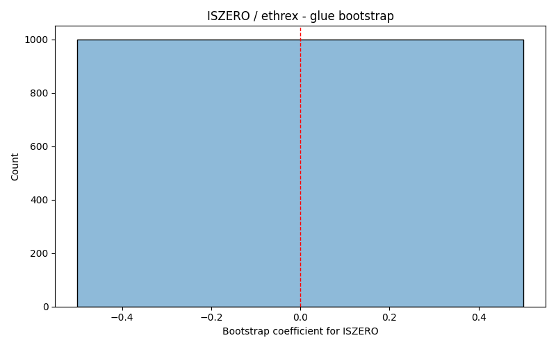

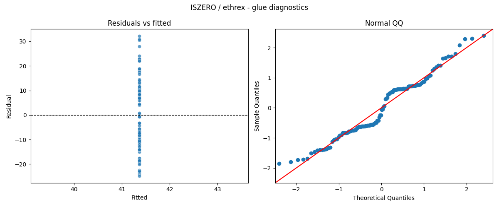

</details>

<details><summary><code>JUMPDEST</code> · nobs=30 · runtime_ms=0 · p=1.00e+00 · R²=2.22e-16</summary>

```
==============================================================================
                           NNLS Regression Results                            
==============================================================================
Dep. Variable:          test_runtime_ms              R-squared:          0.000
Model:                  NNLS                    Adj. R-squared:         -0.036
No. Observations:       30                                RMSE:          18.24
Df Residuals:           28                                 MAE:          17.81
Df Model:               1      
==============================================================================
                      coef     std err     P-value      [0.025      0.975]
------------------------------------------------------------------------------
         const     73.4982      3.2836       0.001     67.2189     79.6183
      JUMPDEST      0.0000      0.0000       1.000      0.0000      0.0000
==============================================================================
Notes: Non-negative least squares with bootstrap inference (1000 iterations)
==============================================================================
```

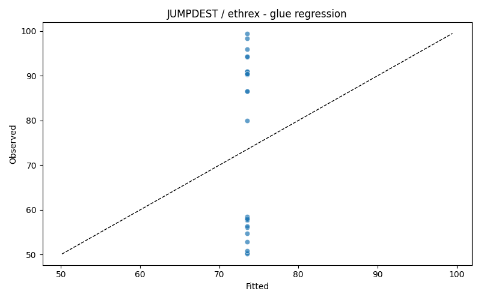


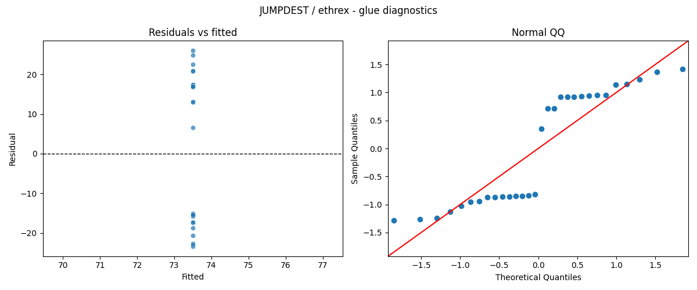

</details>

<details><summary><code>SWAP</code> · nobs=2145 · runtime_ms=0 · p=1.00e+00 · R²=0</summary>

```
==============================================================================
                           NNLS Regression Results                            
==============================================================================
Dep. Variable:          test_runtime_ms              R-squared:          0.000
Model:                  NNLS                    Adj. R-squared:         -0.000
No. Observations:       2145                              RMSE:          21.84
Df Residuals:           2143                               MAE:          16.82
Df Model:               1      
==============================================================================
                      coef     std err     P-value      [0.025      0.975]
------------------------------------------------------------------------------
         const    104.1395      0.4694       0.001    103.2653    105.1061
          SWAP      0.0000      0.0000       1.000      0.0000      0.0000
==============================================================================
Notes: Non-negative least squares with bootstrap inference (1000 iterations)
==============================================================================
```

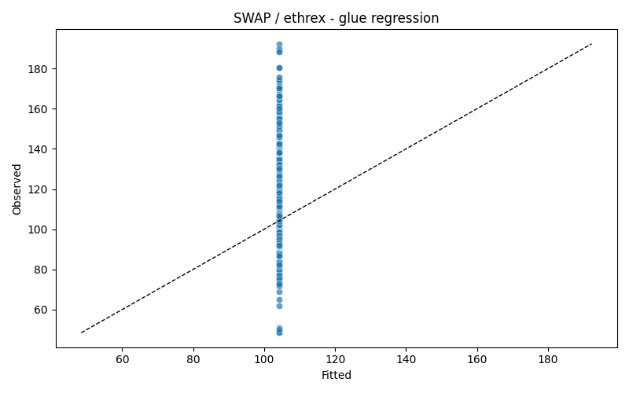


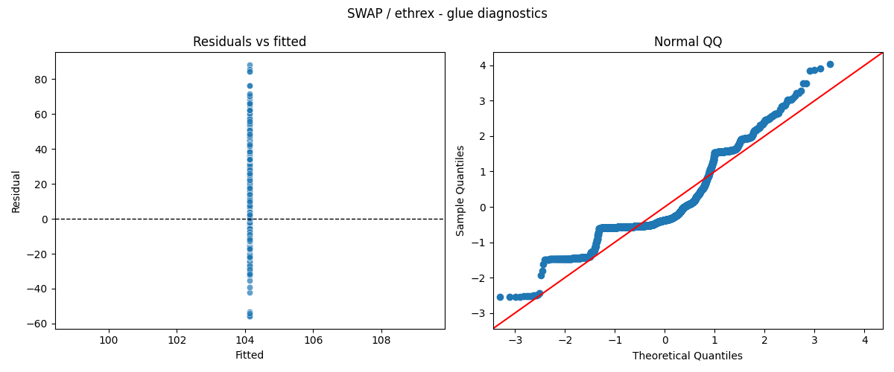

</details>

### Mixed glue (tier A) · ethrex

<details><summary><code>ADD</code> · nobs=135 · runtime_ms=0 · p=1.00e+00 · R²=0</summary>

```
==============================================================================
                           NNLS Regression Results                            
==============================================================================
Dep. Variable:          test_runtime_ms              R-squared:          0.000
Model:                  NNLS                    Adj. R-squared:         -0.008
No. Observations:       135                               RMSE:          13.18
Df Residuals:           133                                MAE:          11.50
Df Model:               1      
==============================================================================
                      coef     std err     P-value      [0.025      0.975]
------------------------------------------------------------------------------
         const     44.8929      1.1547       0.001     42.5075     46.9921
           ADD      0.0000      0.0000       1.000      0.0000      0.0000
==============================================================================
Notes: Non-negative least squares with bootstrap inference (1000 iterations)
==============================================================================
```

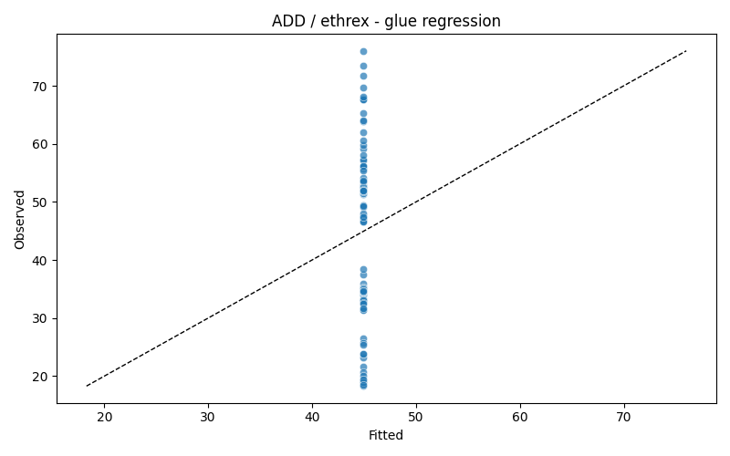

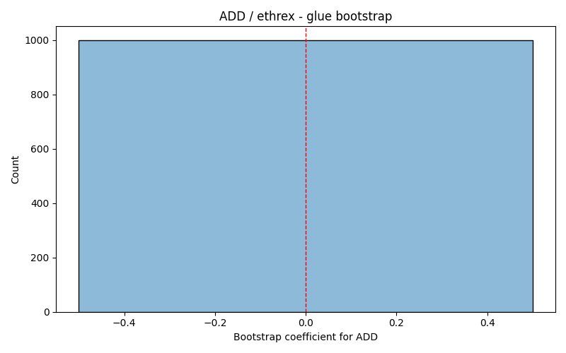

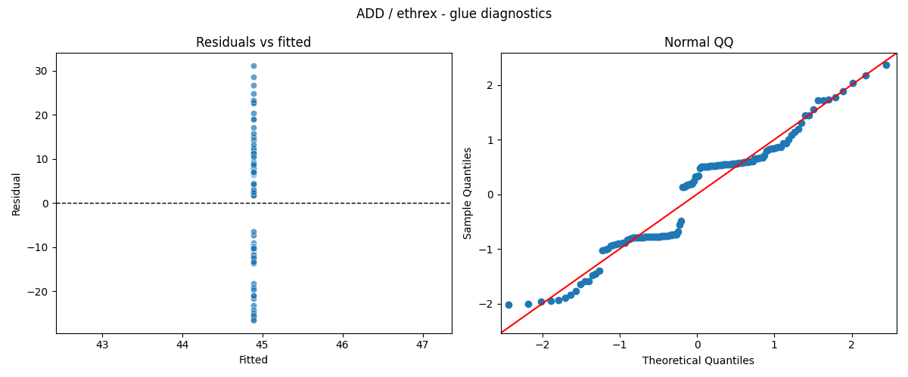

</details>

<details><summary><code>AND</code> · nobs=120 · runtime_ms=0 · p=1.00e+00 · R²=0</summary>

```
==============================================================================
                           NNLS Regression Results                            
==============================================================================
Dep. Variable:          test_runtime_ms              R-squared:          0.000
Model:                  NNLS                    Adj. R-squared:         -0.008
No. Observations:       120                               RMSE:          12.49
Df Residuals:           118                                MAE:          10.82
Df Model:               1      
==============================================================================
                      coef     std err     P-value      [0.025      0.975]
------------------------------------------------------------------------------
         const     39.9441      1.1177       0.001     37.8579     42.1507
           AND      0.0000      0.0000       1.000      0.0000      0.0000
==============================================================================
Notes: Non-negative least squares with bootstrap inference (1000 iterations)
==============================================================================
```

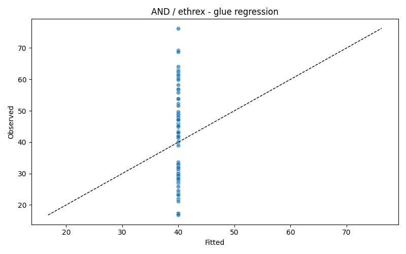


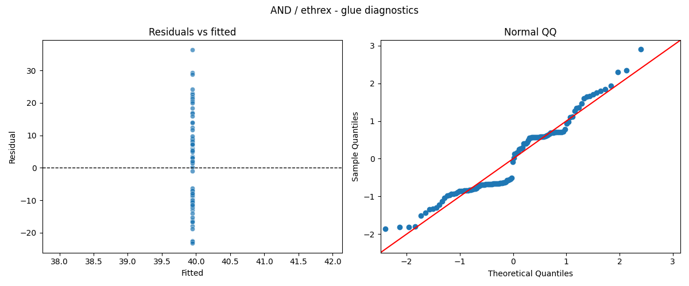

</details>

<details><summary><code>CALLDATACOPY</code> · nobs=3525 · runtime_ms=0 · p=1.00e+00 · R²=-2.22e-16</summary>

```
==============================================================================
                           NNLS Regression Results                            
==============================================================================
Dep. Variable:          test_runtime_ms              R-squared:         -0.000
Model:                  NNLS                    Adj. R-squared:         -0.000
No. Observations:       3525                              RMSE:          20.18
Df Residuals:           3523                               MAE:          16.99
Df Model:               1      
==============================================================================
                      coef     std err     P-value      [0.025      0.975]
------------------------------------------------------------------------------
         const     35.9952      0.3315       0.001     35.3529     36.6447
  CALLDATACOPY      0.0000      0.0000       1.000      0.0000      0.0000
==============================================================================
Notes: Non-negative least squares with bootstrap inference (1000 iterations)
==============================================================================
```

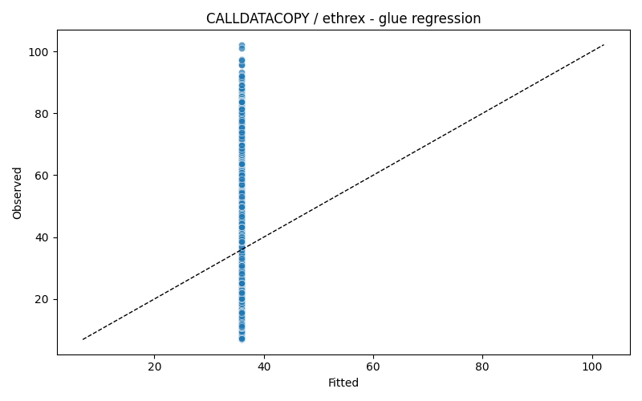

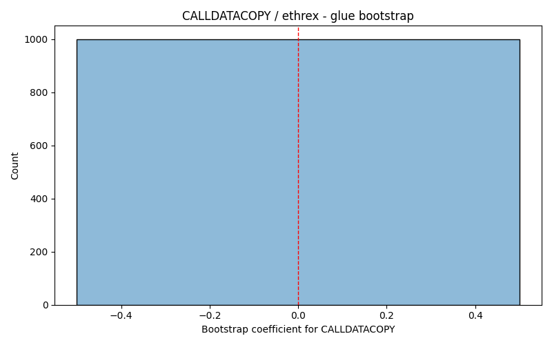

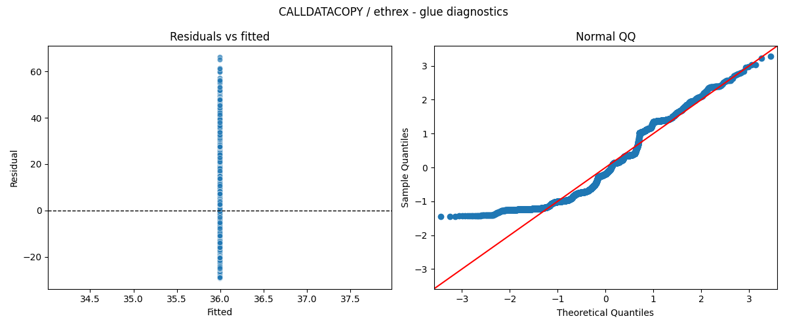

</details>

<details><summary><code>CALLDATALOAD</code> · nobs=660 · runtime_ms=1.525e-05 · p=1.00e-03 · R²=0.1741</summary>

```
==============================================================================
                           NNLS Regression Results                            
==============================================================================
Dep. Variable:          test_runtime_ms              R-squared:          0.174
Model:                  NNLS                    Adj. R-squared:          0.173
No. Observations:       660                               RMSE:           0.13
Df Residuals:           658                                MAE:           0.09
Df Model:               1      
==============================================================================
                      coef     std err     P-value      [0.025      0.975]
------------------------------------------------------------------------------
         const      2.1962      0.0194       0.001      2.1620      2.2373
  CALLDATALOAD      0.0000      0.0000       0.001      0.0000      0.0000
==============================================================================
Notes: Non-negative least squares with bootstrap inference (1000 iterations)
==============================================================================
```

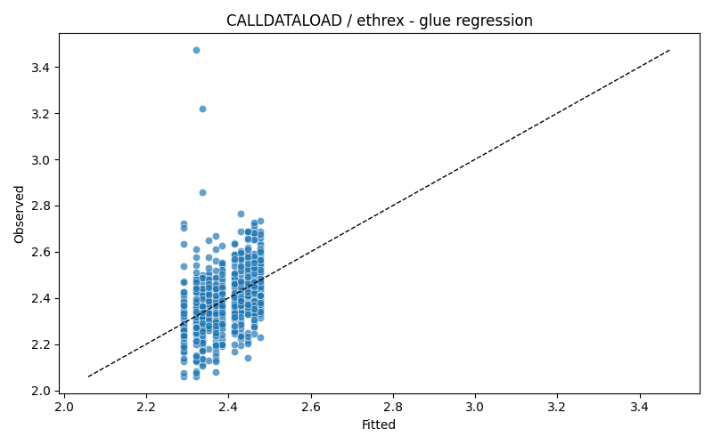

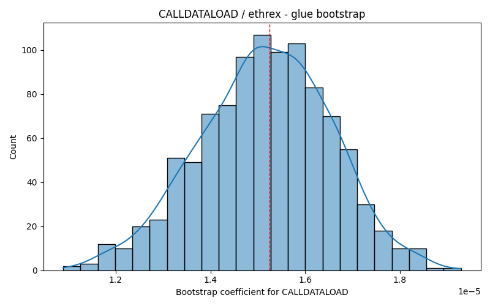

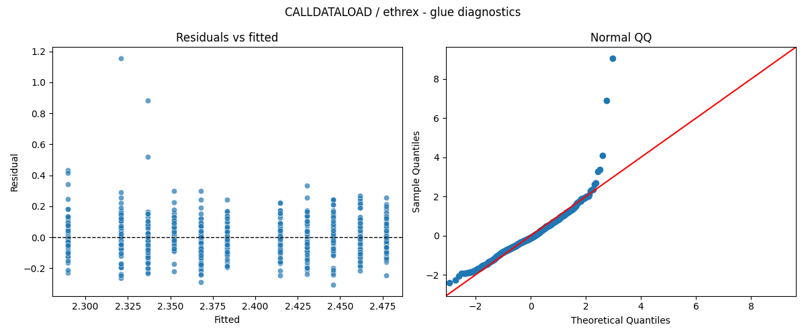

</details>

<details><summary><code>DIV</code> · nobs=165 · runtime_ms=0 · p=1.00e+00 · R²=2.22e-16</summary>

```
==============================================================================
                           NNLS Regression Results                            
==============================================================================
Dep. Variable:          test_runtime_ms              R-squared:          0.000
Model:                  NNLS                    Adj. R-squared:         -0.006
No. Observations:       165                               RMSE:          83.99
Df Residuals:           163                                MAE:          74.62
Df Model:               1      
==============================================================================
                      coef     std err     P-value      [0.025      0.975]
------------------------------------------------------------------------------
         const    310.3493      6.5079       0.001    297.4466    323.5093
           DIV      0.0000      0.0000       1.000      0.0000      0.0000
==============================================================================
Notes: Non-negative least squares with bootstrap inference (1000 iterations)
==============================================================================
```

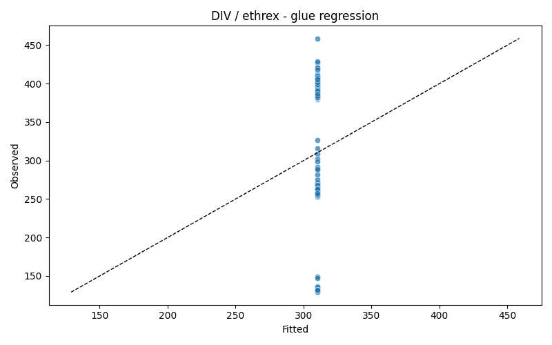


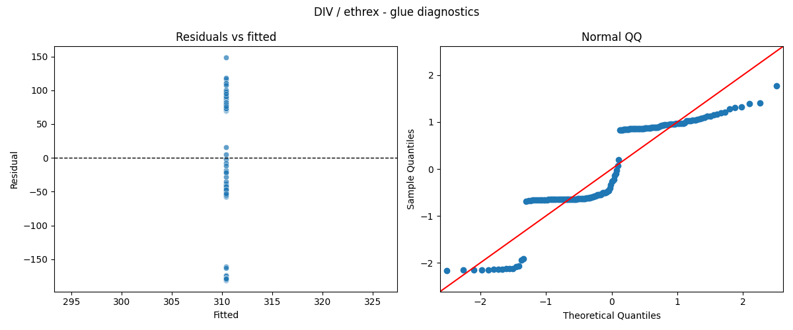

</details>

<details><summary><code>EXP</code> · nobs=165 · runtime_ms=0.0009092 · p=1.00e-03 · R²=0.8323</summary>

```
==============================================================================
                           NNLS Regression Results                            
==============================================================================
Dep. Variable:          test_runtime_ms              R-squared:          0.832
Model:                  NNLS                    Adj. R-squared:          0.831
No. Observations:       165                               RMSE:          15.99
Df Residuals:           163                                MAE:          13.31
Df Model:               1      
==============================================================================
                      coef     std err     P-value      [0.025      0.975]
------------------------------------------------------------------------------
         const     36.0107      4.6073       0.001     27.1568     45.4512
           EXP      0.0009      0.0000       0.001      0.0008      0.0010
==============================================================================
Notes: Non-negative least squares with bootstrap inference (1000 iterations)
==============================================================================
```

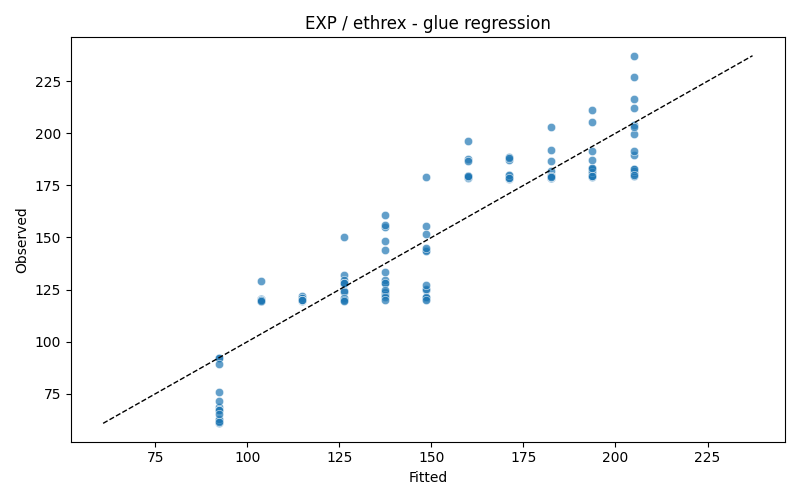

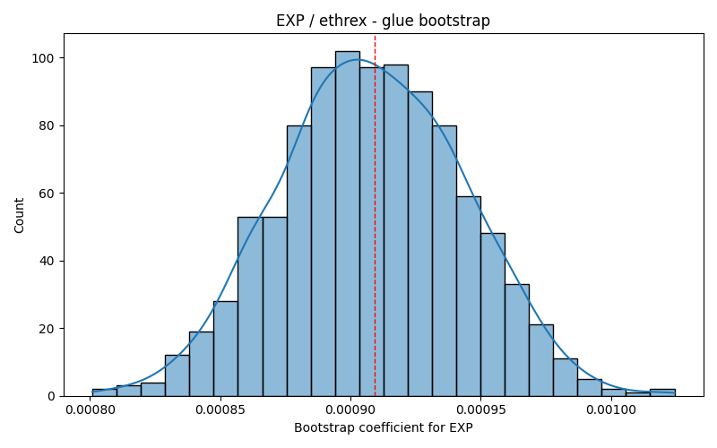

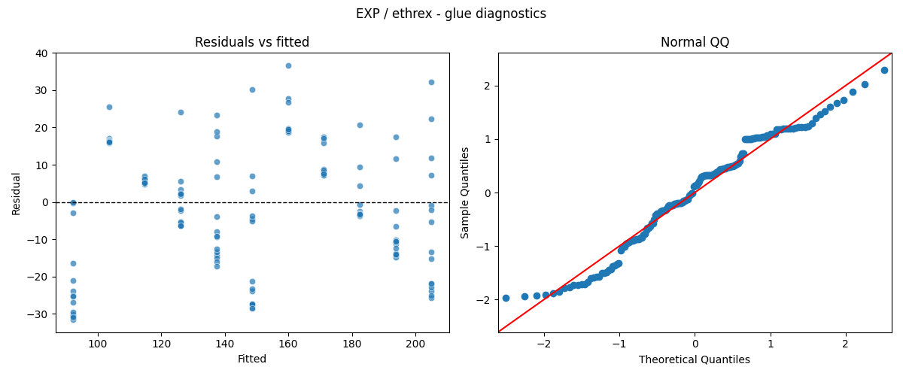

</details>

<details><summary><code>GT</code> · nobs=120 · runtime_ms=0 · p=1.00e+00 · R²=0</summary>

```
==============================================================================
                           NNLS Regression Results                            
==============================================================================
Dep. Variable:          test_runtime_ms              R-squared:          0.000
Model:                  NNLS                    Adj. R-squared:         -0.008
No. Observations:       120                               RMSE:          13.11
Df Residuals:           118                                MAE:          11.63
Df Model:               1      
==============================================================================
                      coef     std err     P-value      [0.025      0.975]
------------------------------------------------------------------------------
         const     43.0547      1.2165       0.001     40.6785     45.3616
            GT      0.0000      0.0000       1.000      0.0000      0.0000
==============================================================================
Notes: Non-negative least squares with bootstrap inference (1000 iterations)
==============================================================================
```

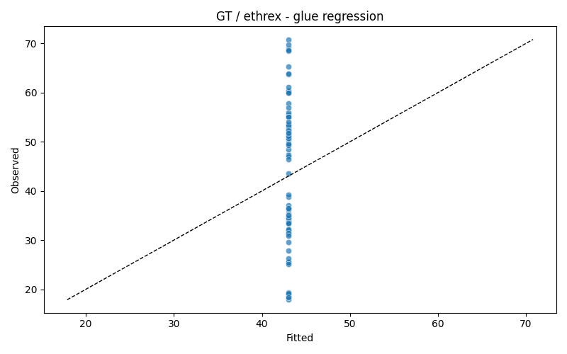

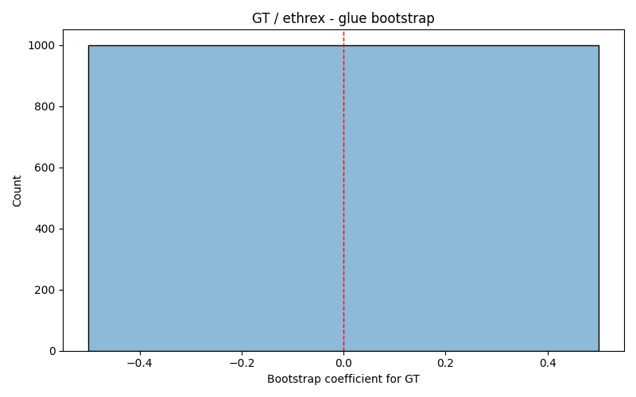

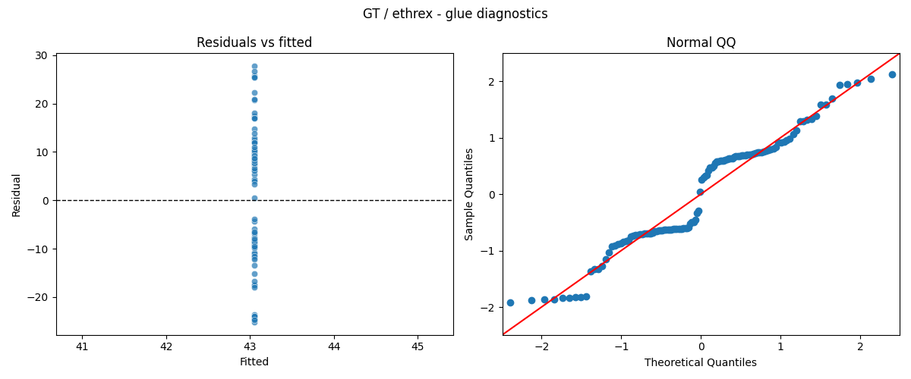

</details>

<details><summary><code>JUMPI</code> · nobs=165 · runtime_ms=0 · p=1.00e+00 · R²=2.22e-16</summary>

```
==============================================================================
                           NNLS Regression Results                            
==============================================================================
Dep. Variable:          test_runtime_ms              R-squared:          0.000
Model:                  NNLS                    Adj. R-squared:         -0.006
No. Observations:       165                               RMSE:           7.63
Df Residuals:           163                                MAE:           6.41
Df Model:               1      
==============================================================================
                      coef     std err     P-value      [0.025      0.975]
------------------------------------------------------------------------------
         const     27.9630      0.5907       0.001     26.8333     29.1711
         JUMPI      0.0000      0.0000       1.000      0.0000      0.0000
==============================================================================
Notes: Non-negative least squares with bootstrap inference (1000 iterations)
==============================================================================
```

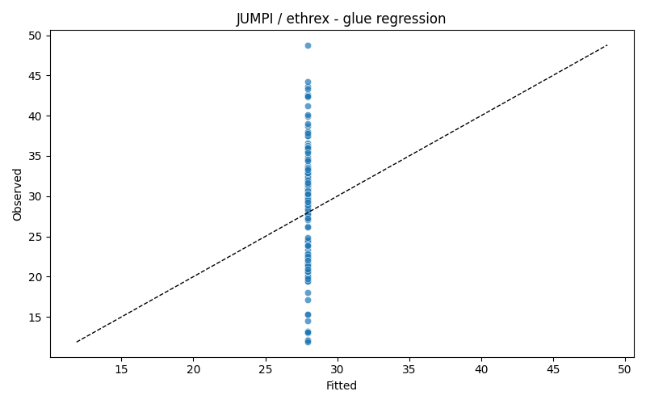


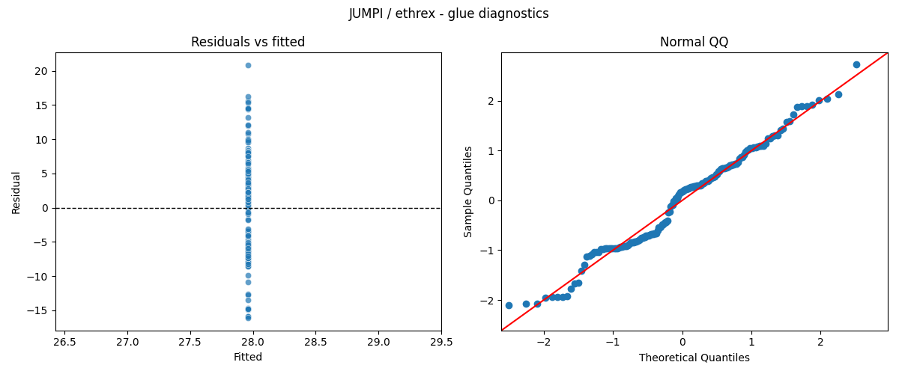

</details>

<details><summary><code>LT</code> · nobs=120 · runtime_ms=0 · p=1.00e+00 · R²=0</summary>

```
==============================================================================
                           NNLS Regression Results                            
==============================================================================
Dep. Variable:          test_runtime_ms              R-squared:          0.000
Model:                  NNLS                    Adj. R-squared:         -0.008
No. Observations:       120                               RMSE:          13.67
Df Residuals:           118                                MAE:          12.07
Df Model:               1      
==============================================================================
                      coef     std err     P-value      [0.025      0.975]
------------------------------------------------------------------------------
         const     42.7763      1.2292       0.001     40.4427     45.3190
            LT      0.0000      0.0000       1.000      0.0000      0.0000
==============================================================================
Notes: Non-negative least squares with bootstrap inference (1000 iterations)
==============================================================================
```

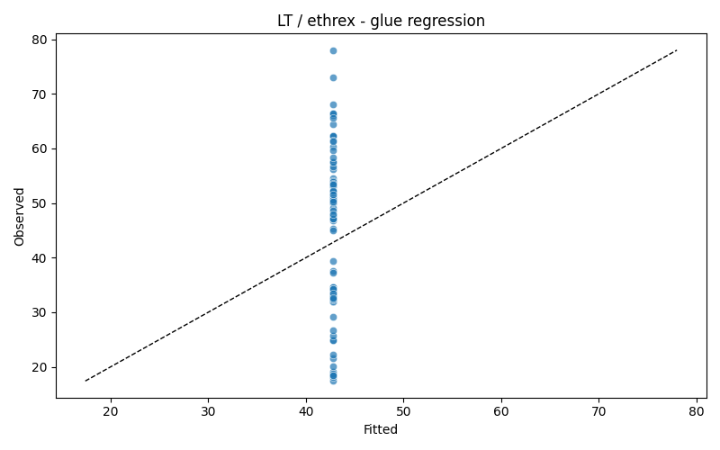


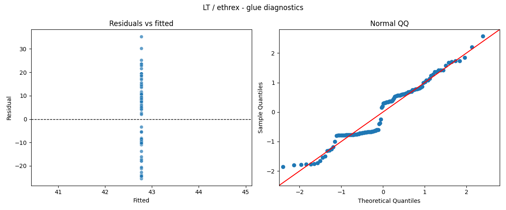

</details>

<details><summary><code>MSTORE</code> · nobs=675 · runtime_ms=0 · p=1.00e+00 · R²=0</summary>

```
==============================================================================
                           NNLS Regression Results                            
==============================================================================
Dep. Variable:          test_runtime_ms              R-squared:          0.000
Model:                  NNLS                    Adj. R-squared:         -0.001
No. Observations:       675                               RMSE:          14.05
Df Residuals:           673                                MAE:          12.32
Df Model:               1      
==============================================================================
                      coef     std err     P-value      [0.025      0.975]
------------------------------------------------------------------------------
         const     48.9012      0.5673       0.001     47.8405     50.0425
        MSTORE      0.0000      0.0000       1.000      0.0000      0.0000
==============================================================================
Notes: Non-negative least squares with bootstrap inference (1000 iterations)
==============================================================================
```

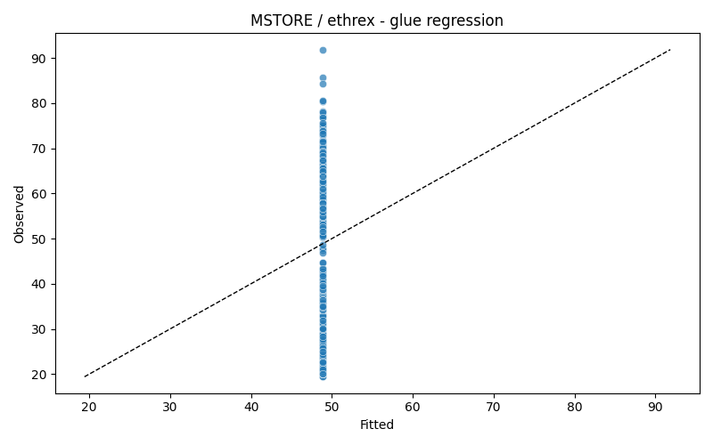


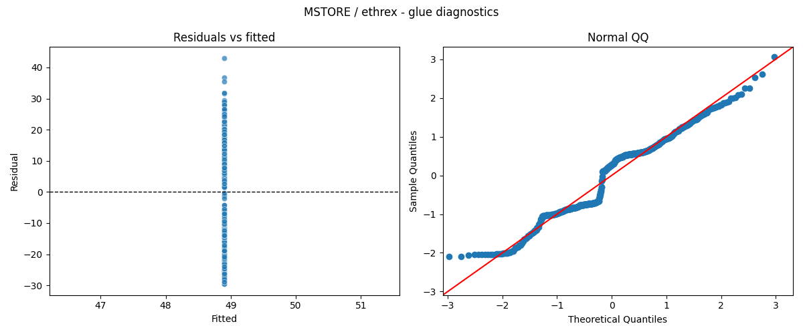

</details>

<details><summary><code>MSTORE8</code> · nobs=675 · runtime_ms=0 · p=1.00e+00 · R²=-2.22e-16</summary>

```
==============================================================================
                           NNLS Regression Results                            
==============================================================================
Dep. Variable:          test_runtime_ms              R-squared:         -0.000
Model:                  NNLS                    Adj. R-squared:         -0.001
No. Observations:       675                               RMSE:          13.89
Df Residuals:           673                                MAE:          11.88
Df Model:               1      
==============================================================================
                      coef     std err     P-value      [0.025      0.975]
------------------------------------------------------------------------------
         const     46.2157      0.5231       0.001     45.2303     47.1972
       MSTORE8      0.0000      0.0000       1.000      0.0000      0.0000
==============================================================================
Notes: Non-negative least squares with bootstrap inference (1000 iterations)
==============================================================================
```

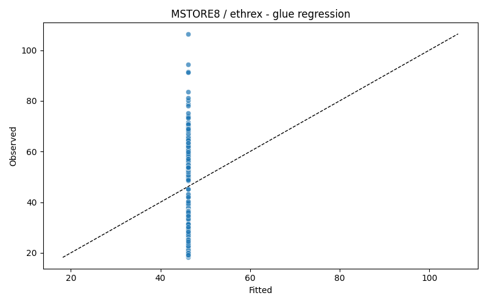

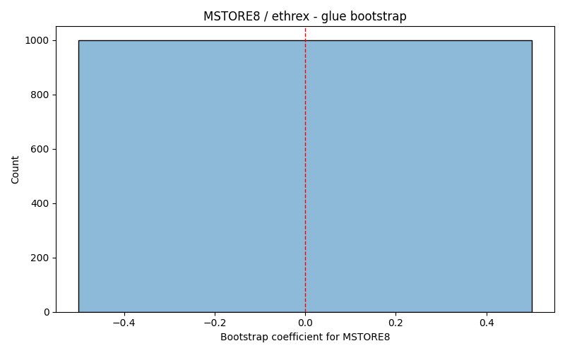

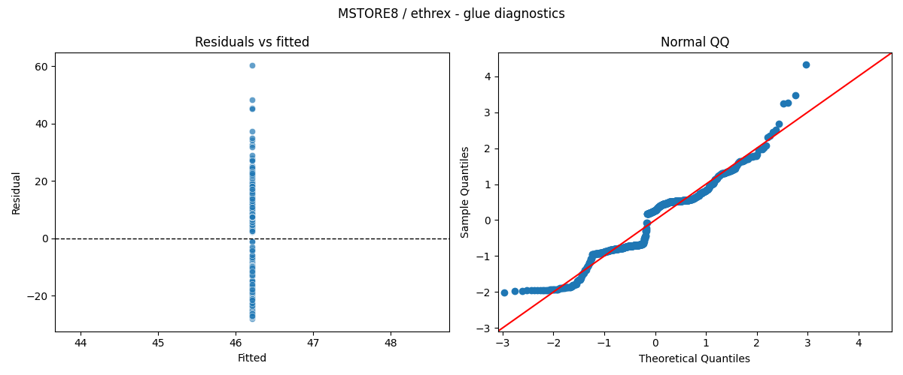

</details>

<details><summary><code>MUL</code> · nobs=150 · runtime_ms=0 · p=1.00e+00 · R²=0</summary>

```
==============================================================================
                           NNLS Regression Results                            
==============================================================================
Dep. Variable:          test_runtime_ms              R-squared:          0.000
Model:                  NNLS                    Adj. R-squared:         -0.007
No. Observations:       150                               RMSE:          23.09
Df Residuals:           148                                MAE:          19.84
Df Model:               1      
==============================================================================
                      coef     std err     P-value      [0.025      0.975]
------------------------------------------------------------------------------
         const     86.8470      1.8468       0.001     83.3038     90.5419
           MUL      0.0000      0.0000       1.000      0.0000      0.0000
==============================================================================
Notes: Non-negative least squares with bootstrap inference (1000 iterations)
==============================================================================
```

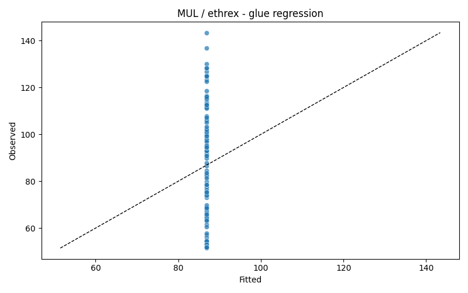

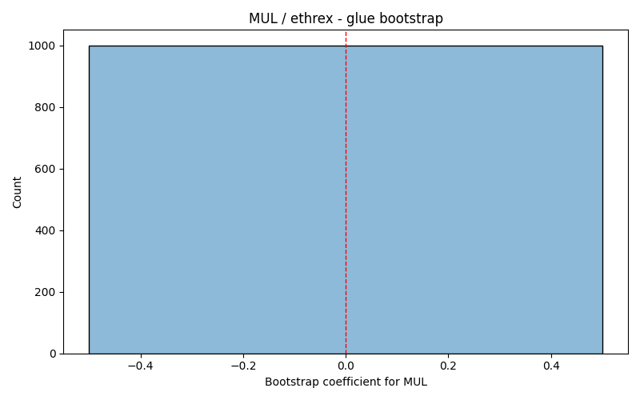

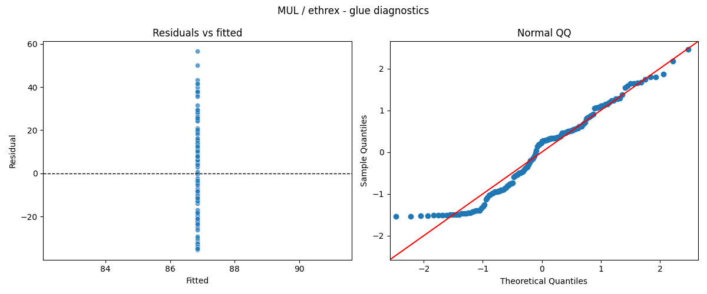

</details>

<details><summary><code>PC</code> · nobs=90 · runtime_ms=4.936e-06 · p=1.00e-03 · R²=0.3919</summary>

```
==============================================================================
                           NNLS Regression Results                            
==============================================================================
Dep. Variable:          test_runtime_ms              R-squared:          0.392
Model:                  NNLS                    Adj. R-squared:          0.385
No. Observations:       90                                RMSE:          13.67
Df Residuals:           88                                 MAE:          11.76
Df Model:               1      
==============================================================================
                      coef     std err     P-value      [0.025      0.975]
------------------------------------------------------------------------------
         const     61.5606      2.7783       0.001     56.1373     66.7443
            PC      0.0000      0.0000       0.001      0.0000      0.0000
==============================================================================
Notes: Non-negative least squares with bootstrap inference (1000 iterations)
==============================================================================
```

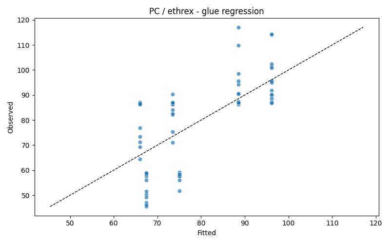

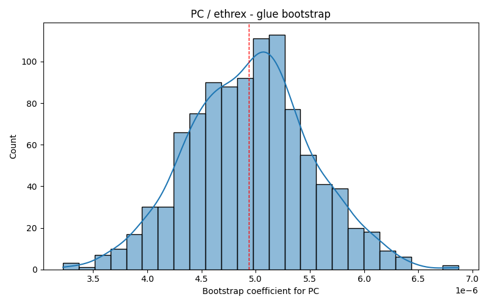

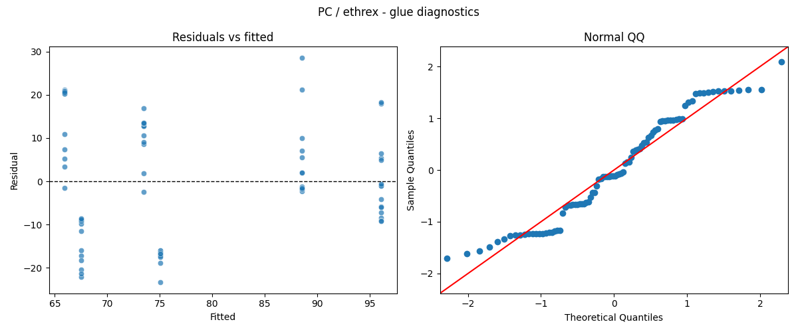

</details>

<details><summary><code>RETURNDATASIZE</code> · nobs=360 · runtime_ms=7.743e-06 · p=1.00e-03 · R²=0.38</summary>

```
==============================================================================
                           NNLS Regression Results                            
==============================================================================
Dep. Variable:          test_runtime_ms              R-squared:          0.380
Model:                  NNLS                    Adj. R-squared:          0.378
No. Observations:       360                               RMSE:          11.61
Df Residuals:           358                                MAE:          10.03
Df Model:               1      
==============================================================================
                      coef     std err     P-value      [0.025      0.975]
------------------------------------------------------------------------------
         const     48.0392      1.1290       0.001     45.7431     50.1106
RETURNDATASIZE      0.0000      0.0000       0.001      0.0000      0.0000
==============================================================================
Notes: Non-negative least squares with bootstrap inference (1000 iterations)
==============================================================================
```

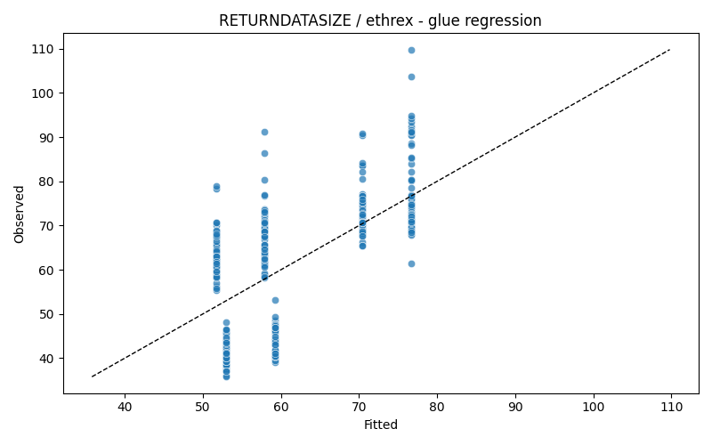

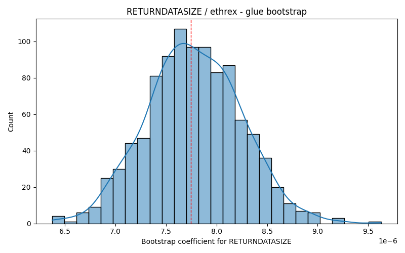

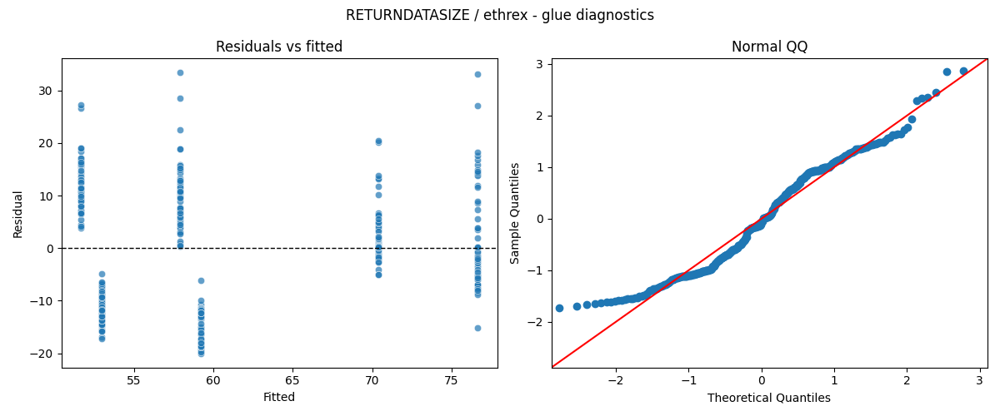

</details>

<details><summary><code>SELFBALANCE</code> · nobs=165 · runtime_ms=0 · p=1.00e+00 · R²=0</summary>

```
==============================================================================
                           NNLS Regression Results                            
==============================================================================
Dep. Variable:          test_runtime_ms              R-squared:          0.000
Model:                  NNLS                    Adj. R-squared:         -0.006
No. Observations:       165                               RMSE:          65.58
Df Residuals:           163                                MAE:          58.87
Df Model:               1      
==============================================================================
                      coef     std err     P-value      [0.025      0.975]
------------------------------------------------------------------------------
         const    252.6999      5.0294       0.001    243.1446    262.7237
   SELFBALANCE      0.0000      0.0000       1.000      0.0000      0.0000
==============================================================================
Notes: Non-negative least squares with bootstrap inference (1000 iterations)
==============================================================================
```

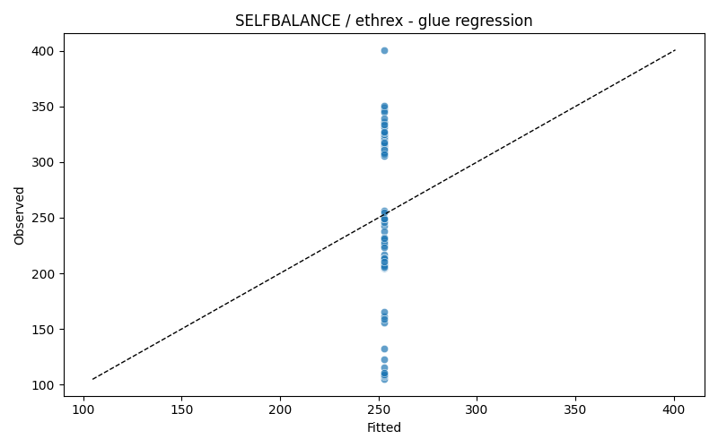

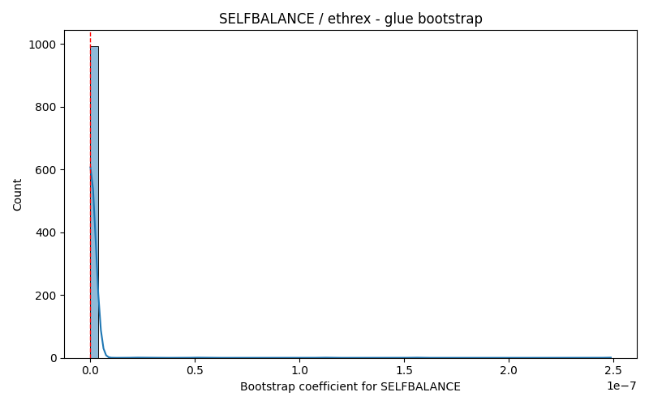

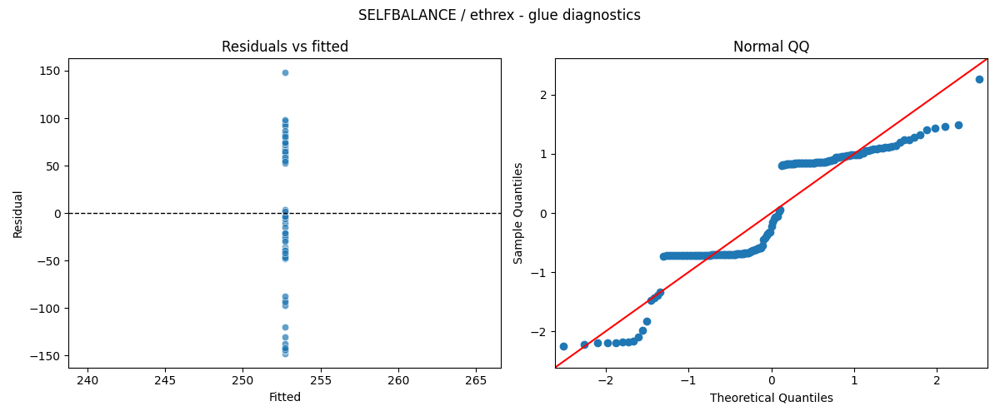

</details>

<details><summary><code>SUB</code> · nobs=120 · runtime_ms=0 · p=1.00e+00 · R²=-2.22e-16</summary>

```
==============================================================================
                           NNLS Regression Results                            
==============================================================================
Dep. Variable:          test_runtime_ms              R-squared:         -0.000
Model:                  NNLS                    Adj. R-squared:         -0.008
No. Observations:       120                               RMSE:          13.38
Df Residuals:           118                                MAE:          11.86
Df Model:               1      
==============================================================================
                      coef     std err     P-value      [0.025      0.975]
------------------------------------------------------------------------------
         const     43.9531      1.2317       0.001     41.5745     46.3104
           SUB      0.0000      0.0000       1.000      0.0000      0.0000
==============================================================================
Notes: Non-negative least squares with bootstrap inference (1000 iterations)
==============================================================================
```

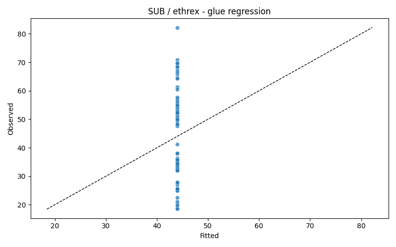

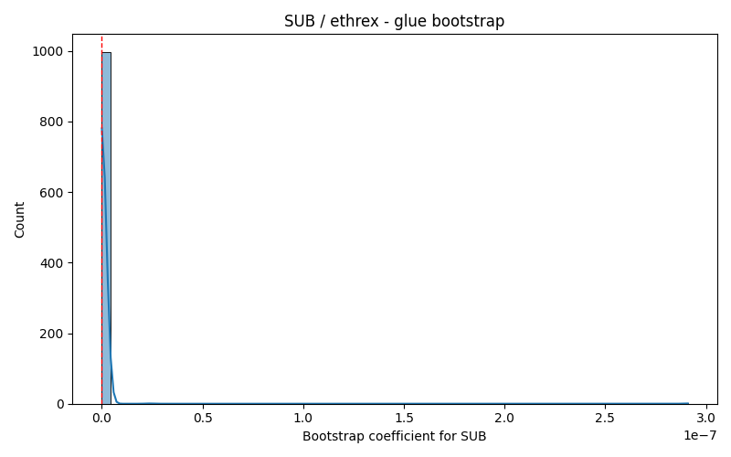

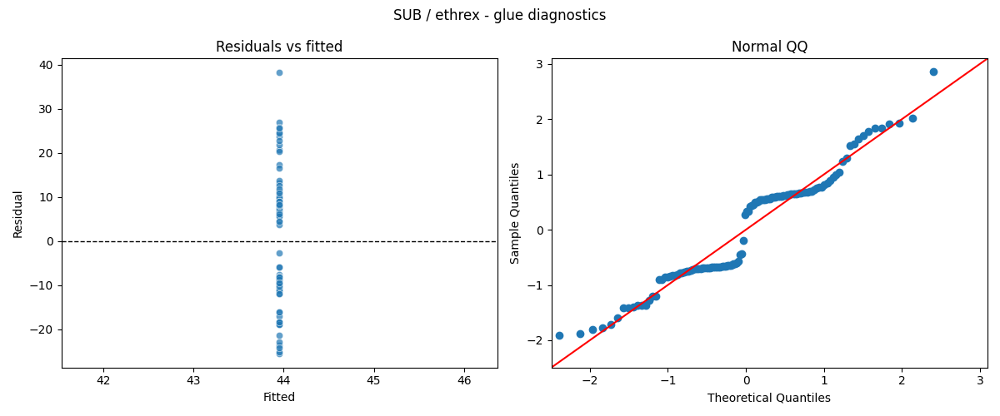

</details>

### Mixed glue (tier B) · ethrex

<details><summary><code>JUMP</code> · nobs=150 · runtime_ms=0 · p=1.00e+00 · R²=0</summary>

```
==============================================================================
                           NNLS Regression Results                            
==============================================================================
Dep. Variable:          test_runtime_ms              R-squared:          0.000
Model:                  NNLS                    Adj. R-squared:         -0.007
No. Observations:       150                               RMSE:          11.41
Df Residuals:           148                                MAE:           9.96
Df Model:               1      
==============================================================================
                      coef     std err     P-value      [0.025      0.975]
------------------------------------------------------------------------------
         const     40.9665      0.9420       0.001     39.0727     42.7518
          JUMP      0.0000      0.0000       1.000      0.0000      0.0000
==============================================================================
Notes: Non-negative least squares with bootstrap inference (1000 iterations)
==============================================================================
```

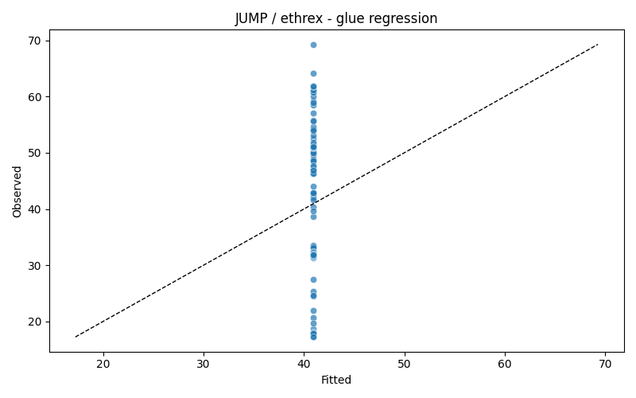


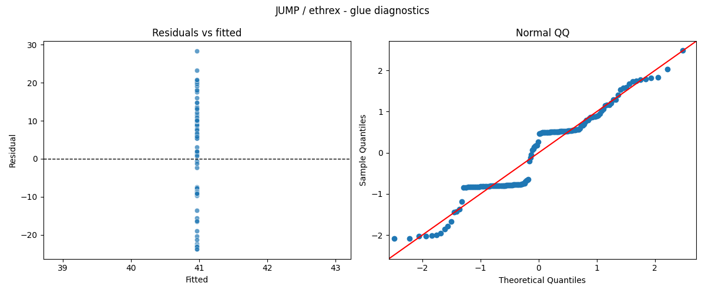

</details>

<details><summary><code>KECCAK256</code> · nobs=2640 · runtime_ms=0 · p=1.00e+00 · R²=0</summary>

```
==============================================================================
                           NNLS Regression Results                            
==============================================================================
Dep. Variable:          test_runtime_ms              R-squared:          0.000
Model:                  NNLS                    Adj. R-squared:         -0.000
No. Observations:       2640                              RMSE:         154.32
Df Residuals:           2638                               MAE:         128.08
Df Model:               1      
==============================================================================
                      coef     std err     P-value      [0.025      0.975]
------------------------------------------------------------------------------
         const    244.7303      2.9918       0.001    238.4821    250.6490
     KECCAK256      0.0000      0.0000       1.000      0.0000      0.0000
==============================================================================
Notes: Non-negative least squares with bootstrap inference (1000 iterations)
==============================================================================
```

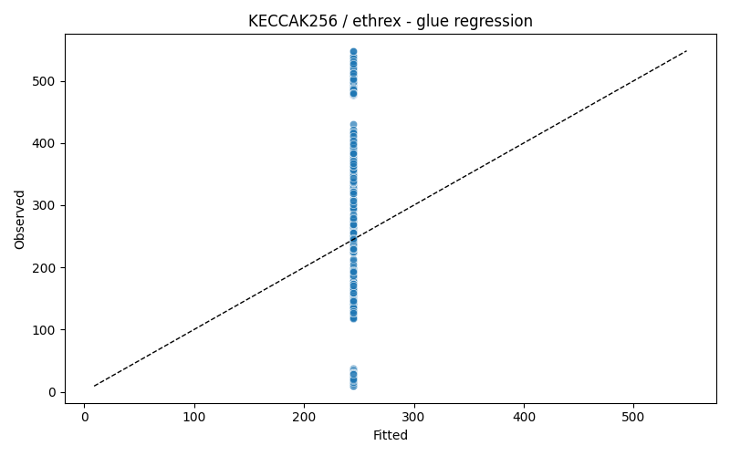


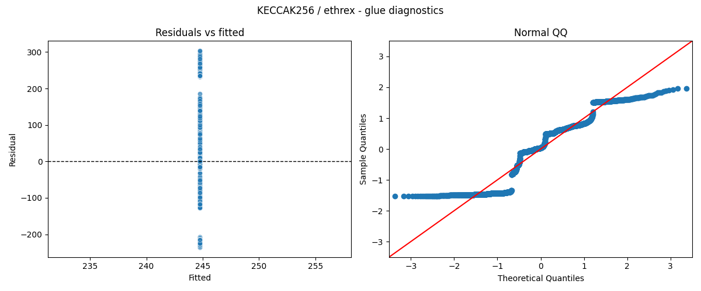

</details>

## geth

| glue_opcode | nobs | glue_runtime_ms | p_value | rsquared |
| --- | --- | --- | --- | --- |
| `ISZERO` | 544 | 0 | 1.00e+00 | 0 |
| `JUMPDEST` | 136 | 0 | 1.00e+00 | 0 |
| `SWAP` | 9724 | 0 | 1.00e+00 | 1.11e-16 |
| `CALLDATASIZE` | 34213 | 4.377e-06 | 1.00e-03 | 0.02773 |
| `DUP` | 34213 | 0 | 1.00e+00 | 0.02773 |
| `GAS` | 34213 | 5.667e-06 | 1.00e-03 | 0.02773 |
| `MLOAD` | 34213 | 7.84e-06 | 1.00e-03 | 0.02773 |
| `PUSH` | 34213 | 0 | 1.00e+00 | 0.02773 |
| `PUSH0` | 34213 | 0 | 1.00e+00 | 0.02773 |
| `STATICCALL` | 34213 | 5.773e-05 | 1.00e-03 | 0.02773 |
| `ADD` | 612 | 0 | 1.00e+00 | 0 |
| `AND` | 544 | 0 | 1.00e+00 | 0 |
| `CALLDATACOPY` | 15980 | 0 | 1.00e+00 | 0 |
| `CALLDATALOAD` | 2992 | 3.828e-05 | 1.00e-03 | 0.1713 |
| `DIV` | 748 | 0 | 1.00e+00 | 1.11e-16 |
| `EXP` | 748 | 0.0003143 | 1.00e-03 | 0.8068 |
| `GT` | 544 | 0 | 1.00e+00 | -2.22e-16 |
| `JUMPI` | 748 | 0 | 1.00e+00 | 1.11e-16 |
| `LT` | 544 | 0 | 1.00e+00 | 2.22e-16 |
| `MSTORE` | 3060 | 0 | 1.00e+00 | 0 |
| `MSTORE8` | 3060 | 0 | 1.00e+00 | -2.22e-16 |
| `MUL` | 680 | 0 | 1.00e+00 | -2.22e-16 |
| `PC` | 408 | 6.885e-06 | 1.00e-03 | 0.3037 |
| `RETURNDATASIZE` | 1632 | 1.14e-05 | 1.00e-03 | 0.1331 |
| `SELFBALANCE` | 748 | 0 | 1.00e+00 | 0 |
| `SUB` | 544 | 0 | 1.00e+00 | 0 |
| `JUMP` | 680 | 0 | 1.00e+00 | 1.11e-16 |
| `KECCAK256` | 11968 | 2.969e-05 | 1.00e-03 | 0.2074 |

### Cycle glue — joint fit · geth

<details><summary>Joint NNLS regression summary</summary>

```
==============================================================================
                           NNLS Regression Results                            
==============================================================================
Dep. Variable:          test_runtime_ms              R-squared:          0.028
Model:                  NNLS                    Adj. R-squared:          0.028
No. Observations:       34213                             RMSE:          46.80
Df Residuals:           34205                              MAE:          38.02
Df Model:               7      
==============================================================================
                      coef     std err     P-value      [0.025      0.975]
------------------------------------------------------------------------------
         const    137.5530      0.2692       0.001    137.0537    138.1097
  CALLDATASIZE      0.0000      0.0000       0.001      0.0000      0.0000
           DUP      0.0000      0.0000       1.000      0.0000      0.0000
           GAS      0.0000      0.0000       0.001      0.0000      0.0000
         MLOAD      0.0000      0.0000       0.001      0.0000      0.0000
          PUSH      0.0000      0.0000       1.000      0.0000      0.0000
         PUSH0      0.0000      0.0000       1.000      0.0000      0.0000
    STATICCALL      0.0001      0.0000       0.001      0.0000      0.0001
==============================================================================
Notes: Non-negative least squares with bootstrap inference (1000 iterations)
==============================================================================
```

</details>

<details><summary><code>CALLDATASIZE</code> · nobs=34213 · runtime_ms=4.377e-06 · p=1.00e-03 · R²=0.02773</summary>

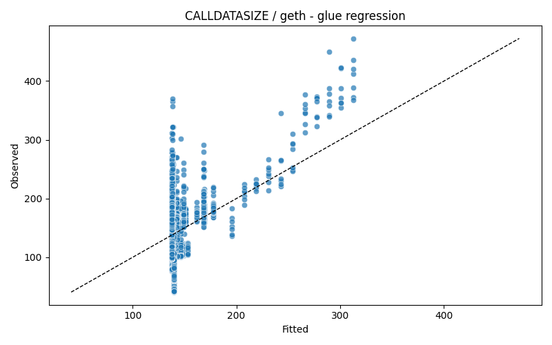

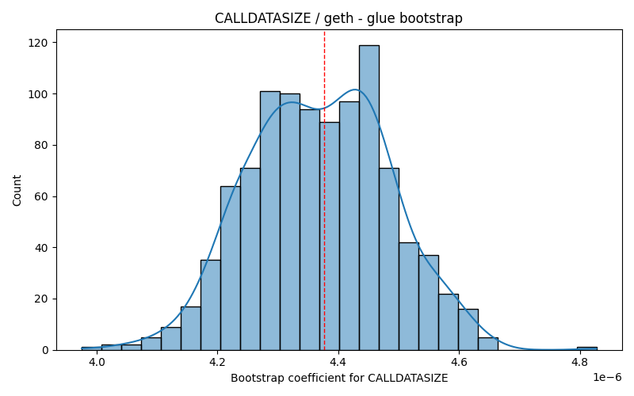

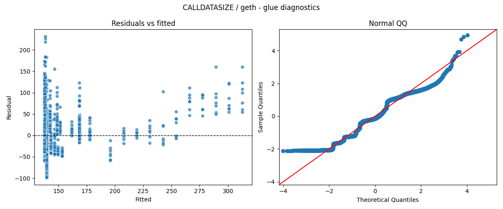

</details>

<details><summary><code>DUP</code> · nobs=34213 · runtime_ms=0 · p=1.00e+00 · R²=0.02773</summary>


</details>

<details><summary><code>GAS</code> · nobs=34213 · runtime_ms=5.667e-06 · p=1.00e-03 · R²=0.02773</summary>

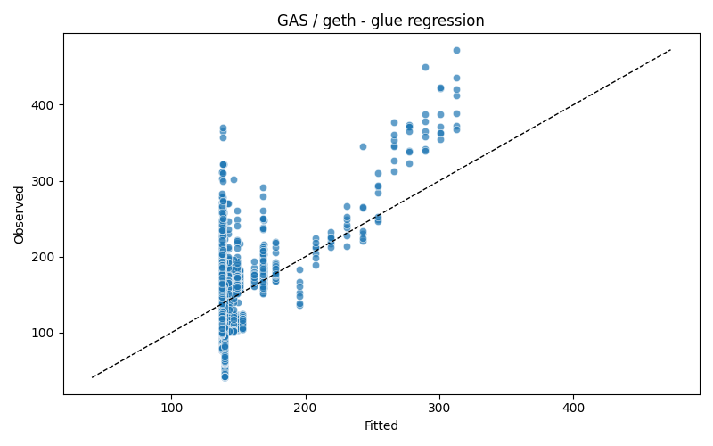

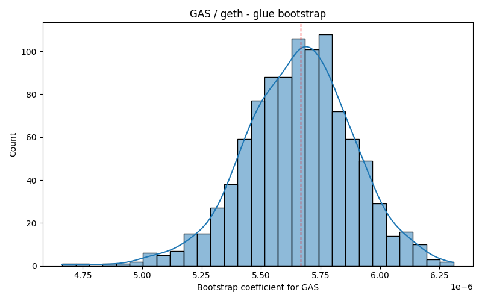


</details>

<details><summary><code>MLOAD</code> · nobs=34213 · runtime_ms=7.84e-06 · p=1.00e-03 · R²=0.02773</summary>


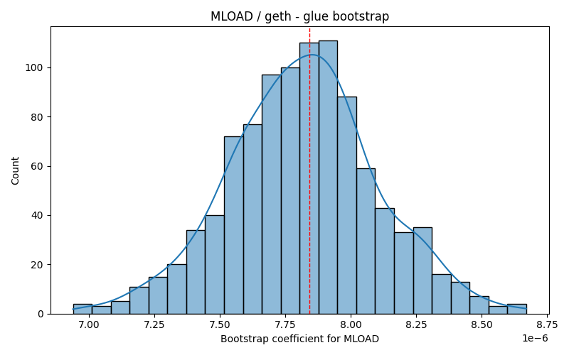


</details>

<details><summary><code>PUSH</code> · nobs=34213 · runtime_ms=0 · p=1.00e+00 · R²=0.02773</summary>


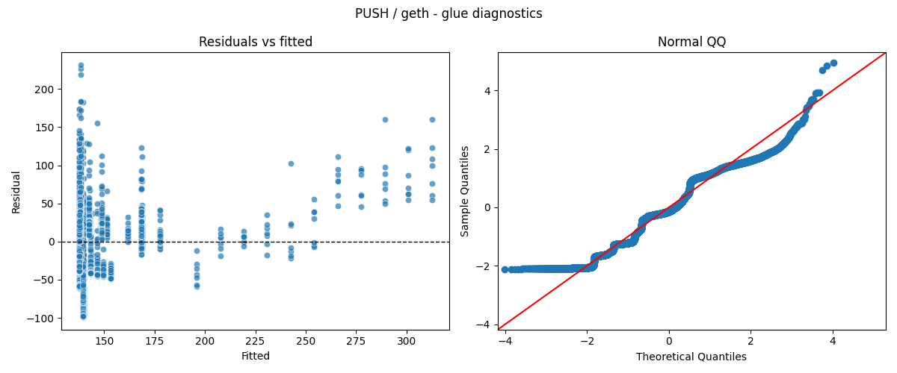

</details>

<details><summary><code>PUSH0</code> · nobs=34213 · runtime_ms=0 · p=1.00e+00 · R²=0.02773</summary>


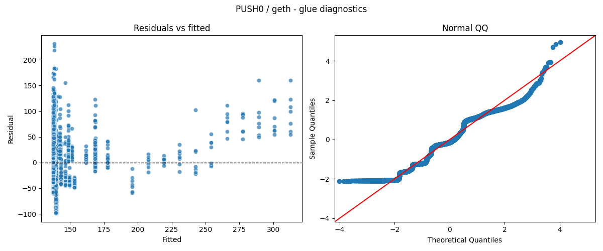

</details>

<details><summary><code>STATICCALL</code> · nobs=34213 · runtime_ms=5.773e-05 · p=1.00e-03 · R²=0.02773</summary>

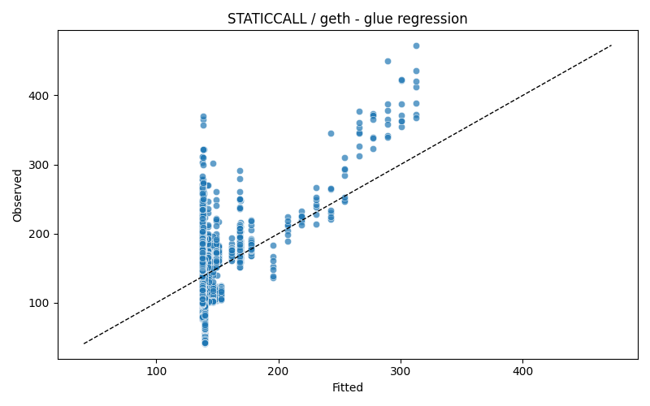

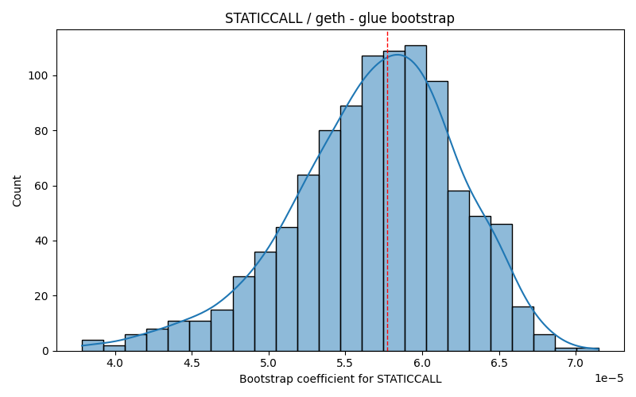


</details>

### Pure glue · geth

<details><summary><code>ISZERO</code> · nobs=544 · runtime_ms=0 · p=1.00e+00 · R²=0</summary>

```
==============================================================================
                           NNLS Regression Results                            
==============================================================================
Dep. Variable:          test_runtime_ms              R-squared:          0.000
Model:                  NNLS                    Adj. R-squared:         -0.002
No. Observations:       544                               RMSE:          29.39
Df Residuals:           542                                MAE:          23.03
Df Model:               1      
==============================================================================
                      coef     std err     P-value      [0.025      0.975]
------------------------------------------------------------------------------
         const     82.2406      1.2732       0.001     79.7265     84.7215
        ISZERO      0.0000      0.0000       1.000      0.0000      0.0000
==============================================================================
Notes: Non-negative least squares with bootstrap inference (1000 iterations)
==============================================================================
```

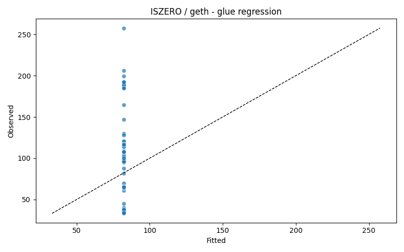


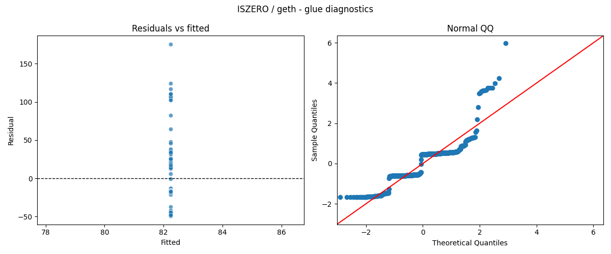

</details>

<details><summary><code>JUMPDEST</code> · nobs=136 · runtime_ms=0 · p=1.00e+00 · R²=0</summary>

```
==============================================================================
                           NNLS Regression Results                            
==============================================================================
Dep. Variable:          test_runtime_ms              R-squared:          0.000
Model:                  NNLS                    Adj. R-squared:         -0.007
No. Observations:       136                               RMSE:          38.45
Df Residuals:           134                                MAE:          36.22
Df Model:               1      
==============================================================================
                      coef     std err     P-value      [0.025      0.975]
------------------------------------------------------------------------------
         const    184.2039      3.3520       0.001    177.6721    190.6667
      JUMPDEST      0.0000      0.0000       1.000      0.0000      0.0000
==============================================================================
Notes: Non-negative least squares with bootstrap inference (1000 iterations)
==============================================================================
```

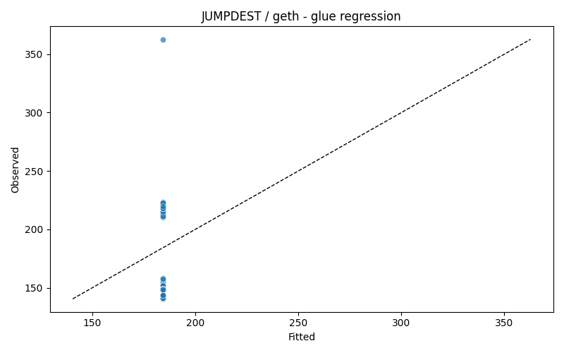


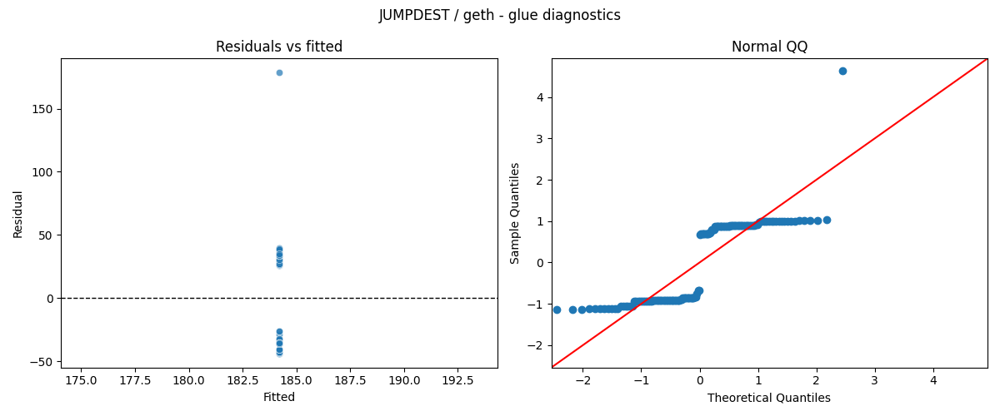

</details>

<details><summary><code>SWAP</code> · nobs=9724 · runtime_ms=0 · p=1.00e+00 · R²=1.11e-16</summary>

```
==============================================================================
                           NNLS Regression Results                            
==============================================================================
Dep. Variable:          test_runtime_ms              R-squared:          0.000
Model:                  NNLS                    Adj. R-squared:         -0.000
No. Observations:       9724                              RMSE:          35.25
Df Residuals:           9722                               MAE:          29.97
Df Model:               1      
==============================================================================
                      coef     std err     P-value      [0.025      0.975]
------------------------------------------------------------------------------
         const    108.2778      0.3493       0.001    107.6167    108.9867
          SWAP      0.0000      0.0000       1.000      0.0000      0.0000
==============================================================================
Notes: Non-negative least squares with bootstrap inference (1000 iterations)
==============================================================================
```

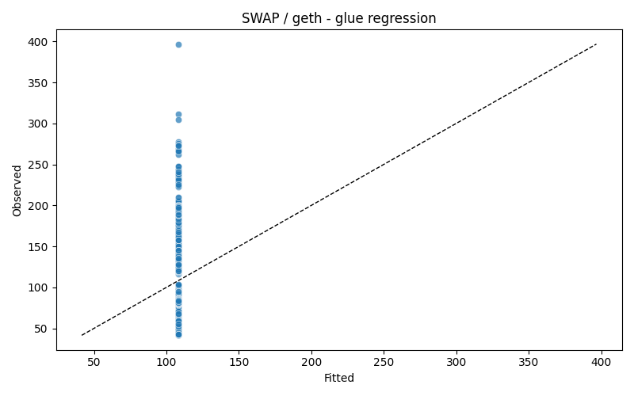


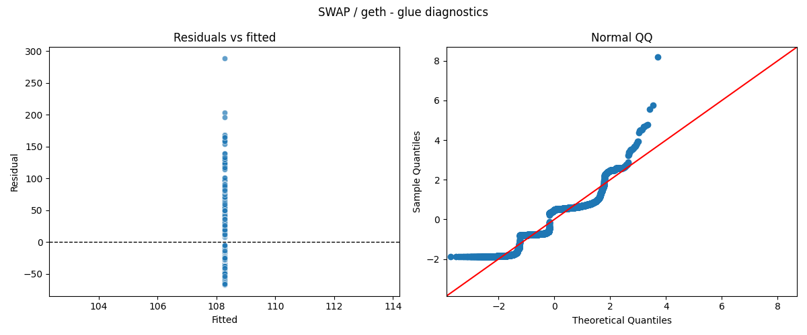

</details>

### Mixed glue (tier A) · geth

<details><summary><code>ADD</code> · nobs=612 · runtime_ms=0 · p=1.00e+00 · R²=0</summary>

```
==============================================================================
                           NNLS Regression Results                            
==============================================================================
Dep. Variable:          test_runtime_ms              R-squared:          0.000
Model:                  NNLS                    Adj. R-squared:         -0.002
No. Observations:       612                               RMSE:          30.94
Df Residuals:           610                                MAE:          25.66
Df Model:               1      
==============================================================================
                      coef     std err     P-value      [0.025      0.975]
------------------------------------------------------------------------------
         const     94.9028      1.2838       0.001     92.2971     97.3538
           ADD      0.0000      0.0000       1.000      0.0000      0.0000
==============================================================================
Notes: Non-negative least squares with bootstrap inference (1000 iterations)
==============================================================================
```

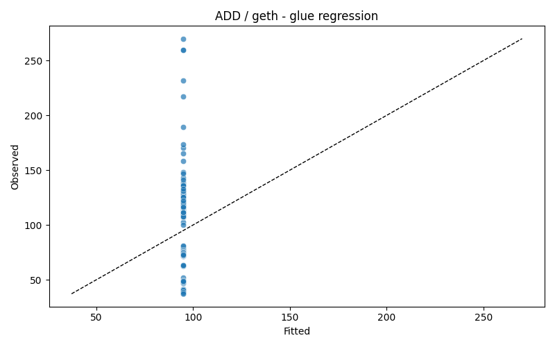


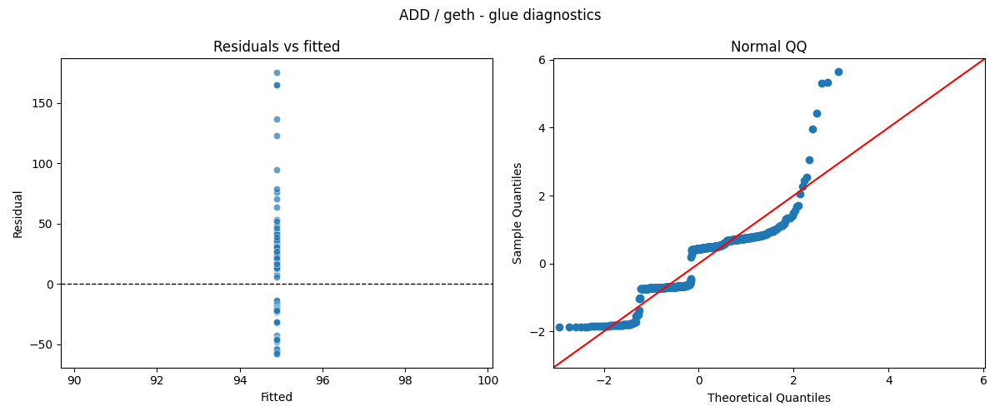

</details>

<details><summary><code>AND</code> · nobs=544 · runtime_ms=0 · p=1.00e+00 · R²=0</summary>

```
==============================================================================
                           NNLS Regression Results                            
==============================================================================
Dep. Variable:          test_runtime_ms              R-squared:          0.000
Model:                  NNLS                    Adj. R-squared:         -0.002
No. Observations:       544                               RMSE:          28.91
Df Residuals:           542                                MAE:          23.96
Df Model:               1      
==============================================================================
                      coef     std err     P-value      [0.025      0.975]
------------------------------------------------------------------------------
         const     88.8107      1.2761       0.001     86.4618     91.3391
           AND      0.0000      0.0000       1.000      0.0000      0.0000
==============================================================================
Notes: Non-negative least squares with bootstrap inference (1000 iterations)
==============================================================================
```

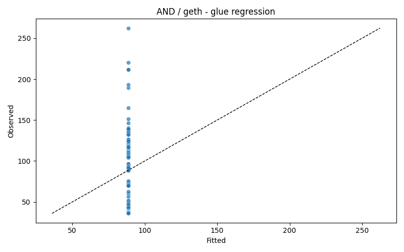


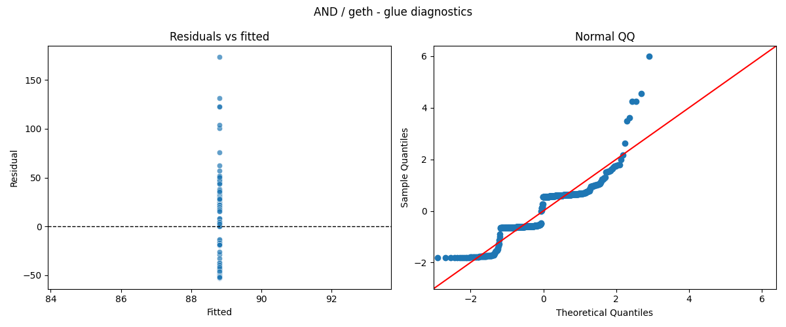

</details>

<details><summary><code>CALLDATACOPY</code> · nobs=15980 · runtime_ms=0 · p=1.00e+00 · R²=0</summary>

```
==============================================================================
                           NNLS Regression Results                            
==============================================================================
Dep. Variable:          test_runtime_ms              R-squared:          0.000
Model:                  NNLS                    Adj. R-squared:         -0.000
No. Observations:       15980                             RMSE:          54.09
Df Residuals:           15978                              MAE:          46.11
Df Model:               1      
==============================================================================
                      coef     std err     P-value      [0.025      0.975]
------------------------------------------------------------------------------
         const     77.7051      0.4211       0.001     76.8898     78.5274
  CALLDATACOPY      0.0000      0.0000       1.000      0.0000      0.0000
==============================================================================
Notes: Non-negative least squares with bootstrap inference (1000 iterations)
==============================================================================
```

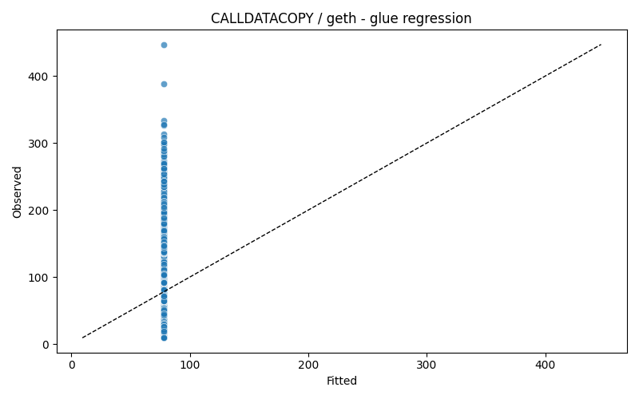


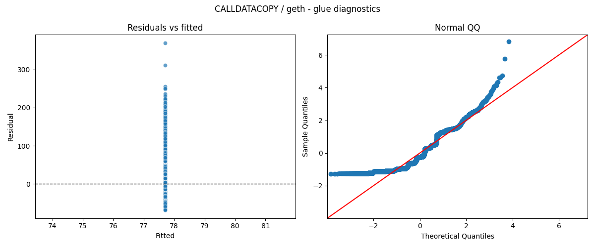

</details>

<details><summary><code>CALLDATALOAD</code> · nobs=2992 · runtime_ms=3.828e-05 · p=1.00e-03 · R²=0.1713</summary>

```
==============================================================================
                           NNLS Regression Results                            
==============================================================================
Dep. Variable:          test_runtime_ms              R-squared:          0.171
Model:                  NNLS                    Adj. R-squared:          0.171
No. Observations:       2992                              RMSE:           0.32
Df Residuals:           2990                               MAE:           0.25
Df Model:               1      
==============================================================================
                      coef     std err     P-value      [0.025      0.975]
------------------------------------------------------------------------------
         const      1.4080      0.0166       0.001      1.3752      1.4392
  CALLDATALOAD      0.0000      0.0000       0.001      0.0000      0.0000
==============================================================================
Notes: Non-negative least squares with bootstrap inference (1000 iterations)
==============================================================================
```

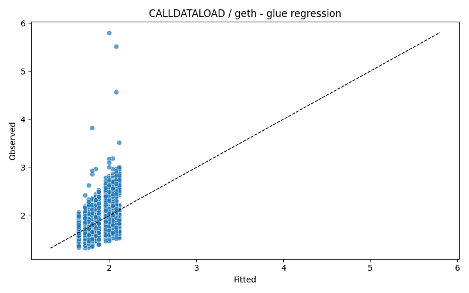

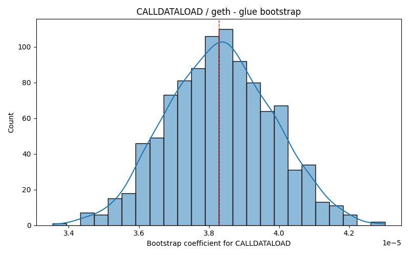

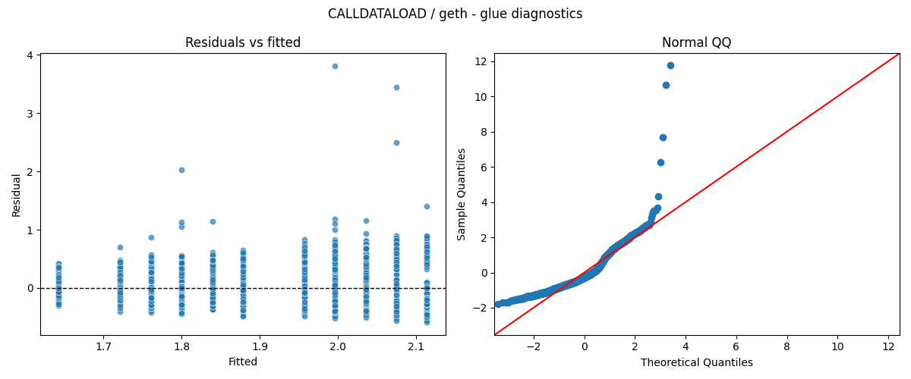

</details>

<details><summary><code>DIV</code> · nobs=748 · runtime_ms=0 · p=1.00e+00 · R²=1.11e-16</summary>

```
==============================================================================
                           NNLS Regression Results                            
==============================================================================
Dep. Variable:          test_runtime_ms              R-squared:          0.000
Model:                  NNLS                    Adj. R-squared:         -0.001
No. Observations:       748                               RMSE:          65.40
Df Residuals:           746                                MAE:          58.43
Df Model:               1      
==============================================================================
                      coef     std err     P-value      [0.025      0.975]
------------------------------------------------------------------------------
         const    246.0324      2.4362       0.001    240.9788    250.5415
           DIV      0.0000      0.0000       1.000      0.0000      0.0000
==============================================================================
Notes: Non-negative least squares with bootstrap inference (1000 iterations)
==============================================================================
```

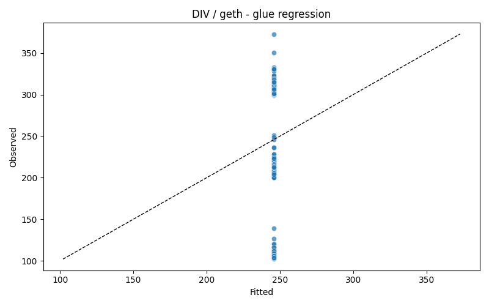


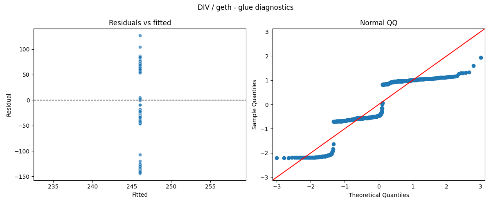

</details>

<details><summary><code>EXP</code> · nobs=748 · runtime_ms=0.0003143 · p=1.00e-03 · R²=0.8068</summary>

```
==============================================================================
                           NNLS Regression Results                            
==============================================================================
Dep. Variable:          test_runtime_ms              R-squared:          0.807
Model:                  NNLS                    Adj. R-squared:          0.807
No. Observations:       748                               RMSE:           6.02
Df Residuals:           746                                MAE:           5.19
Df Model:               1      
==============================================================================
                      coef     std err     P-value      [0.025      0.975]
------------------------------------------------------------------------------
         const     12.8522      0.7917       0.001     11.3372     14.4279
           EXP      0.0003      0.0000       0.001      0.0003      0.0003
==============================================================================
Notes: Non-negative least squares with bootstrap inference (1000 iterations)
==============================================================================
```

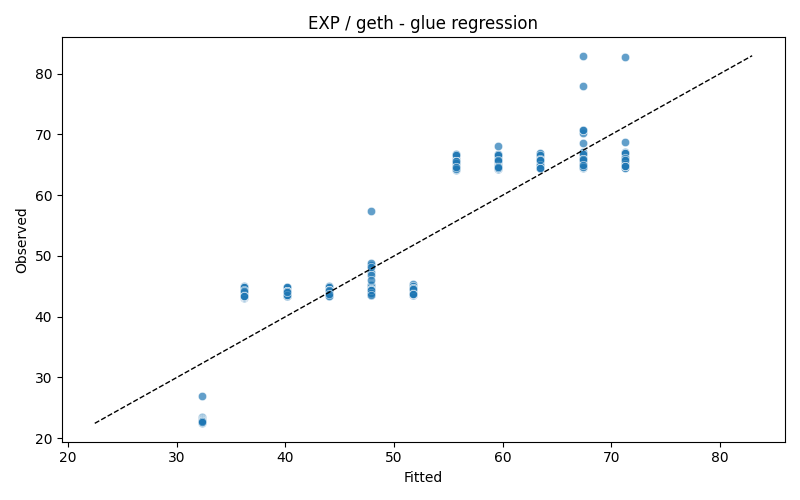

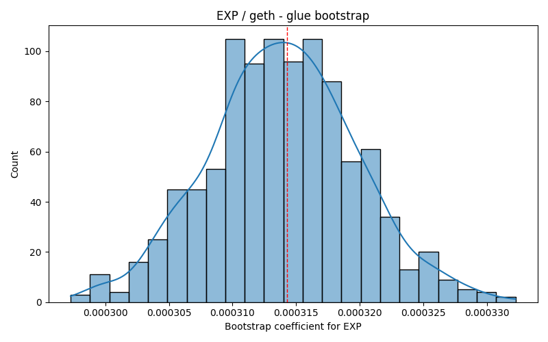

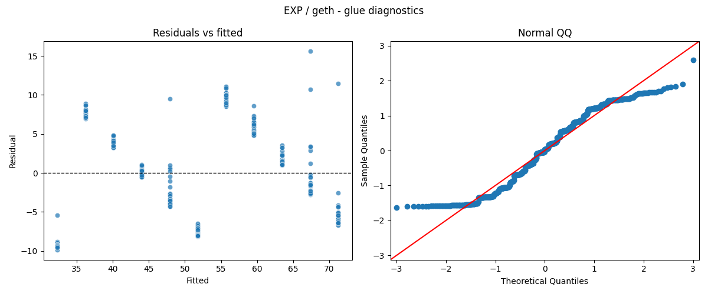

</details>

<details><summary><code>GT</code> · nobs=544 · runtime_ms=0 · p=1.00e+00 · R²=-2.22e-16</summary>

```
==============================================================================
                           NNLS Regression Results                            
==============================================================================
Dep. Variable:          test_runtime_ms              R-squared:         -0.000
Model:                  NNLS                    Adj. R-squared:         -0.002
No. Observations:       544                               RMSE:          29.48
Df Residuals:           542                                MAE:          25.19
Df Model:               1      
==============================================================================
                      coef     std err     P-value      [0.025      0.975]
------------------------------------------------------------------------------
         const     89.3588      1.2658       0.001     87.0361     92.0004
            GT      0.0000      0.0000       1.000      0.0000      0.0000
==============================================================================
Notes: Non-negative least squares with bootstrap inference (1000 iterations)
==============================================================================
```

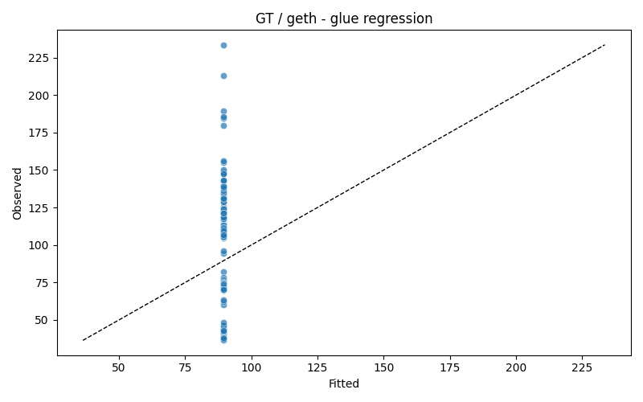


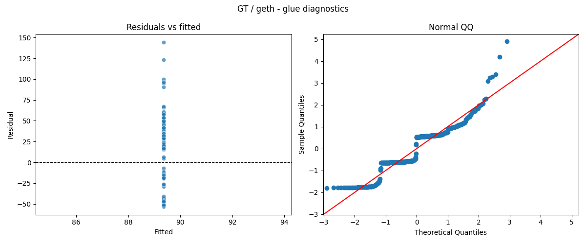

</details>

<details><summary><code>JUMPI</code> · nobs=748 · runtime_ms=0 · p=1.00e+00 · R²=1.11e-16</summary>

```
==============================================================================
                           NNLS Regression Results                            
==============================================================================
Dep. Variable:          test_runtime_ms              R-squared:          0.000
Model:                  NNLS                    Adj. R-squared:         -0.001
No. Observations:       748                               RMSE:          17.11
Df Residuals:           746                                MAE:          12.96
Df Model:               1      
==============================================================================
                      coef     std err     P-value      [0.025      0.975]
------------------------------------------------------------------------------
         const     50.6337      0.6553       0.001     49.4340     51.9608
         JUMPI      0.0000      0.0000       1.000      0.0000      0.0000
==============================================================================
Notes: Non-negative least squares with bootstrap inference (1000 iterations)
==============================================================================
```

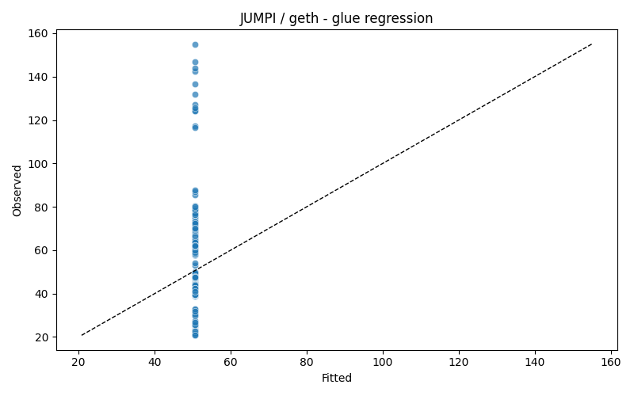


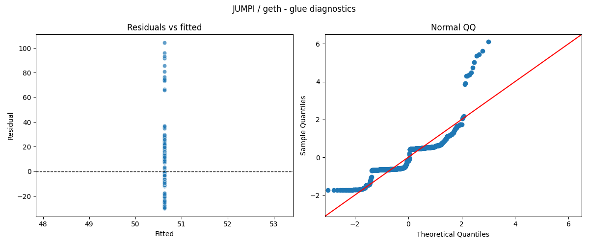

</details>

<details><summary><code>LT</code> · nobs=544 · runtime_ms=0 · p=1.00e+00 · R²=2.22e-16</summary>

```
==============================================================================
                           NNLS Regression Results                            
==============================================================================
Dep. Variable:          test_runtime_ms              R-squared:          0.000
Model:                  NNLS                    Adj. R-squared:         -0.002
No. Observations:       544                               RMSE:          33.44
Df Residuals:           542                                MAE:          26.99
Df Model:               1      
==============================================================================
                      coef     std err     P-value      [0.025      0.975]
------------------------------------------------------------------------------
         const     92.6227      1.4204       0.001     90.0029     95.5295
            LT      0.0000      0.0000       1.000      0.0000      0.0000
==============================================================================
Notes: Non-negative least squares with bootstrap inference (1000 iterations)
==============================================================================
```

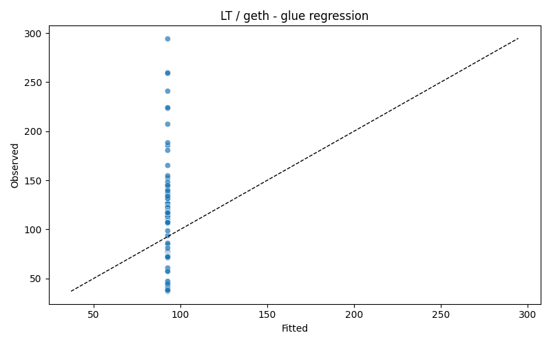

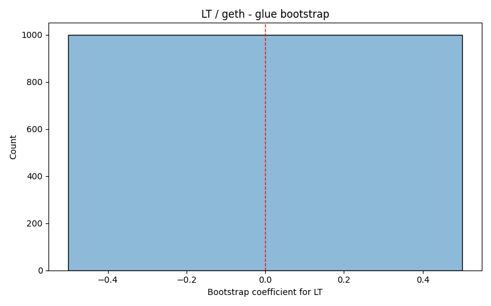

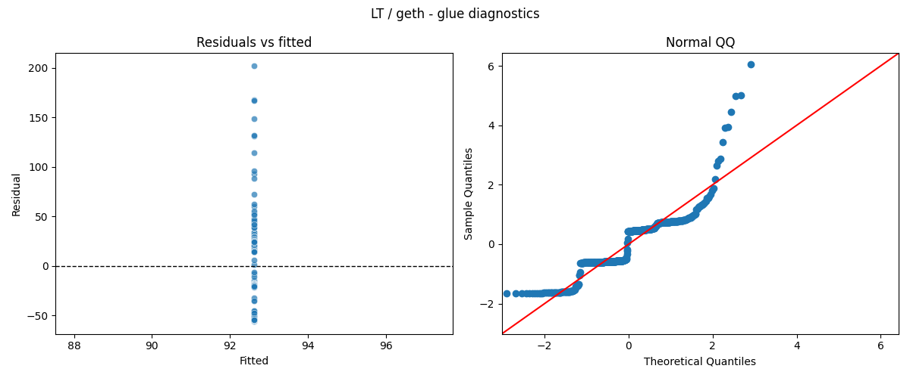

</details>

<details><summary><code>MSTORE</code> · nobs=3060 · runtime_ms=0 · p=1.00e+00 · R²=0</summary>

```
==============================================================================
                           NNLS Regression Results                            
==============================================================================
Dep. Variable:          test_runtime_ms              R-squared:          0.000
Model:                  NNLS                    Adj. R-squared:         -0.000
No. Observations:       3060                              RMSE:          38.92
Df Residuals:           3058                               MAE:          34.74
Df Model:               1      
==============================================================================
                      coef     std err     P-value      [0.025      0.975]
------------------------------------------------------------------------------
         const    129.2650      0.7207       0.001    127.9202    130.6892
        MSTORE      0.0000      0.0000       1.000      0.0000      0.0000
==============================================================================
Notes: Non-negative least squares with bootstrap inference (1000 iterations)
==============================================================================
```

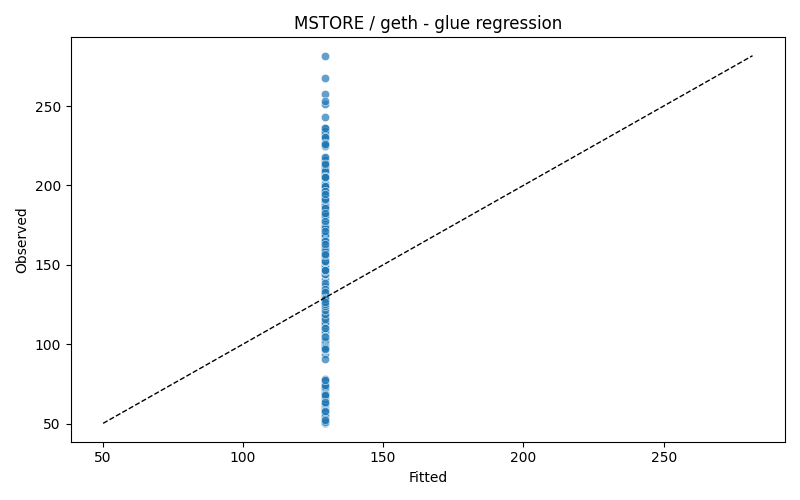


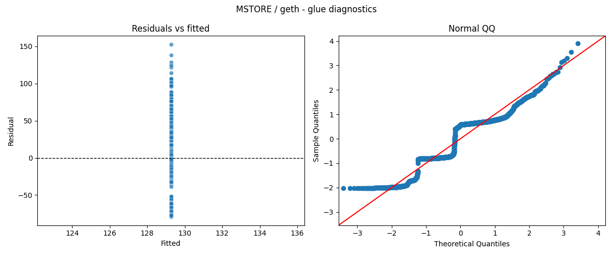

</details>

<details><summary><code>MSTORE8</code> · nobs=3060 · runtime_ms=0 · p=1.00e+00 · R²=-2.22e-16</summary>

```
==============================================================================
                           NNLS Regression Results                            
==============================================================================
Dep. Variable:          test_runtime_ms              R-squared:         -0.000
Model:                  NNLS                    Adj. R-squared:         -0.000
No. Observations:       3060                              RMSE:          37.95
Df Residuals:           3058                               MAE:          33.30
Df Model:               1      
==============================================================================
                      coef     std err     P-value      [0.025      0.975]
------------------------------------------------------------------------------
         const    123.6924      0.6796       0.001    122.4897    125.1049
       MSTORE8      0.0000      0.0000       1.000      0.0000      0.0000
==============================================================================
Notes: Non-negative least squares with bootstrap inference (1000 iterations)
==============================================================================
```

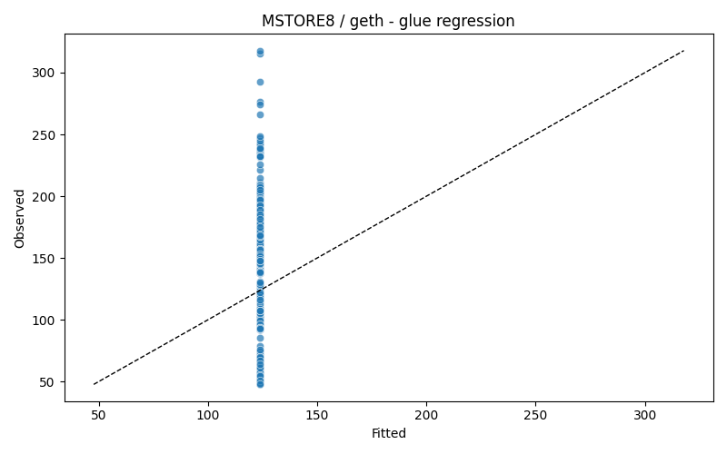


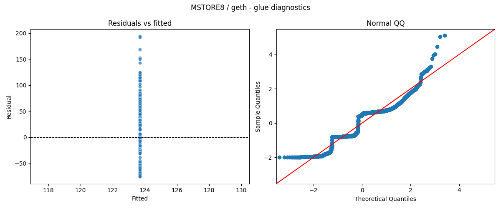

</details>

<details><summary><code>MUL</code> · nobs=680 · runtime_ms=0 · p=1.00e+00 · R²=-2.22e-16</summary>

```
==============================================================================
                           NNLS Regression Results                            
==============================================================================
Dep. Variable:          test_runtime_ms              R-squared:         -0.000
Model:                  NNLS                    Adj. R-squared:         -0.001
No. Observations:       680                               RMSE:          27.74
Df Residuals:           678                                MAE:          24.42
Df Model:               1      
==============================================================================
                      coef     std err     P-value      [0.025      0.975]
------------------------------------------------------------------------------
         const     91.0772      1.0619       0.001     89.0468     93.1368
           MUL      0.0000      0.0000       1.000      0.0000      0.0000
==============================================================================
Notes: Non-negative least squares with bootstrap inference (1000 iterations)
==============================================================================
```

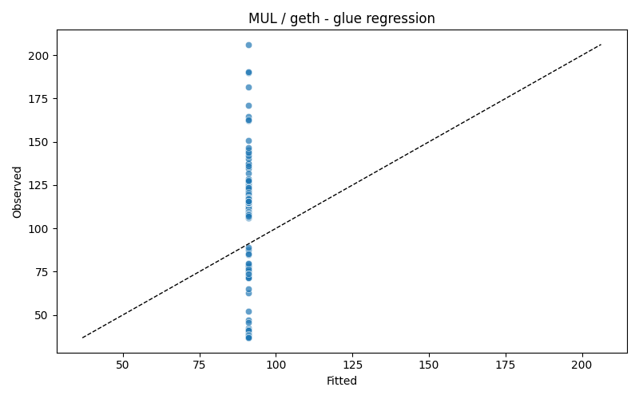


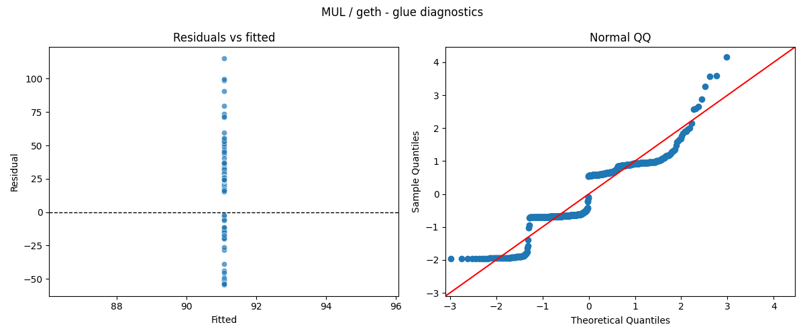

</details>

<details><summary><code>PC</code> · nobs=408 · runtime_ms=6.885e-06 · p=1.00e-03 · R²=0.3037</summary>

```
==============================================================================
                           NNLS Regression Results                            
==============================================================================
Dep. Variable:          test_runtime_ms              R-squared:          0.304
Model:                  NNLS                    Adj. R-squared:          0.302
No. Observations:       408                               RMSE:          23.17
Df Residuals:           406                                MAE:          19.91
Df Model:               1      
==============================================================================
                      coef     std err     P-value      [0.025      0.975]
------------------------------------------------------------------------------
         const    125.2322      2.2650       0.001    120.6631    129.6227
            PC      0.0000      0.0000       0.001      0.0000      0.0000
==============================================================================
Notes: Non-negative least squares with bootstrap inference (1000 iterations)
==============================================================================
```

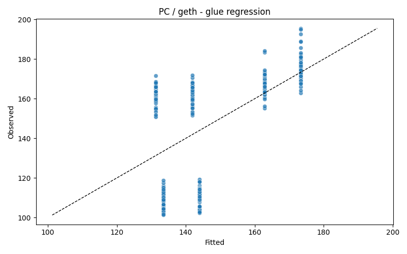

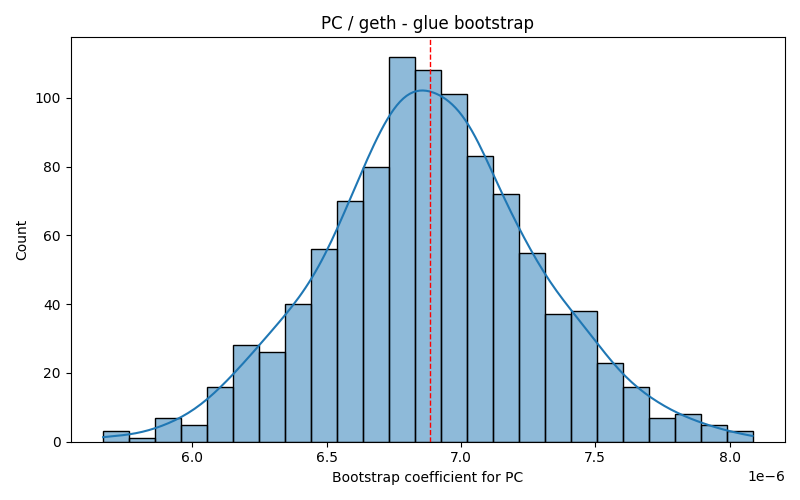

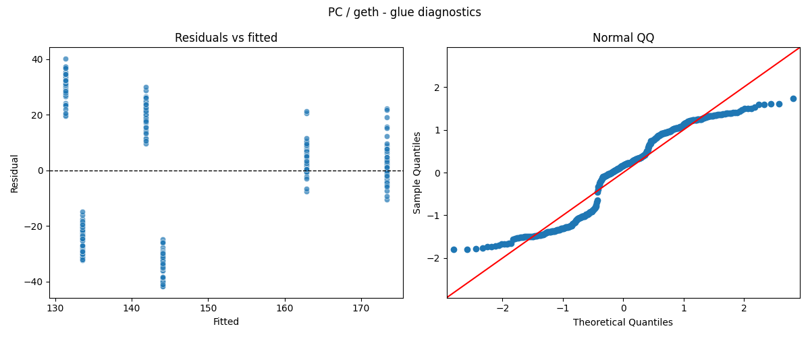

</details>

<details><summary><code>RETURNDATASIZE</code> · nobs=1632 · runtime_ms=1.14e-05 · p=1.00e-03 · R²=0.1331</summary>

```
==============================================================================
                           NNLS Regression Results                            
==============================================================================
Dep. Variable:          test_runtime_ms              R-squared:          0.133
Model:                  NNLS                    Adj. R-squared:          0.133
No. Observations:       1632                              RMSE:          34.14
Df Residuals:           1630                               MAE:          22.91
Df Model:               1      
==============================================================================
                      coef     std err     P-value      [0.025      0.975]
------------------------------------------------------------------------------
         const    103.6100      1.5785       0.001    100.4850    106.6022
RETURNDATASIZE      0.0000      0.0000       0.001      0.0000      0.0000
==============================================================================
Notes: Non-negative least squares with bootstrap inference (1000 iterations)
==============================================================================
```

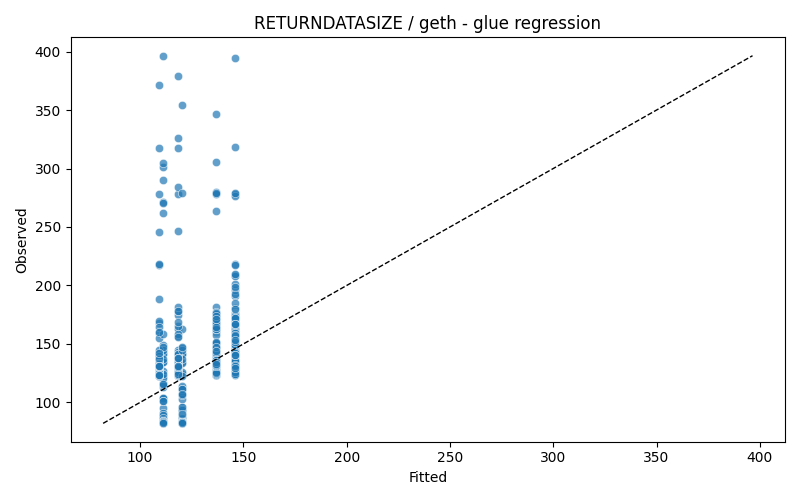

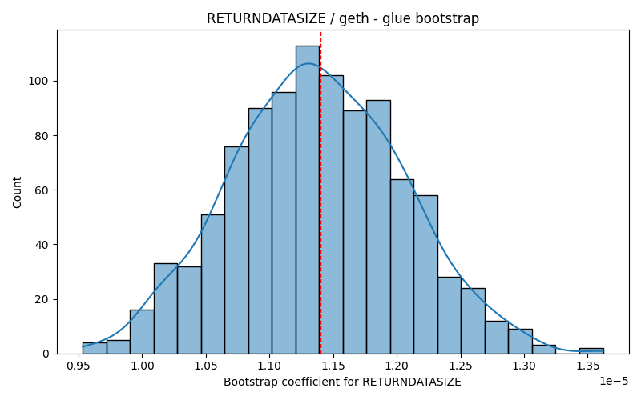

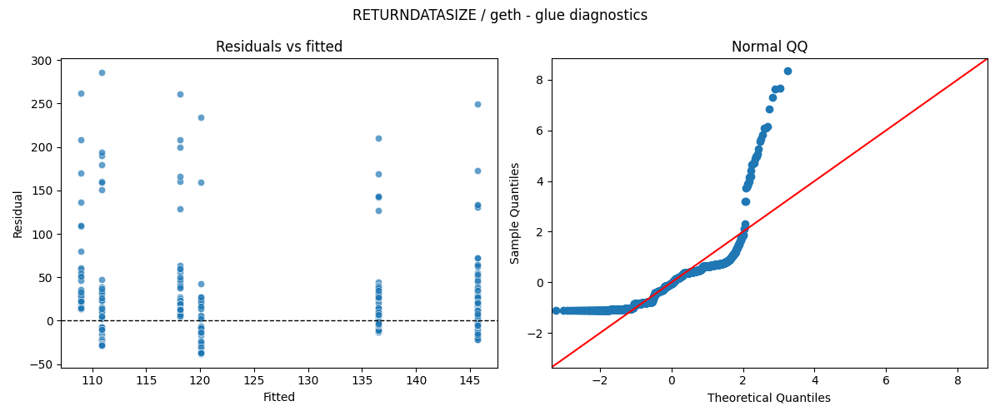

</details>

<details><summary><code>SELFBALANCE</code> · nobs=748 · runtime_ms=0 · p=1.00e+00 · R²=0</summary>

```
==============================================================================
                           NNLS Regression Results                            
==============================================================================
Dep. Variable:          test_runtime_ms              R-squared:          0.000
Model:                  NNLS                    Adj. R-squared:         -0.001
No. Observations:       748                               RMSE:         102.64
Df Residuals:           746                                MAE:          92.48
Df Model:               1      
==============================================================================
                      coef     std err     P-value      [0.025      0.975]
------------------------------------------------------------------------------
         const    388.2767      3.7399       0.001    380.8859    395.4008
   SELFBALANCE      0.0000      0.0000       1.000      0.0000      0.0000
==============================================================================
Notes: Non-negative least squares with bootstrap inference (1000 iterations)
==============================================================================
```

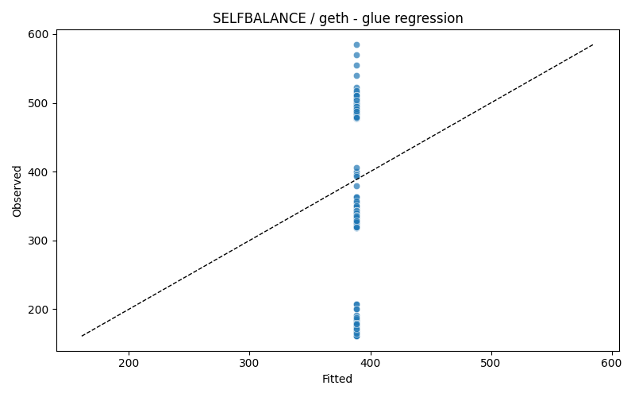


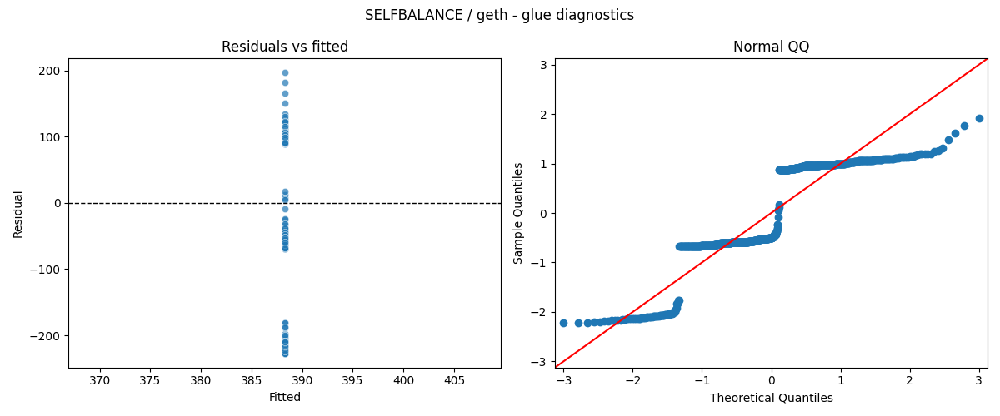

</details>

<details><summary><code>SUB</code> · nobs=544 · runtime_ms=0 · p=1.00e+00 · R²=0</summary>

```
==============================================================================
                           NNLS Regression Results                            
==============================================================================
Dep. Variable:          test_runtime_ms              R-squared:          0.000
Model:                  NNLS                    Adj. R-squared:         -0.002
No. Observations:       544                               RMSE:          28.53
Df Residuals:           542                                MAE:          25.57
Df Model:               1      
==============================================================================
                      coef     std err     P-value      [0.025      0.975]
------------------------------------------------------------------------------
         const     91.6317      1.2160       0.001     89.3562     94.1114
           SUB      0.0000      0.0000       1.000      0.0000      0.0000
==============================================================================
Notes: Non-negative least squares with bootstrap inference (1000 iterations)
==============================================================================
```

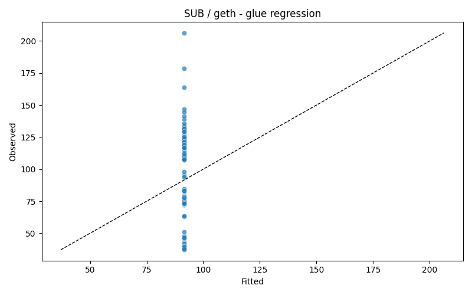


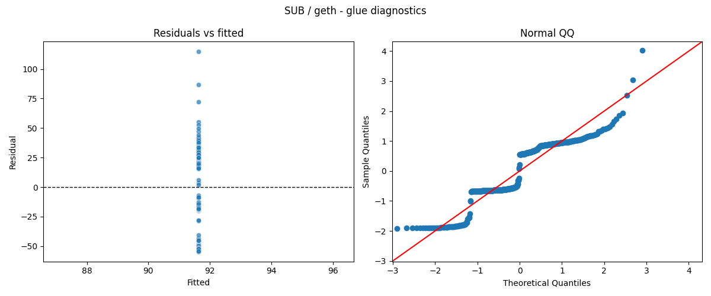

</details>

### Mixed glue (tier B) · geth

<details><summary><code>JUMP</code> · nobs=680 · runtime_ms=0 · p=1.00e+00 · R²=1.11e-16</summary>

```
==============================================================================
                           NNLS Regression Results                            
==============================================================================
Dep. Variable:          test_runtime_ms              R-squared:          0.000
Model:                  NNLS                    Adj. R-squared:         -0.001
No. Observations:       680                               RMSE:          26.82
Df Residuals:           678                                MAE:          22.23
Df Model:               1      
==============================================================================
                      coef     std err     P-value      [0.025      0.975]
------------------------------------------------------------------------------
         const     82.2524      0.9718       0.001     80.2958     84.1508
          JUMP      0.0000      0.0000       1.000      0.0000      0.0000
==============================================================================
Notes: Non-negative least squares with bootstrap inference (1000 iterations)
==============================================================================
```

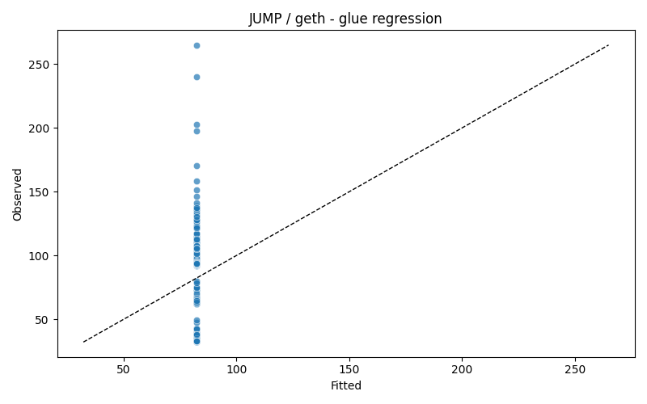


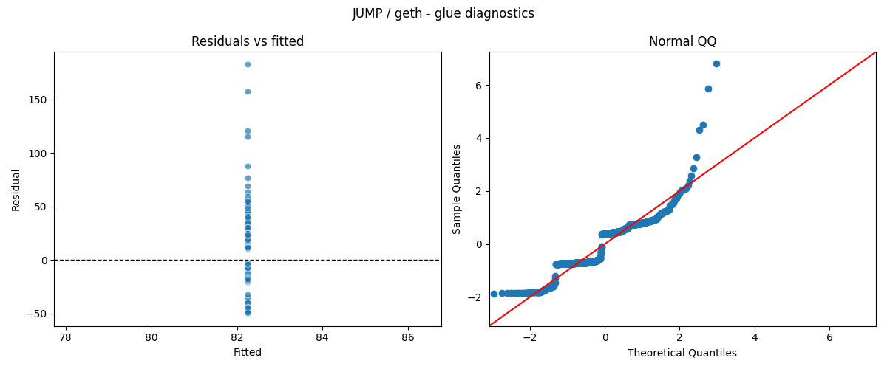

</details>

<details><summary><code>KECCAK256</code> · nobs=11968 · runtime_ms=2.969e-05 · p=1.00e-03 · R²=0.2074</summary>

```
==============================================================================
                           NNLS Regression Results                            
==============================================================================
Dep. Variable:          test_runtime_ms              R-squared:          0.207
Model:                  NNLS                    Adj. R-squared:          0.207
No. Observations:       11968                             RMSE:         115.39
Df Residuals:           11966                              MAE:          90.99
Df Model:               1      
==============================================================================
                      coef     std err     P-value      [0.025      0.975]
------------------------------------------------------------------------------
         const    358.8865      2.2241       0.001    354.7059    363.3334
     KECCAK256      0.0000      0.0000       0.001      0.0000      0.0000
==============================================================================
Notes: Non-negative least squares with bootstrap inference (1000 iterations)
==============================================================================
```

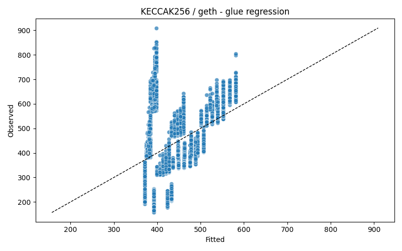

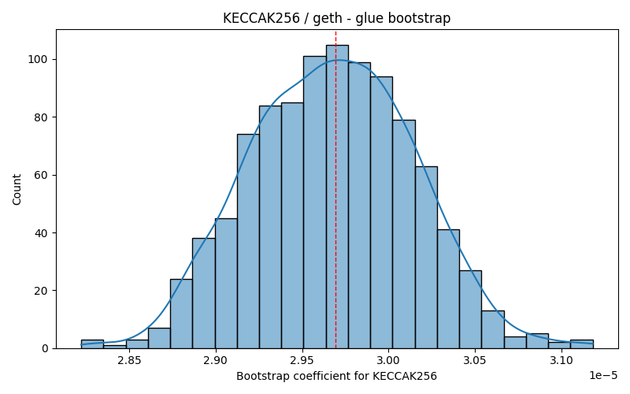

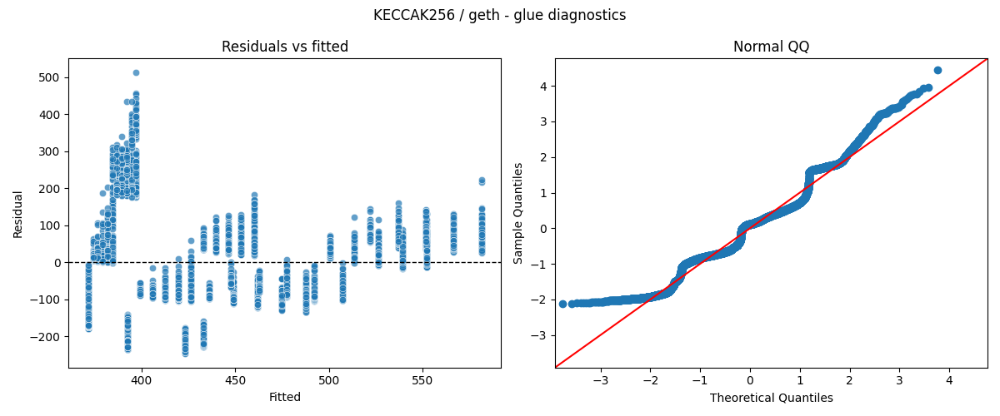

</details>

## nethermind

| glue_opcode | nobs | glue_runtime_ms | p_value | rsquared |
| --- | --- | --- | --- | --- |
| `ISZERO` | 80 | 0 | 1.00e+00 | 0 |
| `JUMPDEST` | 20 | 0 | 1.00e+00 | 0 |
| `SWAP` | 1430 | 0 | 1.00e+00 | 0 |
| `CALLDATASIZE` | 5174 | 8.083e-06 | 1.00e-03 | 0.9486 |
| `DUP` | 5174 | 0 | 1.00e+00 | 0.9486 |
| `GAS` | 5174 | 7.825e-06 | 1.00e-03 | 0.9486 |
| `MLOAD` | 5174 | 8.323e-07 | 1.10e-02 | 0.9486 |
| `PUSH` | 5174 | 0 | 1.00e+00 | 0.9486 |
| `PUSH0` | 5174 | 3.595e-06 | 2.00e-03 | 0.9486 |
| `STATICCALL` | 5174 | 0.000392 | 1.00e-03 | 0.9486 |
| `ADD` | 90 | 0 | 1.00e+00 | 0 |
| `AND` | 80 | 0 | 1.00e+00 | 2.22e-16 |
| `CALLDATACOPY` | 2350 | 0 | 1.00e+00 | 0 |
| `CALLDATALOAD` | 440 | 7.479e-06 | 1.32e-01 | 0.0004936 |
| `DIV` | 110 | 0 | 1.00e+00 | -2.22e-16 |
| `EXP` | 110 | 0 | 1.00e+00 | -2.22e-16 |
| `GT` | 80 | 0 | 1.00e+00 | -2.22e-16 |
| `JUMPI` | 110 | 0 | 1.00e+00 | 0 |
| `LT` | 80 | 0 | 1.00e+00 | 0 |
| `MSTORE` | 450 | 0 | 1.00e+00 | 0 |
| `MSTORE8` | 450 | 0 | 1.00e+00 | 1.11e-16 |
| `MUL` | 100 | 0 | 1.00e+00 | 0 |
| `PC` | 60 | 5.032e-06 | 1.00e-03 | 0.3199 |
| `RETURNDATASIZE` | 240 | 4.874e-06 | 1.00e-03 | 0.2077 |
| `SELFBALANCE` | 110 | 0 | 1.00e+00 | 0 |
| `SUB` | 80 | 0 | 1.00e+00 | 0 |
| `JUMP` | 100 | 0 | 1.00e+00 | 0 |
| `KECCAK256` | 1760 | 0 | 1.00e+00 | 1.11e-16 |

### Cycle glue — joint fit · nethermind

<details><summary>Joint NNLS regression summary</summary>

```
==============================================================================
                           NNLS Regression Results                            
==============================================================================
Dep. Variable:          test_runtime_ms              R-squared:          0.949
Model:                  NNLS                    Adj. R-squared:          0.949
No. Observations:       5174                              RMSE:          27.17
Df Residuals:           5166                               MAE:          18.26
Df Model:               7      
==============================================================================
                      coef     std err     P-value      [0.025      0.975]
------------------------------------------------------------------------------
         const     63.3896      0.3132       0.001     62.8001     63.9788
  CALLDATASIZE      0.0000      0.0000       0.001      0.0000      0.0000
           DUP      0.0000      0.0000       1.000      0.0000      0.0000
           GAS      0.0000      0.0000       0.001      0.0000      0.0000
         MLOAD      0.0000      0.0000       0.011      0.0000      0.0000
          PUSH      0.0000      0.0000       1.000      0.0000      0.0000
         PUSH0      0.0000      0.0000       0.002      0.0000      0.0000
    STATICCALL      0.0004      0.0000       0.001      0.0004      0.0004
==============================================================================
Notes: Non-negative least squares with bootstrap inference (1000 iterations)
==============================================================================
```

</details>

<details><summary><code>CALLDATASIZE</code> · nobs=5174 · runtime_ms=8.083e-06 · p=1.00e-03 · R²=0.9486</summary>

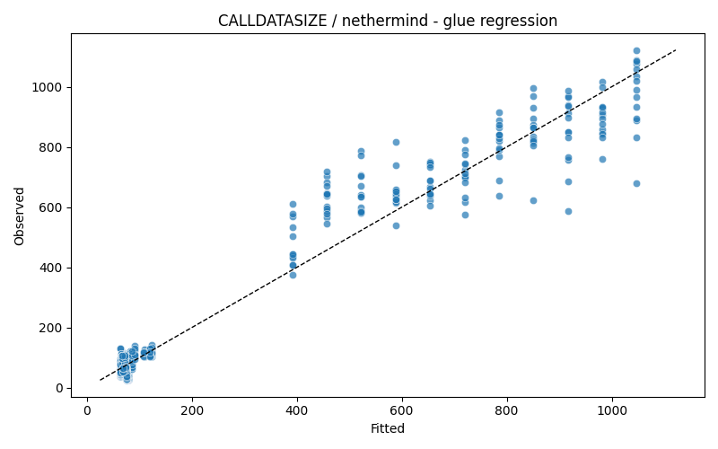

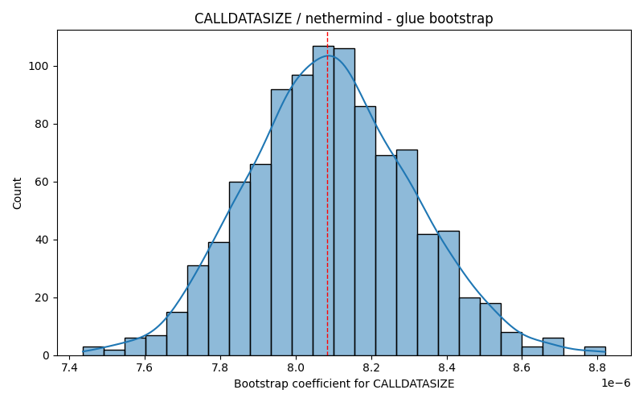


</details>

<details><summary><code>DUP</code> · nobs=5174 · runtime_ms=0 · p=1.00e+00 · R²=0.9486</summary>


</details>

<details><summary><code>GAS</code> · nobs=5174 · runtime_ms=7.825e-06 · p=1.00e-03 · R²=0.9486</summary>


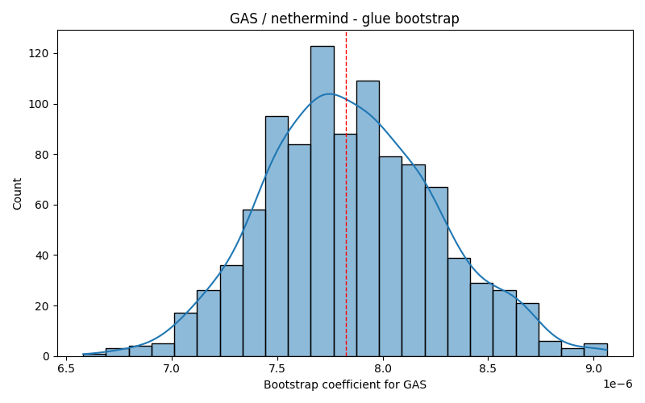

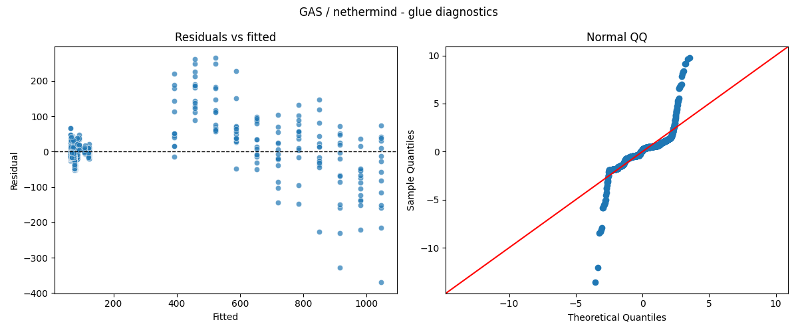

</details>

<details><summary><code>MLOAD</code> · nobs=5174 · runtime_ms=8.323e-07 · p=1.10e-02 · R²=0.9486</summary>

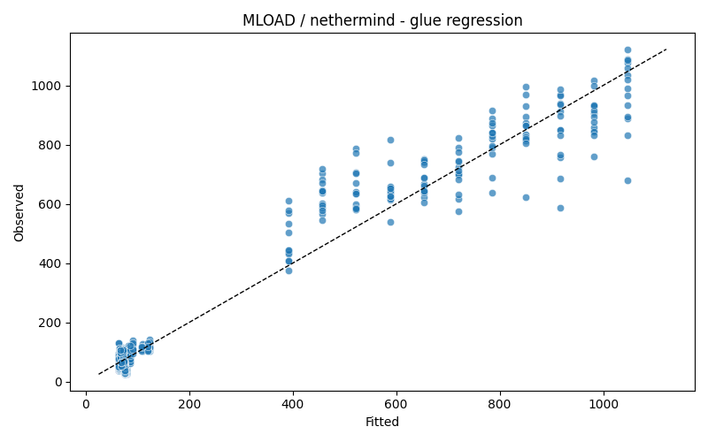

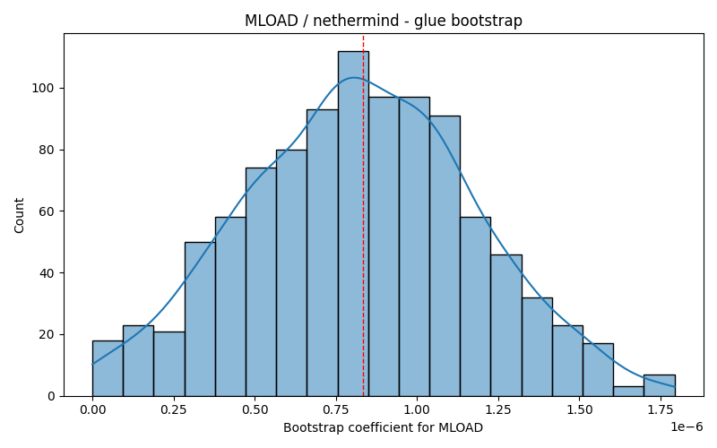


</details>

<details><summary><code>PUSH</code> · nobs=5174 · runtime_ms=0 · p=1.00e+00 · R²=0.9486</summary>


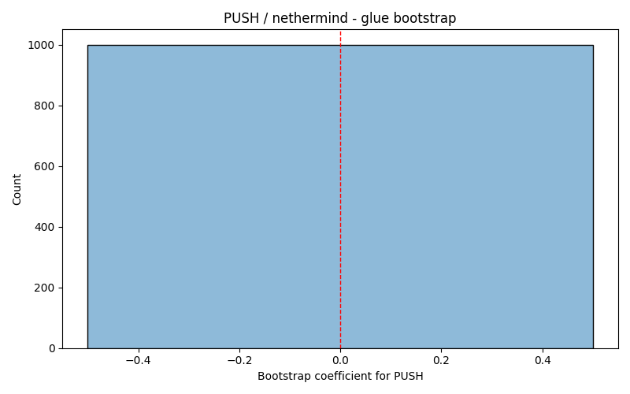


</details>

<details><summary><code>PUSH0</code> · nobs=5174 · runtime_ms=3.595e-06 · p=2.00e-03 · R²=0.9486</summary>


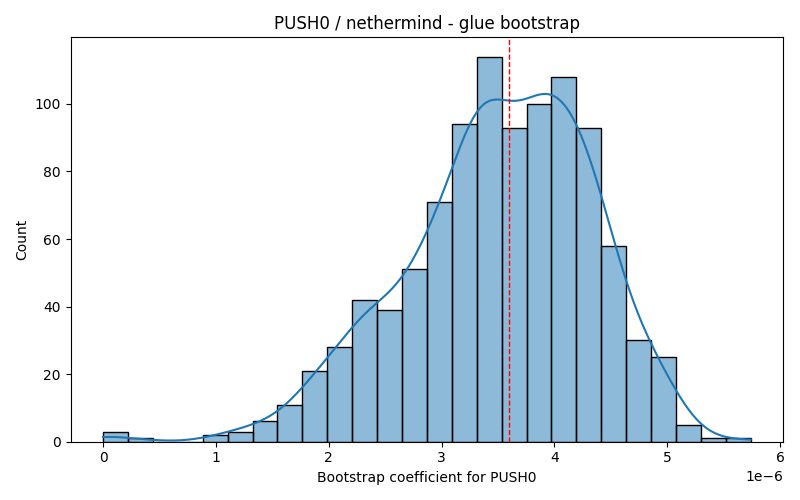


</details>

<details><summary><code>STATICCALL</code> · nobs=5174 · runtime_ms=0.000392 · p=1.00e-03 · R²=0.9486</summary>

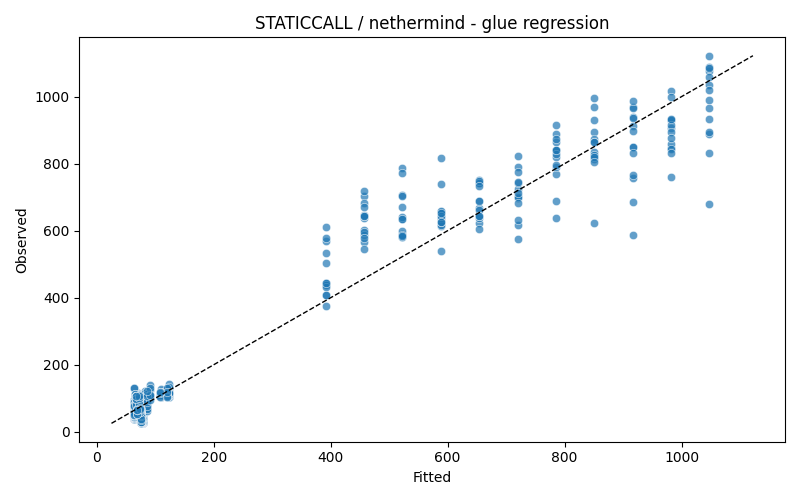

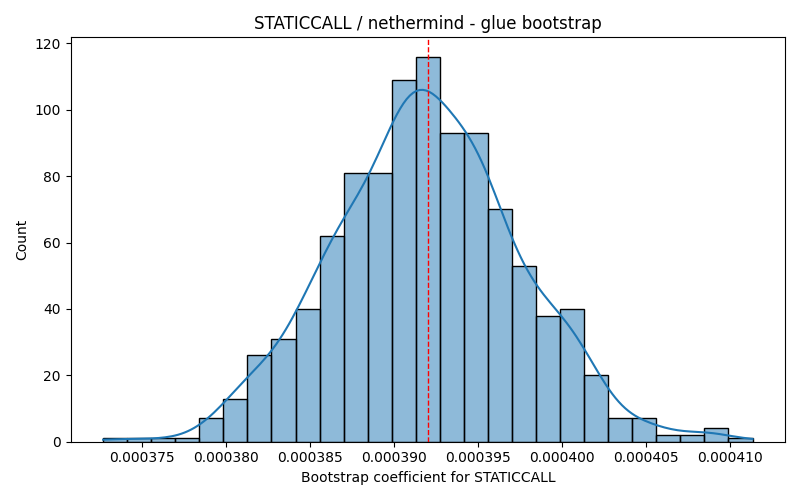


</details>

### Pure glue · nethermind

<details><summary><code>ISZERO</code> · nobs=80 · runtime_ms=0 · p=1.00e+00 · R²=0</summary>

```
==============================================================================
                           NNLS Regression Results                            
==============================================================================
Dep. Variable:          test_runtime_ms              R-squared:          0.000
Model:                  NNLS                    Adj. R-squared:         -0.013
No. Observations:       80                                RMSE:          19.48
Df Residuals:           78                                 MAE:          17.22
Df Model:               1      
==============================================================================
                      coef     std err     P-value      [0.025      0.975]
------------------------------------------------------------------------------
         const     67.6458      2.1651       0.001     63.5405     71.6318
        ISZERO      0.0000      0.0000       1.000      0.0000      0.0000
==============================================================================
Notes: Non-negative least squares with bootstrap inference (1000 iterations)
==============================================================================
```

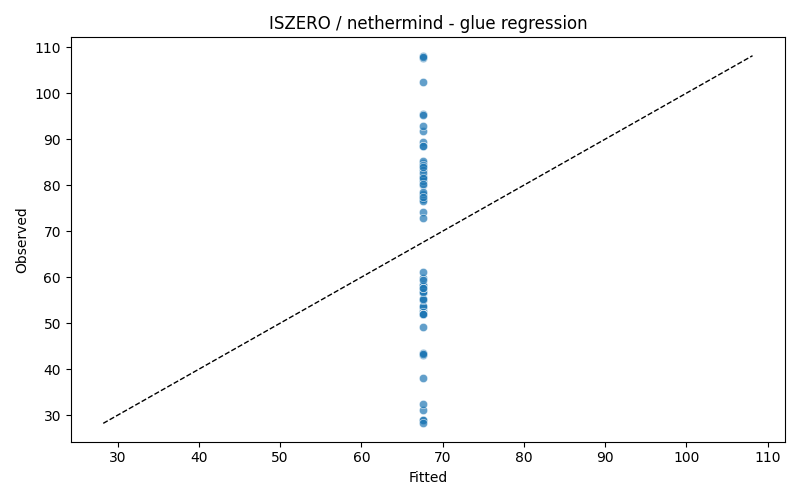


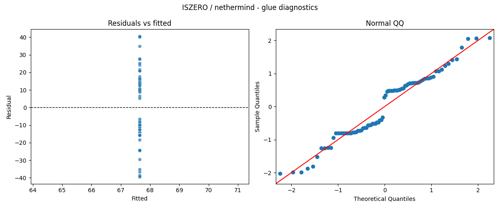

</details>

<details><summary><code>JUMPDEST</code> · nobs=20 · runtime_ms=0 · p=1.00e+00 · R²=0</summary>

```
==============================================================================
                           NNLS Regression Results                            
==============================================================================
Dep. Variable:          test_runtime_ms              R-squared:          0.000
Model:                  NNLS                    Adj. R-squared:         -0.056
No. Observations:       20                                RMSE:          29.75
Df Residuals:           18                                 MAE:          25.73
Df Model:               1      
==============================================================================
                      coef     std err     P-value      [0.025      0.975]
------------------------------------------------------------------------------
         const    115.7654      6.7371       0.001    103.1679    128.8168
      JUMPDEST      0.0000      0.0000       1.000      0.0000      0.0000
==============================================================================
Notes: Non-negative least squares with bootstrap inference (1000 iterations)
==============================================================================
```

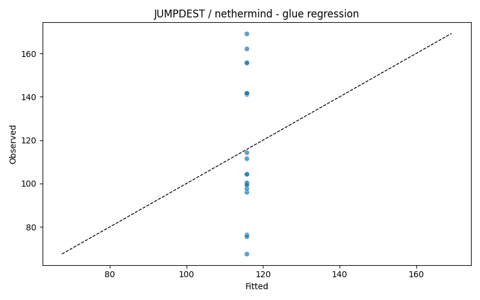


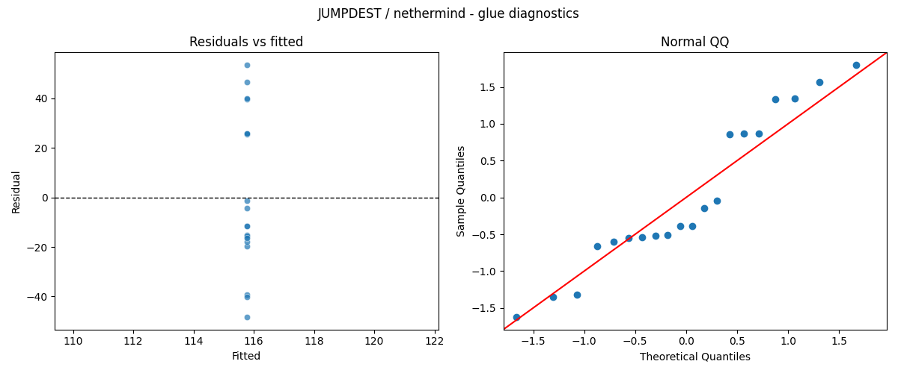

</details>

<details><summary><code>SWAP</code> · nobs=1430 · runtime_ms=0 · p=1.00e+00 · R²=0</summary>

```
==============================================================================
                           NNLS Regression Results                            
==============================================================================
Dep. Variable:          test_runtime_ms              R-squared:          0.000
Model:                  NNLS                    Adj. R-squared:         -0.001
No. Observations:       1430                              RMSE:          13.09
Df Residuals:           1428                               MAE:          11.01
Df Model:               1      
==============================================================================
                      coef     std err     P-value      [0.025      0.975]
------------------------------------------------------------------------------
         const     49.2630      0.3509       0.001     48.5809     49.9371
          SWAP      0.0000      0.0000       1.000      0.0000      0.0000
==============================================================================
Notes: Non-negative least squares with bootstrap inference (1000 iterations)
==============================================================================
```

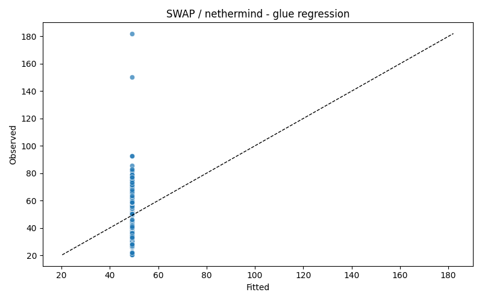

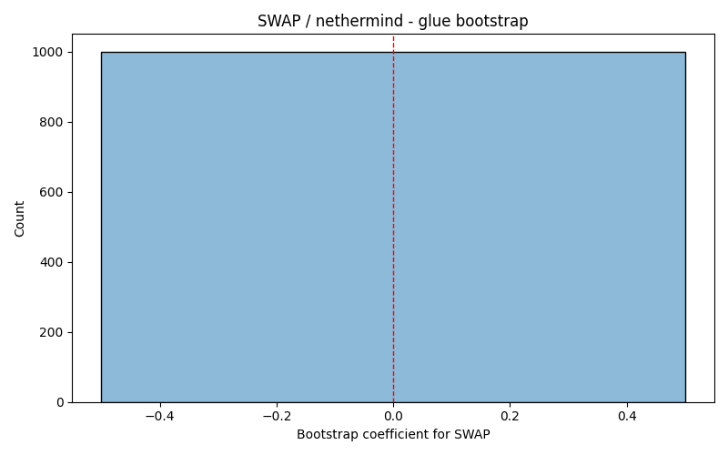

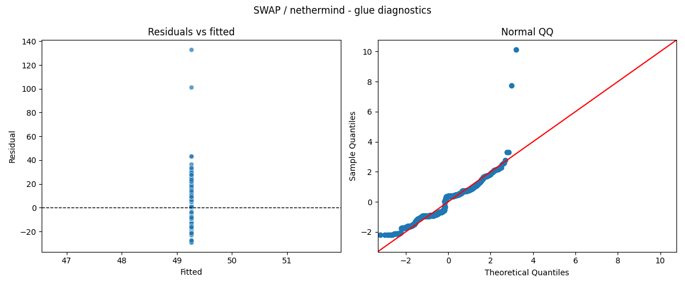

</details>

### Mixed glue (tier A) · nethermind

<details><summary><code>ADD</code> · nobs=90 · runtime_ms=0 · p=1.00e+00 · R²=0</summary>

```
==============================================================================
                           NNLS Regression Results                            
==============================================================================
Dep. Variable:          test_runtime_ms              R-squared:          0.000
Model:                  NNLS                    Adj. R-squared:         -0.011
No. Observations:       90                                RMSE:          32.03
Df Residuals:           88                                 MAE:          23.80
Df Model:               1      
==============================================================================
                      coef     std err     P-value      [0.025      0.975]
------------------------------------------------------------------------------
         const     91.1252      3.3002       0.001     85.1162     97.5386
           ADD      0.0000      0.0000       1.000      0.0000      0.0000
==============================================================================
Notes: Non-negative least squares with bootstrap inference (1000 iterations)
==============================================================================
```

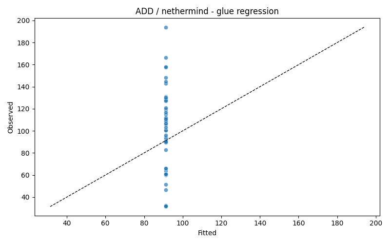

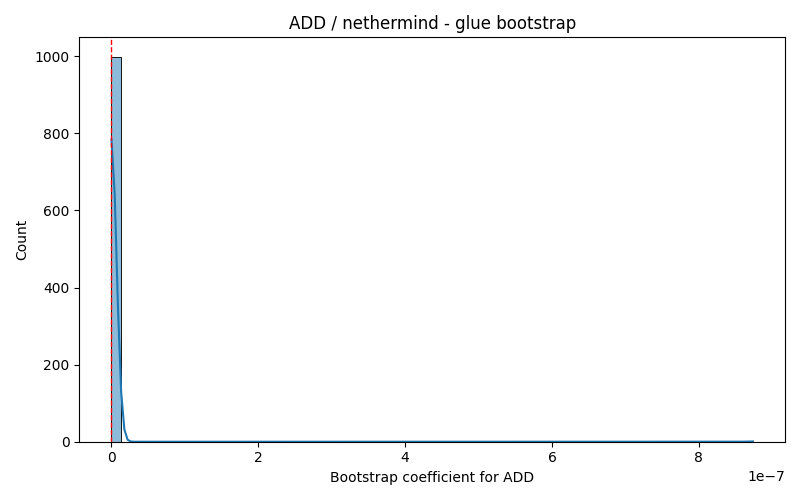

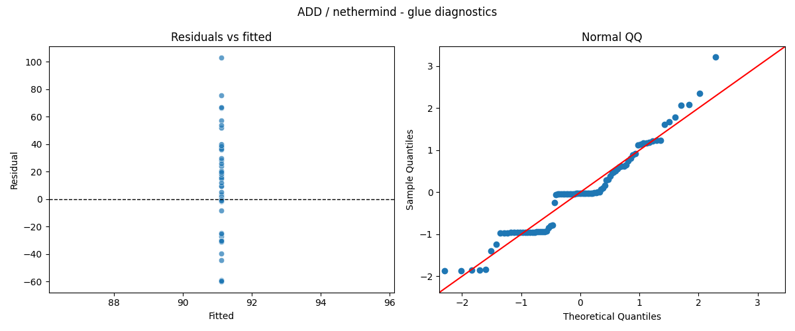

</details>

<details><summary><code>AND</code> · nobs=80 · runtime_ms=0 · p=1.00e+00 · R²=2.22e-16</summary>

```
==============================================================================
                           NNLS Regression Results                            
==============================================================================
Dep. Variable:          test_runtime_ms              R-squared:          0.000
Model:                  NNLS                    Adj. R-squared:         -0.013
No. Observations:       80                                RMSE:          18.98
Df Residuals:           78                                 MAE:          13.04
Df Model:               1      
==============================================================================
                      coef     std err     P-value      [0.025      0.975]
------------------------------------------------------------------------------
         const     50.2363      1.6626       0.001     45.8482     52.4885
           AND      0.0000      0.0000       1.000      0.0000      0.0000
==============================================================================
Notes: Non-negative least squares with bootstrap inference (1000 iterations)
==============================================================================
```

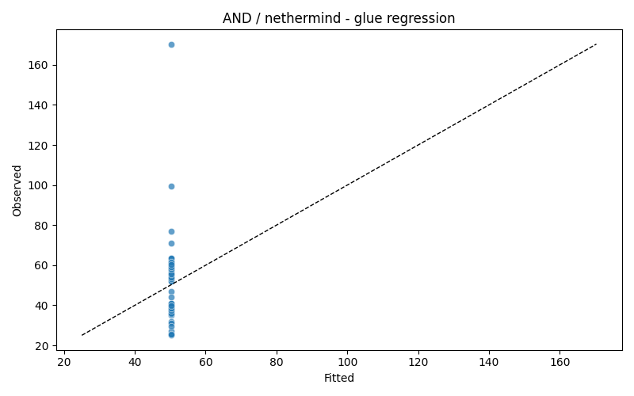

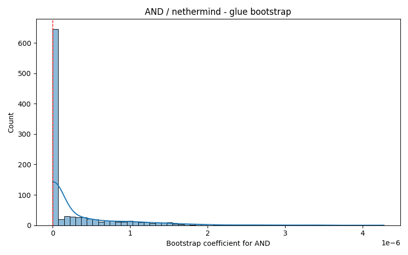

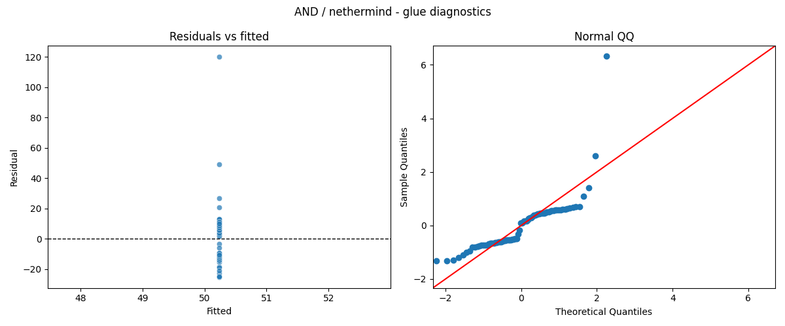

</details>

<details><summary><code>CALLDATACOPY</code> · nobs=2350 · runtime_ms=0 · p=1.00e+00 · R²=0</summary>

```
==============================================================================
                           NNLS Regression Results                            
==============================================================================
Dep. Variable:          test_runtime_ms              R-squared:          0.000
Model:                  NNLS                    Adj. R-squared:         -0.000
No. Observations:       2350                              RMSE:          33.81
Df Residuals:           2348                               MAE:          27.71
Df Model:               1      
==============================================================================
                      coef     std err     P-value      [0.025      0.975]
------------------------------------------------------------------------------
         const     56.8008      0.6949       0.001     55.4703     58.1936
  CALLDATACOPY      0.0000      0.0000       1.000      0.0000      0.0000
==============================================================================
Notes: Non-negative least squares with bootstrap inference (1000 iterations)
==============================================================================
```

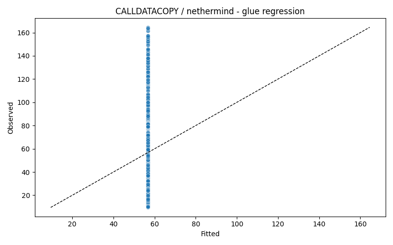


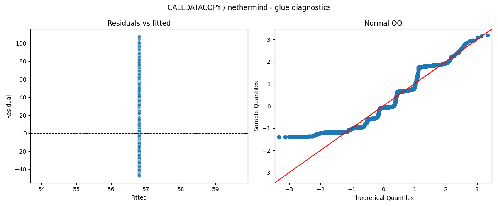

</details>

<details><summary><code>CALLDATALOAD</code> · nobs=440 · runtime_ms=7.479e-06 · p=1.32e-01 · R²=0.0004936</summary>

```
==============================================================================
                           NNLS Regression Results                            
==============================================================================
Dep. Variable:          test_runtime_ms              R-squared:          0.000
Model:                  NNLS                    Adj. R-squared:         -0.002
No. Observations:       440                               RMSE:           1.29
Df Residuals:           438                                MAE:           0.21
Df Model:               1      
==============================================================================
                      coef     std err     P-value      [0.025      0.975]
------------------------------------------------------------------------------
         const      2.2955      0.1249       0.001      2.1039      2.5248
  CALLDATALOAD      0.0000      0.0000       0.132      0.0000      0.0000
==============================================================================
Notes: Non-negative least squares with bootstrap inference (1000 iterations)
==============================================================================
```

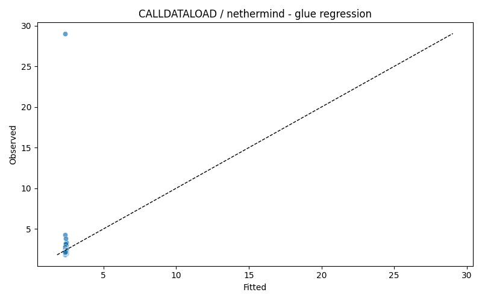

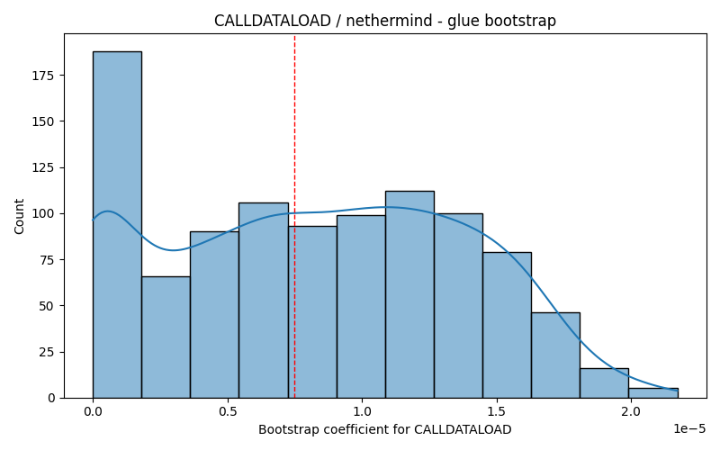

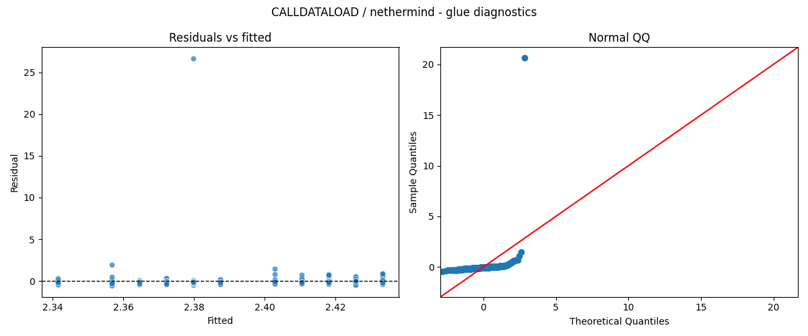

</details>

<details><summary><code>DIV</code> · nobs=110 · runtime_ms=0 · p=1.00e+00 · R²=-2.22e-16</summary>

```
==============================================================================
                           NNLS Regression Results                            
==============================================================================
Dep. Variable:          test_runtime_ms              R-squared:         -0.000
Model:                  NNLS                    Adj. R-squared:         -0.009
No. Observations:       110                               RMSE:          43.65
Df Residuals:           108                                MAE:          40.95
Df Model:               1      
==============================================================================
                      coef     std err     P-value      [0.025      0.975]
------------------------------------------------------------------------------
         const    205.3843      4.2386       0.001    197.3296    214.1531
           DIV      0.0000      0.0000       1.000      0.0000      0.0000
==============================================================================
Notes: Non-negative least squares with bootstrap inference (1000 iterations)
==============================================================================
```

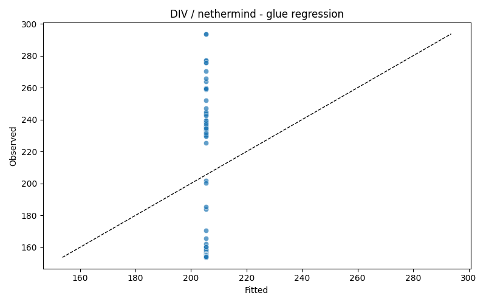


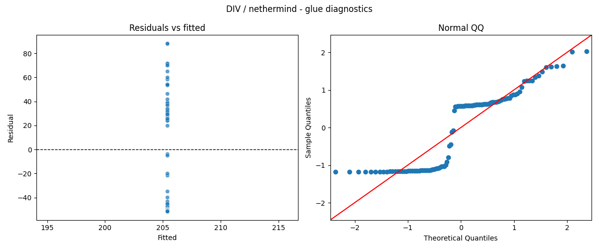

</details>

<details><summary><code>EXP</code> · nobs=110 · runtime_ms=0 · p=1.00e+00 · R²=-2.22e-16</summary>

```
==============================================================================
                           NNLS Regression Results                            
==============================================================================
Dep. Variable:          test_runtime_ms              R-squared:         -0.000
Model:                  NNLS                    Adj. R-squared:         -0.009
No. Observations:       110                               RMSE:          32.37
Df Residuals:           108                                MAE:          19.55
Df Model:               1      
==============================================================================
                      coef     std err     P-value      [0.025      0.975]
------------------------------------------------------------------------------
         const     73.5997      5.2530       0.001     57.6926     80.1414
           EXP      0.0000      0.0000       1.000      0.0000      0.0001
==============================================================================
Notes: Non-negative least squares with bootstrap inference (1000 iterations)
==============================================================================
```

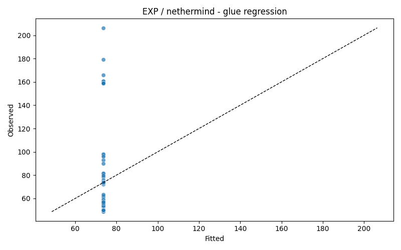

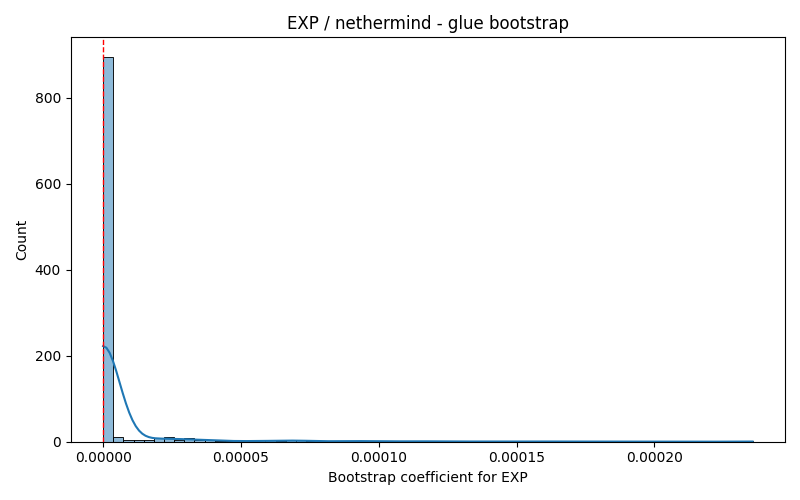

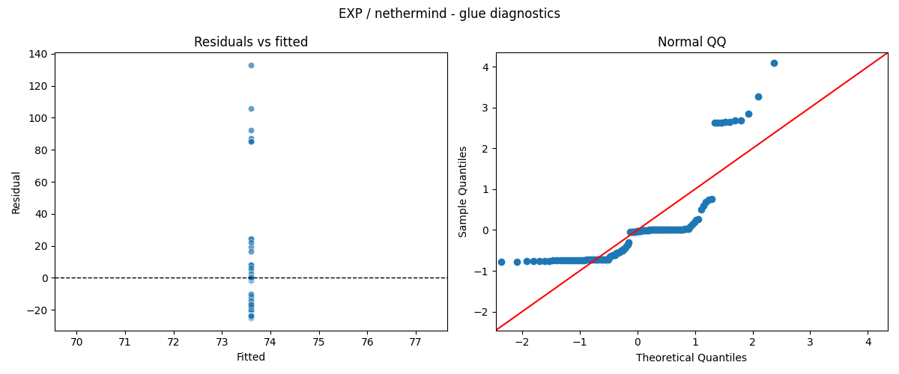

</details>

<details><summary><code>GT</code> · nobs=80 · runtime_ms=0 · p=1.00e+00 · R²=-2.22e-16</summary>

```
==============================================================================
                           NNLS Regression Results                            
==============================================================================
Dep. Variable:          test_runtime_ms              R-squared:         -0.000
Model:                  NNLS                    Adj. R-squared:         -0.013
No. Observations:       80                                RMSE:          17.98
Df Residuals:           78                                 MAE:          16.17
Df Model:               1      
==============================================================================
                      coef     std err     P-value      [0.025      0.975]
------------------------------------------------------------------------------
         const     61.5904      2.0613       0.001     57.6371     65.6583
            GT      0.0000      0.0000       1.000      0.0000      0.0000
==============================================================================
Notes: Non-negative least squares with bootstrap inference (1000 iterations)
==============================================================================
```

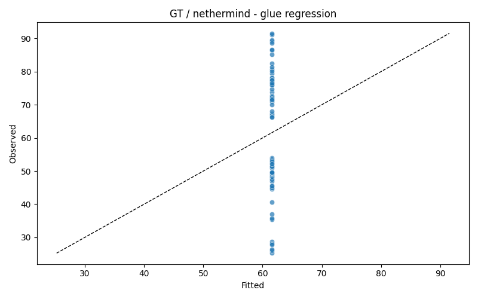


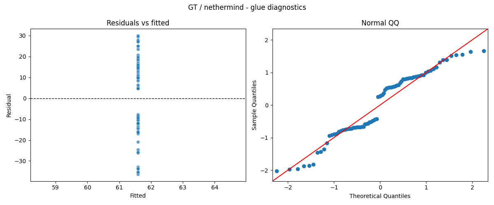

</details>

<details><summary><code>JUMPI</code> · nobs=110 · runtime_ms=0 · p=1.00e+00 · R²=0</summary>

```
==============================================================================
                           NNLS Regression Results                            
==============================================================================
Dep. Variable:          test_runtime_ms              R-squared:          0.000
Model:                  NNLS                    Adj. R-squared:         -0.009
No. Observations:       110                               RMSE:          12.27
Df Residuals:           108                                MAE:           8.27
Df Model:               1      
==============================================================================
                      coef     std err     P-value      [0.025      0.975]
------------------------------------------------------------------------------
         const     33.1403      1.2084       0.001     31.0542     35.6604
         JUMPI      0.0000      0.0000       1.000      0.0000      0.0000
==============================================================================
Notes: Non-negative least squares with bootstrap inference (1000 iterations)
==============================================================================
```

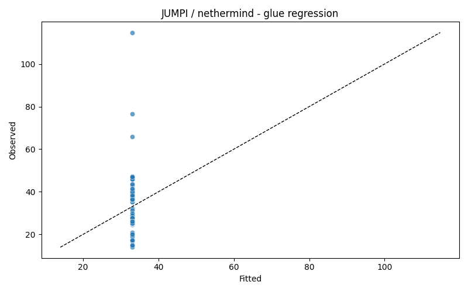

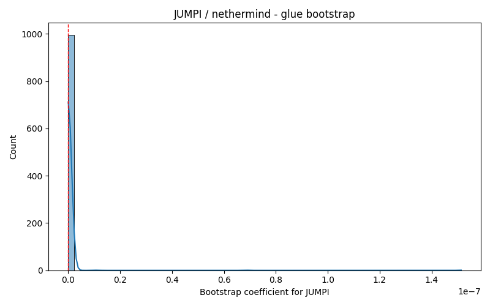

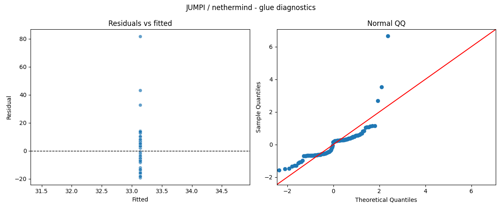

</details>

<details><summary><code>LT</code> · nobs=80 · runtime_ms=0 · p=1.00e+00 · R²=0</summary>

```
==============================================================================
                           NNLS Regression Results                            
==============================================================================
Dep. Variable:          test_runtime_ms              R-squared:          0.000
Model:                  NNLS                    Adj. R-squared:         -0.013
No. Observations:       80                                RMSE:          16.78
Df Residuals:           78                                 MAE:          14.82
Df Model:               1      
==============================================================================
                      coef     std err     P-value      [0.025      0.975]
------------------------------------------------------------------------------
         const     64.4300      1.8572       0.001     60.8697     67.9605
            LT      0.0000      0.0000       1.000      0.0000      0.0000
==============================================================================
Notes: Non-negative least squares with bootstrap inference (1000 iterations)
==============================================================================
```

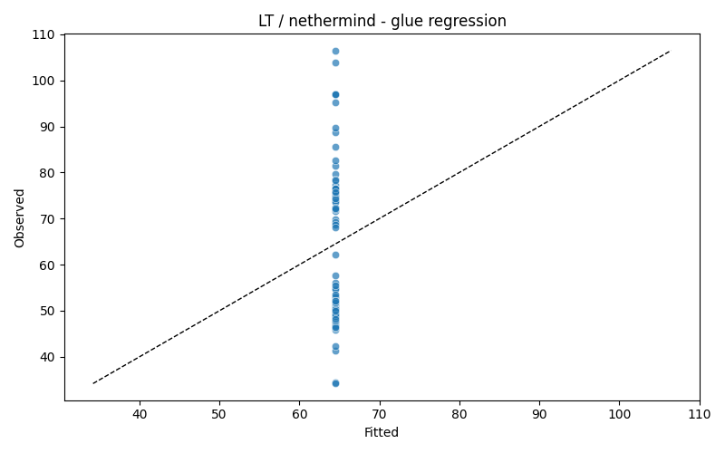

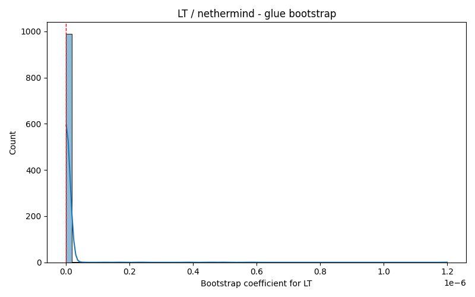

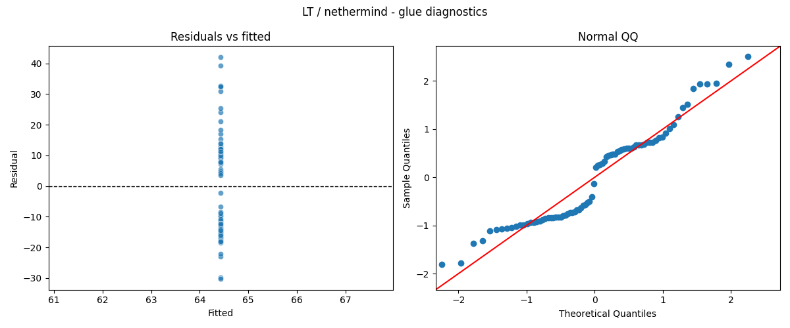

</details>

<details><summary><code>MSTORE</code> · nobs=450 · runtime_ms=0 · p=1.00e+00 · R²=0</summary>

```
==============================================================================
                           NNLS Regression Results                            
==============================================================================
Dep. Variable:          test_runtime_ms              R-squared:          0.000
Model:                  NNLS                    Adj. R-squared:         -0.002
No. Observations:       450                               RMSE:          19.24
Df Residuals:           448                                MAE:          15.20
Df Model:               1      
==============================================================================
                      coef     std err     P-value      [0.025      0.975]
------------------------------------------------------------------------------
         const     60.8253      0.9006       0.001     59.0761     62.5300
        MSTORE      0.0000      0.0000       1.000      0.0000      0.0000
==============================================================================
Notes: Non-negative least squares with bootstrap inference (1000 iterations)
==============================================================================
```

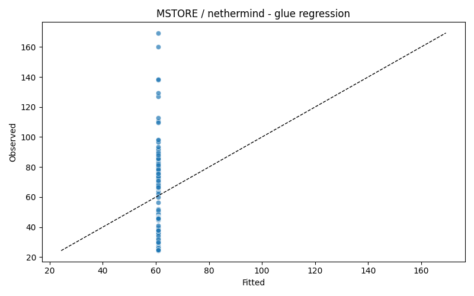


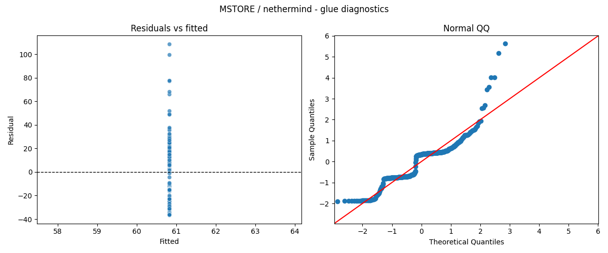

</details>

<details><summary><code>MSTORE8</code> · nobs=450 · runtime_ms=0 · p=1.00e+00 · R²=1.11e-16</summary>

```
==============================================================================
                           NNLS Regression Results                            
==============================================================================
Dep. Variable:          test_runtime_ms              R-squared:          0.000
Model:                  NNLS                    Adj. R-squared:         -0.002
No. Observations:       450                               RMSE:          16.66
Df Residuals:           448                                MAE:          14.44
Df Model:               1      
==============================================================================
                      coef     std err     P-value      [0.025      0.975]
------------------------------------------------------------------------------
         const     58.6968      0.8019       0.001     57.2320     60.3371
       MSTORE8      0.0000      0.0000       1.000      0.0000      0.0000
==============================================================================
Notes: Non-negative least squares with bootstrap inference (1000 iterations)
==============================================================================
```

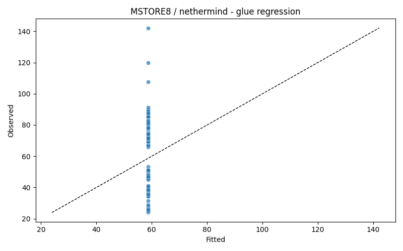


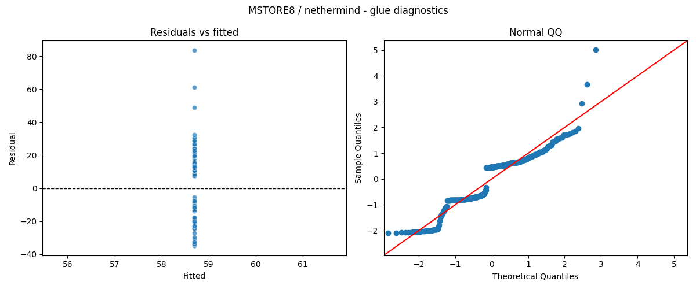

</details>

<details><summary><code>MUL</code> · nobs=100 · runtime_ms=0 · p=1.00e+00 · R²=0</summary>

```
==============================================================================
                           NNLS Regression Results                            
==============================================================================
Dep. Variable:          test_runtime_ms              R-squared:          0.000
Model:                  NNLS                    Adj. R-squared:         -0.010
No. Observations:       100                               RMSE:          34.84
Df Residuals:           98                                 MAE:          31.05
Df Model:               1      
==============================================================================
                      coef     std err     P-value      [0.025      0.975]
------------------------------------------------------------------------------
         const    126.6992      3.6535       0.001    119.5976    134.0224
           MUL      0.0000      0.0000       1.000      0.0000      0.0000
==============================================================================
Notes: Non-negative least squares with bootstrap inference (1000 iterations)
==============================================================================
```

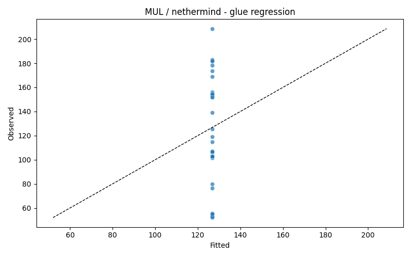


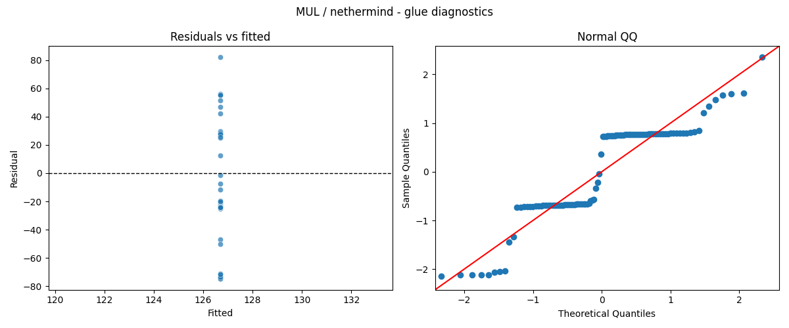

</details>

<details><summary><code>PC</code> · nobs=60 · runtime_ms=5.032e-06 · p=1.00e-03 · R²=0.3199</summary>

```
==============================================================================
                           NNLS Regression Results                            
==============================================================================
Dep. Variable:          test_runtime_ms              R-squared:          0.320
Model:                  NNLS                    Adj. R-squared:          0.308
No. Observations:       60                                RMSE:          16.31
Df Residuals:           58                                 MAE:          14.27
Df Model:               1      
==============================================================================
                      coef     std err     P-value      [0.025      0.975]
------------------------------------------------------------------------------
         const     78.7202      4.1134       0.001     70.7954     86.6858
            PC      0.0000      0.0000       0.001      0.0000      0.0000
==============================================================================
Notes: Non-negative least squares with bootstrap inference (1000 iterations)
==============================================================================
```

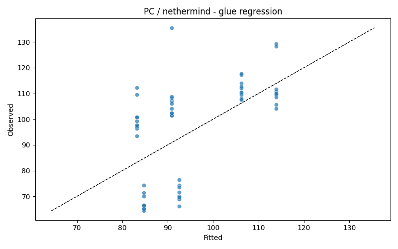

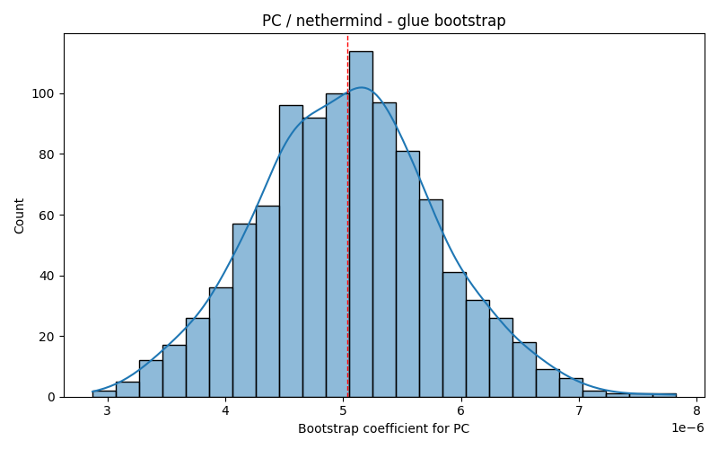

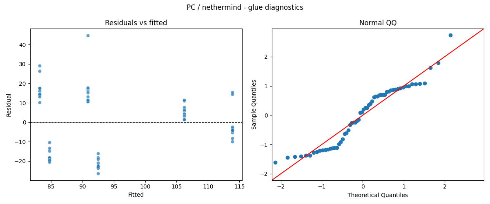

</details>

<details><summary><code>RETURNDATASIZE</code> · nobs=240 · runtime_ms=4.874e-06 · p=1.00e-03 · R²=0.2077</summary>

```
==============================================================================
                           NNLS Regression Results                            
==============================================================================
Dep. Variable:          test_runtime_ms              R-squared:          0.208
Model:                  NNLS                    Adj. R-squared:          0.204
No. Observations:       240                               RMSE:          11.17
Df Residuals:           238                                MAE:           8.66
Df Model:               1      
==============================================================================
                      coef     std err     P-value      [0.025      0.975]
------------------------------------------------------------------------------
         const     48.0789      1.3937       0.001     45.4075     50.9386
RETURNDATASIZE      0.0000      0.0000       0.001      0.0000      0.0000
==============================================================================
Notes: Non-negative least squares with bootstrap inference (1000 iterations)
==============================================================================
```

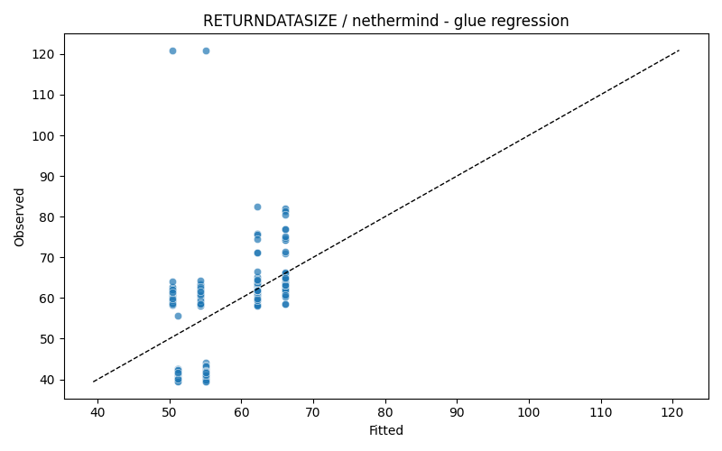

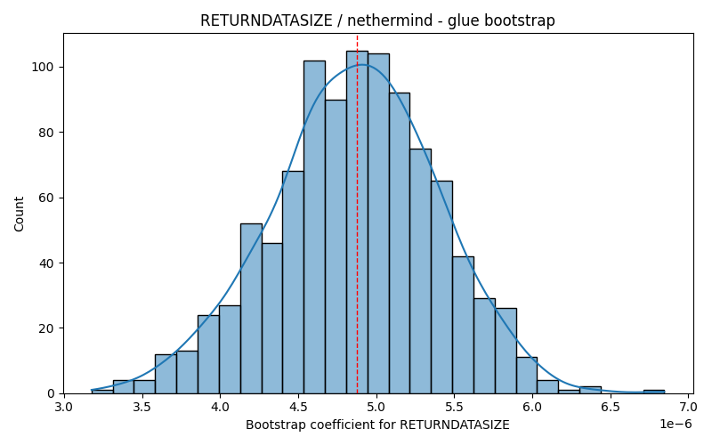

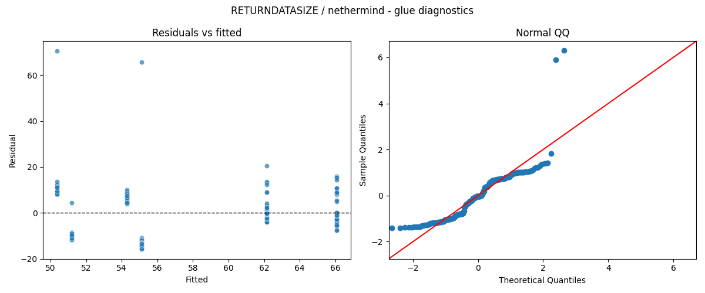

</details>

<details><summary><code>SELFBALANCE</code> · nobs=110 · runtime_ms=0 · p=1.00e+00 · R²=0</summary>

```
==============================================================================
                           NNLS Regression Results                            
==============================================================================
Dep. Variable:          test_runtime_ms              R-squared:          0.000
Model:                  NNLS                    Adj. R-squared:         -0.009
No. Observations:       110                               RMSE:          39.62
Df Residuals:           108                                MAE:          37.05
Df Model:               1      
==============================================================================
                      coef     std err     P-value      [0.025      0.975]
------------------------------------------------------------------------------
         const    200.8495      3.9054       0.001    193.3709    208.7790
   SELFBALANCE      0.0000      0.0000       1.000      0.0000      0.0000
==============================================================================
Notes: Non-negative least squares with bootstrap inference (1000 iterations)
==============================================================================
```

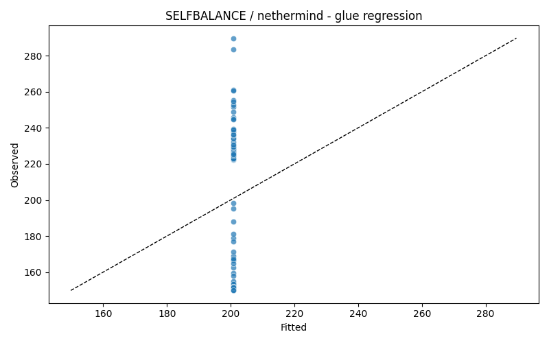


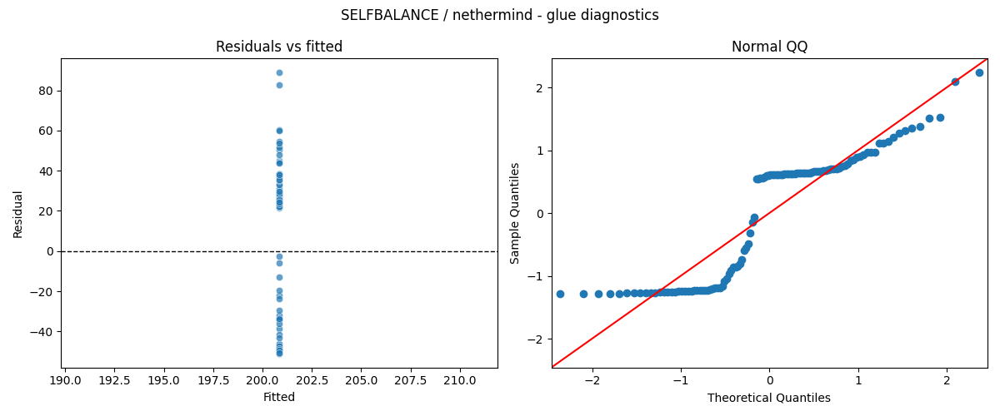

</details>

<details><summary><code>SUB</code> · nobs=80 · runtime_ms=0 · p=1.00e+00 · R²=0</summary>

```
==============================================================================
                           NNLS Regression Results                            
==============================================================================
Dep. Variable:          test_runtime_ms              R-squared:          0.000
Model:                  NNLS                    Adj. R-squared:         -0.013
No. Observations:       80                                RMSE:          24.28
Df Residuals:           78                                 MAE:          21.58
Df Model:               1      
==============================================================================
                      coef     std err     P-value      [0.025      0.975]
------------------------------------------------------------------------------
         const     80.6531      2.6476       0.001     75.5231     85.7502
           SUB      0.0000      0.0000       1.000      0.0000      0.0000
==============================================================================
Notes: Non-negative least squares with bootstrap inference (1000 iterations)
==============================================================================
```

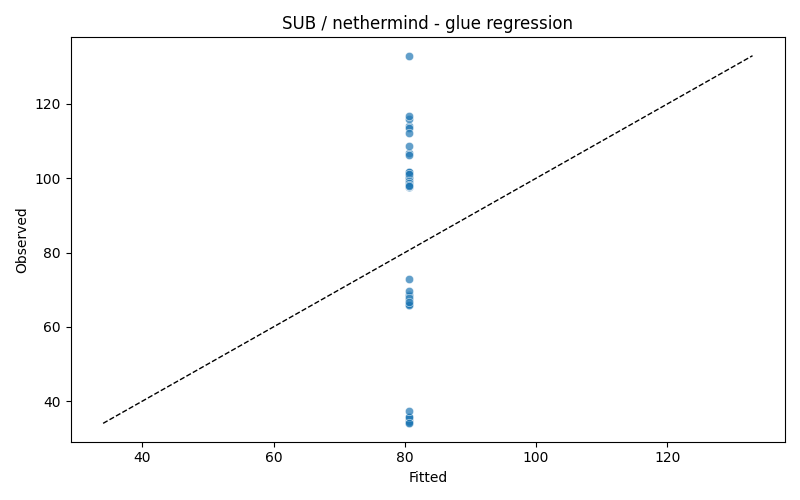


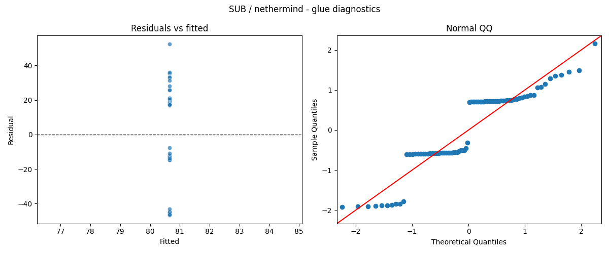

</details>

### Mixed glue (tier B) · nethermind

<details><summary><code>JUMP</code> · nobs=100 · runtime_ms=0 · p=1.00e+00 · R²=0</summary>

```
==============================================================================
                           NNLS Regression Results                            
==============================================================================
Dep. Variable:          test_runtime_ms              R-squared:          0.000
Model:                  NNLS                    Adj. R-squared:         -0.010
No. Observations:       100                               RMSE:          17.93
Df Residuals:           98                                 MAE:          16.00
Df Model:               1      
==============================================================================
                      coef     std err     P-value      [0.025      0.975]
------------------------------------------------------------------------------
         const     66.6128      1.8156       0.001     63.0000     70.2548
          JUMP      0.0000      0.0000       1.000      0.0000      0.0000
==============================================================================
Notes: Non-negative least squares with bootstrap inference (1000 iterations)
==============================================================================
```

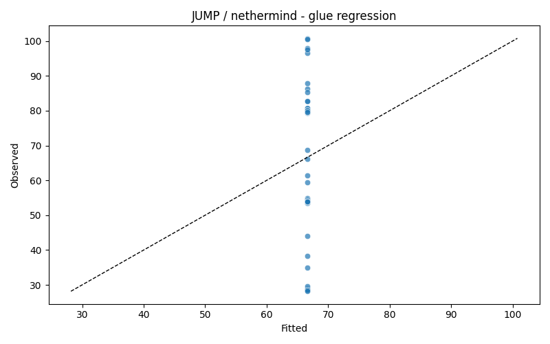


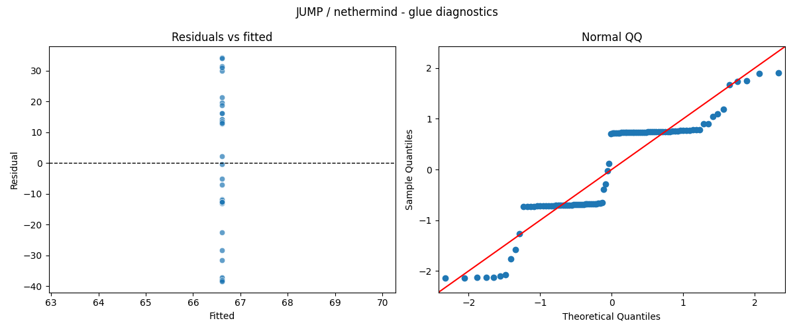

</details>

<details><summary><code>KECCAK256</code> · nobs=1760 · runtime_ms=0 · p=1.00e+00 · R²=1.11e-16</summary>

```
==============================================================================
                           NNLS Regression Results                            
==============================================================================
Dep. Variable:          test_runtime_ms              R-squared:          0.000
Model:                  NNLS                    Adj. R-squared:         -0.001
No. Observations:       1760                              RMSE:         264.88
Df Residuals:           1758                               MAE:         216.61
Df Model:               1      
==============================================================================
                      coef     std err     P-value      [0.025      0.975]
------------------------------------------------------------------------------
         const    388.6495      6.2768       0.001    376.5772    402.1320
     KECCAK256      0.0000      0.0000       1.000      0.0000      0.0000
==============================================================================
Notes: Non-negative least squares with bootstrap inference (1000 iterations)
==============================================================================
```

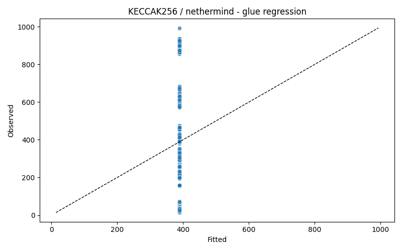


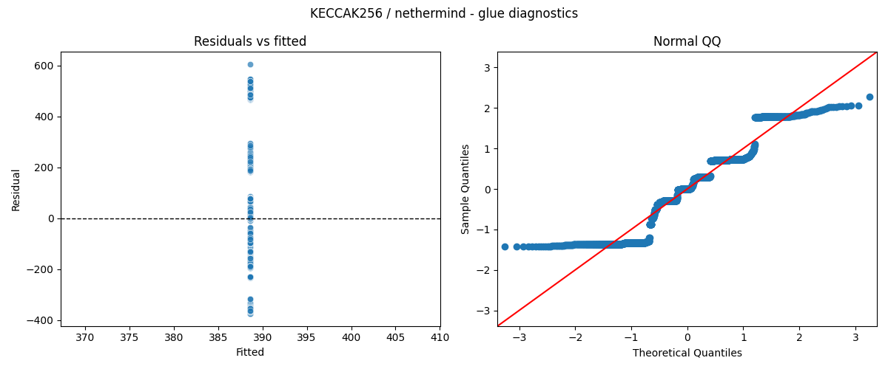

</details>

## reth

| glue_opcode | nobs | glue_runtime_ms | p_value | rsquared |
| --- | --- | --- | --- | --- |
| `ISZERO` | 72 | 0 | 1.00e+00 | -2.22e-16 |
| `JUMPDEST` | 18 | 0 | 1.00e+00 | 3.331e-16 |
| `SWAP` | 1287 | 0 | 1.00e+00 | 1.11e-16 |
| `CALLDATASIZE` | 4727 | 5.411e-06 | 1.00e-03 | 0.6012 |
| `DUP` | 4727 | 0 | 1.00e+00 | 0.6012 |
| `GAS` | 4727 | 5.478e-06 | 1.00e-03 | 0.6012 |
| `MLOAD` | 4727 | 1.223e-05 | 1.00e-03 | 0.6012 |
| `PUSH` | 4727 | 0 | 1.00e+00 | 0.6012 |
| `PUSH0` | 4727 | 4.378e-06 | 1.00e-03 | 0.6012 |
| `STATICCALL` | 4727 | 2.455e-05 | 1.00e-03 | 0.6012 |
| `ADD` | 81 | 0 | 1.00e+00 | 0 |
| `AND` | 72 | 0 | 1.00e+00 | 2.22e-16 |
| `CALLDATACOPY` | 2115 | 0 | 1.00e+00 | -2.22e-16 |
| `CALLDATALOAD` | 396 | 0 | 1.00e+00 | 0 |
| `DIV` | 99 | 0 | 1.00e+00 | 0 |
| `EXP` | 99 | 0.0003096 | 1.00e-03 | 0.8142 |
| `GT` | 72 | 0 | 1.00e+00 | 0 |
| `JUMPI` | 99 | 0 | 1.00e+00 | 0 |
| `LT` | 72 | 0 | 1.00e+00 | 0 |
| `MSTORE` | 405 | 0 | 1.00e+00 | 0 |
| `MSTORE8` | 405 | 0 | 1.00e+00 | 1.11e-16 |
| `MUL` | 90 | 0 | 1.00e+00 | 0 |
| `PC` | 54 | 6.891e-06 | 1.00e-03 | 0.5541 |
| `RETURNDATASIZE` | 216 | 6.73e-06 | 1.00e-03 | 0.1924 |
| `SELFBALANCE` | 99 | 0 | 1.00e+00 | -2.22e-16 |
| `SUB` | 72 | 0 | 1.00e+00 | 0 |
| `JUMP` | 90 | 0 | 1.00e+00 | 2.22e-16 |
| `KECCAK256` | 1584 | 0 | 1.00e+00 | -2.22e-16 |

### Cycle glue — joint fit · reth

<details><summary>Joint NNLS regression summary</summary>

```
==============================================================================
                           NNLS Regression Results                            
==============================================================================
Dep. Variable:          test_runtime_ms              R-squared:          0.601
Model:                  NNLS                    Adj. R-squared:          0.601
No. Observations:       4727                              RMSE:          13.17
Df Residuals:           4719                               MAE:          11.13
Df Model:               7      
==============================================================================
                      coef     std err     P-value      [0.025      0.975]
------------------------------------------------------------------------------
         const     47.0266      0.2121       0.001     46.6216     47.4385
  CALLDATASIZE      0.0000      0.0000       0.001      0.0000      0.0000
           DUP      0.0000      0.0000       1.000      0.0000      0.0000
           GAS      0.0000      0.0000       0.001      0.0000      0.0000
         MLOAD      0.0000      0.0000       0.001      0.0000      0.0000
          PUSH      0.0000      0.0000       1.000      0.0000      0.0000
         PUSH0      0.0000      0.0000       0.001      0.0000      0.0000
    STATICCALL      0.0000      0.0000       0.001      0.0000      0.0000
==============================================================================
Notes: Non-negative least squares with bootstrap inference (1000 iterations)
==============================================================================
```

</details>

<details><summary><code>CALLDATASIZE</code> · nobs=4727 · runtime_ms=5.411e-06 · p=1.00e-03 · R²=0.6012</summary>

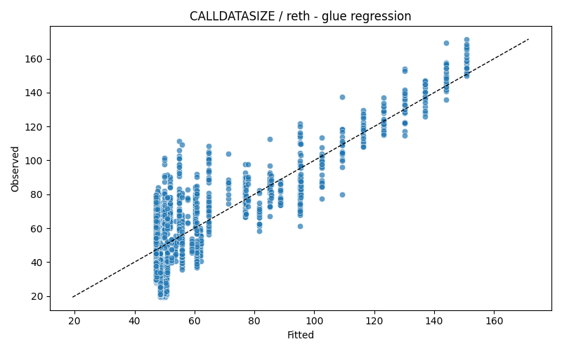

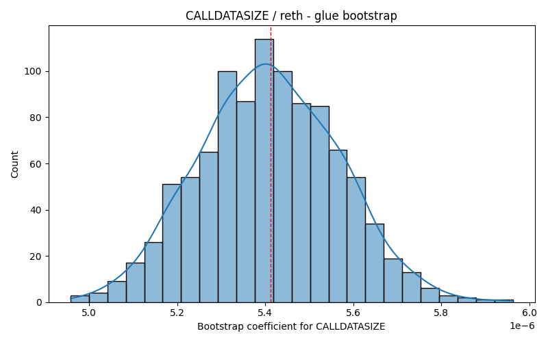

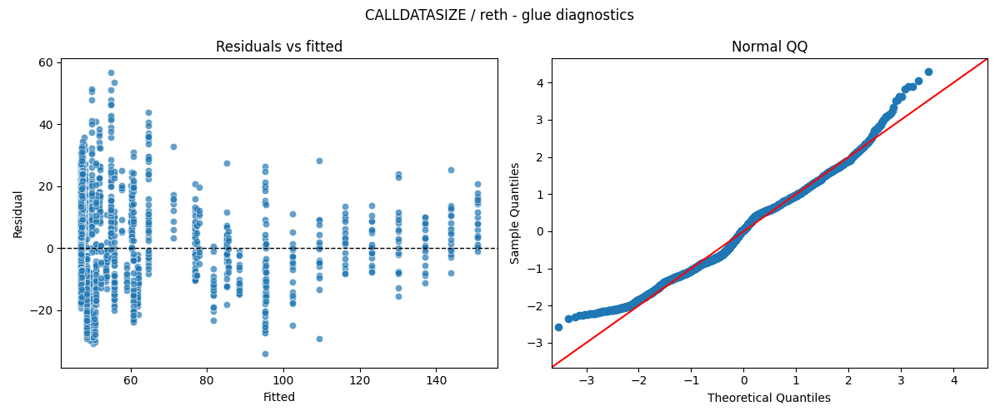

</details>

<details><summary><code>DUP</code> · nobs=4727 · runtime_ms=0 · p=1.00e+00 · R²=0.6012</summary>


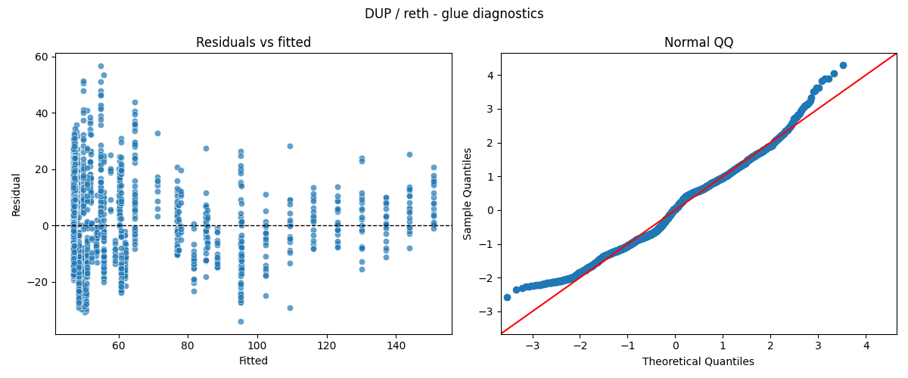

</details>

<details><summary><code>GAS</code> · nobs=4727 · runtime_ms=5.478e-06 · p=1.00e-03 · R²=0.6012</summary>

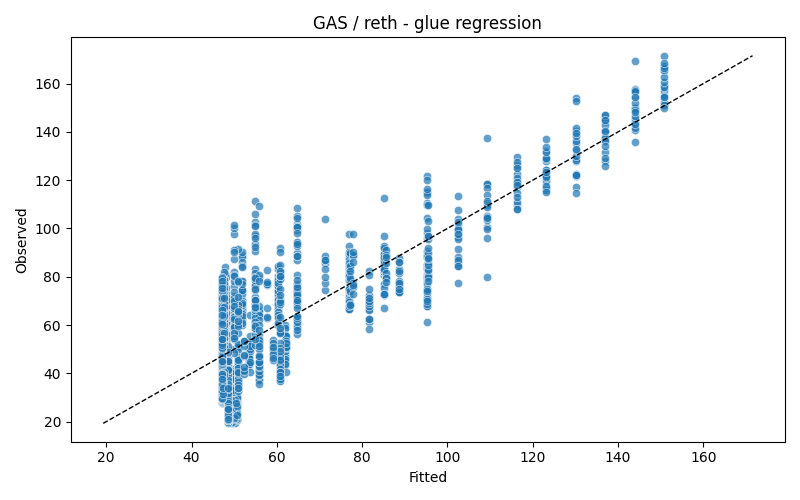

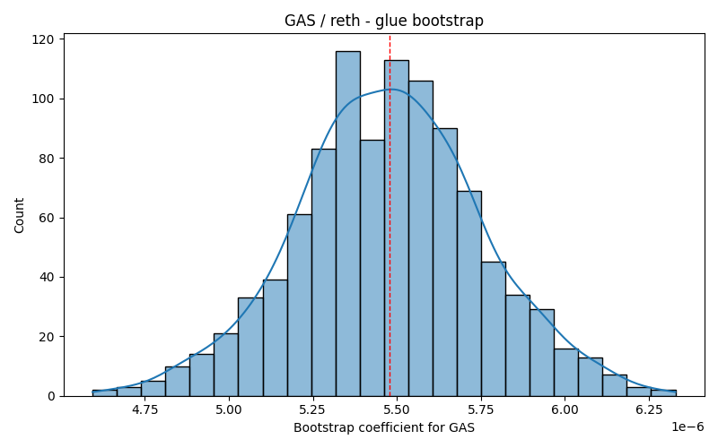


</details>

<details><summary><code>MLOAD</code> · nobs=4727 · runtime_ms=1.223e-05 · p=1.00e-03 · R²=0.6012</summary>


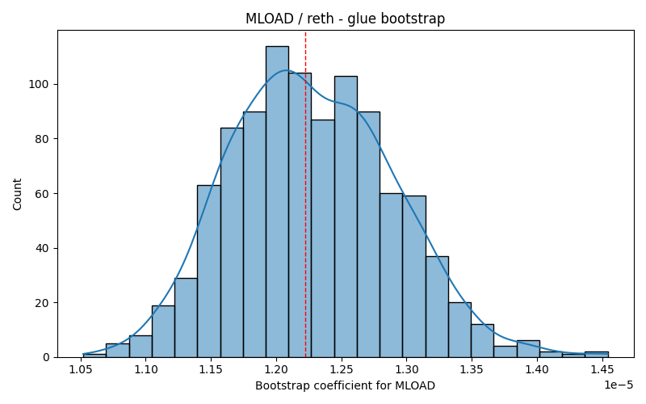

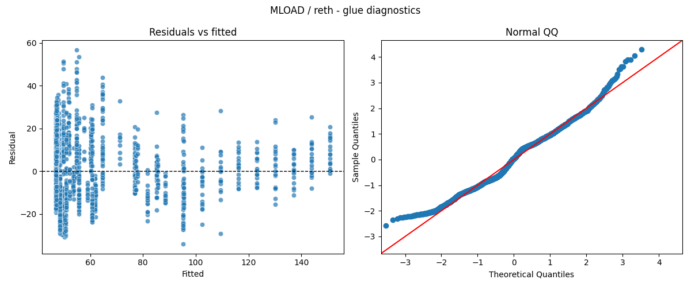

</details>

<details><summary><code>PUSH</code> · nobs=4727 · runtime_ms=0 · p=1.00e+00 · R²=0.6012</summary>


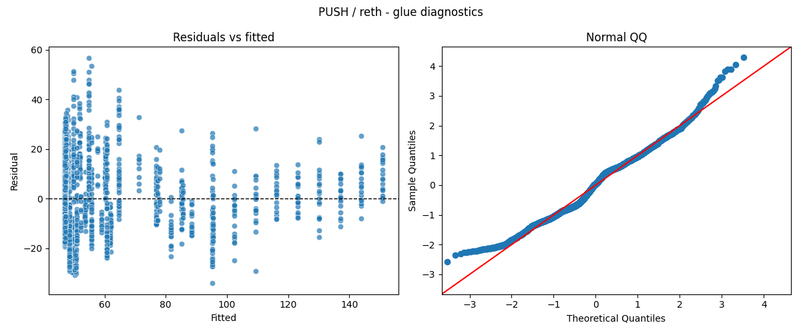

</details>

<details><summary><code>PUSH0</code> · nobs=4727 · runtime_ms=4.378e-06 · p=1.00e-03 · R²=0.6012</summary>


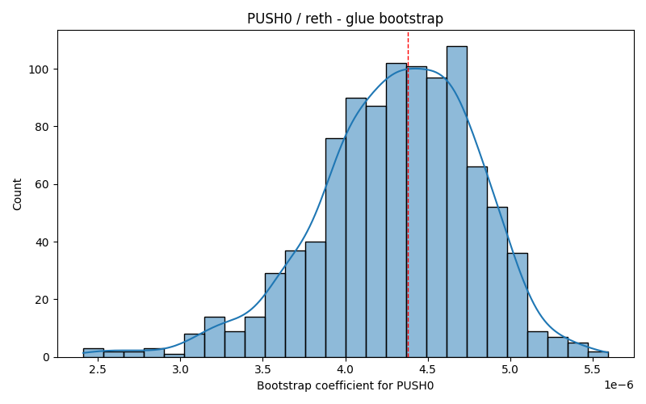


</details>

<details><summary><code>STATICCALL</code> · nobs=4727 · runtime_ms=2.455e-05 · p=1.00e-03 · R²=0.6012</summary>


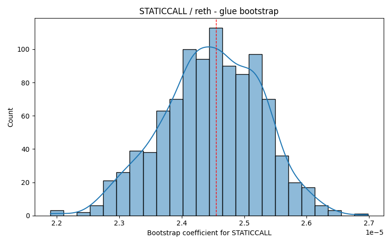

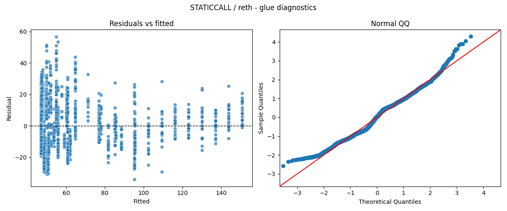

</details>

### Pure glue · reth

<details><summary><code>ISZERO</code> · nobs=72 · runtime_ms=0 · p=1.00e+00 · R²=-2.22e-16</summary>

```
==============================================================================
                           NNLS Regression Results                            
==============================================================================
Dep. Variable:          test_runtime_ms              R-squared:         -0.000
Model:                  NNLS                    Adj. R-squared:         -0.014
No. Observations:       72                                RMSE:          34.76
Df Residuals:           70                                 MAE:          31.38
Df Model:               1      
==============================================================================
                      coef     std err     P-value      [0.025      0.975]
------------------------------------------------------------------------------
         const    120.5872      4.0251       0.001    112.7748    128.6438
        ISZERO      0.0000      0.0000       1.000      0.0000      0.0000
==============================================================================
Notes: Non-negative least squares with bootstrap inference (1000 iterations)
==============================================================================
```

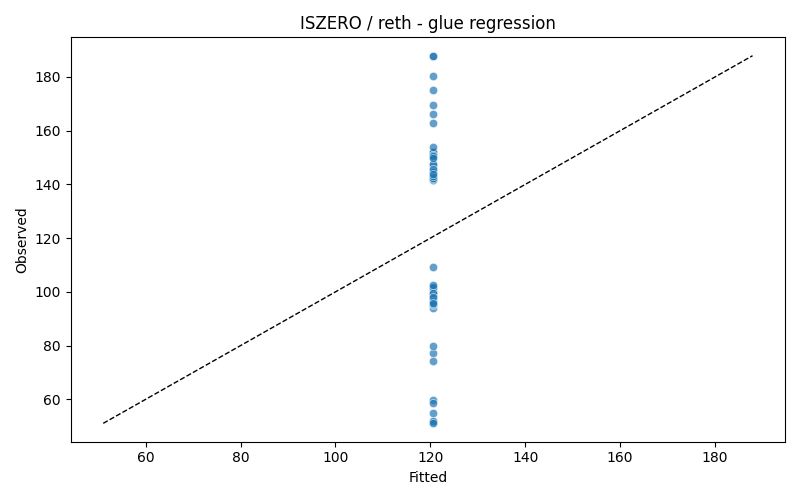

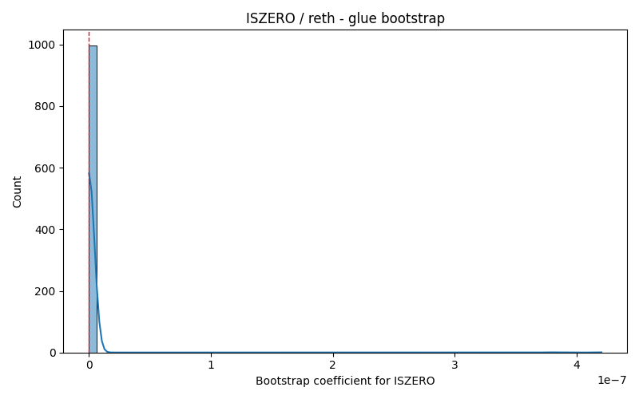

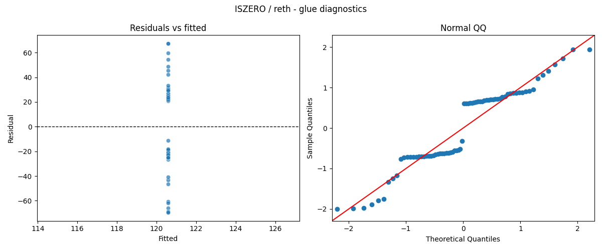

</details>

<details><summary><code>JUMPDEST</code> · nobs=18 · runtime_ms=0 · p=1.00e+00 · R²=3.331e-16</summary>

```
==============================================================================
                           NNLS Regression Results                            
==============================================================================
Dep. Variable:          test_runtime_ms              R-squared:          0.000
Model:                  NNLS                    Adj. R-squared:         -0.062
No. Observations:       18                                RMSE:          12.79
Df Residuals:           16                                 MAE:          12.23
Df Model:               1      
==============================================================================
                      coef     std err     P-value      [0.025      0.975]
------------------------------------------------------------------------------
         const     63.7037      2.9849       0.001     57.9808     69.9237
      JUMPDEST      0.0000      0.0000       1.000      0.0000      0.0000
==============================================================================
Notes: Non-negative least squares with bootstrap inference (1000 iterations)
==============================================================================
```

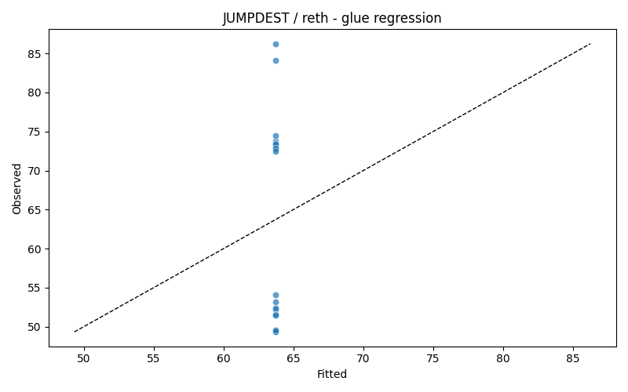


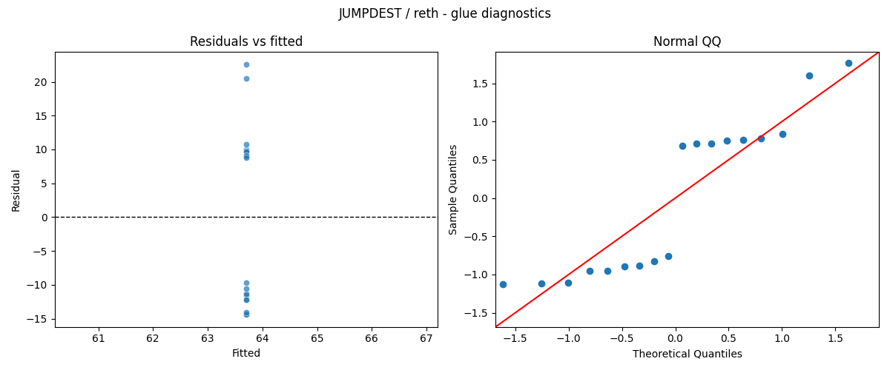

</details>

<details><summary><code>SWAP</code> · nobs=1287 · runtime_ms=0 · p=1.00e+00 · R²=1.11e-16</summary>

```
==============================================================================
                           NNLS Regression Results                            
==============================================================================
Dep. Variable:          test_runtime_ms              R-squared:          0.000
Model:                  NNLS                    Adj. R-squared:         -0.001
No. Observations:       1287                              RMSE:          12.37
Df Residuals:           1285                               MAE:          10.73
Df Model:               1      
==============================================================================
                      coef     std err     P-value      [0.025      0.975]
------------------------------------------------------------------------------
         const     46.5540      0.3373       0.001     45.9102     47.2457
          SWAP      0.0000      0.0000       1.000      0.0000      0.0000
==============================================================================
Notes: Non-negative least squares with bootstrap inference (1000 iterations)
==============================================================================
```

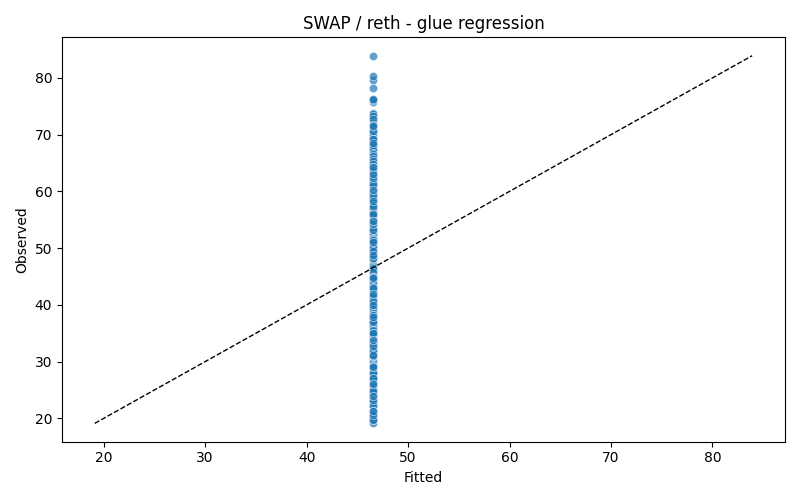


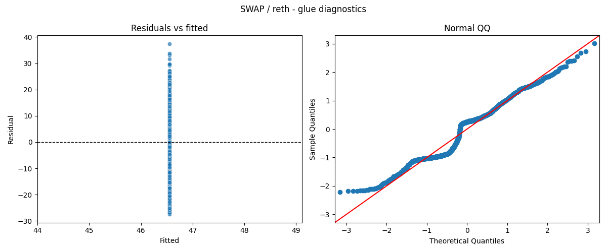

</details>

### Mixed glue (tier A) · reth

<details><summary><code>ADD</code> · nobs=81 · runtime_ms=0 · p=1.00e+00 · R²=0</summary>

```
==============================================================================
                           NNLS Regression Results                            
==============================================================================
Dep. Variable:          test_runtime_ms              R-squared:          0.000
Model:                  NNLS                    Adj. R-squared:         -0.013
No. Observations:       81                                RMSE:          10.67
Df Residuals:           79                                 MAE:           9.25
Df Model:               1      
==============================================================================
                      coef     std err     P-value      [0.025      0.975]
------------------------------------------------------------------------------
         const     40.2601      1.2170       0.001     37.7186     42.4600
           ADD      0.0000      0.0000       1.000      0.0000      0.0000
==============================================================================
Notes: Non-negative least squares with bootstrap inference (1000 iterations)
==============================================================================
```

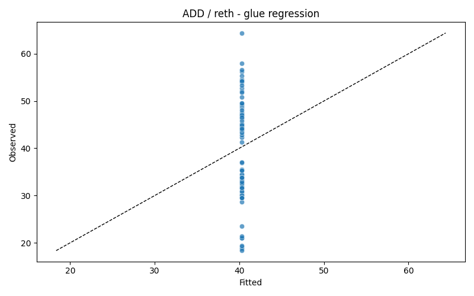

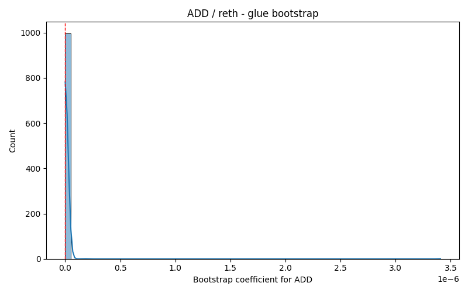

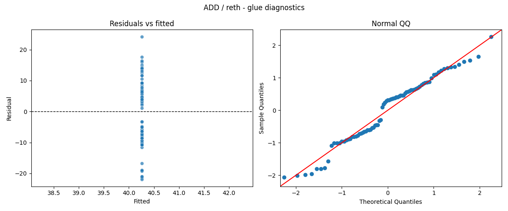

</details>

<details><summary><code>AND</code> · nobs=72 · runtime_ms=0 · p=1.00e+00 · R²=2.22e-16</summary>

```
==============================================================================
                           NNLS Regression Results                            
==============================================================================
Dep. Variable:          test_runtime_ms              R-squared:          0.000
Model:                  NNLS                    Adj. R-squared:         -0.014
No. Observations:       72                                RMSE:          12.18
Df Residuals:           70                                 MAE:          10.18
Df Model:               1      
==============================================================================
                      coef     std err     P-value      [0.025      0.975]
------------------------------------------------------------------------------
         const     40.5328      1.4441       0.001     37.7233     43.3477
           AND      0.0000      0.0000       1.000      0.0000      0.0000
==============================================================================
Notes: Non-negative least squares with bootstrap inference (1000 iterations)
==============================================================================
```

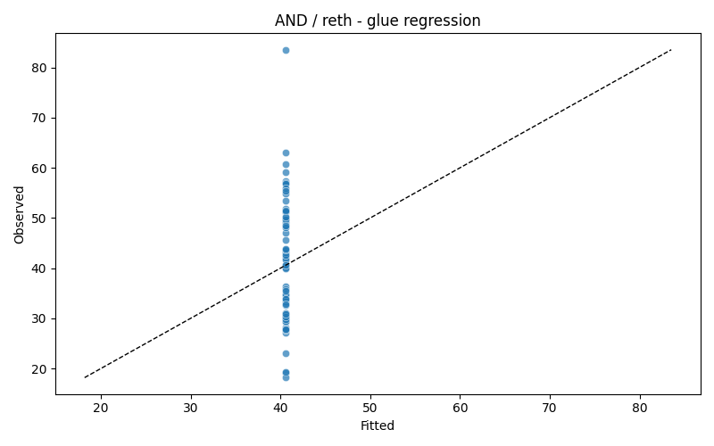

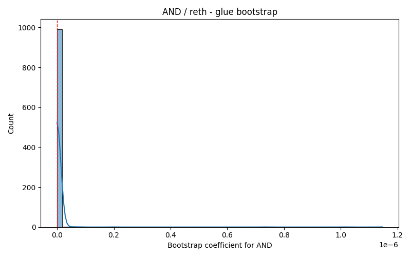

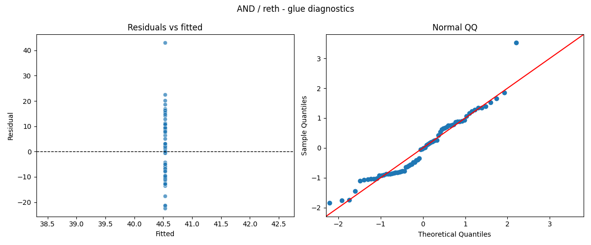

</details>

<details><summary><code>CALLDATACOPY</code> · nobs=2115 · runtime_ms=0 · p=1.00e+00 · R²=-2.22e-16</summary>

```
==============================================================================
                           NNLS Regression Results                            
==============================================================================
Dep. Variable:          test_runtime_ms              R-squared:         -0.000
Model:                  NNLS                    Adj. R-squared:         -0.000
No. Observations:       2115                              RMSE:          20.13
Df Residuals:           2113                               MAE:          16.91
Df Model:               1      
==============================================================================
                      coef     std err     P-value      [0.025      0.975]
------------------------------------------------------------------------------
         const     36.9031      0.4277       0.001     36.0970     37.7892
  CALLDATACOPY      0.0000      0.0000       1.000      0.0000      0.0000
==============================================================================
Notes: Non-negative least squares with bootstrap inference (1000 iterations)
==============================================================================
```

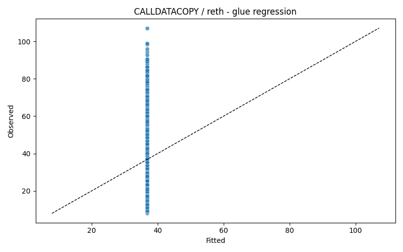


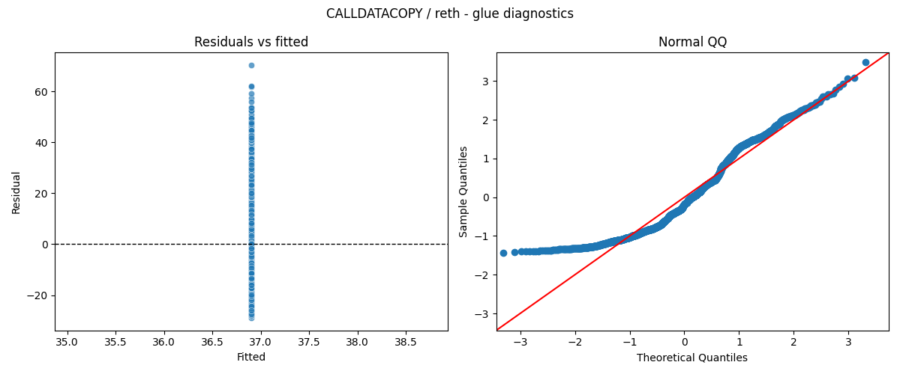

</details>

<details><summary><code>CALLDATALOAD</code> · nobs=396 · runtime_ms=0 · p=1.00e+00 · R²=0</summary>

```
==============================================================================
                           NNLS Regression Results                            
==============================================================================
Dep. Variable:          test_runtime_ms              R-squared:          0.000
Model:                  NNLS                    Adj. R-squared:         -0.003
No. Observations:       396                               RMSE:           1.88
Df Residuals:           394                                MAE:           1.33
Df Model:               1      
==============================================================================
                      coef     std err     P-value      [0.025      0.975]
------------------------------------------------------------------------------
         const      4.3180      0.2138       0.001      3.6728      4.4737
  CALLDATALOAD      0.0000      0.0000       1.000      0.0000      0.0000
==============================================================================
Notes: Non-negative least squares with bootstrap inference (1000 iterations)
==============================================================================
```

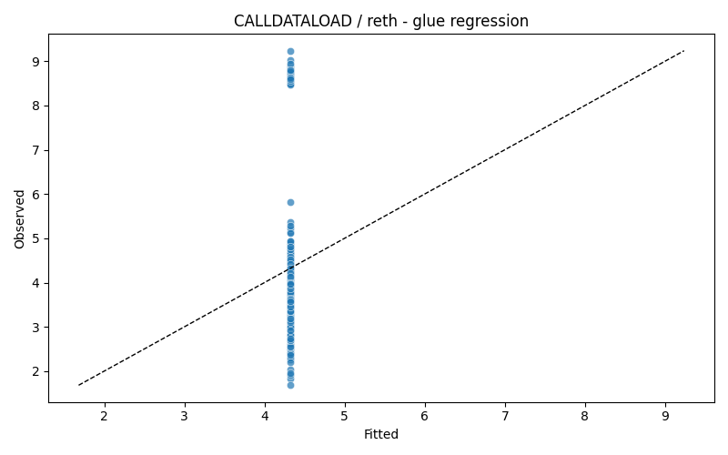

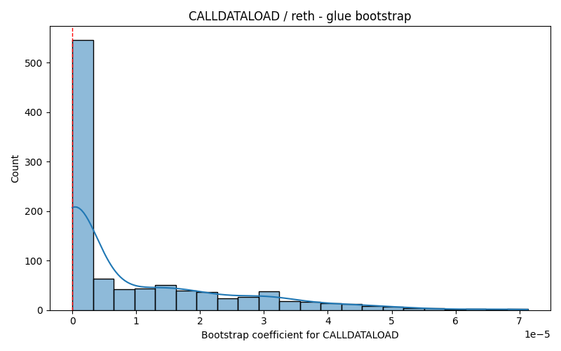

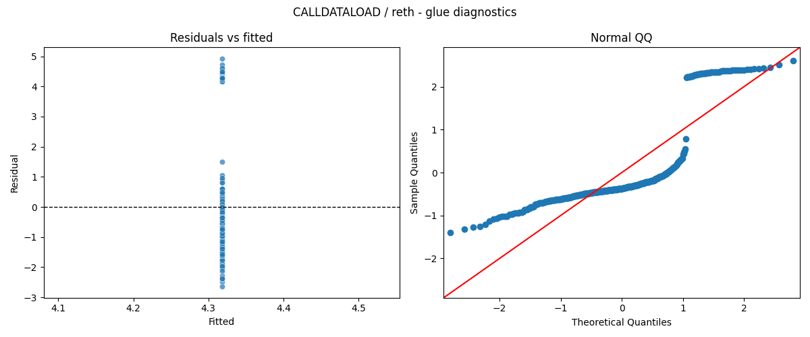

</details>

<details><summary><code>DIV</code> · nobs=99 · runtime_ms=0 · p=1.00e+00 · R²=0</summary>

```
==============================================================================
                           NNLS Regression Results                            
==============================================================================
Dep. Variable:          test_runtime_ms              R-squared:          0.000
Model:                  NNLS                    Adj. R-squared:         -0.010
No. Observations:       99                                RMSE:          58.86
Df Residuals:           97                                 MAE:          53.54
Df Model:               1      
==============================================================================
                      coef     std err     P-value      [0.025      0.975]
------------------------------------------------------------------------------
         const    233.5668      6.0008       0.001    220.9339    244.8783
           DIV      0.0000      0.0000       1.000      0.0000      0.0000
==============================================================================
Notes: Non-negative least squares with bootstrap inference (1000 iterations)
==============================================================================
```

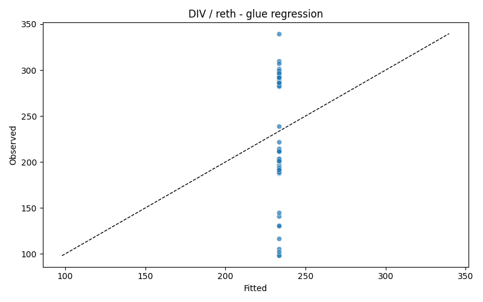


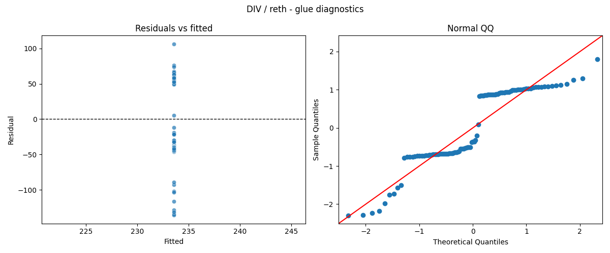

</details>

<details><summary><code>EXP</code> · nobs=99 · runtime_ms=0.0003096 · p=1.00e-03 · R²=0.8142</summary>

```
==============================================================================
                           NNLS Regression Results                            
==============================================================================
Dep. Variable:          test_runtime_ms              R-squared:          0.814
Model:                  NNLS                    Adj. R-squared:          0.812
No. Observations:       99                                RMSE:           5.79
Df Residuals:           97                                 MAE:           4.39
Df Model:               1      
==============================================================================
                      coef     std err     P-value      [0.025      0.975]
------------------------------------------------------------------------------
         const     13.4794      1.8386       0.001      9.8951     17.0276
           EXP      0.0003      0.0000       0.001      0.0003      0.0003
==============================================================================
Notes: Non-negative least squares with bootstrap inference (1000 iterations)
==============================================================================
```

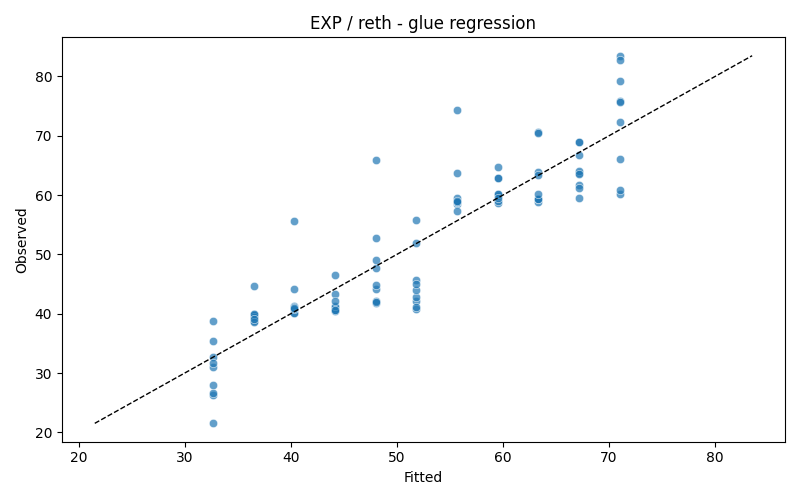

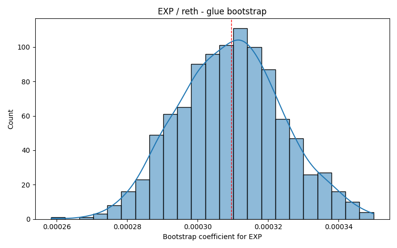

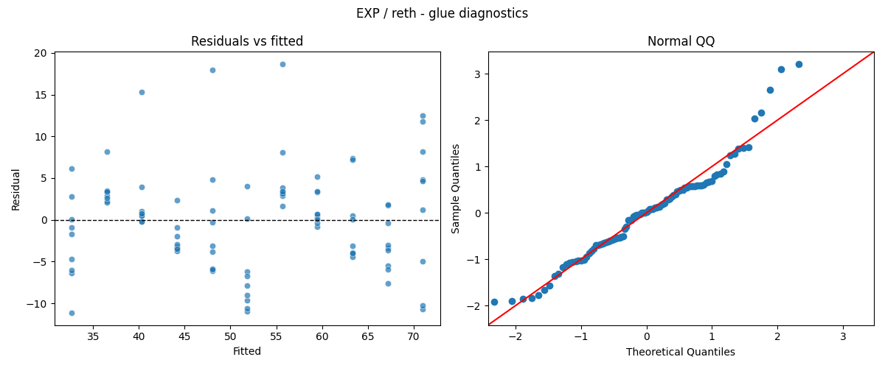

</details>

<details><summary><code>GT</code> · nobs=72 · runtime_ms=0 · p=1.00e+00 · R²=0</summary>

```
==============================================================================
                           NNLS Regression Results                            
==============================================================================
Dep. Variable:          test_runtime_ms              R-squared:          0.000
Model:                  NNLS                    Adj. R-squared:         -0.014
No. Observations:       72                                RMSE:          10.83
Df Residuals:           70                                 MAE:           9.34
Df Model:               1      
==============================================================================
                      coef     std err     P-value      [0.025      0.975]
------------------------------------------------------------------------------
         const     43.0988      1.3160       0.001     40.5112     45.9008
            GT      0.0000      0.0000       1.000      0.0000      0.0000
==============================================================================
Notes: Non-negative least squares with bootstrap inference (1000 iterations)
==============================================================================
```

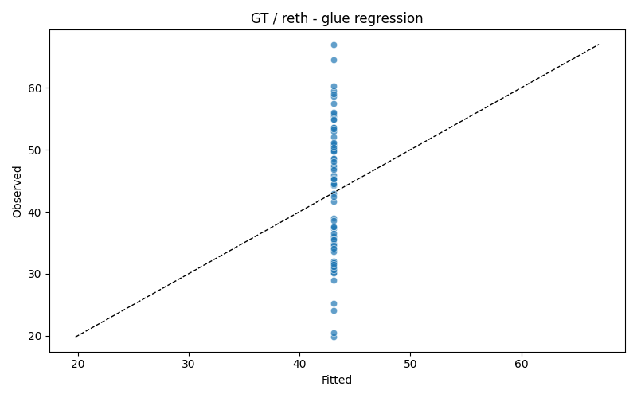

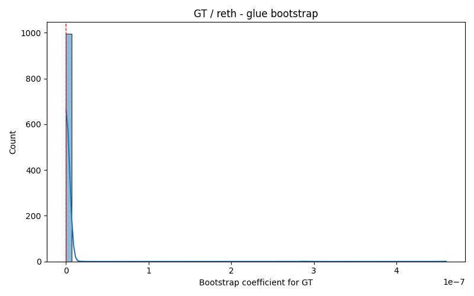

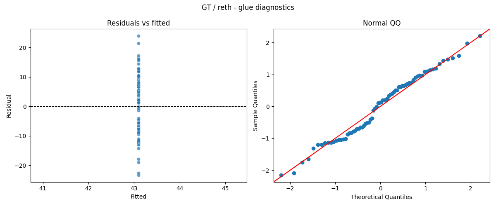

</details>

<details><summary><code>JUMPI</code> · nobs=99 · runtime_ms=0 · p=1.00e+00 · R²=0</summary>

```
==============================================================================
                           NNLS Regression Results                            
==============================================================================
Dep. Variable:          test_runtime_ms              R-squared:          0.000
Model:                  NNLS                    Adj. R-squared:         -0.010
No. Observations:       99                                RMSE:           9.89
Df Residuals:           97                                 MAE:           7.69
Df Model:               1      
==============================================================================
                      coef     std err     P-value      [0.025      0.975]
------------------------------------------------------------------------------
         const     31.3498      0.9589       0.001     29.4869     33.1723
         JUMPI      0.0000      0.0000       1.000      0.0000      0.0000
==============================================================================
Notes: Non-negative least squares with bootstrap inference (1000 iterations)
==============================================================================
```

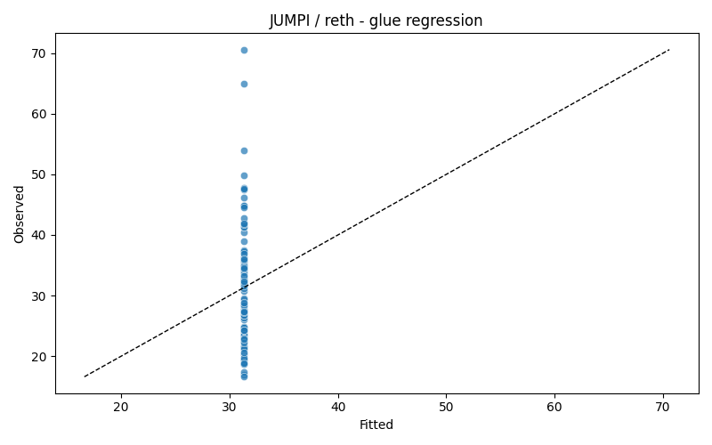

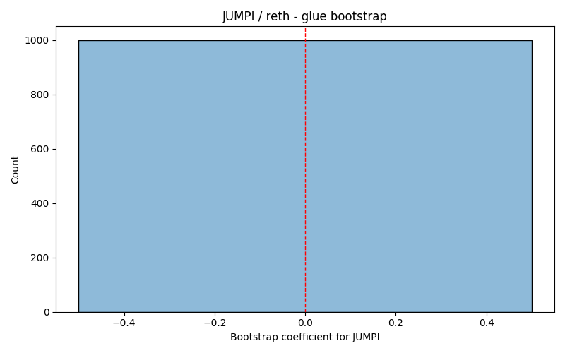

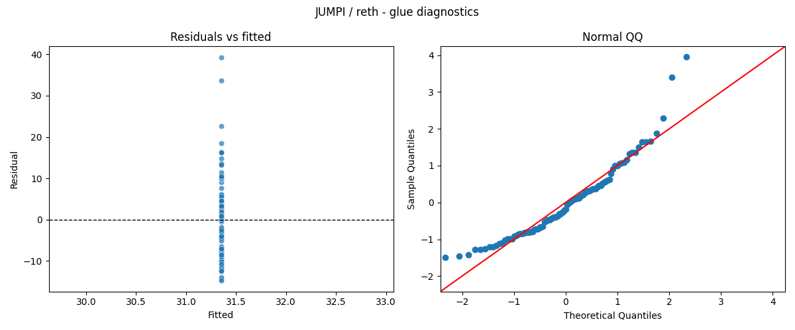

</details>

<details><summary><code>LT</code> · nobs=72 · runtime_ms=0 · p=1.00e+00 · R²=0</summary>

```
==============================================================================
                           NNLS Regression Results                            
==============================================================================
Dep. Variable:          test_runtime_ms              R-squared:          0.000
Model:                  NNLS                    Adj. R-squared:         -0.014
No. Observations:       72                                RMSE:          28.36
Df Residuals:           70                                 MAE:          24.11
Df Model:               1      
==============================================================================
                      coef     std err     P-value      [0.025      0.975]
------------------------------------------------------------------------------
         const     80.4484      3.3738       0.001     74.0528     87.1365
            LT      0.0000      0.0000       1.000      0.0000      0.0000
==============================================================================
Notes: Non-negative least squares with bootstrap inference (1000 iterations)
==============================================================================
```

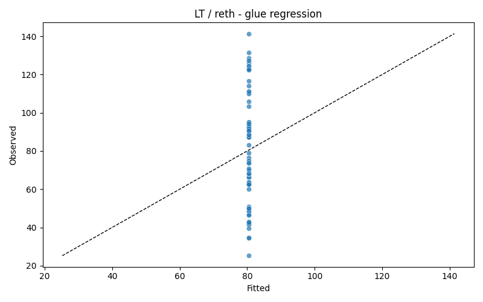

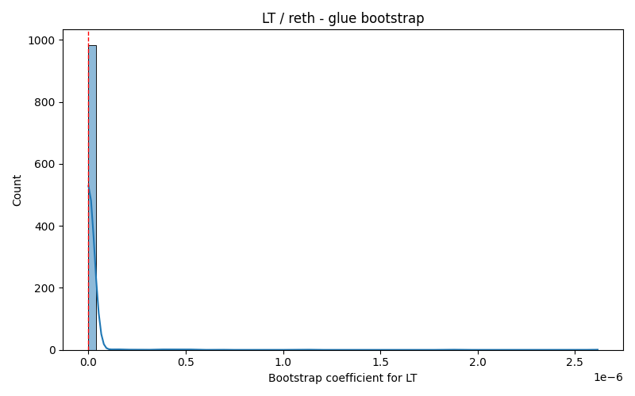

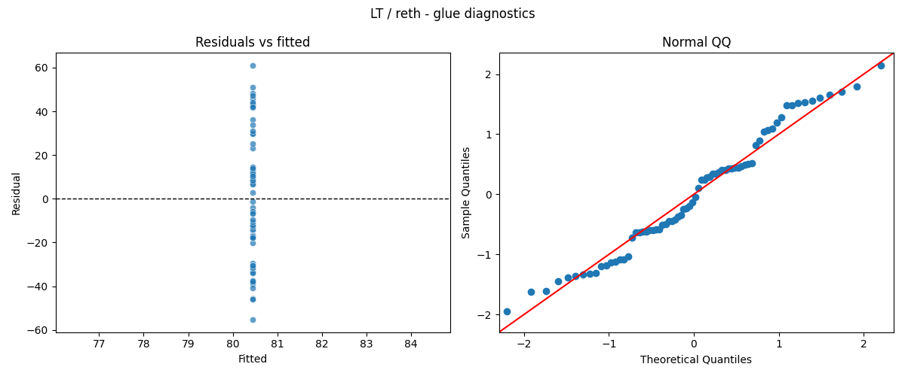

</details>

<details><summary><code>MSTORE</code> · nobs=405 · runtime_ms=0 · p=1.00e+00 · R²=0</summary>

```
==============================================================================
                           NNLS Regression Results                            
==============================================================================
Dep. Variable:          test_runtime_ms              R-squared:          0.000
Model:                  NNLS                    Adj. R-squared:         -0.002
No. Observations:       405                               RMSE:          36.20
Df Residuals:           403                                MAE:          31.92
Df Model:               1      
==============================================================================
                      coef     std err     P-value      [0.025      0.975]
------------------------------------------------------------------------------
         const     80.5691      1.8338       0.001     77.1018     84.2485
        MSTORE      0.0000      0.0000       1.000      0.0000      0.0000
==============================================================================
Notes: Non-negative least squares with bootstrap inference (1000 iterations)
==============================================================================
```

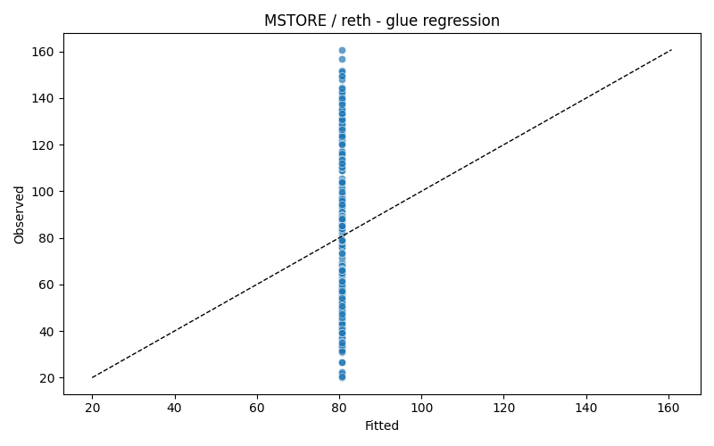


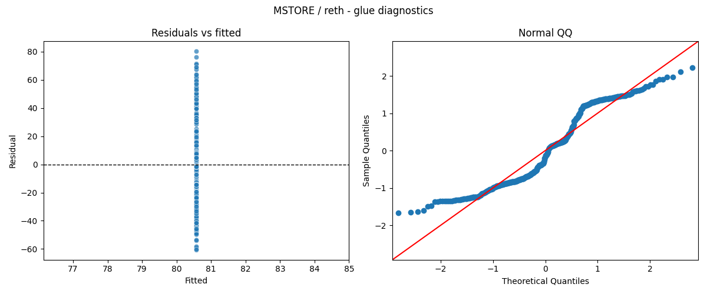

</details>

<details><summary><code>MSTORE8</code> · nobs=405 · runtime_ms=0 · p=1.00e+00 · R²=1.11e-16</summary>

```
==============================================================================
                           NNLS Regression Results                            
==============================================================================
Dep. Variable:          test_runtime_ms              R-squared:          0.000
Model:                  NNLS                    Adj. R-squared:         -0.002
No. Observations:       405                               RMSE:          11.87
Df Residuals:           403                                MAE:           9.87
Df Model:               1      
==============================================================================
                      coef     std err     P-value      [0.025      0.975]
------------------------------------------------------------------------------
         const     45.0603      0.5772       0.001     43.9594     46.1572
       MSTORE8      0.0000      0.0000       1.000      0.0000      0.0000
==============================================================================
Notes: Non-negative least squares with bootstrap inference (1000 iterations)
==============================================================================
```

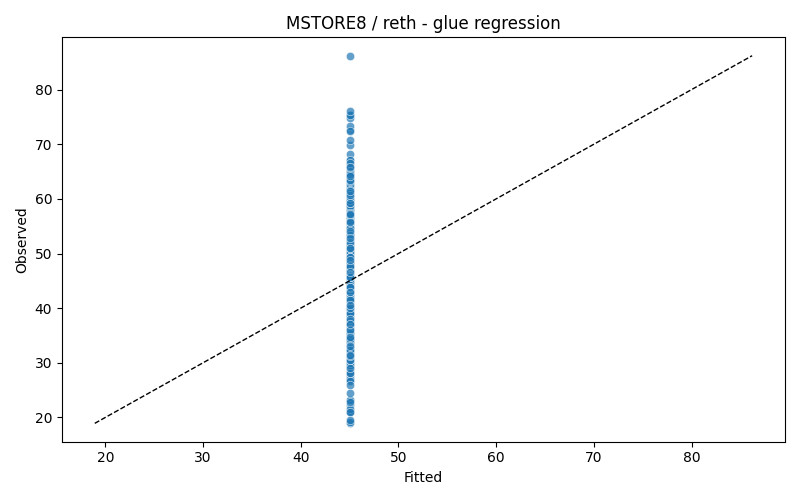


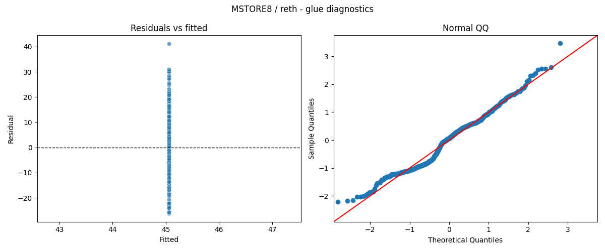

</details>

<details><summary><code>MUL</code> · nobs=90 · runtime_ms=0 · p=1.00e+00 · R²=0</summary>

```
==============================================================================
                           NNLS Regression Results                            
==============================================================================
Dep. Variable:          test_runtime_ms              R-squared:          0.000
Model:                  NNLS                    Adj. R-squared:         -0.011
No. Observations:       90                                RMSE:          13.88
Df Residuals:           88                                 MAE:          10.67
Df Model:               1      
==============================================================================
                      coef     std err     P-value      [0.025      0.975]
------------------------------------------------------------------------------
         const     43.3702      1.5171       0.001     40.3652     46.3322
           MUL      0.0000      0.0000       1.000      0.0000      0.0000
==============================================================================
Notes: Non-negative least squares with bootstrap inference (1000 iterations)
==============================================================================
```

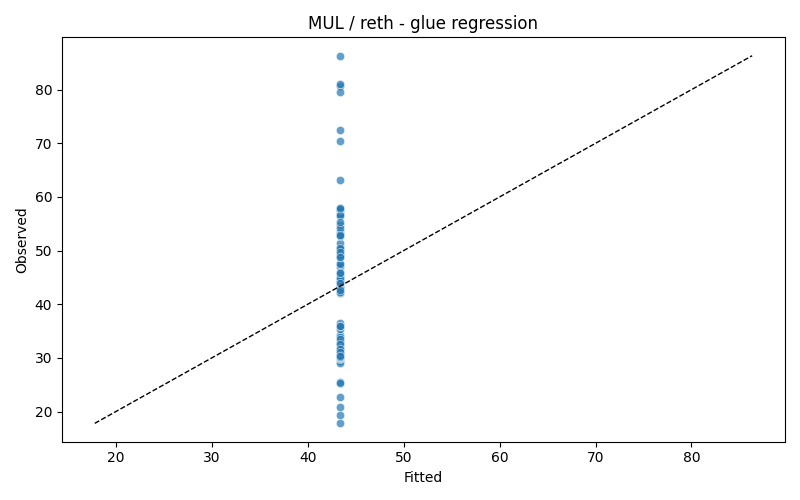


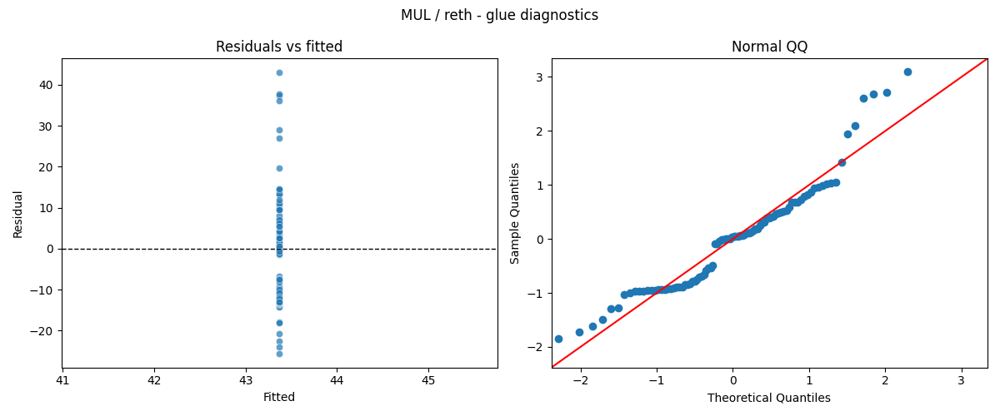

</details>

<details><summary><code>PC</code> · nobs=54 · runtime_ms=6.891e-06 · p=1.00e-03 · R²=0.5541</summary>

```
==============================================================================
                           NNLS Regression Results                            
==============================================================================
Dep. Variable:          test_runtime_ms              R-squared:          0.554
Model:                  NNLS                    Adj. R-squared:          0.545
No. Observations:       54                                RMSE:          13.74
Df Residuals:           52                                 MAE:          11.75
Df Model:               1      
==============================================================================
                      coef     std err     P-value      [0.025      0.975]
------------------------------------------------------------------------------
         const     58.7178      3.6375       0.001     51.7494     66.2700
            PC      0.0000      0.0000       0.001      0.0000      0.0000
==============================================================================
Notes: Non-negative least squares with bootstrap inference (1000 iterations)
==============================================================================
```

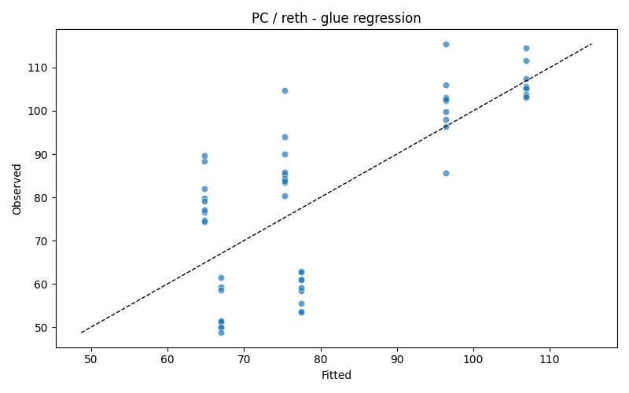

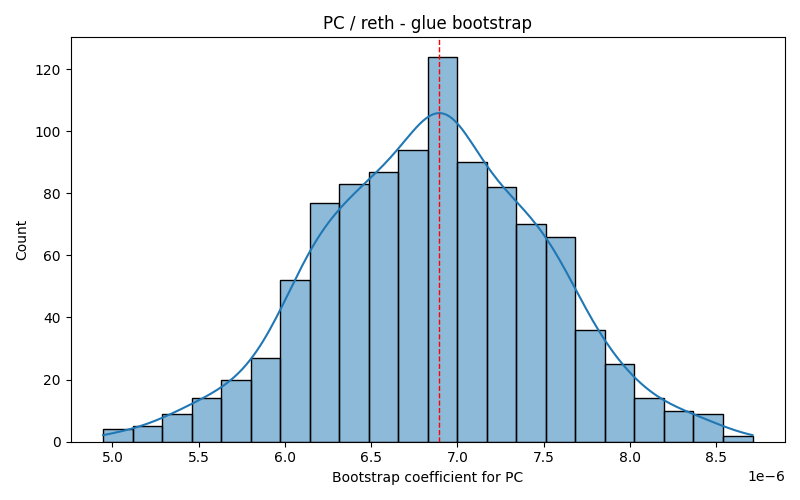

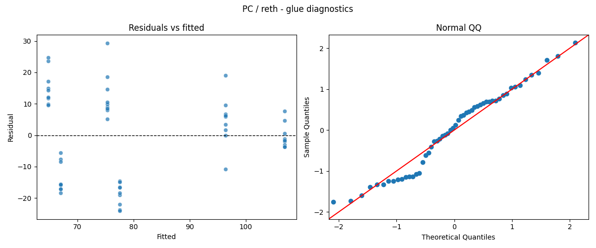

</details>

<details><summary><code>RETURNDATASIZE</code> · nobs=216 · runtime_ms=6.73e-06 · p=1.00e-03 · R²=0.1924</summary>

```
==============================================================================
                           NNLS Regression Results                            
==============================================================================
Dep. Variable:          test_runtime_ms              R-squared:          0.192
Model:                  NNLS                    Adj. R-squared:          0.189
No. Observations:       216                               RMSE:          16.18
Df Residuals:           214                                MAE:          11.96
Df Model:               1      
==============================================================================
                      coef     std err     P-value      [0.025      0.975]
------------------------------------------------------------------------------
         const     56.2843      2.2111       0.001     51.9684     60.6517
RETURNDATASIZE      0.0000      0.0000       0.001      0.0000      0.0000
==============================================================================
Notes: Non-negative least squares with bootstrap inference (1000 iterations)
==============================================================================
```

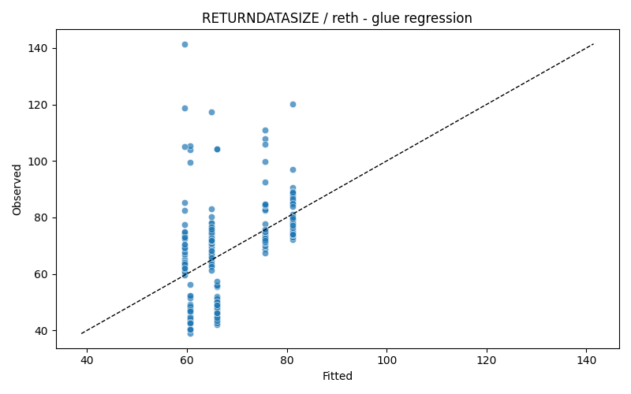

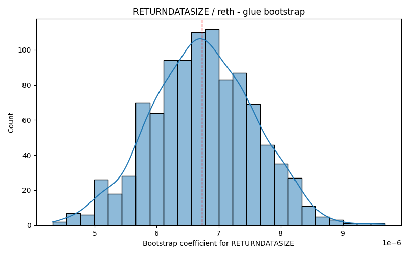

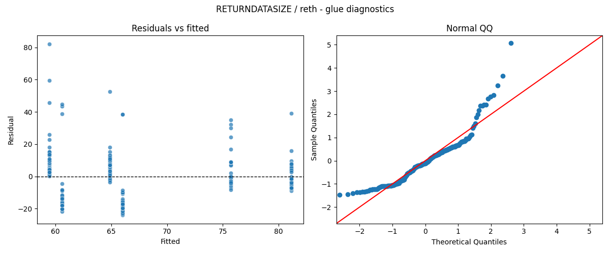

</details>

<details><summary><code>SELFBALANCE</code> · nobs=99 · runtime_ms=0 · p=1.00e+00 · R²=-2.22e-16</summary>

```
==============================================================================
                           NNLS Regression Results                            
==============================================================================
Dep. Variable:          test_runtime_ms              R-squared:         -0.000
Model:                  NNLS                    Adj. R-squared:         -0.010
No. Observations:       99                                RMSE:          55.30
Df Residuals:           97                                 MAE:          48.28
Df Model:               1      
==============================================================================
                      coef     std err     P-value      [0.025      0.975]
------------------------------------------------------------------------------
         const    209.8317      6.4145       0.001    195.8508    221.0000
   SELFBALANCE      0.0000      0.0000       1.000      0.0000      0.0000
==============================================================================
Notes: Non-negative least squares with bootstrap inference (1000 iterations)
==============================================================================
```

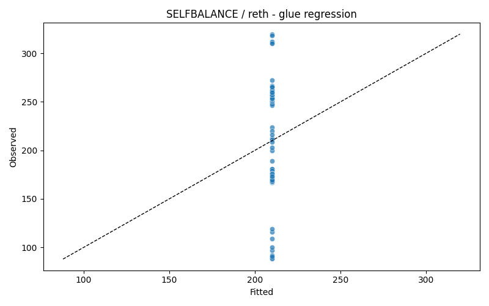

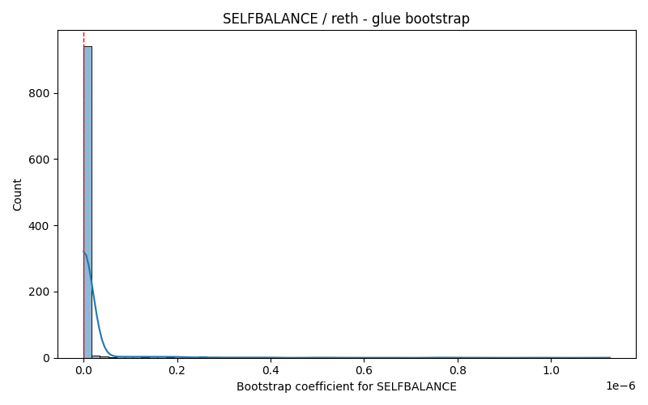

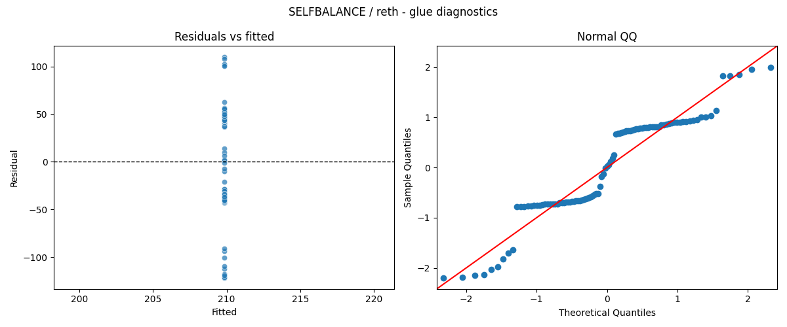

</details>

<details><summary><code>SUB</code> · nobs=72 · runtime_ms=0 · p=1.00e+00 · R²=0</summary>

```
==============================================================================
                           NNLS Regression Results                            
==============================================================================
Dep. Variable:          test_runtime_ms              R-squared:          0.000
Model:                  NNLS                    Adj. R-squared:         -0.014
No. Observations:       72                                RMSE:          10.27
Df Residuals:           70                                 MAE:           8.68
Df Model:               1      
==============================================================================
                      coef     std err     P-value      [0.025      0.975]
------------------------------------------------------------------------------
         const     38.1006      1.1777       0.001     35.6640     40.2363
           SUB      0.0000      0.0000       1.000      0.0000      0.0000
==============================================================================
Notes: Non-negative least squares with bootstrap inference (1000 iterations)
==============================================================================
```

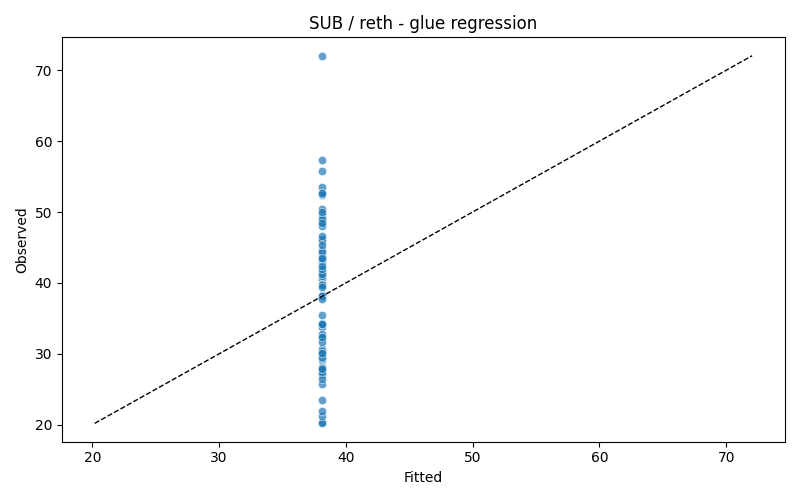

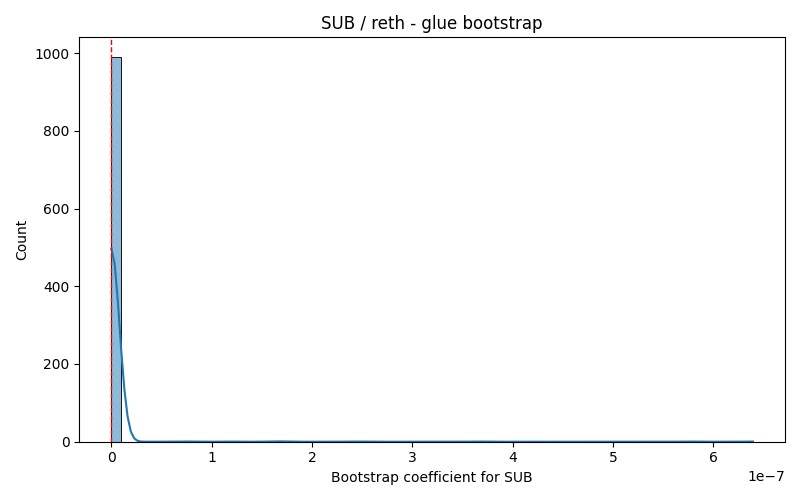

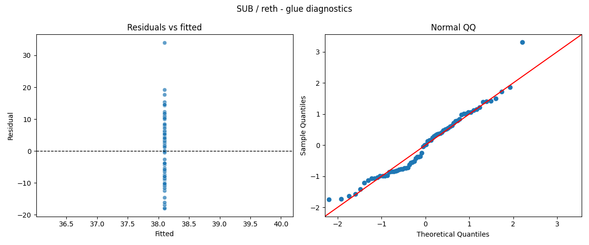

</details>

### Mixed glue (tier B) · reth

<details><summary><code>JUMP</code> · nobs=90 · runtime_ms=0 · p=1.00e+00 · R²=2.22e-16</summary>

```
==============================================================================
                           NNLS Regression Results                            
==============================================================================
Dep. Variable:          test_runtime_ms              R-squared:          0.000
Model:                  NNLS                    Adj. R-squared:         -0.011
No. Observations:       90                                RMSE:          10.19
Df Residuals:           88                                 MAE:           8.46
Df Model:               1      
==============================================================================
                      coef     std err     P-value      [0.025      0.975]
------------------------------------------------------------------------------
         const     38.8247      1.0633       0.001     36.7917     40.9080
          JUMP      0.0000      0.0000       1.000      0.0000      0.0000
==============================================================================
Notes: Non-negative least squares with bootstrap inference (1000 iterations)
==============================================================================
```

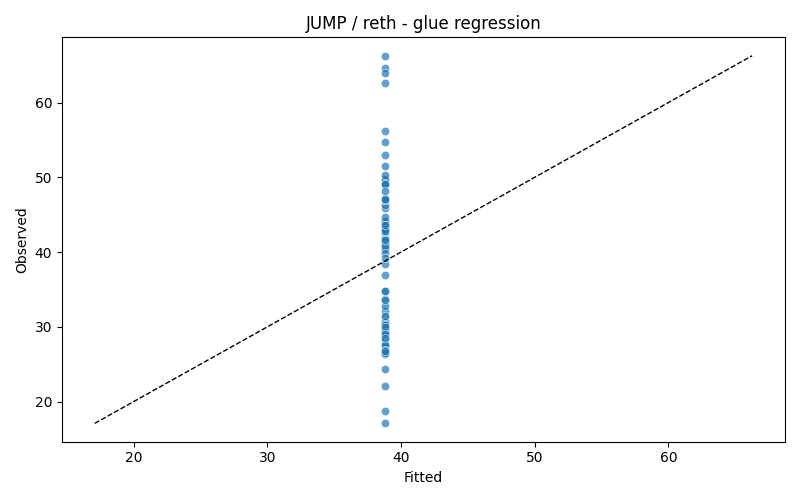


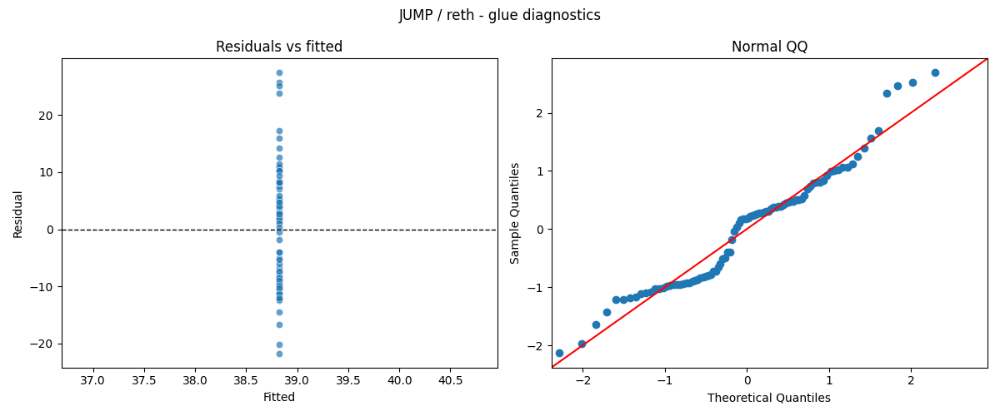

</details>

<details><summary><code>KECCAK256</code> · nobs=1584 · runtime_ms=0 · p=1.00e+00 · R²=-2.22e-16</summary>

```
==============================================================================
                           NNLS Regression Results                            
==============================================================================
Dep. Variable:          test_runtime_ms              R-squared:         -0.000
Model:                  NNLS                    Adj. R-squared:         -0.001
No. Observations:       1584                              RMSE:         159.10
Df Residuals:           1582                               MAE:         134.39
Df Model:               1      
==============================================================================
                      coef     std err     P-value      [0.025      0.975]
------------------------------------------------------------------------------
         const    253.1329      4.0000       0.001    245.3366    260.9429
     KECCAK256      0.0000      0.0000       1.000      0.0000      0.0000
==============================================================================
Notes: Non-negative least squares with bootstrap inference (1000 iterations)
==============================================================================
```

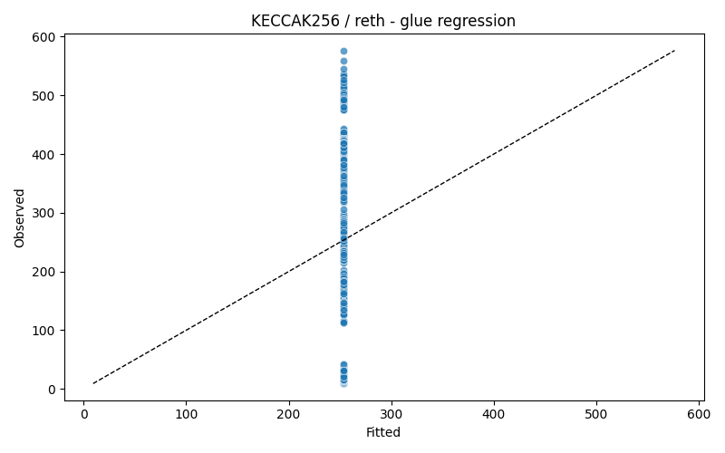


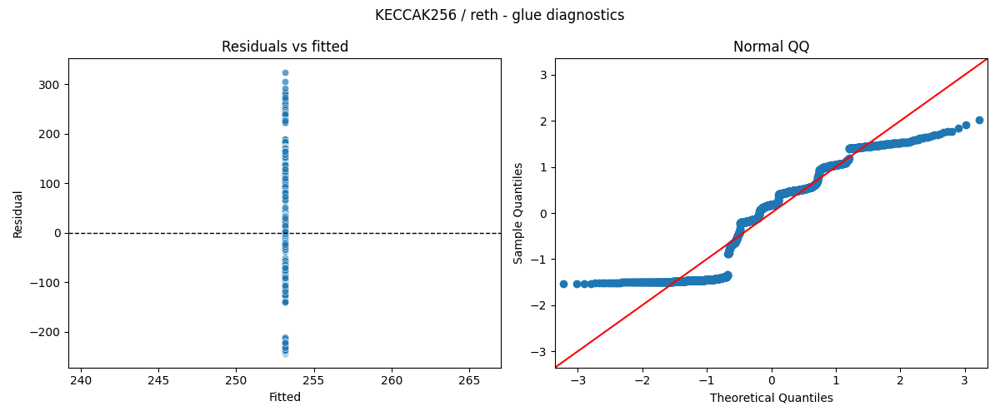

</details>
