# Runtime estimation report

Per-spec NNLS fits of `test_runtime_ms` against `opcount`, one row per (target opcode, test, model_by combo, client).

## Contents

- [SLOAD](#sload)
- [SSTORE](#sstore)
- [BALANCE](#balance)
- [CALL](#call)
- [CALLCODE](#callcode)
- [DELEGATECALL](#delegatecall)
- [EXTCODEHASH](#extcodehash)
- [EXTCODESIZE](#extcodesize)
- [STATICCALL](#staticcall)
- [EXTCODECOPY](#extcodecopy)

## SLOAD

### test_sload_bloated — combo `False`

| client | nobs | R² | target_coef (ms) | p-value | 95% CI |
| --- | --- | --- | --- | --- | --- |
| `besu` | 110 | 0.9842 | 0.006473 | 1.00e-03 | [0.006309, 0.006643] |
| `erigon` | 88 | 0.9622 | 0.005517 | 1.00e-03 | [0.005325, 0.00577] |
| `geth` | 77 | 0.9453 | 0.02048 | 1.00e-03 | [0.01934, 0.02155] |
| `nethermind` | 154 | 0.9088 | 0.002736 | 1.00e-03 | [0.002602, 0.00286] |
| `reth` | 209 | 0.9785 | 0.004593 | 1.00e-03 | [0.004514, 0.004672] |

<details><summary>besu — NNLS regression summary</summary>

```
==============================================================================
                           NNLS Regression Results                            
==============================================================================
Dep. Variable:          test_runtime_ms              R-squared:          0.984
Model:                  NNLS                    Adj. R-squared:          0.984
No. Observations:       110                               RMSE:          17.01
Df Residuals:           108                                MAE:          13.11
Df Model:               1      
==============================================================================
                      coef     std err     P-value      [0.025      0.975]
------------------------------------------------------------------------------
         const    147.5564      5.8559       0.001    136.9358    159.3727
       opcount      0.0065      0.0001       0.001      0.0063      0.0066
==============================================================================
Notes: Non-negative least squares with bootstrap inference (1000 iterations)
==============================================================================
```

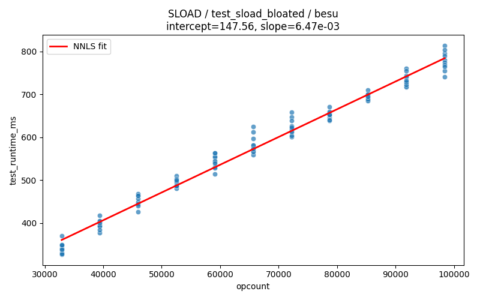

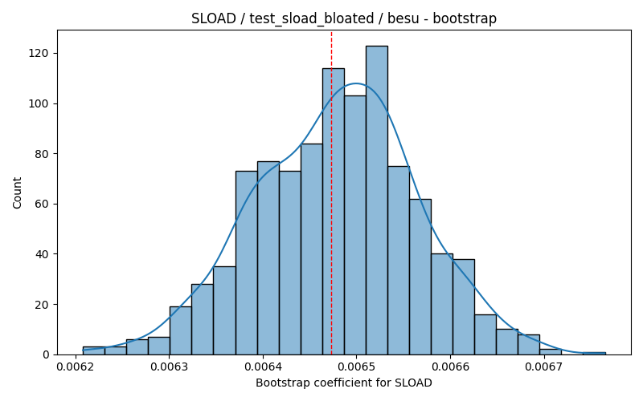

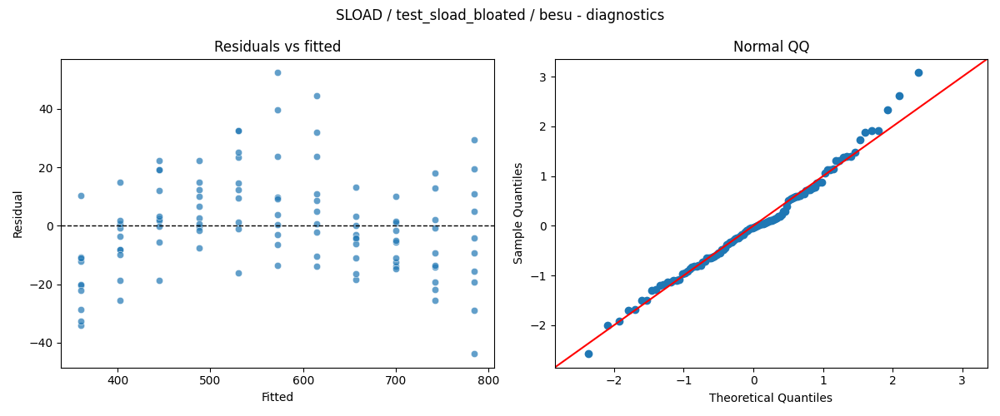

</details>

<details><summary>erigon — NNLS regression summary</summary>

```
==============================================================================
                           NNLS Regression Results                            
==============================================================================
Dep. Variable:          test_runtime_ms              R-squared:          0.962
Model:                  NNLS                    Adj. R-squared:          0.962
No. Observations:       88                                RMSE:          22.65
Df Residuals:           86                                 MAE:          14.73
Df Model:               1      
==============================================================================
                      coef     std err     P-value      [0.025      0.975]
------------------------------------------------------------------------------
         const     25.2342      6.9788       0.001      9.8414     37.5770
       opcount      0.0055      0.0001       0.001      0.0053      0.0058
==============================================================================
Notes: Non-negative least squares with bootstrap inference (1000 iterations)
==============================================================================
```

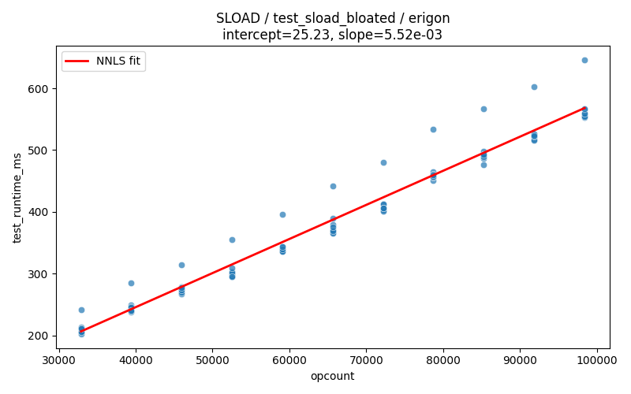

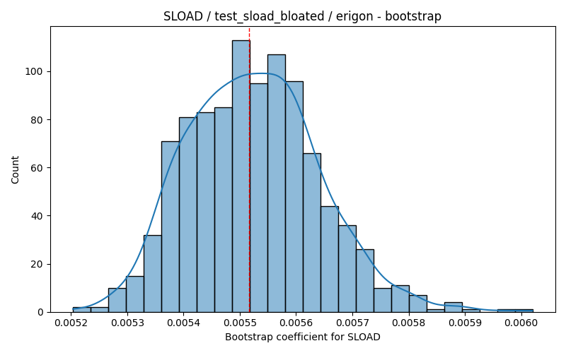

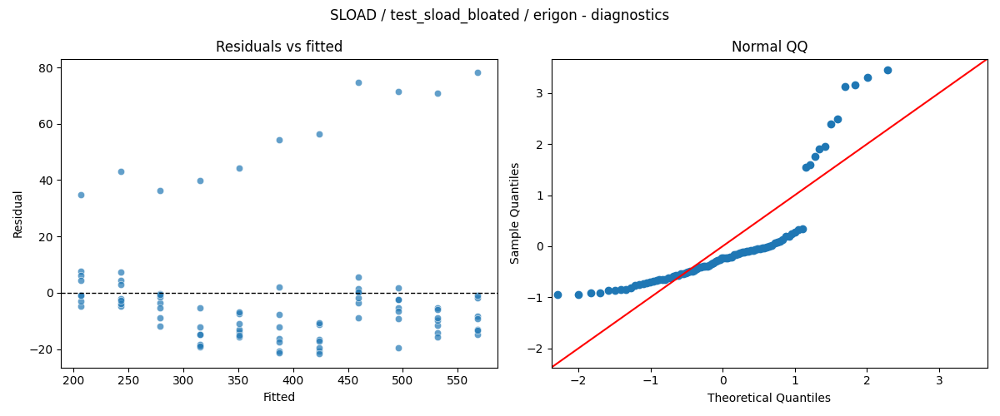

</details>

<details><summary>geth — NNLS regression summary</summary>

```
==============================================================================
                           NNLS Regression Results                            
==============================================================================
Dep. Variable:          test_runtime_ms              R-squared:          0.945
Model:                  NNLS                    Adj. R-squared:          0.945
No. Observations:       77                                RMSE:         102.01
Df Residuals:           75                                 MAE:          75.46
Df Model:               1      
==============================================================================
                      coef     std err     P-value      [0.025      0.975]
------------------------------------------------------------------------------
         const    430.8943     35.0835       0.001    363.8388    503.5380
       opcount      0.0205      0.0006       0.001      0.0193      0.0216
==============================================================================
Notes: Non-negative least squares with bootstrap inference (1000 iterations)
==============================================================================
```

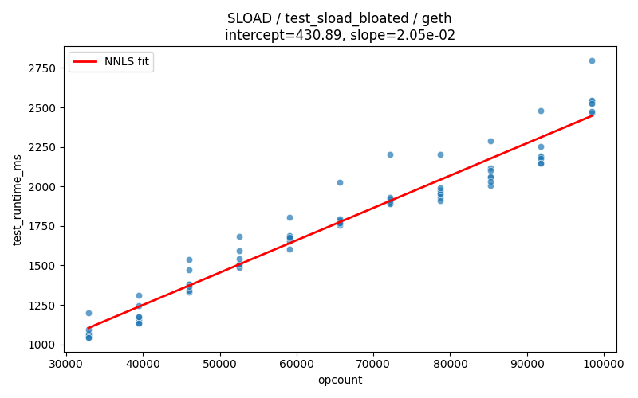

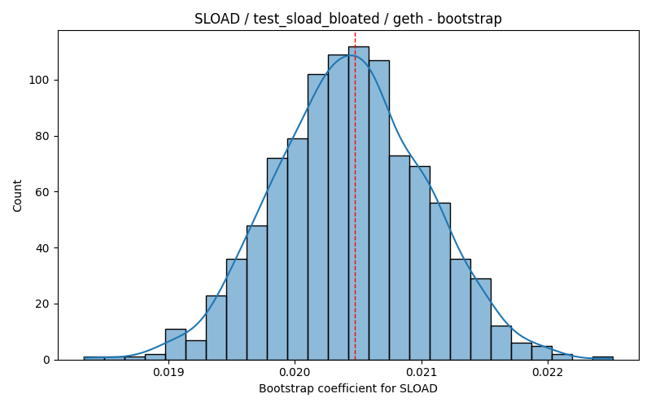

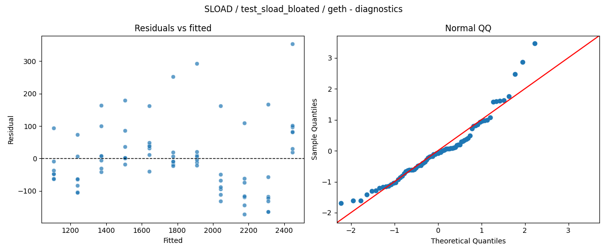

</details>

<details><summary>nethermind — NNLS regression summary</summary>

```
==============================================================================
                           NNLS Regression Results                            
==============================================================================
Dep. Variable:          test_runtime_ms              R-squared:          0.909
Model:                  NNLS                    Adj. R-squared:          0.908
No. Observations:       154                               RMSE:          17.96
Df Residuals:           152                                MAE:          13.61
Df Model:               1      
==============================================================================
                      coef     std err     P-value      [0.025      0.975]
------------------------------------------------------------------------------
         const     73.3394      3.9937       0.001     65.9225     81.3523
       opcount      0.0027      0.0001       0.001      0.0026      0.0029
==============================================================================
Notes: Non-negative least squares with bootstrap inference (1000 iterations)
==============================================================================
```

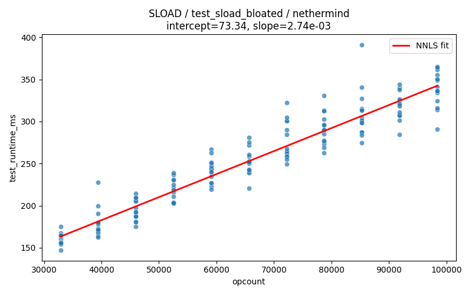

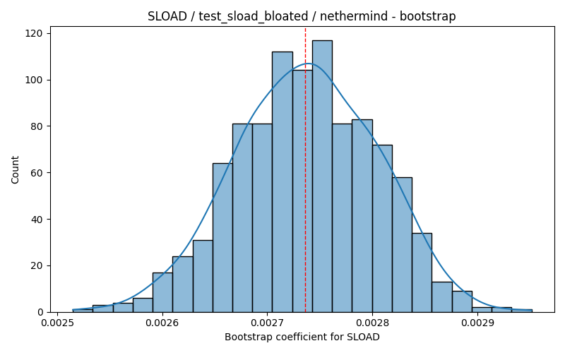

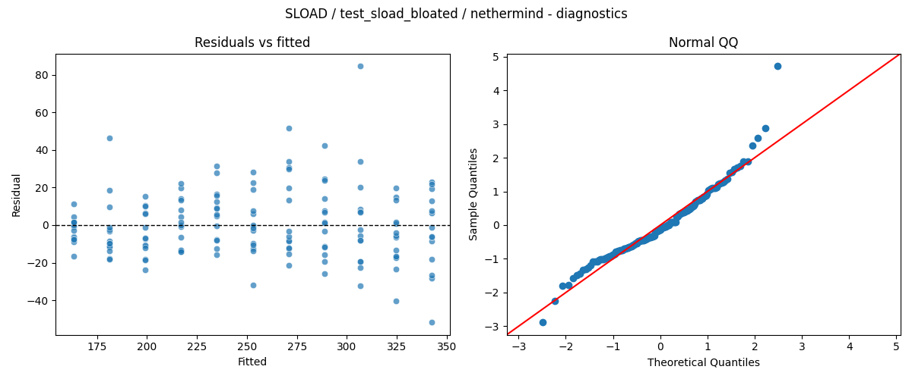

</details>

<details><summary>reth — NNLS regression summary</summary>

```
==============================================================================
                           NNLS Regression Results                            
==============================================================================
Dep. Variable:          test_runtime_ms              R-squared:          0.978
Model:                  NNLS                    Adj. R-squared:          0.978
No. Observations:       209                               RMSE:          14.12
Df Residuals:           207                                MAE:          11.12
Df Model:               1      
==============================================================================
                      coef     std err     P-value      [0.025      0.975]
------------------------------------------------------------------------------
         const     90.9271      2.6372       0.001     85.9209     96.1430
       opcount      0.0046      0.0000       0.001      0.0045      0.0047
==============================================================================
Notes: Non-negative least squares with bootstrap inference (1000 iterations)
==============================================================================
```

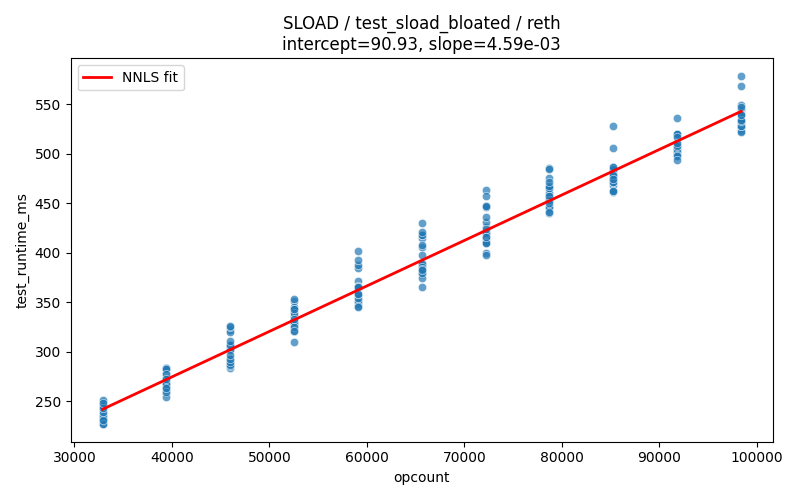

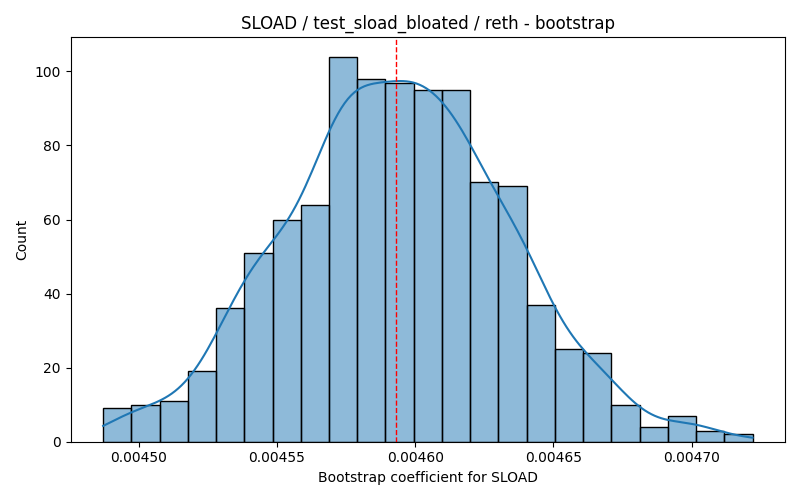

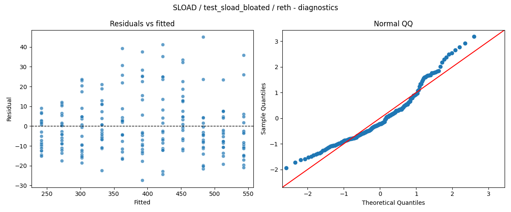

</details>

### test_sload_bloated — combo `True`

| client | nobs | R² | target_coef (ms) | p-value | 95% CI |
| --- | --- | --- | --- | --- | --- |
| `besu` | 110 | 0.9868 | 0.01466 | 1.00e-03 | [0.01429, 0.01498] |
| `erigon` | 88 | 0.952 | 0.005234 | 1.00e-03 | [0.004987, 0.005501] |
| `geth` | 77 | 0.9357 | 0.01983 | 1.00e-03 | [0.01852, 0.0211] |
| `nethermind` | 154 | 0.9842 | 0.008002 | 1.00e-03 | [0.007832, 0.008197] |
| `reth` | 209 | 0.9791 | 0.004842 | 1.00e-03 | [0.004764, 0.00493] |

<details><summary>besu — NNLS regression summary</summary>

```
==============================================================================
                           NNLS Regression Results                            
==============================================================================
Dep. Variable:          test_runtime_ms              R-squared:          0.987
Model:                  NNLS                    Adj. R-squared:          0.987
No. Observations:       110                               RMSE:          35.08
Df Residuals:           108                                MAE:          28.71
Df Model:               1      
==============================================================================
                      coef     std err     P-value      [0.025      0.975]
------------------------------------------------------------------------------
         const    281.3148     11.9400       0.001    260.8430    307.3556
       opcount      0.0147      0.0002       0.001      0.0143      0.0150
==============================================================================
Notes: Non-negative least squares with bootstrap inference (1000 iterations)
==============================================================================
```

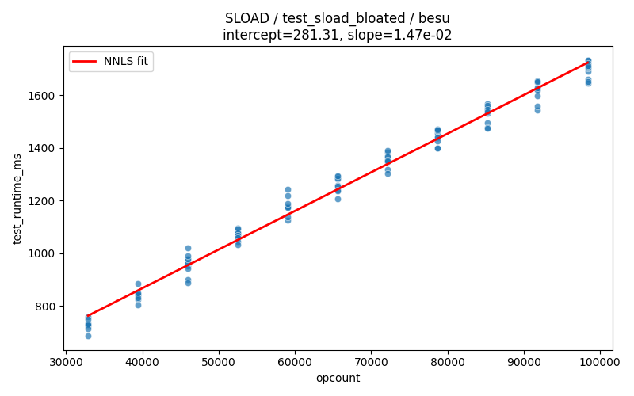

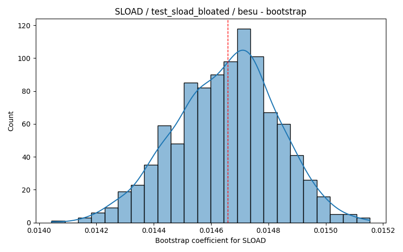

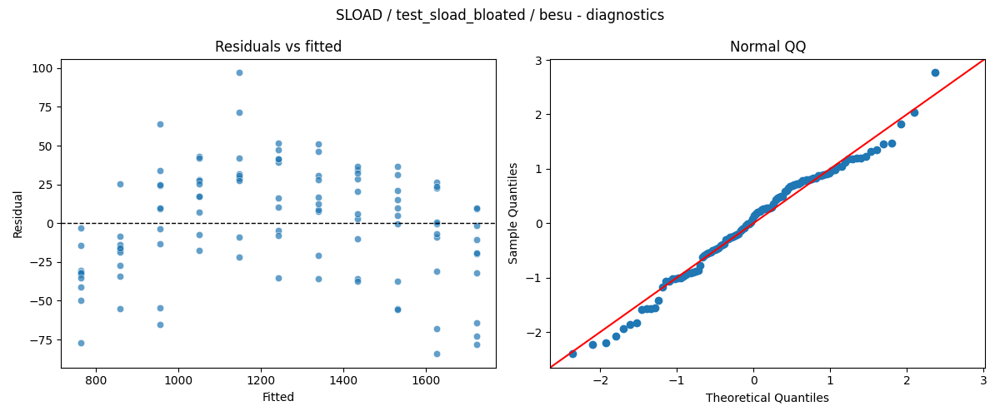

</details>

<details><summary>erigon — NNLS regression summary</summary>

```
==============================================================================
                           NNLS Regression Results                            
==============================================================================
Dep. Variable:          test_runtime_ms              R-squared:          0.952
Model:                  NNLS                    Adj. R-squared:          0.951
No. Observations:       88                                RMSE:          24.36
Df Residuals:           86                                 MAE:          15.46
Df Model:               1      
==============================================================================
                      coef     std err     P-value      [0.025      0.975]
------------------------------------------------------------------------------
         const     19.6797      7.7476       0.008      4.5892     34.8795
       opcount      0.0052      0.0001       0.001      0.0050      0.0055
==============================================================================
Notes: Non-negative least squares with bootstrap inference (1000 iterations)
==============================================================================
```

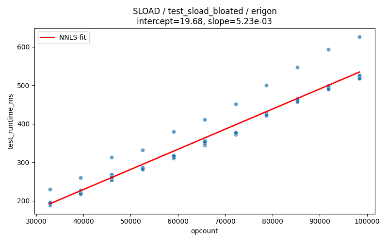

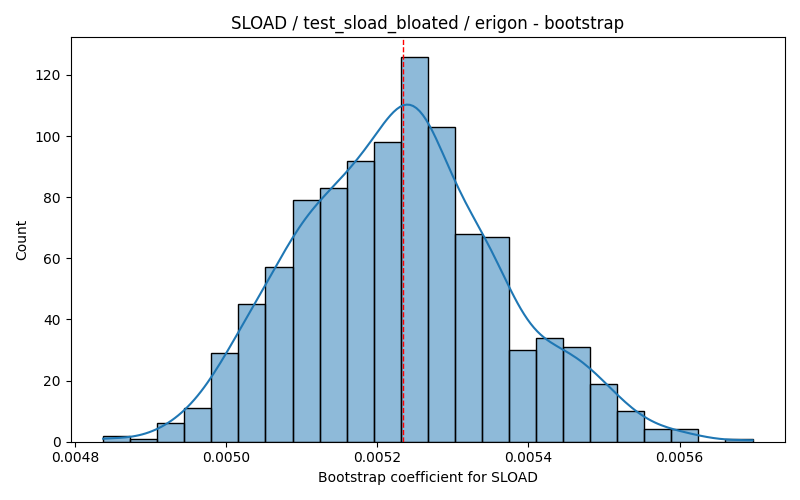

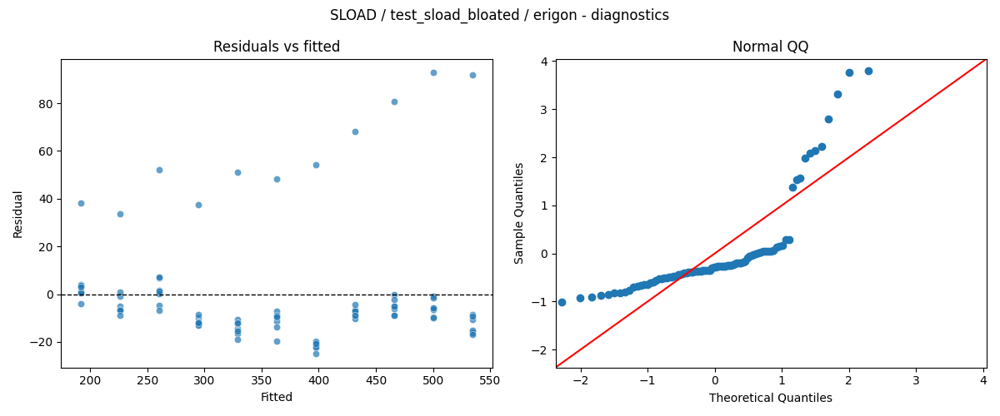

</details>

<details><summary>geth — NNLS regression summary</summary>

```
==============================================================================
                           NNLS Regression Results                            
==============================================================================
Dep. Variable:          test_runtime_ms              R-squared:          0.936
Model:                  NNLS                    Adj. R-squared:          0.935
No. Observations:       77                                RMSE:         107.62
Df Residuals:           75                                 MAE:          79.99
Df Model:               1      
==============================================================================
                      coef     std err     P-value      [0.025      0.975]
------------------------------------------------------------------------------
         const    425.3989     38.2335       0.001    353.6140    499.7051
       opcount      0.0198      0.0007       0.001      0.0185      0.0211
==============================================================================
Notes: Non-negative least squares with bootstrap inference (1000 iterations)
==============================================================================
```

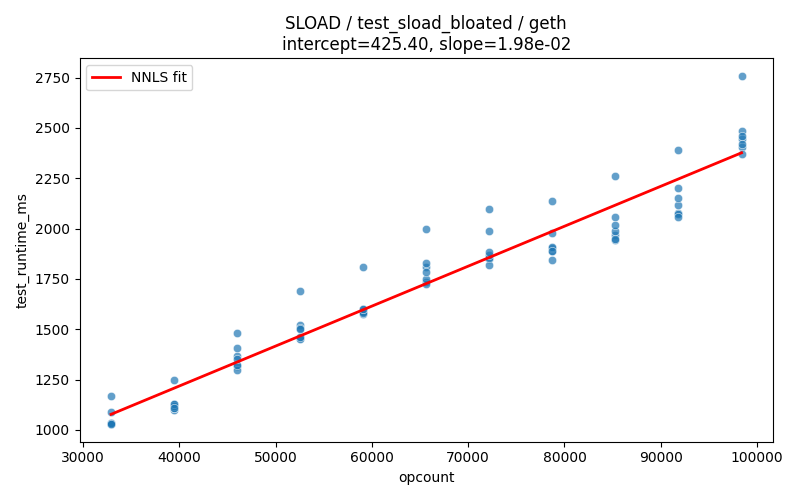

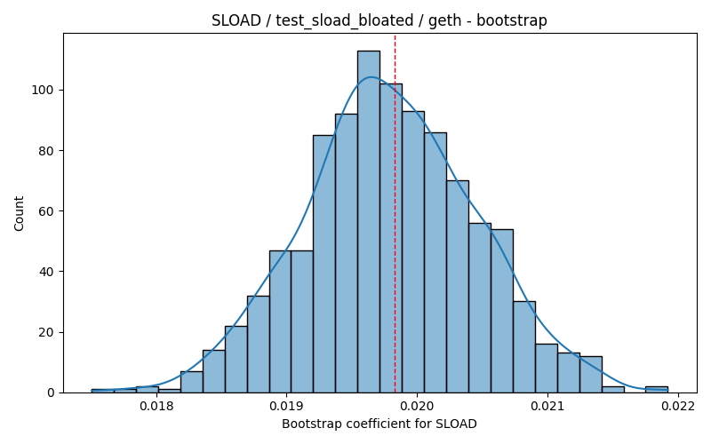

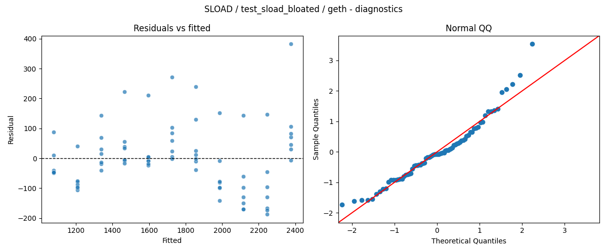

</details>

<details><summary>nethermind — NNLS regression summary</summary>

```
==============================================================================
                           NNLS Regression Results                            
==============================================================================
Dep. Variable:          test_runtime_ms              R-squared:          0.984
Model:                  NNLS                    Adj. R-squared:          0.984
No. Observations:       154                               RMSE:          20.99
Df Residuals:           152                                MAE:          14.10
Df Model:               1      
==============================================================================
                      coef     std err     P-value      [0.025      0.975]
------------------------------------------------------------------------------
         const     54.5835      5.3778       0.001     43.3925     64.2475
       opcount      0.0080      0.0001       0.001      0.0078      0.0082
==============================================================================
Notes: Non-negative least squares with bootstrap inference (1000 iterations)
==============================================================================
```

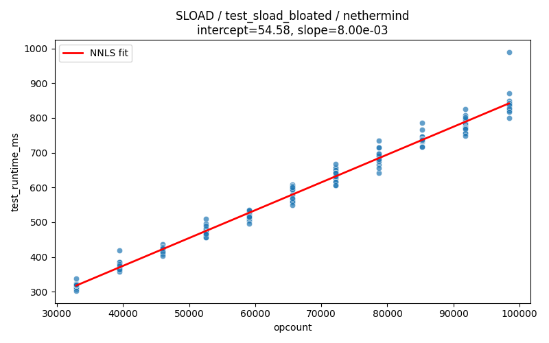

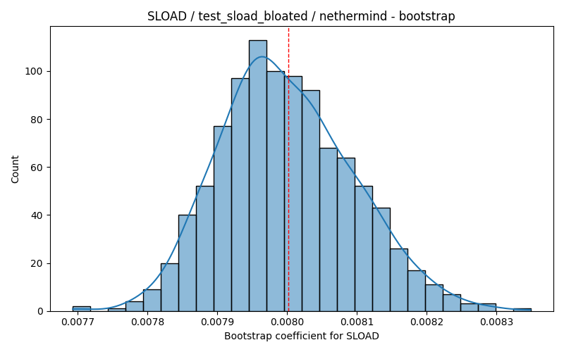

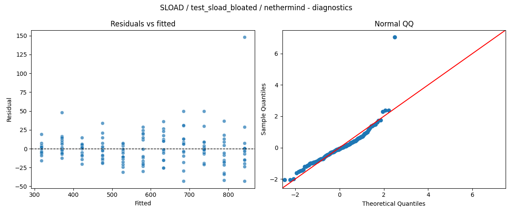

</details>

<details><summary>reth — NNLS regression summary</summary>

```
==============================================================================
                           NNLS Regression Results                            
==============================================================================
Dep. Variable:          test_runtime_ms              R-squared:          0.979
Model:                  NNLS                    Adj. R-squared:          0.979
No. Observations:       209                               RMSE:          14.66
Df Residuals:           207                                MAE:          11.51
Df Model:               1      
==============================================================================
                      coef     std err     P-value      [0.025      0.975]
------------------------------------------------------------------------------
         const     89.8030      2.8219       0.001     84.1470     95.0953
       opcount      0.0048      0.0000       0.001      0.0048      0.0049
==============================================================================
Notes: Non-negative least squares with bootstrap inference (1000 iterations)
==============================================================================
```

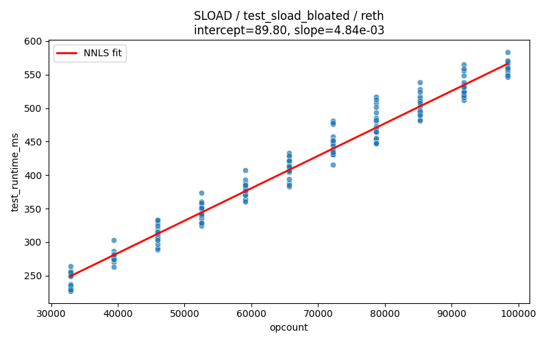

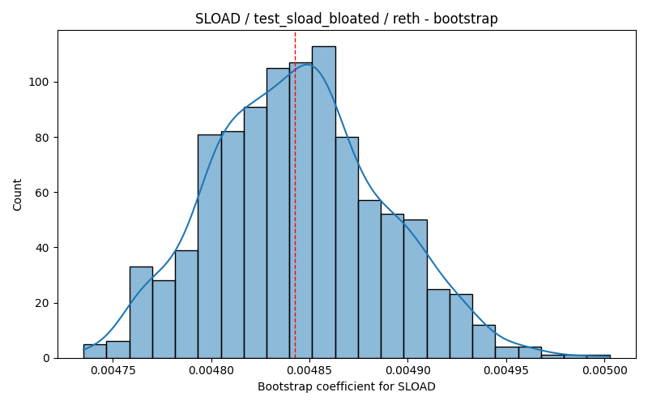

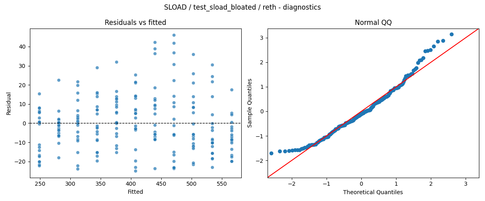

</details>

### test_sload_same_key_benchmark

| client | nobs | R² | target_coef (ms) | p-value | 95% CI |
| --- | --- | --- | --- | --- | --- |
| `besu` | 220 | 0.8489 | 7.863e-05 | 1.00e-03 | [7.433e-05, 8.283e-05] |
| `erigon` | 176 | 0.6695 | 1.135e-05 | 1.00e-03 | [1.016e-05, 1.262e-05] |
| `geth` | 154 | 0.8351 | 3.915e-05 | 1.00e-03 | [3.625e-05, 4.193e-05] |
| `nethermind` | 308 | 0.6034 | 0.0001199 | 1.00e-03 | [0.0001092, 0.0001309] |
| `reth` | 418 | 0.4322 | 7.588e-06 | 1.00e-03 | [6.837e-06, 8.356e-06] |

<details><summary>besu — NNLS regression summary</summary>

```
==============================================================================
                           NNLS Regression Results                            
==============================================================================
Dep. Variable:          test_runtime_ms              R-squared:          0.849
Model:                  NNLS                    Adj. R-squared:          0.848
No. Observations:       220                               RMSE:          20.96
Df Residuals:           218                                MAE:          16.70
Df Model:               1      
==============================================================================
                      coef     std err     P-value      [0.025      0.975]
------------------------------------------------------------------------------
         const     94.4074      4.3371       0.001     86.0090    102.9196
       opcount      0.0001      0.0000       0.001      0.0001      0.0001
==============================================================================
Notes: Non-negative least squares with bootstrap inference (1000 iterations)
==============================================================================
```

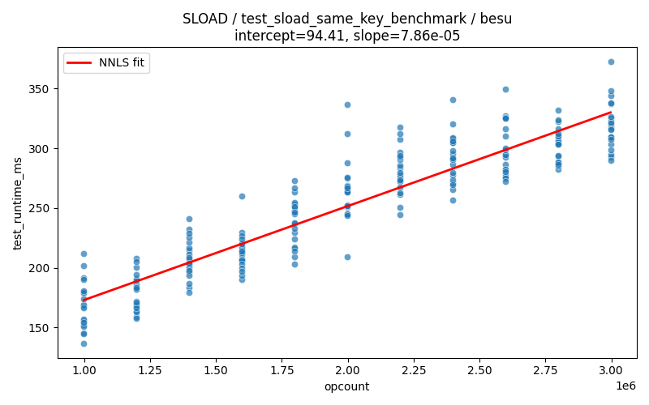

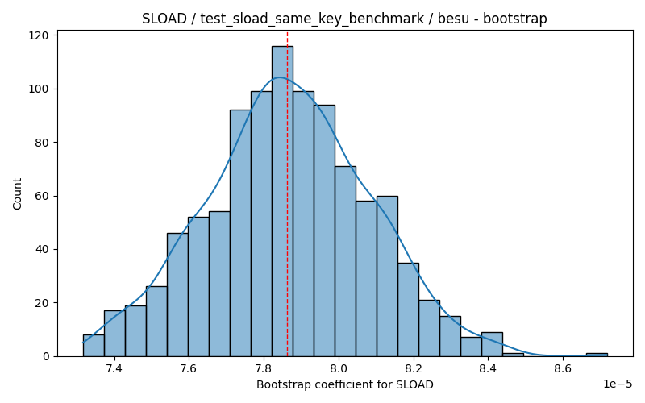

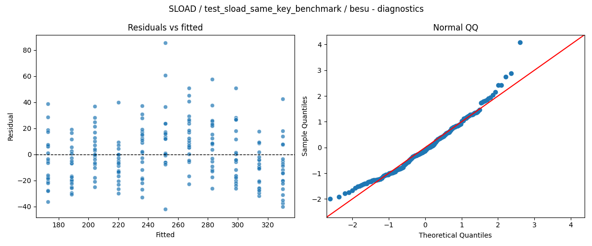

</details>

<details><summary>erigon — NNLS regression summary</summary>

```
==============================================================================
                           NNLS Regression Results                            
==============================================================================
Dep. Variable:          test_runtime_ms              R-squared:          0.670
Model:                  NNLS                    Adj. R-squared:          0.668
No. Observations:       176                               RMSE:           5.04
Df Residuals:           174                                MAE:           4.16
Df Model:               1      
==============================================================================
                      coef     std err     P-value      [0.025      0.975]
------------------------------------------------------------------------------
         const     31.4311      1.3294       0.001     28.7521     34.0324
       opcount      0.0000      0.0000       0.001      0.0000      0.0000
==============================================================================
Notes: Non-negative least squares with bootstrap inference (1000 iterations)
==============================================================================
```

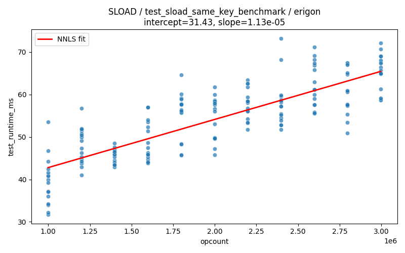

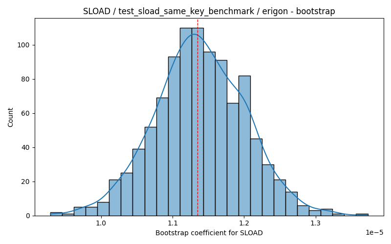

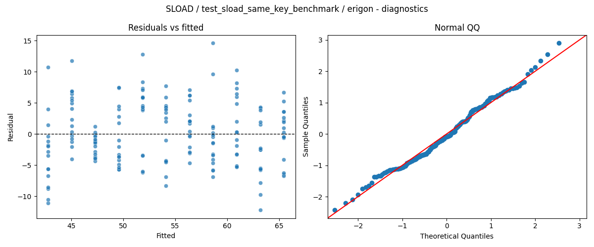

</details>

<details><summary>geth — NNLS regression summary</summary>

```
==============================================================================
                           NNLS Regression Results                            
==============================================================================
Dep. Variable:          test_runtime_ms              R-squared:          0.835
Model:                  NNLS                    Adj. R-squared:          0.834
No. Observations:       154                               RMSE:          10.99
Df Residuals:           152                                MAE:           8.21
Df Model:               1      
==============================================================================
                      coef     std err     P-value      [0.025      0.975]
------------------------------------------------------------------------------
         const     28.2266      2.9660       0.001     22.6655     34.3224
       opcount      0.0000      0.0000       0.001      0.0000      0.0000
==============================================================================
Notes: Non-negative least squares with bootstrap inference (1000 iterations)
==============================================================================
```

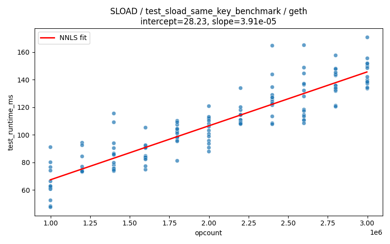

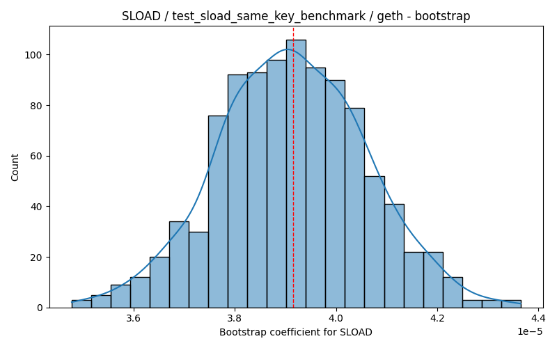

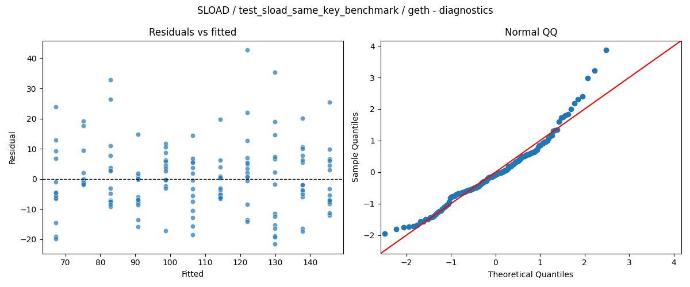

</details>

<details><summary>nethermind — NNLS regression summary</summary>

```
==============================================================================
                           NNLS Regression Results                            
==============================================================================
Dep. Variable:          test_runtime_ms              R-squared:          0.603
Model:                  NNLS                    Adj. R-squared:          0.602
No. Observations:       308                               RMSE:          61.43
Df Residuals:           306                                MAE:          45.74
Df Model:               1      
==============================================================================
                      coef     std err     P-value      [0.025      0.975]
------------------------------------------------------------------------------
         const    140.8133     11.9214       0.001    118.4830    164.1407
       opcount      0.0001      0.0000       0.001      0.0001      0.0001
==============================================================================
Notes: Non-negative least squares with bootstrap inference (1000 iterations)
==============================================================================
```

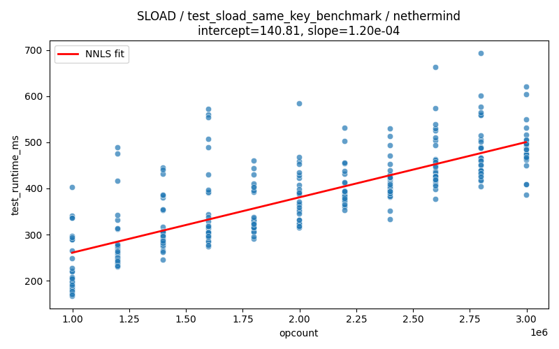

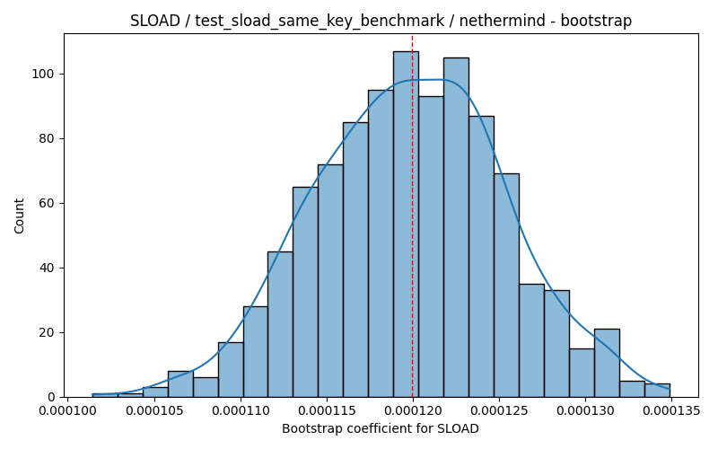

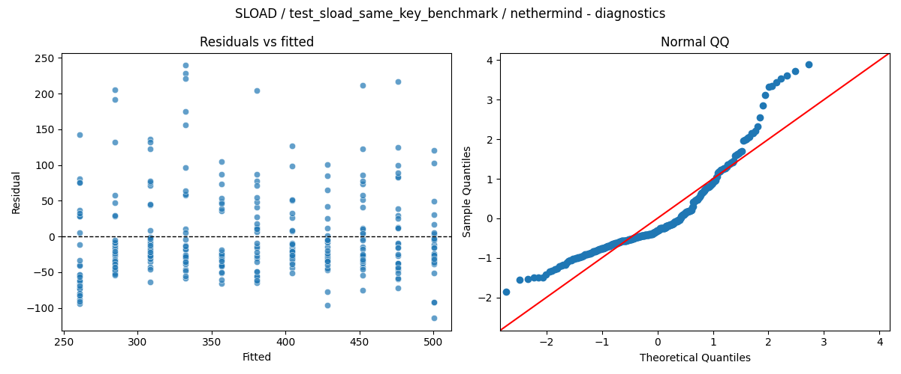

</details>

<details><summary>reth — NNLS regression summary</summary>

```
==============================================================================
                           NNLS Regression Results                            
==============================================================================
Dep. Variable:          test_runtime_ms              R-squared:          0.432
Model:                  NNLS                    Adj. R-squared:          0.431
No. Observations:       418                               RMSE:           5.49
Df Residuals:           416                                MAE:           3.58
Df Model:               1      
==============================================================================
                      coef     std err     P-value      [0.025      0.975]
------------------------------------------------------------------------------
         const      7.9909      0.7795       0.001      6.5851      9.5449
       opcount      0.0000      0.0000       0.001      0.0000      0.0000
==============================================================================
Notes: Non-negative least squares with bootstrap inference (1000 iterations)
==============================================================================
```

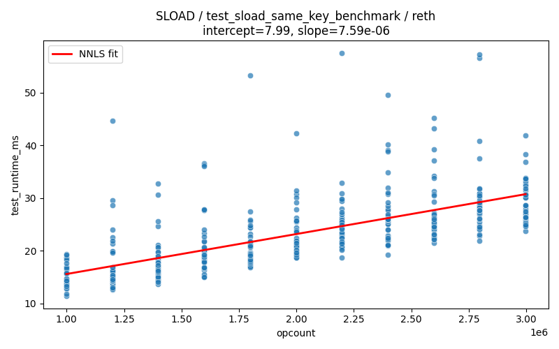

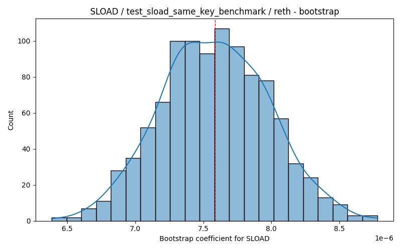

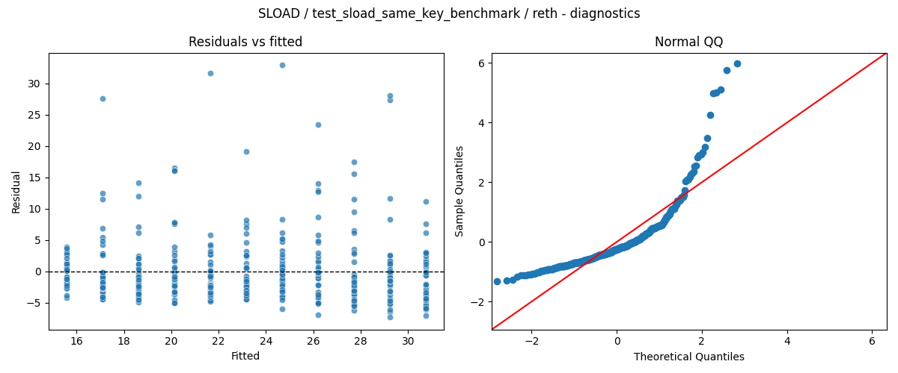

</details>

## SSTORE

### test_sstore_bloated — combo `False` — `presets[cold_storage_sstore_access]`

| client | nobs | R² | target_coef (ms) | p-value | 95% CI |
| --- | --- | --- | --- | --- | --- |
| `besu` | 110 | 0.9874 | 0.008165 | 1.00e-03 | [0.007966, 0.008337] |
| `erigon` | 88 | 0.9656 | 0.005542 | 1.00e-03 | [0.005329, 0.005772] |
| `geth` | 77 | 0.9549 | 0.02055 | 1.00e-03 | [0.01946, 0.02166] |
| `nethermind` | 154 | 0.9235 | 0.002699 | 1.00e-03 | [0.002563, 0.002837] |
| `reth` | 209 | 0.978 | 0.004629 | 1.00e-03 | [0.004555, 0.004715] |

<details><summary>besu — NNLS regression summary</summary>

```
==============================================================================
                           NNLS Regression Results                            
==============================================================================
Dep. Variable:          test_runtime_ms              R-squared:          0.987
Model:                  NNLS                    Adj. R-squared:          0.987
No. Observations:       110                               RMSE:          19.18
Df Residuals:           108                                MAE:          15.15
Df Model:               1      
==============================================================================
                      coef     std err     P-value      [0.025      0.975]
------------------------------------------------------------------------------
         const    168.0764      6.2341       0.001    156.9698    181.2538
       opcount      0.0082      0.0001       0.001      0.0080      0.0083
==============================================================================
Notes: Non-negative least squares with bootstrap inference (1000 iterations)
==============================================================================
```

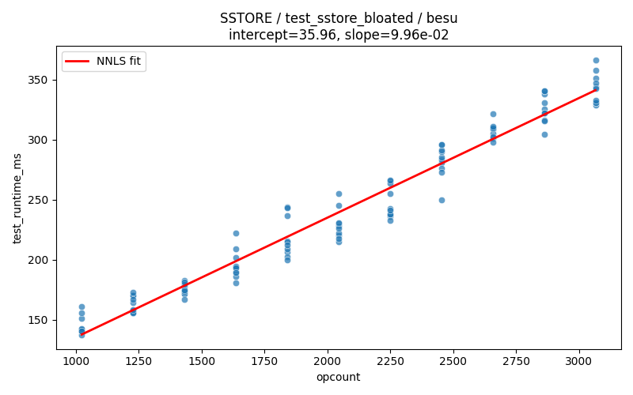

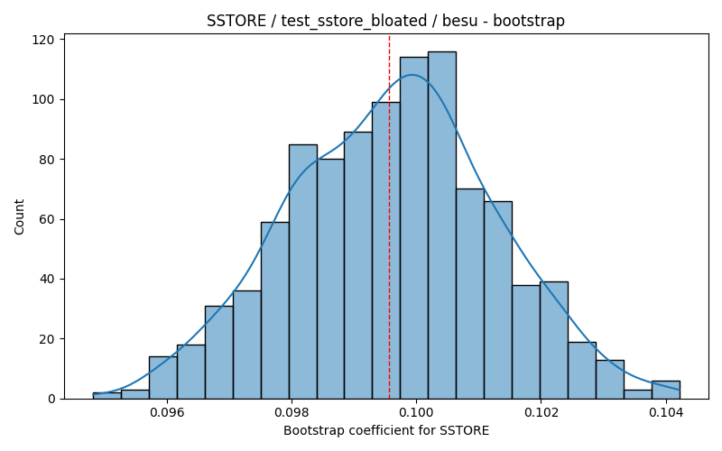

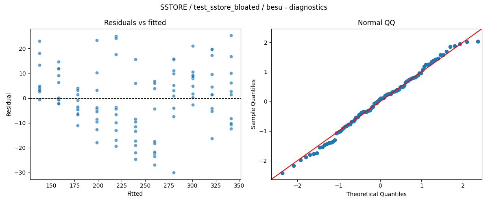

</details>

<details><summary>erigon — NNLS regression summary</summary>

```
==============================================================================
                           NNLS Regression Results                            
==============================================================================
Dep. Variable:          test_runtime_ms              R-squared:          0.966
Model:                  NNLS                    Adj. R-squared:          0.965
No. Observations:       88                                RMSE:          21.77
Df Residuals:           86                                 MAE:          13.82
Df Model:               1      
==============================================================================
                      coef     std err     P-value      [0.025      0.975]
------------------------------------------------------------------------------
         const     17.7320      6.5452       0.006      4.5661     29.8423
       opcount      0.0055      0.0001       0.001      0.0053      0.0058
==============================================================================
Notes: Non-negative least squares with bootstrap inference (1000 iterations)
==============================================================================
```

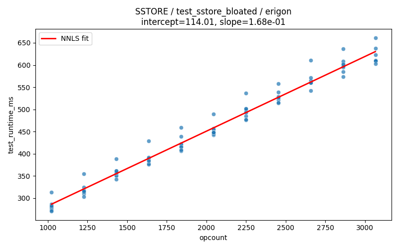

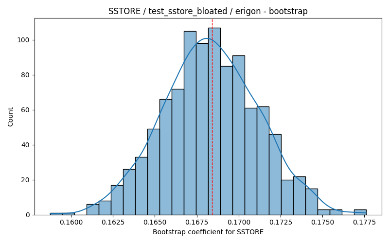

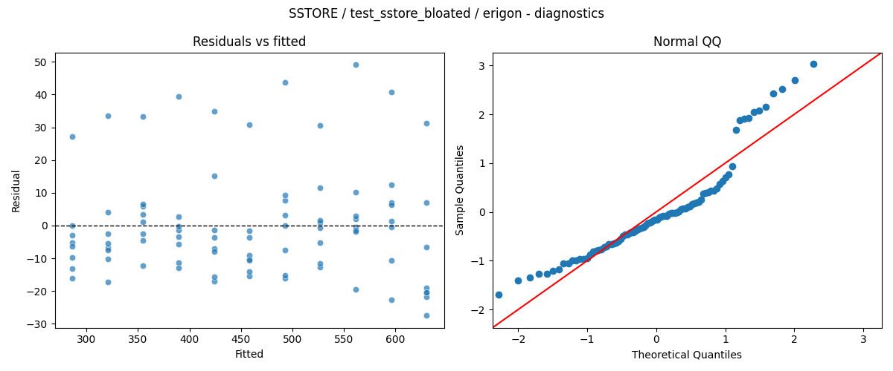

</details>

<details><summary>geth — NNLS regression summary</summary>

```
==============================================================================
                           NNLS Regression Results                            
==============================================================================
Dep. Variable:          test_runtime_ms              R-squared:          0.955
Model:                  NNLS                    Adj. R-squared:          0.954
No. Observations:       77                                RMSE:          92.93
Df Residuals:           75                                 MAE:          71.77
Df Model:               1      
==============================================================================
                      coef     std err     P-value      [0.025      0.975]
------------------------------------------------------------------------------
         const    416.3657     32.9542       0.001    357.7693    484.1647
       opcount      0.0205      0.0006       0.001      0.0195      0.0217
==============================================================================
Notes: Non-negative least squares with bootstrap inference (1000 iterations)
==============================================================================
```

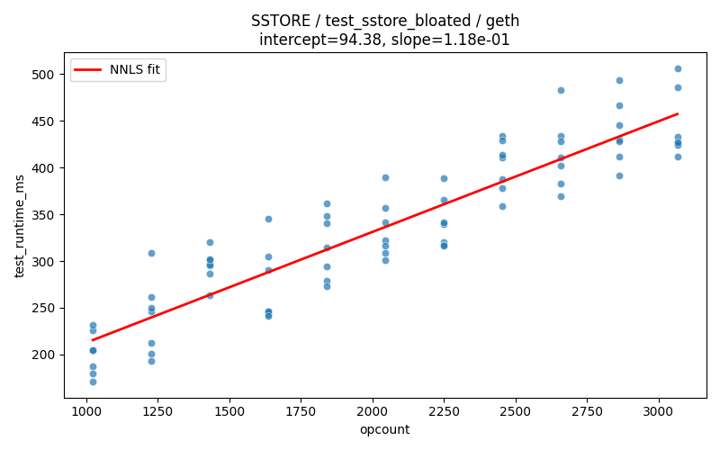

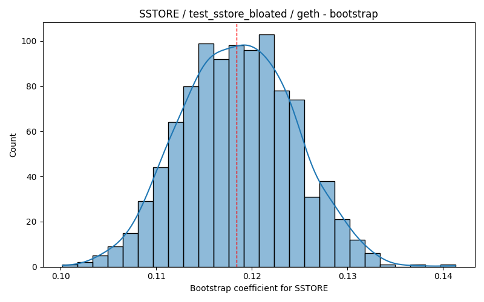

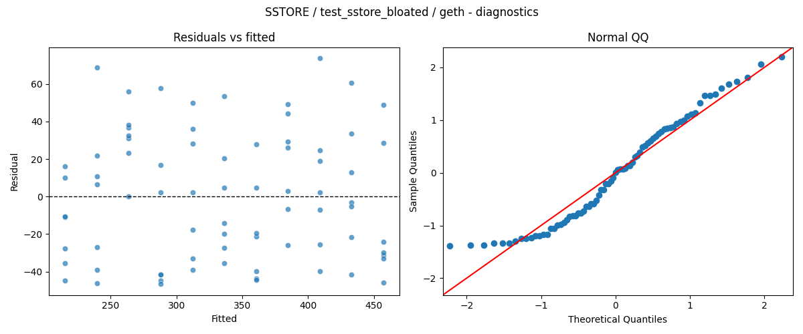

</details>

<details><summary>nethermind — NNLS regression summary</summary>

```
==============================================================================
                           NNLS Regression Results                            
==============================================================================
Dep. Variable:          test_runtime_ms              R-squared:          0.923
Model:                  NNLS                    Adj. R-squared:          0.923
No. Observations:       154                               RMSE:          16.17
Df Residuals:           152                                MAE:          12.49
Df Model:               1      
==============================================================================
                      coef     std err     P-value      [0.025      0.975]
------------------------------------------------------------------------------
         const     70.8561      4.0691       0.001     63.0600     79.3811
       opcount      0.0027      0.0001       0.001      0.0026      0.0028
==============================================================================
Notes: Non-negative least squares with bootstrap inference (1000 iterations)
==============================================================================
```

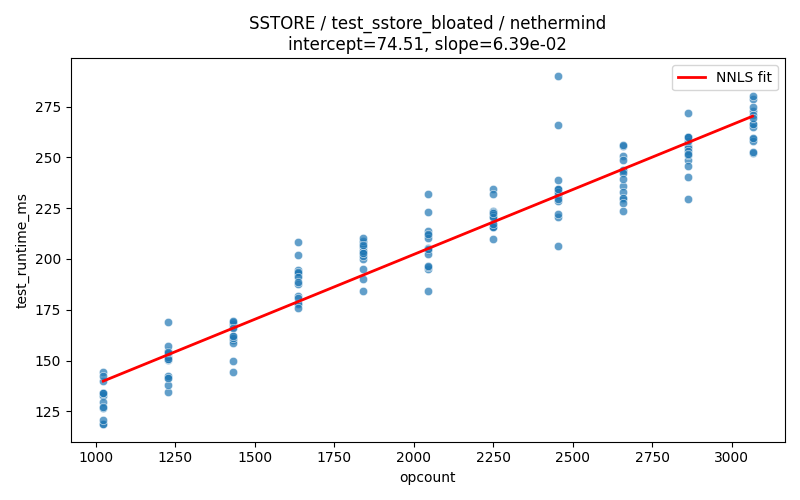

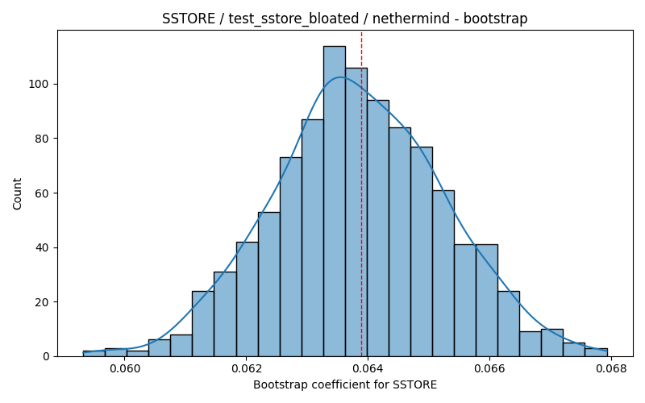

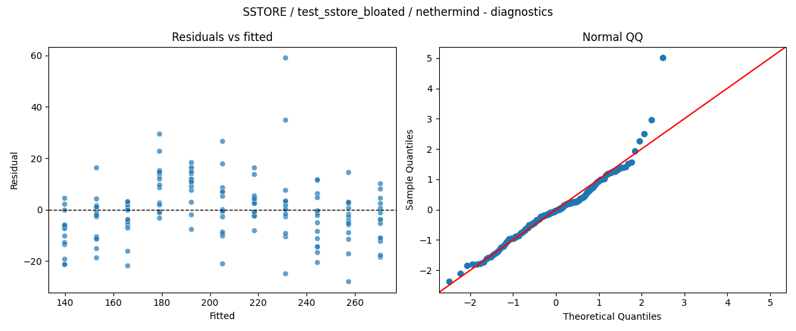

</details>

<details><summary>reth — NNLS regression summary</summary>

```
==============================================================================
                           NNLS Regression Results                            
==============================================================================
Dep. Variable:          test_runtime_ms              R-squared:          0.978
Model:                  NNLS                    Adj. R-squared:          0.978
No. Observations:       209                               RMSE:          14.45
Df Residuals:           207                                MAE:          10.76
Df Model:               1      
==============================================================================
                      coef     std err     P-value      [0.025      0.975]
------------------------------------------------------------------------------
         const     90.8460      2.5664       0.001     85.5546     95.4744
       opcount      0.0046      0.0000       0.001      0.0046      0.0047
==============================================================================
Notes: Non-negative least squares with bootstrap inference (1000 iterations)
==============================================================================
```

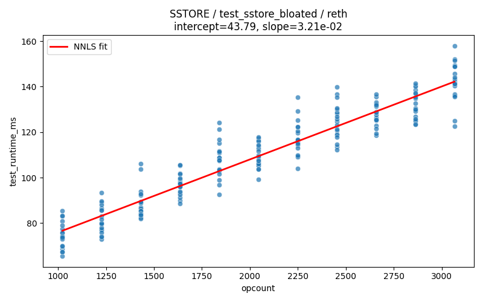

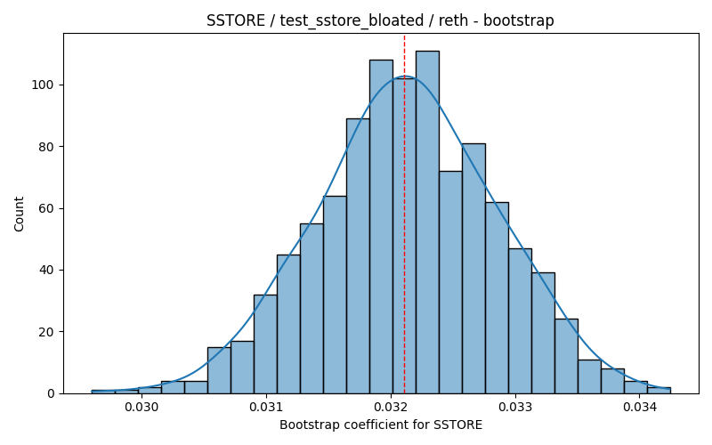

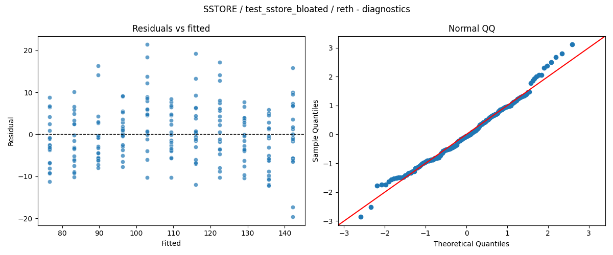

</details>

### test_sstore_bloated — combo `True` — `presets[cold_storage_sstore_access]`

| client | nobs | R² | target_coef (ms) | p-value | 95% CI |
| --- | --- | --- | --- | --- | --- |
| `besu` | 110 | 0.9899 | 0.01575 | 1.00e-03 | [0.01542, 0.01607] |
| `erigon` | 88 | 0.9501 | 0.005177 | 1.00e-03 | [0.004926, 0.005452] |
| `geth` | 77 | 0.9435 | 0.01943 | 1.00e-03 | [0.01828, 0.02051] |
| `nethermind` | 154 | 0.9889 | 0.007935 | 1.00e-03 | [0.007791, 0.008083] |
| `reth` | 209 | 0.9828 | 0.004929 | 1.00e-03 | [0.004847, 0.005007] |

<details><summary>besu — NNLS regression summary</summary>

```
==============================================================================
                           NNLS Regression Results                            
==============================================================================
Dep. Variable:          test_runtime_ms              R-squared:          0.990
Model:                  NNLS                    Adj. R-squared:          0.990
No. Observations:       110                               RMSE:          33.05
Df Residuals:           108                                MAE:          26.89
Df Model:               1      
==============================================================================
                      coef     std err     P-value      [0.025      0.975]
------------------------------------------------------------------------------
         const    282.0516     11.3223       0.001    262.7540    306.3670
       opcount      0.0158      0.0002       0.001      0.0154      0.0161
==============================================================================
Notes: Non-negative least squares with bootstrap inference (1000 iterations)
==============================================================================
```

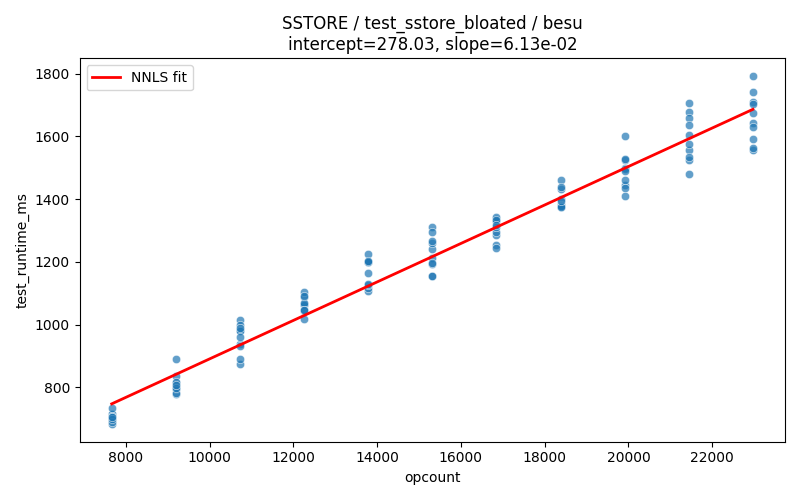

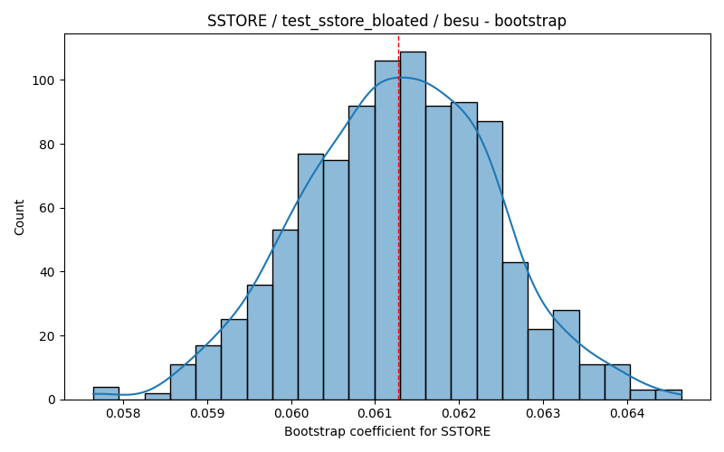

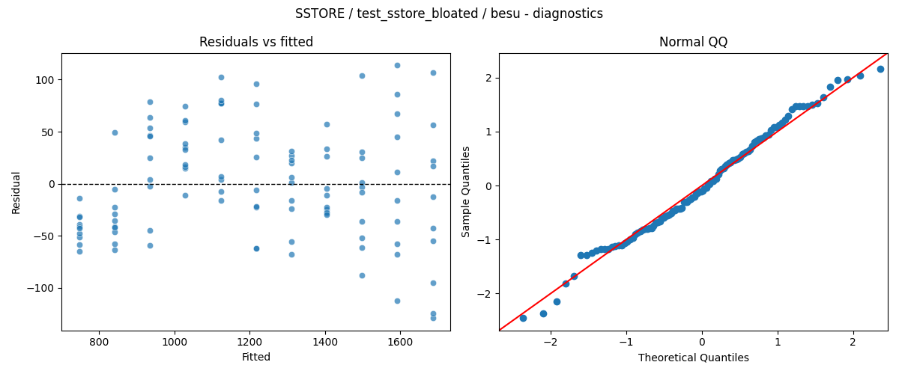

</details>

<details><summary>erigon — NNLS regression summary</summary>

```
==============================================================================
                           NNLS Regression Results                            
==============================================================================
Dep. Variable:          test_runtime_ms              R-squared:          0.950
Model:                  NNLS                    Adj. R-squared:          0.950
No. Observations:       88                                RMSE:          24.69
Df Residuals:           86                                 MAE:          15.72
Df Model:               1      
==============================================================================
                      coef     std err     P-value      [0.025      0.975]
------------------------------------------------------------------------------
         const     17.2679      7.7921       0.018      1.4994     31.9150
       opcount      0.0052      0.0001       0.001      0.0049      0.0055
==============================================================================
Notes: Non-negative least squares with bootstrap inference (1000 iterations)
==============================================================================
```


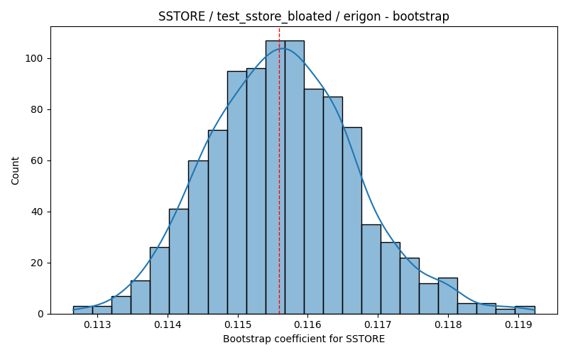

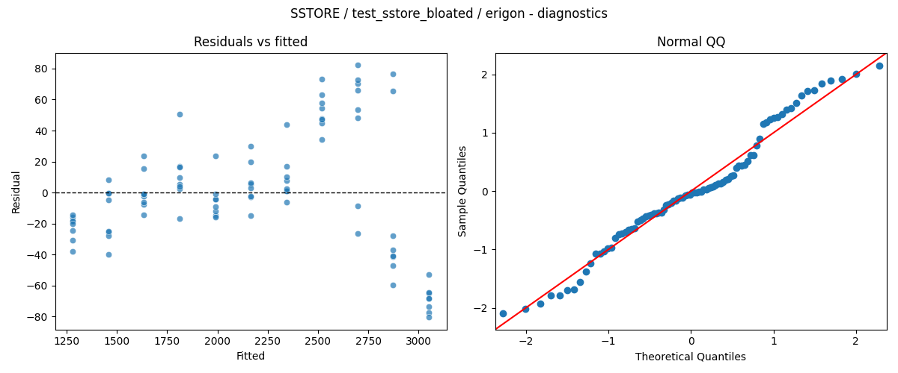

</details>

<details><summary>geth — NNLS regression summary</summary>

```
==============================================================================
                           NNLS Regression Results                            
==============================================================================
Dep. Variable:          test_runtime_ms              R-squared:          0.943
Model:                  NNLS                    Adj. R-squared:          0.943
No. Observations:       77                                RMSE:          99.02
Df Residuals:           75                                 MAE:          74.84
Df Model:               1      
==============================================================================
                      coef     std err     P-value      [0.025      0.975]
------------------------------------------------------------------------------
         const    435.2420     33.3763       0.001    375.8863    503.3593
       opcount      0.0194      0.0006       0.001      0.0183      0.0205
==============================================================================
Notes: Non-negative least squares with bootstrap inference (1000 iterations)
==============================================================================
```

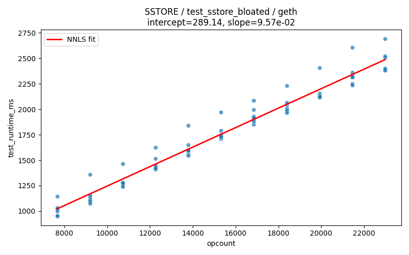

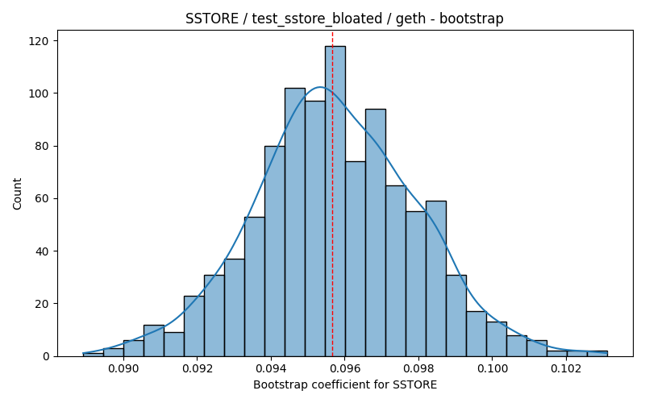

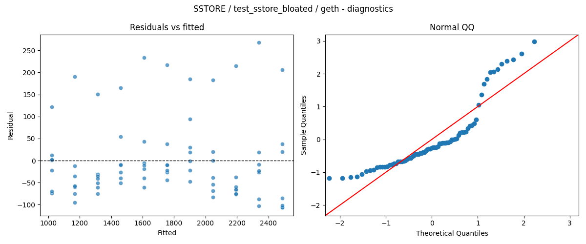

</details>

<details><summary>nethermind — NNLS regression summary</summary>

```
==============================================================================
                           NNLS Regression Results                            
==============================================================================
Dep. Variable:          test_runtime_ms              R-squared:          0.989
Model:                  NNLS                    Adj. R-squared:          0.989
No. Observations:       154                               RMSE:          17.48
Df Residuals:           152                                MAE:          13.26
Df Model:               1      
==============================================================================
                      coef     std err     P-value      [0.025      0.975]
------------------------------------------------------------------------------
         const     47.4861      4.2320       0.001     39.0750     55.7976
       opcount      0.0079      0.0001       0.001      0.0078      0.0081
==============================================================================
Notes: Non-negative least squares with bootstrap inference (1000 iterations)
==============================================================================
```

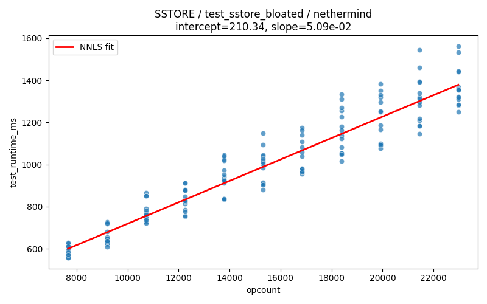

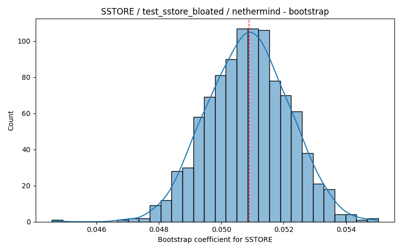

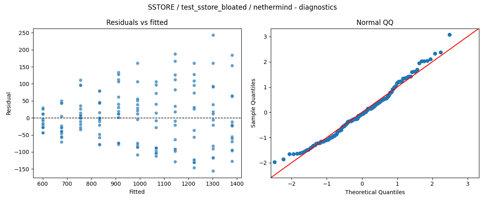

</details>

<details><summary>reth — NNLS regression summary</summary>

```
==============================================================================
                           NNLS Regression Results                            
==============================================================================
Dep. Variable:          test_runtime_ms              R-squared:          0.983
Model:                  NNLS                    Adj. R-squared:          0.983
No. Observations:       209                               RMSE:          13.59
Df Residuals:           207                                MAE:          10.61
Df Model:               1      
==============================================================================
                      coef     std err     P-value      [0.025      0.975]
------------------------------------------------------------------------------
         const     85.6328      2.7483       0.001     80.5006     91.2554
       opcount      0.0049      0.0000       0.001      0.0048      0.0050
==============================================================================
Notes: Non-negative least squares with bootstrap inference (1000 iterations)
==============================================================================
```

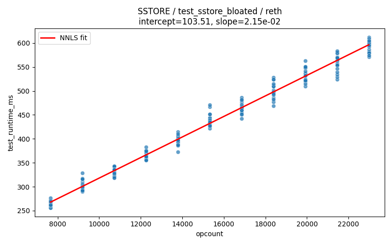

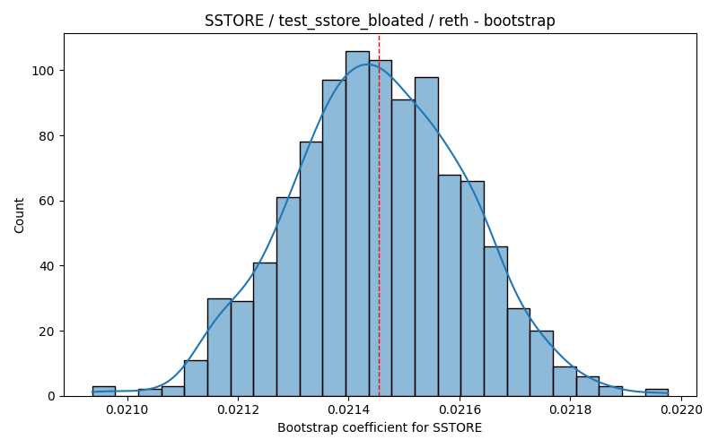

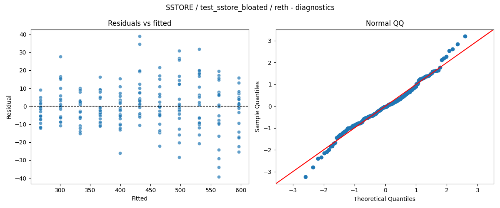

</details>

### test_sstore_bloated — combo `False` — `presets[cold_storage_sstore_write]`

| client | nobs | R² | target_coef (ms) | p-value | 95% CI |
| --- | --- | --- | --- | --- | --- |
| `besu` | 110 | 0.9639 | 0.09956 | 1.00e-03 | [0.09643, 0.1028] |
| `erigon` | 88 | 0.9784 | 0.1684 | 1.00e-03 | [0.1629, 0.1739] |
| `geth` | 77 | 0.8396 | 0.1184 | 1.00e-03 | [0.1076, 0.1297] |
| `nethermind` | 154 | 0.9244 | 0.06389 | 1.00e-03 | [0.06116, 0.06651] |
| `reth` | 209 | 0.9009 | 0.03211 | 1.00e-03 | [0.03071, 0.0335] |

<details><summary>besu — NNLS regression summary</summary>

```
==============================================================================
                           NNLS Regression Results                            
==============================================================================
Dep. Variable:          test_runtime_ms              R-squared:          0.964
Model:                  NNLS                    Adj. R-squared:          0.964
No. Observations:       110                               RMSE:          12.45
Df Residuals:           108                                MAE:          10.03
Df Model:               1      
==============================================================================
                      coef     std err     P-value      [0.025      0.975]
------------------------------------------------------------------------------
         const     35.9606      3.3753       0.001     29.3742     42.3090
       opcount      0.0996      0.0016       0.001      0.0964      0.1028
==============================================================================
Notes: Non-negative least squares with bootstrap inference (1000 iterations)
==============================================================================
```


</details>

<details><summary>erigon — NNLS regression summary</summary>

```
==============================================================================
                           NNLS Regression Results                            
==============================================================================
Dep. Variable:          test_runtime_ms              R-squared:          0.978
Model:                  NNLS                    Adj. R-squared:          0.978
No. Observations:       88                                RMSE:          16.17
Df Residuals:           86                                 MAE:          11.73
Df Model:               1      
==============================================================================
                      coef     std err     P-value      [0.025      0.975]
------------------------------------------------------------------------------
         const    114.0138      5.6672       0.001    103.7071    126.1727
       opcount      0.1684      0.0028       0.001      0.1629      0.1739
==============================================================================
Notes: Non-negative least squares with bootstrap inference (1000 iterations)
==============================================================================
```


</details>

<details><summary>geth — NNLS regression summary</summary>

```
==============================================================================
                           NNLS Regression Results                            
==============================================================================
Dep. Variable:          test_runtime_ms              R-squared:          0.840
Model:                  NNLS                    Adj. R-squared:          0.837
No. Observations:       77                                RMSE:          33.41
Df Residuals:           75                                 MAE:          28.87
Df Model:               1      
==============================================================================
                      coef     std err     P-value      [0.025      0.975]
------------------------------------------------------------------------------
         const     94.3789     12.5494       0.001     70.0634    117.5964
       opcount      0.1184      0.0058       0.001      0.1076      0.1297
==============================================================================
Notes: Non-negative least squares with bootstrap inference (1000 iterations)
==============================================================================
```


</details>

<details><summary>nethermind — NNLS regression summary</summary>

```
==============================================================================
                           NNLS Regression Results                            
==============================================================================
Dep. Variable:          test_runtime_ms              R-squared:          0.924
Model:                  NNLS                    Adj. R-squared:          0.924
No. Observations:       154                               RMSE:          11.80
Df Residuals:           152                                MAE:           8.59
Df Model:               1      
==============================================================================
                      coef     std err     P-value      [0.025      0.975]
------------------------------------------------------------------------------
         const     74.5051      2.9188       0.001     69.2276     80.6558
       opcount      0.0639      0.0014       0.001      0.0612      0.0665
==============================================================================
Notes: Non-negative least squares with bootstrap inference (1000 iterations)
==============================================================================
```


</details>

<details><summary>reth — NNLS regression summary</summary>

```
==============================================================================
                           NNLS Regression Results                            
==============================================================================
Dep. Variable:          test_runtime_ms              R-squared:          0.901
Model:                  NNLS                    Adj. R-squared:          0.900
No. Observations:       209                               RMSE:           6.88
Df Residuals:           207                                MAE:           5.47
Df Model:               1      
==============================================================================
                      coef     std err     P-value      [0.025      0.975]
------------------------------------------------------------------------------
         const     43.7860      1.4700       0.001     40.9158     46.6725
       opcount      0.0321      0.0007       0.001      0.0307      0.0335
==============================================================================
Notes: Non-negative least squares with bootstrap inference (1000 iterations)
==============================================================================
```


</details>

### test_sstore_bloated — combo `True` — `presets[cold_storage_sstore_write]`

| client | nobs | R² | target_coef (ms) | p-value | 95% CI |
| --- | --- | --- | --- | --- | --- |
| `besu` | 110 | 0.9697 | 0.06128 | 1.00e-03 | [0.05908, 0.06355] |
| `erigon` | 88 | 0.9954 | 0.1156 | 1.00e-03 | [0.1138, 0.1179] |
| `geth` | 77 | 0.964 | 0.09566 | 1.00e-03 | [0.09137, 0.1002] |
| `nethermind` | 154 | 0.9068 | 0.05087 | 1.00e-03 | [0.0484, 0.05339] |
| `reth` | 209 | 0.9865 | 0.02145 | 1.00e-03 | [0.02115, 0.02176] |

<details><summary>besu — NNLS regression summary</summary>

```
==============================================================================
                           NNLS Regression Results                            
==============================================================================
Dep. Variable:          test_runtime_ms              R-squared:          0.970
Model:                  NNLS                    Adj. R-squared:          0.969
No. Observations:       110                               RMSE:          52.44
Df Residuals:           108                                MAE:          43.39
Df Model:               1      
==============================================================================
                      coef     std err     P-value      [0.025      0.975]
------------------------------------------------------------------------------
         const    278.0277     16.8146       0.001    246.3905    311.5231
       opcount      0.0613      0.0011       0.001      0.0591      0.0635
==============================================================================
Notes: Non-negative least squares with bootstrap inference (1000 iterations)
==============================================================================
```


</details>

<details><summary>erigon — NNLS regression summary</summary>

```
==============================================================================
                           NNLS Regression Results                            
==============================================================================
Dep. Variable:          test_runtime_ms              R-squared:          0.995
Model:                  NNLS                    Adj. R-squared:          0.995
No. Observations:       88                                RMSE:          38.26
Df Residuals:           86                                 MAE:          29.13
Df Model:               1      
==============================================================================
                      coef     std err     P-value      [0.025      0.975]
------------------------------------------------------------------------------
         const    395.6998     13.3242       0.001    366.9740    420.8582
       opcount      0.1156      0.0010       0.001      0.1138      0.1179
==============================================================================
Notes: Non-negative least squares with bootstrap inference (1000 iterations)
==============================================================================
```


</details>

<details><summary>geth — NNLS regression summary</summary>

```
==============================================================================
                           NNLS Regression Results                            
==============================================================================
Dep. Variable:          test_runtime_ms              R-squared:          0.964
Model:                  NNLS                    Adj. R-squared:          0.964
No. Observations:       77                                RMSE:          89.52
Df Residuals:           75                                 MAE:          65.57
Df Model:               1      
==============================================================================
                      coef     std err     P-value      [0.025      0.975]
------------------------------------------------------------------------------
         const    289.1428     32.3509       0.001    228.6325    353.4230
       opcount      0.0957      0.0022       0.001      0.0914      0.1002
==============================================================================
Notes: Non-negative least squares with bootstrap inference (1000 iterations)
==============================================================================
```


</details>

<details><summary>nethermind — NNLS regression summary</summary>

```
==============================================================================
                           NNLS Regression Results                            
==============================================================================
Dep. Variable:          test_runtime_ms              R-squared:          0.907
Model:                  NNLS                    Adj. R-squared:          0.906
No. Observations:       154                               RMSE:          78.99
Df Residuals:           152                                MAE:          63.05
Df Model:               1      
==============================================================================
                      coef     std err     P-value      [0.025      0.975]
------------------------------------------------------------------------------
         const    210.3386     17.2059       0.001    177.0063    244.0080
       opcount      0.0509      0.0013       0.001      0.0484      0.0534
==============================================================================
Notes: Non-negative least squares with bootstrap inference (1000 iterations)
==============================================================================
```


</details>

<details><summary>reth — NNLS regression summary</summary>

```
==============================================================================
                           NNLS Regression Results                            
==============================================================================
Dep. Variable:          test_runtime_ms              R-squared:          0.987
Model:                  NNLS                    Adj. R-squared:          0.986
No. Observations:       209                               RMSE:          12.15
Df Residuals:           207                                MAE:           9.16
Df Model:               1      
==============================================================================
                      coef     std err     P-value      [0.025      0.975]
------------------------------------------------------------------------------
         const    103.5105      2.1831       0.001     99.2222    107.5351
       opcount      0.0215      0.0002       0.001      0.0212      0.0218
==============================================================================
Notes: Non-negative least squares with bootstrap inference (1000 iterations)
==============================================================================
```


</details>

## BALANCE

### test_ext_account_query_warm — combo `BALANCE`

| client | nobs | R² | target_coef (ms) | p-value | 95% CI |
| --- | --- | --- | --- | --- | --- |
| `besu` | 110 | 0.8261 | 7.285e-05 | 1.00e-03 | [6.606e-05, 7.97e-05] |
| `erigon` | 88 | 0.5309 | 1.425e-05 | 1.00e-03 | [1.128e-05, 1.732e-05] |
| `geth` | 77 | 0.7288 | 2.585e-05 | 1.00e-03 | [2.245e-05, 2.915e-05] |
| `nethermind` | 154 | 0.5057 | 0.0001255 | 1.00e-03 | [0.0001053, 0.0001481] |
| `reth` | 209 | 0.6164 | 1.302e-05 | 1.00e-03 | [1.175e-05, 1.424e-05] |

<details><summary>besu — NNLS regression summary</summary>

```
==============================================================================
                           NNLS Regression Results                            
==============================================================================
Dep. Variable:          test_runtime_ms              R-squared:          0.826
Model:                  NNLS                    Adj. R-squared:          0.825
No. Observations:       110                               RMSE:          19.55
Df Residuals:           108                                MAE:          15.50
Df Model:               1      
==============================================================================
                      coef     std err     P-value      [0.025      0.975]
------------------------------------------------------------------------------
         const    152.5661      6.2835       0.001    140.3783    165.6779
       opcount      0.0001      0.0000       0.001      0.0001      0.0001
==============================================================================
Notes: Non-negative least squares with bootstrap inference (1000 iterations)
==============================================================================
```

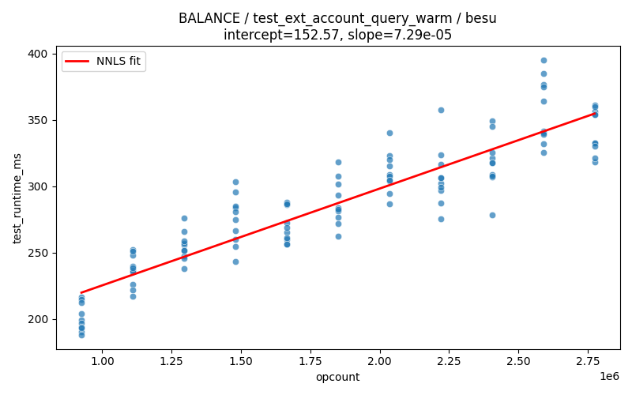

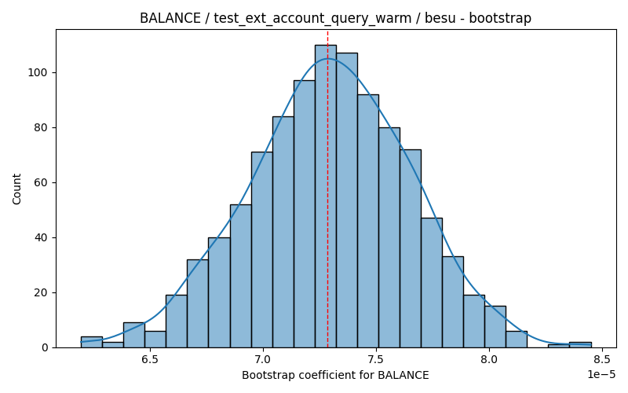

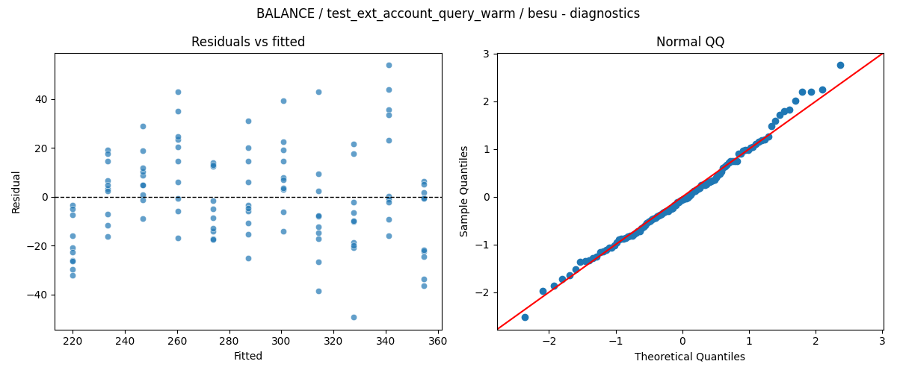

</details>

<details><summary>erigon — NNLS regression summary</summary>

```
==============================================================================
                           NNLS Regression Results                            
==============================================================================
Dep. Variable:          test_runtime_ms              R-squared:          0.531
Model:                  NNLS                    Adj. R-squared:          0.525
No. Observations:       88                                RMSE:           7.84
Df Residuals:           86                                 MAE:           5.52
Df Model:               1      
==============================================================================
                      coef     std err     P-value      [0.025      0.975]
------------------------------------------------------------------------------
         const     23.4159      2.5990       0.001     18.6378     28.8175
       opcount      0.0000      0.0000       0.001      0.0000      0.0000
==============================================================================
Notes: Non-negative least squares with bootstrap inference (1000 iterations)
==============================================================================
```

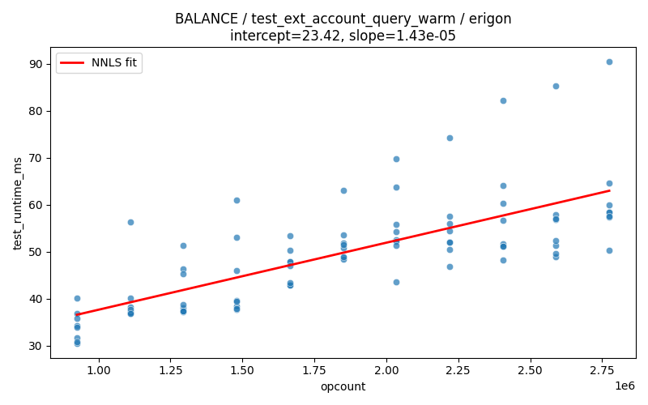

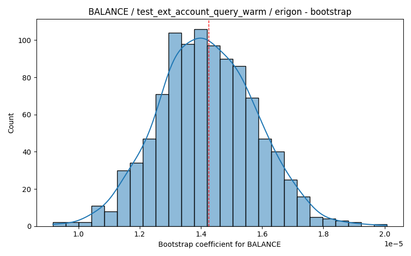

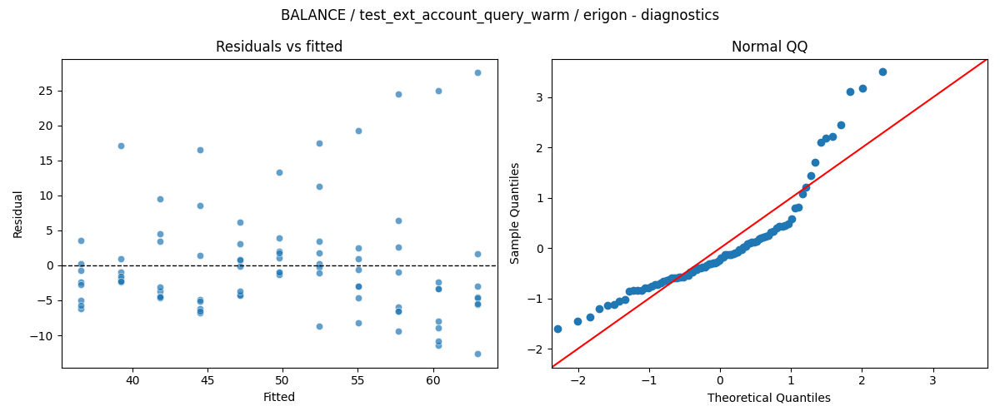

</details>

<details><summary>geth — NNLS regression summary</summary>

```
==============================================================================
                           NNLS Regression Results                            
==============================================================================
Dep. Variable:          test_runtime_ms              R-squared:          0.729
Model:                  NNLS                    Adj. R-squared:          0.725
No. Observations:       77                                RMSE:           9.22
Df Residuals:           75                                 MAE:           6.95
Df Model:               1      
==============================================================================
                      coef     std err     P-value      [0.025      0.975]
------------------------------------------------------------------------------
         const     17.8994      3.2800       0.001     11.5700     24.4944
       opcount      0.0000      0.0000       0.001      0.0000      0.0000
==============================================================================
Notes: Non-negative least squares with bootstrap inference (1000 iterations)
==============================================================================
```

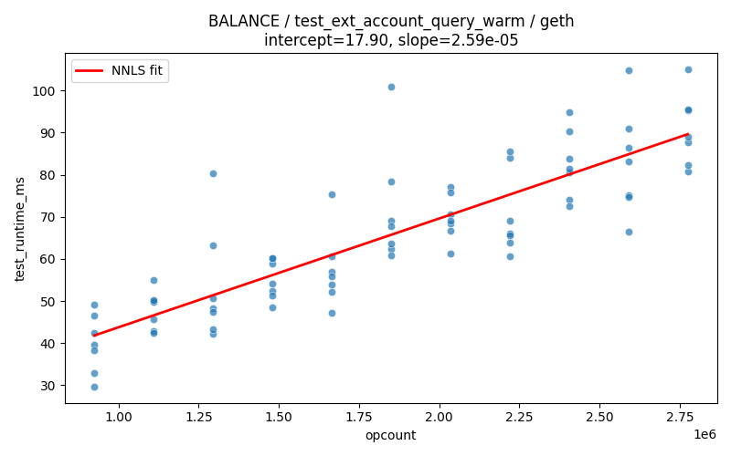

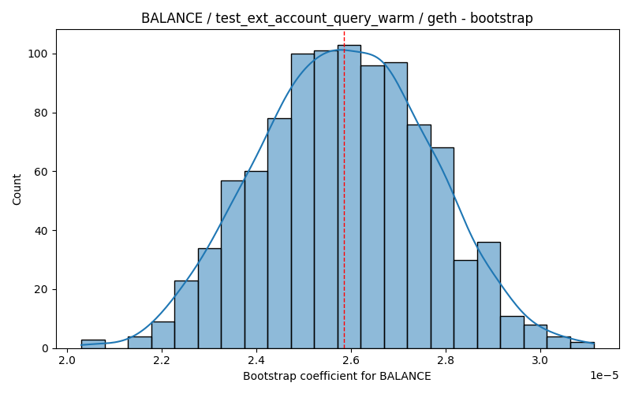

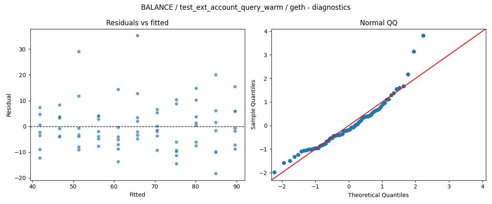

</details>

<details><summary>nethermind — NNLS regression summary</summary>

```
==============================================================================
                           NNLS Regression Results                            
==============================================================================
Dep. Variable:          test_runtime_ms              R-squared:          0.506
Model:                  NNLS                    Adj. R-squared:          0.502
No. Observations:       154                               RMSE:          72.57
Df Residuals:           152                                MAE:          54.54
Df Model:               1      
==============================================================================
                      coef     std err     P-value      [0.025      0.975]
------------------------------------------------------------------------------
         const    153.1574     19.7864       0.001    115.8583    190.8663
       opcount      0.0001      0.0000       0.001      0.0001      0.0001
==============================================================================
Notes: Non-negative least squares with bootstrap inference (1000 iterations)
==============================================================================
```

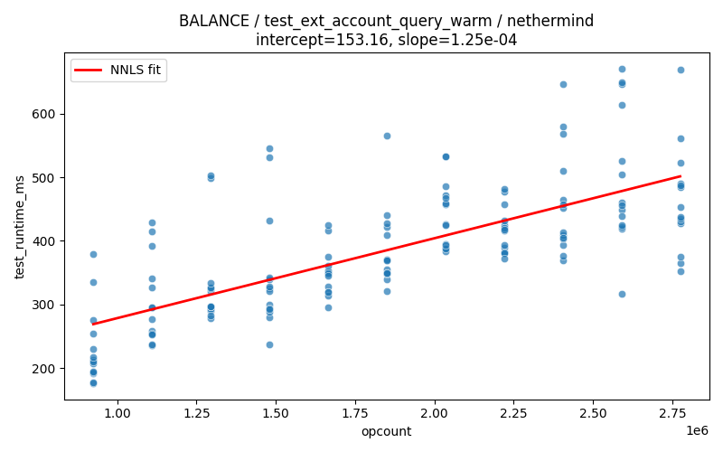

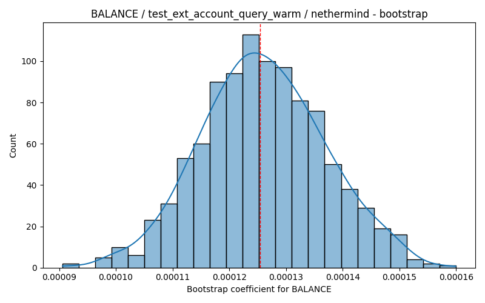

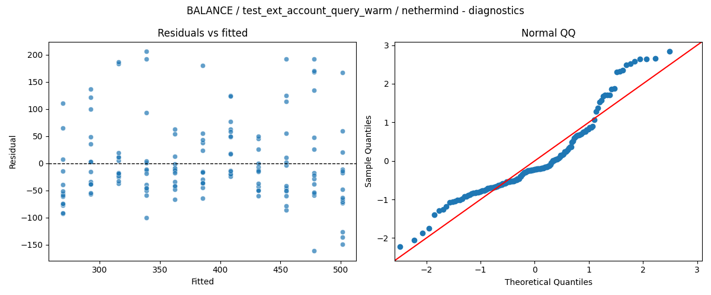

</details>

<details><summary>reth — NNLS regression summary</summary>

```
==============================================================================
                           NNLS Regression Results                            
==============================================================================
Dep. Variable:          test_runtime_ms              R-squared:          0.616
Model:                  NNLS                    Adj. R-squared:          0.615
No. Observations:       209                               RMSE:           6.01
Df Residuals:           207                                MAE:           4.15
Df Model:               1      
==============================================================================
                      coef     std err     P-value      [0.025      0.975]
------------------------------------------------------------------------------
         const      8.2789      1.0924       0.001      6.0901     10.3593
       opcount      0.0000      0.0000       0.001      0.0000      0.0000
==============================================================================
Notes: Non-negative least squares with bootstrap inference (1000 iterations)
==============================================================================
```

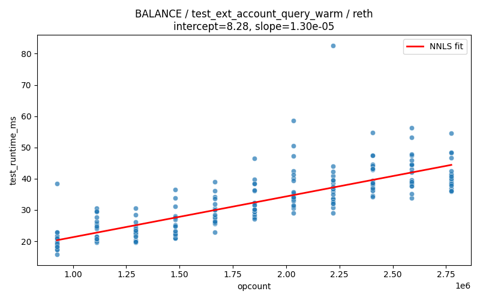

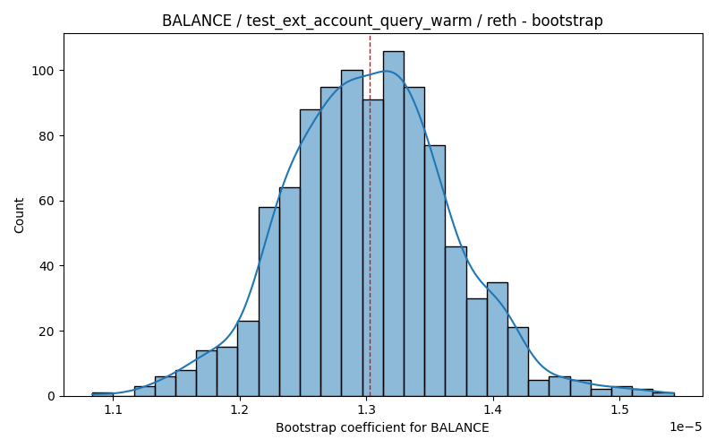

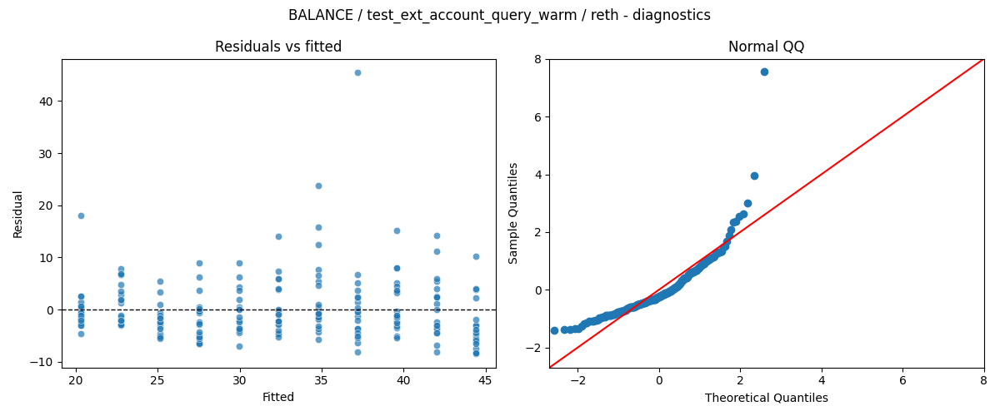

</details>

### test_account_access — combo `BALANCE_AccountMode.EXISTING_EOA`

| client | nobs | R² | target_coef (ms) | p-value | 95% CI |
| --- | --- | --- | --- | --- | --- |
| `besu` | 110 | 0.9874 | 0.01445 | 1.00e-03 | [0.01414, 0.01477] |
| `erigon` | 88 | 0.9967 | 0.008419 | 1.00e-03 | [0.008328, 0.008467] |
| `geth` | 77 | 0.8116 | 0.0181 | 1.00e-03 | [0.01593, 0.01991] |
| `nethermind` | 154 | 0.9101 | 0.003095 | 1.00e-03 | [0.002954, 0.003257] |
| `reth` | 209 | 0.9707 | 0.004048 | 1.00e-03 | [0.003961, 0.004141] |

<details><summary>besu — NNLS regression summary</summary>

```
==============================================================================
                           NNLS Regression Results                            
==============================================================================
Dep. Variable:          test_runtime_ms              R-squared:          0.987
Model:                  NNLS                    Adj. R-squared:          0.987
No. Observations:       110                               RMSE:          33.76
Df Residuals:           108                                MAE:          27.79
Df Model:               1      
==============================================================================
                      coef     std err     P-value      [0.025      0.975]
------------------------------------------------------------------------------
         const    453.8007     11.2622       0.001    431.8550    475.0444
       opcount      0.0145      0.0002       0.001      0.0141      0.0148
==============================================================================
Notes: Non-negative least squares with bootstrap inference (1000 iterations)
==============================================================================
```

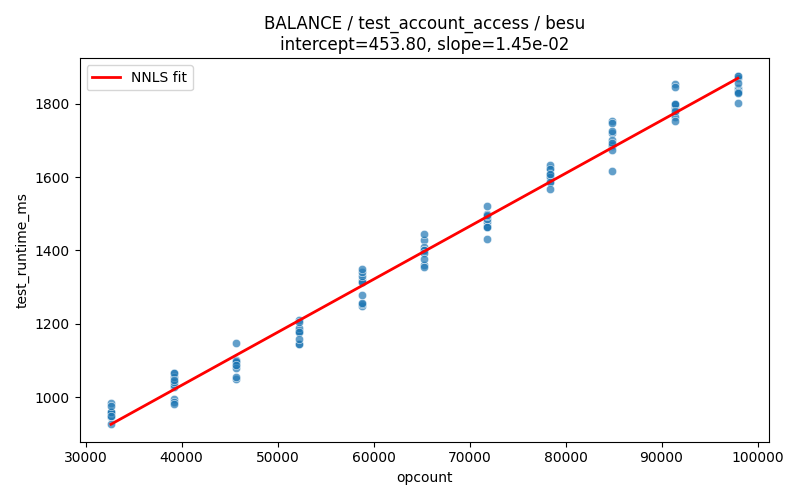

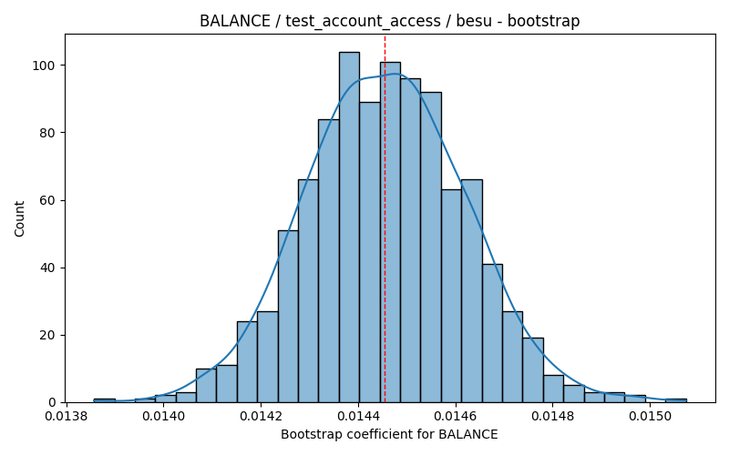

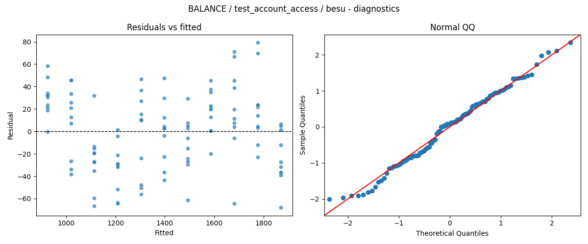

</details>

<details><summary>erigon — NNLS regression summary</summary>

```
==============================================================================
                           NNLS Regression Results                            
==============================================================================
Dep. Variable:          test_runtime_ms              R-squared:          0.997
Model:                  NNLS                    Adj. R-squared:          0.997
No. Observations:       88                                RMSE:           9.93
Df Residuals:           86                                 MAE:           7.62
Df Model:               1      
==============================================================================
                      coef     std err     P-value      [0.025      0.975]
------------------------------------------------------------------------------
         const      1.1560      2.1558       0.353      0.0000      6.8198
       opcount      0.0084      0.0000       0.001      0.0083      0.0085
==============================================================================
Notes: Non-negative least squares with bootstrap inference (1000 iterations)
==============================================================================
```


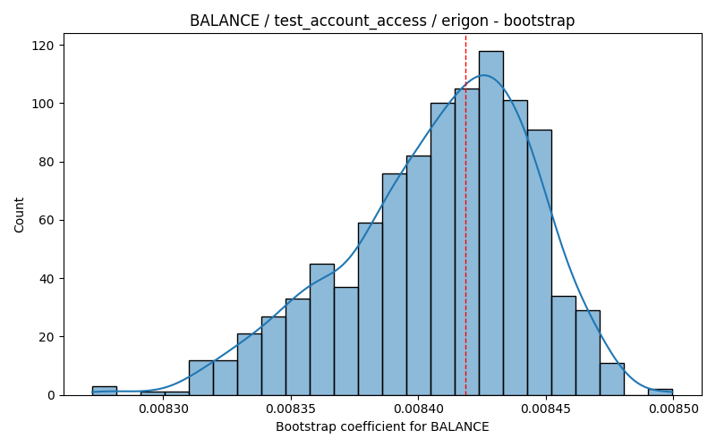

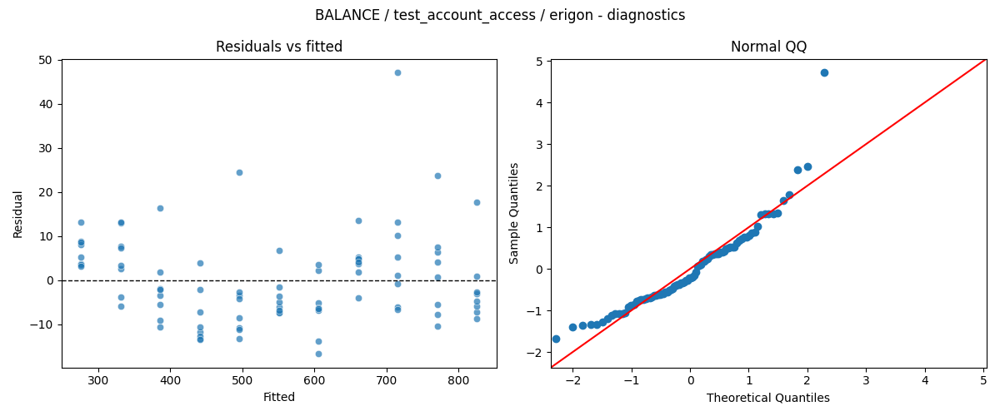

</details>

<details><summary>geth — NNLS regression summary</summary>

```
==============================================================================
                           NNLS Regression Results                            
==============================================================================
Dep. Variable:          test_runtime_ms              R-squared:          0.812
Model:                  NNLS                    Adj. R-squared:          0.809
No. Observations:       77                                RMSE:         180.06
Df Residuals:           75                                 MAE:         118.51
Df Model:               1      
==============================================================================
                      coef     std err     P-value      [0.025      0.975]
------------------------------------------------------------------------------
         const    187.1058     58.9925       0.001     79.8859    313.7853
       opcount      0.0181      0.0011       0.001      0.0159      0.0199
==============================================================================
Notes: Non-negative least squares with bootstrap inference (1000 iterations)
==============================================================================
```

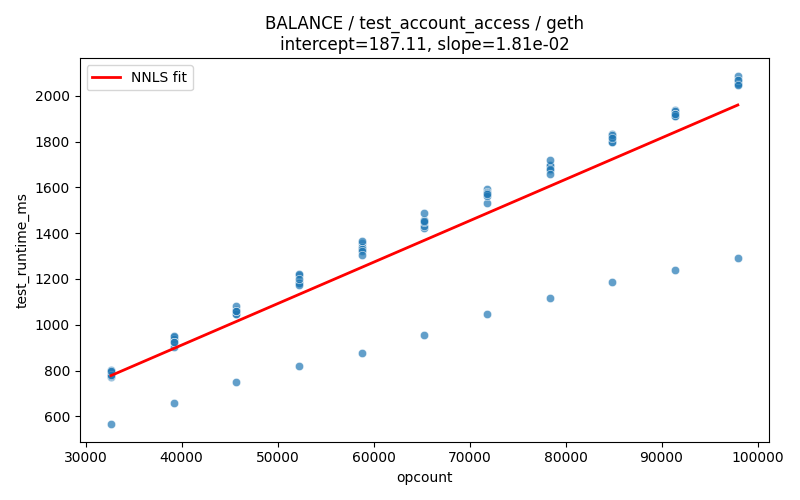

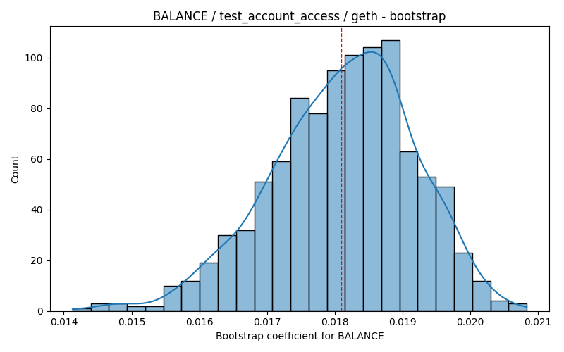

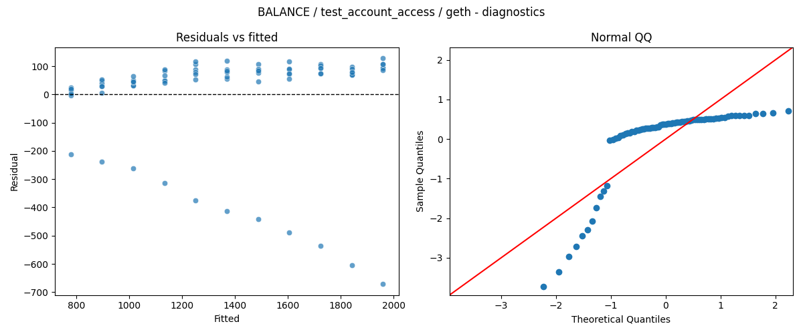

</details>

<details><summary>nethermind — NNLS regression summary</summary>

```
==============================================================================
                           NNLS Regression Results                            
==============================================================================
Dep. Variable:          test_runtime_ms              R-squared:          0.910
Model:                  NNLS                    Adj. R-squared:          0.910
No. Observations:       154                               RMSE:          20.08
Df Residuals:           152                                MAE:          16.60
Df Model:               1      
==============================================================================
                      coef     std err     P-value      [0.025      0.975]
------------------------------------------------------------------------------
         const    100.2535      4.9369       0.001     90.5085    110.0035
       opcount      0.0031      0.0001       0.001      0.0030      0.0033
==============================================================================
Notes: Non-negative least squares with bootstrap inference (1000 iterations)
==============================================================================
```

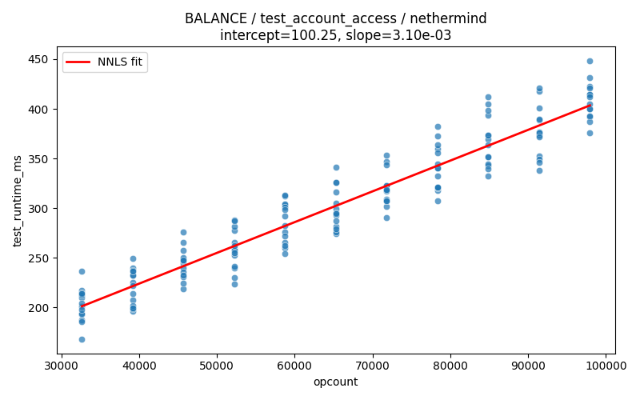

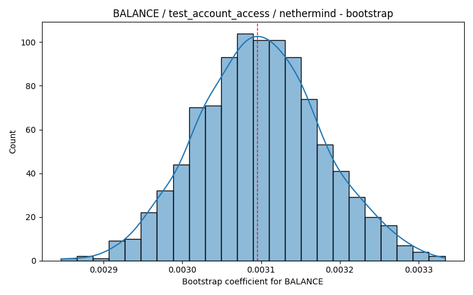

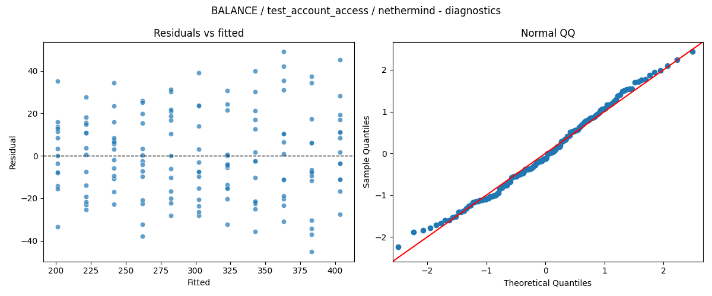

</details>

<details><summary>reth — NNLS regression summary</summary>

```
==============================================================================
                           NNLS Regression Results                            
==============================================================================
Dep. Variable:          test_runtime_ms              R-squared:          0.971
Model:                  NNLS                    Adj. R-squared:          0.971
No. Observations:       209                               RMSE:          14.52
Df Residuals:           207                                MAE:          11.35
Df Model:               1      
==============================================================================
                      coef     std err     P-value      [0.025      0.975]
------------------------------------------------------------------------------
         const     97.1602      3.1004       0.001     91.3259    103.1727
       opcount      0.0040      0.0000       0.001      0.0040      0.0041
==============================================================================
Notes: Non-negative least squares with bootstrap inference (1000 iterations)
==============================================================================
```

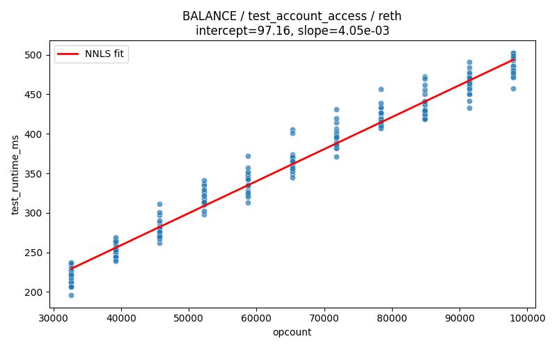

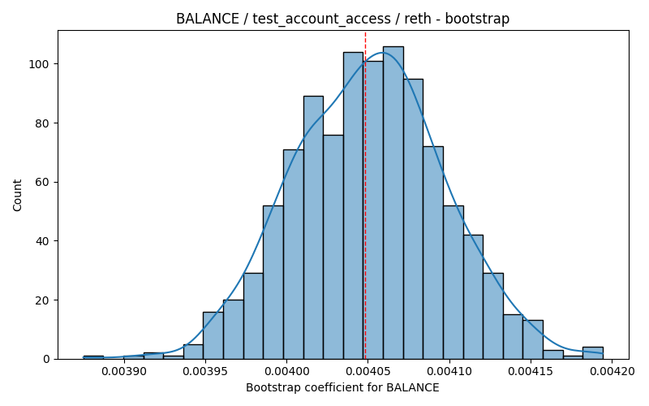

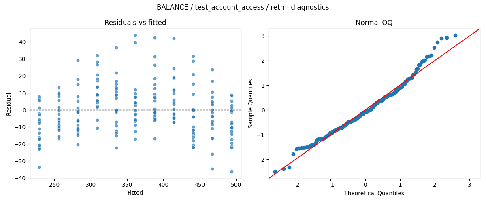

</details>

### test_account_access — combo `BALANCE_AccountMode.NON_EXISTING_ACCOUNT`

| client | nobs | R² | target_coef (ms) | p-value | 95% CI |
| --- | --- | --- | --- | --- | --- |
| `besu` | 110 | 0.9889 | 0.01466 | 1.00e-03 | [0.01436, 0.01496] |
| `erigon` | 88 | 0.9968 | 0.008051 | 1.00e-03 | [0.007959, 0.008089] |
| `geth` | 77 | 0.9262 | 0.01876 | 1.00e-03 | [0.01762, 0.02004] |
| `nethermind` | 154 | 0.9037 | 0.002962 | 1.00e-03 | [0.002789, 0.003129] |
| `reth` | 209 | 0.9663 | 0.004042 | 1.00e-03 | [0.003945, 0.004138] |

<details><summary>besu — NNLS regression summary</summary>

```
==============================================================================
                           NNLS Regression Results                            
==============================================================================
Dep. Variable:          test_runtime_ms              R-squared:          0.989
Model:                  NNLS                    Adj. R-squared:          0.989
No. Observations:       110                               RMSE:          32.03
Df Residuals:           108                                MAE:          25.94
Df Model:               1      
==============================================================================
                      coef     std err     P-value      [0.025      0.975]
------------------------------------------------------------------------------
         const    125.7219      9.5760       0.001    107.3975    145.5047
       opcount      0.0147      0.0002       0.001      0.0144      0.0150
==============================================================================
Notes: Non-negative least squares with bootstrap inference (1000 iterations)
==============================================================================
```

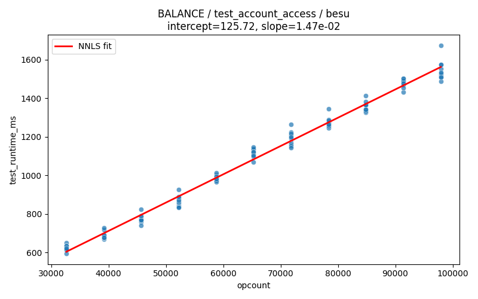

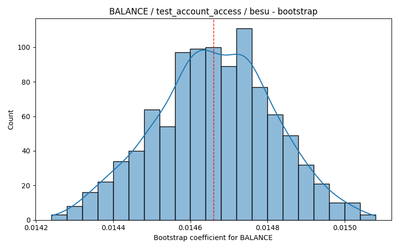

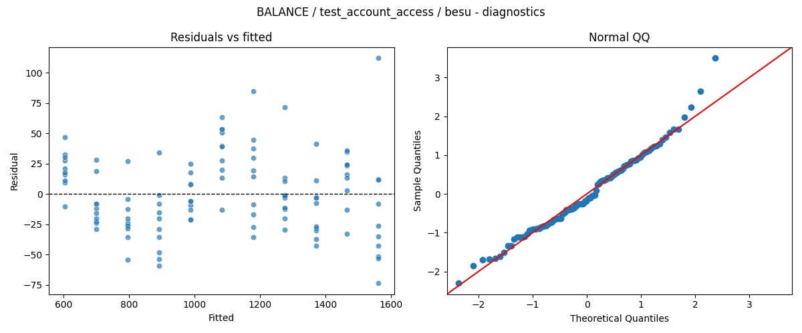

</details>

<details><summary>erigon — NNLS regression summary</summary>

```
==============================================================================
                           NNLS Regression Results                            
==============================================================================
Dep. Variable:          test_runtime_ms              R-squared:          0.997
Model:                  NNLS                    Adj. R-squared:          0.997
No. Observations:       88                                RMSE:           9.35
Df Residuals:           86                                 MAE:           7.07
Df Model:               1      
==============================================================================
                      coef     std err     P-value      [0.025      0.975]
------------------------------------------------------------------------------
         const      1.0466      2.1226       0.371      0.0000      7.0380
       opcount      0.0081      0.0000       0.001      0.0080      0.0081
==============================================================================
Notes: Non-negative least squares with bootstrap inference (1000 iterations)
==============================================================================
```

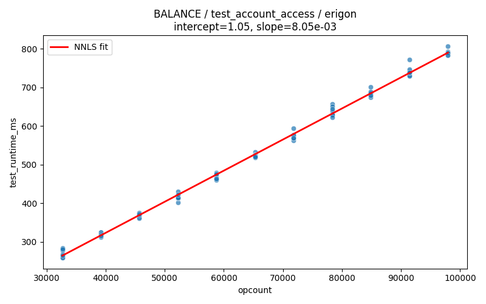

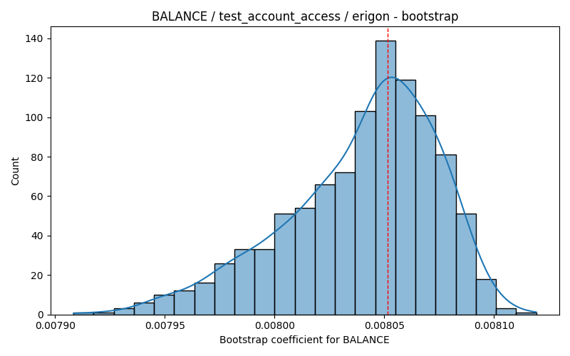

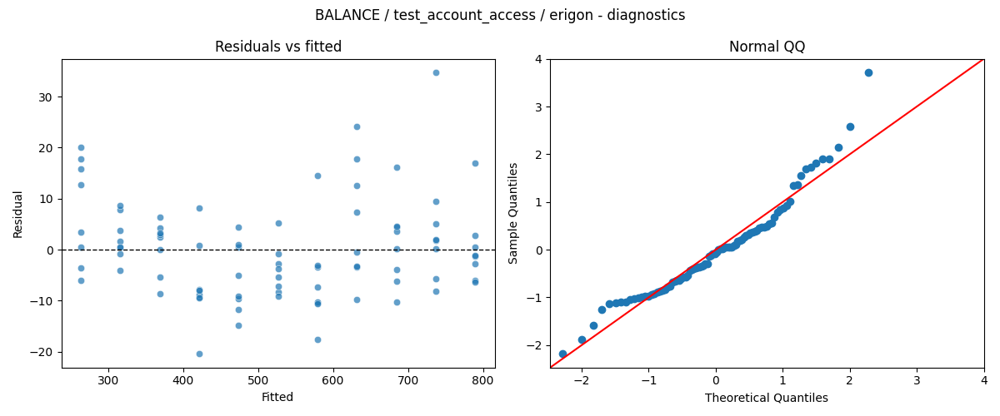

</details>

<details><summary>geth — NNLS regression summary</summary>

```
==============================================================================
                           NNLS Regression Results                            
==============================================================================
Dep. Variable:          test_runtime_ms              R-squared:          0.926
Model:                  NNLS                    Adj. R-squared:          0.925
No. Observations:       77                                RMSE:         109.31
Df Residuals:           75                                 MAE:          72.76
Df Model:               1      
==============================================================================
                      coef     std err     P-value      [0.025      0.975]
------------------------------------------------------------------------------
         const    214.0418     36.3419       0.001    144.0100    282.4639
       opcount      0.0188      0.0006       0.001      0.0176      0.0200
==============================================================================
Notes: Non-negative least squares with bootstrap inference (1000 iterations)
==============================================================================
```

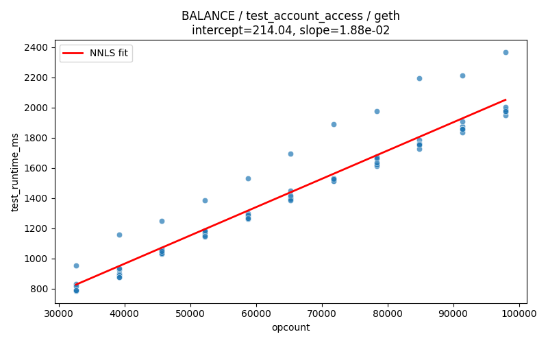

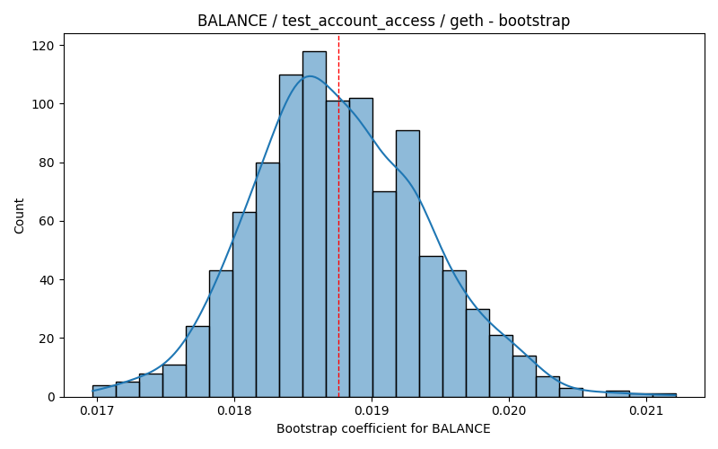

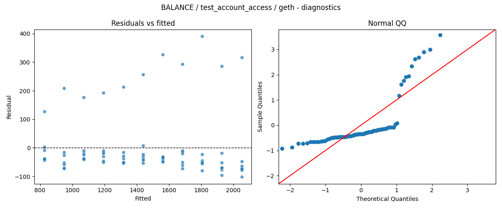

</details>

<details><summary>nethermind — NNLS regression summary</summary>

```
==============================================================================
                           NNLS Regression Results                            
==============================================================================
Dep. Variable:          test_runtime_ms              R-squared:          0.904
Model:                  NNLS                    Adj. R-squared:          0.903
No. Observations:       154                               RMSE:          19.97
Df Residuals:           152                                MAE:          15.93
Df Model:               1      
==============================================================================
                      coef     std err     P-value      [0.025      0.975]
------------------------------------------------------------------------------
         const     70.8012      5.1561       0.001     60.9041     80.9667
       opcount      0.0030      0.0001       0.001      0.0028      0.0031
==============================================================================
Notes: Non-negative least squares with bootstrap inference (1000 iterations)
==============================================================================
```

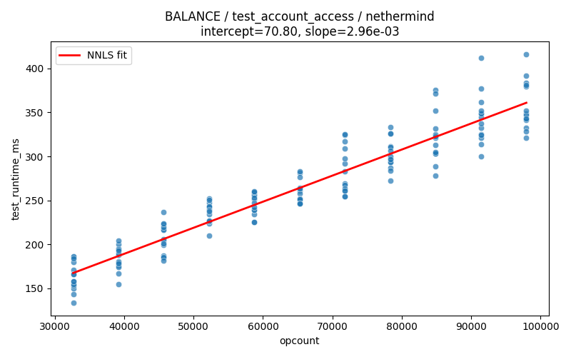

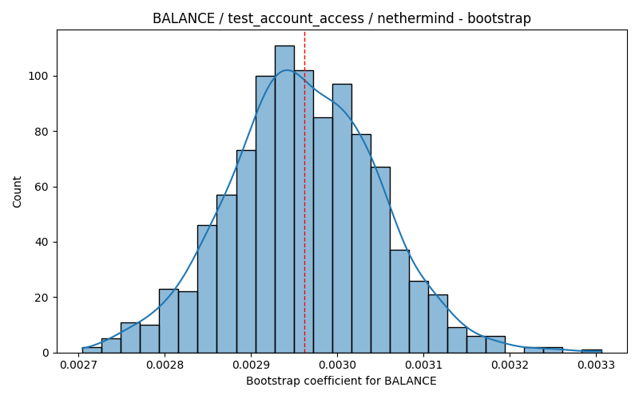

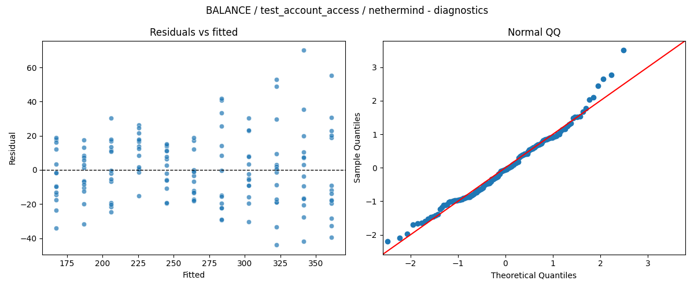

</details>

<details><summary>reth — NNLS regression summary</summary>

```
==============================================================================
                           NNLS Regression Results                            
==============================================================================
Dep. Variable:          test_runtime_ms              R-squared:          0.966
Model:                  NNLS                    Adj. R-squared:          0.966
No. Observations:       209                               RMSE:          15.58
Df Residuals:           207                                MAE:          12.04
Df Model:               1      
==============================================================================
                      coef     std err     P-value      [0.025      0.975]
------------------------------------------------------------------------------
         const     95.5972      3.0612       0.001     89.7353    101.5488
       opcount      0.0040      0.0001       0.001      0.0039      0.0041
==============================================================================
Notes: Non-negative least squares with bootstrap inference (1000 iterations)
==============================================================================
```


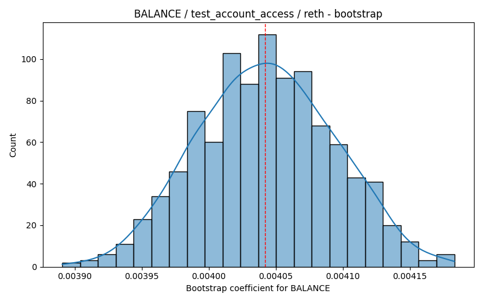

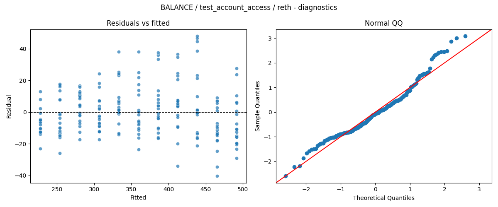

</details>

### test_account_access — combo `BALANCE_AccountMode.EXISTING_CONTRACT_DIFF_MAX`

| client | nobs | R² | target_coef (ms) | p-value | 95% CI |
| --- | --- | --- | --- | --- | --- |
| `besu` | 110 | 0.9808 | 0.01981 | 1.00e-03 | [0.01931, 0.02024] |
| `erigon` | 88 | 0.9943 | 0.00906 | 1.00e-03 | [0.008915, 0.0092] |
| `geth` | 77 | 0.9249 | 0.003494 | 1.00e-03 | [0.003425, 0.003574] |
| `nethermind` | 154 | 0.7143 | 0.001911 | 1.00e-03 | [0.001707, 0.002109] |
| `reth` | 209 | 0.9924 | 0.01864 | 1.00e-03 | [0.0184, 0.01888] |

<details><summary>besu — NNLS regression summary</summary>

```
==============================================================================
                           NNLS Regression Results                            
==============================================================================
Dep. Variable:          test_runtime_ms              R-squared:          0.981
Model:                  NNLS                    Adj. R-squared:          0.981
No. Observations:       110                               RMSE:          56.43
Df Residuals:           108                                MAE:          43.40
Df Model:               1      
==============================================================================
                      coef     std err     P-value      [0.025      0.975]
------------------------------------------------------------------------------
         const    402.7088     17.2248       0.001    370.8751    439.6222
       opcount      0.0198      0.0002       0.001      0.0193      0.0202
==============================================================================
Notes: Non-negative least squares with bootstrap inference (1000 iterations)
==============================================================================
```

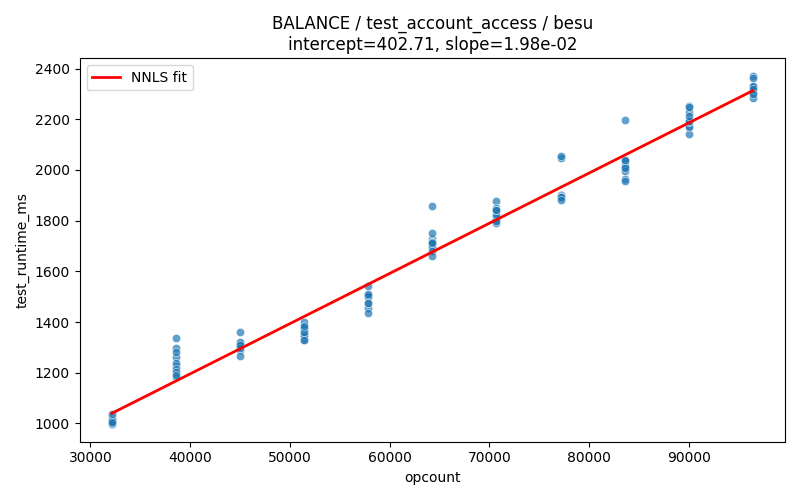

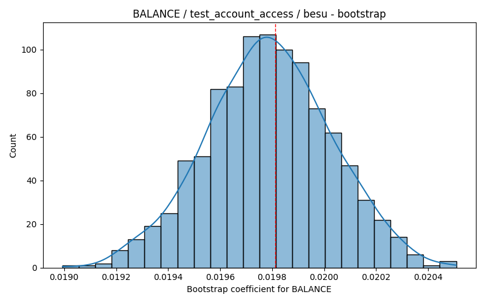

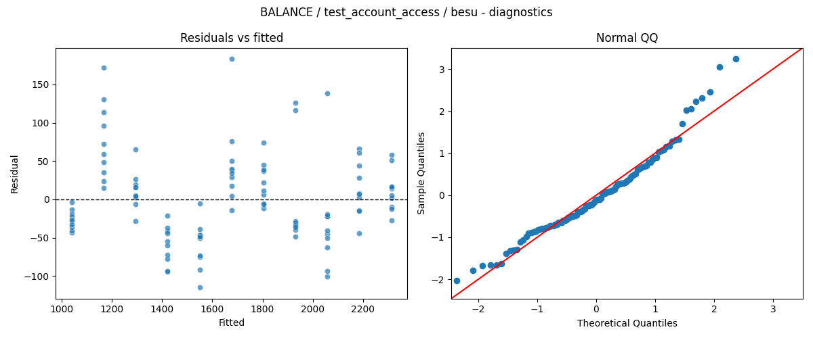

</details>

<details><summary>erigon — NNLS regression summary</summary>

```
==============================================================================
                           NNLS Regression Results                            
==============================================================================
Dep. Variable:          test_runtime_ms              R-squared:          0.994
Model:                  NNLS                    Adj. R-squared:          0.994
No. Observations:       88                                RMSE:          13.94
Df Residuals:           86                                 MAE:          10.50
Df Model:               1      
==============================================================================
                      coef     std err     P-value      [0.025      0.975]
------------------------------------------------------------------------------
         const     76.9328      4.9507       0.001     66.8393     86.5833
       opcount      0.0091      0.0001       0.001      0.0089      0.0092
==============================================================================
Notes: Non-negative least squares with bootstrap inference (1000 iterations)
==============================================================================
```


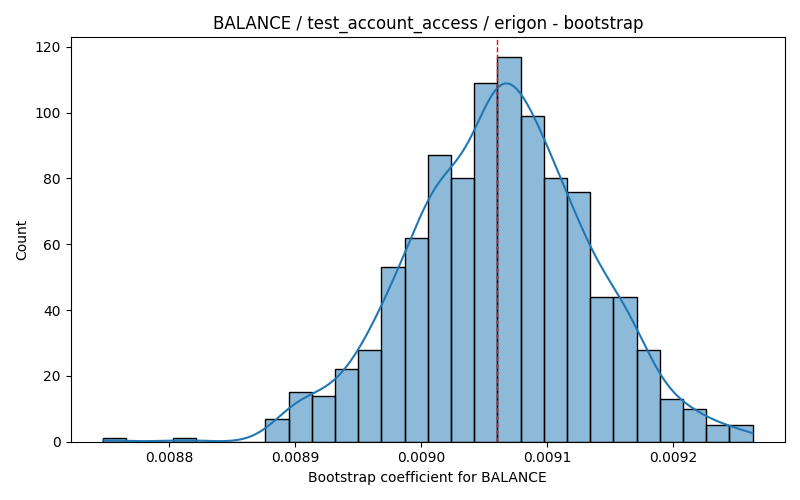

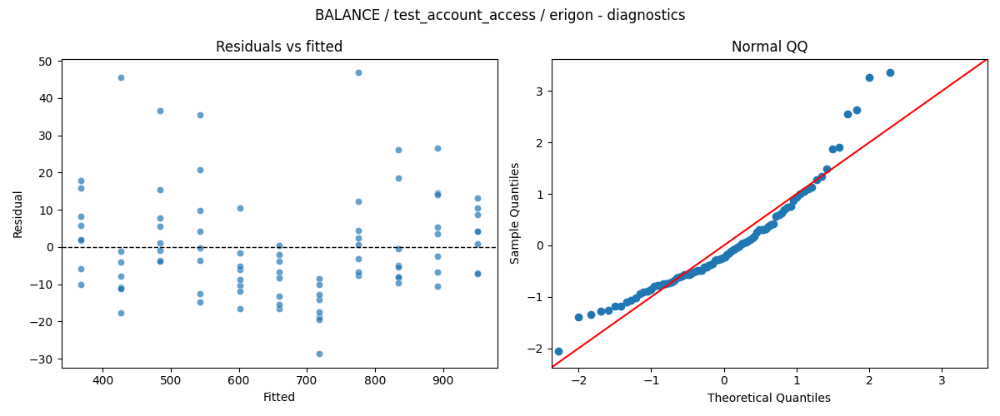

</details>

<details><summary>geth — NNLS regression summary</summary>

```
==============================================================================
                           NNLS Regression Results                            
==============================================================================
Dep. Variable:          test_runtime_ms              R-squared:          0.925
Model:                  NNLS                    Adj. R-squared:          0.924
No. Observations:       77                                RMSE:          22.77
Df Residuals:           75                                 MAE:          17.19
Df Model:               1      
==============================================================================
                      coef     std err     P-value      [0.025      0.975]
------------------------------------------------------------------------------
         const      0.0000      0.0000       1.000      0.0000      0.0000
       opcount      0.0035      0.0000       0.001      0.0034      0.0036
==============================================================================
Notes: Non-negative least squares with bootstrap inference (1000 iterations)
==============================================================================
```

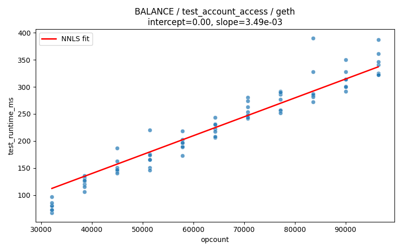

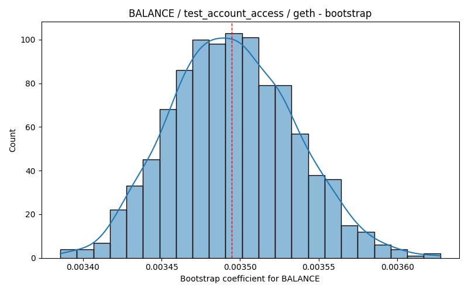

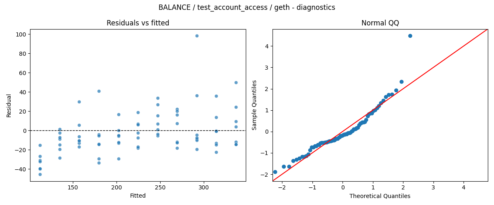

</details>

<details><summary>nethermind — NNLS regression summary</summary>

```
==============================================================================
                           NNLS Regression Results                            
==============================================================================
Dep. Variable:          test_runtime_ms              R-squared:          0.714
Model:                  NNLS                    Adj. R-squared:          0.712
No. Observations:       154                               RMSE:          24.58
Df Residuals:           152                                MAE:          19.04
Df Model:               1      
==============================================================================
                      coef     std err     P-value      [0.025      0.975]
------------------------------------------------------------------------------
         const     87.5765      5.6852       0.001     76.2552     98.9759
       opcount      0.0019      0.0001       0.001      0.0017      0.0021
==============================================================================
Notes: Non-negative least squares with bootstrap inference (1000 iterations)
==============================================================================
```

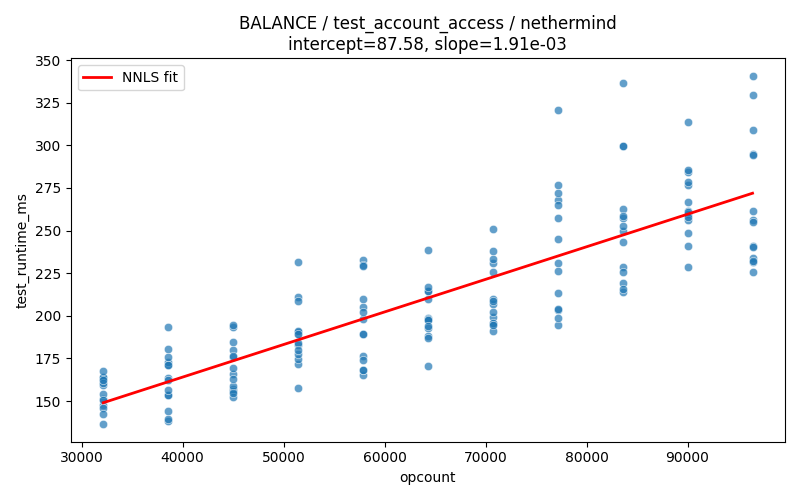

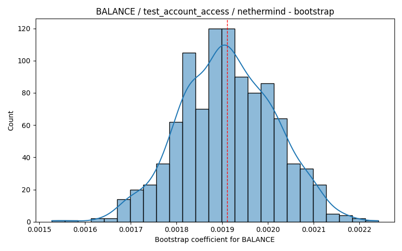

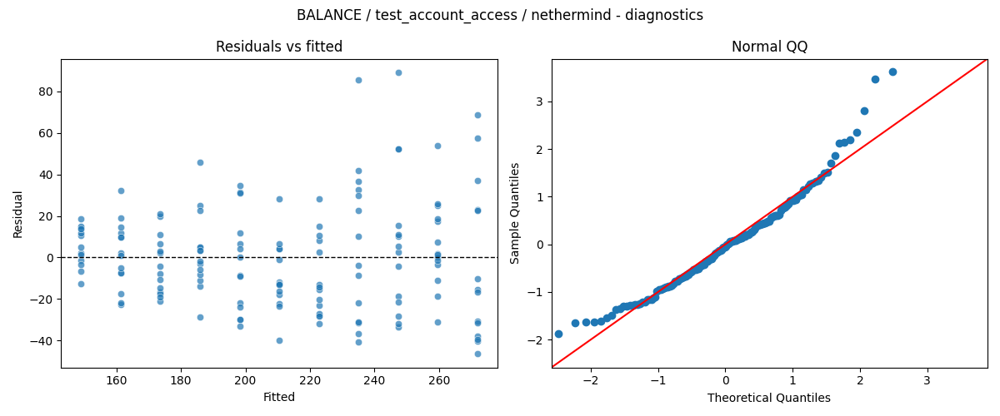

</details>

<details><summary>reth — NNLS regression summary</summary>

```
==============================================================================
                           NNLS Regression Results                            
==============================================================================
Dep. Variable:          test_runtime_ms              R-squared:          0.992
Model:                  NNLS                    Adj. R-squared:          0.992
No. Observations:       209                               RMSE:          33.10
Df Residuals:           207                                MAE:          23.76
Df Model:               1      
==============================================================================
                      coef     std err     P-value      [0.025      0.975]
------------------------------------------------------------------------------
         const    131.9697      8.7243       0.001    116.1976    149.6496
       opcount      0.0186      0.0001       0.001      0.0184      0.0189
==============================================================================
Notes: Non-negative least squares with bootstrap inference (1000 iterations)
==============================================================================
```

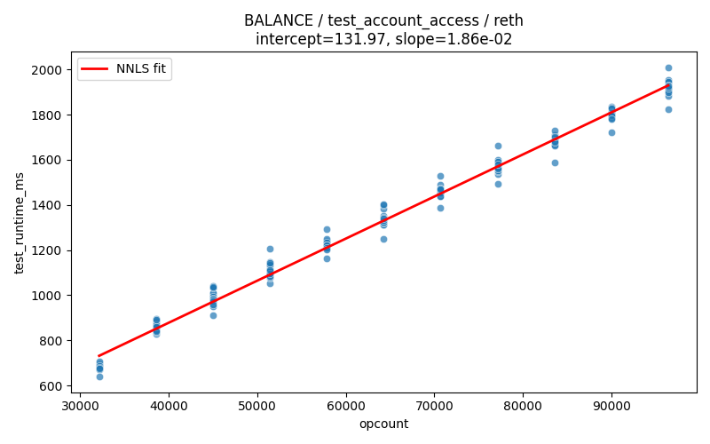

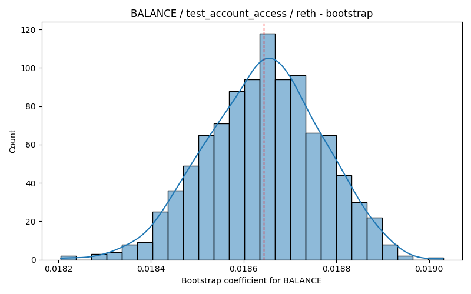

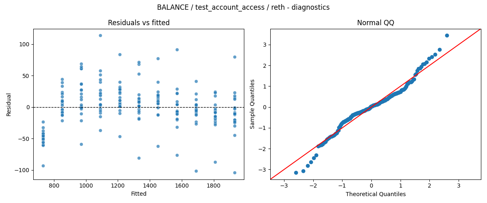

</details>

### test_account_access — combo `BALANCE_AccountMode.EXISTING_CONTRACT_MINIMAL`

| client | nobs | R² | target_coef (ms) | p-value | 95% CI |
| --- | --- | --- | --- | --- | --- |
| `besu` | 110 | 0.9773 | 0.01164 | 1.00e-03 | [0.01127, 0.01205] |
| `erigon` | 88 | 0.9881 | 0.008078 | 1.00e-03 | [0.007916, 0.008257] |
| `geth` | 77 | 0.4658 | 0.0162 | 1.00e-03 | [0.01177, 0.01944] |
| `nethermind` | 154 | 0.7272 | 0.001726 | 1.00e-03 | [0.001543, 0.001893] |
| `reth` | 209 | 0.9565 | 0.00388 | 1.00e-03 | [0.003767, 0.004] |

<details><summary>besu — NNLS regression summary</summary>

```
==============================================================================
                           NNLS Regression Results                            
==============================================================================
Dep. Variable:          test_runtime_ms              R-squared:          0.977
Model:                  NNLS                    Adj. R-squared:          0.977
No. Observations:       110                               RMSE:          36.07
Df Residuals:           108                                MAE:          29.45
Df Model:               1      
==============================================================================
                      coef     std err     P-value      [0.025      0.975]
------------------------------------------------------------------------------
         const    381.8478     11.7016       0.001    359.5516    404.5625
       opcount      0.0116      0.0002       0.001      0.0113      0.0120
==============================================================================
Notes: Non-negative least squares with bootstrap inference (1000 iterations)
==============================================================================
```

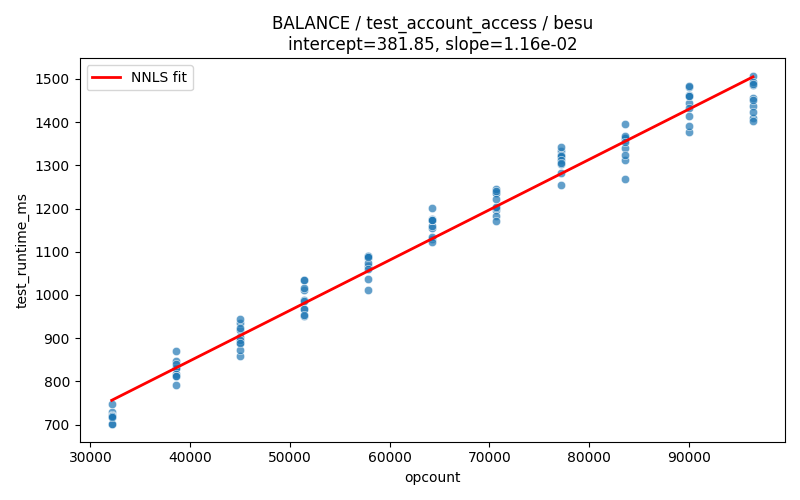

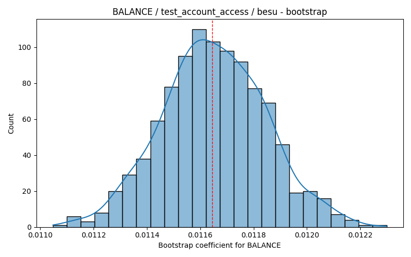

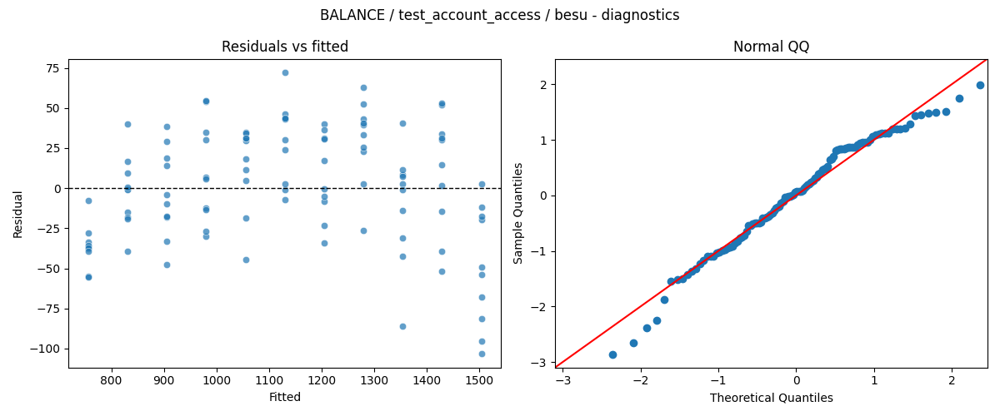

</details>

<details><summary>erigon — NNLS regression summary</summary>

```
==============================================================================
                           NNLS Regression Results                            
==============================================================================
Dep. Variable:          test_runtime_ms              R-squared:          0.988
Model:                  NNLS                    Adj. R-squared:          0.988
No. Observations:       88                                RMSE:          18.02
Df Residuals:           86                                 MAE:          13.77
Df Model:               1      
==============================================================================
                      coef     std err     P-value      [0.025      0.975]
------------------------------------------------------------------------------
         const     97.0882      6.3187       0.001     84.0880    108.7362
       opcount      0.0081      0.0001       0.001      0.0079      0.0083
==============================================================================
Notes: Non-negative least squares with bootstrap inference (1000 iterations)
==============================================================================
```

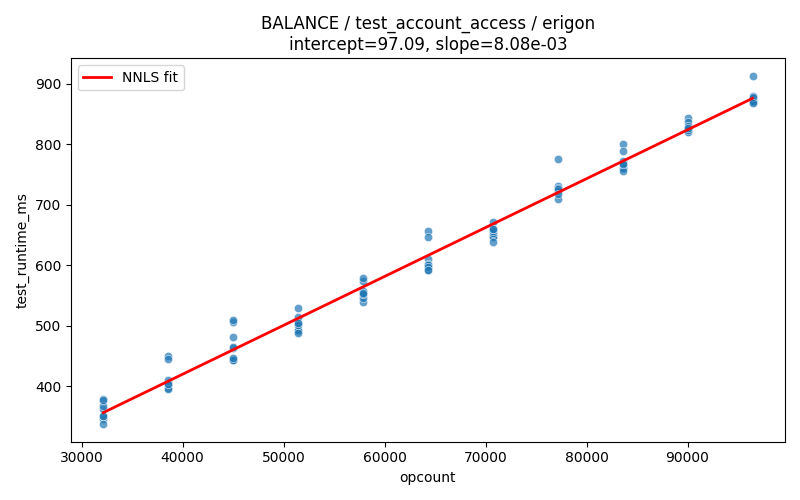

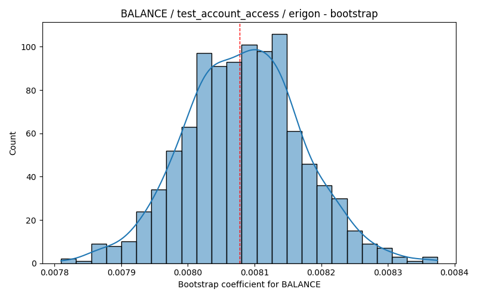


</details>

<details><summary>geth — NNLS regression summary</summary>

```
==============================================================================
                           NNLS Regression Results                            
==============================================================================
Dep. Variable:          test_runtime_ms              R-squared:          0.466
Model:                  NNLS                    Adj. R-squared:          0.459
No. Observations:       77                                RMSE:         352.74
Df Residuals:           75                                 MAE:         237.62
Df Model:               1      
==============================================================================
                      coef     std err     P-value      [0.025      0.975]
------------------------------------------------------------------------------
         const    172.2196    113.4708       0.074      0.0000    412.3947
       opcount      0.0162      0.0020       0.001      0.0118      0.0194
==============================================================================
Notes: Non-negative least squares with bootstrap inference (1000 iterations)
==============================================================================
```

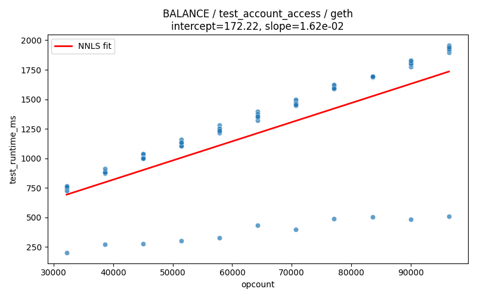

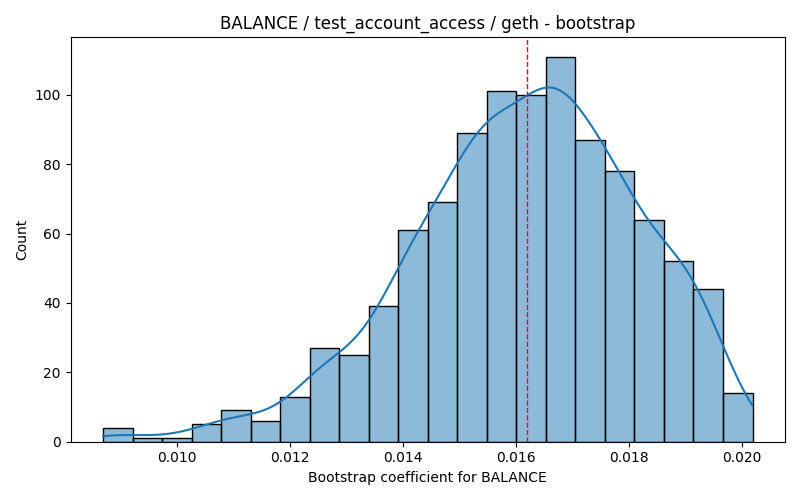


</details>

<details><summary>nethermind — NNLS regression summary</summary>

```
==============================================================================
                           NNLS Regression Results                            
==============================================================================
Dep. Variable:          test_runtime_ms              R-squared:          0.727
Model:                  NNLS                    Adj. R-squared:          0.725
No. Observations:       154                               RMSE:          21.50
Df Residuals:           152                                MAE:          16.88
Df Model:               1      
==============================================================================
                      coef     std err     P-value      [0.025      0.975]
------------------------------------------------------------------------------
         const     94.3776      5.3639       0.001     84.1917    105.2520
       opcount      0.0017      0.0001       0.001      0.0015      0.0019
==============================================================================
Notes: Non-negative least squares with bootstrap inference (1000 iterations)
==============================================================================
```

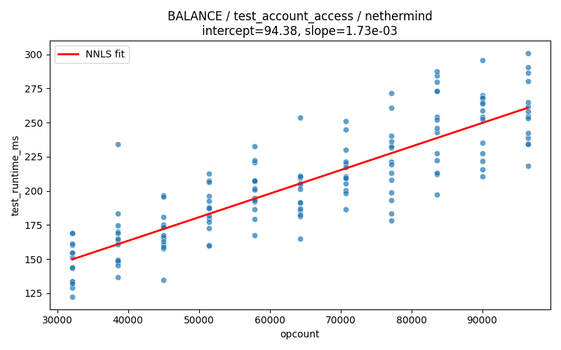

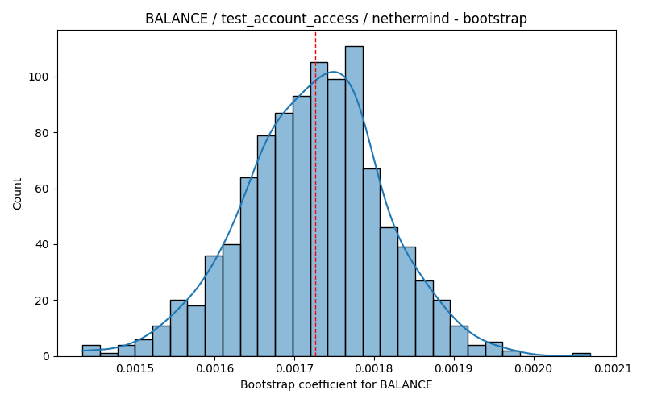

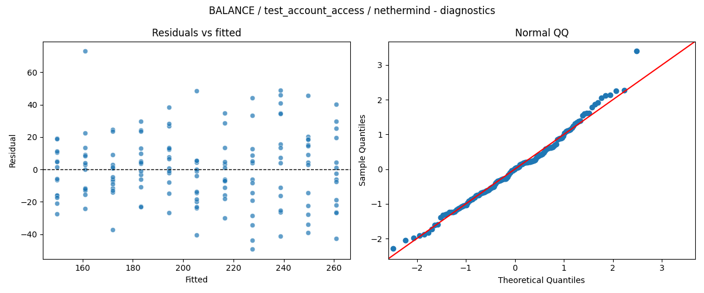

</details>

<details><summary>reth — NNLS regression summary</summary>

```
==============================================================================
                           NNLS Regression Results                            
==============================================================================
Dep. Variable:          test_runtime_ms              R-squared:          0.957
Model:                  NNLS                    Adj. R-squared:          0.956
No. Observations:       209                               RMSE:          16.81
Df Residuals:           207                                MAE:          13.20
Df Model:               1      
==============================================================================
                      coef     std err     P-value      [0.025      0.975]
------------------------------------------------------------------------------
         const     87.7232      3.5739       0.001     80.6756     94.9929
       opcount      0.0039      0.0001       0.001      0.0038      0.0040
==============================================================================
Notes: Non-negative least squares with bootstrap inference (1000 iterations)
==============================================================================
```

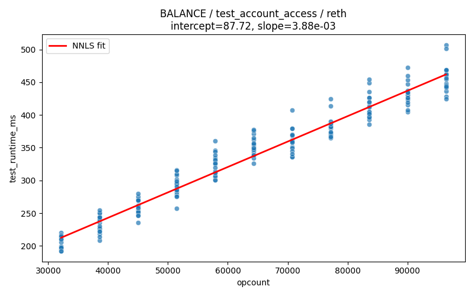

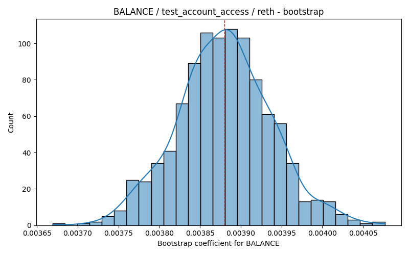

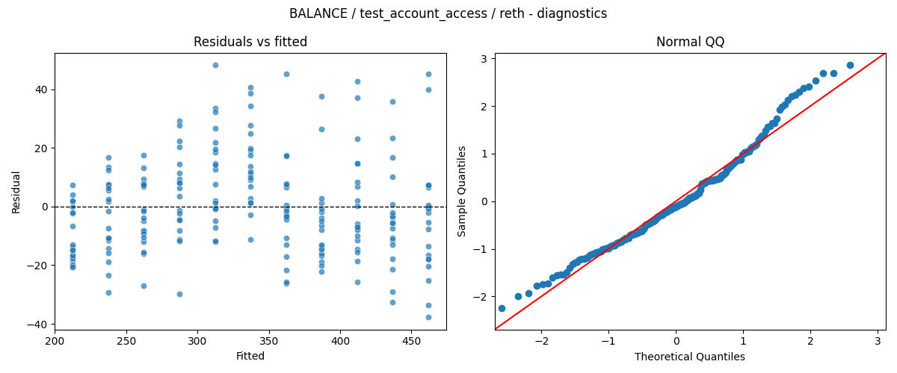

</details>

### test_account_access — combo `BALANCE_AccountMode.EXISTING_CONTRACT_SAME_MAX`

| client | nobs | R² | target_coef (ms) | p-value | 95% CI |
| --- | --- | --- | --- | --- | --- |
| `besu` | 110 | 0.9602 | 0.01055 | 1.00e-03 | [0.01011, 0.01097] |
| `erigon` | 88 | 0.9881 | 0.008342 | 1.00e-03 | [0.008164, 0.008499] |
| `geth` | 77 | 0.4494 | 0.01566 | 1.00e-03 | [0.01117, 0.01899] |
| `nethermind` | 154 | 0.7015 | 0.001521 | 1.00e-03 | [0.001366, 0.001664] |
| `reth` | 209 | 0.9659 | 0.003895 | 1.00e-03 | [0.003798, 0.003987] |

<details><summary>besu — NNLS regression summary</summary>

```
==============================================================================
                           NNLS Regression Results                            
==============================================================================
Dep. Variable:          test_runtime_ms              R-squared:          0.960
Model:                  NNLS                    Adj. R-squared:          0.960
No. Observations:       110                               RMSE:          43.65
Df Residuals:           108                                MAE:          34.82
Df Model:               1      
==============================================================================
                      coef     std err     P-value      [0.025      0.975]
------------------------------------------------------------------------------
         const    416.5863     14.7909       0.001    390.2820    446.3133
       opcount      0.0105      0.0002       0.001      0.0101      0.0110
==============================================================================
Notes: Non-negative least squares with bootstrap inference (1000 iterations)
==============================================================================
```

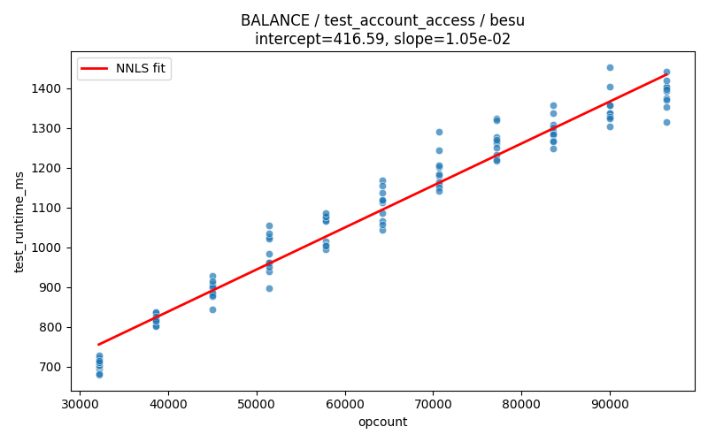

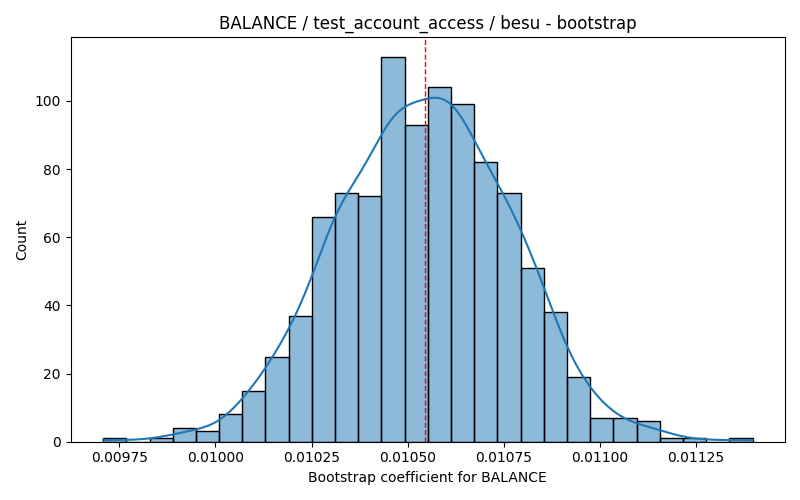

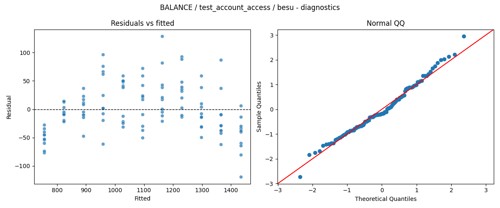

</details>

<details><summary>erigon — NNLS regression summary</summary>

```
==============================================================================
                           NNLS Regression Results                            
==============================================================================
Dep. Variable:          test_runtime_ms              R-squared:          0.988
Model:                  NNLS                    Adj. R-squared:          0.988
No. Observations:       88                                RMSE:          18.65
Df Residuals:           86                                 MAE:          13.61
Df Model:               1      
==============================================================================
                      coef     std err     P-value      [0.025      0.975]
------------------------------------------------------------------------------
         const     79.0302      5.9766       0.001     68.6515     91.9915
       opcount      0.0083      0.0001       0.001      0.0082      0.0085
==============================================================================
Notes: Non-negative least squares with bootstrap inference (1000 iterations)
==============================================================================
```

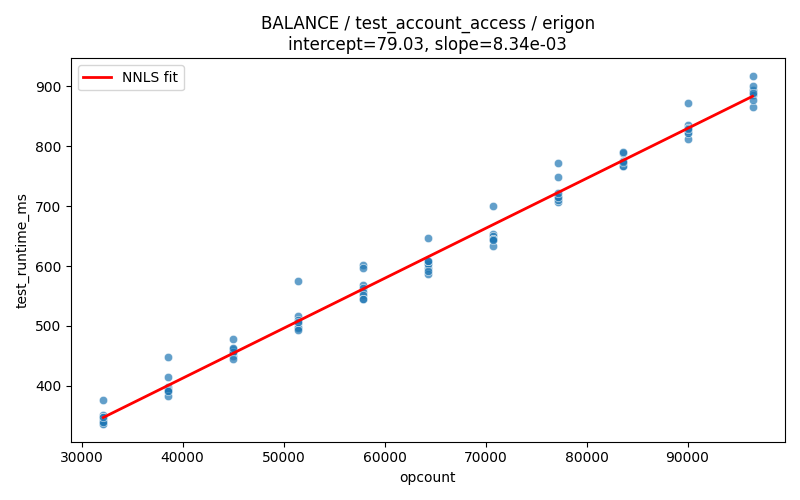

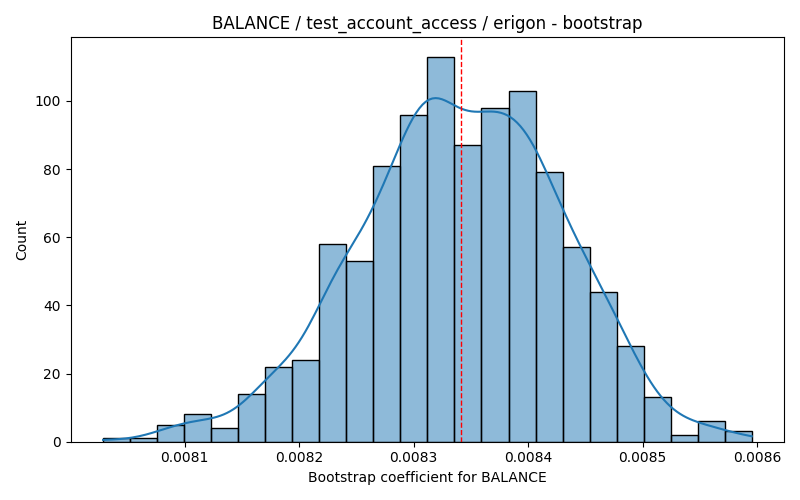

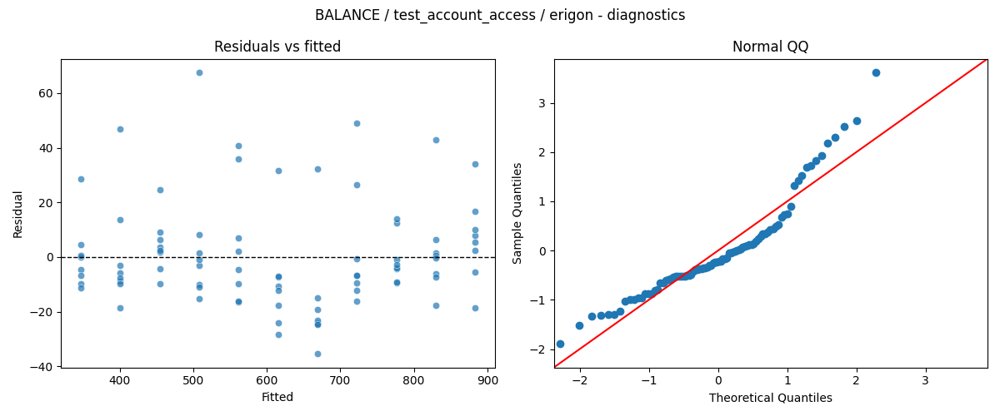

</details>

<details><summary>geth — NNLS regression summary</summary>

```
==============================================================================
                           NNLS Regression Results                            
==============================================================================
Dep. Variable:          test_runtime_ms              R-squared:          0.449
Model:                  NNLS                    Adj. R-squared:          0.442
No. Observations:       77                                RMSE:         352.44
Df Residuals:           75                                 MAE:         236.93
Df Model:               1      
==============================================================================
                      coef     std err     P-value      [0.025      0.975]
------------------------------------------------------------------------------
         const    195.1577    113.5884       0.033      0.0000    443.3657
       opcount      0.0157      0.0020       0.001      0.0112      0.0190
==============================================================================
Notes: Non-negative least squares with bootstrap inference (1000 iterations)
==============================================================================
```


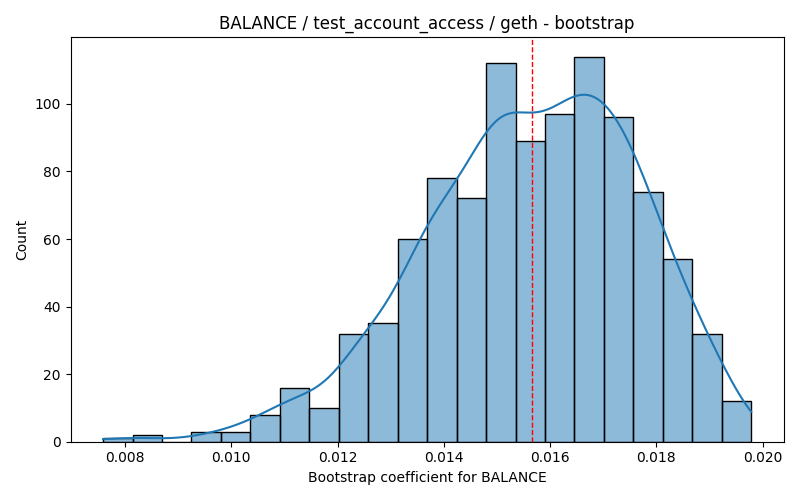

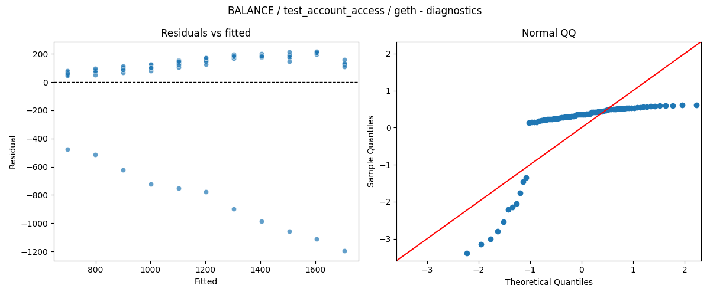

</details>

<details><summary>nethermind — NNLS regression summary</summary>

```
==============================================================================
                           NNLS Regression Results                            
==============================================================================
Dep. Variable:          test_runtime_ms              R-squared:          0.702
Model:                  NNLS                    Adj. R-squared:          0.700
No. Observations:       154                               RMSE:          20.17
Df Residuals:           152                                MAE:          16.18
Df Model:               1      
==============================================================================
                      coef     std err     P-value      [0.025      0.975]
------------------------------------------------------------------------------
         const    110.9854      5.0496       0.001    101.6351    121.2017
       opcount      0.0015      0.0001       0.001      0.0014      0.0017
==============================================================================
Notes: Non-negative least squares with bootstrap inference (1000 iterations)
==============================================================================
```

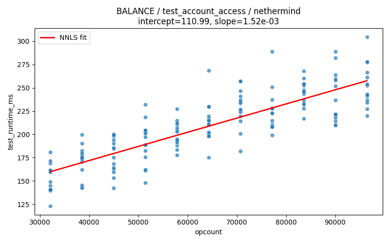

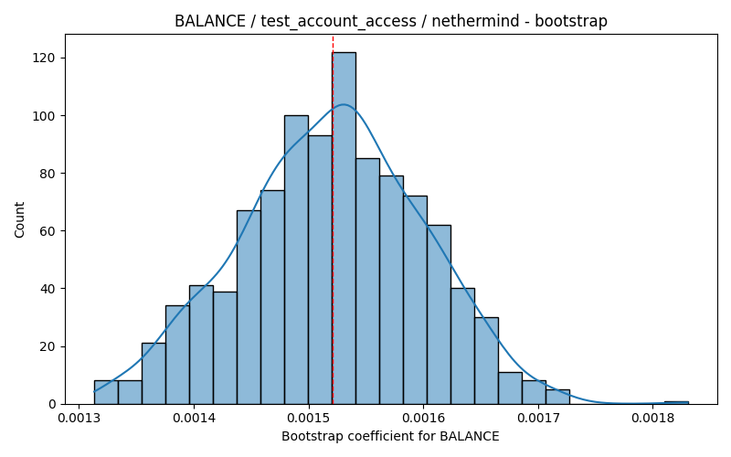

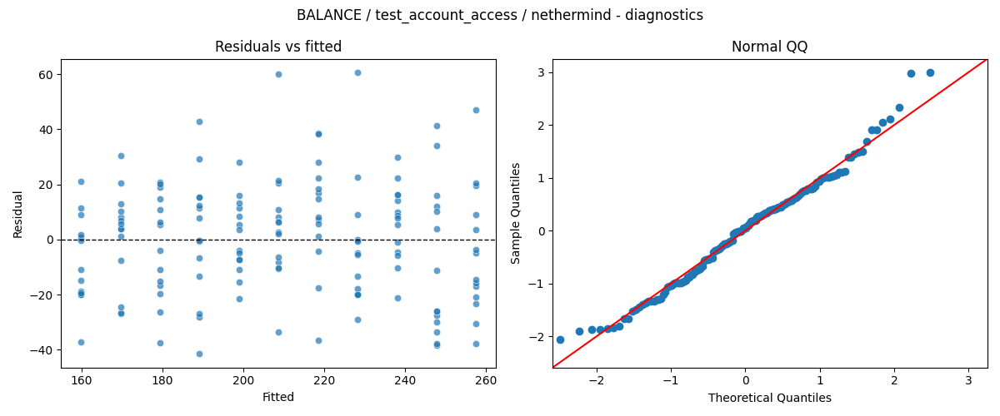

</details>

<details><summary>reth — NNLS regression summary</summary>

```
==============================================================================
                           NNLS Regression Results                            
==============================================================================
Dep. Variable:          test_runtime_ms              R-squared:          0.966
Model:                  NNLS                    Adj. R-squared:          0.966
No. Observations:       209                               RMSE:          14.87
Df Residuals:           207                                MAE:          11.38
Df Model:               1      
==============================================================================
                      coef     std err     P-value      [0.025      0.975]
------------------------------------------------------------------------------
         const     88.6910      3.0422       0.001     83.1023     94.7330
       opcount      0.0039      0.0000       0.001      0.0038      0.0040
==============================================================================
Notes: Non-negative least squares with bootstrap inference (1000 iterations)
==============================================================================
```

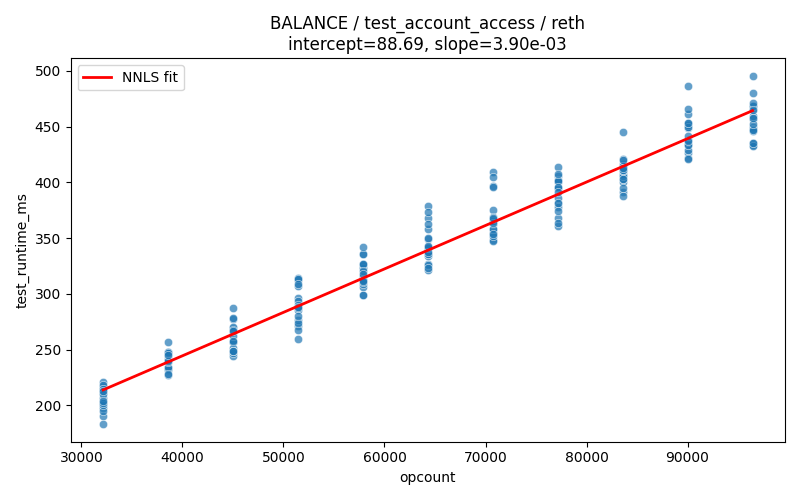

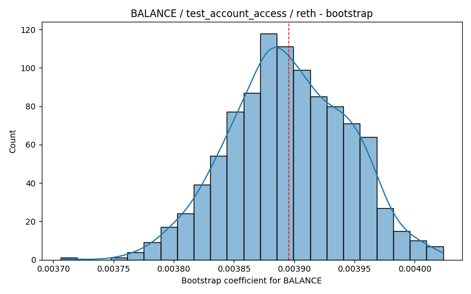

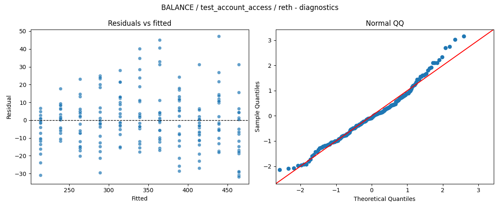

</details>

## CALL

### test_ext_account_query_warm — combo `CALL`

| client | nobs | R² | target_coef (ms) | p-value | 95% CI |
| --- | --- | --- | --- | --- | --- |
| `besu` | 110 | 0.9206 | 0.0004505 | 1.00e-03 | [0.0004228, 0.0004799] |
| `erigon` | 88 | 0.8226 | 7.213e-05 | 1.00e-03 | [6.56e-05, 7.928e-05] |
| `geth` | 77 | 0.8394 | 0.0001113 | 1.00e-03 | [0.000101, 0.0001224] |
| `nethermind` | 154 | 0.77 | 0.0002912 | 1.00e-03 | [0.0002658, 0.0003171] |
| `reth` | 209 | 0.943 | 5.752e-05 | 1.00e-03 | [5.571e-05, 5.951e-05] |

<details><summary>besu — NNLS regression summary</summary>

```
==============================================================================
                           NNLS Regression Results                            
==============================================================================
Dep. Variable:          test_runtime_ms              R-squared:          0.921
Model:                  NNLS                    Adj. R-squared:          0.920
No. Observations:       110                               RMSE:          66.86
Df Residuals:           108                                MAE:          53.66
Df Model:               1      
==============================================================================
                      coef     std err     P-value      [0.025      0.975]
------------------------------------------------------------------------------
         const    510.7648     25.2860       0.001    459.2574    558.3430
       opcount      0.0005      0.0000       0.001      0.0004      0.0005
==============================================================================
Notes: Non-negative least squares with bootstrap inference (1000 iterations)
==============================================================================
```

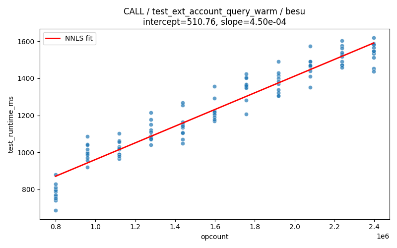

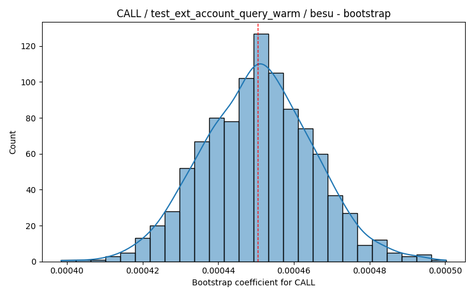

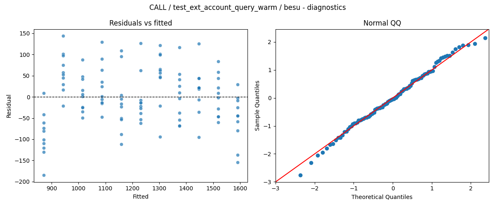

</details>

<details><summary>erigon — NNLS regression summary</summary>

```
==============================================================================
                           NNLS Regression Results                            
==============================================================================
Dep. Variable:          test_runtime_ms              R-squared:          0.823
Model:                  NNLS                    Adj. R-squared:          0.821
No. Observations:       88                                RMSE:          16.93
Df Residuals:           86                                 MAE:          12.08
Df Model:               1      
==============================================================================
                      coef     std err     P-value      [0.025      0.975]
------------------------------------------------------------------------------
         const     35.2791      5.5986       0.001     24.1181     46.6964
       opcount      0.0001      0.0000       0.001      0.0001      0.0001
==============================================================================
Notes: Non-negative least squares with bootstrap inference (1000 iterations)
==============================================================================
```

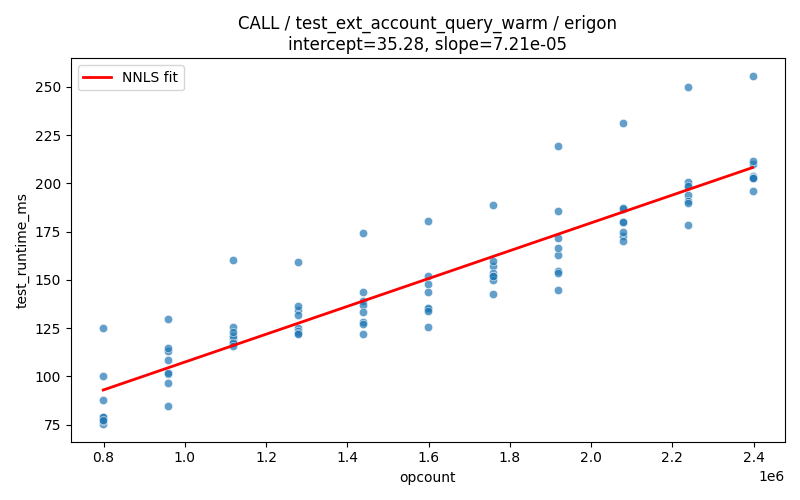

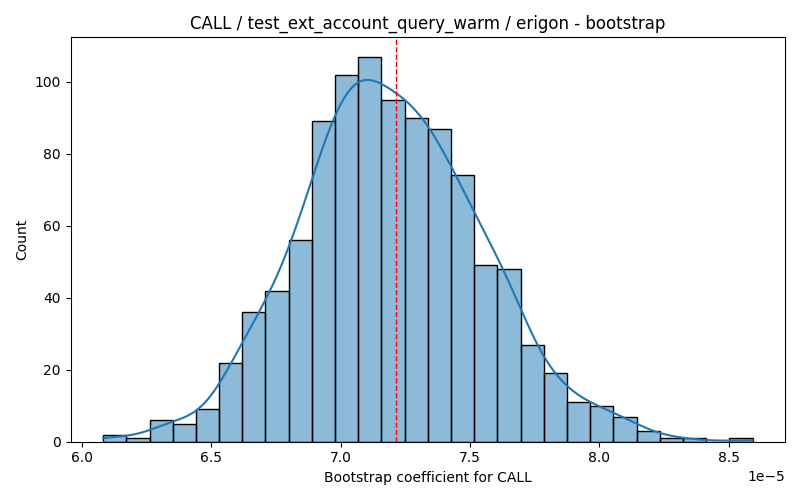

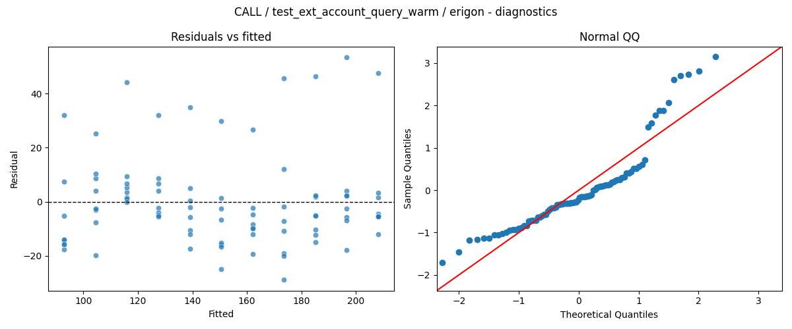

</details>

<details><summary>geth — NNLS regression summary</summary>

```
==============================================================================
                           NNLS Regression Results                            
==============================================================================
Dep. Variable:          test_runtime_ms              R-squared:          0.839
Model:                  NNLS                    Adj. R-squared:          0.837
No. Observations:       77                                RMSE:          24.60
Df Residuals:           75                                 MAE:          19.27
Df Model:               1      
==============================================================================
                      coef     std err     P-value      [0.025      0.975]
------------------------------------------------------------------------------
         const     39.1858      7.9167       0.001     23.9892     54.0584
       opcount      0.0001      0.0000       0.001      0.0001      0.0001
==============================================================================
Notes: Non-negative least squares with bootstrap inference (1000 iterations)
==============================================================================
```

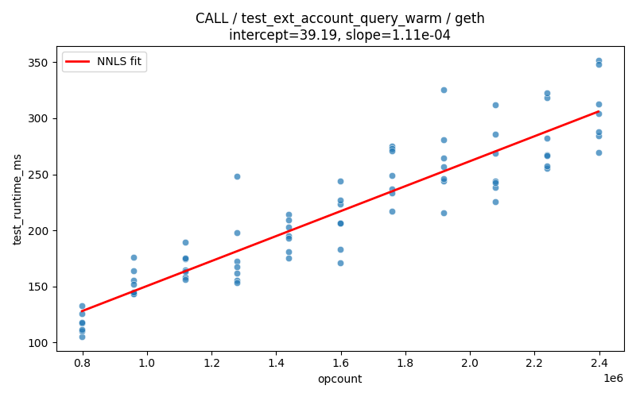

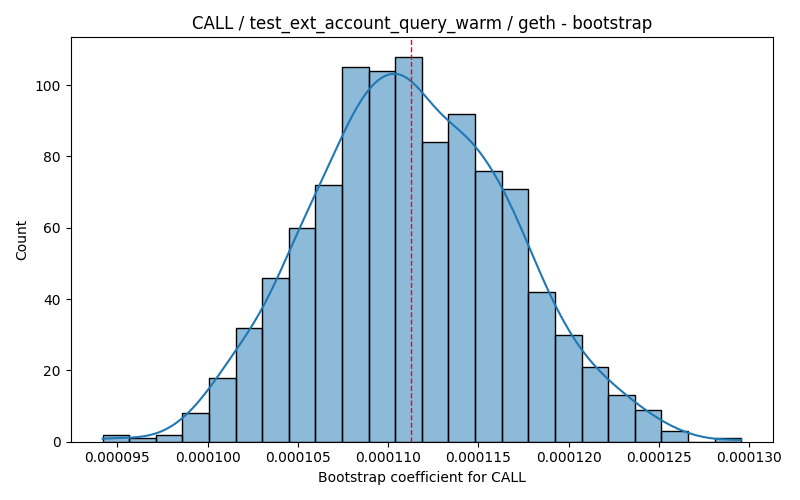

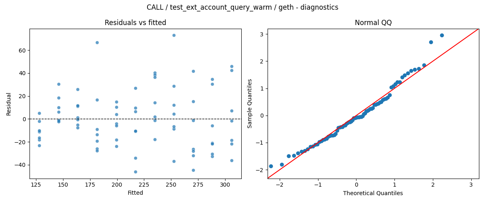

</details>

<details><summary>nethermind — NNLS regression summary</summary>

```
==============================================================================
                           NNLS Regression Results                            
==============================================================================
Dep. Variable:          test_runtime_ms              R-squared:          0.770
Model:                  NNLS                    Adj. R-squared:          0.768
No. Observations:       154                               RMSE:          80.45
Df Residuals:           152                                MAE:          60.26
Df Model:               1      
==============================================================================
                      coef     std err     P-value      [0.025      0.975]
------------------------------------------------------------------------------
         const    277.4727     19.5625       0.001    240.2701    315.4482
       opcount      0.0003      0.0000       0.001      0.0003      0.0003
==============================================================================
Notes: Non-negative least squares with bootstrap inference (1000 iterations)
==============================================================================
```

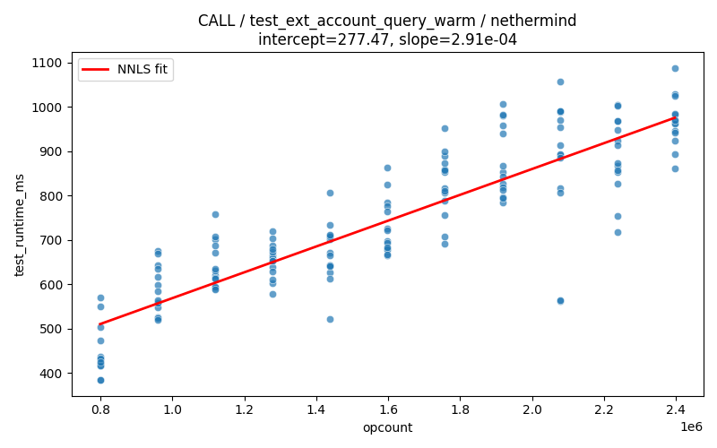

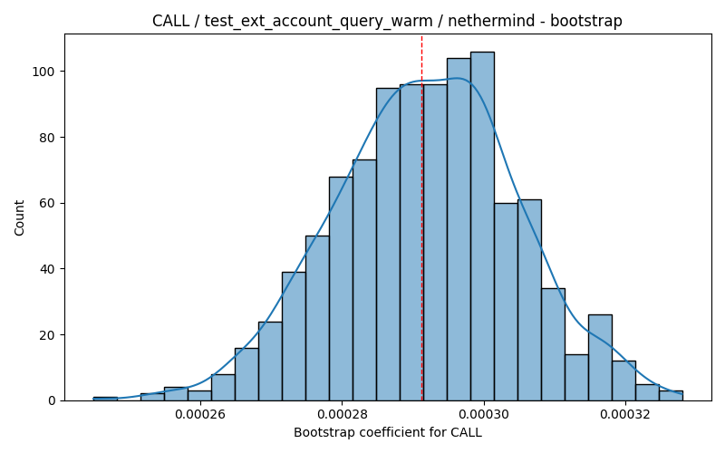

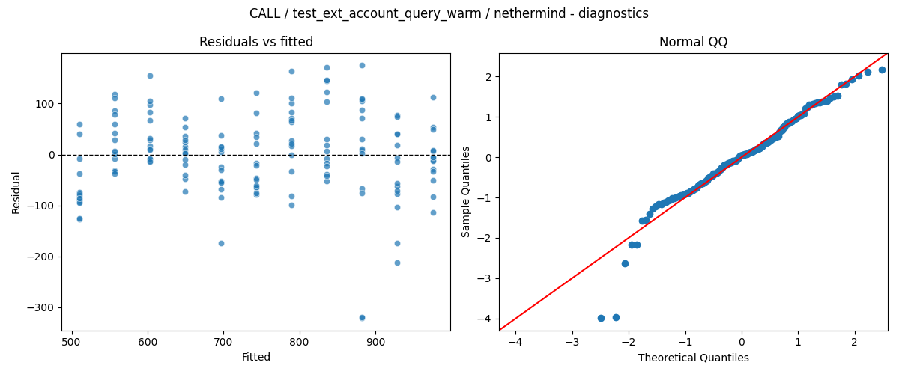

</details>

<details><summary>reth — NNLS regression summary</summary>

```
==============================================================================
                           NNLS Regression Results                            
==============================================================================
Dep. Variable:          test_runtime_ms              R-squared:          0.943
Model:                  NNLS                    Adj. R-squared:          0.943
No. Observations:       209                               RMSE:           7.15
Df Residuals:           207                                MAE:           5.39
Df Model:               1      
==============================================================================
                      coef     std err     P-value      [0.025      0.975]
------------------------------------------------------------------------------
         const     26.1704      1.7500       0.001     22.7693     29.4341
       opcount      0.0001      0.0000       0.001      0.0001      0.0001
==============================================================================
Notes: Non-negative least squares with bootstrap inference (1000 iterations)
==============================================================================
```

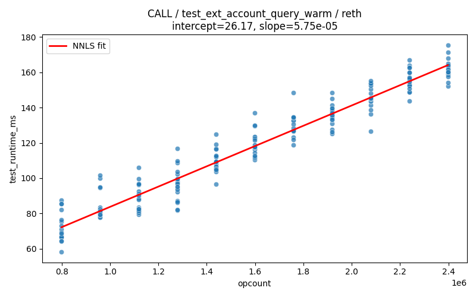

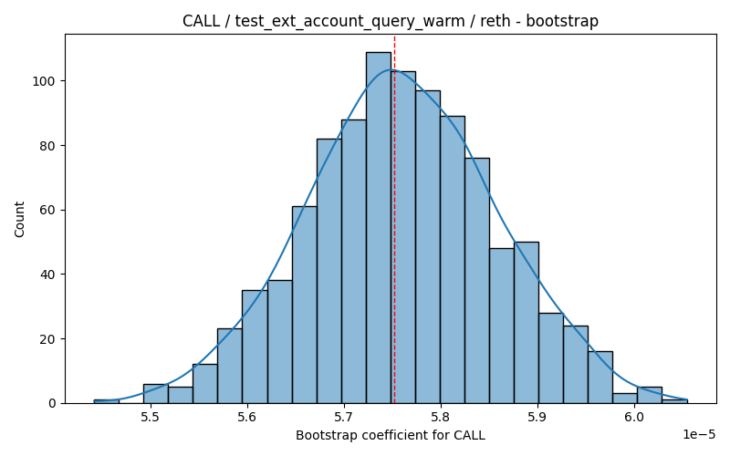

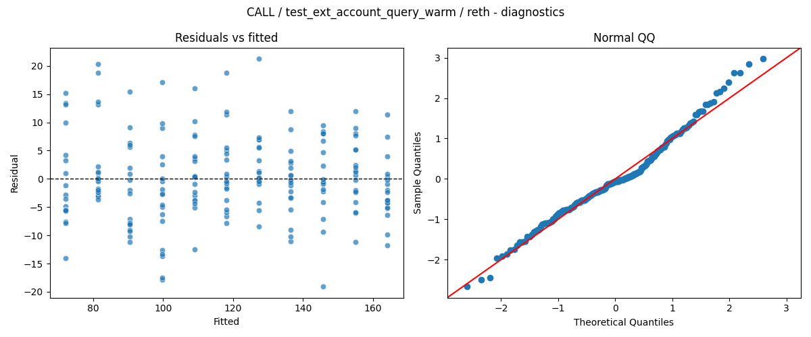

</details>

### test_account_access — combo `CALL_AccountMode.EXISTING_EOA` — `presets[cold_account_nocode_access]`

| client | nobs | R² | target_coef (ms) | p-value | 95% CI |
| --- | --- | --- | --- | --- | --- |
| `besu` | 110 | 0.9858 | 0.01716 | 1.00e-03 | [0.01684, 0.01751] |
| `erigon` | 88 | 0.9949 | 0.008473 | 1.00e-03 | [0.008319, 0.008602] |
| `geth` | 77 | 0.818 | 0.01835 | 1.00e-03 | [0.0163, 0.02022] |
| `nethermind` | 154 | 0.9222 | 0.003686 | 1.00e-03 | [0.00351, 0.003876] |
| `reth` | 209 | 0.968 | 0.004293 | 1.00e-03 | [0.004195, 0.004391] |

<details><summary>besu — NNLS regression summary</summary>

```
==============================================================================
                           NNLS Regression Results                            
==============================================================================
Dep. Variable:          test_runtime_ms              R-squared:          0.986
Model:                  NNLS                    Adj. R-squared:          0.986
No. Observations:       110                               RMSE:          42.25
Df Residuals:           108                                MAE:          31.53
Df Model:               1      
==============================================================================
                      coef     std err     P-value      [0.025      0.975]
------------------------------------------------------------------------------
         const    510.8933     11.0566       0.001    488.9307    531.4616
       opcount      0.0172      0.0002       0.001      0.0168      0.0175
==============================================================================
Notes: Non-negative least squares with bootstrap inference (1000 iterations)
==============================================================================
```

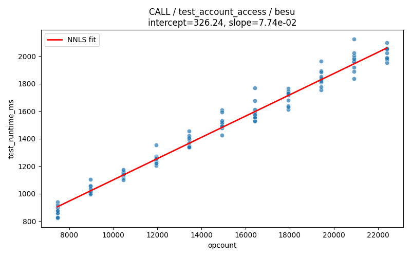

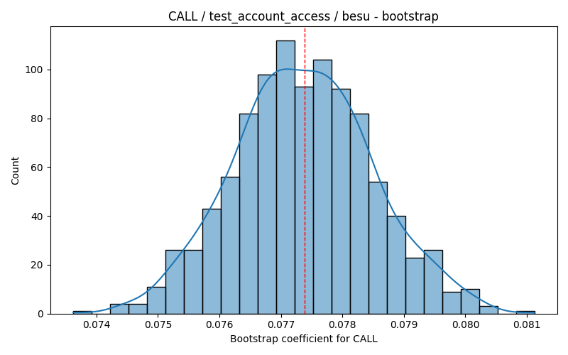

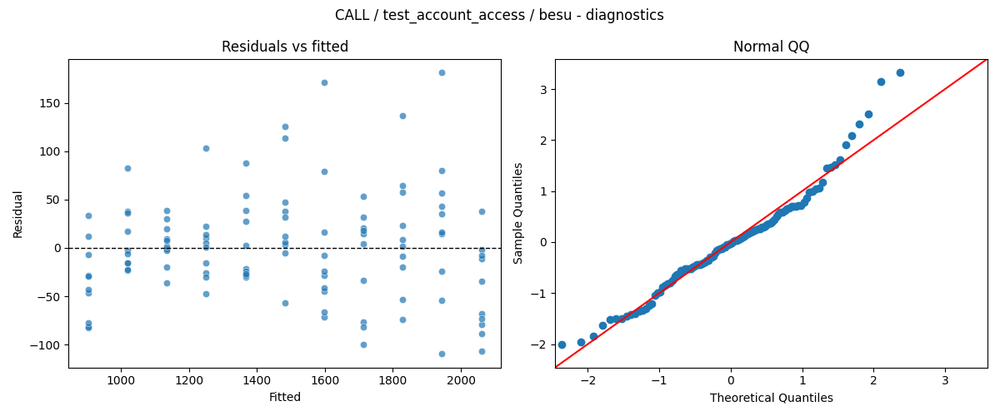

</details>

<details><summary>erigon — NNLS regression summary</summary>

```
==============================================================================
                           NNLS Regression Results                            
==============================================================================
Dep. Variable:          test_runtime_ms              R-squared:          0.995
Model:                  NNLS                    Adj. R-squared:          0.995
No. Observations:       88                                RMSE:          12.40
Df Residuals:           86                                 MAE:           8.74
Df Model:               1      
==============================================================================
                      coef     std err     P-value      [0.025      0.975]
------------------------------------------------------------------------------
         const      8.2724      5.3894       0.070      0.0000     18.8987
       opcount      0.0085      0.0001       0.001      0.0083      0.0086
==============================================================================
Notes: Non-negative least squares with bootstrap inference (1000 iterations)
==============================================================================
```

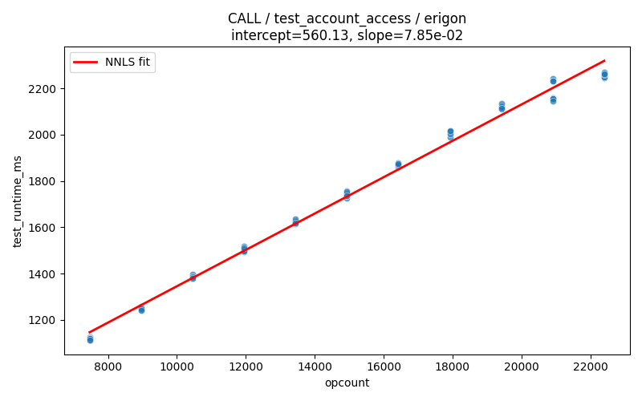

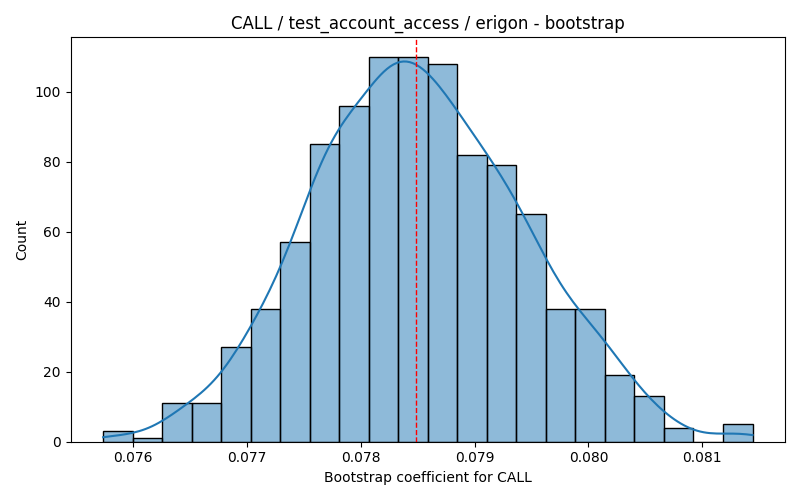

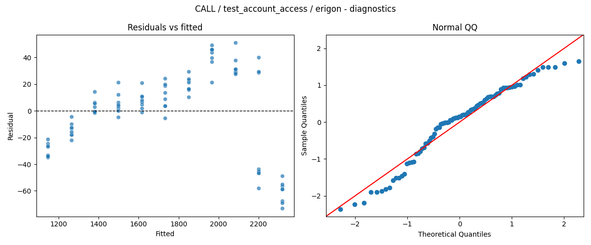

</details>

<details><summary>geth — NNLS regression summary</summary>

```
==============================================================================
                           NNLS Regression Results                            
==============================================================================
Dep. Variable:          test_runtime_ms              R-squared:          0.818
Model:                  NNLS                    Adj. R-squared:          0.816
No. Observations:       77                                RMSE:         177.80
Df Residuals:           75                                 MAE:         116.74
Df Model:               1      
==============================================================================
                      coef     std err     P-value      [0.025      0.975]
------------------------------------------------------------------------------
         const    185.2884     56.8763       0.001     78.1516    300.2941
       opcount      0.0184      0.0010       0.001      0.0163      0.0202
==============================================================================
Notes: Non-negative least squares with bootstrap inference (1000 iterations)
==============================================================================
```

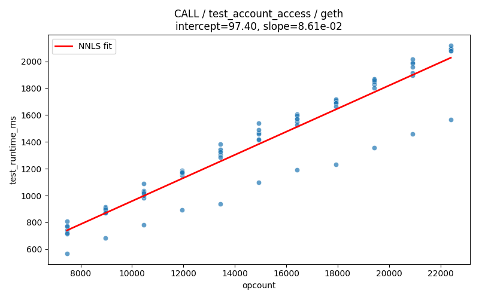

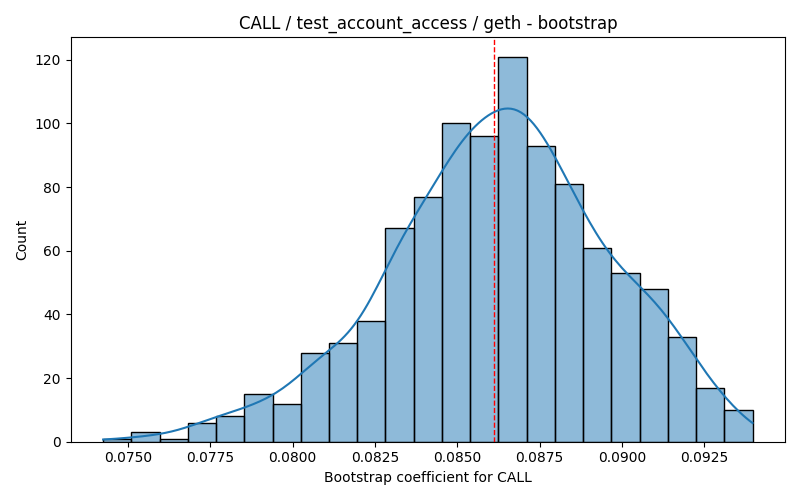

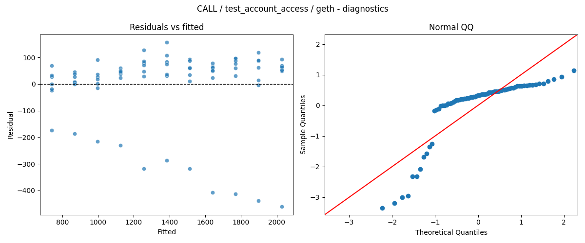

</details>

<details><summary>nethermind — NNLS regression summary</summary>

```
==============================================================================
                           NNLS Regression Results                            
==============================================================================
Dep. Variable:          test_runtime_ms              R-squared:          0.922
Model:                  NNLS                    Adj. R-squared:          0.922
No. Observations:       154                               RMSE:          21.99
Df Residuals:           152                                MAE:          17.98
Df Model:               1      
==============================================================================
                      coef     std err     P-value      [0.025      0.975]
------------------------------------------------------------------------------
         const     92.2650      5.5231       0.001     81.2721    102.6413
       opcount      0.0037      0.0001       0.001      0.0035      0.0039
==============================================================================
Notes: Non-negative least squares with bootstrap inference (1000 iterations)
==============================================================================
```

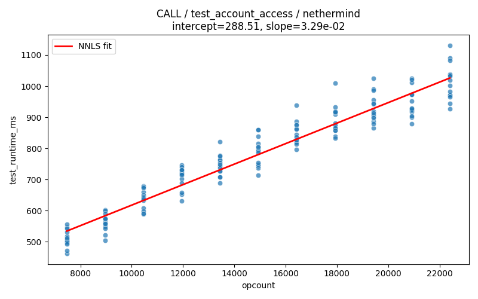

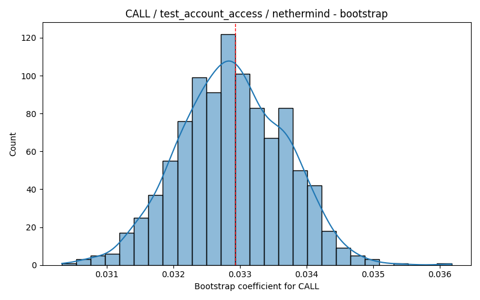

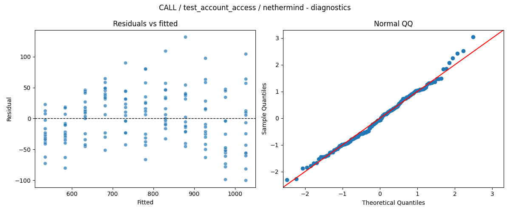

</details>

<details><summary>reth — NNLS regression summary</summary>

```
==============================================================================
                           NNLS Regression Results                            
==============================================================================
Dep. Variable:          test_runtime_ms              R-squared:          0.968
Model:                  NNLS                    Adj. R-squared:          0.968
No. Observations:       209                               RMSE:          16.02
Df Residuals:           207                                MAE:          12.44
Df Model:               1      
==============================================================================
                      coef     std err     P-value      [0.025      0.975]
------------------------------------------------------------------------------
         const    104.1949      3.1867       0.001     98.0309    110.2893
       opcount      0.0043      0.0000       0.001      0.0042      0.0044
==============================================================================
Notes: Non-negative least squares with bootstrap inference (1000 iterations)
==============================================================================
```

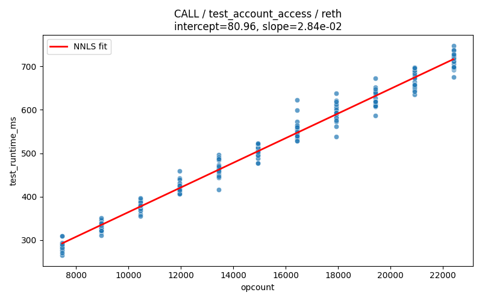

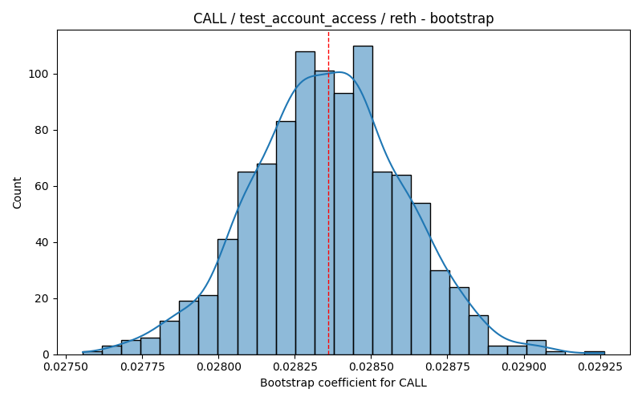

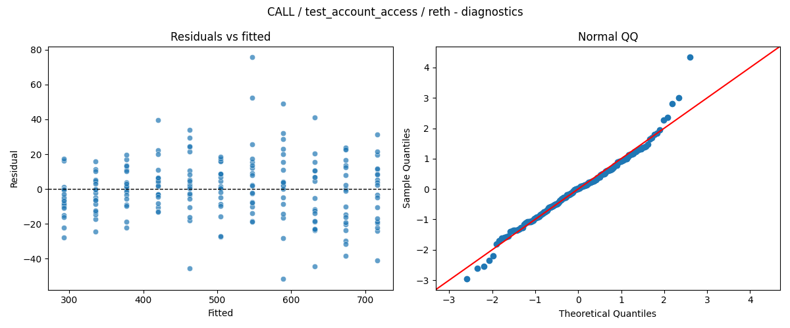

</details>

### test_account_access — combo `CALL_AccountMode.NON_EXISTING_ACCOUNT` — `presets[cold_account_nocode_access]`

| client | nobs | R² | target_coef (ms) | p-value | 95% CI |
| --- | --- | --- | --- | --- | --- |
| `besu` | 110 | 0.9858 | 0.01927 | 1.00e-03 | [0.01883, 0.01971] |
| `erigon` | 88 | 0.9948 | 0.008131 | 1.00e-03 | [0.008009, 0.008222] |
| `geth` | 77 | 0.9347 | 0.01968 | 1.00e-03 | [0.01848, 0.02102] |
| `nethermind` | 154 | 0.8934 | 0.003566 | 1.00e-03 | [0.003364, 0.003763] |
| `reth` | 209 | 0.9741 | 0.004182 | 1.00e-03 | [0.004087, 0.004266] |

<details><summary>besu — NNLS regression summary</summary>

```
==============================================================================
                           NNLS Regression Results                            
==============================================================================
Dep. Variable:          test_runtime_ms              R-squared:          0.986
Model:                  NNLS                    Adj. R-squared:          0.986
No. Observations:       110                               RMSE:          47.45
Df Residuals:           108                                MAE:          38.80
Df Model:               1      
==============================================================================
                      coef     std err     P-value      [0.025      0.975]
------------------------------------------------------------------------------
         const    194.8142     14.9542       0.001    163.5008    223.2975
       opcount      0.0193      0.0002       0.001      0.0188      0.0197
==============================================================================
Notes: Non-negative least squares with bootstrap inference (1000 iterations)
==============================================================================
```

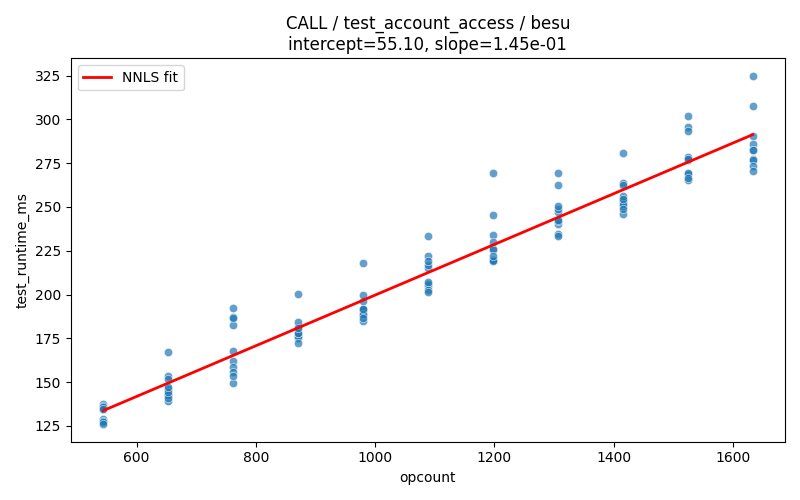

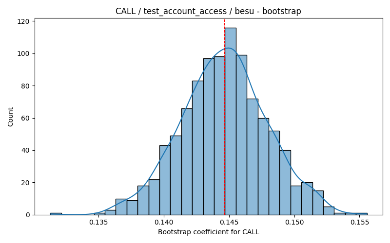

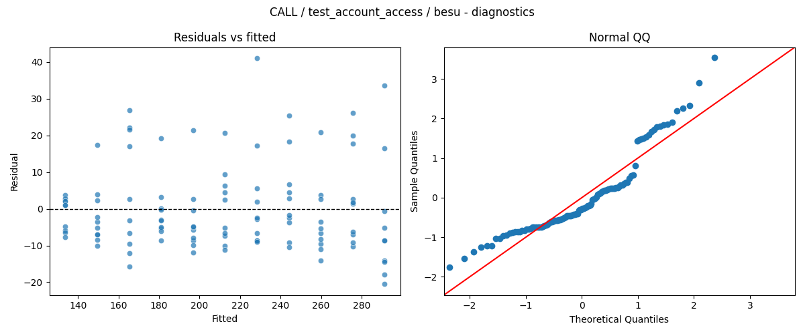

</details>

<details><summary>erigon — NNLS regression summary</summary>

```
==============================================================================
                           NNLS Regression Results                            
==============================================================================
Dep. Variable:          test_runtime_ms              R-squared:          0.995
Model:                  NNLS                    Adj. R-squared:          0.995
No. Observations:       88                                RMSE:          12.04
Df Residuals:           86                                 MAE:           9.06
Df Model:               1      
==============================================================================
                      coef     std err     P-value      [0.025      0.975]
------------------------------------------------------------------------------
         const      4.4707      3.6372       0.166      0.0000     11.9009
       opcount      0.0081      0.0001       0.001      0.0080      0.0082
==============================================================================
Notes: Non-negative least squares with bootstrap inference (1000 iterations)
==============================================================================
```

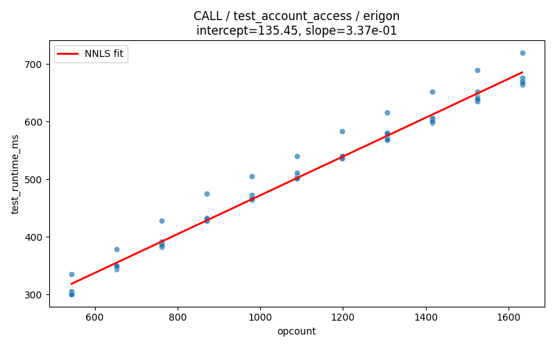

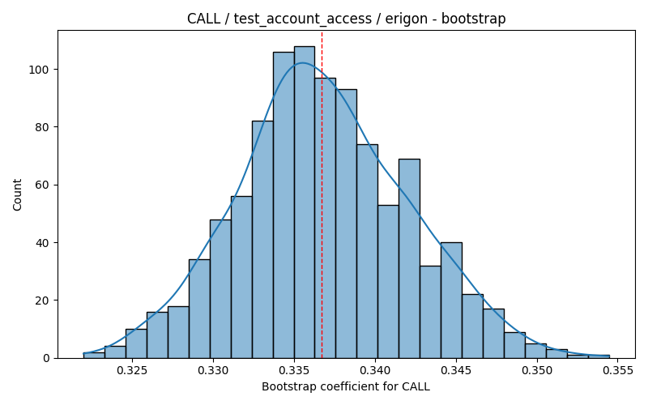

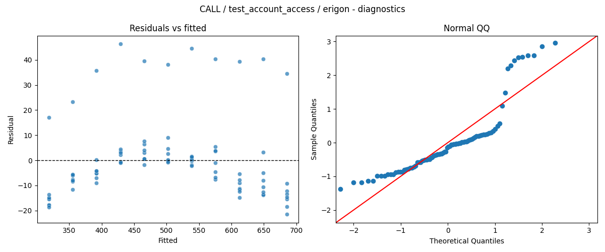

</details>

<details><summary>geth — NNLS regression summary</summary>

```
==============================================================================
                           NNLS Regression Results                            
==============================================================================
Dep. Variable:          test_runtime_ms              R-squared:          0.935
Model:                  NNLS                    Adj. R-squared:          0.934
No. Observations:       77                                RMSE:         106.79
Df Residuals:           75                                 MAE:          70.68
Df Model:               1      
==============================================================================
                      coef     std err     P-value      [0.025      0.975]
------------------------------------------------------------------------------
         const    183.9227     36.9856       0.001    110.3767    257.0460
       opcount      0.0197      0.0006       0.001      0.0185      0.0210
==============================================================================
Notes: Non-negative least squares with bootstrap inference (1000 iterations)
==============================================================================
```

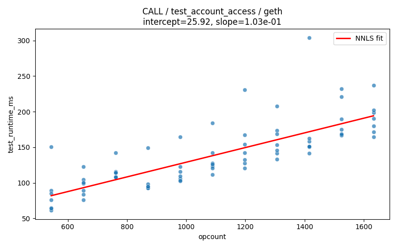

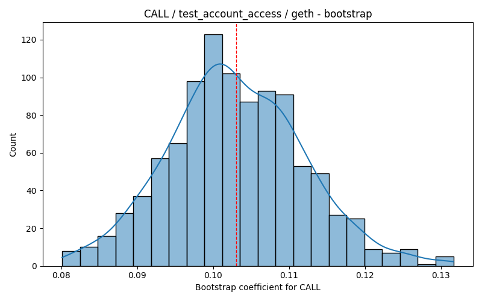

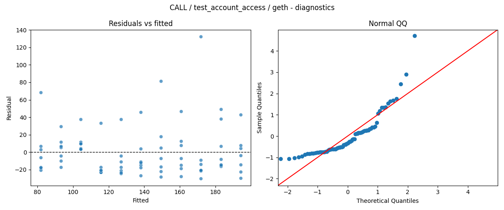

</details>

<details><summary>nethermind — NNLS regression summary</summary>

```
==============================================================================
                           NNLS Regression Results                            
==============================================================================
Dep. Variable:          test_runtime_ms              R-squared:          0.893
Model:                  NNLS                    Adj. R-squared:          0.893
No. Observations:       154                               RMSE:          25.29
Df Residuals:           152                                MAE:          19.56
Df Model:               1      
==============================================================================
                      coef     std err     P-value      [0.025      0.975]
------------------------------------------------------------------------------
         const     75.8766      5.6813       0.001     64.9837     87.2187
       opcount      0.0036      0.0001       0.001      0.0034      0.0038
==============================================================================
Notes: Non-negative least squares with bootstrap inference (1000 iterations)
==============================================================================
```

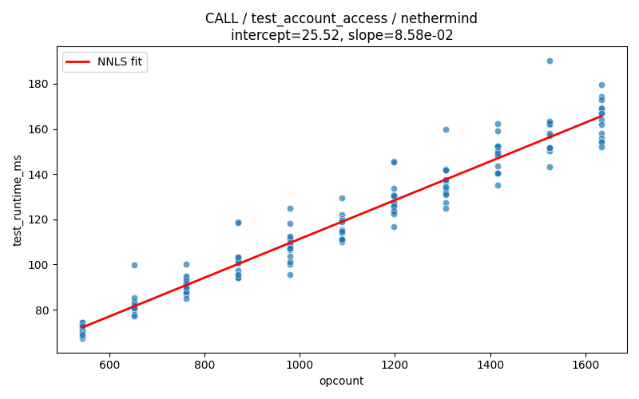

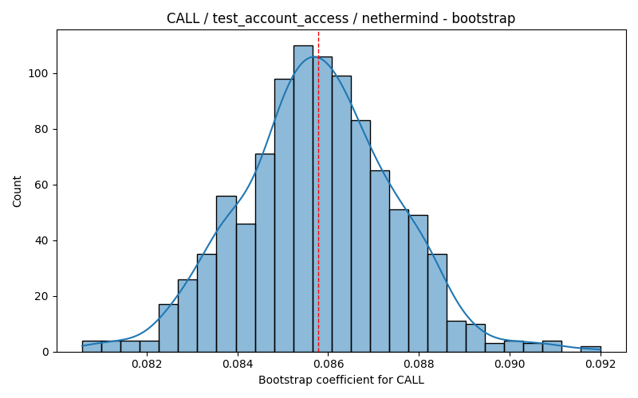

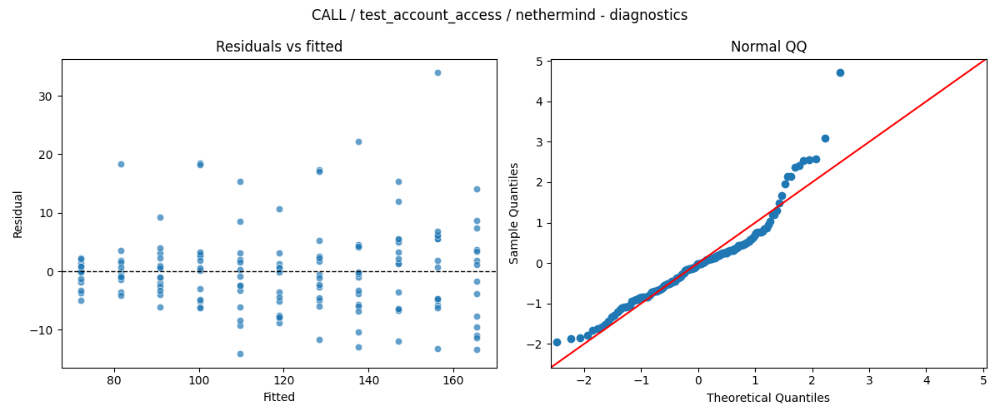

</details>

<details><summary>reth — NNLS regression summary</summary>

```
==============================================================================
                           NNLS Regression Results                            
==============================================================================
Dep. Variable:          test_runtime_ms              R-squared:          0.974
Model:                  NNLS                    Adj. R-squared:          0.974
No. Observations:       209                               RMSE:          14.00
Df Residuals:           207                                MAE:          10.88
Df Model:               1      
==============================================================================
                      coef     std err     P-value      [0.025      0.975]
------------------------------------------------------------------------------
         const     93.3985      3.0750       0.001     87.8720     99.7863
       opcount      0.0042      0.0000       0.001      0.0041      0.0043
==============================================================================
Notes: Non-negative least squares with bootstrap inference (1000 iterations)
==============================================================================
```

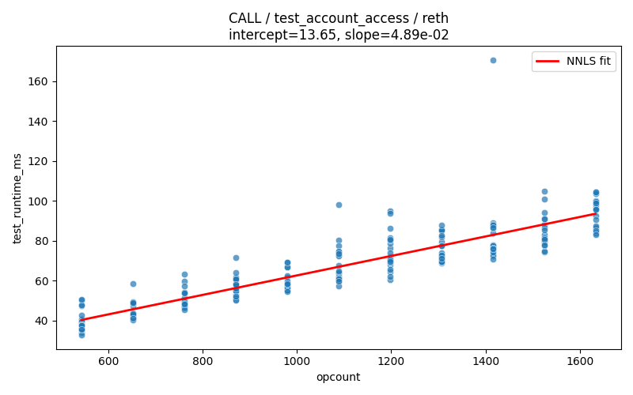

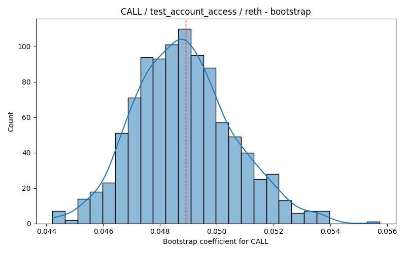

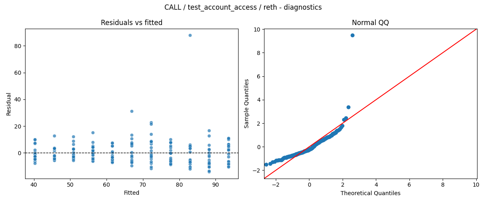

</details>

### test_account_access — combo `CALL_AccountMode.EXISTING_EOA` — `presets[cold_account_nocode_write]`

| client | nobs | R² | target_coef (ms) | p-value | 95% CI |
| --- | --- | --- | --- | --- | --- |
| `besu` | 110 | 0.9783 | 0.07739 | 1.00e-03 | [0.07524, 0.07957] |
| `erigon` | 88 | 0.9931 | 0.07848 | 1.00e-03 | [0.07677, 0.08031] |
| `geth` | 77 | 0.8972 | 0.08611 | 1.00e-03 | [0.07886, 0.09231] |
| `nethermind` | 154 | 0.9279 | 0.03292 | 1.00e-03 | [0.03137, 0.03438] |
| `reth` | 209 | 0.9833 | 0.02836 | 1.00e-03 | [0.02787, 0.02884] |

<details><summary>besu — NNLS regression summary</summary>

```
==============================================================================
                           NNLS Regression Results                            
==============================================================================
Dep. Variable:          test_runtime_ms              R-squared:          0.978
Model:                  NNLS                    Adj. R-squared:          0.978
No. Observations:       110                               RMSE:          54.46
Df Residuals:           108                                MAE:          40.75
Df Model:               1      
==============================================================================
                      coef     std err     P-value      [0.025      0.975]
------------------------------------------------------------------------------
         const    326.2442     15.5189       0.001    295.3076    357.6670
       opcount      0.0774      0.0011       0.001      0.0752      0.0796
==============================================================================
Notes: Non-negative least squares with bootstrap inference (1000 iterations)
==============================================================================
```


</details>

<details><summary>erigon — NNLS regression summary</summary>

```
==============================================================================
                           NNLS Regression Results                            
==============================================================================
Dep. Variable:          test_runtime_ms              R-squared:          0.993
Model:                  NNLS                    Adj. R-squared:          0.993
No. Observations:       88                                RMSE:          30.95
Df Residuals:           86                                 MAE:          24.75
Df Model:               1      
==============================================================================
                      coef     std err     P-value      [0.025      0.975]
------------------------------------------------------------------------------
         const    560.1346     11.8644       0.001    537.7531    583.7864
       opcount      0.0785      0.0009       0.001      0.0768      0.0803
==============================================================================
Notes: Non-negative least squares with bootstrap inference (1000 iterations)
==============================================================================
```


</details>

<details><summary>geth — NNLS regression summary</summary>

```
==============================================================================
                           NNLS Regression Results                            
==============================================================================
Dep. Variable:          test_runtime_ms              R-squared:          0.897
Model:                  NNLS                    Adj. R-squared:          0.896
No. Observations:       77                                RMSE:         137.67
Df Residuals:           75                                 MAE:          91.28
Df Model:               1      
==============================================================================
                      coef     std err     P-value      [0.025      0.975]
------------------------------------------------------------------------------
         const     97.4013     44.3324       0.017      7.4315    189.0056
       opcount      0.0861      0.0034       0.001      0.0789      0.0923
==============================================================================
Notes: Non-negative least squares with bootstrap inference (1000 iterations)
==============================================================================
```


</details>

<details><summary>nethermind — NNLS regression summary</summary>

```
==============================================================================
                           NNLS Regression Results                            
==============================================================================
Dep. Variable:          test_runtime_ms              R-squared:          0.928
Model:                  NNLS                    Adj. R-squared:          0.927
No. Observations:       154                               RMSE:          43.37
Df Residuals:           152                                MAE:          35.43
Df Model:               1      
==============================================================================
                      coef     std err     P-value      [0.025      0.975]
------------------------------------------------------------------------------
         const    288.5103     11.2691       0.001    268.8610    311.3871
       opcount      0.0329      0.0008       0.001      0.0314      0.0344
==============================================================================
Notes: Non-negative least squares with bootstrap inference (1000 iterations)
==============================================================================
```


</details>

<details><summary>reth — NNLS regression summary</summary>

```
==============================================================================
                           NNLS Regression Results                            
==============================================================================
Dep. Variable:          test_runtime_ms              R-squared:          0.983
Model:                  NNLS                    Adj. R-squared:          0.983
No. Observations:       209                               RMSE:          17.45
Df Residuals:           207                                MAE:          13.17
Df Model:               1      
==============================================================================
                      coef     std err     P-value      [0.025      0.975]
------------------------------------------------------------------------------
         const     80.9608      3.3487       0.001     74.5550     87.6979
       opcount      0.0284      0.0002       0.001      0.0279      0.0288
==============================================================================
Notes: Non-negative least squares with bootstrap inference (1000 iterations)
==============================================================================
```


</details>

### test_account_access — combo `CALL_AccountMode.NON_EXISTING_ACCOUNT` — `presets[cold_account_nocode_write]`

| client | nobs | R² | target_coef (ms) | p-value | 95% CI |
| --- | --- | --- | --- | --- | --- |
| `besu` | 110 | 0.9487 | 0.1446 | 1.00e-03 | [0.1381, 0.1513] |
| `erigon` | 88 | 0.9822 | 0.3367 | 1.00e-03 | [0.3267, 0.3471] |
| `geth` | 77 | 0.6154 | 0.103 | 1.00e-03 | [0.08576, 0.1208] |
| `nethermind` | 154 | 0.9442 | 0.08579 | 1.00e-03 | [0.08248, 0.08905] |
| `reth` | 209 | 0.7687 | 0.0489 | 1.00e-03 | [0.0456, 0.05246] |

<details><summary>besu — NNLS regression summary</summary>

```
==============================================================================
                           NNLS Regression Results                            
==============================================================================
Dep. Variable:          test_runtime_ms              R-squared:          0.949
Model:                  NNLS                    Adj. R-squared:          0.948
No. Observations:       110                               RMSE:          11.59
Df Residuals:           108                                MAE:           8.87
Df Model:               1      
==============================================================================
                      coef     std err     P-value      [0.025      0.975]
------------------------------------------------------------------------------
         const     55.0996      3.3702       0.001     48.8730     61.9616
       opcount      0.1446      0.0033       0.001      0.1381      0.1513
==============================================================================
Notes: Non-negative least squares with bootstrap inference (1000 iterations)
==============================================================================
```


</details>

<details><summary>erigon — NNLS regression summary</summary>

```
==============================================================================
                           NNLS Regression Results                            
==============================================================================
Dep. Variable:          test_runtime_ms              R-squared:          0.982
Model:                  NNLS                    Adj. R-squared:          0.982
No. Observations:       88                                RMSE:          15.63
Df Residuals:           86                                 MAE:          10.73
Df Model:               1      
==============================================================================
                      coef     std err     P-value      [0.025      0.975]
------------------------------------------------------------------------------
         const    135.4549      5.6226       0.001    124.7833    146.8605
       opcount      0.3367      0.0052       0.001      0.3267      0.3471
==============================================================================
Notes: Non-negative least squares with bootstrap inference (1000 iterations)
==============================================================================
```


</details>

<details><summary>geth — NNLS regression summary</summary>

```
==============================================================================
                           NNLS Regression Results                            
==============================================================================
Dep. Variable:          test_runtime_ms              R-squared:          0.615
Model:                  NNLS                    Adj. R-squared:          0.610
No. Observations:       77                                RMSE:          28.06
Df Residuals:           75                                 MAE:          20.43
Df Model:               1      
==============================================================================
                      coef     std err     P-value      [0.025      0.975]
------------------------------------------------------------------------------
         const     25.9227      9.2323       0.003      7.8208     43.9585
       opcount      0.1030      0.0089       0.001      0.0858      0.1208
==============================================================================
Notes: Non-negative least squares with bootstrap inference (1000 iterations)
==============================================================================
```


</details>

<details><summary>nethermind — NNLS regression summary</summary>

```
==============================================================================
                           NNLS Regression Results                            
==============================================================================
Dep. Variable:          test_runtime_ms              R-squared:          0.944
Model:                  NNLS                    Adj. R-squared:          0.944
No. Observations:       154                               RMSE:           7.19
Df Residuals:           152                                MAE:           5.09
Df Model:               1      
==============================================================================
                      coef     std err     P-value      [0.025      0.975]
------------------------------------------------------------------------------
         const     25.5241      1.6519       0.001     22.4585     28.8775
       opcount      0.0858      0.0017       0.001      0.0825      0.0891
==============================================================================
Notes: Non-negative least squares with bootstrap inference (1000 iterations)
==============================================================================
```


</details>

<details><summary>reth — NNLS regression summary</summary>

```
==============================================================================
                           NNLS Regression Results                            
==============================================================================
Dep. Variable:          test_runtime_ms              R-squared:          0.769
Model:                  NNLS                    Adj. R-squared:          0.768
No. Observations:       209                               RMSE:           9.24
Df Residuals:           207                                MAE:           6.06
Df Model:               1      
==============================================================================
                      coef     std err     P-value      [0.025      0.975]
------------------------------------------------------------------------------
         const     13.6517      1.5923       0.001     10.4727     16.8135
       opcount      0.0489      0.0017       0.001      0.0456      0.0525
==============================================================================
Notes: Non-negative least squares with bootstrap inference (1000 iterations)
==============================================================================
```


</details>

### test_account_access — combo `CALL_AccountMode.EXISTING_CONTRACT_DIFF_MAX` — `presets[cold_account_code_access]`

| client | nobs | R² | target_coef (ms) | p-value | 95% CI |
| --- | --- | --- | --- | --- | --- |
| `besu` | 110 | 0.9843 | 0.02317 | 1.00e-03 | [0.02266, 0.02365] |
| `erigon` | 88 | 0.8214 | 0.02682 | 1.00e-03 | [0.02425, 0.02991] |
| `geth` | 77 | 0.8643 | 0.02656 | 1.00e-03 | [0.02411, 0.02915] |
| `nethermind` | 154 | 0.8963 | 0.01552 | 1.00e-03 | [0.01454, 0.01655] |
| `reth` | 209 | 0.9948 | 0.02208 | 1.00e-03 | [0.02186, 0.0223] |

<details><summary>besu — NNLS regression summary</summary>

```
==============================================================================
                           NNLS Regression Results                            
==============================================================================
Dep. Variable:          test_runtime_ms              R-squared:          0.984
Model:                  NNLS                    Adj. R-squared:          0.984
No. Observations:       110                               RMSE:          59.16
Df Residuals:           108                                MAE:          49.10
Df Model:               1      
==============================================================================
                      coef     std err     P-value      [0.025      0.975]
------------------------------------------------------------------------------
         const    436.5002     17.3612       0.001    403.8672    471.4155
       opcount      0.0232      0.0003       0.001      0.0227      0.0237
==============================================================================
Notes: Non-negative least squares with bootstrap inference (1000 iterations)
==============================================================================
```

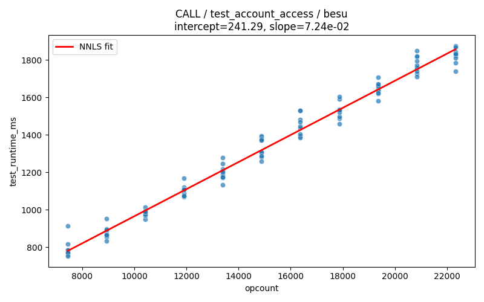

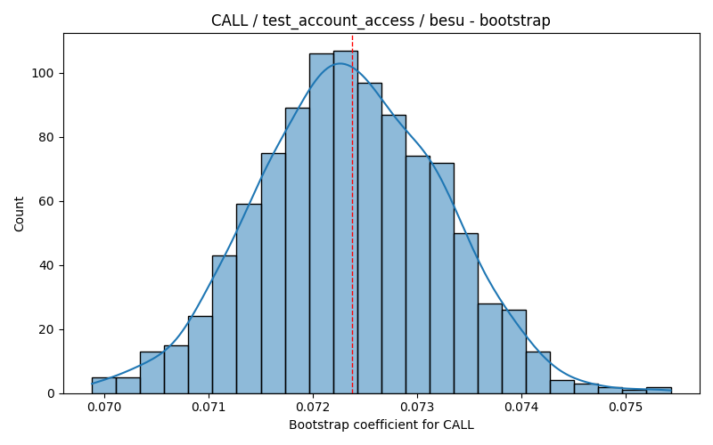

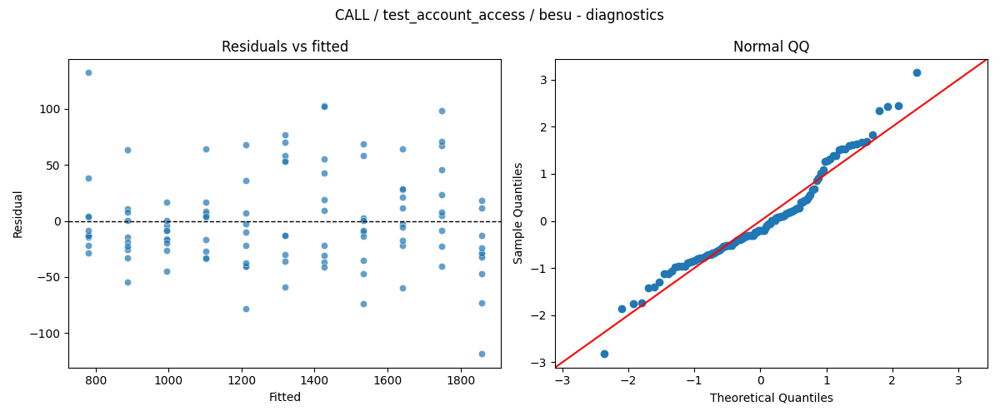

</details>

<details><summary>erigon — NNLS regression summary</summary>

```
==============================================================================
                           NNLS Regression Results                            
==============================================================================
Dep. Variable:          test_runtime_ms              R-squared:          0.821
Model:                  NNLS                    Adj. R-squared:          0.819
No. Observations:       88                                RMSE:         252.93
Df Residuals:           86                                 MAE:         173.35
Df Model:               1      
==============================================================================
                      coef     std err     P-value      [0.025      0.975]
------------------------------------------------------------------------------
         const    208.6243     82.6350       0.011     36.0059    364.0037
       opcount      0.0268      0.0014       0.001      0.0242      0.0299
==============================================================================
Notes: Non-negative least squares with bootstrap inference (1000 iterations)
==============================================================================
```

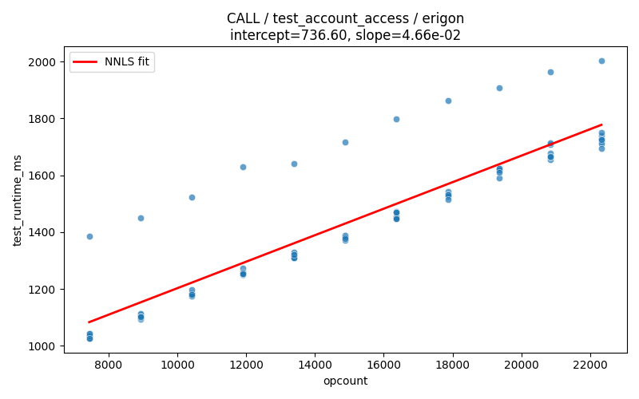

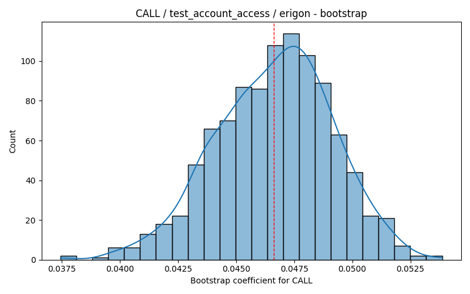

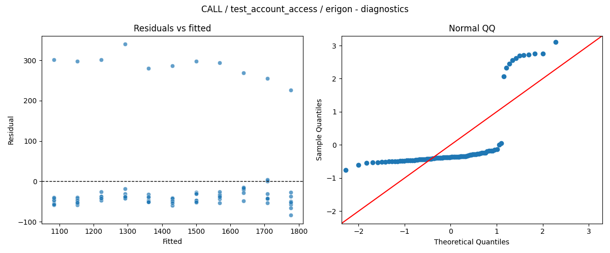

</details>

<details><summary>geth — NNLS regression summary</summary>

```
==============================================================================
                           NNLS Regression Results                            
==============================================================================
Dep. Variable:          test_runtime_ms              R-squared:          0.864
Model:                  NNLS                    Adj. R-squared:          0.862
No. Observations:       77                                RMSE:         212.77
Df Residuals:           75                                 MAE:         174.35
Df Model:               1      
==============================================================================
                      coef     std err     P-value      [0.025      0.975]
------------------------------------------------------------------------------
         const    508.9849     82.9966       0.001    350.2033    667.9806
       opcount      0.0266      0.0013       0.001      0.0241      0.0291
==============================================================================
Notes: Non-negative least squares with bootstrap inference (1000 iterations)
==============================================================================
```

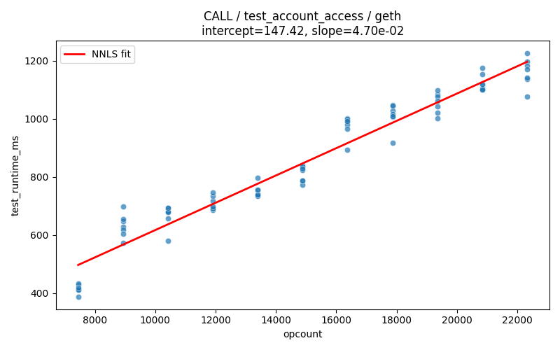

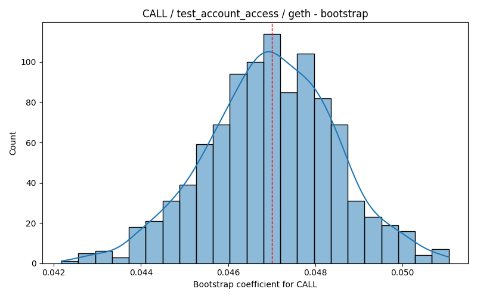

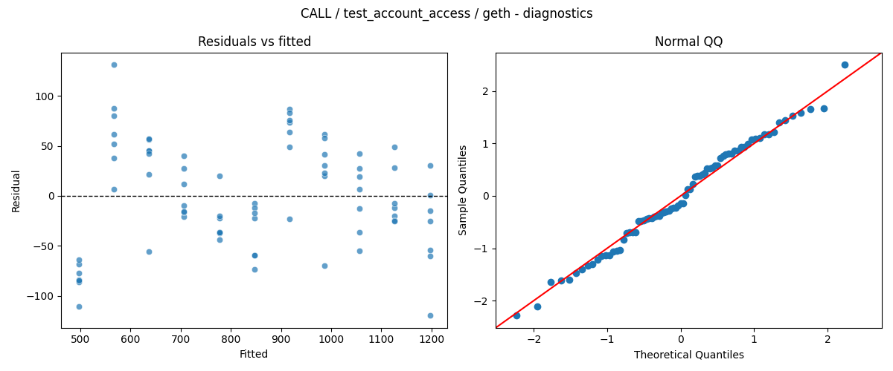

</details>

<details><summary>nethermind — NNLS regression summary</summary>

```
==============================================================================
                           NNLS Regression Results                            
==============================================================================
Dep. Variable:          test_runtime_ms              R-squared:          0.896
Model:                  NNLS                    Adj. R-squared:          0.896
No. Observations:       154                               RMSE:         106.77
Df Residuals:           152                                MAE:          86.73
Df Model:               1      
==============================================================================
                      coef     std err     P-value      [0.025      0.975]
------------------------------------------------------------------------------
         const    660.2798     38.8405       0.001    584.4143    732.7454
       opcount      0.0155      0.0005       0.001      0.0145      0.0165
==============================================================================
Notes: Non-negative least squares with bootstrap inference (1000 iterations)
==============================================================================
```

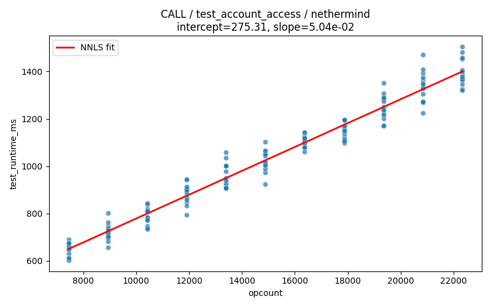

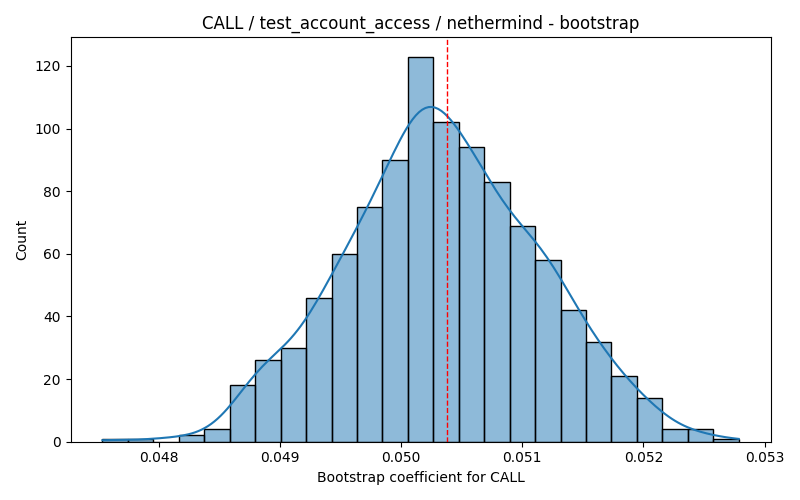

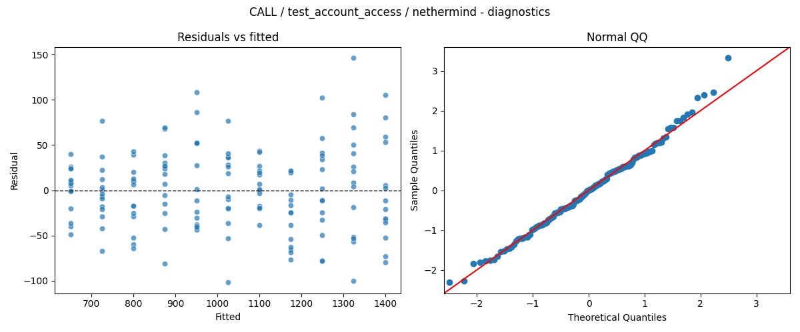

</details>

<details><summary>reth — NNLS regression summary</summary>

```
==============================================================================
                           NNLS Regression Results                            
==============================================================================
Dep. Variable:          test_runtime_ms              R-squared:          0.995
Model:                  NNLS                    Adj. R-squared:          0.995
No. Observations:       209                               RMSE:          32.23
Df Residuals:           207                                MAE:          22.84
Df Model:               1      
==============================================================================
                      coef     std err     P-value      [0.025      0.975]
------------------------------------------------------------------------------
         const    115.8556      6.6348       0.001    103.6511    128.6686
       opcount      0.0221      0.0001       0.001      0.0219      0.0223
==============================================================================
Notes: Non-negative least squares with bootstrap inference (1000 iterations)
==============================================================================
```

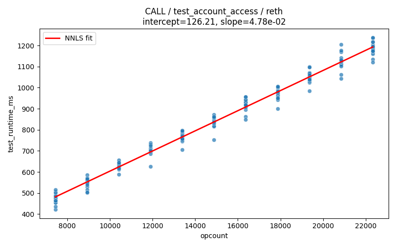

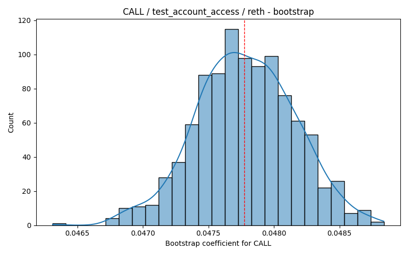

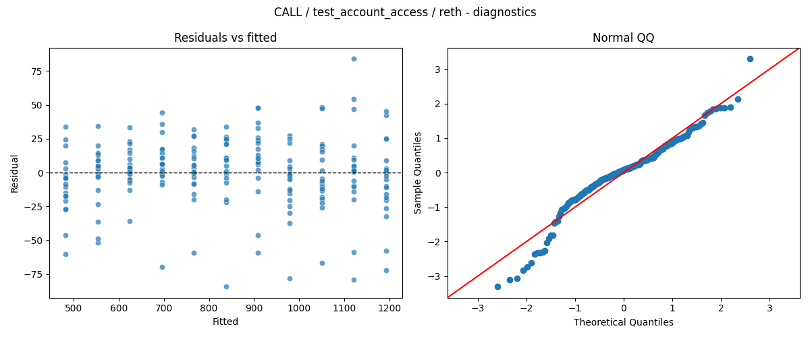

</details>

### test_account_access — combo `CALL_AccountMode.EXISTING_CONTRACT_MINIMAL` — `presets[cold_account_code_access]`

| client | nobs | R² | target_coef (ms) | p-value | 95% CI |
| --- | --- | --- | --- | --- | --- |
| `besu` | 110 | 0.98 | 0.01514 | 1.00e-03 | [0.01469, 0.0156] |
| `erigon` | 88 | 0.9919 | 0.008919 | 1.00e-03 | [0.008765, 0.009088] |
| `geth` | 77 | 0.4662 | 0.01657 | 1.00e-03 | [0.01225, 0.01966] |
| `nethermind` | 154 | 0.704 | 0.003116 | 1.00e-03 | [0.002777, 0.003472] |
| `reth` | 209 | 0.9684 | 0.004352 | 1.00e-03 | [0.004251, 0.004459] |

<details><summary>besu — NNLS regression summary</summary>

```
==============================================================================
                           NNLS Regression Results                            
==============================================================================
Dep. Variable:          test_runtime_ms              R-squared:          0.980
Model:                  NNLS                    Adj. R-squared:          0.980
No. Observations:       110                               RMSE:          43.75
Df Residuals:           108                                MAE:          32.83
Df Model:               1      
==============================================================================
                      coef     std err     P-value      [0.025      0.975]
------------------------------------------------------------------------------
         const    344.2004     14.8613       0.001    315.5426    370.5950
       opcount      0.0151      0.0002       0.001      0.0147      0.0156
==============================================================================
Notes: Non-negative least squares with bootstrap inference (1000 iterations)
==============================================================================
```

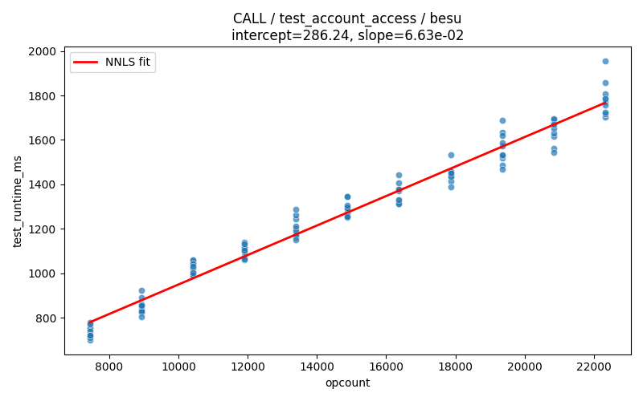

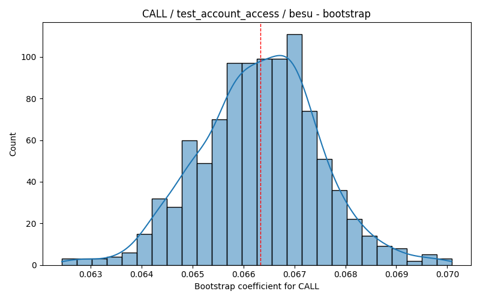

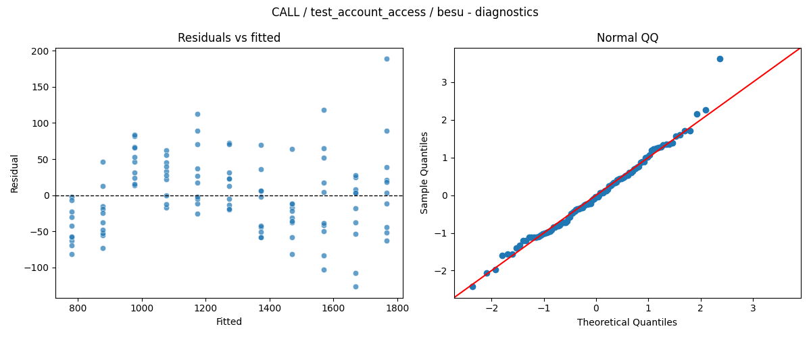

</details>

<details><summary>erigon — NNLS regression summary</summary>

```
==============================================================================
                           NNLS Regression Results                            
==============================================================================
Dep. Variable:          test_runtime_ms              R-squared:          0.992
Model:                  NNLS                    Adj. R-squared:          0.992
No. Observations:       88                                RMSE:          16.28
Df Residuals:           86                                 MAE:          12.85
Df Model:               1      
==============================================================================
                      coef     std err     P-value      [0.025      0.975]
------------------------------------------------------------------------------
         const    103.8510      5.1135       0.001     93.6444    113.4769
       opcount      0.0089      0.0001       0.001      0.0088      0.0091
==============================================================================
Notes: Non-negative least squares with bootstrap inference (1000 iterations)
==============================================================================
```

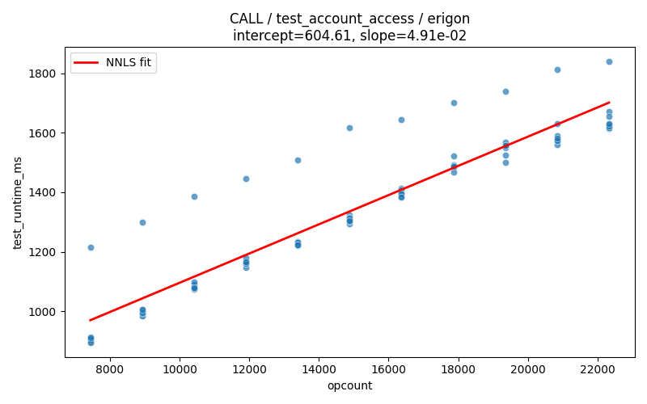

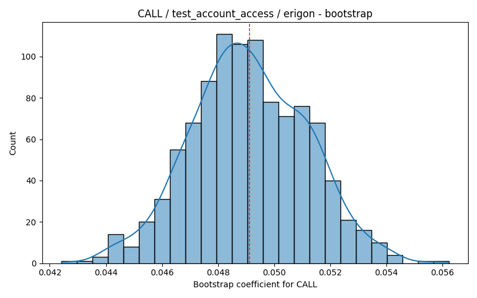

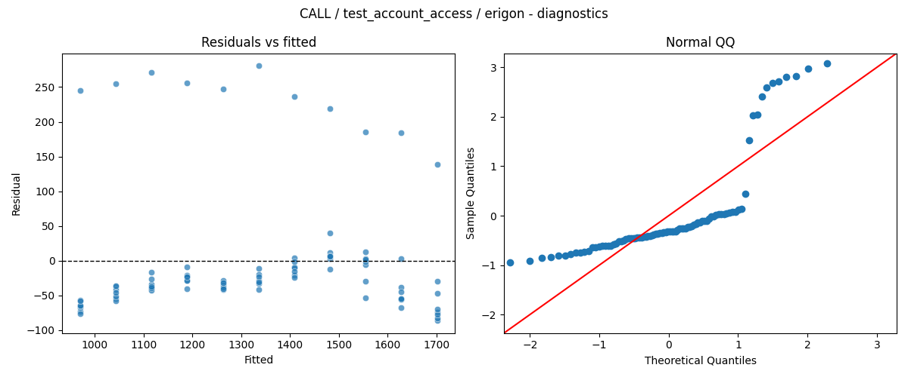

</details>

<details><summary>geth — NNLS regression summary</summary>

```
==============================================================================
                           NNLS Regression Results                            
==============================================================================
Dep. Variable:          test_runtime_ms              R-squared:          0.466
Model:                  NNLS                    Adj. R-squared:          0.459
No. Observations:       77                                RMSE:         358.55
Df Residuals:           75                                 MAE:         241.20
Df Model:               1      
==============================================================================
                      coef     std err     P-value      [0.025      0.975]
------------------------------------------------------------------------------
         const    171.1472    110.2286       0.075      0.0000    404.0277
       opcount      0.0166      0.0020       0.001      0.0122      0.0197
==============================================================================
Notes: Non-negative least squares with bootstrap inference (1000 iterations)
==============================================================================
```

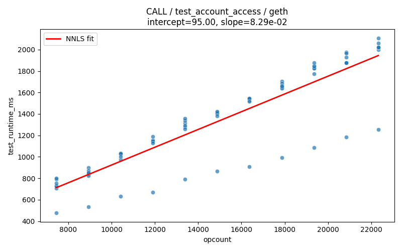

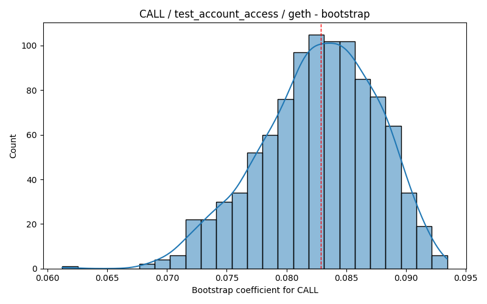


</details>

<details><summary>nethermind — NNLS regression summary</summary>

```
==============================================================================
                           NNLS Regression Results                            
==============================================================================
Dep. Variable:          test_runtime_ms              R-squared:          0.704
Model:                  NNLS                    Adj. R-squared:          0.702
No. Observations:       154                               RMSE:          40.85
Df Residuals:           152                                MAE:          31.85
Df Model:               1      
==============================================================================
                      coef     std err     P-value      [0.025      0.975]
------------------------------------------------------------------------------
         const     94.0457      9.6885       0.001     74.5671    111.9030
       opcount      0.0031      0.0002       0.001      0.0028      0.0035
==============================================================================
Notes: Non-negative least squares with bootstrap inference (1000 iterations)
==============================================================================
```

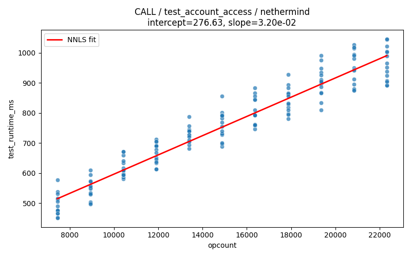

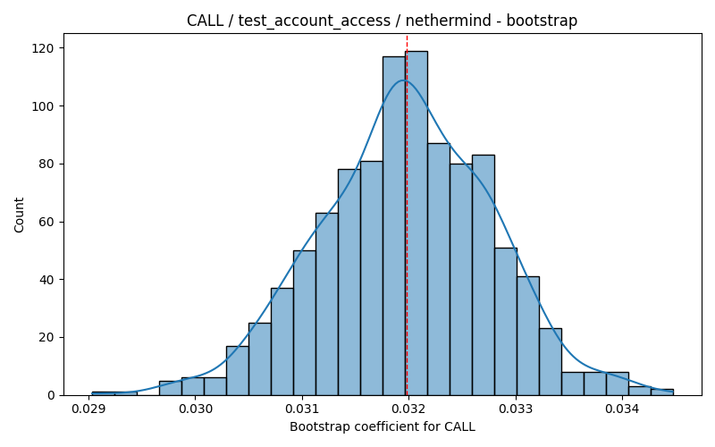

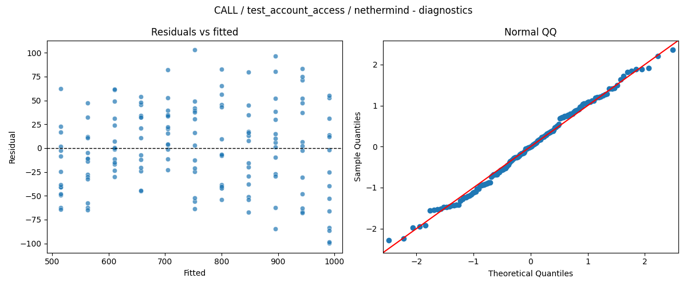

</details>

<details><summary>reth — NNLS regression summary</summary>

```
==============================================================================
                           NNLS Regression Results                            
==============================================================================
Dep. Variable:          test_runtime_ms              R-squared:          0.968
Model:                  NNLS                    Adj. R-squared:          0.968
No. Observations:       209                               RMSE:          15.89
Df Residuals:           207                                MAE:          12.53
Df Model:               1      
==============================================================================
                      coef     std err     P-value      [0.025      0.975]
------------------------------------------------------------------------------
         const     92.4452      3.3428       0.001     86.0127     98.8137
       opcount      0.0044      0.0001       0.001      0.0043      0.0045
==============================================================================
Notes: Non-negative least squares with bootstrap inference (1000 iterations)
==============================================================================
```

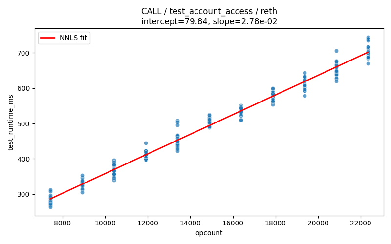

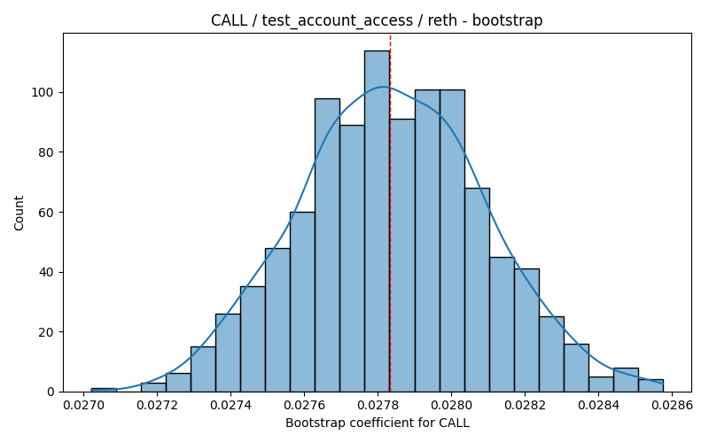

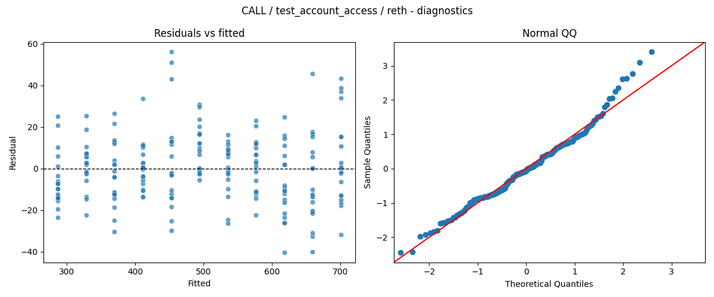

</details>

### test_account_access — combo `CALL_AccountMode.EXISTING_CONTRACT_SAME_MAX` — `presets[cold_account_code_access]`

| client | nobs | R² | target_coef (ms) | p-value | 95% CI |
| --- | --- | --- | --- | --- | --- |
| `besu` | 110 | 0.9712 | 0.01328 | 1.00e-03 | [0.01281, 0.01374] |
| `erigon` | 88 | 0.9913 | 0.008918 | 1.00e-03 | [0.008755, 0.009099] |
| `geth` | 77 | 0.4697 | 0.0161 | 1.00e-03 | [0.01189, 0.01948] |
| `nethermind` | 154 | 0.7155 | 0.003095 | 1.00e-03 | [0.002775, 0.003409] |
| `reth` | 209 | 0.9657 | 0.004372 | 1.00e-03 | [0.004263, 0.004478] |

<details><summary>besu — NNLS regression summary</summary>

```
==============================================================================
                           NNLS Regression Results                            
==============================================================================
Dep. Variable:          test_runtime_ms              R-squared:          0.971
Model:                  NNLS                    Adj. R-squared:          0.971
No. Observations:       110                               RMSE:          46.26
Df Residuals:           108                                MAE:          35.70
Df Model:               1      
==============================================================================
                      coef     std err     P-value      [0.025      0.975]
------------------------------------------------------------------------------
         const    426.5381     15.9151       0.001    397.2030    457.9178
       opcount      0.0133      0.0002       0.001      0.0128      0.0137
==============================================================================
Notes: Non-negative least squares with bootstrap inference (1000 iterations)
==============================================================================
```

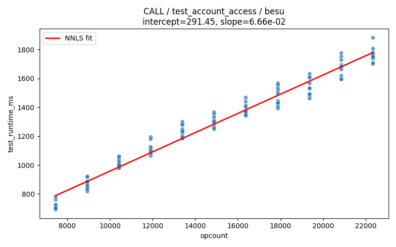

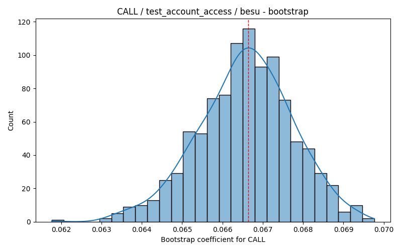

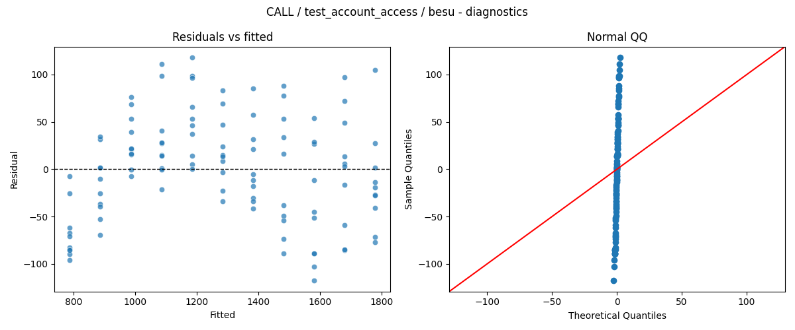

</details>

<details><summary>erigon — NNLS regression summary</summary>

```
==============================================================================
                           NNLS Regression Results                            
==============================================================================
Dep. Variable:          test_runtime_ms              R-squared:          0.991
Model:                  NNLS                    Adj. R-squared:          0.991
No. Observations:       88                                RMSE:          16.91
Df Residuals:           86                                 MAE:          13.46
Df Model:               1      
==============================================================================
                      coef     std err     P-value      [0.025      0.975]
------------------------------------------------------------------------------
         const     98.9732      5.5017       0.001     87.3574    109.4019
       opcount      0.0089      0.0001       0.001      0.0088      0.0091
==============================================================================
Notes: Non-negative least squares with bootstrap inference (1000 iterations)
==============================================================================
```

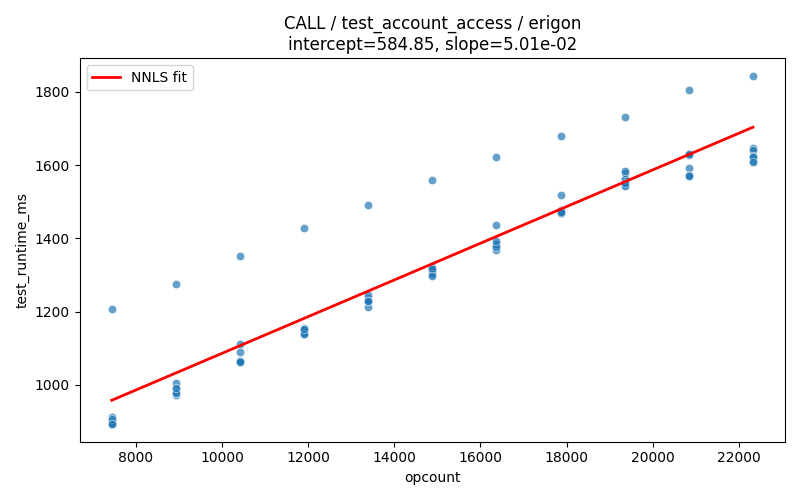

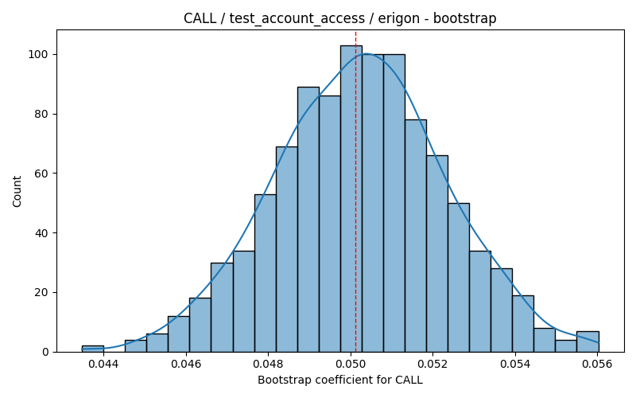

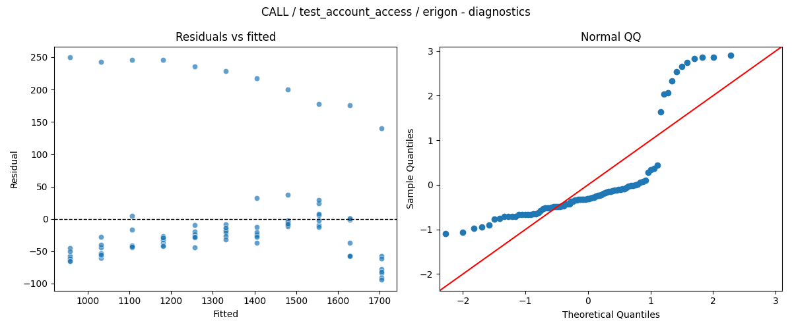

</details>

<details><summary>geth — NNLS regression summary</summary>

```
==============================================================================
                           NNLS Regression Results                            
==============================================================================
Dep. Variable:          test_runtime_ms              R-squared:          0.470
Model:                  NNLS                    Adj. R-squared:          0.463
No. Observations:       77                                RMSE:         345.86
Df Residuals:           75                                 MAE:         232.92
Df Model:               1      
==============================================================================
                      coef     std err     P-value      [0.025      0.975]
------------------------------------------------------------------------------
         const    197.1411    113.7905       0.047      0.0000    432.9431
       opcount      0.0161      0.0020       0.001      0.0119      0.0195
==============================================================================
Notes: Non-negative least squares with bootstrap inference (1000 iterations)
==============================================================================
```

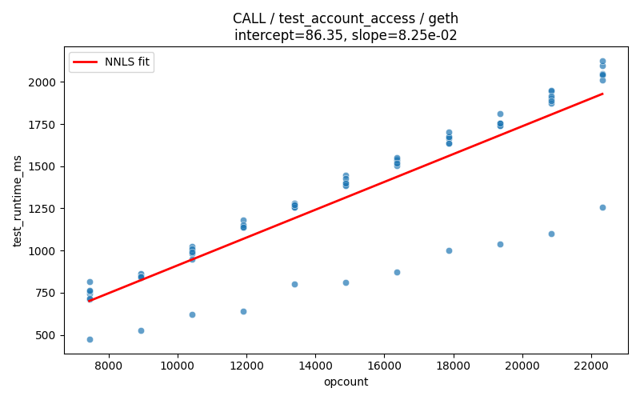

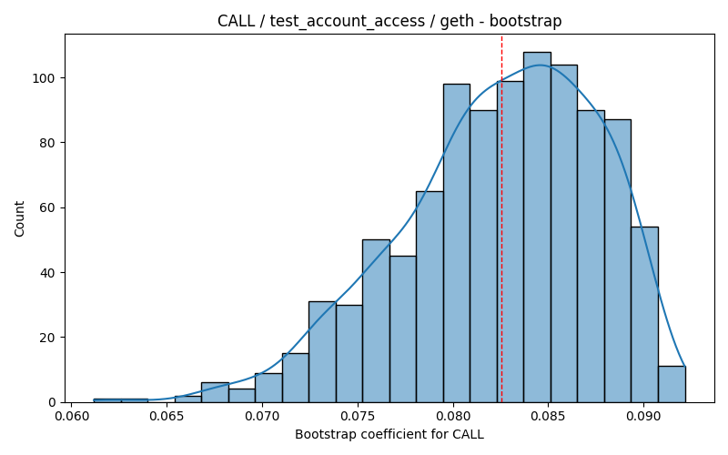

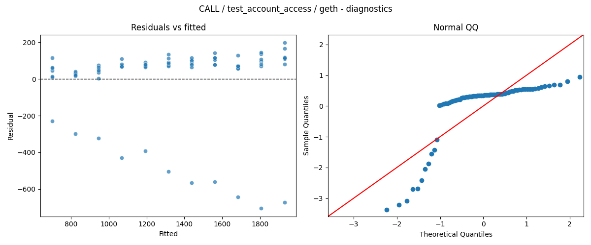

</details>

<details><summary>nethermind — NNLS regression summary</summary>

```
==============================================================================
                           NNLS Regression Results                            
==============================================================================
Dep. Variable:          test_runtime_ms              R-squared:          0.715
Model:                  NNLS                    Adj. R-squared:          0.714
No. Observations:       154                               RMSE:          39.47
Df Residuals:           152                                MAE:          31.56
Df Model:               1      
==============================================================================
                      coef     std err     P-value      [0.025      0.975]
------------------------------------------------------------------------------
         const     97.6961      8.7135       0.001     80.5871    115.0219
       opcount      0.0031      0.0002       0.001      0.0028      0.0034
==============================================================================
Notes: Non-negative least squares with bootstrap inference (1000 iterations)
==============================================================================
```

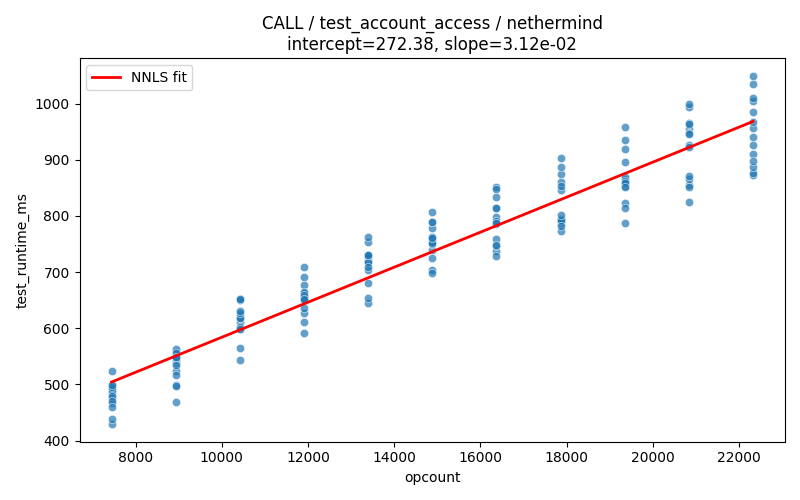

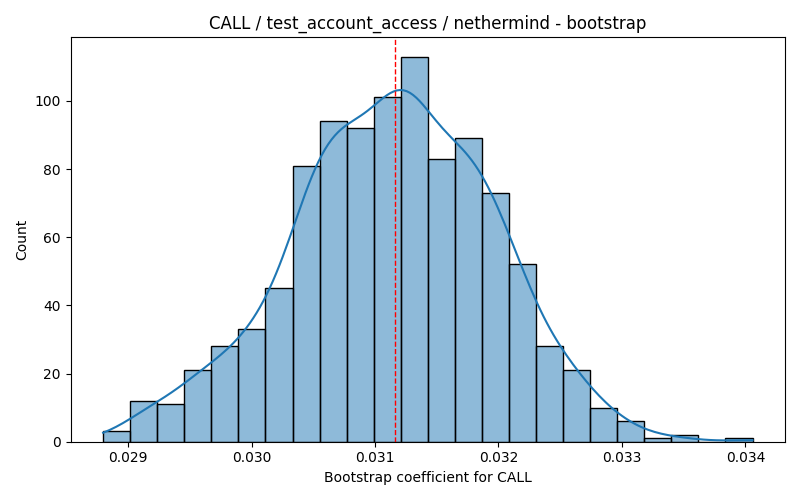

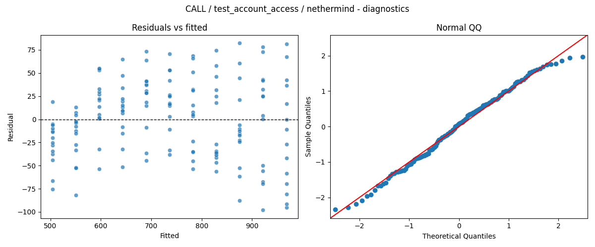

</details>

<details><summary>reth — NNLS regression summary</summary>

```
==============================================================================
                           NNLS Regression Results                            
==============================================================================
Dep. Variable:          test_runtime_ms              R-squared:          0.966
Model:                  NNLS                    Adj. R-squared:          0.966
No. Observations:       209                               RMSE:          16.66
Df Residuals:           207                                MAE:          12.74
Df Model:               1      
==============================================================================
                      coef     std err     P-value      [0.025      0.975]
------------------------------------------------------------------------------
         const     90.8312      3.3047       0.001     84.5508     97.6088
       opcount      0.0044      0.0001       0.001      0.0043      0.0045
==============================================================================
Notes: Non-negative least squares with bootstrap inference (1000 iterations)
==============================================================================
```

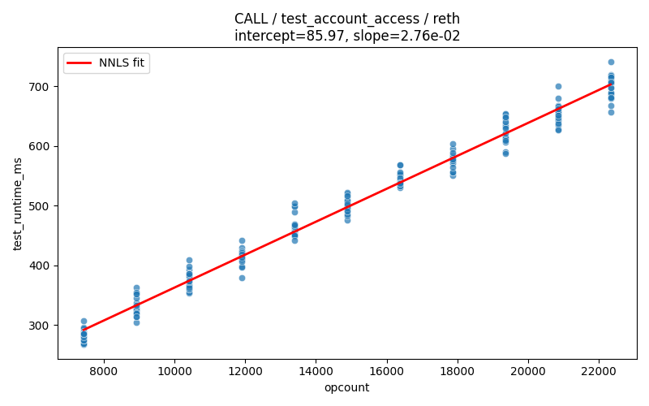

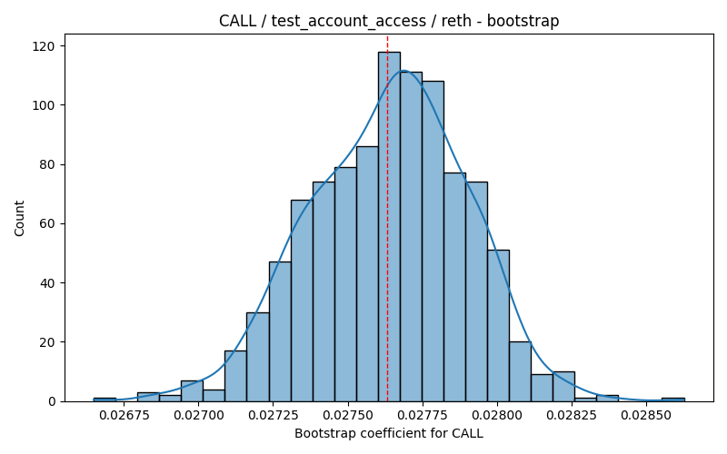

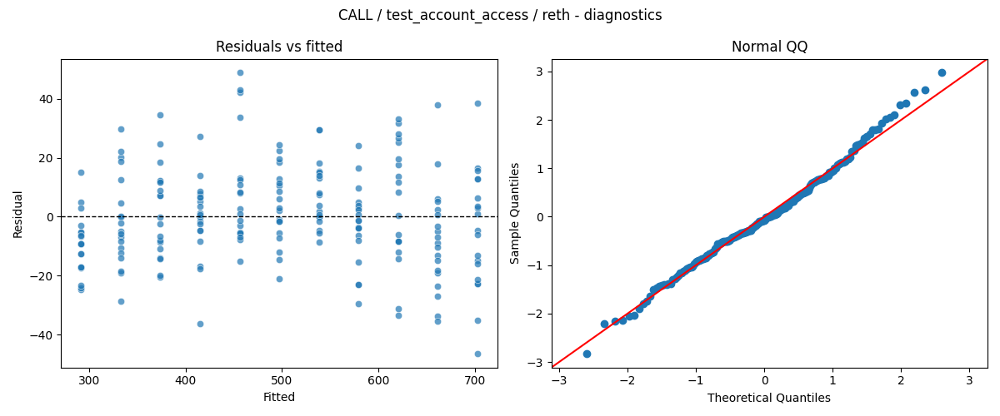

</details>

### test_account_access — combo `CALL_AccountMode.EXISTING_CONTRACT_DIFF_MAX` — `presets[cold_account_code_write]`

| client | nobs | R² | target_coef (ms) | p-value | 95% CI |
| --- | --- | --- | --- | --- | --- |
| `besu` | 110 | 0.985 | 0.07238 | 1.00e-03 | [0.07065, 0.07403] |
| `erigon` | 88 | 0.8009 | 0.04661 | 1.00e-03 | [0.0414, 0.05124] |
| `geth` | 77 | 0.947 | 0.047 | 1.00e-03 | [0.04397, 0.04996] |
| `nethermind` | 154 | 0.9667 | 0.05038 | 1.00e-03 | [0.04879, 0.05189] |
| `reth` | 209 | 0.9873 | 0.04778 | 1.00e-03 | [0.04702, 0.0485] |

<details><summary>besu — NNLS regression summary</summary>

```
==============================================================================
                           NNLS Regression Results                            
==============================================================================
Dep. Variable:          test_runtime_ms              R-squared:          0.985
Model:                  NNLS                    Adj. R-squared:          0.985
No. Observations:       110                               RMSE:          42.07
Df Residuals:           108                                MAE:          32.14
Df Model:               1      
==============================================================================
                      coef     std err     P-value      [0.025      0.975]
------------------------------------------------------------------------------
         const    241.2870     12.8258       0.001    217.4911    267.7616
       opcount      0.0724      0.0009       0.001      0.0706      0.0740
==============================================================================
Notes: Non-negative least squares with bootstrap inference (1000 iterations)
==============================================================================
```


</details>

<details><summary>erigon — NNLS regression summary</summary>

```
==============================================================================
                           NNLS Regression Results                            
==============================================================================
Dep. Variable:          test_runtime_ms              R-squared:          0.801
Model:                  NNLS                    Adj. R-squared:          0.799
No. Observations:       88                                RMSE:         109.39
Df Residuals:           86                                 MAE:          71.68
Df Model:               1      
==============================================================================
                      coef     std err     P-value      [0.025      0.975]
------------------------------------------------------------------------------
         const    736.6003     41.2514       0.001    666.1377    822.5149
       opcount      0.0466      0.0025       0.001      0.0414      0.0512
==============================================================================
Notes: Non-negative least squares with bootstrap inference (1000 iterations)
==============================================================================
```


</details>

<details><summary>geth — NNLS regression summary</summary>

```
==============================================================================
                           NNLS Regression Results                            
==============================================================================
Dep. Variable:          test_runtime_ms              R-squared:          0.947
Model:                  NNLS                    Adj. R-squared:          0.946
No. Observations:       77                                RMSE:          52.35
Df Residuals:           75                                 MAE:          44.06
Df Model:               1      
==============================================================================
                      coef     std err     P-value      [0.025      0.975]
------------------------------------------------------------------------------
         const    147.4153     24.5107       0.001     99.4879    197.6534
       opcount      0.0470      0.0015       0.001      0.0440      0.0500
==============================================================================
Notes: Non-negative least squares with bootstrap inference (1000 iterations)
==============================================================================
```


</details>

<details><summary>nethermind — NNLS regression summary</summary>

```
==============================================================================
                           NNLS Regression Results                            
==============================================================================
Dep. Variable:          test_runtime_ms              R-squared:          0.967
Model:                  NNLS                    Adj. R-squared:          0.966
No. Observations:       154                               RMSE:          44.04
Df Residuals:           152                                MAE:          35.00
Df Model:               1      
==============================================================================
                      coef     std err     P-value      [0.025      0.975]
------------------------------------------------------------------------------
         const    275.3097     11.1125       0.001    253.5947    297.0807
       opcount      0.0504      0.0008       0.001      0.0488      0.0519
==============================================================================
Notes: Non-negative least squares with bootstrap inference (1000 iterations)
==============================================================================
```


</details>

<details><summary>reth — NNLS regression summary</summary>

```
==============================================================================
                           NNLS Regression Results                            
==============================================================================
Dep. Variable:          test_runtime_ms              R-squared:          0.987
Model:                  NNLS                    Adj. R-squared:          0.987
No. Observations:       209                               RMSE:          25.47
Df Residuals:           207                                MAE:          18.17
Df Model:               1      
==============================================================================
                      coef     std err     P-value      [0.025      0.975]
------------------------------------------------------------------------------
         const    126.2144      5.4193       0.001    115.6408    137.1229
       opcount      0.0478      0.0004       0.001      0.0470      0.0485
==============================================================================
Notes: Non-negative least squares with bootstrap inference (1000 iterations)
==============================================================================
```


</details>

### test_account_access — combo `CALL_AccountMode.EXISTING_CONTRACT_MINIMAL` — `presets[cold_account_code_write]`

| client | nobs | R² | target_coef (ms) | p-value | 95% CI |
| --- | --- | --- | --- | --- | --- |
| `besu` | 110 | 0.9728 | 0.06634 | 1.00e-03 | [0.06407, 0.06864] |
| `erigon` | 88 | 0.8659 | 0.04912 | 1.00e-03 | [0.04503, 0.05304] |
| `geth` | 77 | 0.7842 | 0.08286 | 1.00e-03 | [0.07213, 0.09085] |
| `nethermind` | 154 | 0.9224 | 0.03198 | 1.00e-03 | [0.0304, 0.03356] |
| `reth` | 209 | 0.9844 | 0.02784 | 1.00e-03 | [0.02736, 0.02834] |

<details><summary>besu — NNLS regression summary</summary>

```
==============================================================================
                           NNLS Regression Results                            
==============================================================================
Dep. Variable:          test_runtime_ms              R-squared:          0.973
Model:                  NNLS                    Adj. R-squared:          0.973
No. Observations:       110                               RMSE:          52.16
Df Residuals:           108                                MAE:          41.45
Df Model:               1      
==============================================================================
                      coef     std err     P-value      [0.025      0.975]
------------------------------------------------------------------------------
         const    286.2417     16.9044       0.001    252.8540    320.1144
       opcount      0.0663      0.0012       0.001      0.0641      0.0686
==============================================================================
Notes: Non-negative least squares with bootstrap inference (1000 iterations)
==============================================================================
```


</details>

<details><summary>erigon — NNLS regression summary</summary>

```
==============================================================================
                           NNLS Regression Results                            
==============================================================================
Dep. Variable:          test_runtime_ms              R-squared:          0.866
Model:                  NNLS                    Adj. R-squared:          0.864
No. Observations:       88                                RMSE:          90.98
Df Residuals:           86                                 MAE:          59.43
Df Model:               1      
==============================================================================
                      coef     std err     P-value      [0.025      0.975]
------------------------------------------------------------------------------
         const    604.6063     34.0492       0.001    543.1976    674.6024
       opcount      0.0491      0.0020       0.001      0.0450      0.0530
==============================================================================
Notes: Non-negative least squares with bootstrap inference (1000 iterations)
==============================================================================
```


</details>

<details><summary>geth — NNLS regression summary</summary>

```
==============================================================================
                           NNLS Regression Results                            
==============================================================================
Dep. Variable:          test_runtime_ms              R-squared:          0.784
Model:                  NNLS                    Adj. R-squared:          0.781
No. Observations:       77                                RMSE:         204.57
Df Residuals:           75                                 MAE:         135.85
Df Model:               1      
==============================================================================
                      coef     std err     P-value      [0.025      0.975]
------------------------------------------------------------------------------
         const     94.9981     62.6104       0.073      0.0000    226.6791
       opcount      0.0829      0.0049       0.001      0.0721      0.0908
==============================================================================
Notes: Non-negative least squares with bootstrap inference (1000 iterations)
==============================================================================
```


</details>

<details><summary>nethermind — NNLS regression summary</summary>

```
==============================================================================
                           NNLS Regression Results                            
==============================================================================
Dep. Variable:          test_runtime_ms              R-squared:          0.922
Model:                  NNLS                    Adj. R-squared:          0.922
No. Observations:       154                               RMSE:          43.66
Df Residuals:           152                                MAE:          35.97
Df Model:               1      
==============================================================================
                      coef     std err     P-value      [0.025      0.975]
------------------------------------------------------------------------------
         const    276.6343     11.4503       0.001    253.7176    300.3657
       opcount      0.0320      0.0008       0.001      0.0304      0.0336
==============================================================================
Notes: Non-negative least squares with bootstrap inference (1000 iterations)
==============================================================================
```


</details>

<details><summary>reth — NNLS regression summary</summary>

```
==============================================================================
                           NNLS Regression Results                            
==============================================================================
Dep. Variable:          test_runtime_ms              R-squared:          0.984
Model:                  NNLS                    Adj. R-squared:          0.984
No. Observations:       209                               RMSE:          16.51
Df Residuals:           207                                MAE:          12.82
Df Model:               1      
==============================================================================
                      coef     std err     P-value      [0.025      0.975]
------------------------------------------------------------------------------
         const     79.8371      3.5493       0.001     72.8429     86.4734
       opcount      0.0278      0.0003       0.001      0.0274      0.0283
==============================================================================
Notes: Non-negative least squares with bootstrap inference (1000 iterations)
==============================================================================
```


</details>

### test_account_access — combo `CALL_AccountMode.EXISTING_CONTRACT_SAME_MAX` — `presets[cold_account_code_write]`

| client | nobs | R² | target_coef (ms) | p-value | 95% CI |
| --- | --- | --- | --- | --- | --- |
| `besu` | 110 | 0.97 | 0.06664 | 1.00e-03 | [0.06411, 0.06879] |
| `erigon` | 88 | 0.8829 | 0.05011 | 1.00e-03 | [0.04619, 0.05418] |
| `geth` | 77 | 0.7759 | 0.08254 | 1.00e-03 | [0.07146, 0.09027] |
| `nethermind` | 154 | 0.9246 | 0.03116 | 1.00e-03 | [0.02944, 0.03266] |
| `reth` | 209 | 0.9843 | 0.02763 | 1.00e-03 | [0.02713, 0.0281] |

<details><summary>besu — NNLS regression summary</summary>

```
==============================================================================
                           NNLS Regression Results                            
==============================================================================
Dep. Variable:          test_runtime_ms              R-squared:          0.970
Model:                  NNLS                    Adj. R-squared:          0.970
No. Observations:       110                               RMSE:          55.18
Df Residuals:           108                                MAE:          44.82
Df Model:               1      
==============================================================================
                      coef     std err     P-value      [0.025      0.975]
------------------------------------------------------------------------------
         const    291.4510     18.0585       0.001    259.2505    330.4656
       opcount      0.0666      0.0012       0.001      0.0641      0.0688
==============================================================================
Notes: Non-negative least squares with bootstrap inference (1000 iterations)
==============================================================================
```


</details>

<details><summary>erigon — NNLS regression summary</summary>

```
==============================================================================
                           NNLS Regression Results                            
==============================================================================
Dep. Variable:          test_runtime_ms              R-squared:          0.883
Model:                  NNLS                    Adj. R-squared:          0.881
No. Observations:       88                                RMSE:          85.92
Df Residuals:           86                                 MAE:          56.83
Df Model:               1      
==============================================================================
                      coef     std err     P-value      [0.025      0.975]
------------------------------------------------------------------------------
         const    584.8482     33.6788       0.001    518.5237    651.7427
       opcount      0.0501      0.0021       0.001      0.0462      0.0542
==============================================================================
Notes: Non-negative least squares with bootstrap inference (1000 iterations)
==============================================================================
```


</details>

<details><summary>geth — NNLS regression summary</summary>

```
==============================================================================
                           NNLS Regression Results                            
==============================================================================
Dep. Variable:          test_runtime_ms              R-squared:          0.776
Model:                  NNLS                    Adj. R-squared:          0.773
No. Observations:       77                                RMSE:         208.78
Df Residuals:           75                                 MAE:         138.25
Df Model:               1      
==============================================================================
                      coef     std err     P-value      [0.025      0.975]
------------------------------------------------------------------------------
         const     86.3517     65.0481       0.103      0.0000    229.3893
       opcount      0.0825      0.0052       0.001      0.0715      0.0903
==============================================================================
Notes: Non-negative least squares with bootstrap inference (1000 iterations)
==============================================================================
```


</details>

<details><summary>nethermind — NNLS regression summary</summary>

```
==============================================================================
                           NNLS Regression Results                            
==============================================================================
Dep. Variable:          test_runtime_ms              R-squared:          0.925
Model:                  NNLS                    Adj. R-squared:          0.924
No. Observations:       154                               RMSE:          41.89
Df Residuals:           152                                MAE:          34.73
Df Model:               1      
==============================================================================
                      coef     std err     P-value      [0.025      0.975]
------------------------------------------------------------------------------
         const    272.3772     11.5320       0.001    251.2716    295.8999
       opcount      0.0312      0.0008       0.001      0.0294      0.0327
==============================================================================
Notes: Non-negative least squares with bootstrap inference (1000 iterations)
==============================================================================
```


</details>

<details><summary>reth — NNLS regression summary</summary>

```
==============================================================================
                           NNLS Regression Results                            
==============================================================================
Dep. Variable:          test_runtime_ms              R-squared:          0.984
Model:                  NNLS                    Adj. R-squared:          0.984
No. Observations:       209                               RMSE:          16.41
Df Residuals:           207                                MAE:          12.73
Df Model:               1      
==============================================================================
                      coef     std err     P-value      [0.025      0.975]
------------------------------------------------------------------------------
         const     85.9653      3.8699       0.001     79.0944     93.8188
       opcount      0.0276      0.0003       0.001      0.0271      0.0281
==============================================================================
Notes: Non-negative least squares with bootstrap inference (1000 iterations)
==============================================================================
```


</details>

## CALLCODE

### test_ext_account_query_warm — combo `CALLCODE`

| client | nobs | R² | target_coef (ms) | p-value | 95% CI |
| --- | --- | --- | --- | --- | --- |
| `besu` | 110 | 0.8842 | 0.0004463 | 1.00e-03 | [0.0004156, 0.0004789] |
| `erigon` | 88 | 0.6576 | 4.102e-05 | 1.00e-03 | [3.481e-05, 4.785e-05] |
| `geth` | 77 | 0.8308 | 0.0001531 | 1.00e-03 | [0.0001372, 0.0001702] |
| `nethermind` | 154 | 0.5742 | 0.0001928 | 1.00e-03 | [0.0001678, 0.0002225] |
| `reth` | 209 | 0.9192 | 5.742e-05 | 1.00e-03 | [5.519e-05, 5.97e-05] |

<details><summary>besu — NNLS regression summary</summary>

```
==============================================================================
                           NNLS Regression Results                            
==============================================================================
Dep. Variable:          test_runtime_ms              R-squared:          0.884
Model:                  NNLS                    Adj. R-squared:          0.883
No. Observations:       110                               RMSE:          81.63
Df Residuals:           108                                MAE:          66.59
Df Model:               1      
==============================================================================
                      coef     std err     P-value      [0.025      0.975]
------------------------------------------------------------------------------
         const    527.3826     27.0594       0.001    475.2043    578.1919
       opcount      0.0004      0.0000       0.001      0.0004      0.0005
==============================================================================
Notes: Non-negative least squares with bootstrap inference (1000 iterations)
==============================================================================
```

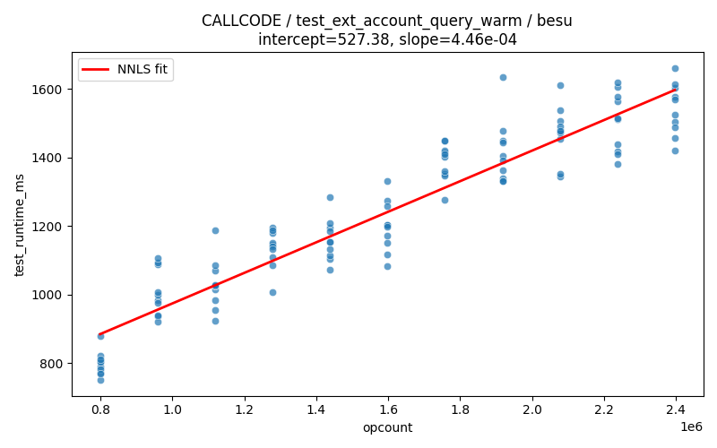

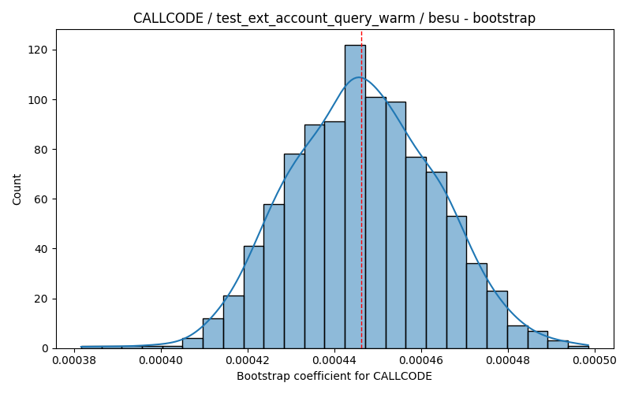

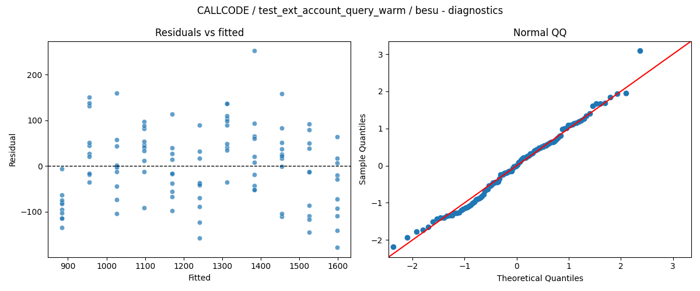

</details>

<details><summary>erigon — NNLS regression summary</summary>

```
==============================================================================
                           NNLS Regression Results                            
==============================================================================
Dep. Variable:          test_runtime_ms              R-squared:          0.658
Model:                  NNLS                    Adj. R-squared:          0.654
No. Observations:       88                                RMSE:          14.96
Df Residuals:           86                                 MAE:          10.55
Df Model:               1      
==============================================================================
                      coef     std err     P-value      [0.025      0.975]
------------------------------------------------------------------------------
         const     33.8778      4.7783       0.001     24.6650     43.0114
       opcount      0.0000      0.0000       0.001      0.0000      0.0000
==============================================================================
Notes: Non-negative least squares with bootstrap inference (1000 iterations)
==============================================================================
```

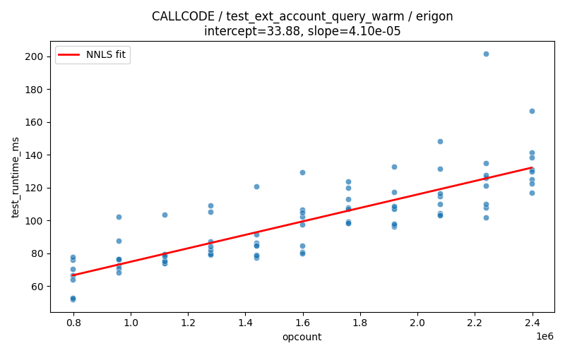

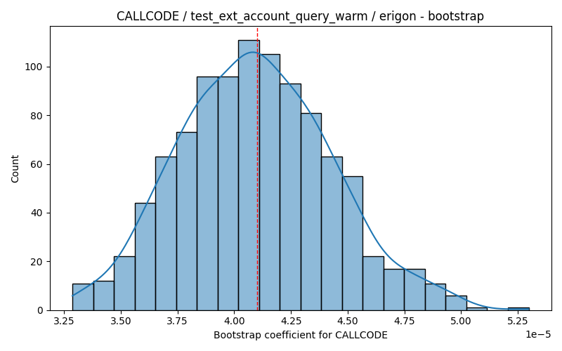

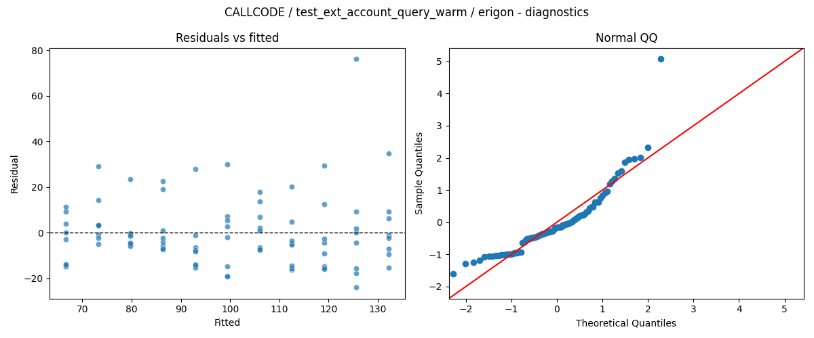

</details>

<details><summary>geth — NNLS regression summary</summary>

```
==============================================================================
                           NNLS Regression Results                            
==============================================================================
Dep. Variable:          test_runtime_ms              R-squared:          0.831
Model:                  NNLS                    Adj. R-squared:          0.829
No. Observations:       77                                RMSE:          34.92
Df Residuals:           75                                 MAE:          28.21
Df Model:               1      
==============================================================================
                      coef     std err     P-value      [0.025      0.975]
------------------------------------------------------------------------------
         const     35.6852     12.8067       0.004      9.6472     59.7782
       opcount      0.0002      0.0000       0.001      0.0001      0.0002
==============================================================================
Notes: Non-negative least squares with bootstrap inference (1000 iterations)
==============================================================================
```

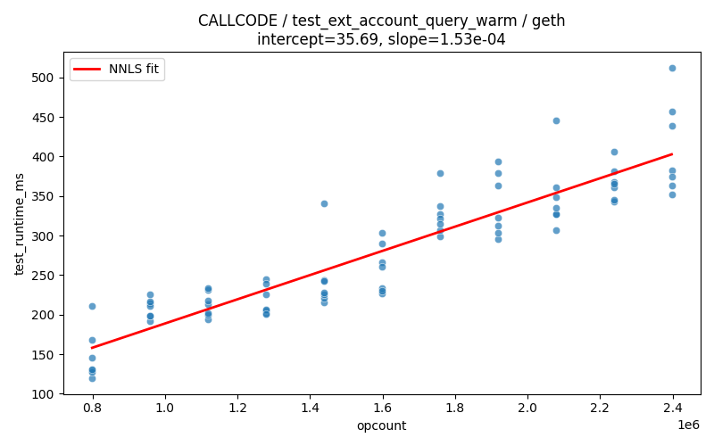

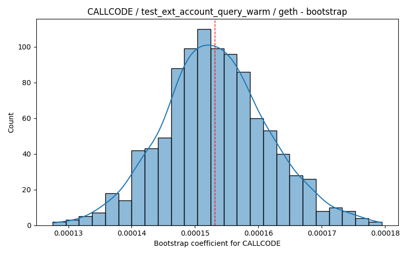

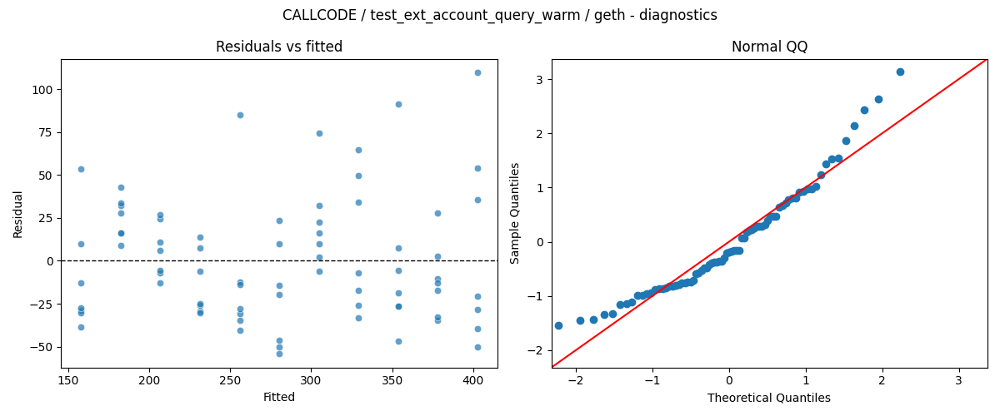

</details>

<details><summary>nethermind — NNLS regression summary</summary>

```
==============================================================================
                           NNLS Regression Results                            
==============================================================================
Dep. Variable:          test_runtime_ms              R-squared:          0.574
Model:                  NNLS                    Adj. R-squared:          0.571
No. Observations:       154                               RMSE:          83.91
Df Residuals:           152                                MAE:          70.36
Df Model:               1      
==============================================================================
                      coef     std err     P-value      [0.025      0.975]
------------------------------------------------------------------------------
         const    187.7131     21.8539       0.001    143.4641    227.7716
       opcount      0.0002      0.0000       0.001      0.0002      0.0002
==============================================================================
Notes: Non-negative least squares with bootstrap inference (1000 iterations)
==============================================================================
```

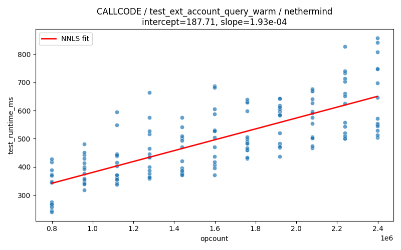

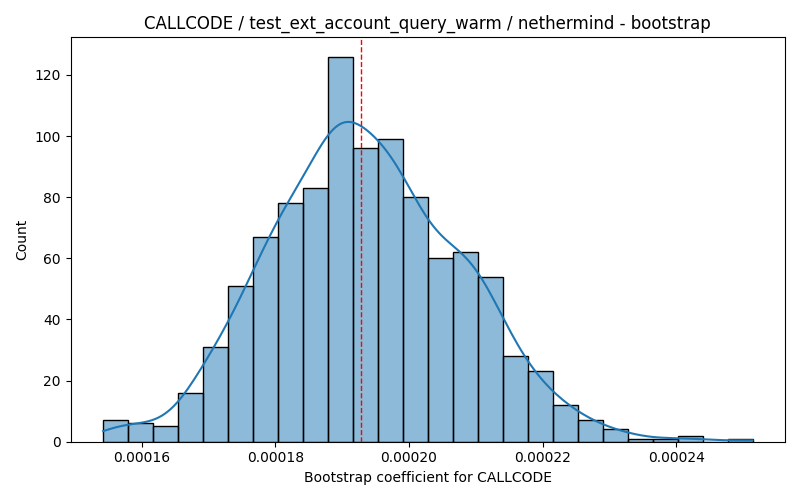

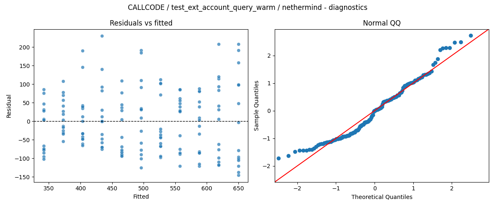

</details>

<details><summary>reth — NNLS regression summary</summary>

```
==============================================================================
                           NNLS Regression Results                            
==============================================================================
Dep. Variable:          test_runtime_ms              R-squared:          0.919
Model:                  NNLS                    Adj. R-squared:          0.919
No. Observations:       209                               RMSE:           8.60
Df Residuals:           207                                MAE:           6.80
Df Model:               1      
==============================================================================
                      coef     std err     P-value      [0.025      0.975]
------------------------------------------------------------------------------
         const     23.2073      1.8869       0.001     19.5653     26.8443
       opcount      0.0001      0.0000       0.001      0.0001      0.0001
==============================================================================
Notes: Non-negative least squares with bootstrap inference (1000 iterations)
==============================================================================
```

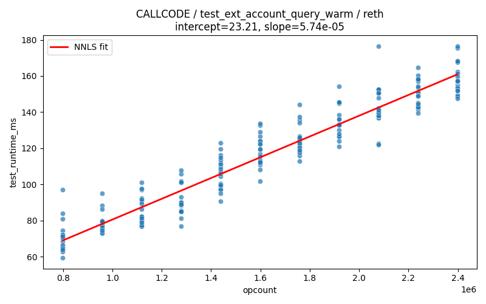

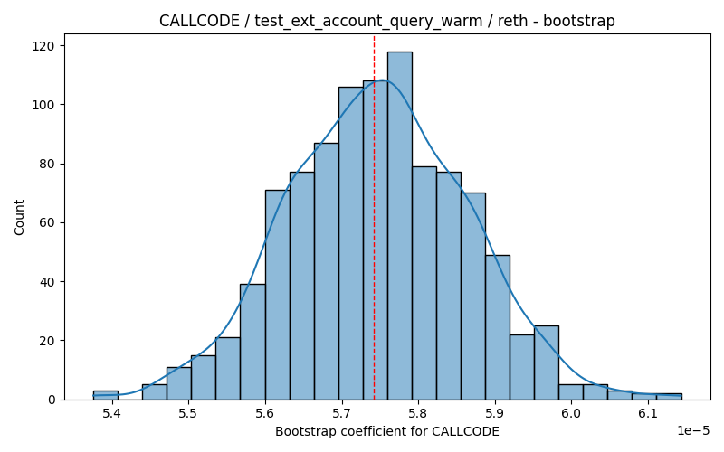

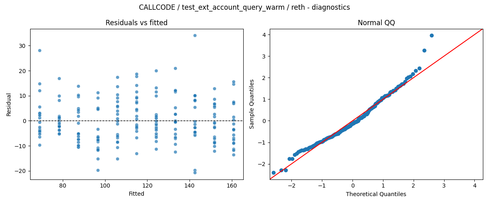

</details>

### test_account_access — combo `CALLCODE_AccountMode.EXISTING_EOA` — `presets[cold_account_nocode_access]`

| client | nobs | R² | target_coef (ms) | p-value | 95% CI |
| --- | --- | --- | --- | --- | --- |
| `besu` | 110 | 0.9856 | 0.01617 | 1.00e-03 | [0.01586, 0.0165] |
| `erigon` | 88 | 0.9984 | 0.008241 | 1.00e-03 | [0.008211, 0.008259] |
| `geth` | 77 | 0.8196 | 0.0183 | 1.00e-03 | [0.01604, 0.02019] |
| `nethermind` | 154 | 0.9089 | 0.003382 | 1.00e-03 | [0.003213, 0.003544] |
| `reth` | 209 | 0.9705 | 0.004033 | 1.00e-03 | [0.003938, 0.004134] |

<details><summary>besu — NNLS regression summary</summary>

```
==============================================================================
                           NNLS Regression Results                            
==============================================================================
Dep. Variable:          test_runtime_ms              R-squared:          0.986
Model:                  NNLS                    Adj. R-squared:          0.985
No. Observations:       110                               RMSE:          40.10
Df Residuals:           108                                MAE:          30.00
Df Model:               1      
==============================================================================
                      coef     std err     P-value      [0.025      0.975]
------------------------------------------------------------------------------
         const    486.9943     11.6071       0.001    463.0566    508.5431
       opcount      0.0162      0.0002       0.001      0.0159      0.0165
==============================================================================
Notes: Non-negative least squares with bootstrap inference (1000 iterations)
==============================================================================
```

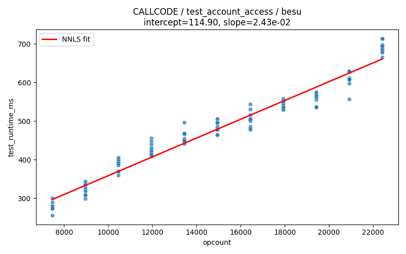

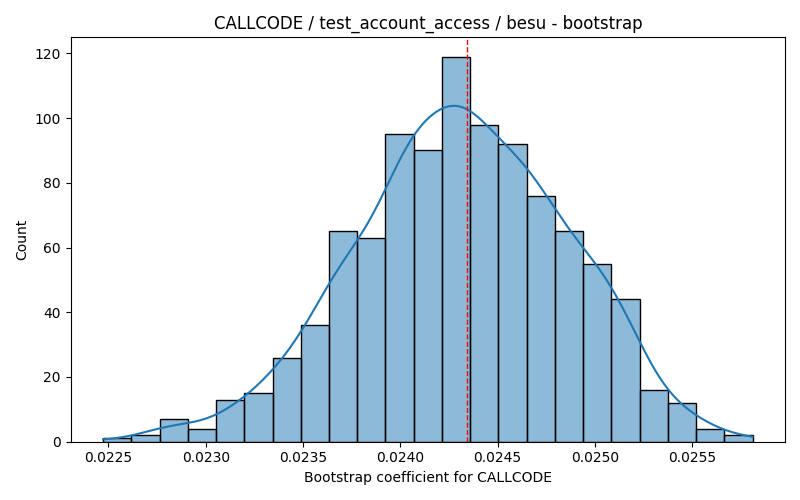

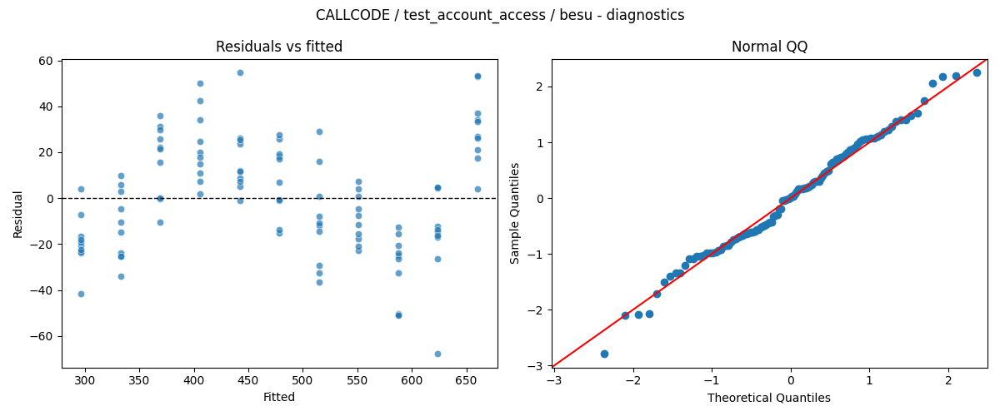

</details>

<details><summary>erigon — NNLS regression summary</summary>

```
==============================================================================
                           NNLS Regression Results                            
==============================================================================
Dep. Variable:          test_runtime_ms              R-squared:          0.998
Model:                  NNLS                    Adj. R-squared:          0.998
No. Observations:       88                                RMSE:           6.83
Df Residuals:           86                                 MAE:           5.41
Df Model:               1      
==============================================================================
                      coef     std err     P-value      [0.025      0.975]
------------------------------------------------------------------------------
         const      0.0000      0.5538       1.000      0.0000      1.9672
       opcount      0.0082      0.0000       0.001      0.0082      0.0083
==============================================================================
Notes: Non-negative least squares with bootstrap inference (1000 iterations)
==============================================================================
```

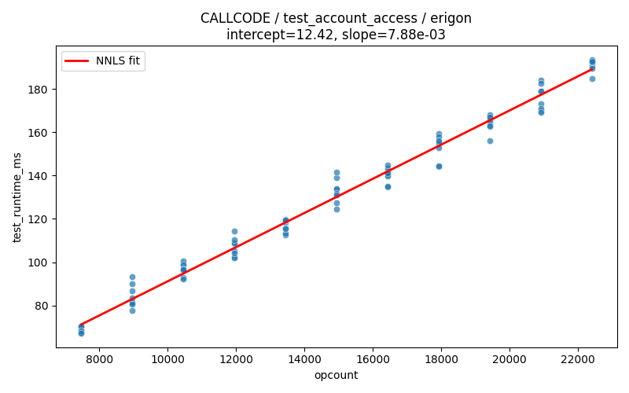

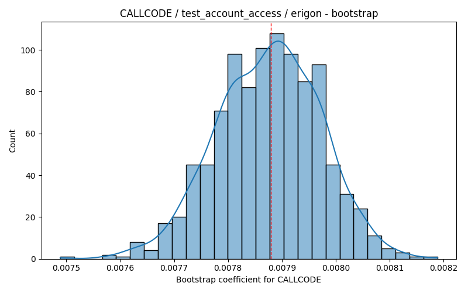

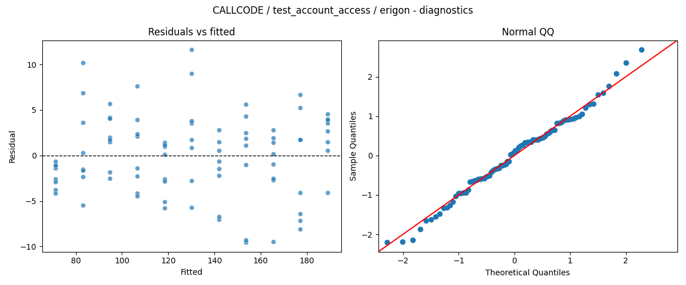

</details>

<details><summary>geth — NNLS regression summary</summary>

```
==============================================================================
                           NNLS Regression Results                            
==============================================================================
Dep. Variable:          test_runtime_ms              R-squared:          0.820
Model:                  NNLS                    Adj. R-squared:          0.817
No. Observations:       77                                RMSE:         176.30
Df Residuals:           75                                 MAE:         116.39
Df Model:               1      
==============================================================================
                      coef     std err     P-value      [0.025      0.975]
------------------------------------------------------------------------------
         const    196.1952     59.1899       0.001     83.0602    323.6264
       opcount      0.0183      0.0011       0.001      0.0160      0.0202
==============================================================================
Notes: Non-negative least squares with bootstrap inference (1000 iterations)
==============================================================================
```

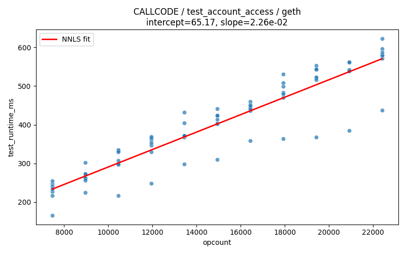

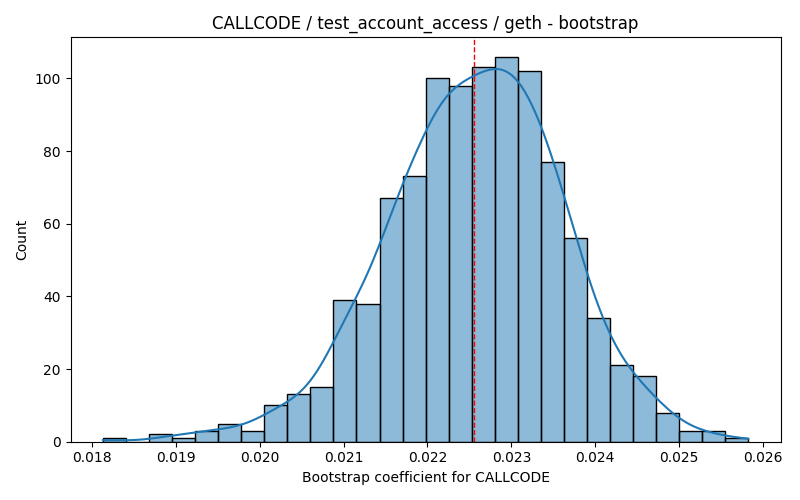

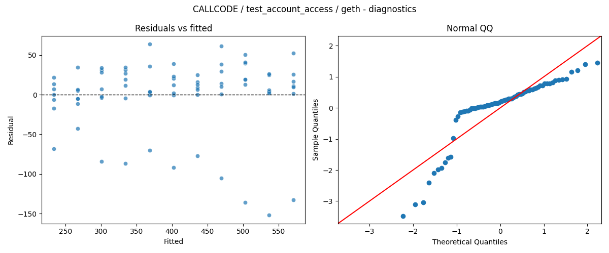

</details>

<details><summary>nethermind — NNLS regression summary</summary>

```
==============================================================================
                           NNLS Regression Results                            
==============================================================================
Dep. Variable:          test_runtime_ms              R-squared:          0.909
Model:                  NNLS                    Adj. R-squared:          0.908
No. Observations:       154                               RMSE:          21.98
Df Residuals:           152                                MAE:          17.83
Df Model:               1      
==============================================================================
                      coef     std err     P-value      [0.025      0.975]
------------------------------------------------------------------------------
         const     94.0729      4.9290       0.001     84.6448    104.1309
       opcount      0.0034      0.0001       0.001      0.0032      0.0035
==============================================================================
Notes: Non-negative least squares with bootstrap inference (1000 iterations)
==============================================================================
```

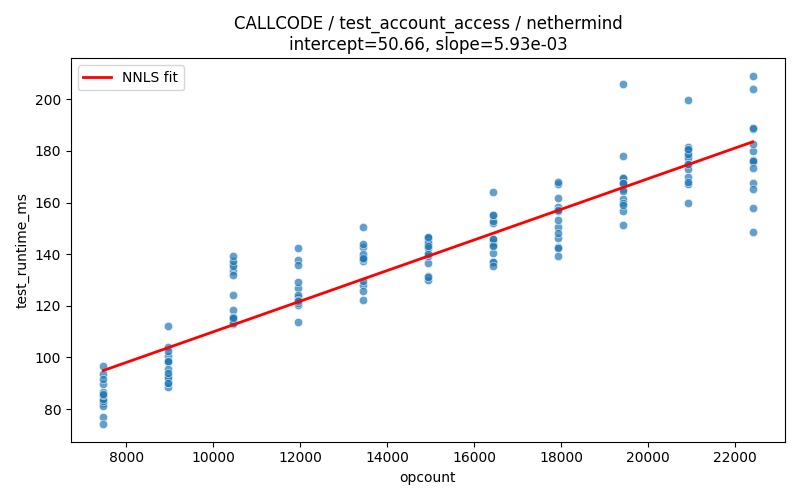

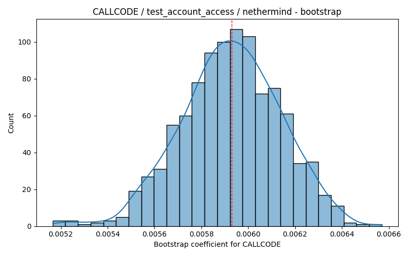

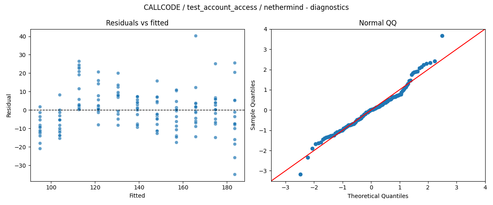

</details>

<details><summary>reth — NNLS regression summary</summary>

```
==============================================================================
                           NNLS Regression Results                            
==============================================================================
Dep. Variable:          test_runtime_ms              R-squared:          0.971
Model:                  NNLS                    Adj. R-squared:          0.970
No. Observations:       209                               RMSE:          14.44
Df Residuals:           207                                MAE:          11.09
Df Model:               1      
==============================================================================
                      coef     std err     P-value      [0.025      0.975]
------------------------------------------------------------------------------
         const    100.9095      3.2689       0.001     94.2848    106.9391
       opcount      0.0040      0.0001       0.001      0.0039      0.0041
==============================================================================
Notes: Non-negative least squares with bootstrap inference (1000 iterations)
==============================================================================
```

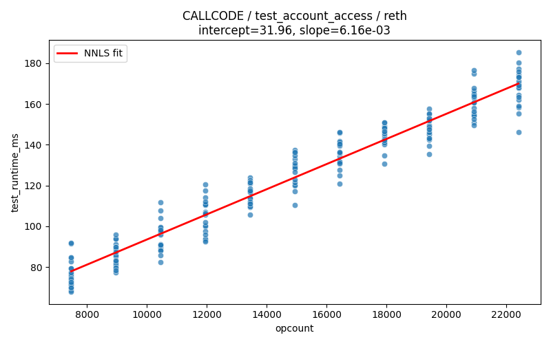

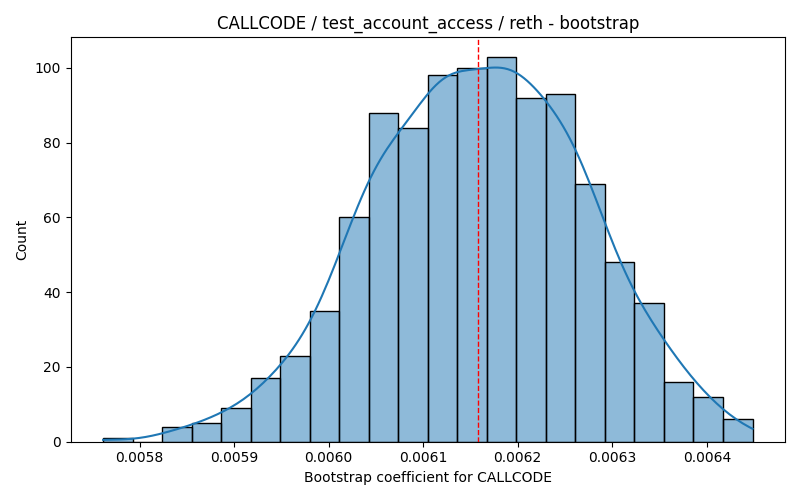

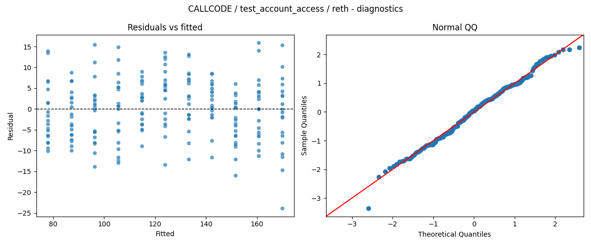

</details>

### test_account_access — combo `CALLCODE_AccountMode.NON_EXISTING_ACCOUNT` — `presets[cold_account_nocode_access]`

| client | nobs | R² | target_coef (ms) | p-value | 95% CI |
| --- | --- | --- | --- | --- | --- |
| `besu` | 110 | 0.9879 | 0.01621 | 1.00e-03 | [0.01591, 0.01654] |
| `erigon` | 88 | 0.9972 | 0.00796 | 1.00e-03 | [0.00787, 0.007986] |
| `geth` | 77 | 0.9345 | 0.01986 | 1.00e-03 | [0.01876, 0.02105] |
| `nethermind` | 154 | 0.8891 | 0.003016 | 1.00e-03 | [0.00284, 0.003197] |
| `reth` | 209 | 0.9742 | 0.004115 | 1.00e-03 | [0.004026, 0.004203] |

<details><summary>besu — NNLS regression summary</summary>

```
==============================================================================
                           NNLS Regression Results                            
==============================================================================
Dep. Variable:          test_runtime_ms              R-squared:          0.988
Model:                  NNLS                    Adj. R-squared:          0.988
No. Observations:       110                               RMSE:          36.85
Df Residuals:           108                                MAE:          28.15
Df Model:               1      
==============================================================================
                      coef     std err     P-value      [0.025      0.975]
------------------------------------------------------------------------------
         const    191.8311     11.1740       0.001    168.7568    212.7509
       opcount      0.0162      0.0002       0.001      0.0159      0.0165
==============================================================================
Notes: Non-negative least squares with bootstrap inference (1000 iterations)
==============================================================================
```

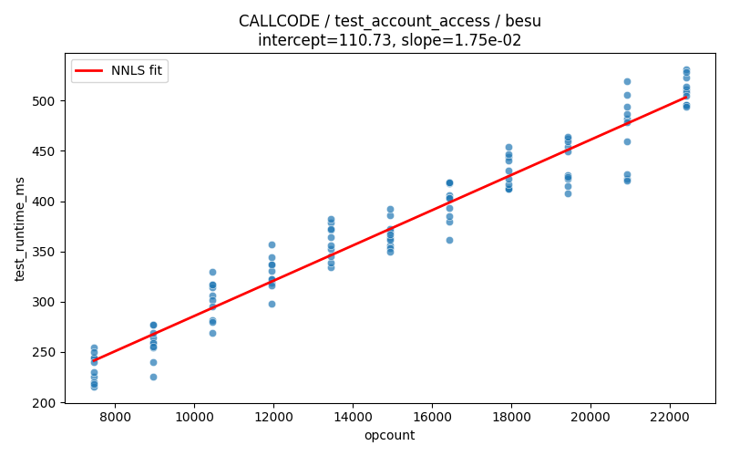

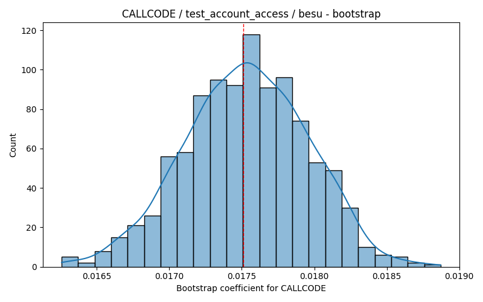

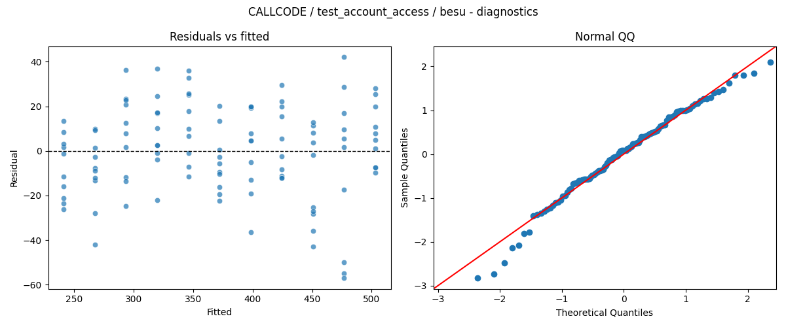

</details>

<details><summary>erigon — NNLS regression summary</summary>

```
==============================================================================
                           NNLS Regression Results                            
==============================================================================
Dep. Variable:          test_runtime_ms              R-squared:          0.997
Model:                  NNLS                    Adj. R-squared:          0.997
No. Observations:       88                                RMSE:           8.71
Df Residuals:           86                                 MAE:           6.80
Df Model:               1      
==============================================================================
                      coef     std err     P-value      [0.025      0.975]
------------------------------------------------------------------------------
         const      0.0000      1.7060       1.000      0.0000      5.5711
       opcount      0.0080      0.0000       0.001      0.0079      0.0080
==============================================================================
Notes: Non-negative least squares with bootstrap inference (1000 iterations)
==============================================================================
```

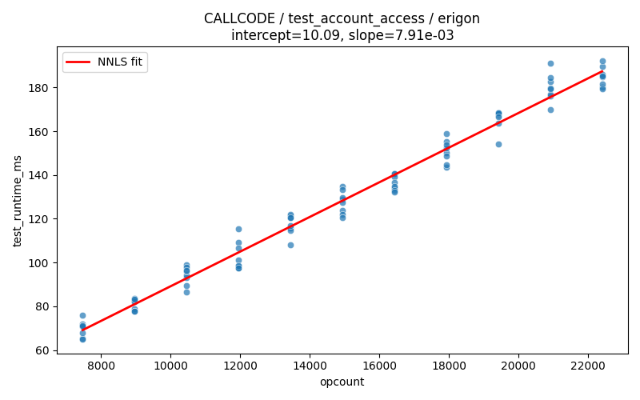

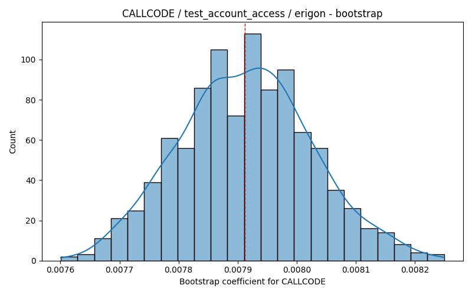

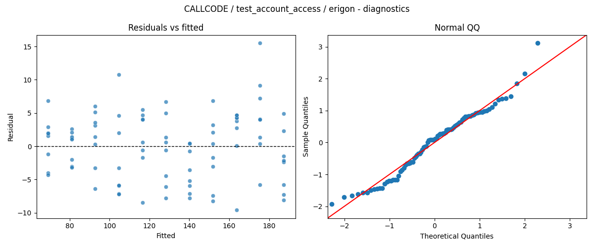

</details>

<details><summary>geth — NNLS regression summary</summary>

```
==============================================================================
                           NNLS Regression Results                            
==============================================================================
Dep. Variable:          test_runtime_ms              R-squared:          0.934
Model:                  NNLS                    Adj. R-squared:          0.934
No. Observations:       77                                RMSE:         108.03
Df Residuals:           75                                 MAE:          73.28
Df Model:               1      
==============================================================================
                      coef     std err     P-value      [0.025      0.975]
------------------------------------------------------------------------------
         const    214.3987     36.0225       0.001    144.1029    283.3184
       opcount      0.0199      0.0006       0.001      0.0188      0.0210
==============================================================================
Notes: Non-negative least squares with bootstrap inference (1000 iterations)
==============================================================================
```

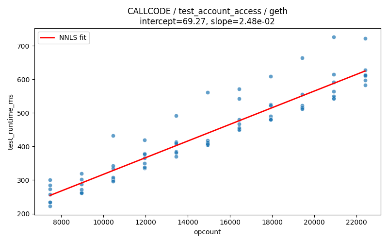

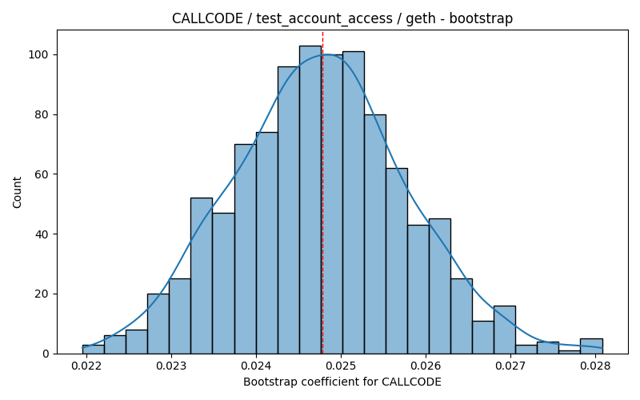

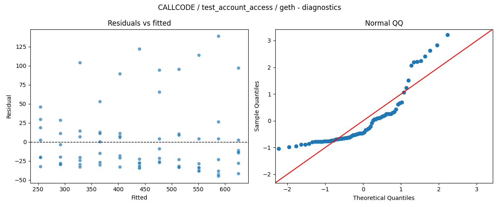

</details>

<details><summary>nethermind — NNLS regression summary</summary>

```
==============================================================================
                           NNLS Regression Results                            
==============================================================================
Dep. Variable:          test_runtime_ms              R-squared:          0.889
Model:                  NNLS                    Adj. R-squared:          0.888
No. Observations:       154                               RMSE:          21.88
Df Residuals:           152                                MAE:          17.33
Df Model:               1      
==============================================================================
                      coef     std err     P-value      [0.025      0.975]
------------------------------------------------------------------------------
         const     77.6475      5.7685       0.001     66.0690     88.5317
       opcount      0.0030      0.0001       0.001      0.0028      0.0032
==============================================================================
Notes: Non-negative least squares with bootstrap inference (1000 iterations)
==============================================================================
```

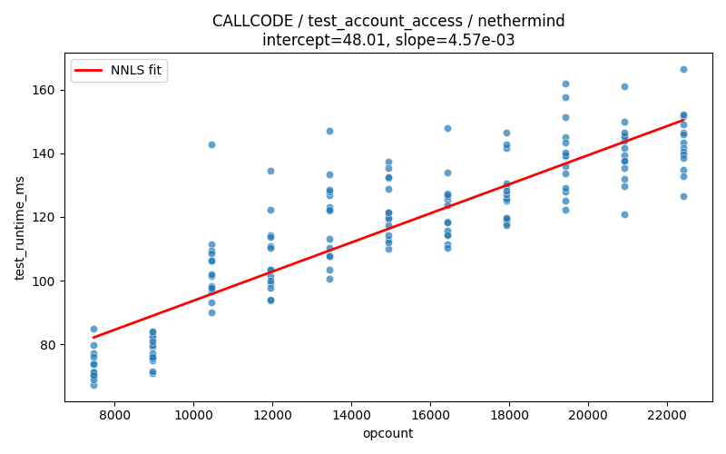

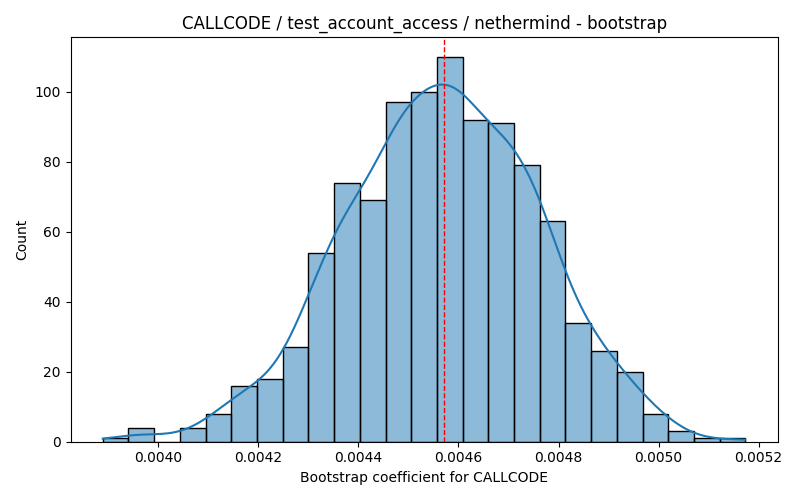

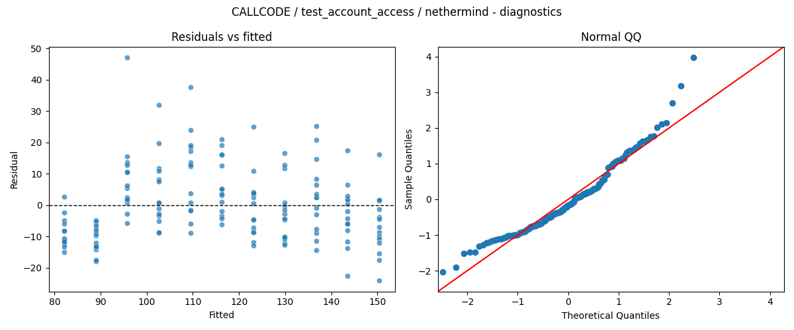

</details>

<details><summary>reth — NNLS regression summary</summary>

```
==============================================================================
                           NNLS Regression Results                            
==============================================================================
Dep. Variable:          test_runtime_ms              R-squared:          0.974
Model:                  NNLS                    Adj. R-squared:          0.974
No. Observations:       209                               RMSE:          13.76
Df Residuals:           207                                MAE:          10.59
Df Model:               1      
==============================================================================
                      coef     std err     P-value      [0.025      0.975]
------------------------------------------------------------------------------
         const     92.6783      2.8767       0.001     87.3485     98.4358
       opcount      0.0041      0.0000       0.001      0.0040      0.0042
==============================================================================
Notes: Non-negative least squares with bootstrap inference (1000 iterations)
==============================================================================
```

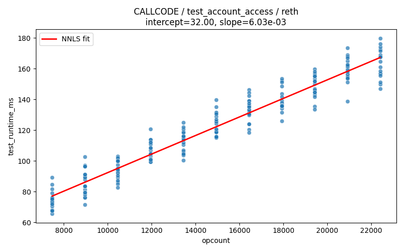

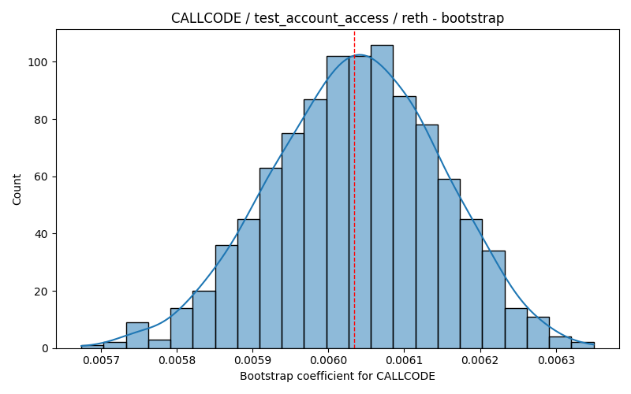

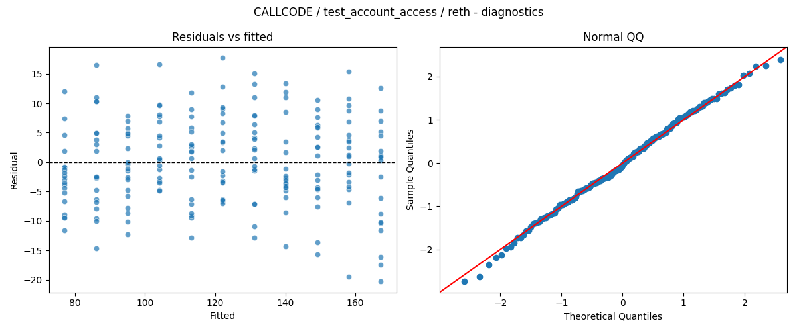

</details>

### test_account_access — combo `CALLCODE_AccountMode.EXISTING_EOA` — `presets[cold_account_nocode_write]`

| client | nobs | R² | target_coef (ms) | p-value | 95% CI |
| --- | --- | --- | --- | --- | --- |
| `besu` | 110 | 0.9573 | 0.02434 | 1.00e-03 | [0.02319, 0.02529] |
| `erigon` | 88 | 0.9866 | 0.00788 | 1.00e-03 | [0.007686, 0.008051] |
| `geth` | 77 | 0.8563 | 0.02256 | 1.00e-03 | [0.02035, 0.02452] |
| `nethermind` | 154 | 0.8667 | 0.005928 | 1.00e-03 | [0.005513, 0.006325] |
| `reth` | 209 | 0.9438 | 0.006158 | 1.00e-03 | [0.00593, 0.006371] |

<details><summary>besu — NNLS regression summary</summary>

```
==============================================================================
                           NNLS Regression Results                            
==============================================================================
Dep. Variable:          test_runtime_ms              R-squared:          0.957
Model:                  NNLS                    Adj. R-squared:          0.957
No. Observations:       110                               RMSE:          24.30
Df Residuals:           108                                MAE:          19.92
Df Model:               1      
==============================================================================
                      coef     std err     P-value      [0.025      0.975]
------------------------------------------------------------------------------
         const    114.9037      7.9258       0.001    101.1335    131.5082
       opcount      0.0243      0.0005       0.001      0.0232      0.0253
==============================================================================
Notes: Non-negative least squares with bootstrap inference (1000 iterations)
==============================================================================
```


</details>

<details><summary>erigon — NNLS regression summary</summary>

```
==============================================================================
                           NNLS Regression Results                            
==============================================================================
Dep. Variable:          test_runtime_ms              R-squared:          0.987
Model:                  NNLS                    Adj. R-squared:          0.986
No. Observations:       88                                RMSE:           4.33
Df Residuals:           86                                 MAE:           3.48
Df Model:               1      
==============================================================================
                      coef     std err     P-value      [0.025      0.975]
------------------------------------------------------------------------------
         const     12.4197      1.4430       0.001      9.7544     15.3403
       opcount      0.0079      0.0001       0.001      0.0077      0.0081
==============================================================================
Notes: Non-negative least squares with bootstrap inference (1000 iterations)
==============================================================================
```


</details>

<details><summary>geth — NNLS regression summary</summary>

```
==============================================================================
                           NNLS Regression Results                            
==============================================================================
Dep. Variable:          test_runtime_ms              R-squared:          0.856
Model:                  NNLS                    Adj. R-squared:          0.854
No. Observations:       77                                RMSE:          43.65
Df Residuals:           75                                 MAE:          28.65
Df Model:               1      
==============================================================================
                      coef     std err     P-value      [0.025      0.975]
------------------------------------------------------------------------------
         const     65.1719     14.2717       0.001     37.1685     94.9880
       opcount      0.0226      0.0011       0.001      0.0204      0.0245
==============================================================================
Notes: Non-negative least squares with bootstrap inference (1000 iterations)
==============================================================================
```


</details>

<details><summary>nethermind — NNLS regression summary</summary>

```
==============================================================================
                           NNLS Regression Results                            
==============================================================================
Dep. Variable:          test_runtime_ms              R-squared:          0.867
Model:                  NNLS                    Adj. R-squared:          0.866
No. Observations:       154                               RMSE:          10.98
Df Residuals:           152                                MAE:           8.29
Df Model:               1      
==============================================================================
                      coef     std err     P-value      [0.025      0.975]
------------------------------------------------------------------------------
         const     50.6648      3.1857       0.001     44.8951     56.9361
       opcount      0.0059      0.0002       0.001      0.0055      0.0063
==============================================================================
Notes: Non-negative least squares with bootstrap inference (1000 iterations)
==============================================================================
```


</details>

<details><summary>reth — NNLS regression summary</summary>

```
==============================================================================
                           NNLS Regression Results                            
==============================================================================
Dep. Variable:          test_runtime_ms              R-squared:          0.944
Model:                  NNLS                    Adj. R-squared:          0.944
No. Observations:       209                               RMSE:           7.10
Df Residuals:           207                                MAE:           5.80
Df Model:               1      
==============================================================================
                      coef     std err     P-value      [0.025      0.975]
------------------------------------------------------------------------------
         const     31.9648      1.7364       0.001     28.8759     35.4237
       opcount      0.0062      0.0001       0.001      0.0059      0.0064
==============================================================================
Notes: Non-negative least squares with bootstrap inference (1000 iterations)
==============================================================================
```


</details>

### test_account_access — combo `CALLCODE_AccountMode.NON_EXISTING_ACCOUNT` — `presets[cold_account_nocode_write]`

| client | nobs | R² | target_coef (ms) | p-value | 95% CI |
| --- | --- | --- | --- | --- | --- |
| `besu` | 110 | 0.9441 | 0.01751 | 1.00e-03 | [0.01669, 0.0183] |
| `erigon` | 88 | 0.9827 | 0.007912 | 1.00e-03 | [0.007702, 0.00814] |
| `geth` | 77 | 0.88 | 0.02479 | 1.00e-03 | [0.02283, 0.02683] |
| `nethermind` | 154 | 0.7698 | 0.00457 | 1.00e-03 | [0.00417, 0.00494] |
| `reth` | 209 | 0.937 | 0.006034 | 1.00e-03 | [0.005813, 0.006239] |

<details><summary>besu — NNLS regression summary</summary>

```
==============================================================================
                           NNLS Regression Results                            
==============================================================================
Dep. Variable:          test_runtime_ms              R-squared:          0.944
Model:                  NNLS                    Adj. R-squared:          0.944
No. Observations:       110                               RMSE:          20.13
Df Residuals:           108                                MAE:          16.01
Df Model:               1      
==============================================================================
                      coef     std err     P-value      [0.025      0.975]
------------------------------------------------------------------------------
         const    110.7309      6.1654       0.001     98.6663    122.2299
       opcount      0.0175      0.0004       0.001      0.0167      0.0183
==============================================================================
Notes: Non-negative least squares with bootstrap inference (1000 iterations)
==============================================================================
```


</details>

<details><summary>erigon — NNLS regression summary</summary>

```
==============================================================================
                           NNLS Regression Results                            
==============================================================================
Dep. Variable:          test_runtime_ms              R-squared:          0.983
Model:                  NNLS                    Adj. R-squared:          0.982
No. Observations:       88                                RMSE:           4.96
Df Residuals:           86                                 MAE:           4.09
Df Model:               1      
==============================================================================
                      coef     std err     P-value      [0.025      0.975]
------------------------------------------------------------------------------
         const     10.0852      1.5817       0.001      6.8423     12.8688
       opcount      0.0079      0.0001       0.001      0.0077      0.0081
==============================================================================
Notes: Non-negative least squares with bootstrap inference (1000 iterations)
==============================================================================
```


</details>

<details><summary>geth — NNLS regression summary</summary>

```
==============================================================================
                           NNLS Regression Results                            
==============================================================================
Dep. Variable:          test_runtime_ms              R-squared:          0.880
Model:                  NNLS                    Adj. R-squared:          0.878
No. Observations:       77                                RMSE:          43.23
Df Residuals:           75                                 MAE:          32.32
Df Model:               1      
==============================================================================
                      coef     std err     P-value      [0.025      0.975]
------------------------------------------------------------------------------
         const     69.2658     14.3903       0.001     42.1917     97.1628
       opcount      0.0248      0.0010       0.001      0.0228      0.0268
==============================================================================
Notes: Non-negative least squares with bootstrap inference (1000 iterations)
==============================================================================
```


</details>

<details><summary>nethermind — NNLS regression summary</summary>

```
==============================================================================
                           NNLS Regression Results                            
==============================================================================
Dep. Variable:          test_runtime_ms              R-squared:          0.770
Model:                  NNLS                    Adj. R-squared:          0.768
No. Observations:       154                               RMSE:          11.81
Df Residuals:           152                                MAE:           9.26
Df Model:               1      
==============================================================================
                      coef     std err     P-value      [0.025      0.975]
------------------------------------------------------------------------------
         const     48.0097      3.1046       0.001     42.3596     54.5550
       opcount      0.0046      0.0002       0.001      0.0042      0.0049
==============================================================================
Notes: Non-negative least squares with bootstrap inference (1000 iterations)
==============================================================================
```


</details>

<details><summary>reth — NNLS regression summary</summary>

```
==============================================================================
                           NNLS Regression Results                            
==============================================================================
Dep. Variable:          test_runtime_ms              R-squared:          0.937
Model:                  NNLS                    Adj. R-squared:          0.937
No. Observations:       209                               RMSE:           7.39
Df Residuals:           207                                MAE:           6.02
Df Model:               1      
==============================================================================
                      coef     std err     P-value      [0.025      0.975]
------------------------------------------------------------------------------
         const     31.9976      1.6577       0.001     28.9440     35.2740
       opcount      0.0060      0.0001       0.001      0.0058      0.0062
==============================================================================
Notes: Non-negative least squares with bootstrap inference (1000 iterations)
==============================================================================
```


</details>

### test_account_access — combo `CALLCODE_AccountMode.EXISTING_CONTRACT_DIFF_MAX` — `presets[cold_account_code_access]`

| client | nobs | R² | target_coef (ms) | p-value | 95% CI |
| --- | --- | --- | --- | --- | --- |
| `besu` | 110 | 0.9832 | 0.02222 | 1.00e-03 | [0.02175, 0.02265] |
| `erigon` | 88 | 0.8169 | 0.02631 | 1.00e-03 | [0.02389, 0.02907] |
| `geth` | 77 | 0.8515 | 0.02668 | 1.00e-03 | [0.02392, 0.02926] |
| `nethermind` | 154 | 0.9022 | 0.01581 | 1.00e-03 | [0.01478, 0.01682] |
| `reth` | 209 | 0.9943 | 0.02078 | 1.00e-03 | [0.02057, 0.021] |

<details><summary>besu — NNLS regression summary</summary>

```
==============================================================================
                           NNLS Regression Results                            
==============================================================================
Dep. Variable:          test_runtime_ms              R-squared:          0.983
Model:                  NNLS                    Adj. R-squared:          0.983
No. Observations:       110                               RMSE:          58.73
Df Residuals:           108                                MAE:          45.47
Df Model:               1      
==============================================================================
                      coef     std err     P-value      [0.025      0.975]
------------------------------------------------------------------------------
         const    432.6342     15.8664       0.001    402.4300    464.5185
       opcount      0.0222      0.0002       0.001      0.0218      0.0226
==============================================================================
Notes: Non-negative least squares with bootstrap inference (1000 iterations)
==============================================================================
```

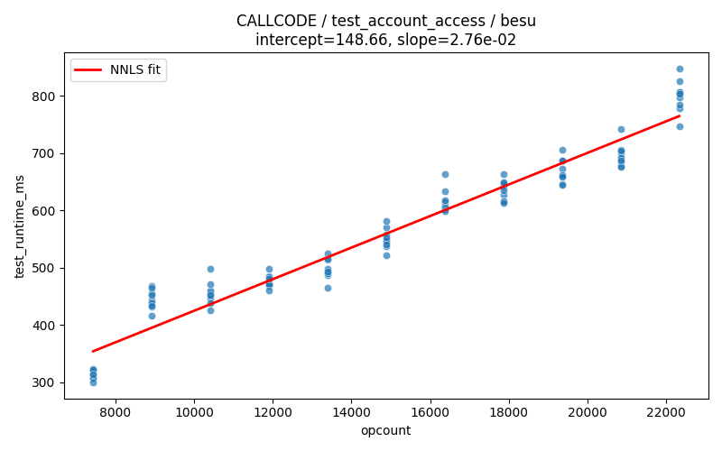

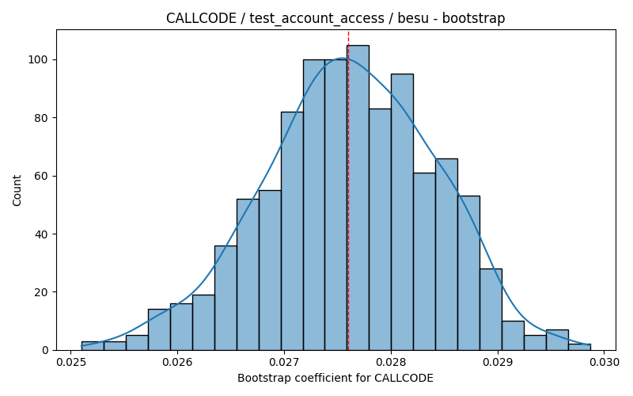

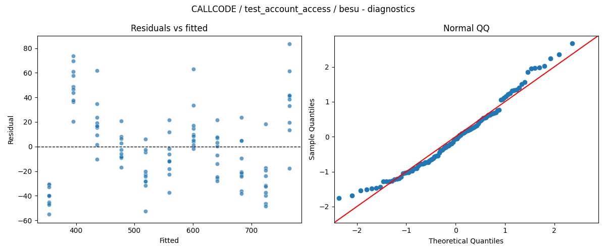

</details>

<details><summary>erigon — NNLS regression summary</summary>

```
==============================================================================
                           NNLS Regression Results                            
==============================================================================
Dep. Variable:          test_runtime_ms              R-squared:          0.817
Model:                  NNLS                    Adj. R-squared:          0.815
No. Observations:       88                                RMSE:         251.84
Df Residuals:           86                                 MAE:         174.38
Df Model:               1      
==============================================================================
                      coef     std err     P-value      [0.025      0.975]
------------------------------------------------------------------------------
         const    211.4350     80.3119       0.003     55.5819    374.4840
       opcount      0.0263      0.0013       0.001      0.0239      0.0291
==============================================================================
Notes: Non-negative least squares with bootstrap inference (1000 iterations)
==============================================================================
```

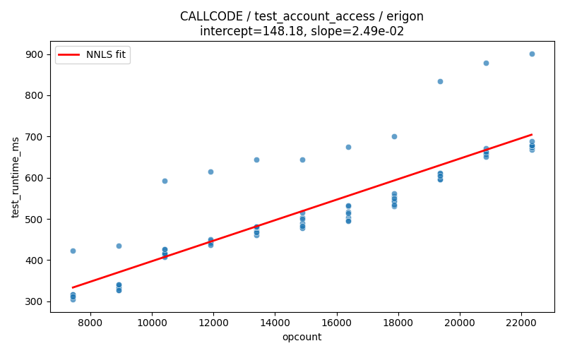

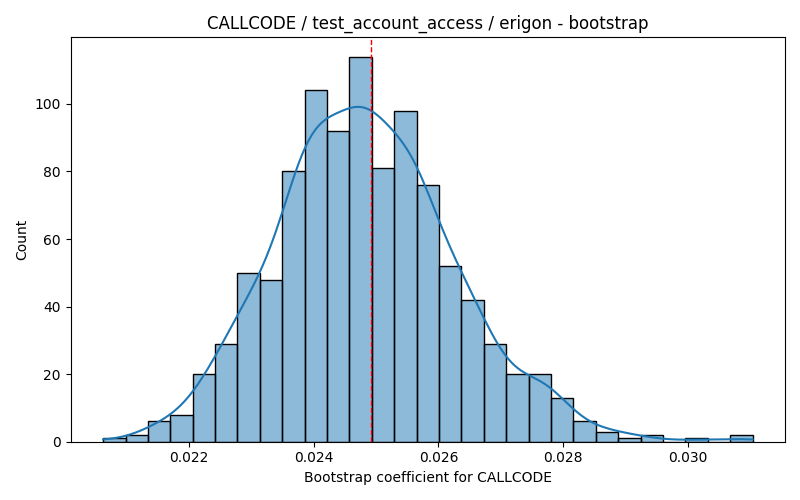

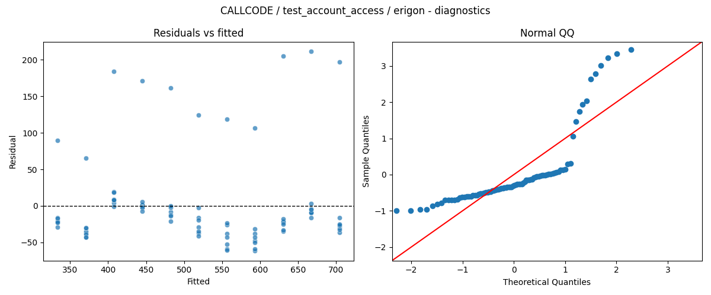

</details>

<details><summary>geth — NNLS regression summary</summary>

```
==============================================================================
                           NNLS Regression Results                            
==============================================================================
Dep. Variable:          test_runtime_ms              R-squared:          0.851
Model:                  NNLS                    Adj. R-squared:          0.849
No. Observations:       77                                RMSE:         225.36
Df Residuals:           75                                 MAE:         183.46
Df Model:               1      
==============================================================================
                      coef     std err     P-value      [0.025      0.975]
------------------------------------------------------------------------------
         const    500.8292     86.3361       0.001    341.2935    681.7418
       opcount      0.0267      0.0013       0.001      0.0239      0.0293
==============================================================================
Notes: Non-negative least squares with bootstrap inference (1000 iterations)
==============================================================================
```

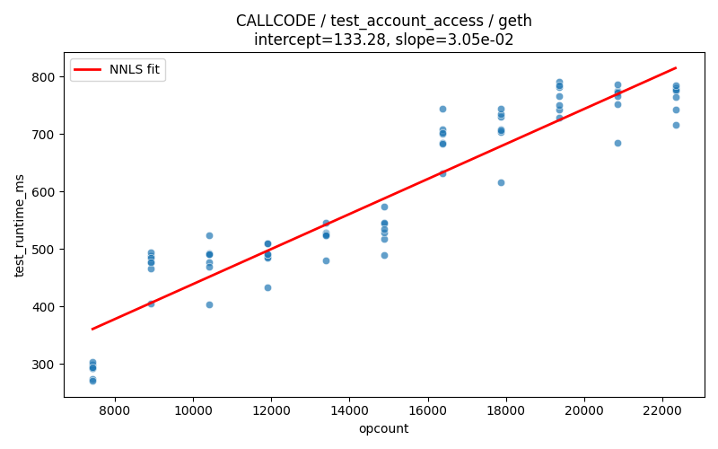

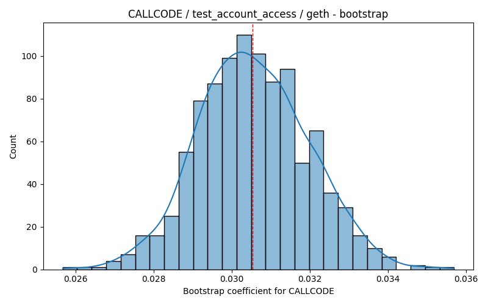

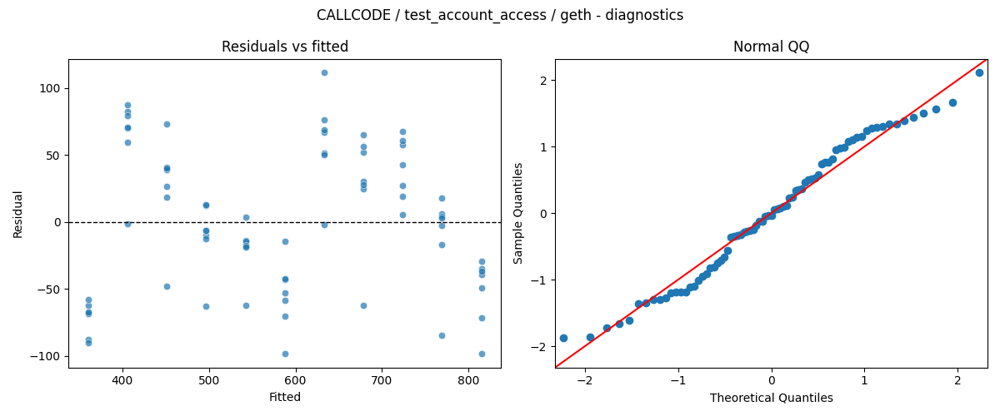

</details>

<details><summary>nethermind — NNLS regression summary</summary>

```
==============================================================================
                           NNLS Regression Results                            
==============================================================================
Dep. Variable:          test_runtime_ms              R-squared:          0.902
Model:                  NNLS                    Adj. R-squared:          0.902
No. Observations:       154                               RMSE:         105.27
Df Residuals:           152                                MAE:          84.03
Df Model:               1      
==============================================================================
                      coef     std err     P-value      [0.025      0.975]
------------------------------------------------------------------------------
         const    634.9382     38.3373       0.001    560.2448    711.9323
       opcount      0.0158      0.0005       0.001      0.0148      0.0168
==============================================================================
Notes: Non-negative least squares with bootstrap inference (1000 iterations)
==============================================================================
```

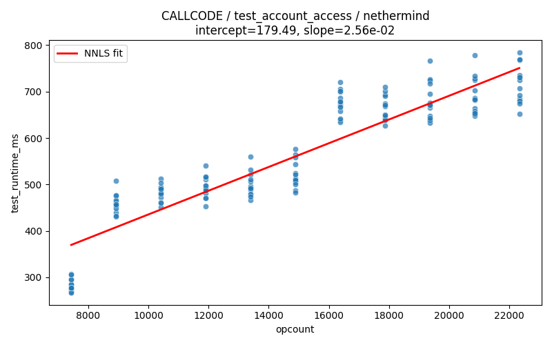

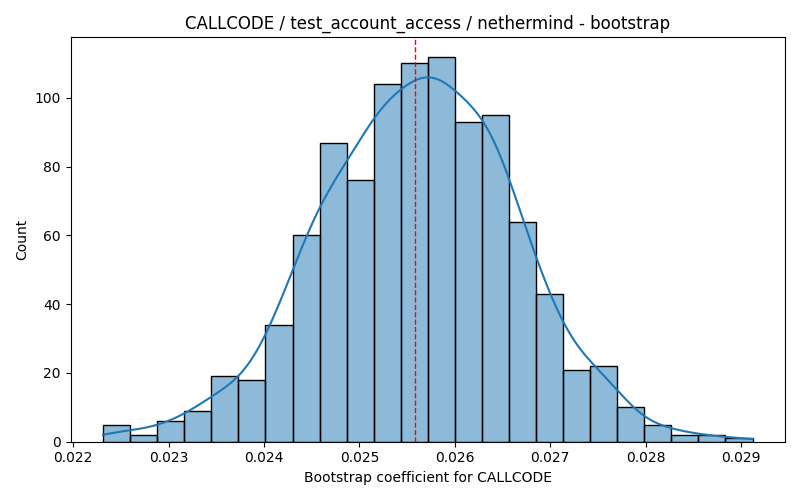

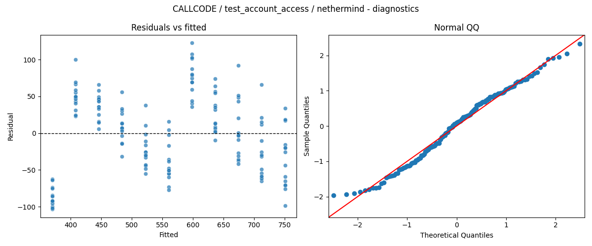

</details>

<details><summary>reth — NNLS regression summary</summary>

```
==============================================================================
                           NNLS Regression Results                            
==============================================================================
Dep. Variable:          test_runtime_ms              R-squared:          0.994
Model:                  NNLS                    Adj. R-squared:          0.994
No. Observations:       209                               RMSE:          31.71
Df Residuals:           207                                MAE:          22.58
Df Model:               1      
==============================================================================
                      coef     std err     P-value      [0.025      0.975]
------------------------------------------------------------------------------
         const    140.8290      6.7036       0.001    127.5806    154.3278
       opcount      0.0208      0.0001       0.001      0.0206      0.0210
==============================================================================
Notes: Non-negative least squares with bootstrap inference (1000 iterations)
==============================================================================
```

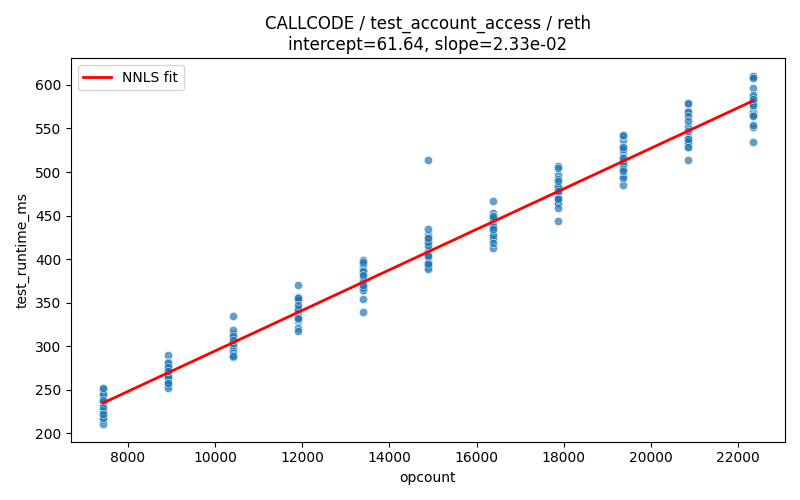

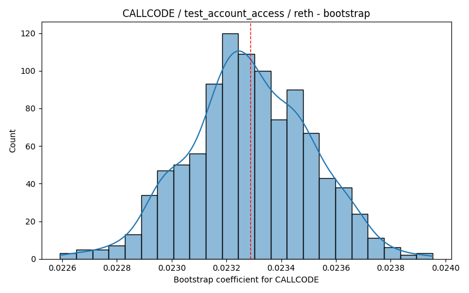

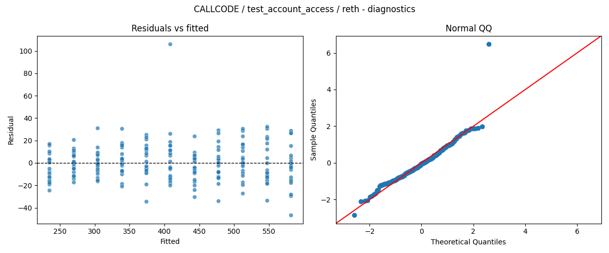

</details>

### test_account_access — combo `CALLCODE_AccountMode.EXISTING_CONTRACT_MINIMAL` — `presets[cold_account_code_access]`

| client | nobs | R² | target_coef (ms) | p-value | 95% CI |
| --- | --- | --- | --- | --- | --- |
| `besu` | 110 | 0.9819 | 0.01425 | 1.00e-03 | [0.01388, 0.01462] |
| `erigon` | 88 | 0.9921 | 0.008628 | 1.00e-03 | [0.008494, 0.00878] |
| `geth` | 77 | 0.4735 | 0.01662 | 1.00e-03 | [0.01213, 0.01965] |
| `nethermind` | 154 | 0.6733 | 0.002792 | 1.00e-03 | [0.002485, 0.003111] |
| `reth` | 209 | 0.9643 | 0.003956 | 1.00e-03 | [0.003841, 0.004068] |

<details><summary>besu — NNLS regression summary</summary>

```
==============================================================================
                           NNLS Regression Results                            
==============================================================================
Dep. Variable:          test_runtime_ms              R-squared:          0.982
Model:                  NNLS                    Adj. R-squared:          0.982
No. Observations:       110                               RMSE:          39.08
Df Residuals:           108                                MAE:          30.63
Df Model:               1      
==============================================================================
                      coef     std err     P-value      [0.025      0.975]
------------------------------------------------------------------------------
         const    356.8970     11.9407       0.001    335.0940    379.5232
       opcount      0.0142      0.0002       0.001      0.0139      0.0146
==============================================================================
Notes: Non-negative least squares with bootstrap inference (1000 iterations)
==============================================================================
```

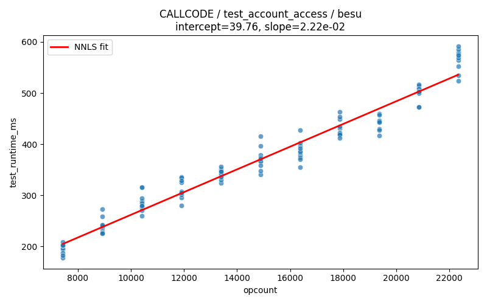

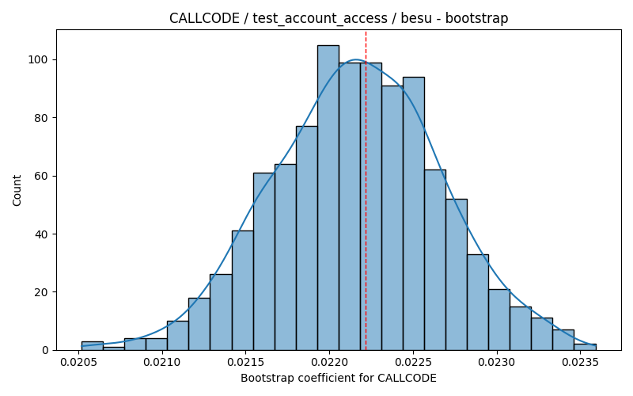

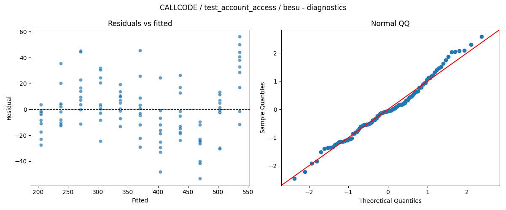

</details>

<details><summary>erigon — NNLS regression summary</summary>

```
==============================================================================
                           NNLS Regression Results                            
==============================================================================
Dep. Variable:          test_runtime_ms              R-squared:          0.992
Model:                  NNLS                    Adj. R-squared:          0.992
No. Observations:       88                                RMSE:          15.56
Df Residuals:           86                                 MAE:          10.65
Df Model:               1      
==============================================================================
                      coef     std err     P-value      [0.025      0.975]
------------------------------------------------------------------------------
         const     90.9090      4.7789       0.001     81.1696     99.9233
       opcount      0.0086      0.0001       0.001      0.0085      0.0088
==============================================================================
Notes: Non-negative least squares with bootstrap inference (1000 iterations)
==============================================================================
```

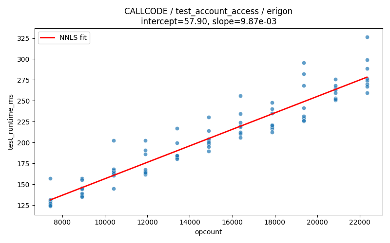

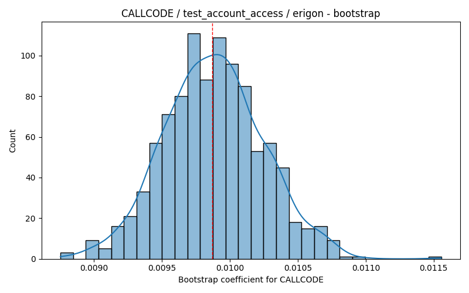

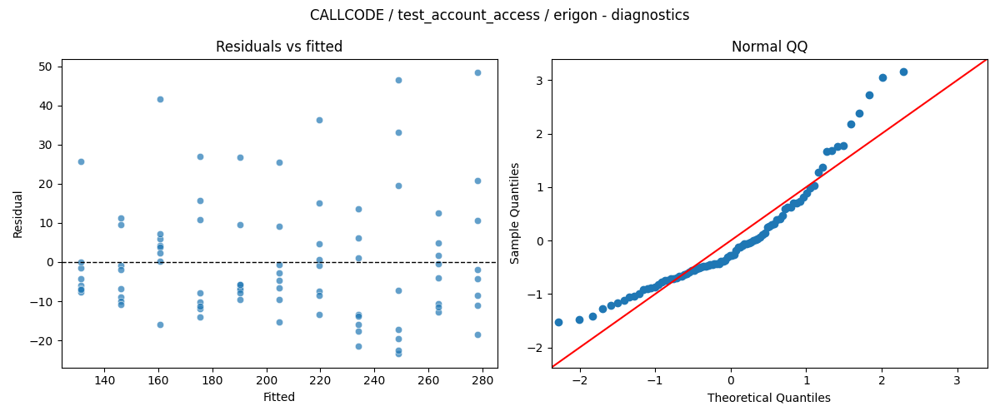

</details>

<details><summary>geth — NNLS regression summary</summary>

```
==============================================================================
                           NNLS Regression Results                            
==============================================================================
Dep. Variable:          test_runtime_ms              R-squared:          0.474
Model:                  NNLS                    Adj. R-squared:          0.467
No. Observations:       77                                RMSE:         354.43
Df Residuals:           75                                 MAE:         238.57
Df Model:               1      
==============================================================================
                      coef     std err     P-value      [0.025      0.975]
------------------------------------------------------------------------------
         const    165.4847    110.0904       0.057      0.0000    411.9217
       opcount      0.0166      0.0020       0.001      0.0121      0.0196
==============================================================================
Notes: Non-negative least squares with bootstrap inference (1000 iterations)
==============================================================================
```

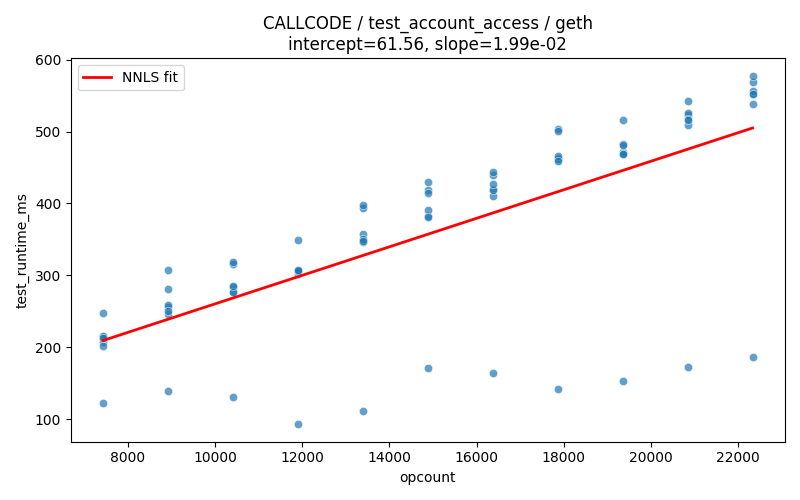

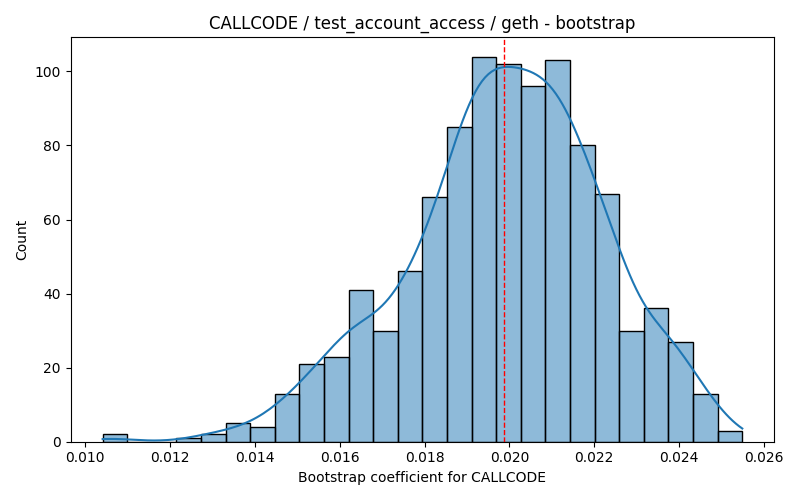

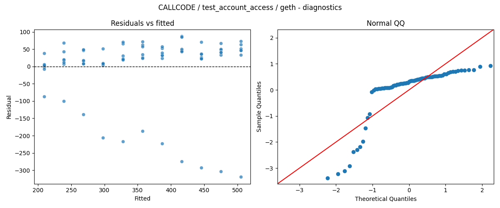

</details>

<details><summary>nethermind — NNLS regression summary</summary>

```
==============================================================================
                           NNLS Regression Results                            
==============================================================================
Dep. Variable:          test_runtime_ms              R-squared:          0.673
Model:                  NNLS                    Adj. R-squared:          0.671
No. Observations:       154                               RMSE:          39.33
Df Residuals:           152                                MAE:          31.74
Df Model:               1      
==============================================================================
                      coef     std err     P-value      [0.025      0.975]
------------------------------------------------------------------------------
         const    111.7328      9.3305       0.001     94.3899    130.5418
       opcount      0.0028      0.0002       0.001      0.0025      0.0031
==============================================================================
Notes: Non-negative least squares with bootstrap inference (1000 iterations)
==============================================================================
```

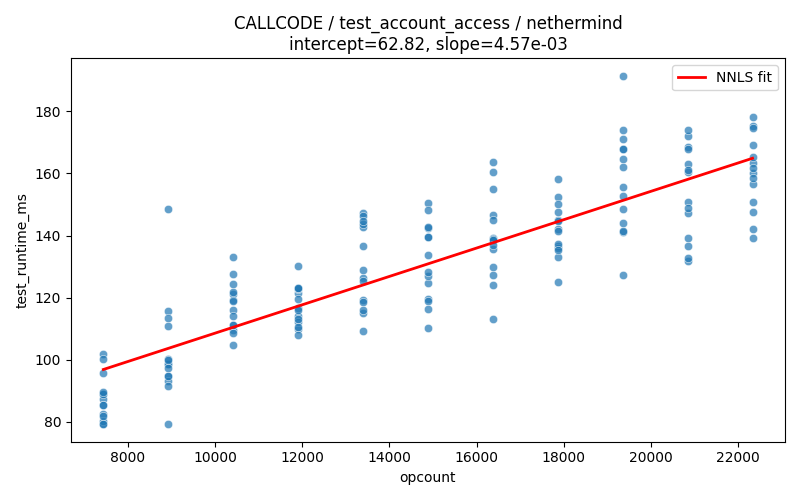

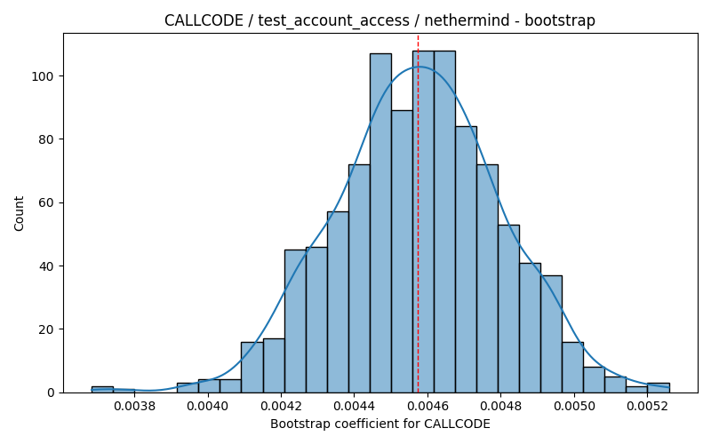

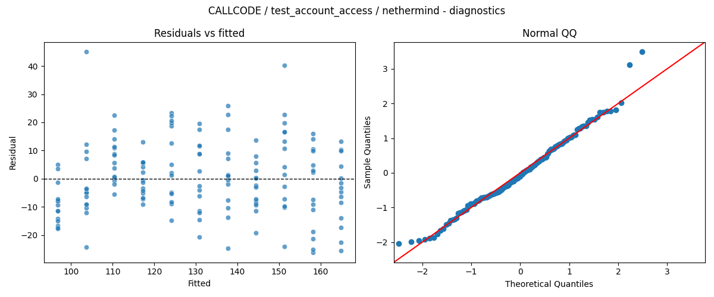

</details>

<details><summary>reth — NNLS regression summary</summary>

```
==============================================================================
                           NNLS Regression Results                            
==============================================================================
Dep. Variable:          test_runtime_ms              R-squared:          0.964
Model:                  NNLS                    Adj. R-squared:          0.964
No. Observations:       209                               RMSE:          15.39
Df Residuals:           207                                MAE:          12.02
Df Model:               1      
==============================================================================
                      coef     std err     P-value      [0.025      0.975]
------------------------------------------------------------------------------
         const     87.8518      3.3422       0.001     81.4604     94.8656
       opcount      0.0040      0.0001       0.001      0.0038      0.0041
==============================================================================
Notes: Non-negative least squares with bootstrap inference (1000 iterations)
==============================================================================
```

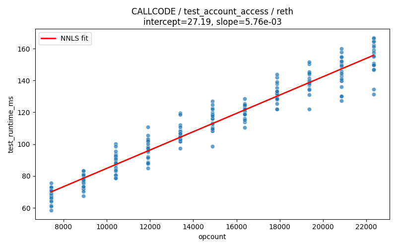

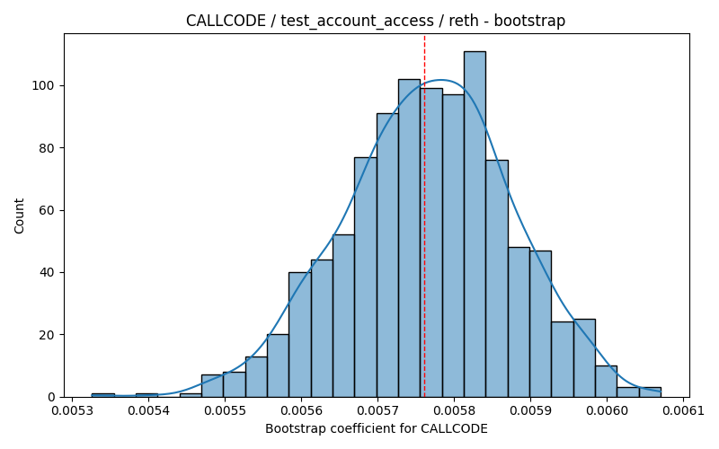

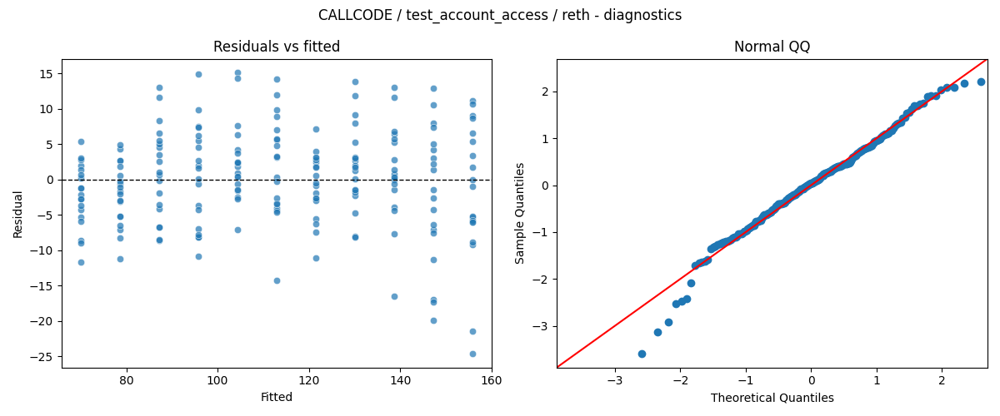

</details>

### test_account_access — combo `CALLCODE_AccountMode.EXISTING_CONTRACT_SAME_MAX` — `presets[cold_account_code_access]`

| client | nobs | R² | target_coef (ms) | p-value | 95% CI |
| --- | --- | --- | --- | --- | --- |
| `besu` | 110 | 0.9721 | 0.01263 | 1.00e-03 | [0.01218, 0.01305] |
| `erigon` | 88 | 0.988 | 0.008596 | 1.00e-03 | [0.008387, 0.008795] |
| `geth` | 77 | 0.4722 | 0.01635 | 1.00e-03 | [0.01225, 0.01951] |
| `nethermind` | 154 | 0.7235 | 0.003112 | 1.00e-03 | [0.002837, 0.003417] |
| `reth` | 209 | 0.9635 | 0.004015 | 1.00e-03 | [0.003912, 0.004117] |

<details><summary>besu — NNLS regression summary</summary>

```
==============================================================================
                           NNLS Regression Results                            
==============================================================================
Dep. Variable:          test_runtime_ms              R-squared:          0.972
Model:                  NNLS                    Adj. R-squared:          0.972
No. Observations:       110                               RMSE:          43.26
Df Residuals:           108                                MAE:          32.88
Df Model:               1      
==============================================================================
                      coef     std err     P-value      [0.025      0.975]
------------------------------------------------------------------------------
         const    421.0960     14.3887       0.001    393.4921    450.6515
       opcount      0.0126      0.0002       0.001      0.0122      0.0131
==============================================================================
Notes: Non-negative least squares with bootstrap inference (1000 iterations)
==============================================================================
```

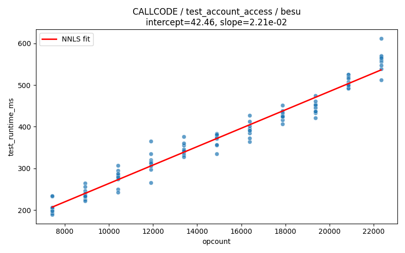

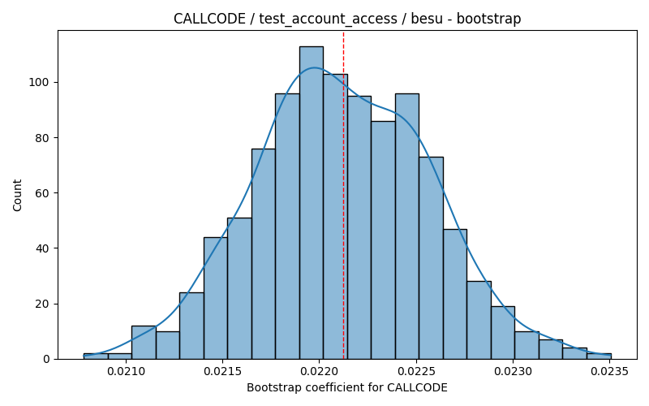

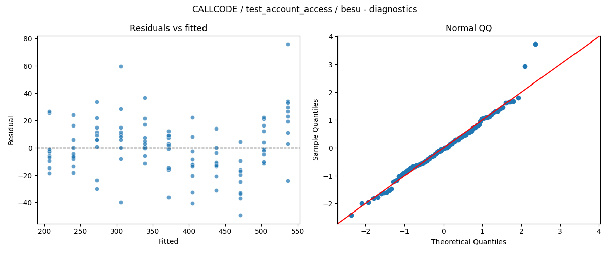

</details>

<details><summary>erigon — NNLS regression summary</summary>

```
==============================================================================
                           NNLS Regression Results                            
==============================================================================
Dep. Variable:          test_runtime_ms              R-squared:          0.988
Model:                  NNLS                    Adj. R-squared:          0.988
No. Observations:       88                                RMSE:          19.12
Df Residuals:           86                                 MAE:          14.18
Df Model:               1      
==============================================================================
                      coef     std err     P-value      [0.025      0.975]
------------------------------------------------------------------------------
         const     97.5755      7.0929       0.001     83.5531    112.3176
       opcount      0.0086      0.0001       0.001      0.0084      0.0088
==============================================================================
Notes: Non-negative least squares with bootstrap inference (1000 iterations)
==============================================================================
```

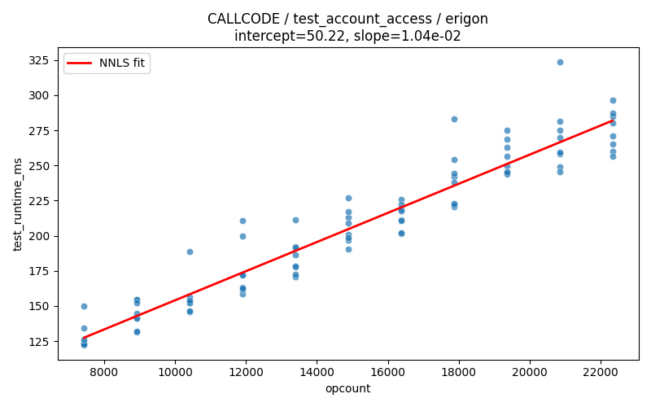

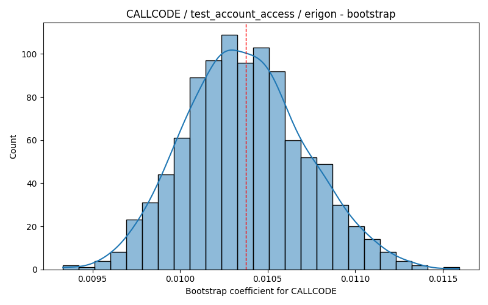

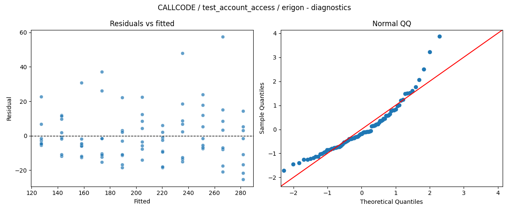

</details>

<details><summary>geth — NNLS regression summary</summary>

```
==============================================================================
                           NNLS Regression Results                            
==============================================================================
Dep. Variable:          test_runtime_ms              R-squared:          0.472
Model:                  NNLS                    Adj. R-squared:          0.465
No. Observations:       77                                RMSE:         349.58
Df Residuals:           75                                 MAE:         235.73
Df Model:               1      
==============================================================================
                      coef     std err     P-value      [0.025      0.975]
------------------------------------------------------------------------------
         const    174.5716    110.1843       0.069      0.0000    401.1137
       opcount      0.0164      0.0019       0.001      0.0122      0.0195
==============================================================================
Notes: Non-negative least squares with bootstrap inference (1000 iterations)
==============================================================================
```

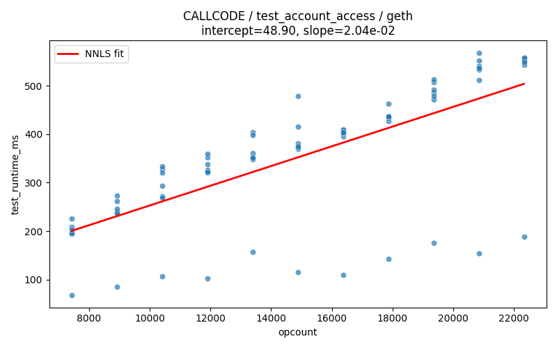

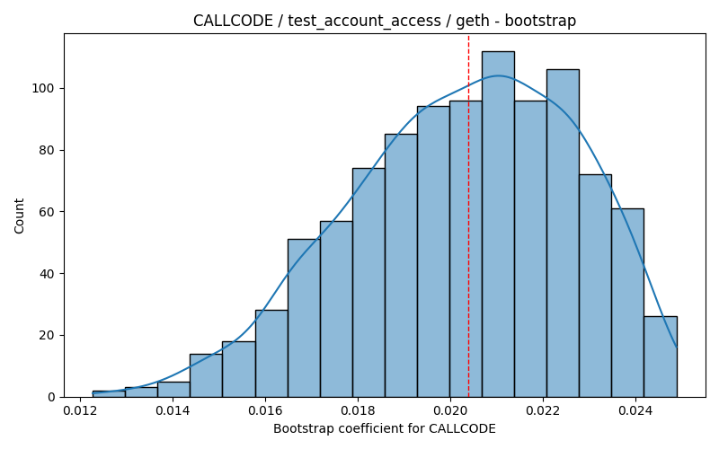

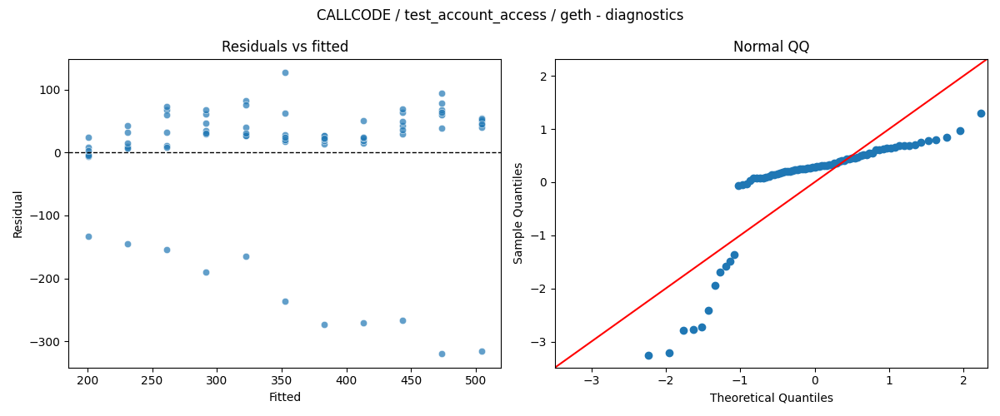

</details>

<details><summary>nethermind — NNLS regression summary</summary>

```
==============================================================================
                           NNLS Regression Results                            
==============================================================================
Dep. Variable:          test_runtime_ms              R-squared:          0.724
Model:                  NNLS                    Adj. R-squared:          0.722
No. Observations:       154                               RMSE:          38.89
Df Residuals:           152                                MAE:          31.49
Df Model:               1      
==============================================================================
                      coef     std err     P-value      [0.025      0.975]
------------------------------------------------------------------------------
         const     96.5643      8.0825       0.001     79.0340    111.1722
       opcount      0.0031      0.0001       0.001      0.0028      0.0034
==============================================================================
Notes: Non-negative least squares with bootstrap inference (1000 iterations)
==============================================================================
```

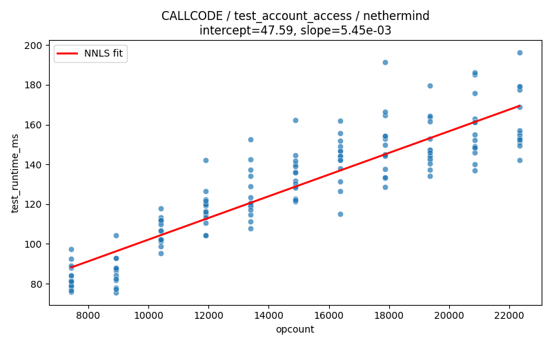

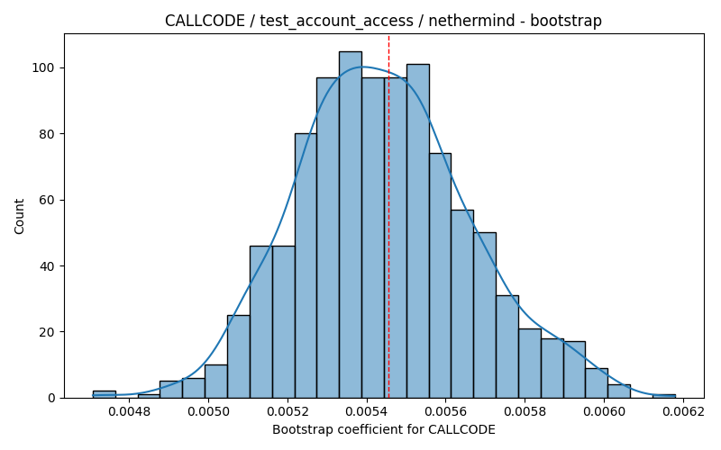

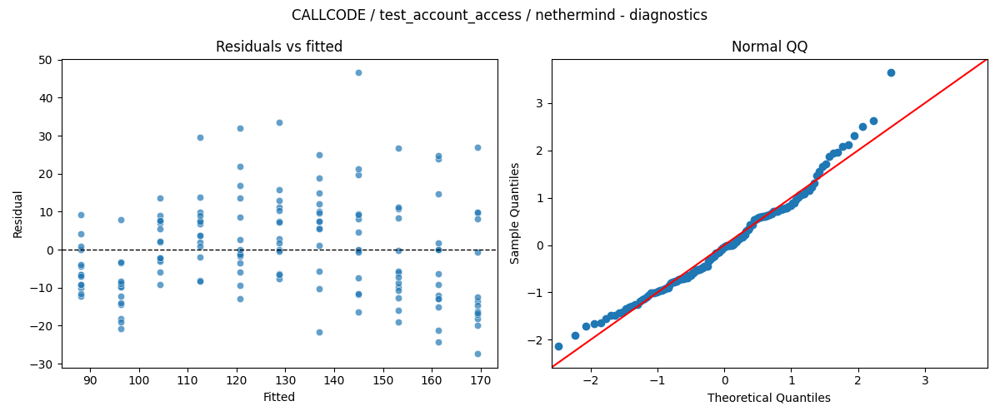

</details>

<details><summary>reth — NNLS regression summary</summary>

```
==============================================================================
                           NNLS Regression Results                            
==============================================================================
Dep. Variable:          test_runtime_ms              R-squared:          0.963
Model:                  NNLS                    Adj. R-squared:          0.963
No. Observations:       209                               RMSE:          15.81
Df Residuals:           207                                MAE:          12.53
Df Model:               1      
==============================================================================
                      coef     std err     P-value      [0.025      0.975]
------------------------------------------------------------------------------
         const     84.5474      3.3646       0.001     78.2809     91.0505
       opcount      0.0040      0.0001       0.001      0.0039      0.0041
==============================================================================
Notes: Non-negative least squares with bootstrap inference (1000 iterations)
==============================================================================
```

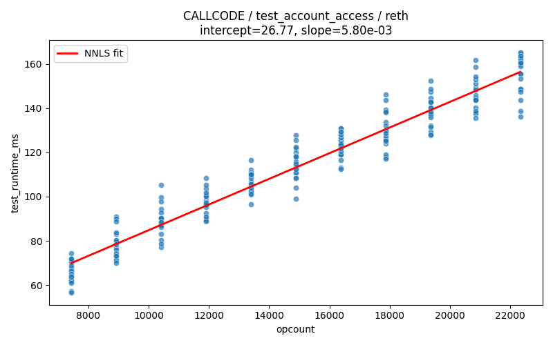

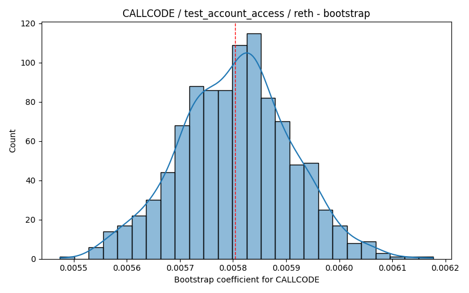

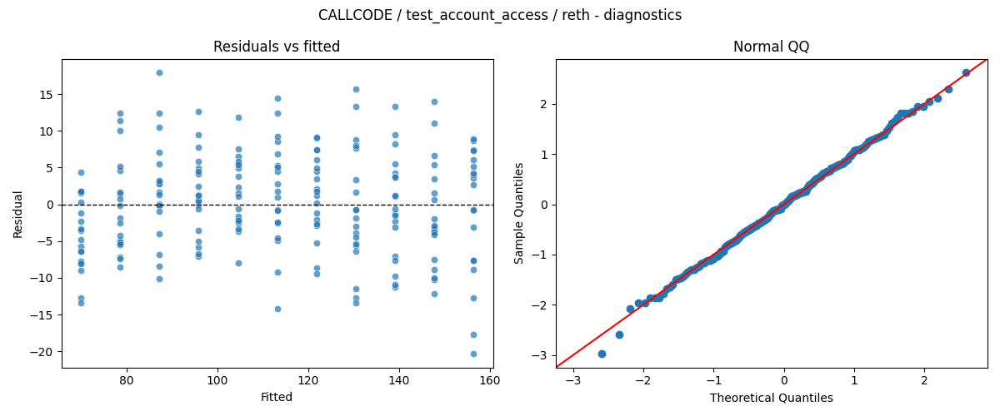

</details>

### test_account_access — combo `CALLCODE_AccountMode.EXISTING_CONTRACT_DIFF_MAX` — `presets[cold_account_code_write]`

| client | nobs | R² | target_coef (ms) | p-value | 95% CI |
| --- | --- | --- | --- | --- | --- |
| `besu` | 110 | 0.9455 | 0.0276 | 1.00e-03 | [0.02593, 0.02903] |
| `erigon` | 88 | 0.7857 | 0.02491 | 1.00e-03 | [0.02228, 0.02785] |
| `geth` | 77 | 0.882 | 0.03053 | 1.00e-03 | [0.02784, 0.03328] |
| `nethermind` | 154 | 0.8395 | 0.02558 | 1.00e-03 | [0.02351, 0.02756] |
| `reth` | 209 | 0.9782 | 0.02329 | 1.00e-03 | [0.02285, 0.0237] |

<details><summary>besu — NNLS regression summary</summary>

```
==============================================================================
                           NNLS Regression Results                            
==============================================================================
Dep. Variable:          test_runtime_ms              R-squared:          0.945
Model:                  NNLS                    Adj. R-squared:          0.945
No. Observations:       110                               RMSE:          31.20
Df Residuals:           108                                MAE:          25.36
Df Model:               1      
==============================================================================
                      coef     std err     P-value      [0.025      0.975]
------------------------------------------------------------------------------
         const    148.6574     12.6674       0.001    124.9231    174.7122
       opcount      0.0276      0.0008       0.001      0.0259      0.0290
==============================================================================
Notes: Non-negative least squares with bootstrap inference (1000 iterations)
==============================================================================
```


</details>

<details><summary>erigon — NNLS regression summary</summary>

```
==============================================================================
                           NNLS Regression Results                            
==============================================================================
Dep. Variable:          test_runtime_ms              R-squared:          0.786
Model:                  NNLS                    Adj. R-squared:          0.783
No. Observations:       88                                RMSE:          61.24
Df Residuals:           86                                 MAE:          38.94
Df Model:               1      
==============================================================================
                      coef     std err     P-value      [0.025      0.975]
------------------------------------------------------------------------------
         const    148.1848     20.3748       0.001    107.4867    189.0224
       opcount      0.0249      0.0014       0.001      0.0223      0.0279
==============================================================================
Notes: Non-negative least squares with bootstrap inference (1000 iterations)
==============================================================================
```


</details>

<details><summary>geth — NNLS regression summary</summary>

```
==============================================================================
                           NNLS Regression Results                            
==============================================================================
Dep. Variable:          test_runtime_ms              R-squared:          0.882
Model:                  NNLS                    Adj. R-squared:          0.880
No. Observations:       77                                RMSE:          52.56
Df Residuals:           75                                 MAE:          44.31
Df Model:               1      
==============================================================================
                      coef     std err     P-value      [0.025      0.975]
------------------------------------------------------------------------------
         const    133.2800     22.6800       0.001     88.1778    177.9886
       opcount      0.0305      0.0014       0.001      0.0278      0.0333
==============================================================================
Notes: Non-negative least squares with bootstrap inference (1000 iterations)
==============================================================================
```


</details>

<details><summary>nethermind — NNLS regression summary</summary>

```
==============================================================================
                           NNLS Regression Results                            
==============================================================================
Dep. Variable:          test_runtime_ms              R-squared:          0.840
Model:                  NNLS                    Adj. R-squared:          0.838
No. Observations:       154                               RMSE:          52.64
Df Residuals:           152                                MAE:          44.28
Df Model:               1      
==============================================================================
                      coef     std err     P-value      [0.025      0.975]
------------------------------------------------------------------------------
         const    179.4868     16.7358       0.001    147.2871    212.7760
       opcount      0.0256      0.0010       0.001      0.0235      0.0276
==============================================================================
Notes: Non-negative least squares with bootstrap inference (1000 iterations)
==============================================================================
```


</details>

<details><summary>reth — NNLS regression summary</summary>

```
==============================================================================
                           NNLS Regression Results                            
==============================================================================
Dep. Variable:          test_runtime_ms              R-squared:          0.978
Model:                  NNLS                    Adj. R-squared:          0.978
No. Observations:       209                               RMSE:          16.37
Df Residuals:           207                                MAE:          12.18
Df Model:               1      
==============================================================================
                      coef     std err     P-value      [0.025      0.975]
------------------------------------------------------------------------------
         const     61.6383      3.2446       0.001     55.6364     67.9389
       opcount      0.0233      0.0002       0.001      0.0229      0.0237
==============================================================================
Notes: Non-negative least squares with bootstrap inference (1000 iterations)
==============================================================================
```


</details>

### test_account_access — combo `CALLCODE_AccountMode.EXISTING_CONTRACT_MINIMAL` — `presets[cold_account_code_write]`

| client | nobs | R² | target_coef (ms) | p-value | 95% CI |
| --- | --- | --- | --- | --- | --- |
| `besu` | 110 | 0.9585 | 0.02222 | 1.00e-03 | [0.0212, 0.02314] |
| `erigon` | 88 | 0.9026 | 0.009871 | 1.00e-03 | [0.009186, 0.01063] |
| `geth` | 77 | 0.4965 | 0.01986 | 1.00e-03 | [0.01496, 0.02411] |
| `nethermind` | 154 | 0.7369 | 0.004573 | 1.00e-03 | [0.004138, 0.004994] |
| `reth` | 209 | 0.9404 | 0.005761 | 1.00e-03 | [0.005546, 0.005971] |

<details><summary>besu — NNLS regression summary</summary>

```
==============================================================================
                           NNLS Regression Results                            
==============================================================================
Dep. Variable:          test_runtime_ms              R-squared:          0.958
Model:                  NNLS                    Adj. R-squared:          0.958
No. Observations:       110                               RMSE:          21.76
Df Residuals:           108                                MAE:          16.79
Df Model:               1      
==============================================================================
                      coef     std err     P-value      [0.025      0.975]
------------------------------------------------------------------------------
         const     39.7649      6.7482       0.001     27.5592     53.3340
       opcount      0.0222      0.0005       0.001      0.0212      0.0231
==============================================================================
Notes: Non-negative least squares with bootstrap inference (1000 iterations)
==============================================================================
```


</details>

<details><summary>erigon — NNLS regression summary</summary>

```
==============================================================================
                           NNLS Regression Results                            
==============================================================================
Dep. Variable:          test_runtime_ms              R-squared:          0.903
Model:                  NNLS                    Adj. R-squared:          0.901
No. Observations:       88                                RMSE:          15.26
Df Residuals:           86                                 MAE:          11.63
Df Model:               1      
==============================================================================
                      coef     std err     P-value      [0.025      0.975]
------------------------------------------------------------------------------
         const     57.9023      4.9843       0.001     48.1187     67.7804
       opcount      0.0099      0.0004       0.001      0.0092      0.0106
==============================================================================
Notes: Non-negative least squares with bootstrap inference (1000 iterations)
==============================================================================
```


</details>

<details><summary>geth — NNLS regression summary</summary>

```
==============================================================================
                           NNLS Regression Results                            
==============================================================================
Dep. Variable:          test_runtime_ms              R-squared:          0.496
Model:                  NNLS                    Adj. R-squared:          0.490
No. Observations:       77                                RMSE:          94.15
Df Residuals:           75                                 MAE:          61.18
Df Model:               1      
==============================================================================
                      coef     std err     P-value      [0.025      0.975]
------------------------------------------------------------------------------
         const     61.5561     29.6117       0.021      1.5649    123.0209
       opcount      0.0199      0.0023       0.001      0.0150      0.0241
==============================================================================
Notes: Non-negative least squares with bootstrap inference (1000 iterations)
==============================================================================
```


</details>

<details><summary>nethermind — NNLS regression summary</summary>

```
==============================================================================
                           NNLS Regression Results                            
==============================================================================
Dep. Variable:          test_runtime_ms              R-squared:          0.737
Model:                  NNLS                    Adj. R-squared:          0.735
No. Observations:       154                               RMSE:          12.86
Df Residuals:           152                                MAE:          10.26
Df Model:               1      
==============================================================================
                      coef     std err     P-value      [0.025      0.975]
------------------------------------------------------------------------------
         const     62.8184      3.4410       0.001     56.3061     69.6227
       opcount      0.0046      0.0002       0.001      0.0041      0.0050
==============================================================================
Notes: Non-negative least squares with bootstrap inference (1000 iterations)
==============================================================================
```


</details>

<details><summary>reth — NNLS regression summary</summary>

```
==============================================================================
                           NNLS Regression Results                            
==============================================================================
Dep. Variable:          test_runtime_ms              R-squared:          0.940
Model:                  NNLS                    Adj. R-squared:          0.940
No. Observations:       209                               RMSE:           6.83
Df Residuals:           207                                MAE:           5.26
Df Model:               1      
==============================================================================
                      coef     std err     P-value      [0.025      0.975]
------------------------------------------------------------------------------
         const     27.1934      1.5207       0.001     24.2816     30.2451
       opcount      0.0058      0.0001       0.001      0.0055      0.0060
==============================================================================
Notes: Non-negative least squares with bootstrap inference (1000 iterations)
==============================================================================
```


</details>

### test_account_access — combo `CALLCODE_AccountMode.EXISTING_CONTRACT_SAME_MAX` — `presets[cold_account_code_write]`

| client | nobs | R² | target_coef (ms) | p-value | 95% CI |
| --- | --- | --- | --- | --- | --- |
| `besu` | 110 | 0.9631 | 0.02212 | 1.00e-03 | [0.02127, 0.02296] |
| `erigon` | 88 | 0.9153 | 0.01038 | 1.00e-03 | [0.009753, 0.01106] |
| `geth` | 77 | 0.4898 | 0.02039 | 1.00e-03 | [0.01514, 0.02419] |
| `nethermind` | 154 | 0.8019 | 0.005455 | 1.00e-03 | [0.005049, 0.00591] |
| `reth` | 209 | 0.9411 | 0.005804 | 1.00e-03 | [0.005594, 0.006011] |

<details><summary>besu — NNLS regression summary</summary>

```
==============================================================================
                           NNLS Regression Results                            
==============================================================================
Dep. Variable:          test_runtime_ms              R-squared:          0.963
Model:                  NNLS                    Adj. R-squared:          0.963
No. Observations:       110                               RMSE:          20.39
Df Residuals:           108                                MAE:          15.64
Df Model:               1      
==============================================================================
                      coef     std err     P-value      [0.025      0.975]
------------------------------------------------------------------------------
         const     42.4590      6.1603       0.001     29.7136     54.3106
       opcount      0.0221      0.0004       0.001      0.0213      0.0230
==============================================================================
Notes: Non-negative least squares with bootstrap inference (1000 iterations)
==============================================================================
```


</details>

<details><summary>erigon — NNLS regression summary</summary>

```
==============================================================================
                           NNLS Regression Results                            
==============================================================================
Dep. Variable:          test_runtime_ms              R-squared:          0.915
Model:                  NNLS                    Adj. R-squared:          0.914
No. Observations:       88                                RMSE:          14.85
Df Residuals:           86                                 MAE:          11.17
Df Model:               1      
==============================================================================
                      coef     std err     P-value      [0.025      0.975]
------------------------------------------------------------------------------
         const     50.2169      4.8064       0.001     40.4710     59.2428
       opcount      0.0104      0.0003       0.001      0.0098      0.0111
==============================================================================
Notes: Non-negative least squares with bootstrap inference (1000 iterations)
==============================================================================
```


</details>

<details><summary>geth — NNLS regression summary</summary>

```
==============================================================================
                           NNLS Regression Results                            
==============================================================================
Dep. Variable:          test_runtime_ms              R-squared:          0.490
Model:                  NNLS                    Adj. R-squared:          0.483
No. Observations:       77                                RMSE:          97.96
Df Residuals:           75                                 MAE:          64.60
Df Model:               1      
==============================================================================
                      coef     std err     P-value      [0.025      0.975]
------------------------------------------------------------------------------
         const     48.9031     31.6733       0.059      0.0000    116.8955
       opcount      0.0204      0.0024       0.001      0.0151      0.0242
==============================================================================
Notes: Non-negative least squares with bootstrap inference (1000 iterations)
==============================================================================
```


</details>

<details><summary>nethermind — NNLS regression summary</summary>

```
==============================================================================
                           NNLS Regression Results                            
==============================================================================
Dep. Variable:          test_runtime_ms              R-squared:          0.802
Model:                  NNLS                    Adj. R-squared:          0.801
No. Observations:       154                               RMSE:          12.76
Df Residuals:           152                                MAE:          10.17
Df Model:               1      
==============================================================================
                      coef     std err     P-value      [0.025      0.975]
------------------------------------------------------------------------------
         const     47.5939      3.0515       0.001     41.4977     53.4265
       opcount      0.0055      0.0002       0.001      0.0050      0.0059
==============================================================================
Notes: Non-negative least squares with bootstrap inference (1000 iterations)
==============================================================================
```


</details>

<details><summary>reth — NNLS regression summary</summary>

```
==============================================================================
                           NNLS Regression Results                            
==============================================================================
Dep. Variable:          test_runtime_ms              R-squared:          0.941
Model:                  NNLS                    Adj. R-squared:          0.941
No. Observations:       209                               RMSE:           6.83
Df Residuals:           207                                MAE:           5.52
Df Model:               1      
==============================================================================
                      coef     std err     P-value      [0.025      0.975]
------------------------------------------------------------------------------
         const     26.7701      1.5517       0.001     23.7590     29.7689
       opcount      0.0058      0.0001       0.001      0.0056      0.0060
==============================================================================
Notes: Non-negative least squares with bootstrap inference (1000 iterations)
==============================================================================
```


</details>

## DELEGATECALL

### test_ext_account_query_warm — combo `DELEGATECALL`

| client | nobs | R² | target_coef (ms) | p-value | 95% CI |
| --- | --- | --- | --- | --- | --- |
| `besu` | 110 | 0.915 | 0.0004236 | 1.00e-03 | [0.0004, 0.0004468] |
| `erigon` | 88 | 0.6995 | 4.346e-05 | 1.00e-03 | [3.713e-05, 4.964e-05] |
| `geth` | 77 | 0.8724 | 0.0001255 | 1.00e-03 | [0.0001154, 0.0001345] |
| `nethermind` | 154 | 0.6218 | 0.0003217 | 1.00e-03 | [0.0002799, 0.0003629] |
| `reth` | 209 | 0.915 | 5.568e-05 | 1.00e-03 | [5.364e-05, 5.782e-05] |

<details><summary>besu — NNLS regression summary</summary>

```
==============================================================================
                           NNLS Regression Results                            
==============================================================================
Dep. Variable:          test_runtime_ms              R-squared:          0.915
Model:                  NNLS                    Adj. R-squared:          0.914
No. Observations:       110                               RMSE:          66.86
Df Residuals:           108                                MAE:          52.43
Df Model:               1      
==============================================================================
                      coef     std err     P-value      [0.025      0.975]
------------------------------------------------------------------------------
         const    440.7359     20.4330       0.001    400.5690    479.9101
       opcount      0.0004      0.0000       0.001      0.0004      0.0004
==============================================================================
Notes: Non-negative least squares with bootstrap inference (1000 iterations)
==============================================================================
```

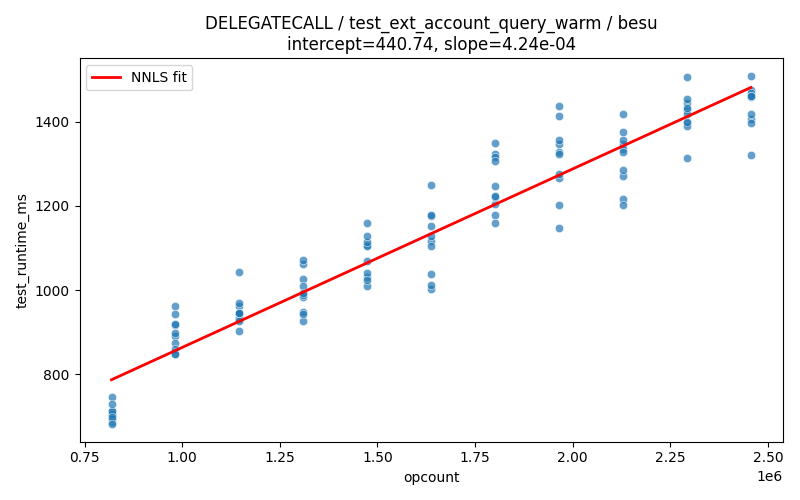

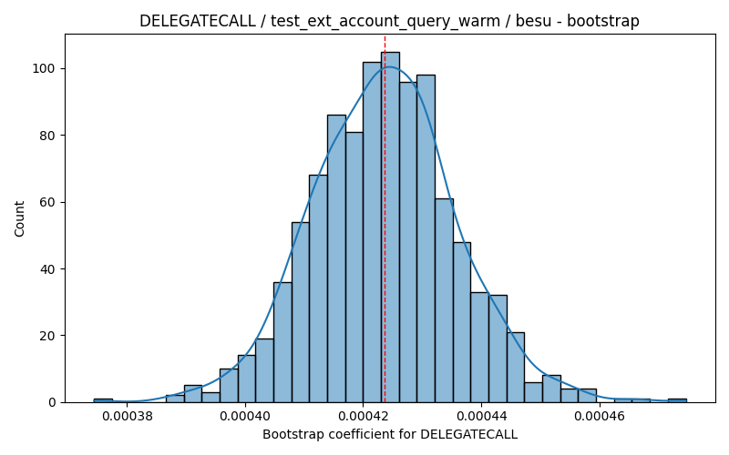

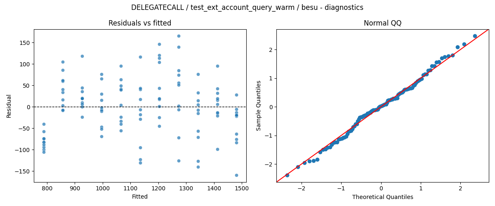

</details>

<details><summary>erigon — NNLS regression summary</summary>

```
==============================================================================
                           NNLS Regression Results                            
==============================================================================
Dep. Variable:          test_runtime_ms              R-squared:          0.699
Model:                  NNLS                    Adj. R-squared:          0.696
No. Observations:       88                                RMSE:          14.75
Df Residuals:           86                                 MAE:          11.01
Df Model:               1      
==============================================================================
                      coef     std err     P-value      [0.025      0.975]
------------------------------------------------------------------------------
         const     28.6810      5.0250       0.001     19.0507     39.6203
       opcount      0.0000      0.0000       0.001      0.0000      0.0000
==============================================================================
Notes: Non-negative least squares with bootstrap inference (1000 iterations)
==============================================================================
```

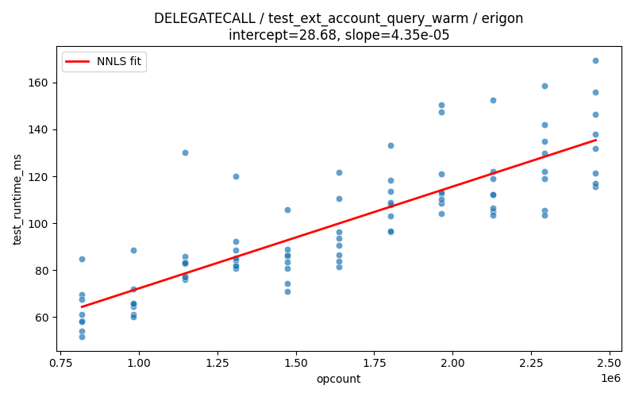

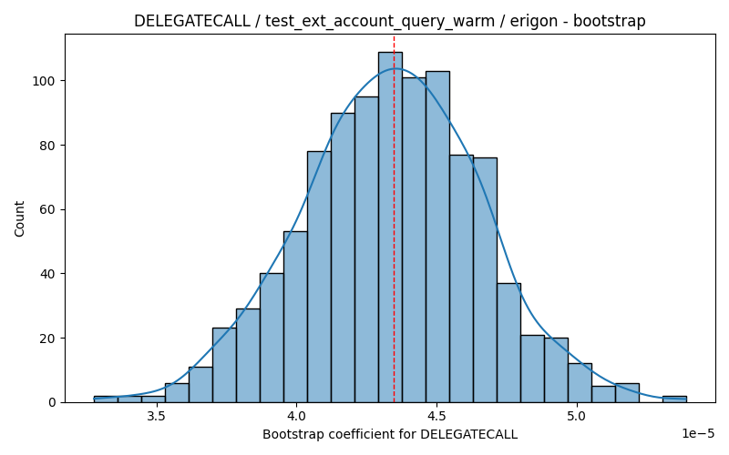

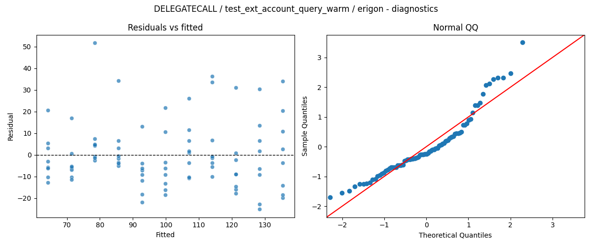

</details>

<details><summary>geth — NNLS regression summary</summary>

```
==============================================================================
                           NNLS Regression Results                            
==============================================================================
Dep. Variable:          test_runtime_ms              R-squared:          0.872
Model:                  NNLS                    Adj. R-squared:          0.871
No. Observations:       77                                RMSE:          24.86
Df Residuals:           75                                 MAE:          19.92
Df Model:               1      
==============================================================================
                      coef     std err     P-value      [0.025      0.975]
------------------------------------------------------------------------------
         const     49.4097      8.0616       0.001     34.6776     66.3749
       opcount      0.0001      0.0000       0.001      0.0001      0.0001
==============================================================================
Notes: Non-negative least squares with bootstrap inference (1000 iterations)
==============================================================================
```

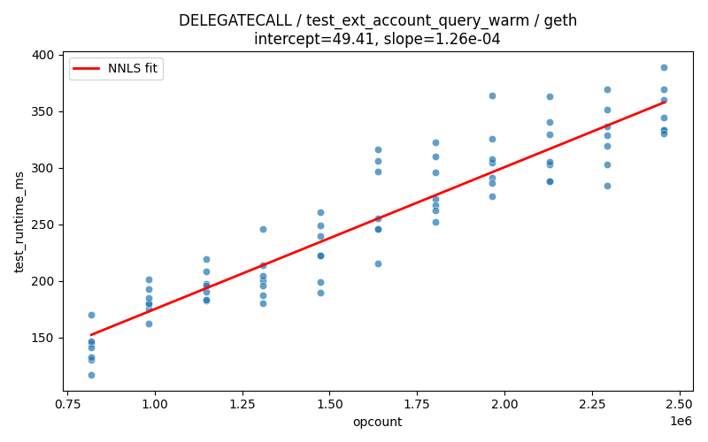

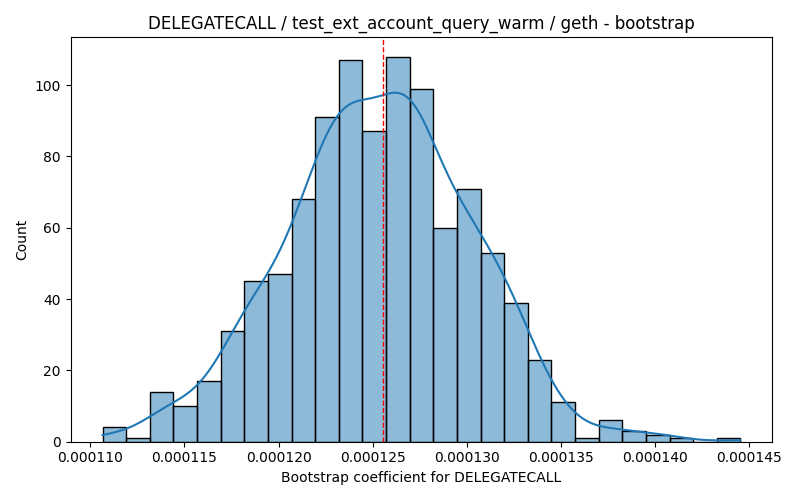

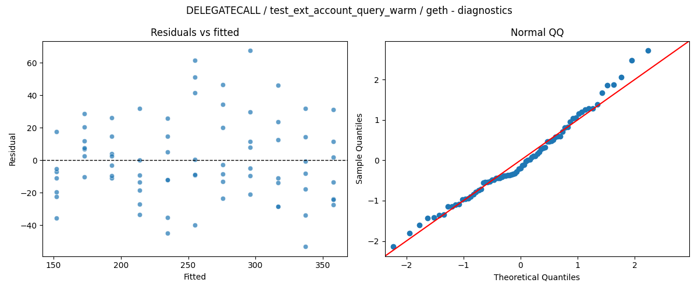

</details>

<details><summary>nethermind — NNLS regression summary</summary>

```
==============================================================================
                           NNLS Regression Results                            
==============================================================================
Dep. Variable:          test_runtime_ms              R-squared:          0.622
Model:                  NNLS                    Adj. R-squared:          0.619
No. Observations:       154                               RMSE:         129.91
Df Residuals:           152                                MAE:         100.89
Df Model:               1      
==============================================================================
                      coef     std err     P-value      [0.025      0.975]
------------------------------------------------------------------------------
         const    336.7121     31.6771       0.001    277.1849    401.8278
       opcount      0.0003      0.0000       0.001      0.0003      0.0004
==============================================================================
Notes: Non-negative least squares with bootstrap inference (1000 iterations)
==============================================================================
```

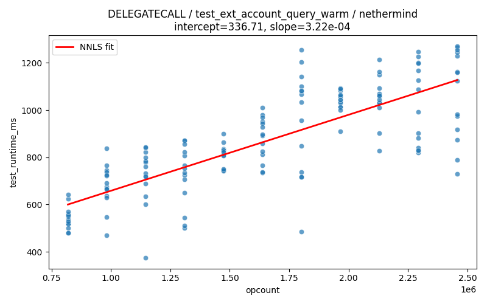

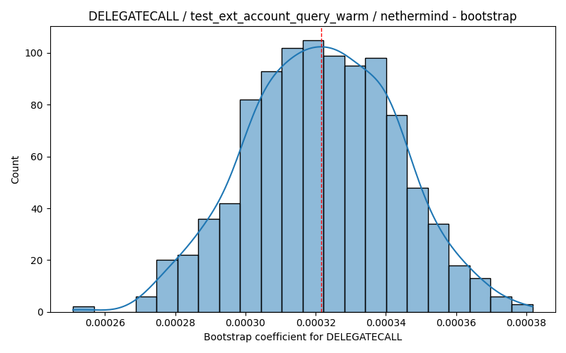

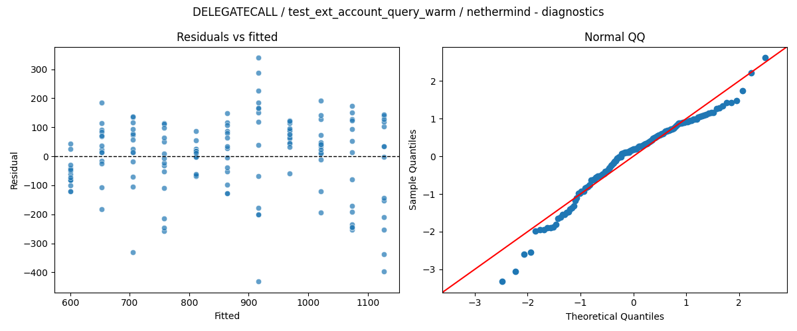

</details>

<details><summary>reth — NNLS regression summary</summary>

```
==============================================================================
                           NNLS Regression Results                            
==============================================================================
Dep. Variable:          test_runtime_ms              R-squared:          0.915
Model:                  NNLS                    Adj. R-squared:          0.915
No. Observations:       209                               RMSE:           8.79
Df Residuals:           207                                MAE:           6.45
Df Model:               1      
==============================================================================
                      coef     std err     P-value      [0.025      0.975]
------------------------------------------------------------------------------
         const     22.9772      1.7158       0.001     19.6823     26.3550
       opcount      0.0001      0.0000       0.001      0.0001      0.0001
==============================================================================
Notes: Non-negative least squares with bootstrap inference (1000 iterations)
==============================================================================
```

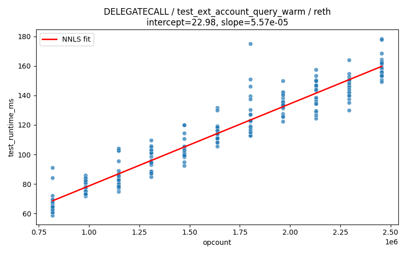

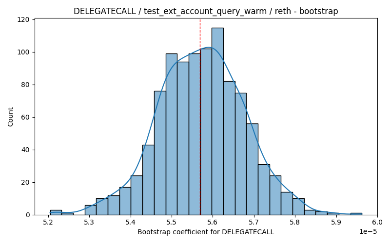

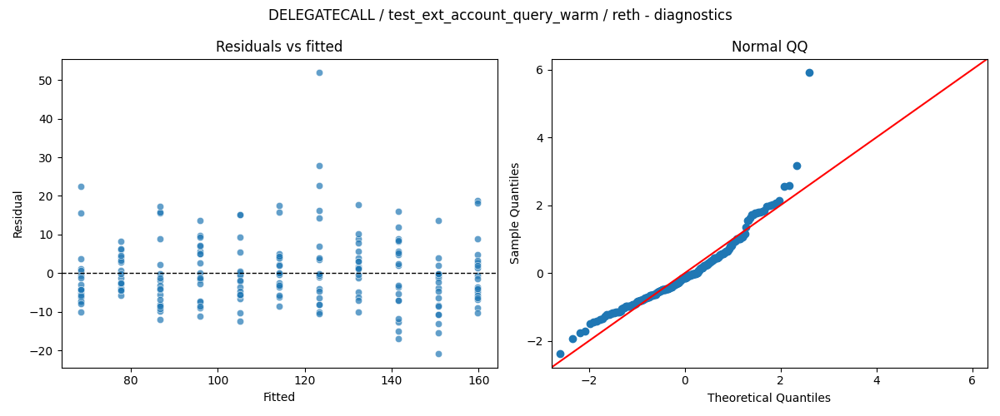

</details>

### test_account_access — combo `DELEGATECALL_AccountMode.EXISTING_EOA`

| client | nobs | R² | target_coef (ms) | p-value | 95% CI |
| --- | --- | --- | --- | --- | --- |
| `besu` | 110 | 0.9837 | 0.01642 | 1.00e-03 | [0.01602, 0.01684] |
| `erigon` | 88 | 0.998 | 0.008194 | 1.00e-03 | [0.008121, 0.00823] |
| `geth` | 77 | 0.8171 | 0.01833 | 1.00e-03 | [0.01615, 0.02012] |
| `nethermind` | 154 | 0.8991 | 0.003589 | 1.00e-03 | [0.003381, 0.003803] |
| `reth` | 209 | 0.9711 | 0.004092 | 1.00e-03 | [0.003989, 0.004198] |

<details><summary>besu — NNLS regression summary</summary>

```
==============================================================================
                           NNLS Regression Results                            
==============================================================================
Dep. Variable:          test_runtime_ms              R-squared:          0.984
Model:                  NNLS                    Adj. R-squared:          0.984
No. Observations:       110                               RMSE:          43.37
Df Residuals:           108                                MAE:          30.94
Df Model:               1      
==============================================================================
                      coef     std err     P-value      [0.025      0.975]
------------------------------------------------------------------------------
         const    465.9268     12.6022       0.001    441.1552    490.8345
       opcount      0.0164      0.0002       0.001      0.0160      0.0168
==============================================================================
Notes: Non-negative least squares with bootstrap inference (1000 iterations)
==============================================================================
```

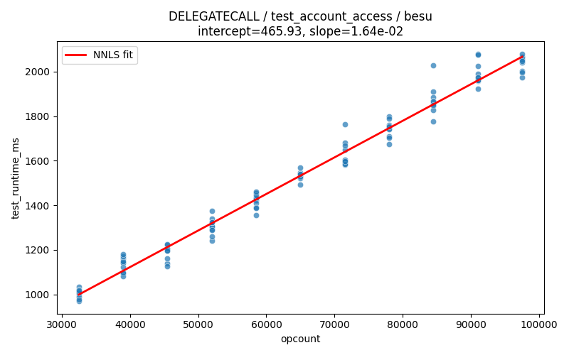

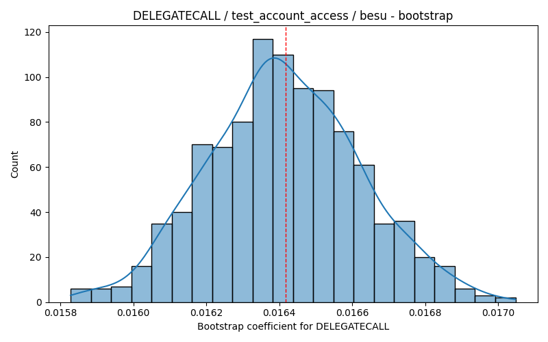

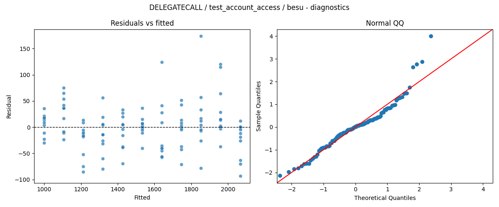

</details>

<details><summary>erigon — NNLS regression summary</summary>

```
==============================================================================
                           NNLS Regression Results                            
==============================================================================
Dep. Variable:          test_runtime_ms              R-squared:          0.998
Model:                  NNLS                    Adj. R-squared:          0.998
No. Observations:       88                                RMSE:           7.63
Df Residuals:           86                                 MAE:           6.15
Df Model:               1      
==============================================================================
                      coef     std err     P-value      [0.025      0.975]
------------------------------------------------------------------------------
         const      1.0047      1.5909       0.332      0.0000      5.2344
       opcount      0.0082      0.0000       0.001      0.0081      0.0082
==============================================================================
Notes: Non-negative least squares with bootstrap inference (1000 iterations)
==============================================================================
```

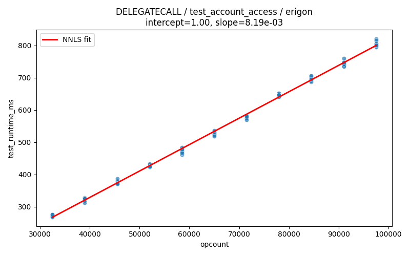

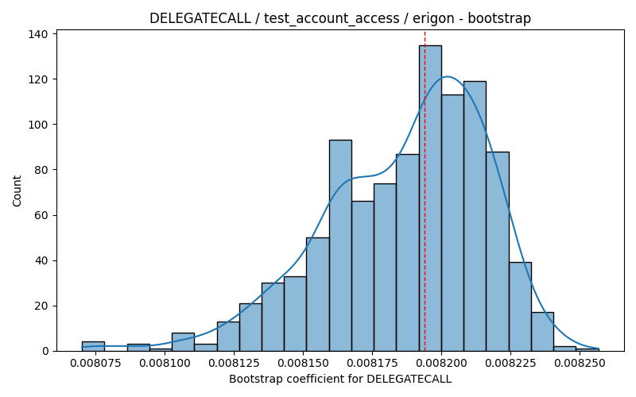

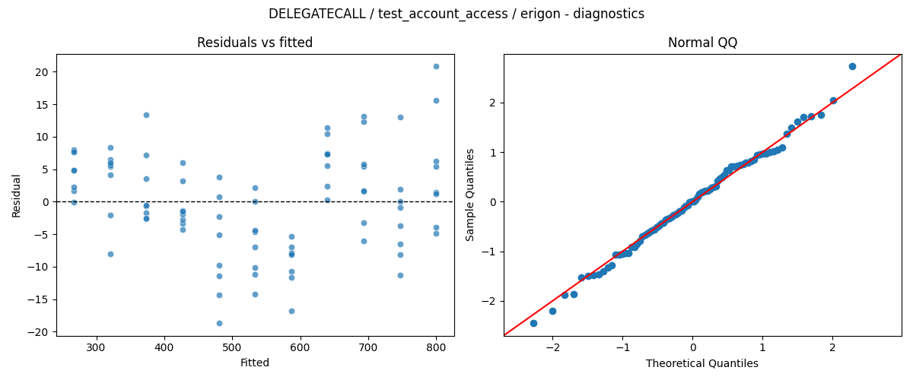

</details>

<details><summary>geth — NNLS regression summary</summary>

```
==============================================================================
                           NNLS Regression Results                            
==============================================================================
Dep. Variable:          test_runtime_ms              R-squared:          0.817
Model:                  NNLS                    Adj. R-squared:          0.815
No. Observations:       77                                RMSE:         178.25
Df Residuals:           75                                 MAE:         118.90
Df Model:               1      
==============================================================================
                      coef     std err     P-value      [0.025      0.975]
------------------------------------------------------------------------------
         const    189.8318     58.7759       0.001     77.1117    314.1121
       opcount      0.0183      0.0010       0.001      0.0162      0.0201
==============================================================================
Notes: Non-negative least squares with bootstrap inference (1000 iterations)
==============================================================================
```

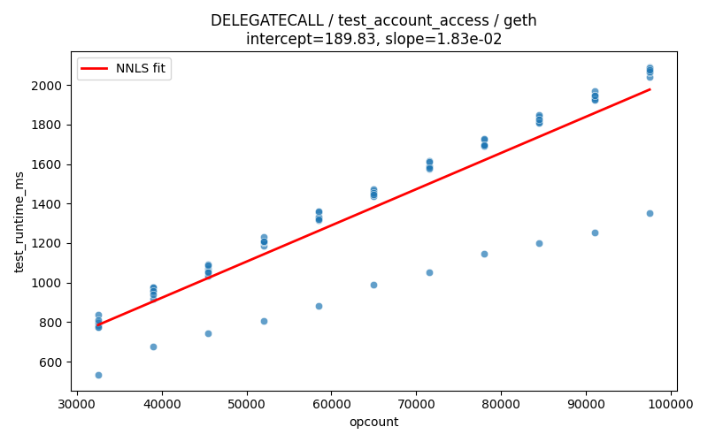

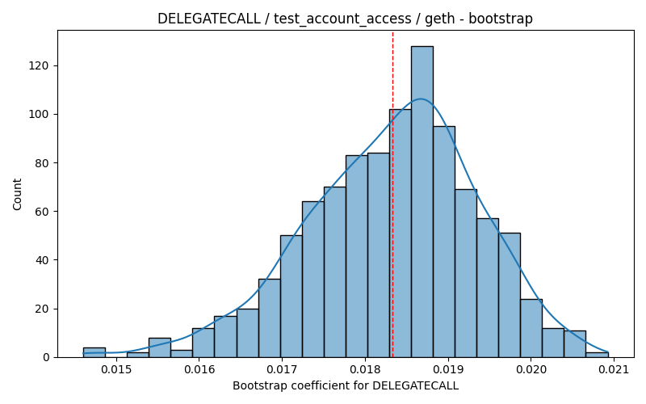


</details>

<details><summary>nethermind — NNLS regression summary</summary>

```
==============================================================================
                           NNLS Regression Results                            
==============================================================================
Dep. Variable:          test_runtime_ms              R-squared:          0.899
Model:                  NNLS                    Adj. R-squared:          0.898
No. Observations:       154                               RMSE:          24.72
Df Residuals:           152                                MAE:          19.16
Df Model:               1      
==============================================================================
                      coef     std err     P-value      [0.025      0.975]
------------------------------------------------------------------------------
         const     99.3259      6.0539       0.001     87.2586    110.8133
       opcount      0.0036      0.0001       0.001      0.0034      0.0038
==============================================================================
Notes: Non-negative least squares with bootstrap inference (1000 iterations)
==============================================================================
```

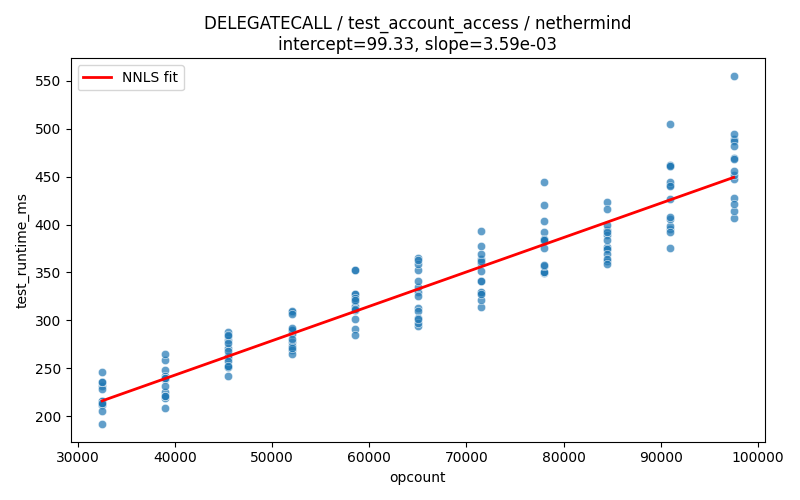

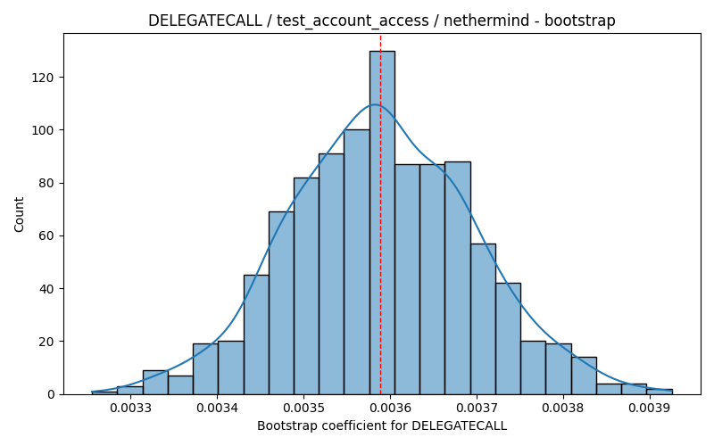

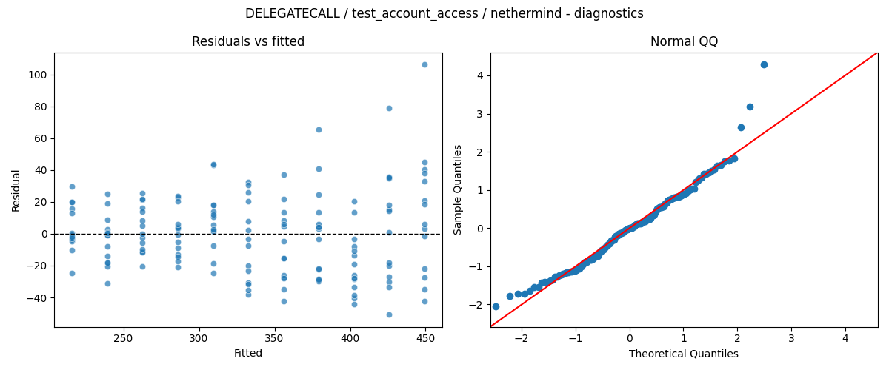

</details>

<details><summary>reth — NNLS regression summary</summary>

```
==============================================================================
                           NNLS Regression Results                            
==============================================================================
Dep. Variable:          test_runtime_ms              R-squared:          0.971
Model:                  NNLS                    Adj. R-squared:          0.971
No. Observations:       209                               RMSE:          14.51
Df Residuals:           207                                MAE:          11.35
Df Model:               1      
==============================================================================
                      coef     std err     P-value      [0.025      0.975]
------------------------------------------------------------------------------
         const     95.9100      3.3206       0.001     89.2839    102.6275
       opcount      0.0041      0.0001       0.001      0.0040      0.0042
==============================================================================
Notes: Non-negative least squares with bootstrap inference (1000 iterations)
==============================================================================
```

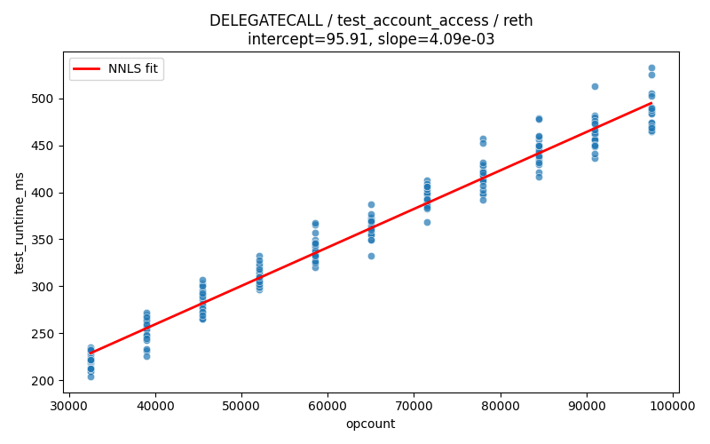

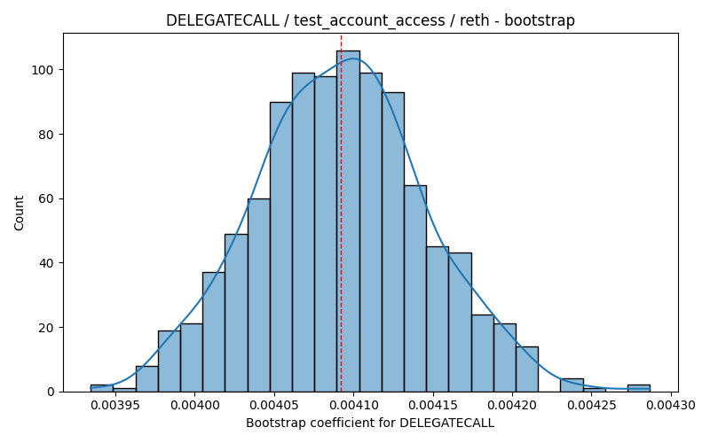

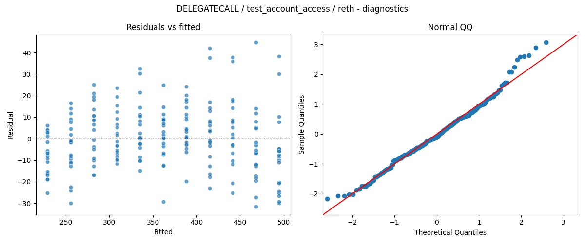

</details>

### test_account_access — combo `DELEGATECALL_AccountMode.NON_EXISTING_ACCOUNT`

| client | nobs | R² | target_coef (ms) | p-value | 95% CI |
| --- | --- | --- | --- | --- | --- |
| `besu` | 110 | 0.9867 | 0.01614 | 1.00e-03 | [0.01579, 0.01648] |
| `erigon` | 88 | 0.9961 | 0.007939 | 1.00e-03 | [0.007895, 0.007973] |
| `geth` | 77 | 0.9325 | 0.01996 | 1.00e-03 | [0.01883, 0.0211] |
| `nethermind` | 154 | 0.9113 | 0.0036 | 1.00e-03 | [0.003412, 0.003776] |
| `reth` | 209 | 0.9651 | 0.004022 | 1.00e-03 | [0.003923, 0.004119] |

<details><summary>besu — NNLS regression summary</summary>

```
==============================================================================
                           NNLS Regression Results                            
==============================================================================
Dep. Variable:          test_runtime_ms              R-squared:          0.987
Model:                  NNLS                    Adj. R-squared:          0.987
No. Observations:       110                               RMSE:          38.49
Df Residuals:           108                                MAE:          29.41
Df Model:               1      
==============================================================================
                      coef     std err     P-value      [0.025      0.975]
------------------------------------------------------------------------------
         const    177.9104     10.5569       0.001    156.6382    197.9815
       opcount      0.0161      0.0002       0.001      0.0158      0.0165
==============================================================================
Notes: Non-negative least squares with bootstrap inference (1000 iterations)
==============================================================================
```

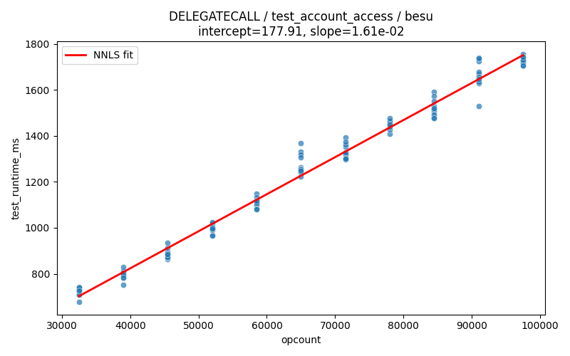

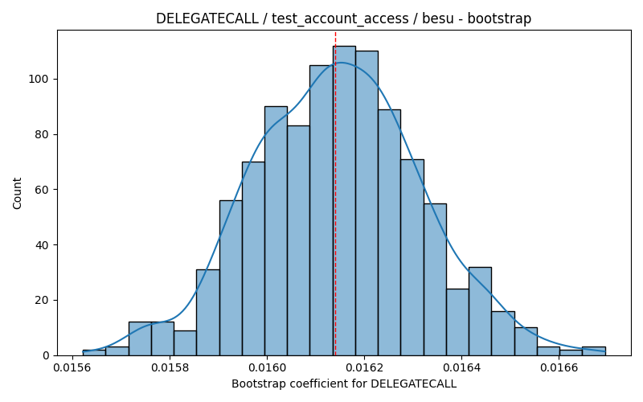

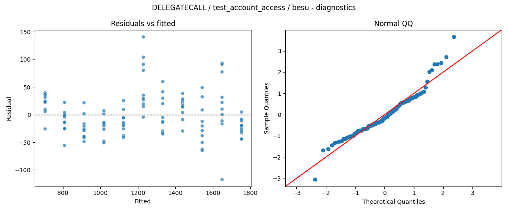

</details>

<details><summary>erigon — NNLS regression summary</summary>

```
==============================================================================
                           NNLS Regression Results                            
==============================================================================
Dep. Variable:          test_runtime_ms              R-squared:          0.996
Model:                  NNLS                    Adj. R-squared:          0.996
No. Observations:       88                                RMSE:          10.27
Df Residuals:           86                                 MAE:           8.05
Df Model:               1      
==============================================================================
                      coef     std err     P-value      [0.025      0.975]
------------------------------------------------------------------------------
         const      0.0000      0.6087       1.000      0.0000      2.5046
       opcount      0.0079      0.0000       0.001      0.0079      0.0080
==============================================================================
Notes: Non-negative least squares with bootstrap inference (1000 iterations)
==============================================================================
```

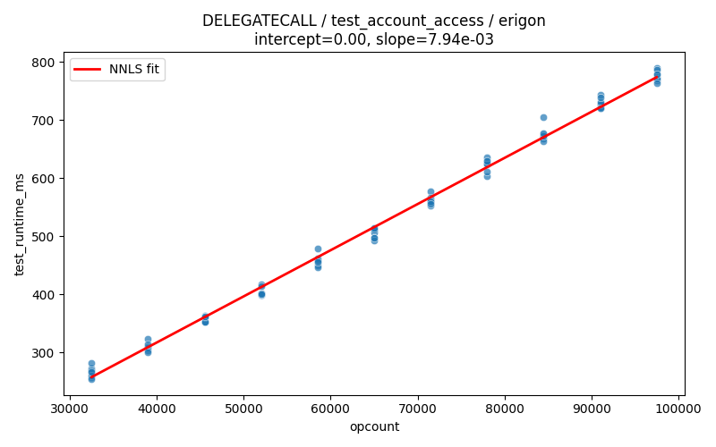

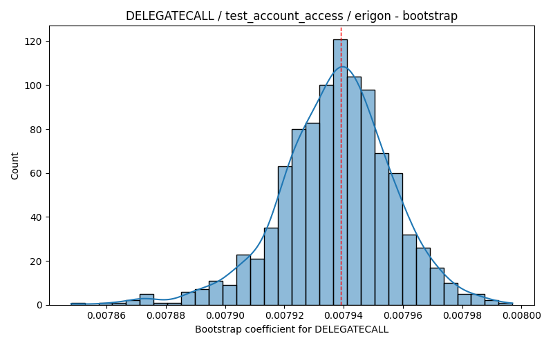

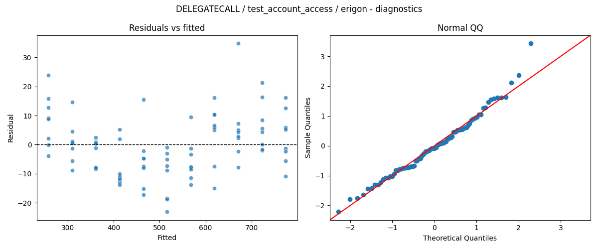

</details>

<details><summary>geth — NNLS regression summary</summary>

```
==============================================================================
                           NNLS Regression Results                            
==============================================================================
Dep. Variable:          test_runtime_ms              R-squared:          0.932
Model:                  NNLS                    Adj. R-squared:          0.932
No. Observations:       77                                RMSE:         110.39
Df Residuals:           75                                 MAE:          74.81
Df Model:               1      
==============================================================================
                      coef     std err     P-value      [0.025      0.975]
------------------------------------------------------------------------------
         const    205.7779     35.9842       0.001    140.4304    276.0174
       opcount      0.0200      0.0006       0.001      0.0188      0.0211
==============================================================================
Notes: Non-negative least squares with bootstrap inference (1000 iterations)
==============================================================================
```

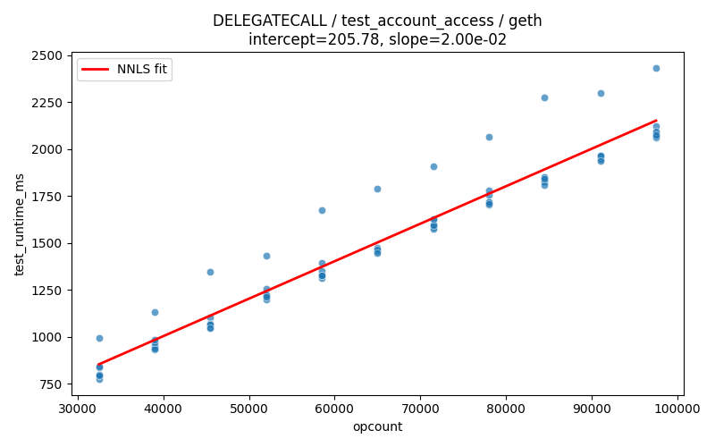

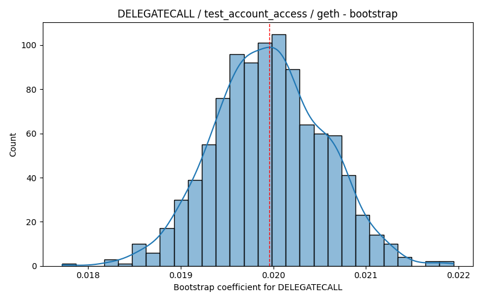

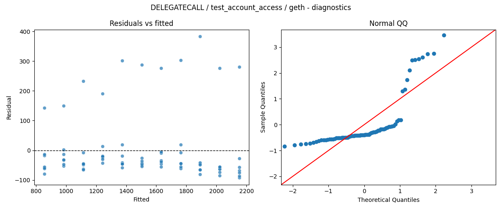

</details>

<details><summary>nethermind — NNLS regression summary</summary>

```
==============================================================================
                           NNLS Regression Results                            
==============================================================================
Dep. Variable:          test_runtime_ms              R-squared:          0.911
Model:                  NNLS                    Adj. R-squared:          0.911
No. Observations:       154                               RMSE:          23.09
Df Residuals:           152                                MAE:          18.13
Df Model:               1      
==============================================================================
                      coef     std err     P-value      [0.025      0.975]
------------------------------------------------------------------------------
         const     60.5658      5.4789       0.001     50.2115     71.9164
       opcount      0.0036      0.0001       0.001      0.0034      0.0038
==============================================================================
Notes: Non-negative least squares with bootstrap inference (1000 iterations)
==============================================================================
```

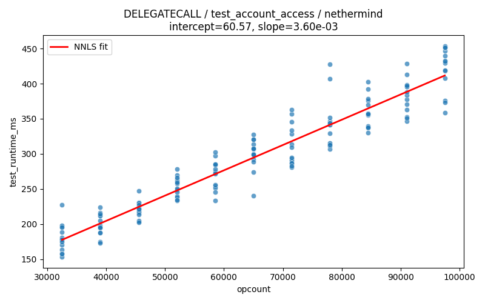

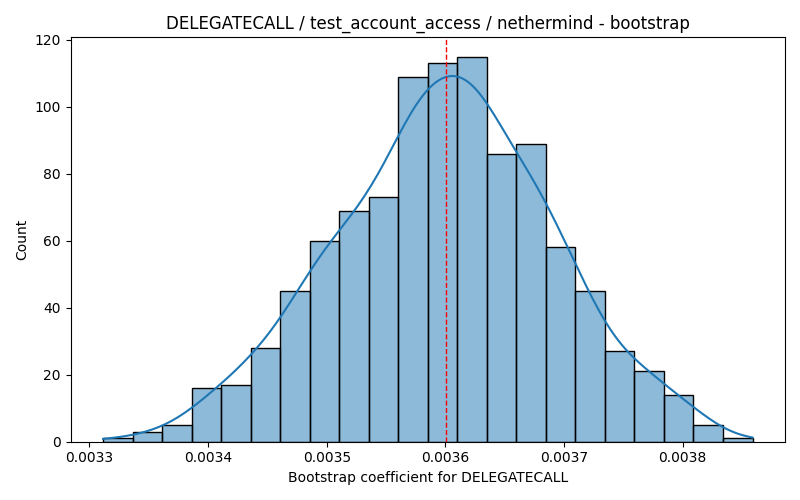

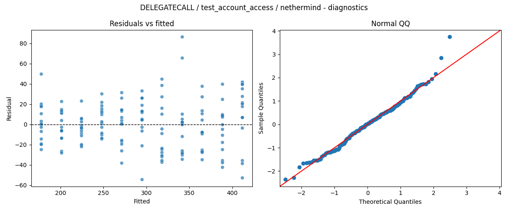

</details>

<details><summary>reth — NNLS regression summary</summary>

```
==============================================================================
                           NNLS Regression Results                            
==============================================================================
Dep. Variable:          test_runtime_ms              R-squared:          0.965
Model:                  NNLS                    Adj. R-squared:          0.965
No. Observations:       209                               RMSE:          15.72
Df Residuals:           207                                MAE:          11.91
Df Model:               1      
==============================================================================
                      coef     std err     P-value      [0.025      0.975]
------------------------------------------------------------------------------
         const     98.7886      3.0161       0.001     92.9906    104.3994
       opcount      0.0040      0.0001       0.001      0.0039      0.0041
==============================================================================
Notes: Non-negative least squares with bootstrap inference (1000 iterations)
==============================================================================
```


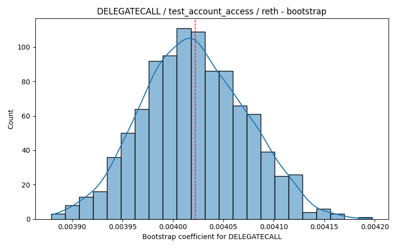

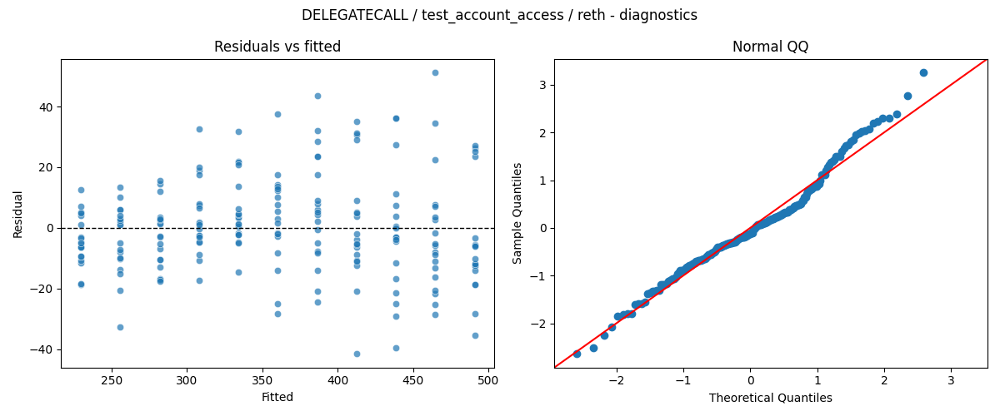

</details>

### test_account_access — combo `DELEGATECALL_AccountMode.EXISTING_CONTRACT_DIFF_MAX`

| client | nobs | R² | target_coef (ms) | p-value | 95% CI |
| --- | --- | --- | --- | --- | --- |
| `besu` | 110 | 0.9801 | 0.02206 | 1.00e-03 | [0.02158, 0.02252] |
| `erigon` | 88 | 0.8241 | 0.02617 | 1.00e-03 | [0.02368, 0.02883] |
| `geth` | 77 | 0.8598 | 0.02671 | 1.00e-03 | [0.02409, 0.02936] |
| `nethermind` | 154 | 0.8834 | 0.0154 | 1.00e-03 | [0.01431, 0.0166] |
| `reth` | 209 | 0.9943 | 0.02082 | 1.00e-03 | [0.02062, 0.02105] |

<details><summary>besu — NNLS regression summary</summary>

```
==============================================================================
                           NNLS Regression Results                            
==============================================================================
Dep. Variable:          test_runtime_ms              R-squared:          0.980
Model:                  NNLS                    Adj. R-squared:          0.980
No. Observations:       110                               RMSE:          63.68
Df Residuals:           108                                MAE:          48.65
Df Model:               1      
==============================================================================
                      coef     std err     P-value      [0.025      0.975]
------------------------------------------------------------------------------
         const    435.3217     17.0673       0.001    401.5629    468.0498
       opcount      0.0221      0.0002       0.001      0.0216      0.0225
==============================================================================
Notes: Non-negative least squares with bootstrap inference (1000 iterations)
==============================================================================
```

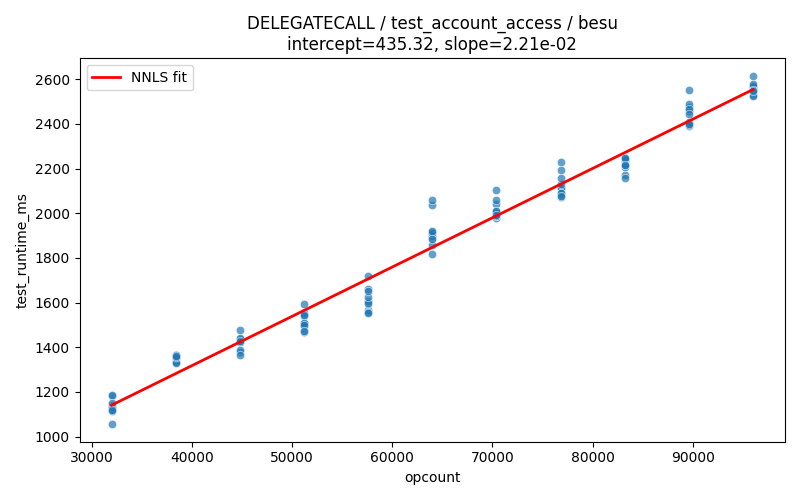

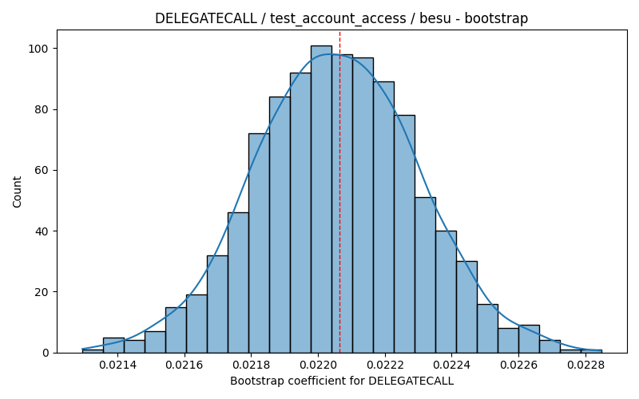

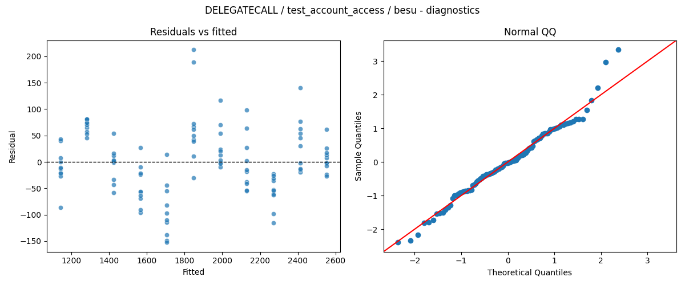

</details>

<details><summary>erigon — NNLS regression summary</summary>

```
==============================================================================
                           NNLS Regression Results                            
==============================================================================
Dep. Variable:          test_runtime_ms              R-squared:          0.824
Model:                  NNLS                    Adj. R-squared:          0.822
No. Observations:       88                                RMSE:         244.76
Df Residuals:           86                                 MAE:         169.23
Df Model:               1      
==============================================================================
                      coef     std err     P-value      [0.025      0.975]
------------------------------------------------------------------------------
         const    221.3996     78.8819       0.001     71.0912    371.9155
       opcount      0.0262      0.0013       0.001      0.0237      0.0288
==============================================================================
Notes: Non-negative least squares with bootstrap inference (1000 iterations)
==============================================================================
```

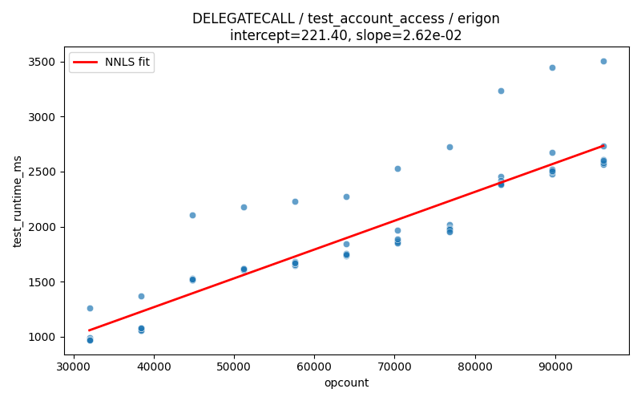

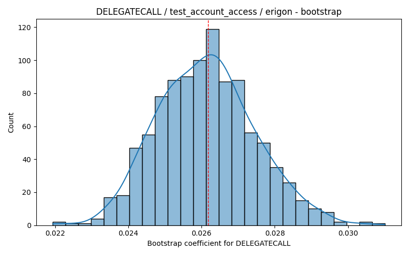

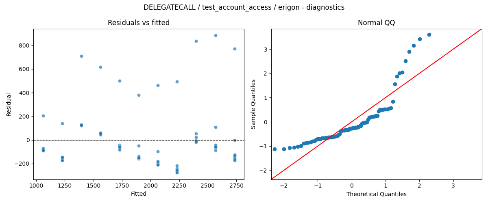

</details>

<details><summary>geth — NNLS regression summary</summary>

```
==============================================================================
                           NNLS Regression Results                            
==============================================================================
Dep. Variable:          test_runtime_ms              R-squared:          0.860
Model:                  NNLS                    Adj. R-squared:          0.858
No. Observations:       77                                RMSE:         218.31
Df Residuals:           75                                 MAE:         179.73
Df Model:               1      
==============================================================================
                      coef     std err     P-value      [0.025      0.975]
------------------------------------------------------------------------------
         const    486.9822     87.9856       0.001    316.1339    653.4975
       opcount      0.0267      0.0014       0.001      0.0241      0.0294
==============================================================================
Notes: Non-negative least squares with bootstrap inference (1000 iterations)
==============================================================================
```

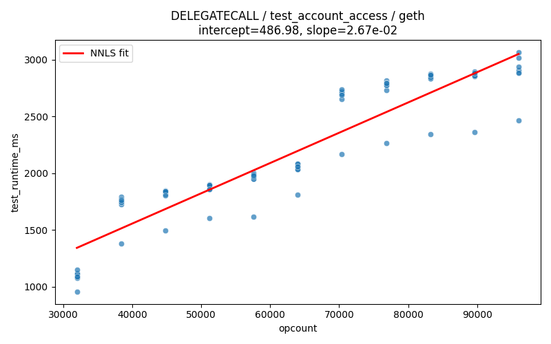

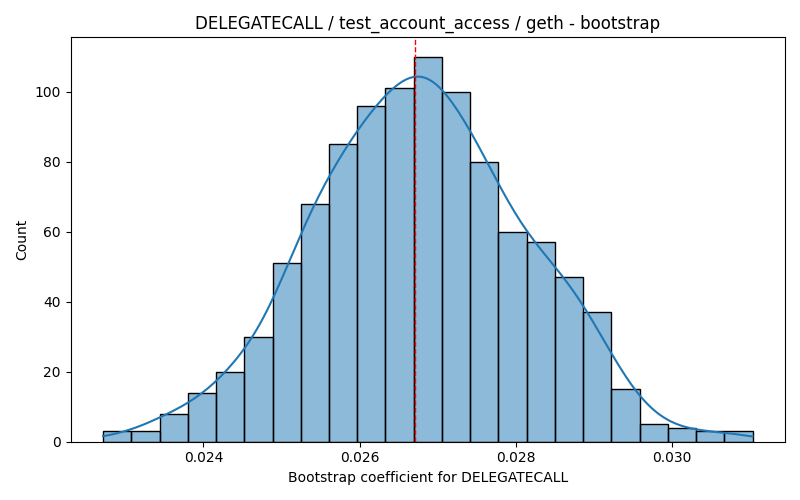

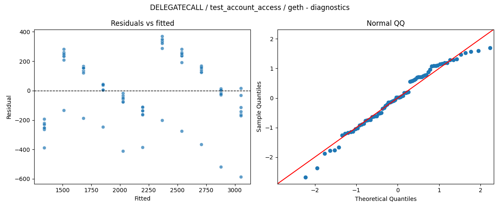

</details>

<details><summary>nethermind — NNLS regression summary</summary>

```
==============================================================================
                           NNLS Regression Results                            
==============================================================================
Dep. Variable:          test_runtime_ms              R-squared:          0.883
Model:                  NNLS                    Adj. R-squared:          0.883
No. Observations:       154                               RMSE:         113.26
Df Residuals:           152                                MAE:          92.58
Df Model:               1      
==============================================================================
                      coef     std err     P-value      [0.025      0.975]
------------------------------------------------------------------------------
         const    662.9363     42.8483       0.001    580.8150    744.4698
       opcount      0.0154      0.0006       0.001      0.0143      0.0166
==============================================================================
Notes: Non-negative least squares with bootstrap inference (1000 iterations)
==============================================================================
```

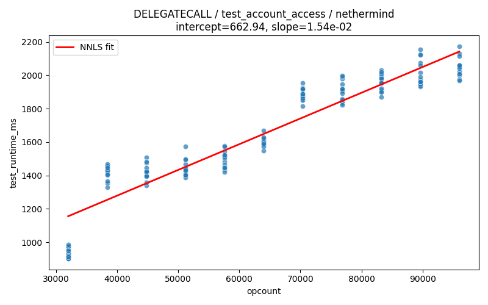

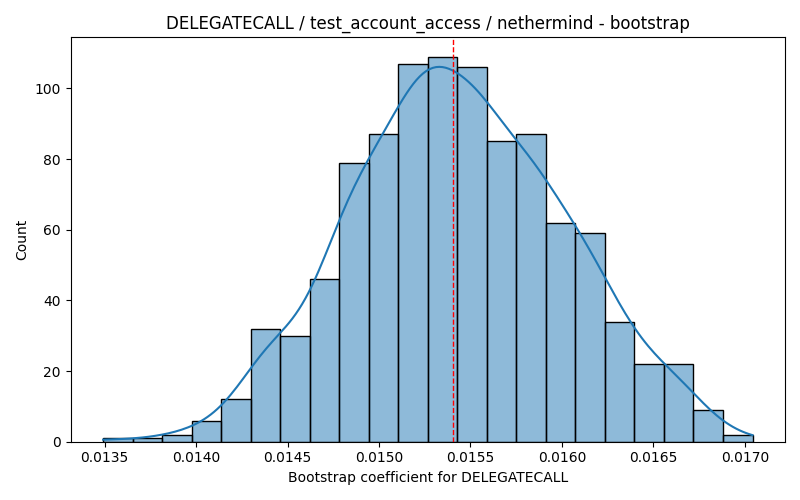

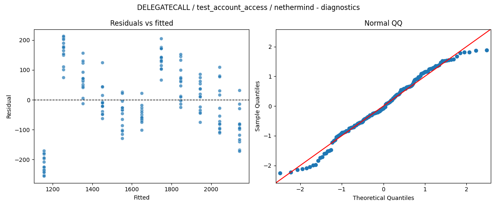

</details>

<details><summary>reth — NNLS regression summary</summary>

```
==============================================================================
                           NNLS Regression Results                            
==============================================================================
Dep. Variable:          test_runtime_ms              R-squared:          0.994
Model:                  NNLS                    Adj. R-squared:          0.994
No. Observations:       209                               RMSE:          32.01
Df Residuals:           207                                MAE:          21.77
Df Model:               1      
==============================================================================
                      coef     std err     P-value      [0.025      0.975]
------------------------------------------------------------------------------
         const    141.0192      6.7726       0.001    127.3488    153.9768
       opcount      0.0208      0.0001       0.001      0.0206      0.0211
==============================================================================
Notes: Non-negative least squares with bootstrap inference (1000 iterations)
==============================================================================
```

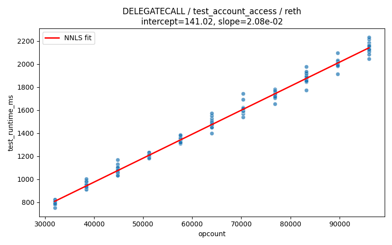

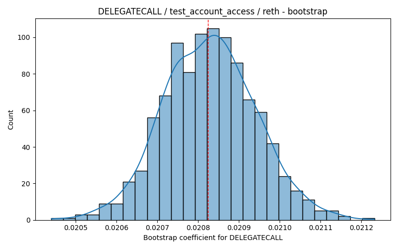

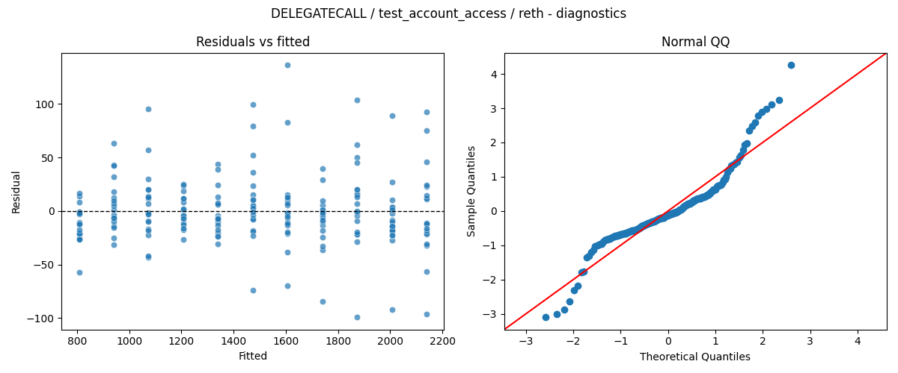

</details>

### test_account_access — combo `DELEGATECALL_AccountMode.EXISTING_CONTRACT_MINIMAL`

| client | nobs | R² | target_coef (ms) | p-value | 95% CI |
| --- | --- | --- | --- | --- | --- |
| `besu` | 110 | 0.9798 | 0.01352 | 1.00e-03 | [0.01314, 0.01389] |
| `erigon` | 88 | 0.9903 | 0.008717 | 1.00e-03 | [0.008533, 0.008913] |
| `geth` | 77 | 0.4701 | 0.01652 | 1.00e-03 | [0.01218, 0.01968] |
| `nethermind` | 154 | 0.6505 | 0.002709 | 1.00e-03 | [0.002424, 0.003033] |
| `reth` | 209 | 0.9656 | 0.003829 | 1.00e-03 | [0.003731, 0.003932] |

<details><summary>besu — NNLS regression summary</summary>

```
==============================================================================
                           NNLS Regression Results                            
==============================================================================
Dep. Variable:          test_runtime_ms              R-squared:          0.980
Model:                  NNLS                    Adj. R-squared:          0.980
No. Observations:       110                               RMSE:          39.30
Df Residuals:           108                                MAE:          32.04
Df Model:               1      
==============================================================================
                      coef     std err     P-value      [0.025      0.975]
------------------------------------------------------------------------------
         const    388.4439     12.9775       0.001    364.2011    415.7415
       opcount      0.0135      0.0002       0.001      0.0131      0.0139
==============================================================================
Notes: Non-negative least squares with bootstrap inference (1000 iterations)
==============================================================================
```

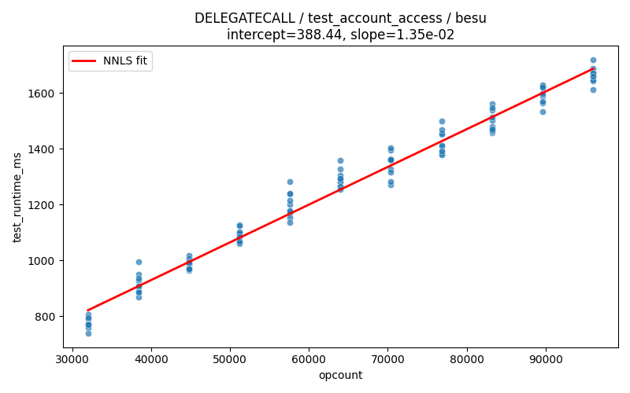

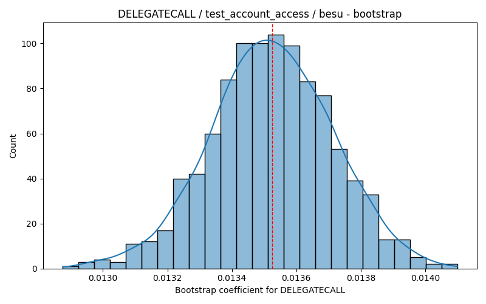

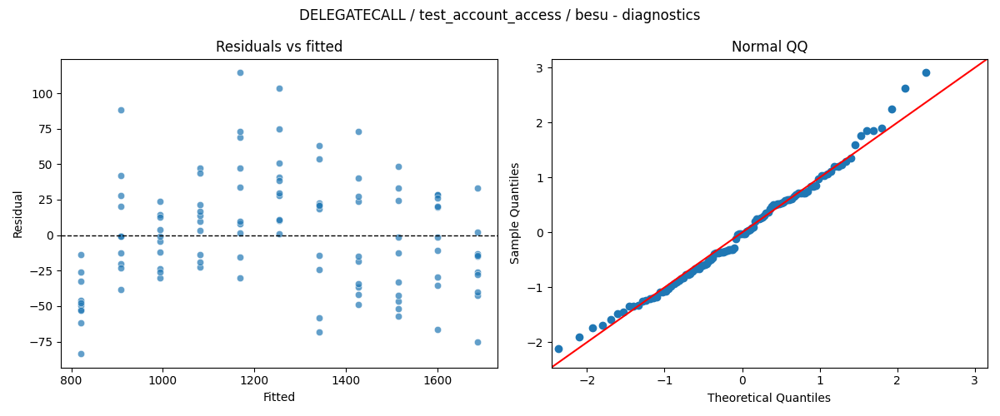

</details>

<details><summary>erigon — NNLS regression summary</summary>

```
==============================================================================
                           NNLS Regression Results                            
==============================================================================
Dep. Variable:          test_runtime_ms              R-squared:          0.990
Model:                  NNLS                    Adj. R-squared:          0.990
No. Observations:       88                                RMSE:          17.47
Df Residuals:           86                                 MAE:          11.98
Df Model:               1      
==============================================================================
                      coef     std err     P-value      [0.025      0.975]
------------------------------------------------------------------------------
         const     85.5652      5.8450       0.001     73.4742     96.5900
       opcount      0.0087      0.0001       0.001      0.0085      0.0089
==============================================================================
Notes: Non-negative least squares with bootstrap inference (1000 iterations)
==============================================================================
```

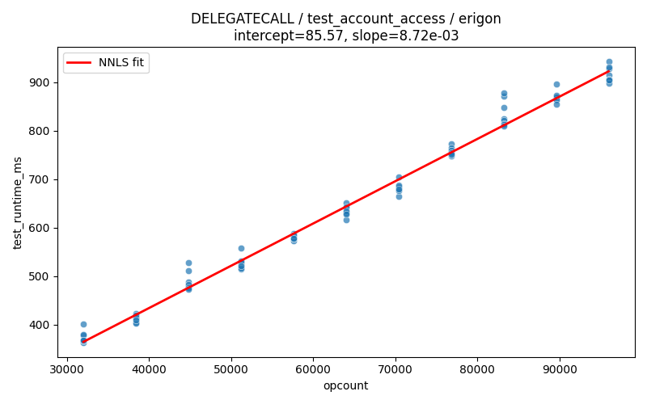

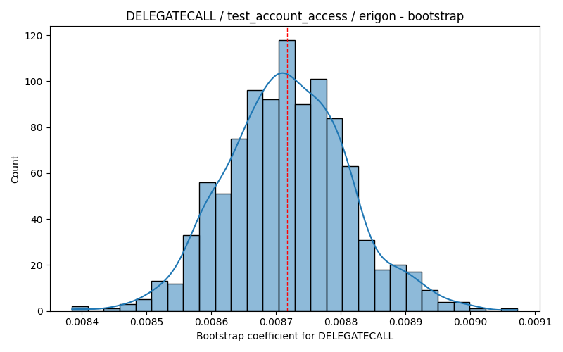

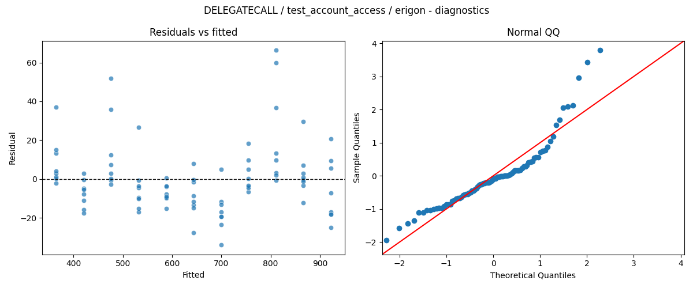

</details>

<details><summary>geth — NNLS regression summary</summary>

```
==============================================================================
                           NNLS Regression Results                            
==============================================================================
Dep. Variable:          test_runtime_ms              R-squared:          0.470
Model:                  NNLS                    Adj. R-squared:          0.463
No. Observations:       77                                RMSE:         354.86
Df Residuals:           75                                 MAE:         239.59
Df Model:               1      
==============================================================================
                      coef     std err     P-value      [0.025      0.975]
------------------------------------------------------------------------------
         const    170.7057    111.7079       0.058      0.0000    411.5790
       opcount      0.0165      0.0020       0.001      0.0122      0.0197
==============================================================================
Notes: Non-negative least squares with bootstrap inference (1000 iterations)
==============================================================================
```

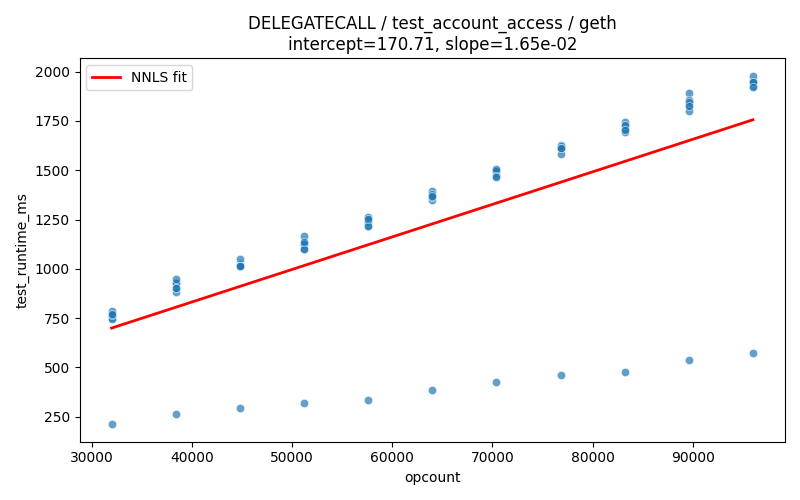

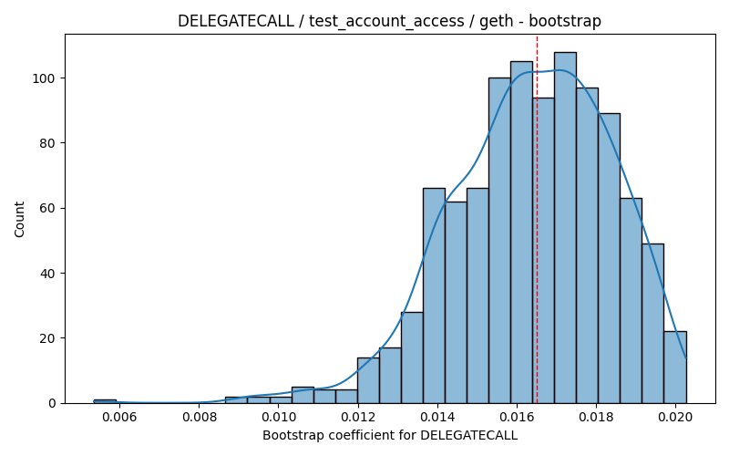

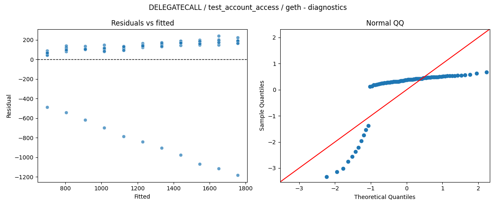

</details>

<details><summary>nethermind — NNLS regression summary</summary>

```
==============================================================================
                           NNLS Regression Results                            
==============================================================================
Dep. Variable:          test_runtime_ms              R-squared:          0.651
Model:                  NNLS                    Adj. R-squared:          0.648
No. Observations:       154                               RMSE:          40.19
Df Residuals:           152                                MAE:          32.64
Df Model:               1      
==============================================================================
                      coef     std err     P-value      [0.025      0.975]
------------------------------------------------------------------------------
         const    113.7332      8.7702       0.001     95.7948    130.7536
       opcount      0.0027      0.0001       0.001      0.0024      0.0030
==============================================================================
Notes: Non-negative least squares with bootstrap inference (1000 iterations)
==============================================================================
```

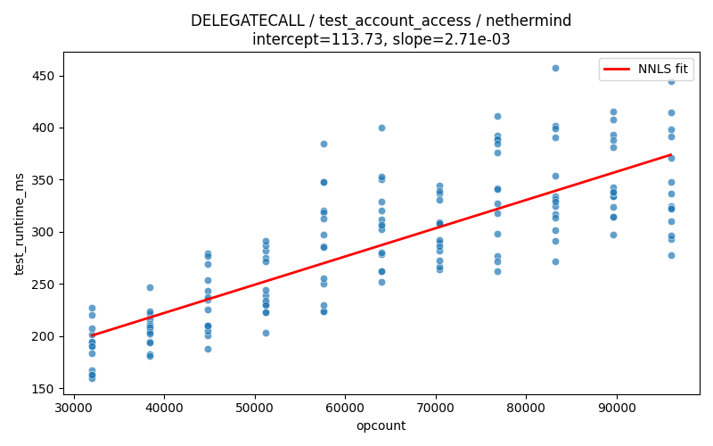

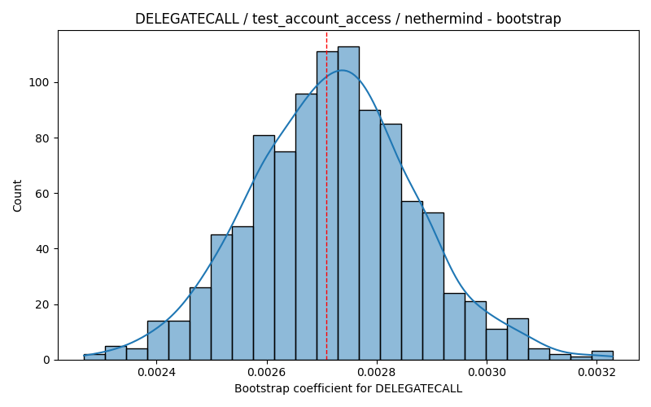

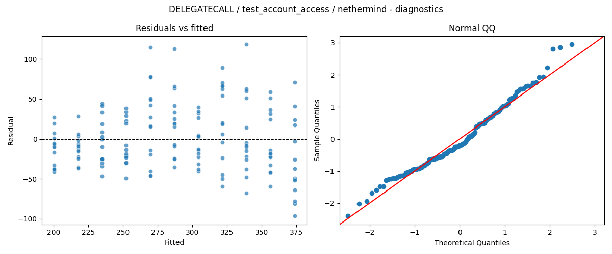

</details>

<details><summary>reth — NNLS regression summary</summary>

```
==============================================================================
                           NNLS Regression Results                            
==============================================================================
Dep. Variable:          test_runtime_ms              R-squared:          0.966
Model:                  NNLS                    Adj. R-squared:          0.965
No. Observations:       209                               RMSE:          14.64
Df Residuals:           207                                MAE:          11.63
Df Model:               1      
==============================================================================
                      coef     std err     P-value      [0.025      0.975]
------------------------------------------------------------------------------
         const     93.4421      3.1061       0.001     87.3974     99.8151
       opcount      0.0038      0.0000       0.001      0.0037      0.0039
==============================================================================
Notes: Non-negative least squares with bootstrap inference (1000 iterations)
==============================================================================
```

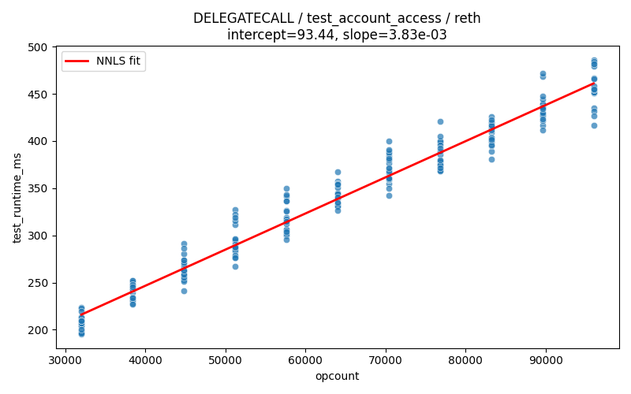

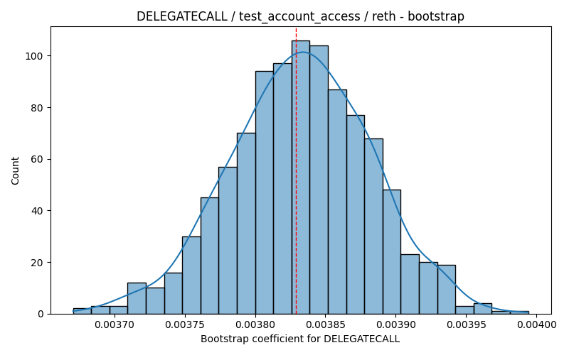

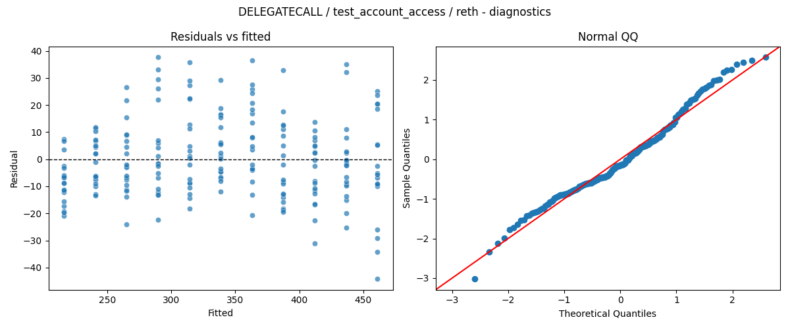

</details>

### test_account_access — combo `DELEGATECALL_AccountMode.EXISTING_CONTRACT_SAME_MAX`

| client | nobs | R² | target_coef (ms) | p-value | 95% CI |
| --- | --- | --- | --- | --- | --- |
| `besu` | 110 | 0.973 | 0.01278 | 1.00e-03 | [0.01227, 0.01326] |
| `erigon` | 88 | 0.989 | 0.008844 | 1.00e-03 | [0.00867, 0.009037] |
| `geth` | 77 | 0.4605 | 0.01607 | 1.00e-03 | [0.01167, 0.01948] |
| `nethermind` | 154 | 0.6649 | 0.002518 | 1.00e-03 | [0.002229, 0.002803] |
| `reth` | 209 | 0.9634 | 0.003935 | 1.00e-03 | [0.00384, 0.00404] |

<details><summary>besu — NNLS regression summary</summary>

```
==============================================================================
                           NNLS Regression Results                            
==============================================================================
Dep. Variable:          test_runtime_ms              R-squared:          0.973
Model:                  NNLS                    Adj. R-squared:          0.973
No. Observations:       110                               RMSE:          43.07
Df Residuals:           108                                MAE:          32.22
Df Model:               1      
==============================================================================
                      coef     std err     P-value      [0.025      0.975]
------------------------------------------------------------------------------
         const    407.0578     15.8548       0.001    376.8206    440.3929
       opcount      0.0128      0.0002       0.001      0.0123      0.0133
==============================================================================
Notes: Non-negative least squares with bootstrap inference (1000 iterations)
==============================================================================
```

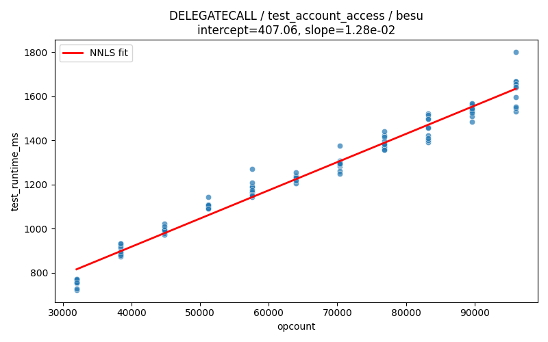

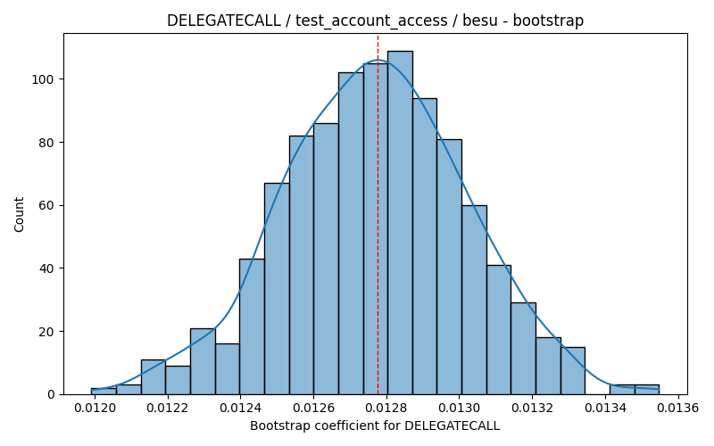

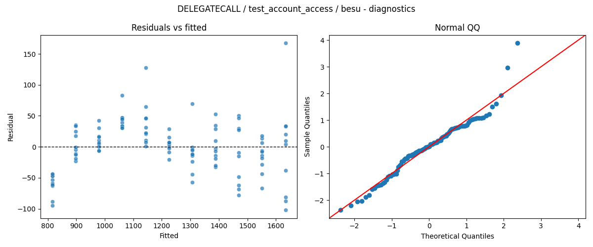

</details>

<details><summary>erigon — NNLS regression summary</summary>

```
==============================================================================
                           NNLS Regression Results                            
==============================================================================
Dep. Variable:          test_runtime_ms              R-squared:          0.989
Model:                  NNLS                    Adj. R-squared:          0.989
No. Observations:       88                                RMSE:          18.84
Df Residuals:           86                                 MAE:          14.40
Df Model:               1      
==============================================================================
                      coef     std err     P-value      [0.025      0.975]
------------------------------------------------------------------------------
         const     77.3828      5.5508       0.001     66.0428     87.6887
       opcount      0.0088      0.0001       0.001      0.0087      0.0090
==============================================================================
Notes: Non-negative least squares with bootstrap inference (1000 iterations)
==============================================================================
```

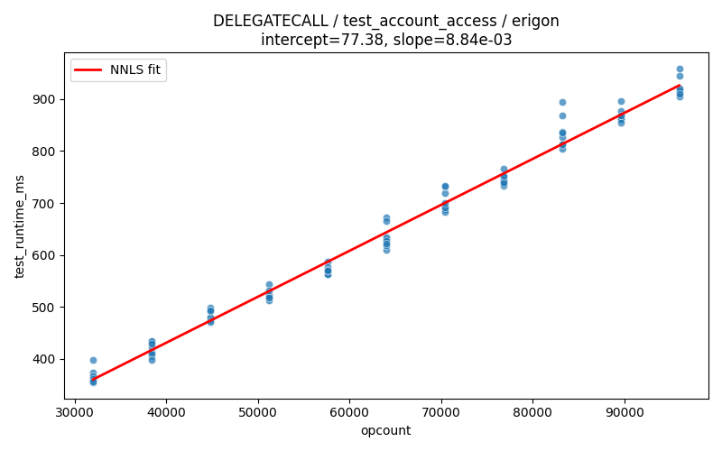

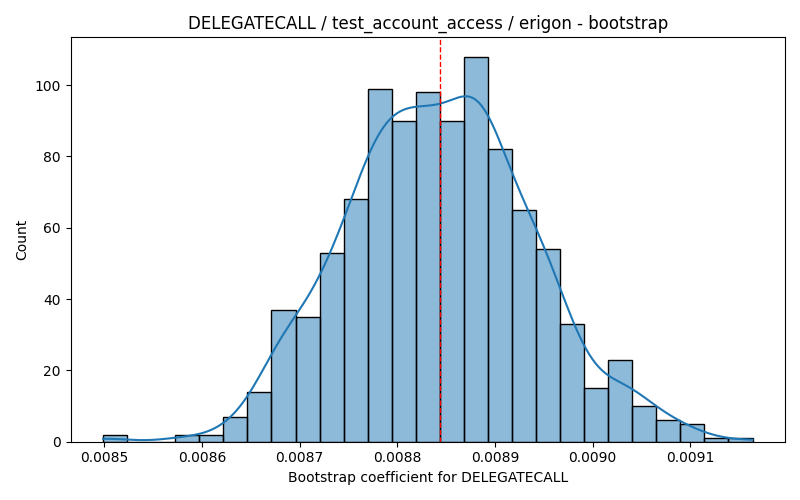

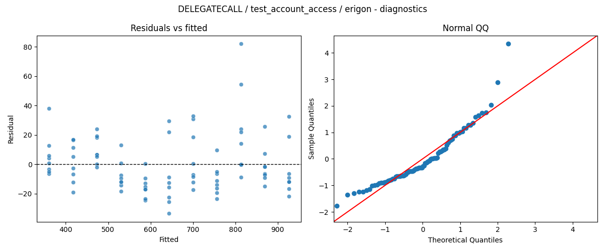

</details>

<details><summary>geth — NNLS regression summary</summary>

```
==============================================================================
                           NNLS Regression Results                            
==============================================================================
Dep. Variable:          test_runtime_ms              R-squared:          0.461
Model:                  NNLS                    Adj. R-squared:          0.453
No. Observations:       77                                RMSE:         352.09
Df Residuals:           75                                 MAE:         237.07
Df Model:               1      
==============================================================================
                      coef     std err     P-value      [0.025      0.975]
------------------------------------------------------------------------------
         const    186.7045    113.6885       0.059      0.0000    428.5231
       opcount      0.0161      0.0020       0.001      0.0117      0.0195
==============================================================================
Notes: Non-negative least squares with bootstrap inference (1000 iterations)
==============================================================================
```

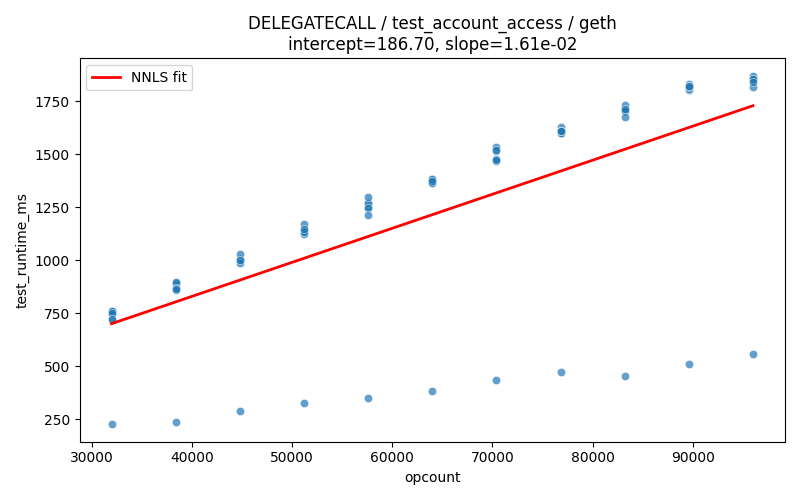

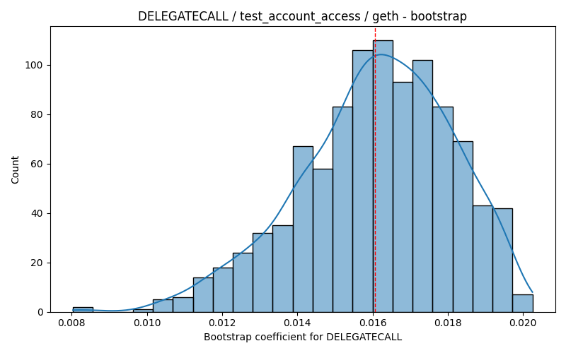


</details>

<details><summary>nethermind — NNLS regression summary</summary>

```
==============================================================================
                           NNLS Regression Results                            
==============================================================================
Dep. Variable:          test_runtime_ms              R-squared:          0.665
Model:                  NNLS                    Adj. R-squared:          0.663
No. Observations:       154                               RMSE:          36.18
Df Residuals:           152                                MAE:          29.55
Df Model:               1      
==============================================================================
                      coef     std err     P-value      [0.025      0.975]
------------------------------------------------------------------------------
         const    126.2698      8.4399       0.001    110.0327    142.1191
       opcount      0.0025      0.0001       0.001      0.0022      0.0028
==============================================================================
Notes: Non-negative least squares with bootstrap inference (1000 iterations)
==============================================================================
```

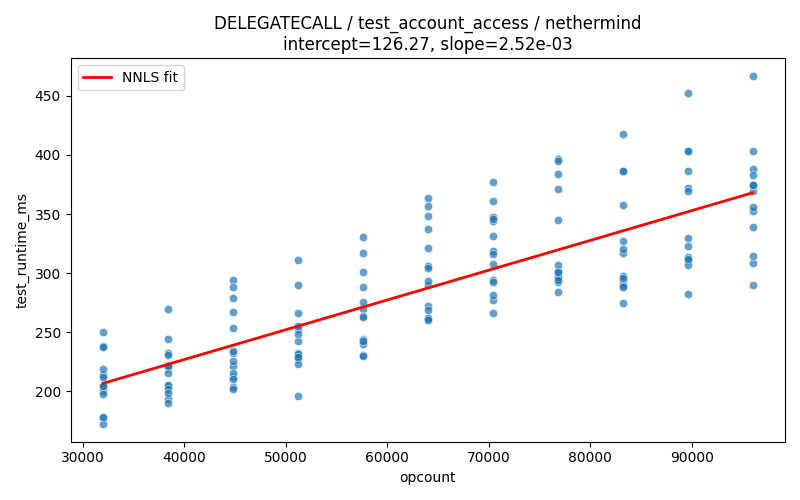

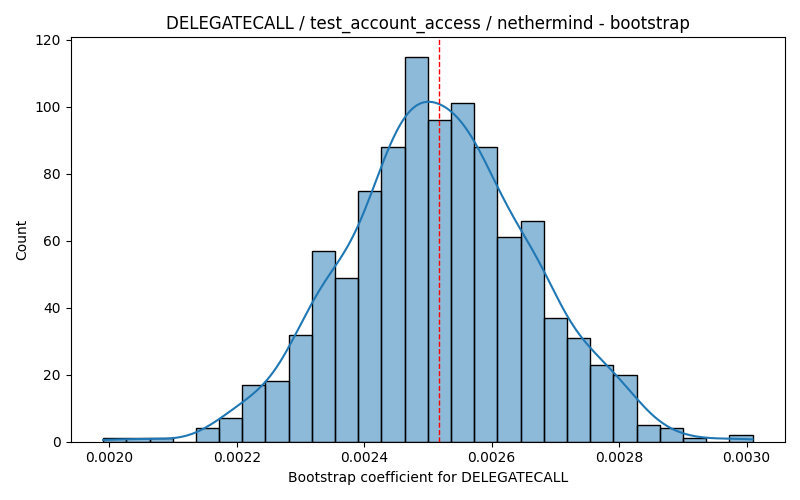

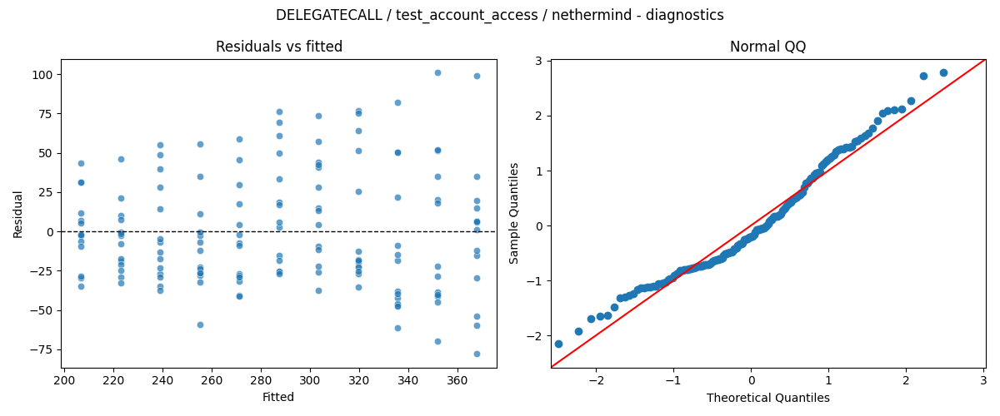

</details>

<details><summary>reth — NNLS regression summary</summary>

```
==============================================================================
                           NNLS Regression Results                            
==============================================================================
Dep. Variable:          test_runtime_ms              R-squared:          0.963
Model:                  NNLS                    Adj. R-squared:          0.963
No. Observations:       209                               RMSE:          15.53
Df Residuals:           207                                MAE:          12.01
Df Model:               1      
==============================================================================
                      coef     std err     P-value      [0.025      0.975]
------------------------------------------------------------------------------
         const     88.5453      3.1022       0.001     82.2195     94.6009
       opcount      0.0039      0.0001       0.001      0.0038      0.0040
==============================================================================
Notes: Non-negative least squares with bootstrap inference (1000 iterations)
==============================================================================
```

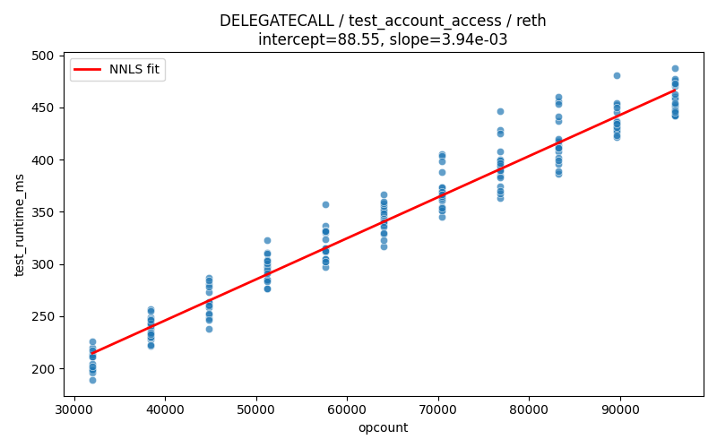

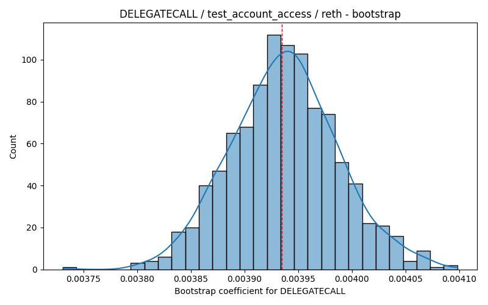

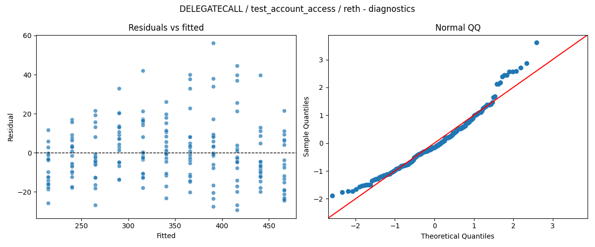

</details>

## EXTCODEHASH

### test_ext_account_query_warm — combo `EXTCODEHASH`

| client | nobs | R² | target_coef (ms) | p-value | 95% CI |
| --- | --- | --- | --- | --- | --- |
| `besu` | 110 | 0.8367 | 7.537e-05 | 1.00e-03 | [6.946e-05, 8.116e-05] |
| `erigon` | 88 | 0.7351 | 2.472e-05 | 1.00e-03 | [2.181e-05, 2.788e-05] |
| `geth` | 77 | 0.7501 | 2.965e-05 | 1.00e-03 | [2.524e-05, 3.44e-05] |
| `nethermind` | 154 | 0.744 | 0.0002098 | 1.00e-03 | [0.0001913, 0.0002298] |
| `reth` | 209 | 0.5383 | 1.363e-05 | 1.00e-03 | [1.137e-05, 1.569e-05] |

<details><summary>besu — NNLS regression summary</summary>

```
==============================================================================
                           NNLS Regression Results                            
==============================================================================
Dep. Variable:          test_runtime_ms              R-squared:          0.837
Model:                  NNLS                    Adj. R-squared:          0.835
No. Observations:       110                               RMSE:          19.47
Df Residuals:           108                                MAE:          16.09
Df Model:               1      
==============================================================================
                      coef     std err     P-value      [0.025      0.975]
------------------------------------------------------------------------------
         const    153.5061      5.7043       0.001    143.1238    164.6570
       opcount      0.0001      0.0000       0.001      0.0001      0.0001
==============================================================================
Notes: Non-negative least squares with bootstrap inference (1000 iterations)
==============================================================================
```

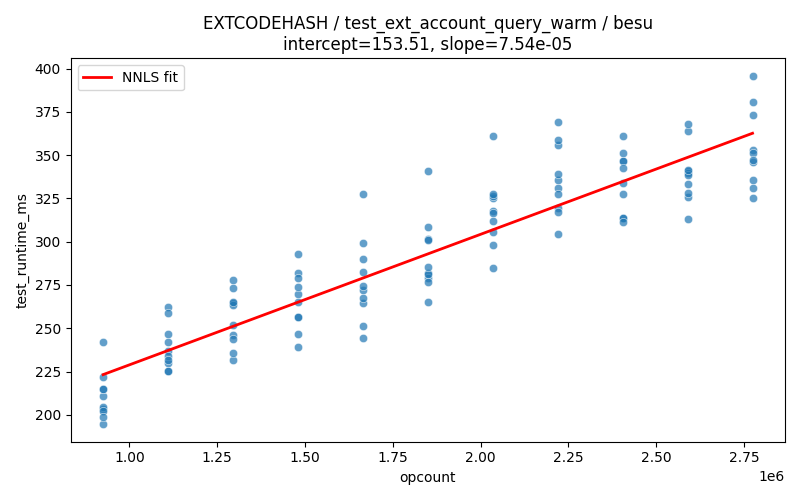

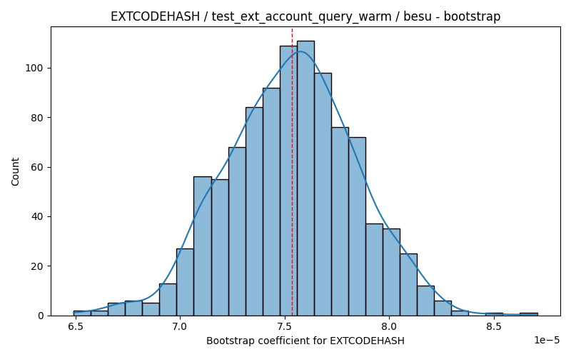

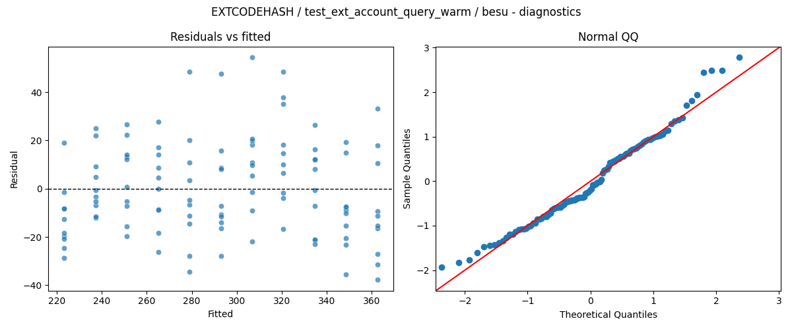

</details>

<details><summary>erigon — NNLS regression summary</summary>

```
==============================================================================
                           NNLS Regression Results                            
==============================================================================
Dep. Variable:          test_runtime_ms              R-squared:          0.735
Model:                  NNLS                    Adj. R-squared:          0.732
No. Observations:       88                                RMSE:           8.68
Df Residuals:           86                                 MAE:           6.04
Df Model:               1      
==============================================================================
                      coef     std err     P-value      [0.025      0.975]
------------------------------------------------------------------------------
         const     27.0962      2.5192       0.001     22.1327     31.6439
       opcount      0.0000      0.0000       0.001      0.0000      0.0000
==============================================================================
Notes: Non-negative least squares with bootstrap inference (1000 iterations)
==============================================================================
```

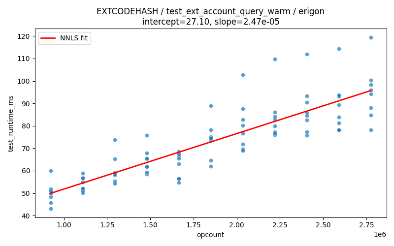

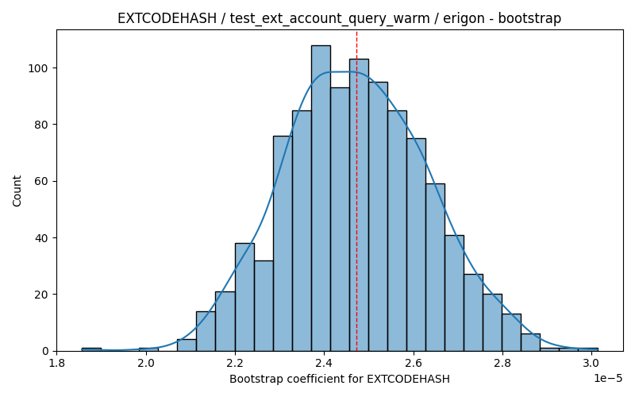

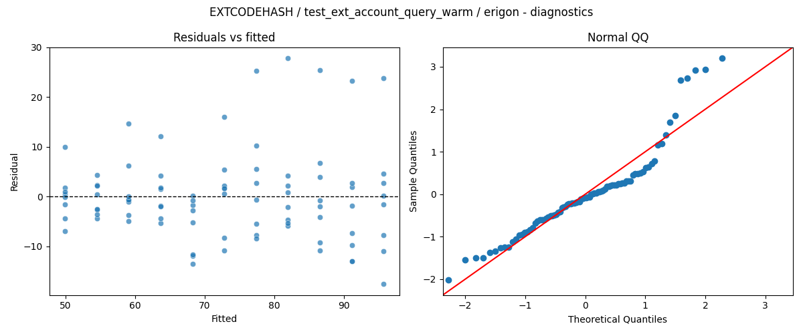

</details>

<details><summary>geth — NNLS regression summary</summary>

```
==============================================================================
                           NNLS Regression Results                            
==============================================================================
Dep. Variable:          test_runtime_ms              R-squared:          0.750
Model:                  NNLS                    Adj. R-squared:          0.747
No. Observations:       77                                RMSE:          10.01
Df Residuals:           75                                 MAE:           7.75
Df Model:               1      
==============================================================================
                      coef     std err     P-value      [0.025      0.975]
------------------------------------------------------------------------------
         const     30.6332      4.7420       0.001     21.9262     39.6095
       opcount      0.0000      0.0000       0.001      0.0000      0.0000
==============================================================================
Notes: Non-negative least squares with bootstrap inference (1000 iterations)
==============================================================================
```

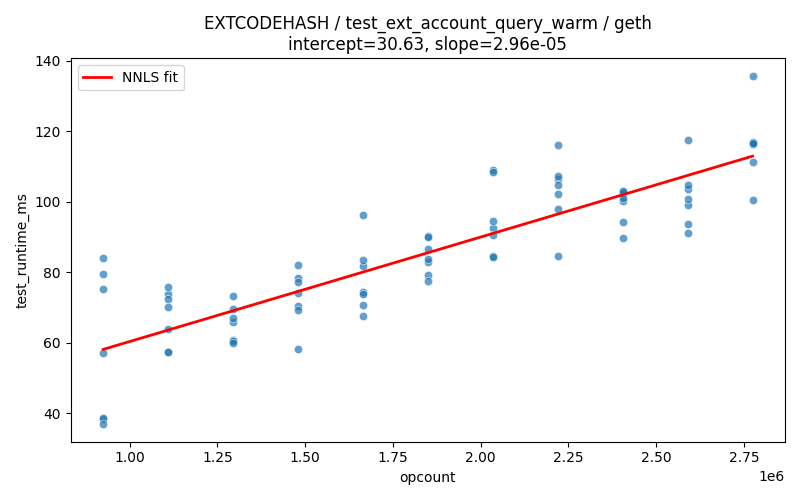

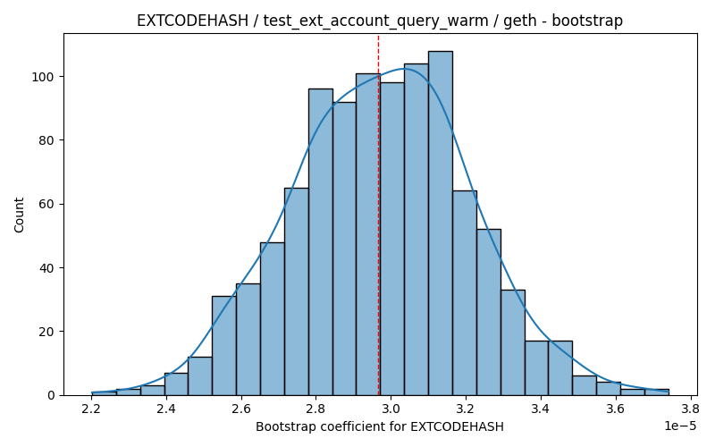

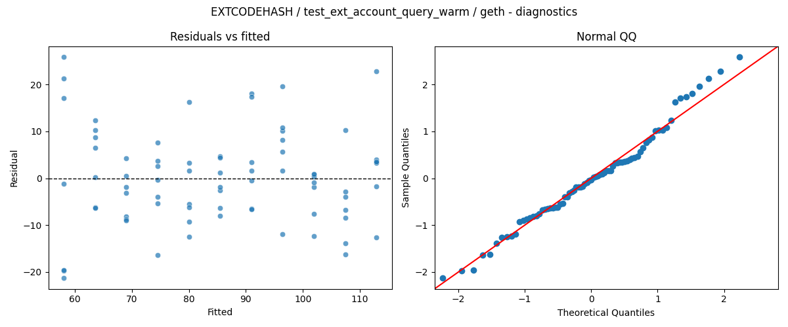

</details>

<details><summary>nethermind — NNLS regression summary</summary>

```
==============================================================================
                           NNLS Regression Results                            
==============================================================================
Dep. Variable:          test_runtime_ms              R-squared:          0.744
Model:                  NNLS                    Adj. R-squared:          0.742
No. Observations:       154                               RMSE:          71.99
Df Residuals:           152                                MAE:          57.76
Df Model:               1      
==============================================================================
                      coef     std err     P-value      [0.025      0.975]
------------------------------------------------------------------------------
         const    216.8619     18.0071       0.001    181.4325    253.3231
       opcount      0.0002      0.0000       0.001      0.0002      0.0002
==============================================================================
Notes: Non-negative least squares with bootstrap inference (1000 iterations)
==============================================================================
```

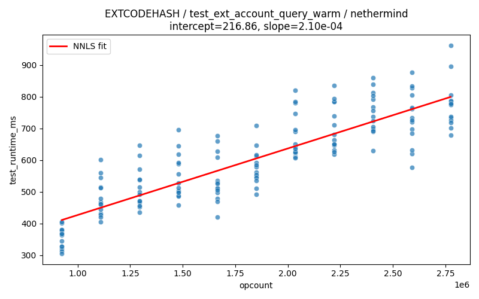

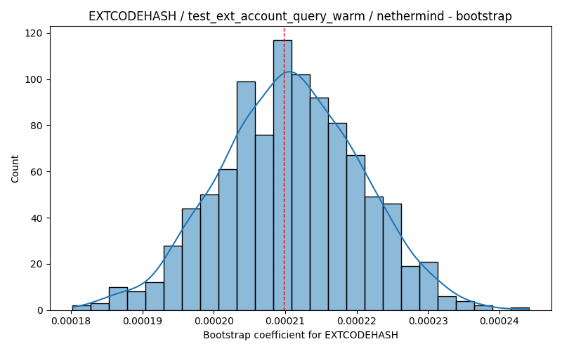

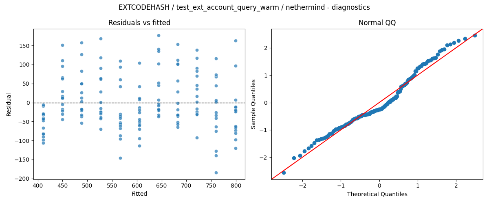

</details>

<details><summary>reth — NNLS regression summary</summary>

```
==============================================================================
                           NNLS Regression Results                            
==============================================================================
Dep. Variable:          test_runtime_ms              R-squared:          0.538
Model:                  NNLS                    Adj. R-squared:          0.536
No. Observations:       209                               RMSE:           7.38
Df Residuals:           207                                MAE:           4.93
Df Model:               1      
==============================================================================
                      coef     std err     P-value      [0.025      0.975]
------------------------------------------------------------------------------
         const     10.2365      1.9554       0.001      6.6800     14.4479
       opcount      0.0000      0.0000       0.001      0.0000      0.0000
==============================================================================
Notes: Non-negative least squares with bootstrap inference (1000 iterations)
==============================================================================
```

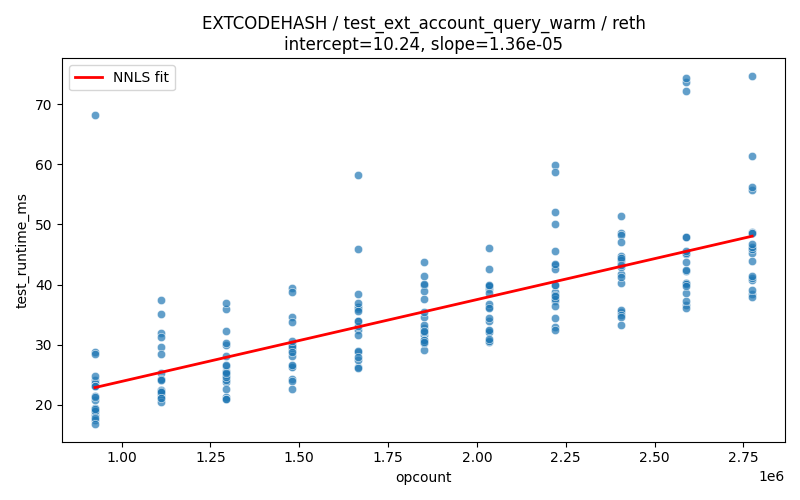

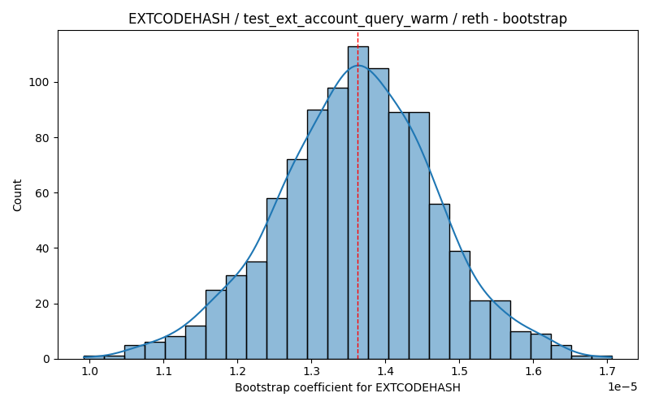

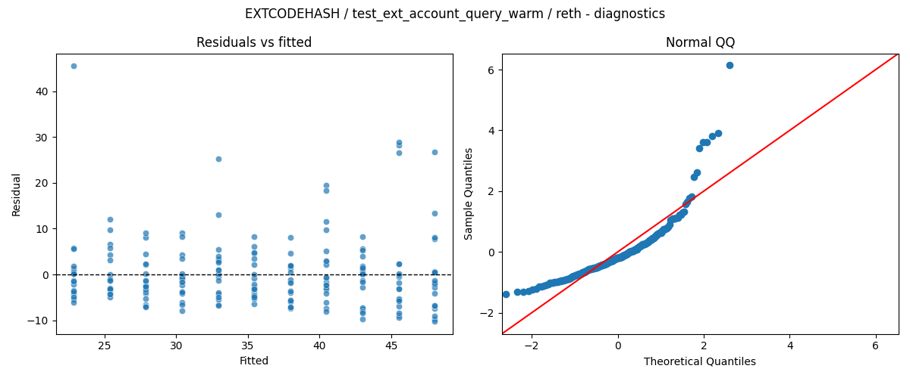

</details>

### test_account_access — combo `EXTCODEHASH_AccountMode.EXISTING_EOA`

| client | nobs | R² | target_coef (ms) | p-value | 95% CI |
| --- | --- | --- | --- | --- | --- |
| `besu` | 110 | 0.9797 | 0.01446 | 1.00e-03 | [0.0141, 0.01486] |
| `erigon` | 88 | 0.9974 | 0.008459 | 1.00e-03 | [0.008387, 0.008488] |
| `geth` | 77 | 0.816 | 0.01813 | 1.00e-03 | [0.01603, 0.01995] |
| `nethermind` | 154 | 0.914 | 0.003394 | 1.00e-03 | [0.00322, 0.003559] |
| `reth` | 209 | 0.9706 | 0.004091 | 1.00e-03 | [0.003992, 0.004184] |

<details><summary>besu — NNLS regression summary</summary>

```
==============================================================================
                           NNLS Regression Results                            
==============================================================================
Dep. Variable:          test_runtime_ms              R-squared:          0.980
Model:                  NNLS                    Adj. R-squared:          0.979
No. Observations:       110                               RMSE:          43.02
Df Residuals:           108                                MAE:          32.95
Df Model:               1      
==============================================================================
                      coef     std err     P-value      [0.025      0.975]
------------------------------------------------------------------------------
         const    458.3038     12.9454       0.001    432.5197    481.6956
       opcount      0.0145      0.0002       0.001      0.0141      0.0149
==============================================================================
Notes: Non-negative least squares with bootstrap inference (1000 iterations)
==============================================================================
```

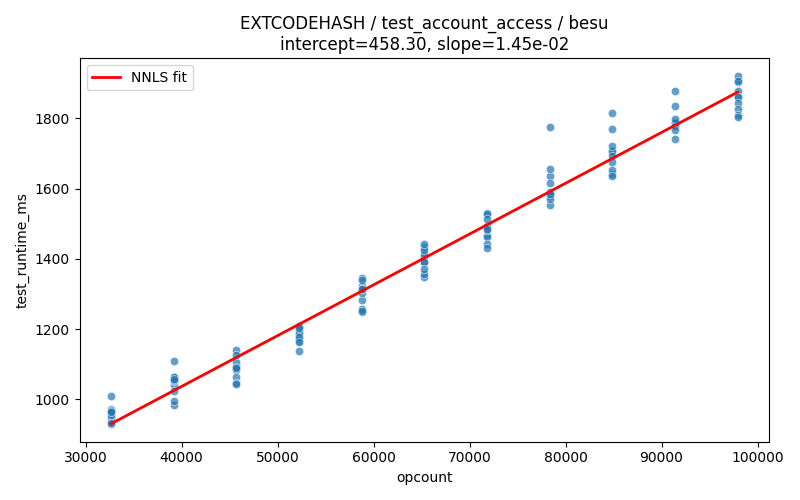

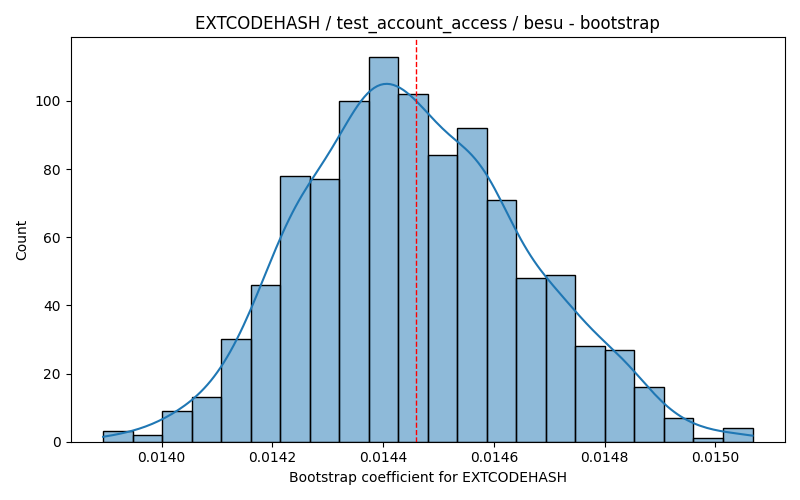

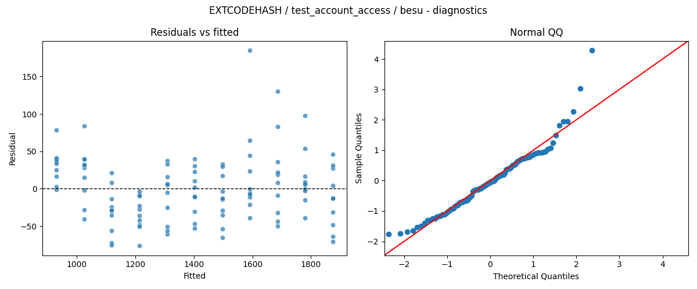

</details>

<details><summary>erigon — NNLS regression summary</summary>

```
==============================================================================
                           NNLS Regression Results                            
==============================================================================
Dep. Variable:          test_runtime_ms              R-squared:          0.997
Model:                  NNLS                    Adj. R-squared:          0.997
No. Observations:       88                                RMSE:           8.86
Df Residuals:           86                                 MAE:           6.90
Df Model:               1      
==============================================================================
                      coef     std err     P-value      [0.025      0.975]
------------------------------------------------------------------------------
         const      0.0000      1.2849       1.000      0.0000      4.2626
       opcount      0.0085      0.0000       0.001      0.0084      0.0085
==============================================================================
Notes: Non-negative least squares with bootstrap inference (1000 iterations)
==============================================================================
```

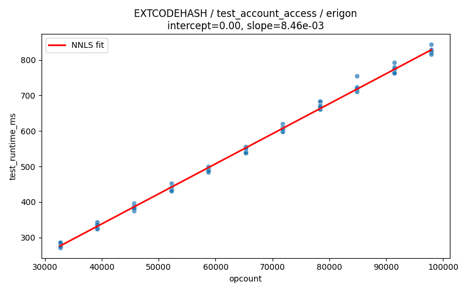

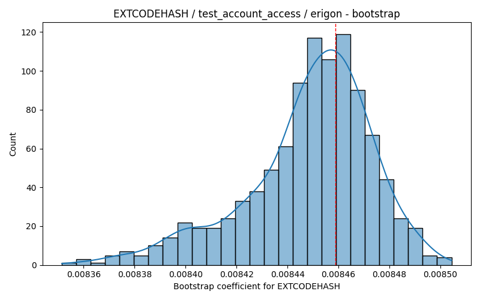

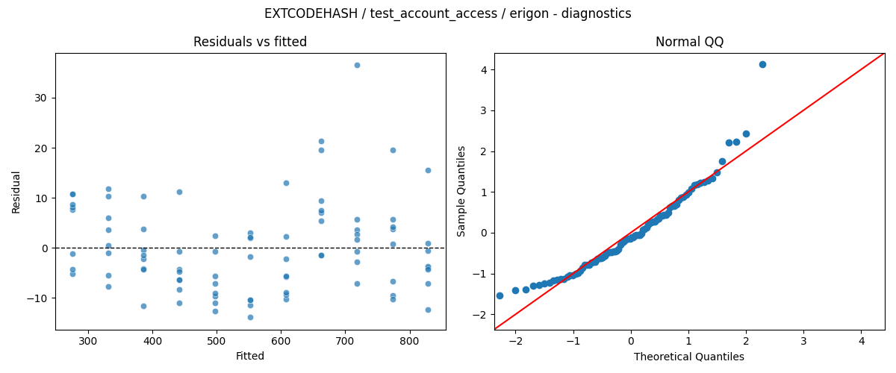

</details>

<details><summary>geth — NNLS regression summary</summary>

```
==============================================================================
                           NNLS Regression Results                            
==============================================================================
Dep. Variable:          test_runtime_ms              R-squared:          0.816
Model:                  NNLS                    Adj. R-squared:          0.814
No. Observations:       77                                RMSE:         177.78
Df Residuals:           75                                 MAE:         117.55
Df Model:               1      
==============================================================================
                      coef     std err     P-value      [0.025      0.975]
------------------------------------------------------------------------------
         const    186.0368     58.0607       0.001     74.9138    306.0421
       opcount      0.0181      0.0010       0.001      0.0160      0.0199
==============================================================================
Notes: Non-negative least squares with bootstrap inference (1000 iterations)
==============================================================================
```

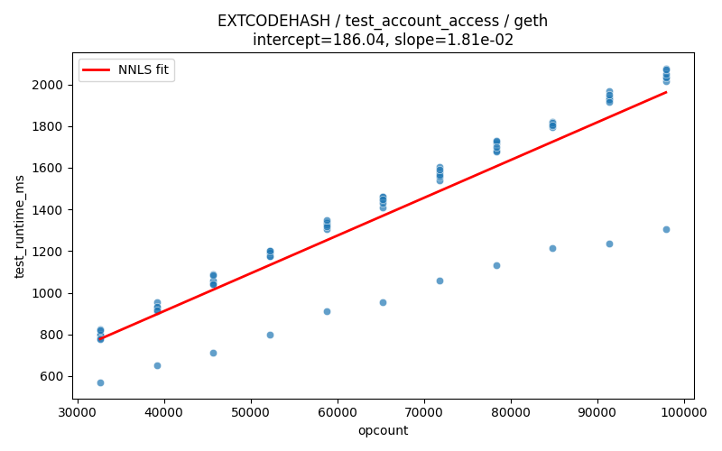

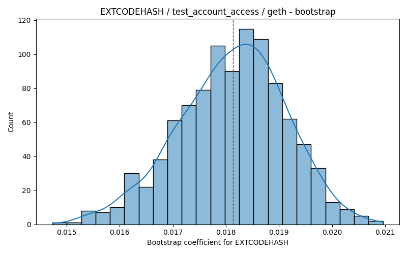

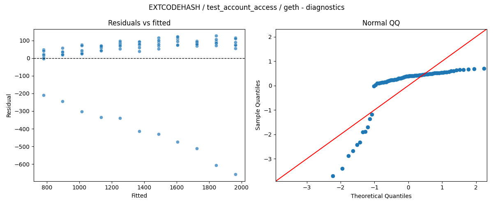

</details>

<details><summary>nethermind — NNLS regression summary</summary>

```
==============================================================================
                           NNLS Regression Results                            
==============================================================================
Dep. Variable:          test_runtime_ms              R-squared:          0.914
Model:                  NNLS                    Adj. R-squared:          0.913
No. Observations:       154                               RMSE:          21.50
Df Residuals:           152                                MAE:          17.97
Df Model:               1      
==============================================================================
                      coef     std err     P-value      [0.025      0.975]
------------------------------------------------------------------------------
         const     95.0937      5.7900       0.001     83.5141    106.6028
       opcount      0.0034      0.0001       0.001      0.0032      0.0036
==============================================================================
Notes: Non-negative least squares with bootstrap inference (1000 iterations)
==============================================================================
```

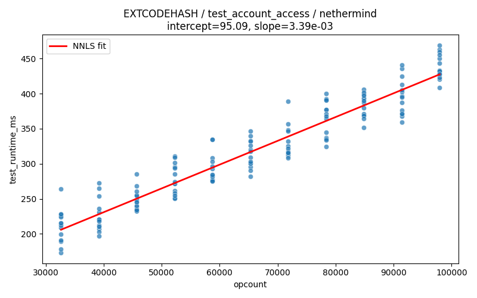

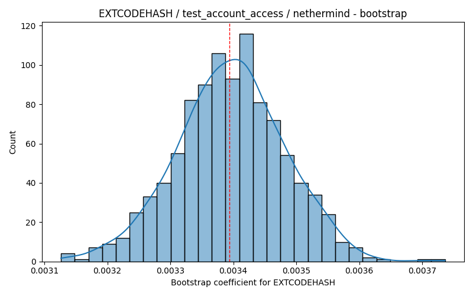

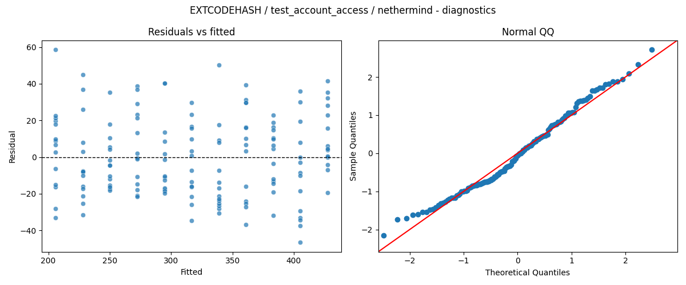

</details>

<details><summary>reth — NNLS regression summary</summary>

```
==============================================================================
                           NNLS Regression Results                            
==============================================================================
Dep. Variable:          test_runtime_ms              R-squared:          0.971
Model:                  NNLS                    Adj. R-squared:          0.970
No. Observations:       209                               RMSE:          14.71
Df Residuals:           207                                MAE:          11.38
Df Model:               1      
==============================================================================
                      coef     std err     P-value      [0.025      0.975]
------------------------------------------------------------------------------
         const     95.2697      2.9649       0.001     89.6767    101.2821
       opcount      0.0041      0.0000       0.001      0.0040      0.0042
==============================================================================
Notes: Non-negative least squares with bootstrap inference (1000 iterations)
==============================================================================
```


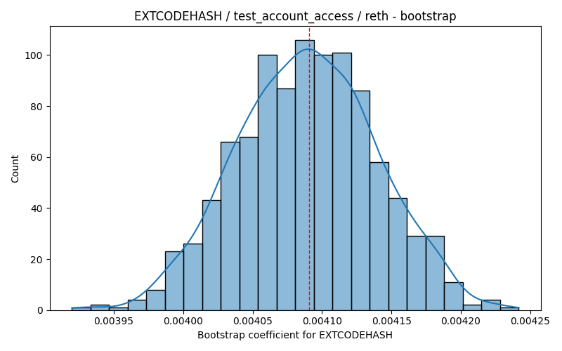

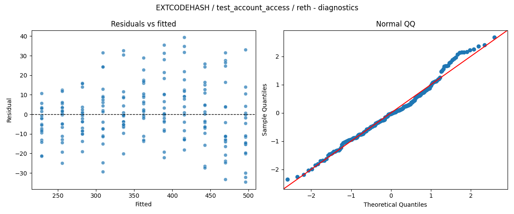

</details>

### test_account_access — combo `EXTCODEHASH_AccountMode.NON_EXISTING_ACCOUNT`

| client | nobs | R² | target_coef (ms) | p-value | 95% CI |
| --- | --- | --- | --- | --- | --- |
| `besu` | 110 | 0.9872 | 0.01452 | 1.00e-03 | [0.01423, 0.01481] |
| `erigon` | 88 | 0.9967 | 0.007865 | 1.00e-03 | [0.007835, 0.007895] |
| `geth` | 77 | 0.9302 | 0.01912 | 1.00e-03 | [0.01807, 0.0203] |
| `nethermind` | 154 | 0.8983 | 0.003194 | 1.00e-03 | [0.003025, 0.003404] |
| `reth` | 209 | 0.9654 | 0.003968 | 1.00e-03 | [0.003871, 0.004072] |

<details><summary>besu — NNLS regression summary</summary>

```
==============================================================================
                           NNLS Regression Results                            
==============================================================================
Dep. Variable:          test_runtime_ms              R-squared:          0.987
Model:                  NNLS                    Adj. R-squared:          0.987
No. Observations:       110                               RMSE:          34.17
Df Residuals:           108                                MAE:          26.50
Df Model:               1      
==============================================================================
                      coef     std err     P-value      [0.025      0.975]
------------------------------------------------------------------------------
         const    134.9337      9.7278       0.001    116.4492    153.2989
       opcount      0.0145      0.0002       0.001      0.0142      0.0148
==============================================================================
Notes: Non-negative least squares with bootstrap inference (1000 iterations)
==============================================================================
```

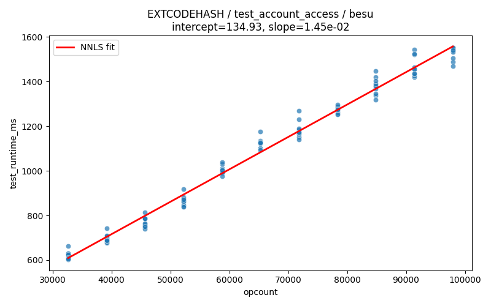

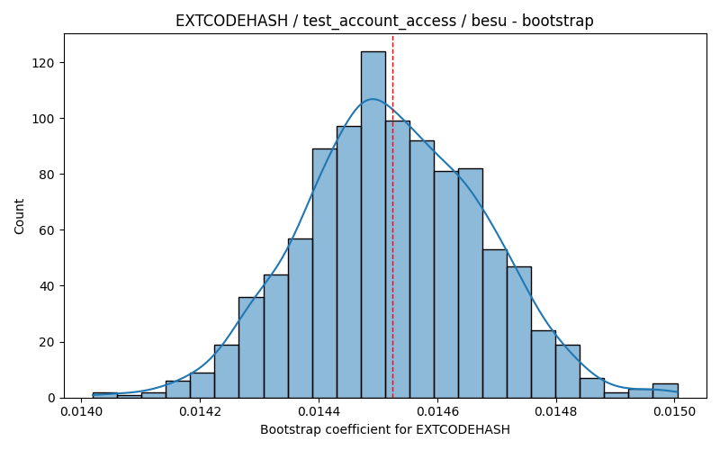

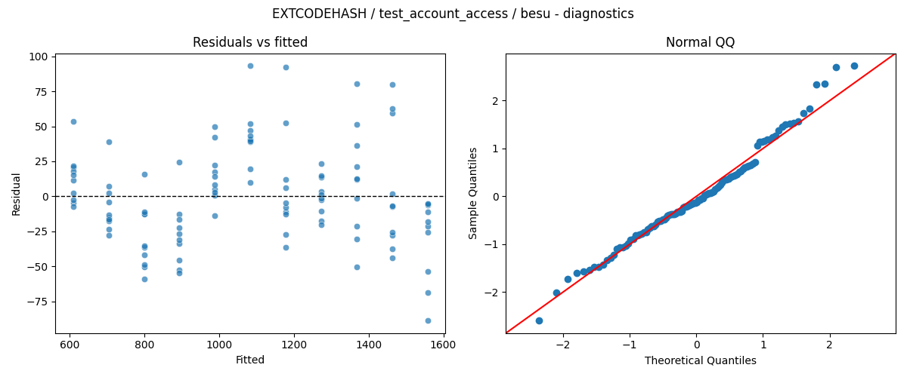

</details>

<details><summary>erigon — NNLS regression summary</summary>

```
==============================================================================
                           NNLS Regression Results                            
==============================================================================
Dep. Variable:          test_runtime_ms              R-squared:          0.997
Model:                  NNLS                    Adj. R-squared:          0.997
No. Observations:       88                                RMSE:           9.43
Df Residuals:           86                                 MAE:           7.40
Df Model:               1      
==============================================================================
                      coef     std err     P-value      [0.025      0.975]
------------------------------------------------------------------------------
         const      0.0000      0.1799       1.000      0.0000      0.0000
       opcount      0.0079      0.0000       0.001      0.0078      0.0079
==============================================================================
Notes: Non-negative least squares with bootstrap inference (1000 iterations)
==============================================================================
```

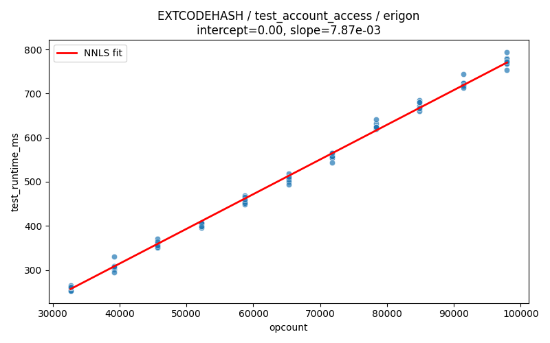

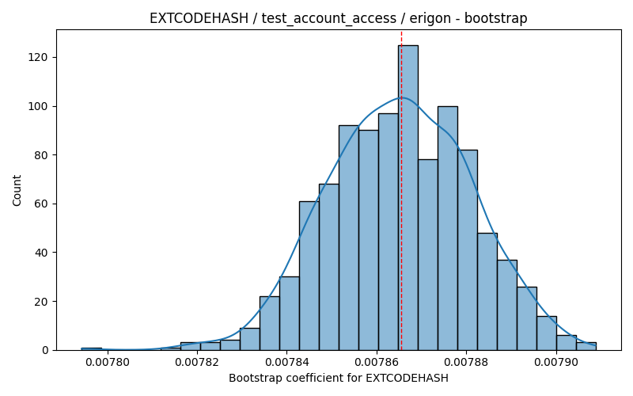

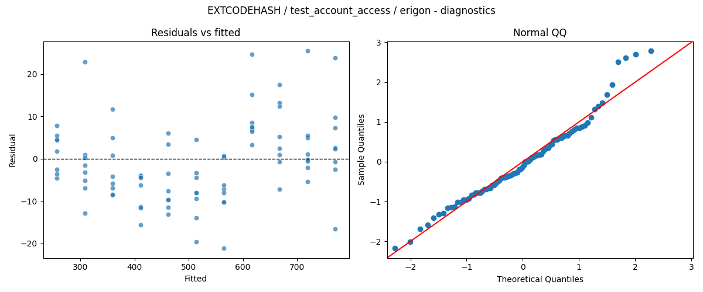

</details>

<details><summary>geth — NNLS regression summary</summary>

```
==============================================================================
                           NNLS Regression Results                            
==============================================================================
Dep. Variable:          test_runtime_ms              R-squared:          0.930
Model:                  NNLS                    Adj. R-squared:          0.929
No. Observations:       77                                RMSE:         108.13
Df Residuals:           75                                 MAE:          72.02
Df Model:               1      
==============================================================================
                      coef     std err     P-value      [0.025      0.975]
------------------------------------------------------------------------------
         const    192.7978     33.3661       0.001    124.7525    260.7221
       opcount      0.0191      0.0006       0.001      0.0181      0.0203
==============================================================================
Notes: Non-negative least squares with bootstrap inference (1000 iterations)
==============================================================================
```

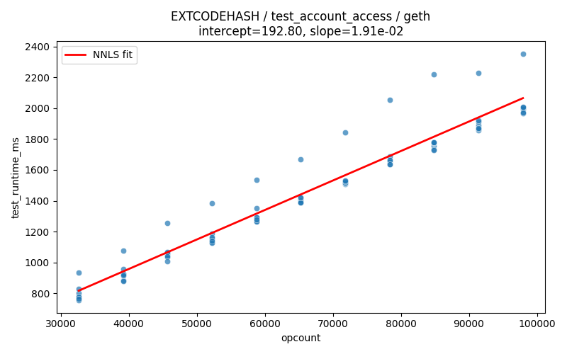

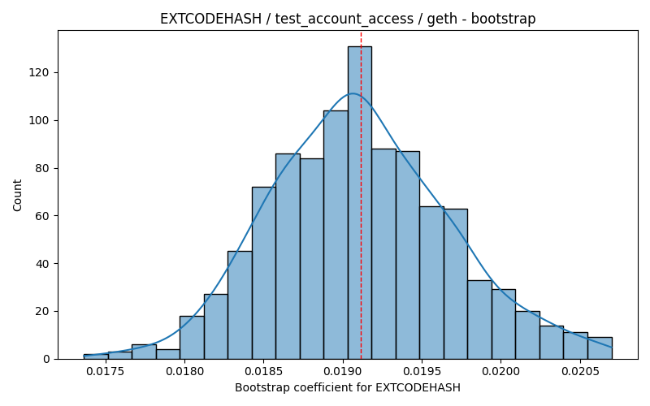

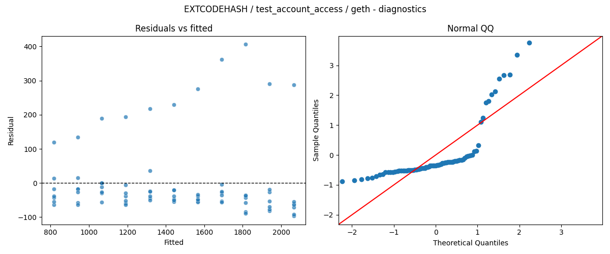

</details>

<details><summary>nethermind — NNLS regression summary</summary>

```
==============================================================================
                           NNLS Regression Results                            
==============================================================================
Dep. Variable:          test_runtime_ms              R-squared:          0.898
Model:                  NNLS                    Adj. R-squared:          0.898
No. Observations:       154                               RMSE:          22.19
Df Residuals:           152                                MAE:          17.99
Df Model:               1      
==============================================================================
                      coef     std err     P-value      [0.025      0.975]
------------------------------------------------------------------------------
         const     68.9042      5.8875       0.001     56.1896     79.4898
       opcount      0.0032      0.0001       0.001      0.0030      0.0034
==============================================================================
Notes: Non-negative least squares with bootstrap inference (1000 iterations)
==============================================================================
```

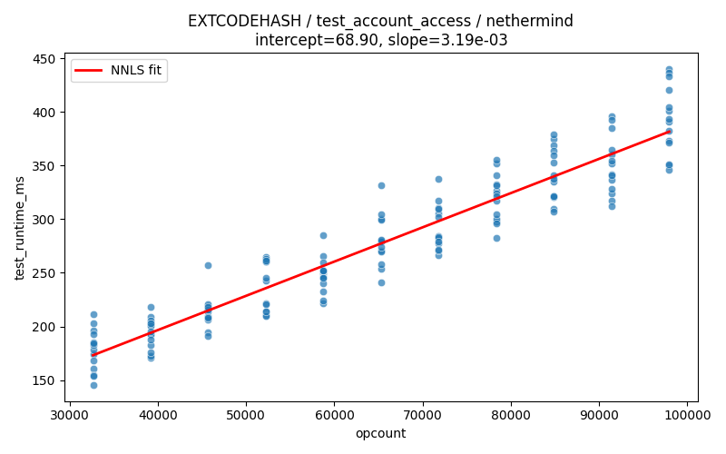

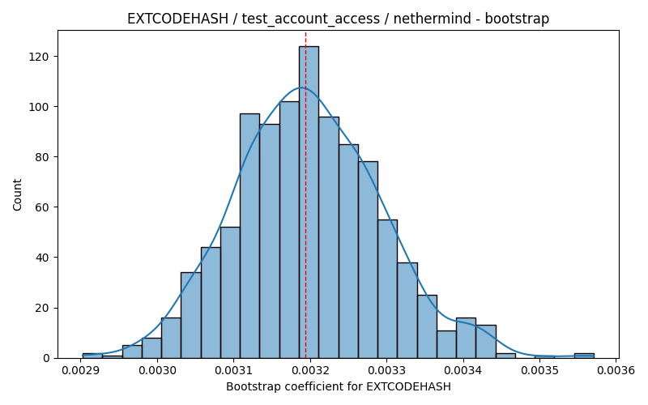

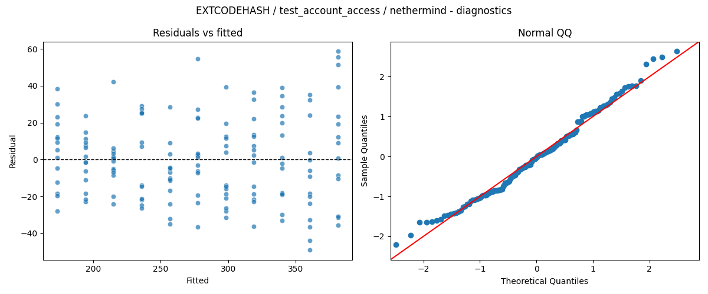

</details>

<details><summary>reth — NNLS regression summary</summary>

```
==============================================================================
                           NNLS Regression Results                            
==============================================================================
Dep. Variable:          test_runtime_ms              R-squared:          0.965
Model:                  NNLS                    Adj. R-squared:          0.965
No. Observations:       209                               RMSE:          15.52
Df Residuals:           207                                MAE:          11.88
Df Model:               1      
==============================================================================
                      coef     std err     P-value      [0.025      0.975]
------------------------------------------------------------------------------
         const    101.3065      3.1822       0.001     94.8263    107.4526
       opcount      0.0040      0.0001       0.001      0.0039      0.0041
==============================================================================
Notes: Non-negative least squares with bootstrap inference (1000 iterations)
==============================================================================
```

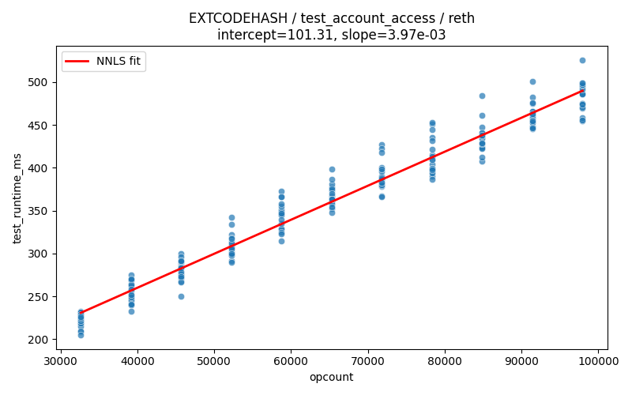

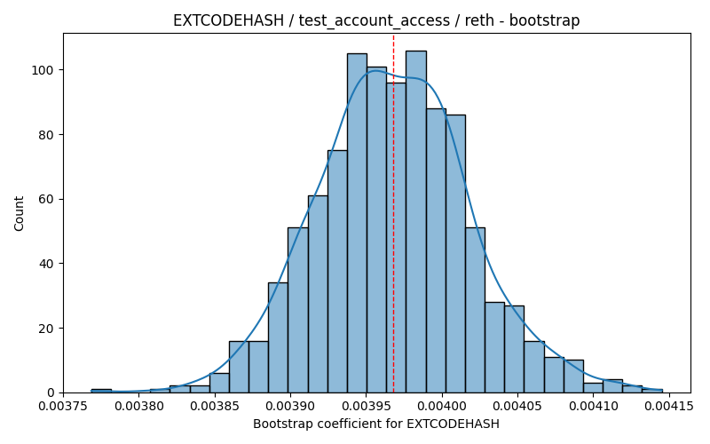

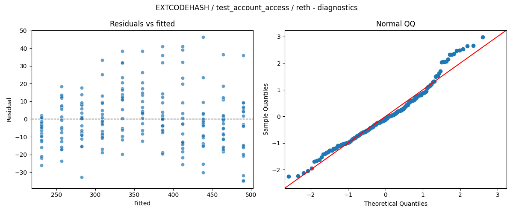

</details>

### test_account_access — combo `EXTCODEHASH_AccountMode.EXISTING_CONTRACT_DIFF_MAX`

| client | nobs | R² | target_coef (ms) | p-value | 95% CI |
| --- | --- | --- | --- | --- | --- |
| `besu` | 110 | 0.9836 | 0.01973 | 1.00e-03 | [0.01929, 0.02022] |
| `erigon` | 88 | 0.9943 | 0.008983 | 1.00e-03 | [0.008857, 0.00911] |
| `geth` | 77 | 0.9484 | 0.003485 | 1.00e-03 | [0.003334, 0.003544] |
| `nethermind` | 154 | 0.7776 | 0.002134 | 1.00e-03 | [0.001971, 0.002318] |
| `reth` | 209 | 0.9961 | 0.01844 | 1.00e-03 | [0.01828, 0.0186] |

<details><summary>besu — NNLS regression summary</summary>

```
==============================================================================
                           NNLS Regression Results                            
==============================================================================
Dep. Variable:          test_runtime_ms              R-squared:          0.984
Model:                  NNLS                    Adj. R-squared:          0.983
No. Observations:       110                               RMSE:          51.80
Df Residuals:           108                                MAE:          39.88
Df Model:               1      
==============================================================================
                      coef     std err     P-value      [0.025      0.975]
------------------------------------------------------------------------------
         const    408.0029     14.9959       0.001    378.0810    436.1748
       opcount      0.0197      0.0002       0.001      0.0193      0.0202
==============================================================================
Notes: Non-negative least squares with bootstrap inference (1000 iterations)
==============================================================================
```

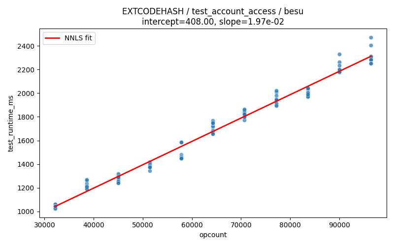

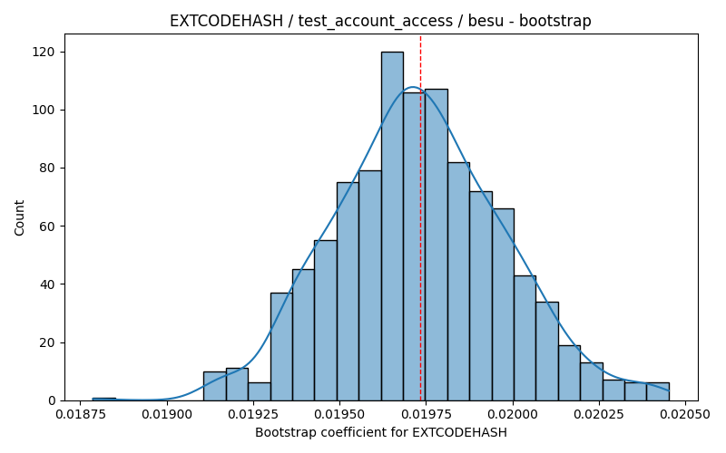

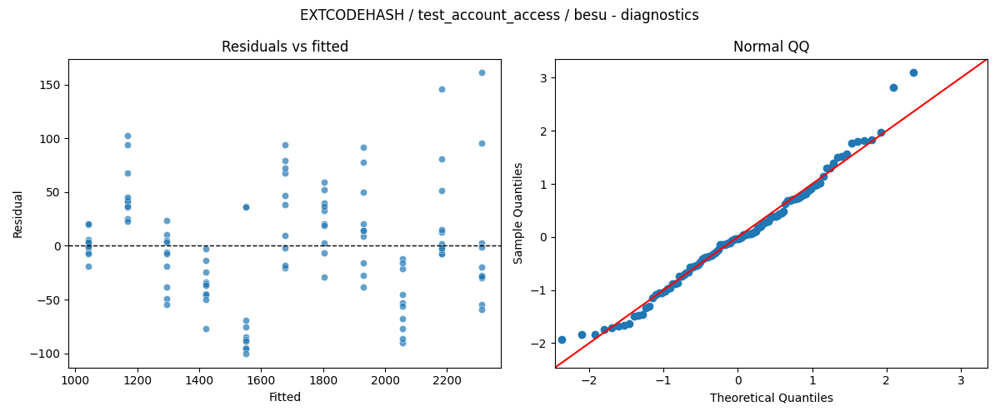

</details>

<details><summary>erigon — NNLS regression summary</summary>

```
==============================================================================
                           NNLS Regression Results                            
==============================================================================
Dep. Variable:          test_runtime_ms              R-squared:          0.994
Model:                  NNLS                    Adj. R-squared:          0.994
No. Observations:       88                                RMSE:          13.82
Df Residuals:           86                                 MAE:           9.98
Df Model:               1      
==============================================================================
                      coef     std err     P-value      [0.025      0.975]
------------------------------------------------------------------------------
         const     94.3952      5.3512       0.001     84.4991    104.7892
       opcount      0.0090      0.0001       0.001      0.0089      0.0091
==============================================================================
Notes: Non-negative least squares with bootstrap inference (1000 iterations)
==============================================================================
```

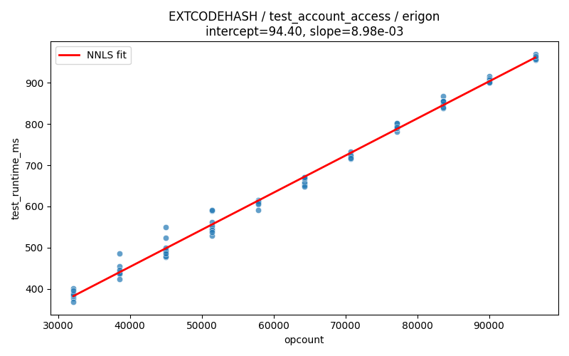

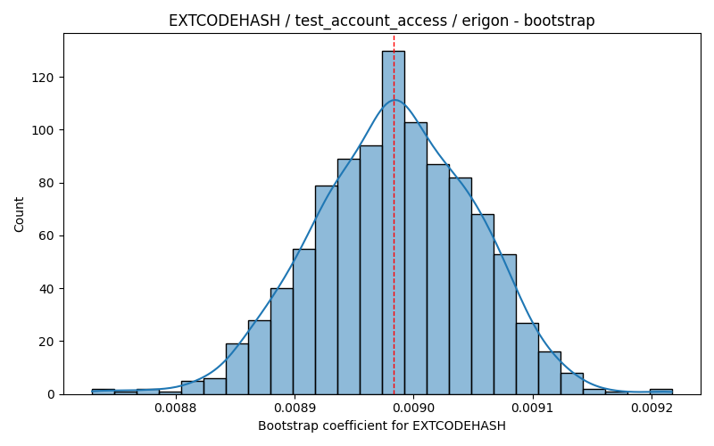

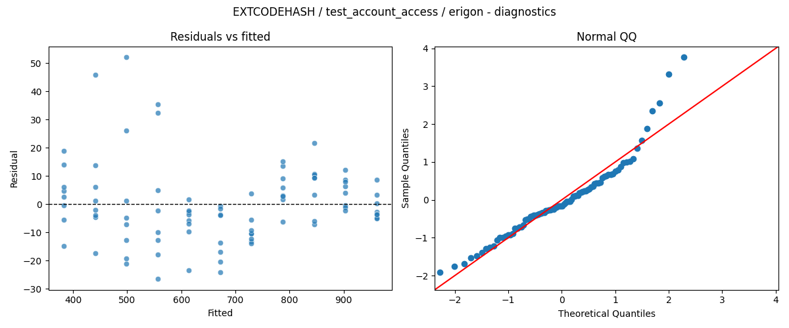

</details>

<details><summary>geth — NNLS regression summary</summary>

```
==============================================================================
                           NNLS Regression Results                            
==============================================================================
Dep. Variable:          test_runtime_ms              R-squared:          0.948
Model:                  NNLS                    Adj. R-squared:          0.948
No. Observations:       77                                RMSE:          16.75
Df Residuals:           75                                 MAE:          13.43
Df Model:               1      
==============================================================================
                      coef     std err     P-value      [0.025      0.975]
------------------------------------------------------------------------------
         const      0.0000      2.6794       1.000      0.0000      9.1425
       opcount      0.0035      0.0001       0.001      0.0033      0.0035
==============================================================================
Notes: Non-negative least squares with bootstrap inference (1000 iterations)
==============================================================================
```

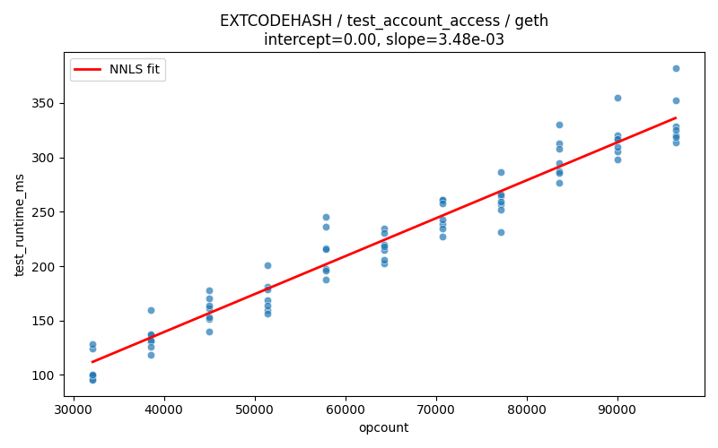

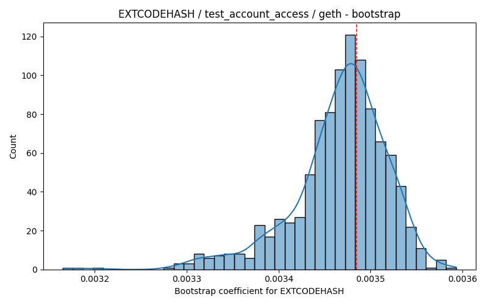

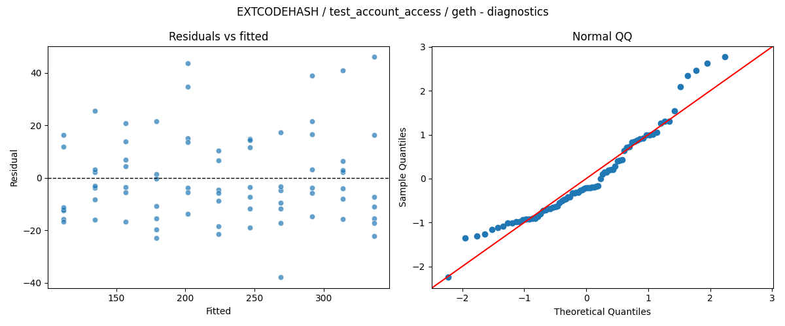

</details>

<details><summary>nethermind — NNLS regression summary</summary>

```
==============================================================================
                           NNLS Regression Results                            
==============================================================================
Dep. Variable:          test_runtime_ms              R-squared:          0.778
Model:                  NNLS                    Adj. R-squared:          0.776
No. Observations:       154                               RMSE:          23.20
Df Residuals:           152                                MAE:          18.17
Df Model:               1      
==============================================================================
                      coef     std err     P-value      [0.025      0.975]
------------------------------------------------------------------------------
         const     94.9245      5.3805       0.001     83.9805    104.7013
       opcount      0.0021      0.0001       0.001      0.0020      0.0023
==============================================================================
Notes: Non-negative least squares with bootstrap inference (1000 iterations)
==============================================================================
```

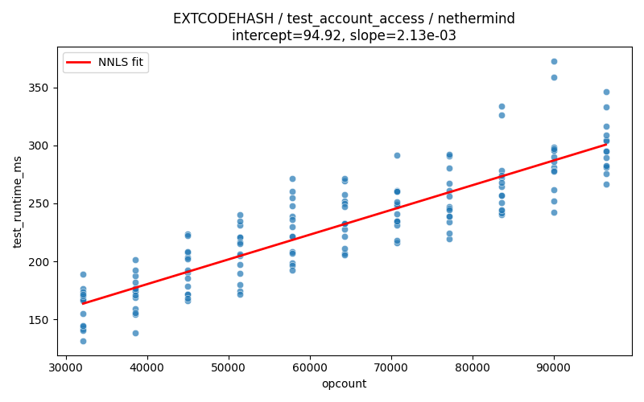

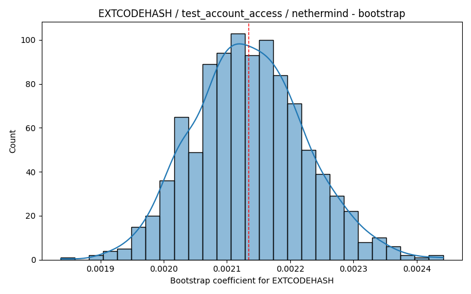

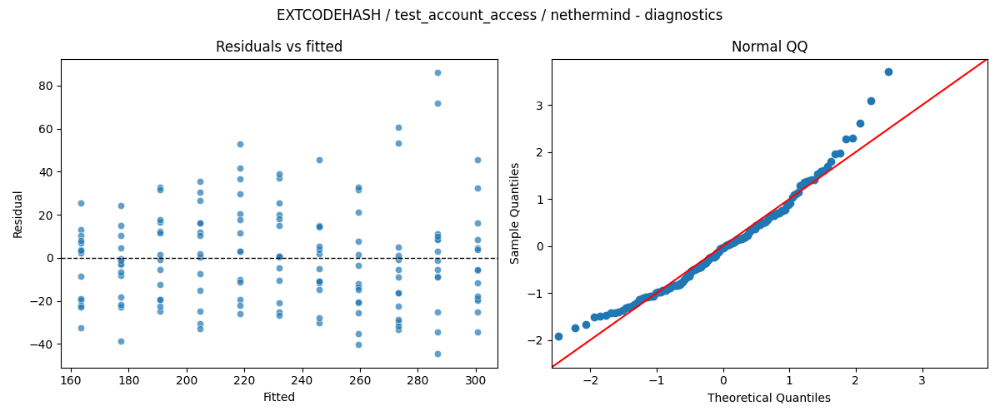

</details>

<details><summary>reth — NNLS regression summary</summary>

```
==============================================================================
                           NNLS Regression Results                            
==============================================================================
Dep. Variable:          test_runtime_ms              R-squared:          0.996
Model:                  NNLS                    Adj. R-squared:          0.996
No. Observations:       209                               RMSE:          23.50
Df Residuals:           207                                MAE:          15.26
Df Model:               1      
==============================================================================
                      coef     std err     P-value      [0.025      0.975]
------------------------------------------------------------------------------
         const    144.9629      4.8714       0.001    135.1902    154.9033
       opcount      0.0184      0.0001       0.001      0.0183      0.0186
==============================================================================
Notes: Non-negative least squares with bootstrap inference (1000 iterations)
==============================================================================
```

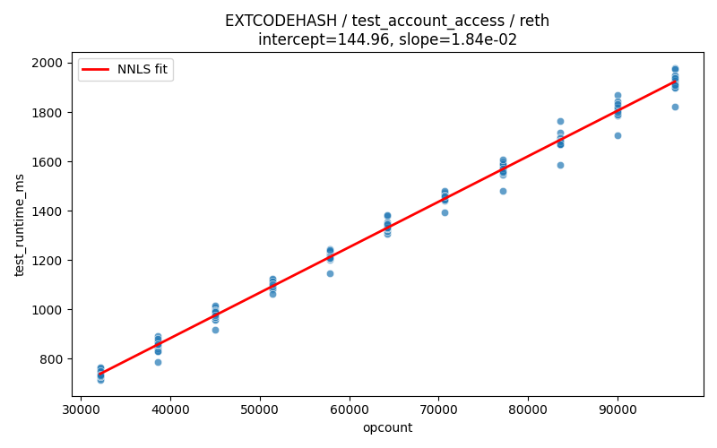

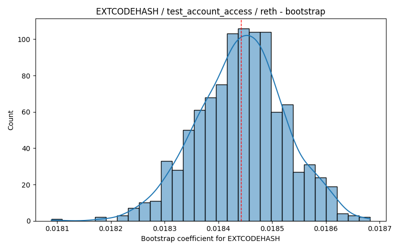

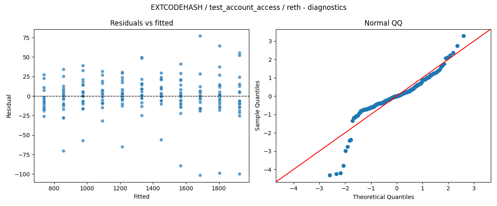

</details>

### test_account_access — combo `EXTCODEHASH_AccountMode.EXISTING_CONTRACT_MINIMAL`

| client | nobs | R² | target_coef (ms) | p-value | 95% CI |
| --- | --- | --- | --- | --- | --- |
| `besu` | 110 | 0.9747 | 0.01205 | 1.00e-03 | [0.01162, 0.01244] |
| `erigon` | 88 | 0.9921 | 0.008478 | 1.00e-03 | [0.008321, 0.008629] |
| `geth` | 77 | 0.4691 | 0.01633 | 1.00e-03 | [0.01187, 0.01933] |
| `nethermind` | 154 | 0.7595 | 0.00173 | 1.00e-03 | [0.001595, 0.001891] |
| `reth` | 209 | 0.9609 | 0.003876 | 1.00e-03 | [0.003771, 0.00398] |

<details><summary>besu — NNLS regression summary</summary>

```
==============================================================================
                           NNLS Regression Results                            
==============================================================================
Dep. Variable:          test_runtime_ms              R-squared:          0.975
Model:                  NNLS                    Adj. R-squared:          0.975
No. Observations:       110                               RMSE:          39.42
Df Residuals:           108                                MAE:          31.29
Df Model:               1      
==============================================================================
                      coef     std err     P-value      [0.025      0.975]
------------------------------------------------------------------------------
         const    365.2528     13.1189       0.001    342.0818    392.6054
       opcount      0.0120      0.0002       0.001      0.0116      0.0124
==============================================================================
Notes: Non-negative least squares with bootstrap inference (1000 iterations)
==============================================================================
```

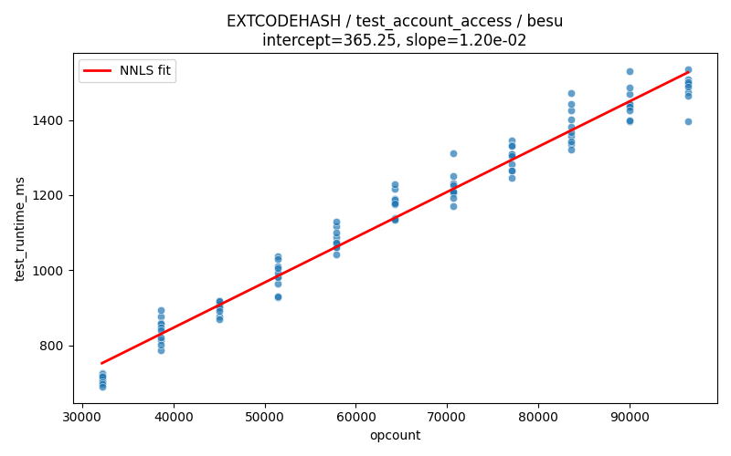

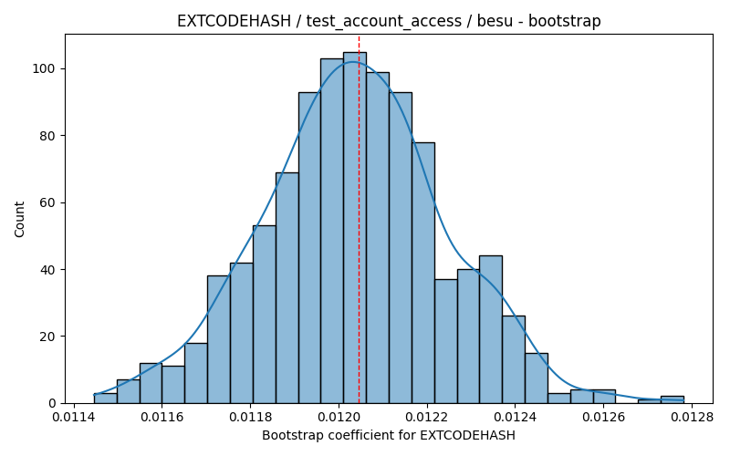

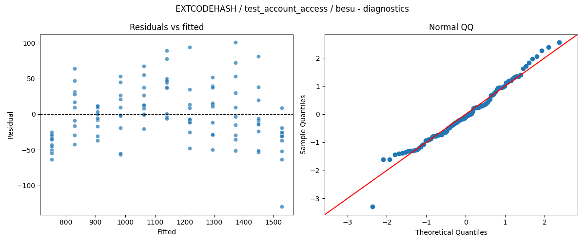

</details>

<details><summary>erigon — NNLS regression summary</summary>

```
==============================================================================
                           NNLS Regression Results                            
==============================================================================
Dep. Variable:          test_runtime_ms              R-squared:          0.992
Model:                  NNLS                    Adj. R-squared:          0.992
No. Observations:       88                                RMSE:          15.36
Df Residuals:           86                                 MAE:          11.55
Df Model:               1      
==============================================================================
                      coef     std err     P-value      [0.025      0.975]
------------------------------------------------------------------------------
         const     81.5878      4.9135       0.001     71.8917     91.2551
       opcount      0.0085      0.0001       0.001      0.0083      0.0086
==============================================================================
Notes: Non-negative least squares with bootstrap inference (1000 iterations)
==============================================================================
```

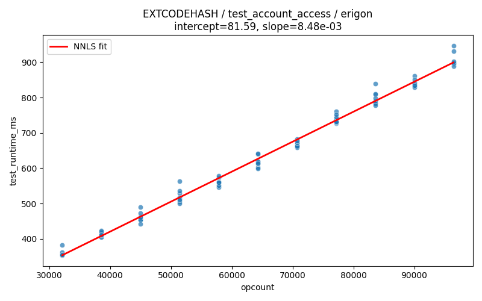

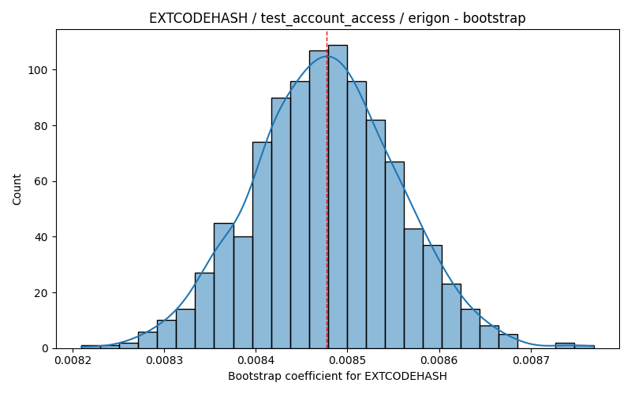

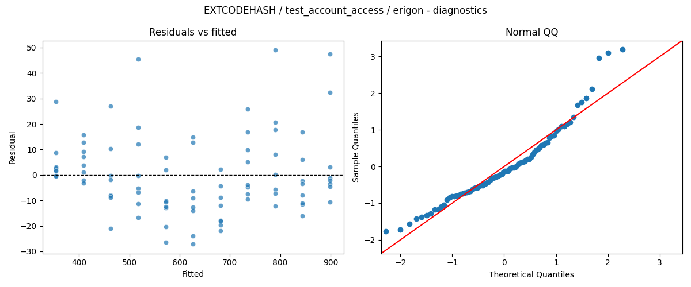

</details>

<details><summary>geth — NNLS regression summary</summary>

```
==============================================================================
                           NNLS Regression Results                            
==============================================================================
Dep. Variable:          test_runtime_ms              R-squared:          0.469
Model:                  NNLS                    Adj. R-squared:          0.462
No. Observations:       77                                RMSE:         353.25
Df Residuals:           75                                 MAE:         236.65
Df Model:               1      
==============================================================================
                      coef     std err     P-value      [0.025      0.975]
------------------------------------------------------------------------------
         const    155.3166    107.5322       0.073      0.0000    397.3073
       opcount      0.0163      0.0019       0.001      0.0119      0.0193
==============================================================================
Notes: Non-negative least squares with bootstrap inference (1000 iterations)
==============================================================================
```

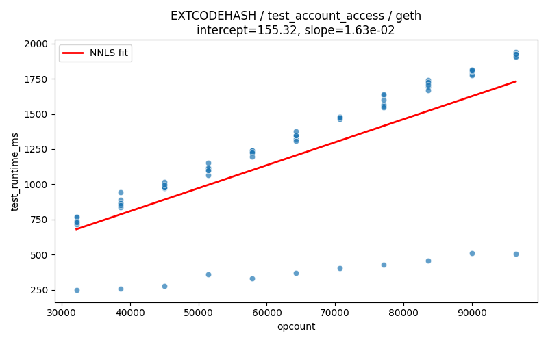

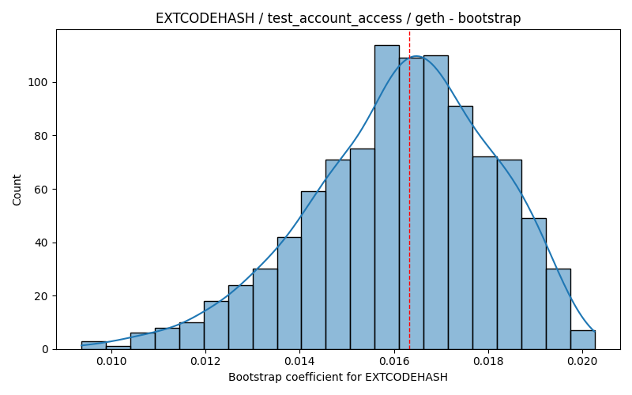


</details>

<details><summary>nethermind — NNLS regression summary</summary>

```
==============================================================================
                           NNLS Regression Results                            
==============================================================================
Dep. Variable:          test_runtime_ms              R-squared:          0.760
Model:                  NNLS                    Adj. R-squared:          0.758
No. Observations:       154                               RMSE:          19.79
Df Residuals:           152                                MAE:          15.25
Df Model:               1      
==============================================================================
                      coef     std err     P-value      [0.025      0.975]
------------------------------------------------------------------------------
         const    118.2285      4.3640       0.001    109.2166    126.6797
       opcount      0.0017      0.0001       0.001      0.0016      0.0019
==============================================================================
Notes: Non-negative least squares with bootstrap inference (1000 iterations)
==============================================================================
```

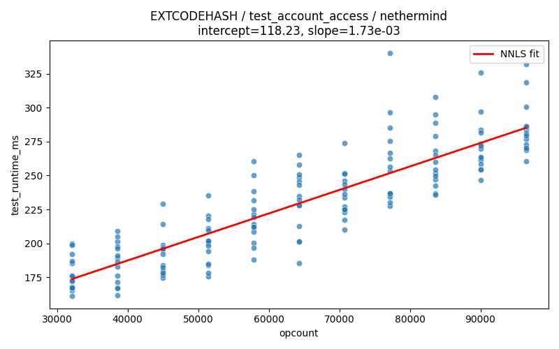

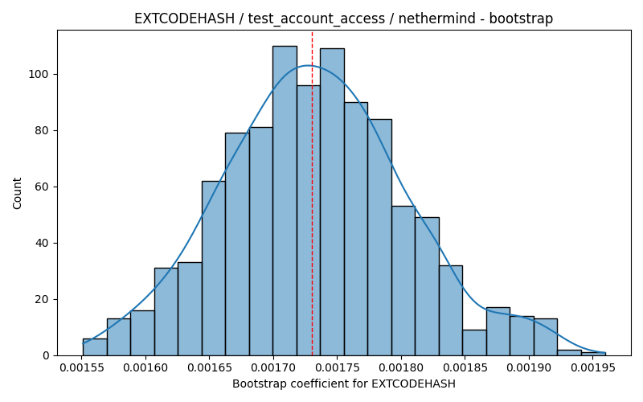

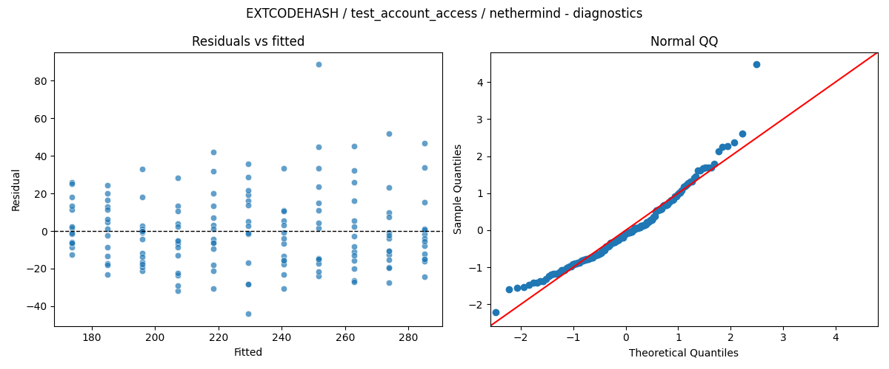

</details>

<details><summary>reth — NNLS regression summary</summary>

```
==============================================================================
                           NNLS Regression Results                            
==============================================================================
Dep. Variable:          test_runtime_ms              R-squared:          0.961
Model:                  NNLS                    Adj. R-squared:          0.961
No. Observations:       209                               RMSE:          15.90
Df Residuals:           207                                MAE:          12.57
Df Model:               1      
==============================================================================
                      coef     std err     P-value      [0.025      0.975]
------------------------------------------------------------------------------
         const     86.8174      3.3152       0.001     80.5870     93.4799
       opcount      0.0039      0.0001       0.001      0.0038      0.0040
==============================================================================
Notes: Non-negative least squares with bootstrap inference (1000 iterations)
==============================================================================
```


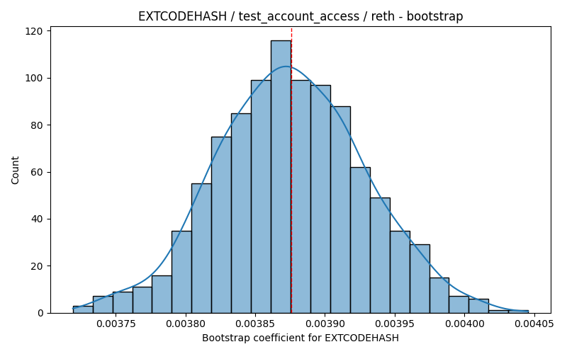


</details>

### test_account_access — combo `EXTCODEHASH_AccountMode.EXISTING_CONTRACT_SAME_MAX`

| client | nobs | R² | target_coef (ms) | p-value | 95% CI |
| --- | --- | --- | --- | --- | --- |
| `besu` | 110 | 0.9688 | 0.01071 | 1.00e-03 | [0.01029, 0.01109] |
| `erigon` | 88 | 0.9901 | 0.008339 | 1.00e-03 | [0.00818, 0.008498] |
| `geth` | 77 | 0.4623 | 0.01585 | 1.00e-03 | [0.01193, 0.01919] |
| `nethermind` | 154 | 0.7578 | 0.002073 | 1.00e-03 | [0.001875, 0.002262] |
| `reth` | 209 | 0.968 | 0.003846 | 1.00e-03 | [0.003749, 0.003938] |

<details><summary>besu — NNLS regression summary</summary>

```
==============================================================================
                           NNLS Regression Results                            
==============================================================================
Dep. Variable:          test_runtime_ms              R-squared:          0.969
Model:                  NNLS                    Adj. R-squared:          0.969
No. Observations:       110                               RMSE:          39.06
Df Residuals:           108                                MAE:          31.86
Df Model:               1      
==============================================================================
                      coef     std err     P-value      [0.025      0.975]
------------------------------------------------------------------------------
         const    407.4792     12.4095       0.001    384.8791    433.4620
       opcount      0.0107      0.0002       0.001      0.0103      0.0111
==============================================================================
Notes: Non-negative least squares with bootstrap inference (1000 iterations)
==============================================================================
```

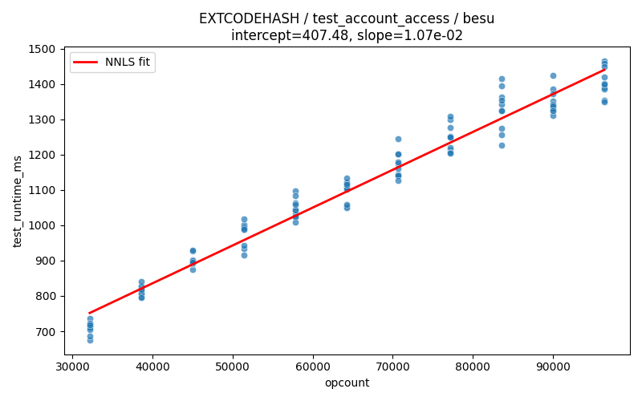

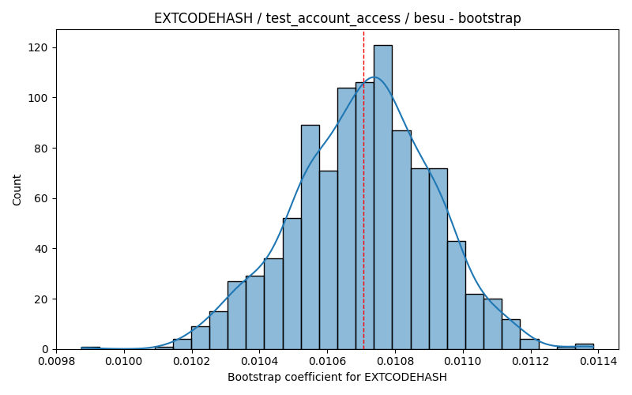

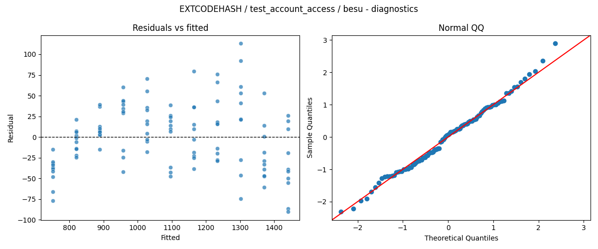

</details>

<details><summary>erigon — NNLS regression summary</summary>

```
==============================================================================
                           NNLS Regression Results                            
==============================================================================
Dep. Variable:          test_runtime_ms              R-squared:          0.990
Model:                  NNLS                    Adj. R-squared:          0.990
No. Observations:       88                                RMSE:          16.93
Df Residuals:           86                                 MAE:          12.59
Df Model:               1      
==============================================================================
                      coef     std err     P-value      [0.025      0.975]
------------------------------------------------------------------------------
         const     91.0688      5.6776       0.001     79.5194    101.3555
       opcount      0.0083      0.0001       0.001      0.0082      0.0085
==============================================================================
Notes: Non-negative least squares with bootstrap inference (1000 iterations)
==============================================================================
```


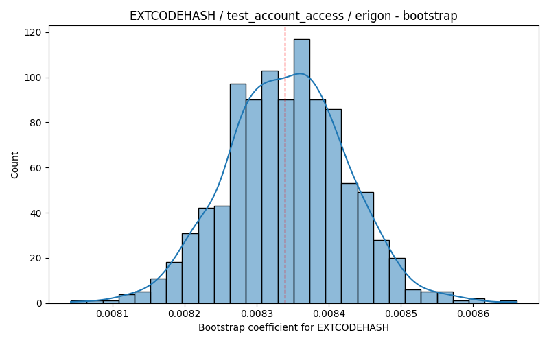

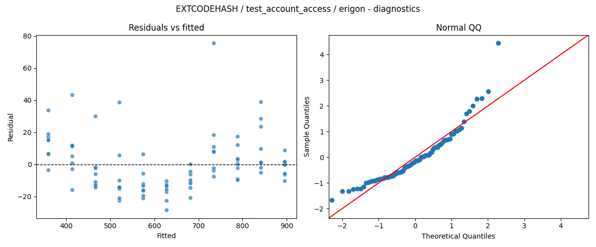

</details>

<details><summary>geth — NNLS regression summary</summary>

```
==============================================================================
                           NNLS Regression Results                            
==============================================================================
Dep. Variable:          test_runtime_ms              R-squared:          0.462
Model:                  NNLS                    Adj. R-squared:          0.455
No. Observations:       77                                RMSE:         347.61
Df Residuals:           75                                 MAE:         234.32
Df Model:               1      
==============================================================================
                      coef     std err     P-value      [0.025      0.975]
------------------------------------------------------------------------------
         const    184.4118    108.7794       0.057      0.0000    401.8588
       opcount      0.0159      0.0019       0.001      0.0119      0.0192
==============================================================================
Notes: Non-negative least squares with bootstrap inference (1000 iterations)
==============================================================================
```

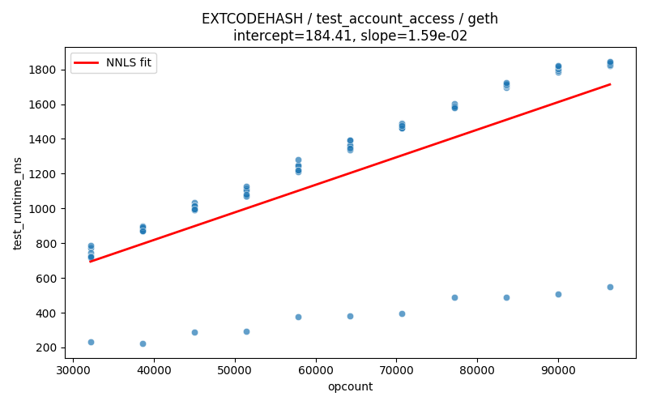

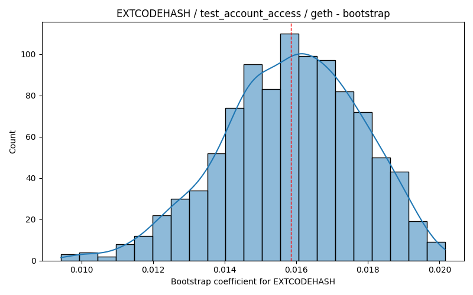


</details>

<details><summary>nethermind — NNLS regression summary</summary>

```
==============================================================================
                           NNLS Regression Results                            
==============================================================================
Dep. Variable:          test_runtime_ms              R-squared:          0.758
Model:                  NNLS                    Adj. R-squared:          0.756
No. Observations:       154                               RMSE:          23.83
Df Residuals:           152                                MAE:          18.88
Df Model:               1      
==============================================================================
                      coef     std err     P-value      [0.025      0.975]
------------------------------------------------------------------------------
         const     97.6664      6.3025       0.001     86.1559    110.6591
       opcount      0.0021      0.0001       0.001      0.0019      0.0023
==============================================================================
Notes: Non-negative least squares with bootstrap inference (1000 iterations)
==============================================================================
```

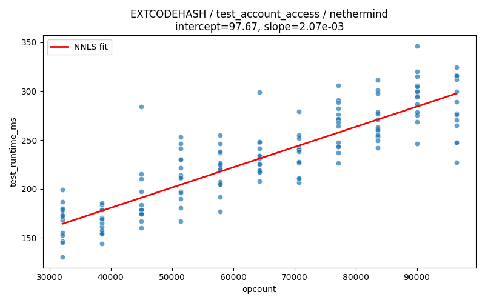

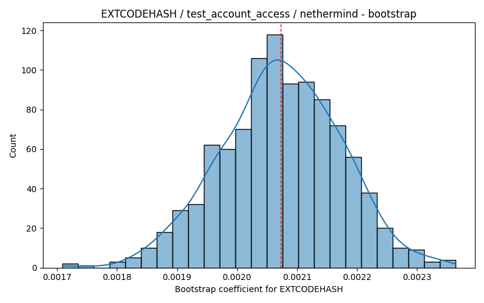

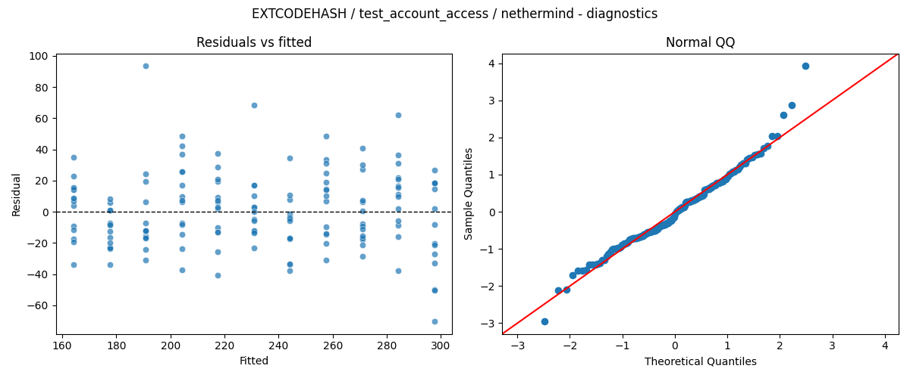

</details>

<details><summary>reth — NNLS regression summary</summary>

```
==============================================================================
                           NNLS Regression Results                            
==============================================================================
Dep. Variable:          test_runtime_ms              R-squared:          0.968
Model:                  NNLS                    Adj. R-squared:          0.968
No. Observations:       209                               RMSE:          14.22
Df Residuals:           207                                MAE:          10.98
Df Model:               1      
==============================================================================
                      coef     std err     P-value      [0.025      0.975]
------------------------------------------------------------------------------
         const     89.7156      3.0532       0.001     83.9409     95.5990
       opcount      0.0038      0.0000       0.001      0.0037      0.0039
==============================================================================
Notes: Non-negative least squares with bootstrap inference (1000 iterations)
==============================================================================
```

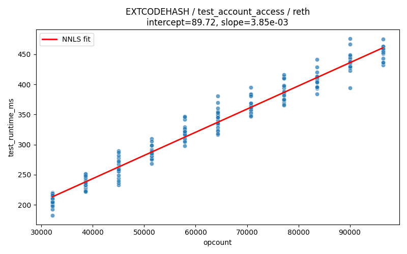

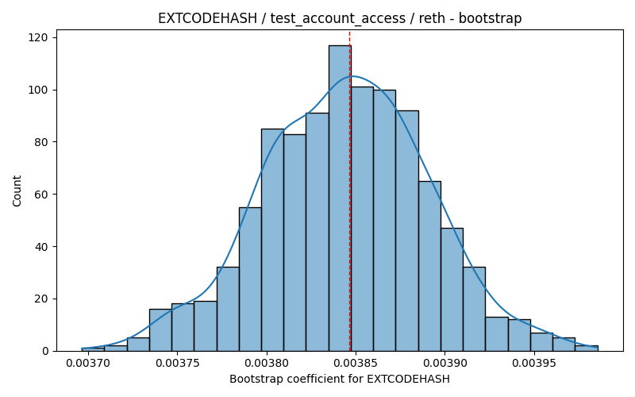

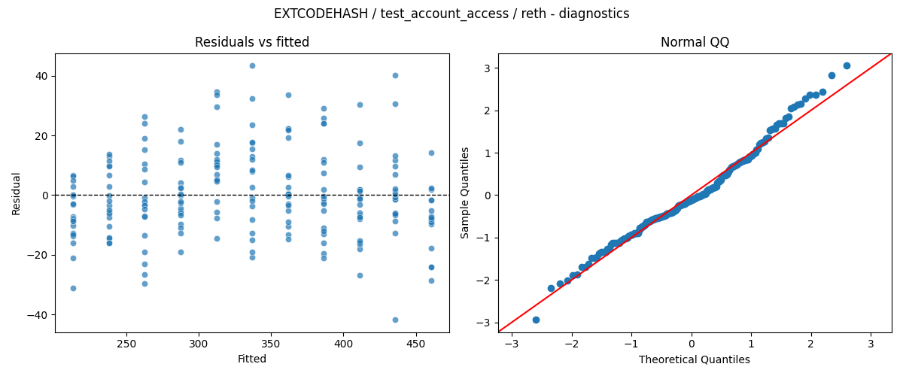

</details>

## EXTCODESIZE

### test_ext_account_query_warm — combo `EXTCODESIZE`

| client | nobs | R² | target_coef (ms) | p-value | 95% CI |
| --- | --- | --- | --- | --- | --- |
| `besu` | 110 | 0.8742 | 0.0001229 | 1.00e-03 | [0.0001138, 0.0001313] |
| `erigon` | 88 | 0.4871 | 1.526e-05 | 1.00e-03 | [1.189e-05, 1.893e-05] |
| `geth` | 77 | 0.1207 | 2.062e-05 | 1.00e-03 | [7.024e-06, 3.228e-05] |
| `nethermind` | 154 | 0.6444 | 0.0002321 | 1.00e-03 | [0.0002066, 0.0002582] |
| `reth` | 209 | 0.4515 | 9.75e-06 | 1.00e-03 | [8.395e-06, 1.1e-05] |

<details><summary>besu — NNLS regression summary</summary>

```
==============================================================================
                           NNLS Regression Results                            
==============================================================================
Dep. Variable:          test_runtime_ms              R-squared:          0.874
Model:                  NNLS                    Adj. R-squared:          0.873
No. Observations:       110                               RMSE:          14.16
Df Residuals:           108                                MAE:          11.34
Df Model:               1      
==============================================================================
                      coef     std err     P-value      [0.025      0.975]
------------------------------------------------------------------------------
         const     95.0160      4.1196       0.001     87.0229    102.9198
       opcount      0.0001      0.0000       0.001      0.0001      0.0001
==============================================================================
Notes: Non-negative least squares with bootstrap inference (1000 iterations)
==============================================================================
```

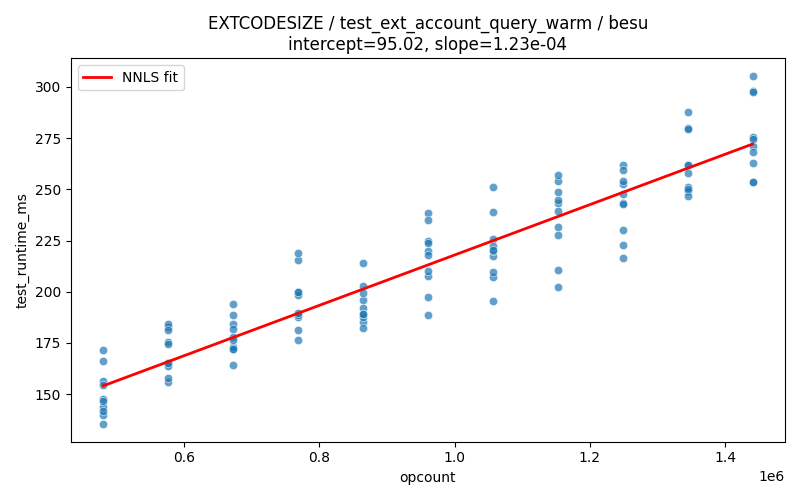

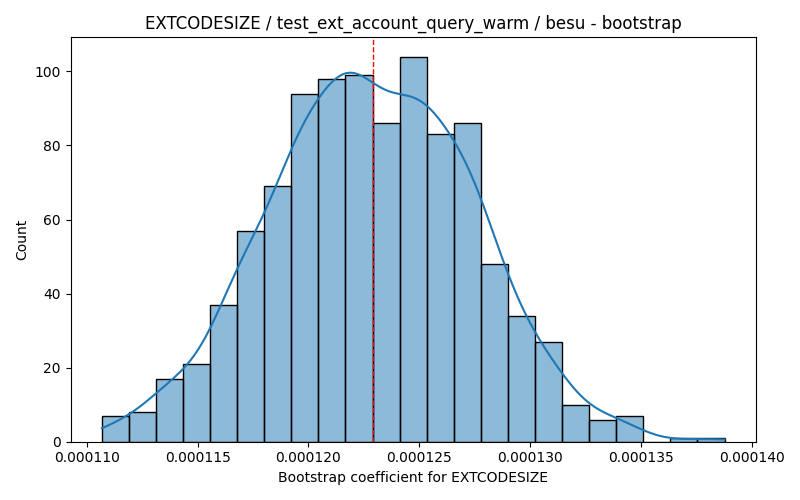

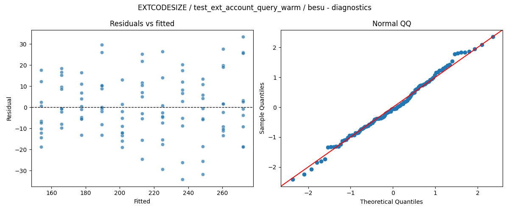

</details>

<details><summary>erigon — NNLS regression summary</summary>

```
==============================================================================
                           NNLS Regression Results                            
==============================================================================
Dep. Variable:          test_runtime_ms              R-squared:          0.487
Model:                  NNLS                    Adj. R-squared:          0.481
No. Observations:       88                                RMSE:           4.76
Df Residuals:           86                                 MAE:           3.80
Df Model:               1      
==============================================================================
                      coef     std err     P-value      [0.025      0.975]
------------------------------------------------------------------------------
         const     18.7631      1.8033       0.001     15.1920     22.3286
       opcount      0.0000      0.0000       0.001      0.0000      0.0000
==============================================================================
Notes: Non-negative least squares with bootstrap inference (1000 iterations)
==============================================================================
```

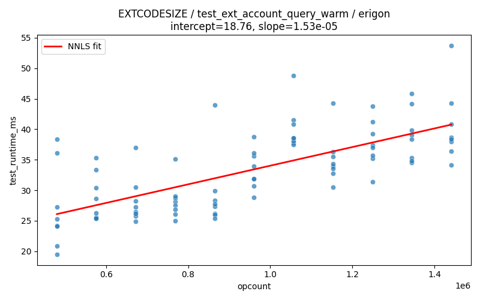

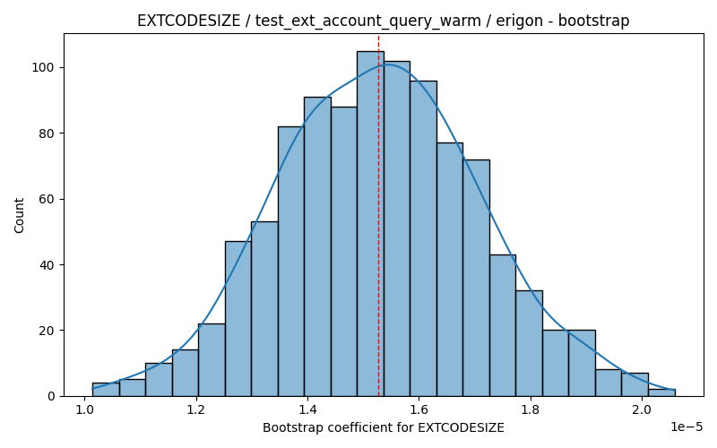

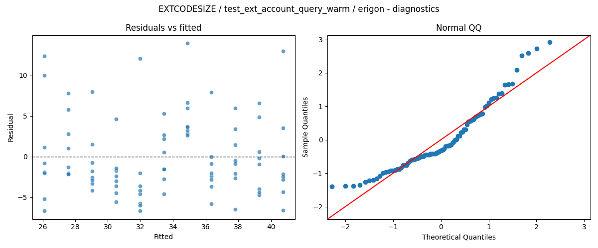

</details>

<details><summary>geth — NNLS regression summary</summary>

```
==============================================================================
                           NNLS Regression Results                            
==============================================================================
Dep. Variable:          test_runtime_ms              R-squared:          0.121
Model:                  NNLS                    Adj. R-squared:          0.109
No. Observations:       77                                RMSE:          16.91
Df Residuals:           75                                 MAE:          13.83
Df Model:               1      
==============================================================================
                      coef     std err     P-value      [0.025      0.975]
------------------------------------------------------------------------------
         const     26.3625      7.1543       0.001     14.0556     40.9463
       opcount      0.0000      0.0000       0.001      0.0000      0.0000
==============================================================================
Notes: Non-negative least squares with bootstrap inference (1000 iterations)
==============================================================================
```

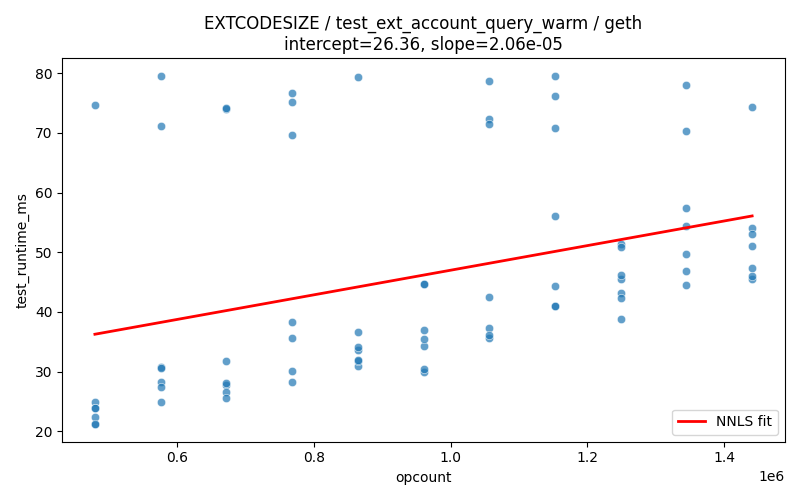

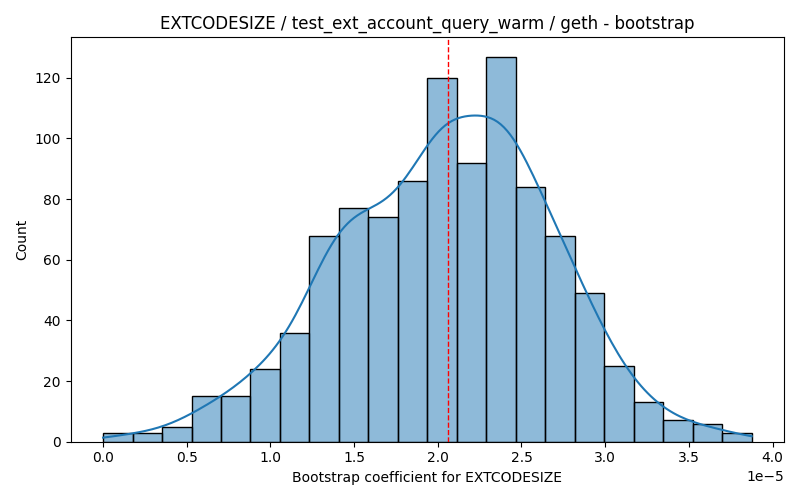

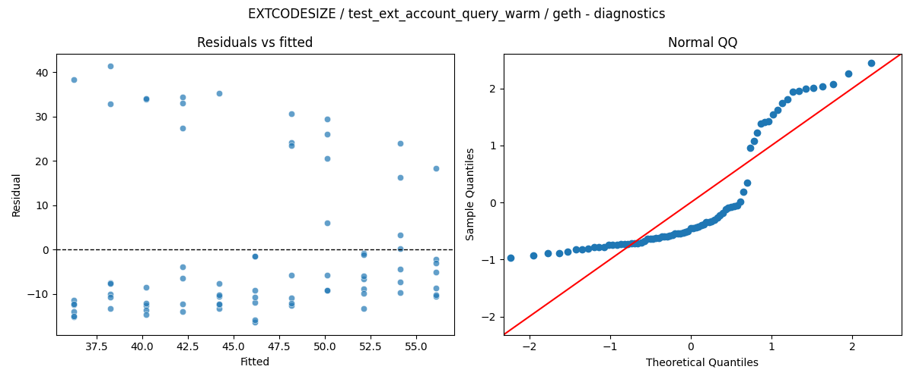

</details>

<details><summary>nethermind — NNLS regression summary</summary>

```
==============================================================================
                           NNLS Regression Results                            
==============================================================================
Dep. Variable:          test_runtime_ms              R-squared:          0.644
Model:                  NNLS                    Adj. R-squared:          0.642
No. Observations:       154                               RMSE:          52.37
Df Residuals:           152                                MAE:          42.71
Df Model:               1      
==============================================================================
                      coef     std err     P-value      [0.025      0.975]
------------------------------------------------------------------------------
         const     70.6301     12.2196       0.001     46.8757     95.3055
       opcount      0.0002      0.0000       0.001      0.0002      0.0003
==============================================================================
Notes: Non-negative least squares with bootstrap inference (1000 iterations)
==============================================================================
```

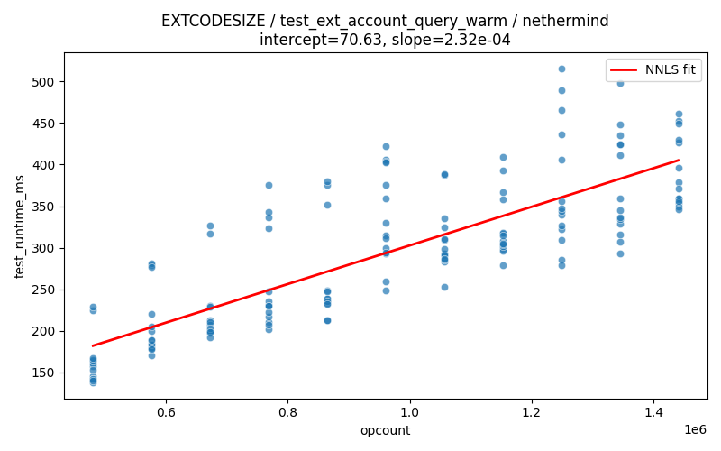

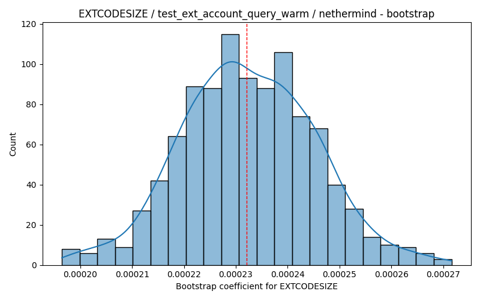

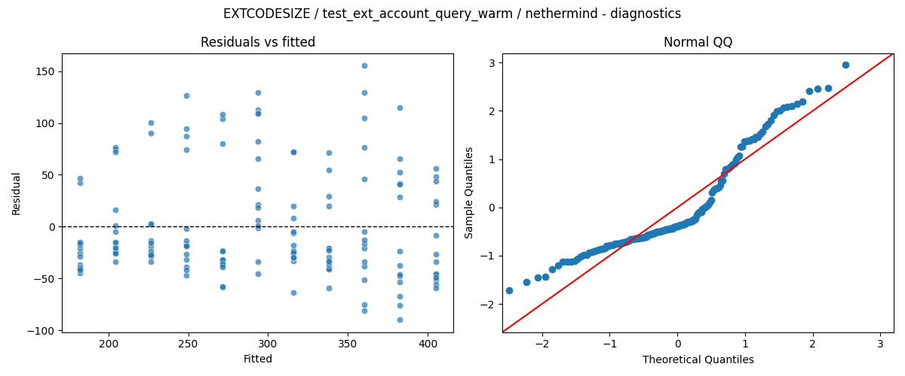

</details>

<details><summary>reth — NNLS regression summary</summary>

```
==============================================================================
                           NNLS Regression Results                            
==============================================================================
Dep. Variable:          test_runtime_ms              R-squared:          0.451
Model:                  NNLS                    Adj. R-squared:          0.449
No. Observations:       209                               RMSE:           3.26
Df Residuals:           207                                MAE:           2.34
Df Model:               1      
==============================================================================
                      coef     std err     P-value      [0.025      0.975]
------------------------------------------------------------------------------
         const      5.8764      0.6562       0.001      4.5977      7.2004
       opcount      0.0000      0.0000       0.001      0.0000      0.0000
==============================================================================
Notes: Non-negative least squares with bootstrap inference (1000 iterations)
==============================================================================
```

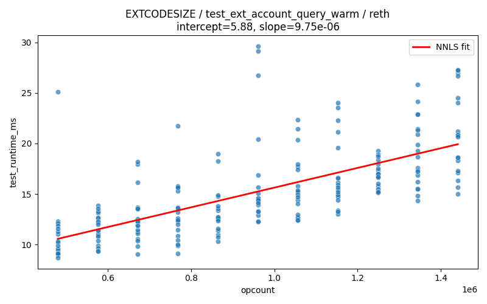

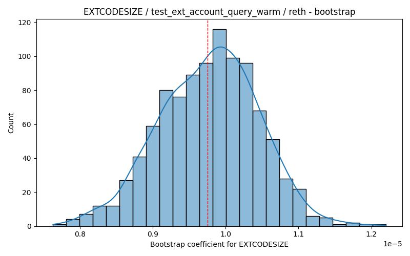

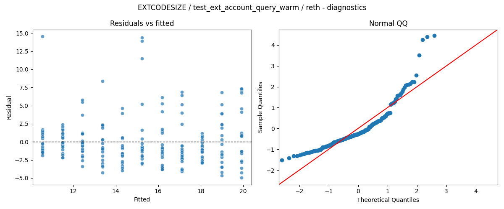

</details>

### test_account_access — combo `EXTCODESIZE_AccountMode.EXISTING_EOA`

| client | nobs | R² | target_coef (ms) | p-value | 95% CI |
| --- | --- | --- | --- | --- | --- |
| `besu` | 110 | 0.9864 | 0.01431 | 1.00e-03 | [0.014, 0.01465] |
| `erigon` | 88 | 0.9975 | 0.008076 | 1.00e-03 | [0.008042, 0.008101] |
| `geth` | 77 | 0.8147 | 0.01794 | 1.00e-03 | [0.01567, 0.01978] |
| `nethermind` | 154 | 0.9115 | 0.003047 | 1.00e-03 | [0.002904, 0.003196] |
| `reth` | 209 | 0.968 | 0.004089 | 1.00e-03 | [0.003993, 0.004193] |

<details><summary>besu — NNLS regression summary</summary>

```
==============================================================================
                           NNLS Regression Results                            
==============================================================================
Dep. Variable:          test_runtime_ms              R-squared:          0.986
Model:                  NNLS                    Adj. R-squared:          0.986
No. Observations:       110                               RMSE:          33.59
Df Residuals:           108                                MAE:          27.03
Df Model:               1      
==============================================================================
                      coef     std err     P-value      [0.025      0.975]
------------------------------------------------------------------------------
         const    457.1669     11.3621       0.001    433.5182    478.5510
       opcount      0.0143      0.0002       0.001      0.0140      0.0147
==============================================================================
Notes: Non-negative least squares with bootstrap inference (1000 iterations)
==============================================================================
```

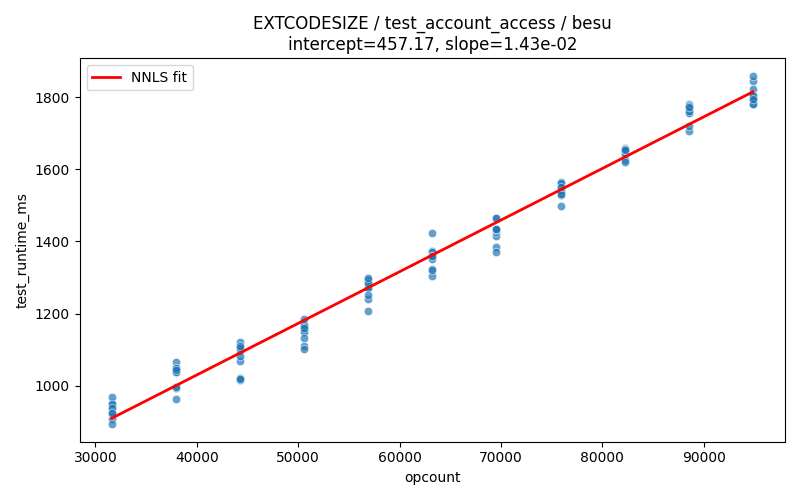

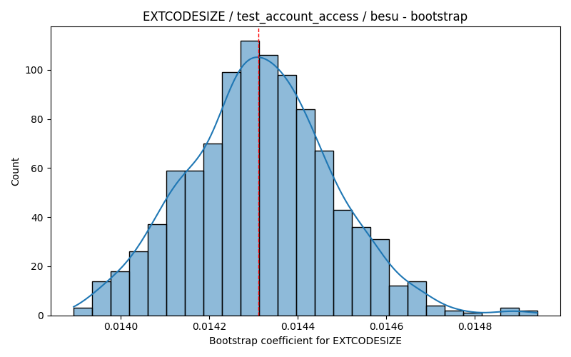

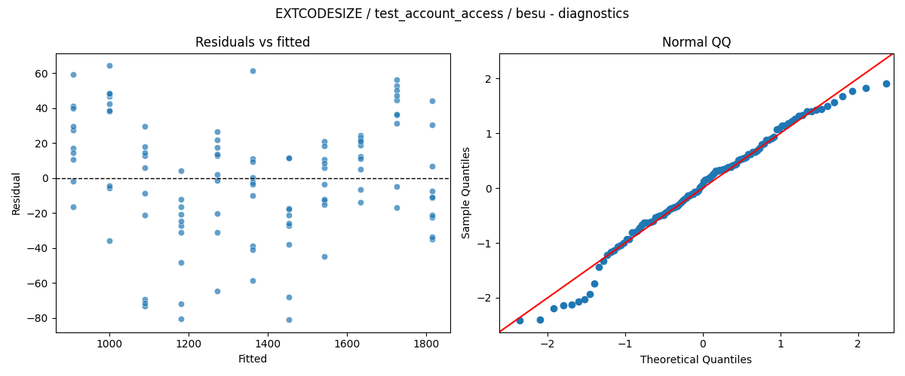

</details>

<details><summary>erigon — NNLS regression summary</summary>

```
==============================================================================
                           NNLS Regression Results                            
==============================================================================
Dep. Variable:          test_runtime_ms              R-squared:          0.997
Model:                  NNLS                    Adj. R-squared:          0.997
No. Observations:       88                                RMSE:           8.22
Df Residuals:           86                                 MAE:           6.68
Df Model:               1      
==============================================================================
                      coef     std err     P-value      [0.025      0.975]
------------------------------------------------------------------------------
         const      0.0000      0.2528       1.000      0.0000      0.6083
       opcount      0.0081      0.0000       0.001      0.0080      0.0081
==============================================================================
Notes: Non-negative least squares with bootstrap inference (1000 iterations)
==============================================================================
```

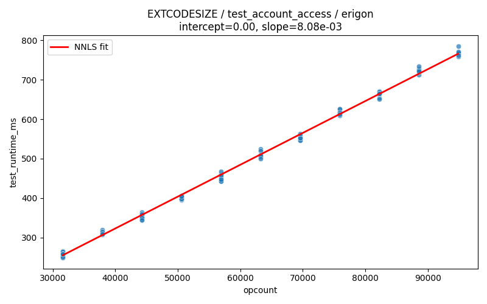

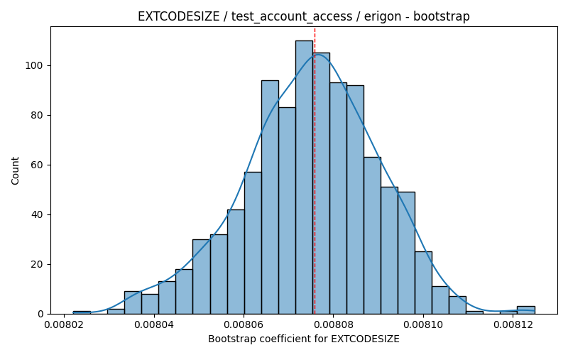

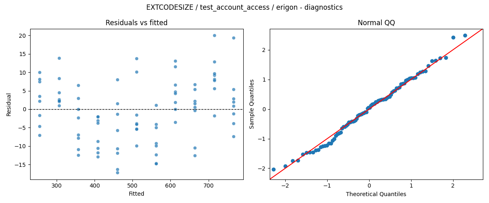

</details>

<details><summary>geth — NNLS regression summary</summary>

```
==============================================================================
                           NNLS Regression Results                            
==============================================================================
Dep. Variable:          test_runtime_ms              R-squared:          0.815
Model:                  NNLS                    Adj. R-squared:          0.812
No. Observations:       77                                RMSE:         171.11
Df Residuals:           75                                 MAE:         113.51
Df Model:               1      
==============================================================================
                      coef     std err     P-value      [0.025      0.975]
------------------------------------------------------------------------------
         const    199.5579     57.4675       0.002     88.8625    315.0344
       opcount      0.0179      0.0010       0.001      0.0157      0.0198
==============================================================================
Notes: Non-negative least squares with bootstrap inference (1000 iterations)
==============================================================================
```

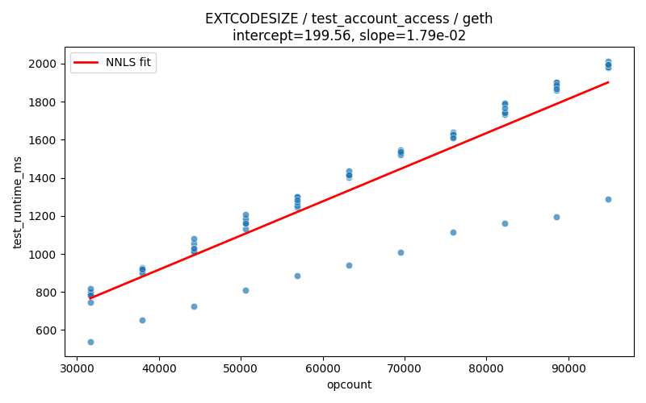

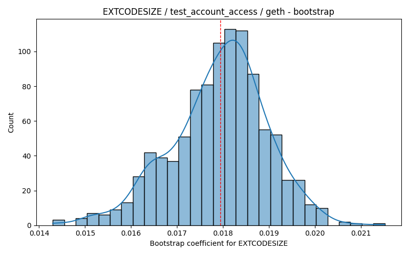


</details>

<details><summary>nethermind — NNLS regression summary</summary>

```
==============================================================================
                           NNLS Regression Results                            
==============================================================================
Dep. Variable:          test_runtime_ms              R-squared:          0.911
Model:                  NNLS                    Adj. R-squared:          0.911
No. Observations:       154                               RMSE:          18.99
Df Residuals:           152                                MAE:          15.26
Df Model:               1      
==============================================================================
                      coef     std err     P-value      [0.025      0.975]
------------------------------------------------------------------------------
         const    106.4466      4.3943       0.001     98.1223    115.0304
       opcount      0.0030      0.0001       0.001      0.0029      0.0032
==============================================================================
Notes: Non-negative least squares with bootstrap inference (1000 iterations)
==============================================================================
```

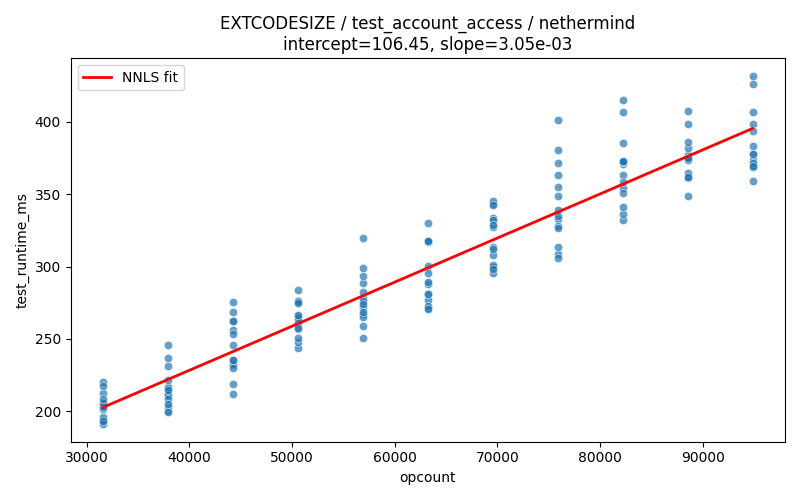

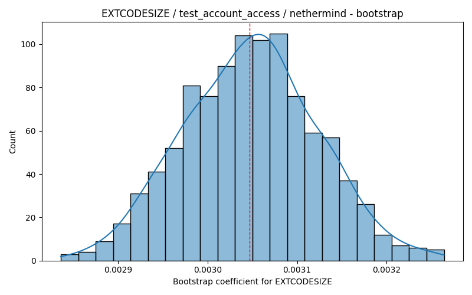

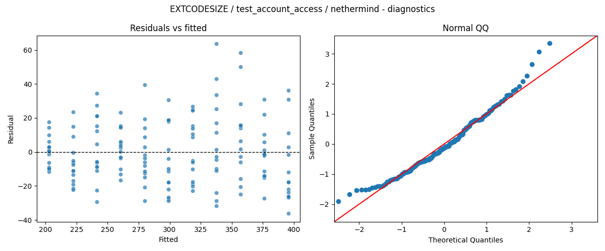

</details>

<details><summary>reth — NNLS regression summary</summary>

```
==============================================================================
                           NNLS Regression Results                            
==============================================================================
Dep. Variable:          test_runtime_ms              R-squared:          0.968
Model:                  NNLS                    Adj. R-squared:          0.968
No. Observations:       209                               RMSE:          14.86
Df Residuals:           207                                MAE:          11.47
Df Model:               1      
==============================================================================
                      coef     std err     P-value      [0.025      0.975]
------------------------------------------------------------------------------
         const     94.3474      2.9533       0.001     88.3913    100.1574
       opcount      0.0041      0.0001       0.001      0.0040      0.0042
==============================================================================
Notes: Non-negative least squares with bootstrap inference (1000 iterations)
==============================================================================
```

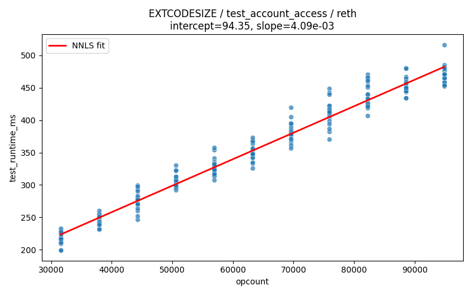

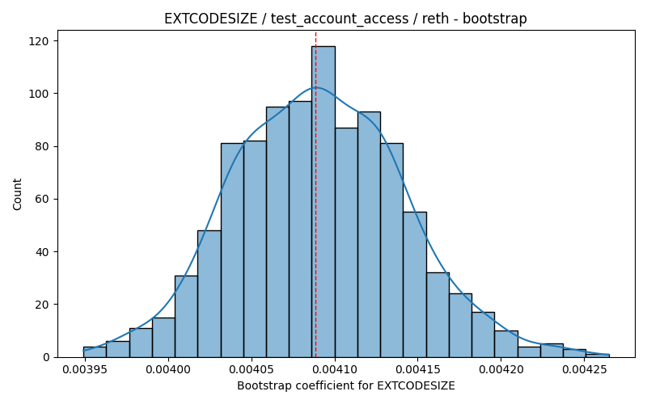

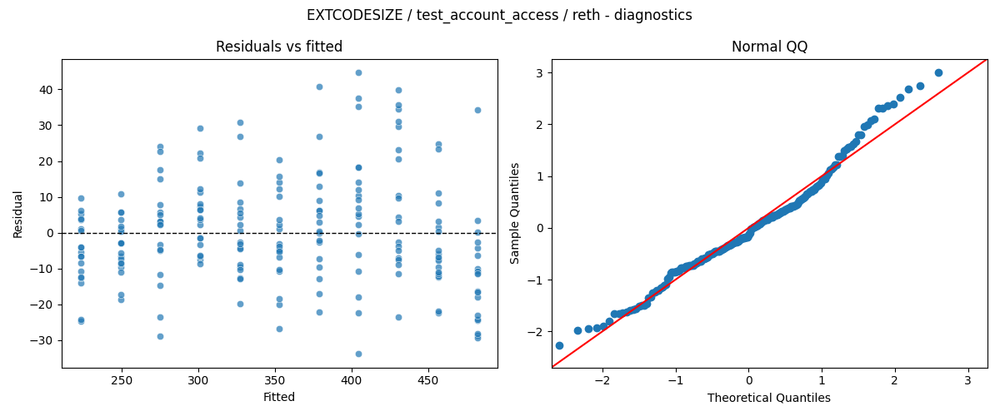

</details>

### test_account_access — combo `EXTCODESIZE_AccountMode.NON_EXISTING_ACCOUNT`

| client | nobs | R² | target_coef (ms) | p-value | 95% CI |
| --- | --- | --- | --- | --- | --- |
| `besu` | 110 | 0.989 | 0.01455 | 1.00e-03 | [0.01425, 0.01487] |
| `erigon` | 88 | 0.9981 | 0.007816 | 1.00e-03 | [0.007792, 0.007837] |
| `geth` | 77 | 0.9318 | 0.01903 | 1.00e-03 | [0.01782, 0.02028] |
| `nethermind` | 154 | 0.8967 | 0.003049 | 1.00e-03 | [0.002891, 0.003198] |
| `reth` | 209 | 0.9635 | 0.003964 | 1.00e-03 | [0.003859, 0.004069] |

<details><summary>besu — NNLS regression summary</summary>

```
==============================================================================
                           NNLS Regression Results                            
==============================================================================
Dep. Variable:          test_runtime_ms              R-squared:          0.989
Model:                  NNLS                    Adj. R-squared:          0.989
No. Observations:       110                               RMSE:          30.74
Df Residuals:           108                                MAE:          23.42
Df Model:               1      
==============================================================================
                      coef     std err     P-value      [0.025      0.975]
------------------------------------------------------------------------------
         const    128.4017     10.3397       0.001    108.1024    147.6444
       opcount      0.0146      0.0002       0.001      0.0143      0.0149
==============================================================================
Notes: Non-negative least squares with bootstrap inference (1000 iterations)
==============================================================================
```

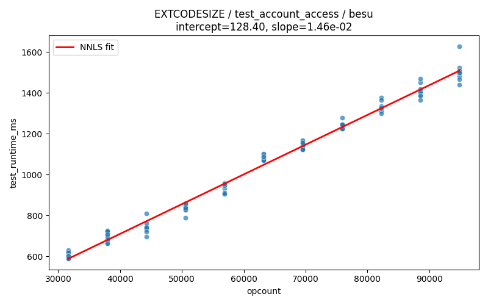

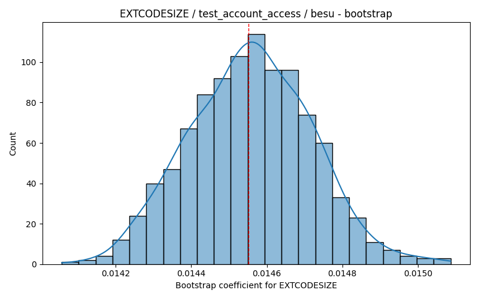

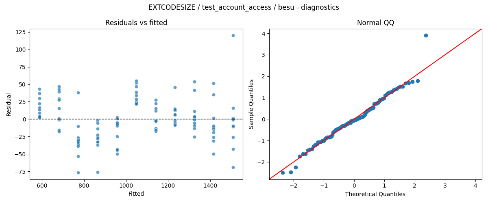

</details>

<details><summary>erigon — NNLS regression summary</summary>

```
==============================================================================
                           NNLS Regression Results                            
==============================================================================
Dep. Variable:          test_runtime_ms              R-squared:          0.998
Model:                  NNLS                    Adj. R-squared:          0.998
No. Observations:       88                                RMSE:           6.96
Df Residuals:           86                                 MAE:           5.48
Df Model:               1      
==============================================================================
                      coef     std err     P-value      [0.025      0.975]
------------------------------------------------------------------------------
         const      0.0000      0.1630       1.000      0.0000      0.0774
       opcount      0.0078      0.0000       0.001      0.0078      0.0078
==============================================================================
Notes: Non-negative least squares with bootstrap inference (1000 iterations)
==============================================================================
```


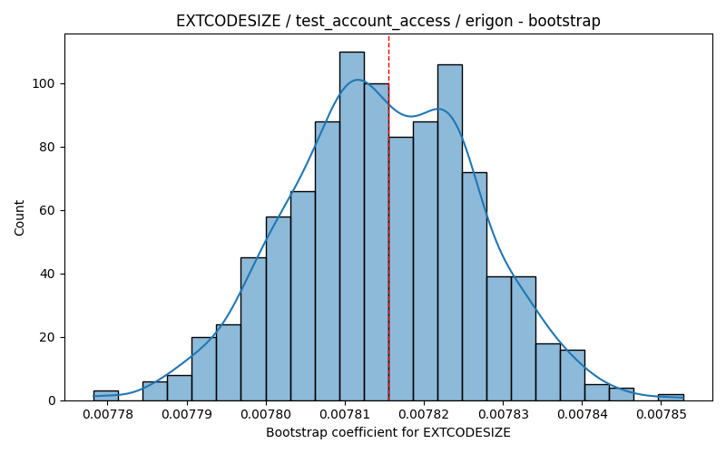

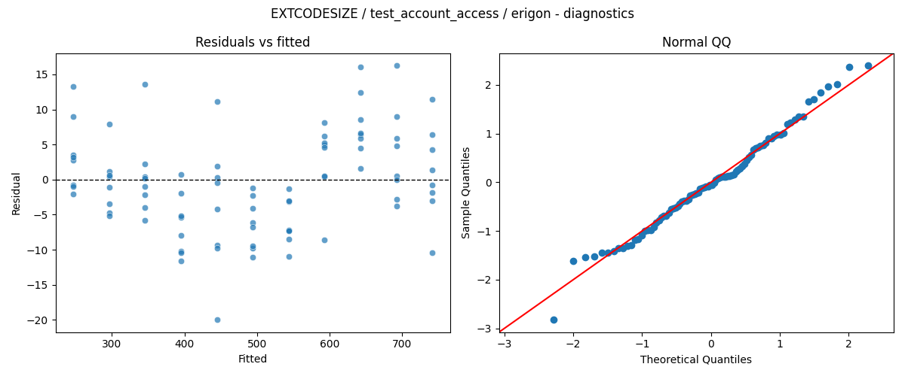

</details>

<details><summary>geth — NNLS regression summary</summary>

```
==============================================================================
                           NNLS Regression Results                            
==============================================================================
Dep. Variable:          test_runtime_ms              R-squared:          0.932
Model:                  NNLS                    Adj. R-squared:          0.931
No. Observations:       77                                RMSE:         102.93
Df Residuals:           75                                 MAE:          70.00
Df Model:               1      
==============================================================================
                      coef     std err     P-value      [0.025      0.975]
------------------------------------------------------------------------------
         const    194.8789     36.2020       0.001    122.0362    265.4313
       opcount      0.0190      0.0006       0.001      0.0178      0.0203
==============================================================================
Notes: Non-negative least squares with bootstrap inference (1000 iterations)
==============================================================================
```

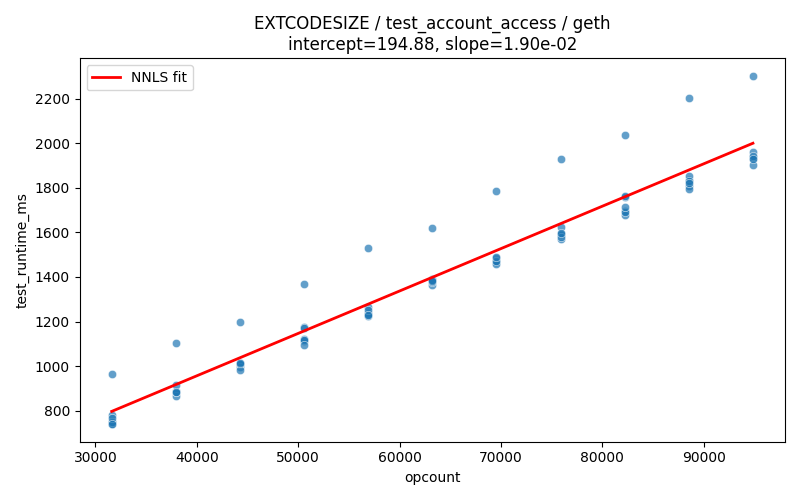

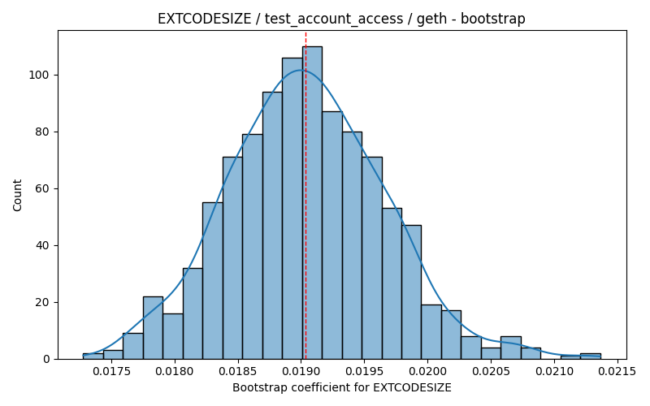

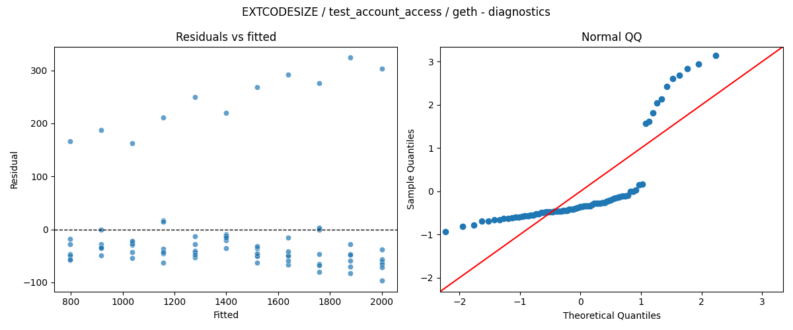

</details>

<details><summary>nethermind — NNLS regression summary</summary>

```
==============================================================================
                           NNLS Regression Results                            
==============================================================================
Dep. Variable:          test_runtime_ms              R-squared:          0.897
Model:                  NNLS                    Adj. R-squared:          0.896
No. Observations:       154                               RMSE:          20.70
Df Residuals:           152                                MAE:          16.10
Df Model:               1      
==============================================================================
                      coef     std err     P-value      [0.025      0.975]
------------------------------------------------------------------------------
         const     70.4747      4.9923       0.001     60.9613     80.5972
       opcount      0.0030      0.0001       0.001      0.0029      0.0032
==============================================================================
Notes: Non-negative least squares with bootstrap inference (1000 iterations)
==============================================================================
```

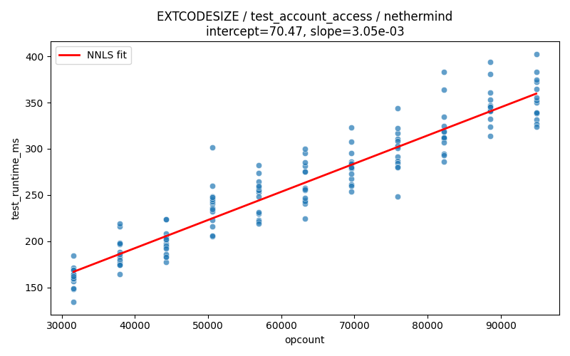

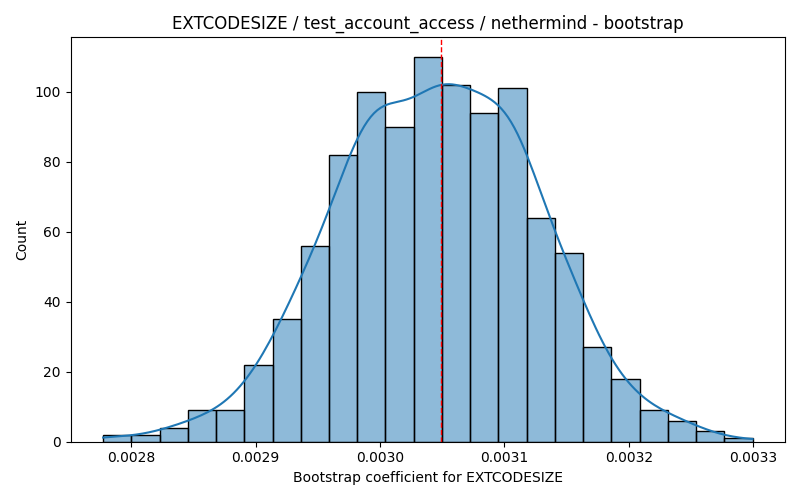

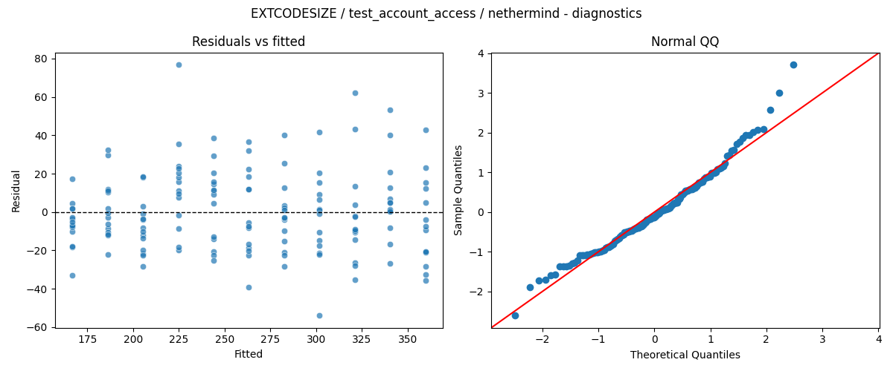

</details>

<details><summary>reth — NNLS regression summary</summary>

```
==============================================================================
                           NNLS Regression Results                            
==============================================================================
Dep. Variable:          test_runtime_ms              R-squared:          0.963
Model:                  NNLS                    Adj. R-squared:          0.963
No. Observations:       209                               RMSE:          15.43
Df Residuals:           207                                MAE:          11.76
Df Model:               1      
==============================================================================
                      coef     std err     P-value      [0.025      0.975]
------------------------------------------------------------------------------
         const     99.7498      3.3199       0.001     93.7629    105.9761
       opcount      0.0040      0.0001       0.001      0.0039      0.0041
==============================================================================
Notes: Non-negative least squares with bootstrap inference (1000 iterations)
==============================================================================
```

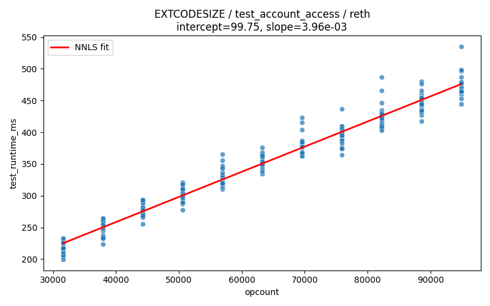

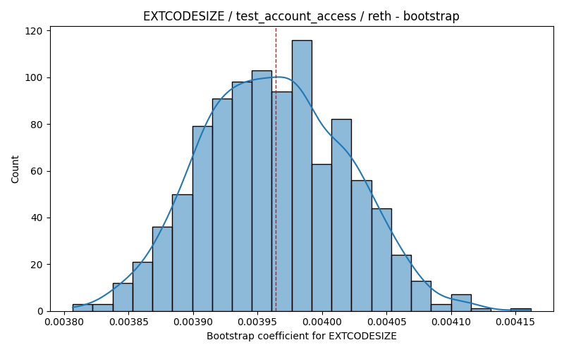

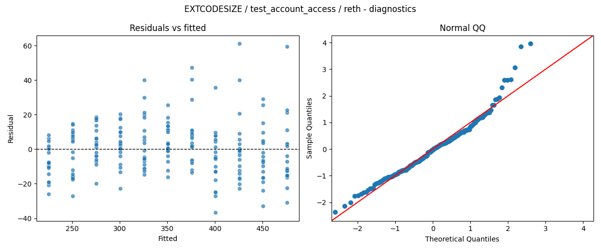

</details>

### test_account_access — combo `EXTCODESIZE_AccountMode.EXISTING_CONTRACT_DIFF_MAX`

| client | nobs | R² | target_coef (ms) | p-value | 95% CI |
| --- | --- | --- | --- | --- | --- |
| `besu` | 110 | 0.9827 | 0.0196 | 1.00e-03 | [0.01917, 0.02014] |
| `erigon` | 88 | 0.6343 | 0.02264 | 1.00e-03 | [0.0192, 0.02638] |
| `geth` | 77 | 0.8646 | 0.02702 | 1.00e-03 | [0.02447, 0.02956] |
| `nethermind` | 154 | 0.8897 | 0.01532 | 1.00e-03 | [0.01429, 0.01625] |
| `reth` | 209 | 0.995 | 0.02094 | 1.00e-03 | [0.02073, 0.02115] |

<details><summary>besu — NNLS regression summary</summary>

```
==============================================================================
                           NNLS Regression Results                            
==============================================================================
Dep. Variable:          test_runtime_ms              R-squared:          0.983
Model:                  NNLS                    Adj. R-squared:          0.983
No. Observations:       110                               RMSE:          51.28
Df Residuals:           108                                MAE:          39.63
Df Model:               1      
==============================================================================
                      coef     std err     P-value      [0.025      0.975]
------------------------------------------------------------------------------
         const    412.4429     15.6643       0.001    378.9073    441.6061
       opcount      0.0196      0.0002       0.001      0.0192      0.0201
==============================================================================
Notes: Non-negative least squares with bootstrap inference (1000 iterations)
==============================================================================
```

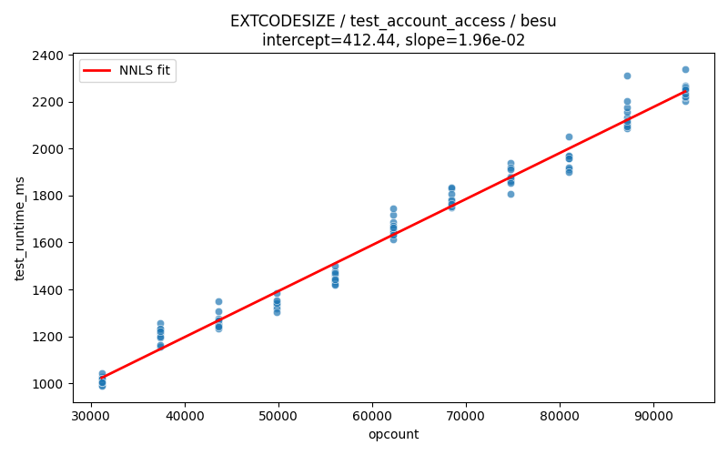

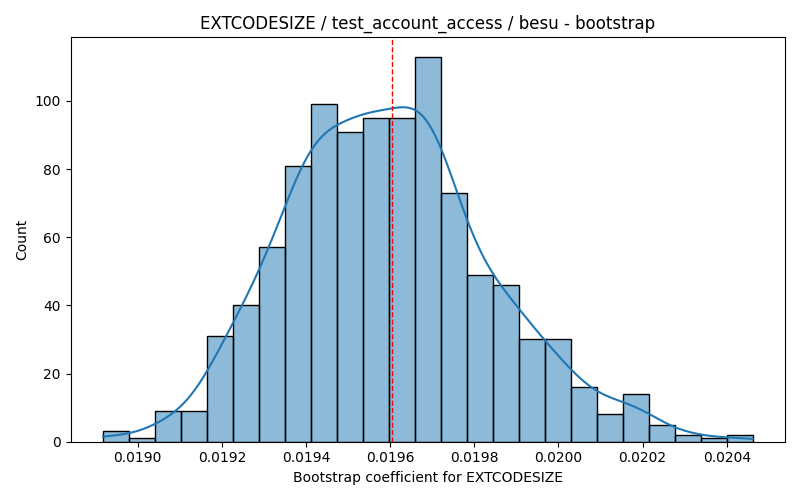

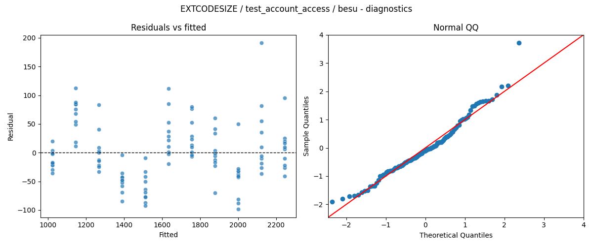

</details>

<details><summary>erigon — NNLS regression summary</summary>

```
==============================================================================
                           NNLS Regression Results                            
==============================================================================
Dep. Variable:          test_runtime_ms              R-squared:          0.634
Model:                  NNLS                    Adj. R-squared:          0.630
No. Observations:       88                                RMSE:         338.60
Df Residuals:           86                                 MAE:         215.54
Df Model:               1      
==============================================================================
                      coef     std err     P-value      [0.025      0.975]
------------------------------------------------------------------------------
         const    226.5835    105.7347       0.023     15.2863    432.2003
       opcount      0.0226      0.0019       0.001      0.0192      0.0264
==============================================================================
Notes: Non-negative least squares with bootstrap inference (1000 iterations)
==============================================================================
```

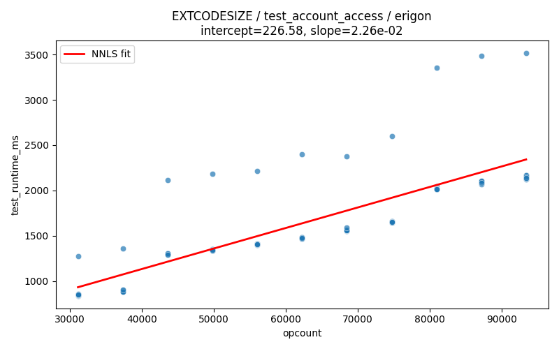

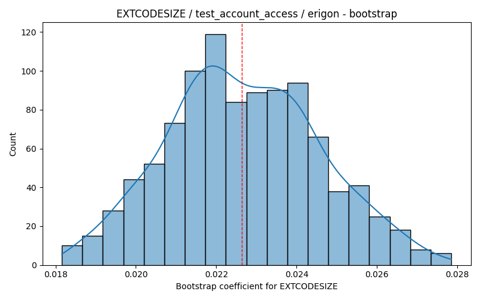

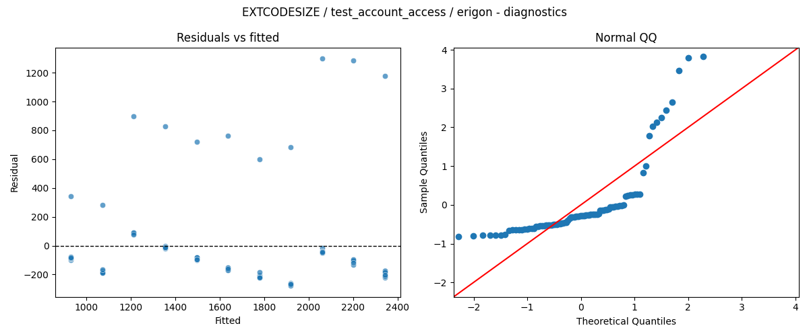

</details>

<details><summary>geth — NNLS regression summary</summary>

```
==============================================================================
                           NNLS Regression Results                            
==============================================================================
Dep. Variable:          test_runtime_ms              R-squared:          0.865
Model:                  NNLS                    Adj. R-squared:          0.863
No. Observations:       77                                RMSE:         210.64
Df Residuals:           75                                 MAE:         175.04
Df Model:               1      
==============================================================================
                      coef     std err     P-value      [0.025      0.975]
------------------------------------------------------------------------------
         const    442.8458     81.6628       0.001    280.2661    602.0508
       opcount      0.0270      0.0013       0.001      0.0245      0.0296
==============================================================================
Notes: Non-negative least squares with bootstrap inference (1000 iterations)
==============================================================================
```

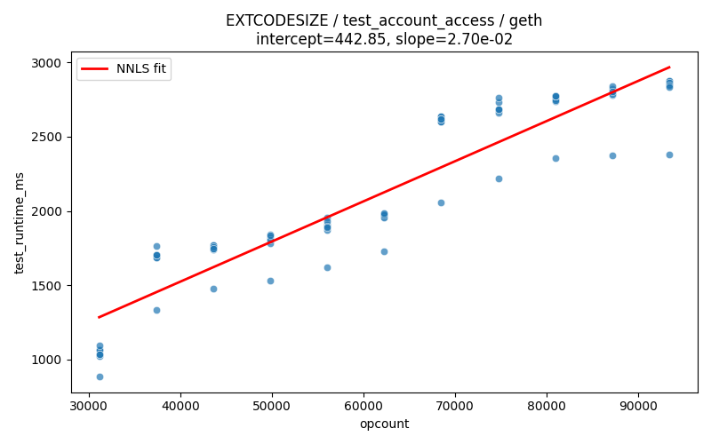

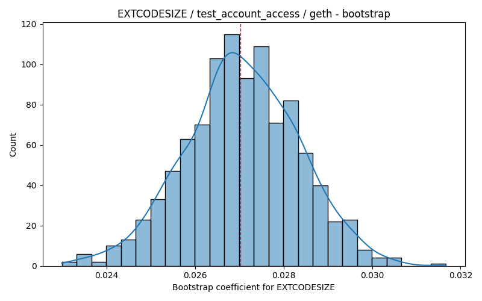

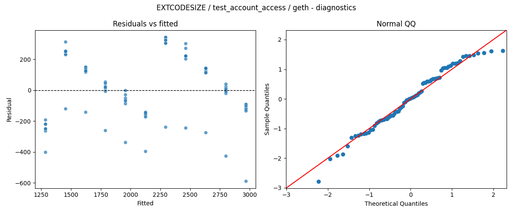

</details>

<details><summary>nethermind — NNLS regression summary</summary>

```
==============================================================================
                           NNLS Regression Results                            
==============================================================================
Dep. Variable:          test_runtime_ms              R-squared:          0.890
Model:                  NNLS                    Adj. R-squared:          0.889
No. Observations:       154                               RMSE:         106.25
Df Residuals:           152                                MAE:          85.37
Df Model:               1      
==============================================================================
                      coef     std err     P-value      [0.025      0.975]
------------------------------------------------------------------------------
         const    576.0810     37.2597       0.001    509.2403    653.6984
       opcount      0.0153      0.0005       0.001      0.0143      0.0162
==============================================================================
Notes: Non-negative least squares with bootstrap inference (1000 iterations)
==============================================================================
```

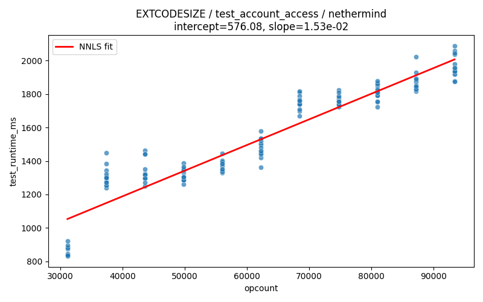

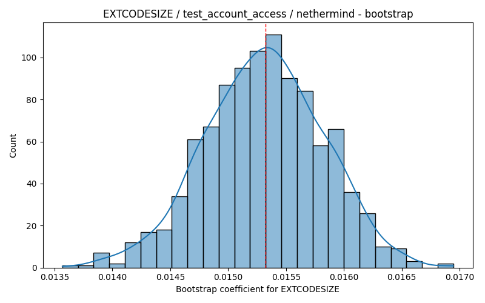

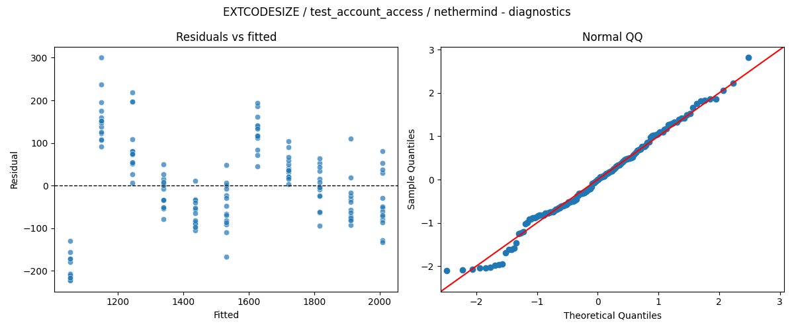

</details>

<details><summary>reth — NNLS regression summary</summary>

```
==============================================================================
                           NNLS Regression Results                            
==============================================================================
Dep. Variable:          test_runtime_ms              R-squared:          0.995
Model:                  NNLS                    Adj. R-squared:          0.995
No. Observations:       209                               RMSE:          29.24
Df Residuals:           207                                MAE:          21.82
Df Model:               1      
==============================================================================
                      coef     std err     P-value      [0.025      0.975]
------------------------------------------------------------------------------
         const    124.2473      5.9733       0.001    112.3238    136.0180
       opcount      0.0209      0.0001       0.001      0.0207      0.0212
==============================================================================
Notes: Non-negative least squares with bootstrap inference (1000 iterations)
==============================================================================
```

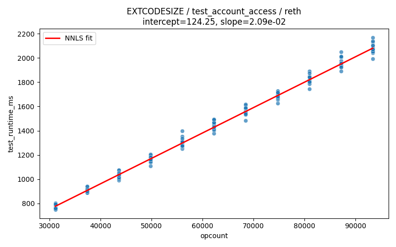

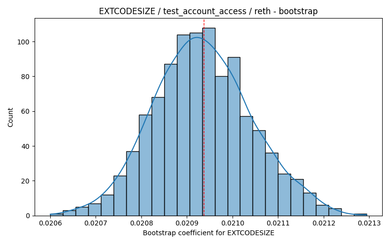

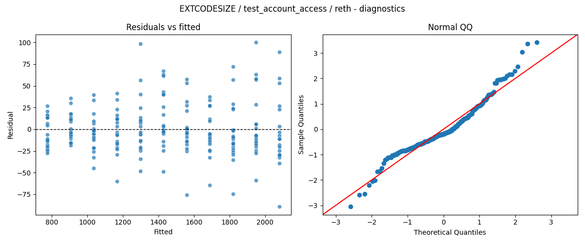

</details>

### test_account_access — combo `EXTCODESIZE_AccountMode.EXISTING_CONTRACT_MINIMAL`

| client | nobs | R² | target_coef (ms) | p-value | 95% CI |
| --- | --- | --- | --- | --- | --- |
| `besu` | 110 | 0.9803 | 0.01212 | 1.00e-03 | [0.01177, 0.01248] |
| `erigon` | 88 | 0.991 | 0.008077 | 1.00e-03 | [0.007929, 0.008237] |
| `geth` | 77 | 0.4739 | 0.01647 | 1.00e-03 | [0.01212, 0.01947] |
| `nethermind` | 154 | 0.7837 | 0.001867 | 1.00e-03 | [0.001716, 0.002023] |
| `reth` | 209 | 0.9658 | 0.003892 | 1.00e-03 | [0.003804, 0.003992] |

<details><summary>besu — NNLS regression summary</summary>

```
==============================================================================
                           NNLS Regression Results                            
==============================================================================
Dep. Variable:          test_runtime_ms              R-squared:          0.980
Model:                  NNLS                    Adj. R-squared:          0.980
No. Observations:       110                               RMSE:          33.85
Df Residuals:           108                                MAE:          27.41
Df Model:               1      
==============================================================================
                      coef     std err     P-value      [0.025      0.975]
------------------------------------------------------------------------------
         const    352.5788     11.0064       0.001    331.9406    374.7340
       opcount      0.0121      0.0002       0.001      0.0118      0.0125
==============================================================================
Notes: Non-negative least squares with bootstrap inference (1000 iterations)
==============================================================================
```

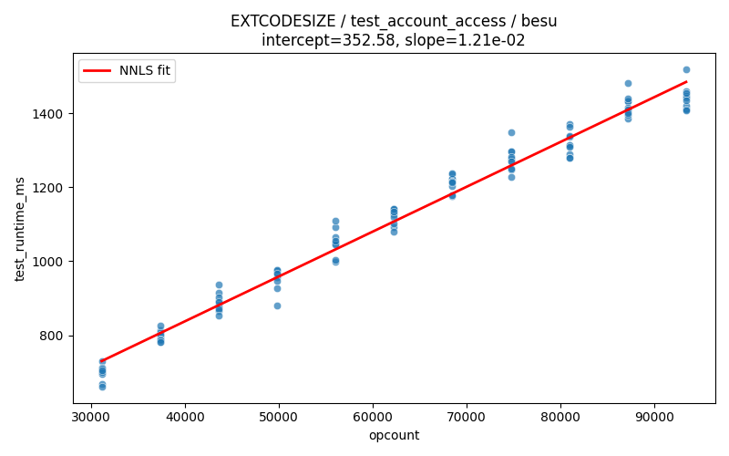

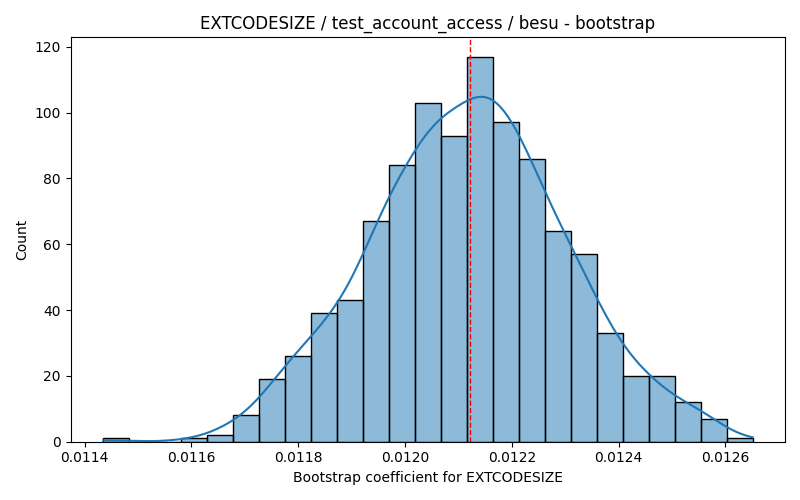

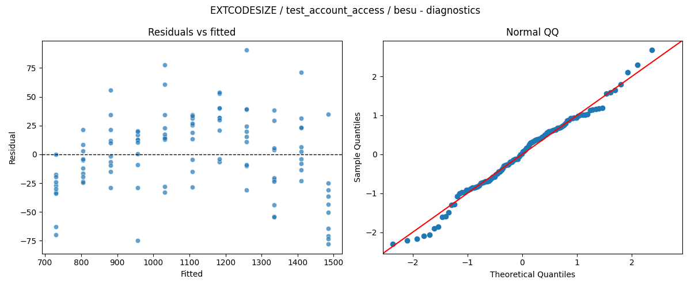

</details>

<details><summary>erigon — NNLS regression summary</summary>

```
==============================================================================
                           NNLS Regression Results                            
==============================================================================
Dep. Variable:          test_runtime_ms              R-squared:          0.991
Model:                  NNLS                    Adj. R-squared:          0.991
No. Observations:       88                                RMSE:          15.20
Df Residuals:           86                                 MAE:          11.51
Df Model:               1      
==============================================================================
                      coef     std err     P-value      [0.025      0.975]
------------------------------------------------------------------------------
         const     82.3806      5.6193       0.001     71.8540     93.0530
       opcount      0.0081      0.0001       0.001      0.0079      0.0082
==============================================================================
Notes: Non-negative least squares with bootstrap inference (1000 iterations)
==============================================================================
```

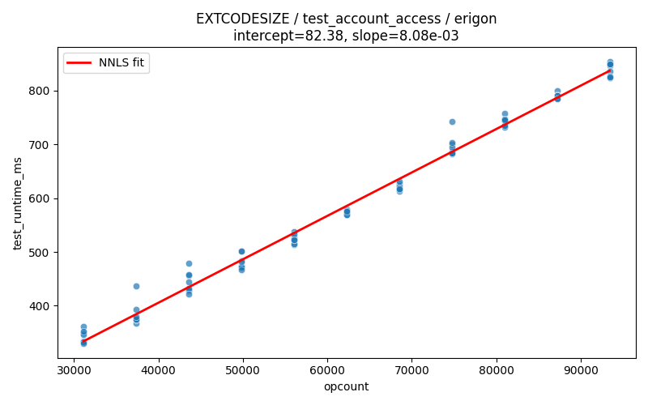

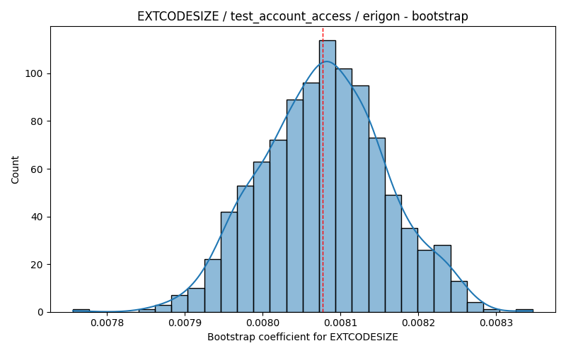

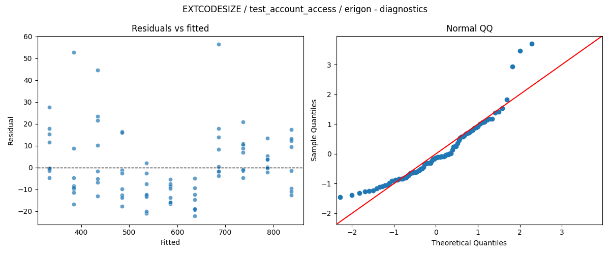

</details>

<details><summary>geth — NNLS regression summary</summary>

```
==============================================================================
                           NNLS Regression Results                            
==============================================================================
Dep. Variable:          test_runtime_ms              R-squared:          0.474
Model:                  NNLS                    Adj. R-squared:          0.467
No. Observations:       77                                RMSE:         341.87
Df Residuals:           75                                 MAE:         230.20
Df Model:               1      
==============================================================================
                      coef     std err     P-value      [0.025      0.975]
------------------------------------------------------------------------------
         const    152.8515    106.0402       0.096      0.0000    377.2440
       opcount      0.0165      0.0019       0.001      0.0121      0.0195
==============================================================================
Notes: Non-negative least squares with bootstrap inference (1000 iterations)
==============================================================================
```

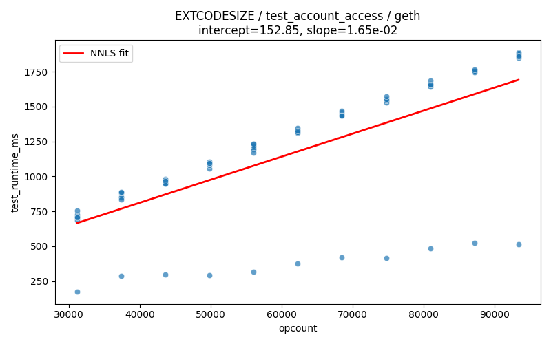

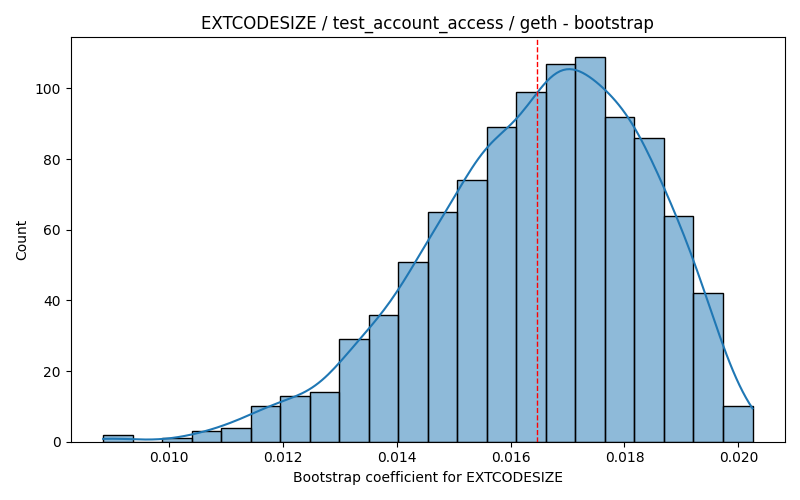


</details>

<details><summary>nethermind — NNLS regression summary</summary>

```
==============================================================================
                           NNLS Regression Results                            
==============================================================================
Dep. Variable:          test_runtime_ms              R-squared:          0.784
Model:                  NNLS                    Adj. R-squared:          0.782
No. Observations:       154                               RMSE:          19.32
Df Residuals:           152                                MAE:          14.86
Df Model:               1      
==============================================================================
                      coef     std err     P-value      [0.025      0.975]
------------------------------------------------------------------------------
         const     89.4940      4.7762       0.001     80.0857     99.0372
       opcount      0.0019      0.0001       0.001      0.0017      0.0020
==============================================================================
Notes: Non-negative least squares with bootstrap inference (1000 iterations)
==============================================================================
```

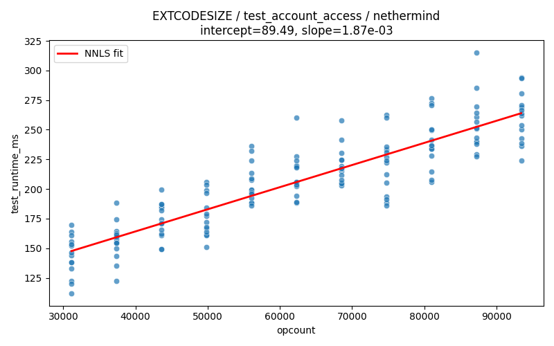

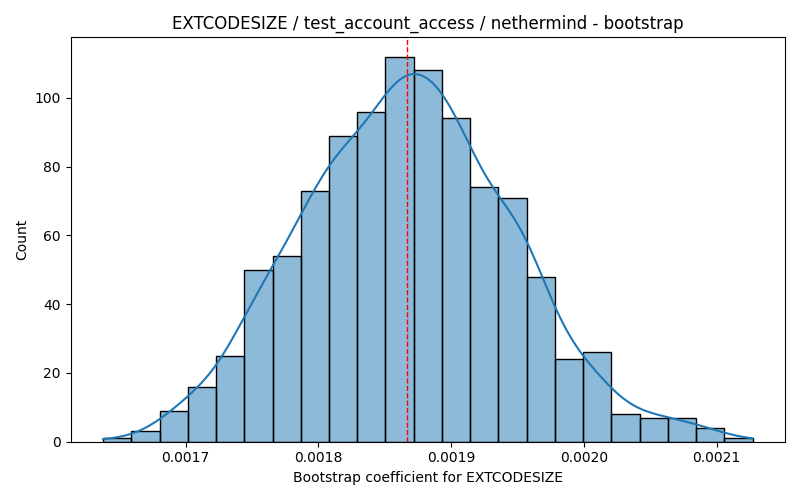

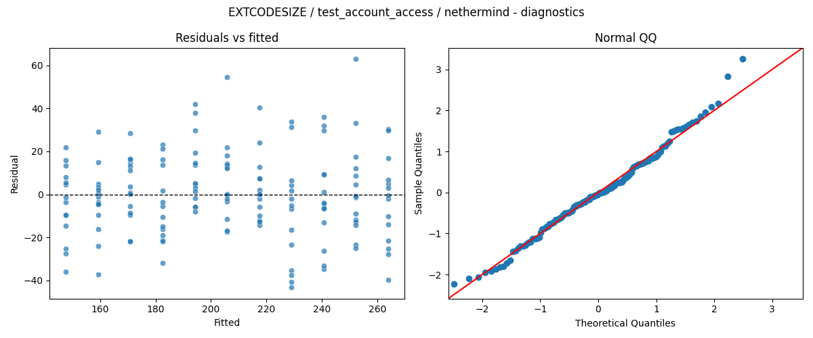

</details>

<details><summary>reth — NNLS regression summary</summary>

```
==============================================================================
                           NNLS Regression Results                            
==============================================================================
Dep. Variable:          test_runtime_ms              R-squared:          0.966
Model:                  NNLS                    Adj. R-squared:          0.966
No. Observations:       209                               RMSE:          14.43
Df Residuals:           207                                MAE:          11.06
Df Model:               1      
==============================================================================
                      coef     std err     P-value      [0.025      0.975]
------------------------------------------------------------------------------
         const     84.4429      2.9400       0.001     78.5949     90.0478
       opcount      0.0039      0.0000       0.001      0.0038      0.0040
==============================================================================
Notes: Non-negative least squares with bootstrap inference (1000 iterations)
==============================================================================
```

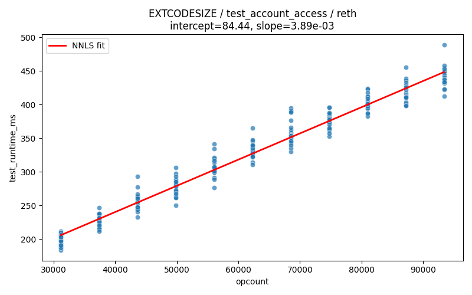

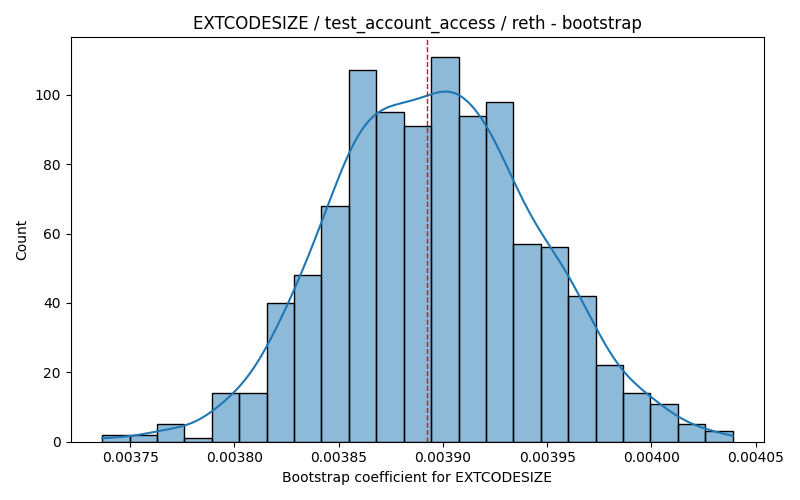

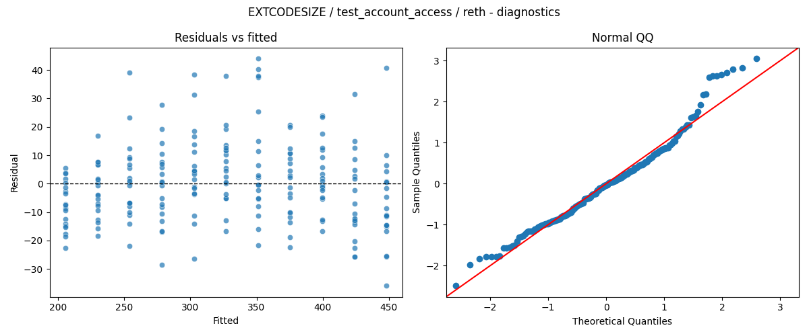

</details>

### test_account_access — combo `EXTCODESIZE_AccountMode.EXISTING_CONTRACT_SAME_MAX`

| client | nobs | R² | target_coef (ms) | p-value | 95% CI |
| --- | --- | --- | --- | --- | --- |
| `besu` | 110 | 0.9682 | 0.01078 | 1.00e-03 | [0.01036, 0.0112] |
| `erigon` | 88 | 0.9947 | 0.008227 | 1.00e-03 | [0.008125, 0.008322] |
| `geth` | 77 | 0.4763 | 0.01642 | 1.00e-03 | [0.01233, 0.01949] |
| `nethermind` | 154 | 0.7317 | 0.00182 | 1.00e-03 | [0.00164, 0.001997] |
| `reth` | 209 | 0.9675 | 0.003858 | 1.00e-03 | [0.003762, 0.003961] |

<details><summary>besu — NNLS regression summary</summary>

```
==============================================================================
                           NNLS Regression Results                            
==============================================================================
Dep. Variable:          test_runtime_ms              R-squared:          0.968
Model:                  NNLS                    Adj. R-squared:          0.968
No. Observations:       110                               RMSE:          38.48
Df Residuals:           108                                MAE:          30.86
Df Model:               1      
==============================================================================
                      coef     std err     P-value      [0.025      0.975]
------------------------------------------------------------------------------
         const    400.6786     13.4722       0.001    374.1489    428.2558
       opcount      0.0108      0.0002       0.001      0.0104      0.0112
==============================================================================
Notes: Non-negative least squares with bootstrap inference (1000 iterations)
==============================================================================
```

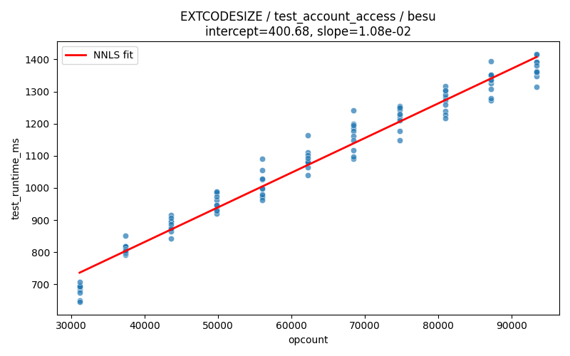

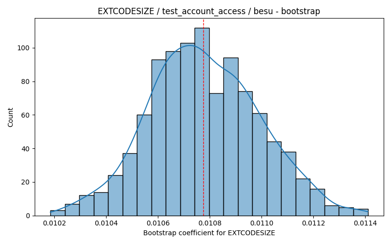

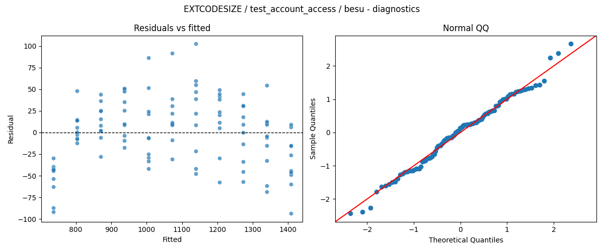

</details>

<details><summary>erigon — NNLS regression summary</summary>

```
==============================================================================
                           NNLS Regression Results                            
==============================================================================
Dep. Variable:          test_runtime_ms              R-squared:          0.995
Model:                  NNLS                    Adj. R-squared:          0.995
No. Observations:       88                                RMSE:          11.88
Df Residuals:           86                                 MAE:           8.27
Df Model:               1      
==============================================================================
                      coef     std err     P-value      [0.025      0.975]
------------------------------------------------------------------------------
         const     73.4211      3.6147       0.001     66.5158     80.9482
       opcount      0.0082      0.0001       0.001      0.0081      0.0083
==============================================================================
Notes: Non-negative least squares with bootstrap inference (1000 iterations)
==============================================================================
```

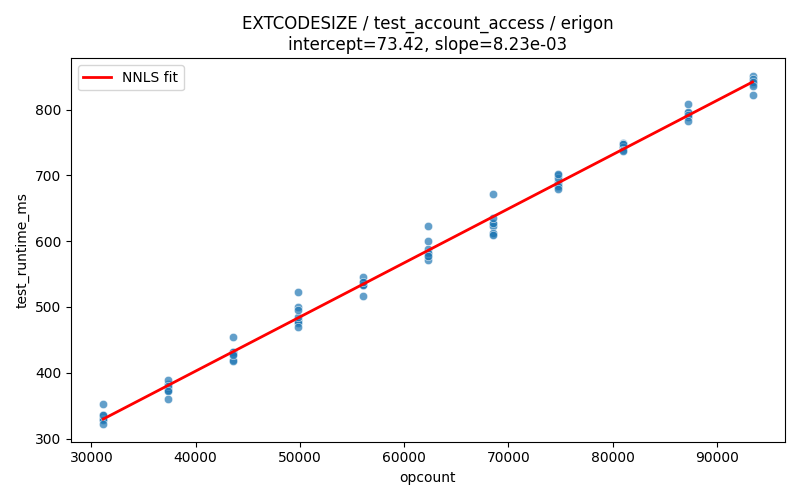

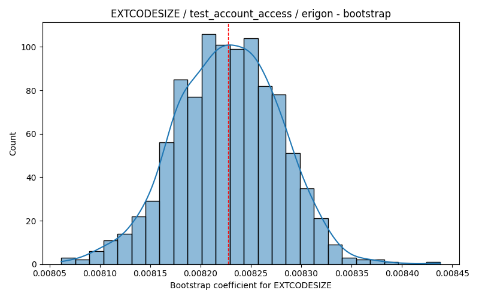

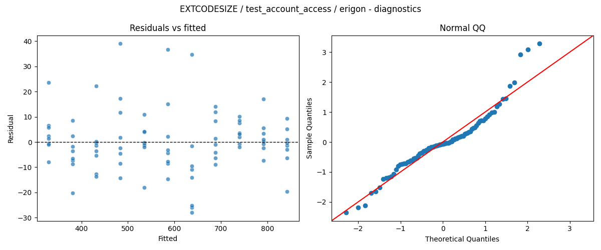

</details>

<details><summary>geth — NNLS regression summary</summary>

```
==============================================================================
                           NNLS Regression Results                            
==============================================================================
Dep. Variable:          test_runtime_ms              R-squared:          0.476
Model:                  NNLS                    Adj. R-squared:          0.469
No. Observations:       77                                RMSE:         339.19
Df Residuals:           75                                 MAE:         228.87
Df Model:               1      
==============================================================================
                      coef     std err     P-value      [0.025      0.975]
------------------------------------------------------------------------------
         const    151.6893    104.0237       0.085      0.0000    360.2206
       opcount      0.0164      0.0019       0.001      0.0123      0.0195
==============================================================================
Notes: Non-negative least squares with bootstrap inference (1000 iterations)
==============================================================================
```

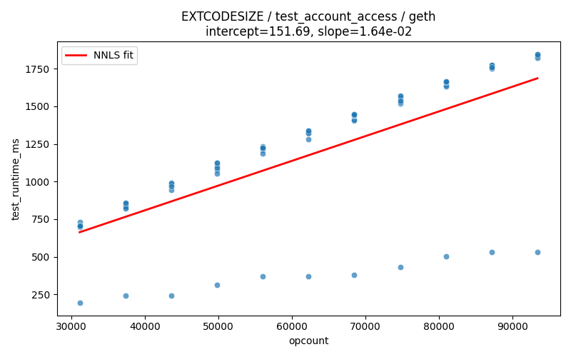

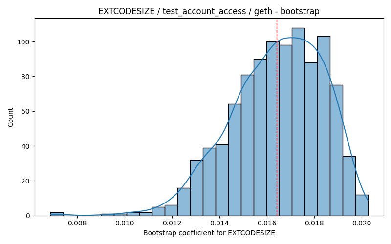


</details>

<details><summary>nethermind — NNLS regression summary</summary>

```
==============================================================================
                           NNLS Regression Results                            
==============================================================================
Dep. Variable:          test_runtime_ms              R-squared:          0.732
Model:                  NNLS                    Adj. R-squared:          0.730
No. Observations:       154                               RMSE:          21.70
Df Residuals:           152                                MAE:          17.75
Df Model:               1      
==============================================================================
                      coef     std err     P-value      [0.025      0.975]
------------------------------------------------------------------------------
         const     97.2668      5.0540       0.001     87.8373    107.3785
       opcount      0.0018      0.0001       0.001      0.0016      0.0020
==============================================================================
Notes: Non-negative least squares with bootstrap inference (1000 iterations)
==============================================================================
```

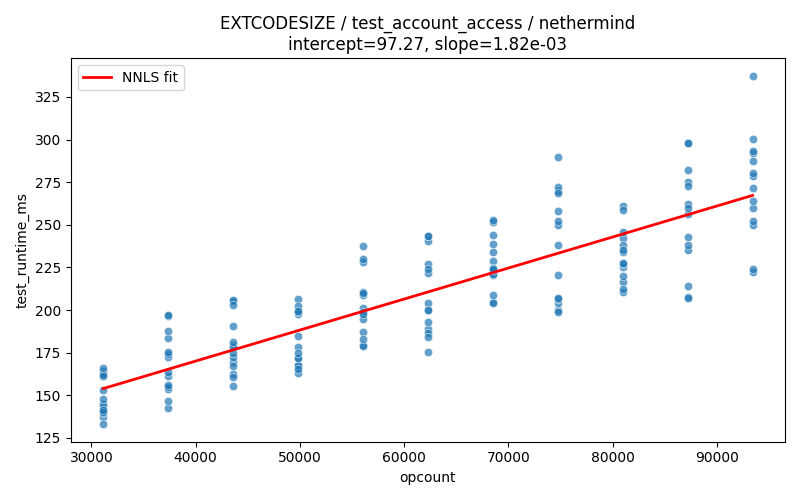

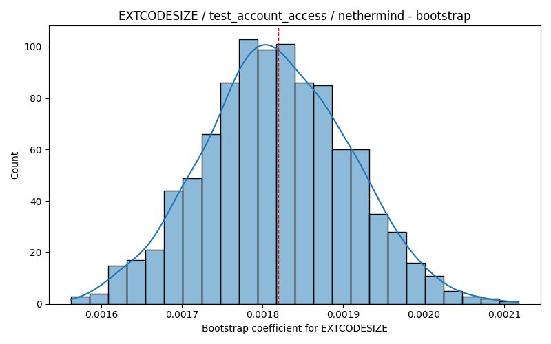

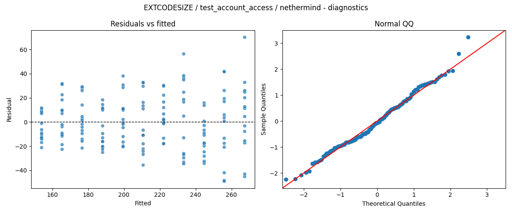

</details>

<details><summary>reth — NNLS regression summary</summary>

```
==============================================================================
                           NNLS Regression Results                            
==============================================================================
Dep. Variable:          test_runtime_ms              R-squared:          0.967
Model:                  NNLS                    Adj. R-squared:          0.967
No. Observations:       209                               RMSE:          13.94
Df Residuals:           207                                MAE:          10.82
Df Model:               1      
==============================================================================
                      coef     std err     P-value      [0.025      0.975]
------------------------------------------------------------------------------
         const     89.0131      3.0058       0.001     83.3242     95.0543
       opcount      0.0039      0.0001       0.001      0.0038      0.0040
==============================================================================
Notes: Non-negative least squares with bootstrap inference (1000 iterations)
==============================================================================
```

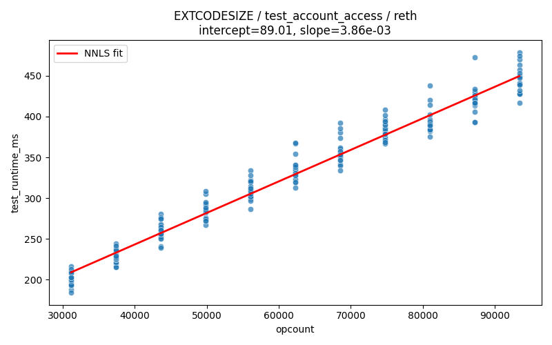

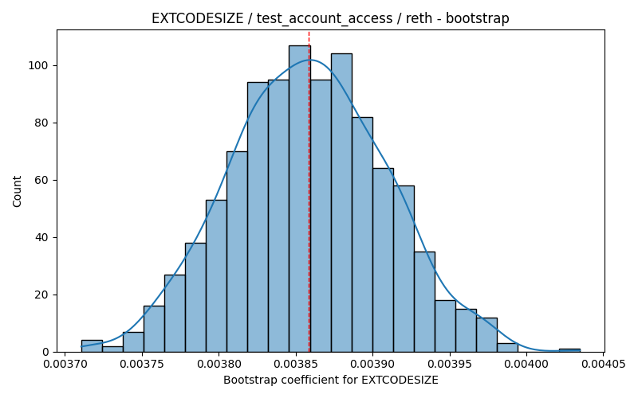

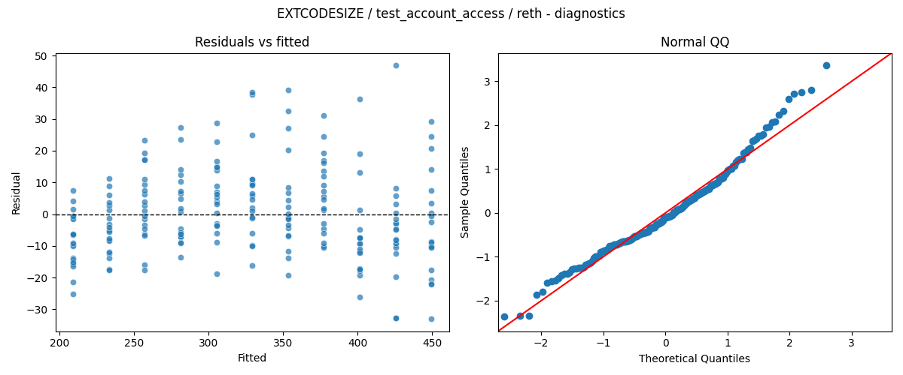

</details>

## STATICCALL

### test_ext_account_query_warm — combo `STATICCALL`

| client | nobs | R² | target_coef (ms) | p-value | 95% CI |
| --- | --- | --- | --- | --- | --- |
| `besu` | 110 | 0.9102 | 0.0004293 | 1.00e-03 | [0.0004041, 0.000458] |
| `erigon` | 88 | 0.6987 | 4.878e-05 | 1.00e-03 | [4.284e-05, 5.574e-05] |
| `geth` | 77 | 0.8876 | 0.0001525 | 1.00e-03 | [0.0001412, 0.0001636] |
| `nethermind` | 154 | 0.7235 | 0.0002622 | 1.00e-03 | [0.000234, 0.0002886] |
| `reth` | 209 | 0.9266 | 5.45e-05 | 1.00e-03 | [5.28e-05, 5.629e-05] |

<details><summary>besu — NNLS regression summary</summary>

```
==============================================================================
                           NNLS Regression Results                            
==============================================================================
Dep. Variable:          test_runtime_ms              R-squared:          0.910
Model:                  NNLS                    Adj. R-squared:          0.909
No. Observations:       110                               RMSE:          69.81
Df Residuals:           108                                MAE:          58.51
Df Model:               1      
==============================================================================
                      coef     std err     P-value      [0.025      0.975]
------------------------------------------------------------------------------
         const    432.2111     22.1653       0.001    387.4316    474.1171
       opcount      0.0004      0.0000       0.001      0.0004      0.0005
==============================================================================
Notes: Non-negative least squares with bootstrap inference (1000 iterations)
==============================================================================
```

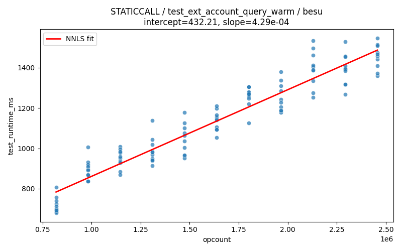

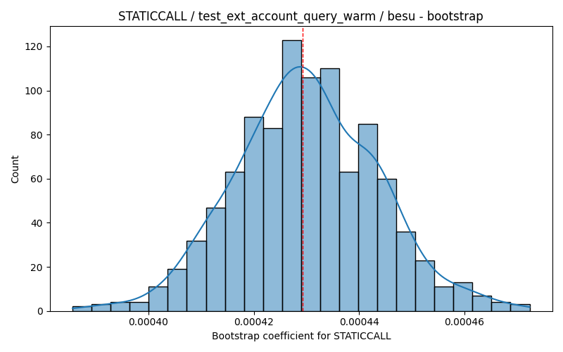

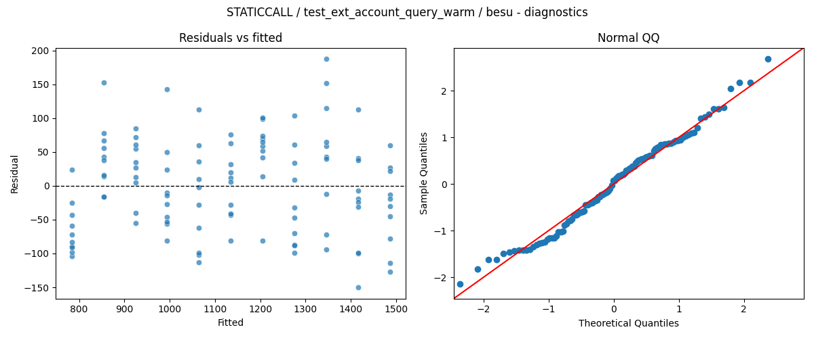

</details>

<details><summary>erigon — NNLS regression summary</summary>

```
==============================================================================
                           NNLS Regression Results                            
==============================================================================
Dep. Variable:          test_runtime_ms              R-squared:          0.699
Model:                  NNLS                    Adj. R-squared:          0.695
No. Observations:       88                                RMSE:          16.59
Df Residuals:           86                                 MAE:          12.16
Df Model:               1      
==============================================================================
                      coef     std err     P-value      [0.025      0.975]
------------------------------------------------------------------------------
         const     37.6960      5.3197       0.001     27.4214     47.9303
       opcount      0.0000      0.0000       0.001      0.0000      0.0001
==============================================================================
Notes: Non-negative least squares with bootstrap inference (1000 iterations)
==============================================================================
```

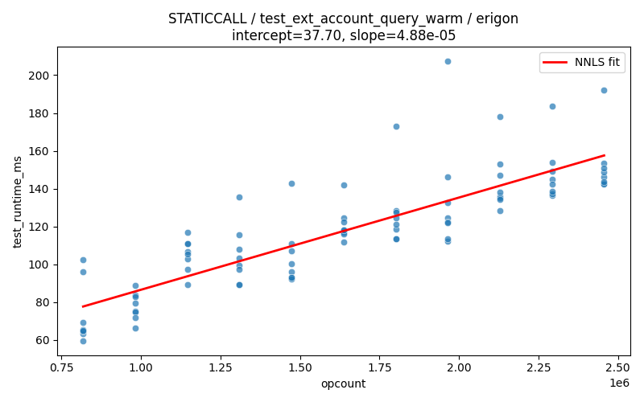

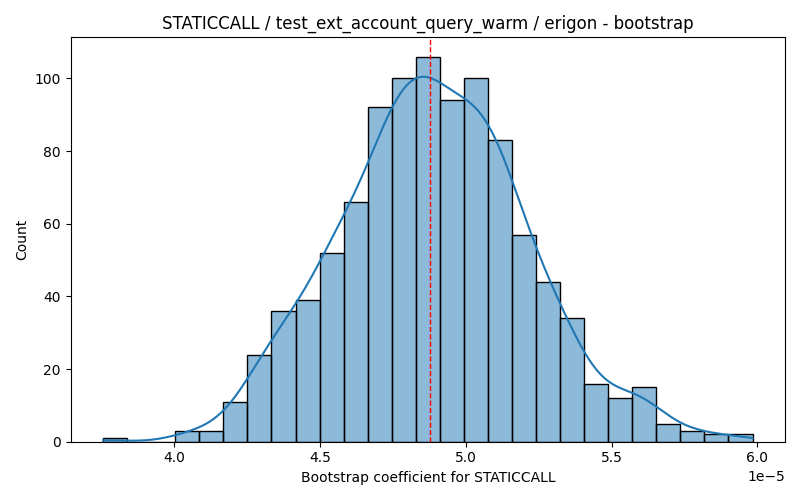

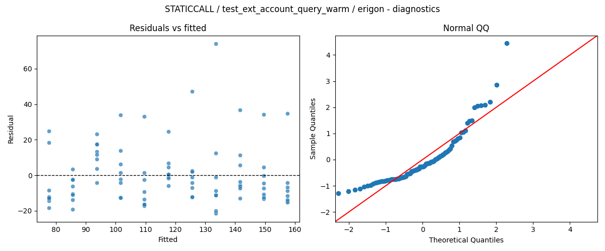

</details>

<details><summary>geth — NNLS regression summary</summary>

```
==============================================================================
                           NNLS Regression Results                            
==============================================================================
Dep. Variable:          test_runtime_ms              R-squared:          0.888
Model:                  NNLS                    Adj. R-squared:          0.886
No. Observations:       77                                RMSE:          28.11
Df Residuals:           75                                 MAE:          21.88
Df Model:               1      
==============================================================================
                      coef     std err     P-value      [0.025      0.975]
------------------------------------------------------------------------------
         const     43.6269      8.8969       0.001     26.5872     61.8613
       opcount      0.0002      0.0000       0.001      0.0001      0.0002
==============================================================================
Notes: Non-negative least squares with bootstrap inference (1000 iterations)
==============================================================================
```

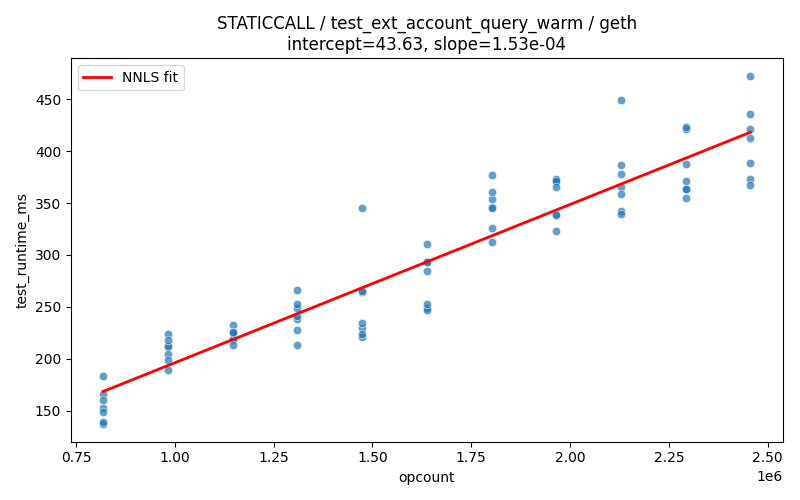

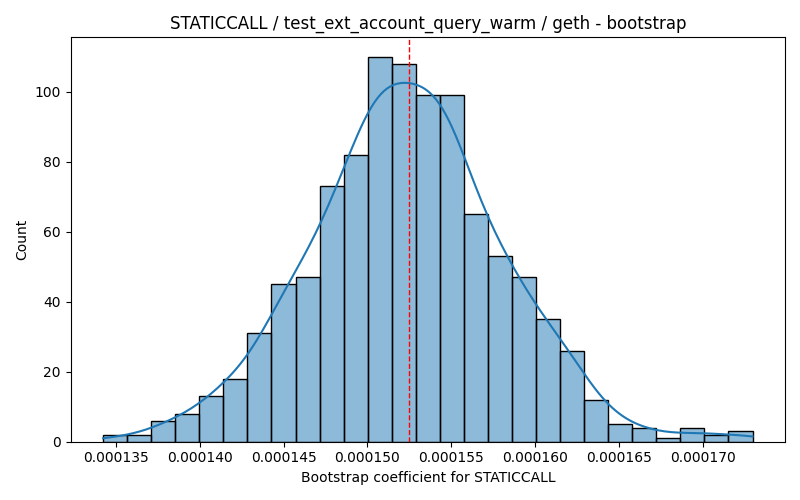

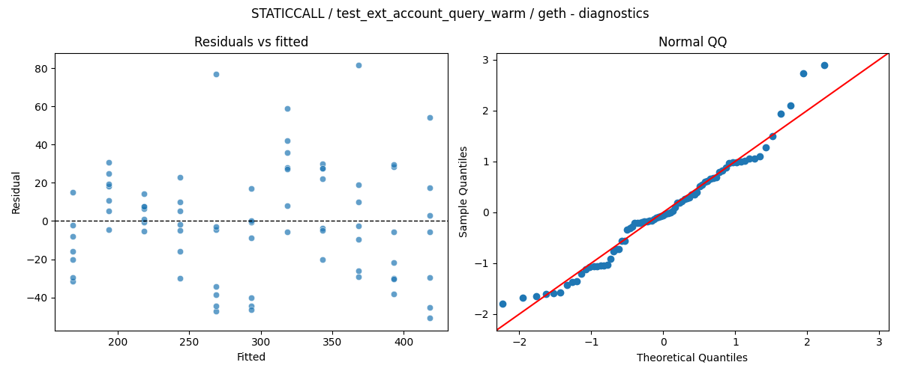

</details>

<details><summary>nethermind — NNLS regression summary</summary>

```
==============================================================================
                           NNLS Regression Results                            
==============================================================================
Dep. Variable:          test_runtime_ms              R-squared:          0.724
Model:                  NNLS                    Adj. R-squared:          0.722
No. Observations:       154                               RMSE:          83.93
Df Residuals:           152                                MAE:          65.09
Df Model:               1      
==============================================================================
                      coef     std err     P-value      [0.025      0.975]
------------------------------------------------------------------------------
         const    314.8106     22.6258       0.001    273.5845    358.9656
       opcount      0.0003      0.0000       0.001      0.0002      0.0003
==============================================================================
Notes: Non-negative least squares with bootstrap inference (1000 iterations)
==============================================================================
```

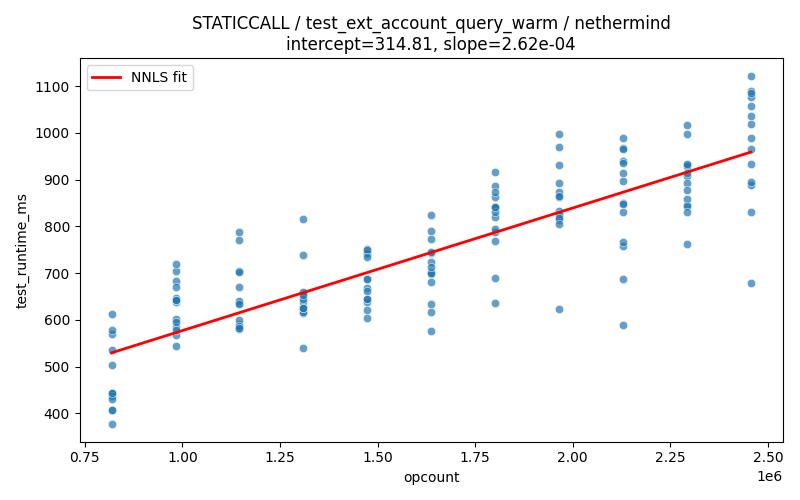

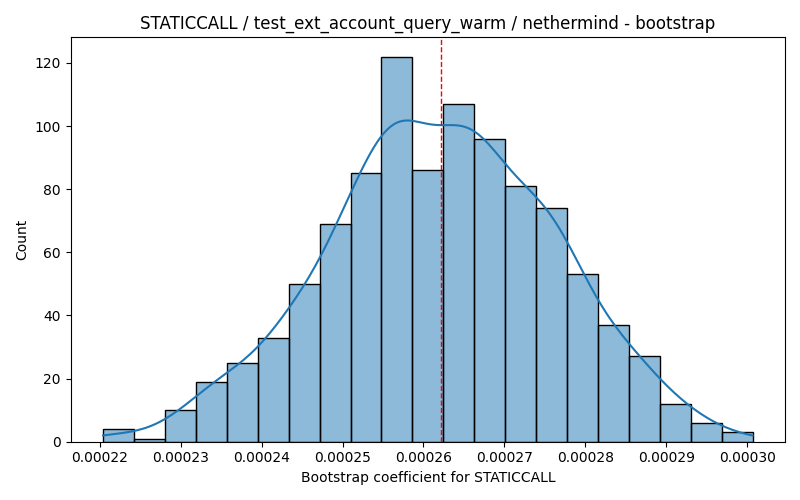

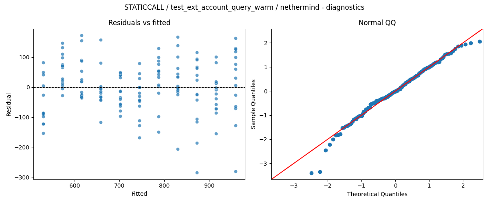

</details>

<details><summary>reth — NNLS regression summary</summary>

```
==============================================================================
                           NNLS Regression Results                            
==============================================================================
Dep. Variable:          test_runtime_ms              R-squared:          0.927
Model:                  NNLS                    Adj. R-squared:          0.926
No. Observations:       209                               RMSE:           7.94
Df Residuals:           207                                MAE:           6.21
Df Model:               1      
==============================================================================
                      coef     std err     P-value      [0.025      0.975]
------------------------------------------------------------------------------
         const     25.5444      1.5469       0.001     22.4496     28.6273
       opcount      0.0001      0.0000       0.001      0.0001      0.0001
==============================================================================
Notes: Non-negative least squares with bootstrap inference (1000 iterations)
==============================================================================
```

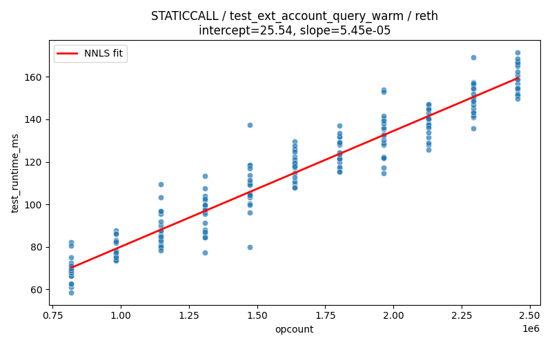

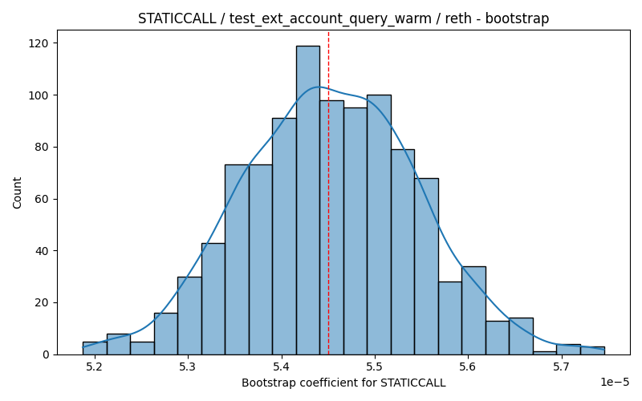

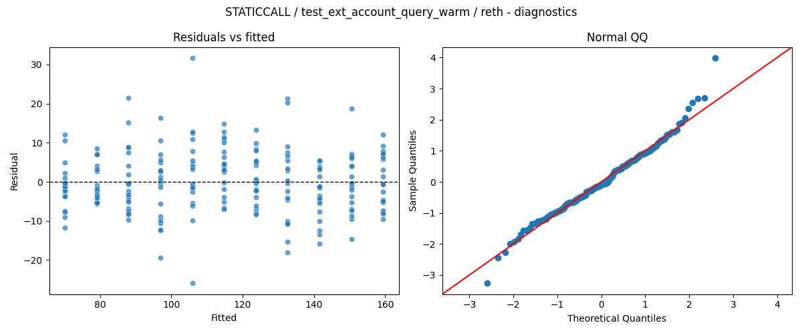

</details>

### test_account_access — combo `STATICCALL_AccountMode.EXISTING_EOA`

| client | nobs | R² | target_coef (ms) | p-value | 95% CI |
| --- | --- | --- | --- | --- | --- |
| `besu` | 110 | 0.9809 | 0.01741 | 1.00e-03 | [0.01702, 0.01785] |
| `erigon` | 88 | 0.9972 | 0.008502 | 1.00e-03 | [0.008417, 0.008574] |
| `geth` | 77 | 0.8136 | 0.01822 | 1.00e-03 | [0.01605, 0.02002] |
| `nethermind` | 154 | 0.9223 | 0.003475 | 1.00e-03 | [0.003315, 0.003644] |
| `reth` | 209 | 0.9676 | 0.004316 | 1.00e-03 | [0.004222, 0.004419] |

<details><summary>besu — NNLS regression summary</summary>

```
==============================================================================
                           NNLS Regression Results                            
==============================================================================
Dep. Variable:          test_runtime_ms              R-squared:          0.981
Model:                  NNLS                    Adj. R-squared:          0.981
No. Observations:       110                               RMSE:          49.92
Df Residuals:           108                                MAE:          36.89
Df Model:               1      
==============================================================================
                      coef     std err     P-value      [0.025      0.975]
------------------------------------------------------------------------------
         const    487.7230     13.0511       0.001    459.9820    512.6137
       opcount      0.0174      0.0002       0.001      0.0170      0.0179
==============================================================================
Notes: Non-negative least squares with bootstrap inference (1000 iterations)
==============================================================================
```

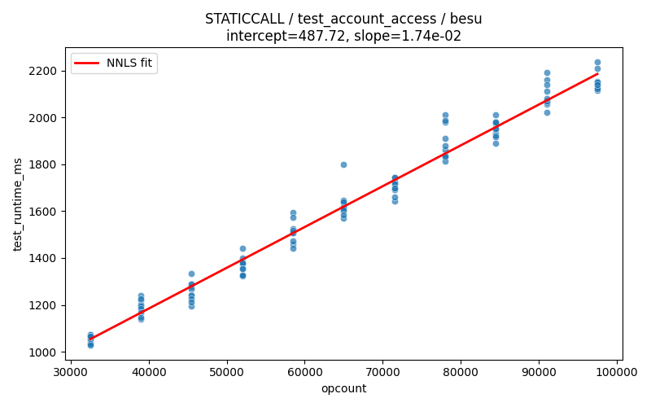

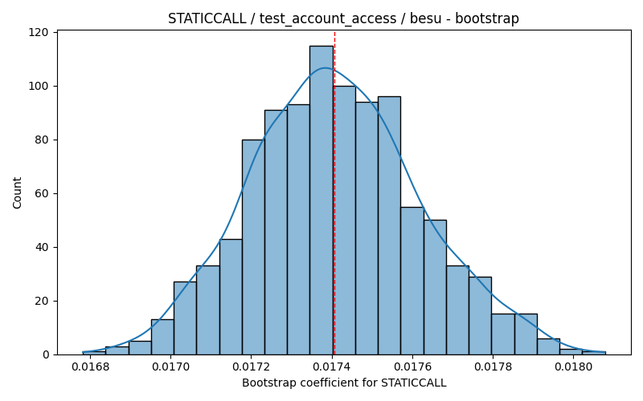

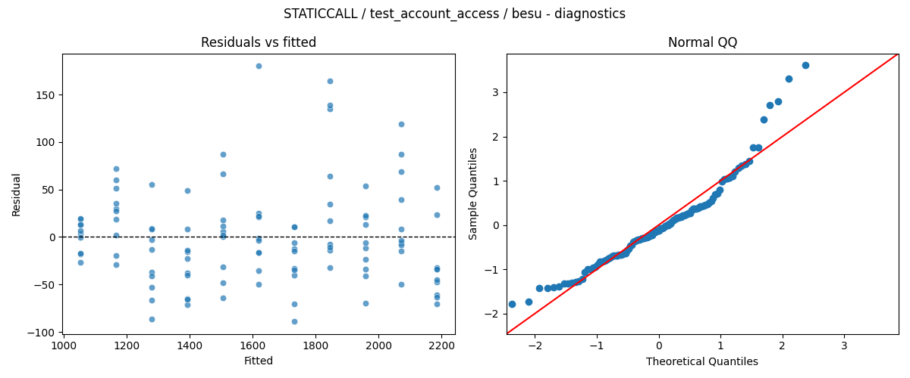

</details>

<details><summary>erigon — NNLS regression summary</summary>

```
==============================================================================
                           NNLS Regression Results                            
==============================================================================
Dep. Variable:          test_runtime_ms              R-squared:          0.997
Model:                  NNLS                    Adj. R-squared:          0.997
No. Observations:       88                                RMSE:           9.34
Df Residuals:           86                                 MAE:           7.35
Df Model:               1      
==============================================================================
                      coef     std err     P-value      [0.025      0.975]
------------------------------------------------------------------------------
         const      3.9910      2.8216       0.127      0.0000      9.6728
       opcount      0.0085      0.0000       0.001      0.0084      0.0086
==============================================================================
Notes: Non-negative least squares with bootstrap inference (1000 iterations)
==============================================================================
```

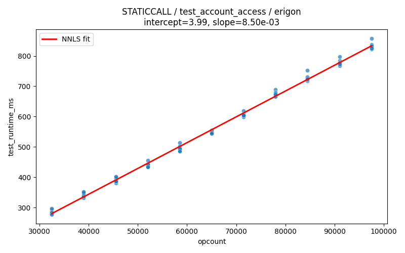

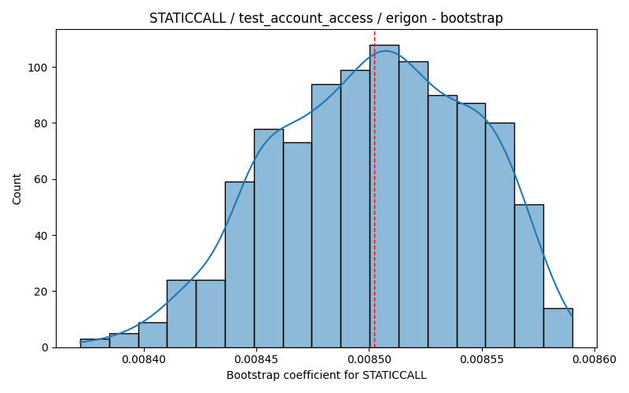

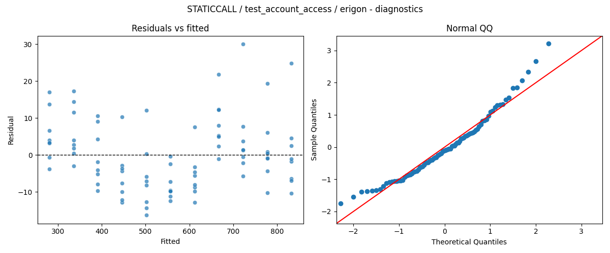

</details>

<details><summary>geth — NNLS regression summary</summary>

```
==============================================================================
                           NNLS Regression Results                            
==============================================================================
Dep. Variable:          test_runtime_ms              R-squared:          0.814
Model:                  NNLS                    Adj. R-squared:          0.811
No. Observations:       77                                RMSE:         179.31
Df Residuals:           75                                 MAE:         118.86
Df Model:               1      
==============================================================================
                      coef     std err     P-value      [0.025      0.975]
------------------------------------------------------------------------------
         const    203.7642     59.5076       0.001     97.4123    322.2798
       opcount      0.0182      0.0011       0.001      0.0160      0.0200
==============================================================================
Notes: Non-negative least squares with bootstrap inference (1000 iterations)
==============================================================================
```

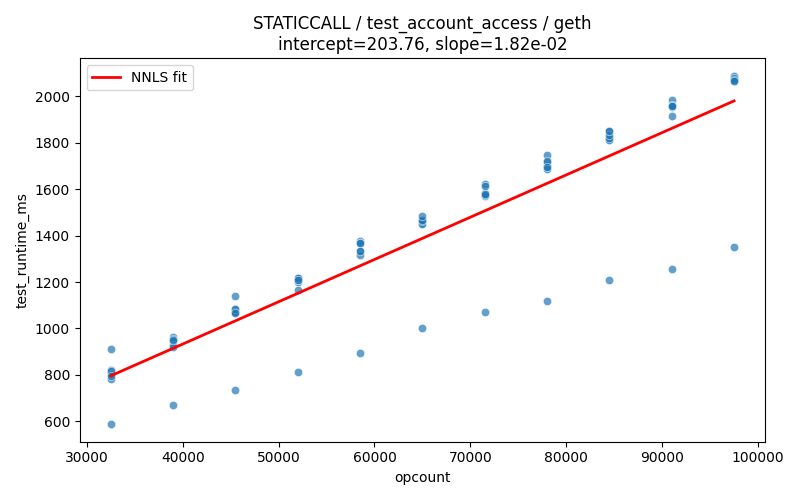

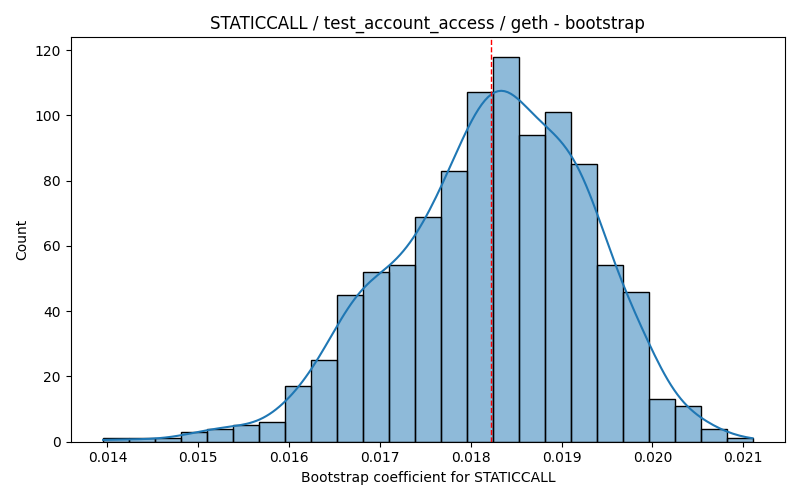

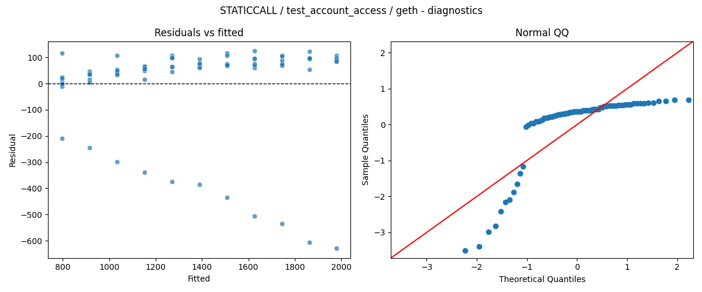

</details>

<details><summary>nethermind — NNLS regression summary</summary>

```
==============================================================================
                           NNLS Regression Results                            
==============================================================================
Dep. Variable:          test_runtime_ms              R-squared:          0.922
Model:                  NNLS                    Adj. R-squared:          0.922
No. Observations:       154                               RMSE:          20.74
Df Residuals:           152                                MAE:          16.79
Df Model:               1      
==============================================================================
                      coef     std err     P-value      [0.025      0.975]
------------------------------------------------------------------------------
         const     99.2698      5.0177       0.001     89.7721    108.8797
       opcount      0.0035      0.0001       0.001      0.0033      0.0036
==============================================================================
Notes: Non-negative least squares with bootstrap inference (1000 iterations)
==============================================================================
```

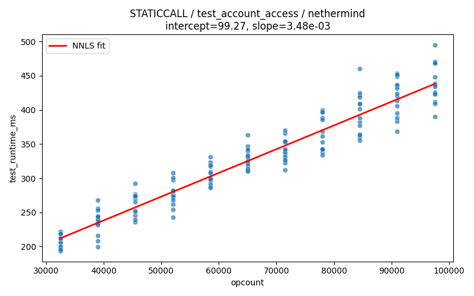

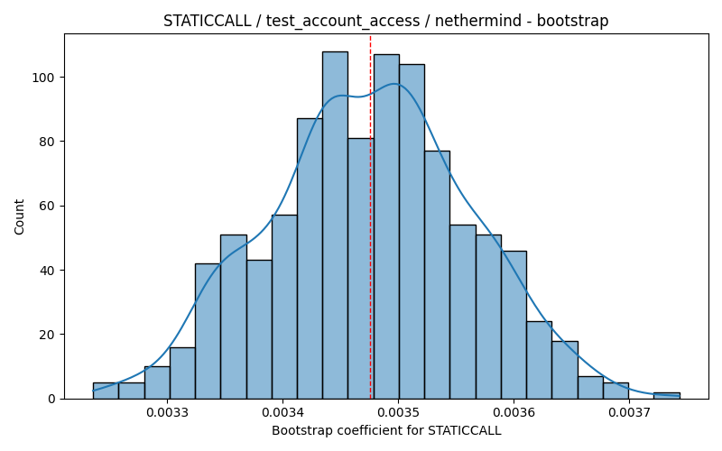

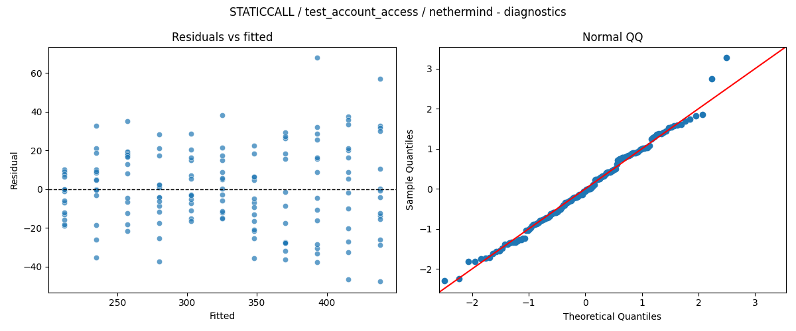

</details>

<details><summary>reth — NNLS regression summary</summary>

```
==============================================================================
                           NNLS Regression Results                            
==============================================================================
Dep. Variable:          test_runtime_ms              R-squared:          0.968
Model:                  NNLS                    Adj. R-squared:          0.967
No. Observations:       209                               RMSE:          16.23
Df Residuals:           207                                MAE:          12.99
Df Model:               1      
==============================================================================
                      coef     std err     P-value      [0.025      0.975]
------------------------------------------------------------------------------
         const    103.3467      3.3096       0.001     97.1874    109.7195
       opcount      0.0043      0.0001       0.001      0.0042      0.0044
==============================================================================
Notes: Non-negative least squares with bootstrap inference (1000 iterations)
==============================================================================
```

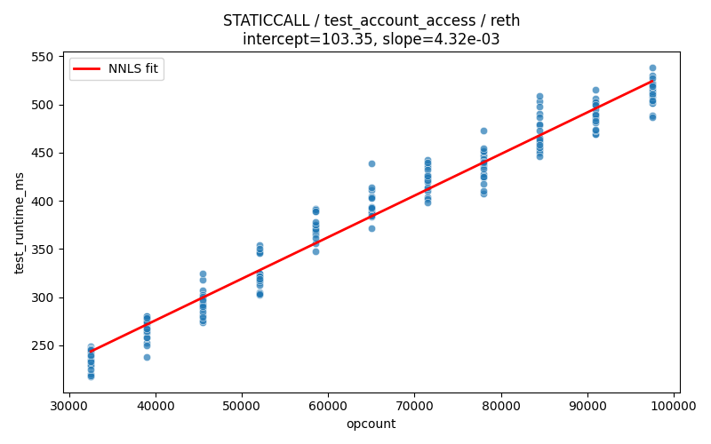

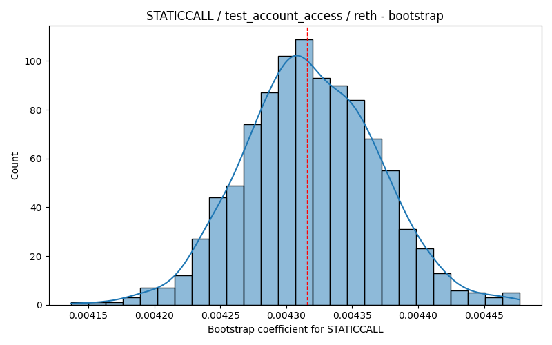

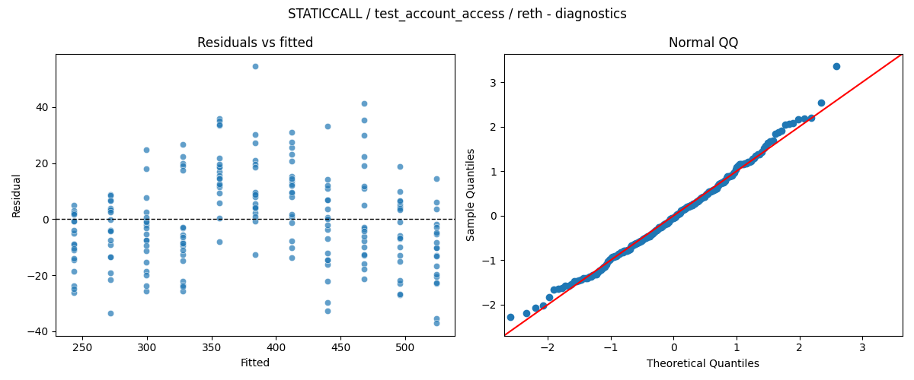

</details>

### test_account_access — combo `STATICCALL_AccountMode.NON_EXISTING_ACCOUNT`

| client | nobs | R² | target_coef (ms) | p-value | 95% CI |
| --- | --- | --- | --- | --- | --- |
| `besu` | 110 | 0.9839 | 0.01911 | 1.00e-03 | [0.01866, 0.01957] |
| `erigon` | 88 | 0.9924 | 0.008349 | 1.00e-03 | [0.008194, 0.008518] |
| `geth` | 77 | 0.937 | 0.02037 | 1.00e-03 | [0.01932, 0.02164] |
| `nethermind` | 154 | 0.8935 | 0.003422 | 1.00e-03 | [0.003226, 0.00362] |
| `reth` | 209 | 0.9706 | 0.004065 | 1.00e-03 | [0.003981, 0.004153] |

<details><summary>besu — NNLS regression summary</summary>

```
==============================================================================
                           NNLS Regression Results                            
==============================================================================
Dep. Variable:          test_runtime_ms              R-squared:          0.984
Model:                  NNLS                    Adj. R-squared:          0.984
No. Observations:       110                               RMSE:          50.28
Df Residuals:           108                                MAE:          38.66
Df Model:               1      
==============================================================================
                      coef     std err     P-value      [0.025      0.975]
------------------------------------------------------------------------------
         const    190.7648     14.3437       0.001    161.3174    219.0294
       opcount      0.0191      0.0002       0.001      0.0187      0.0196
==============================================================================
Notes: Non-negative least squares with bootstrap inference (1000 iterations)
==============================================================================
```

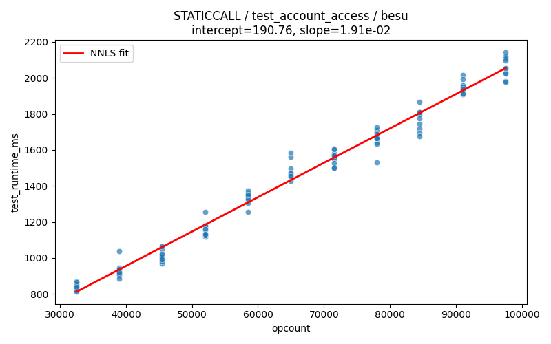

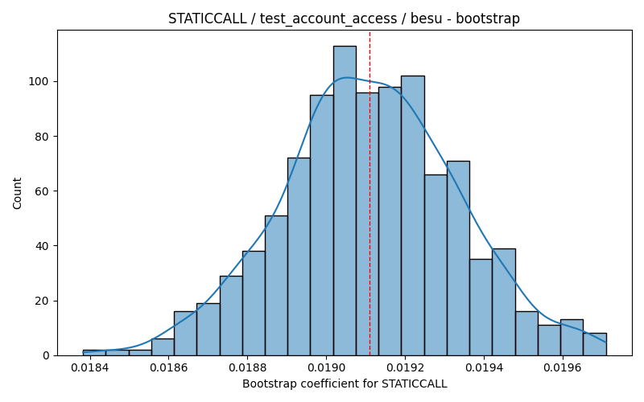

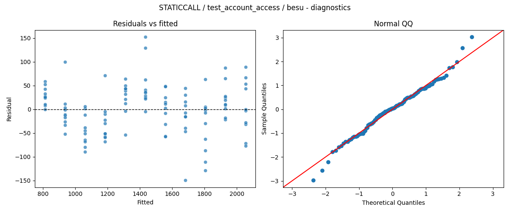

</details>

<details><summary>erigon — NNLS regression summary</summary>

```
==============================================================================
                           NNLS Regression Results                            
==============================================================================
Dep. Variable:          test_runtime_ms              R-squared:          0.992
Model:                  NNLS                    Adj. R-squared:          0.992
No. Observations:       88                                RMSE:          15.00
Df Residuals:           86                                 MAE:          10.42
Df Model:               1      
==============================================================================
                      coef     std err     P-value      [0.025      0.975]
------------------------------------------------------------------------------
         const     10.8120      4.8699       0.021      0.8141     19.5380
       opcount      0.0083      0.0001       0.001      0.0082      0.0085
==============================================================================
Notes: Non-negative least squares with bootstrap inference (1000 iterations)
==============================================================================
```

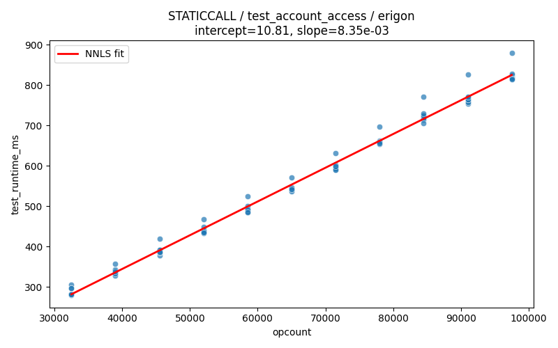

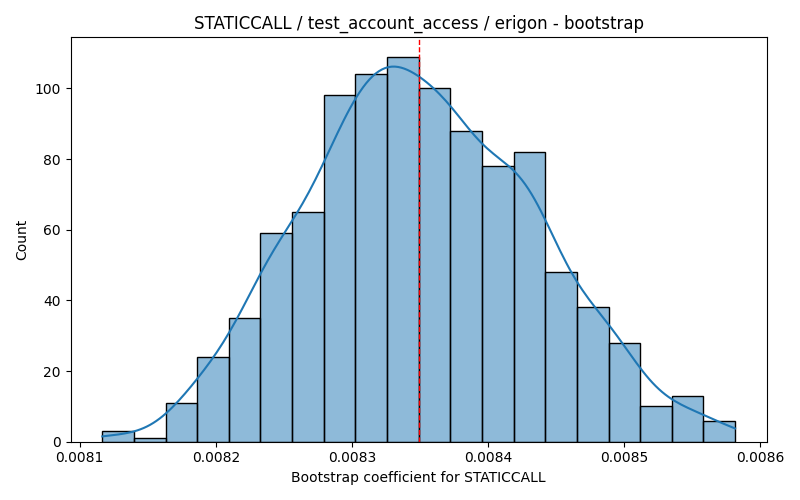

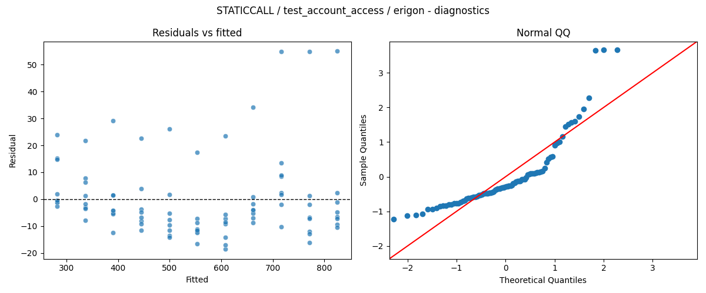

</details>

<details><summary>geth — NNLS regression summary</summary>

```
==============================================================================
                           NNLS Regression Results                            
==============================================================================
Dep. Variable:          test_runtime_ms              R-squared:          0.937
Model:                  NNLS                    Adj. R-squared:          0.936
No. Observations:       77                                RMSE:         108.60
Df Residuals:           75                                 MAE:          71.58
Df Model:               1      
==============================================================================
                      coef     std err     P-value      [0.025      0.975]
------------------------------------------------------------------------------
         const    198.3534     34.3769       0.001    129.7855    261.2412
       opcount      0.0204      0.0006       0.001      0.0193      0.0216
==============================================================================
Notes: Non-negative least squares with bootstrap inference (1000 iterations)
==============================================================================
```

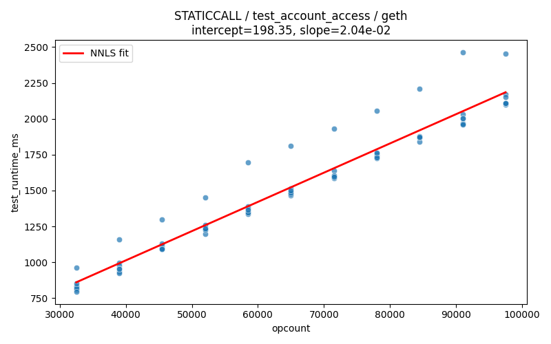

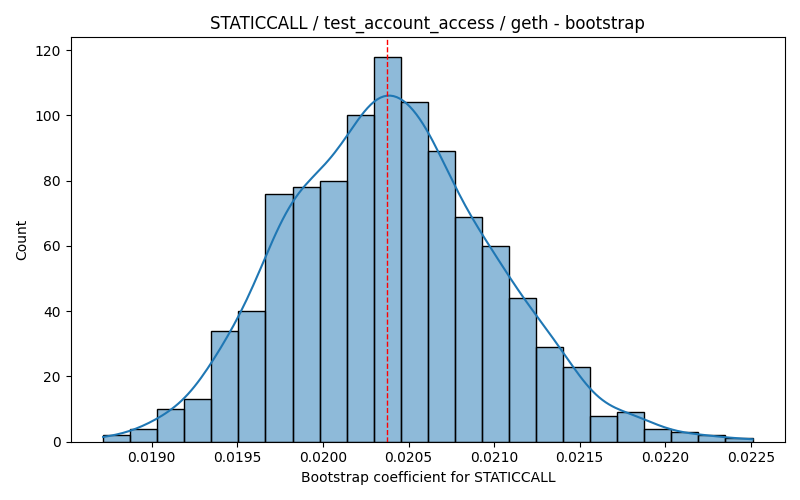

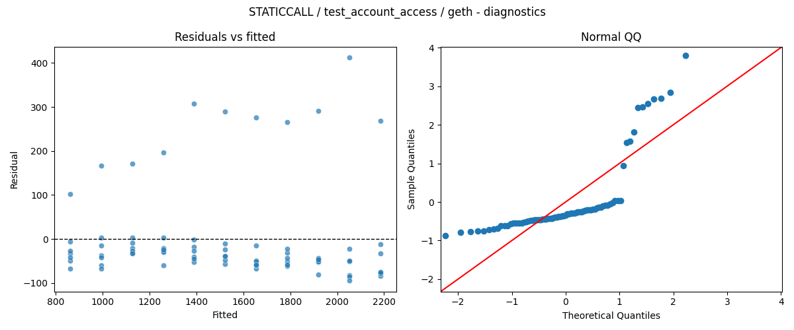

</details>

<details><summary>nethermind — NNLS regression summary</summary>

```
==============================================================================
                           NNLS Regression Results                            
==============================================================================
Dep. Variable:          test_runtime_ms              R-squared:          0.893
Model:                  NNLS                    Adj. R-squared:          0.893
No. Observations:       154                               RMSE:          24.28
Df Residuals:           152                                MAE:          19.98
Df Model:               1      
==============================================================================
                      coef     std err     P-value      [0.025      0.975]
------------------------------------------------------------------------------
         const     85.1094      5.9014       0.001     73.2908     96.6840
       opcount      0.0034      0.0001       0.001      0.0032      0.0036
==============================================================================
Notes: Non-negative least squares with bootstrap inference (1000 iterations)
==============================================================================
```

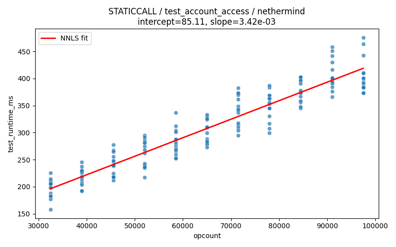

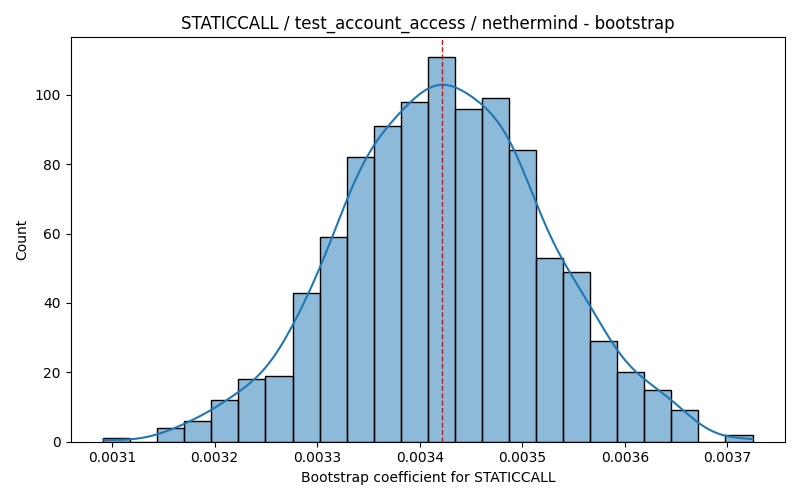

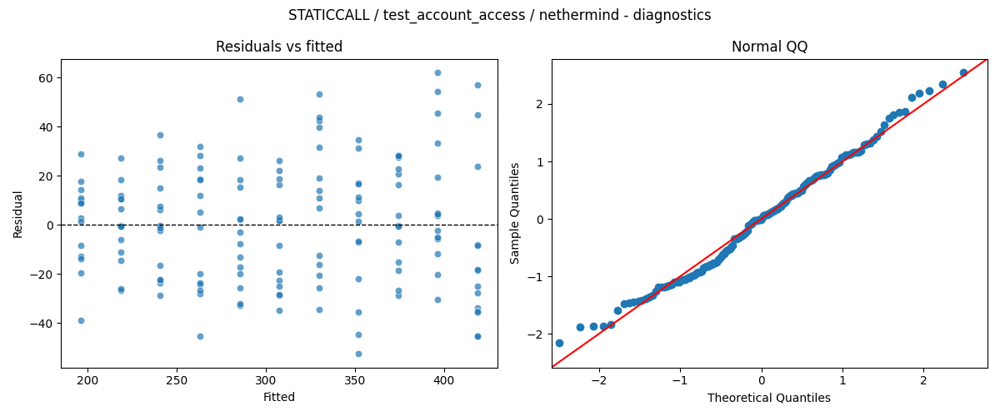

</details>

<details><summary>reth — NNLS regression summary</summary>

```
==============================================================================
                           NNLS Regression Results                            
==============================================================================
Dep. Variable:          test_runtime_ms              R-squared:          0.971
Model:                  NNLS                    Adj. R-squared:          0.970
No. Observations:       209                               RMSE:          14.55
Df Residuals:           207                                MAE:          11.51
Df Model:               1      
==============================================================================
                      coef     std err     P-value      [0.025      0.975]
------------------------------------------------------------------------------
         const    100.7552      2.9420       0.001     95.2723    106.8044
       opcount      0.0041      0.0000       0.001      0.0040      0.0042
==============================================================================
Notes: Non-negative least squares with bootstrap inference (1000 iterations)
==============================================================================
```

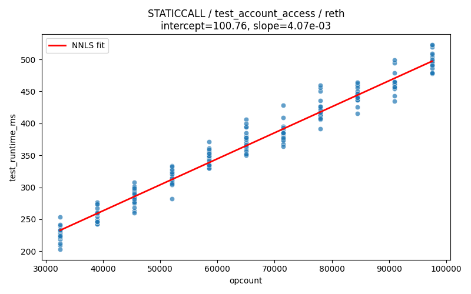

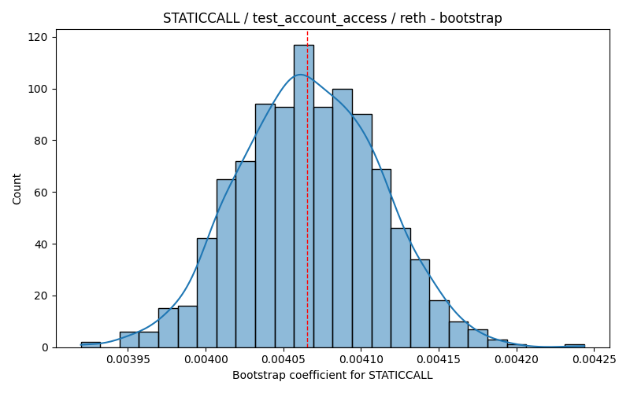

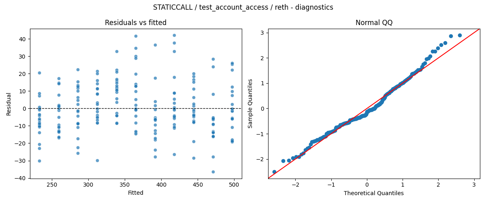

</details>

### test_account_access — combo `STATICCALL_AccountMode.EXISTING_CONTRACT_DIFF_MAX`

| client | nobs | R² | target_coef (ms) | p-value | 95% CI |
| --- | --- | --- | --- | --- | --- |
| `besu` | 110 | 0.981 | 0.02301 | 1.00e-03 | [0.02245, 0.02358] |
| `erigon` | 88 | 0.8184 | 0.02646 | 1.00e-03 | [0.02402, 0.02929] |
| `geth` | 77 | 0.8618 | 0.02709 | 1.00e-03 | [0.02467, 0.02942] |
| `nethermind` | 154 | 0.8951 | 0.01571 | 1.00e-03 | [0.01466, 0.01673] |
| `reth` | 209 | 0.995 | 0.02192 | 1.00e-03 | [0.0217, 0.02214] |

<details><summary>besu — NNLS regression summary</summary>

```
==============================================================================
                           NNLS Regression Results                            
==============================================================================
Dep. Variable:          test_runtime_ms              R-squared:          0.981
Model:                  NNLS                    Adj. R-squared:          0.981
No. Observations:       110                               RMSE:          64.76
Df Residuals:           108                                MAE:          51.91
Df Model:               1      
==============================================================================
                      coef     std err     P-value      [0.025      0.975]
------------------------------------------------------------------------------
         const    434.5031     19.9102       0.001    393.5377    474.8896
       opcount      0.0230      0.0003       0.001      0.0225      0.0236
==============================================================================
Notes: Non-negative least squares with bootstrap inference (1000 iterations)
==============================================================================
```

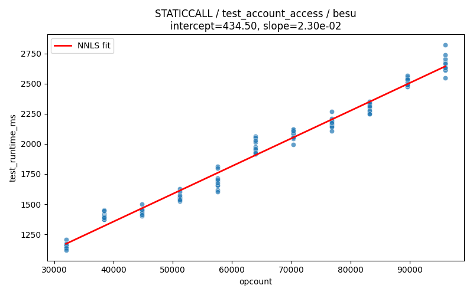

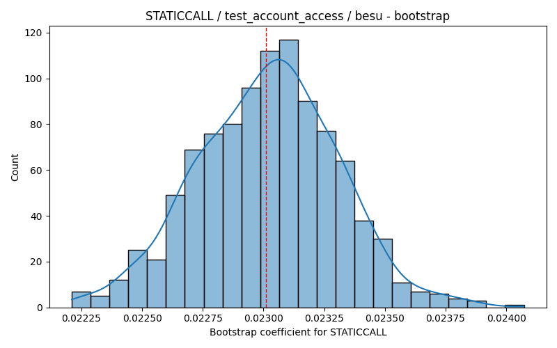

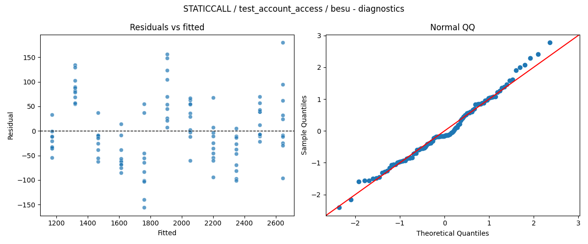

</details>

<details><summary>erigon — NNLS regression summary</summary>

```
==============================================================================
                           NNLS Regression Results                            
==============================================================================
Dep. Variable:          test_runtime_ms              R-squared:          0.818
Model:                  NNLS                    Adj. R-squared:          0.816
No. Observations:       88                                RMSE:         252.19
Df Residuals:           86                                 MAE:         177.61
Df Model:               1      
==============================================================================
                      coef     std err     P-value      [0.025      0.975]
------------------------------------------------------------------------------
         const    228.3538     80.7813       0.001     72.0227    389.0984
       opcount      0.0265      0.0014       0.001      0.0240      0.0293
==============================================================================
Notes: Non-negative least squares with bootstrap inference (1000 iterations)
==============================================================================
```

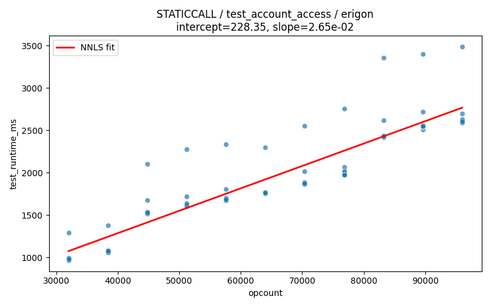

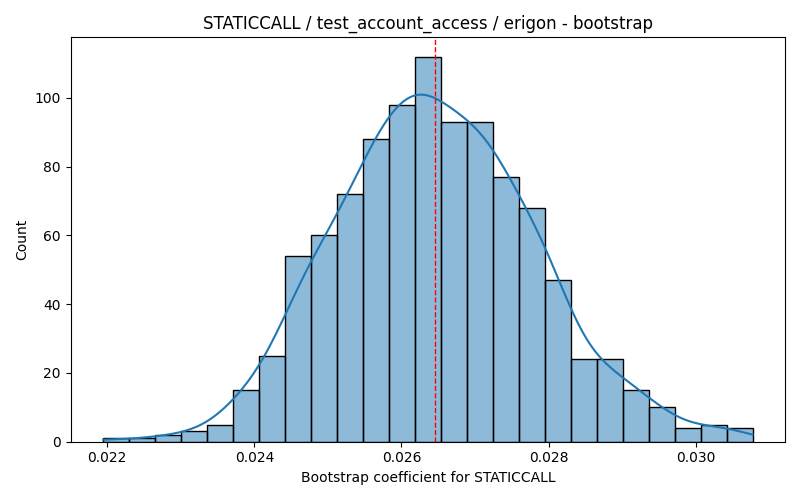

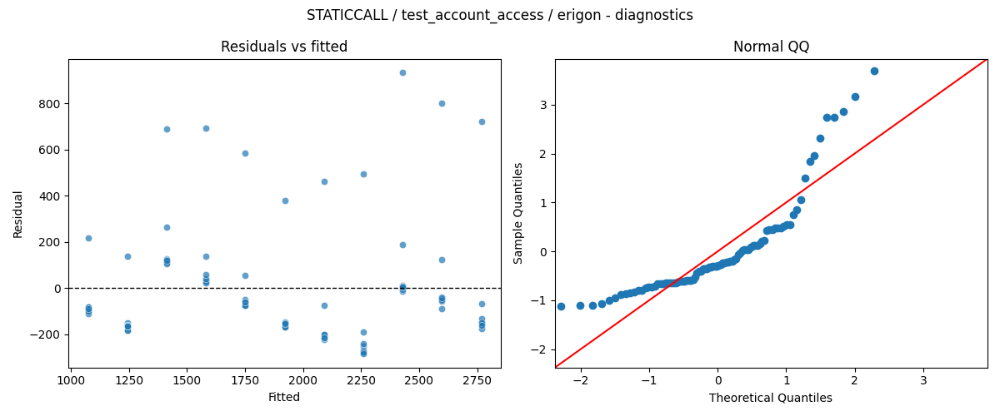

</details>

<details><summary>geth — NNLS regression summary</summary>

```
==============================================================================
                           NNLS Regression Results                            
==============================================================================
Dep. Variable:          test_runtime_ms              R-squared:          0.862
Model:                  NNLS                    Adj. R-squared:          0.860
No. Observations:       77                                RMSE:         219.49
Df Residuals:           75                                 MAE:         181.50
Df Model:               1      
==============================================================================
                      coef     std err     P-value      [0.025      0.975]
------------------------------------------------------------------------------
         const    465.6796     83.8394       0.001    314.0754    637.8405
       opcount      0.0271      0.0013       0.001      0.0247      0.0294
==============================================================================
Notes: Non-negative least squares with bootstrap inference (1000 iterations)
==============================================================================
```

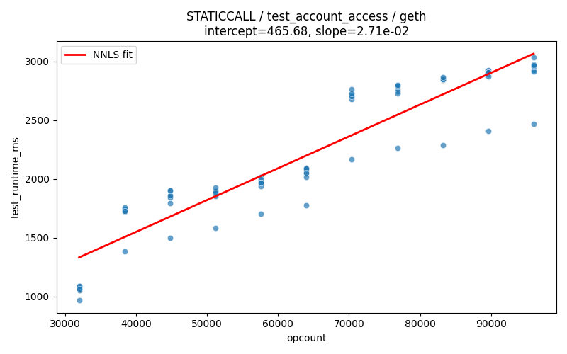

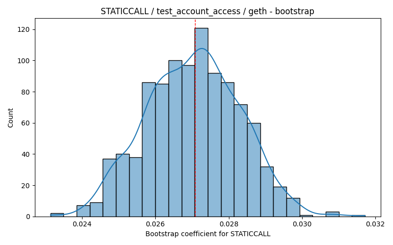

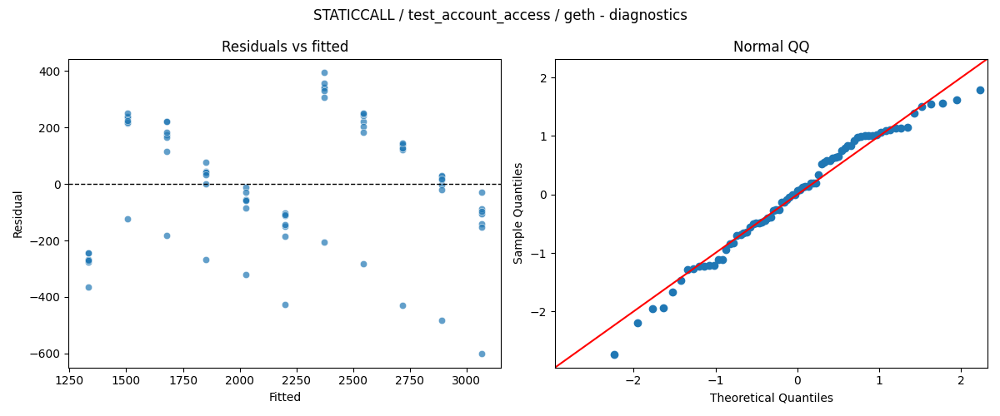

</details>

<details><summary>nethermind — NNLS regression summary</summary>

```
==============================================================================
                           NNLS Regression Results                            
==============================================================================
Dep. Variable:          test_runtime_ms              R-squared:          0.895
Model:                  NNLS                    Adj. R-squared:          0.894
No. Observations:       154                               RMSE:         108.88
Df Residuals:           152                                MAE:          85.42
Df Model:               1      
==============================================================================
                      coef     std err     P-value      [0.025      0.975]
------------------------------------------------------------------------------
         const    644.4393     38.9449       0.001    568.7577    724.0037
       opcount      0.0157      0.0005       0.001      0.0147      0.0167
==============================================================================
Notes: Non-negative least squares with bootstrap inference (1000 iterations)
==============================================================================
```

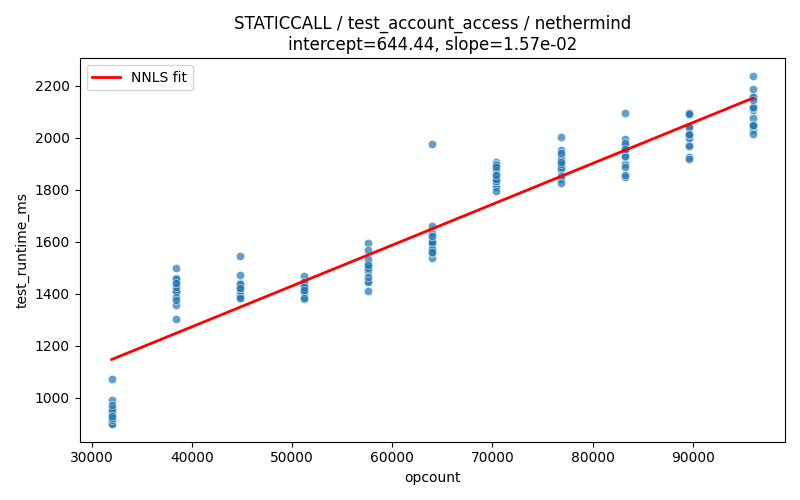

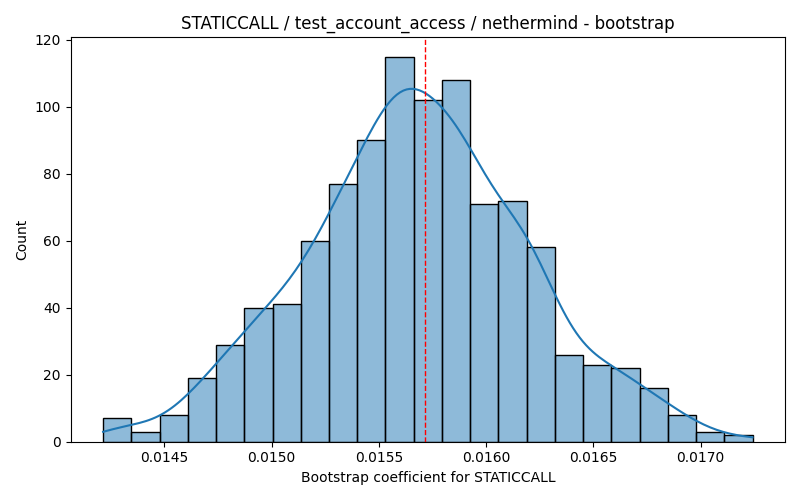

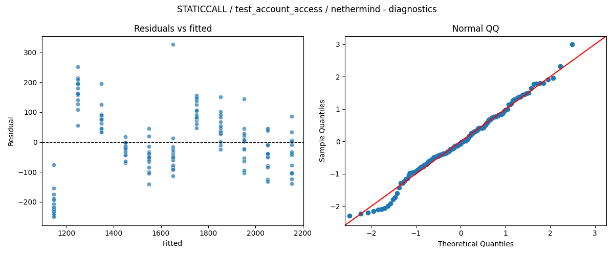

</details>

<details><summary>reth — NNLS regression summary</summary>

```
==============================================================================
                           NNLS Regression Results                            
==============================================================================
Dep. Variable:          test_runtime_ms              R-squared:          0.995
Model:                  NNLS                    Adj. R-squared:          0.995
No. Observations:       209                               RMSE:          31.38
Df Residuals:           207                                MAE:          21.54
Df Model:               1      
==============================================================================
                      coef     std err     P-value      [0.025      0.975]
------------------------------------------------------------------------------
         const    124.3300      6.7923       0.001    110.9653    137.7543
       opcount      0.0219      0.0001       0.001      0.0217      0.0221
==============================================================================
Notes: Non-negative least squares with bootstrap inference (1000 iterations)
==============================================================================
```

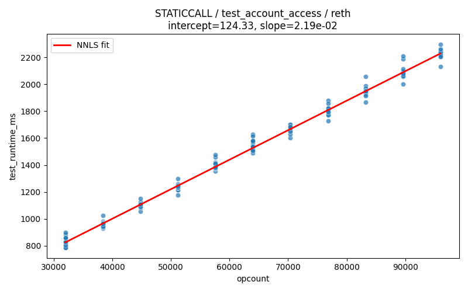

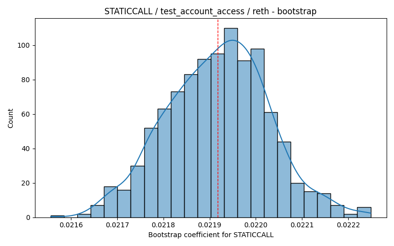

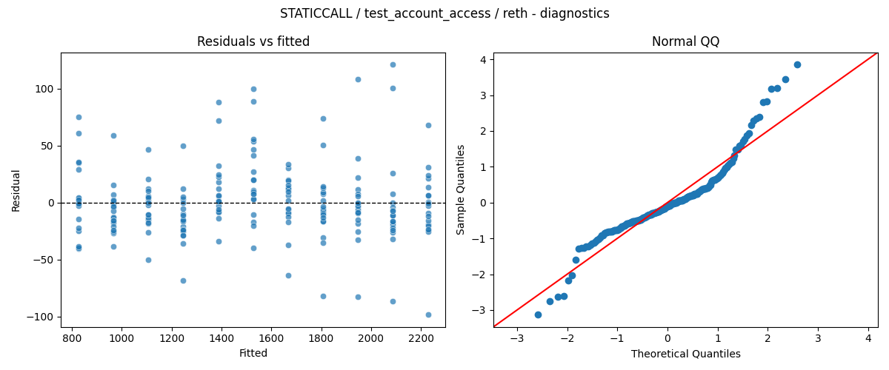

</details>

### test_account_access — combo `STATICCALL_AccountMode.EXISTING_CONTRACT_MINIMAL`

| client | nobs | R² | target_coef (ms) | p-value | 95% CI |
| --- | --- | --- | --- | --- | --- |
| `besu` | 110 | 0.9759 | 0.01488 | 1.00e-03 | [0.0144, 0.01542] |
| `erigon` | 88 | 0.9914 | 0.008856 | 1.00e-03 | [0.0087, 0.009004] |
| `geth` | 77 | 0.4848 | 0.0167 | 1.00e-03 | [0.0125, 0.01976] |
| `nethermind` | 154 | 0.7237 | 0.002899 | 1.00e-03 | [0.002597, 0.003183] |
| `reth` | 209 | 0.9665 | 0.00422 | 1.00e-03 | [0.004124, 0.004321] |

<details><summary>besu — NNLS regression summary</summary>

```
==============================================================================
                           NNLS Regression Results                            
==============================================================================
Dep. Variable:          test_runtime_ms              R-squared:          0.976
Model:                  NNLS                    Adj. R-squared:          0.976
No. Observations:       110                               RMSE:          47.34
Df Residuals:           108                                MAE:          36.24
Df Model:               1      
==============================================================================
                      coef     std err     P-value      [0.025      0.975]
------------------------------------------------------------------------------
         const    349.5850     15.2024       0.001    319.9291    377.6731
       opcount      0.0149      0.0003       0.001      0.0144      0.0154
==============================================================================
Notes: Non-negative least squares with bootstrap inference (1000 iterations)
==============================================================================
```

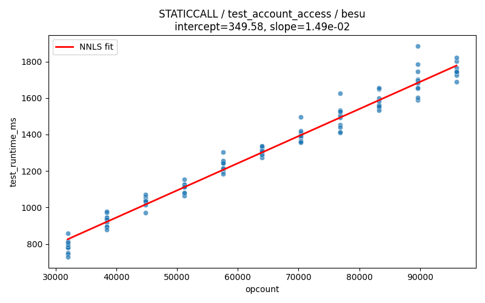

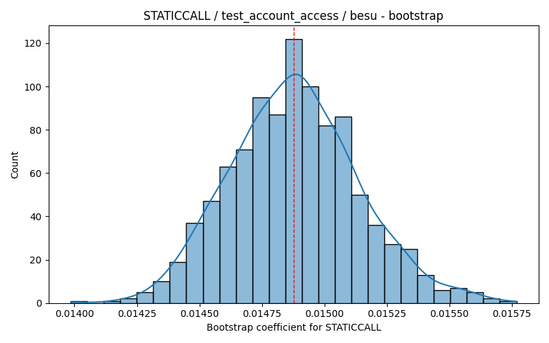

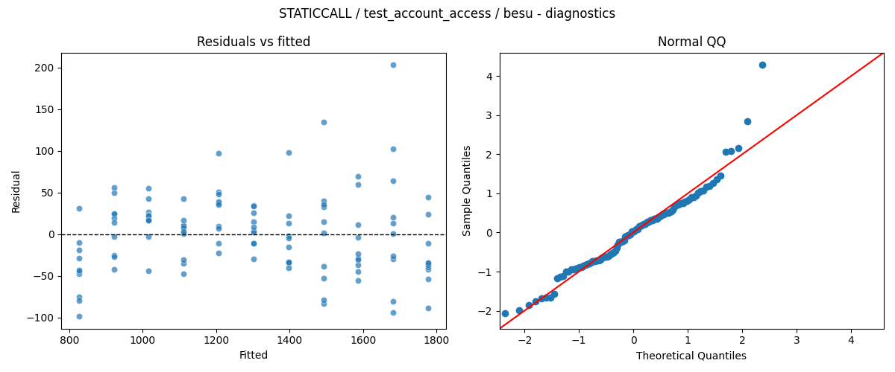

</details>

<details><summary>erigon — NNLS regression summary</summary>

```
==============================================================================
                           NNLS Regression Results                            
==============================================================================
Dep. Variable:          test_runtime_ms              R-squared:          0.991
Model:                  NNLS                    Adj. R-squared:          0.991
No. Observations:       88                                RMSE:          16.72
Df Residuals:           86                                 MAE:          12.04
Df Model:               1      
==============================================================================
                      coef     std err     P-value      [0.025      0.975]
------------------------------------------------------------------------------
         const     99.1123      5.4133       0.001     88.7007    109.5731
       opcount      0.0089      0.0001       0.001      0.0087      0.0090
==============================================================================
Notes: Non-negative least squares with bootstrap inference (1000 iterations)
==============================================================================
```

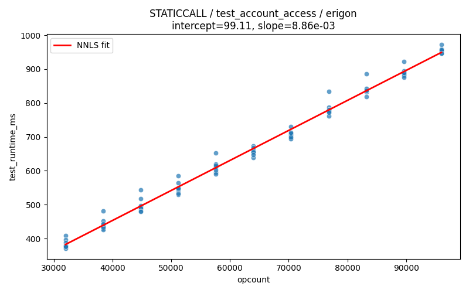

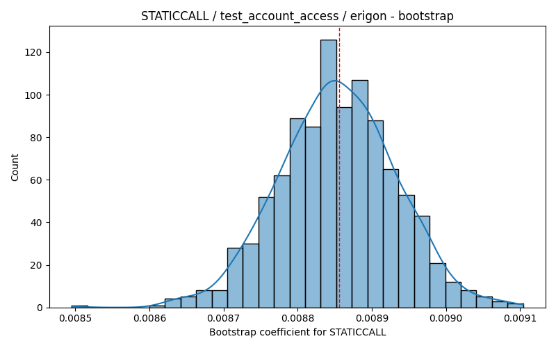

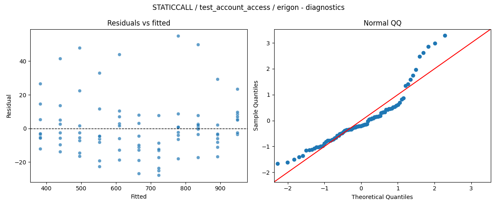

</details>

<details><summary>geth — NNLS regression summary</summary>

```
==============================================================================
                           NNLS Regression Results                            
==============================================================================
Dep. Variable:          test_runtime_ms              R-squared:          0.485
Model:                  NNLS                    Adj. R-squared:          0.478
No. Observations:       77                                RMSE:         348.50
Df Residuals:           75                                 MAE:         235.75
Df Model:               1      
==============================================================================
                      coef     std err     P-value      [0.025      0.975]
------------------------------------------------------------------------------
         const    159.8339    107.4602       0.076      0.0000    391.4530
       opcount      0.0167      0.0020       0.001      0.0125      0.0198
==============================================================================
Notes: Non-negative least squares with bootstrap inference (1000 iterations)
==============================================================================
```

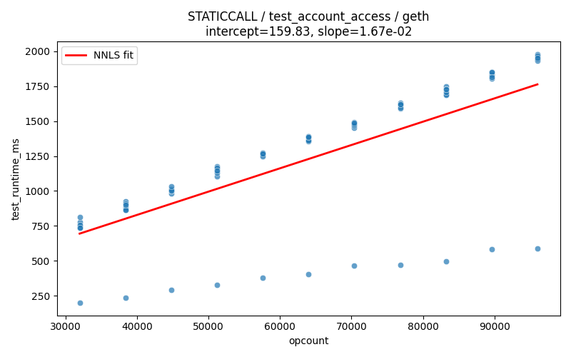

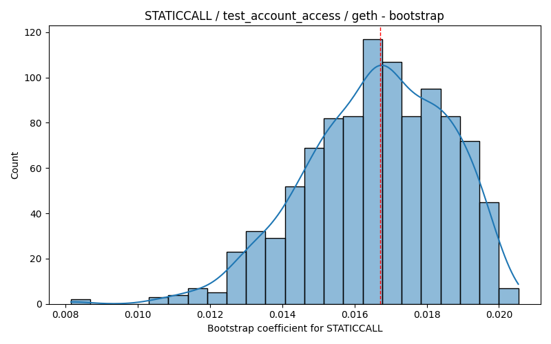

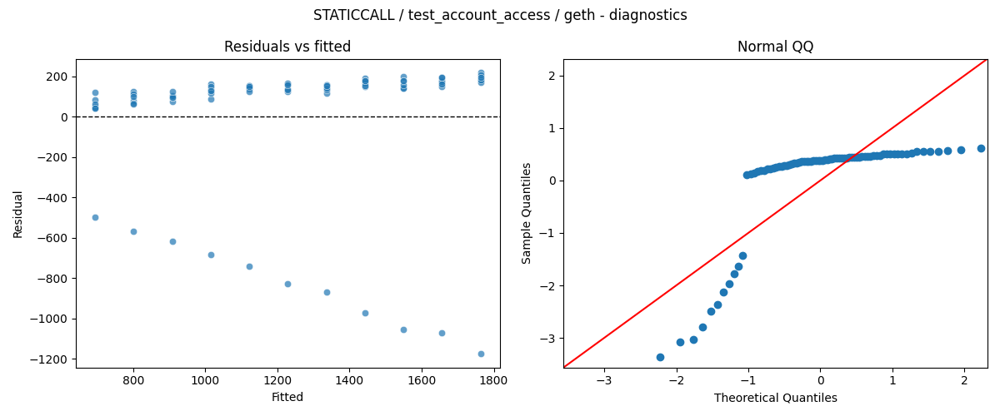

</details>

<details><summary>nethermind — NNLS regression summary</summary>

```
==============================================================================
                           NNLS Regression Results                            
==============================================================================
Dep. Variable:          test_runtime_ms              R-squared:          0.724
Model:                  NNLS                    Adj. R-squared:          0.722
No. Observations:       154                               RMSE:          36.25
Df Residuals:           152                                MAE:          30.07
Df Model:               1      
==============================================================================
                      coef     std err     P-value      [0.025      0.975]
------------------------------------------------------------------------------
         const    108.7215      8.4788       0.001     92.7012    125.3256
       opcount      0.0029      0.0001       0.001      0.0026      0.0032
==============================================================================
Notes: Non-negative least squares with bootstrap inference (1000 iterations)
==============================================================================
```

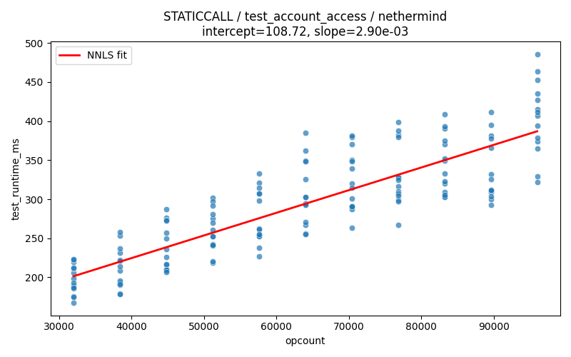

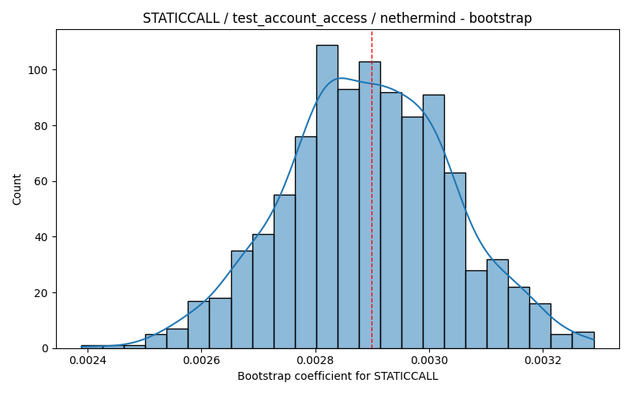

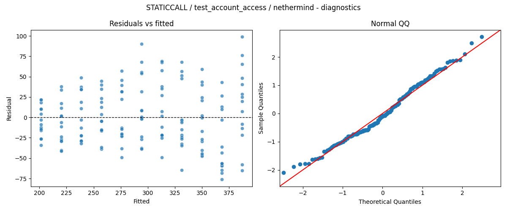

</details>

<details><summary>reth — NNLS regression summary</summary>

```
==============================================================================
                           NNLS Regression Results                            
==============================================================================
Dep. Variable:          test_runtime_ms              R-squared:          0.966
Model:                  NNLS                    Adj. R-squared:          0.966
No. Observations:       209                               RMSE:          15.91
Df Residuals:           207                                MAE:          12.55
Df Model:               1      
==============================================================================
                      coef     std err     P-value      [0.025      0.975]
------------------------------------------------------------------------------
         const     96.3037      3.1828       0.001     90.2937    102.3662
       opcount      0.0042      0.0001       0.001      0.0041      0.0043
==============================================================================
Notes: Non-negative least squares with bootstrap inference (1000 iterations)
==============================================================================
```

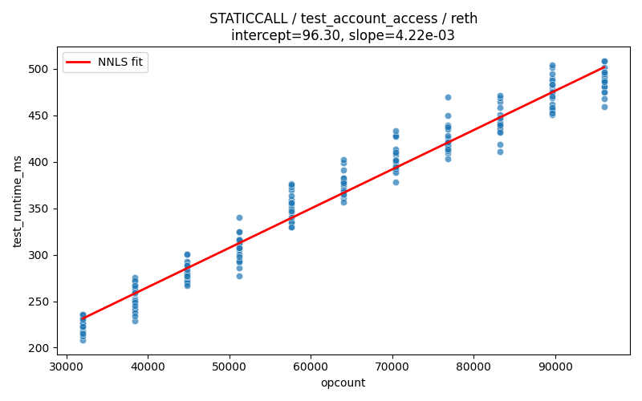

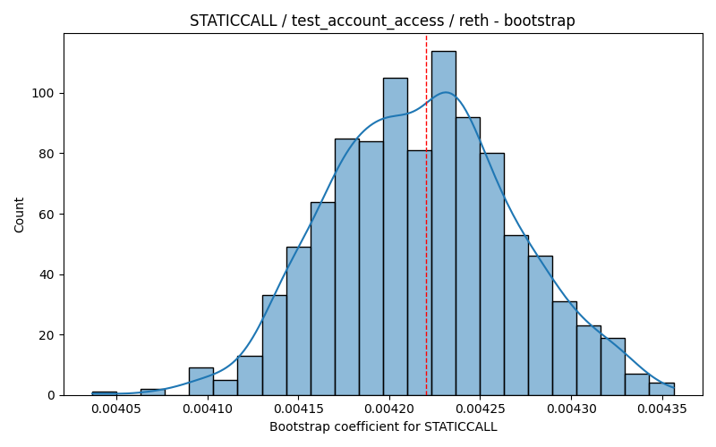

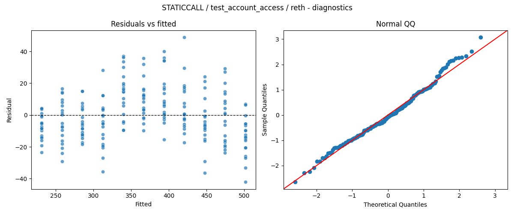

</details>

### test_account_access — combo `STATICCALL_AccountMode.EXISTING_CONTRACT_SAME_MAX`

| client | nobs | R² | target_coef (ms) | p-value | 95% CI |
| --- | --- | --- | --- | --- | --- |
| `besu` | 110 | 0.9722 | 0.01308 | 1.00e-03 | [0.01261, 0.01354] |
| `erigon` | 88 | 0.993 | 0.008979 | 1.00e-03 | [0.008833, 0.009149] |
| `geth` | 77 | 0.4738 | 0.01634 | 1.00e-03 | [0.0121, 0.01951] |
| `nethermind` | 154 | 0.7317 | 0.00295 | 1.00e-03 | [0.002656, 0.003256] |
| `reth` | 209 | 0.9649 | 0.00433 | 1.00e-03 | [0.004227, 0.004436] |

<details><summary>besu — NNLS regression summary</summary>

```
==============================================================================
                           NNLS Regression Results                            
==============================================================================
Dep. Variable:          test_runtime_ms              R-squared:          0.972
Model:                  NNLS                    Adj. R-squared:          0.972
No. Observations:       110                               RMSE:          44.72
Df Residuals:           108                                MAE:          35.38
Df Model:               1      
==============================================================================
                      coef     std err     P-value      [0.025      0.975]
------------------------------------------------------------------------------
         const    419.5524     16.6050       0.001    389.6123    452.6618
       opcount      0.0131      0.0003       0.001      0.0126      0.0135
==============================================================================
Notes: Non-negative least squares with bootstrap inference (1000 iterations)
==============================================================================
```

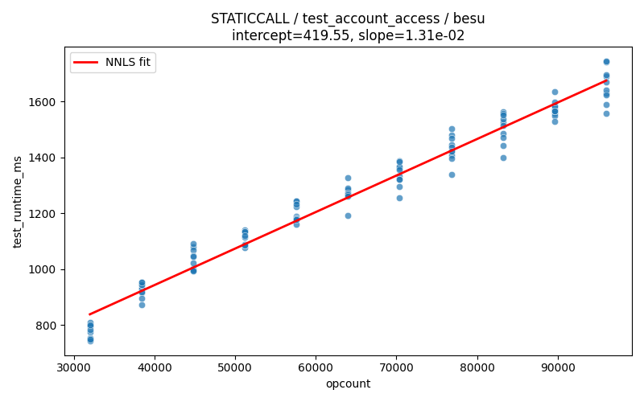

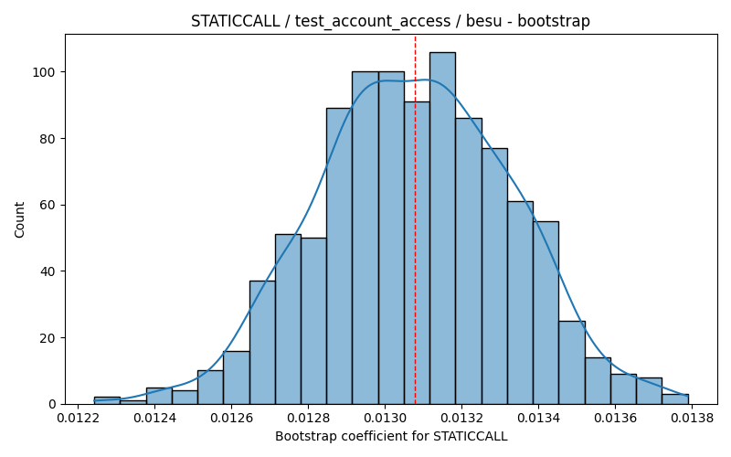

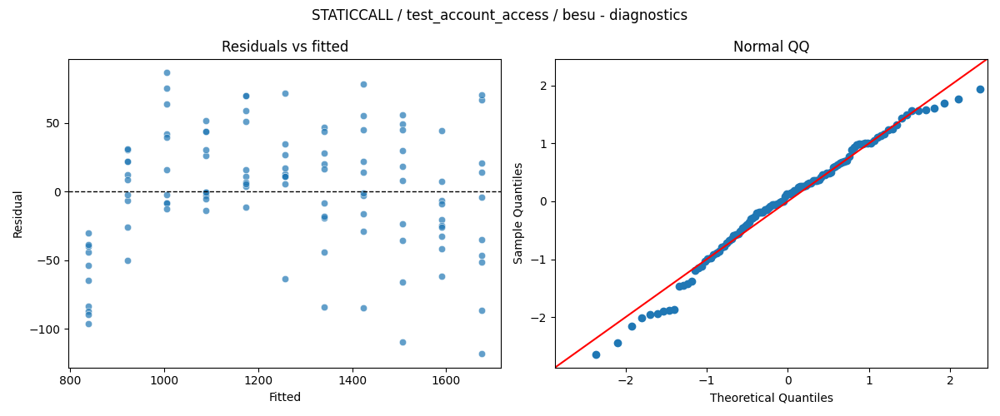

</details>

<details><summary>erigon — NNLS regression summary</summary>

```
==============================================================================
                           NNLS Regression Results                            
==============================================================================
Dep. Variable:          test_runtime_ms              R-squared:          0.993
Model:                  NNLS                    Adj. R-squared:          0.993
No. Observations:       88                                RMSE:          15.26
Df Residuals:           86                                 MAE:          11.61
Df Model:               1      
==============================================================================
                      coef     std err     P-value      [0.025      0.975]
------------------------------------------------------------------------------
         const     85.5405      5.0638       0.001     75.0246     95.0859
       opcount      0.0090      0.0001       0.001      0.0088      0.0091
==============================================================================
Notes: Non-negative least squares with bootstrap inference (1000 iterations)
==============================================================================
```

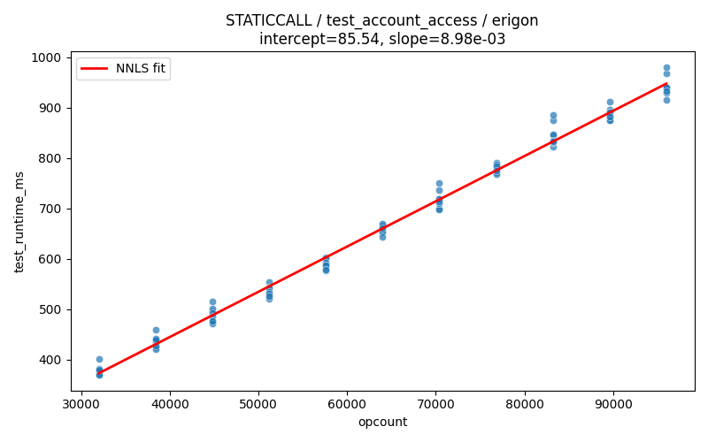

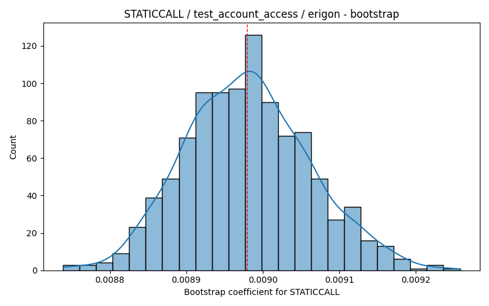

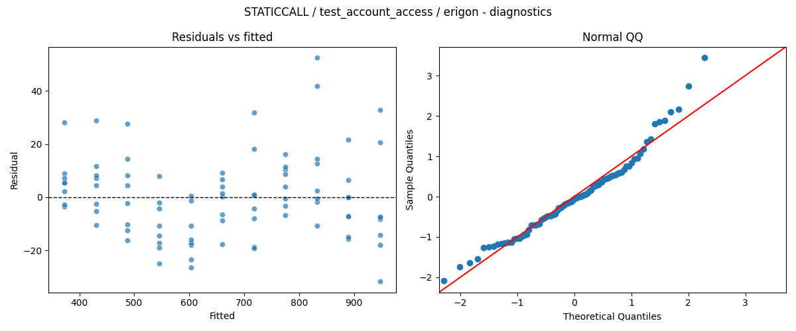

</details>

<details><summary>geth — NNLS regression summary</summary>

```
==============================================================================
                           NNLS Regression Results                            
==============================================================================
Dep. Variable:          test_runtime_ms              R-squared:          0.474
Model:                  NNLS                    Adj. R-squared:          0.467
No. Observations:       77                                RMSE:         348.57
Df Residuals:           75                                 MAE:         234.61
Df Model:               1      
==============================================================================
                      coef     std err     P-value      [0.025      0.975]
------------------------------------------------------------------------------
         const    171.5067    111.2355       0.067      0.0000    421.1498
       opcount      0.0163      0.0019       0.001      0.0121      0.0195
==============================================================================
Notes: Non-negative least squares with bootstrap inference (1000 iterations)
==============================================================================
```


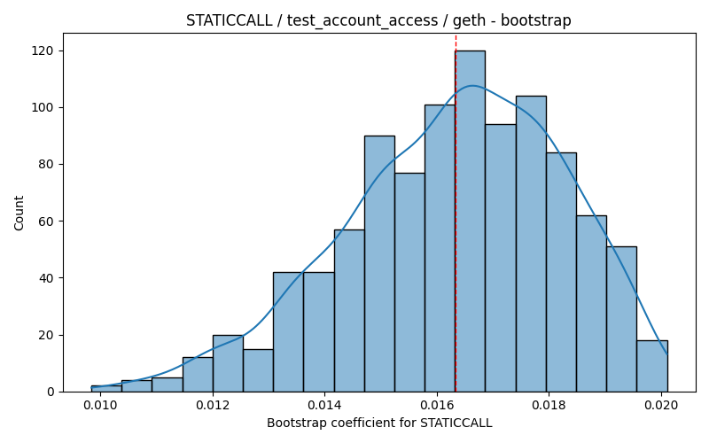

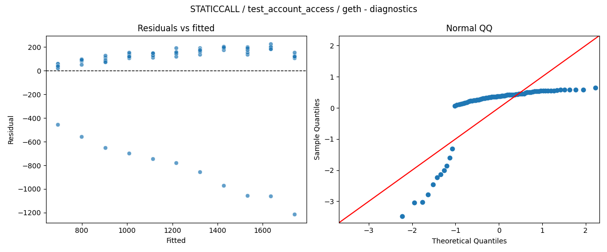

</details>

<details><summary>nethermind — NNLS regression summary</summary>

```
==============================================================================
                           NNLS Regression Results                            
==============================================================================
Dep. Variable:          test_runtime_ms              R-squared:          0.732
Model:                  NNLS                    Adj. R-squared:          0.730
No. Observations:       154                               RMSE:          36.15
Df Residuals:           152                                MAE:          29.41
Df Model:               1      
==============================================================================
                      coef     std err     P-value      [0.025      0.975]
------------------------------------------------------------------------------
         const    103.5366      8.6711       0.001     86.5491    120.8021
       opcount      0.0029      0.0001       0.001      0.0027      0.0033
==============================================================================
Notes: Non-negative least squares with bootstrap inference (1000 iterations)
==============================================================================
```

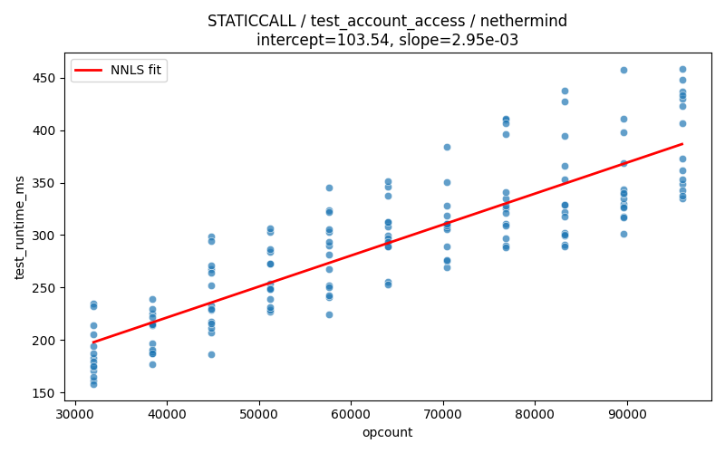

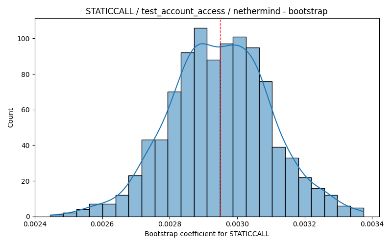

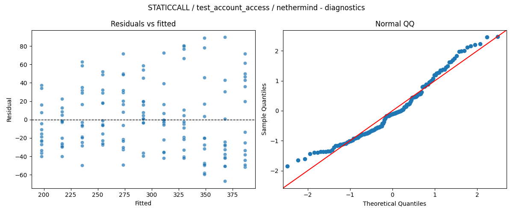

</details>

<details><summary>reth — NNLS regression summary</summary>

```
==============================================================================
                           NNLS Regression Results                            
==============================================================================
Dep. Variable:          test_runtime_ms              R-squared:          0.965
Model:                  NNLS                    Adj. R-squared:          0.965
No. Observations:       209                               RMSE:          16.72
Df Residuals:           207                                MAE:          13.19
Df Model:               1      
==============================================================================
                      coef     std err     P-value      [0.025      0.975]
------------------------------------------------------------------------------
         const     92.5442      3.1922       0.001     86.0943     99.3362
       opcount      0.0043      0.0001       0.001      0.0042      0.0044
==============================================================================
Notes: Non-negative least squares with bootstrap inference (1000 iterations)
==============================================================================
```

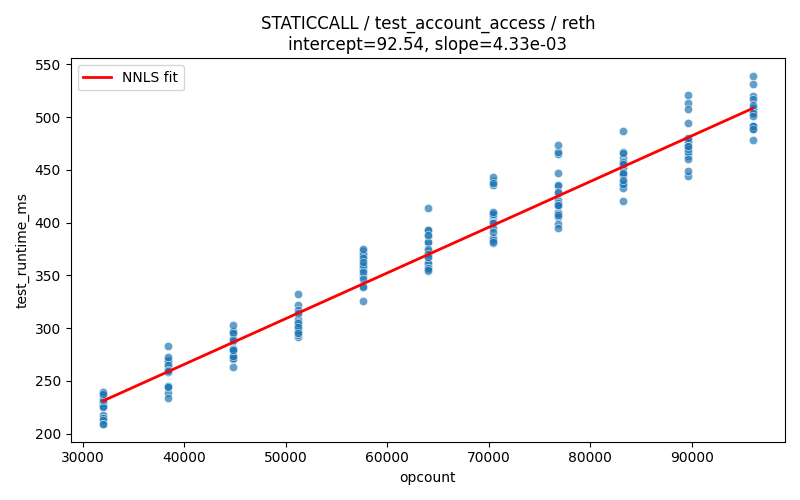

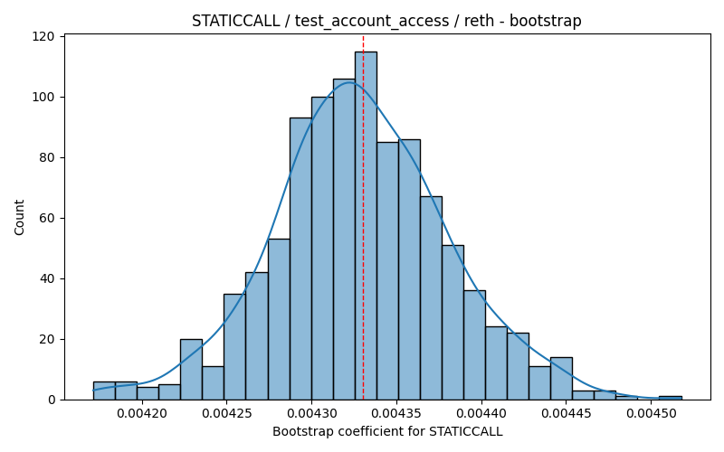

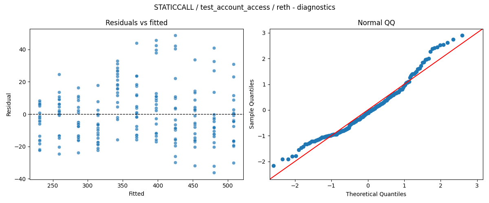

</details>

## EXTCODECOPY

### test_account_access — combo `EXTCODECOPY_AccountMode.EXISTING_EOA`

| client | nobs | R² | target_coef (ms) | p-value | 95% CI |
| --- | --- | --- | --- | --- | --- |
| `besu` | 110 | 0.9842 | 0.01488 | 1.00e-03 | [0.0145, 0.01526] |
| `erigon` | 88 | 0.9982 | 0.008095 | 1.00e-03 | [0.008044, 0.008114] |
| `geth` | 77 | 0.8186 | 0.01828 | 1.00e-03 | [0.01618, 0.02011] |
| `nethermind` | 154 | 0.9069 | 0.003295 | 1.00e-03 | [0.003131, 0.003465] |
| `reth` | 209 | 0.968 | 0.004171 | 1.00e-03 | [0.004074, 0.00427] |

<details><summary>besu — NNLS regression summary</summary>

```
==============================================================================
                           NNLS Regression Results                            
==============================================================================
Dep. Variable:          test_runtime_ms              R-squared:          0.984
Model:                  NNLS                    Adj. R-squared:          0.984
No. Observations:       110                               RMSE:          36.56
Df Residuals:           108                                MAE:          29.05
Df Model:               1      
==============================================================================
                      coef     std err     P-value      [0.025      0.975]
------------------------------------------------------------------------------
         const    426.5637     10.7775       0.001    403.9709    447.9073
       opcount      0.0149      0.0002       0.001      0.0145      0.0153
==============================================================================
Notes: Non-negative least squares with bootstrap inference (1000 iterations)
==============================================================================
```

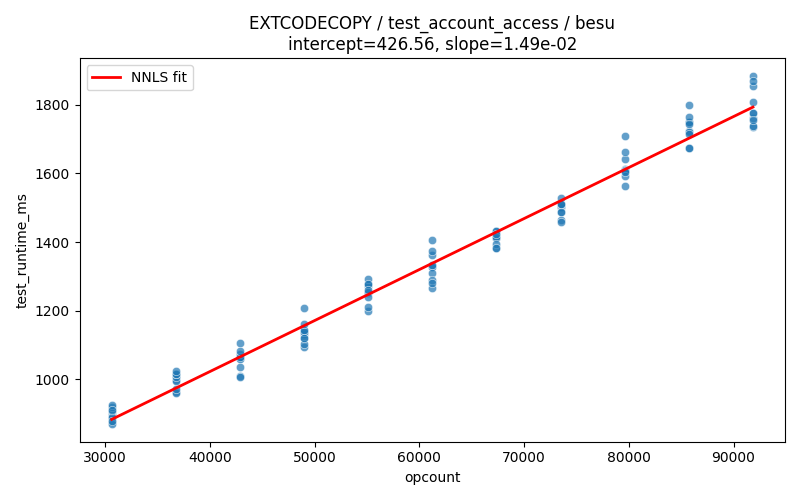

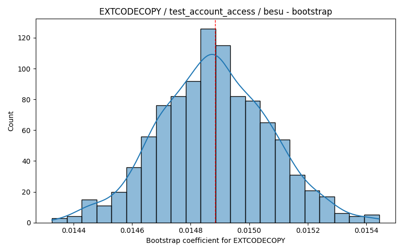

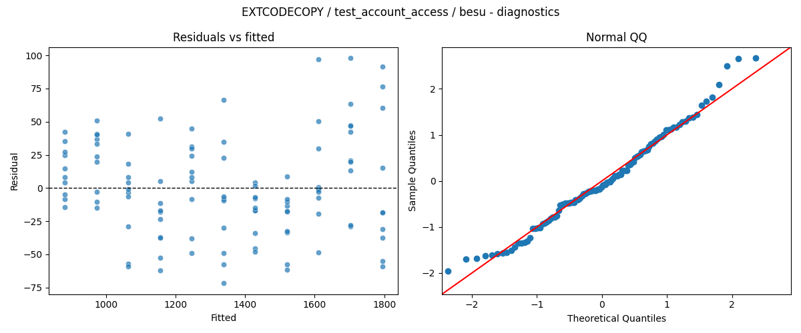

</details>

<details><summary>erigon — NNLS regression summary</summary>

```
==============================================================================
                           NNLS Regression Results                            
==============================================================================
Dep. Variable:          test_runtime_ms              R-squared:          0.998
Model:                  NNLS                    Adj. R-squared:          0.998
No. Observations:       88                                RMSE:           6.63
Df Residuals:           86                                 MAE:           5.36
Df Model:               1      
==============================================================================
                      coef     std err     P-value      [0.025      0.975]
------------------------------------------------------------------------------
         const      0.0000      0.8132       1.000      0.0000      3.0691
       opcount      0.0081      0.0000       0.001      0.0080      0.0081
==============================================================================
Notes: Non-negative least squares with bootstrap inference (1000 iterations)
==============================================================================
```

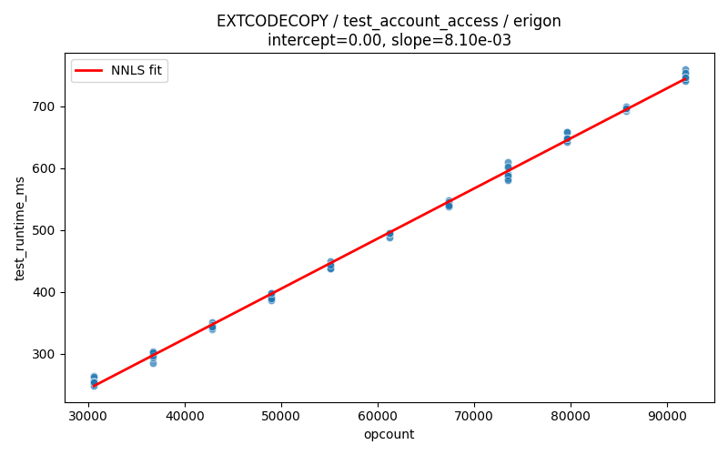

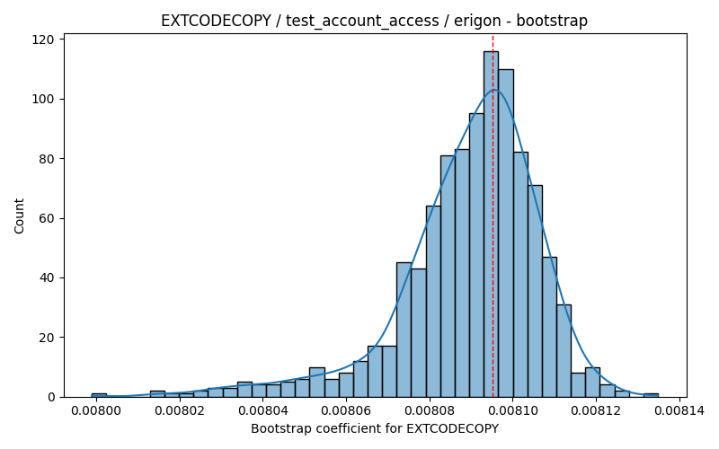

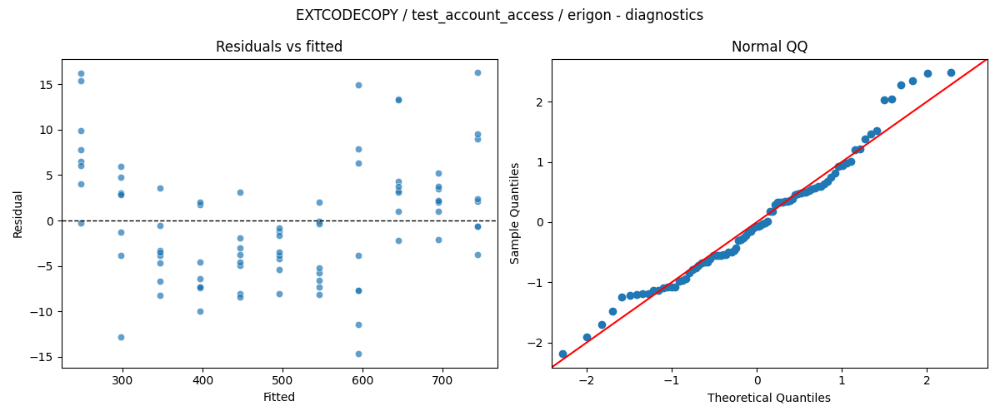

</details>

<details><summary>geth — NNLS regression summary</summary>

```
==============================================================================
                           NNLS Regression Results                            
==============================================================================
Dep. Variable:          test_runtime_ms              R-squared:          0.819
Model:                  NNLS                    Adj. R-squared:          0.816
No. Observations:       77                                RMSE:         166.61
Df Residuals:           75                                 MAE:         110.84
Df Model:               1      
==============================================================================
                      coef     std err     P-value      [0.025      0.975]
------------------------------------------------------------------------------
         const    192.5824     53.0876       0.001     94.6022    297.1918
       opcount      0.0183      0.0010       0.001      0.0162      0.0201
==============================================================================
Notes: Non-negative least squares with bootstrap inference (1000 iterations)
==============================================================================
```

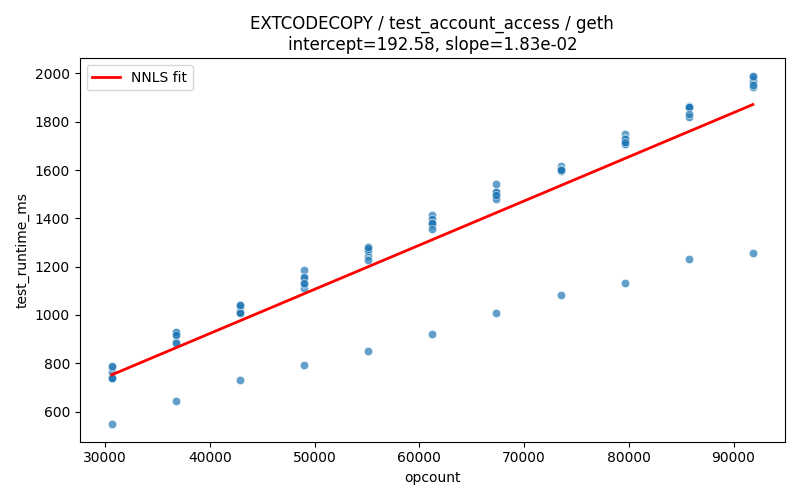

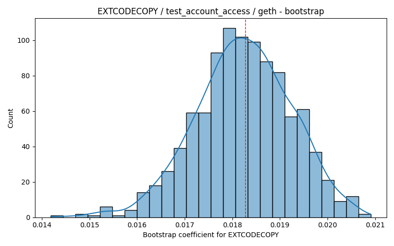


</details>

<details><summary>nethermind — NNLS regression summary</summary>

```
==============================================================================
                           NNLS Regression Results                            
==============================================================================
Dep. Variable:          test_runtime_ms              R-squared:          0.907
Model:                  NNLS                    Adj. R-squared:          0.906
No. Observations:       154                               RMSE:          20.44
Df Residuals:           152                                MAE:          16.28
Df Model:               1      
==============================================================================
                      coef     std err     P-value      [0.025      0.975]
------------------------------------------------------------------------------
         const     95.9046      4.9769       0.001     86.1567    105.6281
       opcount      0.0033      0.0001       0.001      0.0031      0.0035
==============================================================================
Notes: Non-negative least squares with bootstrap inference (1000 iterations)
==============================================================================
```

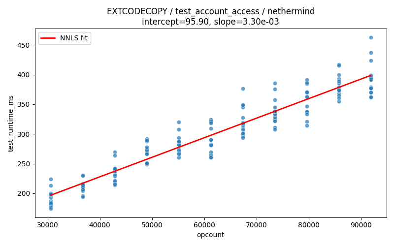

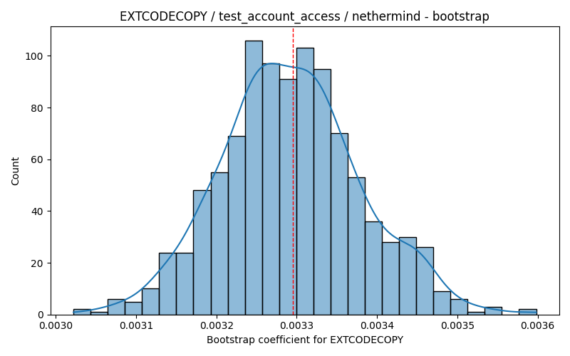

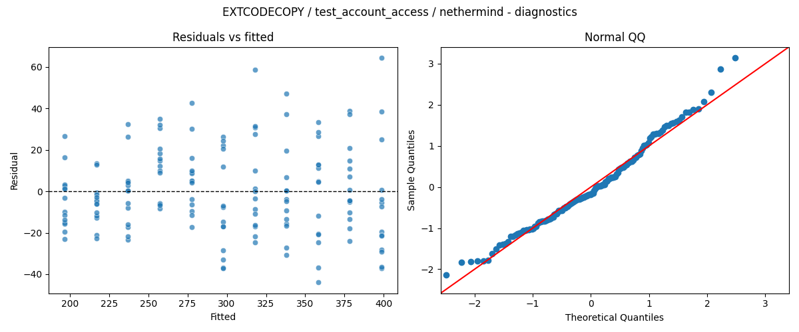

</details>

<details><summary>reth — NNLS regression summary</summary>

```
==============================================================================
                           NNLS Regression Results                            
==============================================================================
Dep. Variable:          test_runtime_ms              R-squared:          0.968
Model:                  NNLS                    Adj. R-squared:          0.968
No. Observations:       209                               RMSE:          14.70
Df Residuals:           207                                MAE:          11.45
Df Model:               1      
==============================================================================
                      coef     std err     P-value      [0.025      0.975]
------------------------------------------------------------------------------
         const     90.2322      3.0140       0.001     84.4186     95.9643
       opcount      0.0042      0.0001       0.001      0.0041      0.0043
==============================================================================
Notes: Non-negative least squares with bootstrap inference (1000 iterations)
==============================================================================
```

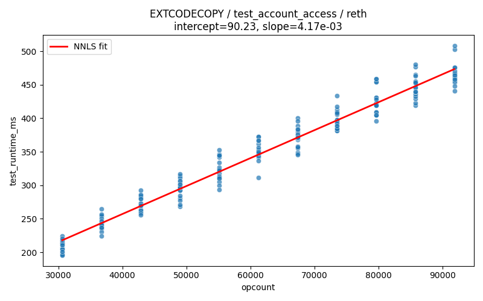

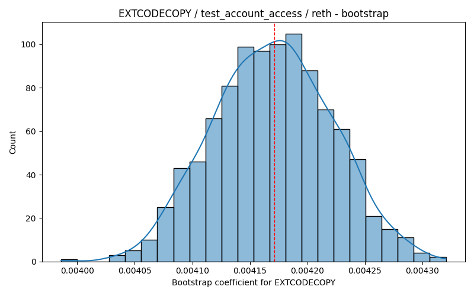

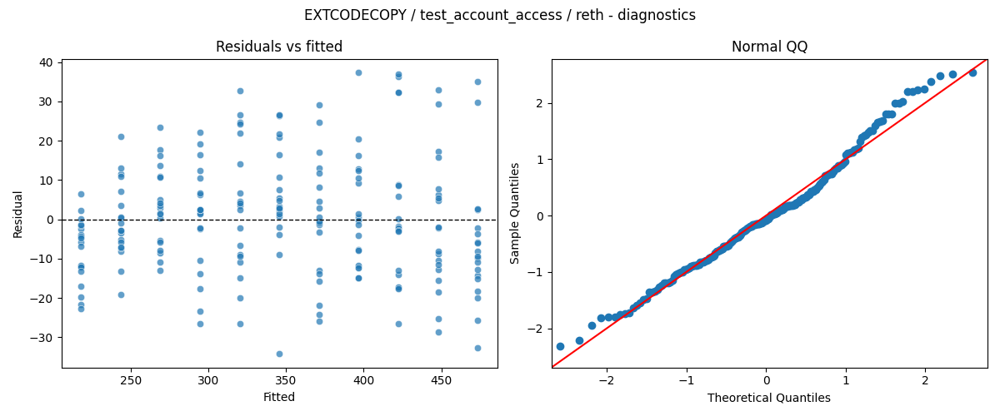

</details>

### test_account_access — combo `EXTCODECOPY_AccountMode.NON_EXISTING_ACCOUNT`

| client | nobs | R² | target_coef (ms) | p-value | 95% CI |
| --- | --- | --- | --- | --- | --- |
| `besu` | 110 | 0.9859 | 0.01494 | 1.00e-03 | [0.0146, 0.01529] |
| `erigon` | 88 | 0.9971 | 0.007846 | 1.00e-03 | [0.007817, 0.007874] |
| `geth` | 77 | 0.93 | 0.01932 | 1.00e-03 | [0.01817, 0.0206] |
| `nethermind` | 154 | 0.8984 | 0.003272 | 1.00e-03 | [0.003097, 0.003453] |
| `reth` | 209 | 0.9718 | 0.004109 | 1.00e-03 | [0.004007, 0.004221] |

<details><summary>besu — NNLS regression summary</summary>

```
==============================================================================
                           NNLS Regression Results                            
==============================================================================
Dep. Variable:          test_runtime_ms              R-squared:          0.986
Model:                  NNLS                    Adj. R-squared:          0.986
No. Observations:       110                               RMSE:          34.61
Df Residuals:           108                                MAE:          27.59
Df Model:               1      
==============================================================================
                      coef     std err     P-value      [0.025      0.975]
------------------------------------------------------------------------------
         const    110.2826     10.3576       0.001     90.4781    130.6778
       opcount      0.0149      0.0002       0.001      0.0146      0.0153
==============================================================================
Notes: Non-negative least squares with bootstrap inference (1000 iterations)
==============================================================================
```

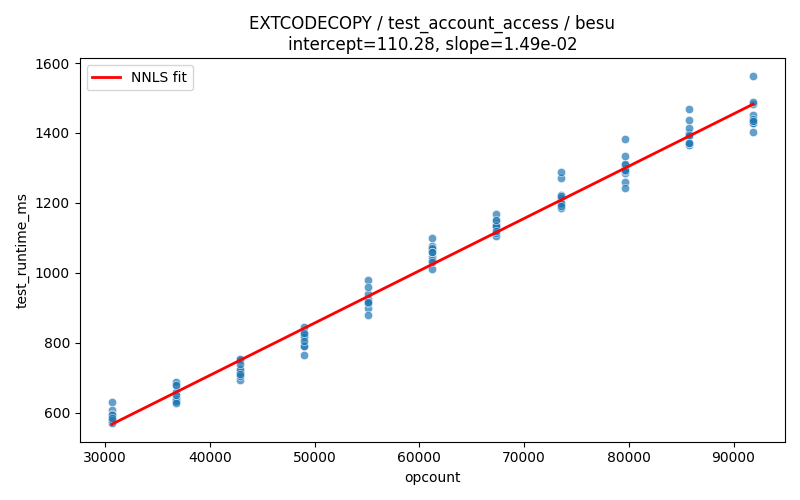

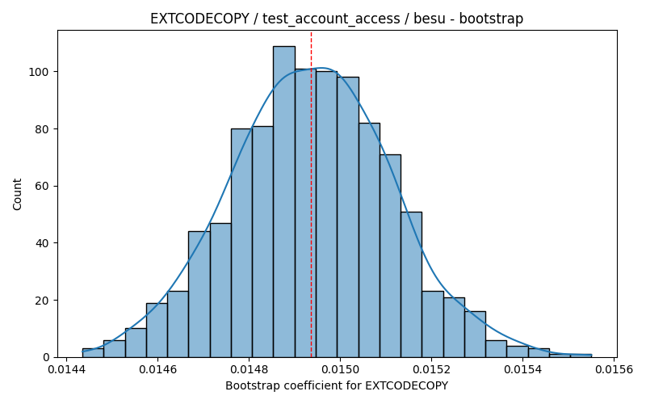

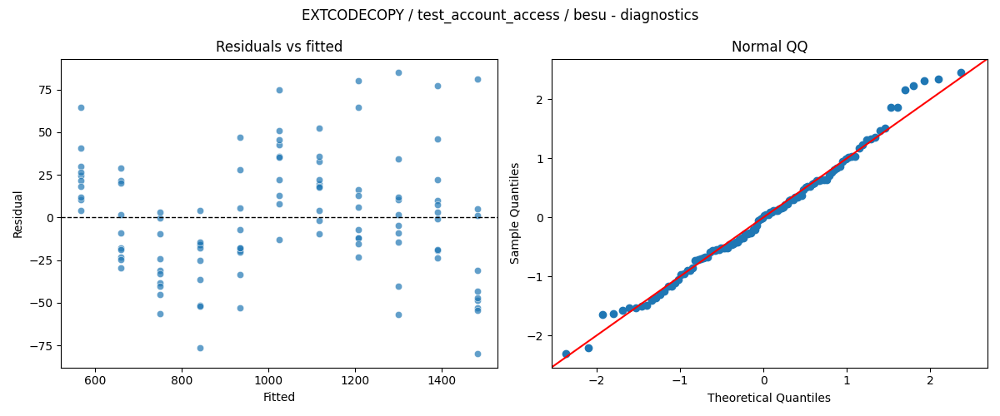

</details>

<details><summary>erigon — NNLS regression summary</summary>

```
==============================================================================
                           NNLS Regression Results                            
==============================================================================
Dep. Variable:          test_runtime_ms              R-squared:          0.997
Model:                  NNLS                    Adj. R-squared:          0.997
No. Observations:       88                                RMSE:           8.31
Df Residuals:           86                                 MAE:           6.83
Df Model:               1      
==============================================================================
                      coef     std err     P-value      [0.025      0.975]
------------------------------------------------------------------------------
         const      0.0000      0.1889       1.000      0.0000      0.0000
       opcount      0.0078      0.0000       0.001      0.0078      0.0079
==============================================================================
Notes: Non-negative least squares with bootstrap inference (1000 iterations)
==============================================================================
```


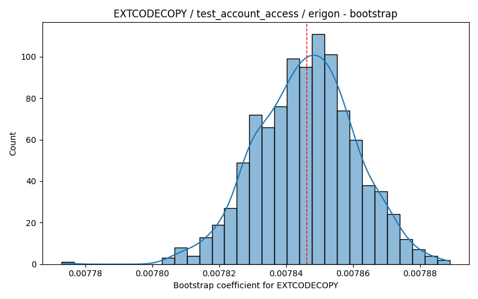

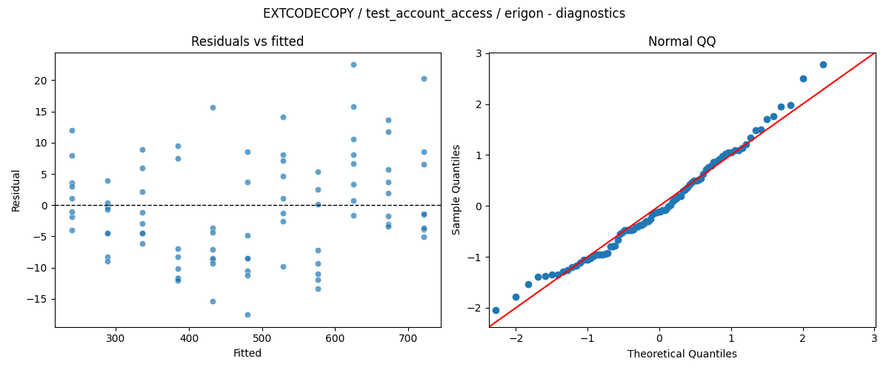

</details>

<details><summary>geth — NNLS regression summary</summary>

```
==============================================================================
                           NNLS Regression Results                            
==============================================================================
Dep. Variable:          test_runtime_ms              R-squared:          0.930
Model:                  NNLS                    Adj. R-squared:          0.929
No. Observations:       77                                RMSE:         102.63
Df Residuals:           75                                 MAE:          68.15
Df Model:               1      
==============================================================================
                      coef     std err     P-value      [0.025      0.975]
------------------------------------------------------------------------------
         const    193.3525     34.4388       0.001    126.8499    263.1180
       opcount      0.0193      0.0006       0.001      0.0182      0.0206
==============================================================================
Notes: Non-negative least squares with bootstrap inference (1000 iterations)
==============================================================================
```

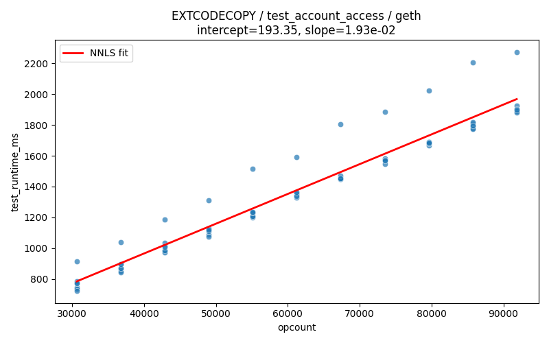

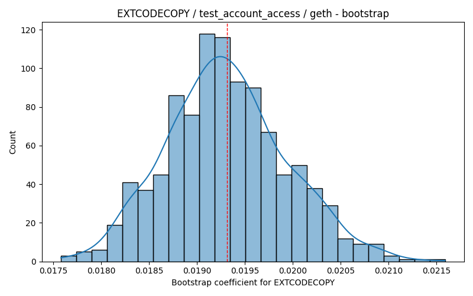

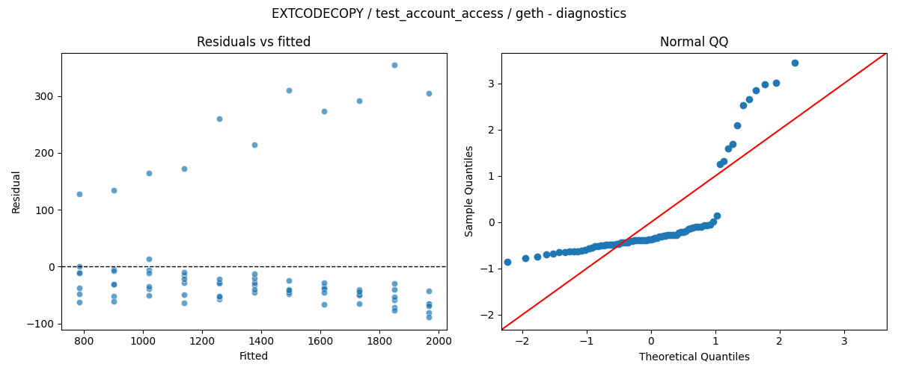

</details>

<details><summary>nethermind — NNLS regression summary</summary>

```
==============================================================================
                           NNLS Regression Results                            
==============================================================================
Dep. Variable:          test_runtime_ms              R-squared:          0.898
Model:                  NNLS                    Adj. R-squared:          0.898
No. Observations:       154                               RMSE:          21.31
Df Residuals:           152                                MAE:          16.88
Df Model:               1      
==============================================================================
                      coef     std err     P-value      [0.025      0.975]
------------------------------------------------------------------------------
         const     59.6625      5.0180       0.001     49.8998     68.9898
       opcount      0.0033      0.0001       0.001      0.0031      0.0035
==============================================================================
Notes: Non-negative least squares with bootstrap inference (1000 iterations)
==============================================================================
```

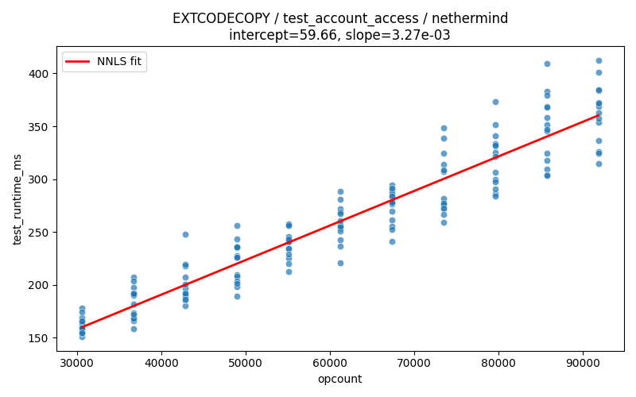

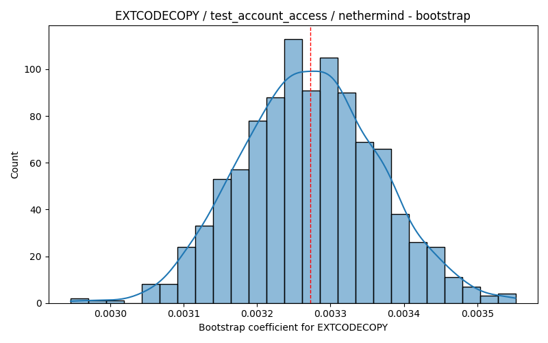

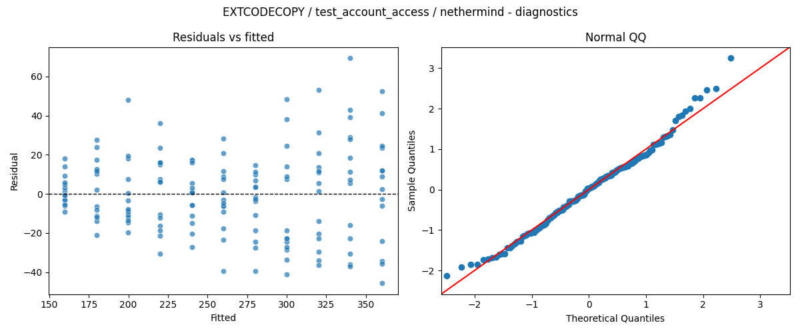

</details>

<details><summary>reth — NNLS regression summary</summary>

```
==============================================================================
                           NNLS Regression Results                            
==============================================================================
Dep. Variable:          test_runtime_ms              R-squared:          0.972
Model:                  NNLS                    Adj. R-squared:          0.972
No. Observations:       209                               RMSE:          13.55
Df Residuals:           207                                MAE:          10.53
Df Model:               1      
==============================================================================
                      coef     std err     P-value      [0.025      0.975]
------------------------------------------------------------------------------
         const     91.4541      3.2855       0.001     84.9546     97.7411
       opcount      0.0041      0.0001       0.001      0.0040      0.0042
==============================================================================
Notes: Non-negative least squares with bootstrap inference (1000 iterations)
==============================================================================
```

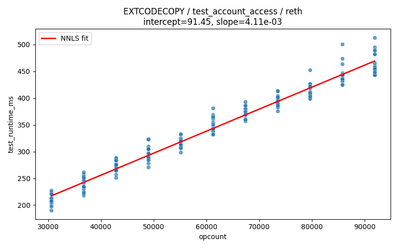

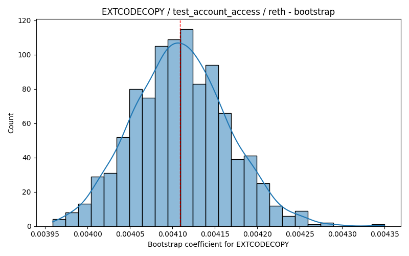

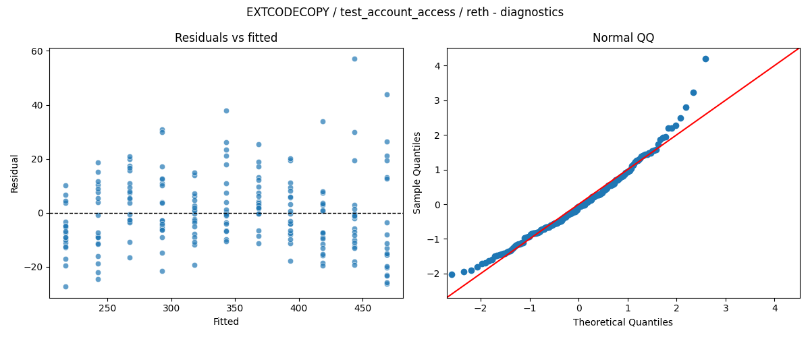

</details>

### test_account_access — combo `EXTCODECOPY_AccountMode.EXISTING_CONTRACT_DIFF_MAX`

| client | nobs | R² | target_coef (ms) | p-value | 95% CI |
| --- | --- | --- | --- | --- | --- |
| `besu` | 110 | 0.9791 | 0.01987 | 1.00e-03 | [0.01934, 0.02036] |
| `erigon` | 88 | 0.8201 | 0.02534 | 1.00e-03 | [0.02292, 0.02804] |
| `geth` | 77 | 0.8742 | 0.02746 | 1.00e-03 | [0.02514, 0.02984] |
| `nethermind` | 154 | 0.9034 | 0.0158 | 1.00e-03 | [0.01482, 0.01684] |
| `reth` | 209 | 0.9952 | 0.02087 | 1.00e-03 | [0.02068, 0.02106] |

<details><summary>besu — NNLS regression summary</summary>

```
==============================================================================
                           NNLS Regression Results                            
==============================================================================
Dep. Variable:          test_runtime_ms              R-squared:          0.979
Model:                  NNLS                    Adj. R-squared:          0.979
No. Observations:       110                               RMSE:          55.38
Df Residuals:           108                                MAE:          45.33
Df Model:               1      
==============================================================================
                      coef     std err     P-value      [0.025      0.975]
------------------------------------------------------------------------------
         const    407.9956     15.6406       0.001    379.0172    439.6592
       opcount      0.0199      0.0003       0.001      0.0193      0.0204
==============================================================================
Notes: Non-negative least squares with bootstrap inference (1000 iterations)
==============================================================================
```

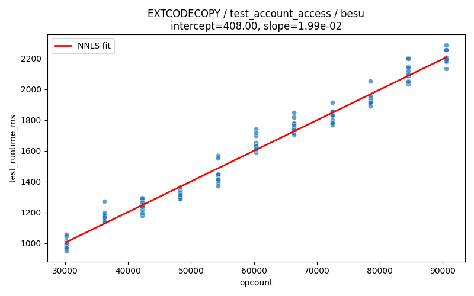

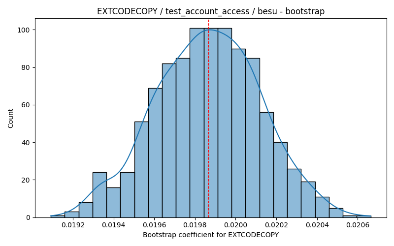

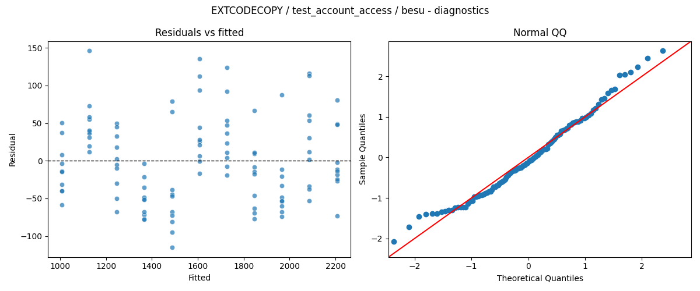

</details>

<details><summary>erigon — NNLS regression summary</summary>

```
==============================================================================
                           NNLS Regression Results                            
==============================================================================
Dep. Variable:          test_runtime_ms              R-squared:          0.820
Model:                  NNLS                    Adj. R-squared:          0.818
No. Observations:       88                                RMSE:         226.49
Df Residuals:           86                                 MAE:         154.94
Df Model:               1      
==============================================================================
                      coef     std err     P-value      [0.025      0.975]
------------------------------------------------------------------------------
         const    229.7774     73.5234       0.001     90.8732    377.1912
       opcount      0.0253      0.0013       0.001      0.0229      0.0280
==============================================================================
Notes: Non-negative least squares with bootstrap inference (1000 iterations)
==============================================================================
```


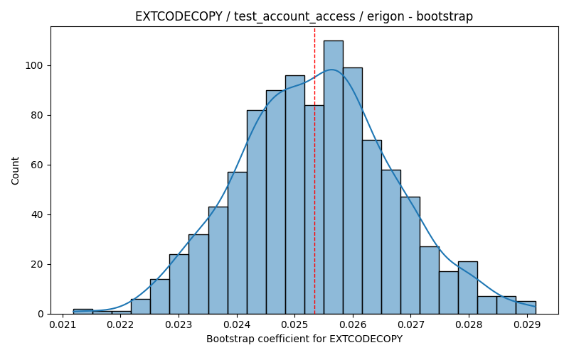


</details>

<details><summary>geth — NNLS regression summary</summary>

```
==============================================================================
                           NNLS Regression Results                            
==============================================================================
Dep. Variable:          test_runtime_ms              R-squared:          0.874
Model:                  NNLS                    Adj. R-squared:          0.873
No. Observations:       77                                RMSE:         198.79
Df Residuals:           75                                 MAE:         165.42
Df Model:               1      
==============================================================================
                      coef     std err     P-value      [0.025      0.975]
------------------------------------------------------------------------------
         const    417.4309     76.2611       0.001    264.3504    557.9659
       opcount      0.0275      0.0012       0.001      0.0251      0.0298
==============================================================================
Notes: Non-negative least squares with bootstrap inference (1000 iterations)
==============================================================================
```

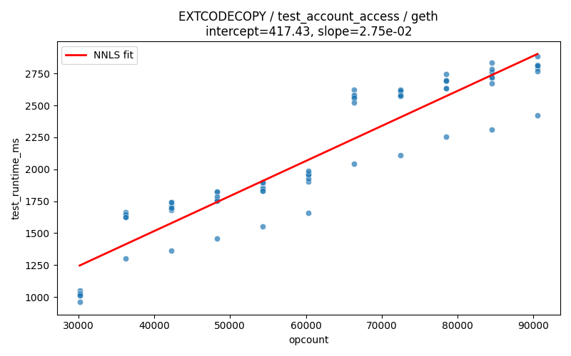

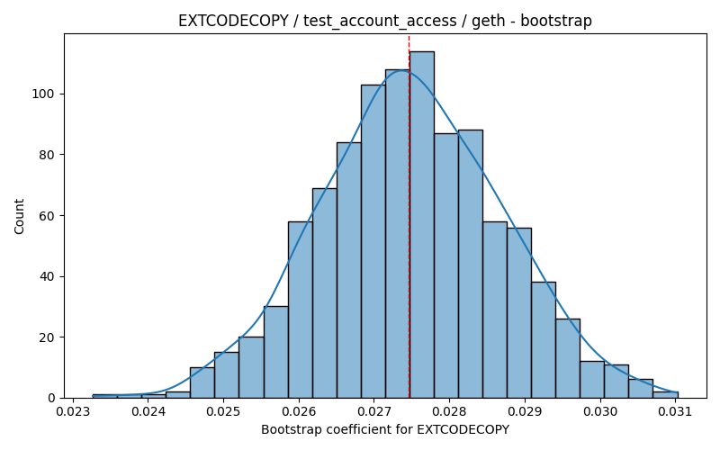

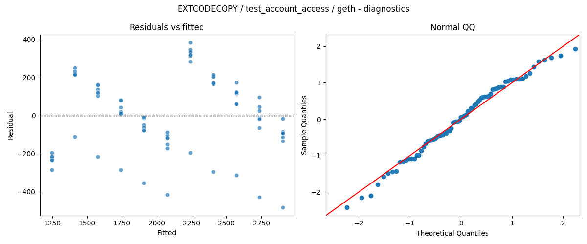

</details>

<details><summary>nethermind — NNLS regression summary</summary>

```
==============================================================================
                           NNLS Regression Results                            
==============================================================================
Dep. Variable:          test_runtime_ms              R-squared:          0.903
Model:                  NNLS                    Adj. R-squared:          0.903
No. Observations:       154                               RMSE:          98.60
Df Residuals:           152                                MAE:          81.43
Df Model:               1      
==============================================================================
                      coef     std err     P-value      [0.025      0.975]
------------------------------------------------------------------------------
         const    552.2313     36.0680       0.001    481.0075    624.9081
       opcount      0.0158      0.0005       0.001      0.0148      0.0168
==============================================================================
Notes: Non-negative least squares with bootstrap inference (1000 iterations)
==============================================================================
```

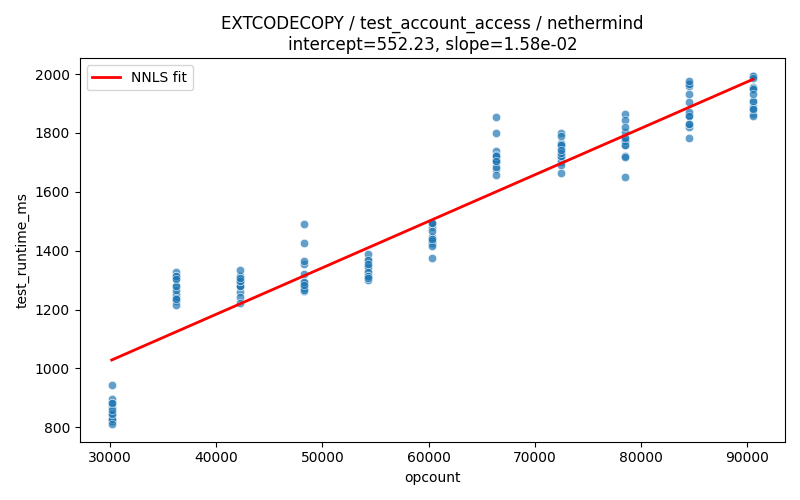

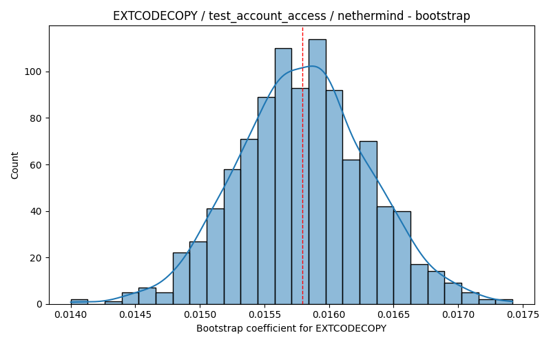

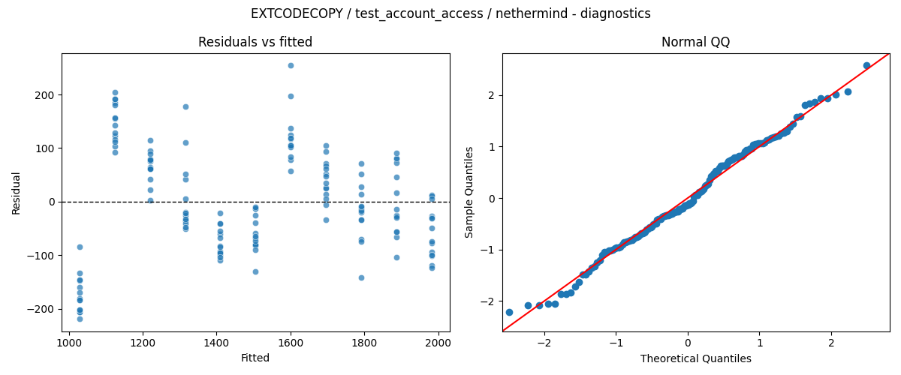

</details>

<details><summary>reth — NNLS regression summary</summary>

```
==============================================================================
                           NNLS Regression Results                            
==============================================================================
Dep. Variable:          test_runtime_ms              R-squared:          0.995
Model:                  NNLS                    Adj. R-squared:          0.995
No. Observations:       209                               RMSE:          27.70
Df Residuals:           207                                MAE:          18.76
Df Model:               1      
==============================================================================
                      coef     std err     P-value      [0.025      0.975]
------------------------------------------------------------------------------
         const    129.8832      5.4830       0.001    119.6462    141.1619
       opcount      0.0209      0.0001       0.001      0.0207      0.0211
==============================================================================
Notes: Non-negative least squares with bootstrap inference (1000 iterations)
==============================================================================
```

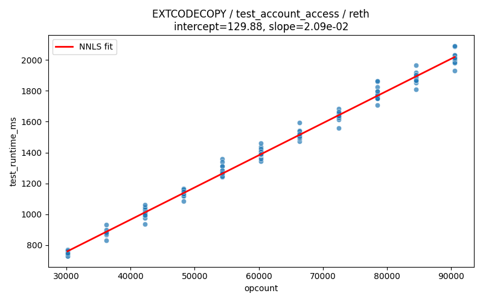

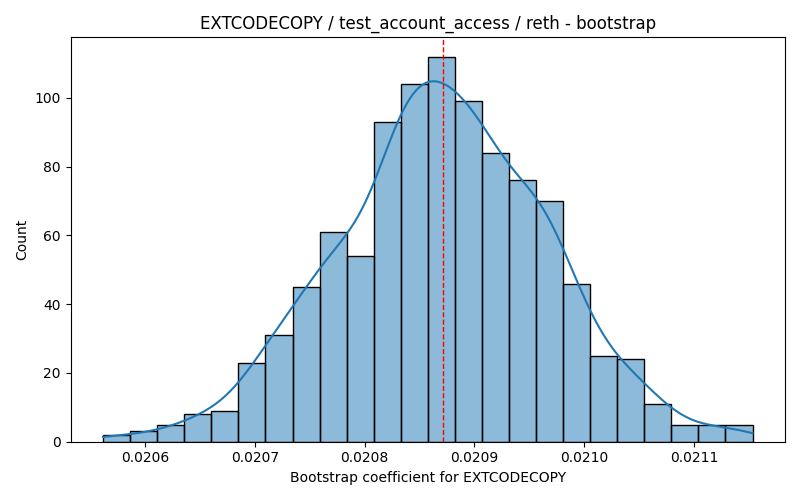

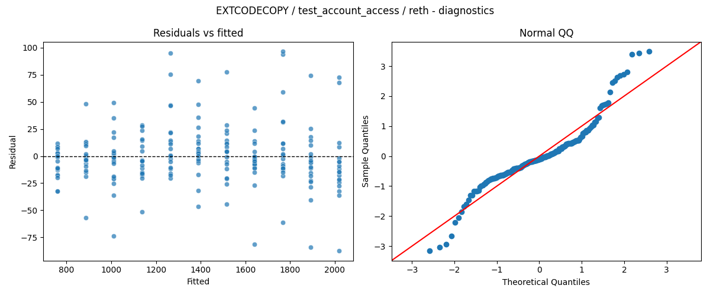

</details>

### test_account_access — combo `EXTCODECOPY_AccountMode.EXISTING_CONTRACT_MINIMAL`

| client | nobs | R² | target_coef (ms) | p-value | 95% CI |
| --- | --- | --- | --- | --- | --- |
| `besu` | 110 | 0.9759 | 0.01242 | 1.00e-03 | [0.01205, 0.0128] |
| `erigon` | 88 | 0.9917 | 0.008182 | 1.00e-03 | [0.008015, 0.008321] |
| `geth` | 77 | 0.4724 | 0.01646 | 1.00e-03 | [0.01219, 0.01968] |
| `nethermind` | 154 | 0.7149 | 0.001841 | 1.00e-03 | [0.001658, 0.002029] |
| `reth` | 209 | 0.9646 | 0.004025 | 1.00e-03 | [0.003922, 0.004128] |

<details><summary>besu — NNLS regression summary</summary>

```
==============================================================================
                           NNLS Regression Results                            
==============================================================================
Dep. Variable:          test_runtime_ms              R-squared:          0.976
Model:                  NNLS                    Adj. R-squared:          0.976
No. Observations:       110                               RMSE:          37.21
Df Residuals:           108                                MAE:          30.78
Df Model:               1      
==============================================================================
                      coef     std err     P-value      [0.025      0.975]
------------------------------------------------------------------------------
         const    338.8275     11.9932       0.001    316.7997    362.0951
       opcount      0.0124      0.0002       0.001      0.0121      0.0128
==============================================================================
Notes: Non-negative least squares with bootstrap inference (1000 iterations)
==============================================================================
```

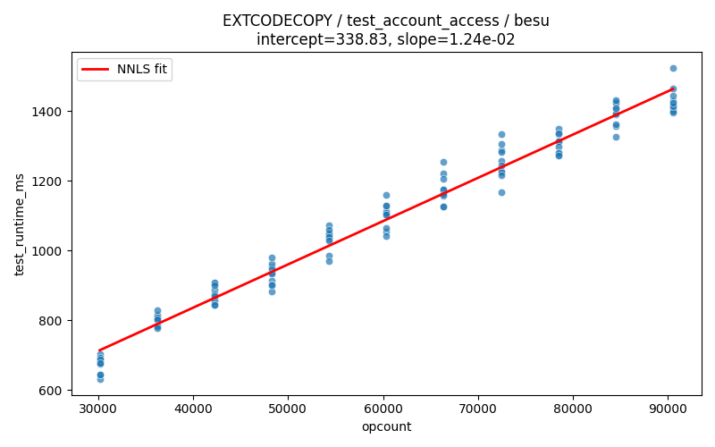


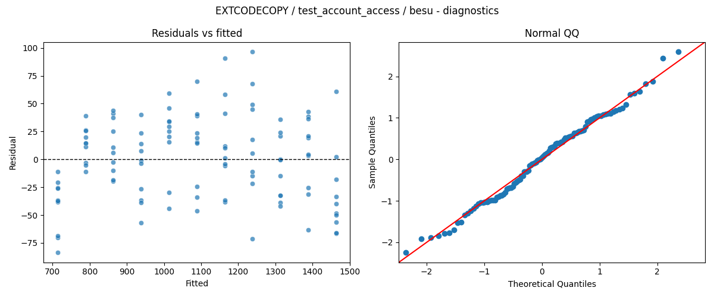

</details>

<details><summary>erigon — NNLS regression summary</summary>

```
==============================================================================
                           NNLS Regression Results                            
==============================================================================
Dep. Variable:          test_runtime_ms              R-squared:          0.992
Model:                  NNLS                    Adj. R-squared:          0.992
No. Observations:       88                                RMSE:          14.26
Df Residuals:           86                                 MAE:          11.75
Df Model:               1      
==============================================================================
                      coef     std err     P-value      [0.025      0.975]
------------------------------------------------------------------------------
         const     76.7905      4.7861       0.001     67.9283     86.8633
       opcount      0.0082      0.0001       0.001      0.0080      0.0083
==============================================================================
Notes: Non-negative least squares with bootstrap inference (1000 iterations)
==============================================================================
```


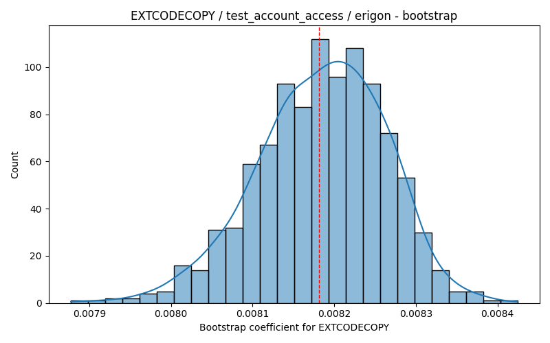

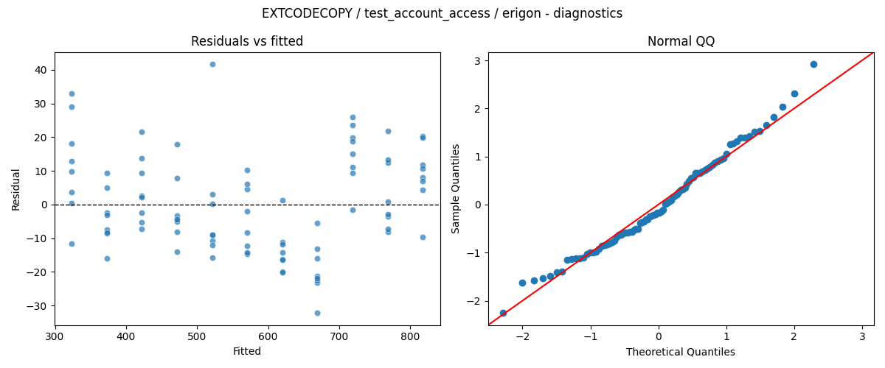

</details>

<details><summary>geth — NNLS regression summary</summary>

```
==============================================================================
                           NNLS Regression Results                            
==============================================================================
Dep. Variable:          test_runtime_ms              R-squared:          0.472
Model:                  NNLS                    Adj. R-squared:          0.465
No. Observations:       77                                RMSE:         332.03
Df Residuals:           75                                 MAE:         224.51
Df Model:               1      
==============================================================================
                      coef     std err     P-value      [0.025      0.975]
------------------------------------------------------------------------------
         const    170.3560    106.5642       0.062      0.0000    385.3185
       opcount      0.0165      0.0019       0.001      0.0122      0.0197
==============================================================================
Notes: Non-negative least squares with bootstrap inference (1000 iterations)
==============================================================================
```


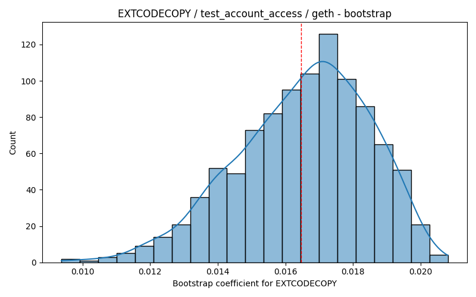


</details>

<details><summary>nethermind — NNLS regression summary</summary>

```
==============================================================================
                           NNLS Regression Results                            
==============================================================================
Dep. Variable:          test_runtime_ms              R-squared:          0.715
Model:                  NNLS                    Adj. R-squared:          0.713
No. Observations:       154                               RMSE:          22.18
Df Residuals:           152                                MAE:          17.57
Df Model:               1      
==============================================================================
                      coef     std err     P-value      [0.025      0.975]
------------------------------------------------------------------------------
         const     97.0103      5.6039       0.001     86.2683    107.7706
       opcount      0.0018      0.0001       0.001      0.0017      0.0020
==============================================================================
Notes: Non-negative least squares with bootstrap inference (1000 iterations)
==============================================================================
```

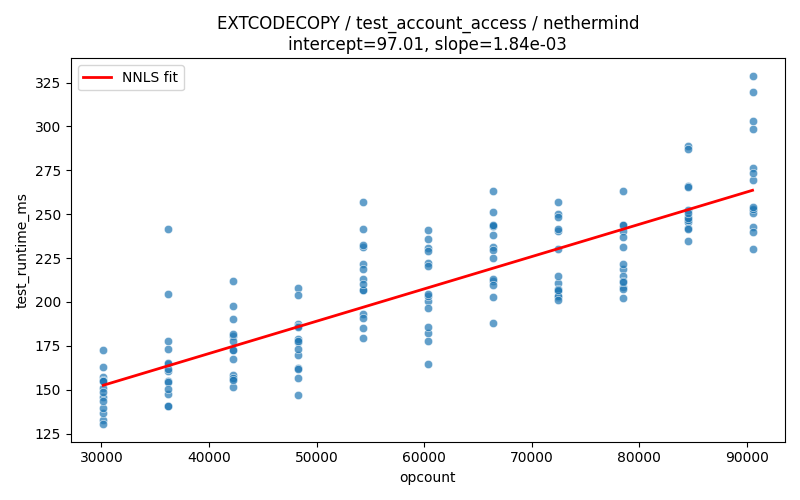

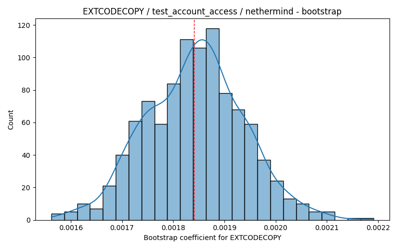

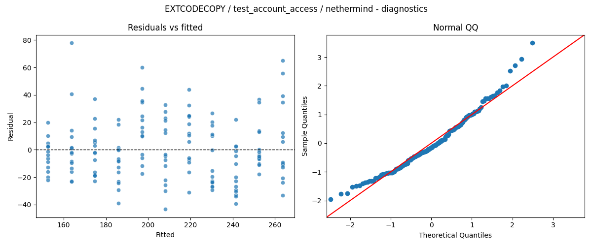

</details>

<details><summary>reth — NNLS regression summary</summary>

```
==============================================================================
                           NNLS Regression Results                            
==============================================================================
Dep. Variable:          test_runtime_ms              R-squared:          0.965
Model:                  NNLS                    Adj. R-squared:          0.964
No. Observations:       209                               RMSE:          14.72
Df Residuals:           207                                MAE:          11.74
Df Model:               1      
==============================================================================
                      coef     std err     P-value      [0.025      0.975]
------------------------------------------------------------------------------
         const     79.3606      3.0000       0.001     73.7503     85.2172
       opcount      0.0040      0.0001       0.001      0.0039      0.0041
==============================================================================
Notes: Non-negative least squares with bootstrap inference (1000 iterations)
==============================================================================
```

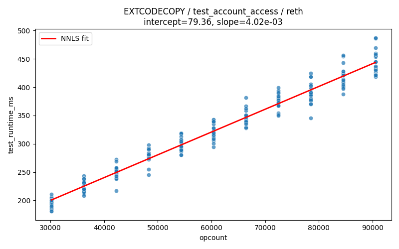

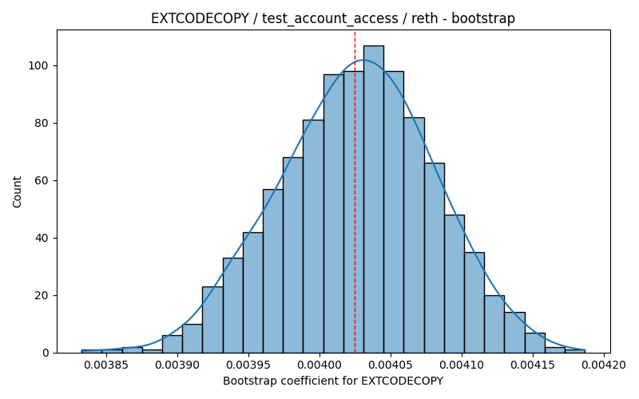

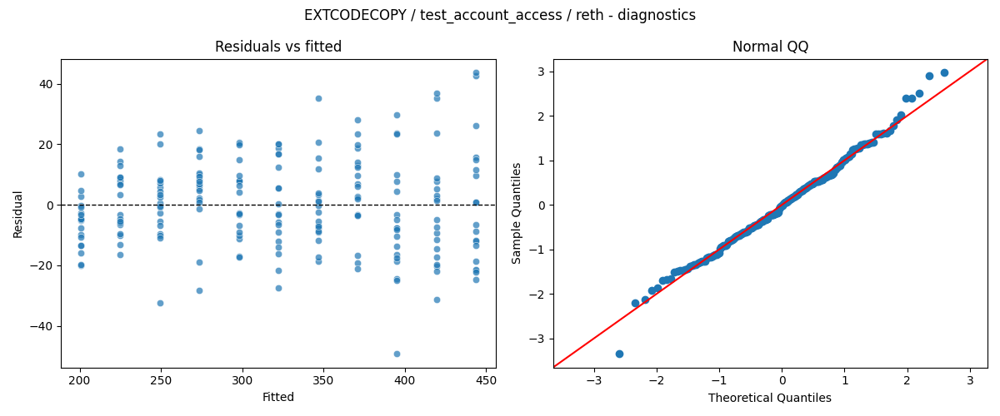

</details>

### test_account_access — combo `EXTCODECOPY_AccountMode.EXISTING_CONTRACT_SAME_MAX`

| client | nobs | R² | target_coef (ms) | p-value | 95% CI |
| --- | --- | --- | --- | --- | --- |
| `besu` | 110 | 0.96 | 0.01066 | 1.00e-03 | [0.01021, 0.01108] |
| `erigon` | 88 | 0.9912 | 0.008178 | 1.00e-03 | [0.008024, 0.008319] |
| `geth` | 77 | 0.4702 | 0.01631 | 1.00e-03 | [0.01185, 0.01937] |
| `nethermind` | 154 | 0.7439 | 0.001939 | 1.00e-03 | [0.00176, 0.002131] |
| `reth` | 209 | 0.9696 | 0.003972 | 1.00e-03 | [0.003881, 0.004073] |

<details><summary>besu — NNLS regression summary</summary>

```
==============================================================================
                           NNLS Regression Results                            
==============================================================================
Dep. Variable:          test_runtime_ms              R-squared:          0.960
Model:                  NNLS                    Adj. R-squared:          0.960
No. Observations:       110                               RMSE:          41.50
Df Residuals:           108                                MAE:          33.12
Df Model:               1      
==============================================================================
                      coef     std err     P-value      [0.025      0.975]
------------------------------------------------------------------------------
         const    414.0376     13.8079       0.001    389.5627    443.1300
       opcount      0.0107      0.0002       0.001      0.0102      0.0111
==============================================================================
Notes: Non-negative least squares with bootstrap inference (1000 iterations)
==============================================================================
```

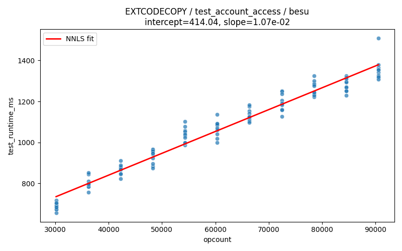

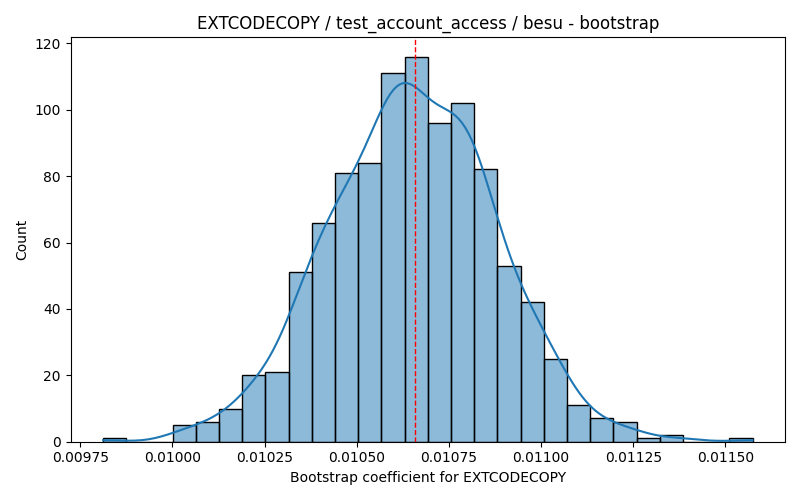

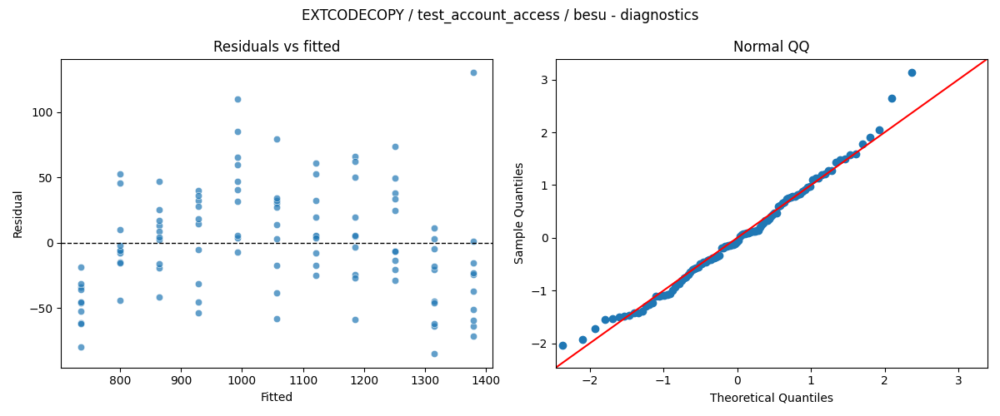

</details>

<details><summary>erigon — NNLS regression summary</summary>

```
==============================================================================
                           NNLS Regression Results                            
==============================================================================
Dep. Variable:          test_runtime_ms              R-squared:          0.991
Model:                  NNLS                    Adj. R-squared:          0.991
No. Observations:       88                                RMSE:          14.70
Df Residuals:           86                                 MAE:          11.22
Df Model:               1      
==============================================================================
                      coef     std err     P-value      [0.025      0.975]
------------------------------------------------------------------------------
         const     77.5333      5.3104       0.001     67.1683     88.5800
       opcount      0.0082      0.0001       0.001      0.0080      0.0083
==============================================================================
Notes: Non-negative least squares with bootstrap inference (1000 iterations)
==============================================================================
```


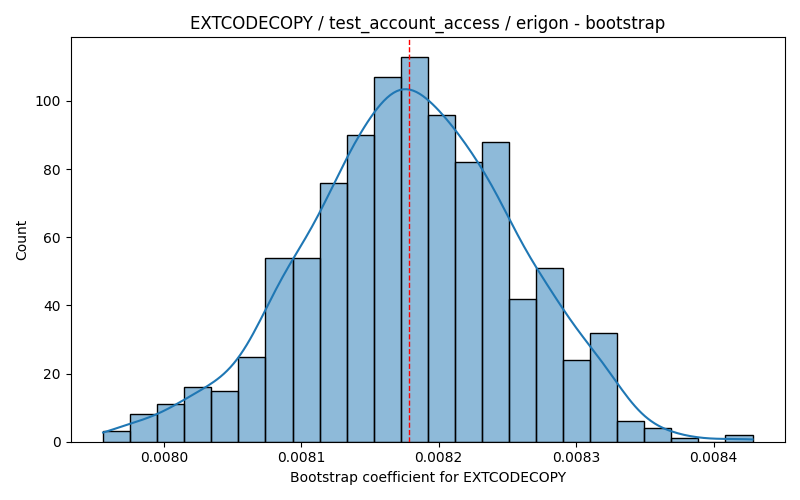

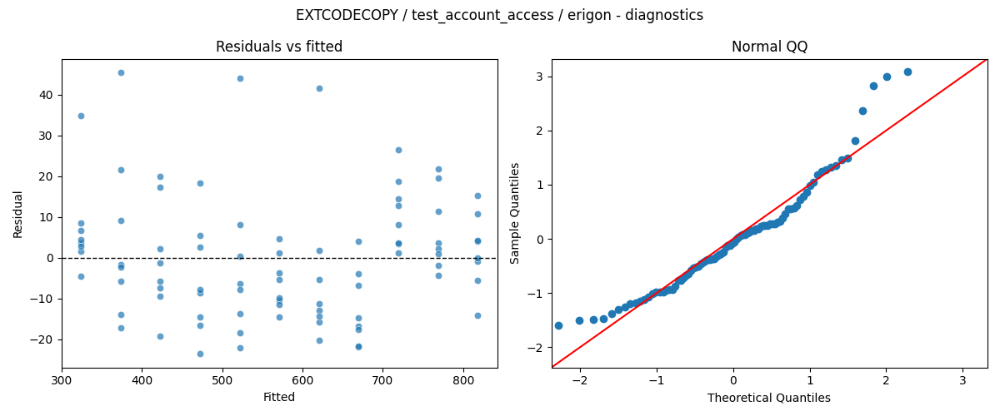

</details>

<details><summary>geth — NNLS regression summary</summary>

```
==============================================================================
                           NNLS Regression Results                            
==============================================================================
Dep. Variable:          test_runtime_ms              R-squared:          0.470
Model:                  NNLS                    Adj. R-squared:          0.463
No. Observations:       77                                RMSE:         330.32
Df Residuals:           75                                 MAE:         223.57
Df Model:               1      
==============================================================================
                      coef     std err     P-value      [0.025      0.975]
------------------------------------------------------------------------------
         const    160.2585    103.1030       0.058      0.0000    392.7090
       opcount      0.0163      0.0020       0.001      0.0118      0.0194
==============================================================================
Notes: Non-negative least squares with bootstrap inference (1000 iterations)
==============================================================================
```


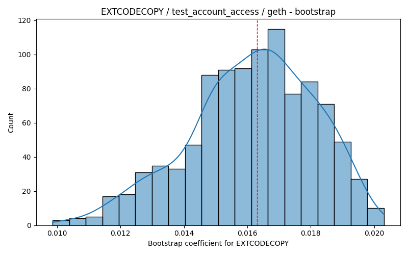

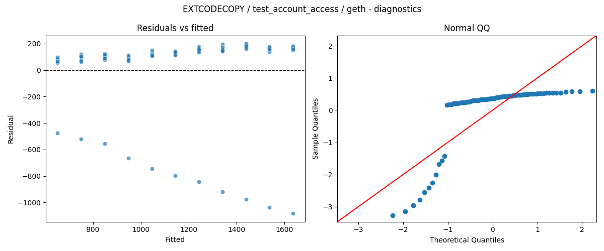

</details>

<details><summary>nethermind — NNLS regression summary</summary>

```
==============================================================================
                           NNLS Regression Results                            
==============================================================================
Dep. Variable:          test_runtime_ms              R-squared:          0.744
Model:                  NNLS                    Adj. R-squared:          0.742
No. Observations:       154                               RMSE:          21.71
Df Residuals:           152                                MAE:          17.67
Df Model:               1      
==============================================================================
                      coef     std err     P-value      [0.025      0.975]
------------------------------------------------------------------------------
         const     90.9541      5.5665       0.001     79.9949    101.2540
       opcount      0.0019      0.0001       0.001      0.0018      0.0021
==============================================================================
Notes: Non-negative least squares with bootstrap inference (1000 iterations)
==============================================================================
```

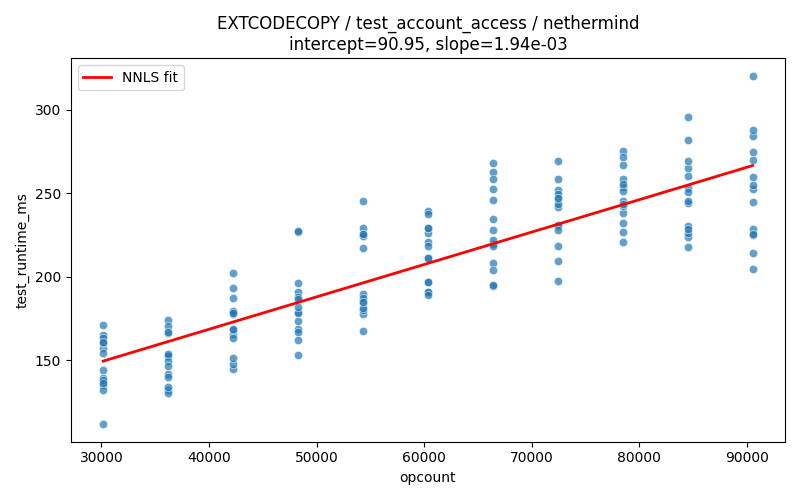

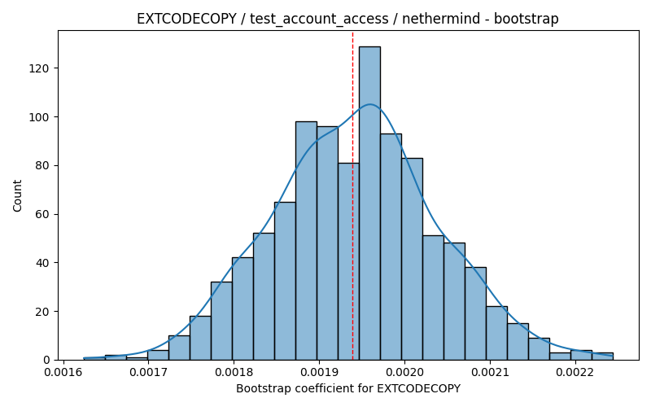

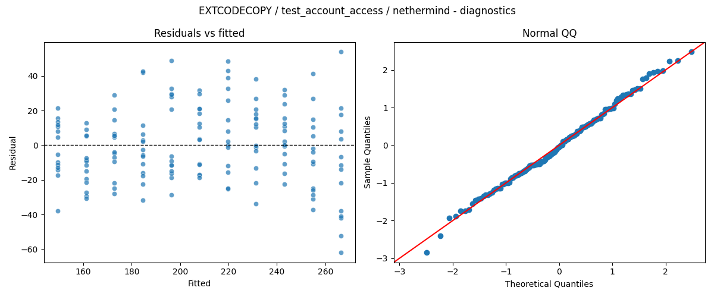

</details>

<details><summary>reth — NNLS regression summary</summary>

```
==============================================================================
                           NNLS Regression Results                            
==============================================================================
Dep. Variable:          test_runtime_ms              R-squared:          0.970
Model:                  NNLS                    Adj. R-squared:          0.969
No. Observations:       209                               RMSE:          13.41
Df Residuals:           207                                MAE:          10.70
Df Model:               1      
==============================================================================
                      coef     std err     P-value      [0.025      0.975]
------------------------------------------------------------------------------
         const     81.8736      2.8201       0.001     76.2177     87.1852
       opcount      0.0040      0.0000       0.001      0.0039      0.0041
==============================================================================
Notes: Non-negative least squares with bootstrap inference (1000 iterations)
==============================================================================
```

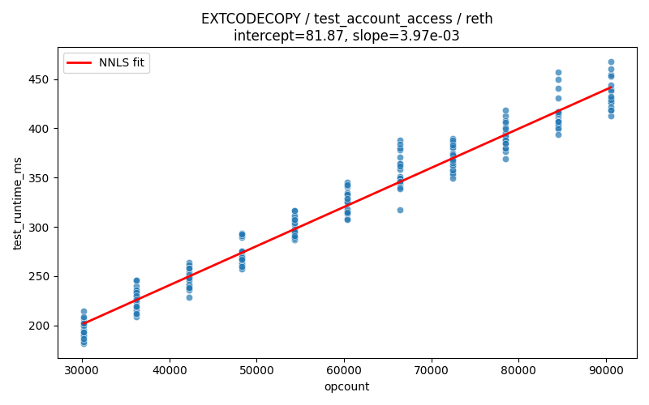

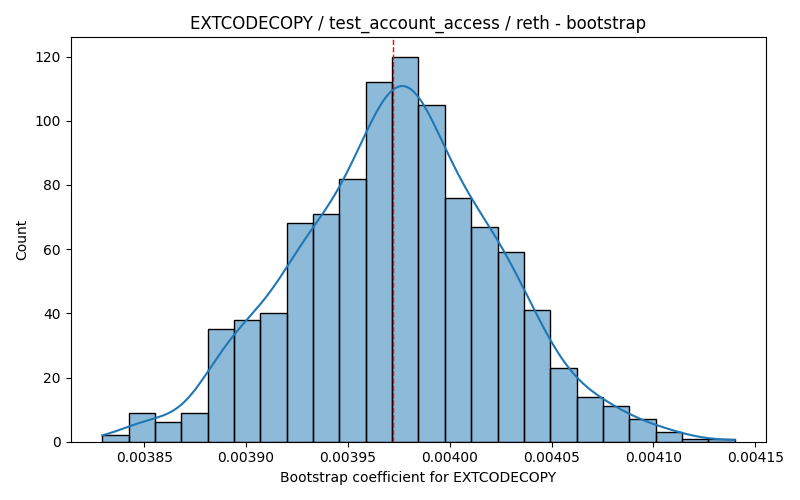

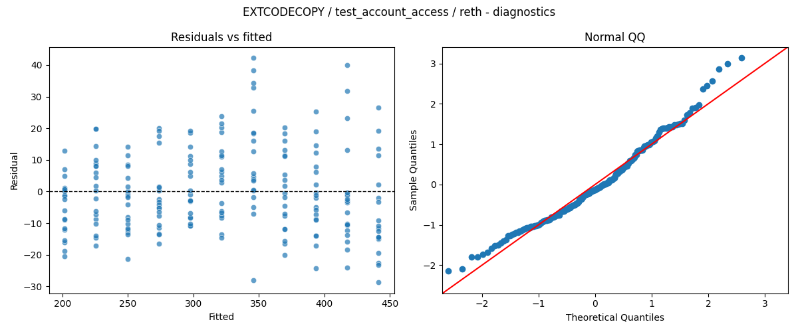

</details>
