# Glue opcodes report

Per-client NNLS fits of priced glue opcodes against their driver fixtures. Cycle-tier opcodes share one joint regression per client (shown once); pure-tier and mixed-tier opcodes each get a single-feature fit. Mixed-tier fits pre-adjust the LHS by subtracting the contribution of every priced upstream partner selected by the detector (pure ∪ cycle for `mixed_a`, plus `mixed_a` for `mixed_b`).

**Contents:** [besu](#besu) · [erigon](#erigon) · [ethrex](#ethrex) · [geth](#geth) · [nethermind](#nethermind) · [reth](#reth)

## besu

| glue_opcode | nobs | glue_runtime_ms | p_value | rsquared |
| --- | --- | --- | --- | --- |
| `ISZERO` | 187 | 6.058e-06 | 1.00e-03 | 0.9866 |
| `JUMPDEST` | 187 | 1.536e-06 | 1.00e-03 | 0.988 |
| `SWAP` | 2992 | 3.534e-06 | 1.00e-03 | 0.9572 |
| `CALLDATASIZE` | 11077 | 4.943e-06 | 1.00e-03 | 0.984 |
| `DUP` | 11077 | 2.383e-06 | 1.00e-03 | 0.984 |
| `GAS` | 11077 | 4.106e-06 | 1.00e-03 | 0.984 |
| `MLOAD` | 11077 | 1.301e-05 | 1.00e-03 | 0.984 |
| `PUSH` | 11077 | 3.435e-06 | 1.00e-03 | 0.984 |
| `PUSH0` | 11077 | 2.068e-06 | 1.00e-03 | 0.984 |
| `STATICCALL` | 11077 | 0.001186 | 1.00e-03 | 0.984 |
| `ADD` | 187 | 1.484e-05 | 1.00e-03 | 0.9865 |
| `AND` | 187 | 1.079e-05 | 1.00e-03 | 0.9769 |
| `CALLDATACOPY` | 4488 | 2.363e-05 | 1.00e-03 | 0.7221 |
| `CALLDATALOAD` | 748 | 2.608e-05 | 1.00e-03 | 0.01993 |
| `DIV` | 187 | 1.919e-05 | 1.00e-03 | 0.9578 |
| `EXP` | 187 | 0.002234 | 1.00e-03 | 0.9657 |
| `GT` | 187 | 4.483e-05 | 1.00e-03 | 0.9833 |
| `JUMPI` | 187 | 8.797e-06 | 1.00e-03 | 0.9617 |
| `LT` | 187 | 4.649e-05 | 1.00e-03 | 0.7159 |
| `MSTORE` | 935 | 2.821e-05 | 1.00e-03 | 0.9758 |
| `MSTORE8` | 935 | 1.476e-05 | 1.00e-03 | 0.9834 |
| `MUL` | 187 | 1.529e-05 | 1.00e-03 | 0.9085 |
| `PC` | 187 | 5.157e-06 | 1.00e-03 | 0.9909 |
| `RETURNDATASIZE` | 748 | 7.124e-06 | 1.00e-03 | 0.9786 |
| `SELFBALANCE` | 187 | 2.085e-05 | 1.00e-03 | 0.9835 |
| `SUB` | 187 | 1.539e-05 | 1.00e-03 | 0.9922 |
| `JUMP` | 187 | 3.788e-05 | 1.00e-03 | 0.9911 |
| `KECCAK256` | 2992 | 5.315e-05 | 1.00e-03 | 0.1309 |

### Cycle glue — joint fit · besu

<details><summary>Joint NNLS regression summary</summary>

```
==============================================================================
                           NNLS Regression Results                            
==============================================================================
Dep. Variable:          test_runtime_ms              R-squared:          0.984
Model:                  NNLS                    Adj. R-squared:          0.984
No. Observations:       11077                             RMSE:          22.42
Df Residuals:           11069                              MAE:           9.74
Df Model:               7      
==============================================================================
                      coef     std err     P-value      [0.025      0.975]
------------------------------------------------------------------------------
         const     39.1259      0.8625       0.001     37.4561     40.7888
  CALLDATASIZE      0.0000      0.0000       0.001      0.0000      0.0000
           DUP      0.0000      0.0000       0.001      0.0000      0.0000
           GAS      0.0000      0.0000       0.001      0.0000      0.0000
         MLOAD      0.0000      0.0000       0.001      0.0000      0.0000
          PUSH      0.0000      0.0000       0.001      0.0000      0.0000
         PUSH0      0.0000      0.0000       0.001      0.0000      0.0000
    STATICCALL      0.0012      0.0000       0.001      0.0011      0.0012
==============================================================================
Notes: Non-negative least squares with bootstrap inference (1000 iterations)
==============================================================================
```

</details>

<details><summary><code>CALLDATASIZE</code> · nobs=11077 · runtime_ms=4.943e-06 · p=1.00e-03 · R²=0.984</summary>

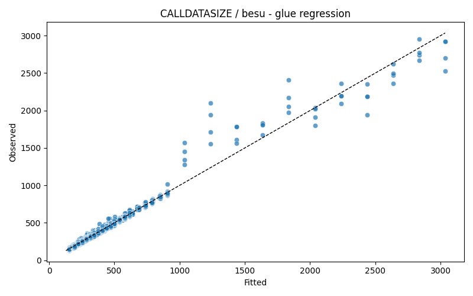

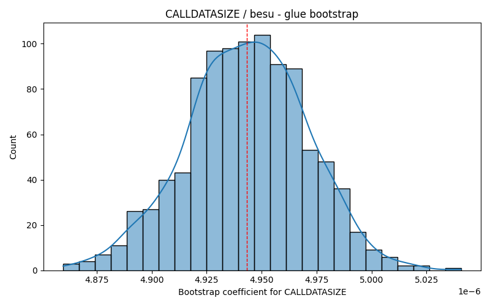

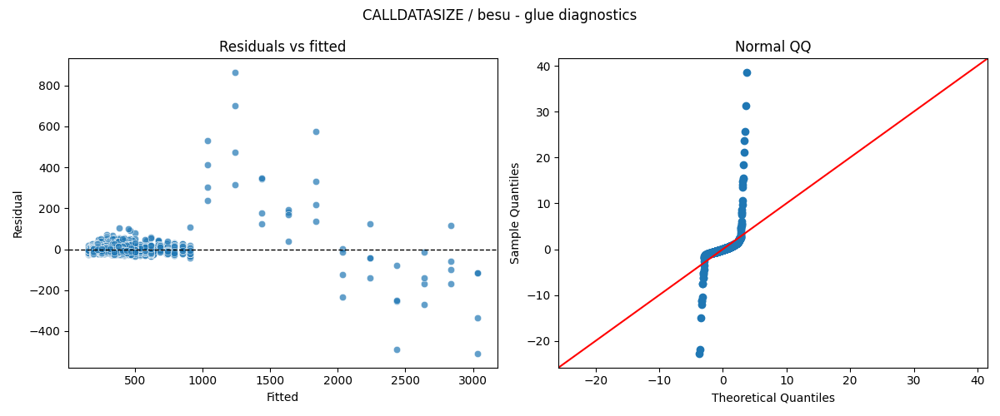

</details>

<details><summary><code>DUP</code> · nobs=11077 · runtime_ms=2.383e-06 · p=1.00e-03 · R²=0.984</summary>


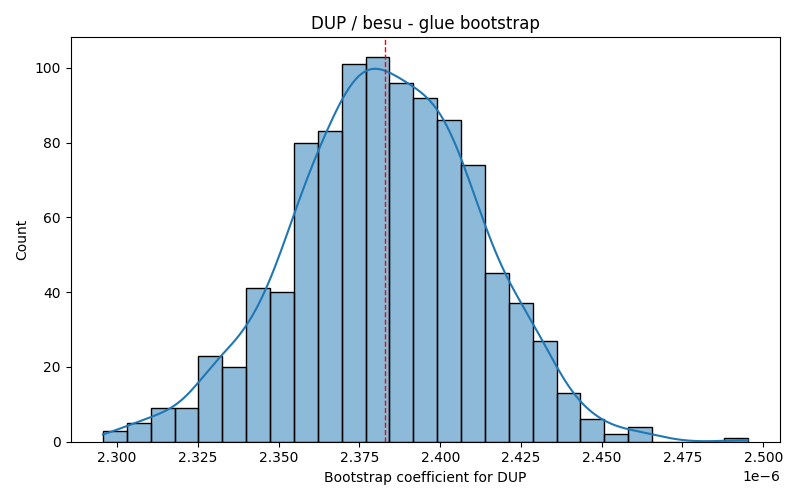


</details>

<details><summary><code>GAS</code> · nobs=11077 · runtime_ms=4.106e-06 · p=1.00e-03 · R²=0.984</summary>

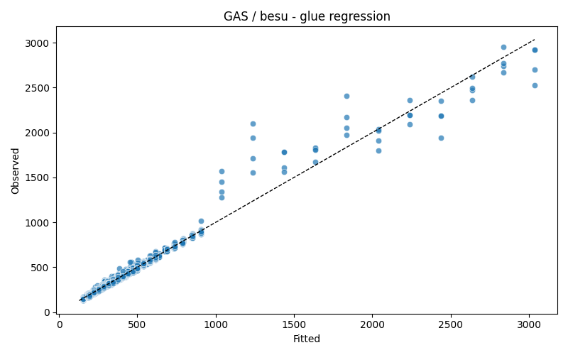

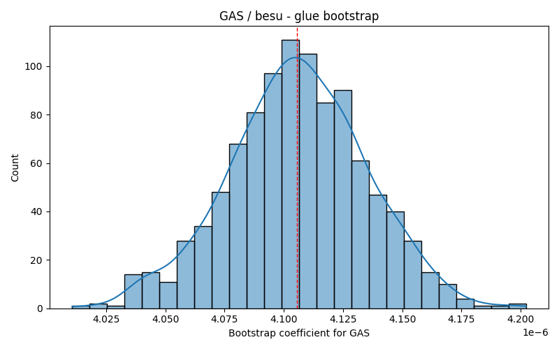

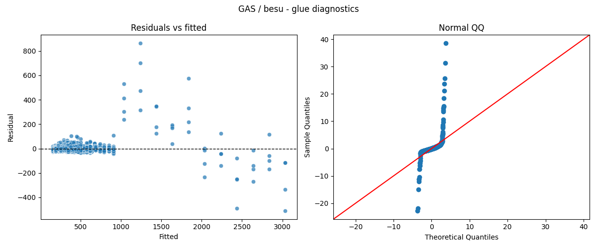

</details>

<details><summary><code>MLOAD</code> · nobs=11077 · runtime_ms=1.301e-05 · p=1.00e-03 · R²=0.984</summary>

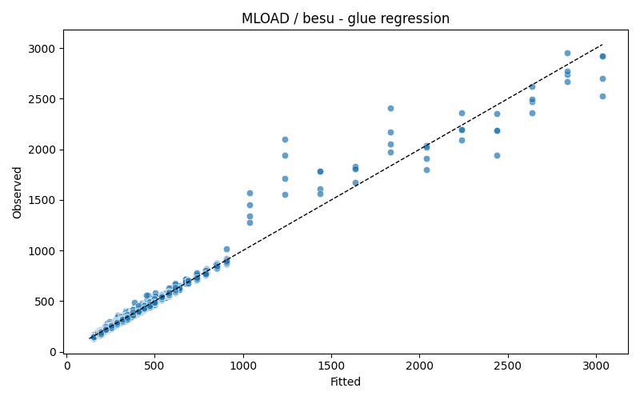

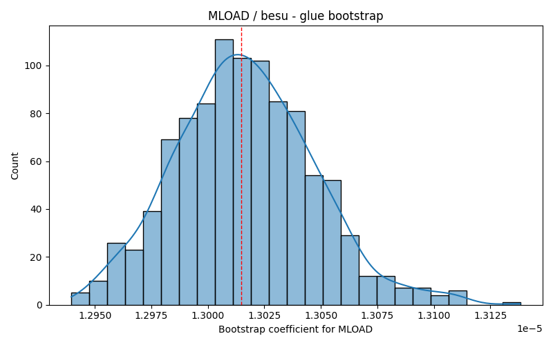


</details>

<details><summary><code>PUSH</code> · nobs=11077 · runtime_ms=3.435e-06 · p=1.00e-03 · R²=0.984</summary>


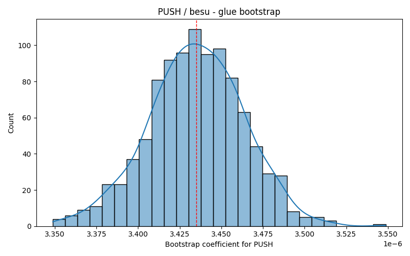


</details>

<details><summary><code>PUSH0</code> · nobs=11077 · runtime_ms=2.068e-06 · p=1.00e-03 · R²=0.984</summary>


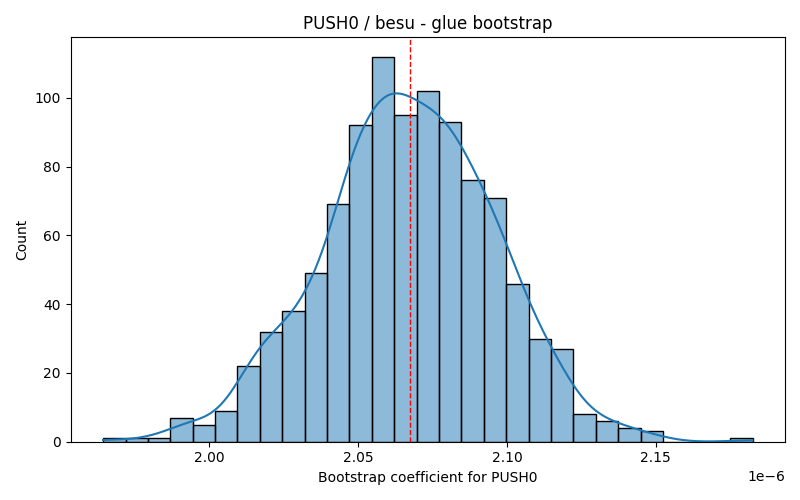


</details>

<details><summary><code>STATICCALL</code> · nobs=11077 · runtime_ms=0.001186 · p=1.00e-03 · R²=0.984</summary>


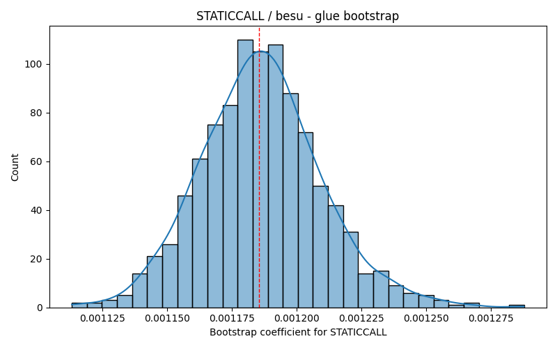


</details>

### Pure glue · besu

<details><summary><code>ISZERO</code> · nobs=187 · runtime_ms=6.058e-06 · p=1.00e-03 · R²=0.9866</summary>

```
==============================================================================
                           NNLS Regression Results                            
==============================================================================
Dep. Variable:          test_runtime_ms              R-squared:          0.987
Model:                  NNLS                    Adj. R-squared:          0.986
No. Observations:       187                               RMSE:          14.89
Df Residuals:           185                                MAE:          11.20
Df Model:               1      
==============================================================================
                      coef     std err     P-value      [0.025      0.975]
------------------------------------------------------------------------------
         const     38.8010      4.4194       0.001     31.2638     48.3375
        ISZERO      0.0000      0.0000       0.001      0.0000      0.0000
==============================================================================
Notes: Non-negative least squares with bootstrap inference (1000 iterations)
==============================================================================
```

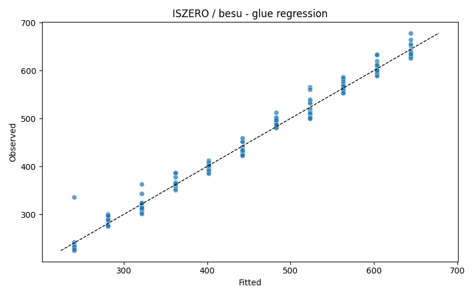

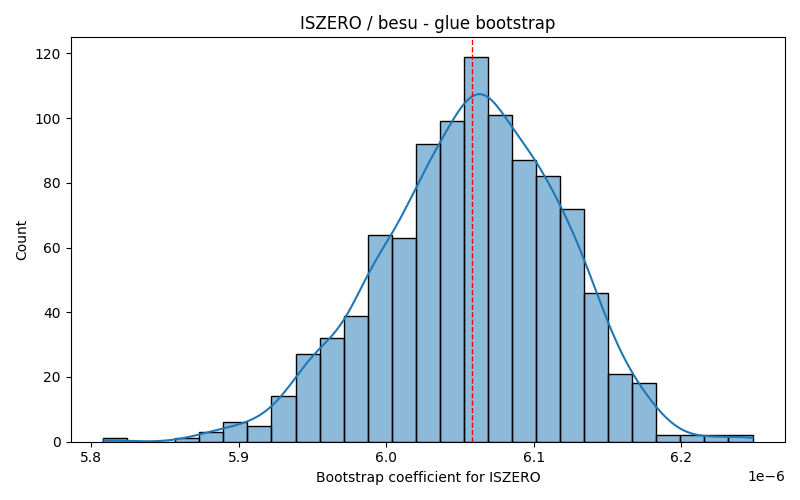

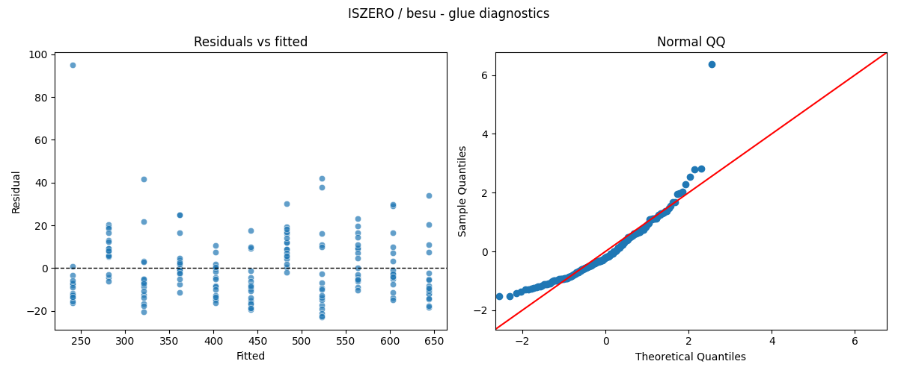

</details>

<details><summary><code>JUMPDEST</code> · nobs=187 · runtime_ms=1.536e-06 · p=1.00e-03 · R²=0.988</summary>

```
==============================================================================
                           NNLS Regression Results                            
==============================================================================
Dep. Variable:          test_runtime_ms              R-squared:          0.988
Model:                  NNLS                    Adj. R-squared:          0.988
No. Observations:       187                               RMSE:          10.70
Df Residuals:           185                                MAE:           8.35
Df Model:               1      
==============================================================================
                      coef     std err     P-value      [0.025      0.975]
------------------------------------------------------------------------------
         const     30.4887      2.2694       0.001     26.3272     35.1803
      JUMPDEST      0.0000      0.0000       0.001      0.0000      0.0000
==============================================================================
Notes: Non-negative least squares with bootstrap inference (1000 iterations)
==============================================================================
```

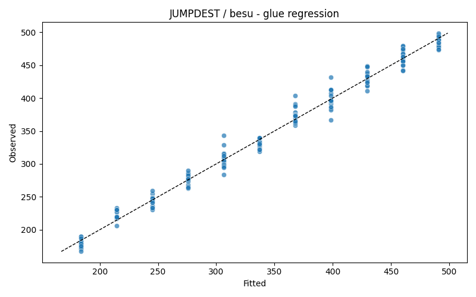

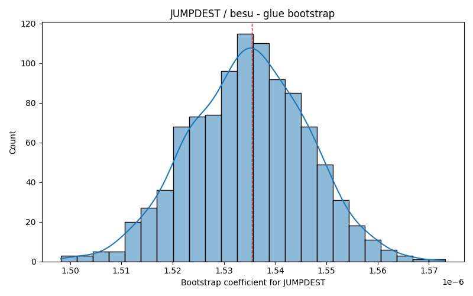

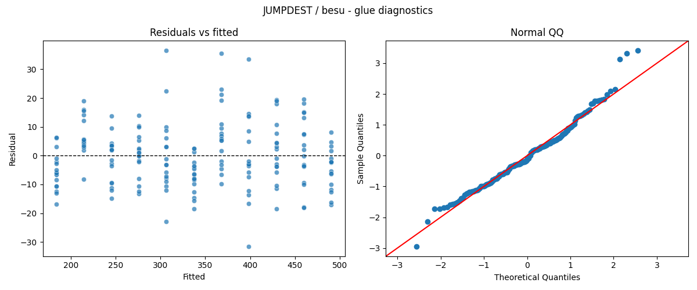

</details>

<details><summary><code>SWAP</code> · nobs=2992 · runtime_ms=3.534e-06 · p=1.00e-03 · R²=0.9572</summary>

```
==============================================================================
                           NNLS Regression Results                            
==============================================================================
Dep. Variable:          test_runtime_ms              R-squared:          0.957
Model:                  NNLS                    Adj. R-squared:          0.957
No. Observations:       2992                              RMSE:          15.74
Df Residuals:           2990                               MAE:          11.75
Df Model:               1      
==============================================================================
                      coef     std err     P-value      [0.025      0.975]
------------------------------------------------------------------------------
         const     33.1494      0.8574       0.001     31.5339     34.8600
          SWAP      0.0000      0.0000       0.001      0.0000      0.0000
==============================================================================
Notes: Non-negative least squares with bootstrap inference (1000 iterations)
==============================================================================
```

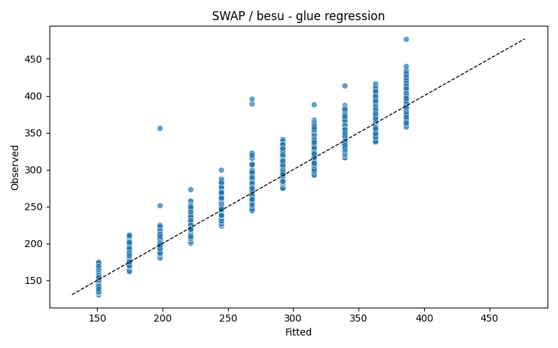


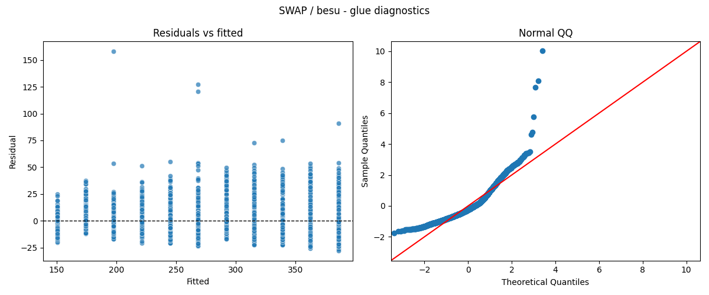

</details>

### Mixed glue (tier A) · besu

<details><summary><code>ADD</code> · nobs=187 · runtime_ms=1.484e-05 · p=1.00e-03 · R²=0.9865</summary>

```
==============================================================================
                           NNLS Regression Results                            
==============================================================================
Dep. Variable:          test_runtime_ms              R-squared:          0.987
Model:                  NNLS                    Adj. R-squared:          0.986
No. Observations:       187                               RMSE:          18.24
Df Residuals:           185                                MAE:          14.66
Df Model:               1      
==============================================================================
                      coef     std err     P-value      [0.025      0.975]
------------------------------------------------------------------------------
         const     71.6909      4.8656       0.001     62.1395     80.9059
           ADD      0.0000      0.0000       0.001      0.0000      0.0000
==============================================================================
Notes: Non-negative least squares with bootstrap inference (1000 iterations)
==============================================================================
```

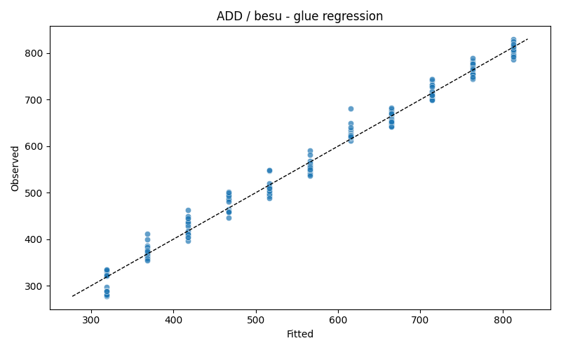

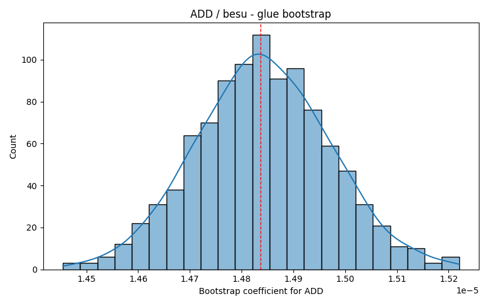

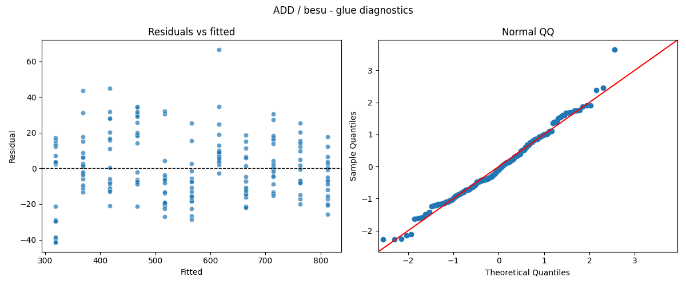

</details>

<details><summary><code>AND</code> · nobs=187 · runtime_ms=1.079e-05 · p=1.00e-03 · R²=0.9769</summary>

```
==============================================================================
                           NNLS Regression Results                            
==============================================================================
Dep. Variable:          test_runtime_ms              R-squared:          0.977
Model:                  NNLS                    Adj. R-squared:          0.977
No. Observations:       187                               RMSE:          17.46
Df Residuals:           185                                MAE:          14.48
Df Model:               1      
==============================================================================
                      coef     std err     P-value      [0.025      0.975]
------------------------------------------------------------------------------
         const     43.6084      3.5308       0.001     36.6048     50.9248
           AND      0.0000      0.0000       0.001      0.0000      0.0000
==============================================================================
Notes: Non-negative least squares with bootstrap inference (1000 iterations)
==============================================================================
```

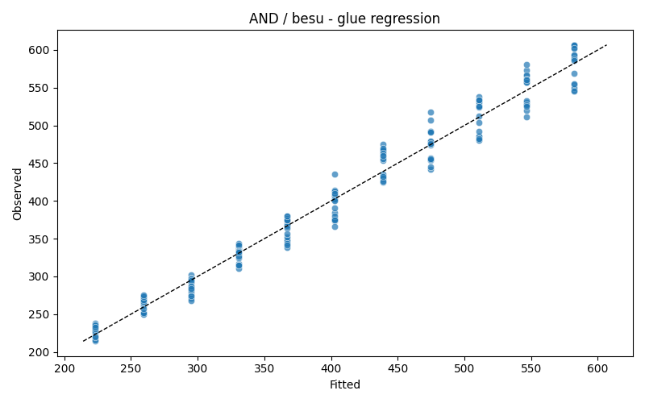

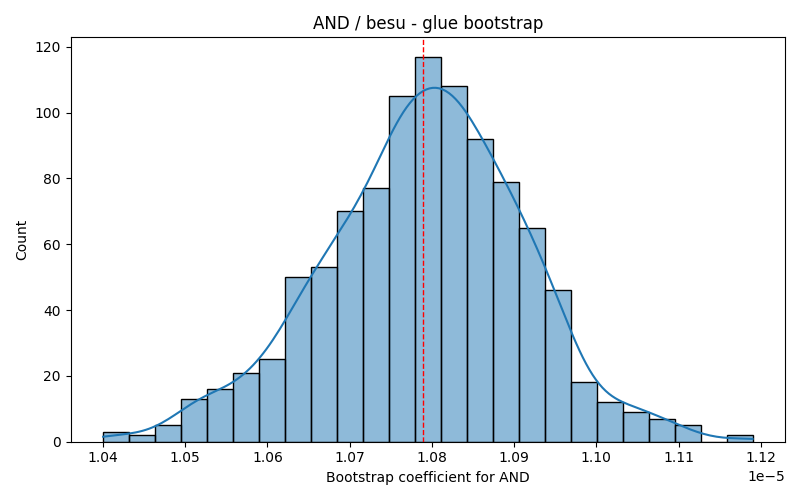

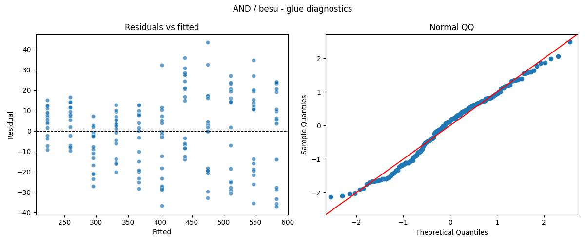

</details>

<details><summary><code>CALLDATACOPY</code> · nobs=4488 · runtime_ms=2.363e-05 · p=1.00e-03 · R²=0.7221</summary>

```
==============================================================================
                           NNLS Regression Results                            
==============================================================================
Dep. Variable:          test_runtime_ms              R-squared:          0.722
Model:                  NNLS                    Adj. R-squared:          0.722
No. Observations:       4488                              RMSE:         110.29
Df Residuals:           4486                               MAE:          85.63
Df Model:               1      
==============================================================================
                      coef     std err     P-value      [0.025      0.975]
------------------------------------------------------------------------------
         const    138.6472      1.7866       0.001    135.0870    141.9626
  CALLDATACOPY      0.0000      0.0000       0.001      0.0000      0.0000
==============================================================================
Notes: Non-negative least squares with bootstrap inference (1000 iterations)
==============================================================================
```

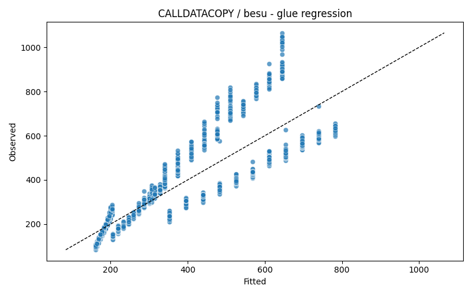

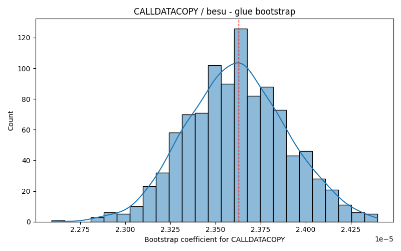

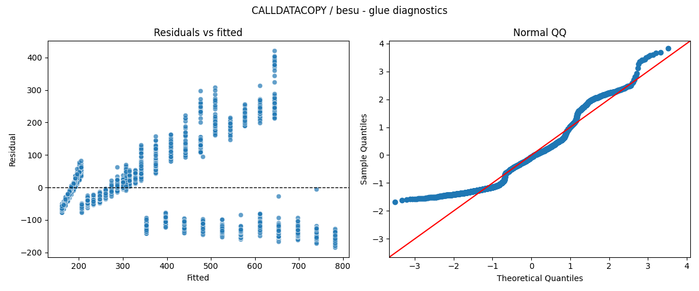

</details>

<details><summary><code>CALLDATALOAD</code> · nobs=748 · runtime_ms=2.608e-05 · p=1.00e-03 · R²=0.01993</summary>

```
==============================================================================
                           NNLS Regression Results                            
==============================================================================
Dep. Variable:          test_runtime_ms              R-squared:          0.020
Model:                  NNLS                    Adj. R-squared:          0.019
No. Observations:       748                               RMSE:           0.70
Df Residuals:           746                                MAE:           0.47
Df Model:               1      
==============================================================================
                      coef     std err     P-value      [0.025      0.975]
------------------------------------------------------------------------------
         const      3.3969      0.0995       0.001      3.1964      3.5979
  CALLDATALOAD      0.0000      0.0000       0.001      0.0000      0.0000
==============================================================================
Notes: Non-negative least squares with bootstrap inference (1000 iterations)
==============================================================================
```

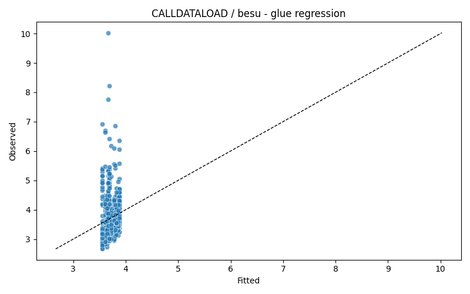

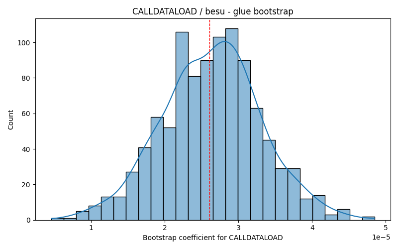

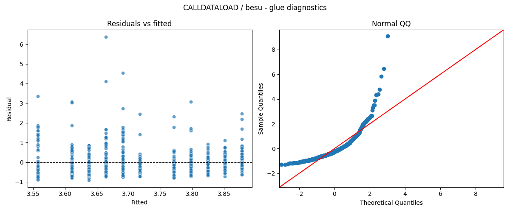

</details>

<details><summary><code>DIV</code> · nobs=187 · runtime_ms=1.919e-05 · p=1.00e-03 · R²=0.9578</summary>

```
==============================================================================
                           NNLS Regression Results                            
==============================================================================
Dep. Variable:          test_runtime_ms              R-squared:          0.958
Model:                  NNLS                    Adj. R-squared:          0.958
No. Observations:       187                               RMSE:          31.84
Df Residuals:           185                                MAE:          25.66
Df Model:               1      
==============================================================================
                      coef     std err     P-value      [0.025      0.975]
------------------------------------------------------------------------------
         const     98.0085      7.8138       0.001     82.7903    113.3023
           DIV      0.0000      0.0000       0.001      0.0000      0.0000
==============================================================================
Notes: Non-negative least squares with bootstrap inference (1000 iterations)
==============================================================================
```

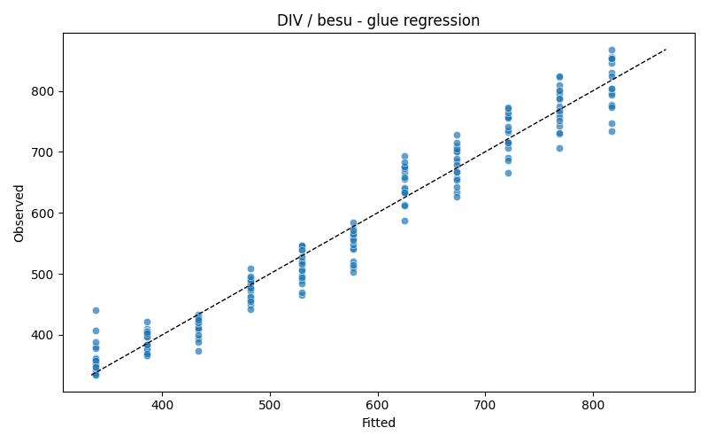

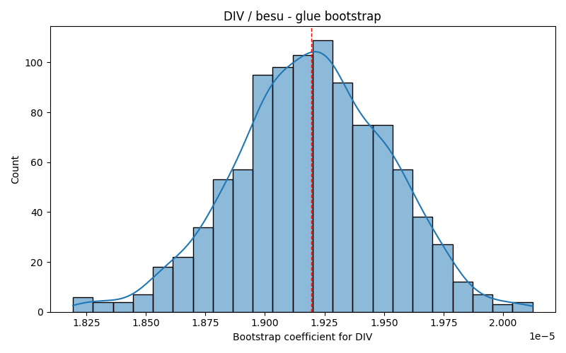

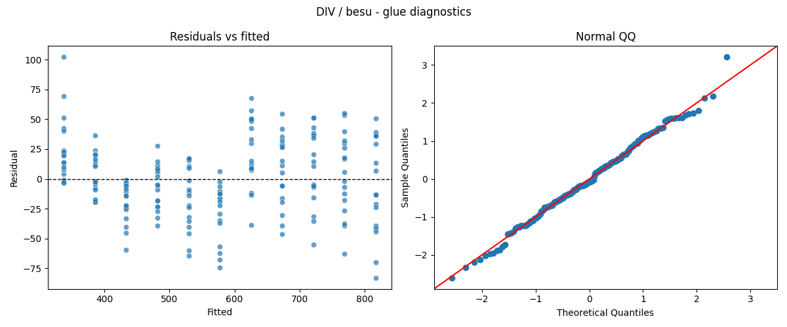

</details>

<details><summary><code>EXP</code> · nobs=187 · runtime_ms=0.002234 · p=1.00e-03 · R²=0.9657</summary>

```
==============================================================================
                           NNLS Regression Results                            
==============================================================================
Dep. Variable:          test_runtime_ms              R-squared:          0.966
Model:                  NNLS                    Adj. R-squared:          0.966
No. Observations:       187                               RMSE:          16.50
Df Residuals:           185                                MAE:          12.30
Df Model:               1      
==============================================================================
                      coef     std err     P-value      [0.025      0.975]
------------------------------------------------------------------------------
         const     73.8470      5.9189       0.001     62.6005     85.6410
           EXP      0.0022      0.0000       0.001      0.0022      0.0023
==============================================================================
Notes: Non-negative least squares with bootstrap inference (1000 iterations)
==============================================================================
```

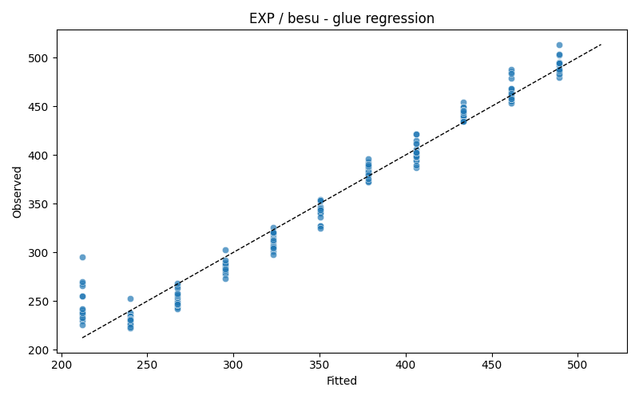

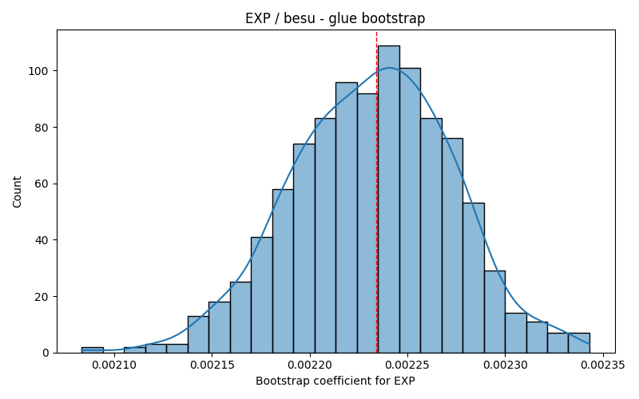

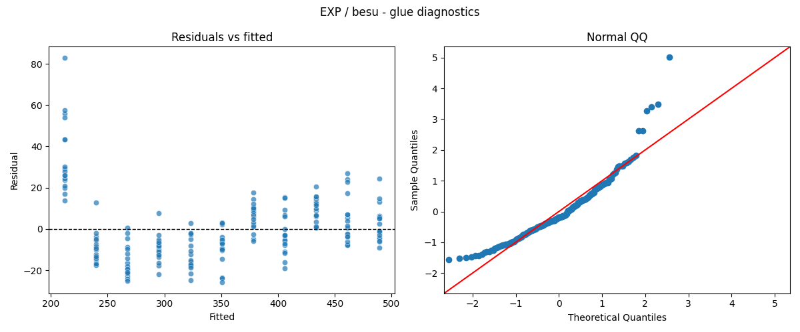

</details>

<details><summary><code>GT</code> · nobs=187 · runtime_ms=4.483e-05 · p=1.00e-03 · R²=0.9833</summary>

```
==============================================================================
                           NNLS Regression Results                            
==============================================================================
Dep. Variable:          test_runtime_ms              R-squared:          0.983
Model:                  NNLS                    Adj. R-squared:          0.983
No. Observations:       187                               RMSE:          61.47
Df Residuals:           185                                MAE:          50.43
Df Model:               1      
==============================================================================
                      coef     std err     P-value      [0.025      0.975]
------------------------------------------------------------------------------
         const     99.6022     17.0145       0.001     66.5848    132.3823
            GT      0.0000      0.0000       0.001      0.0000      0.0000
==============================================================================
Notes: Non-negative least squares with bootstrap inference (1000 iterations)
==============================================================================
```

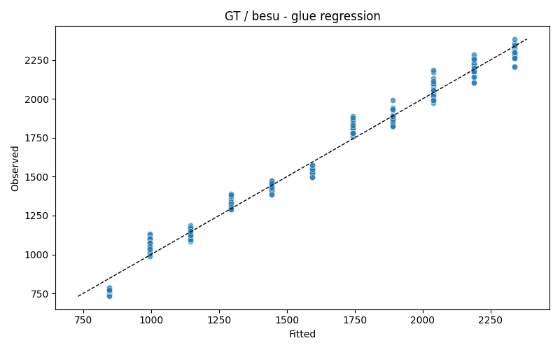

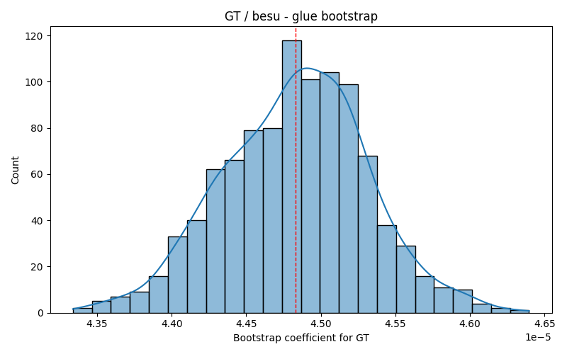

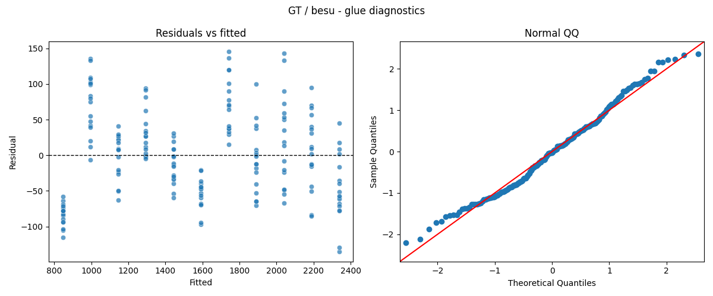

</details>

<details><summary><code>JUMPI</code> · nobs=187 · runtime_ms=8.797e-06 · p=1.00e-03 · R²=0.9617</summary>

```
==============================================================================
                           NNLS Regression Results                            
==============================================================================
Dep. Variable:          test_runtime_ms              R-squared:          0.962
Model:                  NNLS                    Adj. R-squared:          0.962
No. Observations:       187                               RMSE:           7.92
Df Residuals:           185                                MAE:           5.23
Df Model:               1      
==============================================================================
                      coef     std err     P-value      [0.025      0.975]
------------------------------------------------------------------------------
         const     19.4000      2.1732       0.001     14.9930     23.3913
         JUMPI      0.0000      0.0000       0.001      0.0000      0.0000
==============================================================================
Notes: Non-negative least squares with bootstrap inference (1000 iterations)
==============================================================================
```

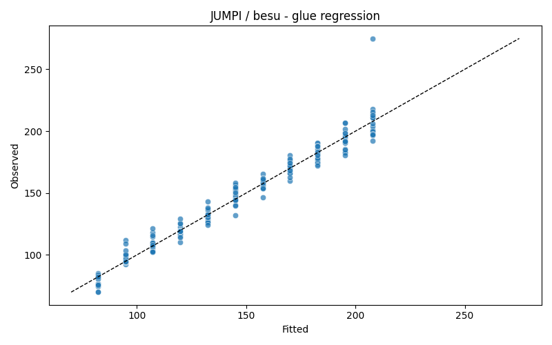

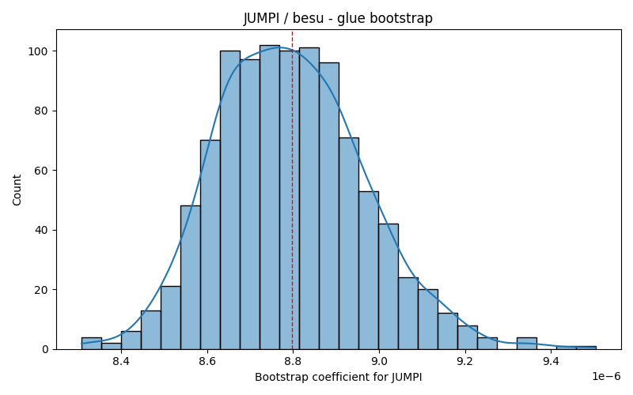

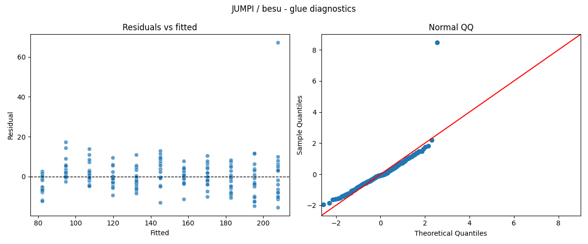

</details>

<details><summary><code>LT</code> · nobs=187 · runtime_ms=4.649e-05 · p=1.00e-03 · R²=0.7159</summary>

```
==============================================================================
                           NNLS Regression Results                            
==============================================================================
Dep. Variable:          test_runtime_ms              R-squared:          0.716
Model:                  NNLS                    Adj. R-squared:          0.714
No. Observations:       187                               RMSE:         308.38
Df Residuals:           185                                MAE:         148.10
Df Model:               1      
==============================================================================
                      coef     std err     P-value      [0.025      0.975]
------------------------------------------------------------------------------
         const    124.5079     64.4217       0.025      0.6597    260.3214
            LT      0.0000      0.0000       0.001      0.0000      0.0001
==============================================================================
Notes: Non-negative least squares with bootstrap inference (1000 iterations)
==============================================================================
```

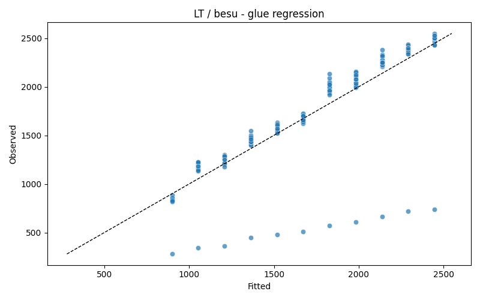

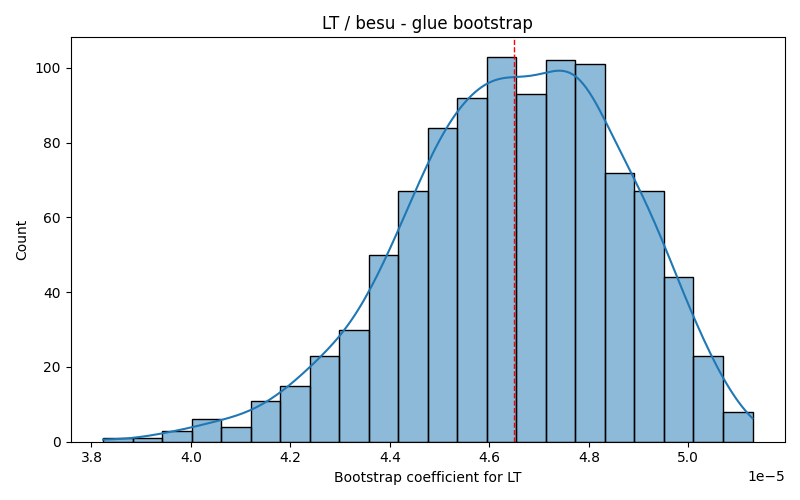

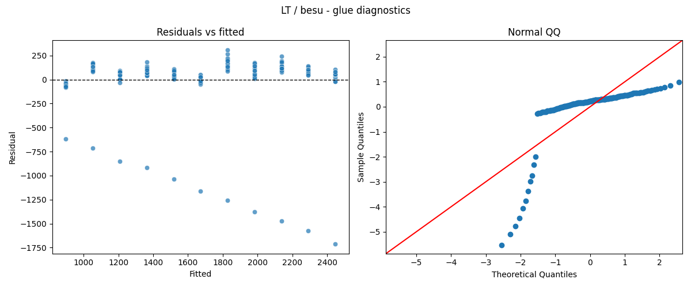

</details>

<details><summary><code>MSTORE</code> · nobs=935 · runtime_ms=2.821e-05 · p=1.00e-03 · R²=0.9758</summary>

```
==============================================================================
                           NNLS Regression Results                            
==============================================================================
Dep. Variable:          test_runtime_ms              R-squared:          0.976
Model:                  NNLS                    Adj. R-squared:          0.976
No. Observations:       935                               RMSE:          31.17
Df Residuals:           933                                MAE:          25.73
Df Model:               1      
==============================================================================
                      coef     std err     P-value      [0.025      0.975]
------------------------------------------------------------------------------
         const     49.9779      3.1638       0.001     43.7233     56.2056
        MSTORE      0.0000      0.0000       0.001      0.0000      0.0000
==============================================================================
Notes: Non-negative least squares with bootstrap inference (1000 iterations)
==============================================================================
```

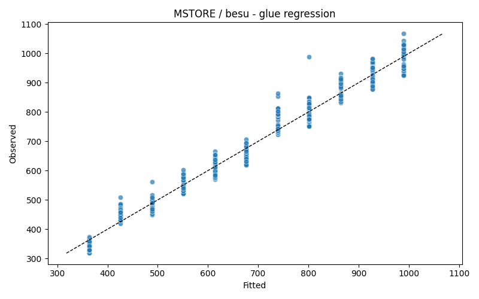

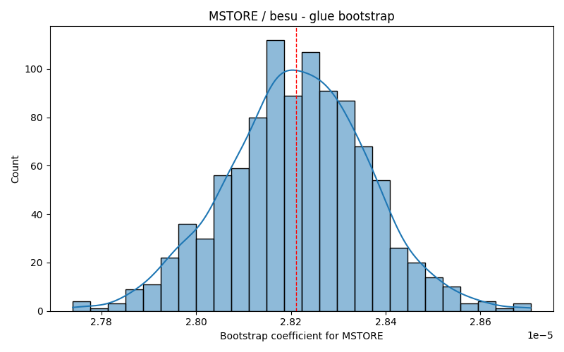

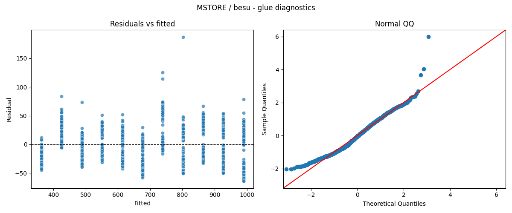

</details>

<details><summary><code>MSTORE8</code> · nobs=935 · runtime_ms=1.476e-05 · p=1.00e-03 · R²=0.9834</summary>

```
==============================================================================
                           NNLS Regression Results                            
==============================================================================
Dep. Variable:          test_runtime_ms              R-squared:          0.983
Model:                  NNLS                    Adj. R-squared:          0.983
No. Observations:       935                               RMSE:          13.45
Df Residuals:           933                                MAE:          10.06
Df Model:               1      
==============================================================================
                      coef     std err     P-value      [0.025      0.975]
------------------------------------------------------------------------------
         const     38.0550      1.2768       0.001     35.5331     40.5160
       MSTORE8      0.0000      0.0000       0.001      0.0000      0.0000
==============================================================================
Notes: Non-negative least squares with bootstrap inference (1000 iterations)
==============================================================================
```

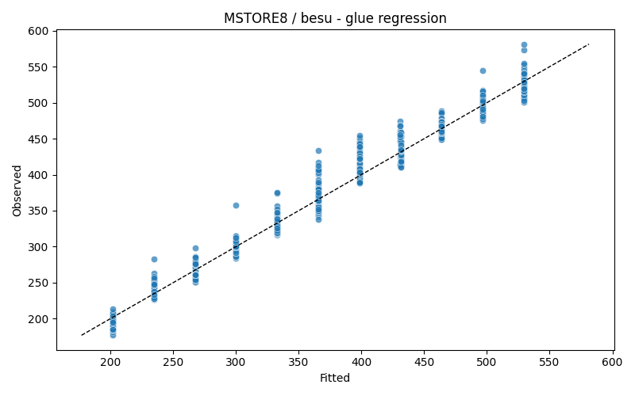

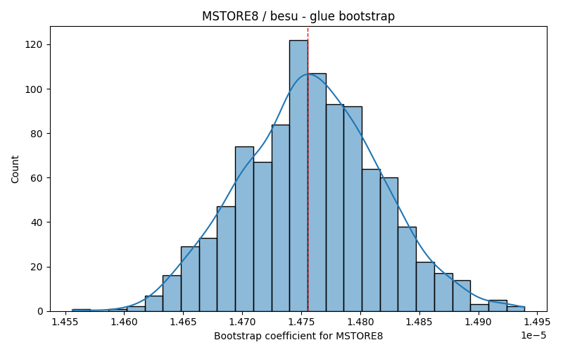

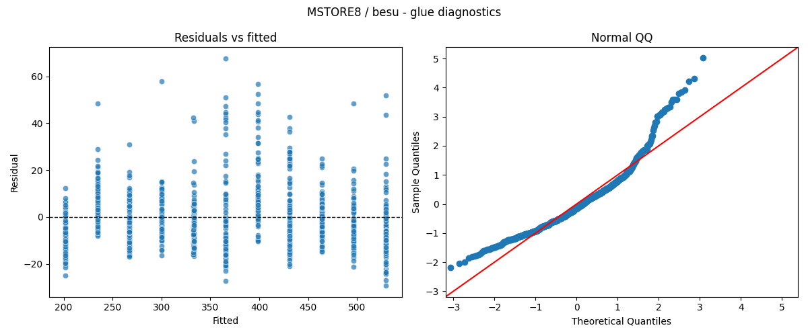

</details>

<details><summary><code>MUL</code> · nobs=187 · runtime_ms=1.529e-05 · p=1.00e-03 · R²=0.9085</summary>

```
==============================================================================
                           NNLS Regression Results                            
==============================================================================
Dep. Variable:          test_runtime_ms              R-squared:          0.909
Model:                  NNLS                    Adj. R-squared:          0.908
No. Observations:       187                               RMSE:          38.33
Df Residuals:           185                                MAE:          20.56
Df Model:               1      
==============================================================================
                      coef     std err     P-value      [0.025      0.975]
------------------------------------------------------------------------------
         const     60.7552      7.6160       0.001     46.0225     74.8068
           MUL      0.0000      0.0000       0.001      0.0000      0.0000
==============================================================================
Notes: Non-negative least squares with bootstrap inference (1000 iterations)
==============================================================================
```

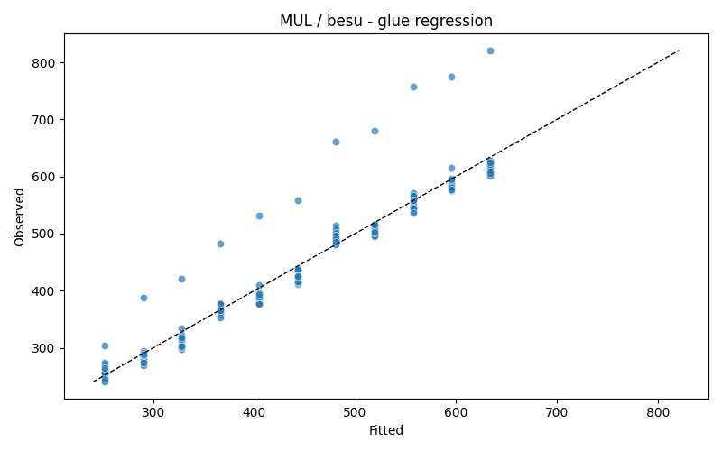

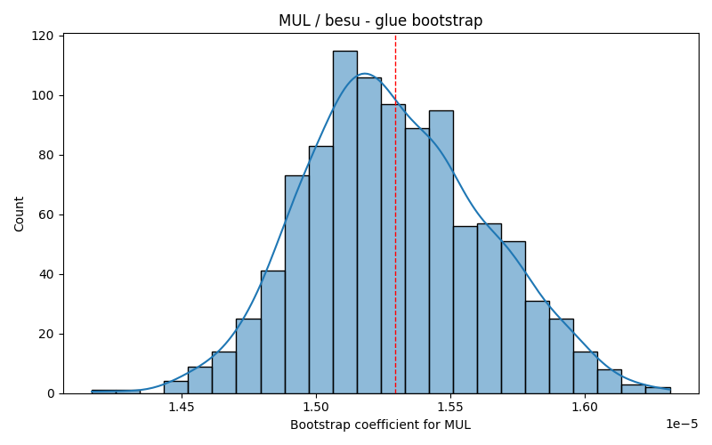

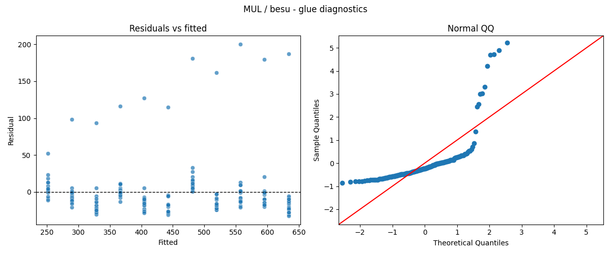

</details>

<details><summary><code>PC</code> · nobs=187 · runtime_ms=5.157e-06 · p=1.00e-03 · R²=0.9909</summary>

```
==============================================================================
                           NNLS Regression Results                            
==============================================================================
Dep. Variable:          test_runtime_ms              R-squared:          0.991
Model:                  NNLS                    Adj. R-squared:          0.991
No. Observations:       187                               RMSE:          14.80
Df Residuals:           185                                MAE:          12.14
Df Model:               1      
==============================================================================
                      coef     std err     P-value      [0.025      0.975]
------------------------------------------------------------------------------
         const     47.7100      3.5877       0.001     40.7939     54.9030
            PC      0.0000      0.0000       0.001      0.0000      0.0000
==============================================================================
Notes: Non-negative least squares with bootstrap inference (1000 iterations)
==============================================================================
```

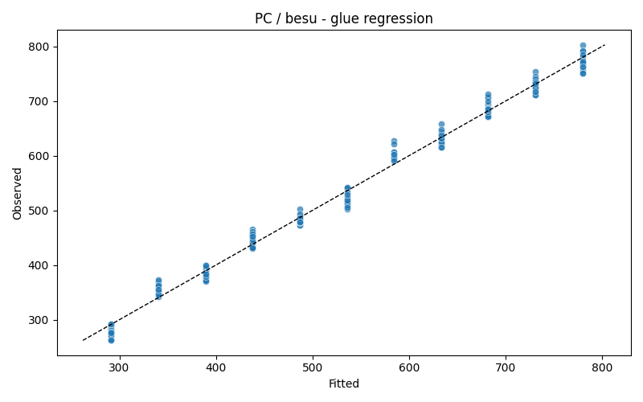

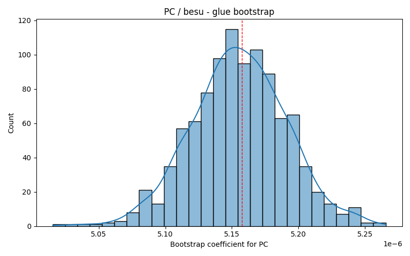

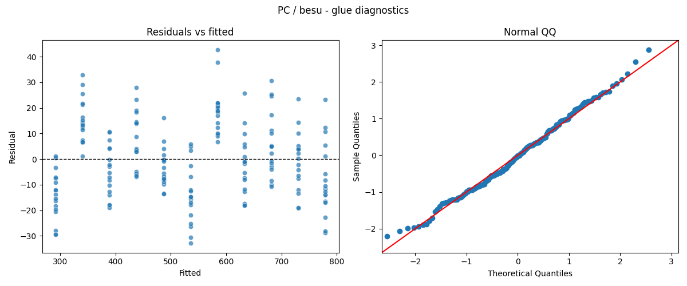

</details>

<details><summary><code>RETURNDATASIZE</code> · nobs=748 · runtime_ms=7.124e-06 · p=1.00e-03 · R²=0.9786</summary>

```
==============================================================================
                           NNLS Regression Results                            
==============================================================================
Dep. Variable:          test_runtime_ms              R-squared:          0.979
Model:                  NNLS                    Adj. R-squared:          0.979
No. Observations:       748                               RMSE:          16.64
Df Residuals:           746                                MAE:          11.25
Df Model:               1      
==============================================================================
                      coef     std err     P-value      [0.025      0.975]
------------------------------------------------------------------------------
         const     42.5390      1.9593       0.001     38.8934     46.6937
RETURNDATASIZE      0.0000      0.0000       0.001      0.0000      0.0000
==============================================================================
Notes: Non-negative least squares with bootstrap inference (1000 iterations)
==============================================================================
```

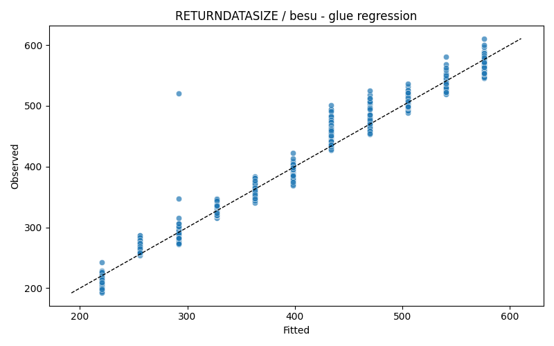

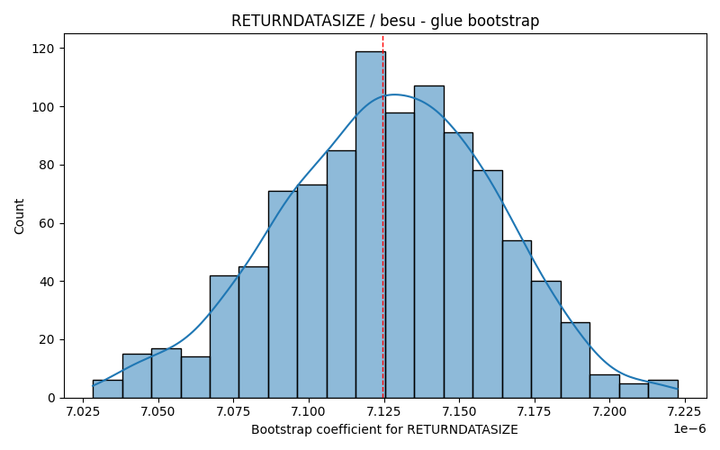

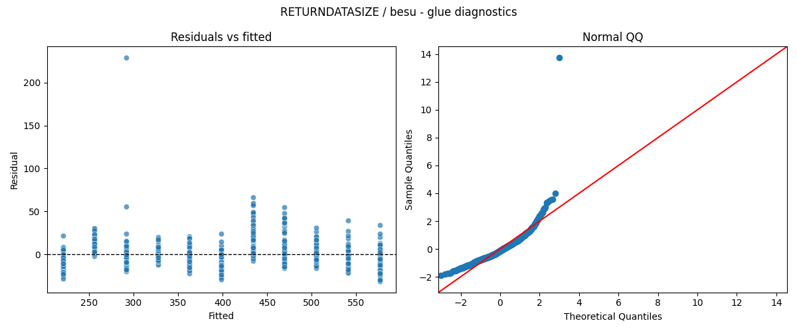

</details>

<details><summary><code>SELFBALANCE</code> · nobs=187 · runtime_ms=2.085e-05 · p=1.00e-03 · R²=0.9835</summary>

```
==============================================================================
                           NNLS Regression Results                            
==============================================================================
Dep. Variable:          test_runtime_ms              R-squared:          0.984
Model:                  NNLS                    Adj. R-squared:          0.983
No. Observations:       187                               RMSE:          33.36
Df Residuals:           185                                MAE:          27.89
Df Model:               1      
==============================================================================
                      coef     std err     P-value      [0.025      0.975]
------------------------------------------------------------------------------
         const    129.1227      8.9532       0.001    110.3540    146.1512
   SELFBALANCE      0.0000      0.0000       0.001      0.0000      0.0000
==============================================================================
Notes: Non-negative least squares with bootstrap inference (1000 iterations)
==============================================================================
```

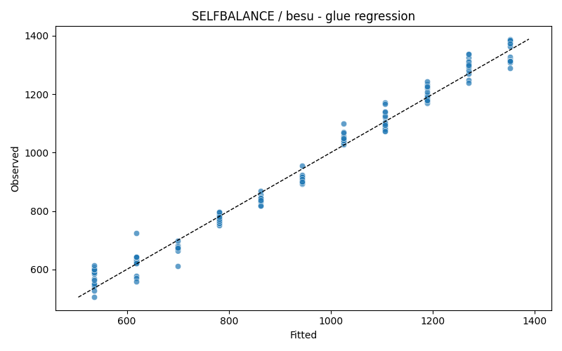

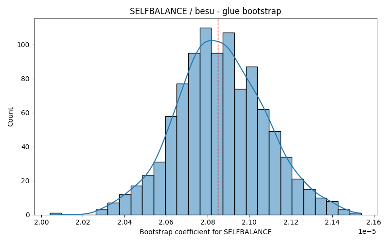

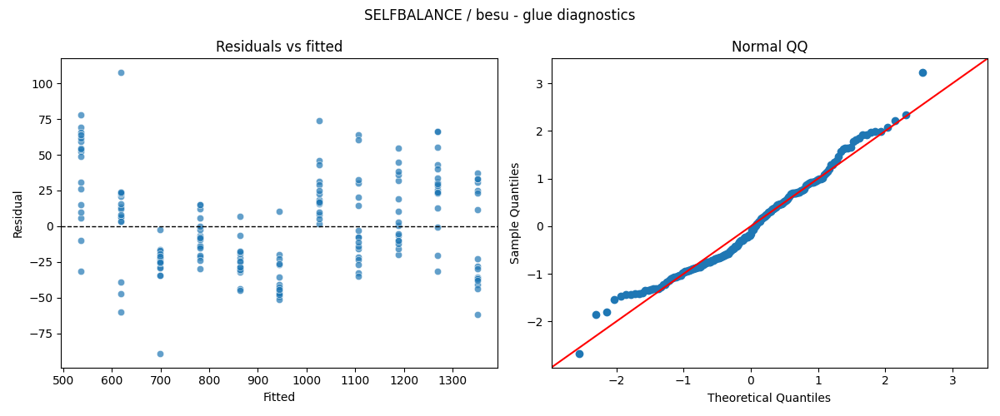

</details>

<details><summary><code>SUB</code> · nobs=187 · runtime_ms=1.539e-05 · p=1.00e-03 · R²=0.9922</summary>

```
==============================================================================
                           NNLS Regression Results                            
==============================================================================
Dep. Variable:          test_runtime_ms              R-squared:          0.992
Model:                  NNLS                    Adj. R-squared:          0.992
No. Observations:       187                               RMSE:          14.37
Df Residuals:           185                                MAE:          11.45
Df Model:               1      
==============================================================================
                      coef     std err     P-value      [0.025      0.975]
------------------------------------------------------------------------------
         const     48.6753      3.6225       0.001     41.8648     56.4751
           SUB      0.0000      0.0000       0.001      0.0000      0.0000
==============================================================================
Notes: Non-negative least squares with bootstrap inference (1000 iterations)
==============================================================================
```

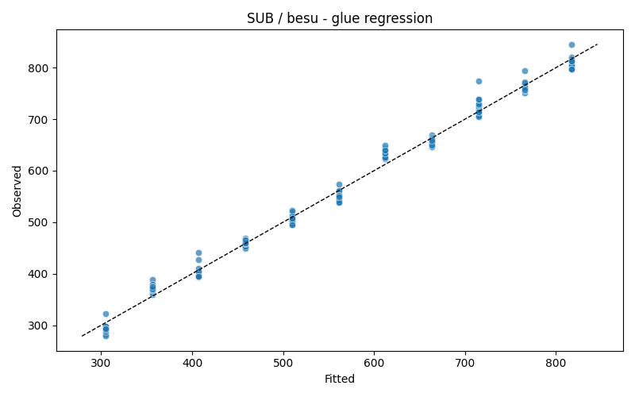

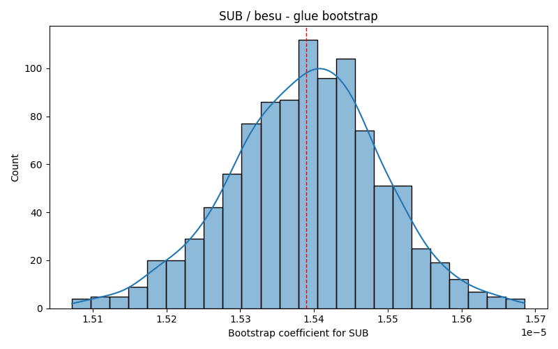

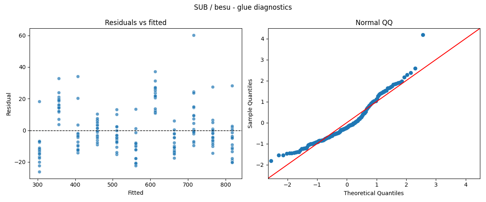

</details>

### Mixed glue (tier B) · besu

<details><summary><code>JUMP</code> · nobs=187 · runtime_ms=3.788e-05 · p=1.00e-03 · R²=0.9911</summary>

```
==============================================================================
                           NNLS Regression Results                            
==============================================================================
Dep. Variable:          test_runtime_ms              R-squared:          0.991
Model:                  NNLS                    Adj. R-squared:          0.991
No. Observations:       187                               RMSE:          13.34
Df Residuals:           185                                MAE:          11.11
Df Model:               1      
==============================================================================
                      coef     std err     P-value      [0.025      0.975]
------------------------------------------------------------------------------
         const     49.2461      3.2613       0.001     42.5634     55.4680
          JUMP      0.0000      0.0000       0.001      0.0000      0.0000
==============================================================================
Notes: Non-negative least squares with bootstrap inference (1000 iterations)
==============================================================================
```

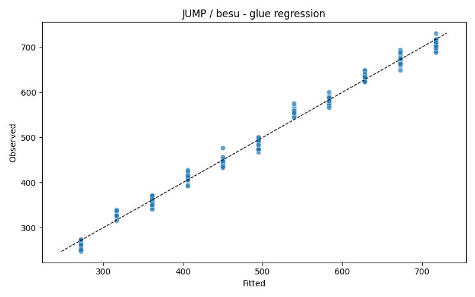

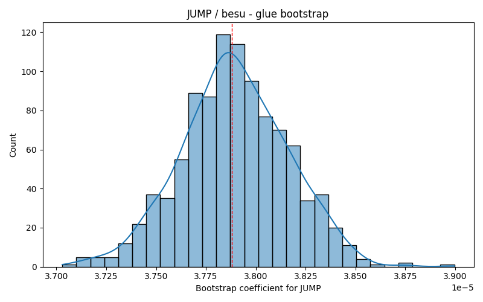

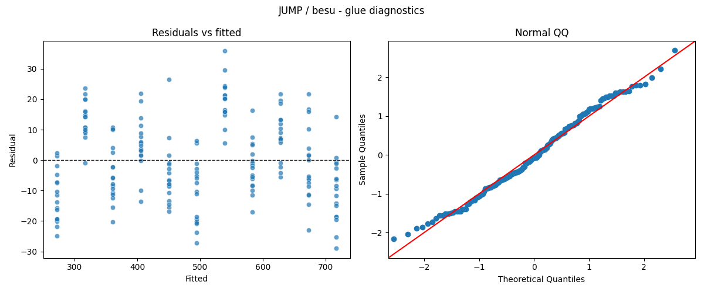

</details>

<details><summary><code>KECCAK256</code> · nobs=2992 · runtime_ms=5.315e-05 · p=1.00e-03 · R²=0.1309</summary>

```
==============================================================================
                           NNLS Regression Results                            
==============================================================================
Dep. Variable:          test_runtime_ms              R-squared:          0.131
Model:                  NNLS                    Adj. R-squared:          0.131
No. Observations:       2992                              RMSE:         272.22
Df Residuals:           2990                               MAE:         218.59
Df Model:               1      
==============================================================================
                      coef     std err     P-value      [0.025      0.975]
------------------------------------------------------------------------------
         const    768.0192     10.9275       0.001    746.8720    790.2743
     KECCAK256      0.0001      0.0000       0.001      0.0000      0.0001
==============================================================================
Notes: Non-negative least squares with bootstrap inference (1000 iterations)
==============================================================================
```

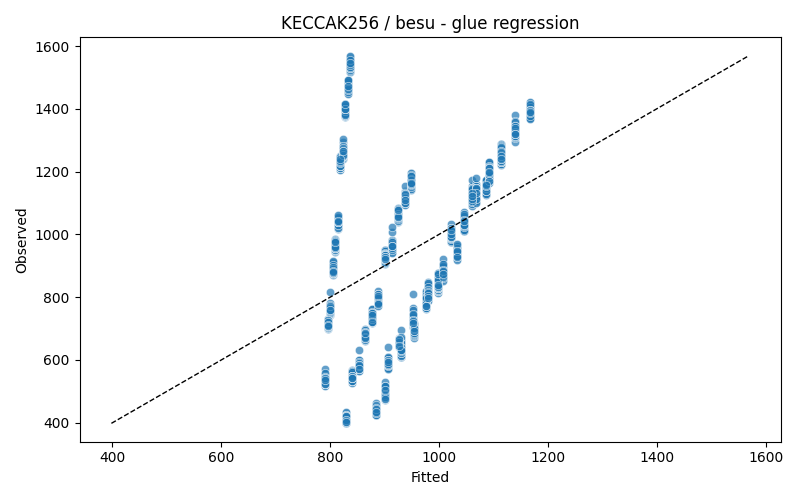

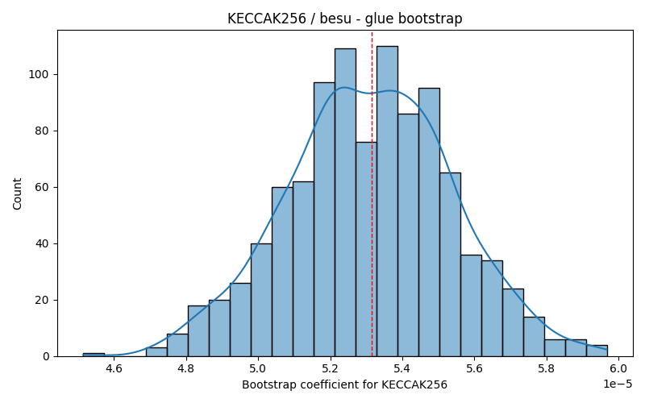

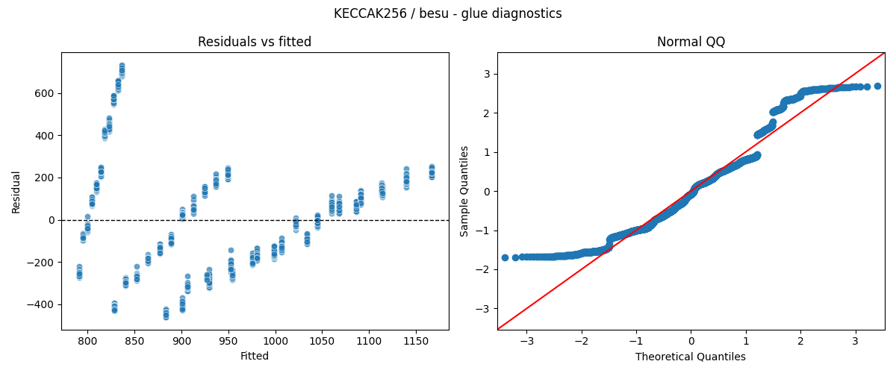

</details>

## erigon

| glue_opcode | nobs | glue_runtime_ms | p_value | rsquared |
| --- | --- | --- | --- | --- |
| `ISZERO` | 165 | 1.733e-06 | 1.00e-03 | 0.985 |
| `JUMPDEST` | 165 | 1.412e-06 | 1.00e-03 | 0.9713 |
| `SWAP` | 2640 | 1.98e-06 | 1.00e-03 | 0.9208 |
| `CALLDATASIZE` | 9768 | 1.616e-06 | 1.00e-03 | 0.9133 |
| `DUP` | 9768 | 2.006e-06 | 1.00e-03 | 0.9133 |
| `GAS` | 9768 | 1.625e-06 | 1.00e-03 | 0.9133 |
| `MLOAD` | 9768 | 5.528e-06 | 1.00e-03 | 0.9133 |
| `PUSH` | 9768 | 2.986e-06 | 1.00e-03 | 0.9133 |
| `PUSH0` | 9768 | 1.581e-06 | 1.00e-03 | 0.9133 |
| `STATICCALL` | 9768 | 6.883e-05 | 1.00e-03 | 0.9133 |
| `ADD` | 165 | 3.946e-06 | 1.00e-03 | 0.9794 |
| `AND` | 165 | 3.802e-06 | 1.00e-03 | 0.9677 |
| `CALLDATACOPY` | 3960 | 1.077e-05 | 1.00e-03 | 0.9799 |
| `CALLDATALOAD` | 660 | 7.095e-05 | 1.00e-03 | 0.1524 |
| `DIV` | 165 | 1.47e-05 | 1.00e-03 | 0.9718 |
| `EXP` | 165 | 0.00069 | 1.00e-03 | 0.9803 |
| `GT` | 165 | 3.794e-06 | 1.00e-03 | 0.875 |
| `JUMPI` | 165 | 4.925e-06 | 1.00e-03 | 0.9537 |
| `LT` | 165 | 3.753e-06 | 1.00e-03 | 0.8829 |
| `MSTORE` | 825 | 7.904e-06 | 1.00e-03 | 0.9445 |
| `MSTORE8` | 825 | 7.476e-06 | 1.00e-03 | 0.9588 |
| `MUL` | 165 | 6.071e-06 | 1.00e-03 | 0.8966 |
| `PC` | 165 | 1.768e-06 | 1.00e-03 | 0.9813 |
| `RETURNDATASIZE` | 660 | 3.007e-06 | 1.00e-03 | 0.9601 |
| `SELFBALANCE` | 165 | 1.945e-06 | 1.00e-03 | 0.9755 |
| `SUB` | 165 | 3.909e-06 | 1.00e-03 | 0.9456 |
| `JUMP` | 165 | 9.394e-06 | 1.00e-03 | 0.9531 |
| `KECCAK256` | 2640 | 2.916e-05 | 1.00e-03 | 0.08567 |

### Cycle glue — joint fit · erigon

<details><summary>Joint NNLS regression summary</summary>

```
==============================================================================
                           NNLS Regression Results                            
==============================================================================
Dep. Variable:          test_runtime_ms              R-squared:          0.913
Model:                  NNLS                    Adj. R-squared:          0.913
No. Observations:       9768                              RMSE:          19.23
Df Residuals:           9760                               MAE:          11.33
Df Model:               7      
==============================================================================
                      coef     std err     P-value      [0.025      0.975]
------------------------------------------------------------------------------
         const     17.2084      0.5990       0.001     15.9786     18.3654
  CALLDATASIZE      0.0000      0.0000       0.001      0.0000      0.0000
           DUP      0.0000      0.0000       0.001      0.0000      0.0000
           GAS      0.0000      0.0000       0.001      0.0000      0.0000
         MLOAD      0.0000      0.0000       0.001      0.0000      0.0000
          PUSH      0.0000      0.0000       0.001      0.0000      0.0000
         PUSH0      0.0000      0.0000       0.001      0.0000      0.0000
    STATICCALL      0.0001      0.0000       0.001      0.0001      0.0001
==============================================================================
Notes: Non-negative least squares with bootstrap inference (1000 iterations)
==============================================================================
```

</details>

<details><summary><code>CALLDATASIZE</code> · nobs=9768 · runtime_ms=1.616e-06 · p=1.00e-03 · R²=0.9133</summary>


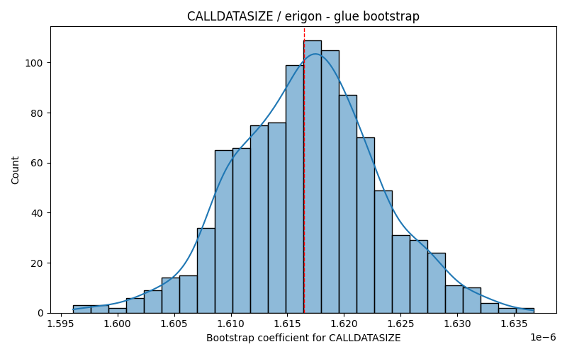


</details>

<details><summary><code>DUP</code> · nobs=9768 · runtime_ms=2.006e-06 · p=1.00e-03 · R²=0.9133</summary>

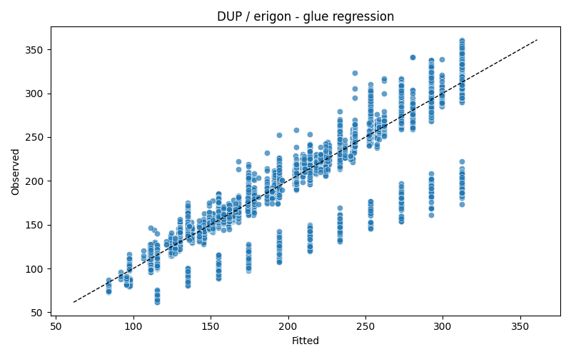

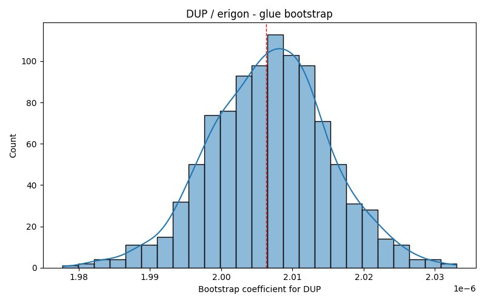


</details>

<details><summary><code>GAS</code> · nobs=9768 · runtime_ms=1.625e-06 · p=1.00e-03 · R²=0.9133</summary>


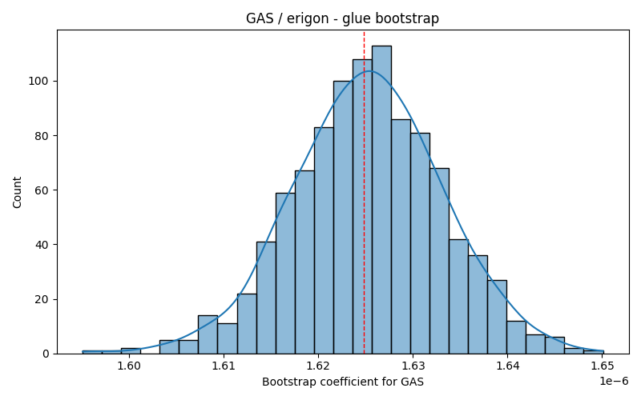


</details>

<details><summary><code>MLOAD</code> · nobs=9768 · runtime_ms=5.528e-06 · p=1.00e-03 · R²=0.9133</summary>

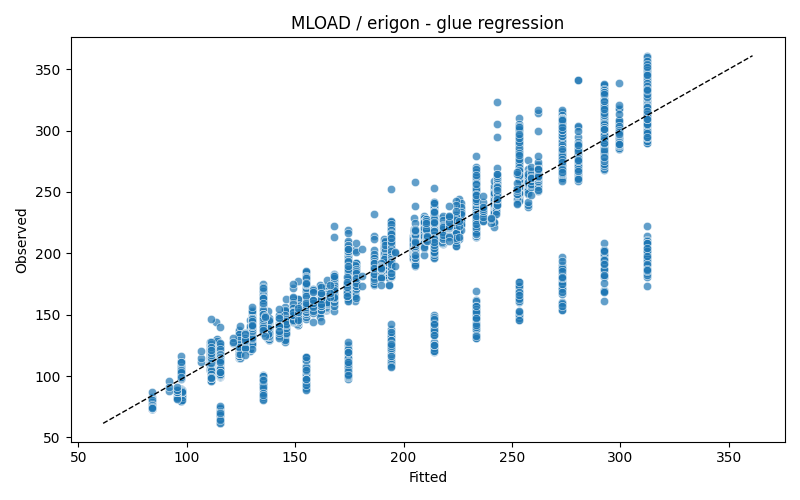

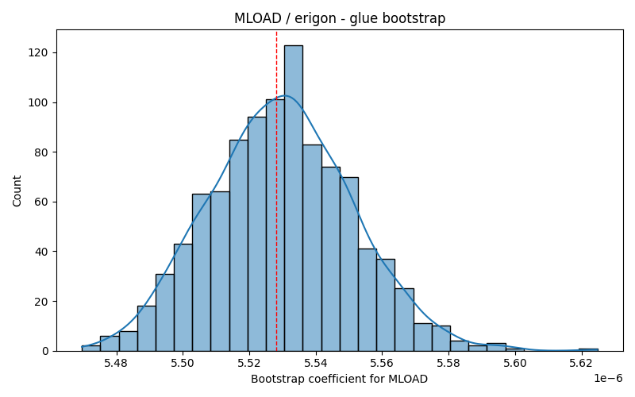

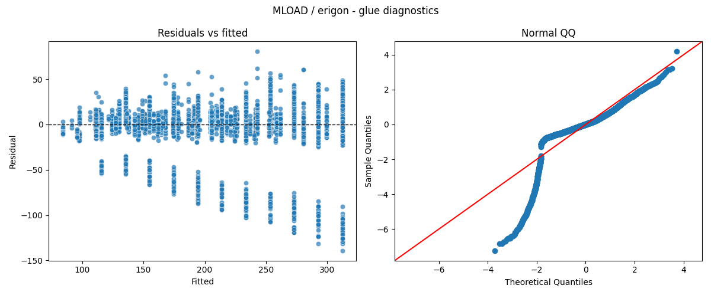

</details>

<details><summary><code>PUSH</code> · nobs=9768 · runtime_ms=2.986e-06 · p=1.00e-03 · R²=0.9133</summary>

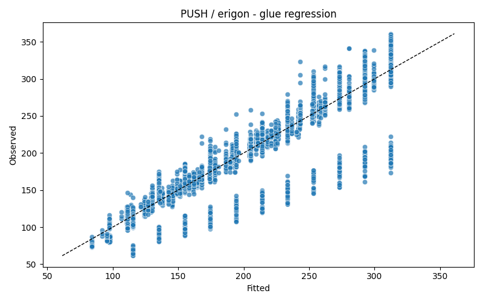

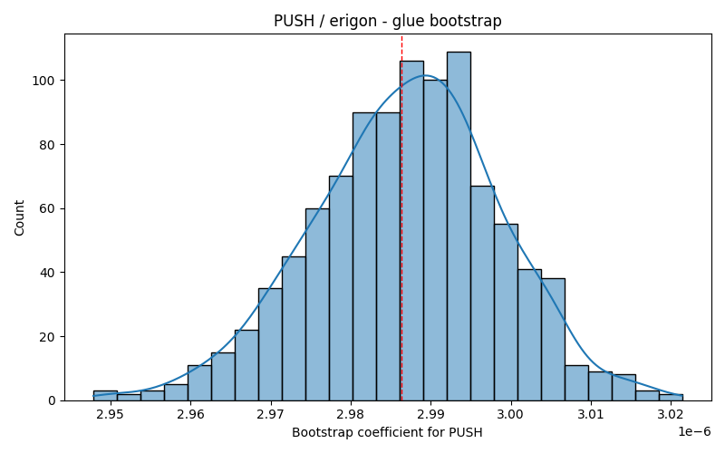


</details>

<details><summary><code>PUSH0</code> · nobs=9768 · runtime_ms=1.581e-06 · p=1.00e-03 · R²=0.9133</summary>

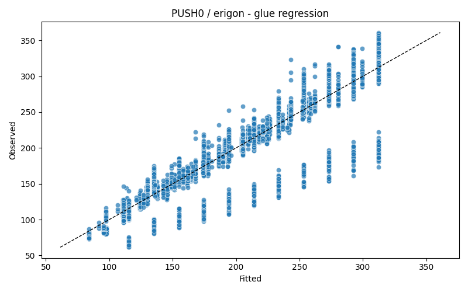

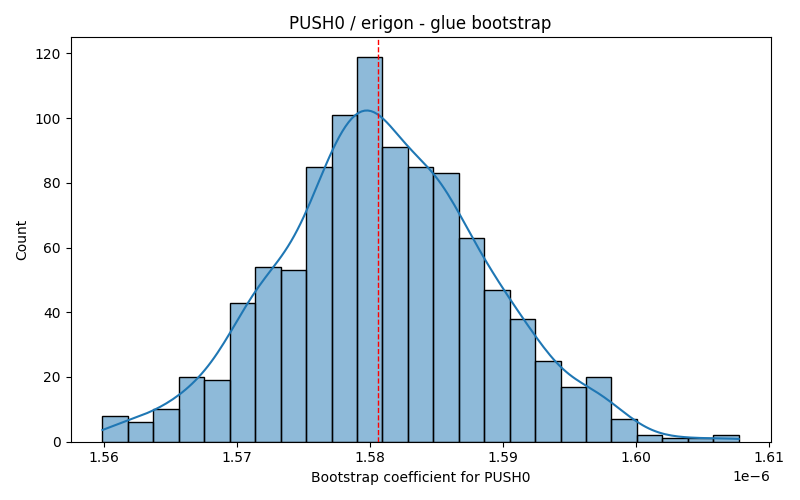


</details>

<details><summary><code>STATICCALL</code> · nobs=9768 · runtime_ms=6.883e-05 · p=1.00e-03 · R²=0.9133</summary>

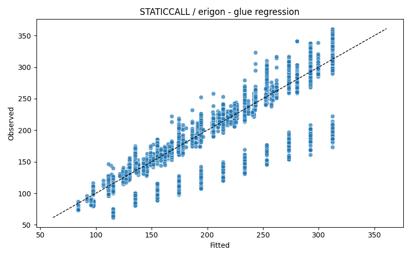

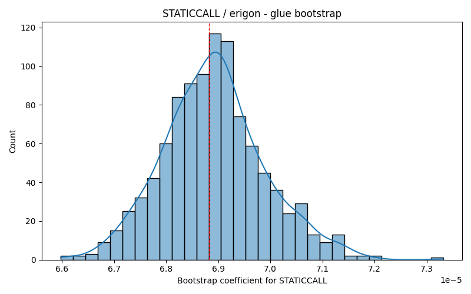

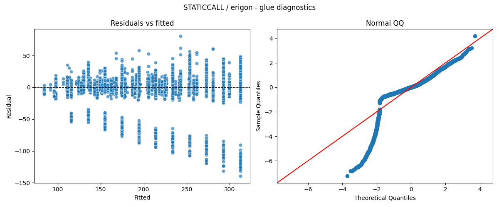

</details>

### Pure glue · erigon

<details><summary><code>ISZERO</code> · nobs=165 · runtime_ms=1.733e-06 · p=1.00e-03 · R²=0.985</summary>

```
==============================================================================
                           NNLS Regression Results                            
==============================================================================
Dep. Variable:          test_runtime_ms              R-squared:          0.985
Model:                  NNLS                    Adj. R-squared:          0.985
No. Observations:       165                               RMSE:           4.50
Df Residuals:           163                                MAE:           3.51
Df Model:               1      
==============================================================================
                      coef     std err     P-value      [0.025      0.975]
------------------------------------------------------------------------------
         const      9.6733      1.2554       0.001      7.2145     12.1071
        ISZERO      0.0000      0.0000       0.001      0.0000      0.0000
==============================================================================
Notes: Non-negative least squares with bootstrap inference (1000 iterations)
==============================================================================
```

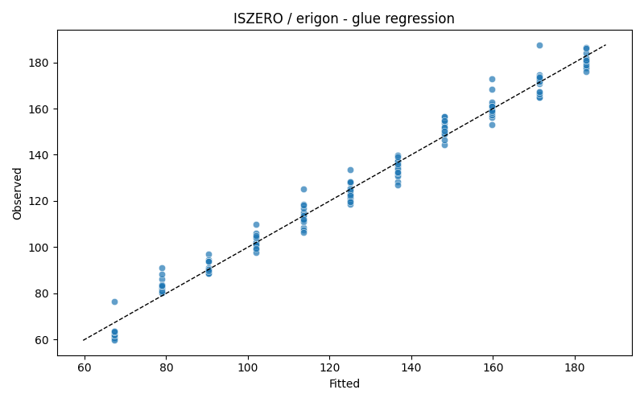

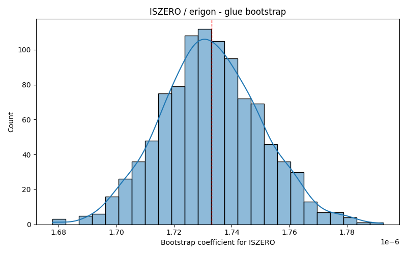

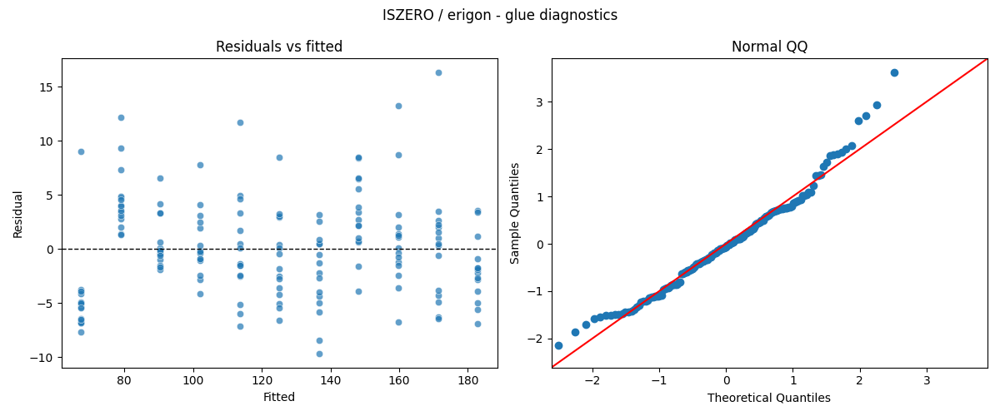

</details>

<details><summary><code>JUMPDEST</code> · nobs=165 · runtime_ms=1.412e-06 · p=1.00e-03 · R²=0.9713</summary>

```
==============================================================================
                           NNLS Regression Results                            
==============================================================================
Dep. Variable:          test_runtime_ms              R-squared:          0.971
Model:                  NNLS                    Adj. R-squared:          0.971
No. Observations:       165                               RMSE:          15.34
Df Residuals:           163                                MAE:          12.03
Df Model:               1      
==============================================================================
                      coef     std err     P-value      [0.025      0.975]
------------------------------------------------------------------------------
         const     15.6586      4.0882       0.001      7.6874     23.6680
      JUMPDEST      0.0000      0.0000       0.001      0.0000      0.0000
==============================================================================
Notes: Non-negative least squares with bootstrap inference (1000 iterations)
==============================================================================
```

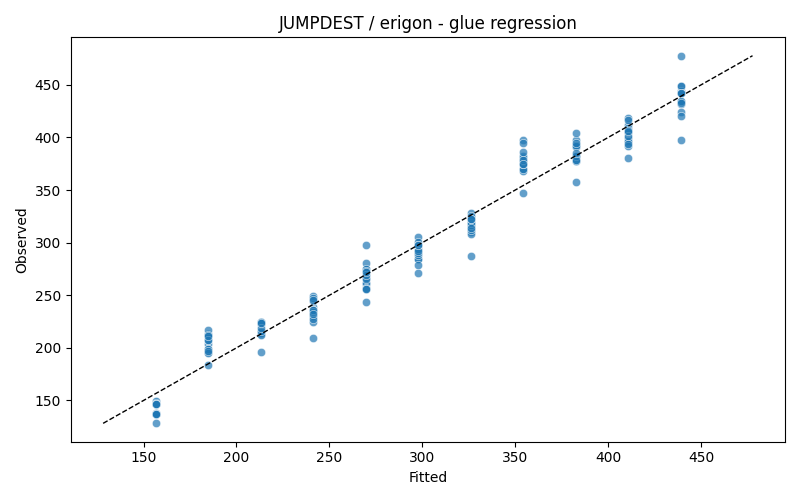

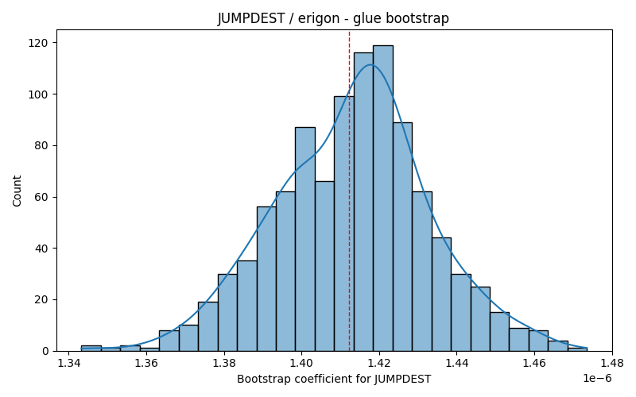

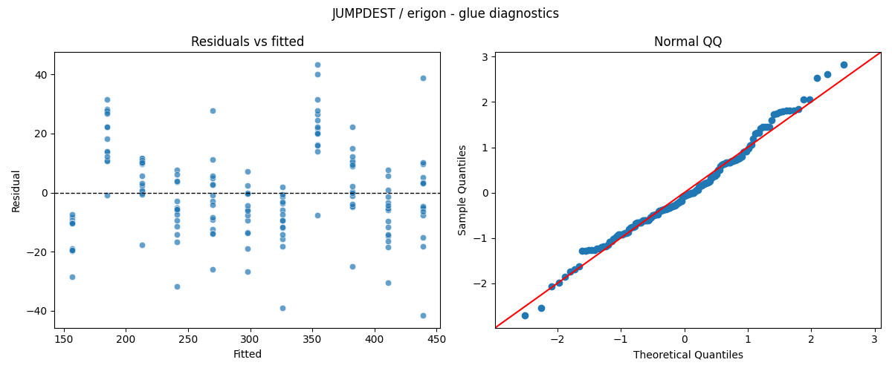

</details>

<details><summary><code>SWAP</code> · nobs=2640 · runtime_ms=1.98e-06 · p=1.00e-03 · R²=0.9208</summary>

```
==============================================================================
                           NNLS Regression Results                            
==============================================================================
Dep. Variable:          test_runtime_ms              R-squared:          0.921
Model:                  NNLS                    Adj. R-squared:          0.921
No. Observations:       2640                              RMSE:          12.23
Df Residuals:           2638                               MAE:           7.48
Df Model:               1      
==============================================================================
                      coef     std err     P-value      [0.025      0.975]
------------------------------------------------------------------------------
         const     18.1376      0.9282       0.001     16.3654     19.9088
          SWAP      0.0000      0.0000       0.001      0.0000      0.0000
==============================================================================
Notes: Non-negative least squares with bootstrap inference (1000 iterations)
==============================================================================
```

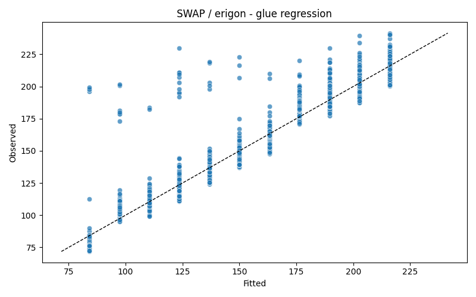

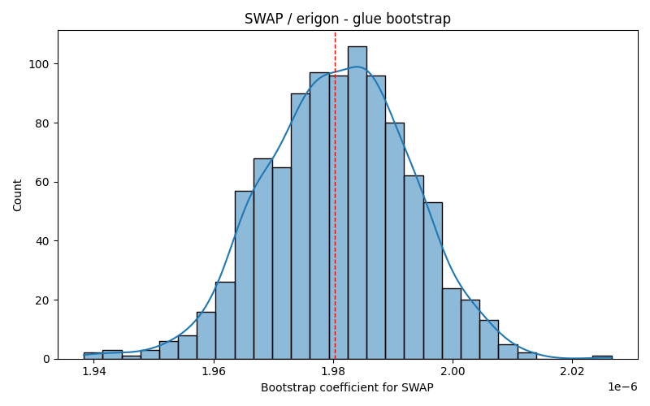

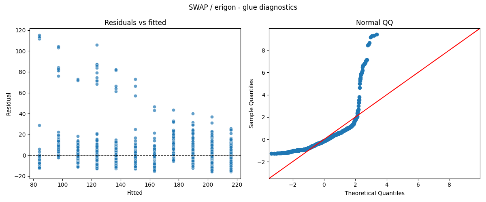

</details>

### Mixed glue (tier A) · erigon

<details><summary><code>ADD</code> · nobs=165 · runtime_ms=3.946e-06 · p=1.00e-03 · R²=0.9794</summary>

```
==============================================================================
                           NNLS Regression Results                            
==============================================================================
Dep. Variable:          test_runtime_ms              R-squared:          0.979
Model:                  NNLS                    Adj. R-squared:          0.979
No. Observations:       165                               RMSE:           6.03
Df Residuals:           163                                MAE:           4.97
Df Model:               1      
==============================================================================
                      coef     std err     P-value      [0.025      0.975]
------------------------------------------------------------------------------
         const     12.6884      1.8378       0.001      9.3313     16.3525
           ADD      0.0000      0.0000       0.001      0.0000      0.0000
==============================================================================
Notes: Non-negative least squares with bootstrap inference (1000 iterations)
==============================================================================
```

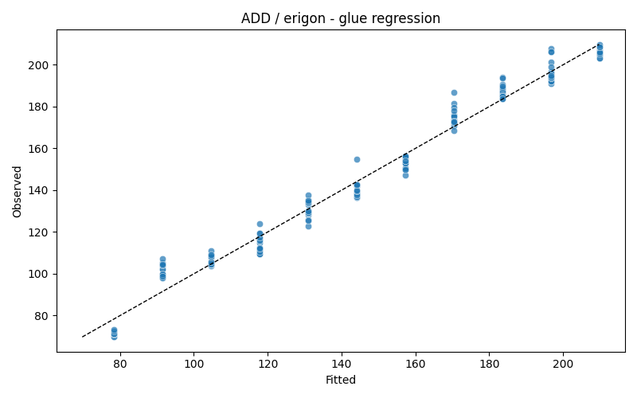

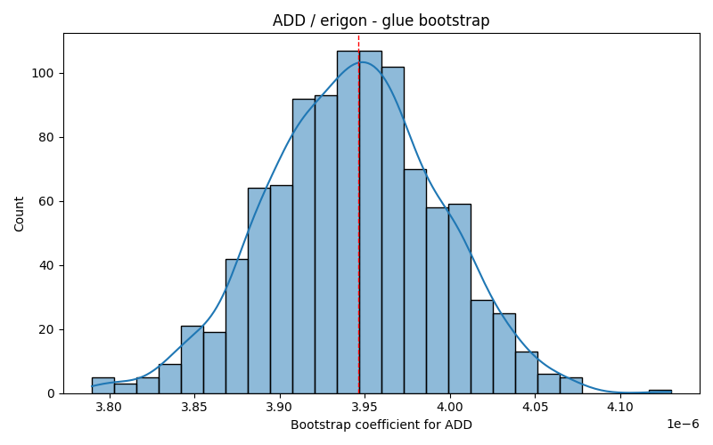

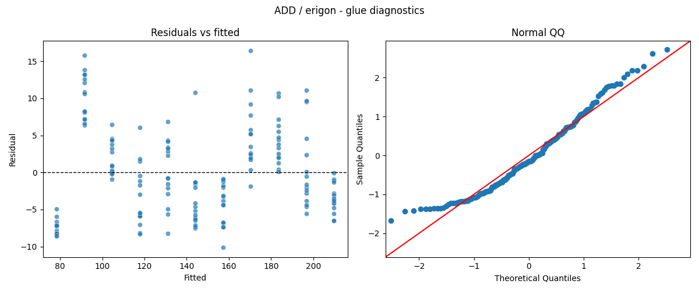

</details>

<details><summary><code>AND</code> · nobs=165 · runtime_ms=3.802e-06 · p=1.00e-03 · R²=0.9677</summary>

```
==============================================================================
                           NNLS Regression Results                            
==============================================================================
Dep. Variable:          test_runtime_ms              R-squared:          0.968
Model:                  NNLS                    Adj. R-squared:          0.967
No. Observations:       165                               RMSE:           7.32
Df Residuals:           163                                MAE:           5.57
Df Model:               1      
==============================================================================
                      coef     std err     P-value      [0.025      0.975]
------------------------------------------------------------------------------
         const     11.0239      2.3161       0.001      6.4443     15.5309
           AND      0.0000      0.0000       0.001      0.0000      0.0000
==============================================================================
Notes: Non-negative least squares with bootstrap inference (1000 iterations)
==============================================================================
```

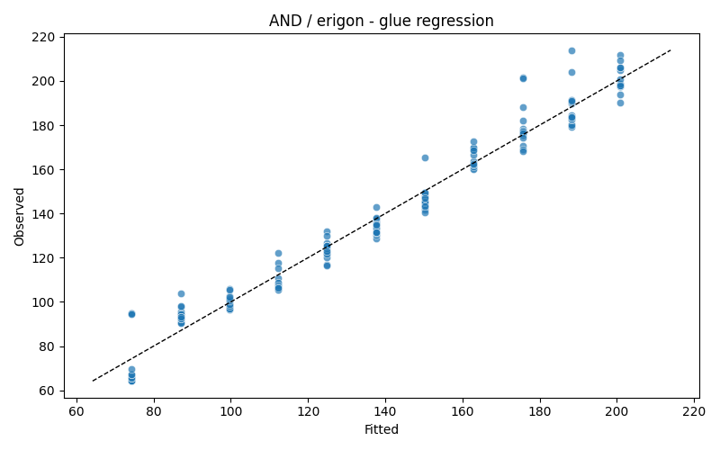

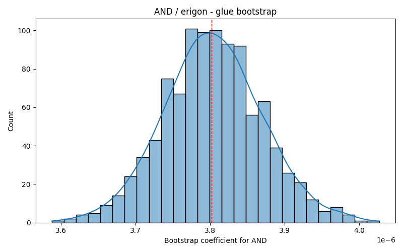

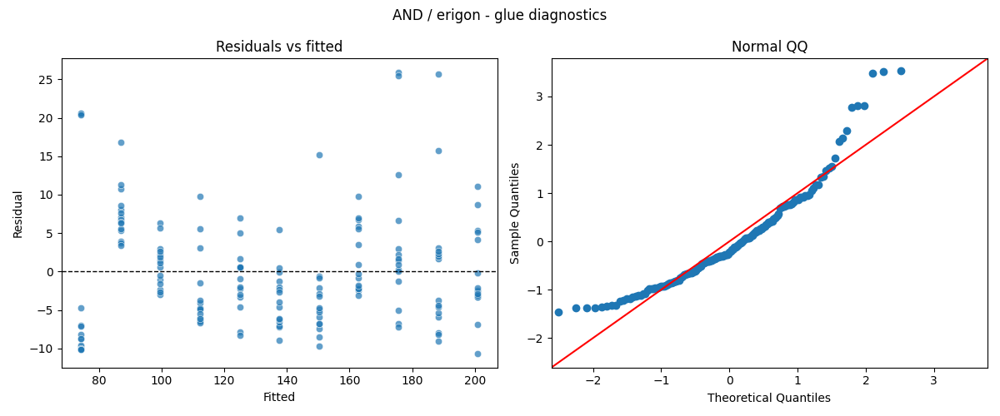

</details>

<details><summary><code>CALLDATACOPY</code> · nobs=3960 · runtime_ms=1.077e-05 · p=1.00e-03 · R²=0.9799</summary>

```
==============================================================================
                           NNLS Regression Results                            
==============================================================================
Dep. Variable:          test_runtime_ms              R-squared:          0.980
Model:                  NNLS                    Adj. R-squared:          0.980
No. Observations:       3960                              RMSE:          11.61
Df Residuals:           3958                               MAE:           7.54
Df Model:               1      
==============================================================================
                      coef     std err     P-value      [0.025      0.975]
------------------------------------------------------------------------------
         const     14.3042      0.2110       0.001     13.8607     14.6705
  CALLDATACOPY      0.0000      0.0000       0.001      0.0000      0.0000
==============================================================================
Notes: Non-negative least squares with bootstrap inference (1000 iterations)
==============================================================================
```

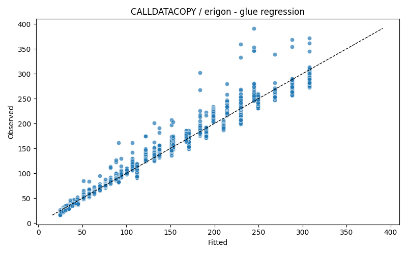

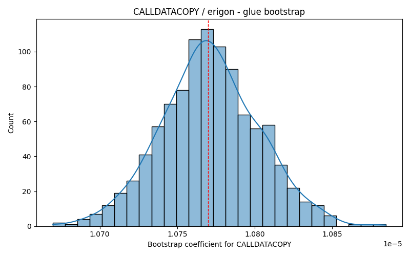

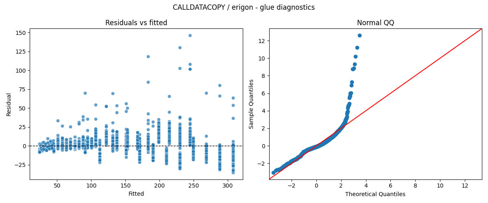

</details>

<details><summary><code>CALLDATALOAD</code> · nobs=660 · runtime_ms=7.095e-05 · p=1.00e-03 · R²=0.1524</summary>

```
==============================================================================
                           NNLS Regression Results                            
==============================================================================
Dep. Variable:          test_runtime_ms              R-squared:          0.152
Model:                  NNLS                    Adj. R-squared:          0.151
No. Observations:       660                               RMSE:           0.64
Df Residuals:           658                                MAE:           0.28
Df Model:               1      
==============================================================================
                      coef     std err     P-value      [0.025      0.975]
------------------------------------------------------------------------------
         const      4.0818      0.0817       0.001      3.9177      4.2387
  CALLDATALOAD      0.0001      0.0000       0.001      0.0001      0.0001
==============================================================================
Notes: Non-negative least squares with bootstrap inference (1000 iterations)
==============================================================================
```

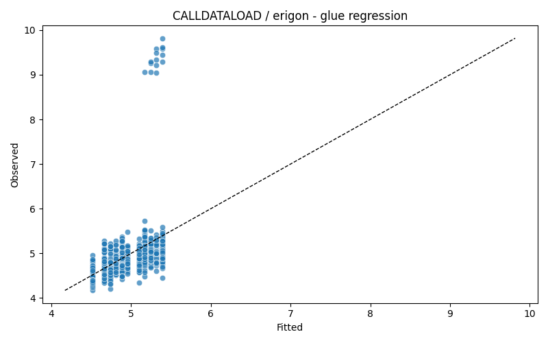

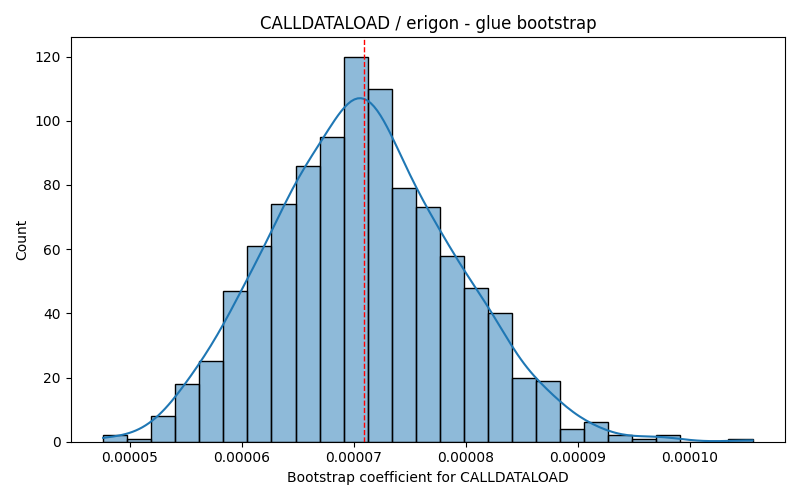

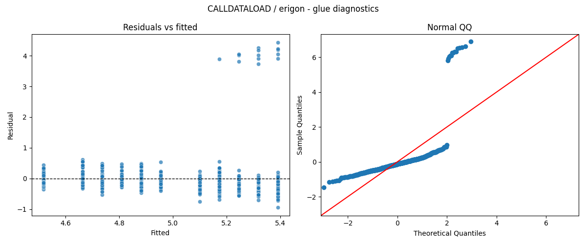

</details>

<details><summary><code>DIV</code> · nobs=165 · runtime_ms=1.47e-05 · p=1.00e-03 · R²=0.9718</summary>

```
==============================================================================
                           NNLS Regression Results                            
==============================================================================
Dep. Variable:          test_runtime_ms              R-squared:          0.972
Model:                  NNLS                    Adj. R-squared:          0.972
No. Observations:       165                               RMSE:          19.79
Df Residuals:           163                                MAE:          16.78
Df Model:               1      
==============================================================================
                      coef     std err     P-value      [0.025      0.975]
------------------------------------------------------------------------------
         const     28.5461      5.8948       0.001     17.3210     40.0859
           DIV      0.0000      0.0000       0.001      0.0000      0.0000
==============================================================================
Notes: Non-negative least squares with bootstrap inference (1000 iterations)
==============================================================================
```

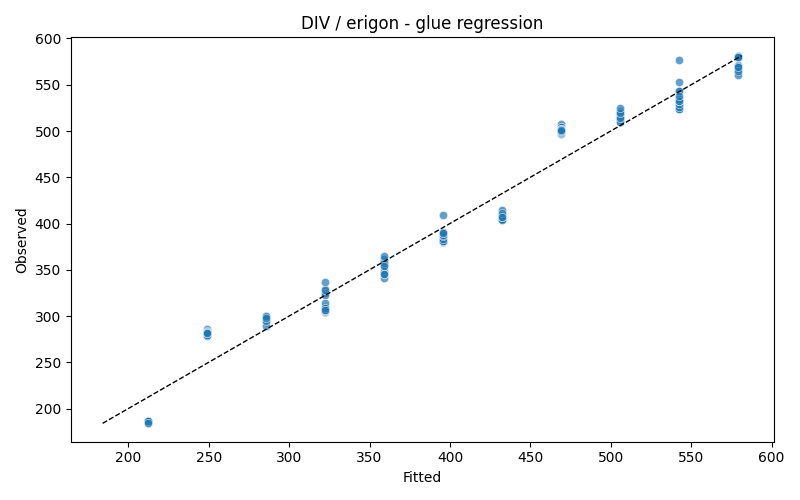

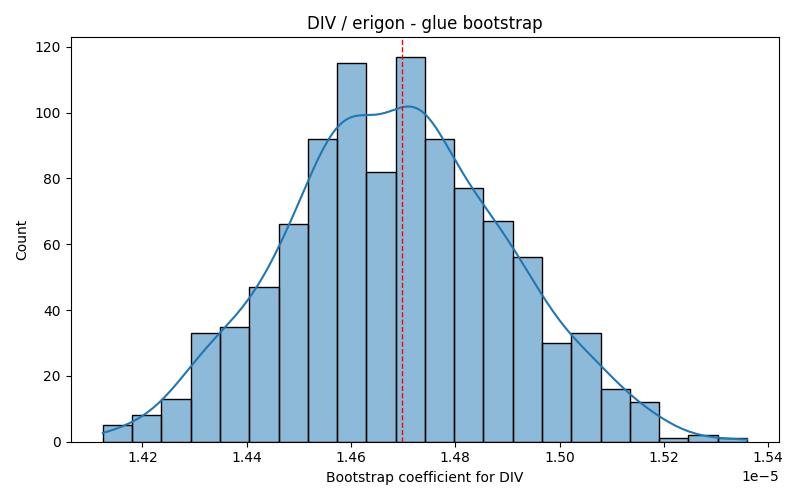

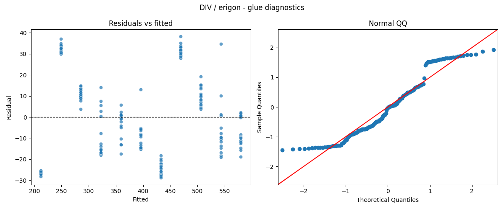

</details>

<details><summary><code>EXP</code> · nobs=165 · runtime_ms=0.00069 · p=1.00e-03 · R²=0.9803</summary>

```
==============================================================================
                           NNLS Regression Results                            
==============================================================================
Dep. Variable:          test_runtime_ms              R-squared:          0.980
Model:                  NNLS                    Adj. R-squared:          0.980
No. Observations:       165                               RMSE:           3.83
Df Residuals:           163                                MAE:           2.97
Df Model:               1      
==============================================================================
                      coef     std err     P-value      [0.025      0.975]
------------------------------------------------------------------------------
         const      9.5252      1.1599       0.001      7.3209     11.8291
           EXP      0.0007      0.0000       0.001      0.0007      0.0007
==============================================================================
Notes: Non-negative least squares with bootstrap inference (1000 iterations)
==============================================================================
```

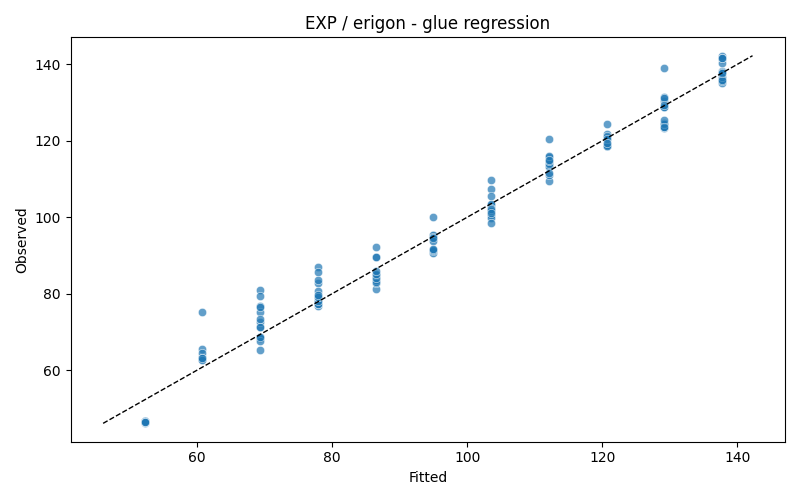

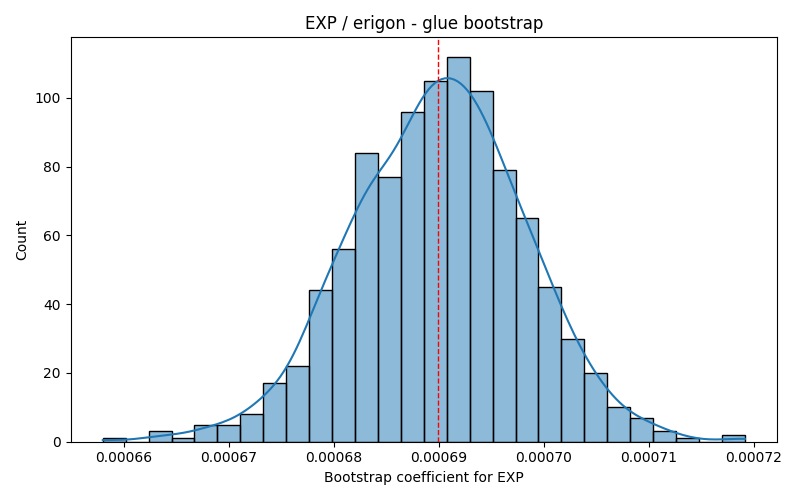

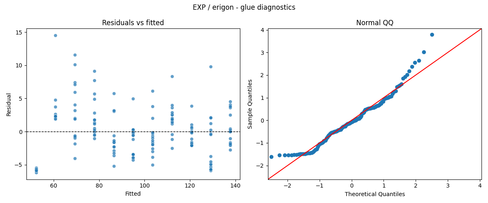

</details>

<details><summary><code>GT</code> · nobs=165 · runtime_ms=3.794e-06 · p=1.00e-03 · R²=0.875</summary>

```
==============================================================================
                           NNLS Regression Results                            
==============================================================================
Dep. Variable:          test_runtime_ms              R-squared:          0.875
Model:                  NNLS                    Adj. R-squared:          0.874
No. Observations:       165                               RMSE:          15.10
Df Residuals:           163                                MAE:           7.27
Df Model:               1      
==============================================================================
                      coef     std err     P-value      [0.025      0.975]
------------------------------------------------------------------------------
         const     17.4180      5.5911       0.001      8.0619     30.0700
            GT      0.0000      0.0000       0.001      0.0000      0.0000
==============================================================================
Notes: Non-negative least squares with bootstrap inference (1000 iterations)
==============================================================================
```

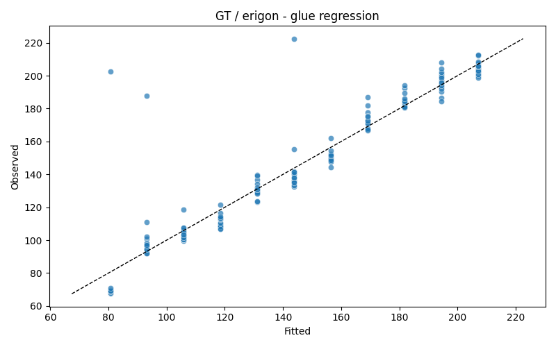

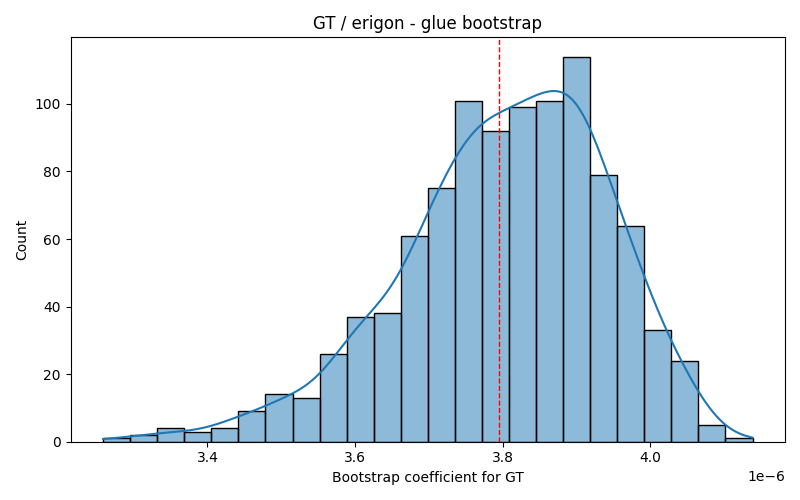

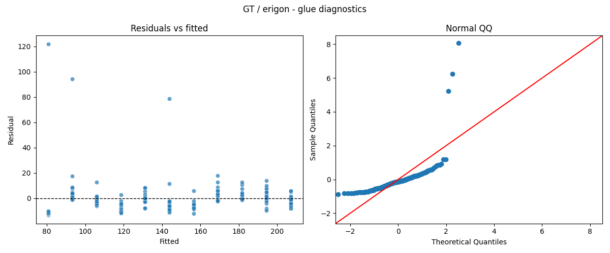

</details>

<details><summary><code>JUMPI</code> · nobs=165 · runtime_ms=4.925e-06 · p=1.00e-03 · R²=0.9537</summary>

```
==============================================================================
                           NNLS Regression Results                            
==============================================================================
Dep. Variable:          test_runtime_ms              R-squared:          0.954
Model:                  NNLS                    Adj. R-squared:          0.953
No. Observations:       165                               RMSE:           4.90
Df Residuals:           163                                MAE:           3.57
Df Model:               1      
==============================================================================
                      coef     std err     P-value      [0.025      0.975]
------------------------------------------------------------------------------
         const      7.7511      1.1606       0.001      5.6682     10.1548
         JUMPI      0.0000      0.0000       0.001      0.0000      0.0000
==============================================================================
Notes: Non-negative least squares with bootstrap inference (1000 iterations)
==============================================================================
```

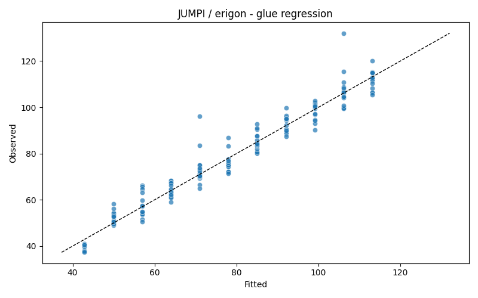

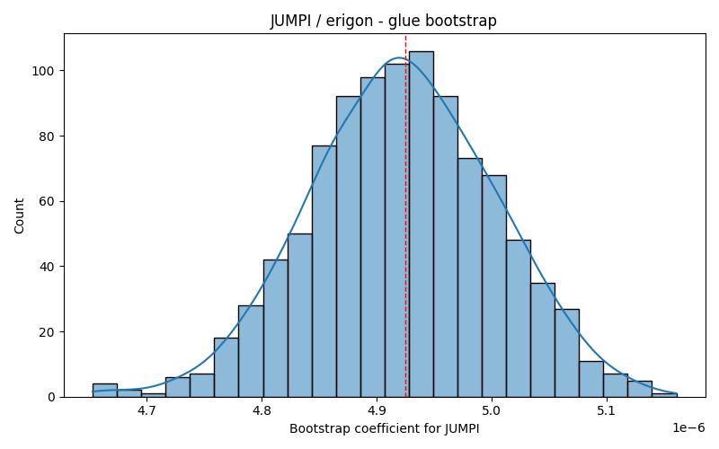

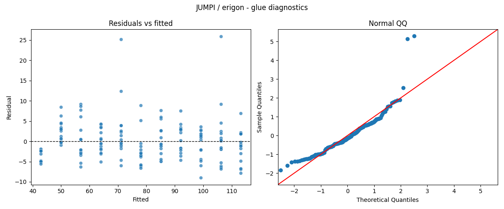

</details>

<details><summary><code>LT</code> · nobs=165 · runtime_ms=3.753e-06 · p=1.00e-03 · R²=0.8829</summary>

```
==============================================================================
                           NNLS Regression Results                            
==============================================================================
Dep. Variable:          test_runtime_ms              R-squared:          0.883
Model:                  NNLS                    Adj. R-squared:          0.882
No. Observations:       165                               RMSE:          14.40
Df Residuals:           163                                MAE:           7.28
Df Model:               1      
==============================================================================
                      coef     std err     P-value      [0.025      0.975]
------------------------------------------------------------------------------
         const     21.4775      5.0240       0.001     12.9352     32.0176
            LT      0.0000      0.0000       0.001      0.0000      0.0000
==============================================================================
Notes: Non-negative least squares with bootstrap inference (1000 iterations)
==============================================================================
```

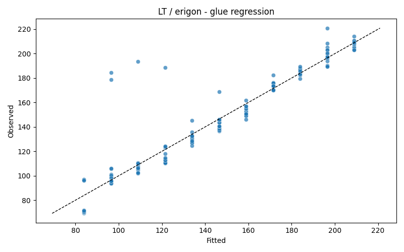

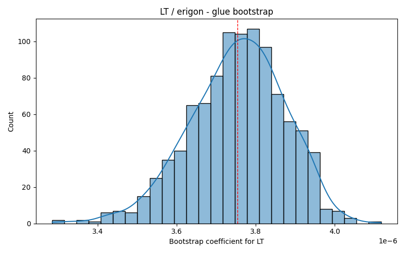

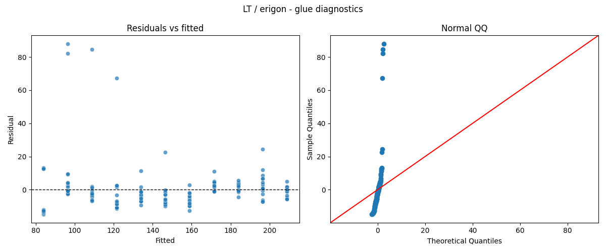

</details>

<details><summary><code>MSTORE</code> · nobs=825 · runtime_ms=7.904e-06 · p=1.00e-03 · R²=0.9445</summary>

```
==============================================================================
                           NNLS Regression Results                            
==============================================================================
Dep. Variable:          test_runtime_ms              R-squared:          0.945
Model:                  NNLS                    Adj. R-squared:          0.944
No. Observations:       825                               RMSE:          13.45
Df Residuals:           823                                MAE:           8.65
Df Model:               1      
==============================================================================
                      coef     std err     P-value      [0.025      0.975]
------------------------------------------------------------------------------
         const     18.1897      1.4813       0.001     15.3002     20.9712
        MSTORE      0.0000      0.0000       0.001      0.0000      0.0000
==============================================================================
Notes: Non-negative least squares with bootstrap inference (1000 iterations)
==============================================================================
```

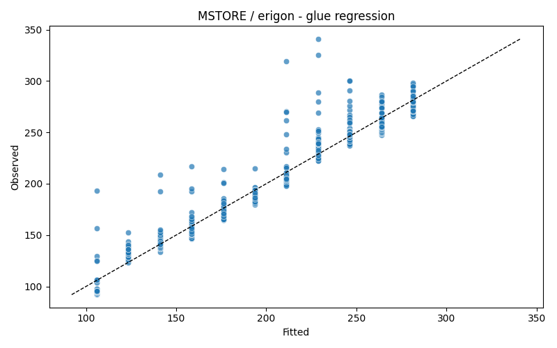

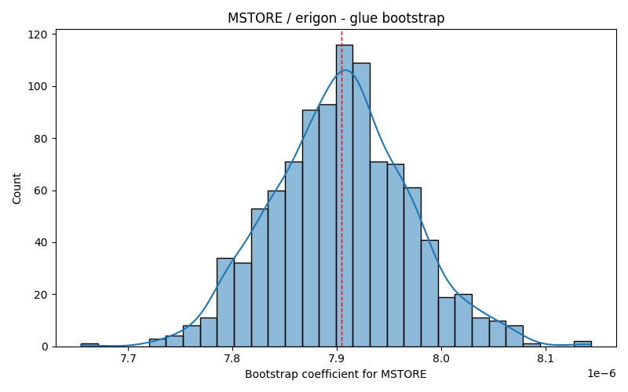

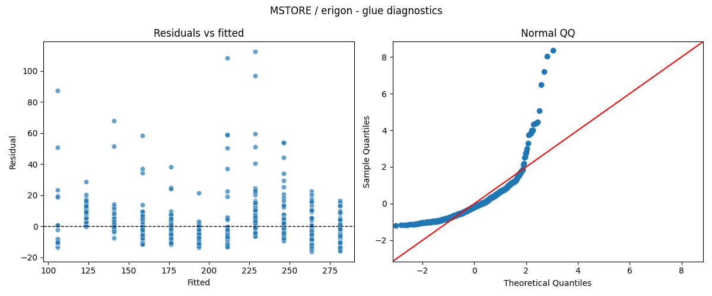

</details>

<details><summary><code>MSTORE8</code> · nobs=825 · runtime_ms=7.476e-06 · p=1.00e-03 · R²=0.9588</summary>

```
==============================================================================
                           NNLS Regression Results                            
==============================================================================
Dep. Variable:          test_runtime_ms              R-squared:          0.959
Model:                  NNLS                    Adj. R-squared:          0.959
No. Observations:       825                               RMSE:          10.87
Df Residuals:           823                                MAE:           7.62
Df Model:               1      
==============================================================================
                      coef     std err     P-value      [0.025      0.975]
------------------------------------------------------------------------------
         const     19.0438      1.4705       0.001     16.2554     21.9898
       MSTORE8      0.0000      0.0000       0.001      0.0000      0.0000
==============================================================================
Notes: Non-negative least squares with bootstrap inference (1000 iterations)
==============================================================================
```

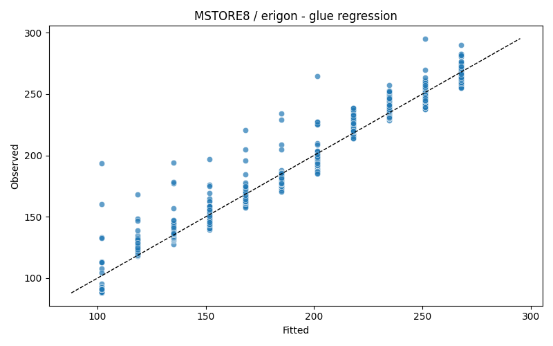

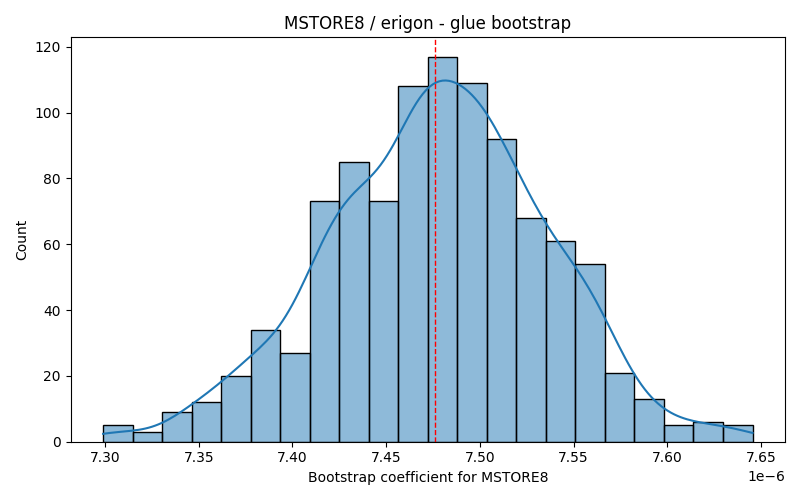

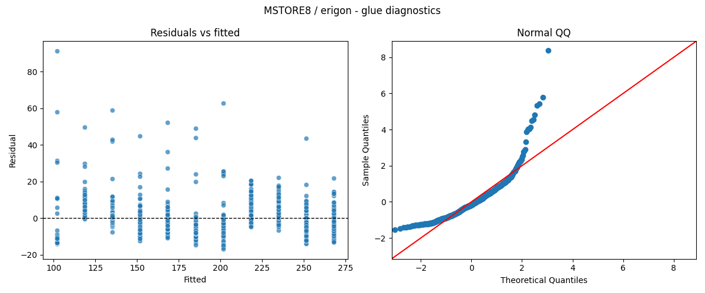

</details>

<details><summary><code>MUL</code> · nobs=165 · runtime_ms=6.071e-06 · p=1.00e-03 · R²=0.8966</summary>

```
==============================================================================
                           NNLS Regression Results                            
==============================================================================
Dep. Variable:          test_runtime_ms              R-squared:          0.897
Model:                  NNLS                    Adj. R-squared:          0.896
No. Observations:       165                               RMSE:          16.28
Df Residuals:           163                                MAE:          12.35
Df Model:               1      
==============================================================================
                      coef     std err     P-value      [0.025      0.975]
------------------------------------------------------------------------------
         const      5.4199      3.7133       0.102      0.0000     13.1789
           MUL      0.0000      0.0000       0.001      0.0000      0.0000
==============================================================================
Notes: Non-negative least squares with bootstrap inference (1000 iterations)
==============================================================================
```

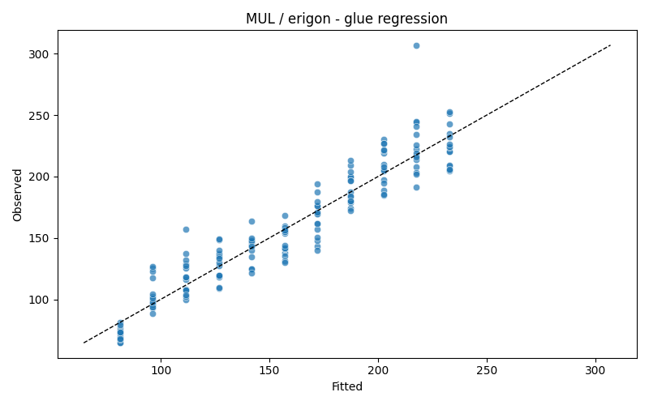

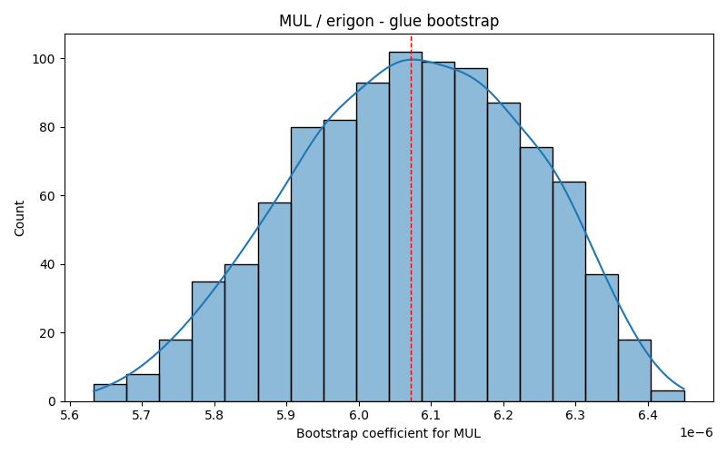

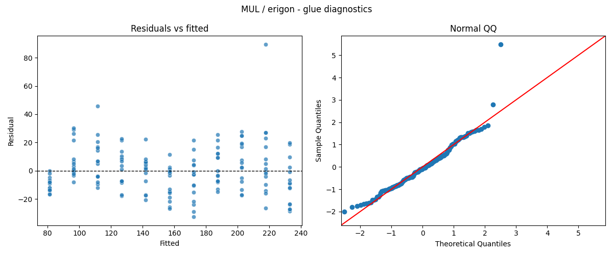

</details>

<details><summary><code>PC</code> · nobs=165 · runtime_ms=1.768e-06 · p=1.00e-03 · R²=0.9813</summary>

```
==============================================================================
                           NNLS Regression Results                            
==============================================================================
Dep. Variable:          test_runtime_ms              R-squared:          0.981
Model:                  NNLS                    Adj. R-squared:          0.981
No. Observations:       165                               RMSE:           7.29
Df Residuals:           163                                MAE:           5.96
Df Model:               1      
==============================================================================
                      coef     std err     P-value      [0.025      0.975]
------------------------------------------------------------------------------
         const     10.2580      2.2480       0.001      6.0406     14.6733
            PC      0.0000      0.0000       0.001      0.0000      0.0000
==============================================================================
Notes: Non-negative least squares with bootstrap inference (1000 iterations)
==============================================================================
```

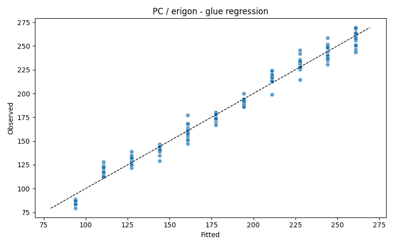

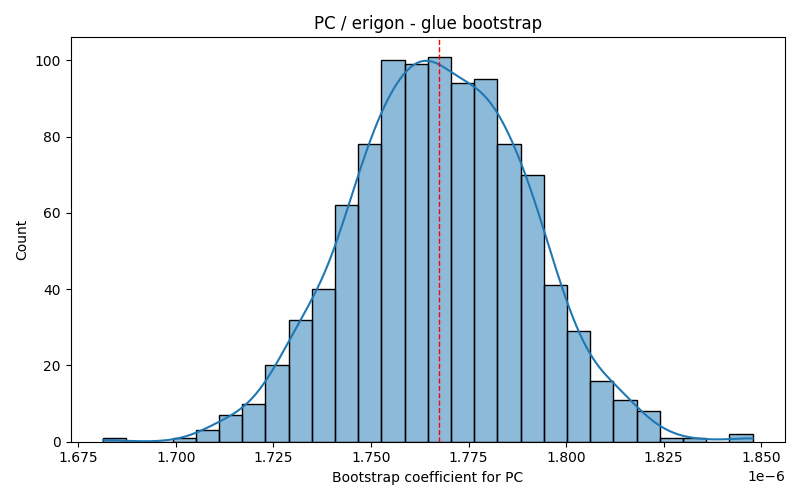

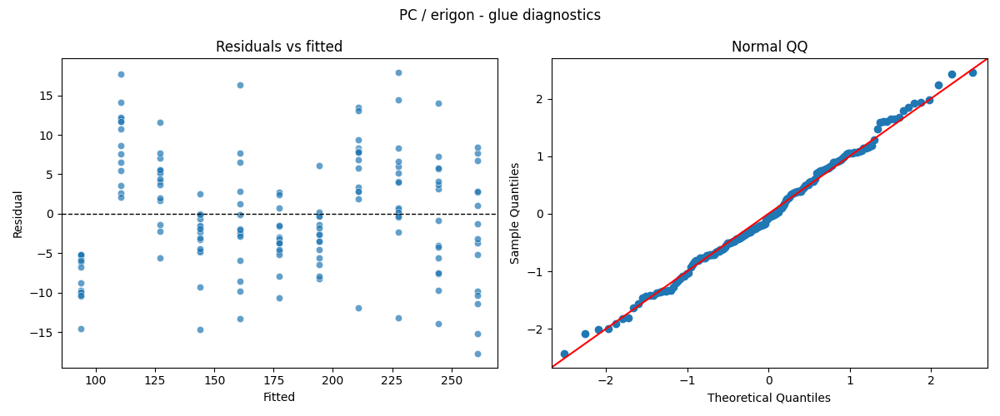

</details>

<details><summary><code>RETURNDATASIZE</code> · nobs=660 · runtime_ms=3.007e-06 · p=1.00e-03 · R²=0.9601</summary>

```
==============================================================================
                           NNLS Regression Results                            
==============================================================================
Dep. Variable:          test_runtime_ms              R-squared:          0.960
Model:                  NNLS                    Adj. R-squared:          0.960
No. Observations:       660                               RMSE:           9.68
Df Residuals:           658                                MAE:           6.78
Df Model:               1      
==============================================================================
                      coef     std err     P-value      [0.025      0.975]
------------------------------------------------------------------------------
         const     12.3572      1.6978       0.001      9.1978     15.8270
RETURNDATASIZE      0.0000      0.0000       0.001      0.0000      0.0000
==============================================================================
Notes: Non-negative least squares with bootstrap inference (1000 iterations)
==============================================================================
```

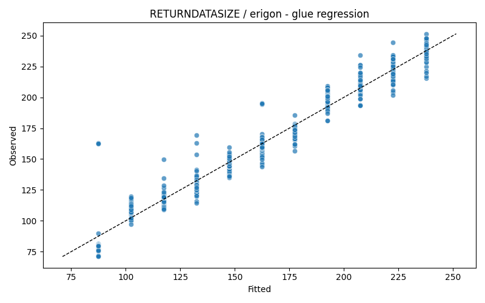

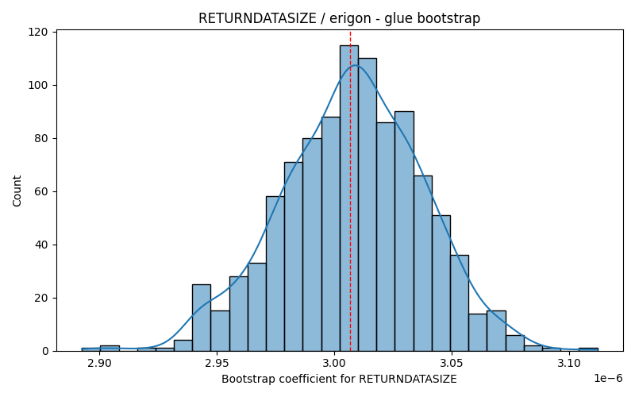

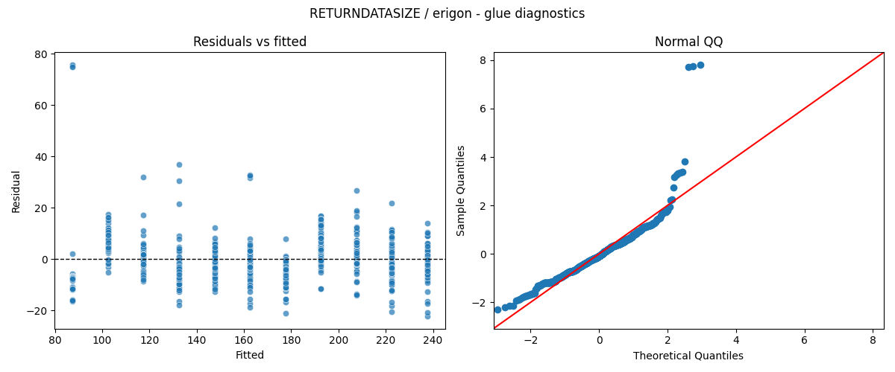

</details>

<details><summary><code>SELFBALANCE</code> · nobs=165 · runtime_ms=1.945e-06 · p=1.00e-03 · R²=0.9755</summary>

```
==============================================================================
                           NNLS Regression Results                            
==============================================================================
Dep. Variable:          test_runtime_ms              R-squared:          0.976
Model:                  NNLS                    Adj. R-squared:          0.975
No. Observations:       165                               RMSE:           3.81
Df Residuals:           163                                MAE:           3.20
Df Model:               1      
==============================================================================
                      coef     std err     P-value      [0.025      0.975]
------------------------------------------------------------------------------
         const      7.5509      0.9556       0.001      5.7834      9.3399
   SELFBALANCE      0.0000      0.0000       0.001      0.0000      0.0000
==============================================================================
Notes: Non-negative least squares with bootstrap inference (1000 iterations)
==============================================================================
```

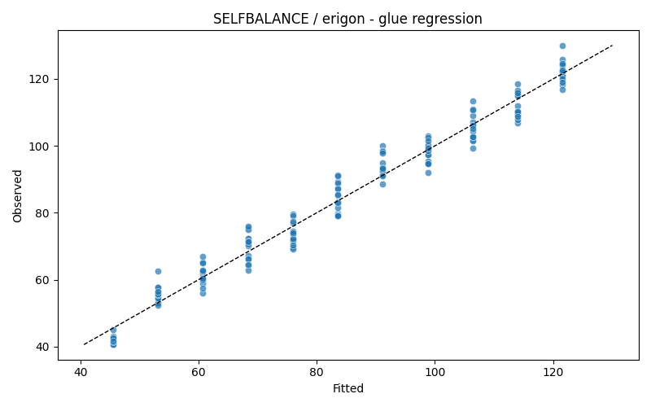

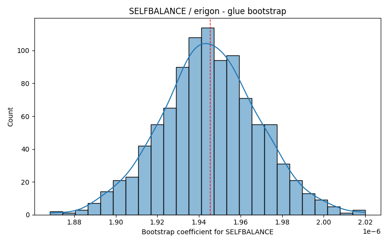

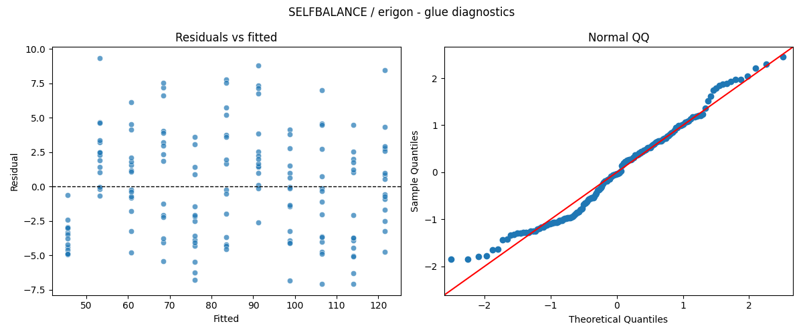

</details>

<details><summary><code>SUB</code> · nobs=165 · runtime_ms=3.909e-06 · p=1.00e-03 · R²=0.9456</summary>

```
==============================================================================
                           NNLS Regression Results                            
==============================================================================
Dep. Variable:          test_runtime_ms              R-squared:          0.946
Model:                  NNLS                    Adj. R-squared:          0.945
No. Observations:       165                               RMSE:           9.87
Df Residuals:           163                                MAE:           6.21
Df Model:               1      
==============================================================================
                      coef     std err     P-value      [0.025      0.975]
------------------------------------------------------------------------------
         const     14.9302      3.0439       0.001      9.8500     21.3705
           SUB      0.0000      0.0000       0.001      0.0000      0.0000
==============================================================================
Notes: Non-negative least squares with bootstrap inference (1000 iterations)
==============================================================================
```

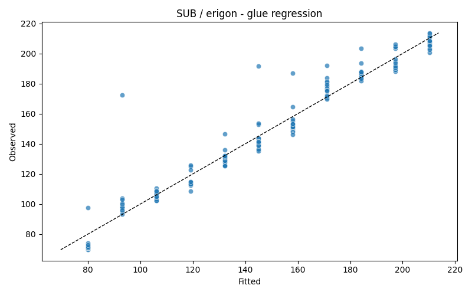

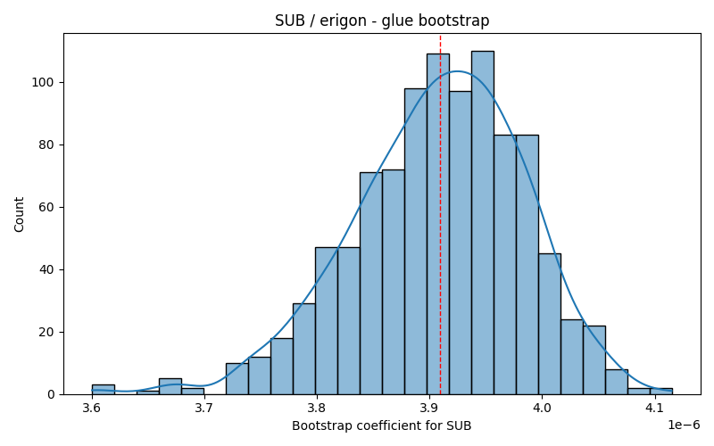

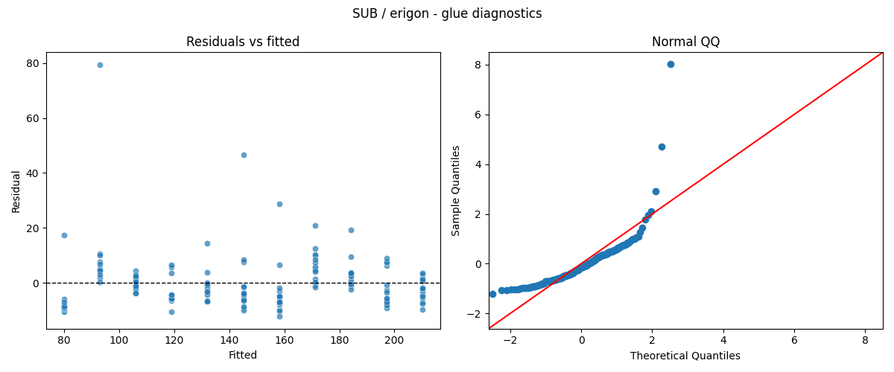

</details>

### Mixed glue (tier B) · erigon

<details><summary><code>JUMP</code> · nobs=165 · runtime_ms=9.394e-06 · p=1.00e-03 · R²=0.9531</summary>

```
==============================================================================
                           NNLS Regression Results                            
==============================================================================
Dep. Variable:          test_runtime_ms              R-squared:          0.953
Model:                  NNLS                    Adj. R-squared:          0.953
No. Observations:       165                               RMSE:           7.75
Df Residuals:           163                                MAE:           4.92
Df Model:               1      
==============================================================================
                      coef     std err     P-value      [0.025      0.975]
------------------------------------------------------------------------------
         const      8.4866      2.3031       0.001      4.5120     13.5935
          JUMP      0.0000      0.0000       0.001      0.0000      0.0000
==============================================================================
Notes: Non-negative least squares with bootstrap inference (1000 iterations)
==============================================================================
```

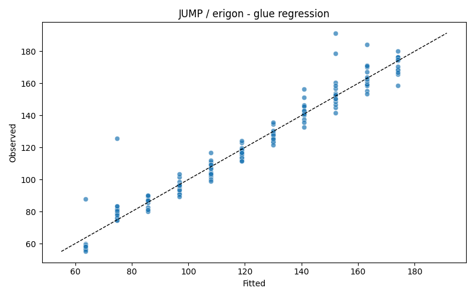

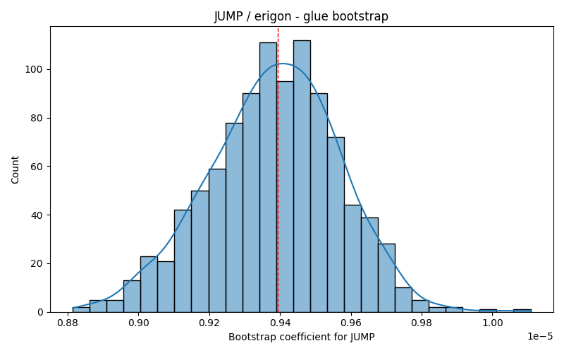

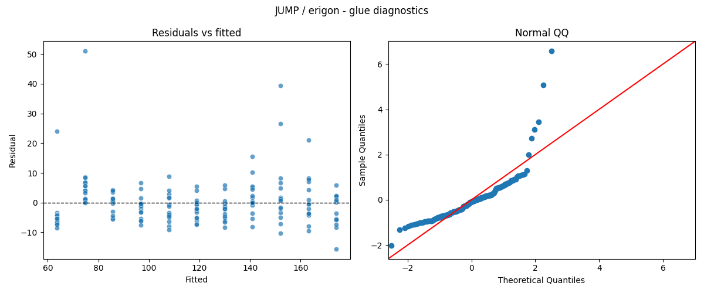

</details>

<details><summary><code>KECCAK256</code> · nobs=2640 · runtime_ms=2.916e-05 · p=1.00e-03 · R²=0.08567</summary>

```
==============================================================================
                           NNLS Regression Results                            
==============================================================================
Dep. Variable:          test_runtime_ms              R-squared:          0.086
Model:                  NNLS                    Adj. R-squared:          0.085
No. Observations:       2640                              RMSE:         189.37
Df Residuals:           2638                               MAE:         154.28
Df Model:               1      
==============================================================================
                      coef     std err     P-value      [0.025      0.975]
------------------------------------------------------------------------------
         const    540.3602      8.1530       0.001    524.6602    556.8013
     KECCAK256      0.0000      0.0000       0.001      0.0000      0.0000
==============================================================================
Notes: Non-negative least squares with bootstrap inference (1000 iterations)
==============================================================================
```

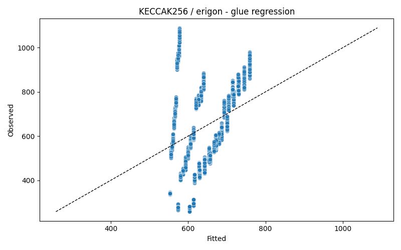

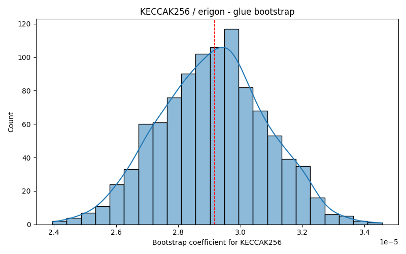

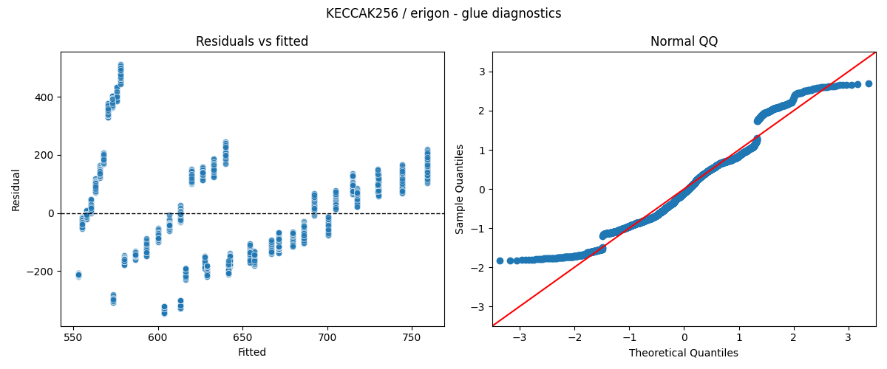

</details>

## ethrex

| glue_opcode | nobs | glue_runtime_ms | p_value | rsquared |
| --- | --- | --- | --- | --- |
| `ISZERO` | 44 | 8.357e-07 | 1.00e-03 | 0.9112 |
| `JUMPDEST` | 44 | 5.221e-07 | 1.00e-03 | 0.9288 |
| `SWAP` | 704 | 8.778e-07 | 1.00e-03 | 0.881 |
| `CALLDATASIZE` | 2629 | 6.712e-07 | 1.00e-03 | 0.9493 |
| `DUP` | 2629 | 7.261e-07 | 1.00e-03 | 0.9493 |
| `GAS` | 2629 | 7.044e-07 | 1.00e-03 | 0.9493 |
| `MLOAD` | 2629 | 1.677e-06 | 1.00e-03 | 0.9493 |
| `PUSH` | 2629 | 8.48e-07 | 1.00e-03 | 0.9493 |
| `PUSH0` | 2629 | 6.559e-07 | 1.00e-03 | 0.9493 |
| `STATICCALL` | 2629 | 0.0001232 | 1.00e-03 | 0.9493 |
| `ADD` | 44 | 1.711e-06 | 1.00e-03 | 0.9092 |
| `AND` | 44 | 1.298e-06 | 1.00e-03 | 0.9357 |
| `CALLDATACOPY` | 1056 | 3.937e-06 | 1.00e-03 | 0.9351 |
| `CALLDATALOAD` | 176 | 2.236e-05 | 1.00e-03 | 0.2128 |
| `DIV` | 44 | 1.329e-05 | 1.00e-03 | 0.9654 |
| `EXP` | 44 | 0.001769 | 1.00e-03 | 0.9832 |
| `GT` | 44 | 1.738e-06 | 1.00e-03 | 0.9418 |
| `JUMPI` | 44 | 2.08e-06 | 1.00e-03 | 0.9155 |
| `LT` | 44 | 1.753e-06 | 1.00e-03 | 0.958 |
| `MSTORE` | 220 | 2.557e-06 | 1.00e-03 | 0.9473 |
| `MSTORE8` | 220 | 2.638e-06 | 1.00e-03 | 0.9479 |
| `MUL` | 44 | 2.818e-06 | 1.00e-03 | 0.749 |
| `PC` | 44 | 8.641e-07 | 1.00e-03 | 0.9507 |
| `RETURNDATASIZE` | 176 | 1.304e-06 | 1.00e-03 | 0.9249 |
| `SELFBALANCE` | 44 | 9.883e-06 | 1.00e-03 | 0.9898 |
| `SUB` | 44 | 1.628e-06 | 1.00e-03 | 0.9518 |
| `JUMP` | 44 | 4.62e-06 | 1.00e-03 | 0.9537 |
| `KECCAK256` | 704 | 0 | 1.00e+00 | 0 |

### Cycle glue — joint fit · ethrex

<details><summary>Joint NNLS regression summary</summary>

```
==============================================================================
                           NNLS Regression Results                            
==============================================================================
Dep. Variable:          test_runtime_ms              R-squared:          0.949
Model:                  NNLS                    Adj. R-squared:          0.949
No. Observations:       2629                              RMSE:           6.32
Df Residuals:           2621                               MAE:           4.84
Df Model:               7      
==============================================================================
                      coef     std err     P-value      [0.025      0.975]
------------------------------------------------------------------------------
         const      8.7008      0.3827       0.001      7.9665      9.4356
  CALLDATASIZE      0.0000      0.0000       0.001      0.0000      0.0000
           DUP      0.0000      0.0000       0.001      0.0000      0.0000
           GAS      0.0000      0.0000       0.001      0.0000      0.0000
         MLOAD      0.0000      0.0000       0.001      0.0000      0.0000
          PUSH      0.0000      0.0000       0.001      0.0000      0.0000
         PUSH0      0.0000      0.0000       0.001      0.0000      0.0000
    STATICCALL      0.0001      0.0000       0.001      0.0001      0.0001
==============================================================================
Notes: Non-negative least squares with bootstrap inference (1000 iterations)
==============================================================================
```

</details>

<details><summary><code>CALLDATASIZE</code> · nobs=2629 · runtime_ms=6.712e-07 · p=1.00e-03 · R²=0.9493</summary>

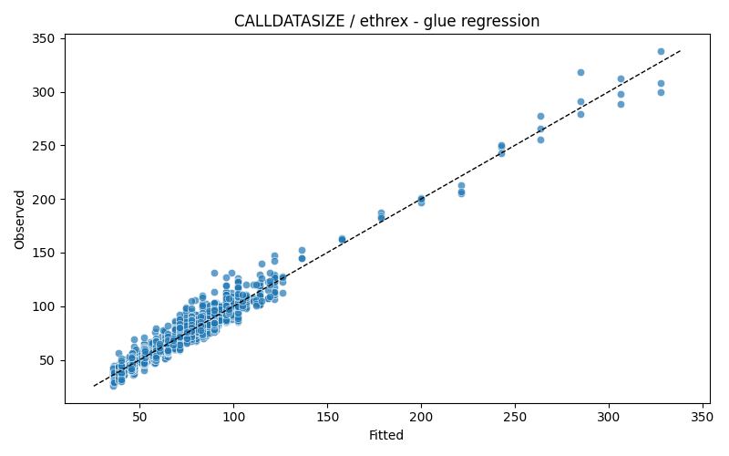

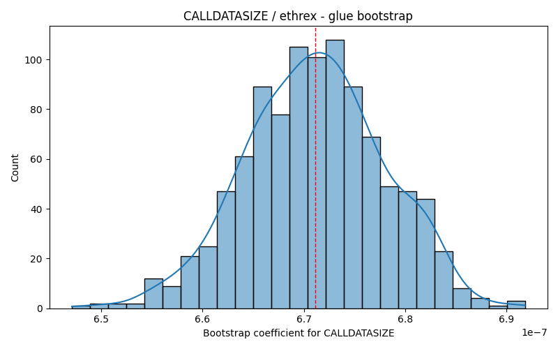


</details>

<details><summary><code>DUP</code> · nobs=2629 · runtime_ms=7.261e-07 · p=1.00e-03 · R²=0.9493</summary>


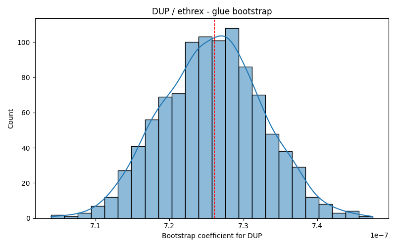


</details>

<details><summary><code>GAS</code> · nobs=2629 · runtime_ms=7.044e-07 · p=1.00e-03 · R²=0.9493</summary>

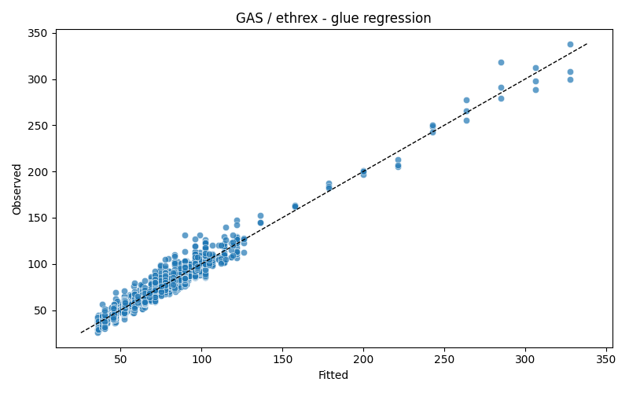

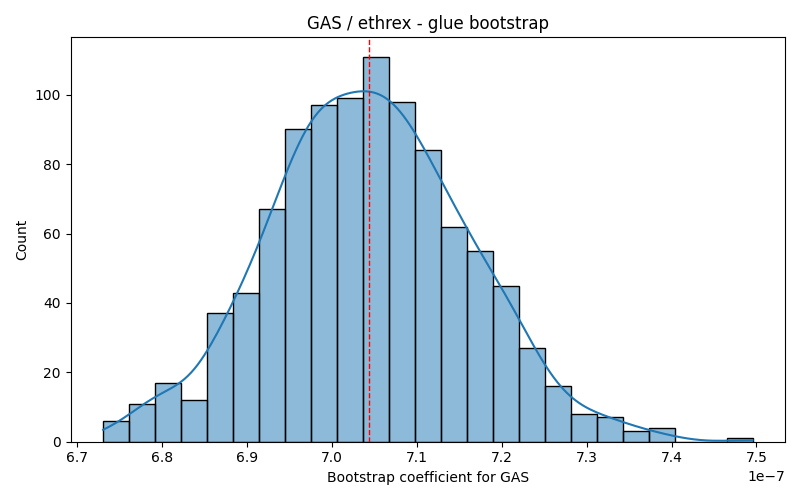


</details>

<details><summary><code>MLOAD</code> · nobs=2629 · runtime_ms=1.677e-06 · p=1.00e-03 · R²=0.9493</summary>

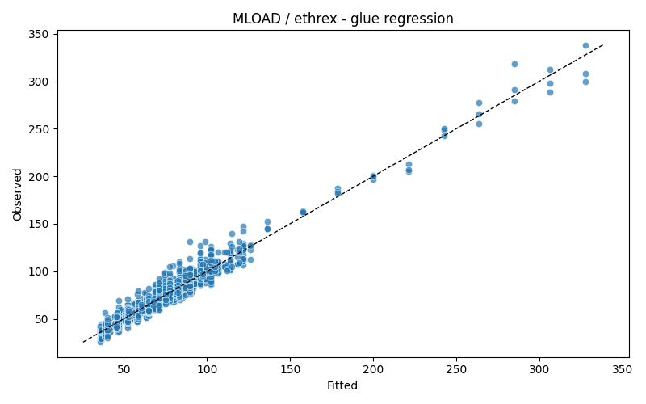

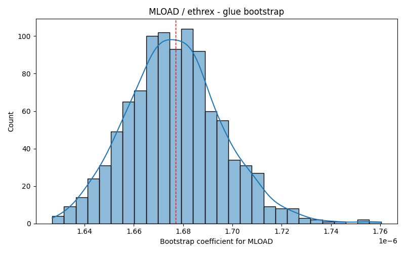

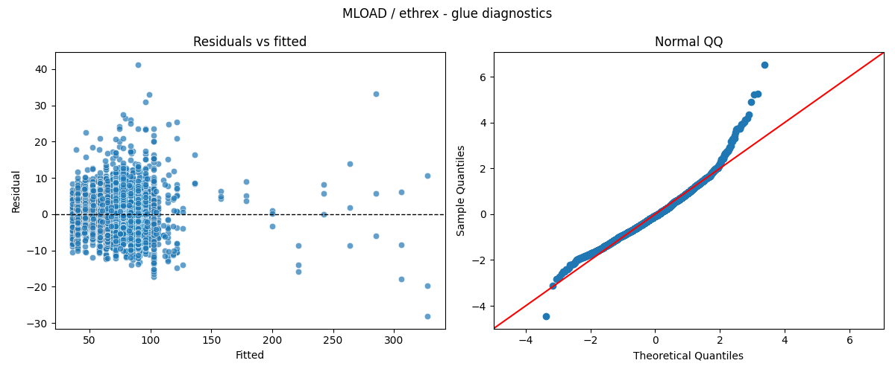

</details>

<details><summary><code>PUSH</code> · nobs=2629 · runtime_ms=8.48e-07 · p=1.00e-03 · R²=0.9493</summary>


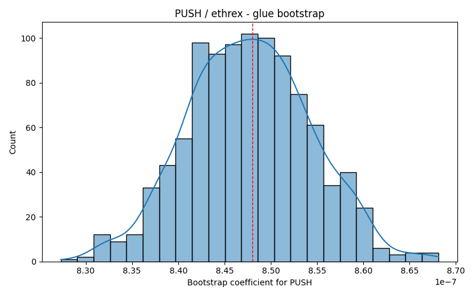


</details>

<details><summary><code>PUSH0</code> · nobs=2629 · runtime_ms=6.559e-07 · p=1.00e-03 · R²=0.9493</summary>


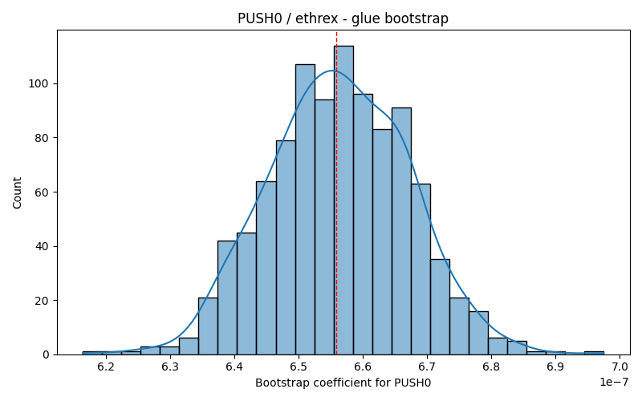


</details>

<details><summary><code>STATICCALL</code> · nobs=2629 · runtime_ms=0.0001232 · p=1.00e-03 · R²=0.9493</summary>

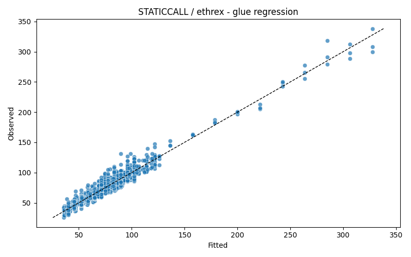

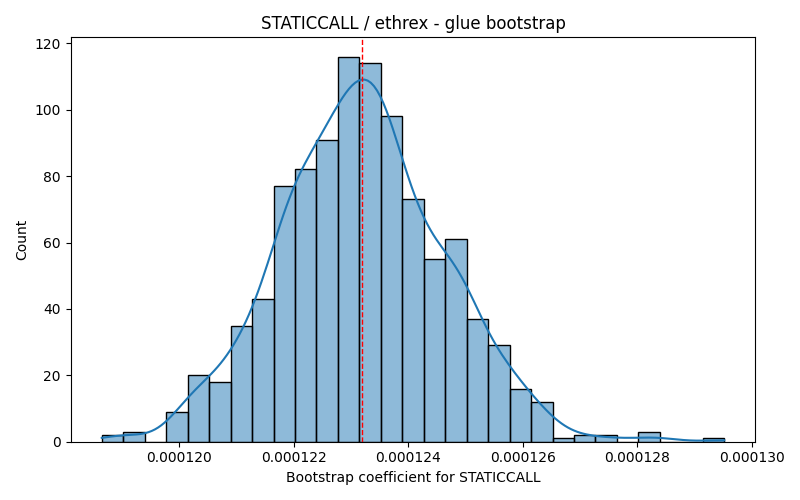

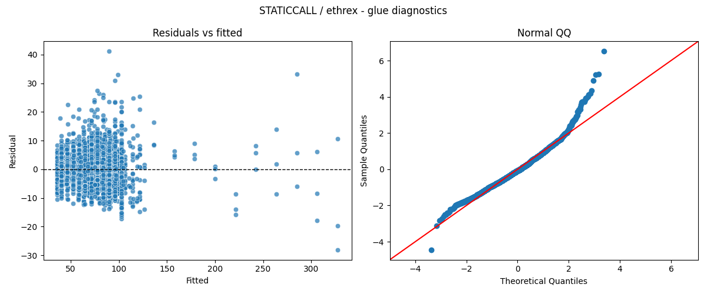

</details>

### Pure glue · ethrex

<details><summary><code>ISZERO</code> · nobs=44 · runtime_ms=8.357e-07 · p=1.00e-03 · R²=0.9112</summary>

```
==============================================================================
                           NNLS Regression Results                            
==============================================================================
Dep. Variable:          test_runtime_ms              R-squared:          0.911
Model:                  NNLS                    Adj. R-squared:          0.909
No. Observations:       44                                RMSE:           5.49
Df Residuals:           42                                 MAE:           3.80
Df Model:               1      
==============================================================================
                      coef     std err     P-value      [0.025      0.975]
------------------------------------------------------------------------------
         const      7.0776      2.3002       0.002      2.3755     11.3824
        ISZERO      0.0000      0.0000       0.001      0.0000      0.0000
==============================================================================
Notes: Non-negative least squares with bootstrap inference (1000 iterations)
==============================================================================
```

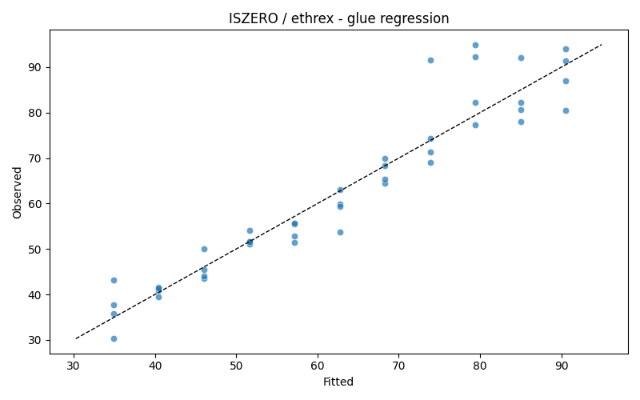

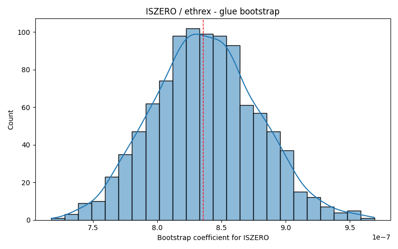

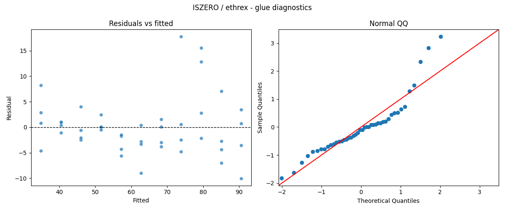

</details>

<details><summary><code>JUMPDEST</code> · nobs=44 · runtime_ms=5.221e-07 · p=1.00e-03 · R²=0.9288</summary>

```
==============================================================================
                           NNLS Regression Results                            
==============================================================================
Dep. Variable:          test_runtime_ms              R-squared:          0.929
Model:                  NNLS                    Adj. R-squared:          0.927
No. Observations:       44                                RMSE:           9.13
Df Residuals:           42                                 MAE:           7.45
Df Model:               1      
==============================================================================
                      coef     std err     P-value      [0.025      0.975]
------------------------------------------------------------------------------
         const     12.8300      4.0458       0.002      4.6786     20.3934
      JUMPDEST      0.0000      0.0000       0.001      0.0000      0.0000
==============================================================================
Notes: Non-negative least squares with bootstrap inference (1000 iterations)
==============================================================================
```

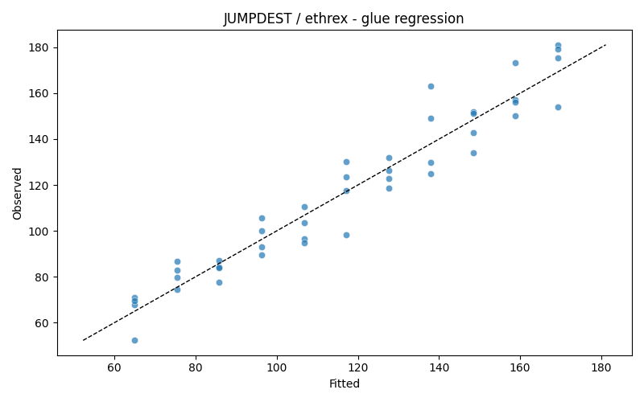

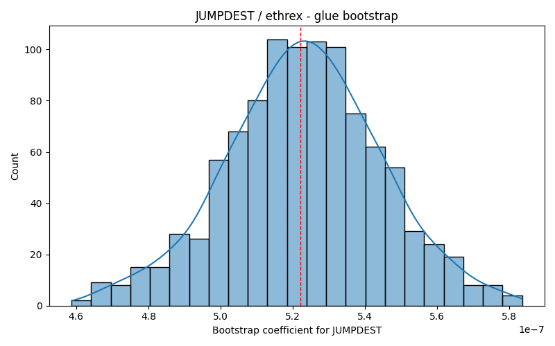

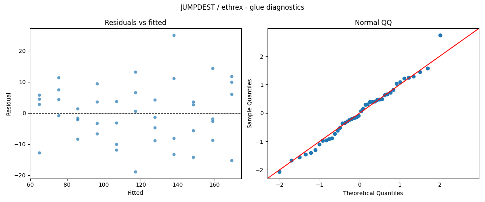

</details>

<details><summary><code>SWAP</code> · nobs=704 · runtime_ms=8.778e-07 · p=1.00e-03 · R²=0.881</summary>

```
==============================================================================
                           NNLS Regression Results                            
==============================================================================
Dep. Variable:          test_runtime_ms              R-squared:          0.881
Model:                  NNLS                    Adj. R-squared:          0.881
No. Observations:       704                               RMSE:           6.79
Df Residuals:           702                                MAE:           5.45
Df Model:               1      
==============================================================================
                      coef     std err     P-value      [0.025      0.975]
------------------------------------------------------------------------------
         const     10.3012      0.7598       0.001      8.7956     11.7270
          SWAP      0.0000      0.0000       0.001      0.0000      0.0000
==============================================================================
Notes: Non-negative least squares with bootstrap inference (1000 iterations)
==============================================================================
```

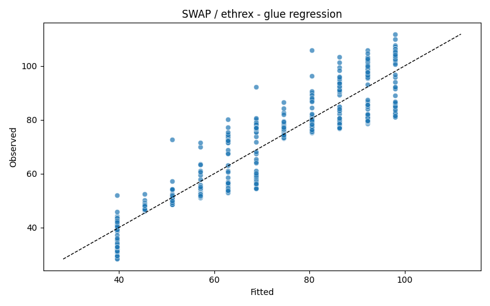

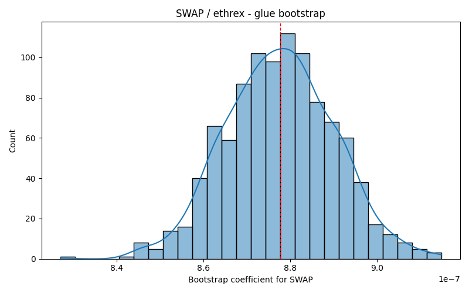

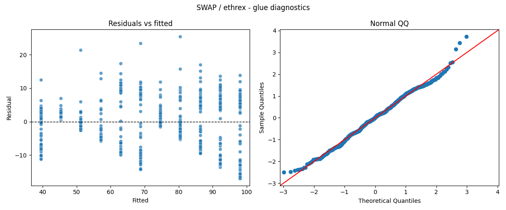

</details>

### Mixed glue (tier A) · ethrex

<details><summary><code>ADD</code> · nobs=44 · runtime_ms=1.711e-06 · p=1.00e-03 · R²=0.9092</summary>

```
==============================================================================
                           NNLS Regression Results                            
==============================================================================
Dep. Variable:          test_runtime_ms              R-squared:          0.909
Model:                  NNLS                    Adj. R-squared:          0.907
No. Observations:       44                                RMSE:           5.69
Df Residuals:           42                                 MAE:           4.08
Df Model:               1      
==============================================================================
                      coef     std err     P-value      [0.025      0.975]
------------------------------------------------------------------------------
         const     11.1034      2.4404       0.001      6.6458     16.0602
           ADD      0.0000      0.0000       0.001      0.0000      0.0000
==============================================================================
Notes: Non-negative least squares with bootstrap inference (1000 iterations)
==============================================================================
```

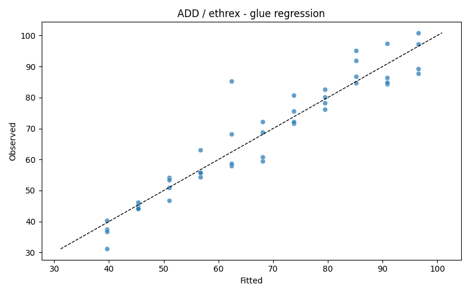

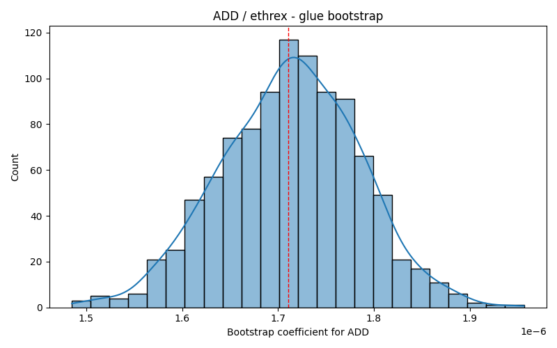

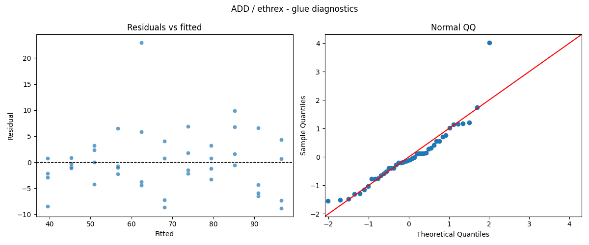

</details>

<details><summary><code>AND</code> · nobs=44 · runtime_ms=1.298e-06 · p=1.00e-03 · R²=0.9357</summary>

```
==============================================================================
                           NNLS Regression Results                            
==============================================================================
Dep. Variable:          test_runtime_ms              R-squared:          0.936
Model:                  NNLS                    Adj. R-squared:          0.934
No. Observations:       44                                RMSE:           3.58
Df Residuals:           42                                 MAE:           2.92
Df Model:               1      
==============================================================================
                      coef     std err     P-value      [0.025      0.975]
------------------------------------------------------------------------------
         const      9.0451      1.7481       0.001      5.5145     12.2866
           AND      0.0000      0.0000       0.001      0.0000      0.0000
==============================================================================
Notes: Non-negative least squares with bootstrap inference (1000 iterations)
==============================================================================
```

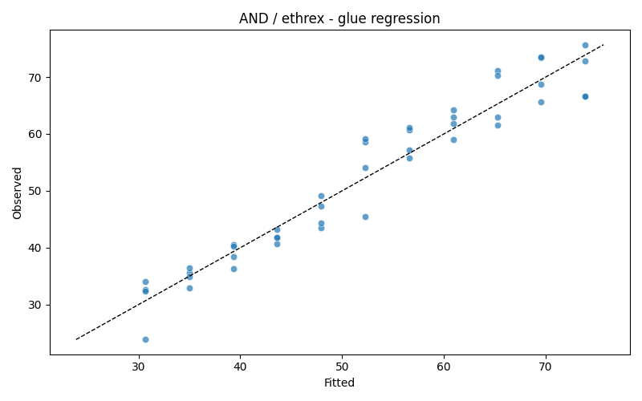

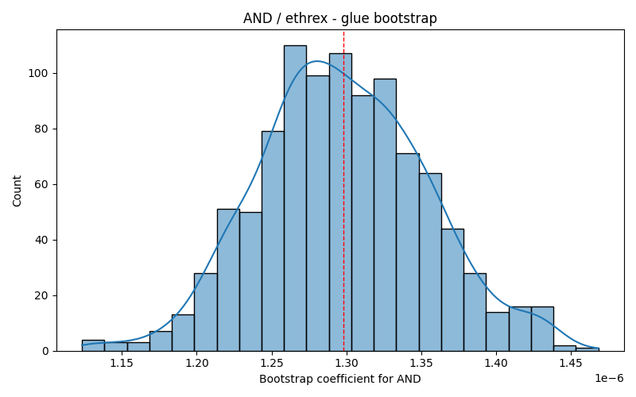

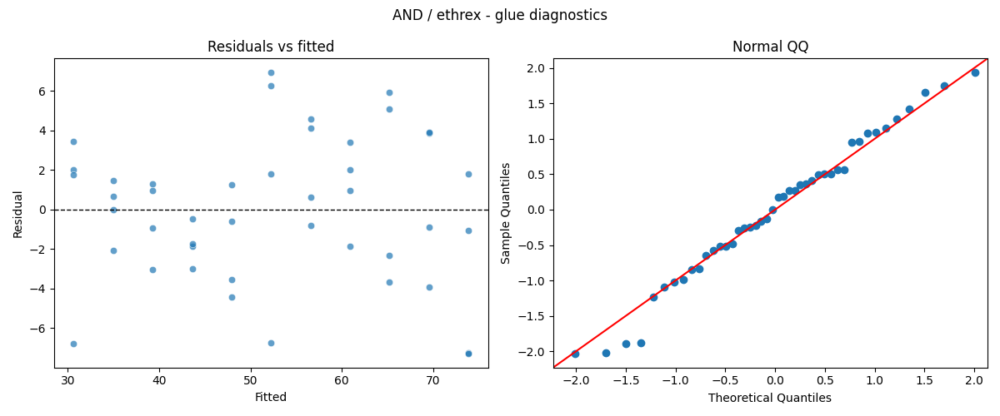

</details>

<details><summary><code>CALLDATACOPY</code> · nobs=1056 · runtime_ms=3.937e-06 · p=1.00e-03 · R²=0.9351</summary>

```
==============================================================================
                           NNLS Regression Results                            
==============================================================================
Dep. Variable:          test_runtime_ms              R-squared:          0.935
Model:                  NNLS                    Adj. R-squared:          0.935
No. Observations:       1056                              RMSE:           7.80
Df Residuals:           1054                               MAE:           5.90
Df Model:               1      
==============================================================================
                      coef     std err     P-value      [0.025      0.975]
------------------------------------------------------------------------------
         const     12.7232      0.2871       0.001     12.1956     13.3132
  CALLDATACOPY      0.0000      0.0000       0.001      0.0000      0.0000
==============================================================================
Notes: Non-negative least squares with bootstrap inference (1000 iterations)
==============================================================================
```

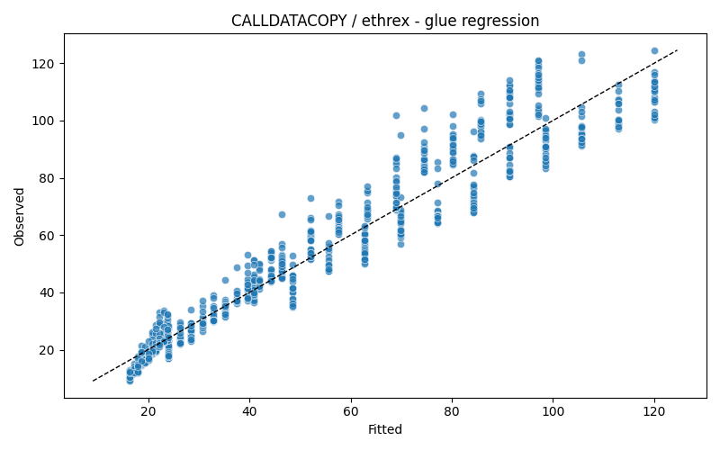

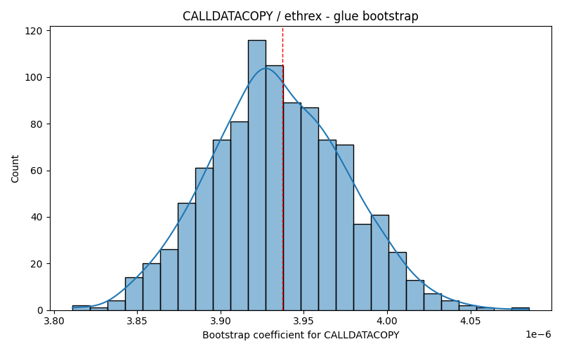

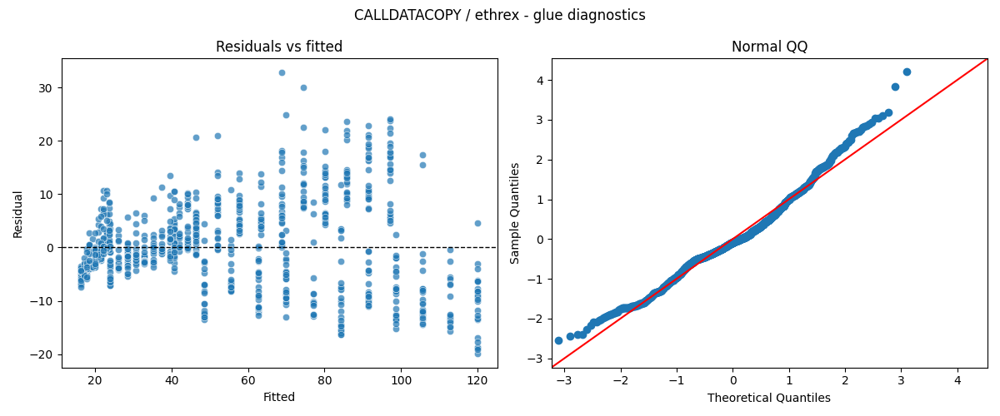

</details>

<details><summary><code>CALLDATALOAD</code> · nobs=176 · runtime_ms=2.236e-05 · p=1.00e-03 · R²=0.2128</summary>

```
==============================================================================
                           NNLS Regression Results                            
==============================================================================
Dep. Variable:          test_runtime_ms              R-squared:          0.213
Model:                  NNLS                    Adj. R-squared:          0.208
No. Observations:       176                               RMSE:           0.17
Df Residuals:           174                                MAE:           0.12
Df Model:               1      
==============================================================================
                      coef     std err     P-value      [0.025      0.975]
------------------------------------------------------------------------------
         const      2.4111      0.0420       0.001      2.3264      2.4912
  CALLDATALOAD      0.0000      0.0000       0.001      0.0000      0.0000
==============================================================================
Notes: Non-negative least squares with bootstrap inference (1000 iterations)
==============================================================================
```

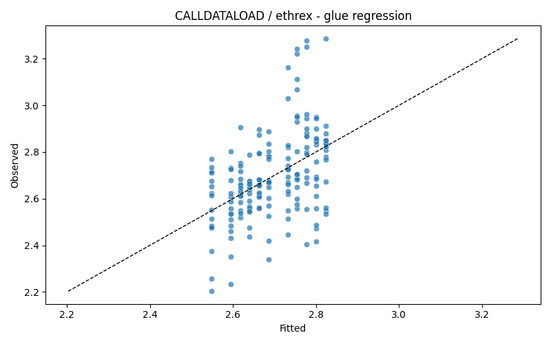

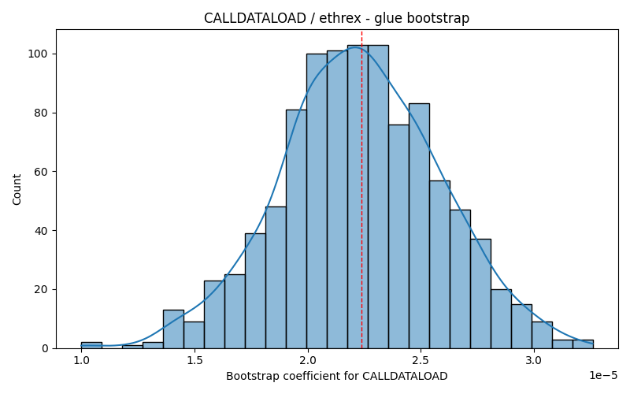

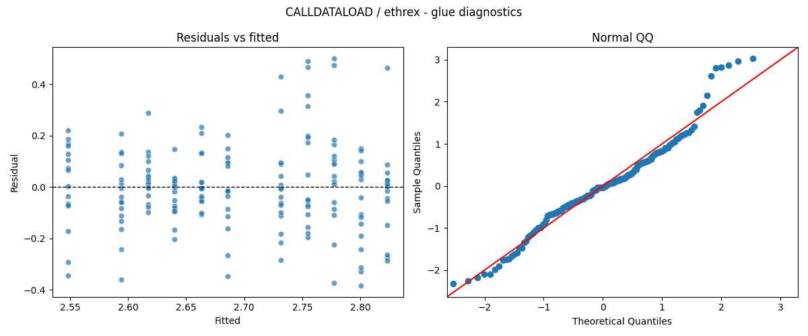

</details>

<details><summary><code>DIV</code> · nobs=44 · runtime_ms=1.329e-05 · p=1.00e-03 · R²=0.9654</summary>

```
==============================================================================
                           NNLS Regression Results                            
==============================================================================
Dep. Variable:          test_runtime_ms              R-squared:          0.965
Model:                  NNLS                    Adj. R-squared:          0.965
No. Observations:       44                                RMSE:          19.87
Df Residuals:           42                                 MAE:          16.13
Df Model:               1      
==============================================================================
                      coef     std err     P-value      [0.025      0.975]
------------------------------------------------------------------------------
         const     51.0677     10.6860       0.001     28.4247     71.4457
           DIV      0.0000      0.0000       0.001      0.0000      0.0000
==============================================================================
Notes: Non-negative least squares with bootstrap inference (1000 iterations)
==============================================================================
```

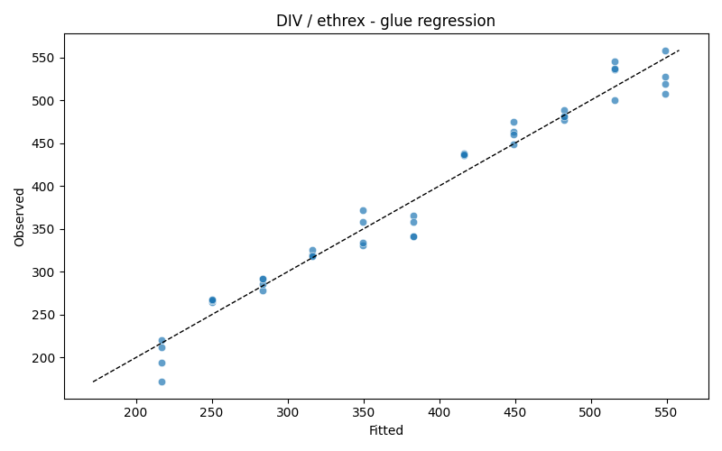

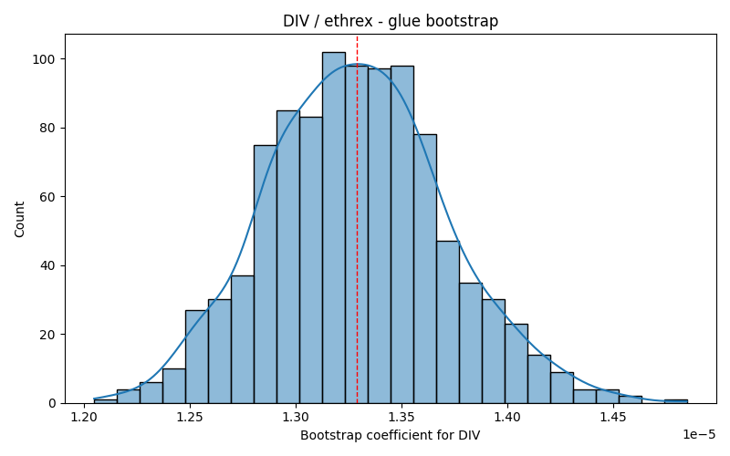

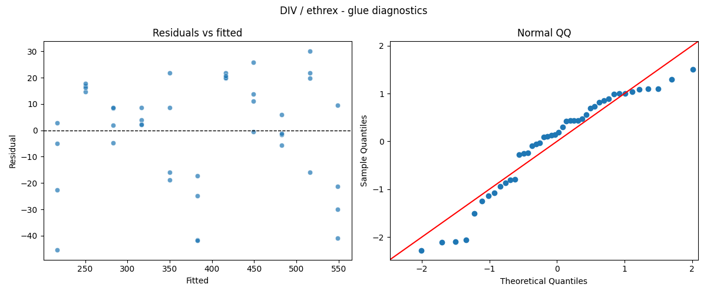

</details>

<details><summary><code>EXP</code> · nobs=44 · runtime_ms=0.001769 · p=1.00e-03 · R²=0.9832</summary>

```
==============================================================================
                           NNLS Regression Results                            
==============================================================================
Dep. Variable:          test_runtime_ms              R-squared:          0.983
Model:                  NNLS                    Adj. R-squared:          0.983
No. Observations:       44                                RMSE:           9.05
Df Residuals:           42                                 MAE:           7.16
Df Model:               1      
==============================================================================
                      coef     std err     P-value      [0.025      0.975]
------------------------------------------------------------------------------
         const     21.7678      4.0634       0.001     13.3098     29.3433
           EXP      0.0018      0.0000       0.001      0.0017      0.0018
==============================================================================
Notes: Non-negative least squares with bootstrap inference (1000 iterations)
==============================================================================
```

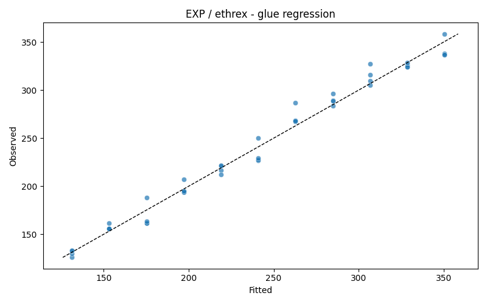

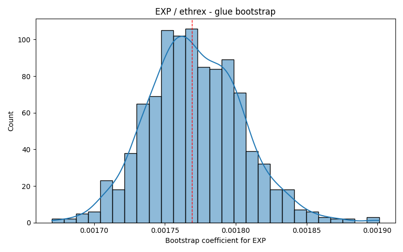

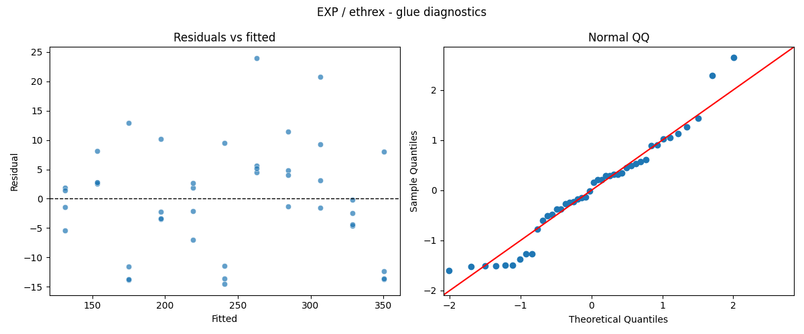

</details>

<details><summary><code>GT</code> · nobs=44 · runtime_ms=1.738e-06 · p=1.00e-03 · R²=0.9418</summary>

```
==============================================================================
                           NNLS Regression Results                            
==============================================================================
Dep. Variable:          test_runtime_ms              R-squared:          0.942
Model:                  NNLS                    Adj. R-squared:          0.940
No. Observations:       44                                RMSE:           4.55
Df Residuals:           42                                 MAE:           3.57
Df Model:               1      
==============================================================================
                      coef     std err     P-value      [0.025      0.975]
------------------------------------------------------------------------------
         const      9.3165      2.3692       0.001      4.8825     13.9888
            GT      0.0000      0.0000       0.001      0.0000      0.0000
==============================================================================
Notes: Non-negative least squares with bootstrap inference (1000 iterations)
==============================================================================
```

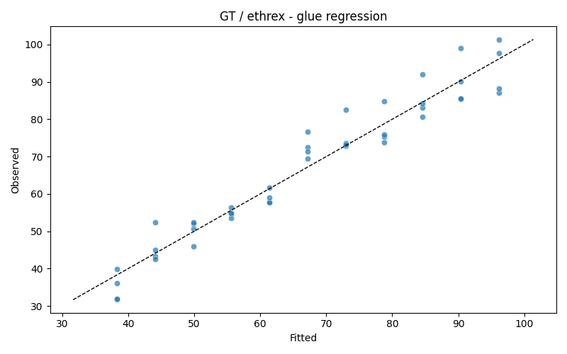

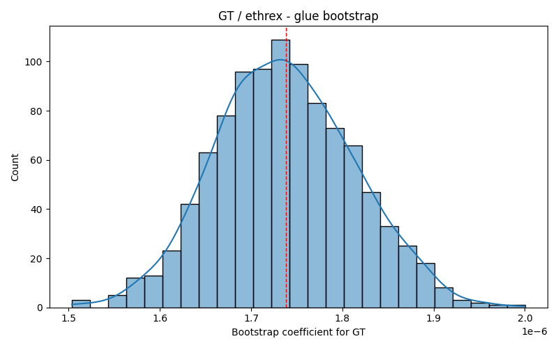

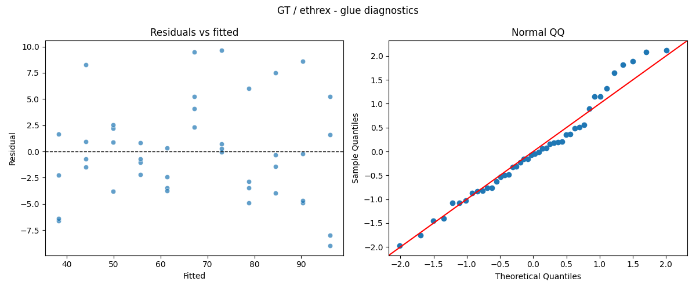

</details>

<details><summary><code>JUMPI</code> · nobs=44 · runtime_ms=2.08e-06 · p=1.00e-03 · R²=0.9155</summary>

```
==============================================================================
                           NNLS Regression Results                            
==============================================================================
Dep. Variable:          test_runtime_ms              R-squared:          0.915
Model:                  NNLS                    Adj. R-squared:          0.913
No. Observations:       44                                RMSE:           2.85
Df Residuals:           42                                 MAE:           2.33
Df Model:               1      
==============================================================================
                      coef     std err     P-value      [0.025      0.975]
------------------------------------------------------------------------------
         const      6.6502      1.3617       0.001      4.0186      9.4487
         JUMPI      0.0000      0.0000       0.001      0.0000      0.0000
==============================================================================
Notes: Non-negative least squares with bootstrap inference (1000 iterations)
==============================================================================
```

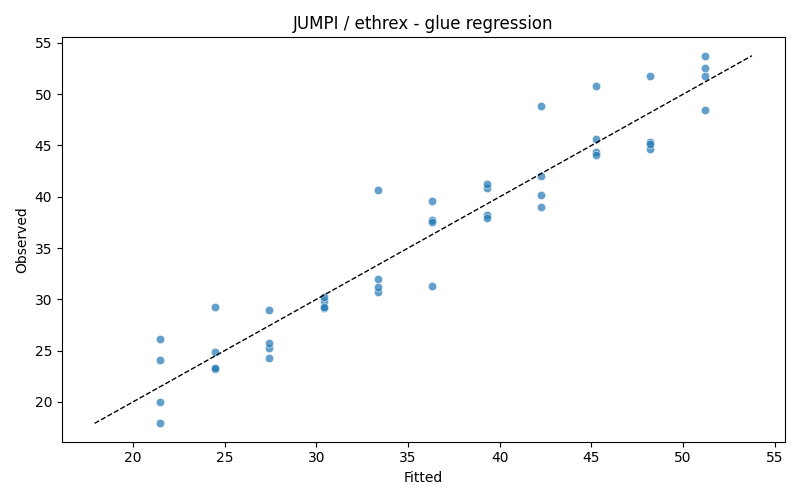

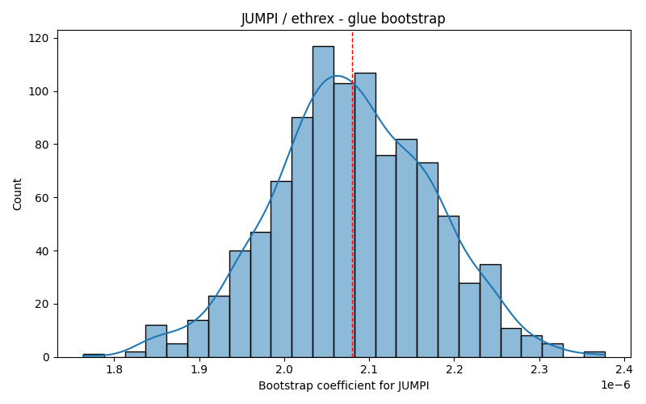

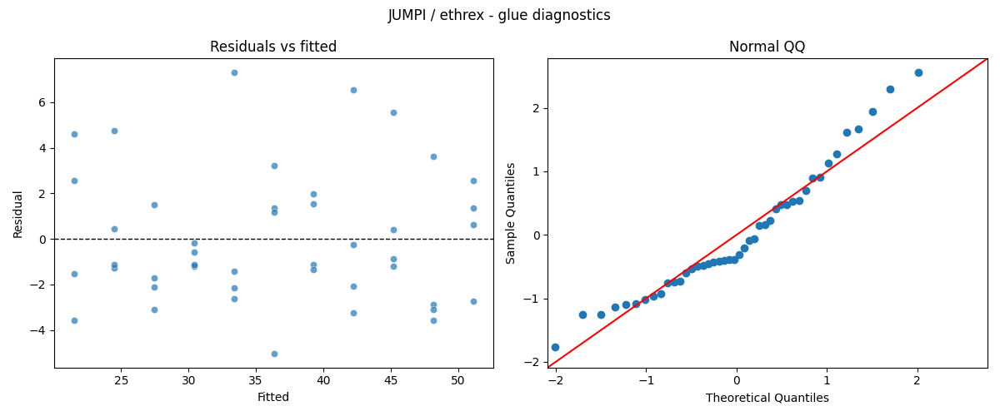

</details>

<details><summary><code>LT</code> · nobs=44 · runtime_ms=1.753e-06 · p=1.00e-03 · R²=0.958</summary>

```
==============================================================================
                           NNLS Regression Results                            
==============================================================================
Dep. Variable:          test_runtime_ms              R-squared:          0.958
Model:                  NNLS                    Adj. R-squared:          0.957
No. Observations:       44                                RMSE:           3.86
Df Residuals:           42                                 MAE:           3.01
Df Model:               1      
==============================================================================
                      coef     std err     P-value      [0.025      0.975]
------------------------------------------------------------------------------
         const      7.3999      1.8151       0.001      3.8238     10.8057
            LT      0.0000      0.0000       0.001      0.0000      0.0000
==============================================================================
Notes: Non-negative least squares with bootstrap inference (1000 iterations)
==============================================================================
```

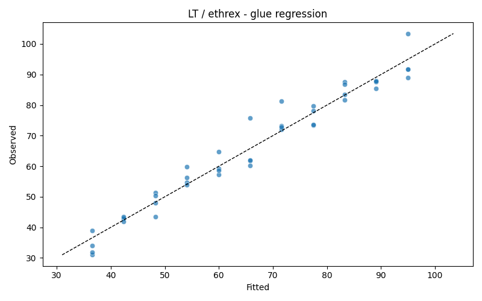

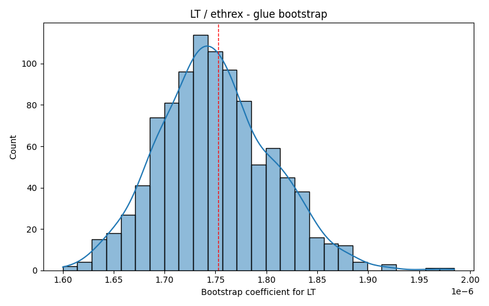

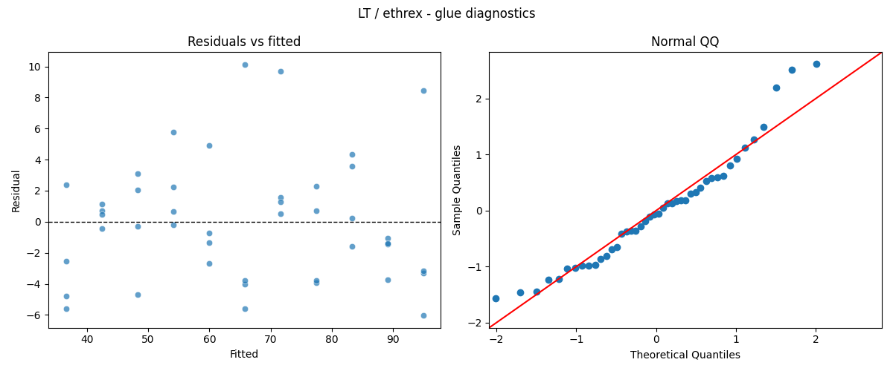

</details>

<details><summary><code>MSTORE</code> · nobs=220 · runtime_ms=2.557e-06 · p=1.00e-03 · R²=0.9473</summary>

```
==============================================================================
                           NNLS Regression Results                            
==============================================================================
Dep. Variable:          test_runtime_ms              R-squared:          0.947
Model:                  NNLS                    Adj. R-squared:          0.947
No. Observations:       220                               RMSE:           4.23
Df Residuals:           218                                MAE:           3.37
Df Model:               1      
==============================================================================
                      coef     std err     P-value      [0.025      0.975]
------------------------------------------------------------------------------
         const      7.1098      0.9164       0.001      5.2472      8.8532
        MSTORE      0.0000      0.0000       0.001      0.0000      0.0000
==============================================================================
Notes: Non-negative least squares with bootstrap inference (1000 iterations)
==============================================================================
```

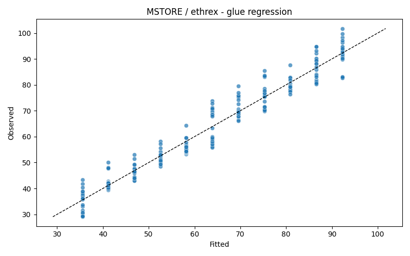

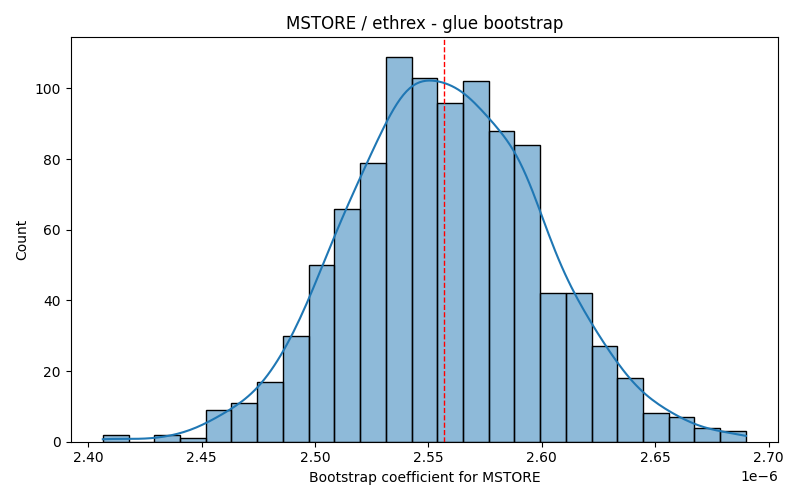

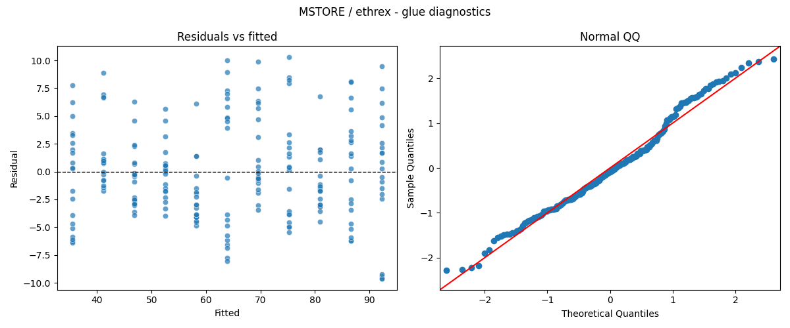

</details>

<details><summary><code>MSTORE8</code> · nobs=220 · runtime_ms=2.638e-06 · p=1.00e-03 · R²=0.9479</summary>

```
==============================================================================
                           NNLS Regression Results                            
==============================================================================
Dep. Variable:          test_runtime_ms              R-squared:          0.948
Model:                  NNLS                    Adj. R-squared:          0.948
No. Observations:       220                               RMSE:           4.34
Df Residuals:           218                                MAE:           3.39
Df Model:               1      
==============================================================================
                      coef     std err     P-value      [0.025      0.975]
------------------------------------------------------------------------------
         const      7.3650      0.9700       0.001      5.4975      9.2249
       MSTORE8      0.0000      0.0000       0.001      0.0000      0.0000
==============================================================================
Notes: Non-negative least squares with bootstrap inference (1000 iterations)
==============================================================================
```

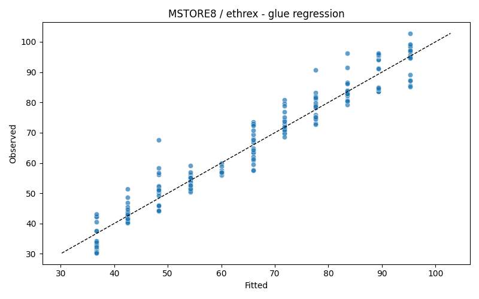

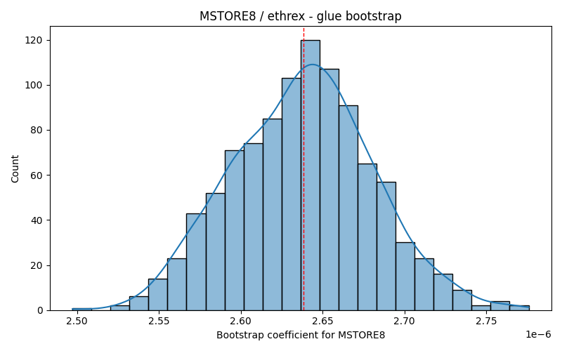

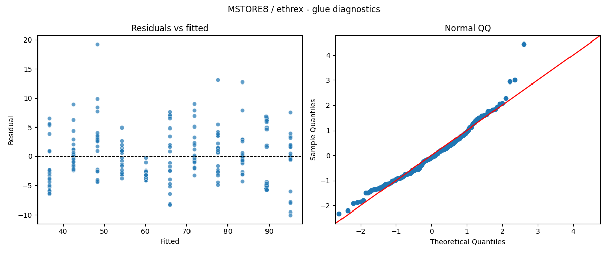

</details>

<details><summary><code>MUL</code> · nobs=44 · runtime_ms=2.818e-06 · p=1.00e-03 · R²=0.749</summary>

```
==============================================================================
                           NNLS Regression Results                            
==============================================================================
Dep. Variable:          test_runtime_ms              R-squared:          0.749
Model:                  NNLS                    Adj. R-squared:          0.743
No. Observations:       44                                RMSE:          12.88
Df Residuals:           42                                 MAE:           9.97
Df Model:               1      
==============================================================================
                      coef     std err     P-value      [0.025      0.975]
------------------------------------------------------------------------------
         const     43.3921      6.1211       0.001     30.9038     55.3403
           MUL      0.0000      0.0000       0.001      0.0000      0.0000
==============================================================================
Notes: Non-negative least squares with bootstrap inference (1000 iterations)
==============================================================================
```

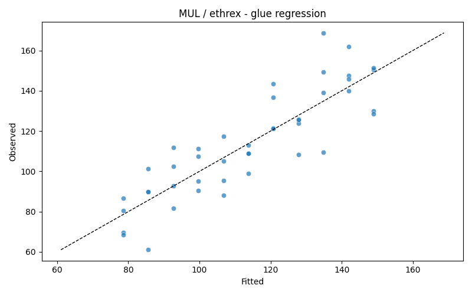

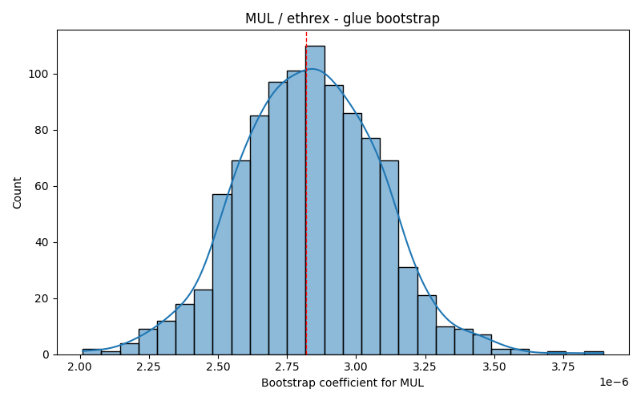

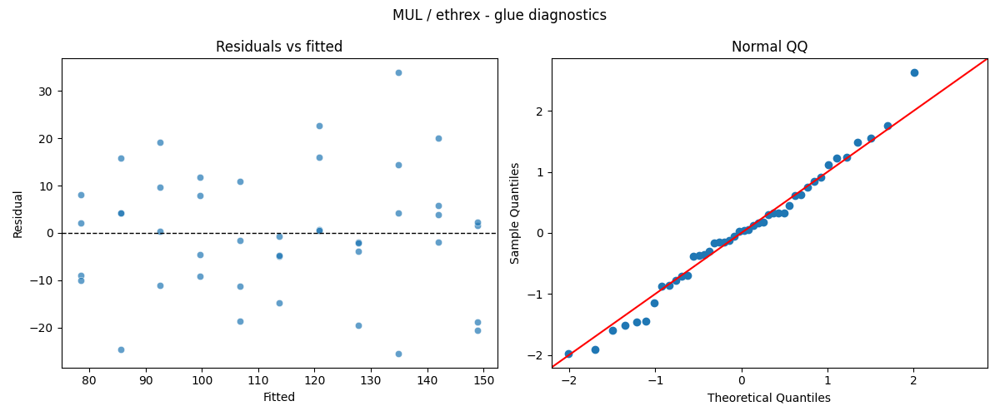

</details>

<details><summary><code>PC</code> · nobs=44 · runtime_ms=8.641e-07 · p=1.00e-03 · R²=0.9507</summary>

```
==============================================================================
                           NNLS Regression Results                            
==============================================================================
Dep. Variable:          test_runtime_ms              R-squared:          0.951
Model:                  NNLS                    Adj. R-squared:          0.950
No. Observations:       44                                RMSE:           5.88
Df Residuals:           42                                 MAE:           4.69
Df Model:               1      
==============================================================================
                      coef     std err     P-value      [0.025      0.975]
------------------------------------------------------------------------------
         const     11.7343      2.7889       0.001      6.0341     16.6123
            PC      0.0000      0.0000       0.001      0.0000      0.0000
==============================================================================
Notes: Non-negative least squares with bootstrap inference (1000 iterations)
==============================================================================
```

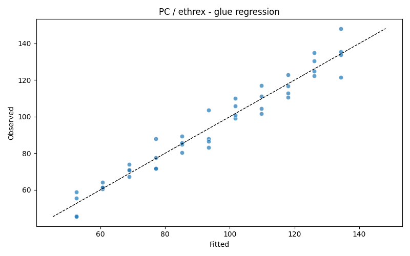

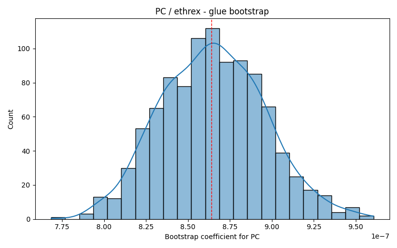

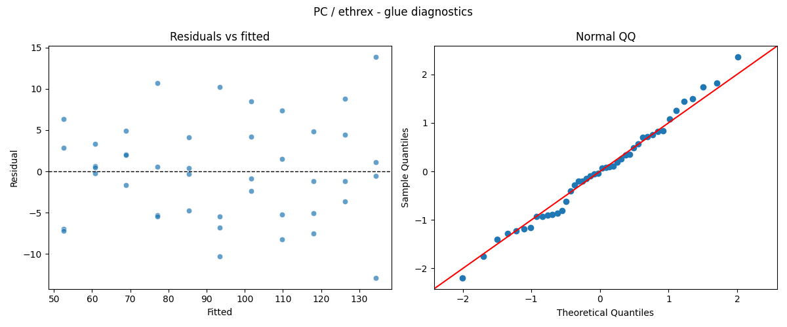

</details>

<details><summary><code>RETURNDATASIZE</code> · nobs=176 · runtime_ms=1.304e-06 · p=1.00e-03 · R²=0.9249</summary>

```
==============================================================================
                           NNLS Regression Results                            
==============================================================================
Dep. Variable:          test_runtime_ms              R-squared:          0.925
Model:                  NNLS                    Adj. R-squared:          0.924
No. Observations:       176                               RMSE:           5.87
Df Residuals:           174                                MAE:           4.87
Df Model:               1      
==============================================================================
                      coef     std err     P-value      [0.025      0.975]
------------------------------------------------------------------------------
         const      9.4928      1.3219       0.001      6.8882     11.9479
RETURNDATASIZE      0.0000      0.0000       0.001      0.0000      0.0000
==============================================================================
Notes: Non-negative least squares with bootstrap inference (1000 iterations)
==============================================================================
```

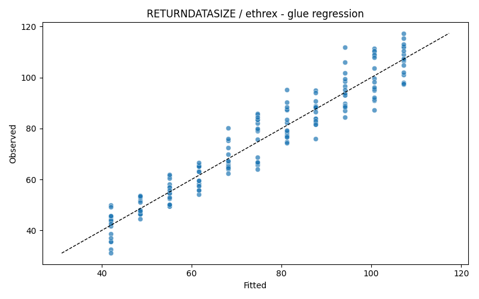

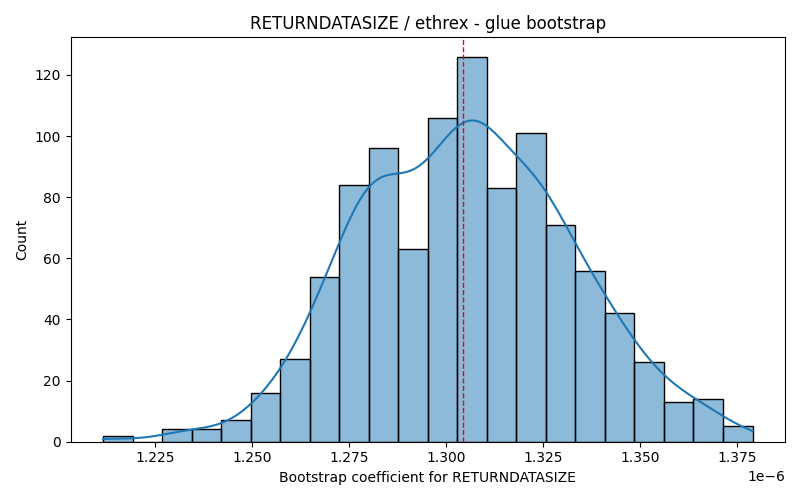

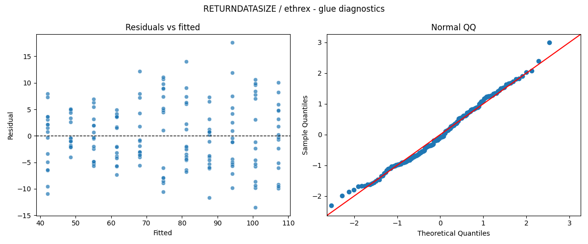

</details>

<details><summary><code>SELFBALANCE</code> · nobs=44 · runtime_ms=9.883e-06 · p=1.00e-03 · R²=0.9898</summary>

```
==============================================================================
                           NNLS Regression Results                            
==============================================================================
Dep. Variable:          test_runtime_ms              R-squared:          0.990
Model:                  NNLS                    Adj. R-squared:          0.990
No. Observations:       44                                RMSE:          12.42
Df Residuals:           42                                 MAE:           9.99
Df Model:               1      
==============================================================================
                      coef     std err     P-value      [0.025      0.975]
------------------------------------------------------------------------------
         const     39.8202      7.1780       0.001     26.5105     54.1228
   SELFBALANCE      0.0000      0.0000       0.001      0.0000      0.0000
==============================================================================
Notes: Non-negative least squares with bootstrap inference (1000 iterations)
==============================================================================
```

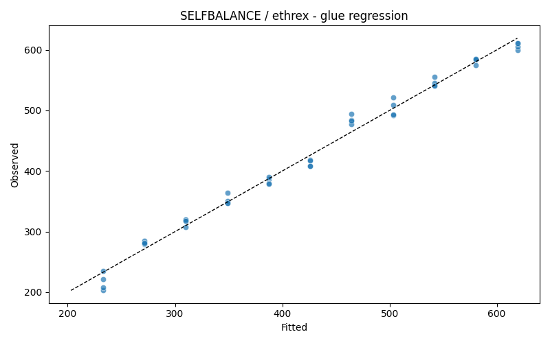

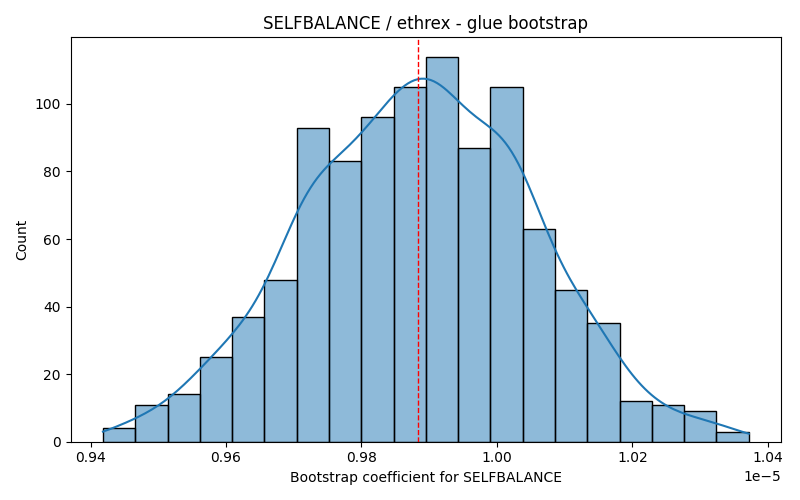

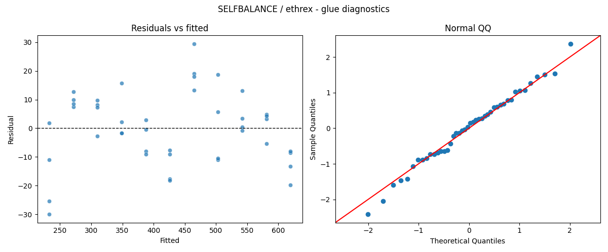

</details>

<details><summary><code>SUB</code> · nobs=44 · runtime_ms=1.628e-06 · p=1.00e-03 · R²=0.9518</summary>

```
==============================================================================
                           NNLS Regression Results                            
==============================================================================
Dep. Variable:          test_runtime_ms              R-squared:          0.952
Model:                  NNLS                    Adj. R-squared:          0.951
No. Observations:       44                                RMSE:           3.86
Df Residuals:           42                                 MAE:           2.74
Df Model:               1      
==============================================================================
                      coef     std err     P-value      [0.025      0.975]
------------------------------------------------------------------------------
         const      9.1747      2.1888       0.001      4.6464     13.3565
           SUB      0.0000      0.0000       0.001      0.0000      0.0000
==============================================================================
Notes: Non-negative least squares with bootstrap inference (1000 iterations)
==============================================================================
```

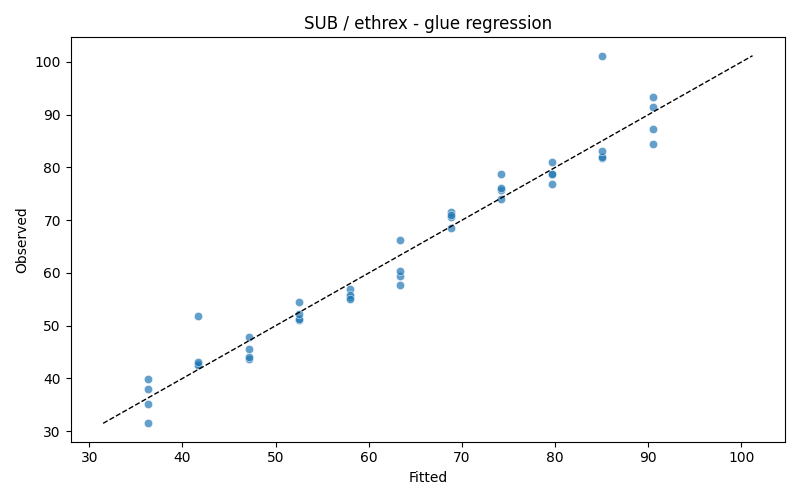

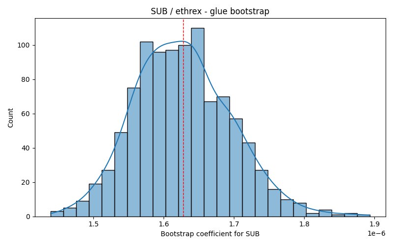

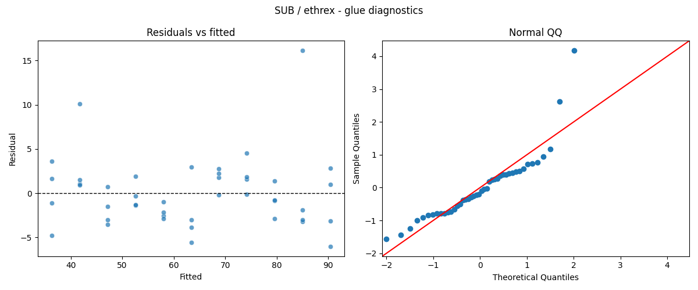

</details>

### Mixed glue (tier B) · ethrex

<details><summary><code>JUMP</code> · nobs=44 · runtime_ms=4.62e-06 · p=1.00e-03 · R²=0.9537</summary>

```
==============================================================================
                           NNLS Regression Results                            
==============================================================================
Dep. Variable:          test_runtime_ms              R-squared:          0.954
Model:                  NNLS                    Adj. R-squared:          0.953
No. Observations:       44                                RMSE:           3.78
Df Residuals:           42                                 MAE:           2.98
Df Model:               1      
==============================================================================
                      coef     std err     P-value      [0.025      0.975]
------------------------------------------------------------------------------
         const      4.3425      1.7497       0.010      0.8057      7.5999
          JUMP      0.0000      0.0000       0.001      0.0000      0.0000
==============================================================================
Notes: Non-negative least squares with bootstrap inference (1000 iterations)
==============================================================================
```

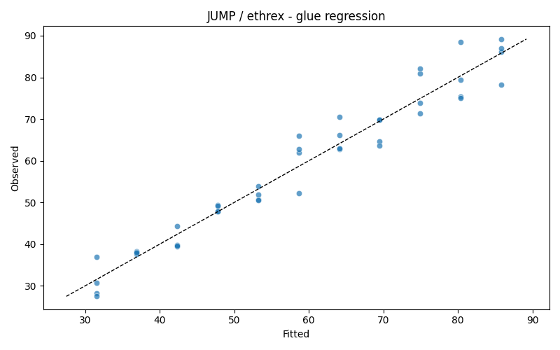

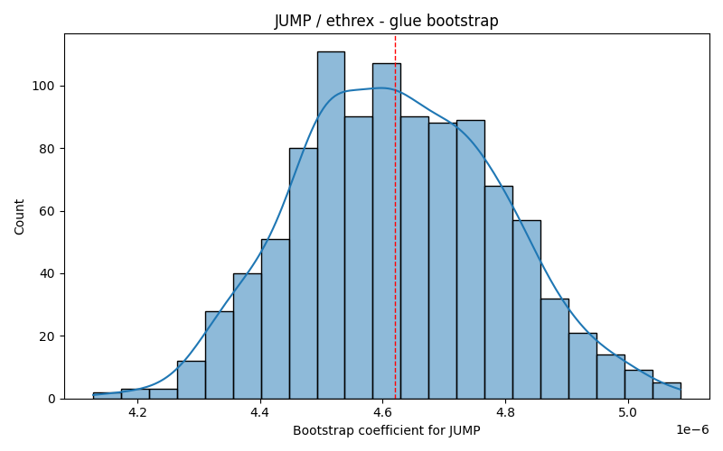

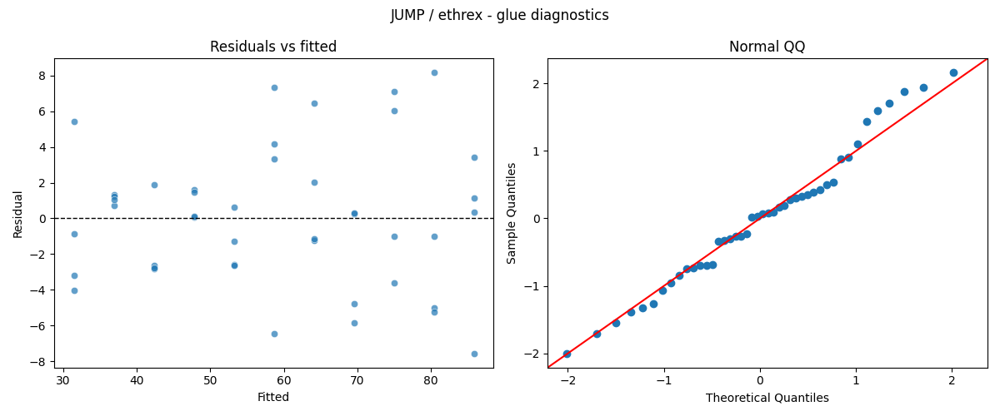

</details>

<details><summary><code>KECCAK256</code> · nobs=704 · runtime_ms=0 · p=1.00e+00 · R²=0</summary>

```
==============================================================================
                           NNLS Regression Results                            
==============================================================================
Dep. Variable:          test_runtime_ms              R-squared:          0.000
Model:                  NNLS                    Adj. R-squared:         -0.001
No. Observations:       704                               RMSE:         271.15
Df Residuals:           702                                MAE:         225.65
Df Model:               1      
==============================================================================
                      coef     std err     P-value      [0.025      0.975]
------------------------------------------------------------------------------
         const    406.4959     10.2784       0.001    386.4612    426.6352
     KECCAK256      0.0000      0.0000       1.000      0.0000      0.0000
==============================================================================
Notes: Non-negative least squares with bootstrap inference (1000 iterations)
==============================================================================
```

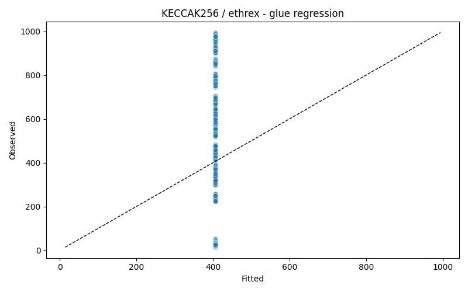


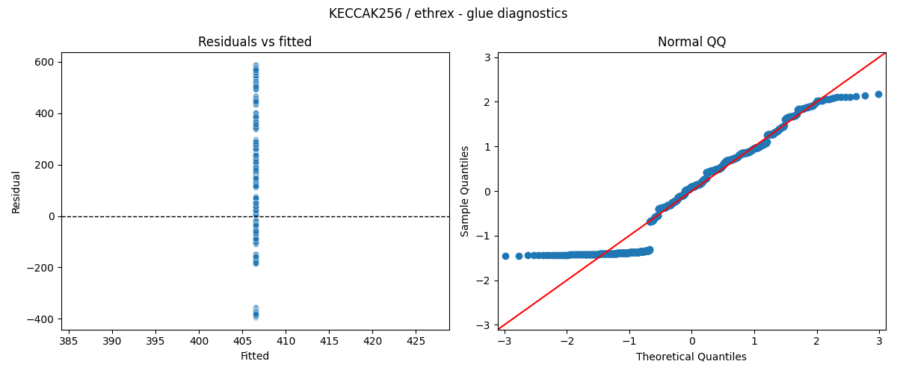

</details>

## geth

| glue_opcode | nobs | glue_runtime_ms | p_value | rsquared |
| --- | --- | --- | --- | --- |
| `ISZERO` | 220 | 1.917e-06 | 1.00e-03 | 0.9701 |
| `JUMPDEST` | 220 | 1.54e-06 | 1.00e-03 | 0.7687 |
| `SWAP` | 3520 | 2.257e-06 | 1.00e-03 | 0.9594 |
| `CALLDATASIZE` | 13024 | 1.743e-06 | 1.00e-03 | 0.9178 |
| `DUP` | 13024 | 1.989e-06 | 1.00e-03 | 0.9178 |
| `GAS` | 13024 | 1.747e-06 | 1.00e-03 | 0.9178 |
| `MLOAD` | 13024 | 5.693e-06 | 1.00e-03 | 0.9178 |
| `PUSH` | 13024 | 3.153e-06 | 1.00e-03 | 0.9178 |
| `PUSH0` | 13024 | 1.67e-06 | 1.00e-03 | 0.9178 |
| `STATICCALL` | 13024 | 0.0002434 | 1.00e-03 | 0.9178 |
| `ADD` | 220 | 5.156e-06 | 1.00e-03 | 0.8652 |
| `AND` | 220 | 5.184e-06 | 1.00e-03 | 0.8451 |
| `CALLDATACOPY` | 5280 | 1.14e-05 | 1.00e-03 | 0.9763 |
| `CALLDATALOAD` | 880 | 2.133e-05 | 1.00e-03 | 0.04979 |
| `DIV` | 220 | 1.449e-05 | 1.00e-03 | 0.9801 |
| `EXP` | 220 | 0.0007094 | 1.00e-03 | 0.9858 |
| `GT` | 220 | 3.91e-06 | 1.00e-03 | 0.8987 |
| `JUMPI` | 220 | 5.367e-06 | 1.00e-03 | 0.8377 |
| `LT` | 220 | 4.237e-06 | 1.00e-03 | 0.9573 |
| `MSTORE` | 1100 | 8.577e-06 | 1.00e-03 | 0.9489 |
| `MSTORE8` | 1100 | 7.772e-06 | 1.00e-03 | 0.9498 |
| `MUL` | 220 | 5.308e-06 | 1.00e-03 | 0.9284 |
| `PC` | 220 | 1.991e-06 | 1.00e-03 | 0.9484 |
| `RETURNDATASIZE` | 880 | 5.45e-06 | 1.00e-03 | 0.8891 |
| `SELFBALANCE` | 220 | 1.257e-05 | 1.00e-03 | 0.9722 |
| `SUB` | 220 | 5.133e-06 | 1.00e-03 | 0.8858 |
| `JUMP` | 220 | 9.845e-06 | 1.00e-03 | 0.9398 |
| `KECCAK256` | 3520 | 3.775e-05 | 1.00e-03 | 0.1145 |

### Cycle glue — joint fit · geth

<details><summary>Joint NNLS regression summary</summary>

```
==============================================================================
                           NNLS Regression Results                            
==============================================================================
Dep. Variable:          test_runtime_ms              R-squared:          0.918
Model:                  NNLS                    Adj. R-squared:          0.918
No. Observations:       13024                             RMSE:          21.31
Df Residuals:           13016                              MAE:          13.03
Df Model:               7      
==============================================================================
                      coef     std err     P-value      [0.025      0.975]
------------------------------------------------------------------------------
         const     16.4868      0.5758       0.001     15.4239     17.6403
  CALLDATASIZE      0.0000      0.0000       0.001      0.0000      0.0000
           DUP      0.0000      0.0000       0.001      0.0000      0.0000
           GAS      0.0000      0.0000       0.001      0.0000      0.0000
         MLOAD      0.0000      0.0000       0.001      0.0000      0.0000
          PUSH      0.0000      0.0000       0.001      0.0000      0.0000
         PUSH0      0.0000      0.0000       0.001      0.0000      0.0000
    STATICCALL      0.0002      0.0000       0.001      0.0002      0.0002
==============================================================================
Notes: Non-negative least squares with bootstrap inference (1000 iterations)
==============================================================================
```

</details>

<details><summary><code>CALLDATASIZE</code> · nobs=13024 · runtime_ms=1.743e-06 · p=1.00e-03 · R²=0.9178</summary>

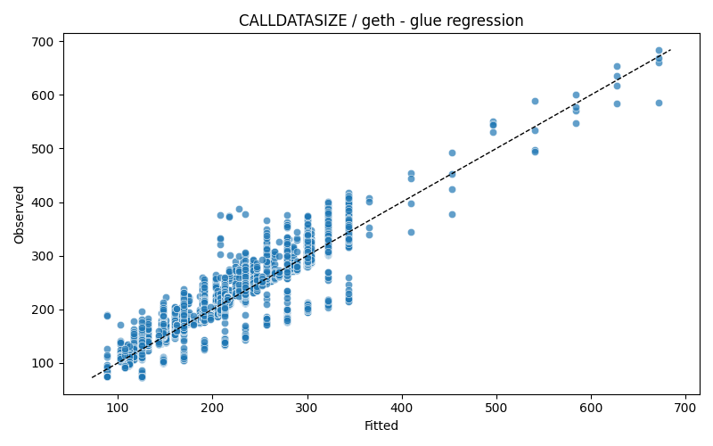

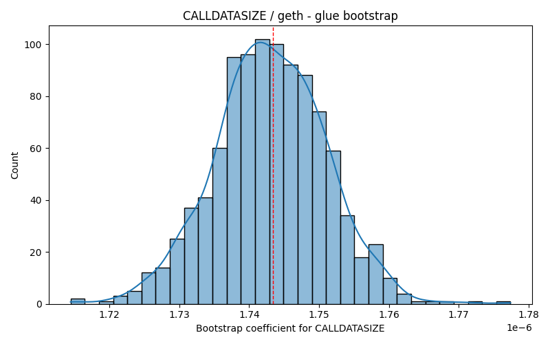


</details>

<details><summary><code>DUP</code> · nobs=13024 · runtime_ms=1.989e-06 · p=1.00e-03 · R²=0.9178</summary>

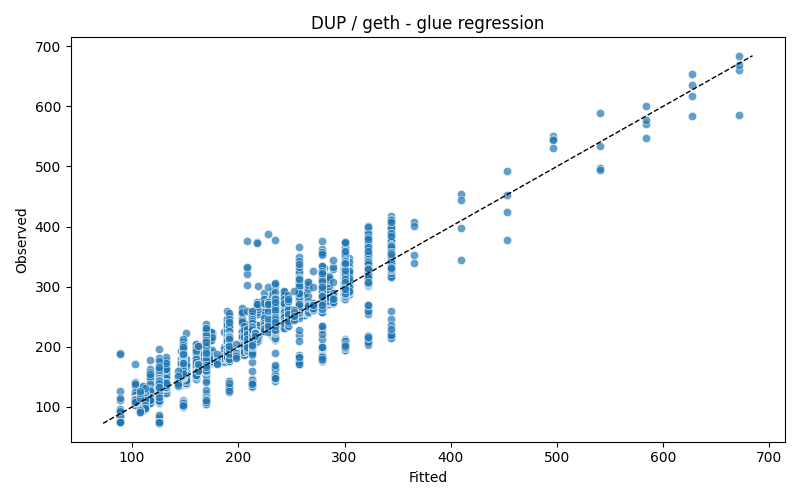

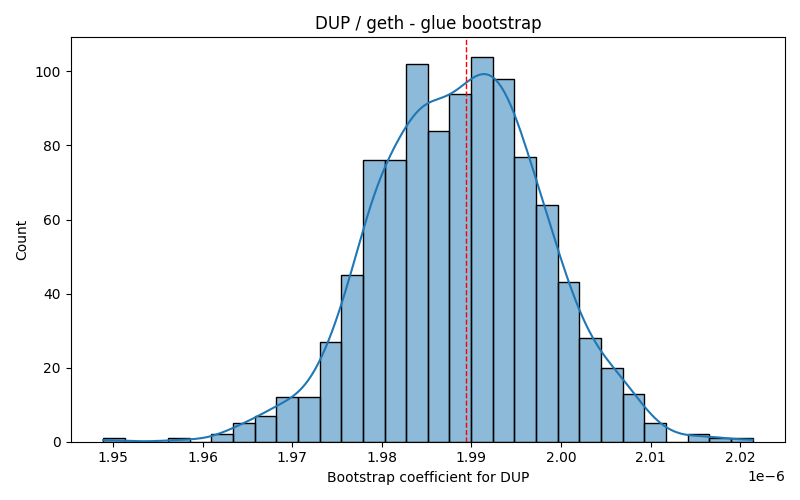


</details>

<details><summary><code>GAS</code> · nobs=13024 · runtime_ms=1.747e-06 · p=1.00e-03 · R²=0.9178</summary>


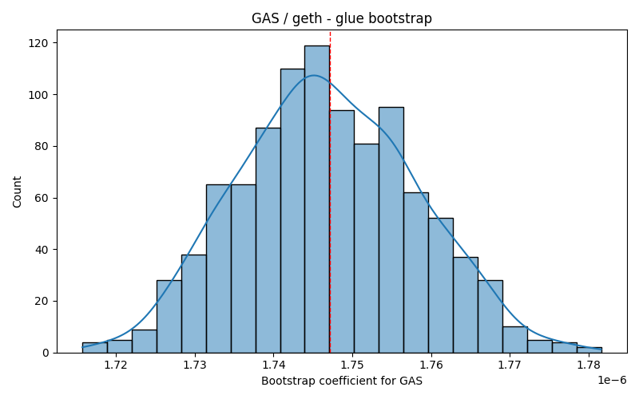


</details>

<details><summary><code>MLOAD</code> · nobs=13024 · runtime_ms=5.693e-06 · p=1.00e-03 · R²=0.9178</summary>

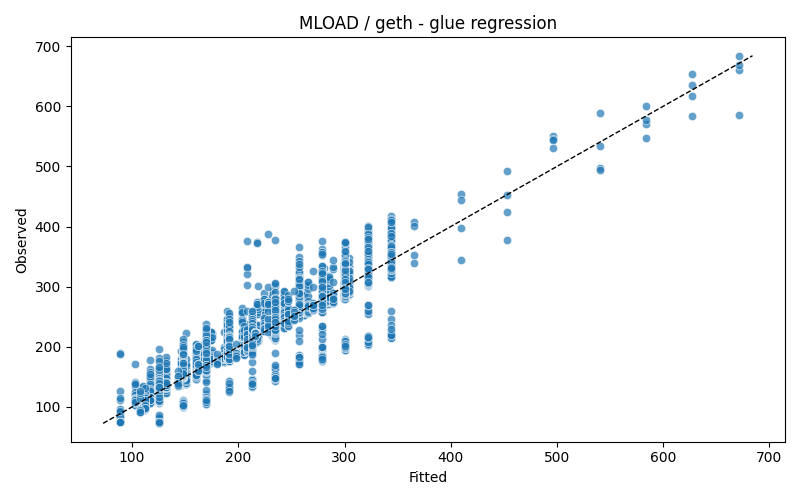

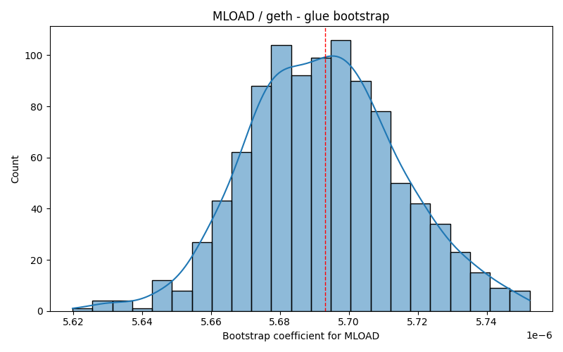

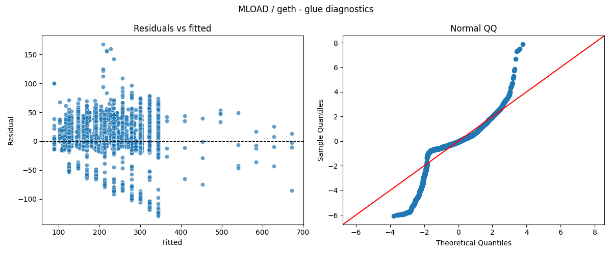

</details>

<details><summary><code>PUSH</code> · nobs=13024 · runtime_ms=3.153e-06 · p=1.00e-03 · R²=0.9178</summary>


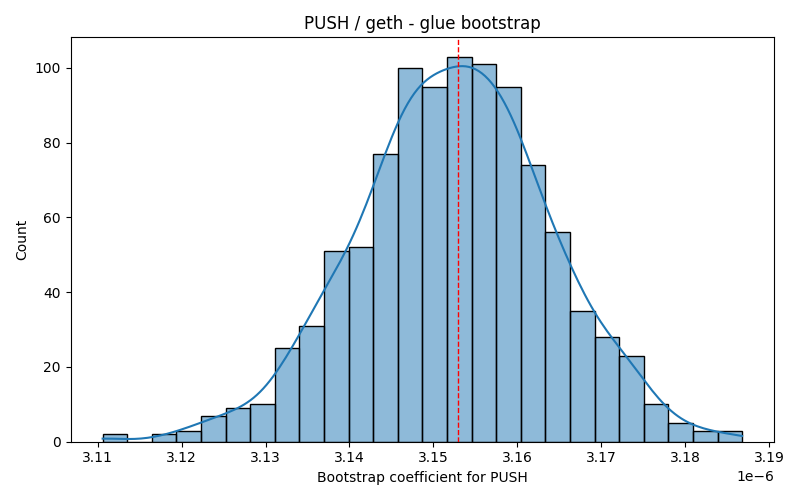

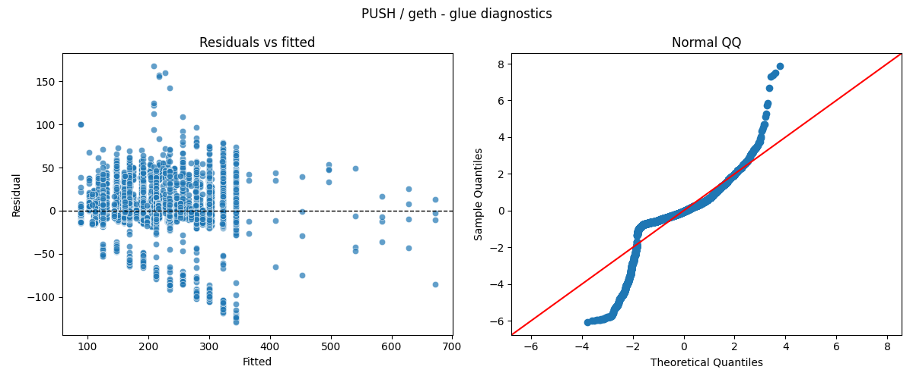

</details>

<details><summary><code>PUSH0</code> · nobs=13024 · runtime_ms=1.67e-06 · p=1.00e-03 · R²=0.9178</summary>

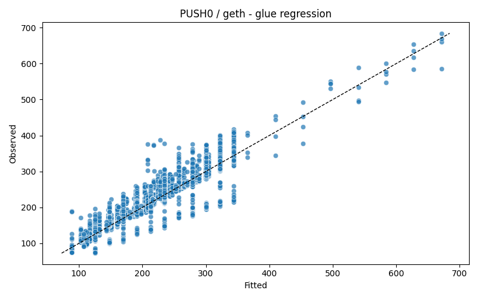

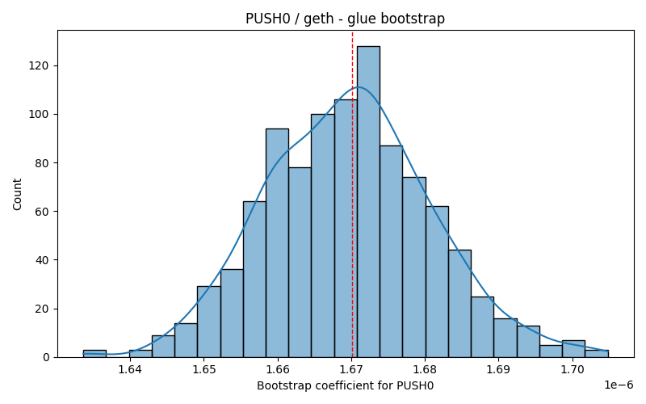


</details>

<details><summary><code>STATICCALL</code> · nobs=13024 · runtime_ms=0.0002434 · p=1.00e-03 · R²=0.9178</summary>

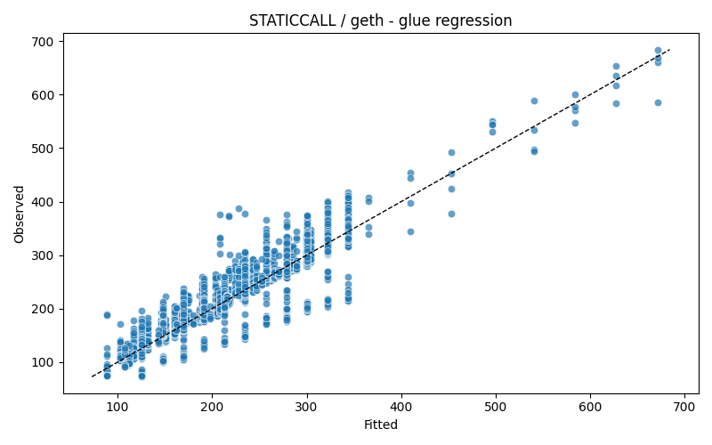

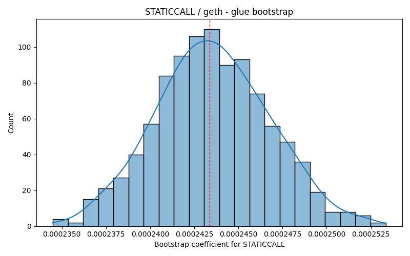


</details>

### Pure glue · geth

<details><summary><code>ISZERO</code> · nobs=220 · runtime_ms=1.917e-06 · p=1.00e-03 · R²=0.9701</summary>

```
==============================================================================
                           NNLS Regression Results                            
==============================================================================
Dep. Variable:          test_runtime_ms              R-squared:          0.970
Model:                  NNLS                    Adj. R-squared:          0.970
No. Observations:       220                               RMSE:           7.09
Df Residuals:           218                                MAE:           5.66
Df Model:               1      
==============================================================================
                      coef     std err     P-value      [0.025      0.975]
------------------------------------------------------------------------------
         const      7.0603      1.4943       0.001      4.2880     10.0518
        ISZERO      0.0000      0.0000       0.001      0.0000      0.0000
==============================================================================
Notes: Non-negative least squares with bootstrap inference (1000 iterations)
==============================================================================
```

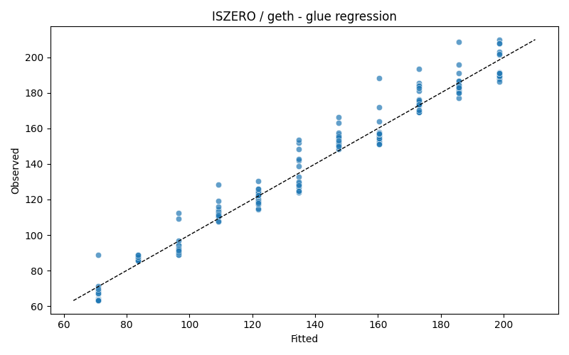

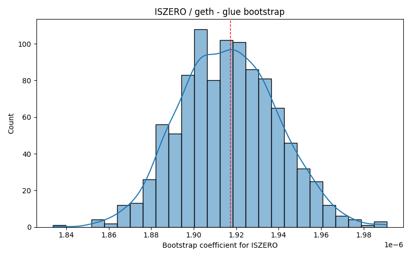

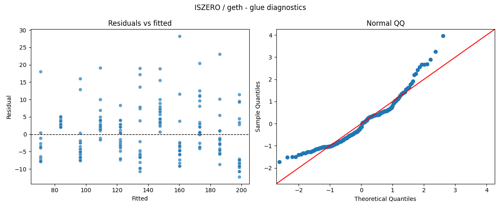

</details>

<details><summary><code>JUMPDEST</code> · nobs=220 · runtime_ms=1.54e-06 · p=1.00e-03 · R²=0.7687</summary>

```
==============================================================================
                           NNLS Regression Results                            
==============================================================================
Dep. Variable:          test_runtime_ms              R-squared:          0.769
Model:                  NNLS                    Adj. R-squared:          0.768
No. Observations:       220                               RMSE:          53.38
Df Residuals:           218                                MAE:          19.50
Df Model:               1      
==============================================================================
                      coef     std err     P-value      [0.025      0.975]
------------------------------------------------------------------------------
         const      3.3429      7.6554       0.361      0.0000     24.7932
      JUMPDEST      0.0000      0.0000       0.001      0.0000      0.0000
==============================================================================
Notes: Non-negative least squares with bootstrap inference (1000 iterations)
==============================================================================
```

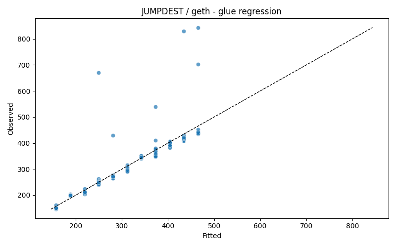

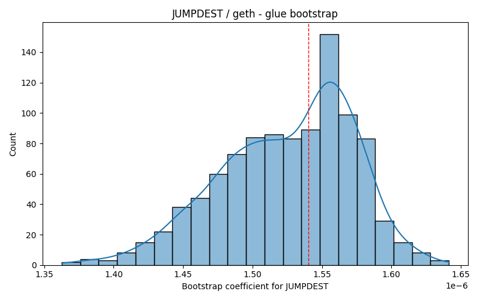

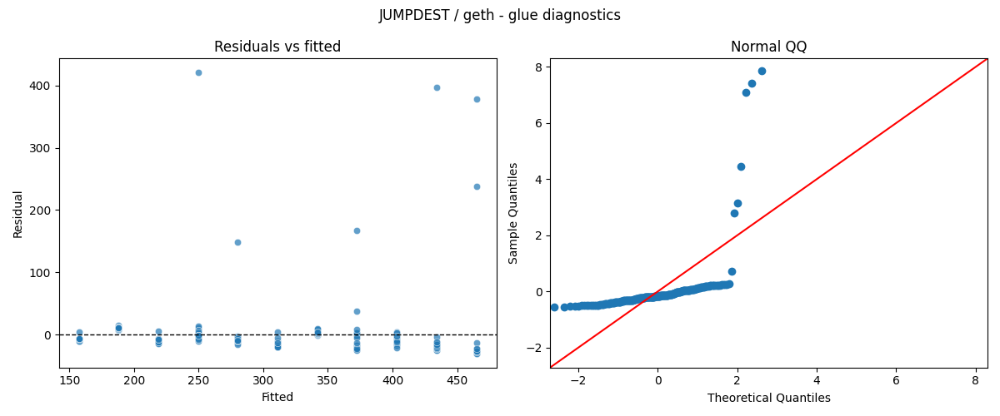

</details>

<details><summary><code>SWAP</code> · nobs=3520 · runtime_ms=2.257e-06 · p=1.00e-03 · R²=0.9594</summary>

```
==============================================================================
                           NNLS Regression Results                            
==============================================================================
Dep. Variable:          test_runtime_ms              R-squared:          0.959
Model:                  NNLS                    Adj. R-squared:          0.959
No. Observations:       3520                              RMSE:           9.77
Df Residuals:           3518                               MAE:           6.39
Df Model:               1      
==============================================================================
                      coef     std err     P-value      [0.025      0.975]
------------------------------------------------------------------------------
         const     12.8162      0.5293       0.001     11.7478     13.9203
          SWAP      0.0000      0.0000       0.001      0.0000      0.0000
==============================================================================
Notes: Non-negative least squares with bootstrap inference (1000 iterations)
==============================================================================
```

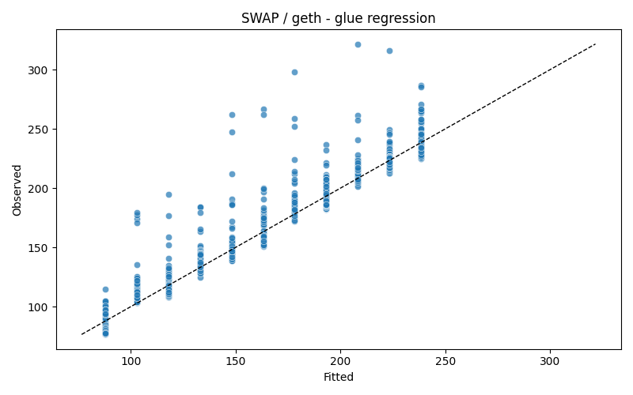

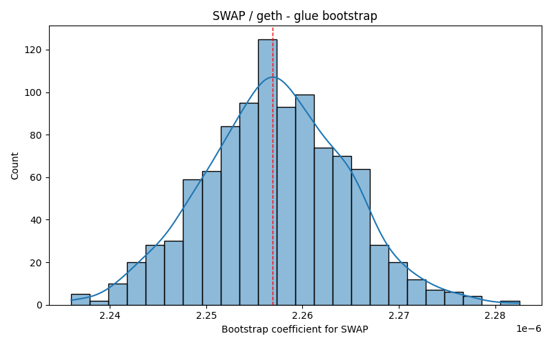

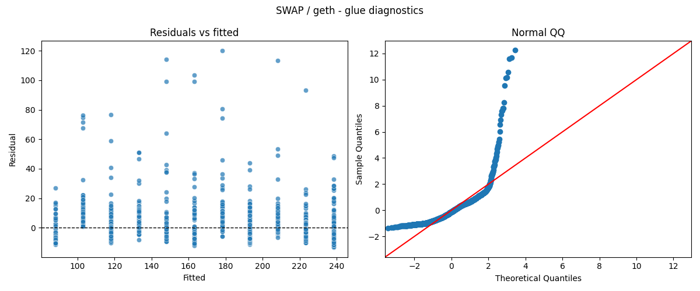

</details>

### Mixed glue (tier A) · geth

<details><summary><code>ADD</code> · nobs=220 · runtime_ms=5.156e-06 · p=1.00e-03 · R²=0.8652</summary>

```
==============================================================================
                           NNLS Regression Results                            
==============================================================================
Dep. Variable:          test_runtime_ms              R-squared:          0.865
Model:                  NNLS                    Adj. R-squared:          0.865
No. Observations:       220                               RMSE:          22.06
Df Residuals:           218                                MAE:          17.48
Df Model:               1      
==============================================================================
                      coef     std err     P-value      [0.025      0.975]
------------------------------------------------------------------------------
         const      0.0000      0.9125       1.000      0.0000      3.1453
           ADD      0.0000      0.0000       0.001      0.0000      0.0000
==============================================================================
Notes: Non-negative least squares with bootstrap inference (1000 iterations)
==============================================================================
```

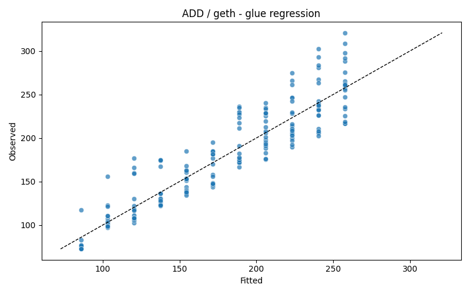

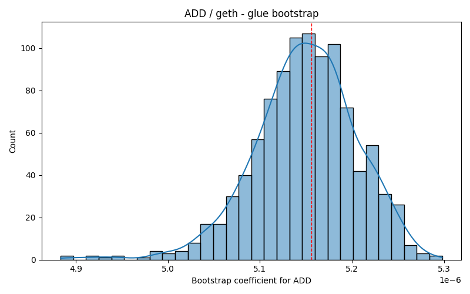

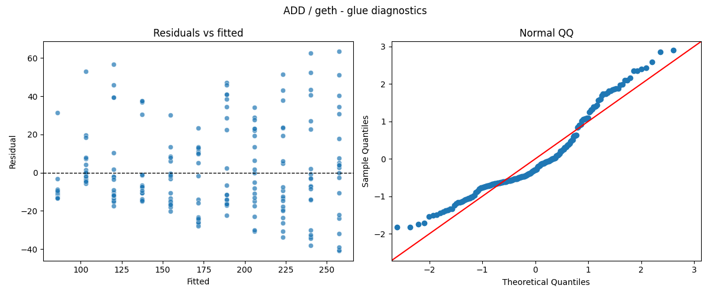

</details>

<details><summary><code>AND</code> · nobs=220 · runtime_ms=5.184e-06 · p=1.00e-03 · R²=0.8451</summary>

```
==============================================================================
                           NNLS Regression Results                            
==============================================================================
Dep. Variable:          test_runtime_ms              R-squared:          0.845
Model:                  NNLS                    Adj. R-squared:          0.844
No. Observations:       220                               RMSE:          24.66
Df Residuals:           218                                MAE:          16.79
Df Model:               1      
==============================================================================
                      coef     std err     P-value      [0.025      0.975]
------------------------------------------------------------------------------
         const      0.0000      0.2115       1.000      0.0000      0.0000
           AND      0.0000      0.0000       0.001      0.0000      0.0000
==============================================================================
Notes: Non-negative least squares with bootstrap inference (1000 iterations)
==============================================================================
```

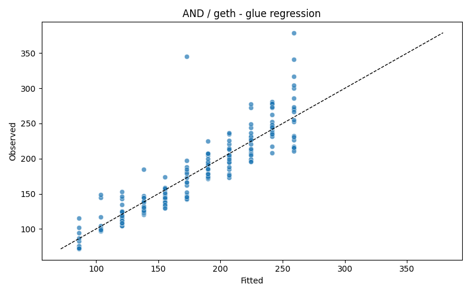

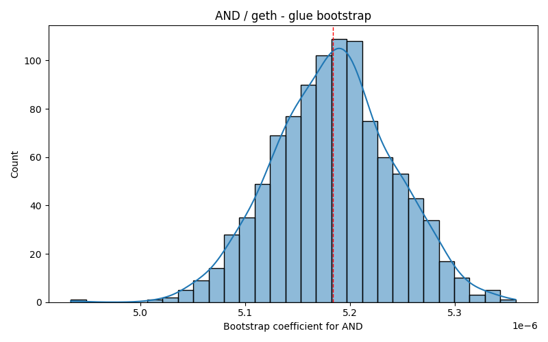

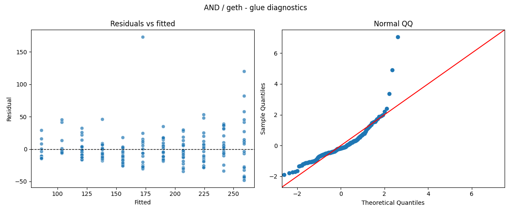

</details>

<details><summary><code>CALLDATACOPY</code> · nobs=5280 · runtime_ms=1.14e-05 · p=1.00e-03 · R²=0.9763</summary>

```
==============================================================================
                           NNLS Regression Results                            
==============================================================================
Dep. Variable:          test_runtime_ms              R-squared:          0.976
Model:                  NNLS                    Adj. R-squared:          0.976
No. Observations:       5280                              RMSE:          13.36
Df Residuals:           5278                               MAE:           8.57
Df Model:               1      
==============================================================================
                      coef     std err     P-value      [0.025      0.975]
------------------------------------------------------------------------------
         const     14.6380      0.2335       0.001     14.1748     15.1012
  CALLDATACOPY      0.0000      0.0000       0.001      0.0000      0.0000
==============================================================================
Notes: Non-negative least squares with bootstrap inference (1000 iterations)
==============================================================================
```

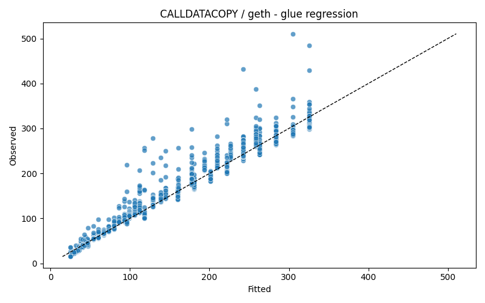

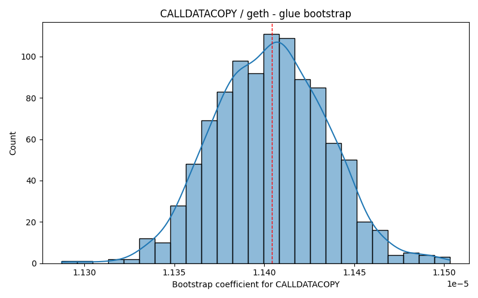

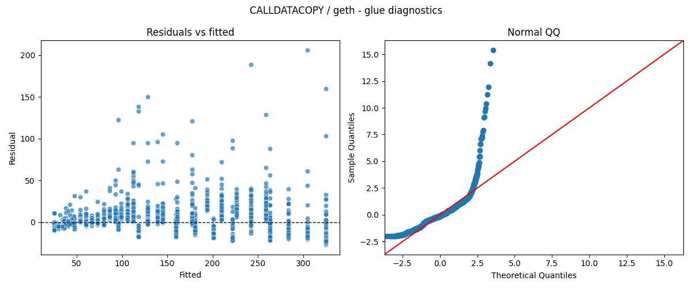

</details>

<details><summary><code>CALLDATALOAD</code> · nobs=880 · runtime_ms=2.133e-05 · p=1.00e-03 · R²=0.04979</summary>

```
==============================================================================
                           NNLS Regression Results                            
==============================================================================
Dep. Variable:          test_runtime_ms              R-squared:          0.050
Model:                  NNLS                    Adj. R-squared:          0.049
No. Observations:       880                               RMSE:           0.36
Df Residuals:           878                                MAE:           0.14
Df Model:               1      
==============================================================================
                      coef     std err     P-value      [0.025      0.975]
------------------------------------------------------------------------------
         const      1.8403      0.0433       0.001      1.7613      1.9337
  CALLDATALOAD      0.0000      0.0000       0.001      0.0000      0.0000
==============================================================================
Notes: Non-negative least squares with bootstrap inference (1000 iterations)
==============================================================================
```

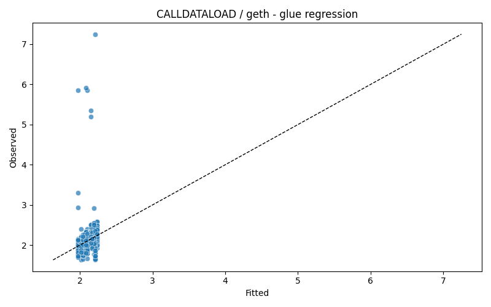

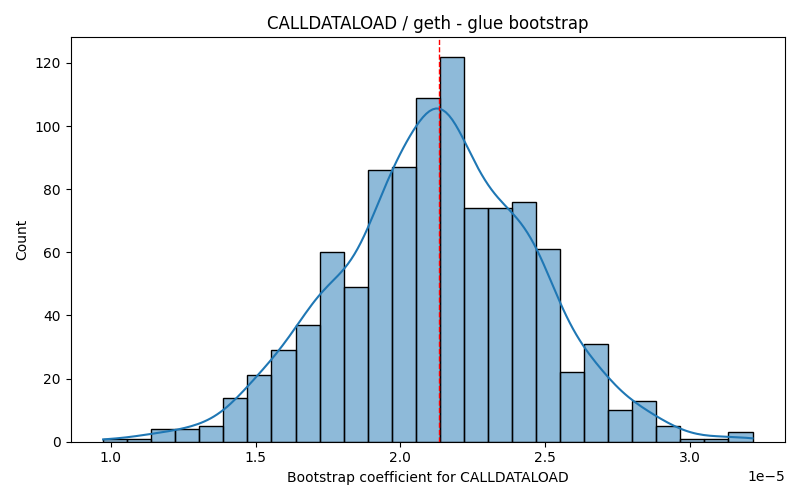

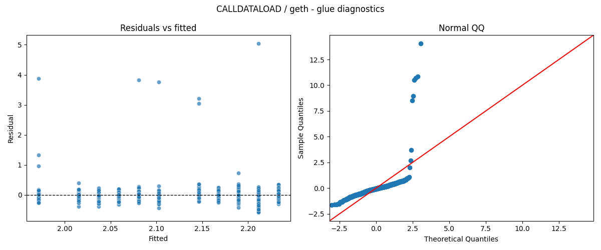

</details>

<details><summary><code>DIV</code> · nobs=220 · runtime_ms=1.449e-05 · p=1.00e-03 · R²=0.9801</summary>

```
==============================================================================
                           NNLS Regression Results                            
==============================================================================
Dep. Variable:          test_runtime_ms              R-squared:          0.980
Model:                  NNLS                    Adj. R-squared:          0.980
No. Observations:       220                               RMSE:          16.31
Df Residuals:           218                                MAE:          13.61
Df Model:               1      
==============================================================================
                      coef     std err     P-value      [0.025      0.975]
------------------------------------------------------------------------------
         const     25.0259      4.0849       0.001     16.9437     32.8260
           DIV      0.0000      0.0000       0.001      0.0000      0.0000
==============================================================================
Notes: Non-negative least squares with bootstrap inference (1000 iterations)
==============================================================================
```

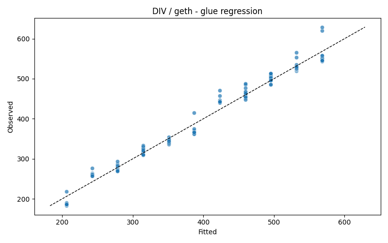

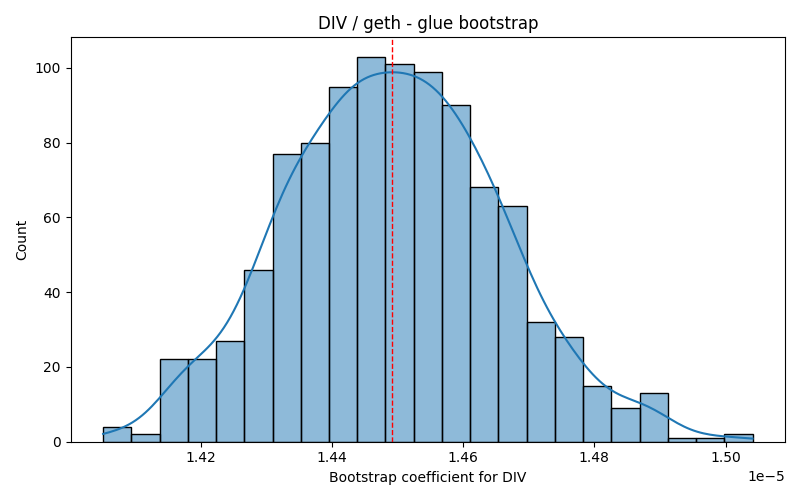

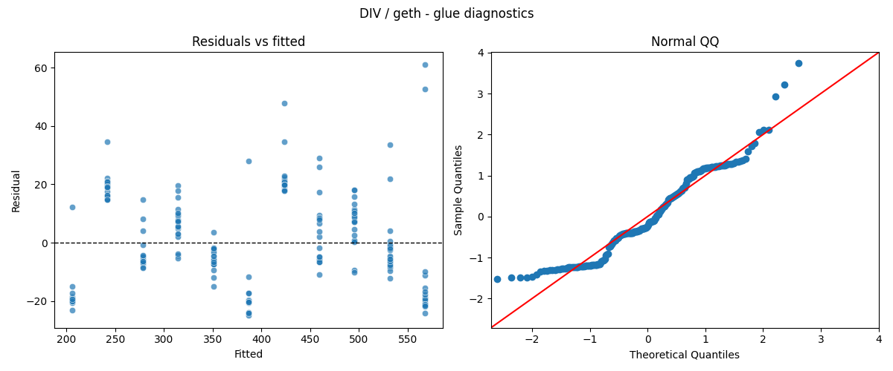

</details>

<details><summary><code>EXP</code> · nobs=220 · runtime_ms=0.0007094 · p=1.00e-03 · R²=0.9858</summary>

```
==============================================================================
                           NNLS Regression Results                            
==============================================================================
Dep. Variable:          test_runtime_ms              R-squared:          0.986
Model:                  NNLS                    Adj. R-squared:          0.986
No. Observations:       220                               RMSE:           3.34
Df Residuals:           218                                MAE:           2.84
Df Model:               1      
==============================================================================
                      coef     std err     P-value      [0.025      0.975]
------------------------------------------------------------------------------
         const      3.5425      0.7094       0.001      2.1180      4.8851
           EXP      0.0007      0.0000       0.001      0.0007      0.0007
==============================================================================
Notes: Non-negative least squares with bootstrap inference (1000 iterations)
==============================================================================
```

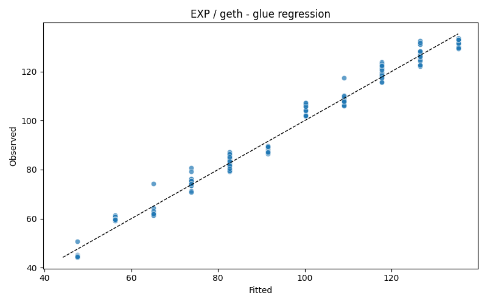

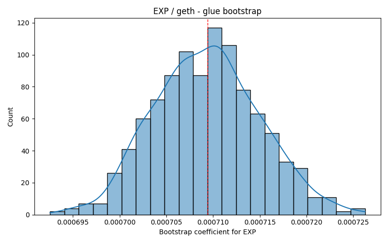

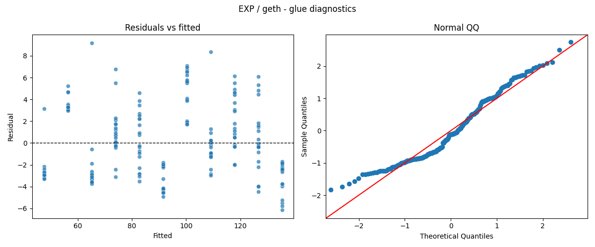

</details>

<details><summary><code>GT</code> · nobs=220 · runtime_ms=3.91e-06 · p=1.00e-03 · R²=0.8987</summary>

```
==============================================================================
                           NNLS Regression Results                            
==============================================================================
Dep. Variable:          test_runtime_ms              R-squared:          0.899
Model:                  NNLS                    Adj. R-squared:          0.898
No. Observations:       220                               RMSE:          13.82
Df Residuals:           218                                MAE:           9.09
Df Model:               1      
==============================================================================
                      coef     std err     P-value      [0.025      0.975]
------------------------------------------------------------------------------
         const     22.6698      4.3087       0.001     14.7565     31.4165
            GT      0.0000      0.0000       0.001      0.0000      0.0000
==============================================================================
Notes: Non-negative least squares with bootstrap inference (1000 iterations)
==============================================================================
```

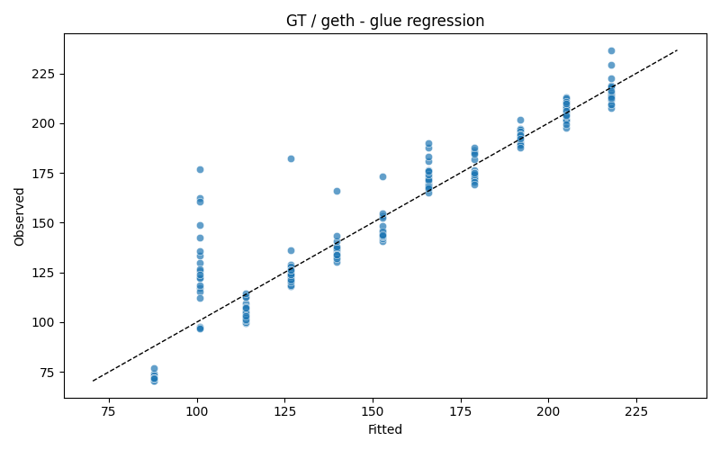

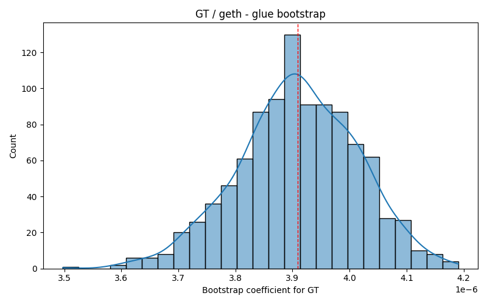

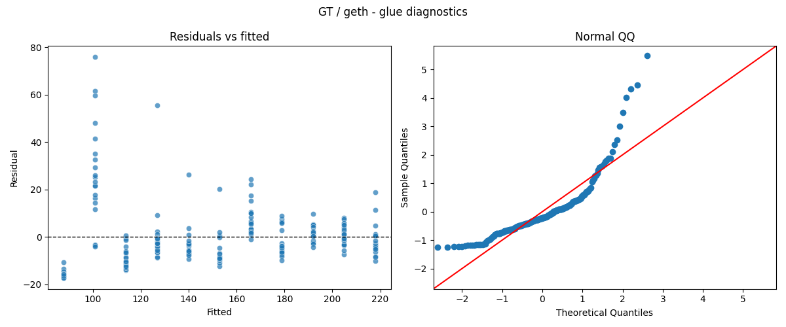

</details>

<details><summary><code>JUMPI</code> · nobs=220 · runtime_ms=5.367e-06 · p=1.00e-03 · R²=0.8377</summary>

```
==============================================================================
                           NNLS Regression Results                            
==============================================================================
Dep. Variable:          test_runtime_ms              R-squared:          0.838
Model:                  NNLS                    Adj. R-squared:          0.837
No. Observations:       220                               RMSE:          10.66
Df Residuals:           218                                MAE:           4.76
Df Model:               1      
==============================================================================
                      coef     std err     P-value      [0.025      0.975]
------------------------------------------------------------------------------
         const      7.5255      2.7527       0.001      2.6286     13.7485
         JUMPI      0.0000      0.0000       0.001      0.0000      0.0000
==============================================================================
Notes: Non-negative least squares with bootstrap inference (1000 iterations)
==============================================================================
```

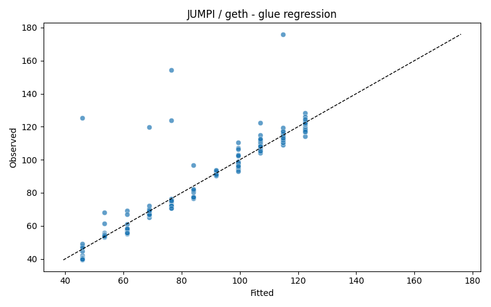

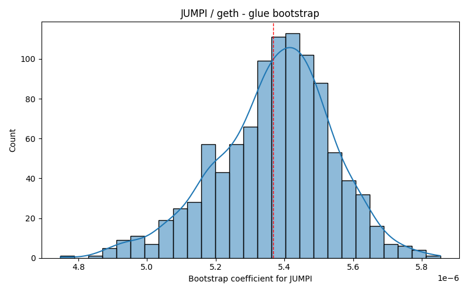

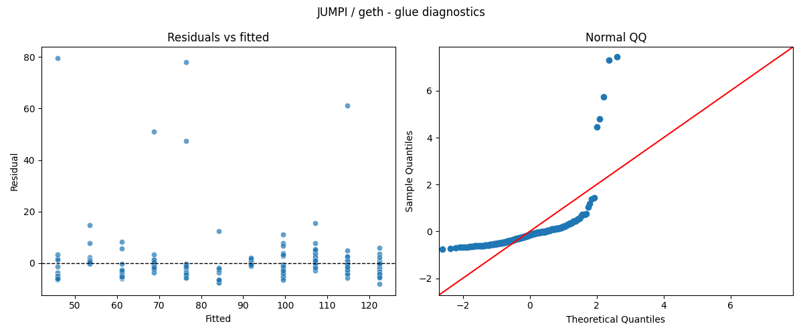

</details>

<details><summary><code>LT</code> · nobs=220 · runtime_ms=4.237e-06 · p=1.00e-03 · R²=0.9573</summary>

```
==============================================================================
                           NNLS Regression Results                            
==============================================================================
Dep. Variable:          test_runtime_ms              R-squared:          0.957
Model:                  NNLS                    Adj. R-squared:          0.957
No. Observations:       220                               RMSE:           9.42
Df Residuals:           218                                MAE:           5.91
Df Model:               1      
==============================================================================
                      coef     std err     P-value      [0.025      0.975]
------------------------------------------------------------------------------
         const     11.7581      2.4193       0.001      7.4318     16.9617
            LT      0.0000      0.0000       0.001      0.0000      0.0000
==============================================================================
Notes: Non-negative least squares with bootstrap inference (1000 iterations)
==============================================================================
```

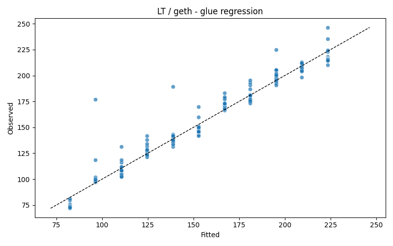

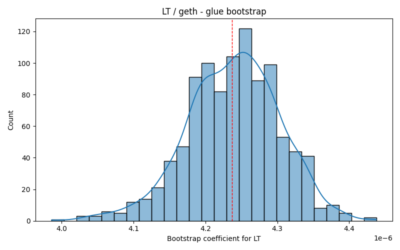

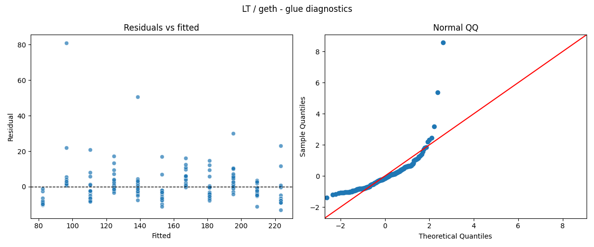

</details>

<details><summary><code>MSTORE</code> · nobs=1100 · runtime_ms=8.577e-06 · p=1.00e-03 · R²=0.9489</summary>

```
==============================================================================
                           NNLS Regression Results                            
==============================================================================
Dep. Variable:          test_runtime_ms              R-squared:          0.949
Model:                  NNLS                    Adj. R-squared:          0.949
No. Observations:       1100                              RMSE:          13.97
Df Residuals:           1098                               MAE:           8.73
Df Model:               1      
==============================================================================
                      coef     std err     P-value      [0.025      0.975]
------------------------------------------------------------------------------
         const     11.5034      1.4541       0.001      8.6387     14.3925
        MSTORE      0.0000      0.0000       0.001      0.0000      0.0000
==============================================================================
Notes: Non-negative least squares with bootstrap inference (1000 iterations)
==============================================================================
```

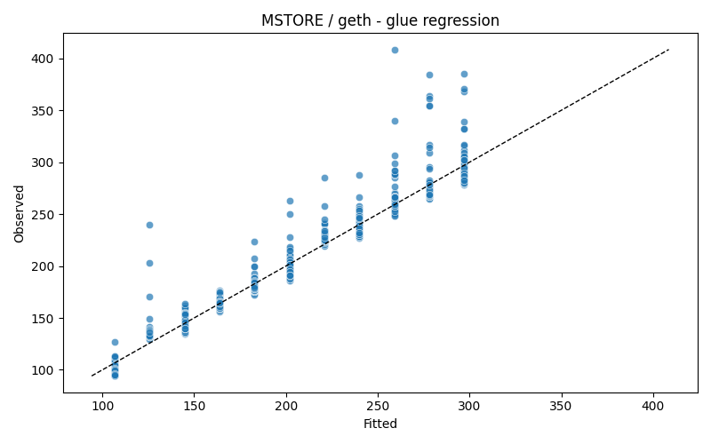

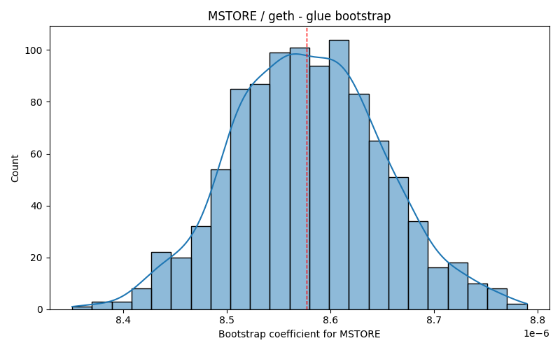

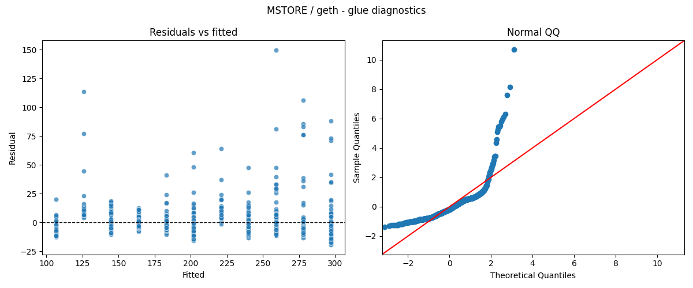

</details>

<details><summary><code>MSTORE8</code> · nobs=1100 · runtime_ms=7.772e-06 · p=1.00e-03 · R²=0.9498</summary>

```
==============================================================================
                           NNLS Regression Results                            
==============================================================================
Dep. Variable:          test_runtime_ms              R-squared:          0.950
Model:                  NNLS                    Adj. R-squared:          0.950
No. Observations:       1100                              RMSE:          12.54
Df Residuals:           1098                               MAE:           8.17
Df Model:               1      
==============================================================================
                      coef     std err     P-value      [0.025      0.975]
------------------------------------------------------------------------------
         const     15.5834      1.2201       0.001     13.3154     18.0440
       MSTORE8      0.0000      0.0000       0.001      0.0000      0.0000
==============================================================================
Notes: Non-negative least squares with bootstrap inference (1000 iterations)
==============================================================================
```

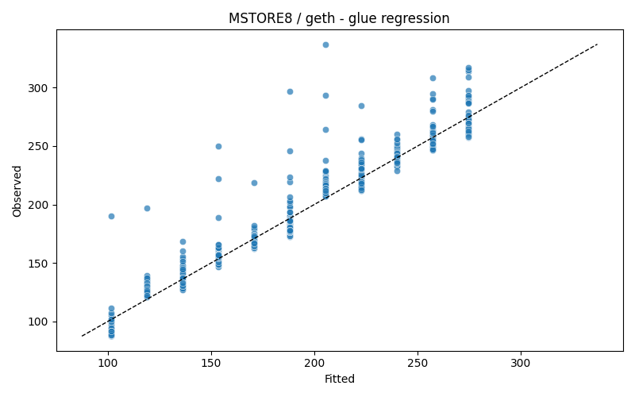

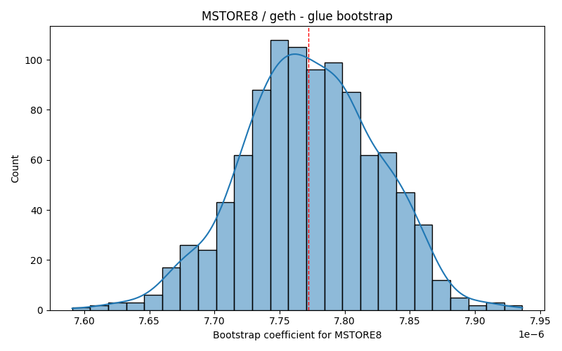

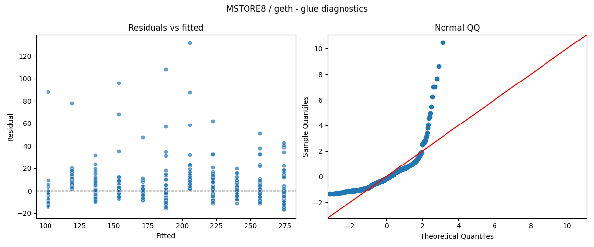

</details>

<details><summary><code>MUL</code> · nobs=220 · runtime_ms=5.308e-06 · p=1.00e-03 · R²=0.9284</summary>

```
==============================================================================
                           NNLS Regression Results                            
==============================================================================
Dep. Variable:          test_runtime_ms              R-squared:          0.928
Model:                  NNLS                    Adj. R-squared:          0.928
No. Observations:       220                               RMSE:          11.64
Df Residuals:           218                                MAE:           6.89
Df Model:               1      
==============================================================================
                      coef     std err     P-value      [0.025      0.975]
------------------------------------------------------------------------------
         const     11.9470      2.2046       0.001      7.9417     16.4797
           MUL      0.0000      0.0000       0.001      0.0000      0.0000
==============================================================================
Notes: Non-negative least squares with bootstrap inference (1000 iterations)
==============================================================================
```

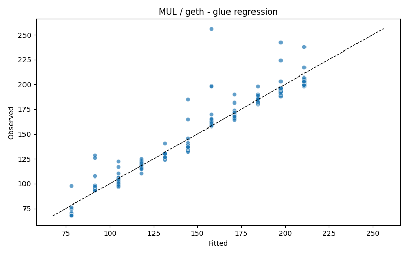

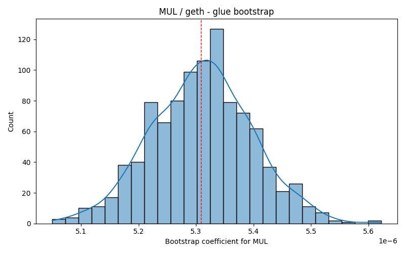

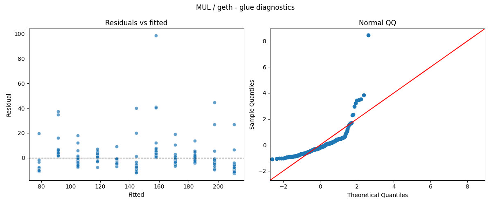

</details>

<details><summary><code>PC</code> · nobs=220 · runtime_ms=1.991e-06 · p=1.00e-03 · R²=0.9484</summary>

```
==============================================================================
                           NNLS Regression Results                            
==============================================================================
Dep. Variable:          test_runtime_ms              R-squared:          0.948
Model:                  NNLS                    Adj. R-squared:          0.948
No. Observations:       220                               RMSE:          13.88
Df Residuals:           218                                MAE:          10.42
Df Model:               1      
==============================================================================
                      coef     std err     P-value      [0.025      0.975]
------------------------------------------------------------------------------
         const     15.0121      3.0011       0.001      8.7796     20.5262
            PC      0.0000      0.0000       0.001      0.0000      0.0000
==============================================================================
Notes: Non-negative least squares with bootstrap inference (1000 iterations)
==============================================================================
```

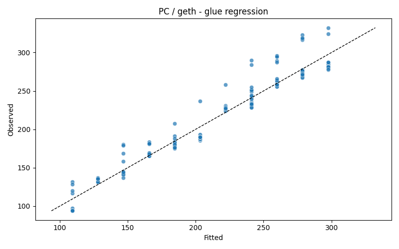

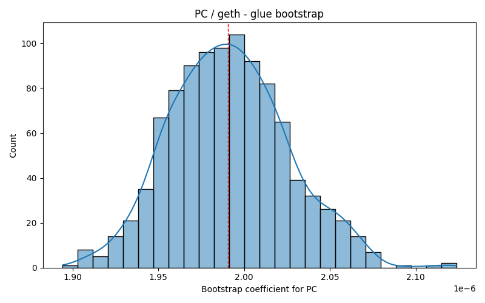

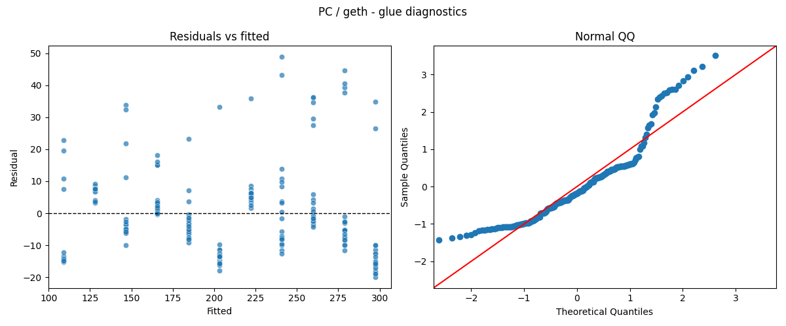

</details>

<details><summary><code>RETURNDATASIZE</code> · nobs=880 · runtime_ms=5.45e-06 · p=1.00e-03 · R²=0.8891</summary>

```
==============================================================================
                           NNLS Regression Results                            
==============================================================================
Dep. Variable:          test_runtime_ms              R-squared:          0.889
Model:                  NNLS                    Adj. R-squared:          0.889
No. Observations:       880                               RMSE:          30.40
Df Residuals:           878                                MAE:          24.50
Df Model:               1      
==============================================================================
                      coef     std err     P-value      [0.025      0.975]
------------------------------------------------------------------------------
         const     60.4726      3.8247       0.001     53.6026     68.4062
RETURNDATASIZE      0.0000      0.0000       0.001      0.0000      0.0000
==============================================================================
Notes: Non-negative least squares with bootstrap inference (1000 iterations)
==============================================================================
```

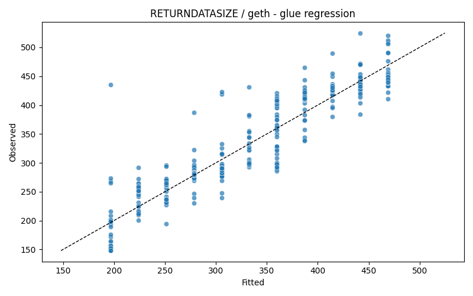

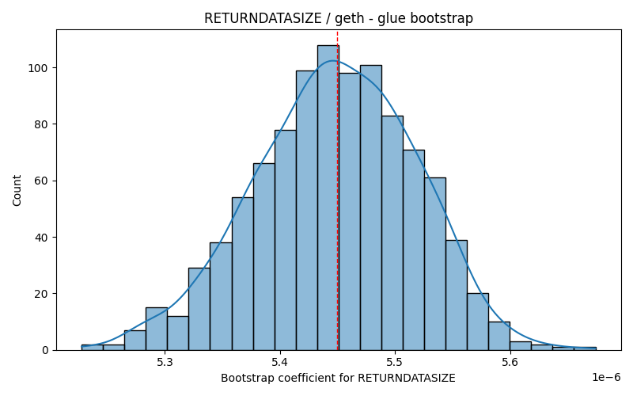

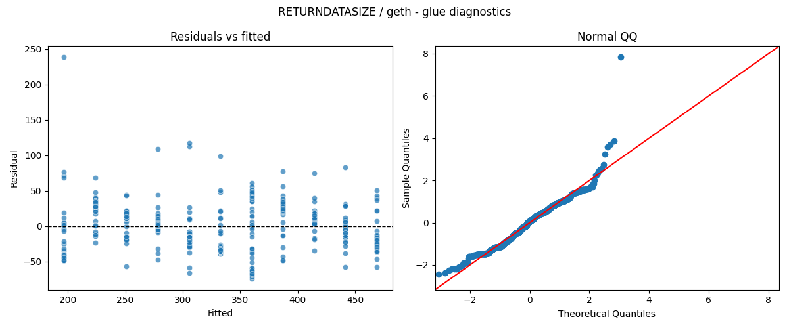

</details>

<details><summary><code>SELFBALANCE</code> · nobs=220 · runtime_ms=1.257e-05 · p=1.00e-03 · R²=0.9722</summary>

```
==============================================================================
                           NNLS Regression Results                            
==============================================================================
Dep. Variable:          test_runtime_ms              R-squared:          0.972
Model:                  NNLS                    Adj. R-squared:          0.972
No. Observations:       220                               RMSE:          26.27
Df Residuals:           218                                MAE:          21.16
Df Model:               1      
==============================================================================
                      coef     std err     P-value      [0.025      0.975]
------------------------------------------------------------------------------
         const     43.6188      6.3447       0.001     31.2345     56.4426
   SELFBALANCE      0.0000      0.0000       0.001      0.0000      0.0000
==============================================================================
Notes: Non-negative least squares with bootstrap inference (1000 iterations)
==============================================================================
```

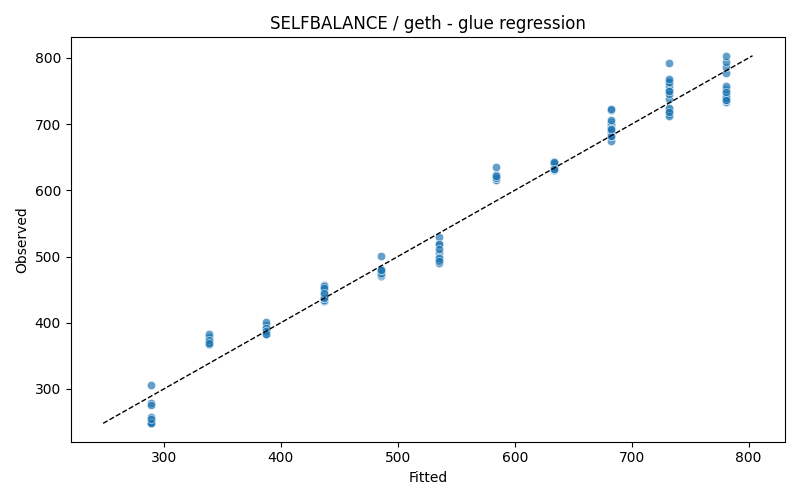

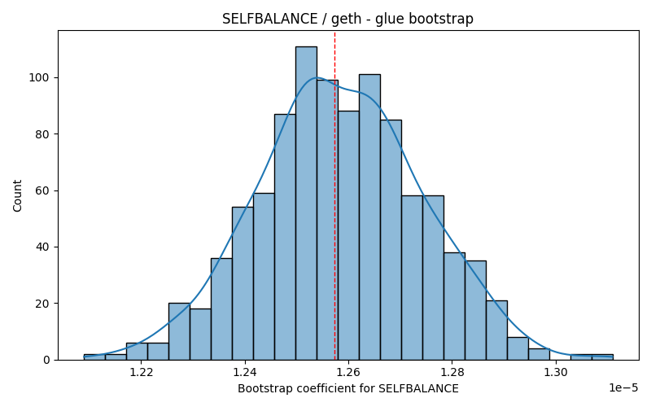

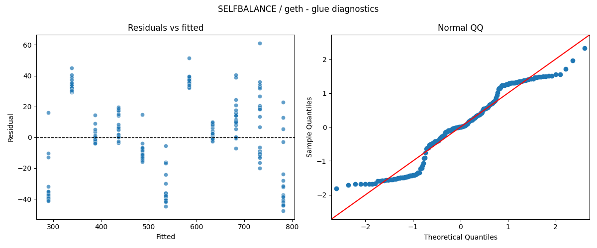

</details>

<details><summary><code>SUB</code> · nobs=220 · runtime_ms=5.133e-06 · p=1.00e-03 · R²=0.8858</summary>

```
==============================================================================
                           NNLS Regression Results                            
==============================================================================
Dep. Variable:          test_runtime_ms              R-squared:          0.886
Model:                  NNLS                    Adj. R-squared:          0.885
No. Observations:       220                               RMSE:          19.96
Df Residuals:           218                                MAE:          15.36
Df Model:               1      
==============================================================================
                      coef     std err     P-value      [0.025      0.975]
------------------------------------------------------------------------------
         const      0.0000      0.7592       1.000      0.0000      2.4794
           SUB      0.0000      0.0000       0.001      0.0000      0.0000
==============================================================================
Notes: Non-negative least squares with bootstrap inference (1000 iterations)
==============================================================================
```

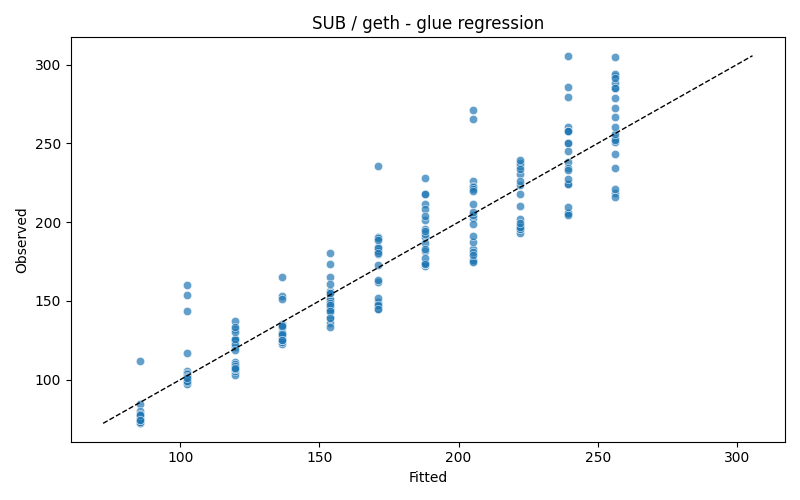

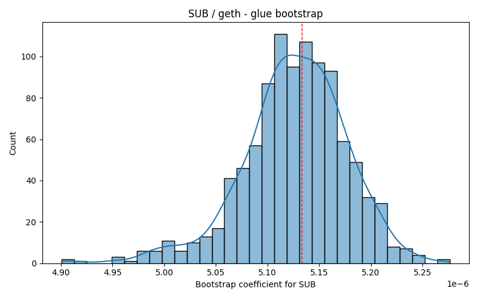

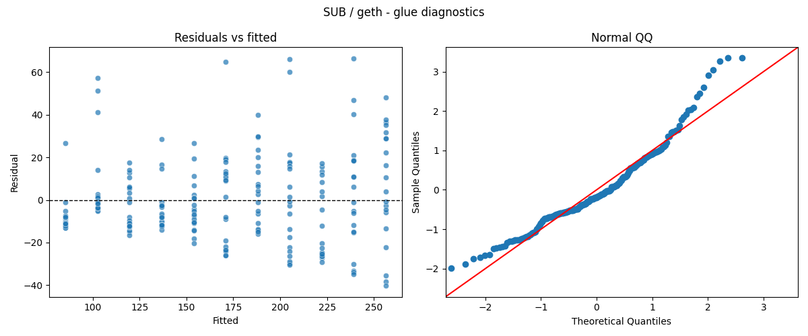

</details>

### Mixed glue (tier B) · geth

<details><summary><code>JUMP</code> · nobs=220 · runtime_ms=9.845e-06 · p=1.00e-03 · R²=0.9398</summary>

```
==============================================================================
                           NNLS Regression Results                            
==============================================================================
Dep. Variable:          test_runtime_ms              R-squared:          0.940
Model:                  NNLS                    Adj. R-squared:          0.940
No. Observations:       220                               RMSE:           9.26
Df Residuals:           218                                MAE:           5.55
Df Model:               1      
==============================================================================
                      coef     std err     P-value      [0.025      0.975]
------------------------------------------------------------------------------
         const     11.9226      2.3975       0.001      7.5739     17.0137
          JUMP      0.0000      0.0000       0.001      0.0000      0.0000
==============================================================================
Notes: Non-negative least squares with bootstrap inference (1000 iterations)
==============================================================================
```

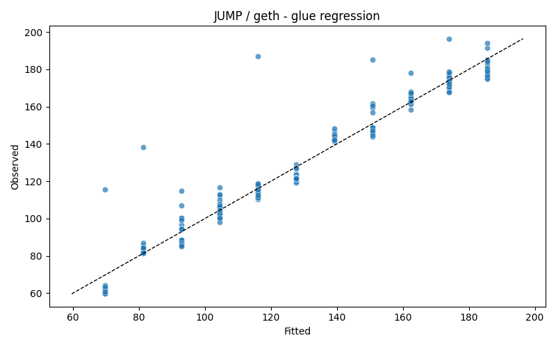

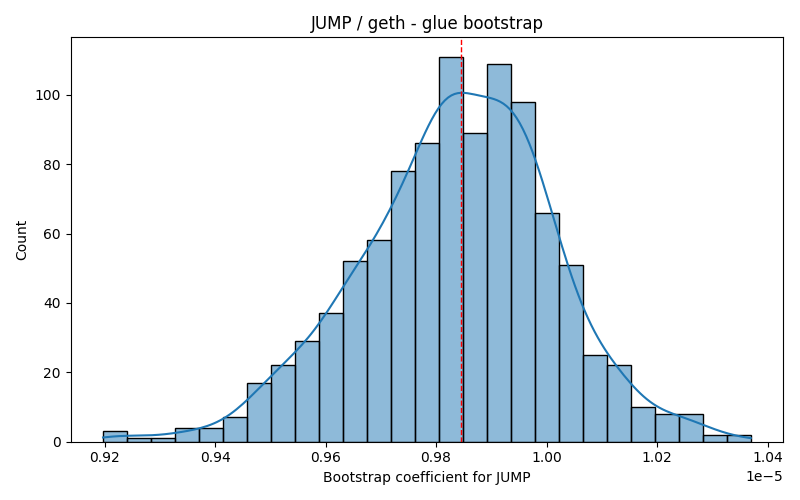

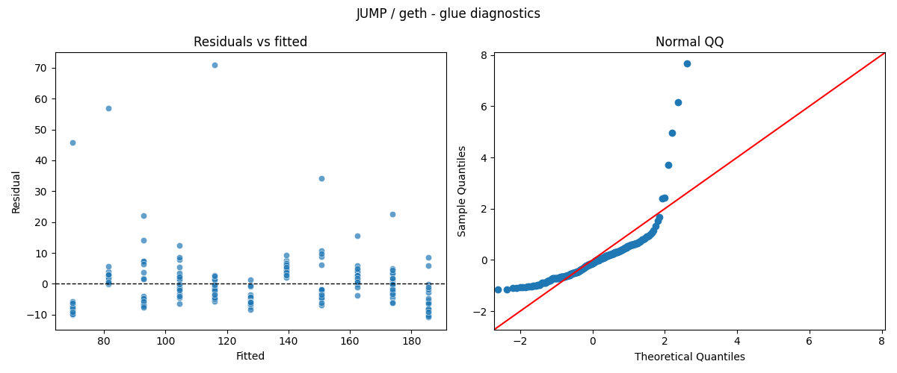

</details>

<details><summary><code>KECCAK256</code> · nobs=3520 · runtime_ms=3.775e-05 · p=1.00e-03 · R²=0.1145</summary>

```
==============================================================================
                           NNLS Regression Results                            
==============================================================================
Dep. Variable:          test_runtime_ms              R-squared:          0.115
Model:                  NNLS                    Adj. R-squared:          0.114
No. Observations:       3520                              RMSE:         208.69
Df Residuals:           3518                               MAE:         167.31
Df Model:               1      
==============================================================================
                      coef     std err     P-value      [0.025      0.975]
------------------------------------------------------------------------------
         const    570.8022      7.5838       0.001    556.0696    585.6146
     KECCAK256      0.0000      0.0000       0.001      0.0000      0.0000
==============================================================================
Notes: Non-negative least squares with bootstrap inference (1000 iterations)
==============================================================================
```

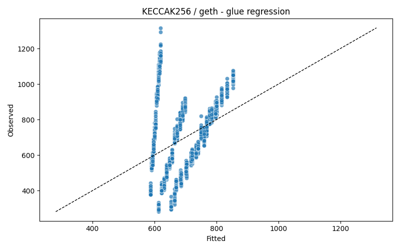

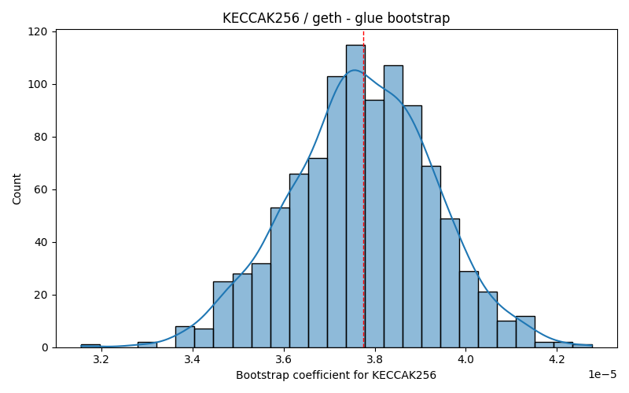

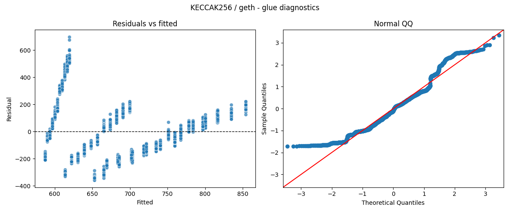

</details>

## nethermind

| glue_opcode | nobs | glue_runtime_ms | p_value | rsquared |
| --- | --- | --- | --- | --- |
| `ISZERO` | 220 | 6.001e-07 | 1.00e-03 | 0.9676 |
| `JUMPDEST` | 220 | 5.073e-07 | 1.00e-03 | 0.8541 |
| `SWAP` | 3520 | 6.272e-07 | 1.00e-03 | 0.8239 |
| `CALLDATASIZE` | 13013 | 5.703e-07 | 1.00e-03 | 0.8945 |
| `DUP` | 13013 | 4.69e-07 | 1.00e-03 | 0.8945 |
| `GAS` | 13013 | 5.545e-07 | 1.00e-03 | 0.8945 |
| `MLOAD` | 13013 | 2.23e-06 | 1.00e-03 | 0.8945 |
| `PUSH` | 13013 | 7.375e-07 | 1.00e-03 | 0.8945 |
| `PUSH0` | 13013 | 4.097e-07 | 1.00e-03 | 0.8945 |
| `STATICCALL` | 13013 | 0.0002144 | 1.00e-03 | 0.8945 |
| `ADD` | 220 | 1.323e-06 | 1.00e-03 | 0.9432 |
| `AND` | 220 | 1.118e-06 | 1.00e-03 | 0.8015 |
| `CALLDATACOPY` | 5280 | 4.461e-06 | 1.00e-03 | 0.7623 |
| `CALLDATALOAD` | 880 | 1.863e-05 | 1.00e-03 | 0.107 |
| `DIV` | 220 | 5.695e-06 | 1.00e-03 | 0.622 |
| `EXP` | 220 | 0 | 1.00e+00 | 0 |
| `GT` | 220 | 1.494e-06 | 1.00e-03 | 0.9735 |
| `JUMPI` | 220 | 2.712e-06 | 1.00e-03 | 0.971 |
| `LT` | 220 | 1.494e-06 | 1.00e-03 | 0.9686 |
| `MSTORE` | 1100 | 3.038e-06 | 1.00e-03 | 0.9168 |
| `MSTORE8` | 1100 | 2.837e-06 | 1.00e-03 | 0.9312 |
| `MUL` | 220 | 5.309e-06 | 1.00e-03 | 0.913 |
| `PC` | 220 | 7.388e-07 | 1.00e-03 | 0.9815 |
| `RETURNDATASIZE` | 880 | 1.036e-06 | 1.00e-03 | 0.9767 |
| `SELFBALANCE` | 220 | 3.227e-06 | 1.00e-03 | 0.9782 |
| `SUB` | 220 | 2.096e-06 | 1.00e-03 | 0.9531 |
| `JUMP` | 220 | 3.736e-06 | 1.00e-03 | 0.9726 |
| `KECCAK256` | 3520 | 0 | 1.00e+00 | -2.22e-16 |

### Cycle glue — joint fit · nethermind

<details><summary>Joint NNLS regression summary</summary>

```
==============================================================================
                           NNLS Regression Results                            
==============================================================================
Dep. Variable:          test_runtime_ms              R-squared:          0.895
Model:                  NNLS                    Adj. R-squared:          0.894
No. Observations:       13013                             RMSE:           9.07
Df Residuals:           13005                              MAE:           6.38
Df Model:               7      
==============================================================================
                      coef     std err     P-value      [0.025      0.975]
------------------------------------------------------------------------------
         const      7.5796      0.2404       0.001      7.0981      8.0286
  CALLDATASIZE      0.0000      0.0000       0.001      0.0000      0.0000
           DUP      0.0000      0.0000       0.001      0.0000      0.0000
           GAS      0.0000      0.0000       0.001      0.0000      0.0000
         MLOAD      0.0000      0.0000       0.001      0.0000      0.0000
          PUSH      0.0000      0.0000       0.001      0.0000      0.0000
         PUSH0      0.0000      0.0000       0.001      0.0000      0.0000
    STATICCALL      0.0002      0.0000       0.001      0.0002      0.0002
==============================================================================
Notes: Non-negative least squares with bootstrap inference (1000 iterations)
==============================================================================
```

</details>

<details><summary><code>CALLDATASIZE</code> · nobs=13013 · runtime_ms=5.703e-07 · p=1.00e-03 · R²=0.8945</summary>


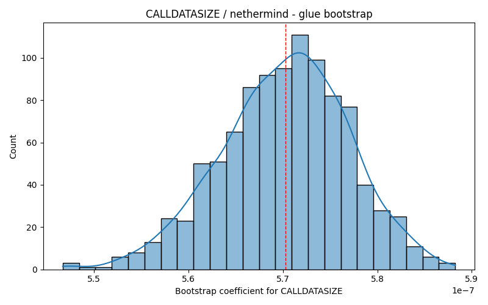

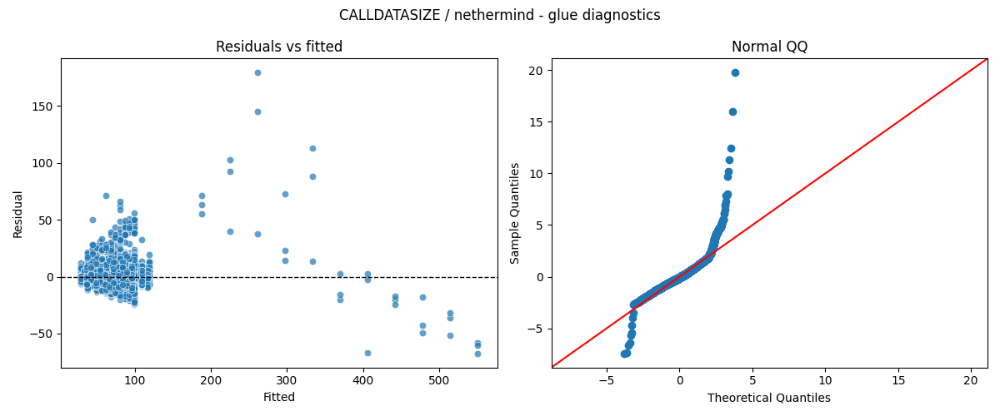

</details>

<details><summary><code>DUP</code> · nobs=13013 · runtime_ms=4.69e-07 · p=1.00e-03 · R²=0.8945</summary>


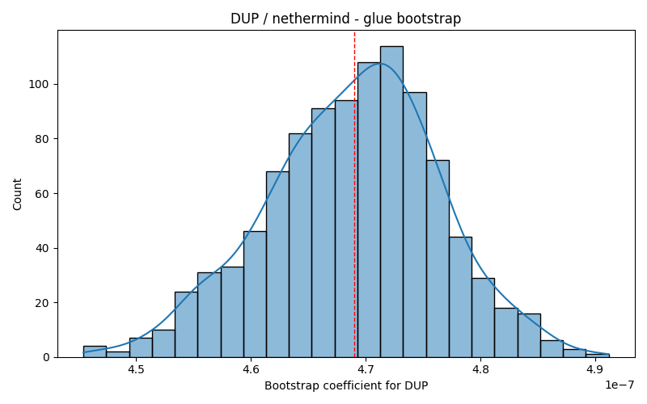


</details>

<details><summary><code>GAS</code> · nobs=13013 · runtime_ms=5.545e-07 · p=1.00e-03 · R²=0.8945</summary>

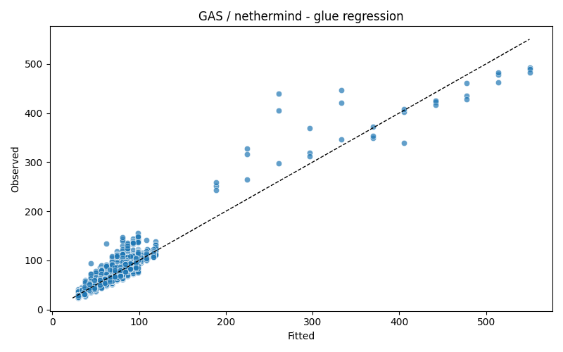

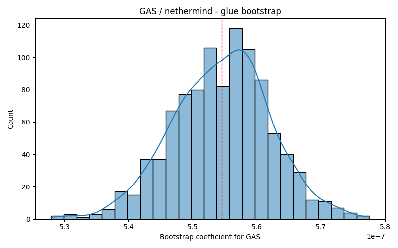

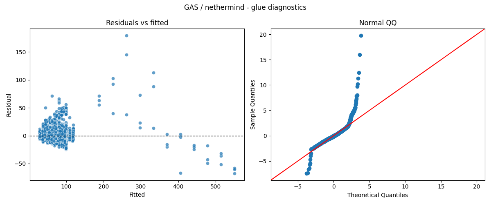

</details>

<details><summary><code>MLOAD</code> · nobs=13013 · runtime_ms=2.23e-06 · p=1.00e-03 · R²=0.8945</summary>


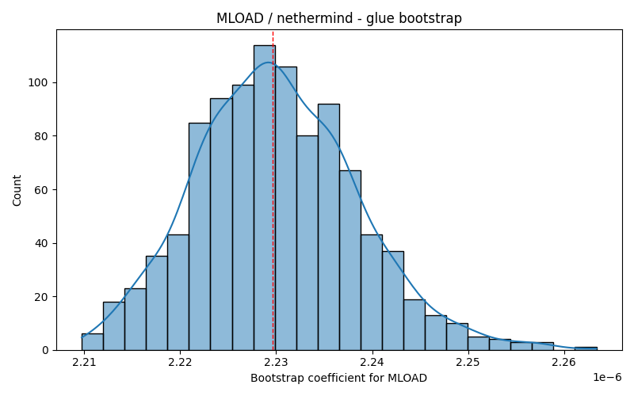


</details>

<details><summary><code>PUSH</code> · nobs=13013 · runtime_ms=7.375e-07 · p=1.00e-03 · R²=0.8945</summary>

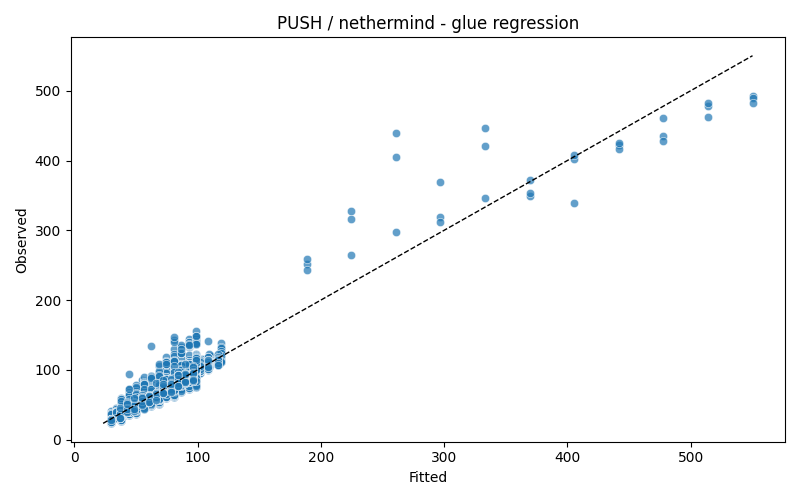

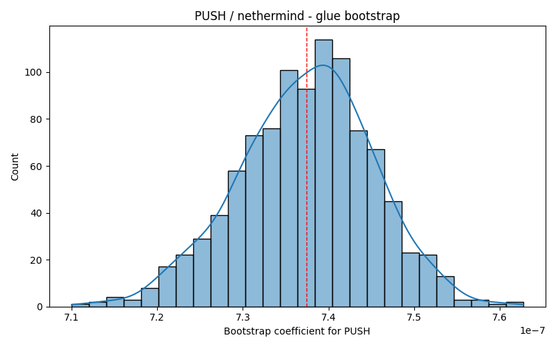


</details>

<details><summary><code>PUSH0</code> · nobs=13013 · runtime_ms=4.097e-07 · p=1.00e-03 · R²=0.8945</summary>


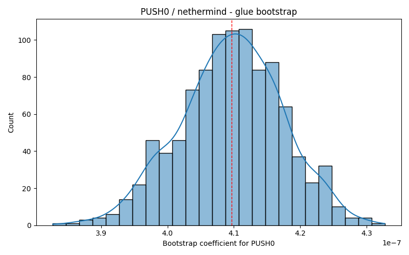

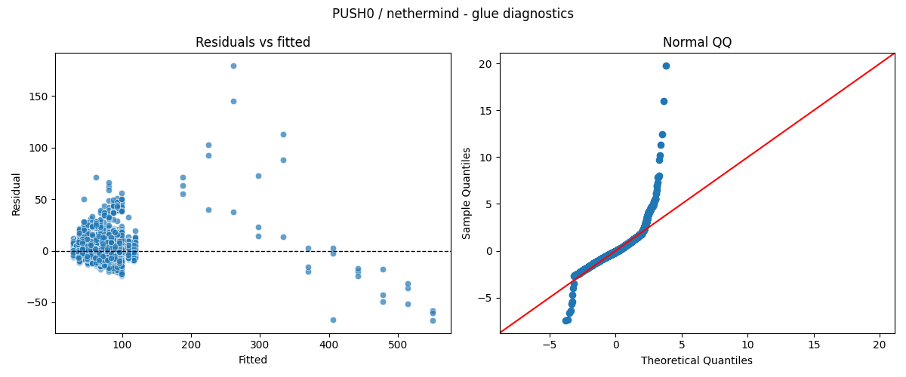

</details>

<details><summary><code>STATICCALL</code> · nobs=13013 · runtime_ms=0.0002144 · p=1.00e-03 · R²=0.8945</summary>

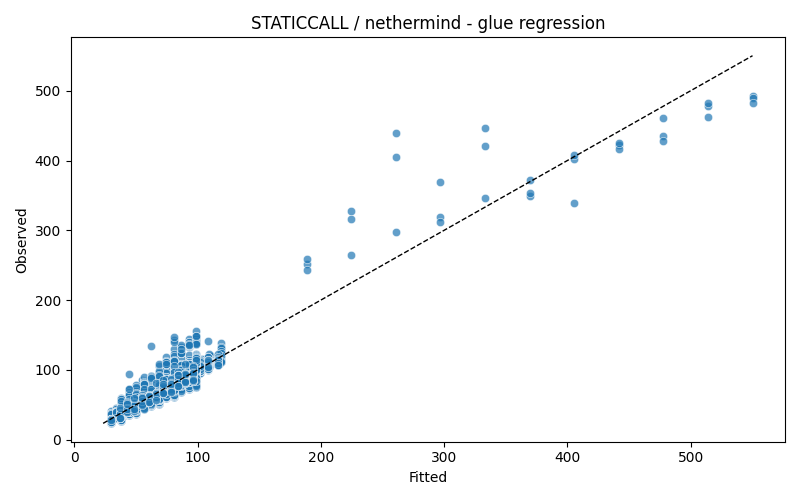

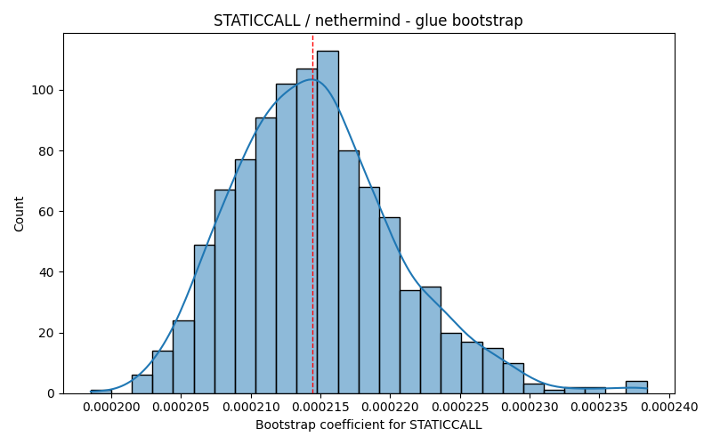

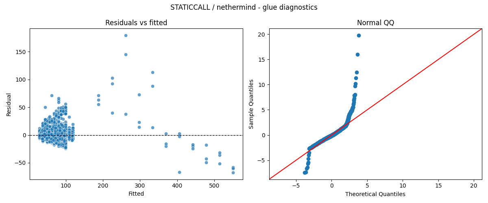

</details>

### Pure glue · nethermind

<details><summary><code>ISZERO</code> · nobs=220 · runtime_ms=6.001e-07 · p=1.00e-03 · R²=0.9676</summary>

```
==============================================================================
                           NNLS Regression Results                            
==============================================================================
Dep. Variable:          test_runtime_ms              R-squared:          0.968
Model:                  NNLS                    Adj. R-squared:          0.967
No. Observations:       220                               RMSE:           2.31
Df Residuals:           218                                MAE:           1.83
Df Model:               1      
==============================================================================
                      coef     std err     P-value      [0.025      0.975]
------------------------------------------------------------------------------
         const      4.9215      0.4960       0.001      4.0104      5.8779
        ISZERO      0.0000      0.0000       0.001      0.0000      0.0000
==============================================================================
Notes: Non-negative least squares with bootstrap inference (1000 iterations)
==============================================================================
```

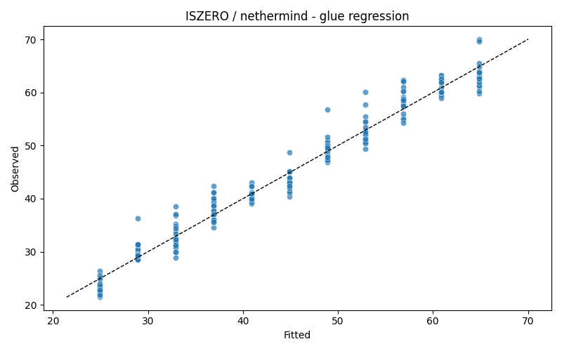

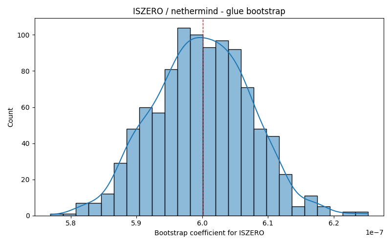

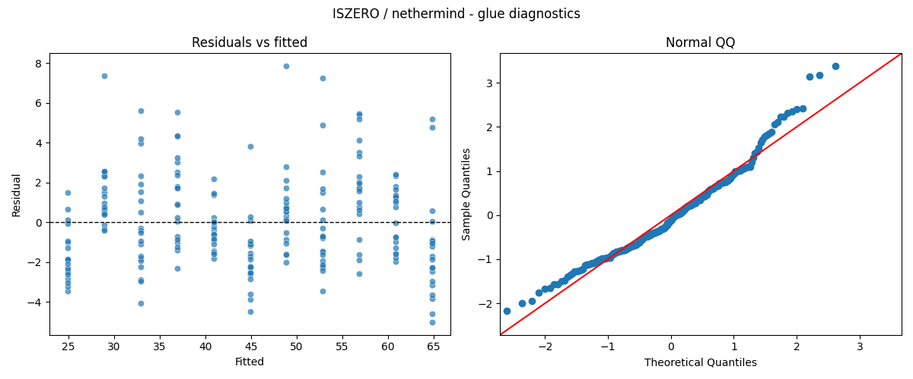

</details>

<details><summary><code>JUMPDEST</code> · nobs=220 · runtime_ms=5.073e-07 · p=1.00e-03 · R²=0.8541</summary>

```
==============================================================================
                           NNLS Regression Results                            
==============================================================================
Dep. Variable:          test_runtime_ms              R-squared:          0.854
Model:                  NNLS                    Adj. R-squared:          0.853
No. Observations:       220                               RMSE:          13.25
Df Residuals:           218                                MAE:          10.05
Df Model:               1      
==============================================================================
                      coef     std err     P-value      [0.025      0.975]
------------------------------------------------------------------------------
         const      6.3453      2.5828       0.010      1.0896     11.1180
      JUMPDEST      0.0000      0.0000       0.001      0.0000      0.0000
==============================================================================
Notes: Non-negative least squares with bootstrap inference (1000 iterations)
==============================================================================
```

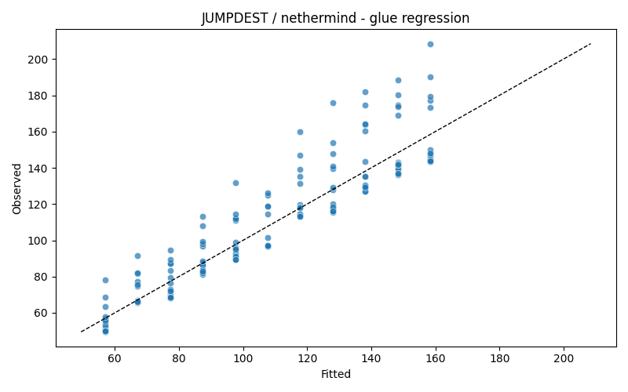

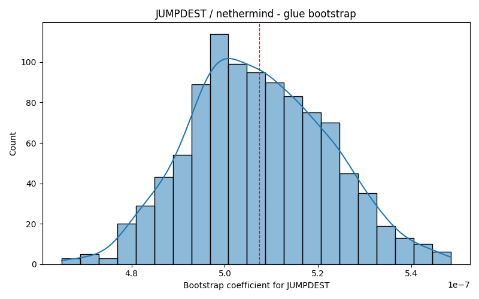

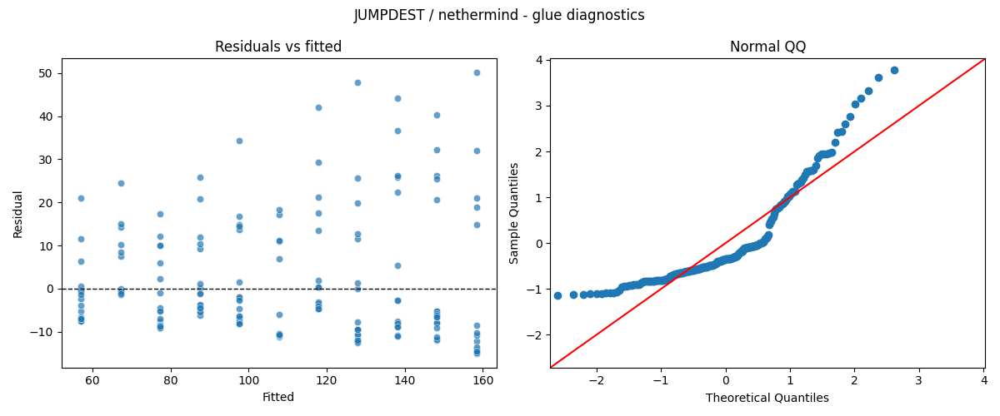

</details>

<details><summary><code>SWAP</code> · nobs=3520 · runtime_ms=6.272e-07 · p=1.00e-03 · R²=0.8239</summary>

```
==============================================================================
                           NNLS Regression Results                            
==============================================================================
Dep. Variable:          test_runtime_ms              R-squared:          0.824
Model:                  NNLS                    Adj. R-squared:          0.824
No. Observations:       3520                              RMSE:           6.11
Df Residuals:           3518                               MAE:           4.71
Df Model:               1      
==============================================================================
                      coef     std err     P-value      [0.025      0.975]
------------------------------------------------------------------------------
         const     12.4163      0.3434       0.001     11.7297     13.0442
          SWAP      0.0000      0.0000       0.001      0.0000      0.0000
==============================================================================
Notes: Non-negative least squares with bootstrap inference (1000 iterations)
==============================================================================
```

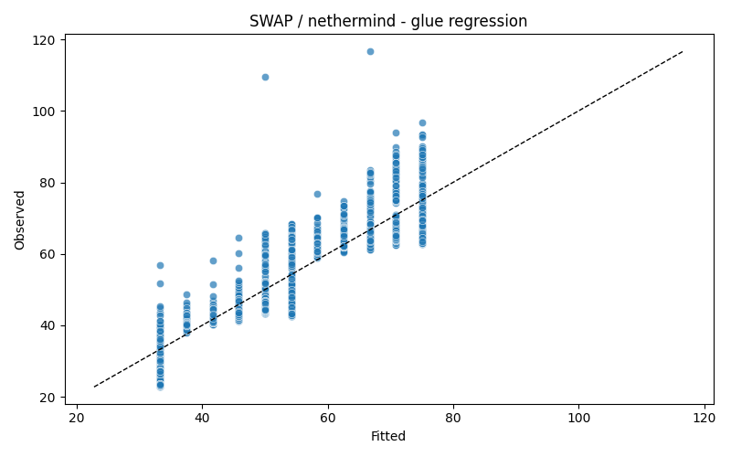

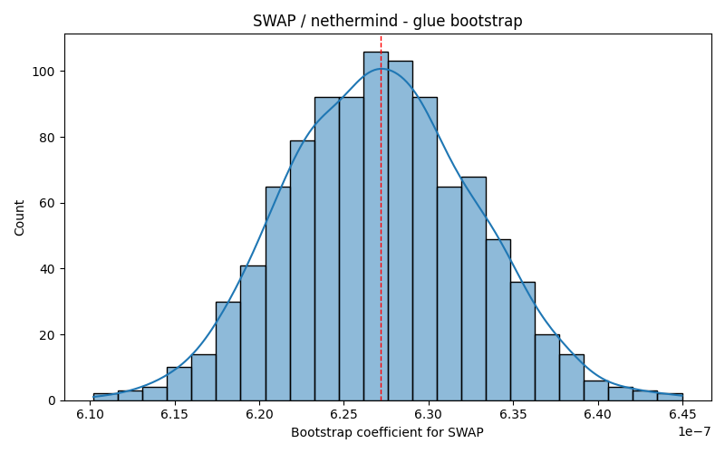

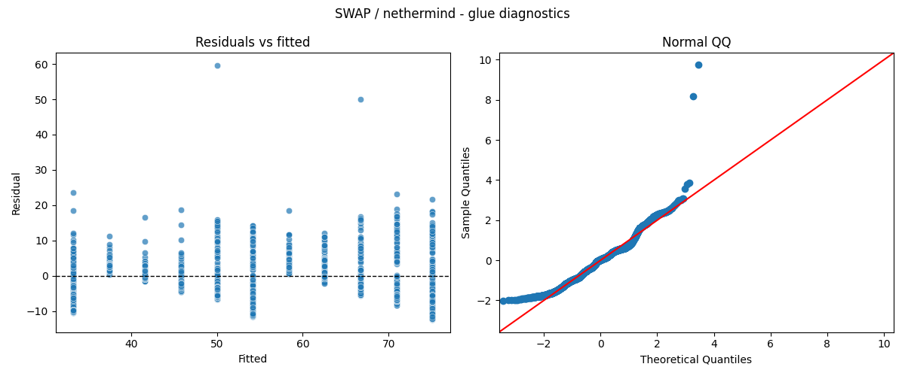

</details>

### Mixed glue (tier A) · nethermind

<details><summary><code>ADD</code> · nobs=220 · runtime_ms=1.323e-06 · p=1.00e-03 · R²=0.9432</summary>

```
==============================================================================
                           NNLS Regression Results                            
==============================================================================
Dep. Variable:          test_runtime_ms              R-squared:          0.943
Model:                  NNLS                    Adj. R-squared:          0.943
No. Observations:       220                               RMSE:           3.42
Df Residuals:           218                                MAE:           2.49
Df Model:               1      
==============================================================================
                      coef     std err     P-value      [0.025      0.975]
------------------------------------------------------------------------------
         const      7.1269      0.7877       0.001      5.6658      8.6988
           ADD      0.0000      0.0000       0.001      0.0000      0.0000
==============================================================================
Notes: Non-negative least squares with bootstrap inference (1000 iterations)
==============================================================================
```

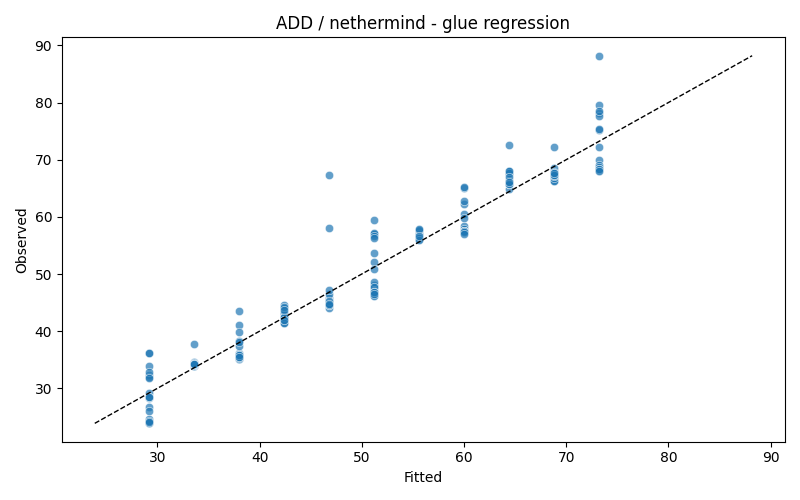

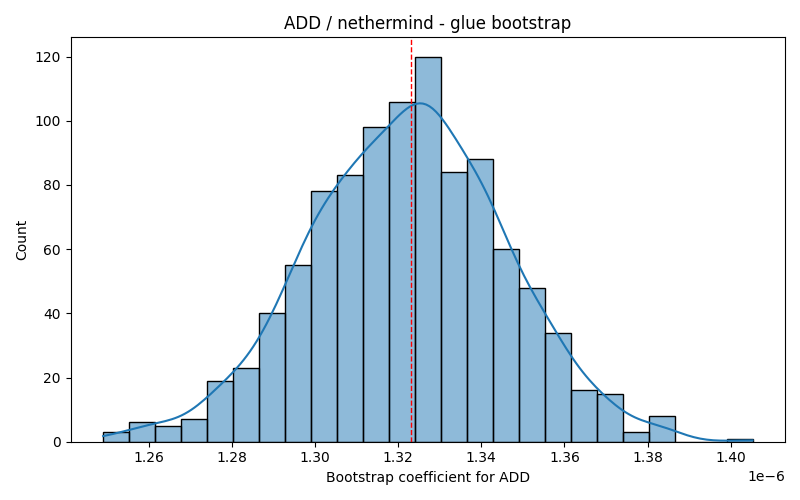

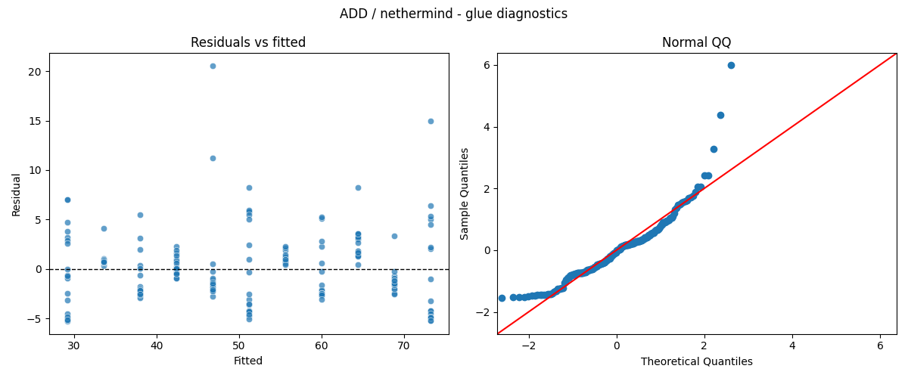

</details>

<details><summary><code>AND</code> · nobs=220 · runtime_ms=1.118e-06 · p=1.00e-03 · R²=0.8015</summary>

```
==============================================================================
                           NNLS Regression Results                            
==============================================================================
Dep. Variable:          test_runtime_ms              R-squared:          0.802
Model:                  NNLS                    Adj. R-squared:          0.801
No. Observations:       220                               RMSE:           5.86
Df Residuals:           218                                MAE:           3.17
Df Model:               1      
==============================================================================
                      coef     std err     P-value      [0.025      0.975]
------------------------------------------------------------------------------
         const      7.0976      1.7487       0.001      3.5776     10.4276
           AND      0.0000      0.0000       0.001      0.0000      0.0000
==============================================================================
Notes: Non-negative least squares with bootstrap inference (1000 iterations)
==============================================================================
```

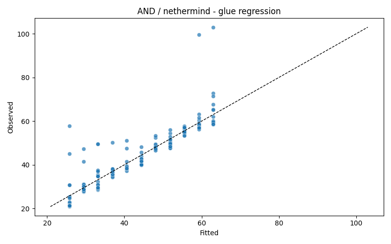

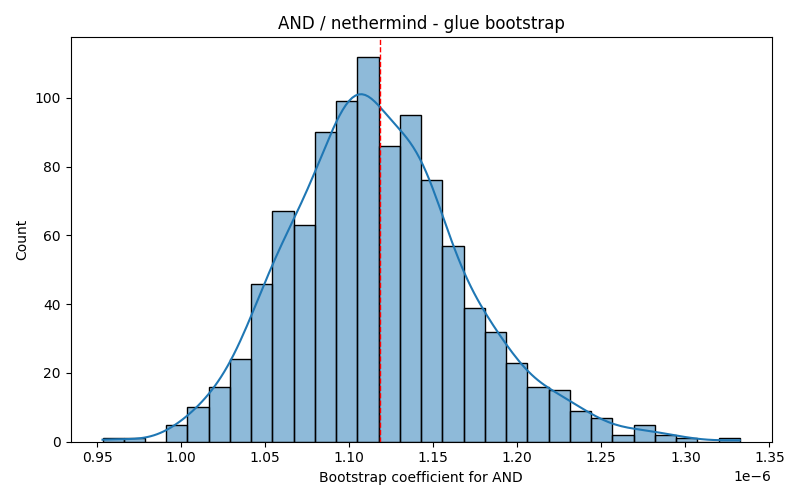

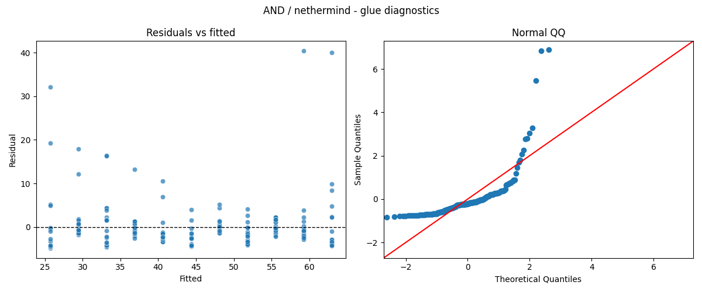

</details>

<details><summary><code>CALLDATACOPY</code> · nobs=5280 · runtime_ms=4.461e-06 · p=1.00e-03 · R²=0.7623</summary>

```
==============================================================================
                           NNLS Regression Results                            
==============================================================================
Dep. Variable:          test_runtime_ms              R-squared:          0.762
Model:                  NNLS                    Adj. R-squared:          0.762
No. Observations:       5280                              RMSE:          18.74
Df Residuals:           5278                               MAE:          14.96
Df Model:               1      
==============================================================================
                      coef     std err     P-value      [0.025      0.975]
------------------------------------------------------------------------------
         const     21.8806      0.2860       0.001     21.3197     22.4178
  CALLDATACOPY      0.0000      0.0000       0.001      0.0000      0.0000
==============================================================================
Notes: Non-negative least squares with bootstrap inference (1000 iterations)
==============================================================================
```

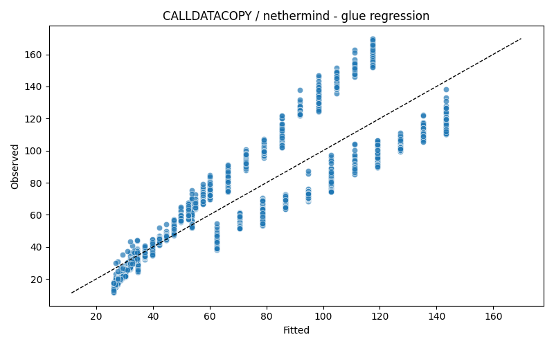

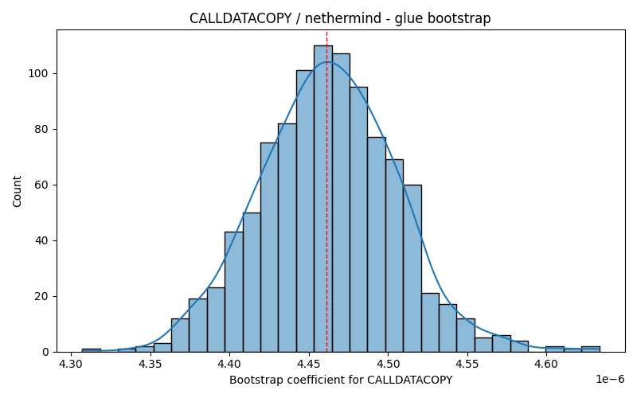

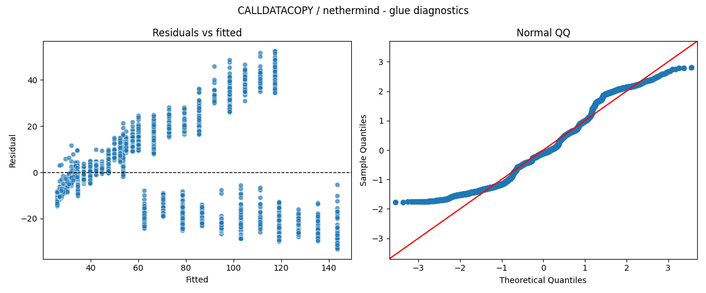

</details>

<details><summary><code>CALLDATALOAD</code> · nobs=880 · runtime_ms=1.863e-05 · p=1.00e-03 · R²=0.107</summary>

```
==============================================================================
                           NNLS Regression Results                            
==============================================================================
Dep. Variable:          test_runtime_ms              R-squared:          0.107
Model:                  NNLS                    Adj. R-squared:          0.106
No. Observations:       880                               RMSE:           0.21
Df Residuals:           878                                MAE:           0.14
Df Model:               1      
==============================================================================
                      coef     std err     P-value      [0.025      0.975]
------------------------------------------------------------------------------
         const      1.8216      0.0220       0.001      1.7781      1.8655
  CALLDATALOAD      0.0000      0.0000       0.001      0.0000      0.0000
==============================================================================
Notes: Non-negative least squares with bootstrap inference (1000 iterations)
==============================================================================
```

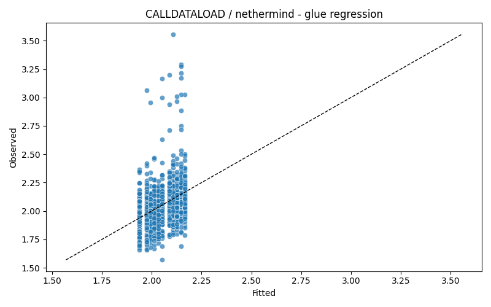

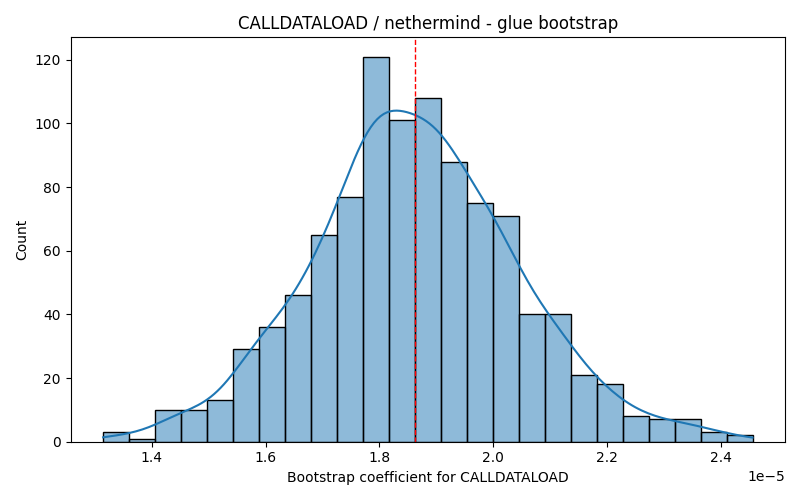

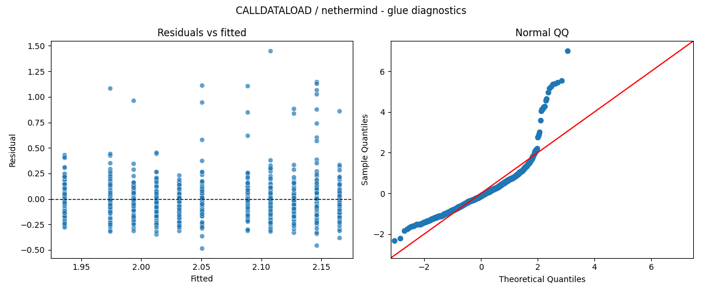

</details>

<details><summary><code>DIV</code> · nobs=220 · runtime_ms=5.695e-06 · p=1.00e-03 · R²=0.622</summary>

```
==============================================================================
                           NNLS Regression Results                            
==============================================================================
Dep. Variable:          test_runtime_ms              R-squared:          0.622
Model:                  NNLS                    Adj. R-squared:          0.620
No. Observations:       220                               RMSE:          35.06
Df Residuals:           218                                MAE:          26.58
Df Model:               1      
==============================================================================
                      coef     std err     P-value      [0.025      0.975]
------------------------------------------------------------------------------
         const    107.9880     10.4980       0.001     87.1261    128.1497
           DIV      0.0000      0.0000       0.001      0.0000      0.0000
==============================================================================
Notes: Non-negative least squares with bootstrap inference (1000 iterations)
==============================================================================
```

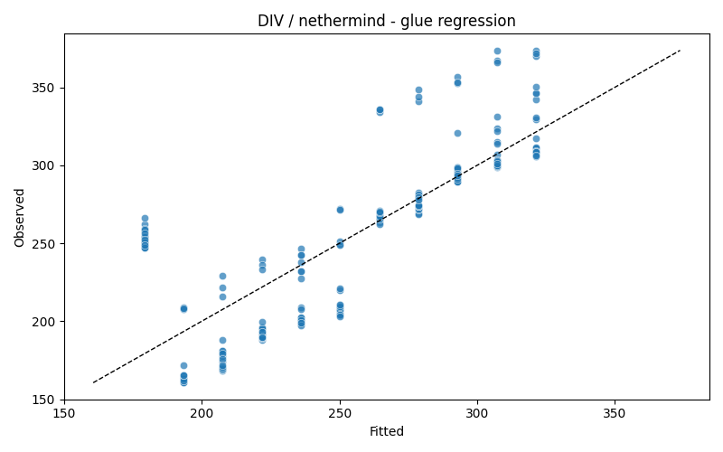

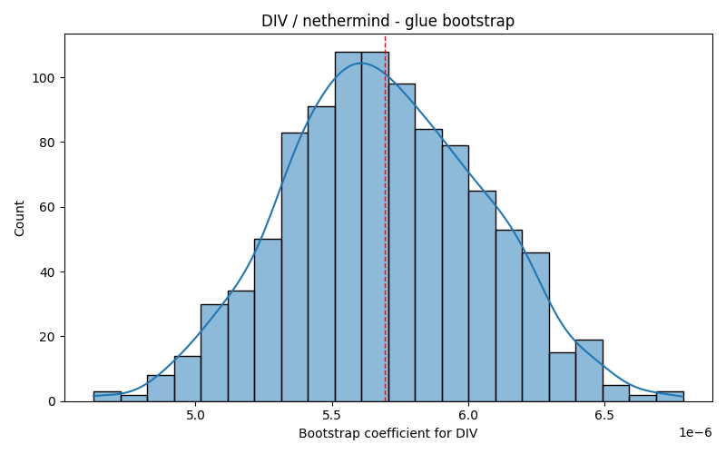

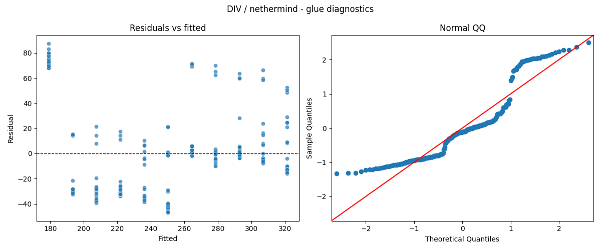

</details>

<details><summary><code>EXP</code> · nobs=220 · runtime_ms=0 · p=1.00e+00 · R²=0</summary>

```
==============================================================================
                           NNLS Regression Results                            
==============================================================================
Dep. Variable:          test_runtime_ms              R-squared:          0.000
Model:                  NNLS                    Adj. R-squared:         -0.005
No. Observations:       220                               RMSE:           1.11
Df Residuals:           218                                MAE:           0.80
Df Model:               1      
==============================================================================
                      coef     std err     P-value      [0.025      0.975]
------------------------------------------------------------------------------
         const      3.1701      0.0745       0.001      3.0296      3.3221
           EXP      0.0000      0.0000       1.000      0.0000      0.0000
==============================================================================
Notes: Non-negative least squares with bootstrap inference (1000 iterations)
==============================================================================
```

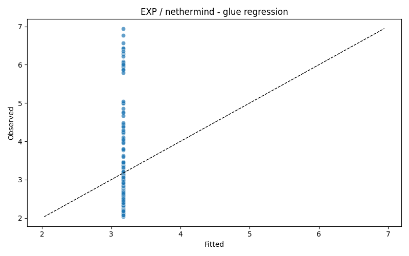


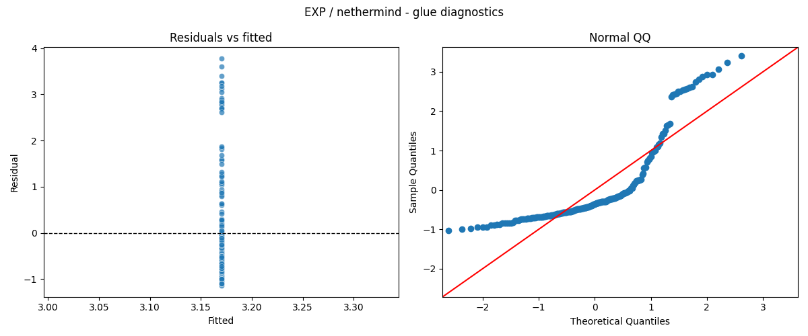

</details>

<details><summary><code>GT</code> · nobs=220 · runtime_ms=1.494e-06 · p=1.00e-03 · R²=0.9735</summary>

```
==============================================================================
                           NNLS Regression Results                            
==============================================================================
Dep. Variable:          test_runtime_ms              R-squared:          0.973
Model:                  NNLS                    Adj. R-squared:          0.973
No. Observations:       220                               RMSE:           2.60
Df Residuals:           218                                MAE:           1.89
Df Model:               1      
==============================================================================
                      coef     std err     P-value      [0.025      0.975]
------------------------------------------------------------------------------
         const      6.3439      0.6792       0.001      5.0546      7.6755
            GT      0.0000      0.0000       0.001      0.0000      0.0000
==============================================================================
Notes: Non-negative least squares with bootstrap inference (1000 iterations)
==============================================================================
```

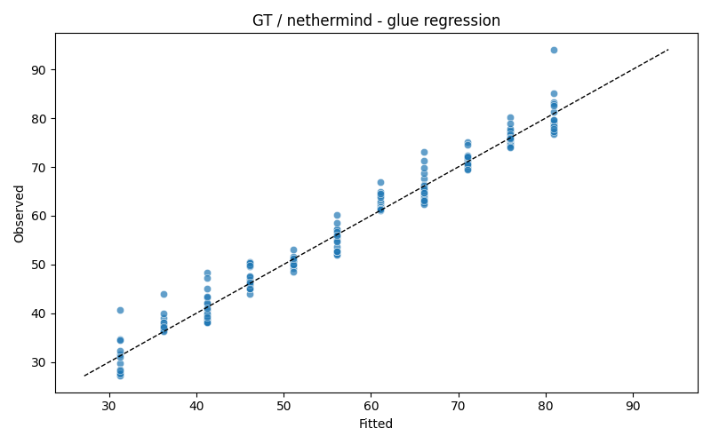

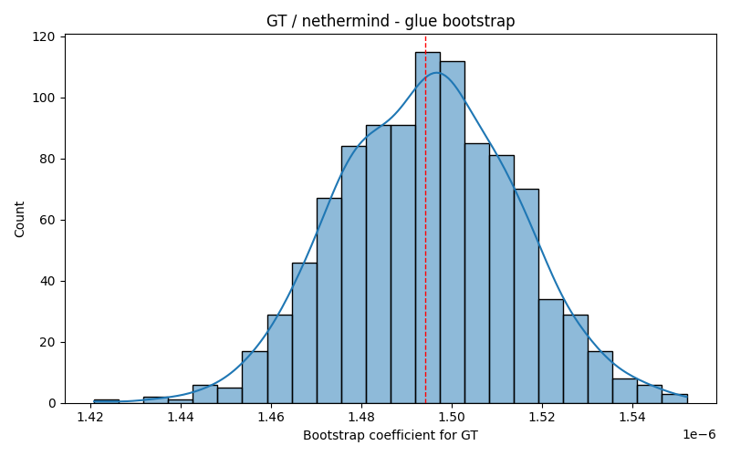

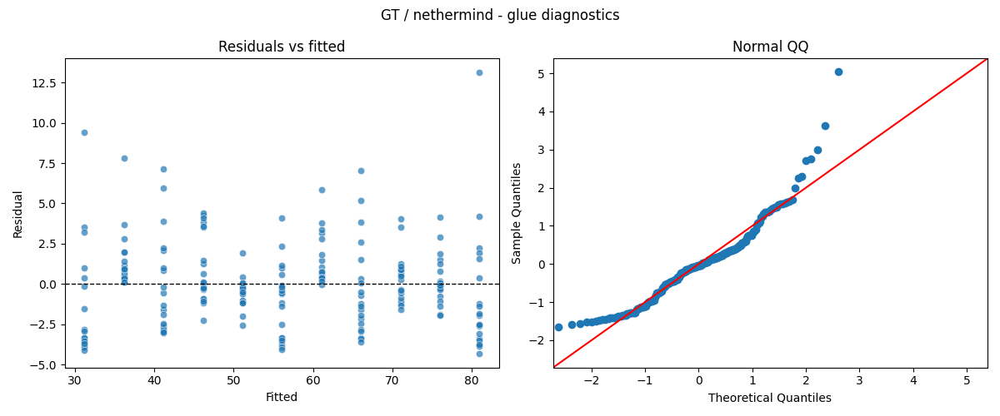

</details>

<details><summary><code>JUMPI</code> · nobs=220 · runtime_ms=2.712e-06 · p=1.00e-03 · R²=0.971</summary>

```
==============================================================================
                           NNLS Regression Results                            
==============================================================================
Dep. Variable:          test_runtime_ms              R-squared:          0.971
Model:                  NNLS                    Adj. R-squared:          0.971
No. Observations:       220                               RMSE:           2.12
Df Residuals:           218                                MAE:           1.64
Df Model:               1      
==============================================================================
                      coef     std err     P-value      [0.025      0.975]
------------------------------------------------------------------------------
         const      3.8981      0.4430       0.001      3.0481      4.7627
         JUMPI      0.0000      0.0000       0.001      0.0000      0.0000
==============================================================================
Notes: Non-negative least squares with bootstrap inference (1000 iterations)
==============================================================================
```

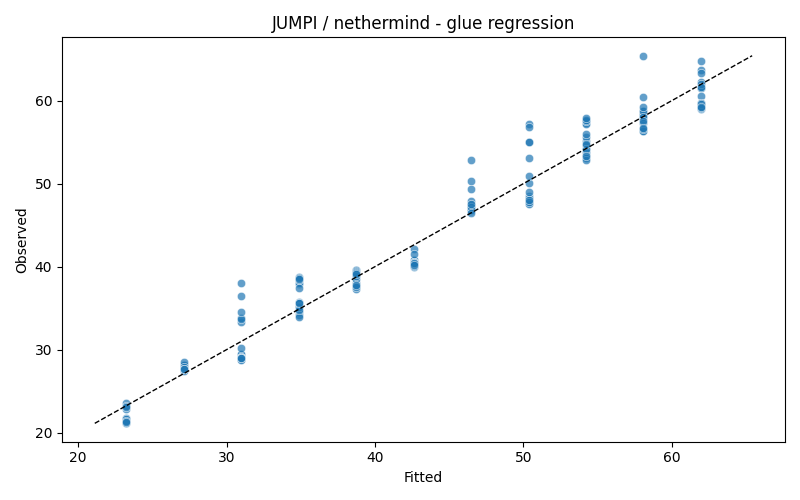

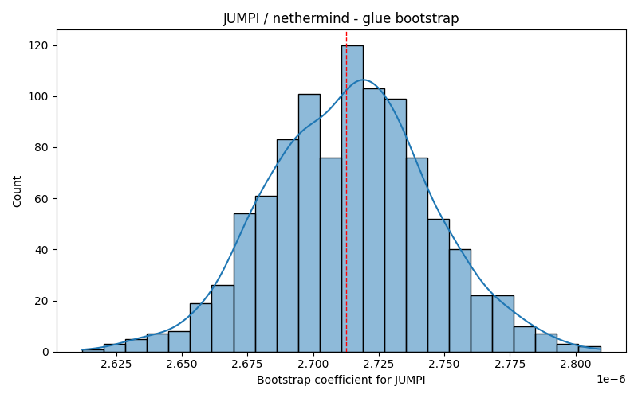

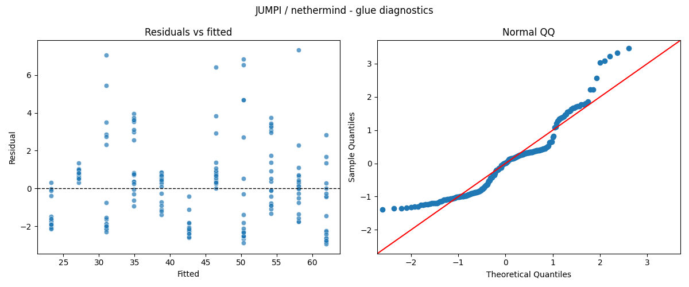

</details>

<details><summary><code>LT</code> · nobs=220 · runtime_ms=1.494e-06 · p=1.00e-03 · R²=0.9686</summary>

```
==============================================================================
                           NNLS Regression Results                            
==============================================================================
Dep. Variable:          test_runtime_ms              R-squared:          0.969
Model:                  NNLS                    Adj. R-squared:          0.968
No. Observations:       220                               RMSE:           2.83
Df Residuals:           218                                MAE:           2.03
Df Model:               1      
==============================================================================
                      coef     std err     P-value      [0.025      0.975]
------------------------------------------------------------------------------
         const      6.2542      0.6517       0.001      5.0294      7.6071
            LT      0.0000      0.0000       0.001      0.0000      0.0000
==============================================================================
Notes: Non-negative least squares with bootstrap inference (1000 iterations)
==============================================================================
```

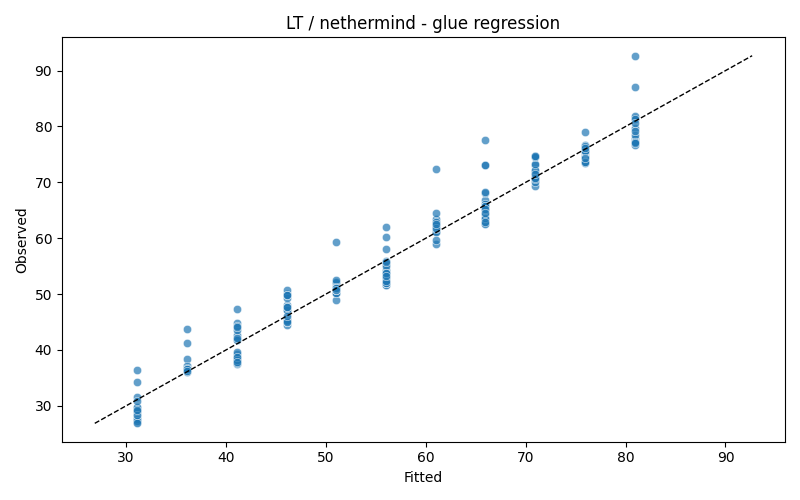

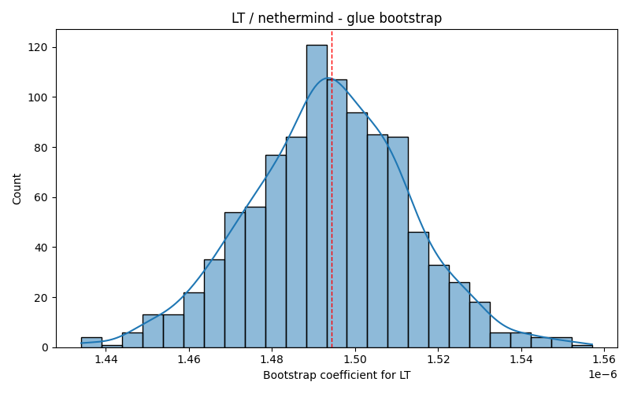

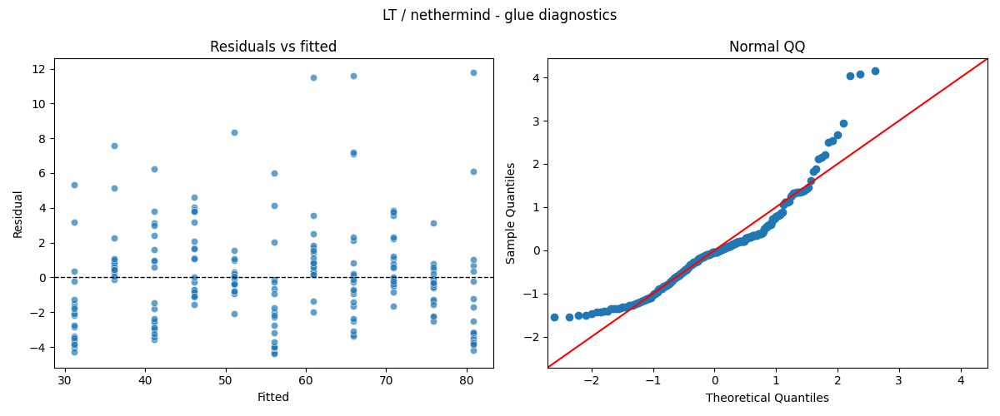

</details>

<details><summary><code>MSTORE</code> · nobs=1100 · runtime_ms=3.038e-06 · p=1.00e-03 · R²=0.9168</summary>

```
==============================================================================
                           NNLS Regression Results                            
==============================================================================
Dep. Variable:          test_runtime_ms              R-squared:          0.917
Model:                  NNLS                    Adj. R-squared:          0.917
No. Observations:       1100                              RMSE:           6.43
Df Residuals:           1098                               MAE:           3.88
Df Model:               1      
==============================================================================
                      coef     std err     P-value      [0.025      0.975]
------------------------------------------------------------------------------
         const      7.3851      0.5677       0.001      6.3157      8.4723
        MSTORE      0.0000      0.0000       0.001      0.0000      0.0000
==============================================================================
Notes: Non-negative least squares with bootstrap inference (1000 iterations)
==============================================================================
```

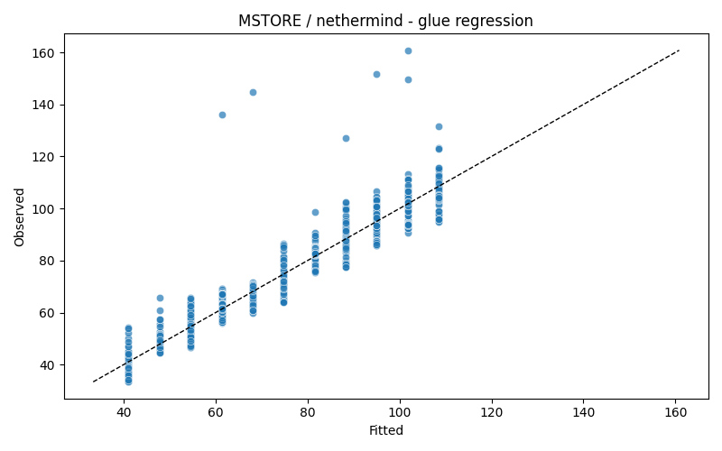

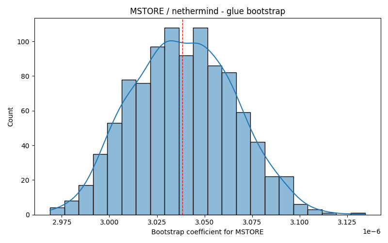

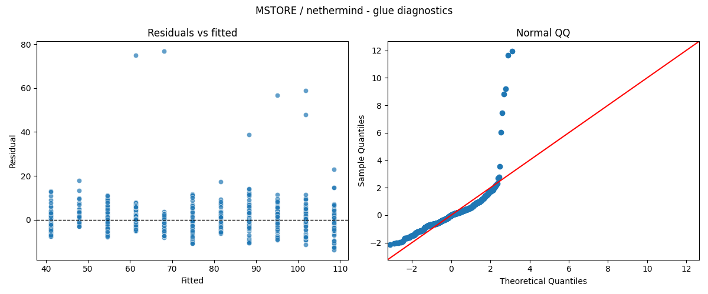

</details>

<details><summary><code>MSTORE8</code> · nobs=1100 · runtime_ms=2.837e-06 · p=1.00e-03 · R²=0.9312</summary>

```
==============================================================================
                           NNLS Regression Results                            
==============================================================================
Dep. Variable:          test_runtime_ms              R-squared:          0.931
Model:                  NNLS                    Adj. R-squared:          0.931
No. Observations:       1100                              RMSE:           5.41
Df Residuals:           1098                               MAE:           3.59
Df Model:               1      
==============================================================================
                      coef     std err     P-value      [0.025      0.975]
------------------------------------------------------------------------------
         const      8.6162      0.5691       0.001      7.5974      9.7863
       MSTORE8      0.0000      0.0000       0.001      0.0000      0.0000
==============================================================================
Notes: Non-negative least squares with bootstrap inference (1000 iterations)
==============================================================================
```

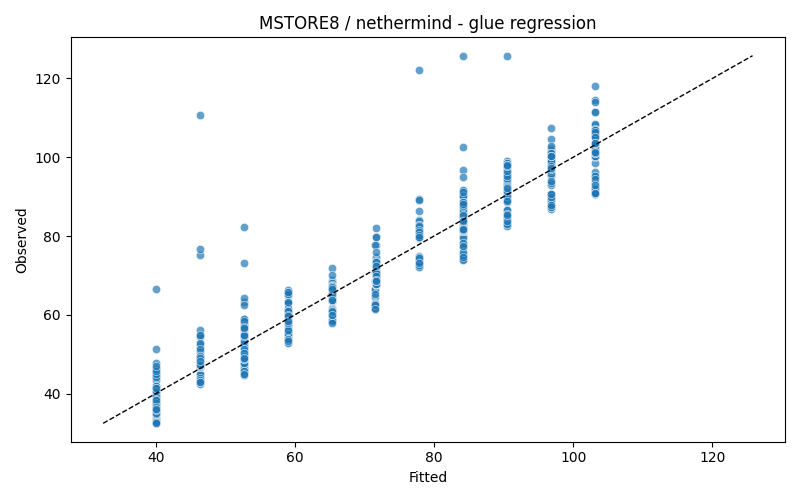

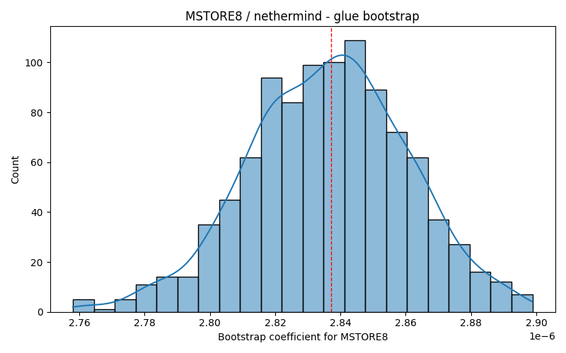

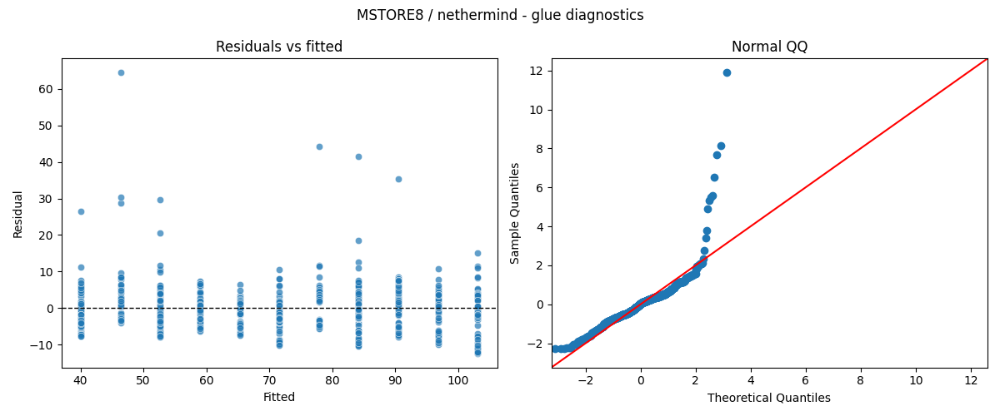

</details>

<details><summary><code>MUL</code> · nobs=220 · runtime_ms=5.309e-06 · p=1.00e-03 · R²=0.913</summary>

```
==============================================================================
                           NNLS Regression Results                            
==============================================================================
Dep. Variable:          test_runtime_ms              R-squared:          0.913
Model:                  NNLS                    Adj. R-squared:          0.913
No. Observations:       220                               RMSE:          12.95
Df Residuals:           218                                MAE:           7.78
Df Model:               1      
==============================================================================
                      coef     std err     P-value      [0.025      0.975]
------------------------------------------------------------------------------
         const     10.4137      2.6113       0.001      4.9340     15.3147
           MUL      0.0000      0.0000       0.001      0.0000      0.0000
==============================================================================
Notes: Non-negative least squares with bootstrap inference (1000 iterations)
==============================================================================
```

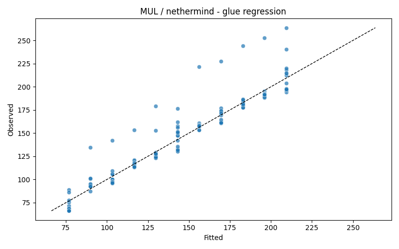

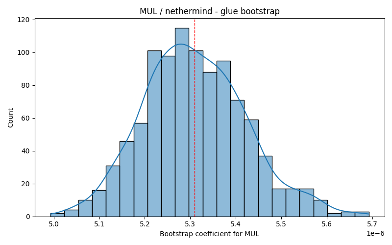

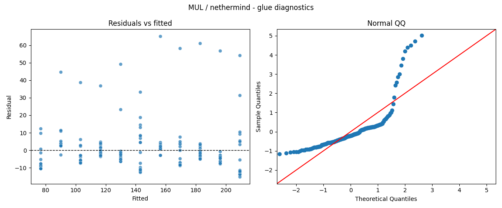

</details>

<details><summary><code>PC</code> · nobs=220 · runtime_ms=7.388e-07 · p=1.00e-03 · R²=0.9815</summary>

```
==============================================================================
                           NNLS Regression Results                            
==============================================================================
Dep. Variable:          test_runtime_ms              R-squared:          0.982
Model:                  NNLS                    Adj. R-squared:          0.981
No. Observations:       220                               RMSE:           3.03
Df Residuals:           218                                MAE:           2.49
Df Model:               1      
==============================================================================
                      coef     std err     P-value      [0.025      0.975]
------------------------------------------------------------------------------
         const      6.9256      0.7039       0.001      5.6788      8.3468
            PC      0.0000      0.0000       0.001      0.0000      0.0000
==============================================================================
Notes: Non-negative least squares with bootstrap inference (1000 iterations)
==============================================================================
```

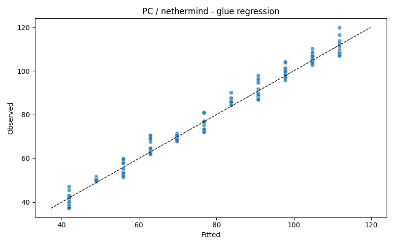

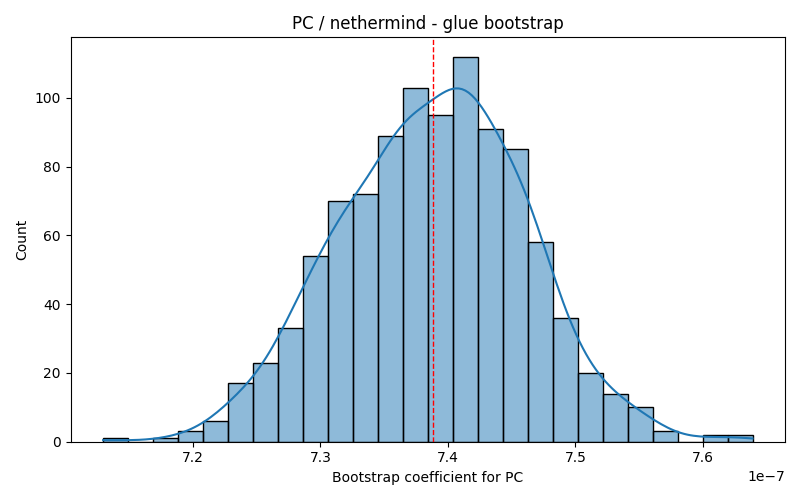

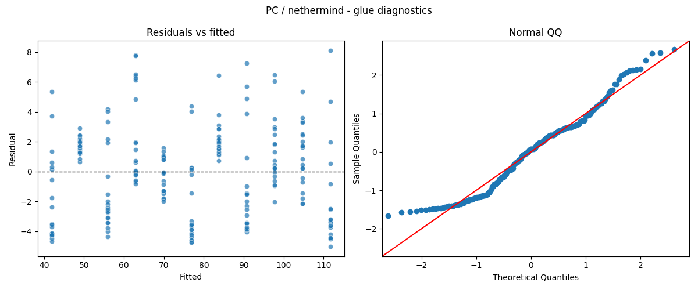

</details>

<details><summary><code>RETURNDATASIZE</code> · nobs=880 · runtime_ms=1.036e-06 · p=1.00e-03 · R²=0.9767</summary>

```
==============================================================================
                           NNLS Regression Results                            
==============================================================================
Dep. Variable:          test_runtime_ms              R-squared:          0.977
Model:                  NNLS                    Adj. R-squared:          0.977
No. Observations:       880                               RMSE:           2.53
Df Residuals:           878                                MAE:           2.07
Df Model:               1      
==============================================================================
                      coef     std err     P-value      [0.025      0.975]
------------------------------------------------------------------------------
         const      5.7152      0.2934       0.001      5.1287      6.2788
RETURNDATASIZE      0.0000      0.0000       0.001      0.0000      0.0000
==============================================================================
Notes: Non-negative least squares with bootstrap inference (1000 iterations)
==============================================================================
```

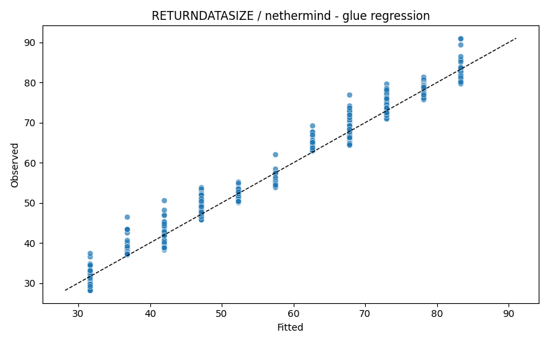

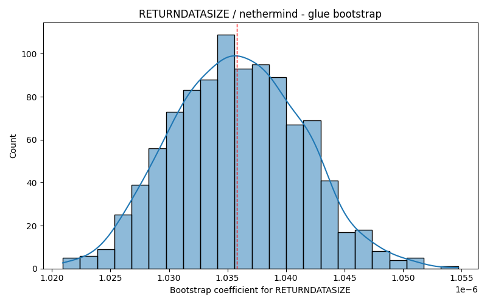

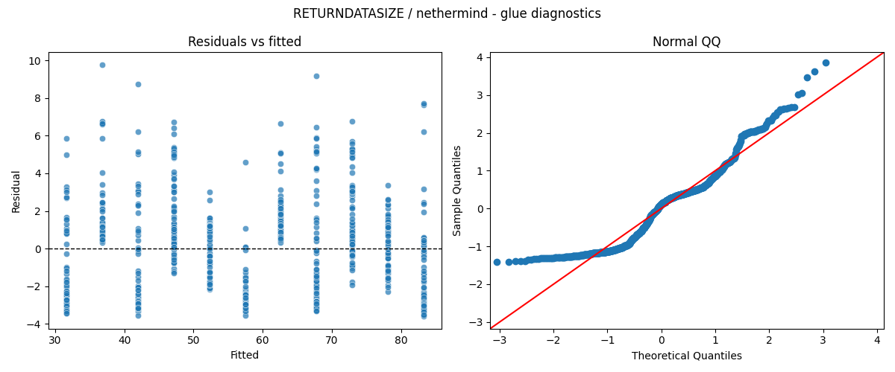

</details>

<details><summary><code>SELFBALANCE</code> · nobs=220 · runtime_ms=3.227e-06 · p=1.00e-03 · R²=0.9782</summary>

```
==============================================================================
                           NNLS Regression Results                            
==============================================================================
Dep. Variable:          test_runtime_ms              R-squared:          0.978
Model:                  NNLS                    Adj. R-squared:          0.978
No. Observations:       220                               RMSE:           5.96
Df Residuals:           218                                MAE:           4.69
Df Model:               1      
==============================================================================
                      coef     std err     P-value      [0.025      0.975]
------------------------------------------------------------------------------
         const     14.2046      1.4736       0.001     11.3753     17.0628
   SELFBALANCE      0.0000      0.0000       0.001      0.0000      0.0000
==============================================================================
Notes: Non-negative least squares with bootstrap inference (1000 iterations)
==============================================================================
```

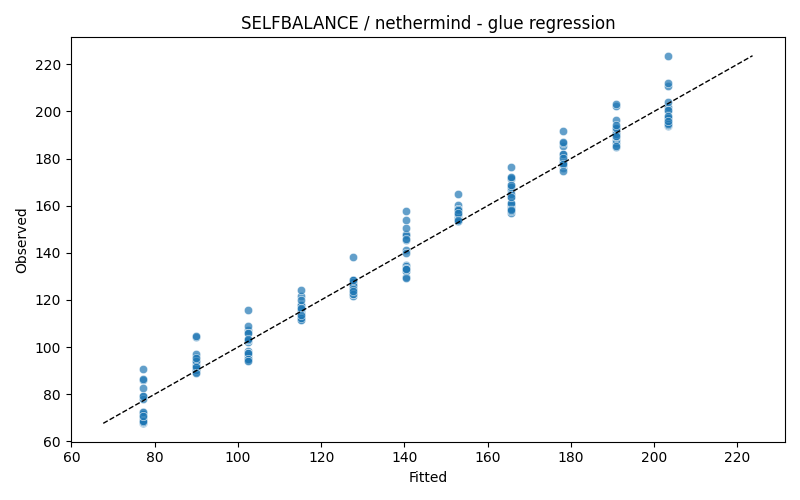

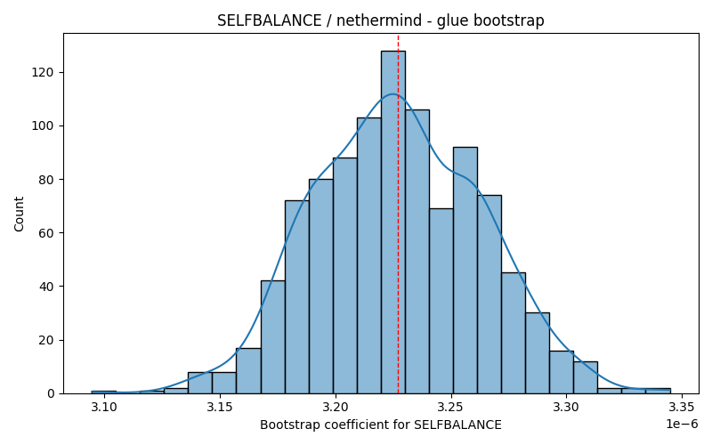

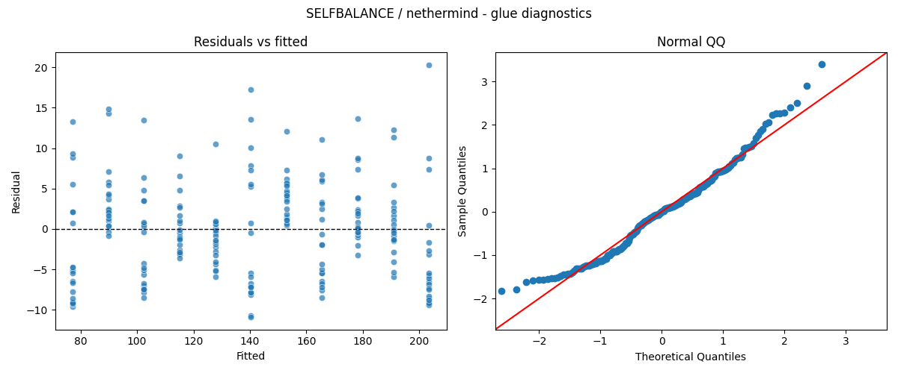

</details>

<details><summary><code>SUB</code> · nobs=220 · runtime_ms=2.096e-06 · p=1.00e-03 · R²=0.9531</summary>

```
==============================================================================
                           NNLS Regression Results                            
==============================================================================
Dep. Variable:          test_runtime_ms              R-squared:          0.953
Model:                  NNLS                    Adj. R-squared:          0.953
No. Observations:       220                               RMSE:           4.90
Df Residuals:           218                                MAE:           2.93
Df Model:               1      
==============================================================================
                      coef     std err     P-value      [0.025      0.975]
------------------------------------------------------------------------------
         const      5.4193      0.9999       0.001      3.4574      7.3196
           SUB      0.0000      0.0000       0.001      0.0000      0.0000
==============================================================================
Notes: Non-negative least squares with bootstrap inference (1000 iterations)
==============================================================================
```

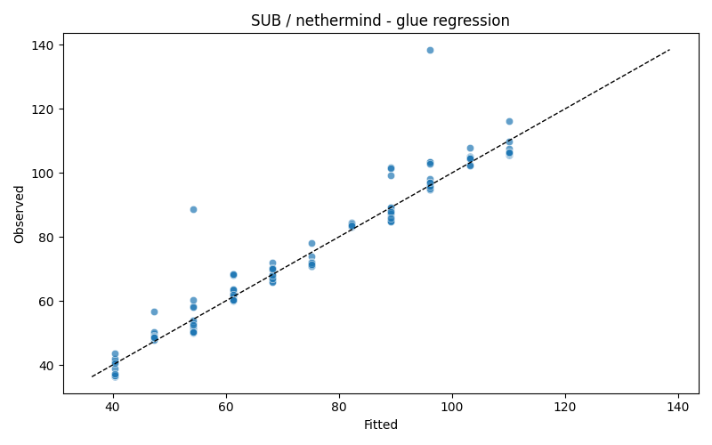

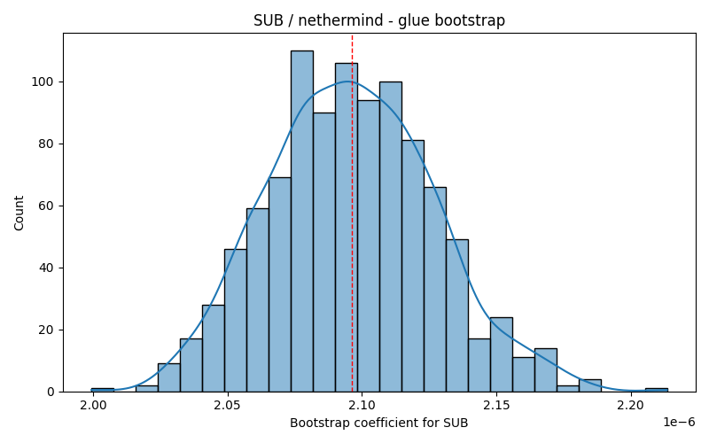

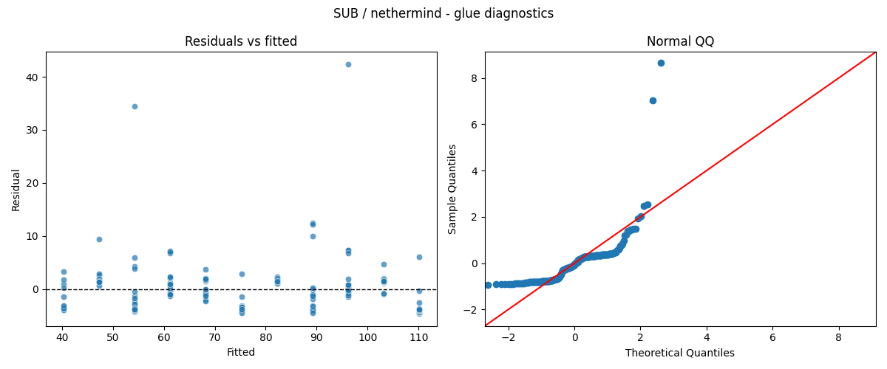

</details>

### Mixed glue (tier B) · nethermind

<details><summary><code>JUMP</code> · nobs=220 · runtime_ms=3.736e-06 · p=1.00e-03 · R²=0.9726</summary>

```
==============================================================================
                           NNLS Regression Results                            
==============================================================================
Dep. Variable:          test_runtime_ms              R-squared:          0.973
Model:                  NNLS                    Adj. R-squared:          0.972
No. Observations:       220                               RMSE:           2.33
Df Residuals:           218                                MAE:           1.88
Df Model:               1      
==============================================================================
                      coef     std err     P-value      [0.025      0.975]
------------------------------------------------------------------------------
         const      5.2105      0.5581       0.001      4.2076      6.3562
          JUMP      0.0000      0.0000       0.001      0.0000      0.0000
==============================================================================
Notes: Non-negative least squares with bootstrap inference (1000 iterations)
==============================================================================
```

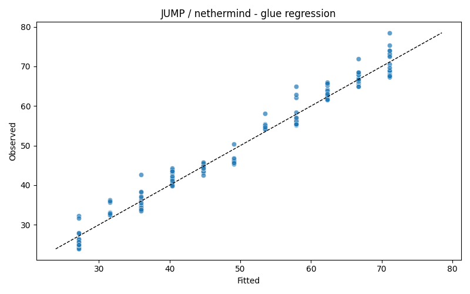

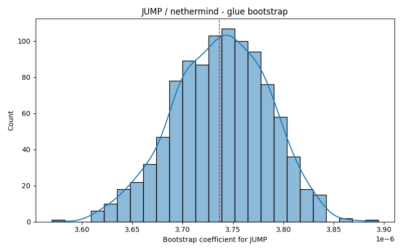

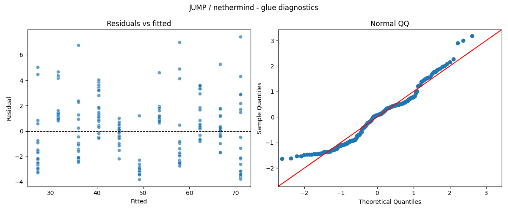

</details>

<details><summary><code>KECCAK256</code> · nobs=3520 · runtime_ms=0 · p=1.00e+00 · R²=-2.22e-16</summary>

```
==============================================================================
                           NNLS Regression Results                            
==============================================================================
Dep. Variable:          test_runtime_ms              R-squared:         -0.000
Model:                  NNLS                    Adj. R-squared:         -0.000
No. Observations:       3520                              RMSE:         216.67
Df Residuals:           3518                               MAE:         178.79
Df Model:               1      
==============================================================================
                      coef     std err     P-value      [0.025      0.975]
------------------------------------------------------------------------------
         const    320.1647      3.6506       0.001    313.1027    327.5064
     KECCAK256      0.0000      0.0000       1.000      0.0000      0.0000
==============================================================================
Notes: Non-negative least squares with bootstrap inference (1000 iterations)
==============================================================================
```

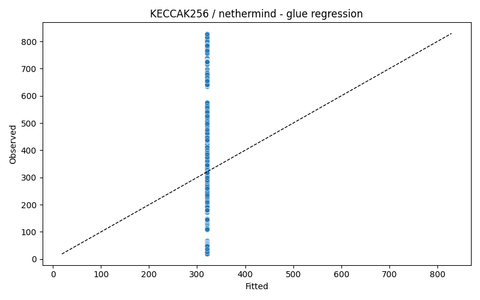


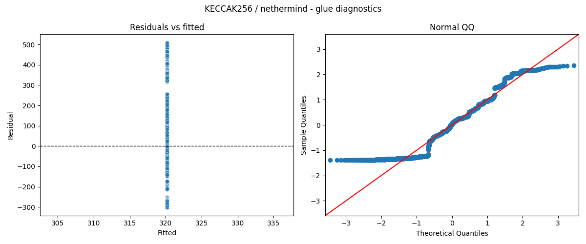

</details>

## reth

| glue_opcode | nobs | glue_runtime_ms | p_value | rsquared |
| --- | --- | --- | --- | --- |
| `ISZERO` | 165 | 1.759e-06 | 1.00e-03 | 0.923 |
| `JUMPDEST` | 165 | 5.133e-07 | 1.00e-03 | 0.9643 |
| `SWAP` | 2640 | 6.275e-07 | 1.00e-03 | 0.927 |
| `CALLDATASIZE` | 9757 | 8.726e-07 | 1.00e-03 | 0.9155 |
| `DUP` | 9757 | 6.029e-07 | 1.00e-03 | 0.9155 |
| `GAS` | 9757 | 7.25e-07 | 1.00e-03 | 0.9155 |
| `MLOAD` | 9757 | 2.084e-06 | 1.00e-03 | 0.9155 |
| `PUSH` | 9757 | 7.111e-07 | 1.00e-03 | 0.9155 |
| `PUSH0` | 9757 | 5.873e-07 | 1.00e-03 | 0.9155 |
| `STATICCALL` | 9757 | 7.347e-05 | 1.00e-03 | 0.9155 |
| `ADD` | 165 | 1.303e-06 | 1.00e-03 | 0.9566 |
| `AND` | 165 | 1.245e-06 | 1.00e-03 | 0.9248 |
| `CALLDATACOPY` | 3960 | 4.235e-06 | 1.00e-03 | 0.9129 |
| `CALLDATALOAD` | 660 | 0 | 1.00e+00 | 0 |
| `DIV` | 165 | 9.334e-06 | 1.00e-03 | 0.9456 |
| `EXP` | 165 | 0.0006032 | 1.00e-03 | 0.9831 |
| `GT` | 165 | 1.568e-06 | 1.00e-03 | 0.9511 |
| `JUMPI` | 165 | 2.279e-06 | 1.00e-03 | 0.9086 |
| `LT` | 165 | 3.133e-06 | 1.00e-03 | 0.7096 |
| `MSTORE` | 825 | 3.561e-06 | 1.00e-03 | 0.3869 |
| `MSTORE8` | 825 | 2.197e-06 | 1.00e-03 | 0.9386 |
| `MUL` | 165 | 2.014e-06 | 1.00e-03 | 0.9777 |
| `PC` | 165 | 9.532e-07 | 1.00e-03 | 0.9617 |
| `RETURNDATASIZE` | 660 | 1.405e-06 | 1.00e-03 | 0.9509 |
| `SELFBALANCE` | 165 | 7.186e-06 | 1.00e-03 | 0.9813 |
| `SUB` | 165 | 1.385e-06 | 1.00e-03 | 0.9713 |
| `JUMP` | 165 | 4.395e-06 | 1.00e-03 | 0.9464 |
| `KECCAK256` | 2640 | 0 | 1.00e+00 | 0 |

### Cycle glue — joint fit · reth

<details><summary>Joint NNLS regression summary</summary>

```
==============================================================================
                           NNLS Regression Results                            
==============================================================================
Dep. Variable:          test_runtime_ms              R-squared:          0.915
Model:                  NNLS                    Adj. R-squared:          0.915
No. Observations:       9757                              RMSE:           6.52
Df Residuals:           9749                               MAE:           4.15
Df Model:               7      
==============================================================================
                      coef     std err     P-value      [0.025      0.975]
------------------------------------------------------------------------------
         const      8.1077      0.1899       0.001      7.7412      8.4868
  CALLDATASIZE      0.0000      0.0000       0.001      0.0000      0.0000
           DUP      0.0000      0.0000       0.001      0.0000      0.0000
           GAS      0.0000      0.0000       0.001      0.0000      0.0000
         MLOAD      0.0000      0.0000       0.001      0.0000      0.0000
          PUSH      0.0000      0.0000       0.001      0.0000      0.0000
         PUSH0      0.0000      0.0000       0.001      0.0000      0.0000
    STATICCALL      0.0001      0.0000       0.001      0.0001      0.0001
==============================================================================
Notes: Non-negative least squares with bootstrap inference (1000 iterations)
==============================================================================
```

</details>

<details><summary><code>CALLDATASIZE</code> · nobs=9757 · runtime_ms=8.726e-07 · p=1.00e-03 · R²=0.9155</summary>


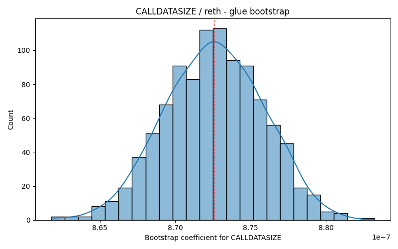


</details>

<details><summary><code>DUP</code> · nobs=9757 · runtime_ms=6.029e-07 · p=1.00e-03 · R²=0.9155</summary>

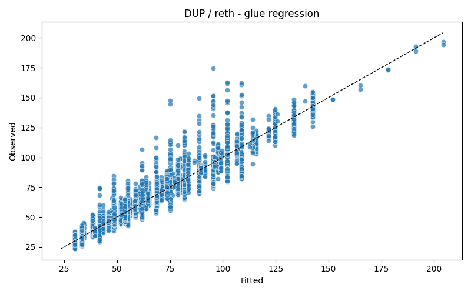

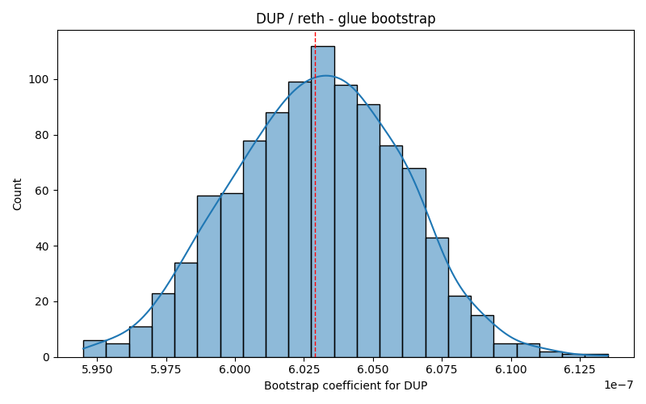


</details>

<details><summary><code>GAS</code> · nobs=9757 · runtime_ms=7.25e-07 · p=1.00e-03 · R²=0.9155</summary>


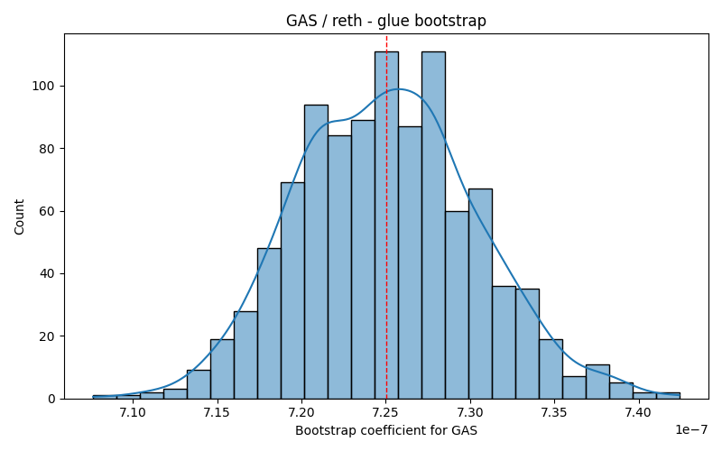

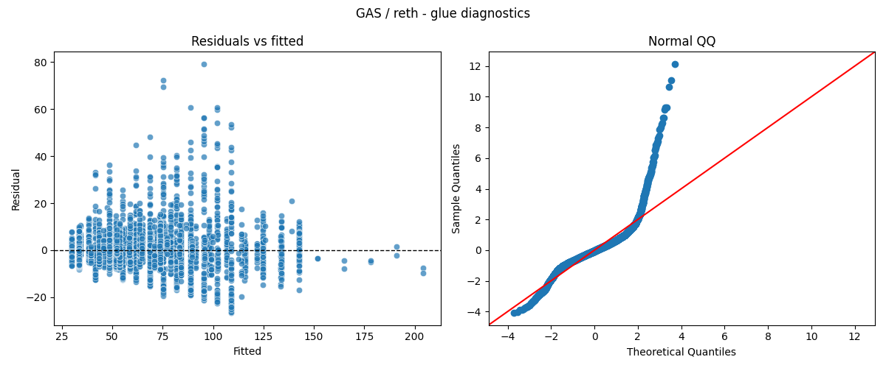

</details>

<details><summary><code>MLOAD</code> · nobs=9757 · runtime_ms=2.084e-06 · p=1.00e-03 · R²=0.9155</summary>


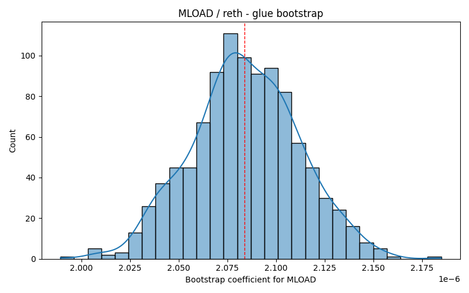


</details>

<details><summary><code>PUSH</code> · nobs=9757 · runtime_ms=7.111e-07 · p=1.00e-03 · R²=0.9155</summary>


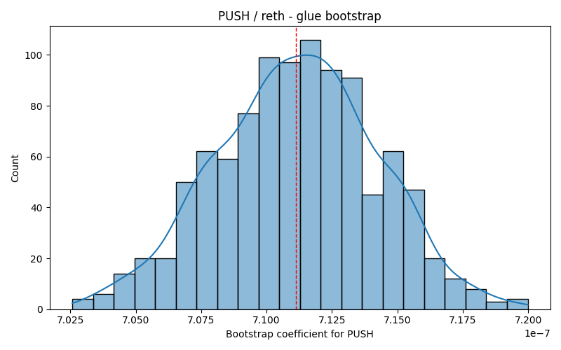


</details>

<details><summary><code>PUSH0</code> · nobs=9757 · runtime_ms=5.873e-07 · p=1.00e-03 · R²=0.9155</summary>


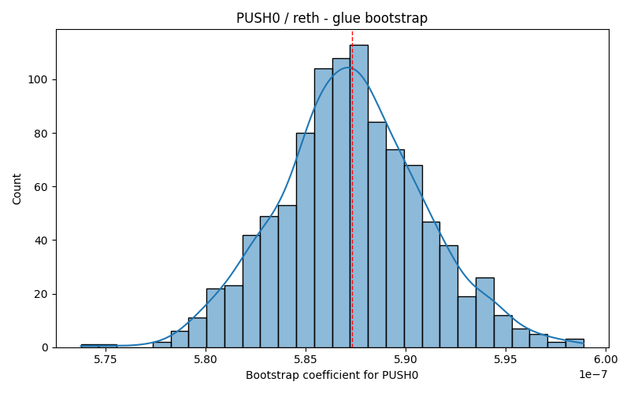


</details>

<details><summary><code>STATICCALL</code> · nobs=9757 · runtime_ms=7.347e-05 · p=1.00e-03 · R²=0.9155</summary>

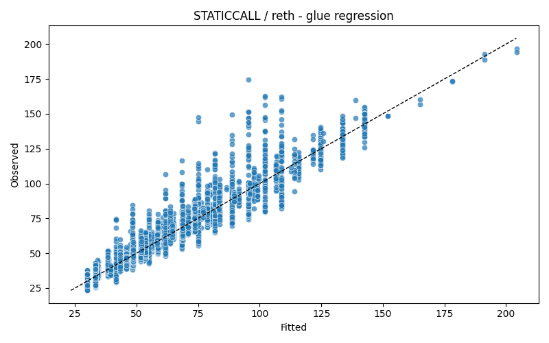

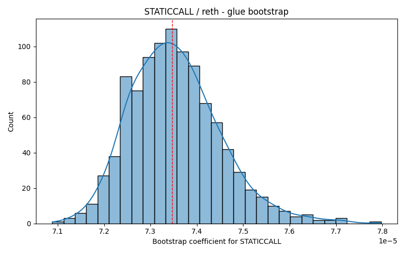


</details>

### Pure glue · reth

<details><summary><code>ISZERO</code> · nobs=165 · runtime_ms=1.759e-06 · p=1.00e-03 · R²=0.923</summary>

```
==============================================================================
                           NNLS Regression Results                            
==============================================================================
Dep. Variable:          test_runtime_ms              R-squared:          0.923
Model:                  NNLS                    Adj. R-squared:          0.922
No. Observations:       165                               RMSE:          10.71
Df Residuals:           163                                MAE:           8.48
Df Model:               1      
==============================================================================
                      coef     std err     P-value      [0.025      0.975]
------------------------------------------------------------------------------
         const     16.9951      2.1325       0.001     12.6920     21.1374
        ISZERO      0.0000      0.0000       0.001      0.0000      0.0000
==============================================================================
Notes: Non-negative least squares with bootstrap inference (1000 iterations)
==============================================================================
```

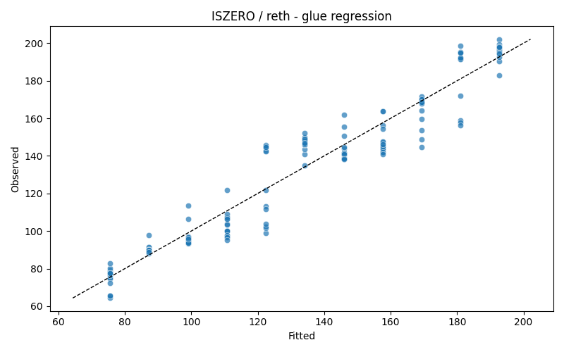

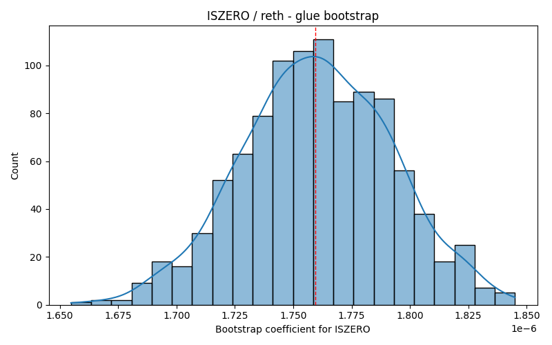

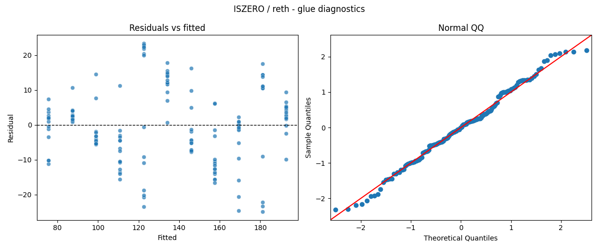

</details>

<details><summary><code>JUMPDEST</code> · nobs=165 · runtime_ms=5.133e-07 · p=1.00e-03 · R²=0.9643</summary>

```
==============================================================================
                           NNLS Regression Results                            
==============================================================================
Dep. Variable:          test_runtime_ms              R-squared:          0.964
Model:                  NNLS                    Adj. R-squared:          0.964
No. Observations:       165                               RMSE:           6.24
Df Residuals:           163                                MAE:           4.93
Df Model:               1      
==============================================================================
                      coef     std err     P-value      [0.025      0.975]
------------------------------------------------------------------------------
         const      7.4216      1.4241       0.001      4.6938     10.2836
      JUMPDEST      0.0000      0.0000       0.001      0.0000      0.0000
==============================================================================
Notes: Non-negative least squares with bootstrap inference (1000 iterations)
==============================================================================
```

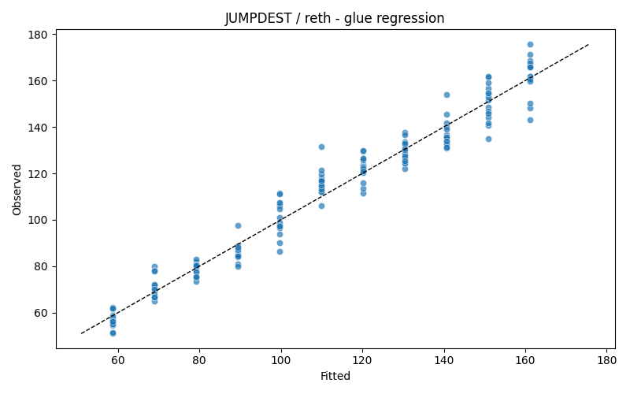

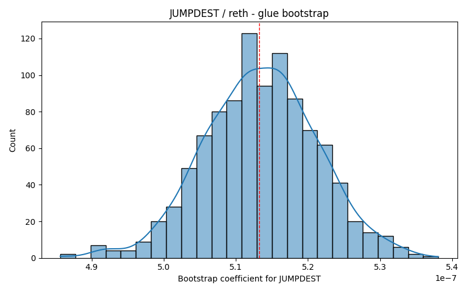

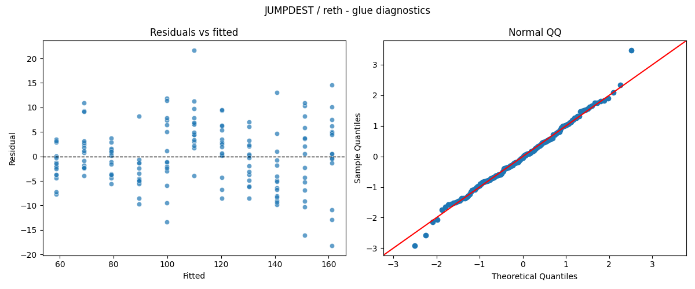

</details>

<details><summary><code>SWAP</code> · nobs=2640 · runtime_ms=6.275e-07 · p=1.00e-03 · R²=0.927</summary>

```
==============================================================================
                           NNLS Regression Results                            
==============================================================================
Dep. Variable:          test_runtime_ms              R-squared:          0.927
Model:                  NNLS                    Adj. R-squared:          0.927
No. Observations:       2640                              RMSE:           3.71
Df Residuals:           2638                               MAE:           2.80
Df Model:               1      
==============================================================================
                      coef     std err     P-value      [0.025      0.975]
------------------------------------------------------------------------------
         const      8.1933      0.2293       0.001      7.7343      8.6643
          SWAP      0.0000      0.0000       0.001      0.0000      0.0000
==============================================================================
Notes: Non-negative least squares with bootstrap inference (1000 iterations)
==============================================================================
```

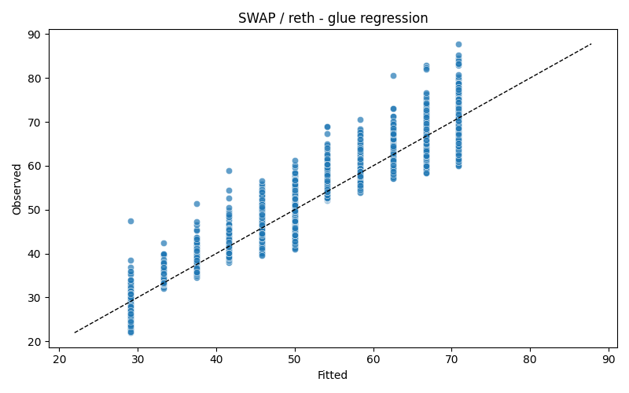

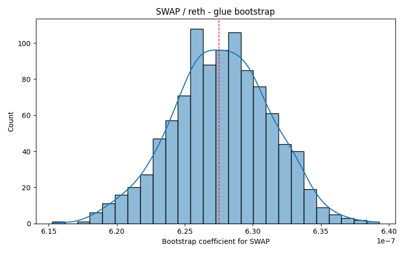

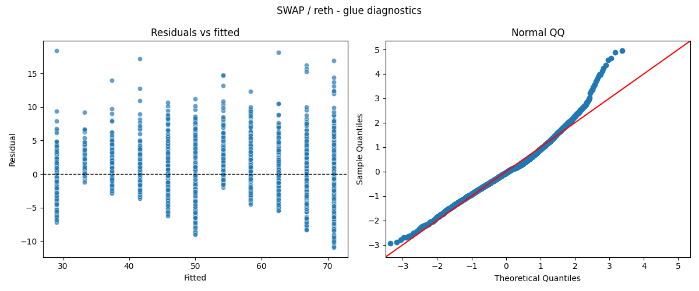

</details>

### Mixed glue (tier A) · reth

<details><summary><code>ADD</code> · nobs=165 · runtime_ms=1.303e-06 · p=1.00e-03 · R²=0.9566</summary>

```
==============================================================================
                           NNLS Regression Results                            
==============================================================================
Dep. Variable:          test_runtime_ms              R-squared:          0.957
Model:                  NNLS                    Adj. R-squared:          0.956
No. Observations:       165                               RMSE:           2.92
Df Residuals:           163                                MAE:           2.17
Df Model:               1      
==============================================================================
                      coef     std err     P-value      [0.025      0.975]
------------------------------------------------------------------------------
         const      7.2161      0.8093       0.001      5.5120      8.7263
           ADD      0.0000      0.0000       0.001      0.0000      0.0000
==============================================================================
Notes: Non-negative least squares with bootstrap inference (1000 iterations)
==============================================================================
```

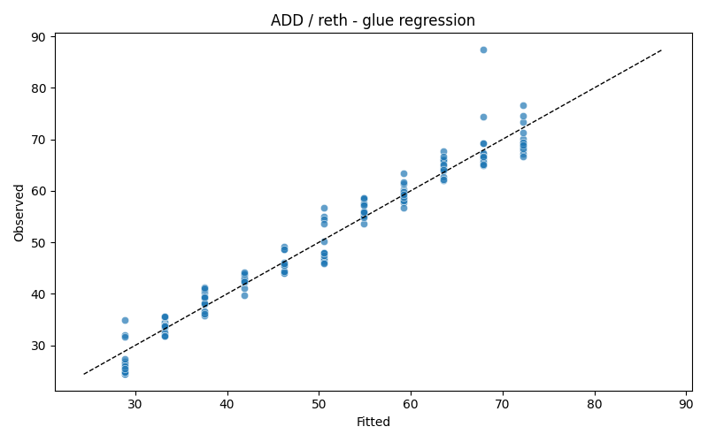

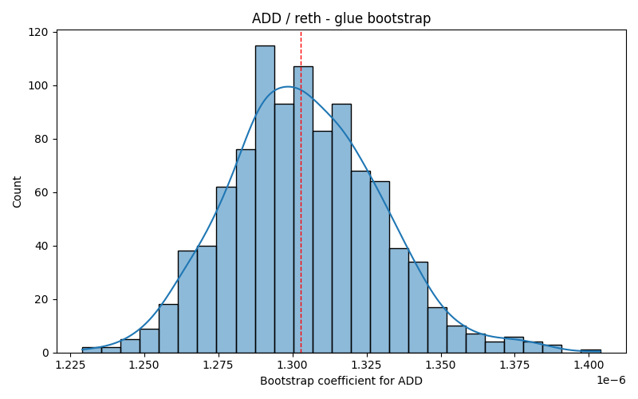

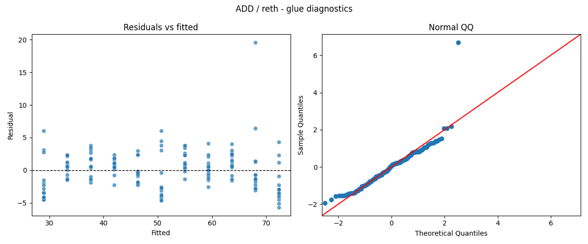

</details>

<details><summary><code>AND</code> · nobs=165 · runtime_ms=1.245e-06 · p=1.00e-03 · R²=0.9248</summary>

```
==============================================================================
                           NNLS Regression Results                            
==============================================================================
Dep. Variable:          test_runtime_ms              R-squared:          0.925
Model:                  NNLS                    Adj. R-squared:          0.924
No. Observations:       165                               RMSE:           3.74
Df Residuals:           163                                MAE:           2.60
Df Model:               1      
==============================================================================
                      coef     std err     P-value      [0.025      0.975]
------------------------------------------------------------------------------
         const      7.0736      1.0223       0.001      5.2108      9.1951
           AND      0.0000      0.0000       0.001      0.0000      0.0000
==============================================================================
Notes: Non-negative least squares with bootstrap inference (1000 iterations)
==============================================================================
```

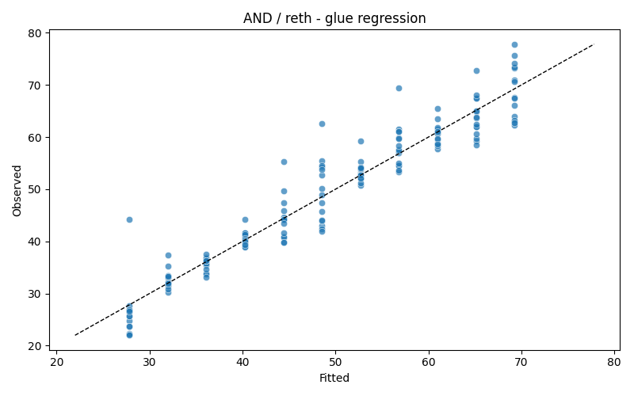

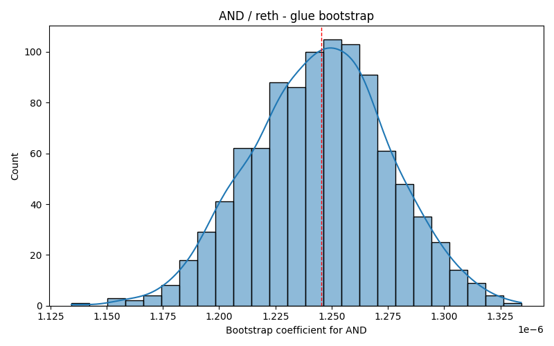

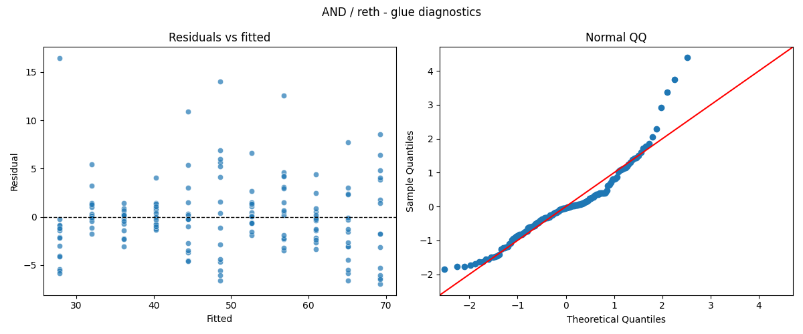

</details>

<details><summary><code>CALLDATACOPY</code> · nobs=3960 · runtime_ms=4.235e-06 · p=1.00e-03 · R²=0.9129</summary>

```
==============================================================================
                           NNLS Regression Results                            
==============================================================================
Dep. Variable:          test_runtime_ms              R-squared:          0.913
Model:                  NNLS                    Adj. R-squared:          0.913
No. Observations:       3960                              RMSE:           9.84
Df Residuals:           3958                               MAE:           7.59
Df Model:               1      
==============================================================================
                      coef     std err     P-value      [0.025      0.975]
------------------------------------------------------------------------------
         const     15.4563      0.1732       0.001     15.0983     15.7742
  CALLDATACOPY      0.0000      0.0000       0.001      0.0000      0.0000
==============================================================================
Notes: Non-negative least squares with bootstrap inference (1000 iterations)
==============================================================================
```

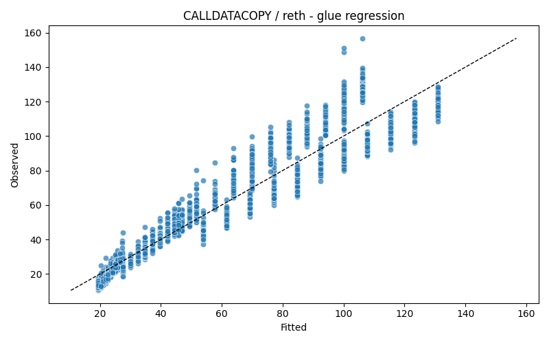

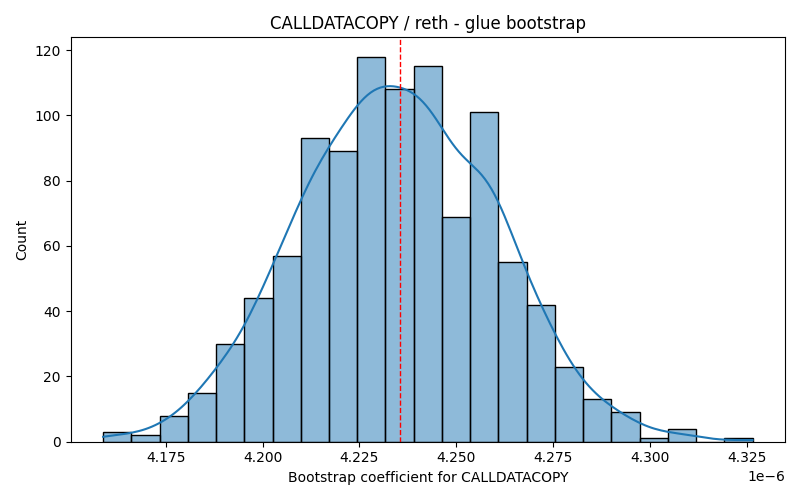

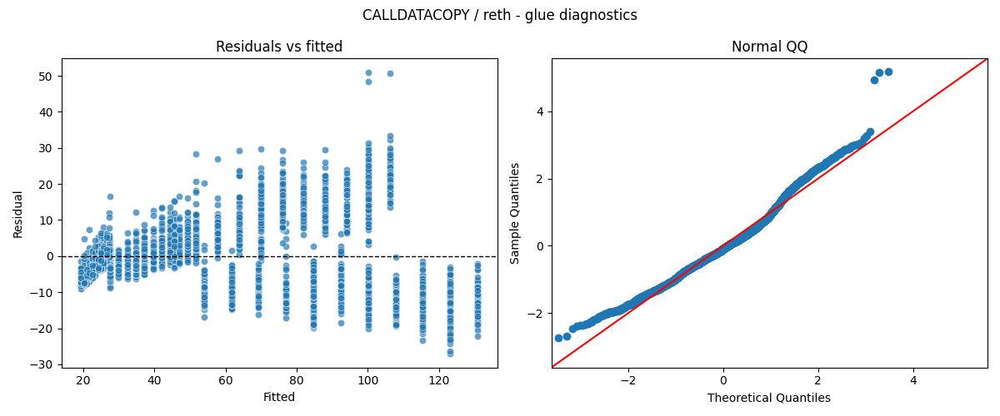

</details>

<details><summary><code>CALLDATALOAD</code> · nobs=660 · runtime_ms=0 · p=1.00e+00 · R²=0</summary>

```
==============================================================================
                           NNLS Regression Results                            
==============================================================================
Dep. Variable:          test_runtime_ms              R-squared:          0.000
Model:                  NNLS                    Adj. R-squared:         -0.002
No. Observations:       660                               RMSE:           2.82
Df Residuals:           658                                MAE:           2.59
Df Model:               1      
==============================================================================
                      coef     std err     P-value      [0.025      0.975]
------------------------------------------------------------------------------
         const      4.4479      0.2203       0.001      3.7759      4.6481
  CALLDATALOAD      0.0000      0.0000       1.000      0.0000      0.0000
==============================================================================
Notes: Non-negative least squares with bootstrap inference (1000 iterations)
==============================================================================
```

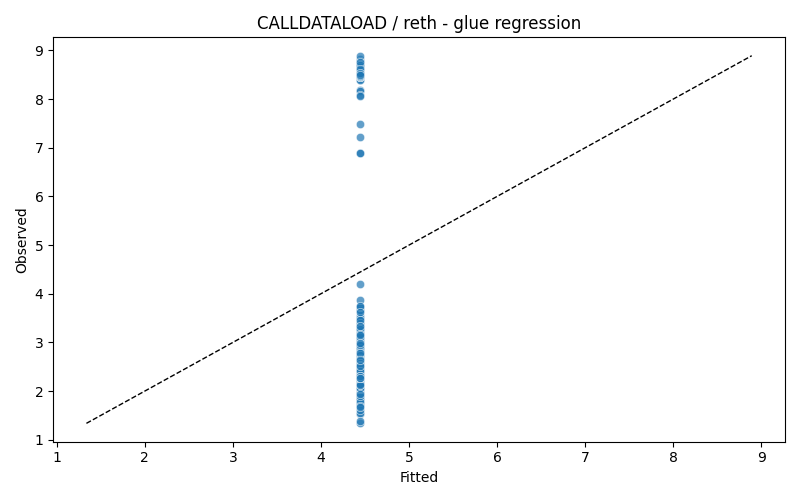

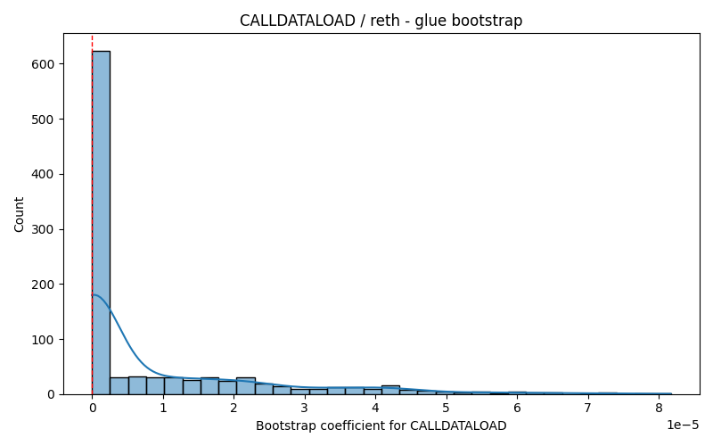

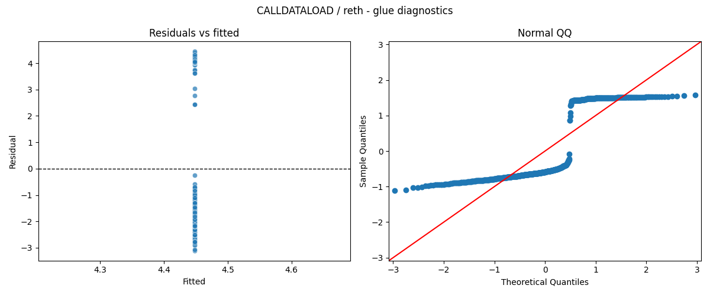

</details>

<details><summary><code>DIV</code> · nobs=165 · runtime_ms=9.334e-06 · p=1.00e-03 · R²=0.9456</summary>

```
==============================================================================
                           NNLS Regression Results                            
==============================================================================
Dep. Variable:          test_runtime_ms              R-squared:          0.946
Model:                  NNLS                    Adj. R-squared:          0.945
No. Observations:       165                               RMSE:          17.68
Df Residuals:           163                                MAE:          14.59
Df Model:               1      
==============================================================================
                      coef     std err     P-value      [0.025      0.975]
------------------------------------------------------------------------------
         const     40.3104      5.1170       0.001     30.1631     50.4681
           DIV      0.0000      0.0000       0.001      0.0000      0.0000
==============================================================================
Notes: Non-negative least squares with bootstrap inference (1000 iterations)
==============================================================================
```

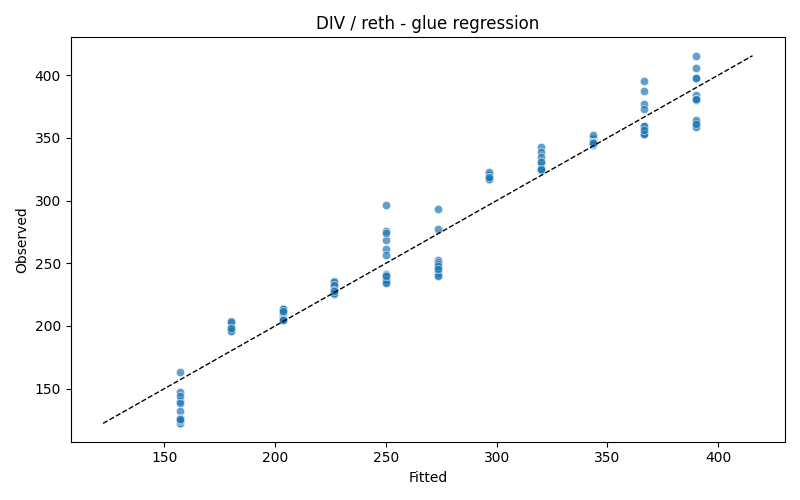

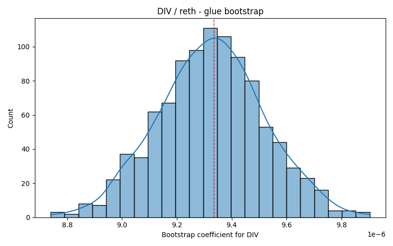

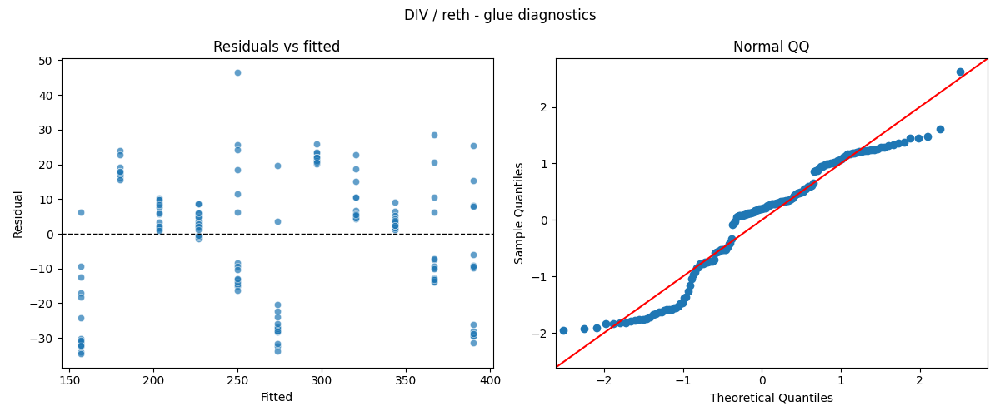

</details>

<details><summary><code>EXP</code> · nobs=165 · runtime_ms=0.0006032 · p=1.00e-03 · R²=0.9831</summary>

```
==============================================================================
                           NNLS Regression Results                            
==============================================================================
Dep. Variable:          test_runtime_ms              R-squared:          0.983
Model:                  NNLS                    Adj. R-squared:          0.983
No. Observations:       165                               RMSE:           3.10
Df Residuals:           163                                MAE:           2.24
Df Model:               1      
==============================================================================
                      coef     std err     P-value      [0.025      0.975]
------------------------------------------------------------------------------
         const      7.7270      0.8777       0.001      6.0748      9.5157
           EXP      0.0006      0.0000       0.001      0.0006      0.0006
==============================================================================
Notes: Non-negative least squares with bootstrap inference (1000 iterations)
==============================================================================
```

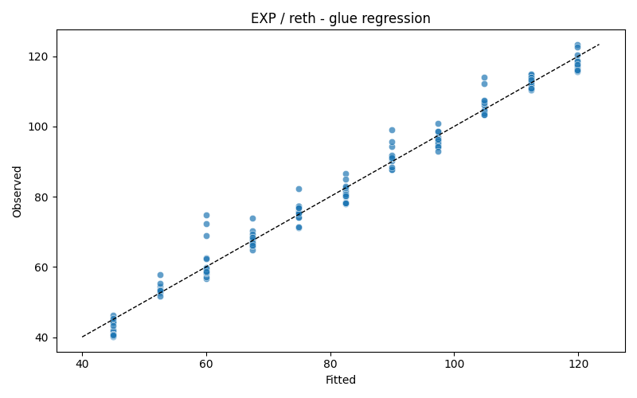

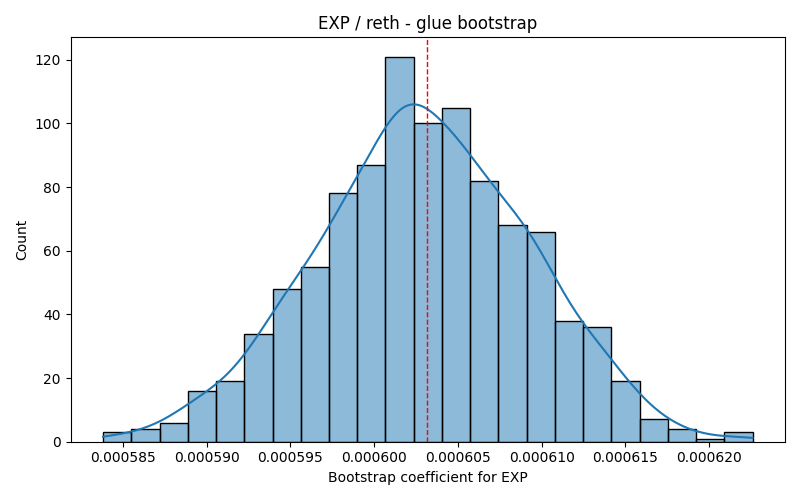

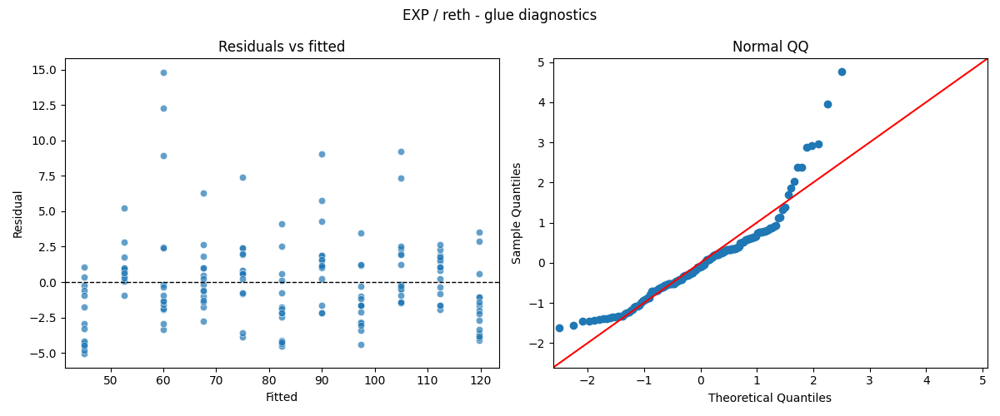

</details>

<details><summary><code>GT</code> · nobs=165 · runtime_ms=1.568e-06 · p=1.00e-03 · R²=0.9511</summary>

```
==============================================================================
                           NNLS Regression Results                            
==============================================================================
Dep. Variable:          test_runtime_ms              R-squared:          0.951
Model:                  NNLS                    Adj. R-squared:          0.951
No. Observations:       165                               RMSE:           3.74
Df Residuals:           163                                MAE:           2.90
Df Model:               1      
==============================================================================
                      coef     std err     P-value      [0.025      0.975]
------------------------------------------------------------------------------
         const      7.7818      0.7975       0.001      6.2656      9.2586
            GT      0.0000      0.0000       0.001      0.0000      0.0000
==============================================================================
Notes: Non-negative least squares with bootstrap inference (1000 iterations)
==============================================================================
```

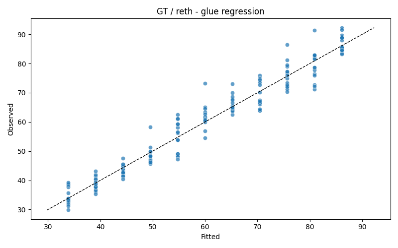

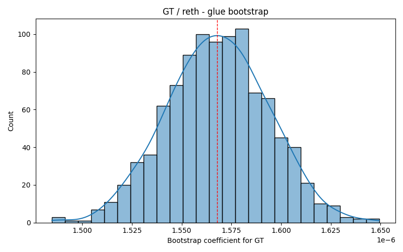

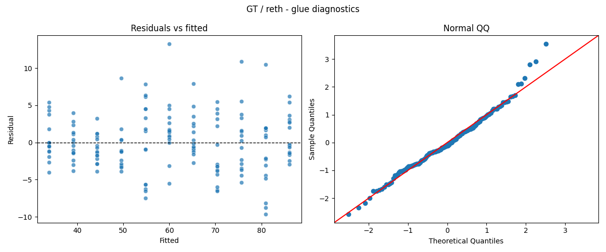

</details>

<details><summary><code>JUMPI</code> · nobs=165 · runtime_ms=2.279e-06 · p=1.00e-03 · R²=0.9086</summary>

```
==============================================================================
                           NNLS Regression Results                            
==============================================================================
Dep. Variable:          test_runtime_ms              R-squared:          0.909
Model:                  NNLS                    Adj. R-squared:          0.908
No. Observations:       165                               RMSE:           3.26
Df Residuals:           163                                MAE:           2.38
Df Model:               1      
==============================================================================
                      coef     std err     P-value      [0.025      0.975]
------------------------------------------------------------------------------
         const      6.5981      0.7903       0.001      5.1230      8.1464
         JUMPI      0.0000      0.0000       0.001      0.0000      0.0000
==============================================================================
Notes: Non-negative least squares with bootstrap inference (1000 iterations)
==============================================================================
```

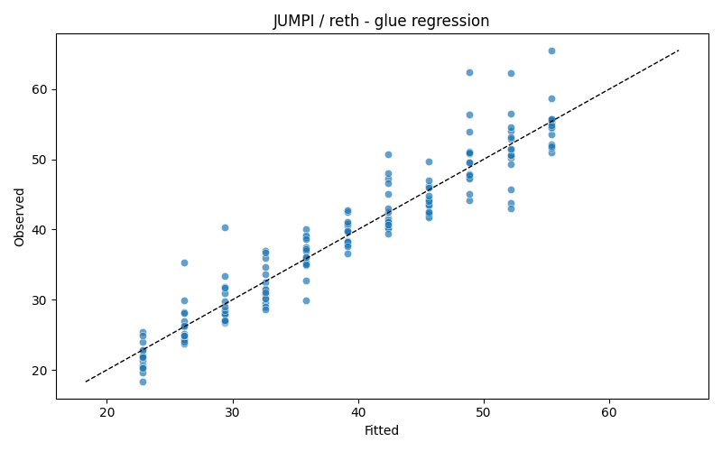

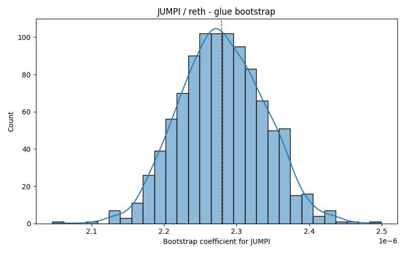

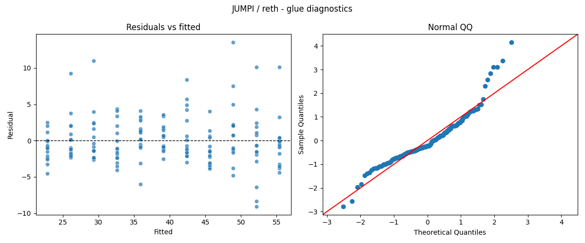

</details>

<details><summary><code>LT</code> · nobs=165 · runtime_ms=3.133e-06 · p=1.00e-03 · R²=0.7096</summary>

```
==============================================================================
                           NNLS Regression Results                            
==============================================================================
Dep. Variable:          test_runtime_ms              R-squared:          0.710
Model:                  NNLS                    Adj. R-squared:          0.708
No. Observations:       165                               RMSE:          23.76
Df Residuals:           163                                MAE:          19.86
Df Model:               1      
==============================================================================
                      coef     std err     P-value      [0.025      0.975]
------------------------------------------------------------------------------
         const      0.0000      0.1422       1.000      0.0000      0.0000
            LT      0.0000      0.0000       0.001      0.0000      0.0000
==============================================================================
Notes: Non-negative least squares with bootstrap inference (1000 iterations)
==============================================================================
```

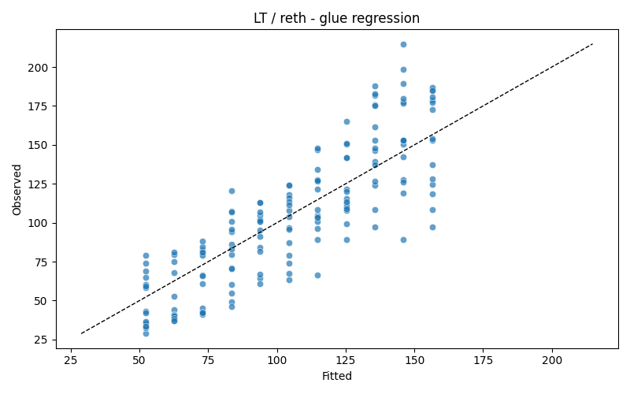

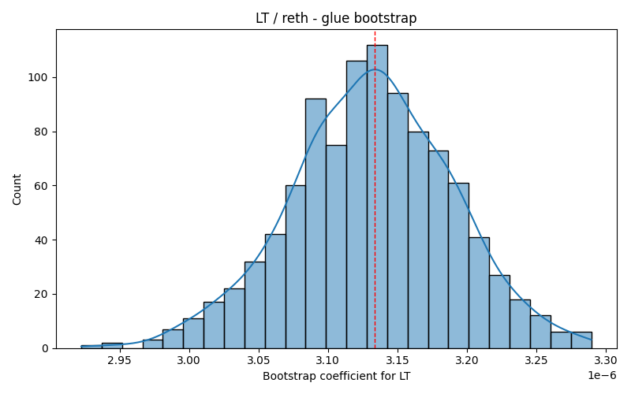

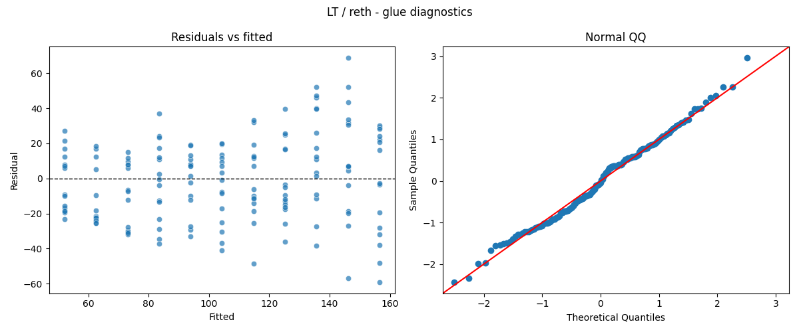

</details>

<details><summary><code>MSTORE</code> · nobs=825 · runtime_ms=3.561e-06 · p=1.00e-03 · R²=0.3869</summary>

```
==============================================================================
                           NNLS Regression Results                            
==============================================================================
Dep. Variable:          test_runtime_ms              R-squared:          0.387
Model:                  NNLS                    Adj. R-squared:          0.386
No. Observations:       825                               RMSE:          31.47
Df Residuals:           823                                MAE:          28.77
Df Model:               1      
==============================================================================
                      coef     std err     P-value      [0.025      0.975]
------------------------------------------------------------------------------
         const     16.9668      3.1113       0.001     10.8759     22.6627
        MSTORE      0.0000      0.0000       0.001      0.0000      0.0000
==============================================================================
Notes: Non-negative least squares with bootstrap inference (1000 iterations)
==============================================================================
```

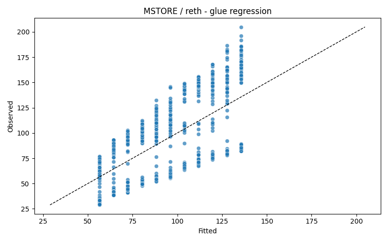

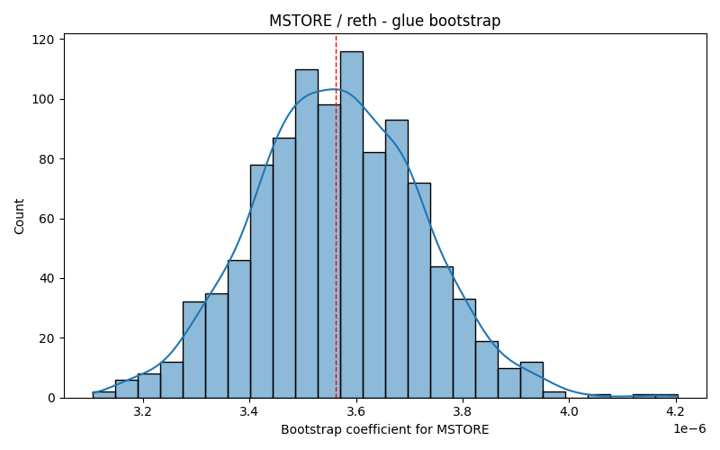

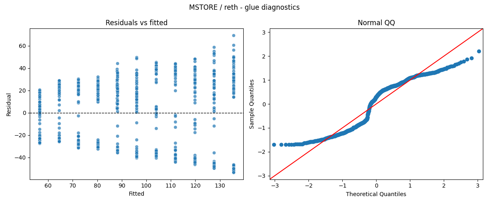

</details>

<details><summary><code>MSTORE8</code> · nobs=825 · runtime_ms=2.197e-06 · p=1.00e-03 · R²=0.9386</summary>

```
==============================================================================
                           NNLS Regression Results                            
==============================================================================
Dep. Variable:          test_runtime_ms              R-squared:          0.939
Model:                  NNLS                    Adj. R-squared:          0.939
No. Observations:       825                               RMSE:           3.94
Df Residuals:           823                                MAE:           2.36
Df Model:               1      
==============================================================================
                      coef     std err     P-value      [0.025      0.975]
------------------------------------------------------------------------------
         const      7.7255      0.5759       0.001      6.5459      8.7994
       MSTORE8      0.0000      0.0000       0.001      0.0000      0.0000
==============================================================================
Notes: Non-negative least squares with bootstrap inference (1000 iterations)
==============================================================================
```

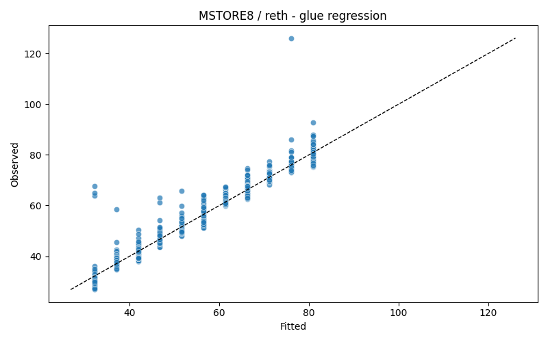

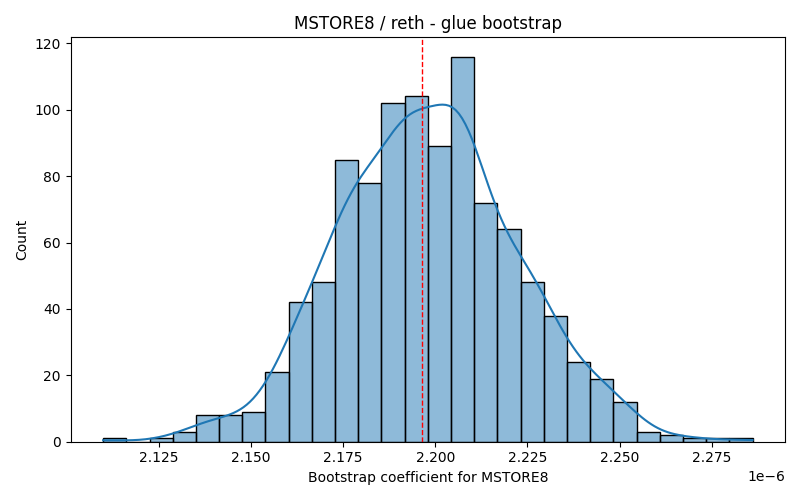

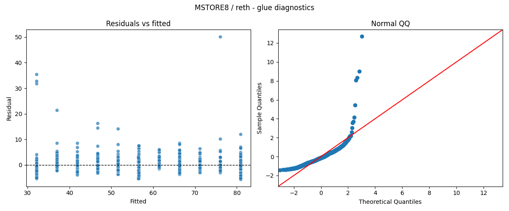

</details>

<details><summary><code>MUL</code> · nobs=165 · runtime_ms=2.014e-06 · p=1.00e-03 · R²=0.9777</summary>

```
==============================================================================
                           NNLS Regression Results                            
==============================================================================
Dep. Variable:          test_runtime_ms              R-squared:          0.978
Model:                  NNLS                    Adj. R-squared:          0.978
No. Observations:       165                               RMSE:           2.40
Df Residuals:           163                                MAE:           1.83
Df Model:               1      
==============================================================================
                      coef     std err     P-value      [0.025      0.975]
------------------------------------------------------------------------------
         const      7.3007      0.6917       0.001      5.9721      8.5807
           MUL      0.0000      0.0000       0.001      0.0000      0.0000
==============================================================================
Notes: Non-negative least squares with bootstrap inference (1000 iterations)
==============================================================================
```

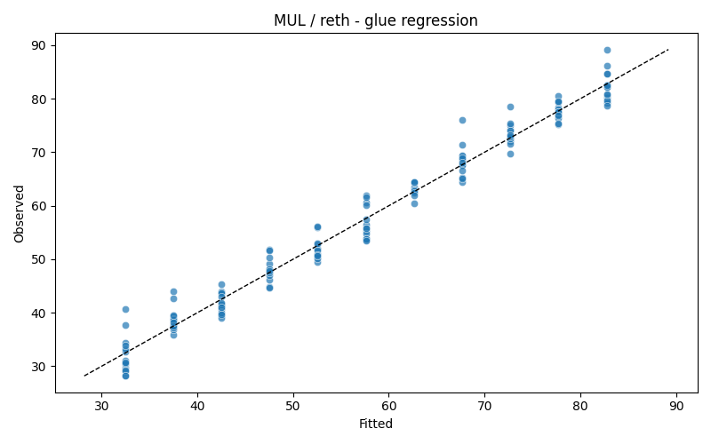

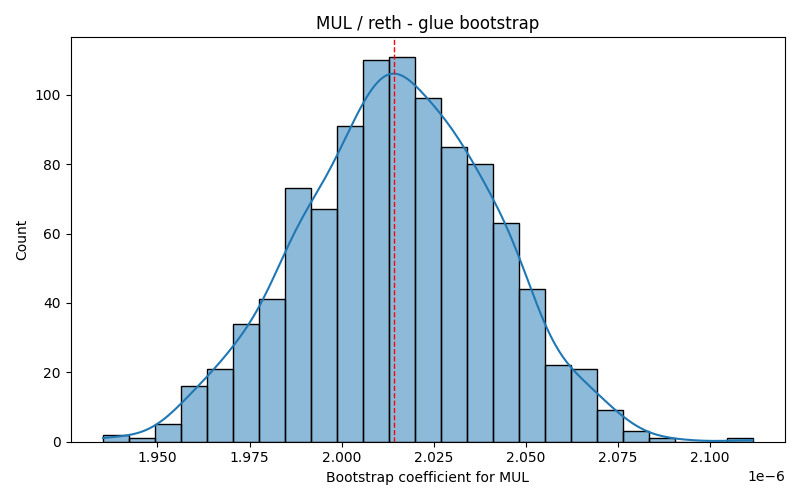

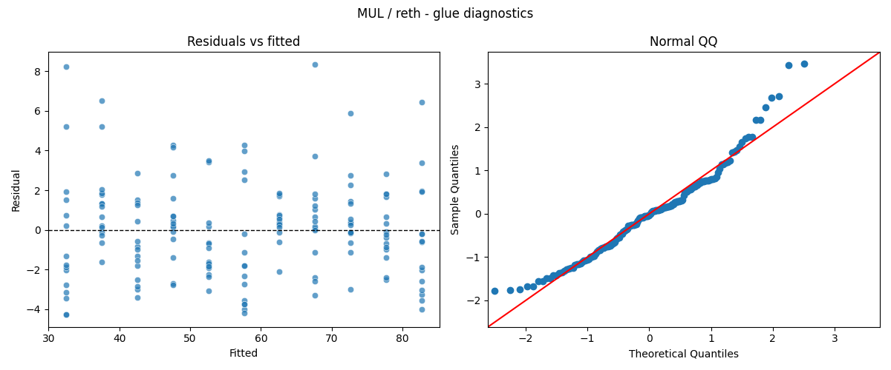

</details>

<details><summary><code>PC</code> · nobs=165 · runtime_ms=9.532e-07 · p=1.00e-03 · R²=0.9617</summary>

```
==============================================================================
                           NNLS Regression Results                            
==============================================================================
Dep. Variable:          test_runtime_ms              R-squared:          0.962
Model:                  NNLS                    Adj. R-squared:          0.961
No. Observations:       165                               RMSE:           5.69
Df Residuals:           163                                MAE:           4.45
Df Model:               1      
==============================================================================
                      coef     std err     P-value      [0.025      0.975]
------------------------------------------------------------------------------
         const      8.9823      1.2073       0.001      6.5839     11.3107
            PC      0.0000      0.0000       0.001      0.0000      0.0000
==============================================================================
Notes: Non-negative least squares with bootstrap inference (1000 iterations)
==============================================================================
```

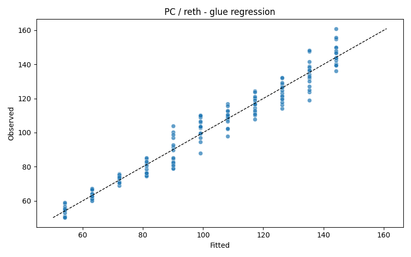

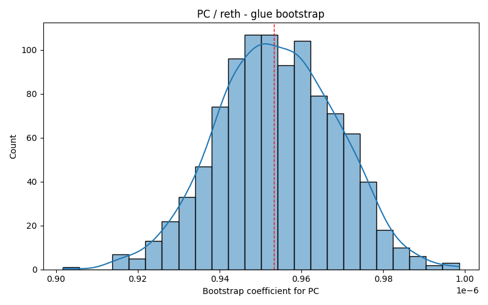

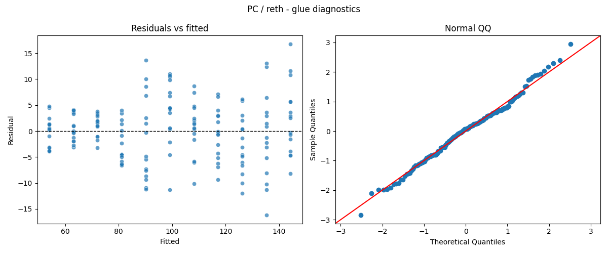

</details>

<details><summary><code>RETURNDATASIZE</code> · nobs=660 · runtime_ms=1.405e-06 · p=1.00e-03 · R²=0.9509</summary>

```
==============================================================================
                           NNLS Regression Results                            
==============================================================================
Dep. Variable:          test_runtime_ms              R-squared:          0.951
Model:                  NNLS                    Adj. R-squared:          0.951
No. Observations:       660                               RMSE:           5.04
Df Residuals:           658                                MAE:           3.90
Df Model:               1      
==============================================================================
                      coef     std err     P-value      [0.025      0.975]
------------------------------------------------------------------------------
         const      6.6316      0.5179       0.001      5.6069      7.6518
RETURNDATASIZE      0.0000      0.0000       0.001      0.0000      0.0000
==============================================================================
Notes: Non-negative least squares with bootstrap inference (1000 iterations)
==============================================================================
```

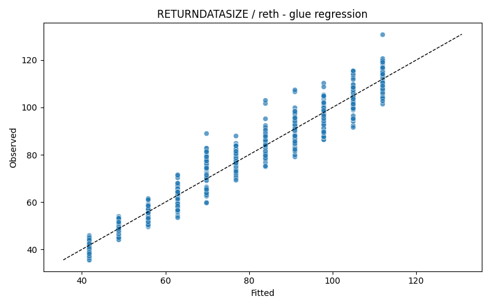

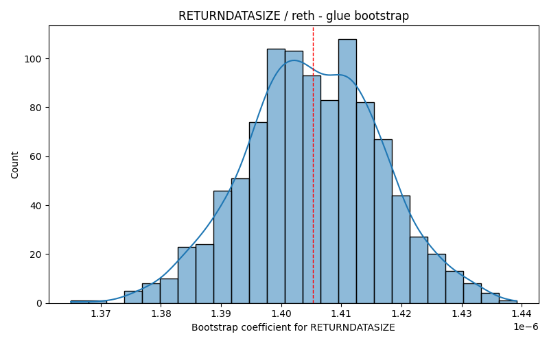

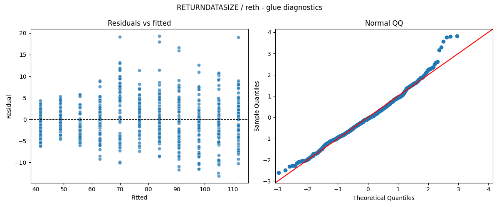

</details>

<details><summary><code>SELFBALANCE</code> · nobs=165 · runtime_ms=7.186e-06 · p=1.00e-03 · R²=0.9813</summary>

```
==============================================================================
                           NNLS Regression Results                            
==============================================================================
Dep. Variable:          test_runtime_ms              R-squared:          0.981
Model:                  NNLS                    Adj. R-squared:          0.981
No. Observations:       165                               RMSE:          12.25
Df Residuals:           163                                MAE:           9.85
Df Model:               1      
==============================================================================
                      coef     std err     P-value      [0.025      0.975]
------------------------------------------------------------------------------
         const     23.4432      3.5305       0.001     16.9864     30.5667
   SELFBALANCE      0.0000      0.0000       0.001      0.0000      0.0000
==============================================================================
Notes: Non-negative least squares with bootstrap inference (1000 iterations)
==============================================================================
```

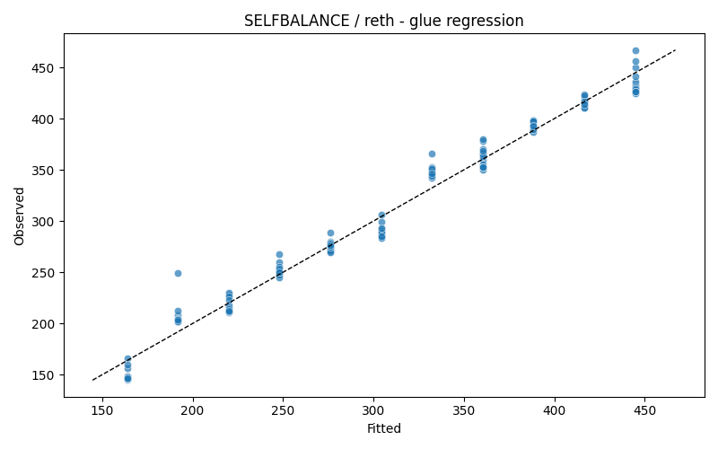

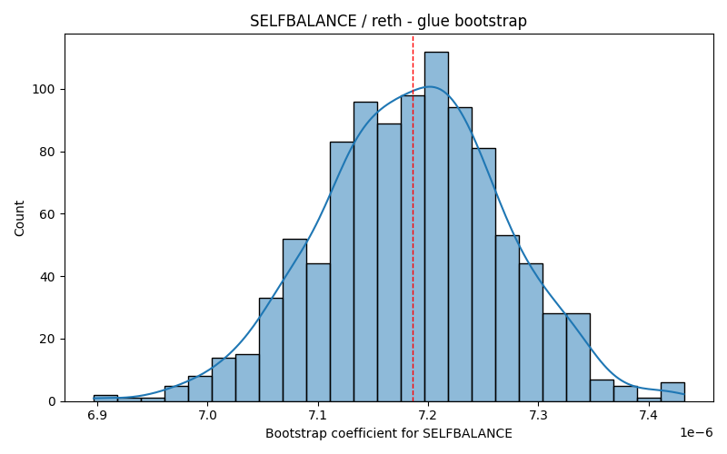

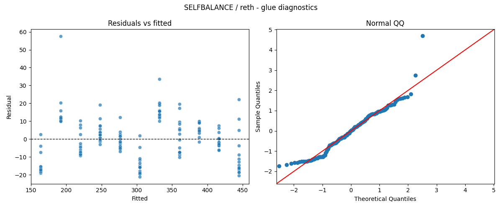

</details>

<details><summary><code>SUB</code> · nobs=165 · runtime_ms=1.385e-06 · p=1.00e-03 · R²=0.9713</summary>

```
==============================================================================
                           NNLS Regression Results                            
==============================================================================
Dep. Variable:          test_runtime_ms              R-squared:          0.971
Model:                  NNLS                    Adj. R-squared:          0.971
No. Observations:       165                               RMSE:           2.51
Df Residuals:           163                                MAE:           1.90
Df Model:               1      
==============================================================================
                      coef     std err     P-value      [0.025      0.975]
------------------------------------------------------------------------------
         const      7.4811      0.7300       0.001      6.0399      8.9641
           SUB      0.0000      0.0000       0.001      0.0000      0.0000
==============================================================================
Notes: Non-negative least squares with bootstrap inference (1000 iterations)
==============================================================================
```

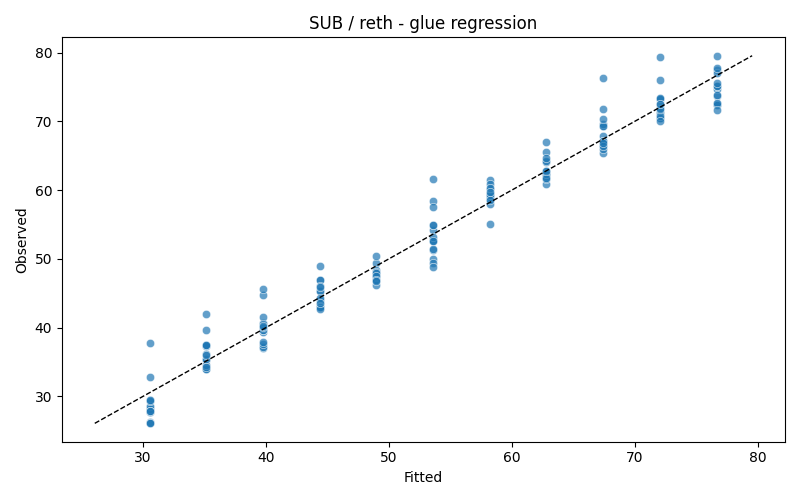

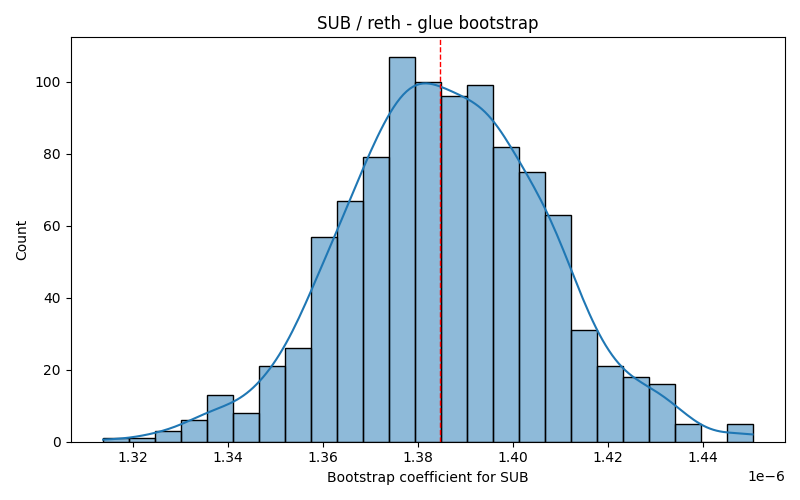

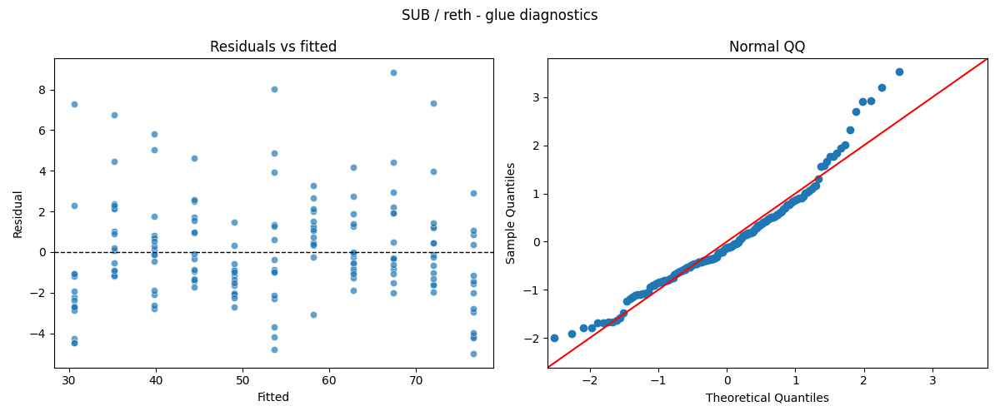

</details>

### Mixed glue (tier B) · reth

<details><summary><code>JUMP</code> · nobs=165 · runtime_ms=4.395e-06 · p=1.00e-03 · R²=0.9464</summary>

```
==============================================================================
                           NNLS Regression Results                            
==============================================================================
Dep. Variable:          test_runtime_ms              R-squared:          0.946
Model:                  NNLS                    Adj. R-squared:          0.946
No. Observations:       165                               RMSE:           3.89
Df Residuals:           163                                MAE:           2.91
Df Model:               1      
==============================================================================
                      coef     std err     P-value      [0.025      0.975]
------------------------------------------------------------------------------
         const      6.1618      0.9482       0.001      4.2397      8.0910
          JUMP      0.0000      0.0000       0.001      0.0000      0.0000
==============================================================================
Notes: Non-negative least squares with bootstrap inference (1000 iterations)
==============================================================================
```

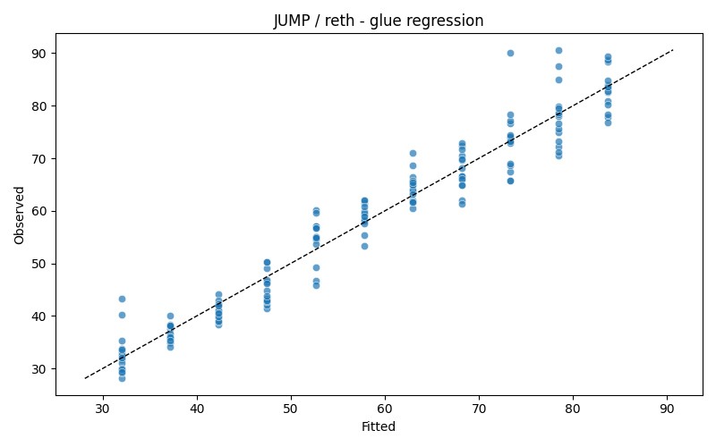

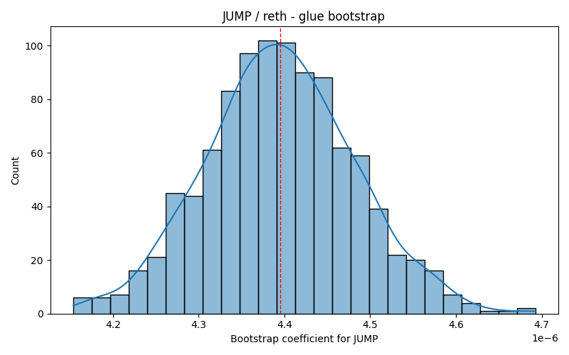

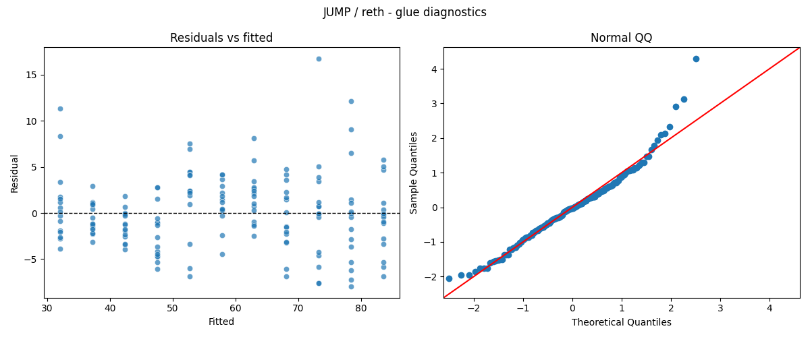

</details>

<details><summary><code>KECCAK256</code> · nobs=2640 · runtime_ms=0 · p=1.00e+00 · R²=0</summary>

```
==============================================================================
                           NNLS Regression Results                            
==============================================================================
Dep. Variable:          test_runtime_ms              R-squared:          0.000
Model:                  NNLS                    Adj. R-squared:         -0.000
No. Observations:       2640                              RMSE:         299.24
Df Residuals:           2638                               MAE:         247.74
Df Model:               1      
==============================================================================
                      coef     std err     P-value      [0.025      0.975]
------------------------------------------------------------------------------
         const    439.5123      5.7854       0.001    428.2435    451.1489
     KECCAK256      0.0000      0.0000       1.000      0.0000      0.0000
==============================================================================
Notes: Non-negative least squares with bootstrap inference (1000 iterations)
==============================================================================
```

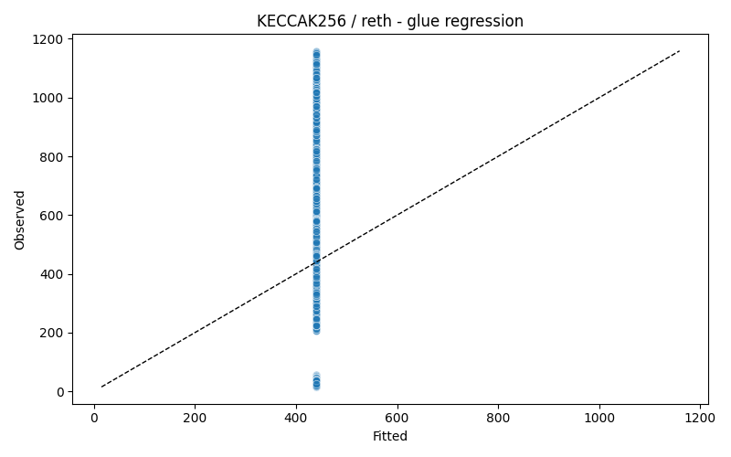

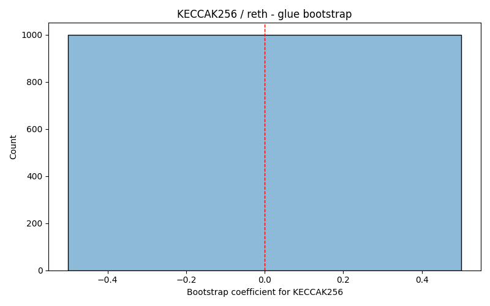

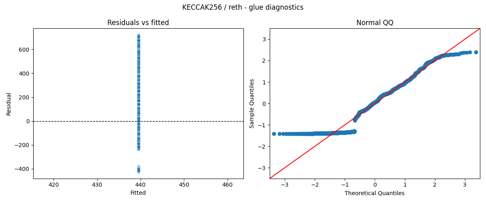

</details>
