# Glue opcodes report

Per-client NNLS fits of priced glue opcodes against their driver fixtures. Cycle-tier opcodes share one joint regression per client (shown once); pure-tier and mixed-tier opcodes each get a single-feature fit. Mixed-tier fits pre-adjust the LHS by subtracting the contribution of every priced upstream partner selected by the detector (pure ∪ cycle for `mixed_a`, plus `mixed_a` for `mixed_b`).

**Contents:** [besu](#besu) · [erigon](#erigon) · [ethrex](#ethrex) · [geth](#geth) · [nethermind](#nethermind) · [reth](#reth)

## besu

| glue_opcode | nobs | glue_runtime_ms | p_value | rsquared |
| --- | --- | --- | --- | --- |
| `ISZERO` | 121 | 6.112e-06 | 1.00e-03 | 0.9853 |
| `JUMPDEST` | 121 | 1.239e-06 | 1.00e-03 | 0.8511 |
| `SWAP` | 1936 | 3.528e-06 | 1.00e-03 | 0.9841 |
| `CALLDATASIZE` | 7161 | 5.091e-06 | 1.00e-03 | 0.981 |
| `DUP` | 7161 | 2.428e-06 | 1.00e-03 | 0.981 |
| `GAS` | 7161 | 4.205e-06 | 1.00e-03 | 0.981 |
| `MLOAD` | 7161 | 1.32e-05 | 1.00e-03 | 0.981 |
| `PUSH` | 7161 | 3.241e-06 | 1.00e-03 | 0.981 |
| `PUSH0` | 7161 | 2.266e-06 | 1.00e-03 | 0.981 |
| `STATICCALL` | 7161 | 0.0008424 | 1.00e-03 | 0.981 |
| `ADD` | 121 | 1.607e-05 | 1.00e-03 | 0.968 |
| `AND` | 121 | 1.05e-05 | 1.00e-03 | 0.9805 |
| `CALLDATACOPY` | 2904 | 2.34e-05 | 1.00e-03 | 0.7183 |
| `CALLDATALOAD` | 484 | 3.334e-05 | 1.00e-03 | 0.02845 |
| `DIV` | 121 | 2.236e-05 | 1.00e-03 | 0.9419 |
| `EXP` | 121 | 0.002266 | 1.00e-03 | 0.9581 |
| `GT` | 121 | 4.485e-05 | 1.00e-03 | 0.9831 |
| `JUMPI` | 121 | 9.509e-06 | 1.00e-03 | 0.9543 |
| `LT` | 121 | 4.543e-05 | 1.00e-03 | 0.6537 |
| `MSTORE` | 605 | 2.69e-05 | 1.00e-03 | 0.9778 |
| `MSTORE8` | 605 | 1.527e-05 | 1.00e-03 | 0.9754 |
| `MUL` | 121 | 1.419e-05 | 1.00e-03 | 0.8471 |
| `PC` | 121 | 4.942e-06 | 1.00e-03 | 0.9811 |
| `RETURNDATASIZE` | 484 | 7.291e-06 | 1.00e-03 | 0.9882 |
| `SELFBALANCE` | 121 | 2.342e-05 | 1.00e-03 | 0.9889 |
| `SUB` | 121 | 1.684e-05 | 1.00e-03 | 0.9728 |
| `JUMP` | 121 | 3.684e-05 | 1.00e-03 | 0.97 |
| `KECCAK256` | 1936 | 4.731e-05 | 1.00e-03 | 0.1067 |

### Cycle glue — joint fit · besu

<details><summary>Joint NNLS regression summary</summary>

```
==============================================================================
                           NNLS Regression Results                            
==============================================================================
Dep. Variable:          test_runtime_ms              R-squared:          0.981
Model:                  NNLS                    Adj. R-squared:          0.981
No. Observations:       7161                              RMSE:          20.68
Df Residuals:           7153                               MAE:          13.70
Df Model:               7      
==============================================================================
                      coef     std err     P-value      [0.025      0.975]
------------------------------------------------------------------------------
         const     35.3157      0.8472       0.001     33.5894     36.9049
  CALLDATASIZE      0.0000      0.0000       0.001      0.0000      0.0000
           DUP      0.0000      0.0000       0.001      0.0000      0.0000
           GAS      0.0000      0.0000       0.001      0.0000      0.0000
         MLOAD      0.0000      0.0000       0.001      0.0000      0.0000
          PUSH      0.0000      0.0000       0.001      0.0000      0.0000
         PUSH0      0.0000      0.0000       0.001      0.0000      0.0000
    STATICCALL      0.0008      0.0000       0.001      0.0008      0.0009
==============================================================================
Notes: Non-negative least squares with bootstrap inference (1000 iterations)
==============================================================================
```

</details>

<details><summary><code>CALLDATASIZE</code> · nobs=7161 · runtime_ms=5.091e-06 · p=1.00e-03 · R²=0.981</summary>

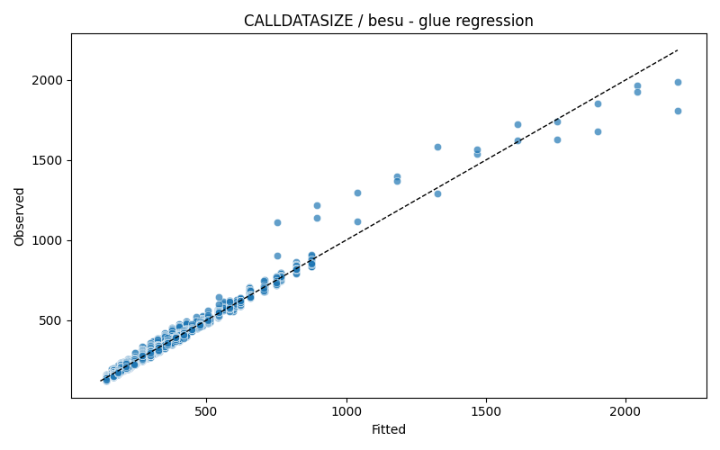

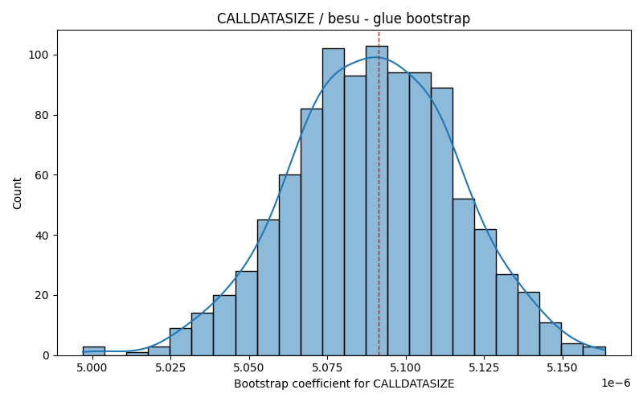

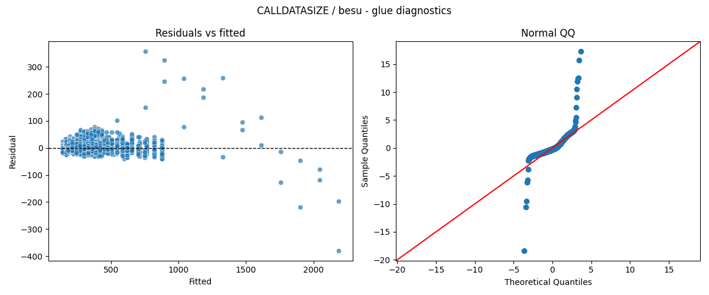

</details>

<details><summary><code>DUP</code> · nobs=7161 · runtime_ms=2.428e-06 · p=1.00e-03 · R²=0.981</summary>


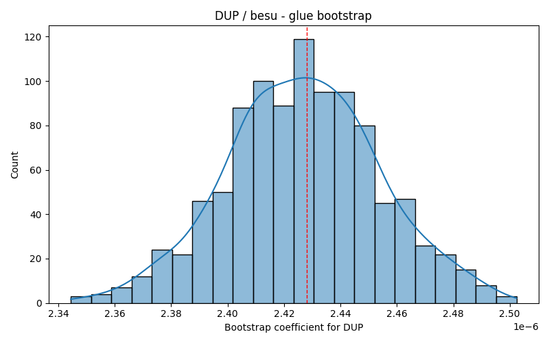

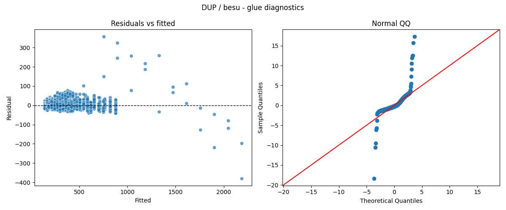

</details>

<details><summary><code>GAS</code> · nobs=7161 · runtime_ms=4.205e-06 · p=1.00e-03 · R²=0.981</summary>

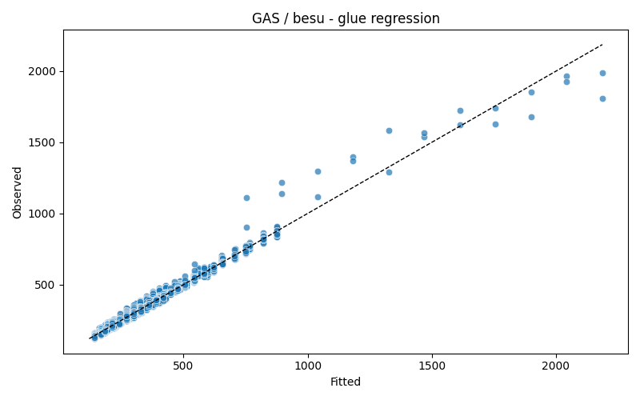

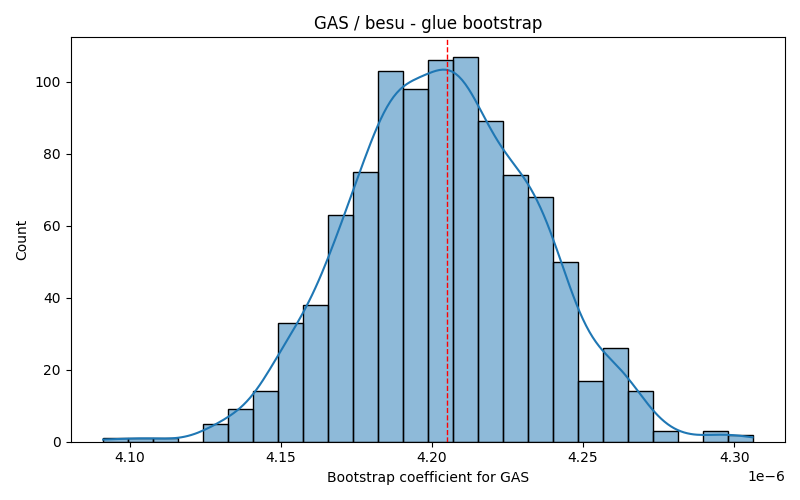


</details>

<details><summary><code>MLOAD</code> · nobs=7161 · runtime_ms=1.32e-05 · p=1.00e-03 · R²=0.981</summary>


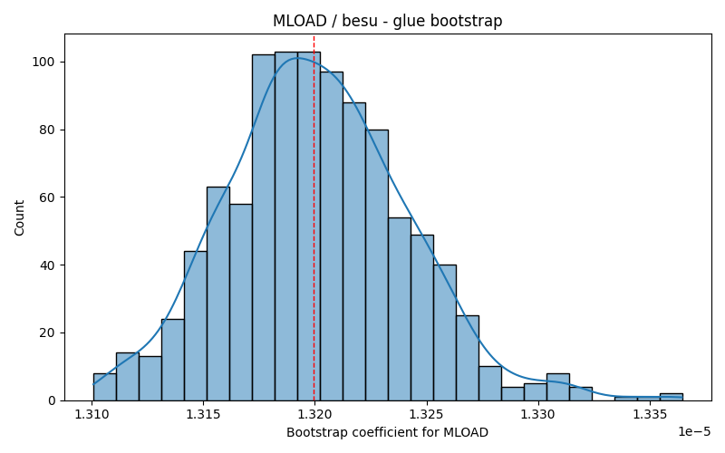


</details>

<details><summary><code>PUSH</code> · nobs=7161 · runtime_ms=3.241e-06 · p=1.00e-03 · R²=0.981</summary>

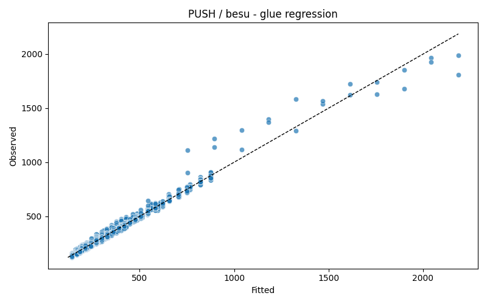

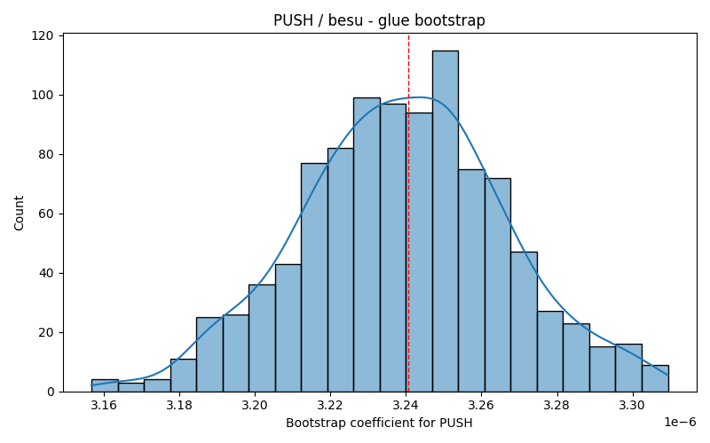


</details>

<details><summary><code>PUSH0</code> · nobs=7161 · runtime_ms=2.266e-06 · p=1.00e-03 · R²=0.981</summary>


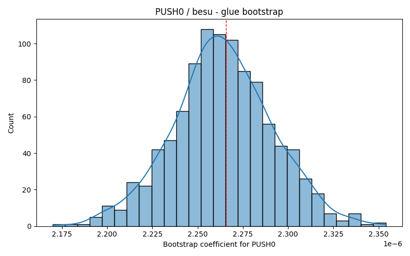


</details>

<details><summary><code>STATICCALL</code> · nobs=7161 · runtime_ms=0.0008424 · p=1.00e-03 · R²=0.981</summary>


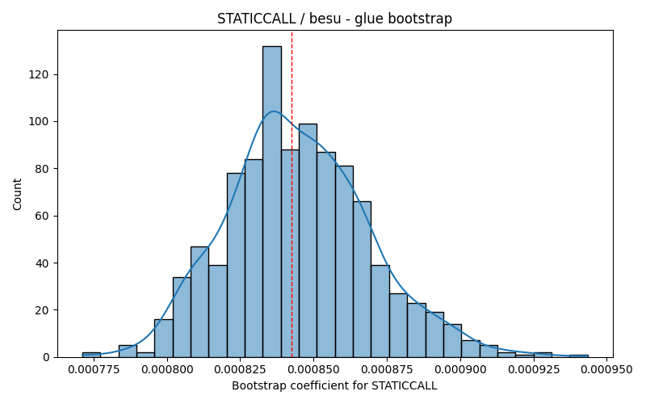


</details>

### Pure glue · besu

<details><summary><code>ISZERO</code> · nobs=121 · runtime_ms=6.112e-06 · p=1.00e-03 · R²=0.9853</summary>

```
==============================================================================
                           NNLS Regression Results                            
==============================================================================
Dep. Variable:          test_runtime_ms              R-squared:          0.985
Model:                  NNLS                    Adj. R-squared:          0.985
No. Observations:       121                               RMSE:          15.70
Df Residuals:           119                                MAE:          11.25
Df Model:               1      
==============================================================================
                      coef     std err     P-value      [0.025      0.975]
------------------------------------------------------------------------------
         const     34.4197      4.6641       0.001     24.7136     43.4490
        ISZERO      0.0000      0.0000       0.001      0.0000      0.0000
==============================================================================
Notes: Non-negative least squares with bootstrap inference (1000 iterations)
==============================================================================
```

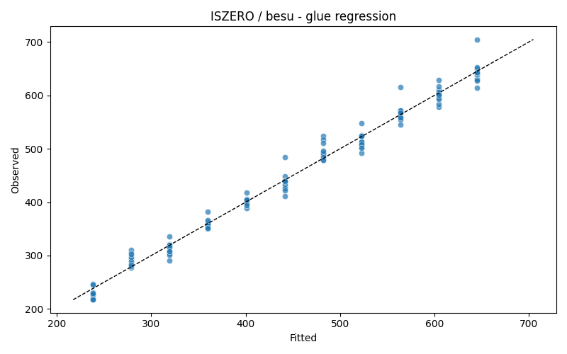

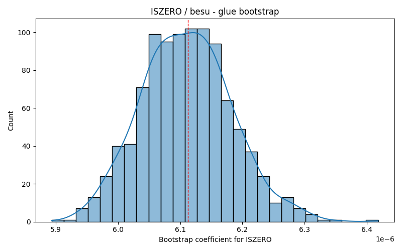

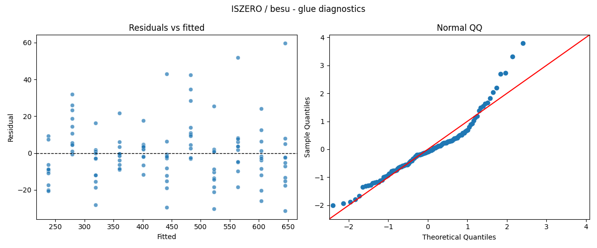

</details>

<details><summary><code>JUMPDEST</code> · nobs=121 · runtime_ms=1.239e-06 · p=1.00e-03 · R²=0.8511</summary>

```
==============================================================================
                           NNLS Regression Results                            
==============================================================================
Dep. Variable:          test_runtime_ms              R-squared:          0.851
Model:                  NNLS                    Adj. R-squared:          0.850
No. Observations:       121                               RMSE:          32.75
Df Residuals:           119                                MAE:          23.58
Df Model:               1      
==============================================================================
                      coef     std err     P-value      [0.025      0.975]
------------------------------------------------------------------------------
         const     27.5601      8.4080       0.003     12.1366     43.8510
      JUMPDEST      0.0000      0.0000       0.001      0.0000      0.0000
==============================================================================
Notes: Non-negative least squares with bootstrap inference (1000 iterations)
==============================================================================
```

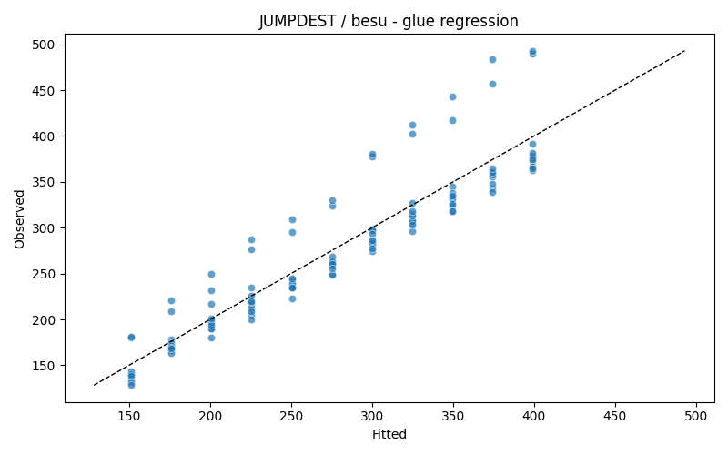

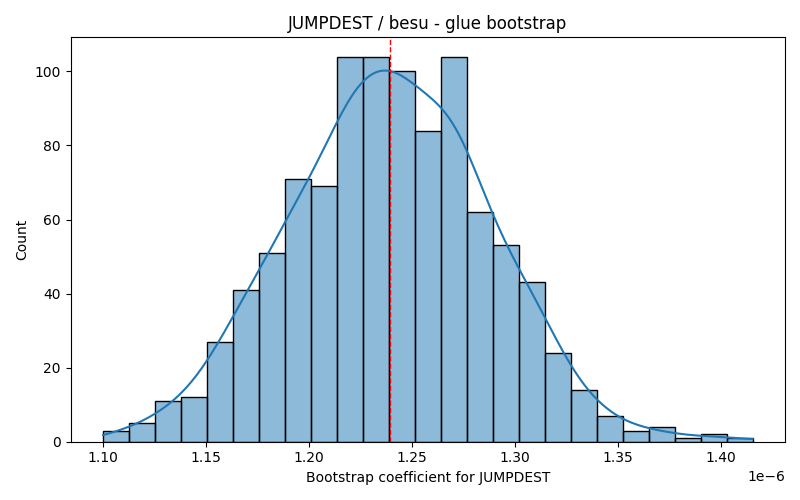

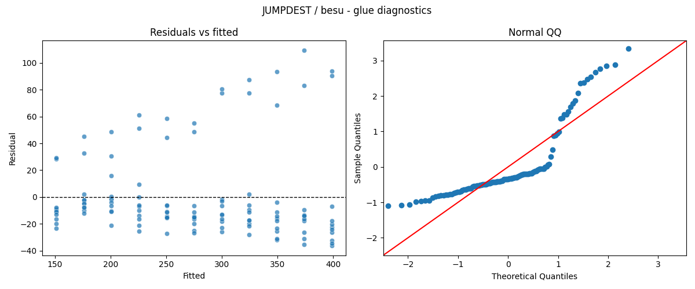

</details>

<details><summary><code>SWAP</code> · nobs=1936 · runtime_ms=3.528e-06 · p=1.00e-03 · R²=0.9841</summary>

```
==============================================================================
                           NNLS Regression Results                            
==============================================================================
Dep. Variable:          test_runtime_ms              R-squared:          0.984
Model:                  NNLS                    Adj. R-squared:          0.984
No. Observations:       1936                              RMSE:           9.45
Df Residuals:           1934                               MAE:           7.27
Df Model:               1      
==============================================================================
                      coef     std err     P-value      [0.025      0.975]
------------------------------------------------------------------------------
         const     31.7593      0.6991       0.001     30.3636     33.1304
          SWAP      0.0000      0.0000       0.001      0.0000      0.0000
==============================================================================
Notes: Non-negative least squares with bootstrap inference (1000 iterations)
==============================================================================
```

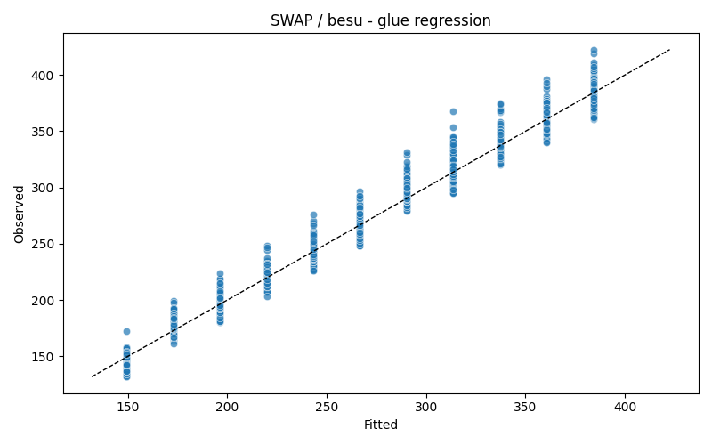

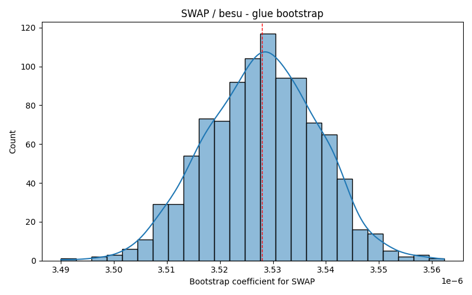

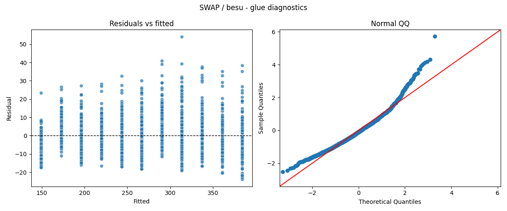

</details>

### Mixed glue (tier A) · besu

<details><summary><code>ADD</code> · nobs=121 · runtime_ms=1.607e-05 · p=1.00e-03 · R²=0.968</summary>

```
==============================================================================
                           NNLS Regression Results                            
==============================================================================
Dep. Variable:          test_runtime_ms              R-squared:          0.968
Model:                  NNLS                    Adj. R-squared:          0.968
No. Observations:       121                               RMSE:          30.78
Df Residuals:           119                                MAE:          23.47
Df Model:               1      
==============================================================================
                      coef     std err     P-value      [0.025      0.975]
------------------------------------------------------------------------------
         const     72.1267      9.3135       0.001     53.6133     91.0393
           ADD      0.0000      0.0000       0.001      0.0000      0.0000
==============================================================================
Notes: Non-negative least squares with bootstrap inference (1000 iterations)
==============================================================================
```

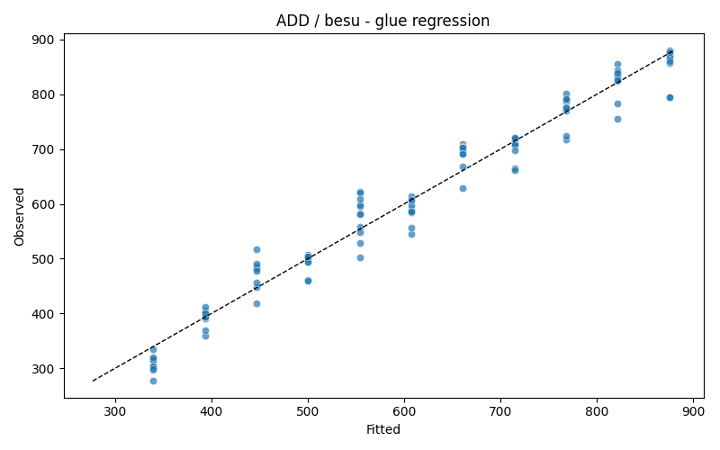

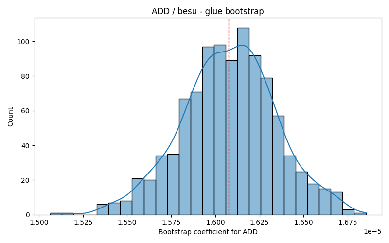

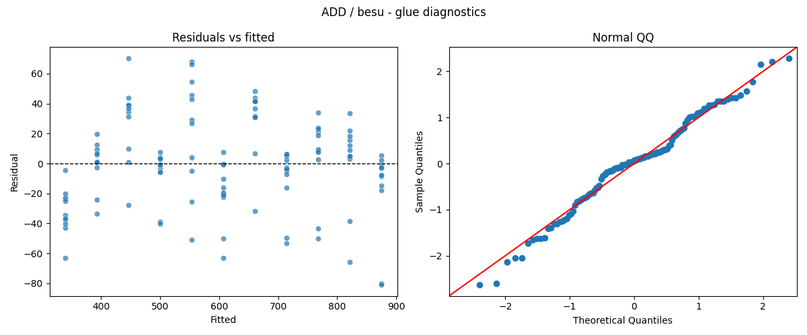

</details>

<details><summary><code>AND</code> · nobs=121 · runtime_ms=1.05e-05 · p=1.00e-03 · R²=0.9805</summary>

```
==============================================================================
                           NNLS Regression Results                            
==============================================================================
Dep. Variable:          test_runtime_ms              R-squared:          0.980
Model:                  NNLS                    Adj. R-squared:          0.980
No. Observations:       121                               RMSE:          15.61
Df Residuals:           119                                MAE:          11.39
Df Model:               1      
==============================================================================
                      coef     std err     P-value      [0.025      0.975]
------------------------------------------------------------------------------
         const     40.4233      4.8452       0.001     30.3383     49.1855
           AND      0.0000      0.0000       0.001      0.0000      0.0000
==============================================================================
Notes: Non-negative least squares with bootstrap inference (1000 iterations)
==============================================================================
```

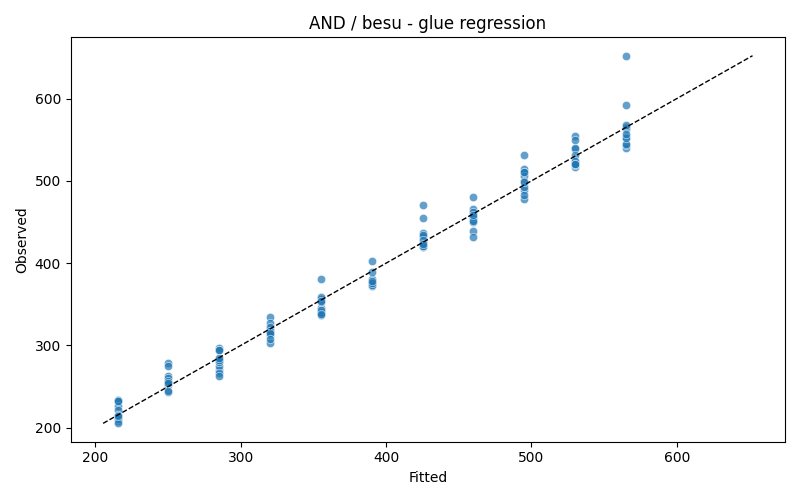

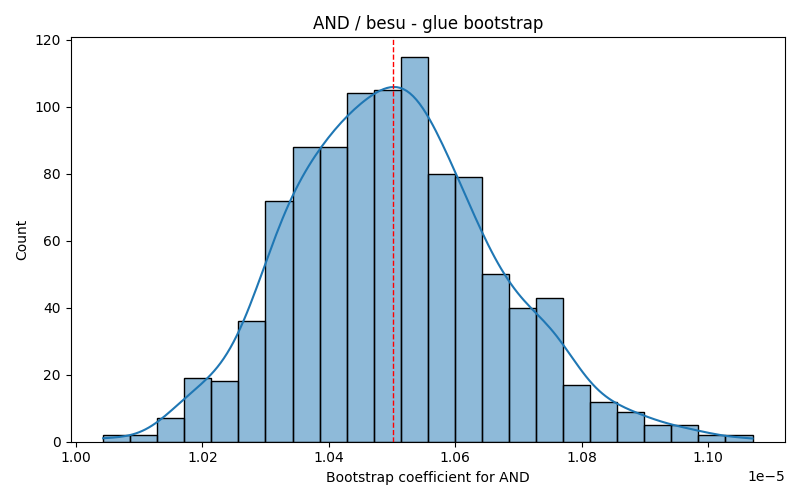

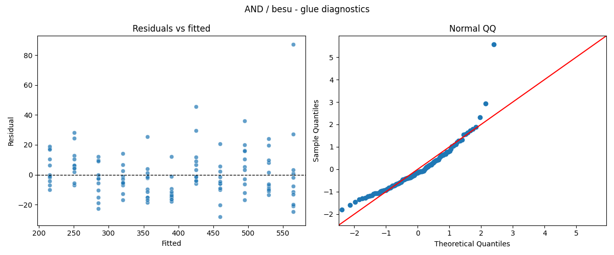

</details>

<details><summary><code>CALLDATACOPY</code> · nobs=2904 · runtime_ms=2.34e-05 · p=1.00e-03 · R²=0.7183</summary>

```
==============================================================================
                           NNLS Regression Results                            
==============================================================================
Dep. Variable:          test_runtime_ms              R-squared:          0.718
Model:                  NNLS                    Adj. R-squared:          0.718
No. Observations:       2904                              RMSE:         110.23
Df Residuals:           2902                               MAE:          85.96
Df Model:               1      
==============================================================================
                      coef     std err     P-value      [0.025      0.975]
------------------------------------------------------------------------------
         const    140.3647      2.1619       0.001    136.1365    144.5544
  CALLDATACOPY      0.0000      0.0000       0.001      0.0000      0.0000
==============================================================================
Notes: Non-negative least squares with bootstrap inference (1000 iterations)
==============================================================================
```

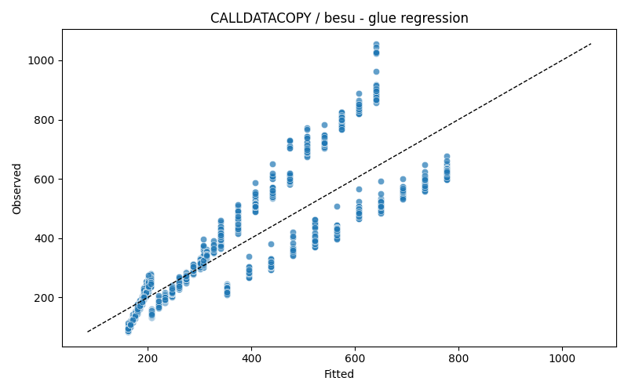

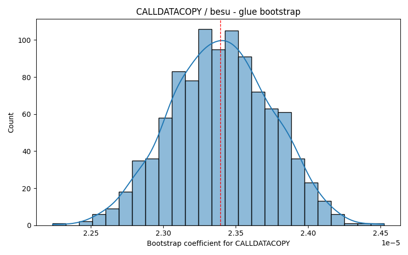

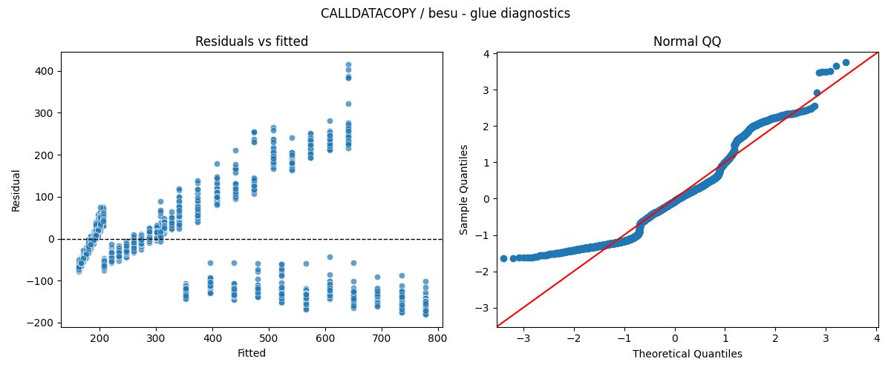

</details>

<details><summary><code>CALLDATALOAD</code> · nobs=484 · runtime_ms=3.334e-05 · p=1.00e-03 · R²=0.02845</summary>

```
==============================================================================
                           NNLS Regression Results                            
==============================================================================
Dep. Variable:          test_runtime_ms              R-squared:          0.028
Model:                  NNLS                    Adj. R-squared:          0.026
No. Observations:       484                               RMSE:           0.75
Df Residuals:           482                                MAE:           0.49
Df Model:               1      
==============================================================================
                      coef     std err     P-value      [0.025      0.975]
------------------------------------------------------------------------------
         const      3.1421      0.1178       0.001      2.9104      3.3686
  CALLDATALOAD      0.0000      0.0000       0.001      0.0000      0.0000
==============================================================================
Notes: Non-negative least squares with bootstrap inference (1000 iterations)
==============================================================================
```

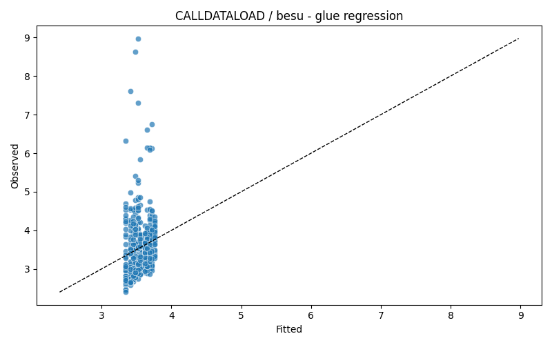

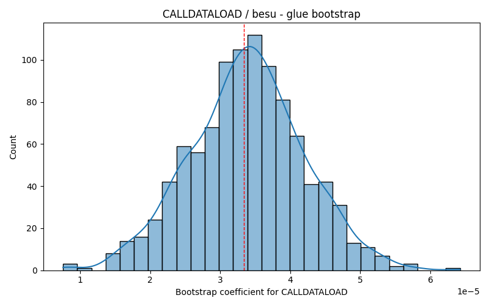

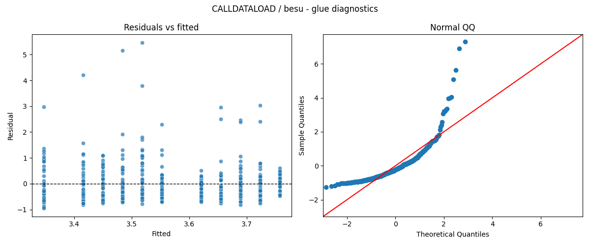

</details>

<details><summary><code>DIV</code> · nobs=121 · runtime_ms=2.236e-05 · p=1.00e-03 · R²=0.9419</summary>

```
==============================================================================
                           NNLS Regression Results                            
==============================================================================
Dep. Variable:          test_runtime_ms              R-squared:          0.942
Model:                  NNLS                    Adj. R-squared:          0.941
No. Observations:       121                               RMSE:          43.86
Df Residuals:           119                                MAE:          31.54
Df Model:               1      
==============================================================================
                      coef     std err     P-value      [0.025      0.975]
------------------------------------------------------------------------------
         const     97.7183     10.8701       0.001     77.1185    119.7098
           DIV      0.0000      0.0000       0.001      0.0000      0.0000
==============================================================================
Notes: Non-negative least squares with bootstrap inference (1000 iterations)
==============================================================================
```

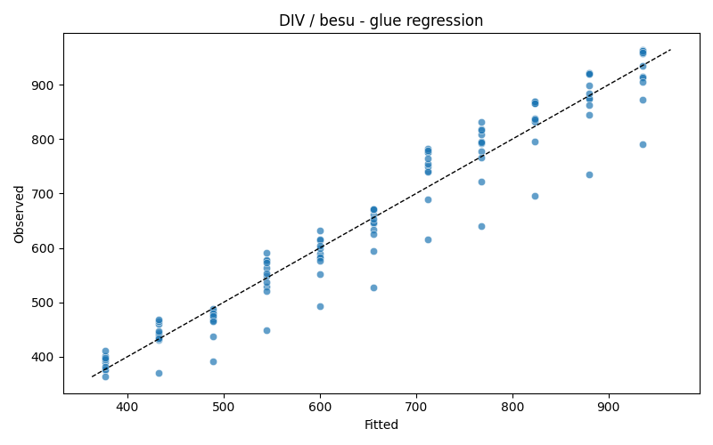

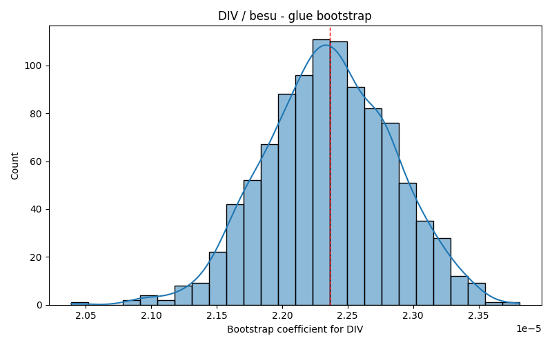

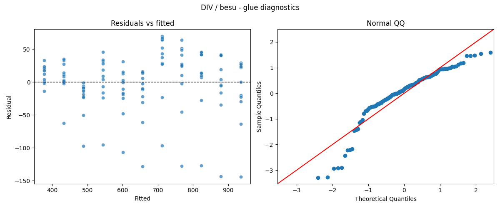

</details>

<details><summary><code>EXP</code> · nobs=121 · runtime_ms=0.002266 · p=1.00e-03 · R²=0.9581</summary>

```
==============================================================================
                           NNLS Regression Results                            
==============================================================================
Dep. Variable:          test_runtime_ms              R-squared:          0.958
Model:                  NNLS                    Adj. R-squared:          0.958
No. Observations:       121                               RMSE:          18.57
Df Residuals:           119                                MAE:          12.76
Df Model:               1      
==============================================================================
                      coef     std err     P-value      [0.025      0.975]
------------------------------------------------------------------------------
         const     71.1699      7.1673       0.001     57.9291     85.7300
           EXP      0.0023      0.0001       0.001      0.0022      0.0024
==============================================================================
Notes: Non-negative least squares with bootstrap inference (1000 iterations)
==============================================================================
```

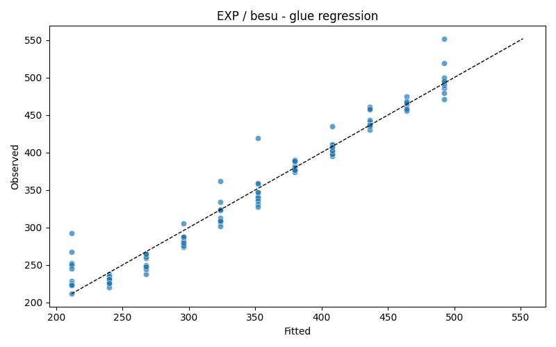

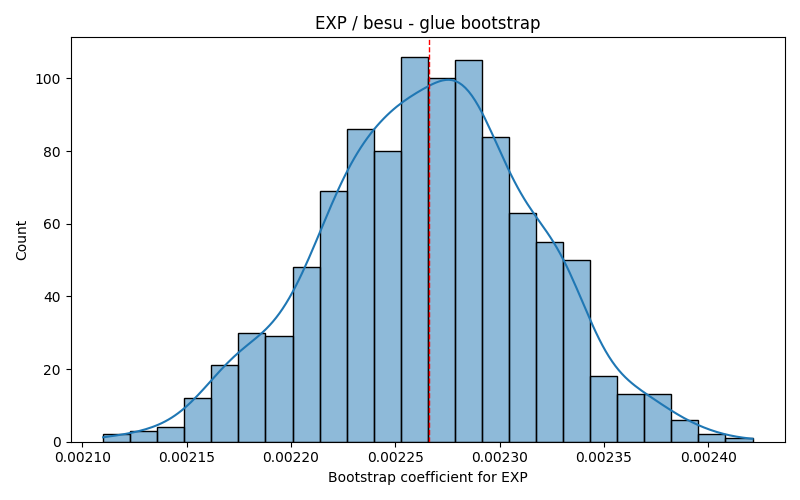

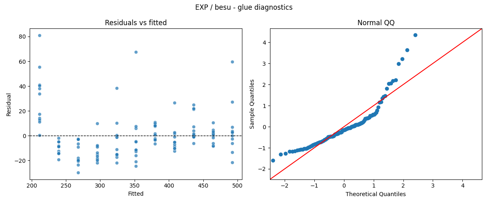

</details>

<details><summary><code>GT</code> · nobs=121 · runtime_ms=4.485e-05 · p=1.00e-03 · R²=0.9831</summary>

```
==============================================================================
                           NNLS Regression Results                            
==============================================================================
Dep. Variable:          test_runtime_ms              R-squared:          0.983
Model:                  NNLS                    Adj. R-squared:          0.983
No. Observations:       121                               RMSE:          61.86
Df Residuals:           119                                MAE:          49.65
Df Model:               1      
==============================================================================
                      coef     std err     P-value      [0.025      0.975]
------------------------------------------------------------------------------
         const    111.5908     21.7419       0.001     70.6490    153.5635
            GT      0.0000      0.0000       0.001      0.0000      0.0000
==============================================================================
Notes: Non-negative least squares with bootstrap inference (1000 iterations)
==============================================================================
```

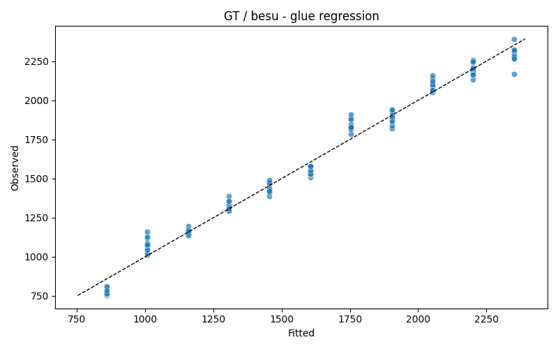

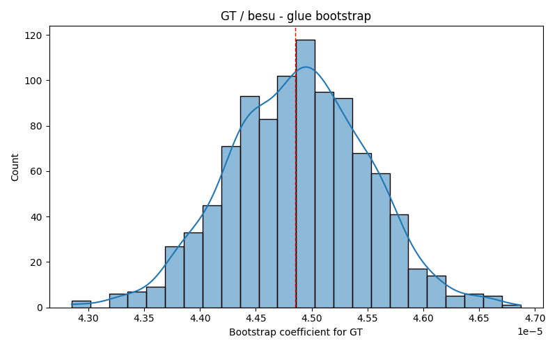

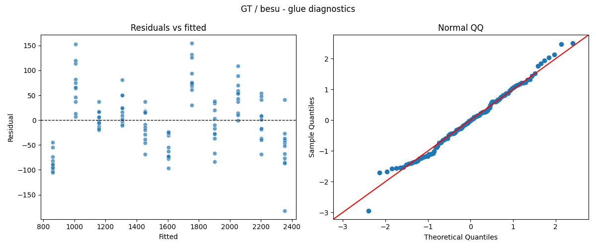

</details>

<details><summary><code>JUMPI</code> · nobs=121 · runtime_ms=9.509e-06 · p=1.00e-03 · R²=0.9543</summary>

```
==============================================================================
                           NNLS Regression Results                            
==============================================================================
Dep. Variable:          test_runtime_ms              R-squared:          0.954
Model:                  NNLS                    Adj. R-squared:          0.954
No. Observations:       121                               RMSE:           9.40
Df Residuals:           119                                MAE:           7.15
Df Model:               1      
==============================================================================
                      coef     std err     P-value      [0.025      0.975]
------------------------------------------------------------------------------
         const     20.1645      2.5961       0.001     15.5707     25.6482
         JUMPI      0.0000      0.0000       0.001      0.0000      0.0000
==============================================================================
Notes: Non-negative least squares with bootstrap inference (1000 iterations)
==============================================================================
```

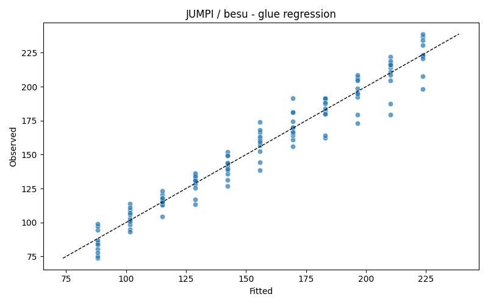

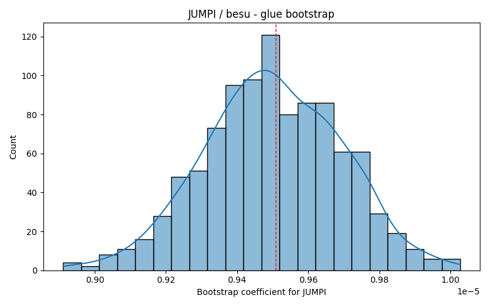

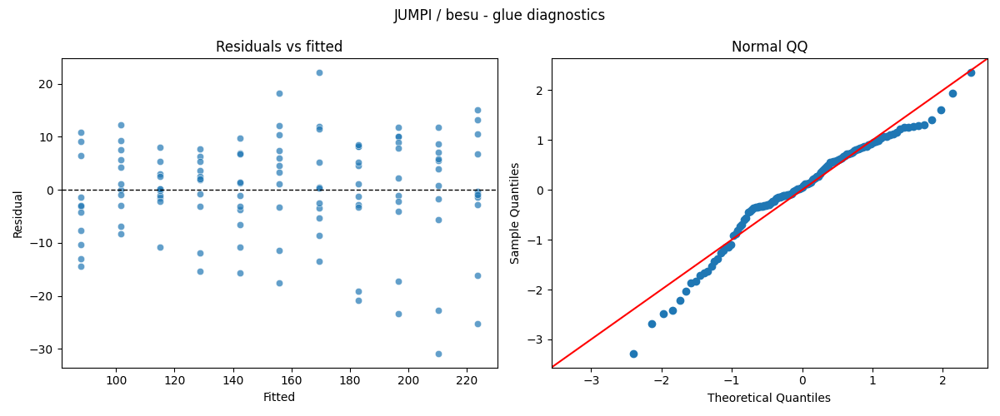

</details>

<details><summary><code>LT</code> · nobs=121 · runtime_ms=4.543e-05 · p=1.00e-03 · R²=0.6537</summary>

```
==============================================================================
                           NNLS Regression Results                            
==============================================================================
Dep. Variable:          test_runtime_ms              R-squared:          0.654
Model:                  NNLS                    Adj. R-squared:          0.651
No. Observations:       121                               RMSE:         348.21
Df Residuals:           119                                MAE:         195.76
Df Model:               1      
==============================================================================
                      coef     std err     P-value      [0.025      0.975]
------------------------------------------------------------------------------
         const    144.8667     85.4208       0.050      0.0000    322.9945
            LT      0.0000      0.0000       0.001      0.0000      0.0001
==============================================================================
Notes: Non-negative least squares with bootstrap inference (1000 iterations)
==============================================================================
```

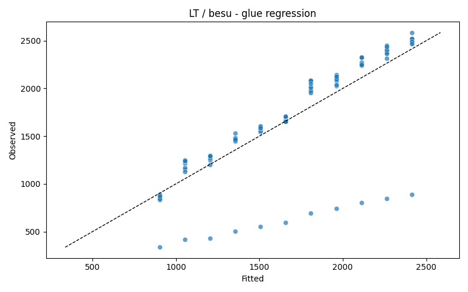

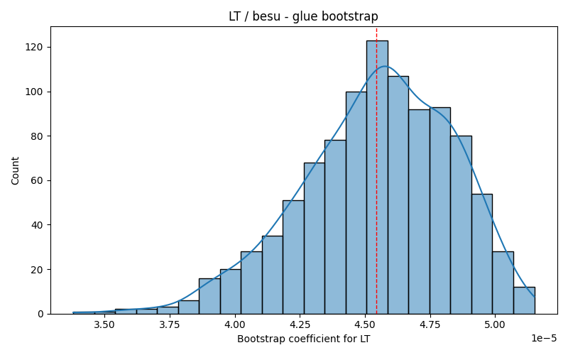

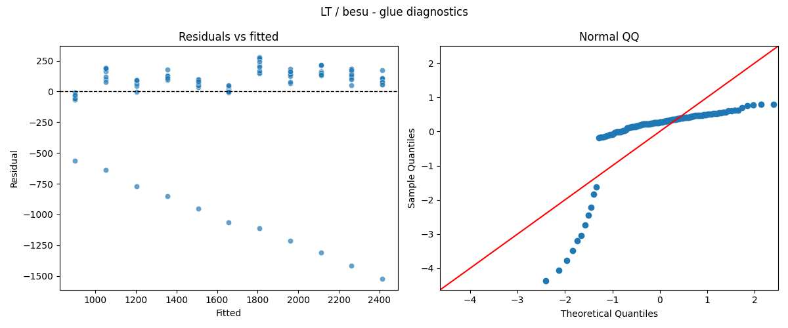

</details>

<details><summary><code>MSTORE</code> · nobs=605 · runtime_ms=2.69e-05 · p=1.00e-03 · R²=0.9778</summary>

```
==============================================================================
                           NNLS Regression Results                            
==============================================================================
Dep. Variable:          test_runtime_ms              R-squared:          0.978
Model:                  NNLS                    Adj. R-squared:          0.978
No. Observations:       605                               RMSE:          28.47
Df Residuals:           603                                MAE:          21.00
Df Model:               1      
==============================================================================
                      coef     std err     P-value      [0.025      0.975]
------------------------------------------------------------------------------
         const     47.5198      3.5984       0.001     40.2037     54.2505
        MSTORE      0.0000      0.0000       0.001      0.0000      0.0000
==============================================================================
Notes: Non-negative least squares with bootstrap inference (1000 iterations)
==============================================================================
```

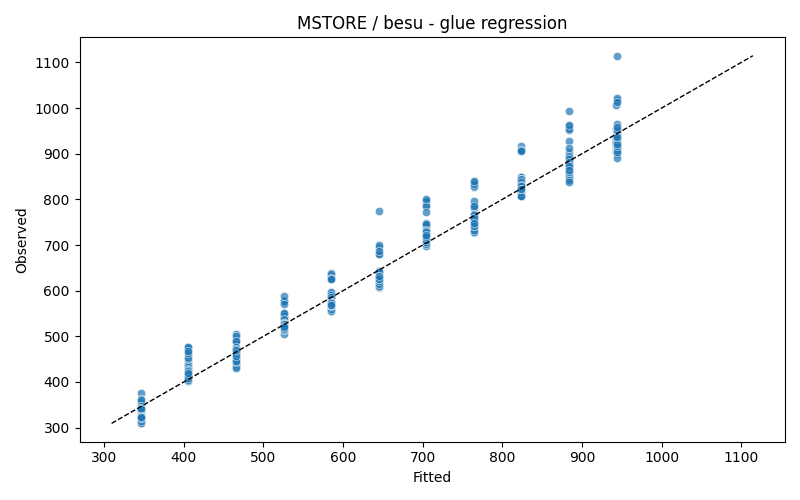

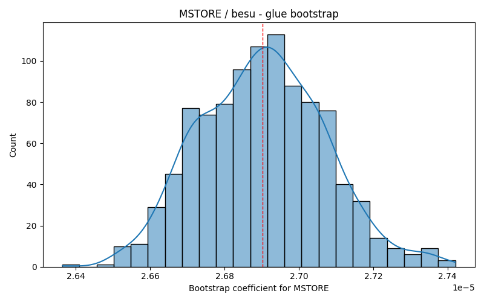

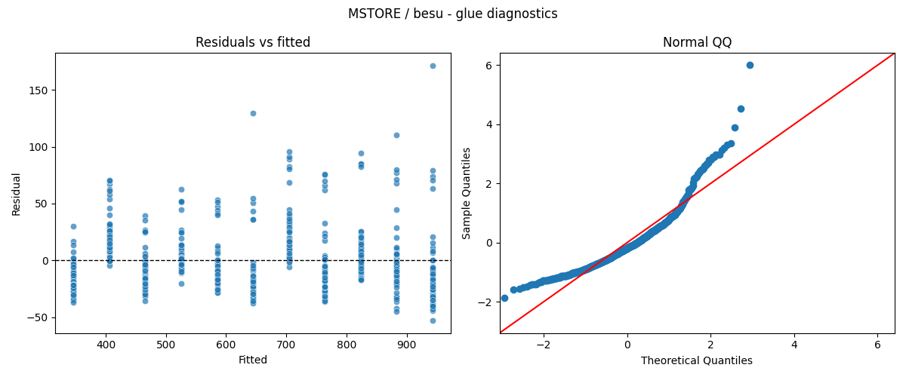

</details>

<details><summary><code>MSTORE8</code> · nobs=605 · runtime_ms=1.527e-05 · p=1.00e-03 · R²=0.9754</summary>

```
==============================================================================
                           NNLS Regression Results                            
==============================================================================
Dep. Variable:          test_runtime_ms              R-squared:          0.975
Model:                  NNLS                    Adj. R-squared:          0.975
No. Observations:       605                               RMSE:          17.04
Df Residuals:           603                                MAE:          12.19
Df Model:               1      
==============================================================================
                      coef     std err     P-value      [0.025      0.975]
------------------------------------------------------------------------------
         const     29.8231      2.1140       0.001     25.5120     33.9171
       MSTORE8      0.0000      0.0000       0.001      0.0000      0.0000
==============================================================================
Notes: Non-negative least squares with bootstrap inference (1000 iterations)
==============================================================================
```

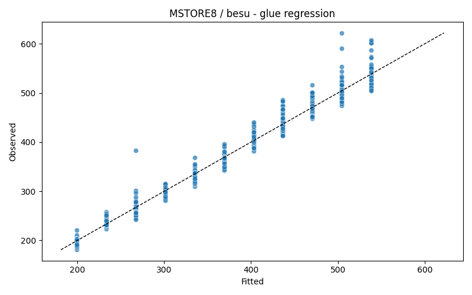

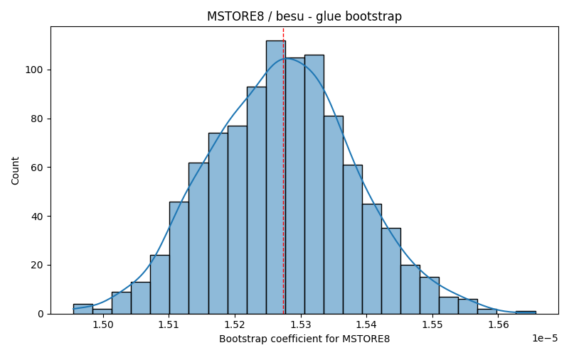

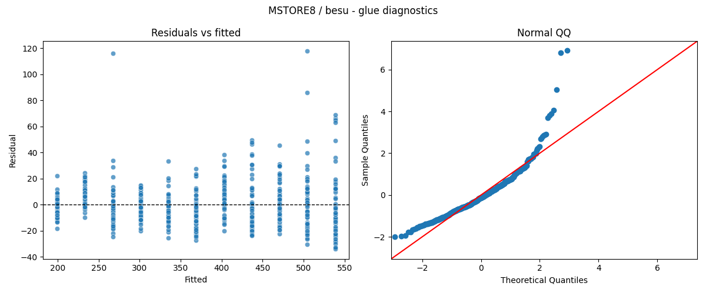

</details>

<details><summary><code>MUL</code> · nobs=121 · runtime_ms=1.419e-05 · p=1.00e-03 · R²=0.8471</summary>

```
==============================================================================
                           NNLS Regression Results                            
==============================================================================
Dep. Variable:          test_runtime_ms              R-squared:          0.847
Model:                  NNLS                    Adj. R-squared:          0.846
No. Observations:       121                               RMSE:          47.61
Df Residuals:           119                                MAE:          35.32
Df Model:               1      
==============================================================================
                      coef     std err     P-value      [0.025      0.975]
------------------------------------------------------------------------------
         const     46.0934     12.3101       0.001     20.5857     69.3997
           MUL      0.0000      0.0000       0.001      0.0000      0.0000
==============================================================================
Notes: Non-negative least squares with bootstrap inference (1000 iterations)
==============================================================================
```

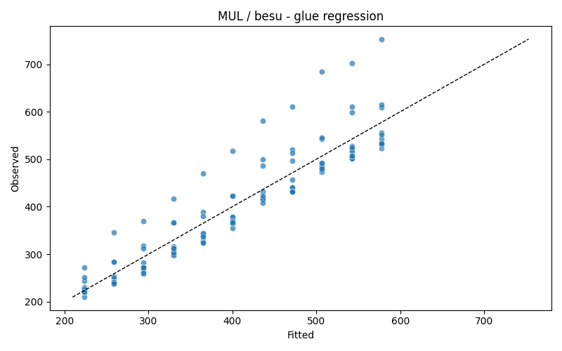

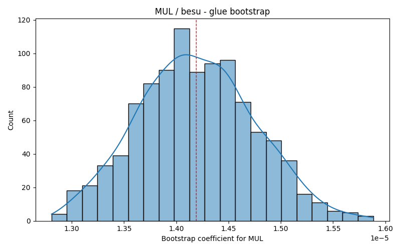

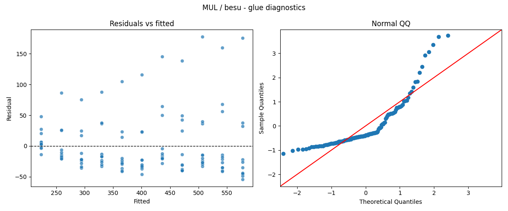

</details>

<details><summary><code>PC</code> · nobs=121 · runtime_ms=4.942e-06 · p=1.00e-03 · R²=0.9811</summary>

```
==============================================================================
                           NNLS Regression Results                            
==============================================================================
Dep. Variable:          test_runtime_ms              R-squared:          0.981
Model:                  NNLS                    Adj. R-squared:          0.981
No. Observations:       121                               RMSE:          20.50
Df Residuals:           119                                MAE:          15.92
Df Model:               1      
==============================================================================
                      coef     std err     P-value      [0.025      0.975]
------------------------------------------------------------------------------
         const     40.6086      5.5702       0.001     29.6988     51.9459
            PC      0.0000      0.0000       0.001      0.0000      0.0000
==============================================================================
Notes: Non-negative least squares with bootstrap inference (1000 iterations)
==============================================================================
```

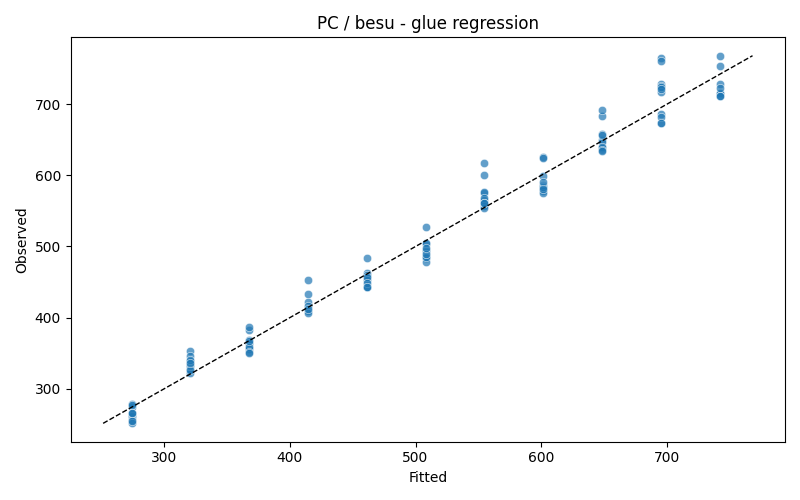

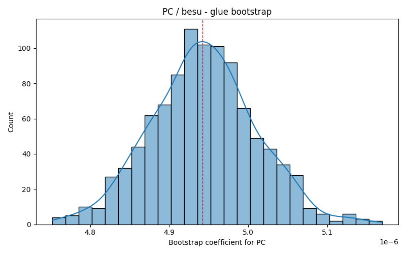

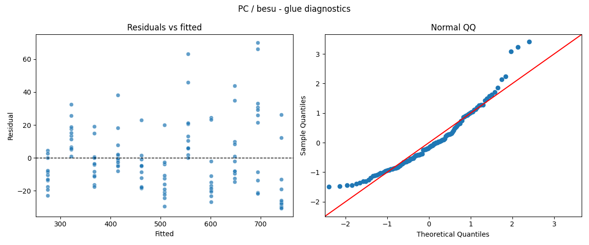

</details>

<details><summary><code>RETURNDATASIZE</code> · nobs=484 · runtime_ms=7.291e-06 · p=1.00e-03 · R²=0.9882</summary>

```
==============================================================================
                           NNLS Regression Results                            
==============================================================================
Dep. Variable:          test_runtime_ms              R-squared:          0.988
Model:                  NNLS                    Adj. R-squared:          0.988
No. Observations:       484                               RMSE:          12.59
Df Residuals:           482                                MAE:           9.85
Df Model:               1      
==============================================================================
                      coef     std err     P-value      [0.025      0.975]
------------------------------------------------------------------------------
         const     39.3573      1.7955       0.001     35.8911     42.8433
RETURNDATASIZE      0.0000      0.0000       0.001      0.0000      0.0000
==============================================================================
Notes: Non-negative least squares with bootstrap inference (1000 iterations)
==============================================================================
```

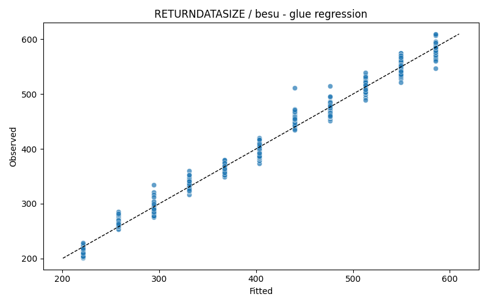

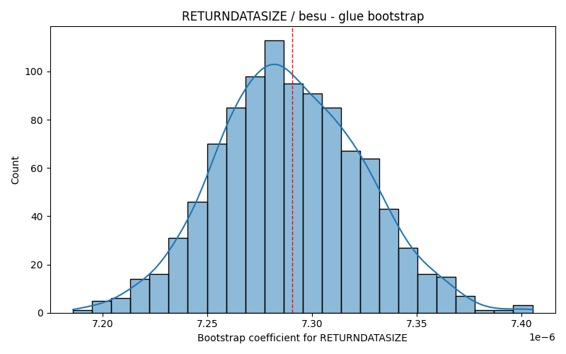

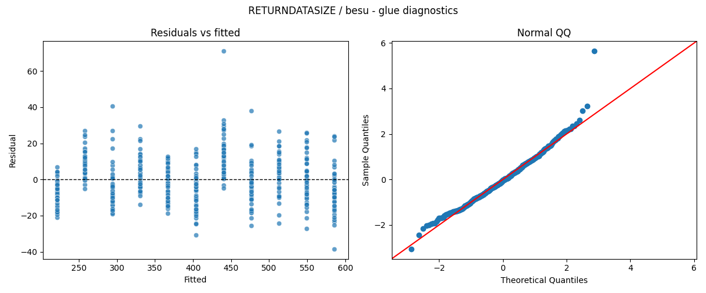

</details>

<details><summary><code>SELFBALANCE</code> · nobs=121 · runtime_ms=2.342e-05 · p=1.00e-03 · R²=0.9889</summary>

```
==============================================================================
                           NNLS Regression Results                            
==============================================================================
Dep. Variable:          test_runtime_ms              R-squared:          0.989
Model:                  NNLS                    Adj. R-squared:          0.989
No. Observations:       121                               RMSE:          30.61
Df Residuals:           119                                MAE:          25.31
Df Model:               1      
==============================================================================
                      coef     std err     P-value      [0.025      0.975]
------------------------------------------------------------------------------
         const     48.9941     11.0470       0.001     28.4349     71.1714
   SELFBALANCE      0.0000      0.0000       0.001      0.0000      0.0000
==============================================================================
Notes: Non-negative least squares with bootstrap inference (1000 iterations)
==============================================================================
```

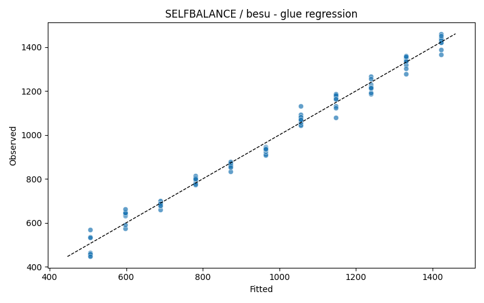

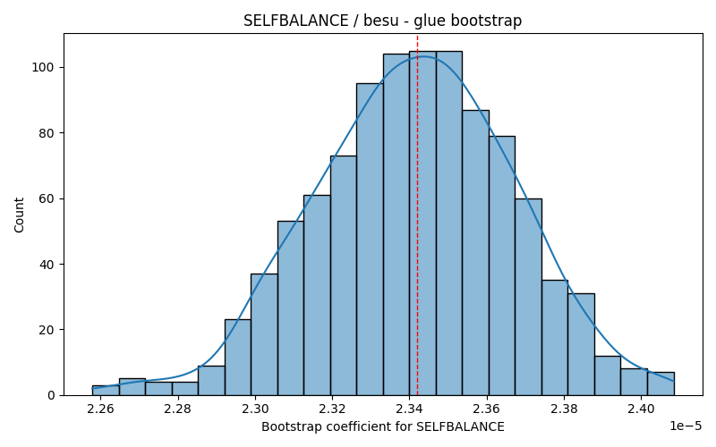

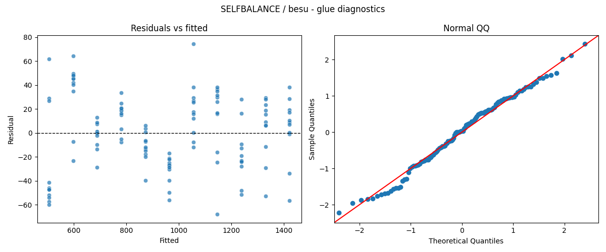

</details>

<details><summary><code>SUB</code> · nobs=121 · runtime_ms=1.684e-05 · p=1.00e-03 · R²=0.9728</summary>

```
==============================================================================
                           NNLS Regression Results                            
==============================================================================
Dep. Variable:          test_runtime_ms              R-squared:          0.973
Model:                  NNLS                    Adj. R-squared:          0.973
No. Observations:       121                               RMSE:          29.63
Df Residuals:           119                                MAE:          21.59
Df Model:               1      
==============================================================================
                      coef     std err     P-value      [0.025      0.975]
------------------------------------------------------------------------------
         const     51.9001      8.1582       0.001     36.2911     68.1412
           SUB      0.0000      0.0000       0.001      0.0000      0.0000
==============================================================================
Notes: Non-negative least squares with bootstrap inference (1000 iterations)
==============================================================================
```

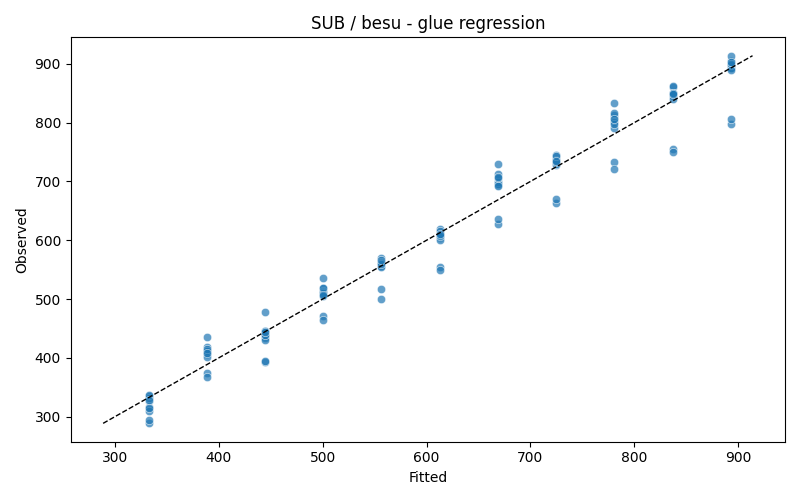

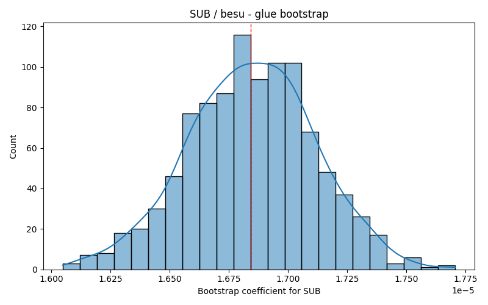

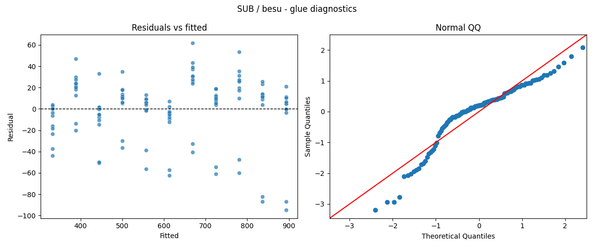

</details>

### Mixed glue (tier B) · besu

<details><summary><code>JUMP</code> · nobs=121 · runtime_ms=3.684e-05 · p=1.00e-03 · R²=0.97</summary>

```
==============================================================================
                           NNLS Regression Results                            
==============================================================================
Dep. Variable:          test_runtime_ms              R-squared:          0.970
Model:                  NNLS                    Adj. R-squared:          0.970
No. Observations:       121                               RMSE:          24.07
Df Residuals:           119                                MAE:          13.83
Df Model:               1      
==============================================================================
                      coef     std err     P-value      [0.025      0.975]
------------------------------------------------------------------------------
         const     46.3251      6.9620       0.001     34.8906     61.4857
          JUMP      0.0000      0.0000       0.001      0.0000      0.0000
==============================================================================
Notes: Non-negative least squares with bootstrap inference (1000 iterations)
==============================================================================
```

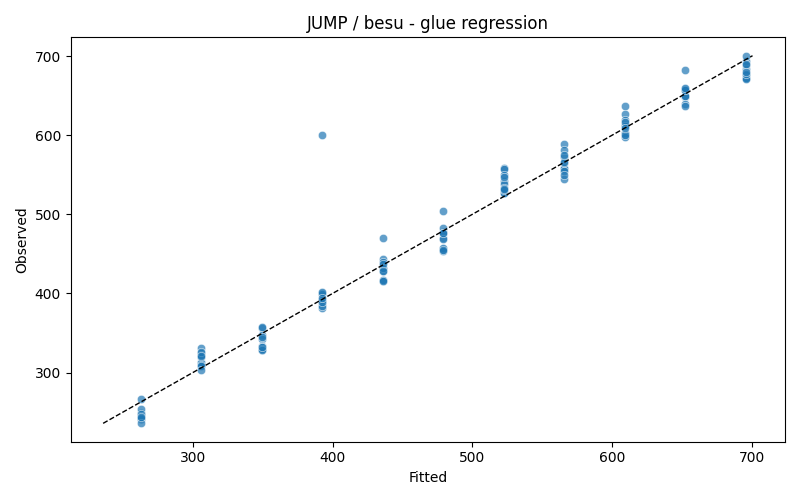

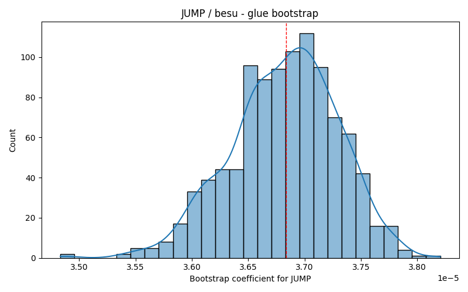

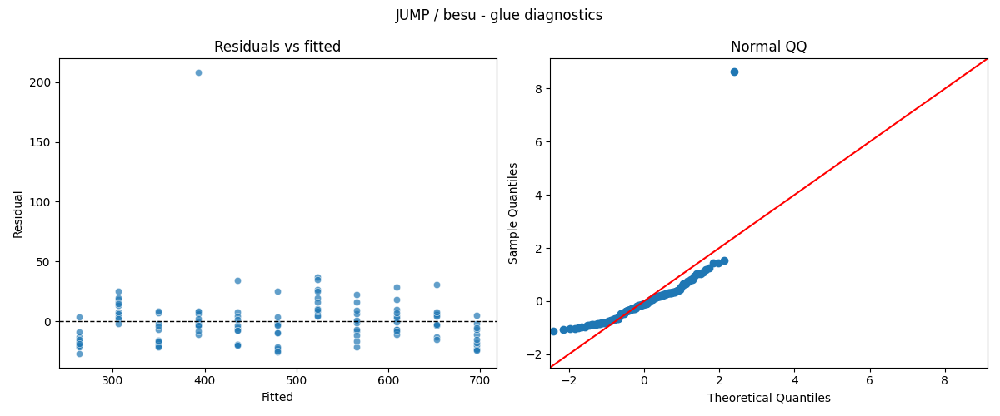

</details>

<details><summary><code>KECCAK256</code> · nobs=1936 · runtime_ms=4.731e-05 · p=1.00e-03 · R²=0.1067</summary>

```
==============================================================================
                           NNLS Regression Results                            
==============================================================================
Dep. Variable:          test_runtime_ms              R-squared:          0.107
Model:                  NNLS                    Adj. R-squared:          0.106
No. Observations:       1936                              RMSE:         272.12
Df Residuals:           1934                               MAE:         218.37
Df Model:               1      
==============================================================================
                      coef     std err     P-value      [0.025      0.975]
------------------------------------------------------------------------------
         const    763.5425     13.6877       0.001    737.3669    791.9400
     KECCAK256      0.0000      0.0000       0.001      0.0000      0.0001
==============================================================================
Notes: Non-negative least squares with bootstrap inference (1000 iterations)
==============================================================================
```

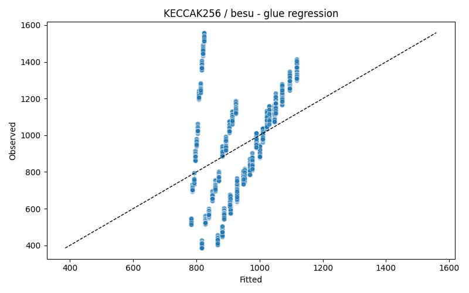

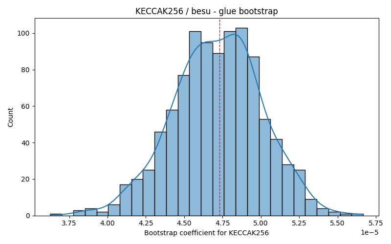

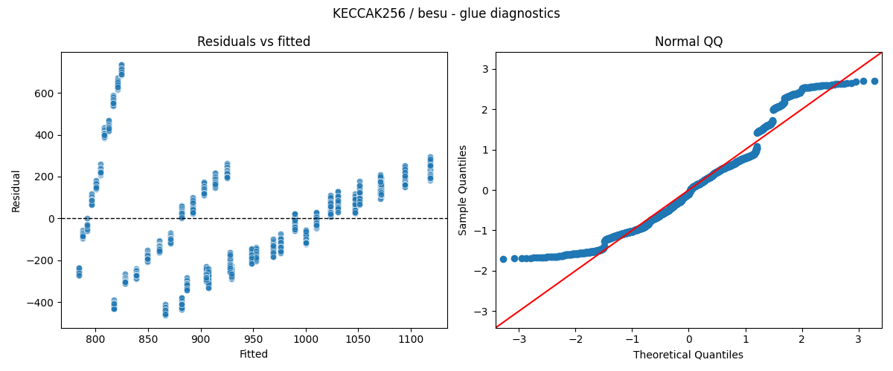

</details>

## erigon

| glue_opcode | nobs | glue_runtime_ms | p_value | rsquared |
| --- | --- | --- | --- | --- |
| `ISZERO` | 99 | 1.802e-06 | 1.00e-03 | 0.9834 |
| `JUMPDEST` | 99 | 1.432e-06 | 1.00e-03 | 0.9786 |
| `SWAP` | 1584 | 1.969e-06 | 1.00e-03 | 0.9221 |
| `CALLDATASIZE` | 5863 | 1.63e-06 | 1.00e-03 | 0.9153 |
| `DUP` | 5863 | 2.023e-06 | 1.00e-03 | 0.9153 |
| `GAS` | 5863 | 1.638e-06 | 1.00e-03 | 0.9153 |
| `MLOAD` | 5863 | 5.488e-06 | 1.00e-03 | 0.9153 |
| `PUSH` | 5863 | 3.003e-06 | 1.00e-03 | 0.9153 |
| `PUSH0` | 5863 | 1.592e-06 | 1.00e-03 | 0.9153 |
| `STATICCALL` | 5863 | 6.708e-05 | 1.00e-03 | 0.9153 |
| `ADD` | 99 | 4.028e-06 | 1.00e-03 | 0.9607 |
| `AND` | 99 | 3.942e-06 | 1.00e-03 | 0.9775 |
| `CALLDATACOPY` | 2376 | 1.077e-05 | 1.00e-03 | 0.9816 |
| `CALLDATALOAD` | 396 | 7.245e-05 | 1.00e-03 | 0.1419 |
| `DIV` | 99 | 1.47e-05 | 1.00e-03 | 0.9707 |
| `EXP` | 99 | 0.0006822 | 1.00e-03 | 0.9786 |
| `GT` | 99 | 4.093e-06 | 1.00e-03 | 0.9796 |
| `JUMPI` | 99 | 4.818e-06 | 1.00e-03 | 0.9658 |
| `LT` | 99 | 4.078e-06 | 1.00e-03 | 0.9713 |
| `MSTORE` | 495 | 8.072e-06 | 1.00e-03 | 0.9718 |
| `MSTORE8` | 495 | 7.704e-06 | 1.00e-03 | 0.9707 |
| `MUL` | 99 | 5.928e-06 | 1.00e-03 | 0.9013 |
| `PC` | 99 | 1.713e-06 | 1.00e-03 | 0.9804 |
| `RETURNDATASIZE` | 396 | 3.038e-06 | 1.00e-03 | 0.9711 |
| `SELFBALANCE` | 99 | 1.998e-06 | 1.00e-03 | 0.9866 |
| `SUB` | 99 | 4.092e-06 | 1.00e-03 | 0.9843 |
| `JUMP` | 99 | 9.324e-06 | 1.00e-03 | 0.9408 |
| `KECCAK256` | 1584 | 3.119e-05 | 1.00e-03 | 0.09546 |

### Cycle glue — joint fit · erigon

<details><summary>Joint NNLS regression summary</summary>

```
==============================================================================
                           NNLS Regression Results                            
==============================================================================
Dep. Variable:          test_runtime_ms              R-squared:          0.915
Model:                  NNLS                    Adj. R-squared:          0.915
No. Observations:       5863                              RMSE:          19.04
Df Residuals:           5855                               MAE:          11.05
Df Model:               7      
==============================================================================
                      coef     std err     P-value      [0.025      0.975]
------------------------------------------------------------------------------
         const     17.4365      0.7307       0.001     16.1340     18.9155
  CALLDATASIZE      0.0000      0.0000       0.001      0.0000      0.0000
           DUP      0.0000      0.0000       0.001      0.0000      0.0000
           GAS      0.0000      0.0000       0.001      0.0000      0.0000
         MLOAD      0.0000      0.0000       0.001      0.0000      0.0000
          PUSH      0.0000      0.0000       0.001      0.0000      0.0000
         PUSH0      0.0000      0.0000       0.001      0.0000      0.0000
    STATICCALL      0.0001      0.0000       0.001      0.0001      0.0001
==============================================================================
Notes: Non-negative least squares with bootstrap inference (1000 iterations)
==============================================================================
```

</details>

<details><summary><code>CALLDATASIZE</code> · nobs=5863 · runtime_ms=1.63e-06 · p=1.00e-03 · R²=0.9153</summary>

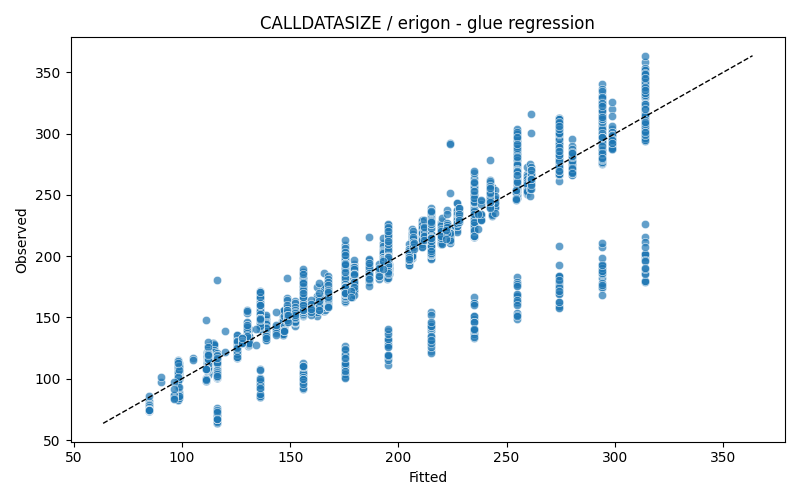

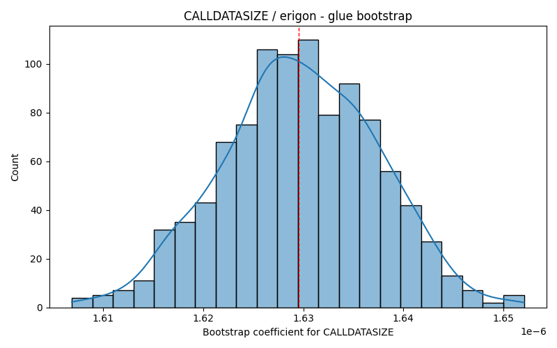


</details>

<details><summary><code>DUP</code> · nobs=5863 · runtime_ms=2.023e-06 · p=1.00e-03 · R²=0.9153</summary>


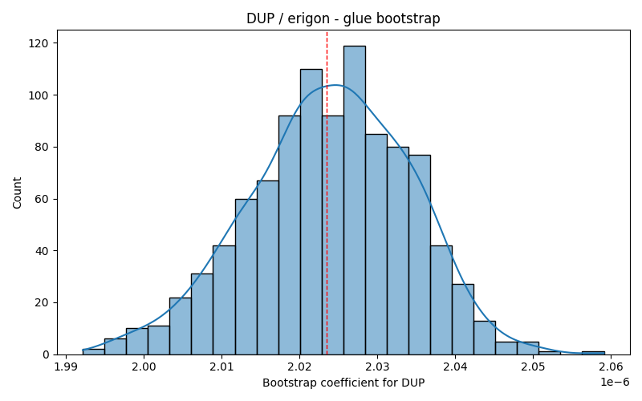


</details>

<details><summary><code>GAS</code> · nobs=5863 · runtime_ms=1.638e-06 · p=1.00e-03 · R²=0.9153</summary>

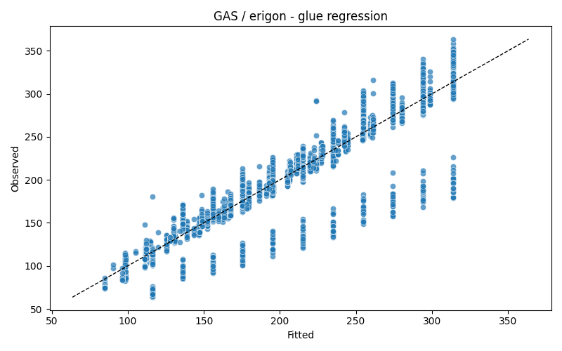

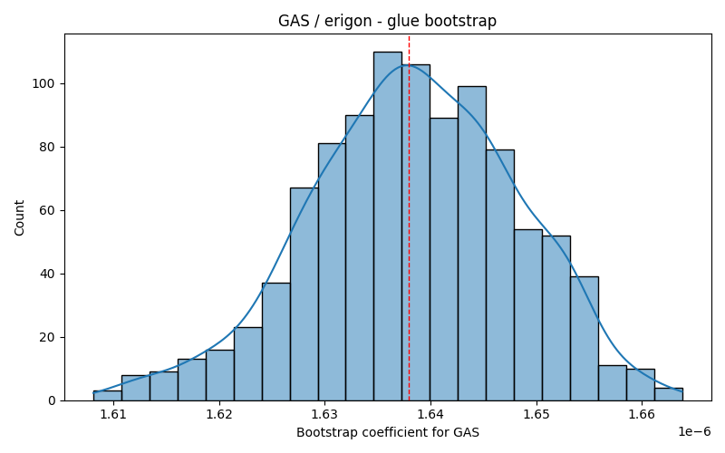


</details>

<details><summary><code>MLOAD</code> · nobs=5863 · runtime_ms=5.488e-06 · p=1.00e-03 · R²=0.9153</summary>


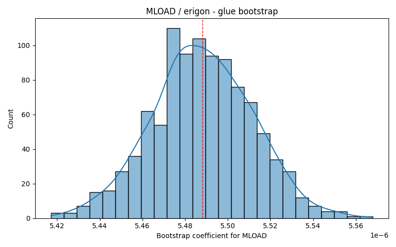

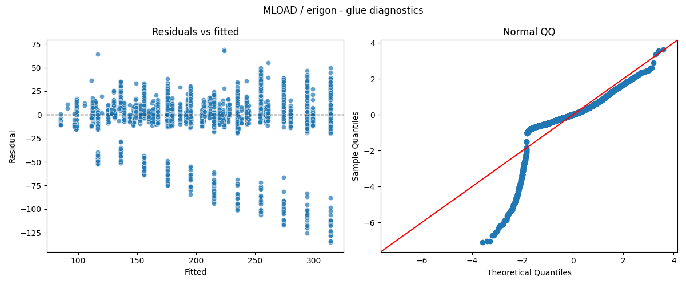

</details>

<details><summary><code>PUSH</code> · nobs=5863 · runtime_ms=3.003e-06 · p=1.00e-03 · R²=0.9153</summary>


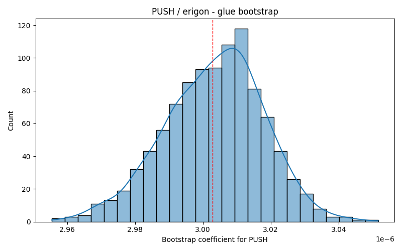


</details>

<details><summary><code>PUSH0</code> · nobs=5863 · runtime_ms=1.592e-06 · p=1.00e-03 · R²=0.9153</summary>

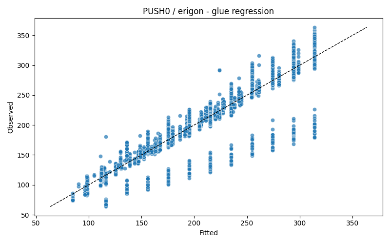

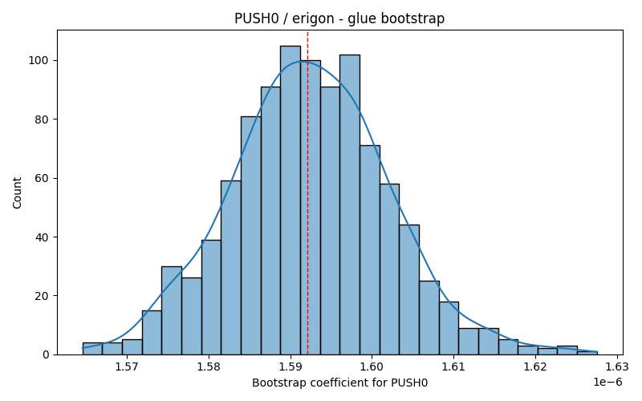


</details>

<details><summary><code>STATICCALL</code> · nobs=5863 · runtime_ms=6.708e-05 · p=1.00e-03 · R²=0.9153</summary>

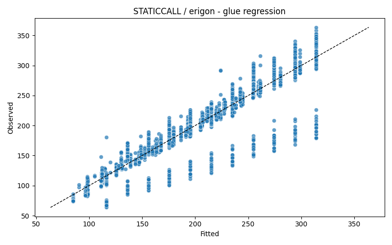

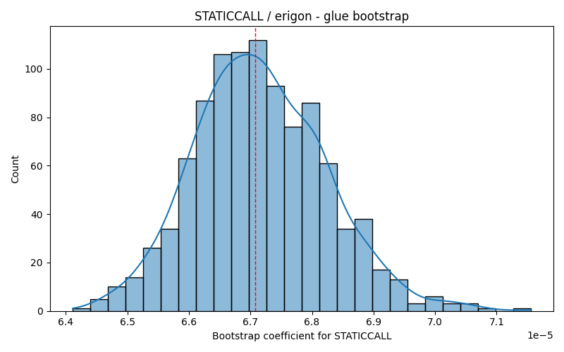

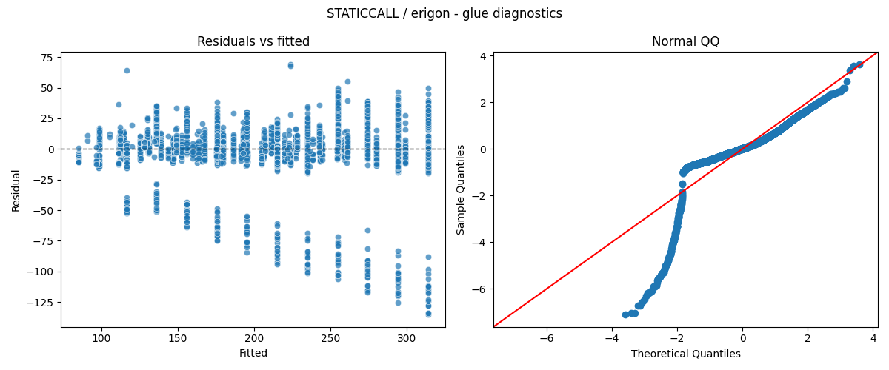

</details>

### Pure glue · erigon

<details><summary><code>ISZERO</code> · nobs=99 · runtime_ms=1.802e-06 · p=1.00e-03 · R²=0.9834</summary>

```
==============================================================================
                           NNLS Regression Results                            
==============================================================================
Dep. Variable:          test_runtime_ms              R-squared:          0.983
Model:                  NNLS                    Adj. R-squared:          0.983
No. Observations:       99                                RMSE:           4.93
Df Residuals:           97                                 MAE:           3.86
Df Model:               1      
==============================================================================
                      coef     std err     P-value      [0.025      0.975]
------------------------------------------------------------------------------
         const      9.9450      1.9179       0.001      6.4158     14.0160
        ISZERO      0.0000      0.0000       0.001      0.0000      0.0000
==============================================================================
Notes: Non-negative least squares with bootstrap inference (1000 iterations)
==============================================================================
```

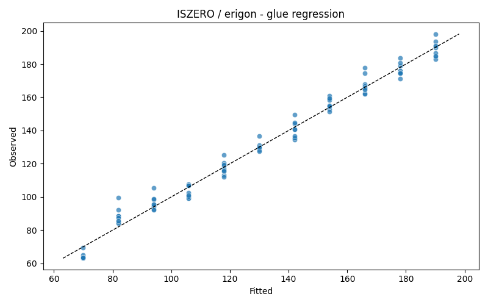

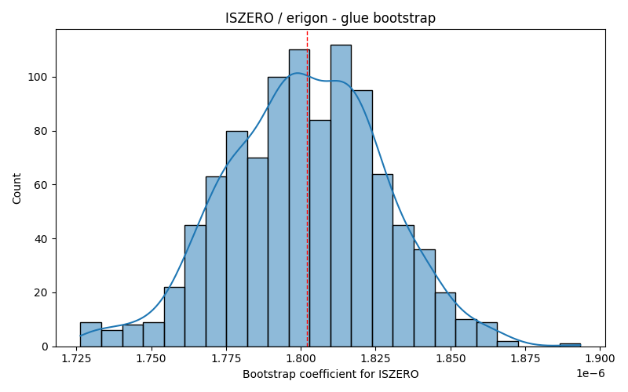

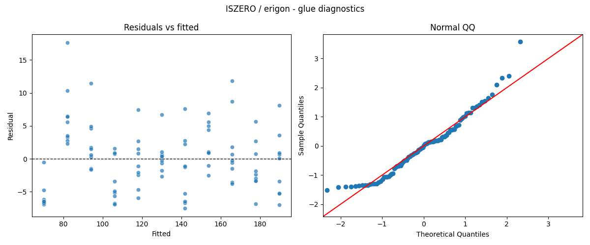

</details>

<details><summary><code>JUMPDEST</code> · nobs=99 · runtime_ms=1.432e-06 · p=1.00e-03 · R²=0.9786</summary>

```
==============================================================================
                           NNLS Regression Results                            
==============================================================================
Dep. Variable:          test_runtime_ms              R-squared:          0.979
Model:                  NNLS                    Adj. R-squared:          0.978
No. Observations:       99                                RMSE:          13.37
Df Residuals:           97                                 MAE:          10.90
Df Model:               1      
==============================================================================
                      coef     std err     P-value      [0.025      0.975]
------------------------------------------------------------------------------
         const     15.4728      5.0576       0.001      5.7283     25.3616
      JUMPDEST      0.0000      0.0000       0.001      0.0000      0.0000
==============================================================================
Notes: Non-negative least squares with bootstrap inference (1000 iterations)
==============================================================================
```

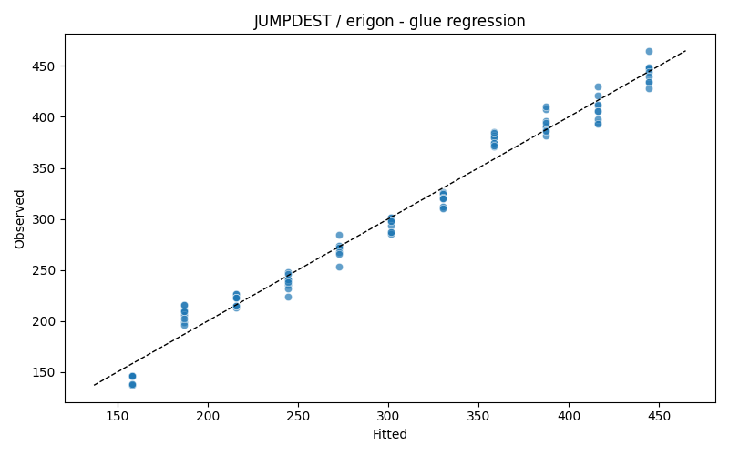

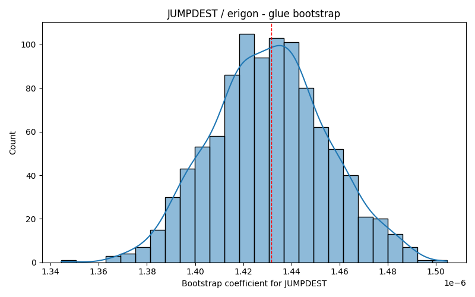

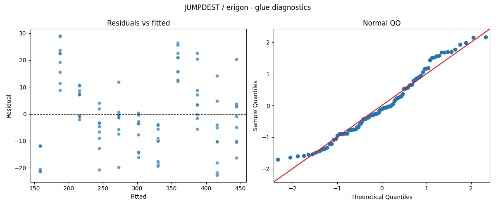

</details>

<details><summary><code>SWAP</code> · nobs=1584 · runtime_ms=1.969e-06 · p=1.00e-03 · R²=0.9221</summary>

```
==============================================================================
                           NNLS Regression Results                            
==============================================================================
Dep. Variable:          test_runtime_ms              R-squared:          0.922
Model:                  NNLS                    Adj. R-squared:          0.922
No. Observations:       1584                              RMSE:          12.05
Df Residuals:           1582                               MAE:           5.89
Df Model:               1      
==============================================================================
                      coef     std err     P-value      [0.025      0.975]
------------------------------------------------------------------------------
         const     18.6293      1.3414       0.001     16.2152     21.3759
          SWAP      0.0000      0.0000       0.001      0.0000      0.0000
==============================================================================
Notes: Non-negative least squares with bootstrap inference (1000 iterations)
==============================================================================
```

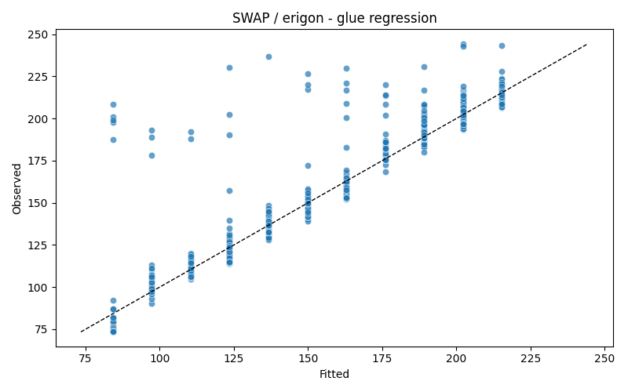

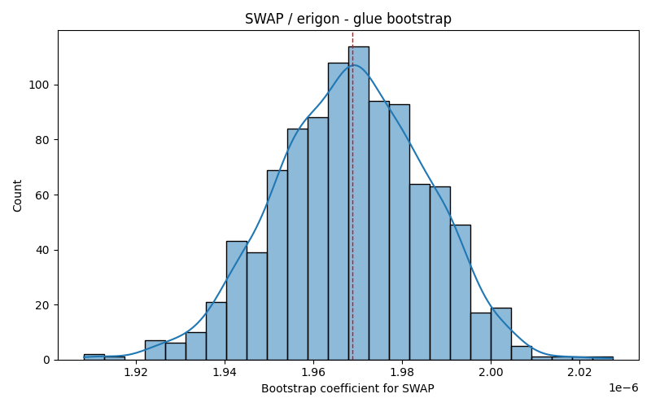

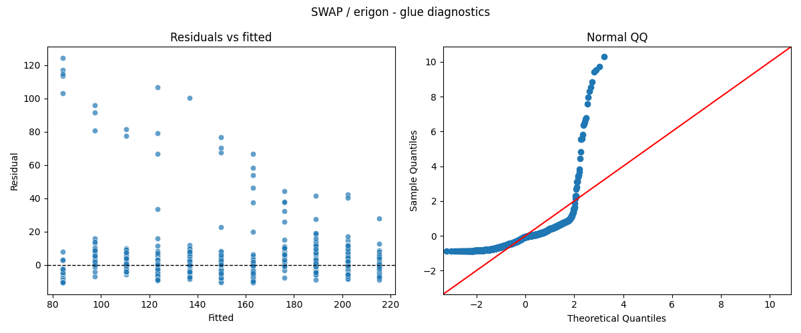

</details>

### Mixed glue (tier A) · erigon

<details><summary><code>ADD</code> · nobs=99 · runtime_ms=4.028e-06 · p=1.00e-03 · R²=0.9607</summary>

```
==============================================================================
                           NNLS Regression Results                            
==============================================================================
Dep. Variable:          test_runtime_ms              R-squared:          0.961
Model:                  NNLS                    Adj. R-squared:          0.960
No. Observations:       99                                RMSE:           8.58
Df Residuals:           97                                 MAE:           6.35
Df Model:               1      
==============================================================================
                      coef     std err     P-value      [0.025      0.975]
------------------------------------------------------------------------------
         const     13.4850      2.5460       0.001      8.5308     18.3950
           ADD      0.0000      0.0000       0.001      0.0000      0.0000
==============================================================================
Notes: Non-negative least squares with bootstrap inference (1000 iterations)
==============================================================================
```

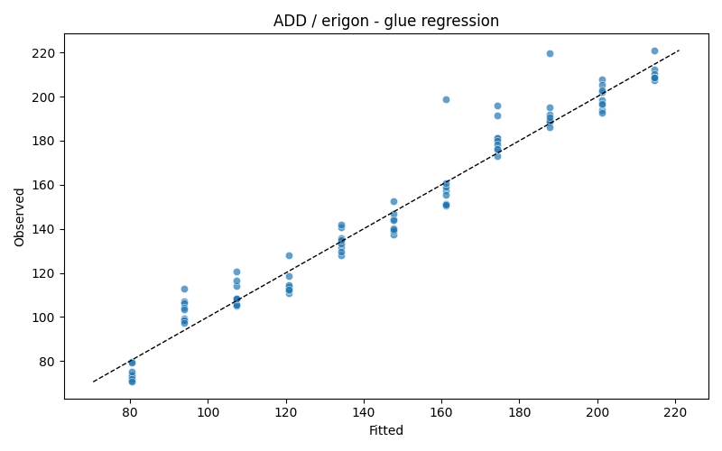

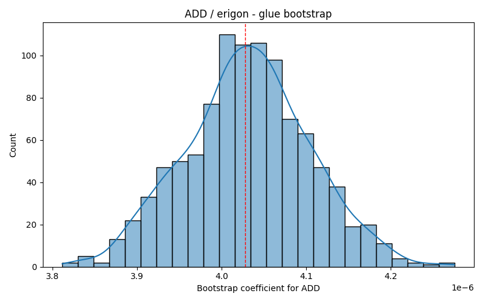

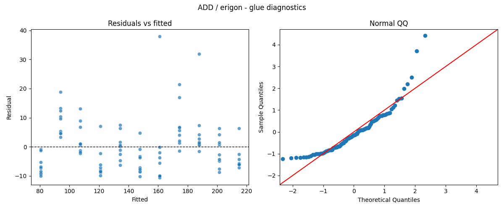

</details>

<details><summary><code>AND</code> · nobs=99 · runtime_ms=3.942e-06 · p=1.00e-03 · R²=0.9775</summary>

```
==============================================================================
                           NNLS Regression Results                            
==============================================================================
Dep. Variable:          test_runtime_ms              R-squared:          0.977
Model:                  NNLS                    Adj. R-squared:          0.977
No. Observations:       99                                RMSE:           6.30
Df Residuals:           97                                 MAE:           5.18
Df Model:               1      
==============================================================================
                      coef     std err     P-value      [0.025      0.975]
------------------------------------------------------------------------------
         const     13.6027      2.4469       0.001      8.9613     18.6433
           AND      0.0000      0.0000       0.001      0.0000      0.0000
==============================================================================
Notes: Non-negative least squares with bootstrap inference (1000 iterations)
==============================================================================
```

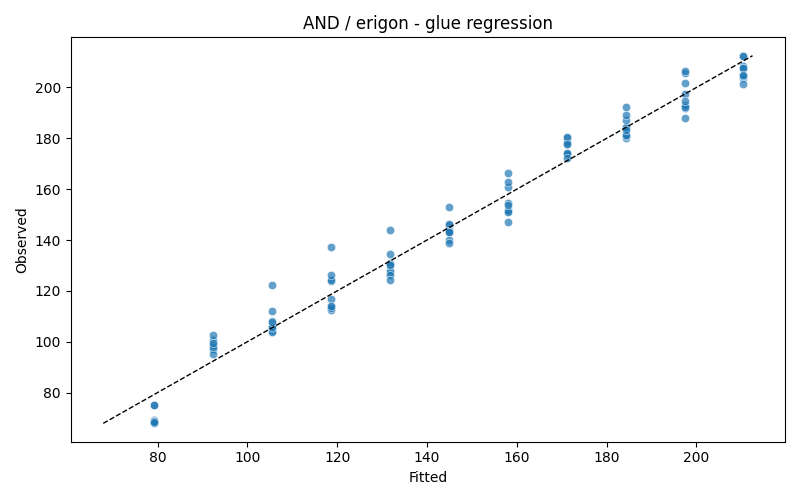

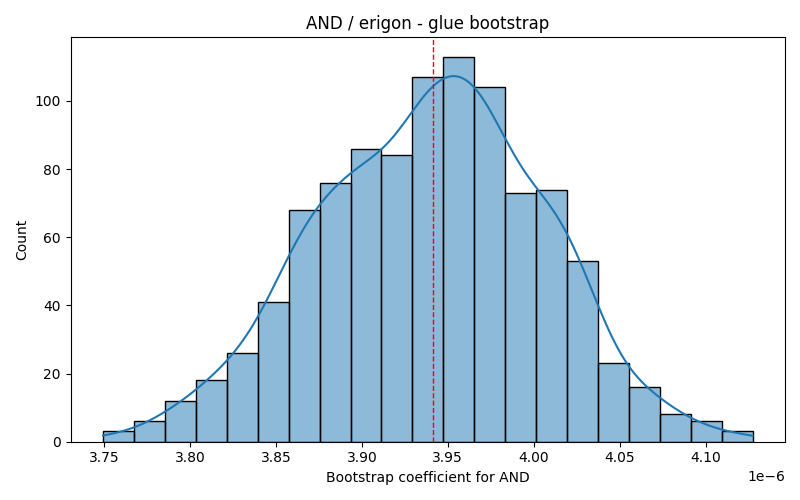

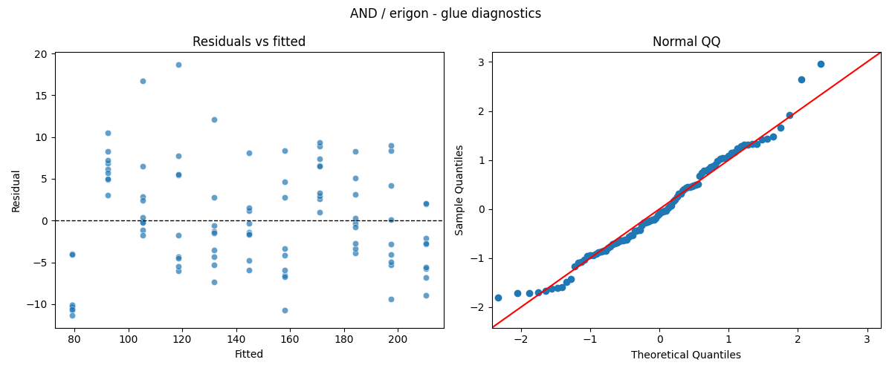

</details>

<details><summary><code>CALLDATACOPY</code> · nobs=2376 · runtime_ms=1.077e-05 · p=1.00e-03 · R²=0.9816</summary>

```
==============================================================================
                           NNLS Regression Results                            
==============================================================================
Dep. Variable:          test_runtime_ms              R-squared:          0.982
Model:                  NNLS                    Adj. R-squared:          0.982
No. Observations:       2376                              RMSE:          11.11
Df Residuals:           2374                               MAE:           7.34
Df Model:               1      
==============================================================================
                      coef     std err     P-value      [0.025      0.975]
------------------------------------------------------------------------------
         const     14.6360      0.2492       0.001     14.1351     15.1241
  CALLDATACOPY      0.0000      0.0000       0.001      0.0000      0.0000
==============================================================================
Notes: Non-negative least squares with bootstrap inference (1000 iterations)
==============================================================================
```

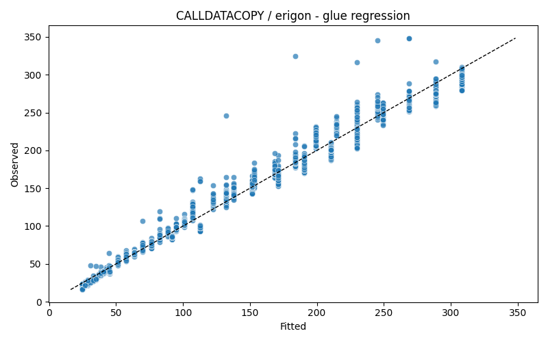

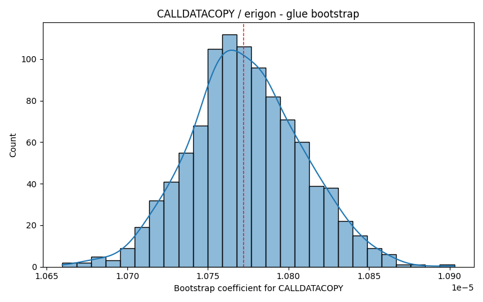

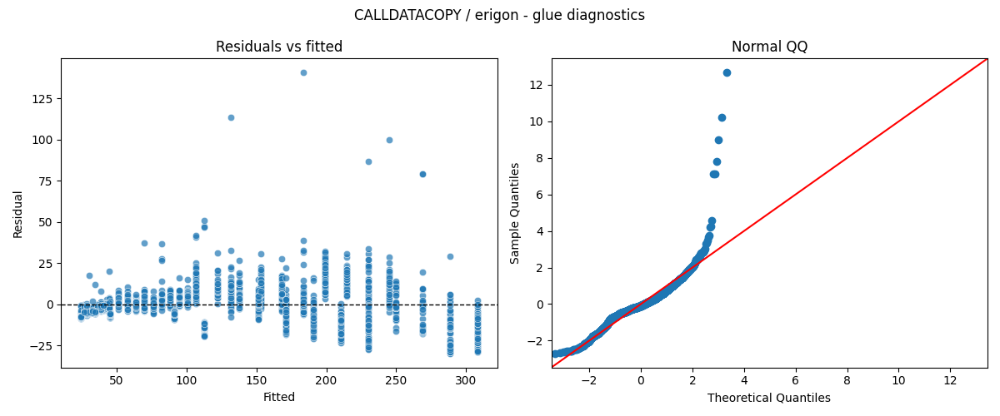

</details>

<details><summary><code>CALLDATALOAD</code> · nobs=396 · runtime_ms=7.245e-05 · p=1.00e-03 · R²=0.1419</summary>

```
==============================================================================
                           NNLS Regression Results                            
==============================================================================
Dep. Variable:          test_runtime_ms              R-squared:          0.142
Model:                  NNLS                    Adj. R-squared:          0.140
No. Observations:       396                               RMSE:           0.68
Df Residuals:           394                                MAE:           0.30
Df Model:               1      
==============================================================================
                      coef     std err     P-value      [0.025      0.975]
------------------------------------------------------------------------------
         const      4.0323      0.0922       0.001      3.8335      4.1895
  CALLDATALOAD      0.0001      0.0000       0.001      0.0001      0.0001
==============================================================================
Notes: Non-negative least squares with bootstrap inference (1000 iterations)
==============================================================================
```

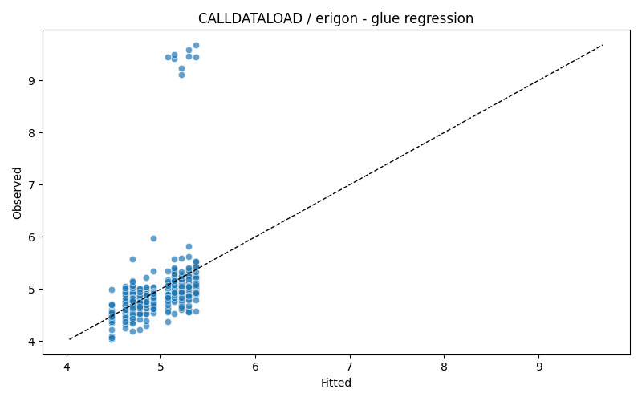

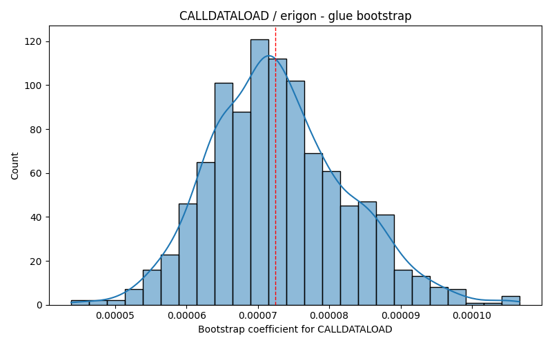

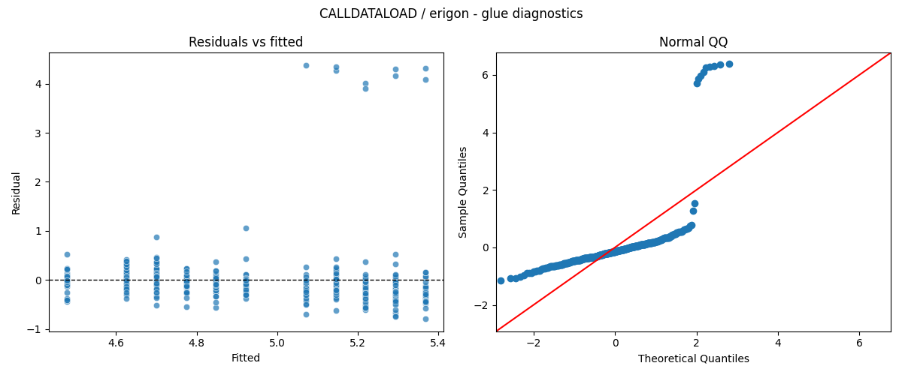

</details>

<details><summary><code>DIV</code> · nobs=99 · runtime_ms=1.47e-05 · p=1.00e-03 · R²=0.9707</summary>

```
==============================================================================
                           NNLS Regression Results                            
==============================================================================
Dep. Variable:          test_runtime_ms              R-squared:          0.971
Model:                  NNLS                    Adj. R-squared:          0.970
No. Observations:       99                                RMSE:          20.16
Df Residuals:           97                                 MAE:          17.17
Df Model:               1      
==============================================================================
                      coef     std err     P-value      [0.025      0.975]
------------------------------------------------------------------------------
         const     27.8655      7.7666       0.001     13.1884     43.6392
           DIV      0.0000      0.0000       0.001      0.0000      0.0000
==============================================================================
Notes: Non-negative least squares with bootstrap inference (1000 iterations)
==============================================================================
```

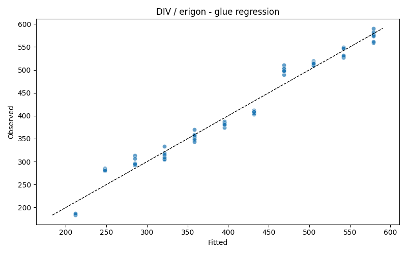

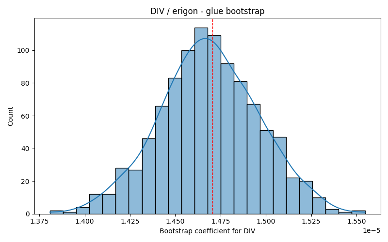

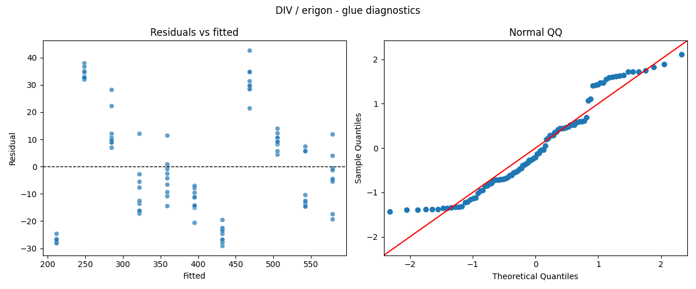

</details>

<details><summary><code>EXP</code> · nobs=99 · runtime_ms=0.0006822 · p=1.00e-03 · R²=0.9786</summary>

```
==============================================================================
                           NNLS Regression Results                            
==============================================================================
Dep. Variable:          test_runtime_ms              R-squared:          0.979
Model:                  NNLS                    Adj. R-squared:          0.978
No. Observations:       99                                RMSE:           3.95
Df Residuals:           97                                 MAE:           3.07
Df Model:               1      
==============================================================================
                      coef     std err     P-value      [0.025      0.975]
------------------------------------------------------------------------------
         const     10.0317      1.6313       0.001      7.0877     13.6890
           EXP      0.0007      0.0000       0.001      0.0007      0.0007
==============================================================================
Notes: Non-negative least squares with bootstrap inference (1000 iterations)
==============================================================================
```

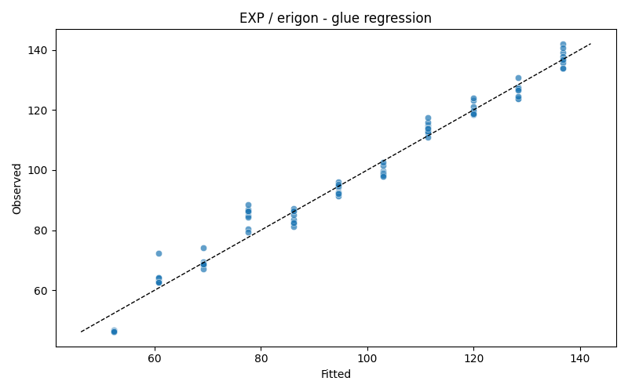

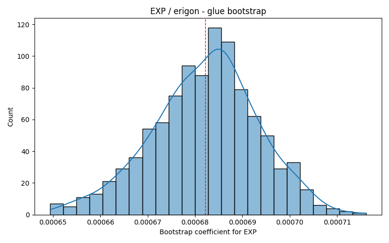

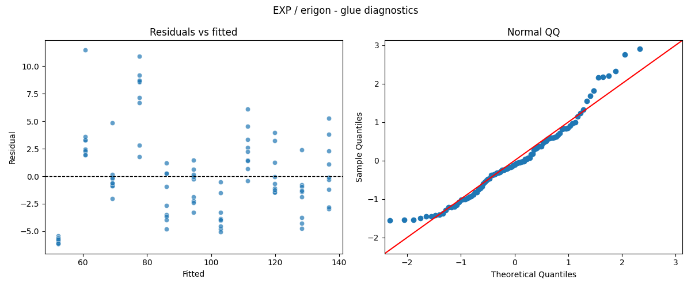

</details>

<details><summary><code>GT</code> · nobs=99 · runtime_ms=4.093e-06 · p=1.00e-03 · R²=0.9796</summary>

```
==============================================================================
                           NNLS Regression Results                            
==============================================================================
Dep. Variable:          test_runtime_ms              R-squared:          0.980
Model:                  NNLS                    Adj. R-squared:          0.979
No. Observations:       99                                RMSE:           6.23
Df Residuals:           97                                 MAE:           4.85
Df Model:               1      
==============================================================================
                      coef     std err     P-value      [0.025      0.975]
------------------------------------------------------------------------------
         const      9.0772      2.1126       0.001      4.6301     13.1961
            GT      0.0000      0.0000       0.001      0.0000      0.0000
==============================================================================
Notes: Non-negative least squares with bootstrap inference (1000 iterations)
==============================================================================
```

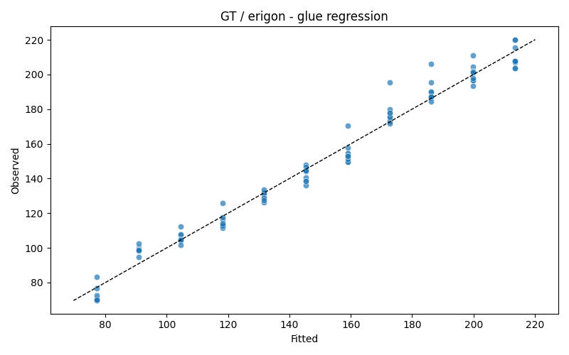

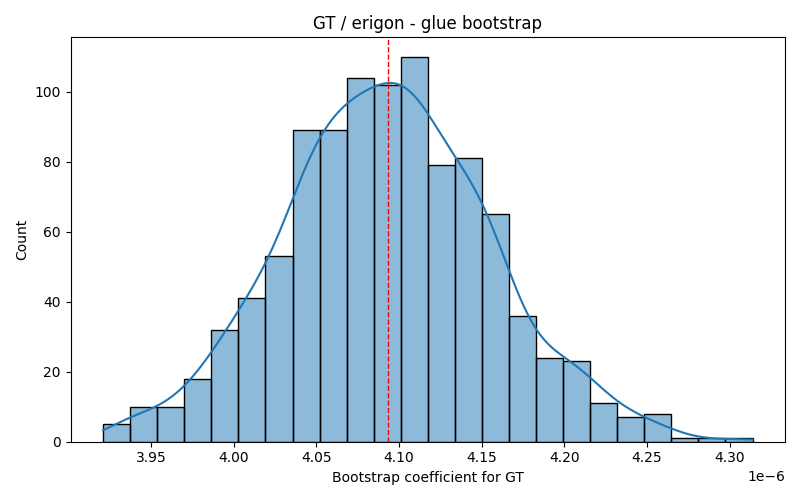

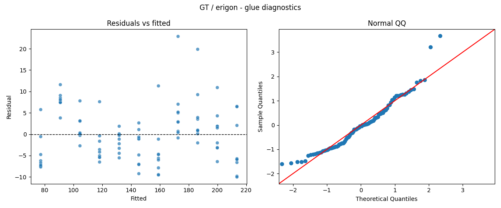

</details>

<details><summary><code>JUMPI</code> · nobs=99 · runtime_ms=4.818e-06 · p=1.00e-03 · R²=0.9658</summary>

```
==============================================================================
                           NNLS Regression Results                            
==============================================================================
Dep. Variable:          test_runtime_ms              R-squared:          0.966
Model:                  NNLS                    Adj. R-squared:          0.965
No. Observations:       99                                RMSE:           4.09
Df Residuals:           97                                 MAE:           2.91
Df Model:               1      
==============================================================================
                      coef     std err     P-value      [0.025      0.975]
------------------------------------------------------------------------------
         const     10.3627      1.6554       0.001      7.2948     13.8782
         JUMPI      0.0000      0.0000       0.001      0.0000      0.0000
==============================================================================
Notes: Non-negative least squares with bootstrap inference (1000 iterations)
==============================================================================
```

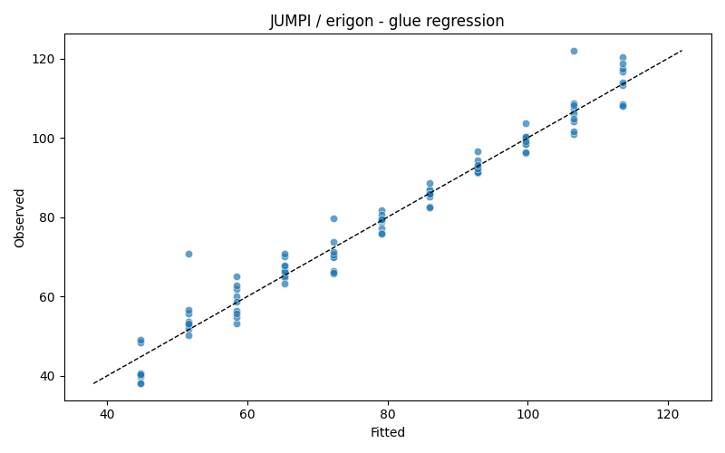

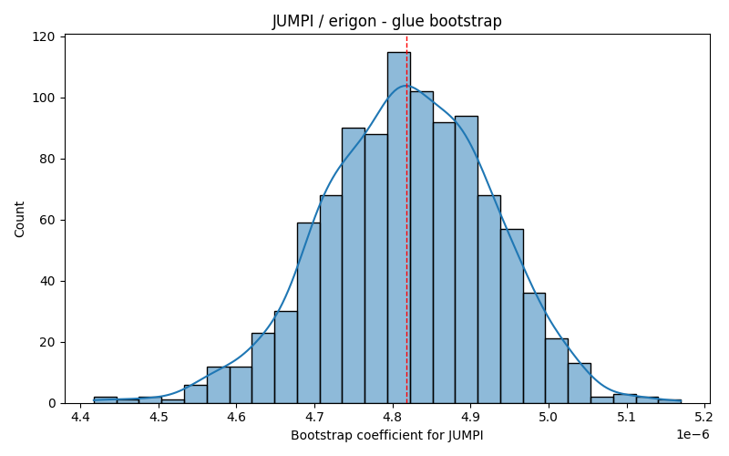

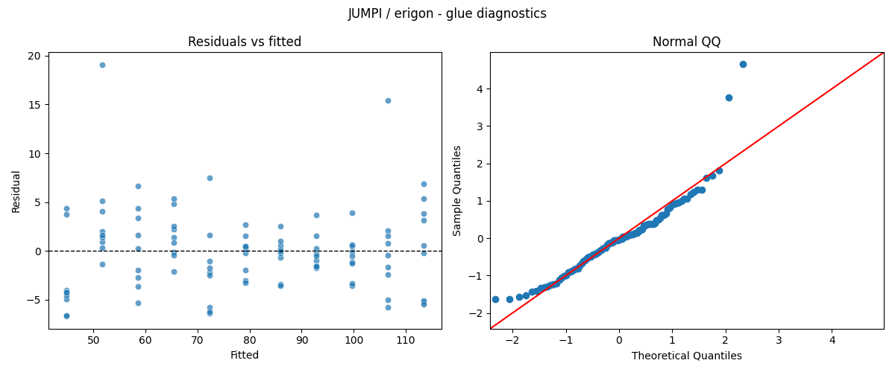

</details>

<details><summary><code>LT</code> · nobs=99 · runtime_ms=4.078e-06 · p=1.00e-03 · R²=0.9713</summary>

```
==============================================================================
                           NNLS Regression Results                            
==============================================================================
Dep. Variable:          test_runtime_ms              R-squared:          0.971
Model:                  NNLS                    Adj. R-squared:          0.971
No. Observations:       99                                RMSE:           7.39
Df Residuals:           97                                 MAE:           5.42
Df Model:               1      
==============================================================================
                      coef     std err     P-value      [0.025      0.975]
------------------------------------------------------------------------------
         const     11.4088      2.4799       0.001      6.6430     16.5340
            LT      0.0000      0.0000       0.001      0.0000      0.0000
==============================================================================
Notes: Non-negative least squares with bootstrap inference (1000 iterations)
==============================================================================
```

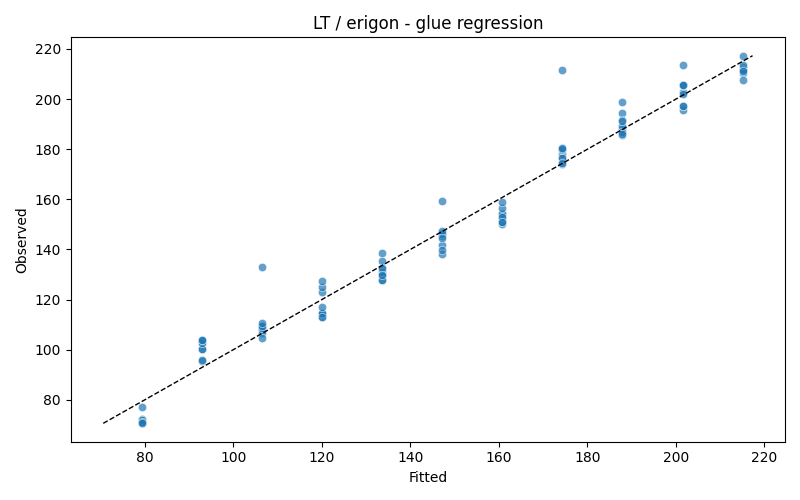

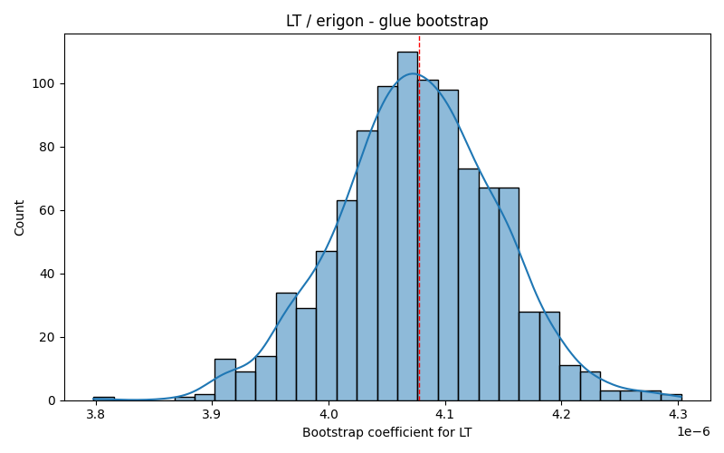

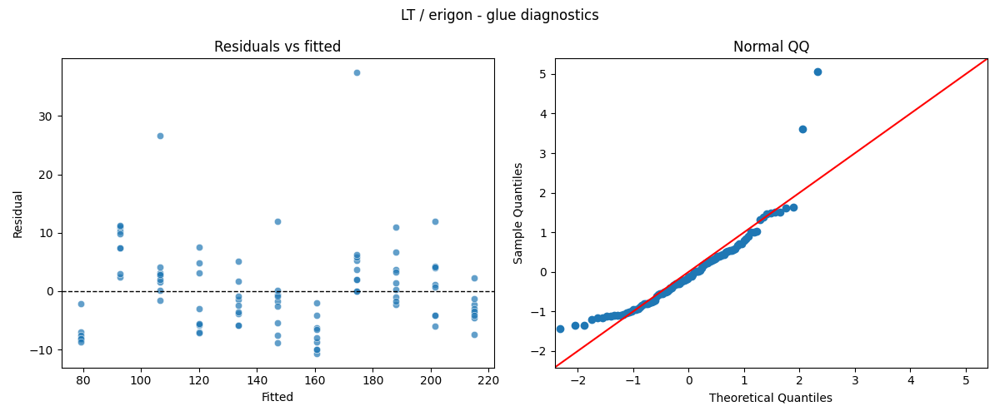

</details>

<details><summary><code>MSTORE</code> · nobs=495 · runtime_ms=8.072e-06 · p=1.00e-03 · R²=0.9718</summary>

```
==============================================================================
                           NNLS Regression Results                            
==============================================================================
Dep. Variable:          test_runtime_ms              R-squared:          0.972
Model:                  NNLS                    Adj. R-squared:          0.972
No. Observations:       495                               RMSE:           9.65
Df Residuals:           493                                MAE:           7.12
Df Model:               1      
==============================================================================
                      coef     std err     P-value      [0.025      0.975]
------------------------------------------------------------------------------
         const     16.9249      1.3835       0.001     14.2961     19.5779
        MSTORE      0.0000      0.0000       0.001      0.0000      0.0000
==============================================================================
Notes: Non-negative least squares with bootstrap inference (1000 iterations)
==============================================================================
```

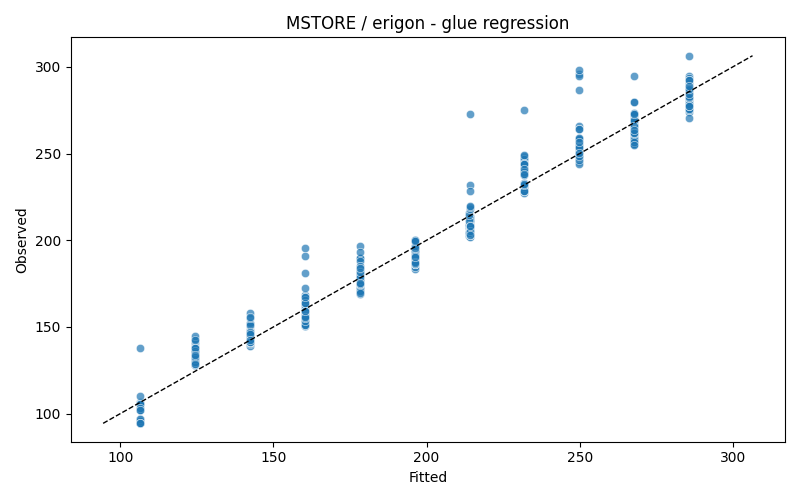

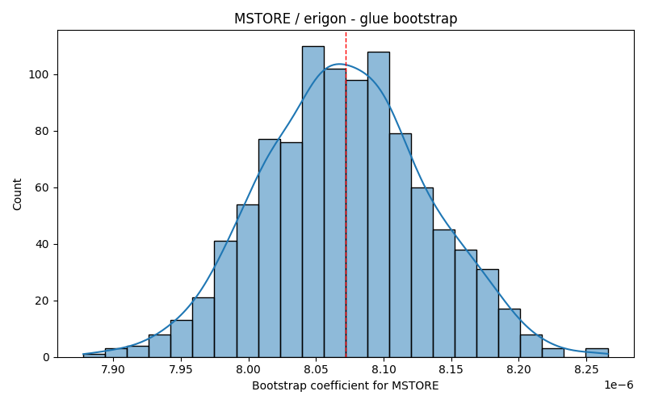

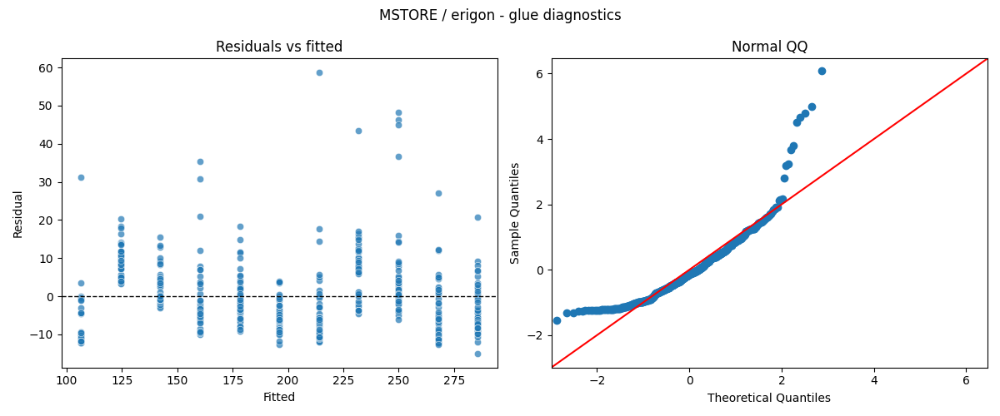

</details>

<details><summary><code>MSTORE8</code> · nobs=495 · runtime_ms=7.704e-06 · p=1.00e-03 · R²=0.9707</summary>

```
==============================================================================
                           NNLS Regression Results                            
==============================================================================
Dep. Variable:          test_runtime_ms              R-squared:          0.971
Model:                  NNLS                    Adj. R-squared:          0.971
No. Observations:       495                               RMSE:           9.39
Df Residuals:           493                                MAE:           6.71
Df Model:               1      
==============================================================================
                      coef     std err     P-value      [0.025      0.975]
------------------------------------------------------------------------------
         const     16.7484      1.2932       0.001     14.1259     19.1583
       MSTORE8      0.0000      0.0000       0.001      0.0000      0.0000
==============================================================================
Notes: Non-negative least squares with bootstrap inference (1000 iterations)
==============================================================================
```

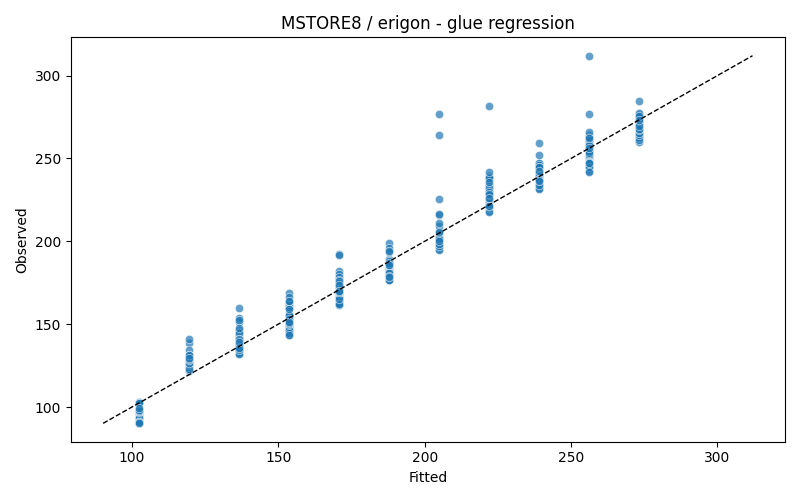

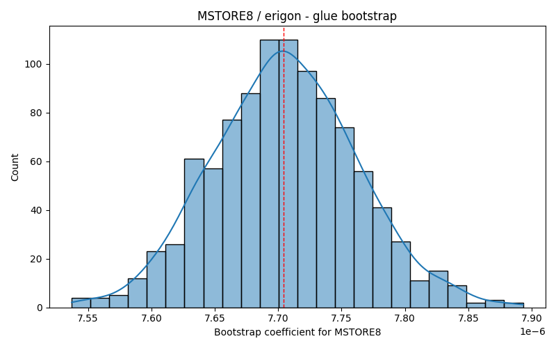

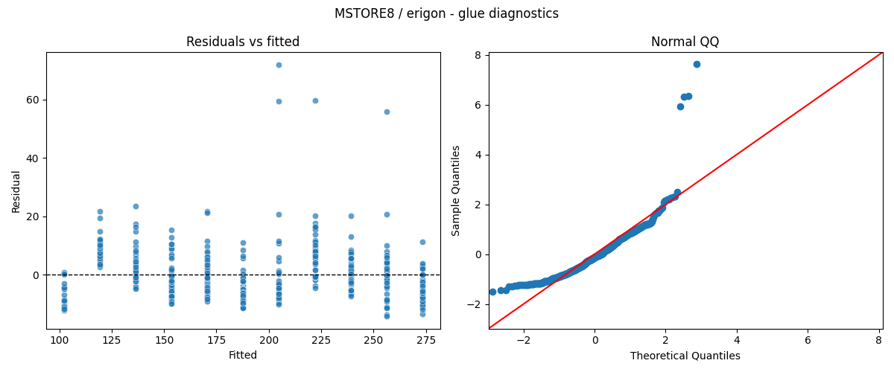

</details>

<details><summary><code>MUL</code> · nobs=99 · runtime_ms=5.928e-06 · p=1.00e-03 · R²=0.9013</summary>

```
==============================================================================
                           NNLS Regression Results                            
==============================================================================
Dep. Variable:          test_runtime_ms              R-squared:          0.901
Model:                  NNLS                    Adj. R-squared:          0.900
No. Observations:       99                                RMSE:          15.49
Df Residuals:           97                                 MAE:          11.91
Df Model:               1      
==============================================================================
                      coef     std err     P-value      [0.025      0.975]
------------------------------------------------------------------------------
         const     12.2001      4.4587       0.005      3.4211     21.0772
           MUL      0.0000      0.0000       0.001      0.0000      0.0000
==============================================================================
Notes: Non-negative least squares with bootstrap inference (1000 iterations)
==============================================================================
```

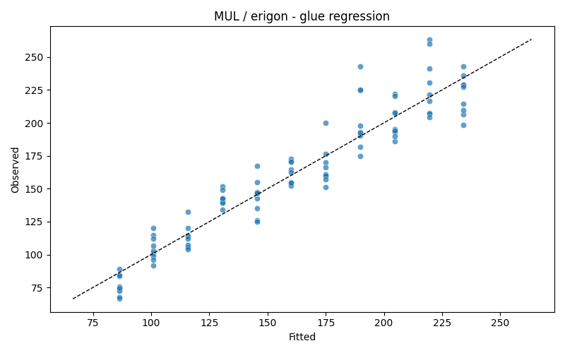

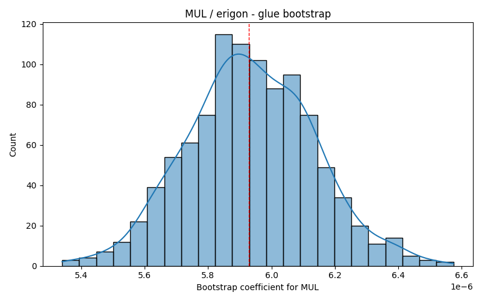

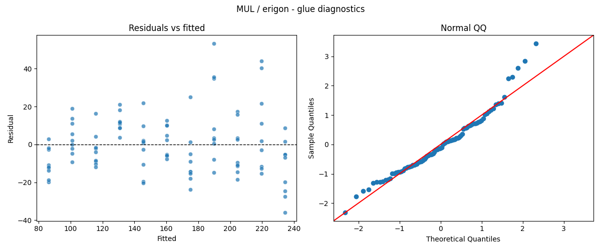

</details>

<details><summary><code>PC</code> · nobs=99 · runtime_ms=1.713e-06 · p=1.00e-03 · R²=0.9804</summary>

```
==============================================================================
                           NNLS Regression Results                            
==============================================================================
Dep. Variable:          test_runtime_ms              R-squared:          0.980
Model:                  NNLS                    Adj. R-squared:          0.980
No. Observations:       99                                RMSE:           7.25
Df Residuals:           97                                 MAE:           5.87
Df Model:               1      
==============================================================================
                      coef     std err     P-value      [0.025      0.975]
------------------------------------------------------------------------------
         const     15.5081      2.6820       0.001     10.6402     20.8998
            PC      0.0000      0.0000       0.001      0.0000      0.0000
==============================================================================
Notes: Non-negative least squares with bootstrap inference (1000 iterations)
==============================================================================
```

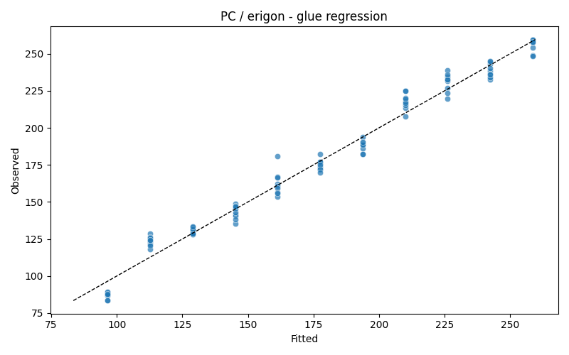

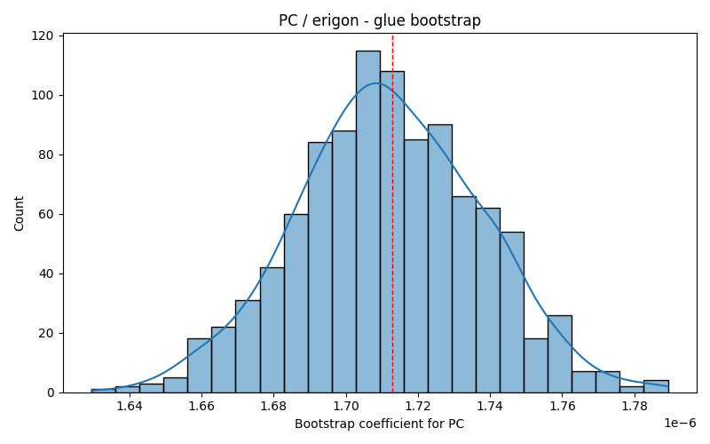

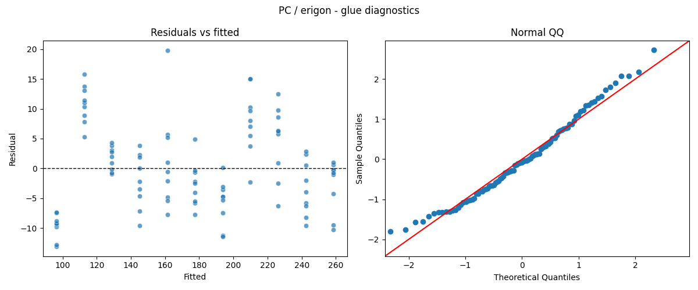

</details>

<details><summary><code>RETURNDATASIZE</code> · nobs=396 · runtime_ms=3.038e-06 · p=1.00e-03 · R²=0.9711</summary>

```
==============================================================================
                           NNLS Regression Results                            
==============================================================================
Dep. Variable:          test_runtime_ms              R-squared:          0.971
Model:                  NNLS                    Adj. R-squared:          0.971
No. Observations:       396                               RMSE:           8.28
Df Residuals:           394                                MAE:           6.35
Df Model:               1      
==============================================================================
                      coef     std err     P-value      [0.025      0.975]
------------------------------------------------------------------------------
         const     12.6541      1.6057       0.001      9.7741     15.9336
RETURNDATASIZE      0.0000      0.0000       0.001      0.0000      0.0000
==============================================================================
Notes: Non-negative least squares with bootstrap inference (1000 iterations)
==============================================================================
```

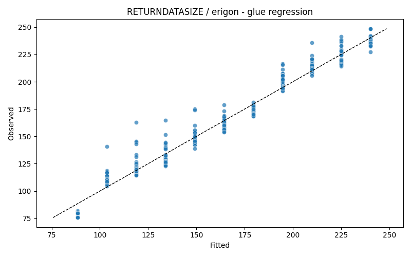

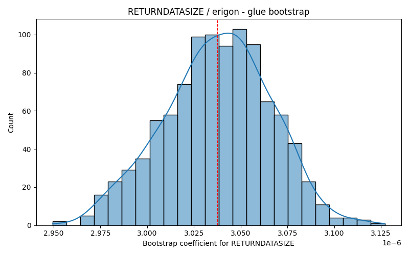

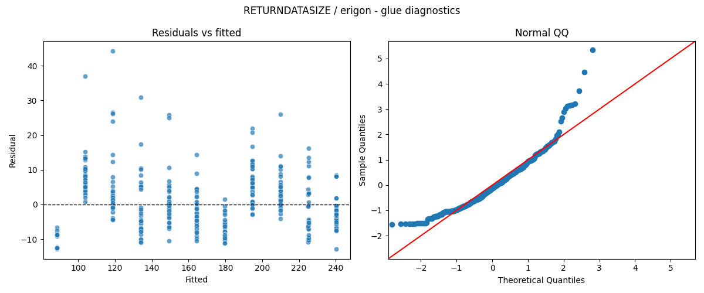

</details>

<details><summary><code>SELFBALANCE</code> · nobs=99 · runtime_ms=1.998e-06 · p=1.00e-03 · R²=0.9866</summary>

```
==============================================================================
                           NNLS Regression Results                            
==============================================================================
Dep. Variable:          test_runtime_ms              R-squared:          0.987
Model:                  NNLS                    Adj. R-squared:          0.986
No. Observations:       99                                RMSE:           2.88
Df Residuals:           97                                 MAE:           2.49
Df Model:               1      
==============================================================================
                      coef     std err     P-value      [0.025      0.975]
------------------------------------------------------------------------------
         const      6.0376      0.9566       0.001      4.2518      7.9161
   SELFBALANCE      0.0000      0.0000       0.001      0.0000      0.0000
==============================================================================
Notes: Non-negative least squares with bootstrap inference (1000 iterations)
==============================================================================
```

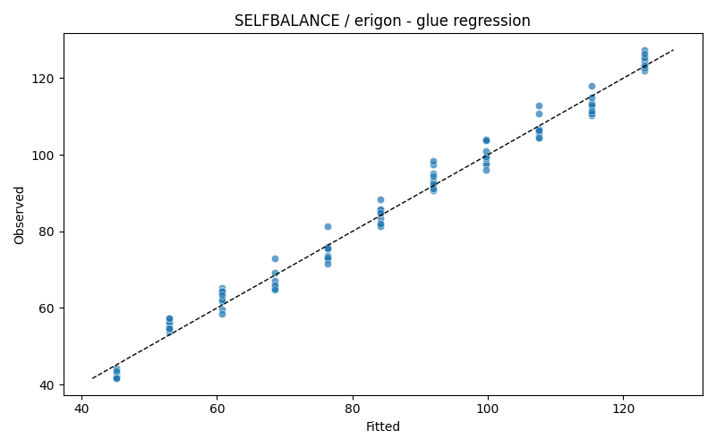

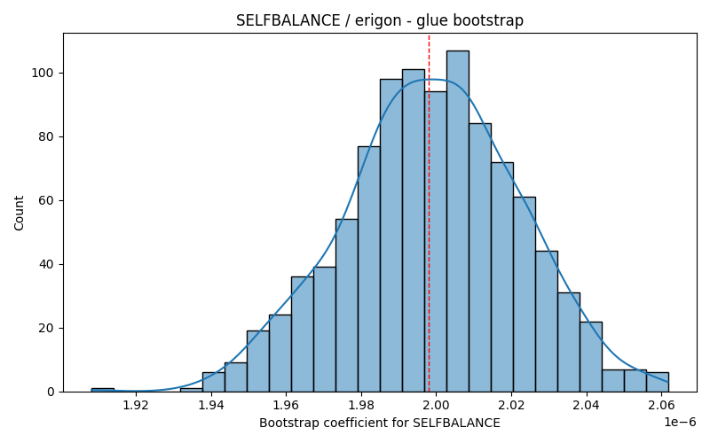

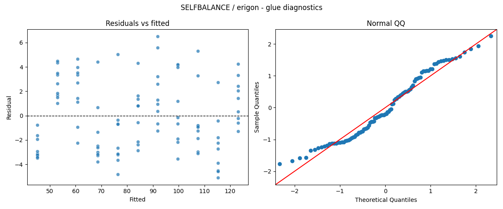

</details>

<details><summary><code>SUB</code> · nobs=99 · runtime_ms=4.092e-06 · p=1.00e-03 · R²=0.9843</summary>

```
==============================================================================
                           NNLS Regression Results                            
==============================================================================
Dep. Variable:          test_runtime_ms              R-squared:          0.984
Model:                  NNLS                    Adj. R-squared:          0.984
No. Observations:       99                                RMSE:           5.44
Df Residuals:           97                                 MAE:           4.49
Df Model:               1      
==============================================================================
                      coef     std err     P-value      [0.025      0.975]
------------------------------------------------------------------------------
         const      9.4275      1.8797       0.001      6.1447     13.2573
           SUB      0.0000      0.0000       0.001      0.0000      0.0000
==============================================================================
Notes: Non-negative least squares with bootstrap inference (1000 iterations)
==============================================================================
```

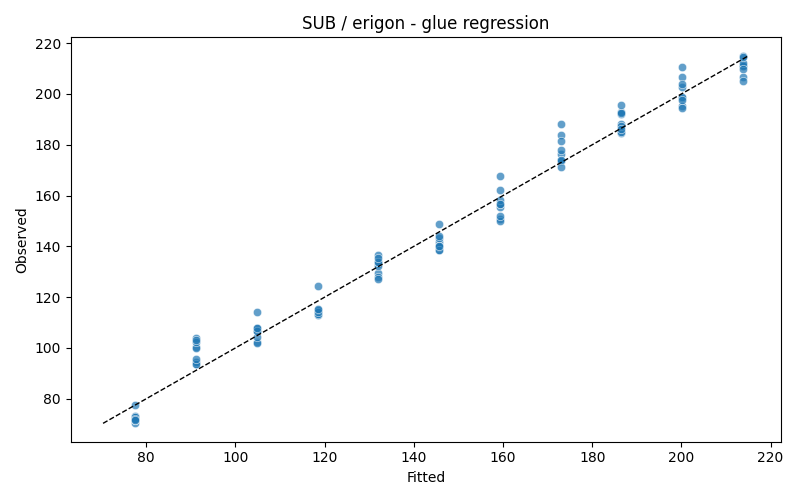

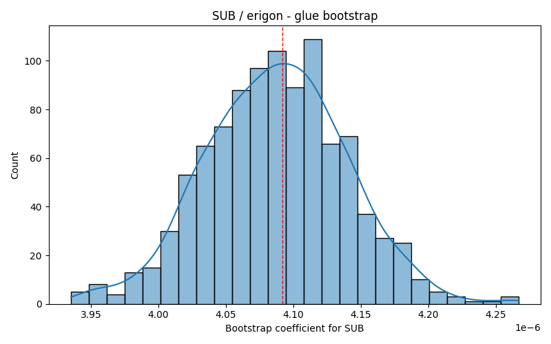

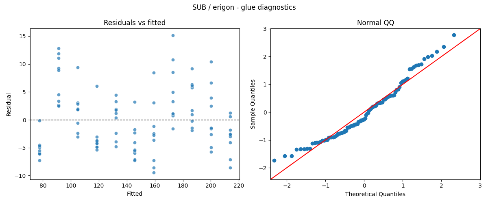

</details>

### Mixed glue (tier B) · erigon

<details><summary><code>JUMP</code> · nobs=99 · runtime_ms=9.324e-06 · p=1.00e-03 · R²=0.9408</summary>

```
==============================================================================
                           NNLS Regression Results                            
==============================================================================
Dep. Variable:          test_runtime_ms              R-squared:          0.941
Model:                  NNLS                    Adj. R-squared:          0.940
No. Observations:       99                                RMSE:           8.69
Df Residuals:           97                                 MAE:           4.58
Df Model:               1      
==============================================================================
                      coef     std err     P-value      [0.025      0.975]
------------------------------------------------------------------------------
         const     11.3541      4.5564       0.001      4.1240     21.3081
          JUMP      0.0000      0.0000       0.001      0.0000      0.0000
==============================================================================
Notes: Non-negative least squares with bootstrap inference (1000 iterations)
==============================================================================
```

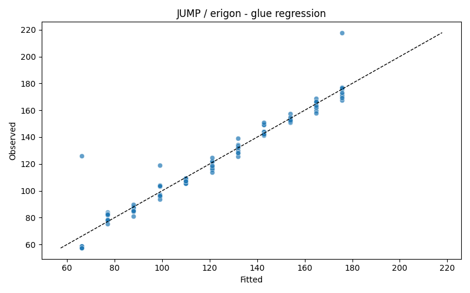

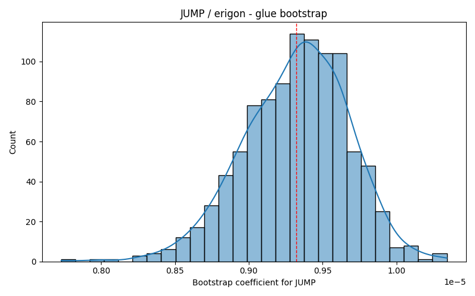

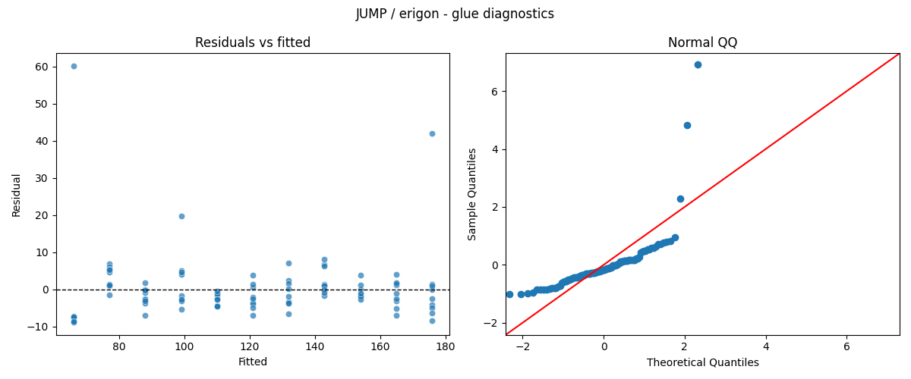

</details>

<details><summary><code>KECCAK256</code> · nobs=1584 · runtime_ms=3.119e-05 · p=1.00e-03 · R²=0.09546</summary>

```
==============================================================================
                           NNLS Regression Results                            
==============================================================================
Dep. Variable:          test_runtime_ms              R-squared:          0.095
Model:                  NNLS                    Adj. R-squared:          0.095
No. Observations:       1584                              RMSE:         190.89
Df Residuals:           1582                               MAE:         155.13
Df Model:               1      
==============================================================================
                      coef     std err     P-value      [0.025      0.975]
------------------------------------------------------------------------------
         const    541.3872     10.4684       0.001    520.3315    562.1455
     KECCAK256      0.0000      0.0000       0.001      0.0000      0.0000
==============================================================================
Notes: Non-negative least squares with bootstrap inference (1000 iterations)
==============================================================================
```

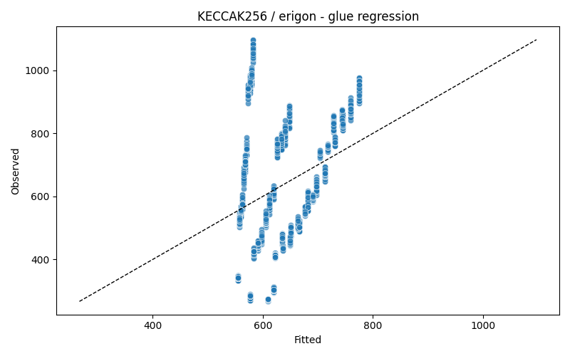

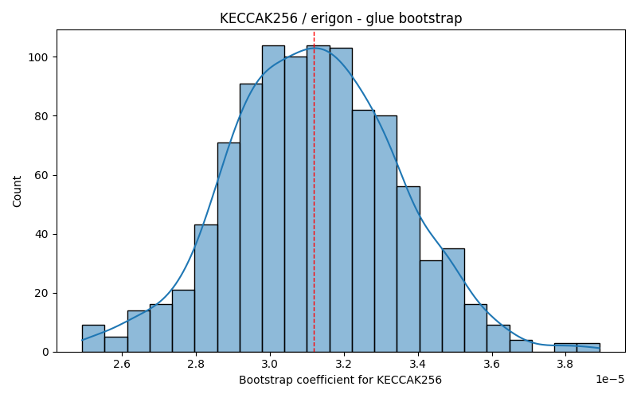

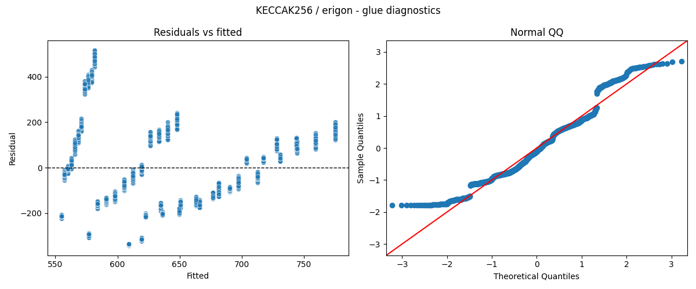

</details>

## ethrex

| glue_opcode | nobs | glue_runtime_ms | p_value | rsquared |
| --- | --- | --- | --- | --- |
| `ISZERO` | 33 | 7.377e-07 | 1.00e-03 | 0.8995 |
| `JUMPDEST` | 33 | 5.253e-07 | 1.00e-03 | 0.8883 |
| `SWAP` | 528 | 8.697e-07 | 1.00e-03 | 0.8641 |
| `CALLDATASIZE` | 1969 | 6.896e-07 | 1.00e-03 | 0.9467 |
| `DUP` | 1969 | 7.522e-07 | 1.00e-03 | 0.9467 |
| `GAS` | 1969 | 6.938e-07 | 1.00e-03 | 0.9467 |
| `MLOAD` | 1969 | 1.649e-06 | 1.00e-03 | 0.9467 |
| `PUSH` | 1969 | 8.555e-07 | 1.00e-03 | 0.9467 |
| `PUSH0` | 1969 | 6.573e-07 | 1.00e-03 | 0.9467 |
| `STATICCALL` | 1969 | 0.0001221 | 1.00e-03 | 0.9467 |
| `ADD` | 33 | 1.729e-06 | 1.00e-03 | 0.9481 |
| `AND` | 33 | 1.282e-06 | 1.00e-03 | 0.9344 |
| `CALLDATACOPY` | 792 | 3.906e-06 | 1.00e-03 | 0.9319 |
| `CALLDATALOAD` | 132 | 2.814e-05 | 1.00e-03 | 0.2909 |
| `DIV` | 33 | 1.316e-05 | 1.00e-03 | 0.9634 |
| `EXP` | 33 | 0.001801 | 1.00e-03 | 0.9814 |
| `GT` | 33 | 1.773e-06 | 1.00e-03 | 0.9673 |
| `JUMPI` | 33 | 2.343e-06 | 1.00e-03 | 0.773 |
| `LT` | 33 | 1.637e-06 | 1.00e-03 | 0.9418 |
| `MSTORE` | 165 | 2.485e-06 | 1.00e-03 | 0.9328 |
| `MSTORE8` | 165 | 2.625e-06 | 1.00e-03 | 0.9472 |
| `MUL` | 33 | 3.1e-06 | 1.00e-03 | 0.6063 |
| `PC` | 33 | 8.355e-07 | 1.00e-03 | 0.9173 |
| `RETURNDATASIZE` | 132 | 1.342e-06 | 1.00e-03 | 0.9277 |
| `SELFBALANCE` | 33 | 1.015e-05 | 1.00e-03 | 0.9875 |
| `SUB` | 33 | 1.622e-06 | 1.00e-03 | 0.9687 |
| `JUMP` | 33 | 4.194e-06 | 1.00e-03 | 0.9642 |
| `KECCAK256` | 528 | 0 | 1.00e+00 | 2.22e-16 |

### Cycle glue — joint fit · ethrex

<details><summary>Joint NNLS regression summary</summary>

```
==============================================================================
                           NNLS Regression Results                            
==============================================================================
Dep. Variable:          test_runtime_ms              R-squared:          0.947
Model:                  NNLS                    Adj. R-squared:          0.947
No. Observations:       1969                              RMSE:           6.32
Df Residuals:           1961                               MAE:           4.83
Df Model:               7      
==============================================================================
                      coef     std err     P-value      [0.025      0.975]
------------------------------------------------------------------------------
         const      8.6940      0.4423       0.001      7.8074      9.5711
  CALLDATASIZE      0.0000      0.0000       0.001      0.0000      0.0000
           DUP      0.0000      0.0000       0.001      0.0000      0.0000
           GAS      0.0000      0.0000       0.001      0.0000      0.0000
         MLOAD      0.0000      0.0000       0.001      0.0000      0.0000
          PUSH      0.0000      0.0000       0.001      0.0000      0.0000
         PUSH0      0.0000      0.0000       0.001      0.0000      0.0000
    STATICCALL      0.0001      0.0000       0.001      0.0001      0.0001
==============================================================================
Notes: Non-negative least squares with bootstrap inference (1000 iterations)
==============================================================================
```

</details>

<details><summary><code>CALLDATASIZE</code> · nobs=1969 · runtime_ms=6.896e-07 · p=1.00e-03 · R²=0.9467</summary>

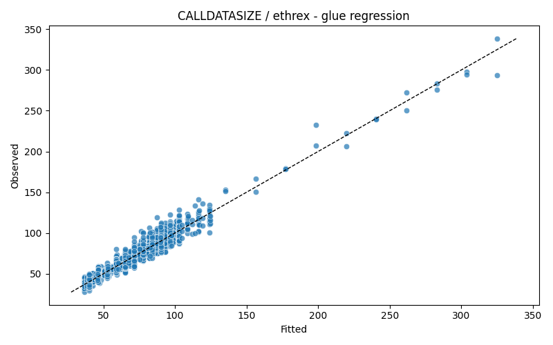

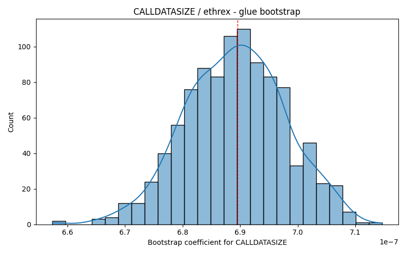


</details>

<details><summary><code>DUP</code> · nobs=1969 · runtime_ms=7.522e-07 · p=1.00e-03 · R²=0.9467</summary>

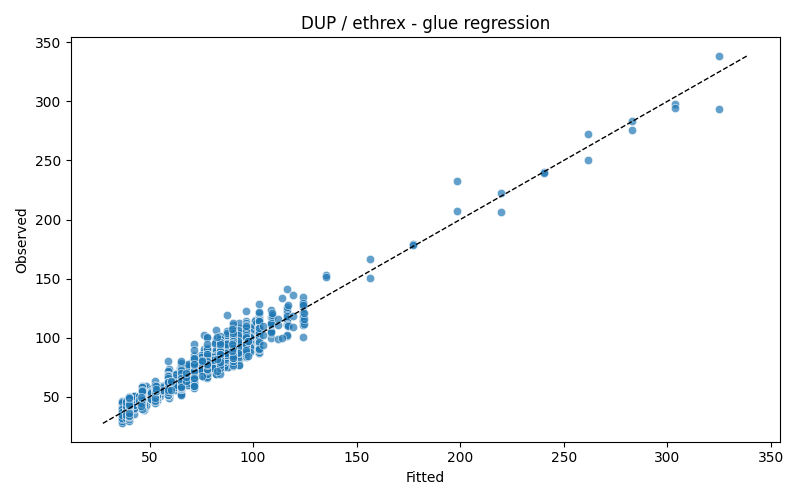

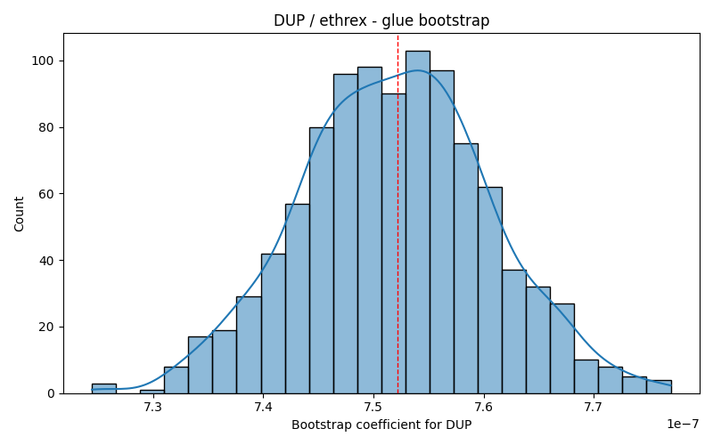


</details>

<details><summary><code>GAS</code> · nobs=1969 · runtime_ms=6.938e-07 · p=1.00e-03 · R²=0.9467</summary>


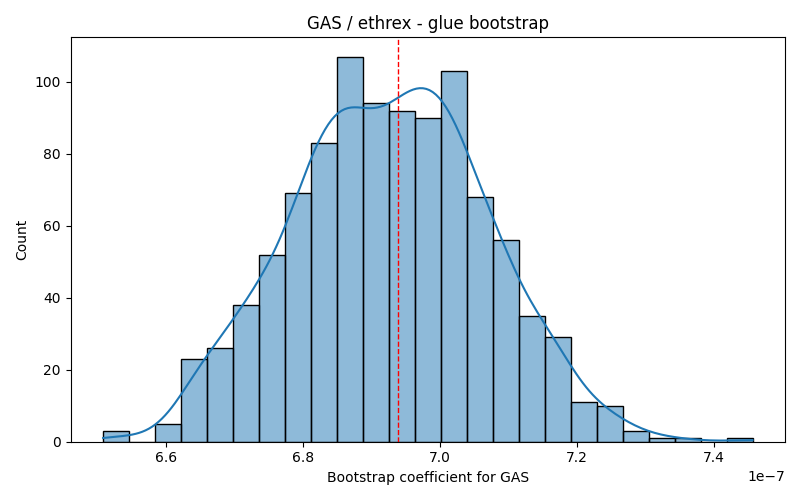

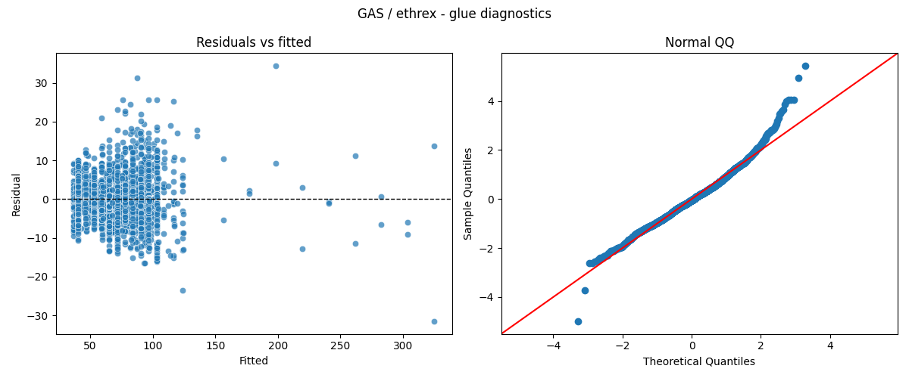

</details>

<details><summary><code>MLOAD</code> · nobs=1969 · runtime_ms=1.649e-06 · p=1.00e-03 · R²=0.9467</summary>


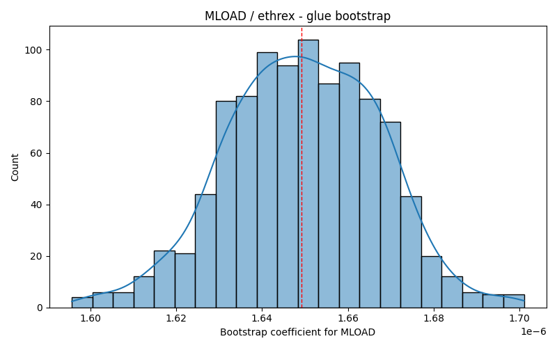


</details>

<details><summary><code>PUSH</code> · nobs=1969 · runtime_ms=8.555e-07 · p=1.00e-03 · R²=0.9467</summary>


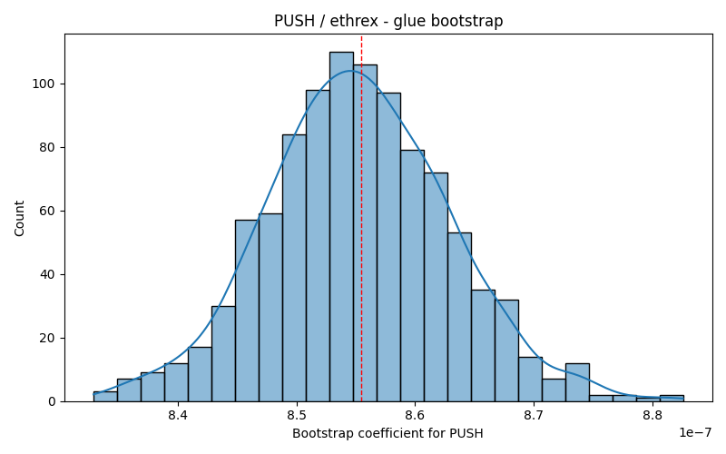


</details>

<details><summary><code>PUSH0</code> · nobs=1969 · runtime_ms=6.573e-07 · p=1.00e-03 · R²=0.9467</summary>


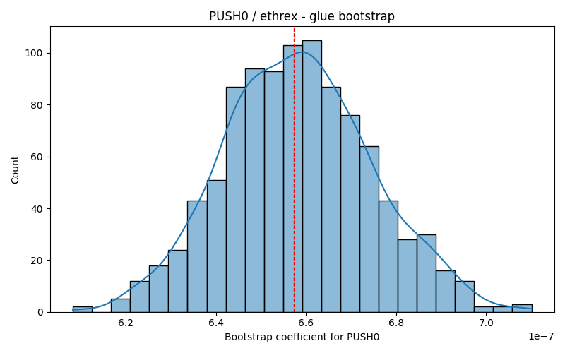


</details>

<details><summary><code>STATICCALL</code> · nobs=1969 · runtime_ms=0.0001221 · p=1.00e-03 · R²=0.9467</summary>


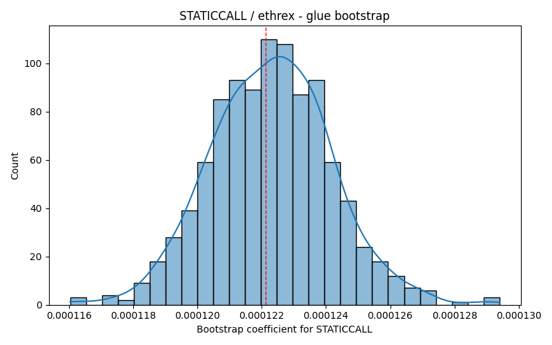


</details>

### Pure glue · ethrex

<details><summary><code>ISZERO</code> · nobs=33 · runtime_ms=7.377e-07 · p=1.00e-03 · R²=0.8995</summary>

```
==============================================================================
                           NNLS Regression Results                            
==============================================================================
Dep. Variable:          test_runtime_ms              R-squared:          0.900
Model:                  NNLS                    Adj. R-squared:          0.896
No. Observations:       33                                RMSE:           5.19
Df Residuals:           31                                 MAE:           4.21
Df Model:               1      
==============================================================================
                      coef     std err     P-value      [0.025      0.975]
------------------------------------------------------------------------------
         const     10.7931      2.5321       0.001      5.6603     15.4583
        ISZERO      0.0000      0.0000       0.001      0.0000      0.0000
==============================================================================
Notes: Non-negative least squares with bootstrap inference (1000 iterations)
==============================================================================
```

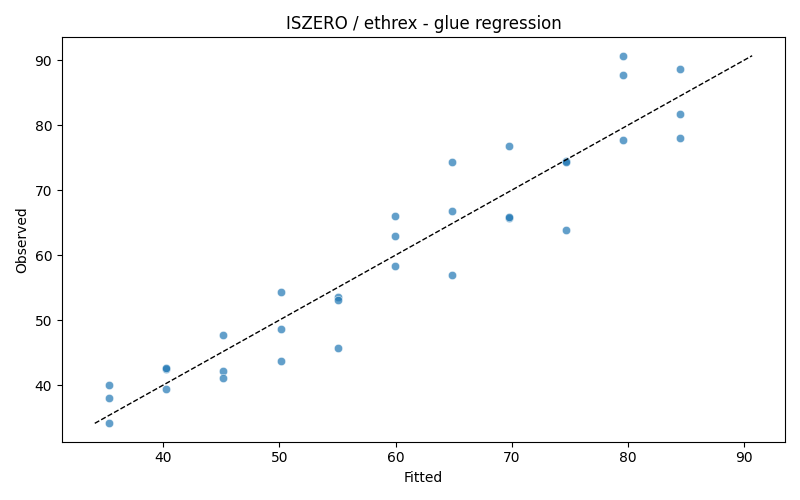

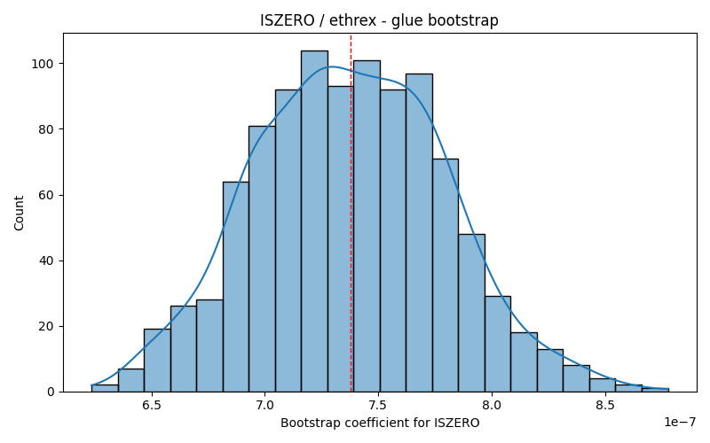

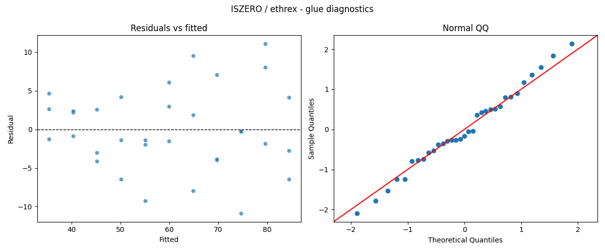

</details>

<details><summary><code>JUMPDEST</code> · nobs=33 · runtime_ms=5.253e-07 · p=1.00e-03 · R²=0.8883</summary>

```
==============================================================================
                           NNLS Regression Results                            
==============================================================================
Dep. Variable:          test_runtime_ms              R-squared:          0.888
Model:                  NNLS                    Adj. R-squared:          0.885
No. Observations:       33                                RMSE:          11.77
Df Residuals:           31                                 MAE:           9.73
Df Model:               1      
==============================================================================
                      coef     std err     P-value      [0.025      0.975]
------------------------------------------------------------------------------
         const     14.5971      6.7559       0.017      0.8558     27.3356
      JUMPDEST      0.0000      0.0000       0.001      0.0000      0.0000
==============================================================================
Notes: Non-negative least squares with bootstrap inference (1000 iterations)
==============================================================================
```

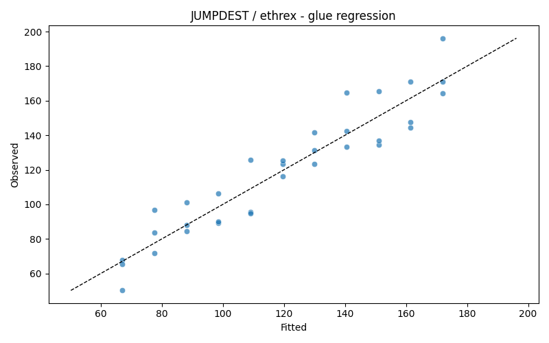

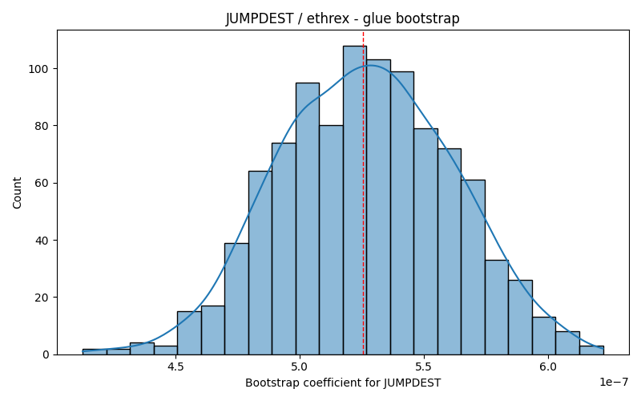

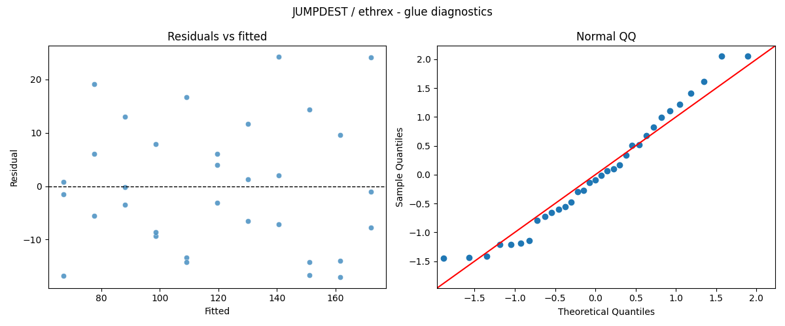

</details>

<details><summary><code>SWAP</code> · nobs=528 · runtime_ms=8.697e-07 · p=1.00e-03 · R²=0.8641</summary>

```
==============================================================================
                           NNLS Regression Results                            
==============================================================================
Dep. Variable:          test_runtime_ms              R-squared:          0.864
Model:                  NNLS                    Adj. R-squared:          0.864
No. Observations:       528                               RMSE:           7.26
Df Residuals:           526                                MAE:           5.84
Df Model:               1      
==============================================================================
                      coef     std err     P-value      [0.025      0.975]
------------------------------------------------------------------------------
         const     10.9325      0.9432       0.001      9.0345     12.7853
          SWAP      0.0000      0.0000       0.001      0.0000      0.0000
==============================================================================
Notes: Non-negative least squares with bootstrap inference (1000 iterations)
==============================================================================
```

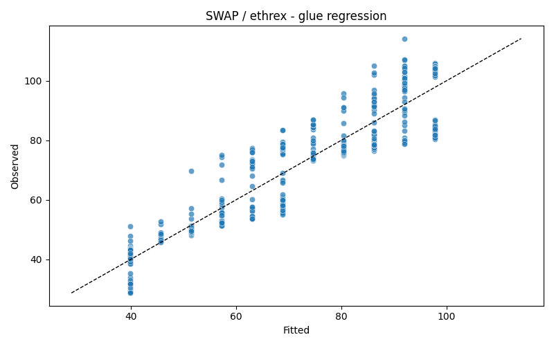

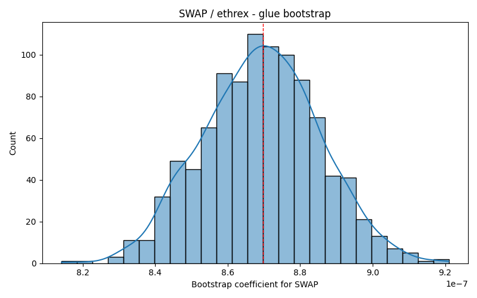

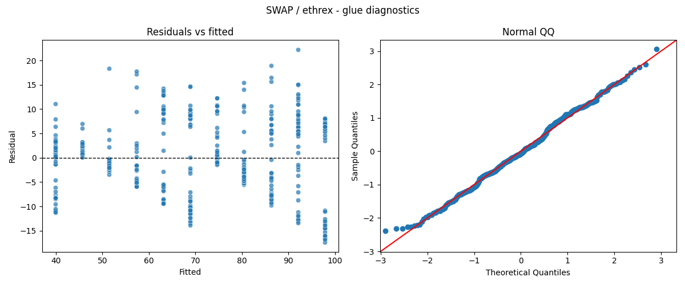

</details>

### Mixed glue (tier A) · ethrex

<details><summary><code>ADD</code> · nobs=33 · runtime_ms=1.729e-06 · p=1.00e-03 · R²=0.9481</summary>

```
==============================================================================
                           NNLS Regression Results                            
==============================================================================
Dep. Variable:          test_runtime_ms              R-squared:          0.948
Model:                  NNLS                    Adj. R-squared:          0.946
No. Observations:       33                                RMSE:           4.26
Df Residuals:           31                                 MAE:           3.14
Df Model:               1      
==============================================================================
                      coef     std err     P-value      [0.025      0.975]
------------------------------------------------------------------------------
         const      8.6738      2.4558       0.001      3.4522     12.9572
           ADD      0.0000      0.0000       0.001      0.0000      0.0000
==============================================================================
Notes: Non-negative least squares with bootstrap inference (1000 iterations)
==============================================================================
```

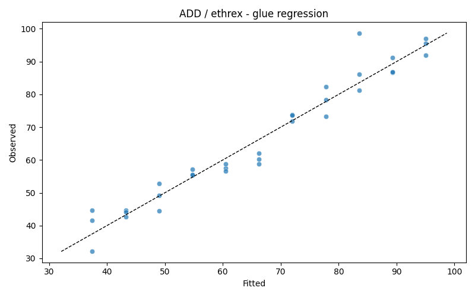

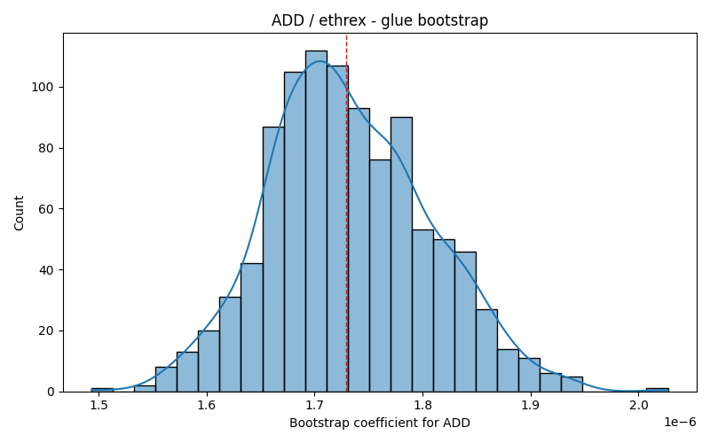

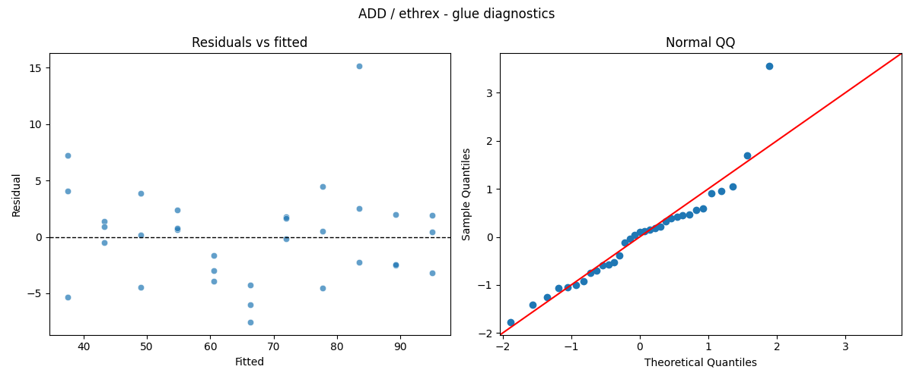

</details>

<details><summary><code>AND</code> · nobs=33 · runtime_ms=1.282e-06 · p=1.00e-03 · R²=0.9344</summary>

```
==============================================================================
                           NNLS Regression Results                            
==============================================================================
Dep. Variable:          test_runtime_ms              R-squared:          0.934
Model:                  NNLS                    Adj. R-squared:          0.932
No. Observations:       33                                RMSE:           3.58
Df Residuals:           31                                 MAE:           2.68
Df Model:               1      
==============================================================================
                      coef     std err     P-value      [0.025      0.975]
------------------------------------------------------------------------------
         const      9.1347      1.6424       0.001      5.6983     12.1210
           AND      0.0000      0.0000       0.001      0.0000      0.0000
==============================================================================
Notes: Non-negative least squares with bootstrap inference (1000 iterations)
==============================================================================
```

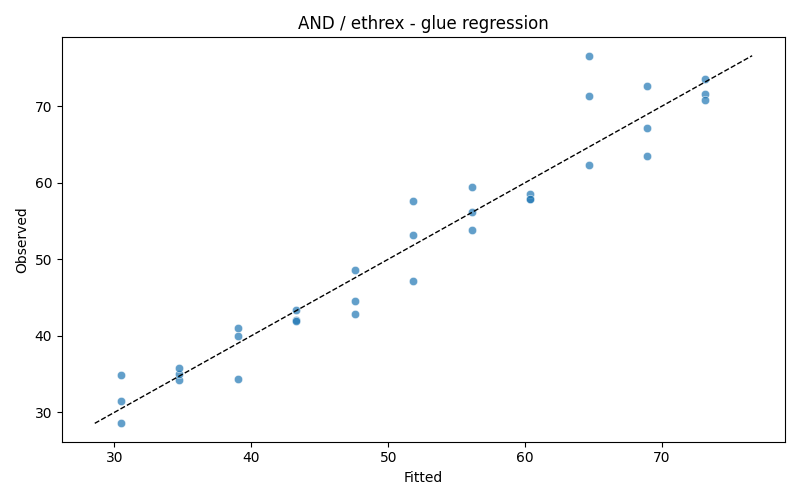

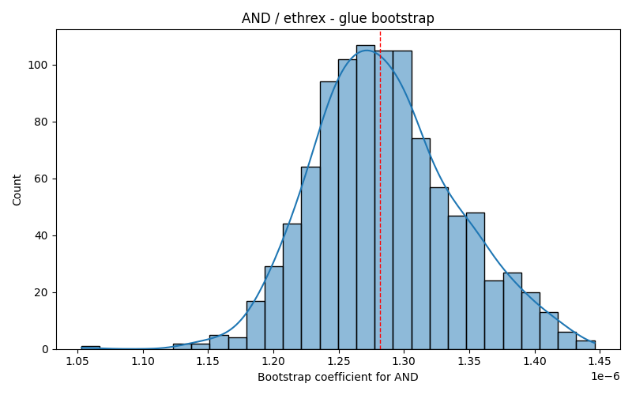

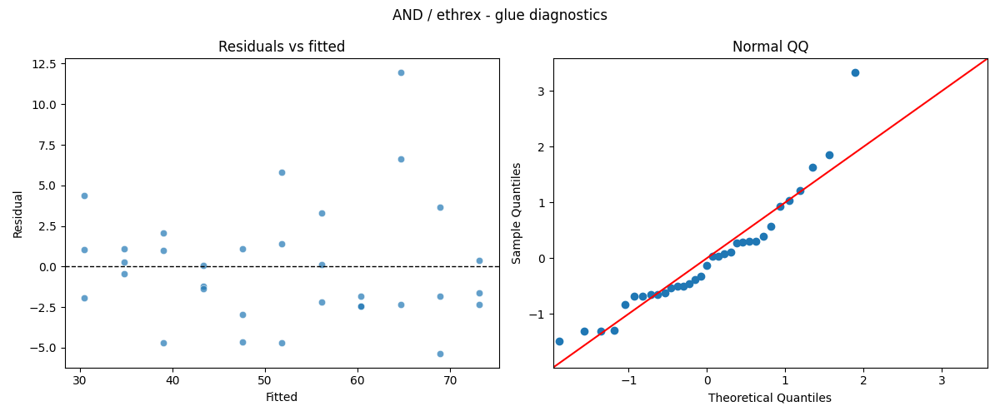

</details>

<details><summary><code>CALLDATACOPY</code> · nobs=792 · runtime_ms=3.906e-06 · p=1.00e-03 · R²=0.9319</summary>

```
==============================================================================
                           NNLS Regression Results                            
==============================================================================
Dep. Variable:          test_runtime_ms              R-squared:          0.932
Model:                  NNLS                    Adj. R-squared:          0.932
No. Observations:       792                               RMSE:           7.95
Df Residuals:           790                                MAE:           6.12
Df Model:               1      
==============================================================================
                      coef     std err     P-value      [0.025      0.975]
------------------------------------------------------------------------------
         const     13.0078      0.3248       0.001     12.3698     13.6095
  CALLDATACOPY      0.0000      0.0000       0.001      0.0000      0.0000
==============================================================================
Notes: Non-negative least squares with bootstrap inference (1000 iterations)
==============================================================================
```

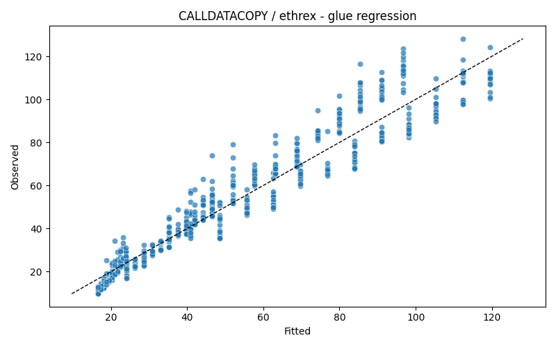

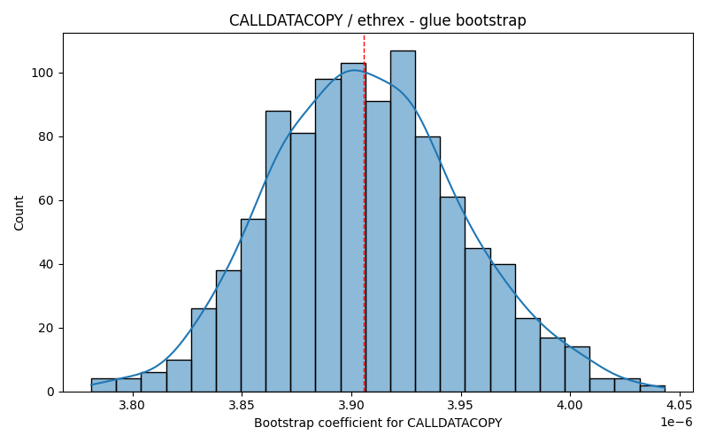

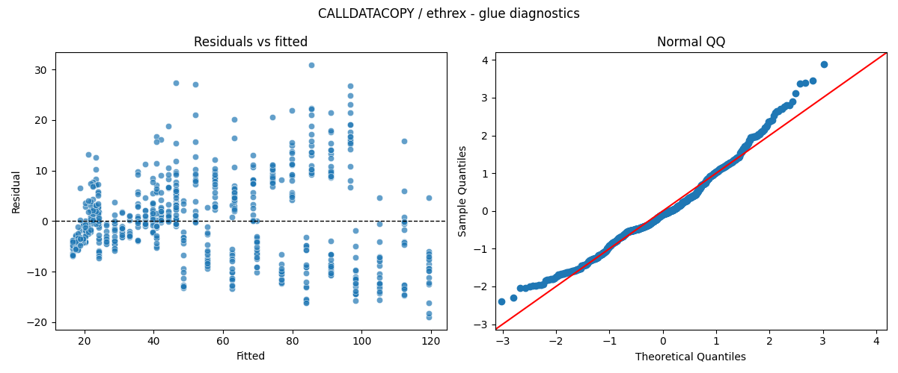

</details>

<details><summary><code>CALLDATALOAD</code> · nobs=132 · runtime_ms=2.814e-05 · p=1.00e-03 · R²=0.2909</summary>

```
==============================================================================
                           NNLS Regression Results                            
==============================================================================
Dep. Variable:          test_runtime_ms              R-squared:          0.291
Model:                  NNLS                    Adj. R-squared:          0.285
No. Observations:       132                               RMSE:           0.17
Df Residuals:           130                                MAE:           0.13
Df Model:               1      
==============================================================================
                      coef     std err     P-value      [0.025      0.975]
------------------------------------------------------------------------------
         const      2.3622      0.0544       0.001      2.2609      2.4697
  CALLDATALOAD      0.0000      0.0000       0.001      0.0000      0.0000
==============================================================================
Notes: Non-negative least squares with bootstrap inference (1000 iterations)
==============================================================================
```

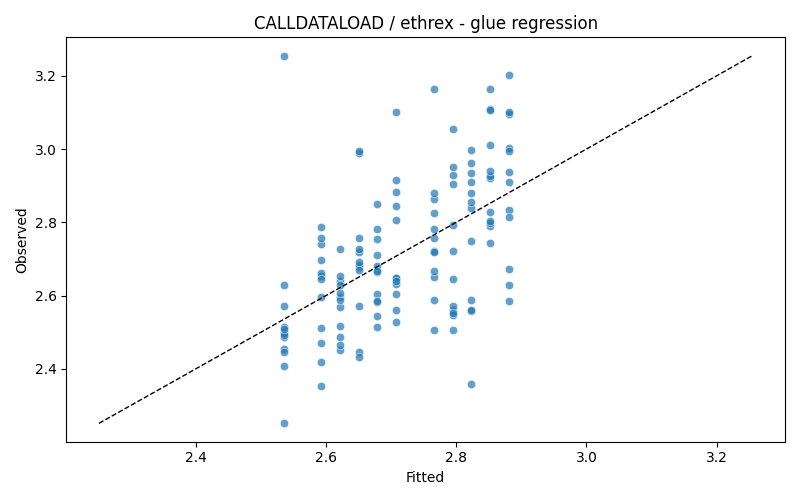

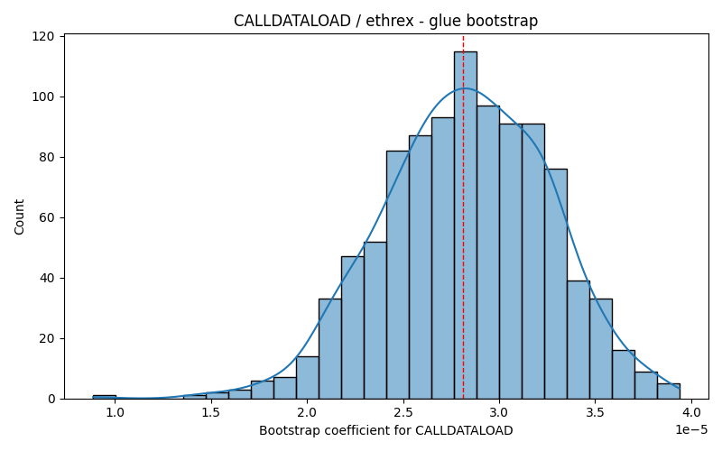

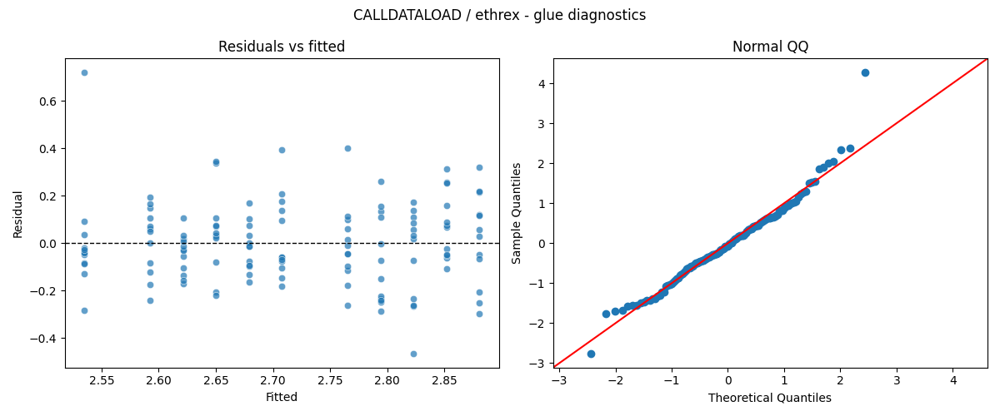

</details>

<details><summary><code>DIV</code> · nobs=33 · runtime_ms=1.316e-05 · p=1.00e-03 · R²=0.9634</summary>

```
==============================================================================
                           NNLS Regression Results                            
==============================================================================
Dep. Variable:          test_runtime_ms              R-squared:          0.963
Model:                  NNLS                    Adj. R-squared:          0.962
No. Observations:       33                                RMSE:          20.25
Df Residuals:           31                                 MAE:          15.86
Df Model:               1      
==============================================================================
                      coef     std err     P-value      [0.025      0.975]
------------------------------------------------------------------------------
         const     53.1703     12.4771       0.001     27.6837     74.7796
           DIV      0.0000      0.0000       0.001      0.0000      0.0000
==============================================================================
Notes: Non-negative least squares with bootstrap inference (1000 iterations)
==============================================================================
```

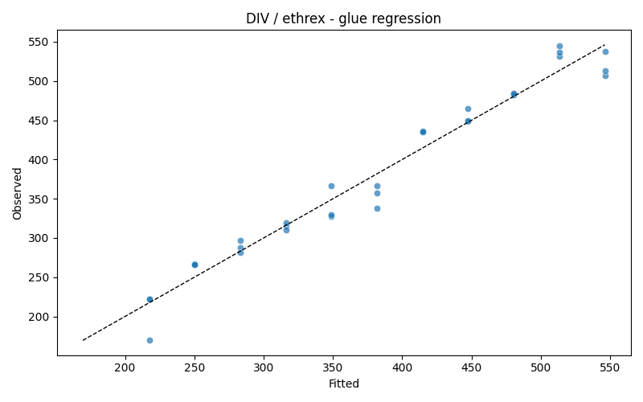

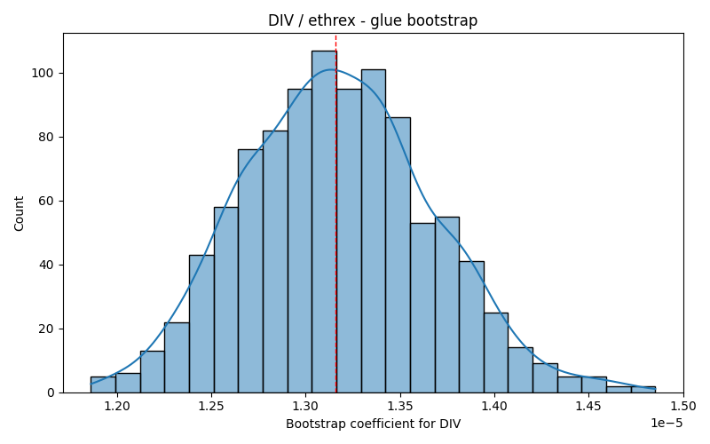

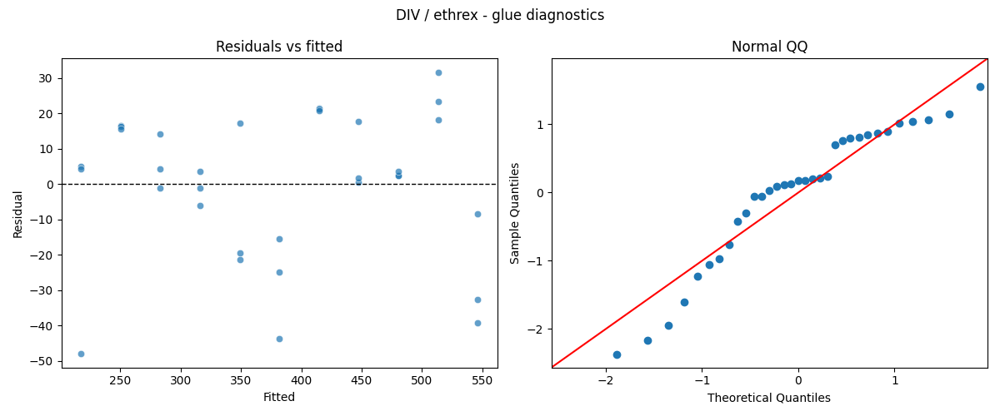

</details>

<details><summary><code>EXP</code> · nobs=33 · runtime_ms=0.001801 · p=1.00e-03 · R²=0.9814</summary>

```
==============================================================================
                           NNLS Regression Results                            
==============================================================================
Dep. Variable:          test_runtime_ms              R-squared:          0.981
Model:                  NNLS                    Adj. R-squared:          0.981
No. Observations:       33                                RMSE:           9.71
Df Residuals:           31                                 MAE:           8.44
Df Model:               1      
==============================================================================
                      coef     std err     P-value      [0.025      0.975]
------------------------------------------------------------------------------
         const     20.2380      5.9296       0.001      8.8215     32.2850
           EXP      0.0018      0.0000       0.001      0.0017      0.0019
==============================================================================
Notes: Non-negative least squares with bootstrap inference (1000 iterations)
==============================================================================
```

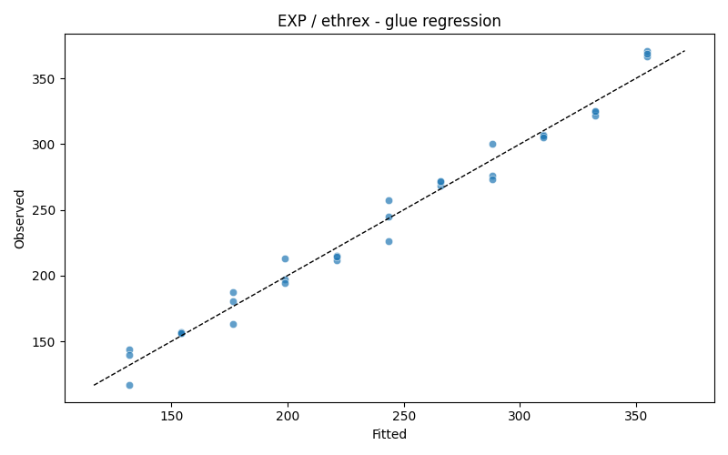

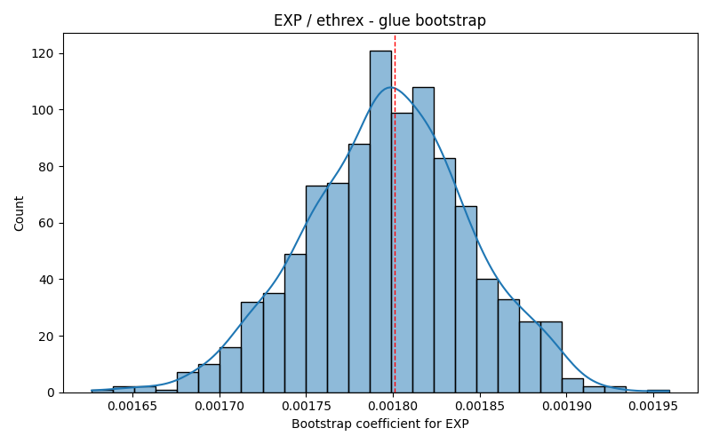

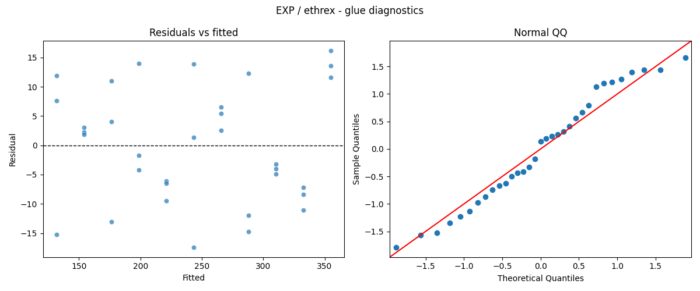

</details>

<details><summary><code>GT</code> · nobs=33 · runtime_ms=1.773e-06 · p=1.00e-03 · R²=0.9673</summary>

```
==============================================================================
                           NNLS Regression Results                            
==============================================================================
Dep. Variable:          test_runtime_ms              R-squared:          0.967
Model:                  NNLS                    Adj. R-squared:          0.966
No. Observations:       33                                RMSE:           3.43
Df Residuals:           31                                 MAE:           2.72
Df Model:               1      
==============================================================================
                      coef     std err     P-value      [0.025      0.975]
------------------------------------------------------------------------------
         const      7.0979      2.4765       0.002      2.0246     11.8356
            GT      0.0000      0.0000       0.001      0.0000      0.0000
==============================================================================
Notes: Non-negative least squares with bootstrap inference (1000 iterations)
==============================================================================
```

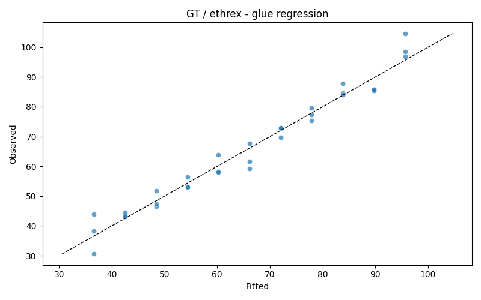

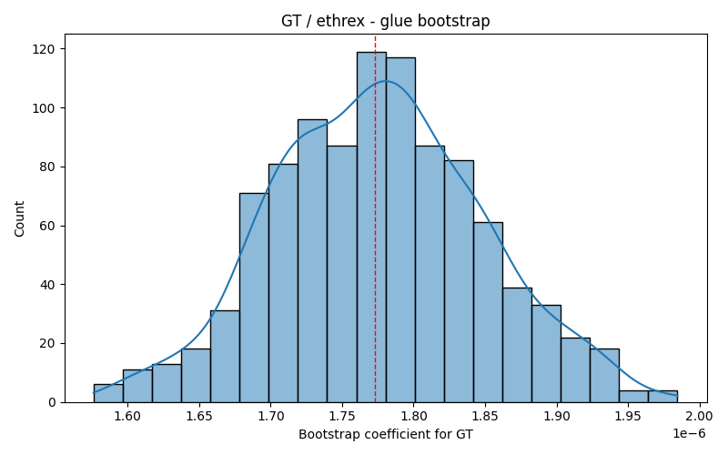

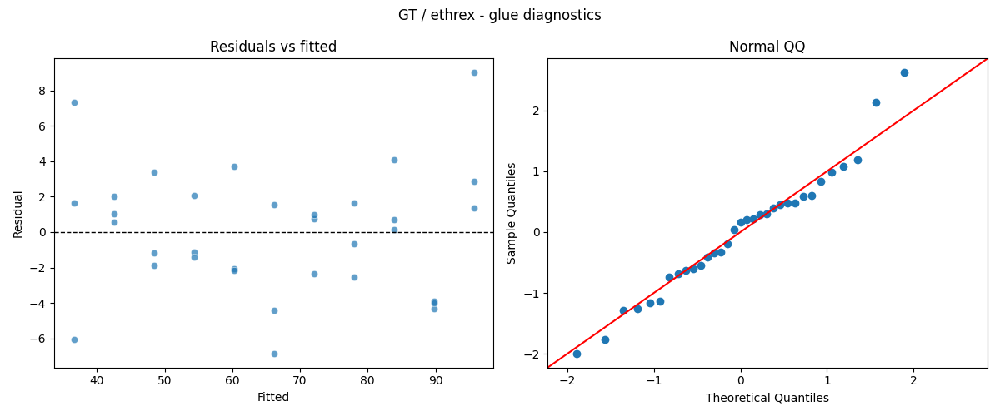

</details>

<details><summary><code>JUMPI</code> · nobs=33 · runtime_ms=2.343e-06 · p=1.00e-03 · R²=0.773</summary>

```
==============================================================================
                           NNLS Regression Results                            
==============================================================================
Dep. Variable:          test_runtime_ms              R-squared:          0.773
Model:                  NNLS                    Adj. R-squared:          0.766
No. Observations:       33                                RMSE:           5.73
Df Residuals:           31                                 MAE:           3.93
Df Model:               1      
==============================================================================
                      coef     std err     P-value      [0.025      0.975]
------------------------------------------------------------------------------
         const      4.5188      3.2768       0.116      0.0000     10.9003
         JUMPI      0.0000      0.0000       0.001      0.0000      0.0000
==============================================================================
Notes: Non-negative least squares with bootstrap inference (1000 iterations)
==============================================================================
```

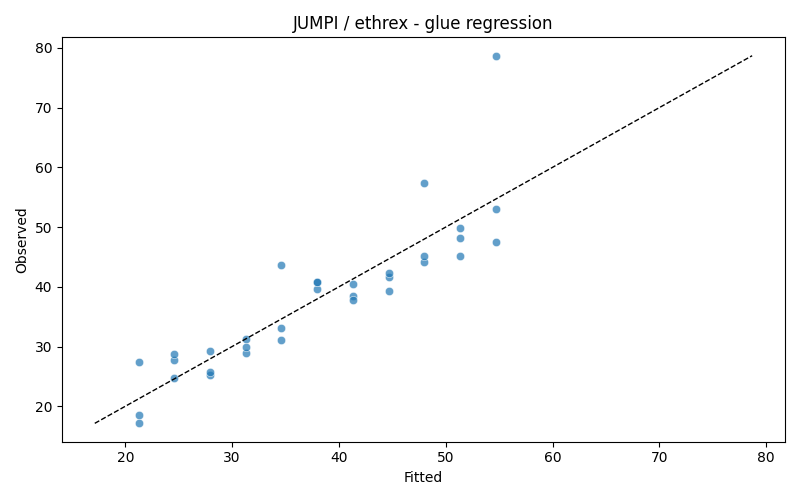

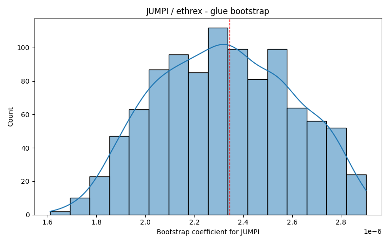

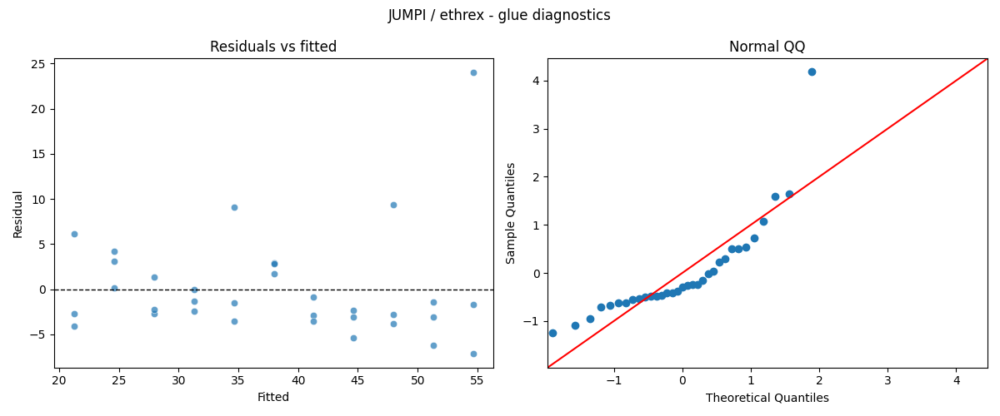

</details>

<details><summary><code>LT</code> · nobs=33 · runtime_ms=1.637e-06 · p=1.00e-03 · R²=0.9418</summary>

```
==============================================================================
                           NNLS Regression Results                            
==============================================================================
Dep. Variable:          test_runtime_ms              R-squared:          0.942
Model:                  NNLS                    Adj. R-squared:          0.940
No. Observations:       33                                RMSE:           4.29
Df Residuals:           31                                 MAE:           2.93
Df Model:               1      
==============================================================================
                      coef     std err     P-value      [0.025      0.975]
------------------------------------------------------------------------------
         const     12.3977      3.7238       0.001      6.4602     20.4500
            LT      0.0000      0.0000       0.001      0.0000      0.0000
==============================================================================
Notes: Non-negative least squares with bootstrap inference (1000 iterations)
==============================================================================
```

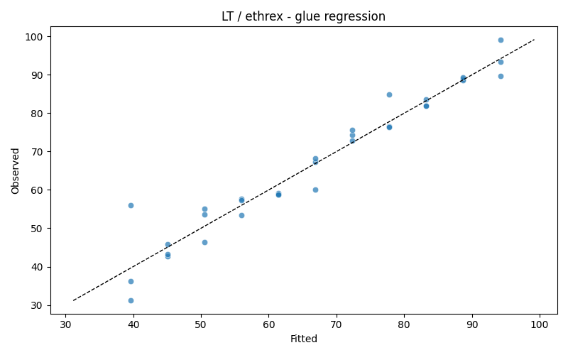

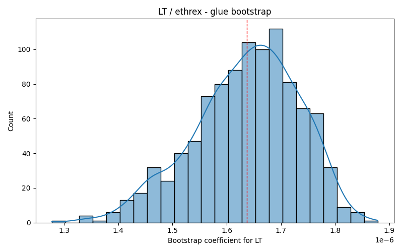

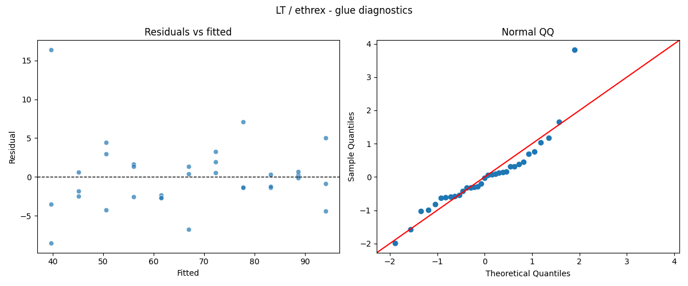

</details>

<details><summary><code>MSTORE</code> · nobs=165 · runtime_ms=2.485e-06 · p=1.00e-03 · R²=0.9328</summary>

```
==============================================================================
                           NNLS Regression Results                            
==============================================================================
Dep. Variable:          test_runtime_ms              R-squared:          0.933
Model:                  NNLS                    Adj. R-squared:          0.932
No. Observations:       165                               RMSE:           4.68
Df Residuals:           163                                MAE:           3.70
Df Model:               1      
==============================================================================
                      coef     std err     P-value      [0.025      0.975]
------------------------------------------------------------------------------
         const      9.1903      1.2587       0.001      6.7830     11.6727
        MSTORE      0.0000      0.0000       0.001      0.0000      0.0000
==============================================================================
Notes: Non-negative least squares with bootstrap inference (1000 iterations)
==============================================================================
```

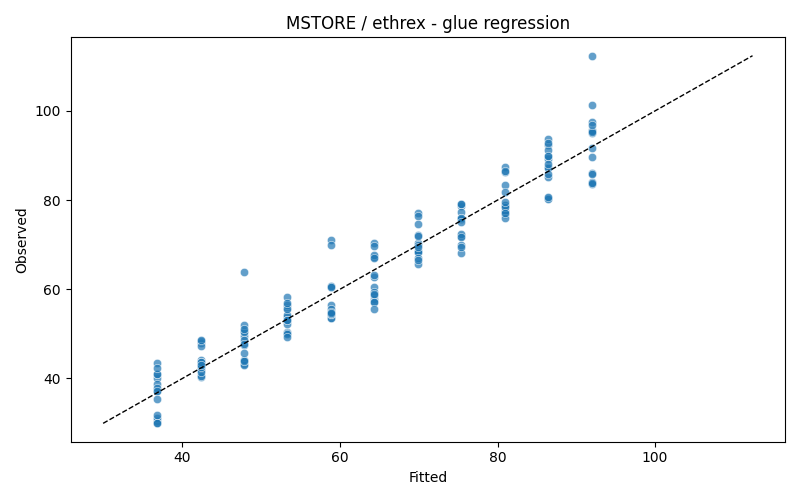

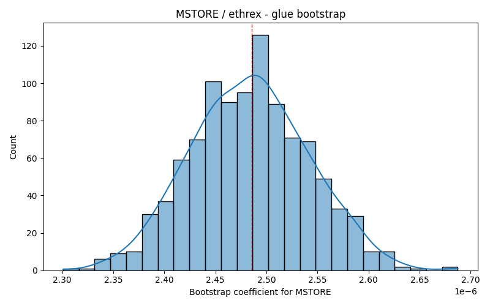

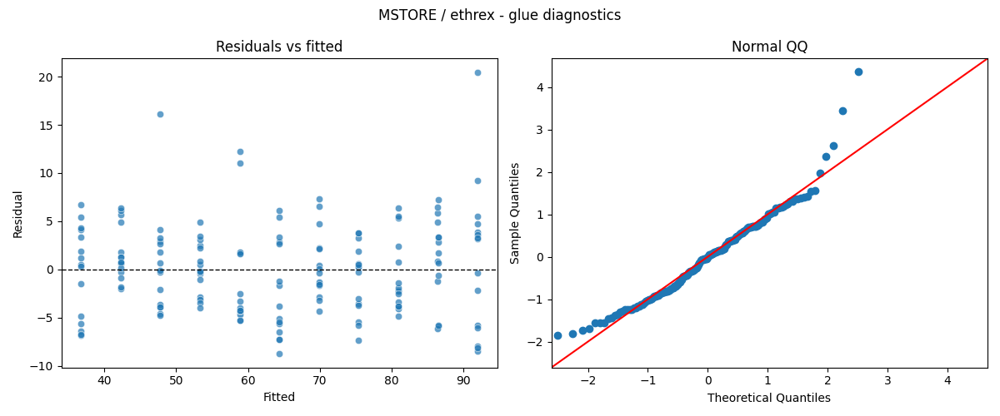

</details>

<details><summary><code>MSTORE8</code> · nobs=165 · runtime_ms=2.625e-06 · p=1.00e-03 · R²=0.9472</summary>

```
==============================================================================
                           NNLS Regression Results                            
==============================================================================
Dep. Variable:          test_runtime_ms              R-squared:          0.947
Model:                  NNLS                    Adj. R-squared:          0.947
No. Observations:       165                               RMSE:           4.35
Df Residuals:           163                                MAE:           3.21
Df Model:               1      
==============================================================================
                      coef     std err     P-value      [0.025      0.975]
------------------------------------------------------------------------------
         const      7.2514      1.1426       0.001      4.9469      9.5088
       MSTORE8      0.0000      0.0000       0.001      0.0000      0.0000
==============================================================================
Notes: Non-negative least squares with bootstrap inference (1000 iterations)
==============================================================================
```

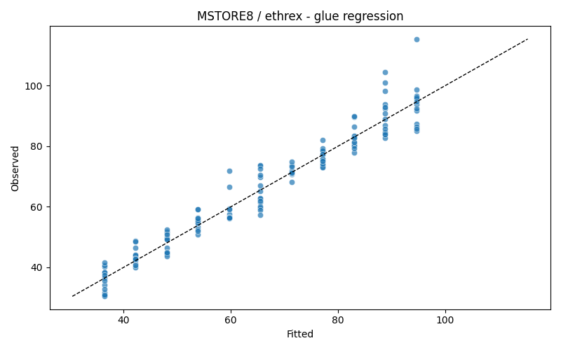

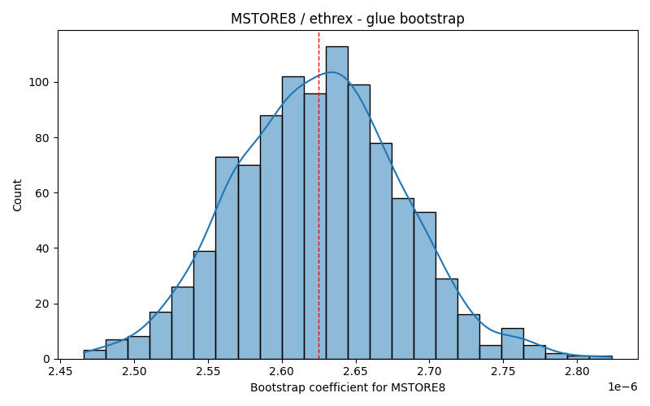

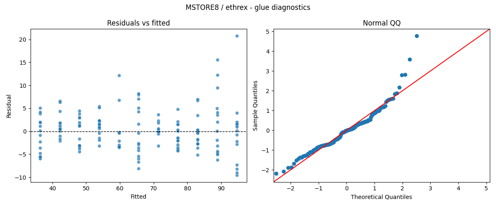

</details>

<details><summary><code>MUL</code> · nobs=33 · runtime_ms=3.1e-06 · p=1.00e-03 · R²=0.6063</summary>

```
==============================================================================
                           NNLS Regression Results                            
==============================================================================
Dep. Variable:          test_runtime_ms              R-squared:          0.606
Model:                  NNLS                    Adj. R-squared:          0.594
No. Observations:       33                                RMSE:          19.73
Df Residuals:           31                                 MAE:          17.08
Df Model:               1      
==============================================================================
                      coef     std err     P-value      [0.025      0.975]
------------------------------------------------------------------------------
         const     21.4266     11.5039       0.036      0.0000     46.4885
           MUL      0.0000      0.0000       0.001      0.0000      0.0000
==============================================================================
Notes: Non-negative least squares with bootstrap inference (1000 iterations)
==============================================================================
```

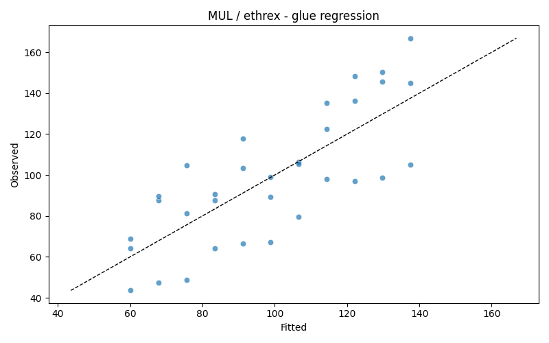

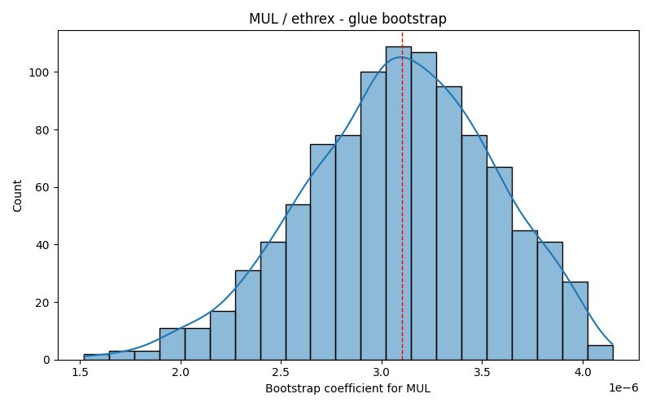

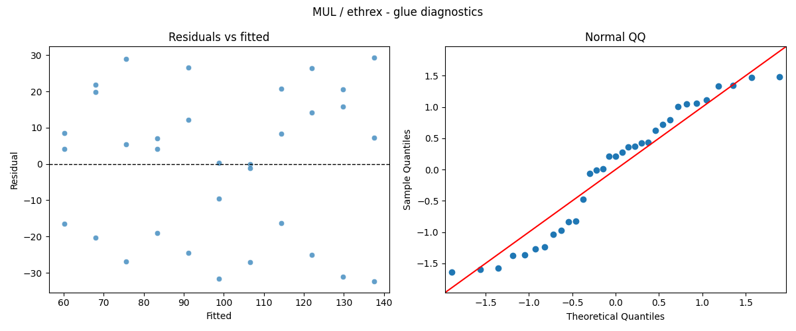

</details>

<details><summary><code>PC</code> · nobs=33 · runtime_ms=8.355e-07 · p=1.00e-03 · R²=0.9173</summary>

```
==============================================================================
                           NNLS Regression Results                            
==============================================================================
Dep. Variable:          test_runtime_ms              R-squared:          0.917
Model:                  NNLS                    Adj. R-squared:          0.915
No. Observations:       33                                RMSE:           7.51
Df Residuals:           31                                 MAE:           6.00
Df Model:               1      
==============================================================================
                      coef     std err     P-value      [0.025      0.975]
------------------------------------------------------------------------------
         const     13.2392      4.4499       0.001      5.3317     22.8793
            PC      0.0000      0.0000       0.001      0.0000      0.0000
==============================================================================
Notes: Non-negative least squares with bootstrap inference (1000 iterations)
==============================================================================
```

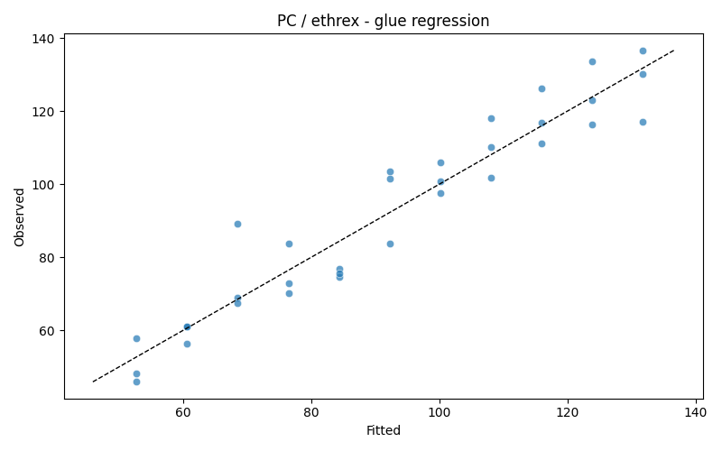

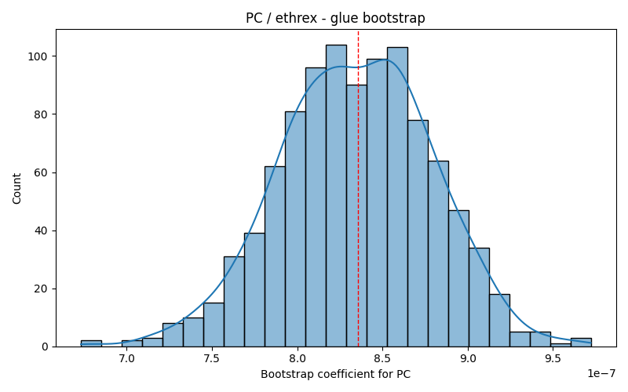

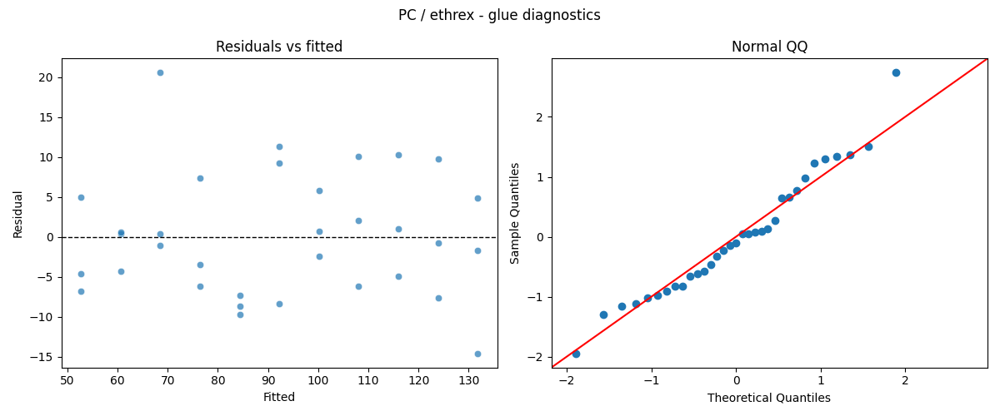

</details>

<details><summary><code>RETURNDATASIZE</code> · nobs=132 · runtime_ms=1.342e-06 · p=1.00e-03 · R²=0.9277</summary>

```
==============================================================================
                           NNLS Regression Results                            
==============================================================================
Dep. Variable:          test_runtime_ms              R-squared:          0.928
Model:                  NNLS                    Adj. R-squared:          0.927
No. Observations:       132                               RMSE:           5.92
Df Residuals:           130                                MAE:           4.63
Df Model:               1      
==============================================================================
                      coef     std err     P-value      [0.025      0.975]
------------------------------------------------------------------------------
         const      9.3215      1.6735       0.001      5.8899     12.5073
RETURNDATASIZE      0.0000      0.0000       0.001      0.0000      0.0000
==============================================================================
Notes: Non-negative least squares with bootstrap inference (1000 iterations)
==============================================================================
```

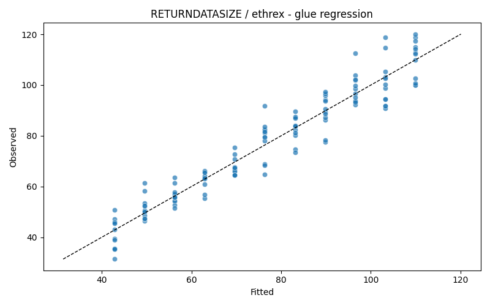

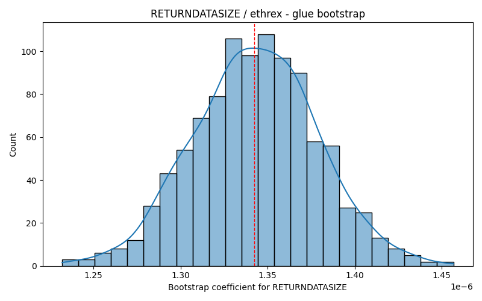

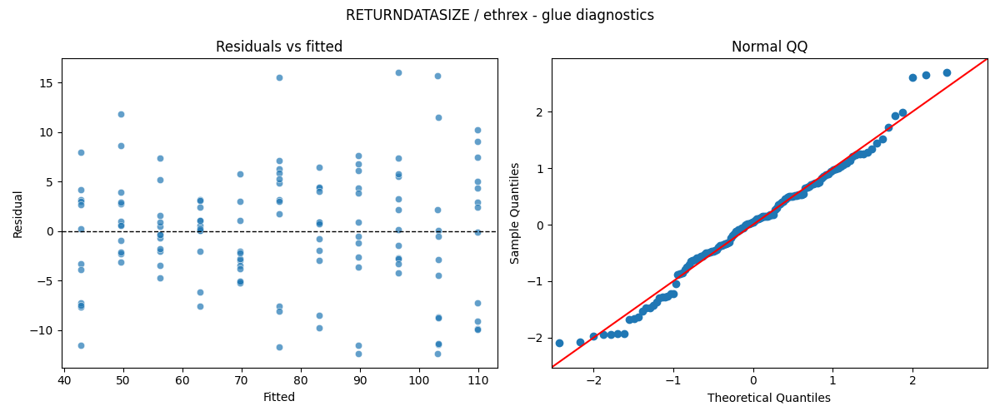

</details>

<details><summary><code>SELFBALANCE</code> · nobs=33 · runtime_ms=1.015e-05 · p=1.00e-03 · R²=0.9875</summary>

```
==============================================================================
                           NNLS Regression Results                            
==============================================================================
Dep. Variable:          test_runtime_ms              R-squared:          0.988
Model:                  NNLS                    Adj. R-squared:          0.987
No. Observations:       33                                RMSE:          14.11
Df Residuals:           31                                 MAE:          11.90
Df Model:               1      
==============================================================================
                      coef     std err     P-value      [0.025      0.975]
------------------------------------------------------------------------------
         const     25.6357      9.9006       0.001      6.5494     46.4814
   SELFBALANCE      0.0000      0.0000       0.001      0.0000      0.0000
==============================================================================
Notes: Non-negative least squares with bootstrap inference (1000 iterations)
==============================================================================
```

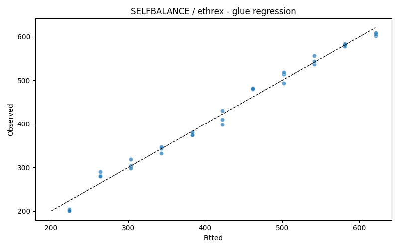

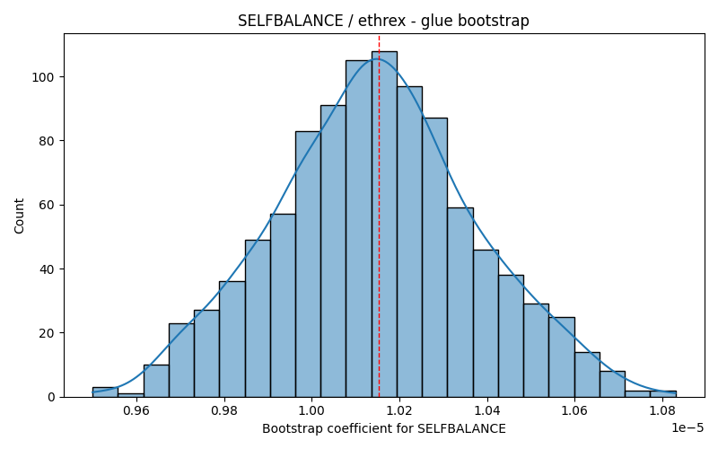

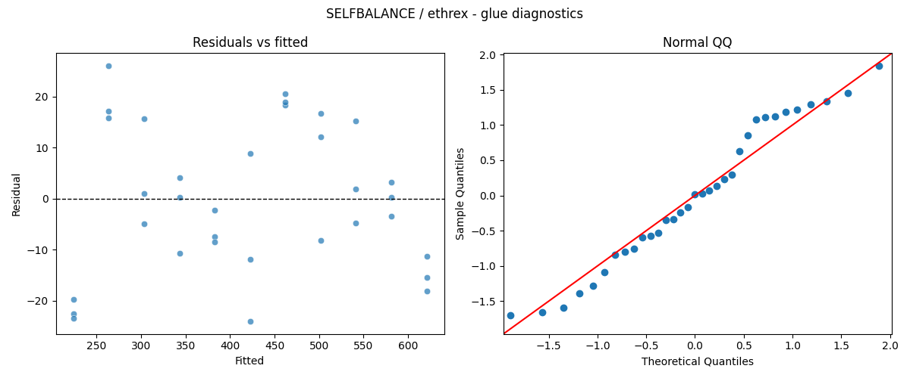

</details>

<details><summary><code>SUB</code> · nobs=33 · runtime_ms=1.622e-06 · p=1.00e-03 · R²=0.9687</summary>

```
==============================================================================
                           NNLS Regression Results                            
==============================================================================
Dep. Variable:          test_runtime_ms              R-squared:          0.969
Model:                  NNLS                    Adj. R-squared:          0.968
No. Observations:       33                                RMSE:           3.07
Df Residuals:           31                                 MAE:           2.37
Df Model:               1      
==============================================================================
                      coef     std err     P-value      [0.025      0.975]
------------------------------------------------------------------------------
         const     10.0404      1.5069       0.001      7.1034     13.0959
           SUB      0.0000      0.0000       0.001      0.0000      0.0000
==============================================================================
Notes: Non-negative least squares with bootstrap inference (1000 iterations)
==============================================================================
```

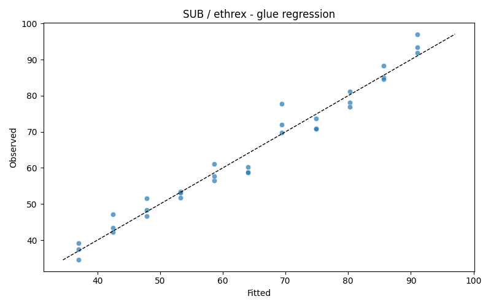

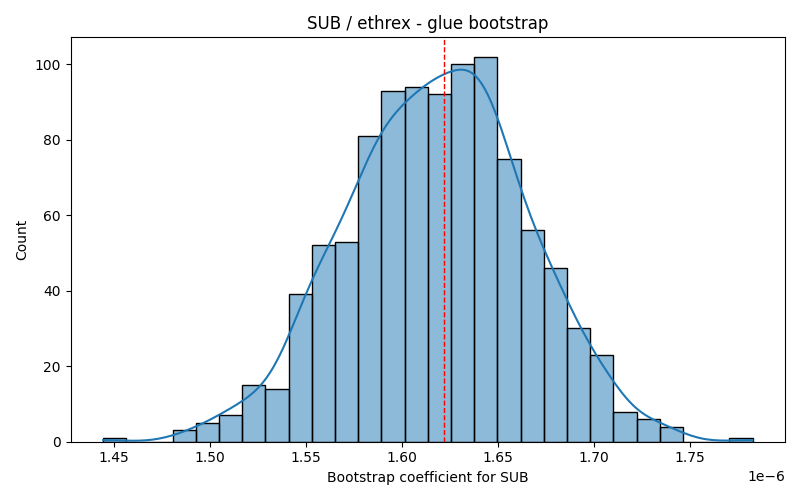

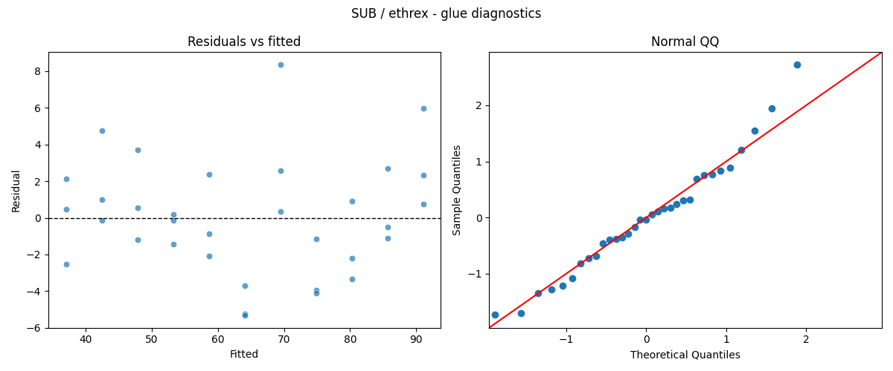

</details>

### Mixed glue (tier B) · ethrex

<details><summary><code>JUMP</code> · nobs=33 · runtime_ms=4.194e-06 · p=1.00e-03 · R²=0.9642</summary>

```
==============================================================================
                           NNLS Regression Results                            
==============================================================================
Dep. Variable:          test_runtime_ms              R-squared:          0.964
Model:                  NNLS                    Adj. R-squared:          0.963
No. Observations:       33                                RMSE:           3.00
Df Residuals:           31                                 MAE:           2.54
Df Model:               1      
==============================================================================
                      coef     std err     P-value      [0.025      0.975]
------------------------------------------------------------------------------
         const      9.0024      1.7688       0.001      5.5469     12.5181
          JUMP      0.0000      0.0000       0.001      0.0000      0.0000
==============================================================================
Notes: Non-negative least squares with bootstrap inference (1000 iterations)
==============================================================================
```

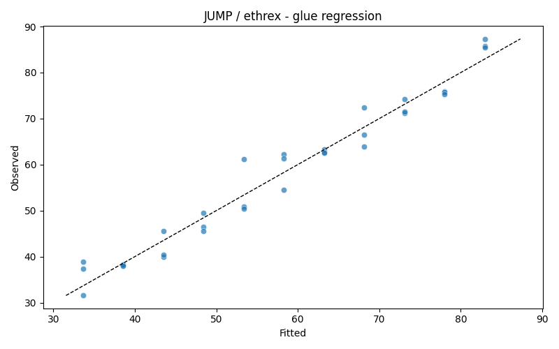

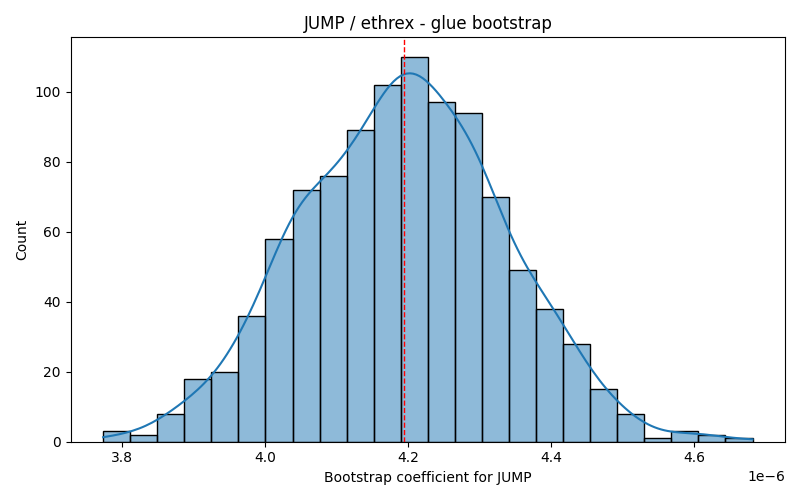

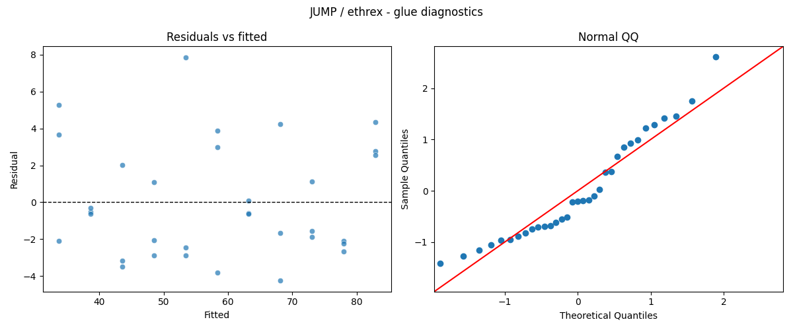

</details>

<details><summary><code>KECCAK256</code> · nobs=528 · runtime_ms=0 · p=1.00e+00 · R²=2.22e-16</summary>

```
==============================================================================
                           NNLS Regression Results                            
==============================================================================
Dep. Variable:          test_runtime_ms              R-squared:          0.000
Model:                  NNLS                    Adj. R-squared:         -0.002
No. Observations:       528                               RMSE:         271.81
Df Residuals:           526                                MAE:         226.11
Df Model:               1      
==============================================================================
                      coef     std err     P-value      [0.025      0.975]
------------------------------------------------------------------------------
         const    407.1005     11.8005       0.001    383.7811    429.8510
     KECCAK256      0.0000      0.0000       1.000      0.0000      0.0000
==============================================================================
Notes: Non-negative least squares with bootstrap inference (1000 iterations)
==============================================================================
```

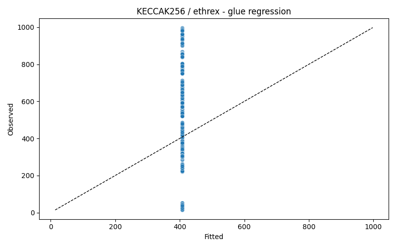


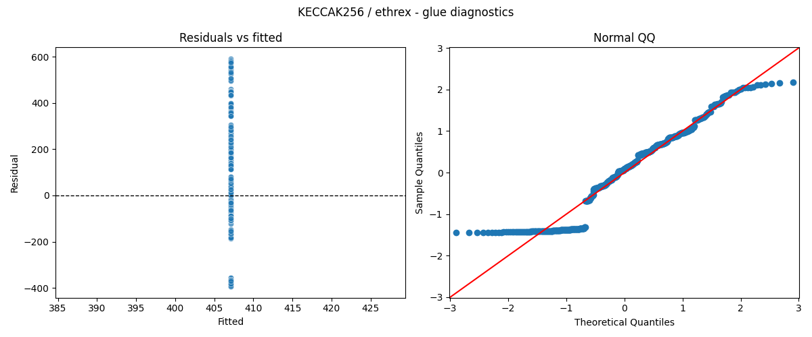

</details>

## geth

| glue_opcode | nobs | glue_runtime_ms | p_value | rsquared |
| --- | --- | --- | --- | --- |
| `ISZERO` | 165 | 1.949e-06 | 1.00e-03 | 0.8902 |
| `JUMPDEST` | 165 | 1.294e-06 | 1.00e-03 | 0.8622 |
| `SWAP` | 2640 | 2.248e-06 | 1.00e-03 | 0.9587 |
| `CALLDATASIZE` | 9768 | 1.807e-06 | 1.00e-03 | 0.9141 |
| `DUP` | 9768 | 1.997e-06 | 1.00e-03 | 0.9141 |
| `GAS` | 9768 | 1.779e-06 | 1.00e-03 | 0.9141 |
| `MLOAD` | 9768 | 5.607e-06 | 1.00e-03 | 0.9141 |
| `PUSH` | 9768 | 3.167e-06 | 1.00e-03 | 0.9141 |
| `PUSH0` | 9768 | 1.671e-06 | 1.00e-03 | 0.9141 |
| `STATICCALL` | 9768 | 0.0002291 | 1.00e-03 | 0.9141 |
| `ADD` | 165 | 4.409e-06 | 1.00e-03 | 0.9169 |
| `AND` | 165 | 4.392e-06 | 1.00e-03 | 0.9287 |
| `CALLDATACOPY` | 3960 | 1.147e-05 | 1.00e-03 | 0.9809 |
| `CALLDATALOAD` | 660 | 2.989e-05 | 1.00e-03 | 0.09123 |
| `DIV` | 165 | 1.421e-05 | 1.00e-03 | 0.9816 |
| `EXP` | 165 | 0.0006955 | 1.00e-03 | 0.9828 |
| `GT` | 165 | 4.073e-06 | 1.00e-03 | 0.9064 |
| `JUMPI` | 165 | 5.387e-06 | 1.00e-03 | 0.921 |
| `LT` | 165 | 4.348e-06 | 1.00e-03 | 0.9609 |
| `MSTORE` | 825 | 8.48e-06 | 1.00e-03 | 0.9536 |
| `MSTORE8` | 825 | 7.757e-06 | 1.00e-03 | 0.936 |
| `MUL` | 165 | 5.285e-06 | 1.00e-03 | 0.98 |
| `PC` | 165 | 2.005e-06 | 1.00e-03 | 0.9502 |
| `RETURNDATASIZE` | 660 | 5.293e-06 | 1.00e-03 | 0.8702 |
| `SELFBALANCE` | 165 | 1.221e-05 | 1.00e-03 | 0.9695 |
| `SUB` | 165 | 4.252e-06 | 1.00e-03 | 0.9597 |
| `JUMP` | 165 | 9.579e-06 | 1.00e-03 | 0.8014 |
| `KECCAK256` | 2640 | 3.927e-05 | 1.00e-03 | 0.1274 |

### Cycle glue — joint fit · geth

<details><summary>Joint NNLS regression summary</summary>

```
==============================================================================
                           NNLS Regression Results                            
==============================================================================
Dep. Variable:          test_runtime_ms              R-squared:          0.914
Model:                  NNLS                    Adj. R-squared:          0.914
No. Observations:       9768                              RMSE:          21.77
Df Residuals:           9760                               MAE:          13.23
Df Model:               7      
==============================================================================
                      coef     std err     P-value      [0.025      0.975]
------------------------------------------------------------------------------
         const     15.3735      0.6733       0.001     14.1622     16.7282
  CALLDATASIZE      0.0000      0.0000       0.001      0.0000      0.0000
           DUP      0.0000      0.0000       0.001      0.0000      0.0000
           GAS      0.0000      0.0000       0.001      0.0000      0.0000
         MLOAD      0.0000      0.0000       0.001      0.0000      0.0000
          PUSH      0.0000      0.0000       0.001      0.0000      0.0000
         PUSH0      0.0000      0.0000       0.001      0.0000      0.0000
    STATICCALL      0.0002      0.0000       0.001      0.0002      0.0002
==============================================================================
Notes: Non-negative least squares with bootstrap inference (1000 iterations)
==============================================================================
```

</details>

<details><summary><code>CALLDATASIZE</code> · nobs=9768 · runtime_ms=1.807e-06 · p=1.00e-03 · R²=0.9141</summary>

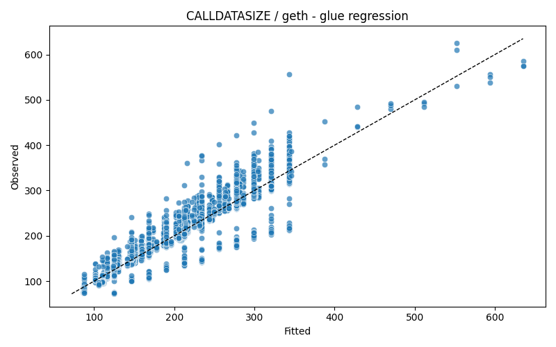

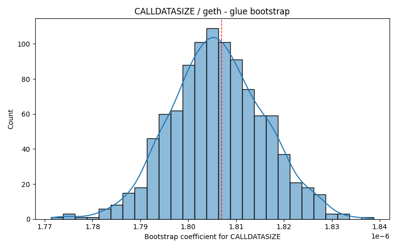


</details>

<details><summary><code>DUP</code> · nobs=9768 · runtime_ms=1.997e-06 · p=1.00e-03 · R²=0.9141</summary>


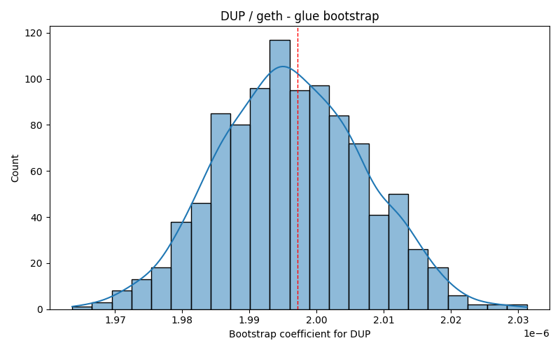


</details>

<details><summary><code>GAS</code> · nobs=9768 · runtime_ms=1.779e-06 · p=1.00e-03 · R²=0.9141</summary>

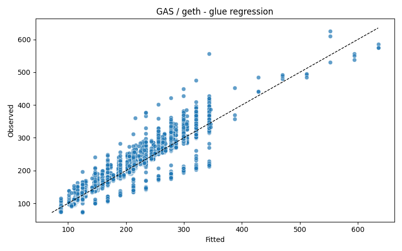

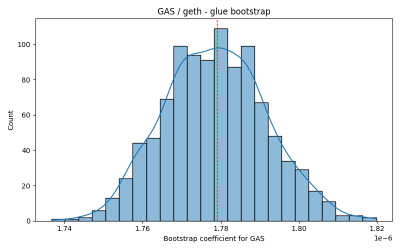

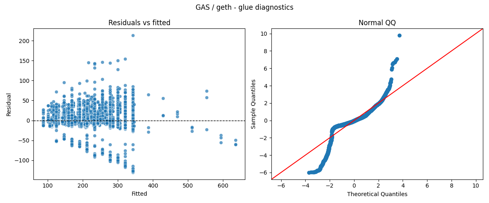

</details>

<details><summary><code>MLOAD</code> · nobs=9768 · runtime_ms=5.607e-06 · p=1.00e-03 · R²=0.9141</summary>


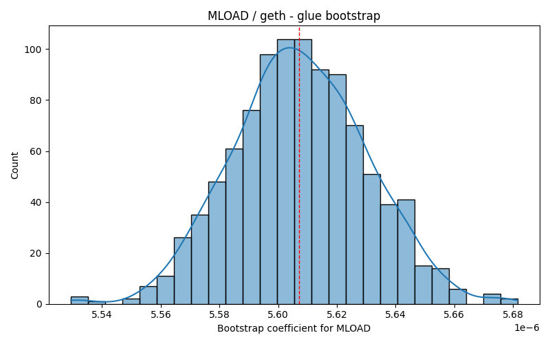


</details>

<details><summary><code>PUSH</code> · nobs=9768 · runtime_ms=3.167e-06 · p=1.00e-03 · R²=0.9141</summary>


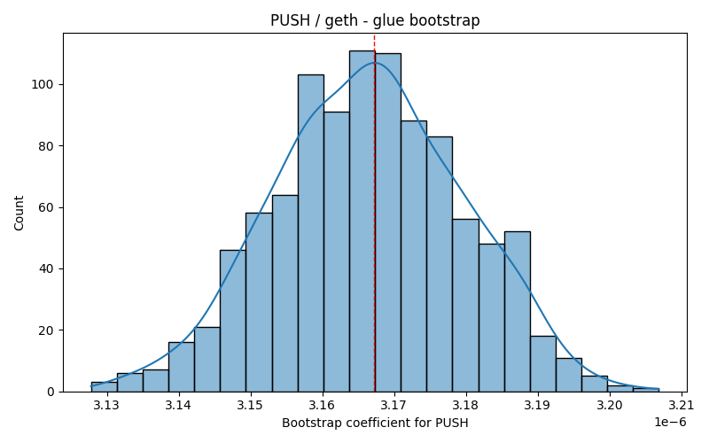


</details>

<details><summary><code>PUSH0</code> · nobs=9768 · runtime_ms=1.671e-06 · p=1.00e-03 · R²=0.9141</summary>

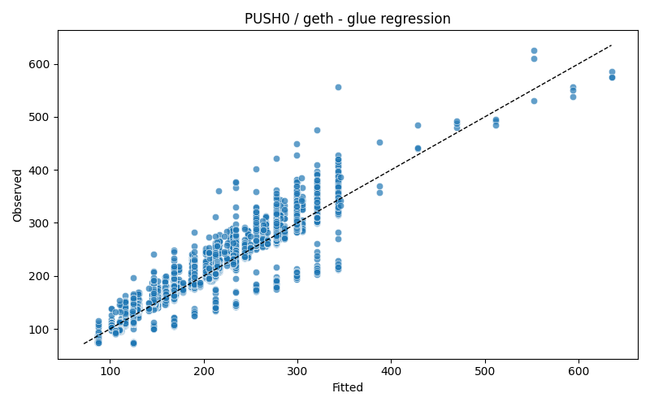

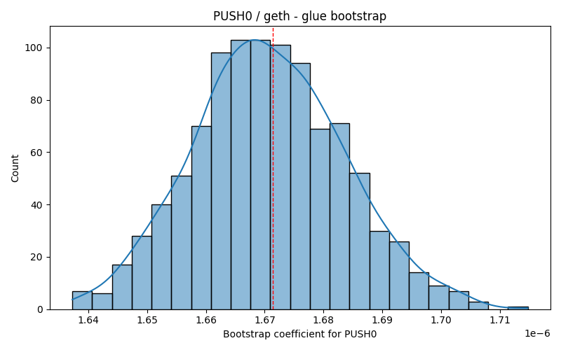


</details>

<details><summary><code>STATICCALL</code> · nobs=9768 · runtime_ms=0.0002291 · p=1.00e-03 · R²=0.9141</summary>


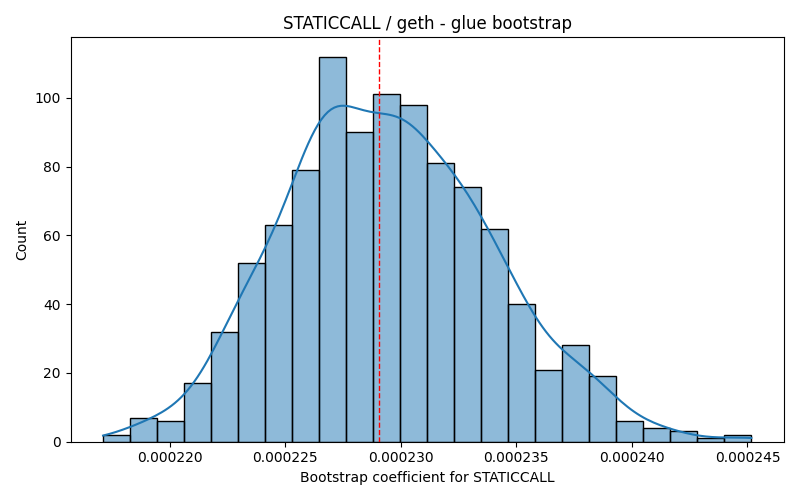

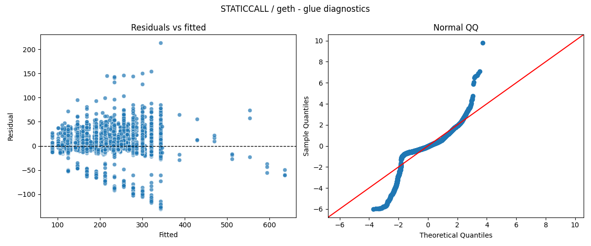

</details>

### Pure glue · geth

<details><summary><code>ISZERO</code> · nobs=165 · runtime_ms=1.949e-06 · p=1.00e-03 · R²=0.8902</summary>

```
==============================================================================
                           NNLS Regression Results                            
==============================================================================
Dep. Variable:          test_runtime_ms              R-squared:          0.890
Model:                  NNLS                    Adj. R-squared:          0.890
No. Observations:       165                               RMSE:          14.41
Df Residuals:           163                                MAE:           6.45
Df Model:               1      
==============================================================================
                      coef     std err     P-value      [0.025      0.975]
------------------------------------------------------------------------------
         const      4.3039      3.0499       0.108      0.0000     10.3047
        ISZERO      0.0000      0.0000       0.001      0.0000      0.0000
==============================================================================
Notes: Non-negative least squares with bootstrap inference (1000 iterations)
==============================================================================
```


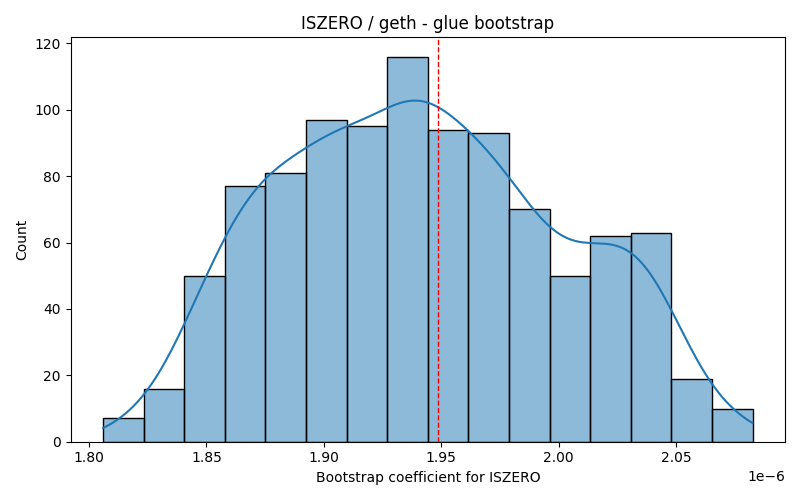

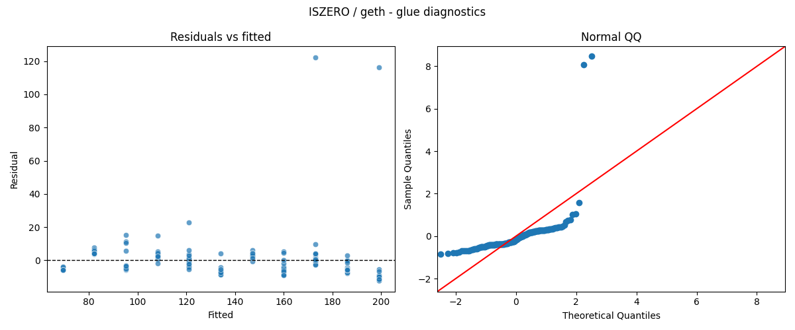

</details>

<details><summary><code>JUMPDEST</code> · nobs=165 · runtime_ms=1.294e-06 · p=1.00e-03 · R²=0.8622</summary>

```
==============================================================================
                           NNLS Regression Results                            
==============================================================================
Dep. Variable:          test_runtime_ms              R-squared:          0.862
Model:                  NNLS                    Adj. R-squared:          0.861
No. Observations:       165                               RMSE:          32.67
Df Residuals:           163                                MAE:          13.36
Df Model:               1      
==============================================================================
                      coef     std err     P-value      [0.025      0.975]
------------------------------------------------------------------------------
         const     17.5098      6.3519       0.001      6.3144     30.5562
      JUMPDEST      0.0000      0.0000       0.001      0.0000      0.0000
==============================================================================
Notes: Non-negative least squares with bootstrap inference (1000 iterations)
==============================================================================
```

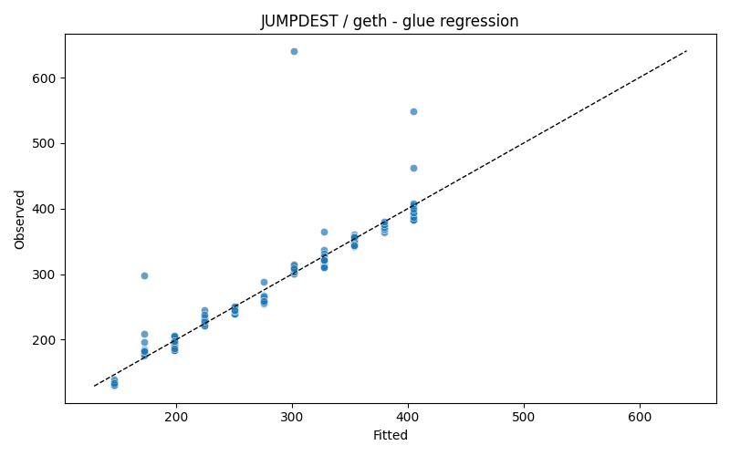

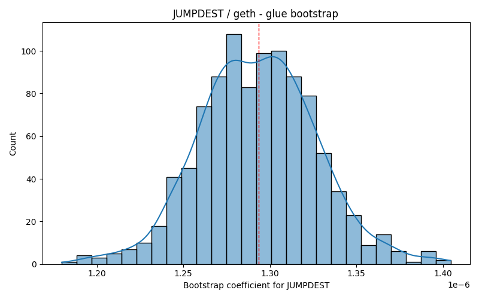

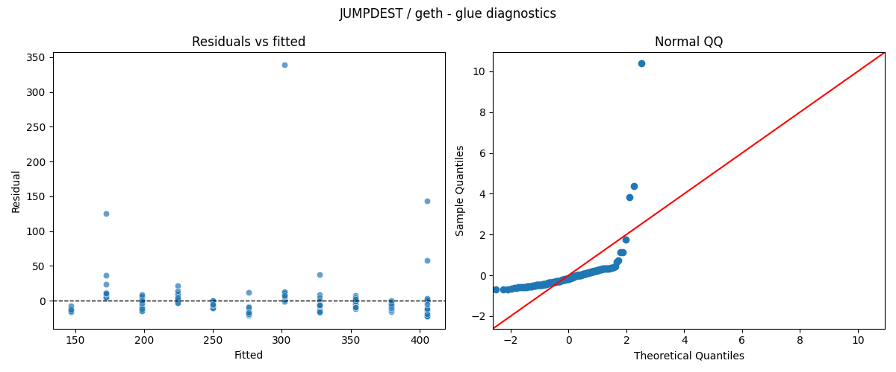

</details>

<details><summary><code>SWAP</code> · nobs=2640 · runtime_ms=2.248e-06 · p=1.00e-03 · R²=0.9587</summary>

```
==============================================================================
                           NNLS Regression Results                            
==============================================================================
Dep. Variable:          test_runtime_ms              R-squared:          0.959
Model:                  NNLS                    Adj. R-squared:          0.959
No. Observations:       2640                              RMSE:           9.83
Df Residuals:           2638                               MAE:           6.43
Df Model:               1      
==============================================================================
                      coef     std err     P-value      [0.025      0.975]
------------------------------------------------------------------------------
         const     12.5694      0.6929       0.001     11.2254     13.9738
          SWAP      0.0000      0.0000       0.001      0.0000      0.0000
==============================================================================
Notes: Non-negative least squares with bootstrap inference (1000 iterations)
==============================================================================
```

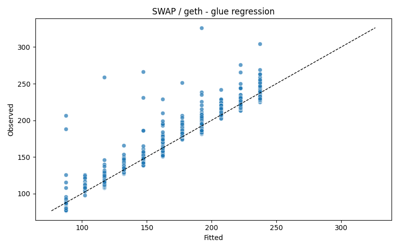

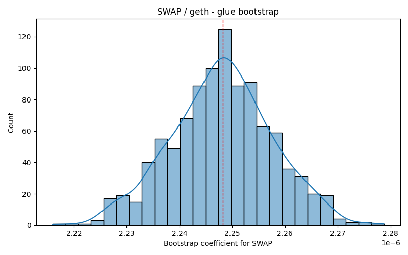

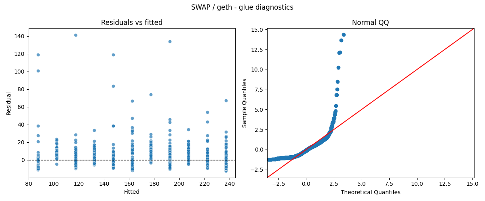

</details>

### Mixed glue (tier A) · geth

<details><summary><code>ADD</code> · nobs=165 · runtime_ms=4.409e-06 · p=1.00e-03 · R²=0.9169</summary>

```
==============================================================================
                           NNLS Regression Results                            
==============================================================================
Dep. Variable:          test_runtime_ms              R-squared:          0.917
Model:                  NNLS                    Adj. R-squared:          0.916
No. Observations:       165                               RMSE:          13.97
Df Residuals:           163                                MAE:           7.33
Df Model:               1      
==============================================================================
                      coef     std err     P-value      [0.025      0.975]
------------------------------------------------------------------------------
         const      7.1734      2.4629       0.003      2.2872     11.9531
           ADD      0.0000      0.0000       0.001      0.0000      0.0000
==============================================================================
Notes: Non-negative least squares with bootstrap inference (1000 iterations)
==============================================================================
```

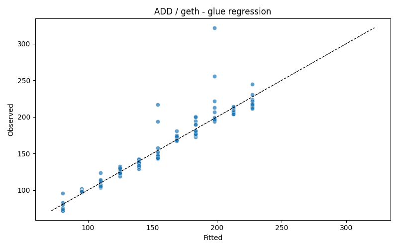

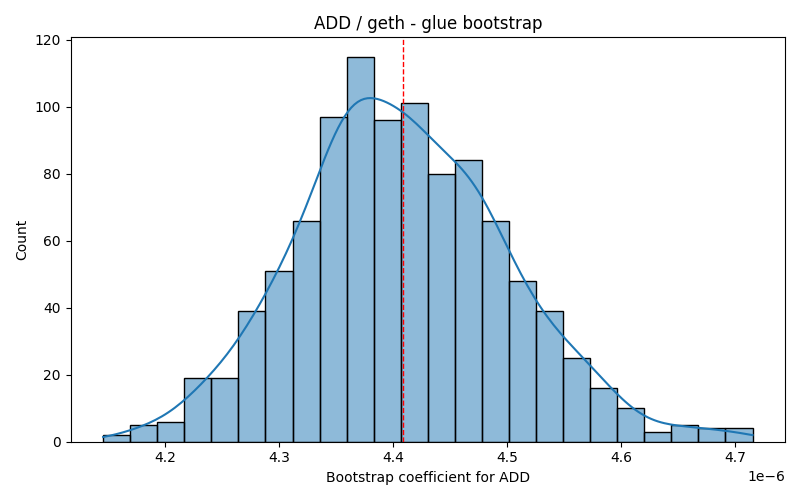

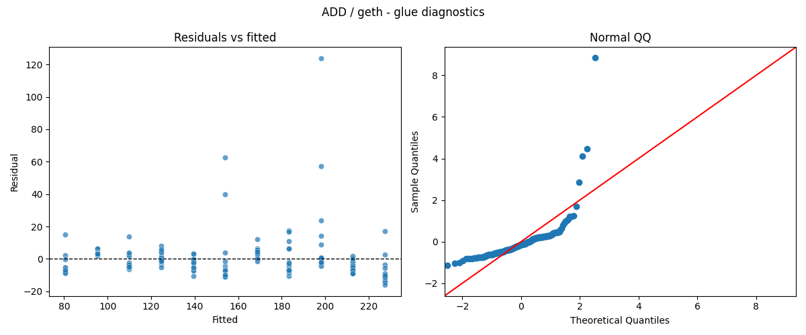

</details>

<details><summary><code>AND</code> · nobs=165 · runtime_ms=4.392e-06 · p=1.00e-03 · R²=0.9287</summary>

```
==============================================================================
                           NNLS Regression Results                            
==============================================================================
Dep. Variable:          test_runtime_ms              R-squared:          0.929
Model:                  NNLS                    Adj. R-squared:          0.928
No. Observations:       165                               RMSE:          12.82
Df Residuals:           163                                MAE:           7.56
Df Model:               1      
==============================================================================
                      coef     std err     P-value      [0.025      0.975]
------------------------------------------------------------------------------
         const      5.9562      2.6098       0.019      0.4665     10.7326
           AND      0.0000      0.0000       0.001      0.0000      0.0000
==============================================================================
Notes: Non-negative least squares with bootstrap inference (1000 iterations)
==============================================================================
```

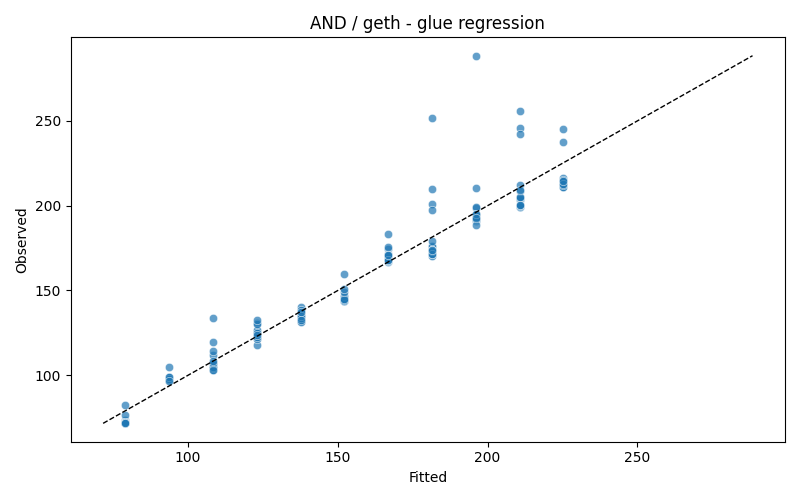

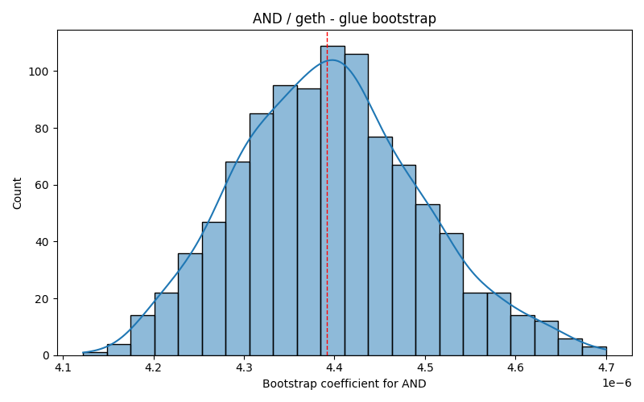

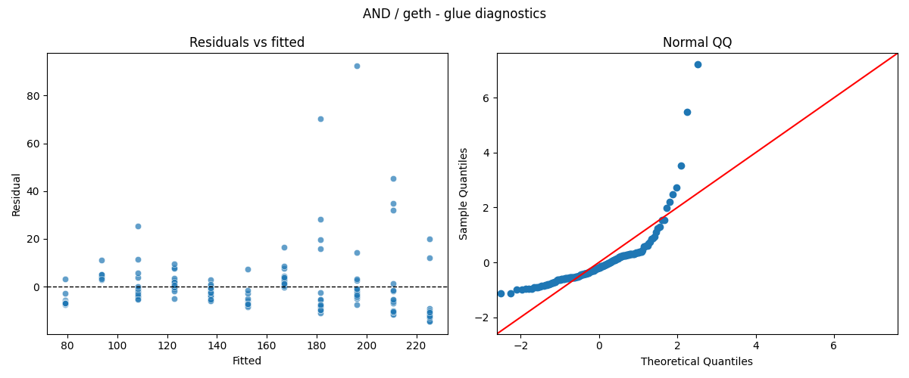

</details>

<details><summary><code>CALLDATACOPY</code> · nobs=3960 · runtime_ms=1.147e-05 · p=1.00e-03 · R²=0.9809</summary>

```
==============================================================================
                           NNLS Regression Results                            
==============================================================================
Dep. Variable:          test_runtime_ms              R-squared:          0.981
Model:                  NNLS                    Adj. R-squared:          0.981
No. Observations:       3960                              RMSE:          12.03
Df Residuals:           3958                               MAE:           8.09
Df Model:               1      
==============================================================================
                      coef     std err     P-value      [0.025      0.975]
------------------------------------------------------------------------------
         const     13.8136      0.2392       0.001     13.3671     14.2878
  CALLDATACOPY      0.0000      0.0000       0.001      0.0000      0.0000
==============================================================================
Notes: Non-negative least squares with bootstrap inference (1000 iterations)
==============================================================================
```

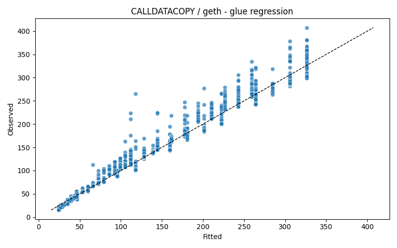

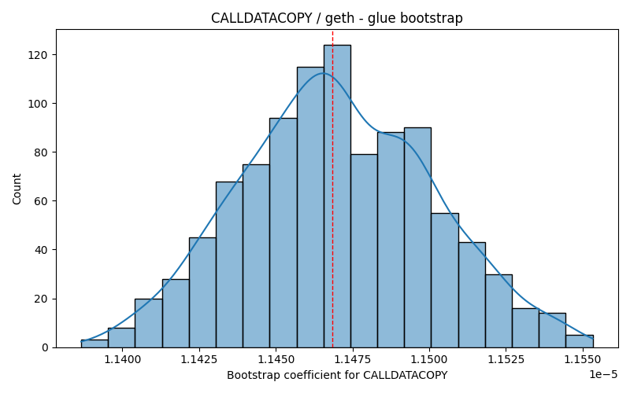

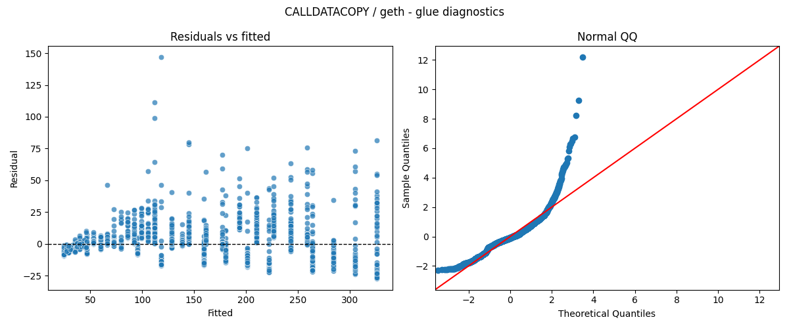

</details>

<details><summary><code>CALLDATALOAD</code> · nobs=660 · runtime_ms=2.989e-05 · p=1.00e-03 · R²=0.09123</summary>

```
==============================================================================
                           NNLS Regression Results                            
==============================================================================
Dep. Variable:          test_runtime_ms              R-squared:          0.091
Model:                  NNLS                    Adj. R-squared:          0.090
No. Observations:       660                               RMSE:           0.36
Df Residuals:           658                                MAE:           0.16
Df Model:               1      
==============================================================================
                      coef     std err     P-value      [0.025      0.975]
------------------------------------------------------------------------------
         const      1.7834      0.0495       0.001      1.6834      1.8803
  CALLDATALOAD      0.0000      0.0000       0.001      0.0000      0.0000
==============================================================================
Notes: Non-negative least squares with bootstrap inference (1000 iterations)
==============================================================================
```

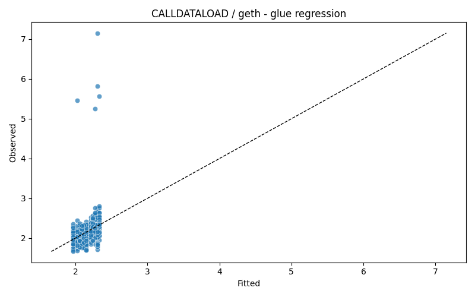

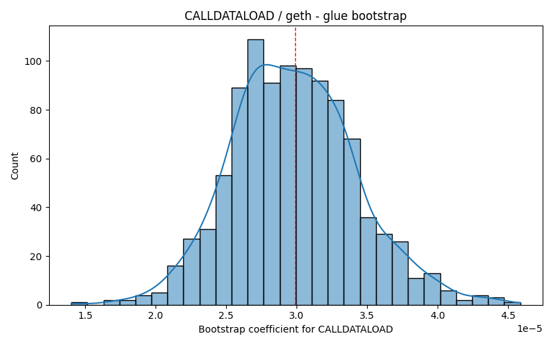

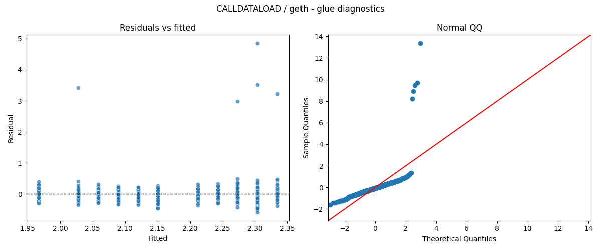

</details>

<details><summary><code>DIV</code> · nobs=165 · runtime_ms=1.421e-05 · p=1.00e-03 · R²=0.9816</summary>

```
==============================================================================
                           NNLS Regression Results                            
==============================================================================
Dep. Variable:          test_runtime_ms              R-squared:          0.982
Model:                  NNLS                    Adj. R-squared:          0.981
No. Observations:       165                               RMSE:          15.36
Df Residuals:           163                                MAE:          12.70
Df Model:               1      
==============================================================================
                      coef     std err     P-value      [0.025      0.975]
------------------------------------------------------------------------------
         const     28.6284      4.5552       0.001     19.9526     37.8898
           DIV      0.0000      0.0000       0.001      0.0000      0.0000
==============================================================================
Notes: Non-negative least squares with bootstrap inference (1000 iterations)
==============================================================================
```

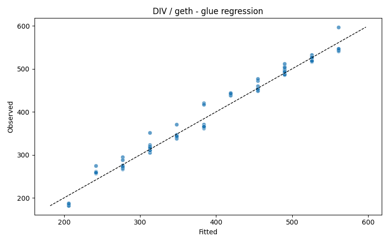

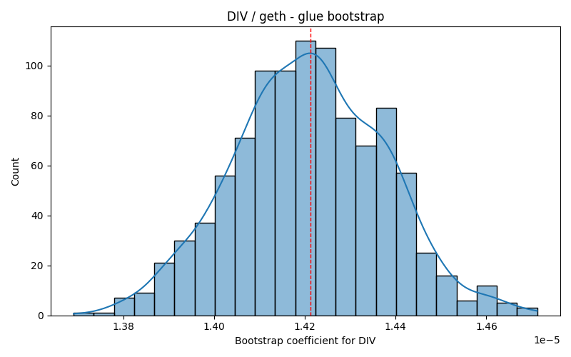

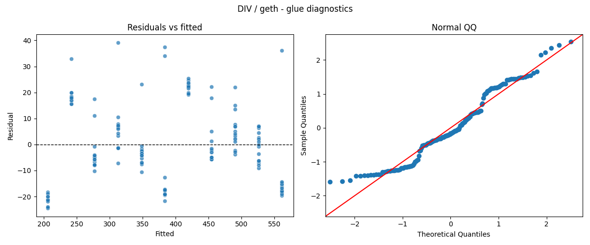

</details>

<details><summary><code>EXP</code> · nobs=165 · runtime_ms=0.0006955 · p=1.00e-03 · R²=0.9828</summary>

```
==============================================================================
                           NNLS Regression Results                            
==============================================================================
Dep. Variable:          test_runtime_ms              R-squared:          0.983
Model:                  NNLS                    Adj. R-squared:          0.983
No. Observations:       165                               RMSE:           3.61
Df Residuals:           163                                MAE:           2.90
Df Model:               1      
==============================================================================
                      coef     std err     P-value      [0.025      0.975]
------------------------------------------------------------------------------
         const      5.2369      0.8839       0.001      3.4741      7.0073
           EXP      0.0007      0.0000       0.001      0.0007      0.0007
==============================================================================
Notes: Non-negative least squares with bootstrap inference (1000 iterations)
==============================================================================
```

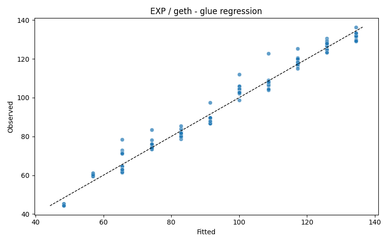

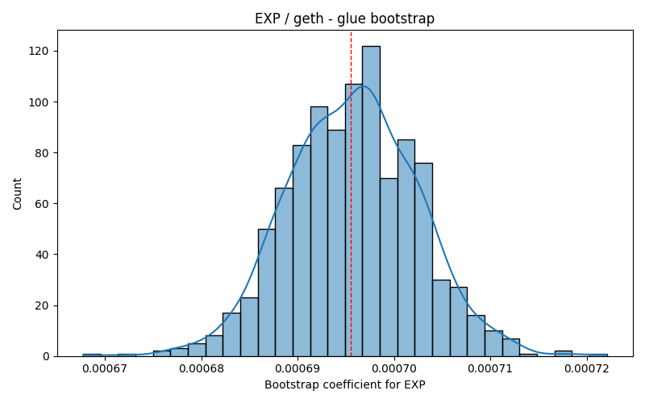

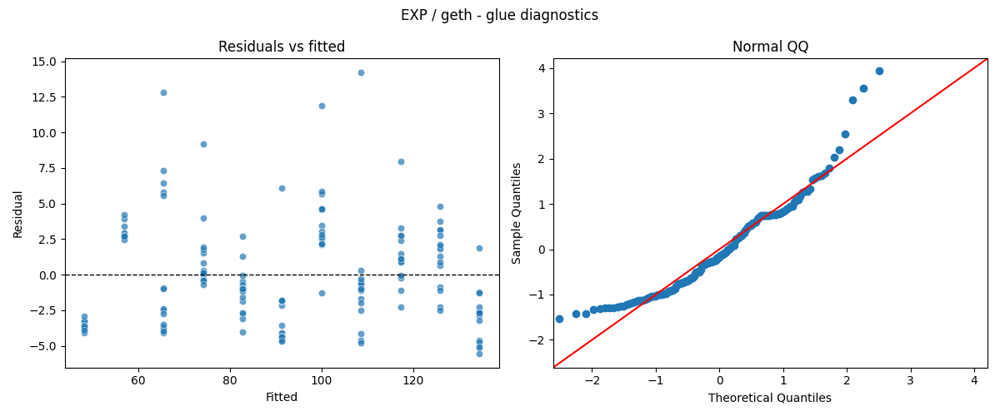

</details>

<details><summary><code>GT</code> · nobs=165 · runtime_ms=4.073e-06 · p=1.00e-03 · R²=0.9064</summary>

```
==============================================================================
                           NNLS Regression Results                            
==============================================================================
Dep. Variable:          test_runtime_ms              R-squared:          0.906
Model:                  NNLS                    Adj. R-squared:          0.906
No. Observations:       165                               RMSE:          13.78
Df Residuals:           163                                MAE:           9.83
Df Model:               1      
==============================================================================
                      coef     std err     P-value      [0.025      0.975]
------------------------------------------------------------------------------
         const     19.4266      4.7837       0.001     10.2968     28.9333
            GT      0.0000      0.0000       0.001      0.0000      0.0000
==============================================================================
Notes: Non-negative least squares with bootstrap inference (1000 iterations)
==============================================================================
```

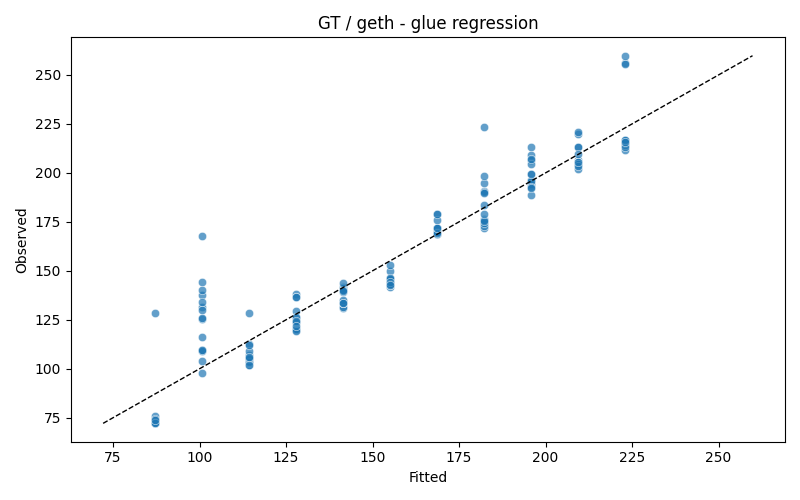

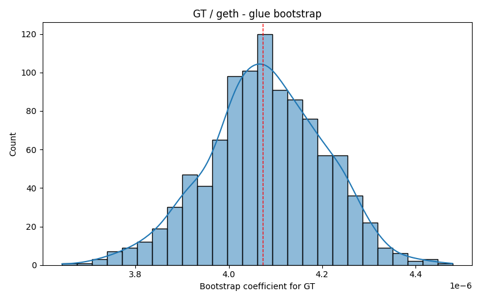

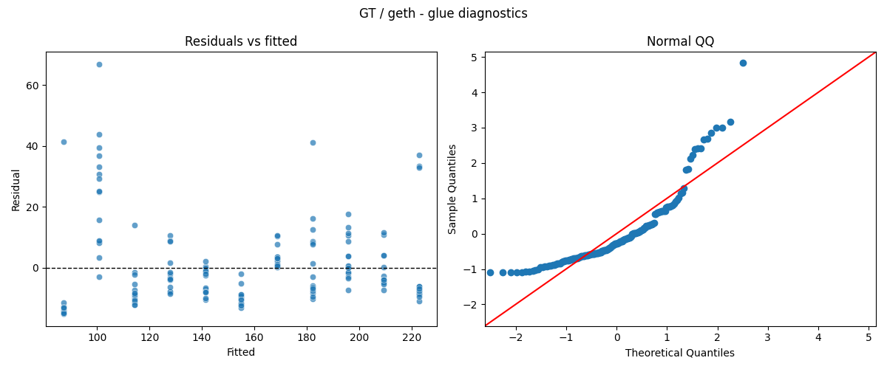

</details>

<details><summary><code>JUMPI</code> · nobs=165 · runtime_ms=5.387e-06 · p=1.00e-03 · R²=0.921</summary>

```
==============================================================================
                           NNLS Regression Results                            
==============================================================================
Dep. Variable:          test_runtime_ms              R-squared:          0.921
Model:                  NNLS                    Adj. R-squared:          0.921
No. Observations:       165                               RMSE:           7.12
Df Residuals:           163                                MAE:           4.19
Df Model:               1      
==============================================================================
                      coef     std err     P-value      [0.025      0.975]
------------------------------------------------------------------------------
         const      5.9879      2.0293       0.001      2.4814     10.0348
         JUMPI      0.0000      0.0000       0.001      0.0000      0.0000
==============================================================================
Notes: Non-negative least squares with bootstrap inference (1000 iterations)
==============================================================================
```

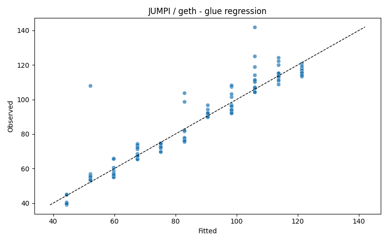

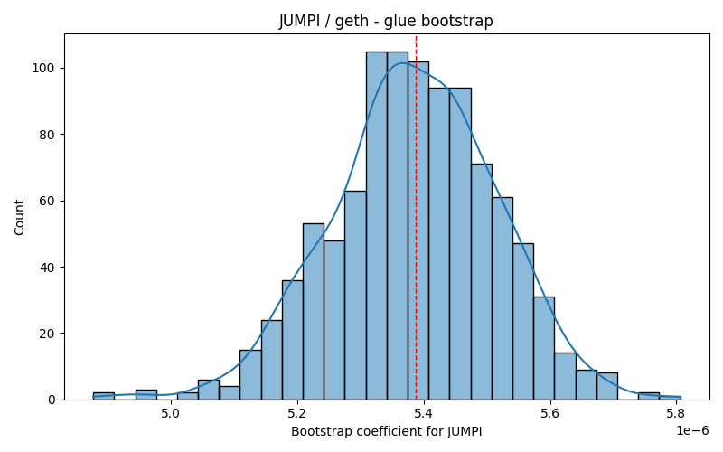

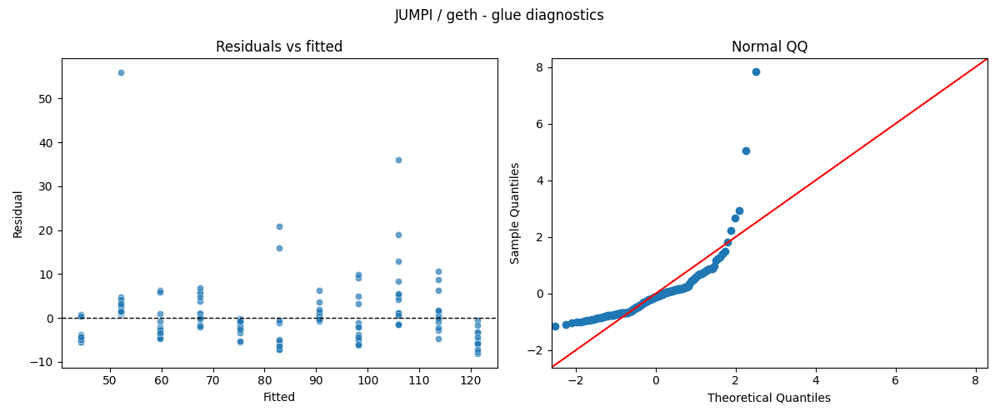

</details>

<details><summary><code>LT</code> · nobs=165 · runtime_ms=4.348e-06 · p=1.00e-03 · R²=0.9609</summary>

```
==============================================================================
                           NNLS Regression Results                            
==============================================================================
Dep. Variable:          test_runtime_ms              R-squared:          0.961
Model:                  NNLS                    Adj. R-squared:          0.961
No. Observations:       165                               RMSE:           9.23
Df Residuals:           163                                MAE:           6.58
Df Model:               1      
==============================================================================
                      coef     std err     P-value      [0.025      0.975]
------------------------------------------------------------------------------
         const      6.5415      2.3834       0.001      1.8760     11.2392
            LT      0.0000      0.0000       0.001      0.0000      0.0000
==============================================================================
Notes: Non-negative least squares with bootstrap inference (1000 iterations)
==============================================================================
```

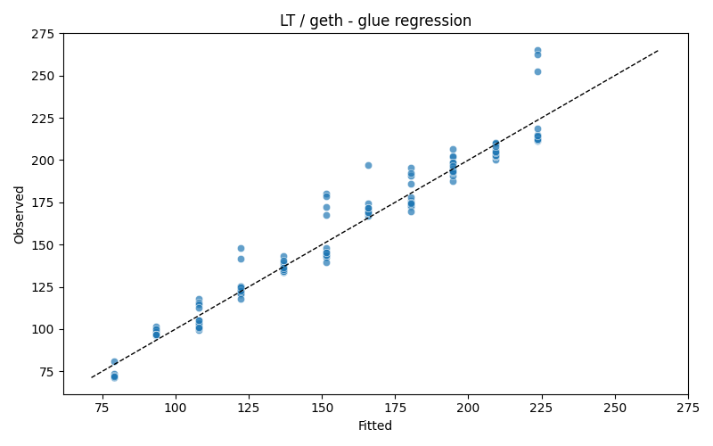

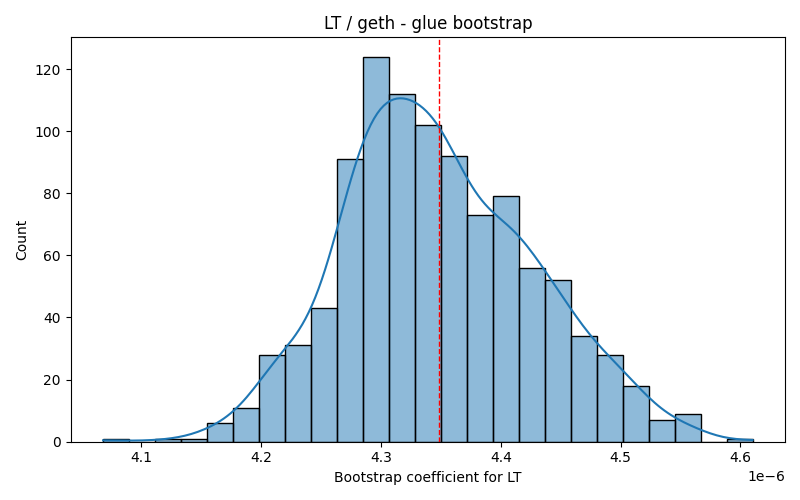

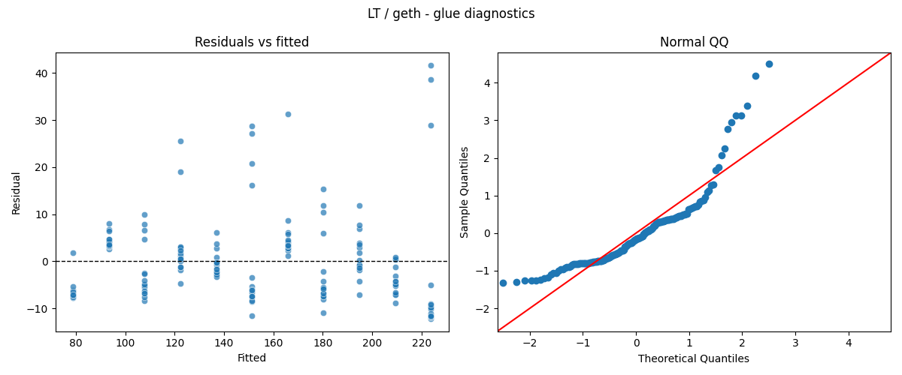

</details>

<details><summary><code>MSTORE</code> · nobs=825 · runtime_ms=8.48e-06 · p=1.00e-03 · R²=0.9536</summary>

```
==============================================================================
                           NNLS Regression Results                            
==============================================================================
Dep. Variable:          test_runtime_ms              R-squared:          0.954
Model:                  NNLS                    Adj. R-squared:          0.954
No. Observations:       825                               RMSE:          13.14
Df Residuals:           823                                MAE:           8.94
Df Model:               1      
==============================================================================
                      coef     std err     P-value      [0.025      0.975]
------------------------------------------------------------------------------
         const     11.9032      1.3835       0.001      9.1154     14.5049
        MSTORE      0.0000      0.0000       0.001      0.0000      0.0000
==============================================================================
Notes: Non-negative least squares with bootstrap inference (1000 iterations)
==============================================================================
```

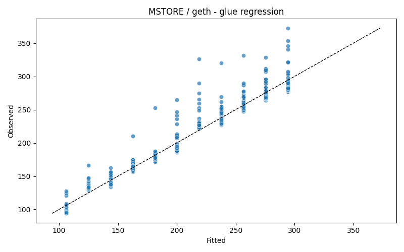

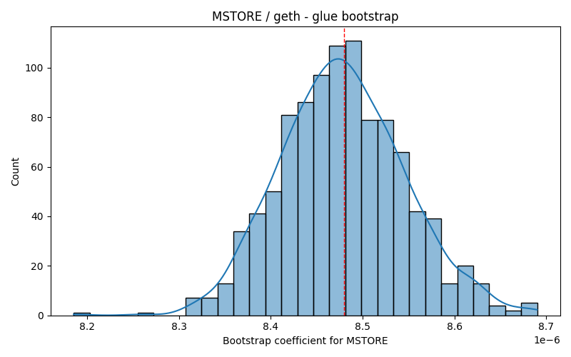

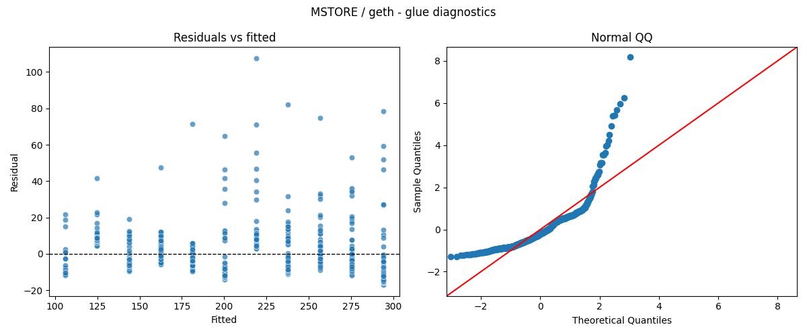

</details>

<details><summary><code>MSTORE8</code> · nobs=825 · runtime_ms=7.757e-06 · p=1.00e-03 · R²=0.936</summary>

```
==============================================================================
                           NNLS Regression Results                            
==============================================================================
Dep. Variable:          test_runtime_ms              R-squared:          0.936
Model:                  NNLS                    Adj. R-squared:          0.936
No. Observations:       825                               RMSE:          14.24
Df Residuals:           823                                MAE:           8.88
Df Model:               1      
==============================================================================
                      coef     std err     P-value      [0.025      0.975]
------------------------------------------------------------------------------
         const     15.5231      1.4765       0.001     12.4131     18.5105
       MSTORE8      0.0000      0.0000       0.001      0.0000      0.0000
==============================================================================
Notes: Non-negative least squares with bootstrap inference (1000 iterations)
==============================================================================
```

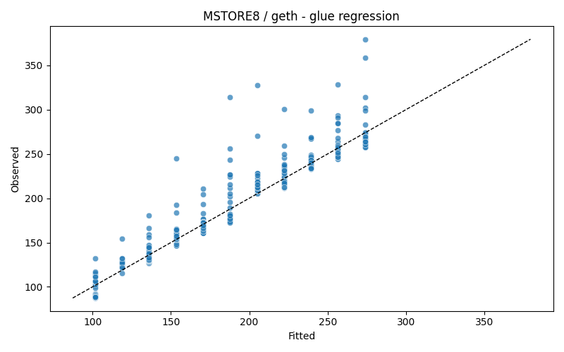

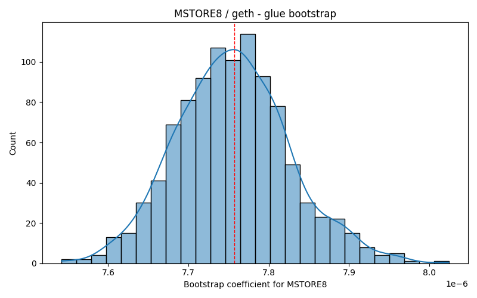

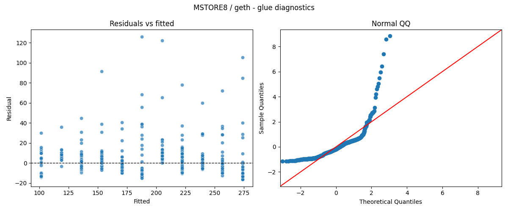

</details>

<details><summary><code>MUL</code> · nobs=165 · runtime_ms=5.285e-06 · p=1.00e-03 · R²=0.98</summary>

```
==============================================================================
                           NNLS Regression Results                            
==============================================================================
Dep. Variable:          test_runtime_ms              R-squared:          0.980
Model:                  NNLS                    Adj. R-squared:          0.980
No. Observations:       165                               RMSE:           5.97
Df Residuals:           163                                MAE:           4.94
Df Model:               1      
==============================================================================
                      coef     std err     P-value      [0.025      0.975]
------------------------------------------------------------------------------
         const     10.6256      1.6417       0.001      7.4834     13.8473
           MUL      0.0000      0.0000       0.001      0.0000      0.0000
==============================================================================
Notes: Non-negative least squares with bootstrap inference (1000 iterations)
==============================================================================
```

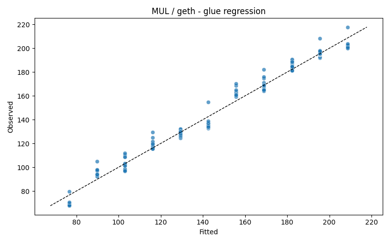

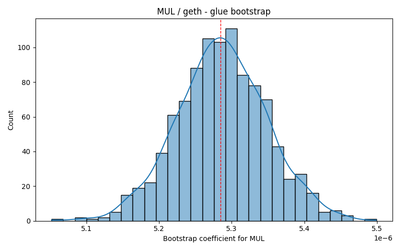

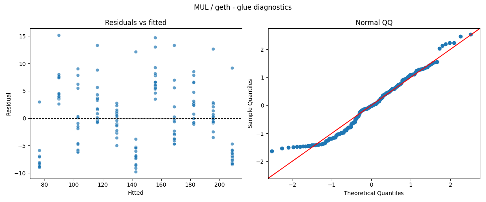

</details>

<details><summary><code>PC</code> · nobs=165 · runtime_ms=2.005e-06 · p=1.00e-03 · R²=0.9502</summary>

```
==============================================================================
                           NNLS Regression Results                            
==============================================================================
Dep. Variable:          test_runtime_ms              R-squared:          0.950
Model:                  NNLS                    Adj. R-squared:          0.950
No. Observations:       165                               RMSE:          13.72
Df Residuals:           163                                MAE:           9.95
Df Model:               1      
==============================================================================
                      coef     std err     P-value      [0.025      0.975]
------------------------------------------------------------------------------
         const     12.0528      3.5530       0.001      5.1059     19.3473
            PC      0.0000      0.0000       0.001      0.0000      0.0000
==============================================================================
Notes: Non-negative least squares with bootstrap inference (1000 iterations)
==============================================================================
```

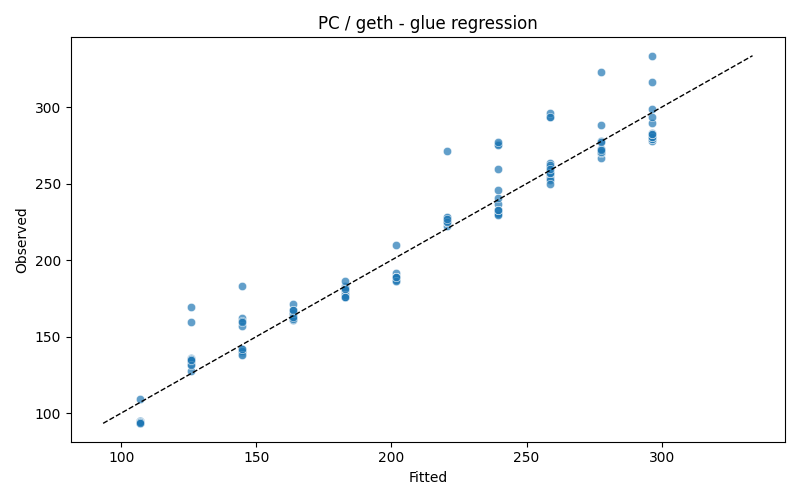

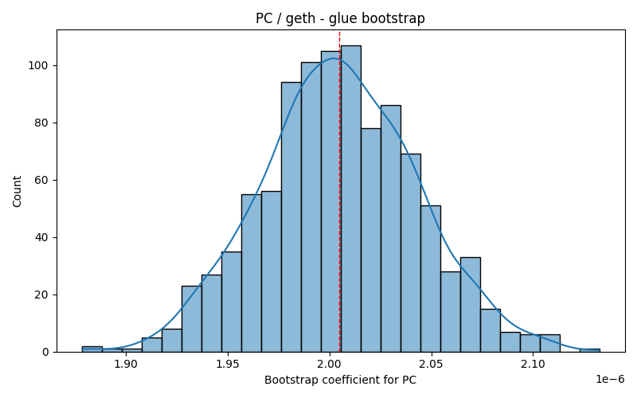

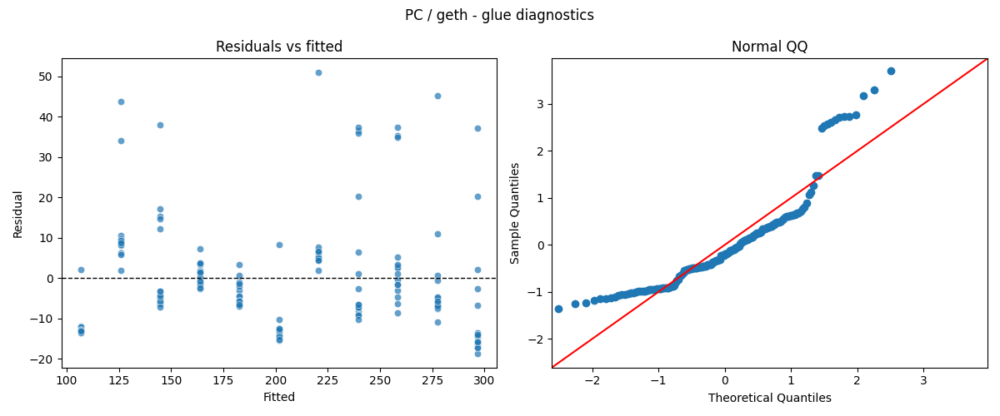

</details>

<details><summary><code>RETURNDATASIZE</code> · nobs=660 · runtime_ms=5.293e-06 · p=1.00e-03 · R²=0.8702</summary>

```
==============================================================================
                           NNLS Regression Results                            
==============================================================================
Dep. Variable:          test_runtime_ms              R-squared:          0.870
Model:                  NNLS                    Adj. R-squared:          0.870
No. Observations:       660                               RMSE:          32.30
Df Residuals:           658                                MAE:          25.08
Df Model:               1      
==============================================================================
                      coef     std err     P-value      [0.025      0.975]
------------------------------------------------------------------------------
         const     55.9260      4.2992       0.001     47.0195     64.4935
RETURNDATASIZE      0.0000      0.0000       0.001      0.0000      0.0000
==============================================================================
Notes: Non-negative least squares with bootstrap inference (1000 iterations)
==============================================================================
```

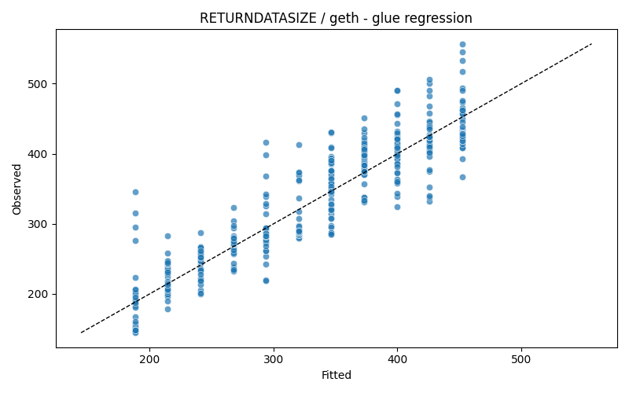

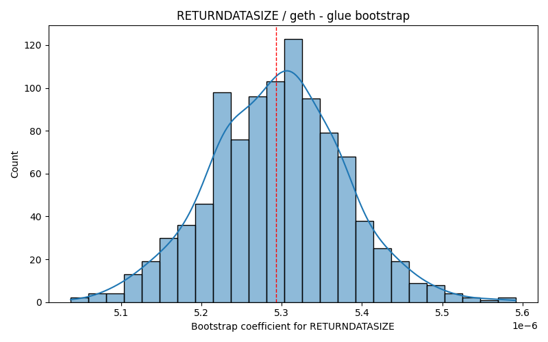

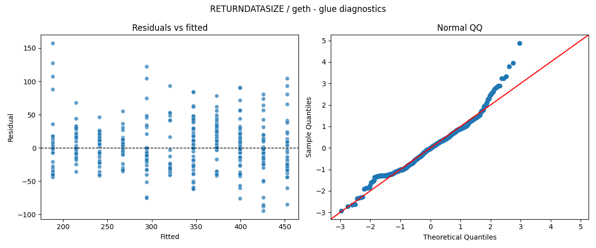

</details>

<details><summary><code>SELFBALANCE</code> · nobs=165 · runtime_ms=1.221e-05 · p=1.00e-03 · R²=0.9695</summary>

```
==============================================================================
                           NNLS Regression Results                            
==============================================================================
Dep. Variable:          test_runtime_ms              R-squared:          0.969
Model:                  NNLS                    Adj. R-squared:          0.969
No. Observations:       165                               RMSE:          26.78
Df Residuals:           163                                MAE:          22.43
Df Model:               1      
==============================================================================
                      coef     std err     P-value      [0.025      0.975]
------------------------------------------------------------------------------
         const     52.1367      7.6345       0.001     37.4989     67.7984
   SELFBALANCE      0.0000      0.0000       0.001      0.0000      0.0000
==============================================================================
Notes: Non-negative least squares with bootstrap inference (1000 iterations)
==============================================================================
```

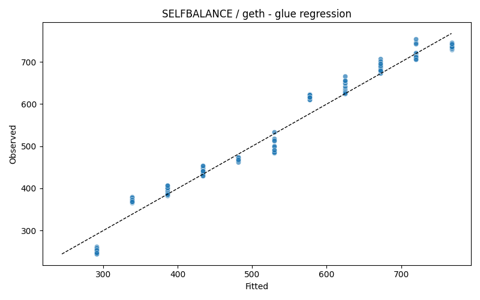

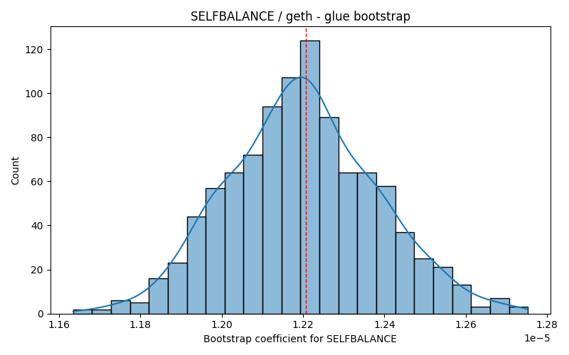

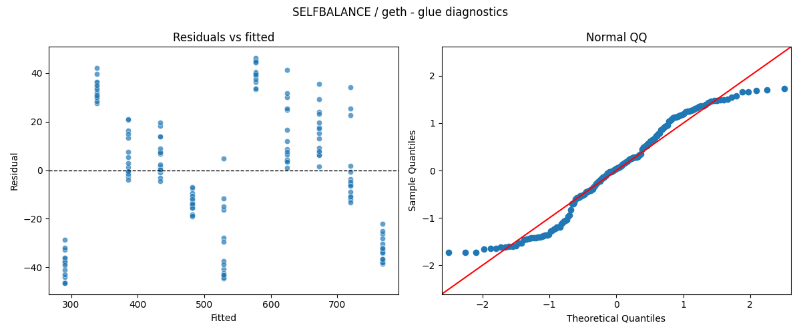

</details>

<details><summary><code>SUB</code> · nobs=165 · runtime_ms=4.252e-06 · p=1.00e-03 · R²=0.9597</summary>

```
==============================================================================
                           NNLS Regression Results                            
==============================================================================
Dep. Variable:          test_runtime_ms              R-squared:          0.960
Model:                  NNLS                    Adj. R-squared:          0.959
No. Observations:       165                               RMSE:           9.18
Df Residuals:           163                                MAE:           5.66
Df Model:               1      
==============================================================================
                      coef     std err     P-value      [0.025      0.975]
------------------------------------------------------------------------------
         const      9.2989      2.3153       0.001      5.0522     13.8974
           SUB      0.0000      0.0000       0.001      0.0000      0.0000
==============================================================================
Notes: Non-negative least squares with bootstrap inference (1000 iterations)
==============================================================================
```

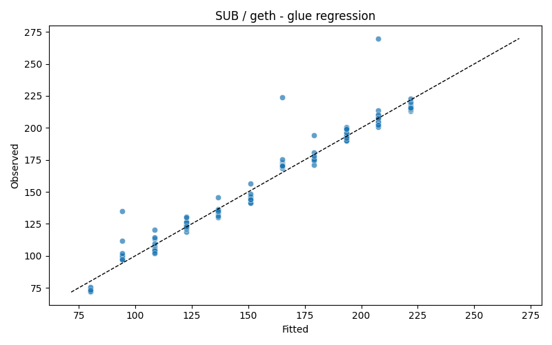

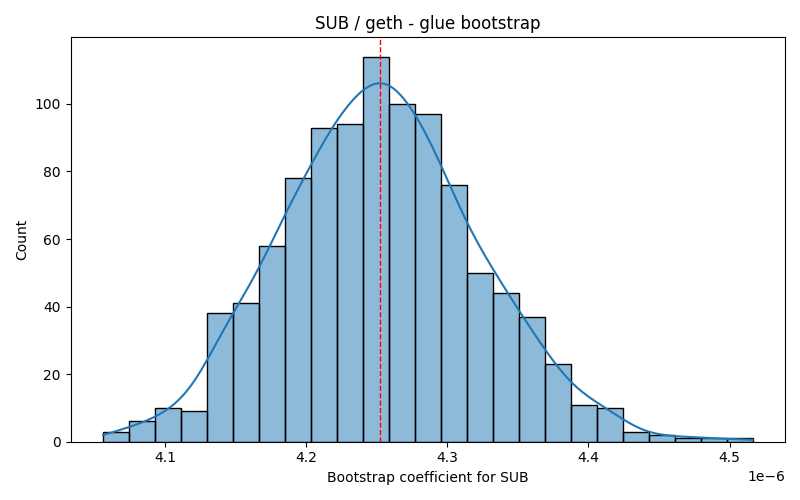

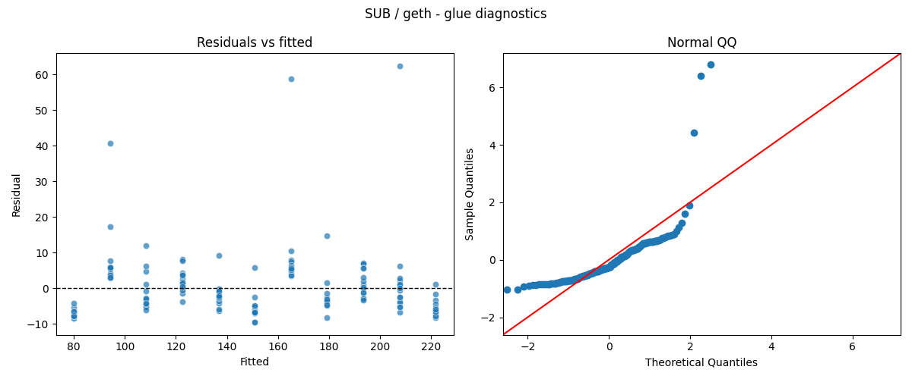

</details>

### Mixed glue (tier B) · geth

<details><summary><code>JUMP</code> · nobs=165 · runtime_ms=9.579e-06 · p=1.00e-03 · R²=0.8014</summary>

```
==============================================================================
                           NNLS Regression Results                            
==============================================================================
Dep. Variable:          test_runtime_ms              R-squared:          0.801
Model:                  NNLS                    Adj. R-squared:          0.800
No. Observations:       165                               RMSE:          17.72
Df Residuals:           163                                MAE:           9.76
Df Model:               1      
==============================================================================
                      coef     std err     P-value      [0.025      0.975]
------------------------------------------------------------------------------
         const     19.0367      5.6499       0.001      9.1349     31.7573
          JUMP      0.0000      0.0000       0.001      0.0000      0.0000
==============================================================================
Notes: Non-negative least squares with bootstrap inference (1000 iterations)
==============================================================================
```

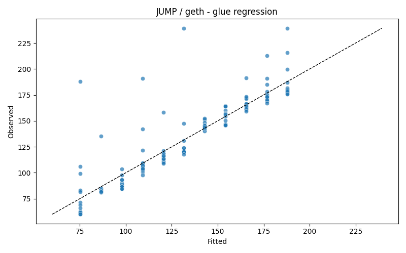

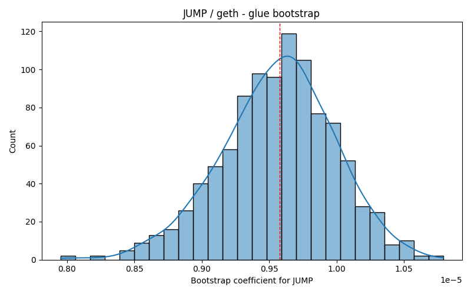

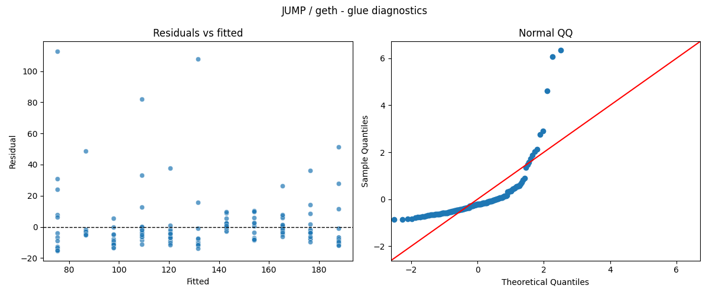

</details>

<details><summary><code>KECCAK256</code> · nobs=2640 · runtime_ms=3.927e-05 · p=1.00e-03 · R²=0.1274</summary>

```
==============================================================================
                           NNLS Regression Results                            
==============================================================================
Dep. Variable:          test_runtime_ms              R-squared:          0.127
Model:                  NNLS                    Adj. R-squared:          0.127
No. Observations:       2640                              RMSE:         204.34
Df Residuals:           2638                               MAE:         164.69
Df Model:               1      
==============================================================================
                      coef     std err     P-value      [0.025      0.975]
------------------------------------------------------------------------------
         const    559.5552      8.8091       0.001    542.7588    577.6742
     KECCAK256      0.0000      0.0000       0.001      0.0000      0.0000
==============================================================================
Notes: Non-negative least squares with bootstrap inference (1000 iterations)
==============================================================================
```

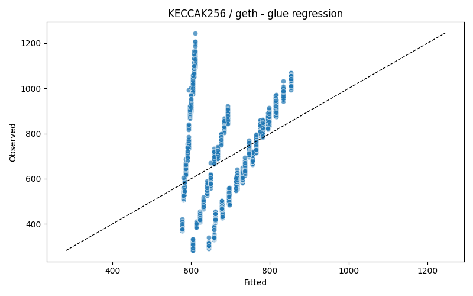

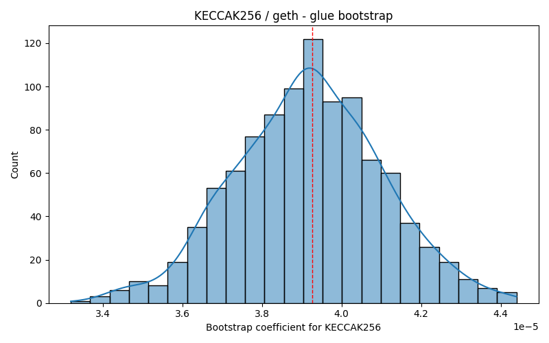

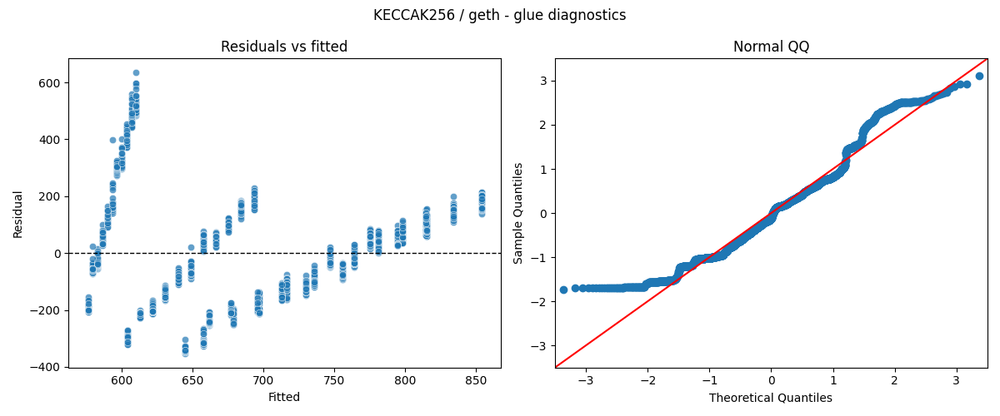

</details>

## nethermind

| glue_opcode | nobs | glue_runtime_ms | p_value | rsquared |
| --- | --- | --- | --- | --- |
| `ISZERO` | 132 | 6.032e-07 | 1.00e-03 | 0.926 |
| `JUMPDEST` | 132 | 4.58e-07 | 1.00e-03 | 0.7958 |
| `SWAP` | 2112 | 6.518e-07 | 1.00e-03 | 0.8094 |
| `CALLDATASIZE` | 7810 | 5.713e-07 | 1.00e-03 | 0.9048 |
| `DUP` | 7810 | 4.665e-07 | 1.00e-03 | 0.9048 |
| `GAS` | 7810 | 5.485e-07 | 1.00e-03 | 0.9048 |
| `MLOAD` | 7810 | 2.235e-06 | 1.00e-03 | 0.9048 |
| `PUSH` | 7810 | 7.243e-07 | 1.00e-03 | 0.9048 |
| `PUSH0` | 7810 | 4.023e-07 | 1.00e-03 | 0.9048 |
| `STATICCALL` | 7810 | 0.0002182 | 1.00e-03 | 0.9048 |
| `ADD` | 132 | 1.388e-06 | 1.00e-03 | 0.9141 |
| `AND` | 132 | 1.191e-06 | 1.00e-03 | 0.9229 |
| `CALLDATACOPY` | 3168 | 4.493e-06 | 1.00e-03 | 0.7582 |
| `CALLDATALOAD` | 528 | 1.293e-05 | 1.00e-03 | 0.07242 |
| `DIV` | 132 | 4.929e-06 | 1.00e-03 | 0.5648 |
| `EXP` | 132 | 0 | 1.00e+00 | 2.22e-16 |
| `GT` | 132 | 1.509e-06 | 1.00e-03 | 0.9588 |
| `JUMPI` | 132 | 2.43e-06 | 1.00e-03 | 0.8633 |
| `LT` | 132 | 1.512e-06 | 1.00e-03 | 0.962 |
| `MSTORE` | 660 | 3.045e-06 | 1.00e-03 | 0.9394 |
| `MSTORE8` | 660 | 2.912e-06 | 1.00e-03 | 0.9358 |
| `MUL` | 132 | 4.277e-06 | 1.00e-03 | 0.8499 |
| `PC` | 132 | 7.439e-07 | 1.00e-03 | 0.9814 |
| `RETURNDATASIZE` | 528 | 1.028e-06 | 1.00e-03 | 0.7772 |
| `SELFBALANCE` | 132 | 3.429e-06 | 1.00e-03 | 0.7897 |
| `SUB` | 132 | 2.07e-06 | 1.00e-03 | 0.9594 |
| `JUMP` | 132 | 3.302e-06 | 1.00e-03 | 0.7058 |
| `KECCAK256` | 2112 | 0 | 1.00e+00 | 1.11e-16 |

### Cycle glue — joint fit · nethermind

<details><summary>Joint NNLS regression summary</summary>

```
==============================================================================
                           NNLS Regression Results                            
==============================================================================
Dep. Variable:          test_runtime_ms              R-squared:          0.905
Model:                  NNLS                    Adj. R-squared:          0.905
No. Observations:       7810                              RMSE:           8.79
Df Residuals:           7802                               MAE:           6.15
Df Model:               7      
==============================================================================
                      coef     std err     P-value      [0.025      0.975]
------------------------------------------------------------------------------
         const      7.5994      0.3062       0.001      6.9933      8.1984
  CALLDATASIZE      0.0000      0.0000       0.001      0.0000      0.0000
           DUP      0.0000      0.0000       0.001      0.0000      0.0000
           GAS      0.0000      0.0000       0.001      0.0000      0.0000
         MLOAD      0.0000      0.0000       0.001      0.0000      0.0000
          PUSH      0.0000      0.0000       0.001      0.0000      0.0000
         PUSH0      0.0000      0.0000       0.001      0.0000      0.0000
    STATICCALL      0.0002      0.0000       0.001      0.0002      0.0002
==============================================================================
Notes: Non-negative least squares with bootstrap inference (1000 iterations)
==============================================================================
```

</details>

<details><summary><code>CALLDATASIZE</code> · nobs=7810 · runtime_ms=5.713e-07 · p=1.00e-03 · R²=0.9048</summary>

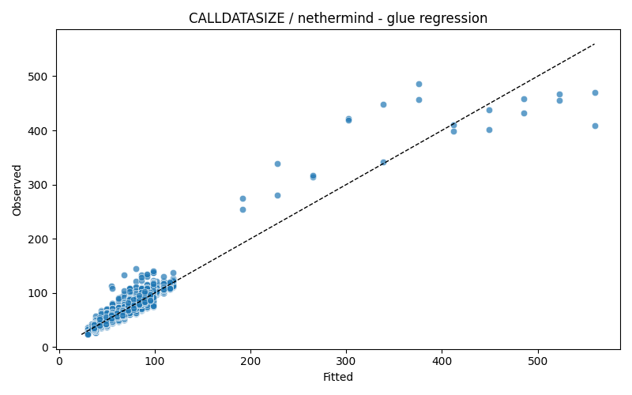

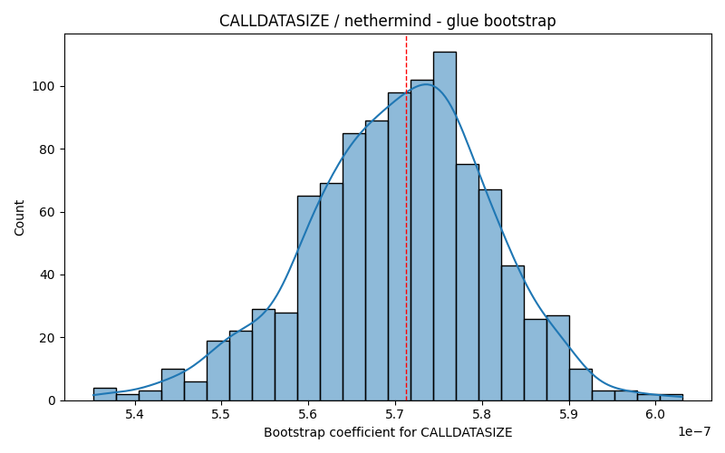


</details>

<details><summary><code>DUP</code> · nobs=7810 · runtime_ms=4.665e-07 · p=1.00e-03 · R²=0.9048</summary>

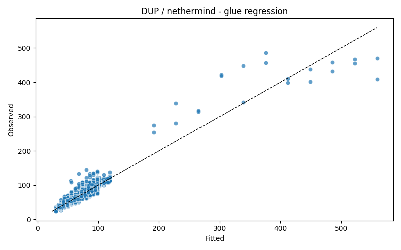

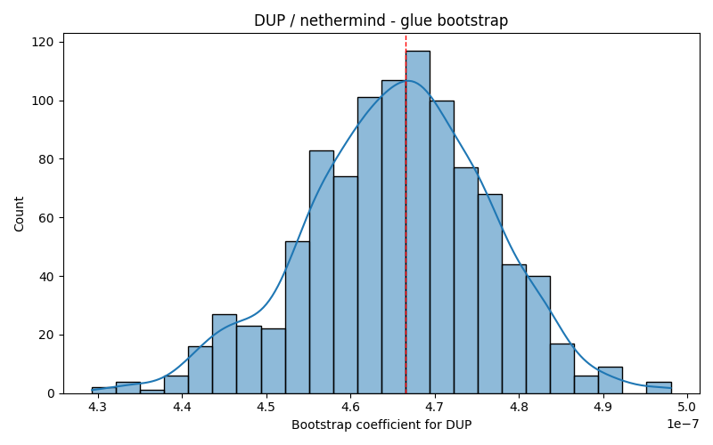


</details>

<details><summary><code>GAS</code> · nobs=7810 · runtime_ms=5.485e-07 · p=1.00e-03 · R²=0.9048</summary>


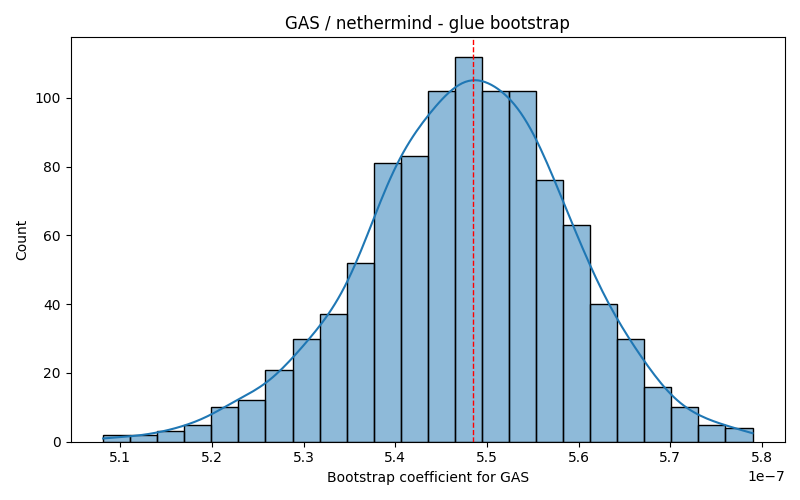

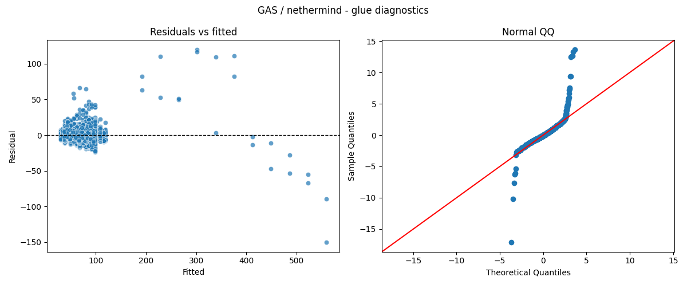

</details>

<details><summary><code>MLOAD</code> · nobs=7810 · runtime_ms=2.235e-06 · p=1.00e-03 · R²=0.9048</summary>

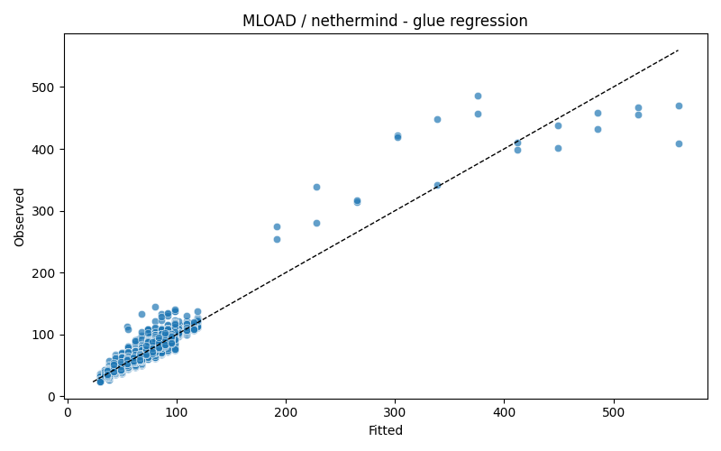

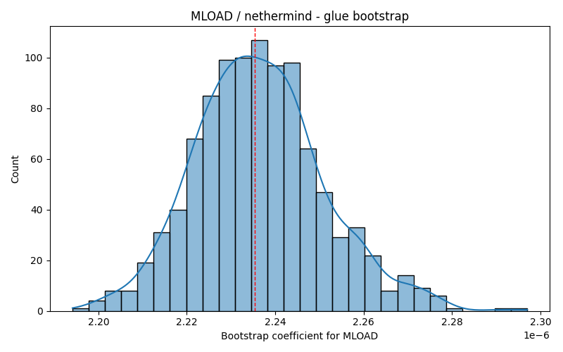


</details>

<details><summary><code>PUSH</code> · nobs=7810 · runtime_ms=7.243e-07 · p=1.00e-03 · R²=0.9048</summary>


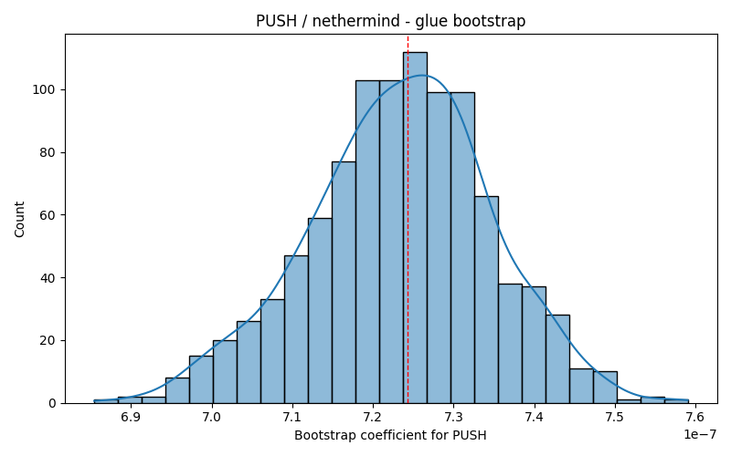


</details>

<details><summary><code>PUSH0</code> · nobs=7810 · runtime_ms=4.023e-07 · p=1.00e-03 · R²=0.9048</summary>

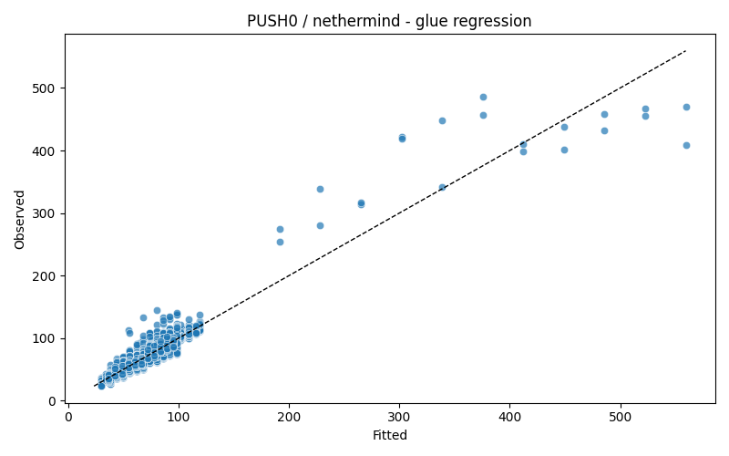

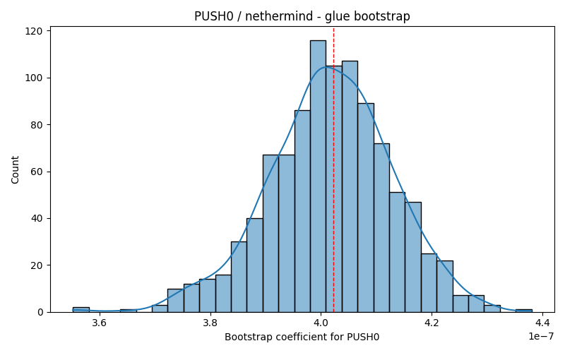


</details>

<details><summary><code>STATICCALL</code> · nobs=7810 · runtime_ms=0.0002182 · p=1.00e-03 · R²=0.9048</summary>

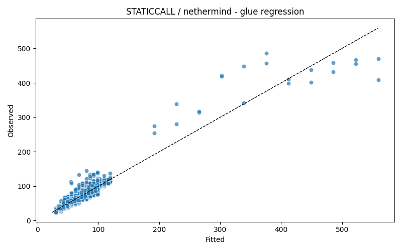

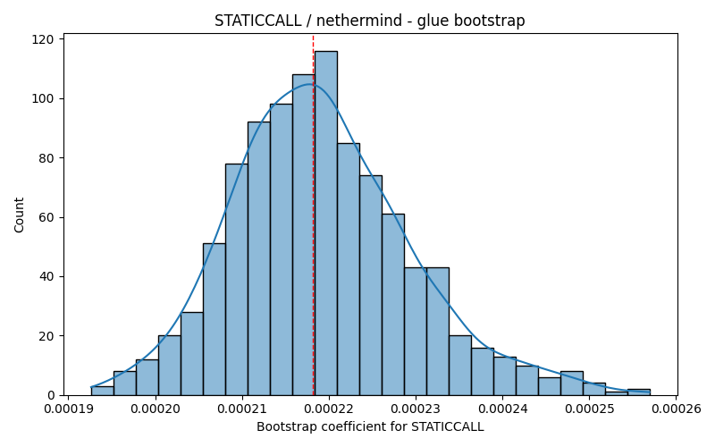

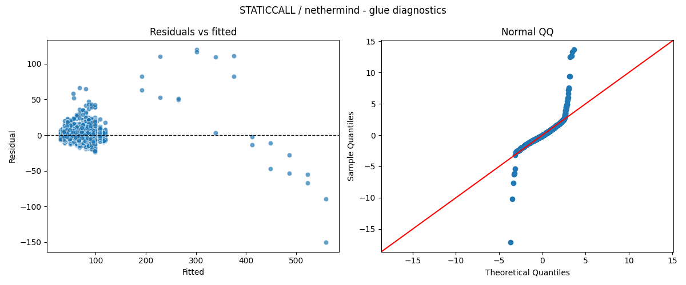

</details>

### Pure glue · nethermind

<details><summary><code>ISZERO</code> · nobs=132 · runtime_ms=6.032e-07 · p=1.00e-03 · R²=0.926</summary>

```
==============================================================================
                           NNLS Regression Results                            
==============================================================================
Dep. Variable:          test_runtime_ms              R-squared:          0.926
Model:                  NNLS                    Adj. R-squared:          0.925
No. Observations:       132                               RMSE:           3.59
Df Residuals:           130                                MAE:           2.39
Df Model:               1      
==============================================================================
                      coef     std err     P-value      [0.025      0.975]
------------------------------------------------------------------------------
         const      5.7828      0.9524       0.001      4.0297      7.6753
        ISZERO      0.0000      0.0000       0.001      0.0000      0.0000
==============================================================================
Notes: Non-negative least squares with bootstrap inference (1000 iterations)
==============================================================================
```

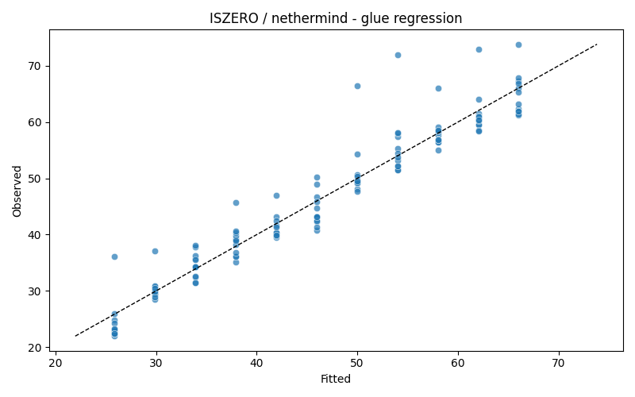

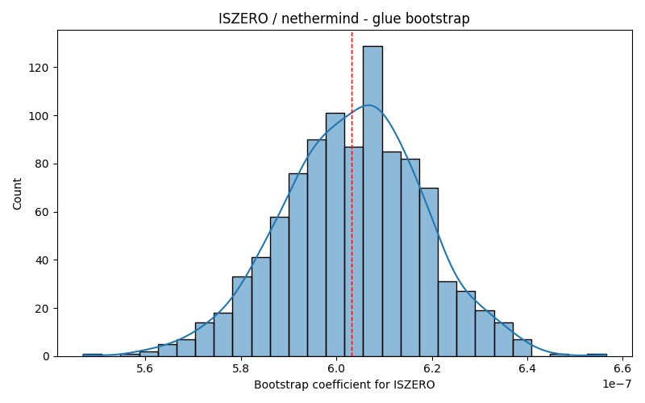

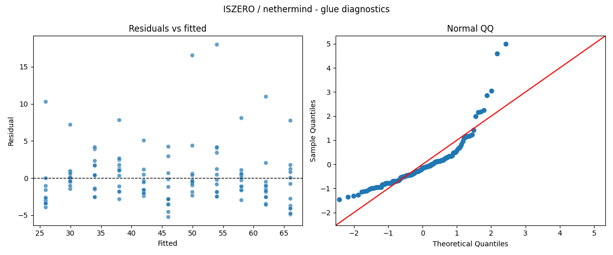

</details>

<details><summary><code>JUMPDEST</code> · nobs=132 · runtime_ms=4.58e-07 · p=1.00e-03 · R²=0.7958</summary>

```
==============================================================================
                           NNLS Regression Results                            
==============================================================================
Dep. Variable:          test_runtime_ms              R-squared:          0.796
Model:                  NNLS                    Adj. R-squared:          0.794
No. Observations:       132                               RMSE:          14.66
Df Residuals:           130                                MAE:          11.43
Df Model:               1      
==============================================================================
                      coef     std err     P-value      [0.025      0.975]
------------------------------------------------------------------------------
         const      7.4905      3.5145       0.022      0.4593     14.2299
      JUMPDEST      0.0000      0.0000       0.001      0.0000      0.0000
==============================================================================
Notes: Non-negative least squares with bootstrap inference (1000 iterations)
==============================================================================
```

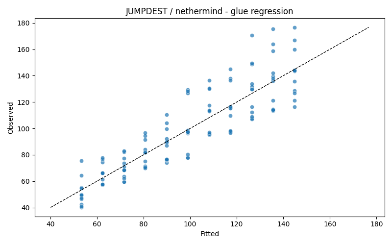

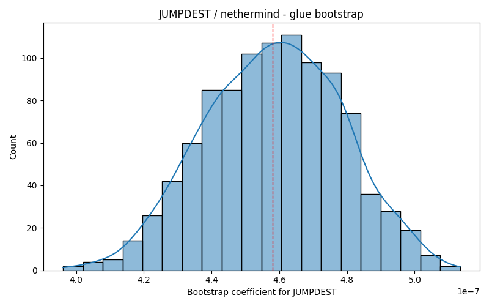

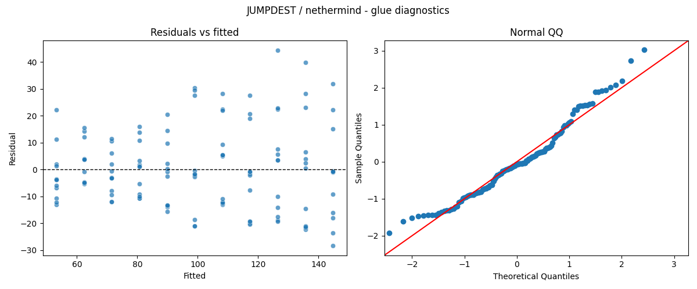

</details>

<details><summary><code>SWAP</code> · nobs=2112 · runtime_ms=6.518e-07 · p=1.00e-03 · R²=0.8094</summary>

```
==============================================================================
                           NNLS Regression Results                            
==============================================================================
Dep. Variable:          test_runtime_ms              R-squared:          0.809
Model:                  NNLS                    Adj. R-squared:          0.809
No. Observations:       2112                              RMSE:           6.66
Df Residuals:           2110                               MAE:           5.22
Df Model:               1      
==============================================================================
                      coef     std err     P-value      [0.025      0.975]
------------------------------------------------------------------------------
         const     11.0147      0.4717       0.001     10.0719     11.9608
          SWAP      0.0000      0.0000       0.001      0.0000      0.0000
==============================================================================
Notes: Non-negative least squares with bootstrap inference (1000 iterations)
==============================================================================
```

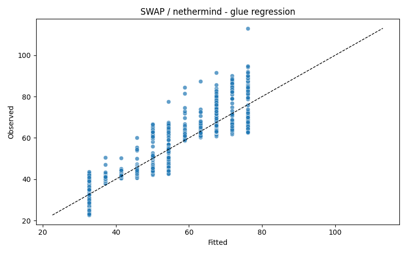

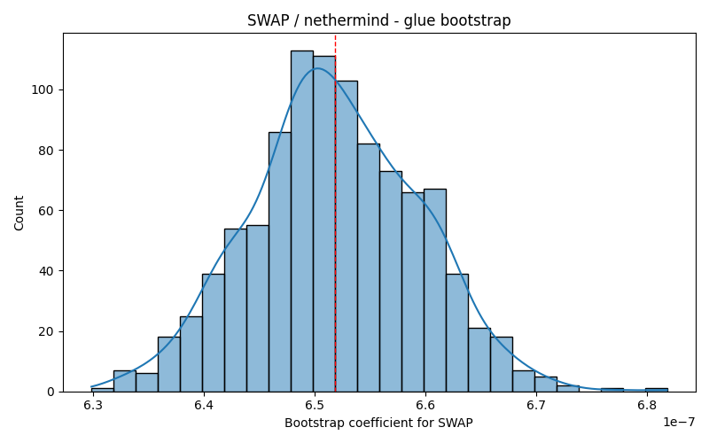

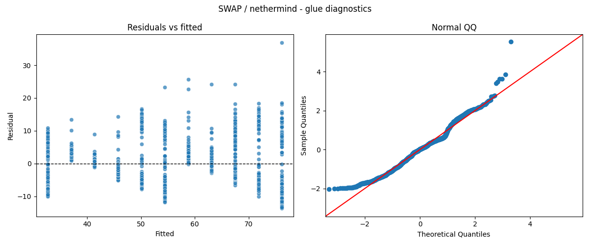

</details>

### Mixed glue (tier A) · nethermind

<details><summary><code>ADD</code> · nobs=132 · runtime_ms=1.388e-06 · p=1.00e-03 · R²=0.9141</summary>

```
==============================================================================
                           NNLS Regression Results                            
==============================================================================
Dep. Variable:          test_runtime_ms              R-squared:          0.914
Model:                  NNLS                    Adj. R-squared:          0.913
No. Observations:       132                               RMSE:           4.48
Df Residuals:           130                                MAE:           3.40
Df Model:               1      
==============================================================================
                      coef     std err     P-value      [0.025      0.975]
------------------------------------------------------------------------------
         const      6.7692      1.2076       0.001      4.3762      9.1716
           ADD      0.0000      0.0000       0.001      0.0000      0.0000
==============================================================================
Notes: Non-negative least squares with bootstrap inference (1000 iterations)
==============================================================================
```

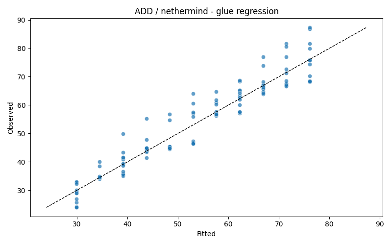

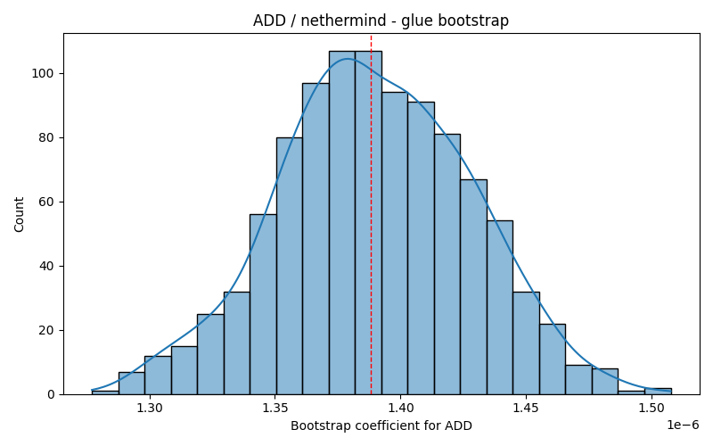

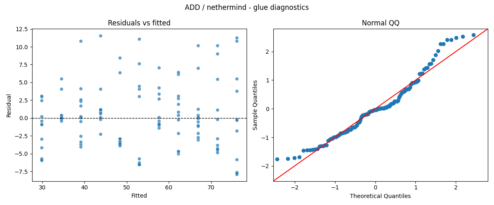

</details>

<details><summary><code>AND</code> · nobs=132 · runtime_ms=1.191e-06 · p=1.00e-03 · R²=0.9229</summary>

```
==============================================================================
                           NNLS Regression Results                            
==============================================================================
Dep. Variable:          test_runtime_ms              R-squared:          0.923
Model:                  NNLS                    Adj. R-squared:          0.922
No. Observations:       132                               RMSE:           3.63
Df Residuals:           130                                MAE:           2.77
Df Model:               1      
==============================================================================
                      coef     std err     P-value      [0.025      0.975]
------------------------------------------------------------------------------
         const      4.5823      0.9808       0.001      2.7324      6.5785
           AND      0.0000      0.0000       0.001      0.0000      0.0000
==============================================================================
Notes: Non-negative least squares with bootstrap inference (1000 iterations)
==============================================================================
```

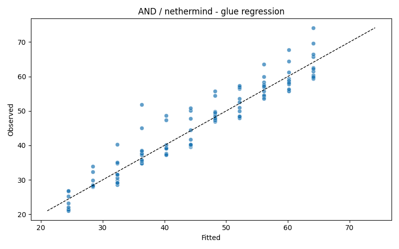

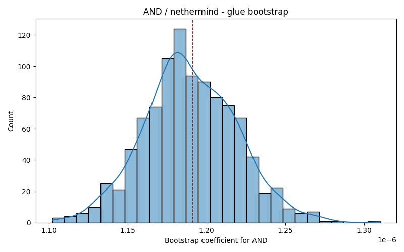

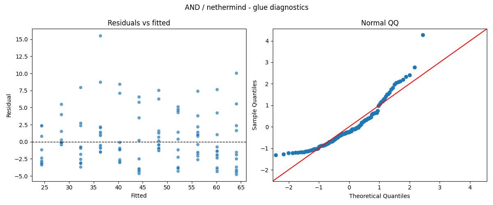

</details>

<details><summary><code>CALLDATACOPY</code> · nobs=3168 · runtime_ms=4.493e-06 · p=1.00e-03 · R²=0.7582</summary>

```
==============================================================================
                           NNLS Regression Results                            
==============================================================================
Dep. Variable:          test_runtime_ms              R-squared:          0.758
Model:                  NNLS                    Adj. R-squared:          0.758
No. Observations:       3168                              RMSE:          19.09
Df Residuals:           3166                               MAE:          15.04
Df Model:               1      
==============================================================================
                      coef     std err     P-value      [0.025      0.975]
------------------------------------------------------------------------------
         const     22.0594      0.3748       0.001     21.2870     22.7552
  CALLDATACOPY      0.0000      0.0000       0.001      0.0000      0.0000
==============================================================================
Notes: Non-negative least squares with bootstrap inference (1000 iterations)
==============================================================================
```

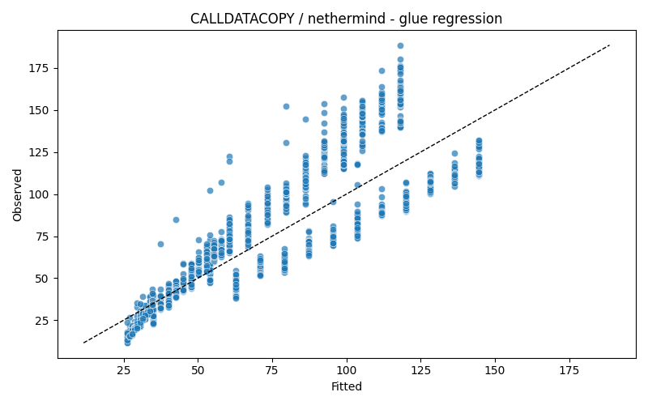

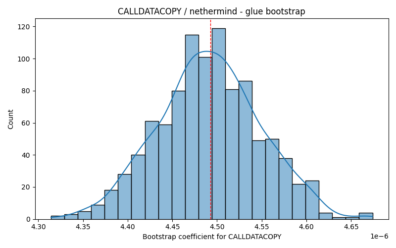

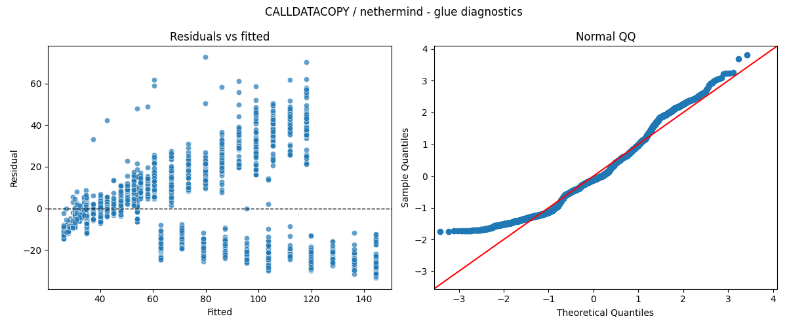

</details>

<details><summary><code>CALLDATALOAD</code> · nobs=528 · runtime_ms=1.293e-05 · p=1.00e-03 · R²=0.07242</summary>

```
==============================================================================
                           NNLS Regression Results                            
==============================================================================
Dep. Variable:          test_runtime_ms              R-squared:          0.072
Model:                  NNLS                    Adj. R-squared:          0.071
No. Observations:       528                               RMSE:           0.18
Df Residuals:           526                                MAE:           0.14
Df Model:               1      
==============================================================================
                      coef     std err     P-value      [0.025      0.975]
------------------------------------------------------------------------------
         const      1.8124      0.0279       0.001      1.7566      1.8640
  CALLDATALOAD      0.0000      0.0000       0.001      0.0000      0.0000
==============================================================================
Notes: Non-negative least squares with bootstrap inference (1000 iterations)
==============================================================================
```

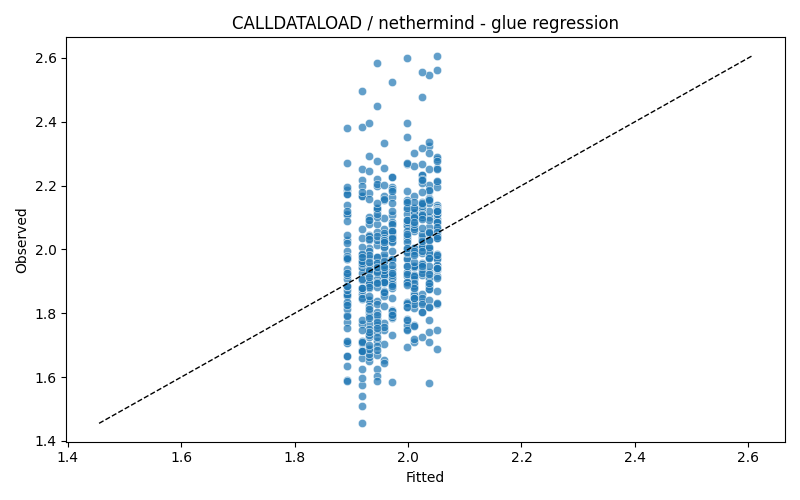

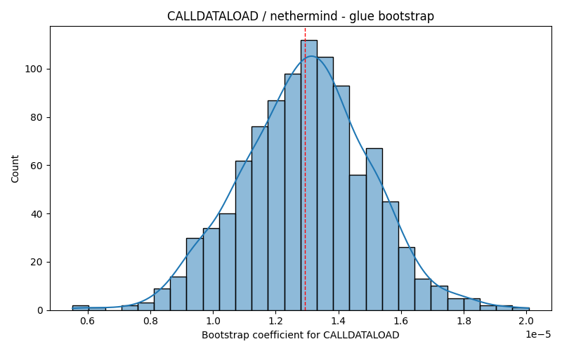

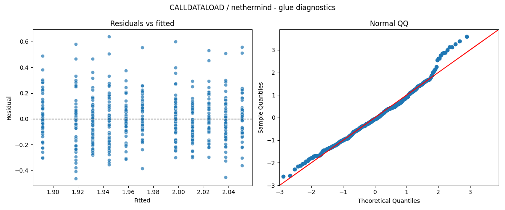

</details>

<details><summary><code>DIV</code> · nobs=132 · runtime_ms=4.929e-06 · p=1.00e-03 · R²=0.5648</summary>

```
==============================================================================
                           NNLS Regression Results                            
==============================================================================
Dep. Variable:          test_runtime_ms              R-squared:          0.565
Model:                  NNLS                    Adj. R-squared:          0.561
No. Observations:       132                               RMSE:          34.17
Df Residuals:           130                                MAE:          25.69
Df Model:               1      
==============================================================================
                      coef     std err     P-value      [0.025      0.975]
------------------------------------------------------------------------------
         const    113.6301     14.3137       0.001     84.1599    139.9073
           DIV      0.0000      0.0000       0.001      0.0000      0.0000
==============================================================================
Notes: Non-negative least squares with bootstrap inference (1000 iterations)
==============================================================================
```

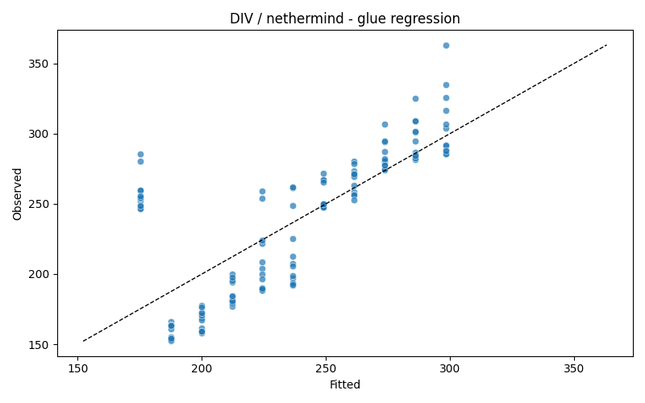

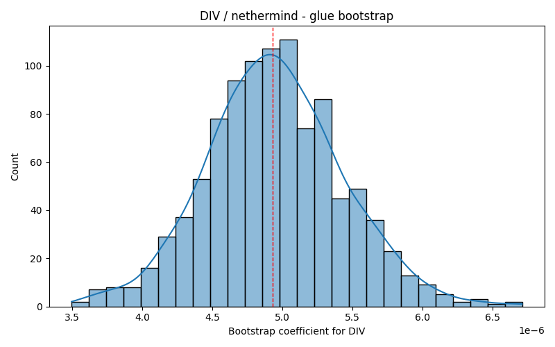

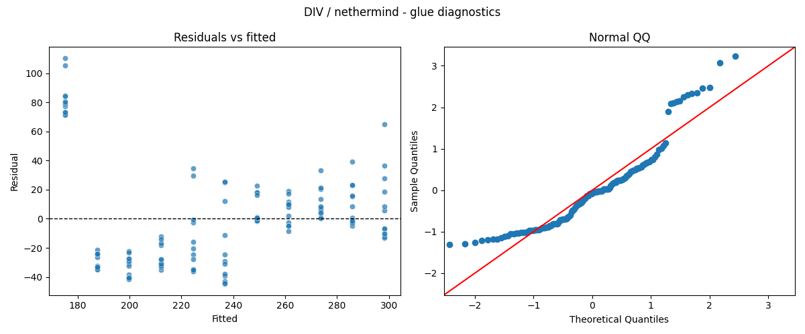

</details>

<details><summary><code>EXP</code> · nobs=132 · runtime_ms=0 · p=1.00e+00 · R²=2.22e-16</summary>

```
==============================================================================
                           NNLS Regression Results                            
==============================================================================
Dep. Variable:          test_runtime_ms              R-squared:          0.000
Model:                  NNLS                    Adj. R-squared:         -0.008
No. Observations:       132                               RMSE:           1.07
Df Residuals:           130                                MAE:           0.79
Df Model:               1      
==============================================================================
                      coef     std err     P-value      [0.025      0.975]
------------------------------------------------------------------------------
         const      3.1761      0.0958       0.001      2.9851      3.3656
           EXP      0.0000      0.0000       1.000      0.0000      0.0000
==============================================================================
Notes: Non-negative least squares with bootstrap inference (1000 iterations)
==============================================================================
```

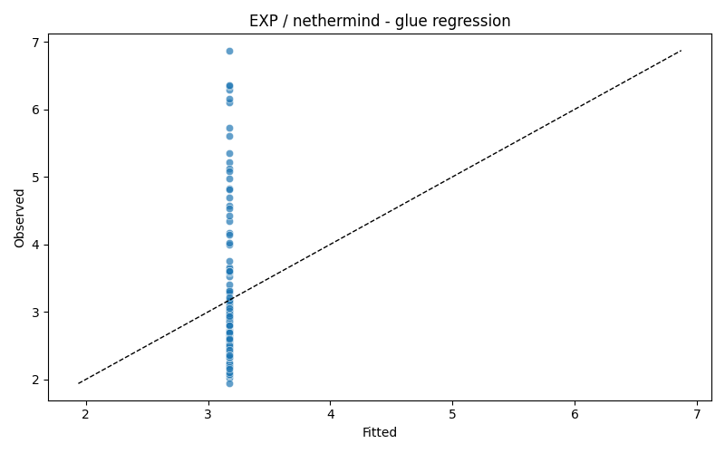

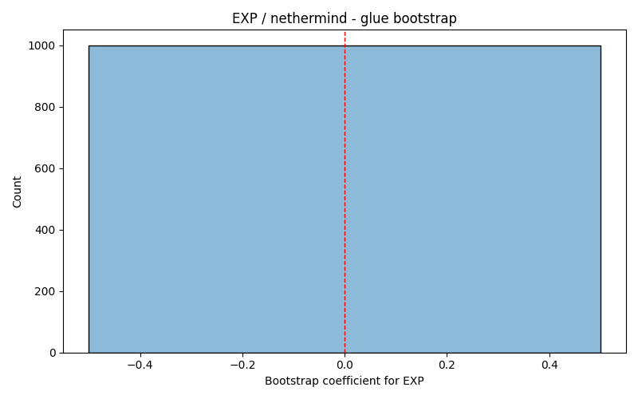

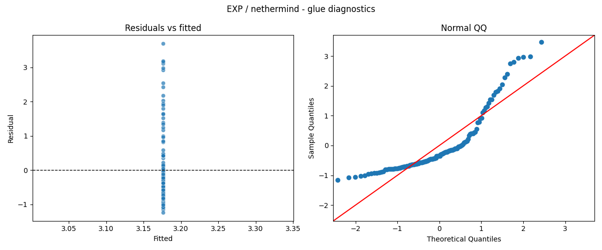

</details>

<details><summary><code>GT</code> · nobs=132 · runtime_ms=1.509e-06 · p=1.00e-03 · R²=0.9588</summary>

```
==============================================================================
                           NNLS Regression Results                            
==============================================================================
Dep. Variable:          test_runtime_ms              R-squared:          0.959
Model:                  NNLS                    Adj. R-squared:          0.958
No. Observations:       132                               RMSE:           3.29
Df Residuals:           130                                MAE:           2.49
Df Model:               1      
==============================================================================
                      coef     std err     P-value      [0.025      0.975]
------------------------------------------------------------------------------
         const      6.4695      0.8885       0.001      4.6376      8.2162
            GT      0.0000      0.0000       0.001      0.0000      0.0000
==============================================================================
Notes: Non-negative least squares with bootstrap inference (1000 iterations)
==============================================================================
```

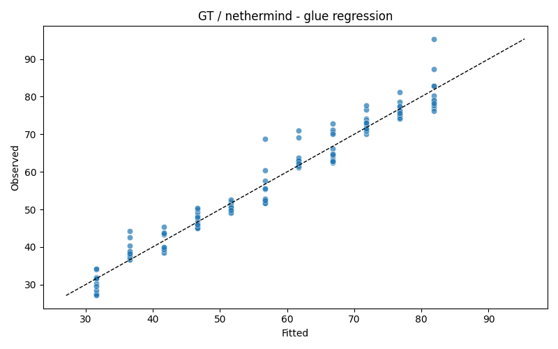

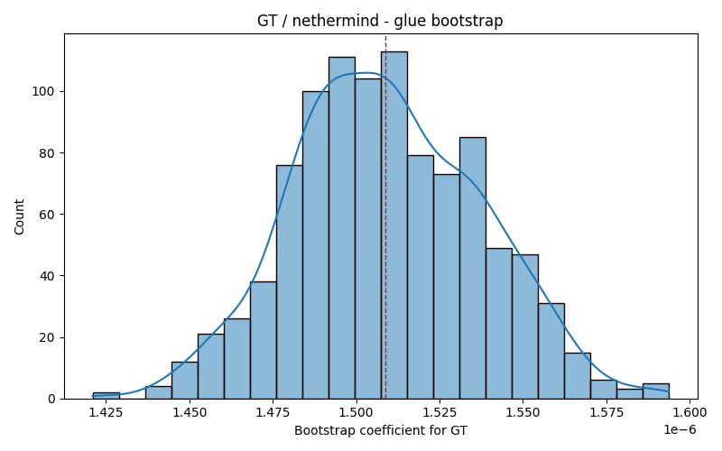

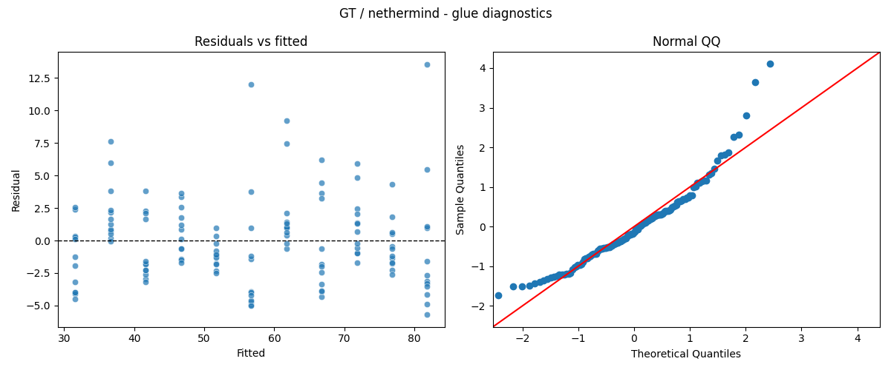

</details>

<details><summary><code>JUMPI</code> · nobs=132 · runtime_ms=2.43e-06 · p=1.00e-03 · R²=0.8633</summary>

```
==============================================================================
                           NNLS Regression Results                            
==============================================================================
Dep. Variable:          test_runtime_ms              R-squared:          0.863
Model:                  NNLS                    Adj. R-squared:          0.862
No. Observations:       132                               RMSE:           4.36
Df Residuals:           130                                MAE:           2.99
Df Model:               1      
==============================================================================
                      coef     std err     P-value      [0.025      0.975]
------------------------------------------------------------------------------
         const      4.1219      1.2385       0.001      1.6702      6.4771
         JUMPI      0.0000      0.0000       0.001      0.0000      0.0000
==============================================================================
Notes: Non-negative least squares with bootstrap inference (1000 iterations)
==============================================================================
```

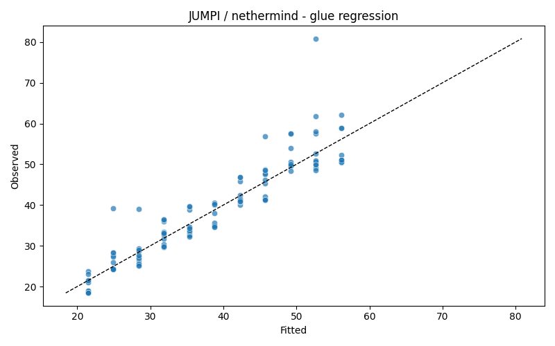

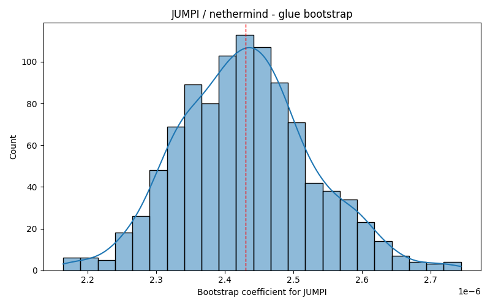

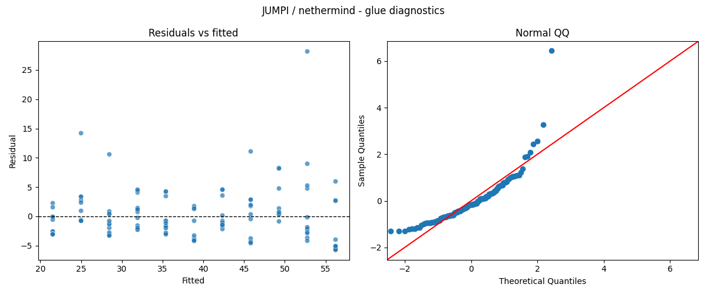

</details>

<details><summary><code>LT</code> · nobs=132 · runtime_ms=1.512e-06 · p=1.00e-03 · R²=0.962</summary>

```
==============================================================================
                           NNLS Regression Results                            
==============================================================================
Dep. Variable:          test_runtime_ms              R-squared:          0.962
Model:                  NNLS                    Adj. R-squared:          0.962
No. Observations:       132                               RMSE:           3.16
Df Residuals:           130                                MAE:           2.50
Df Model:               1      
==============================================================================
                      coef     std err     P-value      [0.025      0.975]
------------------------------------------------------------------------------
         const      6.5847      1.0082       0.001      4.8361      8.8313
            LT      0.0000      0.0000       0.001      0.0000      0.0000
==============================================================================
Notes: Non-negative least squares with bootstrap inference (1000 iterations)
==============================================================================
```

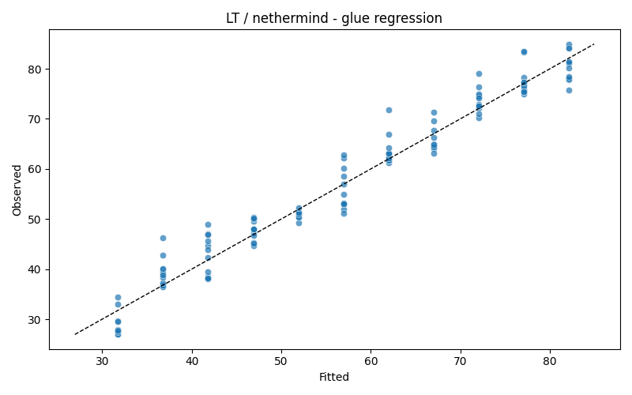

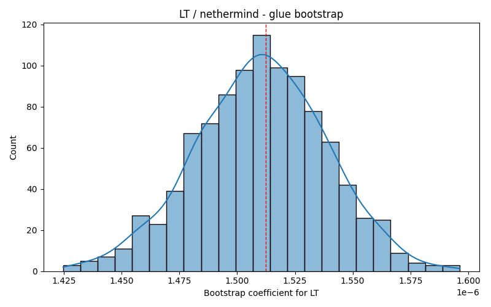

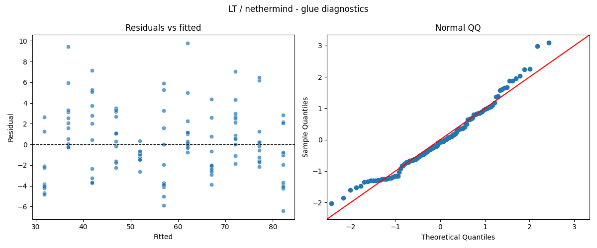

</details>

<details><summary><code>MSTORE</code> · nobs=660 · runtime_ms=3.045e-06 · p=1.00e-03 · R²=0.9394</summary>

```
==============================================================================
                           NNLS Regression Results                            
==============================================================================
Dep. Variable:          test_runtime_ms              R-squared:          0.939
Model:                  NNLS                    Adj. R-squared:          0.939
No. Observations:       660                               RMSE:           5.43
Df Residuals:           658                                MAE:           3.71
Df Model:               1      
==============================================================================
                      coef     std err     P-value      [0.025      0.975]
------------------------------------------------------------------------------
         const      6.7934      0.6350       0.001      5.5278      8.0143
        MSTORE      0.0000      0.0000       0.001      0.0000      0.0000
==============================================================================
Notes: Non-negative least squares with bootstrap inference (1000 iterations)
==============================================================================
```

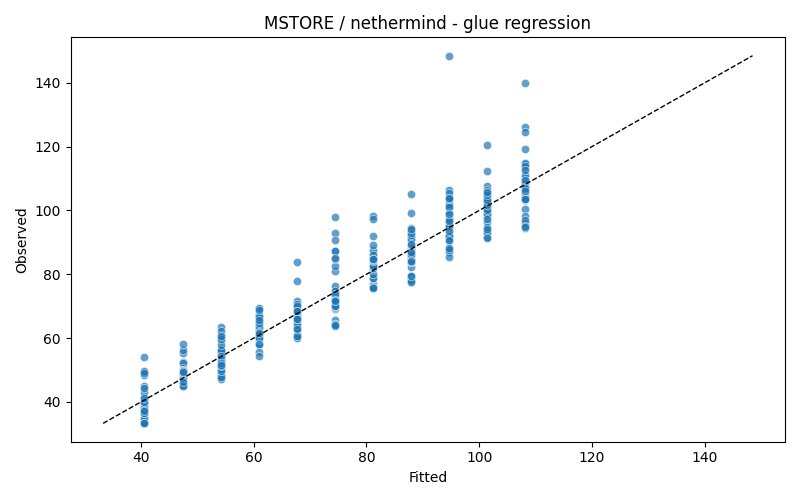

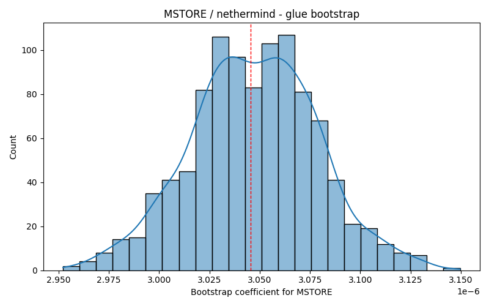

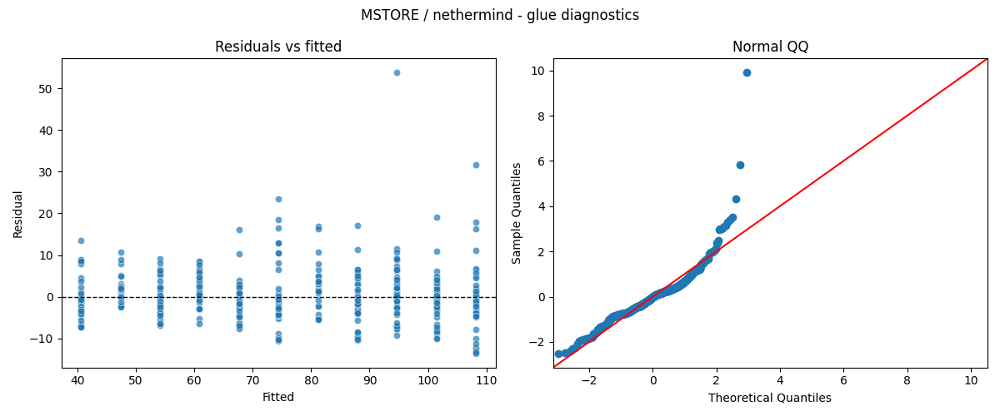

</details>

<details><summary><code>MSTORE8</code> · nobs=660 · runtime_ms=2.912e-06 · p=1.00e-03 · R²=0.9358</summary>

```
==============================================================================
                           NNLS Regression Results                            
==============================================================================
Dep. Variable:          test_runtime_ms              R-squared:          0.936
Model:                  NNLS                    Adj. R-squared:          0.936
No. Observations:       660                               RMSE:           5.35
Df Residuals:           658                                MAE:           3.87
Df Model:               1      
==============================================================================
                      coef     std err     P-value      [0.025      0.975]
------------------------------------------------------------------------------
         const      7.2621      0.6102       0.001      6.1069      8.4572
       MSTORE8      0.0000      0.0000       0.001      0.0000      0.0000
==============================================================================
Notes: Non-negative least squares with bootstrap inference (1000 iterations)
==============================================================================
```

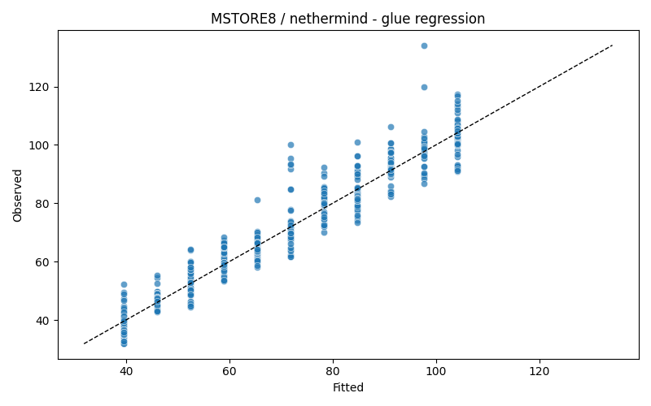

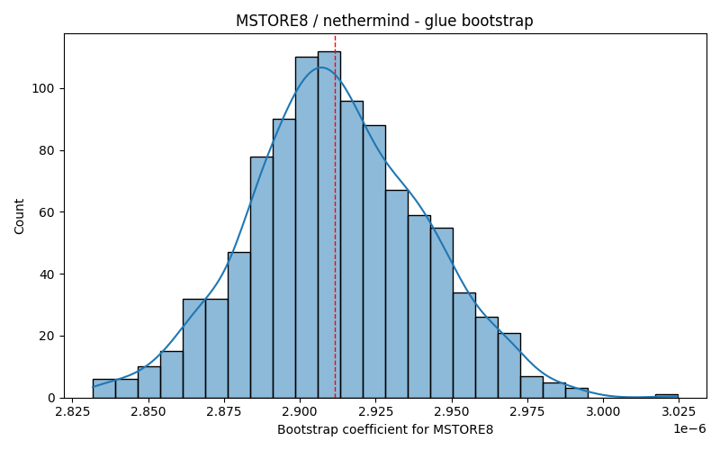

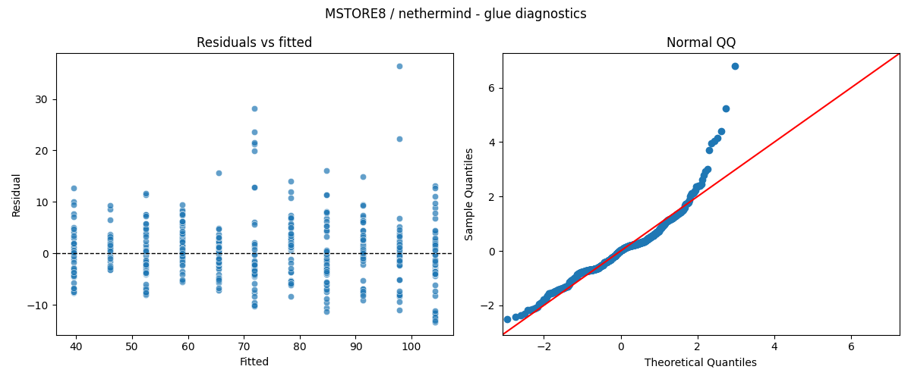

</details>

<details><summary><code>MUL</code> · nobs=132 · runtime_ms=4.277e-06 · p=1.00e-03 · R²=0.8499</summary>

```
==============================================================================
                           NNLS Regression Results                            
==============================================================================
Dep. Variable:          test_runtime_ms              R-squared:          0.850
Model:                  NNLS                    Adj. R-squared:          0.849
No. Observations:       132                               RMSE:          14.19
Df Residuals:           130                                MAE:          11.81
Df Model:               1      
==============================================================================
                      coef     std err     P-value      [0.025      0.975]
------------------------------------------------------------------------------
         const     10.8413      3.7914       0.001      3.4597     18.0335
           MUL      0.0000      0.0000       0.001      0.0000      0.0000
==============================================================================
Notes: Non-negative least squares with bootstrap inference (1000 iterations)
==============================================================================
```

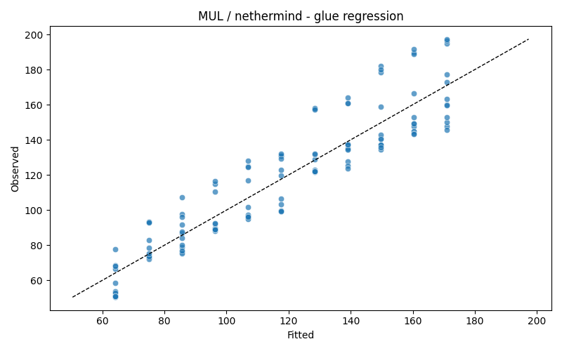

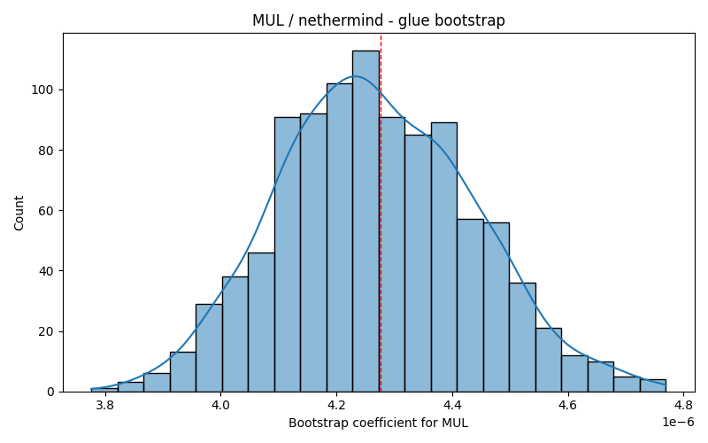

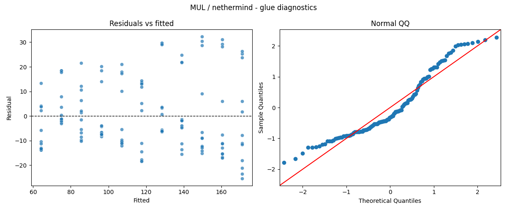

</details>

<details><summary><code>PC</code> · nobs=132 · runtime_ms=7.439e-07 · p=1.00e-03 · R²=0.9814</summary>

```
==============================================================================
                           NNLS Regression Results                            
==============================================================================
Dep. Variable:          test_runtime_ms              R-squared:          0.981
Model:                  NNLS                    Adj. R-squared:          0.981
No. Observations:       132                               RMSE:           3.06
Df Residuals:           130                                MAE:           2.39
Df Model:               1      
==============================================================================
                      coef     std err     P-value      [0.025      0.975]
------------------------------------------------------------------------------
         const      7.0458      0.9768       0.001      5.3285      8.9960
            PC      0.0000      0.0000       0.001      0.0000      0.0000
==============================================================================
Notes: Non-negative least squares with bootstrap inference (1000 iterations)
==============================================================================
```

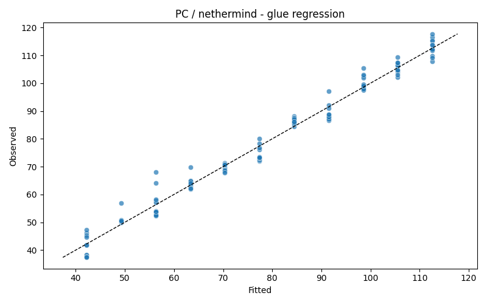

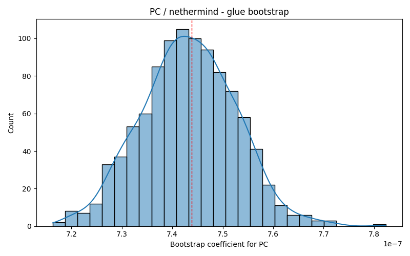

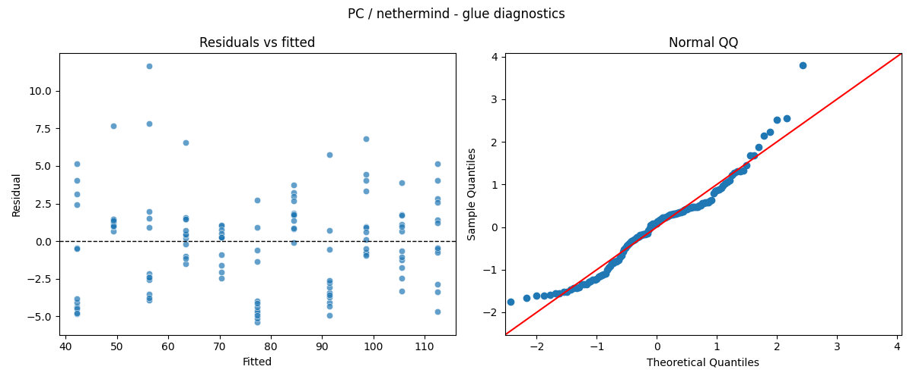

</details>

<details><summary><code>RETURNDATASIZE</code> · nobs=528 · runtime_ms=1.028e-06 · p=1.00e-03 · R²=0.7772</summary>

```
==============================================================================
                           NNLS Regression Results                            
==============================================================================
Dep. Variable:          test_runtime_ms              R-squared:          0.777
Model:                  NNLS                    Adj. R-squared:          0.777
No. Observations:       528                               RMSE:           8.69
Df Residuals:           526                                MAE:           3.64
Df Model:               1      
==============================================================================
                      coef     std err     P-value      [0.025      0.975]
------------------------------------------------------------------------------
         const      7.3130      1.3104       0.001      4.9470      9.9553
RETURNDATASIZE      0.0000      0.0000       0.001      0.0000      0.0000
==============================================================================
Notes: Non-negative least squares with bootstrap inference (1000 iterations)
==============================================================================
```

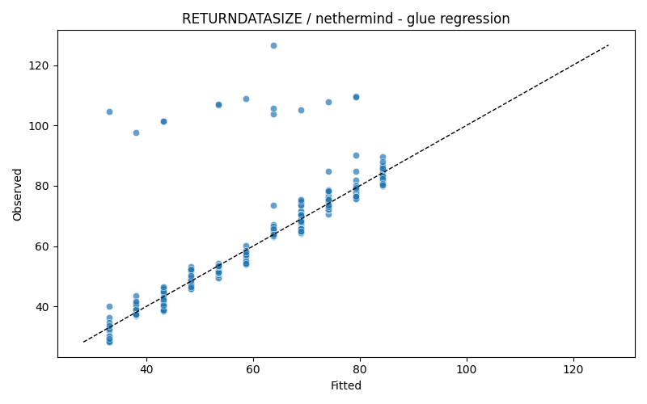

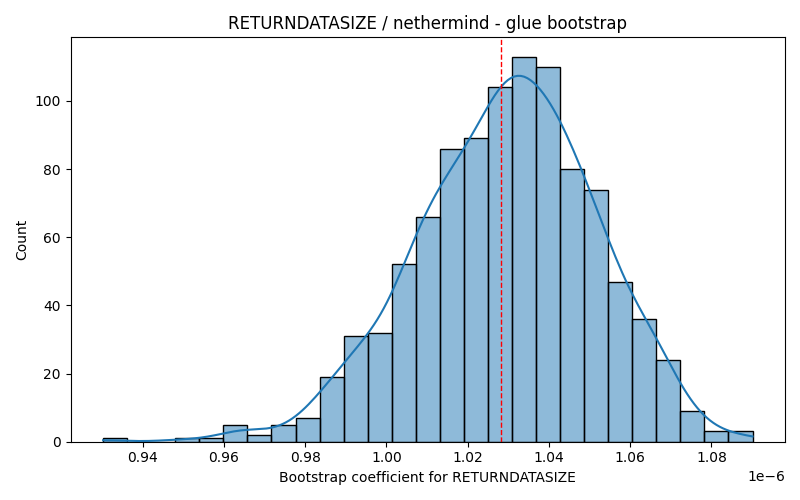

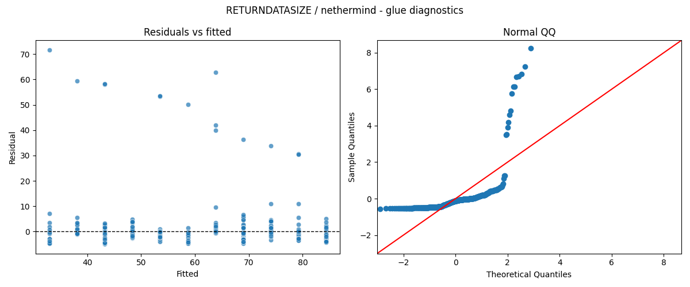

</details>

<details><summary><code>SELFBALANCE</code> · nobs=132 · runtime_ms=3.429e-06 · p=1.00e-03 · R²=0.7897</summary>

```
==============================================================================
                           NNLS Regression Results                            
==============================================================================
Dep. Variable:          test_runtime_ms              R-squared:          0.790
Model:                  NNLS                    Adj. R-squared:          0.788
No. Observations:       132                               RMSE:          21.87
Df Residuals:           130                                MAE:          16.18
Df Model:               1      
==============================================================================
                      coef     std err     P-value      [0.025      0.975]
------------------------------------------------------------------------------
         const     18.1867      5.4931       0.001      7.0983     28.1951
   SELFBALANCE      0.0000      0.0000       0.001      0.0000      0.0000
==============================================================================
Notes: Non-negative least squares with bootstrap inference (1000 iterations)
==============================================================================
```

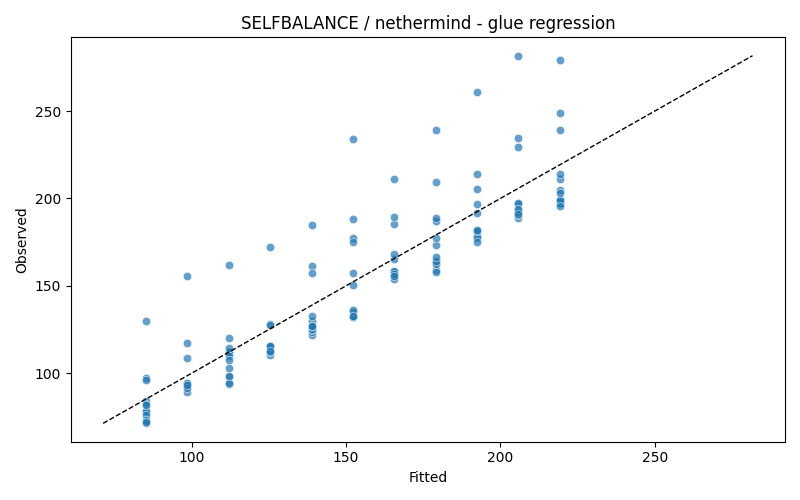

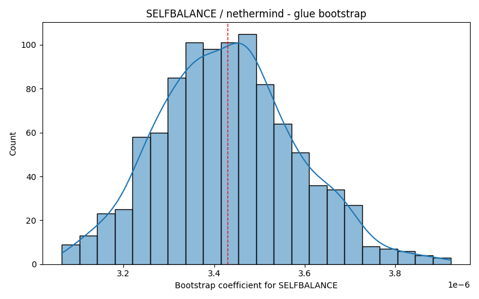

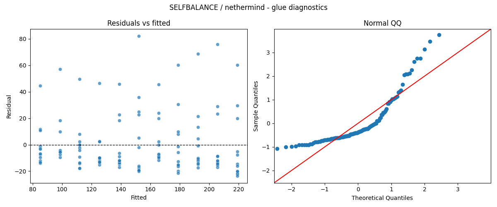

</details>

<details><summary><code>SUB</code> · nobs=132 · runtime_ms=2.07e-06 · p=1.00e-03 · R²=0.9594</summary>

```
==============================================================================
                           NNLS Regression Results                            
==============================================================================
Dep. Variable:          test_runtime_ms              R-squared:          0.959
Model:                  NNLS                    Adj. R-squared:          0.959
No. Observations:       132                               RMSE:           4.48
Df Residuals:           130                                MAE:           3.43
Df Model:               1      
==============================================================================
                      coef     std err     P-value      [0.025      0.975]
------------------------------------------------------------------------------
         const      5.7369      1.2340       0.001      3.2413      8.0522
           SUB      0.0000      0.0000       0.001      0.0000      0.0000
==============================================================================
Notes: Non-negative least squares with bootstrap inference (1000 iterations)
==============================================================================
```

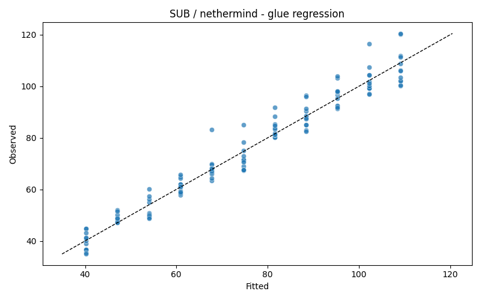

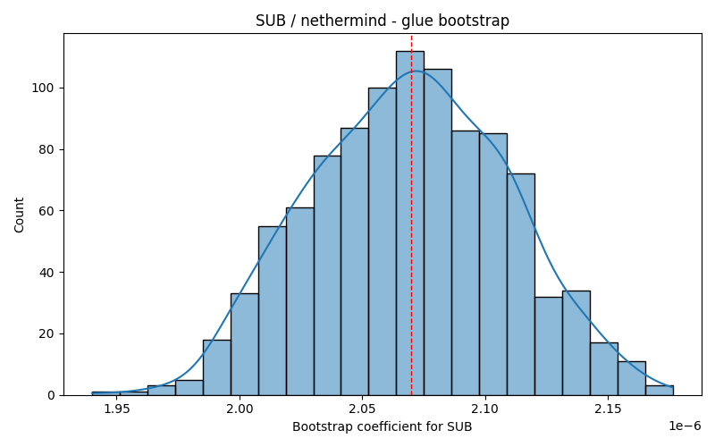

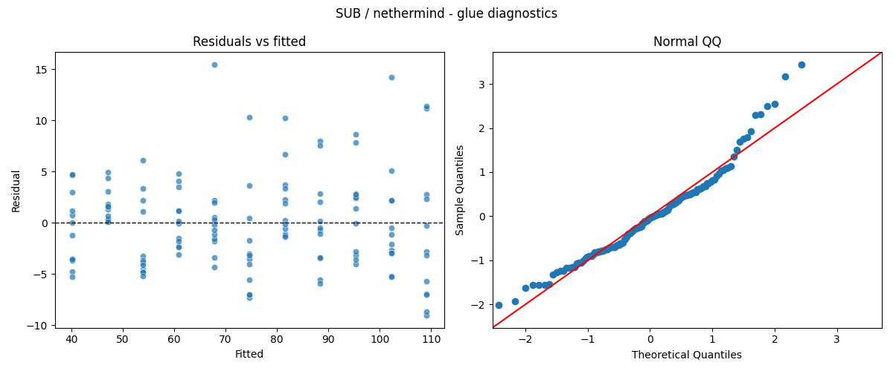

</details>

### Mixed glue (tier B) · nethermind

<details><summary><code>JUMP</code> · nobs=132 · runtime_ms=3.302e-06 · p=1.00e-03 · R²=0.7058</summary>

```
==============================================================================
                           NNLS Regression Results                            
==============================================================================
Dep. Variable:          test_runtime_ms              R-squared:          0.706
Model:                  NNLS                    Adj. R-squared:          0.704
No. Observations:       132                               RMSE:           7.93
Df Residuals:           130                                MAE:           3.75
Df Model:               1      
==============================================================================
                      coef     std err     P-value      [0.025      0.975]
------------------------------------------------------------------------------
         const      7.9157      2.9512       0.001      3.1063     14.5774
          JUMP      0.0000      0.0000       0.001      0.0000      0.0000
==============================================================================
Notes: Non-negative least squares with bootstrap inference (1000 iterations)
==============================================================================
```

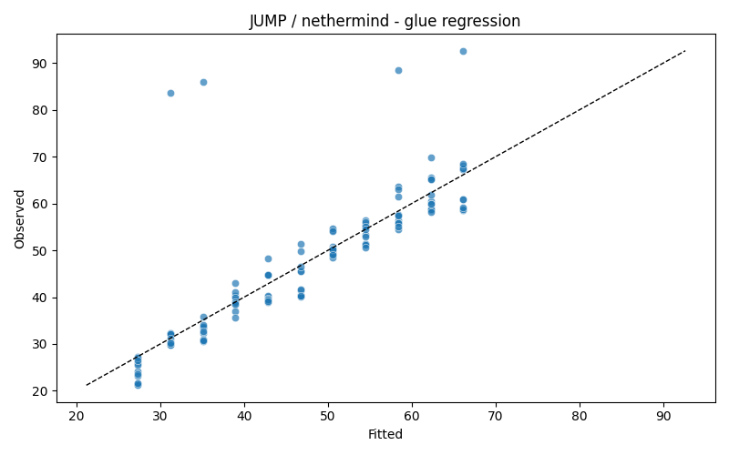

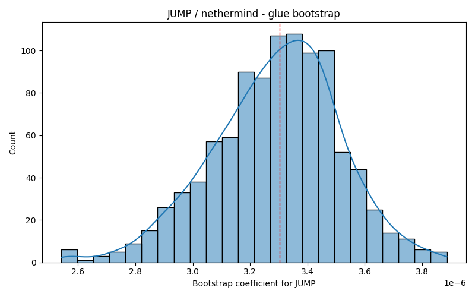

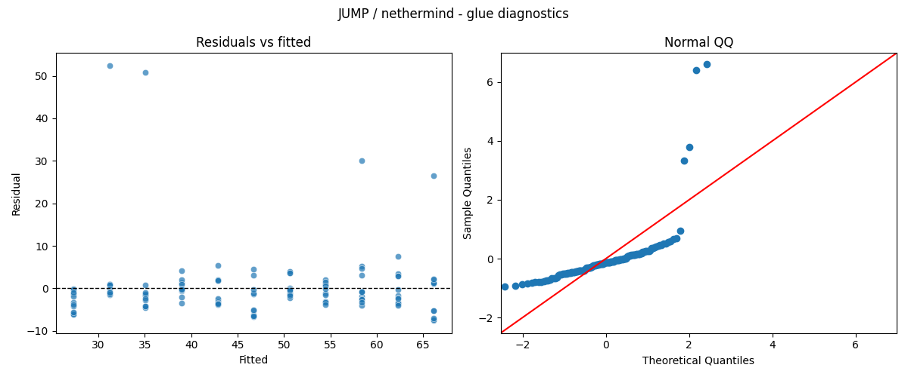

</details>

<details><summary><code>KECCAK256</code> · nobs=2112 · runtime_ms=0 · p=1.00e+00 · R²=1.11e-16</summary>

```
==============================================================================
                           NNLS Regression Results                            
==============================================================================
Dep. Variable:          test_runtime_ms              R-squared:          0.000
Model:                  NNLS                    Adj. R-squared:         -0.000
No. Observations:       2112                              RMSE:         216.12
Df Residuals:           2110                               MAE:         178.21
Df Model:               1      
==============================================================================
                      coef     std err     P-value      [0.025      0.975]
------------------------------------------------------------------------------
         const    319.8135      4.7256       0.001    310.3667    329.2605
     KECCAK256      0.0000      0.0000       1.000      0.0000      0.0000
==============================================================================
Notes: Non-negative least squares with bootstrap inference (1000 iterations)
==============================================================================
```

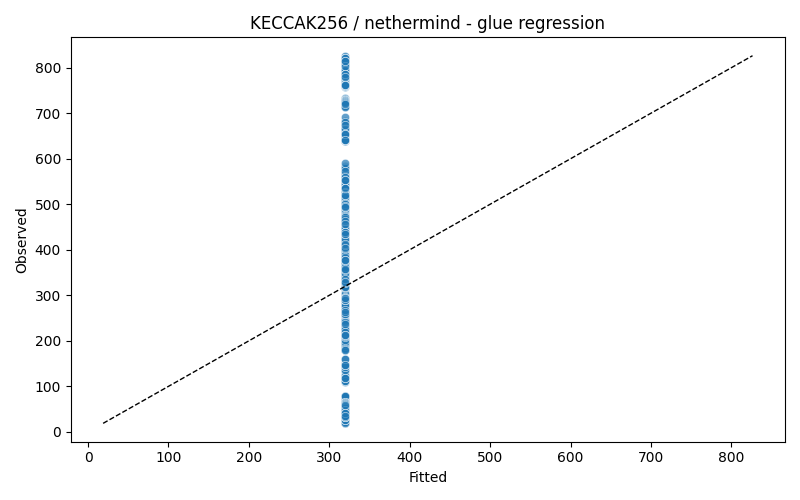

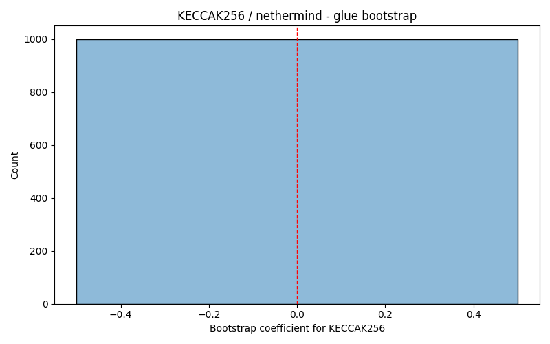

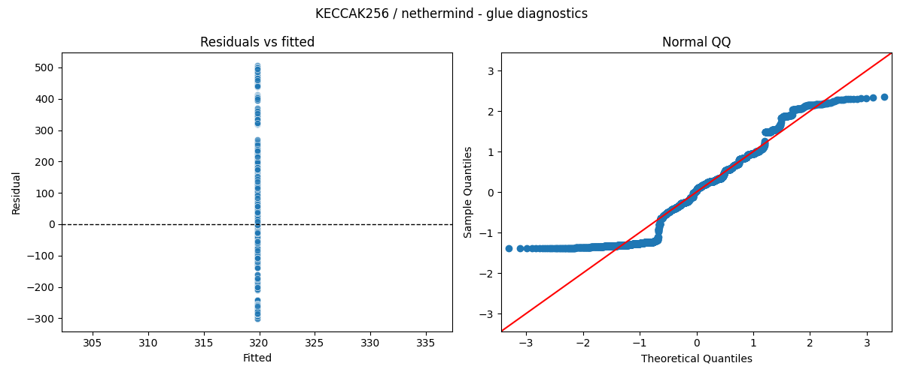

</details>

## reth

| glue_opcode | nobs | glue_runtime_ms | p_value | rsquared |
| --- | --- | --- | --- | --- |
| `ISZERO` | 99 | 1.7e-06 | 1.00e-03 | 0.9162 |
| `JUMPDEST` | 99 | 5.274e-07 | 1.00e-03 | 0.9672 |
| `SWAP` | 1584 | 6.258e-07 | 1.00e-03 | 0.921 |
| `CALLDATASIZE` | 5863 | 8.72e-07 | 1.00e-03 | 0.9176 |
| `DUP` | 5863 | 6.023e-07 | 1.00e-03 | 0.9176 |
| `GAS` | 5863 | 7.06e-07 | 1.00e-03 | 0.9176 |
| `MLOAD` | 5863 | 2.116e-06 | 1.00e-03 | 0.9176 |
| `PUSH` | 5863 | 7.077e-07 | 1.00e-03 | 0.9176 |
| `PUSH0` | 5863 | 5.842e-07 | 1.00e-03 | 0.9176 |
| `STATICCALL` | 5863 | 7.77e-05 | 1.00e-03 | 0.9176 |
| `ADD` | 99 | 1.315e-06 | 1.00e-03 | 0.948 |
| `AND` | 99 | 1.308e-06 | 1.00e-03 | 0.9333 |
| `CALLDATACOPY` | 2376 | 4.206e-06 | 1.00e-03 | 0.9136 |
| `CALLDATALOAD` | 396 | 2.59e-05 | 1.88e-01 | 0.001848 |
| `DIV` | 99 | 9.477e-06 | 1.00e-03 | 0.9374 |
| `EXP` | 99 | 0.0006053 | 1.00e-03 | 0.9595 |
| `GT` | 99 | 1.557e-06 | 1.00e-03 | 0.9518 |
| `JUMPI` | 99 | 2.22e-06 | 1.00e-03 | 0.9433 |
| `LT` | 99 | 2.658e-06 | 1.00e-03 | 0.5895 |
| `MSTORE` | 495 | 3.675e-06 | 1.00e-03 | 0.4103 |
| `MSTORE8` | 495 | 2.246e-06 | 1.00e-03 | 0.8793 |
| `MUL` | 99 | 2.086e-06 | 1.00e-03 | 0.9631 |
| `PC` | 99 | 9.51e-07 | 1.00e-03 | 0.9477 |
| `RETURNDATASIZE` | 396 | 1.379e-06 | 1.00e-03 | 0.9489 |
| `SELFBALANCE` | 99 | 7.266e-06 | 1.00e-03 | 0.9496 |
| `SUB` | 99 | 1.389e-06 | 1.00e-03 | 0.9597 |
| `JUMP` | 99 | 4.171e-06 | 1.00e-03 | 0.9364 |
| `KECCAK256` | 1584 | 0 | 1.00e+00 | -2.22e-16 |

### Cycle glue — joint fit · reth

<details><summary>Joint NNLS regression summary</summary>

```
==============================================================================
                           NNLS Regression Results                            
==============================================================================
Dep. Variable:          test_runtime_ms              R-squared:          0.918
Model:                  NNLS                    Adj. R-squared:          0.917
No. Observations:       5863                              RMSE:           6.56
Df Residuals:           5855                               MAE:           4.14
Df Model:               7      
==============================================================================
                      coef     std err     P-value      [0.025      0.975]
------------------------------------------------------------------------------
         const      8.0011      0.2662       0.001      7.4860      8.5667
  CALLDATASIZE      0.0000      0.0000       0.001      0.0000      0.0000
           DUP      0.0000      0.0000       0.001      0.0000      0.0000
           GAS      0.0000      0.0000       0.001      0.0000      0.0000
         MLOAD      0.0000      0.0000       0.001      0.0000      0.0000
          PUSH      0.0000      0.0000       0.001      0.0000      0.0000
         PUSH0      0.0000      0.0000       0.001      0.0000      0.0000
    STATICCALL      0.0001      0.0000       0.001      0.0001      0.0001
==============================================================================
Notes: Non-negative least squares with bootstrap inference (1000 iterations)
==============================================================================
```

</details>

<details><summary><code>CALLDATASIZE</code> · nobs=5863 · runtime_ms=8.72e-07 · p=1.00e-03 · R²=0.9176</summary>

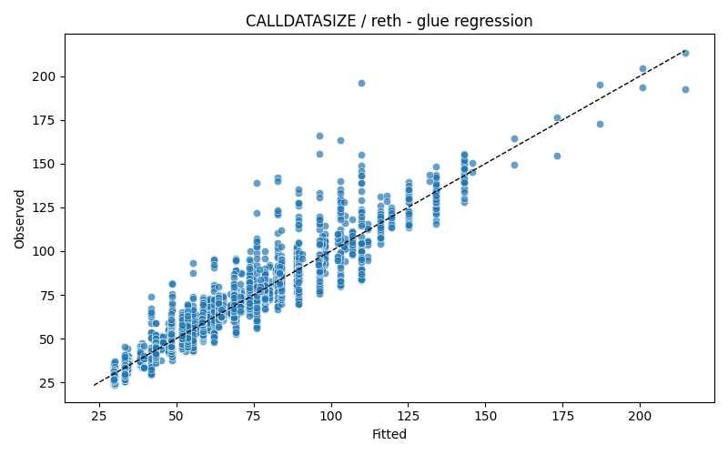

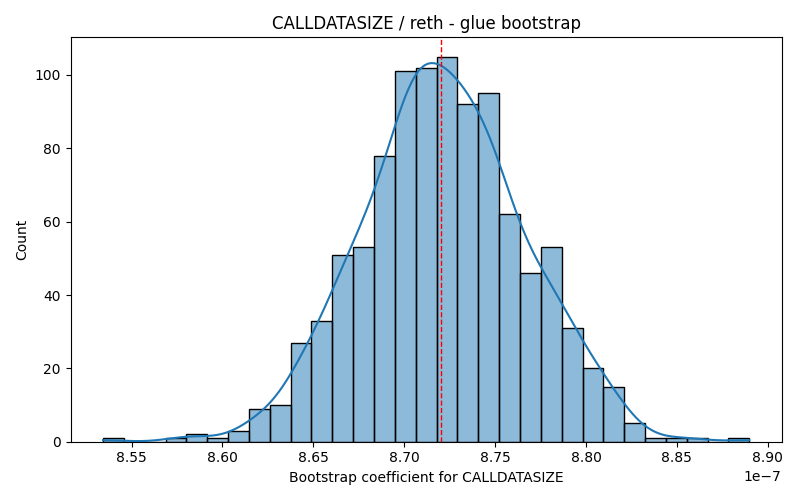


</details>

<details><summary><code>DUP</code> · nobs=5863 · runtime_ms=6.023e-07 · p=1.00e-03 · R²=0.9176</summary>


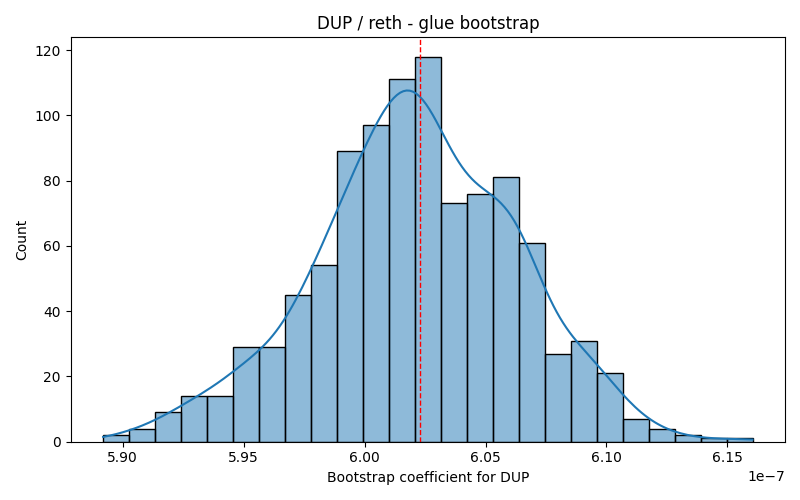


</details>

<details><summary><code>GAS</code> · nobs=5863 · runtime_ms=7.06e-07 · p=1.00e-03 · R²=0.9176</summary>


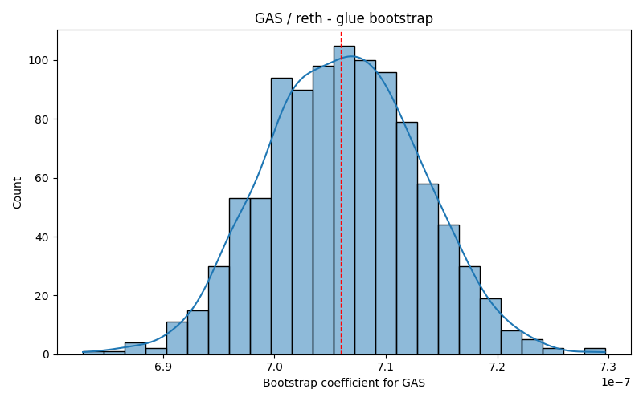


</details>

<details><summary><code>MLOAD</code> · nobs=5863 · runtime_ms=2.116e-06 · p=1.00e-03 · R²=0.9176</summary>

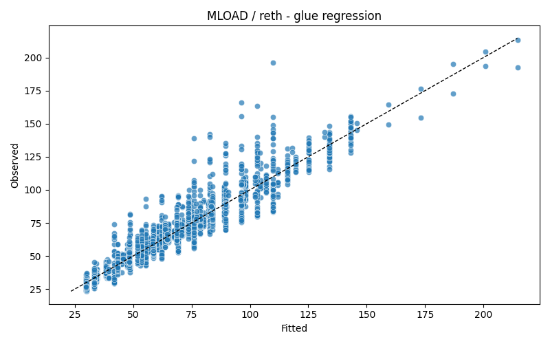

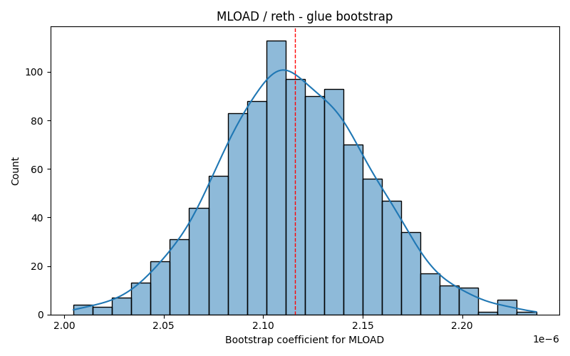


</details>

<details><summary><code>PUSH</code> · nobs=5863 · runtime_ms=7.077e-07 · p=1.00e-03 · R²=0.9176</summary>


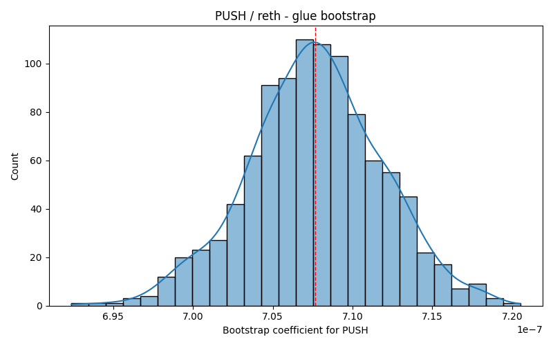

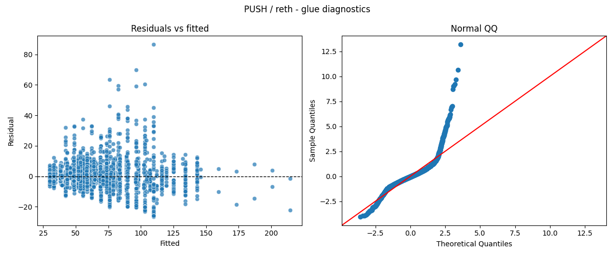

</details>

<details><summary><code>PUSH0</code> · nobs=5863 · runtime_ms=5.842e-07 · p=1.00e-03 · R²=0.9176</summary>


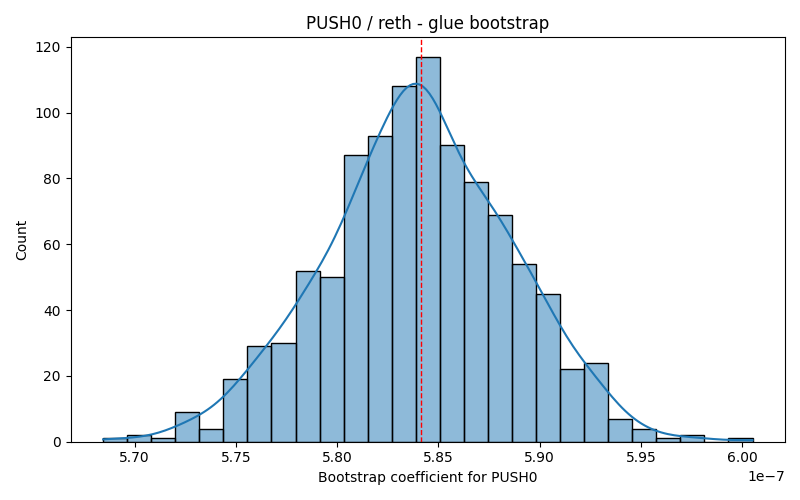


</details>

<details><summary><code>STATICCALL</code> · nobs=5863 · runtime_ms=7.77e-05 · p=1.00e-03 · R²=0.9176</summary>


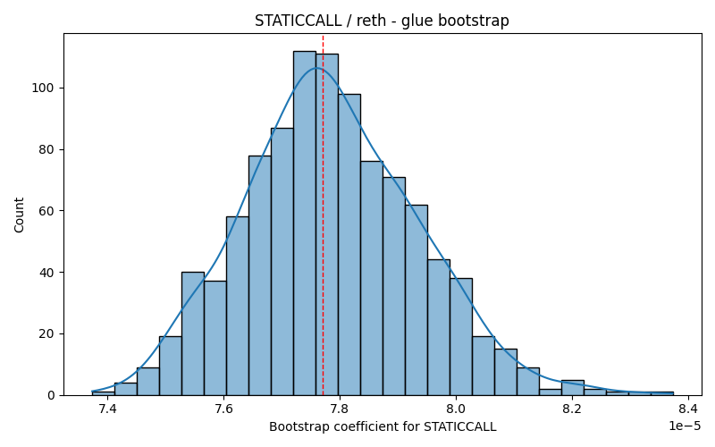


</details>

### Pure glue · reth

<details><summary><code>ISZERO</code> · nobs=99 · runtime_ms=1.7e-06 · p=1.00e-03 · R²=0.9162</summary>

```
==============================================================================
                           NNLS Regression Results                            
==============================================================================
Dep. Variable:          test_runtime_ms              R-squared:          0.916
Model:                  NNLS                    Adj. R-squared:          0.915
No. Observations:       99                                RMSE:          10.83
Df Residuals:           97                                 MAE:           8.47
Df Model:               1      
==============================================================================
                      coef     std err     P-value      [0.025      0.975]
------------------------------------------------------------------------------
         const     19.6419      2.8412       0.001     14.4340     25.2582
        ISZERO      0.0000      0.0000       0.001      0.0000      0.0000
==============================================================================
Notes: Non-negative least squares with bootstrap inference (1000 iterations)
==============================================================================
```

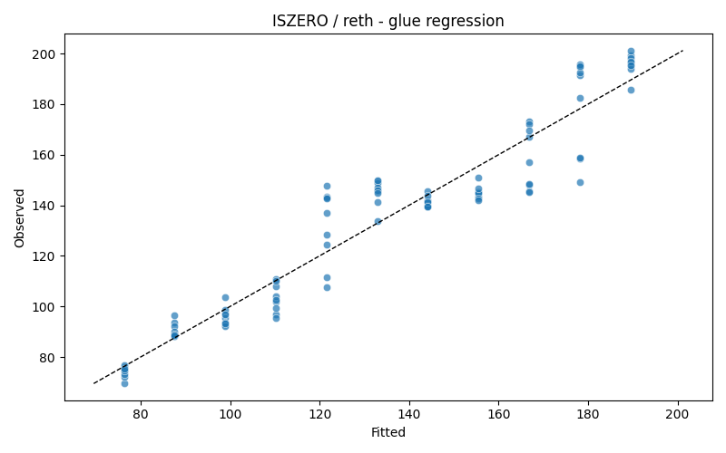

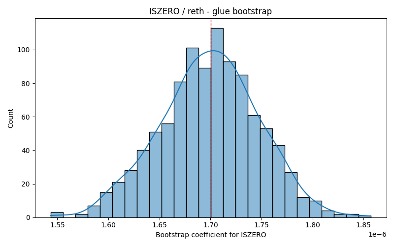

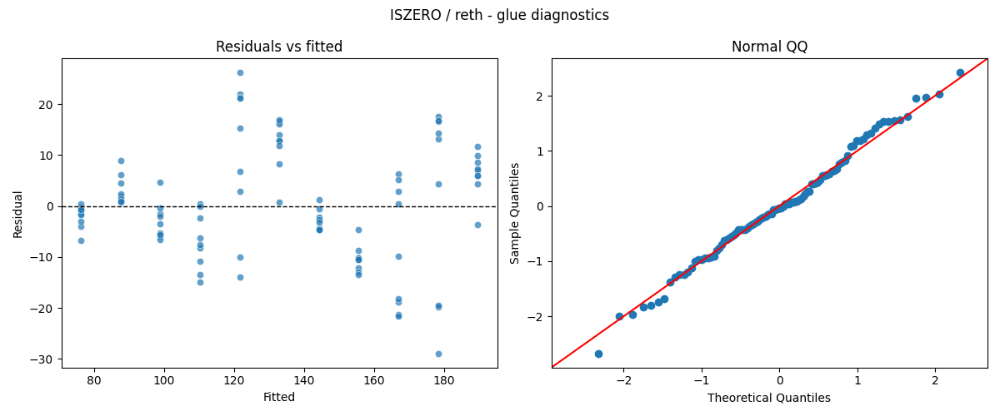

</details>

<details><summary><code>JUMPDEST</code> · nobs=99 · runtime_ms=5.274e-07 · p=1.00e-03 · R²=0.9672</summary>

```
==============================================================================
                           NNLS Regression Results                            
==============================================================================
Dep. Variable:          test_runtime_ms              R-squared:          0.967
Model:                  NNLS                    Adj. R-squared:          0.967
No. Observations:       99                                RMSE:           6.14
Df Residuals:           97                                 MAE:           4.81
Df Model:               1      
==============================================================================
                      coef     std err     P-value      [0.025      0.975]
------------------------------------------------------------------------------
         const      4.1027      1.7979       0.010      0.6185      7.7362
      JUMPDEST      0.0000      0.0000       0.001      0.0000      0.0000
==============================================================================
Notes: Non-negative least squares with bootstrap inference (1000 iterations)
==============================================================================
```

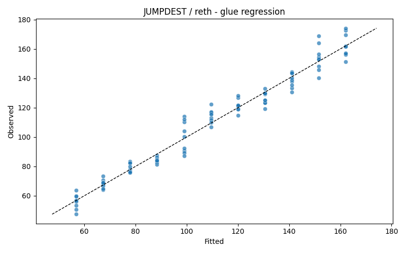

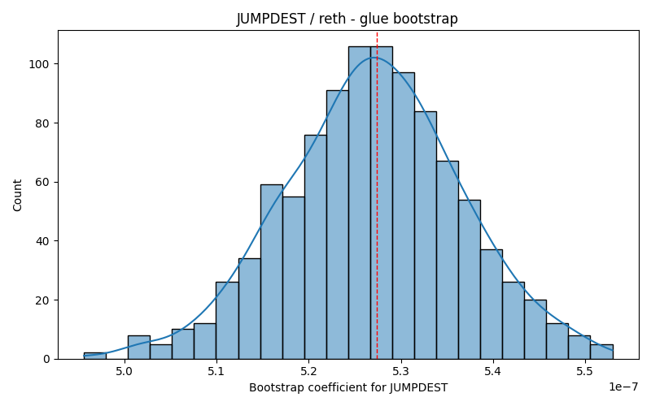

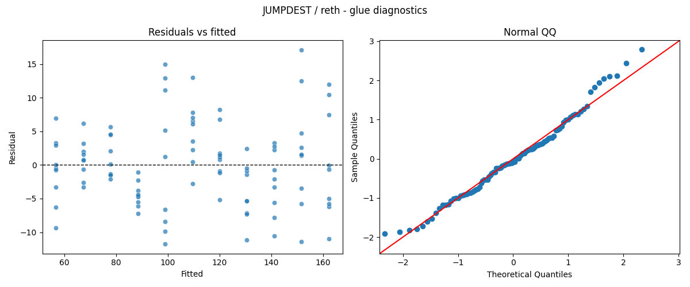

</details>

<details><summary><code>SWAP</code> · nobs=1584 · runtime_ms=6.258e-07 · p=1.00e-03 · R²=0.921</summary>

```
==============================================================================
                           NNLS Regression Results                            
==============================================================================
Dep. Variable:          test_runtime_ms              R-squared:          0.921
Model:                  NNLS                    Adj. R-squared:          0.921
No. Observations:       1584                              RMSE:           3.86
Df Residuals:           1582                               MAE:           2.91
Df Model:               1      
==============================================================================
                      coef     std err     P-value      [0.025      0.975]
------------------------------------------------------------------------------
         const      8.3850      0.2951       0.001      7.7852      8.9728
          SWAP      0.0000      0.0000       0.001      0.0000      0.0000
==============================================================================
Notes: Non-negative least squares with bootstrap inference (1000 iterations)
==============================================================================
```

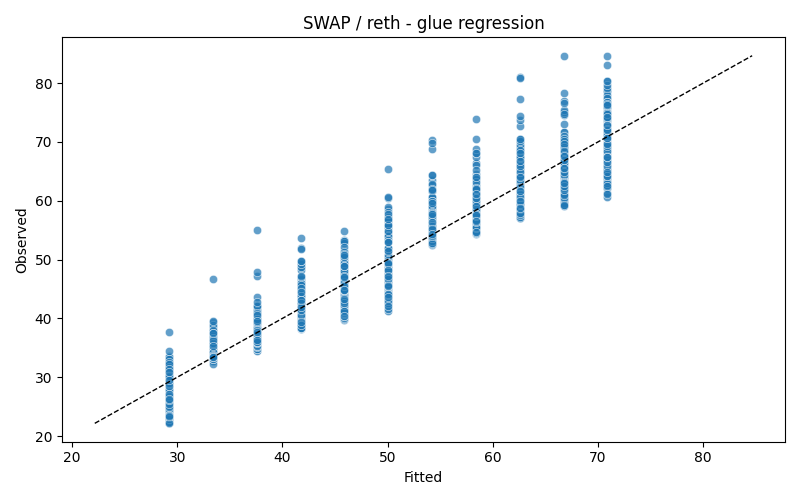

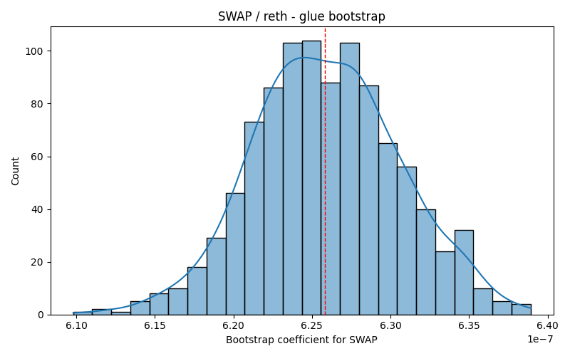

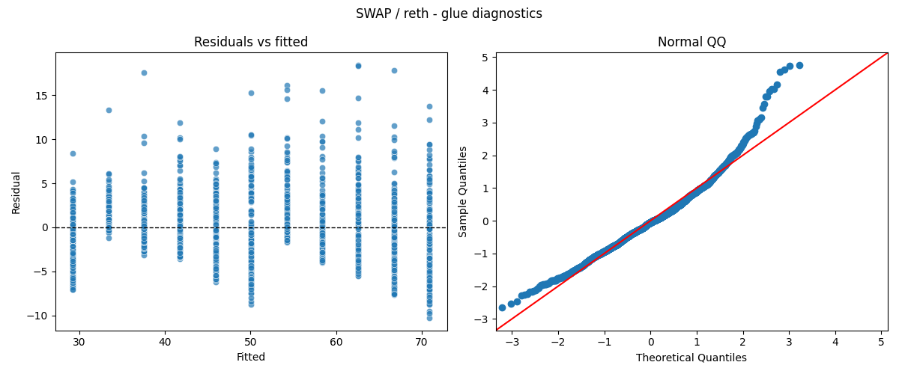

</details>

### Mixed glue (tier A) · reth

<details><summary><code>ADD</code> · nobs=99 · runtime_ms=1.315e-06 · p=1.00e-03 · R²=0.948</summary>

```
==============================================================================
                           NNLS Regression Results                            
==============================================================================
Dep. Variable:          test_runtime_ms              R-squared:          0.948
Model:                  NNLS                    Adj. R-squared:          0.948
No. Observations:       99                                RMSE:           3.24
Df Residuals:           97                                 MAE:           2.48
Df Model:               1      
==============================================================================
                      coef     std err     P-value      [0.025      0.975]
------------------------------------------------------------------------------
         const      7.7639      0.9091       0.001      5.9534      9.5492
           ADD      0.0000      0.0000       0.001      0.0000      0.0000
==============================================================================
Notes: Non-negative least squares with bootstrap inference (1000 iterations)
==============================================================================
```

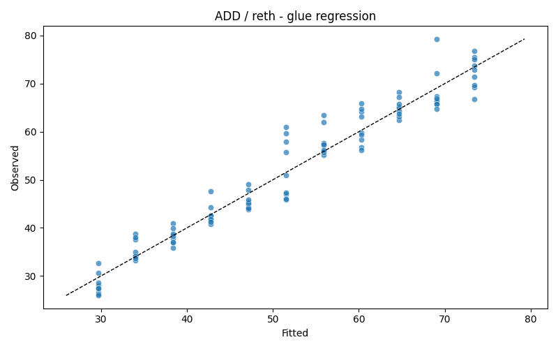

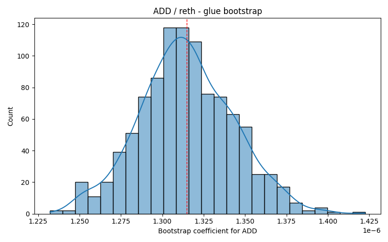

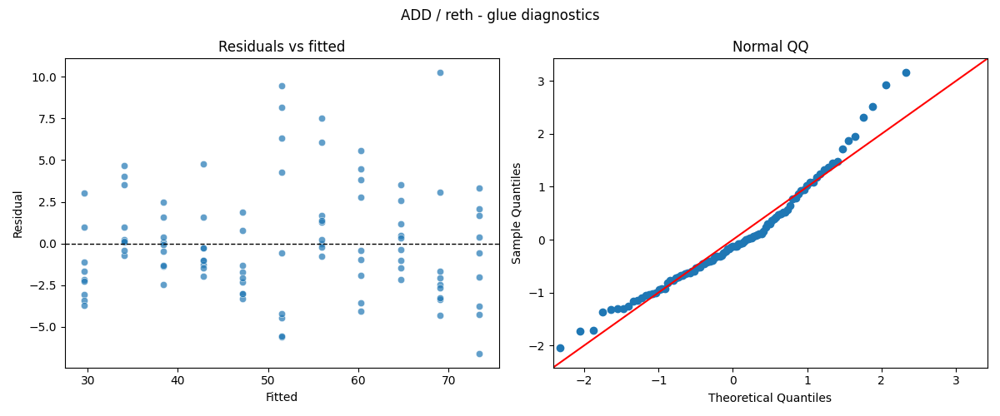

</details>

<details><summary><code>AND</code> · nobs=99 · runtime_ms=1.308e-06 · p=1.00e-03 · R²=0.9333</summary>

```
==============================================================================
                           NNLS Regression Results                            
==============================================================================
Dep. Variable:          test_runtime_ms              R-squared:          0.933
Model:                  NNLS                    Adj. R-squared:          0.933
No. Observations:       99                                RMSE:           3.68
Df Residuals:           97                                 MAE:           2.86
Df Model:               1      
==============================================================================
                      coef     std err     P-value      [0.025      0.975]
------------------------------------------------------------------------------
         const      5.3224      1.1212       0.001      3.1748      7.5670
           AND      0.0000      0.0000       0.001      0.0000      0.0000
==============================================================================
Notes: Non-negative least squares with bootstrap inference (1000 iterations)
==============================================================================
```

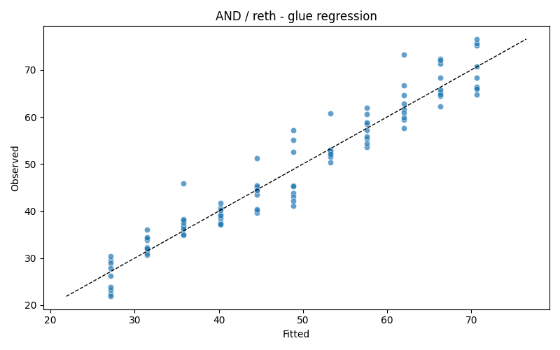

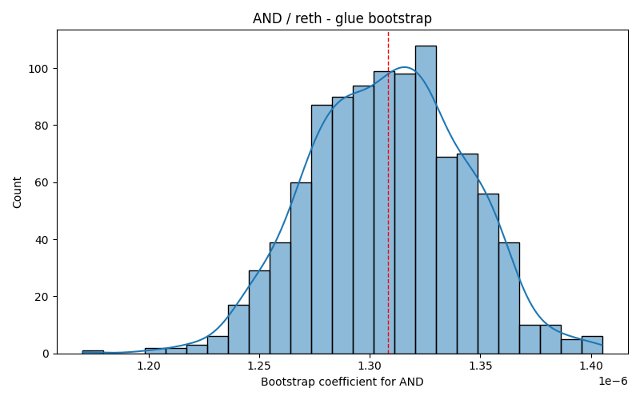

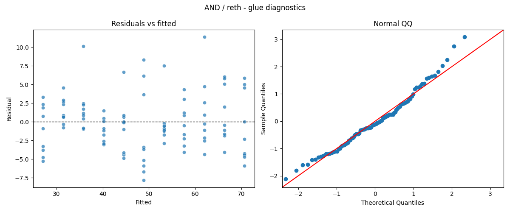

</details>

<details><summary><code>CALLDATACOPY</code> · nobs=2376 · runtime_ms=4.206e-06 · p=1.00e-03 · R²=0.9136</summary>

```
==============================================================================
                           NNLS Regression Results                            
==============================================================================
Dep. Variable:          test_runtime_ms              R-squared:          0.914
Model:                  NNLS                    Adj. R-squared:          0.914
No. Observations:       2376                              RMSE:           9.73
Df Residuals:           2374                               MAE:           7.52
Df Model:               1      
==============================================================================
                      coef     std err     P-value      [0.025      0.975]
------------------------------------------------------------------------------
         const     15.3318      0.2219       0.001     14.8858     15.7772
  CALLDATACOPY      0.0000      0.0000       0.001      0.0000      0.0000
==============================================================================
Notes: Non-negative least squares with bootstrap inference (1000 iterations)
==============================================================================
```

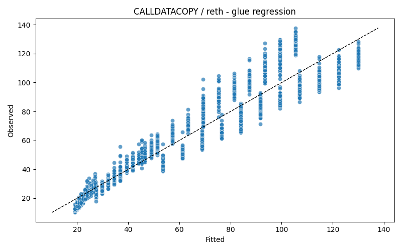

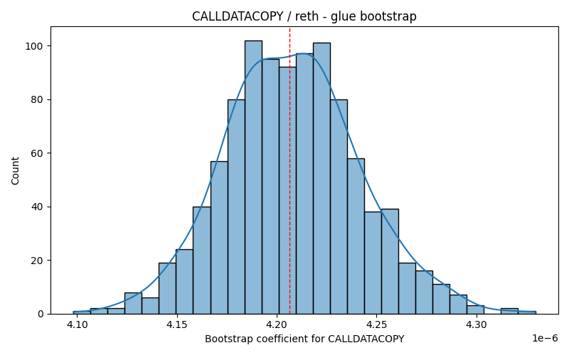

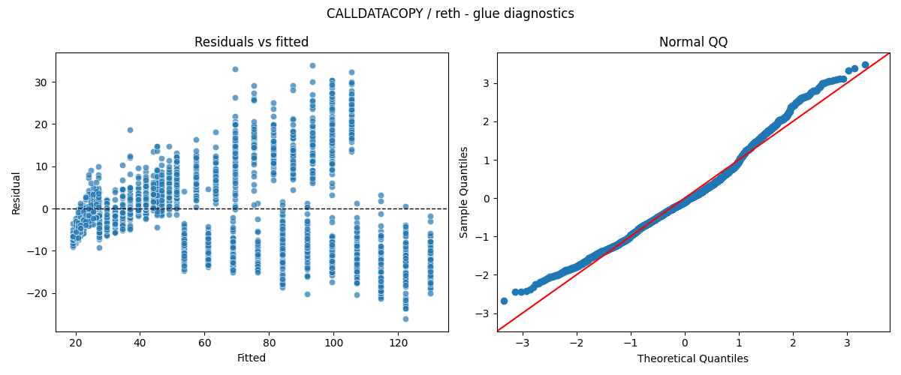

</details>

<details><summary><code>CALLDATALOAD</code> · nobs=396 · runtime_ms=2.59e-05 · p=1.88e-01 · R²=0.001848</summary>

```
==============================================================================
                           NNLS Regression Results                            
==============================================================================
Dep. Variable:          test_runtime_ms              R-squared:          0.002
Model:                  NNLS                    Adj. R-squared:         -0.001
No. Observations:       396                               RMSE:           2.31
Df Residuals:           394                                MAE:           1.74
Df Model:               1      
==============================================================================
                      coef     std err     P-value      [0.025      0.975]
------------------------------------------------------------------------------
         const      3.3312      0.3655       0.001      2.4859      3.8363
  CALLDATALOAD      0.0000      0.0000       0.188      0.0000      0.0001
==============================================================================
Notes: Non-negative least squares with bootstrap inference (1000 iterations)
==============================================================================
```

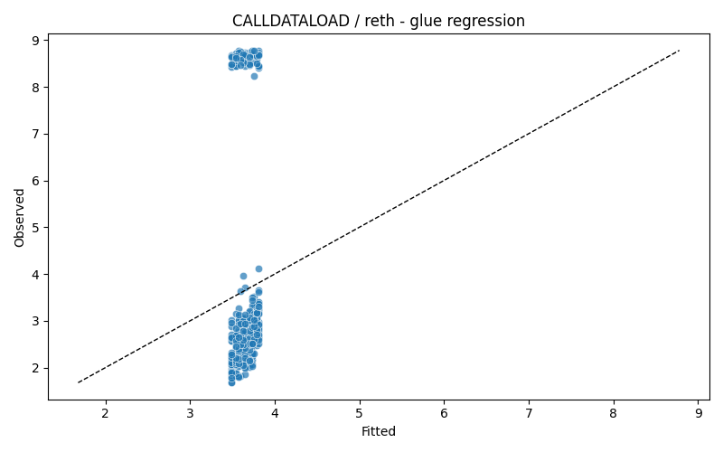

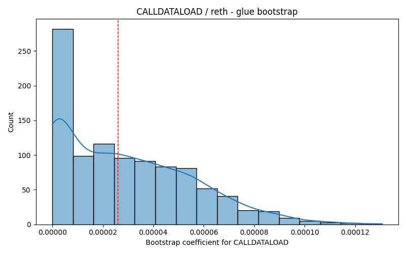

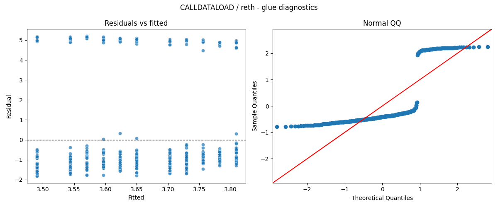

</details>

<details><summary><code>DIV</code> · nobs=99 · runtime_ms=9.477e-06 · p=1.00e-03 · R²=0.9374</summary>

```
==============================================================================
                           NNLS Regression Results                            
==============================================================================
Dep. Variable:          test_runtime_ms              R-squared:          0.937
Model:                  NNLS                    Adj. R-squared:          0.937
No. Observations:       99                                RMSE:          19.35
Df Residuals:           97                                 MAE:          15.87
Df Model:               1      
==============================================================================
                      coef     std err     P-value      [0.025      0.975]
------------------------------------------------------------------------------
         const     35.0526      7.5843       0.001     20.3126     49.5817
           DIV      0.0000      0.0000       0.001      0.0000      0.0000
==============================================================================
Notes: Non-negative least squares with bootstrap inference (1000 iterations)
==============================================================================
```

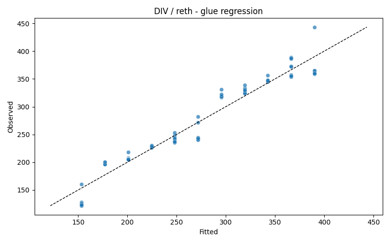

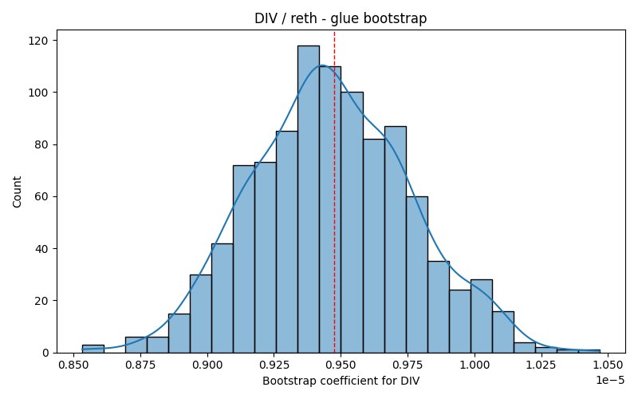

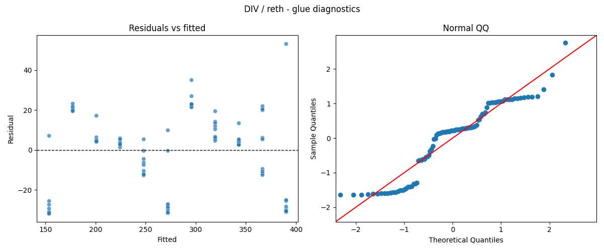

</details>

<details><summary><code>EXP</code> · nobs=99 · runtime_ms=0.0006053 · p=1.00e-03 · R²=0.9595</summary>

```
==============================================================================
                           NNLS Regression Results                            
==============================================================================
Dep. Variable:          test_runtime_ms              R-squared:          0.959
Model:                  NNLS                    Adj. R-squared:          0.959
No. Observations:       99                                RMSE:           4.87
Df Residuals:           97                                 MAE:           3.48
Df Model:               1      
==============================================================================
                      coef     std err     P-value      [0.025      0.975]
------------------------------------------------------------------------------
         const      8.5499      1.4786       0.001      5.6299     11.5390
           EXP      0.0006      0.0000       0.001      0.0006      0.0006
==============================================================================
Notes: Non-negative least squares with bootstrap inference (1000 iterations)
==============================================================================
```

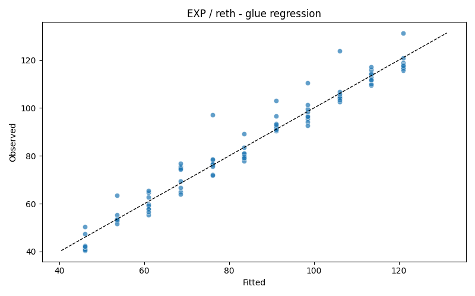

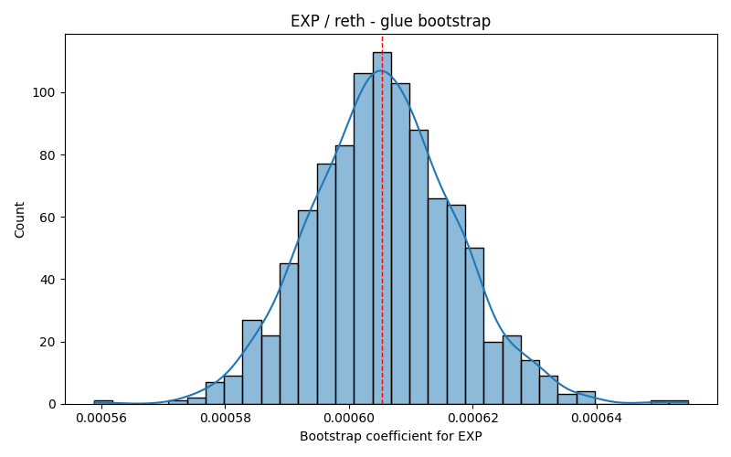

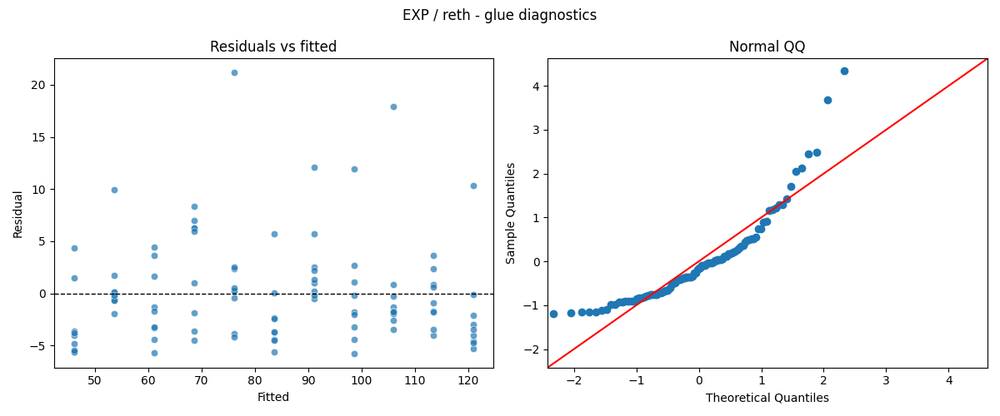

</details>

<details><summary><code>GT</code> · nobs=99 · runtime_ms=1.557e-06 · p=1.00e-03 · R²=0.9518</summary>

```
==============================================================================
                           NNLS Regression Results                            
==============================================================================
Dep. Variable:          test_runtime_ms              R-squared:          0.952
Model:                  NNLS                    Adj. R-squared:          0.951
No. Observations:       99                                RMSE:           3.69
Df Residuals:           97                                 MAE:           2.75
Df Model:               1      
==============================================================================
                      coef     std err     P-value      [0.025      0.975]
------------------------------------------------------------------------------
         const      7.3513      1.3557       0.001      4.6681     10.0212
            GT      0.0000      0.0000       0.001      0.0000      0.0000
==============================================================================
Notes: Non-negative least squares with bootstrap inference (1000 iterations)
==============================================================================
```

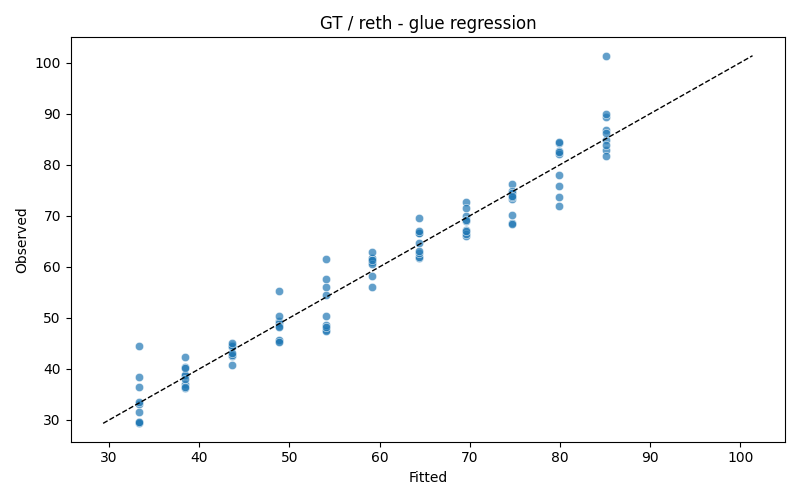

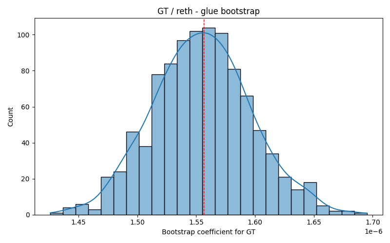

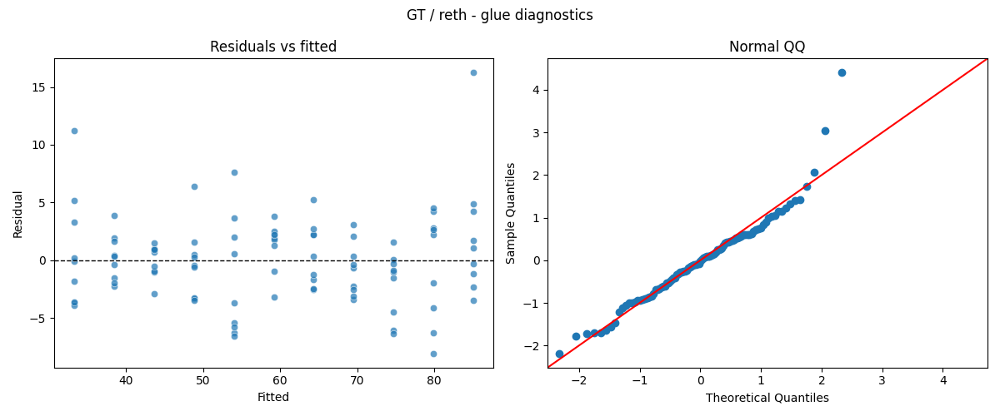

</details>

<details><summary><code>JUMPI</code> · nobs=99 · runtime_ms=2.22e-06 · p=1.00e-03 · R²=0.9433</summary>

```
==============================================================================
                           NNLS Regression Results                            
==============================================================================
Dep. Variable:          test_runtime_ms              R-squared:          0.943
Model:                  NNLS                    Adj. R-squared:          0.943
No. Observations:       99                                RMSE:           2.46
Df Residuals:           97                                 MAE:           1.89
Df Model:               1      
==============================================================================
                      coef     std err     P-value      [0.025      0.975]
------------------------------------------------------------------------------
         const      6.8846      0.8605       0.001      5.3145      8.7202
         JUMPI      0.0000      0.0000       0.001      0.0000      0.0000
==============================================================================
Notes: Non-negative least squares with bootstrap inference (1000 iterations)
==============================================================================
```

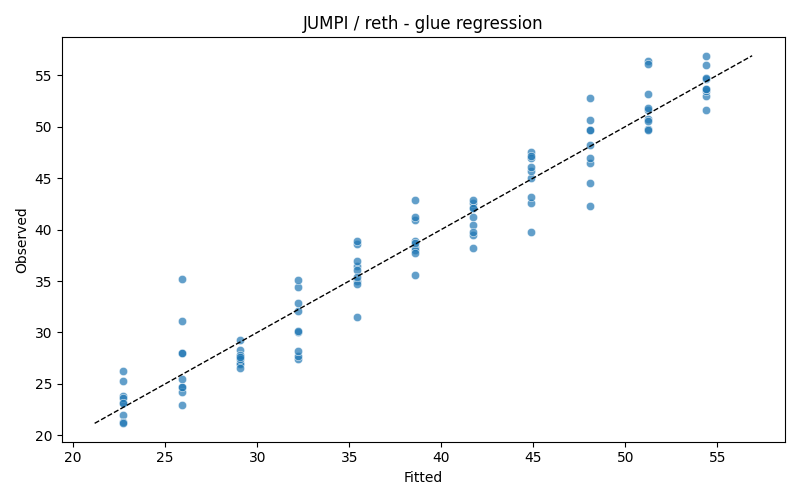

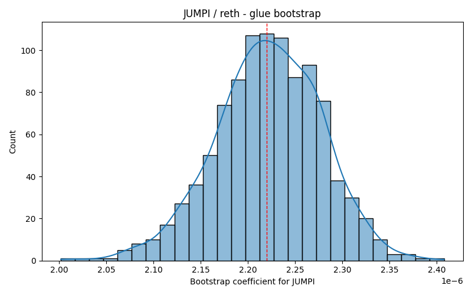

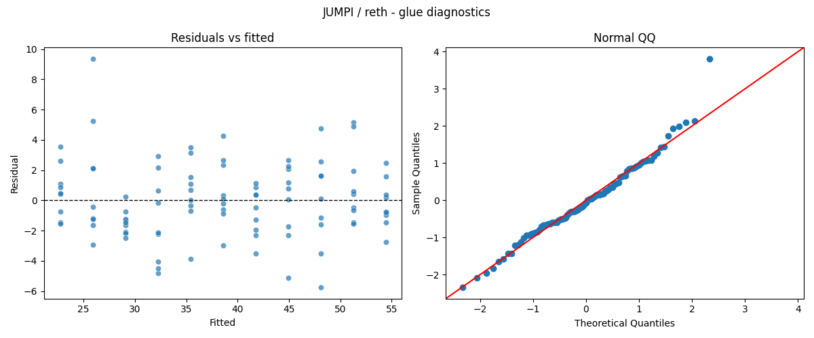

</details>

<details><summary><code>LT</code> · nobs=99 · runtime_ms=2.658e-06 · p=1.00e-03 · R²=0.5895</summary>

```
==============================================================================
                           NNLS Regression Results                            
==============================================================================
Dep. Variable:          test_runtime_ms              R-squared:          0.590
Model:                  NNLS                    Adj. R-squared:          0.585
No. Observations:       99                                RMSE:          23.36
Df Residuals:           97                                 MAE:          18.48
Df Model:               1      
==============================================================================
                      coef     std err     P-value      [0.025      0.975]
------------------------------------------------------------------------------
         const     17.2367      7.5585       0.013      1.6211     31.3893
            LT      0.0000      0.0000       0.001      0.0000      0.0000
==============================================================================
Notes: Non-negative least squares with bootstrap inference (1000 iterations)
==============================================================================
```

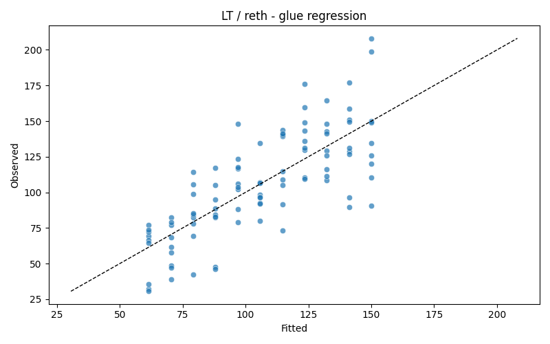

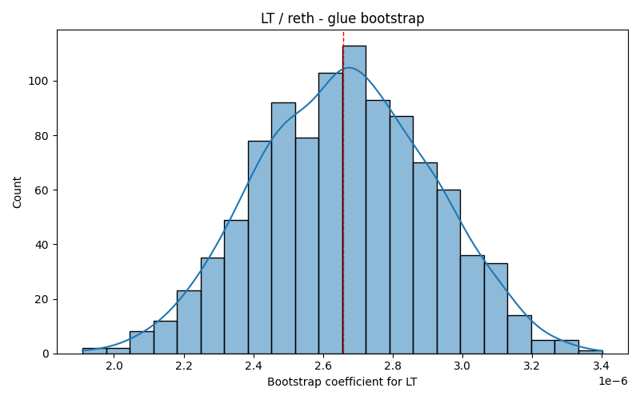

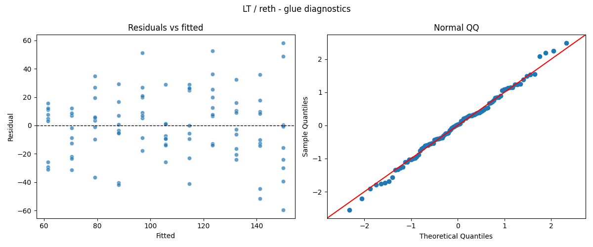

</details>

<details><summary><code>MSTORE</code> · nobs=495 · runtime_ms=3.675e-06 · p=1.00e-03 · R²=0.4103</summary>

```
==============================================================================
                           NNLS Regression Results                            
==============================================================================
Dep. Variable:          test_runtime_ms              R-squared:          0.410
Model:                  NNLS                    Adj. R-squared:          0.409
No. Observations:       495                               RMSE:          30.94
Df Residuals:           493                                MAE:          28.45
Df Model:               1      
==============================================================================
                      coef     std err     P-value      [0.025      0.975]
------------------------------------------------------------------------------
         const     13.7278      3.9992       0.001      5.8157     21.6771
        MSTORE      0.0000      0.0000       0.001      0.0000      0.0000
==============================================================================
Notes: Non-negative least squares with bootstrap inference (1000 iterations)
==============================================================================
```

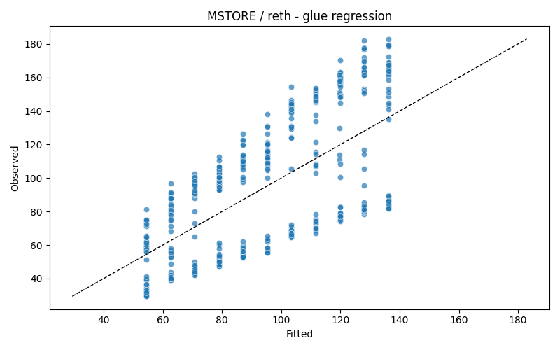

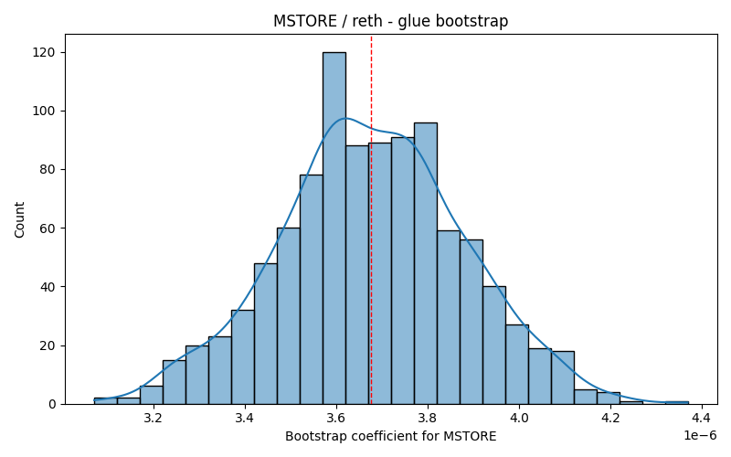

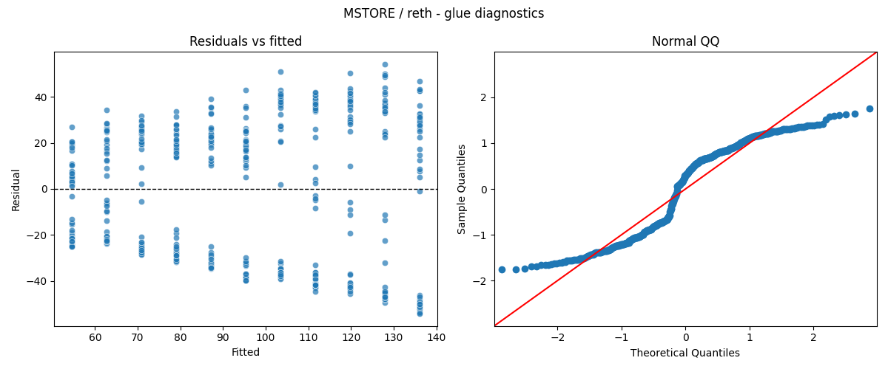

</details>

<details><summary><code>MSTORE8</code> · nobs=495 · runtime_ms=2.246e-06 · p=1.00e-03 · R²=0.8793</summary>

```
==============================================================================
                           NNLS Regression Results                            
==============================================================================
Dep. Variable:          test_runtime_ms              R-squared:          0.879
Model:                  NNLS                    Adj. R-squared:          0.879
No. Observations:       495                               RMSE:           5.84
Df Residuals:           493                                MAE:           3.02
Df Model:               1      
==============================================================================
                      coef     std err     P-value      [0.025      0.975]
------------------------------------------------------------------------------
         const      7.3241      1.0338       0.001      5.4750      9.3856
       MSTORE8      0.0000      0.0000       0.001      0.0000      0.0000
==============================================================================
Notes: Non-negative least squares with bootstrap inference (1000 iterations)
==============================================================================
```

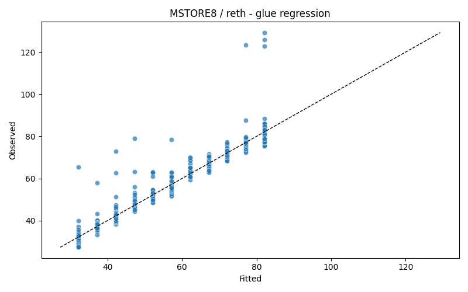

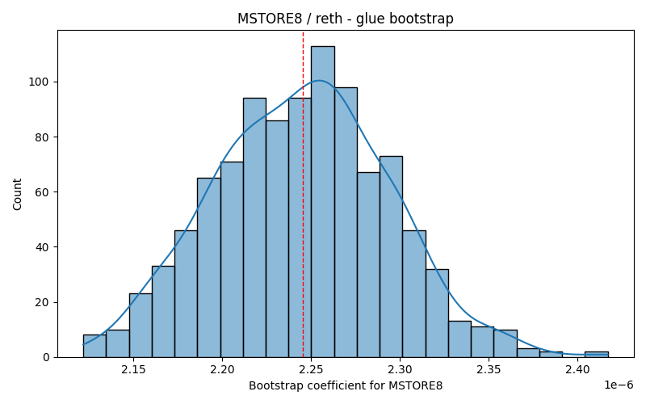

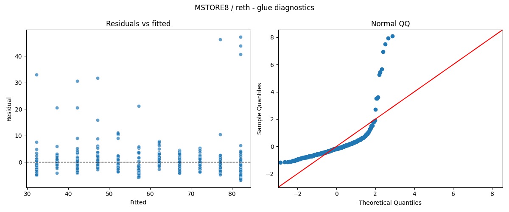

</details>

<details><summary><code>MUL</code> · nobs=99 · runtime_ms=2.086e-06 · p=1.00e-03 · R²=0.9631</summary>

```
==============================================================================
                           NNLS Regression Results                            
==============================================================================
Dep. Variable:          test_runtime_ms              R-squared:          0.963
Model:                  NNLS                    Adj. R-squared:          0.963
No. Observations:       99                                RMSE:           3.23
Df Residuals:           97                                 MAE:           2.40
Df Model:               1      
==============================================================================
                      coef     std err     P-value      [0.025      0.975]
------------------------------------------------------------------------------
         const      5.6344      0.9331       0.001      3.9500      7.6705
           MUL      0.0000      0.0000       0.001      0.0000      0.0000
==============================================================================
Notes: Non-negative least squares with bootstrap inference (1000 iterations)
==============================================================================
```

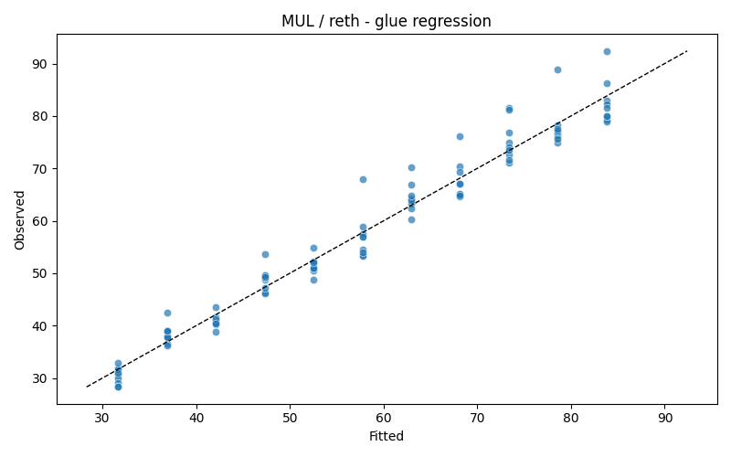

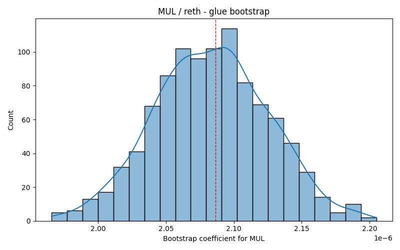

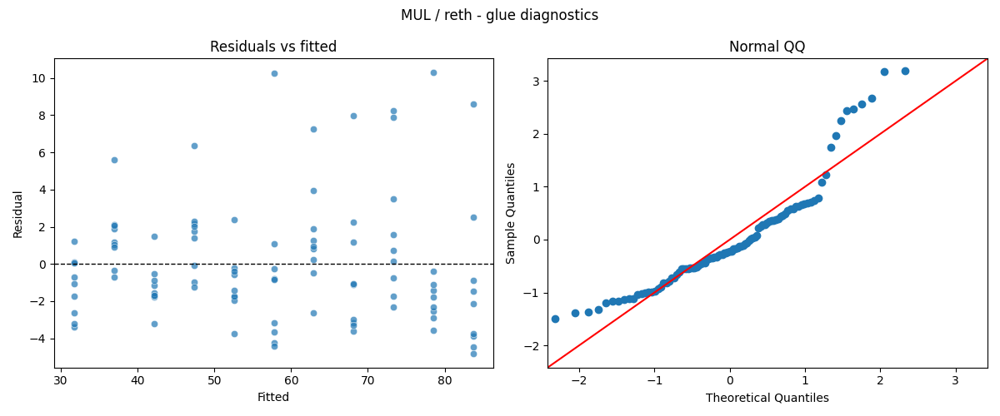

</details>

<details><summary><code>PC</code> · nobs=99 · runtime_ms=9.51e-07 · p=1.00e-03 · R²=0.9477</summary>

```
==============================================================================
                           NNLS Regression Results                            
==============================================================================
Dep. Variable:          test_runtime_ms              R-squared:          0.948
Model:                  NNLS                    Adj. R-squared:          0.947
No. Observations:       99                                RMSE:           6.68
Df Residuals:           97                                 MAE:           5.13
Df Model:               1      
==============================================================================
                      coef     std err     P-value      [0.025      0.975]
------------------------------------------------------------------------------
         const      8.7416      1.8499       0.001      5.1576     12.4290
            PC      0.0000      0.0000       0.001      0.0000      0.0000
==============================================================================
Notes: Non-negative least squares with bootstrap inference (1000 iterations)
==============================================================================
```

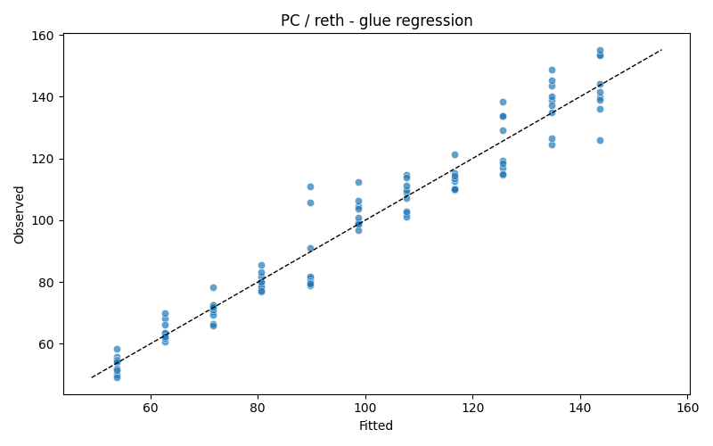

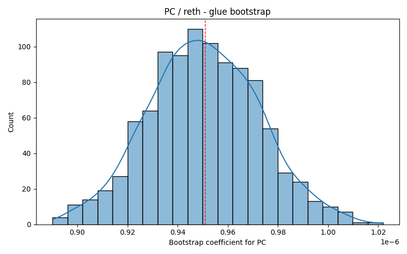

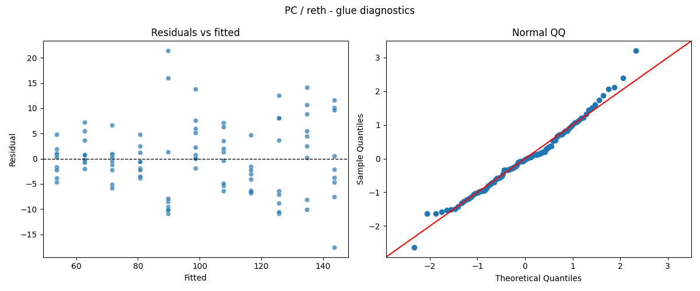

</details>

<details><summary><code>RETURNDATASIZE</code> · nobs=396 · runtime_ms=1.379e-06 · p=1.00e-03 · R²=0.9489</summary>

```
==============================================================================
                           NNLS Regression Results                            
==============================================================================
Dep. Variable:          test_runtime_ms              R-squared:          0.949
Model:                  NNLS                    Adj. R-squared:          0.949
No. Observations:       396                               RMSE:           5.05
Df Residuals:           394                                MAE:           3.88
Df Model:               1      
==============================================================================
                      coef     std err     P-value      [0.025      0.975]
------------------------------------------------------------------------------
         const      8.1512      0.7543       0.001      6.6276      9.6052
RETURNDATASIZE      0.0000      0.0000       0.001      0.0000      0.0000
==============================================================================
Notes: Non-negative least squares with bootstrap inference (1000 iterations)
==============================================================================
```

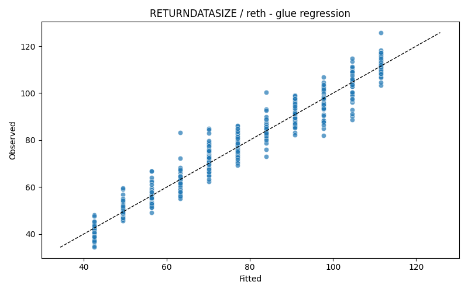

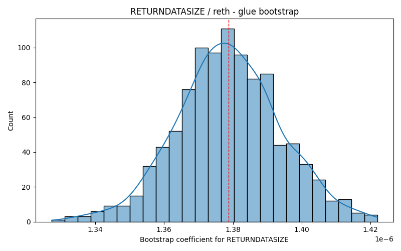

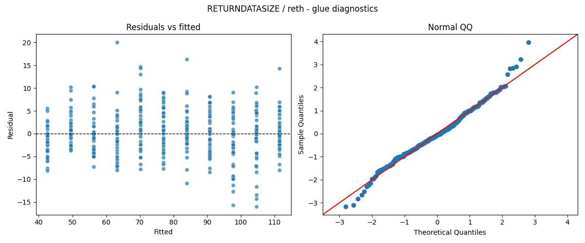

</details>

<details><summary><code>SELFBALANCE</code> · nobs=99 · runtime_ms=7.266e-06 · p=1.00e-03 · R²=0.9496</summary>

```
==============================================================================
                           NNLS Regression Results                            
==============================================================================
Dep. Variable:          test_runtime_ms              R-squared:          0.950
Model:                  NNLS                    Adj. R-squared:          0.949
No. Observations:       99                                RMSE:          20.70
Df Residuals:           97                                 MAE:          15.06
Df Model:               1      
==============================================================================
                      coef     std err     P-value      [0.025      0.975]
------------------------------------------------------------------------------
         const     29.5884      7.0997       0.001     15.4902     43.1081
   SELFBALANCE      0.0000      0.0000       0.001      0.0000      0.0000
==============================================================================
Notes: Non-negative least squares with bootstrap inference (1000 iterations)
==============================================================================
```

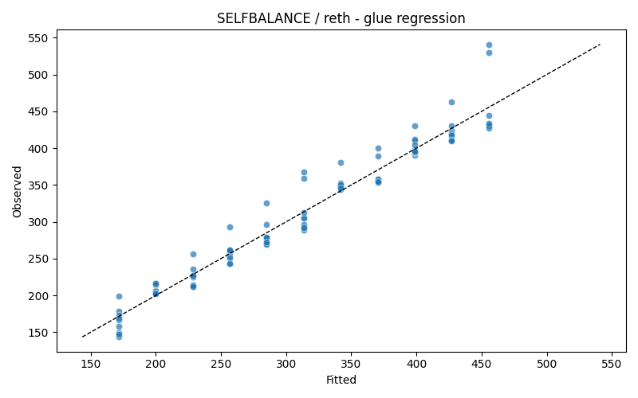

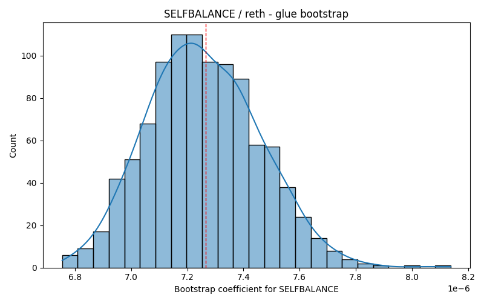

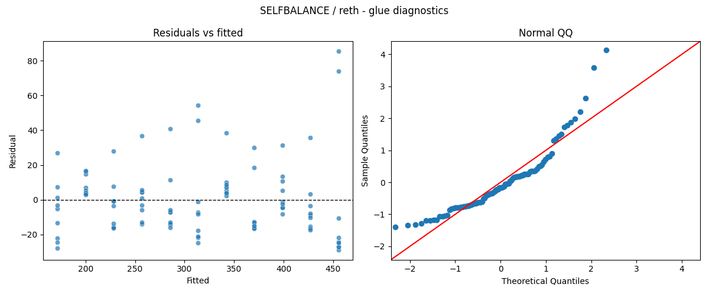

</details>

<details><summary><code>SUB</code> · nobs=99 · runtime_ms=1.389e-06 · p=1.00e-03 · R²=0.9597</summary>

```
==============================================================================
                           NNLS Regression Results                            
==============================================================================
Dep. Variable:          test_runtime_ms              R-squared:          0.960
Model:                  NNLS                    Adj. R-squared:          0.959
No. Observations:       99                                RMSE:           3.00
Df Residuals:           97                                 MAE:           2.26
Df Model:               1      
==============================================================================
                      coef     std err     P-value      [0.025      0.975]
------------------------------------------------------------------------------
         const      7.4452      1.0054       0.001      5.3641      9.4664
           SUB      0.0000      0.0000       0.001      0.0000      0.0000
==============================================================================
Notes: Non-negative least squares with bootstrap inference (1000 iterations)
==============================================================================
```

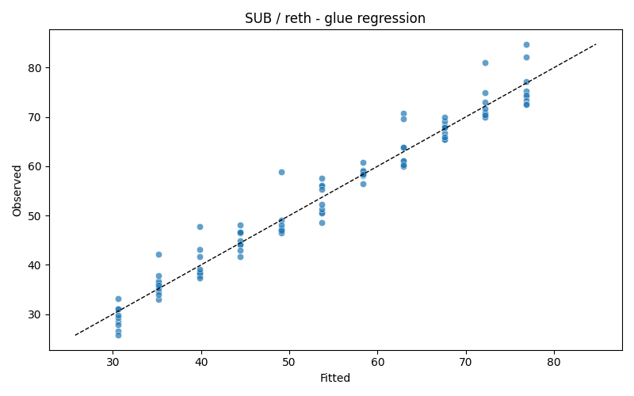

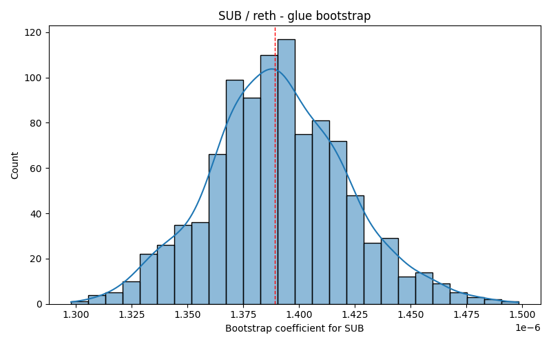

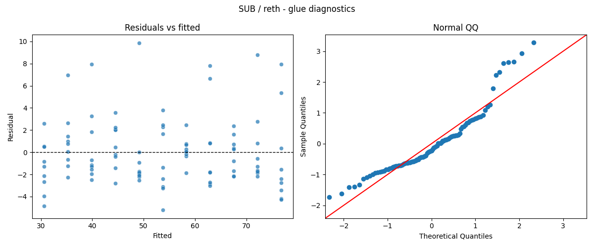

</details>

### Mixed glue (tier B) · reth

<details><summary><code>JUMP</code> · nobs=99 · runtime_ms=4.171e-06 · p=1.00e-03 · R²=0.9364</summary>

```
==============================================================================
                           NNLS Regression Results                            
==============================================================================
Dep. Variable:          test_runtime_ms              R-squared:          0.936
Model:                  NNLS                    Adj. R-squared:          0.936
No. Observations:       99                                RMSE:           4.04
Df Residuals:           97                                 MAE:           2.88
Df Model:               1      
==============================================================================
                      coef     std err     P-value      [0.025      0.975]
------------------------------------------------------------------------------
         const      8.1335      1.2423       0.001      5.9511     10.6203
          JUMP      0.0000      0.0000       0.001      0.0000      0.0000
==============================================================================
Notes: Non-negative least squares with bootstrap inference (1000 iterations)
==============================================================================
```

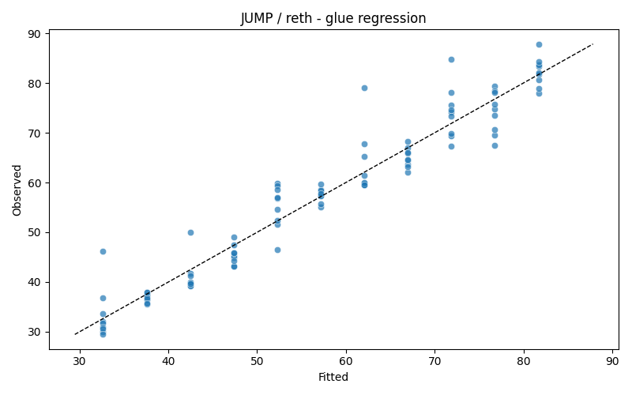

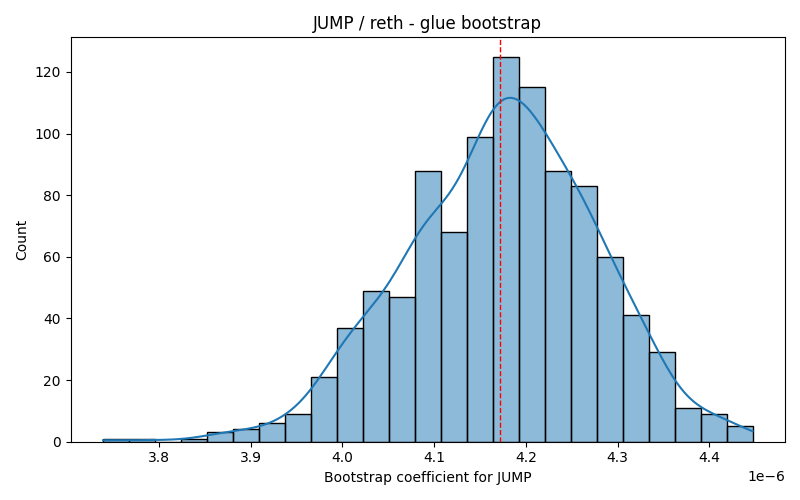

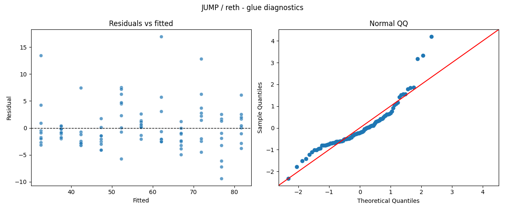

</details>

<details><summary><code>KECCAK256</code> · nobs=1584 · runtime_ms=0 · p=1.00e+00 · R²=-2.22e-16</summary>

```
==============================================================================
                           NNLS Regression Results                            
==============================================================================
Dep. Variable:          test_runtime_ms              R-squared:         -0.000
Model:                  NNLS                    Adj. R-squared:         -0.001
No. Observations:       1584                              RMSE:         298.08
Df Residuals:           1582                               MAE:         247.22
Df Model:               1      
==============================================================================
                      coef     std err     P-value      [0.025      0.975]
------------------------------------------------------------------------------
         const    437.8710      7.1887       0.001    423.3154    451.9474
     KECCAK256      0.0000      0.0000       1.000      0.0000      0.0000
==============================================================================
Notes: Non-negative least squares with bootstrap inference (1000 iterations)
==============================================================================
```

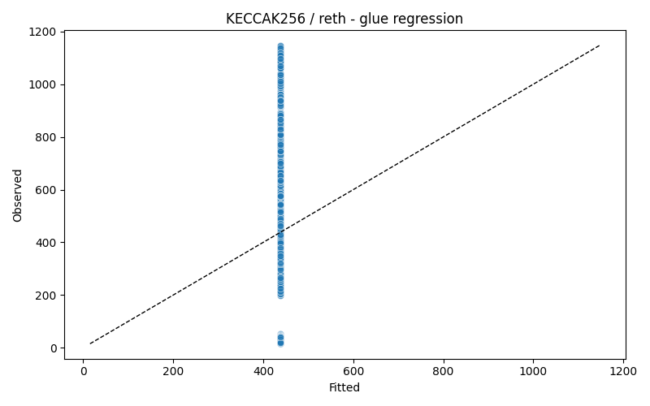

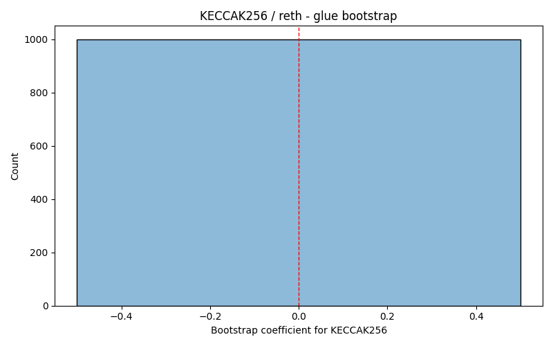

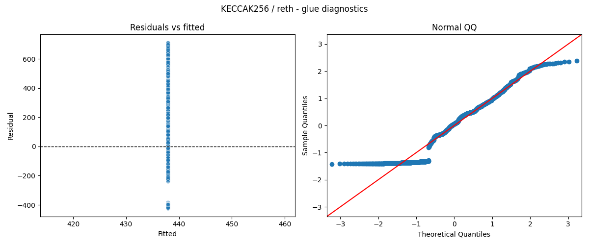

</details>
