# Glue opcodes report

Per-client NNLS fits of priced glue opcodes against their driver fixtures. Cycle-tier opcodes share one joint regression per client (shown once); pure-tier and mixed-tier opcodes each get a single-feature fit. Mixed-tier fits pre-adjust the LHS by subtracting the contribution of every priced upstream partner selected by the detector (pure ∪ cycle for `mixed_a`, plus `mixed_a` for `mixed_b`).

**Contents:** [besu](#besu) · [erigon](#erigon) · [ethrex](#ethrex) · [geth](#geth) · [nethermind](#nethermind) · [reth](#reth)

## besu

| glue_opcode | nobs | glue_runtime_ms | p_value | rsquared |
| --- | --- | --- | --- | --- |
| `ISZERO` | 1045 | 6.098e-06 | 1.00e-03 | 0.9868 |
| `JUMPDEST` | 1045 | 1.205e-06 | 1.00e-03 | 0.8833 |
| `SWAP` | 16720 | 3.563e-06 | 1.00e-03 | 0.9694 |
| `CALLDATASIZE` | 61743 | 5.047e-06 | 1.00e-03 | 0.9893 |
| `DUP` | 61743 | 2.348e-06 | 1.00e-03 | 0.9893 |
| `GAS` | 61743 | 4.158e-06 | 1.00e-03 | 0.9893 |
| `MLOAD` | 61743 | 1.331e-05 | 1.00e-03 | 0.9893 |
| `PUSH` | 61743 | 3.13e-06 | 1.00e-03 | 0.9893 |
| `PUSH0` | 61743 | 2.244e-06 | 1.00e-03 | 0.9893 |
| `STATICCALL` | 61743 | 0.0008785 | 1.00e-03 | 0.9893 |
| `ADD` | 1045 | 1.629e-05 | 1.00e-03 | 0.9788 |
| `AND` | 1045 | 1.05e-05 | 1.00e-03 | 0.9453 |
| `CALLDATACOPY` | 25080 | 2.36e-05 | 1.00e-03 | 0.7204 |
| `CALLDATALOAD` | 4180 | 3.508e-05 | 1.00e-03 | 0.04162 |
| `DIV` | 1045 | 2.324e-05 | 1.00e-03 | 0.981 |
| `EXP` | 1045 | 0.00229 | 1.00e-03 | 0.9691 |
| `GT` | 1045 | 4.46e-05 | 1.00e-03 | 0.9834 |
| `JUMPI` | 1045 | 9.851e-06 | 1.00e-03 | 0.9712 |
| `LT` | 1045 | 3.623e-05 | 1.00e-03 | 0.3015 |
| `MSTORE` | 5225 | 2.706e-05 | 1.00e-03 | 0.9777 |
| `MSTORE8` | 5225 | 1.552e-05 | 1.00e-03 | 0.9702 |
| `MUL` | 1045 | 1.392e-05 | 1.00e-03 | 0.8182 |
| `PC` | 1045 | 5.073e-06 | 1.00e-03 | 0.98 |
| `RETURNDATASIZE` | 4180 | 7.39e-06 | 1.00e-03 | 0.984 |
| `SELFBALANCE` | 1045 | 2.344e-05 | 1.00e-03 | 0.9871 |
| `SUB` | 1045 | 1.726e-05 | 1.00e-03 | 0.9881 |
| `JUMP` | 1045 | 3.688e-05 | 1.00e-03 | 0.9869 |
| `KECCAK256` | 16720 | 4.582e-05 | 1.00e-03 | 0.1011 |

### Cycle glue — joint fit · besu

<details><summary>Joint NNLS regression summary</summary>

```
==============================================================================
                           NNLS Regression Results                            
==============================================================================
Dep. Variable:          test_runtime_ms              R-squared:          0.989
Model:                  NNLS                    Adj. R-squared:          0.989
No. Observations:       61743                             RMSE:          14.67
Df Residuals:           61735                              MAE:           9.54
Df Model:               7      
==============================================================================
                      coef     std err     P-value      [0.025      0.975]
------------------------------------------------------------------------------
         const     33.7505      0.2017       0.001     33.3362     34.1407
  CALLDATASIZE      0.0000      0.0000       0.001      0.0000      0.0000
           DUP      0.0000      0.0000       0.001      0.0000      0.0000
           GAS      0.0000      0.0000       0.001      0.0000      0.0000
         MLOAD      0.0000      0.0000       0.001      0.0000      0.0000
          PUSH      0.0000      0.0000       0.001      0.0000      0.0000
         PUSH0      0.0000      0.0000       0.001      0.0000      0.0000
    STATICCALL      0.0009      0.0000       0.001      0.0009      0.0009
==============================================================================
Notes: Non-negative least squares with bootstrap inference (1000 iterations)
==============================================================================
```

</details>

<details><summary><code>CALLDATASIZE</code> · nobs=61743 · runtime_ms=5.047e-06 · p=1.00e-03 · R²=0.9893</summary>

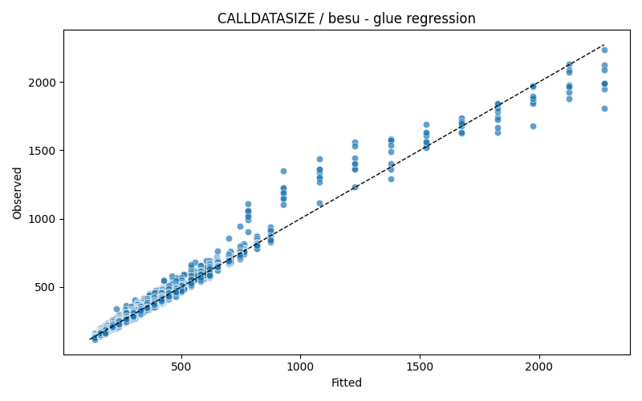

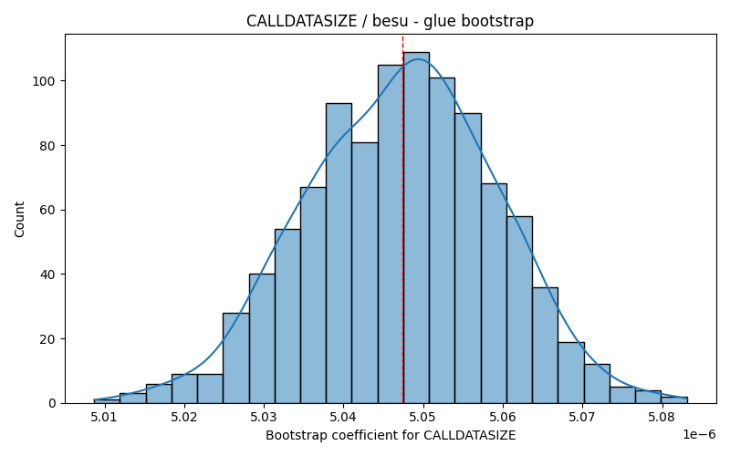

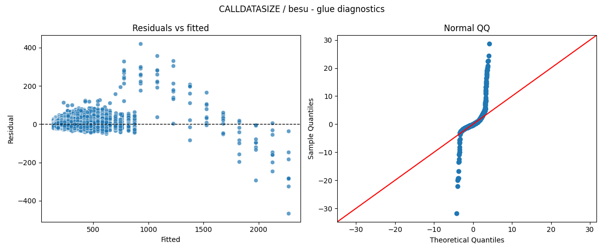

</details>

<details><summary><code>DUP</code> · nobs=61743 · runtime_ms=2.348e-06 · p=1.00e-03 · R²=0.9893</summary>


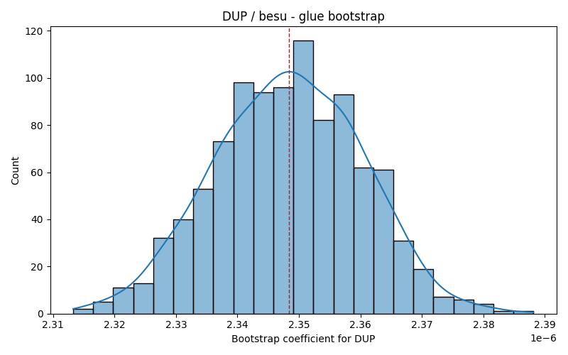


</details>

<details><summary><code>GAS</code> · nobs=61743 · runtime_ms=4.158e-06 · p=1.00e-03 · R²=0.9893</summary>

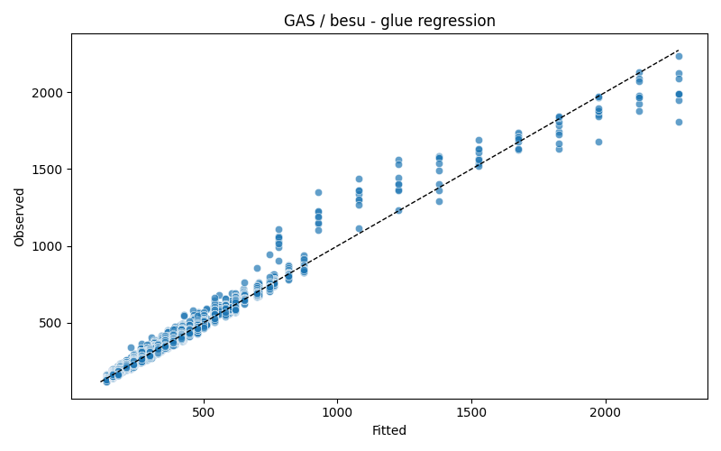

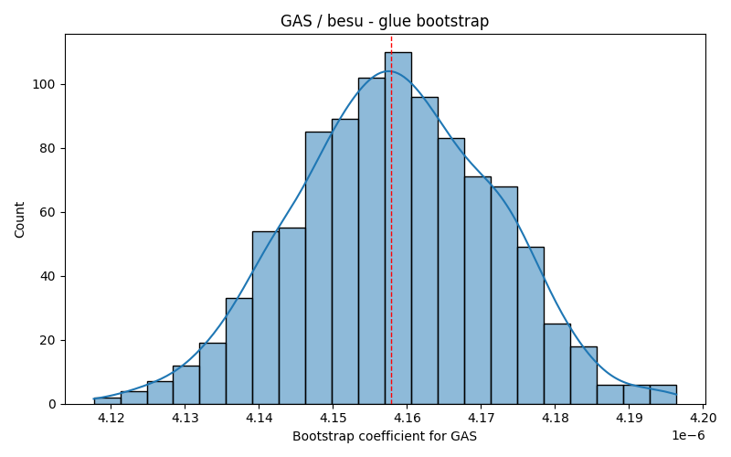


</details>

<details><summary><code>MLOAD</code> · nobs=61743 · runtime_ms=1.331e-05 · p=1.00e-03 · R²=0.9893</summary>


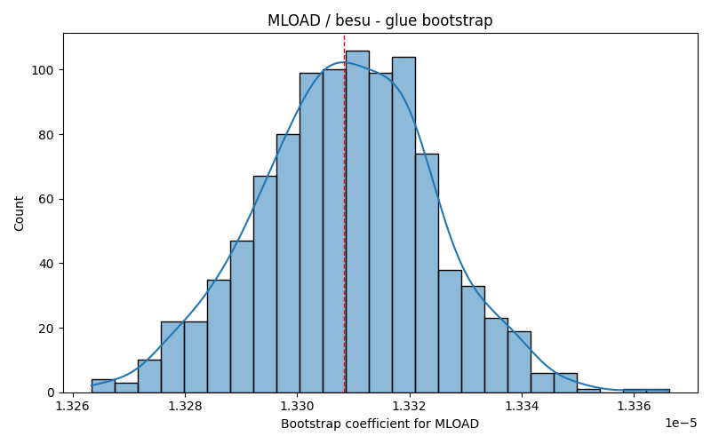


</details>

<details><summary><code>PUSH</code> · nobs=61743 · runtime_ms=3.13e-06 · p=1.00e-03 · R²=0.9893</summary>


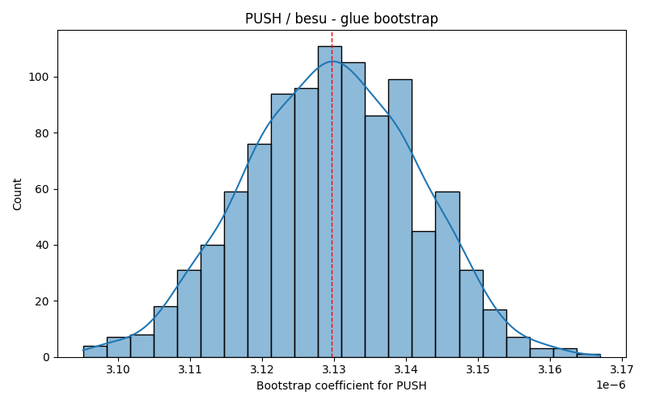


</details>

<details><summary><code>PUSH0</code> · nobs=61743 · runtime_ms=2.244e-06 · p=1.00e-03 · R²=0.9893</summary>

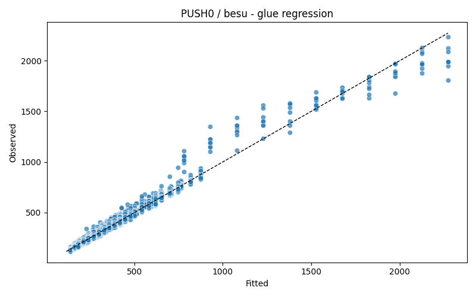

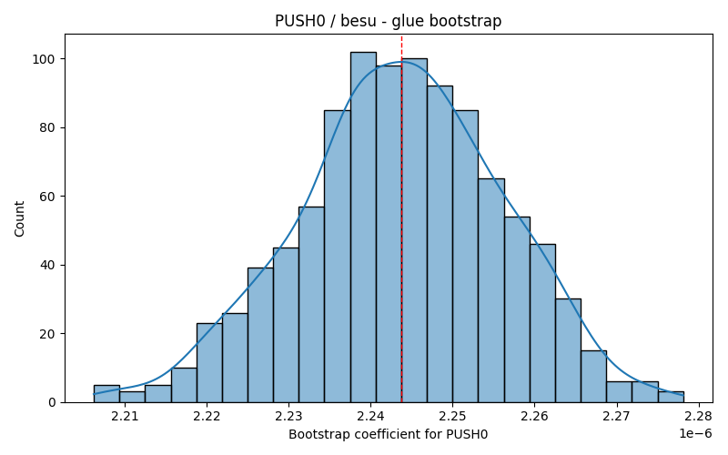


</details>

<details><summary><code>STATICCALL</code> · nobs=61743 · runtime_ms=0.0008785 · p=1.00e-03 · R²=0.9893</summary>

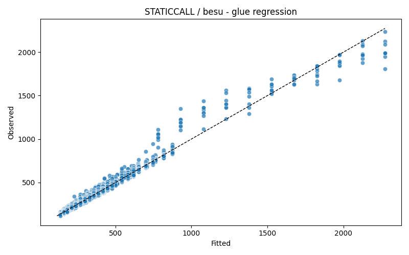

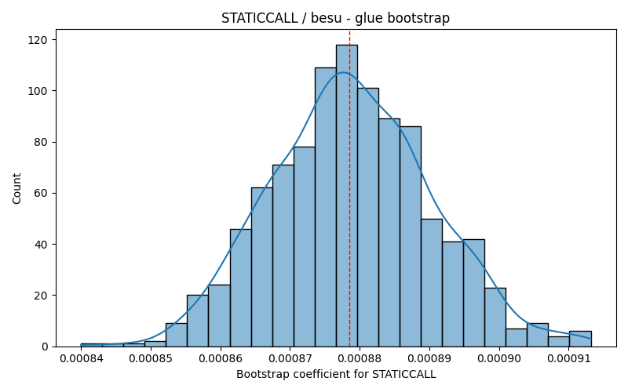

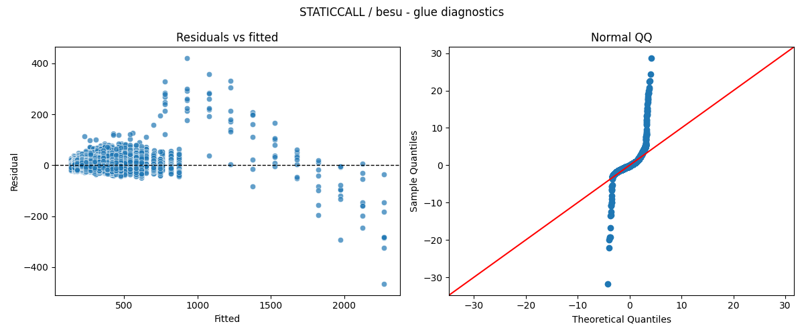

</details>

### Pure glue · besu

<details><summary><code>ISZERO</code> · nobs=1045 · runtime_ms=6.098e-06 · p=1.00e-03 · R²=0.9868</summary>

```
==============================================================================
                           NNLS Regression Results                            
==============================================================================
Dep. Variable:          test_runtime_ms              R-squared:          0.987
Model:                  NNLS                    Adj. R-squared:          0.987
No. Observations:       1045                              RMSE:          14.84
Df Residuals:           1043                               MAE:          10.94
Df Model:               1      
==============================================================================
                      coef     std err     P-value      [0.025      0.975]
------------------------------------------------------------------------------
         const     34.3078      1.4992       0.001     31.2396     37.2199
        ISZERO      0.0000      0.0000       0.001      0.0000      0.0000
==============================================================================
Notes: Non-negative least squares with bootstrap inference (1000 iterations)
==============================================================================
```

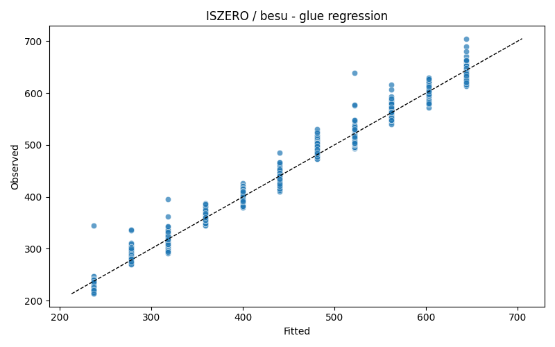

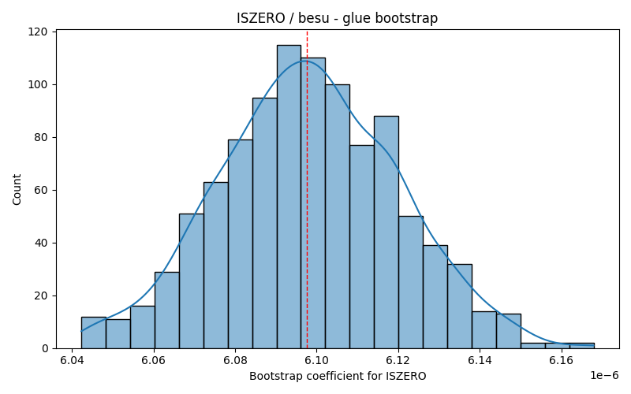

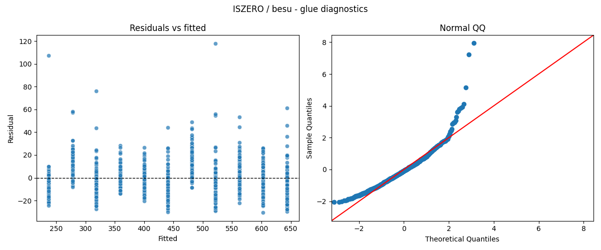

</details>

<details><summary><code>JUMPDEST</code> · nobs=1045 · runtime_ms=1.205e-06 · p=1.00e-03 · R²=0.8833</summary>

```
==============================================================================
                           NNLS Regression Results                            
==============================================================================
Dep. Variable:          test_runtime_ms              R-squared:          0.883
Model:                  NNLS                    Adj. R-squared:          0.883
No. Observations:       1045                              RMSE:          27.69
Df Residuals:           1043                               MAE:          13.96
Df Model:               1      
==============================================================================
                      coef     std err     P-value      [0.025      0.975]
------------------------------------------------------------------------------
         const     27.5373      2.6876       0.001     22.6072     33.1407
      JUMPDEST      0.0000      0.0000       0.001      0.0000      0.0000
==============================================================================
Notes: Non-negative least squares with bootstrap inference (1000 iterations)
==============================================================================
```

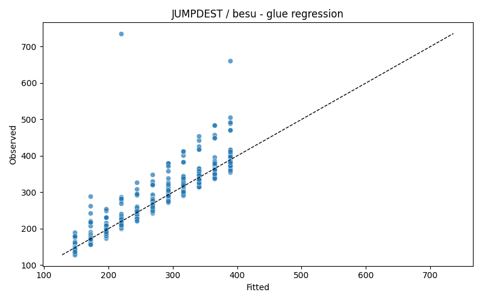

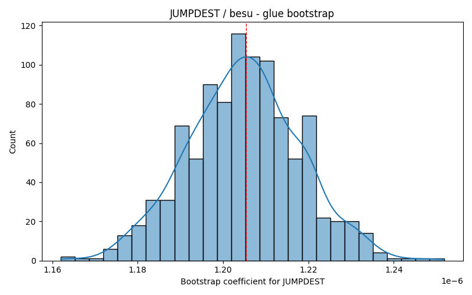

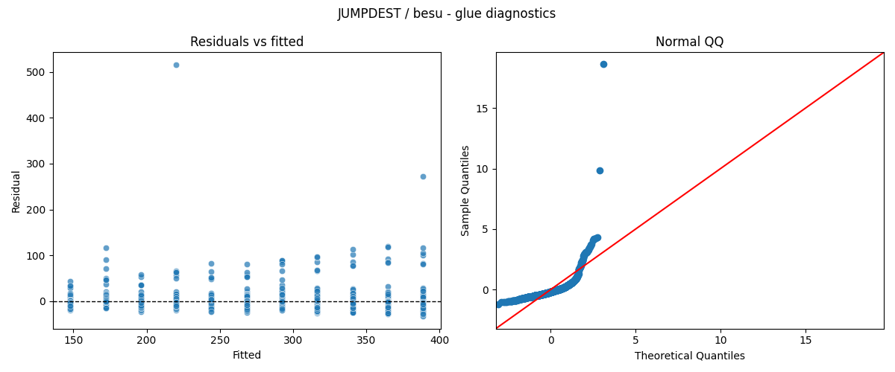

</details>

<details><summary><code>SWAP</code> · nobs=16720 · runtime_ms=3.563e-06 · p=1.00e-03 · R²=0.9694</summary>

```
==============================================================================
                           NNLS Regression Results                            
==============================================================================
Dep. Variable:          test_runtime_ms              R-squared:          0.969
Model:                  NNLS                    Adj. R-squared:          0.969
No. Observations:       16720                             RMSE:          13.34
Df Residuals:           16718                              MAE:           9.74
Df Model:               1      
==============================================================================
                      coef     std err     P-value      [0.025      0.975]
------------------------------------------------------------------------------
         const     31.5728      0.3227       0.001     30.9377     32.2199
          SWAP      0.0000      0.0000       0.001      0.0000      0.0000
==============================================================================
Notes: Non-negative least squares with bootstrap inference (1000 iterations)
==============================================================================
```

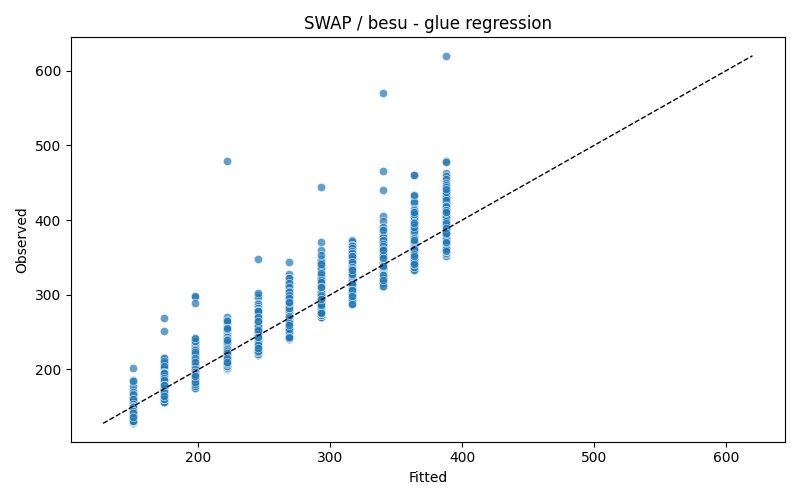

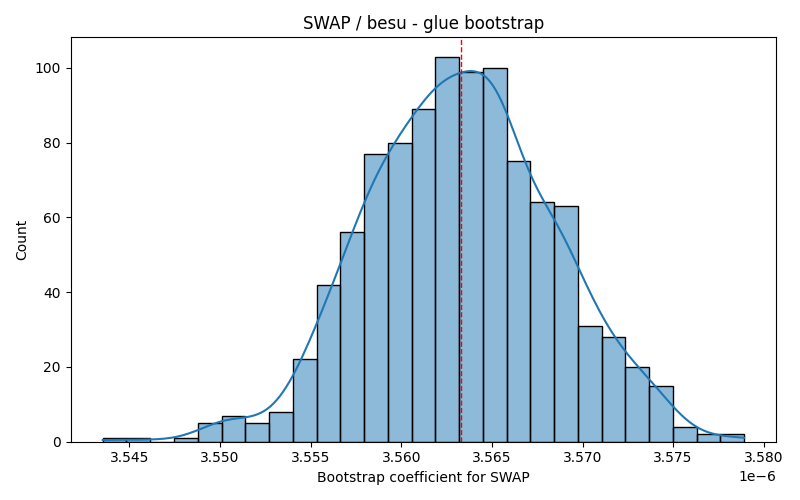

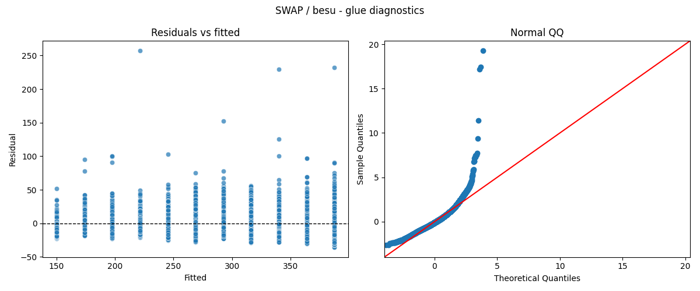

</details>

### Mixed glue (tier A) · besu

<details><summary><code>ADD</code> · nobs=1045 · runtime_ms=1.629e-05 · p=1.00e-03 · R²=0.9788</summary>

```
==============================================================================
                           NNLS Regression Results                            
==============================================================================
Dep. Variable:          test_runtime_ms              R-squared:          0.979
Model:                  NNLS                    Adj. R-squared:          0.979
No. Observations:       1045                              RMSE:          25.25
Df Residuals:           1043                               MAE:          20.04
Df Model:               1      
==============================================================================
                      coef     std err     P-value      [0.025      0.975]
------------------------------------------------------------------------------
         const     74.5762      2.7964       0.001     69.3744     80.0850
           ADD      0.0000      0.0000       0.001      0.0000      0.0000
==============================================================================
Notes: Non-negative least squares with bootstrap inference (1000 iterations)
==============================================================================
```

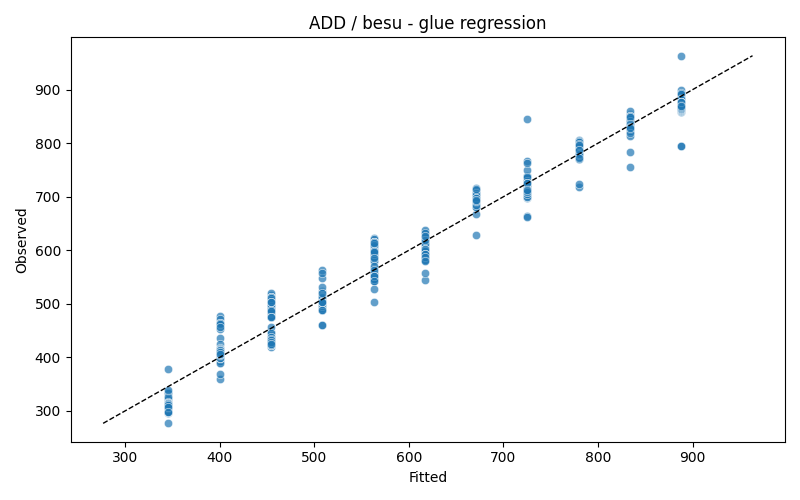

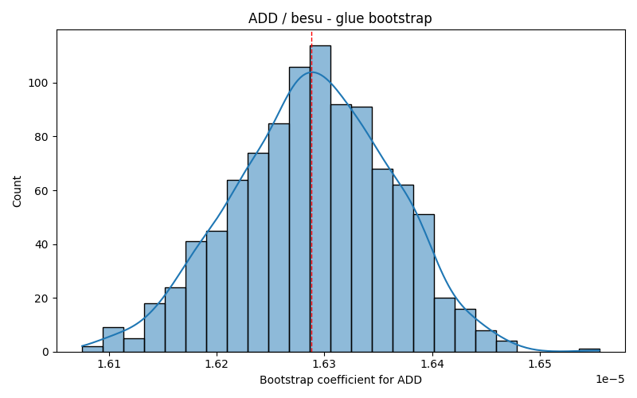

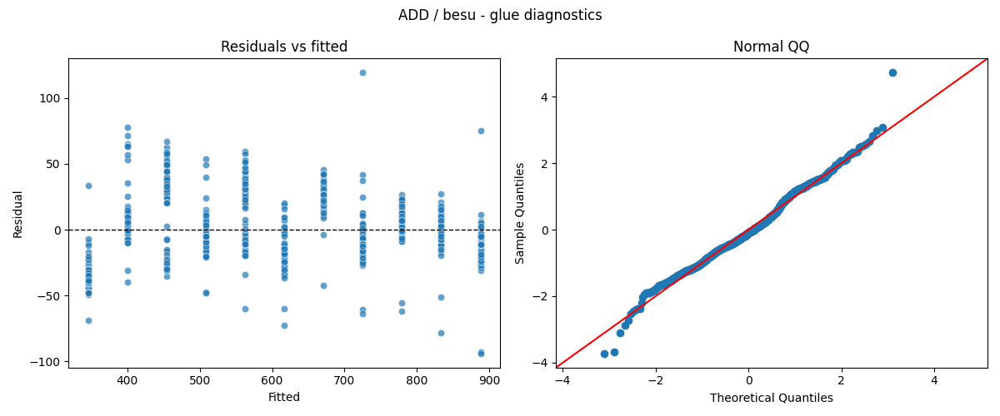

</details>

<details><summary><code>AND</code> · nobs=1045 · runtime_ms=1.05e-05 · p=1.00e-03 · R²=0.9453</summary>

```
==============================================================================
                           NNLS Regression Results                            
==============================================================================
Dep. Variable:          test_runtime_ms              R-squared:          0.945
Model:                  NNLS                    Adj. R-squared:          0.945
No. Observations:       1045                              RMSE:          26.61
Df Residuals:           1043                               MAE:          11.08
Df Model:               1      
==============================================================================
                      coef     std err     P-value      [0.025      0.975]
------------------------------------------------------------------------------
         const     39.7408      2.3472       0.001     34.9875     44.3699
           AND      0.0000      0.0000       0.001      0.0000      0.0000
==============================================================================
Notes: Non-negative least squares with bootstrap inference (1000 iterations)
==============================================================================
```

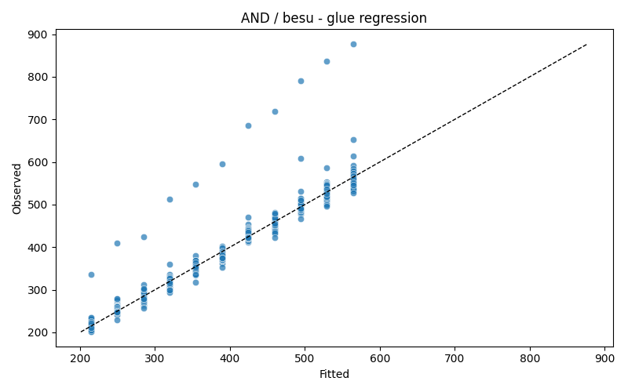

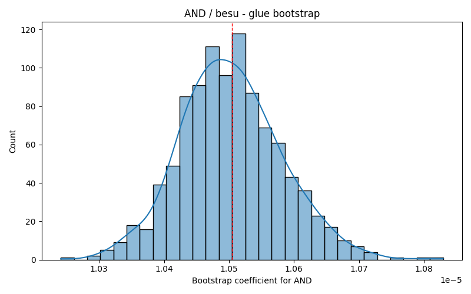

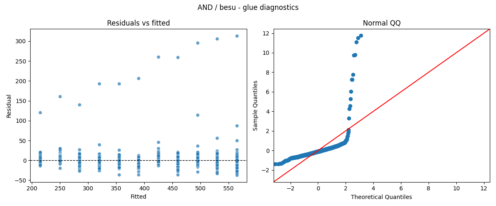

</details>

<details><summary><code>CALLDATACOPY</code> · nobs=25080 · runtime_ms=2.36e-05 · p=1.00e-03 · R²=0.7204</summary>

```
==============================================================================
                           NNLS Regression Results                            
==============================================================================
Dep. Variable:          test_runtime_ms              R-squared:          0.720
Model:                  NNLS                    Adj. R-squared:          0.720
No. Observations:       25080                             RMSE:         110.60
Df Residuals:           25078                              MAE:          85.88
Df Model:               1      
==============================================================================
                      coef     std err     P-value      [0.025      0.975]
------------------------------------------------------------------------------
         const    138.2401      0.7567       0.001    136.7448    139.7070
  CALLDATACOPY      0.0000      0.0000       0.001      0.0000      0.0000
==============================================================================
Notes: Non-negative least squares with bootstrap inference (1000 iterations)
==============================================================================
```

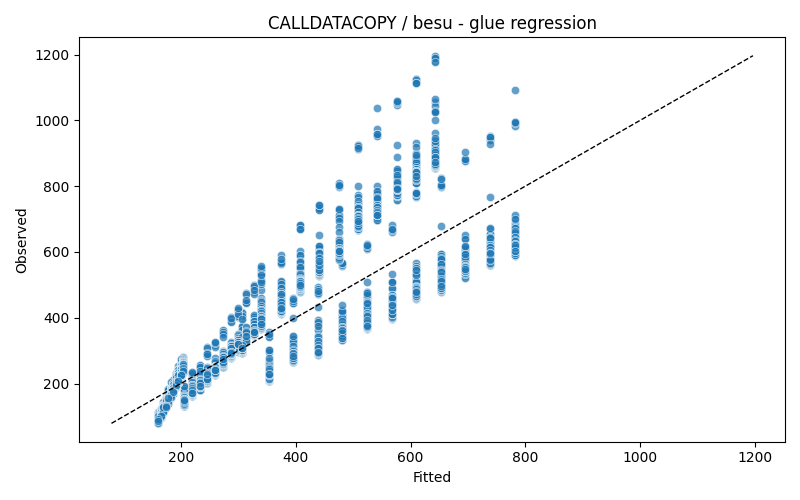

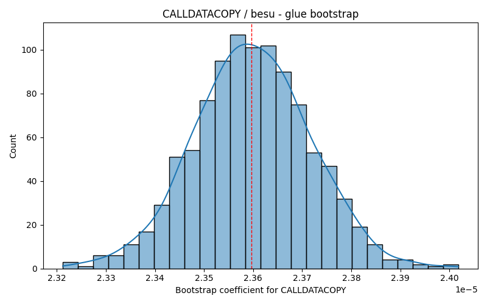

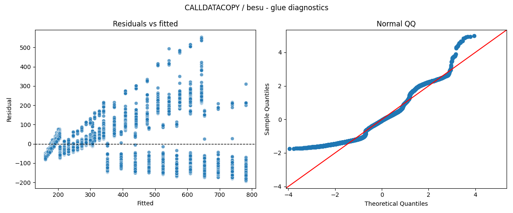

</details>

<details><summary><code>CALLDATALOAD</code> · nobs=4180 · runtime_ms=3.508e-05 · p=1.00e-03 · R²=0.04162</summary>

```
==============================================================================
                           NNLS Regression Results                            
==============================================================================
Dep. Variable:          test_runtime_ms              R-squared:          0.042
Model:                  NNLS                    Adj. R-squared:          0.041
No. Observations:       4180                              RMSE:           0.65
Df Residuals:           4178                               MAE:           0.42
Df Model:               1      
==============================================================================
                      coef     std err     P-value      [0.025      0.975]
------------------------------------------------------------------------------
         const      2.9099      0.0383       0.001      2.8392      2.9842
  CALLDATALOAD      0.0000      0.0000       0.001      0.0000      0.0000
==============================================================================
Notes: Non-negative least squares with bootstrap inference (1000 iterations)
==============================================================================
```

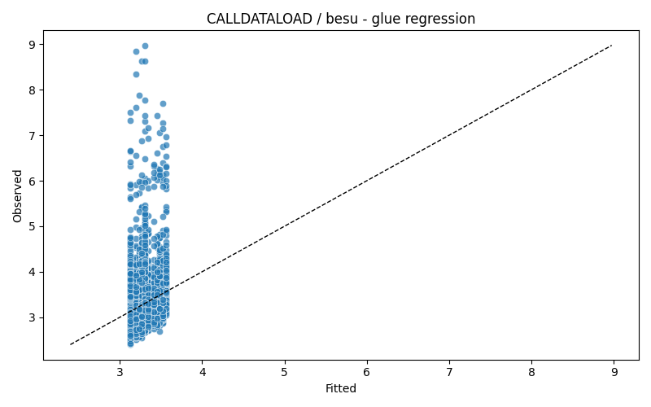

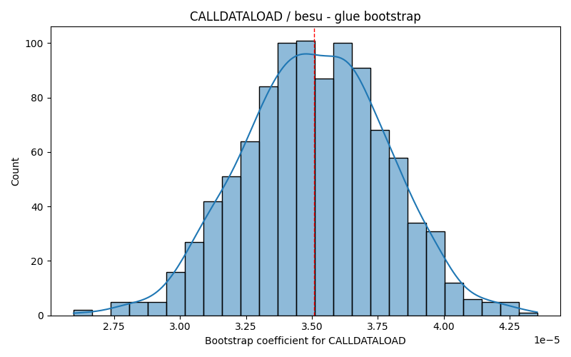

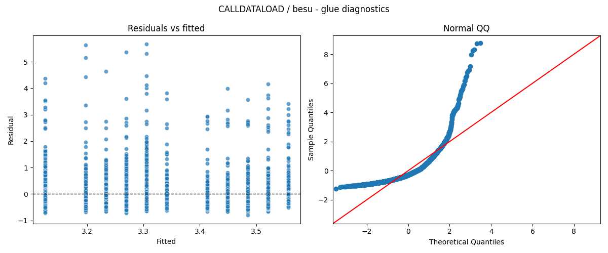

</details>

<details><summary><code>DIV</code> · nobs=1045 · runtime_ms=2.324e-05 · p=1.00e-03 · R²=0.981</summary>

```
==============================================================================
                           NNLS Regression Results                            
==============================================================================
Dep. Variable:          test_runtime_ms              R-squared:          0.981
Model:                  NNLS                    Adj. R-squared:          0.981
No. Observations:       1045                              RMSE:          25.57
Df Residuals:           1043                               MAE:          18.60
Df Model:               1      
==============================================================================
                      coef     std err     P-value      [0.025      0.975]
------------------------------------------------------------------------------
         const     88.9992      2.1208       0.001     84.8012     92.9851
           DIV      0.0000      0.0000       0.001      0.0000      0.0000
==============================================================================
Notes: Non-negative least squares with bootstrap inference (1000 iterations)
==============================================================================
```

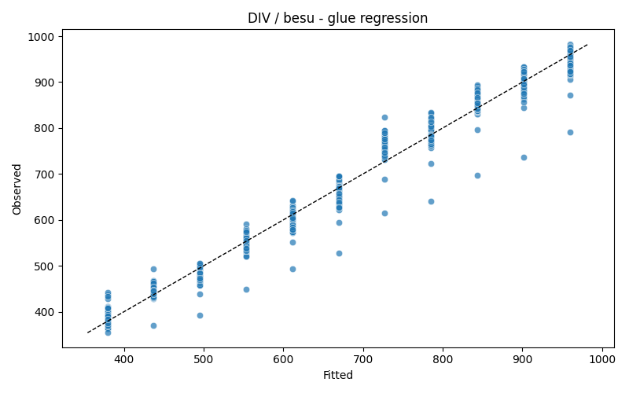

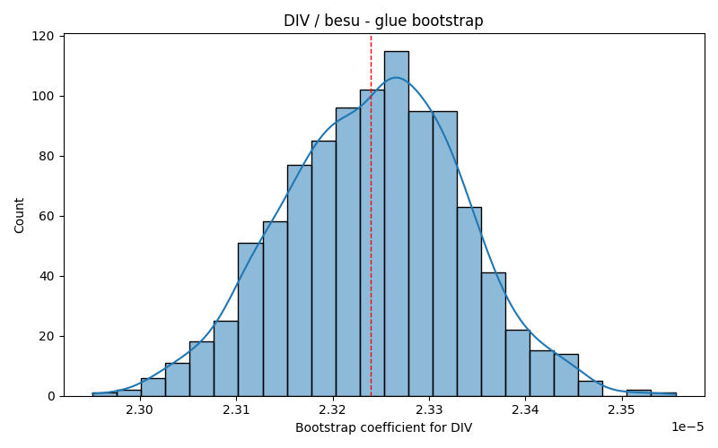

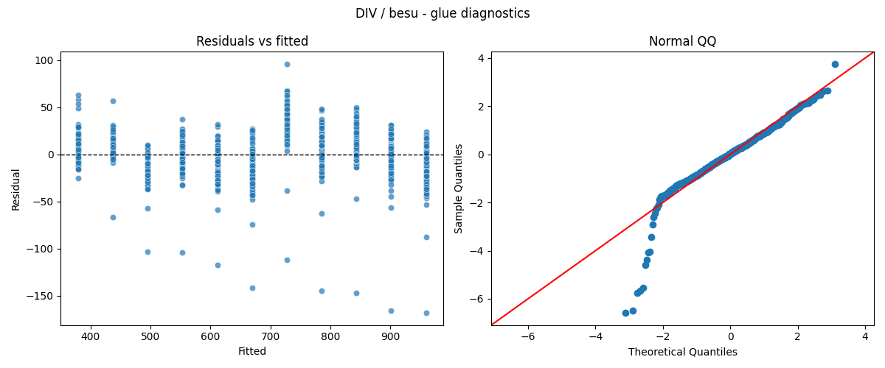

</details>

<details><summary><code>EXP</code> · nobs=1045 · runtime_ms=0.00229 · p=1.00e-03 · R²=0.9691</summary>

```
==============================================================================
                           NNLS Regression Results                            
==============================================================================
Dep. Variable:          test_runtime_ms              R-squared:          0.969
Model:                  NNLS                    Adj. R-squared:          0.969
No. Observations:       1045                              RMSE:          16.01
Df Residuals:           1043                               MAE:          11.53
Df Model:               1      
==============================================================================
                      coef     std err     P-value      [0.025      0.975]
------------------------------------------------------------------------------
         const     66.6625      2.4642       0.001     61.7293     71.4707
           EXP      0.0023      0.0000       0.001      0.0023      0.0023
==============================================================================
Notes: Non-negative least squares with bootstrap inference (1000 iterations)
==============================================================================
```

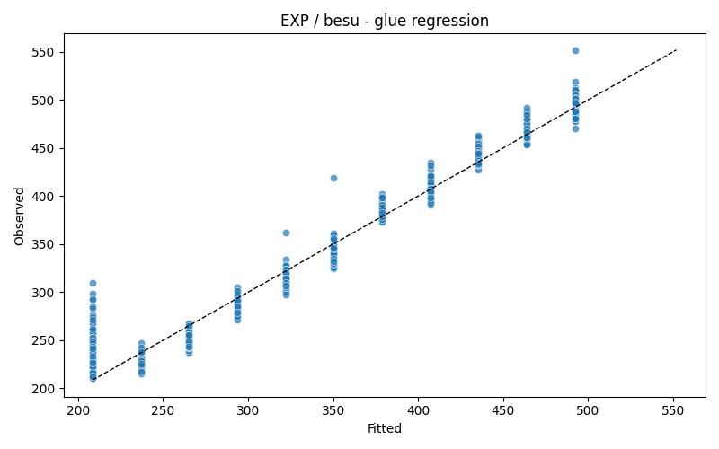

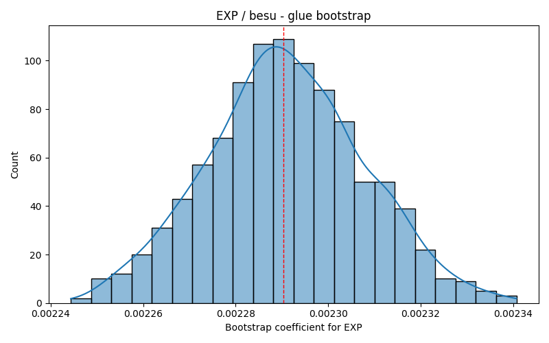

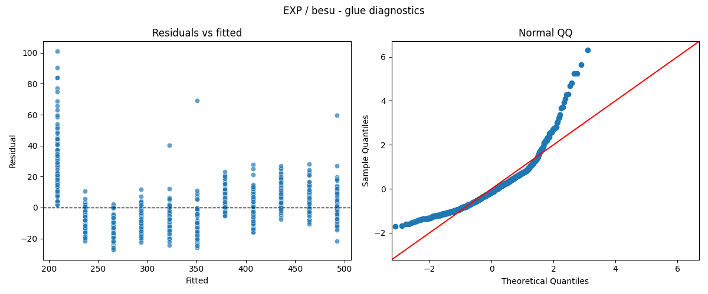

</details>

<details><summary><code>GT</code> · nobs=1045 · runtime_ms=4.46e-05 · p=1.00e-03 · R²=0.9834</summary>

```
==============================================================================
                           NNLS Regression Results                            
==============================================================================
Dep. Variable:          test_runtime_ms              R-squared:          0.983
Model:                  NNLS                    Adj. R-squared:          0.983
No. Observations:       1045                              RMSE:          60.93
Df Residuals:           1043                               MAE:          48.83
Df Model:               1      
==============================================================================
                      coef     std err     P-value      [0.025      0.975]
------------------------------------------------------------------------------
         const    117.8853      6.9336       0.001    104.9011    131.3438
            GT      0.0000      0.0000       0.001      0.0000      0.0000
==============================================================================
Notes: Non-negative least squares with bootstrap inference (1000 iterations)
==============================================================================
```

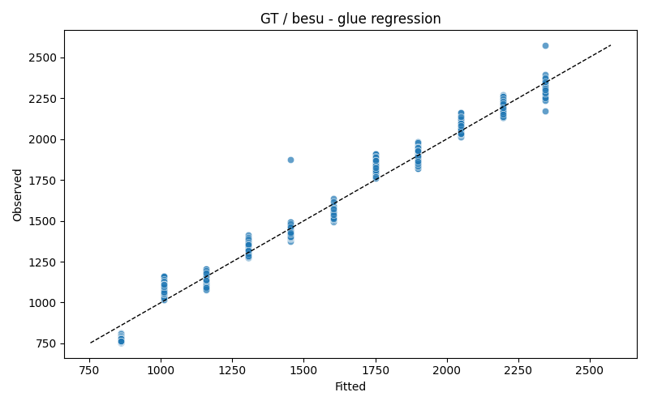

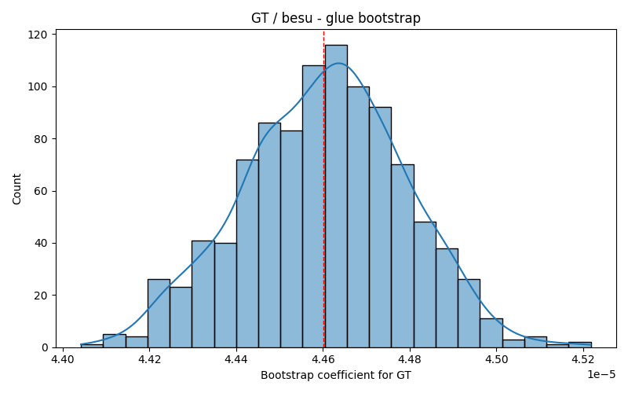

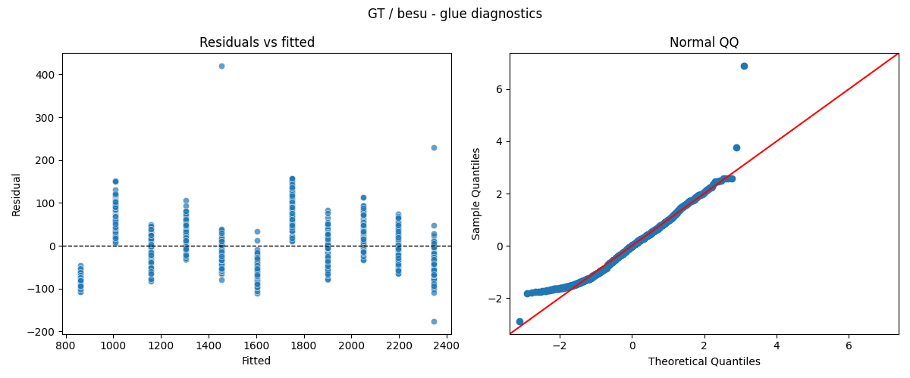

</details>

<details><summary><code>JUMPI</code> · nobs=1045 · runtime_ms=9.851e-06 · p=1.00e-03 · R²=0.9712</summary>

```
==============================================================================
                           NNLS Regression Results                            
==============================================================================
Dep. Variable:          test_runtime_ms              R-squared:          0.971
Model:                  NNLS                    Adj. R-squared:          0.971
No. Observations:       1045                              RMSE:           7.66
Df Residuals:           1043                               MAE:           5.45
Df Model:               1      
==============================================================================
                      coef     std err     P-value      [0.025      0.975]
------------------------------------------------------------------------------
         const     19.6460      0.6723       0.001     18.3061     20.9056
         JUMPI      0.0000      0.0000       0.001      0.0000      0.0000
==============================================================================
Notes: Non-negative least squares with bootstrap inference (1000 iterations)
==============================================================================
```

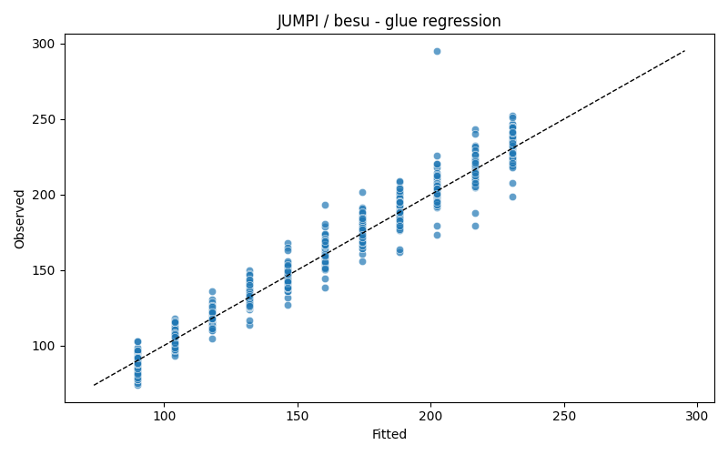

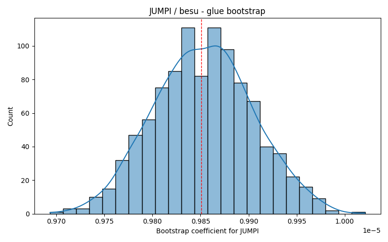

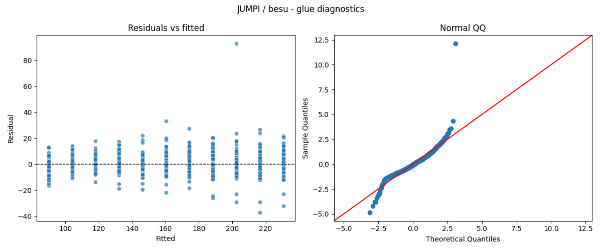

</details>

<details><summary><code>LT</code> · nobs=1045 · runtime_ms=3.623e-05 · p=1.00e-03 · R²=0.3015</summary>

```
==============================================================================
                           NNLS Regression Results                            
==============================================================================
Dep. Variable:          test_runtime_ms              R-squared:          0.302
Model:                  NNLS                    Adj. R-squared:          0.301
No. Observations:       1045                              RMSE:         580.58
Df Residuals:           1043                               MAE:         541.06
Df Model:               1      
==============================================================================
                      coef     std err     P-value      [0.025      0.975]
------------------------------------------------------------------------------
         const    108.6195     50.9020       0.021      5.6002    210.3178
            LT      0.0000      0.0000       0.001      0.0000      0.0000
==============================================================================
Notes: Non-negative least squares with bootstrap inference (1000 iterations)
==============================================================================
```

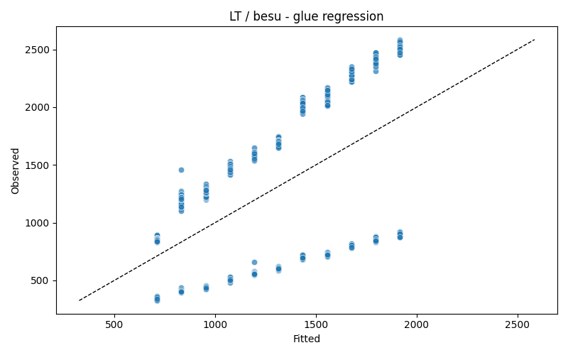

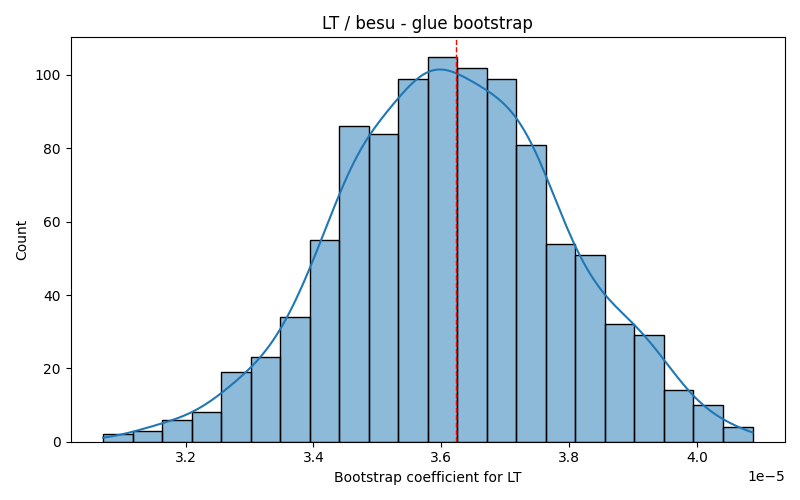

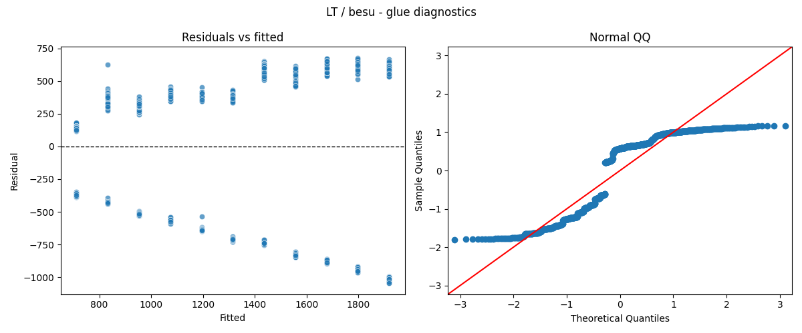

</details>

<details><summary><code>MSTORE</code> · nobs=5225 · runtime_ms=2.706e-05 · p=1.00e-03 · R²=0.9777</summary>

```
==============================================================================
                           NNLS Regression Results                            
==============================================================================
Dep. Variable:          test_runtime_ms              R-squared:          0.978
Model:                  NNLS                    Adj. R-squared:          0.978
No. Observations:       5225                              RMSE:          28.70
Df Residuals:           5223                               MAE:          23.02
Df Model:               1      
==============================================================================
                      coef     std err     P-value      [0.025      0.975]
------------------------------------------------------------------------------
         const     48.0536      1.2370       0.001     45.7096     50.5506
        MSTORE      0.0000      0.0000       0.001      0.0000      0.0000
==============================================================================
Notes: Non-negative least squares with bootstrap inference (1000 iterations)
==============================================================================
```

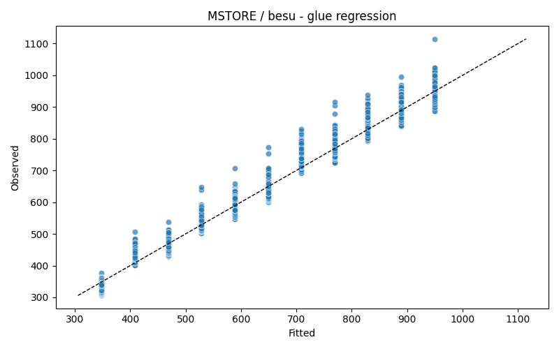

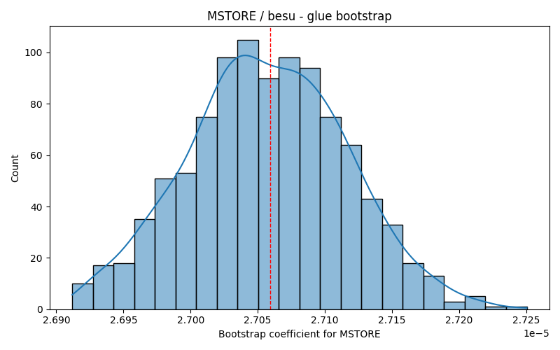

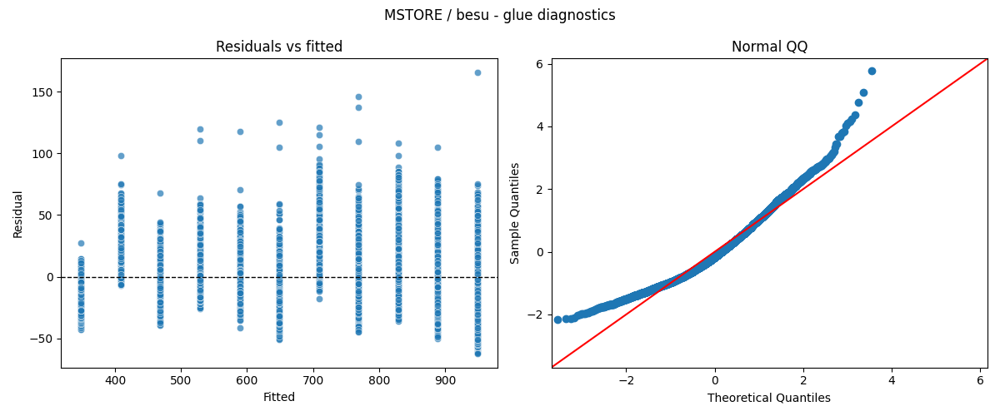

</details>

<details><summary><code>MSTORE8</code> · nobs=5225 · runtime_ms=1.552e-05 · p=1.00e-03 · R²=0.9702</summary>

```
==============================================================================
                           NNLS Regression Results                            
==============================================================================
Dep. Variable:          test_runtime_ms              R-squared:          0.970
Model:                  NNLS                    Adj. R-squared:          0.970
No. Observations:       5225                              RMSE:          19.11
Df Residuals:           5223                               MAE:          13.99
Df Model:               1      
==============================================================================
                      coef     std err     P-value      [0.025      0.975]
------------------------------------------------------------------------------
         const     25.3208      0.8028       0.001     23.7078     26.9235
       MSTORE8      0.0000      0.0000       0.001      0.0000      0.0000
==============================================================================
Notes: Non-negative least squares with bootstrap inference (1000 iterations)
==============================================================================
```

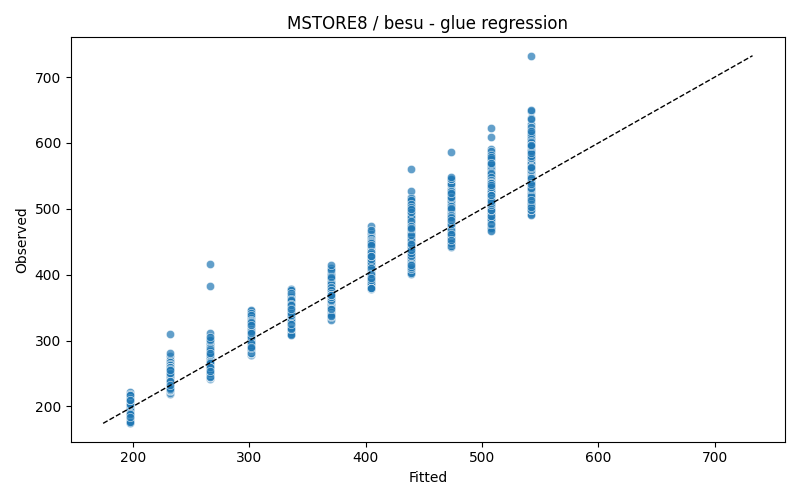

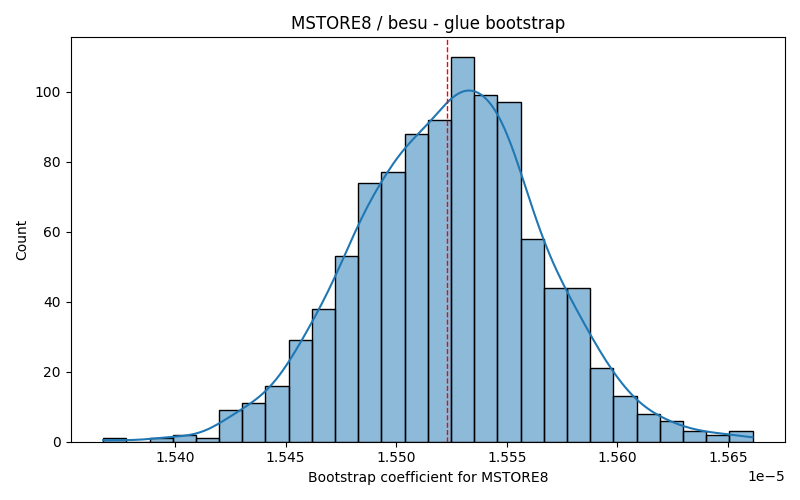

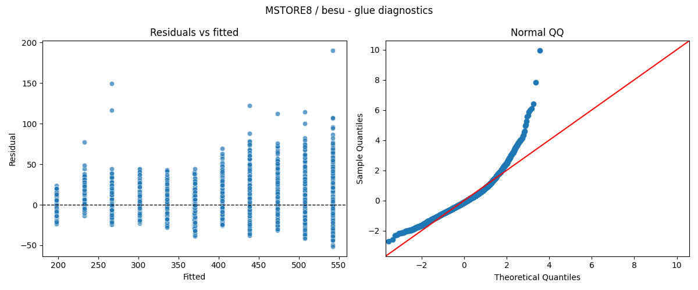

</details>

<details><summary><code>MUL</code> · nobs=1045 · runtime_ms=1.392e-05 · p=1.00e-03 · R²=0.8182</summary>

```
==============================================================================
                           NNLS Regression Results                            
==============================================================================
Dep. Variable:          test_runtime_ms              R-squared:          0.818
Model:                  NNLS                    Adj. R-squared:          0.818
No. Observations:       1045                              RMSE:          51.84
Df Residuals:           1043                               MAE:          33.44
Df Model:               1      
==============================================================================
                      coef     std err     P-value      [0.025      0.975]
------------------------------------------------------------------------------
         const     46.9145      4.4832       0.001     38.1604     56.0054
           MUL      0.0000      0.0000       0.001      0.0000      0.0000
==============================================================================
Notes: Non-negative least squares with bootstrap inference (1000 iterations)
==============================================================================
```

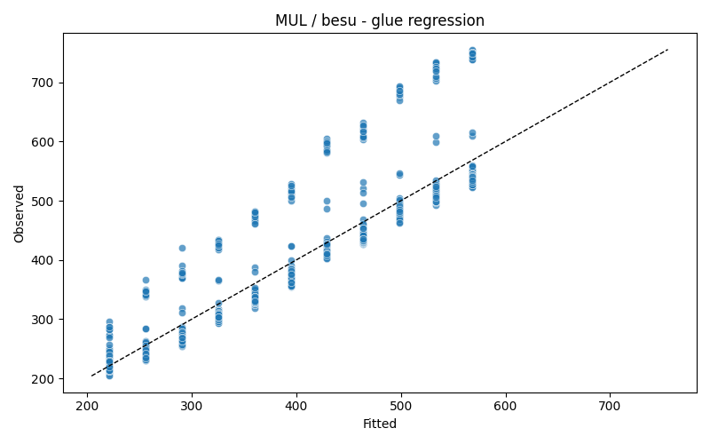

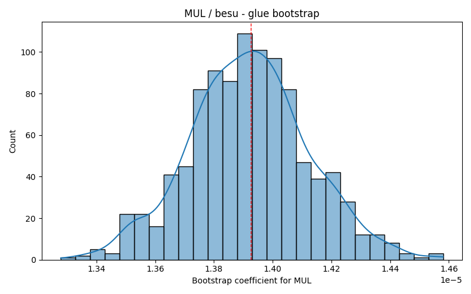

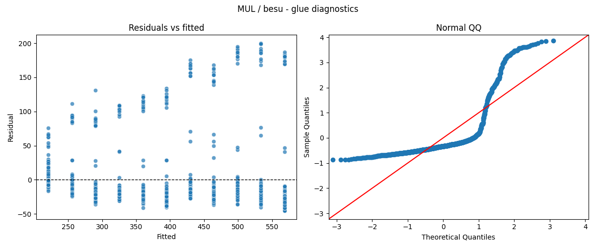

</details>

<details><summary><code>PC</code> · nobs=1045 · runtime_ms=5.073e-06 · p=1.00e-03 · R²=0.98</summary>

```
==============================================================================
                           NNLS Regression Results                            
==============================================================================
Dep. Variable:          test_runtime_ms              R-squared:          0.980
Model:                  NNLS                    Adj. R-squared:          0.980
No. Observations:       1045                              RMSE:          21.66
Df Residuals:           1043                               MAE:          16.42
Df Model:               1      
==============================================================================
                      coef     std err     P-value      [0.025      0.975]
------------------------------------------------------------------------------
         const     27.9253      2.2130       0.001     23.7927     32.2425
            PC      0.0000      0.0000       0.001      0.0000      0.0000
==============================================================================
Notes: Non-negative least squares with bootstrap inference (1000 iterations)
==============================================================================
```

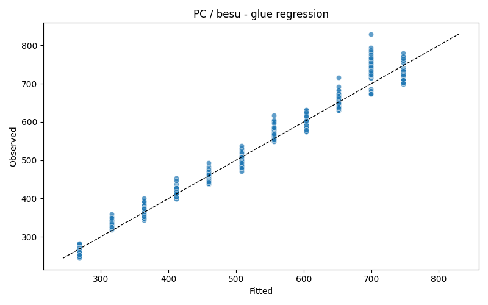

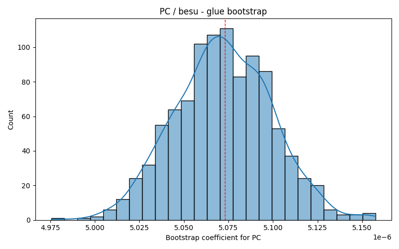

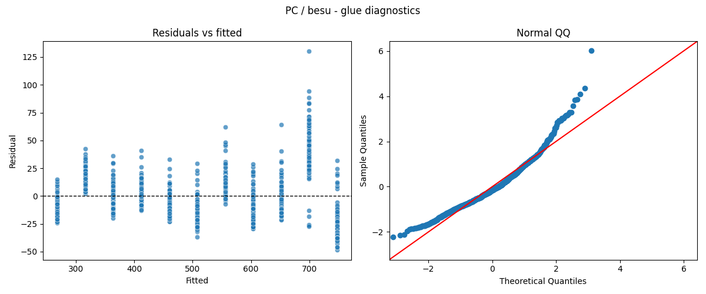

</details>

<details><summary><code>RETURNDATASIZE</code> · nobs=4180 · runtime_ms=7.39e-06 · p=1.00e-03 · R²=0.984</summary>

```
==============================================================================
                           NNLS Regression Results                            
==============================================================================
Dep. Variable:          test_runtime_ms              R-squared:          0.984
Model:                  NNLS                    Adj. R-squared:          0.984
No. Observations:       4180                              RMSE:          14.87
Df Residuals:           4178                               MAE:          10.23
Df Model:               1      
==============================================================================
                      coef     std err     P-value      [0.025      0.975]
------------------------------------------------------------------------------
         const     36.7886      0.7636       0.001     35.2548     38.3099
RETURNDATASIZE      0.0000      0.0000       0.001      0.0000      0.0000
==============================================================================
Notes: Non-negative least squares with bootstrap inference (1000 iterations)
==============================================================================
```

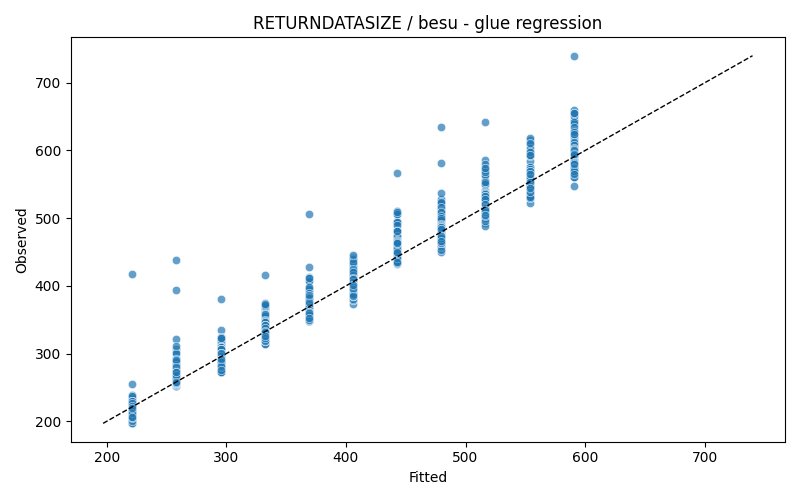

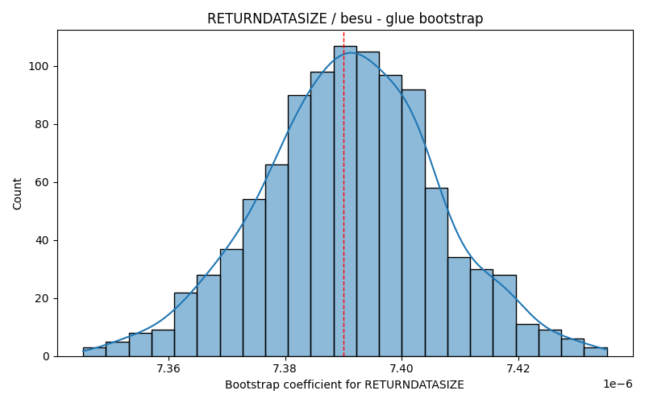

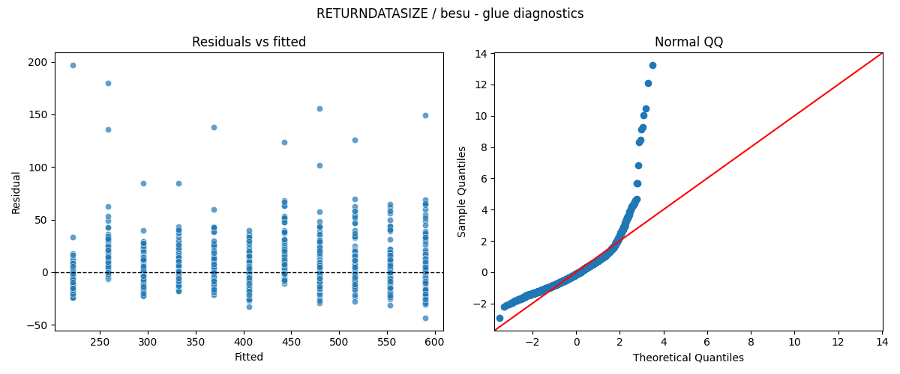

</details>

<details><summary><code>SELFBALANCE</code> · nobs=1045 · runtime_ms=2.344e-05 · p=1.00e-03 · R²=0.9871</summary>

```
==============================================================================
                           NNLS Regression Results                            
==============================================================================
Dep. Variable:          test_runtime_ms              R-squared:          0.987
Model:                  NNLS                    Adj. R-squared:          0.987
No. Observations:       1045                              RMSE:          33.18
Df Residuals:           1043                               MAE:          26.00
Df Model:               1      
==============================================================================
                      coef     std err     P-value      [0.025      0.975]
------------------------------------------------------------------------------
         const     49.0783      3.6406       0.001     41.8252     55.7641
   SELFBALANCE      0.0000      0.0000       0.001      0.0000      0.0000
==============================================================================
Notes: Non-negative least squares with bootstrap inference (1000 iterations)
==============================================================================
```

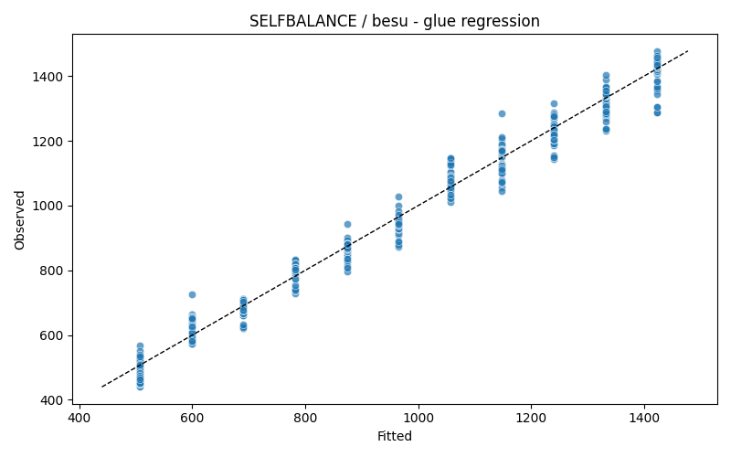

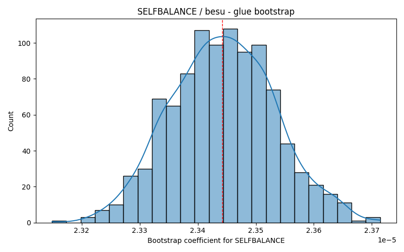

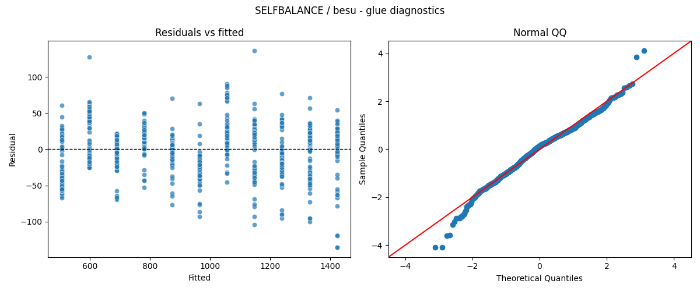

</details>

<details><summary><code>SUB</code> · nobs=1045 · runtime_ms=1.726e-05 · p=1.00e-03 · R²=0.9881</summary>

```
==============================================================================
                           NNLS Regression Results                            
==============================================================================
Dep. Variable:          test_runtime_ms              R-squared:          0.988
Model:                  NNLS                    Adj. R-squared:          0.988
No. Observations:       1045                              RMSE:          19.93
Df Residuals:           1043                               MAE:          13.48
Df Model:               1      
==============================================================================
                      coef     std err     P-value      [0.025      0.975]
------------------------------------------------------------------------------
         const     47.5239      1.8732       0.001     43.7818     51.1523
           SUB      0.0000      0.0000       0.001      0.0000      0.0000
==============================================================================
Notes: Non-negative least squares with bootstrap inference (1000 iterations)
==============================================================================
```

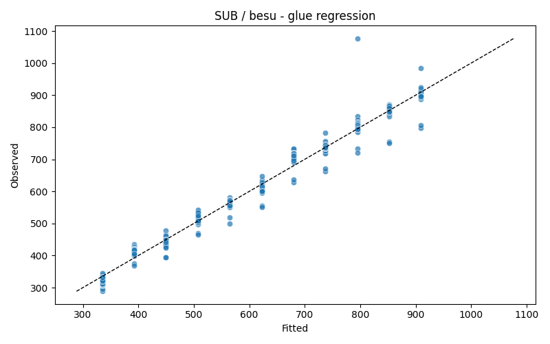

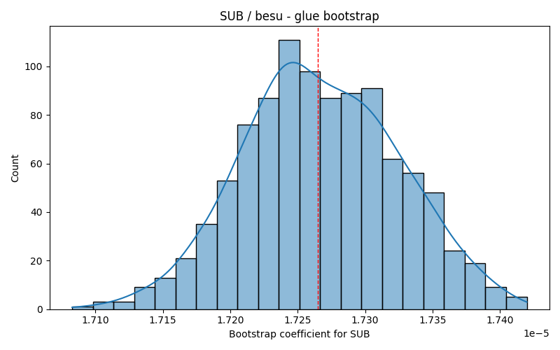

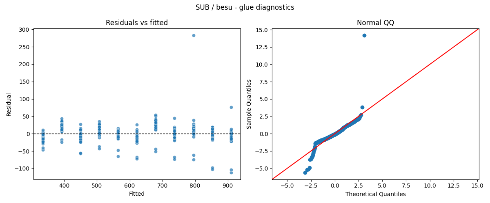

</details>

### Mixed glue (tier B) · besu

<details><summary><code>JUMP</code> · nobs=1045 · runtime_ms=3.688e-05 · p=1.00e-03 · R²=0.9869</summary>

```
==============================================================================
                           NNLS Regression Results                            
==============================================================================
Dep. Variable:          test_runtime_ms              R-squared:          0.987
Model:                  NNLS                    Adj. R-squared:          0.987
No. Observations:       1045                              RMSE:          15.80
Df Residuals:           1043                               MAE:          11.58
Df Model:               1      
==============================================================================
                      coef     std err     P-value      [0.025      0.975]
------------------------------------------------------------------------------
         const     43.2350      1.5172       0.001     40.2637     46.0360
          JUMP      0.0000      0.0000       0.001      0.0000      0.0000
==============================================================================
Notes: Non-negative least squares with bootstrap inference (1000 iterations)
==============================================================================
```

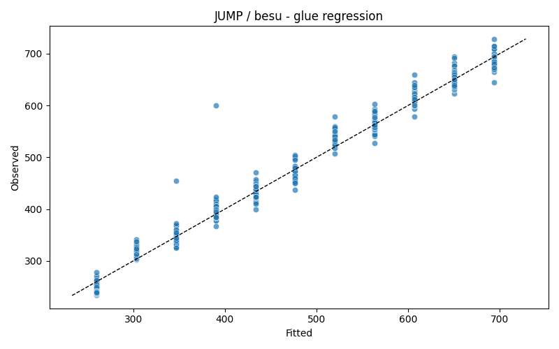

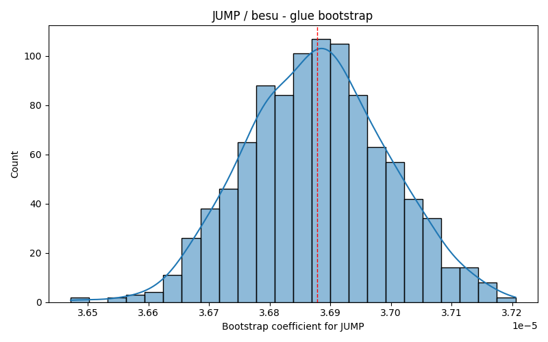

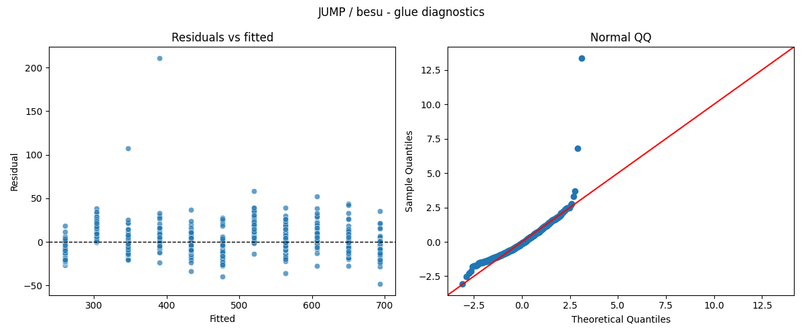

</details>

<details><summary><code>KECCAK256</code> · nobs=16720 · runtime_ms=4.582e-05 · p=1.00e-03 · R²=0.1011</summary>

```
==============================================================================
                           NNLS Regression Results                            
==============================================================================
Dep. Variable:          test_runtime_ms              R-squared:          0.101
Model:                  NNLS                    Adj. R-squared:          0.101
No. Observations:       16720                             RMSE:         271.58
Df Residuals:           16718                              MAE:         217.89
Df Model:               1      
==============================================================================
                      coef     std err     P-value      [0.025      0.975]
------------------------------------------------------------------------------
         const    763.3218      4.4967       0.001    755.0789    772.2666
     KECCAK256      0.0000      0.0000       0.001      0.0000      0.0000
==============================================================================
Notes: Non-negative least squares with bootstrap inference (1000 iterations)
==============================================================================
```

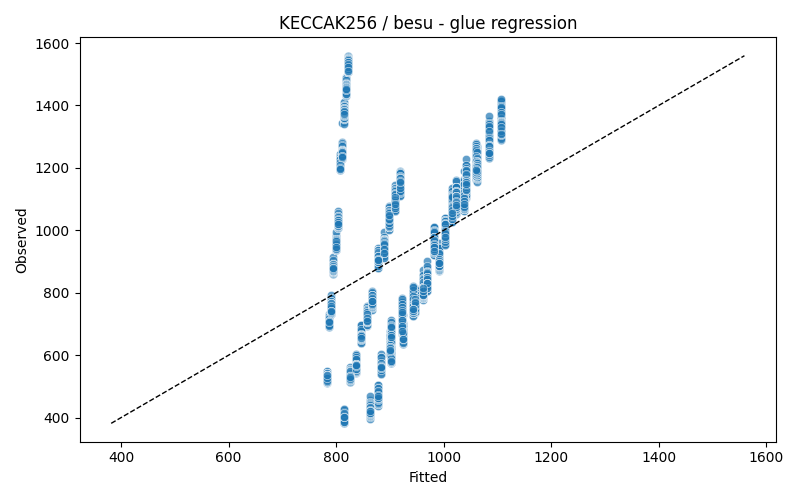

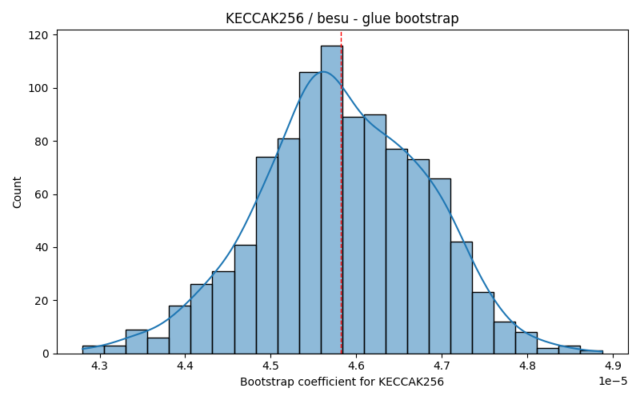

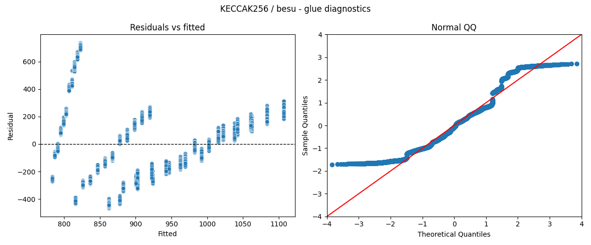

</details>

## erigon

| glue_opcode | nobs | glue_runtime_ms | p_value | rsquared |
| --- | --- | --- | --- | --- |
| `ISZERO` | 1067 | 1.592e-06 | 1.00e-03 | 0.5502 |
| `JUMPDEST` | 1067 | 1.22e-06 | 1.00e-03 | 0.4393 |
| `SWAP` | 17072 | 1.942e-06 | 1.00e-03 | 0.8174 |
| `CALLDATASIZE` | 63052 | 1.623e-06 | 1.00e-03 | 0.8068 |
| `DUP` | 63052 | 1.903e-06 | 1.00e-03 | 0.8068 |
| `GAS` | 63052 | 1.647e-06 | 1.00e-03 | 0.8068 |
| `MLOAD` | 63052 | 4.529e-06 | 1.00e-03 | 0.8068 |
| `PUSH` | 63052 | 2.971e-06 | 1.00e-03 | 0.8068 |
| `PUSH0` | 63052 | 1.625e-06 | 1.00e-03 | 0.8068 |
| `STATICCALL` | 63052 | 6.737e-05 | 1.00e-03 | 0.8068 |
| `ADD` | 1067 | 3.416e-06 | 1.00e-03 | 0.4734 |
| `AND` | 1067 | 3.435e-06 | 1.00e-03 | 0.5101 |
| `CALLDATACOPY` | 25608 | 1.036e-05 | 1.00e-03 | 0.961 |
| `CALLDATALOAD` | 4268 | 5.155e-05 | 1.00e-03 | 0.1914 |
| `DIV` | 1067 | 1.416e-05 | 1.00e-03 | 0.9259 |
| `EXP` | 1067 | 0.0006889 | 1.00e-03 | 0.9811 |
| `GT` | 1067 | 3.49e-06 | 1.00e-03 | 0.5229 |
| `JUMPI` | 1067 | 4.697e-06 | 1.00e-03 | 0.861 |
| `LT` | 1067 | 3.5e-06 | 1.00e-03 | 0.528 |
| `MSTORE` | 5335 | 6.935e-06 | 1.00e-03 | 0.4566 |
| `MSTORE8` | 5335 | 7.176e-06 | 1.00e-03 | 0.7608 |
| `MUL` | 1067 | 5.324e-06 | 1.00e-03 | 0.5565 |
| `PC` | 1067 | 1.751e-06 | 1.00e-03 | 0.9797 |
| `RETURNDATASIZE` | 4268 | 2.915e-06 | 1.00e-03 | 0.8232 |
| `SELFBALANCE` | 1067 | 1.933e-06 | 1.00e-03 | 0.9629 |
| `SUB` | 1067 | 3.453e-06 | 1.00e-03 | 0.5026 |
| `JUMP` | 1067 | 8.1e-06 | 1.00e-03 | 0.5763 |
| `KECCAK256` | 17072 | 7.449e-06 | 1.00e-03 | 0.004043 |

### Cycle glue — joint fit · erigon

<details><summary>Joint NNLS regression summary</summary>

```
==============================================================================
                           NNLS Regression Results                            
==============================================================================
Dep. Variable:          test_runtime_ms              R-squared:          0.807
Model:                  NNLS                    Adj. R-squared:          0.807
No. Observations:       63052                             RMSE:          30.41
Df Residuals:           63044                              MAE:          17.95
Df Model:               7      
==============================================================================
                      coef     std err     P-value      [0.025      0.975]
------------------------------------------------------------------------------
         const     16.8770      0.3651       0.001     16.1744     17.5936
  CALLDATASIZE      0.0000      0.0000       0.001      0.0000      0.0000
           DUP      0.0000      0.0000       0.001      0.0000      0.0000
           GAS      0.0000      0.0000       0.001      0.0000      0.0000
         MLOAD      0.0000      0.0000       0.001      0.0000      0.0000
          PUSH      0.0000      0.0000       0.001      0.0000      0.0000
         PUSH0      0.0000      0.0000       0.001      0.0000      0.0000
    STATICCALL      0.0001      0.0000       0.001      0.0001      0.0001
==============================================================================
Notes: Non-negative least squares with bootstrap inference (1000 iterations)
==============================================================================
```

</details>

<details><summary><code>CALLDATASIZE</code> · nobs=63052 · runtime_ms=1.623e-06 · p=1.00e-03 · R²=0.8068</summary>

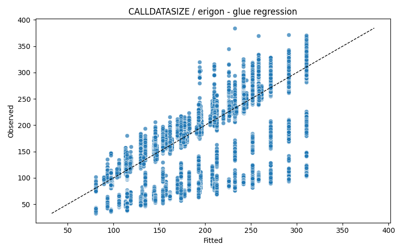

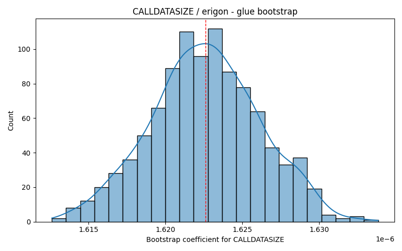


</details>

<details><summary><code>DUP</code> · nobs=63052 · runtime_ms=1.903e-06 · p=1.00e-03 · R²=0.8068</summary>


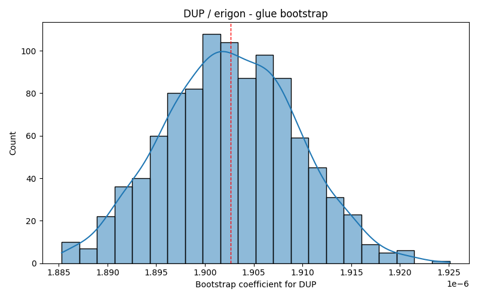


</details>

<details><summary><code>GAS</code> · nobs=63052 · runtime_ms=1.647e-06 · p=1.00e-03 · R²=0.8068</summary>

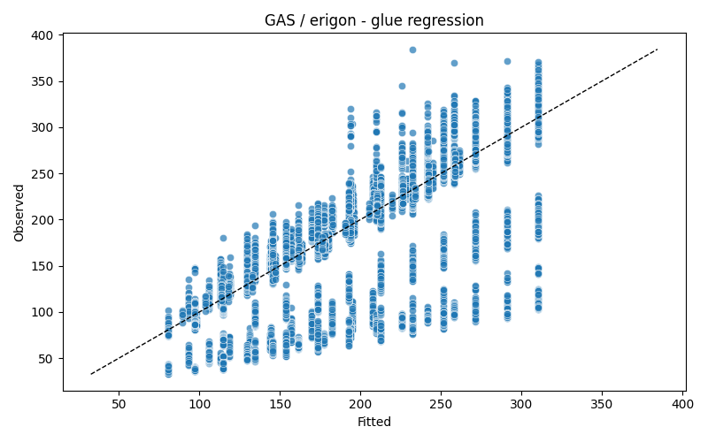

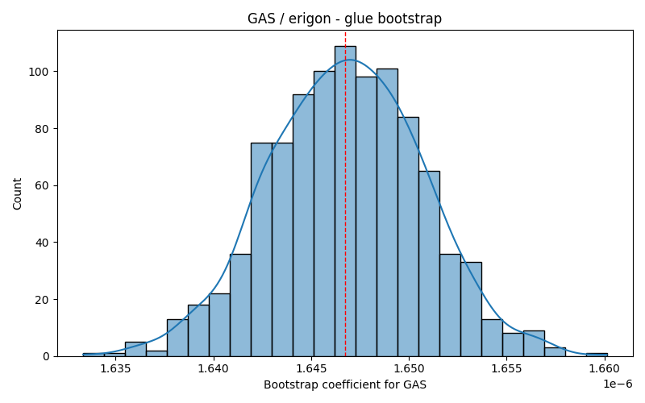


</details>

<details><summary><code>MLOAD</code> · nobs=63052 · runtime_ms=4.529e-06 · p=1.00e-03 · R²=0.8068</summary>

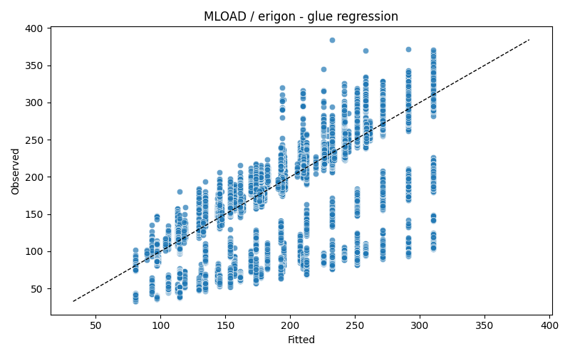

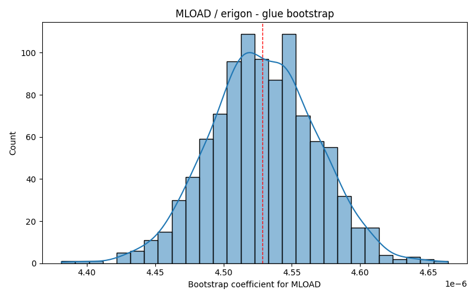

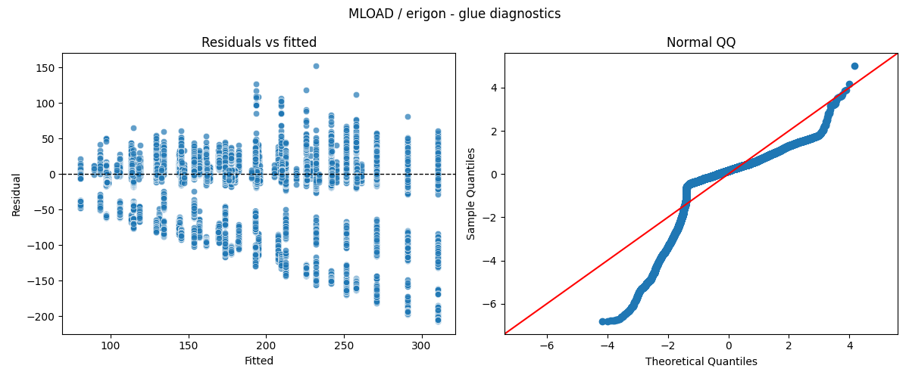

</details>

<details><summary><code>PUSH</code> · nobs=63052 · runtime_ms=2.971e-06 · p=1.00e-03 · R²=0.8068</summary>


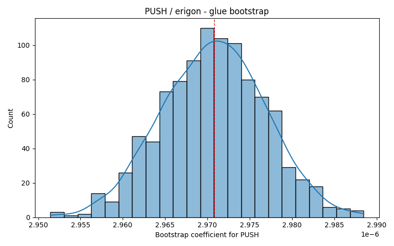


</details>

<details><summary><code>PUSH0</code> · nobs=63052 · runtime_ms=1.625e-06 · p=1.00e-03 · R²=0.8068</summary>

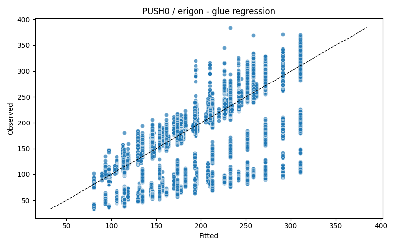

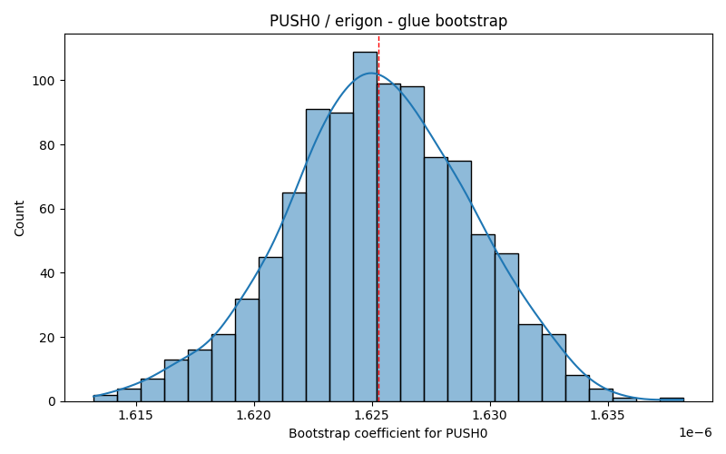


</details>

<details><summary><code>STATICCALL</code> · nobs=63052 · runtime_ms=6.737e-05 · p=1.00e-03 · R²=0.8068</summary>

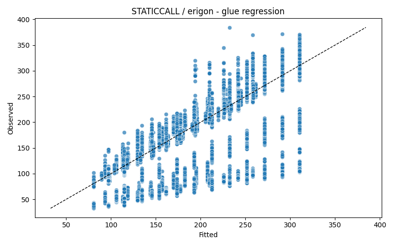

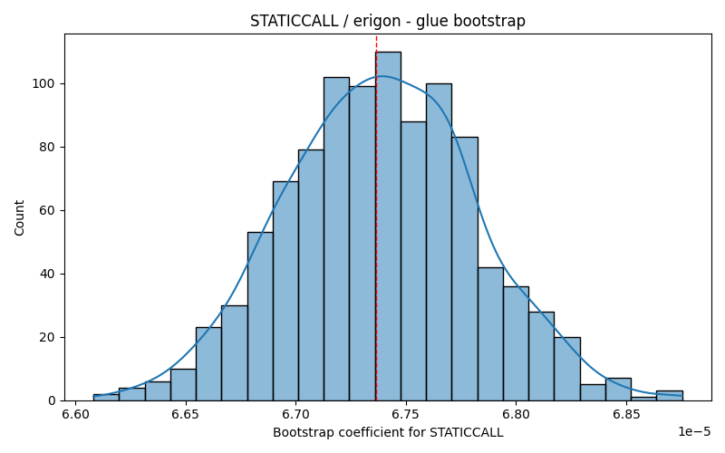


</details>

### Pure glue · erigon

<details><summary><code>ISZERO</code> · nobs=1067 · runtime_ms=1.592e-06 · p=1.00e-03 · R²=0.5502</summary>

```
==============================================================================
                           NNLS Regression Results                            
==============================================================================
Dep. Variable:          test_runtime_ms              R-squared:          0.550
Model:                  NNLS                    Adj. R-squared:          0.550
No. Observations:       1067                              RMSE:          30.32
Df Residuals:           1065                               MAE:          23.35
Df Model:               1      
==============================================================================
                      coef     std err     P-value      [0.025      0.975]
------------------------------------------------------------------------------
         const      8.8778      2.5807       0.002      3.7237     13.8551
        ISZERO      0.0000      0.0000       0.001      0.0000      0.0000
==============================================================================
Notes: Non-negative least squares with bootstrap inference (1000 iterations)
==============================================================================
```

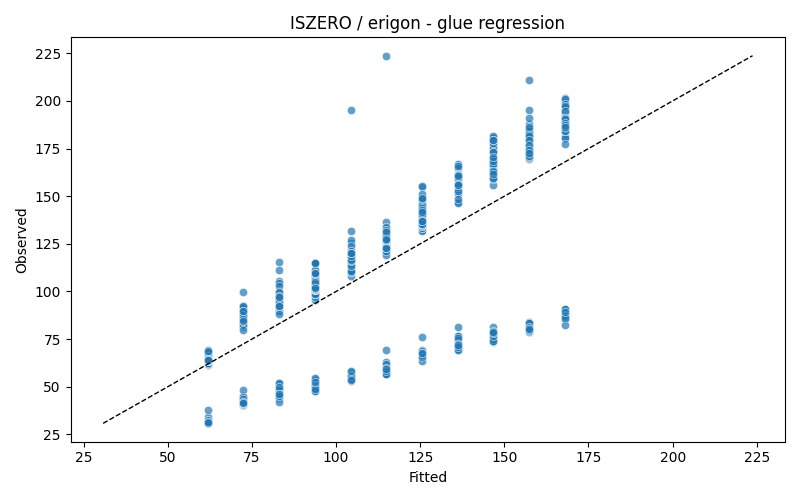

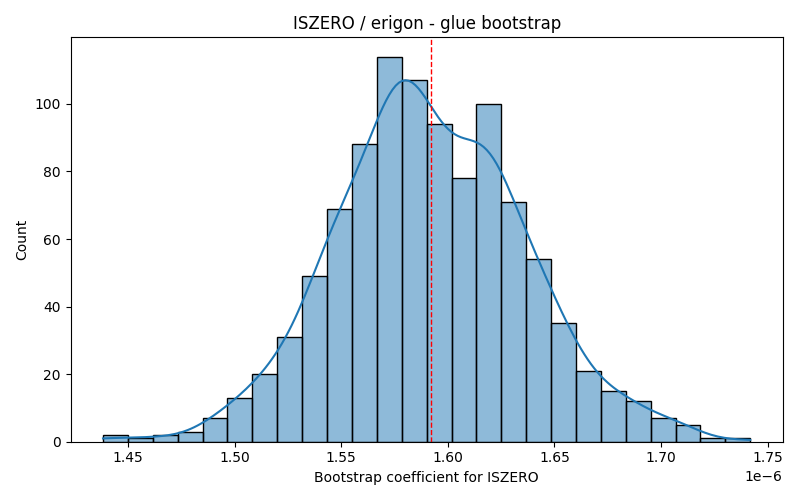

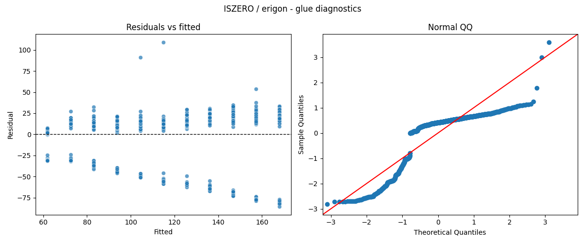

</details>

<details><summary><code>JUMPDEST</code> · nobs=1067 · runtime_ms=1.22e-06 · p=1.00e-03 · R²=0.4393</summary>

```
==============================================================================
                           NNLS Regression Results                            
==============================================================================
Dep. Variable:          test_runtime_ms              R-squared:          0.439
Model:                  NNLS                    Adj. R-squared:          0.439
No. Observations:       1067                              RMSE:          87.07
Df Residuals:           1065                               MAE:          67.90
Df Model:               1      
==============================================================================
                      coef     std err     P-value      [0.025      0.975]
------------------------------------------------------------------------------
         const     13.7972      7.4146       0.040      0.0000     28.9558
      JUMPDEST      0.0000      0.0000       0.001      0.0000      0.0000
==============================================================================
Notes: Non-negative least squares with bootstrap inference (1000 iterations)
==============================================================================
```

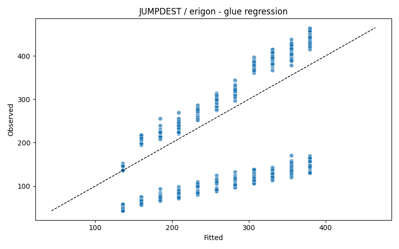

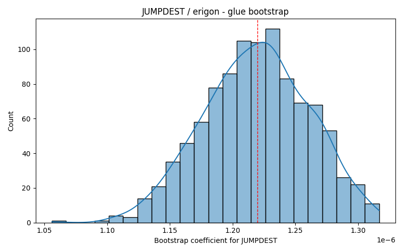

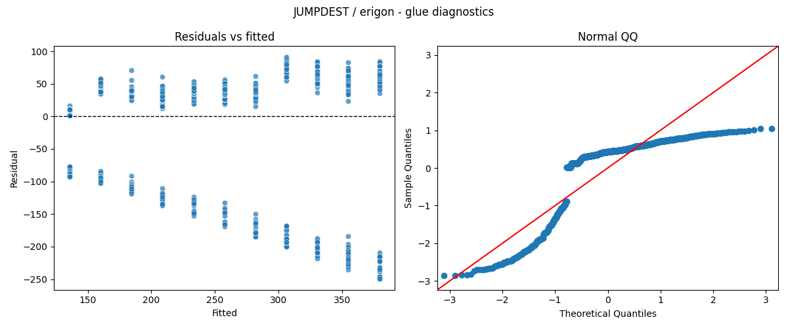

</details>

<details><summary><code>SWAP</code> · nobs=17072 · runtime_ms=1.942e-06 · p=1.00e-03 · R²=0.8174</summary>

```
==============================================================================
                           NNLS Regression Results                            
==============================================================================
Dep. Variable:          test_runtime_ms              R-squared:          0.817
Model:                  NNLS                    Adj. R-squared:          0.817
No. Observations:       17072                             RMSE:          19.33
Df Residuals:           17070                              MAE:          10.13
Df Model:               1      
==============================================================================
                      coef     std err     P-value      [0.025      0.975]
------------------------------------------------------------------------------
         const     17.2973      0.4831       0.001     16.4151     18.3087
          SWAP      0.0000      0.0000       0.001      0.0000      0.0000
==============================================================================
Notes: Non-negative least squares with bootstrap inference (1000 iterations)
==============================================================================
```

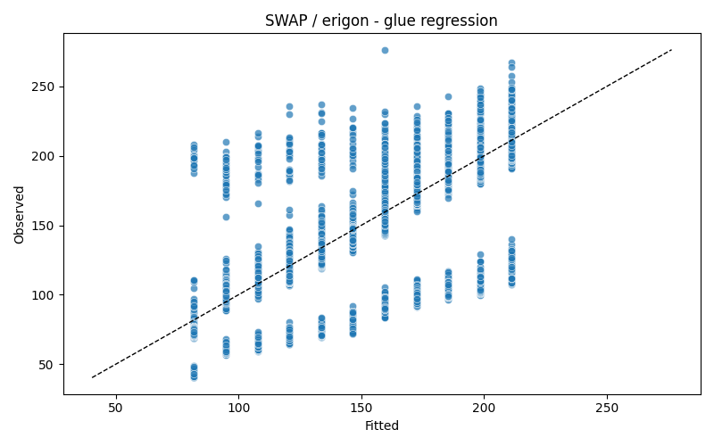

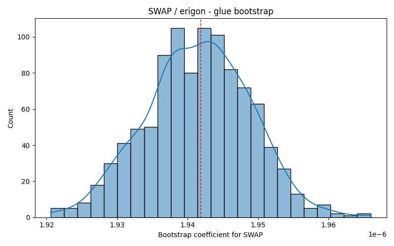

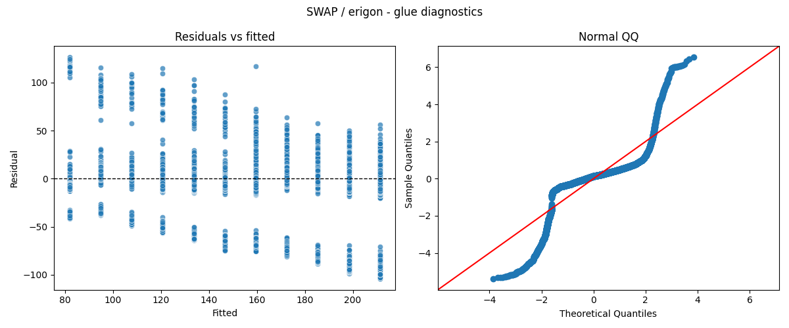

</details>

### Mixed glue (tier A) · erigon

<details><summary><code>ADD</code> · nobs=1067 · runtime_ms=3.416e-06 · p=1.00e-03 · R²=0.4734</summary>

```
==============================================================================
                           NNLS Regression Results                            
==============================================================================
Dep. Variable:          test_runtime_ms              R-squared:          0.473
Model:                  NNLS                    Adj. R-squared:          0.473
No. Observations:       1067                              RMSE:          37.94
Df Residuals:           1065                               MAE:          29.01
Df Model:               1      
==============================================================================
                      coef     std err     P-value      [0.025      0.975]
------------------------------------------------------------------------------
         const     14.3951      3.3422       0.001      8.0745     20.8003
           ADD      0.0000      0.0000       0.001      0.0000      0.0000
==============================================================================
Notes: Non-negative least squares with bootstrap inference (1000 iterations)
==============================================================================
```

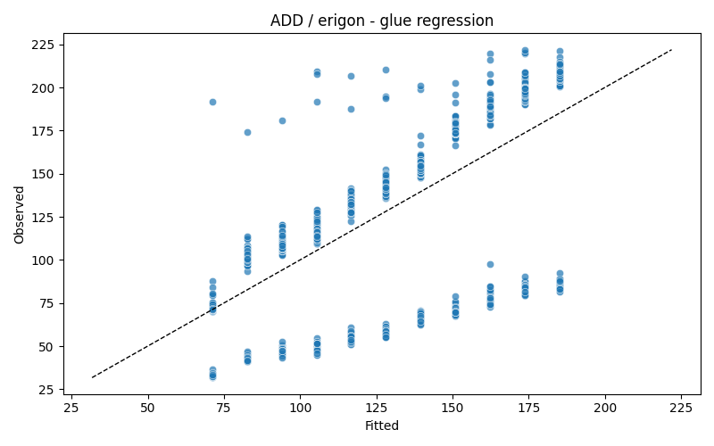

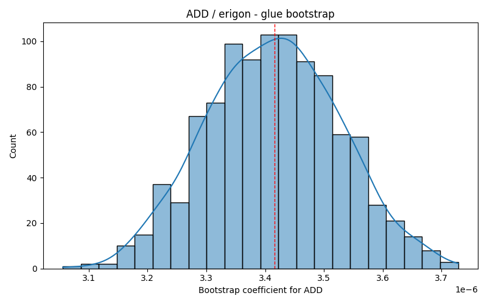

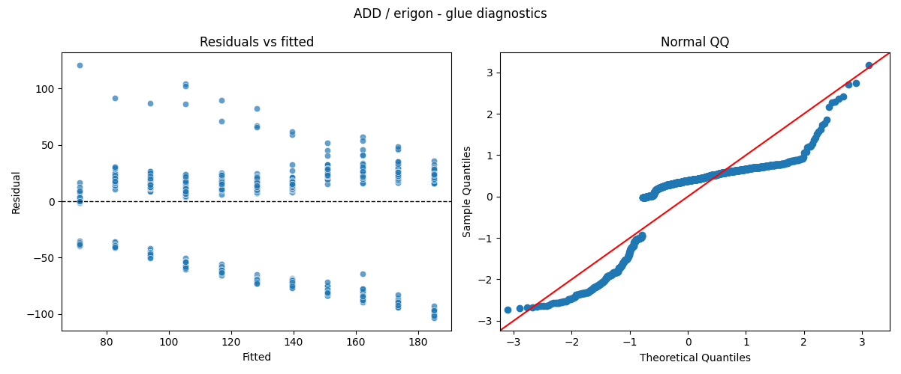

</details>

<details><summary><code>AND</code> · nobs=1067 · runtime_ms=3.435e-06 · p=1.00e-03 · R²=0.5101</summary>

```
==============================================================================
                           NNLS Regression Results                            
==============================================================================
Dep. Variable:          test_runtime_ms              R-squared:          0.510
Model:                  NNLS                    Adj. R-squared:          0.510
No. Observations:       1067                              RMSE:          35.45
Df Residuals:           1065                               MAE:          27.32
Df Model:               1      
==============================================================================
                      coef     std err     P-value      [0.025      0.975]
------------------------------------------------------------------------------
         const     12.3010      3.1202       0.001      6.1802     18.7153
           AND      0.0000      0.0000       0.001      0.0000      0.0000
==============================================================================
Notes: Non-negative least squares with bootstrap inference (1000 iterations)
==============================================================================
```

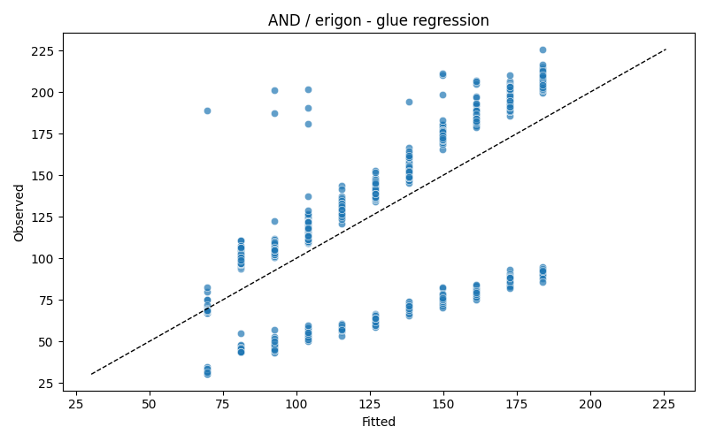

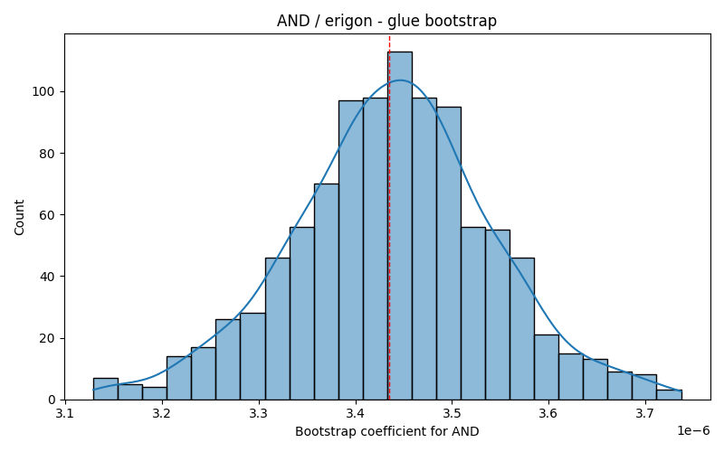

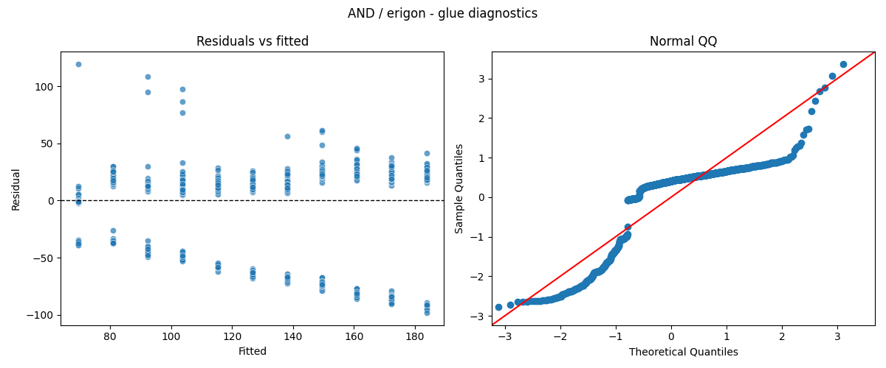

</details>

<details><summary><code>CALLDATACOPY</code> · nobs=25608 · runtime_ms=1.036e-05 · p=1.00e-03 · R²=0.961</summary>

```
==============================================================================
                           NNLS Regression Results                            
==============================================================================
Dep. Variable:          test_runtime_ms              R-squared:          0.961
Model:                  NNLS                    Adj. R-squared:          0.961
No. Observations:       25608                             RMSE:          15.69
Df Residuals:           25606                              MAE:          10.42
Df Model:               1      
==============================================================================
                      coef     std err     P-value      [0.025      0.975]
------------------------------------------------------------------------------
         const     14.4082      0.1198       0.001     14.1592     14.6439
  CALLDATACOPY      0.0000      0.0000       0.001      0.0000      0.0000
==============================================================================
Notes: Non-negative least squares with bootstrap inference (1000 iterations)
==============================================================================
```

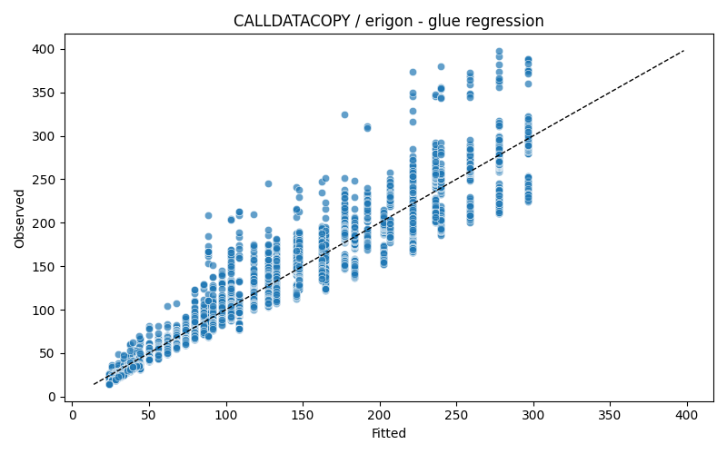

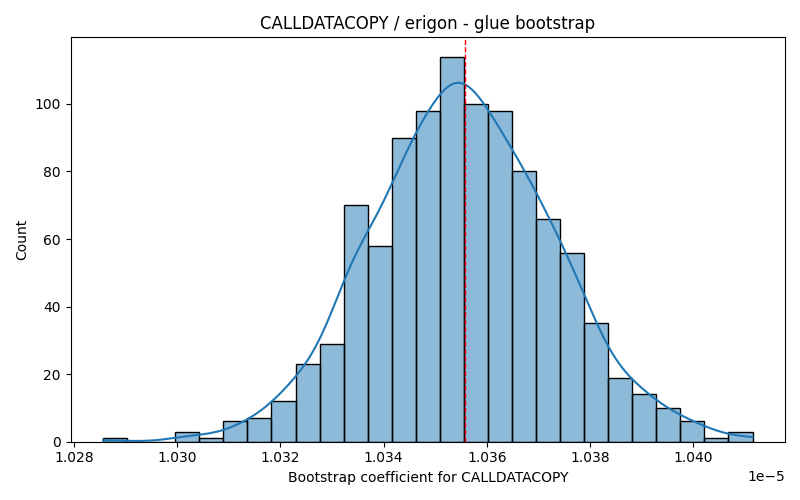

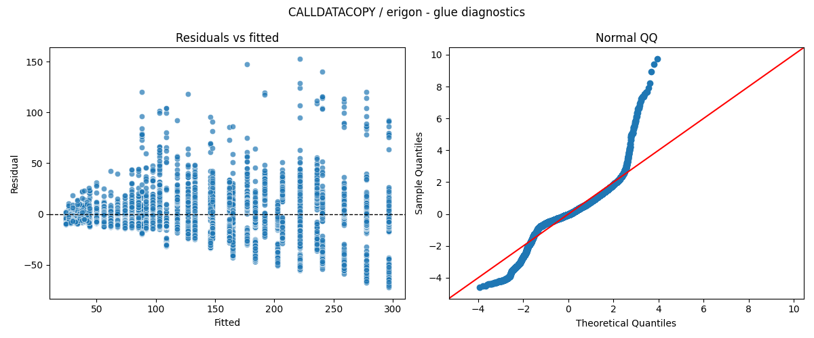

</details>

<details><summary><code>CALLDATALOAD</code> · nobs=4268 · runtime_ms=5.155e-05 · p=1.00e-03 · R²=0.1914</summary>

```
==============================================================================
                           NNLS Regression Results                            
==============================================================================
Dep. Variable:          test_runtime_ms              R-squared:          0.191
Model:                  NNLS                    Adj. R-squared:          0.191
No. Observations:       4268                              RMSE:           0.41
Df Residuals:           4266                               MAE:           0.19
Df Model:               1      
==============================================================================
                      coef     std err     P-value      [0.025      0.975]
------------------------------------------------------------------------------
         const      4.2285      0.0185       0.001      4.1917      4.2611
  CALLDATALOAD      0.0001      0.0000       0.001      0.0000      0.0001
==============================================================================
Notes: Non-negative least squares with bootstrap inference (1000 iterations)
==============================================================================
```

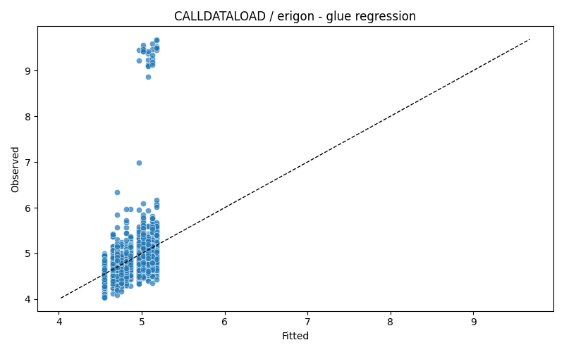

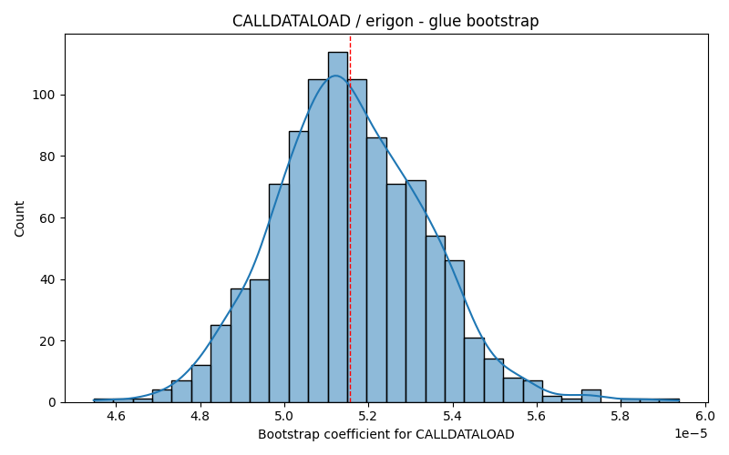

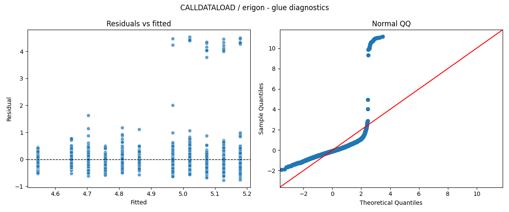

</details>

<details><summary><code>DIV</code> · nobs=1067 · runtime_ms=1.416e-05 · p=1.00e-03 · R²=0.9259</summary>

```
==============================================================================
                           NNLS Regression Results                            
==============================================================================
Dep. Variable:          test_runtime_ms              R-squared:          0.926
Model:                  NNLS                    Adj. R-squared:          0.926
No. Observations:       1067                              RMSE:          31.63
Df Residuals:           1065                               MAE:          24.68
Df Model:               1      
==============================================================================
                      coef     std err     P-value      [0.025      0.975]
------------------------------------------------------------------------------
         const     29.9618      3.0936       0.001     23.9063     35.7757
           DIV      0.0000      0.0000       0.001      0.0000      0.0000
==============================================================================
Notes: Non-negative least squares with bootstrap inference (1000 iterations)
==============================================================================
```

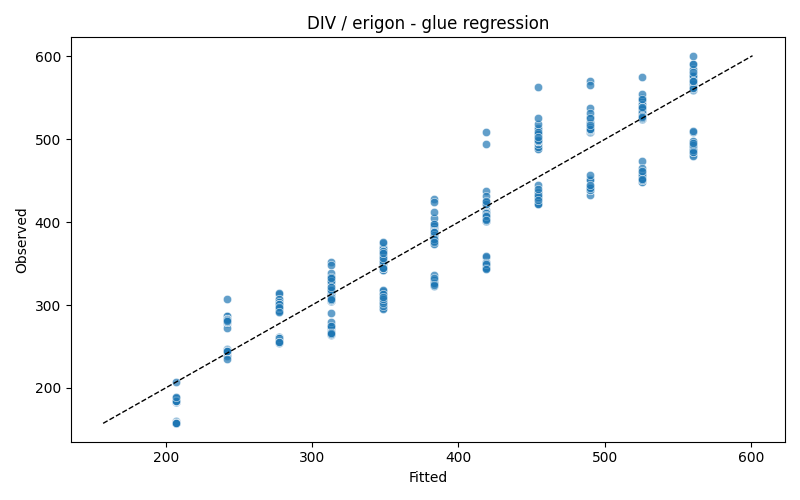

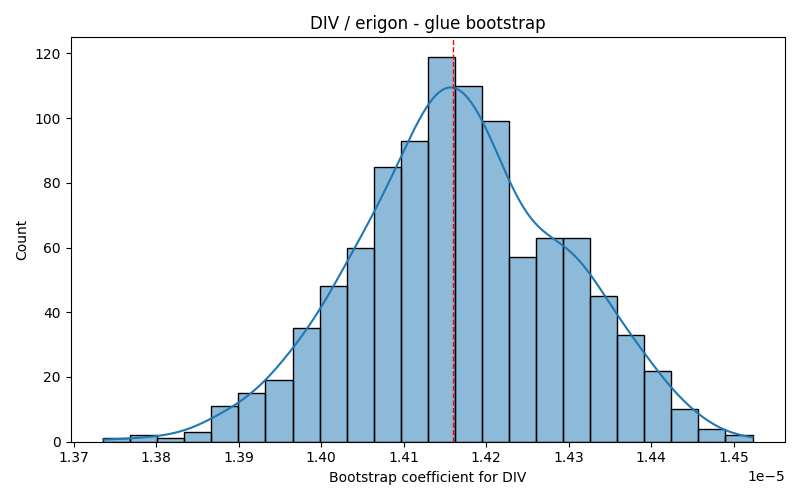

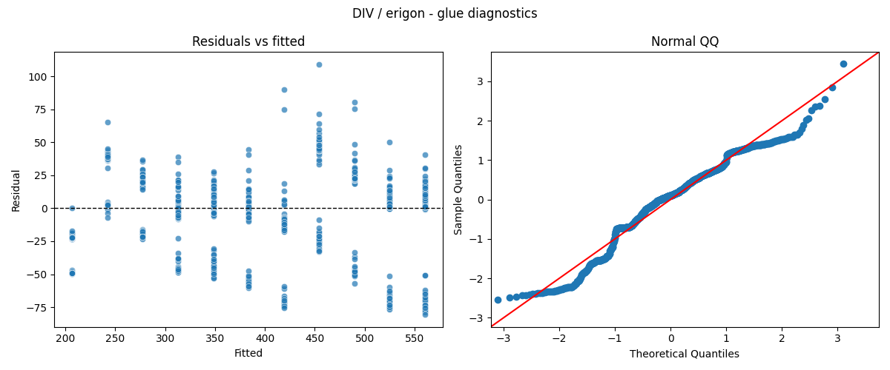

</details>

<details><summary><code>EXP</code> · nobs=1067 · runtime_ms=0.0006889 · p=1.00e-03 · R²=0.9811</summary>

```
==============================================================================
                           NNLS Regression Results                            
==============================================================================
Dep. Variable:          test_runtime_ms              R-squared:          0.981
Model:                  NNLS                    Adj. R-squared:          0.981
No. Observations:       1067                              RMSE:           3.75
Df Residuals:           1065                               MAE:           2.99
Df Model:               1      
==============================================================================
                      coef     std err     P-value      [0.025      0.975]
------------------------------------------------------------------------------
         const      9.2027      0.4485       0.001      8.3395     10.0774
           EXP      0.0007      0.0000       0.001      0.0007      0.0007
==============================================================================
Notes: Non-negative least squares with bootstrap inference (1000 iterations)
==============================================================================
```

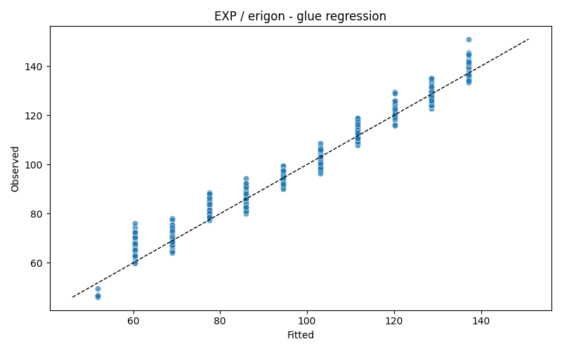

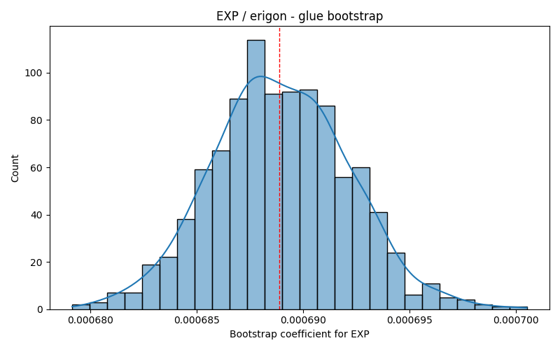

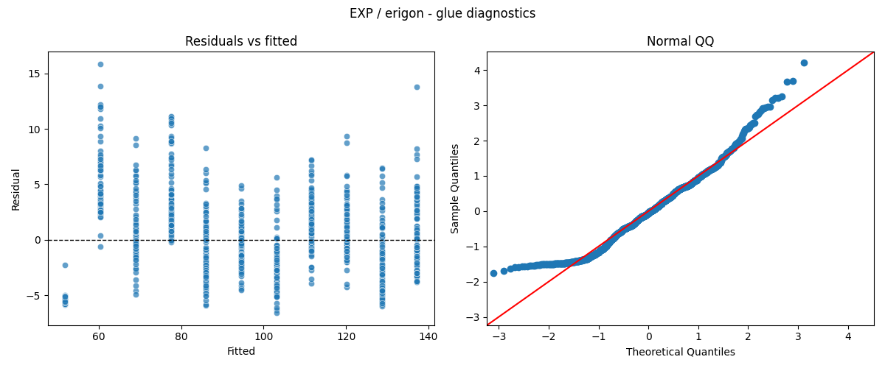

</details>

<details><summary><code>GT</code> · nobs=1067 · runtime_ms=3.49e-06 · p=1.00e-03 · R²=0.5229</summary>

```
==============================================================================
                           NNLS Regression Results                            
==============================================================================
Dep. Variable:          test_runtime_ms              R-squared:          0.523
Model:                  NNLS                    Adj. R-squared:          0.522
No. Observations:       1067                              RMSE:          35.11
Df Residuals:           1065                               MAE:          26.25
Df Model:               1      
==============================================================================
                      coef     std err     P-value      [0.025      0.975]
------------------------------------------------------------------------------
         const     13.4463      3.3580       0.001      6.8129     20.1975
            GT      0.0000      0.0000       0.001      0.0000      0.0000
==============================================================================
Notes: Non-negative least squares with bootstrap inference (1000 iterations)
==============================================================================
```

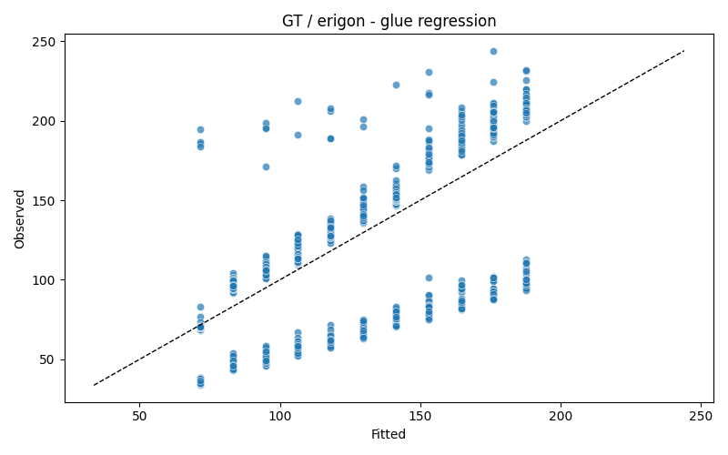

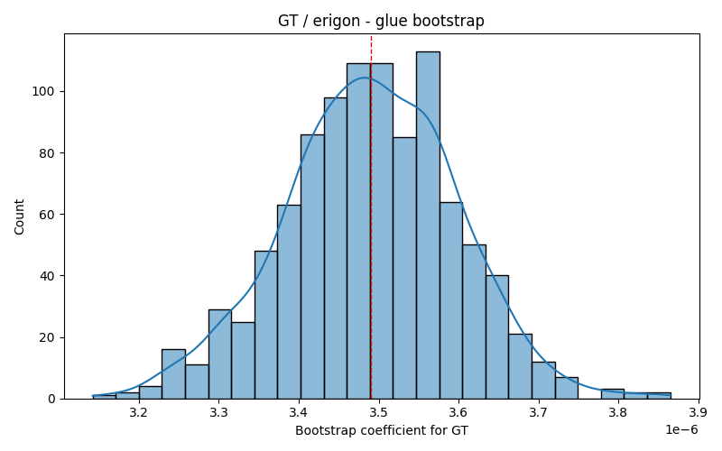

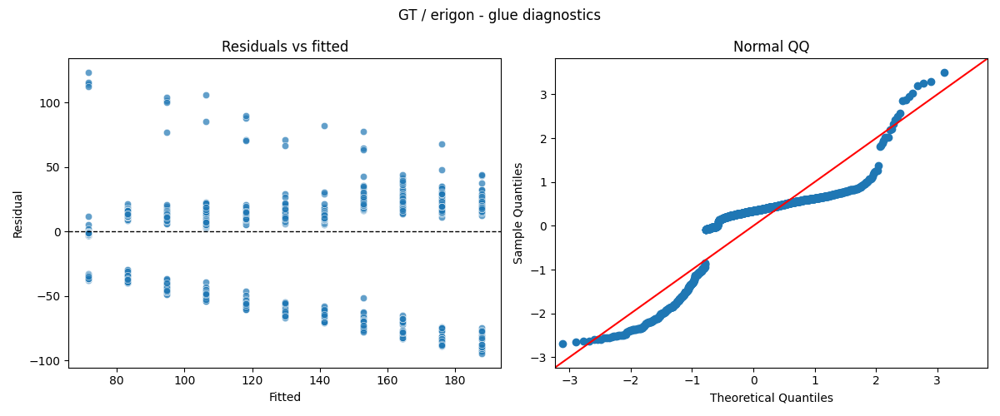

</details>

<details><summary><code>JUMPI</code> · nobs=1067 · runtime_ms=4.697e-06 · p=1.00e-03 · R²=0.861</summary>

```
==============================================================================
                           NNLS Regression Results                            
==============================================================================
Dep. Variable:          test_runtime_ms              R-squared:          0.861
Model:                  NNLS                    Adj. R-squared:          0.861
No. Observations:       1067                              RMSE:           8.52
Df Residuals:           1065                               MAE:           6.14
Df Model:               1      
==============================================================================
                      coef     std err     P-value      [0.025      0.975]
------------------------------------------------------------------------------
         const      9.6798      0.8385       0.001      8.1284     11.4025
         JUMPI      0.0000      0.0000       0.001      0.0000      0.0000
==============================================================================
Notes: Non-negative least squares with bootstrap inference (1000 iterations)
==============================================================================
```

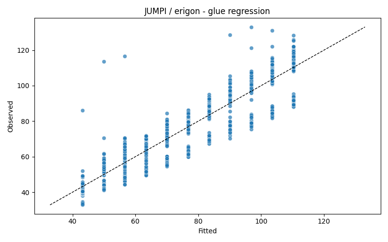

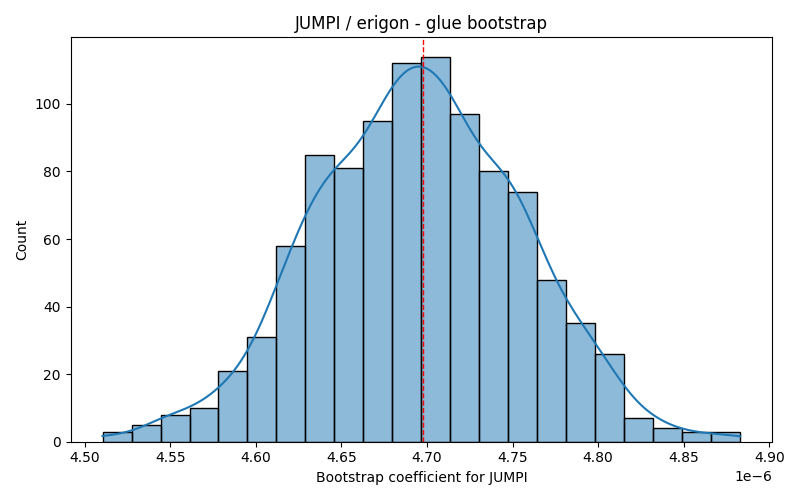

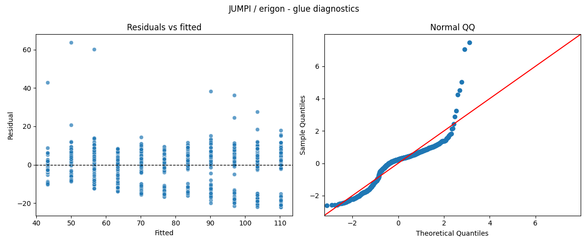

</details>

<details><summary><code>LT</code> · nobs=1067 · runtime_ms=3.5e-06 · p=1.00e-03 · R²=0.528</summary>

```
==============================================================================
                           NNLS Regression Results                            
==============================================================================
Dep. Variable:          test_runtime_ms              R-squared:          0.528
Model:                  NNLS                    Adj. R-squared:          0.528
No. Observations:       1067                              RMSE:          34.85
Df Residuals:           1065                               MAE:          26.19
Df Model:               1      
==============================================================================
                      coef     std err     P-value      [0.025      0.975]
------------------------------------------------------------------------------
         const     13.6470      3.2506       0.001      6.8376     19.6904
            LT      0.0000      0.0000       0.001      0.0000      0.0000
==============================================================================
Notes: Non-negative least squares with bootstrap inference (1000 iterations)
==============================================================================
```

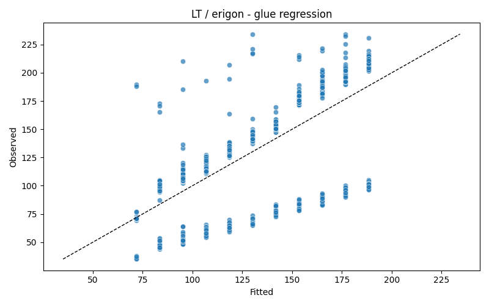

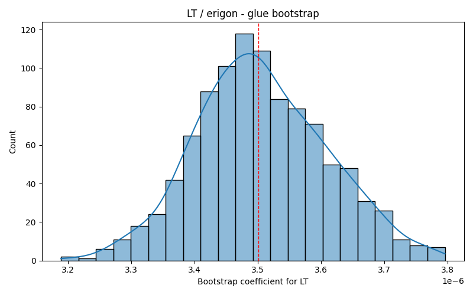

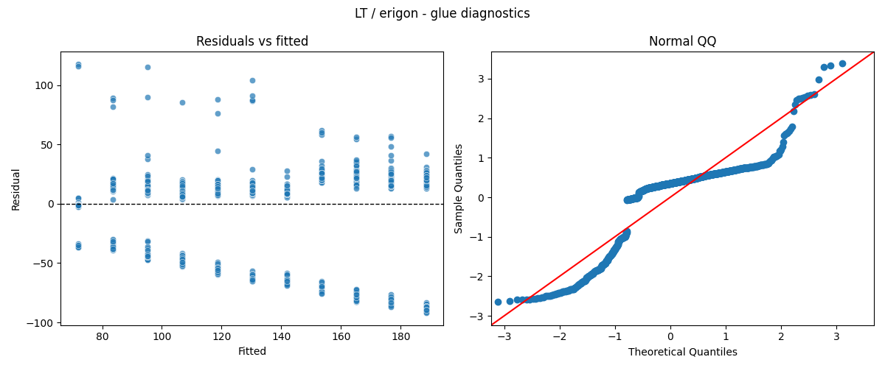

</details>

<details><summary><code>MSTORE</code> · nobs=5335 · runtime_ms=6.935e-06 · p=1.00e-03 · R²=0.4566</summary>

```
==============================================================================
                           NNLS Regression Results                            
==============================================================================
Dep. Variable:          test_runtime_ms              R-squared:          0.457
Model:                  NNLS                    Adj. R-squared:          0.457
No. Observations:       5335                              RMSE:          53.11
Df Residuals:           5333                               MAE:          41.30
Df Model:               1      
==============================================================================
                      coef     std err     P-value      [0.025      0.975]
------------------------------------------------------------------------------
         const     16.0563      2.0977       0.001     11.9012     19.9590
        MSTORE      0.0000      0.0000       0.001      0.0000      0.0000
==============================================================================
Notes: Non-negative least squares with bootstrap inference (1000 iterations)
==============================================================================
```

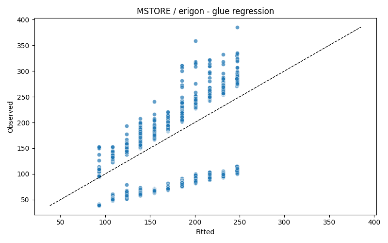

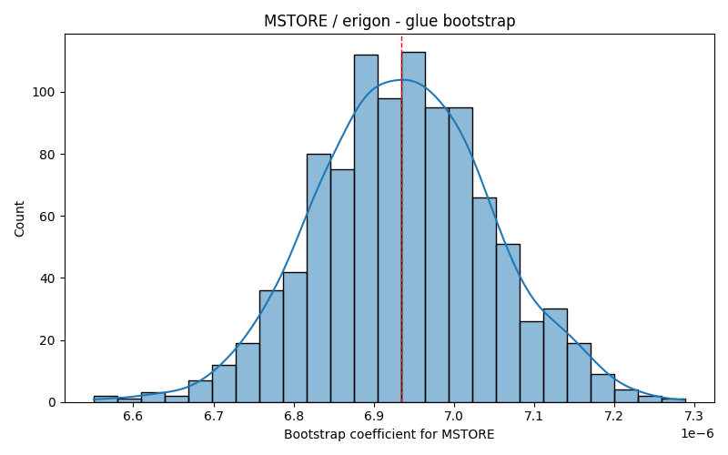

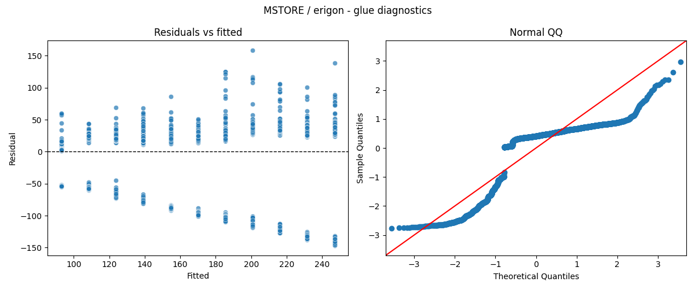

</details>

<details><summary><code>MSTORE8</code> · nobs=5335 · runtime_ms=7.176e-06 · p=1.00e-03 · R²=0.7608</summary>

```
==============================================================================
                           NNLS Regression Results                            
==============================================================================
Dep. Variable:          test_runtime_ms              R-squared:          0.761
Model:                  NNLS                    Adj. R-squared:          0.761
No. Observations:       5335                              RMSE:          28.25
Df Residuals:           5333                               MAE:          21.63
Df Model:               1      
==============================================================================
                      coef     std err     P-value      [0.025      0.975]
------------------------------------------------------------------------------
         const     15.5812      1.1380       0.001     13.3395     17.8135
       MSTORE8      0.0000      0.0000       0.001      0.0000      0.0000
==============================================================================
Notes: Non-negative least squares with bootstrap inference (1000 iterations)
==============================================================================
```

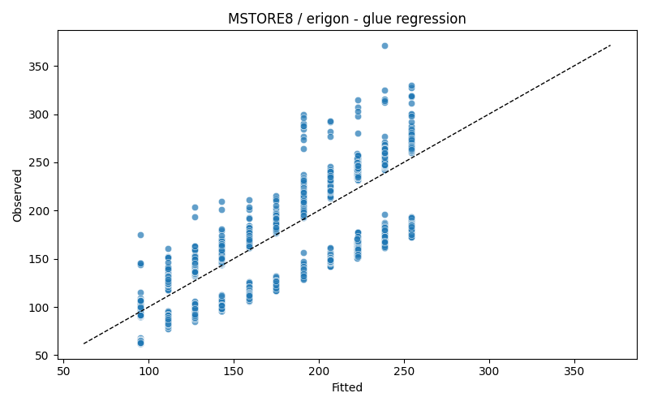

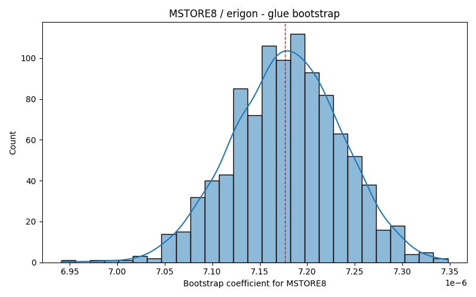

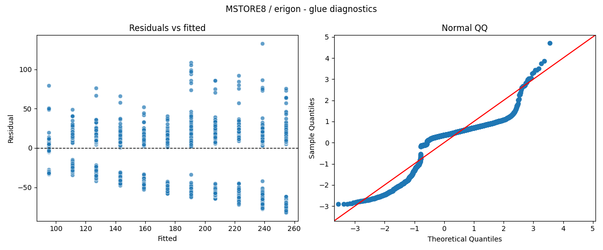

</details>

<details><summary><code>MUL</code> · nobs=1067 · runtime_ms=5.324e-06 · p=1.00e-03 · R²=0.5565</summary>

```
==============================================================================
                           NNLS Regression Results                            
==============================================================================
Dep. Variable:          test_runtime_ms              R-squared:          0.557
Model:                  NNLS                    Adj. R-squared:          0.556
No. Observations:       1067                              RMSE:          37.54
Df Residuals:           1065                               MAE:          28.41
Df Model:               1      
==============================================================================
                      coef     std err     P-value      [0.025      0.975]
------------------------------------------------------------------------------
         const      8.0845      3.3459       0.005      1.8607     14.8755
           MUL      0.0000      0.0000       0.001      0.0000      0.0000
==============================================================================
Notes: Non-negative least squares with bootstrap inference (1000 iterations)
==============================================================================
```

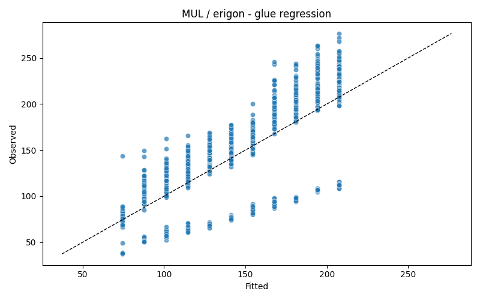

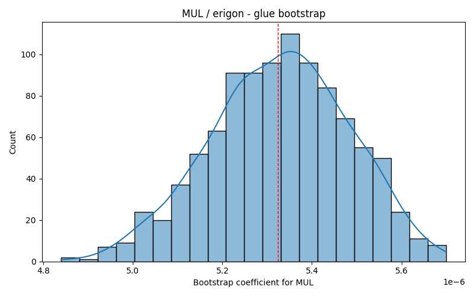

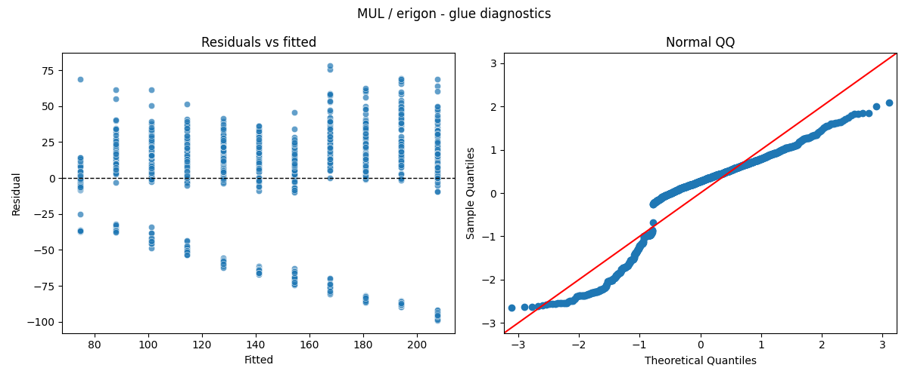

</details>

<details><summary><code>PC</code> · nobs=1067 · runtime_ms=1.751e-06 · p=1.00e-03 · R²=0.9797</summary>

```
==============================================================================
                           NNLS Regression Results                            
==============================================================================
Dep. Variable:          test_runtime_ms              R-squared:          0.980
Model:                  NNLS                    Adj. R-squared:          0.980
No. Observations:       1067                              RMSE:           7.54
Df Residuals:           1065                               MAE:           6.24
Df Model:               1      
==============================================================================
                      coef     std err     P-value      [0.025      0.975]
------------------------------------------------------------------------------
         const     12.9125      0.8425       0.001     11.3339     14.6091
            PC      0.0000      0.0000       0.001      0.0000      0.0000
==============================================================================
Notes: Non-negative least squares with bootstrap inference (1000 iterations)
==============================================================================
```

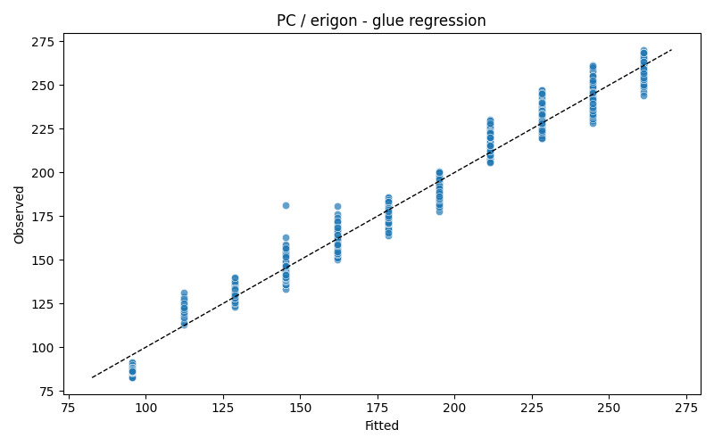

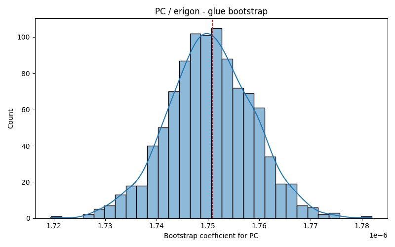

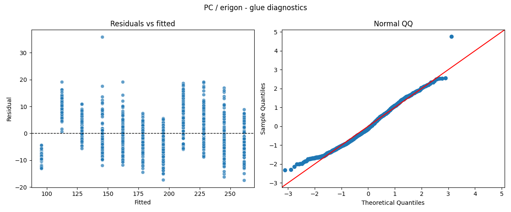

</details>

<details><summary><code>RETURNDATASIZE</code> · nobs=4268 · runtime_ms=2.915e-06 · p=1.00e-03 · R²=0.8232</summary>

```
==============================================================================
                           NNLS Regression Results                            
==============================================================================
Dep. Variable:          test_runtime_ms              R-squared:          0.823
Model:                  NNLS                    Adj. R-squared:          0.823
No. Observations:       4268                              RMSE:          21.34
Df Residuals:           4266                               MAE:          15.49
Df Model:               1      
==============================================================================
                      coef     std err     P-value      [0.025      0.975]
------------------------------------------------------------------------------
         const     12.2043      0.9806       0.001     10.3553     14.2090
RETURNDATASIZE      0.0000      0.0000       0.001      0.0000      0.0000
==============================================================================
Notes: Non-negative least squares with bootstrap inference (1000 iterations)
==============================================================================
```

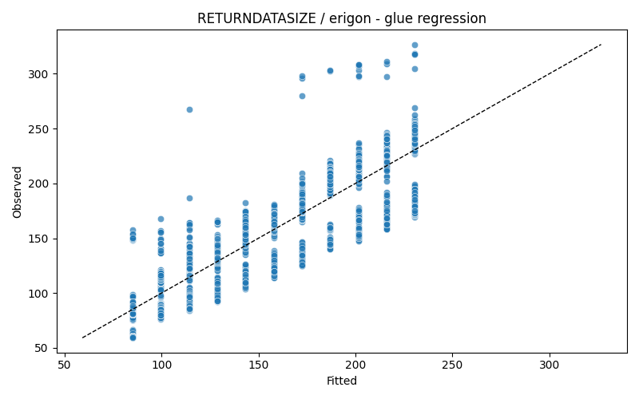

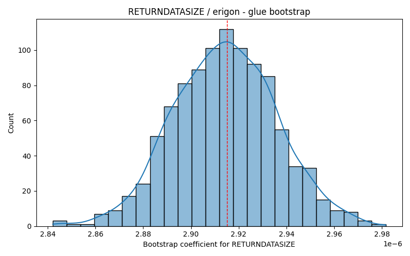

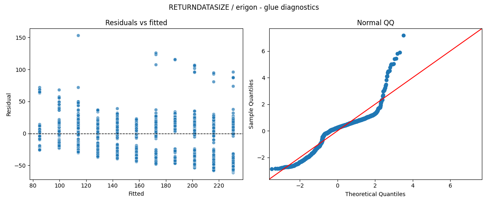

</details>

<details><summary><code>SELFBALANCE</code> · nobs=1067 · runtime_ms=1.933e-06 · p=1.00e-03 · R²=0.9629</summary>

```
==============================================================================
                           NNLS Regression Results                            
==============================================================================
Dep. Variable:          test_runtime_ms              R-squared:          0.963
Model:                  NNLS                    Adj. R-squared:          0.963
No. Observations:       1067                              RMSE:           4.69
Df Residuals:           1065                               MAE:           3.67
Df Model:               1      
==============================================================================
                      coef     std err     P-value      [0.025      0.975]
------------------------------------------------------------------------------
         const      7.3605      0.4476       0.001      6.5186      8.2783
   SELFBALANCE      0.0000      0.0000       0.001      0.0000      0.0000
==============================================================================
Notes: Non-negative least squares with bootstrap inference (1000 iterations)
==============================================================================
```

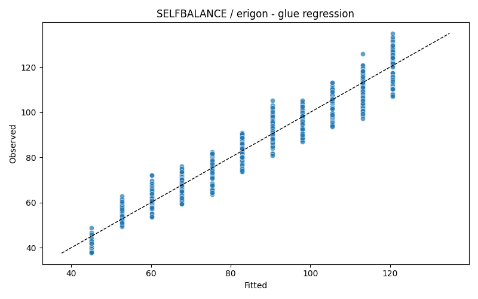

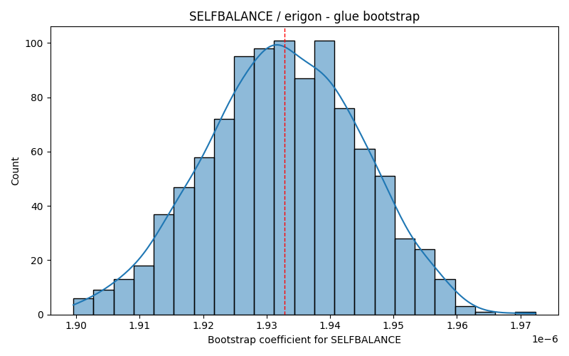

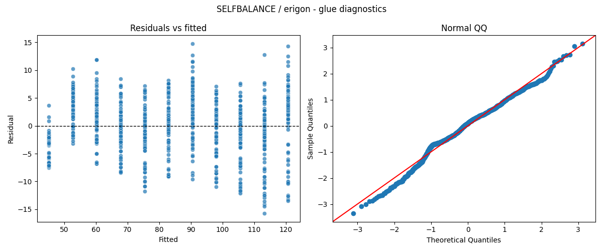

</details>

<details><summary><code>SUB</code> · nobs=1067 · runtime_ms=3.453e-06 · p=1.00e-03 · R²=0.5026</summary>

```
==============================================================================
                           NNLS Regression Results                            
==============================================================================
Dep. Variable:          test_runtime_ms              R-squared:          0.503
Model:                  NNLS                    Adj. R-squared:          0.502
No. Observations:       1067                              RMSE:          36.16
Df Residuals:           1065                               MAE:          27.55
Df Model:               1      
==============================================================================
                      coef     std err     P-value      [0.025      0.975]
------------------------------------------------------------------------------
         const     13.4362      3.4556       0.001      6.9629     20.4461
           SUB      0.0000      0.0000       0.001      0.0000      0.0000
==============================================================================
Notes: Non-negative least squares with bootstrap inference (1000 iterations)
==============================================================================
```

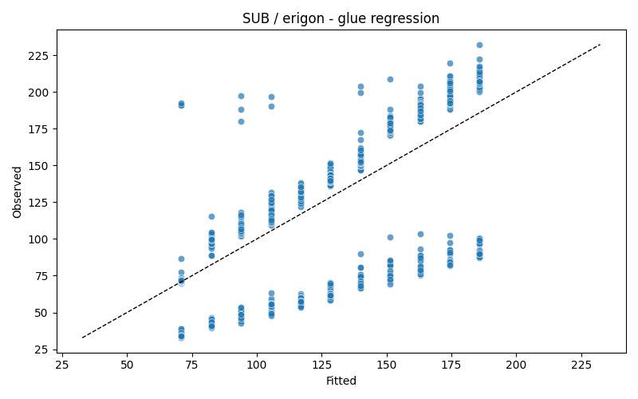

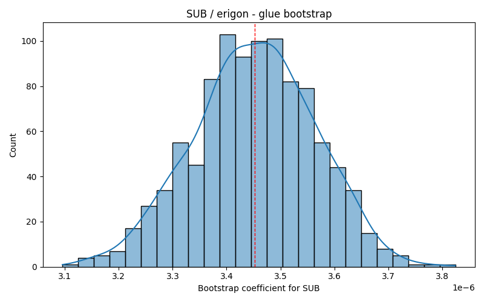

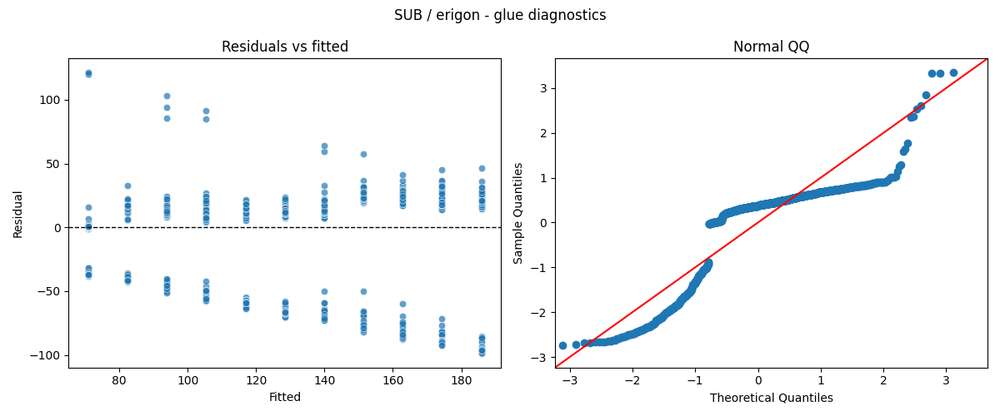

</details>

### Mixed glue (tier B) · erigon

<details><summary><code>JUMP</code> · nobs=1067 · runtime_ms=8.1e-06 · p=1.00e-03 · R²=0.5763</summary>

```
==============================================================================
                           NNLS Regression Results                            
==============================================================================
Dep. Variable:          test_runtime_ms              R-squared:          0.576
Model:                  NNLS                    Adj. R-squared:          0.576
No. Observations:       1067                              RMSE:          25.82
Df Residuals:           1065                               MAE:          19.82
Df Model:               1      
==============================================================================
                      coef     std err     P-value      [0.025      0.975]
------------------------------------------------------------------------------
         const     10.3027      2.2598       0.001      5.9894     14.9561
          JUMP      0.0000      0.0000       0.001      0.0000      0.0000
==============================================================================
Notes: Non-negative least squares with bootstrap inference (1000 iterations)
==============================================================================
```

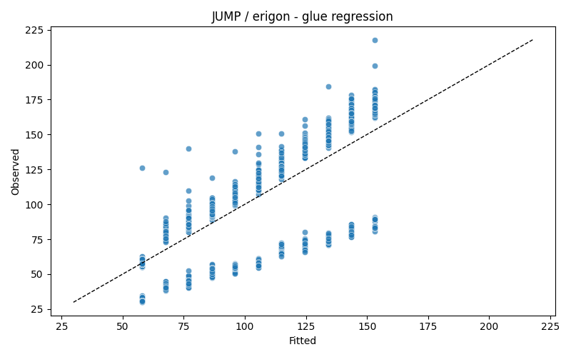

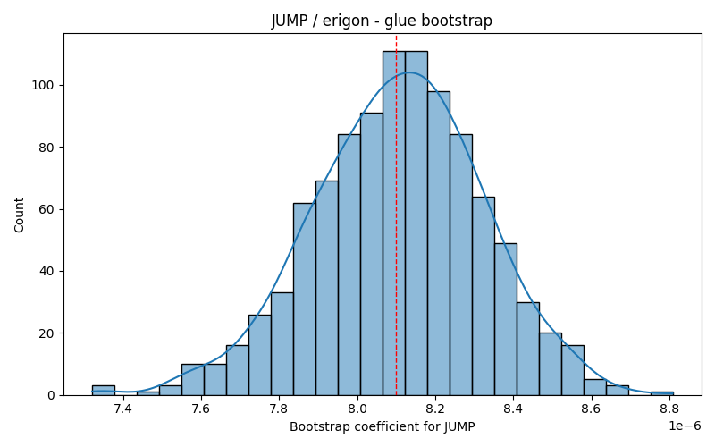

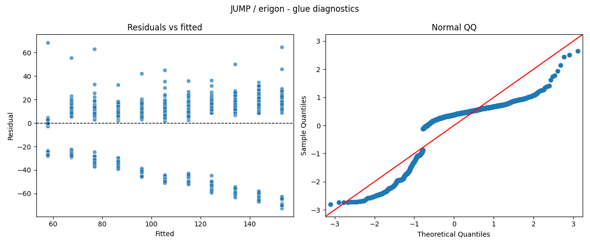

</details>

<details><summary><code>KECCAK256</code> · nobs=17072 · runtime_ms=7.449e-06 · p=1.00e-03 · R²=0.004043</summary>

```
==============================================================================
                           NNLS Regression Results                            
==============================================================================
Dep. Variable:          test_runtime_ms              R-squared:          0.004
Model:                  NNLS                    Adj. R-squared:          0.004
No. Observations:       17072                             RMSE:         232.42
Df Residuals:           17070                              MAE:         184.52
Df Model:               1      
==============================================================================
                      coef     std err     P-value      [0.025      0.975]
------------------------------------------------------------------------------
         const    571.1517      3.4499       0.001    564.3011    577.9338
     KECCAK256      0.0000      0.0000       0.001      0.0000      0.0000
==============================================================================
Notes: Non-negative least squares with bootstrap inference (1000 iterations)
==============================================================================
```

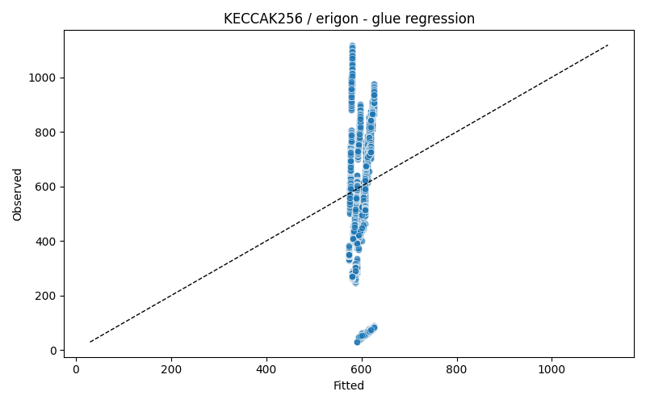

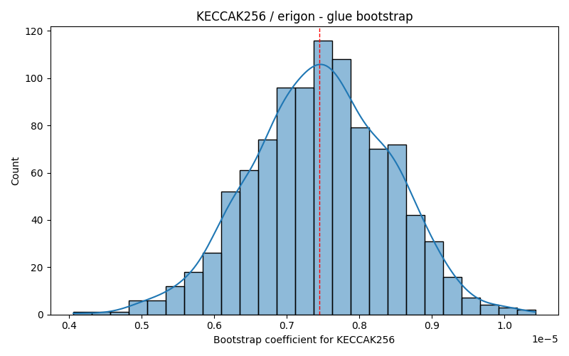

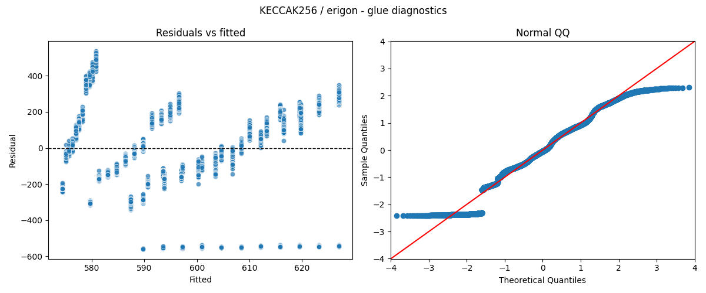

</details>

## ethrex

| glue_opcode | nobs | glue_runtime_ms | p_value | rsquared |
| --- | --- | --- | --- | --- |
| `ISZERO` | 110 | 7.251e-07 | 1.00e-03 | 0.8973 |
| `JUMPDEST` | 110 | 5.06e-07 | 1.00e-03 | 0.8625 |
| `SWAP` | 1760 | 8.804e-07 | 1.00e-03 | 0.8673 |
| `CALLDATASIZE` | 6589 | 6.524e-07 | 1.00e-03 | 0.9461 |
| `DUP` | 6589 | 6.737e-07 | 1.00e-03 | 0.9461 |
| `GAS` | 6589 | 6.763e-07 | 1.00e-03 | 0.9461 |
| `MLOAD` | 6589 | 1.702e-06 | 1.00e-03 | 0.9461 |
| `PUSH` | 6589 | 8.405e-07 | 1.00e-03 | 0.9461 |
| `PUSH0` | 6589 | 6.026e-07 | 1.00e-03 | 0.9461 |
| `STATICCALL` | 6589 | 0.0001254 | 1.00e-03 | 0.9461 |
| `ADD` | 110 | 1.734e-06 | 1.00e-03 | 0.931 |
| `AND` | 110 | 1.297e-06 | 1.00e-03 | 0.9075 |
| `CALLDATACOPY` | 2640 | 3.997e-06 | 1.00e-03 | 0.9228 |
| `CALLDATALOAD` | 440 | 2.655e-05 | 1.00e-03 | 0.1755 |
| `DIV` | 110 | 1.365e-05 | 1.00e-03 | 0.9453 |
| `EXP` | 110 | 0.001842 | 1.00e-03 | 0.963 |
| `GT` | 110 | 1.75e-06 | 1.00e-03 | 0.9602 |
| `JUMPI` | 110 | 2.236e-06 | 1.00e-03 | 0.8041 |
| `LT` | 110 | 1.722e-06 | 1.00e-03 | 0.9513 |
| `MSTORE` | 550 | 2.483e-06 | 1.00e-03 | 0.9367 |
| `MSTORE8` | 550 | 2.556e-06 | 1.00e-03 | 0.9476 |
| `MUL` | 110 | 3.245e-06 | 1.00e-03 | 0.6291 |
| `PC` | 110 | 7.961e-07 | 1.00e-03 | 0.9233 |
| `RETURNDATASIZE` | 440 | 1.2e-06 | 1.00e-03 | 0.864 |
| `SELFBALANCE` | 110 | 1.032e-05 | 1.00e-03 | 0.9602 |
| `SUB` | 110 | 1.697e-06 | 1.00e-03 | 0.9043 |
| `JUMP` | 110 | 4.197e-06 | 1.00e-03 | 0.945 |
| `KECCAK256` | 1760 | 0 | 1.00e+00 | 0 |

### Cycle glue — joint fit · ethrex

<details><summary>Joint NNLS regression summary</summary>

```
==============================================================================
                           NNLS Regression Results                            
==============================================================================
Dep. Variable:          test_runtime_ms              R-squared:          0.946
Model:                  NNLS                    Adj. R-squared:          0.946
No. Observations:       6589                              RMSE:           6.87
Df Residuals:           6581                               MAE:           5.17
Df Model:               7      
==============================================================================
                      coef     std err     P-value      [0.025      0.975]
------------------------------------------------------------------------------
         const      8.3029      0.2648       0.001      7.7833      8.7793
  CALLDATASIZE      0.0000      0.0000       0.001      0.0000      0.0000
           DUP      0.0000      0.0000       0.001      0.0000      0.0000
           GAS      0.0000      0.0000       0.001      0.0000      0.0000
         MLOAD      0.0000      0.0000       0.001      0.0000      0.0000
          PUSH      0.0000      0.0000       0.001      0.0000      0.0000
         PUSH0      0.0000      0.0000       0.001      0.0000      0.0000
    STATICCALL      0.0001      0.0000       0.001      0.0001      0.0001
==============================================================================
Notes: Non-negative least squares with bootstrap inference (1000 iterations)
==============================================================================
```

</details>

<details><summary><code>CALLDATASIZE</code> · nobs=6589 · runtime_ms=6.524e-07 · p=1.00e-03 · R²=0.9461</summary>

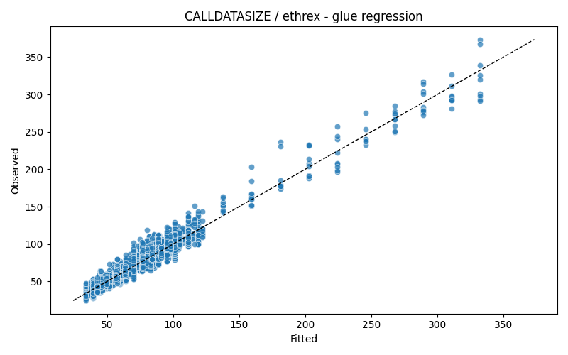

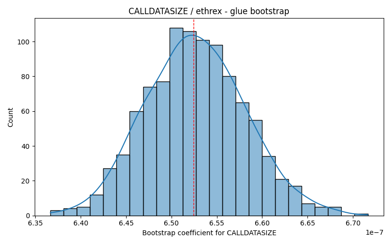

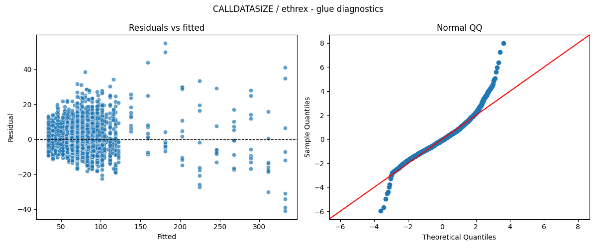

</details>

<details><summary><code>DUP</code> · nobs=6589 · runtime_ms=6.737e-07 · p=1.00e-03 · R²=0.9461</summary>


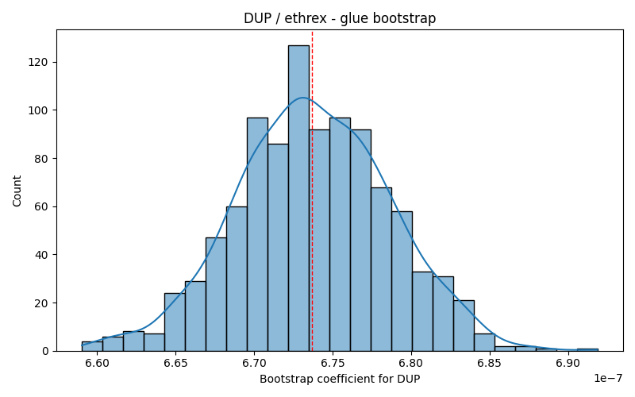


</details>

<details><summary><code>GAS</code> · nobs=6589 · runtime_ms=6.763e-07 · p=1.00e-03 · R²=0.9461</summary>


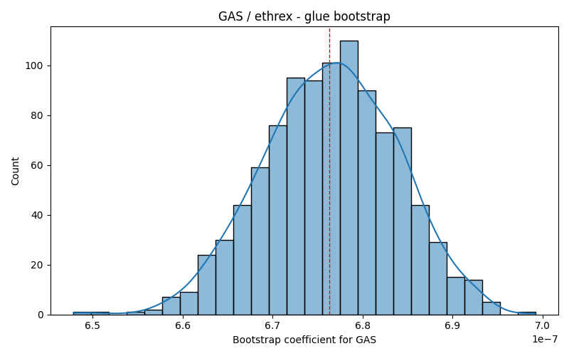


</details>

<details><summary><code>MLOAD</code> · nobs=6589 · runtime_ms=1.702e-06 · p=1.00e-03 · R²=0.9461</summary>


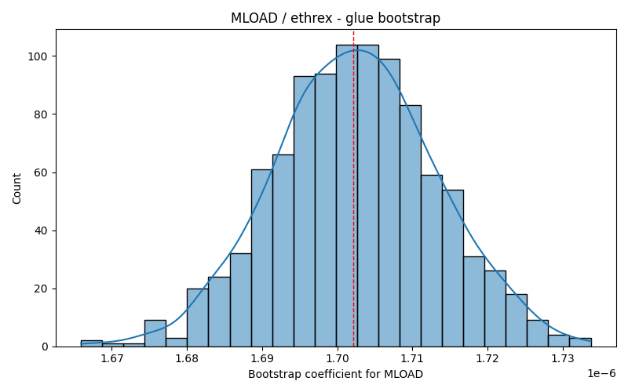

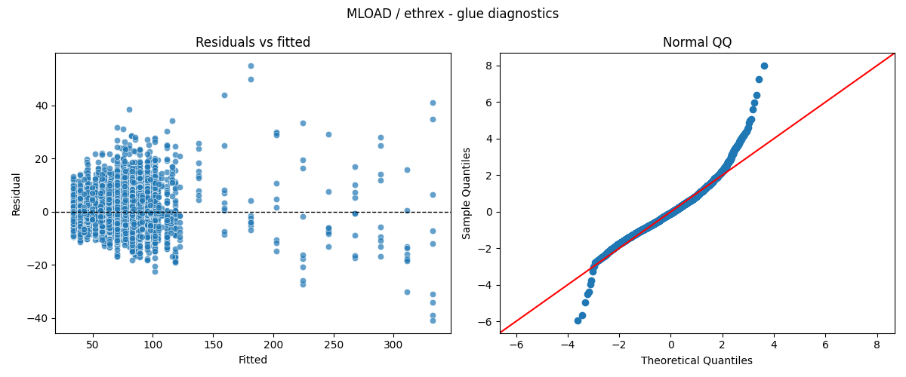

</details>

<details><summary><code>PUSH</code> · nobs=6589 · runtime_ms=8.405e-07 · p=1.00e-03 · R²=0.9461</summary>

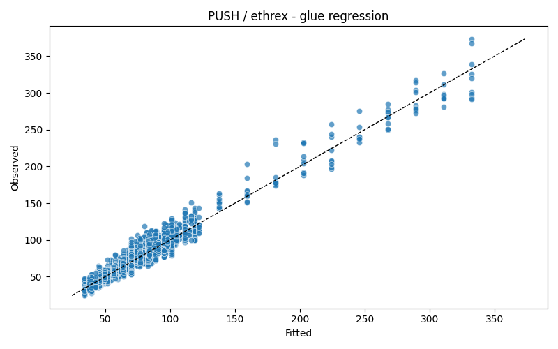

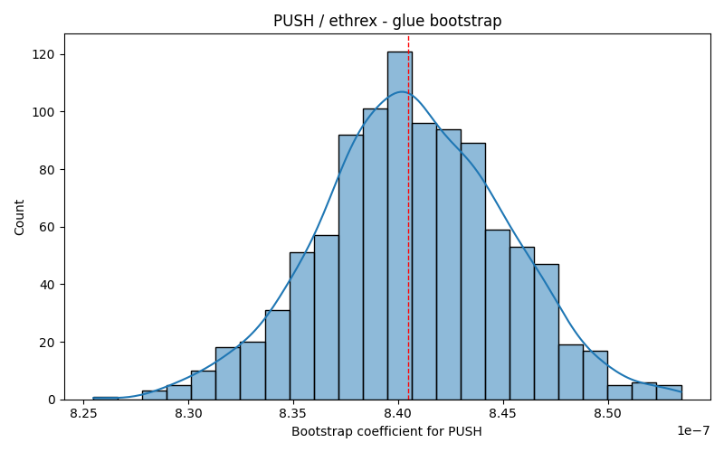


</details>

<details><summary><code>PUSH0</code> · nobs=6589 · runtime_ms=6.026e-07 · p=1.00e-03 · R²=0.9461</summary>

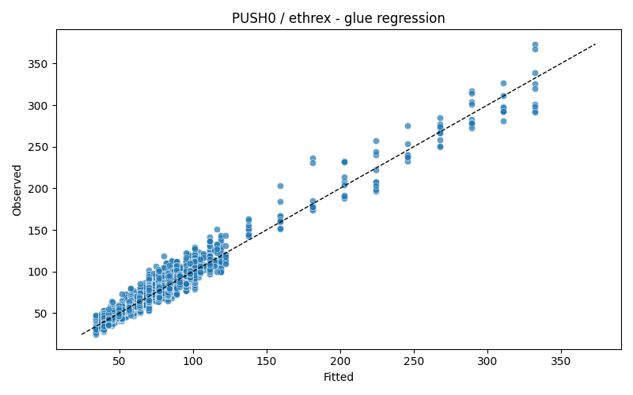

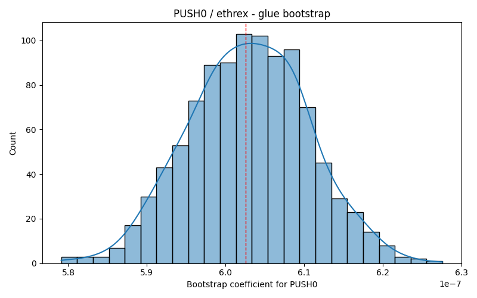


</details>

<details><summary><code>STATICCALL</code> · nobs=6589 · runtime_ms=0.0001254 · p=1.00e-03 · R²=0.9461</summary>


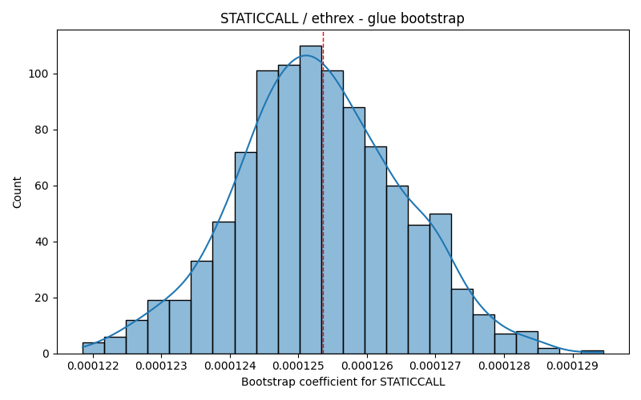


</details>

### Pure glue · ethrex

<details><summary><code>ISZERO</code> · nobs=110 · runtime_ms=7.251e-07 · p=1.00e-03 · R²=0.8973</summary>

```
==============================================================================
                           NNLS Regression Results                            
==============================================================================
Dep. Variable:          test_runtime_ms              R-squared:          0.897
Model:                  NNLS                    Adj. R-squared:          0.896
No. Observations:       110                               RMSE:           5.17
Df Residuals:           108                                MAE:           4.13
Df Model:               1      
==============================================================================
                      coef     std err     P-value      [0.025      0.975]
------------------------------------------------------------------------------
         const      8.1731      1.4782       0.001      5.2025     10.9581
        ISZERO      0.0000      0.0000       0.001      0.0000      0.0000
==============================================================================
Notes: Non-negative least squares with bootstrap inference (1000 iterations)
==============================================================================
```

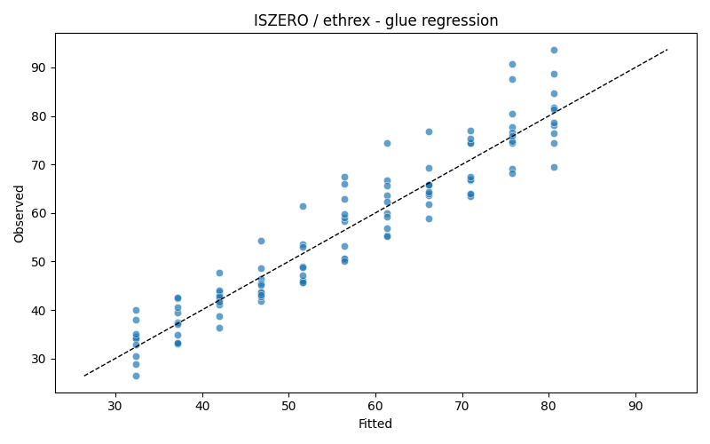

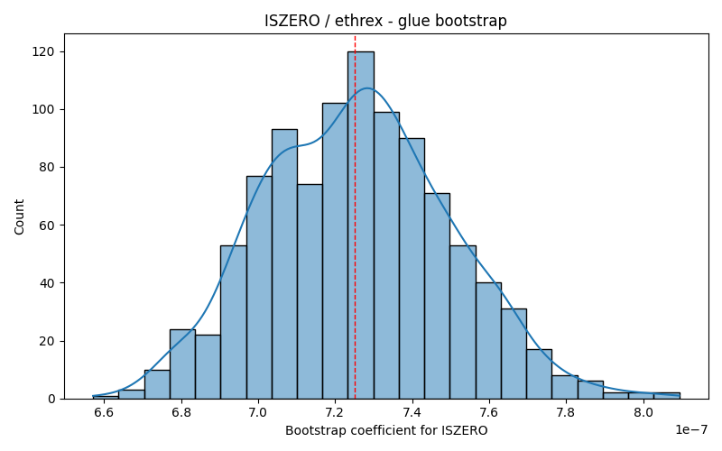

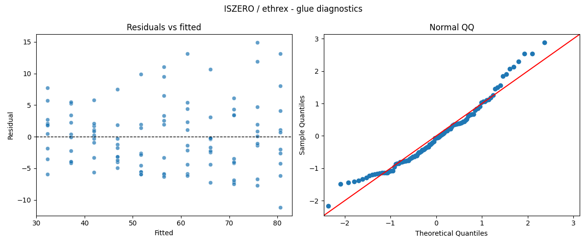

</details>

<details><summary><code>JUMPDEST</code> · nobs=110 · runtime_ms=5.06e-07 · p=1.00e-03 · R²=0.8625</summary>

```
==============================================================================
                           NNLS Regression Results                            
==============================================================================
Dep. Variable:          test_runtime_ms              R-squared:          0.863
Model:                  NNLS                    Adj. R-squared:          0.861
No. Observations:       110                               RMSE:          12.76
Df Residuals:           108                                MAE:           9.51
Df Model:               1      
==============================================================================
                      coef     std err     P-value      [0.025      0.975]
------------------------------------------------------------------------------
         const     13.1752      3.6465       0.001      6.1061     20.3064
      JUMPDEST      0.0000      0.0000       0.001      0.0000      0.0000
==============================================================================
Notes: Non-negative least squares with bootstrap inference (1000 iterations)
==============================================================================
```

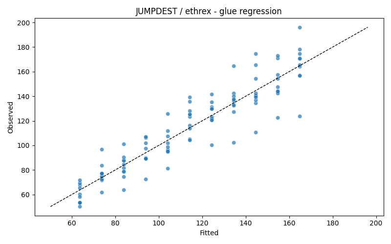

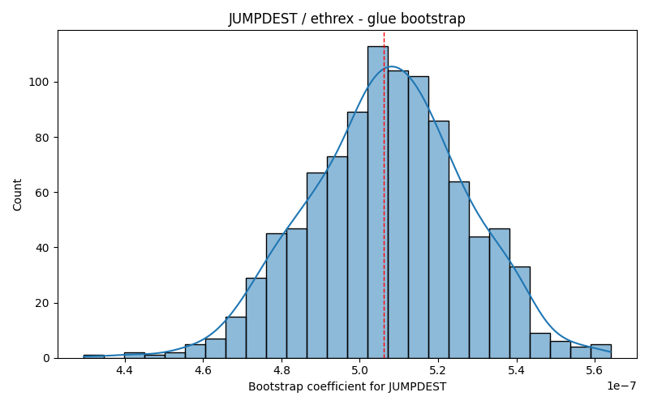

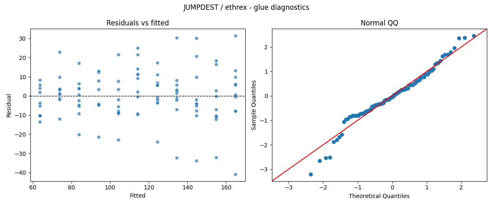

</details>

<details><summary><code>SWAP</code> · nobs=1760 · runtime_ms=8.804e-07 · p=1.00e-03 · R²=0.8673</summary>

```
==============================================================================
                           NNLS Regression Results                            
==============================================================================
Dep. Variable:          test_runtime_ms              R-squared:          0.867
Model:                  NNLS                    Adj. R-squared:          0.867
No. Observations:       1760                              RMSE:           7.25
Df Residuals:           1758                               MAE:           5.83
Df Model:               1      
==============================================================================
                      coef     std err     P-value      [0.025      0.975]
------------------------------------------------------------------------------
         const     10.5845      0.5006       0.001      9.6258     11.5920
          SWAP      0.0000      0.0000       0.001      0.0000      0.0000
==============================================================================
Notes: Non-negative least squares with bootstrap inference (1000 iterations)
==============================================================================
```

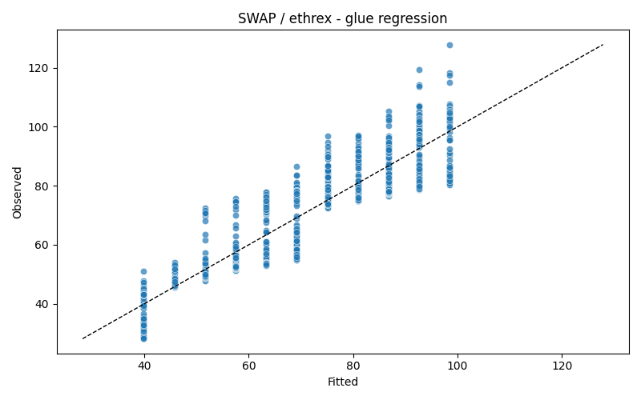

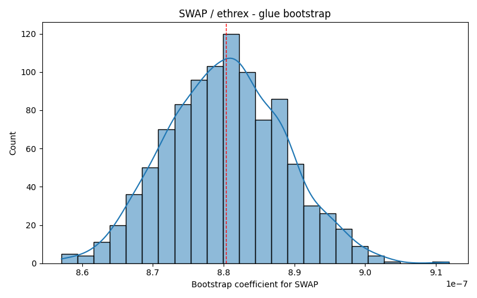

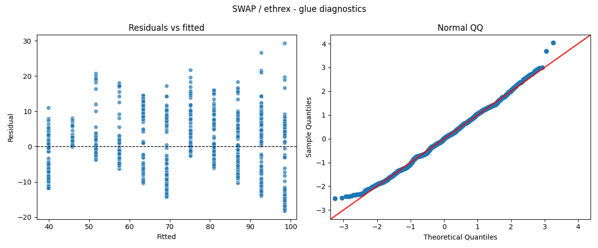

</details>

### Mixed glue (tier A) · ethrex

<details><summary><code>ADD</code> · nobs=110 · runtime_ms=1.734e-06 · p=1.00e-03 · R²=0.931</summary>

```
==============================================================================
                           NNLS Regression Results                            
==============================================================================
Dep. Variable:          test_runtime_ms              R-squared:          0.931
Model:                  NNLS                    Adj. R-squared:          0.930
No. Observations:       110                               RMSE:           4.97
Df Residuals:           108                                MAE:           3.85
Df Model:               1      
==============================================================================
                      coef     std err     P-value      [0.025      0.975]
------------------------------------------------------------------------------
         const      8.4616      1.6100       0.001      5.2198     11.3837
           ADD      0.0000      0.0000       0.001      0.0000      0.0000
==============================================================================
Notes: Non-negative least squares with bootstrap inference (1000 iterations)
==============================================================================
```

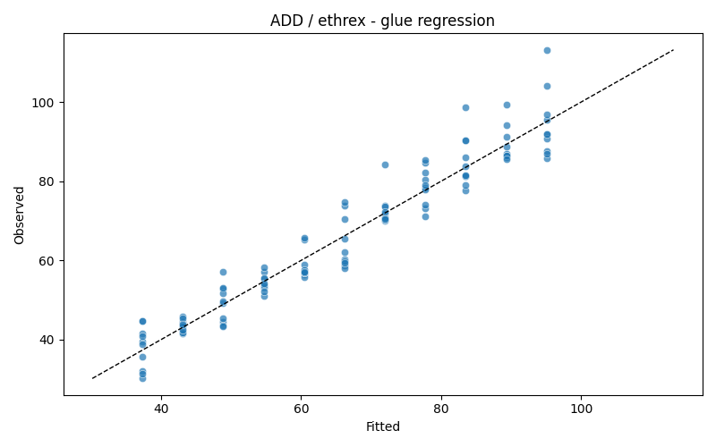

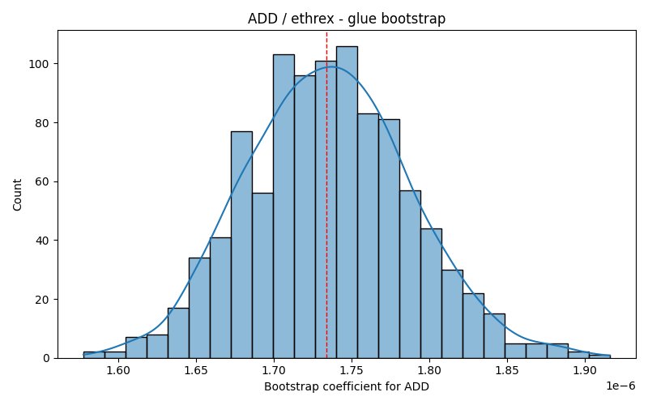

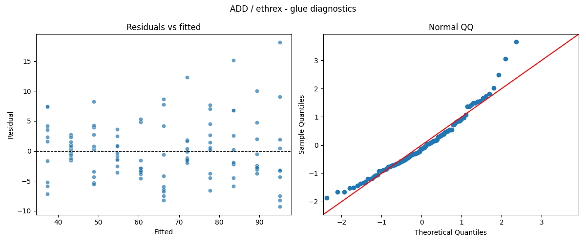

</details>

<details><summary><code>AND</code> · nobs=110 · runtime_ms=1.297e-06 · p=1.00e-03 · R²=0.9075</summary>

```
==============================================================================
                           NNLS Regression Results                            
==============================================================================
Dep. Variable:          test_runtime_ms              R-squared:          0.907
Model:                  NNLS                    Adj. R-squared:          0.907
No. Observations:       110                               RMSE:           4.36
Df Residuals:           108                                MAE:           3.51
Df Model:               1      
==============================================================================
                      coef     std err     P-value      [0.025      0.975]
------------------------------------------------------------------------------
         const      8.8059      1.4072       0.001      6.0058     11.6268
           AND      0.0000      0.0000       0.001      0.0000      0.0000
==============================================================================
Notes: Non-negative least squares with bootstrap inference (1000 iterations)
==============================================================================
```

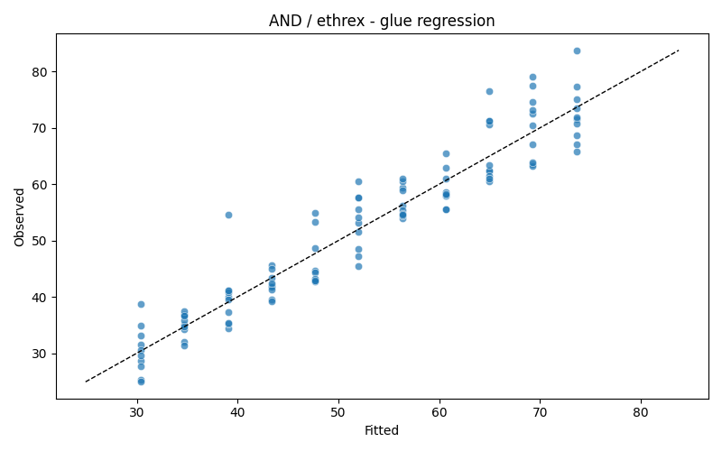

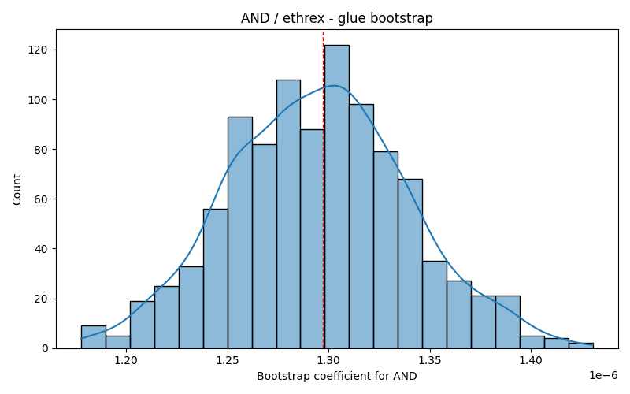

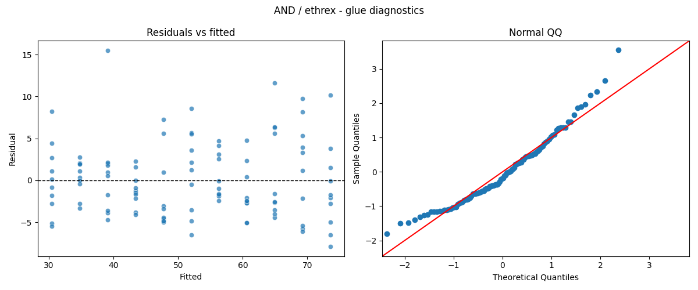

</details>

<details><summary><code>CALLDATACOPY</code> · nobs=2640 · runtime_ms=3.997e-06 · p=1.00e-03 · R²=0.9228</summary>

```
==============================================================================
                           NNLS Regression Results                            
==============================================================================
Dep. Variable:          test_runtime_ms              R-squared:          0.923
Model:                  NNLS                    Adj. R-squared:          0.923
No. Observations:       2640                              RMSE:           8.70
Df Residuals:           2638                               MAE:           6.44
Df Model:               1      
==============================================================================
                      coef     std err     P-value      [0.025      0.975]
------------------------------------------------------------------------------
         const     13.4017      0.2012       0.001     13.0123     13.8145
  CALLDATACOPY      0.0000      0.0000       0.001      0.0000      0.0000
==============================================================================
Notes: Non-negative least squares with bootstrap inference (1000 iterations)
==============================================================================
```

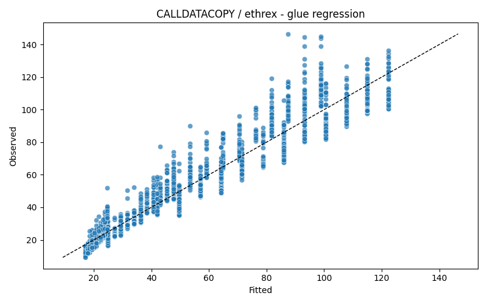

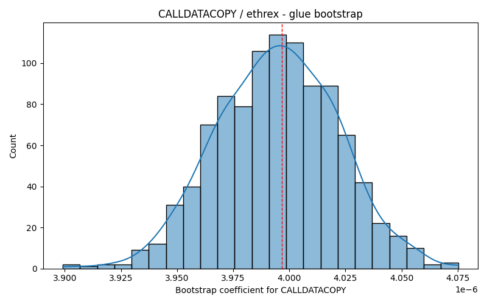

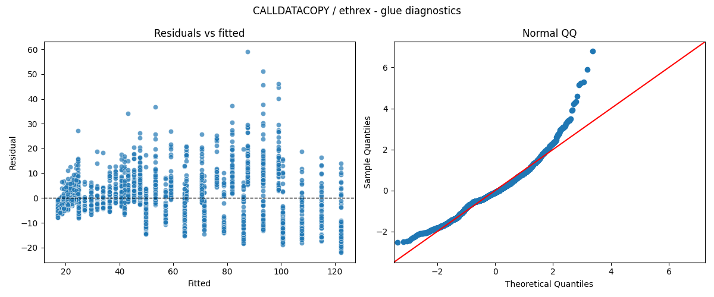

</details>

<details><summary><code>CALLDATALOAD</code> · nobs=440 · runtime_ms=2.655e-05 · p=1.00e-03 · R²=0.1755</summary>

```
==============================================================================
                           NNLS Regression Results                            
==============================================================================
Dep. Variable:          test_runtime_ms              R-squared:          0.175
Model:                  NNLS                    Adj. R-squared:          0.174
No. Observations:       440                               RMSE:           0.22
Df Residuals:           438                                MAE:           0.17
Df Model:               1      
==============================================================================
                      coef     std err     P-value      [0.025      0.975]
------------------------------------------------------------------------------
         const      2.3635      0.0361       0.001      2.2962      2.4320
  CALLDATALOAD      0.0000      0.0000       0.001      0.0000      0.0000
==============================================================================
Notes: Non-negative least squares with bootstrap inference (1000 iterations)
==============================================================================
```

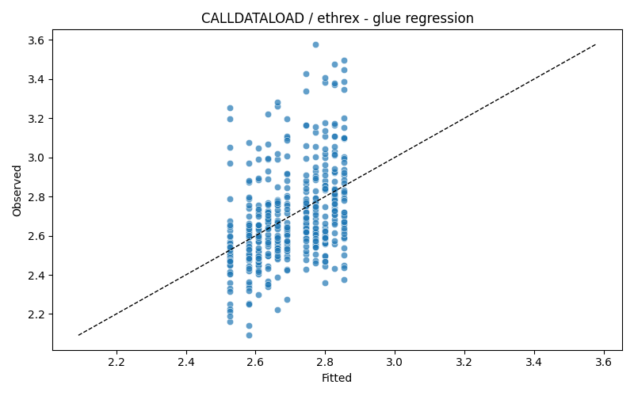

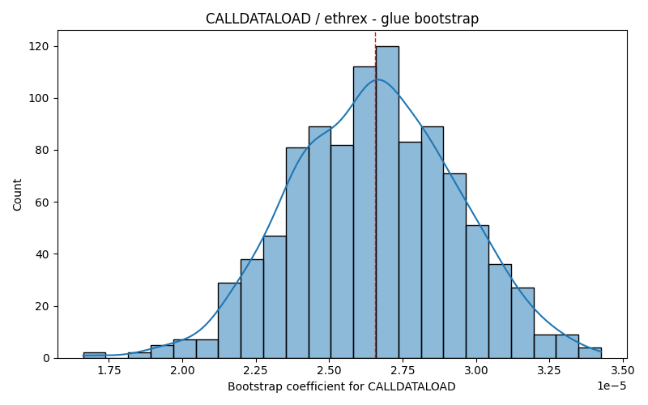

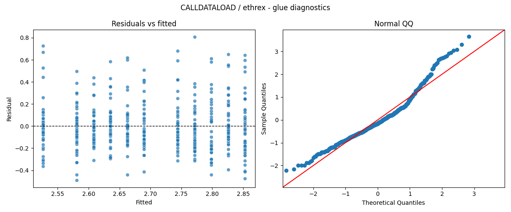

</details>

<details><summary><code>DIV</code> · nobs=110 · runtime_ms=1.365e-05 · p=1.00e-03 · R²=0.9453</summary>

```
==============================================================================
                           NNLS Regression Results                            
==============================================================================
Dep. Variable:          test_runtime_ms              R-squared:          0.945
Model:                  NNLS                    Adj. R-squared:          0.945
No. Observations:       110                               RMSE:          25.93
Df Residuals:           108                                MAE:          19.53
Df Model:               1      
==============================================================================
                      coef     std err     P-value      [0.025      0.975]
------------------------------------------------------------------------------
         const     47.3308      8.6819       0.001     30.3407     63.6586
           DIV      0.0000      0.0000       0.001      0.0000      0.0000
==============================================================================
Notes: Non-negative least squares with bootstrap inference (1000 iterations)
==============================================================================
```

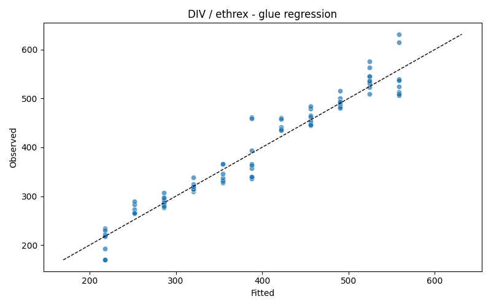

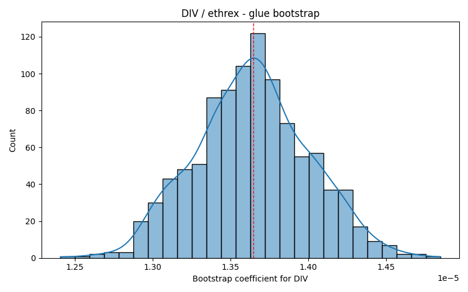

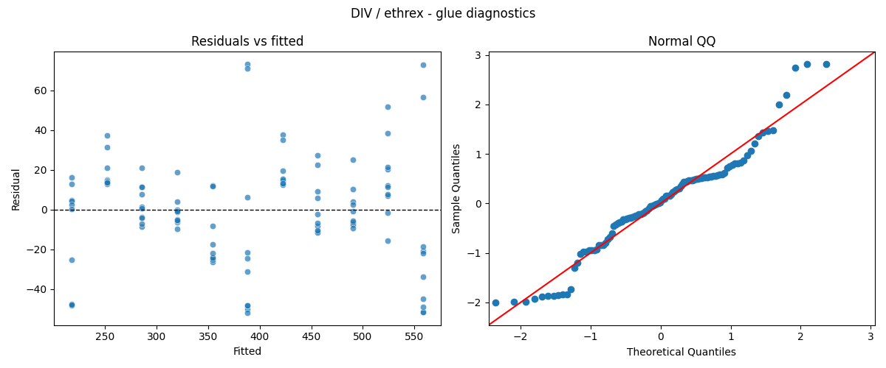

</details>

<details><summary><code>EXP</code> · nobs=110 · runtime_ms=0.001842 · p=1.00e-03 · R²=0.963</summary>

```
==============================================================================
                           NNLS Regression Results                            
==============================================================================
Dep. Variable:          test_runtime_ms              R-squared:          0.963
Model:                  NNLS                    Adj. R-squared:          0.963
No. Observations:       110                               RMSE:          14.15
Df Residuals:           108                                MAE:          11.50
Df Model:               1      
==============================================================================
                      coef     std err     P-value      [0.025      0.975]
------------------------------------------------------------------------------
         const     18.2296      4.4047       0.001      9.1229     26.1515
           EXP      0.0018      0.0000       0.001      0.0018      0.0019
==============================================================================
Notes: Non-negative least squares with bootstrap inference (1000 iterations)
==============================================================================
```

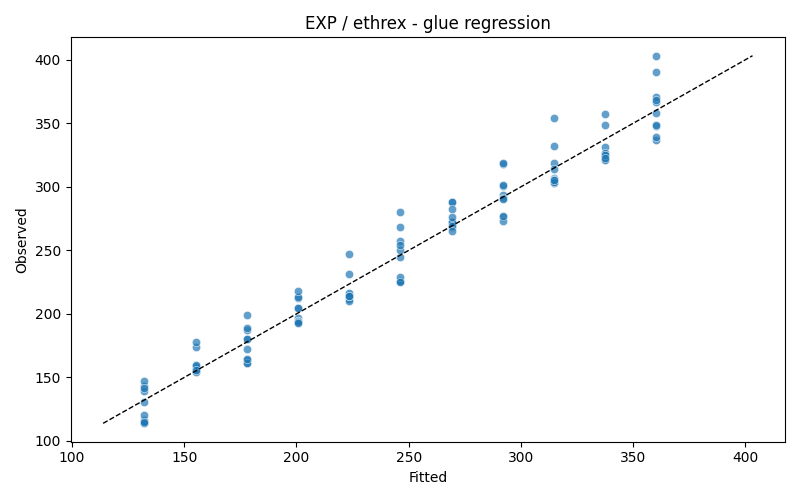

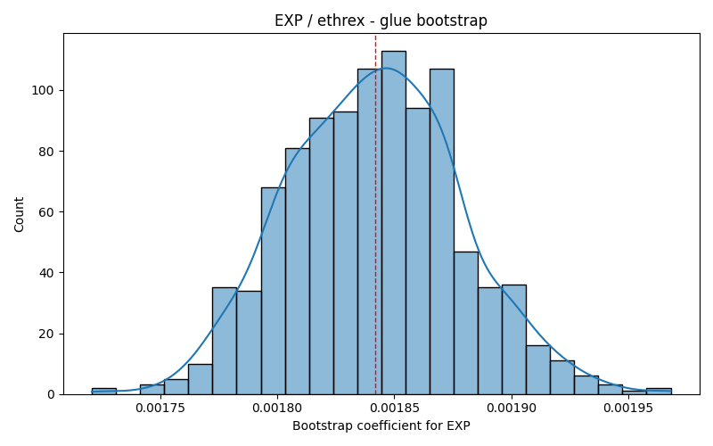

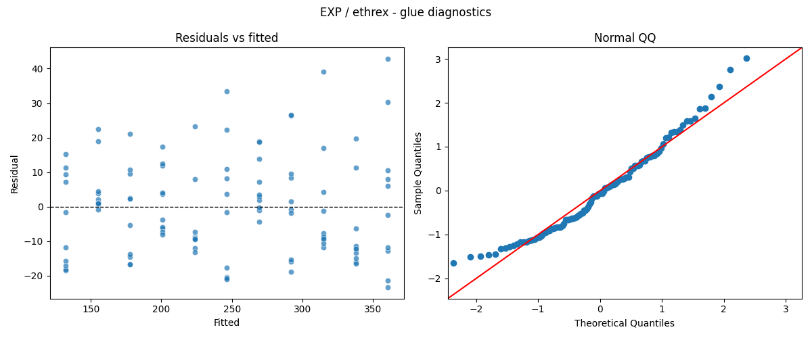

</details>

<details><summary><code>GT</code> · nobs=110 · runtime_ms=1.75e-06 · p=1.00e-03 · R²=0.9602</summary>

```
==============================================================================
                           NNLS Regression Results                            
==============================================================================
Dep. Variable:          test_runtime_ms              R-squared:          0.960
Model:                  NNLS                    Adj. R-squared:          0.960
No. Observations:       110                               RMSE:           3.75
Df Residuals:           108                                MAE:           3.03
Df Model:               1      
==============================================================================
                      coef     std err     P-value      [0.025      0.975]
------------------------------------------------------------------------------
         const      6.8371      1.2548       0.001      4.1737      9.2638
            GT      0.0000      0.0000       0.001      0.0000      0.0000
==============================================================================
Notes: Non-negative least squares with bootstrap inference (1000 iterations)
==============================================================================
```

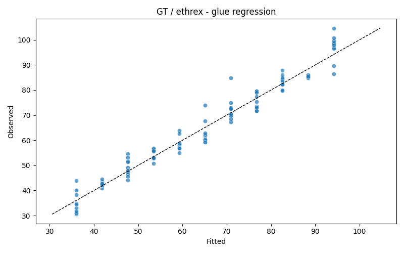

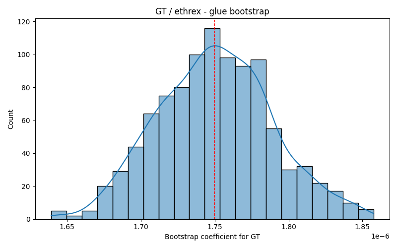

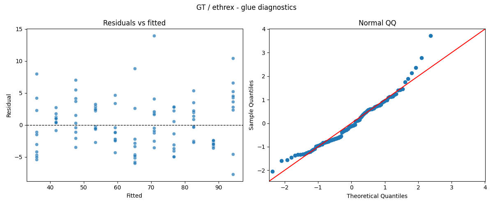

</details>

<details><summary><code>JUMPI</code> · nobs=110 · runtime_ms=2.236e-06 · p=1.00e-03 · R²=0.8041</summary>

```
==============================================================================
                           NNLS Regression Results                            
==============================================================================
Dep. Variable:          test_runtime_ms              R-squared:          0.804
Model:                  NNLS                    Adj. R-squared:          0.802
No. Observations:       110                               RMSE:           4.98
Df Residuals:           108                                MAE:           3.36
Df Model:               1      
==============================================================================
                      coef     std err     P-value      [0.025      0.975]
------------------------------------------------------------------------------
         const      4.6657      1.4722       0.004      1.6392      7.4188
         JUMPI      0.0000      0.0000       0.001      0.0000      0.0000
==============================================================================
Notes: Non-negative least squares with bootstrap inference (1000 iterations)
==============================================================================
```

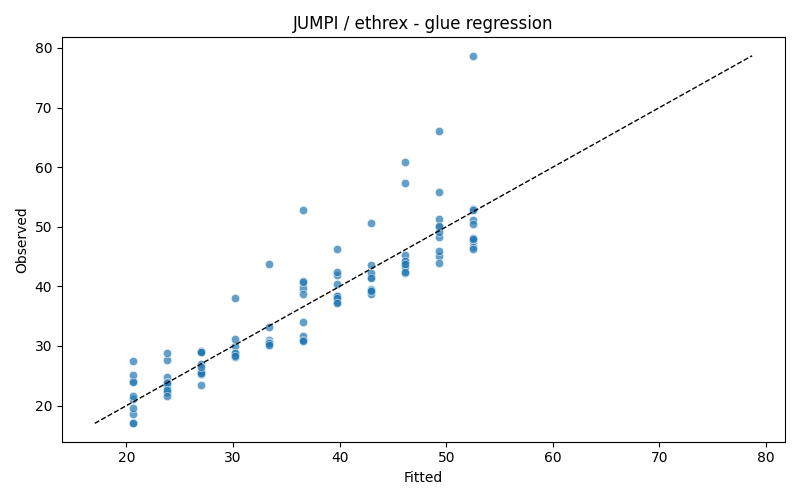

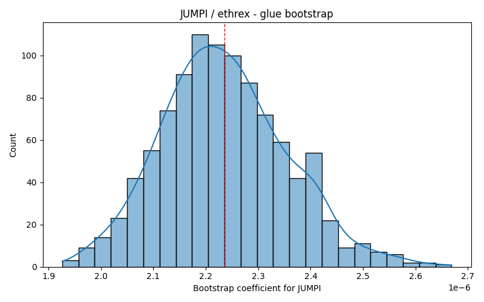

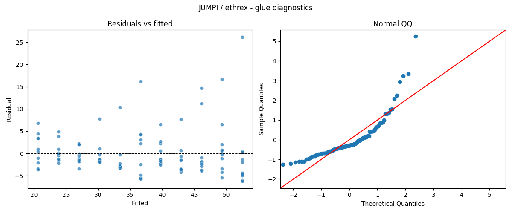

</details>

<details><summary><code>LT</code> · nobs=110 · runtime_ms=1.722e-06 · p=1.00e-03 · R²=0.9513</summary>

```
==============================================================================
                           NNLS Regression Results                            
==============================================================================
Dep. Variable:          test_runtime_ms              R-squared:          0.951
Model:                  NNLS                    Adj. R-squared:          0.951
No. Observations:       110                               RMSE:           4.10
Df Residuals:           108                                MAE:           3.13
Df Model:               1      
==============================================================================
                      coef     std err     P-value      [0.025      0.975]
------------------------------------------------------------------------------
         const      8.8851      1.5648       0.001      5.9922     12.0822
            LT      0.0000      0.0000       0.001      0.0000      0.0000
==============================================================================
Notes: Non-negative least squares with bootstrap inference (1000 iterations)
==============================================================================
```

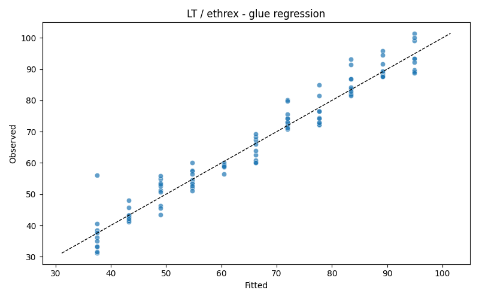

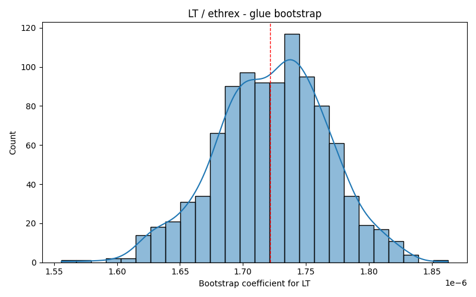

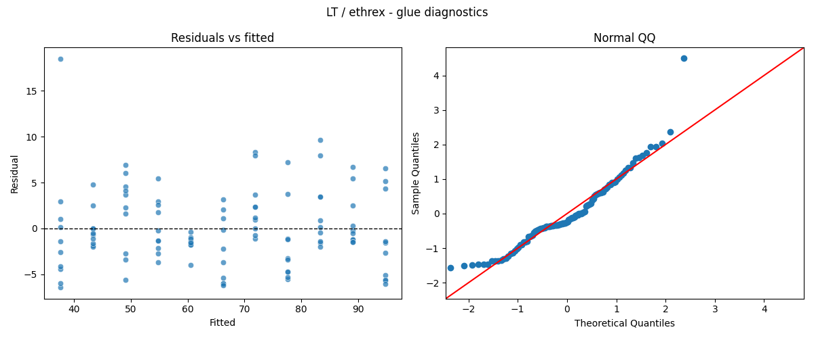

</details>

<details><summary><code>MSTORE</code> · nobs=550 · runtime_ms=2.483e-06 · p=1.00e-03 · R²=0.9367</summary>

```
==============================================================================
                           NNLS Regression Results                            
==============================================================================
Dep. Variable:          test_runtime_ms              R-squared:          0.937
Model:                  NNLS                    Adj. R-squared:          0.937
No. Observations:       550                               RMSE:           4.53
Df Residuals:           548                                MAE:           3.54
Df Model:               1      
==============================================================================
                      coef     std err     P-value      [0.025      0.975]
------------------------------------------------------------------------------
         const      8.0189      0.6129       0.001      6.8584      9.1575
        MSTORE      0.0000      0.0000       0.001      0.0000      0.0000
==============================================================================
Notes: Non-negative least squares with bootstrap inference (1000 iterations)
==============================================================================
```

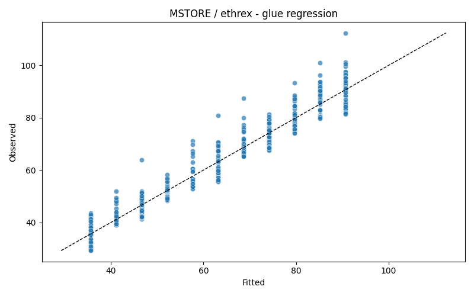

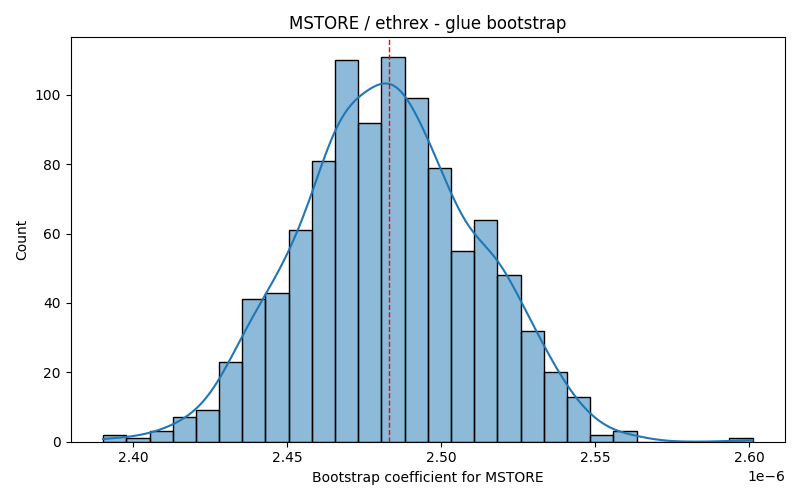

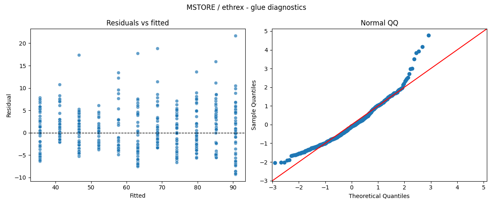

</details>

<details><summary><code>MSTORE8</code> · nobs=550 · runtime_ms=2.556e-06 · p=1.00e-03 · R²=0.9476</summary>

```
==============================================================================
                           NNLS Regression Results                            
==============================================================================
Dep. Variable:          test_runtime_ms              R-squared:          0.948
Model:                  NNLS                    Adj. R-squared:          0.948
No. Observations:       550                               RMSE:           4.22
Df Residuals:           548                                MAE:           3.22
Df Model:               1      
==============================================================================
                      coef     std err     P-value      [0.025      0.975]
------------------------------------------------------------------------------
         const      7.6734      0.6258       0.001      6.4355      8.8800
       MSTORE8      0.0000      0.0000       0.001      0.0000      0.0000
==============================================================================
Notes: Non-negative least squares with bootstrap inference (1000 iterations)
==============================================================================
```

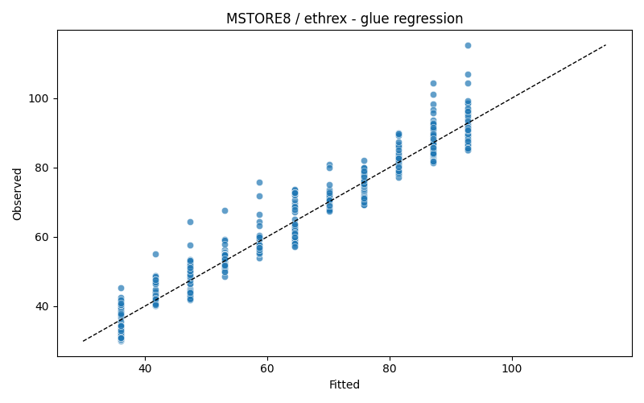

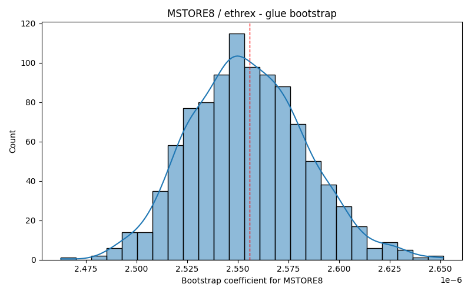

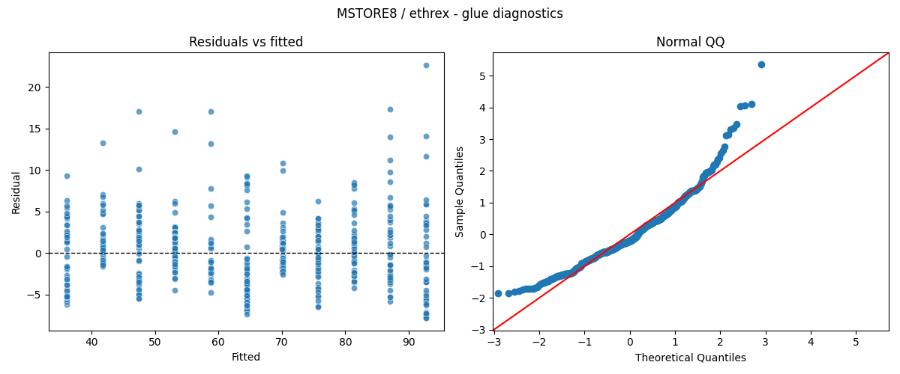

</details>

<details><summary><code>MUL</code> · nobs=110 · runtime_ms=3.245e-06 · p=1.00e-03 · R²=0.6291</summary>

```
==============================================================================
                           NNLS Regression Results                            
==============================================================================
Dep. Variable:          test_runtime_ms              R-squared:          0.629
Model:                  NNLS                    Adj. R-squared:          0.626
No. Observations:       110                               RMSE:          19.68
Df Residuals:           108                                MAE:          15.74
Df Model:               1      
==============================================================================
                      coef     std err     P-value      [0.025      0.975]
------------------------------------------------------------------------------
         const     27.5993      5.9692       0.001     15.9174     39.3799
           MUL      0.0000      0.0000       0.001      0.0000      0.0000
==============================================================================
Notes: Non-negative least squares with bootstrap inference (1000 iterations)
==============================================================================
```

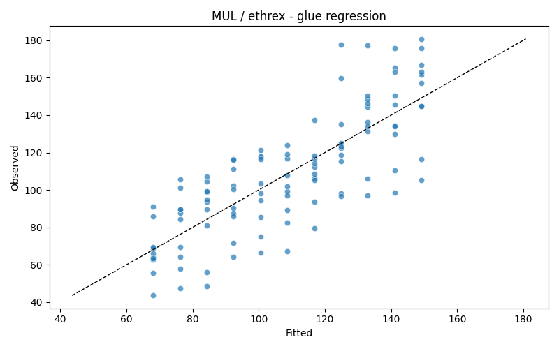

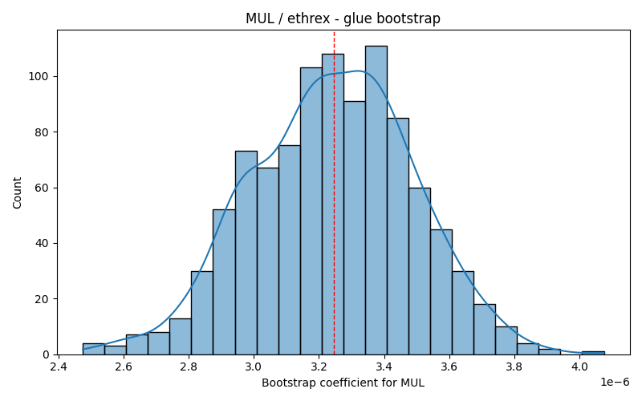

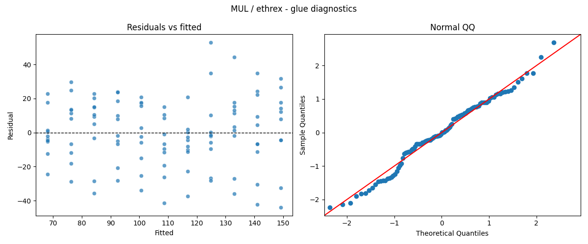

</details>

<details><summary><code>PC</code> · nobs=110 · runtime_ms=7.961e-07 · p=1.00e-03 · R²=0.9233</summary>

```
==============================================================================
                           NNLS Regression Results                            
==============================================================================
Dep. Variable:          test_runtime_ms              R-squared:          0.923
Model:                  NNLS                    Adj. R-squared:          0.923
No. Observations:       110                               RMSE:           6.86
Df Residuals:           108                                MAE:           5.23
Df Model:               1      
==============================================================================
                      coef     std err     P-value      [0.025      0.975]
------------------------------------------------------------------------------
         const     13.0822      2.0363       0.001      9.0777     17.1945
            PC      0.0000      0.0000       0.001      0.0000      0.0000
==============================================================================
Notes: Non-negative least squares with bootstrap inference (1000 iterations)
==============================================================================
```

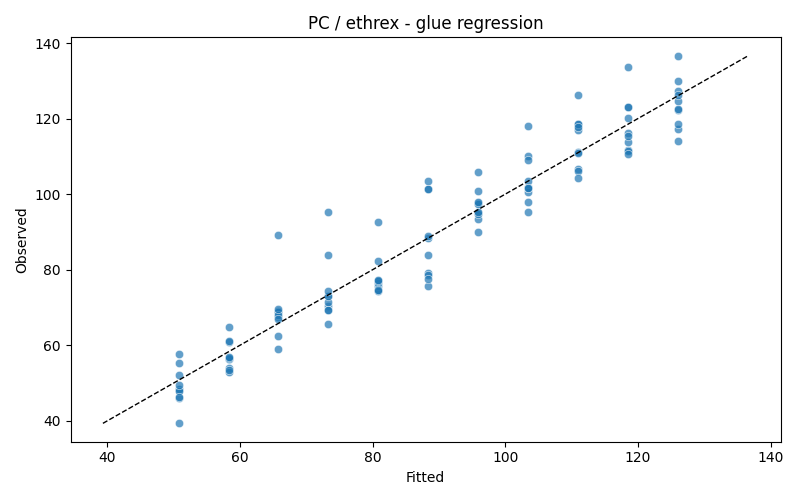

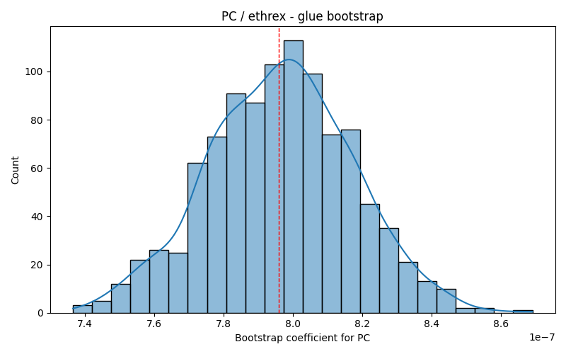

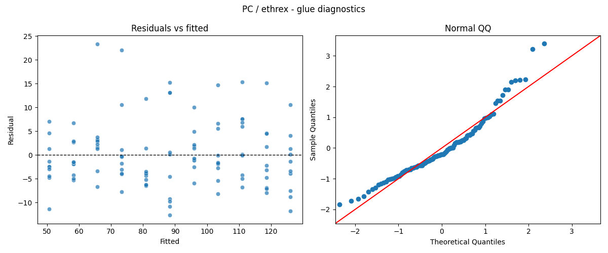

</details>

<details><summary><code>RETURNDATASIZE</code> · nobs=440 · runtime_ms=1.2e-06 · p=1.00e-03 · R²=0.864</summary>

```
==============================================================================
                           NNLS Regression Results                            
==============================================================================
Dep. Variable:          test_runtime_ms              R-squared:          0.864
Model:                  NNLS                    Adj. R-squared:          0.864
No. Observations:       440                               RMSE:           7.52
Df Residuals:           438                                MAE:           5.82
Df Model:               1      
==============================================================================
                      coef     std err     P-value      [0.025      0.975]
------------------------------------------------------------------------------
         const      9.5133      1.0621       0.001      7.4689     11.6429
RETURNDATASIZE      0.0000      0.0000       0.001      0.0000      0.0000
==============================================================================
Notes: Non-negative least squares with bootstrap inference (1000 iterations)
==============================================================================
```

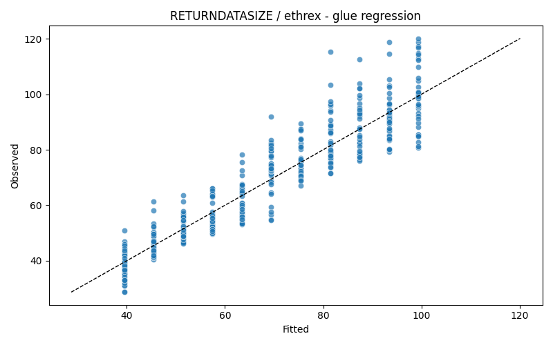

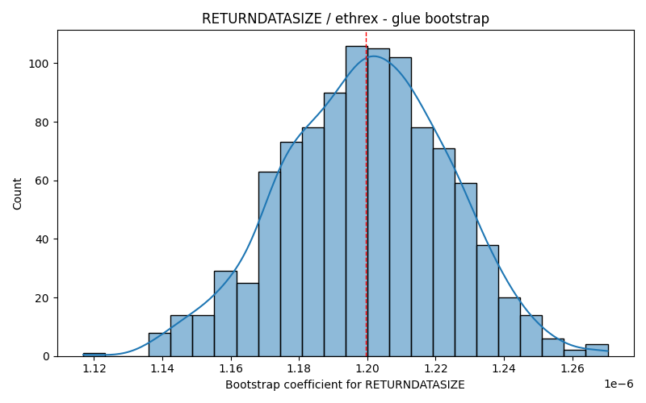

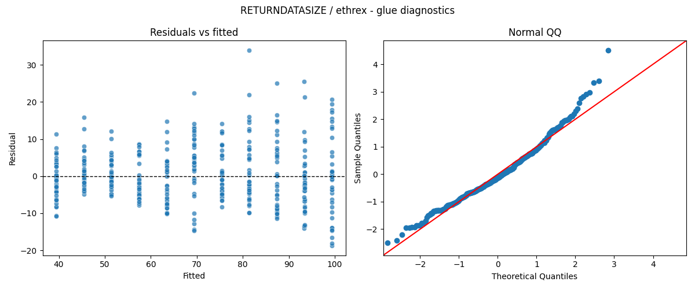

</details>

<details><summary><code>SELFBALANCE</code> · nobs=110 · runtime_ms=1.032e-05 · p=1.00e-03 · R²=0.9602</summary>

```
==============================================================================
                           NNLS Regression Results                            
==============================================================================
Dep. Variable:          test_runtime_ms              R-squared:          0.960
Model:                  NNLS                    Adj. R-squared:          0.960
No. Observations:       110                               RMSE:          25.96
Df Residuals:           108                                MAE:          19.93
Df Model:               1      
==============================================================================
                      coef     std err     P-value      [0.025      0.975]
------------------------------------------------------------------------------
         const     33.6183      8.4528       0.001     15.9669     49.8346
   SELFBALANCE      0.0000      0.0000       0.001      0.0000      0.0000
==============================================================================
Notes: Non-negative least squares with bootstrap inference (1000 iterations)
==============================================================================
```

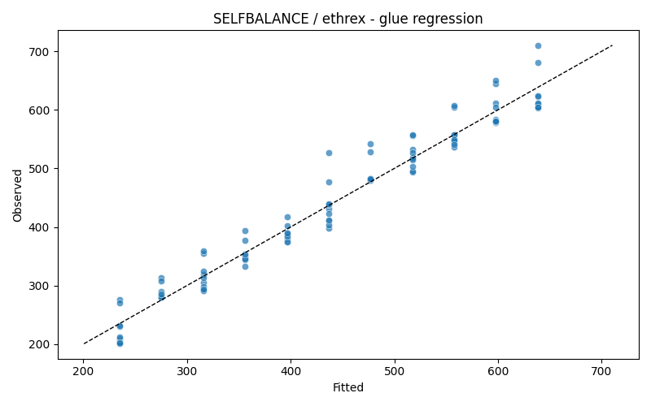

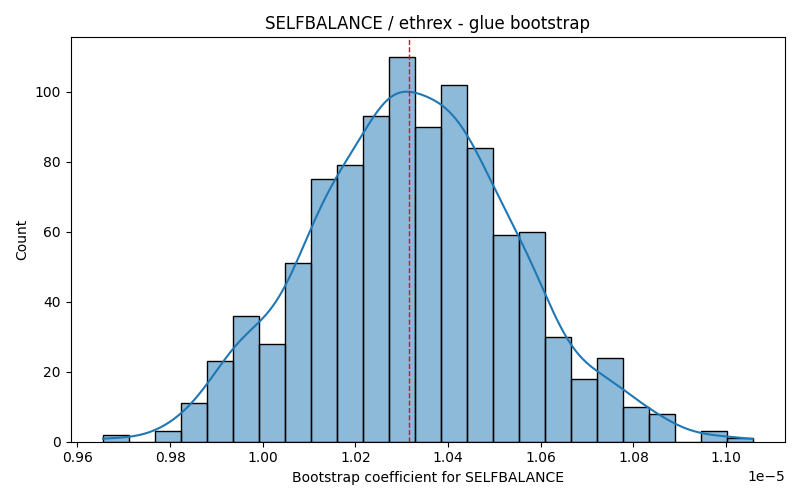

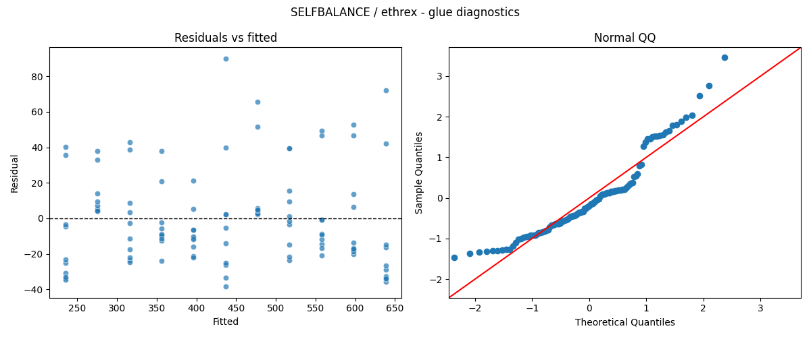

</details>

<details><summary><code>SUB</code> · nobs=110 · runtime_ms=1.697e-06 · p=1.00e-03 · R²=0.9043</summary>

```
==============================================================================
                           NNLS Regression Results                            
==============================================================================
Dep. Variable:          test_runtime_ms              R-squared:          0.904
Model:                  NNLS                    Adj. R-squared:          0.903
No. Observations:       110                               RMSE:           5.81
Df Residuals:           108                                MAE:           4.55
Df Model:               1      
==============================================================================
                      coef     std err     P-value      [0.025      0.975]
------------------------------------------------------------------------------
         const      9.1569      1.8988       0.001      5.2369     12.8686
           SUB      0.0000      0.0000       0.001      0.0000      0.0000
==============================================================================
Notes: Non-negative least squares with bootstrap inference (1000 iterations)
==============================================================================
```

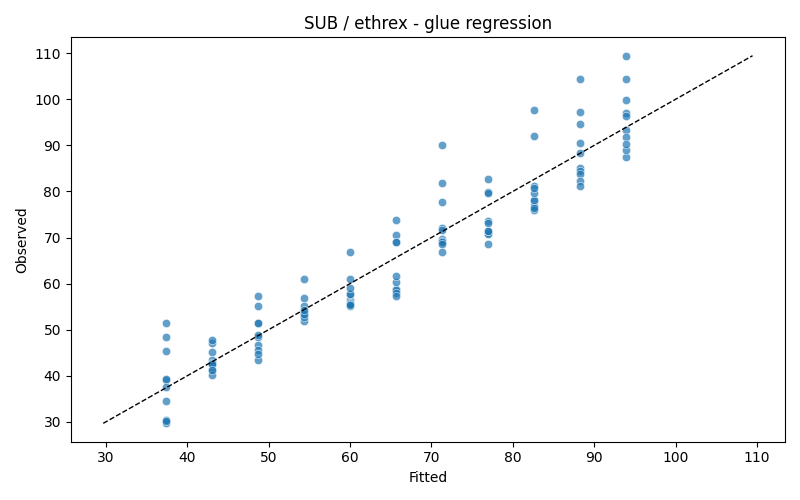

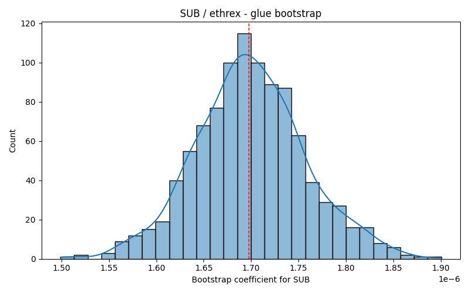

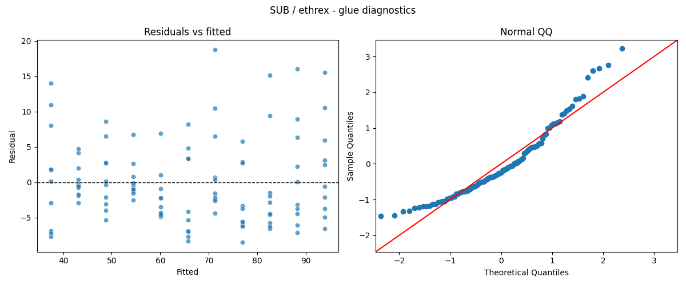

</details>

### Mixed glue (tier B) · ethrex

<details><summary><code>JUMP</code> · nobs=110 · runtime_ms=4.197e-06 · p=1.00e-03 · R²=0.945</summary>

```
==============================================================================
                           NNLS Regression Results                            
==============================================================================
Dep. Variable:          test_runtime_ms              R-squared:          0.945
Model:                  NNLS                    Adj. R-squared:          0.945
No. Observations:       110                               RMSE:           3.76
Df Residuals:           108                                MAE:           2.92
Df Model:               1      
==============================================================================
                      coef     std err     P-value      [0.025      0.975]
------------------------------------------------------------------------------
         const      9.1731      1.1693       0.001      6.9337     11.4902
          JUMP      0.0000      0.0000       0.001      0.0000      0.0000
==============================================================================
Notes: Non-negative least squares with bootstrap inference (1000 iterations)
==============================================================================
```

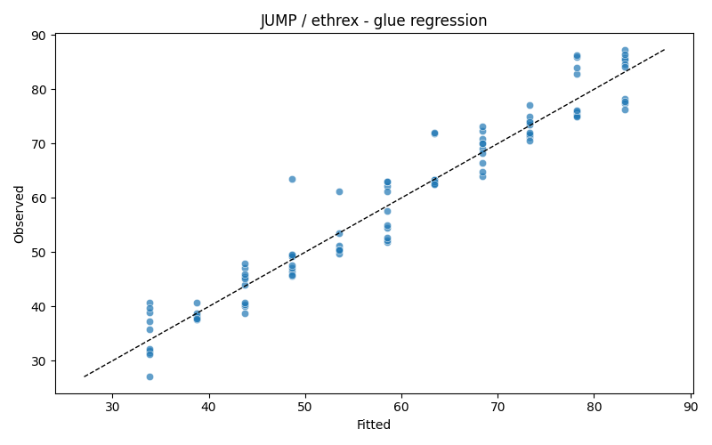

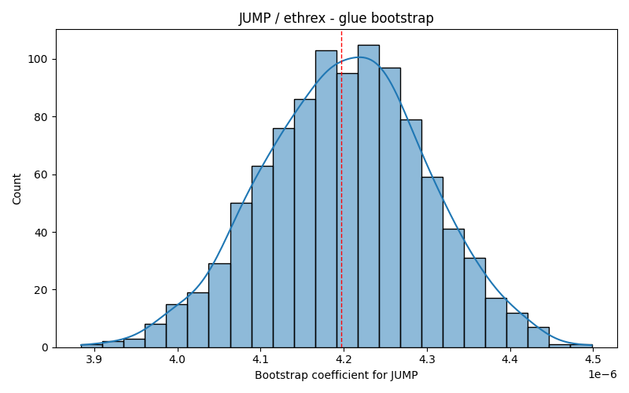

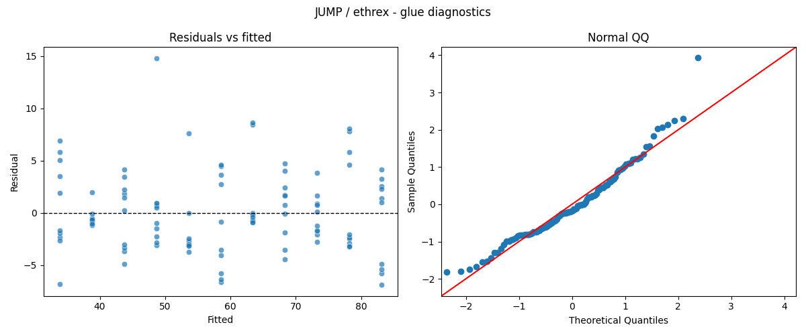

</details>

<details><summary><code>KECCAK256</code> · nobs=1760 · runtime_ms=0 · p=1.00e+00 · R²=0</summary>

```
==============================================================================
                           NNLS Regression Results                            
==============================================================================
Dep. Variable:          test_runtime_ms              R-squared:          0.000
Model:                  NNLS                    Adj. R-squared:         -0.001
No. Observations:       1760                              RMSE:         271.45
Df Residuals:           1758                               MAE:         225.92
Df Model:               1      
==============================================================================
                      coef     std err     P-value      [0.025      0.975]
------------------------------------------------------------------------------
         const    406.9619      6.2290       0.001    394.1295    418.3335
     KECCAK256      0.0000      0.0000       1.000      0.0000      0.0000
==============================================================================
Notes: Non-negative least squares with bootstrap inference (1000 iterations)
==============================================================================
```

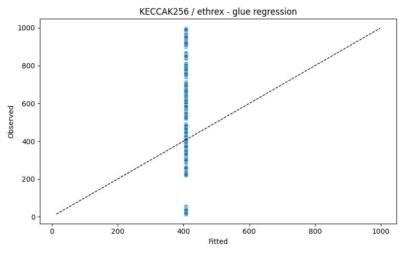

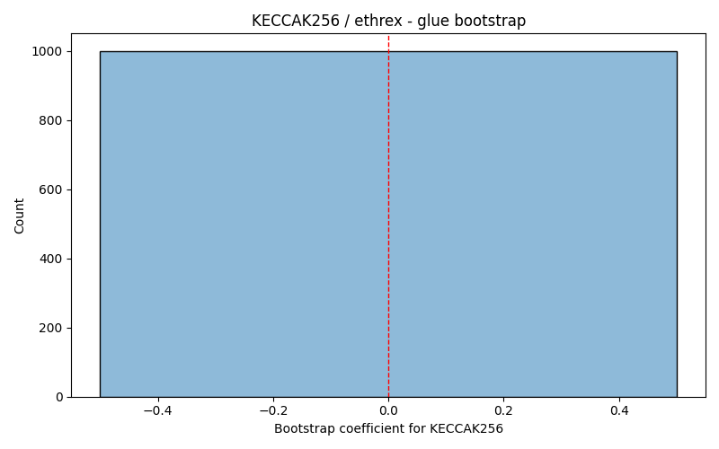

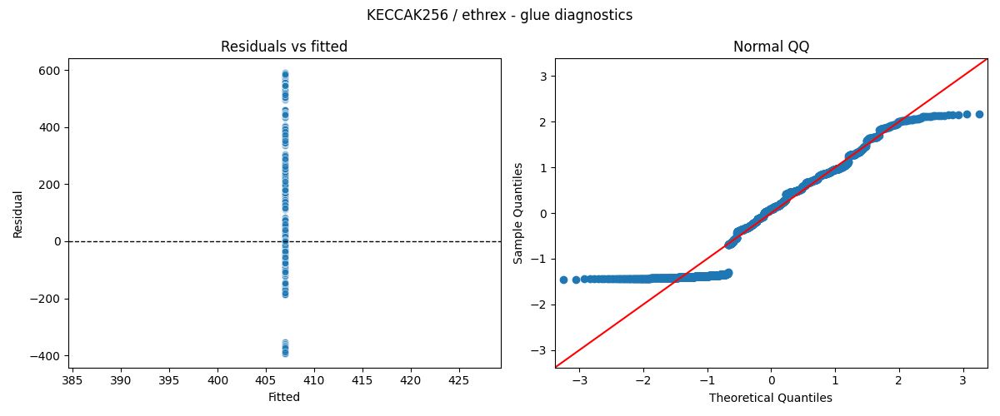

</details>

## geth

| glue_opcode | nobs | glue_runtime_ms | p_value | rsquared |
| --- | --- | --- | --- | --- |
| `ISZERO` | 1562 | 1.894e-06 | 1.00e-03 | 0.9395 |
| `JUMPDEST` | 1562 | 1.293e-06 | 1.00e-03 | 0.8504 |
| `SWAP` | 24992 | 2.267e-06 | 1.00e-03 | 0.9497 |
| `CALLDATASIZE` | 92268 | 1.798e-06 | 1.00e-03 | 0.9131 |
| `DUP` | 92268 | 2e-06 | 1.00e-03 | 0.9131 |
| `GAS` | 92268 | 1.786e-06 | 1.00e-03 | 0.9131 |
| `MLOAD` | 92268 | 5.651e-06 | 1.00e-03 | 0.9131 |
| `PUSH` | 92268 | 3.158e-06 | 1.00e-03 | 0.9131 |
| `PUSH0` | 92268 | 1.672e-06 | 1.00e-03 | 0.9131 |
| `STATICCALL` | 92268 | 0.0002369 | 1.00e-03 | 0.9131 |
| `ADD` | 1562 | 4.505e-06 | 1.00e-03 | 0.9112 |
| `AND` | 1562 | 4.421e-06 | 1.00e-03 | 0.9072 |
| `CALLDATACOPY` | 37488 | 1.153e-05 | 1.00e-03 | 0.9771 |
| `CALLDATALOAD` | 6248 | 2.474e-05 | 1.00e-03 | 0.0701 |
| `DIV` | 1562 | 1.439e-05 | 1.00e-03 | 0.9788 |
| `EXP` | 1562 | 0.0007157 | 1.00e-03 | 0.9821 |
| `GT` | 1562 | 3.973e-06 | 1.00e-03 | 0.8489 |
| `JUMPI` | 1562 | 5.593e-06 | 1.00e-03 | 0.8406 |
| `LT` | 1562 | 4.358e-06 | 1.00e-03 | 0.9358 |
| `MSTORE` | 7810 | 8.473e-06 | 1.00e-03 | 0.9404 |
| `MSTORE8` | 7810 | 7.854e-06 | 1.00e-03 | 0.9246 |
| `MUL` | 1562 | 5.34e-06 | 1.00e-03 | 0.9518 |
| `PC` | 1562 | 1.98e-06 | 1.00e-03 | 0.947 |
| `RETURNDATASIZE` | 6248 | 5.373e-06 | 1.00e-03 | 0.8658 |
| `SELFBALANCE` | 1562 | 1.232e-05 | 1.00e-03 | 0.9701 |
| `SUB` | 1562 | 4.353e-06 | 1.00e-03 | 0.9176 |
| `JUMP` | 1562 | 9.684e-06 | 1.00e-03 | 0.8074 |
| `KECCAK256` | 24992 | 3.772e-05 | 1.00e-03 | 0.1163 |

### Cycle glue — joint fit · geth

<details><summary>Joint NNLS regression summary</summary>

```
==============================================================================
                           NNLS Regression Results                            
==============================================================================
Dep. Variable:          test_runtime_ms              R-squared:          0.913
Model:                  NNLS                    Adj. R-squared:          0.913
No. Observations:       92268                             RMSE:          21.60
Df Residuals:           92260                              MAE:          13.22
Df Model:               7      
==============================================================================
                      coef     std err     P-value      [0.025      0.975]
------------------------------------------------------------------------------
         const     16.0828      0.2125       0.001     15.7022     16.4981
  CALLDATASIZE      0.0000      0.0000       0.001      0.0000      0.0000
           DUP      0.0000      0.0000       0.001      0.0000      0.0000
           GAS      0.0000      0.0000       0.001      0.0000      0.0000
         MLOAD      0.0000      0.0000       0.001      0.0000      0.0000
          PUSH      0.0000      0.0000       0.001      0.0000      0.0000
         PUSH0      0.0000      0.0000       0.001      0.0000      0.0000
    STATICCALL      0.0002      0.0000       0.001      0.0002      0.0002
==============================================================================
Notes: Non-negative least squares with bootstrap inference (1000 iterations)
==============================================================================
```

</details>

<details><summary><code>CALLDATASIZE</code> · nobs=92268 · runtime_ms=1.798e-06 · p=1.00e-03 · R²=0.9131</summary>

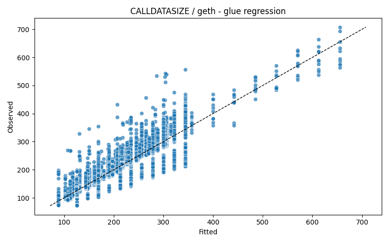

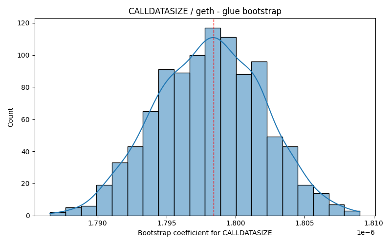

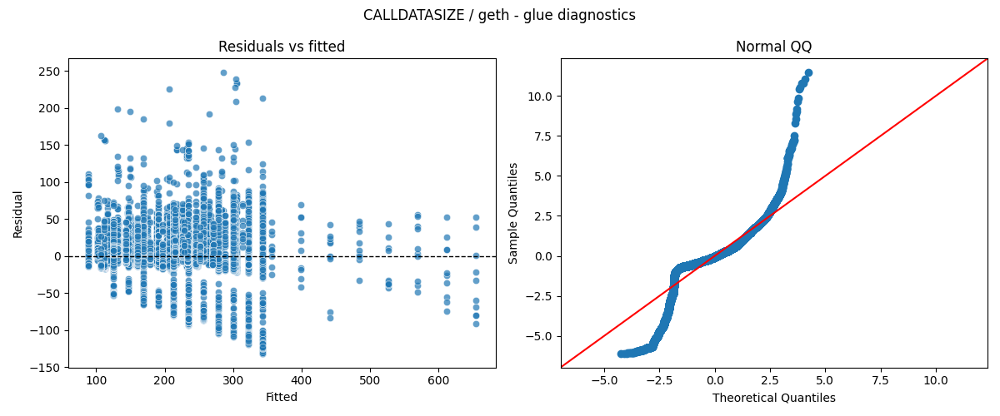

</details>

<details><summary><code>DUP</code> · nobs=92268 · runtime_ms=2e-06 · p=1.00e-03 · R²=0.9131</summary>


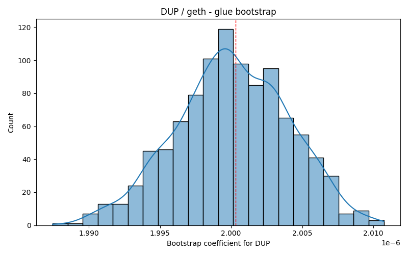

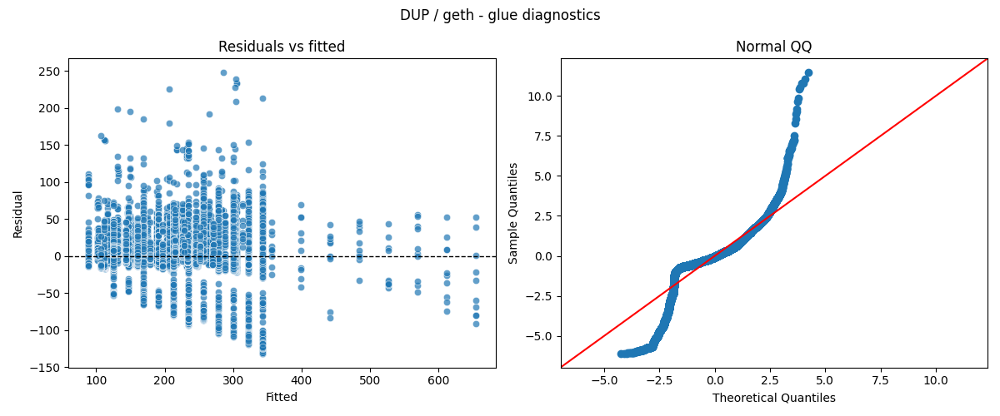

</details>

<details><summary><code>GAS</code> · nobs=92268 · runtime_ms=1.786e-06 · p=1.00e-03 · R²=0.9131</summary>


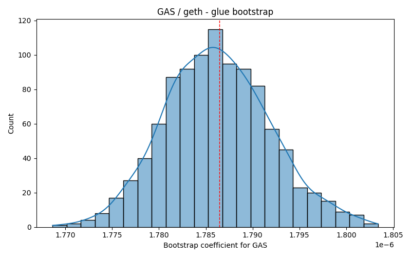


</details>

<details><summary><code>MLOAD</code> · nobs=92268 · runtime_ms=5.651e-06 · p=1.00e-03 · R²=0.9131</summary>


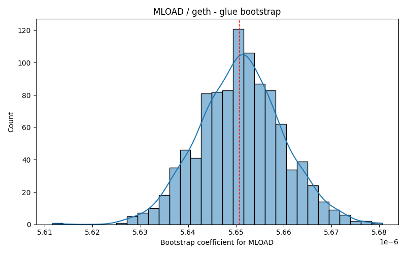


</details>

<details><summary><code>PUSH</code> · nobs=92268 · runtime_ms=3.158e-06 · p=1.00e-03 · R²=0.9131</summary>

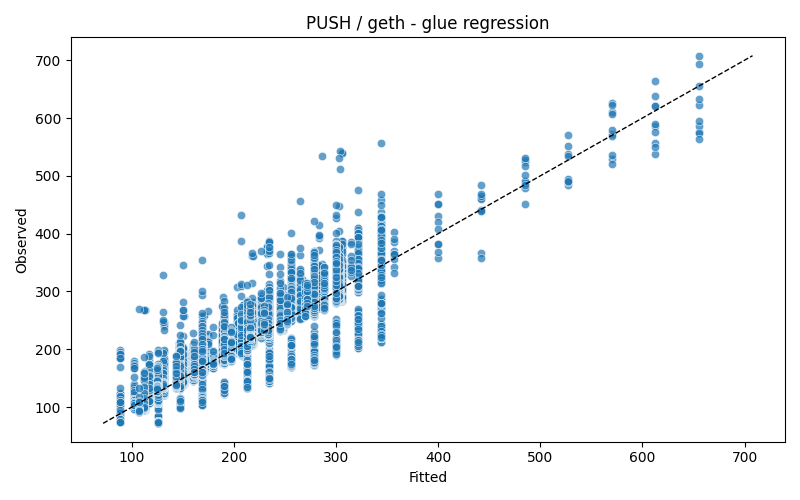

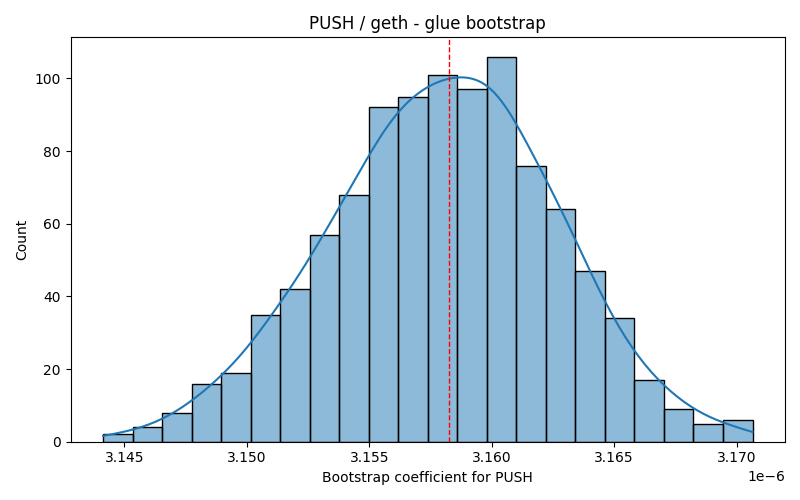


</details>

<details><summary><code>PUSH0</code> · nobs=92268 · runtime_ms=1.672e-06 · p=1.00e-03 · R²=0.9131</summary>


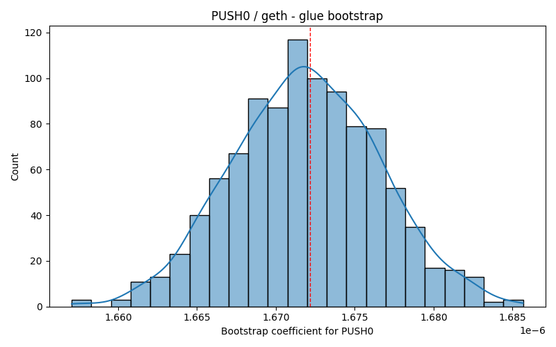


</details>

<details><summary><code>STATICCALL</code> · nobs=92268 · runtime_ms=0.0002369 · p=1.00e-03 · R²=0.9131</summary>

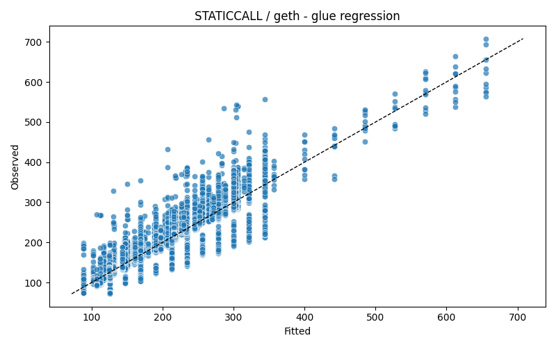

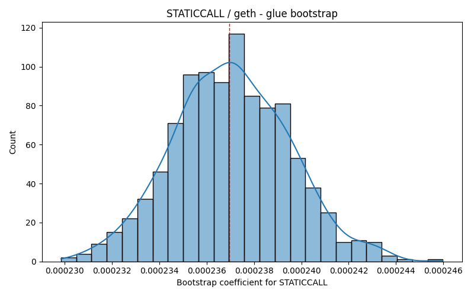


</details>

### Pure glue · geth

<details><summary><code>ISZERO</code> · nobs=1562 · runtime_ms=1.894e-06 · p=1.00e-03 · R²=0.9395</summary>

```
==============================================================================
                           NNLS Regression Results                            
==============================================================================
Dep. Variable:          test_runtime_ms              R-squared:          0.939
Model:                  NNLS                    Adj. R-squared:          0.939
No. Observations:       1562                              RMSE:          10.12
Df Residuals:           1560                               MAE:           5.58
Df Model:               1      
==============================================================================
                      coef     std err     P-value      [0.025      0.975]
------------------------------------------------------------------------------
         const      8.2213      0.9783       0.001      6.3103     10.1764
        ISZERO      0.0000      0.0000       0.001      0.0000      0.0000
==============================================================================
Notes: Non-negative least squares with bootstrap inference (1000 iterations)
==============================================================================
```

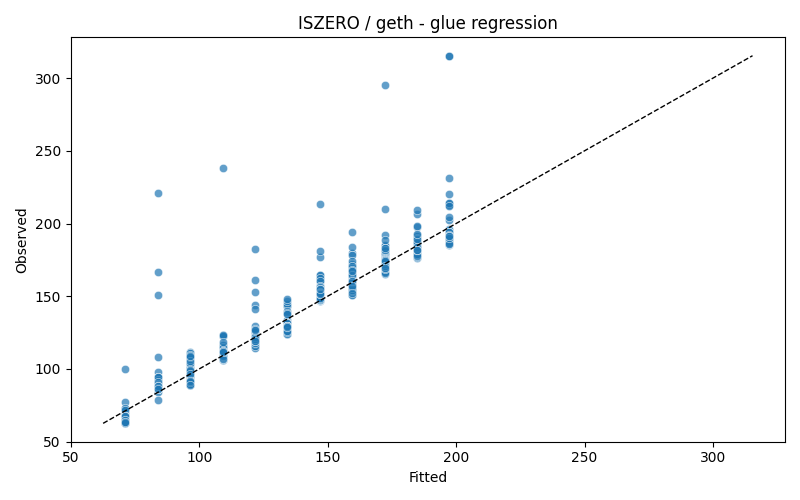

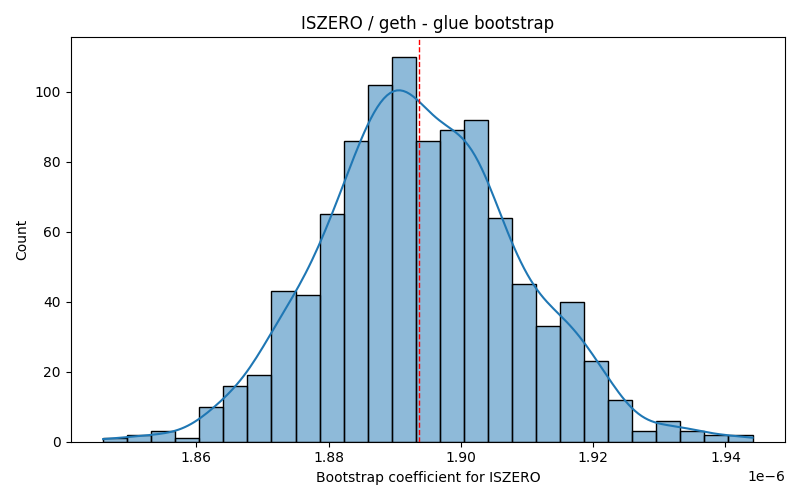

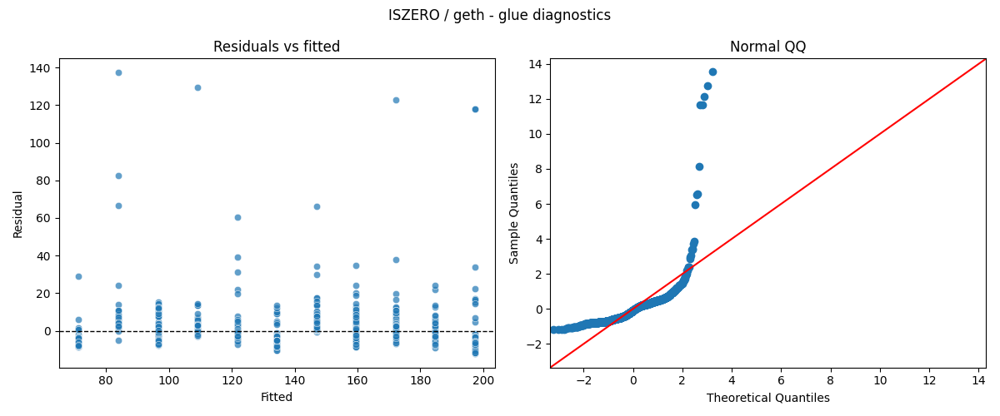

</details>

<details><summary><code>JUMPDEST</code> · nobs=1562 · runtime_ms=1.293e-06 · p=1.00e-03 · R²=0.8504</summary>

```
==============================================================================
                           NNLS Regression Results                            
==============================================================================
Dep. Variable:          test_runtime_ms              R-squared:          0.850
Model:                  NNLS                    Adj. R-squared:          0.850
No. Observations:       1562                              RMSE:          34.26
Df Residuals:           1560                               MAE:          13.44
Df Model:               1      
==============================================================================
                      coef     std err     P-value      [0.025      0.975]
------------------------------------------------------------------------------
         const     18.6823      2.5232       0.001     13.6155     23.4489
      JUMPDEST      0.0000      0.0000       0.001      0.0000      0.0000
==============================================================================
Notes: Non-negative least squares with bootstrap inference (1000 iterations)
==============================================================================
```

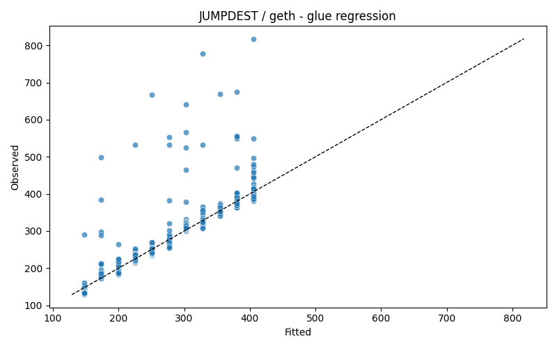

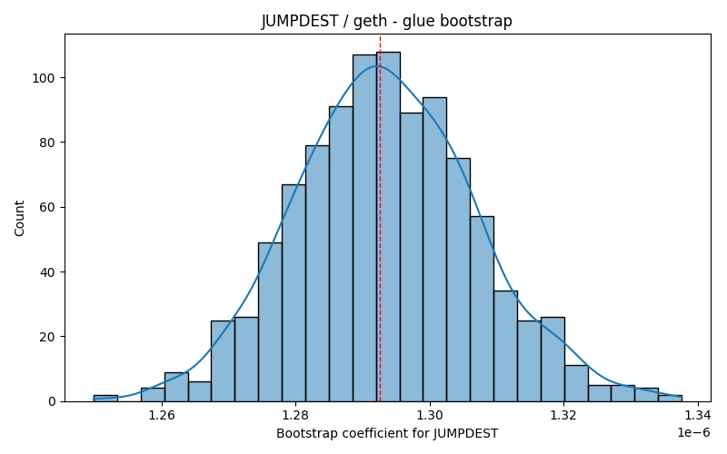

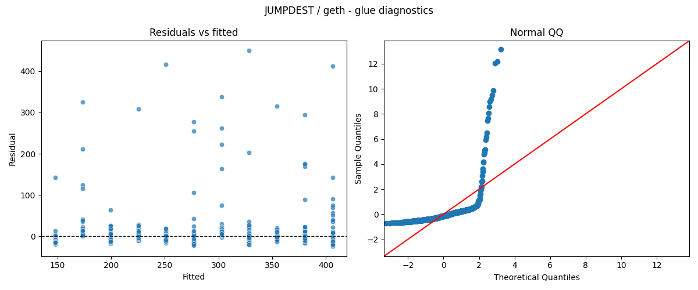

</details>

<details><summary><code>SWAP</code> · nobs=24992 · runtime_ms=2.267e-06 · p=1.00e-03 · R²=0.9497</summary>

```
==============================================================================
                           NNLS Regression Results                            
==============================================================================
Dep. Variable:          test_runtime_ms              R-squared:          0.950
Model:                  NNLS                    Adj. R-squared:          0.950
No. Observations:       24992                             RMSE:          10.99
Df Residuals:           24990                              MAE:           6.76
Df Model:               1      
==============================================================================
                      coef     std err     P-value      [0.025      0.975]
------------------------------------------------------------------------------
         const     12.4676      0.2374       0.001     11.9991     12.9013
          SWAP      0.0000      0.0000       0.001      0.0000      0.0000
==============================================================================
Notes: Non-negative least squares with bootstrap inference (1000 iterations)
==============================================================================
```

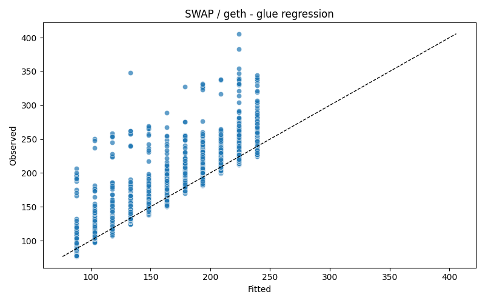

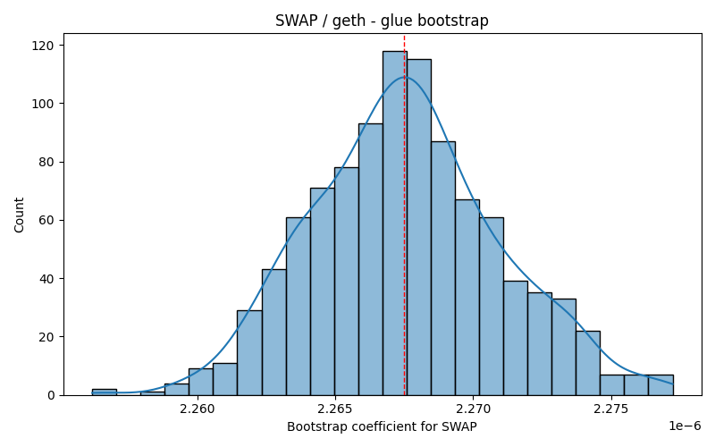

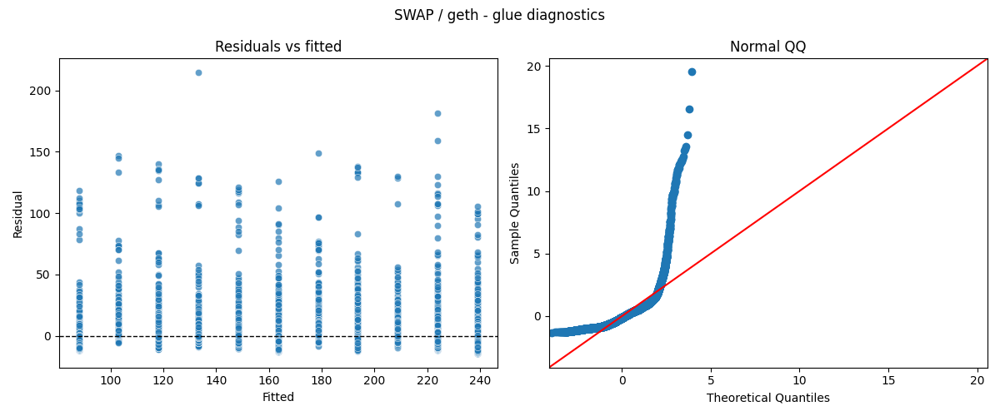

</details>

### Mixed glue (tier A) · geth

<details><summary><code>ADD</code> · nobs=1562 · runtime_ms=4.505e-06 · p=1.00e-03 · R²=0.9112</summary>

```
==============================================================================
                           NNLS Regression Results                            
==============================================================================
Dep. Variable:          test_runtime_ms              R-squared:          0.911
Model:                  NNLS                    Adj. R-squared:          0.911
No. Observations:       1562                              RMSE:          14.81
Df Residuals:           1560                               MAE:           7.90
Df Model:               1      
==============================================================================
                      coef     std err     P-value      [0.025      0.975]
------------------------------------------------------------------------------
         const      4.5015      1.1014       0.001      2.3155      6.5558
           ADD      0.0000      0.0000       0.001      0.0000      0.0000
==============================================================================
Notes: Non-negative least squares with bootstrap inference (1000 iterations)
==============================================================================
```

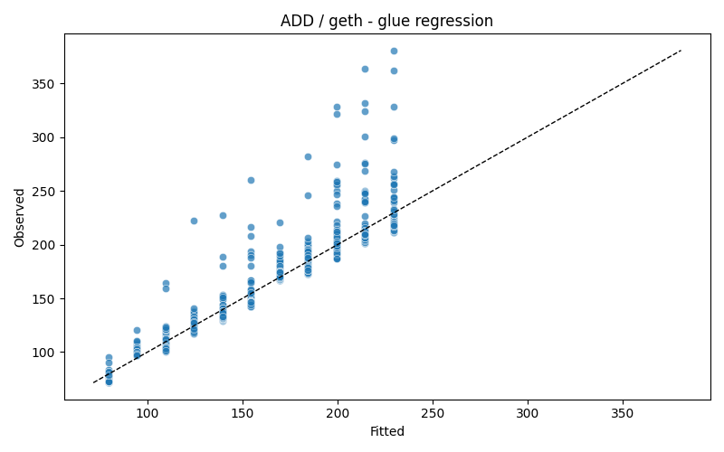

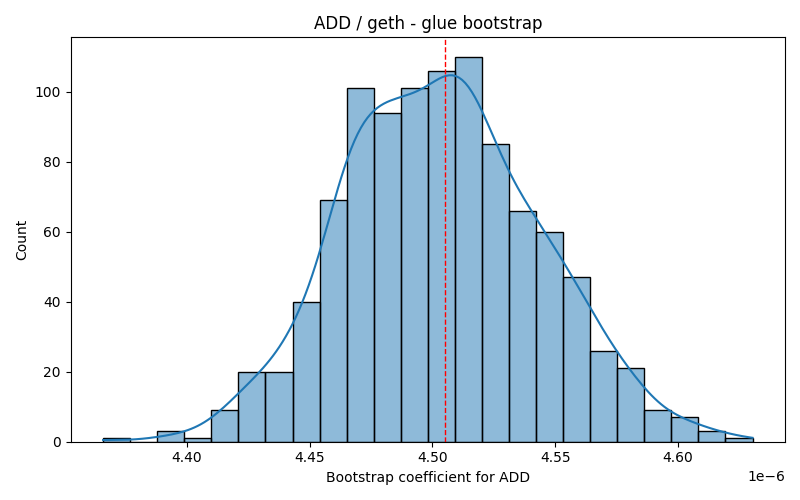

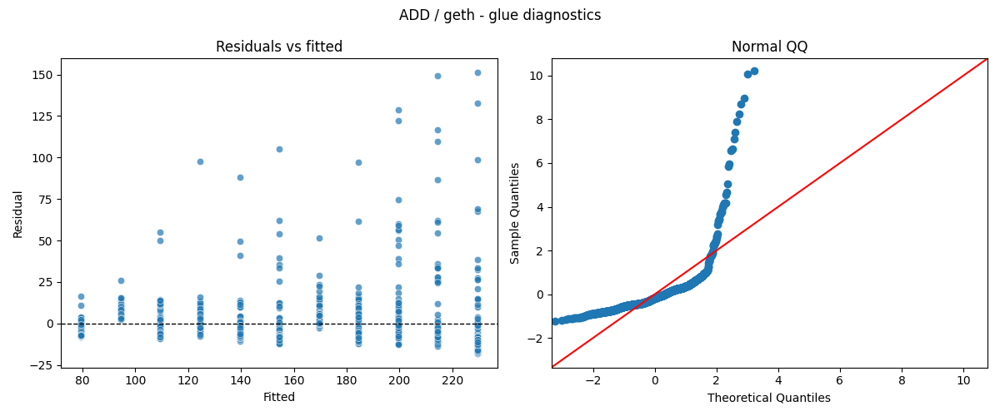

</details>

<details><summary><code>AND</code> · nobs=1562 · runtime_ms=4.421e-06 · p=1.00e-03 · R²=0.9072</summary>

```
==============================================================================
                           NNLS Regression Results                            
==============================================================================
Dep. Variable:          test_runtime_ms              R-squared:          0.907
Model:                  NNLS                    Adj. R-squared:          0.907
No. Observations:       1562                              RMSE:          14.89
Df Residuals:           1560                               MAE:           8.21
Df Model:               1      
==============================================================================
                      coef     std err     P-value      [0.025      0.975]
------------------------------------------------------------------------------
         const      6.3383      1.1710       0.001      4.1181      8.8954
           AND      0.0000      0.0000       0.001      0.0000      0.0000
==============================================================================
Notes: Non-negative least squares with bootstrap inference (1000 iterations)
==============================================================================
```

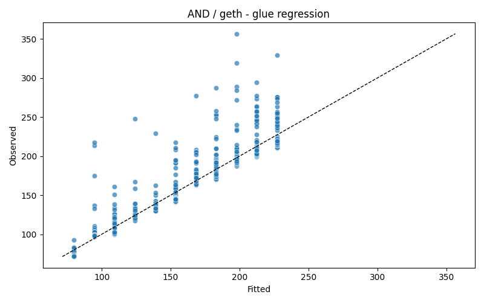

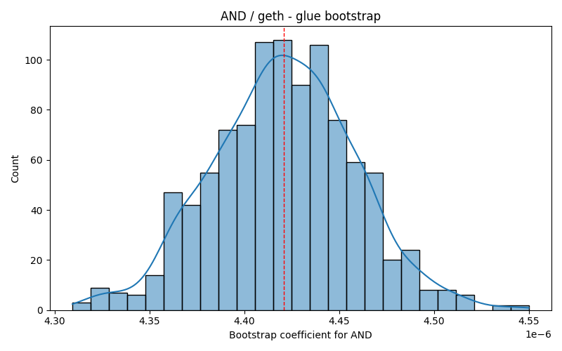

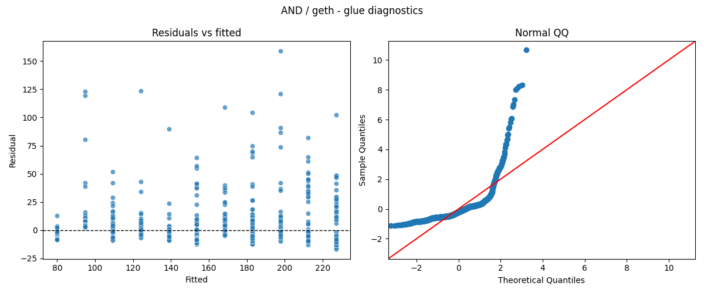

</details>

<details><summary><code>CALLDATACOPY</code> · nobs=37488 · runtime_ms=1.153e-05 · p=1.00e-03 · R²=0.9771</summary>

```
==============================================================================
                           NNLS Regression Results                            
==============================================================================
Dep. Variable:          test_runtime_ms              R-squared:          0.977
Model:                  NNLS                    Adj. R-squared:          0.977
No. Observations:       37488                             RMSE:          13.27
Df Residuals:           37486                              MAE:           8.48
Df Model:               1      
==============================================================================
                      coef     std err     P-value      [0.025      0.975]
------------------------------------------------------------------------------
         const     13.7317      0.0851       0.001     13.5671     13.9042
  CALLDATACOPY      0.0000      0.0000       0.001      0.0000      0.0000
==============================================================================
Notes: Non-negative least squares with bootstrap inference (1000 iterations)
==============================================================================
```

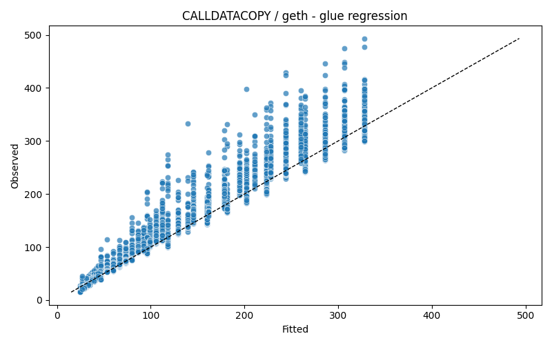

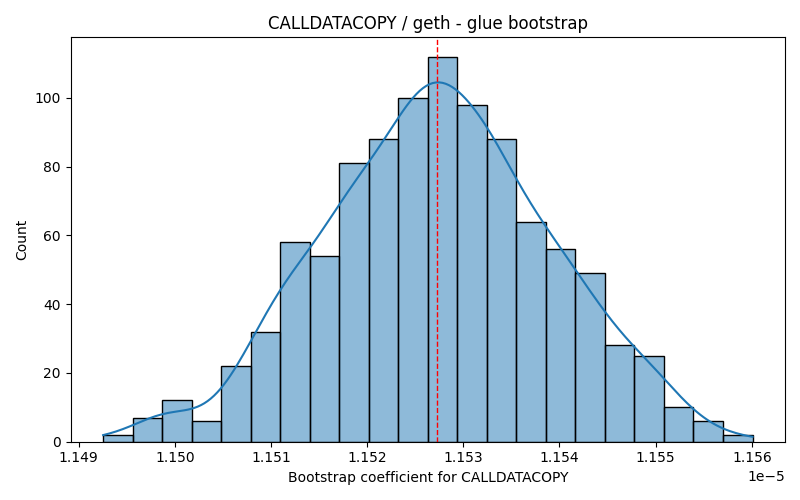

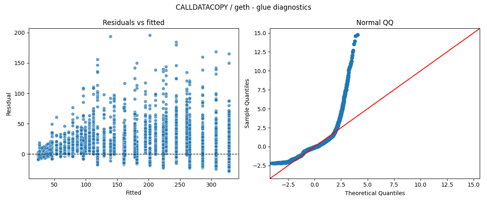

</details>

<details><summary><code>CALLDATALOAD</code> · nobs=6248 · runtime_ms=2.474e-05 · p=1.00e-03 · R²=0.0701</summary>

```
==============================================================================
                           NNLS Regression Results                            
==============================================================================
Dep. Variable:          test_runtime_ms              R-squared:          0.070
Model:                  NNLS                    Adj. R-squared:          0.070
No. Observations:       6248                              RMSE:           0.35
Df Residuals:           6246                               MAE:           0.15
Df Model:               1      
==============================================================================
                      coef     std err     P-value      [0.025      0.975]
------------------------------------------------------------------------------
         const      1.7832      0.0154       0.001      1.7532      1.8145
  CALLDATALOAD      0.0000      0.0000       0.001      0.0000      0.0000
==============================================================================
Notes: Non-negative least squares with bootstrap inference (1000 iterations)
==============================================================================
```

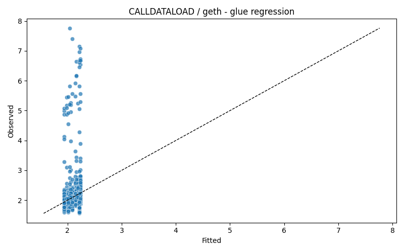

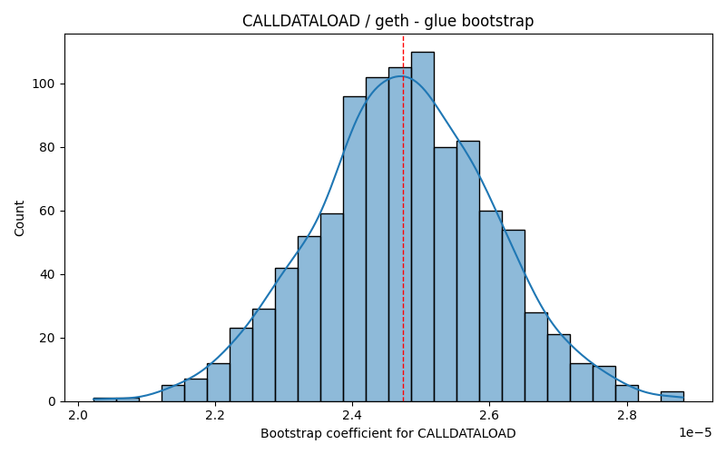

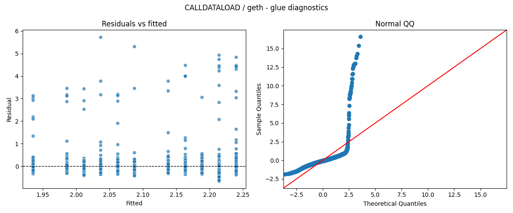

</details>

<details><summary><code>DIV</code> · nobs=1562 · runtime_ms=1.439e-05 · p=1.00e-03 · R²=0.9788</summary>

```
==============================================================================
                           NNLS Regression Results                            
==============================================================================
Dep. Variable:          test_runtime_ms              R-squared:          0.979
Model:                  NNLS                    Adj. R-squared:          0.979
No. Observations:       1562                              RMSE:          16.71
Df Residuals:           1560                               MAE:          13.44
Df Model:               1      
==============================================================================
                      coef     std err     P-value      [0.025      0.975]
------------------------------------------------------------------------------
         const     26.4138      1.4401       0.001     23.6377     29.2412
           DIV      0.0000      0.0000       0.001      0.0000      0.0000
==============================================================================
Notes: Non-negative least squares with bootstrap inference (1000 iterations)
==============================================================================
```

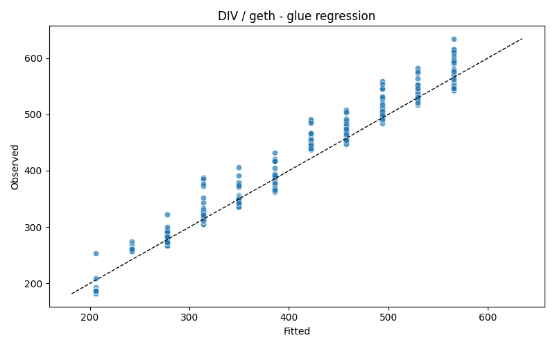

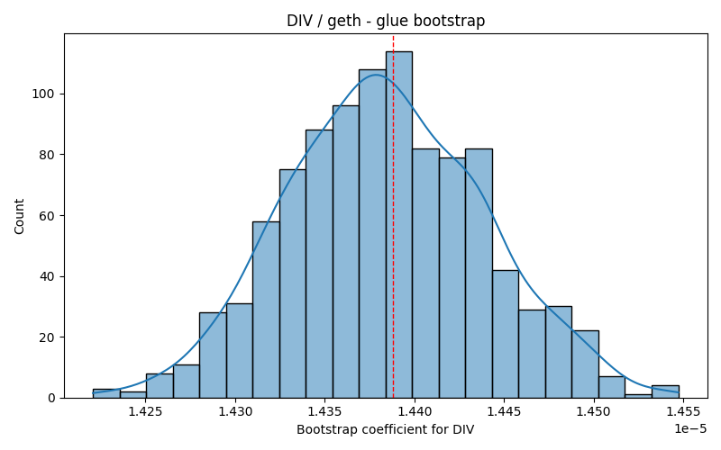

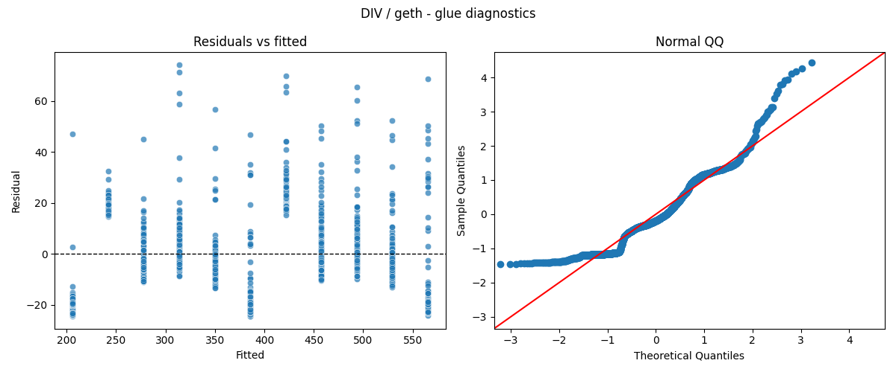

</details>

<details><summary><code>EXP</code> · nobs=1562 · runtime_ms=0.0007157 · p=1.00e-03 · R²=0.9821</summary>

```
==============================================================================
                           NNLS Regression Results                            
==============================================================================
Dep. Variable:          test_runtime_ms              R-squared:          0.982
Model:                  NNLS                    Adj. R-squared:          0.982
No. Observations:       1562                              RMSE:           3.78
Df Residuals:           1560                               MAE:           3.06
Df Model:               1      
==============================================================================
                      coef     std err     P-value      [0.025      0.975]
------------------------------------------------------------------------------
         const      3.2388      0.2848       0.001      2.6522      3.8115
           EXP      0.0007      0.0000       0.001      0.0007      0.0007
==============================================================================
Notes: Non-negative least squares with bootstrap inference (1000 iterations)
==============================================================================
```

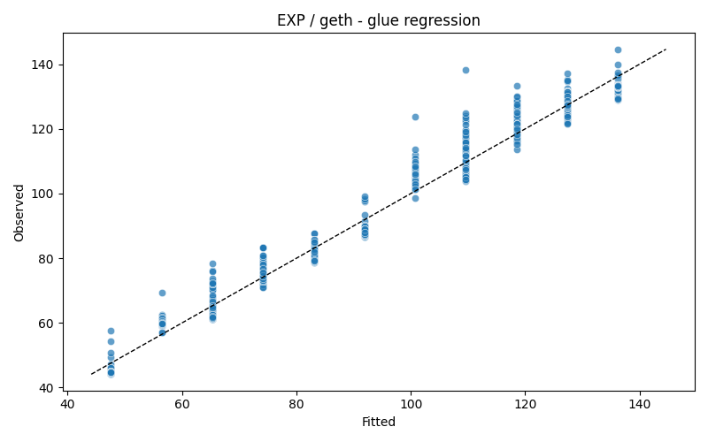

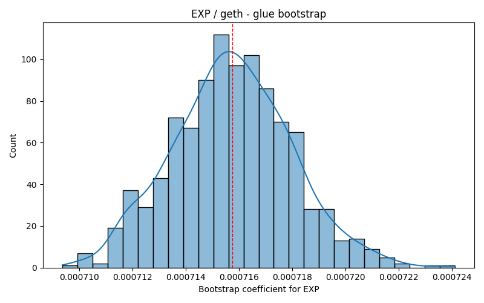

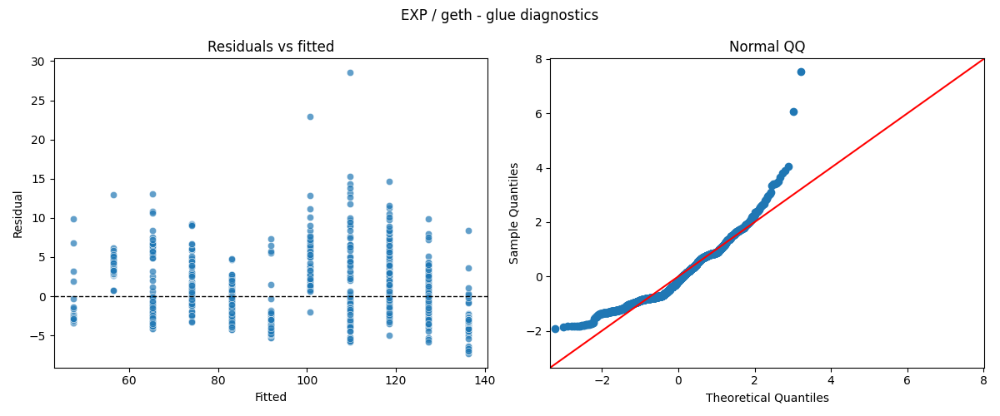

</details>

<details><summary><code>GT</code> · nobs=1562 · runtime_ms=3.973e-06 · p=1.00e-03 · R²=0.8489</summary>

```
==============================================================================
                           NNLS Regression Results                            
==============================================================================
Dep. Variable:          test_runtime_ms              R-squared:          0.849
Model:                  NNLS                    Adj. R-squared:          0.849
No. Observations:       1562                              RMSE:          17.65
Df Residuals:           1560                               MAE:          11.00
Df Model:               1      
==============================================================================
                      coef     std err     P-value      [0.025      0.975]
------------------------------------------------------------------------------
         const     24.7684      1.7929       0.001     21.2032     28.1740
            GT      0.0000      0.0000       0.001      0.0000      0.0000
==============================================================================
Notes: Non-negative least squares with bootstrap inference (1000 iterations)
==============================================================================
```

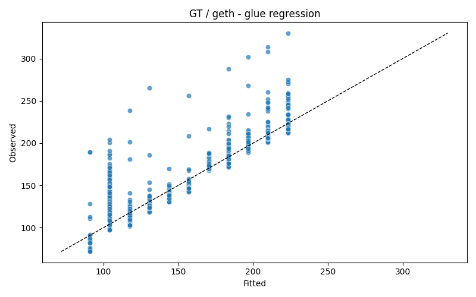

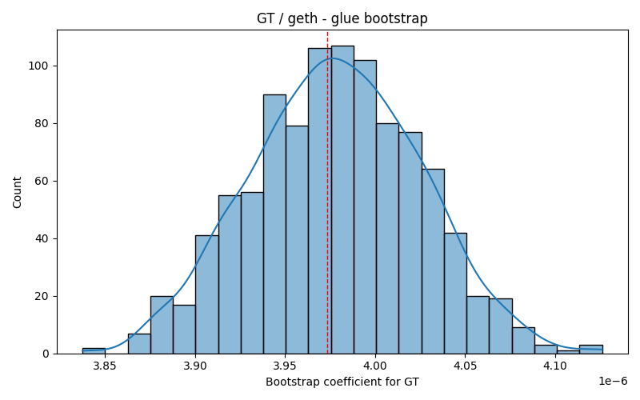

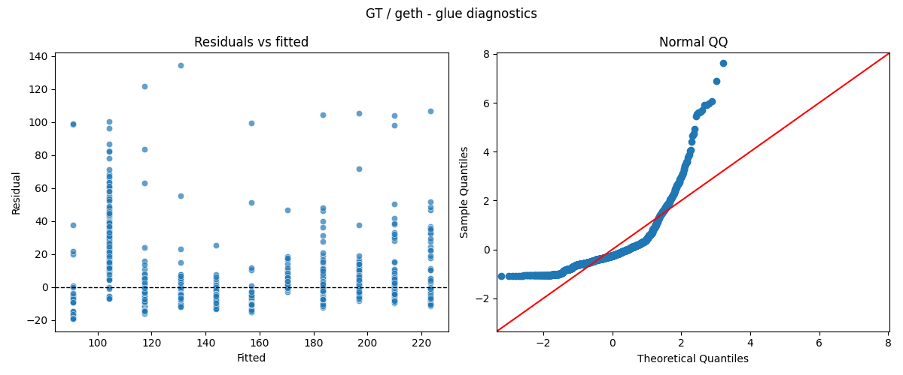

</details>

<details><summary><code>JUMPI</code> · nobs=1562 · runtime_ms=5.593e-06 · p=1.00e-03 · R²=0.8406</summary>

```
==============================================================================
                           NNLS Regression Results                            
==============================================================================
Dep. Variable:          test_runtime_ms              R-squared:          0.841
Model:                  NNLS                    Adj. R-squared:          0.840
No. Observations:       1562                              RMSE:          10.99
Df Residuals:           1560                               MAE:           5.56
Df Model:               1      
==============================================================================
                      coef     std err     P-value      [0.025      0.975]
------------------------------------------------------------------------------
         const      4.5202      0.9015       0.001      2.8228      6.2674
         JUMPI      0.0000      0.0000       0.001      0.0000      0.0000
==============================================================================
Notes: Non-negative least squares with bootstrap inference (1000 iterations)
==============================================================================
```

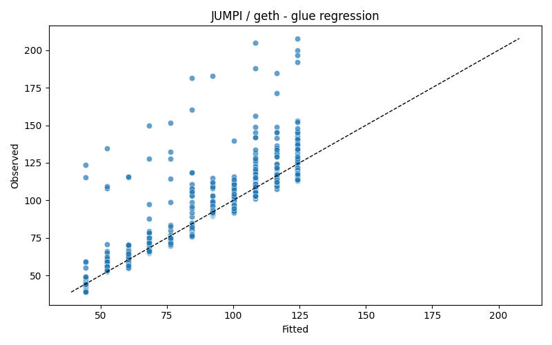

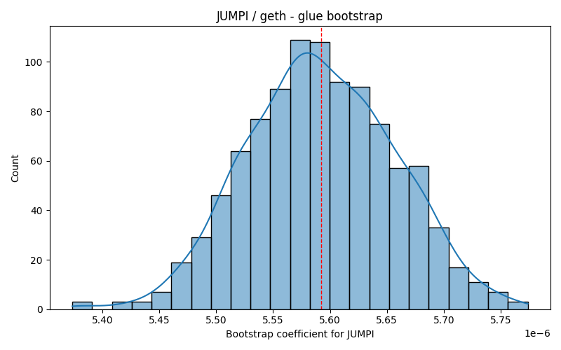

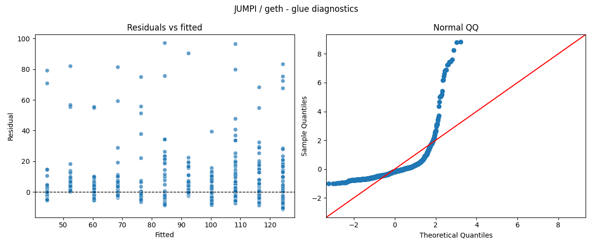

</details>

<details><summary><code>LT</code> · nobs=1562 · runtime_ms=4.358e-06 · p=1.00e-03 · R²=0.9358</summary>

```
==============================================================================
                           NNLS Regression Results                            
==============================================================================
Dep. Variable:          test_runtime_ms              R-squared:          0.936
Model:                  NNLS                    Adj. R-squared:          0.936
No. Observations:       1562                              RMSE:          12.02
Df Residuals:           1560                               MAE:           7.23
Df Model:               1      
==============================================================================
                      coef     std err     P-value      [0.025      0.975]
------------------------------------------------------------------------------
         const      7.2149      1.0637       0.001      5.3996      9.5095
            LT      0.0000      0.0000       0.001      0.0000      0.0000
==============================================================================
Notes: Non-negative least squares with bootstrap inference (1000 iterations)
==============================================================================
```

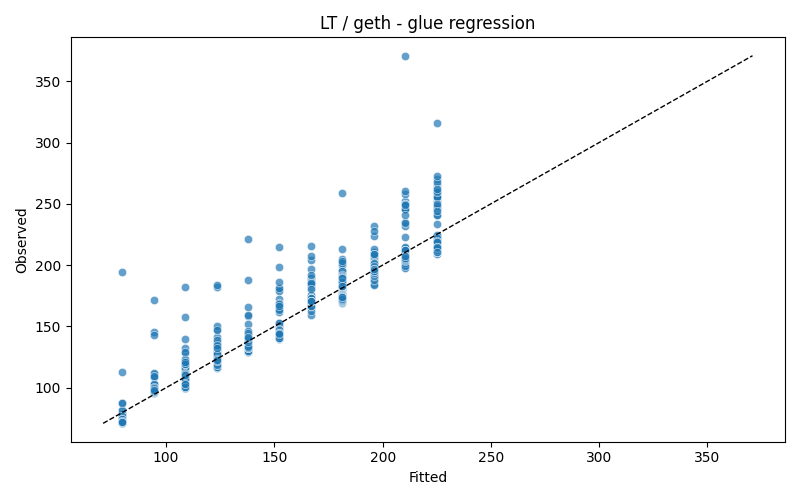

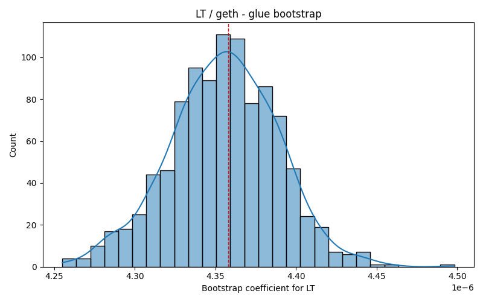

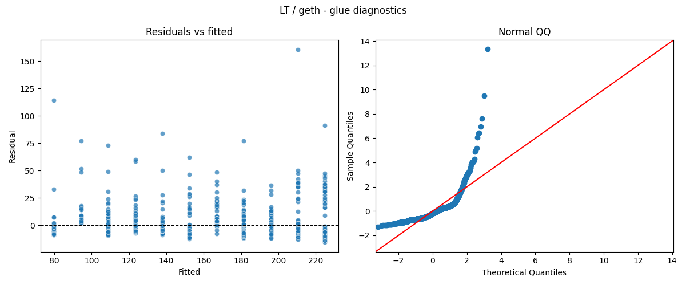

</details>

<details><summary><code>MSTORE</code> · nobs=7810 · runtime_ms=8.473e-06 · p=1.00e-03 · R²=0.9404</summary>

```
==============================================================================
                           NNLS Regression Results                            
==============================================================================
Dep. Variable:          test_runtime_ms              R-squared:          0.940
Model:                  NNLS                    Adj. R-squared:          0.940
No. Observations:       7810                              RMSE:          14.97
Df Residuals:           7808                               MAE:           9.24
Df Model:               1      
==============================================================================
                      coef     std err     P-value      [0.025      0.975]
------------------------------------------------------------------------------
         const     13.2897      0.5553       0.001     12.2395     14.4112
        MSTORE      0.0000      0.0000       0.001      0.0000      0.0000
==============================================================================
Notes: Non-negative least squares with bootstrap inference (1000 iterations)
==============================================================================
```

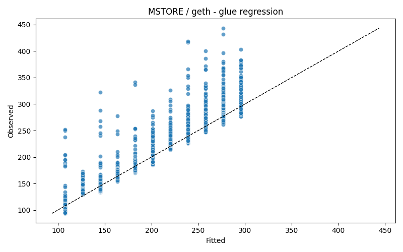

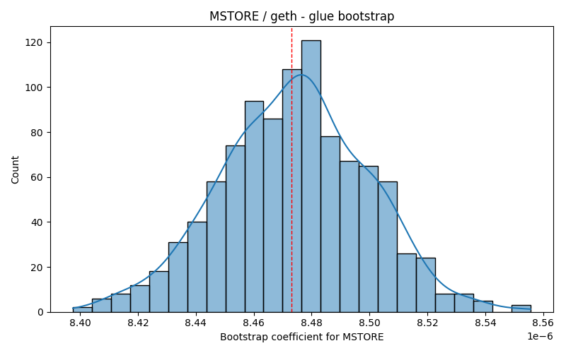

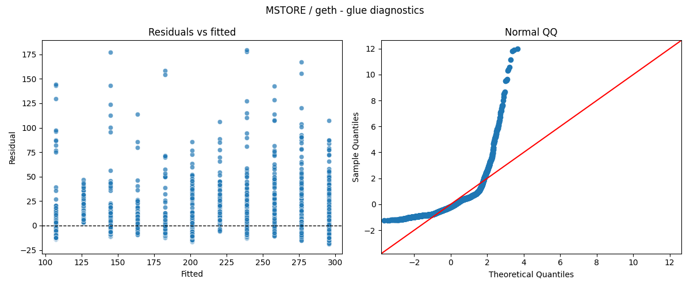

</details>

<details><summary><code>MSTORE8</code> · nobs=7810 · runtime_ms=7.854e-06 · p=1.00e-03 · R²=0.9246</summary>

```
==============================================================================
                           NNLS Regression Results                            
==============================================================================
Dep. Variable:          test_runtime_ms              R-squared:          0.925
Model:                  NNLS                    Adj. R-squared:          0.925
No. Observations:       7810                              RMSE:          15.74
Df Residuals:           7808                               MAE:           9.33
Df Model:               1      
==============================================================================
                      coef     std err     P-value      [0.025      0.975]
------------------------------------------------------------------------------
         const     14.7695      0.5534       0.001     13.7306     15.8133
       MSTORE8      0.0000      0.0000       0.001      0.0000      0.0000
==============================================================================
Notes: Non-negative least squares with bootstrap inference (1000 iterations)
==============================================================================
```

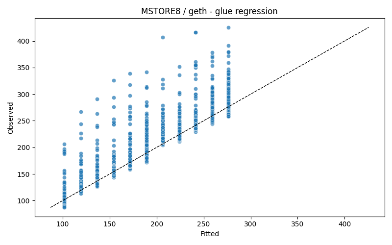

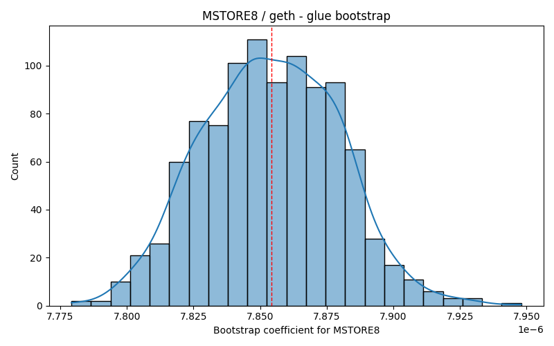

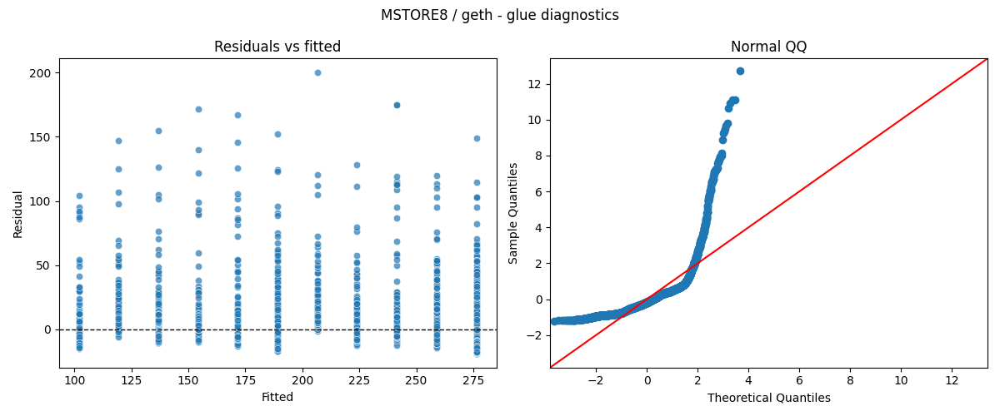

</details>

<details><summary><code>MUL</code> · nobs=1562 · runtime_ms=5.34e-06 · p=1.00e-03 · R²=0.9518</summary>

```
==============================================================================
                           NNLS Regression Results                            
==============================================================================
Dep. Variable:          test_runtime_ms              R-squared:          0.952
Model:                  NNLS                    Adj. R-squared:          0.952
No. Observations:       1562                              RMSE:           9.49
Df Residuals:           1560                               MAE:           6.23
Df Model:               1      
==============================================================================
                      coef     std err     P-value      [0.025      0.975]
------------------------------------------------------------------------------
         const     10.5456      0.7657       0.001      8.9680     12.0320
           MUL      0.0000      0.0000       0.001      0.0000      0.0000
==============================================================================
Notes: Non-negative least squares with bootstrap inference (1000 iterations)
==============================================================================
```

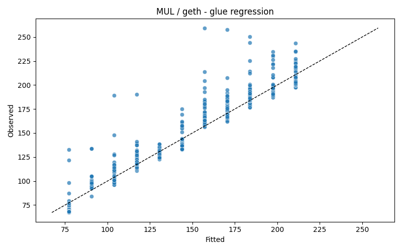

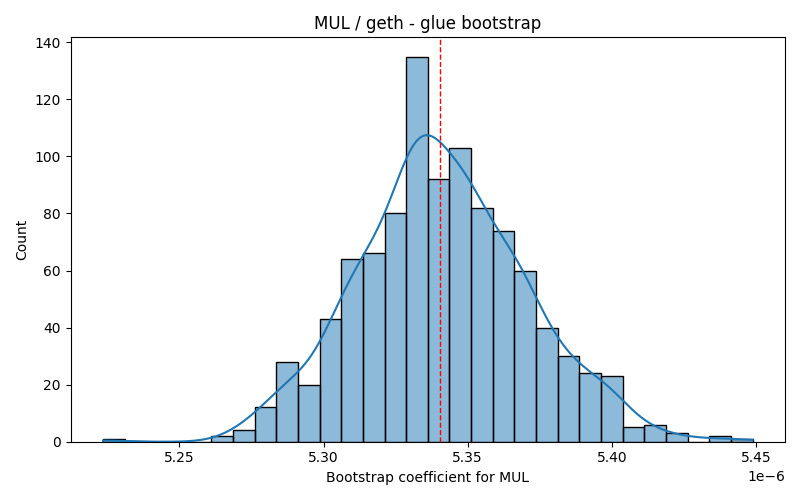

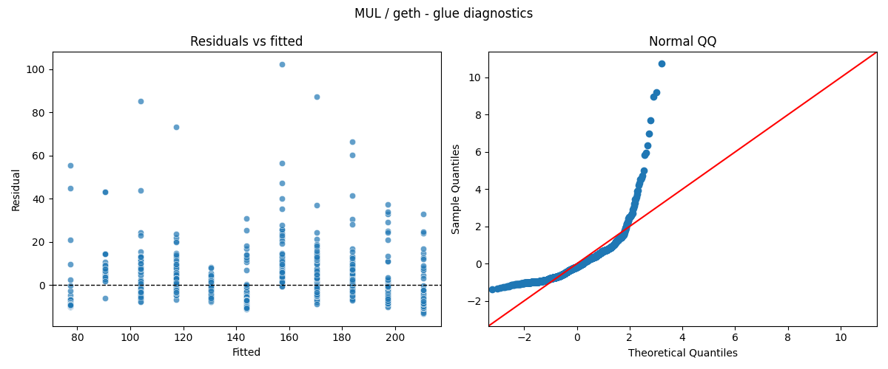

</details>

<details><summary><code>PC</code> · nobs=1562 · runtime_ms=1.98e-06 · p=1.00e-03 · R²=0.947</summary>

```
==============================================================================
                           NNLS Regression Results                            
==============================================================================
Dep. Variable:          test_runtime_ms              R-squared:          0.947
Model:                  NNLS                    Adj. R-squared:          0.947
No. Observations:       1562                              RMSE:          14.02
Df Residuals:           1560                               MAE:           9.88
Df Model:               1      
==============================================================================
                      coef     std err     P-value      [0.025      0.975]
------------------------------------------------------------------------------
         const     14.3015      1.1869       0.001     12.0483     16.5759
            PC      0.0000      0.0000       0.001      0.0000      0.0000
==============================================================================
Notes: Non-negative least squares with bootstrap inference (1000 iterations)
==============================================================================
```

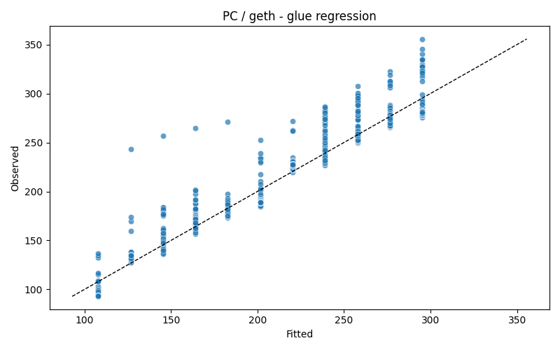

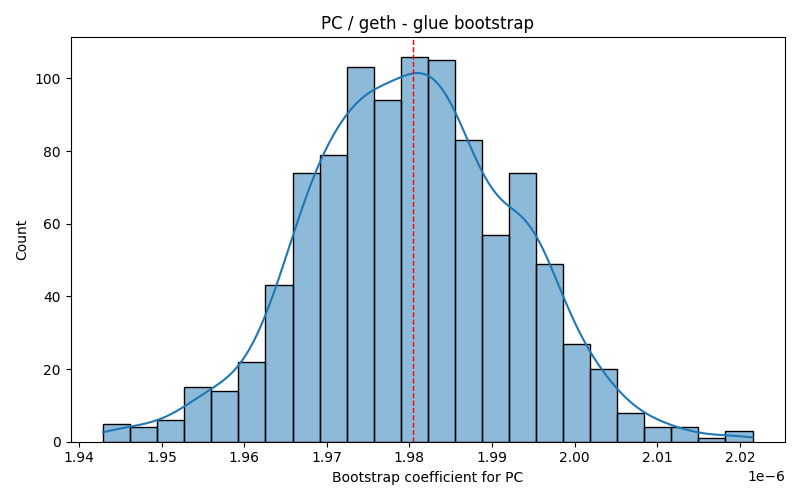

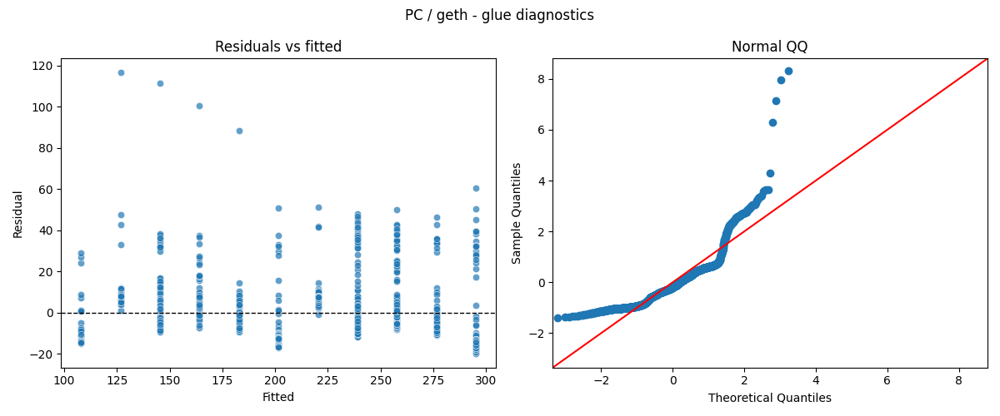

</details>

<details><summary><code>RETURNDATASIZE</code> · nobs=6248 · runtime_ms=5.373e-06 · p=1.00e-03 · R²=0.8658</summary>

```
==============================================================================
                           NNLS Regression Results                            
==============================================================================
Dep. Variable:          test_runtime_ms              R-squared:          0.866
Model:                  NNLS                    Adj. R-squared:          0.866
No. Observations:       6248                              RMSE:          33.41
Df Residuals:           6246                               MAE:          25.82
Df Model:               1      
==============================================================================
                      coef     std err     P-value      [0.025      0.975]
------------------------------------------------------------------------------
         const     57.2797      1.4093       0.001     54.3869     60.0717
RETURNDATASIZE      0.0000      0.0000       0.001      0.0000      0.0000
==============================================================================
Notes: Non-negative least squares with bootstrap inference (1000 iterations)
==============================================================================
```

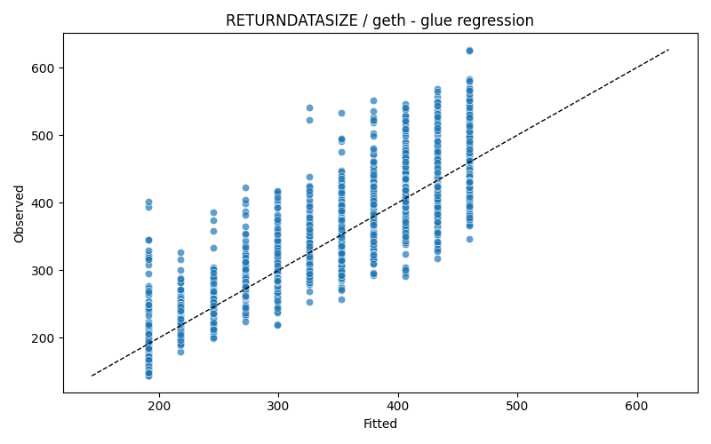

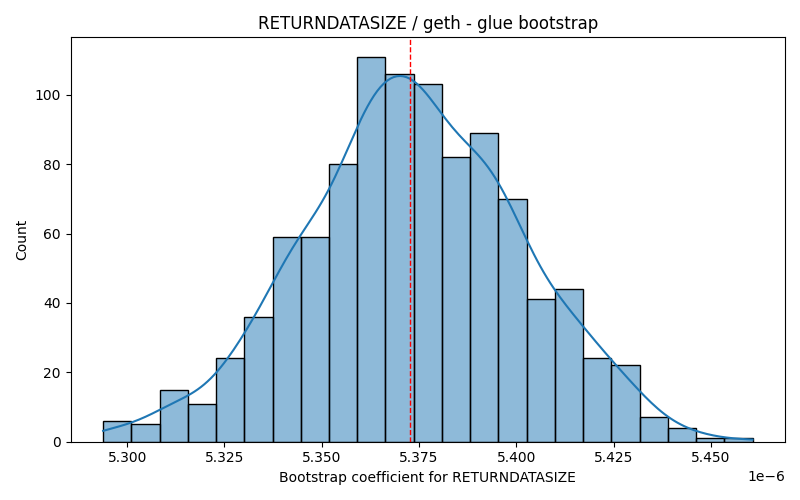

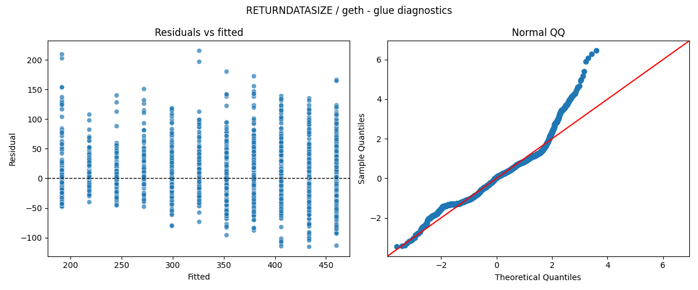

</details>

<details><summary><code>SELFBALANCE</code> · nobs=1562 · runtime_ms=1.232e-05 · p=1.00e-03 · R²=0.9701</summary>

```
==============================================================================
                           NNLS Regression Results                            
==============================================================================
Dep. Variable:          test_runtime_ms              R-squared:          0.970
Model:                  NNLS                    Adj. R-squared:          0.970
No. Observations:       1562                              RMSE:          26.72
Df Residuals:           1560                               MAE:          21.92
Df Model:               1      
==============================================================================
                      coef     std err     P-value      [0.025      0.975]
------------------------------------------------------------------------------
         const     48.3362      2.5208       0.001     43.4710     53.4044
   SELFBALANCE      0.0000      0.0000       0.001      0.0000      0.0000
==============================================================================
Notes: Non-negative least squares with bootstrap inference (1000 iterations)
==============================================================================
```

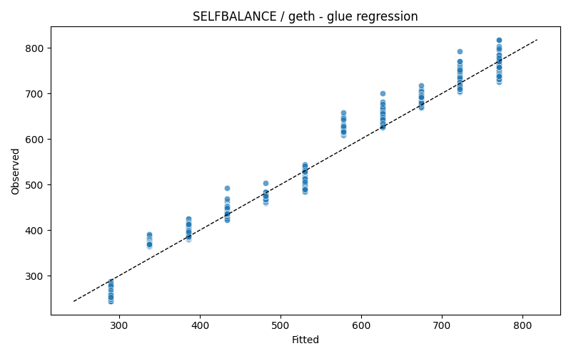

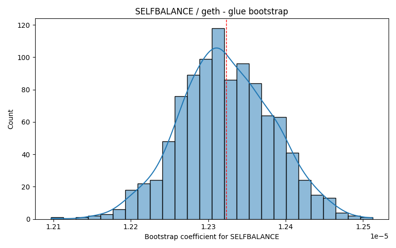

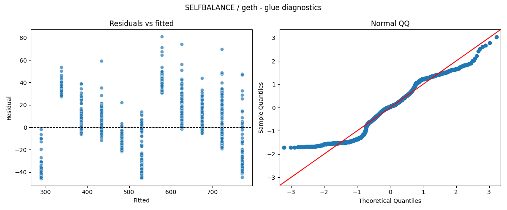

</details>

<details><summary><code>SUB</code> · nobs=1562 · runtime_ms=4.353e-06 · p=1.00e-03 · R²=0.9176</summary>

```
==============================================================================
                           NNLS Regression Results                            
==============================================================================
Dep. Variable:          test_runtime_ms              R-squared:          0.918
Model:                  NNLS                    Adj. R-squared:          0.918
No. Observations:       1562                              RMSE:          13.73
Df Residuals:           1560                               MAE:           7.30
Df Model:               1      
==============================================================================
                      coef     std err     P-value      [0.025      0.975]
------------------------------------------------------------------------------
         const      8.6921      1.1208       0.001      6.4536     10.9855
           SUB      0.0000      0.0000       0.001      0.0000      0.0000
==============================================================================
Notes: Non-negative least squares with bootstrap inference (1000 iterations)
==============================================================================
```

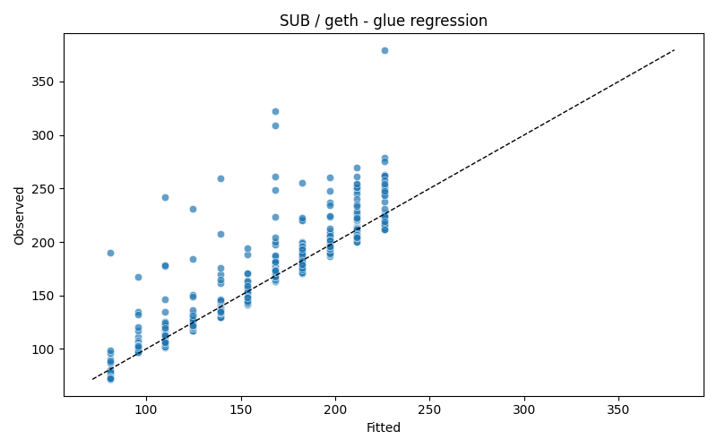

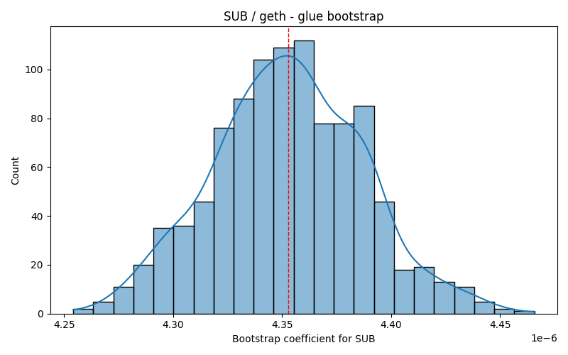

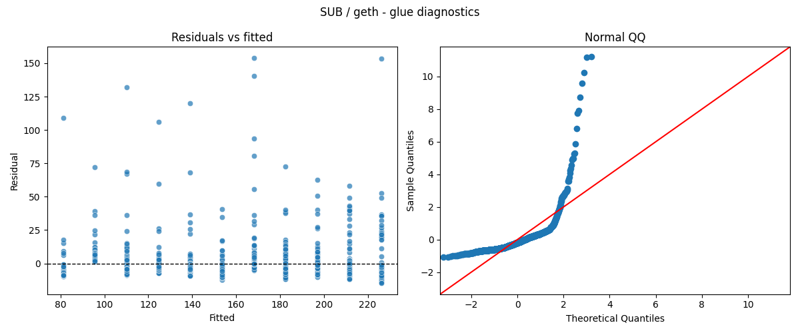

</details>

### Mixed glue (tier B) · geth

<details><summary><code>JUMP</code> · nobs=1562 · runtime_ms=9.684e-06 · p=1.00e-03 · R²=0.8074</summary>

```
==============================================================================
                           NNLS Regression Results                            
==============================================================================
Dep. Variable:          test_runtime_ms              R-squared:          0.807
Model:                  NNLS                    Adj. R-squared:          0.807
No. Observations:       1562                              RMSE:          17.58
Df Residuals:           1560                               MAE:           9.90
Df Model:               1      
==============================================================================
                      coef     std err     P-value      [0.025      0.975]
------------------------------------------------------------------------------
         const     18.1769      2.0839       0.001     14.1523     22.3287
          JUMP      0.0000      0.0000       0.001      0.0000      0.0000
==============================================================================
Notes: Non-negative least squares with bootstrap inference (1000 iterations)
==============================================================================
```

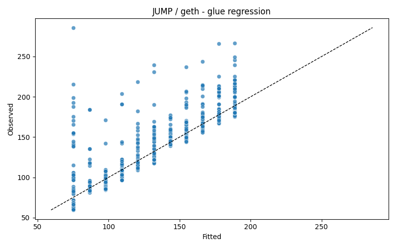

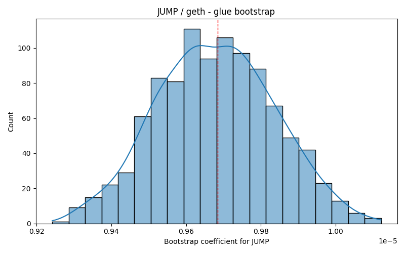

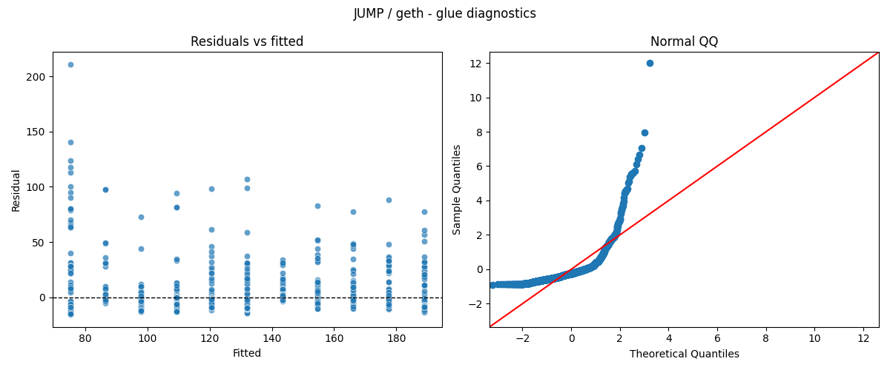

</details>

<details><summary><code>KECCAK256</code> · nobs=24992 · runtime_ms=3.772e-05 · p=1.00e-03 · R²=0.1163</summary>

```
==============================================================================
                           NNLS Regression Results                            
==============================================================================
Dep. Variable:          test_runtime_ms              R-squared:          0.116
Model:                  NNLS                    Adj. R-squared:          0.116
No. Observations:       24992                             RMSE:         206.69
Df Residuals:           24990                              MAE:         166.37
Df Model:               1      
==============================================================================
                      coef     std err     P-value      [0.025      0.975]
------------------------------------------------------------------------------
         const    567.6836      2.9445       0.001    562.3477    573.6775
     KECCAK256      0.0000      0.0000       0.001      0.0000      0.0000
==============================================================================
Notes: Non-negative least squares with bootstrap inference (1000 iterations)
==============================================================================
```

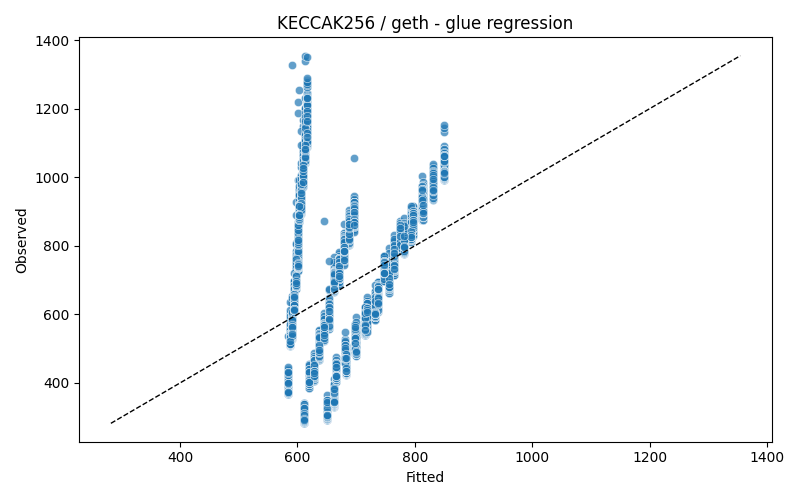

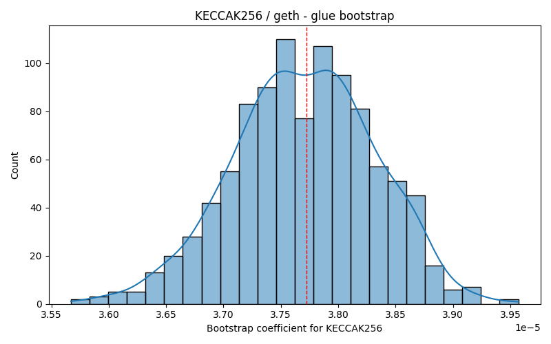

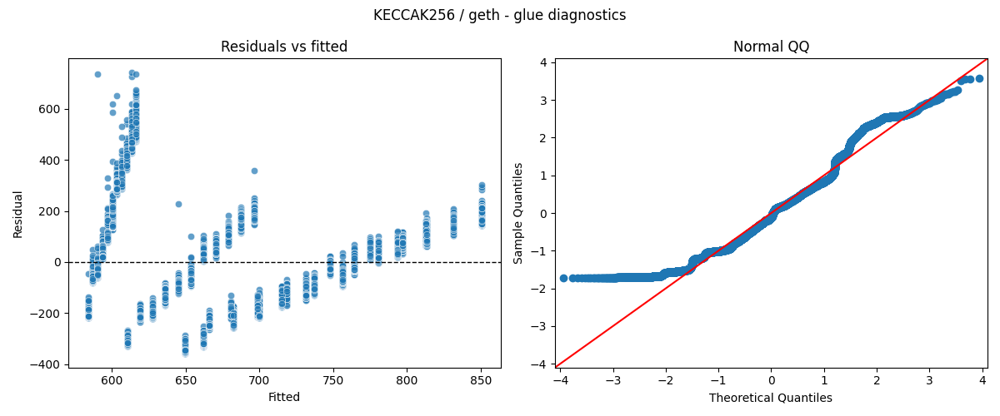

</details>

## nethermind

| glue_opcode | nobs | glue_runtime_ms | p_value | rsquared |
| --- | --- | --- | --- | --- |
| `ISZERO` | 1639 | 5.551e-07 | 1.00e-03 | 0.4807 |
| `JUMPDEST` | 1639 | 3.767e-07 | 1.00e-03 | 0.7633 |
| `SWAP` | 26224 | 6.044e-07 | 1.00e-03 | 0.6341 |
| `CALLDATASIZE` | 96789 | 5.109e-07 | 1.00e-03 | 0.8406 |
| `DUP` | 96789 | 3.991e-07 | 1.00e-03 | 0.8406 |
| `GAS` | 96789 | 4.272e-07 | 1.00e-03 | 0.8406 |
| `MLOAD` | 96789 | 1.872e-06 | 1.00e-03 | 0.8406 |
| `PUSH` | 96789 | 6.433e-07 | 1.00e-03 | 0.8406 |
| `PUSH0` | 96789 | 3.539e-07 | 1.00e-03 | 0.8406 |
| `STATICCALL` | 96789 | 0.0002353 | 1.00e-03 | 0.8406 |
| `ADD` | 1639 | 1.457e-06 | 1.00e-03 | 0.8906 |
| `AND` | 1639 | 1.19e-06 | 1.00e-03 | 0.9011 |
| `CALLDATACOPY` | 39336 | 4.033e-06 | 1.00e-03 | 0.7825 |
| `CALLDATALOAD` | 6556 | 1.764e-05 | 1.00e-03 | 0.09312 |
| `DIV` | 1639 | 5.531e-06 | 1.00e-03 | 0.5438 |
| `EXP` | 1639 | 0 | 1.00e+00 | 0 |
| `GT` | 1639 | 1.466e-06 | 1.00e-03 | 0.9423 |
| `JUMPI` | 1639 | 2.289e-06 | 1.00e-03 | 0.8961 |
| `LT` | 1639 | 1.436e-06 | 1.00e-03 | 0.9417 |
| `MSTORE` | 8195 | 2.75e-06 | 1.00e-03 | 0.9276 |
| `MSTORE8` | 8195 | 2.753e-06 | 1.00e-03 | 0.9174 |
| `MUL` | 1639 | 4.262e-06 | 1.00e-03 | 0.952 |
| `PC` | 1639 | 6.111e-07 | 1.00e-03 | 0.8782 |
| `RETURNDATASIZE` | 6556 | 9.41e-07 | 1.00e-03 | 0.8011 |
| `SELFBALANCE` | 1639 | 3.765e-06 | 1.00e-03 | 0.9392 |
| `SUB` | 1639 | 2.028e-06 | 1.00e-03 | 0.8655 |
| `JUMP` | 1639 | 2.924e-06 | 1.00e-03 | 0.769 |
| `KECCAK256` | 26224 | 0 | 1.00e+00 | -2.22e-16 |

### Cycle glue — joint fit · nethermind

<details><summary>Joint NNLS regression summary</summary>

```
==============================================================================
                           NNLS Regression Results                            
==============================================================================
Dep. Variable:          test_runtime_ms              R-squared:          0.841
Model:                  NNLS                    Adj. R-squared:          0.841
No. Observations:       96789                             RMSE:           9.53
Df Residuals:           96781                              MAE:           7.26
Df Model:               7      
==============================================================================
                      coef     std err     P-value      [0.025      0.975]
------------------------------------------------------------------------------
         const      6.5954      0.0906       0.001      6.4245      6.7768
  CALLDATASIZE      0.0000      0.0000       0.001      0.0000      0.0000
           DUP      0.0000      0.0000       0.001      0.0000      0.0000
           GAS      0.0000      0.0000       0.001      0.0000      0.0000
         MLOAD      0.0000      0.0000       0.001      0.0000      0.0000
          PUSH      0.0000      0.0000       0.001      0.0000      0.0000
         PUSH0      0.0000      0.0000       0.001      0.0000      0.0000
    STATICCALL      0.0002      0.0000       0.001      0.0002      0.0002
==============================================================================
Notes: Non-negative least squares with bootstrap inference (1000 iterations)
==============================================================================
```

</details>

<details><summary><code>CALLDATASIZE</code> · nobs=96789 · runtime_ms=5.109e-07 · p=1.00e-03 · R²=0.8406</summary>

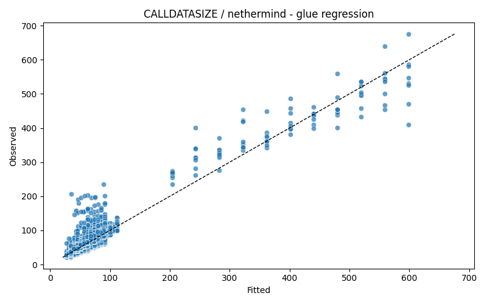

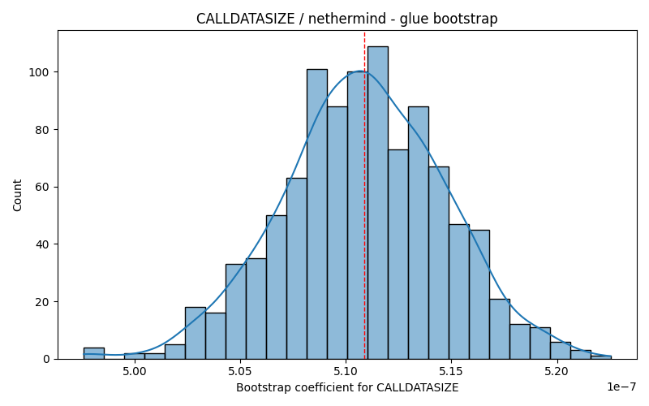

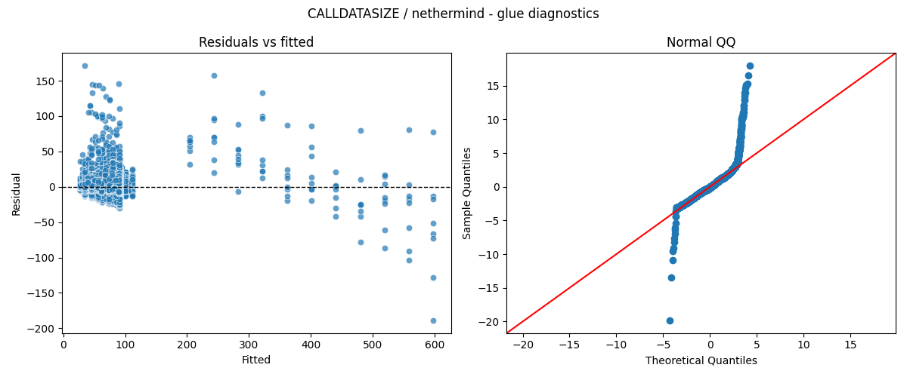

</details>

<details><summary><code>DUP</code> · nobs=96789 · runtime_ms=3.991e-07 · p=1.00e-03 · R²=0.8406</summary>


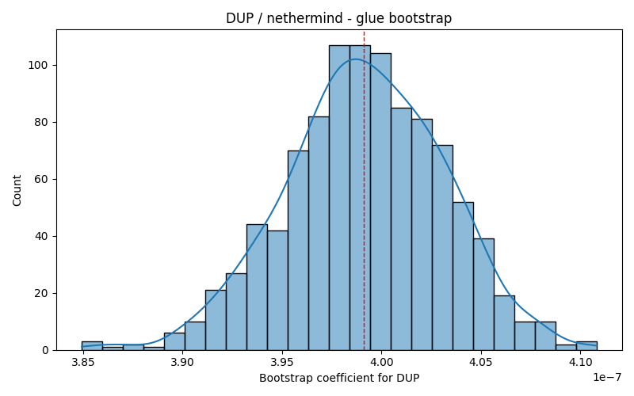


</details>

<details><summary><code>GAS</code> · nobs=96789 · runtime_ms=4.272e-07 · p=1.00e-03 · R²=0.8406</summary>

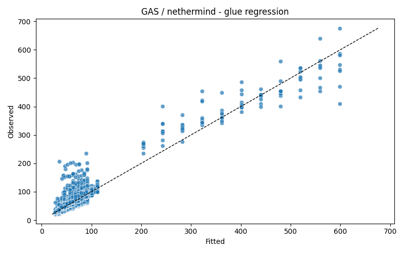

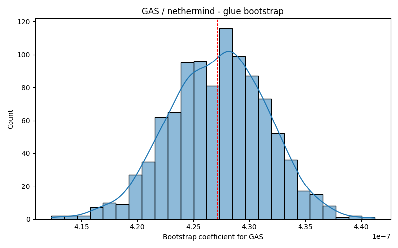


</details>

<details><summary><code>MLOAD</code> · nobs=96789 · runtime_ms=1.872e-06 · p=1.00e-03 · R²=0.8406</summary>


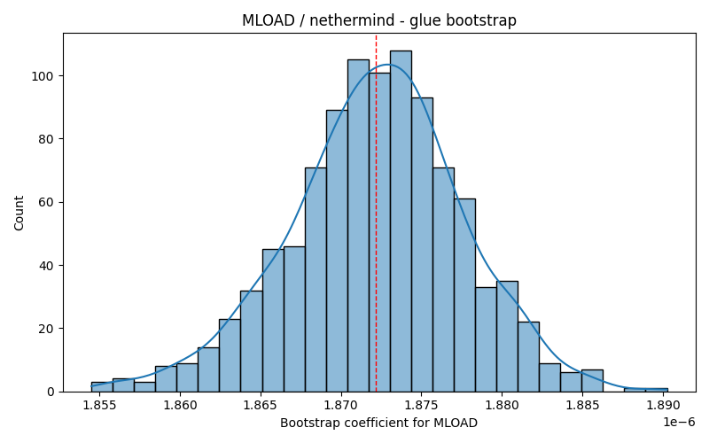

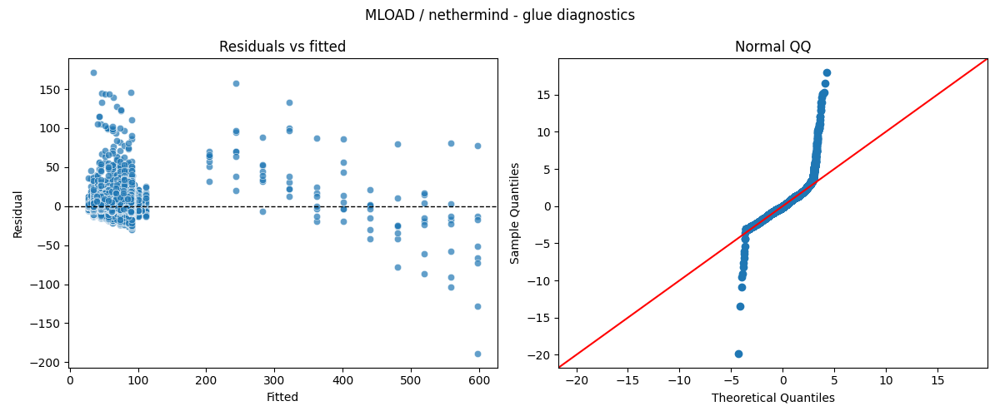

</details>

<details><summary><code>PUSH</code> · nobs=96789 · runtime_ms=6.433e-07 · p=1.00e-03 · R²=0.8406</summary>


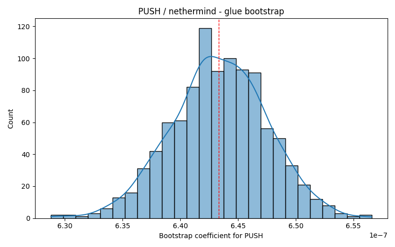

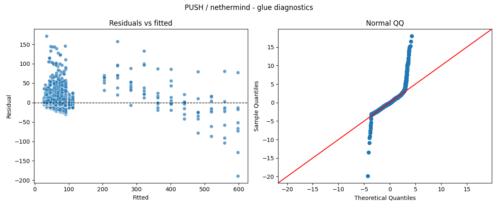

</details>

<details><summary><code>PUSH0</code> · nobs=96789 · runtime_ms=3.539e-07 · p=1.00e-03 · R²=0.8406</summary>


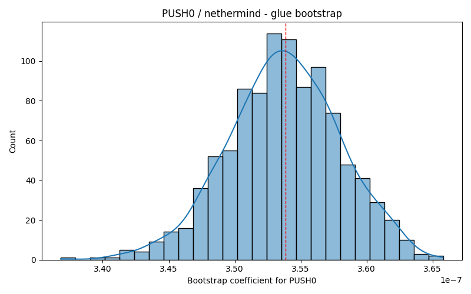


</details>

<details><summary><code>STATICCALL</code> · nobs=96789 · runtime_ms=0.0002353 · p=1.00e-03 · R²=0.8406</summary>


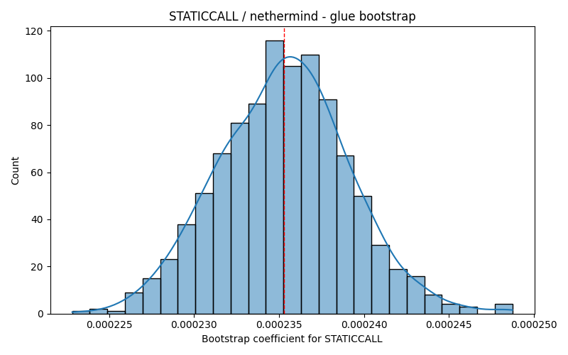

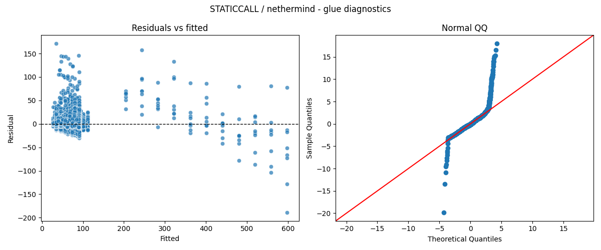

</details>

### Pure glue · nethermind

<details><summary><code>ISZERO</code> · nobs=1639 · runtime_ms=5.551e-07 · p=1.00e-03 · R²=0.4807</summary>

```
==============================================================================
                           NNLS Regression Results                            
==============================================================================
Dep. Variable:          test_runtime_ms              R-squared:          0.481
Model:                  NNLS                    Adj. R-squared:          0.480
No. Observations:       1639                              RMSE:          12.15
Df Residuals:           1637                               MAE:           4.92
Df Model:               1      
==============================================================================
                      coef     std err     P-value      [0.025      0.975]
------------------------------------------------------------------------------
         const      6.5402      1.0834       0.001      4.5628      8.7242
        ISZERO      0.0000      0.0000       0.001      0.0000      0.0000
==============================================================================
Notes: Non-negative least squares with bootstrap inference (1000 iterations)
==============================================================================
```

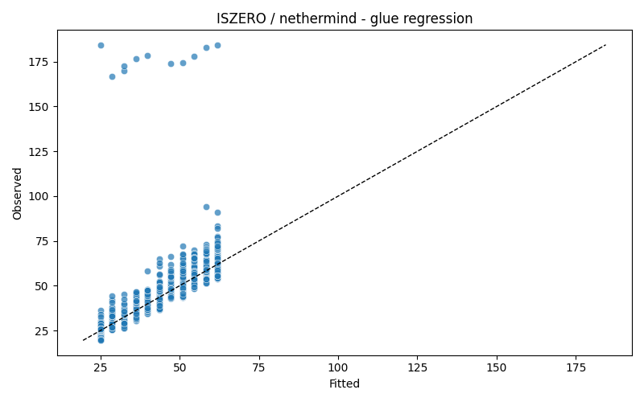

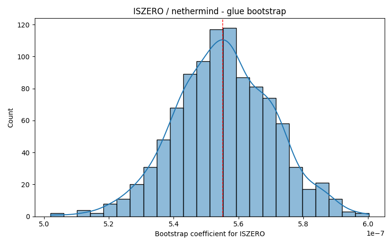

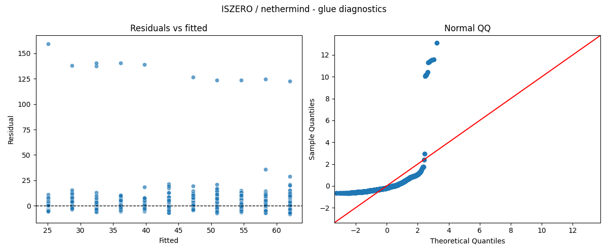

</details>

<details><summary><code>JUMPDEST</code> · nobs=1639 · runtime_ms=3.767e-07 · p=1.00e-03 · R²=0.7633</summary>

```
==============================================================================
                           NNLS Regression Results                            
==============================================================================
Dep. Variable:          test_runtime_ms              R-squared:          0.763
Model:                  NNLS                    Adj. R-squared:          0.763
No. Observations:       1639                              RMSE:          13.25
Df Residuals:           1637                               MAE:          10.03
Df Model:               1      
==============================================================================
                      coef     std err     P-value      [0.025      0.975]
------------------------------------------------------------------------------
         const      7.6226      0.9389       0.001      5.7992      9.4778
      JUMPDEST      0.0000      0.0000       0.001      0.0000      0.0000
==============================================================================
Notes: Non-negative least squares with bootstrap inference (1000 iterations)
==============================================================================
```

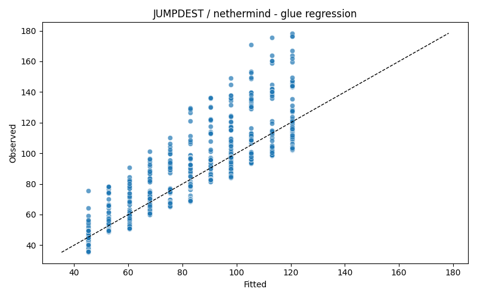

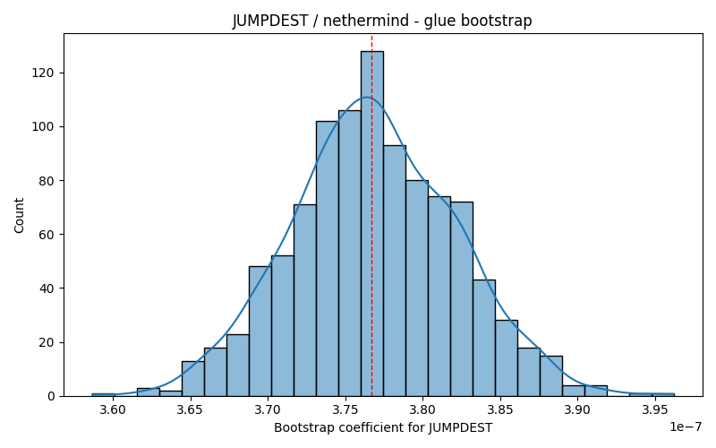

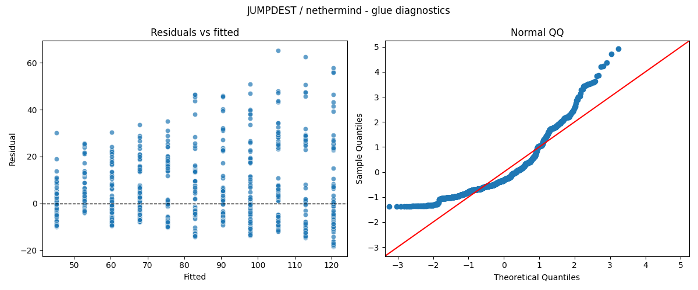

</details>

<details><summary><code>SWAP</code> · nobs=26224 · runtime_ms=6.044e-07 · p=1.00e-03 · R²=0.6341</summary>

```
==============================================================================
                           NNLS Regression Results                            
==============================================================================
Dep. Variable:          test_runtime_ms              R-squared:          0.634
Model:                  NNLS                    Adj. R-squared:          0.634
No. Observations:       26224                             RMSE:           9.67
Df Residuals:           26222                              MAE:           5.48
Df Model:               1      
==============================================================================
                      coef     std err     P-value      [0.025      0.975]
------------------------------------------------------------------------------
         const     12.2098      0.2063       0.001     11.8113     12.6378
          SWAP      0.0000      0.0000       0.001      0.0000      0.0000
==============================================================================
Notes: Non-negative least squares with bootstrap inference (1000 iterations)
==============================================================================
```

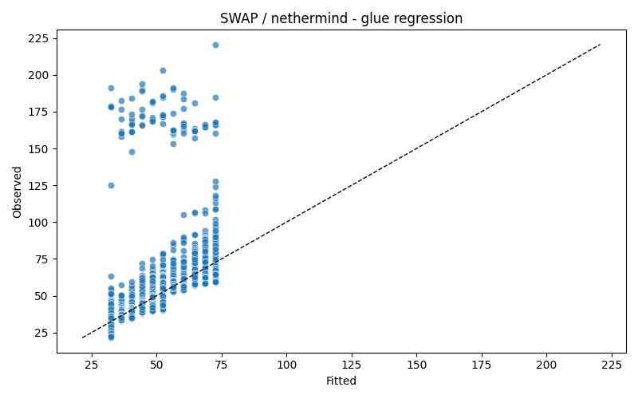

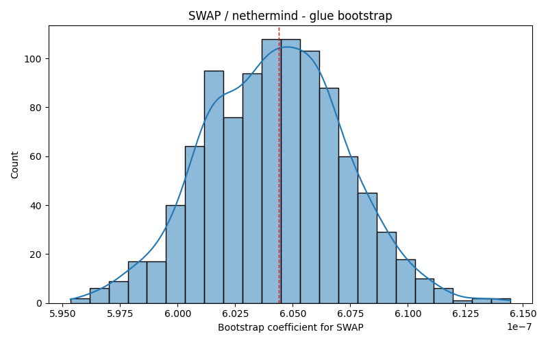

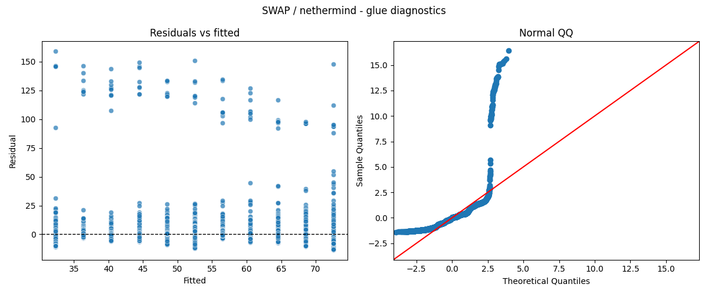

</details>

### Mixed glue (tier A) · nethermind

<details><summary><code>ADD</code> · nobs=1639 · runtime_ms=1.457e-06 · p=1.00e-03 · R²=0.8906</summary>

```
==============================================================================
                           NNLS Regression Results                            
==============================================================================
Dep. Variable:          test_runtime_ms              R-squared:          0.891
Model:                  NNLS                    Adj. R-squared:          0.891
No. Observations:       1639                              RMSE:           5.38
Df Residuals:           1637                               MAE:           4.05
Df Model:               1      
==============================================================================
                      coef     std err     P-value      [0.025      0.975]
------------------------------------------------------------------------------
         const      7.0187      0.3955       0.001      6.2398      7.8178
           ADD      0.0000      0.0000       0.001      0.0000      0.0000
==============================================================================
Notes: Non-negative least squares with bootstrap inference (1000 iterations)
==============================================================================
```

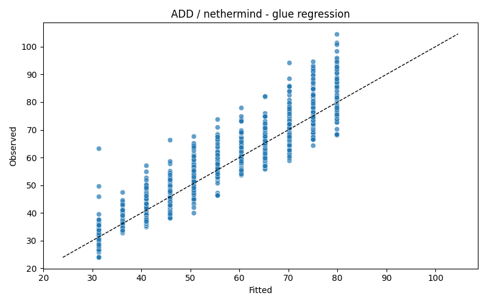

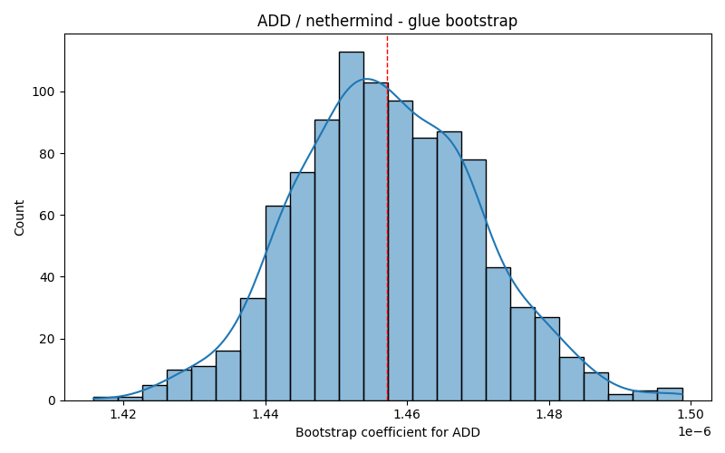

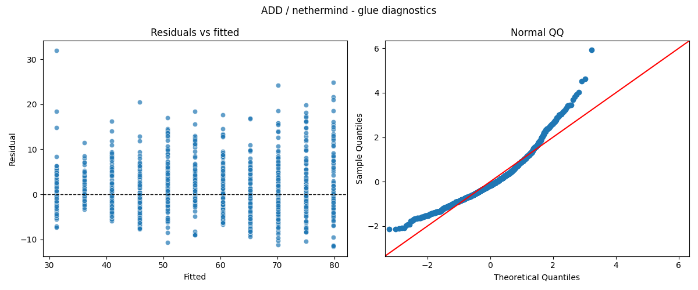

</details>

<details><summary><code>AND</code> · nobs=1639 · runtime_ms=1.19e-06 · p=1.00e-03 · R²=0.9011</summary>

```
==============================================================================
                           NNLS Regression Results                            
==============================================================================
Dep. Variable:          test_runtime_ms              R-squared:          0.901
Model:                  NNLS                    Adj. R-squared:          0.901
No. Observations:       1639                              RMSE:           4.15
Df Residuals:           1637                               MAE:           3.05
Df Model:               1      
==============================================================================
                      coef     std err     P-value      [0.025      0.975]
------------------------------------------------------------------------------
         const      5.2710      0.2948       0.001      4.6813      5.8326
           AND      0.0000      0.0000       0.001      0.0000      0.0000
==============================================================================
Notes: Non-negative least squares with bootstrap inference (1000 iterations)
==============================================================================
```

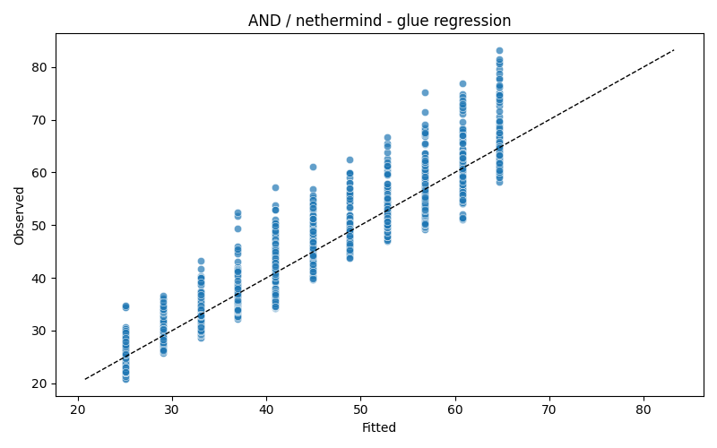

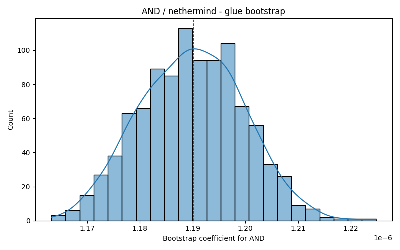

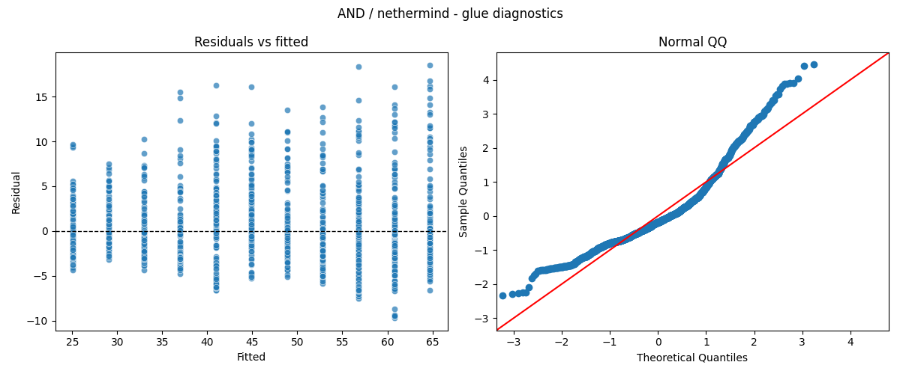

</details>

<details><summary><code>CALLDATACOPY</code> · nobs=39336 · runtime_ms=4.033e-06 · p=1.00e-03 · R²=0.7825</summary>

```
==============================================================================
                           NNLS Regression Results                            
==============================================================================
Dep. Variable:          test_runtime_ms              R-squared:          0.783
Model:                  NNLS                    Adj. R-squared:          0.783
No. Observations:       39336                             RMSE:          16.00
Df Residuals:           39334                              MAE:          12.55
Df Model:               1      
==============================================================================
                      coef     std err     P-value      [0.025      0.975]
------------------------------------------------------------------------------
         const     20.3879      0.0894       0.001     20.2154     20.5755
  CALLDATACOPY      0.0000      0.0000       0.001      0.0000      0.0000
==============================================================================
Notes: Non-negative least squares with bootstrap inference (1000 iterations)
==============================================================================
```

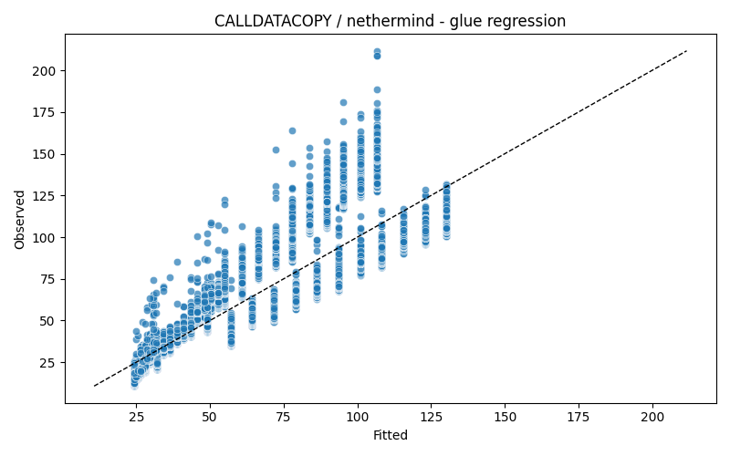

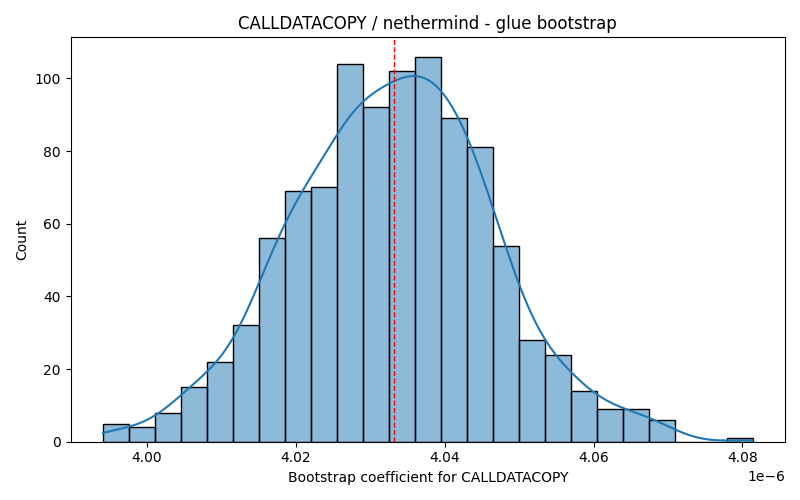

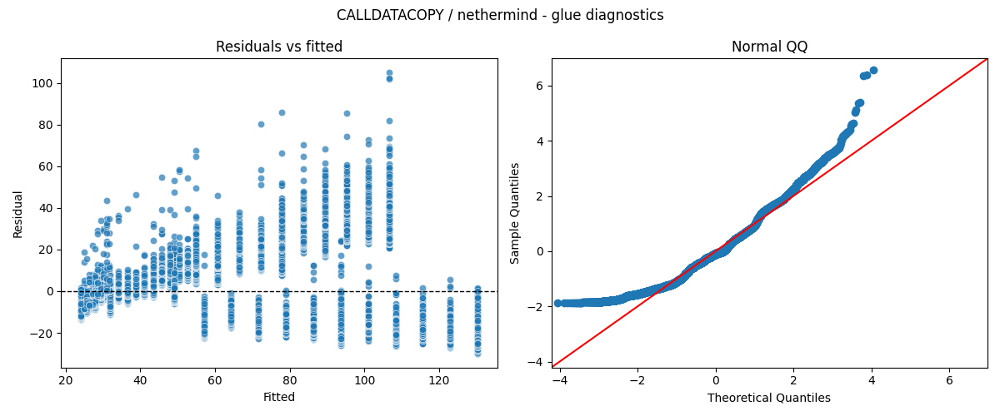

</details>

<details><summary><code>CALLDATALOAD</code> · nobs=6556 · runtime_ms=1.764e-05 · p=1.00e-03 · R²=0.09312</summary>

```
==============================================================================
                           NNLS Regression Results                            
==============================================================================
Dep. Variable:          test_runtime_ms              R-squared:          0.093
Model:                  NNLS                    Adj. R-squared:          0.093
No. Observations:       6556                              RMSE:           0.21
Df Residuals:           6554                               MAE:           0.14
Df Model:               1      
==============================================================================
                      coef     std err     P-value      [0.025      0.975]
------------------------------------------------------------------------------
         const      1.7914      0.0092       0.001      1.7726      1.8096
  CALLDATALOAD      0.0000      0.0000       0.001      0.0000      0.0000
==============================================================================
Notes: Non-negative least squares with bootstrap inference (1000 iterations)
==============================================================================
```

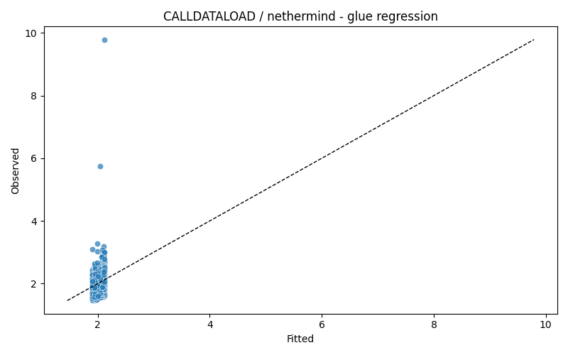

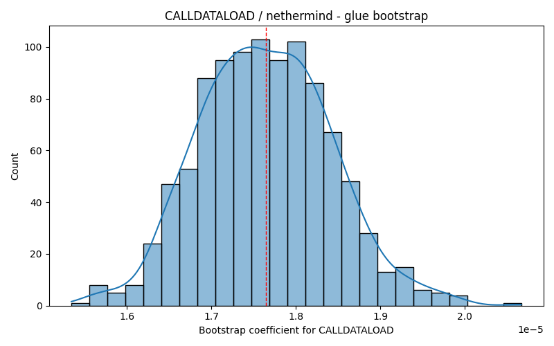

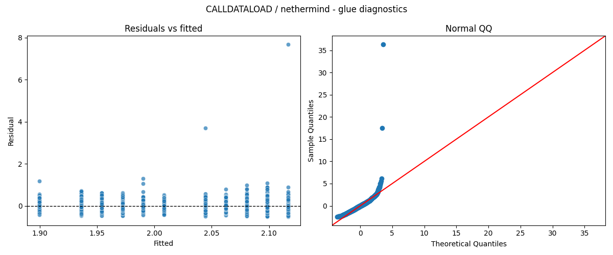

</details>

<details><summary><code>DIV</code> · nobs=1639 · runtime_ms=5.531e-06 · p=1.00e-03 · R²=0.5438</summary>

```
==============================================================================
                           NNLS Regression Results                            
==============================================================================
Dep. Variable:          test_runtime_ms              R-squared:          0.544
Model:                  NNLS                    Adj. R-squared:          0.543
No. Observations:       1639                              RMSE:          40.01
Df Residuals:           1637                               MAE:          29.85
Df Model:               1      
==============================================================================
                      coef     std err     P-value      [0.025      0.975]
------------------------------------------------------------------------------
         const    113.5519      4.8807       0.001    103.7401    122.8238
           DIV      0.0000      0.0000       0.001      0.0000      0.0000
==============================================================================
Notes: Non-negative least squares with bootstrap inference (1000 iterations)
==============================================================================
```

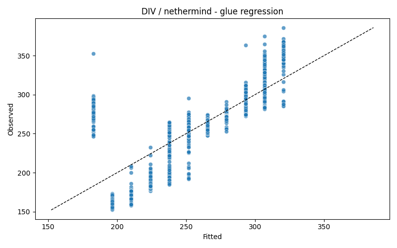

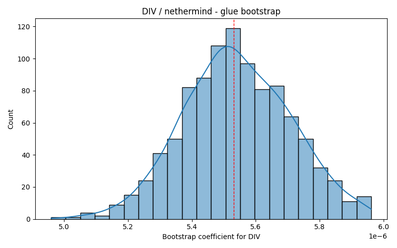

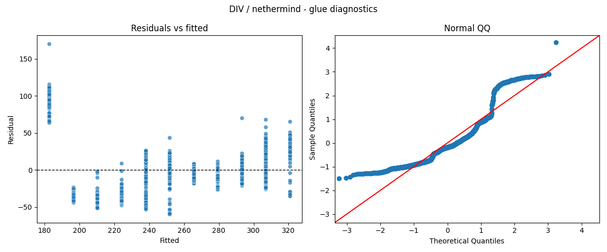

</details>

<details><summary><code>EXP</code> · nobs=1639 · runtime_ms=0 · p=1.00e+00 · R²=0</summary>

```
==============================================================================
                           NNLS Regression Results                            
==============================================================================
Dep. Variable:          test_runtime_ms              R-squared:          0.000
Model:                  NNLS                    Adj. R-squared:         -0.001
No. Observations:       1639                              RMSE:           1.19
Df Residuals:           1637                               MAE:           0.87
Df Model:               1      
==============================================================================
                      coef     std err     P-value      [0.025      0.975]
------------------------------------------------------------------------------
         const      3.3781      0.0301       0.001      3.3180      3.4340
           EXP      0.0000      0.0000       1.000      0.0000      0.0000
==============================================================================
Notes: Non-negative least squares with bootstrap inference (1000 iterations)
==============================================================================
```

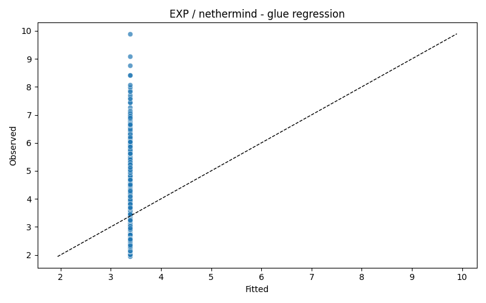


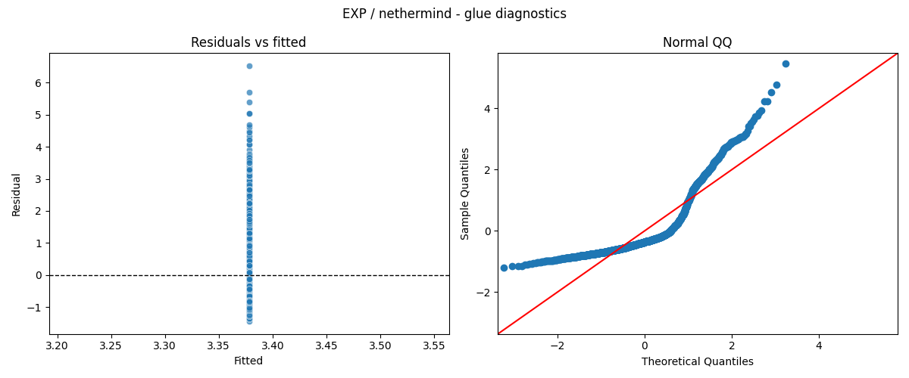

</details>

<details><summary><code>GT</code> · nobs=1639 · runtime_ms=1.466e-06 · p=1.00e-03 · R²=0.9423</summary>

```
==============================================================================
                           NNLS Regression Results                            
==============================================================================
Dep. Variable:          test_runtime_ms              R-squared:          0.942
Model:                  NNLS                    Adj. R-squared:          0.942
No. Observations:       1639                              RMSE:           3.82
Df Residuals:           1637                               MAE:           2.81
Df Model:               1      
==============================================================================
                      coef     std err     P-value      [0.025      0.975]
------------------------------------------------------------------------------
         const      6.7186      0.3303       0.001      6.0979      7.3822
            GT      0.0000      0.0000       0.001      0.0000      0.0000
==============================================================================
Notes: Non-negative least squares with bootstrap inference (1000 iterations)
==============================================================================
```

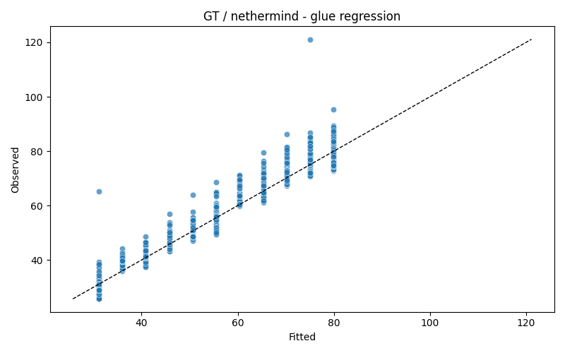

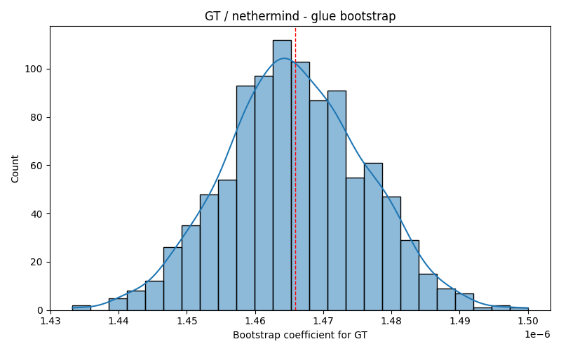

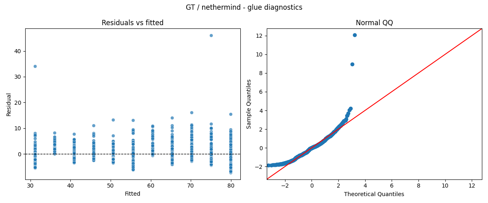

</details>

<details><summary><code>JUMPI</code> · nobs=1639 · runtime_ms=2.289e-06 · p=1.00e-03 · R²=0.8961</summary>

```
==============================================================================
                           NNLS Regression Results                            
==============================================================================
Dep. Variable:          test_runtime_ms              R-squared:          0.896
Model:                  NNLS                    Adj. R-squared:          0.896
No. Observations:       1639                              RMSE:           3.52
Df Residuals:           1637                               MAE:           1.92
Df Model:               1      
==============================================================================
                      coef     std err     P-value      [0.025      0.975]
------------------------------------------------------------------------------
         const      4.7519      0.3014       0.001      4.2102      5.3806
         JUMPI      0.0000      0.0000       0.001      0.0000      0.0000
==============================================================================
Notes: Non-negative least squares with bootstrap inference (1000 iterations)
==============================================================================
```

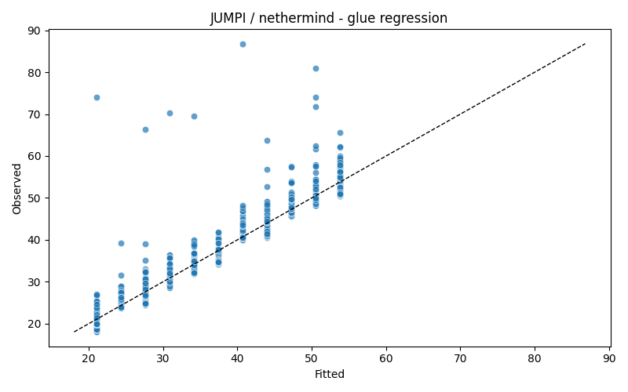

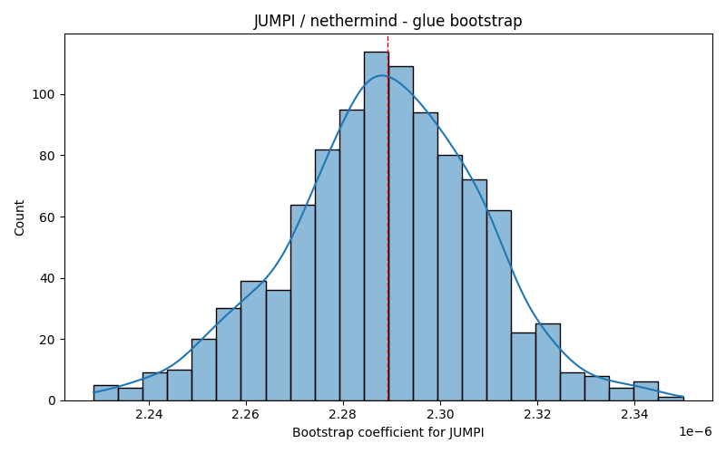

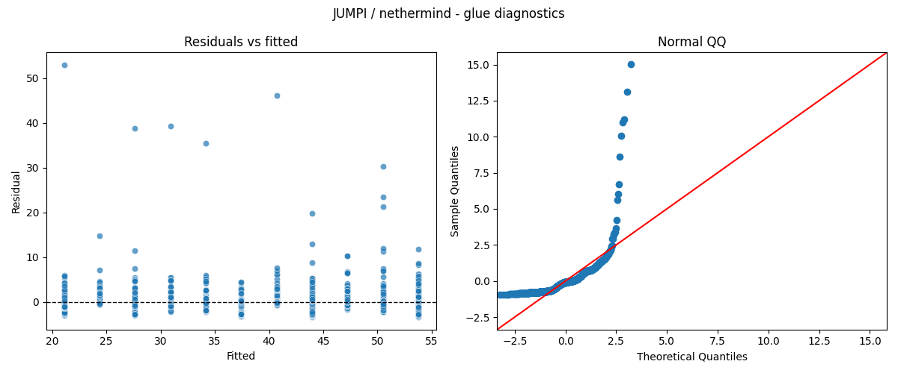

</details>

<details><summary><code>LT</code> · nobs=1639 · runtime_ms=1.436e-06 · p=1.00e-03 · R²=0.9417</summary>

```
==============================================================================
                           NNLS Regression Results                            
==============================================================================
Dep. Variable:          test_runtime_ms              R-squared:          0.942
Model:                  NNLS                    Adj. R-squared:          0.942
No. Observations:       1639                              RMSE:           3.76
Df Residuals:           1637                               MAE:           2.83
Df Model:               1      
==============================================================================
                      coef     std err     P-value      [0.025      0.975]
------------------------------------------------------------------------------
         const      7.6837      0.3424       0.001      7.0283      8.3660
            LT      0.0000      0.0000       0.001      0.0000      0.0000
==============================================================================
Notes: Non-negative least squares with bootstrap inference (1000 iterations)
==============================================================================
```

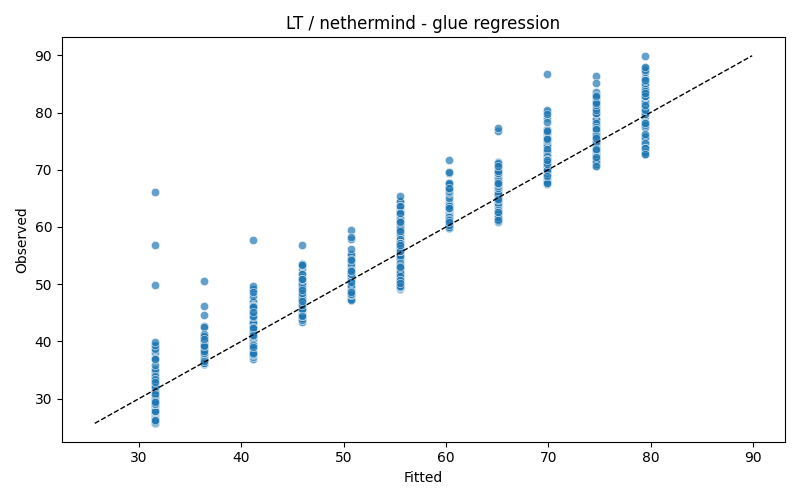

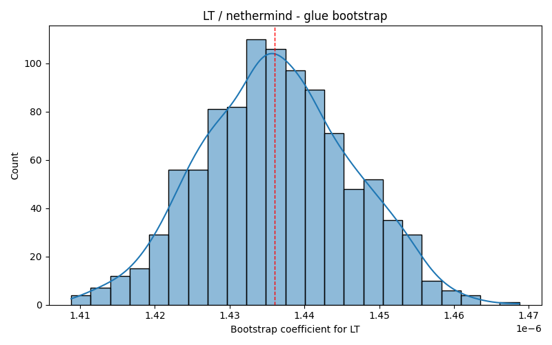

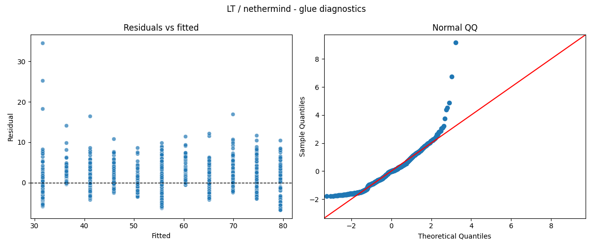

</details>

<details><summary><code>MSTORE</code> · nobs=8195 · runtime_ms=2.75e-06 · p=1.00e-03 · R²=0.9276</summary>

```
==============================================================================
                           NNLS Regression Results                            
==============================================================================
Dep. Variable:          test_runtime_ms              R-squared:          0.928
Model:                  NNLS                    Adj. R-squared:          0.928
No. Observations:       8195                              RMSE:           5.39
Df Residuals:           8193                               MAE:           3.69
Df Model:               1      
==============================================================================
                      coef     std err     P-value      [0.025      0.975]
------------------------------------------------------------------------------
         const      7.4435      0.1823       0.001      7.0902      7.8016
        MSTORE      0.0000      0.0000       0.001      0.0000      0.0000
==============================================================================
Notes: Non-negative least squares with bootstrap inference (1000 iterations)
==============================================================================
```

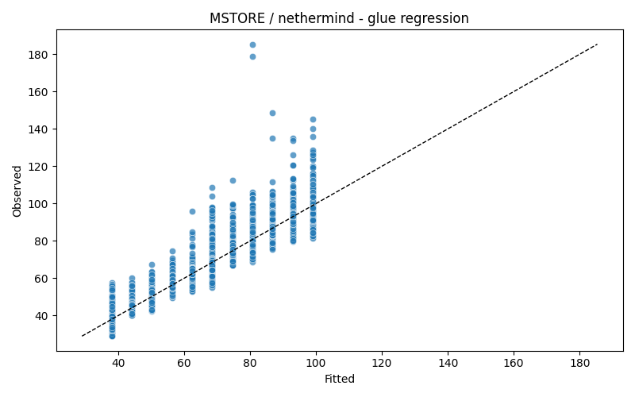

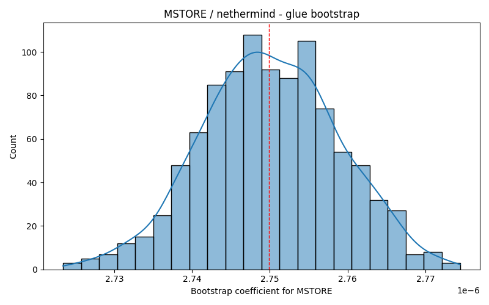

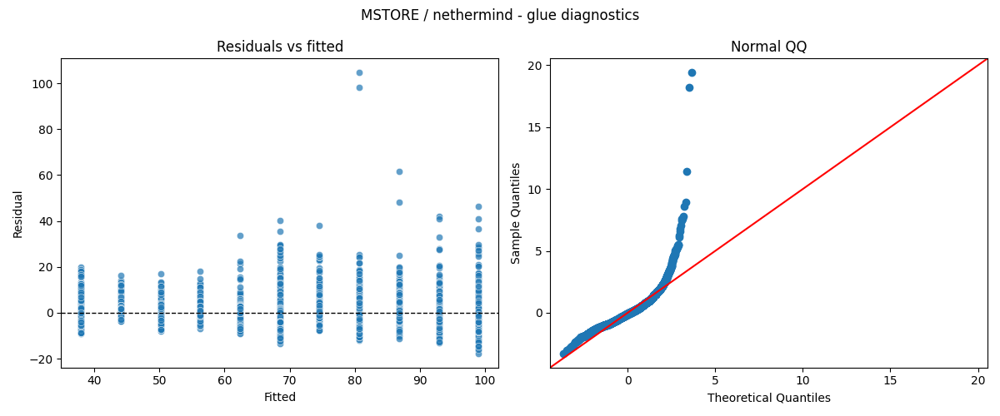

</details>

<details><summary><code>MSTORE8</code> · nobs=8195 · runtime_ms=2.753e-06 · p=1.00e-03 · R²=0.9174</summary>

```
==============================================================================
                           NNLS Regression Results                            
==============================================================================
Dep. Variable:          test_runtime_ms              R-squared:          0.917
Model:                  NNLS                    Adj. R-squared:          0.917
No. Observations:       8195                              RMSE:           5.80
Df Residuals:           8193                               MAE:           3.90
Df Model:               1      
==============================================================================
                      coef     std err     P-value      [0.025      0.975]
------------------------------------------------------------------------------
         const      6.9514      0.2203       0.001      6.5280      7.3916
       MSTORE8      0.0000      0.0000       0.001      0.0000      0.0000
==============================================================================
Notes: Non-negative least squares with bootstrap inference (1000 iterations)
==============================================================================
```

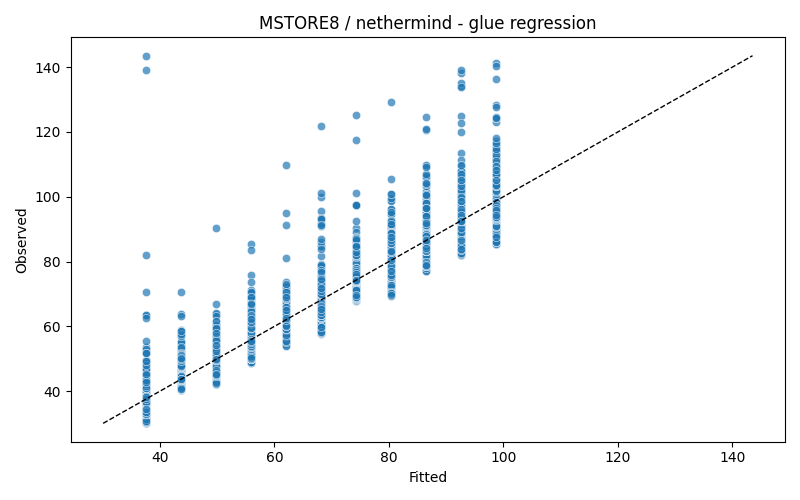

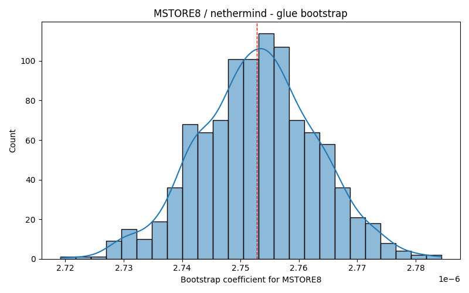

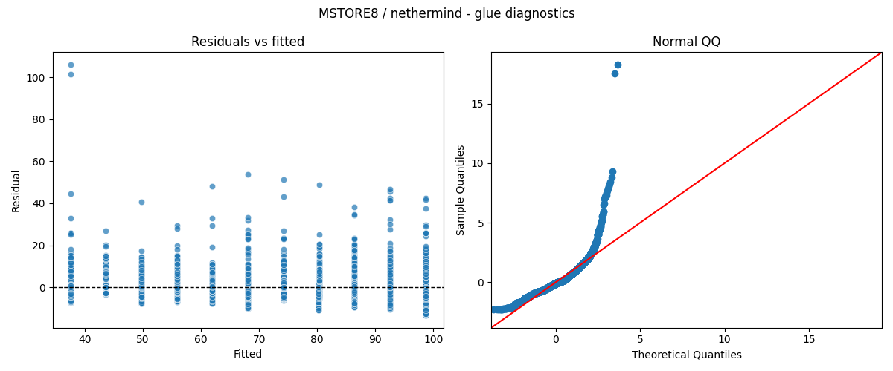

</details>

<details><summary><code>MUL</code> · nobs=1639 · runtime_ms=4.262e-06 · p=1.00e-03 · R²=0.952</summary>

```
==============================================================================
                           NNLS Regression Results                            
==============================================================================
Dep. Variable:          test_runtime_ms              R-squared:          0.952
Model:                  NNLS                    Adj. R-squared:          0.952
No. Observations:       1639                              RMSE:           7.56
Df Residuals:           1637                               MAE:           5.66
Df Model:               1      
==============================================================================
                      coef     std err     P-value      [0.025      0.975]
------------------------------------------------------------------------------
         const     11.5213      0.5276       0.001     10.4932     12.5355
           MUL      0.0000      0.0000       0.001      0.0000      0.0000
==============================================================================
Notes: Non-negative least squares with bootstrap inference (1000 iterations)
==============================================================================
```

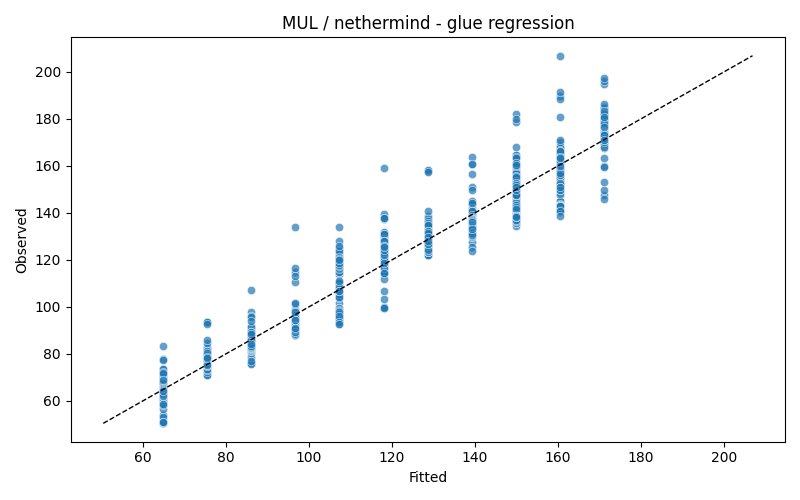

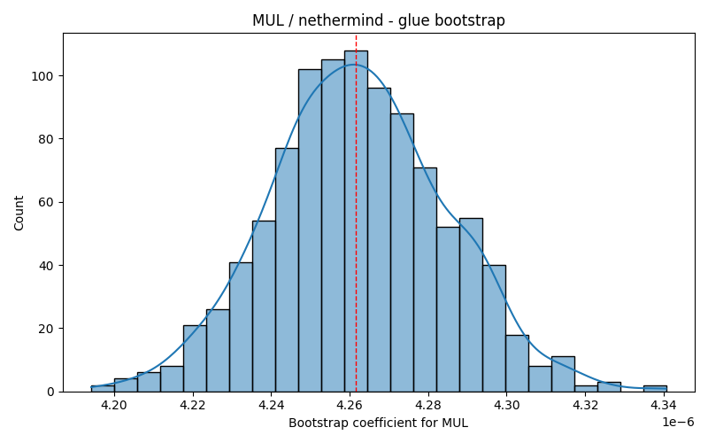

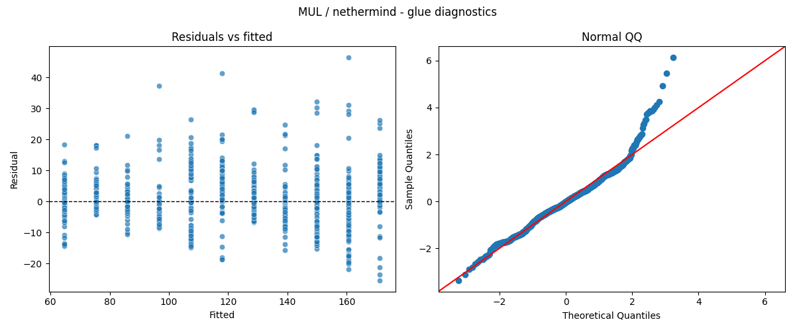

</details>

<details><summary><code>PC</code> · nobs=1639 · runtime_ms=6.111e-07 · p=1.00e-03 · R²=0.8782</summary>

```
==============================================================================
                           NNLS Regression Results                            
==============================================================================
Dep. Variable:          test_runtime_ms              R-squared:          0.878
Model:                  NNLS                    Adj. R-squared:          0.878
No. Observations:       1639                              RMSE:           6.81
Df Residuals:           1637                               MAE:           5.36
Df Model:               1      
==============================================================================
                      coef     std err     P-value      [0.025      0.975]
------------------------------------------------------------------------------
         const      7.0011      0.5264       0.001      6.0306      7.9811
            PC      0.0000      0.0000       0.001      0.0000      0.0000
==============================================================================
Notes: Non-negative least squares with bootstrap inference (1000 iterations)
==============================================================================
```

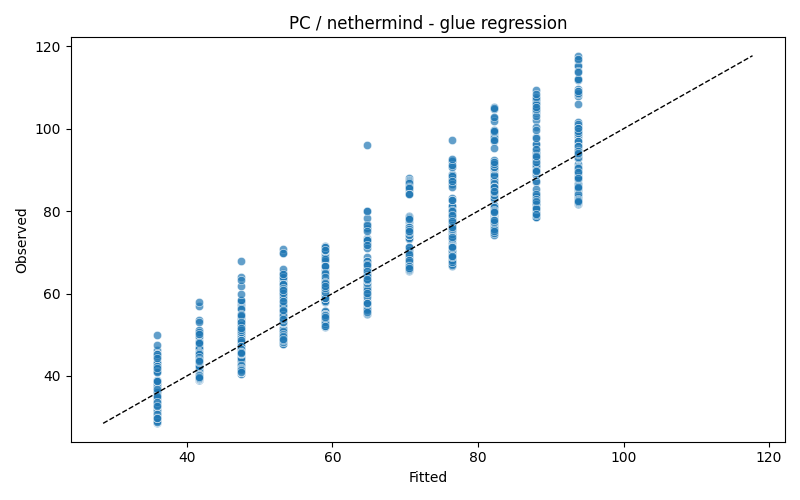

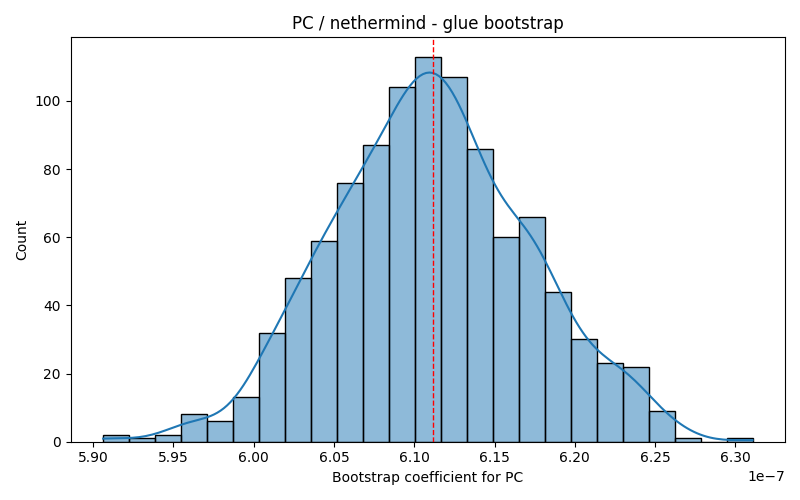

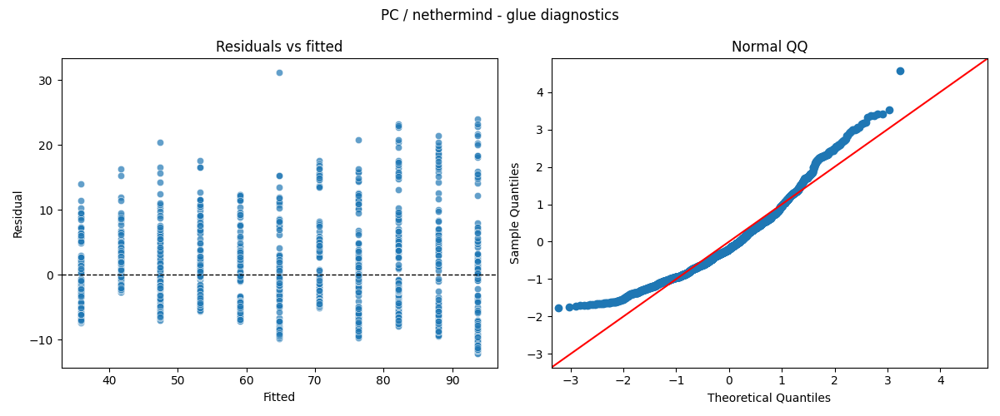

</details>

<details><summary><code>RETURNDATASIZE</code> · nobs=6556 · runtime_ms=9.41e-07 · p=1.00e-03 · R²=0.8011</summary>

```
==============================================================================
                           NNLS Regression Results                            
==============================================================================
Dep. Variable:          test_runtime_ms              R-squared:          0.801
Model:                  NNLS                    Adj. R-squared:          0.801
No. Observations:       6556                              RMSE:           7.41
Df Residuals:           6554                               MAE:           3.82
Df Model:               1      
==============================================================================
                      coef     std err     P-value      [0.025      0.975]
------------------------------------------------------------------------------
         const      6.2766      0.3221       0.001      5.6628      6.9156
RETURNDATASIZE      0.0000      0.0000       0.001      0.0000      0.0000
==============================================================================
Notes: Non-negative least squares with bootstrap inference (1000 iterations)
==============================================================================
```

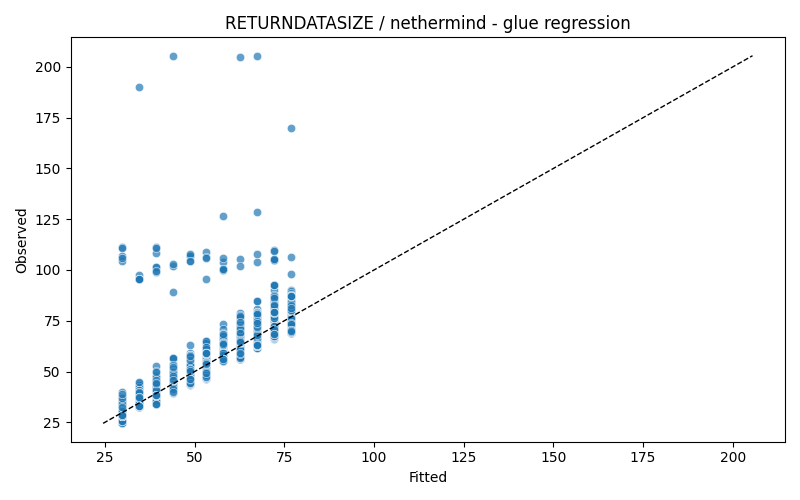

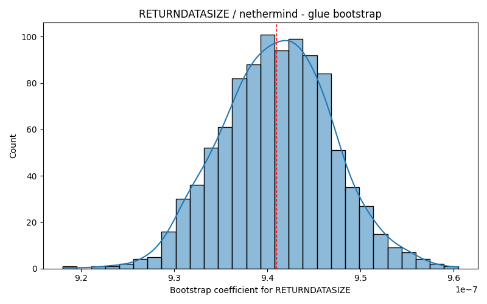

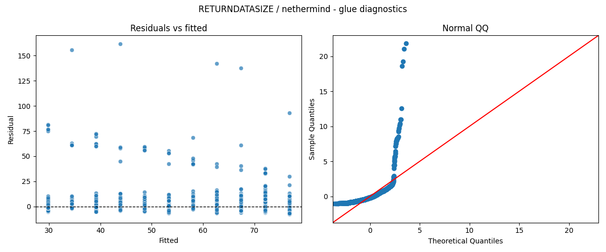

</details>

<details><summary><code>SELFBALANCE</code> · nobs=1639 · runtime_ms=3.765e-06 · p=1.00e-03 · R²=0.9392</summary>

```
==============================================================================
                           NNLS Regression Results                            
==============================================================================
Dep. Variable:          test_runtime_ms              R-squared:          0.939
Model:                  NNLS                    Adj. R-squared:          0.939
No. Observations:       1639                              RMSE:          11.84
Df Residuals:           1637                               MAE:           8.06
Df Model:               1      
==============================================================================
                      coef     std err     P-value      [0.025      0.975]
------------------------------------------------------------------------------
         const     16.5792      0.9691       0.001     14.7680     18.5090
   SELFBALANCE      0.0000      0.0000       0.001      0.0000      0.0000
==============================================================================
Notes: Non-negative least squares with bootstrap inference (1000 iterations)
==============================================================================
```

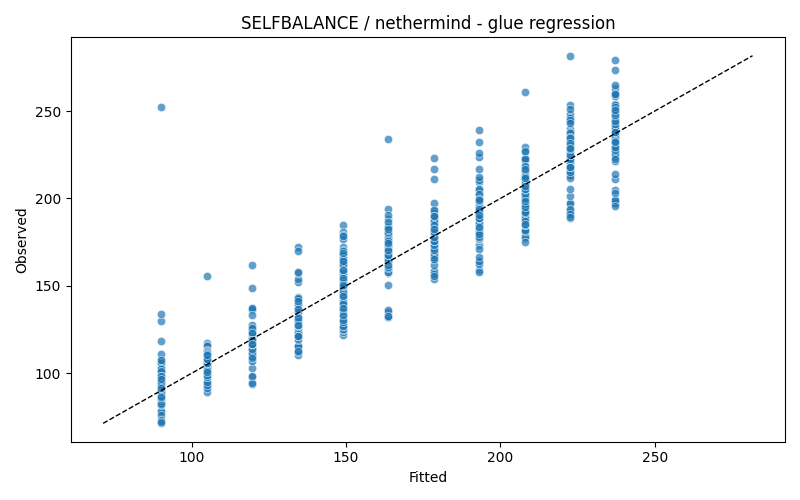

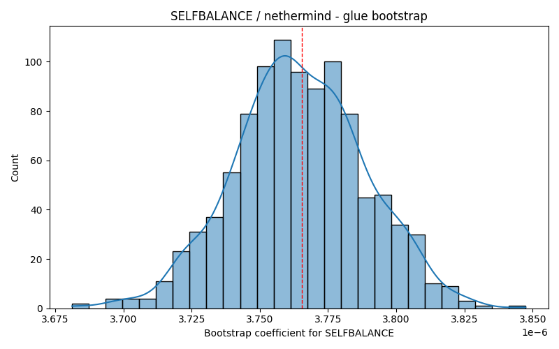

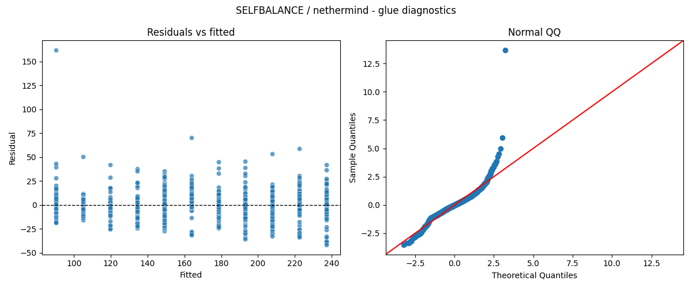

</details>

<details><summary><code>SUB</code> · nobs=1639 · runtime_ms=2.028e-06 · p=1.00e-03 · R²=0.8655</summary>

```
==============================================================================
                           NNLS Regression Results                            
==============================================================================
Dep. Variable:          test_runtime_ms              R-squared:          0.866
Model:                  NNLS                    Adj. R-squared:          0.865
No. Observations:       1639                              RMSE:           8.42
Df Residuals:           1637                               MAE:           5.71
Df Model:               1      
==============================================================================
                      coef     std err     P-value      [0.025      0.975]
------------------------------------------------------------------------------
         const      6.8587      0.5745       0.001      5.7340      7.9581
           SUB      0.0000      0.0000       0.001      0.0000      0.0000
==============================================================================
Notes: Non-negative least squares with bootstrap inference (1000 iterations)
==============================================================================
```

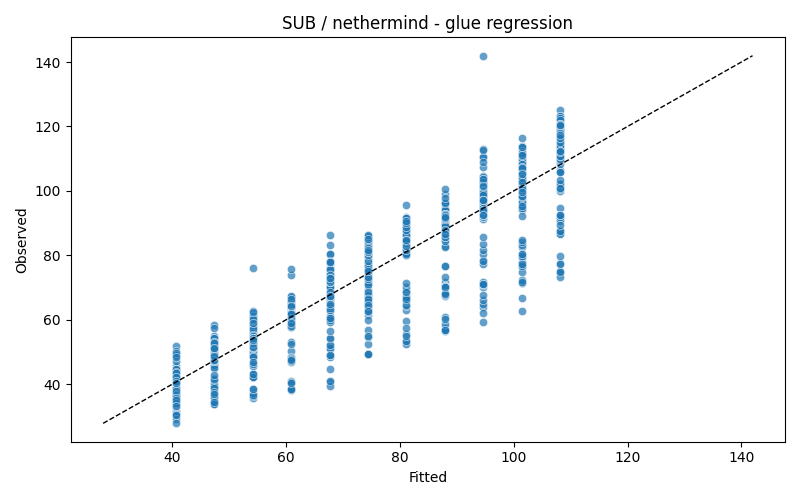

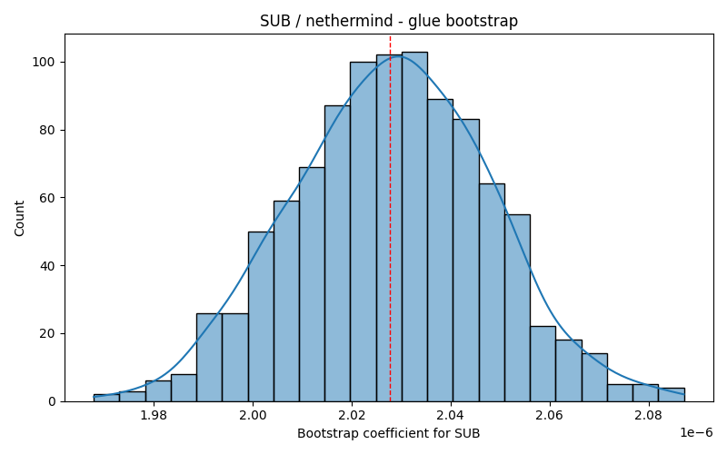

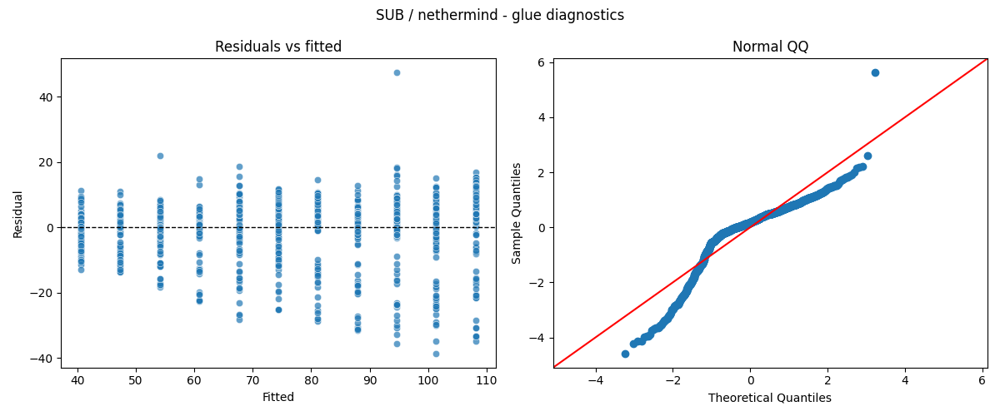

</details>

### Mixed glue (tier B) · nethermind

<details><summary><code>JUMP</code> · nobs=1639 · runtime_ms=2.924e-06 · p=1.00e-03 · R²=0.769</summary>

```
==============================================================================
                           NNLS Regression Results                            
==============================================================================
Dep. Variable:          test_runtime_ms              R-squared:          0.769
Model:                  NNLS                    Adj. R-squared:          0.769
No. Observations:       1639                              RMSE:           5.96
Df Residuals:           1637                               MAE:           3.06
Df Model:               1      
==============================================================================
                      coef     std err     P-value      [0.025      0.975]
------------------------------------------------------------------------------
         const      7.3317      0.5742       0.001      6.3278      8.5705
          JUMP      0.0000      0.0000       0.001      0.0000      0.0000
==============================================================================
Notes: Non-negative least squares with bootstrap inference (1000 iterations)
==============================================================================
```

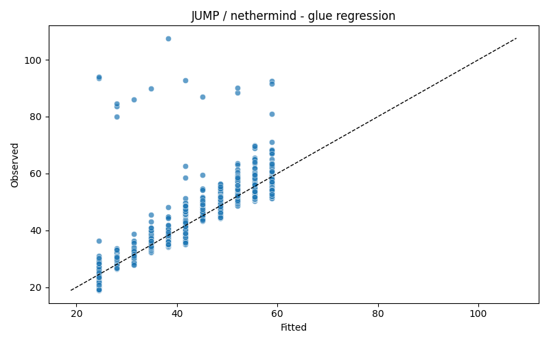

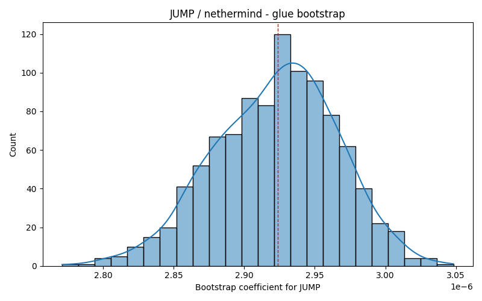

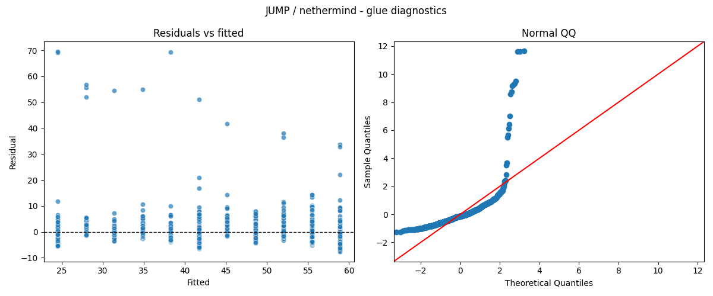

</details>

<details><summary><code>KECCAK256</code> · nobs=26224 · runtime_ms=0 · p=1.00e+00 · R²=-2.22e-16</summary>

```
==============================================================================
                           NNLS Regression Results                            
==============================================================================
Dep. Variable:          test_runtime_ms              R-squared:         -0.000
Model:                  NNLS                    Adj. R-squared:         -0.000
No. Observations:       26224                             RMSE:         216.14
Df Residuals:           26222                              MAE:         177.96
Df Model:               1      
==============================================================================
                      coef     std err     P-value      [0.025      0.975]
------------------------------------------------------------------------------
         const    316.4362      1.2810       0.001    313.9461    318.8953
     KECCAK256      0.0000      0.0000       1.000      0.0000      0.0000
==============================================================================
Notes: Non-negative least squares with bootstrap inference (1000 iterations)
==============================================================================
```

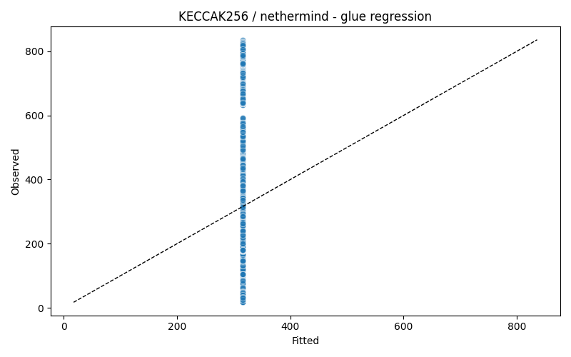


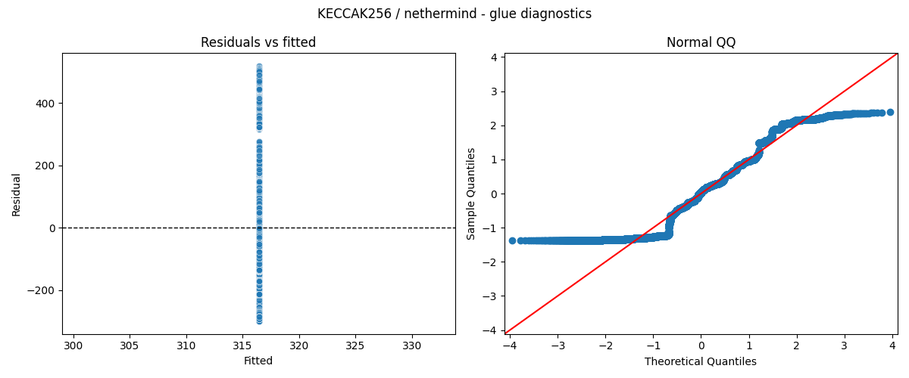

</details>

## reth

| glue_opcode | nobs | glue_runtime_ms | p_value | rsquared |
| --- | --- | --- | --- | --- |
| `ISZERO` | 935 | 1.732e-06 | 1.00e-03 | 0.9281 |
| `JUMPDEST` | 935 | 5.288e-07 | 1.00e-03 | 0.9642 |
| `SWAP` | 14960 | 6.168e-07 | 1.00e-03 | 0.6063 |
| `CALLDATASIZE` | 55253 | 8.691e-07 | 1.00e-03 | 0.7713 |
| `DUP` | 55253 | 5.927e-07 | 1.00e-03 | 0.7713 |
| `GAS` | 55253 | 7.17e-07 | 1.00e-03 | 0.7713 |
| `MLOAD` | 55253 | 2.047e-06 | 1.00e-03 | 0.7713 |
| `PUSH` | 55253 | 6.925e-07 | 1.00e-03 | 0.7713 |
| `PUSH0` | 55253 | 5.801e-07 | 1.00e-03 | 0.7713 |
| `STATICCALL` | 55253 | 8.133e-05 | 1.00e-03 | 0.7713 |
| `ADD` | 935 | 1.476e-06 | 1.00e-03 | 0.9388 |
| `AND` | 935 | 1.415e-06 | 1.00e-03 | 0.9243 |
| `CALLDATACOPY` | 22440 | 4.242e-06 | 1.00e-03 | 0.9117 |
| `CALLDATALOAD` | 3740 | 0 | 1.00e+00 | 0 |
| `DIV` | 935 | 1.066e-05 | 1.00e-03 | 0.9474 |
| `EXP` | 935 | 0.0006836 | 1.00e-03 | 0.9597 |
| `GT` | 935 | 1.557e-06 | 1.00e-03 | 0.9483 |
| `JUMPI` | 935 | 2.258e-06 | 1.00e-03 | 0.9359 |
| `LT` | 935 | 3.076e-06 | 1.00e-03 | 0.6899 |
| `MSTORE` | 4675 | 3.653e-06 | 1.00e-03 | 0.3992 |
| `MSTORE8` | 4675 | 2.186e-06 | 1.00e-03 | 0.9251 |
| `MUL` | 935 | 2.267e-06 | 1.00e-03 | 0.9438 |
| `PC` | 935 | 9.372e-07 | 1.00e-03 | 0.6961 |
| `RETURNDATASIZE` | 3740 | 1.398e-06 | 1.00e-03 | 0.9507 |
| `SELFBALANCE` | 935 | 8.162e-06 | 1.00e-03 | 0.9603 |
| `SUB` | 935 | 1.577e-06 | 1.00e-03 | 0.932 |
| `JUMP` | 935 | 4.242e-06 | 1.00e-03 | 0.9527 |
| `KECCAK256` | 14960 | 0 | 1.00e+00 | -2.22e-16 |

### Cycle glue — joint fit · reth

<details><summary>Joint NNLS regression summary</summary>

```
==============================================================================
                           NNLS Regression Results                            
==============================================================================
Dep. Variable:          test_runtime_ms              R-squared:          0.771
Model:                  NNLS                    Adj. R-squared:          0.771
No. Observations:       55253                             RMSE:          11.65
Df Residuals:           55245                              MAE:           5.09
Df Model:               7      
==============================================================================
                      coef     std err     P-value      [0.025      0.975]
------------------------------------------------------------------------------
         const      9.4732      0.1714       0.001      9.1519      9.8153
  CALLDATASIZE      0.0000      0.0000       0.001      0.0000      0.0000
           DUP      0.0000      0.0000       0.001      0.0000      0.0000
           GAS      0.0000      0.0000       0.001      0.0000      0.0000
         MLOAD      0.0000      0.0000       0.001      0.0000      0.0000
          PUSH      0.0000      0.0000       0.001      0.0000      0.0000
         PUSH0      0.0000      0.0000       0.001      0.0000      0.0000
    STATICCALL      0.0001      0.0000       0.001      0.0001      0.0001
==============================================================================
Notes: Non-negative least squares with bootstrap inference (1000 iterations)
==============================================================================
```

</details>

<details><summary><code>CALLDATASIZE</code> · nobs=55253 · runtime_ms=8.691e-07 · p=1.00e-03 · R²=0.7713</summary>


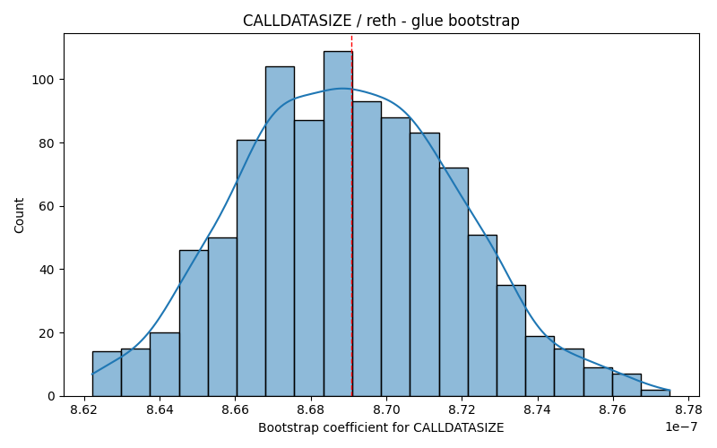

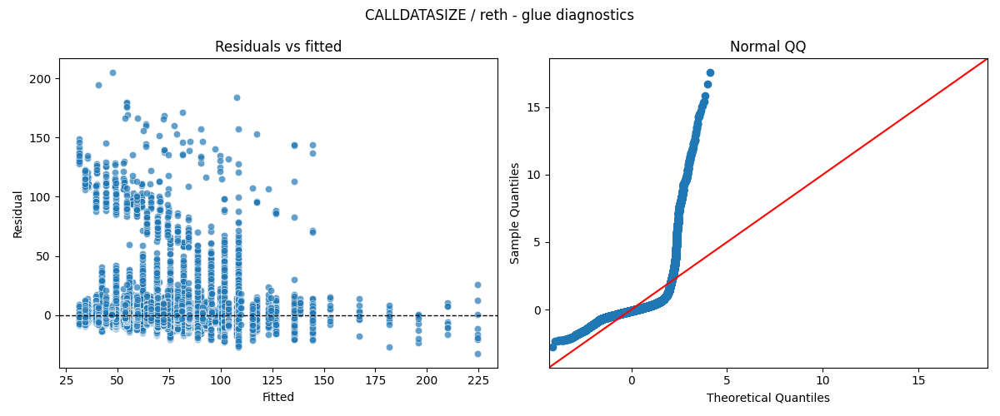

</details>

<details><summary><code>DUP</code> · nobs=55253 · runtime_ms=5.927e-07 · p=1.00e-03 · R²=0.7713</summary>


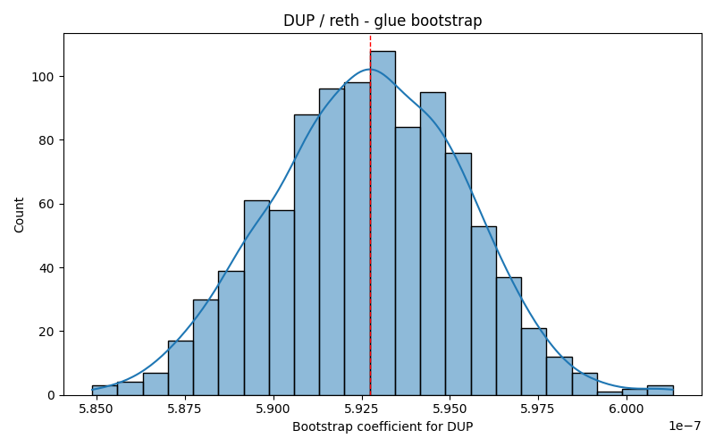


</details>

<details><summary><code>GAS</code> · nobs=55253 · runtime_ms=7.17e-07 · p=1.00e-03 · R²=0.7713</summary>

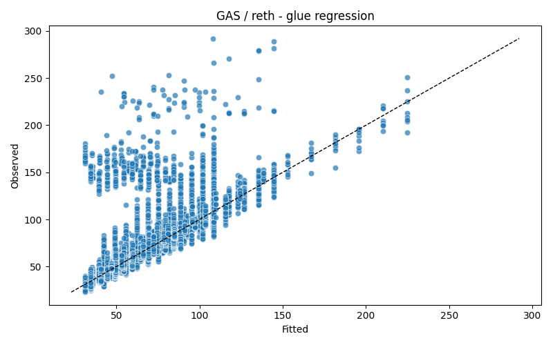

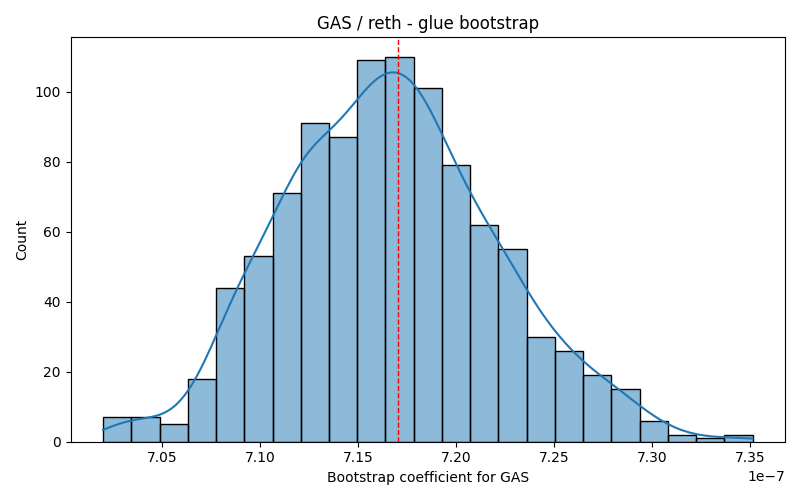


</details>

<details><summary><code>MLOAD</code> · nobs=55253 · runtime_ms=2.047e-06 · p=1.00e-03 · R²=0.7713</summary>

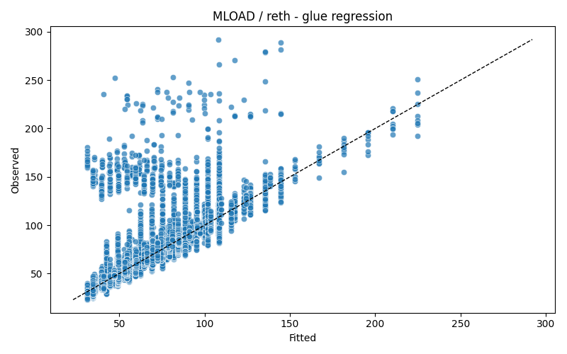

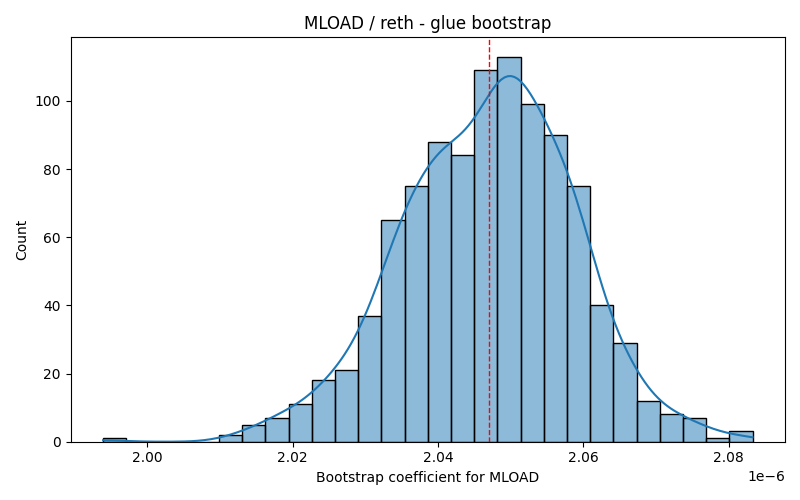


</details>

<details><summary><code>PUSH</code> · nobs=55253 · runtime_ms=6.925e-07 · p=1.00e-03 · R²=0.7713</summary>


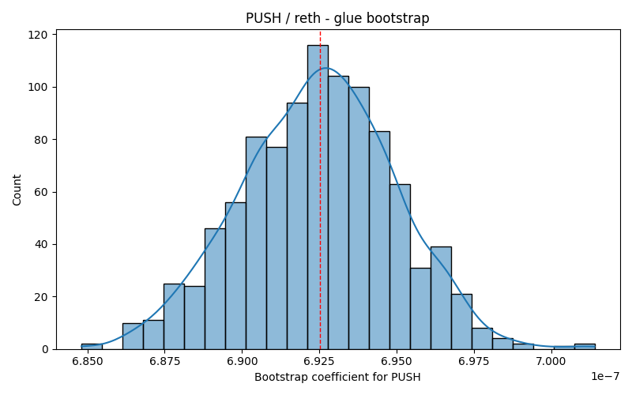


</details>

<details><summary><code>PUSH0</code> · nobs=55253 · runtime_ms=5.801e-07 · p=1.00e-03 · R²=0.7713</summary>


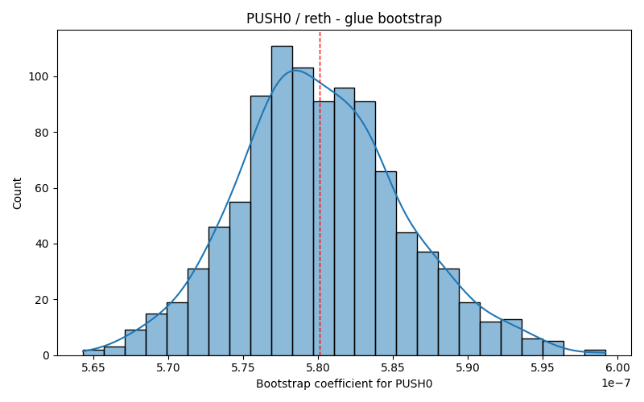


</details>

<details><summary><code>STATICCALL</code> · nobs=55253 · runtime_ms=8.133e-05 · p=1.00e-03 · R²=0.7713</summary>

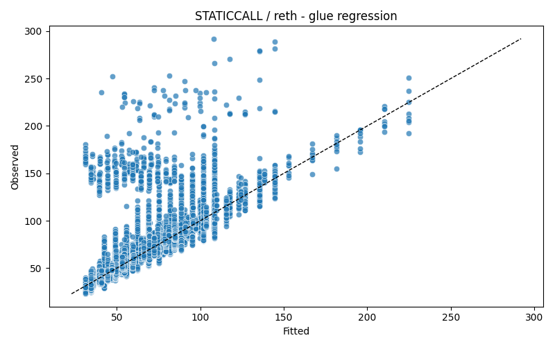

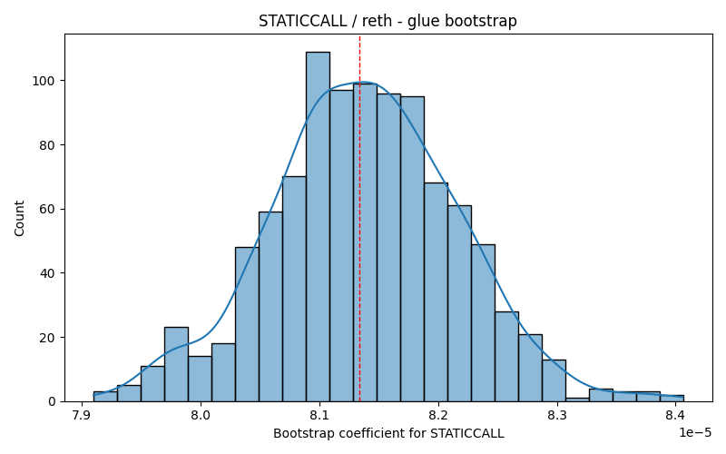

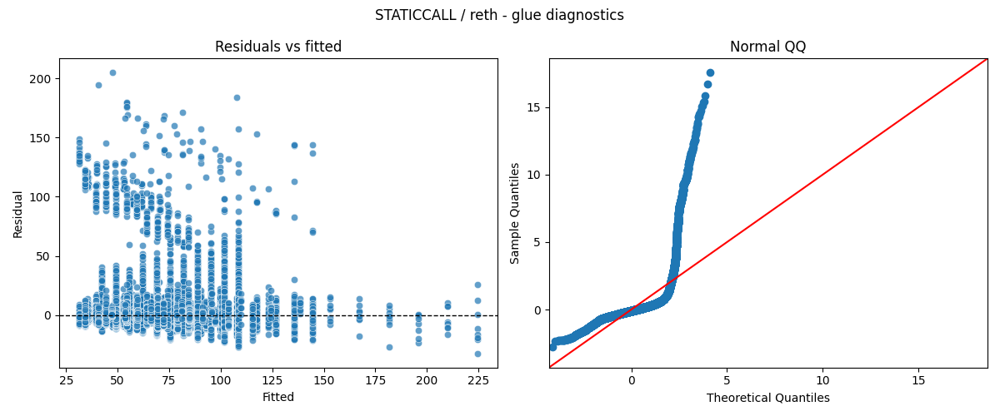

</details>

### Pure glue · reth

<details><summary><code>ISZERO</code> · nobs=935 · runtime_ms=1.732e-06 · p=1.00e-03 · R²=0.9281</summary>

```
==============================================================================
                           NNLS Regression Results                            
==============================================================================
Dep. Variable:          test_runtime_ms              R-squared:          0.928
Model:                  NNLS                    Adj. R-squared:          0.928
No. Observations:       935                               RMSE:          10.16
Df Residuals:           933                                MAE:           7.95
Df Model:               1      
==============================================================================
                      coef     std err     P-value      [0.025      0.975]
------------------------------------------------------------------------------
         const     17.6736      0.8007       0.001     16.1240     19.2776
        ISZERO      0.0000      0.0000       0.001      0.0000      0.0000
==============================================================================
Notes: Non-negative least squares with bootstrap inference (1000 iterations)
==============================================================================
```

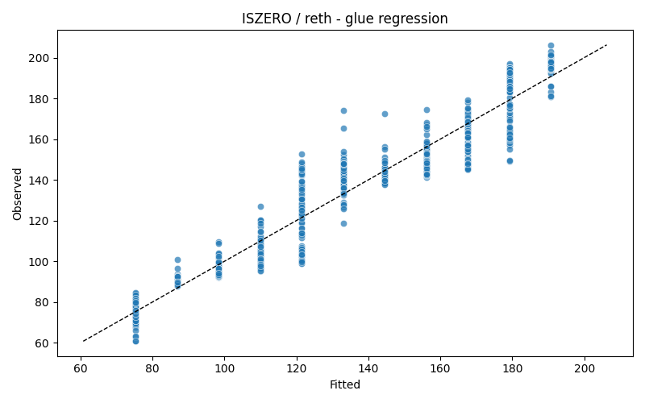

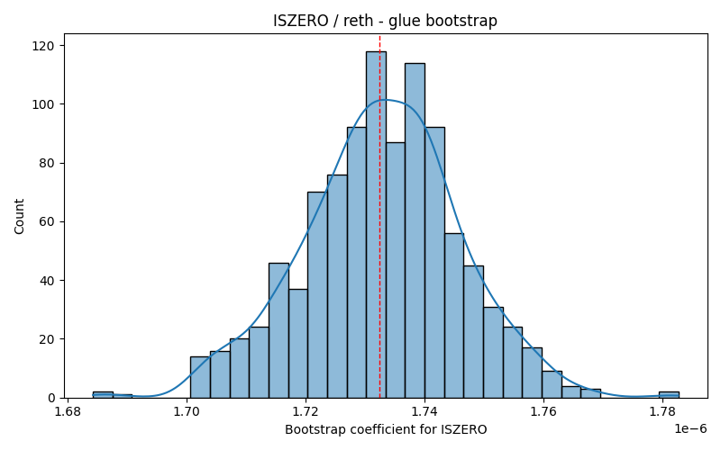

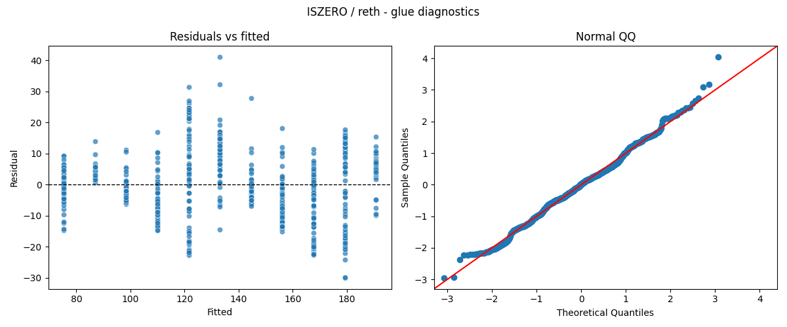

</details>

<details><summary><code>JUMPDEST</code> · nobs=935 · runtime_ms=5.288e-07 · p=1.00e-03 · R²=0.9642</summary>

```
==============================================================================
                           NNLS Regression Results                            
==============================================================================
Dep. Variable:          test_runtime_ms              R-squared:          0.964
Model:                  NNLS                    Adj. R-squared:          0.964
No. Observations:       935                               RMSE:           6.44
Df Residuals:           933                                MAE:           5.01
Df Model:               1      
==============================================================================
                      coef     std err     P-value      [0.025      0.975]
------------------------------------------------------------------------------
         const      5.0191      0.6056       0.001      3.9290      6.2694
      JUMPDEST      0.0000      0.0000       0.001      0.0000      0.0000
==============================================================================
Notes: Non-negative least squares with bootstrap inference (1000 iterations)
==============================================================================
```

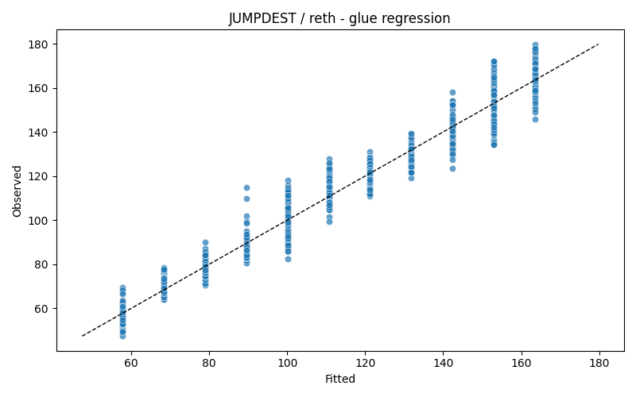

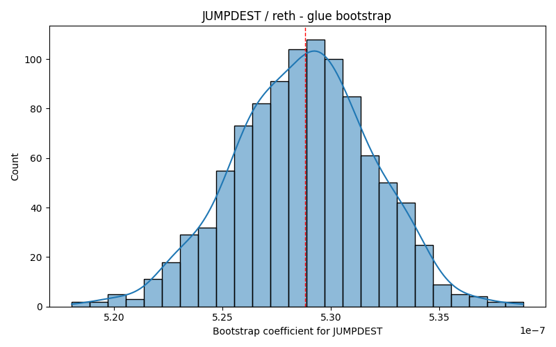


</details>

<details><summary><code>SWAP</code> · nobs=14960 · runtime_ms=6.168e-07 · p=1.00e-03 · R²=0.6063</summary>

```
==============================================================================
                           NNLS Regression Results                            
==============================================================================
Dep. Variable:          test_runtime_ms              R-squared:          0.606
Model:                  NNLS                    Adj. R-squared:          0.606
No. Observations:       14960                             RMSE:          10.47
Df Residuals:           14958                              MAE:           3.67
Df Model:               1      
==============================================================================
                      coef     std err     P-value      [0.025      0.975]
------------------------------------------------------------------------------
         const      9.6802      0.3076       0.001      9.0909     10.3331
          SWAP      0.0000      0.0000       0.001      0.0000      0.0000
==============================================================================
Notes: Non-negative least squares with bootstrap inference (1000 iterations)
==============================================================================
```

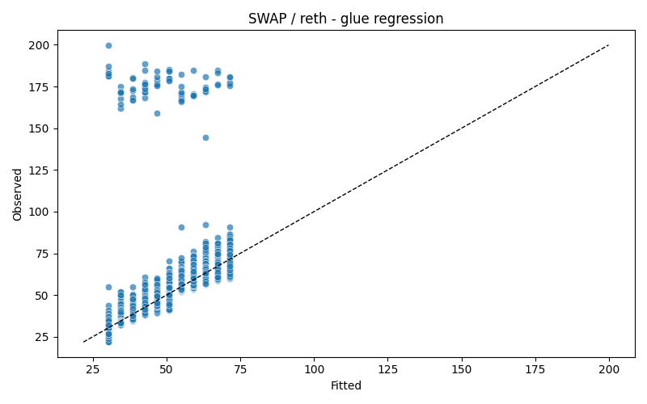

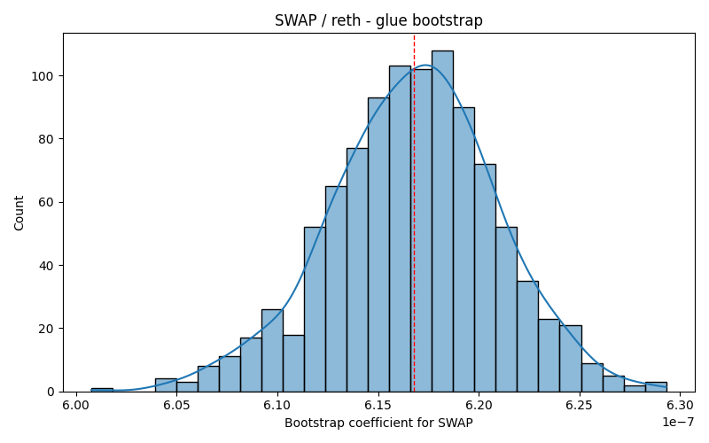

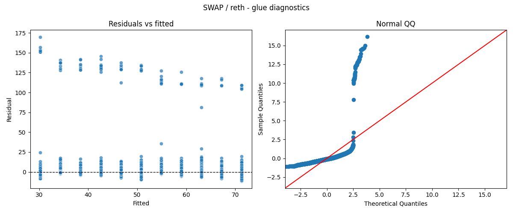

</details>

### Mixed glue (tier A) · reth

<details><summary><code>ADD</code> · nobs=935 · runtime_ms=1.476e-06 · p=1.00e-03 · R²=0.9388</summary>

```
==============================================================================
                           NNLS Regression Results                            
==============================================================================
Dep. Variable:          test_runtime_ms              R-squared:          0.939
Model:                  NNLS                    Adj. R-squared:          0.939
No. Observations:       935                               RMSE:           3.97
Df Residuals:           933                                MAE:           3.03
Df Model:               1      
==============================================================================
                      coef     std err     P-value      [0.025      0.975]
------------------------------------------------------------------------------
         const      7.6612      0.3559       0.001      6.9888      8.3591
           ADD      0.0000      0.0000       0.001      0.0000      0.0000
==============================================================================
Notes: Non-negative least squares with bootstrap inference (1000 iterations)
==============================================================================
```

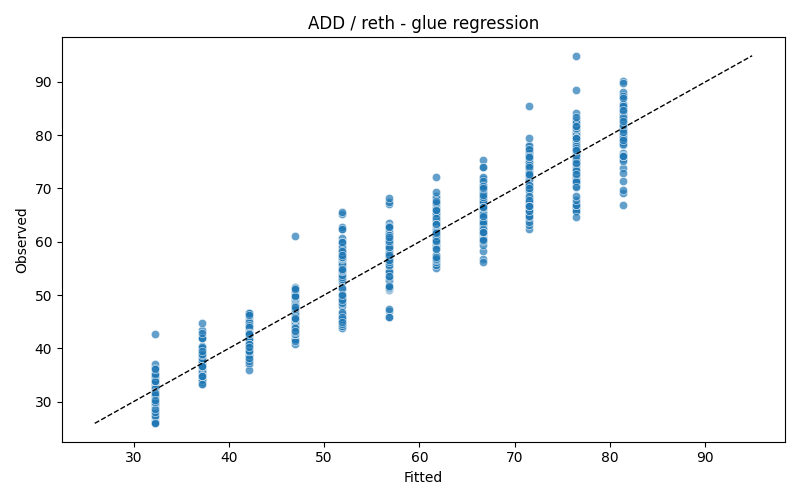

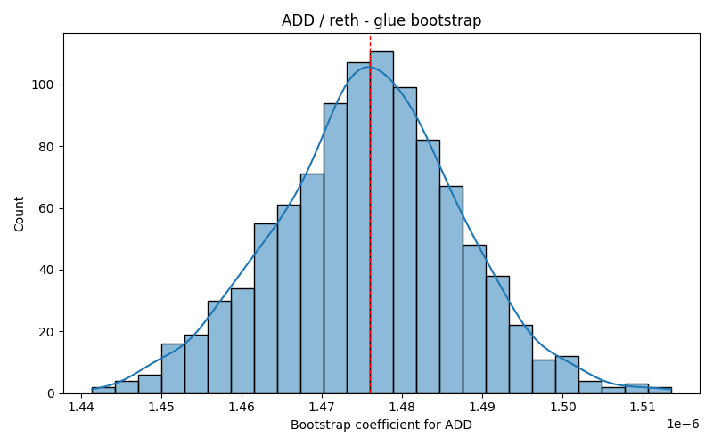

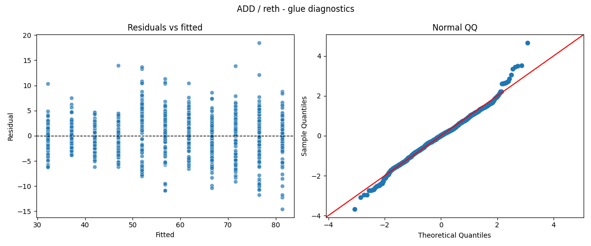

</details>

<details><summary><code>AND</code> · nobs=935 · runtime_ms=1.415e-06 · p=1.00e-03 · R²=0.9243</summary>

```
==============================================================================
                           NNLS Regression Results                            
==============================================================================
Dep. Variable:          test_runtime_ms              R-squared:          0.924
Model:                  NNLS                    Adj. R-squared:          0.924
No. Observations:       935                               RMSE:           4.26
Df Residuals:           933                                MAE:           3.19
Df Model:               1      
==============================================================================
                      coef     std err     P-value      [0.025      0.975]
------------------------------------------------------------------------------
         const      6.3904      0.4096       0.001      5.6235      7.1909
           AND      0.0000      0.0000       0.001      0.0000      0.0000
==============================================================================
Notes: Non-negative least squares with bootstrap inference (1000 iterations)
==============================================================================
```

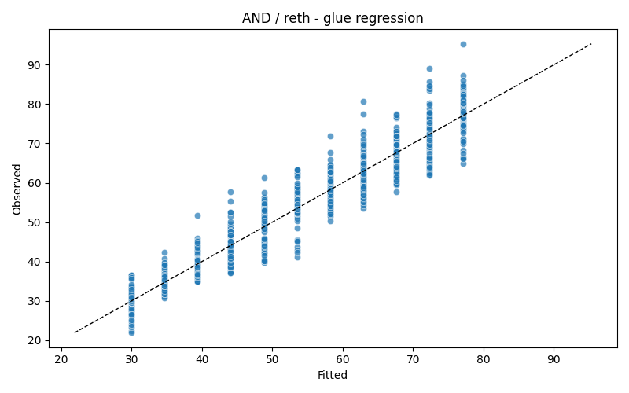

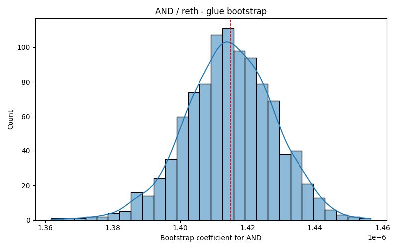

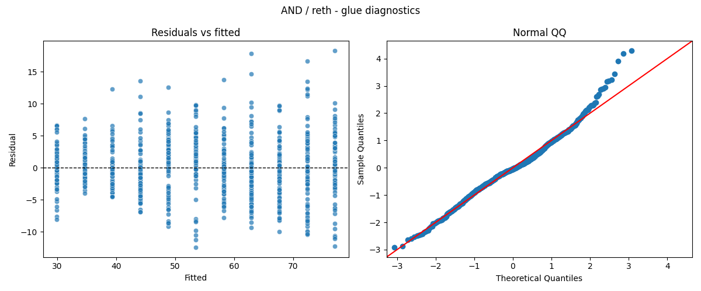

</details>

<details><summary><code>CALLDATACOPY</code> · nobs=22440 · runtime_ms=4.242e-06 · p=1.00e-03 · R²=0.9117</summary>

```
==============================================================================
                           NNLS Regression Results                            
==============================================================================
Dep. Variable:          test_runtime_ms              R-squared:          0.912
Model:                  NNLS                    Adj. R-squared:          0.912
No. Observations:       22440                             RMSE:           9.93
Df Residuals:           22438                              MAE:           7.58
Df Model:               1      
==============================================================================
                      coef     std err     P-value      [0.025      0.975]
------------------------------------------------------------------------------
         const     15.3809      0.0716       0.001     15.2400     15.5206
  CALLDATACOPY      0.0000      0.0000       0.001      0.0000      0.0000
==============================================================================
Notes: Non-negative least squares with bootstrap inference (1000 iterations)
==============================================================================
```

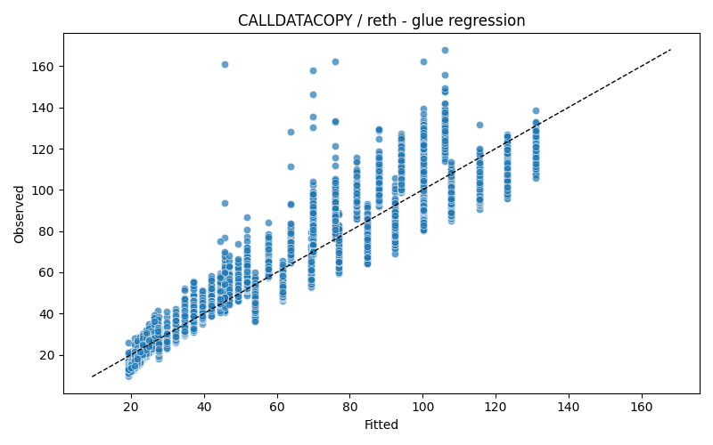

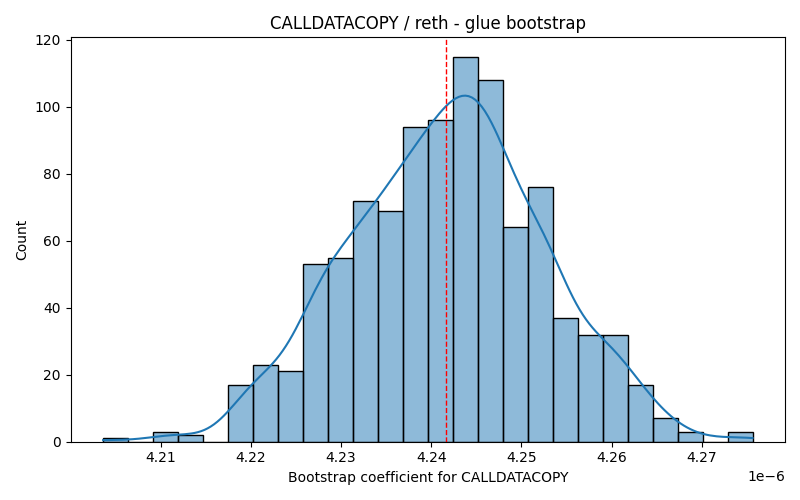

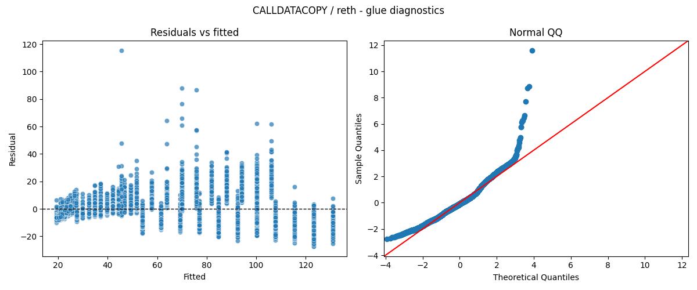

</details>

<details><summary><code>CALLDATALOAD</code> · nobs=3740 · runtime_ms=0 · p=1.00e+00 · R²=0</summary>

```
==============================================================================
                           NNLS Regression Results                            
==============================================================================
Dep. Variable:          test_runtime_ms              R-squared:          0.000
Model:                  NNLS                    Adj. R-squared:         -0.000
No. Observations:       3740                              RMSE:           2.89
Df Residuals:           3738                               MAE:           2.71
Df Model:               1      
==============================================================================
                      coef     std err     P-value      [0.025      0.975]
------------------------------------------------------------------------------
         const      4.6470      0.0558       0.001      4.5255      4.7512
  CALLDATALOAD      0.0000      0.0000       1.000      0.0000      0.0000
==============================================================================
Notes: Non-negative least squares with bootstrap inference (1000 iterations)
==============================================================================
```

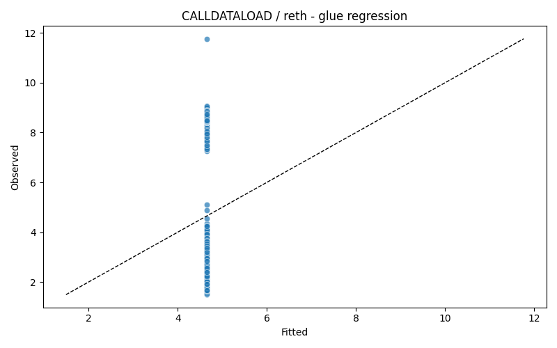

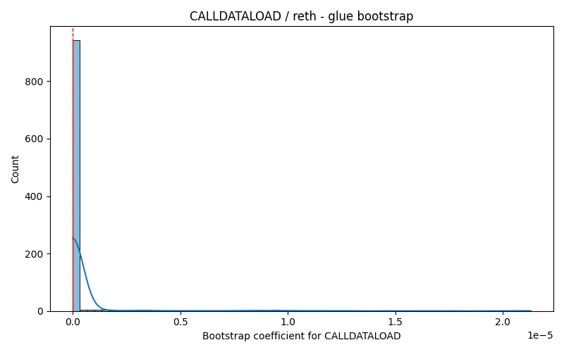

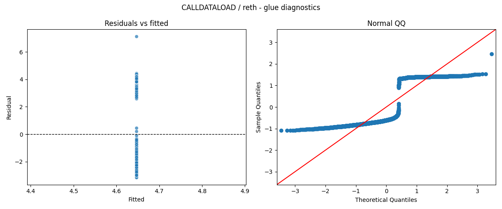

</details>

<details><summary><code>DIV</code> · nobs=935 · runtime_ms=1.066e-05 · p=1.00e-03 · R²=0.9474</summary>

```
==============================================================================
                           NNLS Regression Results                            
==============================================================================
Dep. Variable:          test_runtime_ms              R-squared:          0.947
Model:                  NNLS                    Adj. R-squared:          0.947
No. Observations:       935                               RMSE:          19.85
Df Residuals:           933                                MAE:          15.29
Df Model:               1      
==============================================================================
                      coef     std err     P-value      [0.025      0.975]
------------------------------------------------------------------------------
         const     32.8970      1.9549       0.001     29.1699     36.7929
           DIV      0.0000      0.0000       0.001      0.0000      0.0000
==============================================================================
Notes: Non-negative least squares with bootstrap inference (1000 iterations)
==============================================================================
```

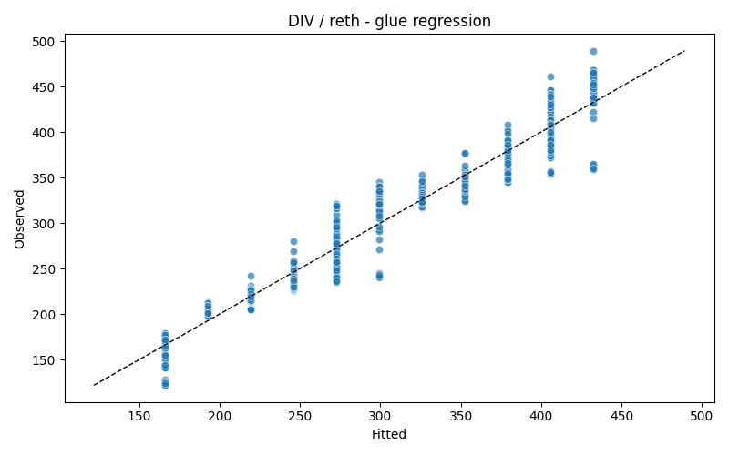

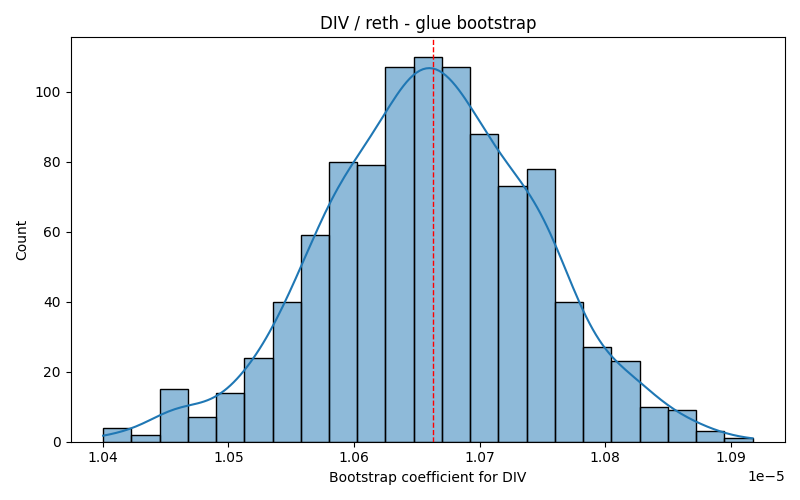

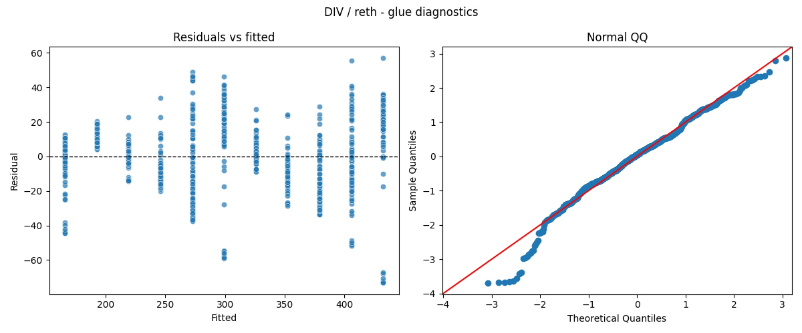

</details>

<details><summary><code>EXP</code> · nobs=935 · runtime_ms=0.0006836 · p=1.00e-03 · R²=0.9597</summary>

```
==============================================================================
                           NNLS Regression Results                            
==============================================================================
Dep. Variable:          test_runtime_ms              R-squared:          0.960
Model:                  NNLS                    Adj. R-squared:          0.960
No. Observations:       935                               RMSE:           5.49
Df Residuals:           933                                MAE:           4.11
Df Model:               1      
==============================================================================
                      coef     std err     P-value      [0.025      0.975]
------------------------------------------------------------------------------
         const      7.3236      0.5298       0.001      6.2709      8.3470
           EXP      0.0007      0.0000       0.001      0.0007      0.0007
==============================================================================
Notes: Non-negative least squares with bootstrap inference (1000 iterations)
==============================================================================
```

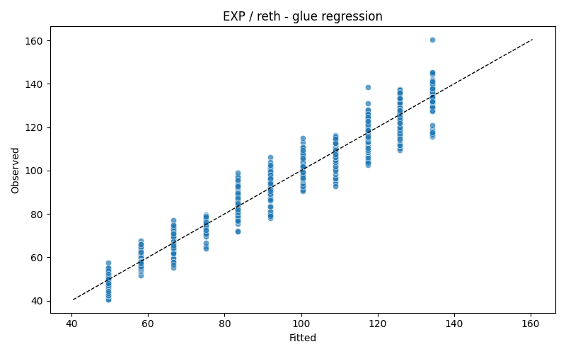

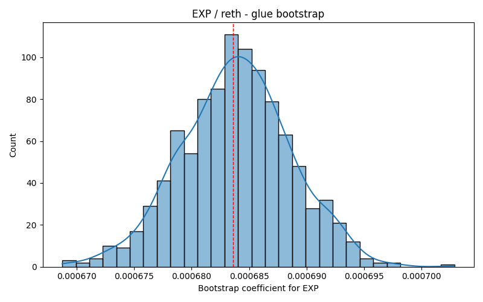

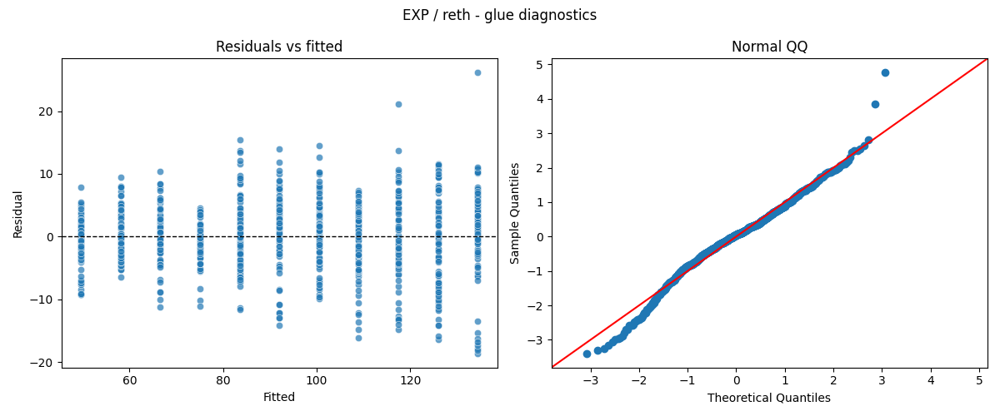

</details>

<details><summary><code>GT</code> · nobs=935 · runtime_ms=1.557e-06 · p=1.00e-03 · R²=0.9483</summary>

```
==============================================================================
                           NNLS Regression Results                            
==============================================================================
Dep. Variable:          test_runtime_ms              R-squared:          0.948
Model:                  NNLS                    Adj. R-squared:          0.948
No. Observations:       935                               RMSE:           3.83
Df Residuals:           933                                MAE:           2.90
Df Model:               1      
==============================================================================
                      coef     std err     P-value      [0.025      0.975]
------------------------------------------------------------------------------
         const      8.3544      0.3934       0.001      7.5860      9.1581
            GT      0.0000      0.0000       0.001      0.0000      0.0000
==============================================================================
Notes: Non-negative least squares with bootstrap inference (1000 iterations)
==============================================================================
```

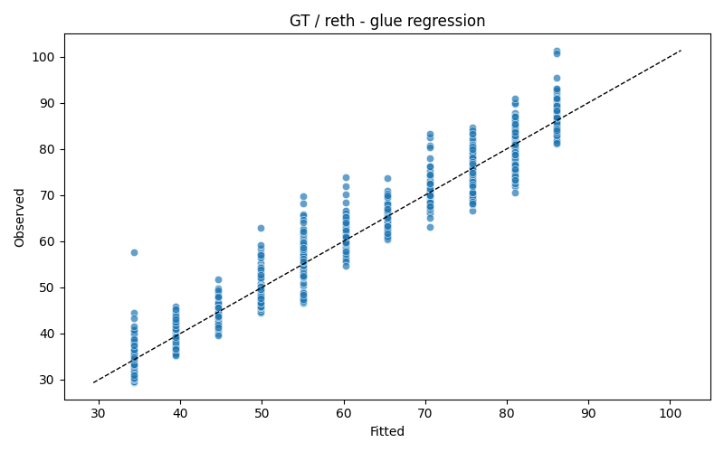

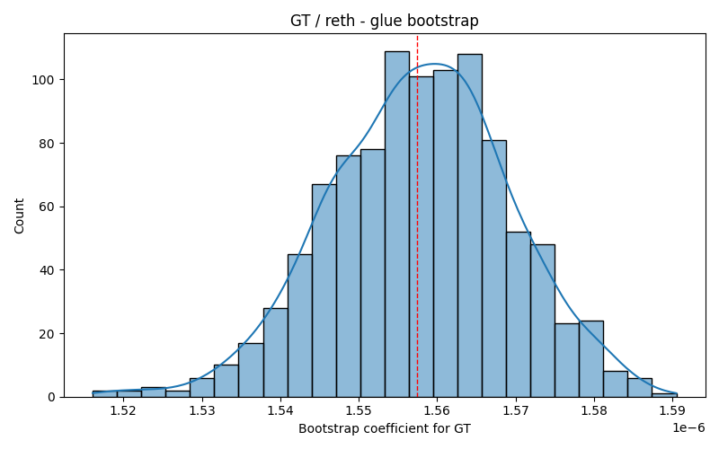

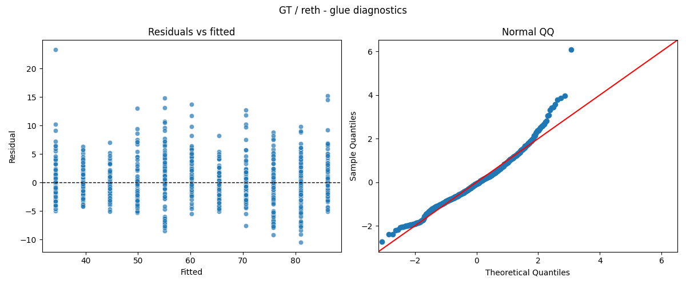

</details>

<details><summary><code>JUMPI</code> · nobs=935 · runtime_ms=2.258e-06 · p=1.00e-03 · R²=0.9359</summary>

```
==============================================================================
                           NNLS Regression Results                            
==============================================================================
Dep. Variable:          test_runtime_ms              R-squared:          0.936
Model:                  NNLS                    Adj. R-squared:          0.936
No. Observations:       935                               RMSE:           2.67
Df Residuals:           933                                MAE:           2.06
Df Model:               1      
==============================================================================
                      coef     std err     P-value      [0.025      0.975]
------------------------------------------------------------------------------
         const      6.3129      0.2669       0.001      5.8026      6.8474
         JUMPI      0.0000      0.0000       0.001      0.0000      0.0000
==============================================================================
Notes: Non-negative least squares with bootstrap inference (1000 iterations)
==============================================================================
```

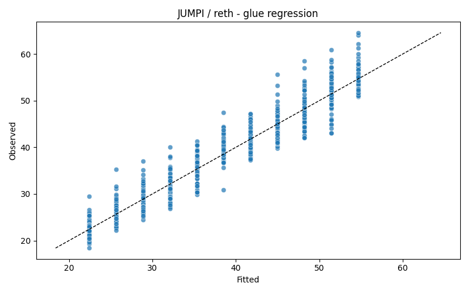

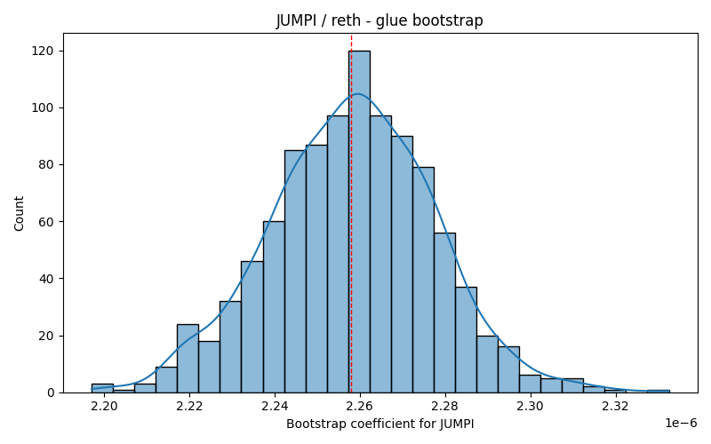

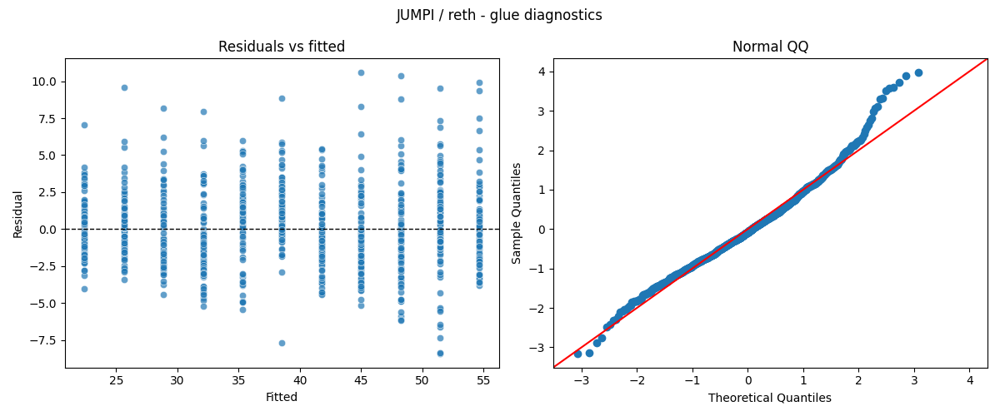

</details>

<details><summary><code>LT</code> · nobs=935 · runtime_ms=3.076e-06 · p=1.00e-03 · R²=0.6899</summary>

```
==============================================================================
                           NNLS Regression Results                            
==============================================================================
Dep. Variable:          test_runtime_ms              R-squared:          0.690
Model:                  NNLS                    Adj. R-squared:          0.690
No. Observations:       935                               RMSE:          22.31
Df Residuals:           933                                MAE:          18.41
Df Model:               1      
==============================================================================
                      coef     std err     P-value      [0.025      0.975]
------------------------------------------------------------------------------
         const      0.0000      0.3920       1.000      0.0000      1.3850
            LT      0.0000      0.0000       0.001      0.0000      0.0000
==============================================================================
Notes: Non-negative least squares with bootstrap inference (1000 iterations)
==============================================================================
```

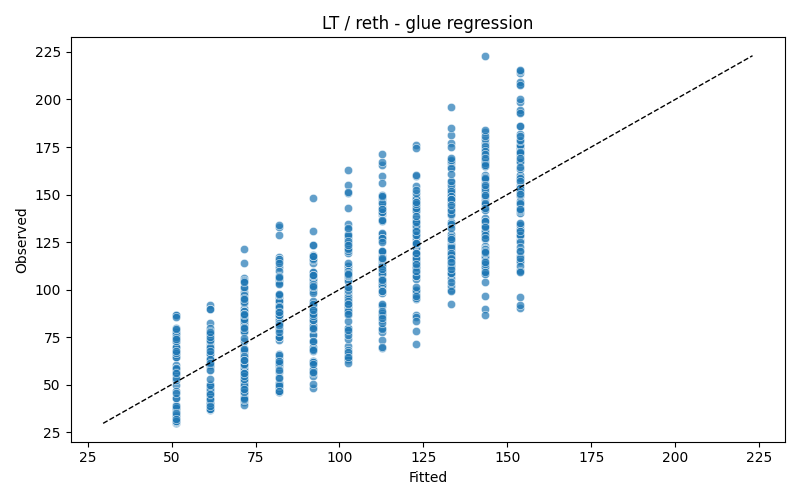

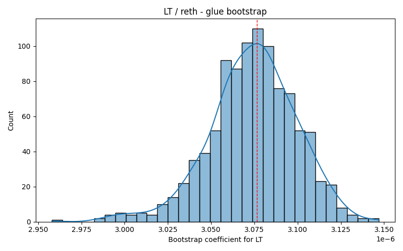

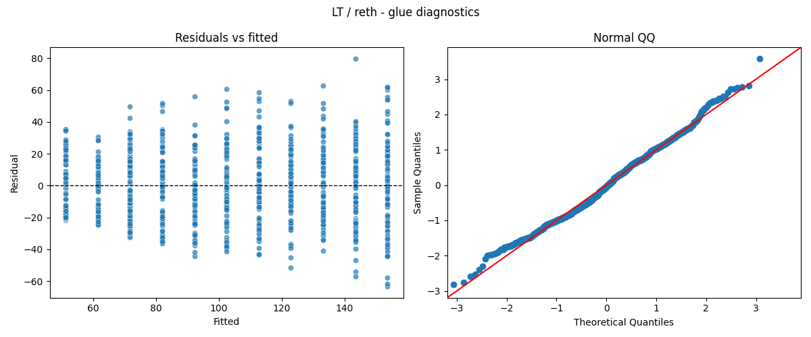

</details>

<details><summary><code>MSTORE</code> · nobs=4675 · runtime_ms=3.653e-06 · p=1.00e-03 · R²=0.3992</summary>

```
==============================================================================
                           NNLS Regression Results                            
==============================================================================
Dep. Variable:          test_runtime_ms              R-squared:          0.399
Model:                  NNLS                    Adj. R-squared:          0.399
No. Observations:       4675                              RMSE:          31.46
Df Residuals:           4673                               MAE:          28.86
Df Model:               1      
==============================================================================
                      coef     std err     P-value      [0.025      0.975]
------------------------------------------------------------------------------
         const     15.2895      1.2789       0.001     12.8469     17.8194
        MSTORE      0.0000      0.0000       0.001      0.0000      0.0000
==============================================================================
Notes: Non-negative least squares with bootstrap inference (1000 iterations)
==============================================================================
```

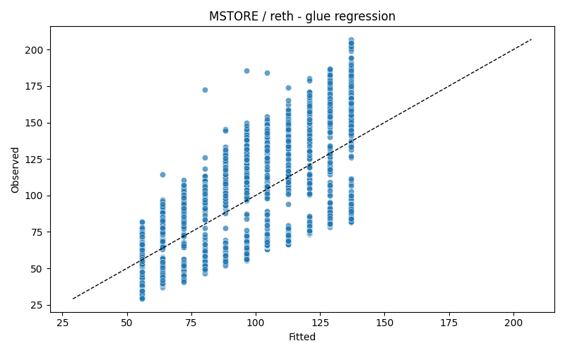

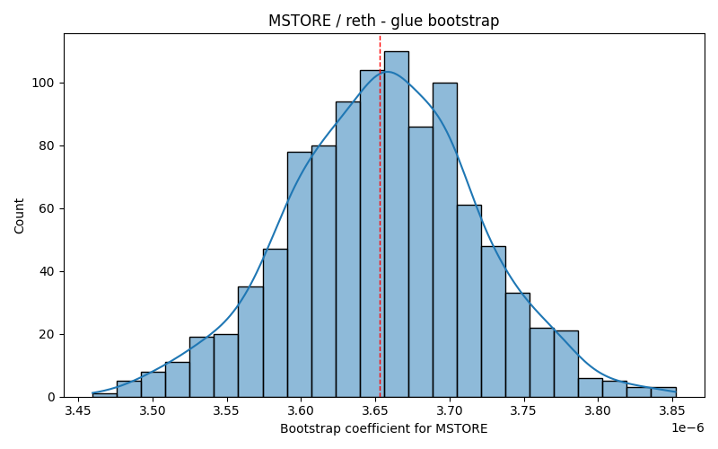

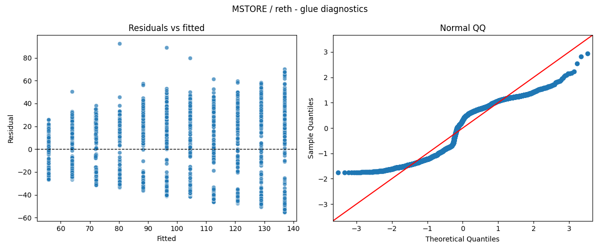

</details>

<details><summary><code>MSTORE8</code> · nobs=4675 · runtime_ms=2.186e-06 · p=1.00e-03 · R²=0.9251</summary>

```
==============================================================================
                           NNLS Regression Results                            
==============================================================================
Dep. Variable:          test_runtime_ms              R-squared:          0.925
Model:                  NNLS                    Adj. R-squared:          0.925
No. Observations:       4675                              RMSE:           4.37
Df Residuals:           4673                               MAE:           2.43
Df Model:               1      
==============================================================================
                      coef     std err     P-value      [0.025      0.975]
------------------------------------------------------------------------------
         const      8.1878      0.2205       0.001      7.7532      8.6322
       MSTORE8      0.0000      0.0000       0.001      0.0000      0.0000
==============================================================================
Notes: Non-negative least squares with bootstrap inference (1000 iterations)
==============================================================================
```

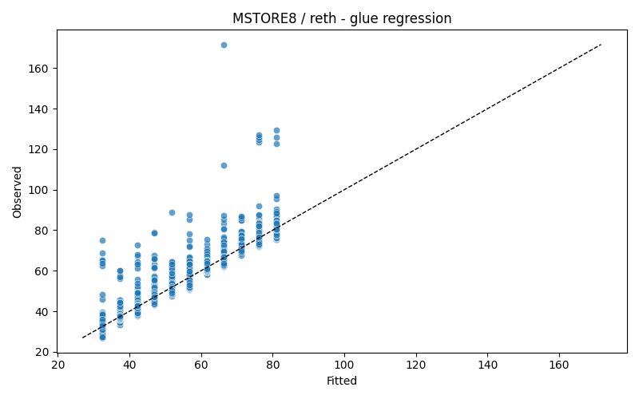

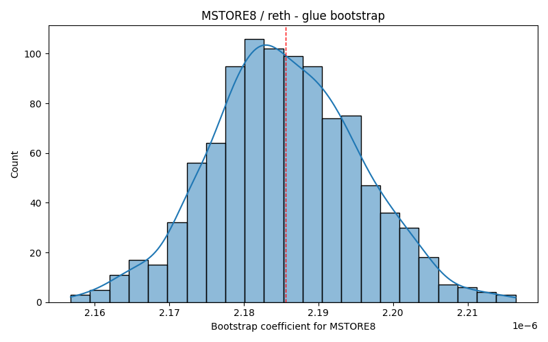

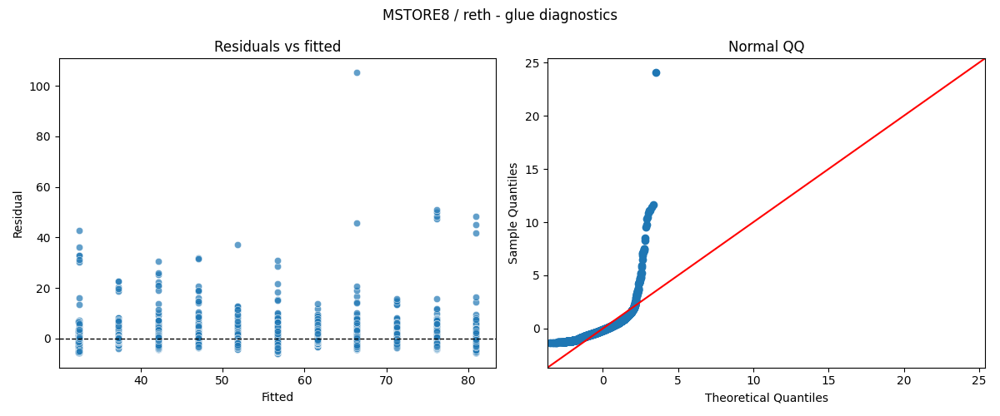

</details>

<details><summary><code>MUL</code> · nobs=935 · runtime_ms=2.267e-06 · p=1.00e-03 · R²=0.9438</summary>

```
==============================================================================
                           NNLS Regression Results                            
==============================================================================
Dep. Variable:          test_runtime_ms              R-squared:          0.944
Model:                  NNLS                    Adj. R-squared:          0.944
No. Observations:       935                               RMSE:           4.37
Df Residuals:           933                                MAE:           3.23
Df Model:               1      
==============================================================================
                      coef     std err     P-value      [0.025      0.975]
------------------------------------------------------------------------------
         const      7.9769      0.4318       0.001      7.1168      8.8649
           MUL      0.0000      0.0000       0.001      0.0000      0.0000
==============================================================================
Notes: Non-negative least squares with bootstrap inference (1000 iterations)
==============================================================================
```

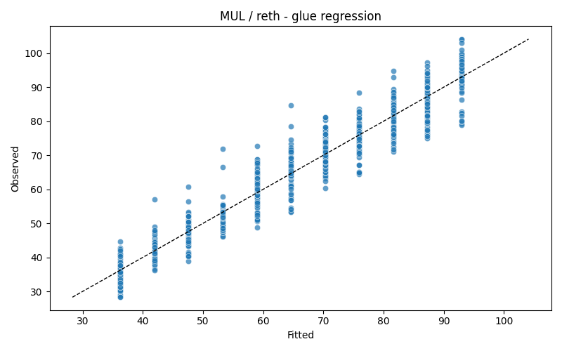

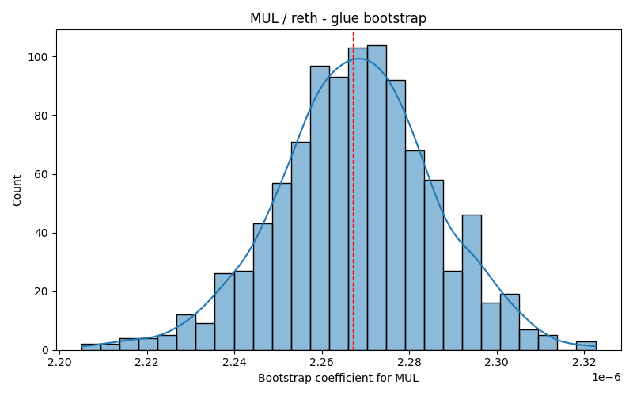

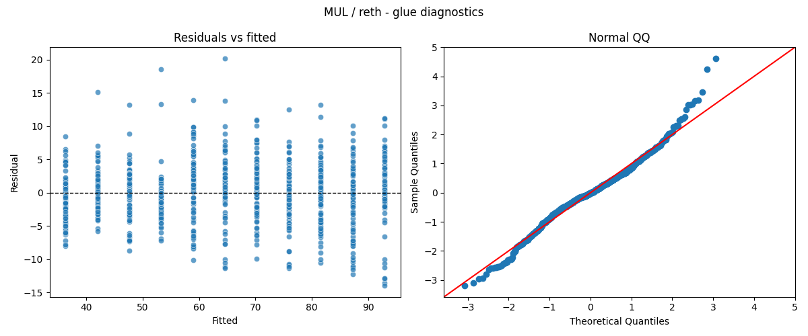

</details>

<details><summary><code>PC</code> · nobs=935 · runtime_ms=9.372e-07 · p=1.00e-03 · R²=0.6961</summary>

```
==============================================================================
                           NNLS Regression Results                            
==============================================================================
Dep. Variable:          test_runtime_ms              R-squared:          0.696
Model:                  NNLS                    Adj. R-squared:          0.696
No. Observations:       935                               RMSE:          18.52
Df Residuals:           933                                MAE:           6.49
Df Model:               1      
==============================================================================
                      coef     std err     P-value      [0.025      0.975]
------------------------------------------------------------------------------
         const     12.6861      2.3049       0.001      8.8111     17.9592
            PC      0.0000      0.0000       0.001      0.0000      0.0000
==============================================================================
Notes: Non-negative least squares with bootstrap inference (1000 iterations)
==============================================================================
```

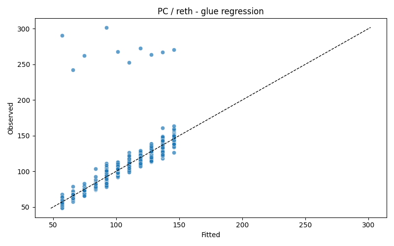

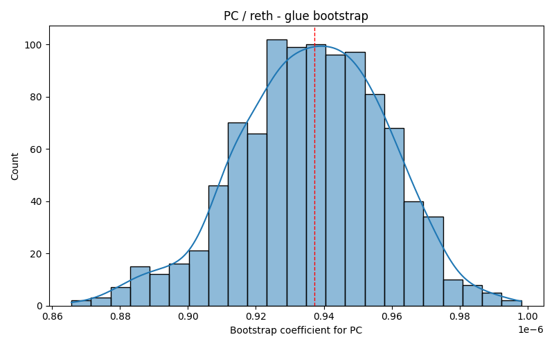

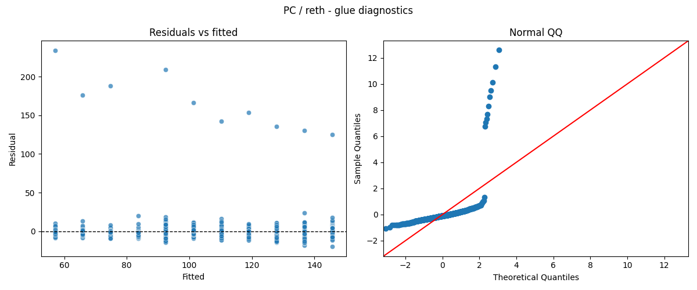

</details>

<details><summary><code>RETURNDATASIZE</code> · nobs=3740 · runtime_ms=1.398e-06 · p=1.00e-03 · R²=0.9507</summary>

```
==============================================================================
                           NNLS Regression Results                            
==============================================================================
Dep. Variable:          test_runtime_ms              R-squared:          0.951
Model:                  NNLS                    Adj. R-squared:          0.951
No. Observations:       3740                              RMSE:           5.03
Df Residuals:           3738                               MAE:           3.87
Df Model:               1      
==============================================================================
                      coef     std err     P-value      [0.025      0.975]
------------------------------------------------------------------------------
         const      7.2212      0.2409       0.001      6.7785      7.6986
RETURNDATASIZE      0.0000      0.0000       0.001      0.0000      0.0000
==============================================================================
Notes: Non-negative least squares with bootstrap inference (1000 iterations)
==============================================================================
```

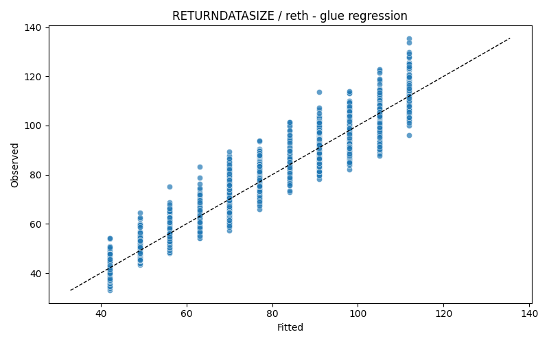

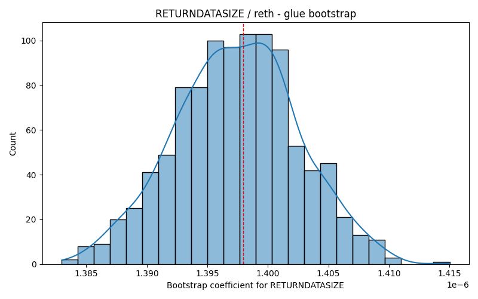

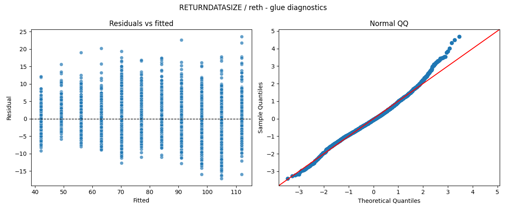

</details>

<details><summary><code>SELFBALANCE</code> · nobs=935 · runtime_ms=8.162e-06 · p=1.00e-03 · R²=0.9603</summary>

```
==============================================================================
                           NNLS Regression Results                            
==============================================================================
Dep. Variable:          test_runtime_ms              R-squared:          0.960
Model:                  NNLS                    Adj. R-squared:          0.960
No. Observations:       935                               RMSE:          20.51
Df Residuals:           933                                MAE:          14.74
Df Model:               1      
==============================================================================
                      coef     std err     P-value      [0.025      0.975]
------------------------------------------------------------------------------
         const     25.3203      2.0149       0.001     21.6055     29.4903
   SELFBALANCE      0.0000      0.0000       0.001      0.0000      0.0000
==============================================================================
Notes: Non-negative least squares with bootstrap inference (1000 iterations)
==============================================================================
```

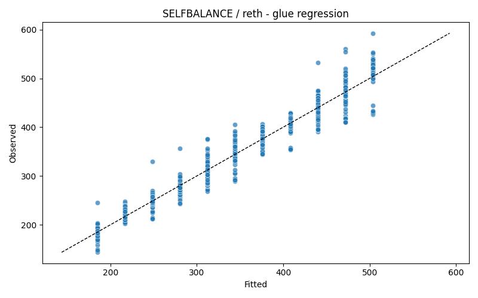

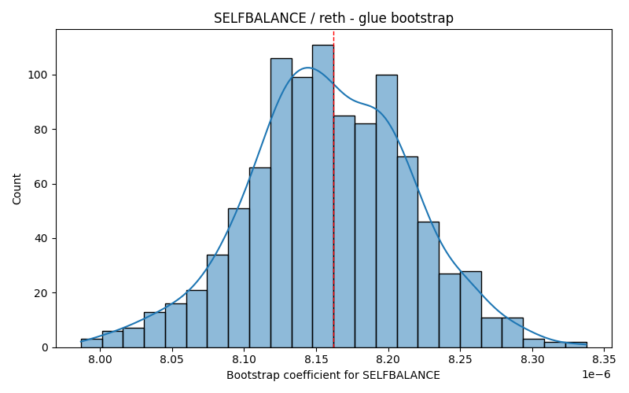

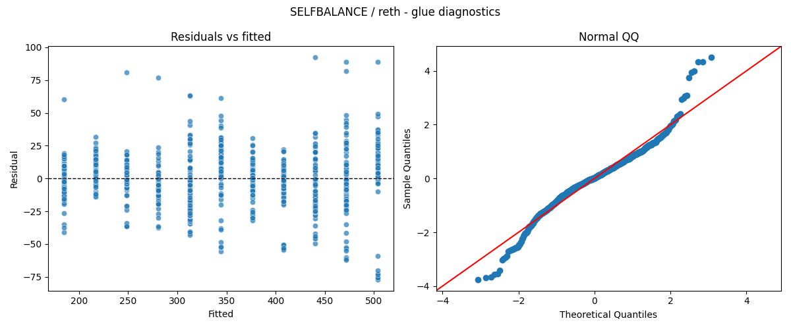

</details>

<details><summary><code>SUB</code> · nobs=935 · runtime_ms=1.577e-06 · p=1.00e-03 · R²=0.932</summary>

```
==============================================================================
                           NNLS Regression Results                            
==============================================================================
Dep. Variable:          test_runtime_ms              R-squared:          0.932
Model:                  NNLS                    Adj. R-squared:          0.932
No. Observations:       935                               RMSE:           4.48
Df Residuals:           933                                MAE:           3.31
Df Model:               1      
==============================================================================
                      coef     std err     P-value      [0.025      0.975]
------------------------------------------------------------------------------
         const      7.5881      0.4325       0.001      6.7580      8.4409
           SUB      0.0000      0.0000       0.001      0.0000      0.0000
==============================================================================
Notes: Non-negative least squares with bootstrap inference (1000 iterations)
==============================================================================
```

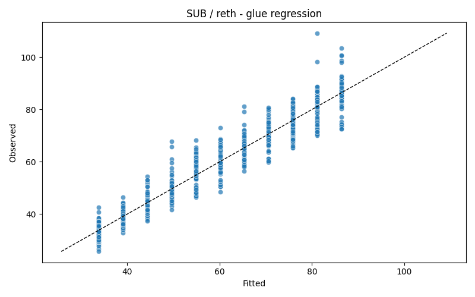

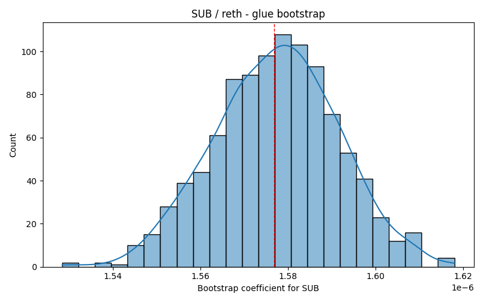

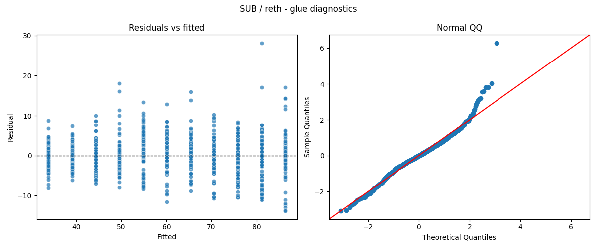

</details>

### Mixed glue (tier B) · reth

<details><summary><code>JUMP</code> · nobs=935 · runtime_ms=4.242e-06 · p=1.00e-03 · R²=0.9527</summary>

```
==============================================================================
                           NNLS Regression Results                            
==============================================================================
Dep. Variable:          test_runtime_ms              R-squared:          0.953
Model:                  NNLS                    Adj. R-squared:          0.953
No. Observations:       935                               RMSE:           3.51
Df Residuals:           933                                MAE:           2.68
Df Model:               1      
==============================================================================
                      coef     std err     P-value      [0.025      0.975]
------------------------------------------------------------------------------
         const      7.6496      0.3451       0.001      6.9763      8.3435
          JUMP      0.0000      0.0000       0.001      0.0000      0.0000
==============================================================================
Notes: Non-negative least squares with bootstrap inference (1000 iterations)
==============================================================================
```

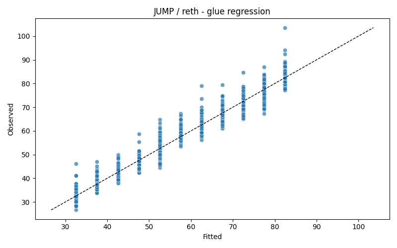

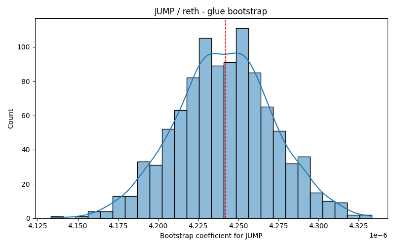

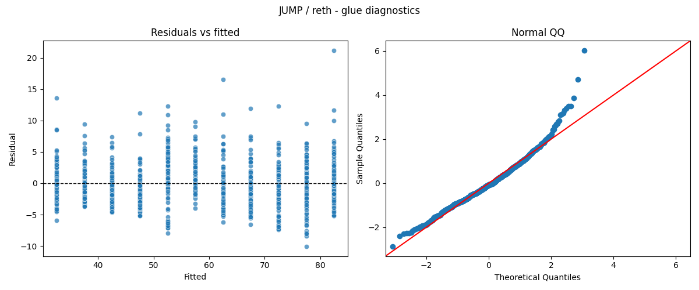

</details>

<details><summary><code>KECCAK256</code> · nobs=14960 · runtime_ms=0 · p=1.00e+00 · R²=-2.22e-16</summary>

```
==============================================================================
                           NNLS Regression Results                            
==============================================================================
Dep. Variable:          test_runtime_ms              R-squared:         -0.000
Model:                  NNLS                    Adj. R-squared:         -0.000
No. Observations:       14960                             RMSE:         297.59
Df Residuals:           14958                              MAE:         246.60
Df Model:               1      
==============================================================================
                      coef     std err     P-value      [0.025      0.975]
------------------------------------------------------------------------------
         const    437.3416      2.4052       0.001    432.4886    441.9726
     KECCAK256      0.0000      0.0000       1.000      0.0000      0.0000
==============================================================================
Notes: Non-negative least squares with bootstrap inference (1000 iterations)
==============================================================================
```

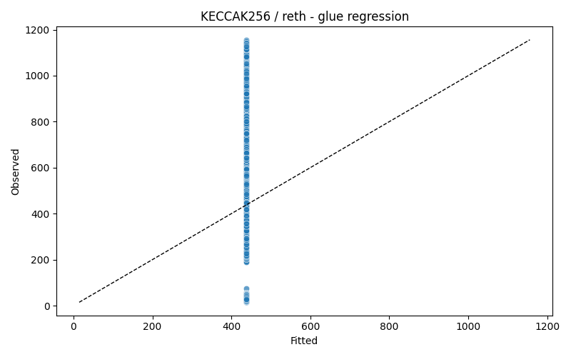


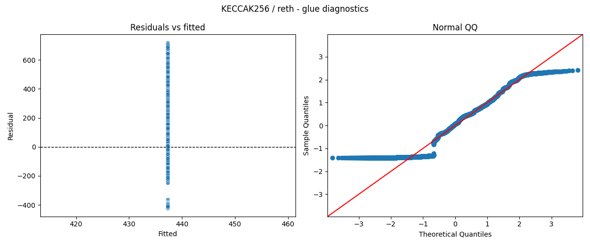

</details>
